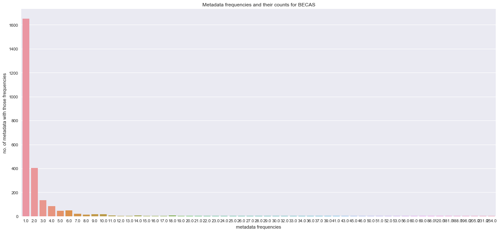
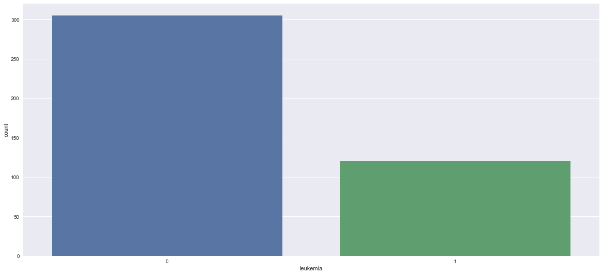
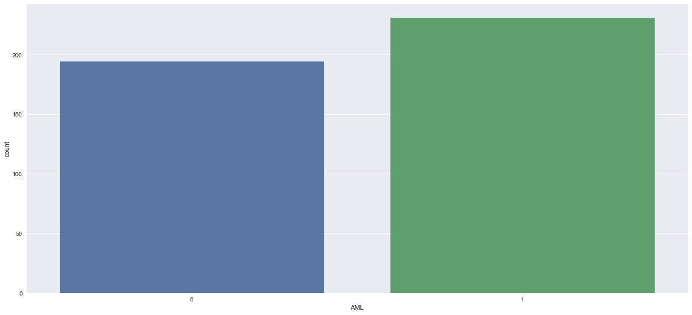
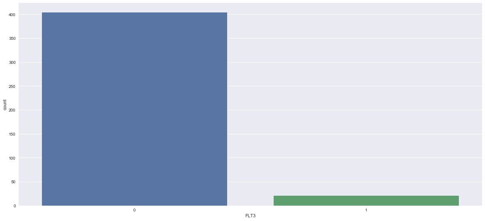
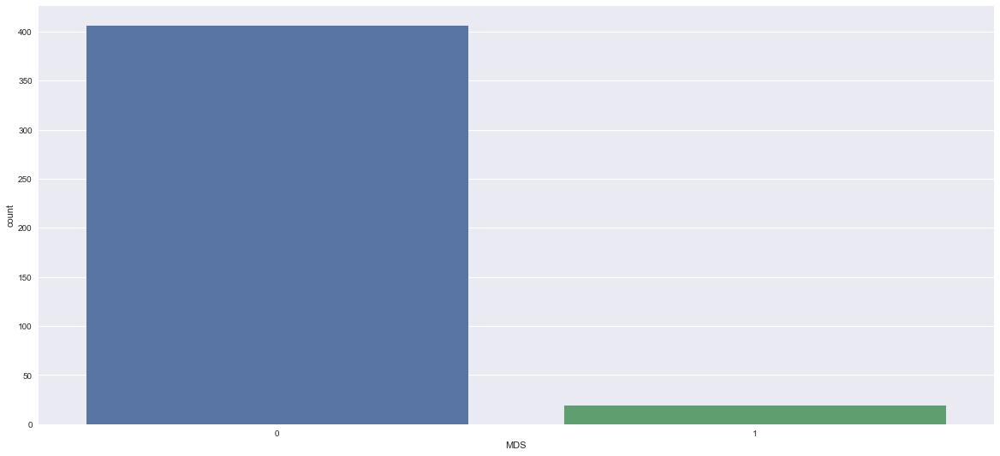
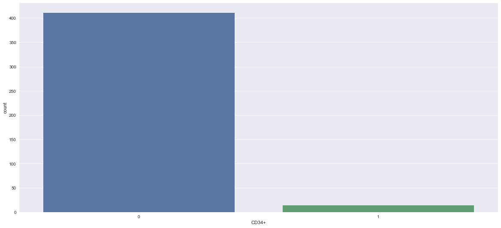
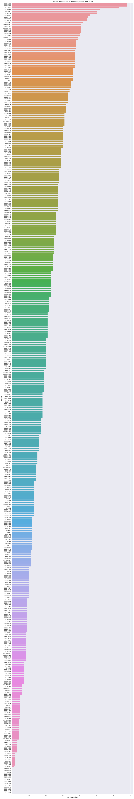

### Importing libraries


```python
import requests
from html.parser import HTMLParser
from bs4 import BeautifulSoup
import pandas as pd
import numpy as np
#from itertools import chain
GEO_URL = "http://www.ncbi.nlm.nih.gov/geo/query/acc.cgi?acc="
import becas
import pickle
```
### Get summary from Geo Database


```python
def get_summary_and_title(gse_id):
    url = GEO_URL + gse_id
   
    page = requests.get(url)
    soup = BeautifulSoup(page.text, "html.parser")
    title = soup.find("td", text="Title").find_next_sibling("td").text
    # pltfm_org = soup.find("td ", text="Platform organism").find_next_sibling("td").text
    # sample_org = soup.find("td", text="Sample organism").find_next_sibling("td").text
    exp_type = soup.find("td", text="Experiment type").find_next_sibling("td").text
    abstract = soup.find("td", text="Summary").find_next_sibling("td").text

    dataset_meta = {'gse_id': gse_id, 'title': title, 'exp_type': exp_type, 'abstract': abstract}
    return(dataset_meta)
```
### Reading the data


```python
aml_microarray_geoids = pd.read_csv('GEO_AML_Microarray.csv')
```

```python
aml_microarray_geoids
```


<div>
<style>
    .dataframe thead tr:only-child th {
        text-align: right;
    }

    .dataframe thead th {
        text-align: left;
    }

    .dataframe tbody tr th {
        vertical-align: top;
    }
</style>
<table border="1" class="dataframe">
  <thead>
    <tr style="text-align: right;">
      <th></th>
      <th>Unnamed: 0</th>
      <th>exp_type</th>
      <th>abstract</th>
      <th>title</th>
      <th>gse_id</th>
    </tr>
  </thead>
  <tbody>
    <tr>
      <th>0</th>
      <td>7</td>
      <td>Expression profiling by array</td>
      <td>Hematopoietic progenitors from AML patients ex...</td>
      <td>Aryl hydrocarbon receptor antagonism allows su...</td>
      <td>GSE55242</td>
    </tr>
    <tr>
      <th>1</th>
      <td>30</td>
      <td>Expression profiling by array</td>
      <td>Homoharringtonine (HHT), a previously known pr...</td>
      <td>Homoharringtonine deregulates MYC transcriptio...</td>
      <td>GSE121175</td>
    </tr>
    <tr>
      <th>2</th>
      <td>31</td>
      <td>Expression profiling by array</td>
      <td>Many cases of acute myeloid leukemia (AML) are...</td>
      <td>RET-mediated autophagy suppression as targetab...</td>
      <td>GSE111678</td>
    </tr>
    <tr>
      <th>3</th>
      <td>35</td>
      <td>Expression profiling by array</td>
      <td>Myelodysplastic syndromes (MDS) and acute myel...</td>
      <td>Azacitidine treated AML cells reveals highly v...</td>
      <td>GSE123207</td>
    </tr>
    <tr>
      <th>4</th>
      <td>54</td>
      <td>Expression profiling by array</td>
      <td>All-trans retinoic acid (atRA) regulates gene ...</td>
      <td>Expression profiling of TNBCs following atRA t...</td>
      <td>GSE117579</td>
    </tr>
    <tr>
      <th>5</th>
      <td>56</td>
      <td>Expression profiling by array</td>
      <td>All-trans retinoic acid (atRA) regulates gene ...</td>
      <td>Expression profiling of TNBCs following atRA t...</td>
      <td>GSE118002</td>
    </tr>
    <tr>
      <th>6</th>
      <td>70</td>
      <td>Expression profiling by array</td>
      <td>While disease recurrence remains the outstandi...</td>
      <td>Cellular and Molecular Targeting of Recurrence...</td>
      <td>GSE75086</td>
    </tr>
    <tr>
      <th>7</th>
      <td>75</td>
      <td>Expression profiling by array</td>
      <td>The lysine-specific demethylase LSD1/KDM1A is ...</td>
      <td>ORY-1001/RG6016 effect on leukemia cell lines</td>
      <td>GSE94567</td>
    </tr>
    <tr>
      <th>8</th>
      <td>80</td>
      <td>Expression profiling by array</td>
      <td>Overexpression of Ecotropic Virus Integration ...</td>
      <td>EVI1 in acute myeloid leukemia triggers metabo...</td>
      <td>GSE118096</td>
    </tr>
    <tr>
      <th>9</th>
      <td>96</td>
      <td>Expression profiling by array</td>
      <td>microRNA are aberrantly expressed in acute mye...</td>
      <td>Screening microRNA-196 targets in 11q23-transl...</td>
      <td>GSE75841</td>
    </tr>
    <tr>
      <th>10</th>
      <td>101</td>
      <td>Expression profiling by array</td>
      <td>Gene expression analysis in THP-1 cells with S...</td>
      <td>Microarray analysis in acute myeloid leukemia ...</td>
      <td>GSE113610</td>
    </tr>
    <tr>
      <th>11</th>
      <td>110</td>
      <td>Expression profiling by array</td>
      <td>As part of a clinical trial of the MDM2 inhibi...</td>
      <td>Gene expression profiles of primary samples of...</td>
      <td>GSE110087</td>
    </tr>
    <tr>
      <th>12</th>
      <td>129</td>
      <td>Expression profiling by array</td>
      <td>Differentiation of hematopoietic stem cells (H...</td>
      <td>Gfi1b - A key player in genesis and maintenanc...</td>
      <td>GSE88882</td>
    </tr>
    <tr>
      <th>13</th>
      <td>166</td>
      <td>Expression profiling by array</td>
      <td>The objective of the sudy is to explore the bi...</td>
      <td>Study of gene expression following Pim2 knockd...</td>
      <td>GSE94870</td>
    </tr>
    <tr>
      <th>14</th>
      <td>177</td>
      <td>Expression profiling by array</td>
      <td>We used microarrays to evaluate the global pro...</td>
      <td>Eradiation of leukemia by effective reprogramm...</td>
      <td>GSE78739</td>
    </tr>
    <tr>
      <th>15</th>
      <td>193</td>
      <td>Expression profiling by array</td>
      <td>Myeloid sarcoma (MS) is a subform of acute mye...</td>
      <td>Gene expression data from THP-1 cells expressi...</td>
      <td>GSE103344</td>
    </tr>
    <tr>
      <th>16</th>
      <td>194</td>
      <td>Expression profiling by array</td>
      <td>To explore the function and signaling pathway ...</td>
      <td>Expression data for human acute myeloid leukem...</td>
      <td>GSE84904</td>
    </tr>
    <tr>
      <th>17</th>
      <td>199</td>
      <td>Expression profiling by array</td>
      <td>Patients relapsing with FLT3-ITD mutant acute ...</td>
      <td>Sorafenib promotes graft-versus-leukemia activ...</td>
      <td>GSE95770</td>
    </tr>
    <tr>
      <th>18</th>
      <td>206</td>
      <td>Expression profiling by array</td>
      <td>To identifying candidate genes which may assis...</td>
      <td>Gene expression profiles of CD34+ cells from p...</td>
      <td>GSE107968</td>
    </tr>
    <tr>
      <th>19</th>
      <td>207</td>
      <td>Expression profiling by array</td>
      <td>Downregulation of the hematopoietic transcript...</td>
      <td>Expression data from PU.1low URE-/- AML cell l...</td>
      <td>GSE77651</td>
    </tr>
    <tr>
      <th>20</th>
      <td>208</td>
      <td>Expression profiling by array</td>
      <td>OBJECTIVE: The microRNA miR-155 is upregulated...</td>
      <td>MicroRNA-155 is a direct target of Meis1, but ...</td>
      <td>GSE76113</td>
    </tr>
    <tr>
      <th>21</th>
      <td>209</td>
      <td>Expression profiling by array</td>
      <td>DNA methyltransferase 3A (DNMT3A) gene is muta...</td>
      <td>Differential gene expression profile in U937 c...</td>
      <td>GSE90931</td>
    </tr>
    <tr>
      <th>22</th>
      <td>212</td>
      <td>Expression profiling by array</td>
      <td>We demonstrate a promising approach to identif...</td>
      <td>A machine learning approach to integrate big d...</td>
      <td>GSE107465</td>
    </tr>
    <tr>
      <th>23</th>
      <td>215</td>
      <td>Expression profiling by array</td>
      <td>In this study, the expression profiles of the ...</td>
      <td>Oncogenic Kras synergizes with enhanced TGF-be...</td>
      <td>GSE107326</td>
    </tr>
    <tr>
      <th>24</th>
      <td>216</td>
      <td>Expression profiling by array</td>
      <td>The branched chain amino acid (BCAA) pathway a...</td>
      <td>Role of  Branched Chain Amino Acid Transaminas...</td>
      <td>GSE103960</td>
    </tr>
    <tr>
      <th>25</th>
      <td>223</td>
      <td>Expression profiling by array</td>
      <td>The branched chain amino acid (BCAA) pathway a...</td>
      <td>Role of Branched Chain Amino Acid Transaminase...</td>
      <td>GSE100778</td>
    </tr>
    <tr>
      <th>26</th>
      <td>227</td>
      <td>Expression profiling by array</td>
      <td>Acute myeloid leukemia (AML) is an aggressive ...</td>
      <td>Disease-stabilizing treatment based on all-tra...</td>
      <td>GSE106096</td>
    </tr>
    <tr>
      <th>27</th>
      <td>229</td>
      <td>Expression profiling by array</td>
      <td>Global gene expression comparison between mese...</td>
      <td>Niche targeting enhances endogenous healthy he...</td>
      <td>GSE92778</td>
    </tr>
    <tr>
      <th>28</th>
      <td>230</td>
      <td>Expression profiling by array</td>
      <td>Increasing evidence suggests that cancer arise...</td>
      <td>Sam68-mediated disruption of CBP/β-catenin ne...</td>
      <td>GSE34965</td>
    </tr>
    <tr>
      <th>29</th>
      <td>231</td>
      <td>Expression profiling by array</td>
      <td>The primary function of RUNX1 in leukemogenesi...</td>
      <td>Comparison of gene expression profiling among ...</td>
      <td>GSE98748</td>
    </tr>
    <tr>
      <th>...</th>
      <td>...</td>
      <td>...</td>
      <td>...</td>
      <td>...</td>
      <td>...</td>
    </tr>
    <tr>
      <th>395</th>
      <td>998</td>
      <td>Expression profiling by array</td>
      <td>Comparison between cell lines from 9 different...</td>
      <td>Comparison between cell lines from 9 different...</td>
      <td>GSE5949</td>
    </tr>
    <tr>
      <th>396</th>
      <td>999</td>
      <td>Expression profiling by array</td>
      <td>Comparison between cell lines from 9 different...</td>
      <td>Comparison between cell lines from 9 different...</td>
      <td>GSE5720</td>
    </tr>
    <tr>
      <th>397</th>
      <td>1001</td>
      <td>Expression profiling by array</td>
      <td>Bufalin, a natural toxin isolated from the Chi...</td>
      <td>Genomic Analysis of effect of bufalin on HL60 ...</td>
      <td>GSE6347</td>
    </tr>
    <tr>
      <th>398</th>
      <td>1002</td>
      <td>Expression profiling by array</td>
      <td>Knockdown of the transcription factor PU.1 (Sp...</td>
      <td>Essential role of Jun family transcription fac...</td>
      <td>GSE5654</td>
    </tr>
    <tr>
      <th>399</th>
      <td>1003</td>
      <td>Expression profiling by array</td>
      <td>This study compared the expression signatures ...</td>
      <td>Expression data for LMF</td>
      <td>GSE5007</td>
    </tr>
    <tr>
      <th>400</th>
      <td>1005</td>
      <td>Expression profiling by array</td>
      <td>CD133-positive immature blasts were purified f...</td>
      <td>Expression profiles in Blast Bank samples with...</td>
      <td>GSE1427</td>
    </tr>
    <tr>
      <th>401</th>
      <td>1007</td>
      <td>Expression profiling by array</td>
      <td>Background:  Moderate hypothermia (32oC for 12...</td>
      <td>The effect of moderate hypothermia on gene exp...</td>
      <td>GSE4425</td>
    </tr>
    <tr>
      <th>402</th>
      <td>1008</td>
      <td>Expression profiling by array</td>
      <td>Acute myeloid leukemia (AML) patients are prim...</td>
      <td>GEP associated with drug resistance in adult AML</td>
      <td>GSE4137</td>
    </tr>
    <tr>
      <th>403</th>
      <td>1009</td>
      <td>Expression profiling by array</td>
      <td>This data set was used to study FLT3 wild type...</td>
      <td>de novo childhood AML patients and FLT3 mutati...</td>
      <td>GSE3986</td>
    </tr>
    <tr>
      <th>404</th>
      <td>1011</td>
      <td>Expression profiling by array</td>
      <td>RNA derived from lymphoblasts from individuals...</td>
      <td>Lymphoblasts from healthy individuals vs. indi...</td>
      <td>GSE2594</td>
    </tr>
    <tr>
      <th>405</th>
      <td>1012</td>
      <td>Expression profiling by array</td>
      <td>In this series we described the gene expressio...</td>
      <td>Gene expression profiling of Acute Promyelocyt...</td>
      <td>GSE2550</td>
    </tr>
    <tr>
      <th>406</th>
      <td>1013</td>
      <td>Expression profiling by array</td>
      <td>Samples are from clones of Erythroleukemia cel...</td>
      <td>c-Myc responsive genes</td>
      <td>GSE2325</td>
    </tr>
    <tr>
      <th>407</th>
      <td>1014</td>
      <td>Expression profiling by array</td>
      <td>Title: Gene Expression in Ara-C Resistance in ...</td>
      <td>RETRACTED BY AUTHORS</td>
      <td>GSE2788</td>
    </tr>
    <tr>
      <th>408</th>
      <td>1015</td>
      <td>Expression profiling by array</td>
      <td>Replicate experiments with dye flips to observ...</td>
      <td>RIZ1 repression is associated with insulin-lik...</td>
      <td>GSE2243</td>
    </tr>
    <tr>
      <th>409</th>
      <td>1016</td>
      <td>Expression profiling by array</td>
      <td>Experiment 1: U133A arrays (2) hybridized to d...</td>
      <td>Use of an Isothermal Linear Amplification Meth...</td>
      <td>GSE2252</td>
    </tr>
    <tr>
      <th>410</th>
      <td>1017</td>
      <td>Expression profiling by array</td>
      <td>Purpose: Treatment of acute promyelocytic leuk...</td>
      <td>OCI/AML2 ATRA AND VPA GENE EXPRESSION</td>
      <td>GSE2668</td>
    </tr>
    <tr>
      <th>411</th>
      <td>1018</td>
      <td>Expression profiling by array</td>
      <td>human CD34 cells isolated from cord blood or p...</td>
      <td>AML1-ETO target genes</td>
      <td>GSE2049</td>
    </tr>
    <tr>
      <th>412</th>
      <td>1019</td>
      <td>Expression profiling by array</td>
      <td>Transcriptional profiling of murine erythroleu...</td>
      <td>Erythroid differentiation: Murine erythroleuke...</td>
      <td>GSE2217</td>
    </tr>
    <tr>
      <th>413</th>
      <td>1020</td>
      <td>Expression profiling by array</td>
      <td>This series represents leukemic samples obtain...</td>
      <td>pediatric AML and normal bone marrow</td>
      <td>GSE2191</td>
    </tr>
    <tr>
      <th>414</th>
      <td>1021</td>
      <td>Expression profiling by array</td>
      <td>Gene expression profile of acute myeloid leuke...</td>
      <td>Gene expression profile of acute myeloid leukemia</td>
      <td>GSE1729</td>
    </tr>
    <tr>
      <th>415</th>
      <td>1022</td>
      <td>Expression profiling by array</td>
      <td>Acute myeloid leukemia study. Supplementary Ta...</td>
      <td>Acute myeloid leukemia study</td>
      <td>GSE425</td>
    </tr>
    <tr>
      <th>416</th>
      <td>1023</td>
      <td>Expression profiling by array</td>
      <td>Expression profiles of acute myeloid leukemia ...</td>
      <td>Expression profiles of acute myeloid leukemia ...</td>
      <td>GSE1159</td>
    </tr>
    <tr>
      <th>417</th>
      <td>1024</td>
      <td>Expression profiling by array</td>
      <td>K562 cells (duplicate cultures A &amp; B) are trea...</td>
      <td>Hemin timecourse 0-72h</td>
      <td>GSE1036</td>
    </tr>
    <tr>
      <th>418</th>
      <td>1027</td>
      <td>Expression profiling by array</td>
      <td>We developed a general approach to small molec...</td>
      <td>Gene Expression-Based High Throughput Screenin...</td>
      <td>GSE976</td>
    </tr>
    <tr>
      <th>419</th>
      <td>1028</td>
      <td>Expression profiling by array</td>
      <td>We developed a general approach to small molec...</td>
      <td>Gene Expression-Based High Throughput Screenin...</td>
      <td>GSE983</td>
    </tr>
    <tr>
      <th>420</th>
      <td>1029</td>
      <td>Expression profiling by array</td>
      <td>We developed a general approach to small molec...</td>
      <td>Gene Expression-Based High Throughput Screenin...</td>
      <td>GSE982</td>
    </tr>
    <tr>
      <th>421</th>
      <td>1030</td>
      <td>Expression profiling by array</td>
      <td>We developed a general approach to small molec...</td>
      <td>Gene Expression-Based High Throughput Screenin...</td>
      <td>GSE985</td>
    </tr>
    <tr>
      <th>422</th>
      <td>1031</td>
      <td>Expression profiling by array</td>
      <td>We developed a general approach to small molec...</td>
      <td>Differentiation of acute myeloid leukemia cells</td>
      <td>GSE995</td>
    </tr>
    <tr>
      <th>423</th>
      <td>1032</td>
      <td>Expression profiling by array</td>
      <td>Both spotted long oligonucleotide arrays and A...</td>
      <td>Spotted long oligonucleotide arrays</td>
      <td>GSE344</td>
    </tr>
    <tr>
      <th>424</th>
      <td>1033</td>
      <td>Expression profiling by array</td>
      <td>High-throughput gene expression profiling has ...</td>
      <td>Large-scale analysis of the human transcriptome</td>
      <td>GSE96</td>
    </tr>
  </tbody>
</table>
<p>425 rows × 5 columns</p>
</div>


```python
geo_ids = aml_microarray_geoids['gse_id']
geo_ids
```


    0       GSE55242
    1      GSE121175
    2      GSE111678
    3      GSE123207
    4      GSE117579
    5      GSE118002
    6       GSE75086
    7       GSE94567
    8      GSE118096
    9       GSE75841
    10     GSE113610
    11     GSE110087
    12      GSE88882
    13      GSE94870
    14      GSE78739
    15     GSE103344
    16      GSE84904
    17      GSE95770
    18     GSE107968
    19      GSE77651
    20      GSE76113
    21      GSE90931
    22     GSE107465
    23     GSE107326
    24     GSE103960
    25     GSE100778
    26     GSE106096
    27      GSE92778
    28      GSE34965
    29      GSE98748
             ...    
    395      GSE5949
    396      GSE5720
    397      GSE6347
    398      GSE5654
    399      GSE5007
    400      GSE1427
    401      GSE4425
    402      GSE4137
    403      GSE3986
    404      GSE2594
    405      GSE2550
    406      GSE2325
    407      GSE2788
    408      GSE2243
    409      GSE2252
    410      GSE2668
    411      GSE2049
    412      GSE2217
    413      GSE2191
    414      GSE1729
    415       GSE425
    416      GSE1159
    417      GSE1036
    418       GSE976
    419       GSE983
    420       GSE982
    421       GSE985
    422       GSE995
    423       GSE344
    424        GSE96
    Name: gse_id, Length: 425, dtype: object


### Getting the metadata from Becas API


```python
#becas.email = 'monumahali10@gmail.com'
```

```python
# metadata_becas = {}

# for i in range(len(geo_ids)):
    
#     summary = get_summary_and_title(geo_ids[i])
#     summary = summary['abstract']
    
#     results = becas.annotate_text(summary)
    
#     metadata_becas[geo_ids[i]] = results
```

```python
#metadata_becas
```

```python
file_Name = "becas_metadata_raw_entity_id"
#fileObject = open(file_Name,'wb') 

#pickle.dump(metadata_becas, fileObject)  
#fileObject.close()
```

```python
fileObject = open(file_Name,'rb')
a = pickle.load(fileObject)
```

```python
metadata_becas = a
```

```python
entity_metadata = []

for i in range(len(geo_ids)):
    for j in range(len(metadata_becas[geo_ids[i]]['entities'])):
        
        entity_metadata.append(metadata_becas[geo_ids[i]]['entities'][j].split('|')[0])
        
```

```python
#meta = []
#for i in range(len(metadata_becas['GSE100671']['entities'])):
    #meta.append(metadata_becas['GSE100671']['entities'][i].split('|')[0])
```

```python
#meta
```

```python
#len(set(entity_metadata))

```
### Creating the columns of our matrix 


```python
cols = set(entity_metadata)
column_names = list(cols)
column_names
```


    ['metastases',
     'AdoHcy',
     'tumours',
     'epigenetics',
     'Fms-like tyrosine kinase 3',
     'oxygen',
     'gestation',
     'CEBPAdm',
     'lymph nodes',
     'caspase-dependent apoptosis',
     'Prdm16',
     'complication',
     'RARA',
     'MKs',
     'Ctsg locus',
     'minimal residual disease',
     'ALDH1A1',
     'Dox inducible Yamanaka factors',
     'THP-1 cells',
     'PADI4',
     'DNMT3A mutation',
     'NLS',
     'FLT3-ITD+AML',
     'liver X receptor',
     'azurophil granule',
     'DNMT3A-Arg882His/Cys',
     'AML with multilineage dysplasia',
     'calpain',
     'Nasu-Hakola disease',
     'synonyms HER2',
     'post-transcriptional regulation',
     'chromosome 11',
     'ETO',
     'Dlk1',
     'biosynthetic',
     'TWIST',
     'lung',
     'HL-60 cells',
     'decitabine',
     'Hoxa9',
     'MAS 5',
     'proliferation',
     'Dendritic',
     'mammalian histone methyltransferases',
     'gene activation',
     'bone marrow',
     'caspase',
     'monocytic',
     'heat shock proteins',
     'ATP',
     'Ectopic expression',
     'FLT3 ITD',
     'lipid metabolism',
     'cyanine',
     'GMPs',
     'Hes1',
     'positive predictive value',
     'topoisomerase II',
     'Cell',
     'learning',
     'PTEN',
     'CD45',
     'megakaryocyte-erythroid progenitor',
     'Gene mutations',
     'TET2',
     'tumor necrosis factor-alpha',
     'isocitrate dehydrogenase 1',
     'arsenate',
     'bleeding disorder',
     'effector',
     'lymphoid cell',
     'protein degradation',
     'IkBa',
     'CTE-SUMO1',
     'neurodegenerative diseases',
     'PI modulator genes',
     'mTOR inihibitor rapamycin',
     'motor neurons',
     'VPA',
     'peroxisome',
     'miR-223*',
     'OE',
     'enzyme inhibitor',
     'miR-29a',
     'transcription factor Zfx',
     'c-myc',
     'chromosome 16',
     'HBA1',
     'tumor suppressor',
     'RARA+',
     'FLT3',
     'PPV',
     'NPM1 mutation',
     'K562',
     'Tal1 transgene',
     'Fms',
     'polycomb group proteins',
     'S100 calcium-binding protein A12, neutrophil cytosolic factor 2',
     'miR-126KO+AE9a',
     'Klf5',
     'Age related macular degeneration',
     'mRNA expression',
     'multilineage dysplasia',
     'PPAR',
     'histone H3K27 demethylase',
     'nonsense mutations',
     'AMLs',
     'node',
     'dye',
     'bcr1',
     'bone marrow fibrosis',
     'CML',
     'UDP-glucuronosyltransferase',
     'histone modifications',
     'arsenite',
     'RFS',
     'P2X',
     'Ba/F3 cells',
     'synergism',
     'cyclin-dependent kinases 4 (CDK4) and 6',
     'green fluorescent protein',
     'G/M',
     'signaling',
     'CEBPA locus',
     'Evi-1',
     'megakaryoblastic leukemia',
     'GLIS2.Â',
     'granulocyte-macrophage progenitor',
     'inflammation',
     'anoikis',
     'PML NB',
     'GATA motif.Â',
     'DEAD',
     'casein kinase 1 alpha',
     'IDHmut AMLs',
     'IL1RL1',
     'transcriptional activation',
     'tetracycline',
     'Acute myeloid leukemia',
     'rearrangement',
     'bcr',
     'interleukin-3',
     'stem cell leukemia-lymphoma syndrome',
     'FGFR1 fusion genes',
     'mouse MLL-AF9',
     'hematologic malignancies',
     'proï¬\x81les',
     'systemic infections',
     'Hmgb3',
     'PARP',
     'ara',
     'binds',
     'NE',
     'SQSTM1',
     'IL-4',
     'platelet disorder',
     'BPDCN growth/survival factor IL-3',
     'sorted',
     'pediatric acute myeloid leukemia',
     'Lysine',
     'dendritic',
     'normal tissue',
     'hydrazone',
     'chondrosarcoma',
     'Poly(ADP-ribose) polymerase 1',
     'MEK',
     'cord blood',
     'human CD34+',
     '8p11 myeloproliferative syndrome',
     'miR-181',
     'IRF2',
     'oncostatin M',
     'signalling',
     'Non-steroidal anti-inflammatory drugs',
     'MYB',
     'branched',
     'Growth Factor Independence 1b',
     'ATPase',
     'GLI super family of transcription factors',
     'maturation',
     'Acute myeloid leukaemia',
     'TGIF2',
     'dendritic cells',
     'Pharmaceuticals',
     'bronchopneumonia',
     'lung cancers',
     'cytokine/growth factor receptor',
     'secreted',
     'Flt3',
     'AML targets',
     'event-free survival',
     'neurodegeneration',
     'nucleus',
     'C-terminus peptide',
     'antibodies',
     'antigen',
     'MTOR',
     'NRF2',
     'mouse bone marrow c-kit+-Sca-1+-Lin',
     'Embryonic Stem Cells',
     'PRKCB2',
     'granulocyte-macrophage progenitor GMP',
     'LPS',
     'ammonium chloride',
     'CREB',
     'Prostate',
     'cancer cell',
     'Gfi1',
     'hemostasis',
     'TCF4',
     'linkage',
     'Flt3 gene',
     'statins',
     'Ecotropic Virus Integration site 1 protein homolog',
     'common tumor',
     'myelodysplastic syndrome',
     'S. cerevisiae',
     'cytosolic',
     'hematological disease',
     'Erk',
     'AML/MDS',
     'FAB M3',
     'oxidative stress',
     'syndromes',
     'cleavage',
     'CIRBP',
     'p62',
     'B-cell receptor complex',
     'Gene expression',
     'c-Myc',
     'Hematopoietic stem cells',
     'Bcl-2 family',
     'AMPK',
     'methotrexate',
     't-AML gammaH2AX',
     'HSPs',
     'multiple myeloma',
     'long-term HSC',
     'interleukin (IL)-1b',
     'competitive inhibition',
     'osteoprotegerin',
     'Gfi1 locus',
     'MLLT10',
     'ABL1',
     'beta catenin',
     'digital',
     'methylcellulose',
     'Sparc',
     'HOXB9',
     'redox',
     'breast cancers',
     'hnRNP',
     'Inhibitors',
     'Stress response',
     'leukocyte',
     'GSK-3A',
     'transcriptional control',
     'branched chain amino acid',
     'Li',
     'LT-HSC transcriptome',
     'targeted',
     'NSAID',
     'nucleotide',
     'angiogenesis',
     'TRAP',
     'ETS motifs',
     'leukemia initiating MLL',
     'lenalidomide',
     'DNMT3B',
     'TGIF1',
     '15 cytoplasmic TK',
     'MLL-AF10',
     'granulocyte macrophage progenitor (GMP)',
     'retinoid',
     'retinoic acid',
     'phorbol',
     'breast cancer',
     'telomerase activity',
     'early-stage breast cancer',
     'oxidative phosphorylation',
     'MLL3',
     'Megakaryoblastic Leukemia',
     'tRNA',
     'ceramide',
     'Fra',
     'Erk pathway',
     'riz1',
     'BIRC3',
     'Receptor Signaling',
     'gefitinib',
     'DNMT3A',
     'MCF7',
     'puromycin',
     'chromosome',
     'renal cancer',
     'cytokine secretion',
     'miRNAâ\x88\x92mRNA',
     'regeneration',
     'MLL-rearranged AML',
     'AML cells4',
     'AMLA',
     'cellular',
     'BCAA transaminase 1',
     'ITGB7',
     'Erbb2',
     'p50',
     'ETS transcription factor motifs',
     'CDK3',
     'Akt',
     'GM-CSF',
     'MSCVneo-HOXA9+MSCV-PIG-PBX3',
     'plasmacytoid dendritic cell',
     'JNK pathway',
     'Cre+',
     'leukemic-initiating cells',
     'antimetabolite',
     'POU4F1',
     'Malignancy',
     'CAK',
     'healthy donor',
     'AMKL',
     'CD74',
     'FAB M3 AML',
     'Chronic myelogenous leukemia',
     'gene networks',
     'proteolysis',
     'red blood cells',
     'axis',
     'PLZF',
     'checkpoint',
     'neoplasia',
     'myeloid master regulator PU.1',
     'Oral',
     'DKK1',
     'daunorubicin',
     'chromatin regulatory factors Myb',
     'infiltration',
     'antigen processing',
     'Streptococcus suis',
     'B cell differentiation',
     'pancreatic cancer',
     'MAP Kinase',
     'Targeted',
     'death',
     'respiratory diseases',
     'stem',
     'EGR1',
     'RNA polymerase',
     'MSCV-PIG-PBX3+MSCVneo-MEIS1',
     'Sulindac',
     'cellular growth',
     'acute leukemias',
     'MEF2C',
     'Ets transcription factor',
     'biomarker',
     'macrophages',
     'GSK3 betaβ',
     'toluene',
     'AZA',
     'GMP',
     'transduction',
     'retinoic acid metabolic process',
     'facial',
     'transplanting',
     'multiple sclerosis',
     'cytogenetic abnormalities',
     'Hox genes',
     'dasatinib',
     'sense',
     'GSTA2',
     'p21Cdkn1a',
     'translation elongation',
     'Graft-versus-Host Disease',
     'zoonosis',
     'TF1',
     'chromosome 21',
     'ATRA',
     'Dnmt3a',
     'cell development',
     'GSK-3',
     'skin',
     'epithelial cell',
     'antigen processing and presentation',
     'breast cancer cell',
     'ITD+AML',
     'Hodgkin lymphoma',
     'C-terminus peptide of EAAT2',
     'p27Kip1',
     'red blood cell',
     'evolution',
     'Krämer A',
     'Differential gene expression',
     'PRAME',
     'FAB M5',
     'nucleolar GTP binding protein',
     'immune system',
     'haematopoietic',
     'TG2',
     'truncation',
     'polymorphisms',
     'transcriptional networks',
     'dysplastic',
     'serum',
     'thyroid cancer',
     'acetamide',
     'lysis',
     'MN1',
     'threonine',
     'cytotoxic T cell',
     'T-cells',
     'Sam68',
     'miR-146a',
     'MPO',
     'Zfx',
     'Pin1',
     'lipid kinase phosphatidylinositol-5-phosphate 4-kinase',
     'Lin-Sca1+cKit+',
     'myeloproliferative disorders',
     'thrombosis',
     'Pirin',
     'TYK2',
     'HDACIs',
     'lymphoblasts',
     'zinc',
     'peptide',
     'DNaseI hypersensitive site',
     'Meis1 targets',
     'chromosome 7',
     'partner proteins -including p53',
     'GATA2 mutants',
     'Ptpmt1',
     'RAD21',
     'innate immunity',
     'Cbx5',
     'TGF-β',
     'MYC oncogene',
     'Csnk1a1',
     'nucleotide metabolism',
     'IFNGR1',
     'mitochondrial',
     'reactive  oxygen species',
     'CGH',
     'p70S6/S6 kinases',
     'CD11c',
     'HOXB genes',
     'catenin complex',
     'GFI1B',
     'receptor activity',
     'UTP',
     'Myc',
     'human tissue',
     'homeostasis',
     'oligonucleotide',
     'malignancy',
     'endocarditis',
     'TALE family proteins',
     'NorMA phenotype',
     'tyrosine kinase domain',
     'toll-like receptors',
     'L359V mutants',
     'microglia',
     'HIFs',
     'Idh1',
     'Gleevec',
     'catabolism',
     'clonal',
     'CBFB mutations',
     'Adherens Junction',
     'Mouse',
     'Syk',
     'NOD',
     'hematopoietic tissue',
     'TCR',
     'hypoxia pathway',
     'lipid',
     'cancer progression',
     'infection',
     'NEU',
     'miR-34a-associated gene',
     'progenitor cell',
     'maturation arrest',
     'human MLL-rearranged leukemias',
     'Kasumi-1 cell',
     'p22',
     'recruitment',
     'between cell lines from 9 different cancer tissue of origin types',
     'motor neuron',
     'F9 RARalpha',
     'S-nitrosoglutathione',
     'stroma',
     'MLD',
     'anemia',
     'changes in DNA methylation',
     'duplication',
     'cytotoxicity',
     'resistance',
     'ITD',
     'RNA binding',
     'down-regulation of cell proliferation',
     'HOXD13',
     'acute myeloid leukemia cells',
     'Gata-1',
     'I2PP2A',
     'luciferase',
     'CEBPA double mutant',
     'MLL fusion proteins',
     'glioma',
     'glycogen synthase kinase-3β',
     'Cbfb+',
     'system development',
     'BMI-1',
     'tyrosine phosphorylation',
     'MSCVneo-MLL-AF9+MSCV-PIG',
     'Ccl4',
     'XIAP',
     'Spib',
     'children',
     'fetal gamma globin',
     'GEP',
     'differentiation',
     'Ctsg',
     'Pediatric acute myeloid leukemia',
     'CA-AML',
     'AML',
     'LRF Flox/+ Mx1',
     'TK genes',
     'IFN-sensitive RCC1',
     'PML-RARA',
     'granulocyte macrophage progenitor',
     'Megakaryoblastic Leukemia 1',
     'myeloproliferative disease',
     'TD',
     'Cbfb null',
     'EDTA',
     'TPO',
     'PRL-3',
     'oxidation',
     'thymocytes',
     'neoplasias',
     'umbilical cord blood',
     'methylation',
     'mouse bone marrow',
     'AEL',
     'cell proliferation',
     'steatosis',
     'plasma cells',
     'Brd4',
     'DAP12',
     'RARalpha',
     'chromatin remodeling complex',
     'globin',
     'AMD',
     'expression',
     'Nucleotide',
     'cell cycle regulator',
     'MKL1',
     'NUP98-HOXA9',
     'Septin 6',
     'insulin',
     'mice expressing PML-RARA from the Cathepsin G locus',
     'Monocytes',
     'tumor',
     'cardiovascular morbidity',
     'aggressiveness',
     'JAK2',
     'isothiocyanate',
     'MMP15',
     'ethylbenzene',
     'PL-ICs',
     'ESCs',
     'HoxB8',
     'β-catenin 4',
     'Runt-related transcription factor 1',
     'chromosomal translocations',
     'epithelial cell adhesion molecule',
     'neuron degeneration',
     'RUNX2',
     'CBFB',
     'Meis1 proto-oncogenes',
     'FLT3 gene',
     'cells cultured',
     'Wnt signaling',
     'myelodysplasia',
     'HL60 cells',
     'ki-ras gene',
     'carcinoma cell',
     'Amplification',
     'tumor necrosis factor',
     'Mll3',
     'lactate',
     'JAK1 V658F',
     'cells lines',
     'PIP4K2A',
     'MOZ-TIF2',
     'PVR',
     'AP-1 transcription factor family membersâ\x80\x99',
     'suffer',
     'cord',
     'acute lymphocytic leukemia',
     'up-regulation',
     'agonists',
     'HD BM-MSC n=4',
     'phorbol ester',
     'Serpinf1',
     'L-ICs',
     'diterpenoid',
     'lymphoblastic leukemia',
     'retention',
     'body',
     'blood cell',
     'CDKN1B',
     'DNA methylation',
     'lost',
     'MLL-ENL',
     'HDAC',
     'donor',
     'MYB-GATA1',
     'BCL6 co-repressor',
     'RNA expression',
     'embryonic',
     'ADP',
     'PLOSL',
     'T-cell acute lymphoblastic leukemia',
     'PC3',
     'mutant IDH1',
     'Lys',
     'WT1 peptides',
     'erythroid precursor cells',
     'Immune response',
     'mCG-PR',
     'imidazole',
     'histone modification',
     'NOX2',
     'normal granulopoiesis',
     'chromosome X',
     'HL60',
     'cold',
     'basement membrane',
     'sterol',
     'HoxA9',
     'amino acid',
     'LT-HSC',
     'Notch',
     'endoplasmic reticulum',
     'response to IL-3',
     'CD34+',
     'AF9',
     'defensin-4',
     'inflammatory response',
     'Hox-A gene',
     'megakaryocytes',
     'chromatin structure',
     'HLA-DOB genes',
     'cell-matrix adhesion',
     'retinoids',
     'Tumors',
     'Nuclear receptor-binding SET domain protein 1',
     'spleen tyrosine kinase',
     'Inflammation',
     'preferentially expressed antigen in melanoma',
     'serine residue',
     'T cell',
     'myeloproliferative neoplasm',
     'Brahma associated factors',
     'histone deacetylase complexes',
     'tranylcypromine',
     'muscle cells',
     'HUVEC cells',
     'arsenic trioxide',
     'polyamides',
     'endothelial cells',
     'splicing',
     'chaperone binding',
     'homeostatic',
     'leukemic cell',
     'ICs',
     'TCA',
     'CEBPA',
     'CD34',
     'T Cell',
     'leukocytes',
     'DNA replication',
     'IL-6',
     'oral mucosa',
     'glutathione',
     'ATRX',
     'platelets',
     'Statins',
     'murine MLL-AF9',
     'minor histocompatibility antigens',
     'differentiated',
     '**NOTE',
     'runt',
     'phosphatidylinositol-5-phosphate (PtsIns5P)',
     'HDAC enzymes',
     'Dimethyl sulfoxide',
     'Mutant',
     'glutamate transporter EAAT2',
     'HoxA10',
     'SWI',
     'impaired',
     'TAK-924',
     'IFN',
     'CPI',
     'mouse cells',
     'GFP+Lin',
     'nude mice',
     'Hoxa cluster genes',
     'Dependence',
     'DNA hypermethylation',
     'ISGs',
     'myeloblastic',
     'â\x80\x9cGranulocytic',
     'mTOR signaling pathway',
     'DNA methyltransferase',
     'ofα-KG-dependent dioxygenases',
     'chromosomal',
     'NIPBL',
     'cells, NK',
     'S-adenosylhomocysteine',
     'pathogenesis',
     'Integrin Beta 3',
     'KG-1 cell',
     'MRD',
     'malignant cells',
     'TNFalpha',
     'cell surface',
     'humans',
     'Smac',
     'IL-1',
     'p53-miR-34a axis in CK-AML',
     'polypeptides',
     'ALMs',
     'interferon',
     'RBM38',
     'CAA',
     'CTSG regulatory elements',
     'Nitroblue tetrazolium',
     'THP1',
     '28 CEBPAdouble-mut and 13 CEBPAsingle',
     'sickle cell disease',
     'label',
     'SCs',
     'NRTN',
     'DC',
     'pathway',
     'white blood cell',
     'Wnt11',
     'MCP',
     'neomycin',
     'farnesyltransferase inhibitors',
     'Ki-ras',
     'methyltransferase activity',
     'proteasomal subunit alpha-1',
     'sorafenib',
     'embryonic stem cells',
     'hematological malignancy',
     'tumor cells',
     'HLA',
     'mutant isocitrate dehydrogenase',
     'ATF4',
     'coordination',
     'heat shock',
     'Sense',
     'blocking',
     'ectopic expression',
     'LKB1 gene',
     'EFS',
     'MSCVneo-HOXA9+MSCV-PIG-MEIS1',
     'leukoencephalopathy',
     'Caspase-3 precursor',
     'benzoquinone',
     'liver',
     'retina',
     'core binding factor',
     'cell function',
     'hTERT mRNA',
     'pyrrole',
     'Acetylation',
     'DRA',
     'serine threonine kinase',
     'interferons',
     'myelodysplastic syndromes',
     'engraftment',
     'Remission',
     'CIP1',
     'Plxnc1',
     'dihydrofolate',
     'HL',
     'Myeloid Cells',
     'methyl',
     'epsilon globin',
     'chromatin immunoprecipitation coupled with next generation sequencing',
     'MDS',
     'high SOCS2',
     'THP-1',
     'Kit',
     'human Gfi1 variants',
     'cholesterol homeostasis',
     'anti-apoptosis',
     'mCG',
     'erythroblasts',
     'RNA processing',
     'YFP',
     'cell cycle arrest',
     'NBT',
     'MPN',
     'AML-MLD-sole',
     'NKp46',
     'DNA binding factors',
     'impacted',
     'Lin',
     'EVI1 antibodies',
     'ABC',
     'epidermal growth factor receptor',
     'Human',
     'response to 5-fluorouracil',
     'NKRF',
     'ESCC',
     'definitive hematopoiesis',
     'IDH1',
     'cyclins and CDKs',
     'WHSC1L1',
     'cell growth',
     'PIG',
     'infiltrates',
     'GATA-2',
     'ERK',
     'hematopoietic stem cell',
     'DOT1L histone methyl transferase',
     'significance analysis of microarray',
     'Acute basophilic leukemia',
     'Kit+Sca',
     'Cellular',
     'cell fate',
     'FAB M7',
     'pro-erythroblast',
     'SRF targets',
     'ENL',
     'HIF1a',
     'histone deacetylase inhibitor',
     'hematopoietic progenitor cells',
     'pyrroline-5-carboxylate reductase',
     'Downregulation',
     'Cancer',
     'medicine',
     'k562',
     'cell cycle regulation',
     'MLL-AF6',
     'Retinoic acid',
     'ATP Binding',
     'DDX3X',
     'PRKCB2-GFP fusion proteins',
     'Dot1l',
     'FAM92A1',
     'FAB-M7',
     'PaCa',
     'GST',
     'Ki-ras gene',
     'metallothionein (MT)-1G',
     'Huntington disease',
     'CD86+',
     'c-Myc responsive genes',
     'megakaryopoiesis',
     'Lin-Sca-1+c',
     'remission',
     'TKD',
     'multipotent progenitor',
     'blasts',
     'transactivation',
     'mb1-Cre',
     'PDC',
     'differential gene expression',
     'blood cells',
     'fet3 mutant',
     'immune response',
     'Myelodysplastic syndrome',
     'CEBPAsingle-mut AMLs',
     'oral',
     'AML-M0',
     'nuclei',
     'kidney carcinoma',
     'fatty acid oxidation',
     'leukemogenesis',
     'SNF',
     'Pax5',
     'behaviors',
     'AHR',
     'Hypoxia-inducible factors',
     'hemoglobin',
     'Thy1+DP+',
     'compartment',
     'carcinogen',
     'Relapse',
     'NFE2',
     'Transcriptional activation',
     'blast cell',
     'embryonic development',
     'histones',
     'Sema3c',
     'Predictive analysis of microarrays',
     'carcinogenesis',
     'core-binding factor AMLs',
     'CAPN1',
     'FLT3 receptor',
     'tumor cell lines',
     'CD16- CD15',
     'repair',
     'SC4MOL',
     'down regulation',
     'WES',
     'Utx gene',
     'Fe-S proteins',
     'pancreatic',
     'DMSO',
     'NSAIDs',
     'tumor recurrence',
     'ITGB2',
     'tumor progression',
     'hematopoietic transcription factor PU.1',
     'Foxc1',
     'infant',
     'CD34(+)',
     'MMR',
     'cancer stem cells',
     'somatic mutations',
     'childhood AML',
     'adult AML',
     'ALS',
     'erythrocytes',
     'acute leukemia',
     'B cell receptor',
     'oxidant',
     'AF1q',
     'antigens',
     'translocation t(10,11)',
     'acute basophilic leukemias',
     'SUMO',
     'hematological disorders',
     'Caspase-3',
     'hTERT',
     'Jun',
     'protein Brd4',
     'dyes',
     'sera',
     'Blood',
     'LEN',
     'Cys',
     '5 GLIS2 C-terminal zinc finger domains',
     'GP5',
     'translocation',
     'Rho GTPases',
     'LKB1',
     'gene function',
     'CEBPA mutant',
     'nucleus of spinal cord',
     'pediatric AML',
     'amino acids',
     'bone marrow transplantation',
     'signal transduction',
     'ABT',
     'neutrophil maturation',
     'myelopoiesis',
     'Internal tandem duplication',
     'Myc promoter',
     'esophageal squamous cell carcinoma',
     'PMA',
     'periods',
     'MDA',
     'Meis1 mutant',
     'BCL6',
     'MLL locus',
     'NRAS',
     'hydroquinone',
     'IL-15',
     'gamma globin',
     'cell cycle progression',
     'Platelet mRNA',
     'Atlas',
     'organic compounds',
     'MS',
     'MEIS2',
     'Tek',
     'chromosomal abnormality',
     'monocyte',
     'NPMc+ AML',
     'hybridization',
     'ALL',
     'EVI1 gene',
     'erythroid cells',
     'meningitis',
     'RNA helicases',
     'azacitidine',
     'AAD',
     'V-erb-b2',
     'DNAse',
     'granulocyte/monocyte',
     'IL-4+',
     'fetal',
     'stem cell',
     ...]


### Creating the metadata matrix with dataset(GEO) id's as row and metadata as columns filled as Nan's


```python
dataset_metadata_df = pd.DataFrame(columns=column_names, index=geo_ids)
dataset_metadata_df
```


<div>
<style>
    .dataframe thead tr:only-child th {
        text-align: right;
    }

    .dataframe thead th {
        text-align: left;
    }

    .dataframe tbody tr th {
        vertical-align: top;
    }
</style>
<table border="1" class="dataframe">
  <thead>
    <tr style="text-align: right;">
      <th></th>
      <th>metastases</th>
      <th>AdoHcy</th>
      <th>tumours</th>
      <th>epigenetics</th>
      <th>Fms-like tyrosine kinase 3</th>
      <th>oxygen</th>
      <th>gestation</th>
      <th>CEBPAdm</th>
      <th>lymph nodes</th>
      <th>caspase-dependent apoptosis</th>
      <th>...</th>
      <th>hypermethylation</th>
      <th>colon cancer</th>
      <th>CSC</th>
      <th>GSK-3B</th>
      <th>ETS2</th>
      <th>pii</th>
      <th>nucleoporin-98</th>
      <th>PIR</th>
      <th>membrane structure</th>
      <th>Pbx1</th>
    </tr>
    <tr>
      <th>gse_id</th>
      <th></th>
      <th></th>
      <th></th>
      <th></th>
      <th></th>
      <th></th>
      <th></th>
      <th></th>
      <th></th>
      <th></th>
      <th></th>
      <th></th>
      <th></th>
      <th></th>
      <th></th>
      <th></th>
      <th></th>
      <th></th>
      <th></th>
      <th></th>
      <th></th>
    </tr>
  </thead>
  <tbody>
    <tr>
      <th>GSE55242</th>
      <td>NaN</td>
      <td>NaN</td>
      <td>NaN</td>
      <td>NaN</td>
      <td>NaN</td>
      <td>NaN</td>
      <td>NaN</td>
      <td>NaN</td>
      <td>NaN</td>
      <td>NaN</td>
      <td>...</td>
      <td>NaN</td>
      <td>NaN</td>
      <td>NaN</td>
      <td>NaN</td>
      <td>NaN</td>
      <td>NaN</td>
      <td>NaN</td>
      <td>NaN</td>
      <td>NaN</td>
      <td>NaN</td>
    </tr>
    <tr>
      <th>GSE121175</th>
      <td>NaN</td>
      <td>NaN</td>
      <td>NaN</td>
      <td>NaN</td>
      <td>NaN</td>
      <td>NaN</td>
      <td>NaN</td>
      <td>NaN</td>
      <td>NaN</td>
      <td>NaN</td>
      <td>...</td>
      <td>NaN</td>
      <td>NaN</td>
      <td>NaN</td>
      <td>NaN</td>
      <td>NaN</td>
      <td>NaN</td>
      <td>NaN</td>
      <td>NaN</td>
      <td>NaN</td>
      <td>NaN</td>
    </tr>
    <tr>
      <th>GSE111678</th>
      <td>NaN</td>
      <td>NaN</td>
      <td>NaN</td>
      <td>NaN</td>
      <td>NaN</td>
      <td>NaN</td>
      <td>NaN</td>
      <td>NaN</td>
      <td>NaN</td>
      <td>NaN</td>
      <td>...</td>
      <td>NaN</td>
      <td>NaN</td>
      <td>NaN</td>
      <td>NaN</td>
      <td>NaN</td>
      <td>NaN</td>
      <td>NaN</td>
      <td>NaN</td>
      <td>NaN</td>
      <td>NaN</td>
    </tr>
    <tr>
      <th>GSE123207</th>
      <td>NaN</td>
      <td>NaN</td>
      <td>NaN</td>
      <td>NaN</td>
      <td>NaN</td>
      <td>NaN</td>
      <td>NaN</td>
      <td>NaN</td>
      <td>NaN</td>
      <td>NaN</td>
      <td>...</td>
      <td>NaN</td>
      <td>NaN</td>
      <td>NaN</td>
      <td>NaN</td>
      <td>NaN</td>
      <td>NaN</td>
      <td>NaN</td>
      <td>NaN</td>
      <td>NaN</td>
      <td>NaN</td>
    </tr>
    <tr>
      <th>GSE117579</th>
      <td>NaN</td>
      <td>NaN</td>
      <td>NaN</td>
      <td>NaN</td>
      <td>NaN</td>
      <td>NaN</td>
      <td>NaN</td>
      <td>NaN</td>
      <td>NaN</td>
      <td>NaN</td>
      <td>...</td>
      <td>NaN</td>
      <td>NaN</td>
      <td>NaN</td>
      <td>NaN</td>
      <td>NaN</td>
      <td>NaN</td>
      <td>NaN</td>
      <td>NaN</td>
      <td>NaN</td>
      <td>NaN</td>
    </tr>
    <tr>
      <th>GSE118002</th>
      <td>NaN</td>
      <td>NaN</td>
      <td>NaN</td>
      <td>NaN</td>
      <td>NaN</td>
      <td>NaN</td>
      <td>NaN</td>
      <td>NaN</td>
      <td>NaN</td>
      <td>NaN</td>
      <td>...</td>
      <td>NaN</td>
      <td>NaN</td>
      <td>NaN</td>
      <td>NaN</td>
      <td>NaN</td>
      <td>NaN</td>
      <td>NaN</td>
      <td>NaN</td>
      <td>NaN</td>
      <td>NaN</td>
    </tr>
    <tr>
      <th>GSE75086</th>
      <td>NaN</td>
      <td>NaN</td>
      <td>NaN</td>
      <td>NaN</td>
      <td>NaN</td>
      <td>NaN</td>
      <td>NaN</td>
      <td>NaN</td>
      <td>NaN</td>
      <td>NaN</td>
      <td>...</td>
      <td>NaN</td>
      <td>NaN</td>
      <td>NaN</td>
      <td>NaN</td>
      <td>NaN</td>
      <td>NaN</td>
      <td>NaN</td>
      <td>NaN</td>
      <td>NaN</td>
      <td>NaN</td>
    </tr>
    <tr>
      <th>GSE94567</th>
      <td>NaN</td>
      <td>NaN</td>
      <td>NaN</td>
      <td>NaN</td>
      <td>NaN</td>
      <td>NaN</td>
      <td>NaN</td>
      <td>NaN</td>
      <td>NaN</td>
      <td>NaN</td>
      <td>...</td>
      <td>NaN</td>
      <td>NaN</td>
      <td>NaN</td>
      <td>NaN</td>
      <td>NaN</td>
      <td>NaN</td>
      <td>NaN</td>
      <td>NaN</td>
      <td>NaN</td>
      <td>NaN</td>
    </tr>
    <tr>
      <th>GSE118096</th>
      <td>NaN</td>
      <td>NaN</td>
      <td>NaN</td>
      <td>NaN</td>
      <td>NaN</td>
      <td>NaN</td>
      <td>NaN</td>
      <td>NaN</td>
      <td>NaN</td>
      <td>NaN</td>
      <td>...</td>
      <td>NaN</td>
      <td>NaN</td>
      <td>NaN</td>
      <td>NaN</td>
      <td>NaN</td>
      <td>NaN</td>
      <td>NaN</td>
      <td>NaN</td>
      <td>NaN</td>
      <td>NaN</td>
    </tr>
    <tr>
      <th>GSE75841</th>
      <td>NaN</td>
      <td>NaN</td>
      <td>NaN</td>
      <td>NaN</td>
      <td>NaN</td>
      <td>NaN</td>
      <td>NaN</td>
      <td>NaN</td>
      <td>NaN</td>
      <td>NaN</td>
      <td>...</td>
      <td>NaN</td>
      <td>NaN</td>
      <td>NaN</td>
      <td>NaN</td>
      <td>NaN</td>
      <td>NaN</td>
      <td>NaN</td>
      <td>NaN</td>
      <td>NaN</td>
      <td>NaN</td>
    </tr>
    <tr>
      <th>GSE113610</th>
      <td>NaN</td>
      <td>NaN</td>
      <td>NaN</td>
      <td>NaN</td>
      <td>NaN</td>
      <td>NaN</td>
      <td>NaN</td>
      <td>NaN</td>
      <td>NaN</td>
      <td>NaN</td>
      <td>...</td>
      <td>NaN</td>
      <td>NaN</td>
      <td>NaN</td>
      <td>NaN</td>
      <td>NaN</td>
      <td>NaN</td>
      <td>NaN</td>
      <td>NaN</td>
      <td>NaN</td>
      <td>NaN</td>
    </tr>
    <tr>
      <th>GSE110087</th>
      <td>NaN</td>
      <td>NaN</td>
      <td>NaN</td>
      <td>NaN</td>
      <td>NaN</td>
      <td>NaN</td>
      <td>NaN</td>
      <td>NaN</td>
      <td>NaN</td>
      <td>NaN</td>
      <td>...</td>
      <td>NaN</td>
      <td>NaN</td>
      <td>NaN</td>
      <td>NaN</td>
      <td>NaN</td>
      <td>NaN</td>
      <td>NaN</td>
      <td>NaN</td>
      <td>NaN</td>
      <td>NaN</td>
    </tr>
    <tr>
      <th>GSE88882</th>
      <td>NaN</td>
      <td>NaN</td>
      <td>NaN</td>
      <td>NaN</td>
      <td>NaN</td>
      <td>NaN</td>
      <td>NaN</td>
      <td>NaN</td>
      <td>NaN</td>
      <td>NaN</td>
      <td>...</td>
      <td>NaN</td>
      <td>NaN</td>
      <td>NaN</td>
      <td>NaN</td>
      <td>NaN</td>
      <td>NaN</td>
      <td>NaN</td>
      <td>NaN</td>
      <td>NaN</td>
      <td>NaN</td>
    </tr>
    <tr>
      <th>GSE94870</th>
      <td>NaN</td>
      <td>NaN</td>
      <td>NaN</td>
      <td>NaN</td>
      <td>NaN</td>
      <td>NaN</td>
      <td>NaN</td>
      <td>NaN</td>
      <td>NaN</td>
      <td>NaN</td>
      <td>...</td>
      <td>NaN</td>
      <td>NaN</td>
      <td>NaN</td>
      <td>NaN</td>
      <td>NaN</td>
      <td>NaN</td>
      <td>NaN</td>
      <td>NaN</td>
      <td>NaN</td>
      <td>NaN</td>
    </tr>
    <tr>
      <th>GSE78739</th>
      <td>NaN</td>
      <td>NaN</td>
      <td>NaN</td>
      <td>NaN</td>
      <td>NaN</td>
      <td>NaN</td>
      <td>NaN</td>
      <td>NaN</td>
      <td>NaN</td>
      <td>NaN</td>
      <td>...</td>
      <td>NaN</td>
      <td>NaN</td>
      <td>NaN</td>
      <td>NaN</td>
      <td>NaN</td>
      <td>NaN</td>
      <td>NaN</td>
      <td>NaN</td>
      <td>NaN</td>
      <td>NaN</td>
    </tr>
    <tr>
      <th>GSE103344</th>
      <td>NaN</td>
      <td>NaN</td>
      <td>NaN</td>
      <td>NaN</td>
      <td>NaN</td>
      <td>NaN</td>
      <td>NaN</td>
      <td>NaN</td>
      <td>NaN</td>
      <td>NaN</td>
      <td>...</td>
      <td>NaN</td>
      <td>NaN</td>
      <td>NaN</td>
      <td>NaN</td>
      <td>NaN</td>
      <td>NaN</td>
      <td>NaN</td>
      <td>NaN</td>
      <td>NaN</td>
      <td>NaN</td>
    </tr>
    <tr>
      <th>GSE84904</th>
      <td>NaN</td>
      <td>NaN</td>
      <td>NaN</td>
      <td>NaN</td>
      <td>NaN</td>
      <td>NaN</td>
      <td>NaN</td>
      <td>NaN</td>
      <td>NaN</td>
      <td>NaN</td>
      <td>...</td>
      <td>NaN</td>
      <td>NaN</td>
      <td>NaN</td>
      <td>NaN</td>
      <td>NaN</td>
      <td>NaN</td>
      <td>NaN</td>
      <td>NaN</td>
      <td>NaN</td>
      <td>NaN</td>
    </tr>
    <tr>
      <th>GSE95770</th>
      <td>NaN</td>
      <td>NaN</td>
      <td>NaN</td>
      <td>NaN</td>
      <td>NaN</td>
      <td>NaN</td>
      <td>NaN</td>
      <td>NaN</td>
      <td>NaN</td>
      <td>NaN</td>
      <td>...</td>
      <td>NaN</td>
      <td>NaN</td>
      <td>NaN</td>
      <td>NaN</td>
      <td>NaN</td>
      <td>NaN</td>
      <td>NaN</td>
      <td>NaN</td>
      <td>NaN</td>
      <td>NaN</td>
    </tr>
    <tr>
      <th>GSE107968</th>
      <td>NaN</td>
      <td>NaN</td>
      <td>NaN</td>
      <td>NaN</td>
      <td>NaN</td>
      <td>NaN</td>
      <td>NaN</td>
      <td>NaN</td>
      <td>NaN</td>
      <td>NaN</td>
      <td>...</td>
      <td>NaN</td>
      <td>NaN</td>
      <td>NaN</td>
      <td>NaN</td>
      <td>NaN</td>
      <td>NaN</td>
      <td>NaN</td>
      <td>NaN</td>
      <td>NaN</td>
      <td>NaN</td>
    </tr>
    <tr>
      <th>GSE77651</th>
      <td>NaN</td>
      <td>NaN</td>
      <td>NaN</td>
      <td>NaN</td>
      <td>NaN</td>
      <td>NaN</td>
      <td>NaN</td>
      <td>NaN</td>
      <td>NaN</td>
      <td>NaN</td>
      <td>...</td>
      <td>NaN</td>
      <td>NaN</td>
      <td>NaN</td>
      <td>NaN</td>
      <td>NaN</td>
      <td>NaN</td>
      <td>NaN</td>
      <td>NaN</td>
      <td>NaN</td>
      <td>NaN</td>
    </tr>
    <tr>
      <th>GSE76113</th>
      <td>NaN</td>
      <td>NaN</td>
      <td>NaN</td>
      <td>NaN</td>
      <td>NaN</td>
      <td>NaN</td>
      <td>NaN</td>
      <td>NaN</td>
      <td>NaN</td>
      <td>NaN</td>
      <td>...</td>
      <td>NaN</td>
      <td>NaN</td>
      <td>NaN</td>
      <td>NaN</td>
      <td>NaN</td>
      <td>NaN</td>
      <td>NaN</td>
      <td>NaN</td>
      <td>NaN</td>
      <td>NaN</td>
    </tr>
    <tr>
      <th>GSE90931</th>
      <td>NaN</td>
      <td>NaN</td>
      <td>NaN</td>
      <td>NaN</td>
      <td>NaN</td>
      <td>NaN</td>
      <td>NaN</td>
      <td>NaN</td>
      <td>NaN</td>
      <td>NaN</td>
      <td>...</td>
      <td>NaN</td>
      <td>NaN</td>
      <td>NaN</td>
      <td>NaN</td>
      <td>NaN</td>
      <td>NaN</td>
      <td>NaN</td>
      <td>NaN</td>
      <td>NaN</td>
      <td>NaN</td>
    </tr>
    <tr>
      <th>GSE107465</th>
      <td>NaN</td>
      <td>NaN</td>
      <td>NaN</td>
      <td>NaN</td>
      <td>NaN</td>
      <td>NaN</td>
      <td>NaN</td>
      <td>NaN</td>
      <td>NaN</td>
      <td>NaN</td>
      <td>...</td>
      <td>NaN</td>
      <td>NaN</td>
      <td>NaN</td>
      <td>NaN</td>
      <td>NaN</td>
      <td>NaN</td>
      <td>NaN</td>
      <td>NaN</td>
      <td>NaN</td>
      <td>NaN</td>
    </tr>
    <tr>
      <th>GSE107326</th>
      <td>NaN</td>
      <td>NaN</td>
      <td>NaN</td>
      <td>NaN</td>
      <td>NaN</td>
      <td>NaN</td>
      <td>NaN</td>
      <td>NaN</td>
      <td>NaN</td>
      <td>NaN</td>
      <td>...</td>
      <td>NaN</td>
      <td>NaN</td>
      <td>NaN</td>
      <td>NaN</td>
      <td>NaN</td>
      <td>NaN</td>
      <td>NaN</td>
      <td>NaN</td>
      <td>NaN</td>
      <td>NaN</td>
    </tr>
    <tr>
      <th>GSE103960</th>
      <td>NaN</td>
      <td>NaN</td>
      <td>NaN</td>
      <td>NaN</td>
      <td>NaN</td>
      <td>NaN</td>
      <td>NaN</td>
      <td>NaN</td>
      <td>NaN</td>
      <td>NaN</td>
      <td>...</td>
      <td>NaN</td>
      <td>NaN</td>
      <td>NaN</td>
      <td>NaN</td>
      <td>NaN</td>
      <td>NaN</td>
      <td>NaN</td>
      <td>NaN</td>
      <td>NaN</td>
      <td>NaN</td>
    </tr>
    <tr>
      <th>GSE100778</th>
      <td>NaN</td>
      <td>NaN</td>
      <td>NaN</td>
      <td>NaN</td>
      <td>NaN</td>
      <td>NaN</td>
      <td>NaN</td>
      <td>NaN</td>
      <td>NaN</td>
      <td>NaN</td>
      <td>...</td>
      <td>NaN</td>
      <td>NaN</td>
      <td>NaN</td>
      <td>NaN</td>
      <td>NaN</td>
      <td>NaN</td>
      <td>NaN</td>
      <td>NaN</td>
      <td>NaN</td>
      <td>NaN</td>
    </tr>
    <tr>
      <th>GSE106096</th>
      <td>NaN</td>
      <td>NaN</td>
      <td>NaN</td>
      <td>NaN</td>
      <td>NaN</td>
      <td>NaN</td>
      <td>NaN</td>
      <td>NaN</td>
      <td>NaN</td>
      <td>NaN</td>
      <td>...</td>
      <td>NaN</td>
      <td>NaN</td>
      <td>NaN</td>
      <td>NaN</td>
      <td>NaN</td>
      <td>NaN</td>
      <td>NaN</td>
      <td>NaN</td>
      <td>NaN</td>
      <td>NaN</td>
    </tr>
    <tr>
      <th>GSE92778</th>
      <td>NaN</td>
      <td>NaN</td>
      <td>NaN</td>
      <td>NaN</td>
      <td>NaN</td>
      <td>NaN</td>
      <td>NaN</td>
      <td>NaN</td>
      <td>NaN</td>
      <td>NaN</td>
      <td>...</td>
      <td>NaN</td>
      <td>NaN</td>
      <td>NaN</td>
      <td>NaN</td>
      <td>NaN</td>
      <td>NaN</td>
      <td>NaN</td>
      <td>NaN</td>
      <td>NaN</td>
      <td>NaN</td>
    </tr>
    <tr>
      <th>GSE34965</th>
      <td>NaN</td>
      <td>NaN</td>
      <td>NaN</td>
      <td>NaN</td>
      <td>NaN</td>
      <td>NaN</td>
      <td>NaN</td>
      <td>NaN</td>
      <td>NaN</td>
      <td>NaN</td>
      <td>...</td>
      <td>NaN</td>
      <td>NaN</td>
      <td>NaN</td>
      <td>NaN</td>
      <td>NaN</td>
      <td>NaN</td>
      <td>NaN</td>
      <td>NaN</td>
      <td>NaN</td>
      <td>NaN</td>
    </tr>
    <tr>
      <th>GSE98748</th>
      <td>NaN</td>
      <td>NaN</td>
      <td>NaN</td>
      <td>NaN</td>
      <td>NaN</td>
      <td>NaN</td>
      <td>NaN</td>
      <td>NaN</td>
      <td>NaN</td>
      <td>NaN</td>
      <td>...</td>
      <td>NaN</td>
      <td>NaN</td>
      <td>NaN</td>
      <td>NaN</td>
      <td>NaN</td>
      <td>NaN</td>
      <td>NaN</td>
      <td>NaN</td>
      <td>NaN</td>
      <td>NaN</td>
    </tr>
    <tr>
      <th>...</th>
      <td>...</td>
      <td>...</td>
      <td>...</td>
      <td>...</td>
      <td>...</td>
      <td>...</td>
      <td>...</td>
      <td>...</td>
      <td>...</td>
      <td>...</td>
      <td>...</td>
      <td>...</td>
      <td>...</td>
      <td>...</td>
      <td>...</td>
      <td>...</td>
      <td>...</td>
      <td>...</td>
      <td>...</td>
      <td>...</td>
      <td>...</td>
    </tr>
    <tr>
      <th>GSE5949</th>
      <td>NaN</td>
      <td>NaN</td>
      <td>NaN</td>
      <td>NaN</td>
      <td>NaN</td>
      <td>NaN</td>
      <td>NaN</td>
      <td>NaN</td>
      <td>NaN</td>
      <td>NaN</td>
      <td>...</td>
      <td>NaN</td>
      <td>NaN</td>
      <td>NaN</td>
      <td>NaN</td>
      <td>NaN</td>
      <td>NaN</td>
      <td>NaN</td>
      <td>NaN</td>
      <td>NaN</td>
      <td>NaN</td>
    </tr>
    <tr>
      <th>GSE5720</th>
      <td>NaN</td>
      <td>NaN</td>
      <td>NaN</td>
      <td>NaN</td>
      <td>NaN</td>
      <td>NaN</td>
      <td>NaN</td>
      <td>NaN</td>
      <td>NaN</td>
      <td>NaN</td>
      <td>...</td>
      <td>NaN</td>
      <td>NaN</td>
      <td>NaN</td>
      <td>NaN</td>
      <td>NaN</td>
      <td>NaN</td>
      <td>NaN</td>
      <td>NaN</td>
      <td>NaN</td>
      <td>NaN</td>
    </tr>
    <tr>
      <th>GSE6347</th>
      <td>NaN</td>
      <td>NaN</td>
      <td>NaN</td>
      <td>NaN</td>
      <td>NaN</td>
      <td>NaN</td>
      <td>NaN</td>
      <td>NaN</td>
      <td>NaN</td>
      <td>NaN</td>
      <td>...</td>
      <td>NaN</td>
      <td>NaN</td>
      <td>NaN</td>
      <td>NaN</td>
      <td>NaN</td>
      <td>NaN</td>
      <td>NaN</td>
      <td>NaN</td>
      <td>NaN</td>
      <td>NaN</td>
    </tr>
    <tr>
      <th>GSE5654</th>
      <td>NaN</td>
      <td>NaN</td>
      <td>NaN</td>
      <td>NaN</td>
      <td>NaN</td>
      <td>NaN</td>
      <td>NaN</td>
      <td>NaN</td>
      <td>NaN</td>
      <td>NaN</td>
      <td>...</td>
      <td>NaN</td>
      <td>NaN</td>
      <td>NaN</td>
      <td>NaN</td>
      <td>NaN</td>
      <td>NaN</td>
      <td>NaN</td>
      <td>NaN</td>
      <td>NaN</td>
      <td>NaN</td>
    </tr>
    <tr>
      <th>GSE5007</th>
      <td>NaN</td>
      <td>NaN</td>
      <td>NaN</td>
      <td>NaN</td>
      <td>NaN</td>
      <td>NaN</td>
      <td>NaN</td>
      <td>NaN</td>
      <td>NaN</td>
      <td>NaN</td>
      <td>...</td>
      <td>NaN</td>
      <td>NaN</td>
      <td>NaN</td>
      <td>NaN</td>
      <td>NaN</td>
      <td>NaN</td>
      <td>NaN</td>
      <td>NaN</td>
      <td>NaN</td>
      <td>NaN</td>
    </tr>
    <tr>
      <th>GSE1427</th>
      <td>NaN</td>
      <td>NaN</td>
      <td>NaN</td>
      <td>NaN</td>
      <td>NaN</td>
      <td>NaN</td>
      <td>NaN</td>
      <td>NaN</td>
      <td>NaN</td>
      <td>NaN</td>
      <td>...</td>
      <td>NaN</td>
      <td>NaN</td>
      <td>NaN</td>
      <td>NaN</td>
      <td>NaN</td>
      <td>NaN</td>
      <td>NaN</td>
      <td>NaN</td>
      <td>NaN</td>
      <td>NaN</td>
    </tr>
    <tr>
      <th>GSE4425</th>
      <td>NaN</td>
      <td>NaN</td>
      <td>NaN</td>
      <td>NaN</td>
      <td>NaN</td>
      <td>NaN</td>
      <td>NaN</td>
      <td>NaN</td>
      <td>NaN</td>
      <td>NaN</td>
      <td>...</td>
      <td>NaN</td>
      <td>NaN</td>
      <td>NaN</td>
      <td>NaN</td>
      <td>NaN</td>
      <td>NaN</td>
      <td>NaN</td>
      <td>NaN</td>
      <td>NaN</td>
      <td>NaN</td>
    </tr>
    <tr>
      <th>GSE4137</th>
      <td>NaN</td>
      <td>NaN</td>
      <td>NaN</td>
      <td>NaN</td>
      <td>NaN</td>
      <td>NaN</td>
      <td>NaN</td>
      <td>NaN</td>
      <td>NaN</td>
      <td>NaN</td>
      <td>...</td>
      <td>NaN</td>
      <td>NaN</td>
      <td>NaN</td>
      <td>NaN</td>
      <td>NaN</td>
      <td>NaN</td>
      <td>NaN</td>
      <td>NaN</td>
      <td>NaN</td>
      <td>NaN</td>
    </tr>
    <tr>
      <th>GSE3986</th>
      <td>NaN</td>
      <td>NaN</td>
      <td>NaN</td>
      <td>NaN</td>
      <td>NaN</td>
      <td>NaN</td>
      <td>NaN</td>
      <td>NaN</td>
      <td>NaN</td>
      <td>NaN</td>
      <td>...</td>
      <td>NaN</td>
      <td>NaN</td>
      <td>NaN</td>
      <td>NaN</td>
      <td>NaN</td>
      <td>NaN</td>
      <td>NaN</td>
      <td>NaN</td>
      <td>NaN</td>
      <td>NaN</td>
    </tr>
    <tr>
      <th>GSE2594</th>
      <td>NaN</td>
      <td>NaN</td>
      <td>NaN</td>
      <td>NaN</td>
      <td>NaN</td>
      <td>NaN</td>
      <td>NaN</td>
      <td>NaN</td>
      <td>NaN</td>
      <td>NaN</td>
      <td>...</td>
      <td>NaN</td>
      <td>NaN</td>
      <td>NaN</td>
      <td>NaN</td>
      <td>NaN</td>
      <td>NaN</td>
      <td>NaN</td>
      <td>NaN</td>
      <td>NaN</td>
      <td>NaN</td>
    </tr>
    <tr>
      <th>GSE2550</th>
      <td>NaN</td>
      <td>NaN</td>
      <td>NaN</td>
      <td>NaN</td>
      <td>NaN</td>
      <td>NaN</td>
      <td>NaN</td>
      <td>NaN</td>
      <td>NaN</td>
      <td>NaN</td>
      <td>...</td>
      <td>NaN</td>
      <td>NaN</td>
      <td>NaN</td>
      <td>NaN</td>
      <td>NaN</td>
      <td>NaN</td>
      <td>NaN</td>
      <td>NaN</td>
      <td>NaN</td>
      <td>NaN</td>
    </tr>
    <tr>
      <th>GSE2325</th>
      <td>NaN</td>
      <td>NaN</td>
      <td>NaN</td>
      <td>NaN</td>
      <td>NaN</td>
      <td>NaN</td>
      <td>NaN</td>
      <td>NaN</td>
      <td>NaN</td>
      <td>NaN</td>
      <td>...</td>
      <td>NaN</td>
      <td>NaN</td>
      <td>NaN</td>
      <td>NaN</td>
      <td>NaN</td>
      <td>NaN</td>
      <td>NaN</td>
      <td>NaN</td>
      <td>NaN</td>
      <td>NaN</td>
    </tr>
    <tr>
      <th>GSE2788</th>
      <td>NaN</td>
      <td>NaN</td>
      <td>NaN</td>
      <td>NaN</td>
      <td>NaN</td>
      <td>NaN</td>
      <td>NaN</td>
      <td>NaN</td>
      <td>NaN</td>
      <td>NaN</td>
      <td>...</td>
      <td>NaN</td>
      <td>NaN</td>
      <td>NaN</td>
      <td>NaN</td>
      <td>NaN</td>
      <td>NaN</td>
      <td>NaN</td>
      <td>NaN</td>
      <td>NaN</td>
      <td>NaN</td>
    </tr>
    <tr>
      <th>GSE2243</th>
      <td>NaN</td>
      <td>NaN</td>
      <td>NaN</td>
      <td>NaN</td>
      <td>NaN</td>
      <td>NaN</td>
      <td>NaN</td>
      <td>NaN</td>
      <td>NaN</td>
      <td>NaN</td>
      <td>...</td>
      <td>NaN</td>
      <td>NaN</td>
      <td>NaN</td>
      <td>NaN</td>
      <td>NaN</td>
      <td>NaN</td>
      <td>NaN</td>
      <td>NaN</td>
      <td>NaN</td>
      <td>NaN</td>
    </tr>
    <tr>
      <th>GSE2252</th>
      <td>NaN</td>
      <td>NaN</td>
      <td>NaN</td>
      <td>NaN</td>
      <td>NaN</td>
      <td>NaN</td>
      <td>NaN</td>
      <td>NaN</td>
      <td>NaN</td>
      <td>NaN</td>
      <td>...</td>
      <td>NaN</td>
      <td>NaN</td>
      <td>NaN</td>
      <td>NaN</td>
      <td>NaN</td>
      <td>NaN</td>
      <td>NaN</td>
      <td>NaN</td>
      <td>NaN</td>
      <td>NaN</td>
    </tr>
    <tr>
      <th>GSE2668</th>
      <td>NaN</td>
      <td>NaN</td>
      <td>NaN</td>
      <td>NaN</td>
      <td>NaN</td>
      <td>NaN</td>
      <td>NaN</td>
      <td>NaN</td>
      <td>NaN</td>
      <td>NaN</td>
      <td>...</td>
      <td>NaN</td>
      <td>NaN</td>
      <td>NaN</td>
      <td>NaN</td>
      <td>NaN</td>
      <td>NaN</td>
      <td>NaN</td>
      <td>NaN</td>
      <td>NaN</td>
      <td>NaN</td>
    </tr>
    <tr>
      <th>GSE2049</th>
      <td>NaN</td>
      <td>NaN</td>
      <td>NaN</td>
      <td>NaN</td>
      <td>NaN</td>
      <td>NaN</td>
      <td>NaN</td>
      <td>NaN</td>
      <td>NaN</td>
      <td>NaN</td>
      <td>...</td>
      <td>NaN</td>
      <td>NaN</td>
      <td>NaN</td>
      <td>NaN</td>
      <td>NaN</td>
      <td>NaN</td>
      <td>NaN</td>
      <td>NaN</td>
      <td>NaN</td>
      <td>NaN</td>
    </tr>
    <tr>
      <th>GSE2217</th>
      <td>NaN</td>
      <td>NaN</td>
      <td>NaN</td>
      <td>NaN</td>
      <td>NaN</td>
      <td>NaN</td>
      <td>NaN</td>
      <td>NaN</td>
      <td>NaN</td>
      <td>NaN</td>
      <td>...</td>
      <td>NaN</td>
      <td>NaN</td>
      <td>NaN</td>
      <td>NaN</td>
      <td>NaN</td>
      <td>NaN</td>
      <td>NaN</td>
      <td>NaN</td>
      <td>NaN</td>
      <td>NaN</td>
    </tr>
    <tr>
      <th>GSE2191</th>
      <td>NaN</td>
      <td>NaN</td>
      <td>NaN</td>
      <td>NaN</td>
      <td>NaN</td>
      <td>NaN</td>
      <td>NaN</td>
      <td>NaN</td>
      <td>NaN</td>
      <td>NaN</td>
      <td>...</td>
      <td>NaN</td>
      <td>NaN</td>
      <td>NaN</td>
      <td>NaN</td>
      <td>NaN</td>
      <td>NaN</td>
      <td>NaN</td>
      <td>NaN</td>
      <td>NaN</td>
      <td>NaN</td>
    </tr>
    <tr>
      <th>GSE1729</th>
      <td>NaN</td>
      <td>NaN</td>
      <td>NaN</td>
      <td>NaN</td>
      <td>NaN</td>
      <td>NaN</td>
      <td>NaN</td>
      <td>NaN</td>
      <td>NaN</td>
      <td>NaN</td>
      <td>...</td>
      <td>NaN</td>
      <td>NaN</td>
      <td>NaN</td>
      <td>NaN</td>
      <td>NaN</td>
      <td>NaN</td>
      <td>NaN</td>
      <td>NaN</td>
      <td>NaN</td>
      <td>NaN</td>
    </tr>
    <tr>
      <th>GSE425</th>
      <td>NaN</td>
      <td>NaN</td>
      <td>NaN</td>
      <td>NaN</td>
      <td>NaN</td>
      <td>NaN</td>
      <td>NaN</td>
      <td>NaN</td>
      <td>NaN</td>
      <td>NaN</td>
      <td>...</td>
      <td>NaN</td>
      <td>NaN</td>
      <td>NaN</td>
      <td>NaN</td>
      <td>NaN</td>
      <td>NaN</td>
      <td>NaN</td>
      <td>NaN</td>
      <td>NaN</td>
      <td>NaN</td>
    </tr>
    <tr>
      <th>GSE1159</th>
      <td>NaN</td>
      <td>NaN</td>
      <td>NaN</td>
      <td>NaN</td>
      <td>NaN</td>
      <td>NaN</td>
      <td>NaN</td>
      <td>NaN</td>
      <td>NaN</td>
      <td>NaN</td>
      <td>...</td>
      <td>NaN</td>
      <td>NaN</td>
      <td>NaN</td>
      <td>NaN</td>
      <td>NaN</td>
      <td>NaN</td>
      <td>NaN</td>
      <td>NaN</td>
      <td>NaN</td>
      <td>NaN</td>
    </tr>
    <tr>
      <th>GSE1036</th>
      <td>NaN</td>
      <td>NaN</td>
      <td>NaN</td>
      <td>NaN</td>
      <td>NaN</td>
      <td>NaN</td>
      <td>NaN</td>
      <td>NaN</td>
      <td>NaN</td>
      <td>NaN</td>
      <td>...</td>
      <td>NaN</td>
      <td>NaN</td>
      <td>NaN</td>
      <td>NaN</td>
      <td>NaN</td>
      <td>NaN</td>
      <td>NaN</td>
      <td>NaN</td>
      <td>NaN</td>
      <td>NaN</td>
    </tr>
    <tr>
      <th>GSE976</th>
      <td>NaN</td>
      <td>NaN</td>
      <td>NaN</td>
      <td>NaN</td>
      <td>NaN</td>
      <td>NaN</td>
      <td>NaN</td>
      <td>NaN</td>
      <td>NaN</td>
      <td>NaN</td>
      <td>...</td>
      <td>NaN</td>
      <td>NaN</td>
      <td>NaN</td>
      <td>NaN</td>
      <td>NaN</td>
      <td>NaN</td>
      <td>NaN</td>
      <td>NaN</td>
      <td>NaN</td>
      <td>NaN</td>
    </tr>
    <tr>
      <th>GSE983</th>
      <td>NaN</td>
      <td>NaN</td>
      <td>NaN</td>
      <td>NaN</td>
      <td>NaN</td>
      <td>NaN</td>
      <td>NaN</td>
      <td>NaN</td>
      <td>NaN</td>
      <td>NaN</td>
      <td>...</td>
      <td>NaN</td>
      <td>NaN</td>
      <td>NaN</td>
      <td>NaN</td>
      <td>NaN</td>
      <td>NaN</td>
      <td>NaN</td>
      <td>NaN</td>
      <td>NaN</td>
      <td>NaN</td>
    </tr>
    <tr>
      <th>GSE982</th>
      <td>NaN</td>
      <td>NaN</td>
      <td>NaN</td>
      <td>NaN</td>
      <td>NaN</td>
      <td>NaN</td>
      <td>NaN</td>
      <td>NaN</td>
      <td>NaN</td>
      <td>NaN</td>
      <td>...</td>
      <td>NaN</td>
      <td>NaN</td>
      <td>NaN</td>
      <td>NaN</td>
      <td>NaN</td>
      <td>NaN</td>
      <td>NaN</td>
      <td>NaN</td>
      <td>NaN</td>
      <td>NaN</td>
    </tr>
    <tr>
      <th>GSE985</th>
      <td>NaN</td>
      <td>NaN</td>
      <td>NaN</td>
      <td>NaN</td>
      <td>NaN</td>
      <td>NaN</td>
      <td>NaN</td>
      <td>NaN</td>
      <td>NaN</td>
      <td>NaN</td>
      <td>...</td>
      <td>NaN</td>
      <td>NaN</td>
      <td>NaN</td>
      <td>NaN</td>
      <td>NaN</td>
      <td>NaN</td>
      <td>NaN</td>
      <td>NaN</td>
      <td>NaN</td>
      <td>NaN</td>
    </tr>
    <tr>
      <th>GSE995</th>
      <td>NaN</td>
      <td>NaN</td>
      <td>NaN</td>
      <td>NaN</td>
      <td>NaN</td>
      <td>NaN</td>
      <td>NaN</td>
      <td>NaN</td>
      <td>NaN</td>
      <td>NaN</td>
      <td>...</td>
      <td>NaN</td>
      <td>NaN</td>
      <td>NaN</td>
      <td>NaN</td>
      <td>NaN</td>
      <td>NaN</td>
      <td>NaN</td>
      <td>NaN</td>
      <td>NaN</td>
      <td>NaN</td>
    </tr>
    <tr>
      <th>GSE344</th>
      <td>NaN</td>
      <td>NaN</td>
      <td>NaN</td>
      <td>NaN</td>
      <td>NaN</td>
      <td>NaN</td>
      <td>NaN</td>
      <td>NaN</td>
      <td>NaN</td>
      <td>NaN</td>
      <td>...</td>
      <td>NaN</td>
      <td>NaN</td>
      <td>NaN</td>
      <td>NaN</td>
      <td>NaN</td>
      <td>NaN</td>
      <td>NaN</td>
      <td>NaN</td>
      <td>NaN</td>
      <td>NaN</td>
    </tr>
    <tr>
      <th>GSE96</th>
      <td>NaN</td>
      <td>NaN</td>
      <td>NaN</td>
      <td>NaN</td>
      <td>NaN</td>
      <td>NaN</td>
      <td>NaN</td>
      <td>NaN</td>
      <td>NaN</td>
      <td>NaN</td>
      <td>...</td>
      <td>NaN</td>
      <td>NaN</td>
      <td>NaN</td>
      <td>NaN</td>
      <td>NaN</td>
      <td>NaN</td>
      <td>NaN</td>
      <td>NaN</td>
      <td>NaN</td>
      <td>NaN</td>
    </tr>
  </tbody>
</table>
<p>425 rows × 2526 columns</p>
</div>


### shape of the metadata matrix


```python
dataset_metadata_df.shape
```


    (425, 2526)


### Filling the datasets rows with 1's if that metadata is present else 0's  


```python
for i in range(len(geo_ids)):
    
    row_name = dataset_metadata_df.index[i]
    #print(row_name)
    
    for j in range(len(column_names)):
        
        col_name = column_names[j]
        #print(col_name)
        meta = []
        for k in range(len(metadata_becas[row_name]['entities'])):
            meta.append(metadata_becas[row_name]['entities'][k].split('|')[0])
        if col_name in meta:
            dataset_metadata_df.loc[row_name, col_name] = 1
        else:
            dataset_metadata_df.loc[row_name, col_name] = 0
```
### Looking at the metadata matrix


```python
dataset_metadata_df
```


<div>
<style>
    .dataframe thead tr:only-child th {
        text-align: right;
    }

    .dataframe thead th {
        text-align: left;
    }

    .dataframe tbody tr th {
        vertical-align: top;
    }
</style>
<table border="1" class="dataframe">
  <thead>
    <tr style="text-align: right;">
      <th></th>
      <th>metastases</th>
      <th>AdoHcy</th>
      <th>tumours</th>
      <th>epigenetics</th>
      <th>Fms-like tyrosine kinase 3</th>
      <th>oxygen</th>
      <th>gestation</th>
      <th>CEBPAdm</th>
      <th>lymph nodes</th>
      <th>caspase-dependent apoptosis</th>
      <th>...</th>
      <th>hypermethylation</th>
      <th>colon cancer</th>
      <th>CSC</th>
      <th>GSK-3B</th>
      <th>ETS2</th>
      <th>pii</th>
      <th>nucleoporin-98</th>
      <th>PIR</th>
      <th>membrane structure</th>
      <th>Pbx1</th>
    </tr>
    <tr>
      <th>gse_id</th>
      <th></th>
      <th></th>
      <th></th>
      <th></th>
      <th></th>
      <th></th>
      <th></th>
      <th></th>
      <th></th>
      <th></th>
      <th></th>
      <th></th>
      <th></th>
      <th></th>
      <th></th>
      <th></th>
      <th></th>
      <th></th>
      <th></th>
      <th></th>
      <th></th>
    </tr>
  </thead>
  <tbody>
    <tr>
      <th>GSE55242</th>
      <td>0</td>
      <td>0</td>
      <td>0</td>
      <td>0</td>
      <td>0</td>
      <td>0</td>
      <td>0</td>
      <td>0</td>
      <td>0</td>
      <td>0</td>
      <td>...</td>
      <td>0</td>
      <td>0</td>
      <td>0</td>
      <td>0</td>
      <td>0</td>
      <td>0</td>
      <td>0</td>
      <td>0</td>
      <td>0</td>
      <td>0</td>
    </tr>
    <tr>
      <th>GSE121175</th>
      <td>0</td>
      <td>0</td>
      <td>0</td>
      <td>0</td>
      <td>0</td>
      <td>0</td>
      <td>0</td>
      <td>0</td>
      <td>0</td>
      <td>0</td>
      <td>...</td>
      <td>0</td>
      <td>0</td>
      <td>0</td>
      <td>0</td>
      <td>0</td>
      <td>0</td>
      <td>0</td>
      <td>0</td>
      <td>0</td>
      <td>0</td>
    </tr>
    <tr>
      <th>GSE111678</th>
      <td>0</td>
      <td>0</td>
      <td>0</td>
      <td>0</td>
      <td>0</td>
      <td>0</td>
      <td>0</td>
      <td>0</td>
      <td>0</td>
      <td>0</td>
      <td>...</td>
      <td>0</td>
      <td>0</td>
      <td>0</td>
      <td>0</td>
      <td>0</td>
      <td>0</td>
      <td>0</td>
      <td>0</td>
      <td>0</td>
      <td>0</td>
    </tr>
    <tr>
      <th>GSE123207</th>
      <td>0</td>
      <td>0</td>
      <td>0</td>
      <td>0</td>
      <td>0</td>
      <td>0</td>
      <td>0</td>
      <td>0</td>
      <td>0</td>
      <td>0</td>
      <td>...</td>
      <td>0</td>
      <td>0</td>
      <td>0</td>
      <td>0</td>
      <td>0</td>
      <td>0</td>
      <td>0</td>
      <td>0</td>
      <td>0</td>
      <td>0</td>
    </tr>
    <tr>
      <th>GSE117579</th>
      <td>0</td>
      <td>0</td>
      <td>0</td>
      <td>0</td>
      <td>0</td>
      <td>0</td>
      <td>0</td>
      <td>0</td>
      <td>0</td>
      <td>0</td>
      <td>...</td>
      <td>0</td>
      <td>0</td>
      <td>0</td>
      <td>0</td>
      <td>0</td>
      <td>0</td>
      <td>0</td>
      <td>0</td>
      <td>0</td>
      <td>0</td>
    </tr>
    <tr>
      <th>GSE118002</th>
      <td>0</td>
      <td>0</td>
      <td>0</td>
      <td>0</td>
      <td>0</td>
      <td>0</td>
      <td>0</td>
      <td>0</td>
      <td>0</td>
      <td>0</td>
      <td>...</td>
      <td>0</td>
      <td>0</td>
      <td>0</td>
      <td>0</td>
      <td>0</td>
      <td>0</td>
      <td>0</td>
      <td>0</td>
      <td>0</td>
      <td>0</td>
    </tr>
    <tr>
      <th>GSE75086</th>
      <td>0</td>
      <td>0</td>
      <td>0</td>
      <td>0</td>
      <td>0</td>
      <td>0</td>
      <td>0</td>
      <td>0</td>
      <td>0</td>
      <td>0</td>
      <td>...</td>
      <td>0</td>
      <td>0</td>
      <td>0</td>
      <td>0</td>
      <td>0</td>
      <td>0</td>
      <td>0</td>
      <td>0</td>
      <td>0</td>
      <td>0</td>
    </tr>
    <tr>
      <th>GSE94567</th>
      <td>0</td>
      <td>0</td>
      <td>0</td>
      <td>0</td>
      <td>0</td>
      <td>0</td>
      <td>0</td>
      <td>0</td>
      <td>0</td>
      <td>0</td>
      <td>...</td>
      <td>0</td>
      <td>0</td>
      <td>0</td>
      <td>0</td>
      <td>0</td>
      <td>0</td>
      <td>0</td>
      <td>0</td>
      <td>0</td>
      <td>0</td>
    </tr>
    <tr>
      <th>GSE118096</th>
      <td>0</td>
      <td>0</td>
      <td>0</td>
      <td>0</td>
      <td>0</td>
      <td>0</td>
      <td>0</td>
      <td>0</td>
      <td>0</td>
      <td>0</td>
      <td>...</td>
      <td>0</td>
      <td>0</td>
      <td>0</td>
      <td>0</td>
      <td>0</td>
      <td>0</td>
      <td>0</td>
      <td>0</td>
      <td>0</td>
      <td>0</td>
    </tr>
    <tr>
      <th>GSE75841</th>
      <td>0</td>
      <td>0</td>
      <td>0</td>
      <td>0</td>
      <td>0</td>
      <td>0</td>
      <td>0</td>
      <td>0</td>
      <td>0</td>
      <td>0</td>
      <td>...</td>
      <td>0</td>
      <td>0</td>
      <td>0</td>
      <td>0</td>
      <td>0</td>
      <td>0</td>
      <td>0</td>
      <td>0</td>
      <td>0</td>
      <td>0</td>
    </tr>
    <tr>
      <th>GSE113610</th>
      <td>0</td>
      <td>0</td>
      <td>0</td>
      <td>0</td>
      <td>0</td>
      <td>0</td>
      <td>0</td>
      <td>0</td>
      <td>0</td>
      <td>0</td>
      <td>...</td>
      <td>0</td>
      <td>0</td>
      <td>0</td>
      <td>0</td>
      <td>0</td>
      <td>0</td>
      <td>0</td>
      <td>0</td>
      <td>0</td>
      <td>0</td>
    </tr>
    <tr>
      <th>GSE110087</th>
      <td>0</td>
      <td>0</td>
      <td>0</td>
      <td>0</td>
      <td>0</td>
      <td>0</td>
      <td>0</td>
      <td>0</td>
      <td>0</td>
      <td>0</td>
      <td>...</td>
      <td>0</td>
      <td>0</td>
      <td>0</td>
      <td>0</td>
      <td>0</td>
      <td>0</td>
      <td>0</td>
      <td>0</td>
      <td>0</td>
      <td>0</td>
    </tr>
    <tr>
      <th>GSE88882</th>
      <td>0</td>
      <td>0</td>
      <td>0</td>
      <td>0</td>
      <td>0</td>
      <td>0</td>
      <td>0</td>
      <td>0</td>
      <td>0</td>
      <td>0</td>
      <td>...</td>
      <td>0</td>
      <td>0</td>
      <td>0</td>
      <td>0</td>
      <td>0</td>
      <td>0</td>
      <td>0</td>
      <td>0</td>
      <td>0</td>
      <td>0</td>
    </tr>
    <tr>
      <th>GSE94870</th>
      <td>0</td>
      <td>0</td>
      <td>0</td>
      <td>0</td>
      <td>0</td>
      <td>0</td>
      <td>0</td>
      <td>0</td>
      <td>0</td>
      <td>0</td>
      <td>...</td>
      <td>0</td>
      <td>0</td>
      <td>0</td>
      <td>0</td>
      <td>0</td>
      <td>0</td>
      <td>0</td>
      <td>0</td>
      <td>0</td>
      <td>0</td>
    </tr>
    <tr>
      <th>GSE78739</th>
      <td>0</td>
      <td>0</td>
      <td>0</td>
      <td>0</td>
      <td>0</td>
      <td>0</td>
      <td>0</td>
      <td>0</td>
      <td>0</td>
      <td>0</td>
      <td>...</td>
      <td>0</td>
      <td>0</td>
      <td>0</td>
      <td>0</td>
      <td>0</td>
      <td>0</td>
      <td>0</td>
      <td>0</td>
      <td>0</td>
      <td>0</td>
    </tr>
    <tr>
      <th>GSE103344</th>
      <td>1</td>
      <td>0</td>
      <td>0</td>
      <td>0</td>
      <td>0</td>
      <td>0</td>
      <td>0</td>
      <td>0</td>
      <td>0</td>
      <td>0</td>
      <td>...</td>
      <td>0</td>
      <td>0</td>
      <td>0</td>
      <td>0</td>
      <td>0</td>
      <td>0</td>
      <td>0</td>
      <td>0</td>
      <td>0</td>
      <td>0</td>
    </tr>
    <tr>
      <th>GSE84904</th>
      <td>0</td>
      <td>0</td>
      <td>0</td>
      <td>0</td>
      <td>0</td>
      <td>0</td>
      <td>0</td>
      <td>0</td>
      <td>0</td>
      <td>0</td>
      <td>...</td>
      <td>0</td>
      <td>0</td>
      <td>0</td>
      <td>0</td>
      <td>0</td>
      <td>0</td>
      <td>0</td>
      <td>0</td>
      <td>0</td>
      <td>0</td>
    </tr>
    <tr>
      <th>GSE95770</th>
      <td>0</td>
      <td>0</td>
      <td>0</td>
      <td>0</td>
      <td>0</td>
      <td>0</td>
      <td>0</td>
      <td>0</td>
      <td>0</td>
      <td>0</td>
      <td>...</td>
      <td>0</td>
      <td>0</td>
      <td>0</td>
      <td>0</td>
      <td>0</td>
      <td>0</td>
      <td>0</td>
      <td>0</td>
      <td>0</td>
      <td>0</td>
    </tr>
    <tr>
      <th>GSE107968</th>
      <td>0</td>
      <td>0</td>
      <td>0</td>
      <td>0</td>
      <td>0</td>
      <td>0</td>
      <td>0</td>
      <td>0</td>
      <td>0</td>
      <td>0</td>
      <td>...</td>
      <td>0</td>
      <td>0</td>
      <td>0</td>
      <td>0</td>
      <td>0</td>
      <td>0</td>
      <td>0</td>
      <td>0</td>
      <td>0</td>
      <td>0</td>
    </tr>
    <tr>
      <th>GSE77651</th>
      <td>0</td>
      <td>0</td>
      <td>0</td>
      <td>0</td>
      <td>0</td>
      <td>0</td>
      <td>0</td>
      <td>0</td>
      <td>0</td>
      <td>0</td>
      <td>...</td>
      <td>0</td>
      <td>0</td>
      <td>0</td>
      <td>0</td>
      <td>0</td>
      <td>0</td>
      <td>0</td>
      <td>0</td>
      <td>0</td>
      <td>0</td>
    </tr>
    <tr>
      <th>GSE76113</th>
      <td>0</td>
      <td>0</td>
      <td>0</td>
      <td>0</td>
      <td>0</td>
      <td>0</td>
      <td>0</td>
      <td>0</td>
      <td>0</td>
      <td>0</td>
      <td>...</td>
      <td>0</td>
      <td>0</td>
      <td>0</td>
      <td>0</td>
      <td>0</td>
      <td>0</td>
      <td>0</td>
      <td>0</td>
      <td>0</td>
      <td>0</td>
    </tr>
    <tr>
      <th>GSE90931</th>
      <td>0</td>
      <td>0</td>
      <td>0</td>
      <td>0</td>
      <td>0</td>
      <td>0</td>
      <td>0</td>
      <td>0</td>
      <td>0</td>
      <td>0</td>
      <td>...</td>
      <td>0</td>
      <td>0</td>
      <td>0</td>
      <td>0</td>
      <td>0</td>
      <td>0</td>
      <td>0</td>
      <td>0</td>
      <td>0</td>
      <td>0</td>
    </tr>
    <tr>
      <th>GSE107465</th>
      <td>0</td>
      <td>0</td>
      <td>0</td>
      <td>0</td>
      <td>0</td>
      <td>0</td>
      <td>0</td>
      <td>0</td>
      <td>0</td>
      <td>0</td>
      <td>...</td>
      <td>0</td>
      <td>0</td>
      <td>0</td>
      <td>0</td>
      <td>0</td>
      <td>0</td>
      <td>0</td>
      <td>0</td>
      <td>0</td>
      <td>0</td>
    </tr>
    <tr>
      <th>GSE107326</th>
      <td>0</td>
      <td>0</td>
      <td>0</td>
      <td>0</td>
      <td>0</td>
      <td>0</td>
      <td>0</td>
      <td>0</td>
      <td>0</td>
      <td>0</td>
      <td>...</td>
      <td>0</td>
      <td>0</td>
      <td>0</td>
      <td>0</td>
      <td>0</td>
      <td>0</td>
      <td>0</td>
      <td>0</td>
      <td>0</td>
      <td>0</td>
    </tr>
    <tr>
      <th>GSE103960</th>
      <td>0</td>
      <td>0</td>
      <td>0</td>
      <td>0</td>
      <td>0</td>
      <td>0</td>
      <td>0</td>
      <td>0</td>
      <td>0</td>
      <td>0</td>
      <td>...</td>
      <td>0</td>
      <td>0</td>
      <td>0</td>
      <td>0</td>
      <td>0</td>
      <td>0</td>
      <td>0</td>
      <td>0</td>
      <td>0</td>
      <td>0</td>
    </tr>
    <tr>
      <th>GSE100778</th>
      <td>0</td>
      <td>0</td>
      <td>0</td>
      <td>0</td>
      <td>0</td>
      <td>0</td>
      <td>0</td>
      <td>0</td>
      <td>0</td>
      <td>0</td>
      <td>...</td>
      <td>0</td>
      <td>0</td>
      <td>0</td>
      <td>0</td>
      <td>0</td>
      <td>0</td>
      <td>0</td>
      <td>0</td>
      <td>0</td>
      <td>0</td>
    </tr>
    <tr>
      <th>GSE106096</th>
      <td>0</td>
      <td>0</td>
      <td>0</td>
      <td>0</td>
      <td>0</td>
      <td>0</td>
      <td>0</td>
      <td>0</td>
      <td>0</td>
      <td>0</td>
      <td>...</td>
      <td>0</td>
      <td>0</td>
      <td>0</td>
      <td>0</td>
      <td>0</td>
      <td>0</td>
      <td>0</td>
      <td>0</td>
      <td>0</td>
      <td>0</td>
    </tr>
    <tr>
      <th>GSE92778</th>
      <td>0</td>
      <td>0</td>
      <td>0</td>
      <td>0</td>
      <td>0</td>
      <td>0</td>
      <td>0</td>
      <td>0</td>
      <td>0</td>
      <td>0</td>
      <td>...</td>
      <td>0</td>
      <td>0</td>
      <td>0</td>
      <td>0</td>
      <td>0</td>
      <td>0</td>
      <td>0</td>
      <td>0</td>
      <td>0</td>
      <td>0</td>
    </tr>
    <tr>
      <th>GSE34965</th>
      <td>0</td>
      <td>0</td>
      <td>1</td>
      <td>0</td>
      <td>0</td>
      <td>0</td>
      <td>0</td>
      <td>0</td>
      <td>0</td>
      <td>0</td>
      <td>...</td>
      <td>0</td>
      <td>0</td>
      <td>1</td>
      <td>0</td>
      <td>0</td>
      <td>0</td>
      <td>0</td>
      <td>0</td>
      <td>0</td>
      <td>0</td>
    </tr>
    <tr>
      <th>GSE98748</th>
      <td>0</td>
      <td>0</td>
      <td>0</td>
      <td>0</td>
      <td>0</td>
      <td>0</td>
      <td>0</td>
      <td>0</td>
      <td>0</td>
      <td>0</td>
      <td>...</td>
      <td>0</td>
      <td>0</td>
      <td>0</td>
      <td>0</td>
      <td>0</td>
      <td>0</td>
      <td>0</td>
      <td>0</td>
      <td>0</td>
      <td>0</td>
    </tr>
    <tr>
      <th>...</th>
      <td>...</td>
      <td>...</td>
      <td>...</td>
      <td>...</td>
      <td>...</td>
      <td>...</td>
      <td>...</td>
      <td>...</td>
      <td>...</td>
      <td>...</td>
      <td>...</td>
      <td>...</td>
      <td>...</td>
      <td>...</td>
      <td>...</td>
      <td>...</td>
      <td>...</td>
      <td>...</td>
      <td>...</td>
      <td>...</td>
      <td>...</td>
    </tr>
    <tr>
      <th>GSE5949</th>
      <td>0</td>
      <td>0</td>
      <td>0</td>
      <td>0</td>
      <td>0</td>
      <td>0</td>
      <td>0</td>
      <td>0</td>
      <td>0</td>
      <td>0</td>
      <td>...</td>
      <td>0</td>
      <td>0</td>
      <td>0</td>
      <td>0</td>
      <td>0</td>
      <td>0</td>
      <td>0</td>
      <td>0</td>
      <td>0</td>
      <td>0</td>
    </tr>
    <tr>
      <th>GSE5720</th>
      <td>0</td>
      <td>0</td>
      <td>0</td>
      <td>0</td>
      <td>0</td>
      <td>0</td>
      <td>0</td>
      <td>0</td>
      <td>0</td>
      <td>0</td>
      <td>...</td>
      <td>0</td>
      <td>0</td>
      <td>0</td>
      <td>0</td>
      <td>0</td>
      <td>0</td>
      <td>0</td>
      <td>0</td>
      <td>0</td>
      <td>0</td>
    </tr>
    <tr>
      <th>GSE6347</th>
      <td>0</td>
      <td>0</td>
      <td>0</td>
      <td>0</td>
      <td>0</td>
      <td>0</td>
      <td>0</td>
      <td>0</td>
      <td>0</td>
      <td>0</td>
      <td>...</td>
      <td>0</td>
      <td>0</td>
      <td>0</td>
      <td>0</td>
      <td>0</td>
      <td>0</td>
      <td>0</td>
      <td>0</td>
      <td>0</td>
      <td>0</td>
    </tr>
    <tr>
      <th>GSE5654</th>
      <td>0</td>
      <td>0</td>
      <td>0</td>
      <td>0</td>
      <td>0</td>
      <td>0</td>
      <td>0</td>
      <td>0</td>
      <td>0</td>
      <td>0</td>
      <td>...</td>
      <td>0</td>
      <td>0</td>
      <td>0</td>
      <td>0</td>
      <td>0</td>
      <td>0</td>
      <td>0</td>
      <td>0</td>
      <td>0</td>
      <td>0</td>
    </tr>
    <tr>
      <th>GSE5007</th>
      <td>0</td>
      <td>0</td>
      <td>0</td>
      <td>0</td>
      <td>0</td>
      <td>0</td>
      <td>0</td>
      <td>0</td>
      <td>0</td>
      <td>0</td>
      <td>...</td>
      <td>0</td>
      <td>0</td>
      <td>0</td>
      <td>0</td>
      <td>0</td>
      <td>0</td>
      <td>0</td>
      <td>0</td>
      <td>0</td>
      <td>0</td>
    </tr>
    <tr>
      <th>GSE1427</th>
      <td>0</td>
      <td>0</td>
      <td>0</td>
      <td>0</td>
      <td>0</td>
      <td>0</td>
      <td>0</td>
      <td>0</td>
      <td>0</td>
      <td>0</td>
      <td>...</td>
      <td>0</td>
      <td>0</td>
      <td>0</td>
      <td>0</td>
      <td>0</td>
      <td>0</td>
      <td>0</td>
      <td>0</td>
      <td>0</td>
      <td>0</td>
    </tr>
    <tr>
      <th>GSE4425</th>
      <td>0</td>
      <td>0</td>
      <td>0</td>
      <td>0</td>
      <td>0</td>
      <td>0</td>
      <td>0</td>
      <td>0</td>
      <td>0</td>
      <td>0</td>
      <td>...</td>
      <td>0</td>
      <td>0</td>
      <td>0</td>
      <td>0</td>
      <td>0</td>
      <td>0</td>
      <td>0</td>
      <td>0</td>
      <td>0</td>
      <td>0</td>
    </tr>
    <tr>
      <th>GSE4137</th>
      <td>0</td>
      <td>0</td>
      <td>0</td>
      <td>0</td>
      <td>0</td>
      <td>0</td>
      <td>0</td>
      <td>0</td>
      <td>0</td>
      <td>0</td>
      <td>...</td>
      <td>0</td>
      <td>0</td>
      <td>0</td>
      <td>0</td>
      <td>0</td>
      <td>0</td>
      <td>0</td>
      <td>0</td>
      <td>0</td>
      <td>0</td>
    </tr>
    <tr>
      <th>GSE3986</th>
      <td>0</td>
      <td>0</td>
      <td>0</td>
      <td>0</td>
      <td>1</td>
      <td>0</td>
      <td>0</td>
      <td>0</td>
      <td>0</td>
      <td>0</td>
      <td>...</td>
      <td>0</td>
      <td>0</td>
      <td>0</td>
      <td>0</td>
      <td>0</td>
      <td>0</td>
      <td>0</td>
      <td>0</td>
      <td>0</td>
      <td>0</td>
    </tr>
    <tr>
      <th>GSE2594</th>
      <td>0</td>
      <td>0</td>
      <td>0</td>
      <td>0</td>
      <td>0</td>
      <td>0</td>
      <td>0</td>
      <td>0</td>
      <td>0</td>
      <td>0</td>
      <td>...</td>
      <td>0</td>
      <td>0</td>
      <td>0</td>
      <td>0</td>
      <td>0</td>
      <td>0</td>
      <td>0</td>
      <td>0</td>
      <td>0</td>
      <td>0</td>
    </tr>
    <tr>
      <th>GSE2550</th>
      <td>0</td>
      <td>0</td>
      <td>0</td>
      <td>0</td>
      <td>0</td>
      <td>0</td>
      <td>0</td>
      <td>0</td>
      <td>0</td>
      <td>0</td>
      <td>...</td>
      <td>0</td>
      <td>0</td>
      <td>0</td>
      <td>0</td>
      <td>0</td>
      <td>0</td>
      <td>0</td>
      <td>0</td>
      <td>0</td>
      <td>0</td>
    </tr>
    <tr>
      <th>GSE2325</th>
      <td>0</td>
      <td>0</td>
      <td>0</td>
      <td>0</td>
      <td>0</td>
      <td>0</td>
      <td>0</td>
      <td>0</td>
      <td>0</td>
      <td>0</td>
      <td>...</td>
      <td>0</td>
      <td>0</td>
      <td>0</td>
      <td>0</td>
      <td>0</td>
      <td>0</td>
      <td>0</td>
      <td>0</td>
      <td>0</td>
      <td>0</td>
    </tr>
    <tr>
      <th>GSE2788</th>
      <td>0</td>
      <td>0</td>
      <td>0</td>
      <td>0</td>
      <td>0</td>
      <td>0</td>
      <td>0</td>
      <td>0</td>
      <td>0</td>
      <td>0</td>
      <td>...</td>
      <td>0</td>
      <td>0</td>
      <td>0</td>
      <td>0</td>
      <td>0</td>
      <td>0</td>
      <td>0</td>
      <td>0</td>
      <td>0</td>
      <td>0</td>
    </tr>
    <tr>
      <th>GSE2243</th>
      <td>0</td>
      <td>0</td>
      <td>0</td>
      <td>0</td>
      <td>0</td>
      <td>0</td>
      <td>0</td>
      <td>0</td>
      <td>0</td>
      <td>0</td>
      <td>...</td>
      <td>0</td>
      <td>0</td>
      <td>0</td>
      <td>0</td>
      <td>0</td>
      <td>0</td>
      <td>0</td>
      <td>0</td>
      <td>0</td>
      <td>0</td>
    </tr>
    <tr>
      <th>GSE2252</th>
      <td>0</td>
      <td>0</td>
      <td>0</td>
      <td>0</td>
      <td>0</td>
      <td>0</td>
      <td>0</td>
      <td>0</td>
      <td>0</td>
      <td>0</td>
      <td>...</td>
      <td>0</td>
      <td>0</td>
      <td>0</td>
      <td>0</td>
      <td>0</td>
      <td>0</td>
      <td>0</td>
      <td>0</td>
      <td>0</td>
      <td>0</td>
    </tr>
    <tr>
      <th>GSE2668</th>
      <td>0</td>
      <td>0</td>
      <td>0</td>
      <td>0</td>
      <td>0</td>
      <td>0</td>
      <td>0</td>
      <td>0</td>
      <td>0</td>
      <td>0</td>
      <td>...</td>
      <td>0</td>
      <td>0</td>
      <td>0</td>
      <td>0</td>
      <td>0</td>
      <td>0</td>
      <td>0</td>
      <td>0</td>
      <td>0</td>
      <td>0</td>
    </tr>
    <tr>
      <th>GSE2049</th>
      <td>0</td>
      <td>0</td>
      <td>0</td>
      <td>0</td>
      <td>0</td>
      <td>0</td>
      <td>0</td>
      <td>0</td>
      <td>0</td>
      <td>0</td>
      <td>...</td>
      <td>0</td>
      <td>0</td>
      <td>0</td>
      <td>0</td>
      <td>0</td>
      <td>0</td>
      <td>0</td>
      <td>0</td>
      <td>0</td>
      <td>0</td>
    </tr>
    <tr>
      <th>GSE2217</th>
      <td>0</td>
      <td>0</td>
      <td>0</td>
      <td>0</td>
      <td>0</td>
      <td>0</td>
      <td>0</td>
      <td>0</td>
      <td>0</td>
      <td>0</td>
      <td>...</td>
      <td>0</td>
      <td>0</td>
      <td>0</td>
      <td>0</td>
      <td>0</td>
      <td>0</td>
      <td>0</td>
      <td>0</td>
      <td>0</td>
      <td>0</td>
    </tr>
    <tr>
      <th>GSE2191</th>
      <td>0</td>
      <td>0</td>
      <td>0</td>
      <td>0</td>
      <td>0</td>
      <td>0</td>
      <td>0</td>
      <td>0</td>
      <td>0</td>
      <td>0</td>
      <td>...</td>
      <td>0</td>
      <td>0</td>
      <td>0</td>
      <td>0</td>
      <td>0</td>
      <td>0</td>
      <td>0</td>
      <td>0</td>
      <td>0</td>
      <td>0</td>
    </tr>
    <tr>
      <th>GSE1729</th>
      <td>0</td>
      <td>0</td>
      <td>0</td>
      <td>0</td>
      <td>0</td>
      <td>0</td>
      <td>0</td>
      <td>0</td>
      <td>0</td>
      <td>0</td>
      <td>...</td>
      <td>0</td>
      <td>0</td>
      <td>0</td>
      <td>0</td>
      <td>0</td>
      <td>0</td>
      <td>0</td>
      <td>0</td>
      <td>0</td>
      <td>0</td>
    </tr>
    <tr>
      <th>GSE425</th>
      <td>0</td>
      <td>0</td>
      <td>0</td>
      <td>0</td>
      <td>0</td>
      <td>0</td>
      <td>0</td>
      <td>0</td>
      <td>0</td>
      <td>0</td>
      <td>...</td>
      <td>0</td>
      <td>0</td>
      <td>0</td>
      <td>0</td>
      <td>0</td>
      <td>0</td>
      <td>0</td>
      <td>0</td>
      <td>0</td>
      <td>0</td>
    </tr>
    <tr>
      <th>GSE1159</th>
      <td>0</td>
      <td>0</td>
      <td>0</td>
      <td>0</td>
      <td>0</td>
      <td>0</td>
      <td>0</td>
      <td>0</td>
      <td>0</td>
      <td>0</td>
      <td>...</td>
      <td>0</td>
      <td>0</td>
      <td>0</td>
      <td>0</td>
      <td>0</td>
      <td>0</td>
      <td>0</td>
      <td>0</td>
      <td>0</td>
      <td>0</td>
    </tr>
    <tr>
      <th>GSE1036</th>
      <td>0</td>
      <td>0</td>
      <td>0</td>
      <td>0</td>
      <td>0</td>
      <td>0</td>
      <td>0</td>
      <td>0</td>
      <td>0</td>
      <td>0</td>
      <td>...</td>
      <td>0</td>
      <td>0</td>
      <td>0</td>
      <td>0</td>
      <td>0</td>
      <td>0</td>
      <td>0</td>
      <td>0</td>
      <td>0</td>
      <td>0</td>
    </tr>
    <tr>
      <th>GSE976</th>
      <td>0</td>
      <td>0</td>
      <td>0</td>
      <td>0</td>
      <td>0</td>
      <td>0</td>
      <td>0</td>
      <td>0</td>
      <td>0</td>
      <td>0</td>
      <td>...</td>
      <td>0</td>
      <td>0</td>
      <td>0</td>
      <td>0</td>
      <td>0</td>
      <td>0</td>
      <td>0</td>
      <td>0</td>
      <td>0</td>
      <td>0</td>
    </tr>
    <tr>
      <th>GSE983</th>
      <td>0</td>
      <td>0</td>
      <td>0</td>
      <td>0</td>
      <td>0</td>
      <td>0</td>
      <td>0</td>
      <td>0</td>
      <td>0</td>
      <td>0</td>
      <td>...</td>
      <td>0</td>
      <td>0</td>
      <td>0</td>
      <td>0</td>
      <td>0</td>
      <td>0</td>
      <td>0</td>
      <td>0</td>
      <td>0</td>
      <td>0</td>
    </tr>
    <tr>
      <th>GSE982</th>
      <td>0</td>
      <td>0</td>
      <td>0</td>
      <td>0</td>
      <td>0</td>
      <td>0</td>
      <td>0</td>
      <td>0</td>
      <td>0</td>
      <td>0</td>
      <td>...</td>
      <td>0</td>
      <td>0</td>
      <td>0</td>
      <td>0</td>
      <td>0</td>
      <td>0</td>
      <td>0</td>
      <td>0</td>
      <td>0</td>
      <td>0</td>
    </tr>
    <tr>
      <th>GSE985</th>
      <td>0</td>
      <td>0</td>
      <td>0</td>
      <td>0</td>
      <td>0</td>
      <td>0</td>
      <td>0</td>
      <td>0</td>
      <td>0</td>
      <td>0</td>
      <td>...</td>
      <td>0</td>
      <td>0</td>
      <td>0</td>
      <td>0</td>
      <td>0</td>
      <td>0</td>
      <td>0</td>
      <td>0</td>
      <td>0</td>
      <td>0</td>
    </tr>
    <tr>
      <th>GSE995</th>
      <td>0</td>
      <td>0</td>
      <td>0</td>
      <td>0</td>
      <td>0</td>
      <td>0</td>
      <td>0</td>
      <td>0</td>
      <td>0</td>
      <td>0</td>
      <td>...</td>
      <td>0</td>
      <td>0</td>
      <td>0</td>
      <td>0</td>
      <td>0</td>
      <td>0</td>
      <td>0</td>
      <td>0</td>
      <td>0</td>
      <td>0</td>
    </tr>
    <tr>
      <th>GSE344</th>
      <td>0</td>
      <td>0</td>
      <td>0</td>
      <td>0</td>
      <td>0</td>
      <td>0</td>
      <td>0</td>
      <td>0</td>
      <td>0</td>
      <td>0</td>
      <td>...</td>
      <td>0</td>
      <td>0</td>
      <td>0</td>
      <td>0</td>
      <td>0</td>
      <td>0</td>
      <td>0</td>
      <td>0</td>
      <td>0</td>
      <td>0</td>
    </tr>
    <tr>
      <th>GSE96</th>
      <td>0</td>
      <td>0</td>
      <td>0</td>
      <td>0</td>
      <td>0</td>
      <td>0</td>
      <td>0</td>
      <td>0</td>
      <td>0</td>
      <td>0</td>
      <td>...</td>
      <td>0</td>
      <td>0</td>
      <td>0</td>
      <td>0</td>
      <td>0</td>
      <td>0</td>
      <td>0</td>
      <td>0</td>
      <td>0</td>
      <td>0</td>
    </tr>
  </tbody>
</table>
<p>425 rows × 2526 columns</p>
</div>


### Serializing the object


```python
import pickle

file_Name = "becas_metadata"
#fileObject = open(file_Name,'wb') 

#pickle.dump(dataset_metadata_df, fileObject)  
#fileObject.close()
```
### Loading the file


```python
fileObject = open(file_Name,'rb')
b = pickle.load(fileObject)
```

```python
b
```


<div>
<style>
    .dataframe thead tr:only-child th {
        text-align: right;
    }

    .dataframe thead th {
        text-align: left;
    }

    .dataframe tbody tr th {
        vertical-align: top;
    }
</style>
<table border="1" class="dataframe">
  <thead>
    <tr style="text-align: right;">
      <th></th>
      <th>LSC</th>
      <th>NHL</th>
      <th>tumours</th>
      <th>Acetylation</th>
      <th>tamoxifen</th>
      <th>GPR68</th>
      <th>phorbol 12-myristate 13-acetate</th>
      <th>alternative splicing</th>
      <th>LT-HSC</th>
      <th>dihydrofolate</th>
      <th>...</th>
      <th>megakaryoblastic leukemia</th>
      <th>inflammation</th>
      <th>Pbx1 mRNA</th>
      <th>respiratory diseases</th>
      <th>GATA2 mutants</th>
      <th>Inhibition</th>
      <th>Remission</th>
      <th>maturation arrest</th>
      <th>AMKL</th>
      <th>erythroid precursor cells</th>
    </tr>
    <tr>
      <th>gse_id</th>
      <th></th>
      <th></th>
      <th></th>
      <th></th>
      <th></th>
      <th></th>
      <th></th>
      <th></th>
      <th></th>
      <th></th>
      <th></th>
      <th></th>
      <th></th>
      <th></th>
      <th></th>
      <th></th>
      <th></th>
      <th></th>
      <th></th>
      <th></th>
      <th></th>
    </tr>
  </thead>
  <tbody>
    <tr>
      <th>GSE55242</th>
      <td>0</td>
      <td>0</td>
      <td>0</td>
      <td>0</td>
      <td>0</td>
      <td>0</td>
      <td>0</td>
      <td>0</td>
      <td>0</td>
      <td>0</td>
      <td>...</td>
      <td>0</td>
      <td>0</td>
      <td>0</td>
      <td>0</td>
      <td>0</td>
      <td>0</td>
      <td>0</td>
      <td>0</td>
      <td>0</td>
      <td>0</td>
    </tr>
    <tr>
      <th>GSE121175</th>
      <td>0</td>
      <td>0</td>
      <td>0</td>
      <td>0</td>
      <td>0</td>
      <td>0</td>
      <td>0</td>
      <td>0</td>
      <td>0</td>
      <td>0</td>
      <td>...</td>
      <td>0</td>
      <td>0</td>
      <td>0</td>
      <td>0</td>
      <td>0</td>
      <td>0</td>
      <td>0</td>
      <td>0</td>
      <td>0</td>
      <td>0</td>
    </tr>
    <tr>
      <th>GSE111678</th>
      <td>0</td>
      <td>0</td>
      <td>0</td>
      <td>0</td>
      <td>0</td>
      <td>0</td>
      <td>0</td>
      <td>0</td>
      <td>0</td>
      <td>0</td>
      <td>...</td>
      <td>0</td>
      <td>0</td>
      <td>0</td>
      <td>0</td>
      <td>0</td>
      <td>0</td>
      <td>0</td>
      <td>0</td>
      <td>0</td>
      <td>0</td>
    </tr>
    <tr>
      <th>GSE123207</th>
      <td>0</td>
      <td>0</td>
      <td>0</td>
      <td>0</td>
      <td>0</td>
      <td>0</td>
      <td>0</td>
      <td>0</td>
      <td>0</td>
      <td>0</td>
      <td>...</td>
      <td>0</td>
      <td>0</td>
      <td>0</td>
      <td>0</td>
      <td>0</td>
      <td>0</td>
      <td>0</td>
      <td>0</td>
      <td>0</td>
      <td>0</td>
    </tr>
    <tr>
      <th>GSE117579</th>
      <td>0</td>
      <td>0</td>
      <td>0</td>
      <td>0</td>
      <td>0</td>
      <td>0</td>
      <td>0</td>
      <td>0</td>
      <td>0</td>
      <td>0</td>
      <td>...</td>
      <td>0</td>
      <td>0</td>
      <td>0</td>
      <td>0</td>
      <td>0</td>
      <td>0</td>
      <td>0</td>
      <td>0</td>
      <td>0</td>
      <td>0</td>
    </tr>
    <tr>
      <th>GSE118002</th>
      <td>0</td>
      <td>0</td>
      <td>0</td>
      <td>0</td>
      <td>0</td>
      <td>0</td>
      <td>0</td>
      <td>0</td>
      <td>0</td>
      <td>0</td>
      <td>...</td>
      <td>0</td>
      <td>0</td>
      <td>0</td>
      <td>0</td>
      <td>0</td>
      <td>0</td>
      <td>0</td>
      <td>0</td>
      <td>0</td>
      <td>0</td>
    </tr>
    <tr>
      <th>GSE75086</th>
      <td>0</td>
      <td>0</td>
      <td>0</td>
      <td>0</td>
      <td>0</td>
      <td>0</td>
      <td>0</td>
      <td>0</td>
      <td>0</td>
      <td>0</td>
      <td>...</td>
      <td>0</td>
      <td>0</td>
      <td>0</td>
      <td>0</td>
      <td>0</td>
      <td>0</td>
      <td>0</td>
      <td>0</td>
      <td>0</td>
      <td>0</td>
    </tr>
    <tr>
      <th>GSE94567</th>
      <td>0</td>
      <td>0</td>
      <td>0</td>
      <td>0</td>
      <td>0</td>
      <td>0</td>
      <td>0</td>
      <td>0</td>
      <td>0</td>
      <td>0</td>
      <td>...</td>
      <td>0</td>
      <td>0</td>
      <td>0</td>
      <td>0</td>
      <td>0</td>
      <td>1</td>
      <td>0</td>
      <td>0</td>
      <td>0</td>
      <td>0</td>
    </tr>
    <tr>
      <th>GSE118096</th>
      <td>0</td>
      <td>0</td>
      <td>0</td>
      <td>0</td>
      <td>0</td>
      <td>0</td>
      <td>0</td>
      <td>0</td>
      <td>0</td>
      <td>0</td>
      <td>...</td>
      <td>0</td>
      <td>0</td>
      <td>0</td>
      <td>0</td>
      <td>0</td>
      <td>0</td>
      <td>0</td>
      <td>0</td>
      <td>0</td>
      <td>0</td>
    </tr>
    <tr>
      <th>GSE75841</th>
      <td>0</td>
      <td>0</td>
      <td>0</td>
      <td>0</td>
      <td>0</td>
      <td>0</td>
      <td>0</td>
      <td>0</td>
      <td>0</td>
      <td>0</td>
      <td>...</td>
      <td>0</td>
      <td>0</td>
      <td>0</td>
      <td>0</td>
      <td>0</td>
      <td>0</td>
      <td>0</td>
      <td>0</td>
      <td>0</td>
      <td>0</td>
    </tr>
    <tr>
      <th>GSE113610</th>
      <td>0</td>
      <td>0</td>
      <td>0</td>
      <td>0</td>
      <td>0</td>
      <td>0</td>
      <td>0</td>
      <td>0</td>
      <td>0</td>
      <td>0</td>
      <td>...</td>
      <td>0</td>
      <td>0</td>
      <td>0</td>
      <td>0</td>
      <td>0</td>
      <td>0</td>
      <td>0</td>
      <td>0</td>
      <td>0</td>
      <td>0</td>
    </tr>
    <tr>
      <th>GSE110087</th>
      <td>0</td>
      <td>0</td>
      <td>0</td>
      <td>0</td>
      <td>0</td>
      <td>0</td>
      <td>0</td>
      <td>0</td>
      <td>0</td>
      <td>0</td>
      <td>...</td>
      <td>0</td>
      <td>0</td>
      <td>0</td>
      <td>0</td>
      <td>0</td>
      <td>0</td>
      <td>0</td>
      <td>0</td>
      <td>0</td>
      <td>0</td>
    </tr>
    <tr>
      <th>GSE88882</th>
      <td>0</td>
      <td>0</td>
      <td>0</td>
      <td>0</td>
      <td>0</td>
      <td>0</td>
      <td>0</td>
      <td>0</td>
      <td>0</td>
      <td>0</td>
      <td>...</td>
      <td>0</td>
      <td>0</td>
      <td>0</td>
      <td>0</td>
      <td>0</td>
      <td>0</td>
      <td>0</td>
      <td>0</td>
      <td>0</td>
      <td>0</td>
    </tr>
    <tr>
      <th>GSE94870</th>
      <td>0</td>
      <td>0</td>
      <td>0</td>
      <td>0</td>
      <td>0</td>
      <td>0</td>
      <td>0</td>
      <td>0</td>
      <td>0</td>
      <td>0</td>
      <td>...</td>
      <td>0</td>
      <td>0</td>
      <td>0</td>
      <td>0</td>
      <td>0</td>
      <td>0</td>
      <td>0</td>
      <td>0</td>
      <td>0</td>
      <td>0</td>
    </tr>
    <tr>
      <th>GSE78739</th>
      <td>0</td>
      <td>0</td>
      <td>0</td>
      <td>0</td>
      <td>0</td>
      <td>0</td>
      <td>0</td>
      <td>0</td>
      <td>0</td>
      <td>0</td>
      <td>...</td>
      <td>0</td>
      <td>0</td>
      <td>0</td>
      <td>0</td>
      <td>0</td>
      <td>0</td>
      <td>0</td>
      <td>0</td>
      <td>0</td>
      <td>0</td>
    </tr>
    <tr>
      <th>GSE103344</th>
      <td>0</td>
      <td>0</td>
      <td>0</td>
      <td>0</td>
      <td>0</td>
      <td>0</td>
      <td>0</td>
      <td>0</td>
      <td>0</td>
      <td>0</td>
      <td>...</td>
      <td>0</td>
      <td>0</td>
      <td>0</td>
      <td>0</td>
      <td>0</td>
      <td>0</td>
      <td>0</td>
      <td>0</td>
      <td>0</td>
      <td>0</td>
    </tr>
    <tr>
      <th>GSE84904</th>
      <td>0</td>
      <td>0</td>
      <td>0</td>
      <td>0</td>
      <td>0</td>
      <td>0</td>
      <td>0</td>
      <td>0</td>
      <td>0</td>
      <td>0</td>
      <td>...</td>
      <td>0</td>
      <td>0</td>
      <td>0</td>
      <td>0</td>
      <td>0</td>
      <td>0</td>
      <td>0</td>
      <td>0</td>
      <td>0</td>
      <td>0</td>
    </tr>
    <tr>
      <th>GSE95770</th>
      <td>0</td>
      <td>0</td>
      <td>0</td>
      <td>0</td>
      <td>0</td>
      <td>0</td>
      <td>0</td>
      <td>0</td>
      <td>0</td>
      <td>0</td>
      <td>...</td>
      <td>0</td>
      <td>0</td>
      <td>0</td>
      <td>0</td>
      <td>0</td>
      <td>0</td>
      <td>0</td>
      <td>0</td>
      <td>0</td>
      <td>0</td>
    </tr>
    <tr>
      <th>GSE107968</th>
      <td>0</td>
      <td>0</td>
      <td>0</td>
      <td>0</td>
      <td>0</td>
      <td>0</td>
      <td>0</td>
      <td>0</td>
      <td>0</td>
      <td>0</td>
      <td>...</td>
      <td>0</td>
      <td>0</td>
      <td>0</td>
      <td>0</td>
      <td>0</td>
      <td>0</td>
      <td>0</td>
      <td>0</td>
      <td>0</td>
      <td>0</td>
    </tr>
    <tr>
      <th>GSE77651</th>
      <td>0</td>
      <td>0</td>
      <td>0</td>
      <td>0</td>
      <td>0</td>
      <td>0</td>
      <td>0</td>
      <td>0</td>
      <td>0</td>
      <td>0</td>
      <td>...</td>
      <td>0</td>
      <td>0</td>
      <td>0</td>
      <td>0</td>
      <td>0</td>
      <td>0</td>
      <td>0</td>
      <td>0</td>
      <td>0</td>
      <td>0</td>
    </tr>
    <tr>
      <th>GSE76113</th>
      <td>0</td>
      <td>0</td>
      <td>0</td>
      <td>0</td>
      <td>0</td>
      <td>0</td>
      <td>0</td>
      <td>0</td>
      <td>0</td>
      <td>0</td>
      <td>...</td>
      <td>0</td>
      <td>0</td>
      <td>0</td>
      <td>0</td>
      <td>0</td>
      <td>0</td>
      <td>0</td>
      <td>0</td>
      <td>0</td>
      <td>0</td>
    </tr>
    <tr>
      <th>GSE90931</th>
      <td>0</td>
      <td>0</td>
      <td>0</td>
      <td>0</td>
      <td>0</td>
      <td>0</td>
      <td>0</td>
      <td>0</td>
      <td>0</td>
      <td>0</td>
      <td>...</td>
      <td>0</td>
      <td>0</td>
      <td>0</td>
      <td>0</td>
      <td>0</td>
      <td>0</td>
      <td>0</td>
      <td>0</td>
      <td>0</td>
      <td>0</td>
    </tr>
    <tr>
      <th>GSE107465</th>
      <td>0</td>
      <td>0</td>
      <td>0</td>
      <td>0</td>
      <td>0</td>
      <td>0</td>
      <td>0</td>
      <td>0</td>
      <td>0</td>
      <td>0</td>
      <td>...</td>
      <td>0</td>
      <td>0</td>
      <td>0</td>
      <td>0</td>
      <td>0</td>
      <td>0</td>
      <td>0</td>
      <td>0</td>
      <td>0</td>
      <td>0</td>
    </tr>
    <tr>
      <th>GSE107326</th>
      <td>0</td>
      <td>0</td>
      <td>0</td>
      <td>0</td>
      <td>0</td>
      <td>0</td>
      <td>0</td>
      <td>0</td>
      <td>0</td>
      <td>0</td>
      <td>...</td>
      <td>0</td>
      <td>0</td>
      <td>0</td>
      <td>0</td>
      <td>0</td>
      <td>0</td>
      <td>0</td>
      <td>0</td>
      <td>0</td>
      <td>0</td>
    </tr>
    <tr>
      <th>GSE103960</th>
      <td>1</td>
      <td>0</td>
      <td>0</td>
      <td>0</td>
      <td>0</td>
      <td>0</td>
      <td>0</td>
      <td>0</td>
      <td>0</td>
      <td>0</td>
      <td>...</td>
      <td>0</td>
      <td>0</td>
      <td>0</td>
      <td>0</td>
      <td>0</td>
      <td>0</td>
      <td>0</td>
      <td>0</td>
      <td>0</td>
      <td>0</td>
    </tr>
    <tr>
      <th>GSE100778</th>
      <td>1</td>
      <td>0</td>
      <td>0</td>
      <td>0</td>
      <td>0</td>
      <td>0</td>
      <td>0</td>
      <td>0</td>
      <td>0</td>
      <td>0</td>
      <td>...</td>
      <td>0</td>
      <td>0</td>
      <td>0</td>
      <td>0</td>
      <td>0</td>
      <td>0</td>
      <td>0</td>
      <td>0</td>
      <td>0</td>
      <td>0</td>
    </tr>
    <tr>
      <th>GSE106096</th>
      <td>0</td>
      <td>0</td>
      <td>0</td>
      <td>0</td>
      <td>0</td>
      <td>0</td>
      <td>0</td>
      <td>0</td>
      <td>0</td>
      <td>0</td>
      <td>...</td>
      <td>0</td>
      <td>0</td>
      <td>0</td>
      <td>0</td>
      <td>0</td>
      <td>0</td>
      <td>0</td>
      <td>0</td>
      <td>0</td>
      <td>0</td>
    </tr>
    <tr>
      <th>GSE92778</th>
      <td>0</td>
      <td>0</td>
      <td>0</td>
      <td>0</td>
      <td>0</td>
      <td>0</td>
      <td>0</td>
      <td>0</td>
      <td>0</td>
      <td>0</td>
      <td>...</td>
      <td>0</td>
      <td>0</td>
      <td>0</td>
      <td>0</td>
      <td>0</td>
      <td>0</td>
      <td>0</td>
      <td>0</td>
      <td>0</td>
      <td>0</td>
    </tr>
    <tr>
      <th>GSE34965</th>
      <td>0</td>
      <td>0</td>
      <td>1</td>
      <td>0</td>
      <td>0</td>
      <td>0</td>
      <td>0</td>
      <td>0</td>
      <td>0</td>
      <td>0</td>
      <td>...</td>
      <td>0</td>
      <td>0</td>
      <td>0</td>
      <td>0</td>
      <td>0</td>
      <td>0</td>
      <td>0</td>
      <td>0</td>
      <td>0</td>
      <td>0</td>
    </tr>
    <tr>
      <th>GSE98748</th>
      <td>0</td>
      <td>0</td>
      <td>0</td>
      <td>0</td>
      <td>0</td>
      <td>0</td>
      <td>0</td>
      <td>0</td>
      <td>0</td>
      <td>0</td>
      <td>...</td>
      <td>0</td>
      <td>0</td>
      <td>0</td>
      <td>0</td>
      <td>0</td>
      <td>0</td>
      <td>0</td>
      <td>0</td>
      <td>0</td>
      <td>0</td>
    </tr>
    <tr>
      <th>...</th>
      <td>...</td>
      <td>...</td>
      <td>...</td>
      <td>...</td>
      <td>...</td>
      <td>...</td>
      <td>...</td>
      <td>...</td>
      <td>...</td>
      <td>...</td>
      <td>...</td>
      <td>...</td>
      <td>...</td>
      <td>...</td>
      <td>...</td>
      <td>...</td>
      <td>...</td>
      <td>...</td>
      <td>...</td>
      <td>...</td>
      <td>...</td>
    </tr>
    <tr>
      <th>GSE5949</th>
      <td>0</td>
      <td>0</td>
      <td>0</td>
      <td>0</td>
      <td>0</td>
      <td>0</td>
      <td>0</td>
      <td>0</td>
      <td>0</td>
      <td>0</td>
      <td>...</td>
      <td>0</td>
      <td>0</td>
      <td>0</td>
      <td>0</td>
      <td>0</td>
      <td>0</td>
      <td>0</td>
      <td>0</td>
      <td>0</td>
      <td>0</td>
    </tr>
    <tr>
      <th>GSE5720</th>
      <td>0</td>
      <td>0</td>
      <td>0</td>
      <td>0</td>
      <td>0</td>
      <td>0</td>
      <td>0</td>
      <td>0</td>
      <td>0</td>
      <td>0</td>
      <td>...</td>
      <td>0</td>
      <td>0</td>
      <td>0</td>
      <td>0</td>
      <td>0</td>
      <td>0</td>
      <td>0</td>
      <td>0</td>
      <td>0</td>
      <td>0</td>
    </tr>
    <tr>
      <th>GSE6347</th>
      <td>0</td>
      <td>0</td>
      <td>0</td>
      <td>0</td>
      <td>0</td>
      <td>0</td>
      <td>0</td>
      <td>0</td>
      <td>0</td>
      <td>0</td>
      <td>...</td>
      <td>0</td>
      <td>0</td>
      <td>0</td>
      <td>0</td>
      <td>0</td>
      <td>0</td>
      <td>0</td>
      <td>0</td>
      <td>0</td>
      <td>0</td>
    </tr>
    <tr>
      <th>GSE5654</th>
      <td>0</td>
      <td>0</td>
      <td>0</td>
      <td>0</td>
      <td>0</td>
      <td>0</td>
      <td>0</td>
      <td>0</td>
      <td>0</td>
      <td>0</td>
      <td>...</td>
      <td>0</td>
      <td>0</td>
      <td>0</td>
      <td>0</td>
      <td>0</td>
      <td>0</td>
      <td>0</td>
      <td>0</td>
      <td>0</td>
      <td>0</td>
    </tr>
    <tr>
      <th>GSE5007</th>
      <td>0</td>
      <td>0</td>
      <td>0</td>
      <td>0</td>
      <td>0</td>
      <td>0</td>
      <td>0</td>
      <td>0</td>
      <td>0</td>
      <td>0</td>
      <td>...</td>
      <td>0</td>
      <td>0</td>
      <td>0</td>
      <td>0</td>
      <td>0</td>
      <td>0</td>
      <td>0</td>
      <td>0</td>
      <td>0</td>
      <td>0</td>
    </tr>
    <tr>
      <th>GSE1427</th>
      <td>0</td>
      <td>0</td>
      <td>0</td>
      <td>0</td>
      <td>0</td>
      <td>0</td>
      <td>0</td>
      <td>0</td>
      <td>0</td>
      <td>0</td>
      <td>...</td>
      <td>0</td>
      <td>0</td>
      <td>0</td>
      <td>0</td>
      <td>0</td>
      <td>0</td>
      <td>0</td>
      <td>0</td>
      <td>0</td>
      <td>0</td>
    </tr>
    <tr>
      <th>GSE4425</th>
      <td>0</td>
      <td>0</td>
      <td>0</td>
      <td>0</td>
      <td>0</td>
      <td>0</td>
      <td>0</td>
      <td>0</td>
      <td>0</td>
      <td>0</td>
      <td>...</td>
      <td>0</td>
      <td>0</td>
      <td>0</td>
      <td>0</td>
      <td>0</td>
      <td>0</td>
      <td>0</td>
      <td>0</td>
      <td>0</td>
      <td>0</td>
    </tr>
    <tr>
      <th>GSE4137</th>
      <td>0</td>
      <td>0</td>
      <td>0</td>
      <td>0</td>
      <td>0</td>
      <td>0</td>
      <td>0</td>
      <td>0</td>
      <td>0</td>
      <td>0</td>
      <td>...</td>
      <td>0</td>
      <td>0</td>
      <td>0</td>
      <td>0</td>
      <td>0</td>
      <td>0</td>
      <td>0</td>
      <td>0</td>
      <td>0</td>
      <td>0</td>
    </tr>
    <tr>
      <th>GSE3986</th>
      <td>0</td>
      <td>0</td>
      <td>0</td>
      <td>0</td>
      <td>0</td>
      <td>0</td>
      <td>0</td>
      <td>0</td>
      <td>0</td>
      <td>0</td>
      <td>...</td>
      <td>0</td>
      <td>0</td>
      <td>0</td>
      <td>0</td>
      <td>0</td>
      <td>0</td>
      <td>0</td>
      <td>0</td>
      <td>0</td>
      <td>0</td>
    </tr>
    <tr>
      <th>GSE2594</th>
      <td>0</td>
      <td>0</td>
      <td>0</td>
      <td>0</td>
      <td>0</td>
      <td>0</td>
      <td>0</td>
      <td>0</td>
      <td>0</td>
      <td>0</td>
      <td>...</td>
      <td>0</td>
      <td>0</td>
      <td>0</td>
      <td>0</td>
      <td>0</td>
      <td>0</td>
      <td>0</td>
      <td>0</td>
      <td>0</td>
      <td>0</td>
    </tr>
    <tr>
      <th>GSE2550</th>
      <td>0</td>
      <td>0</td>
      <td>0</td>
      <td>0</td>
      <td>0</td>
      <td>0</td>
      <td>0</td>
      <td>0</td>
      <td>0</td>
      <td>0</td>
      <td>...</td>
      <td>0</td>
      <td>1</td>
      <td>0</td>
      <td>0</td>
      <td>0</td>
      <td>0</td>
      <td>0</td>
      <td>0</td>
      <td>0</td>
      <td>0</td>
    </tr>
    <tr>
      <th>GSE2325</th>
      <td>0</td>
      <td>0</td>
      <td>0</td>
      <td>0</td>
      <td>0</td>
      <td>0</td>
      <td>0</td>
      <td>0</td>
      <td>0</td>
      <td>0</td>
      <td>...</td>
      <td>0</td>
      <td>0</td>
      <td>0</td>
      <td>0</td>
      <td>0</td>
      <td>0</td>
      <td>0</td>
      <td>0</td>
      <td>0</td>
      <td>0</td>
    </tr>
    <tr>
      <th>GSE2788</th>
      <td>0</td>
      <td>0</td>
      <td>0</td>
      <td>0</td>
      <td>0</td>
      <td>0</td>
      <td>0</td>
      <td>0</td>
      <td>0</td>
      <td>0</td>
      <td>...</td>
      <td>0</td>
      <td>0</td>
      <td>0</td>
      <td>0</td>
      <td>0</td>
      <td>0</td>
      <td>0</td>
      <td>0</td>
      <td>0</td>
      <td>0</td>
    </tr>
    <tr>
      <th>GSE2243</th>
      <td>0</td>
      <td>0</td>
      <td>0</td>
      <td>0</td>
      <td>0</td>
      <td>0</td>
      <td>0</td>
      <td>0</td>
      <td>0</td>
      <td>0</td>
      <td>...</td>
      <td>0</td>
      <td>0</td>
      <td>0</td>
      <td>0</td>
      <td>0</td>
      <td>0</td>
      <td>0</td>
      <td>0</td>
      <td>0</td>
      <td>0</td>
    </tr>
    <tr>
      <th>GSE2252</th>
      <td>0</td>
      <td>0</td>
      <td>0</td>
      <td>0</td>
      <td>0</td>
      <td>0</td>
      <td>0</td>
      <td>0</td>
      <td>0</td>
      <td>0</td>
      <td>...</td>
      <td>0</td>
      <td>0</td>
      <td>0</td>
      <td>0</td>
      <td>0</td>
      <td>0</td>
      <td>0</td>
      <td>0</td>
      <td>0</td>
      <td>0</td>
    </tr>
    <tr>
      <th>GSE2668</th>
      <td>0</td>
      <td>0</td>
      <td>0</td>
      <td>0</td>
      <td>0</td>
      <td>0</td>
      <td>0</td>
      <td>0</td>
      <td>0</td>
      <td>0</td>
      <td>...</td>
      <td>0</td>
      <td>0</td>
      <td>0</td>
      <td>0</td>
      <td>0</td>
      <td>0</td>
      <td>0</td>
      <td>0</td>
      <td>0</td>
      <td>0</td>
    </tr>
    <tr>
      <th>GSE2049</th>
      <td>0</td>
      <td>0</td>
      <td>0</td>
      <td>0</td>
      <td>0</td>
      <td>0</td>
      <td>0</td>
      <td>0</td>
      <td>0</td>
      <td>0</td>
      <td>...</td>
      <td>0</td>
      <td>0</td>
      <td>0</td>
      <td>0</td>
      <td>0</td>
      <td>0</td>
      <td>0</td>
      <td>0</td>
      <td>0</td>
      <td>0</td>
    </tr>
    <tr>
      <th>GSE2217</th>
      <td>0</td>
      <td>0</td>
      <td>0</td>
      <td>0</td>
      <td>0</td>
      <td>0</td>
      <td>0</td>
      <td>0</td>
      <td>0</td>
      <td>0</td>
      <td>...</td>
      <td>0</td>
      <td>0</td>
      <td>0</td>
      <td>0</td>
      <td>0</td>
      <td>0</td>
      <td>0</td>
      <td>0</td>
      <td>0</td>
      <td>0</td>
    </tr>
    <tr>
      <th>GSE2191</th>
      <td>0</td>
      <td>0</td>
      <td>0</td>
      <td>0</td>
      <td>0</td>
      <td>0</td>
      <td>0</td>
      <td>0</td>
      <td>0</td>
      <td>0</td>
      <td>...</td>
      <td>0</td>
      <td>0</td>
      <td>0</td>
      <td>0</td>
      <td>0</td>
      <td>0</td>
      <td>0</td>
      <td>0</td>
      <td>0</td>
      <td>0</td>
    </tr>
    <tr>
      <th>GSE1729</th>
      <td>0</td>
      <td>0</td>
      <td>0</td>
      <td>0</td>
      <td>0</td>
      <td>0</td>
      <td>0</td>
      <td>0</td>
      <td>0</td>
      <td>0</td>
      <td>...</td>
      <td>0</td>
      <td>0</td>
      <td>0</td>
      <td>0</td>
      <td>0</td>
      <td>0</td>
      <td>0</td>
      <td>0</td>
      <td>0</td>
      <td>0</td>
    </tr>
    <tr>
      <th>GSE425</th>
      <td>0</td>
      <td>0</td>
      <td>0</td>
      <td>0</td>
      <td>0</td>
      <td>0</td>
      <td>0</td>
      <td>0</td>
      <td>0</td>
      <td>0</td>
      <td>...</td>
      <td>0</td>
      <td>0</td>
      <td>0</td>
      <td>0</td>
      <td>0</td>
      <td>0</td>
      <td>0</td>
      <td>0</td>
      <td>0</td>
      <td>0</td>
    </tr>
    <tr>
      <th>GSE1159</th>
      <td>0</td>
      <td>0</td>
      <td>0</td>
      <td>0</td>
      <td>0</td>
      <td>0</td>
      <td>0</td>
      <td>0</td>
      <td>0</td>
      <td>0</td>
      <td>...</td>
      <td>0</td>
      <td>0</td>
      <td>0</td>
      <td>0</td>
      <td>0</td>
      <td>0</td>
      <td>0</td>
      <td>0</td>
      <td>0</td>
      <td>0</td>
    </tr>
    <tr>
      <th>GSE1036</th>
      <td>0</td>
      <td>0</td>
      <td>0</td>
      <td>0</td>
      <td>0</td>
      <td>0</td>
      <td>0</td>
      <td>0</td>
      <td>0</td>
      <td>0</td>
      <td>...</td>
      <td>0</td>
      <td>0</td>
      <td>0</td>
      <td>0</td>
      <td>0</td>
      <td>0</td>
      <td>0</td>
      <td>0</td>
      <td>0</td>
      <td>0</td>
    </tr>
    <tr>
      <th>GSE976</th>
      <td>0</td>
      <td>0</td>
      <td>0</td>
      <td>0</td>
      <td>0</td>
      <td>0</td>
      <td>0</td>
      <td>0</td>
      <td>0</td>
      <td>0</td>
      <td>...</td>
      <td>0</td>
      <td>0</td>
      <td>0</td>
      <td>0</td>
      <td>0</td>
      <td>0</td>
      <td>0</td>
      <td>0</td>
      <td>0</td>
      <td>0</td>
    </tr>
    <tr>
      <th>GSE983</th>
      <td>0</td>
      <td>0</td>
      <td>0</td>
      <td>0</td>
      <td>0</td>
      <td>0</td>
      <td>0</td>
      <td>0</td>
      <td>0</td>
      <td>0</td>
      <td>...</td>
      <td>0</td>
      <td>0</td>
      <td>0</td>
      <td>0</td>
      <td>0</td>
      <td>0</td>
      <td>0</td>
      <td>0</td>
      <td>0</td>
      <td>0</td>
    </tr>
    <tr>
      <th>GSE982</th>
      <td>0</td>
      <td>0</td>
      <td>0</td>
      <td>0</td>
      <td>0</td>
      <td>0</td>
      <td>0</td>
      <td>0</td>
      <td>0</td>
      <td>0</td>
      <td>...</td>
      <td>0</td>
      <td>0</td>
      <td>0</td>
      <td>0</td>
      <td>0</td>
      <td>0</td>
      <td>0</td>
      <td>0</td>
      <td>0</td>
      <td>0</td>
    </tr>
    <tr>
      <th>GSE985</th>
      <td>0</td>
      <td>0</td>
      <td>0</td>
      <td>0</td>
      <td>0</td>
      <td>0</td>
      <td>1</td>
      <td>0</td>
      <td>0</td>
      <td>0</td>
      <td>...</td>
      <td>0</td>
      <td>0</td>
      <td>0</td>
      <td>0</td>
      <td>0</td>
      <td>0</td>
      <td>0</td>
      <td>0</td>
      <td>0</td>
      <td>0</td>
    </tr>
    <tr>
      <th>GSE995</th>
      <td>0</td>
      <td>0</td>
      <td>0</td>
      <td>0</td>
      <td>0</td>
      <td>0</td>
      <td>0</td>
      <td>0</td>
      <td>0</td>
      <td>0</td>
      <td>...</td>
      <td>0</td>
      <td>0</td>
      <td>0</td>
      <td>0</td>
      <td>0</td>
      <td>0</td>
      <td>0</td>
      <td>0</td>
      <td>0</td>
      <td>0</td>
    </tr>
    <tr>
      <th>GSE344</th>
      <td>0</td>
      <td>0</td>
      <td>0</td>
      <td>0</td>
      <td>0</td>
      <td>0</td>
      <td>0</td>
      <td>0</td>
      <td>0</td>
      <td>0</td>
      <td>...</td>
      <td>0</td>
      <td>0</td>
      <td>0</td>
      <td>0</td>
      <td>0</td>
      <td>0</td>
      <td>0</td>
      <td>0</td>
      <td>0</td>
      <td>0</td>
    </tr>
    <tr>
      <th>GSE96</th>
      <td>0</td>
      <td>0</td>
      <td>0</td>
      <td>0</td>
      <td>0</td>
      <td>0</td>
      <td>0</td>
      <td>0</td>
      <td>0</td>
      <td>0</td>
      <td>...</td>
      <td>0</td>
      <td>0</td>
      <td>0</td>
      <td>0</td>
      <td>0</td>
      <td>0</td>
      <td>0</td>
      <td>0</td>
      <td>0</td>
      <td>0</td>
    </tr>
  </tbody>
</table>
<p>425 rows × 2526 columns</p>
</div>


```python
b.shape
```


    (425, 2526)


### Importing plotting libraries


```python
import matplotlib.pyplot as plt
%matplotlib inline
import seaborn as sns
```
### Frequencies of the metadata


```python
col_sum = dataset_metadata_df.sum()
col_sum
```


    metastases                             1.0
    AdoHcy                                 1.0
    tumours                                3.0
    epigenetics                            1.0
    Fms-like tyrosine kinase 3             1.0
    oxygen                                 1.0
    gestation                              1.0
    CEBPAdm                                1.0
    lymph nodes                            1.0
    caspase-dependent apoptosis            1.0
    Prdm16                                 1.0
    complication                           2.0
    RARA                                   9.0
    MKs                                    1.0
    Ctsg locus                             2.0
    minimal residual disease               1.0
    ALDH1A1                                1.0
    Dox inducible Yamanaka factors         1.0
    THP-1 cells                            9.0
    PADI4                                  1.0
    DNMT3A mutation                        1.0
    NLS                                    1.0
    FLT3-ITD+AML                           1.0
    liver X receptor                       1.0
    azurophil granule                      1.0
    DNMT3A-Arg882His/Cys                   1.0
    AML with multilineage dysplasia        1.0
    calpain                                1.0
    Nasu-Hakola disease                    2.0
    synonyms HER2                          2.0
                                          ... 
    granulocyte-macrophage progenitors     1.0
    HSCs/MPPs                              1.0
    acute basophilic leukemia              1.0
    PBMCs                                  2.0
    blast                                  5.0
    promyelocytic leukemia zinc finger     1.0
    posttranslational modification         1.0
    ALOX5                                  1.0
    lymphocyte                             3.0
    biological function                    1.0
    Azacitidine                            2.0
    mouse erythroleukemia                  1.0
    cell death                             9.0
    SUMOylation                            1.0
    TNF                                    2.0
    type II, alpha                         1.0
    KDM5A                                  2.0
    mice                                  39.0
    somatic mutation                       2.0
    Cell lines                             1.0
    hypermethylation                       6.0
    colon cancer                           7.0
    CSC                                    3.0
    GSK-3B                                 1.0
    ETS2                                   1.0
    pii                                    1.0
    nucleoporin-98                         1.0
    PIR                                    1.0
    membrane structure                     1.0
    Pbx1                                   1.0
    Length: 2526, dtype: float64


### Sorting the frequencies


```python
pd.options.display.max_rows = 5000
col_sum_sorted = col_sum.sort_values(ascending=False)
col_sum_sorted
```


    cells                                                                           254.0
    AML                                                                             231.0
    gene expression                                                                 205.0
    expression                                                                      196.0
    acute myeloid leukemia                                                          188.0
    cell                                                                            181.0
    leukemia                                                                        120.0
    human                                                                           120.0
    differentiation                                                                  88.0
    expressed                                                                        69.0
    transcription                                                                    60.0
    transcriptional                                                                  56.0
    cancer                                                                           53.0
    mouse                                                                            53.0
    cell lines                                                                       52.0
    patient                                                                          51.0
    protein                                                                          50.0
    development                                                                      50.0
    Gene expression                                                                  46.0
    proliferation                                                                    46.0
    pathways                                                                         45.0
    bone marrow                                                                      43.0
    murine                                                                           43.0
    apoptosis                                                                        41.0
    leukemogenesis                                                                   39.0
    mice                                                                             39.0
    signaling                                                                        37.0
    cell line                                                                        36.0
    cellular                                                                         34.0
    tumor                                                                            33.0
    resistance                                                                       32.0
    blasts                                                                           30.0
    transformation                                                                   30.0
    pathway                                                                          29.0
    stem cell                                                                        29.0
    inhibition                                                                       28.0
    inhibitor                                                                        28.0
    leukemias                                                                        27.0
    MLL                                                                              27.0
    acute promyelocytic leukemia                                                     27.0
    binding                                                                          26.0
    Acute myeloid leukemia                                                           26.0
    growth                                                                           26.0
    proteins                                                                         26.0
    APL                                                                              25.0
    stem cells                                                                       25.0
    stem                                                                             24.0
    cell cycle                                                                       24.0
    overexpression                                                                   23.0
    mutant                                                                           23.0
    regulation                                                                       23.0
    mRNA                                                                             22.0
    ITD                                                                              22.0
    targeting                                                                        22.0
    histone                                                                          21.0
    HSC                                                                              21.0
    FLT3                                                                             21.0
    pathogenesis                                                                     21.0
    formation                                                                        20.0
    PML                                                                              20.0
    MDS                                                                              19.0
    inhibitors                                                                       18.0
    hematopoietic stem cells                                                         18.0
    relapse                                                                          18.0
    translocation                                                                    18.0
    aggressive                                                                       18.0
    retinoic acid                                                                    17.0
    THP                                                                              17.0
    ETO                                                                              17.0
    chromatin                                                                        16.0
    progenitor cells                                                                 16.0
    malignancies                                                                     16.0
    myeloid leukemia                                                                 15.0
    K562                                                                             15.0
    CD34+                                                                            14.0
    suppression                                                                      14.0
    differentiated                                                                   14.0
    targeted                                                                         14.0
    methylation                                                                      14.0
    tumors                                                                           14.0
    hematopoiesis                                                                    13.0
    cancers                                                                          13.0
    breast                                                                           13.0
    chromosome                                                                       12.0
    Acute Myeloid Leukemia                                                           12.0
    Expression                                                                       12.0
    AF9                                                                              12.0
    tumor suppressor                                                                 11.0
    cancer cell                                                                      11.0
    HOXA9                                                                            11.0
    chromosomal                                                                      11.0
    engraftment                                                                      11.0
    bone marrow cells                                                                11.0
    CEBPA                                                                            10.0
    MLL-AF9                                                                          10.0
    monocyte                                                                         10.0
    tyrosine                                                                         10.0
    drug resistance                                                                  10.0
    tissue                                                                           10.0
    oligonucleotide                                                                  10.0
    tumorigenesis                                                                    10.0
    peripheral blood                                                                 10.0
    HSCs                                                                             10.0
    cell proliferation                                                               10.0
    EFS                                                                              10.0
    Overexpression                                                                   10.0
    breast cancer                                                                    10.0
    FLT3-ITD                                                                         10.0
    HL-60 cells                                                                      10.0
    cell survival                                                                    10.0
    DNA methylation                                                                  10.0
    cancer cells                                                                      9.0
    blood cells                                                                       9.0
    blood                                                                             9.0
    IDH1                                                                              9.0
    hematopoietic stem cell                                                           9.0
    Human                                                                             9.0
    LSC                                                                               9.0
    transplanted                                                                      9.0
    up-regulation                                                                     9.0
    THP-1 cells                                                                       9.0
    leukemic cell                                                                     9.0
    monocytes                                                                         9.0
    cell death                                                                        9.0
    RARA                                                                              9.0
    metabolism                                                                        9.0
    BM                                                                                9.0
    BCR                                                                               8.0
    monocytic                                                                         8.0
    phosphorylation                                                                   8.0
    colon                                                                             8.0
    sorted                                                                            8.0
    erythroblastic leukemia                                                           8.0
    DNMT3A                                                                            8.0
    remission                                                                         8.0
    myeloid cell                                                                      8.0
    acute leukemias                                                                   8.0
    megakaryocytic                                                                    8.0
    ROS                                                                               8.0
    adhesion                                                                          8.0
    cancer stem cells                                                                 8.0
    TET2                                                                              8.0
    gene regulation                                                                   7.0
    lymphoblastic                                                                     7.0
    mitochondrial                                                                     7.0
    colon cancer                                                                      7.0
    myeloid cells                                                                     7.0
    clusters                                                                          7.0
    RNAi                                                                              7.0
    upregulation                                                                      7.0
    pro                                                                               7.0
    signalling                                                                        7.0
    signaling pathway                                                                 7.0
    impaired                                                                          7.0
    Meis1                                                                             7.0
    maturation                                                                        7.0
    MEIS1                                                                             7.0
    granulocyte                                                                       7.0
    pediatric AML                                                                     7.0
    Cancer                                                                            7.0
    intracellular                                                                     7.0
    downregulation                                                                    7.0
    Lin                                                                               7.0
    Eukaryotic translation elongation factor 1 alpha 1                                6.0
    Leukemia                                                                          6.0
    EEF1A1                                                                            6.0
    nodes                                                                             6.0
    THP-1                                                                             6.0
    Hox                                                                               6.0
    embryonic                                                                         6.0
    inactivation                                                                      6.0
    IDH2                                                                              6.0
    UDP-glucuronosyltransferase 1A                                                    6.0
    ABL1                                                                              6.0
    MCF7                                                                              6.0
    cell differentiation                                                              6.0
    down-regulation                                                                   6.0
    solid tumors                                                                      6.0
    MTX                                                                               6.0
    methotrexate                                                                      6.0
    DKK1                                                                              6.0
    UGT1A                                                                             6.0
    T-ALL                                                                             6.0
    Dikkopf homolog-1                                                                 6.0
    tissues                                                                           6.0
    pancreatic cancer                                                                 6.0
    neutrophil                                                                        6.0
    hypermethylation                                                                  6.0
    hematological malignancies                                                        6.0
    translation elongation                                                            6.0
    GMP                                                                               6.0
    MDA                                                                               6.0
    DMSO                                                                              6.0
    cell cycle progression                                                            6.0
    node                                                                              6.0
    osteosarcoma                                                                      6.0
    pancreatic                                                                        6.0
    Gene Expression                                                                   6.0
    MEL                                                                               6.0
    GEP                                                                               6.0
    PaCa                                                                              6.0
    RNA interference                                                                  6.0
    Hoxa9                                                                             6.0
    finger                                                                            6.0
    zinc                                                                              6.0
    KIT                                                                               6.0
    breast cancer cell                                                                6.0
    UDP-glucuronosyltransferase                                                       6.0
    UGT1As                                                                            6.0
    mechanism of action                                                               6.0
    chromosome 16                                                                     5.0
    Notch                                                                             5.0
    regulation of gene expression                                                     5.0
    cytosolic                                                                         5.0
    Cell                                                                              5.0
    gene network                                                                      5.0
    cytarabine                                                                        5.0
    melanoma                                                                          5.0
    DNA hypermethylation                                                              5.0
    acute myeloid leukemias                                                           5.0
    antigen                                                                           5.0
    HL-60                                                                             5.0
    donor                                                                             5.0
    fibroblasts                                                                       5.0
    progenitor cell                                                                   5.0
    HL60                                                                              5.0
    HTS                                                                               5.0
    RNA binding                                                                       5.0
    ATRA                                                                              5.0
    macrophage                                                                        5.0
    lymphoma                                                                          5.0
    proliferative                                                                     5.0
    PMA                                                                               5.0
    cell growth                                                                       5.0
    DNA binding                                                                       5.0
    MYC                                                                               5.0
    recurrence                                                                        5.0
    macrophages                                                                       5.0
    PTD                                                                               5.0
    inflammation                                                                      5.0
    kinase activity                                                                   5.0
    amplification                                                                     5.0
    PML-RARA                                                                          5.0
    IDH1/2                                                                            5.0
    homeostasis                                                                       5.0
    mouse bone marrow                                                                 5.0
    CD34                                                                              5.0
    blast                                                                             5.0
    differential gene expression                                                      5.0
    embryonic stem cells                                                              5.0
    hematopoietic cell                                                                5.0
    acute leukemia                                                                    5.0
    mRNA expression                                                                   5.0
    axis                                                                              5.0
    malignant cells                                                                   4.0
    acetylation                                                                       4.0
    transcriptional repression                                                        4.0
    WBC                                                                               4.0
    metabolite                                                                        4.0
    GATA2                                                                             4.0
    Notch1                                                                            4.0
    HLA                                                                               4.0
    white blood cell                                                                  4.0
    cell surface                                                                      4.0
    tumor growth                                                                      4.0
    tyrosine kinase                                                                   4.0
    promyelocytes                                                                     4.0
    erythroid cells                                                                   4.0
    CSF                                                                               4.0
    splicing                                                                          4.0
    exerts                                                                            4.0
    bind                                                                              4.0
    PU.1                                                                              4.0
    normal hematopoiesis                                                              4.0
    nucleotide                                                                        4.0
    Zfx                                                                               4.0
    leukemia stem cell                                                                4.0
    p53                                                                               4.0
    mTOR                                                                              4.0
    lipid                                                                             4.0
    Transcriptional                                                                   4.0
    RAR                                                                               4.0
    signal transduction                                                               4.0
    myelodysplastic syndrome                                                          4.0
    MN1                                                                               4.0
    benzene                                                                           4.0
    clonal                                                                            4.0
    neoplasms                                                                         4.0
    NOD                                                                               4.0
    inversion                                                                         4.0
    leukaemia                                                                         4.0
    neutrophils                                                                       4.0
    calcium                                                                           4.0
    DNA methyltransferase                                                             4.0
    myelodysplasia                                                                    4.0
    GM-CSF                                                                            4.0
    cytotoxicity                                                                      4.0
    antagonist                                                                        4.0
    SCID                                                                              4.0
    localization                                                                      4.0
    dendritic                                                                         4.0
    hemoglobin                                                                        4.0
    JAK2                                                                              4.0
    induction of apoptosis                                                            4.0
    transduction                                                                      4.0
    children                                                                          4.0
    reactive oxygen species                                                           4.0
    dimethyl sulfoxide                                                                4.0
    adult AML                                                                         4.0
    binds                                                                             4.0
    ligand                                                                            4.0
    stromal cells                                                                     4.0
    immune response                                                                   4.0
    HOX                                                                               4.0
    EVI1                                                                              4.0
    disease progression                                                               4.0
    NPM1 mutation                                                                     4.0
    cell cycle arrest                                                                 4.0
    myelodysplastic syndromes                                                         4.0
    acute megakaryoblastic leukemia                                                   4.0
    Msi2                                                                              4.0
    blast cells                                                                       4.0
    integration                                                                       4.0
    biomarker                                                                         4.0
    somatic mutations                                                                 4.0
    ectopic expression                                                                4.0
    rapamycin                                                                         4.0
    histone deacetylase                                                               4.0
    death                                                                             4.0
    MSI2                                                                              4.0
    promyelocytic leukemia                                                            4.0
    agonist                                                                           4.0
    duplication                                                                       4.0
    PLZF                                                                              4.0
    lysine                                                                            4.0
    miR                                                                               4.0
    platelet                                                                          4.0
    PBX3                                                                              4.0
    leukemia types                                                                    3.0
    Evi1                                                                              3.0
    U937 cells                                                                        3.0
    malignant transformation                                                          3.0
    inflammatory response                                                             3.0
    B-cells                                                                           3.0
    Cells                                                                             3.0
    sorting                                                                           3.0
    infiltration                                                                      3.0
    cell type                                                                         3.0
    thyroid                                                                           3.0
    arsenic trioxide                                                                  3.0
    thymocytes                                                                        3.0
    AF10                                                                              3.0
    gene transcription                                                                3.0
    granulocytic                                                                      3.0
    valproic acid                                                                     3.0
    RARa                                                                              3.0
    Apoptosis                                                                         3.0
    Ctsg                                                                              3.0
    Protein                                                                           3.0
    ATO                                                                               3.0
    cell adhesion                                                                     3.0
    agonists                                                                          3.0
    T-cell                                                                            3.0
    cancer progression                                                                3.0
    lymphoblastic leukemia                                                            3.0
    metabolic                                                                         3.0
    transcription factor binding                                                      3.0
    ICAM1                                                                             3.0
    cell viability                                                                    3.0
    Acute Promyelocytic Leukemia                                                      3.0
    recruitment                                                                       3.0
    amino groups                                                                      3.0
    HDAC                                                                              3.0
    FMS-like tyrosine kinase 3                                                        3.0
    HL60 cells                                                                        3.0
    erythroleukemia                                                                   3.0
    infection                                                                         3.0
    Down syndrome                                                                     3.0
    Leukemias                                                                         3.0
    cytoplasmic                                                                       3.0
    MSI2 RNA binding protein                                                          3.0
    ESCs                                                                              3.0
    TET2 mutations                                                                    3.0
    glioma                                                                            3.0
    thyroid cancer                                                                    3.0
    aggressiveness                                                                    3.0
    catabolism                                                                        3.0
    AMKL                                                                              3.0
    elimination                                                                       3.0
    FMS                                                                               3.0
    threonine                                                                         3.0
    histone methylation                                                               3.0
    T-cells                                                                           3.0
    MLL-PTD                                                                           3.0
    retinoid                                                                          3.0
    fetal                                                                             3.0
    Suppression                                                                       3.0
    cholesterol                                                                       3.0
    fatty acid oxidation                                                              3.0
    gene activation                                                                   3.0
    transcription factor Zfx                                                          3.0
    glycoprotein                                                                      3.0
    fatty acid                                                                        3.0
    adult acute myeloid leukemia                                                      3.0
    event-free survival                                                               3.0
    methyltransferase activity                                                        3.0
    AF6                                                                               3.0
    proteasome                                                                        3.0
    Idh2                                                                              3.0
    Sca                                                                               3.0
    rearrangement                                                                     3.0
    serine                                                                            3.0
    immune responses                                                                  3.0
    stress response                                                                   3.0
    humans                                                                            3.0
    Resistance                                                                        3.0
    Bone marrow                                                                       3.0
    DNA repair                                                                        3.0
    blocking                                                                          3.0
    embryos                                                                           3.0
    cellular function                                                                 3.0
    RUNX3                                                                             3.0
    Kit                                                                               3.0
    promyelocyte                                                                      3.0
    chondrosarcoma                                                                    3.0
    erythroblast                                                                      3.0
    migration                                                                         3.0
    cord blood                                                                        3.0
    impairment                                                                        3.0
    infant                                                                            3.0
    SMARCA4                                                                           3.0
    receptor signaling                                                                3.0
    cell function                                                                     3.0
    STAT                                                                              3.0
    arsenic                                                                           3.0
    antigens                                                                          3.0
    phorbol 12-myristate 13-acetate                                                   3.0
    dendritic cells                                                                   3.0
    compartment                                                                       3.0
    peripheral blood mononuclear cells                                                3.0
    JAK                                                                               3.0
    p300                                                                              3.0
    CXCR4                                                                             3.0
    hematopoietic progenitor cells                                                    3.0
    tissue type                                                                       3.0
    ENL                                                                               3.0
    megakaryocyte                                                                     3.0
    IL-3                                                                              3.0
    cytosine arabinoside                                                              3.0
    lymphocyte                                                                        3.0
    multiple myeloma                                                                  3.0
    signaling molecules                                                               3.0
    etoposide                                                                         3.0
    hexamethylene                                                                     3.0
    beta catenin                                                                      3.0
    hybridization                                                                     3.0
    CSC                                                                               3.0
    Downregulation                                                                    3.0
    granulocytes                                                                      3.0
    tumours                                                                           3.0
    histone acetylation                                                               3.0
    Myelodysplastic syndromes                                                         3.0
    Myelodysplastic Syndrome                                                          3.0
    Cancer cells                                                                      3.0
    IFN                                                                               3.0
    Murine                                                                            3.0
    all-trans-retinoic acid                                                           3.0
    Ptpmt1                                                                            3.0
    cell fate                                                                         3.0
    transcriptional regulation                                                        3.0
    Chromatin                                                                         3.0
    autosomal                                                                         3.0
    NF-kappaB                                                                         2.0
    miR-34a                                                                           2.0
    Acute promyelocytic leukemia                                                      2.0
    GE                                                                                2.0
    kidney carcinoma                                                                  2.0
    alternative splicing                                                              2.0
    kidney                                                                            2.0
    CBP                                                                               2.0
    NK cells                                                                          2.0
    statin                                                                            2.0
    Project.Acute Megakaryoblastic Leukemia                                           2.0
    system development                                                                2.0
    biosynthesis                                                                      2.0
    HIGH OXPHOS gene                                                                  2.0
    complex karyotype                                                                 2.0
    Lung                                                                              2.0
    TNBC                                                                              2.0
    Tet2                                                                              2.0
    BET                                                                               2.0
    RNA Polymerase                                                                    2.0
    ERG                                                                               2.0
    CA-AML                                                                            2.0
    down syndrome                                                                     2.0
    HOXA10                                                                            2.0
    IL15                                                                              2.0
    Cbfb+                                                                             2.0
    megakaryopoiesis                                                                  2.0
    HOX cofactor                                                                      2.0
    IDHwtTET2wt AML                                                                   2.0
    miR-181 targets                                                                   2.0
    pluripotent stem cells                                                            2.0
    gene function                                                                     2.0
    BV6                                                                               2.0
    Pediatric Acute Megakaryoblastic Leukemia                                         2.0
    transition                                                                        2.0
    bone marrow transplantation                                                       2.0
    acute myeloblastic leukemia                                                       2.0
    ABT                                                                               2.0
    MLL genes                                                                         2.0
    gene mutations                                                                    2.0
    Ezh2                                                                              2.0
    microglia                                                                         2.0
    Infant                                                                            2.0
    column                                                                            2.0
    tyrosine kinase domain                                                            2.0
    oxidative metabolism                                                              2.0
    FLT3 mutations                                                                    2.0
    JNK                                                                               2.0
    NRAS                                                                              2.0
    Myc                                                                               2.0
    Hox gene                                                                          2.0
    BMT                                                                               2.0
    sole                                                                              2.0
    stem cell proliferation                                                           2.0
    CGH                                                                               2.0
    IFNGR1                                                                            2.0
    CBFA2T3-GLIS2 Fusion Protein                                                      2.0
    Syk                                                                               2.0
    KRAS                                                                              2.0
    hematological system                                                              2.0
    HOXA11                                                                            2.0
    IGF1R                                                                             2.0
    DNA demethylases                                                                  2.0
    CEBPA mutation                                                                    2.0
    cytosine                                                                          2.0
    estrogen                                                                          2.0
    erythrocytes                                                                      2.0
    stroma                                                                            2.0
    spleen                                                                            2.0
    oxidant                                                                           2.0
    IFNGR2                                                                            2.0
    cell cycle regulation                                                             2.0
    cyclin                                                                            2.0
    EGLN1                                                                             2.0
    Colon                                                                             2.0
    between cell lines from 9 different cancer tissue of origin types                 2.0
    hematological disorders                                                           2.0
    ABL                                                                               2.0
    fibroblast                                                                        2.0
    ES cell                                                                           2.0
    NEU                                                                               2.0
    Central Nervous System                                                            2.0
    5 GLIS2 C-terminal zinc finger domains                                            2.0
    o-xylene                                                                          2.0
    Dot1l                                                                             2.0
    endothelial cells                                                                 2.0
    B cell                                                                            2.0
    hematopoietic malignancies                                                        2.0
    miR-181 family members                                                            2.0
    Integrin Beta 3                                                                   2.0
    mCG-PR                                                                            2.0
    GLI target genes                                                                  2.0
    TRAF6                                                                             2.0
    MRD                                                                               2.0
    mixed lineage leukemia gene                                                       2.0
    interferon                                                                        2.0
    THP1                                                                              2.0
    PLOSL                                                                             2.0
    bone cysts                                                                        2.0
    tricarboxylic acid                                                                2.0
    Cre                                                                               2.0
    HoxA9                                                                             2.0
    cytogenetically abnormal AML                                                      2.0
    MLL-ENL                                                                           2.0
    lost                                                                              2.0
    MCP                                                                               2.0
    sorafenib                                                                         2.0
    mutant isocitrate dehydrogenase                                                   2.0
    Irf8                                                                              2.0
    DNAM-1                                                                            2.0
    blood cell                                                                        2.0
    body                                                                              2.0
    leukemia stem cells                                                               2.0
    retention                                                                         2.0
    triple-negative breast cancer                                                     2.0
    NIPBL                                                                             2.0
    biogenesis                                                                        2.0
    platelets                                                                         2.0
    histone H3 lysine 9                                                               2.0
    AML subtypes                                                                      2.0
    biological processes                                                              2.0
    histone deacetylase complexes                                                     2.0
    T cell                                                                            2.0
    TCA                                                                               2.0
    serine residue                                                                    2.0
    Graft                                                                             2.0
    leukocytes                                                                        2.0
    bis                                                                               2.0
    DNA replication                                                                   2.0
    media                                                                             2.0
    retinoids                                                                         2.0
    amino acid                                                                        2.0
    GLIS2                                                                             2.0
    effort                                                                            2.0
    megakaryocytes                                                                    2.0
    Ovarian                                                                           2.0
    C8orf76                                                                           2.0
    host                                                                              2.0
    ovary                                                                             2.0
    TET2mut AMLs                                                                      2.0
    memory                                                                            2.0
    nude mice                                                                         2.0
    LT-HSC                                                                            2.0
    myeloblastic                                                                      2.0
    pan                                                                               2.0
    polycystic lipomembranous osteodysplasia with sclerosing leukoencephalopathy      2.0
    exert                                                                             2.0
    cell functions                                                                    2.0
    MPN                                                                               2.0
    RARalpha                                                                          2.0
    DAP12                                                                             2.0
    NKp46                                                                             2.0
    impacted                                                                          2.0
    histone methyltransferase                                                         2.0
    Brd4                                                                              2.0
    PIG                                                                               2.0
    Pml                                                                               2.0
    NHD                                                                               2.0
    p65                                                                               2.0
    nucleolar                                                                         2.0
    Cellular                                                                          2.0
    cord                                                                              2.0
    FLT3 internal tandem duplication                                                  2.0
    HDAC inhibitor                                                                    2.0
    FAB M7                                                                            2.0
    umbilical cord blood                                                              2.0
    neoplasias                                                                        2.0
    HIF1a                                                                             2.0
    histone deacetylase inhibitor                                                     2.0
    Dnmt3b                                                                            2.0
    electron transfer                                                                 2.0
    cofactor                                                                          2.0
    indicator                                                                         2.0
    myeloproliferative disease                                                        2.0
    B-cell                                                                            2.0
    erythroblasts                                                                     2.0
    mCG                                                                               2.0
    globin                                                                            2.0
    CEBPA mutations                                                                   2.0
    Pathway                                                                           2.0
    suffer                                                                            2.0
    leukoencephalopathy                                                               2.0
    PVR                                                                               2.0
    MLL gene                                                                          2.0
    core binding factor                                                               2.0
    acute monocytic leukemia                                                          2.0
    TNF-alpha                                                                         2.0
    DRA                                                                               2.0
    trisomy 8                                                                         2.0
    internal tandem duplication                                                       2.0
    mTORC1                                                                            2.0
    CBFB                                                                              2.0
    Inhibition                                                                        2.0
    Differentiation                                                                   2.0
    PI 3-kinase                                                                       2.0
    miR-181b                                                                          2.0
    EZH2                                                                              2.0
    recombination                                                                     2.0
    Monocytes                                                                         2.0
    acetyl                                                                            2.0
    angiogenic                                                                        2.0
    cell cycle regulator                                                              2.0
    cholesterol homeostasis                                                           2.0
    Cbx5                                                                              2.0
    MLD                                                                               2.0
    nervy                                                                             2.0
    prostate cancer                                                                   2.0
    murine erythroleukemia                                                            2.0
    TREM2                                                                             2.0
    Breast                                                                            2.0
    miR-181a                                                                          2.0
    luminal                                                                           2.0
    Fms                                                                               2.0
    LSK                                                                               2.0
    bone                                                                              2.0
    Renal                                                                             2.0
    MLL-rearranged AML                                                                2.0
    glycogen synthase                                                                 2.0
    chronic myeloid leukemia                                                          2.0
    inv(16)/t                                                                         2.0
    BCAA transaminase 1                                                               2.0
    HIF1a protein                                                                     2.0
    doxycycline                                                                       2.0
    NK-cell                                                                           2.0
    αKG-dependent dioxygenases                                                       2.0
    DNMT3B                                                                            2.0
    histone modifications                                                             2.0
    primary tumor                                                                     2.0
    presenile dementia                                                                2.0
    cell expansion                                                                    2.0
    ribosomal                                                                         2.0
    CML                                                                               2.0
    dye                                                                               2.0
    oxidative phosphorylation                                                         2.0
    residual disease                                                                  2.0
    MLL3                                                                              2.0
    chromosome 8                                                                      2.0
    Itgb3                                                                             2.0
    chromatin remodeling                                                              2.0
    ERBB2                                                                             2.0
    SDK1                                                                              2.0
    leukemia initiating MLL                                                           2.0
    effector                                                                          2.0
    Translocation                                                                     2.0
    Pediatric Cancer                                                                  2.0
    protein degradation                                                               2.0
    FGFR1                                                                             2.0
    checkpoint                                                                        2.0
    neoplasia                                                                         2.0
    isocitrate dehydrogenase 1                                                        2.0
    CD74                                                                              2.0
    protein synthesis                                                                 2.0
    chromatin regulatory factors Myb                                                  2.0
    syndrome                                                                          2.0
    antigen processing                                                                2.0
    epigenetic mechanism                                                              2.0
    OXPHOS                                                                            2.0
    Af10                                                                              2.0
    methylcytosine dioxygenase TET2                                                   2.0
    SMMHC                                                                             2.0
    DNA damage                                                                        2.0
    cytoskeleton                                                                      2.0
    OE                                                                                2.0
    WT1                                                                               2.0
    activating NK receptors                                                           2.0
    VPA                                                                               2.0
    c-Jun                                                                             2.0
    polymorphism                                                                      2.0
    CALM                                                                              2.0
    DNMT3A mutations                                                                  2.0
    BCAA                                                                              2.0
    Melanoma                                                                          2.0
    transmembrane                                                                     2.0
    CD11b                                                                             2.0
    hematopoietic system                                                              2.0
    ESC-like LSC                                                                      2.0
    miR-155                                                                           2.0
    CD45                                                                              2.0
    mononuclear cells                                                                 2.0
    Prostate                                                                          2.0
    defense response                                                                  2.0
    H3K79 methyltransferase Dot1l                                                     2.0
    pediatric acute myeloid leukemia                                                  2.0
    chromosomal aberrations                                                           2.0
    Host                                                                              2.0
    STAT5                                                                             2.0
    human CD34+                                                                       2.0
    osteoclasts                                                                       2.0
    megakaryocyte differentiation                                                     2.0
    WNT signaling                                                                     2.0
    Integration                                                                       2.0
    hematological disease                                                             2.0
    trichostatin A                                                                    2.0
    granulocyte-monocyte progenitors                                                  2.0
    miR-181                                                                           2.0
    GSNO                                                                              2.0
    GLI super family of transcription factors                                         2.0
    CD38                                                                              2.0
    prostate                                                                          2.0
    BM cells                                                                          2.0
    Flt3                                                                              2.0
    thrombopoietin                                                                    2.0
    nucleus                                                                           2.0
    transdifferentiation                                                              2.0
    MPL                                                                               2.0
    retinoic acid receptor alpha                                                      2.0
    branched                                                                          2.0
    MYB                                                                               2.0
    aging                                                                             2.0
    leukemia viral oncogene homolog 2                                                 2.0
    acute myeloid leukaemia                                                           2.0
    RNeasy Mini Kit                                                                   2.0
    Hmgb3                                                                             2.0
    RFS                                                                               2.0
    granulocyte-macrophage progenitor                                                 2.0
    Runt                                                                              2.0
    HDAC inhibitors                                                                   2.0
    Ara                                                                               2.0
    RNA Polymerase II                                                                 2.0
    Inhibitors                                                                        2.0
    p21                                                                               2.0
    GLIS2.                                                                           2.0
    breast cancers                                                                    2.0
    megakaryoblastic leukemia                                                         2.0
    branched chain amino acid                                                         2.0
    IKZF1                                                                             2.0
    Li                                                                                2.0
    hypoxia                                                                           2.0
    Myb                                                                               2.0
    fresh                                                                             2.0
    GATA1                                                                             2.0
    oxidative stress                                                                  2.0
    IAP                                                                               2.0
    syndromes                                                                         2.0
    hematologic malignancies                                                          2.0
    Erythroleukemia                                                                   2.0
    c-Myc                                                                             2.0
    nanoparticles                                                                     2.0
    terminal differentiation                                                          2.0
    Hematopoietic stem cells                                                          2.0
    HOXB9                                                                             2.0
    addiction                                                                         2.0
    long-term HSC                                                                     2.0
    tetracycline                                                                      2.0
    transcriptional activation                                                        2.0
    chromosomal translocation                                                         2.0
    IDHmut AMLs                                                                       2.0
    retrovirus                                                                        2.0
    aberrant DNA methylation                                                          2.0
    evolution                                                                         2.0
    granulocyte-macrophage colony-stimulating factor                                  2.0
    event free survival                                                               2.0
    PBMCs                                                                             2.0
    TF1                                                                               2.0
    hematopoietic master regulator RUNX1                                              2.0
    Murine erythroleukemia                                                            2.0
    Nervous                                                                           2.0
    CBFB-MYH11                                                                        2.0
    complication                                                                      2.0
    Graft-versus-Host Disease                                                         2.0
    ATP                                                                               2.0
    Azacitidine                                                                       2.0
    BCAT1                                                                             2.0
    TNF                                                                               2.0
    cell-to-cell signaling                                                            2.0
    caspase                                                                           2.0
    KDM5A                                                                             2.0
    somatic mutation                                                                  2.0
    Hox genes                                                                         2.0
    Dnmt3a                                                                            2.0
    cell development                                                                  2.0
    Ctsg locus                                                                        2.0
    mitochondrial protein synthesis                                                   2.0
    NKG2D                                                                             2.0
    FLI1                                                                              2.0
    organs                                                                            2.0
    possess                                                                           2.0
    CBFA2T3 N-terminal nervy homology regions                                         2.0
    Nasu-Hakola disease                                                               2.0
    immune system                                                                     2.0
    retinoic acid response elements                                                   2.0
    synonyms HER2                                                                     2.0
    DRB1                                                                              2.0
    cell cycle control                                                                2.0
    Hoxa9 leukemogenesis                                                              2.0
    HOXA7                                                                             2.0
    dysplastic                                                                        2.0
    CCL2                                                                              2.0
    acetamide                                                                         2.0
    homeodomain                                                                       2.0
    cytogenetic abnormalities                                                         2.0
    JunB                                                                              2.0
    toluene                                                                           2.0
    peptide                                                                           2.0
    membrane                                                                          2.0
    MEF2C                                                                             2.0
    childhood acute myeloid leukemia                                                  2.0
    cleaved                                                                           2.0
    AKT                                                                               2.0
    AZA                                                                               2.0
    FLT3 ITD                                                                          2.0
    CDKN1A                                                                            2.0
    DNA binding factors                                                               1.0
    Dox inducible Yamanaka factors                                                    1.0
    IL1RL1                                                                            1.0
    LKB1 gene                                                                         1.0
    Acute myeloid leukaemia                                                           1.0
    AML-MLD-sole                                                                      1.0
    epigenetics                                                                       1.0
    BCL6                                                                              1.0
    WHSC1L1                                                                           1.0
    DNMT3A mutation                                                                   1.0
    cyclins and CDKs                                                                  1.0
    PADI4                                                                             1.0
    definitive hematopoiesis                                                          1.0
    ESCC                                                                              1.0
    stem cell leukemia-lymphoma syndrome                                              1.0
    RNA helicases                                                                     1.0
    NKRF                                                                              1.0
    minimal residual disease                                                          1.0
    response to 5-fluorouracil                                                        1.0
    bcr                                                                               1.0
    epidermal growth factor receptor                                                  1.0
    ABC                                                                               1.0
    ALDH1A1                                                                           1.0
    EVI1 antibodies                                                                   1.0
    interleukin-3                                                                     1.0
    ATPase                                                                            1.0
    Meis1 mutant                                                                      1.0
    periods                                                                           1.0
    pyrrole                                                                           1.0
    Growth Factor Independence 1b                                                     1.0
    lung cancers                                                                      1.0
    significance analysis of microarray                                               1.0
    V-erb-b2                                                                          1.0
    anoikis                                                                           1.0
    Acute basophilic leukemia                                                         1.0
    DNAse                                                                             1.0
    azurophil granule                                                                 1.0
    Kit+Sca                                                                           1.0
    myelopoiesis                                                                      1.0
    neutrophil maturation                                                             1.0
    DNMT3A-Arg882His/Cys                                                              1.0
    Evi-1                                                                             1.0
    Sense                                                                             1.0
    AdoHcy                                                                            1.0
    AML with multilineage dysplasia                                                   1.0
    AAD                                                                               1.0
    DOT1L histone methyl transferase                                                  1.0
    infiltrates                                                                       1.0
    FLT3-ITD+AML                                                                      1.0
    DEAD                                                                              1.0
    GATA-2                                                                            1.0
    NLS                                                                               1.0
    TGIF2                                                                             1.0
    GATA motif.                                                                      1.0
    ERK                                                                               1.0
    PML NB                                                                            1.0
    liver X receptor                                                                  1.0
    esophageal squamous cell carcinoma                                                1.0
    azacitidine                                                                       1.0
    Pharmaceuticals                                                                   1.0
    Myc promoter                                                                      1.0
    Internal tandem duplication                                                       1.0
    bronchopneumonia                                                                  1.0
    casein kinase 1 alpha                                                             1.0
    FGFR1 fusion genes                                                                1.0
    MLL locus                                                                         1.0
    Tek                                                                               1.0
    epsilon globin                                                                    1.0
    Atlas                                                                             1.0
    organic compounds                                                                 1.0
    MS                                                                                1.0
    methyl                                                                            1.0
    Lysine                                                                            1.0
    Myeloid Cells                                                                     1.0
    normal tissue                                                                     1.0
    HL                                                                                1.0
    CEBPAdm                                                                           1.0
    liver                                                                             1.0
    dihydrofolate                                                                     1.0
    gestation                                                                         1.0
    MEIS2                                                                             1.0
    hydrazone                                                                         1.0
    BPDCN growth/survival factor IL-3                                                 1.0
    Plxnc1                                                                            1.0
    CIP1                                                                              1.0
    Poly(ADP-ribose) polymerase 1                                                     1.0
    Remission                                                                         1.0
    MEK                                                                               1.0
    retina                                                                            1.0
    chromosomal abnormality                                                           1.0
    8p11 myeloproliferative syndrome                                                  1.0
    interferons                                                                       1.0
    serine threonine kinase                                                           1.0
    NPMc+ AML                                                                         1.0
    IRF2                                                                              1.0
    oncostatin M                                                                      1.0
    Acetylation                                                                       1.0
    chromatin immunoprecipitation coupled with next generation sequencing             1.0
    high SOCS2                                                                        1.0
    MSCVneo-HOXA9+MSCV-PIG-MEIS1                                                      1.0
    PARP                                                                              1.0
    meningitis                                                                        1.0
    hTERT mRNA                                                                        1.0
    mouse MLL-AF9                                                                     1.0
    Fms-like tyrosine kinase 3                                                        1.0
    NBT                                                                               1.0
    oxygen                                                                            1.0
    profiles                                                                         1.0
    MKs                                                                               1.0
    YFP                                                                               1.0
    RNA processing                                                                    1.0
    systemic infections                                                               1.0
    Caspase-3 precursor                                                               1.0
    hydroquinone                                                                      1.0
    IL-15                                                                             1.0
    anti-apoptosis                                                                    1.0
    platelet disorder                                                                 1.0
    EVI1 gene                                                                         1.0
    ara                                                                               1.0
    ALL                                                                               1.0
    NE                                                                                1.0
    CEBPA locus                                                                       1.0
    gamma globin                                                                      1.0
    SQSTM1                                                                            1.0
    benzoquinone                                                                      1.0
    human Gfi1 variants                                                               1.0
    caspase-dependent apoptosis                                                       1.0
    Non-steroidal anti-inflammatory drugs                                             1.0
    IL-4                                                                              1.0
    lymph nodes                                                                       1.0
    Platelet mRNA                                                                     1.0
    Prdm16                                                                            1.0
    childhood AML                                                                     1.0
    pro-erythroblast                                                                  1.0
    mammalian histone methyltransferases                                              1.0
    NFE2                                                                              1.0
    PI modulator genes                                                                1.0
    Transcriptional activation                                                        1.0
    blast cell                                                                        1.0
    SUMO                                                                              1.0
    embryonic development                                                             1.0
    histones                                                                          1.0
    Sema3c                                                                            1.0
    Predictive analysis of microarrays                                                1.0
    carcinogenesis                                                                    1.0
    core-binding factor AMLs                                                          1.0
    CAPN1                                                                             1.0
    neurodegenerative diseases                                                        1.0
    FLT3 receptor                                                                     1.0
    acute basophilic leukemias                                                        1.0
    mTOR inihibitor rapamycin                                                         1.0
    Relapse                                                                           1.0
    protein Brd4                                                                      1.0
    carcinogen                                                                        1.0
    Jun                                                                               1.0
    miR-29a                                                                           1.0
    enzyme inhibitor                                                                  1.0
    hTERT                                                                             1.0
    miR-223*                                                                          1.0
    SNF                                                                               1.0
    Pax5                                                                              1.0
    behaviors                                                                         1.0
    AHR                                                                               1.0
    peroxisome                                                                        1.0
    Caspase-3                                                                         1.0
    Hypoxia-inducible factors                                                         1.0
    Dendritic                                                                         1.0
    Thy1+DP+                                                                          1.0
    motor neurons                                                                     1.0
    CTE-SUMO1                                                                         1.0
    tumor cell lines                                                                  1.0
    heat shock proteins                                                               1.0
    CD16- CD15                                                                        1.0
    GMPs                                                                              1.0
    Hes1                                                                              1.0
    ITGB2                                                                             1.0
    tumor necrosis factor-alpha                                                       1.0
    tumor progression                                                                 1.0
    hematopoietic transcription factor PU.1                                           1.0
    positive predictive value                                                         1.0
    topoisomerase II                                                                  1.0
    Foxc1                                                                             1.0
    Gene mutations                                                                    1.0
    CD34(+)                                                                           1.0
    megakaryocyte-erythroid progenitor                                                1.0
    MMR                                                                               1.0
    ALS                                                                               1.0
    PTEN                                                                              1.0
    tumor recurrence                                                                  1.0
    cyanine                                                                           1.0
    arsenate                                                                          1.0
    WES                                                                               1.0
    IkBa                                                                              1.0
    Ectopic expression                                                                1.0
    repair                                                                            1.0
    translocation t(10,11)                                                            1.0
    SC4MOL                                                                            1.0
    down regulation                                                                   1.0
    Utx gene                                                                          1.0
    bleeding disorder                                                                 1.0
    AF1q                                                                              1.0
    Fe-S proteins                                                                     1.0
    lymphoid cell                                                                     1.0
    lipid metabolism                                                                  1.0
    B cell receptor                                                                   1.0
    NSAIDs                                                                            1.0
    c-myc                                                                             1.0
    nuclei                                                                            1.0
    SRF targets                                                                       1.0
    PRKCB2-GFP fusion proteins                                                        1.0
    FAM92A1                                                                           1.0
    post-transcriptional regulation                                                   1.0
    chromosome 11                                                                     1.0
    FAB-M7                                                                            1.0
    CEBPA mutant                                                                      1.0
    GST                                                                               1.0
    Ki-ras gene                                                                       1.0
    Dlk1                                                                              1.0
    biosynthetic                                                                      1.0
    metallothionein (MT)-1G                                                           1.0
    Huntington disease                                                                1.0
    CD86+                                                                             1.0
    c-Myc responsive genes                                                            1.0
    bone marrow fibrosis                                                              1.0
    TWIST                                                                             1.0
    nucleus of spinal cord                                                            1.0
    DDX3X                                                                             1.0
    dyes                                                                              1.0
    ATP Binding                                                                       1.0
    G/M                                                                               1.0
    green fluorescent protein                                                         1.0
    cyclin-dependent kinases 4 (CDK4) and 6                                           1.0
    synergism                                                                         1.0
    pyrroline-5-carboxylate reductase                                                 1.0
    Ba/F3 cells                                                                       1.0
    P2X                                                                               1.0
    calpain                                                                           1.0
    amino acids                                                                       1.0
    medicine                                                                          1.0
    k562                                                                              1.0
    learning                                                                          1.0
    arsenite                                                                          1.0
    MLL-AF6                                                                           1.0
    Retinoic acid                                                                     1.0
    bcr1                                                                              1.0
    lung                                                                              1.0
    AMLs                                                                              1.0
    LKB1                                                                              1.0
    fet3 mutant                                                                       1.0
    Tal1 transgene                                                                    1.0
    MAS 5                                                                             1.0
    Cys                                                                               1.0
    PPV                                                                               1.0
    LEN                                                                               1.0
    Myelodysplastic syndrome                                                          1.0
    CEBPAsingle-mut AMLs                                                              1.0
    oral                                                                              1.0
    Blood                                                                             1.0
    sera                                                                              1.0
    AML-M0                                                                            1.0
    heat shock                                                                        1.0
    RARA+                                                                             1.0
    HBA1                                                                              1.0
    polycomb group proteins                                                           1.0
    S100 calcium-binding protein A12, neutrophil cytosolic factor 2                   1.0
    PDC                                                                               1.0
    multilineage dysplasia                                                            1.0
    nonsense mutations                                                                1.0
    Lin-Sca-1+c                                                                       1.0
    Rho GTPases                                                                       1.0
    histone H3K27 demethylase                                                         1.0
    TKD                                                                               1.0
    PPAR                                                                              1.0
    Age related macular degeneration                                                  1.0
    mb1-Cre                                                                           1.0
    Klf5                                                                              1.0
    multipotent progenitor                                                            1.0
    decitabine                                                                        1.0
    GP5                                                                               1.0
    miR-126KO+AE9a                                                                    1.0
    transactivation                                                                   1.0
    GATA2 mutants                                                                     1.0
    hemostasis                                                                        1.0
    coordination                                                                      1.0
    MAP Kinase                                                                        1.0
    RNA polymerase                                                                    1.0
    Cbfb null                                                                         1.0
    EGR1                                                                              1.0
    EDTA                                                                              1.0
    TPO                                                                               1.0
    PRL-3                                                                             1.0
    oxidation                                                                         1.0
    respiratory diseases                                                              1.0
    Targeted                                                                          1.0
    B cell differentiation                                                            1.0
    sense                                                                             1.0
    Streptococcus suis                                                                1.0
    daunorubicin                                                                      1.0
    AEL                                                                               1.0
    Oral                                                                              1.0
    steatosis                                                                         1.0
    plasma cells                                                                      1.0
    myeloid master regulator PU.1                                                     1.0
    red blood cells                                                                   1.0
    proteolysis                                                                       1.0
    MSCV-PIG-PBX3+MSCVneo-MEIS1                                                       1.0
    TD                                                                                1.0
    Sulindac                                                                          1.0
    cellular growth                                                                   1.0
    tyrosine phosphorylation                                                          1.0
    dasatinib                                                                         1.0
    MSCVneo-MLL-AF9+MSCV-PIG                                                          1.0
    Ccl4                                                                              1.0
    XIAP                                                                              1.0
    Spib                                                                              1.0
    fetal gamma globin                                                                1.0
    multiple sclerosis                                                                1.0
    transplanting                                                                     1.0
    facial                                                                            1.0
    retinoic acid metabolic process                                                   1.0
    Pediatric acute myeloid leukemia                                                  1.0
    LRF Flox/+ Mx1                                                                    1.0
    TK genes                                                                          1.0
    IFN-sensitive RCC1                                                                1.0
    GSK3 betaβ                                                                       1.0
    Ets transcription factor                                                          1.0
    granulocyte macrophage progenitor                                                 1.0
    Megakaryoblastic Leukemia 1                                                       1.0
    gene networks                                                                     1.0
    Chronic myelogenous leukemia                                                      1.0
    chromatin remodeling complex                                                      1.0
    chromosomal translocations                                                        1.0
    neuron degeneration                                                               1.0
    RUNX2                                                                             1.0
    Meis1 proto-oncogenes                                                             1.0
    FLT3 gene                                                                         1.0
    Cre+                                                                              1.0
    JNK pathway                                                                       1.0
    plasmacytoid dendritic cell                                                       1.0
    MSCVneo-HOXA9+MSCV-PIG-PBX3                                                       1.0
    cells cultured                                                                    1.0
    Wnt signaling                                                                     1.0
    Akt                                                                               1.0
    CDK3                                                                              1.0
    ki-ras gene                                                                       1.0
    ETS transcription factor motifs                                                   1.0
    carcinoma cell                                                                    1.0
    Amplification                                                                     1.0
    tumor necrosis factor                                                             1.0
    Mll3                                                                              1.0
    p50                                                                               1.0
    epithelial cell adhesion molecule                                                 1.0
    leukemic-initiating cells                                                         1.0
    AMD                                                                               1.0
    antimetabolite                                                                    1.0
    FAB M3 AML                                                                        1.0
    Nucleotide                                                                        1.0
    MKL1                                                                              1.0
    NUP98-HOXA9                                                                       1.0
    Septin 6                                                                          1.0
    insulin                                                                           1.0
    mice expressing PML-RARA from the Cathepsin G locus                               1.0
    healthy donor                                                                     1.0
    cardiovascular morbidity                                                          1.0
    CAK                                                                               1.0
    Malignancy                                                                        1.0
    isothiocyanate                                                                    1.0
    MMP15                                                                             1.0
    ethylbenzene                                                                      1.0
    PL-ICs                                                                            1.0
    POU4F1                                                                            1.0
    HoxB8                                                                             1.0
    β-catenin 4                                                                      1.0
    Runt-related transcription factor 1                                               1.0
    BMI-1                                                                             1.0
    GSTA2                                                                             1.0
    JAK1 V658F                                                                        1.0
    L359V mutants                                                                     1.0
    myeloproliferative disorders                                                      1.0
    Lin-Sca1+cKit+                                                                    1.0
    lipid kinase phosphatidylinositol-5-phosphate 4-kinase                            1.0
    malignancy                                                                        1.0
    endocarditis                                                                      1.0
    Pin1                                                                              1.0
    TALE family proteins                                                              1.0
    NorMA phenotype                                                                   1.0
    toll-like receptors                                                               1.0
    MPO                                                                               1.0
    p21Cdkn1a                                                                         1.0
    miR-146a                                                                          1.0
    Sam68                                                                             1.0
    cytotoxic T cell                                                                  1.0
    lysis                                                                             1.0
    HIFs                                                                              1.0
    Idh1                                                                              1.0
    Gleevec                                                                           1.0
    serum                                                                             1.0
    CBFB mutations                                                                    1.0
    human tissue                                                                      1.0
    thrombosis                                                                        1.0
    Pirin                                                                             1.0
    UTP                                                                               1.0
    RAD21                                                                             1.0
    innate immunity                                                                   1.0
    chromosome 7                                                                      1.0
    TGF-β                                                                            1.0
    MYC oncogene                                                                      1.0
    Csnk1a1                                                                           1.0
    nucleotide metabolism                                                             1.0
    Meis1 targets                                                                     1.0
    DNaseI hypersensitive site                                                        1.0
    reactive  oxygen species                                                          1.0
    lymphoblasts                                                                      1.0
    HDACIs                                                                            1.0
    p70S6/S6 kinases                                                                  1.0
    CD11c                                                                             1.0
    HOXB genes                                                                        1.0
    catenin complex                                                                   1.0
    TYK2                                                                              1.0
    GFI1B                                                                             1.0
    receptor activity                                                                 1.0
    Adherens Junction                                                                 1.0
    Mouse                                                                             1.0
    transcriptional networks                                                          1.0
    S-nitrosoglutathione                                                              1.0
    ITD+AML                                                                           1.0
    granulocyte/monocyte                                                              1.0
    antigen processing and presentation                                               1.0
    anemia                                                                            1.0
    changes in DNA methylation                                                        1.0
    epithelial cell                                                                   1.0
    skin                                                                              1.0
    GSK-3                                                                             1.0
    chromosome 21                                                                     1.0
    down-regulation of cell proliferation                                             1.0
    HOXD13                                                                            1.0
    acute myeloid leukemia cells                                                      1.0
    Gata-1                                                                            1.0
    I2PP2A                                                                            1.0
    luciferase                                                                        1.0
    CEBPA double mutant                                                               1.0
    MLL fusion proteins                                                               1.0
    zoonosis                                                                          1.0
    glycogen synthase kinase-3β                                                      1.0
    Hodgkin lymphoma                                                                  1.0
    C-terminus peptide of EAAT2                                                       1.0
    polymorphisms                                                                     1.0
    p27Kip1                                                                           1.0
    truncation                                                                        1.0
    hematopoietic tissue                                                              1.0
    TG2                                                                               1.0
    TCR                                                                               1.0
    hypoxia pathway                                                                   1.0
    haematopoietic                                                                    1.0
    nucleolar GTP binding protein                                                     1.0
    FAB M5                                                                            1.0
    PRAME                                                                             1.0
    Differential gene expression                                                      1.0
    miR-34a-associated gene                                                           1.0
    maturation arrest                                                                 1.0
    human MLL-rearranged leukemias                                                    1.0
    Kasumi-1 cell                                                                     1.0
    p22                                                                               1.0
    Krämer A                                                                         1.0
    red blood cell                                                                    1.0
    motor neuron                                                                      1.0
    F9 RARalpha                                                                       1.0
    lactate                                                                           1.0
    cells lines                                                                       1.0
    ATF4                                                                              1.0
    Erk                                                                               1.0
    glutamate transporter EAAT2                                                       1.0
    HoxA10                                                                            1.0
    SWI                                                                               1.0
    FAB M3                                                                            1.0
    AML/MDS                                                                           1.0
    TAK-924                                                                           1.0
    CPI                                                                               1.0
    mouse cells                                                                       1.0
    GFP+Lin                                                                           1.0
    Hoxa cluster genes                                                                1.0
    osteoprotegerin                                                                   1.0
    S. cerevisiae                                                                     1.0
    Dependence                                                                        1.0
    ISGs                                                                              1.0
    “Granulocytic                                                                   1.0
    mTOR signaling pathway                                                            1.0
    common tumor                                                                      1.0
    ofα-KG-dependent dioxygenases                                                    1.0
    Ecotropic Virus Integration site 1 protein homolog                                1.0
    statins                                                                           1.0
    cleavage                                                                          1.0
    CIRBP                                                                             1.0
    Mutant                                                                            1.0
    p62                                                                               1.0
    competitive inhibition                                                            1.0
    interleukin (IL)-1b                                                               1.0
    IL-6                                                                              1.0
    oral mucosa                                                                       1.0
    glutathione                                                                       1.0
    ATRX                                                                              1.0
    HSPs                                                                              1.0
    t-AML gammaH2AX                                                                   1.0
    Statins                                                                           1.0
    AMPK                                                                              1.0
    murine MLL-AF9                                                                    1.0
    minor histocompatibility antigens                                                 1.0
    Bcl-2 family                                                                      1.0
    **NOTE                                                                            1.0
    runt                                                                              1.0
    phosphatidylinositol-5-phosphate (PtsIns5P)                                       1.0
    HDAC enzymes                                                                      1.0
    B-cell receptor complex                                                           1.0
    Dimethyl sulfoxide                                                                1.0
    cells, NK                                                                         1.0
    S-adenosylhomocysteine                                                            1.0
    Flt3 gene                                                                         1.0
    28 CEBPAdouble-mut and 13 CEBPAsingle                                             1.0
    sickle cell disease                                                               1.0
    MTOR                                                                              1.0
    label                                                                             1.0
    SCs                                                                               1.0
    NRTN                                                                              1.0
    DC                                                                                1.0
    antibodies                                                                        1.0
    Wnt11                                                                             1.0
    C-terminus peptide                                                                1.0
    neomycin                                                                          1.0
    farnesyltransferase inhibitors                                                    1.0
    Ki-ras                                                                            1.0
    proteasomal subunit alpha-1                                                       1.0
    neurodegeneration                                                                 1.0
    AML targets                                                                       1.0
    hematological malignancy                                                          1.0
    tumor cells                                                                       1.0
    secreted                                                                          1.0
    cytokine/growth factor receptor                                                   1.0
    NRF2                                                                              1.0
    mouse bone marrow c-kit+-Sca-1+-Lin                                               1.0
    linkage                                                                           1.0
    Embryonic Stem Cells                                                              1.0
    TCF4                                                                              1.0
    partner proteins -including p53                                                   1.0
    Gfi1                                                                              1.0
    KG-1 cell                                                                         1.0
    TNFalpha                                                                          1.0
    CREB                                                                              1.0
    ammonium chloride                                                                 1.0
    LPS                                                                               1.0
    Smac                                                                              1.0
    IL-1                                                                              1.0
    p53-miR-34a axis in CK-AML                                                        1.0
    granulocyte-macrophage progenitor GMP                                             1.0
    polypeptides                                                                      1.0
    ALMs                                                                              1.0
    PRKCB2                                                                            1.0
    RBM38                                                                             1.0
    CAA                                                                               1.0
    CTSG regulatory elements                                                          1.0
    Nitroblue tetrazolium                                                             1.0
    T Cell                                                                            1.0
    Gfi1 locus                                                                        1.0
    PIP4K2A                                                                           1.0
    mutant IDH1                                                                       1.0
    BCL6 co-repressor                                                                 1.0
    RNA expression                                                                    1.0
    Erk pathway                                                                       1.0
    Fra                                                                               1.0
    ADP                                                                               1.0
    ceramide                                                                          1.0
    tRNA                                                                              1.0
    T-cell acute lymphoblastic leukemia                                               1.0
    PC3                                                                               1.0
    Lys                                                                               1.0
    MLLT10                                                                            1.0
    WT1 peptides                                                                      1.0
    erythroid precursor cells                                                         1.0
    Immune response                                                                   1.0
    Megakaryoblastic Leukemia                                                         1.0
    imidazole                                                                         1.0
    histone modification                                                              1.0
    NOX2                                                                              1.0
    normal granulopoiesis                                                             1.0
    chromosome X                                                                      1.0
    MYB-GATA1                                                                         1.0
    riz1                                                                              1.0
    BIRC3                                                                             1.0
    Receptor Signaling                                                                1.0
    Erbb2                                                                             1.0
    MOZ-TIF2                                                                          1.0
    ITGB7                                                                             1.0
    AP-1 transcription factor family members’                                       1.0
    AMLA                                                                              1.0
    acute lymphocytic leukemia                                                        1.0
    AML cells4                                                                        1.0
    HD BM-MSC n=4                                                                     1.0
    phorbol ester                                                                     1.0
    Serpinf1                                                                          1.0
    L-ICs                                                                             1.0
    diterpenoid                                                                       1.0
    regeneration                                                                      1.0
    miRNA−mRNA                                                                      1.0
    cytokine secretion                                                                1.0
    renal cancer                                                                      1.0
    CDKN1B                                                                            1.0
    puromycin                                                                         1.0
    gefitinib                                                                         1.0
    early-stage breast cancer                                                         1.0
    cold                                                                              1.0
    basement membrane                                                                 1.0
    spleen tyrosine kinase                                                            1.0
    preferentially expressed antigen in melanoma                                      1.0
    transcriptional control                                                           1.0
    GSK-3A                                                                            1.0
    myeloproliferative neoplasm                                                       1.0
    Brahma associated factors                                                         1.0
    leukocyte                                                                         1.0
    tranylcypromine                                                                   1.0
    muscle cells                                                                      1.0
    HUVEC cells                                                                       1.0
    Stress response                                                                   1.0
    polyamides                                                                        1.0
    hnRNP                                                                             1.0
    redox                                                                             1.0
    chaperone binding                                                                 1.0
    homeostatic                                                                       1.0
    Sparc                                                                             1.0
    ICs                                                                               1.0
    methylcellulose                                                                   1.0
    digital                                                                           1.0
    Inflammation                                                                      1.0
    Nuclear receptor-binding SET domain protein 1                                     1.0
    sterol                                                                            1.0
    LT-HSC transcriptome                                                              1.0
    telomerase activity                                                               1.0
    phorbol                                                                           1.0
    granulocyte macrophage progenitor (GMP)                                           1.0
    endoplasmic reticulum                                                             1.0
    MLL-AF10                                                                          1.0
    response to IL-3                                                                  1.0
    15 cytoplasmic TK                                                                 1.0
    TGIF1                                                                             1.0
    defensin-4                                                                        1.0
    lenalidomide                                                                      1.0
    Hox-A gene                                                                        1.0
    ETS motifs                                                                        1.0
    chromatin structure                                                               1.0
    HLA-DOB genes                                                                     1.0
    TRAP                                                                              1.0
    cell-matrix adhesion                                                              1.0
    angiogenesis                                                                      1.0
    NSAID                                                                             1.0
    Tumors                                                                            1.0
    Pbx1                                                                              1.0
    reagent                                                                           1.0
    IL-4+                                                                             1.0
    glutamate                                                                         1.0
    Cdkn1b                                                                            1.0
    chromosomal abnormalities                                                         1.0
    SOX7                                                                              1.0
    TLR2                                                                              1.0
    glycogen synthase kinase 3A                                                       1.0
    hematological diseases                                                            1.0
    PBX3+MEIS1                                                                        1.0
    SP                                                                                1.0
    PIK3                                                                              1.0
    HLA-DOA                                                                           1.0
    women                                                                             1.0
    PML/P53 checkpoint                                                                1.0
    Dana                                                                              1.0
    extramedullary hematopoiesis                                                      1.0
    PIR-B                                                                             1.0
    Chromosome                                                                        1.0
    FLT3-TKD                                                                          1.0
    azurophil granule protease neutrophil elastase                                    1.0
    SYK                                                                               1.0
    B-cell surface antigens                                                           1.0
    died                                                                              1.0
    H2.0-like homeobox                                                                1.0
    Flt3-ITD+ AML                                                                     1.0
    GATA1 transcription factor protein                                                1.0
    Cbfb                                                                              1.0
    Septicemia                                                                        1.0
    EGFR                                                                              1.0
    oncogenic Ras                                                                     1.0
    CK-AML                                                                            1.0
    NR4A1                                                                             1.0
    target cell                                                                       1.0
    ZMYM2-FGFR1 SCLL                                                                  1.0
    Evi1+                                                                             1.0
    GSK                                                                               1.0
    inflammatory cells                                                                1.0
    colonic epithelium                                                                1.0
    ARC                                                                               1.0
    aft1 mutant                                                                       1.0
    aryl hydrocarbon receptor                                                         1.0
    Methylation                                                                       1.0
    vitamin D                                                                         1.0
    ubiquitylation                                                                    1.0
    Promyelocytic leukemia                                                            1.0
    immune function                                                                   1.0
    del                                                                               1.0
    HBG1                                                                              1.0
    MSCV-PIG-AE9a                                                                     1.0
    APL NB4                                                                           1.0
    retroviral MLL-AF6 contruct                                                       1.0
    Idh1-R132H                                                                        1.0
    p21CDKN1a-/- and  p21+/+                                                          1.0
    T Cell Receptor Signaling pathway                                                 1.0
    TF binding                                                                        1.0
    C-MYB                                                                             1.0
    alkylating agent                                                                  1.0
    Pcdh7                                                                             1.0
    Kdm6a                                                                             1.0
    DMB                                                                               1.0
    TET1                                                                              1.0
    CCL23                                                                             1.0
    IDH2 mutation                                                                     1.0
    CBFb                                                                              1.0
    retinoic acid receptor                                                            1.0
    ribose                                                                            1.0
    hormone                                                                           1.0
    leukemogenic transcription factor Hoxa9                                           1.0
    Serum Response Factor                                                             1.0
    NUP98-NSD1                                                                        1.0
    Musashi                                                                           1.0
    Blastic plasmacytoid dendritic cell neoplasm                                      1.0
    POKEMON                                                                           1.0
    NSD3                                                                              1.0
    SAM                                                                               1.0
    HOXB2                                                                             1.0
    HLA-DR+                                                                           1.0
    septicaemia                                                                       1.0
    gene “Growth factor independence 1                                              1.0
    arthritis                                                                         1.0
    RTKs                                                                              1.0
    GM-CSF+                                                                           1.0
    P2Y                                                                               1.0
    penicillin                                                                        1.0
    IRES                                                                              1.0
    hematopoietic cytokines IL-3                                                      1.0
    secretion                                                                         1.0
    cell signaling                                                                    1.0
    vitamin D receptor                                                                1.0
    tretinoin                                                                         1.0
    B-cell-related genes                                                              1.0
    major histocompatibility complex                                                  1.0
    IL-1RA                                                                            1.0
    GSK321 IDH1                                                                       1.0
    mucosal tissue                                                                    1.0
    JNK kinase                                                                        1.0
    B-cell lymphoma 6                                                                 1.0
    LRF Flox/Flox Mx1-Cre+                                                            1.0
    platelet-activating-factor receptor                                               1.0
    Nol3-/- MPN Thy1+LSK                                                              1.0
    AP-1                                                                              1.0
    murine mutant C                                                                   1.0
    GTPase activity                                                                   1.0
    histone deacetylases                                                              1.0
    Nol3-/- MPN                                                                       1.0
    calcium metabolism                                                                1.0
    CEBPA promoter                                                                    1.0
    sumoylation                                                                       1.0
    agents.Acute myeloid leukemia                                                     1.0
    PP2A                                                                              1.0
    acute myelogenous leukemia                                                        1.0
    EpCAM                                                                             1.0
    ZNF521 gene promoter region                                                       1.0
    protein synthesis inhibitor                                                       1.0
    spliceosome                                                                       1.0
    MLL-PTD and TP53                                                                  1.0
    HDAC2                                                                             1.0
    CD164                                                                             1.0
    CCAAT/enhancer binding protein alpha                                              1.0
    protein translation                                                               1.0
    myeloid malignancy                                                                1.0
    mut                                                                               1.0
    Pml-/- embryos                                                                    1.0
    BPDCN                                                                             1.0
    G1 cell cycle arrest                                                              1.0
    ER stress response                                                                1.0
    JAK1                                                                              1.0
    IDH1 mutant                                                                       1.0
    G1 arrest                                                                         1.0
    B-cell lymphoma                                                                   1.0
    butyrophilin 3A1                                                                  1.0
    DMA                                                                               1.0
    Wilms’ tumor 1 antigen                                                          1.0
    protein kinase C                                                                  1.0
    cytosine methylation                                                              1.0
    Embryos                                                                           1.0
    HOXA proteins                                                                     1.0
    biocompatibility                                                                  1.0
    TSS                                                                               1.0
    miR-196b                                                                          1.0
    pro-survival                                                                      1.0
    5-fluorouracil                                                                    1.0
    p53 targets                                                                       1.0
    homeodomain transcription factor                                                  1.0
    blood cancers                                                                     1.0
    farnesyltransferase                                                               1.0
    GATA2 mutated cases                                                               1.0
    iPS cell                                                                          1.0
    post-translational modifications                                                  1.0
    carcinomas                                                                        1.0
    NOTCH1                                                                            1.0
    HDAC1/2                                                                           1.0
    transport                                                                         1.0
    CEBPA mRNA                                                                        1.0
    transplant                                                                        1.0
    HLA-DMA                                                                           1.0
    SAMHD1                                                                            1.0
    C-terminally truncated CBFß-SMMHC                                                1.0
    T cell receptor                                                                   1.0
    cytosolic tRNase ZL                                                               1.0
    angiogenic factors                                                                1.0
    PCA                                                                               1.0
    NHL                                                                               1.0
    Bortezomib                                                                        1.0
    Bufalin                                                                           1.0
    FLI-1                                                                             1.0
    Human Genome Oligo Set Version 1                                                  1.0
    LT-HSCs                                                                           1.0
    normal plasma                                                                     1.0
    PRC1                                                                              1.0
    heterogeneous nuclear ribonucleoprotein                                           1.0
    ZNF521                                                                            1.0
    gene CIRBP                                                                        1.0
    CTP                                                                               1.0
    amyotrophic lateral sclerosis                                                     1.0
    Trib2                                                                             1.0
    FLT3-MU                                                                           1.0
    DCs                                                                               1.0
    HoxA7                                                                             1.0
    Eed                                                                               1.0
    iron deficiency                                                                   1.0
    Flt3-ITD                                                                          1.0
    MPP                                                                               1.0
    HDACs                                                                             1.0
    curcumin                                                                          1.0
    Polycomb group member                                                             1.0
    NAP                                                                               1.0
    SHH                                                                               1.0
    FLT3-ITD+ AML                                                                     1.0
    GATA1 transcriptome                                                               1.0
    MCP-1                                                                             1.0
    apoptotic cell death                                                              1.0
    CDX2                                                                              1.0
    graft                                                                             1.0
    zebrafish                                                                         1.0
    TNF-?+, MCP-1+                                                                    1.0
    IL-1 receptor antagonist                                                          1.0
    BACH1                                                                             1.0
    VEGFC mRNA                                                                        1.0
    phosphatidylinositol                                                              1.0
    LRF                                                                               1.0
    All-trans-retinoic acid                                                           1.0
    ZBTB7A gene                                                                       1.0
    chromatin-immunoprecipitation-sequencing                                          1.0
    gene rearrangements                                                               1.0
    FPD/AML                                                                           1.0
    beta-hemoglobin                                                                   1.0
    DNA methyltransferase inhibitors                                                  1.0
    CFCs                                                                              1.0
    NEDD8-activating enzyme                                                           1.0
    PAM                                                                               1.0
    CD133                                                                             1.0
    CDK6                                                                              1.0
    root                                                                              1.0
    telomerase-dependent genes                                                        1.0
    histamine                                                                         1.0
    FOXC1                                                                             1.0
    Ccl3                                                                              1.0
    AML gene                                                                          1.0
    Bcl-2                                                                             1.0
    CD34 cells                                                                        1.0
    FTI                                                                               1.0
    superoxide                                                                        1.0
    Monocytic                                                                         1.0
    secondary acute myeloid leukemia                                                  1.0
    Hedgehog signaling pathway                                                        1.0
    transcriptional network                                                           1.0
    MYLIP                                                                             1.0
    monosomy 7                                                                        1.0
    CEBPA wild type (CEBPAwt) and CEBPA single mutant                                 1.0
    CAST                                                                              1.0
    IL17RC promoter                                                                   1.0
    anti-AML                                                                          1.0
    Utx                                                                               1.0
    NB4 TRIB3                                                                         1.0
    AML FAB M7                                                                        1.0
    AML cell line THP1                                                                1.0
    BTN3A1                                                                            1.0
    Msi                                                                               1.0
    ML2 human MLL-AF6                                                                 1.0
    ki-ras                                                                            1.0
    tet oncogene family member 2                                                      1.0
    IL-8                                                                              1.0
    miR-30c                                                                           1.0
    TPA                                                                               1.0
    chronic myelomonocytic leukemia                                                   1.0
    Cbfb-/-                                                                           1.0
    nanoparticle                                                                      1.0
    HEL cell                                                                          1.0
    GTP binding                                                                       1.0
    primary myelofibrosis                                                             1.0
    Flt3-ITD+                                                                         1.0
    iPS                                                                               1.0
    vav-Cre                                                                           1.0
    host defense                                                                      1.0
    primitive hematopoiesis                                                           1.0
    Tissue                                                                            1.0
    DNA methyltransferase DNMT3A                                                      1.0
    ESC                                                                               1.0
    transcriptions                                                                    1.0
    RNA Expression                                                                    1.0
    HNRNPH1                                                                           1.0
    colony-forming cells                                                              1.0
    PtdIns                                                                            1.0
    Fra-2                                                                             1.0
    GATA-1                                                                            1.0
    HbF BCL11A genotype                                                               1.0
    plasmacytoid dendritic cells                                                      1.0
    germinal center                                                                   1.0
    thrombopoietin receptor                                                           1.0
    K-562                                                                             1.0
    immunity                                                                          1.0
    CAT                                                                               1.0
    Gefitinib                                                                         1.0
    WT1+                                                                              1.0
    Memory                                                                            1.0
    Diffuse Large B-cell Lymphoma                                                     1.0
    myeloperoxidase                                                                   1.0
    back                                                                              1.0
    arms                                                                              1.0
    FLT3 ligand                                                                       1.0
    CEBPA PM                                                                          1.0
    reagents                                                                          1.0
    KIT-miR-20a                                                                       1.0
    foam cell                                                                         1.0
    loxP-STOP-loxP cassette                                                           1.0
    AML cases                                                                         1.0
    human CALM                                                                        1.0
    endogenous MLL-AF9                                                                1.0
    com                                                                               1.0
    Cyr61                                                                             1.0
    phosphatase 2A                                                                    1.0
    translational                                                                     1.0
    CD204                                                                             1.0
    Kit+Lin                                                                           1.0
    histone H3 Lys 36                                                                 1.0
    metal                                                                             1.0
    hematopoietic transcription factors                                               1.0
    condition                                                                         1.0
    MN1-miR-15a                                                                       1.0
    heme                                                                              1.0
    T-acute lymphoblastic leukemia                                                    1.0
    Cell growth                                                                       1.0
    GTPase                                                                            1.0
    ETS factors                                                                       1.0
    Spi1                                                                              1.0
    cholesterol metabolism                                                            1.0
    PML-RARa                                                                          1.0
    runt homology domain                                                              1.0
    anti-CD34                                                                         1.0
    nitro                                                                             1.0
    Neutrophils                                                                       1.0
    PGJ2                                                                              1.0
    myelomonocytic leukemia                                                           1.0
    chromatin remodelling                                                             1.0
    pre-B cell                                                                        1.0
    CD4+CD8+                                                                          1.0
    KDM1 demethylase                                                                  1.0
    Familial platelet disorder with predisposition to acute myeloid leukemia          1.0
    transglutaminase 2                                                                1.0
    IRF7                                                                              1.0
    Targeting                                                                         1.0
    catalytic activity                                                                1.0
    bufalin                                                                           1.0
    sulfide                                                                           1.0
    IDH1 mutant protein                                                               1.0
    granulocyte-macrophage progenitors                                                1.0
    HSCs/MPPs                                                                         1.0
    acute basophilic leukemia                                                         1.0
    promyelocytic leukemia zinc finger                                                1.0
    posttranslational modification                                                    1.0
    ALOX5                                                                             1.0
    biological function                                                               1.0
    mouse erythroleukemia                                                             1.0
    SUMOylation                                                                       1.0
    type II, alpha                                                                    1.0
    Cell lines                                                                        1.0
    GSK-3B                                                                            1.0
    ETS2                                                                              1.0
    pii                                                                               1.0
    nucleoporin-98                                                                    1.0
    PIR                                                                               1.0
    NR4A dependent gene                                                               1.0
    dead                                                                              1.0
    esters                                                                            1.0
    rRNA                                                                              1.0
    Toll like receptor signaling                                                      1.0
    stromal cell                                                                      1.0
    Platelets                                                                         1.0
    Whole blood                                                                       1.0
    p21-activated kinase                                                              1.0
    Mpl                                                                               1.0
    phosphoinositide                                                                  1.0
    partial tandem duplication                                                        1.0
    cancer stem cell                                                                  1.0
    base pairs                                                                        1.0
    TERT                                                                              1.0
    HDAC inhibitors plus DNA methyltransferase                                        1.0
    “AML with MDS-related changes”                                                1.0
    SUMO1                                                                             1.0
    MYC pathway genes                                                                 1.0
    Luminal                                                                           1.0
    cytopenias                                                                        1.0
    NBs                                                                               1.0
    FLT3-ITD mutation                                                                 1.0
    Acute Lymphoblastic Leukemia                                                      1.0
    FLT3-ITD and D835 mutations                                                       1.0
    fetal hemoglobin                                                                  1.0
    MLL-X                                                                             1.0
    hemin                                                                             1.0
    Homologous Recombination DNA repair                                               1.0
    HLA class II antigen                                                              1.0
    Dysplasia                                                                         1.0
    CD15+ CD16+                                                                       1.0
    MYC gene                                                                          1.0
    NUP98                                                                             1.0
    nucleoplasm                                                                       1.0
    HLA-DMB                                                                           1.0
    vascular                                                                          1.0
    frameshift                                                                        1.0
    mRNA splicing                                                                     1.0
    BCL11A                                                                            1.0
    possessed                                                                         1.0
    protein phosphatase 2A                                                            1.0
    Antibody                                                                          1.0
    CRBN                                                                              1.0
    LSD1                                                                              1.0
    Musashi (Msi) family                                                              1.0
    IDHmut                                                                            1.0
    blood cell formation                                                              1.0
    pdf                                                                               1.0
    Peripheral blood mononuclear cells                                                1.0
    Lysine-specific demethylase 1A                                                    1.0
    LDLR                                                                              1.0
    ecotropic viral integration site 1                                                1.0
    Homologous Recombination                                                          1.0
    NSD1                                                                              1.0
    neutrophil differentiation                                                        1.0
    mesenchymal stem cells                                                            1.0
    PRDM1                                                                             1.0
    Jam3                                                                              1.0
    RAS gene                                                                          1.0
    ras                                                                               1.0
    metastasis                                                                        1.0
    DNA methyltransferase 3A                                                          1.0
    HOX proteins                                                                      1.0
    VEGF-receptor                                                                     1.0
    MCL                                                                               1.0
    genetic translocation                                                             1.0
    graft-versus-host disease                                                         1.0
    pre-B cell leukemia transcription factor 1                                        1.0
    Timp3                                                                             1.0
    IL17RC promoters                                                                  1.0
    DS                                                                                1.0
    hemoglobin disorders                                                              1.0
    cis                                                                               1.0
    CTE                                                                               1.0
    RA                                                                                1.0
    NAP1L1                                                                            1.0
    peripheral blood stem cell                                                        1.0
    MCP-3                                                                             1.0
    glucocorticoid                                                                    1.0
    histone methyltransferases NSD1                                                   1.0
    CTCF                                                                              1.0
    AML-MRC                                                                           1.0
    transcription factor PU.1                                                         1.0
    autophagy                                                                         1.0
    hydroxy                                                                           1.0
    cesium chloride                                                                   1.0
    t-MDS                                                                             1.0
    HBG2                                                                              1.0
    cardiovascular                                                                    1.0
    SMARCD2                                                                           1.0
    FLT3-ALM                                                                          1.0
    leukocyte activation                                                              1.0
    its related genes                                                                 1.0
    MLL-AF9 allele                                                                    1.0
    c-KIT                                                                             1.0
    Nol3                                                                              1.0
    FLT3-ITD mutant                                                                   1.0
    aberrant transcription factor                                                     1.0
    HOXB4                                                                             1.0
    Lymphoblastic                                                                     1.0
    4,5-dianilinophthalimide                                                          1.0
    tyrosine kinase (TK) genes                                                        1.0
    histone H3 lysine 27                                                              1.0
    antineoplastic                                                                    1.0
    5’ to 3’ exonuclease Xrn1                                                     1.0
    cyclin D1                                                                         1.0
    ERYTHROID CELL                                                                    1.0
    TRPM4                                                                             1.0
    CEBPD                                                                             1.0
    DPF2                                                                              1.0
    NS                                                                                1.0
    cold stress response                                                              1.0
    miR-125a                                                                          1.0
    AML-CN                                                                            1.0
    p13                                                                               1.0
    pyrroline-5-carboxylate reductase 1                                               1.0
    LXR target gene                                                                   1.0
    P53                                                                               1.0
    Hox co-factor Meis1                                                               1.0
    gene induction                                                                    1.0
    tunicamycin                                                                       1.0
    Arsenic                                                                           1.0
    GC                                                                                1.0
    homeodomain-containing transcription factors                                      1.0
    inv                                                                               1.0
    S-Nitrosoglutathione                                                              1.0
    B cell leukemia                                                                   1.0
    HLA class II surface                                                              1.0
    CD8+CD107a+IFN                                                                    1.0
    Promyelocytic Leukemia                                                            1.0
    polycomb repressive complex 1                                                     1.0
    extracellular                                                                     1.0
    transglutaminase                                                                  1.0
    CD45.2                                                                            1.0
    c-Jun NH2-terminal kinase                                                         1.0
    somatic cell                                                                      1.0
    buffer                                                                            1.0
    biological process                                                                1.0
    c-MYC                                                                             1.0
    tp53-/- AML                                                                       1.0
    MSCs                                                                              1.0
    acceptor                                                                          1.0
    amino acid substitutions                                                          1.0
    hematotoxicity                                                                    1.0
    p300 histone acetyl transferase                                                   1.0
    streptomycin                                                                      1.0
    CO2                                                                               1.0
    oncogenesis                                                                       1.0
    growth arrest                                                                     1.0
    Zfx target genes                                                                  1.0
    acute lymphoblastic leukemias                                                     1.0
    MIG                                                                               1.0
    AE9a+miR-126                                                                      1.0
    sonic hedgehog homolog                                                            1.0
    sphingolipid                                                                      1.0
    V-erb-b2 erythroblastic leukemia viral oncogene homolog 2                         1.0
    Dendritic cells                                                                   1.0
    DHFR                                                                              1.0
    HOXB4 HSC                                                                         1.0
    Tnfaip2                                                                           1.0
    ncRNA                                                                             1.0
    organ                                                                             1.0
    glucocorticoid receptor                                                           1.0
    gene silencing                                                                    1.0
    inhibitor 2 of PP2A                                                               1.0
    membrane structure                                                                1.0
    ERBB2-regulated target genes                                                      1.0
    U2AF1                                                                             1.0
    “Granulocytic Monocytic Progenitor                                              1.0
    HHEX                                                                              1.0
    SNPs                                                                              1.0
    Growth                                                                            1.0
    fms-related tyrosine kinase-3                                                     1.0
    cPKC isoforms                                                                     1.0
    Flt3/ITD                                                                          1.0
    MK enhancers                                                                      1.0
    protein kinase C beta 2                                                           1.0
    atorvastatin                                                                      1.0
    Socs2                                                                             1.0
    PI                                                                                1.0
    acute erythroleukemia                                                             1.0
    insulin-related growth factor-1 receptor                                          1.0
    nitrogen                                                                          1.0
    DNMT3A mutant                                                                     1.0
    erythropoiesis                                                                    1.0
    Brg1                                                                              1.0
    “AML                                                                            1.0
    CCR2+                                                                             1.0
    CEBPAdouble-mut                                                                   1.0
    blood coagulation                                                                 1.0
    reverse transcription                                                             1.0
    CD45.1                                                                            1.0
    HLA-DOB gene                                                                      1.0
    FGFR1 gene                                                                        1.0
    murine MLL-AF9 AML                                                                1.0
    all-trans retinoic acid                                                           1.0
    cytoplasm                                                                         1.0
    relapse-free survival                                                             1.0
    Rgs1                                                                              1.0
    mutagenesis                                                                       1.0
    RKIP                                                                              1.0
    CBF                                                                               1.0
    Serum                                                                             1.0
    hydroxymethyl                                                                     1.0
    esophageal squamous cell                                                          1.0
    tumor 1 antigen                                                                   1.0
    signalling pathway                                                                1.0
    SR-A promoter                                                                     1.0
    Leukocytes                                                                        1.0
    DNA damage response                                                               1.0
    FAO PML                                                                           1.0
    CD45.1+ CD117+ BM                                                                 1.0
    CELL                                                                              1.0
    RUNX3 gene                                                                        1.0
    mitoxantrone                                                                      1.0
    non-Hodgkin lymphoma                                                              1.0
    CD19-Cre                                                                          1.0
    IDH2/R140Q                                                                        1.0
    DDX3X/Xp11.3                                                                      1.0
    ER                                                                                1.0
    mRNA decay                                                                        1.0
    HD                                                                                1.0
    AML-M2                                                                            1.0
    Myeloid sarcoma                                                                   1.0
    RHD                                                                               1.0
    Ikaros                                                                            1.0
    serine-threonine kinase                                                           1.0
    Ara-C                                                                             1.0
    ChIP-SEQ                                                                          1.0
    DOT1L                                                                             1.0
    apolipoprotein A1                                                                 1.0
    Pbx1 mRNA                                                                         1.0
    dihydrofolate reductase                                                           1.0
    D835 mutant                                                                       1.0
    T1D                                                                               1.0
    MAPK                                                                              1.0
    Upregulation                                                                      1.0
    IL1B                                                                              1.0
    promyleocytic zinc finger factor                                                  1.0
    REDD1 gene                                                                        1.0
    myeloblasts                                                                       1.0
    PMF                                                                               1.0
    calpastatin                                                                       1.0
    azurocidin 1                                                                      1.0
    GSK3 beta                                                                         1.0
    POK erythroid myeloid ontogenic factor                                            1.0
    lysine-specific demethylase LSD1                                                  1.0
    Hox-A locus                                                                       1.0
    activating loop mutations                                                         1.0
    mixed lineage leukemia 3                                                          1.0
    nuclear bodies                                                                    1.0
    LXR                                                                               1.0
    dependence on                                                                     1.0
    macrophage differentiation                                                        1.0
    solid tumor                                                                       1.0
    HHT                                                                               1.0
    tumor immunity                                                                    1.0
    ubiquitination                                                                    1.0
    HBA2                                                                              1.0
    ELL                                                                               1.0
    CD8+                                                                              1.0
    Cbfb-MYH11                                                                        1.0
    mutations MLL-AF9                                                                 1.0
    nuclear localization signal                                                       1.0
    GATA2 WT                                                                          1.0
    complex aberrant karyotype                                                        1.0
    trisomy                                                                           1.0
    PBSC                                                                              1.0
    septicemia                                                                        1.0
    Ferro-O2-oxidoreductase                                                           1.0
    cancer recurrence                                                                 1.0
    myeloma                                                                           1.0
    quinone                                                                           1.0
    CD204+                                                                            1.0
    Lin-Sca1+c-kit+                                                                   1.0
    Trib3                                                                             1.0
    p38                                                                               1.0
    GFRA2                                                                             1.0
    recurrences                                                                       1.0
    HIF-1a                                                                            1.0
    sterol regulatory element binding protein 2                                       1.0
    cytoskeleton organization                                                         1.0
    dysplasia                                                                         1.0
    Meg                                                                               1.0
    cell lymphoma                                                                     1.0
    Hybridization                                                                     1.0
    Curcumin                                                                          1.0
    IL-6+, IL-8+                                                                      1.0
    p53-miR-34a                                                                       1.0
    tamibarotene                                                                      1.0
    DNMTs                                                                             1.0
    Platelet                                                                          1.0
    PSMA1                                                                             1.0
    IL-15 production                                                                  1.0
    isocitrate dehydrogenase mutations                                                1.0
    MLL-r AML                                                                         1.0
    VEGFC                                                                             1.0
    sAML                                                                              1.0
    digestion                                                                         1.0
    Arsenic trioxide                                                                  1.0
    c-kit+                                                                            1.0
    AML cohorts                                                                       1.0
    antibody                                                                          1.0
    CDK                                                                               1.0
    neutrophilic                                                                      1.0
    fast                                                                              1.0
    Hematopoietic Stem Cell                                                           1.0
    Down-regulation                                                                   1.0
    Gfi1b                                                                             1.0
    TWIST-1                                                                           1.0
    peptides                                                                          1.0
    sphingolipid metabolism                                                           1.0
    acute myeloid leukemia with myelodysplasia-related changes                        1.0
    Notch2                                                                            1.0
    LOH                                                                               1.0
    NPMc- AMLs                                                                        1.0
    CEBPA mutated and CEBPA                                                           1.0
    ETV6                                                                              1.0
    RTK                                                                               1.0
    Polymorphisms                                                                     1.0
    DS-AMKL                                                                           1.0
    myeloid cell differentiation                                                      1.0
    PARP-1                                                                            1.0
    peroxisome proliferator-activated receptor                                        1.0
    BIRC2                                                                             1.0
    murine bone marrow c-kit+                                                         1.0
    IRF8                                                                              1.0
    Sorafenib                                                                         1.0
    caspase-3                                                                         1.0
    neoplastic disease                                                                1.0
    AML FAB M5                                                                        1.0
    Interferon                                                                        1.0
    cholesterol efflux                                                                1.0
    leukemogenic fusion gene MLL-AF9                                                  1.0
    woman                                                                             1.0
    protein kinase C isoforms                                                         1.0
    pan histone deactylase                                                            1.0
    T cells                                                                           1.0
    Meis1 leukemogenesis                                                              1.0
    dichloromethane                                                                   1.0
    DHFR inhibitors                                                                   1.0
    SMARCA4 bromodomain                                                               1.0
    MLL-AMLs                                                                          1.0
    CCR5+                                                                             1.0
    beta-thalassemia                                                                  1.0
    Kasumi-1 cells                                                                    1.0
    myeloid progenitor cells                                                          1.0
    evaluable                                                                         1.0
    IGF1R shRNA                                                                       1.0
    COPD                                                                              1.0
    DHCR24                                                                            1.0
    kinase inhibitors                                                                 1.0
    umbilical vein                                                                    1.0
    DNAse I                                                                           1.0
    green florescence protein                                                         1.0
    DEAD box domain                                                                   1.0
    Toll-like receptor signaling pathway                                              1.0
    NF-κB-repressing factor                                                          1.0
    AML-NOS                                                                           1.0
    TWIST2                                                                            1.0
    DNMT3A-WT                                                                         1.0
    TRIB3                                                                             1.0
    JUN                                                                               1.0
    1+Lin                                                                             1.0
    IPA                                                                               1.0
    Salvia miltiorrhiza                                                               1.0
    EAAT2                                                                             1.0
    myeloid leukemias                                                                 1.0
    HOX/TALE family members                                                           1.0
    cPKC                                                                              1.0
    Loss of Heterozygosity                                                            1.0
    glioblastomas                                                                     1.0
    SREBP-2                                                                           1.0
    renal cell carcinoma                                                              1.0
    DNMTs methyltransferase                                                           1.0
    Tal1                                                                              1.0
    IKAROS family zinc finger 1                                                       1.0
    serine/threonine kinase                                                           1.0
    anthracycline                                                                     1.0
    lipopolysaccharide                                                                1.0
    MPD                                                                               1.0
    PFI                                                                               1.0
    inhibitor of apoptosis (IAP) proteins                                             1.0
    Dnmt1                                                                             1.0
    RBCs                                                                              1.0
    HOXB4 transcriptional program                                                     1.0
    Caspase Recruitment Domain                                                        1.0
    type 1 diabetes                                                                   1.0
    Macrophage                                                                        1.0
    MAS                                                                               1.0
    spots                                                                             1.0
    human MDS/MPN                                                                     1.0
    JAK2-V617F                                                                        1.0
    separation                                                                        1.0
    miR-223                                                                           1.0
    tumor suppressor activity                                                         1.0
    SCLL                                                                              1.0
    neutrophil elastase                                                               1.0
    RARs                                                                              1.0
    OCI-AML3                                                                          1.0
    myeloid stem cells                                                                1.0
    megakaryocytic leukemia                                                           1.0
    THP-1s                                                                            1.0
    matrix metallopeptidase -8                                                        1.0
    proteolytic                                                                       1.0
    lyses                                                                             1.0
    Fms-like tyrosine kinase                                                          1.0
    mucositis                                                                         1.0
    rest                                                                              1.0
    corticosteroids                                                                   1.0
    ATP Binding Cassette                                                              1.0
    major histocompatibility complex class II genes                                   1.0
    reaching                                                                          1.0
    side effect                                                                       1.0
    TK gene variants                                                                  1.0
    FTY720                                                                            1.0
    chromosome 6                                                                      1.0
    Myc enhancers                                                                     1.0
    malignant lymphoma                                                                1.0
    iron homeostasis                                                                  1.0
    GATA1s                                                                            1.0
    CD14+                                                                             1.0
    mCG-PR+                                                                           1.0
    reticulum                                                                         1.0
    calcium mobilization                                                              1.0
    hairy and enhancer of split-1                                                     1.0
    cell communication                                                                1.0
    PML nuclear body                                                                  1.0
    Ras                                                                               1.0
    Yap1                                                                              1.0
    T-cell lymphomas                                                                  1.0
    pH4                                                                               1.0
    megakaryocytopoiesis                                                              1.0
    FLT3-ITD mutations                                                                1.0
    Fingolimod                                                                        1.0
    sickle cell                                                                       1.0
    epigenetic silencing                                                              1.0
    IDH1 mutants                                                                      1.0
    DAPT                                                                              1.0
    Transcriptional regulation                                                        1.0
    DNMT1                                                                             1.0
    Dnmt1 haploin sufficient L-GMPs                                                   1.0
    Kdm6A                                                                             1.0
    FAO                                                                               1.0
    TF1-hPRL                                                                          1.0
    gatekeeper                                                                        1.0
    genetic syndrome                                                                  1.0
    fms                                                                               1.0
    PAK1                                                                              1.0
    neoplastic process                                                                1.0
    SOCS2                                                                             1.0
    chronic myeloproliferative disorder                                               1.0
    Event-free survival                                                               1.0
    dependence                                                                        1.0
    mouse liver                                                                       1.0
    upregulation of DNA repair                                                        1.0
    Homoharringtonine                                                                 1.0
    UT-7 cell                                                                         1.0
    cell motility                                                                     1.0
    motility                                                                          1.0
    Acute monocytic leukemia                                                          1.0
    HOXA9+PBX3                                                                        1.0
    histone acetyltransferases                                                        1.0
    exhaustion                                                                        1.0
    BCL2                                                                              1.0
    JAK3                                                                              1.0
    topoisomerase II inhibitors                                                       1.0
    tamoxifen                                                                         1.0
    inhibitor of apoptosis (IAP) protein                                              1.0
    Interferon stimulated genes                                                       1.0
    HLA-DOA genes                                                                     1.0
    .Acute myeloid leukemia                                                           1.0
    tissue homeostasis                                                                1.0
    Pediatric AML                                                                     1.0
    H3K36 methyltransferase                                                           1.0
    tissue growth                                                                     1.0
    Tbx3                                                                              1.0
    aspirates                                                                         1.0
    IL-18                                                                             1.0
    Pim2                                                                              1.0
    balanced chromosomal translocation                                                1.0
    DS-AMKLs                                                                          1.0
    human MSI2                                                                        1.0
    AF6 gene                                                                          1.0
    RBM3                                                                              1.0
    fetal bovine serum                                                                1.0
    Ebf1                                                                              1.0
    Top genes                                                                         1.0
    transcription factor C/EBPa                                                       1.0
    STK33                                                                             1.0
    ACHN cells                                                                        1.0
    GFRA3                                                                             1.0
    TET2mut                                                                           1.0
    miRNA−mRNA regulation                                                           1.0
    FLT3-MUs                                                                          1.0
    cytoskeletal                                                                      1.0
    Pf4                                                                               1.0
    human MLL-AML                                                                     1.0
    FLT3-WT                                                                           1.0
    cell fraction                                                                     1.0
    SNE                                                                               1.0
    PB                                                                                1.0
    FBS                                                                               1.0
    GPR68                                                                             1.0
    programmed cell death                                                             1.0
    cytopenia                                                                         1.0
    cyclin-dependent kinase                                                           1.0
    Hypoxia                                                                           1.0
    equilibrium                                                                       1.0
    wild-type proteins                                                                1.0
    IGF-1                                                                             1.0
    Ribosome                                                                          1.0
    MSCVneo-HOXA9+MSCV-PIG                                                            1.0
    hematopoietic malignancy                                                          1.0
    normal cell                                                                       1.0
    TRAF6 protein                                                                     1.0
    Promyelocytic Leukemia Protein                                                    1.0
    astrocytes                                                                        1.0
    cell migration                                                                    1.0
    ChIP-seq                                                                          1.0
    HDAC1                                                                             1.0
    Toll-like receptor                                                                1.0
    AML MLL partner genes                                                             1.0
    CaCo-2 cells                                                                      1.0
    34 cells                                                                          1.0
    GFP                                                                               1.0
    JAK2 TK genes                                                                     1.0
    NAP-2                                                                             1.0
    choroid                                                                           1.0
    ChIP                                                                              1.0
    GSK3 betaα                                                                       1.0
    HAT                                                                               1.0
    Intracellular                                                                     1.0
    diterpene                                                                         1.0
    KLF4                                                                              1.0
    Meis1 LIC                                                                         1.0
    Hox-A locus genes                                                                 1.0
    acetaminophen                                                                     1.0
    T-lymphoblastic lymphoma                                                          1.0
    SOD1-G93A                                                                         1.0
    hematological tumors                                                              1.0
    tranylcypromine (TCP)                                                             1.0
    MYB oncogene                                                                      1.0
    IL-                                                                               1.0
    enhancer binding                                                                  1.0
    Center for Array Technology                                                       1.0
    Blasts                                                                            1.0
    MYH11                                                                             1.0
    prdm2                                                                             1.0
    HLX                                                                               1.0
    plaques                                                                           1.0
    C-X3-C motif receptor 3                                                           1.0
    HATs                                                                              1.0
    MEP                                                                               1.0
    G-protein-coupled receptor                                                        1.0
    arsenic compounds                                                                 1.0
    cell Lymphoma                                                                     1.0
    Diclofenac                                                                        1.0
    platelet disorders                                                                1.0
    blast crisis                                                                      1.0
    Pluripotent Stem Cells                                                            1.0
    oral mucositis                                                                    1.0
    pgk                                                                               1.0
    PGC1A                                                                             1.0
    ETS1                                                                              1.0
    decay                                                                             1.0
    PML siRNAs                                                                        1.0
    Nucleostemin                                                                      1.0
    sphingosine                                                                       1.0
    WEB                                                                               1.0
    inv(3) or t                                                                       1.0
    PTPN6                                                                             1.0
    T cell acute lymphocytic leukemia                                                 1.0
    clinical resistance                                                               1.0
    ribonucleoprotein                                                                 1.0
    ceramide synthesis                                                                1.0
    face                                                                              1.0
    ins                                                                               1.0
    stem cell leukemia/lymphoma                                                       1.0
    RUNX1 transcription factor                                                        1.0
    coagulation                                                                       1.0
    CD34+CD38                                                                         1.0
    LLC                                                                               1.0
    Jak1 V657F                                                                        1.0
    CD8+T-cell                                                                        1.0
    bovine                                                                            1.0
    IFN-alpha                                                                         1.0
    HOXA9+MEIS1                                                                       1.0
    blindness                                                                         1.0
    RNA binding protein                                                               1.0
    cysteine                                                                          1.0
    “Tet-off” tet-transactivator                                                  1.0
    apolipoprotein                                                                    1.0
    Notch ligand                                                                      1.0
    granulocyte-macrophage progenitor cells                                           1.0
    TA                                                                                1.0
    degeneration                                                                      1.0
    Statins gene                                                                      1.0
    IFN-γ                                                                            1.0
    histone H3K4                                                                      1.0
    spinal cord                                                                       1.0
    Jurkat cells                                                                      1.0
    alpha fusion oncoprotein                                                          1.0
    FAB subtypes                                                                      1.0
    epidermal growth factor                                                           1.0
    Dll4                                                                              1.0
    TFs                                                                               1.0
    ARTN                                                                              1.0
    GAPDH                                                                             1.0
    Blocking                                                                          1.0
    c-Kit+Sca-1+Lin                                                                   1.0
    Evi1 target genes                                                                 1.0
    signalling molecules                                                              1.0
    MLL-AF9 AML                                                                       1.0
    BL6                                                                               1.0
    Wnt5a                                                                             1.0
    RCC1                                                                              1.0
    Sca-1+                                                                            1.0
    BLNK                                                                              1.0
    Benzene                                                                           1.0
    Retinoic acid receptors                                                           1.0
    transcription start sites                                                         1.0
    RET                                                                               1.0
    Fanconi Anemia                                                                    1.0
    antiangiogenic factors                                                            1.0
    IL17RC                                                                            1.0
    bleeding disorders                                                                1.0
    phosphate                                                                         1.0
    CEBPAmut AML                                                                      1.0
    Apoptosis Repressor with Caspase Recruitment Domain                               1.0
    prostaglandin                                                                     1.0
    MLL-AF9 oncogene                                                                  1.0
    fixed                                                                             1.0
    TSA                                                                               1.0
    Xp11.3                                                                            1.0
    tumor cell                                                                        1.0
    CSCs                                                                              1.0
    Ren                                                                               1.0
    FAB-M0                                                                            1.0
    RBP-J-null                                                                        1.0
    M phase                                                                           1.0
    TCP                                                                               1.0
    pseudokinase Tribble 3                                                            1.0
    chromosome aberrations                                                            1.0
    disequilibrium                                                                    1.0
    mantle cell lymphoma                                                              1.0
    Sox4                                                                              1.0
    AIRAPL                                                                            1.0
    met                                                                               1.0
    compartments                                                                      1.0
    physiological processes                                                           1.0
    transcription factor C/EBPα                                                      1.0
    IGF-1 signaling pathway                                                           1.0
    metastases                                                                        1.0
    dtype: float64


```python
len(col_sum_sorted)
```


    2526


### Top 50 most frequent metadata


```python
col_sum_sorted[:50]
```


    cells                           254.0
    AML                             231.0
    gene expression                 205.0
    expression                      196.0
    acute myeloid leukemia          188.0
    cell                            181.0
    leukemia                        120.0
    human                           120.0
    differentiation                  88.0
    expressed                        69.0
    transcription                    60.0
    transcriptional                  56.0
    cancer                           53.0
    mouse                            53.0
    cell lines                       52.0
    patient                          51.0
    protein                          50.0
    development                      50.0
    Gene expression                  46.0
    proliferation                    46.0
    pathways                         45.0
    bone marrow                      43.0
    murine                           43.0
    apoptosis                        41.0
    leukemogenesis                   39.0
    mice                             39.0
    signaling                        37.0
    cell line                        36.0
    cellular                         34.0
    tumor                            33.0
    resistance                       32.0
    blasts                           30.0
    transformation                   30.0
    pathway                          29.0
    stem cell                        29.0
    inhibition                       28.0
    inhibitor                        28.0
    leukemias                        27.0
    MLL                              27.0
    acute promyelocytic leukemia     27.0
    binding                          26.0
    Acute myeloid leukemia           26.0
    growth                           26.0
    proteins                         26.0
    APL                              25.0
    stem cells                       25.0
    stem                             24.0
    cell cycle                       24.0
    overexpression                   23.0
    mutant                           23.0
    dtype: float64


### Top 50 unique metadata


```python
col_sum_sorted[-50:]
```


    epidermal growth factor                                1.0
    Dll4                                                   1.0
    TFs                                                    1.0
    ARTN                                                   1.0
    GAPDH                                                  1.0
    Blocking                                               1.0
    c-Kit+Sca-1+Lin                                        1.0
    Evi1 target genes                                      1.0
    signalling molecules                                   1.0
    MLL-AF9 AML                                            1.0
    BL6                                                    1.0
    Wnt5a                                                  1.0
    RCC1                                                   1.0
    Sca-1+                                                 1.0
    BLNK                                                   1.0
    Benzene                                                1.0
    Retinoic acid receptors                                1.0
    transcription start sites                              1.0
    RET                                                    1.0
    Fanconi Anemia                                         1.0
    antiangiogenic factors                                 1.0
    IL17RC                                                 1.0
    bleeding disorders                                     1.0
    phosphate                                              1.0
    CEBPAmut AML                                           1.0
    Apoptosis Repressor with Caspase Recruitment Domain    1.0
    prostaglandin                                          1.0
    MLL-AF9 oncogene                                       1.0
    fixed                                                  1.0
    TSA                                                    1.0
    Xp11.3                                                 1.0
    tumor cell                                             1.0
    CSCs                                                   1.0
    Ren                                                    1.0
    FAB-M0                                                 1.0
    RBP-J-null                                             1.0
    M phase                                                1.0
    TCP                                                    1.0
    pseudokinase Tribble 3                                 1.0
    chromosome aberrations                                 1.0
    disequilibrium                                         1.0
    mantle cell lymphoma                                   1.0
    Sox4                                                   1.0
    AIRAPL                                                 1.0
    met                                                    1.0
    compartments                                           1.0
    physiological processes                                1.0
    transcription factor C/EBPα                           1.0
    IGF-1 signaling pathway                                1.0
    metastases                                             1.0
    dtype: float64


### Unique freuencies


```python
np.unique(col_sum_sorted)
```


    array([  1.,   2.,   3.,   4.,   5.,   6.,   7.,   8.,   9.,  10.,  11.,
            12.,  13.,  14.,  15.,  16.,  17.,  18.,  19.,  20.,  21.,  22.,
            23.,  24.,  25.,  26.,  27.,  28.,  29.,  30.,  32.,  33.,  34.,
            36.,  37.,  39.,  41.,  43.,  45.,  46.,  50.,  51.,  52.,  53.,
            56.,  60.,  69.,  88., 120., 181., 188., 196., 205., 231., 254.])


```python
len(np.unique(col_sum_sorted))
```


    55


### Plotting the frequencies in x-axis and no. of metadata with those frequencies in y-axis


```python
sns.set(rc={'figure.figsize':(20,9)})
#sns.countplot(col_sum_sorted)

g = sns.countplot(col_sum_sorted).set_title("Metadata frequencies and their counts for BECAS")
#g.set(xlabel='metadata frequencies', ylabel='no. of metadata with those frequencies')
plt.xlabel("metadata frequencies")
plt.ylabel("no. of metadata with those frequencies")
#sns_plot = sns.pairplot(df, hue='species', size=2.5)
g.figure.savefig("Metadata frequencies and their counts for BECAS.png")
```





### Metadata present only once or 1 time


```python
len(col_sum_sorted[col_sum_sorted==1])
```


    1652


```python
col_sum_sorted[col_sum_sorted==1]
```


    imidazole                                                                   1.0
    Embryos                                                                     1.0
    tumor progression                                                           1.0
    daunorubicin                                                                1.0
    posttranslational modification                                              1.0
    AMPK                                                                        1.0
    AHR                                                                         1.0
    T1D                                                                         1.0
    hematological tumors                                                        1.0
    Promyelocytic leukemia                                                      1.0
    nuclear localization signal                                                 1.0
    Hypoxia-inducible factors                                                   1.0
    AF6 gene                                                                    1.0
    miR-126KO+AE9a                                                              1.0
    corticosteroids                                                             1.0
    CDK                                                                         1.0
    ETS transcription factor motifs                                             1.0
    Monocytic                                                                   1.0
    lymphoblasts                                                                1.0
    dead                                                                        1.0
    IL17RC                                                                      1.0
    EAAT2                                                                       1.0
    periods                                                                     1.0
    hematopoietic malignancy                                                    1.0
    megakaryocytopoiesis                                                        1.0
    epidermal growth factor receptor                                            1.0
    c-Kit+Sca-1+Lin                                                             1.0
    Evi-1                                                                       1.0
    inv                                                                         1.0
    MLL-AF9 AML                                                                 1.0
    Acute myeloid leukaemia                                                     1.0
    MLL-PTD and TP53                                                            1.0
    graft-versus-host disease                                                   1.0
    response to 5-fluorouracil                                                  1.0
    TK genes                                                                    1.0
    NAP-2                                                                       1.0
    Cbfb null                                                                   1.0
    DC                                                                          1.0
    T cell receptor                                                             1.0
    HLA-DOB gene                                                                1.0
    FLT3-ITD mutation                                                           1.0
    Sorafenib                                                                   1.0
    osteoprotegerin                                                             1.0
    TPO                                                                         1.0
    Growth Factor Independence 1b                                               1.0
    Myeloid Cells                                                               1.0
    Inflammation                                                                1.0
    organic compounds                                                           1.0
    prostaglandin                                                               1.0
    MSCV-PIG-AE9a                                                               1.0
    Yap1                                                                        1.0
    ITGB7                                                                       1.0
    IFN-sensitive RCC1                                                          1.0
    myeloid stem cells                                                          1.0
    rest                                                                        1.0
    hemin                                                                       1.0
    human tissue                                                                1.0
    caspase-3                                                                   1.0
    biological process                                                          1.0
    p50                                                                         1.0
    B cell receptor                                                             1.0
    compartments                                                                1.0
    FLT3-ITD mutant                                                             1.0
    ki-ras                                                                      1.0
    Lin-Sca-1+c                                                                 1.0
    AML FAB M7                                                                  1.0
    gene induction                                                              1.0
    DMB                                                                         1.0
    epigenetic silencing                                                        1.0
    JAK1 V658F                                                                  1.0
    Hematopoietic Stem Cell                                                     1.0
    P53                                                                         1.0
    azacitidine                                                                 1.0
    HNRNPH1                                                                     1.0
    MAS 5                                                                       1.0
    polypeptides                                                                1.0
    apoptotic cell death                                                        1.0
    Receptor Signaling                                                          1.0
    PPAR                                                                        1.0
    KDM1 demethylase                                                            1.0
    HDACIs                                                                      1.0
    NS                                                                          1.0
    sonic hedgehog homolog                                                      1.0
    Cell lines                                                                  1.0
    APL NB4                                                                     1.0
    Plxnc1                                                                      1.0
    Fingolimod                                                                  1.0
    RAS gene                                                                    1.0
    STK33                                                                       1.0
    chromosome 11                                                               1.0
    cell motility                                                               1.0
    cell migration                                                              1.0
    RUNX3 gene                                                                  1.0
    hydroquinone                                                                1.0
    isocitrate dehydrogenase mutations                                          1.0
    Targeting                                                                   1.0
    TET1                                                                        1.0
    PGJ2                                                                        1.0
    retinoic acid receptor                                                      1.0
    p70S6/S6 kinases                                                            1.0
    NOTCH1                                                                      1.0
    c-KIT                                                                       1.0
    Memory                                                                      1.0
    FLT3-ITD and D835 mutations                                                 1.0
    CAT                                                                         1.0
    bleeding disorder                                                           1.0
    MSCVneo-HOXA9+MSCV-PIG-MEIS1                                                1.0
    Musashi (Msi) family                                                        1.0
    IL-15                                                                       1.0
    CFCs                                                                        1.0
    FLT3-TKD                                                                    1.0
    hemoglobin disorders                                                        1.0
    Myc promoter                                                                1.0
    I2PP2A                                                                      1.0
    HATs                                                                        1.0
    colony-forming cells                                                        1.0
    Stress response                                                             1.0
    complex aberrant karyotype                                                  1.0
    truncation                                                                  1.0
    FLT3-MU                                                                     1.0
    anti-CD34                                                                   1.0
    Targeted                                                                    1.0
    AMLA                                                                        1.0
    NFE2                                                                        1.0
    glycogen synthase kinase-3β                                                1.0
    Growth                                                                      1.0
    Tissue                                                                      1.0
    8p11 myeloproliferative syndrome                                            1.0
    condition                                                                   1.0
    DS-AMKLs                                                                    1.0
    azurocidin 1                                                                1.0
    PDC                                                                         1.0
    tumor cell                                                                  1.0
    HBG1                                                                        1.0
    Brahma associated factors                                                   1.0
    SCs                                                                         1.0
    lysis                                                                       1.0
    leukocyte                                                                   1.0
    neutrophil elastase                                                         1.0
    neoplastic process                                                          1.0
    biosynthetic                                                                1.0
    cholesterol metabolism                                                      1.0
    ERK                                                                         1.0
    Atlas                                                                       1.0
    nucleoplasm                                                                 1.0
    histone H3 Lys 36                                                           1.0
    Toll-like receptor                                                          1.0
    histamine                                                                   1.0
    prdm2                                                                       1.0
    metal                                                                       1.0
    healthy donor                                                               1.0
    TRAP                                                                        1.0
    BCL6                                                                        1.0
    SMARCD2                                                                     1.0
    PBSC                                                                        1.0
    stem cell leukemia/lymphoma                                                 1.0
    Rgs1                                                                        1.0
    luciferase                                                                  1.0
    CO2                                                                         1.0
    Fanconi Anemia                                                              1.0
    phosphatase 2A                                                              1.0
    IL-15 production                                                            1.0
    TCP                                                                         1.0
    HLA class II antigen                                                        1.0
    oral mucosa                                                                 1.0
    Trib3                                                                       1.0
    B-cell receptor complex                                                     1.0
    transcriptions                                                              1.0
    IL-1 receptor antagonist                                                    1.0
    GFP+Lin                                                                     1.0
    V-erb-b2                                                                    1.0
    Statins                                                                     1.0
    MPD                                                                         1.0
    Tal1                                                                        1.0
    enzyme inhibitor                                                            1.0
    CEBPAsingle-mut AMLs                                                        1.0
    PL-ICs                                                                      1.0
    t-MDS                                                                       1.0
    ITD+AML                                                                     1.0
    DHFR inhibitors                                                             1.0
    miRNA−mRNA regulation                                                     1.0
    Mpl                                                                         1.0
    spliceosome                                                                 1.0
    Homoharringtonine                                                           1.0
    hematotoxicity                                                              1.0
    Top genes                                                                   1.0
    DNAse I                                                                     1.0
    TF1-hPRL                                                                    1.0
    Notch ligand                                                                1.0
    Dysplasia                                                                   1.0
    dyes                                                                        1.0
    Tal1 transgene                                                              1.0
    arsenate                                                                    1.0
    TFs                                                                         1.0
    K-562                                                                       1.0
    CEBPA promoter                                                              1.0
    bone marrow fibrosis                                                        1.0
    T cells                                                                     1.0
    gefitinib                                                                   1.0
    CCAAT/enhancer binding protein alpha                                        1.0
    aspirates                                                                   1.0
    lung                                                                        1.0
    Erk                                                                         1.0
    HDAC inhibitors plus DNA methyltransferase                                  1.0
    glycogen synthase kinase 3A                                                 1.0
    Spib                                                                        1.0
    PIP4K2A                                                                     1.0
    lactate                                                                     1.0
    IGF1R shRNA                                                                 1.0
    PtdIns                                                                      1.0
    D835 mutant                                                                 1.0
    cyclins and CDKs                                                            1.0
    PTEN                                                                        1.0
    CTP                                                                         1.0
    leukemogenic fusion gene MLL-AF9                                            1.0
    IL-1                                                                        1.0
    YFP                                                                         1.0
    PML siRNAs                                                                  1.0
    neomycin                                                                    1.0
    Nol3-/- MPN Thy1+LSK                                                        1.0
    Akt                                                                         1.0
    pseudokinase Tribble 3                                                      1.0
    its related genes                                                           1.0
    cytopenia                                                                   1.0
    IRES                                                                        1.0
    CD8+T-cell                                                                  1.0
    response to IL-3                                                            1.0
    Gata-1                                                                      1.0
    ER                                                                          1.0
    PML NB                                                                      1.0
    All-trans-retinoic acid                                                     1.0
    Ribosome                                                                    1.0
    TKD                                                                         1.0
    Runt-related transcription factor 1                                         1.0
    ATF4                                                                        1.0
    anti-apoptosis                                                              1.0
    c-MYC                                                                       1.0
    zebrafish                                                                   1.0
    ERYTHROID CELL                                                              1.0
    biological function                                                         1.0
    GATA1s                                                                      1.0
    LOH                                                                         1.0
    mice expressing PML-RARA from the Cathepsin G locus                         1.0
    organ                                                                       1.0
    Erbb2                                                                       1.0
    childhood AML                                                               1.0
    Ras                                                                         1.0
    farnesyltransferase inhibitors                                              1.0
    Tbx3                                                                        1.0
    GMPs                                                                        1.0
    Kdm6A                                                                       1.0
    red blood cell                                                              1.0
    HBA1                                                                        1.0
    sphingolipid metabolism                                                     1.0
    MPO                                                                         1.0
    Salvia miltiorrhiza                                                         1.0
    Lymphoblastic                                                               1.0
    JAK2-V617F                                                                  1.0
    RA                                                                          1.0
    acute myeloid leukemia with myelodysplasia-related changes                  1.0
    Flt3-ITD+ AML                                                               1.0
    common tumor                                                                1.0
    Rho GTPases                                                                 1.0
    KIT-miR-20a                                                                 1.0
    CD34 cells                                                                  1.0
    protein phosphatase 2A                                                      1.0
    BTN3A1                                                                      1.0
    germinal center                                                             1.0
    hematopoietic cytokines IL-3                                                1.0
    DNMTs                                                                       1.0
    arsenic compounds                                                           1.0
    chromatin remodelling                                                       1.0
    umbilical vein                                                              1.0
    iron deficiency                                                             1.0
    DNMT3A mutation                                                             1.0
    transglutaminase                                                            1.0
    S100 calcium-binding protein A12, neutrophil cytosolic factor 2             1.0
    ceramide synthesis                                                          1.0
    ZMYM2-FGFR1 SCLL                                                            1.0
    BLNK                                                                        1.0
    ISGs                                                                        1.0
    k562                                                                        1.0
    repair                                                                      1.0
    endoplasmic reticulum                                                       1.0
    HHEX                                                                        1.0
    DMA                                                                         1.0
    GATA2 mutated cases                                                         1.0
    MTOR                                                                        1.0
    AML cell line THP1                                                          1.0
    HDAC1                                                                       1.0
    Evi1 target genes                                                           1.0
    quinone                                                                     1.0
    RCC1                                                                        1.0
    Nucleostemin                                                                1.0
    DNA damage response                                                         1.0
    PRL-3                                                                       1.0
    Luminal                                                                     1.0
    G1 arrest                                                                   1.0
    tissue growth                                                               1.0
    MLL-AF9 oncogene                                                            1.0
    Ferro-O2-oxidoreductase                                                     1.0
    WHSC1L1                                                                     1.0
    fet3 mutant                                                                 1.0
    TNFalpha                                                                    1.0
    ZNF521 gene promoter region                                                 1.0
    RNA helicases                                                               1.0
    TRAF6 protein                                                               1.0
    human MLL-rearranged leukemias                                              1.0
    RAD21                                                                       1.0
    cesium chloride                                                             1.0
    GATA motif.                                                                1.0
    HLA class II surface                                                        1.0
    NPMc- AMLs                                                                  1.0
    cytotoxic T cell                                                            1.0
    HUVEC cells                                                                 1.0
    DOT1L histone methyl transferase                                            1.0
    Blood                                                                       1.0
    MCL                                                                         1.0
    NR4A dependent gene                                                         1.0
    beta-thalassemia                                                            1.0
    Nol3-/- MPN                                                                 1.0
    PML/P53 checkpoint                                                          1.0
    PIK3                                                                        1.0
    SRF targets                                                                 1.0
    Flt3/ITD                                                                    1.0
    HoxB8                                                                       1.0
    oxidation                                                                   1.0
    choroid                                                                     1.0
    puromycin                                                                   1.0
    PIR                                                                         1.0
    ABC                                                                         1.0
    Hoxa cluster genes                                                          1.0
    pyrroline-5-carboxylate reductase                                           1.0
    possessed                                                                   1.0
    Dendritic                                                                   1.0
    topoisomerase II inhibitors                                                 1.0
    Mutant                                                                      1.0
    nucleoporin-98                                                              1.0
    cell signaling                                                              1.0
    learning                                                                    1.0
    POKEMON                                                                     1.0
    secondary acute myeloid leukemia                                            1.0
    acute lymphoblastic leukemias                                               1.0
    TWIST2                                                                      1.0
    kinase inhibitors                                                           1.0
    COPD                                                                        1.0
    WEB                                                                         1.0
    NHL                                                                         1.0
    Acetylation                                                                 1.0
    tamoxifen                                                                   1.0
    GPR68                                                                       1.0
    dihydrofolate                                                               1.0
    penicillin                                                                  1.0
    B cell leukemia                                                             1.0
    TERT                                                                        1.0
    DNAse                                                                       1.0
    histone acetyltransferases                                                  1.0
    MSCV-PIG-PBX3+MSCVneo-MEIS1                                                 1.0
    positive predictive value                                                   1.0
    miR-29a                                                                     1.0
    nitro                                                                       1.0
    Wnt5a                                                                       1.0
    chromosome 21                                                               1.0
    IRF7                                                                        1.0
    Transcriptional activation                                                  1.0
    JAK2 TK genes                                                               1.0
    casein kinase 1 alpha                                                       1.0
    carcinoma cell                                                              1.0
    blindness                                                                   1.0
    hematopoietic tissue                                                        1.0
    Gfi1 locus                                                                  1.0
    arms                                                                        1.0
    MKL1                                                                        1.0
    H3K36 methyltransferase                                                     1.0
    anoikis                                                                     1.0
    LSD1                                                                        1.0
    butyrophilin 3A1                                                            1.0
    alkylating agent                                                            1.0
    Malignancy                                                                  1.0
    CD45.2                                                                      1.0
    ER stress response                                                          1.0
    zoonosis                                                                    1.0
    interleukin-3                                                               1.0
    inv(3) or t                                                                 1.0
    ETS motifs                                                                  1.0
    FLT3 ligand                                                                 1.0
    Ikaros                                                                      1.0
    HSPs                                                                        1.0
    DDX3X/Xp11.3                                                                1.0
    PFI                                                                         1.0
    regeneration                                                                1.0
    heat shock proteins                                                         1.0
    Homologous Recombination                                                    1.0
    S-Nitrosoglutathione                                                        1.0
    serine threonine kinase                                                     1.0
    H2.0-like homeobox                                                          1.0
    chromosome 6                                                                1.0
    Immune response                                                             1.0
    PI                                                                          1.0
    red blood cells                                                             1.0
    fms                                                                         1.0
    DNaseI hypersensitive site                                                  1.0
    L-ICs                                                                       1.0
    p21-activated kinase                                                        1.0
    IGF-1 signaling pathway                                                     1.0
    MSCVneo-HOXA9+MSCV-PIG-PBX3                                                 1.0
    p53-miR-34a axis in CK-AML                                                  1.0
    ChIP-seq                                                                    1.0
    SQSTM1                                                                      1.0
    Bortezomib                                                                  1.0
    thrombosis                                                                  1.0
    FGFR1 fusion genes                                                          1.0
    GSK-3A                                                                      1.0
    antibodies                                                                  1.0
    RET                                                                         1.0
    Jak1 V657F                                                                  1.0
    riz1                                                                        1.0
    Toll-like receptor signaling pathway                                        1.0
    lung cancers                                                                1.0
    BCL6 co-repressor                                                           1.0
    Ba/F3 cells                                                                 1.0
    metallothionein (MT)-1G                                                     1.0
    AP-1                                                                        1.0
    FLT3-ITD+AML                                                                1.0
    SHH                                                                         1.0
    MEK                                                                         1.0
    del                                                                         1.0
    CPI                                                                         1.0
    reticulum                                                                   1.0
    sterol regulatory element binding protein 2                                 1.0
    systemic infections                                                         1.0
    ETS1                                                                        1.0
    cells cultured                                                              1.0
    GAPDH                                                                       1.0
    hematopoietic transcription factor PU.1                                     1.0
    NUP98-NSD1                                                                  1.0
    MPP                                                                         1.0
    ammonium chloride                                                           1.0
    acetaminophen                                                               1.0
    metastases                                                                  1.0
    pro-survival                                                                1.0
    IDH1 mutant protein                                                         1.0
    RNA Expression                                                              1.0
    Cys                                                                         1.0
    WT1+                                                                        1.0
    chromosomal translocations                                                  1.0
    nucleotide metabolism                                                       1.0
    cytopenias                                                                  1.0
    fms-related tyrosine kinase-3                                               1.0
    sera                                                                        1.0
    FTI                                                                         1.0
    EGFR                                                                        1.0
    MYC gene                                                                    1.0
    AdoHcy                                                                      1.0
    neuron degeneration                                                         1.0
    F9 RARalpha                                                                 1.0
    reagent                                                                     1.0
    azurophil granule                                                           1.0
    acute erythroleukemia                                                       1.0
    gamma globin                                                                1.0
    ncRNA                                                                       1.0
    histone H3K4                                                                1.0
    HIFs                                                                        1.0
    MEIS2                                                                       1.0
    malignancy                                                                  1.0
    CBF                                                                         1.0
    catenin complex                                                             1.0
    Relapse                                                                     1.0
    membrane structure                                                          1.0
    SNE                                                                         1.0
    neurodegenerative diseases                                                  1.0
    peroxisome                                                                  1.0
    autophagy                                                                   1.0
    vascular                                                                    1.0
    hypoxia pathway                                                             1.0
    nuclear bodies                                                              1.0
    Lysine-specific demethylase 1A                                              1.0
    haematopoietic                                                              1.0
    FLT3-ITD mutations                                                          1.0
    GFI1B                                                                       1.0
    primitive hematopoiesis                                                     1.0
    POK erythroid myeloid ontogenic factor                                      1.0
    ALDH1A1                                                                     1.0
    CBFB mutations                                                              1.0
    Pim2                                                                        1.0
    host defense                                                                1.0
    gene “Growth factor independence 1                                        1.0
    Myeloid sarcoma                                                             1.0
    MCP-3                                                                       1.0
    CEBPD                                                                       1.0
    GATA2 WT                                                                    1.0
    B-cell-related genes                                                        1.0
    CDKN1B                                                                      1.0
    clinical resistance                                                         1.0
    Ets transcription factor                                                    1.0
    FAB-M0                                                                      1.0
    Apoptosis Repressor with Caspase Recruitment Domain                         1.0
    CD14+                                                                       1.0
    LT-HSCs                                                                     1.0
    pii                                                                         1.0
    TGIF2                                                                       1.0
    c-Myc responsive genes                                                      1.0
    5’ to 3’ exonuclease Xrn1                                               1.0
    P2X                                                                         1.0
    BACH1                                                                       1.0
    MIG                                                                         1.0
    p13                                                                         1.0
    RARA+                                                                       1.0
    ara                                                                         1.0
    miR-125a                                                                    1.0
    HD                                                                          1.0
    FLT3 receptor                                                               1.0
    Homologous Recombination DNA repair                                         1.0
    Septin 6                                                                    1.0
    granulocyte-macrophage progenitor cells                                     1.0
    Sam68                                                                       1.0
    Erk pathway                                                                 1.0
    interleukin (IL)-1b                                                         1.0
    sterol                                                                      1.0
    TSA                                                                         1.0
    normal granulopoiesis                                                       1.0
    muscle cells                                                                1.0
    bcr1                                                                        1.0
    Acute Lymphoblastic Leukemia                                                1.0
    cytokine secretion                                                          1.0
    major histocompatibility complex class II genes                             1.0
    post-translational modifications                                            1.0
    cholesterol efflux                                                          1.0
    LXR target gene                                                             1.0
    myeloid cell differentiation                                                1.0
    Diffuse Large B-cell Lymphoma                                               1.0
    peroxisome proliferator-activated receptor                                  1.0
    T-cell acute lymphoblastic leukemia                                         1.0
    bovine                                                                      1.0
    partial tandem duplication                                                  1.0
    Timp3                                                                       1.0
    catalytic activity                                                          1.0
    cancer recurrence                                                           1.0
    tumor suppressor activity                                                   1.0
    Wnt11                                                                       1.0
    MEP                                                                         1.0
    VEGFC                                                                       1.0
    significance analysis of microarray                                         1.0
    Toll like receptor signaling                                                1.0
    Blocking                                                                    1.0
    CEBPAdouble-mut                                                             1.0
    transplant                                                                  1.0
    NOX2                                                                        1.0
    mCG-PR+                                                                     1.0
    green fluorescent protein                                                   1.0
    histone deacetylases                                                        1.0
    mammalian histone methyltransferases                                        1.0
    insulin-related growth factor-1 receptor                                    1.0
    Csnk1a1                                                                     1.0
    NKRF                                                                        1.0
    inflammatory cells                                                          1.0
    S-nitrosoglutathione                                                        1.0
    vitamin D                                                                   1.0
    polycomb group proteins                                                     1.0
    RNA expression                                                              1.0
    apolipoprotein A1                                                           1.0
    histone methyltransferases NSD1                                             1.0
    IFN-alpha                                                                   1.0
    ATRX                                                                        1.0
    ethylbenzene                                                                1.0
    NLS                                                                         1.0
    behaviors                                                                   1.0
    GSTA2                                                                       1.0
    Nucleotide                                                                  1.0
    CK-AML                                                                      1.0
    BL6                                                                         1.0
    Cdkn1b                                                                      1.0
    Gene mutations                                                              1.0
    Sparc                                                                       1.0
    bufalin                                                                     1.0
    Poly(ADP-ribose) polymerase 1                                               1.0
    FAB subtypes                                                                1.0
    glioblastomas                                                               1.0
    15 cytoplasmic TK                                                           1.0
    DS                                                                          1.0
    mouse bone marrow c-kit+-Sca-1+-Lin                                         1.0
    Whole blood                                                                 1.0
    MYB-GATA1                                                                   1.0
    FLT3-ITD+ AML                                                               1.0
    GFP                                                                         1.0
    fetal hemoglobin                                                            1.0
    UTP                                                                         1.0
    B-cell lymphoma 6                                                           1.0
    acute myelogenous leukemia                                                  1.0
    ecotropic viral integration site 1                                          1.0
    tet oncogene family member 2                                                1.0
    RUNX2                                                                       1.0
    ATPase                                                                      1.0
    mouse cells                                                                 1.0
    PAM                                                                         1.0
    Ectopic expression                                                          1.0
    sAML                                                                        1.0
    CD133                                                                       1.0
    plasmacytoid dendritic cells                                                1.0
    SC4MOL                                                                      1.0
    Chromosome                                                                  1.0
    DHFR                                                                        1.0
    Trib2                                                                       1.0
    major histocompatibility complex                                            1.0
    AAD                                                                         1.0
    Arsenic                                                                     1.0
    Cbfb                                                                        1.0
    SNPs                                                                        1.0
    AML cases                                                                   1.0
    hematological malignancy                                                    1.0
    died                                                                        1.0
    HIF-1a                                                                      1.0
    FBS                                                                         1.0
    AML targets                                                                 1.0
    renal cancer                                                                1.0
    CTSG regulatory elements                                                    1.0
    telomerase activity                                                         1.0
    mutagenesis                                                                 1.0
    exhaustion                                                                  1.0
    miR-30c                                                                     1.0
    Thy1+DP+                                                                    1.0
    VEGFC mRNA                                                                  1.0
    high SOCS2                                                                  1.0
    Msi                                                                         1.0
    phorbol                                                                     1.0
    extramedullary hematopoiesis                                                1.0
    murine MLL-AF9 AML                                                          1.0
    immune function                                                             1.0
    retinoic acid metabolic process                                             1.0
    bronchopneumonia                                                            1.0
    “Granulocytic Monocytic Progenitor                                        1.0
    HHT                                                                         1.0
    NAP                                                                         1.0
    HLA-DR+                                                                     1.0
    proteolytic                                                                 1.0
    Fra-2                                                                       1.0
    Kit+Lin                                                                     1.0
    Lysine                                                                      1.0
    AML-MRC                                                                     1.0
    hematopoietic transcription factors                                         1.0
    PTPN6                                                                       1.0
    genetic syndrome                                                            1.0
    medicine                                                                    1.0
    human MLL-AML                                                               1.0
    polymorphisms                                                               1.0
    ras                                                                         1.0
    ACHN cells                                                                  1.0
    histone H3 lysine 27                                                        1.0
    Sulindac                                                                    1.0
    mixed lineage leukemia 3                                                    1.0
    Fe-S proteins                                                               1.0
    inhibitor 2 of PP2A                                                         1.0
    chronic myeloproliferative disorder                                         1.0
    Ki-ras                                                                      1.0
    HOX/TALE family members                                                     1.0
    reagents                                                                    1.0
    SR-A promoter                                                               1.0
    atorvastatin                                                                1.0
    HoxA10                                                                      1.0
    IL-1RA                                                                      1.0
    motility                                                                    1.0
    CD4+CD8+                                                                    1.0
    Retinoic acid receptors                                                     1.0
    murine MLL-AF9                                                              1.0
    protein synthesis inhibitor                                                 1.0
    MS                                                                          1.0
    CAPN1                                                                       1.0
    Neutrophils                                                                 1.0
    erythroid precursor cells                                                   1.0
    hemostasis                                                                  1.0
    DHCR24                                                                      1.0
    synergism                                                                   1.0
    NSD1                                                                        1.0
    AML MLL partner genes                                                       1.0
    FAB M3 AML                                                                  1.0
    CEBPA mutant                                                                1.0
    tp53-/- AML                                                                 1.0
    Socs2                                                                       1.0
    degeneration                                                                1.0
    toll-like receptors                                                         1.0
    MLL-AMLs                                                                    1.0
    IDH1 mutant                                                                 1.0
    Flt3-ITD                                                                    1.0
    LLC                                                                         1.0
    AE9a+miR-126                                                                1.0
    ceramide                                                                    1.0
    digestion                                                                   1.0
    programmed cell death                                                       1.0
    p62                                                                         1.0
    Bcl-2                                                                       1.0
    Flt3 gene                                                                   1.0
    ML2 human MLL-AF6                                                           1.0
    Eed                                                                         1.0
    T-acute lymphoblastic leukemia                                              1.0
    spleen tyrosine kinase                                                      1.0
    pgk                                                                         1.0
    liver                                                                       1.0
    MYLIP                                                                       1.0
    granulocyte-macrophage progenitors                                          1.0
    GTPase                                                                      1.0
    farnesyltransferase                                                         1.0
    CD8+                                                                        1.0
    tumor necrosis factor                                                       1.0
    AML-MLD-sole                                                                1.0
    Cyr61                                                                       1.0
    Oral                                                                        1.0
    carcinogenesis                                                              1.0
    granulocyte/monocyte                                                        1.0
    ETV6                                                                        1.0
    BPDCN                                                                       1.0
    evaluable                                                                   1.0
    GSK                                                                         1.0
    Ren                                                                         1.0
    acute basophilic leukemias                                                  1.0
    tumor cell lines                                                            1.0
    T-lymphoblastic lymphoma                                                    1.0
    nitrogen                                                                    1.0
    hTERT mRNA                                                                  1.0
    Dependence                                                                  1.0
    lysine-specific demethylase LSD1                                            1.0
    NPMc+ AML                                                                   1.0
    CRBN                                                                        1.0
    PPV                                                                         1.0
    nanoparticle                                                                1.0
    polyamides                                                                  1.0
    chromatin remodeling complex                                                1.0
    glutathione                                                                 1.0
    glucocorticoid                                                              1.0
    chromatin structure                                                         1.0
    Dimethyl sulfoxide                                                          1.0
    cytokine/growth factor receptor                                             1.0
    Jun                                                                         1.0
    FAB M5                                                                      1.0
    superoxide                                                                  1.0
    CELL                                                                        1.0
    TGIF1                                                                       1.0
    cyanine                                                                     1.0
    Peripheral blood mononuclear cells                                          1.0
    homeodomain transcription factor                                            1.0
    methylcellulose                                                             1.0
    PARP                                                                        1.0
    peptides                                                                    1.0
    Antibody                                                                    1.0
    acute myeloid leukemia cells                                                1.0
    Cell growth                                                                 1.0
    Hes1                                                                        1.0
    neoplastic disease                                                          1.0
    activating loop mutations                                                   1.0
    HLA-DOA genes                                                               1.0
    SNF                                                                         1.0
    IL1B                                                                        1.0
    transcriptional control                                                     1.0
    Caspase-3 precursor                                                         1.0
    Interferon                                                                  1.0
    iron homeostasis                                                            1.0
    TCR                                                                         1.0
    HOXB4                                                                       1.0
    green florescence protein                                                   1.0
    NRTN                                                                        1.0
    AMLs                                                                        1.0
    CD34(+)                                                                     1.0
    neurodegeneration                                                           1.0
    MSCs                                                                        1.0
    mTOR signaling pathway                                                      1.0
    epigenetics                                                                 1.0
    HEL cell                                                                    1.0
    “AML with MDS-related changes”                                          1.0
    GSK3 betaβ                                                                 1.0
    DNMTs methyltransferase                                                     1.0
    homeostatic                                                                 1.0
    CEBPA locus                                                                 1.0
    dihydrofolate reductase                                                     1.0
    EDTA                                                                        1.0
    CDX2                                                                        1.0
    nucleolar GTP binding protein                                               1.0
    steatosis                                                                   1.0
    definitive hematopoiesis                                                    1.0
    megakaryocytic leukemia                                                     1.0
    MN1-miR-15a                                                                 1.0
    FLT3-ALM                                                                    1.0
    LDLR                                                                        1.0
    EVI1 gene                                                                   1.0
    label                                                                       1.0
    chromosomal abnormality                                                     1.0
    equilibrium                                                                 1.0
    proteolysis                                                                 1.0
    pro-erythroblast                                                            1.0
    HD BM-MSC n=4                                                               1.0
    ELL                                                                         1.0
    cardiovascular morbidity                                                    1.0
    Kasumi-1 cells                                                              1.0
    transglutaminase 2                                                          1.0
    S-adenosylhomocysteine                                                      1.0
    tumor necrosis factor-alpha                                                 1.0
    CAK                                                                         1.0
    GM-CSF+                                                                     1.0
    proteasomal subunit alpha-1                                                 1.0
    mutations MLL-AF9                                                           1.0
    cell lymphoma                                                               1.0
    CD8+CD107a+IFN                                                              1.0
    **NOTE                                                                      1.0
    chromosomal abnormalities                                                   1.0
    nonsense mutations                                                          1.0
    HOX proteins                                                                1.0
    TPA                                                                         1.0
    PP2A                                                                        1.0
    met                                                                         1.0
    phosphate                                                                   1.0
    preferentially expressed antigen in melanoma                                1.0
    antimetabolite                                                              1.0
    GSK3 beta                                                                   1.0
    macrophage differentiation                                                  1.0
    leukemic-initiating cells                                                   1.0
    ALS                                                                         1.0
    protein kinase C isoforms                                                   1.0
    MMP15                                                                       1.0
    Klf5                                                                        1.0
    NAP1L1                                                                      1.0
    CSCs                                                                        1.0
    woman                                                                       1.0
    AML FAB M5                                                                  1.0
    esophageal squamous cell                                                    1.0
    lipid kinase phosphatidylinositol-5-phosphate 4-kinase                      1.0
    chronic myelomonocytic leukemia                                             1.0
    ki-ras gene                                                                 1.0
    oncostatin M                                                                1.0
    Nuclear receptor-binding SET domain protein 1                               1.0
    DCs                                                                         1.0
    protein translation                                                         1.0
    VEGF-receptor                                                               1.0
    runt homology domain                                                        1.0
    glucocorticoid receptor                                                     1.0
    Bcl-2 family                                                                1.0
    HOXD13                                                                      1.0
    Meis1 proto-oncogenes                                                       1.0
    sickle cell disease                                                         1.0
    CTE-SUMO1                                                                   1.0
    pH4                                                                         1.0
    Megakaryoblastic Leukemia                                                   1.0
    myeloperoxidase                                                             1.0
    ChIP                                                                        1.0
    anti-AML                                                                    1.0
    bcr                                                                         1.0
    Embryonic Stem Cells                                                        1.0
    NUP98                                                                       1.0
    FAO                                                                         1.0
    cleavage                                                                    1.0
    IDH2 mutation                                                               1.0
    basement membrane                                                           1.0
    LRF                                                                         1.0
    back                                                                        1.0
    IL-6                                                                        1.0
    Kasumi-1 cell                                                               1.0
    CAA                                                                         1.0
    DNMT3A mutant                                                               1.0
    TRIB3                                                                       1.0
    CCR5+                                                                       1.0
    Wnt signaling                                                               1.0
    phosphatidylinositol                                                        1.0
    SUMO                                                                        1.0
    Fra                                                                         1.0
    p21Cdkn1a                                                                   1.0
    hydroxy                                                                     1.0
    graft                                                                       1.0
    GSK-3                                                                       1.0
    colonic epithelium                                                          1.0
    tumor immunity                                                              1.0
    cPKC isoforms                                                               1.0
    RNA binding protein                                                         1.0
    GSK321 IDH1                                                                 1.0
    dependence on                                                               1.0
    MLL-AF9 allele                                                              1.0
    homeodomain-containing transcription factors                                1.0
    G-protein-coupled receptor                                                  1.0
    GFRA3                                                                       1.0
    Serum                                                                       1.0
    myeloid malignancy                                                          1.0
    HLA-DOB genes                                                               1.0
    Pax5                                                                        1.0
    PARP-1                                                                      1.0
    base pairs                                                                  1.0
    PRKCB2                                                                      1.0
    RARs                                                                        1.0
    SUMO1                                                                       1.0
    TD                                                                          1.0
    lipid metabolism                                                            1.0
    Lys                                                                         1.0
    Hox-A locus genes                                                           1.0
    genetic translocation                                                       1.0
    chaperone binding                                                           1.0
    Meis1 mutant                                                                1.0
    Gfi1b                                                                       1.0
    Polycomb group member                                                       1.0
    serine-threonine kinase                                                     1.0
    esophageal squamous cell carcinoma                                          1.0
    normal cell                                                                 1.0
    trisomy                                                                     1.0
    calpain                                                                     1.0
    transcription factor C/EBPα                                                1.0
    Brg1                                                                        1.0
    28 CEBPAdouble-mut and 13 CEBPAsingle                                       1.0
    GATA1 transcription factor protein                                          1.0
    Streptococcus suis                                                          1.0
    MLL-r AML                                                                   1.0
    HOXA9+MEIS1                                                                 1.0
    translocation t(10,11)                                                      1.0
    myeloproliferative disorders                                                1.0
    tyrosine kinase (TK) genes                                                  1.0
    normal plasma                                                               1.0
    phosphatidylinositol-5-phosphate (PtsIns5P)                                 1.0
    NBs                                                                         1.0
    SCLL                                                                        1.0
    AP-1 transcription factor family members’                                 1.0
    M phase                                                                     1.0
    DNA binding factors                                                         1.0
    MLL-X                                                                       1.0
    CCR2+                                                                       1.0
    transcription start sites                                                   1.0
    Notch2                                                                      1.0
    cPKC                                                                        1.0
    foam cell                                                                   1.0
    hormone                                                                     1.0
    FAB M3                                                                      1.0
    ICs                                                                         1.0
    Promyelocytic Leukemia                                                      1.0
    ATP Binding                                                                 1.0
    CEBPA mutated and CEBPA                                                     1.0
    secreted                                                                    1.0
    DNA methyltransferase DNMT3A                                                1.0
    Caspase Recruitment Domain                                                  1.0
    gene rearrangements                                                         1.0
    MKs                                                                         1.0
    FGFR1 gene                                                                  1.0
    oxygen                                                                      1.0
    MCP-1                                                                       1.0
    histones                                                                    1.0
    hnRNP                                                                       1.0
    epsilon globin                                                              1.0
    Adherens Junction                                                           1.0
    SMARCA4 bromodomain                                                         1.0
    CEBPA double mutant                                                         1.0
    NSAIDs                                                                      1.0
    ubiquitination                                                              1.0
    angiogenic factors                                                          1.0
    blood cell formation                                                        1.0
    chromatin immunoprecipitation coupled with next generation sequencing       1.0
    Polymorphisms                                                               1.0
    Differential gene expression                                                1.0
    CaCo-2 cells                                                                1.0
    lipopolysaccharide                                                          1.0
    CD16- CD15                                                                  1.0
    1+Lin                                                                       1.0
    Jam3                                                                        1.0
    NE                                                                          1.0
    FPD/AML                                                                     1.0
    infiltrates                                                                 1.0
    anemia                                                                      1.0
    carcinogen                                                                  1.0
    promyelocytic leukemia zinc finger                                          1.0
    pyrroline-5-carboxylate reductase 1                                         1.0
    Utx gene                                                                    1.0
    cardiovascular                                                              1.0
    CREB                                                                        1.0
    rRNA                                                                        1.0
    TSS                                                                         1.0
    DEAD box domain                                                             1.0
    plasmacytoid dendritic cell                                                 1.0
    DNA methyltransferase 3A                                                    1.0
    disequilibrium                                                              1.0
    Hox-A gene                                                                  1.0
    SOD1-G93A                                                                   1.0
    TG2                                                                         1.0
    cytoplasm                                                                   1.0
    renal cell carcinoma                                                        1.0
    CD164                                                                       1.0
    Dendritic cells                                                             1.0
    L359V mutants                                                               1.0
    Chronic myelogenous leukemia                                                1.0
    GATA1 transcriptome                                                         1.0
    dependence                                                                  1.0
    fetal gamma globin                                                          1.0
    THP-1s                                                                      1.0
    Meis1 leukemogenesis                                                        1.0
    JNK pathway                                                                 1.0
    MAPK                                                                        1.0
    EGR1                                                                        1.0
    ETS factors                                                                 1.0
    HLA-DOA                                                                     1.0
    myeloproliferative neoplasm                                                 1.0
    septicaemia                                                                 1.0
    down-regulation of cell proliferation                                       1.0
    human CALM                                                                  1.0
    neutrophil maturation                                                       1.0
    streptomycin                                                                1.0
    buffer                                                                      1.0
    DEAD                                                                        1.0
    digital                                                                     1.0
    myelopoiesis                                                                1.0
    alpha fusion oncoprotein                                                    1.0
    HL                                                                          1.0
    TNF-?+, MCP-1+                                                              1.0
    Pbx1 mRNA                                                                   1.0
    respiratory diseases                                                        1.0
    GATA2 mutants                                                               1.0
    Remission                                                                   1.0
    maturation arrest                                                           1.0
    DNA methyltransferase inhibitors                                            1.0
    reactive  oxygen species                                                    1.0
    CD19-Cre                                                                    1.0
    mouse liver                                                                 1.0
    spots                                                                       1.0
    IPA                                                                         1.0
    epidermal growth factor                                                     1.0
    C-terminus peptide                                                          1.0
    dysplasia                                                                   1.0
    Leukocytes                                                                  1.0
    mucosal tissue                                                              1.0
    neutrophil differentiation                                                  1.0
    Arsenic trioxide                                                            1.0
    LKB1                                                                        1.0
    mesenchymal stem cells                                                      1.0
    malignant lymphoma                                                          1.0
    liver X receptor                                                            1.0
    p53-miR-34a                                                                 1.0
    PRKCB2-GFP fusion proteins                                                  1.0
    GP5                                                                         1.0
    XIAP                                                                        1.0
    p27Kip1                                                                     1.0
    skin                                                                        1.0
    megakaryocyte-erythroid progenitor                                          1.0
    DNMT1                                                                       1.0
    MOZ-TIF2                                                                    1.0
    LKB1 gene                                                                   1.0
    sphingolipid                                                                1.0
    Nitroblue tetrazolium                                                       1.0
    gene silencing                                                              1.0
    ESC                                                                         1.0
    nucleus of spinal cord                                                      1.0
    murine mutant C                                                             1.0
    monosomy 7                                                                  1.0
    IFN-γ                                                                      1.0
    ribose                                                                      1.0
    cell communication                                                          1.0
    PB                                                                          1.0
    Cbfb-/-                                                                     1.0
    NUP98-HOXA9                                                                 1.0
    Serum Response Factor                                                       1.0
    Ara-C                                                                       1.0
    Serpinf1                                                                    1.0
    FLT3-MUs                                                                    1.0
    HOXB genes                                                                  1.0
    mRNA decay                                                                  1.0
    cyclin D1                                                                   1.0
    OCI-AML3                                                                    1.0
    down regulation                                                             1.0
    Benzene                                                                     1.0
    Pbx1                                                                        1.0
    PGC1A                                                                       1.0
    Sox4                                                                        1.0
    T-cell lymphomas                                                            1.0
    Flt3-ITD+                                                                   1.0
    tranylcypromine                                                             1.0
    AF1q                                                                        1.0
    TLR2                                                                        1.0
    Loss of Heterozygosity                                                      1.0
    IL-4+                                                                       1.0
    tumor recurrence                                                            1.0
    AML cells4                                                                  1.0
    Intracellular                                                               1.0
    PI modulator genes                                                          1.0
    oral mucositis                                                              1.0
    ALMs                                                                        1.0
    IL1RL1                                                                      1.0
    embryonic development                                                       1.0
    vitamin D receptor                                                          1.0
    Septicemia                                                                  1.0
    ALL                                                                         1.0
    histone modification                                                        1.0
    cytoskeleton organization                                                   1.0
    Methylation                                                                 1.0
    T Cell                                                                      1.0
    endogenous MLL-AF9                                                          1.0
    solid tumor                                                                 1.0
    DDX3X                                                                       1.0
    LEN                                                                         1.0
    SOX7                                                                        1.0
    protein Brd4                                                                1.0
    RKIP                                                                        1.0
    TF binding                                                                  1.0
    topoisomerase II                                                            1.0
    T cell acute lymphocytic leukemia                                           1.0
    Mouse                                                                       1.0
    U2AF1                                                                       1.0
    BIRC2                                                                       1.0
    IDH1 mutants                                                                1.0
    arthritis                                                                   1.0
    AML-M2                                                                      1.0
    cold                                                                        1.0
    ARC                                                                         1.0
    CEBPA PM                                                                    1.0
    ins                                                                         1.0
    MLL-AF6                                                                     1.0
    HDACs                                                                       1.0
    target cell                                                                 1.0
    core-binding factor AMLs                                                    1.0
    erythropoiesis                                                              1.0
    RHD                                                                         1.0
    mRNA splicing                                                               1.0
    B-cell lymphoma                                                             1.0
    miR-223                                                                     1.0
    TA                                                                          1.0
    LPS                                                                         1.0
    cyclin-dependent kinases 4 (CDK4) and 6                                     1.0
    enhancer binding                                                            1.0
    acute basophilic leukemia                                                   1.0
    BIRC3                                                                       1.0
    Human Genome Oligo Set Version 1                                            1.0
    platelet disorders                                                          1.0
    lyses                                                                       1.0
    V-erb-b2 erythroblastic leukemia viral oncogene homolog 2                   1.0
    FAO PML                                                                     1.0
    face                                                                        1.0
    phorbol ester                                                               1.0
    BCL2                                                                        1.0
    miR-146a                                                                    1.0
    ubiquitylation                                                              1.0
    LRF Flox/Flox Mx1-Cre+                                                      1.0
    lymph nodes                                                                 1.0
    non-Hodgkin lymphoma                                                        1.0
    glutamate transporter EAAT2                                                 1.0
    Dana                                                                        1.0
    PCA                                                                         1.0
    PSMA1                                                                       1.0
    innate immunity                                                             1.0
    hydroxymethyl                                                               1.0
    interferons                                                                 1.0
    acceptor                                                                    1.0
    linkage                                                                     1.0
    Meg                                                                         1.0
    calpastatin                                                                 1.0
    inhibitor of apoptosis (IAP) proteins                                       1.0
    cold stress response                                                        1.0
    T Cell Receptor Signaling pathway                                           1.0
    myeloma                                                                     1.0
    Cbfb-MYH11                                                                  1.0
    mantle cell lymphoma                                                        1.0
    arsenite                                                                    1.0
    Predictive analysis of microarrays                                          1.0
    multiple sclerosis                                                          1.0
    Pediatric acute myeloid leukemia                                            1.0
    com                                                                         1.0
    MLLT10                                                                      1.0
    coordination                                                                1.0
    P2Y                                                                         1.0
    gatekeeper                                                                  1.0
    minimal residual disease                                                    1.0
    murine bone marrow c-kit+                                                   1.0
    HDAC2                                                                       1.0
    competitive inhibition                                                      1.0
    Pcdh7                                                                       1.0
    Pf4                                                                         1.0
    retroviral MLL-AF6 contruct                                                 1.0
    transcription factor C/EBPa                                                 1.0
    amyotrophic lateral sclerosis                                               1.0
    endocarditis                                                                1.0
    TAK-924                                                                     1.0
    SWI                                                                         1.0
    Blastic plasmacytoid dendritic cell neoplasm                                1.0
    MYC oncogene                                                                1.0
    CD11c                                                                       1.0
    leukemogenic transcription factor Hoxa9                                     1.0
    Nol3                                                                        1.0
    cancer stem cell                                                            1.0
    RNA polymerase                                                              1.0
    DAPT                                                                        1.0
    esters                                                                      1.0
    Ecotropic Virus Integration site 1 protein homolog                          1.0
    IkBa                                                                        1.0
    women                                                                       1.0
    CAST                                                                        1.0
    primary myelofibrosis                                                       1.0
    “AML                                                                      1.0
    MSCVneo-HOXA9+MSCV-PIG                                                      1.0
    human MSI2                                                                  1.0
    sphingosine                                                                 1.0
    Statins gene                                                                1.0
    CTE                                                                         1.0
    SUMOylation                                                                 1.0
    Down-regulation                                                             1.0
    AML-NOS                                                                     1.0
    FLT3 gene                                                                   1.0
    Hox-A locus                                                                 1.0
    pre-B cell leukemia transcription factor 1                                  1.0
    BMI-1                                                                       1.0
    plasma cells                                                                1.0
    matrix metallopeptidase -8                                                  1.0
    glutamate                                                                   1.0
    HBA2                                                                        1.0
    CDK3                                                                        1.0
    AML/MDS                                                                     1.0
    hTERT                                                                       1.0
    p22                                                                         1.0
    aft1 mutant                                                                 1.0
    inhibitor of apoptosis (IAP) protein                                        1.0
    gene networks                                                               1.0
    Dox inducible Yamanaka factors                                              1.0
    lymphoid cell                                                               1.0
    promyleocytic zinc finger factor                                            1.0
    t-AML gammaH2AX                                                             1.0
    Fms-like tyrosine kinase                                                    1.0
    Pirin                                                                       1.0
    PRDM1                                                                       1.0
    JNK kinase                                                                  1.0
    DNMT3A-WT                                                                   1.0
    PMF                                                                         1.0
    diterpene                                                                   1.0
    transport                                                                   1.0
    gestation                                                                   1.0
    DS-AMKL                                                                     1.0
    Myelodysplastic syndrome                                                    1.0
    Hedgehog signaling pathway                                                  1.0
    TYK2                                                                        1.0
    serum                                                                       1.0
    Xp11.3                                                                      1.0
    CIRBP                                                                       1.0
    LXR                                                                         1.0
    normal tissue                                                               1.0
    Transcriptional regulation                                                  1.0
    TRPM4                                                                       1.0
    4,5-dianilinophthalimide                                                    1.0
    REDD1 gene                                                                  1.0
    vav-Cre                                                                     1.0
    RBCs                                                                        1.0
    G1 cell cycle arrest                                                        1.0
    SAM                                                                         1.0
    all-trans retinoic acid                                                     1.0
    IL17RC promoter                                                             1.0
    IRF8                                                                        1.0
    gene CIRBP                                                                  1.0
    recurrences                                                                 1.0
    MAS                                                                         1.0
    HDAC1/2                                                                     1.0
    MK enhancers                                                                1.0
    NSD3                                                                        1.0
    early-stage breast cancer                                                   1.0
    CEBPAdm                                                                     1.0
    myelomonocytic leukemia                                                     1.0
    Bufalin                                                                     1.0
    anthracycline                                                               1.0
    miR-223*                                                                    1.0
    CEBPA mRNA                                                                  1.0
    GSK-3B                                                                      1.0
    TALE family proteins                                                        1.0
    AIRAPL                                                                      1.0
    hematological diseases                                                      1.0
    meningitis                                                                  1.0
    oncogenesis                                                                 1.0
    fixed                                                                       1.0
    tissue homeostasis                                                          1.0
    stromal cell                                                                1.0
    FOXC1                                                                       1.0
    Ccl4                                                                        1.0
    cells, NK                                                                   1.0
    antiangiogenic factors                                                      1.0
    IL-4                                                                        1.0
    PRAME                                                                       1.0
    p300 histone acetyl transferase                                             1.0
    Dll4                                                                        1.0
    NF-κB-repressing factor                                                    1.0
    Myc enhancers                                                               1.0
    defensin-4                                                                  1.0
    antibody                                                                    1.0
    Platelets                                                                   1.0
    CD204                                                                       1.0
    Spi1                                                                        1.0
    Platelet mRNA                                                               1.0
    Promyelocytic Leukemia Protein                                              1.0
    transcriptional network                                                     1.0
    HOXB2                                                                       1.0
    acute lymphocytic leukemia                                                  1.0
    Idh1                                                                        1.0
    neutrophilic                                                                1.0
    post-transcriptional regulation                                             1.0
    biocompatibility                                                            1.0
    coagulation                                                                 1.0
    Dnmt1 haploin sufficient L-GMPs                                             1.0
    MLL locus                                                                   1.0
    ARTN                                                                        1.0
    5-fluorouracil                                                              1.0
    Ccl3                                                                        1.0
    Upregulation                                                                1.0
    blood coagulation                                                           1.0
    HOXB4 transcriptional program                                               1.0
    transcription factor PU.1                                                   1.0
    Musashi                                                                     1.0
    Mll3                                                                        1.0
    PBX3+MEIS1                                                                  1.0
    ITGB2                                                                       1.0
    Megakaryoblastic Leukemia 1                                                 1.0
    SP                                                                          1.0
    “Tet-off” tet-transactivator                                            1.0
    carcinomas                                                                  1.0
    beta-hemoglobin                                                             1.0
    cysteine                                                                    1.0
    plaques                                                                     1.0
    .Acute myeloid leukemia                                                     1.0
    CEBPAmut AML                                                                1.0
    GATA-1                                                                      1.0
    Fms-like tyrosine kinase 3                                                  1.0
    NRF2                                                                        1.0
    NSAID                                                                       1.0
    MYB oncogene                                                                1.0
    Pluripotent Stem Cells                                                      1.0
    C-terminally truncated CBFß-SMMHC                                          1.0
    PML-RARa                                                                    1.0
    granulocyte-macrophage progenitor GMP                                       1.0
    Evi1+                                                                       1.0
    ADP                                                                         1.0
    decay                                                                       1.0
    cells lines                                                                 1.0
    JAK3                                                                        1.0
    blast cell                                                                  1.0
    Cre+                                                                        1.0
    runt                                                                        1.0
    Krämer A                                                                   1.0
    metastasis                                                                  1.0
    ATP Binding Cassette                                                        1.0
    Amplification                                                               1.0
    HAT                                                                         1.0
    profiles                                                                   1.0
    RNA processing                                                              1.0
    SYK                                                                         1.0
    CEBPA wild type (CEBPAwt) and CEBPA single mutant                           1.0
    cytosolic tRNase ZL                                                         1.0
    calcium mobilization                                                        1.0
    cellular growth                                                             1.0
    Pml-/- embryos                                                              1.0
    amino acid substitutions                                                    1.0
    pan histone deactylase                                                      1.0
    SOCS2                                                                       1.0
    sickle cell                                                                 1.0
    c-kit+                                                                      1.0
    DNMT3A-Arg882His/Cys                                                        1.0
    pre-B cell                                                                  1.0
    ZBTB7A gene                                                                 1.0
    heterogeneous nuclear ribonucleoprotein                                     1.0
    Tumors                                                                      1.0
    PRC1                                                                        1.0
    root                                                                        1.0
    IL-18                                                                       1.0
    mouse MLL-AF9                                                               1.0
    methyl                                                                      1.0
    mb1-Cre                                                                     1.0
    Pharmaceuticals                                                             1.0
    Foxc1                                                                       1.0
    chromosome aberrations                                                      1.0
    Familial platelet disorder with predisposition to acute myeloid leukemia    1.0
    agents.Acute myeloid leukemia                                               1.0
    multilineage dysplasia                                                      1.0
    loxP-STOP-loxP cassette                                                     1.0
    Ki-ras gene                                                                 1.0
    dichloromethane                                                             1.0
    chromosome 7                                                                1.0
    myeloid leukemias                                                           1.0
    AMD                                                                         1.0
    sense                                                                       1.0
    Tnfaip2                                                                     1.0
    Idh1-R132H                                                                  1.0
    dasatinib                                                                   1.0
    β-catenin 4                                                                1.0
    MAP Kinase                                                                  1.0
    MMR                                                                         1.0
    iPS cell                                                                    1.0
    myeloid progenitor cells                                                    1.0
    septicemia                                                                  1.0
    c-Jun NH2-terminal kinase                                                   1.0
    Pin1                                                                        1.0
    sulfide                                                                     1.0
    myeloid master regulator PU.1                                               1.0
    hydrazone                                                                   1.0
    cis                                                                         1.0
    Hypoxia                                                                     1.0
    IL-                                                                         1.0
    CD45.1                                                                      1.0
    ZNF521                                                                      1.0
    p21CDKN1a-/- and  p21+/+                                                    1.0
    p53 targets                                                                 1.0
    Huntington disease                                                          1.0
    RTK                                                                         1.0
    pyrrole                                                                     1.0
    MSCVneo-MLL-AF9+MSCV-PIG                                                    1.0
    HOXB4 HSC                                                                   1.0
    benzoquinone                                                                1.0
    platelet-activating-factor receptor                                         1.0
    IL-6+, IL-8+                                                                1.0
    secretion                                                                   1.0
    RBM3                                                                        1.0
    CD86+                                                                       1.0
    p38                                                                         1.0
    stem cell leukemia-lymphoma syndrome                                        1.0
    statins                                                                     1.0
    CDK6                                                                        1.0
    HSCs/MPPs                                                                   1.0
    partner proteins -including p53                                             1.0
    miRNA−mRNA                                                                1.0
    FAB-M7                                                                      1.0
    multipotent progenitor                                                      1.0
    Tek                                                                         1.0
    nuclei                                                                      1.0
    GFRA2                                                                       1.0
    immunity                                                                    1.0
    CBFb                                                                        1.0
    HLX                                                                         1.0
    type II, alpha                                                              1.0
    Gleevec                                                                     1.0
    NEDD8-activating enzyme                                                     1.0
    FAM92A1                                                                     1.0
    histone H3K27 demethylase                                                   1.0
    protein kinase C beta 2                                                     1.0
    34 cells                                                                    1.0
    Hox co-factor Meis1                                                         1.0
    signalling molecules                                                        1.0
    EpCAM                                                                       1.0
    thrombopoietin receptor                                                     1.0
    PML nuclear body                                                            1.0
    Internal tandem duplication                                                 1.0
    Wilms’ tumor 1 antigen                                                    1.0
    balanced chromosomal translocation                                          1.0
    human MDS/MPN                                                               1.0
    tumor 1 antigen                                                             1.0
    IKAROS family zinc finger 1                                                 1.0
    miR-34a-associated gene                                                     1.0
    tretinoin                                                                   1.0
    ribonucleoprotein                                                           1.0
    LT-HSC transcriptome                                                        1.0
    Smac                                                                        1.0
    Lin-Sca1+cKit+                                                              1.0
    tamibarotene                                                                1.0
    Utx                                                                         1.0
    chromatin-immunoprecipitation-sequencing                                    1.0
    peripheral blood stem cell                                                  1.0
    C-terminus peptide of EAAT2                                                 1.0
    amino acids                                                                 1.0
    KG-1 cell                                                                   1.0
    GTP binding                                                                 1.0
    JUN                                                                         1.0
    Curcumin                                                                    1.0
    cytoskeletal                                                                1.0
    IL17RC promoters                                                            1.0
    changes in DNA methylation                                                  1.0
    Dlk1                                                                        1.0
    wild-type proteins                                                          1.0
    WT1 peptides                                                                1.0
    EVI1 antibodies                                                             1.0
    myeloblasts                                                                 1.0
    antineoplastic                                                              1.0
    epithelial cell adhesion molecule                                           1.0
    AML-M0                                                                      1.0
    KLF4                                                                        1.0
    epithelial cell                                                             1.0
    HoxA7                                                                       1.0
    tranylcypromine (TCP)                                                       1.0
    Kit+Sca                                                                     1.0
    Hybridization                                                               1.0
    MLL fusion proteins                                                         1.0
    human Gfi1 variants                                                         1.0
    SREBP-2                                                                     1.0
    NorMA phenotype                                                             1.0
    Acute basophilic leukemia                                                   1.0
    pdf                                                                         1.0
    astrocytes                                                                  1.0
    NBT                                                                         1.0
    JAK1                                                                        1.0
    bleeding disorders                                                          1.0
    cell Lymphoma                                                               1.0
    hairy and enhancer of split-1                                               1.0
    Ebf1                                                                        1.0
    MYH11                                                                       1.0
    protein kinase C                                                            1.0
    lenalidomide                                                                1.0
    mutant IDH1                                                                 1.0
    azurophil granule protease neutrophil elastase                              1.0
    heme                                                                        1.0
    motor neuron                                                                1.0
    Event-free survival                                                         1.0
    serine/threonine kinase                                                     1.0
    ETS2                                                                        1.0
    miR-196b                                                                    1.0
    mut                                                                         1.0
    AML-CN                                                                      1.0
    Dnmt1                                                                       1.0
    TET2mut                                                                     1.0
    TGF-β                                                                      1.0
    transactivation                                                             1.0
    ChIP-SEQ                                                                    1.0
    DPF2                                                                        1.0
    mitoxantrone                                                                1.0
    TK gene variants                                                            1.0
    redox                                                                       1.0
    CD34+CD38                                                                   1.0
    blood cancers                                                               1.0
    upregulation of DNA repair                                                  1.0
    reverse transcription                                                       1.0
    TCF4                                                                        1.0
    GSK3 betaα                                                                 1.0
    TWIST-1                                                                     1.0
    NR4A1                                                                       1.0
    apolipoprotein                                                              1.0
    FTY720                                                                      1.0
    S. cerevisiae                                                               1.0
    RUNX1 transcription factor                                                  1.0
    AML gene                                                                    1.0
    mucositis                                                                   1.0
    facial                                                                      1.0
    IL-8                                                                        1.0
    transplanting                                                               1.0
    aryl hydrocarbon receptor                                                   1.0
    ERBB2-regulated target genes                                                1.0
    Diclofenac                                                                  1.0
    TWIST                                                                       1.0
    Zfx target genes                                                            1.0
    tumor cells                                                                 1.0
    “Granulocytic                                                             1.0
    C-MYB                                                                       1.0
    minor histocompatibility antigens                                           1.0
    MYC pathway genes                                                           1.0
    separation                                                                  1.0
    UT-7 cell                                                                   1.0
    NB4 TRIB3                                                                   1.0
    Lin-Sca1+c-kit+                                                             1.0
    aberrant transcription factor                                               1.0
    Sema3c                                                                      1.0
    retina                                                                      1.0
    relapse-free survival                                                       1.0
    cell-matrix adhesion                                                        1.0
    AML cohorts                                                                 1.0
    diterpenoid                                                                 1.0
    AML with multilineage dysplasia                                             1.0
    IDHmut                                                                      1.0
    PADI4                                                                       1.0
    FLT3-WT                                                                     1.0
    CTCF                                                                        1.0
    HLA-DMB                                                                     1.0
    CD204+                                                                      1.0
    Retinoic acid                                                               1.0
    growth arrest                                                               1.0
    ALOX5                                                                       1.0
    leukocyte activation                                                        1.0
    oncogenic Ras                                                               1.0
    phosphoinositide                                                            1.0
    decitabine                                                                  1.0
    GATA-2                                                                      1.0
    tunicamycin                                                                 1.0
    IRF2                                                                        1.0
    reaching                                                                    1.0
    polycomb repressive complex 1                                               1.0
    IDH2/R140Q                                                                  1.0
    isothiocyanate                                                              1.0
    mouse erythroleukemia                                                       1.0
    somatic cell                                                                1.0
    Pediatric AML                                                               1.0
    transcriptional networks                                                    1.0
    cell fraction                                                               1.0
    GTPase activity                                                             1.0
    ESCC                                                                        1.0
    Gefitinib                                                                   1.0
    translational                                                               1.0
    granulocyte macrophage progenitor (GMP)                                     1.0
    c-myc                                                                       1.0
    cytosine methylation                                                        1.0
    RBP-J-null                                                                  1.0
    calcium metabolism                                                          1.0
    extracellular                                                               1.0
    receptor activity                                                           1.0
    RBM38                                                                       1.0
    Sca-1+                                                                      1.0
    antigen processing and presentation                                         1.0
    telomerase-dependent genes                                                  1.0
    CCL23                                                                       1.0
    Macrophage                                                                  1.0
    Prdm16                                                                      1.0
    spinal cord                                                                 1.0
    chromosome X                                                                1.0
    GC                                                                          1.0
    angiogenesis                                                                1.0
    type 1 diabetes                                                             1.0
    FLI-1                                                                       1.0
    HLA-DMA                                                                     1.0
    CD15+ CD16+                                                                 1.0
    tRNA                                                                        1.0
    insulin                                                                     1.0
    LRF Flox/+ Mx1                                                              1.0
    Gfi1                                                                        1.0
    platelet disorder                                                           1.0
    PC3                                                                         1.0
    DOT1L                                                                       1.0
    HOXA9+PBX3                                                                  1.0
    physiological processes                                                     1.0
    SAMHD1                                                                      1.0
    granulocyte macrophage progenitor                                           1.0
    CIP1                                                                        1.0
    AEL                                                                         1.0
    fetal bovine serum                                                          1.0
    PIR-B                                                                       1.0
    Blasts                                                                      1.0
    C-X3-C motif receptor 3                                                     1.0
    Platelet                                                                    1.0
    side effect                                                                 1.0
    oral                                                                        1.0
    HOXA proteins                                                               1.0
    iPS                                                                         1.0
    caspase-dependent apoptosis                                                 1.0
    RTKs                                                                        1.0
    Hodgkin lymphoma                                                            1.0
    Age related macular degeneration                                            1.0
    Interferon stimulated genes                                                 1.0
    blast crisis                                                                1.0
    B cell differentiation                                                      1.0
    Jurkat cells                                                                1.0
    cyclin-dependent kinase                                                     1.0
    heat shock                                                                  1.0
    signalling pathway                                                          1.0
    Kdm6a                                                                       1.0
    CD45.1+ CD117+ BM                                                           1.0
    HBG2                                                                        1.0
    HbF BCL11A genotype                                                         1.0
    MLL-AF10                                                                    1.0
    Non-steroidal anti-inflammatory drugs                                       1.0
    Caspase-3                                                                   1.0
    sumoylation                                                                 1.0
    Meis1 targets                                                               1.0
    ofα-KG-dependent dioxygenases                                              1.0
    Center for Array Technology                                                 1.0
    mTOR inihibitor rapamycin                                                   1.0
    curcumin                                                                    1.0
    BCL11A                                                                      1.0
    Meis1 LIC                                                                   1.0
    PAK1                                                                        1.0
    Acute monocytic leukemia                                                    1.0
    POU4F1                                                                      1.0
    B-cell surface antigens                                                     1.0
    BPDCN growth/survival factor IL-3                                           1.0
    motor neurons                                                               1.0
    tyrosine phosphorylation                                                    1.0
    GST                                                                         1.0
    IGF-1                                                                       1.0
    WES                                                                         1.0
    G/M                                                                         1.0
    Sense                                                                       1.0
    fast                                                                        1.0
    frameshift                                                                  1.0
    HDAC enzymes                                                                1.0
    dtype: float64


### Metadata present only 3 times


```python
len(col_sum_sorted[col_sum_sorted==3])
```


    134


```python
col_sum_sorted[col_sum_sorted==3]
```


    cellular function                     3.0
    JAK                                   3.0
    granulocytic                          3.0
    Ctsg                                  3.0
    erythroblast                          3.0
    fetal                                 3.0
    event-free survival                   3.0
    cell type                             3.0
    AF6                                   3.0
    peripheral blood mononuclear cells    3.0
    cell viability                        3.0
    glycoprotein                          3.0
    U937 cells                            3.0
    gene transcription                    3.0
    sorting                               3.0
    MSI2 RNA binding protein              3.0
    DNA repair                            3.0
    antigens                              3.0
    thyroid                               3.0
    impairment                            3.0
    serine                                3.0
    hybridization                         3.0
    signaling molecules                   3.0
    retinoid                              3.0
    Bone marrow                           3.0
    cytosine arabinoside                  3.0
    Resistance                            3.0
    leukemia types                        3.0
    rearrangement                         3.0
    transcriptional regulation            3.0
    tissue type                           3.0
    chondrosarcoma                        3.0
    blocking                              3.0
    Acute Promyelocytic Leukemia          3.0
    Kit                                   3.0
    cell adhesion                         3.0
    Evi1                                  3.0
    adult acute myeloid leukemia          3.0
    Idh2                                  3.0
    gene activation                       3.0
    granulocytes                          3.0
    IFN                                   3.0
    stress response                       3.0
    Protein                               3.0
    promyelocyte                          3.0
    multiple myeloma                      3.0
    cord blood                            3.0
    hematopoietic progenitor cells        3.0
    amino groups                          3.0
    compartment                           3.0
    thyroid cancer                        3.0
    ICAM1                                 3.0
    aggressiveness                        3.0
    elimination                           3.0
    proteasome                            3.0
    Cells                                 3.0
    B-cells                               3.0
    p300                                  3.0
    beta catenin                          3.0
    cell function                         3.0
    agonists                              3.0
    Cancer cells                          3.0
    humans                                3.0
    cholesterol                           3.0
    erythroleukemia                       3.0
    ATO                                   3.0
    FMS-like tyrosine kinase 3            3.0
    Myelodysplastic Syndrome              3.0
    RUNX3                                 3.0
    glioma                                3.0
    dendritic cells                       3.0
    arsenic trioxide                      3.0
    Leukemias                             3.0
    T-cells                               3.0
    SMARCA4                               3.0
    cell fate                             3.0
    inflammatory response                 3.0
    methyltransferase activity            3.0
    catabolism                            3.0
    fatty acid                            3.0
    CXCR4                                 3.0
    Down syndrome                         3.0
    hexamethylene                         3.0
    fatty acid oxidation                  3.0
    infection                             3.0
    tumours                               3.0
    megakaryocyte                         3.0
    cytoplasmic                           3.0
    ENL                                   3.0
    all-trans-retinoic acid               3.0
    HDAC                                  3.0
    CSC                                   3.0
    IL-3                                  3.0
    etoposide                             3.0
    transcription factor binding          3.0
    threonine                             3.0
    FMS                                   3.0
    AMKL                                  3.0
    phorbol 12-myristate 13-acetate       3.0
    metabolic                             3.0
    lymphocyte                            3.0
    lymphoblastic leukemia                3.0
    Ptpmt1                                3.0
    recruitment                           3.0
    autosomal                             3.0
    transcription factor Zfx              3.0
    AF10                                  3.0
    Chromatin                             3.0
    arsenic                               3.0
    receptor signaling                    3.0
    RARa                                  3.0
    MLL-PTD                               3.0
    embryos                               3.0
    Suppression                           3.0
    histone acetylation                   3.0
    migration                             3.0
    infant                                3.0
    T-cell                                3.0
    TET2 mutations                        3.0
    thymocytes                            3.0
    ESCs                                  3.0
    Sca                                   3.0
    Murine                                3.0
    Myelodysplastic syndromes             3.0
    Apoptosis                             3.0
    Downregulation                        3.0
    malignant transformation              3.0
    cancer progression                    3.0
    immune responses                      3.0
    valproic acid                         3.0
    infiltration                          3.0
    HL60 cells                            3.0
    STAT                                  3.0
    histone methylation                   3.0
    dtype: float64


### Metadata present only 5 times


```python
len(col_sum_sorted[col_sum_sorted==5])
```


    44


```python
col_sum_sorted[col_sum_sorted==5]
```


    hematopoietic cell               5.0
    progenitor cell                  5.0
    axis                             5.0
    melanoma                         5.0
    blast                            5.0
    kinase activity                  5.0
    cytosolic                        5.0
    ATRA                             5.0
    amplification                    5.0
    Notch                            5.0
    HL60                             5.0
    differential gene expression     5.0
    mRNA expression                  5.0
    acute myeloid leukemias          5.0
    cytarabine                       5.0
    antigen                          5.0
    DNA hypermethylation             5.0
    HL-60                            5.0
    IDH1/2                           5.0
    regulation of gene expression    5.0
    proliferative                    5.0
    cell growth                      5.0
    PMA                              5.0
    homeostasis                      5.0
    CD34                             5.0
    Cell                             5.0
    donor                            5.0
    RNA binding                      5.0
    mouse bone marrow                5.0
    DNA binding                      5.0
    acute leukemia                   5.0
    fibroblasts                      5.0
    macrophage                       5.0
    PML-RARA                         5.0
    chromosome 16                    5.0
    HTS                              5.0
    recurrence                       5.0
    MYC                              5.0
    macrophages                      5.0
    embryonic stem cells             5.0
    inflammation                     5.0
    lymphoma                         5.0
    PTD                              5.0
    gene network                     5.0
    dtype: float64


### Metadata present only 10 times


```python
len(col_sum_sorted[col_sum_sorted==10])
```


    18


```python
col_sum_sorted[col_sum_sorted==10]
```


    oligonucleotide       10.0
    cell proliferation    10.0
    tissue                10.0
    MLL-AF9               10.0
    cell survival         10.0
    tumorigenesis         10.0
    Overexpression        10.0
    HL-60 cells           10.0
    EFS                   10.0
    FLT3-ITD              10.0
    CEBPA                 10.0
    monocyte              10.0
    tyrosine              10.0
    peripheral blood      10.0
    drug resistance       10.0
    HSCs                  10.0
    breast cancer         10.0
    DNA methylation       10.0
    dtype: float64


### Plotting metadata- 'leukemia' and their counts


```python
sns.countplot(dataset_metadata_df['leukemia'])
```


    <matplotlib.axes._subplots.AxesSubplot at 0x7fad66ac5fd0>





### Plotting metadata- 'AML' and their counts


```python
sns.countplot(dataset_metadata_df['AML'])
```


    <matplotlib.axes._subplots.AxesSubplot at 0x7fad66ab3b70>





### Plotting metadata- 'FLT3' and their counts


```python
sns.countplot(dataset_metadata_df['FLT3'])
```


    <matplotlib.axes._subplots.AxesSubplot at 0x7fad66a2f3c8>





### Plotting metadata- 'PML' and their counts


```python
sns.countplot(dataset_metadata_df['PML'])
```


    <matplotlib.axes._subplots.AxesSubplot at 0x7fad66a31b00>


### Plotting metadata- 'MDS' and their counts


```python
sns.countplot(dataset_metadata_df['MDS'])
```


    <matplotlib.axes._subplots.AxesSubplot at 0x7fad66a2f400>


### Plotting metadata- 'K562' and their counts 


```python
sns.countplot(dataset_metadata_df['MDS'])
```


    <matplotlib.axes._subplots.AxesSubplot at 0x7fad66900908>





### Plotting metadata- 'CD34+' and their counts


```python
sns.countplot(dataset_metadata_df['CD34+'])
```


    <matplotlib.axes._subplots.AxesSubplot at 0x7fad66900c18>





### Plotting the metadata and their counts


```python
col_sum_sorted_df = pd.DataFrame(col_sum_sorted)
col_sum_sorted_df.reset_index(level=0, inplace=True)
col_sum_sorted_df
sns.set(rc={'figure.figsize':(15,800)})
ax = sns.barplot(x=0, y='index', data=col_sum_sorted_df)
ax.set_xlabel('index')

ax.set_title('metadata and their presence in no.of datasets for BECAS')
plt.xlabel("no. of datasets")
plt.ylabel("metadata")
ax.figure.savefig("metadata and their presence in no.of datasets for BECAS.png")

```


### GSE id's with no. of metadata present


```python
row_sum = dataset_metadata_df.sum(axis = 1)
row_sum
```


    gse_id
    GSE55242      9.0
    GSE121175    39.0
    GSE111678    15.0
    GSE123207    20.0
    GSE117579    19.0
    GSE118002    19.0
    GSE75086     11.0
    GSE94567     21.0
    GSE118096    17.0
    GSE75841     18.0
    GSE113610     6.0
    GSE110087     4.0
    GSE88882     32.0
    GSE94870     10.0
    GSE78739      4.0
    GSE103344    13.0
    GSE84904     11.0
    GSE95770     36.0
    GSE107968     6.0
    GSE77651     15.0
    GSE76113     13.0
    GSE90931     23.0
    GSE107465    11.0
    GSE107326     8.0
    GSE103960    41.0
    GSE100778    41.0
    GSE106096     8.0
    GSE92778      5.0
    GSE34965     44.0
    GSE98748     13.0
                 ... 
    GSE5949      16.0
    GSE5720      16.0
    GSE6347      18.0
    GSE5654      32.0
    GSE5007       5.0
    GSE1427       4.0
    GSE4425      34.0
    GSE4137      12.0
    GSE3986      26.0
    GSE2594       2.0
    GSE2550      42.0
    GSE2325       7.0
    GSE2788      10.0
    GSE2243       8.0
    GSE2252       3.0
    GSE2668      23.0
    GSE2049       7.0
    GSE2217      27.0
    GSE2191       2.0
    GSE1729      12.0
    GSE425        5.0
    GSE1159      13.0
    GSE1036       7.0
    GSE976       14.0
    GSE983       13.0
    GSE982       16.0
    GSE985       13.0
    GSE995        7.0
    GSE344        8.0
    GSE96        12.0
    Length: 425, dtype: float64


```python
row_sum_sorted = row_sum.sort_values(ascending=False)
row_sum_sorted
```


    gse_id
    GSE35201     68.0
    GSE35202     68.0
    GSE52292     63.0
    GSE89565     52.0
    GSE75200     50.0
    GSE37231     50.0
    GSE66065     46.0
    GSE86445     45.0
    GSE34965     44.0
    GSE10071     44.0
    GSE2550      42.0
    GSE103960    41.0
    GSE28185     41.0
    GSE100778    41.0
    GSE35200     41.0
    GSE33503     41.0
    GSE76121     40.0
    GSE58853     40.0
    GSE121175    39.0
    GSE54309     39.0
    GSE36921     38.0
    GSE26070     38.0
    GSE81177     38.0
    GSE16445     38.0
    GSE46302     38.0
    GSE16089     37.0
    GSE16432     37.0
    GSE16066     37.0
    GSE16070     37.0
    GSE16082     37.0
                 ... 
    GSE100671     4.0
    GSE63059      3.0
    GSE29326      3.0
    GSE2252       3.0
    GSE37642      3.0
    GSE19853      3.0
    GSE75461      3.0
    GSE61715      3.0
    GSE68833      2.0
    GSE24395      2.0
    GSE34722      2.0
    GSE20482      2.0
    GSE2594       2.0
    GSE54075      2.0
    GSE2191       2.0
    GSE57083      1.0
    GSE67924      0.0
    GSE34823      0.0
    GSE30257      0.0
    GSE66256      0.0
    GSE42069      0.0
    GSE41676      0.0
    GSE76009      0.0
    GSE16655      0.0
    GSE42261      0.0
    GSE22778      0.0
    GSE97346      0.0
    GSE13285      0.0
    GSE16648      0.0
    GSE16197      0.0
    Length: 425, dtype: float64


### 20 GSE id's with most metadata


```python
row_sum_sorted[:20]
```


    gse_id
    GSE35201     68.0
    GSE35202     68.0
    GSE52292     63.0
    GSE89565     52.0
    GSE75200     50.0
    GSE37231     50.0
    GSE66065     46.0
    GSE86445     45.0
    GSE34965     44.0
    GSE10071     44.0
    GSE2550      42.0
    GSE103960    41.0
    GSE28185     41.0
    GSE100778    41.0
    GSE35200     41.0
    GSE33503     41.0
    GSE76121     40.0
    GSE58853     40.0
    GSE121175    39.0
    GSE54309     39.0
    dtype: float64


### 20 GSE id's with least metadata


```python
row_sum_sorted[-20:]
```


    gse_id
    GSE34722    2.0
    GSE20482    2.0
    GSE2594     2.0
    GSE54075    2.0
    GSE2191     2.0
    GSE57083    1.0
    GSE67924    0.0
    GSE34823    0.0
    GSE30257    0.0
    GSE66256    0.0
    GSE42069    0.0
    GSE41676    0.0
    GSE76009    0.0
    GSE16655    0.0
    GSE42261    0.0
    GSE22778    0.0
    GSE97346    0.0
    GSE13285    0.0
    GSE16648    0.0
    GSE16197    0.0
    dtype: float64


### GSE id's with the metadata present


```python
gse_meta_dict = {}

for i in range(len(dataset_metadata_df.index)):
    gse = dataset_metadata_df.index[i]
    #print(gse)
    cols = (dataset_metadata_df.loc[gse] == 1)
    #print(cols)
    true_cols = cols[cols == True]
    #print(true_cols)
    gse_meta_dict[gse] = list(true_cols.index)
```

```python
gse_meta_dict
```


    {'GSE100671': ['NOX2', 'gene expression', 'histamine', 'cells'],
     'GSE10071': ['lung',
      'mammalian histone methyltransferases',
      'gene activation',
      'binds',
      'lung cancers',
      'syndromes',
      'multiple myeloma',
      'differentiation',
      'AML',
      'methylation',
      'expression',
      'Meis1 proto-oncogenes',
      'Lys',
      'HoxA9',
      'Hox-A gene',
      'Nuclear receptor-binding SET domain protein 1',
      'HoxA10',
      'methyltransferase activity',
      'WHSC1L1',
      'translocation',
      'myeloid stem cells',
      'Hox-A locus',
      'transcriptional repression',
      'Hox-A locus genes',
      'EZH2',
      'binding',
      'protein',
      'H3K36 methyltransferase',
      'acute myeloid leukemia',
      'HoxA7',
      'histone',
      'development',
      'Hox',
      'NUP98-NSD1',
      'NSD3',
      'tumorigenesis',
      'histone acetylation',
      'transcriptional regulation',
      'NSD1',
      'cells',
      'human',
      'NUP98',
      'histone H3 Lys 36',
      'nucleoporin-98'],
     'GSE100778': ['TET2',
      'protein degradation',
      'OE',
      'IDHmut AMLs',
      'branched',
      'branched chain amino acid',
      'BCAA transaminase 1',
      'homeostasis',
      'catabolism',
      'AML',
      'aggressiveness',
      'TCA',
      'DNA hypermethylation',
      'pathway',
      'mutant isocitrate dehydrogenase',
      'HIF1a',
      'stem cell',
      'mutant',
      'EGLN1',
      'cancer',
      'DNA demethylases',
      'tricarboxylic acid',
      'TET2mut AMLs',
      'cell',
      'overexpression',
      'leukaemia',
      'regulation',
      'amino groups',
      'IDHwtTET2wt AML',
      'growth',
      'intracellular',
      'patient',
      'LSC',
      'BCAA',
      'HIF1a protein',
      'acute myeloid leukaemia',
      'cells',
      'relapse',
      'human',
      'αKG-dependent dioxygenases',
      'BCAT1'],
     'GSE10106': ['THP-1 cells', 'gene expression', 'TNF-alpha', 'cells', 'THP'],
     'GSE10108': ['gene expression', 'TNF-alpha', 'CaCo-2 cells', 'cells'],
     'GSE10258': ['AML/MDS',
      'Gene expression',
      'CAK',
      'CGH',
      'AML',
      'expression',
      'tumor',
      'pathogenesis',
      'MDS',
      'MLL locus',
      'fast',
      'expressed',
      'complex aberrant karyotype',
      'mixed lineage leukemia gene',
      'gene expression',
      'MLL gene',
      'MLL',
      'amplification',
      'leukemia'],
     'GSE103344': ['metastases',
      'AML',
      'blasts',
      'MS',
      'RKIP',
      'Myeloid sarcoma',
      'solid tumors',
      'tissues',
      'formation',
      'acute myeloid leukemia',
      'metastasis',
      'cells',
      'human'],
     'GSE10358': ['bone marrow',
      'FLT3',
      '15 cytoplasmic TK',
      'skin',
      'TYK2',
      'AML',
      'TK genes',
      'methylation',
      'expression',
      'tumor',
      'amino acid',
      'pathogenesis',
      'Cancer',
      'somatic mutations',
      'Atlas',
      'KIT',
      'expressed',
      'TK gene variants',
      'tyrosine',
      'JAK2 TK genes',
      'cytoplasmic',
      'acute myeloid leukemia',
      'amino acid substitutions',
      'tyrosine kinase (TK) genes',
      'base pairs'],
     'GSE1036': ['MAS 5',
      'K562',
      'MAS',
      'gene expression',
      'cells',
      'human',
      'hemin'],
     'GSE103642': ['proliferation',
      'NRF2',
      'oxidative stress',
      'partner proteins -including p53',
      'reactive  oxygen species',
      'oxidation',
      'steatosis',
      'expression',
      'glutathione',
      'oxidant',
      'stem cell',
      'exerts',
      'acute promyelocytic leukemia',
      'embryos',
      'cell survival',
      'Pml',
      'nuclear bodies',
      'proteins',
      'acetaminophen',
      'cell',
      'metabolism',
      'biogenesis',
      'ROS',
      'p53 targets',
      'Pml-/- embryos',
      'cells',
      'arsenic',
      'PML',
      'NBs',
      'stress response',
      'p53'],
     'GSE103960': ['TET2',
      'protein degradation',
      'OE',
      'IDHmut AMLs',
      'branched',
      'branched chain amino acid',
      'BCAA transaminase 1',
      'homeostasis',
      'catabolism',
      'AML',
      'aggressiveness',
      'TCA',
      'DNA hypermethylation',
      'pathway',
      'mutant isocitrate dehydrogenase',
      'HIF1a',
      'stem cell',
      'mutant',
      'EGLN1',
      'cancer',
      'DNA demethylases',
      'tricarboxylic acid',
      'TET2mut AMLs',
      'cell',
      'overexpression',
      'leukaemia',
      'regulation',
      'amino groups',
      'IDHwtTET2wt AML',
      'growth',
      'intracellular',
      'patient',
      'LSC',
      'BCAA',
      'HIF1a protein',
      'acute myeloid leukaemia',
      'cells',
      'relapse',
      'human',
      'αKG-dependent dioxygenases',
      'BCAT1'],
     'GSE104099': ['sorted',
      'Gene expression',
      'differentiation',
      'AML',
      'expression',
      'splicing',
      'pathway',
      'Toll-like receptor signaling pathway',
      'expressed',
      'gene expression',
      'Toll-like receptor',
      'acute myeloid leukemia',
      'patient',
      'receptor signaling'],
     'GSE10467': ['proliferation',
      'bone marrow',
      'inflammation',
      'LPS',
      'neoplasia',
      'immune system',
      'AML',
      'mouse bone marrow',
      'expression',
      'monocyte',
      'lipopolysaccharide',
      'mouse',
      'myeloid cells',
      'granulocyte',
      'regulation',
      'acute myeloid leukemia',
      'development',
      'cells',
      'human',
      'bone marrow cells'],
     'GSE106096': ['Acute myeloid leukemia',
      'retinoic acid',
      'malignancy',
      'AML',
      'histone deacetylase inhibitor',
      'histone deacetylase',
      'valproic acid',
      'aggressive'],
     'GSE107326': ['bone marrow',
      'granulocyte-macrophage progenitor',
      'GMP',
      'expression',
      'granulocyte-macrophage progenitor cells',
      'transcriptional',
      'cells',
      'mice'],
     'GSE10746': ['cellular',
      'oral mucosa',
      'oral',
      'cancer',
      'oral mucositis',
      'gene expression',
      'side effect',
      'mucositis',
      'mucosal tissue',
      'DNA damage'],
     'GSE107465': ['topoisomerase II',
      'targeted',
      'AML',
      'expression',
      'SMARCA4',
      'mitoxantrone',
      'cell',
      'cell lines',
      'topoisomerase II inhibitors',
      'acute myeloid leukemia',
      'etoposide'],
     'GSE107968': ['Gene expression', 'AML', 'CAA', 'MDS', 'development', 'cells'],
     'GSE10899': ['Gene expression',
      'targeted',
      'acute leukemias',
      'oligonucleotide',
      'AML',
      'tumor',
      'acute lymphocytic leukemia',
      'DNA methylation',
      'pathogenesis',
      'ALL',
      'gene regulation',
      'cancer',
      'cytosine',
      'expressed',
      'pathways',
      'cell',
      'histone H3 lysine 9',
      'gene expression',
      'tumors',
      'leukemias',
      'transcriptional',
      'acute myeloid leukemia',
      'cytosine methylation',
      'histone',
      'integration',
      'leukemia',
      'human',
      'lysine',
      'acetylation'],
     'GSE10909': ['AML',
      'expression',
      'HOX',
      'HHEX',
      'transcriptional',
      'acute myeloid leukemia',
      'patient',
      'murine',
      'cells',
      'bone marrow cells'],
     'GSE110087': ['AML', 'expression', 'inhibitor', 'primary tumor'],
     'GSE11135': ['expression',
      'effort',
      'leukaemia',
      'gene expression',
      'reagents'],
     'GSE111678': ['FLT3',
      'signaling',
      'AML',
      'NRTN',
      'RTK',
      'signaling molecules',
      'GFRA2',
      'RET',
      'ARTN',
      'GFRA3',
      'acute myeloid leukemia',
      'RTKs',
      'cells',
      'ligand',
      'inhibitors'],
     'GSE113610': ['THP-1 cells',
      'Gene expression',
      'expression',
      'SAMHD1',
      'cells',
      'THP'],
     'GSE1159': ['bone marrow',
      'isothiocyanate',
      'peripheral blood',
      'Expression',
      'lyses',
      'Blasts',
      'aspirates',
      'acute myeloid leukemia',
      'patient',
      'cesium chloride',
      'cells',
      'blast cells',
      'mononuclear cells'],
     'GSE117579': ['signaling',
      'retinoid',
      'retinoic acid',
      'breast cancer',
      'DNA methylation',
      'signaling molecules',
      'acute promyelocytic leukemia',
      'breast',
      'TNBC',
      'tumor growth',
      'cell',
      'cell lines',
      'triple-negative breast cancer',
      'gene expression',
      'tumors',
      'transcriptional',
      'growth',
      'retinoic acid response elements',
      'patient'],
     'GSE118002': ['signaling',
      'retinoid',
      'retinoic acid',
      'breast cancer',
      'DNA methylation',
      'signaling molecules',
      'acute promyelocytic leukemia',
      'breast',
      'TNBC',
      'tumor growth',
      'cell',
      'cell lines',
      'triple-negative breast cancer',
      'gene expression',
      'tumors',
      'transcriptional',
      'growth',
      'retinoic acid response elements',
      'patient'],
     'GSE118096': ['rearrangement',
      'Ecotropic Virus Integration site 1 protein homolog',
      'children',
      'AML',
      'MLL-r AML',
      'mouse',
      'Overexpression',
      'protein',
      'acute myeloid leukemia',
      'Evi1',
      'metabolic',
      'Evi1+',
      'development',
      'leukemia',
      'extracellular',
      'Integration',
      'EVI1'],
     'GSE121175': ['NLS',
      'nucleus',
      'p50',
      'RNA binding',
      'AML',
      'expression',
      'pathway',
      'Lin',
      'NKRF',
      'transactivation',
      'amino acids',
      'exerts',
      'c-kit+',
      'Sca',
      'anthracycline',
      'KIT',
      'NF-κB-repressing factor',
      'myeloid leukemia',
      'cytoplasm',
      'mutagenesis',
      'p65',
      'expressed',
      'HHT',
      'nuclear localization signal',
      'formation',
      'Homoharringtonine',
      'localization',
      'binding',
      'acute myeloid leukemia',
      'cytarabine',
      'murine',
      'protein synthesis',
      'protein synthesis inhibitor',
      'leukemia',
      'cells',
      'human',
      'MYC gene',
      'downregulation',
      'MYC pathway genes'],
     'GSE123207': ['AZA',
      'differentiation',
      'AML',
      'DNA methylation',
      'DNA methyltransferase',
      'cell surface',
      'pathway',
      'MDS',
      'Myelodysplastic syndromes',
      'proteins',
      'pathways',
      'cell',
      'cell lines',
      'metabolism',
      'inhibitor',
      'protein',
      'acute myeloid leukemia',
      'defense response',
      'TRPM4',
      'Azacitidine'],
     'GSE12353': ['HL-60 cells',
      'toluene',
      'expression',
      'ethylbenzene',
      'dichloromethane',
      'gene expression',
      'o-xylene',
      'benzene',
      'cells'],
     'GSE12417': ['FLT3 ITD',
      'RFS',
      'oligonucleotide',
      'ITD',
      'AML',
      'EFS',
      'gene expression',
      'acute myeloid leukemia'],
     'GSE12434': ['caspase-dependent apoptosis',
      'caspase',
      'monocytic',
      'lipid metabolism',
      'IkBa',
      'oxidative stress',
      'death',
      'lipid',
      'expression',
      'apoptosis',
      'cell survival',
      'Macrophage',
      'clusters',
      'transcription',
      'SR-A promoter',
      'plaques',
      'cell',
      'cell lines',
      'overexpression',
      'formation',
      'gene expression',
      'macrophage',
      'inhibition',
      'THP',
      'foam cell',
      'cell death'],
     'GSE12645': ['AML',
      'apoptosis',
      'WEB',
      'platelet',
      'platelet-activating-factor receptor',
      'acute myelogenous leukemia',
      'cells',
      'human',
      'antagonist'],
     'GSE12662': ['RARA',
      'FAB M3',
      'digital',
      'FAB M3 AML',
      'EGR1',
      'AML',
      'PML-RARA',
      'expression',
      'CD34+',
      'pathogenesis',
      'acute promyelocytic leukemia',
      'neutrophils',
      'promyelocyte',
      'evaluable',
      'JUN',
      'mouse',
      'expressed',
      'APL',
      'promyelocytes',
      'AML subtypes',
      'gene expression',
      'transcriptional',
      'acute myeloid leukemia',
      'murine',
      'cells',
      'human',
      'PML',
      'TNF'],
     'GSE12737': ['expression',
      'tumor',
      'Human',
      'Cancer',
      'expressed',
      'tissues',
      'tumors',
      'cancers',
      'prostate',
      'human'],
     'GSE12870': ['statins',
      'ATRA',
      'differentiation',
      'retinoids',
      'leukemic cell',
      'pathway',
      'acute promyelocytic leukemia',
      'JNK',
      'statin',
      'transcription',
      'atorvastatin',
      'APL',
      'all-trans-retinoic acid',
      'cell differentiation',
      'leukemias',
      'gene transcription',
      'JNK kinase',
      'cells',
      'cholesterol'],
     'GSE13283': ['syndromes',
      'globin',
      'expression',
      'sickle cell disease',
      'label',
      'hemoglobin',
      'erythroid cells',
      'fetal',
      'Down-regulation',
      'gene regulation',
      'beta-thalassemia',
      'Expression',
      'cell type',
      'sickle cell',
      'beta-hemoglobin',
      'HbF BCL11A genotype',
      'hemoglobin disorders',
      'BCL11A',
      'cells',
      'fetal hemoglobin'],
     'GSE13285': [],
     'GSE13673': ['ATRA',
      'differentiation',
      'expression',
      'HL60',
      'differentiated',
      'cell fate',
      'tumor progression',
      'cell cycle progression',
      'transcription',
      'promyelocytic leukemia',
      'all-trans-retinoic acid',
      'cell',
      'gene expression',
      'cell line',
      'neutrophil',
      'development',
      'cell cycle',
      'transcription factor binding',
      'neutrophil differentiation',
      'CD11b',
      'back'],
     'GSE13690': ['Hmgb3',
      'leukemia initiating MLL',
      'cellular',
      'chromatin regulatory factors Myb',
      'Cbx5',
      'AML',
      'expression',
      'ESCs',
      'retention',
      'embryonic stem cells',
      'cancer stem cells',
      'chromatin',
      'cancer',
      'malignancies',
      'mouse',
      'transcription',
      'expressed',
      'stem cells',
      'transcriptional',
      'acute myeloid leukemia',
      'Hox',
      'leukemia',
      'ESC-like LSC',
      'cells',
      'human'],
     'GSE13710': ['Megakaryoblastic Leukemia',
      'differentiation',
      'Megakaryoblastic Leukemia 1',
      'expression',
      'MKL1',
      'Human',
      'SRF targets',
      'GP5',
      'translocation',
      'megakaryocytic',
      'Serum',
      'glycoprotein',
      'cell',
      'overexpression',
      'formation',
      'hematopoiesis',
      'acute megakaryoblastic leukemia',
      'megakaryocytopoiesis',
      'transcriptional',
      'cell line',
      'cytoskeletal',
      'adhesion',
      'Serum Response Factor',
      'megakaryocyte differentiation',
      'Erythroleukemia',
      'megakaryocyte'],
     'GSE13714': ['Gene expression',
      'MEF2C',
      'human MLL-rearranged leukemias',
      'AML',
      'expression',
      'MEIS1',
      'PBX3',
      'expressed',
      'RNAi',
      'stem cells',
      'mixed lineage leukemia gene',
      'suppression',
      'Leukemias',
      'leukemias',
      'HOXA10',
      'human MLL-AML',
      'targeting',
      'MLL',
      'possess',
      'murine',
      'leukemia',
      'cells',
      'HOXA9',
      'human',
      'downregulation'],
     'GSE13796': ['Hmgb3',
      'leukemia initiating MLL',
      'cellular',
      'chromatin regulatory factors Myb',
      'stem',
      'Cbx5',
      'AML',
      'expression',
      'ESCs',
      'retention',
      'embryonic',
      'embryonic stem cells',
      'cancer stem cells',
      'chromatin',
      'cancer',
      'malignancies',
      'mouse',
      'myeloid leukemia',
      'transcription',
      'expressed',
      'stem cells',
      'transcriptional',
      'acute myeloid leukemia',
      'MLL',
      'Hox',
      'leukemia',
      'ESC-like LSC',
      'cells',
      'human'],
     'GSE1427': ['bone marrow', 'blasts', 'column', 'CD133'],
     'GSE14468': ['NPM1 mutation',
      'Gene expression',
      'nucleotide',
      'ITD',
      'AML',
      'CEBPA',
      '28 CEBPAdouble-mut and 13 CEBPAsingle',
      'white blood cell',
      'CEBPAsingle-mut AMLs',
      'mutant',
      'CEBPA mutation',
      'CEBPAdouble-mut',
      'enhancer binding',
      'cell',
      'gene expression',
      'CEBPA mutations',
      'protein',
      'acute myeloid leukemia',
      'CCAAT/enhancer binding protein alpha',
      'mut',
      'FLT3-ITD'],
     'GSE14471': ['bone marrow',
      'sorted',
      'blasts',
      'pediatric AML',
      'LOH',
      'Loss of Heterozygosity',
      'peripheral blood',
      'gene expression'],
     'GSE14479': ['CEBPA locus',
      'Gene expression',
      'changes in DNA methylation',
      'AML',
      'expression',
      'DNA methylation',
      'CD34+',
      'T cell',
      'CEBPA',
      'DNA hypermethylation',
      'CEBPA mutant',
      'mutant',
      'cell',
      'gene expression',
      'rest',
      'leukemias',
      'growth',
      'Acute Myeloid Leukemia',
      'cells',
      'hypermethylation'],
     'GSE15013': ['HOXB genes',
      'duplication',
      'ITD',
      'AML',
      'expression',
      'chromosomal',
      'translocation',
      'expressed',
      'gene expression',
      'MLL-PTD',
      'acute myeloid leukemia',
      'MLL',
      'leukemia',
      'HOXB2',
      'PTD',
      'FLT3-ITD',
      'chromosomal translocation',
      'partial tandem duplication'],
     'GSE15151': ['cancer cell',
      'death',
      'threonine',
      'mitochondrial',
      'mutant',
      'apoptosis',
      'serine/threonine kinase',
      'RNA interference',
      'cancer',
      'cancer cells',
      'kinase activity',
      'RNAi',
      'serine',
      'suppression',
      'inactivation',
      'agonist',
      'STK33',
      'KRAS',
      'targeting',
      'cell viability',
      'cancers',
      'cells',
      'human',
      'tissue'],
     'GSE15195': ['ETO',
      'CD45',
      'signaling',
      'cytokine/growth factor receptor',
      'AML',
      'JAK2',
      'pathogenesis',
      'STAT',
      'proteins',
      'cell',
      'gene expression',
      'inhibitor',
      'acute myeloid leukemia',
      'growth',
      'JAK1',
      'leukemia',
      'cells',
      'JAK',
      'inhibitors'],
     'GSE15210': ['FLT3',
      'oligonucleotide',
      'AML',
      'CEBPA',
      'MLL genes',
      'CEBPA mutation',
      'gene expression'],
     'GSE15434': ['proliferation',
      'FLT3',
      'Acute myeloid leukemia',
      'cellular',
      'cellular growth',
      'ITD',
      'differentiation',
      'AML',
      'expression',
      'CEBPA',
      'hematopoietic progenitor cells',
      'somatic mutations',
      'gene expression',
      'FLT3-ITD mutations',
      'gene mutations',
      'cells',
      'FLT3-ITD',
      'relapse'],
     'GSE15541': ['Dlk1',
      'bone marrow',
      'Flt3',
      'HOXD13',
      'Ccl4',
      'AML',
      'expression',
      'leukemogenesis',
      'Meis1 mutant',
      'mutant',
      'MEIS1',
      'HOX',
      'Rgs1',
      'proteins',
      'pathways',
      'cell',
      'overexpression',
      'cofactor',
      'cell line',
      'HOX cofactor',
      'Pf4',
      'acute myeloid leukemia',
      'Trib2',
      'upregulation',
      'Ccl3',
      'murine',
      'leukemia',
      'Chromatin',
      'Meis1',
      'homeodomain'],
     'GSE15620': ['differentiation',
      'Kit',
      'pro-erythroblast',
      'DMSO',
      'DNAse',
      'column',
      'digestion',
      'DNAse I',
      'mouse',
      'cell',
      'cell line',
      'MEL',
      'targeting',
      'pro',
      'mRNA',
      'cells',
      'RNeasy Mini Kit',
      'mouse erythroleukemia'],
     'GSE15811': ['FGFR1 fusion genes',
      'cord blood',
      'human CD34+',
      '8p11 myeloproliferative syndrome',
      'ABL1',
      'blood cells',
      'acute leukemia',
      'FGFR1 gene',
      'transcription',
      'signalling pathway',
      'kinase activity',
      'BCR',
      'STAT',
      'stem cell leukemia/lymphoma',
      'chronic myeloproliferative disorder',
      'gene expression',
      'tyrosine',
      'transcriptional',
      'upregulation',
      'syndrome',
      'chronic myeloid leukemia',
      'tyrosine kinase',
      'human',
      'JAK',
      'FGFR1'],
     'GSE16014': ['THP-1 cells',
      'oligonucleotide',
      'gene expression',
      'cells',
      'THP'],
     'GSE16066': ['K562',
      'node',
      'UDP-glucuronosyltransferase',
      'cancer cell',
      'methotrexate',
      'breast cancer',
      'MCF7',
      'DKK1',
      'pancreatic cancer',
      'translation elongation',
      'breast cancer cell',
      'resistance',
      'expression',
      'PaCa',
      'pancreatic',
      'MDA',
      'drug resistance',
      'UGT1As',
      'cancer',
      'breast',
      'UGT1A',
      'expressed',
      'cell',
      'cell lines',
      'MTX',
      'osteosarcoma',
      'leukemia',
      'colon',
      'Eukaryotic translation elongation factor 1 alpha 1',
      'erythroblastic leukemia',
      'cells',
      'UDP-glucuronosyltransferase 1A',
      'Dikkopf homolog-1',
      'EEF1A1',
      'human',
      'nodes',
      'colon cancer'],
     'GSE16070': ['K562',
      'node',
      'UDP-glucuronosyltransferase',
      'cancer cell',
      'methotrexate',
      'breast cancer',
      'MCF7',
      'DKK1',
      'pancreatic cancer',
      'translation elongation',
      'breast cancer cell',
      'resistance',
      'expression',
      'PaCa',
      'pancreatic',
      'MDA',
      'drug resistance',
      'UGT1As',
      'cancer',
      'breast',
      'UGT1A',
      'expressed',
      'cell',
      'cell lines',
      'MTX',
      'osteosarcoma',
      'leukemia',
      'colon',
      'Eukaryotic translation elongation factor 1 alpha 1',
      'erythroblastic leukemia',
      'cells',
      'UDP-glucuronosyltransferase 1A',
      'Dikkopf homolog-1',
      'EEF1A1',
      'human',
      'nodes',
      'colon cancer'],
     'GSE16080': ['K562',
      'node',
      'UDP-glucuronosyltransferase',
      'cancer cell',
      'methotrexate',
      'breast cancer',
      'MCF7',
      'DKK1',
      'pancreatic cancer',
      'translation elongation',
      'breast cancer cell',
      'resistance',
      'expression',
      'PaCa',
      'pancreatic',
      'MDA',
      'drug resistance',
      'UGT1As',
      'cancer',
      'breast',
      'UGT1A',
      'expressed',
      'cell',
      'cell lines',
      'MTX',
      'osteosarcoma',
      'leukemia',
      'colon',
      'Eukaryotic translation elongation factor 1 alpha 1',
      'erythroblastic leukemia',
      'cells',
      'UDP-glucuronosyltransferase 1A',
      'Dikkopf homolog-1',
      'EEF1A1',
      'human',
      'nodes',
      'colon cancer'],
     'GSE16082': ['K562',
      'node',
      'UDP-glucuronosyltransferase',
      'cancer cell',
      'methotrexate',
      'breast cancer',
      'MCF7',
      'DKK1',
      'pancreatic cancer',
      'translation elongation',
      'breast cancer cell',
      'resistance',
      'expression',
      'PaCa',
      'pancreatic',
      'MDA',
      'drug resistance',
      'UGT1As',
      'cancer',
      'breast',
      'UGT1A',
      'expressed',
      'cell',
      'cell lines',
      'MTX',
      'osteosarcoma',
      'leukemia',
      'colon',
      'Eukaryotic translation elongation factor 1 alpha 1',
      'erythroblastic leukemia',
      'cells',
      'UDP-glucuronosyltransferase 1A',
      'Dikkopf homolog-1',
      'EEF1A1',
      'human',
      'nodes',
      'colon cancer'],
     'GSE16085': ['K562',
      'node',
      'UDP-glucuronosyltransferase',
      'cancer cell',
      'methotrexate',
      'breast cancer',
      'MCF7',
      'DKK1',
      'pancreatic cancer',
      'translation elongation',
      'breast cancer cell',
      'resistance',
      'expression',
      'PaCa',
      'pancreatic',
      'MDA',
      'drug resistance',
      'UGT1As',
      'cancer',
      'breast',
      'UGT1A',
      'expressed',
      'cell',
      'cell lines',
      'MTX',
      'osteosarcoma',
      'leukemia',
      'colon',
      'Eukaryotic translation elongation factor 1 alpha 1',
      'erythroblastic leukemia',
      'cells',
      'UDP-glucuronosyltransferase 1A',
      'Dikkopf homolog-1',
      'EEF1A1',
      'human',
      'nodes',
      'colon cancer'],
     'GSE16089': ['K562',
      'node',
      'UDP-glucuronosyltransferase',
      'cancer cell',
      'methotrexate',
      'breast cancer',
      'MCF7',
      'DKK1',
      'pancreatic cancer',
      'translation elongation',
      'breast cancer cell',
      'resistance',
      'expression',
      'PaCa',
      'pancreatic',
      'MDA',
      'drug resistance',
      'UGT1As',
      'cancer',
      'breast',
      'UGT1A',
      'expressed',
      'cell',
      'cell lines',
      'MTX',
      'osteosarcoma',
      'leukemia',
      'colon',
      'Eukaryotic translation elongation factor 1 alpha 1',
      'erythroblastic leukemia',
      'cells',
      'UDP-glucuronosyltransferase 1A',
      'Dikkopf homolog-1',
      'EEF1A1',
      'human',
      'nodes',
      'colon cancer'],
     'GSE16160': ['HL-60 cells',
      'Curcumin',
      'transcription',
      'pathways',
      'curcumin',
      'vitamin D',
      'vitamin D receptor',
      'cells',
      'ligand'],
     'GSE16196': ['lymphoid cell',
      'signaling',
      'cancer cell',
      'renal cancer',
      'PLZF',
      'immune system',
      'zinc',
      'IFN-sensitive RCC1',
      'expression',
      'carcinoma cell',
      'IFN',
      'ISGs',
      'coordination',
      'Interferon',
      'renal cell carcinoma',
      'transcription',
      'APL',
      'promyleocytic zinc finger factor',
      'IFN-alpha',
      'cell',
      'RCC1',
      'gene expression',
      'Interferon stimulated genes',
      'binding',
      'transcriptional',
      'ACHN cells',
      'Acute Promyelocytic Leukemia',
      'finger',
      'cells',
      'Chromatin'],
     'GSE16197': [],
     'GSE16238': ['proliferation',
      'binds',
      'antibodies',
      'Gene expression',
      'TF1',
      'differentiation',
      'AML',
      'expression',
      'EVI1 antibodies',
      'cell growth',
      'leukemogenesis',
      'signal transduction',
      'EVI1 gene',
      'Overexpression',
      'transcription',
      'expressed',
      'proteins',
      'pathways',
      'cell',
      'cell lines',
      'Evi1 target genes',
      'ChIP',
      'hematopoiesis',
      'binding',
      'leukemias',
      'acute myeloid leukemia',
      'Evi1',
      'transformation',
      'development',
      'HEL cell',
      'human',
      'EVI1',
      'mice'],
     'GSE16432': ['proliferation',
      'ABL1',
      'AML',
      'expression',
      'engraftment',
      'cell cycle progression',
      'stem cell',
      'apoptosis',
      'hematopoietic stem cells',
      'mouse',
      'myeloid leukemia',
      'Overexpression',
      'Expression',
      'BCR',
      'expressed',
      'HSCs',
      'Msi2',
      'MSI2',
      'proteins',
      'cell',
      'cell lines',
      'compartments',
      'tumors',
      'binding',
      'human MSI2',
      'acute myeloid leukemia',
      'Msi',
      'HSC',
      'aggressive',
      'cell cycle',
      'chronic myeloid leukemia',
      'leukemia',
      'Musashi',
      'Musashi (Msi) family',
      'cells',
      'blood',
      'human'],
     'GSE16445': ['synonyms HER2',
      'Klf5',
      'signaling',
      'Sparc',
      'transduction',
      'NEU',
      'expression',
      'Serpinf1',
      'differential gene expression',
      'kidney carcinoma',
      'Sema3c',
      'V-erb-b2',
      'gene regulation',
      'mouse',
      'breast',
      'kidney',
      'transcription',
      'Tnfaip2',
      'glycoprotein',
      'angiogenic',
      'ovary',
      'antiangiogenic factors',
      'overexpression',
      'gene expression',
      'tyrosine',
      'angiogenic factors',
      'fibroblasts',
      'amplification',
      'transformation',
      'transmembrane',
      'cancers',
      'tumorigenesis',
      'Timp3',
      'erythroblastic leukemia',
      'tyrosine kinase',
      'leukemia viral oncogene homolog 2',
      'human',
      'ERBB2'],
     'GSE16648': [],
     'GSE16655': [],
     'GSE16674': ['K562',
      'gene networks',
      'differentiation',
      'miR-34a',
      'TPA',
      'megakaryocyte differentiation',
      'cells',
      'megakaryocyte'],
     'GSE16677': ['sorted',
      'FAB M7',
      'blasts',
      'megakaryocytic',
      'megakaryocytic leukemia',
      'gene expression',
      'acute megakaryoblastic leukemia',
      'patient',
      'leukemia'],
     'GSE16745': ['proliferation',
      'monocytic',
      'retinoic acid',
      'MN1',
      'progenitor cell',
      'differentiation',
      'AML',
      'mouse bone marrow',
      'expression',
      'CD34+',
      'CEBPA',
      'differentiated',
      'impaired',
      'cell growth',
      'down regulation',
      'granulocytes',
      'mouse',
      'cell',
      'cell lines',
      'granulocytic',
      'acute myeloid leukemia',
      'growth',
      'cell cycle',
      'monocytes',
      'cells',
      'human',
      'bone marrow cells'],
     'GSE16798': ['ETO',
      'Pirin',
      'differentiation',
      'expression',
      'acute myeloid leukemias',
      'proteins',
      'RAR',
      'cell',
      'Transcriptional regulation',
      'transcriptional',
      'cell line',
      'murine',
      'cells',
      'impairment',
      'PML',
      'PIR'],
     'GSE17054': ['signaling',
      'Receptor Signaling',
      'MAP Kinase',
      'Adherens Junction',
      'AML',
      'expression',
      'Wnt signaling',
      'T Cell',
      'pathway',
      'cancer stem cells',
      'stem cell',
      'cancer',
      'hematopoietic stem cells',
      'expressed',
      'pathways',
      'stem cells',
      'cell',
      'cell functions',
      'regulation',
      'gene expression',
      'Ribosome',
      'acute myeloid leukemia',
      'HSC',
      'development',
      'LSC',
      'T Cell Receptor Signaling pathway',
      'cells',
      'human',
      'cancer stem cell'],
     'GSE17061': ['Acute myeloid leukemia',
      'B-cell receptor complex',
      'MPO',
      'GEP',
      'differentiation',
      'AML',
      'expression',
      'up-regulation',
      'CEBPA',
      'differentiated',
      'AML-M0',
      'ETV6',
      'IRF8',
      'mutant',
      'transcription',
      'B-cell',
      'RUNX3',
      'FAB-M0',
      'BLNK',
      'gene expression',
      'major histocompatibility complex class II genes',
      'leukemias',
      'leukemia',
      'B-cell-related genes',
      'major histocompatibility complex',
      'PU.1',
      'PRDM1',
      'cells',
      'CEBPD',
      'transcriptions',
      'ETS2'],
     'GSE1729': ['Gene expression',
      'oligonucleotide',
      'AML',
      'expression',
      'Kit',
      'Bone marrow',
      'reagent',
      'BM',
      'acute myeloid leukemia',
      'cells',
      'blast cells',
      'RNeasy Mini Kit'],
     'GSE17855': ['Gene expression',
      'children',
      'Pediatric acute myeloid leukemia',
      'AML',
      'pediatric AML',
      'gene expression',
      'acute myeloid leukemia'],
     'GSE18220': ['GM-CSF',
      'AML',
      'expression',
      'serine residue',
      'pathway',
      'CSF',
      'cell survival',
      'phosphorylation',
      'cancer',
      'PI 3-kinase',
      'Pathway',
      'gene network',
      'cell',
      'granulocyte',
      'acute myeloid leukemia',
      'granulocyte-macrophage colony-stimulating factor',
      'macrophage',
      'patient',
      'leukemia'],
     'GSE18221': ['GM-CSF',
      'AML',
      'expression',
      'serine residue',
      'pathway',
      'CSF',
      'cell survival',
      'phosphorylation',
      'cancer',
      'PI 3-kinase',
      'Pathway',
      'gene network',
      'cell',
      'granulocyte',
      'acute myeloid leukemia',
      'granulocyte-macrophage colony-stimulating factor',
      'macrophage',
      'patient',
      'leukemia'],
     'GSE18366': ['signaling',
      'myelodysplastic syndrome',
      'AML',
      'expression',
      'CD34+',
      'MDS',
      'differential gene expression',
      'expressed',
      'proteins',
      'pathways',
      'acute myeloid leukemia',
      'transformation',
      'ribosomal',
      'cells'],
     'GSE18397': ['retinoic acid',
      'differentiation',
      'acute promyelocytic leukemia',
      'APL'],
     'GSE18476': ['Gene expression',
      'PLZF',
      'acute promyelocytic leukemia',
      'cell',
      'gene expression',
      'cell line',
      'transformation',
      'RARa'],
     'GSE18673': ['CML',
      'hydrazone',
      'p70S6/S6 kinases',
      'AML',
      'agonists',
      'leukemic cell',
      'phosphorylation',
      'Expression',
      'REDD1 gene',
      'pathways',
      'cell',
      'GAPDH',
      'gene expression',
      'agonist',
      'patient',
      'proliferative',
      'leukemia',
      'thrombopoietin',
      'cells',
      'human',
      'hypoxia',
      'thrombopoietin receptor',
      'Mpl',
      'cell death'],
     'GSE19090': ['sense',
      'Sense',
      'Human',
      'hybridization',
      'transcription',
      'Center for Array Technology',
      'cell',
      'cell type',
      'pdf',
      'cells',
      'CAT',
      'rRNA'],
     'GSE19194': ['chromosome 16',
      'chromosome',
      'Cbfb+',
      'Cbfb null',
      'CBFB',
      'embryonic',
      'blood cells',
      'leukemogenesis',
      'embryos',
      'Cbfb-MYH11',
      'inversion',
      'MYH11',
      'gene expression',
      'acute myeloid leukemia',
      'Cbfb-/-',
      'transformation',
      'inhibition',
      'Cbfb',
      'cells',
      'human',
      'primitive hematopoiesis',
      'CBFB-MYH11',
      'mice'],
     'GSE19577': ['rearrangement',
      'AML',
      'expression',
      'Septin 6',
      'AF9',
      'ENL',
      'AF1q',
      'Expression',
      'ELL',
      'gene expression',
      'AML MLL partner genes',
      'AF10',
      'AF6'],
     'GSE19681': ['FAB M5',
      'AML',
      'FAB M7',
      'blasts',
      'AML FAB M5',
      'myeloid leukemia',
      'FAB subtypes',
      'gene expression',
      'AML FAB M7',
      'Down syndrome',
      'leukemia'],
     'GSE19789': ['K562',
      'Chronic myelogenous leukemia',
      'HL60',
      'leukemic cell',
      'expressed',
      'peripheral blood mononuclear cells',
      'cell',
      'gene expression',
      'cell line',
      'Promyelocytic leukemia',
      'cells'],
     'GSE19853': ['expression', 'gene expression', 'acute myeloid leukemia'],
     'GSE19997': ['POU4F1', 'AML', 'transcriptional', 'acute myeloid leukemia'],
     'GSE20482': ['gene expression', 'acute myeloid leukemia'],
     'GSE2049': ['ETO',
      'cord blood',
      'cord',
      'peripheral blood',
      'CD34 cells',
      'cells',
      'human'],
     'GSE20508': ['monocytic',
      'bronchopneumonia',
      'Streptococcus suis',
      'zoonosis',
      'endocarditis',
      'infection',
      'meningitis',
      'septicemia',
      'acute monocytic leukemia',
      'cell',
      'cell line',
      'Septicemia',
      'septicaemia',
      'arthritis',
      'THP',
      'human'],
     'GSE21155': ['AML',
      'pathway',
      'gene expression',
      'binding',
      'protein',
      'acute myeloid leukemia',
      'inhibition',
      'CBFb',
      'leukemia',
      'human',
      'SMMHC',
      'mice'],
     'GSE21261': ['multilineage dysplasia',
      'Gene expression',
      'cytogenetic abnormalities',
      'MLD',
      'ITD',
      'AML',
      'expression',
      'myelodysplasia',
      'EFS',
      'MDS',
      'AML-MLD-sole',
      'clusters',
      'AML-NOS',
      'â\x80\x9cAML',
      'acute myeloid leukemia',
      'sole',
      'WBC',
      'AML-MRC',
      'â\x80\x9cAML with MDS-related changesâ\x80\x9d',
      'Dysplasia'],
     'GSE21337': ['AML',
      'splicing',
      'gene function',
      'apoptosis',
      'cancer',
      'malignancies',
      'alternative splicing',
      'transcription',
      'complex karyotype',
      'DNA damage response',
      'PTPN6',
      'binding',
      'acute myeloid leukemia',
      'histone',
      'histone methylation',
      'development',
      'cell cycle',
      'leukemia',
      'mRNA splicing',
      'mRNA',
      'human',
      'DNA damage',
      'cell cycle control'],
     'GSE21550': ['RARA',
      'azurophil granule',
      'NE',
      'cleavage',
      'proteolysis',
      'acute promyelocytic leukemia',
      'neutrophil elastase',
      'mouse',
      'Resistance',
      'APL',
      'myeloid cells',
      'protein',
      'cleaved',
      'murine',
      'azurophil granule protease neutrophil elastase',
      'leukemia',
      'cells',
      'PML',
      'mice'],
     'GSE21862': ['AML',
      'inflammatory response',
      'cell-matrix adhesion',
      'humans',
      'impacted',
      'Human',
      'blood cells',
      'immune response',
      'B cell receptor',
      'malignancies',
      'blood coagulation',
      'pathways',
      'cell',
      'Benzene',
      'gene expression',
      'acute myeloid leukemia',
      'adhesion',
      'T cell receptor',
      'lymphoma',
      'benzene',
      'leukemia',
      'cells',
      'receptor signaling',
      'hematotoxicity',
      'blood',
      'human',
      'Toll like receptor signaling'],
     'GSE2191': ['bone marrow', 'pediatric AML'],
     'GSE21949': ['Gata-1',
      'ES cell',
      'cell',
      'MEL',
      'murine',
      'murine erythroleukemia',
      'cells'],
     'GSE22056': ['proliferation',
      'FLT3',
      'mRNA expression',
      'receptor activity',
      'ITD',
      'AML',
      'expression',
      'CEBPA',
      'EFS',
      'remission',
      'blasts',
      'adult AML',
      'pediatric AML',
      'signal transduction',
      'drug resistance',
      'apoptosis',
      'VEGFC',
      'expressed',
      'gene expression',
      'indicator',
      'VEGFC mRNA',
      'WBC',
      'VEGF-receptor'],
     'GSE2217': ['biosynthetic',
      'maturation',
      'acetamide',
      'differentiation',
      'expression',
      'hemoglobin',
      'dyes',
      'organic compounds',
      'erythroid cells',
      'Hybridization',
      'spots',
      'mouse',
      'transcription',
      'hydroxymethyl',
      'erythroblast',
      'proteins',
      'bis',
      'dimethyl sulfoxide',
      'transcriptional',
      'MEL',
      'integration',
      'murine',
      'erythroleukemia',
      'Transcriptional',
      'cells',
      'heme',
      'mice'],
     'GSE2243': ['dye',
      'riz1',
      'expression',
      'k562',
      'prdm2',
      'cell',
      'cell line',
      'erythroleukemia'],
     'GSE22434': ['proliferation',
      'bone marrow',
      'PTEN',
      'mTOR inihibitor rapamycin',
      'polycomb group proteins',
      'signaling',
      'binds',
      'targeted',
      'expression',
      'Dependence',
      'mTOR signaling pathway',
      'leukemogenesis',
      'chromatin',
      'hematopoietic stem cells',
      'clusters',
      'transcription',
      'Expression',
      'rapamycin',
      'proteins',
      'mTOR',
      'acute myeloid leukemia',
      'Evi1',
      'AKT',
      'development',
      'epigenetic mechanism',
      'murine',
      'leukemia',
      'signaling pathway',
      'cells',
      'human',
      'downregulation',
      'mice'],
     'GSE2252': ['K562', 'mouse', 'mouse liver'],
     'GSE22773': ['proliferation',
      'ABL1',
      'RNA binding',
      'AML',
      'expression',
      'engraftment',
      'leukemogenesis',
      'cell cycle progression',
      'apoptosis',
      'hematopoietic stem cells',
      'mouse',
      'myeloid leukemia',
      'Overexpression',
      'BCR',
      'expressed',
      'Msi2',
      'MSI2',
      'MSI2 RNA binding protein',
      'protein',
      'acute myeloid leukemia',
      'HSC',
      'patient',
      'aggressive',
      'cell cycle',
      'leukemia',
      'cells',
      'human'],
     'GSE22774': ['proliferation',
      'ABL1',
      'RNA binding',
      'AML',
      'expression',
      'engraftment',
      'leukemogenesis',
      'cell cycle progression',
      'apoptosis',
      'hematopoietic stem cells',
      'mouse',
      'myeloid leukemia',
      'Overexpression',
      'BCR',
      'expressed',
      'Msi2',
      'MSI2',
      'MSI2 RNA binding protein',
      'protein',
      'acute myeloid leukemia',
      'HSC',
      'patient',
      'aggressive',
      'cell cycle',
      'leukemia',
      'cells',
      'human'],
     'GSE22775': ['proliferation',
      'ABL1',
      'RNA binding',
      'AML',
      'expression',
      'engraftment',
      'leukemogenesis',
      'cell cycle progression',
      'apoptosis',
      'hematopoietic stem cells',
      'mouse',
      'myeloid leukemia',
      'Overexpression',
      'BCR',
      'expressed',
      'Msi2',
      'MSI2',
      'MSI2 RNA binding protein',
      'protein',
      'acute myeloid leukemia',
      'HSC',
      'patient',
      'aggressive',
      'cell cycle',
      'leukemia',
      'cells',
      'human'],
     'GSE22778': [],
     'GSE22845': ['CEBPAdm',
      'CEBPA double mutant',
      'AML',
      'mutant',
      'gene expression',
      'CEBPA wild type (CEBPAwt) and CEBPA single mutant',
      'AML cases'],
     'GSE23018': ['HL-60 cells',
      'expression',
      'benzoquinone',
      'hydroquinone',
      'gene expression',
      'benzene',
      'cells',
      'com',
      'pii'],
     'GSE23025': ['complication',
      'bone marrow',
      'checkpoint',
      'Hodgkin lymphoma',
      'mitochondrial',
      'AML',
      'myelodysplasia',
      'CD34+',
      'pathogenesis',
      'HL',
      'MDS',
      'DNA repair',
      'cancer',
      'non-Hodgkin lymphoma',
      'PBSC',
      'BM',
      'cell',
      'regulation',
      'gene expression',
      'protein',
      'acute myeloid leukemia',
      'NHL',
      'metabolic',
      'development',
      'protein synthesis',
      'progenitor cells',
      'hematopoietic cell',
      'peripheral blood stem cell',
      't-MDS',
      'cells'],
     'GSE23143': ['bone marrow',
      'AML',
      'expressed',
      'stem cells',
      'gene expression',
      'acute myeloid leukemia',
      'transformation',
      'murine',
      'leukemia',
      'cells'],
     'GSE2325': ['c-Myc',
      'acetamide',
      'differentiation',
      'c-Myc responsive genes',
      'bis',
      'cells',
      'Erythroleukemia'],
     'GSE23291': ['lymph nodes',
      'RARA',
      'RARA+',
      'infiltration',
      'PML-RARA',
      'cell proliferation',
      'expression',
      'mice expressing PML-RARA from the Cathepsin G locus',
      'mCG-PR',
      'retinoids',
      'pathogenesis',
      'white blood cell',
      'mCG',
      'neutrophil maturation',
      'acute promyelocytic leukemia',
      'Bone marrow',
      'APL',
      'mCG-PR+',
      'cell',
      'myeloid cells',
      'tumors',
      'myeloid cell',
      'neutrophil',
      'cells',
      'PML',
      'mice'],
     'GSE23312': ['RFS',
      'event-free survival',
      'resistance',
      'AML',
      'EFS',
      'IDH1',
      'hematopoietic stem cell',
      'acute promyelocytic leukemia',
      'relapse-free survival',
      'inv(3) or t',
      'cell',
      'gene expression',
      'binding',
      'acute myeloid leukemia',
      'MLL',
      'IDH2'],
     'GSE23702': ['proliferation',
      'effector',
      'ATRA',
      'TG2',
      'down-regulation of cell proliferation',
      'differentiation',
      'expression',
      'granulocytes',
      'myeloid cell differentiation',
      'acute promyelocytic leukemia',
      'neutrophils',
      'expressed',
      'RNAi',
      'APL',
      'IL1B',
      'all-trans-retinoic acid',
      'cell',
      'granulocyte',
      'gene expression',
      'myeloid cell',
      'superoxide',
      'CCL2',
      'neutrophil',
      'immune function',
      'development',
      'APL NB4',
      'syndrome',
      'cell cycle',
      'terminal differentiation',
      'cells',
      'transglutaminase',
      'cell cycle control',
      'transglutaminase 2'],
     'GSE24147': ['Inflammation',
      'sera',
      'type 1 diabetes',
      'Expression',
      'organ',
      'peripheral blood mononuclear cells',
      'T1D',
      'cell',
      'cell lines',
      'transcriptional',
      'pro',
      'development',
      'leukemia',
      'fresh',
      'cells',
      'human',
      'tissue',
      'PBMCs'],
     'GSE24384': ['Gene expression',
      'chromosome',
      'clonal',
      'AML',
      'hybridization',
      'ins',
      'chromosome aberrations',
      'acute myeloid leukemia',
      'Translocation'],
     'GSE24395': ['Gene expression', 'AML'],
     'GSE24728': ['RARA',
      'Ctsg locus',
      'maturation',
      'maturation arrest',
      'Ctsg',
      'expression',
      'mCG-PR',
      'mCG',
      'compartment',
      'mouse',
      'myeloid leukemia',
      'Acute promyelocytic leukemia',
      'expressed',
      'APL',
      'promyelocytes',
      'hematopoiesis',
      'development',
      'leukemia',
      'cells',
      'human',
      'PML',
      'mice'],
     'GSE24797': ['bone marrow',
      'AML',
      'expressed',
      'pathways',
      'stem cells',
      'gene expression',
      'acute myeloid leukemia',
      'transformation',
      'murine',
      'leukemia',
      'cells'],
     'GSE24899': ['HL-60 cells',
      'toluene',
      'expression',
      'gene expression',
      'o-xylene',
      'benzene',
      'cells'],
     'GSE25300': ['CREB',
      'expression',
      'myelopoiesis',
      'formation',
      'upregulation'],
     'GSE2550': ['proliferation',
      'cyanine',
      'FLT3',
      'dye',
      'bcr1',
      'inflammation',
      'bcr',
      'oligonucleotide',
      'ITD',
      'differentiation',
      'RARalpha',
      'expression',
      'FLT3 gene',
      'Amplification',
      'pathogenesis',
      'Kit',
      'Human',
      'blast cell',
      'acute promyelocytic leukemia',
      'FLT3 mutations',
      'clusters',
      'transcription',
      'expressed',
      'APL',
      'pathways',
      'coagulation',
      'RAR',
      'cell',
      'gene expression',
      'FLT3 internal tandem duplication',
      'FLT3-WT',
      'cytoskeleton organization',
      'acute myeloid leukemia',
      'adhesion',
      'CTP',
      'patient',
      'cell adhesion',
      'cells',
      'FLT3-ITD',
      'PML',
      'cytoskeleton',
      'migration'],
     'GSE25551': ['GMPs',
      'Acute myeloid leukemia',
      'Gfi1',
      'Gfi1 locus',
      'GMP',
      'AML',
      'expression',
      'Nucleotide',
      'â\x80\x9cGranulocytic',
      'human Gfi1 variants',
      'Polymorphisms',
      'cancer',
      'mouse',
      'transcription',
      'â\x80\x9cGranulocytic Monocytic Progenitor',
      'SNPs',
      'proteins',
      'gene expression',
      'Monocytic',
      'development',
      'leukemogenic transcription factor Hoxa9',
      'gene â\x80\x9cGrowth factor independence 1',
      'human',
      'polymorphism'],
     'GSE2594': ['lymphoblasts', 'AML'],
     'GSE26070': ['CTE-SUMO1',
      'neurodegenerative diseases',
      'motor neurons',
      'neurodegeneration',
      'nucleus',
      'C-terminus peptide',
      'cytosolic',
      'C-terminus peptide of EAAT2',
      'motor neuron',
      'expression',
      'neuron degeneration',
      'cord',
      'glutamate transporter EAAT2',
      'pathogenesis',
      'Downregulation',
      'ALS',
      'SUMO',
      'nucleus of spinal cord',
      'caspase-3',
      'mouse',
      'EAAT2',
      'proteolytic',
      'SOD1-G93A',
      'cell',
      'degeneration',
      'spinal cord',
      'astrocytes',
      '34 cells',
      'growth',
      'amyotrophic lateral sclerosis',
      'transport',
      'cleaved',
      'glutamate',
      'CTE',
      'cells',
      'impairment',
      'SUMO1',
      'SUMOylation'],
     'GSE26128': ['RARA',
      'histone H3K27 demethylase',
      'AML',
      'PML-RARA',
      'JAK1 V658F',
      'Utx gene',
      'translocation',
      'cancer',
      'mouse',
      'APL',
      'Jak1 V657F',
      'Kdm6A',
      'leukemias',
      'Acute Promyelocytic Leukemia',
      'Utx',
      'histone',
      'Kdm6a',
      'leukemia',
      'human',
      'PML',
      'mice'],
     'GSE26294': ['bone marrow',
      'signalling',
      'multiple myeloma',
      'macrophages',
      'expression',
      'Notch',
      'CD34',
      'myelodysplastic syndromes',
      'hematopoietic stem cell',
      'blood cells',
      'malignancies',
      'pathways',
      'cell',
      'hematopoiesis',
      'leukemias',
      'acute myeloid leukemia',
      'fibroblasts',
      'possessed',
      'cells',
      'stromal cell'],
     'GSE26377': ['monocytic', 'differentiation', 'expression', 'tissues', 'mRNA'],
     'GSE2668': ['VPA',
      'retinoid',
      'retinoic acid',
      'AML cells4',
      'recruitment',
      'AML',
      'expression',
      'chromosomal translocations',
      'histone deacetylase complexes',
      'myeloblastic',
      'chromosomal',
      'histone deacetylase inhibitor',
      'acute promyelocytic leukemia',
      'acute myeloblastic leukemia',
      'APL',
      'histone deacetylase',
      'RAR',
      'cell',
      'alpha fusion oncoprotein',
      'valproic acid',
      'transcriptional',
      'cell line',
      'PML'],
     'GSE26821': ['K562',
      'signaling',
      'TRAP',
      'telomerase activity',
      'Gleevec',
      'tyrosine phosphorylation',
      'expression',
      'HL60',
      'hTERT mRNA',
      'hTERT',
      'translocation',
      'phosphorylation',
      'kinase activity',
      'BCR',
      'pathways',
      'TA',
      'Jurkat cells',
      'regulation',
      'localization',
      'tyrosine',
      'protein',
      'ABL',
      'leukemia',
      'nucleoplasm',
      'mRNA',
      'tyrosine kinase',
      'cells',
      'human',
      'TERT',
      'posttranslational modification'],
     'GSE26921': ['AdoHcy',
      'Ectopic expression',
      'Gene expression',
      'Bcl-2 family',
      'multiple myeloma',
      'plasma cells',
      'expression',
      'S-adenosylhomocysteine',
      'significance analysis of microarray',
      'ABT',
      'apoptosis',
      'RNA interference',
      'expressed',
      'solid tumors',
      'cell',
      'cell lines',
      'overexpression',
      'gene expression',
      'down-regulation',
      'inhibitor',
      'cell line',
      'acute myeloid leukemia',
      'normal plasma',
      'growth',
      'Bcl-2',
      'patient',
      'SAM',
      'cells',
      'inhibitors',
      'ALOX5'],
     'GSE27187': ['monocytic',
      'DNMT3A',
      'AML',
      'expression',
      'pathogenesis',
      'expressed',
      'acute monocytic leukemia',
      'leukemia',
      'cells'],
     'GSE27513': ['bone marrow',
      'stem',
      'acute leukemias',
      'expression',
      'chromosomal',
      'translocation',
      'mutant',
      'acute myeloid leukemia',
      'AF10',
      'lymphoma',
      'murine',
      'aggressive',
      'CALM',
      'progenitor cells',
      'cells',
      'chromosomal translocation',
      'human',
      'human CALM'],
     'GSE27615': ['proliferation',
      'K562',
      'differentiation',
      'JAK2',
      'HDAC',
      'CD34+',
      'THP1',
      'NFE2',
      'apoptosis',
      'transcription',
      'HDAC inhibitor',
      'ETS1',
      'cell',
      'cell lines',
      'regulation',
      'formation',
      'gene expression',
      'hematopoiesis',
      'inhibitor',
      'protein',
      'mechanism of action',
      'inhibition',
      'C-MYB',
      'neoplasms',
      'cells',
      'hematopoietic transcription factors'],
     'GSE2788': ['AMLA',
      'Expression',
      'Resistance',
      'Ara-C',
      'cell',
      'cell type',
      'gene expression',
      'acute myeloid leukemia',
      'Ara',
      'Gene Expression'],
     'GSE28185': ['bone marrow',
      'transcriptional activation',
      'Acute myeloid leukemia',
      'Non-steroidal anti-inflammatory drugs',
      'NSAID',
      'Fra',
      'JNK pathway',
      'Sulindac',
      'differentiation',
      'AML',
      'expression',
      'AP-1 transcription factor family membersâ\x80\x99',
      'CD34+',
      'malignant cells',
      'pathway',
      'Caspase-3 precursor',
      'NSAIDs',
      'Caspase-3',
      'JNK',
      'apoptosis',
      'induction of apoptosis',
      'transcription',
      'exert',
      'MAPK',
      'pathways',
      'Diclofenac',
      'cell',
      'cell lines',
      'gene expression',
      'inhibitor',
      'protein',
      'JunB',
      'HL-60',
      'proliferative',
      'c-Jun',
      'AP-1',
      'cells',
      'c-Jun NH2-terminal kinase',
      'THP',
      'Fra-2',
      'sulfide'],
     'GSE28823': ['signaling',
      'stem cell leukemia-lymphoma syndrome',
      'sorted',
      'T-cells',
      'Notch',
      'GFP+Lin',
      'pathway',
      'hematological malignancy',
      'Lin',
      'Lin-Sca-1+c',
      'Thy1+DP+',
      'Blood',
      'Sca',
      'hematopoietic stem cells',
      'SCLL',
      'mouse',
      'stem cells',
      'T-lymphoblastic lymphoma',
      'Ren',
      'gene expression',
      'T-cell lymphomas',
      'T-cell',
      'acute myeloid leukemia',
      'targeting',
      'HSC',
      'transformation',
      'ZMYM2-FGFR1 SCLL',
      'murine',
      'cells',
      'oncogenesis',
      'lymphoblastic',
      'LSK',
      'bone marrow cells',
      'FGFR1',
      'Notch1',
      'CD4+CD8+',
      'mice'],
     'GSE29223': ['ETO',
      'proliferation',
      'differentiation',
      'AML',
      'expression',
      'translocation',
      'chromatin',
      'RNA Polymerase',
      'transcription',
      'gene expression',
      'binding',
      'protein',
      'acute myeloid leukemia',
      'histone',
      'inhibition',
      'development',
      'leukemia',
      'RNA Polymerase II',
      'DNA binding',
      'histone acetylation',
      'cells',
      'hematopoietic master regulator RUNX1'],
     'GSE29276': ['HL-60 cells',
      'CML',
      'GATA2 mutants',
      'L359V mutants',
      'AML',
      'MDS',
      'GATA2 WT',
      'blast crisis',
      'tamoxifen',
      'GATA2',
      'hydroxy',
      'cells',
      'blast'],
     'GSE29326': ['AML', 'MDS', 'gene expression'],
     'GSE29453': ['Hoxa9',
      'bone marrow',
      'miR-223*',
      'sorted',
      'axis',
      'human tissue',
      'AML',
      'expression',
      'HoxA9',
      'leukemic cell',
      'neomycin',
      'YFP',
      'gene regulation',
      'miR-223',
      'myeloid progenitor cells',
      'mouse',
      'miR',
      'BM',
      'pgk',
      'cell',
      'cell lines',
      'myeloid cells',
      'acute myeloid leukemia',
      'IGF1R',
      'murine',
      'PIK3',
      'IRES',
      'BM cells',
      'cells',
      'human',
      'Meis1',
      'arms',
      'mice'],
     'GSE29799': ['Myc',
      'differentiation',
      'AML',
      'Brd4',
      'expression',
      'Cancer',
      'protein Brd4',
      'chromatin',
      'cancer',
      'mouse',
      'Suppression',
      'RNAi',
      'pathways',
      'Cancer cells',
      'cell',
      'cell lines',
      'gene expression',
      'inhibitor',
      'hematopoietic malignancy',
      'protein',
      'acute myeloid leukemia',
      'targeting',
      'aggressive',
      'leukemia',
      'cells',
      'human'],
     'GSE29828': ['Cell',
      'methylation',
      'expression',
      'methyl',
      'DOT1L histone methyl transferase',
      'DOT1L',
      'cell',
      'cell lines',
      'inhibitor',
      'MLL',
      'histone',
      'cells',
      'Cell lines'],
     'GSE29883': ['signaling',
      'resistance',
      'GEP',
      'AML',
      'expression',
      'Smac',
      'core binding factor',
      'ABT',
      'BV6',
      'apoptosis',
      'inhibitor of apoptosis (IAP) proteins',
      'proteins',
      'pathways',
      'cell',
      'cell lines',
      'gene expression',
      'BCL2',
      'inhibitor',
      'binding',
      'leukemias',
      'cell line',
      'acute myeloid leukemia',
      'targeting',
      'inv(16)/t',
      'leukemia',
      'relapse',
      'IAP',
      'antagonist',
      'inhibitors'],
     'GSE30195': ['dysplastic',
      'blood cell',
      'MDS',
      'hematopoietic stem cell',
      'sAML',
      'peripheral blood',
      'Myelodysplastic syndromes',
      'U2AF1',
      'cell',
      'acute myeloid leukemia',
      'secondary acute myeloid leukemia',
      'blood cell formation',
      'cytopenias'],
     'GSE30257': [],
     'GSE30258': ['proliferation',
      'miR-181',
      'Li',
      'CA-AML',
      'AML',
      'expression',
      'up-regulation',
      'ectopic expression',
      'leukemogenesis',
      'apoptosis',
      'HOXA11',
      'PBX3',
      'miR-181 targets',
      'miR-181b',
      'cytogenetically abnormal AML',
      'pathways',
      'miR-181 family members',
      'down-regulation',
      'acute myeloid leukemia',
      'targeting',
      'HOXA7',
      'miR-181a',
      'cells',
      'HOXA9'],
     'GSE30285': ['proliferation',
      'miR-181',
      'Li',
      'CA-AML',
      'AML',
      'expression',
      'up-regulation',
      'ectopic expression',
      'leukemogenesis',
      'apoptosis',
      'HOXA11',
      'PBX3',
      'miR-181 targets',
      'miR-181b',
      'cytogenetically abnormal AML',
      'pathways',
      'miR-181 family members',
      'down-regulation',
      'acute myeloid leukemia',
      'targeting',
      'HOXA7',
      'miR-181a',
      'cells',
      'HOXA9',
      'human'],
     'GSE30315': ['redox',
      'AML',
      'apoptosis',
      'inhibitor',
      'histone methyltransferase',
      'ROS',
      'histone',
      'cells'],
     'GSE30375': ['tumours',
      'cellular',
      'AML',
      'hematopoietic stem cell',
      'cancer stem cells',
      'stem cell',
      'cancer',
      'stem cells',
      'cell',
      'gene expression',
      'leukemias',
      'transcriptional',
      'sorting',
      'acute myeloid leukemia',
      'HSC',
      'patient',
      'leukemia',
      'cells',
      'human',
      'CSC'],
     'GSE30376': ['tumours',
      'cellular',
      'AML',
      'hematopoietic stem cell',
      'cancer stem cells',
      'stem cell',
      'cancer',
      'stem cells',
      'cell',
      'gene expression',
      'leukemias',
      'transcriptional',
      'sorting',
      'acute myeloid leukemia',
      'HSC',
      'patient',
      'leukemia',
      'cells',
      'human',
      'CSC'],
     'GSE30442': ['FLT3',
      'DNMT3A',
      'facial',
      'clonal',
      'AML',
      'expression',
      'BCL6 co-repressor',
      'chromosome X',
      'CEBPA',
      'pathogenesis',
      'IDH1',
      'WES',
      'somatic mutations',
      'acute myeloid leukemias',
      'genetic syndrome',
      'protein',
      'MLL',
      'patient',
      'PTD',
      'mRNA',
      'somatic mutation'],
     'GSE30745': ['differentiation',
      'AML',
      'expression',
      'mouse',
      'Suppression',
      'MLL-AF9 oncogene',
      'suppression',
      'gene expression',
      'transcriptional',
      'MLL-AF9',
      'aggressive',
      'leukemia',
      'addiction',
      'Myb'],
     'GSE30746': ['bone marrow',
      'tetracycline',
      'stem',
      'differentiation',
      'AML',
      'expression',
      'remission',
      'mouse',
      'â\x80\x9cTet-offâ\x80\x9d tet-transactivator',
      'cell',
      'cell lines',
      'suppression',
      'gene expression',
      'Leukemias',
      'Ras',
      'transplanted',
      'MLL-AF9',
      'inhibition',
      'aggressive',
      'progenitor cells',
      'oncogenic Ras',
      'doxycycline',
      'leukemia',
      'Cells',
      'MLL-AF9 allele',
      'cells',
      'addiction',
      'myelomonocytic leukemia',
      'mice'],
     'GSE30819': ['expression',
      'nitrogen',
      'cell',
      'media',
      'cell line',
      'acute myeloid leukemia',
      'fresh',
      'cells',
      'THP'],
     'GSE30903': ['ATP',
      'P2X',
      'signalling',
      'UTP',
      'GEP',
      'AML',
      'expression',
      'engraftment',
      'cyclins and CDKs',
      'blasts',
      'Rho GTPases',
      'acute myeloid leukemias',
      'calcium',
      'proteins',
      'cell',
      'regulation',
      'cell motility',
      'calcium mobilization',
      'adhesion',
      'intracellular',
      'cell cycle',
      'GTPase activity',
      'P2Y',
      'cells',
      'GTPase',
      'cytoskeleton',
      'inhibitors'],
     'GSE31280': ['cellular',
      'F9 RARalpha',
      'differentiation',
      'methylation',
      'expression',
      'embryonic',
      'Retinoic acid',
      'embryonic development',
      'RARs',
      'memory',
      'Retinoic acid receptors',
      'leukemia',
      'cells'],
     'GSE31523': ['proliferation',
      'histone modifications',
      'fetal gamma globin',
      'cell proliferation',
      'globin',
      'expression',
      'embryonic',
      'embryonic stem cells',
      'epsilon globin',
      'hemoglobin',
      'gamma globin',
      'erythroid cells',
      'fetal',
      'chromatin',
      'pluripotent stem cells',
      'expressed',
      'exert',
      'cell',
      'fixed',
      'transcriptional',
      'histone',
      'cis',
      'cells',
      'human'],
     'GSE31626': ['expression',
      'AF9',
      'differentiated',
      'Dnmt1',
      'hematopoietic stem cells',
      'HSCs',
      'stem cells',
      'Leukemia',
      'Dnmt1 haploin sufficient L-GMPs',
      'regulation',
      'formation',
      'dependence',
      'gene expression',
      'blood cancers',
      'MLL',
      'leukemia',
      'cells',
      'blood'],
     'GSE31644': ['proliferation',
      'miR-29a',
      'tumor suppressor',
      'NPM1 mutation',
      'mRNA expression',
      'IRF2',
      'luciferase',
      'cell proliferation',
      'expression',
      'tumor',
      'leukemogenesis',
      'KIT',
      'miR',
      'cell',
      'gene expression',
      'acute myeloid leukemia',
      'miR-30c',
      'cytarabine',
      'patient',
      'leukemia',
      'mRNA',
      'adult acute myeloid leukemia',
      'cells',
      'MN1-miR-15a',
      'KIT-miR-20a'],
     'GSE31941': ['bone marrow', 'GEP', 'AML', 'DNA methylation', 'mRNA'],
     'GSE32135': ['mRNA expression',
      'histone modifications',
      'cellular',
      'expression',
      'histone modification',
      'muscle cells',
      'erythroid cells',
      'chromatin',
      'transcription',
      'CELL',
      'expressed',
      'cell',
      'transcription start sites',
      'gene expression',
      'TSS',
      'histone',
      'mRNA',
      'cells',
      'regulation of gene expression',
      'histone H3 lysine 27',
      'ERYTHROID CELL',
      'human',
      'translational',
      'lysine',
      'Tissue'],
     'GSE32240': ['VPA',
      'cancer cell',
      'Inhibitors',
      'death',
      'HDACIs',
      'differentiation',
      'AML',
      'tumor',
      'HL60',
      'cell cycle arrest',
      'blasts',
      'cancer',
      'myeloid leukemia',
      'cell',
      'cell lines',
      'gene expression',
      'valproic acid',
      'acute myeloid leukemia',
      'histone',
      'cytarabine',
      'murine',
      'cell cycle',
      'histone deacetylases',
      'leukemia',
      'etoposide',
      'K-562'],
     'GSE32246': ['TET2',
      'AML',
      'adult AML',
      'isocitrate dehydrogenase mutations',
      'gene expression',
      'TET2mut',
      'acute myeloid leukemia',
      'TET2 mutations',
      'tet oncogene family member 2',
      'mechanism of action',
      'frameshift',
      'IDHmut'],
     'GSE32992': ['antimetabolite',
      'children',
      'remission',
      'acute leukemia',
      'cytosine arabinoside',
      'apoptosis',
      'APL',
      'cell',
      'mRNA',
      'cells',
      'relapse',
      'human',
      'Ara'],
     'GSE33223': ['AML with multilineage dysplasia',
      'FLT3',
      'dysplastic',
      'MLD',
      'ITD',
      'AML',
      'expression',
      'EFS',
      'MDS',
      'dysplasia',
      'IDH1/2',
      'CEBPAmut AML',
      'MLL-PTD',
      'WBC',
      'PTD',
      'cells',
      'blood'],
     'GSE33358': ['tumor',
      'cancer',
      'Salvia miltiorrhiza',
      'cancer cells',
      'expressed',
      'quinone',
      'diterpene',
      'gene expression',
      'root',
      'leukemia',
      'cells',
      'human'],
     'GSE33427': ['arsenate',
      'S. cerevisiae',
      'cellular',
      'resistance',
      'expression',
      'fet3 mutant',
      'carcinogen',
      'Fe-S proteins',
      'mutant',
      'acute promyelocytic leukemia',
      'clusters',
      'biosynthesis',
      'Ferro-O2-oxidoreductase',
      'mRNA decay',
      'APL',
      'proteins',
      'decay',
      'arsenic compounds',
      'formation',
      'iron homeostasis',
      'Yap1',
      'ROS',
      'iron deficiency',
      'aft1 mutant',
      'mRNA',
      'cells',
      'arsenic',
      '5â\x80\x99 to 3â\x80\x99 exonuclease Xrn1',
      'Arsenic',
      'metal'],
     'GSE33500': ['Nasu-Hakola disease',
      'dendritic',
      'dendritic cells',
      'cellular',
      'macrophages',
      'microglia',
      'system development',
      'DAP12',
      'PLOSL',
      'inflammatory response',
      'leukoencephalopathy',
      'cell function',
      'THP-1',
      'monocyte',
      'autosomal',
      'NF-kappaB',
      'NHD',
      'expressed',
      'bone cysts',
      'gene network',
      'cell',
      'formation',
      'polycystic lipomembranous osteodysplasia with sclerosing leukoencephalopathy',
      'hematological system',
      'targeting',
      'myeloid cell',
      'development',
      'TREM2',
      'monocytes',
      'osteoclasts',
      'cells',
      'THP',
      'human',
      'presenile dementia',
      'bone',
      'cell-to-cell signaling'],
     'GSE33503': ['THP-1 cells',
      'Nasu-Hakola disease',
      'dendritic',
      'dendritic cells',
      'cellular',
      'macrophages',
      'microglia',
      'system development',
      'differentiation',
      'DAP12',
      'PLOSL',
      'inflammatory response',
      'leukoencephalopathy',
      'cell function',
      'THP-1',
      'PMA',
      'monocyte',
      'autosomal',
      'NF-kappaB',
      'NHD',
      'expressed',
      'bone cysts',
      'gene network',
      'cell',
      'formation',
      'gene expression',
      'polycystic lipomembranous osteodysplasia with sclerosing leukoencephalopathy',
      'hematological system',
      'targeting',
      'myeloid cell',
      'development',
      'TREM2',
      'monocytes',
      'osteoclasts',
      'cells',
      'phorbol 12-myristate 13-acetate',
      'THP',
      'human',
      'presenile dementia',
      'bone',
      'cell-to-cell signaling'],
     'GSE34044': ['signaling',
      'stem',
      'AML',
      'expression',
      'Notch',
      'Tumors',
      'chromosomal',
      'pathway',
      'cancer stem cells',
      'signal transduction',
      'DNA repair',
      'cancer',
      'hematopoietic stem cells',
      'stem cells',
      'cell',
      'Notch ligand',
      'formation',
      'gene expression',
      'DAPT',
      'inhibitor',
      'cell fraction',
      'acute myeloid leukemia',
      'growth',
      'HSC',
      'chromosomal aberrations',
      'cells',
      'ligand'],
     'GSE34224': ['ETO',
      'proliferation',
      'MYB',
      'acute leukemias',
      'transduction',
      'AML',
      'MLL-ENL',
      'leukemogenesis',
      'normal hematopoiesis',
      'mouse',
      'myeloid leukemia',
      'expressed',
      'MYB oncogene',
      'gene expression',
      'CBP',
      'MLL-AF9',
      'transformation',
      'inhibition',
      'retrovirus',
      'leukemia',
      'cells',
      'p300',
      'Myb',
      'mice'],
     'GSE344': ['K562',
      'RNA polymerase',
      'oligonucleotide',
      'Human',
      'differential gene expression',
      'Human Genome Oligo Set Version 1',
      'amplification',
      'erythroleukemia'],
     'GSE34577': ['Gene expression',
      'AML',
      'blasts',
      'acute promyelocytic leukemia',
      'myeloid leukemia',
      'gene expression',
      'leukemias',
      'acute myeloid leukemia',
      'leukemia',
      'blast'],
     'GSE34594': ['ETO',
      'proliferation',
      'differentiation',
      'AML',
      'expression',
      'translocation',
      'chromatin',
      'RNA Polymerase',
      'transcription',
      'gene expression',
      'binding',
      'protein',
      'acute myeloid leukemia',
      'histone',
      'inhibition',
      'development',
      'leukemia',
      'RNA Polymerase II',
      'DNA binding',
      'histone acetylation',
      'cells',
      'hematopoietic master regulator RUNX1'],
     'GSE34672': ['ATRA',
      'NOD',
      'differentiation',
      'AML',
      'expression',
      'tranylcypromine',
      'pathogenesis',
      'engraftment',
      'acute promyelocytic leukemia',
      'SCID',
      'APL',
      'tranylcypromine (TCP)',
      'TCP',
      'acute myeloid leukemia',
      'pro',
      'All-trans-retinoic acid',
      'inhibition',
      'leukemia',
      'cells',
      'human',
      'inhibitors',
      'KDM1 demethylase',
      'mice'],
     'GSE34714': ['Gene expression',
      'AML',
      'blasts',
      'acute promyelocytic leukemia',
      'gene expression',
      'leukemias',
      'acute myeloid leukemia',
      'leukemia',
      'blast'],
     'GSE34722': ['AML', 'expression'],
     'GSE34733': ['FLT3',
      'mRNA expression',
      'ITD',
      'AML',
      'methylation',
      'expression',
      'CEBPA',
      'white blood cell',
      'EFS',
      'IDH1',
      'CEBPA mutated and CEBPA',
      'cell',
      'MLL-PTD',
      'CEBPA mRNA',
      'event free survival',
      'Methylation',
      'CEBPA promoter',
      'WBC',
      'PTD',
      'relapse',
      'CEBPA PM'],
     'GSE34823': [],
     'GSE34860': ['FLT3',
      'Fms',
      'AMLs',
      'AML',
      'up-regulation',
      'chromosomal',
      'NPMc+ AML',
      'stem cell',
      'NPMc- AMLs',
      'nucleolar',
      'acute myeloid leukemias',
      'Fms-like tyrosine kinase',
      'cell',
      'gene expression',
      'localization',
      'tyrosine',
      'cytoplasmic',
      'chromosomal abnormalities'],
     'GSE34885': ['signaling',
      'Acute myeloid leukemia',
      'antigen',
      'CD74',
      'antigen processing',
      'IFNGR1',
      'AML',
      'expression',
      'tumor',
      'PVR',
      'IFN',
      'HLA',
      'DRA',
      'NKp46',
      'blasts',
      'malignancies',
      'IL15',
      'CXCR4',
      'pathways',
      'cell',
      'ICAM1',
      'DNAM-1',
      'gene expression',
      'NK cells',
      'adhesion',
      'IFNGR2',
      'NK-cell',
      'cells',
      'relapse',
      'activating NK receptors',
      'NKG2D',
      'DRB1'],
     'GSE34959': ['mutant',
      'Ezh2',
      'overexpression',
      'gene expression',
      'inactivation',
      'Eed',
      'MLL-AF9',
      'murine',
      'leukemia',
      'cells'],
     'GSE34961': ['mutant',
      'Ezh2',
      'overexpression',
      'gene expression',
      'inactivation',
      'MLL-AF9',
      'murine',
      'leukemia',
      'cells'],
     'GSE34965': ['tumours',
      'targeted',
      'regeneration',
      'transcriptional networks',
      'Sam68',
      'catenin complex',
      'hematopoietic tissue',
      'resistance',
      'differentiation',
      'AML',
      'β-catenin 4',
      'SCs',
      'Human',
      'cancer stem cells',
      'stem cell',
      'tissue type',
      'apoptosis',
      'cancer',
      'breast',
      'transcription',
      'cancer recurrence',
      'stem cells',
      'cell',
      'CSCs',
      'leukemias',
      'transcriptional',
      'tissue homeostasis',
      'tissue growth',
      'acute myeloid leukemia',
      'CBP',
      'targeting',
      'pro',
      'histone',
      'patient',
      'colon',
      'transcriptional regulation',
      'adult acute myeloid leukemia',
      'cells',
      'relapse',
      'p300',
      'human',
      'tissue',
      'acetylation',
      'CSC'],
     'GSE35000': ['tumor necrosis factor-alpha',
      'signaling',
      'tumor necrosis factor',
      'HUVEC cells',
      'endothelial cells',
      'TNFalpha',
      'umbilical vein',
      'promyelocytic leukemia',
      'PML siRNAs',
      'gene expression',
      'cells',
      'human',
      'PML'],
     'GSE35008': ['long-term HSC',
      'stem',
      'GMP',
      'AML',
      'LT-HSC',
      'monocyte',
      'granulocyte',
      'gene expression',
      'transcriptional',
      'acute myeloid leukemia',
      'HSC',
      'granulocyte-monocyte progenitors'],
     'GSE35010': ['long-term HSC',
      'stem',
      'GMP',
      'AML',
      'LT-HSC',
      'monocyte',
      'granulocyte',
      'gene expression',
      'transcriptional',
      'monosomy 7',
      'HSC',
      'granulocyte-monocyte progenitors'],
     'GSE35159': ['AML',
      'expression',
      'cell',
      'cell lines',
      'gene expression',
      'acute myeloid leukemia',
      'leukemia',
      'cells',
      'EVI1'],
     'GSE35200': ['proliferation',
      'Acute myeloid leukemia',
      'maturation',
      'AML targets',
      'Gene expression',
      'methylcellulose',
      'GSK-3A',
      'cellular',
      'GSK-3',
      'threonine',
      'differentiation',
      'AML',
      'expression',
      'impaired',
      'cell surface',
      'cell cycle regulation',
      'acute leukemia',
      'signal transduction',
      'apoptosis',
      'cancer',
      'induction of apoptosis',
      'serine-threonine kinase',
      'serine',
      'cell',
      'cell lines',
      'suppression',
      'formation',
      'gene expression',
      '.Acute myeloid leukemia',
      'growth',
      'anti-AML',
      'HL-60',
      'GSK',
      'development',
      'glycogen synthase kinase 3A',
      'cell cycle',
      'glycogen synthase',
      'cells',
      'Integration',
      'THP',
      'GSK-3B'],
     'GSE35201': ['ETO',
      'chromosome 16',
      'signaling',
      'megakaryoblastic leukemia',
      'GLIS2.Â',
      'GLI super family of transcription factors',
      'event-free survival',
      'beta catenin',
      'HOXB9',
      'chromosome',
      'AMKL',
      'MN1',
      'zinc',
      'differentiation',
      'AML',
      'expression',
      'JAK2',
      'chromosomal',
      'NIPBL',
      'pathway',
      'EFS',
      'cell growth',
      'blasts',
      'leukemogenesis',
      'infant',
      '5 GLIS2 C-terminal zinc finger domains',
      'translocation',
      'Pediatric Acute Megakaryoblastic Leukemia',
      'megakaryocytic',
      'down syndrome',
      'transcription',
      'Project.Acute Megakaryoblastic Leukemia',
      'expressed',
      'proteins',
      'pathways',
      'inversion',
      'GLIS2',
      'Protein',
      'C8orf76',
      'GLI target genes',
      'formation',
      'binding',
      'transcriptional',
      'protein',
      'acute myeloid leukemia',
      'growth',
      'CBFA2T3-GLIS2 Fusion Protein',
      'Infant',
      'myeloid cell',
      'bind',
      'FLI1',
      'transformation',
      'finger',
      'inhibition',
      'childhood acute myeloid leukemia',
      'murine',
      'Pediatric Cancer',
      'aggressive',
      'nervy',
      'GATA2',
      'leukemia',
      'WNT signaling',
      'cells',
      'HOXA9',
      'MPL',
      'SDK1',
      'CBFA2T3 N-terminal nervy homology regions',
      'KDM5A'],
     'GSE35202': ['ETO',
      'chromosome 16',
      'signaling',
      'megakaryoblastic leukemia',
      'GLIS2.Â',
      'GLI super family of transcription factors',
      'event-free survival',
      'beta catenin',
      'HOXB9',
      'chromosome',
      'AMKL',
      'MN1',
      'zinc',
      'differentiation',
      'AML',
      'expression',
      'JAK2',
      'chromosomal',
      'NIPBL',
      'pathway',
      'EFS',
      'cell growth',
      'blasts',
      'leukemogenesis',
      'infant',
      '5 GLIS2 C-terminal zinc finger domains',
      'translocation',
      'Pediatric Acute Megakaryoblastic Leukemia',
      'megakaryocytic',
      'down syndrome',
      'transcription',
      'Project.Acute Megakaryoblastic Leukemia',
      'expressed',
      'proteins',
      'pathways',
      'inversion',
      'GLIS2',
      'Protein',
      'C8orf76',
      'GLI target genes',
      'formation',
      'binding',
      'transcriptional',
      'protein',
      'acute myeloid leukemia',
      'growth',
      'CBFA2T3-GLIS2 Fusion Protein',
      'Infant',
      'myeloid cell',
      'bind',
      'FLI1',
      'transformation',
      'finger',
      'inhibition',
      'childhood acute myeloid leukemia',
      'murine',
      'Pediatric Cancer',
      'aggressive',
      'nervy',
      'GATA2',
      'leukemia',
      'WNT signaling',
      'cells',
      'HOXA9',
      'MPL',
      'SDK1',
      'CBFA2T3 N-terminal nervy homology regions',
      'KDM5A'],
     'GSE35384': ['ES cell',
      'cell',
      'MEL',
      'murine',
      'murine erythroleukemia',
      'cells',
      'GATA-1'],
     'GSE35907': ['ALDH1A1',
      'bone marrow',
      'FLT3',
      'Gene expression',
      'tyrosine kinase domain',
      'NOD',
      'duplication',
      'resistance',
      'ITD',
      'differentiation',
      'AML',
      'MMP15',
      'lost',
      'sorafenib',
      'TKD',
      'Internal tandem duplication',
      'mutant',
      'SCID',
      'fms-related tyrosine kinase-3',
      'expressed',
      'acute myeloid leukemias',
      'D835 mutant',
      'myeloblasts',
      'clinical resistance',
      'BM',
      'fms',
      'JAK3',
      'tyrosine',
      'transplanted',
      'aggressive',
      'leukemia',
      'cells',
      'relapse',
      'inhibitors',
      'FLT3-ITD and D835 mutations',
      'mice'],
     'GSE36329': ['signaling',
      'mouse MLL-AF9',
      'differentiation',
      'AML',
      'cancer stem cells',
      'cancer',
      'mouse',
      'stem cells',
      'gene expression',
      'acute myeloid leukemia',
      'intracellular',
      'PIR-B',
      'development',
      'leukemia',
      'cells'],
     'GSE36592': ['targeted',
      'homeostasis',
      'p22',
      'AML',
      'AF9',
      'chaperone binding',
      'differentiated',
      'differential gene expression',
      'infant',
      'translocation',
      'leukemogenic fusion gene MLL-AF9',
      'estrogen',
      'transcription',
      'expressed',
      'calcium',
      'overexpression',
      'transcriptional',
      'protein',
      'biogenesis',
      'cell line',
      'acute myeloid leukemia',
      'MLL-AF9',
      'AML cell line THP1',
      'MLL',
      'patient',
      'ribosomal',
      'leukemia',
      'cells',
      'endogenous MLL-AF9'],
     'GSE36921': ['signaling',
      'Acute myeloid leukemia',
      'cellular',
      'Zfx',
      'stroma',
      'BMI-1',
      'AML',
      'expression',
      'tumor',
      'aggressiveness',
      'ESCs',
      'embryonic stem cells',
      'FAM92A1',
      'stem cell',
      'MEIS1',
      'cancer',
      'hematopoietic stem cells',
      'mouse',
      'transcription',
      'HSCs',
      'RNAi',
      'stem cells',
      'cell',
      'AML subtypes',
      'gene expression',
      'histone methyltransferase',
      'transcriptional',
      'protein',
      'MLL',
      'histone',
      'patient',
      'murine',
      'leukemia',
      'cells',
      'HOXA9',
      'Zfx target genes',
      'human',
      'mice'],
     'GSE37231': ['IL-4',
      'GM-CSF',
      'transduction',
      'cytotoxic T cell',
      'peptide',
      'innate immunity',
      'toll-like receptors',
      'cytotoxicity',
      'differentiation',
      'AML',
      'up-regulation',
      'donor',
      'RNA expression',
      'WT1 peptides',
      'homeostatic',
      'interferon',
      'MCP',
      'HLA',
      'interferons',
      'Remission',
      'CD86+',
      'blasts',
      'IL-4+',
      'CSF',
      'T cells',
      'IL-6+, IL-8+',
      'peptides',
      'CCR5+',
      'tumor 1 antigen',
      'CCR2+',
      'CD8+',
      'Intracellular',
      'IL-',
      'cell',
      'binding',
      'acute myeloid leukemia',
      'DCs',
      'Wilmsâ\x80\x99 tumor 1 antigen',
      'FLT3-ITD+ AML',
      'TNF-?+, MCP-1+',
      'patient',
      'WT1',
      'leukemia',
      'HLA-DR+',
      'GM-CSF+',
      'monocytes',
      'cells',
      'human',
      'WT1+',
      'lymphocyte'],
     'GSE37634': ['binds',
      'antigens',
      'tumor immunity',
      'host',
      'butyrophilin 3A1',
      'BTN3A1',
      'cells',
      'human',
      'host defense',
      'immunity'],
     'GSE37642': ['Acute myeloid leukemia', 'AML', 'gene expression'],
     'GSE37659': ['Age related macular degeneration',
      'nucleotide',
      'biomarker',
      'polymorphisms',
      'methylation',
      'AMD',
      'expression',
      'DNA methylation',
      'pathogenesis',
      'retina',
      'peripheral blood',
      'blindness',
      'IL17RC',
      'regulation',
      'protein',
      'choroid',
      'IL17RC promoter',
      'IL17RC promoters',
      'mRNA'],
     'GSE38027': ['THP-1 cells',
      'monocytic',
      'HBA1',
      'green fluorescent protein',
      'hemostasis',
      'cytosolic',
      'thrombosis',
      'homeostasis',
      'expression',
      'endothelial cells',
      'leukocytes',
      'platelets',
      'THP-1',
      'Platelet mRNA',
      'Platelet',
      'mouse',
      'HBA2',
      'pathways',
      'regulation',
      'gene expression',
      'protein',
      'cytoplasmic',
      'possess',
      'HBG1',
      'platelet',
      'TLR2',
      'protein translation',
      'HBG2',
      'vascular',
      'mRNA',
      'cells',
      'blood',
      'THP',
      'Platelets',
      'membrane',
      'membrane structure'],
     'GSE38519': ['stem',
      'cytotoxicity',
      'AML',
      'expression',
      'impaired',
      'proteasomal subunit alpha-1',
      'MDS',
      'Myelodysplastic syndrome',
      'PSMA1',
      'apoptosis',
      'malignancies',
      'RNAi',
      'TRAF6',
      'cell',
      'cell lines',
      'gene expression',
      'down-regulation',
      'inhibitor',
      'TRAF6 protein',
      'protein',
      'Bortezomib',
      'targeting',
      'patient',
      'cancers',
      'Acute Myeloid Leukemia',
      'autophagy',
      'mRNA',
      'cells',
      'human',
      'proteasome'],
     'GSE38589': ['bone marrow',
      'isocitrate dehydrogenase 1',
      'cell development',
      'Lin-Sca1+cKit+',
      'Idh1',
      'humans',
      'Lin',
      'IDH1',
      'leukemogenesis',
      'mutant',
      'mouse',
      'glioblastomas',
      'cell',
      'gene expression',
      'acute myeloid leukemia',
      'myeloid cell',
      'Idh1-R132H',
      'murine',
      'IDH2',
      'cells',
      'mice'],
     'GSE38798': ['dendritic',
      'dendritic cells',
      'antigen',
      'Gene expression',
      'targeted',
      'Graft-versus-Host Disease',
      'antigen processing and presentation',
      'expression',
      'HLA-DOB genes',
      'HLA',
      'HLA-DOB gene',
      'Expression',
      'expressed',
      'cell',
      'Graft',
      'Leukemia',
      'HLA-DOA genes',
      'HLA-DMA',
      'DMA',
      'DMB',
      'HLA-DOA',
      'B-cells',
      'hematopoietic cell',
      'HLA-DMB',
      'cells',
      'HLA class II surface',
      'Host',
      'HLA class II antigen'],
     'GSE38987': ['TET2',
      'nonsense mutations',
      'Acute myeloid leukemia',
      'nucleotide',
      'MLL3',
      'DNMT3A',
      'Targeted',
      'RAD21',
      'AML',
      'tumor',
      'splicing',
      'pathogenesis',
      'leukemogenesis',
      'hybridization',
      'DNMT1',
      'regulation',
      'EZH2',
      'histone',
      'TET1',
      'histone methyltransferases NSD1',
      'CTCF',
      'mRNA',
      'polymorphism'],
     'GSE39073': ['dasatinib',
      'resistance',
      'expression',
      'KIT',
      'Kasumi-1 cells',
      'cell',
      'gene expression',
      'cell signaling',
      'cells',
      'c-KIT'],
     'GSE39220': ['ATP',
      'peroxisome',
      'tumor suppressor',
      'PPAR',
      'signaling',
      'anoikis',
      'breast cancers',
      'breast cancer',
      'expression',
      'tumor',
      'basement membrane',
      'Cancer',
      'fatty acid oxidation',
      'peroxisome proliferator-activated receptor',
      'cancer',
      'breast',
      'recurrence',
      'FAO PML',
      'tumor growth',
      'expressed',
      'PGC1A',
      'Cancer cells',
      'metabolism',
      'FAO',
      'suppression',
      'growth',
      'pro-survival',
      'pro',
      'metabolic',
      'luminal',
      'cells',
      'PML',
      'acetylation',
      'membrane',
      'fatty acid'],
     'GSE39730': ['axis',
      'miR-34a-associated gene',
      'resistance',
      'AML',
      'expression',
      'impaired',
      'p53-miR-34a axis in CK-AML',
      'cell cycle arrest',
      'p53-miR-34a',
      'apoptosis',
      'complex karyotype',
      'miR-34a',
      'miR',
      'cell',
      'prostaglandin',
      'cell lines',
      'gene expression',
      'acute myeloid leukemia',
      'CK-AML',
      'cell cycle',
      'tumorigenesis',
      'PGJ2',
      'p53'],
     'GSE3986': ['Fms-like tyrosine kinase 3',
      'FLT3',
      'Fms',
      'ITD',
      'children',
      'AML',
      'expression',
      'ATRX',
      'differentiated',
      'ALMs',
      'EFS',
      'Predictive analysis of microarrays',
      'childhood AML',
      'FLT3 mutations',
      'RUNX3 gene',
      'RUNX3',
      'activating loop mutations',
      'Event-free survival',
      'gene expression',
      'indicator',
      'FLT3-MUs',
      'acute myeloid leukemia',
      'FLT3-MU',
      'PAM',
      'FLT3-ALM',
      'FLT3-ITD'],
     'GSE40022': ['RARA',
      'Ctsg locus',
      'targeted',
      'stem',
      'TCR',
      'progenitor cell',
      'Ctsg',
      'PML-RARA',
      'expression',
      'leukemic cell',
      'differentiated',
      'humans',
      'CTSG regulatory elements',
      'acute promyelocytic leukemia',
      'promyelocyte',
      'mouse',
      'Pml',
      'expressed',
      'APL',
      'promyelocytes',
      'cell',
      'transcriptional',
      'murine',
      'progenitor cells',
      'leukemia',
      'cells',
      'human',
      'Kit+Lin',
      'PML',
      'mice'],
     'GSE40155': ['myelodysplastic syndrome',
      'Gene expression',
      'truncation',
      'differentiation',
      'AML',
      'expression',
      'runt',
      'MDS',
      'Kit+Sca',
      'hematopoietic stem cells',
      '1+Lin',
      'mouse',
      'transcription',
      'RHD',
      'c-Kit+Sca-1+Lin',
      'gene expression',
      'acute myeloid leukemia',
      'HSC',
      'development',
      'DNA binding',
      'cells',
      'aging',
      'runt homology domain'],
     'GSE40442': ['decitabine',
      'Acute myeloid leukemia',
      'AML',
      'malignancies',
      'gene expression'],
     'GSE40754': ['differentiation',
      'differentiated',
      'hexamethylene',
      'Murine',
      'dimethyl sulfoxide',
      'MEL',
      'cells',
      'trichostatin A',
      'Murine erythroleukemia'],
     'GSE40939': ['tumor suppressor',
      'signaling',
      'AML',
      'expression',
      'tumor',
      'agonists',
      'leukemogenesis',
      'cancer cells',
      'transcription',
      'KLF4',
      'binding',
      'transcriptional',
      'acute myeloid leukemia',
      'homeodomain transcription factor',
      'CDX2',
      'colonic epithelium',
      'colon',
      'signaling pathway',
      'cells',
      'tissue',
      'colon cancer'],
     'GSE4137': ['Acute myeloid leukemia',
      'stem',
      'resistance',
      'AML',
      'expression',
      'CD34+',
      'blasts',
      'Resistance',
      'expressed',
      'transcriptional',
      'progenitor cells',
      'cells'],
     'GSE41676': [],
     'GSE41839': ['sorted',
      'LT-HSC transcriptome',
      'Cre+',
      'PLZF',
      'zinc',
      'LRF Flox/+ Mx1',
      'expression',
      'erythroblasts',
      'BCL6',
      'transcription',
      'expressed',
      'promyelocytic leukemia',
      'POK erythroid myeloid ontogenic factor',
      'Cre',
      'LT-HSCs',
      'B-cell lymphoma',
      'LRF',
      'ZBTB7A gene',
      'HSC',
      'finger',
      'B-cells',
      'B-cell lymphoma 6',
      'LRF Flox/Flox Mx1-Cre+',
      'POKEMON',
      'cells',
      'GC',
      'germinal center',
      'promyelocytic leukemia zinc finger',
      'mice'],
     'GSE42030': ['resistance',
      'arsenic trioxide',
      'APL',
      'promyelocytes',
      'gene expression',
      'relapse'],
     'GSE42031': ['resistance',
      'expression',
      'arsenic trioxide',
      'Acute promyelocytic leukemia',
      'APL',
      'cell',
      'gene expression',
      'ATO',
      'cell line'],
     'GSE42064': ['TET2',
      'FLT3',
      'Acute myeloid leukemia',
      'ITD',
      'AML',
      'CEBPA',
      'MRD',
      'IDH1/2',
      'gene expression',
      'CEBPA mutations',
      'GATA2 mutated cases',
      'FLT3-TKD',
      'WT1',
      'MLL-PTD and TP53',
      'PTD'],
     'GSE42068': ['pathways',
      'cell',
      'biocompatibility',
      'nanoparticle',
      'nanoparticles',
      'Transcriptional',
      'cells',
      'human'],
     'GSE42069': [],
     'GSE42238': ['gestation',
      'chromosome 16',
      'chromosome',
      'Cbfb+',
      'embryonic',
      'blood cells',
      'leukemogenesis',
      'embryos',
      'transcriptional repression',
      'inversion',
      'gene expression',
      'hematopoiesis',
      'protein',
      'acute myeloid leukemia',
      'C-terminally truncated CBFÃ\x9f-SMMHC',
      'Embryos',
      'died',
      'cells',
      'SMMHC',
      'mice'],
     'GSE42259': ['AML',
      'Notch',
      'THP1',
      'Expression',
      'cell',
      'Dll4',
      'cell line',
      'cells'],
     'GSE42261': [],
     'GSE425': ['Acute myeloid leukemia',
      'AML',
      'expression',
      'expressed',
      'patient'],
     'GSE42765': ['DEAD',
      'MLLT10',
      'hnRNP',
      'RNA binding',
      'RNA processing',
      'DDX3X',
      'leukemogenesis',
      'RNA helicases',
      'DEAD box domain',
      'expressed',
      'DDX3X/Xp11.3',
      'ribonucleoprotein',
      'RNA binding protein',
      'T-ALL',
      'Xp11.3',
      'protein',
      'heterogeneous nuclear ribonucleoprotein',
      'NOTCH1',
      'MLL',
      'NAP1L1',
      'HNRNPH1'],
     'GSE43020': ['transcription factor Zfx',
      'Acute myeloid leukemia',
      'stem',
      'acute leukemias',
      'Zfx',
      'Ptpmt1',
      'mitochondrial',
      'differentiation',
      'AML',
      'thymocytes',
      'lymphoblastic leukemia',
      'AF9',
      'Idh2',
      'transcription',
      'T-ALL',
      'cell',
      'overexpression',
      'leukemia types',
      'gene expression',
      'MLL',
      'transformation',
      'development',
      'proliferative',
      'progenitor cells',
      'cells',
      'lymphoblastic',
      'Notch1'],
     'GSE43021': ['transcription factor Zfx',
      'Acute myeloid leukemia',
      'stem',
      'acute leukemias',
      'Zfx',
      'Ptpmt1',
      'mitochondrial',
      'differentiation',
      'AML',
      'thymocytes',
      'lymphoblastic leukemia',
      'AF9',
      'Idh2',
      'transcription',
      'T-ALL',
      'cell',
      'overexpression',
      'leukemia types',
      'gene expression',
      'MLL',
      'transformation',
      'development',
      'proliferative',
      'progenitor cells',
      'cells',
      'lymphoblastic',
      'Notch1'],
     'GSE43068': ['chromosome 11',
      'bone marrow',
      'chromosome',
      'chromosomal',
      'MLL-AF6',
      'translocation',
      'cell',
      'gene expression',
      'MLL gene',
      'chromosome 6',
      'leukemias',
      'cell line',
      'balanced chromosomal translocation',
      'AF6 gene',
      'MLL',
      'ML2 human MLL-AF6',
      'retroviral MLL-AF6 contruct',
      'murine',
      'leukemia',
      'AF6',
      'human'],
     'GSE43176': ['ETO',
      'bone marrow',
      'learning',
      'pediatric acute myeloid leukemia',
      'AML',
      'RARalpha',
      'expression',
      'CD34+',
      'FAB-M7',
      'blasts',
      'adult AML',
      'pediatric AML',
      'NRAS',
      'peripheral blood',
      'gene expression',
      'leukemias',
      'acute myeloid leukemia',
      'KRAS',
      'MLL',
      'transformation',
      'RAS gene',
      'acute lymphoblastic leukemias',
      'human',
      'PML',
      'lymphoblastic'],
     'GSE43258': ['proliferation',
      'NPM1 mutation',
      'K562',
      'signaling',
      'rearrangement',
      'antigen',
      'retinoic acid',
      'retinoic acid metabolic process',
      'ATRA',
      'PRAME',
      'differentiation',
      'AML',
      'cell proliferation',
      'expression',
      'preferentially expressed antigen in melanoma',
      'blocking',
      'impacted',
      'all-trans retinoic acid',
      'expressed',
      'RAR',
      'cell',
      'cell lines',
      'gene expression',
      'cell line',
      'acute myeloid leukemia',
      'retinoic acid receptor',
      'leukemia',
      'melanoma'],
     'GSE43849': ['differentiation',
      'expression',
      'differentiated',
      'DMSO',
      'hexamethylene',
      'Murine',
      'TSA',
      'dimethyl sulfoxide',
      'MEL',
      'cells',
      'trichostatin A',
      'Murine erythroleukemia'],
     'GSE44136': ['proliferation',
      'maturation',
      'red blood cells',
      'umbilical cord blood',
      'erythroid precursor cells',
      'ectopic expression',
      'erythroblasts',
      'medicine',
      'nuclei',
      'hemoglobin',
      'erythrocytes',
      'RBCs',
      'dependence on',
      'erythroblast',
      'cell',
      'iPS cell',
      'development',
      'cell cycle',
      'hormone',
      'cells',
      'mononuclear cells',
      'human',
      'condition',
      'iPS'],
     'GSE4425': ['THP-1 cells',
      'proliferation',
      'monocytic',
      'heat shock proteins',
      'CIRBP',
      'Gene expression',
      'HSPs',
      'Stress response',
      'cellular',
      'differentiation',
      'expression',
      'cold',
      'leukocytes',
      'heat shock',
      'cell growth',
      'Cellular',
      'immune responses',
      'biosynthesis',
      'reverse transcription',
      'cellular function',
      'proteins',
      'cell',
      'met',
      'metabolism',
      'gene expression',
      'Acute monocytic leukemia',
      'RBM3',
      'gene CIRBP',
      'mRNA',
      'cells',
      'THP',
      'cold stress response',
      'human',
      'stress response'],
     'GSE45019': ['chondrosarcoma',
      'thyroid cancer',
      'glioma',
      'IDH1',
      'IDH1/2',
      'metabolite',
      'thyroid',
      'tumors',
      'acute myeloid leukemia',
      'lymphoma',
      'IDH2',
      'tumorigenesis',
      'melanoma',
      'regulation of gene expression'],
     'GSE45373': ['MKs',
      'GATA motif.Â',
      'platelet disorder',
      'Gene expression',
      'ETS motifs',
      'homeostasis',
      'differentiation',
      'AML',
      'megakaryocytes',
      'chromatin',
      'megakaryocytic',
      'transcription',
      'MK enhancers',
      'RUNX1 transcription factor',
      'platelet disorders',
      'transcriptional',
      'ChIP-seq',
      'acute myeloid leukemia',
      'chromatin-immunoprecipitation-sequencing',
      'development',
      'platelet',
      'p300',
      'mice'],
     'GSE45430': ['Gene expression',
      'differentiation',
      'AML',
      'expression',
      'Downregulation',
      'leukemogenesis',
      'mutant',
      'transcription',
      'overexpression',
      'Sox4',
      'transcription factor C/EBPα',
      'gene expression',
      'epigenetic silencing',
      'leukemias',
      'inactivation',
      'acute myeloid leukemia',
      'development',
      'murine',
      'murine mutant C',
      'leukemia',
      'cells'],
     'GSE45452': ['cord blood', 'ABL1', 'blood cells', 'BCR', 'cells', 'human'],
     'GSE46094': ['monocytic',
      'maturation',
      'retinoic acid',
      'differentiation',
      'TD',
      'acute promyelocytic leukemia',
      'transition',
      'mouse',
      'Irf8',
      'stem cells',
      'gene expression',
      'reaching',
      'LSC',
      'leukemia',
      'RA',
      'terminal differentiation',
      'cells'],
     'GSE46302': ['Pharmaceuticals',
      'serum',
      'Syk',
      'differentiation',
      'AML',
      'AF9',
      'impaired',
      'Integrin Beta 3',
      'KG-1 cell',
      'engraftment',
      'Cancer',
      'leukemogenesis',
      'DMSO',
      'fetal',
      'normal hematopoiesis',
      'mouse',
      'metabolite',
      'bovine',
      'cell',
      'cell lines',
      'dimethyl sulfoxide',
      'FBS',
      'transcriptional',
      'fetal bovine serum',
      'acute myeloid leukemia',
      'MLL',
      'intracellular',
      'HL-60',
      'murine',
      'Dana',
      'Itgb3',
      'leukemia',
      'signaling pathway',
      'penicillin',
      'cells',
      'streptomycin',
      'CO2',
      'human'],
     'GSE46307': ['signaling',
      'Syk',
      'differentiation',
      'AML',
      'murine MLL-AF9',
      'impaired',
      'Integrin Beta 3',
      'malignant cells',
      'engraftment',
      'leukemogenesis',
      'normal hematopoiesis',
      'RNA interference',
      'mouse',
      'pathways',
      'stem cells',
      'transcriptional',
      'acute myeloid leukemia',
      'growth',
      'murine',
      'Itgb3',
      'leukemia',
      'signaling pathway',
      'cells',
      'human'],
     'GSE46534': ['MLL fusion proteins',
      'AML',
      'expression',
      'ENL',
      'hematopoietic progenitor cells',
      'leukemogenesis',
      'MLL genes',
      'transcription',
      'proteins',
      'gene expression',
      'transcriptional',
      'MLL',
      'transformation',
      'leukemia',
      'Acute Myeloid Leukemia',
      'cells',
      'aberrant transcription factor'],
     'GSE46819': ['ara',
      'Gene expression',
      'XIAP',
      'AML',
      'expression',
      'adult AML',
      'BV6',
      'apoptosis',
      'pathways',
      'inhibitor of apoptosis (IAP) protein',
      'inhibitor',
      'protein',
      'Apoptosis',
      'acute myeloid leukemia',
      'hematological malignancies',
      'cytarabine',
      'inhibition',
      'cancers',
      'IAP',
      'antagonist',
      'TNF'],
     'GSE47813': ['AML',
      'malignant cells',
      'mutant',
      'recombination',
      'acute myeloid leukemia',
      'malignant transformation',
      'transformation',
      'cells'],
     'GSE47828': ['proliferation',
      'transcriptional control',
      'differentiation',
      'immune response',
      'cell survival',
      'phosphorylation',
      'transcription',
      'p65',
      'cell',
      'gene expression',
      'transcriptional',
      'protein',
      'post-translational modifications',
      'Promyelocytic Leukemia',
      'PML'],
     'GSE48433': ['expression',
      'transition',
      'cancer',
      'cell',
      'cell lines',
      'tumors',
      'growth',
      'development',
      'human'],
     'GSE48819': ['RARA',
      'transcriptional activation',
      'signalling',
      'targeted',
      'retinoic acid',
      'MN1',
      'resistance',
      'differentiation',
      'AML',
      'myeloproliferative disease',
      'expression',
      'Immune response',
      'pathway',
      'immune response',
      'Transcriptional activation',
      'MEIS1',
      'chromatin',
      'neutrophils',
      'expressed',
      'Irf8',
      'transcriptional repression',
      'transcriptional',
      'acute myeloid leukemia',
      'leukemia',
      'cells',
      'inhibitors'],
     'GSE49516': ['leukocyte',
      'retinoic acid',
      'differentiation',
      'expression',
      'DNA replication',
      'differentiated',
      'cell surface',
      'acute promyelocytic leukemia',
      'APL',
      'cell',
      'granulocytic',
      'myeloid cells',
      'gene expression',
      'cell line',
      'cell cycle',
      'leukocyte activation',
      'defense response',
      'cells',
      'human'],
     'GSE49578': ['cancer cell',
      'cytosolic',
      'tRNA',
      'cellular',
      'HL60 cells',
      'apoptosis',
      'cancer',
      'mouse',
      'gene silencing',
      'myeloma',
      'cell',
      'gene expression',
      'cytosolic tRNase ZL',
      'growth',
      'hematological malignancies',
      'leukemia',
      'mRNA',
      'cells'],
     'GSE49787': ['Ets transcription factor',
      'expression',
      'definitive hematopoiesis',
      'stem cell',
      'transcription',
      'cell',
      'overexpression',
      'ERG',
      'acute myeloid leukemia',
      'development',
      'integration',
      'leukemia',
      'Chromatin'],
     'GSE49897': ['oxygen',
      'bone marrow',
      'human CD34+',
      'Hematopoietic stem cells',
      'stem',
      'HIFs',
      'progenitor cell',
      'differentiation',
      'AML',
      'umbilical cord blood',
      'endoplasmic reticulum',
      'pathway',
      'engraftment',
      'Hypoxia-inducible factors',
      'apoptosis',
      'reactive oxygen species',
      'mouse',
      'HIF-1a',
      'ER',
      'HSCs',
      'cell',
      'reticulum',
      'Hypoxia',
      'protein',
      'ROS',
      'acute myeloid leukemia',
      'murine',
      'cells',
      'human'],
     'GSE5007': ['expression',
      'HL60 cells',
      'gene expression',
      'tretinoin',
      'cells'],
     'GSE50234': ['proliferation',
      'Hes1',
      'FLT3',
      'signaling',
      'AML',
      'expression',
      'tumor',
      'Notch',
      'AF9',
      'mouse cells',
      'ERK',
      'leukemogenesis',
      'Notch2',
      'apoptosis',
      'antibody',
      'phosphorylation',
      'RBP-J-null',
      'hairy and enhancer of split-1',
      'tyrosine',
      'protein',
      'acute myeloid leukemia',
      'MLL',
      'FMS-like tyrosine kinase 3',
      'inhibition',
      'development',
      'FMS',
      'cells',
      'FLT3 ligand',
      'ligand'],
     'GSE50928': ['signaling',
      'Acute myeloid leukemia',
      'antigen',
      'CD74',
      'antigen processing',
      'IFNGR1',
      'AML',
      'expression',
      'tumor',
      'PVR',
      'IFN',
      'HLA',
      'DRA',
      'NKp46',
      'blasts',
      'malignancies',
      'IL15',
      'CXCR4',
      'pathways',
      'cell',
      'ICAM1',
      'DNAM-1',
      'gene expression',
      'NK cells',
      'adhesion',
      'IFNGR2',
      'NK-cell',
      'cells',
      'relapse',
      'activating NK receptors',
      'NKG2D',
      'DRB1'],
     'GSE51186': ['expression',
      'THP-1',
      'monocytes',
      'nanoparticles',
      'GSNO',
      'S-Nitrosoglutathione',
      'THP',
      'human'],
     'GSE51402': ['ETO',
      'signaling',
      'interleukin-3',
      'TCF4',
      'AML',
      'HoxB8',
      'response to IL-3',
      'FLT3 receptor',
      'translocation',
      'IL-3',
      'cell',
      'regulation',
      'Cre',
      'formation',
      'gene expression',
      'localization',
      'transcriptional',
      'protein',
      'cell line',
      'growth',
      'targeting',
      'transformation',
      'inhibition',
      'patient',
      'murine',
      'Acute Myeloid Leukemia',
      'cells',
      'PML'],
     'GSE51723': ['RARA',
      'PML NB',
      'PLZF',
      'checkpoint',
      'catabolism',
      'resistance',
      'malignancies',
      'APL',
      'cell',
      'PML/P53 checkpoint',
      'arsenic',
      'P53',
      'PML'],
     'GSE52231': ['ATPase',
      'Myc',
      'Brd4',
      'chromatin remodeling complex',
      'tumor',
      'SWI',
      'Cancer',
      'SNF',
      'Myc promoter',
      'chromatin',
      'gene regulation',
      'cancer',
      'cancer cells',
      'transcription',
      'Brg1',
      'Cancer cells',
      'formation',
      'gene expression',
      'Myc enhancers',
      'transcriptional',
      'protein',
      'BET',
      'acute myeloid leukemia',
      'chromatin remodeling',
      'leukemia',
      'cells'],
     'GSE52292': ['THP-1 cells',
      'inflammation',
      'secreted',
      'Gene expression',
      'interleukin (IL)-1b',
      'osteoprotegerin',
      'breast cancers',
      'targeted',
      'breast cancer',
      'early-stage breast cancer',
      'cytokine secretion',
      'cellular',
      'macrophages',
      'cancer progression',
      'differentiation',
      'expression',
      'Monocytes',
      'tumor',
      'suffer',
      'IL-1',
      'MCP',
      'infiltrates',
      'immune response',
      'tumor recurrence',
      'monocyte',
      'immune responses',
      'cancer',
      'estrogen',
      'THP-1s',
      'cancer cells',
      'breast',
      'recurrence',
      'expressed',
      'macrophage differentiation',
      'recurrences',
      'cell',
      'tissues',
      'gene expression',
      'tumors',
      'cell communication',
      'NAP-2',
      'NAP',
      'upregulation',
      'MCP-1',
      'IL-1 receptor antagonist',
      'macrophage',
      'fibroblasts',
      'inflammatory cells',
      'women',
      'aggressive',
      'luminal',
      'IL-1RA',
      'secretion',
      'monocytes',
      'MCP-3',
      'cells',
      'MIG',
      'THP',
      'tissue',
      'antagonist',
      'stromal cells',
      'migration',
      'Luminal'],
     'GSE52416': ['transcription factor Zfx',
      'Acute myeloid leukemia',
      'stem',
      'acute leukemias',
      'Zfx',
      'Ptpmt1',
      'mitochondrial',
      'differentiation',
      'AML',
      'thymocytes',
      'lymphoblastic leukemia',
      'AF9',
      'Idh2',
      'transcription',
      'T-ALL',
      'cell',
      'overexpression',
      'leukemia types',
      'gene expression',
      'MLL',
      'transformation',
      'development',
      'proliferative',
      'progenitor cells',
      'cells',
      'lymphoblastic',
      'Notch1'],
     'GSE52478': ['t-AML gammaH2AX',
      'chromosome',
      'CGH',
      'AML',
      'DNA repair',
      'trisomy 8',
      'gene expression',
      'upregulation of DNA repair',
      'mRNA',
      'chromosome 8'],
     'GSE52891': ['pediatric acute myeloid leukemia',
      'AML',
      'suffer',
      'pathway',
      'remission',
      'pediatric AML',
      'face',
      'pathways',
      'gene expression',
      'acute myeloid leukemia',
      'patient',
      'relapse'],
     'GSE52928': ['casein kinase 1 alpha',
      'beta catenin',
      'threonine',
      'Csnk1a1',
      'serine threonine kinase',
      'serine',
      'leukemia',
      'cells'],
     'GSE53352': ['signaling',
      'hematological disease',
      'cellular',
      'leukemic-initiating cells',
      'GSK3 betaβ',
      'cytogenetic abnormalities',
      'evolution',
      'glycogen synthase kinase-3β',
      'AML',
      'neoplasias',
      'PL-ICs',
      'L-ICs',
      'ICs',
      'pathway',
      'MDS',
      'MPN',
      'neoplastic disease',
      'human MDS/MPN',
      'hematopoietic stem cells',
      'Myelodysplastic syndromes',
      'HSCs',
      'GSK3 beta',
      'pathways',
      'GSK3 betaα',
      'acute myeloid leukemia',
      'targeting',
      'HSC',
      'patient',
      'development',
      'aggressive',
      'cancers',
      'glycogen synthase',
      'cells',
      'disease progression',
      'human',
      'tissue'],
     'GSE54065': ['FLT3',
      'hematologic malignancies',
      'targeted',
      'resistance',
      'ITD',
      'AML',
      'myeloproliferative disease',
      'spleen tyrosine kinase',
      'pathogenesis',
      'mutant',
      'cancer',
      'MPD',
      'kinase activity',
      'proteins',
      'overexpression',
      'suppression',
      'tyrosine',
      'wild-type proteins',
      'binding',
      'transcriptional',
      'MYC',
      'acute myeloid leukemia',
      'spleen',
      'transformation',
      'FMS-like tyrosine kinase 3',
      'development',
      'SYK',
      'FMS',
      'cells',
      'FLT3-ITD'],
     'GSE54075': ['PADI4', 'Tal1'],
     'GSE54295': ['bleeding disorder',
      'differentiation',
      'AML',
      'megakaryopoiesis',
      'autosomal',
      'megakaryocytic',
      'pluripotent stem cells',
      'bleeding disorders',
      'acute myeloid leukemia',
      'targeting',
      'zebrafish',
      'FPD/AML',
      'patient',
      'platelet',
      'hematopoietic system',
      'leukemia',
      'cells',
      'Familial platelet disorder with predisposition to acute myeloid leukemia',
      'mice'],
     'GSE54309': ['proliferation',
      'PI modulator genes',
      'signaling',
      'targeted',
      'cellular',
      'stem',
      'lipid kinase phosphatidylinositol-5-phosphate 4-kinase',
      'lipid',
      'differentiation',
      'AML',
      'PIP4K2A',
      'CDKN1B',
      'phosphatidylinositol-5-phosphate (PtsIns5P)',
      'malignant cells',
      'pathway',
      'apoptosis',
      'kinase inhibitors',
      'murine MLL-AF9 AML',
      'PI',
      'proteins',
      'mTOR',
      'phosphate',
      'metabolism',
      'regulation',
      'hematopoiesis',
      'cyclin-dependent kinase',
      'transcriptional',
      'phosphatidylinositol',
      'G1 cell cycle arrest',
      'murine',
      'progenitor cells',
      'myeloid malignancy',
      'leukemia',
      'cells',
      'human',
      'PtdIns',
      'CDKN1A',
      'phosphoinositide',
      'type II, alpha'],
     'GSE54313': ['tumor suppressor',
      'MLL3',
      'chromosome',
      'chromosome 7',
      'differentiation',
      'AML',
      'tumor',
      'Mll3',
      'myelodysplastic syndromes',
      'leukemogenesis',
      'mouse',
      'RNAi',
      'mixed lineage leukemia 3',
      'suppression',
      'inhibitor',
      'leukemias',
      'BET',
      'acute myeloid leukemia',
      'del',
      'aggressive',
      'leukemia',
      'human'],
     'GSE54484': ['Dendritic',
      'K562',
      'PRKCB2',
      'phorbol',
      'differentiation',
      'expression',
      'phorbol ester',
      'lost',
      'DC',
      'PRKCB2-GFP fusion proteins',
      'blasts',
      'CD34(+)',
      'PMA',
      'Dendritic cells',
      'protein kinase C isoforms',
      'cPKC',
      'cPKC isoforms',
      'protein kinase C beta 2',
      'proteins',
      'cell',
      'cell lines',
      'gene expression',
      'cell line',
      'acute myeloid leukemia',
      'protein kinase C',
      'patient',
      'cells',
      'phorbol 12-myristate 13-acetate',
      'human',
      'esters'],
     'GSE54498': ['gene activation',
      'Hox genes',
      'AML',
      'methylation',
      'Dot1l',
      'Hox gene',
      'cell',
      'BL6',
      'gene expression',
      'leukemias',
      'protein',
      'acute myeloid leukemia',
      'Af10',
      'Hox',
      'leukemia',
      'H3K79 methyltransferase Dot1l',
      'human'],
     'GSE54499': ['gene activation',
      'Hox genes',
      'AML',
      'methylation',
      'Dot1l',
      'Hox gene',
      'cell',
      'gene expression',
      'leukemias',
      'protein',
      'acute myeloid leukemia',
      'Af10',
      'Hox',
      'leukemia',
      'H3K79 methyltransferase Dot1l',
      'human'],
     'GSE54548': ['inflammation',
      'competitive inhibition',
      'Dimethyl sulfoxide',
      'DMSO',
      'cancer',
      'hexamethylene',
      'proteins',
      'transcriptional',
      'mechanism of action'],
     'GSE55242': ['AML',
      'expression',
      'AHR',
      'stem cells',
      'aryl hydrocarbon receptor',
      'patient',
      'signaling pathway',
      'cells',
      'receptor signaling'],
     'GSE55262': ['DNMT3A mutation',
      'stem',
      'methylation',
      'hematopoietic stem cell',
      'leukemogenesis',
      'mutant',
      'Suppression',
      'DNMT3A mutant',
      'cell',
      'Differentiation',
      'transplanted',
      'transcriptional',
      'acute myeloid leukemia',
      'PRC1',
      'HSC',
      'transformation',
      'development',
      'murine',
      'progenitor cells',
      'leukemia',
      'PU.1',
      'cells',
      'polycomb repressive complex 1',
      'HOXA9'],
     'GSE55713': ['TGIF2',
      'TGIF1',
      'MLL-rearranged AML',
      'TGF-β',
      'TALE family proteins',
      'differentiation',
      'AML',
      'expression',
      'amino acid',
      'AF9',
      'blasts',
      'MEIS1',
      'transcription',
      'proteins',
      'cell',
      'transcriptional',
      'protein',
      'acute myeloid leukemia',
      'MLL-AF9',
      'HOXA proteins',
      'MLL',
      'patient',
      'cell cycle',
      'leukemia',
      'cells',
      'homeodomain-containing transcription factors'],
     'GSE55772': ['ETO',
      'caspase',
      'ceramide',
      'multiple sclerosis',
      'Kasumi-1 cell',
      'I2PP2A',
      'AML',
      'cell cycle arrest',
      'blasts',
      'sphingolipid metabolism',
      'apoptosis',
      'mouse',
      'inhibitor 2 of PP2A',
      'AML-M2',
      'sphingosine',
      'ceramide synthesis',
      'cell',
      'FTY720',
      'Fingolimod',
      'binding',
      'protein',
      'cell line',
      'elimination',
      'sphingolipid',
      'pro',
      'development',
      'cell cycle',
      'PP2A',
      'Acute Myeloid Leukemia',
      'protein phosphatase 2A',
      'phosphatase 2A',
      'Targeting',
      'cell death'],
     'GSE55814': ['post-transcriptional regulation',
      'CDK3',
      'resistance',
      'differentiation',
      'AML',
      'cell cycle progression',
      'stem cell',
      'recurrence',
      'stem cells',
      'cell',
      'regulation',
      'suppression',
      'gatekeeper',
      'hematopoiesis',
      'acute myeloid leukemia',
      'patient',
      'epigenetic mechanism',
      'cell cycle',
      'leukemia',
      'cells',
      'blood',
      'disease progression'],
     'GSE5654': ['NOD',
      'differentiation',
      'AML',
      'expression',
      'blocking',
      'cell function',
      'Jun',
      'stem cell',
      'hematopoietic stem cells',
      'SCID',
      'transcription',
      'gene expression',
      'transplanted',
      'transcriptional',
      'acute myeloid leukemia',
      'growth',
      'malignant transformation',
      'JunB',
      'HSC',
      'amplification',
      'transformation',
      'development',
      'c-Jun',
      'leukemia',
      'PU.1',
      'transcription factor PU.1',
      'cells',
      'human',
      'Spi1',
      'bone marrow cells',
      'downregulation',
      'mice'],
     'GSE56739': ['c-myc',
      'S100 calcium-binding protein A12, neutrophil cytosolic factor 2',
      'oncostatin M',
      'cytosolic',
      'retinoic acid',
      'myeloid master regulator PU.1',
      'CD11c',
      'differentiation',
      'expression',
      'defensin-4',
      'Nitroblue tetrazolium',
      'CIP1',
      'NBT',
      'pyrroline-5-carboxylate reductase',
      'metallothionein (MT)-1G',
      'acute promyelocytic leukemia',
      'matrix metallopeptidase -8',
      'calcium',
      'azurocidin 1',
      'C-X3-C motif receptor 3',
      'cell',
      'overexpression',
      'myeloid cells',
      'cell differentiation',
      'binding',
      'protein',
      'cyclin',
      'G1 arrest',
      'neutrophil',
      'GATA2',
      'cells',
      'cyclin D1',
      'pyrroline-5-carboxylate reductase 1',
      'CD11b',
      'myeloperoxidase'],
     'GSE57083': ['gene expression'],
     'GSE57194': ['AML',
      'acute myeloid leukemia',
      'malignant transformation',
      'transformation',
      'cells',
      'human'],
     'GSE5720': ['Cell',
      'Prostate',
      'between cell lines from 9 different cancer tissue of origin types',
      'tissue type',
      'Central Nervous System',
      'Colon',
      'cancer',
      'Lung',
      'Ovarian',
      'cell',
      'Leukemia',
      'cell line',
      'Nervous',
      'Melanoma',
      'Breast',
      'Renal'],
     'GSE57347': ['THP-1 cells',
      'tumor suppressor',
      'AML',
      'tumor',
      'nude mice',
      'THP-1',
      'TWIST2',
      'Overexpression',
      'expressed',
      'cell',
      'cell lines',
      'cell migration',
      'acute myeloid leukemia',
      'growth',
      'cells',
      'growth arrest',
      'human',
      'hypermethylation'],
     'GSE58032': ['Acute myeloid leukemia',
      'Gene expression',
      'nucleotide',
      'nucleolar GTP binding protein',
      'nucleotide metabolism',
      'AML',
      'expression',
      'stem cell',
      'gene regulation',
      'clusters',
      'green florescence protein',
      'mouse',
      'nucleolar',
      'expressed',
      'Nucleostemin',
      'stem cells',
      'cell',
      'protein',
      'GFP',
      'cell cycle',
      'leukemia',
      'GTP binding',
      'leukemia stem cell',
      'mRNA',
      'cells',
      'NS',
      'human',
      'blast'],
     'GSE58853': ['Gene expression',
      'stem',
      'progenitor cell',
      'expression',
      'T-cell acute lymphoblastic leukemia',
      'Hoxa cluster genes',
      'mb1-Cre',
      'compartment',
      'acute leukemia',
      'translocation t(10,11)',
      'translocation',
      'mouse',
      'B cell',
      'CD19-Cre',
      'expressed',
      'pan',
      'cell',
      'overexpression',
      'formation',
      'hematopoiesis',
      'Leukemias',
      'malignant lymphoma',
      'T-cell',
      'protein',
      'acute myeloid leukemia',
      'AF10',
      'hematological malignancies',
      'transformation',
      'development',
      'CALM',
      'Hox',
      'leukemia',
      'cells',
      'p13',
      'Hox co-factor Meis1',
      'loxP-STOP-loxP cassette',
      'tissue',
      'lymphoblastic',
      'bone marrow cells',
      'vav-Cre'],
     'GSE59471': ['MEK',
      'Erk',
      'Erk pathway',
      'infiltration',
      'macrophages',
      'expression',
      'tumor',
      'ESCC',
      'esophageal squamous cell carcinoma',
      'cancer',
      'cancer cells',
      'esophageal squamous cell',
      'expressed',
      'angiogenic',
      'CD204+',
      'cysteine',
      'media',
      'macrophage',
      'cells',
      'Cyr61',
      'CD204',
      'tissue',
      'migration'],
     'GSE5949': ['Cell',
      'Prostate',
      'between cell lines from 9 different cancer tissue of origin types',
      'tissue type',
      'Central Nervous System',
      'Colon',
      'cancer',
      'Lung',
      'Ovarian',
      'cell',
      'Leukemia',
      'cell line',
      'Nervous',
      'Melanoma',
      'Breast',
      'Renal'],
     'GSE59586': ['ETO',
      'proliferation',
      'TET2',
      'tumor suppressor',
      'AML',
      'methylation',
      'tumor',
      'DNA methylation',
      'DNA hypermethylation',
      'leukemogenesis',
      'hematological disorders',
      'stem cell',
      'stem cell proliferation',
      'cancer',
      'mouse',
      'Tet2',
      'gene expression',
      'acute myeloid leukemia',
      'TET2 mutations',
      'transformation',
      'development',
      'leukemia',
      'tumorigenesis',
      'aberrant DNA methylation',
      'cells',
      'human',
      'methylcytosine dioxygenase TET2',
      'hypermethylation'],
     'GSE59624': ['signaling',
      'Gene expression',
      'AML',
      'cell survival',
      'leukemia stem cells',
      'pathways',
      'stem cells',
      'cell',
      'cell lines',
      'gene expression',
      'inhibitor',
      'elimination',
      'acute myeloid leukemia',
      'histone',
      'histone methylation',
      'patient',
      'LSC',
      'cancers',
      'leukemia',
      'human'],
     'GSE59625': ['signaling',
      'Gene expression',
      'AML',
      'cell survival',
      'leukemia stem cells',
      'pathways',
      'stem cells',
      'cell',
      'cell lines',
      'gene expression',
      'inhibitor',
      'elimination',
      'acute myeloid leukemia',
      'histone',
      'histone methylation',
      'patient',
      'LSC',
      'cancers',
      'leukemia',
      'human'],
     'GSE59804': ['Prdm16',
      'bone marrow',
      'B cell differentiation',
      'AML',
      'expression',
      'Lin',
      'HOXB4 transcriptional program',
      'hematopoietic stem cells',
      'Overexpression',
      'transcription',
      'B cell',
      'HOXB4 HSC',
      'HSCs',
      'Lin-Sca1+c-kit+',
      'hematopoietic malignancies',
      'pathways',
      'BM',
      'gene expression',
      'transplanted',
      'transcriptional',
      'HOXA10',
      'acute myeloid leukemia',
      'transplant',
      'HSC',
      'transformation',
      'leukemia',
      'cells',
      'HOXA9',
      'HOXB4',
      'human',
      'LSK',
      'downregulation',
      'mice'],
     'GSE60350': ['AML',
      'CPI',
      'MDS',
      'peripheral blood mononuclear cells',
      'Myelodysplastic Syndrome',
      'gene expression',
      'Acute Myeloid Leukemia',
      'cells'],
     'GSE60649': ['proliferation',
      'signaling',
      'SQSTM1',
      'p62',
      'stem',
      'miR-146a',
      'AML',
      'expression',
      'MDS',
      'cell cycle arrest',
      'apoptosis',
      'cell survival',
      'Overexpression',
      'expressed',
      'TRAF6',
      'gene network',
      'Myelodysplastic Syndrome',
      'cell',
      'overexpression',
      'Chromosome',
      'aggressive',
      'progenitor cells',
      'cell cycle',
      'Acute Myeloid Leukemia',
      'cells'],
     'GSE61715': ['drug resistance', 'gene expression', 'Acute Myeloid Leukemia'],
     'GSE61804': ['peripheral blood',
      'Leukemia',
      'gene expression',
      'acute myeloid leukemia'],
     'GSE63059': ['Pin1', 'expression', 'inhibitor'],
     'GSE63241': ['cellular',
      'DNA replication',
      'repair',
      'cellular function',
      'recombination',
      'cell',
      'programmed cell death',
      'transcriptional',
      'telomerase-dependent genes',
      'cell cycle'],
     'GSE63270': ['Cell',
      'megakaryocyte-erythroid progenitor',
      'granulocyte-macrophage progenitor',
      'granulocyte-macrophage progenitor GMP',
      'GMP',
      'NorMA phenotype',
      'differentiation',
      'AML',
      'tumor',
      'differentiated',
      'tumor cells',
      'AML cohorts',
      'Hematopoietic Stem Cell',
      'cancer',
      'stem cells',
      'MEP',
      'cell',
      'tumor cell',
      'memory',
      'gene expression',
      'tumors',
      'normal cell',
      'transcriptional',
      'HSC',
      'patient',
      'Acute Myeloid Leukemia',
      'cells',
      'Memory'],
     'GSE6347': ['proliferation',
      'oligonucleotide',
      'differentiation',
      'expression',
      'HL60 cells',
      'HL60',
      'apoptosis',
      'gene regulation',
      'promyelocytic leukemia',
      'cell',
      'regulation',
      'gene expression',
      'cell line',
      'Bufalin',
      'leukemia',
      'cells',
      'human',
      'bufalin'],
     'GSE63618': ['Hoxa9',
      'FLT3',
      'DNMT3A',
      'stem',
      'transplanting',
      'hypoxia pathway',
      'ITD',
      'Spib',
      'differentiation',
      'AML',
      'expression',
      'Mutant',
      'ofα-KG-dependent dioxygenases',
      'engraftment',
      'IDH1',
      'Pax5',
      'mutant',
      'cancer',
      'mouse',
      'IDH2/R140Q',
      'stem cells',
      'gene expression',
      'Ebf1',
      'acute myeloid leukemia',
      'development',
      'progenitor cells',
      'IDH2 mutation',
      'cancers',
      'leukemia',
      'IDH2',
      'cells',
      'human',
      'hypoxia',
      'Meis1',
      'mice'],
     'GSE64220': ['proliferation',
      'PARP',
      'Poly(ADP-ribose) polymerase 1',
      'angiogenesis',
      'AML',
      'tumor',
      'ADP',
      'chromatin structure',
      'behaviors',
      'PARP-1',
      'chromatin',
      'apoptosis',
      'expressed',
      'pathways',
      'regulation',
      'gene expression',
      'tumors',
      'acute myeloid leukemia',
      'gene transcription',
      'inhibition',
      'ribose'],
     'GSE64541': ['ETO',
      'Acute myeloid leukemia',
      'cell development',
      'differentiation',
      'AML',
      'expression',
      'blood cell',
      'embryonic stem cells',
      'blood cells',
      'translocation',
      'mouse',
      'transcription',
      'gene expression',
      'protein',
      'transcriptional network',
      'target cell',
      'transcription factor binding',
      'cells',
      'human',
      'cell expansion'],
     'GSE64623': ['bone marrow',
      'peptide',
      'NOD',
      'engraftment',
      'OCI-AML3',
      'SCID',
      'CXCR4',
      'peripheral blood',
      'BM',
      'cell',
      'gene expression',
      'PB',
      'cell line',
      'acute myeloid leukemia',
      'spleen',
      'SP',
      'cells',
      'human',
      'mice'],
     'GSE64872': ['TF1',
      'AML',
      'PRL-3',
      'leukemogenesis',
      'cell',
      'cell lines',
      'TF1-hPRL',
      'sorting',
      'cell line',
      'acute myeloid leukemia',
      'development',
      'human'],
     'GSE64873': ['FLT3 ITD',
      'signaling',
      'DNaseI hypersensitive site',
      'ITD',
      'methylation',
      'chromatin',
      'gene expression',
      'patient',
      'TF binding',
      'FLT3-ITD'],
     'GSE65409': ['signalling',
      'Gene expression',
      'AML',
      'CD34+',
      'separation',
      'pathways',
      'LLC',
      'gene expression',
      'acute myeloid leukemia',
      'patient',
      'Peripheral blood mononuclear cells',
      'cells',
      'bone marrow cells',
      'PBMCs'],
     'GSE65939': ['bone marrow',
      'miR-126KO+AE9a',
      'stem',
      'AML',
      'mouse bone marrow',
      'donor',
      'Lin',
      'PIG',
      'bone marrow transplantation',
      'BMT',
      'mouse',
      'gene expression',
      'acute myeloid leukemia',
      'MSCV-PIG-AE9a',
      'leukemia',
      'cells',
      'AE9a+miR-126'],
     'GSE66065': ['proliferation',
      'bone marrow',
      'signaling',
      'Hematopoietic stem cells',
      'GM-CSF',
      'acute leukemias',
      'MEF2C',
      'infection',
      'TPO',
      'expression',
      'high SOCS2',
      'response to 5-fluorouracil',
      'stem cell',
      'CSF',
      'phosphorylation',
      'cancer',
      'BCR',
      'Socs2',
      'expressed',
      'STAT',
      'Ikaros',
      'pathways',
      'BM',
      'IL-3',
      'cell',
      'SOCS2',
      'gene expression',
      'exhaustion',
      'hematopoiesis',
      'inhibitor',
      'leukemias',
      'transcriptional',
      'acute myeloid leukemia',
      'ABL',
      'MLL',
      'HSC',
      '5-fluorouracil',
      'leukemia',
      'hematopoietic cytokines IL-3',
      'STAT5',
      'thrombopoietin',
      'its related genes',
      'cells',
      'IKZF1',
      'lymphoblastic',
      'JAK'],
     'GSE66253': ['Hoxa9',
      'CD45',
      'sorted',
      'AML',
      'expression',
      'Foxc1',
      'CD45.1+ CD117+ BM',
      'Murine',
      'transplanted',
      'leukemias',
      'FOXC1',
      'murine',
      'leukemia',
      'BM cells',
      'cells',
      'Meis1',
      'mice'],
     'GSE66254': ['ammonium chloride',
      'lysis',
      'EDTA',
      'Monocytes',
      'CD34+',
      'CD34',
      'CD16- CD15',
      'AAD',
      'Bone marrow',
      'Leukocytes',
      'cell',
      'CD14+',
      'cells',
      'buffer',
      'CD15+ CD16+',
      'anti-CD34',
      'Neutrophils',
      'dead'],
     'GSE66256': [],
     'GSE66525': ['resistance',
      'AML',
      'expression',
      'Relapse',
      'stem cell',
      'gene expression',
      'acute myeloid leukemia',
      'LSC',
      'leukemia stem cell',
      'relapse'],
     'GSE66660': ['HL-60 cells',
      'Gene expression',
      'daunorubicin',
      'Krämer A',
      'infection',
      'resistance',
      'AML',
      'expression',
      'cell cycle regulator',
      'tumor',
      'cells cultured',
      'Myeloid Cells',
      'Human',
      'Overexpression',
      'Upregulation',
      'cell',
      'overexpression',
      'U937 cells',
      'Apoptosis',
      'acute myeloid leukemia',
      'myeloid cell',
      'integration',
      'aggressive',
      'cell cycle',
      'Cells',
      'mRNA',
      'ecotropic viral integration site 1',
      'cells',
      'human',
      'p21',
      'etoposide',
      'EVI1',
      'CDKN1A'],
     'GSE67134': ['FLT3',
      'signaling',
      'sorted',
      'Mouse',
      'ITD',
      'myeloid leukemia',
      'gene expression',
      'Hedgehog signaling pathway',
      'signaling pathway',
      'cells',
      'disease progression',
      'bone marrow cells',
      'mice'],
     'GSE67817': ['AML', 'expression', 'SOX7', 'hypermethylation'],
     'GSE67920': ['cell proliferation',
      'expression',
      'leukemic cell',
      'SMARCA4 bromodomain',
      'PFI',
      'SMARCA4',
      'gene expression',
      'inhibitor',
      'inhibition',
      'cells',
      'human'],
     'GSE67923': ['Gene expression',
      'expression',
      'Brahma associated factors',
      'leukemic cell',
      'blood cells',
      'SMARCA4',
      'leukaemia',
      'down-regulation',
      'transplanted',
      'SMARCD2',
      'cells',
      'c-MYC',
      'DPF2',
      'cell expansion',
      'mice'],
     'GSE67924': [],
     'GSE67936': ['Fanconi Anemia',
      'gene expression',
      'Homologous Recombination',
      'human',
      'Homologous Recombination DNA repair'],
     'GSE68091': ['proliferation',
      'MTOR',
      'resistance',
      'GEP',
      'pathway',
      'cell lymphoma',
      'rapamycin',
      'mTOR',
      'solid tumors',
      'cell',
      'cell lines',
      'mantle cell lymphoma',
      'gene expression',
      'inactivation',
      'ER stress response',
      'acute myeloid leukemia',
      'mechanism of action',
      'inhibition',
      'primary tumor',
      'MCL',
      'cells',
      'tunicamycin',
      'stress response'],
     'GSE68209': ['AMPK',
      'cytotoxicity',
      'mTORC1',
      'rapamycin',
      'cell',
      'gene expression',
      'acute myeloid leukemia',
      'inhibition',
      'cells',
      'cell death'],
     'GSE68362': ['TWIST',
      'cancer progression',
      'expression',
      'leukemogenesis',
      'TWIST-1',
      'myeloid leukemia',
      'solid tumors',
      'U937 cells',
      'gene expression',
      'leukemia',
      'tumorigenesis',
      'cells'],
     'GSE68415': ['ETO',
      'proliferation',
      'TET2',
      'tumor suppressor',
      'AML',
      'methylation',
      'tumor',
      'DNA methylation',
      'DNA hypermethylation',
      'leukemogenesis',
      'hematological disorders',
      'stem cell',
      'stem cell proliferation',
      'cancer',
      'mouse',
      'Tet2',
      'gene expression',
      'acute myeloid leukemia',
      'TET2 mutations',
      'transformation',
      'development',
      'leukemia',
      'tumorigenesis',
      'aberrant DNA methylation',
      'cells',
      'human',
      'methylcytosine dioxygenase TET2',
      'hypermethylation'],
     'GSE68466': ['NPM1 mutation',
      'miRNAâ\x88\x92mRNA',
      'cellular',
      'AML',
      'MMR',
      'cancer',
      'cell',
      'cell line',
      'miRNAâ\x88\x92mRNA regulation',
      'acute myeloid leukemia',
      'hematological diseases',
      'mRNA',
      'cell death'],
     'GSE68643': ['bone marrow',
      'puromycin',
      'MSCVneo-HOXA9+MSCV-PIG-PBX3',
      'MSCV-PIG-PBX3+MSCVneo-MEIS1',
      'MSCVneo-MLL-AF9+MSCV-PIG',
      'mouse bone marrow',
      'expression',
      'donor',
      'MSCVneo-HOXA9+MSCV-PIG-MEIS1',
      'Lin',
      'PIG',
      'leukemogenesis',
      'bone marrow transplantation',
      'BMT',
      'MEIS1',
      'PBX3',
      'mouse',
      'CD45.1',
      'HOXA9+MEIS1',
      'gene expression',
      'HOXA9+PBX3',
      'transplanted',
      'MSCVneo-HOXA9+MSCV-PIG',
      'MLL-AF9',
      'PBX3+MEIS1',
      'leukemia',
      'cells',
      'CD45.2',
      'HOXA9',
      'mice'],
     'GSE68833': ['Acute Myeloid Leukemia', 'RNA Expression'],
     'GSE68844': ['RARA',
      'DNMT3B',
      'DNMT3A',
      'cellular',
      'Dnmt3a',
      'differentiation',
      'Ctsg',
      'AML',
      'PML-RARA',
      'methylation',
      'DNA methyltransferase',
      'methyltransferase activity',
      'acute promyelocytic leukemia',
      'APL',
      'Dnmt3b',
      'acute myeloid leukemia',
      'MLL-AF9',
      'DNMT3A mutations',
      'leukemia',
      'cells',
      'PML',
      'bone marrow cells',
      'DNA methyltransferase DNMT3A',
      'CBFB-MYH11',
      'MLL-X',
      'mice'],
     'GSE6891': ['bone marrow',
      'signalling',
      'Gene expression',
      'AML',
      'expression',
      'chromosomal',
      'blasts',
      'clusters',
      'transcription',
      'signalling molecules',
      'gene expression',
      'acute myeloid leukemia',
      'patient',
      'blood'],
     'GSE68928': ['normal tissue',
      'common tumor',
      'oligonucleotide',
      'expression',
      'tumor',
      'differentiated',
      'cancer',
      'malignancies',
      'expressed',
      'gene expression',
      'cancers',
      'tissue'],
     'GSE68950': ['cancer cell', 'cancer', 'cell', 'gene expression'],
     'GSE68954': ['proliferation',
      'gefitinib',
      'differentiation',
      'AML',
      'expression',
      'epidermal growth factor receptor',
      'blasts',
      'neutrophilic',
      'kinase activity',
      'effort',
      'cell',
      'cell lines',
      'epidermal growth factor',
      'gene expression',
      'inhibitor',
      'acute myeloid leukemia',
      'inhibition',
      'patient',
      'EGFR',
      'cells',
      '4,5-dianilinophthalimide',
      'nitro',
      'Gefitinib'],
     'GSE69024': ['S-nitrosoglutathione',
      'expression',
      'THP-1',
      'monocytes',
      'GSNO',
      'THP',
      'human'],
     'GSE70124': ['Gene mutations',
      'TET2',
      'signaling',
      'Acute myeloid leukemia',
      'DNMT3A',
      'evolution',
      'clonal',
      'AML',
      'splicing',
      'somatic mutations',
      'chromatin',
      'cancer',
      'transcription',
      'hematopoiesis',
      'MYC',
      'development',
      'spliceosome',
      'leukemia'],
     'GSE70284': ['bone marrow',
      'Acute myeloid leukemia',
      'chromosome',
      'cellular',
      'stem',
      'oligonucleotide',
      'AML',
      'up-regulation',
      'CD34+',
      '**NOTE',
      'chromosomal',
      'blasts',
      'chromosomal abnormality',
      'apoptosis',
      'Expression',
      'cellular function',
      'trisomy',
      'trisomy 8',
      'BM',
      'cell',
      'gene expression',
      'adhesion',
      'sole',
      'cell adhesion',
      'progenitor cells',
      'tumorigenesis',
      'cells',
      'AML-CN',
      'chromosome 8'],
     'GSE70495': ['ETO',
      'Tal1 transgene',
      'Inhibitors',
      'CBFB mutations',
      'AML',
      'expression',
      'CBFB',
      'T cell',
      'chromosomal',
      'core binding factor',
      'apoptosis',
      'mouse',
      'T cell acute lymphocytic leukemia',
      'T-ALL',
      'cell',
      'cell lines',
      'gene expression',
      'binding',
      'leukemias',
      'protein',
      'cell line',
      'acute myeloid leukemia',
      'growth',
      'targeting',
      'bind',
      'hematological malignancies',
      'mechanism of action',
      'murine',
      'leukemia',
      'Runt',
      'DNA binding',
      'chromosomal aberrations',
      'cells',
      'human',
      'bone marrow cells',
      'inhibitors'],
     'GSE70531': ['linkage',
      'targeted',
      'red blood cell',
      'RBM38',
      'alternative splicing',
      'transcription',
      'erythropoiesis',
      'pathways',
      'cell',
      'disequilibrium',
      'transcriptional',
      'CD164',
      'human'],
     'GSE70791': ['effector',
      'MYC oncogene',
      'differentiation',
      'AML',
      'up-regulation',
      'pathogenesis',
      'MDS',
      'stem cell',
      'apoptosis',
      'RNA interference',
      'induction of apoptosis',
      'IPA',
      'stem cells',
      'HLX',
      'Myelodysplastic Syndrome',
      'cell',
      'PAK1',
      'gene expression',
      'Inhibition',
      'MYC',
      'inhibition',
      'patient',
      'H2.0-like homeobox',
      'leukemia',
      'Acute Myeloid Leukemia',
      'cells',
      'disease progression',
      'human',
      'p21-activated kinase',
      'downregulation',
      'inhibitors'],
     'GSE70923': ['tumor suppressor',
      'retinoic acid',
      'tumor',
      'lactate',
      'PC3',
      'nude mice',
      'tumor cell lines',
      'acute promyelocytic leukemia',
      'CDK',
      'cancer cells',
      'Expression',
      'cell',
      'overexpression',
      'gene expression',
      'pH4',
      'inhibition',
      'cells',
      'PML',
      'prostate cancer',
      'mice'],
     'GSE71014': ['mRNA expression',
      'biomarker',
      'AML',
      'expression',
      'gene expression',
      'acute myeloid leukemia',
      'mRNA'],
     'GSE7106': ['proliferation',
      'bone marrow',
      'chromosome 16',
      'c-Myc',
      'targeted',
      'chromosome',
      'stem',
      'progenitor cell',
      'expression',
      'DNA binding factors',
      'hematopoietic stem cell',
      'stem cell',
      'chromatin',
      'pathways',
      'cell',
      'cell functions',
      'suppression',
      'transcriptional',
      'inactivation',
      'acute myeloid leukemia',
      'HSC',
      'Translocation',
      'progenitor cells',
      'cell cycle',
      'chromatin remodeling',
      'hematopoietic cell',
      'DNA binding',
      'cells',
      'impairment',
      'blood',
      'cell death'],
     'GSE71220': ['Gene expression',
      'death',
      'respiratory diseases',
      'Differential gene expression',
      'lipid',
      'expression',
      'cardiovascular morbidity',
      'sterol',
      'Statins',
      'cholesterol homeostasis',
      'Human',
      'Huntington disease',
      'SC4MOL',
      'oxidant',
      'COPD',
      'DHCR24',
      'statin',
      'SREBP-2',
      'sterol regulatory element binding protein 2',
      'transcription',
      'expressed',
      'pathways',
      'biological processes',
      'Statins gene',
      'metabolism',
      'gene expression',
      'binding',
      'protein',
      'Top genes',
      'acute myeloid leukemia',
      'MYLIP',
      'transcription factor binding',
      'cardiovascular',
      'LDLR',
      'blood',
      'cholesterol',
      'Whole blood'],
     'GSE71687': ['granulocyte macrophage progenitor (GMP)',
      'GMP',
      'differentiation',
      'AML',
      'granulocyte macrophage progenitor',
      'MOZ-TIF2',
      'normal granulopoiesis',
      'hematopoietic stem cells',
      'transcription',
      'mutations MLL-AF9',
      'HSCs',
      'cell',
      'Leukemia',
      'Blocking',
      'formation',
      'transcription factor C/EBPa',
      'acute myeloid leukemia',
      'transformation',
      'development',
      'murine',
      'leukemia',
      'cells'],
     'GSE71922': ['tumor suppressor',
      'arsenite',
      'hematological disease',
      'cellular',
      'myeloproliferative disorders',
      'neoplasias',
      'expression',
      'insulin',
      'tumor',
      'cells lines',
      'pathogenesis',
      'polypeptides',
      'pathway',
      'exerts',
      'JAK2-V617F',
      'IGF1R shRNA',
      'insulin-related growth factor-1 receptor',
      'ubiquitination',
      'AIRAPL',
      'IGF-1 signaling pathway',
      'regulation',
      'neoplastic process',
      'IGF-1',
      'protein',
      'acute myeloid leukemia',
      'IGF1R',
      'growth',
      'transformation',
      'neoplasms',
      'Transcriptional',
      'cells',
      'antineoplastic',
      'miR-125a',
      'human',
      'proteasome',
      'biological function',
      'mice'],
     'GSE72152': ['isocitrate dehydrogenase 1',
      'stem',
      'differentiation',
      'AML',
      'mutant IDH1',
      'IDH1',
      'blasts',
      'DMSO',
      'mutant',
      'cytosine',
      'cell',
      'granulocytic',
      'gene expression',
      'IDH1 mutants',
      'inhibitor',
      'protein',
      'acute myeloid leukemia',
      'IDH1 mutant',
      'targeting',
      'bind',
      'intracellular',
      'inhibition',
      'development',
      'cancers',
      'GSK321 IDH1',
      'leukemia',
      'cells',
      'inhibitors',
      'IDH1 mutant protein',
      'cell death',
      'hypermethylation'],
     'GSE72415': ['HL-60 cells',
      'proliferation',
      'clonal',
      'anti-apoptosis',
      'hematopoietic progenitor cells',
      'Cancer',
      'woman',
      'acute promyelocytic leukemia',
      'apoptosis',
      'pathways',
      'cell',
      'formation',
      'gene expression',
      'cell line',
      'acute myeloid leukemia',
      'leukemia',
      'cells',
      'prostate',
      'human',
      'prostate cancer'],
     'GSE72913': ['IL1RL1',
      'MYB',
      'differentiation',
      'MYB-GATA1',
      'CD34',
      'myeloblastic',
      'Acute basophilic leukemia',
      'leukemogenesis',
      'acute basophilic leukemias',
      'translocation',
      'acute myeloblastic leukemia',
      'transcription',
      'expressed',
      'gene expression',
      'UT-7 cell',
      'cell line',
      'CCL23',
      'GATA1',
      'cells',
      'acute basophilic leukemia'],
     'GSE73157': ['signalling',
      'BIRC3',
      'ITGB7',
      'stroma',
      'AML',
      'up-regulation',
      'IL-6',
      'pathway',
      'Wnt11',
      'ITGB2',
      'BIRC2',
      'drug resistance',
      'acute promyelocytic leukemia',
      'apoptosis',
      'Arsenic trioxide',
      'promyelocyte',
      'recurrence',
      'APL',
      'pathways',
      'cell',
      'Wnt5a',
      'ICAM1',
      'gene expression',
      'ATO',
      'cell line',
      'IL-18',
      'adhesion',
      'IL-8',
      'CCL2',
      'cells',
      'stromal cells'],
     'GSE74183': ['minimal residual disease',
      'FLT3',
      'ITD',
      'GEP',
      'expression',
      'MRD',
      'EFS',
      'gene expression',
      'internal tandem duplication',
      'transcriptional',
      'FLT3 internal tandem duplication',
      'event free survival',
      'relapse'],
     'GSE75086': ['AML',
      'leukemic cell',
      'cell survival',
      'recurrence',
      'suppression',
      'gene expression',
      'acute myeloid leukemia',
      'targeting',
      'patient',
      'relapse',
      'human'],
     'GSE75174': ['Oral', 'gene expression', 'acute myeloid leukemia', 'mice'],
     'GSE75200': ['proliferation',
      'bone marrow',
      'Ba/F3 cells',
      'Evi-1',
      'Flt3',
      'mouse bone marrow c-kit+-Sca-1+-Lin',
      'Flt3 gene',
      'axis',
      'p21Cdkn1a',
      'duplication',
      'resistance',
      'ITD',
      'AML',
      'mouse bone marrow',
      'cell proliferation',
      'expression',
      'up-regulation',
      'pathway',
      'Lin',
      'murine bone marrow c-kit+',
      'drug resistance',
      'Sca',
      'transcription',
      'Flt3/ITD',
      'Pbx1 mRNA',
      'cell',
      'M phase',
      'Sca-1+',
      'gene expression',
      'inhibitor',
      'acute myeloid leukemia',
      'growth',
      'Flt3-ITD',
      'CFCs',
      'cytarabine',
      'development',
      'p21CDKN1a-/- and  p21+/+',
      'murine',
      'Flt3-ITD+ AML',
      'pre-B cell leukemia transcription factor 1',
      'Transcriptional',
      'mRNA',
      'cells',
      'B cell leukemia',
      'p21',
      'colony-forming cells',
      'Flt3-ITD+',
      'inhibitors',
      'pre-B cell',
      'Pbx1'],
     'GSE75272': ['Hoxa9',
      'bone marrow',
      'Gene expression',
      'Meis1 targets',
      'AML',
      'leukemogenesis',
      'mutant',
      'MEIS1',
      'HOX',
      'proteins',
      'cell',
      'gene expression',
      'cofactor',
      'cell line',
      'HOX cofactor',
      'acute myeloid leukemia',
      'Hoxa9 leukemogenesis',
      'murine',
      'HOX proteins',
      'HOXA9',
      'Meis1',
      'homeodomain'],
     'GSE75401': ['tumor suppressor',
      'Acute myeloid leukemia',
      'hematologic malignancies',
      'DNMT3B',
      'DNMT3A',
      'Dnmt3a',
      'AML',
      'methylation',
      'tumor',
      'DNA methylation',
      'AF9',
      'mouse',
      'cell',
      'MLL-AF9 AML',
      'cell differentiation',
      'Dnmt3b',
      'upregulation',
      'MLL',
      'development',
      'downregulation'],
     'GSE75461': ['AML', 'expression', 'pathways'],
     'GSE75841': ['p27Kip1',
      'AML',
      'cell cycle regulator',
      'AF9',
      'leukemogenesis',
      'stem cell',
      'expressed',
      'miR',
      'cell',
      'transcriptional',
      'acute myeloid leukemia',
      'Polycomb group member',
      'targeting',
      'miR-196b',
      'MLL',
      'Cdkn1b',
      'cell cycle',
      'leukemia'],
     'GSE76004': ['biomarker',
      'resistance',
      'AML',
      'expression',
      'CD34',
      'remission',
      'stem cell',
      'GE',
      'expressed',
      'cell',
      'gene expression',
      'patient',
      'LSC',
      'leukemia stem cell',
      'CD38',
      'relapse'],
     'GSE76008': ['biomarker',
      'resistance',
      'AML',
      'expression',
      'CD34',
      'remission',
      'stem cell',
      'GE',
      'expressed',
      'cell',
      'gene expression',
      'patient',
      'LSC',
      'leukemia stem cell',
      'CD38',
      'relapse'],
     'GSE76009': [],
     'GSE76113': ['Hoxa9',
      'Gene expression',
      'AML',
      'expression',
      'leukemogenesis',
      'cell',
      'overexpression',
      'gene expression',
      'cell line',
      'acute myeloid leukemia',
      'Hoxa9 leukemogenesis',
      'miR-155',
      'Meis1'],
     'GSE76121': ['bone marrow',
      'bone marrow fibrosis',
      'cyclin-dependent kinases 4 (CDK4) and 6',
      'anemia',
      'differentiation',
      'AML',
      'expression',
      'CD34+',
      'myeloproliferative neoplasm',
      'pathogenesis',
      'MPN',
      'stem cell',
      'normal hematopoiesis',
      'Caspase Recruitment Domain',
      'malignancies',
      'expressed',
      'PMF',
      'solid tumors',
      'cell',
      'Apoptosis Repressor with Caspase Recruitment Domain',
      'gene expression',
      'hematopoiesis',
      'MYC',
      'Apoptosis',
      'acute myeloid leukemia',
      'cyclin',
      'CDK6',
      'ARC',
      'development',
      'extramedullary hematopoiesis',
      'hematopoietic system',
      'Nol3-/- MPN Thy1+LSK',
      'Nol3-/- MPN',
      'primary myelofibrosis',
      'cells',
      'blast cells',
      'Nol3',
      'human',
      'bone marrow cells',
      'mice'],
     'GSE76340': ['inflammation',
      'antigen',
      'Gene expression',
      'targeted',
      'Graft-versus-Host Disease',
      'T-cells',
      'expression',
      'tumor',
      'donor',
      'minor histocompatibility antigens',
      'cell surface',
      'hematopoietic stem cell',
      'Cellular',
      'blood cells',
      'antigens',
      'stem cell',
      'immune responses',
      'peripheral blood',
      'B-cell',
      'host',
      'cell',
      'Graft',
      'IFN-γ',
      'gene expression',
      'T-cell',
      'hematological malignancies',
      'graft',
      'B-cell surface antigens',
      'cancers',
      'hematopoietic cell',
      'graft-versus-host disease',
      'cells',
      'Host',
      'tissue',
      'organs',
      'lymphocyte'],
     'GSE77594': ['chondrosarcoma',
      'thyroid cancer',
      'glioma',
      'IDH1',
      'IDH1/2',
      'metabolite',
      'thyroid',
      'tumors',
      'acute myeloid leukemia',
      'lymphoma',
      'IDH2',
      'tumorigenesis',
      'melanoma',
      'regulation of gene expression'],
     'GSE77651': ['proliferation',
      'acute myeloid leukemia cells',
      'AML',
      'cell proliferation',
      'Downregulation',
      'hematopoietic transcription factor PU.1',
      'apoptosis',
      'transcription',
      'pathways',
      'cell',
      'binding',
      'acute myeloid leukemia',
      'PU.1',
      'cells',
      'inhibitors'],
     'GSE77750': ['bone marrow',
      'AZA',
      'expression',
      'myelodysplasia',
      'myelodysplastic syndromes',
      'acute myeloid leukemia with myelodysplasia-related changes',
      'gene expression',
      'acute myeloid leukemia',
      'chronic myelomonocytic leukemia',
      'neoplasms',
      'cells',
      'Azacitidine'],
     'GSE78517': ['epigenetics',
      'proliferation',
      'neoplasia',
      'AML',
      'cell proliferation',
      'interferon',
      'methyltransferase activity',
      'DNMTs',
      'apoptosis',
      'cancer',
      'DNMTs methyltransferase',
      'hematological tumors',
      'cell Lymphoma',
      'cell',
      'development',
      'Acute Myeloid Leukemia',
      'Lymphoblastic',
      'Diffuse Large B-cell Lymphoma',
      'inhibitors',
      'Acute Lymphoblastic Leukemia',
      'cell death'],
     'GSE78734': ['HL-60 cells',
      'retinoic acid',
      'resistance',
      'differentiation',
      'AML',
      'diterpenoid',
      'blasts',
      'PMA',
      'acute promyelocytic leukemia',
      'myeloid leukemia',
      'APL',
      'cell',
      'cell lines',
      'gene expression',
      'cell differentiation',
      'acute myeloid leukemia',
      'cells'],
     'GSE78739': ['Dox inducible Yamanaka factors',
      'ectopic expression',
      'gene expression',
      'biological process'],
     'GSE79110': ['THP-1 cells',
      'Gene expression',
      'MLL-AF10',
      'MLL-rearranged AML',
      'stem',
      'zinc',
      'differentiation',
      'AML',
      'expression',
      'MLL-ENL',
      'CD34+',
      'AF9',
      'ENL',
      'leukemogenesis',
      'stem cell',
      'transcription',
      'expressed',
      'proteins',
      'cell',
      'acute myeloid leukemia',
      'ZNF521',
      'MLL-AF9',
      'MLL',
      'gene rearrangements',
      'finger',
      'progenitor cells',
      'ZNF521 gene promoter region',
      'AF6',
      'adult acute myeloid leukemia',
      'cells',
      'THP'],
     'GSE79490': ['proliferation',
      'ETS transcription factor motifs',
      'stem',
      'recruitment',
      'AML',
      'expression',
      'tumor',
      'transcription',
      'acetyl',
      'cell',
      'binding',
      'transcriptional',
      'ERG',
      'acute myeloid leukemia',
      'FLI-1',
      'gene transcription',
      'histone',
      'AML gene',
      'NR4A1',
      'progenitor cells',
      'leukemia',
      'cells',
      'p300 histone acetyl transferase',
      'human',
      'gene induction',
      'ETS factors',
      'NR4A dependent gene'],
     'GSE79605': ['bone marrow',
      'proï¬\x81les',
      'epithelial cell',
      'AML',
      'tumor',
      'epithelial cell adhesion molecule',
      'antigens',
      'cancer',
      'myeloid leukemia',
      'myeloid leukemias',
      'gene expression',
      'acute myeloid leukemia',
      'targeting',
      'hematological malignancies',
      'cell adhesion',
      'EpCAM',
      'Antibody',
      'human'],
     'GSE8043': ['FLT3',
      'Acute myeloid leukemia',
      'duplication',
      'ITD',
      'AML',
      'expression',
      'internal tandem duplication',
      'acute myeloid leukemia',
      'FMS-like tyrosine kinase 3',
      'FMS',
      'FLT3-ITD',
      'FLT3-ITD mutation'],
     'GSE80660': ['Hoxa9',
      'Gene expression',
      'AML',
      'leukemogenesis',
      'Meis1 leukemogenesis',
      'Meis1 LIC',
      'gene expression',
      'acute myeloid leukemia',
      'leukemia',
      'miR-155',
      'cells',
      'Meis1'],
     'GSE81174': ['ETO',
      'bone marrow',
      'MEIS2',
      'acute myeloid leukemia',
      'murine'],
     'GSE81177': ['G/M',
      'maturation',
      'differentiation',
      'AML',
      'expression',
      'tumor',
      'myelodysplasia',
      'impaired',
      'Plxnc1',
      'MDS',
      'multipotent progenitor',
      'compartment',
      'Tek',
      'monocyte',
      'granulocyte/monocyte',
      'Meg',
      'hematopoietic stem cells',
      'tumor suppressor activity',
      'transcription',
      'erythroblast',
      'HSCs',
      'proteins',
      'cell',
      'granulocyte',
      'suppression',
      'motility',
      'binding',
      'acute myeloid leukemia',
      'MPP',
      'HSC',
      'development',
      'Pcdh7',
      'Jam3',
      'cells',
      'megakaryocyte',
      'granulocyte-macrophage progenitors',
      'HSCs/MPPs',
      'mice'],
     'GSE82235': ['calpain',
      'myelodysplastic syndrome',
      'cytosolic',
      'lenalidomide',
      'chromosome',
      'cellular',
      'zinc',
      'cytotoxicity',
      'AML',
      'expression',
      'pathway',
      'MDS',
      'CAPN1',
      'LEN',
      'apoptosis',
      'RNA interference',
      'IKAROS family zinc finger 1',
      'induction of apoptosis',
      'calcium',
      'calpastatin',
      'G-protein-coupled receptor',
      'cell',
      'GPR68',
      'inhibitor',
      'protein',
      'cell line',
      'acute myeloid leukemia',
      'CAST',
      'finger',
      'inhibition',
      'calcium metabolism',
      'CRBN',
      'cells',
      'IKZF1'],
     'GSE83449': ['chromosome',
      'AMKL',
      'chromosome 21',
      'differentiation',
      'expression',
      'GATA-2',
      'megakaryopoiesis',
      'DS-AMKL',
      'megakaryocytic',
      'KIT',
      'HOX',
      'HOX/TALE family members',
      'transcription',
      'gene expression',
      'acute megakaryoblastic leukemia',
      'GATA1s',
      'leukemias',
      'protein',
      'MYC',
      'GATA1 transcriptome',
      'BACH1',
      'Down syndrome',
      'murine',
      'GATA1 transcription factor protein',
      'GATA1',
      'DS',
      'somatic mutation'],
     'GSE83485': ['chondrosarcoma',
      'thyroid cancer',
      'glioma',
      'IDH1',
      'IDH1/2',
      'metabolite',
      'thyroid',
      'tumors',
      'acute myeloid leukemia',
      'lymphoma',
      'IDH2',
      'tumorigenesis',
      'melanoma',
      'regulation of gene expression'],
     'GSE8372': ['cellular',
      'expression',
      'ki-ras gene',
      'Ki-ras',
      'Ki-ras gene',
      'carcinogenesis',
      'tumors',
      'acute myeloid leukemia',
      'fibroblast',
      'gene mutations',
      'carcinomas',
      'ki-ras',
      'murine',
      'ras',
      'cells',
      'melanoma',
      'human'],
     'GSE8373': ['synonyms HER2',
      'tetracycline',
      'Erbb2',
      'transduction',
      'NEU',
      'expression',
      'kidney carcinoma',
      'periods',
      'breast',
      'kidney',
      'ERBB2-regulated target genes',
      'glycoprotein',
      'ovary',
      'overexpression',
      'gene expression',
      'tyrosine',
      'V-erb-b2 erythroblastic leukemia viral oncogene homolog 2',
      'fibroblast',
      'fibroblasts',
      'amplification',
      'murine',
      'transmembrane',
      'cancers',
      'erythroblastic leukemia',
      'tyrosine kinase',
      'leukemia viral oncogene homolog 2',
      'cells',
      'human',
      'ERBB2'],
     'GSE83983': ['AML',
      'pan histone deactylase',
      'pan',
      'cell',
      'cell lines',
      'inhibitor',
      'Pediatric AML',
      'histone',
      'cell viability',
      'regulation of gene expression',
      'THP'],
     'GSE84440': ['proliferation',
      'bone marrow',
      'Acute myeloid leukemia',
      'Gene expression',
      'differentiation',
      'AML',
      'HDAC',
      'DNA methyltransferase',
      'pathogenesis',
      'hematopoietic stem cell',
      'cell cycle regulation',
      'azacitidine',
      'transcription',
      'histone deacetylase',
      'cell',
      'cell lines',
      'regulation',
      'gene expression',
      'inhibitor',
      'HDAC1',
      'HDAC1/2',
      'histone',
      'DNA methyltransferase inhibitors',
      'inhibition',
      'patient',
      'development',
      'cell cycle',
      'agents.Acute myeloid leukemia',
      'HDAC2',
      'leukemia',
      'HDAC inhibitors',
      'cells',
      'human',
      'HDAC inhibitors plus DNA methyltransferase',
      'inhibitors'],
     'GSE84881': ['bone marrow',
      'healthy donor',
      'AML',
      'HD BM-MSC n=4',
      'HD',
      'gene expression',
      'transcriptional',
      'acute myeloid leukemia',
      'cells',
      'stromal cells'],
     'GSE84904': ['Gene expression',
      'expression',
      'LKB1 gene',
      'LKB1',
      'CD34+CD38',
      'stem cells',
      'gene expression',
      'acute myeloid leukemia',
      'signaling pathway',
      'cells',
      'human'],
     'GSE85659': ['bone marrow',
      'expression',
      'translocation',
      'gene expression',
      'hematopoiesis',
      'transcriptional',
      'acute myeloid leukemia',
      'retrovirus',
      'murine',
      'genetic translocation'],
     'GSE86445': ['proliferation',
      'bone marrow',
      'Acute myeloid leukaemia',
      'haematopoietic',
      'resistance',
      'differentiation',
      'AML',
      'cell proliferation',
      'HDAC',
      'histone deacetylase complexes',
      'HDAC enzymes',
      'Acetylation',
      'chromatin immunoprecipitation coupled with next generation sequencing',
      'blasts',
      'histones',
      'chromatin',
      'apoptosis',
      'cancer',
      'malignancies',
      'cancer cells',
      'HDAC inhibitor',
      'acetyl',
      'ChIP-SEQ',
      'histone deacetylase',
      'HATs',
      'cell',
      'histone H3 lysine 9',
      'cell lines',
      'HAT',
      'regulation',
      'gene expression',
      'histone acetyltransferases',
      'amino groups',
      'equilibrium',
      'HDACs',
      'SHH',
      'histone',
      'inhibition',
      'HDAC inhibitors',
      'cells',
      'aging',
      'sonic hedgehog homolog',
      'lysine',
      'acetylation',
      'chromatin remodelling'],
     'GSE8653': ['FLT3',
      'signaling',
      'tyrosine kinase domain',
      'resistance',
      'AML',
      'white blood cell',
      'NRAS',
      'KIT',
      'CBF',
      'pathways',
      'mTOR',
      'cell',
      'gene expression',
      'tyrosine',
      'binding',
      'leukemias',
      'acute myeloid leukemia',
      'transformation',
      'inv(16)/t',
      'leukemia'],
     'GSE87580': ['Cell',
      'AML',
      'AEL',
      'megakaryocytic',
      'acute erythroleukemia',
      'cell',
      'cell lines',
      'acute megakaryoblastic leukemia',
      'inhibitor',
      'mechanism of action',
      'leukemia',
      'cells',
      'transdifferentiation',
      'Cell growth',
      'inhibitors'],
     'GSE88882': ['Growth Factor Independence 1b',
      'maturation',
      'myelodysplastic syndrome',
      'GFI1B',
      'AML',
      'expression',
      'platelets',
      'pathway',
      'MDS',
      'erythrocytes',
      'Gfi1b',
      'hematopoietic stem cells',
      'malignancies',
      'reactive oxygen species',
      'mouse',
      'transcription',
      'Growth',
      'HSCs',
      'p38',
      'pathways',
      'TFs',
      'gene expression',
      'Differentiation',
      'ROS',
      'acute myeloid leukemia',
      'upregulation',
      'AKT',
      'development',
      'leukemia',
      'cells',
      'blast cells',
      'human'],
     'GSE89565': ['liver X receptor',
      'proliferation',
      'signaling',
      'BPDCN growth/survival factor IL-3',
      'dendritic',
      'Akt',
      'plasmacytoid dendritic cell',
      'Malignancy',
      'infiltration',
      'lipid',
      'AML',
      'cell proliferation',
      'agonists',
      'leukemic cell',
      'pathway',
      'liver',
      'cholesterol homeostasis',
      'ABC',
      'ATP Binding',
      'PDC',
      'cholesterol efflux',
      'cell survival',
      'phosphorylation',
      'mouse',
      'LXR',
      'apolipoprotein A1',
      'pathways',
      'T-ALL',
      'IL-3',
      'apolipoprotein',
      'cell',
      'cell lines',
      'gene expression',
      'ATP Binding Cassette',
      'cytopenia',
      'agonist',
      'acute myeloid leukemia',
      'growth',
      'upregulation',
      'apoptotic cell death',
      'BPDCN',
      'aggressive',
      'leukemia',
      'Blastic plasmacytoid dendritic cell neoplasm',
      'STAT5',
      'cells',
      'acceptor',
      'LXR target gene',
      'T-acute lymphoblastic leukemia',
      'cholesterol metabolism',
      'cholesterol',
      'plasmacytoid dendritic cells'],
     'GSE89637': ['enzyme inhibitor',
      'Lysine',
      'AML',
      'TAK-924',
      'stem cell',
      'exerts',
      'transcriptional repression',
      'cell',
      'cell lines',
      'histone H3K4',
      'suppression',
      'cell differentiation',
      'inhibitor',
      'acute myeloid leukemia',
      'growth',
      'histone',
      'NEDD8-activating enzyme',
      'inhibition',
      'LSD1',
      'Lysine-specific demethylase 1A',
      'cells',
      'transdifferentiation'],
     'GSE8970': ['bone marrow',
      'positive predictive value',
      'PPV',
      'AML',
      'farnesyltransferase inhibitors',
      'gene expression',
      'acute myeloid leukemia',
      'farnesyltransferase',
      'FTI'],
     'GSE90931': ['DNMT3A-Arg882His/Cys',
      'Gene expression',
      'DNMT3A',
      'AML',
      'expression',
      'DNA methyltransferase',
      'pathogenesis',
      'differential gene expression',
      'leukemogenesis',
      'Cys',
      'mutant',
      'apoptosis',
      'malignancies',
      'DNMT3A-WT',
      'expressed',
      'cell',
      'U937 cells',
      'acute myeloid leukemia',
      'transformation',
      'DNMT3A mutations',
      'neoplasms',
      'DNA methyltransferase 3A',
      'cells'],
     'GSE91002': ['ETO',
      'Gene expression',
      'cellular',
      'acute leukemias',
      'differentiation',
      'AML',
      'expression',
      'dihydrofolate',
      'translocation',
      'DHFR inhibitors',
      'apoptosis',
      'transcription',
      'glucocorticoid receptor',
      'DHFR',
      'dihydrofolate reductase',
      'cell',
      'cell lines',
      'corticosteroids',
      'protein',
      'acute myeloid leukemia',
      'cell viability',
      'glucocorticoid',
      'cells',
      'proteasome',
      'inhibitors'],
     'GSE92778': ['AML',
      'gene expression',
      'mesenchymal stem cells',
      'cells',
      'MSCs'],
     'GSE93922': ['Embryonic Stem Cells',
      'retinoic acid',
      'cancer progression',
      'differentiation',
      'expression',
      'embryonic',
      'pathway',
      'cell fate',
      'APL',
      'Pluripotent Stem Cells',
      'cell',
      'Protein',
      'physiological processes',
      'regulation',
      'Promyelocytic Leukemia Protein',
      'Tbx3',
      'Acute Promyelocytic Leukemia',
      'fibroblasts',
      'Cells',
      'retinoic acid receptor alpha',
      'somatic cell',
      'PML',
      'ESC'],
     'GSE93923': ['recruitment',
      'NUP98-HOXA9',
      'myelodysplastic syndromes',
      'leukemogenesis',
      'cell',
      'gene expression',
      'protein',
      'acute myeloid leukemia',
      'MLL',
      'leukemia',
      'HOXA9'],
     'GSE94567': ['differentiation',
      'AML',
      'expression',
      'acute leukemia',
      'stem cell',
      'mouse',
      'tumor growth',
      'solid tumor',
      'lysine-specific demethylase LSD1',
      'cell',
      'cell lines',
      'formation',
      'Inhibition',
      'inhibitor',
      'acute myeloid leukemia',
      'growth',
      'leukemia',
      'lysine',
      'inhibitors',
      'catalytic activity',
      'blast'],
     'GSE9476': ['Acute myeloid leukemia',
      'AML',
      'expression',
      'blasts',
      'hematopoietic malignancies',
      'cells'],
     'GSE94835': ['tumor suppressor',
      'AML',
      'tumor',
      'Runt-related transcription factor 1',
      'RUNX2',
      'body',
      'imidazole',
      'polyamides',
      'pathway',
      'pyrrole',
      'cancer',
      'malignancies',
      'cancer cells',
      'transcription',
      'RUNX3',
      'solid tumors',
      'cell',
      'suppression',
      'binding',
      'acute myeloid leukemia',
      'pro',
      'alkylating agent',
      'leukemia',
      'Runt',
      'cells',
      'p53',
      'cell death'],
     'GSE94870': ['ITD',
      'AML',
      'RNA interference',
      'pathways',
      'cell',
      'gene expression',
      'cell line',
      'Pim2',
      'doxycycline',
      'FLT3-ITD'],
     'GSE95172': ['signalling',
      'mTORC1',
      'rapamycin',
      'metabolism',
      'regulation',
      'gene expression',
      'down-regulation',
      'cells'],
     'GSE95637': ['systemic infections',
      'retinoic acid',
      'cellular',
      'resistance',
      'expression',
      'body',
      'arsenic trioxide',
      'pathogenesis',
      'acute promyelocytic leukemia',
      'TRIB3',
      'Trib3',
      'APL',
      'cell',
      'pseudokinase Tribble 3',
      'gene expression',
      'cell differentiation',
      'PML nuclear body',
      'leukemias',
      'ATO',
      'NB4 TRIB3',
      'ubiquitylation',
      'sumoylation',
      'RARa',
      'cells',
      'PML',
      'PML-RARa',
      'p53'],
     'GSE95770': ['complication',
      'FLT3-ITD+AML',
      'FLT3',
      'synergism',
      'axis',
      'ITD+AML',
      'T-cells',
      'ITD',
      'AML',
      'expression',
      'donor',
      'sorafenib',
      'ATF4',
      'blocking',
      'remission',
      'blasts',
      'IL-15',
      'mutant',
      'Sorafenib',
      'IL-15 production',
      'mouse',
      'transcription',
      'CD8+T-cell',
      'cell',
      'tissues',
      'regulation',
      'acute myeloid leukemia',
      'murine',
      'leukemia',
      'hematopoietic cell',
      'cells',
      'CD8+CD107a+IFN',
      'FLT3-ITD mutant',
      'relapse',
      'IRF7',
      'lymphocyte'],
     'GSE96': ['expression',
      'gene function',
      'mouse',
      'cell',
      'cell lines',
      'biological processes',
      'tissues',
      'gene expression',
      'transcriptional',
      'transcriptional regulation',
      'human',
      'organs'],
     'GSE97194': ['bone marrow',
      'Gene expression',
      'ITD',
      'AML',
      'BM',
      'acute myeloid leukemia',
      'MLL',
      'cells',
      'FLT3-ITD',
      'tp53-/- AML',
      'stromal cells',
      'mice'],
     'GSE97331': ['retinoic acid',
      'AML',
      'expression',
      'tamibarotene',
      'cell',
      'cell lines',
      'agonist',
      'RARa',
      'retinoic acid receptor alpha'],
     'GSE97346': [],
     'GSE97393': ['oxidative phosphorylation',
      'cellular',
      'mitochondrial',
      'resistance',
      'AML',
      'fatty acid oxidation',
      'cytosine arabinoside',
      'reactive oxygen species',
      'HIGH OXPHOS gene',
      'electron transfer',
      'cell',
      'cell lines',
      'metabolism',
      'protein',
      'ROS',
      'acute myeloid leukemia',
      'targeting',
      'oxidative metabolism',
      'mitochondrial protein synthesis',
      'inhibition',
      'patient',
      'cells',
      'human',
      'residual disease',
      'OXPHOS',
      'fatty acid'],
     'GSE97485': ['AML',
      'remission',
      'peripheral blood',
      'gene expression',
      'acute myeloid leukemia'],
     'GSE976': ['cellular',
      'differentiation',
      'AML',
      'blasts',
      'monocyte',
      'neutrophils',
      'HTS',
      'APL',
      'gene expression',
      'acute myeloid leukemia',
      'patient',
      'monocytes',
      'cells',
      'Gene Expression'],
     'GSE97631': ['oxidative phosphorylation',
      'cellular',
      'mitochondrial',
      'resistance',
      'AML',
      'fatty acid oxidation',
      'cytosine arabinoside',
      'reactive oxygen species',
      'HIGH OXPHOS gene',
      'electron transfer',
      'cell',
      'cell lines',
      'metabolism',
      'protein',
      'ROS',
      'acute myeloid leukemia',
      'targeting',
      'oxidative metabolism',
      'mitochondrial protein synthesis',
      'inhibition',
      'patient',
      'cells',
      'human',
      'residual disease',
      'OXPHOS',
      'fatty acid'],
     'GSE982': ['HL-60 cells',
      'cellular',
      'differentiation',
      'AML',
      'DMSO',
      'PMA',
      'monocyte',
      'HTS',
      'gene expression',
      'acute myeloid leukemia',
      'neutrophil',
      'HL-60',
      'patient',
      'cells',
      'human',
      'Gene Expression'],
     'GSE983': ['cellular',
      'differentiation',
      'AML',
      'monocyte',
      'HTS',
      'myeloid cells',
      'gene expression',
      'acute myeloid leukemia',
      'neutrophil',
      'patient',
      'cells',
      'human',
      'Gene Expression'],
     'GSE985': ['HL-60 cells',
      'retinoic acid',
      'cellular',
      'differentiation',
      'differentiated',
      'PMA',
      'HTS',
      'gene expression',
      'acute myeloid leukemia',
      'HL-60',
      'cells',
      'phorbol 12-myristate 13-acetate',
      'Gene Expression'],
     'GSE98697': ['AML',
      'expression',
      'megakaryocytes',
      'differentiated',
      'cells, NK',
      'cell fate',
      'blasts',
      'core-binding factor AMLs',
      'pediatric AML',
      'stem cell',
      'granulocytes',
      'MLL-AMLs',
      'hematopoietic stem cells',
      'ncRNA',
      'HSCs',
      'cell',
      'gene expression',
      'SNE',
      'binding',
      'leukemias',
      'DS-AMKLs',
      'acute myeloid leukemia',
      'PCA',
      'MLL',
      'Down syndrome',
      'B-cells',
      'monocytes',
      'cells',
      'inv',
      'human'],
     'GSE98748': ['proliferation',
      'axis',
      'GSTA2',
      'AML',
      'expression',
      'GST',
      'leukemogenesis',
      'transplanted',
      'ROS',
      'intracellular',
      'cells',
      'human',
      'mice'],
     'GSE995': ['cellular',
      'differentiation',
      'HTS',
      'gene expression',
      'acute myeloid leukemia',
      'cells',
      'Gene Expression']}


```python
row_sum_sorted_df = pd.DataFrame(row_sum_sorted)
row_sum_sorted_df.reset_index(level=0, inplace=True)
row_sum_sorted_df
sns.set(rc={'figure.figsize':(15,100)})
ax = sns.barplot(x=0, y='gse_id', data=row_sum_sorted_df)
ax.set_xlabel('gse_id')

ax.set_title('GSE ids and their no. of metadata present for BECAS')
plt.xlabel("no. of metadata")
plt.ylabel("GSE ids")
ax.figure.savefig("GSE ids and their no. of metadata present for BECAS.png")
```





```python
row_sum_sorted_df
```


<div>
<style>
    .dataframe thead tr:only-child th {
        text-align: right;
    }

    .dataframe thead th {
        text-align: left;
    }

    .dataframe tbody tr th {
        vertical-align: top;
    }
</style>
<table border="1" class="dataframe">
  <thead>
    <tr style="text-align: right;">
      <th></th>
      <th>gse_id</th>
      <th>0</th>
    </tr>
  </thead>
  <tbody>
    <tr>
      <th>0</th>
      <td>GSE35201</td>
      <td>68.0</td>
    </tr>
    <tr>
      <th>1</th>
      <td>GSE35202</td>
      <td>68.0</td>
    </tr>
    <tr>
      <th>2</th>
      <td>GSE52292</td>
      <td>63.0</td>
    </tr>
    <tr>
      <th>3</th>
      <td>GSE89565</td>
      <td>52.0</td>
    </tr>
    <tr>
      <th>4</th>
      <td>GSE75200</td>
      <td>50.0</td>
    </tr>
    <tr>
      <th>5</th>
      <td>GSE37231</td>
      <td>50.0</td>
    </tr>
    <tr>
      <th>6</th>
      <td>GSE66065</td>
      <td>46.0</td>
    </tr>
    <tr>
      <th>7</th>
      <td>GSE86445</td>
      <td>45.0</td>
    </tr>
    <tr>
      <th>8</th>
      <td>GSE34965</td>
      <td>44.0</td>
    </tr>
    <tr>
      <th>9</th>
      <td>GSE10071</td>
      <td>44.0</td>
    </tr>
    <tr>
      <th>10</th>
      <td>GSE2550</td>
      <td>42.0</td>
    </tr>
    <tr>
      <th>11</th>
      <td>GSE103960</td>
      <td>41.0</td>
    </tr>
    <tr>
      <th>12</th>
      <td>GSE28185</td>
      <td>41.0</td>
    </tr>
    <tr>
      <th>13</th>
      <td>GSE100778</td>
      <td>41.0</td>
    </tr>
    <tr>
      <th>14</th>
      <td>GSE35200</td>
      <td>41.0</td>
    </tr>
    <tr>
      <th>15</th>
      <td>GSE33503</td>
      <td>41.0</td>
    </tr>
    <tr>
      <th>16</th>
      <td>GSE76121</td>
      <td>40.0</td>
    </tr>
    <tr>
      <th>17</th>
      <td>GSE58853</td>
      <td>40.0</td>
    </tr>
    <tr>
      <th>18</th>
      <td>GSE121175</td>
      <td>39.0</td>
    </tr>
    <tr>
      <th>19</th>
      <td>GSE54309</td>
      <td>39.0</td>
    </tr>
    <tr>
      <th>20</th>
      <td>GSE36921</td>
      <td>38.0</td>
    </tr>
    <tr>
      <th>21</th>
      <td>GSE26070</td>
      <td>38.0</td>
    </tr>
    <tr>
      <th>22</th>
      <td>GSE81177</td>
      <td>38.0</td>
    </tr>
    <tr>
      <th>23</th>
      <td>GSE16445</td>
      <td>38.0</td>
    </tr>
    <tr>
      <th>24</th>
      <td>GSE46302</td>
      <td>38.0</td>
    </tr>
    <tr>
      <th>25</th>
      <td>GSE16089</td>
      <td>37.0</td>
    </tr>
    <tr>
      <th>26</th>
      <td>GSE16432</td>
      <td>37.0</td>
    </tr>
    <tr>
      <th>27</th>
      <td>GSE16066</td>
      <td>37.0</td>
    </tr>
    <tr>
      <th>28</th>
      <td>GSE16070</td>
      <td>37.0</td>
    </tr>
    <tr>
      <th>29</th>
      <td>GSE16082</td>
      <td>37.0</td>
    </tr>
    <tr>
      <th>30</th>
      <td>GSE16085</td>
      <td>37.0</td>
    </tr>
    <tr>
      <th>31</th>
      <td>GSE71220</td>
      <td>37.0</td>
    </tr>
    <tr>
      <th>32</th>
      <td>GSE28823</td>
      <td>37.0</td>
    </tr>
    <tr>
      <th>33</th>
      <td>GSE16080</td>
      <td>37.0</td>
    </tr>
    <tr>
      <th>34</th>
      <td>GSE71922</td>
      <td>37.0</td>
    </tr>
    <tr>
      <th>35</th>
      <td>GSE76340</td>
      <td>36.0</td>
    </tr>
    <tr>
      <th>36</th>
      <td>GSE35907</td>
      <td>36.0</td>
    </tr>
    <tr>
      <th>37</th>
      <td>GSE53352</td>
      <td>36.0</td>
    </tr>
    <tr>
      <th>38</th>
      <td>GSE33500</td>
      <td>36.0</td>
    </tr>
    <tr>
      <th>39</th>
      <td>GSE38027</td>
      <td>36.0</td>
    </tr>
    <tr>
      <th>40</th>
      <td>GSE95770</td>
      <td>36.0</td>
    </tr>
    <tr>
      <th>41</th>
      <td>GSE70495</td>
      <td>36.0</td>
    </tr>
    <tr>
      <th>42</th>
      <td>GSE84440</td>
      <td>35.0</td>
    </tr>
    <tr>
      <th>43</th>
      <td>GSE39220</td>
      <td>35.0</td>
    </tr>
    <tr>
      <th>44</th>
      <td>GSE56739</td>
      <td>35.0</td>
    </tr>
    <tr>
      <th>45</th>
      <td>GSE63618</td>
      <td>35.0</td>
    </tr>
    <tr>
      <th>46</th>
      <td>GSE4425</td>
      <td>34.0</td>
    </tr>
    <tr>
      <th>47</th>
      <td>GSE82235</td>
      <td>34.0</td>
    </tr>
    <tr>
      <th>48</th>
      <td>GSE29453</td>
      <td>33.0</td>
    </tr>
    <tr>
      <th>49</th>
      <td>GSE55772</td>
      <td>33.0</td>
    </tr>
    <tr>
      <th>50</th>
      <td>GSE59804</td>
      <td>33.0</td>
    </tr>
    <tr>
      <th>51</th>
      <td>GSE23702</td>
      <td>33.0</td>
    </tr>
    <tr>
      <th>52</th>
      <td>GSE66660</td>
      <td>33.0</td>
    </tr>
    <tr>
      <th>53</th>
      <td>GSE16238</td>
      <td>33.0</td>
    </tr>
    <tr>
      <th>54</th>
      <td>GSE50928</td>
      <td>32.0</td>
    </tr>
    <tr>
      <th>55</th>
      <td>GSE34885</td>
      <td>32.0</td>
    </tr>
    <tr>
      <th>56</th>
      <td>GSE88882</td>
      <td>32.0</td>
    </tr>
    <tr>
      <th>57</th>
      <td>GSE22434</td>
      <td>32.0</td>
    </tr>
    <tr>
      <th>58</th>
      <td>GSE5654</td>
      <td>32.0</td>
    </tr>
    <tr>
      <th>59</th>
      <td>GSE70791</td>
      <td>31.0</td>
    </tr>
    <tr>
      <th>60</th>
      <td>GSE7106</td>
      <td>31.0</td>
    </tr>
    <tr>
      <th>61</th>
      <td>GSE79110</td>
      <td>31.0</td>
    </tr>
    <tr>
      <th>62</th>
      <td>GSE72152</td>
      <td>31.0</td>
    </tr>
    <tr>
      <th>63</th>
      <td>GSE103642</td>
      <td>31.0</td>
    </tr>
    <tr>
      <th>64</th>
      <td>GSE73157</td>
      <td>31.0</td>
    </tr>
    <tr>
      <th>65</th>
      <td>GSE17061</td>
      <td>31.0</td>
    </tr>
    <tr>
      <th>66</th>
      <td>GSE38519</td>
      <td>30.0</td>
    </tr>
    <tr>
      <th>67</th>
      <td>GSE26921</td>
      <td>30.0</td>
    </tr>
    <tr>
      <th>68</th>
      <td>GSE26821</td>
      <td>30.0</td>
    </tr>
    <tr>
      <th>69</th>
      <td>GSE68643</td>
      <td>30.0</td>
    </tr>
    <tr>
      <th>70</th>
      <td>GSE33427</td>
      <td>30.0</td>
    </tr>
    <tr>
      <th>71</th>
      <td>GSE40022</td>
      <td>30.0</td>
    </tr>
    <tr>
      <th>72</th>
      <td>GSE23025</td>
      <td>30.0</td>
    </tr>
    <tr>
      <th>73</th>
      <td>GSE54065</td>
      <td>30.0</td>
    </tr>
    <tr>
      <th>74</th>
      <td>GSE15541</td>
      <td>30.0</td>
    </tr>
    <tr>
      <th>75</th>
      <td>GSE98697</td>
      <td>30.0</td>
    </tr>
    <tr>
      <th>76</th>
      <td>GSE16196</td>
      <td>30.0</td>
    </tr>
    <tr>
      <th>77</th>
      <td>GSE54484</td>
      <td>30.0</td>
    </tr>
    <tr>
      <th>78</th>
      <td>GSE70284</td>
      <td>29.0</td>
    </tr>
    <tr>
      <th>79</th>
      <td>GSE36592</td>
      <td>29.0</td>
    </tr>
    <tr>
      <th>80</th>
      <td>GSE50234</td>
      <td>29.0</td>
    </tr>
    <tr>
      <th>81</th>
      <td>GSE29883</td>
      <td>29.0</td>
    </tr>
    <tr>
      <th>82</th>
      <td>GSE41839</td>
      <td>29.0</td>
    </tr>
    <tr>
      <th>83</th>
      <td>GSE8373</td>
      <td>29.0</td>
    </tr>
    <tr>
      <th>84</th>
      <td>GSE30746</td>
      <td>29.0</td>
    </tr>
    <tr>
      <th>85</th>
      <td>GSE10899</td>
      <td>29.0</td>
    </tr>
    <tr>
      <th>86</th>
      <td>GSE49897</td>
      <td>29.0</td>
    </tr>
    <tr>
      <th>87</th>
      <td>GSE17054</td>
      <td>29.0</td>
    </tr>
    <tr>
      <th>88</th>
      <td>GSE13796</td>
      <td>29.0</td>
    </tr>
    <tr>
      <th>89</th>
      <td>GSE51402</td>
      <td>28.0</td>
    </tr>
    <tr>
      <th>90</th>
      <td>GSE12662</td>
      <td>28.0</td>
    </tr>
    <tr>
      <th>91</th>
      <td>GSE63270</td>
      <td>28.0</td>
    </tr>
    <tr>
      <th>92</th>
      <td>GSE43258</td>
      <td>28.0</td>
    </tr>
    <tr>
      <th>93</th>
      <td>GSE68415</td>
      <td>28.0</td>
    </tr>
    <tr>
      <th>94</th>
      <td>GSE59586</td>
      <td>28.0</td>
    </tr>
    <tr>
      <th>95</th>
      <td>GSE58032</td>
      <td>28.0</td>
    </tr>
    <tr>
      <th>96</th>
      <td>GSE38798</td>
      <td>28.0</td>
    </tr>
    <tr>
      <th>97</th>
      <td>GSE22774</td>
      <td>27.0</td>
    </tr>
    <tr>
      <th>98</th>
      <td>GSE83449</td>
      <td>27.0</td>
    </tr>
    <tr>
      <th>99</th>
      <td>GSE43020</td>
      <td>27.0</td>
    </tr>
    <tr>
      <th>100</th>
      <td>GSE52416</td>
      <td>27.0</td>
    </tr>
    <tr>
      <th>101</th>
      <td>GSE79490</td>
      <td>27.0</td>
    </tr>
    <tr>
      <th>102</th>
      <td>GSE2217</td>
      <td>27.0</td>
    </tr>
    <tr>
      <th>103</th>
      <td>GSE34044</td>
      <td>27.0</td>
    </tr>
    <tr>
      <th>104</th>
      <td>GSE21862</td>
      <td>27.0</td>
    </tr>
    <tr>
      <th>105</th>
      <td>GSE16745</td>
      <td>27.0</td>
    </tr>
    <tr>
      <th>106</th>
      <td>GSE43021</td>
      <td>27.0</td>
    </tr>
    <tr>
      <th>107</th>
      <td>GSE95637</td>
      <td>27.0</td>
    </tr>
    <tr>
      <th>108</th>
      <td>GSE22773</td>
      <td>27.0</td>
    </tr>
    <tr>
      <th>109</th>
      <td>GSE22775</td>
      <td>27.0</td>
    </tr>
    <tr>
      <th>110</th>
      <td>GSE30903</td>
      <td>27.0</td>
    </tr>
    <tr>
      <th>111</th>
      <td>GSE94835</td>
      <td>27.0</td>
    </tr>
    <tr>
      <th>112</th>
      <td>GSE97631</td>
      <td>26.0</td>
    </tr>
    <tr>
      <th>113</th>
      <td>GSE55713</td>
      <td>26.0</td>
    </tr>
    <tr>
      <th>114</th>
      <td>GSE27615</td>
      <td>26.0</td>
    </tr>
    <tr>
      <th>115</th>
      <td>GSE48819</td>
      <td>26.0</td>
    </tr>
    <tr>
      <th>116</th>
      <td>GSE29799</td>
      <td>26.0</td>
    </tr>
    <tr>
      <th>117</th>
      <td>GSE32240</td>
      <td>26.0</td>
    </tr>
    <tr>
      <th>118</th>
      <td>GSE3986</td>
      <td>26.0</td>
    </tr>
    <tr>
      <th>119</th>
      <td>GSE13710</td>
      <td>26.0</td>
    </tr>
    <tr>
      <th>120</th>
      <td>GSE97393</td>
      <td>26.0</td>
    </tr>
    <tr>
      <th>121</th>
      <td>GSE68844</td>
      <td>26.0</td>
    </tr>
    <tr>
      <th>122</th>
      <td>GSE23291</td>
      <td>26.0</td>
    </tr>
    <tr>
      <th>123</th>
      <td>GSE12434</td>
      <td>26.0</td>
    </tr>
    <tr>
      <th>124</th>
      <td>GSE52231</td>
      <td>26.0</td>
    </tr>
    <tr>
      <th>125</th>
      <td>GSE91002</td>
      <td>25.0</td>
    </tr>
    <tr>
      <th>126</th>
      <td>GSE31644</td>
      <td>25.0</td>
    </tr>
    <tr>
      <th>127</th>
      <td>GSE60649</td>
      <td>25.0</td>
    </tr>
    <tr>
      <th>128</th>
      <td>GSE30285</td>
      <td>25.0</td>
    </tr>
    <tr>
      <th>129</th>
      <td>GSE43176</td>
      <td>25.0</td>
    </tr>
    <tr>
      <th>130</th>
      <td>GSE15811</td>
      <td>25.0</td>
    </tr>
    <tr>
      <th>131</th>
      <td>GSE13690</td>
      <td>25.0</td>
    </tr>
    <tr>
      <th>132</th>
      <td>GSE13714</td>
      <td>25.0</td>
    </tr>
    <tr>
      <th>133</th>
      <td>GSE32135</td>
      <td>25.0</td>
    </tr>
    <tr>
      <th>134</th>
      <td>GSE10358</td>
      <td>25.0</td>
    </tr>
    <tr>
      <th>135</th>
      <td>GSE30258</td>
      <td>24.0</td>
    </tr>
    <tr>
      <th>136</th>
      <td>GSE15151</td>
      <td>24.0</td>
    </tr>
    <tr>
      <th>137</th>
      <td>GSE44136</td>
      <td>24.0</td>
    </tr>
    <tr>
      <th>138</th>
      <td>GSE46307</td>
      <td>24.0</td>
    </tr>
    <tr>
      <th>139</th>
      <td>GSE25551</td>
      <td>24.0</td>
    </tr>
    <tr>
      <th>140</th>
      <td>GSE34224</td>
      <td>24.0</td>
    </tr>
    <tr>
      <th>141</th>
      <td>GSE55262</td>
      <td>24.0</td>
    </tr>
    <tr>
      <th>142</th>
      <td>GSE31523</td>
      <td>24.0</td>
    </tr>
    <tr>
      <th>143</th>
      <td>GSE18673</td>
      <td>24.0</td>
    </tr>
    <tr>
      <th>144</th>
      <td>GSE90931</td>
      <td>23.0</td>
    </tr>
    <tr>
      <th>145</th>
      <td>GSE19194</td>
      <td>23.0</td>
    </tr>
    <tr>
      <th>146</th>
      <td>GSE68954</td>
      <td>23.0</td>
    </tr>
    <tr>
      <th>147</th>
      <td>GSE21337</td>
      <td>23.0</td>
    </tr>
    <tr>
      <th>148</th>
      <td>GSE45373</td>
      <td>23.0</td>
    </tr>
    <tr>
      <th>149</th>
      <td>GSE59471</td>
      <td>23.0</td>
    </tr>
    <tr>
      <th>150</th>
      <td>GSE2668</td>
      <td>23.0</td>
    </tr>
    <tr>
      <th>151</th>
      <td>GSE22056</td>
      <td>23.0</td>
    </tr>
    <tr>
      <th>152</th>
      <td>GSE68091</td>
      <td>23.0</td>
    </tr>
    <tr>
      <th>153</th>
      <td>GSE40155</td>
      <td>23.0</td>
    </tr>
    <tr>
      <th>154</th>
      <td>GSE93922</td>
      <td>23.0</td>
    </tr>
    <tr>
      <th>155</th>
      <td>GSE34672</td>
      <td>23.0</td>
    </tr>
    <tr>
      <th>156</th>
      <td>GSE39730</td>
      <td>23.0</td>
    </tr>
    <tr>
      <th>157</th>
      <td>GSE38987</td>
      <td>23.0</td>
    </tr>
    <tr>
      <th>158</th>
      <td>GSE34594</td>
      <td>22.0</td>
    </tr>
    <tr>
      <th>159</th>
      <td>GSE55814</td>
      <td>22.0</td>
    </tr>
    <tr>
      <th>160</th>
      <td>GSE29223</td>
      <td>22.0</td>
    </tr>
    <tr>
      <th>161</th>
      <td>GSE75272</td>
      <td>22.0</td>
    </tr>
    <tr>
      <th>162</th>
      <td>GSE24728</td>
      <td>22.0</td>
    </tr>
    <tr>
      <th>163</th>
      <td>GSE71687</td>
      <td>22.0</td>
    </tr>
    <tr>
      <th>164</th>
      <td>GSE89637</td>
      <td>22.0</td>
    </tr>
    <tr>
      <th>165</th>
      <td>GSE54313</td>
      <td>22.0</td>
    </tr>
    <tr>
      <th>166</th>
      <td>GSE38589</td>
      <td>21.0</td>
    </tr>
    <tr>
      <th>167</th>
      <td>GSE34733</td>
      <td>21.0</td>
    </tr>
    <tr>
      <th>168</th>
      <td>GSE45430</td>
      <td>21.0</td>
    </tr>
    <tr>
      <th>169</th>
      <td>GSE42765</td>
      <td>21.0</td>
    </tr>
    <tr>
      <th>170</th>
      <td>GSE46819</td>
      <td>21.0</td>
    </tr>
    <tr>
      <th>171</th>
      <td>GSE43068</td>
      <td>21.0</td>
    </tr>
    <tr>
      <th>172</th>
      <td>GSE40939</td>
      <td>21.0</td>
    </tr>
    <tr>
      <th>173</th>
      <td>GSE14468</td>
      <td>21.0</td>
    </tr>
    <tr>
      <th>174</th>
      <td>GSE78517</td>
      <td>21.0</td>
    </tr>
    <tr>
      <th>175</th>
      <td>GSE13673</td>
      <td>21.0</td>
    </tr>
    <tr>
      <th>176</th>
      <td>GSE30442</td>
      <td>21.0</td>
    </tr>
    <tr>
      <th>177</th>
      <td>GSE64220</td>
      <td>21.0</td>
    </tr>
    <tr>
      <th>178</th>
      <td>GSE26128</td>
      <td>21.0</td>
    </tr>
    <tr>
      <th>179</th>
      <td>GSE94567</td>
      <td>21.0</td>
    </tr>
    <tr>
      <th>180</th>
      <td>GSE30376</td>
      <td>20.0</td>
    </tr>
    <tr>
      <th>181</th>
      <td>GSE26294</td>
      <td>20.0</td>
    </tr>
    <tr>
      <th>182</th>
      <td>GSE59624</td>
      <td>20.0</td>
    </tr>
    <tr>
      <th>183</th>
      <td>GSE21261</td>
      <td>20.0</td>
    </tr>
    <tr>
      <th>184</th>
      <td>GSE123207</td>
      <td>20.0</td>
    </tr>
    <tr>
      <th>185</th>
      <td>GSE72913</td>
      <td>20.0</td>
    </tr>
    <tr>
      <th>186</th>
      <td>GSE30375</td>
      <td>20.0</td>
    </tr>
    <tr>
      <th>187</th>
      <td>GSE10467</td>
      <td>20.0</td>
    </tr>
    <tr>
      <th>188</th>
      <td>GSE14479</td>
      <td>20.0</td>
    </tr>
    <tr>
      <th>189</th>
      <td>GSE42238</td>
      <td>20.0</td>
    </tr>
    <tr>
      <th>190</th>
      <td>GSE13283</td>
      <td>20.0</td>
    </tr>
    <tr>
      <th>191</th>
      <td>GSE59625</td>
      <td>20.0</td>
    </tr>
    <tr>
      <th>192</th>
      <td>GSE70923</td>
      <td>20.0</td>
    </tr>
    <tr>
      <th>193</th>
      <td>GSE64541</td>
      <td>20.0</td>
    </tr>
    <tr>
      <th>194</th>
      <td>GSE72415</td>
      <td>20.0</td>
    </tr>
    <tr>
      <th>195</th>
      <td>GSE8653</td>
      <td>20.0</td>
    </tr>
    <tr>
      <th>196</th>
      <td>GSE75401</td>
      <td>20.0</td>
    </tr>
    <tr>
      <th>197</th>
      <td>GSE21550</td>
      <td>19.0</td>
    </tr>
    <tr>
      <th>198</th>
      <td>GSE117579</td>
      <td>19.0</td>
    </tr>
    <tr>
      <th>199</th>
      <td>GSE118002</td>
      <td>19.0</td>
    </tr>
    <tr>
      <th>200</th>
      <td>GSE18220</td>
      <td>19.0</td>
    </tr>
    <tr>
      <th>201</th>
      <td>GSE18221</td>
      <td>19.0</td>
    </tr>
    <tr>
      <th>202</th>
      <td>GSE15195</td>
      <td>19.0</td>
    </tr>
    <tr>
      <th>203</th>
      <td>GSE49516</td>
      <td>19.0</td>
    </tr>
    <tr>
      <th>204</th>
      <td>GSE37659</td>
      <td>19.0</td>
    </tr>
    <tr>
      <th>205</th>
      <td>GSE12870</td>
      <td>19.0</td>
    </tr>
    <tr>
      <th>206</th>
      <td>GSE64623</td>
      <td>19.0</td>
    </tr>
    <tr>
      <th>207</th>
      <td>GSE10258</td>
      <td>19.0</td>
    </tr>
    <tr>
      <th>208</th>
      <td>GSE54295</td>
      <td>19.0</td>
    </tr>
    <tr>
      <th>209</th>
      <td>GSE49578</td>
      <td>18.0</td>
    </tr>
    <tr>
      <th>210</th>
      <td>GSE34860</td>
      <td>18.0</td>
    </tr>
    <tr>
      <th>211</th>
      <td>GSE57347</td>
      <td>18.0</td>
    </tr>
    <tr>
      <th>212</th>
      <td>GSE75841</td>
      <td>18.0</td>
    </tr>
    <tr>
      <th>213</th>
      <td>GSE15434</td>
      <td>18.0</td>
    </tr>
    <tr>
      <th>214</th>
      <td>GSE6347</td>
      <td>18.0</td>
    </tr>
    <tr>
      <th>215</th>
      <td>GSE15620</td>
      <td>18.0</td>
    </tr>
    <tr>
      <th>216</th>
      <td>GSE15013</td>
      <td>18.0</td>
    </tr>
    <tr>
      <th>217</th>
      <td>GSE24147</td>
      <td>18.0</td>
    </tr>
    <tr>
      <th>218</th>
      <td>GSE27513</td>
      <td>18.0</td>
    </tr>
    <tr>
      <th>219</th>
      <td>GSE79605</td>
      <td>18.0</td>
    </tr>
    <tr>
      <th>220</th>
      <td>GSE70124</td>
      <td>18.0</td>
    </tr>
    <tr>
      <th>221</th>
      <td>GSE31626</td>
      <td>18.0</td>
    </tr>
    <tr>
      <th>222</th>
      <td>GSE66254</td>
      <td>18.0</td>
    </tr>
    <tr>
      <th>223</th>
      <td>GSE78734</td>
      <td>17.0</td>
    </tr>
    <tr>
      <th>224</th>
      <td>GSE46534</td>
      <td>17.0</td>
    </tr>
    <tr>
      <th>225</th>
      <td>GSE66253</td>
      <td>17.0</td>
    </tr>
    <tr>
      <th>226</th>
      <td>GSE33223</td>
      <td>17.0</td>
    </tr>
    <tr>
      <th>227</th>
      <td>GSE8372</td>
      <td>17.0</td>
    </tr>
    <tr>
      <th>228</th>
      <td>GSE65939</td>
      <td>17.0</td>
    </tr>
    <tr>
      <th>229</th>
      <td>GSE54498</td>
      <td>17.0</td>
    </tr>
    <tr>
      <th>230</th>
      <td>GSE118096</td>
      <td>17.0</td>
    </tr>
    <tr>
      <th>231</th>
      <td>GSE46094</td>
      <td>17.0</td>
    </tr>
    <tr>
      <th>232</th>
      <td>GSE982</td>
      <td>16.0</td>
    </tr>
    <tr>
      <th>233</th>
      <td>GSE76004</td>
      <td>16.0</td>
    </tr>
    <tr>
      <th>234</th>
      <td>GSE23312</td>
      <td>16.0</td>
    </tr>
    <tr>
      <th>235</th>
      <td>GSE20508</td>
      <td>16.0</td>
    </tr>
    <tr>
      <th>236</th>
      <td>GSE76008</td>
      <td>16.0</td>
    </tr>
    <tr>
      <th>237</th>
      <td>GSE5720</td>
      <td>16.0</td>
    </tr>
    <tr>
      <th>238</th>
      <td>GSE5949</td>
      <td>16.0</td>
    </tr>
    <tr>
      <th>239</th>
      <td>GSE16798</td>
      <td>16.0</td>
    </tr>
    <tr>
      <th>240</th>
      <td>GSE54499</td>
      <td>16.0</td>
    </tr>
    <tr>
      <th>241</th>
      <td>GSE36329</td>
      <td>15.0</td>
    </tr>
    <tr>
      <th>242</th>
      <td>GSE77651</td>
      <td>15.0</td>
    </tr>
    <tr>
      <th>243</th>
      <td>GSE111678</td>
      <td>15.0</td>
    </tr>
    <tr>
      <th>244</th>
      <td>GSE67923</td>
      <td>15.0</td>
    </tr>
    <tr>
      <th>245</th>
      <td>GSE47828</td>
      <td>15.0</td>
    </tr>
    <tr>
      <th>246</th>
      <td>GSE42064</td>
      <td>15.0</td>
    </tr>
    <tr>
      <th>247</th>
      <td>GSE87580</td>
      <td>15.0</td>
    </tr>
    <tr>
      <th>248</th>
      <td>GSE976</td>
      <td>14.0</td>
    </tr>
    <tr>
      <th>249</th>
      <td>GSE104099</td>
      <td>14.0</td>
    </tr>
    <tr>
      <th>250</th>
      <td>GSE30745</td>
      <td>14.0</td>
    </tr>
    <tr>
      <th>251</th>
      <td>GSE6891</td>
      <td>14.0</td>
    </tr>
    <tr>
      <th>252</th>
      <td>GSE45019</td>
      <td>14.0</td>
    </tr>
    <tr>
      <th>253</th>
      <td>GSE65409</td>
      <td>14.0</td>
    </tr>
    <tr>
      <th>254</th>
      <td>GSE83485</td>
      <td>14.0</td>
    </tr>
    <tr>
      <th>255</th>
      <td>GSE18366</td>
      <td>14.0</td>
    </tr>
    <tr>
      <th>256</th>
      <td>GSE77594</td>
      <td>14.0</td>
    </tr>
    <tr>
      <th>257</th>
      <td>GSE35000</td>
      <td>13.0</td>
    </tr>
    <tr>
      <th>258</th>
      <td>GSE29276</td>
      <td>13.0</td>
    </tr>
    <tr>
      <th>259</th>
      <td>GSE31280</td>
      <td>13.0</td>
    </tr>
    <tr>
      <th>260</th>
      <td>GSE29828</td>
      <td>13.0</td>
    </tr>
    <tr>
      <th>261</th>
      <td>GSE19577</td>
      <td>13.0</td>
    </tr>
    <tr>
      <th>262</th>
      <td>GSE74183</td>
      <td>13.0</td>
    </tr>
    <tr>
      <th>263</th>
      <td>GSE70531</td>
      <td>13.0</td>
    </tr>
    <tr>
      <th>264</th>
      <td>GSE32992</td>
      <td>13.0</td>
    </tr>
    <tr>
      <th>265</th>
      <td>GSE98748</td>
      <td>13.0</td>
    </tr>
    <tr>
      <th>266</th>
      <td>GSE983</td>
      <td>13.0</td>
    </tr>
    <tr>
      <th>267</th>
      <td>GSE68466</td>
      <td>13.0</td>
    </tr>
    <tr>
      <th>268</th>
      <td>GSE1159</td>
      <td>13.0</td>
    </tr>
    <tr>
      <th>269</th>
      <td>GSE103344</td>
      <td>13.0</td>
    </tr>
    <tr>
      <th>270</th>
      <td>GSE30195</td>
      <td>13.0</td>
    </tr>
    <tr>
      <th>271</th>
      <td>GSE985</td>
      <td>13.0</td>
    </tr>
    <tr>
      <th>272</th>
      <td>GSE76113</td>
      <td>13.0</td>
    </tr>
    <tr>
      <th>273</th>
      <td>GSE49787</td>
      <td>13.0</td>
    </tr>
    <tr>
      <th>274</th>
      <td>GSE51723</td>
      <td>13.0</td>
    </tr>
    <tr>
      <th>275</th>
      <td>GSE67134</td>
      <td>13.0</td>
    </tr>
    <tr>
      <th>276</th>
      <td>GSE68362</td>
      <td>12.0</td>
    </tr>
    <tr>
      <th>277</th>
      <td>GSE64872</td>
      <td>12.0</td>
    </tr>
    <tr>
      <th>278</th>
      <td>GSE80660</td>
      <td>12.0</td>
    </tr>
    <tr>
      <th>279</th>
      <td>GSE52891</td>
      <td>12.0</td>
    </tr>
    <tr>
      <th>280</th>
      <td>GSE68928</td>
      <td>12.0</td>
    </tr>
    <tr>
      <th>281</th>
      <td>GSE97194</td>
      <td>12.0</td>
    </tr>
    <tr>
      <th>282</th>
      <td>GSE77750</td>
      <td>12.0</td>
    </tr>
    <tr>
      <th>283</th>
      <td>GSE96</td>
      <td>12.0</td>
    </tr>
    <tr>
      <th>284</th>
      <td>GSE35008</td>
      <td>12.0</td>
    </tr>
    <tr>
      <th>285</th>
      <td>GSE1729</td>
      <td>12.0</td>
    </tr>
    <tr>
      <th>286</th>
      <td>GSE32246</td>
      <td>12.0</td>
    </tr>
    <tr>
      <th>287</th>
      <td>GSE19090</td>
      <td>12.0</td>
    </tr>
    <tr>
      <th>288</th>
      <td>GSE4137</td>
      <td>12.0</td>
    </tr>
    <tr>
      <th>289</th>
      <td>GSE21155</td>
      <td>12.0</td>
    </tr>
    <tr>
      <th>290</th>
      <td>GSE8043</td>
      <td>12.0</td>
    </tr>
    <tr>
      <th>291</th>
      <td>GSE35010</td>
      <td>12.0</td>
    </tr>
    <tr>
      <th>292</th>
      <td>GSE33358</td>
      <td>12.0</td>
    </tr>
    <tr>
      <th>293</th>
      <td>GSE43849</td>
      <td>12.0</td>
    </tr>
    <tr>
      <th>294</th>
      <td>GSE19681</td>
      <td>11.0</td>
    </tr>
    <tr>
      <th>295</th>
      <td>GSE19789</td>
      <td>11.0</td>
    </tr>
    <tr>
      <th>296</th>
      <td>GSE67920</td>
      <td>11.0</td>
    </tr>
    <tr>
      <th>297</th>
      <td>GSE24797</td>
      <td>11.0</td>
    </tr>
    <tr>
      <th>298</th>
      <td>GSE83983</td>
      <td>11.0</td>
    </tr>
    <tr>
      <th>299</th>
      <td>GSE107465</td>
      <td>11.0</td>
    </tr>
    <tr>
      <th>300</th>
      <td>GSE84904</td>
      <td>11.0</td>
    </tr>
    <tr>
      <th>301</th>
      <td>GSE75086</td>
      <td>11.0</td>
    </tr>
    <tr>
      <th>302</th>
      <td>GSE93923</td>
      <td>11.0</td>
    </tr>
    <tr>
      <th>303</th>
      <td>GSE37634</td>
      <td>10.0</td>
    </tr>
    <tr>
      <th>304</th>
      <td>GSE23143</td>
      <td>10.0</td>
    </tr>
    <tr>
      <th>305</th>
      <td>GSE34577</td>
      <td>10.0</td>
    </tr>
    <tr>
      <th>306</th>
      <td>GSE84881</td>
      <td>10.0</td>
    </tr>
    <tr>
      <th>307</th>
      <td>GSE85659</td>
      <td>10.0</td>
    </tr>
    <tr>
      <th>308</th>
      <td>GSE68209</td>
      <td>10.0</td>
    </tr>
    <tr>
      <th>309</th>
      <td>GSE66525</td>
      <td>10.0</td>
    </tr>
    <tr>
      <th>310</th>
      <td>GSE63241</td>
      <td>10.0</td>
    </tr>
    <tr>
      <th>311</th>
      <td>GSE2788</td>
      <td>10.0</td>
    </tr>
    <tr>
      <th>312</th>
      <td>GSE34959</td>
      <td>10.0</td>
    </tr>
    <tr>
      <th>313</th>
      <td>GSE94870</td>
      <td>10.0</td>
    </tr>
    <tr>
      <th>314</th>
      <td>GSE12737</td>
      <td>10.0</td>
    </tr>
    <tr>
      <th>315</th>
      <td>GSE10746</td>
      <td>10.0</td>
    </tr>
    <tr>
      <th>316</th>
      <td>GSE64873</td>
      <td>10.0</td>
    </tr>
    <tr>
      <th>317</th>
      <td>GSE10909</td>
      <td>10.0</td>
    </tr>
    <tr>
      <th>318</th>
      <td>GSE52478</td>
      <td>10.0</td>
    </tr>
    <tr>
      <th>319</th>
      <td>GSE39073</td>
      <td>10.0</td>
    </tr>
    <tr>
      <th>320</th>
      <td>GSE23018</td>
      <td>9.0</td>
    </tr>
    <tr>
      <th>321</th>
      <td>GSE97331</td>
      <td>9.0</td>
    </tr>
    <tr>
      <th>322</th>
      <td>GSE34714</td>
      <td>9.0</td>
    </tr>
    <tr>
      <th>323</th>
      <td>GSE8970</td>
      <td>9.0</td>
    </tr>
    <tr>
      <th>324</th>
      <td>GSE12353</td>
      <td>9.0</td>
    </tr>
    <tr>
      <th>325</th>
      <td>GSE16677</td>
      <td>9.0</td>
    </tr>
    <tr>
      <th>326</th>
      <td>GSE16160</td>
      <td>9.0</td>
    </tr>
    <tr>
      <th>327</th>
      <td>GSE12645</td>
      <td>9.0</td>
    </tr>
    <tr>
      <th>328</th>
      <td>GSE27187</td>
      <td>9.0</td>
    </tr>
    <tr>
      <th>329</th>
      <td>GSE54548</td>
      <td>9.0</td>
    </tr>
    <tr>
      <th>330</th>
      <td>GSE35159</td>
      <td>9.0</td>
    </tr>
    <tr>
      <th>331</th>
      <td>GSE24384</td>
      <td>9.0</td>
    </tr>
    <tr>
      <th>332</th>
      <td>GSE55242</td>
      <td>9.0</td>
    </tr>
    <tr>
      <th>333</th>
      <td>GSE30819</td>
      <td>9.0</td>
    </tr>
    <tr>
      <th>334</th>
      <td>GSE42031</td>
      <td>9.0</td>
    </tr>
    <tr>
      <th>335</th>
      <td>GSE48433</td>
      <td>9.0</td>
    </tr>
    <tr>
      <th>336</th>
      <td>GSE40754</td>
      <td>9.0</td>
    </tr>
    <tr>
      <th>337</th>
      <td>GSE34961</td>
      <td>9.0</td>
    </tr>
    <tr>
      <th>338</th>
      <td>GSE60350</td>
      <td>8.0</td>
    </tr>
    <tr>
      <th>339</th>
      <td>GSE344</td>
      <td>8.0</td>
    </tr>
    <tr>
      <th>340</th>
      <td>GSE16674</td>
      <td>8.0</td>
    </tr>
    <tr>
      <th>341</th>
      <td>GSE12417</td>
      <td>8.0</td>
    </tr>
    <tr>
      <th>342</th>
      <td>GSE18476</td>
      <td>8.0</td>
    </tr>
    <tr>
      <th>343</th>
      <td>GSE47813</td>
      <td>8.0</td>
    </tr>
    <tr>
      <th>344</th>
      <td>GSE14471</td>
      <td>8.0</td>
    </tr>
    <tr>
      <th>345</th>
      <td>GSE51186</td>
      <td>8.0</td>
    </tr>
    <tr>
      <th>346</th>
      <td>GSE95172</td>
      <td>8.0</td>
    </tr>
    <tr>
      <th>347</th>
      <td>GSE52928</td>
      <td>8.0</td>
    </tr>
    <tr>
      <th>348</th>
      <td>GSE42259</td>
      <td>8.0</td>
    </tr>
    <tr>
      <th>349</th>
      <td>GSE106096</td>
      <td>8.0</td>
    </tr>
    <tr>
      <th>350</th>
      <td>GSE107326</td>
      <td>8.0</td>
    </tr>
    <tr>
      <th>351</th>
      <td>GSE30315</td>
      <td>8.0</td>
    </tr>
    <tr>
      <th>352</th>
      <td>GSE2243</td>
      <td>8.0</td>
    </tr>
    <tr>
      <th>353</th>
      <td>GSE42068</td>
      <td>8.0</td>
    </tr>
    <tr>
      <th>354</th>
      <td>GSE71014</td>
      <td>7.0</td>
    </tr>
    <tr>
      <th>355</th>
      <td>GSE2049</td>
      <td>7.0</td>
    </tr>
    <tr>
      <th>356</th>
      <td>GSE22845</td>
      <td>7.0</td>
    </tr>
    <tr>
      <th>357</th>
      <td>GSE995</td>
      <td>7.0</td>
    </tr>
    <tr>
      <th>358</th>
      <td>GSE15210</td>
      <td>7.0</td>
    </tr>
    <tr>
      <th>359</th>
      <td>GSE35384</td>
      <td>7.0</td>
    </tr>
    <tr>
      <th>360</th>
      <td>GSE2325</td>
      <td>7.0</td>
    </tr>
    <tr>
      <th>361</th>
      <td>GSE1036</td>
      <td>7.0</td>
    </tr>
    <tr>
      <th>362</th>
      <td>GSE21949</td>
      <td>7.0</td>
    </tr>
    <tr>
      <th>363</th>
      <td>GSE69024</td>
      <td>7.0</td>
    </tr>
    <tr>
      <th>364</th>
      <td>GSE17855</td>
      <td>7.0</td>
    </tr>
    <tr>
      <th>365</th>
      <td>GSE24899</td>
      <td>7.0</td>
    </tr>
    <tr>
      <th>366</th>
      <td>GSE107968</td>
      <td>6.0</td>
    </tr>
    <tr>
      <th>367</th>
      <td>GSE57194</td>
      <td>6.0</td>
    </tr>
    <tr>
      <th>368</th>
      <td>GSE113610</td>
      <td>6.0</td>
    </tr>
    <tr>
      <th>369</th>
      <td>GSE9476</td>
      <td>6.0</td>
    </tr>
    <tr>
      <th>370</th>
      <td>GSE42030</td>
      <td>6.0</td>
    </tr>
    <tr>
      <th>371</th>
      <td>GSE45452</td>
      <td>6.0</td>
    </tr>
    <tr>
      <th>372</th>
      <td>GSE97485</td>
      <td>5.0</td>
    </tr>
    <tr>
      <th>373</th>
      <td>GSE11135</td>
      <td>5.0</td>
    </tr>
    <tr>
      <th>374</th>
      <td>GSE10106</td>
      <td>5.0</td>
    </tr>
    <tr>
      <th>375</th>
      <td>GSE92778</td>
      <td>5.0</td>
    </tr>
    <tr>
      <th>376</th>
      <td>GSE16014</td>
      <td>5.0</td>
    </tr>
    <tr>
      <th>377</th>
      <td>GSE425</td>
      <td>5.0</td>
    </tr>
    <tr>
      <th>378</th>
      <td>GSE5007</td>
      <td>5.0</td>
    </tr>
    <tr>
      <th>379</th>
      <td>GSE26377</td>
      <td>5.0</td>
    </tr>
    <tr>
      <th>380</th>
      <td>GSE81174</td>
      <td>5.0</td>
    </tr>
    <tr>
      <th>381</th>
      <td>GSE25300</td>
      <td>5.0</td>
    </tr>
    <tr>
      <th>382</th>
      <td>GSE40442</td>
      <td>5.0</td>
    </tr>
    <tr>
      <th>383</th>
      <td>GSE67936</td>
      <td>5.0</td>
    </tr>
    <tr>
      <th>384</th>
      <td>GSE31941</td>
      <td>5.0</td>
    </tr>
    <tr>
      <th>385</th>
      <td>GSE110087</td>
      <td>4.0</td>
    </tr>
    <tr>
      <th>386</th>
      <td>GSE61804</td>
      <td>4.0</td>
    </tr>
    <tr>
      <th>387</th>
      <td>GSE75174</td>
      <td>4.0</td>
    </tr>
    <tr>
      <th>388</th>
      <td>GSE1427</td>
      <td>4.0</td>
    </tr>
    <tr>
      <th>389</th>
      <td>GSE67817</td>
      <td>4.0</td>
    </tr>
    <tr>
      <th>390</th>
      <td>GSE68950</td>
      <td>4.0</td>
    </tr>
    <tr>
      <th>391</th>
      <td>GSE10108</td>
      <td>4.0</td>
    </tr>
    <tr>
      <th>392</th>
      <td>GSE78739</td>
      <td>4.0</td>
    </tr>
    <tr>
      <th>393</th>
      <td>GSE19997</td>
      <td>4.0</td>
    </tr>
    <tr>
      <th>394</th>
      <td>GSE18397</td>
      <td>4.0</td>
    </tr>
    <tr>
      <th>395</th>
      <td>GSE100671</td>
      <td>4.0</td>
    </tr>
    <tr>
      <th>396</th>
      <td>GSE63059</td>
      <td>3.0</td>
    </tr>
    <tr>
      <th>397</th>
      <td>GSE29326</td>
      <td>3.0</td>
    </tr>
    <tr>
      <th>398</th>
      <td>GSE2252</td>
      <td>3.0</td>
    </tr>
    <tr>
      <th>399</th>
      <td>GSE37642</td>
      <td>3.0</td>
    </tr>
    <tr>
      <th>400</th>
      <td>GSE19853</td>
      <td>3.0</td>
    </tr>
    <tr>
      <th>401</th>
      <td>GSE75461</td>
      <td>3.0</td>
    </tr>
    <tr>
      <th>402</th>
      <td>GSE61715</td>
      <td>3.0</td>
    </tr>
    <tr>
      <th>403</th>
      <td>GSE68833</td>
      <td>2.0</td>
    </tr>
    <tr>
      <th>404</th>
      <td>GSE24395</td>
      <td>2.0</td>
    </tr>
    <tr>
      <th>405</th>
      <td>GSE34722</td>
      <td>2.0</td>
    </tr>
    <tr>
      <th>406</th>
      <td>GSE20482</td>
      <td>2.0</td>
    </tr>
    <tr>
      <th>407</th>
      <td>GSE2594</td>
      <td>2.0</td>
    </tr>
    <tr>
      <th>408</th>
      <td>GSE54075</td>
      <td>2.0</td>
    </tr>
    <tr>
      <th>409</th>
      <td>GSE2191</td>
      <td>2.0</td>
    </tr>
    <tr>
      <th>410</th>
      <td>GSE57083</td>
      <td>1.0</td>
    </tr>
    <tr>
      <th>411</th>
      <td>GSE67924</td>
      <td>0.0</td>
    </tr>
    <tr>
      <th>412</th>
      <td>GSE34823</td>
      <td>0.0</td>
    </tr>
    <tr>
      <th>413</th>
      <td>GSE30257</td>
      <td>0.0</td>
    </tr>
    <tr>
      <th>414</th>
      <td>GSE66256</td>
      <td>0.0</td>
    </tr>
    <tr>
      <th>415</th>
      <td>GSE42069</td>
      <td>0.0</td>
    </tr>
    <tr>
      <th>416</th>
      <td>GSE41676</td>
      <td>0.0</td>
    </tr>
    <tr>
      <th>417</th>
      <td>GSE76009</td>
      <td>0.0</td>
    </tr>
    <tr>
      <th>418</th>
      <td>GSE16655</td>
      <td>0.0</td>
    </tr>
    <tr>
      <th>419</th>
      <td>GSE42261</td>
      <td>0.0</td>
    </tr>
    <tr>
      <th>420</th>
      <td>GSE22778</td>
      <td>0.0</td>
    </tr>
    <tr>
      <th>421</th>
      <td>GSE97346</td>
      <td>0.0</td>
    </tr>
    <tr>
      <th>422</th>
      <td>GSE13285</td>
      <td>0.0</td>
    </tr>
    <tr>
      <th>423</th>
      <td>GSE16648</td>
      <td>0.0</td>
    </tr>
    <tr>
      <th>424</th>
      <td>GSE16197</td>
      <td>0.0</td>
    </tr>
  </tbody>
</table>
</div>


```python
metadata_becas
```


    {'GSE100671': {'entities': ['NOX2|UNIPROT:P04839:T116:PRGE|86',
       'histamine|CHEBI:18295:T103:CHED|26',
       'gene expression|GO:0010467::PROC|59',
       'cells|UMLS:C3282337:T025:ANAT;GO:0005623::COMP;UMLS:C0007634:T025:ANAT|98'],
      'ids': {'CHEBI:18295:T103:CHED': {'name': 'histamine',
        'refs': ['CHEBI:18295',
         'CHID:000051456',
         'HMBD:HMDB00870',
         'KEGC:C00388',
         'PUBC:774',
         'PUBS:10524836',
         'PUBS:3678']},
       'GO:0005623::COMP': {'name': 'cell',
        'refs': ['GO:0005623',
         'NCI:C12508',
         'NCIm:C0007634',
         'SNOMEDCT:4421005',
         'FMA:Normal_cell']},
       'GO:0010467::PROC': {'name': 'gene expression',
        'refs': ['GO:0010467',
         'NCI:C16608',
         'SNOMEDCT:89551006',
         'NCIm:C0017262']},
       'UMLS:C0007634:T025:ANAT': {'name': 'Cells',
        'refs': ['NCI:C12508',
         'NCIm:C0007634',
         'SNOMEDCT:4421005',
         'FMA:Set_of_cells']},
       'UMLS:C3282337:T025:ANAT': {'name': 'Cells [Chemical/Ingredient]',
        'refs': ['NCIm:C3282337']},
       'UNIPROT:P04839:T116:PRGE': {'name': 'Cytochrome b-245 heavy chain',
        'refs': ['UNIPROT:P04839']}}},
     'GSE10071': {'entities': ['translocation|UMLS:C0040715:T049:DISO;UMLS:C0599813:T043:PROC;GO:0071806::PROC;UMLS:C0599718:T043:PROC|341',
       'AML|UMLS:C0023467:T191:DISO|237',
       'multiple myeloma|UMLS:C0026764:T191:DISO|265',
       'NSD1|UNIPROT:Q96L73:T116:PRGE|1213',
       'Hox-A locus|UNIPROT:P52954:T116:PRGE|1102',
       'HoxA7|UNIPROT:Q14686:T116:PRGE;UNIPROT:P31268:T116:PRGE|645',
       'NUP98-NSD1|UNIPROT:Q96L73:T116:PRGE|496',
       'binding|GO:0005488::FUNC|1073',
       'NUP98|UNIPROT:O95081:T116:PRGE;UNIPROT:P49792:T116:PRGE;UNIPROT:Q68DN6:T116:PRGE|1207',
       'AML|UMLS:C0023467:T191:DISO|547',
       'transcriptional regulation|UMLS:C1158770:T045:PROC;GO:0006355::PROC|1459',
       'lung|UMLS:C0024109:T023:ANAT;UMLS:C1278908:T023:ANAT|286',
       'histone|CHEBI:15358:T103:CHED|783',
       'methylation|GO:0032259::PROC;GO:0006479::PROC|809',
       'histone|CHEBI:15358:T103:CHED|88',
       'myeloid stem cells|UMLS:C0596993:T025:ANAT|585',
       'NUP98|UNIPROT:O95081:T116:PRGE;UNIPROT:P49792:T116:PRGE;UNIPROT:Q68DN6:T116:PRGE|528',
       'Hox-A gene|UNIPROT:P52954:T116:PRGE|1129',
       'NSD1|UNIPROT:Q96L73:T116:PRGE|361',
       'binds|GO:0005488::FUNC|721',
       'NUP98-NSD1|UNIPROT:Q96L73:T116:PRGE|1084',
       'NSD1|UNIPROT:Q96L73:T116:PRGE|116',
       'H3K36 methyltransferase|UNIPROT:O43709:T116:PRGE;UNIPROT:Q86VU5:T116:PRGE|1024',
       'transcriptional repression|UMLS:C0920533:T045:PROC|873',
       'gene activation|UMLS:C0017255:T045:PROC|1135',
       'differentiation|GO:0030154::PROC|926',
       'HoxA10|UNIPROT:P31260:T116:PRGE|659',
       'methylation|GO:0032259::PROC;GO:0006479::PROC|1410',
       'HoxA9|UNIPROT:P31269:T116:PRGE|652',
       'protein|CHEBI:16541:T103:CHED;CHEBI:36080:T103:CHED|36',
       'histone H3 Lys 36|UNIPROT:Q71DI3:T116:PRGE;UNIPROT:Q16695:T116:PRGE|783',
       'NUP98|UNIPROT:O95081:T116:PRGE;UNIPROT:P49792:T116:PRGE;UNIPROT:Q68DN6:T116:PRGE|710',
       'histone|CHEBI:15358:T103:CHED;UNIPROT:P62805:T116:PRGE;UNIPROT:P0C0S5:T116:PRGE|1311',
       'NSD3|UNIPROT:Q5T0T0:T116:PRGE|140',
       'NSD1|UNIPROT:Q96L73:T116:PRGE|1451',
       'Hox-A locus genes|UNIPROT:P52954:T116:PRGE|1255',
       'HoxA7|UNIPROT:Q14686:T116:PRGE;UNIPROT:P31268:T116:PRGE|756',
       'NSD1|UNIPROT:Q96L73:T116:PRGE|47',
       'WHSC1L1|UNIPROT:Q5T0T0:T116:PRGE|145',
       'Lys|CHEBI:25094:T103:CHED;CHEBI:18019:T103:CHED;CHEBI:29967:T103:CHED|794',
       'Hox|CHEBI:46904:T103:CHED|1493',
       'Hox|CHEBI:46904:T103:CHED|1255',
       'methyltransferase activity|GO:0008168::FUNC|1030',
       'Hox-A locus|UNIPROT:P52954:T116:PRGE|1493',
       'NUP98|UNIPROT:O95081:T116:PRGE;UNIPROT:P49792:T116:PRGE;UNIPROT:Q68DN6:T116:PRGE|959',
       'mammalian histone methyltransferases|UNIPROT:P62805:T116:PRGE;UNIPROT:P0C0S5:T116:PRGE|78',
       'acute myeloid leukemia|BSID:529::PATH;UMLS:C0023467:T191:DISO|213',
       'AML|UMLS:C0023467:T191:DISO|303',
       'NSD1|UNIPROT:Q96L73:T116:PRGE|716',
       'EZH2|UNIPROT:Q15910:T116:PRGE|1227',
       'binding|GO:0005488::FUNC|17',
       'Meis1 proto-oncogenes|UNIPROT:O00470:T116:PRGE|670',
       'cells|GO:0005623::COMP|598',
       'methylation|GO:0032259::PROC;GO:0006479::PROC|1295',
       'Hox-A locus|UNIPROT:P52954:T116:PRGE|907',
       'EZH2|UNIPROT:Q15910:T116:PRGE|859',
       'expression|GO:0010467::PROC|627',
       'NSD1|UNIPROT:Q96L73:T116:PRGE|534',
       'Nuclear receptor-binding SET domain protein 1|UNIPROT:P14222:T116:PRGE|0',
       'Hox|CHEBI:46904:T103:CHED|1102',
       'histone acetylation|GO:0016573::PROC|1311',
       'human|NCBI:9606:T001:SPEC|207',
       'nucleoporin-98|UNIPROT:O95081:T116:PRGE;UNIPROT:P49792:T116:PRGE;UNIPROT:Q68DN6:T116:PRGE|369',
       'HoxA9|UNIPROT:P31269:T116:PRGE|766',
       'syndromes|UMLS:C0039082:T047:DISO|254',
       'NUP98|UNIPROT:O95081:T116:PRGE;UNIPROT:P49792:T116:PRGE;UNIPROT:Q68DN6:T116:PRGE|385',
       'tumorigenesis|UMLS:C0007621:T191:DISO|1425',
       'development|UMLS:C0678723:T040:PROC;GO:0032502::PROC|176',
       'histone acetylation|GO:0016573::PROC|825',
       'Hox|CHEBI:46904:T103:CHED|907',
       'lung cancers|UMLS:C0242379:T191:DISO|286',
       'histone|CHEBI:15358:T103:CHED;UNIPROT:P62805:T116:PRGE;UNIPROT:P0C0S5:T116:PRGE|825',
       'expression|GO:0010467::PROC|1515',
       'NSD1|UNIPROT:Q96L73:T116:PRGE|999'],
      'ids': {'BSID:529::PATH': {'name': 'Acute myeloid leukemia',
        'refs': ['BSID:529', 'KEGP:ko05221']},
       'CHEBI:15358:T103:CHED': {'name': 'histone',
        'refs': ['CHEBI:15358', 'KEGC:C01429']},
       'CHEBI:16541:T103:CHED': {'name': 'protein polypeptide chain',
        'refs': ['CHEBI:16541']},
       'CHEBI:18019:T103:CHED': {'name': 'L-lysine',
        'refs': ['CHEBI:18019',
         'CHID:000056871',
         'DRUG:DB00123',
         'HMBD:HMDB00182',
         'KEGD:D02304',
         'KEGC:C00047',
         'PUBC:5962',
         'PUBS:3349',
         'PUBS:7849363',
         'PUBS:819792']},
       'CHEBI:25094:T103:CHED': {'name': 'lysine', 'refs': ['CHEBI:25094']},
       'CHEBI:29967:T103:CHED': {'name': 'L-lysine residue',
        'refs': ['CHEBI:29967']},
       'CHEBI:36080:T103:CHED': {'name': 'protein', 'refs': ['CHEBI:36080']},
       'CHEBI:46904:T103:CHED': {'name': 'oxalate(1-)', 'refs': ['CHEBI:46904']},
       'GO:0005488::FUNC': {'name': 'binding',
        'refs': ['GO:0005488', 'NCI:C18219', 'NCIm:C1167622']},
       'GO:0005623::COMP': {'name': 'cell',
        'refs': ['GO:0005623',
         'NCI:C12508',
         'NCIm:C0007634',
         'SNOMEDCT:4421005',
         'FMA:Normal_cell']},
       'GO:0006355::PROC': {'name': 'regulation of transcription, DNA-dependent',
        'refs': ['GO:0006355', 'NCI:C19077', 'NCIm:C1158791']},
       'GO:0006479::PROC': {'name': 'protein methylation',
        'refs': ['GO:0006479', 'NCI:C21035', 'NCIm:C1159269']},
       'GO:0008168::FUNC': {'name': 'methyltransferase activity',
        'refs': ['GO:0008168', 'NCIm:C1152247']},
       'GO:0010467::PROC': {'name': 'gene expression',
        'refs': ['GO:0010467',
         'NCI:C16608',
         'SNOMEDCT:89551006',
         'NCIm:C0017262']},
       'GO:0016573::PROC': {'name': 'histone acetylation',
        'refs': ['GO:0016573', 'NCI:C20740', 'NCIm:C1156200']},
       'GO:0030154::PROC': {'name': 'cell differentiation',
        'refs': ['GO:0030154', 'NCI:C16399', 'NCIm:C0007589']},
       'GO:0032259::PROC': {'name': 'methylation',
        'refs': ['GO:0032259', 'NCI:C16848', 'NCIm:C0025723']},
       'GO:0032502::PROC': {'name': 'developmental process',
        'refs': ['GO:0032502', 'NCI:C21147', 'NCIm:C1511806']},
       'GO:0071806::PROC': {'name': 'protein transmembrane transport',
        'refs': ['GO:0071806', 'NCIm:C0599893']},
       'NCBI:9606:T001:SPEC': {'name': 'Homo sapiens', 'refs': ['NCBI:9606']},
       'UMLS:C0007621:T191:DISO': {'name': 'Cell Transformation, Neoplastic',
        'refs': ['NCI:C18121', 'NCIm:C0007621']},
       'UMLS:C0017255:T045:PROC': {'name': 'Gene Activation',
        'refs': ['NCIm:C0017255']},
       'UMLS:C0023467:T191:DISO': {'name': 'Leukemia, Myelocytic, Acute',
        'refs': ['NCI:C27753',
         'SNOMEDCT:91861009',
         'omim.org:602439',
         'NCIm:C0023467']},
       'UMLS:C0024109:T023:ANAT': {'name': 'Lung',
        'refs': ['NCI:C12468',
         'NCIm:C0024109',
         'SNOMEDCT:39607008',
         'FMA:Pair_of_lungs']},
       'UMLS:C0026764:T191:DISO': {'name': 'Multiple Myeloma',
        'refs': ['NCI:C3242',
         'SNOMEDCT:55921005',
         'omim.org:254500',
         'NCIm:C0026764']},
       'UMLS:C0039082:T047:DISO': {'name': 'Syndrome',
        'refs': ['NCI:C28193', 'NCIm:C0039082']},
       'UMLS:C0040715:T049:DISO': {'name': 'Chromosomal translocation',
        'refs': ['NCI:C25756', 'SNOMEDCT:15897004', 'NCIm:C0040715']},
       'UMLS:C0242379:T191:DISO': {'name': 'Malignant neoplasm of lung',
        'refs': ['NCI:C7377', 'SNOMEDCT:363358000', 'NCIm:C0242379']},
       'UMLS:C0596993:T025:ANAT': {'name': 'Myeloid Progenitor Cells',
        'refs': ['NCI:C12552', 'NCIm:C0596993', 'FMA:Myeloid_stem_cell']},
       'UMLS:C0599718:T043:PROC': {'name': 'Cellular translocation',
        'refs': ['NCIm:C0599718']},
       'UMLS:C0599813:T043:PROC': {'name': 'Intracellular translocation',
        'refs': ['NCIm:C0599813']},
       'UMLS:C0678723:T040:PROC': {'name': 'Biologic Development',
        'refs': ['NCI:C17770', 'NCIm:C0678723']},
       'UMLS:C0920533:T045:PROC': {'name': 'Transcriptional Repression',
        'refs': ['NCI:C16521', 'NCIm:C0920533']},
       'UMLS:C1158770:T045:PROC': {'name': 'Transcriptional Regulation',
        'refs': ['NCI:C19077', 'NCIm:C1158770']},
       'UMLS:C1278908:T023:ANAT': {'name': 'Entire lung',
        'refs': ['SNOMEDCT:181216001', 'NCIm:C1278908']},
       'UNIPROT:O00470:T116:PRGE': {'name': 'Homeobox protein Meis1',
        'refs': ['UNIPROT:O00470']},
       'UNIPROT:O43709:T116:PRGE': {'name': 'Uncharacterized methyltransferase WBSCR22',
        'refs': ['UNIPROT:O43709']},
       'UNIPROT:O95081:T116:PRGE': {'name': 'Arf-GAP domain and FG repeats-containing protein 2',
        'refs': ['UNIPROT:O95081']},
       'UNIPROT:P0C0S5:T116:PRGE': {'name': 'H2A/z', 'refs': ['UNIPROT:P0C0S5']},
       'UNIPROT:P14222:T116:PRGE': {'name': 'P1', 'refs': ['UNIPROT:P14222']},
       'UNIPROT:P31260:T116:PRGE': {'name': 'Homeobox protein Hox-A10',
        'refs': ['UNIPROT:P31260']},
       'UNIPROT:P31268:T116:PRGE': {'name': 'Homeobox protein Hox-A7',
        'refs': ['UNIPROT:P31268']},
       'UNIPROT:P31269:T116:PRGE': {'name': 'Homeobox protein Hox-A9',
        'refs': ['UNIPROT:P31269']},
       'UNIPROT:P49792:T116:PRGE': {'name': 'E3 SUMO-protein ligase RanBP2',
        'refs': ['UNIPROT:P49792']},
       'UNIPROT:P52954:T116:PRGE': {'name': 'Transcription factor LBX1',
        'refs': ['UNIPROT:P52954']},
       'UNIPROT:P62805:T116:PRGE': {'name': 'Histone H4',
        'refs': ['UNIPROT:P62805']},
       'UNIPROT:Q14686:T116:PRGE': {'name': 'Nuclear receptor coactivator 6',
        'refs': ['UNIPROT:Q14686']},
       'UNIPROT:Q15910:T116:PRGE': {'name': 'Histone-lysine N-methyltransferase EZH2',
        'refs': ['UNIPROT:Q15910']},
       'UNIPROT:Q16695:T116:PRGE': {'name': 'H3/t', 'refs': ['UNIPROT:Q16695']},
       'UNIPROT:Q5T0T0:T116:PRGE': {'name': 'E3 ubiquitin-protein ligase MARCH8',
        'refs': ['UNIPROT:Q5T0T0']},
       'UNIPROT:Q68DN6:T116:PRGE': {'name': 'RANBP2-like and GRIP domain-containing protein 1/2',
        'refs': ['UNIPROT:Q68DN6']},
       'UNIPROT:Q71DI3:T116:PRGE': {'name': 'Histone H3.2',
        'refs': ['UNIPROT:Q71DI3']},
       'UNIPROT:Q86VU5:T116:PRGE': {'name': 'Catechol O-methyltransferase domain-containing protein 1',
        'refs': ['UNIPROT:Q86VU5']},
       'UNIPROT:Q96L73:T116:PRGE': {'name': 'Histone-lysine N-methyltransferase, H3 lysine-36 and H4 lysine-20 specific',
        'refs': ['UNIPROT:Q96L73']}}},
     'GSE100778': {'entities': ['DNA hypermethylation|GO:0044026::PROC|1167',
       'BCAA transaminase 1|UNIPROT:P54687:T116:PRGE|64',
       'LSC|UMLS:C0018956:T025:ANAT;GO:0005623::COMP;UMLS:C0038250:T025:ANAT|351',
       'mutant isocitrate dehydrogenase|UNIPROT:P48735:T116:PRGE|1224',
       'aggressiveness|UMLS:C0001807:T048:DISO;GO:0002118::PROC|127',
       'pathway|UMLS:C1704259:T044:PROC|399',
       'BCAT1|UNIPROT:P54687:T116:PRGE|1350',
       'BCAT1|UNIPROT:P54687:T116:PRGE|1748',
       'TET2mut AMLs|UNIPROT:P41212:T116:PRGE|1439',
       'cancer|UMLS:C0006826:T191:DISO|153',
       'cells|UMLS:C3282337:T025:ANAT;GO:0005623::COMP;UMLS:C0007634:T025:ANAT|1040',
       'branched|UMLS:C1253959:T023:ANAT|4',
       'cell|GO:0005623::COMP|345',
       'AML|UMLS:C0023467:T191:DISO|1953',
       'AML|UMLS:C0023467:T191:DISO|335',
       'OE|UMLS:C1514559:T045:PROC|1014',
       'mutant|UMLS:C0596988:T049:DISO|1224',
       'BCAT1|UNIPROT:P54687:T116:PRGE|1021',
       'cells|UMLS:C3282337:T025:ANAT;GO:0005623::COMP;UMLS:C0007634:T025:ANAT|803',
       'DNA demethylases|UNIPROT:O14717:T116:PRGE|753',
       'BCAT1|UNIPROT:P54687:T116:PRGE|1669',
       'protein degradation|UMLS:C0597297:T044:PROC;GO:0030163::PROC;GO:0006508::PROC|854',
       'BCAT1|UNIPROT:P54687:T116:PRGE|85',
       'relapse|UMLS:C0277556:T047:DISO|1695',
       'pathway|UMLS:C1704259:T044:PROC|37',
       'BCAA|CHEBI:33709:T103:CHED;CHEBI:33704:T103:CHED|31',
       'HIF1a protein|UNIPROT:Q16665:T116:PRGE|848',
       'EGLN1|UNIPROT:Q9GZT9:T116:PRGE|886',
       'LSC|UMLS:C0018956:T025:ANAT;GO:0005623::COMP;UMLS:C0038250:T025:ANAT|364',
       'amino groups|CHEBI:51142:T103:CHED|488',
       'αKG-dependent dioxygenases|UNIPROT:P19525:T116:PRGE|689',
       'BCAT1|UNIPROT:P54687:T116:PRGE|1868',
       'tricarboxylic acid|CHEBI:27093:T103:CHED|623',
       'TCA|CHEBI:30956:T103:CHED|643',
       'catabolism|UMLS:C1516314:T039:PROC;GO:0009056::PROC|1765',
       'branched chain amino acid|CHEBI:33709:T103:CHED;CHEBI:33704:T103:CHED|4',
       'IDHwtTET2wt AML|UNIPROT:P41212:T116:PRGE|1941',
       'leukaemia|UMLS:C0023418:T191:DISO|1030',
       'patient|NCBI:9606:T001:SPEC|1531',
       'overexpression|UMLS:C1514559:T045:PROC|998',
       'leukaemia|UMLS:C0023418:T191:DISO|953',
       'growth|UMLS:C1621966:T042:PROC;GO:0040007::PROC|912',
       'homeostasis|GO:0042592::PROC|586',
       'EGLN1|UNIPROT:Q9GZT9:T116:PRGE|725',
       'pathway|UMLS:C1704259:T044:PROC|1879',
       'IDHmut AMLs|UNIPROT:P41212:T116:PRGE|1482',
       'stem cell|UMLS:C0018956:T025:ANAT;UMLS:C0038250:T025:ANAT|340',
       'HIF1a|UNIPROT:Q16665:T116:PRGE|1779',
       'intracellular|GO:0005622::COMP;UMLS:C0175996:T026:ANAT|1056',
       'BCAT1|UNIPROT:P54687:T116:PRGE|462',
       'BCAT1|UNIPROT:P54687:T116:PRGE|203',
       'BCAT1|UNIPROT:P54687:T116:PRGE|420',
       'intracellular|GO:0005622::COMP;UMLS:C0175996:T026:ANAT|1728',
       'intracellular|GO:0005622::COMP;UMLS:C0175996:T026:ANAT|567',
       'regulation|GO:0050789::PROC;GO:0065007::PROC|1799',
       'acute myeloid leukaemia|UMLS:C0023467:T191:DISO|310',
       'BCAA|CHEBI:33709:T103:CHED;CHEBI:33704:T103:CHED|64',
       'human|NCBI:9606:T001:SPEC|304',
       'leukaemia|UMLS:C0023418:T191:DISO|793',
       'BCAT1|UNIPROT:P54687:T116:PRGE|784',
       'DNA hypermethylation|GO:0044026::PROC|1093',
       'TET2|UNIPROT:Q6N021:T116:PRGE|1275'],
      'ids': {'CHEBI:27093:T103:CHED': {'name': 'tricarboxylic acid',
        'refs': ['CHEBI:27093']},
       'CHEBI:30956:T103:CHED': {'name': 'trichloroacetic acid',
        'refs': ['CHEBI:30956', 'CHID:000076039', 'KEGC:C11150', 'PUBS:13332']},
       'CHEBI:33704:T103:CHED': {'name': 'alpha-amino acid',
        'refs': ['CHEBI:33704']},
       'CHEBI:33709:T103:CHED': {'name': 'amino acid', 'refs': ['CHEBI:33709']},
       'CHEBI:51142:T103:CHED': {'name': 'amino groups', 'refs': ['CHEBI:51142']},
       'GO:0002118::PROC': {'name': 'aggressive behavior',
        'refs': ['GO:0002118',
         'OMIM:MTHU003629',
         'SNOMEDCT:61372001',
         'NCIm:C0001807']},
       'GO:0005622::COMP': {'name': 'intracellular',
        'refs': ['GO:0005622', 'NCI:C43596', 'NCIm:C0175996', 'FMA:Protoplasm']},
       'GO:0005623::COMP': {'name': 'cell',
        'refs': ['GO:0005623',
         'NCI:C12508',
         'NCIm:C0007634',
         'SNOMEDCT:4421005',
         'FMA:Normal_cell']},
       'GO:0006508::PROC': {'name': 'proteolysis',
        'refs': ['GO:0006508', 'NCI:C18105', 'NCIm:C0597304']},
       'GO:0009056::PROC': {'name': 'catabolic process',
        'refs': ['GO:0009056', 'SNOMEDCT:40091007', 'NCIm:C0699900']},
       'GO:0030163::PROC': {'name': 'protein catabolic process',
        'refs': ['GO:0030163', 'NCI:C18104', 'NCIm:C1623036']},
       'GO:0040007::PROC': {'name': 'growth',
        'refs': ['GO:0040007', 'NCI:C18825', 'ICD10CM:D49', 'NCIm:C0018270']},
       'GO:0042592::PROC': {'name': 'homeostatic process',
        'refs': ['GO:0042592',
         'NCI:C25989',
         'SNOMEDCT:21979002',
         'NCIm:C0019868']},
       'GO:0044026::PROC': {'name': 'DNA hypermethylation',
        'refs': ['GO:0044026', 'NCIm:C2613365']},
       'GO:0050789::PROC': {'name': 'regulation of biological process',
        'refs': ['GO:0050789', 'NCI:C48805', 'NCIm:C1327622']},
       'GO:0065007::PROC': {'name': 'biological regulation',
        'refs': ['GO:0065007', 'NCI:C48805', 'NCIm:C1327622']},
       'NCBI:9606:T001:SPEC': {'name': 'Homo sapiens', 'refs': ['NCBI:9606']},
       'UMLS:C0001807:T048:DISO': {'name': 'Aggressive behavior',
        'refs': ['SNOMEDCT:61372001', 'NCIm:C0001807']},
       'UMLS:C0006826:T191:DISO': {'name': 'Malignant Neoplasms',
        'refs': ['NCI:C9305', 'SNOMEDCT:363346000', 'NCIm:C0006826']},
       'UMLS:C0007634:T025:ANAT': {'name': 'Cells',
        'refs': ['NCI:C12508',
         'NCIm:C0007634',
         'SNOMEDCT:4421005',
         'FMA:Set_of_cells']},
       'UMLS:C0018956:T025:ANAT': {'name': 'Hematopoietic stem cells',
        'refs': ['NCI:C12551',
         'NCIm:C0018956',
         'SNOMEDCT:418318001',
         'FMA:Hemopoietic_stem_cell']},
       'UMLS:C0023418:T191:DISO': {'name': 'leukemia',
        'refs': ['NCI:C3161', 'SNOMEDCT:93143009', 'NCIm:C0023418']},
       'UMLS:C0023467:T191:DISO': {'name': 'Leukemia, Myelocytic, Acute',
        'refs': ['NCI:C27753',
         'SNOMEDCT:91861009',
         'omim.org:602439',
         'NCIm:C0023467']},
       'UMLS:C0038250:T025:ANAT': {'name': 'Stem cells',
        'refs': ['NCI:C12662',
         'NCIm:C0038250',
         'SNOMEDCT:419758009',
         'FMA:Stem_cell']},
       'UMLS:C0175996:T026:ANAT': {'name': 'Protoplasm',
        'refs': ['NCI:C43596', 'NCIm:C0175996', 'FMA:Protoplasm']},
       'UMLS:C0277556:T047:DISO': {'name': 'Recurrent disease',
        'refs': ['NCI:C38155', 'SNOMEDCT:58184002', 'NCIm:C0277556']},
       'UMLS:C0596988:T049:DISO': {'name': 'Mutant',
        'refs': ['NCI:C25360', 'NCIm:C0596988']},
       'UMLS:C0597297:T044:PROC': {'name': 'Protein Degradation, Metabolic',
        'refs': ['NCI:C21064', 'NCIm:C0597297']},
       'UMLS:C1253959:T023:ANAT': {'name': 'Branch of',
        'refs': ['NCI:C61482', 'SNOMEDCT:127484005', 'NCIm:C1253959']},
       'UMLS:C1514559:T045:PROC': {'name': 'Protein Overexpression',
        'refs': ['NCI:C18211', 'NCIm:C1514559']},
       'UMLS:C1516314:T039:PROC': {'name': 'Catabolic Process',
        'refs': ['NCI:C41544', 'NCIm:C1516314']},
       'UMLS:C1621966:T042:PROC': {'name': 'Tissue Growth',
        'refs': ['NCI:C16648', 'NCIm:C1621966']},
       'UMLS:C1704259:T044:PROC': {'name': 'Biochemical Pathway',
        'refs': ['NCI:C20633', 'NCIm:C1704259']},
       'UMLS:C3282337:T025:ANAT': {'name': 'Cells [Chemical/Ingredient]',
        'refs': ['NCIm:C3282337']},
       'UNIPROT:O14717:T116:PRGE': {'name': 'tRNA (cytosine-5-)-methyltransferase',
        'refs': ['UNIPROT:O14717']},
       'UNIPROT:P19525:T116:PRGE': {'name': 'Interferon-induced, double-stranded RNA-activated protein kinase',
        'refs': ['UNIPROT:P19525']},
       'UNIPROT:P41212:T116:PRGE': {'name': 'Transcription factor ETV6',
        'refs': ['UNIPROT:P41212']},
       'UNIPROT:P48735:T116:PRGE': {'name': 'IDH', 'refs': ['UNIPROT:P48735']},
       'UNIPROT:P54687:T116:PRGE': {'name': 'Branched-chain-amino-acid aminotransferase, cytosolic',
        'refs': ['UNIPROT:P54687']},
       'UNIPROT:Q16665:T116:PRGE': {'name': 'Hypoxia-inducible factor 1-alpha',
        'refs': ['UNIPROT:Q16665']},
       'UNIPROT:Q6N021:T116:PRGE': {'name': 'Probable methylcytosine dioxygenase TET2',
        'refs': ['UNIPROT:Q6N021']},
       'UNIPROT:Q9GZT9:T116:PRGE': {'name': 'Egl nine homolog 1',
        'refs': ['UNIPROT:Q9GZT9']}}},
     'GSE10106': {'entities': ['THP|CHEBI:46941:T103:CHED|83',
       'TNF-alpha|UNIPROT:P01375:T116:PRGE|105',
       'cells|UMLS:C3282337:T025:ANAT;GO:0005623::COMP;UMLS:C0007634:T025:ANAT|89',
       'gene expression|GO:0010467::PROC|34',
       'TNF-alpha|UNIPROT:P01375:T116:PRGE|62',
       'THP-1 cells|NCBI:9606:T001:SPEC|83'],
      'ids': {'CHEBI:46941:T103:CHED': {'name': 'oxane',
        'refs': ['CHEBI:46941',
         'CHID:000142687',
         'DRUG:DB02412',
         'KEGC:C15345',
         'PUBC:8894',
         'PUBS:10325332',
         'PUBS:17396342']},
       'GO:0005623::COMP': {'name': 'cell',
        'refs': ['GO:0005623',
         'NCI:C12508',
         'NCIm:C0007634',
         'SNOMEDCT:4421005',
         'FMA:Normal_cell']},
       'GO:0010467::PROC': {'name': 'gene expression',
        'refs': ['GO:0010467',
         'NCI:C16608',
         'SNOMEDCT:89551006',
         'NCIm:C0017262']},
       'NCBI:9606:T001:SPEC': {'name': 'Homo sapiens', 'refs': ['NCBI:9606']},
       'UMLS:C0007634:T025:ANAT': {'name': 'Cells',
        'refs': ['NCI:C12508',
         'NCIm:C0007634',
         'SNOMEDCT:4421005',
         'FMA:Set_of_cells']},
       'UMLS:C3282337:T025:ANAT': {'name': 'Cells [Chemical/Ingredient]',
        'refs': ['NCIm:C3282337']},
       'UNIPROT:P01375:T116:PRGE': {'name': 'Tumor necrosis factor',
        'refs': ['UNIPROT:P01375']}}},
     'GSE10108': {'entities': ['CaCo-2 cells|NCBI:9606:T001:SPEC|83',
       'gene expression|GO:0010467::PROC|34',
       'TNF-alpha|UNIPROT:P01375:T116:PRGE|62',
       'cells|UMLS:C3282337:T025:ANAT;GO:0005623::COMP;UMLS:C0007634:T025:ANAT|90',
       'TNF-alpha|UNIPROT:P01375:T116:PRGE|106'],
      'ids': {'GO:0005623::COMP': {'name': 'cell',
        'refs': ['GO:0005623',
         'NCI:C12508',
         'NCIm:C0007634',
         'SNOMEDCT:4421005',
         'FMA:Normal_cell']},
       'GO:0010467::PROC': {'name': 'gene expression',
        'refs': ['GO:0010467',
         'NCI:C16608',
         'SNOMEDCT:89551006',
         'NCIm:C0017262']},
       'NCBI:9606:T001:SPEC': {'name': 'Homo sapiens', 'refs': ['NCBI:9606']},
       'UMLS:C0007634:T025:ANAT': {'name': 'Cells',
        'refs': ['NCI:C12508',
         'NCIm:C0007634',
         'SNOMEDCT:4421005',
         'FMA:Set_of_cells']},
       'UMLS:C3282337:T025:ANAT': {'name': 'Cells [Chemical/Ingredient]',
        'refs': ['NCIm:C3282337']},
       'UNIPROT:P01375:T116:PRGE': {'name': 'Tumor necrosis factor',
        'refs': ['UNIPROT:P01375']}}},
     'GSE10258': {'entities': ['amplification|UMLS:C1705759:T049:DISO|1258',
       'AML|UMLS:C0023467:T191:DISO|1373',
       'AML|UMLS:C0023467:T191:DISO|1296',
       'MLL gene|UNIPROT:Q03164:T116:PRGE;UNIPROT:O60861:T116:PRGE|331',
       'mixed lineage leukemia gene|UNIPROT:Q03164:T116:PRGE;UNIPROT:O60861:T116:PRGE|59',
       'AML/MDS|UMLS:C1332153:T191:DISO|519',
       'tumor|UMLS:C0027651:T191:DISO|1387',
       'MDS|UMLS:C0265219:T047:DISO;UMLS:C3463824:T191:DISO|633',
       'leukemia|UMLS:C0023418:T191:DISO|73',
       'Gene expression|GO:0010467::PROC|885',
       'amplification|UMLS:C1705759:T049:DISO|540',
       'AML/MDS|UMLS:C1332153:T191:DISO;UNIPROT:P41212:T116:PRGE|1241',
       'CGH|UMLS:C1855900:T047:DISO|685',
       'MLL|UNIPROT:Q03164:T116:PRGE;UNIPROT:O60861:T116:PRGE|88',
       'AML|UMLS:C0023467:T191:DISO|558',
       'gene expression|GO:0010467::PROC|1187',
       'complex aberrant karyotype|GO:0019912::FUNC|137',
       'expressed|UMLS:C1171362:T045:PROC;UMLS:C1515670:T045:PROC;GO:0010467::PROC|348',
       'CAK|GO:0019912::FUNC|165',
       'expression|GO:0010467::PROC|1108',
       'AML/MDS|UMLS:C1332153:T191:DISO|0',
       'MDS|UMLS:C0265219:T047:DISO;UMLS:C3463824:T191:DISO|588',
       'pathogenesis|UMLS:C0699748:T046:DISO;GO:0009405::PROC|1327',
       'fast|GO:0033867::FUNC|235',
       'MLL|UNIPROT:Q03164:T116:PRGE;UNIPROT:O60861:T116:PRGE|1254',
       'MLL locus|UNIPROT:Q03164:T116:PRGE;UNIPROT:O60861:T116:PRGE|454',
       'MDS|UMLS:C0265219:T047:DISO|1245'],
      'ids': {'GO:0009405::PROC': {'name': 'pathogenesis',
        'refs': ['GO:0009405',
         'NCI:C18264',
         'SNOMEDCT:303109001',
         'NCIm:C0699748']},
       'GO:0010467::PROC': {'name': 'gene expression',
        'refs': ['GO:0010467',
         'NCI:C16608',
         'SNOMEDCT:89551006',
         'NCIm:C0017262']},
       'GO:0019912::FUNC': {'name': 'cyclin-dependent protein kinase activating kinase activity',
        'refs': ['GO:0019912', 'NCIm:C1150558']},
       'GO:0033867::FUNC': {'name': 'Fas-activated serine/threonine kinase activity',
        'refs': ['GO:0033867', 'NCIm:C2266413']},
       'UMLS:C0023418:T191:DISO': {'name': 'leukemia',
        'refs': ['NCI:C3161', 'SNOMEDCT:93143009', 'NCIm:C0023418']},
       'UMLS:C0023467:T191:DISO': {'name': 'Leukemia, Myelocytic, Acute',
        'refs': ['NCI:C27753',
         'SNOMEDCT:91861009',
         'omim.org:602439',
         'NCIm:C0023467']},
       'UMLS:C0027651:T191:DISO': {'name': 'Neoplasms',
        'refs': ['NCI:C3262', 'SNOMEDCT:108369006', 'NCIm:C0027651']},
       'UMLS:C0265219:T047:DISO': {'name': 'Miller Dieker syndrome',
        'refs': ['SNOMEDCT:253148005', 'omim.org:247200', 'NCIm:C0265219']},
       'UMLS:C0699748:T046:DISO': {'name': 'Pathogenesis',
        'refs': ['NCI:C18264', 'SNOMEDCT:303109001', 'NCIm:C0699748']},
       'UMLS:C1171362:T045:PROC': {'name': 'protein expression',
        'refs': ['NCI:C18966', 'NCIm:C1171362']},
       'UMLS:C1332153:T191:DISO': {'name': 'Acute Myeloid Leukemia Arising from Previous Myelodysplastic Syndrome',
        'refs': ['NCI:C4037', 'NCIm:C1332153']},
       'UMLS:C1515670:T045:PROC': {'name': 'mRNA Expression',
        'refs': ['NCI:C18888', 'NCIm:C1515670']},
       'UMLS:C1705759:T049:DISO': {'name': 'Gene Amplification Abnormality',
        'refs': ['NCI:C45581', 'NCIm:C1705759']},
       'UMLS:C1855900:T047:DISO': {'name': 'HYPERTRICHOSIS, CONGENITAL GENERALIZED',
        'refs': ['omim.org:307150', 'NCIm:C1855900']},
       'UMLS:C3463824:T191:DISO': {'name': 'MYELODYSPLASTIC SYNDROME',
        'refs': ['omim.org:614286', 'NCIm:C3463824']},
       'UNIPROT:O60861:T116:PRGE': {'name': 'GAS-7', 'refs': ['UNIPROT:O60861']},
       'UNIPROT:P41212:T116:PRGE': {'name': 'Transcription factor ETV6',
        'refs': ['UNIPROT:P41212']},
       'UNIPROT:Q03164:T116:PRGE': {'name': 'Histone-lysine N-methyltransferase MLL',
        'refs': ['UNIPROT:Q03164']}}},
     'GSE103344': {'entities': ['MS|UMLS:C0152276:T191:DISO|17',
       'AML|UMLS:C0023467:T191:DISO|61',
       'MS|UMLS:C0152276:T191:DISO|390',
       'AML|UMLS:C0023467:T191:DISO|301',
       'RKIP|UNIPROT:P30086:T116:PRGE|194',
       'metastases|UMLS:C0027627:T191:DISO;UMLS:C2939419:T191:DISO|166',
       'cells|UMLS:C3282337:T025:ANAT;GO:0005623::COMP;UMLS:C0007634:T025:ANAT|305',
       'acute myeloid leukemia|BSID:529::PATH;UMLS:C0023467:T191:DISO|37',
       'tissues|UMLS:C0040300:T024:ANAT|115',
       'formation|GO:0009058::PROC|153',
       'metastasis|UMLS:C0027627:T191:DISO|222',
       'RKIP|UNIPROT:P30086:T116:PRGE|287',
       'Myeloid sarcoma|UMLS:C0152276:T191:DISO|0',
       'human|NCBI:9606:T001:SPEC|295',
       'formation|GO:0009058::PROC|377',
       'solid tumors|UMLS:C0280100:T191:DISO|180',
       'RKIP|UNIPROT:P30086:T116:PRGE|347',
       'blasts|UMLS:C0368761:T025:ANAT|81'],
      'ids': {'BSID:529::PATH': {'name': 'Acute myeloid leukemia',
        'refs': ['BSID:529', 'KEGP:ko05221']},
       'GO:0005623::COMP': {'name': 'cell',
        'refs': ['GO:0005623',
         'NCI:C12508',
         'NCIm:C0007634',
         'SNOMEDCT:4421005',
         'FMA:Normal_cell']},
       'GO:0009058::PROC': {'name': 'biosynthetic process',
        'refs': ['GO:0009058',
         'NCI:C17702',
         'SNOMEDCT:11798007',
         'NCIm:C0220781']},
       'NCBI:9606:T001:SPEC': {'name': 'Homo sapiens', 'refs': ['NCBI:9606']},
       'UMLS:C0007634:T025:ANAT': {'name': 'Cells',
        'refs': ['NCI:C12508',
         'NCIm:C0007634',
         'SNOMEDCT:4421005',
         'FMA:Set_of_cells']},
       'UMLS:C0023467:T191:DISO': {'name': 'Leukemia, Myelocytic, Acute',
        'refs': ['NCI:C27753',
         'SNOMEDCT:91861009',
         'omim.org:602439',
         'NCIm:C0023467']},
       'UMLS:C0027627:T191:DISO': {'name': 'Neoplasm Metastasis',
        'refs': ['NCI:C19151', 'NCIm:C0027627']},
       'UMLS:C0040300:T024:ANAT': {'name': 'Body tissue',
        'refs': ['NCI:C12801',
         'NCIm:C0040300',
         'SNOMEDCT:85756007',
         'FMA:Portion_of_tissue']},
       'UMLS:C0152276:T191:DISO': {'name': 'Granulocytic Sarcoma',
        'refs': ['NCI:C3520', 'SNOMEDCT:188737002', 'NCIm:C0152276']},
       'UMLS:C0280100:T191:DISO': {'name': 'Solid tumour',
        'refs': ['NCI:C9292', 'NCIm:C0280100']},
       'UMLS:C0368761:T025:ANAT': {'name': 'Blast Cell',
        'refs': ['NCI:C12918',
         'NCIm:C0368761',
         'SNOMEDCT:312256009',
         'FMA:Blast_cell']},
       'UMLS:C2939419:T191:DISO': {'name': 'Secondary Neoplasm',
        'refs': ['NCI:C36263', 'SNOMEDCT:128462008', 'NCIm:C2939419']},
       'UMLS:C3282337:T025:ANAT': {'name': 'Cells [Chemical/Ingredient]',
        'refs': ['NCIm:C3282337']},
       'UNIPROT:P30086:T116:PRGE': {'name': 'PEBP-1',
        'refs': ['UNIPROT:P30086']}}},
     'GSE10358': {'entities': ['FLT3|UNIPROT:P36888:T116:PRGE|57',
       'tyrosine kinase (TK) genes|UNIPROT:P29401:T116:PRGE|24',
       'AML|UMLS:C0023467:T191:DISO|1599',
       'AML|UMLS:C0023467:T191:DISO|589',
       'AML|UMLS:C0023467:T191:DISO|1263',
       'bone marrow|UMLS:C0005953:T024:ANAT|1500',
       'expressed|UMLS:C1171362:T045:PROC;UMLS:C1515670:T045:PROC;GO:0010467::PROC|379',
       'Cancer|UMLS:C0006826:T191:DISO|1639',
       '15 cytoplasmic TK|UNIPROT:P29401:T116:PRGE|351',
       'tumor|UMLS:C0027651:T191:DISO|451',
       'AML|UMLS:C0023467:T191:DISO|147',
       'bone marrow|UMLS:C0005953:T024:ANAT|438',
       'AML|UMLS:C0023467:T191:DISO|397',
       'skin|UMLS:C1278993:T022:ANAT;UMLS:C0444099:T031:ANAT;UMLS:C1123023:T022:ANAT|470',
       'TYK2|UNIPROT:P29597:T116:PRGE|1058',
       'Atlas|UMLS:C0004170:T023:ANAT|1653',
       'acute myeloid leukemia|BSID:529::PATH;UMLS:C0023467:T191:DISO|123',
       'TK gene variants|UNIPROT:P29401:T116:PRGE|1238',
       'base pairs|GO:0000496::FUNC|621',
       'methylation|GO:0032259::PROC;GO:0006479::PROC|1441',
       'AML|UMLS:C0023467:T191:DISO|1675',
       'AML|UMLS:C0023467:T191:DISO|531',
       'amino acid|CHEBI:33709:T103:CHED;CHEBI:33704:T103:CHED|977',
       'amino acid substitutions|UMLS:C0525038:T045:PROC|977',
       'somatic mutations|UMLS:C0544886:T049:DISO|793',
       'somatic mutations|UMLS:C0544886:T049:DISO|693',
       'cytoplasmic|UMLS:C0010834:T026:ANAT;GO:0005737::COMP;UMLS:C0521449:T029:ANAT|354',
       'tyrosine|CHEBI:17895:T103:CHED;CHEBI:18186:T103:CHED|24',
       'skin|UMLS:C1278993:T022:ANAT;UMLS:C0444099:T031:ANAT;UMLS:C1123023:T022:ANAT|1532',
       'TK genes|UNIPROT:P29401:T116:PRGE|205',
       'FLT3|UNIPROT:P36888:T116:PRGE|714',
       'KIT|GO:0005020::FUNC;UNIPROT:P10721:T116:PRGE|66',
       'tumor|UMLS:C0027651:T191:DISO|1513',
       'JAK2 TK genes|UNIPROT:P29401:T116:PRGE|729',
       'expression|GO:0010467::PROC|1413',
       'pathogenesis|UMLS:C0699748:T046:DISO;GO:0009405::PROC|1267',
       'KIT|GO:0005020::FUNC;UNIPROT:P10721:T116:PRGE|720',
       'tumor|UMLS:C0027651:T191:DISO|593'],
      'ids': {'BSID:529::PATH': {'name': 'Acute myeloid leukemia',
        'refs': ['BSID:529', 'KEGP:ko05221']},
       'CHEBI:17895:T103:CHED': {'name': 'L-tyrosine',
        'refs': ['CHEBI:17895',
         'CHEBI:18186',
         'CHEBI:28479',
         'CHID:000060184',
         'CHID:000556025',
         'CHID:000556036',
         'CHID:055520406',
         'DRUG:DB00135',
         'DRUG:DB03839',
         'HMBD:HMDB00158',
         'KEGD:D00022',
         'KEGC:C00082',
         'KEGC:C01536',
         'KEGC:C06420',
         'PUBC:6057',
         'PUBC:71098',
         'PUBS:3382',
         'PUBS:4697',
         'PUBS:7847090',
         'PUBS:8144790',
         'PUBS:817487',
         'PUBS:8655']},
       'CHEBI:18186:T103:CHED': {'name': 'tyrosine', 'refs': ['CHEBI:18186']},
       'CHEBI:33704:T103:CHED': {'name': 'alpha-amino acid',
        'refs': ['CHEBI:33704']},
       'CHEBI:33709:T103:CHED': {'name': 'amino acid', 'refs': ['CHEBI:33709']},
       'GO:0000496::FUNC': {'name': 'base pairing',
        'refs': ['GO:0000496', 'NCI:C94634', 'NCIm:C0600436']},
       'GO:0005020::FUNC': {'name': 'stem cell factor receptor activity',
        'refs': ['GO:0005020', 'NCIm:C1150635']},
       'GO:0005737::COMP': {'name': 'cytoplasm',
        'refs': ['GO:0005737',
         'NCI:C13226',
         'NCIm:C0010834',
         'SNOMEDCT:62035001',
         'FMA:Cytoplasma']},
       'GO:0006479::PROC': {'name': 'protein methylation',
        'refs': ['GO:0006479', 'NCI:C21035', 'NCIm:C1159269']},
       'GO:0009405::PROC': {'name': 'pathogenesis',
        'refs': ['GO:0009405',
         'NCI:C18264',
         'SNOMEDCT:303109001',
         'NCIm:C0699748']},
       'GO:0010467::PROC': {'name': 'gene expression',
        'refs': ['GO:0010467',
         'NCI:C16608',
         'SNOMEDCT:89551006',
         'NCIm:C0017262']},
       'GO:0032259::PROC': {'name': 'methylation',
        'refs': ['GO:0032259', 'NCI:C16848', 'NCIm:C0025723']},
       'UMLS:C0004170:T023:ANAT': {'name': 'Cervical Atlas',
        'refs': ['NCI:C32239', 'NCIm:C0004170', 'SNOMEDCT:14806007', 'FMA:Atlas']},
       'UMLS:C0005953:T024:ANAT': {'name': 'Bone Marrow',
        'refs': ['NCI:C12431',
         'NCIm:C0005953',
         'SNOMEDCT:279729006',
         'FMA:Bone_marrow']},
       'UMLS:C0006826:T191:DISO': {'name': 'Malignant Neoplasms',
        'refs': ['NCI:C9305', 'SNOMEDCT:363346000', 'NCIm:C0006826']},
       'UMLS:C0010834:T026:ANAT': {'name': 'Cytoplasm',
        'refs': ['NCI:C13226', 'NCIm:C0010834', 'FMA:Cytoplasm']},
       'UMLS:C0023467:T191:DISO': {'name': 'Leukemia, Myelocytic, Acute',
        'refs': ['NCI:C27753',
         'SNOMEDCT:91861009',
         'omim.org:602439',
         'NCIm:C0023467']},
       'UMLS:C0027651:T191:DISO': {'name': 'Neoplasms',
        'refs': ['NCI:C3262', 'SNOMEDCT:108369006', 'NCIm:C0027651']},
       'UMLS:C0444099:T031:ANAT': {'name': 'Skin Specimen',
        'refs': ['NCIm:C0444099', 'SNOMEDCT:119325001', 'FMA:Skin']},
       'UMLS:C0521449:T029:ANAT': {'name': 'Cytoplasmic',
        'refs': ['NCIm:C0521449']},
       'UMLS:C0525038:T045:PROC': {'name': 'Amino Acid Substitution',
        'refs': ['NCIm:C0525038']},
       'UMLS:C0544886:T049:DISO': {'name': 'Somatic mutation',
        'refs': ['NCI:C18060', 'SNOMEDCT:124975008', 'NCIm:C0544886']},
       'UMLS:C0699748:T046:DISO': {'name': 'Pathogenesis',
        'refs': ['NCI:C18264', 'SNOMEDCT:303109001', 'NCIm:C0699748']},
       'UMLS:C1123023:T022:ANAT': {'name': 'Skin',
        'refs': ['NCI:C12470',
         'NCIm:C1123023',
         'SNOMEDCT:39937001',
         'FMA:Integument']},
       'UMLS:C1171362:T045:PROC': {'name': 'protein expression',
        'refs': ['NCI:C18966', 'NCIm:C1171362']},
       'UMLS:C1278993:T022:ANAT': {'name': 'Entire skin',
        'refs': ['SNOMEDCT:181469002', 'NCIm:C1278993']},
       'UMLS:C1515670:T045:PROC': {'name': 'mRNA Expression',
        'refs': ['NCI:C18888', 'NCIm:C1515670']},
       'UNIPROT:P10721:T116:PRGE': {'name': 'Mast/stem cell growth factor receptor',
        'refs': ['UNIPROT:P10721']},
       'UNIPROT:P29401:T116:PRGE': {'name': 'TK', 'refs': ['UNIPROT:P29401']},
       'UNIPROT:P29597:T116:PRGE': {'name': 'Non-receptor tyrosine-protein kinase TYK2',
        'refs': ['UNIPROT:P29597']},
       'UNIPROT:P36888:T116:PRGE': {'name': 'FL cytokine receptor',
        'refs': ['UNIPROT:P36888']}}},
     'GSE1036': {'entities': ['MAS|UMLS:C2613438:T026:ANAT;UMLS:C0242292:T047:DISO;GO:0034992::COMP;CHEBI:25427:T103:CHED|212',
       'hemin|CHEBI:50385:T103:CHED|69',
       'cells|UMLS:C3282337:T025:ANAT;GO:0005623::COMP;UMLS:C0007634:T025:ANAT|5',
       'MAS 5|UNIPROT:P04201:T116:PRGE|212',
       'human|NCBI:9606:T001:SPEC|177',
       'K562|UMLS:C1517631:T025:ANAT|0',
       'gene expression|GO:0010467::PROC|137'],
      'ids': {'CHEBI:25427:T103:CHED': {'name': 'mugineic acids',
        'refs': ['CHEBI:25427']},
       'CHEBI:50385:T103:CHED': {'name': 'hemin', 'refs': ['CHEBI:50385']},
       'GO:0005623::COMP': {'name': 'cell',
        'refs': ['GO:0005623',
         'NCI:C12508',
         'NCIm:C0007634',
         'SNOMEDCT:4421005',
         'FMA:Normal_cell']},
       'GO:0010467::PROC': {'name': 'gene expression',
        'refs': ['GO:0010467',
         'NCI:C16608',
         'SNOMEDCT:89551006',
         'NCIm:C0017262']},
       'GO:0034992::COMP': {'name': 'microtubule organizing center attachment site',
        'refs': ['GO:0034992', 'NCIm:C2613438']},
       'NCBI:9606:T001:SPEC': {'name': 'Homo sapiens', 'refs': ['NCBI:9606']},
       'UMLS:C0007634:T025:ANAT': {'name': 'Cells',
        'refs': ['NCI:C12508',
         'NCIm:C0007634',
         'SNOMEDCT:4421005',
         'FMA:Set_of_cells']},
       'UMLS:C0242292:T047:DISO': {'name': 'McCune-Albright Syndrome',
        'refs': ['NCI:C48627', 'omim.org:174800', 'NCIm:C0242292']},
       'UMLS:C1517631:T025:ANAT': {'name': 'K-562',
        'refs': ['NCI:C19437', 'NCIm:C1517631']},
       'UMLS:C2613438:T026:ANAT': {'name': 'microtubule organizing center attachment site',
        'refs': ['NCIm:C2613438']},
       'UMLS:C3282337:T025:ANAT': {'name': 'Cells [Chemical/Ingredient]',
        'refs': ['NCIm:C3282337']},
       'UNIPROT:P04201:T116:PRGE': {'name': 'Proto-oncogene Mas',
        'refs': ['UNIPROT:P04201']}}},
     'GSE103642': {'entities': ['expression|GO:0010467::PROC|451',
       'ROS|CHEBI:26523:T103:CHED|398',
       'arsenic|CHEBI:27563:T103:CHED|141',
       'oxidative stress|UMLS:C0242606:T049:DISO|801',
       'biogenesis|GO:0009058::PROC|239',
       'oxidative stress|UMLS:C0242606:T049:DISO|708',
       'cell survival|UMLS:C0007620:T043:PROC|1051',
       'NBs|UMLS:C0398791:T019:DISO;UMLS:C0398791:T047:DISO;UMLS:C1303073:T047:DISO;CHEBI:53174:T103:CHED|20',
       'metabolism|GO:0008152::PROC;GO:0044237::PROC|1082',
       'PML|UMLS:C0023524:T047:DISO;UNIPROT:Q14671:T116:PRGE|212',
       'p53|UNIPROT:P42771:T116:PRGE|1163',
       'PML|UMLS:C0023524:T047:DISO;UNIPROT:Q14671:T116:PRGE|956',
       'cell|GO:0005623::COMP|1234',
       'nuclear bodies|UMLS:C0398791:T019:DISO;UMLS:C0398791:T047:DISO;UMLS:C1303073:T047:DISO;CHEBI:53174:T103:CHED|4',
       'oxidation|UMLS:C0030011:T044:PROC|216',
       'Pml-/- embryos|UNIPROT:Q14671:T116:PRGE|498',
       'acetaminophen|CHEBI:46195:T103:CHED|593',
       'ROS|UNIPROT:P08922:T116:PRGE;CHEBI:26523:T103:CHED|435',
       'Pml|UMLS:C0023524:T047:DISO;UNIPROT:Q14671:T116:PRGE|561',
       'ROS|UNIPROT:P08922:T116:PRGE;CHEBI:26523:T103:CHED|472',
       'Pml|UMLS:C0023524:T047:DISO|836',
       'glutathione|CHEBI:16856:T103:CHED;CHEBI:57925:T103:CHED|528',
       'cells|UMLS:C3282337:T025:ANAT;GO:0005623::COMP;UMLS:C0007634:T025:ANAT|418',
       'Pml|UMLS:C0023524:T047:DISO;UNIPROT:Q14671:T116:PRGE|666',
       'PML|UMLS:C0023524:T047:DISO;UNIPROT:Q14671:T116:PRGE|1126',
       'proliferation|UMLS:C0334094:T046:DISO|1065',
       'NRF2|UNIPROT:Q16236:T116:PRGE|755',
       'reactive  oxygen species|CHEBI:26523:T103:CHED|372',
       'acute promyelocytic leukemia|UMLS:C0023487:T191:DISO|165',
       'steatosis|UMLS:C0152254:T046:DISO|642',
       'cell|UMLS:C1269647:T025:ANAT;GO:0005623::COMP;UMLS:C0007634:T025:ANAT|1051',
       'stress response|BSID:198977::PATH;GO:0006950::PROC|303',
       'PML|UMLS:C0023524:T047:DISO|0',
       'p53|UNIPROT:P42771:T116:PRGE|951',
       'PML|UMLS:C0023524:T047:DISO;UNIPROT:Q14671:T116:PRGE|446',
       'PML|UMLS:C0023524:T047:DISO|1203',
       'p53 targets|UNIPROT:P42771:T116:PRGE|736',
       'oxidative stress|UMLS:C0242606:T049:DISO|1015',
       'embryos|UMLS:C0013935:T018:ANAT|505',
       'PML|UMLS:C0023524:T047:DISO|284',
       'exerts|UMLS:C0015264:T040:PROC|960',
       'p53|UNIPROT:P42771:T116:PRGE|917',
       'PML|UMLS:C0023524:T047:DISO;UNIPROT:Q14671:T116:PRGE|363',
       'oxidant|CHEBI:63248:T103:CHED|978',
       'Pml|UMLS:C0023524:T047:DISO;UNIPROT:Q14671:T116:PRGE|411',
       'biogenesis|GO:0009058::PROC|1114',
       'stem cell|UMLS:C0018956:T025:ANAT;UMLS:C0038250:T025:ANAT|1229',
       'proteins|CHEBI:36080:T103:CHED|41',
       'partner proteins -including p53|UNIPROT:P42771:T116:PRGE|33',
       'ROS|CHEBI:26523:T103:CHED|1148',
       'Pml|UMLS:C0023524:T047:DISO|498'],
      'ids': {'BSID:198977::PATH': {'name': 'stress response',
        'refs': ['BSID:198977', 'WikiPathways:WP1527']},
       'CHEBI:16856:T103:CHED': {'name': 'glutathione',
        'refs': ['CHEBI:16856',
         'CHID:000070188',
         'DRUG:DB00143',
         'HMBD:HMDB00125',
         'KEGD:D00014',
         'KEGC:C00051',
         'KEGC:C02471',
         'PUBC:124886',
         'PUBS:3353',
         'PUBS:5486',
         'PUBS:7847082',
         'PUBS:821009']},
       'CHEBI:26523:T103:CHED': {'name': 'reactive oxygen species',
        'refs': ['CHEBI:26523']},
       'CHEBI:27563:T103:CHED': {'name': 'arsenic atom',
        'refs': ['CHEBI:27563',
         'CHID:007440382',
         'HMBD:HMDB02290',
         'KEGC:C06269',
         'PUBC:5359596',
         'PUBS:8507']},
       'CHEBI:36080:T103:CHED': {'name': 'protein', 'refs': ['CHEBI:36080']},
       'CHEBI:46195:T103:CHED': {'name': 'paracetamol', 'refs': ['CHEBI:46195']},
       'CHEBI:53174:T103:CHED': {'name': 'N-bromosuccinimide',
        'refs': ['CHEBI:53174']},
       'CHEBI:57925:T103:CHED': {'name': 'glutathionate(1-)',
        'refs': ['CHEBI:57925']},
       'CHEBI:63248:T103:CHED': {'name': 'oxidising agent',
        'refs': ['CHEBI:63248']},
       'GO:0005623::COMP': {'name': 'cell',
        'refs': ['GO:0005623',
         'NCI:C12508',
         'NCIm:C0007634',
         'SNOMEDCT:4421005',
         'FMA:Normal_cell']},
       'GO:0006950::PROC': {'name': 'response to stress',
        'refs': ['GO:0006950', 'NCIm:C0149784']},
       'GO:0008152::PROC': {'name': 'metabolic process',
        'refs': ['GO:0008152',
         'NCI:C21198',
         'SNOMEDCT:47722004',
         'NCIm:C0025519']},
       'GO:0009058::PROC': {'name': 'biosynthetic process',
        'refs': ['GO:0009058',
         'NCI:C17702',
         'SNOMEDCT:11798007',
         'NCIm:C0220781']},
       'GO:0010467::PROC': {'name': 'gene expression',
        'refs': ['GO:0010467',
         'NCI:C16608',
         'SNOMEDCT:89551006',
         'NCIm:C0017262']},
       'GO:0044237::PROC': {'name': 'cellular metabolic process',
        'refs': ['GO:0044237', 'NCI:C19536', 'NCIm:C1524026']},
       'UMLS:C0007620:T043:PROC': {'name': 'Cell Survival',
        'refs': ['NCI:C16407', 'NCIm:C0007620']},
       'UMLS:C0007634:T025:ANAT': {'name': 'Cells',
        'refs': ['NCI:C12508',
         'NCIm:C0007634',
         'SNOMEDCT:4421005',
         'FMA:Set_of_cells']},
       'UMLS:C0013935:T018:ANAT': {'name': 'Embryo',
        'refs': ['NCI:C34100', 'NCIm:C0013935', 'FMA:Embryo']},
       'UMLS:C0015264:T040:PROC': {'name': 'Exertion',
        'refs': ['NCI:C74530', 'SNOMEDCT:19487008', 'NCIm:C0015264']},
       'UMLS:C0018956:T025:ANAT': {'name': 'Hematopoietic stem cells',
        'refs': ['NCI:C12551',
         'NCIm:C0018956',
         'SNOMEDCT:418318001',
         'FMA:Hemopoietic_stem_cell']},
       'UMLS:C0023487:T191:DISO': {'name': 'Acute Promyelocytic Leukemia',
        'refs': ['NCI:C3182',
         'SNOMEDCT:110004001',
         'omim.org:612376',
         'NCIm:C0023487']},
       'UMLS:C0023524:T047:DISO': {'name': 'Leukoencephalopathy, Progressive Multifocal',
        'refs': ['ICD10CM:A81.2',
         'NCI:C26815',
         'SNOMEDCT:22255007',
         'NCIm:C0023524']},
       'UMLS:C0030011:T044:PROC': {'name': 'Oxidation',
        'refs': ['NCI:C16944', 'SNOMEDCT:26694004', 'NCIm:C0030011']},
       'UMLS:C0038250:T025:ANAT': {'name': 'Stem cells',
        'refs': ['NCI:C12662',
         'NCIm:C0038250',
         'SNOMEDCT:419758009',
         'FMA:Stem_cell']},
       'UMLS:C0152254:T046:DISO': {'name': 'Fatty degeneration',
        'refs': ['NCI:C36185', 'SNOMEDCT:29185008', 'NCIm:C0152254']},
       'UMLS:C0242606:T049:DISO': {'name': 'Oxidative Stress',
        'refs': ['NCI:C17741', 'NCIm:C0242606']},
       'UMLS:C0334094:T046:DISO': {'name': 'Proliferation (morphologic abnormality)',
        'refs': ['SNOMEDCT:30217000', 'NCIm:C0334094']},
       'UMLS:C0398791:T019:DISO': {'name': 'Nijmegen Breakage Syndrome',
        'refs': ['NCI:C4692', 'omim.org:251260', 'NCIm:C0398791']},
       'UMLS:C0398791:T047:DISO': {'name': 'Nijmegen Breakage Syndrome',
        'refs': ['NCI:C4692', 'omim.org:251260', 'NCIm:C0398791']},
       'UMLS:C1269647:T025:ANAT': {'name': 'Entire cell',
        'refs': ['SNOMEDCT:362837007', 'NCIm:C1269647']},
       'UMLS:C1303073:T047:DISO': {'name': 'Nicolaides Baraitser syndrome',
        'refs': ['SNOMEDCT:401046009', 'omim.org:601358', 'NCIm:C1303073']},
       'UMLS:C3282337:T025:ANAT': {'name': 'Cells [Chemical/Ingredient]',
        'refs': ['NCIm:C3282337']},
       'UNIPROT:P08922:T116:PRGE': {'name': 'Proto-oncogene tyrosine-protein kinase ROS',
        'refs': ['UNIPROT:P08922']},
       'UNIPROT:P42771:T116:PRGE': {'name': 'Cyclin-dependent kinase inhibitor 2A, isoforms 1/2/3',
        'refs': ['UNIPROT:P42771']},
       'UNIPROT:Q14671:T116:PRGE': {'name': 'Pumilio-1',
        'refs': ['UNIPROT:Q14671']},
       'UNIPROT:Q16236:T116:PRGE': {'name': 'Nuclear factor erythroid 2-related factor 2',
        'refs': ['UNIPROT:Q16236']}}},
     'GSE103960': {'entities': ['DNA hypermethylation|GO:0044026::PROC|1167',
       'BCAA transaminase 1|UNIPROT:P54687:T116:PRGE|64',
       'LSC|UMLS:C0018956:T025:ANAT;GO:0005623::COMP;UMLS:C0038250:T025:ANAT|351',
       'mutant isocitrate dehydrogenase|UNIPROT:P48735:T116:PRGE|1224',
       'aggressiveness|UMLS:C0001807:T048:DISO;GO:0002118::PROC|127',
       'pathway|UMLS:C1704259:T044:PROC|399',
       'BCAT1|UNIPROT:P54687:T116:PRGE|1350',
       'BCAT1|UNIPROT:P54687:T116:PRGE|1748',
       'TET2mut AMLs|UNIPROT:P41212:T116:PRGE|1439',
       'cancer|UMLS:C0006826:T191:DISO|153',
       'cells|UMLS:C3282337:T025:ANAT;GO:0005623::COMP;UMLS:C0007634:T025:ANAT|1040',
       'branched|UMLS:C1253959:T023:ANAT|4',
       'cell|GO:0005623::COMP|345',
       'AML|UMLS:C0023467:T191:DISO|1953',
       'AML|UMLS:C0023467:T191:DISO|335',
       'OE|UMLS:C1514559:T045:PROC|1014',
       'mutant|UMLS:C0596988:T049:DISO|1224',
       'BCAT1|UNIPROT:P54687:T116:PRGE|1021',
       'cells|UMLS:C3282337:T025:ANAT;GO:0005623::COMP;UMLS:C0007634:T025:ANAT|803',
       'DNA demethylases|UNIPROT:O14717:T116:PRGE|753',
       'BCAT1|UNIPROT:P54687:T116:PRGE|1669',
       'protein degradation|UMLS:C0597297:T044:PROC;GO:0030163::PROC;GO:0006508::PROC|854',
       'BCAT1|UNIPROT:P54687:T116:PRGE|85',
       'relapse|UMLS:C0277556:T047:DISO|1695',
       'pathway|UMLS:C1704259:T044:PROC|37',
       'BCAA|CHEBI:33709:T103:CHED;CHEBI:33704:T103:CHED|31',
       'HIF1a protein|UNIPROT:Q16665:T116:PRGE|848',
       'EGLN1|UNIPROT:Q9GZT9:T116:PRGE|886',
       'LSC|UMLS:C0018956:T025:ANAT;GO:0005623::COMP;UMLS:C0038250:T025:ANAT|364',
       'amino groups|CHEBI:51142:T103:CHED|488',
       'αKG-dependent dioxygenases|UNIPROT:P19525:T116:PRGE|689',
       'BCAT1|UNIPROT:P54687:T116:PRGE|1868',
       'tricarboxylic acid|CHEBI:27093:T103:CHED|623',
       'TCA|CHEBI:30956:T103:CHED|643',
       'catabolism|UMLS:C1516314:T039:PROC;GO:0009056::PROC|1765',
       'branched chain amino acid|CHEBI:33709:T103:CHED;CHEBI:33704:T103:CHED|4',
       'IDHwtTET2wt AML|UNIPROT:P41212:T116:PRGE|1941',
       'leukaemia|UMLS:C0023418:T191:DISO|1030',
       'patient|NCBI:9606:T001:SPEC|1531',
       'overexpression|UMLS:C1514559:T045:PROC|998',
       'leukaemia|UMLS:C0023418:T191:DISO|953',
       'growth|UMLS:C1621966:T042:PROC;GO:0040007::PROC|912',
       'homeostasis|GO:0042592::PROC|586',
       'EGLN1|UNIPROT:Q9GZT9:T116:PRGE|725',
       'pathway|UMLS:C1704259:T044:PROC|1879',
       'IDHmut AMLs|UNIPROT:P41212:T116:PRGE|1482',
       'stem cell|UMLS:C0018956:T025:ANAT;UMLS:C0038250:T025:ANAT|340',
       'HIF1a|UNIPROT:Q16665:T116:PRGE|1779',
       'intracellular|GO:0005622::COMP;UMLS:C0175996:T026:ANAT|1056',
       'BCAT1|UNIPROT:P54687:T116:PRGE|462',
       'BCAT1|UNIPROT:P54687:T116:PRGE|203',
       'BCAT1|UNIPROT:P54687:T116:PRGE|420',
       'intracellular|GO:0005622::COMP;UMLS:C0175996:T026:ANAT|1728',
       'intracellular|GO:0005622::COMP;UMLS:C0175996:T026:ANAT|567',
       'regulation|GO:0050789::PROC;GO:0065007::PROC|1799',
       'acute myeloid leukaemia|UMLS:C0023467:T191:DISO|310',
       'BCAA|CHEBI:33709:T103:CHED;CHEBI:33704:T103:CHED|64',
       'human|NCBI:9606:T001:SPEC|304',
       'leukaemia|UMLS:C0023418:T191:DISO|793',
       'BCAT1|UNIPROT:P54687:T116:PRGE|784',
       'DNA hypermethylation|GO:0044026::PROC|1093',
       'TET2|UNIPROT:Q6N021:T116:PRGE|1275'],
      'ids': {'CHEBI:27093:T103:CHED': {'name': 'tricarboxylic acid',
        'refs': ['CHEBI:27093']},
       'CHEBI:30956:T103:CHED': {'name': 'trichloroacetic acid',
        'refs': ['CHEBI:30956', 'CHID:000076039', 'KEGC:C11150', 'PUBS:13332']},
       'CHEBI:33704:T103:CHED': {'name': 'alpha-amino acid',
        'refs': ['CHEBI:33704']},
       'CHEBI:33709:T103:CHED': {'name': 'amino acid', 'refs': ['CHEBI:33709']},
       'CHEBI:51142:T103:CHED': {'name': 'amino groups', 'refs': ['CHEBI:51142']},
       'GO:0002118::PROC': {'name': 'aggressive behavior',
        'refs': ['GO:0002118',
         'OMIM:MTHU003629',
         'SNOMEDCT:61372001',
         'NCIm:C0001807']},
       'GO:0005622::COMP': {'name': 'intracellular',
        'refs': ['GO:0005622', 'NCI:C43596', 'NCIm:C0175996', 'FMA:Protoplasm']},
       'GO:0005623::COMP': {'name': 'cell',
        'refs': ['GO:0005623',
         'NCI:C12508',
         'NCIm:C0007634',
         'SNOMEDCT:4421005',
         'FMA:Normal_cell']},
       'GO:0006508::PROC': {'name': 'proteolysis',
        'refs': ['GO:0006508', 'NCI:C18105', 'NCIm:C0597304']},
       'GO:0009056::PROC': {'name': 'catabolic process',
        'refs': ['GO:0009056', 'SNOMEDCT:40091007', 'NCIm:C0699900']},
       'GO:0030163::PROC': {'name': 'protein catabolic process',
        'refs': ['GO:0030163', 'NCI:C18104', 'NCIm:C1623036']},
       'GO:0040007::PROC': {'name': 'growth',
        'refs': ['GO:0040007', 'NCI:C18825', 'ICD10CM:D49', 'NCIm:C0018270']},
       'GO:0042592::PROC': {'name': 'homeostatic process',
        'refs': ['GO:0042592',
         'NCI:C25989',
         'SNOMEDCT:21979002',
         'NCIm:C0019868']},
       'GO:0044026::PROC': {'name': 'DNA hypermethylation',
        'refs': ['GO:0044026', 'NCIm:C2613365']},
       'GO:0050789::PROC': {'name': 'regulation of biological process',
        'refs': ['GO:0050789', 'NCI:C48805', 'NCIm:C1327622']},
       'GO:0065007::PROC': {'name': 'biological regulation',
        'refs': ['GO:0065007', 'NCI:C48805', 'NCIm:C1327622']},
       'NCBI:9606:T001:SPEC': {'name': 'Homo sapiens', 'refs': ['NCBI:9606']},
       'UMLS:C0001807:T048:DISO': {'name': 'Aggressive behavior',
        'refs': ['SNOMEDCT:61372001', 'NCIm:C0001807']},
       'UMLS:C0006826:T191:DISO': {'name': 'Malignant Neoplasms',
        'refs': ['NCI:C9305', 'SNOMEDCT:363346000', 'NCIm:C0006826']},
       'UMLS:C0007634:T025:ANAT': {'name': 'Cells',
        'refs': ['NCI:C12508',
         'NCIm:C0007634',
         'SNOMEDCT:4421005',
         'FMA:Set_of_cells']},
       'UMLS:C0018956:T025:ANAT': {'name': 'Hematopoietic stem cells',
        'refs': ['NCI:C12551',
         'NCIm:C0018956',
         'SNOMEDCT:418318001',
         'FMA:Hemopoietic_stem_cell']},
       'UMLS:C0023418:T191:DISO': {'name': 'leukemia',
        'refs': ['NCI:C3161', 'SNOMEDCT:93143009', 'NCIm:C0023418']},
       'UMLS:C0023467:T191:DISO': {'name': 'Leukemia, Myelocytic, Acute',
        'refs': ['NCI:C27753',
         'SNOMEDCT:91861009',
         'omim.org:602439',
         'NCIm:C0023467']},
       'UMLS:C0038250:T025:ANAT': {'name': 'Stem cells',
        'refs': ['NCI:C12662',
         'NCIm:C0038250',
         'SNOMEDCT:419758009',
         'FMA:Stem_cell']},
       'UMLS:C0175996:T026:ANAT': {'name': 'Protoplasm',
        'refs': ['NCI:C43596', 'NCIm:C0175996', 'FMA:Protoplasm']},
       'UMLS:C0277556:T047:DISO': {'name': 'Recurrent disease',
        'refs': ['NCI:C38155', 'SNOMEDCT:58184002', 'NCIm:C0277556']},
       'UMLS:C0596988:T049:DISO': {'name': 'Mutant',
        'refs': ['NCI:C25360', 'NCIm:C0596988']},
       'UMLS:C0597297:T044:PROC': {'name': 'Protein Degradation, Metabolic',
        'refs': ['NCI:C21064', 'NCIm:C0597297']},
       'UMLS:C1253959:T023:ANAT': {'name': 'Branch of',
        'refs': ['NCI:C61482', 'SNOMEDCT:127484005', 'NCIm:C1253959']},
       'UMLS:C1514559:T045:PROC': {'name': 'Protein Overexpression',
        'refs': ['NCI:C18211', 'NCIm:C1514559']},
       'UMLS:C1516314:T039:PROC': {'name': 'Catabolic Process',
        'refs': ['NCI:C41544', 'NCIm:C1516314']},
       'UMLS:C1621966:T042:PROC': {'name': 'Tissue Growth',
        'refs': ['NCI:C16648', 'NCIm:C1621966']},
       'UMLS:C1704259:T044:PROC': {'name': 'Biochemical Pathway',
        'refs': ['NCI:C20633', 'NCIm:C1704259']},
       'UMLS:C3282337:T025:ANAT': {'name': 'Cells [Chemical/Ingredient]',
        'refs': ['NCIm:C3282337']},
       'UNIPROT:O14717:T116:PRGE': {'name': 'tRNA (cytosine-5-)-methyltransferase',
        'refs': ['UNIPROT:O14717']},
       'UNIPROT:P19525:T116:PRGE': {'name': 'Interferon-induced, double-stranded RNA-activated protein kinase',
        'refs': ['UNIPROT:P19525']},
       'UNIPROT:P41212:T116:PRGE': {'name': 'Transcription factor ETV6',
        'refs': ['UNIPROT:P41212']},
       'UNIPROT:P48735:T116:PRGE': {'name': 'IDH', 'refs': ['UNIPROT:P48735']},
       'UNIPROT:P54687:T116:PRGE': {'name': 'Branched-chain-amino-acid aminotransferase, cytosolic',
        'refs': ['UNIPROT:P54687']},
       'UNIPROT:Q16665:T116:PRGE': {'name': 'Hypoxia-inducible factor 1-alpha',
        'refs': ['UNIPROT:Q16665']},
       'UNIPROT:Q6N021:T116:PRGE': {'name': 'Probable methylcytosine dioxygenase TET2',
        'refs': ['UNIPROT:Q6N021']},
       'UNIPROT:Q9GZT9:T116:PRGE': {'name': 'Egl nine homolog 1',
        'refs': ['UNIPROT:Q9GZT9']}}},
     'GSE104099': {'entities': ['acute myeloid leukemia|BSID:529::PATH;UMLS:C0023467:T191:DISO|1164',
       'expression|GO:0010467::PROC|862',
       'expression|GO:0010467::PROC|474',
       'acute myeloid leukemia|BSID:529::PATH;UMLS:C0023467:T191:DISO|105',
       'expression|GO:0010467::PROC|1038',
       'acute myeloid leukemia|BSID:529::PATH;UMLS:C0023467:T191:DISO|925',
       'Toll-like receptor signaling pathway|BSID:487::PATH;GO:0002224::PROC|753',
       'patient|NCBI:9606:T001:SPEC|637',
       'expression|GO:0010467::PROC|618',
       'receptor signaling|UMLS:C1514762:T044:PROC|763',
       'gene expression|GO:0010467::PROC|1083',
       'expressed|UMLS:C1171362:T045:PROC;UMLS:C1515670:T045:PROC;GO:0010467::PROC|1007',
       'expression|GO:0010467::PROC|815',
       'expression|GO:0010467::PROC|523',
       'pathway|UMLS:C1704259:T044:PROC|782',
       'acute myeloid leukemia|BSID:529::PATH;UMLS:C0023467:T191:DISO|426',
       'differentiation|GO:0030154::PROC|1126',
       'sorted|UMLS:C0700314:T043:PROC|876',
       'splicing|GO:0008380::PROC;GO:0045292::PROC|158',
       'expression|GO:0010467::PROC|721',
       'expression|GO:0010467::PROC|212',
       'AML|UMLS:C0023467:T191:DISO|45',
       'Gene expression|GO:0010467::PROC|0',
       'gene expression|GO:0010467::PROC|681',
       'Toll-like receptor|UNIPROT:Q08357:T116:PRGE|753'],
      'ids': {'BSID:487::PATH': {'name': 'Toll-like receptor signaling pathway',
        'refs': ['BSID:487', 'KEGP:ko04620']},
       'BSID:529::PATH': {'name': 'Acute myeloid leukemia',
        'refs': ['BSID:529', 'KEGP:ko05221']},
       'GO:0002224::PROC': {'name': 'toll-like receptor signaling pathway',
        'refs': ['GO:0002224', 'NCI:C91505', 'NCIm:C1817393']},
       'GO:0008380::PROC': {'name': 'RNA splicing',
        'refs': ['GO:0008380',
         'NCI:C17106',
         'SNOMEDCT:85030005',
         'NCIm:C0035687']},
       'GO:0010467::PROC': {'name': 'gene expression',
        'refs': ['GO:0010467',
         'NCI:C16608',
         'SNOMEDCT:89551006',
         'NCIm:C0017262']},
       'GO:0030154::PROC': {'name': 'cell differentiation',
        'refs': ['GO:0030154', 'NCI:C16399', 'NCIm:C0007589']},
       'GO:0045292::PROC': {'name': 'mRNA cis splicing, via spliceosome',
        'refs': ['GO:0045292', 'NCIm:C2610186']},
       'NCBI:9606:T001:SPEC': {'name': 'Homo sapiens', 'refs': ['NCBI:9606']},
       'UMLS:C0023467:T191:DISO': {'name': 'Leukemia, Myelocytic, Acute',
        'refs': ['NCI:C27753',
         'SNOMEDCT:91861009',
         'omim.org:602439',
         'NCIm:C0023467']},
       'UMLS:C0700314:T043:PROC': {'name': 'Sorting - Cell Movement',
        'refs': ['NCIm:C0700314']},
       'UMLS:C1171362:T045:PROC': {'name': 'protein expression',
        'refs': ['NCI:C18966', 'NCIm:C1171362']},
       'UMLS:C1514762:T044:PROC': {'name': 'Receptor Signaling',
        'refs': ['NCI:C18992', 'NCIm:C1514762']},
       'UMLS:C1515670:T045:PROC': {'name': 'mRNA Expression',
        'refs': ['NCI:C18888', 'NCIm:C1515670']},
       'UMLS:C1704259:T044:PROC': {'name': 'Biochemical Pathway',
        'refs': ['NCI:C20633', 'NCIm:C1704259']},
       'UNIPROT:Q08357:T116:PRGE': {'name': 'Sodium-dependent phosphate transporter 2',
        'refs': ['UNIPROT:Q08357']}}},
     'GSE10467': {'entities': ['myeloid cells|UMLS:C0887899:T025:ANAT|1057',
       'monocyte|UMLS:C0026473:T025:ANAT|277',
       'LPS|UMLS:C0175697:T047:DISO;UMLS:C0175697:T019:DISO;CHEBI:16412:T103:CHED|244',
       'AML|UMLS:C0023467:T191:DISO|725',
       'regulation|GO:0050789::PROC;GO:0065007::PROC|1032',
       'bone marrow|UMLS:C0005953:T024:ANAT|672',
       'neoplasia|UMLS:C0027651:T191:DISO|581',
       'cells|GO:0005623::COMP|1065',
       'mouse bone marrow|UMLS:C1511243:T024:ANAT|389',
       'AML|UMLS:C0023467:T191:DISO|982',
       'bone marrow cells|UMLS:C0005955:T025:ANAT|395',
       'mouse|NCBI:10090:T001:SPEC|177',
       'development|UMLS:C0678723:T040:PROC;GO:0032502::PROC|808',
       'human|NCBI:9606:T001:SPEC|624',
       'proliferation|UMLS:C0334094:T046:DISO|423',
       'granulocyte|UMLS:C0018183:T025:ANAT|265',
       'development|UMLS:C0678723:T040:PROC;GO:0032502::PROC|67',
       'acute myeloid leukemia|BSID:529::PATH;UMLS:C0023467:T191:DISO|701',
       'expression|GO:0010467::PROC|375',
       'mouse bone marrow|UMLS:C1511243:T024:ANAT|177',
       'immune system|UMLS:C0020962:T022:ANAT|99',
       'LPS|CHEBI:52603:T103:CHED;UMLS:C0175697:T019:DISO;CHEBI:16412:T103:CHED;UMLS:C0175697:T047:DISO|464',
       'inflammation|UMLS:C0021368:T046:DISO|916',
       'lipopolysaccharide|CHEBI:16412:T103:CHED|224'],
      'ids': {'BSID:529::PATH': {'name': 'Acute myeloid leukemia',
        'refs': ['BSID:529', 'KEGP:ko05221']},
       'CHEBI:16412:T103:CHED': {'name': 'lipopolysaccharide',
        'refs': ['CHEBI:16412']},
       'CHEBI:52603:T103:CHED': {'name': '1-acyl-sn-glycero-3-phosphoserine',
        'refs': ['CHEBI:52603']},
       'GO:0005623::COMP': {'name': 'cell',
        'refs': ['GO:0005623',
         'NCI:C12508',
         'NCIm:C0007634',
         'SNOMEDCT:4421005',
         'FMA:Normal_cell']},
       'GO:0010467::PROC': {'name': 'gene expression',
        'refs': ['GO:0010467',
         'NCI:C16608',
         'SNOMEDCT:89551006',
         'NCIm:C0017262']},
       'GO:0032502::PROC': {'name': 'developmental process',
        'refs': ['GO:0032502', 'NCI:C21147', 'NCIm:C1511806']},
       'GO:0050789::PROC': {'name': 'regulation of biological process',
        'refs': ['GO:0050789', 'NCI:C48805', 'NCIm:C1327622']},
       'GO:0065007::PROC': {'name': 'biological regulation',
        'refs': ['GO:0065007', 'NCI:C48805', 'NCIm:C1327622']},
       'NCBI:10090:T001:SPEC': {'name': 'Mus musculus', 'refs': ['NCBI:10090']},
       'NCBI:9606:T001:SPEC': {'name': 'Homo sapiens', 'refs': ['NCBI:9606']},
       'UMLS:C0005953:T024:ANAT': {'name': 'Bone Marrow',
        'refs': ['NCI:C12431',
         'NCIm:C0005953',
         'SNOMEDCT:279729006',
         'FMA:Bone_marrow']},
       'UMLS:C0005955:T025:ANAT': {'name': 'Bone Marrow Cells',
        'refs': ['NCI:C12550', 'NCIm:C0005955', 'FMA:Bone_marrow_cell']},
       'UMLS:C0018183:T025:ANAT': {'name': 'granulocyte',
        'refs': ['NCI:C12530',
         'NCIm:C0018183',
         'SNOMEDCT:48791004',
         'FMA:Granular_leukocyte']},
       'UMLS:C0020962:T022:ANAT': {'name': 'Immune system',
        'refs': ['NCI:C12735',
         'NCIm:C0020962',
         'SNOMEDCT:116003000',
         'FMA:Immune_system']},
       'UMLS:C0021368:T046:DISO': {'name': 'Inflammation',
        'refs': ['NCI:C3137', 'SNOMEDCT:257552002', 'NCIm:C0021368']},
       'UMLS:C0023467:T191:DISO': {'name': 'Leukemia, Myelocytic, Acute',
        'refs': ['NCI:C27753',
         'SNOMEDCT:91861009',
         'omim.org:602439',
         'NCIm:C0023467']},
       'UMLS:C0026473:T025:ANAT': {'name': 'Monocytes',
        'refs': ['NCI:C12547',
         'NCIm:C0026473',
         'SNOMEDCT:55918008',
         'FMA:Monocyte']},
       'UMLS:C0027651:T191:DISO': {'name': 'Neoplasms',
        'refs': ['NCI:C3262', 'SNOMEDCT:108369006', 'NCIm:C0027651']},
       'UMLS:C0175697:T019:DISO': {'name': 'Van der Woude syndrome',
        'refs': ['NCI:C74986',
         'SNOMEDCT:79261008',
         'omim.org:119300',
         'NCIm:C0175697']},
       'UMLS:C0175697:T047:DISO': {'name': 'Van der Woude syndrome',
        'refs': ['NCI:C74986',
         'SNOMEDCT:79261008',
         'omim.org:119300',
         'NCIm:C0175697']},
       'UMLS:C0334094:T046:DISO': {'name': 'Proliferation (morphologic abnormality)',
        'refs': ['SNOMEDCT:30217000', 'NCIm:C0334094']},
       'UMLS:C0678723:T040:PROC': {'name': 'Biologic Development',
        'refs': ['NCI:C17770', 'NCIm:C0678723']},
       'UMLS:C0887899:T025:ANAT': {'name': 'Myeloid Cells',
        'refs': ['NCI:C12549', 'NCIm:C0887899']},
       'UMLS:C1511243:T024:ANAT': {'name': 'Mouse Bone Marrow',
        'refs': ['NCI:C22552', 'NCIm:C1511243']}}},
     'GSE106096': {'entities': ['malignancy|UMLS:C0006826:T191:DISO|46',
       'histone deacetylase|UNIPROT:Q9BY41:T116:PRGE;UNIPROT:Q92769:T116:PRGE;UNIPROT:Q969S8:T116:PRGE;UNIPROT:Q96DB2:T116:PRGE;EC:3.5.1.98:T126:ENZY;UNIPROT:Q9UKV0:T116:PRGE;UNIPROT:Q9UQL6:T116:PRGE;UNIPROT:Q13547:T116:PRGE;UNIPROT:Q9UBN7:T116:PRGE;UNIPROT:P56524:T116:PRGE;UNIPROT:O15379:T116:PRGE|401',
       'retinoic acid|CHEBI:26536:T103:CHED;CHEBI:15367:T103:CHED|362',
       'Acute myeloid leukemia|BSID:529::PATH;UMLS:C0023467:T191:DISO|0',
       'valproic acid|CHEBI:39867:T103:CHED|431',
       'AML|UMLS:C0023467:T191:DISO|24',
       'histone deacetylase inhibitor|CHEBI:61115:T103:CHED|401',
       'aggressive|UMLS:C0001807:T048:DISO;GO:0002118::PROC|35'],
      'ids': {'BSID:529::PATH': {'name': 'Acute myeloid leukemia',
        'refs': ['BSID:529', 'KEGP:ko05221']},
       'CHEBI:15367:T103:CHED': {'name': 'all-trans-retinoic acid',
        'refs': ['CHEBI:15367',
         'CHEBI:15367_35291',
         'CHEBI:26536',
         'CHEBI:35291',
         'CHEBI:50648',
         'CHEBI:6067',
         'CHID:000302794',
         'CHID:004759482',
         'CHID:005300038',
         'DRUG:DB00523',
         'DRUG:DB00755',
         'DRUG:DB00982',
         'HMBD:HMDB01852',
         'HMBD:HMDB02369',
         'HMBD:HMDB06219',
         'KEGD:D00094',
         'KEGD:D00348',
         'KEGD:D02815',
         'KEGC:C00777',
         'KEGC:C15493',
         'KEGC:D00348',
         'KEGC:D02815',
         'PUBC:444795',
         'PUBC:5282379',
         'PUBC:5496917',
         'PUBC:5538',
         'PUBS:11122045',
         'PUBS:164122',
         'PUBS:17396485',
         'PUBS:17396973',
         'PUBS:4038',
         'PUBS:7847162',
         'PUBS:7847414',
         'PUBS:855632']},
       'CHEBI:26536:T103:CHED': {'name': 'retinoic acid', 'refs': ['CHEBI:26536']},
       'CHEBI:39867:T103:CHED': {'name': 'valproic acid',
        'refs': ['CHEBI:39867',
         'CHEBI:9926',
         'CHID:000099661',
         'DRUG:DB00313',
         'HMBD:HMDB01877',
         'KEGD:D00399',
         'KEGC:C07185',
         'KEGC:D00399',
         'PUBC:3121',
         'PUBS:10356282',
         'PUBS:7847465',
         'PUBS:7854737',
         'PUBS:9394']},
       'CHEBI:61115:T103:CHED': {'name': 'histone deacetylase inhibitor',
        'refs': ['CHEBI:61115']},
       'EC:3.5.1.98:T126:ENZY': {'name': 'Histone deacetylase',
        'refs': ['EC:3.5.1.98']},
       'GO:0002118::PROC': {'name': 'aggressive behavior',
        'refs': ['GO:0002118',
         'OMIM:MTHU003629',
         'SNOMEDCT:61372001',
         'NCIm:C0001807']},
       'UMLS:C0001807:T048:DISO': {'name': 'Aggressive behavior',
        'refs': ['SNOMEDCT:61372001', 'NCIm:C0001807']},
       'UMLS:C0006826:T191:DISO': {'name': 'Malignant Neoplasms',
        'refs': ['NCI:C9305', 'SNOMEDCT:363346000', 'NCIm:C0006826']},
       'UMLS:C0023467:T191:DISO': {'name': 'Leukemia, Myelocytic, Acute',
        'refs': ['NCI:C27753',
         'SNOMEDCT:91861009',
         'omim.org:602439',
         'NCIm:C0023467']},
       'UNIPROT:O15379:T116:PRGE': {'name': 'Histone deacetylase 3',
        'refs': ['UNIPROT:O15379']},
       'UNIPROT:P56524:T116:PRGE': {'name': 'Histone deacetylase 4',
        'refs': ['UNIPROT:P56524']},
       'UNIPROT:Q13547:T116:PRGE': {'name': 'Histone deacetylase 1',
        'refs': ['UNIPROT:Q13547']},
       'UNIPROT:Q92769:T116:PRGE': {'name': 'HD2', 'refs': ['UNIPROT:Q92769']},
       'UNIPROT:Q969S8:T116:PRGE': {'name': 'Histone deacetylase 10',
        'refs': ['UNIPROT:Q969S8']},
       'UNIPROT:Q96DB2:T116:PRGE': {'name': 'HD11', 'refs': ['UNIPROT:Q96DB2']},
       'UNIPROT:Q9BY41:T116:PRGE': {'name': 'Histone deacetylase 8',
        'refs': ['UNIPROT:Q9BY41']},
       'UNIPROT:Q9UBN7:T116:PRGE': {'name': 'HD6', 'refs': ['UNIPROT:Q9UBN7']},
       'UNIPROT:Q9UKV0:T116:PRGE': {'name': 'HD9', 'refs': ['UNIPROT:Q9UKV0']},
       'UNIPROT:Q9UQL6:T116:PRGE': {'name': 'HD5', 'refs': ['UNIPROT:Q9UQL6']}}},
     'GSE107326': {'entities': ['transcriptional|GO:0006351::PROC;UMLS:C0040649:T045:PROC|285',
       'GMP|CHEBI:58115:T103:CHED;CHEBI:17345:T103:CHED|317',
       'granulocyte-macrophage progenitor cells|CHEBI:58115:T103:CHED;CHEBI:17345:T103:CHED|46',
       'mice|NCBI:10090:T001:SPEC;NCBI:10095:T001:SPEC|150',
       'cells|UMLS:C3282337:T025:ANAT;GO:0005623::COMP;UMLS:C0007634:T025:ANAT|227',
       'cells|UMLS:C3282337:T025:ANAT;GO:0005623::COMP;UMLS:C0007634:T025:ANAT|321',
       'granulocyte-macrophage progenitor|UMLS:C2350243:T025:ANAT|46',
       'expression|GO:0010467::PROC|19',
       'mice|NCBI:10090:T001:SPEC;NCBI:10095:T001:SPEC|131',
       'mice|NCBI:10090:T001:SPEC;NCBI:10095:T001:SPEC|352',
       'cells|UMLS:C3282337:T025:ANAT;GO:0005623::COMP;UMLS:C0007634:T025:ANAT|80',
       'GMP|CHEBI:58115:T103:CHED;CHEBI:17345:T103:CHED|87',
       'bone marrow|UMLS:C0005953:T024:ANAT|95'],
      'ids': {'CHEBI:17345:T103:CHED': {'name': 'GMP',
        'refs': ['CHEBI:17345',
         'CHID:000085325',
         'DRUG:DB01972',
         'HMBD:HMDB01397',
         'KEGC:C00144',
         'PUBC:6804',
         'PUBS:3444',
         'PUBS:830674']},
       'CHEBI:58115:T103:CHED': {'name': 'GMP(3-)', 'refs': ['CHEBI:58115']},
       'GO:0005623::COMP': {'name': 'cell',
        'refs': ['GO:0005623',
         'NCI:C12508',
         'NCIm:C0007634',
         'SNOMEDCT:4421005',
         'FMA:Normal_cell']},
       'GO:0006351::PROC': {'name': 'transcription, DNA-dependent',
        'refs': ['GO:0006351',
         'NCI:C17208',
         'SNOMEDCT:10589004',
         'NCIm:C1158801']},
       'GO:0010467::PROC': {'name': 'gene expression',
        'refs': ['GO:0010467',
         'NCI:C16608',
         'SNOMEDCT:89551006',
         'NCIm:C0017262']},
       'NCBI:10090:T001:SPEC': {'name': 'Mus musculus', 'refs': ['NCBI:10090']},
       'NCBI:10095:T001:SPEC': {'name': 'Mus sp.', 'refs': ['NCBI:10095']},
       'UMLS:C0005953:T024:ANAT': {'name': 'Bone Marrow',
        'refs': ['NCI:C12431',
         'NCIm:C0005953',
         'SNOMEDCT:279729006',
         'FMA:Bone_marrow']},
       'UMLS:C0007634:T025:ANAT': {'name': 'Cells',
        'refs': ['NCI:C12508',
         'NCIm:C0007634',
         'SNOMEDCT:4421005',
         'FMA:Set_of_cells']},
       'UMLS:C0040649:T045:PROC': {'name': 'Transcription, Genetic',
        'refs': ['NCI:C17208', 'SNOMEDCT:10589004', 'NCIm:C0040649']},
       'UMLS:C2350243:T025:ANAT': {'name': 'Granulocyte-Macrophage Progenitor Cells',
        'refs': ['NCIm:C2350243']},
       'UMLS:C3282337:T025:ANAT': {'name': 'Cells [Chemical/Ingredient]',
        'refs': ['NCIm:C3282337']}}},
     'GSE10746': {'entities': ['DNA damage|UMLS:C0012860:T049:DISO|23',
       'oral mucosa|UMLS:C0026639:T023:ANAT|45',
       'mucosal tissue|UMLS:C0026724:T024:ANAT|238',
       'cellular|GO:0005623::COMP;UMLS:C0007634:T025:ANAT|215',
       'cancer|UMLS:C0006826:T191:DISO|140',
       'gene expression|GO:0010467::PROC|178',
       'mucositis|UMLS:C0333355:T046:DISO|87',
       'oral|UMLS:C0226896:T030:ANAT|376',
       'gene expression|GO:0010467::PROC|314',
       'side effect|UMLS:C0879626:T046:DISO|114',
       'oral mucositis|UMLS:C1568868:T047:DISO;UMLS:C0038362:T047:DISO|376',
       'cancer|UMLS:C0006826:T191:DISO|60'],
      'ids': {'GO:0005623::COMP': {'name': 'cell',
        'refs': ['GO:0005623',
         'NCI:C12508',
         'NCIm:C0007634',
         'SNOMEDCT:4421005',
         'FMA:Normal_cell']},
       'GO:0010467::PROC': {'name': 'gene expression',
        'refs': ['GO:0010467',
         'NCI:C16608',
         'SNOMEDCT:89551006',
         'NCIm:C0017262']},
       'UMLS:C0006826:T191:DISO': {'name': 'Malignant Neoplasms',
        'refs': ['NCI:C9305', 'SNOMEDCT:363346000', 'NCIm:C0006826']},
       'UMLS:C0007634:T025:ANAT': {'name': 'Cells',
        'refs': ['NCI:C12508',
         'NCIm:C0007634',
         'SNOMEDCT:4421005',
         'FMA:Set_of_cells']},
       'UMLS:C0012860:T049:DISO': {'name': 'DNA Damage',
        'refs': ['NCI:C16507', 'SNOMEDCT:68349007', 'NCIm:C0012860']},
       'UMLS:C0026639:T023:ANAT': {'name': 'Oral mucous membrane structure',
        'refs': ['NCI:C77637',
         'NCIm:C0026639',
         'SNOMEDCT:113277000',
         'FMA:Mucosa_of_mouth']},
       'UMLS:C0026724:T024:ANAT': {'name': 'Mucous Membrane',
        'refs': ['NCI:C13166',
         'NCIm:C0026724',
         'SNOMEDCT:414781009',
         'FMA:Mucosa']},
       'UMLS:C0038362:T047:DISO': {'name': 'Stomatitis',
        'refs': ['NCI:C26887', 'SNOMEDCT:61170000', 'NCIm:C0038362']},
       'UMLS:C0226896:T030:ANAT': {'name': 'Oral cavity',
        'refs': ['NCI:C12421',
         'NCIm:C0226896',
         'SNOMEDCT:74262004',
         'FMA:Oral_cavity']},
       'UMLS:C0333355:T046:DISO': {'name': 'Mucositis',
        'refs': ['NCI:C3853', 'SNOMEDCT:95361005', 'NCIm:C0333355']},
       'UMLS:C0879626:T046:DISO': {'name': 'Adverse effects',
        'refs': ['NCI:C2861', 'NCIm:C0879626']},
       'UMLS:C1568868:T047:DISO': {'name': 'Oral Mucositis',
        'refs': ['NCIm:C1568868']}}},
     'GSE107465': {'entities': ['etoposide|CHEBI:4911:T103:CHED|417',
       'cell|GO:0005623::COMP|451',
       'acute myeloid leukemia|BSID:529::PATH;UMLS:C0023467:T191:DISO|99',
       'topoisomerase II inhibitors|CHEBI:50750:T103:CHED|371',
       'expression|GO:0010467::PROC|494',
       'SMARCA4|UNIPROT:P51532:T116:PRGE|322',
       'AML|UMLS:C0023467:T191:DISO|431',
       'mitoxantrone|CHEBI:50729:T103:CHED|400',
       'topoisomerase II|UNIPROT:Q02880:T116:PRGE;GO:0003918::FUNC;UMLS:C2257146:T045:PROC|371',
       'targeted|UMLS:C0599894:T043:PROC|77',
       'cell lines|UMLS:C0007600:T025:ANAT|451',
       'SMARCA4|UNIPROT:P51532:T116:PRGE|486'],
      'ids': {'BSID:529::PATH': {'name': 'Acute myeloid leukemia',
        'refs': ['BSID:529', 'KEGP:ko05221']},
       'CHEBI:4911:T103:CHED': {'name': 'etoposide',
        'refs': ['CHEBI:4911',
         'CHID:033419420',
         'DRUG:DB00773',
         'KEGD:D00125',
         'KEGC:C01576',
         'KEGC:D00125',
         'PUBC:36462',
         'PUBS:177966',
         'PUBS:4733',
         'PUBS:7847193']},
       'CHEBI:50729:T103:CHED': {'name': 'mitoxantrone', 'refs': ['CHEBI:50729']},
       'CHEBI:50750:T103:CHED': {'name': 'topoisomerase II inhibitor',
        'refs': ['CHEBI:50750']},
       'GO:0003918::FUNC': {'name': 'DNA topoisomerase type II (ATP-hydrolyzing) activity',
        'refs': ['GO:0003918', 'NCIm:C1150387']},
       'GO:0005623::COMP': {'name': 'cell',
        'refs': ['GO:0005623',
         'NCI:C12508',
         'NCIm:C0007634',
         'SNOMEDCT:4421005',
         'FMA:Normal_cell']},
       'GO:0010467::PROC': {'name': 'gene expression',
        'refs': ['GO:0010467',
         'NCI:C16608',
         'SNOMEDCT:89551006',
         'NCIm:C0017262']},
       'UMLS:C0007600:T025:ANAT': {'name': 'Cultured Cell Line',
        'refs': ['NCI:C16403', 'NCIm:C0007600']},
       'UMLS:C0023467:T191:DISO': {'name': 'Leukemia, Myelocytic, Acute',
        'refs': ['NCI:C27753',
         'SNOMEDCT:91861009',
         'omim.org:602439',
         'NCIm:C0023467']},
       'UMLS:C0599894:T043:PROC': {'name': 'cellular targeting',
        'refs': ['NCI:C64542', 'NCIm:C0599894']},
       'UMLS:C2257146:T045:PROC': {'name': 'DNA topoisomerase type II activity',
        'refs': ['NCIm:C2257146']},
       'UNIPROT:P51532:T116:PRGE': {'name': 'Transcription activator BRG1',
        'refs': ['UNIPROT:P51532']},
       'UNIPROT:Q02880:T116:PRGE': {'name': 'DNA topoisomerase 2-beta',
        'refs': ['UNIPROT:Q02880']}}},
     'GSE107968': {'entities': ['cells|UMLS:C3282337:T025:ANAT;GO:0005623::COMP;UMLS:C0007634:T025:ANAT|277',
       'MDS|UMLS:C0265219:T047:DISO;UMLS:C3463824:T191:DISO|215',
       'MDS|UMLS:C0265219:T047:DISO;UMLS:C3463824:T191:DISO|132',
       'CAA|UMLS:C1842937:T047:DISO;CHEBI:27869:T103:CHED|143',
       'MDS|UMLS:C0265219:T047:DISO;UMLS:C3463824:T191:DISO|286',
       'Gene expression|GO:0010467::PROC|231',
       'CAA|UMLS:C1842937:T047:DISO;CHEBI:27869:T103:CHED|227',
       'AML|UMLS:C0023467:T191:DISO|136',
       'development|UMLS:C0678723:T040:PROC;GO:0032502::PROC|101',
       'AML|UMLS:C0023467:T191:DISO|220'],
      'ids': {'CHEBI:27869:T103:CHED': {'name': 'chloroacetic acid',
        'refs': ['CHEBI:27869',
         'CHID:000079118',
         'KEGD:D07677',
         'KEGC:C06755',
         'PUBS:51091979',
         'PUBS:8976']},
       'GO:0005623::COMP': {'name': 'cell',
        'refs': ['GO:0005623',
         'NCI:C12508',
         'NCIm:C0007634',
         'SNOMEDCT:4421005',
         'FMA:Normal_cell']},
       'GO:0010467::PROC': {'name': 'gene expression',
        'refs': ['GO:0010467',
         'NCI:C16608',
         'SNOMEDCT:89551006',
         'NCIm:C0017262']},
       'GO:0032502::PROC': {'name': 'developmental process',
        'refs': ['GO:0032502', 'NCI:C21147', 'NCIm:C1511806']},
       'UMLS:C0007634:T025:ANAT': {'name': 'Cells',
        'refs': ['NCI:C12508',
         'NCIm:C0007634',
         'SNOMEDCT:4421005',
         'FMA:Set_of_cells']},
       'UMLS:C0023467:T191:DISO': {'name': 'Leukemia, Myelocytic, Acute',
        'refs': ['NCI:C27753',
         'SNOMEDCT:91861009',
         'omim.org:602439',
         'NCIm:C0023467']},
       'UMLS:C0265219:T047:DISO': {'name': 'Miller Dieker syndrome',
        'refs': ['SNOMEDCT:253148005', 'omim.org:247200', 'NCIm:C0265219']},
       'UMLS:C0678723:T040:PROC': {'name': 'Biologic Development',
        'refs': ['NCI:C17770', 'NCIm:C0678723']},
       'UMLS:C1842937:T047:DISO': {'name': 'AURAL ATRESIA, CONGENITAL',
        'refs': ['omim.org:607842', 'NCIm:C1842937']},
       'UMLS:C3282337:T025:ANAT': {'name': 'Cells [Chemical/Ingredient]',
        'refs': ['NCIm:C3282337']},
       'UMLS:C3463824:T191:DISO': {'name': 'MYELODYSPLASTIC SYNDROME',
        'refs': ['omim.org:614286', 'NCIm:C3463824']}}},
     'GSE10899': {'entities': ['lysine|CHEBI:25094:T103:CHED|543',
       'gene expression|GO:0010467::PROC|1007',
       'acute lymphocytic leukemia|UMLS:C1961102:T191:DISO;UMLS:C0023449:T191:DISO|682',
       'expressed|UMLS:C1171362:T045:PROC;UMLS:C1515670:T045:PROC;GO:0010467::PROC|971',
       'oligonucleotide|CHEBI:7754:T103:CHED|604',
       'ALL|UMLS:C1961102:T191:DISO;UMLS:C0023449:T191:DISO|710',
       'pathways|UMLS:C1704259:T044:PROC|1133',
       'cell|UMLS:C1269647:T025:ANAT;GO:0005623::COMP;UMLS:C0007634:T025:ANAT|819',
       'histone H3 lysine 9|UNIPROT:Q71DI3:T116:PRGE;UNIPROT:Q16695:T116:PRGE|532',
       'human|NCBI:9606:T001:SPEC|643',
       'tumors|UMLS:C0027651:T191:DISO|57',
       'cytosine methylation|UMLS:C1819601:T045:PROC;GO:0032776::PROC|507',
       'acetylation|UMLS:C0001038:T044:PROC;GO:0006473::PROC|559',
       'Gene expression|GO:0010467::PROC|490',
       'gene regulation|GO:0010468::PROC|184',
       'ALL|UMLS:C1961102:T191:DISO;UMLS:C0023449:T191:DISO|1166',
       'tumor|UMLS:C0027651:T191:DISO|264',
       'transcriptional|GO:0006351::PROC;UMLS:C0040649:T045:PROC|1286',
       'gene expression|GO:0010467::PROC|376',
       'pathogenesis|UMLS:C0699748:T046:DISO;GO:0009405::PROC|123',
       'cancer|UMLS:C0006826:T191:DISO|217',
       'integration|GO:0015074::PROC|300',
       'cytosine|CHEBI:16040:T103:CHED|507',
       'targeted|UMLS:C0599894:T043:PROC|155',
       'acute myeloid leukemia|BSID:529::PATH;UMLS:C0023467:T191:DISO|649',
       'AML|UMLS:C0023467:T191:DISO|1158',
       'AML|UMLS:C0023467:T191:DISO|673',
       'Gene expression|GO:0010467::PROC|1365',
       'leukemias|UMLS:C0023418:T191:DISO|797',
       'histone|CHEBI:15358:T103:CHED|532',
       'leukemia|UMLS:C0023418:T191:DISO|471',
       'acute leukemias|UMLS:C0085669:T191:DISO|31',
       'acetylation|UMLS:C0001038:T044:PROC;GO:0006473::PROC|765',
       'DNA methylation|GO:0006306::PROC|740'],
      'ids': {'BSID:529::PATH': {'name': 'Acute myeloid leukemia',
        'refs': ['BSID:529', 'KEGP:ko05221']},
       'CHEBI:15358:T103:CHED': {'name': 'histone',
        'refs': ['CHEBI:15358', 'KEGC:C01429']},
       'CHEBI:16040:T103:CHED': {'name': 'cytosine',
        'refs': ['CHEBI:16040',
         'CHID:000071307',
         'HMBD:HMDB00630',
         'KEGC:C00380',
         'PUBC:597',
         'PUBS:3670',
         'PUBS:589185']},
       'CHEBI:25094:T103:CHED': {'name': 'lysine', 'refs': ['CHEBI:25094']},
       'CHEBI:7754:T103:CHED': {'name': 'oligonucleotide', 'refs': ['CHEBI:7754']},
       'GO:0005623::COMP': {'name': 'cell',
        'refs': ['GO:0005623',
         'NCI:C12508',
         'NCIm:C0007634',
         'SNOMEDCT:4421005',
         'FMA:Normal_cell']},
       'GO:0006306::PROC': {'name': 'DNA methylation',
        'refs': ['GO:0006306', 'NCI:C17961', 'NCIm:C0376452']},
       'GO:0006351::PROC': {'name': 'transcription, DNA-dependent',
        'refs': ['GO:0006351',
         'NCI:C17208',
         'SNOMEDCT:10589004',
         'NCIm:C1158801']},
       'GO:0006473::PROC': {'name': 'protein acetylation',
        'refs': ['GO:0006473', 'NCI:C21017', 'NCIm:C1521754']},
       'GO:0009405::PROC': {'name': 'pathogenesis',
        'refs': ['GO:0009405',
         'NCI:C18264',
         'SNOMEDCT:303109001',
         'NCIm:C0699748']},
       'GO:0010467::PROC': {'name': 'gene expression',
        'refs': ['GO:0010467',
         'NCI:C16608',
         'SNOMEDCT:89551006',
         'NCIm:C0017262']},
       'GO:0010468::PROC': {'name': 'regulation of gene expression',
        'refs': ['GO:0010468', 'NCI:C21050', 'NCIm:C0017263']},
       'GO:0015074::PROC': {'name': 'DNA integration',
        'refs': ['GO:0015074', 'NCI:C18855', 'NCIm:C1158478']},
       'GO:0032776::PROC': {'name': 'DNA methylation on cytosine',
        'refs': ['GO:0032776', 'NCIm:C1819600']},
       'NCBI:9606:T001:SPEC': {'name': 'Homo sapiens', 'refs': ['NCBI:9606']},
       'UMLS:C0001038:T044:PROC': {'name': 'Acetylation',
        'refs': ['NCI:C16255', 'NCIm:C0001038']},
       'UMLS:C0006826:T191:DISO': {'name': 'Malignant Neoplasms',
        'refs': ['NCI:C9305', 'SNOMEDCT:363346000', 'NCIm:C0006826']},
       'UMLS:C0007634:T025:ANAT': {'name': 'Cells',
        'refs': ['NCI:C12508',
         'NCIm:C0007634',
         'SNOMEDCT:4421005',
         'FMA:Set_of_cells']},
       'UMLS:C0023418:T191:DISO': {'name': 'leukemia',
        'refs': ['NCI:C3161', 'SNOMEDCT:93143009', 'NCIm:C0023418']},
       'UMLS:C0023449:T191:DISO': {'name': 'Acute lymphocytic leukemia',
        'refs': ['NCI:C3167', 'SNOMEDCT:91857003', 'NCIm:C0023449']},
       'UMLS:C0023467:T191:DISO': {'name': 'Leukemia, Myelocytic, Acute',
        'refs': ['NCI:C27753',
         'SNOMEDCT:91861009',
         'omim.org:602439',
         'NCIm:C0023467']},
       'UMLS:C0027651:T191:DISO': {'name': 'Neoplasms',
        'refs': ['NCI:C3262', 'SNOMEDCT:108369006', 'NCIm:C0027651']},
       'UMLS:C0040649:T045:PROC': {'name': 'Transcription, Genetic',
        'refs': ['NCI:C17208', 'SNOMEDCT:10589004', 'NCIm:C0040649']},
       'UMLS:C0085669:T191:DISO': {'name': 'Acute leukemia',
        'refs': ['NCI:C9300', 'SNOMEDCT:91855006', 'NCIm:C0085669']},
       'UMLS:C0599894:T043:PROC': {'name': 'cellular targeting',
        'refs': ['NCI:C64542', 'NCIm:C0599894']},
       'UMLS:C0699748:T046:DISO': {'name': 'Pathogenesis',
        'refs': ['NCI:C18264', 'SNOMEDCT:303109001', 'NCIm:C0699748']},
       'UMLS:C1171362:T045:PROC': {'name': 'protein expression',
        'refs': ['NCI:C18966', 'NCIm:C1171362']},
       'UMLS:C1269647:T025:ANAT': {'name': 'Entire cell',
        'refs': ['SNOMEDCT:362837007', 'NCIm:C1269647']},
       'UMLS:C1515670:T045:PROC': {'name': 'mRNA Expression',
        'refs': ['NCI:C18888', 'NCIm:C1515670']},
       'UMLS:C1704259:T044:PROC': {'name': 'Biochemical Pathway',
        'refs': ['NCI:C20633', 'NCIm:C1704259']},
       'UMLS:C1819601:T045:PROC': {'name': 'cytosine methylation',
        'refs': ['NCIm:C1819601']},
       'UMLS:C1961102:T191:DISO': {'name': 'Precursor Cell Lymphoblastic Leukemia Lymphoma',
        'refs': ['SNOMEDCT:128822004', 'omim.org:613065', 'NCIm:C1961102']},
       'UNIPROT:Q16695:T116:PRGE': {'name': 'H3/t', 'refs': ['UNIPROT:Q16695']},
       'UNIPROT:Q71DI3:T116:PRGE': {'name': 'Histone H3.2',
        'refs': ['UNIPROT:Q71DI3']}}},
     'GSE10909': {'entities': ['murine|NCBI:10090:T001:SPEC|275',
       'HOX|CHEBI:46904:T103:CHED;UNIPROT:P52954:T116:PRGE|352',
       'patient|NCBI:9606:T001:SPEC|89',
       'HHEX|UNIPROT:Q03014:T116:PRGE|141',
       'acute myeloid leukemia|BSID:529::PATH;UMLS:C0023467:T191:DISO|102',
       'cells|GO:0005623::COMP|401',
       'bone marrow cells|UMLS:C0005955:T025:ANAT|282',
       'cells|GO:0005623::COMP|294',
       'expression|GO:0010467::PROC|239',
       'transcriptional|GO:0006351::PROC;UMLS:C0040649:T045:PROC|166',
       'AML|UMLS:C0023467:T191:DISO|126',
       'bone marrow cells|UMLS:C0005955:T025:ANAT|389',
       'HHEX|UNIPROT:Q03014:T116:PRGE|340'],
      'ids': {'BSID:529::PATH': {'name': 'Acute myeloid leukemia',
        'refs': ['BSID:529', 'KEGP:ko05221']},
       'CHEBI:46904:T103:CHED': {'name': 'oxalate(1-)', 'refs': ['CHEBI:46904']},
       'GO:0005623::COMP': {'name': 'cell',
        'refs': ['GO:0005623',
         'NCI:C12508',
         'NCIm:C0007634',
         'SNOMEDCT:4421005',
         'FMA:Normal_cell']},
       'GO:0006351::PROC': {'name': 'transcription, DNA-dependent',
        'refs': ['GO:0006351',
         'NCI:C17208',
         'SNOMEDCT:10589004',
         'NCIm:C1158801']},
       'GO:0010467::PROC': {'name': 'gene expression',
        'refs': ['GO:0010467',
         'NCI:C16608',
         'SNOMEDCT:89551006',
         'NCIm:C0017262']},
       'NCBI:10090:T001:SPEC': {'name': 'Mus musculus', 'refs': ['NCBI:10090']},
       'NCBI:9606:T001:SPEC': {'name': 'Homo sapiens', 'refs': ['NCBI:9606']},
       'UMLS:C0005955:T025:ANAT': {'name': 'Bone Marrow Cells',
        'refs': ['NCI:C12550', 'NCIm:C0005955', 'FMA:Bone_marrow_cell']},
       'UMLS:C0023467:T191:DISO': {'name': 'Leukemia, Myelocytic, Acute',
        'refs': ['NCI:C27753',
         'SNOMEDCT:91861009',
         'omim.org:602439',
         'NCIm:C0023467']},
       'UMLS:C0040649:T045:PROC': {'name': 'Transcription, Genetic',
        'refs': ['NCI:C17208', 'SNOMEDCT:10589004', 'NCIm:C0040649']},
       'UNIPROT:P52954:T116:PRGE': {'name': 'Transcription factor LBX1',
        'refs': ['UNIPROT:P52954']},
       'UNIPROT:Q03014:T116:PRGE': {'name': 'Hematopoietically-expressed homeobox protein HHEX',
        'refs': ['UNIPROT:Q03014']}}},
     'GSE110087': {'entities': ['expression|GO:0010467::PROC|224',
       'inhibitor|CHEBI:35222:T103:CHED|40',
       'primary tumor|UMLS:C0677930:T191:DISO|63',
       'AML|UMLS:C0023467:T191:DISO|154'],
      'ids': {'CHEBI:35222:T103:CHED': {'name': 'inhibitor',
        'refs': ['CHEBI:35222']},
       'GO:0010467::PROC': {'name': 'gene expression',
        'refs': ['GO:0010467',
         'NCI:C16608',
         'SNOMEDCT:89551006',
         'NCIm:C0017262']},
       'UMLS:C0023467:T191:DISO': {'name': 'Leukemia, Myelocytic, Acute',
        'refs': ['NCI:C27753',
         'SNOMEDCT:91861009',
         'omim.org:602439',
         'NCIm:C0023467']},
       'UMLS:C0677930:T191:DISO': {'name': 'Primary Neoplasm',
        'refs': ['NCI:C8509', 'NCIm:C0677930']}}},
     'GSE11135': {'entities': ['gene expression|GO:0010467::PROC|68',
       'leukaemia|UMLS:C0023418:T191:DISO|105',
       'expression|GO:0010467::PROC|246',
       'reagents|CHEBI:33893:T103:CHED|400',
       'effort|UMLS:C0015264:T040:PROC|274'],
      'ids': {'CHEBI:33893:T103:CHED': {'name': 'reagent',
        'refs': ['CHEBI:33893']},
       'GO:0010467::PROC': {'name': 'gene expression',
        'refs': ['GO:0010467',
         'NCI:C16608',
         'SNOMEDCT:89551006',
         'NCIm:C0017262']},
       'UMLS:C0015264:T040:PROC': {'name': 'Exertion',
        'refs': ['NCI:C74530', 'SNOMEDCT:19487008', 'NCIm:C0015264']},
       'UMLS:C0023418:T191:DISO': {'name': 'leukemia',
        'refs': ['NCI:C3161', 'SNOMEDCT:93143009', 'NCIm:C0023418']}}},
     'GSE111678': {'entities': ['GFRA2|UNIPROT:O00451:T116:PRGE|519',
       'AML|UMLS:C0023467:T191:DISO|370',
       'GFRA3|UNIPROT:O60609:T116:PRGE|504',
       'AML|UMLS:C0023467:T191:DISO|406',
       'NRTN|UNIPROT:Q9NPD7:T116:PRGE|514',
       'FLT3|UNIPROT:P36888:T116:PRGE|101',
       'RTK|UNIPROT:O00442:T116:PRGE|116',
       'RTK|UNIPROT:O00442:T116:PRGE|337',
       'ARTN|UNIPROT:Q5T4W7:T116:PRGE|499',
       'RET|UNIPROT:P07949:T116:PRGE|481',
       'AML|UMLS:C0023467:T191:DISO|38',
       'signaling molecules|CHEBI:62488:T103:CHED|249',
       'AML|UMLS:C0023467:T191:DISO|452',
       'ligand|CHEBI:52214:T103:CHED;UMLS:C1749457:T044:PROC;GO:0005488::FUNC|525',
       'cells|UMLS:C3282337:T025:ANAT;GO:0005623::COMP;UMLS:C0007634:T025:ANAT|456',
       'inhibitors|CHEBI:35222:T103:CHED|120',
       'AML|UMLS:C0023467:T191:DISO|196',
       'signaling|GO:0007165::PROC;GO:0023052::PROC|249',
       'RET|UNIPROT:P07949:T116:PRGE|320',
       'acute myeloid leukemia|BSID:529::PATH;UMLS:C0023467:T191:DISO|14',
       'RET|UNIPROT:P07949:T116:PRGE|438',
       'signaling|GO:0007165::PROC;GO:0023052::PROC|485',
       'RTKs|UNIPROT:P35968:T116:PRGE|88'],
      'ids': {'BSID:529::PATH': {'name': 'Acute myeloid leukemia',
        'refs': ['BSID:529', 'KEGP:ko05221']},
       'CHEBI:35222:T103:CHED': {'name': 'inhibitor', 'refs': ['CHEBI:35222']},
       'CHEBI:52214:T103:CHED': {'name': 'ligand', 'refs': ['CHEBI:52214']},
       'CHEBI:62488:T103:CHED': {'name': 'signalling molecule',
        'refs': ['CHEBI:62488']},
       'GO:0005488::FUNC': {'name': 'binding',
        'refs': ['GO:0005488', 'NCI:C18219', 'NCIm:C1167622']},
       'GO:0005623::COMP': {'name': 'cell',
        'refs': ['GO:0005623',
         'NCI:C12508',
         'NCIm:C0007634',
         'SNOMEDCT:4421005',
         'FMA:Normal_cell']},
       'GO:0007165::PROC': {'name': 'signal transduction',
        'refs': ['GO:0007165',
         'NCI:C17133',
         'SNOMEDCT:38952000',
         'NCIm:C0037083']},
       'GO:0023052::PROC': {'name': 'signaling',
        'refs': ['GO:0023052', 'NCI:C43382', 'NCIm:C1710082']},
       'UMLS:C0007634:T025:ANAT': {'name': 'Cells',
        'refs': ['NCI:C12508',
         'NCIm:C0007634',
         'SNOMEDCT:4421005',
         'FMA:Set_of_cells']},
       'UMLS:C0023467:T191:DISO': {'name': 'Leukemia, Myelocytic, Acute',
        'refs': ['NCI:C27753',
         'SNOMEDCT:91861009',
         'omim.org:602439',
         'NCIm:C0023467']},
       'UMLS:C1749457:T044:PROC': {'name': 'ligands activity',
        'refs': ['NCIm:C1749457']},
       'UMLS:C3282337:T025:ANAT': {'name': 'Cells [Chemical/Ingredient]',
        'refs': ['NCIm:C3282337']},
       'UNIPROT:O00442:T116:PRGE': {'name': 'RNA cyclase',
        'refs': ['UNIPROT:O00442']},
       'UNIPROT:O00451:T116:PRGE': {'name': 'GDNFR-alpha-2',
        'refs': ['UNIPROT:O00451']},
       'UNIPROT:O60609:T116:PRGE': {'name': 'GDNF receptor alpha-3',
        'refs': ['UNIPROT:O60609']},
       'UNIPROT:P07949:T116:PRGE': {'name': 'Proto-oncogene tyrosine-protein kinase receptor Ret',
        'refs': ['UNIPROT:P07949']},
       'UNIPROT:P35968:T116:PRGE': {'name': 'VEGFR-2', 'refs': ['UNIPROT:P35968']},
       'UNIPROT:P36888:T116:PRGE': {'name': 'FL cytokine receptor',
        'refs': ['UNIPROT:P36888']},
       'UNIPROT:Q5T4W7:T116:PRGE': {'name': 'Artemin', 'refs': ['UNIPROT:Q5T4W7']},
       'UNIPROT:Q9NPD7:T116:PRGE': {'name': 'Neuritin',
        'refs': ['UNIPROT:Q9NPD7']}}},
     'GSE113610': {'entities': ['THP|CHEBI:46941:T103:CHED|78',
       'cells|UMLS:C3282337:T025:ANAT;GO:0005623::COMP;UMLS:C0007634:T025:ANAT|92',
       'expression|GO:0010467::PROC|144',
       'Gene expression|GO:0010467::PROC|0',
       'THP|CHEBI:46941:T103:CHED|28',
       'SAMHD1|UNIPROT:Q9Y3Z3:T116:PRGE|45',
       'THP-1 cells|NCBI:9606:T001:SPEC|28',
       'SAMHD1|UNIPROT:Q9Y3Z3:T116:PRGE|120',
       'cells|UMLS:C3282337:T025:ANAT;GO:0005623::COMP;UMLS:C0007634:T025:ANAT|34',
       'SAMHD1|UNIPROT:Q9Y3Z3:T116:PRGE|208'],
      'ids': {'CHEBI:46941:T103:CHED': {'name': 'oxane',
        'refs': ['CHEBI:46941',
         'CHID:000142687',
         'DRUG:DB02412',
         'KEGC:C15345',
         'PUBC:8894',
         'PUBS:10325332',
         'PUBS:17396342']},
       'GO:0005623::COMP': {'name': 'cell',
        'refs': ['GO:0005623',
         'NCI:C12508',
         'NCIm:C0007634',
         'SNOMEDCT:4421005',
         'FMA:Normal_cell']},
       'GO:0010467::PROC': {'name': 'gene expression',
        'refs': ['GO:0010467',
         'NCI:C16608',
         'SNOMEDCT:89551006',
         'NCIm:C0017262']},
       'NCBI:9606:T001:SPEC': {'name': 'Homo sapiens', 'refs': ['NCBI:9606']},
       'UMLS:C0007634:T025:ANAT': {'name': 'Cells',
        'refs': ['NCI:C12508',
         'NCIm:C0007634',
         'SNOMEDCT:4421005',
         'FMA:Set_of_cells']},
       'UMLS:C3282337:T025:ANAT': {'name': 'Cells [Chemical/Ingredient]',
        'refs': ['NCIm:C3282337']},
       'UNIPROT:Q9Y3Z3:T116:PRGE': {'name': 'SAM domain and HD domain-containing protein 1',
        'refs': ['UNIPROT:Q9Y3Z3']}}},
     'GSE1159': {'entities': ['peripheral blood|UMLS:C0229664:T031:ANAT|126',
       'Expression|GO:0010467::PROC|0',
       'isothiocyanate|CHEBI:52221:T103:CHED|274',
       'blast cells|UMLS:C0038250:T025:ANAT|213',
       'cesium chloride|CHEBI:63039:T103:CHED|301',
       'Blasts|UMLS:C0368761:T025:ANAT|63',
       'acute myeloid leukemia|BSID:529::PATH;UMLS:C0023467:T191:DISO|23',
       'aspirates|UMLS:C0370199:T031:ANAT|143',
       'cells|GO:0005623::COMP|219',
       'lyses|UMLS:C0024348:T046:DISO|253',
       'bone marrow|UMLS:C0005953:T024:ANAT|111',
       'mononuclear cells|UMLS:C0806987:T025:ANAT|74',
       'patient|NCBI:9606:T001:SPEC|46',
       'cells|GO:0005623::COMP|86'],
      'ids': {'BSID:529::PATH': {'name': 'Acute myeloid leukemia',
        'refs': ['BSID:529', 'KEGP:ko05221']},
       'CHEBI:52221:T103:CHED': {'name': 'isothiocyanate',
        'refs': ['CHEBI:52221']},
       'CHEBI:63039:T103:CHED': {'name': 'caesium chloride',
        'refs': ['CHEBI:63039']},
       'GO:0005623::COMP': {'name': 'cell',
        'refs': ['GO:0005623',
         'NCI:C12508',
         'NCIm:C0007634',
         'SNOMEDCT:4421005',
         'FMA:Normal_cell']},
       'GO:0010467::PROC': {'name': 'gene expression',
        'refs': ['GO:0010467',
         'NCI:C16608',
         'SNOMEDCT:89551006',
         'NCIm:C0017262']},
       'NCBI:9606:T001:SPEC': {'name': 'Homo sapiens', 'refs': ['NCBI:9606']},
       'UMLS:C0005953:T024:ANAT': {'name': 'Bone Marrow',
        'refs': ['NCI:C12431',
         'NCIm:C0005953',
         'SNOMEDCT:279729006',
         'FMA:Bone_marrow']},
       'UMLS:C0023467:T191:DISO': {'name': 'Leukemia, Myelocytic, Acute',
        'refs': ['NCI:C27753',
         'SNOMEDCT:91861009',
         'omim.org:602439',
         'NCIm:C0023467']},
       'UMLS:C0024348:T046:DISO': {'name': 'Lysis',
        'refs': ['NCI:C37889', 'SNOMEDCT:371757000', 'NCIm:C0024348']},
       'UMLS:C0038250:T025:ANAT': {'name': 'Stem cells',
        'refs': ['NCI:C12662',
         'NCIm:C0038250',
         'SNOMEDCT:419758009',
         'FMA:Stem_cell']},
       'UMLS:C0229664:T031:ANAT': {'name': 'peripheral blood',
        'refs': ['NCI:C12434', 'SNOMEDCT:119273009', 'NCIm:C0229664']},
       'UMLS:C0368761:T025:ANAT': {'name': 'Blast Cell',
        'refs': ['NCI:C12918',
         'NCIm:C0368761',
         'SNOMEDCT:312256009',
         'FMA:Blast_cell']},
       'UMLS:C0370199:T031:ANAT': {'name': 'Aspirate substance',
        'refs': ['NCI:C13347', 'SNOMEDCT:119295008', 'NCIm:C0370199']},
       'UMLS:C0806987:T025:ANAT': {'name': 'Mononuclear cells',
        'refs': ['NCIm:C0806987']}}},
     'GSE117579': {'entities': ['DNA methylation|GO:0006306::PROC|737',
       'signaling molecules|CHEBI:62488:T103:CHED|517',
       'retinoic acid|CHEBI:26536:T103:CHED;CHEBI:15367:T103:CHED|10',
       'retinoid|CHEBI:26537:T103:CHED|508',
       'tumors|UMLS:C0027651:T191:DISO|1273',
       'gene expression|GO:0010467::PROC|41',
       'retinoic acid response elements|UNIPROT:P01116:T116:PRGE|599',
       'breast cancer|UMLS:C0678222:T191:DISO;UMLS:C0006142:T191:DISO|133',
       'signaling|GO:0007165::PROC;GO:0023052::PROC|517',
       'growth|UMLS:C1621966:T042:PROC;GO:0040007::PROC|381',
       'DNA methylation|GO:0006306::PROC|656',
       'growth|UMLS:C1621966:T042:PROC;GO:0040007::PROC|445',
       'TNBC|UMLS:C0678222:T191:DISO;UMLS:C0006142:T191:DISO|394',
       'cell|GO:0005623::COMP|905',
       'triple-negative breast cancer|UMLS:C0678222:T191:DISO;UMLS:C0006142:T191:DISO|283',
       'tumor growth|UMLS:C0598934:T191:DISO|375',
       'cell lines|UMLS:C0007600:T025:ANAT|399',
       'DNA methylation|GO:0006306::PROC|1203',
       'transcriptional|GO:0006351::PROC;UMLS:C0040649:T045:PROC|541',
       'retinoic acid|CHEBI:26536:T103:CHED;CHEBI:15367:T103:CHED|599',
       'TNBC|UMLS:C0678222:T191:DISO;UMLS:C0006142:T191:DISO|314',
       'breast|UMLS:C1268990:T023:ANAT;UMLS:C0006141:T023:ANAT|133',
       'patient|NCBI:9606:T001:SPEC|1265',
       'acute promyelocytic leukemia|UMLS:C0023487:T191:DISO|78',
       'cell|GO:0005623::COMP|399',
       'tumor growth|UMLS:C0598934:T191:DISO|439',
       'cell lines|UMLS:C0007600:T025:ANAT|905',
       'gene expression|GO:0010467::PROC|686',
       'patient|NCBI:9606:T001:SPEC|969'],
      'ids': {'CHEBI:15367:T103:CHED': {'name': 'all-trans-retinoic acid',
        'refs': ['CHEBI:15367',
         'CHEBI:15367_35291',
         'CHEBI:26536',
         'CHEBI:35291',
         'CHEBI:50648',
         'CHEBI:6067',
         'CHID:000302794',
         'CHID:004759482',
         'CHID:005300038',
         'DRUG:DB00523',
         'DRUG:DB00755',
         'DRUG:DB00982',
         'HMBD:HMDB01852',
         'HMBD:HMDB02369',
         'HMBD:HMDB06219',
         'KEGD:D00094',
         'KEGD:D00348',
         'KEGD:D02815',
         'KEGC:C00777',
         'KEGC:C15493',
         'KEGC:D00348',
         'KEGC:D02815',
         'PUBC:444795',
         'PUBC:5282379',
         'PUBC:5496917',
         'PUBC:5538',
         'PUBS:11122045',
         'PUBS:164122',
         'PUBS:17396485',
         'PUBS:17396973',
         'PUBS:4038',
         'PUBS:7847162',
         'PUBS:7847414',
         'PUBS:855632']},
       'CHEBI:26536:T103:CHED': {'name': 'retinoic acid', 'refs': ['CHEBI:26536']},
       'CHEBI:26537:T103:CHED': {'name': 'retinoid', 'refs': ['CHEBI:26537']},
       'CHEBI:62488:T103:CHED': {'name': 'signalling molecule',
        'refs': ['CHEBI:62488']},
       'GO:0005623::COMP': {'name': 'cell',
        'refs': ['GO:0005623',
         'NCI:C12508',
         'NCIm:C0007634',
         'SNOMEDCT:4421005',
         'FMA:Normal_cell']},
       'GO:0006306::PROC': {'name': 'DNA methylation',
        'refs': ['GO:0006306', 'NCI:C17961', 'NCIm:C0376452']},
       'GO:0006351::PROC': {'name': 'transcription, DNA-dependent',
        'refs': ['GO:0006351',
         'NCI:C17208',
         'SNOMEDCT:10589004',
         'NCIm:C1158801']},
       'GO:0007165::PROC': {'name': 'signal transduction',
        'refs': ['GO:0007165',
         'NCI:C17133',
         'SNOMEDCT:38952000',
         'NCIm:C0037083']},
       'GO:0010467::PROC': {'name': 'gene expression',
        'refs': ['GO:0010467',
         'NCI:C16608',
         'SNOMEDCT:89551006',
         'NCIm:C0017262']},
       'GO:0023052::PROC': {'name': 'signaling',
        'refs': ['GO:0023052', 'NCI:C43382', 'NCIm:C1710082']},
       'GO:0040007::PROC': {'name': 'growth',
        'refs': ['GO:0040007', 'NCI:C18825', 'ICD10CM:D49', 'NCIm:C0018270']},
       'NCBI:9606:T001:SPEC': {'name': 'Homo sapiens', 'refs': ['NCBI:9606']},
       'UMLS:C0006141:T023:ANAT': {'name': 'Breast',
        'refs': ['NCI:C43595',
         'NCIm:C0006141',
         'SNOMEDCT:76752008',
         'FMA:Breast']},
       'UMLS:C0006142:T191:DISO': {'name': 'Malignant neoplasm of breast',
        'refs': ['NCI:C9335',
         'SNOMEDCT:254837009',
         'omim.org:114480',
         'NCIm:C0006142']},
       'UMLS:C0007600:T025:ANAT': {'name': 'Cultured Cell Line',
        'refs': ['NCI:C16403', 'NCIm:C0007600']},
       'UMLS:C0023487:T191:DISO': {'name': 'Acute Promyelocytic Leukemia',
        'refs': ['NCI:C3182',
         'SNOMEDCT:110004001',
         'omim.org:612376',
         'NCIm:C0023487']},
       'UMLS:C0027651:T191:DISO': {'name': 'Neoplasms',
        'refs': ['NCI:C3262', 'SNOMEDCT:108369006', 'NCIm:C0027651']},
       'UMLS:C0040649:T045:PROC': {'name': 'Transcription, Genetic',
        'refs': ['NCI:C17208', 'SNOMEDCT:10589004', 'NCIm:C0040649']},
       'UMLS:C0598934:T191:DISO': {'name': 'tumor growth',
        'refs': ['NCIm:C0598934']},
       'UMLS:C0678222:T191:DISO': {'name': 'Breast Carcinoma',
        'refs': ['NCI:C4872', 'SNOMEDCT:254838004', 'NCIm:C0678222']},
       'UMLS:C1268990:T023:ANAT': {'name': 'Entire breast',
        'refs': ['SNOMEDCT:181131000', 'NCIm:C1268990']},
       'UMLS:C1621966:T042:PROC': {'name': 'Tissue Growth',
        'refs': ['NCI:C16648', 'NCIm:C1621966']},
       'UNIPROT:P01116:T116:PRGE': {'name': 'GTPase KRas',
        'refs': ['UNIPROT:P01116']}}},
     'GSE118002': {'entities': ['DNA methylation|GO:0006306::PROC|737',
       'signaling molecules|CHEBI:62488:T103:CHED|517',
       'retinoic acid|CHEBI:26536:T103:CHED;CHEBI:15367:T103:CHED|10',
       'retinoid|CHEBI:26537:T103:CHED|508',
       'tumors|UMLS:C0027651:T191:DISO|1273',
       'gene expression|GO:0010467::PROC|41',
       'retinoic acid response elements|UNIPROT:P01116:T116:PRGE|599',
       'breast cancer|UMLS:C0678222:T191:DISO;UMLS:C0006142:T191:DISO|133',
       'signaling|GO:0007165::PROC;GO:0023052::PROC|517',
       'growth|UMLS:C1621966:T042:PROC;GO:0040007::PROC|381',
       'DNA methylation|GO:0006306::PROC|656',
       'growth|UMLS:C1621966:T042:PROC;GO:0040007::PROC|445',
       'TNBC|UMLS:C0678222:T191:DISO;UMLS:C0006142:T191:DISO|394',
       'cell|GO:0005623::COMP|905',
       'triple-negative breast cancer|UMLS:C0678222:T191:DISO;UMLS:C0006142:T191:DISO|283',
       'tumor growth|UMLS:C0598934:T191:DISO|375',
       'gene expression|GO:0010467::PROC|1327',
       'cell lines|UMLS:C0007600:T025:ANAT|399',
       'DNA methylation|GO:0006306::PROC|1203',
       'transcriptional|GO:0006351::PROC;UMLS:C0040649:T045:PROC|541',
       'retinoic acid|CHEBI:26536:T103:CHED;CHEBI:15367:T103:CHED|599',
       'TNBC|UMLS:C0678222:T191:DISO;UMLS:C0006142:T191:DISO|314',
       'breast|UMLS:C1268990:T023:ANAT;UMLS:C0006141:T023:ANAT|133',
       'patient|NCBI:9606:T001:SPEC|1265',
       'breast cancer|UMLS:C0678222:T191:DISO;UMLS:C0006142:T191:DISO|1380',
       'acute promyelocytic leukemia|UMLS:C0023487:T191:DISO|78',
       'breast|UMLS:C1268990:T023:ANAT;UMLS:C0006141:T023:ANAT|1380',
       'patient|NCBI:9606:T001:SPEC|1364',
       'cell|GO:0005623::COMP|399',
       'tumor growth|UMLS:C0598934:T191:DISO|439',
       'cell lines|UMLS:C0007600:T025:ANAT|905',
       'gene expression|GO:0010467::PROC|686',
       'patient|NCBI:9606:T001:SPEC|969'],
      'ids': {'CHEBI:15367:T103:CHED': {'name': 'all-trans-retinoic acid',
        'refs': ['CHEBI:15367',
         'CHEBI:15367_35291',
         'CHEBI:26536',
         'CHEBI:35291',
         'CHEBI:50648',
         'CHEBI:6067',
         'CHID:000302794',
         'CHID:004759482',
         'CHID:005300038',
         'DRUG:DB00523',
         'DRUG:DB00755',
         'DRUG:DB00982',
         'HMBD:HMDB01852',
         'HMBD:HMDB02369',
         'HMBD:HMDB06219',
         'KEGD:D00094',
         'KEGD:D00348',
         'KEGD:D02815',
         'KEGC:C00777',
         'KEGC:C15493',
         'KEGC:D00348',
         'KEGC:D02815',
         'PUBC:444795',
         'PUBC:5282379',
         'PUBC:5496917',
         'PUBC:5538',
         'PUBS:11122045',
         'PUBS:164122',
         'PUBS:17396485',
         'PUBS:17396973',
         'PUBS:4038',
         'PUBS:7847162',
         'PUBS:7847414',
         'PUBS:855632']},
       'CHEBI:26536:T103:CHED': {'name': 'retinoic acid', 'refs': ['CHEBI:26536']},
       'CHEBI:26537:T103:CHED': {'name': 'retinoid', 'refs': ['CHEBI:26537']},
       'CHEBI:62488:T103:CHED': {'name': 'signalling molecule',
        'refs': ['CHEBI:62488']},
       'GO:0005623::COMP': {'name': 'cell',
        'refs': ['GO:0005623',
         'NCI:C12508',
         'NCIm:C0007634',
         'SNOMEDCT:4421005',
         'FMA:Normal_cell']},
       'GO:0006306::PROC': {'name': 'DNA methylation',
        'refs': ['GO:0006306', 'NCI:C17961', 'NCIm:C0376452']},
       'GO:0006351::PROC': {'name': 'transcription, DNA-dependent',
        'refs': ['GO:0006351',
         'NCI:C17208',
         'SNOMEDCT:10589004',
         'NCIm:C1158801']},
       'GO:0007165::PROC': {'name': 'signal transduction',
        'refs': ['GO:0007165',
         'NCI:C17133',
         'SNOMEDCT:38952000',
         'NCIm:C0037083']},
       'GO:0010467::PROC': {'name': 'gene expression',
        'refs': ['GO:0010467',
         'NCI:C16608',
         'SNOMEDCT:89551006',
         'NCIm:C0017262']},
       'GO:0023052::PROC': {'name': 'signaling',
        'refs': ['GO:0023052', 'NCI:C43382', 'NCIm:C1710082']},
       'GO:0040007::PROC': {'name': 'growth',
        'refs': ['GO:0040007', 'NCI:C18825', 'ICD10CM:D49', 'NCIm:C0018270']},
       'NCBI:9606:T001:SPEC': {'name': 'Homo sapiens', 'refs': ['NCBI:9606']},
       'UMLS:C0006141:T023:ANAT': {'name': 'Breast',
        'refs': ['NCI:C43595',
         'NCIm:C0006141',
         'SNOMEDCT:76752008',
         'FMA:Breast']},
       'UMLS:C0006142:T191:DISO': {'name': 'Malignant neoplasm of breast',
        'refs': ['NCI:C9335',
         'SNOMEDCT:254837009',
         'omim.org:114480',
         'NCIm:C0006142']},
       'UMLS:C0007600:T025:ANAT': {'name': 'Cultured Cell Line',
        'refs': ['NCI:C16403', 'NCIm:C0007600']},
       'UMLS:C0023487:T191:DISO': {'name': 'Acute Promyelocytic Leukemia',
        'refs': ['NCI:C3182',
         'SNOMEDCT:110004001',
         'omim.org:612376',
         'NCIm:C0023487']},
       'UMLS:C0027651:T191:DISO': {'name': 'Neoplasms',
        'refs': ['NCI:C3262', 'SNOMEDCT:108369006', 'NCIm:C0027651']},
       'UMLS:C0040649:T045:PROC': {'name': 'Transcription, Genetic',
        'refs': ['NCI:C17208', 'SNOMEDCT:10589004', 'NCIm:C0040649']},
       'UMLS:C0598934:T191:DISO': {'name': 'tumor growth',
        'refs': ['NCIm:C0598934']},
       'UMLS:C0678222:T191:DISO': {'name': 'Breast Carcinoma',
        'refs': ['NCI:C4872', 'SNOMEDCT:254838004', 'NCIm:C0678222']},
       'UMLS:C1268990:T023:ANAT': {'name': 'Entire breast',
        'refs': ['SNOMEDCT:181131000', 'NCIm:C1268990']},
       'UMLS:C1621966:T042:PROC': {'name': 'Tissue Growth',
        'refs': ['NCI:C16648', 'NCIm:C1621966']},
       'UNIPROT:P01116:T116:PRGE': {'name': 'GTPase KRas',
        'refs': ['UNIPROT:P01116']}}},
     'GSE118096': {'entities': ['mouse|NCBI:10090:T001:SPEC|303',
       'EVI1|UNIPROT:P32248:T116:PRGE|70',
       'AML|UMLS:C0023467:T191:DISO|171',
       'protein|CHEBI:16541:T103:CHED;CHEBI:36080:T103:CHED|53',
       'acute myeloid leukemia|BSID:529::PATH;UMLS:C0023467:T191:DISO|141',
       'Evi1|UNIPROT:P32248:T116:PRGE|354',
       'rearrangement|UMLS:C1511695:T045:PROC|127',
       'development|UMLS:C0678723:T040:PROC;GO:0032502::PROC|286',
       'children|NCBI:9606:T001:SPEC|90',
       'Overexpression|UMLS:C1514559:T045:PROC|0',
       'leukemia|UMLS:C0023418:T191:DISO|118',
       'metabolic|GO:0044237::PROC|252',
       'Integration|GO:0015074::PROC|34',
       'Evi1+|UNIPROT:P32248:T116:PRGE|360',
       'MLL-r AML|UNIPROT:Q03164:T116:PRGE;UNIPROT:O60861:T116:PRGE|318',
       'AML|UMLS:C0023467:T191:DISO|324',
       'leukemia|UMLS:C0023418:T191:DISO|277',
       'extracellular|GO:0005576::COMP;UMLS:C0521119:T026:ANAT|214',
       'Ecotropic Virus Integration site 1 protein homolog|UNIPROT:Q92599:T116:PRGE;UNIPROT:O75352:T116:PRGE;UNIPROT:Q96M53:T116:PRGE|18'],
      'ids': {'BSID:529::PATH': {'name': 'Acute myeloid leukemia',
        'refs': ['BSID:529', 'KEGP:ko05221']},
       'CHEBI:16541:T103:CHED': {'name': 'protein polypeptide chain',
        'refs': ['CHEBI:16541']},
       'CHEBI:36080:T103:CHED': {'name': 'protein', 'refs': ['CHEBI:36080']},
       'GO:0005576::COMP': {'name': 'extracellular region',
        'refs': ['GO:0005576', 'SNOMEDCT:69320009', 'NCIm:C0521119']},
       'GO:0015074::PROC': {'name': 'DNA integration',
        'refs': ['GO:0015074', 'NCI:C18855', 'NCIm:C1158478']},
       'GO:0032502::PROC': {'name': 'developmental process',
        'refs': ['GO:0032502', 'NCI:C21147', 'NCIm:C1511806']},
       'GO:0044237::PROC': {'name': 'cellular metabolic process',
        'refs': ['GO:0044237', 'NCI:C19536', 'NCIm:C1524026']},
       'NCBI:10090:T001:SPEC': {'name': 'Mus musculus', 'refs': ['NCBI:10090']},
       'NCBI:9606:T001:SPEC': {'name': 'Homo sapiens', 'refs': ['NCBI:9606']},
       'UMLS:C0023418:T191:DISO': {'name': 'leukemia',
        'refs': ['NCI:C3161', 'SNOMEDCT:93143009', 'NCIm:C0023418']},
       'UMLS:C0023467:T191:DISO': {'name': 'Leukemia, Myelocytic, Acute',
        'refs': ['NCI:C27753',
         'SNOMEDCT:91861009',
         'omim.org:602439',
         'NCIm:C0023467']},
       'UMLS:C0521119:T026:ANAT': {'name': 'Extracellular',
        'refs': ['SNOMEDCT:69320009', 'NCIm:C0521119']},
       'UMLS:C0678723:T040:PROC': {'name': 'Biologic Development',
        'refs': ['NCI:C17770', 'NCIm:C0678723']},
       'UMLS:C1511695:T045:PROC': {'name': 'DNA Sequence Rearrangement',
        'refs': ['NCI:C21069', 'NCIm:C1511695']},
       'UMLS:C1514559:T045:PROC': {'name': 'Protein Overexpression',
        'refs': ['NCI:C18211', 'NCIm:C1514559']},
       'UNIPROT:O60861:T116:PRGE': {'name': 'GAS-7', 'refs': ['UNIPROT:O60861']},
       'UNIPROT:O75352:T116:PRGE': {'name': 'Mannose-P-dolichol utilization defect 1 protein',
        'refs': ['UNIPROT:O75352']},
       'UNIPROT:P32248:T116:PRGE': {'name': 'C-C chemokine receptor type 7',
        'refs': ['UNIPROT:P32248']},
       'UNIPROT:Q03164:T116:PRGE': {'name': 'Histone-lysine N-methyltransferase MLL',
        'refs': ['UNIPROT:Q03164']},
       'UNIPROT:Q92599:T116:PRGE': {'name': 'Septin-8',
        'refs': ['UNIPROT:Q92599']},
       'UNIPROT:Q96M53:T116:PRGE': {'name': 'Protein SPATIAL',
        'refs': ['UNIPROT:Q96M53']}}},
     'GSE121175': {'entities': ['pathway|UMLS:C1704259:T044:PROC|495',
       'NKRF|UNIPROT:O15226:T116:PRGE|1034',
       'cytoplasm|UMLS:C0010834:T026:ANAT;GO:0005737::COMP|972',
       'HHT|UMLS:C0039445:T047:DISO|339',
       'localization|GO:0051179::PROC|744',
       'expression|GO:0010467::PROC|1214',
       'exerts|UMLS:C0015264:T040:PROC|458',
       'binding|GO:0005488::FUNC|846',
       'leukemia|UMLS:C0023418:T191:DISO|526',
       'nuclear localization signal|UMLS:C0265218:T019:DISO;UMLS:C0265218:T047:DISO|736',
       'p50|UNIPROT:Q13561:T116:PRGE;UNIPROT:P19838:T116:PRGE;UNIPROT:P25942:T116:PRGE|1080',
       'RNA binding|GO:0003723::FUNC|689',
       'KIT|GO:0005020::FUNC;UNIPROT:P10721:T116:PRGE|1228',
       'NLS|UMLS:C0265218:T019:DISO;UMLS:C0265218:T047:DISO|765',
       'protein synthesis|GO:0006412::PROC|44',
       'HHT|UMLS:C0039445:T047:DISO|1182',
       'HHT|UMLS:C0039445:T047:DISO|835',
       'c-kit+|UNIPROT:P10721:T116:PRGE|407',
       'formation|GO:0009058::PROC|1092',
       'cells|UMLS:C3282337:T025:ANAT;GO:0005623::COMP;UMLS:C0007634:T025:ANAT|388',
       'cytarabine|CHEBI:28680:T103:CHED|164',
       'HHT|UMLS:C0039445:T047:DISO|19',
       'transactivation|UMLS:C0040624:T045:PROC;GO:2000144::PROC|1127',
       'cells|UMLS:C3282337:T025:ANAT;GO:0005623::COMP;UMLS:C0007634:T025:ANAT|535',
       'expressed|UMLS:C1171362:T045:PROC;UMLS:C1515670:T045:PROC;GO:0010467::PROC|1268',
       'HHT|UMLS:C0039445:T047:DISO|656',
       'MYC pathway genes|UNIPROT:O60936:T116:PRGE;UNIPROT:P12524:T116:PRGE;UNIPROT:Q7LC44:T116:PRGE;UNIPROT:P01106:T116:PRGE|491',
       'anthracycline|CHEBI:48120:T103:CHED|150',
       'p65|UNIPROT:Q15532:T116:PRGE;UNIPROT:Q04206:T116:PRGE;UNIPROT:Q9BQQ3:T116:PRGE;UNIPROT:P21579:T116:PRGE|1076',
       'Homoharringtonine|CHEBI:71019:T103:CHED|0',
       'protein synthesis inhibitor|CHEBI:48001:T103:CHED|44',
       'amino acids|CHEBI:33709:T103:CHED|876',
       'p65|UNIPROT:Q15532:T116:PRGE;UNIPROT:Q04206:T116:PRGE;UNIPROT:Q9BQQ3:T116:PRGE;UNIPROT:P21579:T116:PRGE|1030',
       'p65|UNIPROT:Q15532:T116:PRGE;UNIPROT:Q04206:T116:PRGE;UNIPROT:Q9BQQ3:T116:PRGE;UNIPROT:P21579:T116:PRGE|1155',
       'nucleus|GO:0005634::COMP;CHEBI:33252:T103:CHED;UMLS:C0007610:T026:ANAT|940',
       'AML|UMLS:C0023467:T191:DISO|222',
       'NKRF|UNIPROT:O15226:T116:PRGE|773',
       'NKRF|UNIPROT:O15226:T116:PRGE|611',
       'NF-κB-repressing factor|UNIPROT:Q9Y5B9:T116:PRGE|585',
       'murine|NCBI:10090:T001:SPEC|432',
       'acute myeloid leukemia|BSID:529::PATH;UMLS:C0023467:T191:DISO|198',
       'myeloid leukemia|UMLS:C0023470:T191:DISO|82',
       'human|NCBI:9606:T001:SPEC|512',
       'NKRF|UNIPROT:O15226:T116:PRGE|930',
       'leukemia|UMLS:C0023418:T191:DISO|439',
       'AML|UMLS:C0023467:T191:DISO|1518',
       'leukemia|UMLS:C0023418:T191:DISO|368',
       'HHT|UMLS:C0039445:T047:DISO|1447',
       'Lin|CHEBI:32386:T103:CHED|395',
       'downregulation|UMLS:C0013081:T044:PROC;UMLS:C0013081:T043:PROC|1323',
       'Sca|UMLS:C0149575:T023:ANAT|400',
       'mutagenesis|UMLS:C0079866:T044:PROC|804',
       'AML|UMLS:C0023467:T191:DISO|1294',
       'MYC gene|UNIPROT:O60936:T116:PRGE;UNIPROT:P12524:T116:PRGE;UNIPROT:Q7LC44:T116:PRGE;UNIPROT:P01106:T116:PRGE|1162',
       'HHT|UMLS:C0039445:T047:DISO|909'],
      'ids': {'BSID:529::PATH': {'name': 'Acute myeloid leukemia',
        'refs': ['BSID:529', 'KEGP:ko05221']},
       'CHEBI:28680:T103:CHED': {'name': 'cytarabine',
        'refs': ['CHEBI:28680',
         'CHID:000147944',
         'DRUG:DB00987',
         'KEGD:D00168',
         'KEGC:C02961',
         'PUBC:6253',
         'PUBS:5877',
         'PUBS:7847236']},
       'CHEBI:32386:T103:CHED': {'name': 'linoleoyl group',
        'refs': ['CHEBI:32386']},
       'CHEBI:33252:T103:CHED': {'name': 'atomic nucleus',
        'refs': ['CHEBI:33252']},
       'CHEBI:33709:T103:CHED': {'name': 'amino acid', 'refs': ['CHEBI:33709']},
       'CHEBI:48001:T103:CHED': {'name': 'protein synthesis inhibitor',
        'refs': ['CHEBI:48001']},
       'CHEBI:48120:T103:CHED': {'name': 'anthracycline', 'refs': ['CHEBI:48120']},
       'CHEBI:71019:T103:CHED': {'name': 'omacetaxine mepesuccinate',
        'refs': ['CHEBI:71019']},
       'GO:0003723::FUNC': {'name': 'RNA binding',
        'refs': ['GO:0003723', 'NCI:C20737', 'NCIm:C1148846']},
       'GO:0005020::FUNC': {'name': 'stem cell factor receptor activity',
        'refs': ['GO:0005020', 'NCIm:C1150635']},
       'GO:0005488::FUNC': {'name': 'binding',
        'refs': ['GO:0005488', 'NCI:C18219', 'NCIm:C1167622']},
       'GO:0005623::COMP': {'name': 'cell',
        'refs': ['GO:0005623',
         'NCI:C12508',
         'NCIm:C0007634',
         'SNOMEDCT:4421005',
         'FMA:Normal_cell']},
       'GO:0005634::COMP': {'name': 'nucleus',
        'refs': ['GO:0005634',
         'NCI:C13197',
         'NCIm:C0007610',
         'SNOMEDCT:84640000',
         'FMA:Nucleus_of_cell']},
       'GO:0005737::COMP': {'name': 'cytoplasm',
        'refs': ['GO:0005737',
         'NCI:C13226',
         'NCIm:C0010834',
         'SNOMEDCT:62035001',
         'FMA:Cytoplasma']},
       'GO:0006412::PROC': {'name': 'translation',
        'refs': ['GO:0006412',
         'NCI:C18103',
         'SNOMEDCT:112211004',
         'NCIm:C0597295']},
       'GO:0009058::PROC': {'name': 'biosynthetic process',
        'refs': ['GO:0009058',
         'NCI:C17702',
         'SNOMEDCT:11798007',
         'NCIm:C0220781']},
       'GO:0010467::PROC': {'name': 'gene expression',
        'refs': ['GO:0010467',
         'NCI:C16608',
         'SNOMEDCT:89551006',
         'NCIm:C0017262']},
       'GO:0051179::PROC': {'name': 'localization',
        'refs': ['GO:0051179', 'NCIm:C1744691']},
       'GO:2000144::PROC': {'name': 'positive regulation of DNA-dependent transcription, initiation',
        'refs': ['GO:2000144', 'SNOMEDCT:52816004', 'NCIm:C3157291']},
       'NCBI:10090:T001:SPEC': {'name': 'Mus musculus', 'refs': ['NCBI:10090']},
       'NCBI:9606:T001:SPEC': {'name': 'Homo sapiens', 'refs': ['NCBI:9606']},
       'UMLS:C0007610:T026:ANAT': {'name': 'Cell Nucleus',
        'refs': ['NCI:C13197',
         'NCIm:C0007610',
         'SNOMEDCT:84640000',
         'FMA:Cell_nucleus']},
       'UMLS:C0007634:T025:ANAT': {'name': 'Cells',
        'refs': ['NCI:C12508',
         'NCIm:C0007634',
         'SNOMEDCT:4421005',
         'FMA:Set_of_cells']},
       'UMLS:C0010834:T026:ANAT': {'name': 'Cytoplasm',
        'refs': ['NCI:C13226', 'NCIm:C0010834', 'FMA:Cytoplasm']},
       'UMLS:C0013081:T043:PROC': {'name': 'Down-Regulation',
        'refs': ['SNOMEDCT:49764008', 'NCIm:C0013081']},
       'UMLS:C0013081:T044:PROC': {'name': 'Down-Regulation',
        'refs': ['SNOMEDCT:49764008', 'NCIm:C0013081']},
       'UMLS:C0015264:T040:PROC': {'name': 'Exertion',
        'refs': ['NCI:C74530', 'SNOMEDCT:19487008', 'NCIm:C0015264']},
       'UMLS:C0023418:T191:DISO': {'name': 'leukemia',
        'refs': ['NCI:C3161', 'SNOMEDCT:93143009', 'NCIm:C0023418']},
       'UMLS:C0023467:T191:DISO': {'name': 'Leukemia, Myelocytic, Acute',
        'refs': ['NCI:C27753',
         'SNOMEDCT:91861009',
         'omim.org:602439',
         'NCIm:C0023467']},
       'UMLS:C0023470:T191:DISO': {'name': 'Myeloid Leukemia',
        'refs': ['NCI:C3172', 'SNOMEDCT:128934006', 'NCIm:C0023470']},
       'UMLS:C0039445:T047:DISO': {'name': 'Hereditary hemorrhagic telangiectasia',
        'refs': ['ICD10CM:I78.0',
         'NCI:C35064',
         'SNOMEDCT:21877004',
         'omim.org:187300',
         'NCIm:C0039445']},
       'UMLS:C0040624:T045:PROC': {'name': 'Trans-Activation, Genetic',
        'refs': ['SNOMEDCT:52816004', 'NCIm:C0040624']},
       'UMLS:C0079866:T044:PROC': {'name': 'Mutagenesis Process',
        'refs': ['NCIm:C0079866']},
       'UMLS:C0149575:T023:ANAT': {'name': 'Structure of superior cerebellar artery',
        'refs': ['NCI:C33669',
         'NCIm:C0149575',
         'SNOMEDCT:51691006',
         'FMA:Superior_cerebellar_artery']},
       'UMLS:C0265218:T019:DISO': {'name': 'Neu-Laxova syndrome',
        'refs': ['SNOMEDCT:77817004', 'omim.org:256520', 'NCIm:C0265218']},
       'UMLS:C0265218:T047:DISO': {'name': 'Neu-Laxova syndrome',
        'refs': ['SNOMEDCT:77817004', 'omim.org:256520', 'NCIm:C0265218']},
       'UMLS:C1171362:T045:PROC': {'name': 'protein expression',
        'refs': ['NCI:C18966', 'NCIm:C1171362']},
       'UMLS:C1515670:T045:PROC': {'name': 'mRNA Expression',
        'refs': ['NCI:C18888', 'NCIm:C1515670']},
       'UMLS:C1704259:T044:PROC': {'name': 'Biochemical Pathway',
        'refs': ['NCI:C20633', 'NCIm:C1704259']},
       'UMLS:C3282337:T025:ANAT': {'name': 'Cells [Chemical/Ingredient]',
        'refs': ['NCIm:C3282337']},
       'UNIPROT:O15226:T116:PRGE': {'name': 'NF-kappa-B-repressing factor',
        'refs': ['UNIPROT:O15226']},
       'UNIPROT:O60936:T116:PRGE': {'name': 'Nucleolar protein 3',
        'refs': ['UNIPROT:O60936']},
       'UNIPROT:P01106:T116:PRGE': {'name': 'Myc proto-oncogene protein',
        'refs': ['UNIPROT:P01106']},
       'UNIPROT:P10721:T116:PRGE': {'name': 'Mast/stem cell growth factor receptor',
        'refs': ['UNIPROT:P10721']},
       'UNIPROT:P12524:T116:PRGE': {'name': 'Protein L-Myc-1',
        'refs': ['UNIPROT:P12524']},
       'UNIPROT:P19838:T116:PRGE': {'name': 'Nuclear factor NF-kappa-B p105 subunit',
        'refs': ['UNIPROT:P19838']},
       'UNIPROT:P21579:T116:PRGE': {'name': 'Synaptotagmin-1',
        'refs': ['UNIPROT:P21579']},
       'UNIPROT:P25942:T116:PRGE': {'name': 'Tumor necrosis factor receptor superfamily member 5',
        'refs': ['UNIPROT:P25942']},
       'UNIPROT:Q04206:T116:PRGE': {'name': 'Transcription factor p65',
        'refs': ['UNIPROT:Q04206']},
       'UNIPROT:Q13561:T116:PRGE': {'name': 'Dynactin subunit 2',
        'refs': ['UNIPROT:Q13561']},
       'UNIPROT:Q15532:T116:PRGE': {'name': 'Protein SSXT',
        'refs': ['UNIPROT:Q15532']},
       'UNIPROT:Q7LC44:T116:PRGE': {'name': 'Activity-regulated cytoskeleton-associated protein',
        'refs': ['UNIPROT:Q7LC44']},
       'UNIPROT:Q9BQQ3:T116:PRGE': {'name': 'Golgi reassembly-stacking protein 1',
        'refs': ['UNIPROT:Q9BQQ3']},
       'UNIPROT:Q9Y5B9:T116:PRGE': {'name': 'FACT complex subunit SPT16',
        'refs': ['UNIPROT:Q9Y5B9']}}},
     'GSE123207': {'entities': ['AML|UMLS:C0023467:T191:DISO|250',
       'DNA methylation|GO:0006306::PROC|814',
       'AML|UMLS:C0023467:T191:DISO|405',
       'cell|GO:0005623::COMP|1050',
       'cell|GO:0005623::COMP|837',
       'proteins|CHEBI:36080:T103:CHED|1176',
       'cell lines|UMLS:C0007600:T025:ANAT|574',
       'cell|GO:0005623::COMP|934',
       'cell|UMLS:C1269647:T025:ANAT;UMLS:C0007634:T025:ANAT|284',
       'cell lines|UMLS:C0007600:T025:ANAT|476',
       'differentiation|GO:0030154::PROC|520',
       'AZA|CHEBI:2038:T103:CHED|171',
       'cell lines|UMLS:C0007600:T025:ANAT|1050',
       'acute myeloid leukemia|BSID:529::PATH;UMLS:C0023467:T191:DISO|36',
       'differentiation|GO:0030154::PROC|104',
       'AML|UMLS:C0023467:T191:DISO|472',
       'cell lines|UMLS:C0007600:T025:ANAT|934',
       'protein|CHEBI:16541:T103:CHED;CHEBI:36080:T103:CHED|1441',
       'AML|UMLS:C0023467:T191:DISO|699',
       'metabolism|GO:0008152::PROC;GO:0044237::PROC|1296',
       'AML|UMLS:C0023467:T191:DISO|1611',
       'pathways|UMLS:C1704259:T044:PROC|1359',
       'inhibitor|CHEBI:35222:T103:CHED|203',
       'cell lines|UMLS:C0007600:T025:ANAT|703',
       'defense response|GO:0006952::PROC|1342',
       'cell surface|UMLS:C0699040:T026:ANAT;GO:0009986::COMP|666',
       'cell|GO:0005623::COMP|1557',
       'cell|UMLS:C1269647:T025:ANAT;UMLS:C0007634:T025:ANAT|666',
       'proteins|CHEBI:36080:T103:CHED|1266',
       'AZA|CHEBI:2038:T103:CHED|273',
       'cell lines|UMLS:C0007600:T025:ANAT|837',
       'cell|GO:0005623::COMP|703',
       'TRPM4|UNIPROT:Q8TD43:T116:PRGE|1062',
       'MDS|UMLS:C0265219:T047:DISO;UMLS:C3463824:T191:DISO|242',
       'cell|GO:0005623::COMP|476',
       'AML|UMLS:C0023467:T191:DISO|60',
       'cell|GO:0005623::COMP|574',
       'Myelodysplastic syndromes|UMLS:C0033027:T191:DISO;UMLS:C0026986:T191:DISO|0',
       'pathways|UMLS:C1704259:T044:PROC|1307',
       'protein|CHEBI:36080:T103:CHED|1107',
       'pathway|UMLS:C1704259:T044:PROC|1496',
       'DNA methyltransferase|EC:2.1.1.37:T126:ENZY;UNIPROT:Q9Y6K1:T116:PRGE;UNIPROT:P26358:T116:PRGE;UNIPROT:O14717:T116:PRGE;UNIPROT:Q9UBC3:T116:PRGE|181',
       'Azacitidine|CHEBI:2038:T103:CHED|158',
       'MDS|UMLS:C0265219:T047:DISO;UMLS:C3463824:T191:DISO|27',
       'cell lines|UMLS:C0007600:T025:ANAT|1557',
       'cell surface|UMLS:C0699040:T026:ANAT;GO:0009986::COMP|284'],
      'ids': {'BSID:529::PATH': {'name': 'Acute myeloid leukemia',
        'refs': ['BSID:529', 'KEGP:ko05221']},
       'CHEBI:16541:T103:CHED': {'name': 'protein polypeptide chain',
        'refs': ['CHEBI:16541']},
       'CHEBI:2038:T103:CHED': {'name': '5-azacytidine',
        'refs': ['CHEBI:2038',
         'CHID:000320672',
         'DRUG:DB00928',
         'KEGD:D03021',
         'KEGC:C11262',
         'PUBC:9444',
         'PUBS:13439',
         'PUBS:17397176']},
       'CHEBI:35222:T103:CHED': {'name': 'inhibitor', 'refs': ['CHEBI:35222']},
       'CHEBI:36080:T103:CHED': {'name': 'protein', 'refs': ['CHEBI:36080']},
       'EC:2.1.1.37:T126:ENZY': {'name': 'DNA (cytosine-5-)-methyltransferase',
        'refs': ['EC:2.1.1.37']},
       'GO:0005623::COMP': {'name': 'cell',
        'refs': ['GO:0005623',
         'NCI:C12508',
         'NCIm:C0007634',
         'SNOMEDCT:4421005',
         'FMA:Normal_cell']},
       'GO:0006306::PROC': {'name': 'DNA methylation',
        'refs': ['GO:0006306', 'NCI:C17961', 'NCIm:C0376452']},
       'GO:0006952::PROC': {'name': 'defense response',
        'refs': ['GO:0006952', 'NCIm:C1154988']},
       'GO:0008152::PROC': {'name': 'metabolic process',
        'refs': ['GO:0008152',
         'NCI:C21198',
         'SNOMEDCT:47722004',
         'NCIm:C0025519']},
       'GO:0009986::COMP': {'name': 'cell surface',
        'refs': ['GO:0009986',
         'NCI:C33974',
         'NCIm:C0699040',
         'FMA:External_surface_of_plasma_membrane']},
       'GO:0030154::PROC': {'name': 'cell differentiation',
        'refs': ['GO:0030154', 'NCI:C16399', 'NCIm:C0007589']},
       'GO:0044237::PROC': {'name': 'cellular metabolic process',
        'refs': ['GO:0044237', 'NCI:C19536', 'NCIm:C1524026']},
       'UMLS:C0007600:T025:ANAT': {'name': 'Cultured Cell Line',
        'refs': ['NCI:C16403', 'NCIm:C0007600']},
       'UMLS:C0007634:T025:ANAT': {'name': 'Cells',
        'refs': ['NCI:C12508',
         'NCIm:C0007634',
         'SNOMEDCT:4421005',
         'FMA:Set_of_cells']},
       'UMLS:C0023467:T191:DISO': {'name': 'Leukemia, Myelocytic, Acute',
        'refs': ['NCI:C27753',
         'SNOMEDCT:91861009',
         'omim.org:602439',
         'NCIm:C0023467']},
       'UMLS:C0026986:T191:DISO': {'name': 'Dysmyelopoietic Syndromes',
        'refs': ['ICD10CM:D46.9',
         'NCI:C3247',
         'SNOMEDCT:109995007',
         'NCIm:C0026986']},
       'UMLS:C0033027:T191:DISO': {'name': 'Preleukemia',
        'refs': ['NCIm:C0033027']},
       'UMLS:C0265219:T047:DISO': {'name': 'Miller Dieker syndrome',
        'refs': ['SNOMEDCT:253148005', 'omim.org:247200', 'NCIm:C0265219']},
       'UMLS:C0699040:T026:ANAT': {'name': 'Cell surface',
        'refs': ['NCI:C33974', 'NCIm:C0699040', 'FMA:Surface_of_cell']},
       'UMLS:C1269647:T025:ANAT': {'name': 'Entire cell',
        'refs': ['SNOMEDCT:362837007', 'NCIm:C1269647']},
       'UMLS:C1704259:T044:PROC': {'name': 'Biochemical Pathway',
        'refs': ['NCI:C20633', 'NCIm:C1704259']},
       'UMLS:C3463824:T191:DISO': {'name': 'MYELODYSPLASTIC SYNDROME',
        'refs': ['omim.org:614286', 'NCIm:C3463824']},
       'UNIPROT:O14717:T116:PRGE': {'name': 'tRNA (cytosine-5-)-methyltransferase',
        'refs': ['UNIPROT:O14717']},
       'UNIPROT:P26358:T116:PRGE': {'name': 'DNA (cytosine-5)-methyltransferase 1',
        'refs': ['UNIPROT:P26358']},
       'UNIPROT:Q8TD43:T116:PRGE': {'name': 'hTRPM4', 'refs': ['UNIPROT:Q8TD43']},
       'UNIPROT:Q9UBC3:T116:PRGE': {'name': 'DNA (cytosine-5)-methyltransferase 3B',
        'refs': ['UNIPROT:Q9UBC3']},
       'UNIPROT:Q9Y6K1:T116:PRGE': {'name': 'Dnmt3a',
        'refs': ['UNIPROT:Q9Y6K1']}}},
     'GSE12353': {'entities': ['gene expression|GO:0010467::PROC|4',
       'toluene|CHEBI:17578:T103:CHED|216',
       'expression|GO:0010467::PROC|339',
       'cells|GO:0005623::COMP|38',
       'HL-60 cells|UMLS:C0282549:T025:ANAT;NCBI:9606:T001:SPEC|32',
       'ethylbenzene|CHEBI:16101:T103:CHED|110',
       'dichloromethane|CHEBI:15767:T103:CHED|145',
       'benzene|CHEBI:16716:T103:CHED|207',
       'o-xylene|CHEBI:28063:T103:CHED|228'],
      'ids': {'CHEBI:15767:T103:CHED': {'name': 'dichloromethane',
        'refs': ['CHEBI:15767',
         'CHID:000075092',
         'KEGD:D02330',
         'KEGC:C02271',
         'PUBS:5331',
         'PUBS:7849389']},
       'CHEBI:16101:T103:CHED': {'name': 'ethylbenzene',
        'refs': ['CHEBI:16101',
         'CHID:000100414',
         'DRUG:DB01722',
         'KEGC:C07111',
         'PUBC:7500',
         'PUBS:9322']},
       'CHEBI:16716:T103:CHED': {'name': 'benzene',
        'refs': ['CHEBI:16716',
         'CHID:000071432',
         'HMBD:HMDB01505',
         'KEGC:C01407',
         'PUBC:241',
         'PUBS:112005',
         'PUBS:4596']},
       'CHEBI:17578:T103:CHED': {'name': 'toluene',
        'refs': ['CHEBI:17578',
         'CHID:000108883',
         'DRUG:DB01900',
         'KEGC:C01455',
         'PUBC:1140',
         'PUBS:4632']},
       'CHEBI:28063:T103:CHED': {'name': 'o-xylene',
        'refs': ['CHEBI:28063',
         'CHID:000095476',
         'DRUG:DB03029',
         'KEGC:C07212',
         'PUBC:7237',
         'PUBS:7889634',
         'PUBS:9421']},
       'GO:0005623::COMP': {'name': 'cell',
        'refs': ['GO:0005623',
         'NCI:C12508',
         'NCIm:C0007634',
         'SNOMEDCT:4421005',
         'FMA:Normal_cell']},
       'GO:0010467::PROC': {'name': 'gene expression',
        'refs': ['GO:0010467',
         'NCI:C16608',
         'SNOMEDCT:89551006',
         'NCIm:C0017262']},
       'NCBI:9606:T001:SPEC': {'name': 'Homo sapiens', 'refs': ['NCBI:9606']},
       'UMLS:C0282549:T025:ANAT': {'name': 'HL-60 Cells',
        'refs': ['NCIm:C0282549']}}},
     'GSE12417': {'entities': ['EFS|CHEBI:59549:T103:CHED|958',
       'gene expression|GO:0010467::PROC|116',
       'AML|UMLS:C0023467:T191:DISO|64',
       'AML|UMLS:C0023467:T191:DISO|570',
       'RFS|UMLS:C0015624:T047:DISO|711',
       'RFS|UMLS:C0015624:T047:DISO|987',
       'acute myeloid leukemia|BSID:529::PATH;UMLS:C0023467:T191:DISO|37',
       'AML|UMLS:C0023467:T191:DISO|867',
       'ITD|UMLS:C0929370:T023:ANAT|814',
       'gene expression|GO:0010467::PROC|1104',
       'AML|UMLS:C0023467:T191:DISO|1197',
       'EFS|CHEBI:59549:T103:CHED|682',
       'oligonucleotide|CHEBI:7754:T103:CHED|304',
       'FLT3 ITD|UNIPROT:P36888:T116:PRGE|809',
       'AML|UMLS:C0023467:T191:DISO|212'],
      'ids': {'BSID:529::PATH': {'name': 'Acute myeloid leukemia',
        'refs': ['BSID:529', 'KEGP:ko05221']},
       'CHEBI:59549:T103:CHED': {'name': 'essential fatty acid',
        'refs': ['CHEBI:59549']},
       'CHEBI:7754:T103:CHED': {'name': 'oligonucleotide', 'refs': ['CHEBI:7754']},
       'GO:0010467::PROC': {'name': 'gene expression',
        'refs': ['GO:0010467',
         'NCI:C16608',
         'SNOMEDCT:89551006',
         'NCIm:C0017262']},
       'UMLS:C0015624:T047:DISO': {'name': 'Fanconi Syndrome',
        'refs': ['NCI:C3034',
         'SNOMEDCT:236466005',
         'omim.org:134600',
         'NCIm:C0015624']},
       'UMLS:C0023467:T191:DISO': {'name': 'Leukemia, Myelocytic, Acute',
        'refs': ['NCI:C27753',
         'SNOMEDCT:91861009',
         'omim.org:602439',
         'NCIm:C0023467']},
       'UMLS:C0929370:T023:ANAT': {'name': 'Intralobular part of terminal lactiferous duct',
        'refs': ['NCIm:C0929370',
         'FMA:Intralobular_part_of_terminal_lactiferous_duct']},
       'UNIPROT:P36888:T116:PRGE': {'name': 'FL cytokine receptor',
        'refs': ['UNIPROT:P36888']}}},
     'GSE12434': {'entities': ['clusters|CHEBI:33731:T103:CHED|966',
       'oxidative stress|UMLS:C0242606:T049:DISO|1082',
       'transcription|GO:0006351::PROC;UMLS:C0040649:T045:PROC|143',
       'lipid metabolism|UMLS:C1517898:T044:PROC;GO:0006629::PROC|1050',
       'apoptosis|GO:0006915::PROC;GO:0097194::PROC;BSID:470::PATH;GO:0012501::PROC|1068',
       'macrophage|UMLS:C0024432:T025:ANAT|1366',
       'formation|GO:0009058::PROC|719',
       'cell survival|UMLS:C0007620:T043:PROC|1243',
       'cell lines|UMLS:C0007600:T025:ANAT|432',
       'Macrophage|UMLS:C0024432:T025:ANAT|0',
       'cell|GO:0005623::COMP|714',
       'lipid|CHEBI:18059:T103:CHED|1050',
       'foam cell|UMLS:C0016390:T025:ANAT|835',
       'formation|GO:0009058::PROC|845',
       'cell survival|UMLS:C0007620:T043:PROC|342',
       'death|GO:0016265::PROC|11',
       'lipid|CHEBI:18059:T103:CHED|663',
       'macrophage|UMLS:C0024432:T025:ANAT|318',
       'cell death|UMLS:C0007587:T043:PROC;GO:0008219::PROC|758',
       'gene expression|GO:0010467::PROC|1132',
       'caspase-dependent apoptosis|UMLS:C1707312:T044:PROC|1265',
       'transcription|GO:0006351::PROC;UMLS:C0040649:T045:PROC|293',
       'THP|CHEBI:46941:T103:CHED|416',
       'inhibition|UMLS:C0021469:T044:PROC|691',
       'caspase|UNIPROT:P39880:T116:PRGE|1265',
       'cell|UMLS:C1269647:T025:ANAT;GO:0005623::COMP;UMLS:C0007634:T025:ANAT|758',
       'SR-A promoter|UNIPROT:P21757:T116:PRGE|635',
       'expression|GO:0010467::PROC|784',
       'plaques|UMLS:C0333463:T020:DISO|118',
       'inhibition|UMLS:C0021469:T044:PROC|1167',
       'cell|GO:0005623::COMP|840',
       'foam cell|UMLS:C0016390:T025:ANAT|1238',
       'apoptosis|GO:0006915::PROC;GO:0097194::PROC;BSID:470::PATH;GO:0012501::PROC|1283',
       'cell|GO:0005623::COMP|432',
       'macrophage|UMLS:C0024432:T025:ANAT|906',
       'monocytic|UMLS:C0026473:T025:ANAT|422',
       'macrophage|UMLS:C0024432:T025:ANAT|615',
       'lipid|CHEBI:18059:T103:CHED|1467',
       'lipid|CHEBI:18059:T103:CHED|1206',
       'cell|UMLS:C1269647:T025:ANAT;GO:0005623::COMP;UMLS:C0007634:T025:ANAT|210',
       'overexpression|UMLS:C1514559:T045:PROC|513',
       'cell death|UMLS:C0007587:T043:PROC;GO:0008219::PROC|210',
       'lipid|CHEBI:18059:T103:CHED|1421',
       'foam cell|UMLS:C0016390:T025:ANAT|709',
       'IkBa|UNIPROT:P25963:T116:PRGE|578',
       'foam cell|UMLS:C0016390:T025:ANAT|337',
       'IkBa|UNIPROT:P25963:T116:PRGE|572'],
      'ids': {'BSID:470::PATH': {'name': 'Apoptosis',
        'refs': ['BSID:470', 'KEGP:ko04210']},
       'CHEBI:18059:T103:CHED': {'name': 'lipid', 'refs': ['CHEBI:18059']},
       'CHEBI:33731:T103:CHED': {'name': 'cluster', 'refs': ['CHEBI:33731']},
       'CHEBI:46941:T103:CHED': {'name': 'oxane',
        'refs': ['CHEBI:46941',
         'CHID:000142687',
         'DRUG:DB02412',
         'KEGC:C15345',
         'PUBC:8894',
         'PUBS:10325332',
         'PUBS:17396342']},
       'GO:0005623::COMP': {'name': 'cell',
        'refs': ['GO:0005623',
         'NCI:C12508',
         'NCIm:C0007634',
         'SNOMEDCT:4421005',
         'FMA:Normal_cell']},
       'GO:0006351::PROC': {'name': 'transcription, DNA-dependent',
        'refs': ['GO:0006351',
         'NCI:C17208',
         'SNOMEDCT:10589004',
         'NCIm:C1158801']},
       'GO:0006629::PROC': {'name': 'lipid metabolic process',
        'refs': ['GO:0006629', 'NCI:C19405', 'NCIm:C0598783']},
       'GO:0006915::PROC': {'name': 'apoptotic process',
        'refs': ['GO:0006915',
         'NCI:C17557',
         'SNOMEDCT:20663007',
         'NCIm:C0162638']},
       'GO:0008219::PROC': {'name': 'cell death',
        'refs': ['GO:0008219',
         'NCI:C16897',
         'OMIM:MTHU002552',
         'SNOMEDCT:6574001',
         'NCIm:C0027540']},
       'GO:0009058::PROC': {'name': 'biosynthetic process',
        'refs': ['GO:0009058',
         'NCI:C17702',
         'SNOMEDCT:11798007',
         'NCIm:C0220781']},
       'GO:0010467::PROC': {'name': 'gene expression',
        'refs': ['GO:0010467',
         'NCI:C16608',
         'SNOMEDCT:89551006',
         'NCIm:C0017262']},
       'GO:0012501::PROC': {'name': 'programmed cell death',
        'refs': ['GO:0012501',
         'NCI:C17557',
         'SNOMEDCT:20663007',
         'NCIm:C1326207']},
       'GO:0016265::PROC': {'name': 'death',
        'refs': ['GO:0016265',
         'NCI:C28554',
         'SNOMEDCT:419620001',
         'NCIm:C0011065']},
       'GO:0097194::PROC': {'name': 'execution phase of apoptosis',
        'refs': ['GO:0097194', 'NCIm:C3269145']},
       'UMLS:C0007587:T043:PROC': {'name': 'Cell Death',
        'refs': ['NCI:C41515', 'NCIm:C0007587']},
       'UMLS:C0007600:T025:ANAT': {'name': 'Cultured Cell Line',
        'refs': ['NCI:C16403', 'NCIm:C0007600']},
       'UMLS:C0007620:T043:PROC': {'name': 'Cell Survival',
        'refs': ['NCI:C16407', 'NCIm:C0007620']},
       'UMLS:C0007634:T025:ANAT': {'name': 'Cells',
        'refs': ['NCI:C12508',
         'NCIm:C0007634',
         'SNOMEDCT:4421005',
         'FMA:Set_of_cells']},
       'UMLS:C0016390:T025:ANAT': {'name': 'Foam Cells',
        'refs': ['NCI:C12560',
         'NCIm:C0016390',
         'SNOMEDCT:16980002',
         'FMA:Foam_cell']},
       'UMLS:C0021469:T044:PROC': {'name': 'Metabolic Inhibition',
        'refs': ['SNOMEDCT:61511001', 'NCIm:C0021469']},
       'UMLS:C0024432:T025:ANAT': {'name': 'macrophage',
        'refs': ['NCI:C12558',
         'NCIm:C0024432',
         'SNOMEDCT:58986001',
         'FMA:Macrophage']},
       'UMLS:C0026473:T025:ANAT': {'name': 'Monocytes',
        'refs': ['NCI:C12547',
         'NCIm:C0026473',
         'SNOMEDCT:55918008',
         'FMA:Monocyte']},
       'UMLS:C0040649:T045:PROC': {'name': 'Transcription, Genetic',
        'refs': ['NCI:C17208', 'SNOMEDCT:10589004', 'NCIm:C0040649']},
       'UMLS:C0242606:T049:DISO': {'name': 'Oxidative Stress',
        'refs': ['NCI:C17741', 'NCIm:C0242606']},
       'UMLS:C0333463:T020:DISO': {'name': 'Senile Plaques',
        'refs': ['SNOMEDCT:38551001', 'NCIm:C0333463']},
       'UMLS:C1269647:T025:ANAT': {'name': 'Entire cell',
        'refs': ['SNOMEDCT:362837007', 'NCIm:C1269647']},
       'UMLS:C1514559:T045:PROC': {'name': 'Protein Overexpression',
        'refs': ['NCI:C18211', 'NCIm:C1514559']},
       'UMLS:C1517898:T044:PROC': {'name': 'Lipid Metabolism Pathway',
        'refs': ['NCI:C39728', 'NCIm:C1517898']},
       'UMLS:C1707312:T044:PROC': {'name': 'Caspase-Dependent Apoptosis',
        'refs': ['NCI:C42785', 'NCIm:C1707312']},
       'UNIPROT:P21757:T116:PRGE': {'name': 'Macrophage scavenger receptor types I and II',
        'refs': ['UNIPROT:P21757']},
       'UNIPROT:P25963:T116:PRGE': {'name': 'NF-kappa-B inhibitor alpha',
        'refs': ['UNIPROT:P25963']},
       'UNIPROT:P39880:T116:PRGE': {'name': 'Homeobox protein cut-like 1',
        'refs': ['UNIPROT:P39880']}}},
     'GSE12645': {'entities': ['human|NCBI:9606:T001:SPEC|121',
       'acute myelogenous leukemia|UMLS:C0023467:T191:DISO|127',
       'WEB|UMLS:C0332875:T019:DISO|34',
       'antagonist|CHEBI:48706:T103:CHED;UMLS:C0231491:T042:PROC|47',
       'apoptosis|GO:0006915::PROC;GO:0097194::PROC;BSID:470::PATH;GO:0012501::PROC|108',
       'platelet|UMLS:C0005821:T025:ANAT|61',
       'platelet-activating-factor receptor|UNIPROT:P14770:T116:PRGE;UNIPROT:P40197:T116:PRGE;UNIPROT:Q9HCN6:T116:PRGE|61',
       'cells|UMLS:C3282337:T025:ANAT;GO:0005623::COMP;UMLS:C0007634:T025:ANAT|160',
       'AML|UMLS:C0023467:T191:DISO|155'],
      'ids': {'BSID:470::PATH': {'name': 'Apoptosis',
        'refs': ['BSID:470', 'KEGP:ko04210']},
       'CHEBI:48706:T103:CHED': {'name': 'antagonist', 'refs': ['CHEBI:48706']},
       'GO:0005623::COMP': {'name': 'cell',
        'refs': ['GO:0005623',
         'NCI:C12508',
         'NCIm:C0007634',
         'SNOMEDCT:4421005',
         'FMA:Normal_cell']},
       'GO:0006915::PROC': {'name': 'apoptotic process',
        'refs': ['GO:0006915',
         'NCI:C17557',
         'SNOMEDCT:20663007',
         'NCIm:C0162638']},
       'GO:0012501::PROC': {'name': 'programmed cell death',
        'refs': ['GO:0012501',
         'NCI:C17557',
         'SNOMEDCT:20663007',
         'NCIm:C1326207']},
       'GO:0097194::PROC': {'name': 'execution phase of apoptosis',
        'refs': ['GO:0097194', 'NCIm:C3269145']},
       'NCBI:9606:T001:SPEC': {'name': 'Homo sapiens', 'refs': ['NCBI:9606']},
       'UMLS:C0005821:T025:ANAT': {'name': 'Blood Platelets',
        'refs': ['NCI:C12520',
         'NCIm:C0005821',
         'SNOMEDCT:16378004',
         'FMA:Platelet']},
       'UMLS:C0007634:T025:ANAT': {'name': 'Cells',
        'refs': ['NCI:C12508',
         'NCIm:C0007634',
         'SNOMEDCT:4421005',
         'FMA:Set_of_cells']},
       'UMLS:C0023467:T191:DISO': {'name': 'Leukemia, Myelocytic, Acute',
        'refs': ['NCI:C27753',
         'SNOMEDCT:91861009',
         'omim.org:602439',
         'NCIm:C0023467']},
       'UMLS:C0231491:T042:PROC': {'name': 'Antagonist muscle action',
        'refs': ['NCI:C94373', 'SNOMEDCT:58516001', 'NCIm:C0231491']},
       'UMLS:C0332875:T019:DISO': {'name': 'Congenital webbing',
        'refs': ['SNOMEDCT:76640006', 'NCIm:C0332875']},
       'UMLS:C3282337:T025:ANAT': {'name': 'Cells [Chemical/Ingredient]',
        'refs': ['NCIm:C3282337']},
       'UNIPROT:P14770:T116:PRGE': {'name': 'Platelet glycoprotein IX',
        'refs': ['UNIPROT:P14770']},
       'UNIPROT:P40197:T116:PRGE': {'name': 'GPV', 'refs': ['UNIPROT:P40197']},
       'UNIPROT:Q9HCN6:T116:PRGE': {'name': 'GPVI', 'refs': ['UNIPROT:Q9HCN6']}}},
     'GSE12662': {'entities': ['APL|UMLS:C0023487:T191:DISO;UMLS:C1859592:T047:DISO|143',
       'AML|UMLS:C0023467:T191:DISO|83',
       'PML|UMLS:C0023524:T047:DISO|1132',
       'neutrophils|UMLS:C0027950:T025:ANAT|958',
       'expression|GO:0010467::PROC|517',
       'gene expression|GO:0010467::PROC|245',
       'promyelocyte|UMLS:C0033416:T025:ANAT|504',
       'expressed|UMLS:C1171362:T045:PROC;UMLS:C1515670:T045:PROC;GO:0010467::PROC|118',
       'promyelocytes|UMLS:C0033416:T025:ANAT|218',
       'AML|UMLS:C0023467:T191:DISO|886',
       'AML subtypes|UNIPROT:P41212:T116:PRGE|886',
       'AML|UMLS:C0023467:T191:DISO|712',
       'cells|UMLS:C3282337:T025:ANAT;GO:0005623::COMP;UMLS:C0007634:T025:ANAT|1120',
       'JUN|UNIPROT:P05412:T116:PRGE|1366',
       'murine|NCBI:10090:T001:SPEC|1292',
       'FAB M3 AML|UNIPROT:Q8NB91:T116:PRGE|76',
       'APL|UMLS:C0023487:T191:DISO;UMLS:C1859592:T047:DISO|71',
       'acute promyelocytic leukemia|UMLS:C0023487:T191:DISO|41',
       'AML|UMLS:C0023467:T191:DISO|459',
       'APL|UMLS:C0023487:T191:DISO;UMLS:C0024217:T191:DISO;UMLS:C1859592:T047:DISO|1299',
       'transcriptional|GO:0006351::PROC;UMLS:C0040649:T045:PROC|1448',
       'TNF|UNIPROT:P01375:T116:PRGE|1381',
       'APL|UMLS:C0023487:T191:DISO;UMLS:C0024217:T191:DISO;UMLS:C1859592:T047:DISO|1561',
       'PML|UMLS:C0023524:T047:DISO|1214',
       'promyelocytes|UMLS:C0033416:T025:ANAT|936',
       'digital|UMLS:C0582802:T023:ANAT|592',
       'cells|UMLS:C3282337:T025:ANAT;GO:0005623::COMP;UMLS:C0007634:T025:ANAT|147',
       'expression|GO:0010467::PROC|1046',
       'pathogenesis|UMLS:C0699748:T046:DISO;GO:0009405::PROC|25',
       'acute myeloid leukemia|BSID:529::PATH;UMLS:C0023467:T191:DISO|171',
       'cells|UMLS:C3282337:T025:ANAT;GO:0005623::COMP;UMLS:C0007634:T025:ANAT|1565',
       'gene expression|GO:0010467::PROC|744',
       'cells|UMLS:C3282337:T025:ANAT;GO:0005623::COMP;UMLS:C0007634:T025:ANAT|929',
       'evaluable|UMLS:C1516986:T047:DISO|734',
       'promyelocyte|UMLS:C0033416:T025:ANAT|335',
       'PML|UMLS:C0023524:T047:DISO;UNIPROT:Q14671:T116:PRGE|1427',
       'EGR1|UNIPROT:P18146:T116:PRGE|1371',
       'PML-RARA|UNIPROT:Q14671:T116:PRGE|1132',
       'CD34+|UNIPROT:P28906:T116:PRGE|923',
       'PML-RARA|UNIPROT:Q14671:T116:PRGE|1214',
       'AML|UMLS:C0023467:T191:DISO|289',
       'mouse|NCBI:10090:T001:SPEC|1555',
       'human|NCBI:9606:T001:SPEC|1545',
       'expression|GO:0010467::PROC|1508',
       'FAB M3|UMLS:C0023487:T191:DISO|76',
       'RARA|UNIPROT:P10276:T116:PRGE|1431'],
      'ids': {'BSID:529::PATH': {'name': 'Acute myeloid leukemia',
        'refs': ['BSID:529', 'KEGP:ko05221']},
       'GO:0005623::COMP': {'name': 'cell',
        'refs': ['GO:0005623',
         'NCI:C12508',
         'NCIm:C0007634',
         'SNOMEDCT:4421005',
         'FMA:Normal_cell']},
       'GO:0006351::PROC': {'name': 'transcription, DNA-dependent',
        'refs': ['GO:0006351',
         'NCI:C17208',
         'SNOMEDCT:10589004',
         'NCIm:C1158801']},
       'GO:0009405::PROC': {'name': 'pathogenesis',
        'refs': ['GO:0009405',
         'NCI:C18264',
         'SNOMEDCT:303109001',
         'NCIm:C0699748']},
       'GO:0010467::PROC': {'name': 'gene expression',
        'refs': ['GO:0010467',
         'NCI:C16608',
         'SNOMEDCT:89551006',
         'NCIm:C0017262']},
       'NCBI:10090:T001:SPEC': {'name': 'Mus musculus', 'refs': ['NCBI:10090']},
       'NCBI:9606:T001:SPEC': {'name': 'Homo sapiens', 'refs': ['NCBI:9606']},
       'UMLS:C0007634:T025:ANAT': {'name': 'Cells',
        'refs': ['NCI:C12508',
         'NCIm:C0007634',
         'SNOMEDCT:4421005',
         'FMA:Set_of_cells']},
       'UMLS:C0023467:T191:DISO': {'name': 'Leukemia, Myelocytic, Acute',
        'refs': ['NCI:C27753',
         'SNOMEDCT:91861009',
         'omim.org:602439',
         'NCIm:C0023467']},
       'UMLS:C0023487:T191:DISO': {'name': 'Acute Promyelocytic Leukemia',
        'refs': ['NCI:C3182',
         'SNOMEDCT:110004001',
         'omim.org:612376',
         'NCIm:C0023487']},
       'UMLS:C0023524:T047:DISO': {'name': 'Leukoencephalopathy, Progressive Multifocal',
        'refs': ['ICD10CM:A81.2',
         'NCI:C26815',
         'SNOMEDCT:22255007',
         'NCIm:C0023524']},
       'UMLS:C0024217:T191:DISO': {'name': 'Lymphangioendothelioma',
        'refs': ['NCI:C3203', 'SNOMEDCT:403975006', 'NCIm:C0024217']},
       'UMLS:C0027950:T025:ANAT': {'name': 'neutrophil',
        'refs': ['NCI:C12533',
         'NCIm:C0027950',
         'SNOMEDCT:116712007',
         'FMA:Neutrophil']},
       'UMLS:C0033416:T025:ANAT': {'name': 'Promyelocytes',
        'refs': ['NCI:C13114',
         'NCIm:C0033416',
         'SNOMEDCT:43446009',
         'FMA:Promyelocyte']},
       'UMLS:C0040649:T045:PROC': {'name': 'Transcription, Genetic',
        'refs': ['NCI:C17208', 'SNOMEDCT:10589004', 'NCIm:C0040649']},
       'UMLS:C0582802:T023:ANAT': {'name': 'Digit structure',
        'refs': ['NCI:C40186', 'NCIm:C0582802', 'SNOMEDCT:82680008', 'FMA:Digit']},
       'UMLS:C0699748:T046:DISO': {'name': 'Pathogenesis',
        'refs': ['NCI:C18264', 'SNOMEDCT:303109001', 'NCIm:C0699748']},
       'UMLS:C1171362:T045:PROC': {'name': 'protein expression',
        'refs': ['NCI:C18966', 'NCIm:C1171362']},
       'UMLS:C1515670:T045:PROC': {'name': 'mRNA Expression',
        'refs': ['NCI:C18888', 'NCIm:C1515670']},
       'UMLS:C1516986:T047:DISO': {'name': 'Evaluable Disease',
        'refs': ['NCI:C8503', 'NCIm:C1516986']},
       'UMLS:C1859592:T047:DISO': {'name': 'ATRICHIA WITH PAPULAR LESIONS',
        'refs': ['omim.org:209500', 'NCIm:C1859592']},
       'UMLS:C3282337:T025:ANAT': {'name': 'Cells [Chemical/Ingredient]',
        'refs': ['NCIm:C3282337']},
       'UNIPROT:P01375:T116:PRGE': {'name': 'Tumor necrosis factor',
        'refs': ['UNIPROT:P01375']},
       'UNIPROT:P05412:T116:PRGE': {'name': 'Transcription factor AP-1',
        'refs': ['UNIPROT:P05412']},
       'UNIPROT:P10276:T116:PRGE': {'name': 'Retinoic acid receptor alpha',
        'refs': ['UNIPROT:P10276']},
       'UNIPROT:P18146:T116:PRGE': {'name': 'Early growth response protein 1',
        'refs': ['UNIPROT:P18146']},
       'UNIPROT:P28906:T116:PRGE': {'name': 'Hematopoietic progenitor cell antigen CD34',
        'refs': ['UNIPROT:P28906']},
       'UNIPROT:P41212:T116:PRGE': {'name': 'Transcription factor ETV6',
        'refs': ['UNIPROT:P41212']},
       'UNIPROT:Q14671:T116:PRGE': {'name': 'Pumilio-1',
        'refs': ['UNIPROT:Q14671']},
       'UNIPROT:Q8NB91:T116:PRGE': {'name': 'Fanconi anemia group B protein',
        'refs': ['UNIPROT:Q8NB91']}}},
     'GSE12737': {'entities': ['prostate|UMLS:C0033572:T023:ANAT;UMLS:C1278980:T023:ANAT|1378',
       'tissues|UMLS:C0040300:T024:ANAT|1002',
       'tissues|UMLS:C0040300:T024:ANAT|1387',
       'expression|GO:0010467::PROC|1324',
       'human|NCBI:9606:T001:SPEC|1143',
       'tumors|UMLS:C0027651:T191:DISO|1522',
       'expressed|UMLS:C1171362:T045:PROC;UMLS:C1515670:T045:PROC;GO:0010467::PROC|884',
       'Human|NCBI:9606:T001:SPEC|221',
       'tumor|UMLS:C0027651:T191:DISO|1361',
       'Cancer|UMLS:C0006826:T191:DISO|227',
       'human|NCBI:9606:T001:SPEC|154',
       'expressed|UMLS:C1171362:T045:PROC;UMLS:C1515670:T045:PROC;GO:0010467::PROC|1427',
       'tumor|UMLS:C0027651:T191:DISO|935',
       'tissues|UMLS:C0040300:T024:ANAT|721',
       'cancers|UMLS:C0006826:T191:DISO|1243',
       'tumor|UMLS:C0027651:T191:DISO|715',
       'expressed|UMLS:C1171362:T045:PROC;UMLS:C1515670:T045:PROC;GO:0010467::PROC|390'],
      'ids': {'GO:0010467::PROC': {'name': 'gene expression',
        'refs': ['GO:0010467',
         'NCI:C16608',
         'SNOMEDCT:89551006',
         'NCIm:C0017262']},
       'NCBI:9606:T001:SPEC': {'name': 'Homo sapiens', 'refs': ['NCBI:9606']},
       'UMLS:C0006826:T191:DISO': {'name': 'Malignant Neoplasms',
        'refs': ['NCI:C9305', 'SNOMEDCT:363346000', 'NCIm:C0006826']},
       'UMLS:C0027651:T191:DISO': {'name': 'Neoplasms',
        'refs': ['NCI:C3262', 'SNOMEDCT:108369006', 'NCIm:C0027651']},
       'UMLS:C0033572:T023:ANAT': {'name': 'Prostate',
        'refs': ['NCI:C12410',
         'NCIm:C0033572',
         'SNOMEDCT:41216001',
         'FMA:Prostate']},
       'UMLS:C0040300:T024:ANAT': {'name': 'Body tissue',
        'refs': ['NCI:C12801',
         'NCIm:C0040300',
         'SNOMEDCT:85756007',
         'FMA:Portion_of_tissue']},
       'UMLS:C1171362:T045:PROC': {'name': 'protein expression',
        'refs': ['NCI:C18966', 'NCIm:C1171362']},
       'UMLS:C1278980:T023:ANAT': {'name': 'Entire prostate',
        'refs': ['SNOMEDCT:181422007', 'NCIm:C1278980']},
       'UMLS:C1515670:T045:PROC': {'name': 'mRNA Expression',
        'refs': ['NCI:C18888', 'NCIm:C1515670']}}},
     'GSE12870': {'entities': ['transcription|GO:0006351::PROC;UMLS:C0040649:T045:PROC|997',
       'differentiation|GO:0030154::PROC|665',
       'gene transcription|GO:0006351::PROC;UMLS:C0040649:T045:PROC|739',
       'cells|UMLS:C3282337:T025:ANAT;GO:0005623::COMP;UMLS:C0007634:T025:ANAT|338',
       'statin|UNIPROT:Q05639:T116:PRGE;CHEBI:35664:T103:CHED|898',
       'statins|UNIPROT:Q05639:T116:PRGE|965',
       'ATRA|CHEBI:15367:T103:CHED|395',
       'ATRA|CHEBI:15367:T103:CHED|853',
       'all-trans-retinoic acid|CHEBI:15367:T103:CHED|370',
       'statins|UNIPROT:Q05639:T116:PRGE|268',
       'statin|UNIPROT:Q05639:T116:PRGE;CHEBI:35664:T103:CHED|650',
       'statin|UNIPROT:Q05639:T116:PRGE;CHEBI:35664:T103:CHED|464',
       'APL|UMLS:C0023487:T191:DISO;UMLS:C0024217:T191:DISO;UMLS:C1859592:T047:DISO|1134',
       'cholesterol|CHEBI:16113:T103:CHED|46',
       'pathway|UMLS:C1704259:T044:PROC|564',
       'APL|UMLS:C0023487:T191:DISO;UMLS:C1859592:T047:DISO|333',
       'statins|UNIPROT:Q05639:T116:PRGE|79',
       'acute promyelocytic leukemia|UMLS:C0023487:T191:DISO|303',
       'leukemic cell|UMLS:C1517806:T025:ANAT|481',
       'retinoids|CHEBI:26537:T103:CHED|1058',
       'JNK kinase|UNIPROT:P53779:T116:PRGE;UNIPROT:P28482:T116:PRGE;UNIPROT:P27361:T116:PRGE;UNIPROT:Q16659:T116:PRGE;UNIPROT:P53778:T116:PRGE;UNIPROT:Q16539:T116:PRGE;UNIPROT:P45984:T116:PRGE;UNIPROT:Q13164:T116:PRGE;UNIPROT:P31152:T116:PRGE;UNIPROT:O15264:T116:PRGE;UNIPROT:Q15759:T116:PRGE;UNIPROT:Q8TD08:T116:PRGE;UNIPROT:P45983:T116:PRGE;UNIPROT:Q9UBE8:T116:PRGE|553',
       'cell differentiation|GO:0030154::PROC|490',
       'ATRA|CHEBI:15367:T103:CHED|724',
       'differentiation|GO:0030154::PROC|933',
       'ATRA|CHEBI:15367:T103:CHED|982',
       'atorvastatin|CHEBI:39548:T103:CHED|836',
       'leukemias|UMLS:C0023418:T191:DISO|1157',
       'JNK|EC:2.7.11.24:T126:ENZY;GO:0004705::FUNC|553',
       'differentiation|GO:0030154::PROC|284'],
      'ids': {'CHEBI:15367:T103:CHED': {'name': 'all-trans-retinoic acid',
        'refs': ['CHEBI:15367',
         'CHEBI:15367_35291',
         'CHEBI:26536',
         'CHEBI:35291',
         'CHEBI:50648',
         'CHEBI:6067',
         'CHID:000302794',
         'CHID:004759482',
         'CHID:005300038',
         'DRUG:DB00523',
         'DRUG:DB00755',
         'DRUG:DB00982',
         'HMBD:HMDB01852',
         'HMBD:HMDB02369',
         'HMBD:HMDB06219',
         'KEGD:D00094',
         'KEGD:D00348',
         'KEGD:D02815',
         'KEGC:C00777',
         'KEGC:C15493',
         'KEGC:D00348',
         'KEGC:D02815',
         'PUBC:444795',
         'PUBC:5282379',
         'PUBC:5496917',
         'PUBC:5538',
         'PUBS:11122045',
         'PUBS:164122',
         'PUBS:17396485',
         'PUBS:17396973',
         'PUBS:4038',
         'PUBS:7847162',
         'PUBS:7847414',
         'PUBS:855632']},
       'CHEBI:16113:T103:CHED': {'name': 'cholesterol',
        'refs': ['CHEBI:16113',
         'CHID:000057885',
         'DRUG:DB04540',
         'HMBD:HMDB00067',
         'KEGD:D00040',
         'KEGC:C00187',
         'PUBC:5997',
         'PUBS:3487',
         'PUBS:629186',
         'PUBS:7847108']},
       'CHEBI:26537:T103:CHED': {'name': 'retinoid', 'refs': ['CHEBI:26537']},
       'CHEBI:35664:T103:CHED': {'name': 'hydroxymethylglutaryl-CoA reductase inhibitor',
        'refs': ['CHEBI:35664']},
       'CHEBI:39548:T103:CHED': {'name': 'atorvastatin', 'refs': ['CHEBI:39548']},
       'EC:2.7.11.24:T126:ENZY': {'name': 'Mitogen-activated protein kinase',
        'refs': ['EC:2.7.11.24']},
       'GO:0004705::FUNC': {'name': 'JUN kinase activity',
        'refs': ['GO:0004705', 'NCIm:C1150587']},
       'GO:0005623::COMP': {'name': 'cell',
        'refs': ['GO:0005623',
         'NCI:C12508',
         'NCIm:C0007634',
         'SNOMEDCT:4421005',
         'FMA:Normal_cell']},
       'GO:0006351::PROC': {'name': 'transcription, DNA-dependent',
        'refs': ['GO:0006351',
         'NCI:C17208',
         'SNOMEDCT:10589004',
         'NCIm:C1158801']},
       'GO:0030154::PROC': {'name': 'cell differentiation',
        'refs': ['GO:0030154', 'NCI:C16399', 'NCIm:C0007589']},
       'UMLS:C0007634:T025:ANAT': {'name': 'Cells',
        'refs': ['NCI:C12508',
         'NCIm:C0007634',
         'SNOMEDCT:4421005',
         'FMA:Set_of_cells']},
       'UMLS:C0023418:T191:DISO': {'name': 'leukemia',
        'refs': ['NCI:C3161', 'SNOMEDCT:93143009', 'NCIm:C0023418']},
       'UMLS:C0023487:T191:DISO': {'name': 'Acute Promyelocytic Leukemia',
        'refs': ['NCI:C3182',
         'SNOMEDCT:110004001',
         'omim.org:612376',
         'NCIm:C0023487']},
       'UMLS:C0024217:T191:DISO': {'name': 'Lymphangioendothelioma',
        'refs': ['NCI:C3203', 'SNOMEDCT:403975006', 'NCIm:C0024217']},
       'UMLS:C0040649:T045:PROC': {'name': 'Transcription, Genetic',
        'refs': ['NCI:C17208', 'SNOMEDCT:10589004', 'NCIm:C0040649']},
       'UMLS:C1517806:T025:ANAT': {'name': 'Leukemic Cell',
        'refs': ['NCI:C25553', 'NCIm:C1517806']},
       'UMLS:C1704259:T044:PROC': {'name': 'Biochemical Pathway',
        'refs': ['NCI:C20633', 'NCIm:C1704259']},
       'UMLS:C1859592:T047:DISO': {'name': 'ATRICHIA WITH PAPULAR LESIONS',
        'refs': ['omim.org:209500', 'NCIm:C1859592']},
       'UMLS:C3282337:T025:ANAT': {'name': 'Cells [Chemical/Ingredient]',
        'refs': ['NCIm:C3282337']},
       'UNIPROT:O15264:T116:PRGE': {'name': 'MAPK 13', 'refs': ['UNIPROT:O15264']},
       'UNIPROT:P27361:T116:PRGE': {'name': 'Mitogen-activated protein kinase 3',
        'refs': ['UNIPROT:P27361']},
       'UNIPROT:P28482:T116:PRGE': {'name': 'MAP kinase 1',
        'refs': ['UNIPROT:P28482']},
       'UNIPROT:P31152:T116:PRGE': {'name': 'MAP kinase 4',
        'refs': ['UNIPROT:P31152']},
       'UNIPROT:P45983:T116:PRGE': {'name': 'Mitogen-activated protein kinase 8',
        'refs': ['UNIPROT:P45983']},
       'UNIPROT:P45984:T116:PRGE': {'name': 'MAP kinase 9',
        'refs': ['UNIPROT:P45984']},
       'UNIPROT:P53778:T116:PRGE': {'name': 'MAP kinase 12',
        'refs': ['UNIPROT:P53778']},
       'UNIPROT:P53779:T116:PRGE': {'name': 'MAP kinase 10',
        'refs': ['UNIPROT:P53779']},
       'UNIPROT:Q05639:T116:PRGE': {'name': 'Elongation factor 1-alpha 2',
        'refs': ['UNIPROT:Q05639']},
       'UNIPROT:Q13164:T116:PRGE': {'name': 'MAP kinase 7',
        'refs': ['UNIPROT:Q13164']},
       'UNIPROT:Q15759:T116:PRGE': {'name': 'Mitogen-activated protein kinase 11',
        'refs': ['UNIPROT:Q15759']},
       'UNIPROT:Q16539:T116:PRGE': {'name': 'MAPK 14', 'refs': ['UNIPROT:Q16539']},
       'UNIPROT:Q16659:T116:PRGE': {'name': 'Mitogen-activated protein kinase 6',
        'refs': ['UNIPROT:Q16659']},
       'UNIPROT:Q8TD08:T116:PRGE': {'name': 'MAP kinase 15',
        'refs': ['UNIPROT:Q8TD08']},
       'UNIPROT:Q9UBE8:T116:PRGE': {'name': 'Serine/threonine-protein kinase NLK',
        'refs': ['UNIPROT:Q9UBE8']}}},
     'GSE13283': {'entities': ['erythroid cells|UMLS:C1257751:T025:ANAT|581',
       'expression|GO:0010467::PROC|553',
       'cells|GO:0005623::COMP|591',
       'BCL11A|UNIPROT:Q9H165:T116:PRGE|781',
       'BCL11A|UNIPROT:Q9H165:T116:PRGE|546',
       'sickle cell disease|UMLS:C0002895:T047:DISO|104',
       'sickle cell|UMLS:C0221283:T025:ANAT|104',
       'fetal hemoglobin|UNIPROT:Q0VAK6:T116:PRGE;UNIPROT:P14207:T116:PRGE|29',
       'expression|GO:0010467::PROC|323',
       'BCL11A|UNIPROT:Q9H165:T116:PRGE|662',
       'globin|GO:0005344::FUNC;UMLS:C1149093:T044:PROC;CHEBI:5386:T103:CHED|760',
       'Expression|GO:0010467::PROC|873',
       'BCL11A|UNIPROT:Q9H165:T116:PRGE|284',
       'gene regulation|GO:0010468::PROC|679',
       'BCL11A|UNIPROT:Q9H165:T116:PRGE|709',
       'beta-thalassemia|UMLS:C0005283:T047:DISO|132',
       'BCL11A|UNIPROT:Q9H165:T116:PRGE|464',
       'cell type|GO:0005623::COMP;UMLS:C0007634:T025:ANAT|978',
       'syndromes|UMLS:C0039082:T047:DISO|149',
       'label|CHEBI:35209:T103:CHED|890',
       'BCL11A|UNIPROT:Q9H165:T116:PRGE|234',
       'fetal|UMLS:C0015965:T018:ANAT|29',
       'Down-regulation|UMLS:C0013081:T044:PROC;UMLS:C0013081:T043:PROC|527',
       'expression|GO:0010467::PROC|429',
       'hemoglobin disorders|UMLS:C0019045:T047:DISO|852',
       'beta-hemoglobin|UNIPROT:Q8WWM9:T116:PRGE|847',
       'label|CHEBI:35209:T103:CHED|954',
       'expression|GO:0010467::PROC|617',
       'HbF BCL11A genotype|UNIPROT:Q9H165:T116:PRGE|344',
       'globin|GO:0005344::FUNC;UMLS:C1149093:T044:PROC;CHEBI:5386:T103:CHED|672',
       'BCL11A|UNIPROT:Q9H165:T116:PRGE|391',
       'hemoglobin|CHEBI:35143:T103:CHED;CHEBI:5656:T103:CHED|35',
       'expression|GO:0010467::PROC|398',
       'erythroid cells|UMLS:C1257751:T025:ANAT|510',
       'cells|GO:0005623::COMP|520'],
      'ids': {'CHEBI:35143:T103:CHED': {'name': 'hemoglobin',
        'refs': ['CHEBI:35143']},
       'CHEBI:35209:T103:CHED': {'name': 'label', 'refs': ['CHEBI:35209']},
       'CHEBI:5386:T103:CHED': {'name': 'globin', 'refs': ['CHEBI:5386']},
       'CHEBI:5656:T103:CHED': {'name': 'deoxyhemoglobin',
        'refs': ['CHEBI:5656', 'KEGC:C01708', 'PUBS:4846']},
       'GO:0005344::FUNC': {'name': 'oxygen transporter activity',
        'refs': ['GO:0005344', 'NCIm:C1149092']},
       'GO:0005623::COMP': {'name': 'cell',
        'refs': ['GO:0005623',
         'NCI:C12508',
         'NCIm:C0007634',
         'SNOMEDCT:4421005',
         'FMA:Normal_cell']},
       'GO:0010467::PROC': {'name': 'gene expression',
        'refs': ['GO:0010467',
         'NCI:C16608',
         'SNOMEDCT:89551006',
         'NCIm:C0017262']},
       'GO:0010468::PROC': {'name': 'regulation of gene expression',
        'refs': ['GO:0010468', 'NCI:C21050', 'NCIm:C0017263']},
       'UMLS:C0002895:T047:DISO': {'name': 'Anemia, Sickle Cell',
        'refs': ['NCI:C34383',
         'SNOMEDCT:417357006',
         'omim.org:603903',
         'NCIm:C0002895']},
       'UMLS:C0005283:T047:DISO': {'name': 'beta Thalassemia',
        'refs': ['ICD10CM:D56.1',
         'SNOMEDCT:79592006',
         'omim.org:613985',
         'NCIm:C0005283']},
       'UMLS:C0007634:T025:ANAT': {'name': 'Cells',
        'refs': ['NCI:C12508',
         'NCIm:C0007634',
         'SNOMEDCT:4421005',
         'FMA:Set_of_cells']},
       'UMLS:C0013081:T043:PROC': {'name': 'Down-Regulation',
        'refs': ['SNOMEDCT:49764008', 'NCIm:C0013081']},
       'UMLS:C0013081:T044:PROC': {'name': 'Down-Regulation',
        'refs': ['SNOMEDCT:49764008', 'NCIm:C0013081']},
       'UMLS:C0015965:T018:ANAT': {'name': 'Fetus',
        'refs': ['NCI:C13235', 'NCIm:C0015965', 'FMA:Fetus']},
       'UMLS:C0019045:T047:DISO': {'name': 'Hemoglobinopathies',
        'refs': ['NCI:C3092', 'SNOMEDCT:80141007', 'NCIm:C0019045']},
       'UMLS:C0039082:T047:DISO': {'name': 'Syndrome',
        'refs': ['NCI:C28193', 'NCIm:C0039082']},
       'UMLS:C0221283:T025:ANAT': {'name': 'Drepanocyte (cell)',
        'refs': ['NCI:C36717', 'SNOMEDCT:49938009', 'NCIm:C0221283']},
       'UMLS:C1149093:T044:PROC': {'name': 'globin activity',
        'refs': ['NCIm:C1149093']},
       'UMLS:C1257751:T025:ANAT': {'name': 'Erythroid Cells',
        'refs': ['NCIm:C1257751',
         'SNOMEDCT:414128005',
         'FMA:Erythropoietic_cell']},
       'UNIPROT:P14207:T116:PRGE': {'name': 'FR-beta', 'refs': ['UNIPROT:P14207']},
       'UNIPROT:Q0VAK6:T116:PRGE': {'name': 'Leiomodin-3',
        'refs': ['UNIPROT:Q0VAK6']},
       'UNIPROT:Q8WWM9:T116:PRGE': {'name': 'Cytoglobin',
        'refs': ['UNIPROT:Q8WWM9']},
       'UNIPROT:Q9H165:T116:PRGE': {'name': 'BCL-11A',
        'refs': ['UNIPROT:Q9H165']}}},
     'GSE13285': {'entities': [], 'ids': {}},
     'GSE13673': {'entities': ['ATRA|CHEBI:15367:T103:CHED|233',
       'cell cycle progression|UMLS:C1516334:T043:PROC|984',
       'HL60|UMLS:C1512310:T025:ANAT|10',
       'neutrophil|UMLS:C0027950:T025:ANAT|931',
       'gene expression|GO:0010467::PROC|731',
       'promyelocytic leukemia|UMLS:C2745900:T191:DISO;UMLS:C0023487:T191:DISO|27',
       'all-trans-retinoic acid|CHEBI:15367:T103:CHED|208',
       'expression|GO:0010467::PROC|892',
       'cell cycle|GO:0007049::PROC;GO:0000278::PROC;BSID:463::PATH|1167',
       'cell fate|UMLS:C1540661:T043:PROC|113',
       'development|UMLS:C0678723:T040:PROC;GO:0032502::PROC|1183',
       'differentiation|GO:0030154::PROC|393',
       'transcription factor binding|GO:0008134::FUNC|1036',
       'CD11b|UNIPROT:P11215:T116:PRGE|367',
       'neutrophil|UMLS:C0027950:T025:ANAT|600',
       'differentiation|GO:0030154::PROC|186',
       'cell|GO:0005623::COMP|50',
       'back|UMLS:C0004600:T029:ANAT;UMLS:C0460009:T029:ANAT;UMLS:C1995000:T029:ANAT|656',
       'differentiation|GO:0030154::PROC|479',
       'neutrophil differentiation|GO:0030223::PROC|931',
       'transcription|GO:0006351::PROC;UMLS:C0040649:T045:PROC|1036',
       'differentiated|GO:0030154::PROC|585',
       'cell line|UMLS:C0007600:T025:ANAT|50',
       'cell|UMLS:C1269647:T025:ANAT;GO:0005623::COMP;UMLS:C0007634:T025:ANAT|1167',
       'cell cycle|GO:0007049::PROC;GO:0000278::PROC;BSID:463::PATH|984',
       'transcription|GO:0006351::PROC;UMLS:C0040649:T045:PROC|1103',
       'tumor progression|UMLS:C0178874:T191:DISO|1148',
       'cell|UMLS:C1269647:T025:ANAT;GO:0005623::COMP;UMLS:C0007634:T025:ANAT|113'],
      'ids': {'BSID:463::PATH': {'name': 'Cell cycle',
        'refs': ['BSID:463', 'KEGP:ko04110']},
       'CHEBI:15367:T103:CHED': {'name': 'all-trans-retinoic acid',
        'refs': ['CHEBI:15367',
         'CHEBI:15367_35291',
         'CHEBI:26536',
         'CHEBI:35291',
         'CHEBI:50648',
         'CHEBI:6067',
         'CHID:000302794',
         'CHID:004759482',
         'CHID:005300038',
         'DRUG:DB00523',
         'DRUG:DB00755',
         'DRUG:DB00982',
         'HMBD:HMDB01852',
         'HMBD:HMDB02369',
         'HMBD:HMDB06219',
         'KEGD:D00094',
         'KEGD:D00348',
         'KEGD:D02815',
         'KEGC:C00777',
         'KEGC:C15493',
         'KEGC:D00348',
         'KEGC:D02815',
         'PUBC:444795',
         'PUBC:5282379',
         'PUBC:5496917',
         'PUBC:5538',
         'PUBS:11122045',
         'PUBS:164122',
         'PUBS:17396485',
         'PUBS:17396973',
         'PUBS:4038',
         'PUBS:7847162',
         'PUBS:7847414',
         'PUBS:855632']},
       'GO:0000278::PROC': {'name': 'mitotic cell cycle',
        'refs': ['GO:0000278', 'NCI:C16397', 'NCIm:C1155839']},
       'GO:0005623::COMP': {'name': 'cell',
        'refs': ['GO:0005623',
         'NCI:C12508',
         'NCIm:C0007634',
         'SNOMEDCT:4421005',
         'FMA:Normal_cell']},
       'GO:0006351::PROC': {'name': 'transcription, DNA-dependent',
        'refs': ['GO:0006351',
         'NCI:C17208',
         'SNOMEDCT:10589004',
         'NCIm:C1158801']},
       'GO:0007049::PROC': {'name': 'cell cycle',
        'refs': ['GO:0007049', 'NCI:C38794', 'NCIm:C0007586']},
       'GO:0008134::FUNC': {'name': 'transcription factor binding',
        'refs': ['GO:0008134', 'NCIm:C1149367']},
       'GO:0010467::PROC': {'name': 'gene expression',
        'refs': ['GO:0010467',
         'NCI:C16608',
         'SNOMEDCT:89551006',
         'NCIm:C0017262']},
       'GO:0030154::PROC': {'name': 'cell differentiation',
        'refs': ['GO:0030154', 'NCI:C16399', 'NCIm:C0007589']},
       'GO:0030223::PROC': {'name': 'neutrophil differentiation',
        'refs': ['GO:0030223', 'NCIm:C1159958']},
       'GO:0032502::PROC': {'name': 'developmental process',
        'refs': ['GO:0032502', 'NCI:C21147', 'NCIm:C1511806']},
       'UMLS:C0004600:T029:ANAT': {'name': 'Back',
        'refs': ['NCI:C32481', 'NCIm:C0004600', 'FMA:Set_of_regions_of_back']},
       'UMLS:C0007600:T025:ANAT': {'name': 'Cultured Cell Line',
        'refs': ['NCI:C16403', 'NCIm:C0007600']},
       'UMLS:C0007634:T025:ANAT': {'name': 'Cells',
        'refs': ['NCI:C12508',
         'NCIm:C0007634',
         'SNOMEDCT:4421005',
         'FMA:Set_of_cells']},
       'UMLS:C0023487:T191:DISO': {'name': 'Acute Promyelocytic Leukemia',
        'refs': ['NCI:C3182',
         'SNOMEDCT:110004001',
         'omim.org:612376',
         'NCIm:C0023487']},
       'UMLS:C0027950:T025:ANAT': {'name': 'neutrophil',
        'refs': ['NCI:C12533',
         'NCIm:C0027950',
         'SNOMEDCT:116712007',
         'FMA:Neutrophil']},
       'UMLS:C0040649:T045:PROC': {'name': 'Transcription, Genetic',
        'refs': ['NCI:C17208', 'SNOMEDCT:10589004', 'NCIm:C0040649']},
       'UMLS:C0178874:T191:DISO': {'name': 'Tumor Progression',
        'refs': ['NCI:C17609', 'SNOMEDCT:419835002', 'NCIm:C0178874']},
       'UMLS:C0460009:T029:ANAT': {'name': 'Back structure, including back of neck',
        'refs': ['NCIm:C0460009', 'SNOMEDCT:281213008', 'FMA:Back']},
       'UMLS:C0678723:T040:PROC': {'name': 'Biologic Development',
        'refs': ['NCI:C17770', 'NCIm:C0678723']},
       'UMLS:C1269647:T025:ANAT': {'name': 'Entire cell',
        'refs': ['SNOMEDCT:362837007', 'NCIm:C1269647']},
       'UMLS:C1512310:T025:ANAT': {'name': 'HL60',
        'refs': ['NCI:C19433', 'NCIm:C1512310']},
       'UMLS:C1516334:T043:PROC': {'name': 'Cell Cycle Progression',
        'refs': ['NCI:C28683', 'NCIm:C1516334']},
       'UMLS:C1540661:T043:PROC': {'name': 'cell fate', 'refs': ['NCIm:C1540661']},
       'UMLS:C1995000:T029:ANAT': {'name': 'Back structure, excluding neck',
        'refs': ['SNOMEDCT:77568009', 'NCIm:C1995000']},
       'UMLS:C2745900:T191:DISO': {'name': 'Promyelocytic leukemia',
        'refs': ['NCIm:C2745900']},
       'UNIPROT:P11215:T116:PRGE': {'name': 'Integrin alpha-M',
        'refs': ['UNIPROT:P11215']}}},
     'GSE13690': {'entities': ['leukemia|UMLS:C0023418:T191:DISO|741',
       'Hox|CHEBI:46904:T103:CHED;UNIPROT:P52954:T116:PRGE|765',
       'ESCs|UMLS:C1849394:T047:DISO|405',
       'cellular|GO:0005623::COMP;UMLS:C0007634:T025:ANAT|103',
       'Hmgb3|UNIPROT:O15347:T116:PRGE|487',
       'stem cells|UMLS:C0038250:T025:ANAT|422',
       'chromatin regulatory factors Myb|UNIPROT:P19883:T116:PRGE|453',
       'expressed|UMLS:C1171362:T045:PROC;UMLS:C1515670:T045:PROC;GO:0010467::PROC|626',
       'cancer|UMLS:C0006826:T191:DISO|982',
       'cells|GO:0005623::COMP|994',
       'chromatin|UMLS:C1325550:T026:ANAT;GO:0000785::COMP|453',
       'expression|GO:0010467::PROC|793',
       'human|NCBI:9606:T001:SPEC|1016',
       'human|NCBI:9606:T001:SPEC|192',
       'ESC-like LSC|UNIPROT:Q92888:T116:PRGE|691',
       'acute myeloid leukemia|BSID:529::PATH;UMLS:C0023467:T191:DISO|127',
       'Cbx5|UNIPROT:P45973:T116:PRGE|497',
       'malignancies|UMLS:C0006826:T191:DISO|905',
       'AML|UMLS:C0023467:T191:DISO|198',
       'cells|GO:0005623::COMP|75',
       'transcription|GO:0006351::PROC;UMLS:C0040649:T045:PROC|439',
       'cancer stem cells|UMLS:C1956422:T025:ANAT|982',
       'AML|UMLS:C0023467:T191:DISO|151',
       'transcriptional|GO:0006351::PROC;UMLS:C0040649:T045:PROC|334',
       'mouse|NCBI:10090:T001:SPEC|177',
       'retention|UMLS:C1753315:T043:PROC;GO:0051235::PROC|34',
       'human|NCBI:9606:T001:SPEC|899',
       'leukemia initiating MLL|UNIPROT:Q03164:T116:PRGE;UNIPROT:O60861:T116:PRGE|741',
       'cells|GO:0005623::COMP|427',
       'stem cells|UMLS:C0038250:T025:ANAT|70',
       'embryonic stem cells|UMLS:C0596508:T025:ANAT|383',
       'leukemia|UMLS:C0023418:T191:DISO|61',
       'cancer|UMLS:C0006826:T191:DISO|1022',
       'cells|GO:0005623::COMP|398'],
      'ids': {'BSID:529::PATH': {'name': 'Acute myeloid leukemia',
        'refs': ['BSID:529', 'KEGP:ko05221']},
       'CHEBI:46904:T103:CHED': {'name': 'oxalate(1-)', 'refs': ['CHEBI:46904']},
       'GO:0000785::COMP': {'name': 'chromatin',
        'refs': ['GO:0000785', 'NCIm:C1325550']},
       'GO:0005623::COMP': {'name': 'cell',
        'refs': ['GO:0005623',
         'NCI:C12508',
         'NCIm:C0007634',
         'SNOMEDCT:4421005',
         'FMA:Normal_cell']},
       'GO:0006351::PROC': {'name': 'transcription, DNA-dependent',
        'refs': ['GO:0006351',
         'NCI:C17208',
         'SNOMEDCT:10589004',
         'NCIm:C1158801']},
       'GO:0010467::PROC': {'name': 'gene expression',
        'refs': ['GO:0010467',
         'NCI:C16608',
         'SNOMEDCT:89551006',
         'NCIm:C0017262']},
       'GO:0051235::PROC': {'name': 'maintenance of location',
        'refs': ['GO:0051235', 'NCIm:C2610253']},
       'NCBI:10090:T001:SPEC': {'name': 'Mus musculus', 'refs': ['NCBI:10090']},
       'NCBI:9606:T001:SPEC': {'name': 'Homo sapiens', 'refs': ['NCBI:9606']},
       'UMLS:C0006826:T191:DISO': {'name': 'Malignant Neoplasms',
        'refs': ['NCI:C9305', 'SNOMEDCT:363346000', 'NCIm:C0006826']},
       'UMLS:C0007634:T025:ANAT': {'name': 'Cells',
        'refs': ['NCI:C12508',
         'NCIm:C0007634',
         'SNOMEDCT:4421005',
         'FMA:Set_of_cells']},
       'UMLS:C0023418:T191:DISO': {'name': 'leukemia',
        'refs': ['NCI:C3161', 'SNOMEDCT:93143009', 'NCIm:C0023418']},
       'UMLS:C0023467:T191:DISO': {'name': 'Leukemia, Myelocytic, Acute',
        'refs': ['NCI:C27753',
         'SNOMEDCT:91861009',
         'omim.org:602439',
         'NCIm:C0023467']},
       'UMLS:C0038250:T025:ANAT': {'name': 'Stem cells',
        'refs': ['NCI:C12662',
         'NCIm:C0038250',
         'SNOMEDCT:419758009',
         'FMA:Stem_cell']},
       'UMLS:C0040649:T045:PROC': {'name': 'Transcription, Genetic',
        'refs': ['NCI:C17208', 'SNOMEDCT:10589004', 'NCIm:C0040649']},
       'UMLS:C0596508:T025:ANAT': {'name': 'Embryonic Stem Cells',
        'refs': ['NCI:C12935',
         'NCIm:C0596508',
         'SNOMEDCT:419965008',
         'FMA:Embryonic_stem_cell']},
       'UMLS:C1171362:T045:PROC': {'name': 'protein expression',
        'refs': ['NCI:C18966', 'NCIm:C1171362']},
       'UMLS:C1325550:T026:ANAT': {'name': 'chromatin location',
        'refs': ['NCIm:C1325550']},
       'UMLS:C1515670:T045:PROC': {'name': 'mRNA Expression',
        'refs': ['NCI:C18888', 'NCIm:C1515670']},
       'UMLS:C1753315:T043:PROC': {'name': 'cellular entity retention',
        'refs': ['NCIm:C1753315']},
       'UMLS:C1849394:T047:DISO': {'name': 'ENHANCED S-CONE SYNDROME',
        'refs': ['omim.org:268100', 'NCIm:C1849394']},
       'UMLS:C1956422:T025:ANAT': {'name': 'Cancer Stem Cells',
        'refs': ['NCI:C68706', 'NCIm:C1956422']},
       'UNIPROT:O15347:T116:PRGE': {'name': 'High mobility group protein B3',
        'refs': ['UNIPROT:O15347']},
       'UNIPROT:O60861:T116:PRGE': {'name': 'GAS-7', 'refs': ['UNIPROT:O60861']},
       'UNIPROT:P19883:T116:PRGE': {'name': 'FS', 'refs': ['UNIPROT:P19883']},
       'UNIPROT:P45973:T116:PRGE': {'name': 'Chromobox protein homolog 5',
        'refs': ['UNIPROT:P45973']},
       'UNIPROT:P52954:T116:PRGE': {'name': 'Transcription factor LBX1',
        'refs': ['UNIPROT:P52954']},
       'UNIPROT:Q03164:T116:PRGE': {'name': 'Histone-lysine N-methyltransferase MLL',
        'refs': ['UNIPROT:Q03164']},
       'UNIPROT:Q92888:T116:PRGE': {'name': 'Rho guanine nucleotide exchange factor 1',
        'refs': ['UNIPROT:Q92888']}}},
     'GSE13710': {'entities': ['formation|GO:0009058::PROC|547',
       'MKL1|UNIPROT:Q969V6:T116:PRGE|226',
       'megakaryocyte|UMLS:C0025166:T025:ANAT|501',
       'MKL1|UNIPROT:Q969V6:T116:PRGE|29',
       'MKL1|UNIPROT:Q969V6:T116:PRGE|558',
       'hematopoiesis|GO:0030097::PROC|175',
       'Human|NCBI:9606:T001:SPEC|278',
       'Serum|UMLS:C0229671:T031:ANAT;GO:0005790::COMP|599',
       'cytoskeletal|GO:0005856::COMP;UMLS:C0010853:T026:ANAT|448',
       'differentiation|GO:0030154::PROC|255',
       'expression|GO:0010467::PROC|364',
       'cell|GO:0005623::COMP|300',
       'GP5|UNIPROT:P40197:T116:PRGE|431',
       'MKL1|UNIPROT:Q969V6:T116:PRGE|350',
       'megakaryocyte differentiation|GO:0030219::PROC|501',
       'Serum Response Factor|UNIPROT:P11831:T116:PRGE|599',
       'MKL1|UNIPROT:Q969V6:T116:PRGE|719',
       'cell line|UMLS:C0007600:T025:ANAT|300',
       'SRF targets|UNIPROT:Q15527:T116:PRGE|665',
       'Megakaryoblastic Leukemia 1|UNIPROT:Q969V6:T116:PRGE|0',
       'adhesion|UMLS:C0001511:T046:DISO|465',
       'megakaryocytopoiesis|UMLS:C0522310:T042:PROC|727',
       'transcriptional|GO:0006351::PROC;UMLS:C0040649:T045:PROC|568',
       'megakaryocytic|UMLS:C0025166:T025:ANAT|240',
       'Erythroleukemia|UMLS:C0023440:T191:DISO|284',
       'megakaryocyte|UMLS:C0025166:T025:ANAT|378',
       'translocation|UMLS:C0040715:T049:DISO;UMLS:C0599813:T043:PROC;GO:0071806::PROC;UMLS:C0599718:T043:PROC|73',
       'acute megakaryoblastic leukemia|UMLS:C0023462:T191:DISO|99',
       'MKL1|UNIPROT:Q969V6:T116:PRGE|637',
       'overexpression|UMLS:C1514559:T045:PROC|208',
       'Megakaryoblastic Leukemia|UMLS:C0023462:T191:DISO|0',
       'glycoprotein|CHEBI:17089:T103:CHED|415'],
      'ids': {'CHEBI:17089:T103:CHED': {'name': 'glycoprotein',
        'refs': ['CHEBI:17089']},
       'GO:0005623::COMP': {'name': 'cell',
        'refs': ['GO:0005623',
         'NCI:C12508',
         'NCIm:C0007634',
         'SNOMEDCT:4421005',
         'FMA:Normal_cell']},
       'GO:0005790::COMP': {'name': 'smooth endoplasmic reticulum',
        'refs': ['GO:0005790',
         'NCI:C30121',
         'NCIm:C0230789',
         'SNOMEDCT:14609003',
         'FMA:Reticulum_endoplasmicum_nongranulosum']},
       'GO:0005856::COMP': {'name': 'cytoskeleton',
        'refs': ['GO:0005856', 'NCI:C13227', 'NCIm:C0010853', 'FMA:Cytoskeleton']},
       'GO:0006351::PROC': {'name': 'transcription, DNA-dependent',
        'refs': ['GO:0006351',
         'NCI:C17208',
         'SNOMEDCT:10589004',
         'NCIm:C1158801']},
       'GO:0009058::PROC': {'name': 'biosynthetic process',
        'refs': ['GO:0009058',
         'NCI:C17702',
         'SNOMEDCT:11798007',
         'NCIm:C0220781']},
       'GO:0010467::PROC': {'name': 'gene expression',
        'refs': ['GO:0010467',
         'NCI:C16608',
         'SNOMEDCT:89551006',
         'NCIm:C0017262']},
       'GO:0030097::PROC': {'name': 'hemopoiesis',
        'refs': ['GO:0030097',
         'NCI:C16674',
         'SNOMEDCT:416906007',
         'NCIm:C0018951']},
       'GO:0030154::PROC': {'name': 'cell differentiation',
        'refs': ['GO:0030154', 'NCI:C16399', 'NCIm:C0007589']},
       'GO:0030219::PROC': {'name': 'megakaryocyte differentiation',
        'refs': ['GO:0030219', 'NCI:C18013', 'NCIm:C1159950']},
       'GO:0071806::PROC': {'name': 'protein transmembrane transport',
        'refs': ['GO:0071806', 'NCIm:C0599893']},
       'NCBI:9606:T001:SPEC': {'name': 'Homo sapiens', 'refs': ['NCBI:9606']},
       'UMLS:C0001511:T046:DISO': {'name': 'Tissue Adhesions',
        'refs': ['NCI:C54685', 'SNOMEDCT:42685002', 'NCIm:C0001511']},
       'UMLS:C0007600:T025:ANAT': {'name': 'Cultured Cell Line',
        'refs': ['NCI:C16403', 'NCIm:C0007600']},
       'UMLS:C0010853:T026:ANAT': {'name': 'Cytoskeleton',
        'refs': ['NCI:C13227', 'NCIm:C0010853', 'FMA:Cytoskeleton']},
       'UMLS:C0023440:T191:DISO': {'name': 'Acute Erythroblastic Leukemia',
        'refs': ['NCI:C7467', 'SNOMEDCT:93451002', 'NCIm:C0023440']},
       'UMLS:C0023462:T191:DISO': {'name': 'Acute Megakaryocytic Leukemias',
        'refs': ['NCI:C3170', 'SNOMEDCT:188754005', 'NCIm:C0023462']},
       'UMLS:C0025166:T025:ANAT': {'name': 'Megakaryocytes',
        'refs': ['NCI:C12553',
         'NCIm:C0025166',
         'SNOMEDCT:23592000',
         'FMA:Megakaryocyte']},
       'UMLS:C0040649:T045:PROC': {'name': 'Transcription, Genetic',
        'refs': ['NCI:C17208', 'SNOMEDCT:10589004', 'NCIm:C0040649']},
       'UMLS:C0040715:T049:DISO': {'name': 'Chromosomal translocation',
        'refs': ['NCI:C25756', 'SNOMEDCT:15897004', 'NCIm:C0040715']},
       'UMLS:C0229671:T031:ANAT': {'name': 'Serum',
        'refs': ['NCI:C13325', 'NCIm:C0229671', 'SNOMEDCT:67922002', 'FMA:Serum']},
       'UMLS:C0522310:T042:PROC': {'name': 'Megakaryocytopoiesis',
        'refs': ['NCI:C96825', 'SNOMEDCT:103209009', 'NCIm:C0522310']},
       'UMLS:C0599718:T043:PROC': {'name': 'Cellular translocation',
        'refs': ['NCIm:C0599718']},
       'UMLS:C0599813:T043:PROC': {'name': 'Intracellular translocation',
        'refs': ['NCIm:C0599813']},
       'UMLS:C1514559:T045:PROC': {'name': 'Protein Overexpression',
        'refs': ['NCI:C18211', 'NCIm:C1514559']},
       'UNIPROT:P11831:T116:PRGE': {'name': 'Serum response factor',
        'refs': ['UNIPROT:P11831']},
       'UNIPROT:P40197:T116:PRGE': {'name': 'GPV', 'refs': ['UNIPROT:P40197']},
       'UNIPROT:Q15527:T116:PRGE': {'name': 'Surf-2', 'refs': ['UNIPROT:Q15527']},
       'UNIPROT:Q969V6:T116:PRGE': {'name': 'MKL/myocardin-like protein 1',
        'refs': ['UNIPROT:Q969V6']}}},
     'GSE13714': {'entities': ['Leukemias|UMLS:C0023418:T191:DISO|0',
       'human MLL-AML|UNIPROT:Q03164:T116:PRGE;UNIPROT:O60861:T116:PRGE|563',
       'targeting|UMLS:C0599894:T043:PROC|784',
       'leukemias|UMLS:C0023418:T191:DISO|760',
       'suppression|UMLS:C0301625:T040:PROC;UMLS:C0221103:T046:DISO|487',
       'leukemia|UMLS:C0023418:T191:DISO|605',
       'PBX3|UNIPROT:P40424:T116:PRGE;UNIPROT:P40426:T116:PRGE|673',
       'mixed lineage leukemia gene|UNIPROT:Q03164:T116:PRGE;UNIPROT:O60861:T116:PRGE|51',
       'possess|UMLS:C0850310:T048:DISO|85',
       'HOXA9|UNIPROT:P31269:T116:PRGE|326',
       'leukemias|UMLS:C0023418:T191:DISO|423',
       'RNAi|GO:0016441::PROC;GO:0016246::PROC|443',
       'cells|GO:0005623::COMP|642',
       'MLL|UNIPROT:Q03164:T116:PRGE;UNIPROT:O60861:T116:PRGE|391',
       'MLL|UNIPROT:Q03164:T116:PRGE;UNIPROT:O60861:T116:PRGE|410',
       'human|NCBI:9606:T001:SPEC|563',
       'HOXA9|UNIPROT:P31269:T116:PRGE|481',
       'expression|GO:0010467::PROC|280',
       'expressed|UMLS:C1171362:T045:PROC;UMLS:C1515670:T045:PROC;GO:0010467::PROC|550',
       'MEIS1|UNIPROT:O00470:T116:PRGE|666',
       'AML|UMLS:C0023467:T191:DISO|573',
       'MLL|UNIPROT:Q03164:T116:PRGE;UNIPROT:O60861:T116:PRGE|80',
       'downregulation|UMLS:C0013081:T044:PROC;UMLS:C0013081:T043:PROC|515',
       'Gene expression|GO:0010467::PROC|168',
       'stem cells|UMLS:C0038250:T025:ANAT|637',
       'MEF2C|UNIPROT:Q06413:T116:PRGE|682',
       'HOXA9|UNIPROT:P31269:T116:PRGE|794',
       'HOXA9|UNIPROT:P31269:T116:PRGE|370',
       'suppression|UMLS:C0301625:T040:PROC;UMLS:C0221103:T046:DISO|376',
       'human MLL-rearranged leukemias|UNIPROT:Q03164:T116:PRGE;UNIPROT:O60861:T116:PRGE|739',
       'leukemias|UMLS:C0023418:T191:DISO|243',
       'human|NCBI:9606:T001:SPEC|739',
       'Gene expression|GO:0010467::PROC|449',
       'HOXA10|UNIPROT:P31260:T116:PRGE|658',
       'MLL|UNIPROT:Q03164:T116:PRGE;UNIPROT:O60861:T116:PRGE|228',
       'HOXA9|UNIPROT:P31269:T116:PRGE|730',
       'murine|NCBI:10090:T001:SPEC|594',
       'leukemia|UMLS:C0023418:T191:DISO|65'],
      'ids': {'GO:0005623::COMP': {'name': 'cell',
        'refs': ['GO:0005623',
         'NCI:C12508',
         'NCIm:C0007634',
         'SNOMEDCT:4421005',
         'FMA:Normal_cell']},
       'GO:0010467::PROC': {'name': 'gene expression',
        'refs': ['GO:0010467',
         'NCI:C16608',
         'SNOMEDCT:89551006',
         'NCIm:C0017262']},
       'GO:0016246::PROC': {'name': 'RNA interference',
        'refs': ['GO:0016246', 'NCI:C20153', 'NCIm:C1136031']},
       'GO:0016441::PROC': {'name': 'posttranscriptional gene silencing',
        'refs': ['GO:0016441', 'NCI:C20153', 'NCIm:C1136031']},
       'NCBI:10090:T001:SPEC': {'name': 'Mus musculus', 'refs': ['NCBI:10090']},
       'NCBI:9606:T001:SPEC': {'name': 'Homo sapiens', 'refs': ['NCBI:9606']},
       'UMLS:C0013081:T043:PROC': {'name': 'Down-Regulation',
        'refs': ['SNOMEDCT:49764008', 'NCIm:C0013081']},
       'UMLS:C0013081:T044:PROC': {'name': 'Down-Regulation',
        'refs': ['SNOMEDCT:49764008', 'NCIm:C0013081']},
       'UMLS:C0023418:T191:DISO': {'name': 'leukemia',
        'refs': ['NCI:C3161', 'SNOMEDCT:93143009', 'NCIm:C0023418']},
       'UMLS:C0023467:T191:DISO': {'name': 'Leukemia, Myelocytic, Acute',
        'refs': ['NCI:C27753',
         'SNOMEDCT:91861009',
         'omim.org:602439',
         'NCIm:C0023467']},
       'UMLS:C0038250:T025:ANAT': {'name': 'Stem cells',
        'refs': ['NCI:C12662',
         'NCIm:C0038250',
         'SNOMEDCT:419758009',
         'FMA:Stem_cell']},
       'UMLS:C0221103:T046:DISO': {'name': 'Visual Suppression',
        'refs': ['ICD10CM:H53.34', 'SNOMEDCT:80633008', 'NCIm:C0221103']},
       'UMLS:C0301625:T040:PROC': {'name': 'Metabolic Suppression',
        'refs': ['NCIm:C0301625']},
       'UMLS:C0599894:T043:PROC': {'name': 'cellular targeting',
        'refs': ['NCI:C64542', 'NCIm:C0599894']},
       'UMLS:C0850310:T048:DISO': {'name': 'Possessed', 'refs': ['NCIm:C0850310']},
       'UMLS:C1171362:T045:PROC': {'name': 'protein expression',
        'refs': ['NCI:C18966', 'NCIm:C1171362']},
       'UMLS:C1515670:T045:PROC': {'name': 'mRNA Expression',
        'refs': ['NCI:C18888', 'NCIm:C1515670']},
       'UNIPROT:O00470:T116:PRGE': {'name': 'Homeobox protein Meis1',
        'refs': ['UNIPROT:O00470']},
       'UNIPROT:O60861:T116:PRGE': {'name': 'GAS-7', 'refs': ['UNIPROT:O60861']},
       'UNIPROT:P31260:T116:PRGE': {'name': 'Homeobox protein Hox-A10',
        'refs': ['UNIPROT:P31260']},
       'UNIPROT:P31269:T116:PRGE': {'name': 'Homeobox protein Hox-A9',
        'refs': ['UNIPROT:P31269']},
       'UNIPROT:P40424:T116:PRGE': {'name': 'Pre-B-cell leukemia transcription factor 1',
        'refs': ['UNIPROT:P40424']},
       'UNIPROT:P40426:T116:PRGE': {'name': 'Pre-B-cell leukemia transcription factor 3',
        'refs': ['UNIPROT:P40426']},
       'UNIPROT:Q03164:T116:PRGE': {'name': 'Histone-lysine N-methyltransferase MLL',
        'refs': ['UNIPROT:Q03164']},
       'UNIPROT:Q06413:T116:PRGE': {'name': 'Myocyte-specific enhancer factor 2C',
        'refs': ['UNIPROT:Q06413']}}},
     'GSE13796': {'entities': ['ESC-like LSC|UNIPROT:Q92888:T116:PRGE|835',
       'cells|GO:0005623::COMP|219',
       'transcription|GO:0006351::PROC;UMLS:C0040649:T045:PROC|583',
       'Hmgb3|UNIPROT:O15347:T116:PRGE|631',
       'leukemia initiating MLL|UNIPROT:Q03164:T116:PRGE;UNIPROT:O60861:T116:PRGE|885',
       'stem cells|UMLS:C0038250:T025:ANAT|214',
       'cancer|UMLS:C0006826:T191:DISO|1166',
       'ESCs|UMLS:C1849394:T047:DISO|549',
       'malignancies|UMLS:C0006826:T191:DISO|1049',
       'AML|UMLS:C0023467:T191:DISO|295',
       'cancer|UMLS:C0006826:T191:DISO|1126',
       'cellular|GO:0005623::COMP;UMLS:C0007634:T025:ANAT|247',
       'leukemia|UMLS:C0023418:T191:DISO|885',
       'leukemia|UMLS:C0023418:T191:DISO|205',
       'stem cells|UMLS:C0038250:T025:ANAT|566',
       'stem cells|UMLS:C0038250:T025:ANAT|49',
       'embryonic stem cells|UMLS:C0596508:T025:ANAT|527',
       'retention|UMLS:C1753315:T043:PROC;GO:0051235::PROC|178',
       'human|NCBI:9606:T001:SPEC|1160',
       'transcriptional|GO:0006351::PROC;UMLS:C0040649:T045:PROC|70',
       'cancer stem cells|UMLS:C1956422:T025:ANAT|1126',
       'expression|GO:0010467::PROC|937',
       'AML|UMLS:C0023467:T191:DISO|342',
       'cells|GO:0005623::COMP|571',
       'cells|GO:0005623::COMP|54',
       'cells|GO:0005623::COMP|1138',
       'Cbx5|UNIPROT:P45973:T116:PRGE|641',
       'myeloid leukemia|UMLS:C0023470:T191:DISO|32',
       'MLL|UNIPROT:Q03164:T116:PRGE;UNIPROT:O60861:T116:PRGE|28',
       'expressed|UMLS:C1171362:T045:PROC;UMLS:C1515670:T045:PROC;GO:0010467::PROC|770',
       'mouse|NCBI:10090:T001:SPEC|321',
       'cells|GO:0005623::COMP|542',
       'chromatin regulatory factors Myb|UNIPROT:P19883:T116:PRGE|597',
       'chromatin|UMLS:C1325550:T026:ANAT;GO:0000785::COMP|597',
       'human|NCBI:9606:T001:SPEC|1043',
       'acute myeloid leukemia|BSID:529::PATH;UMLS:C0023467:T191:DISO|271',
       'transcriptional|GO:0006351::PROC;UMLS:C0040649:T045:PROC|478',
       'embryonic|UMLS:C0013935:T018:ANAT|106',
       'Hox|CHEBI:46904:T103:CHED;UNIPROT:P52954:T116:PRGE|909',
       'human|NCBI:9606:T001:SPEC|336',
       'stem|UMLS:C1186763:T023:ANAT|134'],
      'ids': {'BSID:529::PATH': {'name': 'Acute myeloid leukemia',
        'refs': ['BSID:529', 'KEGP:ko05221']},
       'CHEBI:46904:T103:CHED': {'name': 'oxalate(1-)', 'refs': ['CHEBI:46904']},
       'GO:0000785::COMP': {'name': 'chromatin',
        'refs': ['GO:0000785', 'NCIm:C1325550']},
       'GO:0005623::COMP': {'name': 'cell',
        'refs': ['GO:0005623',
         'NCI:C12508',
         'NCIm:C0007634',
         'SNOMEDCT:4421005',
         'FMA:Normal_cell']},
       'GO:0006351::PROC': {'name': 'transcription, DNA-dependent',
        'refs': ['GO:0006351',
         'NCI:C17208',
         'SNOMEDCT:10589004',
         'NCIm:C1158801']},
       'GO:0010467::PROC': {'name': 'gene expression',
        'refs': ['GO:0010467',
         'NCI:C16608',
         'SNOMEDCT:89551006',
         'NCIm:C0017262']},
       'GO:0051235::PROC': {'name': 'maintenance of location',
        'refs': ['GO:0051235', 'NCIm:C2610253']},
       'NCBI:10090:T001:SPEC': {'name': 'Mus musculus', 'refs': ['NCBI:10090']},
       'NCBI:9606:T001:SPEC': {'name': 'Homo sapiens', 'refs': ['NCBI:9606']},
       'UMLS:C0006826:T191:DISO': {'name': 'Malignant Neoplasms',
        'refs': ['NCI:C9305', 'SNOMEDCT:363346000', 'NCIm:C0006826']},
       'UMLS:C0007634:T025:ANAT': {'name': 'Cells',
        'refs': ['NCI:C12508',
         'NCIm:C0007634',
         'SNOMEDCT:4421005',
         'FMA:Set_of_cells']},
       'UMLS:C0013935:T018:ANAT': {'name': 'Embryo',
        'refs': ['NCI:C34100', 'NCIm:C0013935', 'FMA:Embryo']},
       'UMLS:C0023418:T191:DISO': {'name': 'leukemia',
        'refs': ['NCI:C3161', 'SNOMEDCT:93143009', 'NCIm:C0023418']},
       'UMLS:C0023467:T191:DISO': {'name': 'Leukemia, Myelocytic, Acute',
        'refs': ['NCI:C27753',
         'SNOMEDCT:91861009',
         'omim.org:602439',
         'NCIm:C0023467']},
       'UMLS:C0023470:T191:DISO': {'name': 'Myeloid Leukemia',
        'refs': ['NCI:C3172', 'SNOMEDCT:128934006', 'NCIm:C0023470']},
       'UMLS:C0038250:T025:ANAT': {'name': 'Stem cells',
        'refs': ['NCI:C12662',
         'NCIm:C0038250',
         'SNOMEDCT:419758009',
         'FMA:Stem_cell']},
       'UMLS:C0040649:T045:PROC': {'name': 'Transcription, Genetic',
        'refs': ['NCI:C17208', 'SNOMEDCT:10589004', 'NCIm:C0040649']},
       'UMLS:C0596508:T025:ANAT': {'name': 'Embryonic Stem Cells',
        'refs': ['NCI:C12935',
         'NCIm:C0596508',
         'SNOMEDCT:419965008',
         'FMA:Embryonic_stem_cell']},
       'UMLS:C1171362:T045:PROC': {'name': 'protein expression',
        'refs': ['NCI:C18966', 'NCIm:C1171362']},
       'UMLS:C1186763:T023:ANAT': {'name': 'Stem of Organ',
        'refs': ['NCIm:C1186763', 'FMA:Process_of_organ']},
       'UMLS:C1325550:T026:ANAT': {'name': 'chromatin location',
        'refs': ['NCIm:C1325550']},
       'UMLS:C1515670:T045:PROC': {'name': 'mRNA Expression',
        'refs': ['NCI:C18888', 'NCIm:C1515670']},
       'UMLS:C1753315:T043:PROC': {'name': 'cellular entity retention',
        'refs': ['NCIm:C1753315']},
       'UMLS:C1849394:T047:DISO': {'name': 'ENHANCED S-CONE SYNDROME',
        'refs': ['omim.org:268100', 'NCIm:C1849394']},
       'UMLS:C1956422:T025:ANAT': {'name': 'Cancer Stem Cells',
        'refs': ['NCI:C68706', 'NCIm:C1956422']},
       'UNIPROT:O15347:T116:PRGE': {'name': 'High mobility group protein B3',
        'refs': ['UNIPROT:O15347']},
       'UNIPROT:O60861:T116:PRGE': {'name': 'GAS-7', 'refs': ['UNIPROT:O60861']},
       'UNIPROT:P19883:T116:PRGE': {'name': 'FS', 'refs': ['UNIPROT:P19883']},
       'UNIPROT:P45973:T116:PRGE': {'name': 'Chromobox protein homolog 5',
        'refs': ['UNIPROT:P45973']},
       'UNIPROT:P52954:T116:PRGE': {'name': 'Transcription factor LBX1',
        'refs': ['UNIPROT:P52954']},
       'UNIPROT:Q03164:T116:PRGE': {'name': 'Histone-lysine N-methyltransferase MLL',
        'refs': ['UNIPROT:Q03164']},
       'UNIPROT:Q92888:T116:PRGE': {'name': 'Rho guanine nucleotide exchange factor 1',
        'refs': ['UNIPROT:Q92888']}}},
     'GSE1427': {'entities': ['blasts|UMLS:C0368761:T025:ANAT|24',
       'column|UMLS:C1185738:T023:ANAT|123',
       'CD133|UNIPROT:O43490:T116:PRGE|0',
       'bone marrow|UMLS:C0005953:T024:ANAT|50'],
      'ids': {'UMLS:C0005953:T024:ANAT': {'name': 'Bone Marrow',
        'refs': ['NCI:C12431',
         'NCIm:C0005953',
         'SNOMEDCT:279729006',
         'FMA:Bone_marrow']},
       'UMLS:C0368761:T025:ANAT': {'name': 'Blast Cell',
        'refs': ['NCI:C12918',
         'NCIm:C0368761',
         'SNOMEDCT:312256009',
         'FMA:Blast_cell']},
       'UMLS:C1185738:T023:ANAT': {'name': 'Column (anatomic)',
        'refs': ['NCI:C61516', 'NCIm:C1185738', 'FMA:Column']},
       'UNIPROT:O43490:T116:PRGE': {'name': 'Prominin-1',
        'refs': ['UNIPROT:O43490']}}},
     'GSE14468': {'entities': ['CCAAT/enhancer binding protein alpha|UNIPROT:P49715:T116:PRGE|13',
       'AML|UMLS:C0023467:T191:DISO|1078',
       'AML|UMLS:C0023467:T191:DISO|103',
       'FLT3-ITD|UNIPROT:P36888:T116:PRGE|766',
       'Gene expression|GO:0010467::PROC|1118',
       'mutant|UMLS:C0596988:T049:DISO|512',
       'protein|CHEBI:16541:T103:CHED;CHEBI:36080:T103:CHED|36',
       'acute myeloid leukemia|BSID:529::PATH;UMLS:C0023467:T191:DISO|79',
       'CEBPA|UNIPROT:P49715:T116:PRGE;UNIPROT:Q03701:T116:PRGE|51',
       'CEBPAdouble-mut|UNIPROT:P22033:T116:PRGE|235',
       'CEBPA mutation|UMLS:C1511473:T049:DISO|1054',
       'ITD|UMLS:C0929370:T023:ANAT|771',
       'gene expression|GO:0010467::PROC|621',
       'cell|GO:0005623::COMP|806',
       'white blood cell|UMLS:C0023516:T025:ANAT|794',
       'CEBPA|UNIPROT:P49715:T116:PRGE;UNIPROT:Q03701:T116:PRGE|1054',
       'CEBPAsingle-mut AMLs|UNIPROT:P22033:T116:PRGE|839',
       'CEBPA mutations|UNIPROT:P49715:T116:PRGE;UNIPROT:Q03701:T116:PRGE|183',
       'mut|UNIPROT:P22033:T116:PRGE|569',
       'nucleotide|CHEBI:36976:T103:CHED|412',
       'CEBPAdouble-mut|UNIPROT:P22033:T116:PRGE|580',
       'enhancer binding|GO:0035326::FUNC|19',
       '28 CEBPAdouble-mut and 13 CEBPAsingle|UNIPROT:P22033:T116:PRGE|531',
       'NPM1 mutation|UMLS:C2826175:T049:DISO|779'],
      'ids': {'BSID:529::PATH': {'name': 'Acute myeloid leukemia',
        'refs': ['BSID:529', 'KEGP:ko05221']},
       'CHEBI:16541:T103:CHED': {'name': 'protein polypeptide chain',
        'refs': ['CHEBI:16541']},
       'CHEBI:36080:T103:CHED': {'name': 'protein', 'refs': ['CHEBI:36080']},
       'CHEBI:36976:T103:CHED': {'name': 'nucleotide', 'refs': ['CHEBI:36976']},
       'GO:0005623::COMP': {'name': 'cell',
        'refs': ['GO:0005623',
         'NCI:C12508',
         'NCIm:C0007634',
         'SNOMEDCT:4421005',
         'FMA:Normal_cell']},
       'GO:0010467::PROC': {'name': 'gene expression',
        'refs': ['GO:0010467',
         'NCI:C16608',
         'SNOMEDCT:89551006',
         'NCIm:C0017262']},
       'GO:0035326::FUNC': {'name': 'enhancer binding',
        'refs': ['GO:0035326', 'NCIm:C2752241']},
       'UMLS:C0023467:T191:DISO': {'name': 'Leukemia, Myelocytic, Acute',
        'refs': ['NCI:C27753',
         'SNOMEDCT:91861009',
         'omim.org:602439',
         'NCIm:C0023467']},
       'UMLS:C0023516:T025:ANAT': {'name': 'Leukocytes',
        'refs': ['NCI:C12529',
         'NCIm:C0023516',
         'SNOMEDCT:52501007',
         'FMA:Leukocyte']},
       'UMLS:C0596988:T049:DISO': {'name': 'Mutant',
        'refs': ['NCI:C25360', 'NCIm:C0596988']},
       'UMLS:C0929370:T023:ANAT': {'name': 'Intralobular part of terminal lactiferous duct',
        'refs': ['NCIm:C0929370',
         'FMA:Intralobular_part_of_terminal_lactiferous_duct']},
       'UMLS:C1511473:T049:DISO': {'name': 'CEBPA Gene Mutation',
        'refs': ['NCI:C38372', 'NCIm:C1511473']},
       'UMLS:C2826175:T049:DISO': {'name': 'NPM1 Gene Mutation',
        'refs': ['NCI:C82429', 'NCIm:C2826175']},
       'UNIPROT:P22033:T116:PRGE': {'name': 'Methylmalonyl-CoA mutase, mitochondrial',
        'refs': ['UNIPROT:P22033']},
       'UNIPROT:P36888:T116:PRGE': {'name': 'FL cytokine receptor',
        'refs': ['UNIPROT:P36888']},
       'UNIPROT:P49715:T116:PRGE': {'name': 'C/EBP alpha',
        'refs': ['UNIPROT:P49715']},
       'UNIPROT:Q03701:T116:PRGE': {'name': 'CCAAT/enhancer-binding protein zeta',
        'refs': ['UNIPROT:Q03701']}}},
     'GSE14471': {'entities': ['gene expression|GO:0010467::PROC|176',
       'bone marrow|UMLS:C0005953:T024:ANAT|419',
       'LOH|UMLS:C0524869:T045:PROC|171',
       'sorted|UMLS:C0700314:T043:PROC|504',
       'peripheral blood|UMLS:C0229664:T031:ANAT|434',
       'pediatric AML|UMLS:C0220621:T191:DISO|274',
       'blasts|UMLS:C0368761:T025:ANAT|487',
       'gene expression|GO:0010467::PROC|89',
       'LOH|UMLS:C0524869:T045:PROC|83',
       'Loss of Heterozygosity|UMLS:C0524869:T045:PROC|59'],
      'ids': {'GO:0010467::PROC': {'name': 'gene expression',
        'refs': ['GO:0010467',
         'NCI:C16608',
         'SNOMEDCT:89551006',
         'NCIm:C0017262']},
       'UMLS:C0005953:T024:ANAT': {'name': 'Bone Marrow',
        'refs': ['NCI:C12431',
         'NCIm:C0005953',
         'SNOMEDCT:279729006',
         'FMA:Bone_marrow']},
       'UMLS:C0220621:T191:DISO': {'name': 'Childhood Acute Myeloid Leukemia',
        'refs': ['NCI:C9160', 'NCIm:C0220621']},
       'UMLS:C0229664:T031:ANAT': {'name': 'peripheral blood',
        'refs': ['NCI:C12434', 'SNOMEDCT:119273009', 'NCIm:C0229664']},
       'UMLS:C0368761:T025:ANAT': {'name': 'Blast Cell',
        'refs': ['NCI:C12918',
         'NCIm:C0368761',
         'SNOMEDCT:312256009',
         'FMA:Blast_cell']},
       'UMLS:C0524869:T045:PROC': {'name': 'Loss of Heterozygosity',
        'refs': ['NCI:C18016', 'NCIm:C0524869']},
       'UMLS:C0700314:T043:PROC': {'name': 'Sorting - Cell Movement',
        'refs': ['NCIm:C0700314']}}},
     'GSE14479': {'entities': ['expression|GO:0010467::PROC|453',
       'leukemias|UMLS:C0023418:T191:DISO|918',
       'mutant|UMLS:C0596988:T049:DISO|804',
       'CD34+|UNIPROT:P28906:T116:PRGE|993',
       'hypermethylation|UMLS:C1512554:T045:PROC|950',
       'CEBPA mutant|UNIPROT:P49715:T116:PRGE;UNIPROT:Q03701:T116:PRGE|1026',
       'Gene expression|GO:0010467::PROC|1253',
       'hypermethylation|UMLS:C1512554:T045:PROC|832',
       'gene expression|GO:0010467::PROC|291',
       'rest|CHEBI:24433:T103:CHED;GO:0043336::FUNC|403',
       'CEBPA|UNIPROT:P49715:T116:PRGE;UNIPROT:Q03701:T116:PRGE|903',
       'CEBPA locus|UNIPROT:P49715:T116:PRGE;UNIPROT:Q03701:T116:PRGE|380',
       'DNA hypermethylation|GO:0044026::PROC|737',
       'changes in DNA methylation|GO:0044728::PROC|1062',
       'leukemias|UMLS:C0023418:T191:DISO|1162',
       'CEBPA mutant|UNIPROT:P49715:T116:PRGE;UNIPROT:Q03701:T116:PRGE|798',
       'DNA methylation|GO:0006306::PROC|628',
       'growth|UMLS:C1621966:T042:PROC;GO:0040007::PROC|1219',
       'Acute Myeloid Leukemia|BSID:529::PATH;UMLS:C0023467:T191:DISO|0',
       'DNA methylation|GO:0006306::PROC|491',
       'cell|GO:0005623::COMP|477',
       'gene expression|GO:0010467::PROC|137',
       'cells|UMLS:C3282337:T025:ANAT;GO:0005623::COMP;UMLS:C0007634:T025:ANAT|1013',
       'T cell|UMLS:C0039194:T025:ANAT|475',
       'CEBPA|UNIPROT:P49715:T116:PRGE;UNIPROT:Q03701:T116:PRGE|673',
       'mutant|UMLS:C0596988:T049:DISO|1032',
       'AML|UMLS:C0023467:T191:DISO|24'],
      'ids': {'BSID:529::PATH': {'name': 'Acute myeloid leukemia',
        'refs': ['BSID:529', 'KEGP:ko05221']},
       'CHEBI:24433:T103:CHED': {'name': 'group', 'refs': ['CHEBI:24433']},
       'GO:0005623::COMP': {'name': 'cell',
        'refs': ['GO:0005623',
         'NCI:C12508',
         'NCIm:C0007634',
         'SNOMEDCT:4421005',
         'FMA:Normal_cell']},
       'GO:0006306::PROC': {'name': 'DNA methylation',
        'refs': ['GO:0006306', 'NCI:C17961', 'NCIm:C0376452']},
       'GO:0010467::PROC': {'name': 'gene expression',
        'refs': ['GO:0010467',
         'NCI:C16608',
         'SNOMEDCT:89551006',
         'NCIm:C0017262']},
       'GO:0040007::PROC': {'name': 'growth',
        'refs': ['GO:0040007', 'NCI:C18825', 'ICD10CM:D49', 'NCIm:C0018270']},
       'GO:0043336::FUNC': {'name': 'site-specific telomere resolvase activity',
        'refs': ['GO:0043336', 'NCIm:C1622890']},
       'GO:0044026::PROC': {'name': 'DNA hypermethylation',
        'refs': ['GO:0044026', 'NCIm:C2613365']},
       'GO:0044728::PROC': {'name': 'DNA methylation or demethylation',
        'refs': ['GO:0044728']},
       'UMLS:C0007634:T025:ANAT': {'name': 'Cells',
        'refs': ['NCI:C12508',
         'NCIm:C0007634',
         'SNOMEDCT:4421005',
         'FMA:Set_of_cells']},
       'UMLS:C0023418:T191:DISO': {'name': 'leukemia',
        'refs': ['NCI:C3161', 'SNOMEDCT:93143009', 'NCIm:C0023418']},
       'UMLS:C0023467:T191:DISO': {'name': 'Leukemia, Myelocytic, Acute',
        'refs': ['NCI:C27753',
         'SNOMEDCT:91861009',
         'omim.org:602439',
         'NCIm:C0023467']},
       'UMLS:C0039194:T025:ANAT': {'name': 'T-Lymphocyte',
        'refs': ['NCI:C12476',
         'NCIm:C0039194',
         'SNOMEDCT:57184004',
         'FMA:T_lymphocyte']},
       'UMLS:C0596988:T049:DISO': {'name': 'Mutant',
        'refs': ['NCI:C25360', 'NCIm:C0596988']},
       'UMLS:C1512554:T045:PROC': {'name': 'Hypermethylation',
        'refs': ['NCI:C20102', 'NCIm:C1512554']},
       'UMLS:C1621966:T042:PROC': {'name': 'Tissue Growth',
        'refs': ['NCI:C16648', 'NCIm:C1621966']},
       'UMLS:C3282337:T025:ANAT': {'name': 'Cells [Chemical/Ingredient]',
        'refs': ['NCIm:C3282337']},
       'UNIPROT:P28906:T116:PRGE': {'name': 'Hematopoietic progenitor cell antigen CD34',
        'refs': ['UNIPROT:P28906']},
       'UNIPROT:P49715:T116:PRGE': {'name': 'C/EBP alpha',
        'refs': ['UNIPROT:P49715']},
       'UNIPROT:Q03701:T116:PRGE': {'name': 'CCAAT/enhancer-binding protein zeta',
        'refs': ['UNIPROT:Q03701']}}},
     'GSE15013': {'entities': ['translocation|UMLS:C0599813:T043:PROC;GO:0071806::PROC;UMLS:C0599718:T043:PROC|185',
       'gene expression|GO:0010467::PROC|306',
       'partial tandem duplication|UMLS:C0266006:T047:DISO;UMLS:C0266006:T019:DISO;CHEBI:26025:T103:CHED;GO:0044102::FUNC|103',
       'expression|GO:0010467::PROC|578',
       'expressed|UMLS:C1171362:T045:PROC;UMLS:C1515670:T045:PROC;GO:0010467::PROC|259',
       'ITD|UMLS:C0929370:T023:ANAT|798',
       'PTD|UMLS:C0266006:T047:DISO;UMLS:C0266006:T019:DISO;CHEBI:26025:T103:CHED;GO:0044102::FUNC|788',
       'AML|UMLS:C0023467:T191:DISO|840',
       'MLL-PTD|UNIPROT:Q03164:T116:PRGE;UNIPROT:O60861:T116:PRGE|283',
       'MLL|UNIPROT:Q03164:T116:PRGE;UNIPROT:O60861:T116:PRGE|645',
       'HOXB2|UNIPROT:P14652:T116:PRGE|551',
       'PTD|UMLS:C0266006:T047:DISO;UMLS:C0266006:T019:DISO;CHEBI:26025:T103:CHED;GO:0044102::FUNC|287',
       'HOXB genes|UNIPROT:P01893:T116:PRGE|907',
       'MLL-PTD|UNIPROT:Q03164:T116:PRGE;UNIPROT:O60861:T116:PRGE|784',
       'leukemia|UMLS:C0023418:T191:DISO|51',
       'FLT3-ITD|UNIPROT:P36888:T116:PRGE|793',
       'HOXB genes|UNIPROT:P01893:T116:PRGE|605',
       'chromosomal translocation|UMLS:C0040715:T049:DISO|173',
       'PTD|UMLS:C0266006:T047:DISO;UMLS:C0266006:T019:DISO;CHEBI:26025:T103:CHED;GO:0044102::FUNC|354',
       'PTD|UMLS:C0266006:T047:DISO;UMLS:C0266006:T019:DISO;UNIPROT:Q9Y276:T116:PRGE;CHEBI:26025:T103:CHED;GO:0044102::FUNC|649',
       'acute myeloid leukemia|BSID:529::PATH;UMLS:C0023467:T191:DISO|3',
       'chromosomal|UMLS:C0008633:T026:ANAT;GO:0005694::COMP|173',
       'AML|UMLS:C0023467:T191:DISO|27',
       'PTD|UMLS:C0266006:T047:DISO;UMLS:C0266006:T019:DISO;CHEBI:26025:T103:CHED;GO:0044102::FUNC|131',
       'duplication|UMLS:C1705960:T049:DISO|118'],
      'ids': {'BSID:529::PATH': {'name': 'Acute myeloid leukemia',
        'refs': ['BSID:529', 'KEGP:ko05221']},
       'CHEBI:26025:T103:CHED': {'name': 'phosphatidyl group',
        'refs': ['CHEBI:26025']},
       'GO:0005694::COMP': {'name': 'chromosome',
        'refs': ['GO:0005694',
         'NCI:C13431',
         'NCIm:C0008633',
         'SNOMEDCT:91272006',
         'FMA:Prophase_chromosome']},
       'GO:0010467::PROC': {'name': 'gene expression',
        'refs': ['GO:0010467',
         'NCI:C16608',
         'SNOMEDCT:89551006',
         'NCIm:C0017262']},
       'GO:0044102::FUNC': {'name': 'purine deoxyribosyltransferase activity',
        'refs': ['GO:0044102', 'NCIm:C2825039']},
       'GO:0071806::PROC': {'name': 'protein transmembrane transport',
        'refs': ['GO:0071806', 'NCIm:C0599893']},
       'UMLS:C0008633:T026:ANAT': {'name': 'Chromosomes',
        'refs': ['NCI:C13202',
         'NCIm:C0008633',
         'SNOMEDCT:91272006',
         'FMA:Chromosome']},
       'UMLS:C0023418:T191:DISO': {'name': 'leukemia',
        'refs': ['NCI:C3161', 'SNOMEDCT:93143009', 'NCIm:C0023418']},
       'UMLS:C0023467:T191:DISO': {'name': 'Leukemia, Myelocytic, Acute',
        'refs': ['NCI:C27753',
         'SNOMEDCT:91861009',
         'omim.org:602439',
         'NCIm:C0023467']},
       'UMLS:C0040715:T049:DISO': {'name': 'Chromosomal translocation',
        'refs': ['NCI:C25756', 'SNOMEDCT:15897004', 'NCIm:C0040715']},
       'UMLS:C0266006:T019:DISO': {'name': 'Pili torti-deafness syndrome',
        'refs': ['SNOMEDCT:67817003', 'omim.org:262000', 'NCIm:C0266006']},
       'UMLS:C0266006:T047:DISO': {'name': 'Pili torti-deafness syndrome',
        'refs': ['SNOMEDCT:67817003', 'omim.org:262000', 'NCIm:C0266006']},
       'UMLS:C0599718:T043:PROC': {'name': 'Cellular translocation',
        'refs': ['NCIm:C0599718']},
       'UMLS:C0599813:T043:PROC': {'name': 'Intracellular translocation',
        'refs': ['NCIm:C0599813']},
       'UMLS:C0929370:T023:ANAT': {'name': 'Intralobular part of terminal lactiferous duct',
        'refs': ['NCIm:C0929370',
         'FMA:Intralobular_part_of_terminal_lactiferous_duct']},
       'UMLS:C1171362:T045:PROC': {'name': 'protein expression',
        'refs': ['NCI:C18966', 'NCIm:C1171362']},
       'UMLS:C1515670:T045:PROC': {'name': 'mRNA Expression',
        'refs': ['NCI:C18888', 'NCIm:C1515670']},
       'UMLS:C1705960:T049:DISO': {'name': 'Gene Duplication Abnormality',
        'refs': ['NCI:C45582', 'NCIm:C1705960']},
       'UNIPROT:O60861:T116:PRGE': {'name': 'GAS-7', 'refs': ['UNIPROT:O60861']},
       'UNIPROT:P01893:T116:PRGE': {'name': 'Putative HLA class I histocompatibility antigen, alpha chain H',
        'refs': ['UNIPROT:P01893']},
       'UNIPROT:P14652:T116:PRGE': {'name': 'Homeobox protein Hox-B2',
        'refs': ['UNIPROT:P14652']},
       'UNIPROT:P36888:T116:PRGE': {'name': 'FL cytokine receptor',
        'refs': ['UNIPROT:P36888']},
       'UNIPROT:Q03164:T116:PRGE': {'name': 'Histone-lysine N-methyltransferase MLL',
        'refs': ['UNIPROT:Q03164']},
       'UNIPROT:Q9Y276:T116:PRGE': {'name': 'Mitochondrial chaperone BCS1',
        'refs': ['UNIPROT:Q9Y276']}}},
     'GSE15151': {'entities': ['STK33|UNIPROT:Q9BYT3:T116:PRGE|531',
       'serine/threonine kinase|UNIPROT:Q7KZI7:T116:PRGE;UNIPROT:Q86UE8:T116:PRGE;UNIPROT:O75716:T116:PRGE;UNIPROT:O14965:T116:PRGE;UNIPROT:Q96GD4:T116:PRGE;UNIPROT:O96013:T116:PRGE;UNIPROT:O94806:T116:PRGE;UNIPROT:Q13873:T116:PRGE;UNIPROT:P42345:T116:PRGE;UNIPROT:Q9H2K8:T116:PRGE|507',
       'apoptosis|GO:0006915::PROC;GO:0097194::PROC;BSID:470::PATH;GO:0012501::PROC|747',
       'suppression|UMLS:C0301625:T040:PROC;UMLS:C0221103:T046:DISO|488',
       'suppression|UMLS:C0301625:T040:PROC;UMLS:C0221103:T046:DISO|718',
       'KRAS|UNIPROT:P01116:T116:PRGE|601',
       'STK33|UNIPROT:Q9BYT3:T116:PRGE|576',
       'human|NCBI:9606:T001:SPEC|396',
       'cells|UMLS:C3282337:T025:ANAT;GO:0005623::COMP;UMLS:C0007634:T025:ANAT|862',
       'STK33|UNIPROT:Q9BYT3:T116:PRGE|897',
       'targeting|UMLS:C0599894:T043:PROC|83',
       'death|GO:0016265::PROC|807',
       'mutant|UMLS:C0596988:T049:DISO|453',
       'tissue|UMLS:C0040300:T024:ANAT|553',
       'cancer cells|UMLS:C0334227:T025:ANAT|334',
       'mutant|UMLS:C0596988:T049:DISO|954',
       'cells|GO:0005623::COMP|341',
       'cancers|UMLS:C0006826:T191:DISO|973',
       'cancer|UMLS:C0006826:T191:DISO|334',
       'agonist|CHEBI:48705:T103:CHED|813',
       'RNAi|GO:0016441::PROC;GO:0016246::PROC|283',
       'cancer|UMLS:C0006826:T191:DISO|215',
       'mutant|UMLS:C0596988:T049:DISO|357',
       'STK33|UNIPROT:Q9BYT3:T116:PRGE|625',
       'RNA interference|GO:0016441::PROC;GO:0016246::PROC|265',
       'cancers|UMLS:C0006826:T191:DISO|1153',
       'inactivation|UMLS:C0544461:T049:DISO|787',
       'cells|UMLS:C3282337:T025:ANAT;GO:0005623::COMP;UMLS:C0007634:T025:ANAT|425',
       'kinase activity|GO:0016301::FUNC|667',
       'cells|UMLS:C3282337:T025:ANAT;GO:0005623::COMP;UMLS:C0007634:T025:ANAT|618',
       'mitochondrial|UMLS:C0026237:T026:ANAT;GO:0005739::COMP|733',
       'RNAi|GO:0016441::PROC;GO:0016246::PROC|1015',
       'cancer cell|UMLS:C0334227:T025:ANAT|640',
       'threonine|CHEBI:26986:T103:CHED;CHEBI:16857:T103:CHED|514',
       'serine|CHEBI:17822:T103:CHED;CHEBI:17115:T103:CHED|507',
       'human|NCBI:9606:T001:SPEC|5',
       'cell viability|UMLS:C0007620:T043:PROC|647',
       'mutant|UMLS:C0596988:T049:DISO|840'],
      'ids': {'BSID:470::PATH': {'name': 'Apoptosis',
        'refs': ['BSID:470', 'KEGP:ko04210']},
       'CHEBI:16857:T103:CHED': {'name': 'L-threonine',
        'refs': ['CHEBI:16857',
         'CHID:000072195',
         'DRUG:DB00156',
         'HMBD:HMDB00167',
         'KEGD:D00041',
         'KEGC:C00188',
         'PUBC:6288',
         'PUBS:3488',
         'PUBS:7847109',
         'PUBS:841559']},
       'CHEBI:17115:T103:CHED': {'name': 'L-serine',
        'refs': ['CHEBI:17115',
         'CHID:000056451',
         'DRUG:DB00133',
         'HMBD:HMDB00187',
         'KEGD:D00016',
         'KEGC:C00065',
         'PUBC:5951',
         'PUBS:3365',
         'PUBS:6435756',
         'PUBS:7847084',
         'PUBS:8143701']},
       'CHEBI:17822:T103:CHED': {'name': 'serine', 'refs': ['CHEBI:17822']},
       'CHEBI:26986:T103:CHED': {'name': 'threonine',
        'refs': ['CHEBI:26986', 'CHID:000080682']},
       'CHEBI:48705:T103:CHED': {'name': 'agonist', 'refs': ['CHEBI:48705']},
       'GO:0005623::COMP': {'name': 'cell',
        'refs': ['GO:0005623',
         'NCI:C12508',
         'NCIm:C0007634',
         'SNOMEDCT:4421005',
         'FMA:Normal_cell']},
       'GO:0005739::COMP': {'name': 'mitochondrion',
        'refs': ['GO:0005739',
         'NCI:C13258',
         'NCIm:C0026237',
         'SNOMEDCT:312239001',
         'FMA:Mitochondrion']},
       'GO:0006915::PROC': {'name': 'apoptotic process',
        'refs': ['GO:0006915',
         'NCI:C17557',
         'SNOMEDCT:20663007',
         'NCIm:C0162638']},
       'GO:0012501::PROC': {'name': 'programmed cell death',
        'refs': ['GO:0012501',
         'NCI:C17557',
         'SNOMEDCT:20663007',
         'NCIm:C1326207']},
       'GO:0016246::PROC': {'name': 'RNA interference',
        'refs': ['GO:0016246', 'NCI:C20153', 'NCIm:C1136031']},
       'GO:0016265::PROC': {'name': 'death',
        'refs': ['GO:0016265',
         'NCI:C28554',
         'SNOMEDCT:419620001',
         'NCIm:C0011065']},
       'GO:0016301::FUNC': {'name': 'kinase activity',
        'refs': ['GO:0016301', 'NCIm:C1150423']},
       'GO:0016441::PROC': {'name': 'posttranscriptional gene silencing',
        'refs': ['GO:0016441', 'NCI:C20153', 'NCIm:C1136031']},
       'GO:0097194::PROC': {'name': 'execution phase of apoptosis',
        'refs': ['GO:0097194', 'NCIm:C3269145']},
       'NCBI:9606:T001:SPEC': {'name': 'Homo sapiens', 'refs': ['NCBI:9606']},
       'UMLS:C0006826:T191:DISO': {'name': 'Malignant Neoplasms',
        'refs': ['NCI:C9305', 'SNOMEDCT:363346000', 'NCIm:C0006826']},
       'UMLS:C0007620:T043:PROC': {'name': 'Cell Survival',
        'refs': ['NCI:C16407', 'NCIm:C0007620']},
       'UMLS:C0007634:T025:ANAT': {'name': 'Cells',
        'refs': ['NCI:C12508',
         'NCIm:C0007634',
         'SNOMEDCT:4421005',
         'FMA:Set_of_cells']},
       'UMLS:C0026237:T026:ANAT': {'name': 'Mitochondria',
        'refs': ['NCI:C13258',
         'NCIm:C0026237',
         'SNOMEDCT:312239001',
         'FMA:Mitochondrion']},
       'UMLS:C0040300:T024:ANAT': {'name': 'Body tissue',
        'refs': ['NCI:C12801',
         'NCIm:C0040300',
         'SNOMEDCT:85756007',
         'FMA:Portion_of_tissue']},
       'UMLS:C0221103:T046:DISO': {'name': 'Visual Suppression',
        'refs': ['ICD10CM:H53.34', 'SNOMEDCT:80633008', 'NCIm:C0221103']},
       'UMLS:C0301625:T040:PROC': {'name': 'Metabolic Suppression',
        'refs': ['NCIm:C0301625']},
       'UMLS:C0334227:T025:ANAT': {'name': 'Tumor cells, malignant',
        'refs': ['NCI:C12917', 'SNOMEDCT:88400008', 'NCIm:C0334227']},
       'UMLS:C0544461:T049:DISO': {'name': 'inactivation',
        'refs': ['NCIm:C0544461']},
       'UMLS:C0596988:T049:DISO': {'name': 'Mutant',
        'refs': ['NCI:C25360', 'NCIm:C0596988']},
       'UMLS:C0599894:T043:PROC': {'name': 'cellular targeting',
        'refs': ['NCI:C64542', 'NCIm:C0599894']},
       'UMLS:C3282337:T025:ANAT': {'name': 'Cells [Chemical/Ingredient]',
        'refs': ['NCIm:C3282337']},
       'UNIPROT:O14965:T116:PRGE': {'name': 'Serine/threonine-protein kinase 6',
        'refs': ['UNIPROT:O14965']},
       'UNIPROT:O75716:T116:PRGE': {'name': 'Serine/threonine-protein kinase 16',
        'refs': ['UNIPROT:O75716']},
       'UNIPROT:O94806:T116:PRGE': {'name': 'Serine/threonine-protein kinase D3',
        'refs': ['UNIPROT:O94806']},
       'UNIPROT:O96013:T116:PRGE': {'name': 'Serine/threonine-protein kinase PAK 4',
        'refs': ['UNIPROT:O96013']},
       'UNIPROT:P01116:T116:PRGE': {'name': 'GTPase KRas',
        'refs': ['UNIPROT:P01116']},
       'UNIPROT:P42345:T116:PRGE': {'name': 'Serine/threonine-protein kinase mTOR',
        'refs': ['UNIPROT:P42345']},
       'UNIPROT:Q13873:T116:PRGE': {'name': 'BMP type-2 receptor',
        'refs': ['UNIPROT:Q13873']},
       'UNIPROT:Q7KZI7:T116:PRGE': {'name': 'Serine/threonine-protein kinase MARK2',
        'refs': ['UNIPROT:Q7KZI7']},
       'UNIPROT:Q86UE8:T116:PRGE': {'name': 'Serine/threonine-protein kinase tousled-like 2',
        'refs': ['UNIPROT:Q86UE8']},
       'UNIPROT:Q96GD4:T116:PRGE': {'name': 'Serine/threonine-protein kinase 12',
        'refs': ['UNIPROT:Q96GD4']},
       'UNIPROT:Q9BYT3:T116:PRGE': {'name': 'Serine/threonine-protein kinase 33',
        'refs': ['UNIPROT:Q9BYT3']},
       'UNIPROT:Q9H2K8:T116:PRGE': {'name': 'Serine/threonine-protein kinase TAO3',
        'refs': ['UNIPROT:Q9H2K8']}}},
     'GSE15195': {'entities': ['JAK|UMLS:C1150611:T044:PROC;GO:0004713::FUNC|64',
       'gene expression|GO:0010467::PROC|9',
       'AML|UMLS:C0023467:T191:DISO|187',
       'signaling|GO:0007165::PROC;GO:0023052::PROC|563',
       'acute myeloid leukemia|BSID:529::PATH;UMLS:C0023467:T191:DISO|163',
       'leukemia|UMLS:C0023418:T191:DISO|724',
       'JAK1|UNIPROT:P23458:T116:PRGE|612',
       'JAK2|UNIPROT:O60674:T116:PRGE|621',
       'cells|UMLS:C3282337:T025:ANAT;GO:0005623::COMP;UMLS:C0007634:T025:ANAT|912',
       'JAK|UMLS:C1150611:T044:PROC;GO:0004713::FUNC|815',
       'STAT|UNIPROT:Q13127:T116:PRGE|819',
       'inhibitors|CHEBI:35222:T103:CHED|969',
       'pathogenesis|UMLS:C0699748:T046:DISO;GO:0009405::PROC|252',
       'JAK|UMLS:C1150611:T044:PROC;GO:0004713::FUNC|681',
       'ETO|CHEBI:27561:T103:CHED|212',
       'cytokine/growth factor receptor|UNIPROT:P01375:T116:PRGE;UNIPROT:P13236:T116:PRGE;UNIPROT:Q06643:T116:PRGE;UNIPROT:P01374:T116:PRGE;UNIPROT:P47992:T116:PRGE|518',
       'signaling|GO:0007165::PROC;GO:0023052::PROC|824',
       'cells|UMLS:C3282337:T025:ANAT;GO:0005623::COMP;UMLS:C0007634:T025:ANAT|767',
       'cells|UMLS:C3282337:T025:ANAT;GO:0005623::COMP;UMLS:C0007634:T025:ANAT|660',
       'AML|UMLS:C0023467:T191:DISO|1000',
       'gene expression|GO:0010467::PROC|348',
       'signaling|GO:0007165::PROC;GO:0023052::PROC|690',
       'AML|UMLS:C0023467:T191:DISO|268',
       'leukemia|UMLS:C0023418:T191:DISO|758',
       'STAT|UNIPROT:Q13127:T116:PRGE|68',
       'inhibitor|CHEBI:35222:T103:CHED|856',
       'leukemia|UMLS:C0023418:T191:DISO|903',
       'signaling|GO:0007165::PROC;GO:0023052::PROC|73',
       'CD45|UNIPROT:P08575:T116:PRGE|488',
       'leukemia|UMLS:C0023418:T191:DISO|651',
       'cell|UMLS:C1269647:T025:ANAT;GO:0005623::COMP;UMLS:C0007634:T025:ANAT|433',
       'STAT|UNIPROT:Q13127:T116:PRGE|685',
       'leukemia|UMLS:C0023418:T191:DISO|413',
       'proteins|CHEBI:36080:T103:CHED|223',
       'cells|UMLS:C3282337:T025:ANAT;GO:0005623::COMP;UMLS:C0007634:T025:ANAT|733',
       'growth|UMLS:C1621966:T042:PROC;GO:0040007::PROC|527',
       'STAT|UNIPROT:Q13127:T116:PRGE|558',
       'JAK2|UNIPROT:O60674:T116:PRGE|841',
       'JAK|UMLS:C1150611:T044:PROC;GO:0004713::FUNC|554',
       'JAK2|UNIPROT:O60674:T116:PRGE|964'],
      'ids': {'BSID:529::PATH': {'name': 'Acute myeloid leukemia',
        'refs': ['BSID:529', 'KEGP:ko05221']},
       'CHEBI:27561:T103:CHED': {'name': 'oxirane',
        'refs': ['CHEBI:27561',
         'CHID:000075218',
         'KEGD:D03474',
         'KEGC:C06548',
         'PUBS:47205842',
         'PUBS:8778']},
       'CHEBI:35222:T103:CHED': {'name': 'inhibitor', 'refs': ['CHEBI:35222']},
       'CHEBI:36080:T103:CHED': {'name': 'protein', 'refs': ['CHEBI:36080']},
       'GO:0004713::FUNC': {'name': 'protein tyrosine kinase activity',
        'refs': ['GO:0004713', 'NCIm:C1150607']},
       'GO:0005623::COMP': {'name': 'cell',
        'refs': ['GO:0005623',
         'NCI:C12508',
         'NCIm:C0007634',
         'SNOMEDCT:4421005',
         'FMA:Normal_cell']},
       'GO:0007165::PROC': {'name': 'signal transduction',
        'refs': ['GO:0007165',
         'NCI:C17133',
         'SNOMEDCT:38952000',
         'NCIm:C0037083']},
       'GO:0009405::PROC': {'name': 'pathogenesis',
        'refs': ['GO:0009405',
         'NCI:C18264',
         'SNOMEDCT:303109001',
         'NCIm:C0699748']},
       'GO:0010467::PROC': {'name': 'gene expression',
        'refs': ['GO:0010467',
         'NCI:C16608',
         'SNOMEDCT:89551006',
         'NCIm:C0017262']},
       'GO:0023052::PROC': {'name': 'signaling',
        'refs': ['GO:0023052', 'NCI:C43382', 'NCIm:C1710082']},
       'GO:0040007::PROC': {'name': 'growth',
        'refs': ['GO:0040007', 'NCI:C18825', 'ICD10CM:D49', 'NCIm:C0018270']},
       'UMLS:C0007634:T025:ANAT': {'name': 'Cells',
        'refs': ['NCI:C12508',
         'NCIm:C0007634',
         'SNOMEDCT:4421005',
         'FMA:Set_of_cells']},
       'UMLS:C0023418:T191:DISO': {'name': 'leukemia',
        'refs': ['NCI:C3161', 'SNOMEDCT:93143009', 'NCIm:C0023418']},
       'UMLS:C0023467:T191:DISO': {'name': 'Leukemia, Myelocytic, Acute',
        'refs': ['NCI:C27753',
         'SNOMEDCT:91861009',
         'omim.org:602439',
         'NCIm:C0023467']},
       'UMLS:C0699748:T046:DISO': {'name': 'Pathogenesis',
        'refs': ['NCI:C18264', 'SNOMEDCT:303109001', 'NCIm:C0699748']},
       'UMLS:C1150611:T044:PROC': {'name': 'JAK activity',
        'refs': ['NCIm:C1150611']},
       'UMLS:C1269647:T025:ANAT': {'name': 'Entire cell',
        'refs': ['SNOMEDCT:362837007', 'NCIm:C1269647']},
       'UMLS:C1621966:T042:PROC': {'name': 'Tissue Growth',
        'refs': ['NCI:C16648', 'NCIm:C1621966']},
       'UMLS:C3282337:T025:ANAT': {'name': 'Cells [Chemical/Ingredient]',
        'refs': ['NCIm:C3282337']},
       'UNIPROT:O60674:T116:PRGE': {'name': 'Tyrosine-protein kinase JAK2',
        'refs': ['UNIPROT:O60674']},
       'UNIPROT:P01374:T116:PRGE': {'name': 'LT-alpha',
        'refs': ['UNIPROT:P01374']},
       'UNIPROT:P01375:T116:PRGE': {'name': 'Tumor necrosis factor',
        'refs': ['UNIPROT:P01375']},
       'UNIPROT:P08575:T116:PRGE': {'name': 'Receptor-type tyrosine-protein phosphatase C',
        'refs': ['UNIPROT:P08575']},
       'UNIPROT:P13236:T116:PRGE': {'name': 'C-C motif chemokine 4',
        'refs': ['UNIPROT:P13236']},
       'UNIPROT:P23458:T116:PRGE': {'name': 'Tyrosine-protein kinase JAK1',
        'refs': ['UNIPROT:P23458']},
       'UNIPROT:P47992:T116:PRGE': {'name': 'Lymphotactin',
        'refs': ['UNIPROT:P47992']},
       'UNIPROT:Q06643:T116:PRGE': {'name': 'LT-beta', 'refs': ['UNIPROT:Q06643']},
       'UNIPROT:Q13127:T116:PRGE': {'name': 'RE1-silencing transcription factor',
        'refs': ['UNIPROT:Q13127']}}},
     'GSE15210': {'entities': ['CEBPA|UNIPROT:P49715:T116:PRGE;UNIPROT:Q03701:T116:PRGE|9',
       'gene expression|GO:0010467::PROC|489',
       'AML|UMLS:C0023467:T191:DISO|265',
       'FLT3|UNIPROT:P36888:T116:PRGE|444',
       'oligonucleotide|CHEBI:7754:T103:CHED|556',
       'CEBPA mutation|UMLS:C1511473:T049:DISO|133',
       'MLL genes|UNIPROT:Q03164:T116:PRGE;UNIPROT:O60861:T116:PRGE|453',
       'AML|UMLS:C0023467:T191:DISO|209',
       'CEBPA|UNIPROT:P49715:T116:PRGE;UNIPROT:Q03701:T116:PRGE|133',
       'AML|UMLS:C0023467:T191:DISO|201'],
      'ids': {'CHEBI:7754:T103:CHED': {'name': 'oligonucleotide',
        'refs': ['CHEBI:7754']},
       'GO:0010467::PROC': {'name': 'gene expression',
        'refs': ['GO:0010467',
         'NCI:C16608',
         'SNOMEDCT:89551006',
         'NCIm:C0017262']},
       'UMLS:C0023467:T191:DISO': {'name': 'Leukemia, Myelocytic, Acute',
        'refs': ['NCI:C27753',
         'SNOMEDCT:91861009',
         'omim.org:602439',
         'NCIm:C0023467']},
       'UMLS:C1511473:T049:DISO': {'name': 'CEBPA Gene Mutation',
        'refs': ['NCI:C38372', 'NCIm:C1511473']},
       'UNIPROT:O60861:T116:PRGE': {'name': 'GAS-7', 'refs': ['UNIPROT:O60861']},
       'UNIPROT:P36888:T116:PRGE': {'name': 'FL cytokine receptor',
        'refs': ['UNIPROT:P36888']},
       'UNIPROT:P49715:T116:PRGE': {'name': 'C/EBP alpha',
        'refs': ['UNIPROT:P49715']},
       'UNIPROT:Q03164:T116:PRGE': {'name': 'Histone-lysine N-methyltransferase MLL',
        'refs': ['UNIPROT:Q03164']},
       'UNIPROT:Q03701:T116:PRGE': {'name': 'CCAAT/enhancer-binding protein zeta',
        'refs': ['UNIPROT:Q03701']}}},
     'GSE15434': {'entities': ['FLT3-ITD mutations|UNIPROT:P36888:T116:PRGE|582',
       'AML|BSID:529::PATH;UMLS:C0023467:T191:DISO|87',
       'CEBPA|UNIPROT:P49715:T116:PRGE;UNIPROT:Q03701:T116:PRGE|565',
       'ITD|UMLS:C0929370:T023:ANAT|722',
       'cellular|GO:0005623::COMP;UMLS:C0007634:T025:ANAT|381',
       'AML|UMLS:C0023467:T191:DISO|481',
       'differentiation|GO:0030154::PROC|417',
       'hematopoietic progenitor cells|UMLS:C0018956:T025:ANAT|446',
       'gene mutations|UMLS:C0596611:T045:PROC|498',
       'expression|GO:0010467::PROC|952',
       'cellular growth|GO:0016049::PROC|381',
       'AML|UMLS:C0023467:T191:DISO|848',
       'relapse|UMLS:C0277556:T047:DISO|628',
       'cells|GO:0005623::COMP|471',
       'somatic mutations|UMLS:C0544886:T049:DISO|312',
       'Acute myeloid leukemia|BSID:529::PATH;UMLS:C0023467:T191:DISO|0',
       'proliferation|UMLS:C0334094:T046:DISO|398',
       'AML|BSID:529::PATH;UMLS:C0023467:T191:DISO|24',
       'AML|BSID:529::PATH;UMLS:C0023467:T191:DISO|60',
       'FLT3-ITD|UNIPROT:P36888:T116:PRGE|717',
       'AML|UMLS:C0023467:T191:DISO|999',
       'ITD|UMLS:C0929370:T023:ANAT|587',
       'CEBPA|UNIPROT:P49715:T116:PRGE;UNIPROT:Q03701:T116:PRGE|682',
       'gene expression|GO:0010467::PROC|807',
       'FLT3|UNIPROT:P36888:T116:PRGE|559'],
      'ids': {'BSID:529::PATH': {'name': 'Acute myeloid leukemia',
        'refs': ['BSID:529', 'KEGP:ko05221']},
       'GO:0005623::COMP': {'name': 'cell',
        'refs': ['GO:0005623',
         'NCI:C12508',
         'NCIm:C0007634',
         'SNOMEDCT:4421005',
         'FMA:Normal_cell']},
       'GO:0010467::PROC': {'name': 'gene expression',
        'refs': ['GO:0010467',
         'NCI:C16608',
         'SNOMEDCT:89551006',
         'NCIm:C0017262']},
       'GO:0016049::PROC': {'name': 'cell growth',
        'refs': ['GO:0016049', 'NCI:C16402', 'NCIm:C0007595']},
       'GO:0030154::PROC': {'name': 'cell differentiation',
        'refs': ['GO:0030154', 'NCI:C16399', 'NCIm:C0007589']},
       'UMLS:C0007634:T025:ANAT': {'name': 'Cells',
        'refs': ['NCI:C12508',
         'NCIm:C0007634',
         'SNOMEDCT:4421005',
         'FMA:Set_of_cells']},
       'UMLS:C0018956:T025:ANAT': {'name': 'Hematopoietic stem cells',
        'refs': ['NCI:C12551',
         'NCIm:C0018956',
         'SNOMEDCT:418318001',
         'FMA:Hemopoietic_stem_cell']},
       'UMLS:C0023467:T191:DISO': {'name': 'Leukemia, Myelocytic, Acute',
        'refs': ['NCI:C27753',
         'SNOMEDCT:91861009',
         'omim.org:602439',
         'NCIm:C0023467']},
       'UMLS:C0277556:T047:DISO': {'name': 'Recurrent disease',
        'refs': ['NCI:C38155', 'SNOMEDCT:58184002', 'NCIm:C0277556']},
       'UMLS:C0334094:T046:DISO': {'name': 'Proliferation (morphologic abnormality)',
        'refs': ['SNOMEDCT:30217000', 'NCIm:C0334094']},
       'UMLS:C0544886:T049:DISO': {'name': 'Somatic mutation',
        'refs': ['NCI:C18060', 'SNOMEDCT:124975008', 'NCIm:C0544886']},
       'UMLS:C0596611:T045:PROC': {'name': 'Gene Mutation',
        'refs': ['NCI:C18093', 'NCIm:C0596611']},
       'UMLS:C0929370:T023:ANAT': {'name': 'Intralobular part of terminal lactiferous duct',
        'refs': ['NCIm:C0929370',
         'FMA:Intralobular_part_of_terminal_lactiferous_duct']},
       'UNIPROT:P36888:T116:PRGE': {'name': 'FL cytokine receptor',
        'refs': ['UNIPROT:P36888']},
       'UNIPROT:P49715:T116:PRGE': {'name': 'C/EBP alpha',
        'refs': ['UNIPROT:P49715']},
       'UNIPROT:Q03701:T116:PRGE': {'name': 'CCAAT/enhancer-binding protein zeta',
        'refs': ['UNIPROT:Q03701']}}},
     'GSE15541': {'entities': ['Flt3|UNIPROT:P36888:T116:PRGE|1159',
       'mutant|UMLS:C0596988:T049:DISO|941',
       'Ccl3|UNIPROT:P10147:T116:PRGE;CHEBI:30736:T103:CHED;CHEBI:30737:T103:CHED|1283',
       'pathways|UMLS:C1704259:T044:PROC|1488',
       'expression|GO:0010467::PROC|829',
       'MEIS1|UNIPROT:O00470:T116:PRGE|1040',
       'Meis1 mutant|UNIPROT:O00470:T116:PRGE|935',
       'expression|GO:0010467::PROC|846',
       'HOXD13|UNIPROT:P35453:T116:PRGE|364',
       'HOX|CHEBI:46904:T103:CHED;UNIPROT:P52954:T116:PRGE|61',
       'overexpression|UMLS:C1514559:T045:PROC|1222',
       'Rgs1|UNIPROT:Q08116:T116:PRGE|1192',
       'HOX|CHEBI:46904:T103:CHED|20',
       'leukemia|UMLS:C0023418:T191:DISO|785',
       'AML|UMLS:C0023467:T191:DISO|146',
       'Trib2|UNIPROT:Q92519:T116:PRGE|1152',
       'Dlk1|UNIPROT:P80370:T116:PRGE|1165',
       'Trib2|UNIPROT:Q92519:T116:PRGE|1240',
       'leukemogenesis|UMLS:C0598766:T191:DISO|378',
       'cell|GO:0005623::COMP|896',
       'MEIS1|UNIPROT:O00470:T116:PRGE|538',
       'Flt3|UNIPROT:P36888:T116:PRGE|712',
       'acute myeloid leukemia|BSID:529::PATH;UMLS:C0023467:T191:DISO|122',
       'cofactor|CHEBI:23357:T103:CHED|24',
       'HOX cofactor|UNIPROT:P52954:T116:PRGE|20',
       'MEIS1|UNIPROT:O00470:T116:PRGE|1119',
       'Ccl3|UNIPROT:P10147:T116:PRGE;CHEBI:30736:T103:CHED;CHEBI:30737:T103:CHED|1171',
       'Flt3|UNIPROT:P36888:T116:PRGE|1435',
       'Chromatin|UMLS:C1325550:T026:ANAT;GO:0000785::COMP|1055',
       'Pf4|UNIPROT:P02776:T116:PRGE|1183',
       'leukemia|UMLS:C0023418:T191:DISO|1527',
       'cell line|UMLS:C0007600:T025:ANAT|896',
       'MEIS1|UNIPROT:O00470:T116:PRGE|303',
       'HOX|CHEBI:46904:T103:CHED;UNIPROT:P52954:T116:PRGE|75',
       'Flt3|UNIPROT:P36888:T116:PRGE|824',
       'MEIS1|UNIPROT:O00470:T116:PRGE|763',
       'murine|NCBI:10090:T001:SPEC|417',
       'MEIS1|UNIPROT:O00470:T116:PRGE|642',
       'leukemogenesis|UMLS:C0598766:T191:DISO|1382',
       'AML|UMLS:C0023467:T191:DISO;UNIPROT:P41212:T116:PRGE|1273',
       'upregulation|UMLS:C0041904:T043:PROC;UMLS:C0041904:T044:PROC|1440',
       'proteins|CHEBI:36080:T103:CHED|86',
       'Ccl4|UNIPROT:P13236:T116:PRGE;CHEBI:27385:T103:CHED|1177',
       'expression|GO:0010467::PROC|318',
       'MEIS1|UNIPROT:O00470:T116:PRGE|11',
       'upregulation|UMLS:C0041904:T043:PROC;UMLS:C0041904:T044:PROC|717',
       'Meis1|UNIPROT:O00470:T116:PRGE|1368',
       'homeodomain|UNIPROT:Q86SQ9:T116:PRGE|496',
       'bone marrow|UMLS:C0005953:T024:ANAT|424',
       'MEIS1|UNIPROT:O00470:T116:PRGE|1510'],
      'ids': {'BSID:529::PATH': {'name': 'Acute myeloid leukemia',
        'refs': ['BSID:529', 'KEGP:ko05221']},
       'CHEBI:23357:T103:CHED': {'name': 'cofactor', 'refs': ['CHEBI:23357']},
       'CHEBI:27385:T103:CHED': {'name': 'tetrachloromethane',
        'refs': ['CHEBI:27385', 'CHID:000056235', 'KEGC:C07561', 'PUBS:9764']},
       'CHEBI:30736:T103:CHED': {'name': 'trichloromethyl group',
        'refs': ['CHEBI:30736']},
       'CHEBI:30737:T103:CHED': {'name': 'trichloromethyl(.)',
        'refs': ['CHEBI:30737', 'CHID:003170807']},
       'CHEBI:36080:T103:CHED': {'name': 'protein', 'refs': ['CHEBI:36080']},
       'CHEBI:46904:T103:CHED': {'name': 'oxalate(1-)', 'refs': ['CHEBI:46904']},
       'GO:0000785::COMP': {'name': 'chromatin',
        'refs': ['GO:0000785', 'NCIm:C1325550']},
       'GO:0005623::COMP': {'name': 'cell',
        'refs': ['GO:0005623',
         'NCI:C12508',
         'NCIm:C0007634',
         'SNOMEDCT:4421005',
         'FMA:Normal_cell']},
       'GO:0010467::PROC': {'name': 'gene expression',
        'refs': ['GO:0010467',
         'NCI:C16608',
         'SNOMEDCT:89551006',
         'NCIm:C0017262']},
       'NCBI:10090:T001:SPEC': {'name': 'Mus musculus', 'refs': ['NCBI:10090']},
       'UMLS:C0005953:T024:ANAT': {'name': 'Bone Marrow',
        'refs': ['NCI:C12431',
         'NCIm:C0005953',
         'SNOMEDCT:279729006',
         'FMA:Bone_marrow']},
       'UMLS:C0007600:T025:ANAT': {'name': 'Cultured Cell Line',
        'refs': ['NCI:C16403', 'NCIm:C0007600']},
       'UMLS:C0023418:T191:DISO': {'name': 'leukemia',
        'refs': ['NCI:C3161', 'SNOMEDCT:93143009', 'NCIm:C0023418']},
       'UMLS:C0023467:T191:DISO': {'name': 'Leukemia, Myelocytic, Acute',
        'refs': ['NCI:C27753',
         'SNOMEDCT:91861009',
         'omim.org:602439',
         'NCIm:C0023467']},
       'UMLS:C0041904:T043:PROC': {'name': 'Up-Regulation (Physiology)',
        'refs': ['NCIm:C0041904']},
       'UMLS:C0041904:T044:PROC': {'name': 'Up-Regulation (Physiology)',
        'refs': ['NCIm:C0041904']},
       'UMLS:C0596988:T049:DISO': {'name': 'Mutant',
        'refs': ['NCI:C25360', 'NCIm:C0596988']},
       'UMLS:C0598766:T191:DISO': {'name': 'Leukemogenesis',
        'refs': ['NCI:C18128', 'NCIm:C0598766']},
       'UMLS:C1325550:T026:ANAT': {'name': 'chromatin location',
        'refs': ['NCIm:C1325550']},
       'UMLS:C1514559:T045:PROC': {'name': 'Protein Overexpression',
        'refs': ['NCI:C18211', 'NCIm:C1514559']},
       'UMLS:C1704259:T044:PROC': {'name': 'Biochemical Pathway',
        'refs': ['NCI:C20633', 'NCIm:C1704259']},
       'UNIPROT:O00470:T116:PRGE': {'name': 'Homeobox protein Meis1',
        'refs': ['UNIPROT:O00470']},
       'UNIPROT:P02776:T116:PRGE': {'name': 'PF-4', 'refs': ['UNIPROT:P02776']},
       'UNIPROT:P10147:T116:PRGE': {'name': 'C-C motif chemokine 3',
        'refs': ['UNIPROT:P10147']},
       'UNIPROT:P13236:T116:PRGE': {'name': 'C-C motif chemokine 4',
        'refs': ['UNIPROT:P13236']},
       'UNIPROT:P35453:T116:PRGE': {'name': 'Homeobox protein Hox-D13',
        'refs': ['UNIPROT:P35453']},
       'UNIPROT:P36888:T116:PRGE': {'name': 'FL cytokine receptor',
        'refs': ['UNIPROT:P36888']},
       'UNIPROT:P41212:T116:PRGE': {'name': 'Transcription factor ETV6',
        'refs': ['UNIPROT:P41212']},
       'UNIPROT:P52954:T116:PRGE': {'name': 'Transcription factor LBX1',
        'refs': ['UNIPROT:P52954']},
       'UNIPROT:P80370:T116:PRGE': {'name': 'DLK-1', 'refs': ['UNIPROT:P80370']},
       'UNIPROT:Q08116:T116:PRGE': {'name': 'Regulator of G-protein signaling 1',
        'refs': ['UNIPROT:Q08116']},
       'UNIPROT:Q86SQ9:T116:PRGE': {'name': 'Dedol-PP synthase',
        'refs': ['UNIPROT:Q86SQ9']},
       'UNIPROT:Q92519:T116:PRGE': {'name': 'TRB-2', 'refs': ['UNIPROT:Q92519']}}},
     'GSE15620': {'entities': ['MEL|UMLS:C3149631:T047:DISO|157',
       'mRNA|CHEBI:33699:T103:CHED|248',
       'targeting|UMLS:C0599894:T043:PROC|213',
       'digestion|GO:0007586::PROC|705',
       'cells|UMLS:C3282337:T025:ANAT;GO:0005623::COMP;UMLS:C0007634:T025:ANAT|556',
       'pro-erythroblast|UMLS:C0242277:T025:ANAT|44',
       'mouse erythroleukemia|UMLS:C3149631:T047:DISO|528',
       'RNeasy Mini Kit|UNIPROT:P10721:T116:PRGE|648',
       'pro|CHEBI:50342:T103:CHED|44',
       'MEL|UMLS:C3149631:T047:DISO|551',
       'MEL|UMLS:C3149631:T047:DISO|0',
       'DNAse|EC:3.1.21.1:T126:ENZY|697',
       'column|UMLS:C1185738:T023:ANAT|690',
       'cell|GO:0005623::COMP|161',
       'mouse|NCBI:10090:T001:SPEC|528',
       'Kit|GO:0005020::FUNC|660',
       'cells|UMLS:C3282337:T025:ANAT;GO:0005623::COMP;UMLS:C0007634:T025:ANAT|14',
       'DNAse I|GO:0004530::FUNC|697',
       'DMSO|CHEBI:28262:T103:CHED|142',
       'cell line|UMLS:C0007600:T025:ANAT|161',
       'differentiation|GO:0030154::PROC|107'],
      'ids': {'CHEBI:28262:T103:CHED': {'name': 'dimethyl sulfoxide',
        'refs': ['CHEBI:28262',
         'CHID:000067685',
         'DRUG:DB01093',
         'HMBD:HMDB02151',
         'KEGD:D01043',
         'KEGC:C11143',
         'KEGC:D01043',
         'PUBC:679',
         'PUBS:13325',
         'PUBS:7848106']},
       'CHEBI:33699:T103:CHED': {'name': 'messenger RNA', 'refs': ['CHEBI:33699']},
       'CHEBI:50342:T103:CHED': {'name': 'L-proline residue',
        'refs': ['CHEBI:50342']},
       'EC:3.1.21.1:T126:ENZY': {'name': 'Deoxyribonuclease I',
        'refs': ['EC:3.1.21.1']},
       'GO:0004530::FUNC': {'name': 'deoxyribonuclease I activity',
        'refs': ['GO:0004530', 'NCIm:C1148702']},
       'GO:0005020::FUNC': {'name': 'stem cell factor receptor activity',
        'refs': ['GO:0005020', 'NCIm:C1150635']},
       'GO:0005623::COMP': {'name': 'cell',
        'refs': ['GO:0005623',
         'NCI:C12508',
         'NCIm:C0007634',
         'SNOMEDCT:4421005',
         'FMA:Normal_cell']},
       'GO:0007586::PROC': {'name': 'digestion',
        'refs': ['GO:0007586',
         'NCI:C16503',
         'SNOMEDCT:106079008',
         'NCIm:C0012238']},
       'GO:0030154::PROC': {'name': 'cell differentiation',
        'refs': ['GO:0030154', 'NCI:C16399', 'NCIm:C0007589']},
       'NCBI:10090:T001:SPEC': {'name': 'Mus musculus', 'refs': ['NCBI:10090']},
       'UMLS:C0007600:T025:ANAT': {'name': 'Cultured Cell Line',
        'refs': ['NCI:C16403', 'NCIm:C0007600']},
       'UMLS:C0007634:T025:ANAT': {'name': 'Cells',
        'refs': ['NCI:C12508',
         'NCIm:C0007634',
         'SNOMEDCT:4421005',
         'FMA:Set_of_cells']},
       'UMLS:C0242277:T025:ANAT': {'name': 'Proerythroblasts',
        'refs': ['NCI:C13129',
         'NCIm:C0242277',
         'SNOMEDCT:16671004',
         'FMA:Proerythroblast']},
       'UMLS:C0599894:T043:PROC': {'name': 'cellular targeting',
        'refs': ['NCI:C64542', 'NCIm:C0599894']},
       'UMLS:C1185738:T023:ANAT': {'name': 'Column (anatomic)',
        'refs': ['NCI:C61516', 'NCIm:C1185738', 'FMA:Column']},
       'UMLS:C3149631:T047:DISO': {'name': 'MELORHEOSTOSIS, ISOLATED',
        'refs': ['omim.org:155950', 'NCIm:C3149631']},
       'UMLS:C3282337:T025:ANAT': {'name': 'Cells [Chemical/Ingredient]',
        'refs': ['NCIm:C3282337']},
       'UNIPROT:P10721:T116:PRGE': {'name': 'Mast/stem cell growth factor receptor',
        'refs': ['UNIPROT:P10721']}}},
     'GSE15811': {'entities': ['human CD34+|UNIPROT:P28906:T116:PRGE|599',
       'FGFR1|UNIPROT:P20930:T116:PRGE|422',
       'gene expression|GO:0010467::PROC|571',
       'BCR|UNIPROT:P11274:T116:PRGE;UNIPROT:P78363:T116:PRGE|765',
       'transcriptional|GO:0006351::PROC;UMLS:C0040649:T045:PROC|491',
       'tyrosine kinase|UNIPROT:P29401:T116:PRGE|327',
       'FGFR1 gene|UNIPROT:P20930:T116:PRGE|271',
       'signalling pathway|GO:0007165::PROC|952',
       'tyrosine|CHEBI:17895:T103:CHED;CHEBI:18186:T103:CHED|1084',
       'ABL1|UNIPROT:P00519:T116:PRGE|769',
       'BCR|UNIPROT:P11274:T116:PRGE;UNIPROT:P78363:T116:PRGE|686',
       'chronic myeloproliferative disorder|UMLS:C1292778:T191:DISO|111',
       '8p11 myeloproliferative syndrome|UMLS:C2827362:T191:DISO|4',
       'FGFR1|UNIPROT:P20930:T116:PRGE|690',
       'blood cells|UMLS:C0005773:T025:ANAT|616',
       'FGFR1|UNIPROT:P20930:T116:PRGE|676',
       'FGFR1|UNIPROT:P20930:T116:PRGE|359',
       'BCR|UNIPROT:P11274:T116:PRGE;UNIPROT:P78363:T116:PRGE|467',
       'FGFR1|UNIPROT:P20930:T116:PRGE|456',
       'FGFR1|UNIPROT:P20930:T116:PRGE|471',
       'gene expression|GO:0010467::PROC|1014',
       'transcription|GO:0006351::PROC;UMLS:C0040649:T045:PROC|1154',
       'STAT|UNIPROT:Q13127:T116:PRGE|947',
       'kinase activity|GO:0016301::FUNC|336',
       'chronic myeloid leukemia|UMLS:C0023473:T191:DISO;BSID:528::PATH|806',
       'tyrosine kinase|UNIPROT:P29401:T116:PRGE|1084',
       'syndrome|UMLS:C0039082:T047:DISO|96',
       'cord blood|UMLS:C0162371:T024:ANAT|611',
       'acute leukemia|UMLS:C0085669:T191:DISO|179',
       'FGFR1 fusion genes|UNIPROT:P35637:T116:PRGE|544',
       'JAK|UMLS:C1150611:T044:PROC;GO:0004713::FUNC|943',
       'upregulation|UMLS:C0041904:T043:PROC;UMLS:C0041904:T044:PROC|897',
       'human|NCBI:9606:T001:SPEC|599',
       'stem cell leukemia/lymphoma|UMLS:C3150773:T047:DISO|68',
       'human|NCBI:9606:T001:SPEC|402'],
      'ids': {'BSID:528::PATH': {'name': 'Chronic myeloid leukemia',
        'refs': ['BSID:528', 'KEGP:ko05220']},
       'CHEBI:17895:T103:CHED': {'name': 'L-tyrosine',
        'refs': ['CHEBI:17895',
         'CHEBI:18186',
         'CHEBI:28479',
         'CHID:000060184',
         'CHID:000556025',
         'CHID:000556036',
         'CHID:055520406',
         'DRUG:DB00135',
         'DRUG:DB03839',
         'HMBD:HMDB00158',
         'KEGD:D00022',
         'KEGC:C00082',
         'KEGC:C01536',
         'KEGC:C06420',
         'PUBC:6057',
         'PUBC:71098',
         'PUBS:3382',
         'PUBS:4697',
         'PUBS:7847090',
         'PUBS:8144790',
         'PUBS:817487',
         'PUBS:8655']},
       'CHEBI:18186:T103:CHED': {'name': 'tyrosine', 'refs': ['CHEBI:18186']},
       'GO:0004713::FUNC': {'name': 'protein tyrosine kinase activity',
        'refs': ['GO:0004713', 'NCIm:C1150607']},
       'GO:0006351::PROC': {'name': 'transcription, DNA-dependent',
        'refs': ['GO:0006351',
         'NCI:C17208',
         'SNOMEDCT:10589004',
         'NCIm:C1158801']},
       'GO:0007165::PROC': {'name': 'signal transduction',
        'refs': ['GO:0007165',
         'NCI:C17133',
         'SNOMEDCT:38952000',
         'NCIm:C0037083']},
       'GO:0010467::PROC': {'name': 'gene expression',
        'refs': ['GO:0010467',
         'NCI:C16608',
         'SNOMEDCT:89551006',
         'NCIm:C0017262']},
       'GO:0016301::FUNC': {'name': 'kinase activity',
        'refs': ['GO:0016301', 'NCIm:C1150423']},
       'NCBI:9606:T001:SPEC': {'name': 'Homo sapiens', 'refs': ['NCBI:9606']},
       'UMLS:C0005773:T025:ANAT': {'name': 'Blood Cells',
        'refs': ['NCI:C12519',
         'NCIm:C0005773',
         'SNOMEDCT:63370004',
         'FMA:Peripheral_blood_cell']},
       'UMLS:C0023473:T191:DISO': {'name': 'Myeloid Leukemia, Chronic',
        'refs': ['NCI:C3174',
         'SNOMEDCT:63364005',
         'omim.org:608232',
         'NCIm:C0023473']},
       'UMLS:C0039082:T047:DISO': {'name': 'Syndrome',
        'refs': ['NCI:C28193', 'NCIm:C0039082']},
       'UMLS:C0040649:T045:PROC': {'name': 'Transcription, Genetic',
        'refs': ['NCI:C17208', 'SNOMEDCT:10589004', 'NCIm:C0040649']},
       'UMLS:C0041904:T043:PROC': {'name': 'Up-Regulation (Physiology)',
        'refs': ['NCIm:C0041904']},
       'UMLS:C0041904:T044:PROC': {'name': 'Up-Regulation (Physiology)',
        'refs': ['NCIm:C0041904']},
       'UMLS:C0085669:T191:DISO': {'name': 'Acute leukemia',
        'refs': ['NCI:C9300', 'SNOMEDCT:91855006', 'NCIm:C0085669']},
       'UMLS:C0162371:T024:ANAT': {'name': 'Umbilical Cord Blood',
        'refs': ['NCI:C13300', 'SNOMEDCT:12499000', 'NCIm:C0162371']},
       'UMLS:C1150611:T044:PROC': {'name': 'JAK activity',
        'refs': ['NCIm:C1150611']},
       'UMLS:C1292778:T191:DISO': {'name': 'Chronic myeloproliferative disorder',
        'refs': ['ICD10CM:D47.1',
         'NCI:C4345',
         'SNOMEDCT:115248004',
         'NCIm:C1292778']},
       'UMLS:C2827362:T191:DISO': {'name': 'Myeloid and Lymphoid Neoplasms with FGFR1 Rearrangement',
        'refs': ['NCI:C84277', 'NCIm:C2827362']},
       'UMLS:C3150773:T047:DISO': {'name': 'CHROMOSOME 8p11 MYELOPROLIFERATIVE SYNDROME',
        'refs': ['omim.org:613523', 'NCIm:C3150773']},
       'UNIPROT:P00519:T116:PRGE': {'name': 'Tyrosine-protein kinase ABL1',
        'refs': ['UNIPROT:P00519']},
       'UNIPROT:P11274:T116:PRGE': {'name': 'Breakpoint cluster region protein',
        'refs': ['UNIPROT:P11274']},
       'UNIPROT:P20930:T116:PRGE': {'name': 'Filaggrin',
        'refs': ['UNIPROT:P20930']},
       'UNIPROT:P28906:T116:PRGE': {'name': 'Hematopoietic progenitor cell antigen CD34',
        'refs': ['UNIPROT:P28906']},
       'UNIPROT:P29401:T116:PRGE': {'name': 'TK', 'refs': ['UNIPROT:P29401']},
       'UNIPROT:P35637:T116:PRGE': {'name': 'RNA-binding protein FUS',
        'refs': ['UNIPROT:P35637']},
       'UNIPROT:P78363:T116:PRGE': {'name': 'Retinal-specific ATP-binding cassette transporter',
        'refs': ['UNIPROT:P78363']},
       'UNIPROT:Q13127:T116:PRGE': {'name': 'RE1-silencing transcription factor',
        'refs': ['UNIPROT:Q13127']}}},
     'GSE16014': {'entities': ['THP|CHEBI:46941:T103:CHED|160',
       'THP|CHEBI:46941:T103:CHED|87',
       'cells|UMLS:C3282337:T025:ANAT;GO:0005623::COMP;UMLS:C0007634:T025:ANAT|93',
       'cells|UMLS:C3282337:T025:ANAT;GO:0005623::COMP;UMLS:C0007634:T025:ANAT|195',
       'THP-1 cells|NCBI:9606:T001:SPEC|189',
       'THP|CHEBI:46941:T103:CHED|189',
       'oligonucleotide|CHEBI:7754:T103:CHED|204',
       'gene expression|GO:0010467::PROC|33',
       'THP-1 cells|NCBI:9606:T001:SPEC|87'],
      'ids': {'CHEBI:46941:T103:CHED': {'name': 'oxane',
        'refs': ['CHEBI:46941',
         'CHID:000142687',
         'DRUG:DB02412',
         'KEGC:C15345',
         'PUBC:8894',
         'PUBS:10325332',
         'PUBS:17396342']},
       'CHEBI:7754:T103:CHED': {'name': 'oligonucleotide', 'refs': ['CHEBI:7754']},
       'GO:0005623::COMP': {'name': 'cell',
        'refs': ['GO:0005623',
         'NCI:C12508',
         'NCIm:C0007634',
         'SNOMEDCT:4421005',
         'FMA:Normal_cell']},
       'GO:0010467::PROC': {'name': 'gene expression',
        'refs': ['GO:0010467',
         'NCI:C16608',
         'SNOMEDCT:89551006',
         'NCIm:C0017262']},
       'NCBI:9606:T001:SPEC': {'name': 'Homo sapiens', 'refs': ['NCBI:9606']},
       'UMLS:C0007634:T025:ANAT': {'name': 'Cells',
        'refs': ['NCI:C12508',
         'NCIm:C0007634',
         'SNOMEDCT:4421005',
         'FMA:Set_of_cells']},
       'UMLS:C3282337:T025:ANAT': {'name': 'Cells [Chemical/Ingredient]',
        'refs': ['NCIm:C3282337']}}},
     'GSE16066': {'entities': ['UGT1As|UNIPROT:P35504:T116:PRGE|1757',
       'breast cancer|UMLS:C0678222:T191:DISO;UMLS:C0006142:T191:DISO|1361',
       'MTX|CHEBI:44185:T103:CHED|1802',
       'expressed|UMLS:C1171362:T045:PROC;UMLS:C1515670:T045:PROC;GO:0010467::PROC|1334',
       'methotrexate|CHEBI:44185:T103:CHED|486',
       'human|NCBI:9606:T001:SPEC|873',
       'MTX|CHEBI:44185:T103:CHED|804',
       'UGT1A|UNIPROT:Q9HAW8:T116:PRGE;UNIPROT:P35504:T116:PRGE;UNIPROT:P22310:T116:PRGE;UNIPROT:Q9HAW9:T116:PRGE;UNIPROT:P35503:T116:PRGE;UNIPROT:O60656:T116:PRGE;UNIPROT:P22309:T116:PRGE;UNIPROT:P19224:T116:PRGE|1419',
       'cell lines|UMLS:C0007600:T025:ANAT|512',
       'expression|GO:0010467::PROC|763',
       'MCF7|UMLS:C0596890:T025:ANAT|623',
       'cell|GO:0005623::COMP|1375',
       'expression|GO:0010467::PROC|303',
       'expressed|UMLS:C1171362:T045:PROC;UMLS:C1515670:T045:PROC;GO:0010467::PROC|449',
       'MTX|CHEBI:44185:T103:CHED|1703',
       'Dikkopf homolog-1|UNIPROT:O94907:T116:PRGE|1083',
       'MDA|CHEBI:32506:T103:CHED;CHEBI:566274:T103:CHED|632',
       'translation elongation|GO:0006414::PROC|1480',
       'cell|GO:0005623::COMP|462',
       'PaCa|UMLS:C1836780:T047:DISO|668',
       'MTX|CHEBI:44185:T103:CHED|1233',
       'EEF1A1|UNIPROT:P68104:T116:PRGE|1768',
       'drug resistance|GO:0042493::PROC|361',
       'DKK1|UNIPROT:O94907:T116:PRGE|1102',
       'Eukaryotic translation elongation factor 1 alpha 1|UNIPROT:P68104:T116:PRGE|1469',
       'pancreatic|UMLS:C0030274:T023:ANAT|645',
       'nodes|UMLS:C0746922:T023:ANAT|1793',
       'UDP-glucuronosyltransferase|EC:2.4.1.17:T126:ENZY|1253',
       'colon cancer|UMLS:C0699790:T191:DISO;UMLS:C0007102:T191:DISO|577',
       'K562|UMLS:C1517631:T025:ANAT|702',
       'node|UMLS:C0746922:T023:ANAT|1120',
       'colon|UMLS:C0009368:T023:ANAT;UMLS:C1281569:T023:ANAT|577',
       'DKK1|UNIPROT:O94907:T116:PRGE|1751',
       'osteosarcoma|UMLS:C0029463:T191:DISO;UMLS:C0585442:T191:DISO|1606',
       'cancer cell|UMLS:C0334227:T025:ANAT|994',
       'pancreatic cancer|UMLS:C0235974:T191:DISO;BSID:520::PATH;UMLS:C0346647:T191:DISO|645',
       'MTX|CHEBI:44185:T103:CHED|500',
       'cell|GO:0005623::COMP|512',
       'erythroblastic leukemia|UMLS:C0023440:T191:DISO|677',
       'UGT1A|UNIPROT:Q9HAW8:T116:PRGE;UNIPROT:P35504:T116:PRGE;UNIPROT:P22310:T116:PRGE;UNIPROT:Q9HAW9:T116:PRGE;UNIPROT:P35503:T116:PRGE;UNIPROT:O60656:T116:PRGE;UNIPROT:P22309:T116:PRGE;UNIPROT:P19224:T116:PRGE|1285',
       'cell lines|UMLS:C0007600:T025:ANAT|1619',
       'MTX|CHEBI:44185:T103:CHED|1908',
       'EEF1A1|UNIPROT:P68104:T116:PRGE|1659',
       'cell lines|UMLS:C0007600:T025:ANAT|462',
       'cells|UMLS:C3282337:T025:ANAT;GO:0005623::COMP;UMLS:C0007634:T025:ANAT|818',
       'breast|UMLS:C1268990:T023:ANAT;UMLS:C0006141:T023:ANAT|608',
       'leukemia|UMLS:C0023418:T191:DISO|1593',
       'cancer|UMLS:C0006826:T191:DISO|560',
       'pancreatic cancer|UMLS:C0235974:T191:DISO;BSID:520::PATH;UMLS:C0346647:T191:DISO|1574',
       'pancreatic|UMLS:C0030274:T023:ANAT|1574',
       'breast cancer|UMLS:C0678222:T191:DISO;UMLS:C0006142:T191:DISO|608',
       'osteosarcoma|UMLS:C0029463:T191:DISO;UMLS:C0585442:T191:DISO|712',
       'cell|GO:0005623::COMP|1619',
       'MTX|CHEBI:44185:T103:CHED|1452',
       'colon cancer|UMLS:C0699790:T191:DISO;UMLS:C0007102:T191:DISO|988',
       'breast cancer cell|UMLS:C1512505:T025:ANAT|1361',
       'UDP-glucuronosyltransferase 1A|UNIPROT:Q9BY64:T116:PRGE;UNIPROT:Q9HAW8:T116:PRGE;UNIPROT:P35504:T116:PRGE;UNIPROT:P22310:T116:PRGE;UNIPROT:Q9HAW9:T116:PRGE;UNIPROT:Q9Y4X1:T116:PRGE;UNIPROT:P54855:T116:PRGE;UNIPROT:P35503:T116:PRGE;UNIPROT:O75795:T116:PRGE;UNIPROT:P36537:T116:PRGE;UNIPROT:O75310:T116:PRGE;UNIPROT:Q9HAW7:T116:PRGE;UNIPROT:O60656:T116:PRGE;UNIPROT:P22309:T116:PRGE;UNIPROT:P16662:T116:PRGE;UNIPROT:Q3SY77:T116:PRGE;UNIPROT:Q6NUS8:T116:PRGE;UNIPROT:P19224:T116:PRGE;UNIPROT:Q6UWM9:T116:PRGE;UNIPROT:P06133:T116:PRGE|1253',
       'EEF1A1|UNIPROT:P68104:T116:PRGE|1521',
       'resistance|UMLS:C1514892:T039:PROC|1806'],
      'ids': {'BSID:520::PATH': {'name': 'Pancreatic cancer',
        'refs': ['BSID:520', 'KEGP:ko05212']},
       'CHEBI:32506:T103:CHED': {'name': "4,4'-diaminodiphenylmethane",
        'refs': ['CHEBI:32506', 'CHID:000101779', 'KEGC:C14288', 'PUBS:17395288']},
       'CHEBI:44185:T103:CHED': {'name': 'methotrexate',
        'refs': ['CHEBI:44185',
         'CHEBI:50679',
         'CHEBI:6837',
         'CHID:000059052',
         'DRUG:DB00563',
         'KEGD:D00142',
         'KEGC:C01937',
         'KEGC:D00142',
         'PUBC:126941',
         'PUBS:5042',
         'PUBS:7847210']},
       'CHEBI:566274:T103:CHED': {'name': 'malonaldehyde',
        'refs': ['CHEBI:566274']},
       'EC:2.4.1.17:T126:ENZY': {'name': 'Glucuronosyltransferase',
        'refs': ['EC:2.4.1.17']},
       'GO:0005623::COMP': {'name': 'cell',
        'refs': ['GO:0005623',
         'NCI:C12508',
         'NCIm:C0007634',
         'SNOMEDCT:4421005',
         'FMA:Normal_cell']},
       'GO:0006414::PROC': {'name': 'translational elongation',
        'refs': ['GO:0006414', 'NCIm:C1157562']},
       'GO:0010467::PROC': {'name': 'gene expression',
        'refs': ['GO:0010467',
         'NCI:C16608',
         'SNOMEDCT:89551006',
         'NCIm:C0017262']},
       'GO:0042493::PROC': {'name': 'response to drug',
        'refs': ['GO:0042493',
         'NCI:C16523',
         'ICD10CM:Z16.30',
         'SNOMEDCT:31438003',
         'NCIm:C0683154']},
       'NCBI:9606:T001:SPEC': {'name': 'Homo sapiens', 'refs': ['NCBI:9606']},
       'UMLS:C0006141:T023:ANAT': {'name': 'Breast',
        'refs': ['NCI:C43595',
         'NCIm:C0006141',
         'SNOMEDCT:76752008',
         'FMA:Breast']},
       'UMLS:C0006142:T191:DISO': {'name': 'Malignant neoplasm of breast',
        'refs': ['NCI:C9335',
         'SNOMEDCT:254837009',
         'omim.org:114480',
         'NCIm:C0006142']},
       'UMLS:C0006826:T191:DISO': {'name': 'Malignant Neoplasms',
        'refs': ['NCI:C9305', 'SNOMEDCT:363346000', 'NCIm:C0006826']},
       'UMLS:C0007102:T191:DISO': {'name': 'Malignant tumor of colon',
        'refs': ['ICD10CM:C18.9',
         'NCI:C9242',
         'SNOMEDCT:363406005',
         'NCIm:C0007102']},
       'UMLS:C0007600:T025:ANAT': {'name': 'Cultured Cell Line',
        'refs': ['NCI:C16403', 'NCIm:C0007600']},
       'UMLS:C0007634:T025:ANAT': {'name': 'Cells',
        'refs': ['NCI:C12508',
         'NCIm:C0007634',
         'SNOMEDCT:4421005',
         'FMA:Set_of_cells']},
       'UMLS:C0009368:T023:ANAT': {'name': 'Colon structure (body structure)',
        'refs': ['NCI:C12382', 'NCIm:C0009368', 'SNOMEDCT:71854001', 'FMA:Colon']},
       'UMLS:C0023418:T191:DISO': {'name': 'leukemia',
        'refs': ['NCI:C3161', 'SNOMEDCT:93143009', 'NCIm:C0023418']},
       'UMLS:C0023440:T191:DISO': {'name': 'Acute Erythroblastic Leukemia',
        'refs': ['NCI:C7467', 'SNOMEDCT:93451002', 'NCIm:C0023440']},
       'UMLS:C0029463:T191:DISO': {'name': 'Osteosarcoma',
        'refs': ['NCI:C9145',
         'SNOMEDCT:21708004',
         'omim.org:259500',
         'NCIm:C0029463']},
       'UMLS:C0030274:T023:ANAT': {'name': 'Pancreas',
        'refs': ['NCI:C25726',
         'NCIm:C0030274',
         'SNOMEDCT:15776009',
         'FMA:Pancreas']},
       'UMLS:C0235974:T191:DISO': {'name': 'Pancreatic carcinoma',
        'refs': ['NCI:C3850',
         'SNOMEDCT:372142002',
         'omim.org:260350',
         'NCIm:C0235974']},
       'UMLS:C0334227:T025:ANAT': {'name': 'Tumor cells, malignant',
        'refs': ['NCI:C12917', 'SNOMEDCT:88400008', 'NCIm:C0334227']},
       'UMLS:C0346647:T191:DISO': {'name': 'Malignant neoplasm of pancreas',
        'refs': ['ICD10CM:C25.9',
         'NCI:C9005',
         'SNOMEDCT:363418001',
         'NCIm:C0346647']},
       'UMLS:C0585442:T191:DISO': {'name': 'Osteosarcoma of bone',
        'refs': ['NCI:C53707', 'SNOMEDCT:307576001', 'NCIm:C0585442']},
       'UMLS:C0596890:T025:ANAT': {'name': 'MCF-7 Cells',
        'refs': ['NCI:C18096', 'NCIm:C0596890']},
       'UMLS:C0678222:T191:DISO': {'name': 'Breast Carcinoma',
        'refs': ['NCI:C4872', 'SNOMEDCT:254838004', 'NCIm:C0678222']},
       'UMLS:C0699790:T191:DISO': {'name': 'Colon Carcinoma',
        'refs': ['NCI:C4910', 'SNOMEDCT:269533000', 'NCIm:C0699790']},
       'UMLS:C0746922:T023:ANAT': {'name': 'Anatomic Node',
        'refs': ['NCI:C45804', 'NCIm:C0746922']},
       'UMLS:C1171362:T045:PROC': {'name': 'protein expression',
        'refs': ['NCI:C18966', 'NCIm:C1171362']},
       'UMLS:C1268990:T023:ANAT': {'name': 'Entire breast',
        'refs': ['SNOMEDCT:181131000', 'NCIm:C1268990']},
       'UMLS:C1281569:T023:ANAT': {'name': 'Entire colon',
        'refs': ['SNOMEDCT:302508007', 'NCIm:C1281569']},
       'UMLS:C1512505:T025:ANAT': {'name': 'Breast Cancer Cell',
        'refs': ['NCI:C12959', 'NCIm:C1512505']},
       'UMLS:C1514892:T039:PROC': {'name': 'Resistance Process',
        'refs': ['NCI:C41546', 'NCIm:C1514892']},
       'UMLS:C1515670:T045:PROC': {'name': 'mRNA Expression',
        'refs': ['NCI:C18888', 'NCIm:C1515670']},
       'UMLS:C1517631:T025:ANAT': {'name': 'K-562',
        'refs': ['NCI:C19437', 'NCIm:C1517631']},
       'UMLS:C1836780:T047:DISO': {'name': 'PANCREATIC AND CEREBELLAR AGENESIS',
        'refs': ['omim.org:609069', 'NCIm:C1836780']},
       'UMLS:C3282337:T025:ANAT': {'name': 'Cells [Chemical/Ingredient]',
        'refs': ['NCIm:C3282337']},
       'UNIPROT:O60656:T116:PRGE': {'name': 'UGT1.9', 'refs': ['UNIPROT:O60656']},
       'UNIPROT:O75310:T116:PRGE': {'name': 'UDP-glucuronosyltransferase 2B11',
        'refs': ['UNIPROT:O75310']},
       'UNIPROT:O75795:T116:PRGE': {'name': 'UDP-glucuronosyltransferase 2B17',
        'refs': ['UNIPROT:O75795']},
       'UNIPROT:O94907:T116:PRGE': {'name': 'Dkk-1', 'refs': ['UNIPROT:O94907']},
       'UNIPROT:P06133:T116:PRGE': {'name': 'UDPGT 2B4',
        'refs': ['UNIPROT:P06133']},
       'UNIPROT:P16662:T116:PRGE': {'name': 'UDP-glucuronosyltransferase 2B7',
        'refs': ['UNIPROT:P16662']},
       'UNIPROT:P19224:T116:PRGE': {'name': 'UDP-glucuronosyltransferase 1-6',
        'refs': ['UNIPROT:P19224']},
       'UNIPROT:P22309:T116:PRGE': {'name': 'UGT1-01', 'refs': ['UNIPROT:P22309']},
       'UNIPROT:P22310:T116:PRGE': {'name': 'UGT1.4', 'refs': ['UNIPROT:P22310']},
       'UNIPROT:P35503:T116:PRGE': {'name': 'UGT1.3', 'refs': ['UNIPROT:P35503']},
       'UNIPROT:P35504:T116:PRGE': {'name': 'UGT1-05', 'refs': ['UNIPROT:P35504']},
       'UNIPROT:P36537:T116:PRGE': {'name': 'UDPGT 2B10',
        'refs': ['UNIPROT:P36537']},
       'UNIPROT:P54855:T116:PRGE': {'name': 'UDPGT 2B15',
        'refs': ['UNIPROT:P54855']},
       'UNIPROT:P68104:T116:PRGE': {'name': 'Elongation factor 1-alpha 1',
        'refs': ['UNIPROT:P68104']},
       'UNIPROT:Q3SY77:T116:PRGE': {'name': 'UDP-glucuronosyltransferase 3A2',
        'refs': ['UNIPROT:Q3SY77']},
       'UNIPROT:Q6NUS8:T116:PRGE': {'name': 'UDPGT 3A1',
        'refs': ['UNIPROT:Q6NUS8']},
       'UNIPROT:Q6UWM9:T116:PRGE': {'name': 'UDP-glucuronosyltransferase 2A3',
        'refs': ['UNIPROT:Q6UWM9']},
       'UNIPROT:Q9BY64:T116:PRGE': {'name': 'UDP-glucuronosyltransferase 2B28',
        'refs': ['UNIPROT:Q9BY64']},
       'UNIPROT:Q9HAW7:T116:PRGE': {'name': 'UGT1.7', 'refs': ['UNIPROT:Q9HAW7']},
       'UNIPROT:Q9HAW8:T116:PRGE': {'name': 'UDPGT 1-10',
        'refs': ['UNIPROT:Q9HAW8']},
       'UNIPROT:Q9HAW9:T116:PRGE': {'name': 'UDP-glucuronosyltransferase 1-8',
        'refs': ['UNIPROT:Q9HAW9']},
       'UNIPROT:Q9Y4X1:T116:PRGE': {'name': 'UDPGT 2A1',
        'refs': ['UNIPROT:Q9Y4X1']}}},
     'GSE16070': {'entities': ['UGT1As|UNIPROT:P35504:T116:PRGE|1757',
       'breast cancer|UMLS:C0678222:T191:DISO;UMLS:C0006142:T191:DISO|1361',
       'MTX|CHEBI:44185:T103:CHED|1802',
       'expressed|UMLS:C1171362:T045:PROC;UMLS:C1515670:T045:PROC;GO:0010467::PROC|1334',
       'methotrexate|CHEBI:44185:T103:CHED|486',
       'human|NCBI:9606:T001:SPEC|873',
       'MTX|CHEBI:44185:T103:CHED|804',
       'UGT1A|UNIPROT:Q9HAW8:T116:PRGE;UNIPROT:P35504:T116:PRGE;UNIPROT:P22310:T116:PRGE;UNIPROT:Q9HAW9:T116:PRGE;UNIPROT:P35503:T116:PRGE;UNIPROT:O60656:T116:PRGE;UNIPROT:P22309:T116:PRGE;UNIPROT:P19224:T116:PRGE|1419',
       'cell lines|UMLS:C0007600:T025:ANAT|512',
       'expression|GO:0010467::PROC|763',
       'MCF7|UMLS:C0596890:T025:ANAT|623',
       'cell|GO:0005623::COMP|1375',
       'expression|GO:0010467::PROC|303',
       'expressed|UMLS:C1171362:T045:PROC;UMLS:C1515670:T045:PROC;GO:0010467::PROC|449',
       'MTX|CHEBI:44185:T103:CHED|1703',
       'Dikkopf homolog-1|UNIPROT:O94907:T116:PRGE|1083',
       'MDA|CHEBI:32506:T103:CHED;CHEBI:566274:T103:CHED|632',
       'translation elongation|GO:0006414::PROC|1480',
       'cell|GO:0005623::COMP|462',
       'PaCa|UMLS:C1836780:T047:DISO|668',
       'MTX|CHEBI:44185:T103:CHED|1233',
       'EEF1A1|UNIPROT:P68104:T116:PRGE|1768',
       'drug resistance|GO:0042493::PROC|361',
       'DKK1|UNIPROT:O94907:T116:PRGE|1102',
       'Eukaryotic translation elongation factor 1 alpha 1|UNIPROT:P68104:T116:PRGE|1469',
       'pancreatic|UMLS:C0030274:T023:ANAT|645',
       'nodes|UMLS:C0746922:T023:ANAT|1793',
       'UDP-glucuronosyltransferase|EC:2.4.1.17:T126:ENZY|1253',
       'colon cancer|UMLS:C0699790:T191:DISO;UMLS:C0007102:T191:DISO|577',
       'K562|UMLS:C1517631:T025:ANAT|702',
       'node|UMLS:C0746922:T023:ANAT|1120',
       'colon|UMLS:C0009368:T023:ANAT;UMLS:C1281569:T023:ANAT|577',
       'DKK1|UNIPROT:O94907:T116:PRGE|1751',
       'osteosarcoma|UMLS:C0029463:T191:DISO;UMLS:C0585442:T191:DISO|1606',
       'cancer cell|UMLS:C0334227:T025:ANAT|994',
       'pancreatic cancer|UMLS:C0235974:T191:DISO;BSID:520::PATH;UMLS:C0346647:T191:DISO|645',
       'MTX|CHEBI:44185:T103:CHED|500',
       'cell|GO:0005623::COMP|512',
       'erythroblastic leukemia|UMLS:C0023440:T191:DISO|677',
       'UGT1A|UNIPROT:Q9HAW8:T116:PRGE;UNIPROT:P35504:T116:PRGE;UNIPROT:P22310:T116:PRGE;UNIPROT:Q9HAW9:T116:PRGE;UNIPROT:P35503:T116:PRGE;UNIPROT:O60656:T116:PRGE;UNIPROT:P22309:T116:PRGE;UNIPROT:P19224:T116:PRGE|1285',
       'cell lines|UMLS:C0007600:T025:ANAT|1619',
       'MTX|CHEBI:44185:T103:CHED|1908',
       'EEF1A1|UNIPROT:P68104:T116:PRGE|1659',
       'cell lines|UMLS:C0007600:T025:ANAT|462',
       'cells|UMLS:C3282337:T025:ANAT;GO:0005623::COMP;UMLS:C0007634:T025:ANAT|818',
       'breast|UMLS:C1268990:T023:ANAT;UMLS:C0006141:T023:ANAT|608',
       'leukemia|UMLS:C0023418:T191:DISO|1593',
       'cancer|UMLS:C0006826:T191:DISO|560',
       'pancreatic cancer|UMLS:C0235974:T191:DISO;BSID:520::PATH;UMLS:C0346647:T191:DISO|1574',
       'pancreatic|UMLS:C0030274:T023:ANAT|1574',
       'breast cancer|UMLS:C0678222:T191:DISO;UMLS:C0006142:T191:DISO|608',
       'osteosarcoma|UMLS:C0029463:T191:DISO;UMLS:C0585442:T191:DISO|712',
       'cell|GO:0005623::COMP|1619',
       'MTX|CHEBI:44185:T103:CHED|1452',
       'colon cancer|UMLS:C0699790:T191:DISO;UMLS:C0007102:T191:DISO|988',
       'breast cancer cell|UMLS:C1512505:T025:ANAT|1361',
       'UDP-glucuronosyltransferase 1A|UNIPROT:Q9BY64:T116:PRGE;UNIPROT:Q9HAW8:T116:PRGE;UNIPROT:P35504:T116:PRGE;UNIPROT:P22310:T116:PRGE;UNIPROT:Q9HAW9:T116:PRGE;UNIPROT:Q9Y4X1:T116:PRGE;UNIPROT:P54855:T116:PRGE;UNIPROT:P35503:T116:PRGE;UNIPROT:O75795:T116:PRGE;UNIPROT:P36537:T116:PRGE;UNIPROT:O75310:T116:PRGE;UNIPROT:Q9HAW7:T116:PRGE;UNIPROT:O60656:T116:PRGE;UNIPROT:P22309:T116:PRGE;UNIPROT:P16662:T116:PRGE;UNIPROT:Q3SY77:T116:PRGE;UNIPROT:Q6NUS8:T116:PRGE;UNIPROT:P19224:T116:PRGE;UNIPROT:Q6UWM9:T116:PRGE;UNIPROT:P06133:T116:PRGE|1253',
       'EEF1A1|UNIPROT:P68104:T116:PRGE|1521',
       'resistance|UMLS:C1514892:T039:PROC|1806'],
      'ids': {'BSID:520::PATH': {'name': 'Pancreatic cancer',
        'refs': ['BSID:520', 'KEGP:ko05212']},
       'CHEBI:32506:T103:CHED': {'name': "4,4'-diaminodiphenylmethane",
        'refs': ['CHEBI:32506', 'CHID:000101779', 'KEGC:C14288', 'PUBS:17395288']},
       'CHEBI:44185:T103:CHED': {'name': 'methotrexate',
        'refs': ['CHEBI:44185',
         'CHEBI:50679',
         'CHEBI:6837',
         'CHID:000059052',
         'DRUG:DB00563',
         'KEGD:D00142',
         'KEGC:C01937',
         'KEGC:D00142',
         'PUBC:126941',
         'PUBS:5042',
         'PUBS:7847210']},
       'CHEBI:566274:T103:CHED': {'name': 'malonaldehyde',
        'refs': ['CHEBI:566274']},
       'EC:2.4.1.17:T126:ENZY': {'name': 'Glucuronosyltransferase',
        'refs': ['EC:2.4.1.17']},
       'GO:0005623::COMP': {'name': 'cell',
        'refs': ['GO:0005623',
         'NCI:C12508',
         'NCIm:C0007634',
         'SNOMEDCT:4421005',
         'FMA:Normal_cell']},
       'GO:0006414::PROC': {'name': 'translational elongation',
        'refs': ['GO:0006414', 'NCIm:C1157562']},
       'GO:0010467::PROC': {'name': 'gene expression',
        'refs': ['GO:0010467',
         'NCI:C16608',
         'SNOMEDCT:89551006',
         'NCIm:C0017262']},
       'GO:0042493::PROC': {'name': 'response to drug',
        'refs': ['GO:0042493',
         'NCI:C16523',
         'ICD10CM:Z16.30',
         'SNOMEDCT:31438003',
         'NCIm:C0683154']},
       'NCBI:9606:T001:SPEC': {'name': 'Homo sapiens', 'refs': ['NCBI:9606']},
       'UMLS:C0006141:T023:ANAT': {'name': 'Breast',
        'refs': ['NCI:C43595',
         'NCIm:C0006141',
         'SNOMEDCT:76752008',
         'FMA:Breast']},
       'UMLS:C0006142:T191:DISO': {'name': 'Malignant neoplasm of breast',
        'refs': ['NCI:C9335',
         'SNOMEDCT:254837009',
         'omim.org:114480',
         'NCIm:C0006142']},
       'UMLS:C0006826:T191:DISO': {'name': 'Malignant Neoplasms',
        'refs': ['NCI:C9305', 'SNOMEDCT:363346000', 'NCIm:C0006826']},
       'UMLS:C0007102:T191:DISO': {'name': 'Malignant tumor of colon',
        'refs': ['ICD10CM:C18.9',
         'NCI:C9242',
         'SNOMEDCT:363406005',
         'NCIm:C0007102']},
       'UMLS:C0007600:T025:ANAT': {'name': 'Cultured Cell Line',
        'refs': ['NCI:C16403', 'NCIm:C0007600']},
       'UMLS:C0007634:T025:ANAT': {'name': 'Cells',
        'refs': ['NCI:C12508',
         'NCIm:C0007634',
         'SNOMEDCT:4421005',
         'FMA:Set_of_cells']},
       'UMLS:C0009368:T023:ANAT': {'name': 'Colon structure (body structure)',
        'refs': ['NCI:C12382', 'NCIm:C0009368', 'SNOMEDCT:71854001', 'FMA:Colon']},
       'UMLS:C0023418:T191:DISO': {'name': 'leukemia',
        'refs': ['NCI:C3161', 'SNOMEDCT:93143009', 'NCIm:C0023418']},
       'UMLS:C0023440:T191:DISO': {'name': 'Acute Erythroblastic Leukemia',
        'refs': ['NCI:C7467', 'SNOMEDCT:93451002', 'NCIm:C0023440']},
       'UMLS:C0029463:T191:DISO': {'name': 'Osteosarcoma',
        'refs': ['NCI:C9145',
         'SNOMEDCT:21708004',
         'omim.org:259500',
         'NCIm:C0029463']},
       'UMLS:C0030274:T023:ANAT': {'name': 'Pancreas',
        'refs': ['NCI:C25726',
         'NCIm:C0030274',
         'SNOMEDCT:15776009',
         'FMA:Pancreas']},
       'UMLS:C0235974:T191:DISO': {'name': 'Pancreatic carcinoma',
        'refs': ['NCI:C3850',
         'SNOMEDCT:372142002',
         'omim.org:260350',
         'NCIm:C0235974']},
       'UMLS:C0334227:T025:ANAT': {'name': 'Tumor cells, malignant',
        'refs': ['NCI:C12917', 'SNOMEDCT:88400008', 'NCIm:C0334227']},
       'UMLS:C0346647:T191:DISO': {'name': 'Malignant neoplasm of pancreas',
        'refs': ['ICD10CM:C25.9',
         'NCI:C9005',
         'SNOMEDCT:363418001',
         'NCIm:C0346647']},
       'UMLS:C0585442:T191:DISO': {'name': 'Osteosarcoma of bone',
        'refs': ['NCI:C53707', 'SNOMEDCT:307576001', 'NCIm:C0585442']},
       'UMLS:C0596890:T025:ANAT': {'name': 'MCF-7 Cells',
        'refs': ['NCI:C18096', 'NCIm:C0596890']},
       'UMLS:C0678222:T191:DISO': {'name': 'Breast Carcinoma',
        'refs': ['NCI:C4872', 'SNOMEDCT:254838004', 'NCIm:C0678222']},
       'UMLS:C0699790:T191:DISO': {'name': 'Colon Carcinoma',
        'refs': ['NCI:C4910', 'SNOMEDCT:269533000', 'NCIm:C0699790']},
       'UMLS:C0746922:T023:ANAT': {'name': 'Anatomic Node',
        'refs': ['NCI:C45804', 'NCIm:C0746922']},
       'UMLS:C1171362:T045:PROC': {'name': 'protein expression',
        'refs': ['NCI:C18966', 'NCIm:C1171362']},
       'UMLS:C1268990:T023:ANAT': {'name': 'Entire breast',
        'refs': ['SNOMEDCT:181131000', 'NCIm:C1268990']},
       'UMLS:C1281569:T023:ANAT': {'name': 'Entire colon',
        'refs': ['SNOMEDCT:302508007', 'NCIm:C1281569']},
       'UMLS:C1512505:T025:ANAT': {'name': 'Breast Cancer Cell',
        'refs': ['NCI:C12959', 'NCIm:C1512505']},
       'UMLS:C1514892:T039:PROC': {'name': 'Resistance Process',
        'refs': ['NCI:C41546', 'NCIm:C1514892']},
       'UMLS:C1515670:T045:PROC': {'name': 'mRNA Expression',
        'refs': ['NCI:C18888', 'NCIm:C1515670']},
       'UMLS:C1517631:T025:ANAT': {'name': 'K-562',
        'refs': ['NCI:C19437', 'NCIm:C1517631']},
       'UMLS:C1836780:T047:DISO': {'name': 'PANCREATIC AND CEREBELLAR AGENESIS',
        'refs': ['omim.org:609069', 'NCIm:C1836780']},
       'UMLS:C3282337:T025:ANAT': {'name': 'Cells [Chemical/Ingredient]',
        'refs': ['NCIm:C3282337']},
       'UNIPROT:O60656:T116:PRGE': {'name': 'UGT1.9', 'refs': ['UNIPROT:O60656']},
       'UNIPROT:O75310:T116:PRGE': {'name': 'UDP-glucuronosyltransferase 2B11',
        'refs': ['UNIPROT:O75310']},
       'UNIPROT:O75795:T116:PRGE': {'name': 'UDP-glucuronosyltransferase 2B17',
        'refs': ['UNIPROT:O75795']},
       'UNIPROT:O94907:T116:PRGE': {'name': 'Dkk-1', 'refs': ['UNIPROT:O94907']},
       'UNIPROT:P06133:T116:PRGE': {'name': 'UDPGT 2B4',
        'refs': ['UNIPROT:P06133']},
       'UNIPROT:P16662:T116:PRGE': {'name': 'UDP-glucuronosyltransferase 2B7',
        'refs': ['UNIPROT:P16662']},
       'UNIPROT:P19224:T116:PRGE': {'name': 'UDP-glucuronosyltransferase 1-6',
        'refs': ['UNIPROT:P19224']},
       'UNIPROT:P22309:T116:PRGE': {'name': 'UGT1-01', 'refs': ['UNIPROT:P22309']},
       'UNIPROT:P22310:T116:PRGE': {'name': 'UGT1.4', 'refs': ['UNIPROT:P22310']},
       'UNIPROT:P35503:T116:PRGE': {'name': 'UGT1.3', 'refs': ['UNIPROT:P35503']},
       'UNIPROT:P35504:T116:PRGE': {'name': 'UGT1-05', 'refs': ['UNIPROT:P35504']},
       'UNIPROT:P36537:T116:PRGE': {'name': 'UDPGT 2B10',
        'refs': ['UNIPROT:P36537']},
       'UNIPROT:P54855:T116:PRGE': {'name': 'UDPGT 2B15',
        'refs': ['UNIPROT:P54855']},
       'UNIPROT:P68104:T116:PRGE': {'name': 'Elongation factor 1-alpha 1',
        'refs': ['UNIPROT:P68104']},
       'UNIPROT:Q3SY77:T116:PRGE': {'name': 'UDP-glucuronosyltransferase 3A2',
        'refs': ['UNIPROT:Q3SY77']},
       'UNIPROT:Q6NUS8:T116:PRGE': {'name': 'UDPGT 3A1',
        'refs': ['UNIPROT:Q6NUS8']},
       'UNIPROT:Q6UWM9:T116:PRGE': {'name': 'UDP-glucuronosyltransferase 2A3',
        'refs': ['UNIPROT:Q6UWM9']},
       'UNIPROT:Q9BY64:T116:PRGE': {'name': 'UDP-glucuronosyltransferase 2B28',
        'refs': ['UNIPROT:Q9BY64']},
       'UNIPROT:Q9HAW7:T116:PRGE': {'name': 'UGT1.7', 'refs': ['UNIPROT:Q9HAW7']},
       'UNIPROT:Q9HAW8:T116:PRGE': {'name': 'UDPGT 1-10',
        'refs': ['UNIPROT:Q9HAW8']},
       'UNIPROT:Q9HAW9:T116:PRGE': {'name': 'UDP-glucuronosyltransferase 1-8',
        'refs': ['UNIPROT:Q9HAW9']},
       'UNIPROT:Q9Y4X1:T116:PRGE': {'name': 'UDPGT 2A1',
        'refs': ['UNIPROT:Q9Y4X1']}}},
     'GSE16080': {'entities': ['UGT1As|UNIPROT:P35504:T116:PRGE|1757',
       'breast cancer|UMLS:C0678222:T191:DISO;UMLS:C0006142:T191:DISO|1361',
       'MTX|CHEBI:44185:T103:CHED|1802',
       'expressed|UMLS:C1171362:T045:PROC;UMLS:C1515670:T045:PROC;GO:0010467::PROC|1334',
       'methotrexate|CHEBI:44185:T103:CHED|486',
       'human|NCBI:9606:T001:SPEC|873',
       'MTX|CHEBI:44185:T103:CHED|804',
       'UGT1A|UNIPROT:Q9HAW8:T116:PRGE;UNIPROT:P35504:T116:PRGE;UNIPROT:P22310:T116:PRGE;UNIPROT:Q9HAW9:T116:PRGE;UNIPROT:P35503:T116:PRGE;UNIPROT:O60656:T116:PRGE;UNIPROT:P22309:T116:PRGE;UNIPROT:P19224:T116:PRGE|1419',
       'cell lines|UMLS:C0007600:T025:ANAT|512',
       'expression|GO:0010467::PROC|763',
       'MCF7|UMLS:C0596890:T025:ANAT|623',
       'cell|GO:0005623::COMP|1375',
       'expression|GO:0010467::PROC|303',
       'expressed|UMLS:C1171362:T045:PROC;UMLS:C1515670:T045:PROC;GO:0010467::PROC|449',
       'MTX|CHEBI:44185:T103:CHED|1703',
       'Dikkopf homolog-1|UNIPROT:O94907:T116:PRGE|1083',
       'MDA|CHEBI:32506:T103:CHED;CHEBI:566274:T103:CHED|632',
       'translation elongation|GO:0006414::PROC|1480',
       'cell|GO:0005623::COMP|462',
       'PaCa|UMLS:C1836780:T047:DISO|668',
       'MTX|CHEBI:44185:T103:CHED|1233',
       'EEF1A1|UNIPROT:P68104:T116:PRGE|1768',
       'drug resistance|GO:0042493::PROC|361',
       'DKK1|UNIPROT:O94907:T116:PRGE|1102',
       'Eukaryotic translation elongation factor 1 alpha 1|UNIPROT:P68104:T116:PRGE|1469',
       'pancreatic|UMLS:C0030274:T023:ANAT|645',
       'nodes|UMLS:C0746922:T023:ANAT|1793',
       'UDP-glucuronosyltransferase|EC:2.4.1.17:T126:ENZY|1253',
       'colon cancer|UMLS:C0699790:T191:DISO;UMLS:C0007102:T191:DISO|577',
       'K562|UMLS:C1517631:T025:ANAT|702',
       'node|UMLS:C0746922:T023:ANAT|1120',
       'colon|UMLS:C0009368:T023:ANAT;UMLS:C1281569:T023:ANAT|577',
       'DKK1|UNIPROT:O94907:T116:PRGE|1751',
       'osteosarcoma|UMLS:C0029463:T191:DISO;UMLS:C0585442:T191:DISO|1606',
       'cancer cell|UMLS:C0334227:T025:ANAT|994',
       'pancreatic cancer|UMLS:C0235974:T191:DISO;BSID:520::PATH;UMLS:C0346647:T191:DISO|645',
       'MTX|CHEBI:44185:T103:CHED|500',
       'cell|GO:0005623::COMP|512',
       'erythroblastic leukemia|UMLS:C0023440:T191:DISO|677',
       'UGT1A|UNIPROT:Q9HAW8:T116:PRGE;UNIPROT:P35504:T116:PRGE;UNIPROT:P22310:T116:PRGE;UNIPROT:Q9HAW9:T116:PRGE;UNIPROT:P35503:T116:PRGE;UNIPROT:O60656:T116:PRGE;UNIPROT:P22309:T116:PRGE;UNIPROT:P19224:T116:PRGE|1285',
       'cell lines|UMLS:C0007600:T025:ANAT|1619',
       'MTX|CHEBI:44185:T103:CHED|1908',
       'EEF1A1|UNIPROT:P68104:T116:PRGE|1659',
       'cell lines|UMLS:C0007600:T025:ANAT|462',
       'cells|UMLS:C3282337:T025:ANAT;GO:0005623::COMP;UMLS:C0007634:T025:ANAT|818',
       'breast|UMLS:C1268990:T023:ANAT;UMLS:C0006141:T023:ANAT|608',
       'leukemia|UMLS:C0023418:T191:DISO|1593',
       'cancer|UMLS:C0006826:T191:DISO|560',
       'pancreatic cancer|UMLS:C0235974:T191:DISO;BSID:520::PATH;UMLS:C0346647:T191:DISO|1574',
       'pancreatic|UMLS:C0030274:T023:ANAT|1574',
       'breast cancer|UMLS:C0678222:T191:DISO;UMLS:C0006142:T191:DISO|608',
       'osteosarcoma|UMLS:C0029463:T191:DISO;UMLS:C0585442:T191:DISO|712',
       'cell|GO:0005623::COMP|1619',
       'MTX|CHEBI:44185:T103:CHED|1452',
       'colon cancer|UMLS:C0699790:T191:DISO;UMLS:C0007102:T191:DISO|988',
       'breast cancer cell|UMLS:C1512505:T025:ANAT|1361',
       'UDP-glucuronosyltransferase 1A|UNIPROT:Q9BY64:T116:PRGE;UNIPROT:Q9HAW8:T116:PRGE;UNIPROT:P35504:T116:PRGE;UNIPROT:P22310:T116:PRGE;UNIPROT:Q9HAW9:T116:PRGE;UNIPROT:Q9Y4X1:T116:PRGE;UNIPROT:P54855:T116:PRGE;UNIPROT:P35503:T116:PRGE;UNIPROT:O75795:T116:PRGE;UNIPROT:P36537:T116:PRGE;UNIPROT:O75310:T116:PRGE;UNIPROT:Q9HAW7:T116:PRGE;UNIPROT:O60656:T116:PRGE;UNIPROT:P22309:T116:PRGE;UNIPROT:P16662:T116:PRGE;UNIPROT:Q3SY77:T116:PRGE;UNIPROT:Q6NUS8:T116:PRGE;UNIPROT:P19224:T116:PRGE;UNIPROT:Q6UWM9:T116:PRGE;UNIPROT:P06133:T116:PRGE|1253',
       'EEF1A1|UNIPROT:P68104:T116:PRGE|1521',
       'resistance|UMLS:C1514892:T039:PROC|1806'],
      'ids': {'BSID:520::PATH': {'name': 'Pancreatic cancer',
        'refs': ['BSID:520', 'KEGP:ko05212']},
       'CHEBI:32506:T103:CHED': {'name': "4,4'-diaminodiphenylmethane",
        'refs': ['CHEBI:32506', 'CHID:000101779', 'KEGC:C14288', 'PUBS:17395288']},
       'CHEBI:44185:T103:CHED': {'name': 'methotrexate',
        'refs': ['CHEBI:44185',
         'CHEBI:50679',
         'CHEBI:6837',
         'CHID:000059052',
         'DRUG:DB00563',
         'KEGD:D00142',
         'KEGC:C01937',
         'KEGC:D00142',
         'PUBC:126941',
         'PUBS:5042',
         'PUBS:7847210']},
       'CHEBI:566274:T103:CHED': {'name': 'malonaldehyde',
        'refs': ['CHEBI:566274']},
       'EC:2.4.1.17:T126:ENZY': {'name': 'Glucuronosyltransferase',
        'refs': ['EC:2.4.1.17']},
       'GO:0005623::COMP': {'name': 'cell',
        'refs': ['GO:0005623',
         'NCI:C12508',
         'NCIm:C0007634',
         'SNOMEDCT:4421005',
         'FMA:Normal_cell']},
       'GO:0006414::PROC': {'name': 'translational elongation',
        'refs': ['GO:0006414', 'NCIm:C1157562']},
       'GO:0010467::PROC': {'name': 'gene expression',
        'refs': ['GO:0010467',
         'NCI:C16608',
         'SNOMEDCT:89551006',
         'NCIm:C0017262']},
       'GO:0042493::PROC': {'name': 'response to drug',
        'refs': ['GO:0042493',
         'NCI:C16523',
         'ICD10CM:Z16.30',
         'SNOMEDCT:31438003',
         'NCIm:C0683154']},
       'NCBI:9606:T001:SPEC': {'name': 'Homo sapiens', 'refs': ['NCBI:9606']},
       'UMLS:C0006141:T023:ANAT': {'name': 'Breast',
        'refs': ['NCI:C43595',
         'NCIm:C0006141',
         'SNOMEDCT:76752008',
         'FMA:Breast']},
       'UMLS:C0006142:T191:DISO': {'name': 'Malignant neoplasm of breast',
        'refs': ['NCI:C9335',
         'SNOMEDCT:254837009',
         'omim.org:114480',
         'NCIm:C0006142']},
       'UMLS:C0006826:T191:DISO': {'name': 'Malignant Neoplasms',
        'refs': ['NCI:C9305', 'SNOMEDCT:363346000', 'NCIm:C0006826']},
       'UMLS:C0007102:T191:DISO': {'name': 'Malignant tumor of colon',
        'refs': ['ICD10CM:C18.9',
         'NCI:C9242',
         'SNOMEDCT:363406005',
         'NCIm:C0007102']},
       'UMLS:C0007600:T025:ANAT': {'name': 'Cultured Cell Line',
        'refs': ['NCI:C16403', 'NCIm:C0007600']},
       'UMLS:C0007634:T025:ANAT': {'name': 'Cells',
        'refs': ['NCI:C12508',
         'NCIm:C0007634',
         'SNOMEDCT:4421005',
         'FMA:Set_of_cells']},
       'UMLS:C0009368:T023:ANAT': {'name': 'Colon structure (body structure)',
        'refs': ['NCI:C12382', 'NCIm:C0009368', 'SNOMEDCT:71854001', 'FMA:Colon']},
       'UMLS:C0023418:T191:DISO': {'name': 'leukemia',
        'refs': ['NCI:C3161', 'SNOMEDCT:93143009', 'NCIm:C0023418']},
       'UMLS:C0023440:T191:DISO': {'name': 'Acute Erythroblastic Leukemia',
        'refs': ['NCI:C7467', 'SNOMEDCT:93451002', 'NCIm:C0023440']},
       'UMLS:C0029463:T191:DISO': {'name': 'Osteosarcoma',
        'refs': ['NCI:C9145',
         'SNOMEDCT:21708004',
         'omim.org:259500',
         'NCIm:C0029463']},
       'UMLS:C0030274:T023:ANAT': {'name': 'Pancreas',
        'refs': ['NCI:C25726',
         'NCIm:C0030274',
         'SNOMEDCT:15776009',
         'FMA:Pancreas']},
       'UMLS:C0235974:T191:DISO': {'name': 'Pancreatic carcinoma',
        'refs': ['NCI:C3850',
         'SNOMEDCT:372142002',
         'omim.org:260350',
         'NCIm:C0235974']},
       'UMLS:C0334227:T025:ANAT': {'name': 'Tumor cells, malignant',
        'refs': ['NCI:C12917', 'SNOMEDCT:88400008', 'NCIm:C0334227']},
       'UMLS:C0346647:T191:DISO': {'name': 'Malignant neoplasm of pancreas',
        'refs': ['ICD10CM:C25.9',
         'NCI:C9005',
         'SNOMEDCT:363418001',
         'NCIm:C0346647']},
       'UMLS:C0585442:T191:DISO': {'name': 'Osteosarcoma of bone',
        'refs': ['NCI:C53707', 'SNOMEDCT:307576001', 'NCIm:C0585442']},
       'UMLS:C0596890:T025:ANAT': {'name': 'MCF-7 Cells',
        'refs': ['NCI:C18096', 'NCIm:C0596890']},
       'UMLS:C0678222:T191:DISO': {'name': 'Breast Carcinoma',
        'refs': ['NCI:C4872', 'SNOMEDCT:254838004', 'NCIm:C0678222']},
       'UMLS:C0699790:T191:DISO': {'name': 'Colon Carcinoma',
        'refs': ['NCI:C4910', 'SNOMEDCT:269533000', 'NCIm:C0699790']},
       'UMLS:C0746922:T023:ANAT': {'name': 'Anatomic Node',
        'refs': ['NCI:C45804', 'NCIm:C0746922']},
       'UMLS:C1171362:T045:PROC': {'name': 'protein expression',
        'refs': ['NCI:C18966', 'NCIm:C1171362']},
       'UMLS:C1268990:T023:ANAT': {'name': 'Entire breast',
        'refs': ['SNOMEDCT:181131000', 'NCIm:C1268990']},
       'UMLS:C1281569:T023:ANAT': {'name': 'Entire colon',
        'refs': ['SNOMEDCT:302508007', 'NCIm:C1281569']},
       'UMLS:C1512505:T025:ANAT': {'name': 'Breast Cancer Cell',
        'refs': ['NCI:C12959', 'NCIm:C1512505']},
       'UMLS:C1514892:T039:PROC': {'name': 'Resistance Process',
        'refs': ['NCI:C41546', 'NCIm:C1514892']},
       'UMLS:C1515670:T045:PROC': {'name': 'mRNA Expression',
        'refs': ['NCI:C18888', 'NCIm:C1515670']},
       'UMLS:C1517631:T025:ANAT': {'name': 'K-562',
        'refs': ['NCI:C19437', 'NCIm:C1517631']},
       'UMLS:C1836780:T047:DISO': {'name': 'PANCREATIC AND CEREBELLAR AGENESIS',
        'refs': ['omim.org:609069', 'NCIm:C1836780']},
       'UMLS:C3282337:T025:ANAT': {'name': 'Cells [Chemical/Ingredient]',
        'refs': ['NCIm:C3282337']},
       'UNIPROT:O60656:T116:PRGE': {'name': 'UGT1.9', 'refs': ['UNIPROT:O60656']},
       'UNIPROT:O75310:T116:PRGE': {'name': 'UDP-glucuronosyltransferase 2B11',
        'refs': ['UNIPROT:O75310']},
       'UNIPROT:O75795:T116:PRGE': {'name': 'UDP-glucuronosyltransferase 2B17',
        'refs': ['UNIPROT:O75795']},
       'UNIPROT:O94907:T116:PRGE': {'name': 'Dkk-1', 'refs': ['UNIPROT:O94907']},
       'UNIPROT:P06133:T116:PRGE': {'name': 'UDPGT 2B4',
        'refs': ['UNIPROT:P06133']},
       'UNIPROT:P16662:T116:PRGE': {'name': 'UDP-glucuronosyltransferase 2B7',
        'refs': ['UNIPROT:P16662']},
       'UNIPROT:P19224:T116:PRGE': {'name': 'UDP-glucuronosyltransferase 1-6',
        'refs': ['UNIPROT:P19224']},
       'UNIPROT:P22309:T116:PRGE': {'name': 'UGT1-01', 'refs': ['UNIPROT:P22309']},
       'UNIPROT:P22310:T116:PRGE': {'name': 'UGT1.4', 'refs': ['UNIPROT:P22310']},
       'UNIPROT:P35503:T116:PRGE': {'name': 'UGT1.3', 'refs': ['UNIPROT:P35503']},
       'UNIPROT:P35504:T116:PRGE': {'name': 'UGT1-05', 'refs': ['UNIPROT:P35504']},
       'UNIPROT:P36537:T116:PRGE': {'name': 'UDPGT 2B10',
        'refs': ['UNIPROT:P36537']},
       'UNIPROT:P54855:T116:PRGE': {'name': 'UDPGT 2B15',
        'refs': ['UNIPROT:P54855']},
       'UNIPROT:P68104:T116:PRGE': {'name': 'Elongation factor 1-alpha 1',
        'refs': ['UNIPROT:P68104']},
       'UNIPROT:Q3SY77:T116:PRGE': {'name': 'UDP-glucuronosyltransferase 3A2',
        'refs': ['UNIPROT:Q3SY77']},
       'UNIPROT:Q6NUS8:T116:PRGE': {'name': 'UDPGT 3A1',
        'refs': ['UNIPROT:Q6NUS8']},
       'UNIPROT:Q6UWM9:T116:PRGE': {'name': 'UDP-glucuronosyltransferase 2A3',
        'refs': ['UNIPROT:Q6UWM9']},
       'UNIPROT:Q9BY64:T116:PRGE': {'name': 'UDP-glucuronosyltransferase 2B28',
        'refs': ['UNIPROT:Q9BY64']},
       'UNIPROT:Q9HAW7:T116:PRGE': {'name': 'UGT1.7', 'refs': ['UNIPROT:Q9HAW7']},
       'UNIPROT:Q9HAW8:T116:PRGE': {'name': 'UDPGT 1-10',
        'refs': ['UNIPROT:Q9HAW8']},
       'UNIPROT:Q9HAW9:T116:PRGE': {'name': 'UDP-glucuronosyltransferase 1-8',
        'refs': ['UNIPROT:Q9HAW9']},
       'UNIPROT:Q9Y4X1:T116:PRGE': {'name': 'UDPGT 2A1',
        'refs': ['UNIPROT:Q9Y4X1']}}},
     'GSE16082': {'entities': ['MTX|CHEBI:44185:T103:CHED|1909',
       'expressed|UMLS:C1171362:T045:PROC;UMLS:C1515670:T045:PROC;GO:0010467::PROC|1335',
       'breast cancer|UMLS:C0678222:T191:DISO;UMLS:C0006142:T191:DISO|1362',
       'methotrexate|CHEBI:44185:T103:CHED|487',
       'MCF7|UMLS:C0596890:T025:ANAT|624',
       'MTX|CHEBI:44185:T103:CHED|805',
       'pancreatic cancer|UMLS:C0235974:T191:DISO;BSID:520::PATH;UMLS:C0346647:T191:DISO|1575',
       'cell lines|UMLS:C0007600:T025:ANAT|513',
       'MTX|CHEBI:44185:T103:CHED|1803',
       'UDP-glucuronosyltransferase|EC:2.4.1.17:T126:ENZY|1254',
       'MTX|CHEBI:44185:T103:CHED|1704',
       'cell|GO:0005623::COMP|1376',
       'expression|GO:0010467::PROC|304',
       'EEF1A1|UNIPROT:P68104:T116:PRGE|1769',
       'pancreatic|UMLS:C0030274:T023:ANAT|1575',
       'translation elongation|GO:0006414::PROC|1481',
       'MDA|CHEBI:32506:T103:CHED;CHEBI:566274:T103:CHED|633',
       'PaCa|UMLS:C1836780:T047:DISO|669',
       'cell|GO:0005623::COMP|463',
       'Dikkopf homolog-1|UNIPROT:O94907:T116:PRGE|1084',
       'cell lines|UMLS:C0007600:T025:ANAT|1620',
       'drug resistance|GO:0042493::PROC|362',
       'MTX|CHEBI:44185:T103:CHED|1234',
       'nodes|UMLS:C0746922:T023:ANAT|1794',
       'DKK1|UNIPROT:O94907:T116:PRGE|1103',
       'colon cancer|UMLS:C0699790:T191:DISO;UMLS:C0007102:T191:DISO|578',
       'node|UMLS:C0746922:T023:ANAT|1121',
       'pancreatic|UMLS:C0030274:T023:ANAT|646',
       'EEF1A1|UNIPROT:P68104:T116:PRGE|1660',
       'K562|UMLS:C1517631:T025:ANAT|703',
       'human|NCBI:9606:T001:SPEC|874',
       'cancer cell|UMLS:C0334227:T025:ANAT|995',
       'osteosarcoma|UMLS:C0029463:T191:DISO;UMLS:C0585442:T191:DISO|1607',
       'colon|UMLS:C0009368:T023:ANAT;UMLS:C1281569:T023:ANAT|578',
       'pancreatic cancer|UMLS:C0235974:T191:DISO;BSID:520::PATH;UMLS:C0346647:T191:DISO|646',
       'MTX|CHEBI:44185:T103:CHED|501',
       'cell|GO:0005623::COMP|513',
       'expressed|UMLS:C1171362:T045:PROC;UMLS:C1515670:T045:PROC;GO:0010467::PROC|450',
       'UGT1A|UNIPROT:Q9HAW8:T116:PRGE;UNIPROT:P35504:T116:PRGE;UNIPROT:P22310:T116:PRGE;UNIPROT:Q9HAW9:T116:PRGE;UNIPROT:P35503:T116:PRGE;UNIPROT:O60656:T116:PRGE;UNIPROT:P22309:T116:PRGE;UNIPROT:P19224:T116:PRGE|1286',
       'cell|GO:0005623::COMP|1620',
       'UGT1As|UNIPROT:P35504:T116:PRGE|1758',
       'erythroblastic leukemia|UMLS:C0023440:T191:DISO|678',
       'cell lines|UMLS:C0007600:T025:ANAT|463',
       'cells|UMLS:C3282337:T025:ANAT;GO:0005623::COMP;UMLS:C0007634:T025:ANAT|819',
       'breast|UMLS:C1268990:T023:ANAT;UMLS:C0006141:T023:ANAT|609',
       'leukemia|UMLS:C0023418:T191:DISO|1594',
       'cancer|UMLS:C0006826:T191:DISO|561',
       'UGT1A|UNIPROT:Q9HAW8:T116:PRGE;UNIPROT:P35504:T116:PRGE;UNIPROT:P22310:T116:PRGE;UNIPROT:Q9HAW9:T116:PRGE;UNIPROT:P35503:T116:PRGE;UNIPROT:O60656:T116:PRGE;UNIPROT:P22309:T116:PRGE;UNIPROT:P19224:T116:PRGE|1420',
       'expression|GO:0010467::PROC|764',
       'breast cancer|UMLS:C0678222:T191:DISO;UMLS:C0006142:T191:DISO|609',
       'osteosarcoma|UMLS:C0029463:T191:DISO;UMLS:C0585442:T191:DISO|713',
       'MTX|CHEBI:44185:T103:CHED|1453',
       'DKK1|UNIPROT:O94907:T116:PRGE|1752',
       'colon cancer|UMLS:C0699790:T191:DISO;UMLS:C0007102:T191:DISO|989',
       'EEF1A1|UNIPROT:P68104:T116:PRGE|1522',
       'breast cancer cell|UMLS:C1512505:T025:ANAT|1362',
       'Eukaryotic translation elongation factor 1 alpha 1|UNIPROT:P68104:T116:PRGE|1470',
       'UDP-glucuronosyltransferase 1A|UNIPROT:Q9BY64:T116:PRGE;UNIPROT:Q9HAW8:T116:PRGE;UNIPROT:P35504:T116:PRGE;UNIPROT:P22310:T116:PRGE;UNIPROT:Q9HAW9:T116:PRGE;UNIPROT:Q9Y4X1:T116:PRGE;UNIPROT:P54855:T116:PRGE;UNIPROT:P35503:T116:PRGE;UNIPROT:O75795:T116:PRGE;UNIPROT:P36537:T116:PRGE;UNIPROT:O75310:T116:PRGE;UNIPROT:Q9HAW7:T116:PRGE;UNIPROT:O60656:T116:PRGE;UNIPROT:P22309:T116:PRGE;UNIPROT:P16662:T116:PRGE;UNIPROT:Q3SY77:T116:PRGE;UNIPROT:Q6NUS8:T116:PRGE;UNIPROT:P19224:T116:PRGE;UNIPROT:Q6UWM9:T116:PRGE;UNIPROT:P06133:T116:PRGE|1254',
       'resistance|UMLS:C1514892:T039:PROC|1807'],
      'ids': {'BSID:520::PATH': {'name': 'Pancreatic cancer',
        'refs': ['BSID:520', 'KEGP:ko05212']},
       'CHEBI:32506:T103:CHED': {'name': "4,4'-diaminodiphenylmethane",
        'refs': ['CHEBI:32506', 'CHID:000101779', 'KEGC:C14288', 'PUBS:17395288']},
       'CHEBI:44185:T103:CHED': {'name': 'methotrexate',
        'refs': ['CHEBI:44185',
         'CHEBI:50679',
         'CHEBI:6837',
         'CHID:000059052',
         'DRUG:DB00563',
         'KEGD:D00142',
         'KEGC:C01937',
         'KEGC:D00142',
         'PUBC:126941',
         'PUBS:5042',
         'PUBS:7847210']},
       'CHEBI:566274:T103:CHED': {'name': 'malonaldehyde',
        'refs': ['CHEBI:566274']},
       'EC:2.4.1.17:T126:ENZY': {'name': 'Glucuronosyltransferase',
        'refs': ['EC:2.4.1.17']},
       'GO:0005623::COMP': {'name': 'cell',
        'refs': ['GO:0005623',
         'NCI:C12508',
         'NCIm:C0007634',
         'SNOMEDCT:4421005',
         'FMA:Normal_cell']},
       'GO:0006414::PROC': {'name': 'translational elongation',
        'refs': ['GO:0006414', 'NCIm:C1157562']},
       'GO:0010467::PROC': {'name': 'gene expression',
        'refs': ['GO:0010467',
         'NCI:C16608',
         'SNOMEDCT:89551006',
         'NCIm:C0017262']},
       'GO:0042493::PROC': {'name': 'response to drug',
        'refs': ['GO:0042493',
         'NCI:C16523',
         'ICD10CM:Z16.30',
         'SNOMEDCT:31438003',
         'NCIm:C0683154']},
       'NCBI:9606:T001:SPEC': {'name': 'Homo sapiens', 'refs': ['NCBI:9606']},
       'UMLS:C0006141:T023:ANAT': {'name': 'Breast',
        'refs': ['NCI:C43595',
         'NCIm:C0006141',
         'SNOMEDCT:76752008',
         'FMA:Breast']},
       'UMLS:C0006142:T191:DISO': {'name': 'Malignant neoplasm of breast',
        'refs': ['NCI:C9335',
         'SNOMEDCT:254837009',
         'omim.org:114480',
         'NCIm:C0006142']},
       'UMLS:C0006826:T191:DISO': {'name': 'Malignant Neoplasms',
        'refs': ['NCI:C9305', 'SNOMEDCT:363346000', 'NCIm:C0006826']},
       'UMLS:C0007102:T191:DISO': {'name': 'Malignant tumor of colon',
        'refs': ['ICD10CM:C18.9',
         'NCI:C9242',
         'SNOMEDCT:363406005',
         'NCIm:C0007102']},
       'UMLS:C0007600:T025:ANAT': {'name': 'Cultured Cell Line',
        'refs': ['NCI:C16403', 'NCIm:C0007600']},
       'UMLS:C0007634:T025:ANAT': {'name': 'Cells',
        'refs': ['NCI:C12508',
         'NCIm:C0007634',
         'SNOMEDCT:4421005',
         'FMA:Set_of_cells']},
       'UMLS:C0009368:T023:ANAT': {'name': 'Colon structure (body structure)',
        'refs': ['NCI:C12382', 'NCIm:C0009368', 'SNOMEDCT:71854001', 'FMA:Colon']},
       'UMLS:C0023418:T191:DISO': {'name': 'leukemia',
        'refs': ['NCI:C3161', 'SNOMEDCT:93143009', 'NCIm:C0023418']},
       'UMLS:C0023440:T191:DISO': {'name': 'Acute Erythroblastic Leukemia',
        'refs': ['NCI:C7467', 'SNOMEDCT:93451002', 'NCIm:C0023440']},
       'UMLS:C0029463:T191:DISO': {'name': 'Osteosarcoma',
        'refs': ['NCI:C9145',
         'SNOMEDCT:21708004',
         'omim.org:259500',
         'NCIm:C0029463']},
       'UMLS:C0030274:T023:ANAT': {'name': 'Pancreas',
        'refs': ['NCI:C25726',
         'NCIm:C0030274',
         'SNOMEDCT:15776009',
         'FMA:Pancreas']},
       'UMLS:C0235974:T191:DISO': {'name': 'Pancreatic carcinoma',
        'refs': ['NCI:C3850',
         'SNOMEDCT:372142002',
         'omim.org:260350',
         'NCIm:C0235974']},
       'UMLS:C0334227:T025:ANAT': {'name': 'Tumor cells, malignant',
        'refs': ['NCI:C12917', 'SNOMEDCT:88400008', 'NCIm:C0334227']},
       'UMLS:C0346647:T191:DISO': {'name': 'Malignant neoplasm of pancreas',
        'refs': ['ICD10CM:C25.9',
         'NCI:C9005',
         'SNOMEDCT:363418001',
         'NCIm:C0346647']},
       'UMLS:C0585442:T191:DISO': {'name': 'Osteosarcoma of bone',
        'refs': ['NCI:C53707', 'SNOMEDCT:307576001', 'NCIm:C0585442']},
       'UMLS:C0596890:T025:ANAT': {'name': 'MCF-7 Cells',
        'refs': ['NCI:C18096', 'NCIm:C0596890']},
       'UMLS:C0678222:T191:DISO': {'name': 'Breast Carcinoma',
        'refs': ['NCI:C4872', 'SNOMEDCT:254838004', 'NCIm:C0678222']},
       'UMLS:C0699790:T191:DISO': {'name': 'Colon Carcinoma',
        'refs': ['NCI:C4910', 'SNOMEDCT:269533000', 'NCIm:C0699790']},
       'UMLS:C0746922:T023:ANAT': {'name': 'Anatomic Node',
        'refs': ['NCI:C45804', 'NCIm:C0746922']},
       'UMLS:C1171362:T045:PROC': {'name': 'protein expression',
        'refs': ['NCI:C18966', 'NCIm:C1171362']},
       'UMLS:C1268990:T023:ANAT': {'name': 'Entire breast',
        'refs': ['SNOMEDCT:181131000', 'NCIm:C1268990']},
       'UMLS:C1281569:T023:ANAT': {'name': 'Entire colon',
        'refs': ['SNOMEDCT:302508007', 'NCIm:C1281569']},
       'UMLS:C1512505:T025:ANAT': {'name': 'Breast Cancer Cell',
        'refs': ['NCI:C12959', 'NCIm:C1512505']},
       'UMLS:C1514892:T039:PROC': {'name': 'Resistance Process',
        'refs': ['NCI:C41546', 'NCIm:C1514892']},
       'UMLS:C1515670:T045:PROC': {'name': 'mRNA Expression',
        'refs': ['NCI:C18888', 'NCIm:C1515670']},
       'UMLS:C1517631:T025:ANAT': {'name': 'K-562',
        'refs': ['NCI:C19437', 'NCIm:C1517631']},
       'UMLS:C1836780:T047:DISO': {'name': 'PANCREATIC AND CEREBELLAR AGENESIS',
        'refs': ['omim.org:609069', 'NCIm:C1836780']},
       'UMLS:C3282337:T025:ANAT': {'name': 'Cells [Chemical/Ingredient]',
        'refs': ['NCIm:C3282337']},
       'UNIPROT:O60656:T116:PRGE': {'name': 'UGT1.9', 'refs': ['UNIPROT:O60656']},
       'UNIPROT:O75310:T116:PRGE': {'name': 'UDP-glucuronosyltransferase 2B11',
        'refs': ['UNIPROT:O75310']},
       'UNIPROT:O75795:T116:PRGE': {'name': 'UDP-glucuronosyltransferase 2B17',
        'refs': ['UNIPROT:O75795']},
       'UNIPROT:O94907:T116:PRGE': {'name': 'Dkk-1', 'refs': ['UNIPROT:O94907']},
       'UNIPROT:P06133:T116:PRGE': {'name': 'UDPGT 2B4',
        'refs': ['UNIPROT:P06133']},
       'UNIPROT:P16662:T116:PRGE': {'name': 'UDP-glucuronosyltransferase 2B7',
        'refs': ['UNIPROT:P16662']},
       'UNIPROT:P19224:T116:PRGE': {'name': 'UDP-glucuronosyltransferase 1-6',
        'refs': ['UNIPROT:P19224']},
       'UNIPROT:P22309:T116:PRGE': {'name': 'UGT1-01', 'refs': ['UNIPROT:P22309']},
       'UNIPROT:P22310:T116:PRGE': {'name': 'UGT1.4', 'refs': ['UNIPROT:P22310']},
       'UNIPROT:P35503:T116:PRGE': {'name': 'UGT1.3', 'refs': ['UNIPROT:P35503']},
       'UNIPROT:P35504:T116:PRGE': {'name': 'UGT1-05', 'refs': ['UNIPROT:P35504']},
       'UNIPROT:P36537:T116:PRGE': {'name': 'UDPGT 2B10',
        'refs': ['UNIPROT:P36537']},
       'UNIPROT:P54855:T116:PRGE': {'name': 'UDPGT 2B15',
        'refs': ['UNIPROT:P54855']},
       'UNIPROT:P68104:T116:PRGE': {'name': 'Elongation factor 1-alpha 1',
        'refs': ['UNIPROT:P68104']},
       'UNIPROT:Q3SY77:T116:PRGE': {'name': 'UDP-glucuronosyltransferase 3A2',
        'refs': ['UNIPROT:Q3SY77']},
       'UNIPROT:Q6NUS8:T116:PRGE': {'name': 'UDPGT 3A1',
        'refs': ['UNIPROT:Q6NUS8']},
       'UNIPROT:Q6UWM9:T116:PRGE': {'name': 'UDP-glucuronosyltransferase 2A3',
        'refs': ['UNIPROT:Q6UWM9']},
       'UNIPROT:Q9BY64:T116:PRGE': {'name': 'UDP-glucuronosyltransferase 2B28',
        'refs': ['UNIPROT:Q9BY64']},
       'UNIPROT:Q9HAW7:T116:PRGE': {'name': 'UGT1.7', 'refs': ['UNIPROT:Q9HAW7']},
       'UNIPROT:Q9HAW8:T116:PRGE': {'name': 'UDPGT 1-10',
        'refs': ['UNIPROT:Q9HAW8']},
       'UNIPROT:Q9HAW9:T116:PRGE': {'name': 'UDP-glucuronosyltransferase 1-8',
        'refs': ['UNIPROT:Q9HAW9']},
       'UNIPROT:Q9Y4X1:T116:PRGE': {'name': 'UDPGT 2A1',
        'refs': ['UNIPROT:Q9Y4X1']}}},
     'GSE16085': {'entities': ['UGT1As|UNIPROT:P35504:T116:PRGE|1757',
       'breast cancer|UMLS:C0678222:T191:DISO;UMLS:C0006142:T191:DISO|1361',
       'MTX|CHEBI:44185:T103:CHED|1802',
       'expressed|UMLS:C1171362:T045:PROC;UMLS:C1515670:T045:PROC;GO:0010467::PROC|1334',
       'methotrexate|CHEBI:44185:T103:CHED|486',
       'human|NCBI:9606:T001:SPEC|873',
       'MTX|CHEBI:44185:T103:CHED|804',
       'UGT1A|UNIPROT:Q9HAW8:T116:PRGE;UNIPROT:P35504:T116:PRGE;UNIPROT:P22310:T116:PRGE;UNIPROT:Q9HAW9:T116:PRGE;UNIPROT:P35503:T116:PRGE;UNIPROT:O60656:T116:PRGE;UNIPROT:P22309:T116:PRGE;UNIPROT:P19224:T116:PRGE|1419',
       'cell lines|UMLS:C0007600:T025:ANAT|512',
       'expression|GO:0010467::PROC|763',
       'MCF7|UMLS:C0596890:T025:ANAT|623',
       'cell|GO:0005623::COMP|1375',
       'expression|GO:0010467::PROC|303',
       'expressed|UMLS:C1171362:T045:PROC;UMLS:C1515670:T045:PROC;GO:0010467::PROC|449',
       'MTX|CHEBI:44185:T103:CHED|1703',
       'Dikkopf homolog-1|UNIPROT:O94907:T116:PRGE|1083',
       'MDA|CHEBI:32506:T103:CHED;CHEBI:566274:T103:CHED|632',
       'translation elongation|GO:0006414::PROC|1480',
       'cell|GO:0005623::COMP|462',
       'PaCa|UMLS:C1836780:T047:DISO|668',
       'MTX|CHEBI:44185:T103:CHED|1233',
       'EEF1A1|UNIPROT:P68104:T116:PRGE|1768',
       'drug resistance|GO:0042493::PROC|361',
       'DKK1|UNIPROT:O94907:T116:PRGE|1102',
       'Eukaryotic translation elongation factor 1 alpha 1|UNIPROT:P68104:T116:PRGE|1469',
       'pancreatic|UMLS:C0030274:T023:ANAT|645',
       'nodes|UMLS:C0746922:T023:ANAT|1793',
       'UDP-glucuronosyltransferase|EC:2.4.1.17:T126:ENZY|1253',
       'colon cancer|UMLS:C0699790:T191:DISO;UMLS:C0007102:T191:DISO|577',
       'K562|UMLS:C1517631:T025:ANAT|702',
       'node|UMLS:C0746922:T023:ANAT|1120',
       'colon|UMLS:C0009368:T023:ANAT;UMLS:C1281569:T023:ANAT|577',
       'DKK1|UNIPROT:O94907:T116:PRGE|1751',
       'osteosarcoma|UMLS:C0029463:T191:DISO;UMLS:C0585442:T191:DISO|1606',
       'cancer cell|UMLS:C0334227:T025:ANAT|994',
       'pancreatic cancer|UMLS:C0235974:T191:DISO;BSID:520::PATH;UMLS:C0346647:T191:DISO|645',
       'MTX|CHEBI:44185:T103:CHED|500',
       'cell|GO:0005623::COMP|512',
       'erythroblastic leukemia|UMLS:C0023440:T191:DISO|677',
       'UGT1A|UNIPROT:Q9HAW8:T116:PRGE;UNIPROT:P35504:T116:PRGE;UNIPROT:P22310:T116:PRGE;UNIPROT:Q9HAW9:T116:PRGE;UNIPROT:P35503:T116:PRGE;UNIPROT:O60656:T116:PRGE;UNIPROT:P22309:T116:PRGE;UNIPROT:P19224:T116:PRGE|1285',
       'cell lines|UMLS:C0007600:T025:ANAT|1619',
       'MTX|CHEBI:44185:T103:CHED|1908',
       'EEF1A1|UNIPROT:P68104:T116:PRGE|1659',
       'cell lines|UMLS:C0007600:T025:ANAT|462',
       'cells|UMLS:C3282337:T025:ANAT;GO:0005623::COMP;UMLS:C0007634:T025:ANAT|818',
       'breast|UMLS:C1268990:T023:ANAT;UMLS:C0006141:T023:ANAT|608',
       'leukemia|UMLS:C0023418:T191:DISO|1593',
       'cancer|UMLS:C0006826:T191:DISO|560',
       'pancreatic cancer|UMLS:C0235974:T191:DISO;BSID:520::PATH;UMLS:C0346647:T191:DISO|1574',
       'pancreatic|UMLS:C0030274:T023:ANAT|1574',
       'breast cancer|UMLS:C0678222:T191:DISO;UMLS:C0006142:T191:DISO|608',
       'osteosarcoma|UMLS:C0029463:T191:DISO;UMLS:C0585442:T191:DISO|712',
       'cell|GO:0005623::COMP|1619',
       'MTX|CHEBI:44185:T103:CHED|1452',
       'colon cancer|UMLS:C0699790:T191:DISO;UMLS:C0007102:T191:DISO|988',
       'breast cancer cell|UMLS:C1512505:T025:ANAT|1361',
       'UDP-glucuronosyltransferase 1A|UNIPROT:Q9BY64:T116:PRGE;UNIPROT:Q9HAW8:T116:PRGE;UNIPROT:P35504:T116:PRGE;UNIPROT:P22310:T116:PRGE;UNIPROT:Q9HAW9:T116:PRGE;UNIPROT:Q9Y4X1:T116:PRGE;UNIPROT:P54855:T116:PRGE;UNIPROT:P35503:T116:PRGE;UNIPROT:O75795:T116:PRGE;UNIPROT:P36537:T116:PRGE;UNIPROT:O75310:T116:PRGE;UNIPROT:Q9HAW7:T116:PRGE;UNIPROT:O60656:T116:PRGE;UNIPROT:P22309:T116:PRGE;UNIPROT:P16662:T116:PRGE;UNIPROT:Q3SY77:T116:PRGE;UNIPROT:Q6NUS8:T116:PRGE;UNIPROT:P19224:T116:PRGE;UNIPROT:Q6UWM9:T116:PRGE;UNIPROT:P06133:T116:PRGE|1253',
       'EEF1A1|UNIPROT:P68104:T116:PRGE|1521',
       'resistance|UMLS:C1514892:T039:PROC|1806'],
      'ids': {'BSID:520::PATH': {'name': 'Pancreatic cancer',
        'refs': ['BSID:520', 'KEGP:ko05212']},
       'CHEBI:32506:T103:CHED': {'name': "4,4'-diaminodiphenylmethane",
        'refs': ['CHEBI:32506', 'CHID:000101779', 'KEGC:C14288', 'PUBS:17395288']},
       'CHEBI:44185:T103:CHED': {'name': 'methotrexate',
        'refs': ['CHEBI:44185',
         'CHEBI:50679',
         'CHEBI:6837',
         'CHID:000059052',
         'DRUG:DB00563',
         'KEGD:D00142',
         'KEGC:C01937',
         'KEGC:D00142',
         'PUBC:126941',
         'PUBS:5042',
         'PUBS:7847210']},
       'CHEBI:566274:T103:CHED': {'name': 'malonaldehyde',
        'refs': ['CHEBI:566274']},
       'EC:2.4.1.17:T126:ENZY': {'name': 'Glucuronosyltransferase',
        'refs': ['EC:2.4.1.17']},
       'GO:0005623::COMP': {'name': 'cell',
        'refs': ['GO:0005623',
         'NCI:C12508',
         'NCIm:C0007634',
         'SNOMEDCT:4421005',
         'FMA:Normal_cell']},
       'GO:0006414::PROC': {'name': 'translational elongation',
        'refs': ['GO:0006414', 'NCIm:C1157562']},
       'GO:0010467::PROC': {'name': 'gene expression',
        'refs': ['GO:0010467',
         'NCI:C16608',
         'SNOMEDCT:89551006',
         'NCIm:C0017262']},
       'GO:0042493::PROC': {'name': 'response to drug',
        'refs': ['GO:0042493',
         'NCI:C16523',
         'ICD10CM:Z16.30',
         'SNOMEDCT:31438003',
         'NCIm:C0683154']},
       'NCBI:9606:T001:SPEC': {'name': 'Homo sapiens', 'refs': ['NCBI:9606']},
       'UMLS:C0006141:T023:ANAT': {'name': 'Breast',
        'refs': ['NCI:C43595',
         'NCIm:C0006141',
         'SNOMEDCT:76752008',
         'FMA:Breast']},
       'UMLS:C0006142:T191:DISO': {'name': 'Malignant neoplasm of breast',
        'refs': ['NCI:C9335',
         'SNOMEDCT:254837009',
         'omim.org:114480',
         'NCIm:C0006142']},
       'UMLS:C0006826:T191:DISO': {'name': 'Malignant Neoplasms',
        'refs': ['NCI:C9305', 'SNOMEDCT:363346000', 'NCIm:C0006826']},
       'UMLS:C0007102:T191:DISO': {'name': 'Malignant tumor of colon',
        'refs': ['ICD10CM:C18.9',
         'NCI:C9242',
         'SNOMEDCT:363406005',
         'NCIm:C0007102']},
       'UMLS:C0007600:T025:ANAT': {'name': 'Cultured Cell Line',
        'refs': ['NCI:C16403', 'NCIm:C0007600']},
       'UMLS:C0007634:T025:ANAT': {'name': 'Cells',
        'refs': ['NCI:C12508',
         'NCIm:C0007634',
         'SNOMEDCT:4421005',
         'FMA:Set_of_cells']},
       'UMLS:C0009368:T023:ANAT': {'name': 'Colon structure (body structure)',
        'refs': ['NCI:C12382', 'NCIm:C0009368', 'SNOMEDCT:71854001', 'FMA:Colon']},
       'UMLS:C0023418:T191:DISO': {'name': 'leukemia',
        'refs': ['NCI:C3161', 'SNOMEDCT:93143009', 'NCIm:C0023418']},
       'UMLS:C0023440:T191:DISO': {'name': 'Acute Erythroblastic Leukemia',
        'refs': ['NCI:C7467', 'SNOMEDCT:93451002', 'NCIm:C0023440']},
       'UMLS:C0029463:T191:DISO': {'name': 'Osteosarcoma',
        'refs': ['NCI:C9145',
         'SNOMEDCT:21708004',
         'omim.org:259500',
         'NCIm:C0029463']},
       'UMLS:C0030274:T023:ANAT': {'name': 'Pancreas',
        'refs': ['NCI:C25726',
         'NCIm:C0030274',
         'SNOMEDCT:15776009',
         'FMA:Pancreas']},
       'UMLS:C0235974:T191:DISO': {'name': 'Pancreatic carcinoma',
        'refs': ['NCI:C3850',
         'SNOMEDCT:372142002',
         'omim.org:260350',
         'NCIm:C0235974']},
       'UMLS:C0334227:T025:ANAT': {'name': 'Tumor cells, malignant',
        'refs': ['NCI:C12917', 'SNOMEDCT:88400008', 'NCIm:C0334227']},
       'UMLS:C0346647:T191:DISO': {'name': 'Malignant neoplasm of pancreas',
        'refs': ['ICD10CM:C25.9',
         'NCI:C9005',
         'SNOMEDCT:363418001',
         'NCIm:C0346647']},
       'UMLS:C0585442:T191:DISO': {'name': 'Osteosarcoma of bone',
        'refs': ['NCI:C53707', 'SNOMEDCT:307576001', 'NCIm:C0585442']},
       'UMLS:C0596890:T025:ANAT': {'name': 'MCF-7 Cells',
        'refs': ['NCI:C18096', 'NCIm:C0596890']},
       'UMLS:C0678222:T191:DISO': {'name': 'Breast Carcinoma',
        'refs': ['NCI:C4872', 'SNOMEDCT:254838004', 'NCIm:C0678222']},
       'UMLS:C0699790:T191:DISO': {'name': 'Colon Carcinoma',
        'refs': ['NCI:C4910', 'SNOMEDCT:269533000', 'NCIm:C0699790']},
       'UMLS:C0746922:T023:ANAT': {'name': 'Anatomic Node',
        'refs': ['NCI:C45804', 'NCIm:C0746922']},
       'UMLS:C1171362:T045:PROC': {'name': 'protein expression',
        'refs': ['NCI:C18966', 'NCIm:C1171362']},
       'UMLS:C1268990:T023:ANAT': {'name': 'Entire breast',
        'refs': ['SNOMEDCT:181131000', 'NCIm:C1268990']},
       'UMLS:C1281569:T023:ANAT': {'name': 'Entire colon',
        'refs': ['SNOMEDCT:302508007', 'NCIm:C1281569']},
       'UMLS:C1512505:T025:ANAT': {'name': 'Breast Cancer Cell',
        'refs': ['NCI:C12959', 'NCIm:C1512505']},
       'UMLS:C1514892:T039:PROC': {'name': 'Resistance Process',
        'refs': ['NCI:C41546', 'NCIm:C1514892']},
       'UMLS:C1515670:T045:PROC': {'name': 'mRNA Expression',
        'refs': ['NCI:C18888', 'NCIm:C1515670']},
       'UMLS:C1517631:T025:ANAT': {'name': 'K-562',
        'refs': ['NCI:C19437', 'NCIm:C1517631']},
       'UMLS:C1836780:T047:DISO': {'name': 'PANCREATIC AND CEREBELLAR AGENESIS',
        'refs': ['omim.org:609069', 'NCIm:C1836780']},
       'UMLS:C3282337:T025:ANAT': {'name': 'Cells [Chemical/Ingredient]',
        'refs': ['NCIm:C3282337']},
       'UNIPROT:O60656:T116:PRGE': {'name': 'UGT1.9', 'refs': ['UNIPROT:O60656']},
       'UNIPROT:O75310:T116:PRGE': {'name': 'UDP-glucuronosyltransferase 2B11',
        'refs': ['UNIPROT:O75310']},
       'UNIPROT:O75795:T116:PRGE': {'name': 'UDP-glucuronosyltransferase 2B17',
        'refs': ['UNIPROT:O75795']},
       'UNIPROT:O94907:T116:PRGE': {'name': 'Dkk-1', 'refs': ['UNIPROT:O94907']},
       'UNIPROT:P06133:T116:PRGE': {'name': 'UDPGT 2B4',
        'refs': ['UNIPROT:P06133']},
       'UNIPROT:P16662:T116:PRGE': {'name': 'UDP-glucuronosyltransferase 2B7',
        'refs': ['UNIPROT:P16662']},
       'UNIPROT:P19224:T116:PRGE': {'name': 'UDP-glucuronosyltransferase 1-6',
        'refs': ['UNIPROT:P19224']},
       'UNIPROT:P22309:T116:PRGE': {'name': 'UGT1-01', 'refs': ['UNIPROT:P22309']},
       'UNIPROT:P22310:T116:PRGE': {'name': 'UGT1.4', 'refs': ['UNIPROT:P22310']},
       'UNIPROT:P35503:T116:PRGE': {'name': 'UGT1.3', 'refs': ['UNIPROT:P35503']},
       'UNIPROT:P35504:T116:PRGE': {'name': 'UGT1-05', 'refs': ['UNIPROT:P35504']},
       'UNIPROT:P36537:T116:PRGE': {'name': 'UDPGT 2B10',
        'refs': ['UNIPROT:P36537']},
       'UNIPROT:P54855:T116:PRGE': {'name': 'UDPGT 2B15',
        'refs': ['UNIPROT:P54855']},
       'UNIPROT:P68104:T116:PRGE': {'name': 'Elongation factor 1-alpha 1',
        'refs': ['UNIPROT:P68104']},
       'UNIPROT:Q3SY77:T116:PRGE': {'name': 'UDP-glucuronosyltransferase 3A2',
        'refs': ['UNIPROT:Q3SY77']},
       'UNIPROT:Q6NUS8:T116:PRGE': {'name': 'UDPGT 3A1',
        'refs': ['UNIPROT:Q6NUS8']},
       'UNIPROT:Q6UWM9:T116:PRGE': {'name': 'UDP-glucuronosyltransferase 2A3',
        'refs': ['UNIPROT:Q6UWM9']},
       'UNIPROT:Q9BY64:T116:PRGE': {'name': 'UDP-glucuronosyltransferase 2B28',
        'refs': ['UNIPROT:Q9BY64']},
       'UNIPROT:Q9HAW7:T116:PRGE': {'name': 'UGT1.7', 'refs': ['UNIPROT:Q9HAW7']},
       'UNIPROT:Q9HAW8:T116:PRGE': {'name': 'UDPGT 1-10',
        'refs': ['UNIPROT:Q9HAW8']},
       'UNIPROT:Q9HAW9:T116:PRGE': {'name': 'UDP-glucuronosyltransferase 1-8',
        'refs': ['UNIPROT:Q9HAW9']},
       'UNIPROT:Q9Y4X1:T116:PRGE': {'name': 'UDPGT 2A1',
        'refs': ['UNIPROT:Q9Y4X1']}}},
     'GSE16089': {'entities': ['UGT1As|UNIPROT:P35504:T116:PRGE|1757',
       'breast cancer|UMLS:C0678222:T191:DISO;UMLS:C0006142:T191:DISO|1361',
       'MTX|CHEBI:44185:T103:CHED|1802',
       'expressed|UMLS:C1171362:T045:PROC;UMLS:C1515670:T045:PROC;GO:0010467::PROC|1334',
       'methotrexate|CHEBI:44185:T103:CHED|486',
       'human|NCBI:9606:T001:SPEC|873',
       'MTX|CHEBI:44185:T103:CHED|804',
       'UGT1A|UNIPROT:Q9HAW8:T116:PRGE;UNIPROT:P35504:T116:PRGE;UNIPROT:P22310:T116:PRGE;UNIPROT:Q9HAW9:T116:PRGE;UNIPROT:P35503:T116:PRGE;UNIPROT:O60656:T116:PRGE;UNIPROT:P22309:T116:PRGE;UNIPROT:P19224:T116:PRGE|1419',
       'cell lines|UMLS:C0007600:T025:ANAT|512',
       'expression|GO:0010467::PROC|763',
       'MCF7|UMLS:C0596890:T025:ANAT|623',
       'cell|GO:0005623::COMP|1375',
       'expression|GO:0010467::PROC|303',
       'expressed|UMLS:C1171362:T045:PROC;UMLS:C1515670:T045:PROC;GO:0010467::PROC|449',
       'MTX|CHEBI:44185:T103:CHED|1703',
       'Dikkopf homolog-1|UNIPROT:O94907:T116:PRGE|1083',
       'MDA|CHEBI:32506:T103:CHED;CHEBI:566274:T103:CHED|632',
       'translation elongation|GO:0006414::PROC|1480',
       'cell|GO:0005623::COMP|462',
       'PaCa|UMLS:C1836780:T047:DISO|668',
       'MTX|CHEBI:44185:T103:CHED|1233',
       'EEF1A1|UNIPROT:P68104:T116:PRGE|1768',
       'drug resistance|GO:0042493::PROC|361',
       'DKK1|UNIPROT:O94907:T116:PRGE|1102',
       'Eukaryotic translation elongation factor 1 alpha 1|UNIPROT:P68104:T116:PRGE|1469',
       'pancreatic|UMLS:C0030274:T023:ANAT|645',
       'nodes|UMLS:C0746922:T023:ANAT|1793',
       'UDP-glucuronosyltransferase|EC:2.4.1.17:T126:ENZY|1253',
       'colon cancer|UMLS:C0699790:T191:DISO;UMLS:C0007102:T191:DISO|577',
       'K562|UMLS:C1517631:T025:ANAT|702',
       'node|UMLS:C0746922:T023:ANAT|1120',
       'colon|UMLS:C0009368:T023:ANAT;UMLS:C1281569:T023:ANAT|577',
       'DKK1|UNIPROT:O94907:T116:PRGE|1751',
       'osteosarcoma|UMLS:C0029463:T191:DISO;UMLS:C0585442:T191:DISO|1606',
       'cancer cell|UMLS:C0334227:T025:ANAT|994',
       'pancreatic cancer|UMLS:C0235974:T191:DISO;BSID:520::PATH;UMLS:C0346647:T191:DISO|645',
       'MTX|CHEBI:44185:T103:CHED|500',
       'cell|GO:0005623::COMP|512',
       'erythroblastic leukemia|UMLS:C0023440:T191:DISO|677',
       'UGT1A|UNIPROT:Q9HAW8:T116:PRGE;UNIPROT:P35504:T116:PRGE;UNIPROT:P22310:T116:PRGE;UNIPROT:Q9HAW9:T116:PRGE;UNIPROT:P35503:T116:PRGE;UNIPROT:O60656:T116:PRGE;UNIPROT:P22309:T116:PRGE;UNIPROT:P19224:T116:PRGE|1285',
       'cell lines|UMLS:C0007600:T025:ANAT|1619',
       'MTX|CHEBI:44185:T103:CHED|1908',
       'EEF1A1|UNIPROT:P68104:T116:PRGE|1659',
       'cell lines|UMLS:C0007600:T025:ANAT|462',
       'cells|UMLS:C3282337:T025:ANAT;GO:0005623::COMP;UMLS:C0007634:T025:ANAT|818',
       'breast|UMLS:C1268990:T023:ANAT;UMLS:C0006141:T023:ANAT|608',
       'leukemia|UMLS:C0023418:T191:DISO|1593',
       'cancer|UMLS:C0006826:T191:DISO|560',
       'pancreatic cancer|UMLS:C0235974:T191:DISO;BSID:520::PATH;UMLS:C0346647:T191:DISO|1574',
       'pancreatic|UMLS:C0030274:T023:ANAT|1574',
       'breast cancer|UMLS:C0678222:T191:DISO;UMLS:C0006142:T191:DISO|608',
       'osteosarcoma|UMLS:C0029463:T191:DISO;UMLS:C0585442:T191:DISO|712',
       'cell|GO:0005623::COMP|1619',
       'MTX|CHEBI:44185:T103:CHED|1452',
       'colon cancer|UMLS:C0699790:T191:DISO;UMLS:C0007102:T191:DISO|988',
       'breast cancer cell|UMLS:C1512505:T025:ANAT|1361',
       'UDP-glucuronosyltransferase 1A|UNIPROT:Q9BY64:T116:PRGE;UNIPROT:Q9HAW8:T116:PRGE;UNIPROT:P35504:T116:PRGE;UNIPROT:P22310:T116:PRGE;UNIPROT:Q9HAW9:T116:PRGE;UNIPROT:Q9Y4X1:T116:PRGE;UNIPROT:P54855:T116:PRGE;UNIPROT:P35503:T116:PRGE;UNIPROT:O75795:T116:PRGE;UNIPROT:P36537:T116:PRGE;UNIPROT:O75310:T116:PRGE;UNIPROT:Q9HAW7:T116:PRGE;UNIPROT:O60656:T116:PRGE;UNIPROT:P22309:T116:PRGE;UNIPROT:P16662:T116:PRGE;UNIPROT:Q3SY77:T116:PRGE;UNIPROT:Q6NUS8:T116:PRGE;UNIPROT:P19224:T116:PRGE;UNIPROT:Q6UWM9:T116:PRGE;UNIPROT:P06133:T116:PRGE|1253',
       'EEF1A1|UNIPROT:P68104:T116:PRGE|1521',
       'resistance|UMLS:C1514892:T039:PROC|1806'],
      'ids': {'BSID:520::PATH': {'name': 'Pancreatic cancer',
        'refs': ['BSID:520', 'KEGP:ko05212']},
       'CHEBI:32506:T103:CHED': {'name': "4,4'-diaminodiphenylmethane",
        'refs': ['CHEBI:32506', 'CHID:000101779', 'KEGC:C14288', 'PUBS:17395288']},
       'CHEBI:44185:T103:CHED': {'name': 'methotrexate',
        'refs': ['CHEBI:44185',
         'CHEBI:50679',
         'CHEBI:6837',
         'CHID:000059052',
         'DRUG:DB00563',
         'KEGD:D00142',
         'KEGC:C01937',
         'KEGC:D00142',
         'PUBC:126941',
         'PUBS:5042',
         'PUBS:7847210']},
       'CHEBI:566274:T103:CHED': {'name': 'malonaldehyde',
        'refs': ['CHEBI:566274']},
       'EC:2.4.1.17:T126:ENZY': {'name': 'Glucuronosyltransferase',
        'refs': ['EC:2.4.1.17']},
       'GO:0005623::COMP': {'name': 'cell',
        'refs': ['GO:0005623',
         'NCI:C12508',
         'NCIm:C0007634',
         'SNOMEDCT:4421005',
         'FMA:Normal_cell']},
       'GO:0006414::PROC': {'name': 'translational elongation',
        'refs': ['GO:0006414', 'NCIm:C1157562']},
       'GO:0010467::PROC': {'name': 'gene expression',
        'refs': ['GO:0010467',
         'NCI:C16608',
         'SNOMEDCT:89551006',
         'NCIm:C0017262']},
       'GO:0042493::PROC': {'name': 'response to drug',
        'refs': ['GO:0042493',
         'NCI:C16523',
         'ICD10CM:Z16.30',
         'SNOMEDCT:31438003',
         'NCIm:C0683154']},
       'NCBI:9606:T001:SPEC': {'name': 'Homo sapiens', 'refs': ['NCBI:9606']},
       'UMLS:C0006141:T023:ANAT': {'name': 'Breast',
        'refs': ['NCI:C43595',
         'NCIm:C0006141',
         'SNOMEDCT:76752008',
         'FMA:Breast']},
       'UMLS:C0006142:T191:DISO': {'name': 'Malignant neoplasm of breast',
        'refs': ['NCI:C9335',
         'SNOMEDCT:254837009',
         'omim.org:114480',
         'NCIm:C0006142']},
       'UMLS:C0006826:T191:DISO': {'name': 'Malignant Neoplasms',
        'refs': ['NCI:C9305', 'SNOMEDCT:363346000', 'NCIm:C0006826']},
       'UMLS:C0007102:T191:DISO': {'name': 'Malignant tumor of colon',
        'refs': ['ICD10CM:C18.9',
         'NCI:C9242',
         'SNOMEDCT:363406005',
         'NCIm:C0007102']},
       'UMLS:C0007600:T025:ANAT': {'name': 'Cultured Cell Line',
        'refs': ['NCI:C16403', 'NCIm:C0007600']},
       'UMLS:C0007634:T025:ANAT': {'name': 'Cells',
        'refs': ['NCI:C12508',
         'NCIm:C0007634',
         'SNOMEDCT:4421005',
         'FMA:Set_of_cells']},
       'UMLS:C0009368:T023:ANAT': {'name': 'Colon structure (body structure)',
        'refs': ['NCI:C12382', 'NCIm:C0009368', 'SNOMEDCT:71854001', 'FMA:Colon']},
       'UMLS:C0023418:T191:DISO': {'name': 'leukemia',
        'refs': ['NCI:C3161', 'SNOMEDCT:93143009', 'NCIm:C0023418']},
       'UMLS:C0023440:T191:DISO': {'name': 'Acute Erythroblastic Leukemia',
        'refs': ['NCI:C7467', 'SNOMEDCT:93451002', 'NCIm:C0023440']},
       'UMLS:C0029463:T191:DISO': {'name': 'Osteosarcoma',
        'refs': ['NCI:C9145',
         'SNOMEDCT:21708004',
         'omim.org:259500',
         'NCIm:C0029463']},
       'UMLS:C0030274:T023:ANAT': {'name': 'Pancreas',
        'refs': ['NCI:C25726',
         'NCIm:C0030274',
         'SNOMEDCT:15776009',
         'FMA:Pancreas']},
       'UMLS:C0235974:T191:DISO': {'name': 'Pancreatic carcinoma',
        'refs': ['NCI:C3850',
         'SNOMEDCT:372142002',
         'omim.org:260350',
         'NCIm:C0235974']},
       'UMLS:C0334227:T025:ANAT': {'name': 'Tumor cells, malignant',
        'refs': ['NCI:C12917', 'SNOMEDCT:88400008', 'NCIm:C0334227']},
       'UMLS:C0346647:T191:DISO': {'name': 'Malignant neoplasm of pancreas',
        'refs': ['ICD10CM:C25.9',
         'NCI:C9005',
         'SNOMEDCT:363418001',
         'NCIm:C0346647']},
       'UMLS:C0585442:T191:DISO': {'name': 'Osteosarcoma of bone',
        'refs': ['NCI:C53707', 'SNOMEDCT:307576001', 'NCIm:C0585442']},
       'UMLS:C0596890:T025:ANAT': {'name': 'MCF-7 Cells',
        'refs': ['NCI:C18096', 'NCIm:C0596890']},
       'UMLS:C0678222:T191:DISO': {'name': 'Breast Carcinoma',
        'refs': ['NCI:C4872', 'SNOMEDCT:254838004', 'NCIm:C0678222']},
       'UMLS:C0699790:T191:DISO': {'name': 'Colon Carcinoma',
        'refs': ['NCI:C4910', 'SNOMEDCT:269533000', 'NCIm:C0699790']},
       'UMLS:C0746922:T023:ANAT': {'name': 'Anatomic Node',
        'refs': ['NCI:C45804', 'NCIm:C0746922']},
       'UMLS:C1171362:T045:PROC': {'name': 'protein expression',
        'refs': ['NCI:C18966', 'NCIm:C1171362']},
       'UMLS:C1268990:T023:ANAT': {'name': 'Entire breast',
        'refs': ['SNOMEDCT:181131000', 'NCIm:C1268990']},
       'UMLS:C1281569:T023:ANAT': {'name': 'Entire colon',
        'refs': ['SNOMEDCT:302508007', 'NCIm:C1281569']},
       'UMLS:C1512505:T025:ANAT': {'name': 'Breast Cancer Cell',
        'refs': ['NCI:C12959', 'NCIm:C1512505']},
       'UMLS:C1514892:T039:PROC': {'name': 'Resistance Process',
        'refs': ['NCI:C41546', 'NCIm:C1514892']},
       'UMLS:C1515670:T045:PROC': {'name': 'mRNA Expression',
        'refs': ['NCI:C18888', 'NCIm:C1515670']},
       'UMLS:C1517631:T025:ANAT': {'name': 'K-562',
        'refs': ['NCI:C19437', 'NCIm:C1517631']},
       'UMLS:C1836780:T047:DISO': {'name': 'PANCREATIC AND CEREBELLAR AGENESIS',
        'refs': ['omim.org:609069', 'NCIm:C1836780']},
       'UMLS:C3282337:T025:ANAT': {'name': 'Cells [Chemical/Ingredient]',
        'refs': ['NCIm:C3282337']},
       'UNIPROT:O60656:T116:PRGE': {'name': 'UGT1.9', 'refs': ['UNIPROT:O60656']},
       'UNIPROT:O75310:T116:PRGE': {'name': 'UDP-glucuronosyltransferase 2B11',
        'refs': ['UNIPROT:O75310']},
       'UNIPROT:O75795:T116:PRGE': {'name': 'UDP-glucuronosyltransferase 2B17',
        'refs': ['UNIPROT:O75795']},
       'UNIPROT:O94907:T116:PRGE': {'name': 'Dkk-1', 'refs': ['UNIPROT:O94907']},
       'UNIPROT:P06133:T116:PRGE': {'name': 'UDPGT 2B4',
        'refs': ['UNIPROT:P06133']},
       'UNIPROT:P16662:T116:PRGE': {'name': 'UDP-glucuronosyltransferase 2B7',
        'refs': ['UNIPROT:P16662']},
       'UNIPROT:P19224:T116:PRGE': {'name': 'UDP-glucuronosyltransferase 1-6',
        'refs': ['UNIPROT:P19224']},
       'UNIPROT:P22309:T116:PRGE': {'name': 'UGT1-01', 'refs': ['UNIPROT:P22309']},
       'UNIPROT:P22310:T116:PRGE': {'name': 'UGT1.4', 'refs': ['UNIPROT:P22310']},
       'UNIPROT:P35503:T116:PRGE': {'name': 'UGT1.3', 'refs': ['UNIPROT:P35503']},
       'UNIPROT:P35504:T116:PRGE': {'name': 'UGT1-05', 'refs': ['UNIPROT:P35504']},
       'UNIPROT:P36537:T116:PRGE': {'name': 'UDPGT 2B10',
        'refs': ['UNIPROT:P36537']},
       'UNIPROT:P54855:T116:PRGE': {'name': 'UDPGT 2B15',
        'refs': ['UNIPROT:P54855']},
       'UNIPROT:P68104:T116:PRGE': {'name': 'Elongation factor 1-alpha 1',
        'refs': ['UNIPROT:P68104']},
       'UNIPROT:Q3SY77:T116:PRGE': {'name': 'UDP-glucuronosyltransferase 3A2',
        'refs': ['UNIPROT:Q3SY77']},
       'UNIPROT:Q6NUS8:T116:PRGE': {'name': 'UDPGT 3A1',
        'refs': ['UNIPROT:Q6NUS8']},
       'UNIPROT:Q6UWM9:T116:PRGE': {'name': 'UDP-glucuronosyltransferase 2A3',
        'refs': ['UNIPROT:Q6UWM9']},
       'UNIPROT:Q9BY64:T116:PRGE': {'name': 'UDP-glucuronosyltransferase 2B28',
        'refs': ['UNIPROT:Q9BY64']},
       'UNIPROT:Q9HAW7:T116:PRGE': {'name': 'UGT1.7', 'refs': ['UNIPROT:Q9HAW7']},
       'UNIPROT:Q9HAW8:T116:PRGE': {'name': 'UDPGT 1-10',
        'refs': ['UNIPROT:Q9HAW8']},
       'UNIPROT:Q9HAW9:T116:PRGE': {'name': 'UDP-glucuronosyltransferase 1-8',
        'refs': ['UNIPROT:Q9HAW9']},
       'UNIPROT:Q9Y4X1:T116:PRGE': {'name': 'UDPGT 2A1',
        'refs': ['UNIPROT:Q9Y4X1']}}},
     'GSE16160': {'entities': ['ligand|CHEBI:52214:T103:CHED;UMLS:C1749457:T044:PROC;GO:0005488::FUNC|142',
       'Curcumin|CHEBI:3962:T103:CHED|0',
       'HL-60 cells|UMLS:C0282549:T025:ANAT;NCBI:9606:T001:SPEC|333',
       'cells|GO:0005623::COMP|339',
       'transcription|GO:0006351::PROC;UMLS:C0040649:T045:PROC|159',
       'curcumin|CHEBI:3962:T103:CHED|321',
       'pathways|UMLS:C1704259:T044:PROC|300',
       'vitamin D|CHEBI:27300:T103:CHED|381',
       'cells|GO:0005623::COMP|436',
       'vitamin D receptor|UNIPROT:P11473:T116:PRGE|381',
       'curcumin|CHEBI:3962:T103:CHED|418',
       'pathways|UMLS:C1704259:T044:PROC|67',
       'HL-60 cells|UMLS:C0282549:T025:ANAT;NCBI:9606:T001:SPEC|430'],
      'ids': {'CHEBI:27300:T103:CHED': {'name': 'vitamin D',
        'refs': ['CHEBI:27300']},
       'CHEBI:3962:T103:CHED': {'name': 'curcumin',
        'refs': ['CHEBI:3962',
         'CHID:000458377',
         'HMBD:HMDB02269',
         'KEGC:C10443',
         'PUBC:969516',
         'PUBS:12626',
         'PUBS:7852914']},
       'CHEBI:52214:T103:CHED': {'name': 'ligand', 'refs': ['CHEBI:52214']},
       'GO:0005488::FUNC': {'name': 'binding',
        'refs': ['GO:0005488', 'NCI:C18219', 'NCIm:C1167622']},
       'GO:0005623::COMP': {'name': 'cell',
        'refs': ['GO:0005623',
         'NCI:C12508',
         'NCIm:C0007634',
         'SNOMEDCT:4421005',
         'FMA:Normal_cell']},
       'GO:0006351::PROC': {'name': 'transcription, DNA-dependent',
        'refs': ['GO:0006351',
         'NCI:C17208',
         'SNOMEDCT:10589004',
         'NCIm:C1158801']},
       'NCBI:9606:T001:SPEC': {'name': 'Homo sapiens', 'refs': ['NCBI:9606']},
       'UMLS:C0040649:T045:PROC': {'name': 'Transcription, Genetic',
        'refs': ['NCI:C17208', 'SNOMEDCT:10589004', 'NCIm:C0040649']},
       'UMLS:C0282549:T025:ANAT': {'name': 'HL-60 Cells',
        'refs': ['NCIm:C0282549']},
       'UMLS:C1704259:T044:PROC': {'name': 'Biochemical Pathway',
        'refs': ['NCI:C20633', 'NCIm:C1704259']},
       'UMLS:C1749457:T044:PROC': {'name': 'ligands activity',
        'refs': ['NCIm:C1749457']},
       'UNIPROT:P11473:T116:PRGE': {'name': 'Vitamin D3 receptor',
        'refs': ['UNIPROT:P11473']}}},
     'GSE16196': {'entities': ['Acute Promyelocytic Leukemia|UMLS:C0023487:T191:DISO|1123',
       'expression|GO:0010467::PROC|1232',
       'gene expression|GO:0010467::PROC|1172',
       'PLZF|UNIPROT:Q05516:T116:PRGE|1537',
       'gene expression|GO:0010467::PROC|269',
       'finger|UMLS:C1281584:T023:ANAT;UMLS:C0016129:T029:ANAT|1021',
       'PLZF|UNIPROT:Q05516:T116:PRGE|1452',
       'Interferon stimulated genes|UNIPROT:P01563:T116:PRGE;UNIPROT:P01569:T116:PRGE|705',
       'transcription|GO:0006351::PROC;UMLS:C0040649:T045:PROC|919',
       'PLZF|UNIPROT:Q05516:T116:PRGE|1036',
       'Interferon|UNIPROT:P01563:T116:PRGE;UNIPROT:P01569:T116:PRGE|15',
       'expression|GO:0010467::PROC|558',
       'IFN|UNIPROT:P01562:T116:PRGE|665',
       'gene expression|GO:0010467::PROC|394',
       'APL|UMLS:C0023487:T191:DISO;UMLS:C1859592:T047:DISO|1153',
       'RCC1|GO:0005087::FUNC|620',
       'binding|GO:0005488::FUNC|984',
       'cells|UMLS:C3282337:T025:ANAT;GO:0005623::COMP;UMLS:C0007634:T025:ANAT|625',
       'expression|GO:0010467::PROC|756',
       'IFN-alpha|UNIPROT:P01562:T116:PRGE|373',
       'IFN|UNIPROT:P01562:T116:PRGE|1546',
       'IFN|UNIPROT:P01562:T116:PRGE|27',
       'renal cell carcinoma|UMLS:C0007134:T191:DISO;BSID:519::PATH|448',
       'PLZF|UNIPROT:Q05516:T116:PRGE|1422',
       'expression|GO:0010467::PROC|1266',
       'cells|UMLS:C3282337:T025:ANAT;GO:0005623::COMP;UMLS:C0007634:T025:ANAT|686',
       'coordination|UMLS:C0242414:T039:PROC|59',
       'Chromatin|UMLS:C1325550:T026:ANAT;GO:0000785::COMP|1353',
       'cancer cell|UMLS:C0334227:T025:ANAT|148',
       'ACHN cells|NCBI:9606:T001:SPEC|681',
       'transcriptional|GO:0006351::PROC;UMLS:C0040649:T045:PROC|1045',
       'PLZF|UNIPROT:Q05516:T116:PRGE|1335',
       'binding|GO:0005488::FUNC|1457',
       'renal cancer|UMLS:C0740457:T191:DISO;UMLS:C1378703:T191:DISO|142',
       'signaling|GO:0007165::PROC;GO:0023052::PROC|1550',
       'ISGs|UNIPROT:Q9UMW8:T116:PRGE|734',
       'expression|GO:0010467::PROC|1340',
       'IFN|UNIPROT:P01562:T116:PRGE|794',
       'immune system|UMLS:C0020962:T022:ANAT|1280',
       'cell|GO:0005623::COMP|1202',
       'IFN|UNIPROT:P01562:T116:PRGE|309',
       'lymphoid cell|UMLS:C0086574:T025:ANAT|1193',
       'zinc|CHEBI:30185:T103:CHED;CHEBI:27363:T103:CHED|1016',
       'IFN|UNIPROT:P01562:T116:PRGE|206',
       'promyleocytic zinc finger factor|UNIPROT:Q16587:T116:PRGE|1002',
       'carcinoma cell|UMLS:C1518174:T025:ANAT|459',
       'Interferon|UNIPROT:P01562:T116:PRGE|483',
       'IFN-sensitive RCC1|UNIPROT:P37268:T116:PRGE|606',
       'PLZF|UNIPROT:Q05516:T116:PRGE|1227'],
      'ids': {'BSID:519::PATH': {'name': 'Renal cell carcinoma',
        'refs': ['BSID:519', 'KEGP:ko05211']},
       'CHEBI:27363:T103:CHED': {'name': 'zinc atom',
        'refs': ['CHEBI:27363',
         'CHEBI:29105',
         'CHEBI:30185',
         'CHID:007440666',
         'CHID:023713497',
         'DRUG:DB01593',
         'HMBD:HMDB01303',
         'KEGC:C00038',
         'PUBC:23994',
         'PUBS:26736170',
         'PUBS:3340']},
       'CHEBI:30185:T103:CHED': {'name': 'zinc(0)', 'refs': ['CHEBI:30185']},
       'GO:0000785::COMP': {'name': 'chromatin',
        'refs': ['GO:0000785', 'NCIm:C1325550']},
       'GO:0005087::FUNC': {'name': 'Ran guanyl-nucleotide exchange factor activity',
        'refs': ['GO:0005087', 'NCIm:C1149054']},
       'GO:0005488::FUNC': {'name': 'binding',
        'refs': ['GO:0005488', 'NCI:C18219', 'NCIm:C1167622']},
       'GO:0005623::COMP': {'name': 'cell',
        'refs': ['GO:0005623',
         'NCI:C12508',
         'NCIm:C0007634',
         'SNOMEDCT:4421005',
         'FMA:Normal_cell']},
       'GO:0006351::PROC': {'name': 'transcription, DNA-dependent',
        'refs': ['GO:0006351',
         'NCI:C17208',
         'SNOMEDCT:10589004',
         'NCIm:C1158801']},
       'GO:0007165::PROC': {'name': 'signal transduction',
        'refs': ['GO:0007165',
         'NCI:C17133',
         'SNOMEDCT:38952000',
         'NCIm:C0037083']},
       'GO:0010467::PROC': {'name': 'gene expression',
        'refs': ['GO:0010467',
         'NCI:C16608',
         'SNOMEDCT:89551006',
         'NCIm:C0017262']},
       'GO:0023052::PROC': {'name': 'signaling',
        'refs': ['GO:0023052', 'NCI:C43382', 'NCIm:C1710082']},
       'NCBI:9606:T001:SPEC': {'name': 'Homo sapiens', 'refs': ['NCBI:9606']},
       'UMLS:C0007134:T191:DISO': {'name': 'Renal Cell Carcinoma',
        'refs': ['NCI:C9385', 'SNOMEDCT:41607009', 'NCIm:C0007134']},
       'UMLS:C0007634:T025:ANAT': {'name': 'Cells',
        'refs': ['NCI:C12508',
         'NCIm:C0007634',
         'SNOMEDCT:4421005',
         'FMA:Set_of_cells']},
       'UMLS:C0016129:T029:ANAT': {'name': 'Fingers',
        'refs': ['NCI:C32608',
         'NCIm:C0016129',
         'SNOMEDCT:7569003',
         'FMA:Set_of_fingers']},
       'UMLS:C0020962:T022:ANAT': {'name': 'Immune system',
        'refs': ['NCI:C12735',
         'NCIm:C0020962',
         'SNOMEDCT:116003000',
         'FMA:Immune_system']},
       'UMLS:C0023487:T191:DISO': {'name': 'Acute Promyelocytic Leukemia',
        'refs': ['NCI:C3182',
         'SNOMEDCT:110004001',
         'omim.org:612376',
         'NCIm:C0023487']},
       'UMLS:C0040649:T045:PROC': {'name': 'Transcription, Genetic',
        'refs': ['NCI:C17208', 'SNOMEDCT:10589004', 'NCIm:C0040649']},
       'UMLS:C0086574:T025:ANAT': {'name': 'Lymphoid Cells',
        'refs': ['NCIm:C0086574', 'FMA:Lymphoid_cell']},
       'UMLS:C0242414:T039:PROC': {'name': 'Physiologic Coordination',
        'refs': ['SNOMEDCT:85352007', 'NCIm:C0242414']},
       'UMLS:C0334227:T025:ANAT': {'name': 'Tumor cells, malignant',
        'refs': ['NCI:C12917', 'SNOMEDCT:88400008', 'NCIm:C0334227']},
       'UMLS:C0740457:T191:DISO': {'name': 'Malignant neoplasm of kidney',
        'refs': ['NCI:C7548', 'SNOMEDCT:363518003', 'NCIm:C0740457']},
       'UMLS:C1281584:T023:ANAT': {'name': 'Entire finger',
        'refs': ['SNOMEDCT:302541005', 'NCIm:C1281584']},
       'UMLS:C1325550:T026:ANAT': {'name': 'chromatin location',
        'refs': ['NCIm:C1325550']},
       'UMLS:C1378703:T191:DISO': {'name': 'Renal carcinoma',
        'refs': ['NCI:C9384', 'NCIm:C1378703']},
       'UMLS:C1518174:T025:ANAT': {'name': 'Malignant Epithelial Cell',
        'refs': ['NCI:C36779', 'NCIm:C1518174']},
       'UMLS:C1859592:T047:DISO': {'name': 'ATRICHIA WITH PAPULAR LESIONS',
        'refs': ['omim.org:209500', 'NCIm:C1859592']},
       'UMLS:C3282337:T025:ANAT': {'name': 'Cells [Chemical/Ingredient]',
        'refs': ['NCIm:C3282337']},
       'UNIPROT:P01562:T116:PRGE': {'name': 'Interferon alpha-1/13',
        'refs': ['UNIPROT:P01562']},
       'UNIPROT:P01563:T116:PRGE': {'name': 'IFN-alpha-2',
        'refs': ['UNIPROT:P01563']},
       'UNIPROT:P01569:T116:PRGE': {'name': 'IFN-alpha-5',
        'refs': ['UNIPROT:P01569']},
       'UNIPROT:P37268:T116:PRGE': {'name': 'SS', 'refs': ['UNIPROT:P37268']},
       'UNIPROT:Q05516:T116:PRGE': {'name': 'Zinc finger and BTB domain-containing protein 16',
        'refs': ['UNIPROT:Q05516']},
       'UNIPROT:Q16587:T116:PRGE': {'name': 'Zinc finger protein 74',
        'refs': ['UNIPROT:Q16587']},
       'UNIPROT:Q9UMW8:T116:PRGE': {'name': 'Ubl carboxyl-terminal hydrolase 18',
        'refs': ['UNIPROT:Q9UMW8']}}},
     'GSE16197': {'entities': [], 'ids': {}},
     'GSE16238': {'entities': ['EVI1 antibodies|UNIPROT:P32248:T116:PRGE|1093',
       'EVI1|UNIPROT:P32248:T116:PRGE|1305',
       'human|NCBI:9606:T001:SPEC|875',
       'hematopoiesis|GO:0030097::PROC|343',
       'pathways|UMLS:C1704259:T044:PROC|1262',
       'EVI1|UNIPROT:P32248:T116:PRGE|1326',
       'EVI1|UNIPROT:P32248:T116:PRGE|969',
       'signal transduction|GO:0007165::PROC|696',
       'TF1|UNIPROT:Q03923:T116:PRGE|1061',
       'expression|GO:0010467::PROC|577',
       'binds|GO:0005488::FUNC|1331',
       'EVI1|UNIPROT:P32248:T116:PRGE|781',
       'expression|GO:0010467::PROC|1031',
       'development|UMLS:C0678723:T040:PROC;GO:0032502::PROC|71',
       'transcription|GO:0006351::PROC;UMLS:C0040649:T045:PROC|26',
       'cell lines|UMLS:C0007600:T025:ANAT|1073',
       'leukemogenesis|UMLS:C0598766:T191:DISO|87',
       'transcription|GO:0006351::PROC;UMLS:C0040649:T045:PROC|1424',
       'transcription|GO:0006351::PROC;UMLS:C0040649:T045:PROC|842',
       'HEL cell|NCBI:9606:T001:SPEC|1069',
       'EVI1|UNIPROT:P32248:T116:PRGE|1127',
       'binding|GO:0005488::FUNC|786',
       'acute myeloid leukemia|BSID:529::PATH;UMLS:C0023467:T191:DISO|129',
       'cell growth|GO:0016049::PROC|663',
       'transcription|GO:0006351::PROC;UMLS:C0040649:T045:PROC|389',
       'EVI1 gene|UNIPROT:P32248:T116:PRGE|4',
       'proliferation|UMLS:C0334094:T046:DISO|1248',
       'mice|NCBI:10090:T001:SPEC;NCBI:10095:T001:SPEC|485',
       'differentiation|GO:0030154::PROC|676',
       'EVI1|UNIPROT:P32248:T116:PRGE|1577',
       'Evi1|UNIPROT:P32248:T116:PRGE|247',
       'EVI1|UNIPROT:P32248:T116:PRGE|1679',
       'proteins|CHEBI:36080:T103:CHED|306',
       'Gene expression|GO:0010467::PROC|1625',
       'Overexpression|UMLS:C1514559:T045:PROC|103',
       'EVI1|UNIPROT:P32248:T116:PRGE|741',
       'AML|UMLS:C0023467:T191:DISO|153',
       'EVI1|UNIPROT:P32248:T116:PRGE|558',
       'binds|GO:0005488::FUNC|1132',
       'cell|UMLS:C1269647:T025:ANAT;GO:0005623::COMP;UMLS:C0007634:T025:ANAT|663',
       'Evi1 target genes|UNIPROT:P32248:T116:PRGE|443',
       'expressed|UMLS:C1171362:T045:PROC;UMLS:C1515670:T045:PROC;GO:0010467::PROC|1014',
       'Evi1|UNIPROT:P32248:T116:PRGE|379',
       'EVI1|UNIPROT:P32248:T116:PRGE|121',
       'ChIP|UNIPROT:Q9UNE7:T116:PRGE|1049',
       'antibodies|GO:0019815::COMP;GO:0042571::COMP|1098',
       'pathways|UMLS:C1704259:T044:PROC|522',
       'leukemias|UMLS:C0023418:T191:DISO|1605',
       'pathways|UMLS:C1704259:T044:PROC|268',
       'transformation|UMLS:C0040682:T043:PROC;UMLS:C1510411:T046:DISO|1590',
       'differentiation|GO:0030154::PROC|1228'],
      'ids': {'BSID:529::PATH': {'name': 'Acute myeloid leukemia',
        'refs': ['BSID:529', 'KEGP:ko05221']},
       'CHEBI:36080:T103:CHED': {'name': 'protein', 'refs': ['CHEBI:36080']},
       'GO:0005488::FUNC': {'name': 'binding',
        'refs': ['GO:0005488', 'NCI:C18219', 'NCIm:C1167622']},
       'GO:0005623::COMP': {'name': 'cell',
        'refs': ['GO:0005623',
         'NCI:C12508',
         'NCIm:C0007634',
         'SNOMEDCT:4421005',
         'FMA:Normal_cell']},
       'GO:0006351::PROC': {'name': 'transcription, DNA-dependent',
        'refs': ['GO:0006351',
         'NCI:C17208',
         'SNOMEDCT:10589004',
         'NCIm:C1158801']},
       'GO:0007165::PROC': {'name': 'signal transduction',
        'refs': ['GO:0007165',
         'NCI:C17133',
         'SNOMEDCT:38952000',
         'NCIm:C0037083']},
       'GO:0010467::PROC': {'name': 'gene expression',
        'refs': ['GO:0010467',
         'NCI:C16608',
         'SNOMEDCT:89551006',
         'NCIm:C0017262']},
       'GO:0016049::PROC': {'name': 'cell growth',
        'refs': ['GO:0016049', 'NCI:C16402', 'NCIm:C0007595']},
       'GO:0019815::COMP': {'name': 'B cell receptor complex',
        'refs': ['GO:0019815',
         'NCI:C16295',
         'SNOMEDCT:68498002',
         'NCIm:C1167184']},
       'GO:0030097::PROC': {'name': 'hemopoiesis',
        'refs': ['GO:0030097',
         'NCI:C16674',
         'SNOMEDCT:416906007',
         'NCIm:C0018951']},
       'GO:0030154::PROC': {'name': 'cell differentiation',
        'refs': ['GO:0030154', 'NCI:C16399', 'NCIm:C0007589']},
       'GO:0032502::PROC': {'name': 'developmental process',
        'refs': ['GO:0032502', 'NCI:C21147', 'NCIm:C1511806']},
       'GO:0042571::COMP': {'name': 'immunoglobulin complex, circulating',
        'refs': ['GO:0042571',
         'NCI:C16295',
         'SNOMEDCT:68498002',
         'NCIm:C1167388']},
       'NCBI:10090:T001:SPEC': {'name': 'Mus musculus', 'refs': ['NCBI:10090']},
       'NCBI:10095:T001:SPEC': {'name': 'Mus sp.', 'refs': ['NCBI:10095']},
       'NCBI:9606:T001:SPEC': {'name': 'Homo sapiens', 'refs': ['NCBI:9606']},
       'UMLS:C0007600:T025:ANAT': {'name': 'Cultured Cell Line',
        'refs': ['NCI:C16403', 'NCIm:C0007600']},
       'UMLS:C0007634:T025:ANAT': {'name': 'Cells',
        'refs': ['NCI:C12508',
         'NCIm:C0007634',
         'SNOMEDCT:4421005',
         'FMA:Set_of_cells']},
       'UMLS:C0023418:T191:DISO': {'name': 'leukemia',
        'refs': ['NCI:C3161', 'SNOMEDCT:93143009', 'NCIm:C0023418']},
       'UMLS:C0023467:T191:DISO': {'name': 'Leukemia, Myelocytic, Acute',
        'refs': ['NCI:C27753',
         'SNOMEDCT:91861009',
         'omim.org:602439',
         'NCIm:C0023467']},
       'UMLS:C0040649:T045:PROC': {'name': 'Transcription, Genetic',
        'refs': ['NCI:C17208', 'SNOMEDCT:10589004', 'NCIm:C0040649']},
       'UMLS:C0040682:T043:PROC': {'name': 'cell transformation',
        'refs': ['SNOMEDCT:61883002', 'NCIm:C0040682']},
       'UMLS:C0334094:T046:DISO': {'name': 'Proliferation (morphologic abnormality)',
        'refs': ['SNOMEDCT:30217000', 'NCIm:C0334094']},
       'UMLS:C0598766:T191:DISO': {'name': 'Leukemogenesis',
        'refs': ['NCI:C18128', 'NCIm:C0598766']},
       'UMLS:C0678723:T040:PROC': {'name': 'Biologic Development',
        'refs': ['NCI:C17770', 'NCIm:C0678723']},
       'UMLS:C1171362:T045:PROC': {'name': 'protein expression',
        'refs': ['NCI:C18966', 'NCIm:C1171362']},
       'UMLS:C1269647:T025:ANAT': {'name': 'Entire cell',
        'refs': ['SNOMEDCT:362837007', 'NCIm:C1269647']},
       'UMLS:C1510411:T046:DISO': {'name': 'metaplastic cell transformation',
        'refs': ['NCI:C17212', 'NCIm:C1510411']},
       'UMLS:C1514559:T045:PROC': {'name': 'Protein Overexpression',
        'refs': ['NCI:C18211', 'NCIm:C1514559']},
       'UMLS:C1515670:T045:PROC': {'name': 'mRNA Expression',
        'refs': ['NCI:C18888', 'NCIm:C1515670']},
       'UMLS:C1704259:T044:PROC': {'name': 'Biochemical Pathway',
        'refs': ['NCI:C20633', 'NCIm:C1704259']},
       'UNIPROT:P32248:T116:PRGE': {'name': 'C-C chemokine receptor type 7',
        'refs': ['UNIPROT:P32248']},
       'UNIPROT:Q03923:T116:PRGE': {'name': 'Zinc finger protein 85',
        'refs': ['UNIPROT:Q03923']},
       'UNIPROT:Q9UNE7:T116:PRGE': {'name': 'STIP1 homology and U box-containing protein 1',
        'refs': ['UNIPROT:Q9UNE7']}}},
     'GSE16432': {'entities': ['expression|GO:0010467::PROC|823',
       'human MSI2|UNIPROT:Q96DH6:T116:PRGE|368',
       'BCR|UNIPROT:P11274:T116:PRGE;UNIPROT:P78363:T116:PRGE|493',
       'human|NCBI:9606:T001:SPEC|573',
       'cell|GO:0005623::COMP|596',
       'AML|UMLS:C0023467:T191:DISO|920',
       'cell cycle|GO:0007049::PROC;GO:0000278::PROC;BSID:463::PATH|410',
       'Overexpression|UMLS:C1514559:T045:PROC|350',
       'proliferation|UMLS:C0334094:T046:DISO|645',
       'engraftment|UMLS:C0301944:T039:PROC|307',
       'blood|UMLS:C0005767:T024:ANAT;UMLS:C0229664:T031:ANAT|165',
       'binding|GO:0005488::FUNC|4',
       'HSC|GO:0035301::COMP;CHEBI:50443:T103:CHED;UMLS:C1523748:T026:ANAT|406',
       'myeloid leukemia|UMLS:C0023470:T191:DISO|711',
       'Expression|GO:0010467::PROC|684',
       'cell|GO:0005623::COMP|71',
       'Msi2|UNIPROT:Q96DH6:T116:PRGE|197',
       'expressed|UMLS:C1171362:T045:PROC;UMLS:C1515670:T045:PROC;GO:0010467::PROC|53',
       'human|NCBI:9606:T001:SPEC|705',
       'proteins|CHEBI:36080:T103:CHED|12',
       'Musashi|UMLS:C0920269:T046:DISO|28',
       'stem cell|UMLS:C0018956:T025:ANAT;UMLS:C0038250:T025:ANAT|66',
       'tumors|UMLS:C0027651:T191:DISO|107',
       'Musashi (Msi) family|UNIPROT:O43347:T116:PRGE|28',
       'leukemia|UMLS:C0023418:T191:DISO|538',
       'mouse|NCBI:10090:T001:SPEC|384',
       'aggressive|UMLS:C0001807:T048:DISO;GO:0002118::PROC|527',
       'Msi|UMLS:C0920269:T046:DISO|37',
       'expressed|UMLS:C1171362:T045:PROC;UMLS:C1515670:T045:PROC;GO:0010467::PROC|226',
       'compartments|UMLS:C1185625:T030:ANAT|76',
       'myeloid leukemia|UMLS:C0023470:T191:DISO|579',
       'HSCs|UMLS:C0018956:T025:ANAT;GO:0005623::COMP|265',
       'HSCs|UMLS:C0018956:T025:ANAT;GO:0005623::COMP|336',
       'acute myeloid leukemia|BSID:529::PATH;UMLS:C0023467:T191:DISO|896',
       'aggressive|UMLS:C0001807:T048:DISO;GO:0002118::PROC|96',
       'apoptosis|GO:0006915::PROC;GO:0097194::PROC;BSID:470::PATH;GO:0012501::PROC|673',
       'MSI2|UNIPROT:Q96DH6:T116:PRGE|818',
       'hematopoietic stem cells|UMLS:C0018956:T025:ANAT|239',
       'ABL1|UNIPROT:P00519:T116:PRGE|497',
       'cell cycle progression|UMLS:C1516334:T043:PROC|410',
       'cells|GO:0005623::COMP|258',
       'human|NCBI:9606:T001:SPEC|368',
       'MSI2|UNIPROT:Q96DH6:T116:PRGE|548',
       'chronic myeloid leukemia|UMLS:C0023473:T191:DISO;BSID:528::PATH|457',
       'cell lines|UMLS:C0007600:T025:ANAT|596'],
      'ids': {'BSID:463::PATH': {'name': 'Cell cycle',
        'refs': ['BSID:463', 'KEGP:ko04110']},
       'BSID:470::PATH': {'name': 'Apoptosis',
        'refs': ['BSID:470', 'KEGP:ko04210']},
       'BSID:528::PATH': {'name': 'Chronic myeloid leukemia',
        'refs': ['BSID:528', 'KEGP:ko05220']},
       'BSID:529::PATH': {'name': 'Acute myeloid leukemia',
        'refs': ['BSID:529', 'KEGP:ko05221']},
       'CHEBI:36080:T103:CHED': {'name': 'protein', 'refs': ['CHEBI:36080']},
       'CHEBI:50443:T103:CHED': {'name': 'N-(3-carboxypropanoyl)-N-hydroxycadaverine',
        'refs': ['CHEBI:50443']},
       'GO:0000278::PROC': {'name': 'mitotic cell cycle',
        'refs': ['GO:0000278', 'NCI:C16397', 'NCIm:C1155839']},
       'GO:0002118::PROC': {'name': 'aggressive behavior',
        'refs': ['GO:0002118',
         'OMIM:MTHU003629',
         'SNOMEDCT:61372001',
         'NCIm:C0001807']},
       'GO:0005488::FUNC': {'name': 'binding',
        'refs': ['GO:0005488', 'NCI:C18219', 'NCIm:C1167622']},
       'GO:0005623::COMP': {'name': 'cell',
        'refs': ['GO:0005623',
         'NCI:C12508',
         'NCIm:C0007634',
         'SNOMEDCT:4421005',
         'FMA:Normal_cell']},
       'GO:0006915::PROC': {'name': 'apoptotic process',
        'refs': ['GO:0006915',
         'NCI:C17557',
         'SNOMEDCT:20663007',
         'NCIm:C0162638']},
       'GO:0007049::PROC': {'name': 'cell cycle',
        'refs': ['GO:0007049', 'NCI:C38794', 'NCIm:C0007586']},
       'GO:0010467::PROC': {'name': 'gene expression',
        'refs': ['GO:0010467',
         'NCI:C16608',
         'SNOMEDCT:89551006',
         'NCIm:C0017262']},
       'GO:0012501::PROC': {'name': 'programmed cell death',
        'refs': ['GO:0012501',
         'NCI:C17557',
         'SNOMEDCT:20663007',
         'NCIm:C1326207']},
       'GO:0035301::COMP': {'name': 'Hedgehog signaling complex',
        'refs': ['GO:0035301', 'NCIm:C1523748']},
       'GO:0097194::PROC': {'name': 'execution phase of apoptosis',
        'refs': ['GO:0097194', 'NCIm:C3269145']},
       'NCBI:10090:T001:SPEC': {'name': 'Mus musculus', 'refs': ['NCBI:10090']},
       'NCBI:9606:T001:SPEC': {'name': 'Homo sapiens', 'refs': ['NCBI:9606']},
       'UMLS:C0001807:T048:DISO': {'name': 'Aggressive behavior',
        'refs': ['SNOMEDCT:61372001', 'NCIm:C0001807']},
       'UMLS:C0005767:T024:ANAT': {'name': 'Blood',
        'refs': ['NCIm:C0005767', 'SNOMEDCT:87612001', 'FMA:Portion_of_blood']},
       'UMLS:C0007600:T025:ANAT': {'name': 'Cultured Cell Line',
        'refs': ['NCI:C16403', 'NCIm:C0007600']},
       'UMLS:C0018956:T025:ANAT': {'name': 'Hematopoietic stem cells',
        'refs': ['NCI:C12551',
         'NCIm:C0018956',
         'SNOMEDCT:418318001',
         'FMA:Hemopoietic_stem_cell']},
       'UMLS:C0023418:T191:DISO': {'name': 'leukemia',
        'refs': ['NCI:C3161', 'SNOMEDCT:93143009', 'NCIm:C0023418']},
       'UMLS:C0023467:T191:DISO': {'name': 'Leukemia, Myelocytic, Acute',
        'refs': ['NCI:C27753',
         'SNOMEDCT:91861009',
         'omim.org:602439',
         'NCIm:C0023467']},
       'UMLS:C0023470:T191:DISO': {'name': 'Myeloid Leukemia',
        'refs': ['NCI:C3172', 'SNOMEDCT:128934006', 'NCIm:C0023470']},
       'UMLS:C0023473:T191:DISO': {'name': 'Myeloid Leukemia, Chronic',
        'refs': ['NCI:C3174',
         'SNOMEDCT:63364005',
         'omim.org:608232',
         'NCIm:C0023473']},
       'UMLS:C0027651:T191:DISO': {'name': 'Neoplasms',
        'refs': ['NCI:C3262', 'SNOMEDCT:108369006', 'NCIm:C0027651']},
       'UMLS:C0038250:T025:ANAT': {'name': 'Stem cells',
        'refs': ['NCI:C12662',
         'NCIm:C0038250',
         'SNOMEDCT:419758009',
         'FMA:Stem_cell']},
       'UMLS:C0229664:T031:ANAT': {'name': 'peripheral blood',
        'refs': ['NCI:C12434', 'SNOMEDCT:119273009', 'NCIm:C0229664']},
       'UMLS:C0301944:T039:PROC': {'name': 'Graft acceptance',
        'refs': ['NCI:C37947', 'SNOMEDCT:112139007', 'NCIm:C0301944']},
       'UMLS:C0334094:T046:DISO': {'name': 'Proliferation (morphologic abnormality)',
        'refs': ['SNOMEDCT:30217000', 'NCIm:C0334094']},
       'UMLS:C0920269:T046:DISO': {'name': 'Microsatellite Instability',
        'refs': ['NCI:C36318', 'NCIm:C0920269']},
       'UMLS:C1171362:T045:PROC': {'name': 'protein expression',
        'refs': ['NCI:C18966', 'NCIm:C1171362']},
       'UMLS:C1185625:T030:ANAT': {'name': 'Anatomical compartments',
        'refs': ['NCIm:C1185625', 'FMA:Set_of_compartments']},
       'UMLS:C1514559:T045:PROC': {'name': 'Protein Overexpression',
        'refs': ['NCI:C18211', 'NCIm:C1514559']},
       'UMLS:C1515670:T045:PROC': {'name': 'mRNA Expression',
        'refs': ['NCI:C18888', 'NCIm:C1515670']},
       'UMLS:C1516334:T043:PROC': {'name': 'Cell Cycle Progression',
        'refs': ['NCI:C28683', 'NCIm:C1516334']},
       'UMLS:C1523748:T026:ANAT': {'name': 'Hedgehog signaling complex location',
        'refs': ['NCIm:C1523748']},
       'UNIPROT:O43347:T116:PRGE': {'name': 'Musashi-1',
        'refs': ['UNIPROT:O43347']},
       'UNIPROT:P00519:T116:PRGE': {'name': 'Tyrosine-protein kinase ABL1',
        'refs': ['UNIPROT:P00519']},
       'UNIPROT:P11274:T116:PRGE': {'name': 'Breakpoint cluster region protein',
        'refs': ['UNIPROT:P11274']},
       'UNIPROT:P78363:T116:PRGE': {'name': 'Retinal-specific ATP-binding cassette transporter',
        'refs': ['UNIPROT:P78363']},
       'UNIPROT:Q96DH6:T116:PRGE': {'name': 'Musashi-2',
        'refs': ['UNIPROT:Q96DH6']}}},
     'GSE16445': {'entities': ['ERBB2|UNIPROT:P04626:T116:PRGE|875',
       'expression|GO:0010467::PROC|1230',
       'transcription|GO:0006351::PROC;UMLS:C0040649:T045:PROC|1147',
       'antiangiogenic factors|UNIPROT:P19883:T116:PRGE|1164',
       'overexpression|UMLS:C1514559:T045:PROC|257',
       'transmembrane|UMLS:C2752508:T026:ANAT;GO:0016021::COMP;GO:0044214::COMP;UMLS:C1167322:T026:ANAT|95',
       'kidney carcinoma|UMLS:C0007134:T191:DISO;UMLS:C1378703:T191:DISO|346',
       'overexpression|UMLS:C1514559:T045:PROC|1117',
       'V-erb-b2|UNIPROT:Q99714:T116:PRGE|0',
       'gene expression|GO:0010467::PROC|730',
       'transduction|GO:0009293::PROC|209',
       'signaling|GO:0007165::PROC;GO:0023052::PROC|881',
       'ovary|UMLS:C0029939:T023:ANAT;UMLS:C0227898:T023:ANAT;UMLS:C1278992:T023:ANAT|336',
       'kidney|UMLS:C0227665:T023:ANAT;UMLS:C1278978:T023:ANAT;UMLS:C0022646:T023:ANAT|346',
       'angiogenic factors|UNIPROT:P19883:T116:PRGE|1244',
       'ERBB2|UNIPROT:P04626:T116:PRGE|525',
       'ERBB2|UNIPROT:P04626:T116:PRGE|1111',
       'erythroblastic leukemia|UMLS:C0023440:T191:DISO|9',
       'amplification|UMLS:C1705759:T049:DISO|239',
       'ERBB2|UNIPROT:P04626:T116:PRGE|788',
       'Klf5|UNIPROT:Q13887:T116:PRGE|1270',
       'angiogenic|GO:0001525::PROC|1244',
       'ERBB2|UNIPROT:P04626:T116:PRGE|59',
       'fibroblasts|UMLS:C0016030:T025:ANAT|564',
       'synonyms HER2|UNIPROT:P04626:T116:PRGE|65',
       'Sema3c|UNIPROT:Q99985:T116:PRGE|1285',
       'breast|UMLS:C1268990:T023:ANAT;UMLS:C0006141:T023:ANAT|328',
       'signaling|GO:0007165::PROC;GO:0023052::PROC|794',
       'transformation|UMLS:C0040682:T043:PROC;UMLS:C1510411:T046:DISO|948',
       'differential gene expression|UMLS:C1519516:T045:PROC|485',
       'ERBB2|UNIPROT:P04626:T116:PRGE|1307',
       'Timp3|UNIPROT:P35625:T116:PRGE|1201',
       'tyrosine kinase|UNIPROT:P29401:T116:PRGE|127',
       'Sparc|UNIPROT:P09486:T116:PRGE|1194',
       'Serpinf1|UNIPROT:P36955:T116:PRGE|1208',
       'glycoprotein|CHEBI:17089:T103:CHED|109',
       'NEU|UNIPROT:Q99519:T116:PRGE;CHEBI:23995:T103:CHED;UNIPROT:O76050:T116:PRGE;UNIPROT:P04626:T116:PRGE|80',
       'expression|GO:0010467::PROC|627',
       'cancers|UMLS:C0006826:T191:DISO|309',
       'leukemia viral oncogene homolog 2|UNIPROT:Q7Z628:T116:PRGE;UNIPROT:P35125:T116:PRGE|24',
       'gene regulation|GO:0010468::PROC|1323',
       'ERBB2|UNIPROT:P04626:T116:PRGE|233',
       'ERBB2|UNIPROT:P04626:T116:PRGE|386',
       'tyrosine|CHEBI:17895:T103:CHED;CHEBI:18186:T103:CHED|127',
       'tumorigenesis|UMLS:C0007621:T191:DISO|830',
       'Tnfaip2|UNIPROT:Q03169:T116:PRGE|1276',
       'human|NCBI:9606:T001:SPEC|303',
       'mouse|NCBI:10090:T001:SPEC|558'],
      'ids': {'CHEBI:17089:T103:CHED': {'name': 'glycoprotein',
        'refs': ['CHEBI:17089']},
       'CHEBI:17895:T103:CHED': {'name': 'L-tyrosine',
        'refs': ['CHEBI:17895',
         'CHEBI:18186',
         'CHEBI:28479',
         'CHID:000060184',
         'CHID:000556025',
         'CHID:000556036',
         'CHID:055520406',
         'DRUG:DB00135',
         'DRUG:DB03839',
         'HMBD:HMDB00158',
         'KEGD:D00022',
         'KEGC:C00082',
         'KEGC:C01536',
         'KEGC:C06420',
         'PUBC:6057',
         'PUBC:71098',
         'PUBS:3382',
         'PUBS:4697',
         'PUBS:7847090',
         'PUBS:8144790',
         'PUBS:817487',
         'PUBS:8655']},
       'CHEBI:18186:T103:CHED': {'name': 'tyrosine', 'refs': ['CHEBI:18186']},
       'CHEBI:23995:T103:CHED': {'name': 'N-ethyl-N-nitrosourea',
        'refs': ['CHEBI:23995']},
       'GO:0001525::PROC': {'name': 'angiogenesis',
        'refs': ['GO:0001525', 'NCI:C17932', 'NCIm:C0302600']},
       'GO:0006351::PROC': {'name': 'transcription, DNA-dependent',
        'refs': ['GO:0006351',
         'NCI:C17208',
         'SNOMEDCT:10589004',
         'NCIm:C1158801']},
       'GO:0007165::PROC': {'name': 'signal transduction',
        'refs': ['GO:0007165',
         'NCI:C17133',
         'SNOMEDCT:38952000',
         'NCIm:C0037083']},
       'GO:0009293::PROC': {'name': 'transduction',
        'refs': ['GO:0009293', 'NCIm:C1160185']},
       'GO:0010467::PROC': {'name': 'gene expression',
        'refs': ['GO:0010467',
         'NCI:C16608',
         'SNOMEDCT:89551006',
         'NCIm:C0017262']},
       'GO:0010468::PROC': {'name': 'regulation of gene expression',
        'refs': ['GO:0010468', 'NCI:C21050', 'NCIm:C0017263']},
       'GO:0016021::COMP': {'name': 'integral to membrane',
        'refs': ['GO:0016021', 'NCIm:C1167322']},
       'GO:0023052::PROC': {'name': 'signaling',
        'refs': ['GO:0023052', 'NCI:C43382', 'NCIm:C1710082']},
       'GO:0044214::COMP': {'name': 'fully spanning plasma membrane',
        'refs': ['GO:0044214', 'NCIm:C3271945']},
       'NCBI:10090:T001:SPEC': {'name': 'Mus musculus', 'refs': ['NCBI:10090']},
       'NCBI:9606:T001:SPEC': {'name': 'Homo sapiens', 'refs': ['NCBI:9606']},
       'UMLS:C0006141:T023:ANAT': {'name': 'Breast',
        'refs': ['NCI:C43595',
         'NCIm:C0006141',
         'SNOMEDCT:76752008',
         'FMA:Breast']},
       'UMLS:C0006826:T191:DISO': {'name': 'Malignant Neoplasms',
        'refs': ['NCI:C9305', 'SNOMEDCT:363346000', 'NCIm:C0006826']},
       'UMLS:C0007134:T191:DISO': {'name': 'Renal Cell Carcinoma',
        'refs': ['NCI:C9385', 'SNOMEDCT:41607009', 'NCIm:C0007134']},
       'UMLS:C0007621:T191:DISO': {'name': 'Cell Transformation, Neoplastic',
        'refs': ['NCI:C18121', 'NCIm:C0007621']},
       'UMLS:C0016030:T025:ANAT': {'name': 'Fibroblasts',
        'refs': ['NCI:C12482',
         'NCIm:C0016030',
         'SNOMEDCT:52547004',
         'FMA:Fibroblast']},
       'UMLS:C0022646:T023:ANAT': {'name': 'Kidney',
        'refs': ['NCI:C25225',
         'NCIm:C0022646',
         'SNOMEDCT:64033007',
         'FMA:Kidney']},
       'UMLS:C0023440:T191:DISO': {'name': 'Acute Erythroblastic Leukemia',
        'refs': ['NCI:C7467', 'SNOMEDCT:93451002', 'NCIm:C0023440']},
       'UMLS:C0029939:T023:ANAT': {'name': 'Ovary',
        'refs': ['NCI:C12404', 'NCIm:C0029939', 'SNOMEDCT:15497006', 'FMA:Ovary']},
       'UMLS:C0040649:T045:PROC': {'name': 'Transcription, Genetic',
        'refs': ['NCI:C17208', 'SNOMEDCT:10589004', 'NCIm:C0040649']},
       'UMLS:C0040682:T043:PROC': {'name': 'cell transformation',
        'refs': ['SNOMEDCT:61883002', 'NCIm:C0040682']},
       'UMLS:C0227665:T023:ANAT': {'name': 'Both kidneys',
        'refs': ['SNOMEDCT:17373004', 'NCIm:C0227665']},
       'UMLS:C0227898:T023:ANAT': {'name': 'Both ovaries',
        'refs': ['SNOMEDCT:83238006', 'NCIm:C0227898']},
       'UMLS:C1167322:T026:ANAT': {'name': 'integral to membrane',
        'refs': ['NCIm:C1167322']},
       'UMLS:C1268990:T023:ANAT': {'name': 'Entire breast',
        'refs': ['SNOMEDCT:181131000', 'NCIm:C1268990']},
       'UMLS:C1278978:T023:ANAT': {'name': 'Entire kidney',
        'refs': ['SNOMEDCT:181414000', 'NCIm:C1278978']},
       'UMLS:C1278992:T023:ANAT': {'name': 'Entire ovary',
        'refs': ['SNOMEDCT:181464007', 'NCIm:C1278992']},
       'UMLS:C1378703:T191:DISO': {'name': 'Renal carcinoma',
        'refs': ['NCI:C9384', 'NCIm:C1378703']},
       'UMLS:C1510411:T046:DISO': {'name': 'metaplastic cell transformation',
        'refs': ['NCI:C17212', 'NCIm:C1510411']},
       'UMLS:C1514559:T045:PROC': {'name': 'Protein Overexpression',
        'refs': ['NCI:C18211', 'NCIm:C1514559']},
       'UMLS:C1519516:T045:PROC': {'name': 'Tissue-Specific Gene Expression',
        'refs': ['NCI:C19563', 'NCIm:C1519516']},
       'UMLS:C1705759:T049:DISO': {'name': 'Gene Amplification Abnormality',
        'refs': ['NCI:C45581', 'NCIm:C1705759']},
       'UMLS:C2752508:T026:ANAT': {'name': 'fully spanning the plasma membrane',
        'refs': ['NCIm:C2752508']},
       'UNIPROT:O76050:T116:PRGE': {'name': 'h-neuralized 1',
        'refs': ['UNIPROT:O76050']},
       'UNIPROT:P04626:T116:PRGE': {'name': 'Receptor tyrosine-protein kinase erbB-2',
        'refs': ['UNIPROT:P04626']},
       'UNIPROT:P09486:T116:PRGE': None,
       'UNIPROT:P19883:T116:PRGE': {'name': 'FS', 'refs': ['UNIPROT:P19883']},
       'UNIPROT:P29401:T116:PRGE': {'name': 'TK', 'refs': ['UNIPROT:P29401']},
       'UNIPROT:P35125:T116:PRGE': {'name': 'Ubiquitin carboxyl-terminal hydrolase 6',
        'refs': ['UNIPROT:P35125']},
       'UNIPROT:P35625:T116:PRGE': {'name': 'Metalloproteinase inhibitor 3',
        'refs': ['UNIPROT:P35625']},
       'UNIPROT:P36955:T116:PRGE': {'name': 'Pigment epithelium-derived factor',
        'refs': ['UNIPROT:P36955']},
       'UNIPROT:Q03169:T116:PRGE': {'name': 'Tumor necrosis factor alpha-induced protein 2',
        'refs': ['UNIPROT:Q03169']},
       'UNIPROT:Q13887:T116:PRGE': {'name': 'Krueppel-like factor 5',
        'refs': ['UNIPROT:Q13887']},
       'UNIPROT:Q7Z628:T116:PRGE': {'name': 'Neuroepithelial cell-transforming gene 1 protein',
        'refs': ['UNIPROT:Q7Z628']},
       'UNIPROT:Q99519:T116:PRGE': {'name': 'Sialidase-1',
        'refs': ['UNIPROT:Q99519']},
       'UNIPROT:Q99714:T116:PRGE': {'name': '3-hydroxyacyl-CoA dehydrogenase type-2',
        'refs': ['UNIPROT:Q99714']},
       'UNIPROT:Q99985:T116:PRGE': {'name': 'Semaphorin-3C',
        'refs': ['UNIPROT:Q99985']}}},
     'GSE16648': {'entities': [], 'ids': {}},
     'GSE16655': {'entities': [], 'ids': {}},
     'GSE16674': {'entities': ['K562|UMLS:C1517631:T025:ANAT|78',
       'miR-34a|UNIPROT:Q8WY64:T116:PRGE;UNIPROT:Q5T0T0:T116:PRGE;UNIPROT:Q9HAP2:T116:PRGE|0',
       'cells|UMLS:C3282337:T025:ANAT;GO:0005623::COMP;UMLS:C0007634:T025:ANAT|231',
       'K562|UMLS:C1517631:T025:ANAT|226',
       'TPA|CHEBI:61432:T103:CHED;CHEBI:15702:T103:CHED;EC:3.4.21.68:T126:ENZY;GO:0031299::FUNC;CHEBI:53394:T103:CHED|33',
       'differentiation|GO:0030154::PROC|169',
       'miR-34a|UNIPROT:Q8WY64:T116:PRGE;UNIPROT:Q5T0T0:T116:PRGE;UNIPROT:Q9HAP2:T116:PRGE|252',
       'megakaryocyte differentiation|GO:0030219::PROC|45',
       'gene networks|UMLS:C1720950:T044:PROC|109',
       'cells|UMLS:C3282337:T025:ANAT;GO:0005623::COMP;UMLS:C0007634:T025:ANAT|83',
       'megakaryocyte|UMLS:C0025166:T025:ANAT|45'],
      'ids': {'CHEBI:15702:T103:CHED': {'name': 'terephthalic acid',
        'refs': ['CHEBI:15702',
         'CHEBI:30043',
         'CHID:000100210',
         'CHID:003198309',
         'HMBD:HMDB02428',
         'KEGC:C06337',
         'PUBC:7489',
         'PUBS:8573',
         'PUBS:93457']},
       'CHEBI:53394:T103:CHED': {'name': 'phosphotungstic acid macromolecule',
        'refs': ['CHEBI:53394']},
       'CHEBI:61432:T103:CHED': {'name': 'phosphotungstic acid polymer',
        'refs': ['CHEBI:61432']},
       'EC:3.4.21.68:T126:ENZY': {'name': 'T-plasminogen activator',
        'refs': ['EC:3.4.21.68']},
       'GO:0005623::COMP': {'name': 'cell',
        'refs': ['GO:0005623',
         'NCI:C12508',
         'NCIm:C0007634',
         'SNOMEDCT:4421005',
         'FMA:Normal_cell']},
       'GO:0030154::PROC': {'name': 'cell differentiation',
        'refs': ['GO:0030154', 'NCI:C16399', 'NCIm:C0007589']},
       'GO:0030219::PROC': {'name': 'megakaryocyte differentiation',
        'refs': ['GO:0030219', 'NCI:C18013', 'NCIm:C1159950']},
       'GO:0031299::FUNC': {'name': 'taurine-pyruvate aminotransferase activity',
        'refs': ['GO:0031299', 'NCIm:C1623117']},
       'UMLS:C0007634:T025:ANAT': {'name': 'Cells',
        'refs': ['NCI:C12508',
         'NCIm:C0007634',
         'SNOMEDCT:4421005',
         'FMA:Set_of_cells']},
       'UMLS:C0025166:T025:ANAT': {'name': 'Megakaryocytes',
        'refs': ['NCI:C12553',
         'NCIm:C0025166',
         'SNOMEDCT:23592000',
         'FMA:Megakaryocyte']},
       'UMLS:C1517631:T025:ANAT': {'name': 'K-562',
        'refs': ['NCI:C19437', 'NCIm:C1517631']},
       'UMLS:C1720950:T044:PROC': {'name': 'Gene Regulatory Networks',
        'refs': ['NCIm:C1720950']},
       'UMLS:C3282337:T025:ANAT': {'name': 'Cells [Chemical/Ingredient]',
        'refs': ['NCIm:C3282337']},
       'UNIPROT:Q5T0T0:T116:PRGE': {'name': 'E3 ubiquitin-protein ligase MARCH8',
        'refs': ['UNIPROT:Q5T0T0']},
       'UNIPROT:Q8WY64:T116:PRGE': {'name': 'E3 ubiquitin-protein ligase MYLIP',
        'refs': ['UNIPROT:Q8WY64']},
       'UNIPROT:Q9HAP2:T116:PRGE': {'name': 'MLX-interacting protein',
        'refs': ['UNIPROT:Q9HAP2']}}},
     'GSE16677': {'entities': ['sorted|UMLS:C0700314:T043:PROC|368',
       'FAB M7|UMLS:C0023462:T191:DISO|118',
       'gene expression|GO:0010467::PROC|444',
       'patient|NCBI:9606:T001:SPEC|197',
       'leukemia|UMLS:C0023418:T191:DISO|125',
       'acute megakaryoblastic leukemia|UMLS:C0023462:T191:DISO|83',
       'gene expression|GO:0010467::PROC|317',
       'megakaryocytic leukemia|UMLS:C0023462:T191:DISO|248',
       'sorted|UMLS:C0700314:T043:PROC|241',
       'blasts|UMLS:C0368761:T025:ANAT|375',
       'megakaryocytic|UMLS:C0025166:T025:ANAT|248',
       'blasts|UMLS:C0368761:T025:ANAT|272',
       'gene expression|GO:0010467::PROC|38'],
      'ids': {'GO:0010467::PROC': {'name': 'gene expression',
        'refs': ['GO:0010467',
         'NCI:C16608',
         'SNOMEDCT:89551006',
         'NCIm:C0017262']},
       'NCBI:9606:T001:SPEC': {'name': 'Homo sapiens', 'refs': ['NCBI:9606']},
       'UMLS:C0023418:T191:DISO': {'name': 'leukemia',
        'refs': ['NCI:C3161', 'SNOMEDCT:93143009', 'NCIm:C0023418']},
       'UMLS:C0023462:T191:DISO': {'name': 'Acute Megakaryocytic Leukemias',
        'refs': ['NCI:C3170', 'SNOMEDCT:188754005', 'NCIm:C0023462']},
       'UMLS:C0025166:T025:ANAT': {'name': 'Megakaryocytes',
        'refs': ['NCI:C12553',
         'NCIm:C0025166',
         'SNOMEDCT:23592000',
         'FMA:Megakaryocyte']},
       'UMLS:C0368761:T025:ANAT': {'name': 'Blast Cell',
        'refs': ['NCI:C12918',
         'NCIm:C0368761',
         'SNOMEDCT:312256009',
         'FMA:Blast_cell']},
       'UMLS:C0700314:T043:PROC': {'name': 'Sorting - Cell Movement',
        'refs': ['NCIm:C0700314']}}},
     'GSE16745': {'entities': ['proliferation|UMLS:C0334094:T046:DISO|1289',
       'proliferation|UMLS:C0334094:T046:DISO|1404',
       'impaired|UMLS:C0684336:T046:DISO|758',
       'granulocytic|UMLS:C0018183:T025:ANAT|284',
       'bone marrow cells|UMLS:C0005955:T025:ANAT|465',
       'MN1|UNIPROT:Q10571:T116:PRGE;UNIPROT:P02545:T116:PRGE|1277',
       'MN1|UNIPROT:Q10571:T116:PRGE;UNIPROT:P02545:T116:PRGE|886',
       'granulocytes|UMLS:C0018183:T025:ANAT|1000',
       'cell lines|UMLS:C0007600:T025:ANAT|535',
       'MN1|UNIPROT:Q10571:T116:PRGE;UNIPROT:P02545:T116:PRGE|160',
       'cells|UMLS:C3282337:T025:ANAT;GO:0005623::COMP;UMLS:C0007634:T025:ANAT|60',
       'cell cycle|GO:0007049::PROC;GO:0000278::PROC;BSID:463::PATH|669',
       'granulocytic|UMLS:C0018183:T025:ANAT|772',
       'MN1|UNIPROT:Q10571:T116:PRGE;UNIPROT:P02545:T116:PRGE|570',
       'human|NCBI:9606:T001:SPEC|915',
       'cells|UMLS:C3282337:T025:ANAT;GO:0005623::COMP;UMLS:C0007634:T025:ANAT|605',
       'expression|GO:0010467::PROC|890',
       'human|NCBI:9606:T001:SPEC|525',
       'down regulation|UMLS:C0013081:T044:PROC;UMLS:C0013081:T043:PROC|1341',
       'retinoic acid|CHEBI:26536:T103:CHED;CHEBI:15367:T103:CHED|255',
       'monocytic|UMLS:C0026473:T025:ANAT|514',
       'differentiation|GO:0030154::PROC|799',
       'cells|UMLS:C3282337:T025:ANAT;GO:0005623::COMP;UMLS:C0007634:T025:ANAT|435',
       'cells|UMLS:C3282337:T025:ANAT;GO:0005623::COMP;UMLS:C0007634:T025:ANAT|849',
       'MN1|UNIPROT:Q10571:T116:PRGE;UNIPROT:P02545:T116:PRGE|1058',
       'differentiation|GO:0030154::PROC|297',
       'CEBPA|UNIPROT:P49715:T116:PRGE;UNIPROT:Q03701:T116:PRGE|1360',
       'monocytes|UMLS:C0026473:T025:ANAT|986',
       'cells|UMLS:C3282337:T025:ANAT;GO:0005623::COMP;UMLS:C0007634:T025:ANAT|1472',
       'mouse bone marrow|UMLS:C1511243:T024:ANAT|459',
       'cell|GO:0005623::COMP|863',
       'acute myeloid leukemia|BSID:529::PATH;UMLS:C0023467:T191:DISO|210',
       'proliferation|UMLS:C0334094:T046:DISO|87',
       'impaired|UMLS:C0684336:T046:DISO|1422',
       'MN1|UNIPROT:Q10571:T116:PRGE;UNIPROT:P02545:T116:PRGE|27',
       'CEBPA|UNIPROT:P49715:T116:PRGE;UNIPROT:Q03701:T116:PRGE|18',
       'MN1|UNIPROT:Q10571:T116:PRGE;UNIPROT:P02545:T116:PRGE|346',
       'MN1|UNIPROT:Q10571:T116:PRGE;UNIPROT:P02545:T116:PRGE|1232',
       'differentiation|GO:0030154::PROC|1247',
       'granulocytic|UMLS:C0018183:T025:ANAT|501',
       'differentiation|GO:0030154::PROC|122',
       'growth|UMLS:C1621966:T042:PROC;GO:0040007::PROC|589',
       'differentiation|GO:0030154::PROC|361',
       'cell|GO:0005623::COMP|535',
       'cells|UMLS:C3282337:T025:ANAT;GO:0005623::COMP;UMLS:C0007634:T025:ANAT|927',
       'mouse|NCBI:10090:T001:SPEC|177',
       'expression|GO:0010467::PROC|747',
       'proliferation|UMLS:C0334094:T046:DISO|381',
       'cells|UMLS:C3282337:T025:ANAT;GO:0005623::COMP;UMLS:C0007634:T025:ANAT|197',
       'progenitor cell|UMLS:C0038250:T025:ANAT|712',
       'CD34+|UNIPROT:P28906:T116:PRGE|1077',
       'expression|GO:0010467::PROC|146',
       'AML|UMLS:C0023467:T191:DISO|531',
       'down regulation|UMLS:C0013081:T044:PROC;UMLS:C0013081:T043:PROC|1096',
       'CEBPA|UNIPROT:P49715:T116:PRGE;UNIPROT:Q03701:T116:PRGE|1115',
       'monocytic|UMLS:C0026473:T025:ANAT|789',
       'cell|UMLS:C1269647:T025:ANAT;GO:0005623::COMP;UMLS:C0007634:T025:ANAT|669',
       'cells|UMLS:C3282337:T025:ANAT;GO:0005623::COMP;UMLS:C0007634:T025:ANAT|1083',
       'differentiated|GO:0030154::PROC|971',
       'cell lines|UMLS:C0007600:T025:ANAT|863',
       'human|NCBI:9606:T001:SPEC|409',
       'AML|UMLS:C0023467:T191:DISO|859',
       'cell growth|GO:0016049::PROC|723',
       'differentiation|GO:0030154::PROC|1439',
       'CD34+|UNIPROT:P28906:T116:PRGE|599'],
      'ids': {'BSID:463::PATH': {'name': 'Cell cycle',
        'refs': ['BSID:463', 'KEGP:ko04110']},
       'BSID:529::PATH': {'name': 'Acute myeloid leukemia',
        'refs': ['BSID:529', 'KEGP:ko05221']},
       'CHEBI:15367:T103:CHED': {'name': 'all-trans-retinoic acid',
        'refs': ['CHEBI:15367',
         'CHEBI:15367_35291',
         'CHEBI:26536',
         'CHEBI:35291',
         'CHEBI:50648',
         'CHEBI:6067',
         'CHID:000302794',
         'CHID:004759482',
         'CHID:005300038',
         'DRUG:DB00523',
         'DRUG:DB00755',
         'DRUG:DB00982',
         'HMBD:HMDB01852',
         'HMBD:HMDB02369',
         'HMBD:HMDB06219',
         'KEGD:D00094',
         'KEGD:D00348',
         'KEGD:D02815',
         'KEGC:C00777',
         'KEGC:C15493',
         'KEGC:D00348',
         'KEGC:D02815',
         'PUBC:444795',
         'PUBC:5282379',
         'PUBC:5496917',
         'PUBC:5538',
         'PUBS:11122045',
         'PUBS:164122',
         'PUBS:17396485',
         'PUBS:17396973',
         'PUBS:4038',
         'PUBS:7847162',
         'PUBS:7847414',
         'PUBS:855632']},
       'CHEBI:26536:T103:CHED': {'name': 'retinoic acid', 'refs': ['CHEBI:26536']},
       'GO:0000278::PROC': {'name': 'mitotic cell cycle',
        'refs': ['GO:0000278', 'NCI:C16397', 'NCIm:C1155839']},
       'GO:0005623::COMP': {'name': 'cell',
        'refs': ['GO:0005623',
         'NCI:C12508',
         'NCIm:C0007634',
         'SNOMEDCT:4421005',
         'FMA:Normal_cell']},
       'GO:0007049::PROC': {'name': 'cell cycle',
        'refs': ['GO:0007049', 'NCI:C38794', 'NCIm:C0007586']},
       'GO:0010467::PROC': {'name': 'gene expression',
        'refs': ['GO:0010467',
         'NCI:C16608',
         'SNOMEDCT:89551006',
         'NCIm:C0017262']},
       'GO:0016049::PROC': {'name': 'cell growth',
        'refs': ['GO:0016049', 'NCI:C16402', 'NCIm:C0007595']},
       'GO:0030154::PROC': {'name': 'cell differentiation',
        'refs': ['GO:0030154', 'NCI:C16399', 'NCIm:C0007589']},
       'GO:0040007::PROC': {'name': 'growth',
        'refs': ['GO:0040007', 'NCI:C18825', 'ICD10CM:D49', 'NCIm:C0018270']},
       'NCBI:10090:T001:SPEC': {'name': 'Mus musculus', 'refs': ['NCBI:10090']},
       'NCBI:9606:T001:SPEC': {'name': 'Homo sapiens', 'refs': ['NCBI:9606']},
       'UMLS:C0005955:T025:ANAT': {'name': 'Bone Marrow Cells',
        'refs': ['NCI:C12550', 'NCIm:C0005955', 'FMA:Bone_marrow_cell']},
       'UMLS:C0007600:T025:ANAT': {'name': 'Cultured Cell Line',
        'refs': ['NCI:C16403', 'NCIm:C0007600']},
       'UMLS:C0007634:T025:ANAT': {'name': 'Cells',
        'refs': ['NCI:C12508',
         'NCIm:C0007634',
         'SNOMEDCT:4421005',
         'FMA:Set_of_cells']},
       'UMLS:C0013081:T043:PROC': {'name': 'Down-Regulation',
        'refs': ['SNOMEDCT:49764008', 'NCIm:C0013081']},
       'UMLS:C0013081:T044:PROC': {'name': 'Down-Regulation',
        'refs': ['SNOMEDCT:49764008', 'NCIm:C0013081']},
       'UMLS:C0018183:T025:ANAT': {'name': 'granulocyte',
        'refs': ['NCI:C12530',
         'NCIm:C0018183',
         'SNOMEDCT:48791004',
         'FMA:Granular_leukocyte']},
       'UMLS:C0023467:T191:DISO': {'name': 'Leukemia, Myelocytic, Acute',
        'refs': ['NCI:C27753',
         'SNOMEDCT:91861009',
         'omim.org:602439',
         'NCIm:C0023467']},
       'UMLS:C0026473:T025:ANAT': {'name': 'Monocytes',
        'refs': ['NCI:C12547',
         'NCIm:C0026473',
         'SNOMEDCT:55918008',
         'FMA:Monocyte']},
       'UMLS:C0038250:T025:ANAT': {'name': 'Stem cells',
        'refs': ['NCI:C12662',
         'NCIm:C0038250',
         'SNOMEDCT:419758009',
         'FMA:Stem_cell']},
       'UMLS:C0334094:T046:DISO': {'name': 'Proliferation (morphologic abnormality)',
        'refs': ['SNOMEDCT:30217000', 'NCIm:C0334094']},
       'UMLS:C0684336:T046:DISO': {'name': 'Impaired health',
        'refs': ['NCI:C21055', 'SNOMEDCT:40226000', 'NCIm:C0684336']},
       'UMLS:C1269647:T025:ANAT': {'name': 'Entire cell',
        'refs': ['SNOMEDCT:362837007', 'NCIm:C1269647']},
       'UMLS:C1511243:T024:ANAT': {'name': 'Mouse Bone Marrow',
        'refs': ['NCI:C22552', 'NCIm:C1511243']},
       'UMLS:C1621966:T042:PROC': {'name': 'Tissue Growth',
        'refs': ['NCI:C16648', 'NCIm:C1621966']},
       'UMLS:C3282337:T025:ANAT': {'name': 'Cells [Chemical/Ingredient]',
        'refs': ['NCIm:C3282337']},
       'UNIPROT:P02545:T116:PRGE': {'name': 'Lamin-A/C',
        'refs': ['UNIPROT:P02545']},
       'UNIPROT:P28906:T116:PRGE': {'name': 'Hematopoietic progenitor cell antigen CD34',
        'refs': ['UNIPROT:P28906']},
       'UNIPROT:P49715:T116:PRGE': {'name': 'C/EBP alpha',
        'refs': ['UNIPROT:P49715']},
       'UNIPROT:Q03701:T116:PRGE': {'name': 'CCAAT/enhancer-binding protein zeta',
        'refs': ['UNIPROT:Q03701']},
       'UNIPROT:Q10571:T116:PRGE': {'name': 'Probable tumor suppressor protein MN1',
        'refs': ['UNIPROT:Q10571']}}},
     'GSE16798': {'entities': ['acute myeloid leukemias|UMLS:C0023467:T191:DISO|208',
       'Pirin|UNIPROT:O00625:T116:PRGE|0',
       'cells|UMLS:C3282337:T025:ANAT;GO:0005623::COMP;UMLS:C0007634:T025:ANAT|442',
       'cells|UMLS:C3282337:T025:ANAT;GO:0005623::COMP;UMLS:C0007634:T025:ANAT|333',
       'murine|NCBI:10090:T001:SPEC|403',
       'Transcriptional regulation|UMLS:C1158770:T045:PROC;GO:0006355::PROC|516',
       'impairment|UMLS:C0684336:T046:DISO|459',
       'transcriptional|GO:0006351::PROC;UMLS:C0040649:T045:PROC|26',
       'differentiation|GO:0030154::PROC|490',
       'expression|GO:0010467::PROC|237',
       'RAR|UNIPROT:P10276:T116:PRGE;UNIPROT:Q12829:T116:PRGE|119',
       'cell line|UMLS:C0007600:T025:ANAT|387',
       'PIR|UNIPROT:O00625:T116:PRGE|233',
       'PIR|UNIPROT:O00625:T116:PRGE|7',
       'expression|GO:0010467::PROC|58',
       'differentiation|GO:0030154::PROC|282',
       'proteins|CHEBI:36080:T103:CHED|143',
       'ETO|CHEBI:27561:T103:CHED|107',
       'cell|GO:0005623::COMP|387',
       'cells|UMLS:C3282337:T025:ANAT;GO:0005623::COMP;UMLS:C0007634:T025:ANAT|84',
       'PML|UMLS:C0023524:T047:DISO;UNIPROT:Q14671:T116:PRGE|115'],
      'ids': {'CHEBI:27561:T103:CHED': {'name': 'oxirane',
        'refs': ['CHEBI:27561',
         'CHID:000075218',
         'KEGD:D03474',
         'KEGC:C06548',
         'PUBS:47205842',
         'PUBS:8778']},
       'CHEBI:36080:T103:CHED': {'name': 'protein', 'refs': ['CHEBI:36080']},
       'GO:0005623::COMP': {'name': 'cell',
        'refs': ['GO:0005623',
         'NCI:C12508',
         'NCIm:C0007634',
         'SNOMEDCT:4421005',
         'FMA:Normal_cell']},
       'GO:0006351::PROC': {'name': 'transcription, DNA-dependent',
        'refs': ['GO:0006351',
         'NCI:C17208',
         'SNOMEDCT:10589004',
         'NCIm:C1158801']},
       'GO:0006355::PROC': {'name': 'regulation of transcription, DNA-dependent',
        'refs': ['GO:0006355', 'NCI:C19077', 'NCIm:C1158791']},
       'GO:0010467::PROC': {'name': 'gene expression',
        'refs': ['GO:0010467',
         'NCI:C16608',
         'SNOMEDCT:89551006',
         'NCIm:C0017262']},
       'GO:0030154::PROC': {'name': 'cell differentiation',
        'refs': ['GO:0030154', 'NCI:C16399', 'NCIm:C0007589']},
       'NCBI:10090:T001:SPEC': {'name': 'Mus musculus', 'refs': ['NCBI:10090']},
       'UMLS:C0007600:T025:ANAT': {'name': 'Cultured Cell Line',
        'refs': ['NCI:C16403', 'NCIm:C0007600']},
       'UMLS:C0007634:T025:ANAT': {'name': 'Cells',
        'refs': ['NCI:C12508',
         'NCIm:C0007634',
         'SNOMEDCT:4421005',
         'FMA:Set_of_cells']},
       'UMLS:C0023467:T191:DISO': {'name': 'Leukemia, Myelocytic, Acute',
        'refs': ['NCI:C27753',
         'SNOMEDCT:91861009',
         'omim.org:602439',
         'NCIm:C0023467']},
       'UMLS:C0023524:T047:DISO': {'name': 'Leukoencephalopathy, Progressive Multifocal',
        'refs': ['ICD10CM:A81.2',
         'NCI:C26815',
         'SNOMEDCT:22255007',
         'NCIm:C0023524']},
       'UMLS:C0040649:T045:PROC': {'name': 'Transcription, Genetic',
        'refs': ['NCI:C17208', 'SNOMEDCT:10589004', 'NCIm:C0040649']},
       'UMLS:C0684336:T046:DISO': {'name': 'Impaired health',
        'refs': ['NCI:C21055', 'SNOMEDCT:40226000', 'NCIm:C0684336']},
       'UMLS:C1158770:T045:PROC': {'name': 'Transcriptional Regulation',
        'refs': ['NCI:C19077', 'NCIm:C1158770']},
       'UMLS:C3282337:T025:ANAT': {'name': 'Cells [Chemical/Ingredient]',
        'refs': ['NCIm:C3282337']},
       'UNIPROT:O00625:T116:PRGE': {'name': 'Pirin', 'refs': ['UNIPROT:O00625']},
       'UNIPROT:P10276:T116:PRGE': {'name': 'Retinoic acid receptor alpha',
        'refs': ['UNIPROT:P10276']},
       'UNIPROT:Q12829:T116:PRGE': {'name': 'Ras-related protein Rab-40B',
        'refs': ['UNIPROT:Q12829']},
       'UNIPROT:Q14671:T116:PRGE': {'name': 'Pumilio-1',
        'refs': ['UNIPROT:Q14671']}}},
     'GSE17054': {'entities': ['cells|GO:0005623::COMP|178',
       'pathways|UMLS:C1704259:T044:PROC|1045',
       'AML|UMLS:C0023467:T191:DISO|233',
       'Wnt signaling|BSID:199008::PATH|525',
       'acute myeloid leukemia|BSID:529::PATH;UMLS:C0023467:T191:DISO|209',
       'signaling|GO:0007165::PROC;GO:0023052::PROC|529',
       'pathways|UMLS:C1704259:T044:PROC|666',
       'expressed|UMLS:C1171362:T045:PROC;UMLS:C1515670:T045:PROC;GO:0010467::PROC|339',
       'MAP Kinase|UNIPROT:P53779:T116:PRGE;UNIPROT:P28482:T116:PRGE;UNIPROT:P27361:T116:PRGE;UNIPROT:P31152:T116:PRGE;UNIPROT:P45984:T116:PRGE;UNIPROT:Q16539:T116:PRGE;UNIPROT:P53778:T116:PRGE;EC:2.7.11.24:T126:ENZY;UNIPROT:Q16659:T116:PRGE;UNIPROT:Q15759:T116:PRGE;UNIPROT:O15264:T116:PRGE;UNIPROT:Q9UBE8:T116:PRGE;UNIPROT:Q8TD08:T116:PRGE;UNIPROT:P45983:T116:PRGE;UNIPROT:Q13164:T116:PRGE|540',
       'cancer|UMLS:C0006826:T191:DISO|618',
       'stem cells|UMLS:C0038250:T025:ANAT|173',
       'cell functions|UMLS:C0007613:T043:PROC|744',
       'cancer|UMLS:C0006826:T191:DISO|1065',
       'cancer stem cells|UMLS:C1956422:T025:ANAT|1065',
       'regulation|GO:0050789::PROC;GO:0065007::PROC|718',
       'Receptor Signaling|UMLS:C1514762:T044:PROC|790',
       'stem cells|UMLS:C0038250:T025:ANAT|460',
       'HSC|GO:0035301::COMP;CHEBI:50443:T103:CHED;UMLS:C1523748:T026:ANAT|155',
       'LSC|UNIPROT:Q92888:T116:PRGE|299',
       'expression|GO:0010467::PROC|78',
       'development|UMLS:C0678723:T040:PROC;GO:0032502::PROC|625',
       'pathway|UMLS:C1704259:T044:PROC|809',
       'T Cell|UMLS:C0039194:T025:ANAT|783',
       'expression|GO:0010467::PROC|35',
       'cells|GO:0005623::COMP|148',
       'Ribosome|BSID:441::PATH;UMLS:C0035553:T026:ANAT;GO:0005840::COMP|770',
       'signaling|GO:0007165::PROC;GO:0023052::PROC|551',
       'stem cell|UMLS:C0018956:T025:ANAT;UMLS:C0038250:T025:ANAT|641',
       'cells|GO:0005623::COMP|1077',
       'T Cell Receptor Signaling pathway|BSID:491::PATH;GO:0050852::PROC|783',
       'Adherens Junction|GO:0005915::COMP;BSID:481::PATH;GO:0005912::COMP;UMLS:C0230613:T026:ANAT;UMLS:C0887872:T026:ANAT|566',
       'HSC|GO:0035301::COMP;CHEBI:50443:T103:CHED;UMLS:C1523748:T026:ANAT|284',
       'expression|GO:0010467::PROC|253',
       'cell|GO:0005623::COMP|646',
       'human|NCBI:9606:T001:SPEC|123',
       'cell|GO:0005623::COMP|984',
       'pathway|UMLS:C1704259:T044:PROC|913',
       'cancer stem cell|UMLS:C1956422:T025:ANAT|732',
       'HSC|GO:0035301::COMP;CHEBI:50443:T103:CHED;UMLS:C1523748:T026:ANAT|492',
       'stem cell|UMLS:C0018956:T025:ANAT;UMLS:C0038250:T025:ANAT|979',
       'cells|GO:0005623::COMP|465',
       'pathways|UMLS:C1704259:T044:PROC|409',
       'hematopoietic stem cells|UMLS:C0018956:T025:ANAT|129',
       'pathways|UMLS:C1704259:T044:PROC|505',
       'gene expression|GO:0010467::PROC|864'],
      'ids': {'BSID:199008::PATH': {'name': 'Wnt Signaling',
        'refs': ['BSID:199008', 'WikiPathways:WP235']},
       'BSID:441::PATH': {'name': 'Ribosome',
        'refs': ['BSID:441', 'KEGP:ko03010']},
       'BSID:481::PATH': {'name': 'Adherens junction',
        'refs': ['BSID:481', 'KEGP:ko04520']},
       'BSID:491::PATH': {'name': 'T cell receptor signaling pathway',
        'refs': ['BSID:491', 'KEGP:ko04660']},
       'BSID:529::PATH': {'name': 'Acute myeloid leukemia',
        'refs': ['BSID:529', 'KEGP:ko05221']},
       'CHEBI:50443:T103:CHED': {'name': 'N-(3-carboxypropanoyl)-N-hydroxycadaverine',
        'refs': ['CHEBI:50443']},
       'EC:2.7.11.24:T126:ENZY': {'name': 'Mitogen-activated protein kinase',
        'refs': ['EC:2.7.11.24']},
       'GO:0005623::COMP': {'name': 'cell',
        'refs': ['GO:0005623',
         'NCI:C12508',
         'NCIm:C0007634',
         'SNOMEDCT:4421005',
         'FMA:Normal_cell']},
       'GO:0005840::COMP': {'name': 'ribosome',
        'refs': ['GO:0005840',
         'NCI:C13274',
         'NCIm:C0035553',
         'SNOMEDCT:26761006',
         'FMA:Ribosoma']},
       'GO:0005912::COMP': {'name': 'adherens junction',
        'refs': ['GO:0005912',
         'NCI:C13984',
         'FMA:Adhesive_junction',
         'NCIm:C0887872']},
       'GO:0005915::COMP': {'name': 'zonula adherens',
        'refs': ['GO:0005915',
         'NCI:C13736',
         'NCIm:C0230613',
         'SNOMEDCT:35273006',
         'FMA:Adhesive_belt']},
       'GO:0007165::PROC': {'name': 'signal transduction',
        'refs': ['GO:0007165',
         'NCI:C17133',
         'SNOMEDCT:38952000',
         'NCIm:C0037083']},
       'GO:0010467::PROC': {'name': 'gene expression',
        'refs': ['GO:0010467',
         'NCI:C16608',
         'SNOMEDCT:89551006',
         'NCIm:C0017262']},
       'GO:0023052::PROC': {'name': 'signaling',
        'refs': ['GO:0023052', 'NCI:C43382', 'NCIm:C1710082']},
       'GO:0032502::PROC': {'name': 'developmental process',
        'refs': ['GO:0032502', 'NCI:C21147', 'NCIm:C1511806']},
       'GO:0035301::COMP': {'name': 'Hedgehog signaling complex',
        'refs': ['GO:0035301', 'NCIm:C1523748']},
       'GO:0050789::PROC': {'name': 'regulation of biological process',
        'refs': ['GO:0050789', 'NCI:C48805', 'NCIm:C1327622']},
       'GO:0050852::PROC': {'name': 'T cell receptor signaling pathway',
        'refs': ['GO:0050852', 'NCI:C39246', 'NCIm:C1325934']},
       'GO:0065007::PROC': {'name': 'biological regulation',
        'refs': ['GO:0065007', 'NCI:C48805', 'NCIm:C1327622']},
       'NCBI:9606:T001:SPEC': {'name': 'Homo sapiens', 'refs': ['NCBI:9606']},
       'UMLS:C0006826:T191:DISO': {'name': 'Malignant Neoplasms',
        'refs': ['NCI:C9305', 'SNOMEDCT:363346000', 'NCIm:C0006826']},
       'UMLS:C0007613:T043:PROC': {'name': 'Cell physiology',
        'refs': ['NCI:C17710', 'NCIm:C0007613']},
       'UMLS:C0018956:T025:ANAT': {'name': 'Hematopoietic stem cells',
        'refs': ['NCI:C12551',
         'NCIm:C0018956',
         'SNOMEDCT:418318001',
         'FMA:Hemopoietic_stem_cell']},
       'UMLS:C0023467:T191:DISO': {'name': 'Leukemia, Myelocytic, Acute',
        'refs': ['NCI:C27753',
         'SNOMEDCT:91861009',
         'omim.org:602439',
         'NCIm:C0023467']},
       'UMLS:C0035553:T026:ANAT': {'name': 'Ribosomes',
        'refs': ['NCI:C13274',
         'NCIm:C0035553',
         'SNOMEDCT:26761006',
         'FMA:Ribosome']},
       'UMLS:C0038250:T025:ANAT': {'name': 'Stem cells',
        'refs': ['NCI:C12662',
         'NCIm:C0038250',
         'SNOMEDCT:419758009',
         'FMA:Stem_cell']},
       'UMLS:C0039194:T025:ANAT': {'name': 'T-Lymphocyte',
        'refs': ['NCI:C12476',
         'NCIm:C0039194',
         'SNOMEDCT:57184004',
         'FMA:T_lymphocyte']},
       'UMLS:C0230613:T026:ANAT': {'name': 'Zonula Adherens',
        'refs': ['NCI:C13736',
         'NCIm:C0230613',
         'SNOMEDCT:35273006',
         'FMA:Adhesive_belt']},
       'UMLS:C0678723:T040:PROC': {'name': 'Biologic Development',
        'refs': ['NCI:C17770', 'NCIm:C0678723']},
       'UMLS:C0887872:T026:ANAT': {'name': 'Adherens Junction',
        'refs': ['NCI:C13984', 'NCIm:C0887872', 'FMA:Adherens_junction']},
       'UMLS:C1171362:T045:PROC': {'name': 'protein expression',
        'refs': ['NCI:C18966', 'NCIm:C1171362']},
       'UMLS:C1514762:T044:PROC': {'name': 'Receptor Signaling',
        'refs': ['NCI:C18992', 'NCIm:C1514762']},
       'UMLS:C1515670:T045:PROC': {'name': 'mRNA Expression',
        'refs': ['NCI:C18888', 'NCIm:C1515670']},
       'UMLS:C1523748:T026:ANAT': {'name': 'Hedgehog signaling complex location',
        'refs': ['NCIm:C1523748']},
       'UMLS:C1704259:T044:PROC': {'name': 'Biochemical Pathway',
        'refs': ['NCI:C20633', 'NCIm:C1704259']},
       'UMLS:C1956422:T025:ANAT': {'name': 'Cancer Stem Cells',
        'refs': ['NCI:C68706', 'NCIm:C1956422']},
       'UNIPROT:O15264:T116:PRGE': {'name': 'MAPK 13', 'refs': ['UNIPROT:O15264']},
       'UNIPROT:P27361:T116:PRGE': {'name': 'Mitogen-activated protein kinase 3',
        'refs': ['UNIPROT:P27361']},
       'UNIPROT:P28482:T116:PRGE': {'name': 'MAP kinase 1',
        'refs': ['UNIPROT:P28482']},
       'UNIPROT:P31152:T116:PRGE': {'name': 'MAP kinase 4',
        'refs': ['UNIPROT:P31152']},
       'UNIPROT:P45983:T116:PRGE': {'name': 'Mitogen-activated protein kinase 8',
        'refs': ['UNIPROT:P45983']},
       'UNIPROT:P45984:T116:PRGE': {'name': 'MAP kinase 9',
        'refs': ['UNIPROT:P45984']},
       'UNIPROT:P53778:T116:PRGE': {'name': 'MAP kinase 12',
        'refs': ['UNIPROT:P53778']},
       'UNIPROT:P53779:T116:PRGE': {'name': 'MAP kinase 10',
        'refs': ['UNIPROT:P53779']},
       'UNIPROT:Q13164:T116:PRGE': {'name': 'MAP kinase 7',
        'refs': ['UNIPROT:Q13164']},
       'UNIPROT:Q15759:T116:PRGE': {'name': 'Mitogen-activated protein kinase 11',
        'refs': ['UNIPROT:Q15759']},
       'UNIPROT:Q16539:T116:PRGE': {'name': 'MAPK 14', 'refs': ['UNIPROT:Q16539']},
       'UNIPROT:Q16659:T116:PRGE': {'name': 'Mitogen-activated protein kinase 6',
        'refs': ['UNIPROT:Q16659']},
       'UNIPROT:Q8TD08:T116:PRGE': {'name': 'MAP kinase 15',
        'refs': ['UNIPROT:Q8TD08']},
       'UNIPROT:Q92888:T116:PRGE': {'name': 'Rho guanine nucleotide exchange factor 1',
        'refs': ['UNIPROT:Q92888']},
       'UNIPROT:Q9UBE8:T116:PRGE': {'name': 'Serine/threonine-protein kinase NLK',
        'refs': ['UNIPROT:Q9UBE8']}}},
     'GSE17061': {'entities': ['PU.1|UNIPROT:P17947:T116:PRGE|627',
       'differentiation|GO:0030154::PROC|649',
       'transcription|GO:0006351::PROC;UMLS:C0040649:T045:PROC|580',
       'RUNX3|UNIPROT:Q13761:T116:PRGE|1249',
       'B-cell receptor complex|GO:0019815::COMP;UMLS:C1167184:T026:ANAT;UNIPROT:Q08357:T116:PRGE|1198',
       'AML|UMLS:C0023467:T191:DISO|378',
       'up-regulation|UMLS:C0041904:T043:PROC;UMLS:C0162493:T045:PROC;UMLS:C0041904:T044:PROC|1139',
       'MPO|GO:0004601::FUNC;UNIPROT:P05164:T116:PRGE|681',
       'differentiated|GO:0030154::PROC|176',
       'mutant|UMLS:C0596988:T049:DISO|1099',
       'GEP|GO:0010467::PROC|404',
       'AML|UMLS:C0023467:T191:DISO|888',
       'AML|UMLS:C0023467:T191:DISO|9',
       'transcriptions|GO:0006351::PROC;UMLS:C0040649:T045:PROC|1223',
       'GEP|GO:0010467::PROC|244',
       'major histocompatibility complex|UMLS:C1753349:T026:ANAT;GO:0046776::PROC|1280',
       'FAB-M0|UNIPROT:Q8NB91:T116:PRGE|130',
       'PRDM1|UNIPROT:O75626:T116:PRGE|1270',
       'B-cell|UMLS:C0004561:T025:ANAT|1198',
       'ETS2|UNIPROT:P15036:T116:PRGE|1256',
       'B-cell|UMLS:C0004561:T025:ANAT|1156',
       'gene expression|GO:0010467::PROC|23',
       'CEBPD|UNIPROT:P49716:T116:PRGE|620',
       'AML|UMLS:C0023467:T191:DISO|451',
       'BLNK|UNIPROT:Q8WV28:T116:PRGE|1378',
       'AML|UMLS:C0023467:T191:DISO|793',
       'gene expression|GO:0010467::PROC|227',
       'ETV6|UNIPROT:P41212:T116:PRGE|636',
       'leukemia|UMLS:C0023418:T191:DISO|773',
       'AML|UMLS:C0023467:T191:DISO|267',
       'AML-M0|UNIPROT:P41212:T116:PRGE|1425',
       'expression|GO:0010467::PROC|1557',
       'AML|UMLS:C0023467:T191:DISO|1106',
       'leukemias|UMLS:C0023418:T191:DISO|933',
       'AML|UMLS:C0023467:T191:DISO|111',
       'CEBPA|UNIPROT:P49715:T116:PRGE;UNIPROT:Q03701:T116:PRGE|613',
       'AML|UMLS:C0023467:T191:DISO|494',
       'expression|GO:0010467::PROC|1342',
       'AML|UMLS:C0023467:T191:DISO|926',
       'cells|UMLS:C3282337:T025:ANAT;GO:0005623::COMP;UMLS:C0007634:T025:ANAT|1612',
       'IRF8|UNIPROT:Q02556:T116:PRGE|1262',
       'Acute myeloid leukemia|BSID:529::PATH;UMLS:C0023467:T191:DISO|87',
       'AML|UMLS:C0023467:T191:DISO|1504',
       'B-cell-related genes|UNIPROT:P01893:T116:PRGE|1156',
       'major histocompatibility complex class II genes|UNIPROT:P18464:T116:PRGE|1280',
       'AML|UMLS:C0023467:T191:DISO|1425',
       'AML|UMLS:C0023467:T191:DISO|525'],
      'ids': {'BSID:529::PATH': {'name': 'Acute myeloid leukemia',
        'refs': ['BSID:529', 'KEGP:ko05221']},
       'GO:0004601::FUNC': {'name': 'peroxidase activity',
        'refs': ['GO:0004601', 'NCIm:C1151518']},
       'GO:0005623::COMP': {'name': 'cell',
        'refs': ['GO:0005623',
         'NCI:C12508',
         'NCIm:C0007634',
         'SNOMEDCT:4421005',
         'FMA:Normal_cell']},
       'GO:0006351::PROC': {'name': 'transcription, DNA-dependent',
        'refs': ['GO:0006351',
         'NCI:C17208',
         'SNOMEDCT:10589004',
         'NCIm:C1158801']},
       'GO:0010467::PROC': {'name': 'gene expression',
        'refs': ['GO:0010467',
         'NCI:C16608',
         'SNOMEDCT:89551006',
         'NCIm:C0017262']},
       'GO:0019815::COMP': {'name': 'B cell receptor complex',
        'refs': ['GO:0019815',
         'NCI:C16295',
         'SNOMEDCT:68498002',
         'NCIm:C1167184']},
       'GO:0030154::PROC': {'name': 'cell differentiation',
        'refs': ['GO:0030154', 'NCI:C16399', 'NCIm:C0007589']},
       'GO:0046776::PROC': {'name': 'suppression by virus of host antigen processing and presentation of peptide antigen via MHC class I',
        'refs': ['GO:0046776', 'FMA:MHC', 'NCIm:C1154501']},
       'UMLS:C0004561:T025:ANAT': {'name': 'B-Lymphocytes',
        'refs': ['NCI:C12474',
         'NCIm:C0004561',
         'SNOMEDCT:112130006',
         'FMA:B_lymphocyte']},
       'UMLS:C0007634:T025:ANAT': {'name': 'Cells',
        'refs': ['NCI:C12508',
         'NCIm:C0007634',
         'SNOMEDCT:4421005',
         'FMA:Set_of_cells']},
       'UMLS:C0023418:T191:DISO': {'name': 'leukemia',
        'refs': ['NCI:C3161', 'SNOMEDCT:93143009', 'NCIm:C0023418']},
       'UMLS:C0023467:T191:DISO': {'name': 'Leukemia, Myelocytic, Acute',
        'refs': ['NCI:C27753',
         'SNOMEDCT:91861009',
         'omim.org:602439',
         'NCIm:C0023467']},
       'UMLS:C0040649:T045:PROC': {'name': 'Transcription, Genetic',
        'refs': ['NCI:C17208', 'SNOMEDCT:10589004', 'NCIm:C0040649']},
       'UMLS:C0041904:T043:PROC': {'name': 'Up-Regulation (Physiology)',
        'refs': ['NCIm:C0041904']},
       'UMLS:C0041904:T044:PROC': {'name': 'Up-Regulation (Physiology)',
        'refs': ['NCIm:C0041904']},
       'UMLS:C0162493:T045:PROC': {'name': 'Transcriptional Activation',
        'refs': ['NCI:C17554', 'NCIm:C0162493']},
       'UMLS:C0596988:T049:DISO': {'name': 'Mutant',
        'refs': ['NCI:C25360', 'NCIm:C0596988']},
       'UMLS:C1167184:T026:ANAT': {'name': 'B-cell receptor complex location',
        'refs': ['NCIm:C1167184']},
       'UMLS:C1753349:T026:ANAT': {'name': 'major histocompatibility complex location',
        'refs': ['NCIm:C1753349', 'FMA:Major_histocompatibility_complex']},
       'UMLS:C3282337:T025:ANAT': {'name': 'Cells [Chemical/Ingredient]',
        'refs': ['NCIm:C3282337']},
       'UNIPROT:O75626:T116:PRGE': {'name': 'PR domain zinc finger protein 1',
        'refs': ['UNIPROT:O75626']},
       'UNIPROT:P01893:T116:PRGE': {'name': 'Putative HLA class I histocompatibility antigen, alpha chain H',
        'refs': ['UNIPROT:P01893']},
       'UNIPROT:P05164:T116:PRGE': {'name': 'Myeloperoxidase',
        'refs': ['UNIPROT:P05164']},
       'UNIPROT:P15036:T116:PRGE': {'name': 'Protein C-ets-2',
        'refs': ['UNIPROT:P15036']},
       'UNIPROT:P17947:T116:PRGE': {'name': 'Transcription factor PU.1',
        'refs': ['UNIPROT:P17947']},
       'UNIPROT:P18464:T116:PRGE': {'name': 'HLA class I histocompatibility antigen, B-51 alpha chain',
        'refs': ['UNIPROT:P18464']},
       'UNIPROT:P41212:T116:PRGE': {'name': 'Transcription factor ETV6',
        'refs': ['UNIPROT:P41212']},
       'UNIPROT:P49715:T116:PRGE': {'name': 'C/EBP alpha',
        'refs': ['UNIPROT:P49715']},
       'UNIPROT:P49716:T116:PRGE': {'name': 'C/EBP delta',
        'refs': ['UNIPROT:P49716']},
       'UNIPROT:Q02556:T116:PRGE': {'name': 'Interferon regulatory factor 8',
        'refs': ['UNIPROT:Q02556']},
       'UNIPROT:Q03701:T116:PRGE': {'name': 'CCAAT/enhancer-binding protein zeta',
        'refs': ['UNIPROT:Q03701']},
       'UNIPROT:Q08357:T116:PRGE': {'name': 'Sodium-dependent phosphate transporter 2',
        'refs': ['UNIPROT:Q08357']},
       'UNIPROT:Q13761:T116:PRGE': {'name': 'Runt-related transcription factor 3',
        'refs': ['UNIPROT:Q13761']},
       'UNIPROT:Q8NB91:T116:PRGE': {'name': 'Fanconi anemia group B protein',
        'refs': ['UNIPROT:Q8NB91']},
       'UNIPROT:Q8WV28:T116:PRGE': {'name': 'B-cell linker protein',
        'refs': ['UNIPROT:Q8WV28']}}},
     'GSE1729': {'entities': ['reagent|CHEBI:33893:T103:CHED|217',
       'Gene expression|GO:0010467::PROC|0',
       'RNeasy Mini Kit|UNIPROT:P10721:T116:PRGE|281',
       'cells|GO:0005623::COMP|174',
       'expression|GO:0010467::PROC|667',
       'acute myeloid leukemia|BSID:529::PATH;UMLS:C0023467:T191:DISO|27',
       'Kit|GO:0005020::FUNC|293',
       'BM|UMLS:C0005953:T024:ANAT|64',
       'oligonucleotide|CHEBI:7754:T103:CHED|471',
       'Bone marrow|UMLS:C0005953:T024:ANAT|51',
       'AML|UMLS:C0023467:T191:DISO|128',
       'blast cells|UMLS:C0038250:T025:ANAT|168'],
      'ids': {'BSID:529::PATH': {'name': 'Acute myeloid leukemia',
        'refs': ['BSID:529', 'KEGP:ko05221']},
       'CHEBI:33893:T103:CHED': {'name': 'reagent', 'refs': ['CHEBI:33893']},
       'CHEBI:7754:T103:CHED': {'name': 'oligonucleotide', 'refs': ['CHEBI:7754']},
       'GO:0005020::FUNC': {'name': 'stem cell factor receptor activity',
        'refs': ['GO:0005020', 'NCIm:C1150635']},
       'GO:0005623::COMP': {'name': 'cell',
        'refs': ['GO:0005623',
         'NCI:C12508',
         'NCIm:C0007634',
         'SNOMEDCT:4421005',
         'FMA:Normal_cell']},
       'GO:0010467::PROC': {'name': 'gene expression',
        'refs': ['GO:0010467',
         'NCI:C16608',
         'SNOMEDCT:89551006',
         'NCIm:C0017262']},
       'UMLS:C0005953:T024:ANAT': {'name': 'Bone Marrow',
        'refs': ['NCI:C12431',
         'NCIm:C0005953',
         'SNOMEDCT:279729006',
         'FMA:Bone_marrow']},
       'UMLS:C0023467:T191:DISO': {'name': 'Leukemia, Myelocytic, Acute',
        'refs': ['NCI:C27753',
         'SNOMEDCT:91861009',
         'omim.org:602439',
         'NCIm:C0023467']},
       'UMLS:C0038250:T025:ANAT': {'name': 'Stem cells',
        'refs': ['NCI:C12662',
         'NCIm:C0038250',
         'SNOMEDCT:419758009',
         'FMA:Stem_cell']},
       'UNIPROT:P10721:T116:PRGE': {'name': 'Mast/stem cell growth factor receptor',
        'refs': ['UNIPROT:P10721']}}},
     'GSE17855': {'entities': ['AML|UMLS:C0023467:T191:DISO|372',
       'gene expression|GO:0010467::PROC|262',
       'Gene expression|GO:0010467::PROC|319',
       'Pediatric acute myeloid leukemia|UMLS:C0220621:T191:DISO|0',
       'pediatric AML|UMLS:C0220621:T191:DISO|305',
       'acute myeloid leukemia|BSID:529::PATH|10',
       'AML|UMLS:C0023467:T191:DISO|34',
       'children|NCBI:9606:T001:SPEC|358'],
      'ids': {'BSID:529::PATH': {'name': 'Acute myeloid leukemia',
        'refs': ['BSID:529', 'KEGP:ko05221']},
       'GO:0010467::PROC': {'name': 'gene expression',
        'refs': ['GO:0010467',
         'NCI:C16608',
         'SNOMEDCT:89551006',
         'NCIm:C0017262']},
       'NCBI:9606:T001:SPEC': {'name': 'Homo sapiens', 'refs': ['NCBI:9606']},
       'UMLS:C0023467:T191:DISO': {'name': 'Leukemia, Myelocytic, Acute',
        'refs': ['NCI:C27753',
         'SNOMEDCT:91861009',
         'omim.org:602439',
         'NCIm:C0023467']},
       'UMLS:C0220621:T191:DISO': {'name': 'Childhood Acute Myeloid Leukemia',
        'refs': ['NCI:C9160', 'NCIm:C0220621']}}},
     'GSE18220': {'entities': ['Pathway|UMLS:C1704259:T044:PROC|631',
       'AML|UMLS:C0023467:T191:DISO|377',
       'macrophage|UMLS:C0024432:T025:ANAT|168',
       'phosphorylation|GO:0006468::PROC;GO:0016310::PROC|306',
       'patient|NCBI:9606:T001:SPEC|382',
       'cancer|UMLS:C0006826:T191:DISO|751',
       'gene network|UMLS:C1720950:T044:PROC|658',
       'GM-CSF|UNIPROT:P04141:T116:PRGE|206',
       'PI 3-kinase|UNIPROT:P33981:T116:PRGE;UNIPROT:P20794:T116:PRGE|684',
       'serine residue|CHEBI:32848:T103:CHED|103',
       'cell survival|UMLS:C0007620:T043:PROC|267',
       'pathway|UMLS:C1704259:T044:PROC|433',
       'cell survival|UMLS:C0007620:T043:PROC|762',
       'acute myeloid leukemia|BSID:529::PATH;UMLS:C0023467:T191:DISO|353',
       'cell|UMLS:C1269647:T025:ANAT;GO:0005623::COMP;UMLS:C0007634:T025:ANAT|267',
       'CSF|UMLS:C0007806:T031:ANAT|209',
       'granulocyte-macrophage colony-stimulating factor|UNIPROT:P04141:T116:PRGE|156',
       'cell survival|UMLS:C0007620:T043:PROC|12',
       'pathway|UMLS:C1704259:T044:PROC|562',
       'cell|UMLS:C1269647:T025:ANAT;GO:0005623::COMP;UMLS:C0007634:T025:ANAT|12',
       'expression|GO:0010467::PROC|502',
       'granulocyte|UMLS:C0018183:T025:ANAT|156',
       'cell|UMLS:C1269647:T025:ANAT;GO:0005623::COMP;UMLS:C0007634:T025:ANAT|762',
       'leukemia|UMLS:C0023418:T191:DISO|470',
       'cancer|UMLS:C0006826:T191:DISO|63'],
      'ids': {'BSID:529::PATH': {'name': 'Acute myeloid leukemia',
        'refs': ['BSID:529', 'KEGP:ko05221']},
       'CHEBI:32848:T103:CHED': {'name': 'serine residue',
        'refs': ['CHEBI:32848']},
       'GO:0005623::COMP': {'name': 'cell',
        'refs': ['GO:0005623',
         'NCI:C12508',
         'NCIm:C0007634',
         'SNOMEDCT:4421005',
         'FMA:Normal_cell']},
       'GO:0006468::PROC': {'name': 'protein phosphorylation',
        'refs': ['GO:0006468', 'NCI:C18496', 'NCIm:C1158886']},
       'GO:0010467::PROC': {'name': 'gene expression',
        'refs': ['GO:0010467',
         'NCI:C16608',
         'SNOMEDCT:89551006',
         'NCIm:C0017262']},
       'GO:0016310::PROC': {'name': 'phosphorylation',
        'refs': ['GO:0016310',
         'NCI:C16983',
         'SNOMEDCT:363262008',
         'NCIm:C0031715']},
       'NCBI:9606:T001:SPEC': {'name': 'Homo sapiens', 'refs': ['NCBI:9606']},
       'UMLS:C0006826:T191:DISO': {'name': 'Malignant Neoplasms',
        'refs': ['NCI:C9305', 'SNOMEDCT:363346000', 'NCIm:C0006826']},
       'UMLS:C0007620:T043:PROC': {'name': 'Cell Survival',
        'refs': ['NCI:C16407', 'NCIm:C0007620']},
       'UMLS:C0007634:T025:ANAT': {'name': 'Cells',
        'refs': ['NCI:C12508',
         'NCIm:C0007634',
         'SNOMEDCT:4421005',
         'FMA:Set_of_cells']},
       'UMLS:C0007806:T031:ANAT': {'name': 'Cerebrospinal Fluid',
        'refs': ['NCI:C12692',
         'NCIm:C0007806',
         'SNOMEDCT:65216001',
         'FMA:Cerebrospinal_fluid']},
       'UMLS:C0018183:T025:ANAT': {'name': 'granulocyte',
        'refs': ['NCI:C12530',
         'NCIm:C0018183',
         'SNOMEDCT:48791004',
         'FMA:Granular_leukocyte']},
       'UMLS:C0023418:T191:DISO': {'name': 'leukemia',
        'refs': ['NCI:C3161', 'SNOMEDCT:93143009', 'NCIm:C0023418']},
       'UMLS:C0023467:T191:DISO': {'name': 'Leukemia, Myelocytic, Acute',
        'refs': ['NCI:C27753',
         'SNOMEDCT:91861009',
         'omim.org:602439',
         'NCIm:C0023467']},
       'UMLS:C0024432:T025:ANAT': {'name': 'macrophage',
        'refs': ['NCI:C12558',
         'NCIm:C0024432',
         'SNOMEDCT:58986001',
         'FMA:Macrophage']},
       'UMLS:C1269647:T025:ANAT': {'name': 'Entire cell',
        'refs': ['SNOMEDCT:362837007', 'NCIm:C1269647']},
       'UMLS:C1704259:T044:PROC': {'name': 'Biochemical Pathway',
        'refs': ['NCI:C20633', 'NCIm:C1704259']},
       'UMLS:C1720950:T044:PROC': {'name': 'Gene Regulatory Networks',
        'refs': ['NCIm:C1720950']},
       'UNIPROT:P04141:T116:PRGE': {'name': 'GM-CSF', 'refs': ['UNIPROT:P04141']},
       'UNIPROT:P20794:T116:PRGE': {'name': 'Serine/threonine-protein kinase MAK',
        'refs': ['UNIPROT:P20794']},
       'UNIPROT:P33981:T116:PRGE': {'name': 'Dual specificity protein kinase TTK',
        'refs': ['UNIPROT:P33981']}}},
     'GSE18221': {'entities': ['Pathway|UMLS:C1704259:T044:PROC|631',
       'AML|UMLS:C0023467:T191:DISO|377',
       'macrophage|UMLS:C0024432:T025:ANAT|168',
       'phosphorylation|GO:0006468::PROC;GO:0016310::PROC|306',
       'patient|NCBI:9606:T001:SPEC|382',
       'cancer|UMLS:C0006826:T191:DISO|751',
       'gene network|UMLS:C1720950:T044:PROC|658',
       'GM-CSF|UNIPROT:P04141:T116:PRGE|206',
       'PI 3-kinase|UNIPROT:P33981:T116:PRGE;UNIPROT:P20794:T116:PRGE|684',
       'serine residue|CHEBI:32848:T103:CHED|103',
       'cell survival|UMLS:C0007620:T043:PROC|267',
       'pathway|UMLS:C1704259:T044:PROC|433',
       'cell survival|UMLS:C0007620:T043:PROC|762',
       'acute myeloid leukemia|BSID:529::PATH;UMLS:C0023467:T191:DISO|353',
       'cell|UMLS:C1269647:T025:ANAT;GO:0005623::COMP;UMLS:C0007634:T025:ANAT|267',
       'CSF|UMLS:C0007806:T031:ANAT|209',
       'granulocyte-macrophage colony-stimulating factor|UNIPROT:P04141:T116:PRGE|156',
       'cell survival|UMLS:C0007620:T043:PROC|12',
       'pathway|UMLS:C1704259:T044:PROC|562',
       'cell|UMLS:C1269647:T025:ANAT;GO:0005623::COMP;UMLS:C0007634:T025:ANAT|12',
       'expression|GO:0010467::PROC|502',
       'granulocyte|UMLS:C0018183:T025:ANAT|156',
       'cell|UMLS:C1269647:T025:ANAT;GO:0005623::COMP;UMLS:C0007634:T025:ANAT|762',
       'leukemia|UMLS:C0023418:T191:DISO|470',
       'cancer|UMLS:C0006826:T191:DISO|63'],
      'ids': {'BSID:529::PATH': {'name': 'Acute myeloid leukemia',
        'refs': ['BSID:529', 'KEGP:ko05221']},
       'CHEBI:32848:T103:CHED': {'name': 'serine residue',
        'refs': ['CHEBI:32848']},
       'GO:0005623::COMP': {'name': 'cell',
        'refs': ['GO:0005623',
         'NCI:C12508',
         'NCIm:C0007634',
         'SNOMEDCT:4421005',
         'FMA:Normal_cell']},
       'GO:0006468::PROC': {'name': 'protein phosphorylation',
        'refs': ['GO:0006468', 'NCI:C18496', 'NCIm:C1158886']},
       'GO:0010467::PROC': {'name': 'gene expression',
        'refs': ['GO:0010467',
         'NCI:C16608',
         'SNOMEDCT:89551006',
         'NCIm:C0017262']},
       'GO:0016310::PROC': {'name': 'phosphorylation',
        'refs': ['GO:0016310',
         'NCI:C16983',
         'SNOMEDCT:363262008',
         'NCIm:C0031715']},
       'NCBI:9606:T001:SPEC': {'name': 'Homo sapiens', 'refs': ['NCBI:9606']},
       'UMLS:C0006826:T191:DISO': {'name': 'Malignant Neoplasms',
        'refs': ['NCI:C9305', 'SNOMEDCT:363346000', 'NCIm:C0006826']},
       'UMLS:C0007620:T043:PROC': {'name': 'Cell Survival',
        'refs': ['NCI:C16407', 'NCIm:C0007620']},
       'UMLS:C0007634:T025:ANAT': {'name': 'Cells',
        'refs': ['NCI:C12508',
         'NCIm:C0007634',
         'SNOMEDCT:4421005',
         'FMA:Set_of_cells']},
       'UMLS:C0007806:T031:ANAT': {'name': 'Cerebrospinal Fluid',
        'refs': ['NCI:C12692',
         'NCIm:C0007806',
         'SNOMEDCT:65216001',
         'FMA:Cerebrospinal_fluid']},
       'UMLS:C0018183:T025:ANAT': {'name': 'granulocyte',
        'refs': ['NCI:C12530',
         'NCIm:C0018183',
         'SNOMEDCT:48791004',
         'FMA:Granular_leukocyte']},
       'UMLS:C0023418:T191:DISO': {'name': 'leukemia',
        'refs': ['NCI:C3161', 'SNOMEDCT:93143009', 'NCIm:C0023418']},
       'UMLS:C0023467:T191:DISO': {'name': 'Leukemia, Myelocytic, Acute',
        'refs': ['NCI:C27753',
         'SNOMEDCT:91861009',
         'omim.org:602439',
         'NCIm:C0023467']},
       'UMLS:C0024432:T025:ANAT': {'name': 'macrophage',
        'refs': ['NCI:C12558',
         'NCIm:C0024432',
         'SNOMEDCT:58986001',
         'FMA:Macrophage']},
       'UMLS:C1269647:T025:ANAT': {'name': 'Entire cell',
        'refs': ['SNOMEDCT:362837007', 'NCIm:C1269647']},
       'UMLS:C1704259:T044:PROC': {'name': 'Biochemical Pathway',
        'refs': ['NCI:C20633', 'NCIm:C1704259']},
       'UMLS:C1720950:T044:PROC': {'name': 'Gene Regulatory Networks',
        'refs': ['NCIm:C1720950']},
       'UNIPROT:P04141:T116:PRGE': {'name': 'GM-CSF', 'refs': ['UNIPROT:P04141']},
       'UNIPROT:P20794:T116:PRGE': {'name': 'Serine/threonine-protein kinase MAK',
        'refs': ['UNIPROT:P20794']},
       'UNIPROT:P33981:T116:PRGE': {'name': 'Dual specificity protein kinase TTK',
        'refs': ['UNIPROT:P33981']}}},
     'GSE18366': {'entities': ['MDS|UMLS:C0265219:T047:DISO;UMLS:C3463824:T191:DISO|1438',
       'AML|UMLS:C0023467:T191:DISO|624',
       'MDS|UMLS:C0265219:T047:DISO;UMLS:C3463824:T191:DISO|311',
       'ribosomal|UMLS:C0035553:T026:ANAT;GO:0005840::COMP|882',
       'transformation|UMLS:C0040682:T043:PROC;UMLS:C1510411:T046:DISO|751',
       'AML|UMLS:C0023467:T191:DISO|747',
       'MDS|UMLS:C0265219:T047:DISO;UMLS:C3463824:T191:DISO|163',
       'MDS|UMLS:C0265219:T047:DISO;UMLS:C3463824:T191:DISO|456',
       'acute myeloid leukemia|BSID:529::PATH;UMLS:C0023467:T191:DISO|600',
       'MDS|UMLS:C0265219:T047:DISO;UMLS:C3463824:T191:DISO|1215',
       'myelodysplastic syndrome|UMLS:C3463824:T191:DISO|137',
       'expressed|UMLS:C1171362:T045:PROC;UMLS:C1515670:T045:PROC;GO:0010467::PROC|298',
       'pathways|UMLS:C1704259:T044:PROC|925',
       'CD34+|UNIPROT:P28906:T116:PRGE|113',
       'expression|GO:0010467::PROC|1080',
       'cells|UMLS:C3282337:T025:ANAT;GO:0005623::COMP;UMLS:C0007634:T025:ANAT|126',
       'MDS|UMLS:C0265219:T047:DISO;UMLS:C3463824:T191:DISO|489',
       'expression|GO:0010467::PROC|850',
       'MDS|UMLS:C0265219:T047:DISO;UMLS:C3463824:T191:DISO|660',
       'proteins|CHEBI:36080:T103:CHED|892',
       'MDS|UMLS:C0265219:T047:DISO;UMLS:C3463824:T191:DISO|1012',
       'expressed|UMLS:C1171362:T045:PROC;UMLS:C1515670:T045:PROC;GO:0010467::PROC|1052',
       'signaling|GO:0007165::PROC;GO:0023052::PROC|915',
       'differential gene expression|UMLS:C1519516:T045:PROC|65'],
      'ids': {'BSID:529::PATH': {'name': 'Acute myeloid leukemia',
        'refs': ['BSID:529', 'KEGP:ko05221']},
       'CHEBI:36080:T103:CHED': {'name': 'protein', 'refs': ['CHEBI:36080']},
       'GO:0005623::COMP': {'name': 'cell',
        'refs': ['GO:0005623',
         'NCI:C12508',
         'NCIm:C0007634',
         'SNOMEDCT:4421005',
         'FMA:Normal_cell']},
       'GO:0005840::COMP': {'name': 'ribosome',
        'refs': ['GO:0005840',
         'NCI:C13274',
         'NCIm:C0035553',
         'SNOMEDCT:26761006',
         'FMA:Ribosoma']},
       'GO:0007165::PROC': {'name': 'signal transduction',
        'refs': ['GO:0007165',
         'NCI:C17133',
         'SNOMEDCT:38952000',
         'NCIm:C0037083']},
       'GO:0010467::PROC': {'name': 'gene expression',
        'refs': ['GO:0010467',
         'NCI:C16608',
         'SNOMEDCT:89551006',
         'NCIm:C0017262']},
       'GO:0023052::PROC': {'name': 'signaling',
        'refs': ['GO:0023052', 'NCI:C43382', 'NCIm:C1710082']},
       'UMLS:C0007634:T025:ANAT': {'name': 'Cells',
        'refs': ['NCI:C12508',
         'NCIm:C0007634',
         'SNOMEDCT:4421005',
         'FMA:Set_of_cells']},
       'UMLS:C0023467:T191:DISO': {'name': 'Leukemia, Myelocytic, Acute',
        'refs': ['NCI:C27753',
         'SNOMEDCT:91861009',
         'omim.org:602439',
         'NCIm:C0023467']},
       'UMLS:C0035553:T026:ANAT': {'name': 'Ribosomes',
        'refs': ['NCI:C13274',
         'NCIm:C0035553',
         'SNOMEDCT:26761006',
         'FMA:Ribosome']},
       'UMLS:C0040682:T043:PROC': {'name': 'cell transformation',
        'refs': ['SNOMEDCT:61883002', 'NCIm:C0040682']},
       'UMLS:C0265219:T047:DISO': {'name': 'Miller Dieker syndrome',
        'refs': ['SNOMEDCT:253148005', 'omim.org:247200', 'NCIm:C0265219']},
       'UMLS:C1171362:T045:PROC': {'name': 'protein expression',
        'refs': ['NCI:C18966', 'NCIm:C1171362']},
       'UMLS:C1510411:T046:DISO': {'name': 'metaplastic cell transformation',
        'refs': ['NCI:C17212', 'NCIm:C1510411']},
       'UMLS:C1515670:T045:PROC': {'name': 'mRNA Expression',
        'refs': ['NCI:C18888', 'NCIm:C1515670']},
       'UMLS:C1519516:T045:PROC': {'name': 'Tissue-Specific Gene Expression',
        'refs': ['NCI:C19563', 'NCIm:C1519516']},
       'UMLS:C1704259:T044:PROC': {'name': 'Biochemical Pathway',
        'refs': ['NCI:C20633', 'NCIm:C1704259']},
       'UMLS:C3282337:T025:ANAT': {'name': 'Cells [Chemical/Ingredient]',
        'refs': ['NCIm:C3282337']},
       'UMLS:C3463824:T191:DISO': {'name': 'MYELODYSPLASTIC SYNDROME',
        'refs': ['omim.org:614286', 'NCIm:C3463824']},
       'UNIPROT:P28906:T116:PRGE': {'name': 'Hematopoietic progenitor cell antigen CD34',
        'refs': ['UNIPROT:P28906']}}},
     'GSE18397': {'entities': ['acute promyelocytic leukemia|UMLS:C0023487:T191:DISO|3',
       'retinoic acid|CHEBI:26536:T103:CHED;CHEBI:15367:T103:CHED|78',
       'APL|UMLS:C0023487:T191:DISO;UMLS:C1859592:T047:DISO|33',
       'differentiation|GO:0030154::PROC|39'],
      'ids': {'CHEBI:15367:T103:CHED': {'name': 'all-trans-retinoic acid',
        'refs': ['CHEBI:15367',
         'CHEBI:15367_35291',
         'CHEBI:26536',
         'CHEBI:35291',
         'CHEBI:50648',
         'CHEBI:6067',
         'CHID:000302794',
         'CHID:004759482',
         'CHID:005300038',
         'DRUG:DB00523',
         'DRUG:DB00755',
         'DRUG:DB00982',
         'HMBD:HMDB01852',
         'HMBD:HMDB02369',
         'HMBD:HMDB06219',
         'KEGD:D00094',
         'KEGD:D00348',
         'KEGD:D02815',
         'KEGC:C00777',
         'KEGC:C15493',
         'KEGC:D00348',
         'KEGC:D02815',
         'PUBC:444795',
         'PUBC:5282379',
         'PUBC:5496917',
         'PUBC:5538',
         'PUBS:11122045',
         'PUBS:164122',
         'PUBS:17396485',
         'PUBS:17396973',
         'PUBS:4038',
         'PUBS:7847162',
         'PUBS:7847414',
         'PUBS:855632']},
       'CHEBI:26536:T103:CHED': {'name': 'retinoic acid', 'refs': ['CHEBI:26536']},
       'GO:0030154::PROC': {'name': 'cell differentiation',
        'refs': ['GO:0030154', 'NCI:C16399', 'NCIm:C0007589']},
       'UMLS:C0023487:T191:DISO': {'name': 'Acute Promyelocytic Leukemia',
        'refs': ['NCI:C3182',
         'SNOMEDCT:110004001',
         'omim.org:612376',
         'NCIm:C0023487']},
       'UMLS:C1859592:T047:DISO': {'name': 'ATRICHIA WITH PAPULAR LESIONS',
        'refs': ['omim.org:209500', 'NCIm:C1859592']}}},
     'GSE18476': {'entities': ['transformation|UMLS:C0040682:T043:PROC;UMLS:C1510411:T046:DISO|184',
       'cell line|UMLS:C0007600:T025:ANAT|308',
       'gene expression|GO:0010467::PROC|228',
       'RARa|UNIPROT:P10276:T116:PRGE|272',
       'cell|GO:0005623::COMP|308',
       'RARa|UNIPROT:P10276:T116:PRGE|9',
       'acute promyelocytic leukemia|UMLS:C0023487:T191:DISO|77',
       'PLZF|UNIPROT:Q05516:T116:PRGE|267',
       'PLZF|UNIPROT:Q05516:T116:PRGE|4',
       'Gene expression|GO:0010467::PROC|107'],
      'ids': {'GO:0005623::COMP': {'name': 'cell',
        'refs': ['GO:0005623',
         'NCI:C12508',
         'NCIm:C0007634',
         'SNOMEDCT:4421005',
         'FMA:Normal_cell']},
       'GO:0010467::PROC': {'name': 'gene expression',
        'refs': ['GO:0010467',
         'NCI:C16608',
         'SNOMEDCT:89551006',
         'NCIm:C0017262']},
       'UMLS:C0007600:T025:ANAT': {'name': 'Cultured Cell Line',
        'refs': ['NCI:C16403', 'NCIm:C0007600']},
       'UMLS:C0023487:T191:DISO': {'name': 'Acute Promyelocytic Leukemia',
        'refs': ['NCI:C3182',
         'SNOMEDCT:110004001',
         'omim.org:612376',
         'NCIm:C0023487']},
       'UMLS:C0040682:T043:PROC': {'name': 'cell transformation',
        'refs': ['SNOMEDCT:61883002', 'NCIm:C0040682']},
       'UMLS:C1510411:T046:DISO': {'name': 'metaplastic cell transformation',
        'refs': ['NCI:C17212', 'NCIm:C1510411']},
       'UNIPROT:P10276:T116:PRGE': {'name': 'Retinoic acid receptor alpha',
        'refs': ['UNIPROT:P10276']},
       'UNIPROT:Q05516:T116:PRGE': {'name': 'Zinc finger and BTB domain-containing protein 16',
        'refs': ['UNIPROT:Q05516']}}},
     'GSE18673': {'entities': ['AML|UMLS:C0023467:T191:DISO|278',
       'REDD1 gene|UNIPROT:Q9NX09:T116:PRGE|650',
       'cells|UMLS:C3282337:T025:ANAT;GO:0005623::COMP;UMLS:C0007634:T025:ANAT|159',
       'human|NCBI:9606:T001:SPEC|144',
       'phosphorylation|GO:0006468::PROC;GO:0016310::PROC|456',
       'leukemic cell|UMLS:C1517806:T025:ANAT|862',
       'CML|UMLS:C0023473:T191:DISO|300',
       'leukemia|UMLS:C0023418:T191:DISO|150',
       'gene expression|GO:0010467::PROC|656',
       'hydrazone|CHEBI:38532:T103:CHED|60',
       'patient|NCBI:9606:T001:SPEC|304',
       'Mpl|UNIPROT:P40238:T116:PRGE|104',
       'cell|UMLS:C1269647:T025:ANAT;GO:0005623::COMP;UMLS:C0007634:T025:ANAT|777',
       'proliferative|UMLS:C0334094:T046:DISO|171',
       'cell death|UMLS:C0007587:T043:PROC;GO:0008219::PROC|777',
       'agonist|CHEBI:48705:T103:CHED|109',
       'thrombopoietin receptor|UNIPROT:P40238:T116:PRGE|79',
       'cells|UMLS:C3282337:T025:ANAT;GO:0005623::COMP;UMLS:C0007634:T025:ANAT|746',
       'pathways|UMLS:C1704259:T044:PROC|788',
       'human|NCBI:9606:T001:SPEC|355',
       'cell death|UMLS:C0007587:T043:PROC;GO:0008219::PROC|871',
       'hydrazone|CHEBI:38532:T103:CHED|923',
       'thrombopoietin|UNIPROT:P40225:T116:PRGE|361',
       'agonists|CHEBI:48705:T103:CHED|943',
       'GAPDH|UNIPROT:P04406:T116:PRGE;UNIPROT:O14556:T116:PRGE;EC:1.2.1.12:T126:ENZY|640',
       'p70S6/S6 kinases|UNIPROT:P20794:T116:PRGE|475',
       'Expression|GO:0010467::PROC|532',
       'cell death|UMLS:C0007587:T043:PROC;GO:0008219::PROC|233',
       'cell|UMLS:C1269647:T025:ANAT;GO:0005623::COMP;UMLS:C0007634:T025:ANAT|233',
       'hypoxia|UMLS:C0242184:T046:DISO|729',
       'cells|UMLS:C3282337:T025:ANAT;GO:0005623::COMP;UMLS:C0007634:T025:ANAT|525',
       'cells|UMLS:C3282337:T025:ANAT;GO:0005623::COMP;UMLS:C0007634:T025:ANAT|556'],
      'ids': {'CHEBI:38532:T103:CHED': {'name': 'hydrazone',
        'refs': ['CHEBI:38532']},
       'CHEBI:48705:T103:CHED': {'name': 'agonist', 'refs': ['CHEBI:48705']},
       'EC:1.2.1.12:T126:ENZY': {'name': 'Glyceraldehyde-3-phosphate dehydrogenase (phosphorylating)',
        'refs': ['EC:1.2.1.12']},
       'GO:0005623::COMP': {'name': 'cell',
        'refs': ['GO:0005623',
         'NCI:C12508',
         'NCIm:C0007634',
         'SNOMEDCT:4421005',
         'FMA:Normal_cell']},
       'GO:0006468::PROC': {'name': 'protein phosphorylation',
        'refs': ['GO:0006468', 'NCI:C18496', 'NCIm:C1158886']},
       'GO:0008219::PROC': {'name': 'cell death',
        'refs': ['GO:0008219',
         'NCI:C16897',
         'OMIM:MTHU002552',
         'SNOMEDCT:6574001',
         'NCIm:C0027540']},
       'GO:0010467::PROC': {'name': 'gene expression',
        'refs': ['GO:0010467',
         'NCI:C16608',
         'SNOMEDCT:89551006',
         'NCIm:C0017262']},
       'GO:0016310::PROC': {'name': 'phosphorylation',
        'refs': ['GO:0016310',
         'NCI:C16983',
         'SNOMEDCT:363262008',
         'NCIm:C0031715']},
       'NCBI:9606:T001:SPEC': {'name': 'Homo sapiens', 'refs': ['NCBI:9606']},
       'UMLS:C0007587:T043:PROC': {'name': 'Cell Death',
        'refs': ['NCI:C41515', 'NCIm:C0007587']},
       'UMLS:C0007634:T025:ANAT': {'name': 'Cells',
        'refs': ['NCI:C12508',
         'NCIm:C0007634',
         'SNOMEDCT:4421005',
         'FMA:Set_of_cells']},
       'UMLS:C0023418:T191:DISO': {'name': 'leukemia',
        'refs': ['NCI:C3161', 'SNOMEDCT:93143009', 'NCIm:C0023418']},
       'UMLS:C0023467:T191:DISO': {'name': 'Leukemia, Myelocytic, Acute',
        'refs': ['NCI:C27753',
         'SNOMEDCT:91861009',
         'omim.org:602439',
         'NCIm:C0023467']},
       'UMLS:C0023473:T191:DISO': {'name': 'Myeloid Leukemia, Chronic',
        'refs': ['NCI:C3174',
         'SNOMEDCT:63364005',
         'omim.org:608232',
         'NCIm:C0023473']},
       'UMLS:C0242184:T046:DISO': {'name': 'Hypoxia',
        'refs': ['NCI:C3890', 'SNOMEDCT:389086002', 'NCIm:C0242184']},
       'UMLS:C0334094:T046:DISO': {'name': 'Proliferation (morphologic abnormality)',
        'refs': ['SNOMEDCT:30217000', 'NCIm:C0334094']},
       'UMLS:C1269647:T025:ANAT': {'name': 'Entire cell',
        'refs': ['SNOMEDCT:362837007', 'NCIm:C1269647']},
       'UMLS:C1517806:T025:ANAT': {'name': 'Leukemic Cell',
        'refs': ['NCI:C25553', 'NCIm:C1517806']},
       'UMLS:C1704259:T044:PROC': {'name': 'Biochemical Pathway',
        'refs': ['NCI:C20633', 'NCIm:C1704259']},
       'UMLS:C3282337:T025:ANAT': {'name': 'Cells [Chemical/Ingredient]',
        'refs': ['NCIm:C3282337']},
       'UNIPROT:O14556:T116:PRGE': {'name': 'Glyceraldehyde-3-phosphate dehydrogenase, testis-specific',
        'refs': ['UNIPROT:O14556']},
       'UNIPROT:P04406:T116:PRGE': {'name': 'Glyceraldehyde-3-phosphate dehydrogenase',
        'refs': ['UNIPROT:P04406']},
       'UNIPROT:P20794:T116:PRGE': {'name': 'Serine/threonine-protein kinase MAK',
        'refs': ['UNIPROT:P20794']},
       'UNIPROT:P40225:T116:PRGE': {'name': 'Thrombopoietin',
        'refs': ['UNIPROT:P40225']},
       'UNIPROT:P40238:T116:PRGE': {'name': 'Thrombopoietin receptor',
        'refs': ['UNIPROT:P40238']},
       'UNIPROT:Q9NX09:T116:PRGE': {'name': 'DNA damage-inducible transcript 4 protein',
        'refs': ['UNIPROT:Q9NX09']}}},
     'GSE19090': {'entities': ['CAT|NCBI:9685:T001:SPEC;UNIPROT:P04040:T116:PRGE|823',
       'hybridization|UMLS:C0020202:T045:PROC|683',
       'cells|UMLS:C3282337:T025:ANAT;GO:0005623::COMP;UMLS:C0007634:T025:ANAT|319',
       'Center for Array Technology|NCBI:9685:T001:SPEC|632',
       'cell type|GO:0005623::COMP;UMLS:C0007634:T025:ANAT|606',
       'rRNA|CHEBI:18111:T103:CHED|841',
       'Human|NCBI:9606:T001:SPEC|711',
       'hybridization|UMLS:C0020202:T045:PROC|924',
       'CAT|NCBI:9685:T001:SPEC|661',
       'cells|UMLS:C3282337:T025:ANAT;GO:0005623::COMP;UMLS:C0007634:T025:ANAT|382',
       'sense|GO:0007600::PROC|903',
       'cell|UMLS:C1269647:T025:ANAT;GO:0005623::COMP;UMLS:C0007634:T025:ANAT|293',
       'Sense|GO:0007600::PROC|766',
       'pdf|UNIPROT:Q96MW5:T116:PRGE;EC:3.5.1.88:T126:ENZY;UNIPROT:Q99988:T116:PRGE;UNIPROT:O60925:T116:PRGE;UNIPROT:Q9HBH1:T116:PRGE|1447',
       'transcription|GO:0006351::PROC;UMLS:C0040649:T045:PROC|864'],
      'ids': {'CHEBI:18111:T103:CHED': {'name': 'ribosomal RNA',
        'refs': ['CHEBI:18111']},
       'EC:3.5.1.88:T126:ENZY': {'name': 'Peptide deformylase',
        'refs': ['EC:3.5.1.88']},
       'GO:0005623::COMP': {'name': 'cell',
        'refs': ['GO:0005623',
         'NCI:C12508',
         'NCIm:C0007634',
         'SNOMEDCT:4421005',
         'FMA:Normal_cell']},
       'GO:0006351::PROC': {'name': 'transcription, DNA-dependent',
        'refs': ['GO:0006351',
         'NCI:C17208',
         'SNOMEDCT:10589004',
         'NCIm:C1158801']},
       'GO:0007600::PROC': {'name': 'sensory perception',
        'refs': ['GO:0007600', 'SNOMEDCT:373713005', 'NCIm:C0036658']},
       'NCBI:9606:T001:SPEC': {'name': 'Homo sapiens', 'refs': ['NCBI:9606']},
       'NCBI:9685:T001:SPEC': {'name': 'Felis catus', 'refs': ['NCBI:9685']},
       'UMLS:C0007634:T025:ANAT': {'name': 'Cells',
        'refs': ['NCI:C12508',
         'NCIm:C0007634',
         'SNOMEDCT:4421005',
         'FMA:Set_of_cells']},
       'UMLS:C0020202:T045:PROC': {'name': 'Crossbreeding',
        'refs': ['SNOMEDCT:81919004', 'NCIm:C0020202']},
       'UMLS:C0040649:T045:PROC': {'name': 'Transcription, Genetic',
        'refs': ['NCI:C17208', 'SNOMEDCT:10589004', 'NCIm:C0040649']},
       'UMLS:C1269647:T025:ANAT': {'name': 'Entire cell',
        'refs': ['SNOMEDCT:362837007', 'NCIm:C1269647']},
       'UMLS:C3282337:T025:ANAT': {'name': 'Cells [Chemical/Ingredient]',
        'refs': ['NCIm:C3282337']},
       'UNIPROT:O60925:T116:PRGE': {'name': 'Prefoldin subunit 1',
        'refs': ['UNIPROT:O60925']},
       'UNIPROT:P04040:T116:PRGE': {'name': 'Catalase',
        'refs': ['UNIPROT:P04040']},
       'UNIPROT:Q96MW5:T116:PRGE': {'name': 'Conserved oligomeric Golgi complex subunit 8',
        'refs': ['UNIPROT:Q96MW5']},
       'UNIPROT:Q99988:T116:PRGE': {'name': 'GDF-15', 'refs': ['UNIPROT:Q99988']},
       'UNIPROT:Q9HBH1:T116:PRGE': {'name': 'Peptide deformylase, mitochondrial',
        'refs': ['UNIPROT:Q9HBH1']}}},
     'GSE19194': {'entities': ['Cbfb|UNIPROT:Q13951:T116:PRGE|440',
       'leukemogenesis|UMLS:C0598766:T191:DISO|391',
       'gene expression|GO:0010467::PROC|632',
       'chromosome 16|UMLS:C0008658:T026:ANAT|71',
       'embryos|UMLS:C0013935:T018:ANAT|539',
       'human|NCBI:9606:T001:SPEC|88',
       'CBFB-MYH11|UNIPROT:Q13951:T116:PRGE|284',
       'chromosome|GO:0005694::COMP|71',
       'inhibition|UMLS:C0021469:T044:PROC|340',
       'CBFB|UNIPROT:Q13951:T116:PRGE|17',
       'embryos|UMLS:C0013935:T018:ANAT|806',
       'Cbfb+|UNIPROT:Q13951:T116:PRGE|755',
       'Cbfb-/-|UNIPROT:Q13951:T116:PRGE|771',
       'MYH11|UNIPROT:P35749:T116:PRGE|22',
       'blood cells|UMLS:C0005773:T025:ANAT|740',
       'leukemogenesis|UMLS:C0598766:T191:DISO|214',
       'MYH11|UNIPROT:P35749:T116:PRGE|761',
       'inversion|UMLS:C0021943:T049:DISO;UMLS:C1705687:T049:DISO;UMLS:C0021945:T190:DISO|58',
       'Cbfb-/-|UNIPROT:Q13951:T116:PRGE|530',
       'cells|GO:0005623::COMP|746',
       'MYH11|UNIPROT:P35749:T116:PRGE|458',
       'gene expression|GO:0010467::PROC|709',
       'acute myeloid leukemia|BSID:529::PATH;UMLS:C0023467:T191:DISO|94',
       'Cbfb null|UNIPROT:Q13951:T116:PRGE|519',
       'primitive hematopoiesis|UMLS:C2610354:T042:PROC;GO:0060215::PROC|483',
       'mice|NCBI:10090:T001:SPEC;NCBI:10095:T001:SPEC|424',
       'Cbfb+|UNIPROT:Q13951:T116:PRGE|452',
       'embryonic|UMLS:C0013935:T018:ANAT|779',
       'CBFB-MYH11|UNIPROT:Q13951:T116:PRGE|193',
       'transformation|UMLS:C0040682:T043:PROC;UMLS:C1510411:T046:DISO|145',
       'CBFB|UNIPROT:Q13951:T116:PRGE|325',
       'MYH11|UNIPROT:P35749:T116:PRGE|445',
       'Cbfb-MYH11|UNIPROT:Q13951:T116:PRGE|563'],
      'ids': {'BSID:529::PATH': {'name': 'Acute myeloid leukemia',
        'refs': ['BSID:529', 'KEGP:ko05221']},
       'GO:0005623::COMP': {'name': 'cell',
        'refs': ['GO:0005623',
         'NCI:C12508',
         'NCIm:C0007634',
         'SNOMEDCT:4421005',
         'FMA:Normal_cell']},
       'GO:0005694::COMP': {'name': 'chromosome',
        'refs': ['GO:0005694',
         'NCI:C13431',
         'NCIm:C0008633',
         'SNOMEDCT:91272006',
         'FMA:Prophase_chromosome']},
       'GO:0010467::PROC': {'name': 'gene expression',
        'refs': ['GO:0010467',
         'NCI:C16608',
         'SNOMEDCT:89551006',
         'NCIm:C0017262']},
       'GO:0060215::PROC': {'name': 'primitive hemopoiesis',
        'refs': ['GO:0060215', 'NCIm:C2262992']},
       'NCBI:10090:T001:SPEC': {'name': 'Mus musculus', 'refs': ['NCBI:10090']},
       'NCBI:10095:T001:SPEC': {'name': 'Mus sp.', 'refs': ['NCBI:10095']},
       'NCBI:9606:T001:SPEC': {'name': 'Homo sapiens', 'refs': ['NCBI:9606']},
       'UMLS:C0005773:T025:ANAT': {'name': 'Blood Cells',
        'refs': ['NCI:C12519',
         'NCIm:C0005773',
         'SNOMEDCT:63370004',
         'FMA:Peripheral_blood_cell']},
       'UMLS:C0008658:T026:ANAT': {'name': 'Chromosomes, Human, Pair 16',
        'refs': ['NCI:C13211', 'SNOMEDCT:39220001', 'NCIm:C0008658']},
       'UMLS:C0013935:T018:ANAT': {'name': 'Embryo',
        'refs': ['NCI:C34100', 'NCIm:C0013935', 'FMA:Embryo']},
       'UMLS:C0021469:T044:PROC': {'name': 'Metabolic Inhibition',
        'refs': ['SNOMEDCT:61511001', 'NCIm:C0021469']},
       'UMLS:C0021943:T049:DISO': {'name': 'Chromosome inversion',
        'refs': ['NCI:C6827', 'SNOMEDCT:60844005', 'NCIm:C0021943']},
       'UMLS:C0021945:T190:DISO': {'name': 'Body part inversion',
        'refs': ['SNOMEDCT:45027002', 'NCIm:C0021945']},
       'UMLS:C0023467:T191:DISO': {'name': 'Leukemia, Myelocytic, Acute',
        'refs': ['NCI:C27753',
         'SNOMEDCT:91861009',
         'omim.org:602439',
         'NCIm:C0023467']},
       'UMLS:C0040682:T043:PROC': {'name': 'cell transformation',
        'refs': ['SNOMEDCT:61883002', 'NCIm:C0040682']},
       'UMLS:C0598766:T191:DISO': {'name': 'Leukemogenesis',
        'refs': ['NCI:C18128', 'NCIm:C0598766']},
       'UMLS:C1510411:T046:DISO': {'name': 'metaplastic cell transformation',
        'refs': ['NCI:C17212', 'NCIm:C1510411']},
       'UMLS:C1705687:T049:DISO': {'name': 'Inversion Mutation Abnormality',
        'refs': ['NCI:C45589', 'NCIm:C1705687']},
       'UMLS:C2610354:T042:PROC': {'name': 'primitive hematopoiesis',
        'refs': ['NCIm:C2610354']},
       'UNIPROT:P35749:T116:PRGE': {'name': 'Myosin-11',
        'refs': ['UNIPROT:P35749']},
       'UNIPROT:Q13951:T116:PRGE': {'name': 'CBF-beta',
        'refs': ['UNIPROT:Q13951']}}},
     'GSE19577': {'entities': ['expression|GO:0010467::PROC|157',
       'Septin 6|UNIPROT:Q14141:T116:PRGE|252',
       'Expression|GO:0010467::PROC|281',
       'AF6|UNIPROT:P55196:T116:PRGE|237',
       'AF9|UNIPROT:P42568:T116:PRGE|226',
       'ENL|UNIPROT:Q03111:T116:PRGE|242',
       'gene expression|GO:0010467::PROC|129',
       'AF10|UNIPROT:P55197:T116:PRGE|231',
       'AF1q|UNIPROT:Q13015:T116:PRGE|266',
       'AML|UMLS:C0023467:T191:DISO|28',
       'rearrangement|UMLS:C1511695:T045:PROC|98',
       'ELL|UNIPROT:P55199:T116:PRGE|247',
       'AML|UMLS:C0023467:T191:DISO|203',
       'AML MLL partner genes|UNIPROT:P41212:T116:PRGE|203'],
      'ids': {'GO:0010467::PROC': {'name': 'gene expression',
        'refs': ['GO:0010467',
         'NCI:C16608',
         'SNOMEDCT:89551006',
         'NCIm:C0017262']},
       'UMLS:C0023467:T191:DISO': {'name': 'Leukemia, Myelocytic, Acute',
        'refs': ['NCI:C27753',
         'SNOMEDCT:91861009',
         'omim.org:602439',
         'NCIm:C0023467']},
       'UMLS:C1511695:T045:PROC': {'name': 'DNA Sequence Rearrangement',
        'refs': ['NCI:C21069', 'NCIm:C1511695']},
       'UNIPROT:P41212:T116:PRGE': {'name': 'Transcription factor ETV6',
        'refs': ['UNIPROT:P41212']},
       'UNIPROT:P42568:T116:PRGE': {'name': 'Protein AF-9',
        'refs': ['UNIPROT:P42568']},
       'UNIPROT:P55196:T116:PRGE': {'name': 'Afadin', 'refs': ['UNIPROT:P55196']},
       'UNIPROT:P55197:T116:PRGE': {'name': 'Protein AF-10',
        'refs': ['UNIPROT:P55197']},
       'UNIPROT:P55199:T116:PRGE': {'name': 'RNA polymerase II elongation factor ELL',
        'refs': ['UNIPROT:P55199']},
       'UNIPROT:Q03111:T116:PRGE': {'name': 'Protein ENL',
        'refs': ['UNIPROT:Q03111']},
       'UNIPROT:Q13015:T116:PRGE': {'name': 'Protein AF1q',
        'refs': ['UNIPROT:Q13015']},
       'UNIPROT:Q14141:T116:PRGE': {'name': 'Septin-6',
        'refs': ['UNIPROT:Q14141']}}},
     'GSE19681': {'entities': ['FAB subtypes|UNIPROT:Q8NB91:T116:PRGE|167',
       'AML|UMLS:C0023467:T191:DISO|319',
       'leukemia|UMLS:C0023418:T191:DISO|374',
       'FAB M7|UMLS:C0023462:T191:DISO|323',
       'FAB M7|UMLS:C0023462:T191:DISO|281',
       'AML|UMLS:C0023467:T191:DISO|249',
       'Down syndrome|UMLS:C0013080:T047:DISO;UMLS:C0013080:T019:DISO|350',
       'AML|UMLS:C0023467:T191:DISO|277',
       'gene expression|GO:0010467::PROC|206',
       'AML FAB M7|UNIPROT:P41212:T116:PRGE|277',
       'gene expression|GO:0010467::PROC|47',
       'myeloid leukemia|UMLS:C0023470:T191:DISO|136',
       'AML FAB M5|UNIPROT:P41212:T116:PRGE|249',
       'Down syndrome|UMLS:C0013080:T047:DISO;UMLS:C0013080:T019:DISO|305',
       'FAB M5|UMLS:C0023465:T191:DISO|253',
       'blasts|UMLS:C0368761:T025:ANAT|91'],
      'ids': {'GO:0010467::PROC': {'name': 'gene expression',
        'refs': ['GO:0010467',
         'NCI:C16608',
         'SNOMEDCT:89551006',
         'NCIm:C0017262']},
       'UMLS:C0013080:T019:DISO': {'name': 'Down Syndrome',
        'refs': ['ICD10CM:Q90.9',
         'NCI:C43224',
         'SNOMEDCT:41040004',
         'omim.org:190685',
         'NCIm:C0013080']},
       'UMLS:C0013080:T047:DISO': {'name': 'Down Syndrome',
        'refs': ['ICD10CM:Q90.9',
         'NCI:C43224',
         'SNOMEDCT:41040004',
         'omim.org:190685',
         'NCIm:C0013080']},
       'UMLS:C0023418:T191:DISO': {'name': 'leukemia',
        'refs': ['NCI:C3161', 'SNOMEDCT:93143009', 'NCIm:C0023418']},
       'UMLS:C0023462:T191:DISO': {'name': 'Acute Megakaryocytic Leukemias',
        'refs': ['NCI:C3170', 'SNOMEDCT:188754005', 'NCIm:C0023462']},
       'UMLS:C0023465:T191:DISO': {'name': 'Acute monocytic leukemia',
        'refs': ['NCI:C7318',
         'SNOMEDCT:413442004',
         'omim.org:151380',
         'NCIm:C0023465']},
       'UMLS:C0023467:T191:DISO': {'name': 'Leukemia, Myelocytic, Acute',
        'refs': ['NCI:C27753',
         'SNOMEDCT:91861009',
         'omim.org:602439',
         'NCIm:C0023467']},
       'UMLS:C0023470:T191:DISO': {'name': 'Myeloid Leukemia',
        'refs': ['NCI:C3172', 'SNOMEDCT:128934006', 'NCIm:C0023470']},
       'UMLS:C0368761:T025:ANAT': {'name': 'Blast Cell',
        'refs': ['NCI:C12918',
         'NCIm:C0368761',
         'SNOMEDCT:312256009',
         'FMA:Blast_cell']},
       'UNIPROT:P41212:T116:PRGE': {'name': 'Transcription factor ETV6',
        'refs': ['UNIPROT:P41212']},
       'UNIPROT:Q8NB91:T116:PRGE': {'name': 'Fanconi anemia group B protein',
        'refs': ['UNIPROT:Q8NB91']}}},
     'GSE19789': {'entities': ['expressed|UMLS:C1171362:T045:PROC;UMLS:C1515670:T045:PROC;GO:0010467::PROC|279',
       'cell|GO:0005623::COMP|195',
       'cell|GO:0005623::COMP|141',
       'Chronic myelogenous leukemia|UMLS:C0023473:T191:DISO|166',
       'cell line|UMLS:C0007600:T025:ANAT|236',
       'K562|UMLS:C1517631:T025:ANAT|160',
       'cells|GO:0005623::COMP|89',
       'cell|GO:0005623::COMP|236',
       'cell line|UMLS:C0007600:T025:ANAT|195',
       'gene expression|GO:0010467::PROC|33',
       'leukemic cell|UMLS:C1517806:T025:ANAT|132',
       'Promyelocytic leukemia|UMLS:C2745900:T191:DISO;UMLS:C0023487:T191:DISO|213',
       'peripheral blood mononuclear cells|UMLS:C1321301:T025:ANAT|60',
       'HL60|UMLS:C1512310:T025:ANAT|207'],
      'ids': {'GO:0005623::COMP': {'name': 'cell',
        'refs': ['GO:0005623',
         'NCI:C12508',
         'NCIm:C0007634',
         'SNOMEDCT:4421005',
         'FMA:Normal_cell']},
       'GO:0010467::PROC': {'name': 'gene expression',
        'refs': ['GO:0010467',
         'NCI:C16608',
         'SNOMEDCT:89551006',
         'NCIm:C0017262']},
       'UMLS:C0007600:T025:ANAT': {'name': 'Cultured Cell Line',
        'refs': ['NCI:C16403', 'NCIm:C0007600']},
       'UMLS:C0023473:T191:DISO': {'name': 'Myeloid Leukemia, Chronic',
        'refs': ['NCI:C3174',
         'SNOMEDCT:63364005',
         'omim.org:608232',
         'NCIm:C0023473']},
       'UMLS:C0023487:T191:DISO': {'name': 'Acute Promyelocytic Leukemia',
        'refs': ['NCI:C3182',
         'SNOMEDCT:110004001',
         'omim.org:612376',
         'NCIm:C0023487']},
       'UMLS:C1171362:T045:PROC': {'name': 'protein expression',
        'refs': ['NCI:C18966', 'NCIm:C1171362']},
       'UMLS:C1321301:T025:ANAT': {'name': 'Peripheral blood mononuclear cell (cell)',
        'refs': ['NCI:C12954',
         'NCIm:C1321301',
         'SNOMEDCT:404798000',
         'FMA:Peripheral_blood_mononuclear_cell']},
       'UMLS:C1512310:T025:ANAT': {'name': 'HL60',
        'refs': ['NCI:C19433', 'NCIm:C1512310']},
       'UMLS:C1515670:T045:PROC': {'name': 'mRNA Expression',
        'refs': ['NCI:C18888', 'NCIm:C1515670']},
       'UMLS:C1517631:T025:ANAT': {'name': 'K-562',
        'refs': ['NCI:C19437', 'NCIm:C1517631']},
       'UMLS:C1517806:T025:ANAT': {'name': 'Leukemic Cell',
        'refs': ['NCI:C25553', 'NCIm:C1517806']},
       'UMLS:C2745900:T191:DISO': {'name': 'Promyelocytic leukemia',
        'refs': ['NCIm:C2745900']}}},
     'GSE19853': {'entities': ['expression|GO:0010467::PROC|125',
       'gene expression|GO:0010467::PROC|26',
       'acute myeloid leukemia|BSID:529::PATH;UMLS:C0023467:T191:DISO|198'],
      'ids': {'BSID:529::PATH': {'name': 'Acute myeloid leukemia',
        'refs': ['BSID:529', 'KEGP:ko05221']},
       'GO:0010467::PROC': {'name': 'gene expression',
        'refs': ['GO:0010467',
         'NCI:C16608',
         'SNOMEDCT:89551006',
         'NCIm:C0017262']},
       'UMLS:C0023467:T191:DISO': {'name': 'Leukemia, Myelocytic, Acute',
        'refs': ['NCI:C27753',
         'SNOMEDCT:91861009',
         'omim.org:602439',
         'NCIm:C0023467']}}},
     'GSE19997': {'entities': ['POU4F1|UNIPROT:Q01851:T116:PRGE|0',
       'acute myeloid leukemia|BSID:529::PATH;UMLS:C0023467:T191:DISO|34',
       'AML|UMLS:C0023467:T191:DISO|58',
       'transcriptional|GO:0006351::PROC;UMLS:C0040649:T045:PROC|102'],
      'ids': {'BSID:529::PATH': {'name': 'Acute myeloid leukemia',
        'refs': ['BSID:529', 'KEGP:ko05221']},
       'GO:0006351::PROC': {'name': 'transcription, DNA-dependent',
        'refs': ['GO:0006351',
         'NCI:C17208',
         'SNOMEDCT:10589004',
         'NCIm:C1158801']},
       'UMLS:C0023467:T191:DISO': {'name': 'Leukemia, Myelocytic, Acute',
        'refs': ['NCI:C27753',
         'SNOMEDCT:91861009',
         'omim.org:602439',
         'NCIm:C0023467']},
       'UMLS:C0040649:T045:PROC': {'name': 'Transcription, Genetic',
        'refs': ['NCI:C17208', 'SNOMEDCT:10589004', 'NCIm:C0040649']},
       'UNIPROT:Q01851:T116:PRGE': {'name': 'POU domain, class 4, transcription factor 1',
        'refs': ['UNIPROT:Q01851']}}},
     'GSE20482': {'entities': ['gene expression|GO:0010467::PROC|86',
       'acute myeloid leukemia|BSID:529::PATH;UMLS:C0023467:T191:DISO|14'],
      'ids': {'BSID:529::PATH': {'name': 'Acute myeloid leukemia',
        'refs': ['BSID:529', 'KEGP:ko05221']},
       'GO:0010467::PROC': {'name': 'gene expression',
        'refs': ['GO:0010467',
         'NCI:C16608',
         'SNOMEDCT:89551006',
         'NCIm:C0017262']},
       'UMLS:C0023467:T191:DISO': {'name': 'Leukemia, Myelocytic, Acute',
        'refs': ['NCI:C27753',
         'SNOMEDCT:91861009',
         'omim.org:602439',
         'NCIm:C0023467']}}},
     'GSE2049': {'entities': ['ETO|CHEBI:27561:T103:CHED|126',
       'cord blood|UMLS:C0162371:T024:ANAT|31',
       'ETO|CHEBI:27561:T103:CHED|83',
       'CD34 cells|UMLS:C0882849:T025:ANAT|6',
       'peripheral blood|UMLS:C0229664:T031:ANAT|45',
       'human|NCBI:9606:T001:SPEC|0',
       'cells|GO:0005623::COMP|11',
       'cord|UMLS:C0035334:T047:DISO;UMLS:C1550235:T023:ANAT|31'],
      'ids': {'CHEBI:27561:T103:CHED': {'name': 'oxirane',
        'refs': ['CHEBI:27561',
         'CHID:000075218',
         'KEGD:D03474',
         'KEGC:C06548',
         'PUBS:47205842',
         'PUBS:8778']},
       'GO:0005623::COMP': {'name': 'cell',
        'refs': ['GO:0005623',
         'NCI:C12508',
         'NCIm:C0007634',
         'SNOMEDCT:4421005',
         'FMA:Normal_cell']},
       'NCBI:9606:T001:SPEC': {'name': 'Homo sapiens', 'refs': ['NCBI:9606']},
       'UMLS:C0035334:T047:DISO': {'name': 'Retinitis Pigmentosa',
        'refs': ['NCI:C85045',
         'SNOMEDCT:28835009',
         'omim.org:120970',
         'NCIm:C0035334']},
       'UMLS:C0162371:T024:ANAT': {'name': 'Umbilical Cord Blood',
        'refs': ['NCI:C13300', 'SNOMEDCT:12499000', 'NCIm:C0162371']},
       'UMLS:C0229664:T031:ANAT': {'name': 'peripheral blood',
        'refs': ['NCI:C12434', 'SNOMEDCT:119273009', 'NCIm:C0229664']},
       'UMLS:C0882849:T025:ANAT': {'name': 'Cell positive for CD34 antigen',
        'refs': ['SNOMEDCT:116826008', 'NCIm:C0882849']},
       'UMLS:C1550235:T023:ANAT': {'name': 'Cord - Body Parts',
        'refs': ['NCI:C61540', 'NCIm:C1550235']}}},
     'GSE20508': {'entities': ['infection|UMLS:C0021311:T047:DISO;UMLS:C0009450:T047:DISO|492',
       'meningitis|UMLS:C0025289:T047:DISO|120',
       'arthritis|UMLS:C0003864:T047:DISO|145',
       'septicemia|UMLS:C0036690:T047:DISO|474',
       'acute monocytic leukemia|UMLS:C1318544:T191:DISO;UMLS:C0023465:T191:DISO|383',
       'bronchopneumonia|UMLS:C0006285:T047:DISO|156',
       'THP|CHEBI:46941:T103:CHED|419',
       'cell line|UMLS:C0007600:T025:ANAT|408',
       'zoonosis|UMLS:C0043528:T047:DISO|35',
       'septicaemia|UMLS:C0036690:T047:DISO|132',
       'human|NCBI:9606:T001:SPEC|377',
       'monocytic|UMLS:C0026473:T025:ANAT|389',
       'cell|GO:0005623::COMP|408',
       'Septicemia|UMLS:C0036690:T047:DISO|291',
       'Streptococcus suis|NCBI:1307:T001:SPEC|0',
       'endocarditis|UMLS:C0014118:T047:DISO|173',
       'infection|UMLS:C0021311:T047:DISO;UMLS:C0009450:T047:DISO|336'],
      'ids': {'CHEBI:46941:T103:CHED': {'name': 'oxane',
        'refs': ['CHEBI:46941',
         'CHID:000142687',
         'DRUG:DB02412',
         'KEGC:C15345',
         'PUBC:8894',
         'PUBS:10325332',
         'PUBS:17396342']},
       'GO:0005623::COMP': {'name': 'cell',
        'refs': ['GO:0005623',
         'NCI:C12508',
         'NCIm:C0007634',
         'SNOMEDCT:4421005',
         'FMA:Normal_cell']},
       'NCBI:1307:T001:SPEC': {'name': 'Streptococcus suis',
        'refs': ['NCBI:1307']},
       'NCBI:9606:T001:SPEC': {'name': 'Homo sapiens', 'refs': ['NCBI:9606']},
       'UMLS:C0003864:T047:DISO': {'name': 'Arthritis',
        'refs': ['NCI:C2883', 'SNOMEDCT:3723001', 'NCIm:C0003864']},
       'UMLS:C0006285:T047:DISO': {'name': 'Bronchopneumonia',
        'refs': ['ICD10CM:J18.0',
         'NCI:C26710',
         'SNOMEDCT:396285007',
         'NCIm:C0006285']},
       'UMLS:C0007600:T025:ANAT': {'name': 'Cultured Cell Line',
        'refs': ['NCI:C16403', 'NCIm:C0007600']},
       'UMLS:C0009450:T047:DISO': {'name': 'Communicable Diseases',
        'refs': ['NCI:C39738', 'SNOMEDCT:189822004', 'NCIm:C0009450']},
       'UMLS:C0014118:T047:DISO': {'name': 'Endocarditis',
        'refs': ['NCI:C34582', 'SNOMEDCT:56819008', 'NCIm:C0014118']},
       'UMLS:C0021311:T047:DISO': {'name': 'Infection', 'refs': ['NCIm:C0021311']},
       'UMLS:C0023465:T191:DISO': {'name': 'Acute monocytic leukemia',
        'refs': ['NCI:C7318',
         'SNOMEDCT:413442004',
         'omim.org:151380',
         'NCIm:C0023465']},
       'UMLS:C0025289:T047:DISO': {'name': 'Meningitis',
        'refs': ['ICD10CM:G03.9',
         'NCI:C26828',
         'SNOMEDCT:7180009',
         'NCIm:C0025289']},
       'UMLS:C0026473:T025:ANAT': {'name': 'Monocytes',
        'refs': ['NCI:C12547',
         'NCIm:C0026473',
         'SNOMEDCT:55918008',
         'FMA:Monocyte']},
       'UMLS:C0036690:T047:DISO': {'name': 'Septicemia',
        'refs': ['NCI:C3364', 'SNOMEDCT:105592009', 'NCIm:C0036690']},
       'UMLS:C0043528:T047:DISO': {'name': 'Zoonoses',
        'refs': ['SNOMEDCT:28762008', 'NCIm:C0043528']},
       'UMLS:C1318544:T191:DISO': {'name': 'M5b Acute differentiated monocytic leukemia',
        'refs': ['NCI:C4861', 'SNOMEDCT:413441006', 'NCIm:C1318544']}}},
     'GSE21155': {'entities': ['CBFb|UNIPROT:Q13951:T116:PRGE|278',
       'mice|NCBI:10090:T001:SPEC;NCBI:10095:T001:SPEC|606',
       'leukemia|UMLS:C0023418:T191:DISO|584',
       'CBFb|UNIPROT:Q13951:T116:PRGE|311',
       'gene expression|GO:0010467::PROC|557',
       'mice|NCBI:10090:T001:SPEC;NCBI:10095:T001:SPEC|262',
       'SMMHC|UNIPROT:P35749:T116:PRGE|690',
       'AML|UMLS:C0023467:T191:DISO|145',
       'leukemia|UMLS:C0023418:T191:DISO|352',
       'SMMHC|UNIPROT:P35749:T116:PRGE|88',
       'human|NCBI:9606:T001:SPEC|115',
       'acute myeloid leukemia|BSID:529::PATH;UMLS:C0023467:T191:DISO|121',
       'leukemia|UMLS:C0023418:T191:DISO|72',
       'pathway|UMLS:C1704259:T044:PROC|56',
       'inhibition|UMLS:C0021469:T044:PROC|437',
       'protein|CHEBI:16541:T103:CHED;CHEBI:36080:T103:CHED|104',
       'inhibition|UMLS:C0021469:T044:PROC|15',
       'CBFb|UNIPROT:Q13951:T116:PRGE|83',
       'mice|NCBI:10090:T001:SPEC;NCBI:10095:T001:SPEC|657',
       'gene expression|GO:0010467::PROC|494',
       'binding|GO:0005488::FUNC|217',
       'SMMHC|UNIPROT:P35749:T116:PRGE|283',
       'mice|NCBI:10090:T001:SPEC;NCBI:10095:T001:SPEC|337',
       'CBFb|UNIPROT:Q13951:T116:PRGE|685',
       'CBFb|UNIPROT:Q13951:T116:PRGE|622'],
      'ids': {'BSID:529::PATH': {'name': 'Acute myeloid leukemia',
        'refs': ['BSID:529', 'KEGP:ko05221']},
       'CHEBI:16541:T103:CHED': {'name': 'protein polypeptide chain',
        'refs': ['CHEBI:16541']},
       'CHEBI:36080:T103:CHED': {'name': 'protein', 'refs': ['CHEBI:36080']},
       'GO:0005488::FUNC': {'name': 'binding',
        'refs': ['GO:0005488', 'NCI:C18219', 'NCIm:C1167622']},
       'GO:0010467::PROC': {'name': 'gene expression',
        'refs': ['GO:0010467',
         'NCI:C16608',
         'SNOMEDCT:89551006',
         'NCIm:C0017262']},
       'NCBI:10090:T001:SPEC': {'name': 'Mus musculus', 'refs': ['NCBI:10090']},
       'NCBI:10095:T001:SPEC': {'name': 'Mus sp.', 'refs': ['NCBI:10095']},
       'NCBI:9606:T001:SPEC': {'name': 'Homo sapiens', 'refs': ['NCBI:9606']},
       'UMLS:C0021469:T044:PROC': {'name': 'Metabolic Inhibition',
        'refs': ['SNOMEDCT:61511001', 'NCIm:C0021469']},
       'UMLS:C0023418:T191:DISO': {'name': 'leukemia',
        'refs': ['NCI:C3161', 'SNOMEDCT:93143009', 'NCIm:C0023418']},
       'UMLS:C0023467:T191:DISO': {'name': 'Leukemia, Myelocytic, Acute',
        'refs': ['NCI:C27753',
         'SNOMEDCT:91861009',
         'omim.org:602439',
         'NCIm:C0023467']},
       'UMLS:C1704259:T044:PROC': {'name': 'Biochemical Pathway',
        'refs': ['NCI:C20633', 'NCIm:C1704259']},
       'UNIPROT:P35749:T116:PRGE': {'name': 'Myosin-11',
        'refs': ['UNIPROT:P35749']},
       'UNIPROT:Q13951:T116:PRGE': {'name': 'CBF-beta',
        'refs': ['UNIPROT:Q13951']}}},
     'GSE21261': {'entities': ['AML|UMLS:C0023467:T191:DISO|1596',
       'MDS|UMLS:C0265219:T047:DISO;UMLS:C3463824:T191:DISO|1739',
       'AML|UMLS:C0023467:T191:DISO|1077',
       'MDS|UMLS:C0265219:T047:DISO;UMLS:C3463824:T191:DISO|663',
       'MDS|UMLS:C0265219:T047:DISO;UMLS:C3463824:T191:DISO|125',
       'â\x80\x9cAML|UMLS:C0023467:T191:DISO|503',
       'AML|UMLS:C0023467:T191:DISO|357',
       'MLD|UMLS:C0023522:T047:DISO|919',
       'MLD|UMLS:C0334044:T046:DISO;UMLS:C0023522:T047:DISO|484',
       'multilineage dysplasia|UMLS:C0334044:T046:DISO;UMLS:C0023522:T047:DISO|460',
       'ITD|UMLS:C0929370:T023:ANAT|1122',
       'MLD|UMLS:C0023522:T047:DISO|1081',
       'EFS|CHEBI:59549:T103:CHED|1186',
       'cytogenetic abnormalities|UMLS:C0008625:T049:DISO|76',
       'MDS|UMLS:C0265219:T047:DISO;UMLS:C3463824:T191:DISO|1329',
       'MDS|UMLS:C0265219:T047:DISO;UMLS:C3463824:T191:DISO|1314',
       'WBC|UMLS:C0023516:T025:ANAT|1199',
       'MDS|UMLS:C0265219:T047:DISO;UMLS:C3463824:T191:DISO|635',
       'AML|UMLS:C0023467:T191:DISO|1058',
       'sole|UMLS:C0230463:T029:ANAT|1587',
       'AML|UMLS:C0023467:T191:DISO|539',
       'Dysplasia|UMLS:C0334044:T046:DISO|25',
       'sole|UMLS:C0230463:T029:ANAT|1280',
       'MDS|UMLS:C0265219:T047:DISO;UMLS:C3463824:T191:DISO|1648',
       'â\x80\x9cAML|UMLS:C0023467:T191:DISO|262',
       'EFS|CHEBI:59549:T103:CHED|795',
       'acute myeloid leukemia|BSID:529::PATH;UMLS:C0023467:T191:DISO|333',
       'AML|UMLS:C0023467:T191:DISO|1165',
       'MLD|UMLS:C0023522:T047:DISO|1276',
       'MDS|UMLS:C0265219:T047:DISO;UMLS:C3463824:T191:DISO|132',
       'AML|UMLS:C0023467:T191:DISO|1611',
       'MLD|UMLS:C0023522:T047:DISO|630',
       'MLD|UMLS:C0334044:T046:DISO;UMLS:C0023522:T047:DISO|36',
       'MDS|UMLS:C0265219:T047:DISO;UMLS:C3463824:T191:DISO|996',
       'EFS|CHEBI:59549:T103:CHED|1372',
       'AML|UMLS:C0023467:T191:DISO|775',
       'myelodysplasia|UMLS:C0026985:T019:DISO;UMLS:C0033027:T191:DISO;UMLS:C0026986:T191:DISO|274',
       'AML-NOS|UNIPROT:P41212:T116:PRGE|1596',
       'MLD|UMLS:C0023522:T047:DISO|945',
       'â\x80\x9cAML with MDS-related changesâ\x80\x9d|UNIPROT:P41212:T116:PRGE|503',
       'â\x80\x9cAML|UMLS:C0023467:T191:DISO;UNIPROT:P41212:T116:PRGE|225',
       'sole|UMLS:C0230463:T029:ANAT|1085',
       'AML|UMLS:C0023467:T191:DISO|595',
       'MLD|UMLS:C0023522:T047:DISO|1583',
       'AML|UMLS:C0023467:T191:DISO|1272',
       'clusters|CHEBI:33731:T103:CHED|1566',
       'AML|UMLS:C0023467:T191:DISO|1259',
       'MDS|UMLS:C0265219:T047:DISO;UMLS:C3463824:T191:DISO|1620',
       'AML|UMLS:C0023467:T191:DISO|44',
       'AML-MRC|UNIPROT:P41212:T116:PRGE|775',
       'AML|UMLS:C0023467:T191:DISO|1579',
       'MLD|UNIPROT:Q496J9:T116:PRGE;UMLS:C0023522:T047:DISO;UNIPROT:P15289:T116:PRGE;UNIPROT:O15121:T116:PRGE|695',
       'AML-MLD-sole|UNIPROT:P41212:T116:PRGE|1579',
       'AML|UMLS:C0023467:T191:DISO|566',
       'MDS|UMLS:C0265219:T047:DISO;UMLS:C3463824:T191:DISO|978',
       'MDS|UMLS:C0265219:T047:DISO;UMLS:C3463824:T191:DISO|64',
       'MLD|UNIPROT:Q496J9:T116:PRGE;UMLS:C0023522:T047:DISO;UNIPROT:P15289:T116:PRGE;UNIPROT:O15121:T116:PRGE|1667',
       'expression|GO:0010467::PROC|1534',
       'AML-MRC|UNIPROT:P41212:T116:PRGE|539',
       'Gene expression|GO:0010467::PROC|1450',
       'MLD|UMLS:C0023522:T047:DISO|1046',
       'sole|UMLS:C0230463:T029:ANAT|1053',
       'AML|UMLS:C0023467:T191:DISO|786',
       'AML-NOS|UNIPROT:P41212:T116:PRGE|786'],
      'ids': {'BSID:529::PATH': {'name': 'Acute myeloid leukemia',
        'refs': ['BSID:529', 'KEGP:ko05221']},
       'CHEBI:33731:T103:CHED': {'name': 'cluster', 'refs': ['CHEBI:33731']},
       'CHEBI:59549:T103:CHED': {'name': 'essential fatty acid',
        'refs': ['CHEBI:59549']},
       'GO:0010467::PROC': {'name': 'gene expression',
        'refs': ['GO:0010467',
         'NCI:C16608',
         'SNOMEDCT:89551006',
         'NCIm:C0017262']},
       'UMLS:C0008625:T049:DISO': {'name': 'Chromosome Aberrations',
        'refs': ['NCI:C2950', 'NCIm:C0008625']},
       'UMLS:C0023467:T191:DISO': {'name': 'Leukemia, Myelocytic, Acute',
        'refs': ['NCI:C27753',
         'SNOMEDCT:91861009',
         'omim.org:602439',
         'NCIm:C0023467']},
       'UMLS:C0023516:T025:ANAT': {'name': 'Leukocytes',
        'refs': ['NCI:C12529',
         'NCIm:C0023516',
         'SNOMEDCT:52501007',
         'FMA:Leukocyte']},
       'UMLS:C0023522:T047:DISO': {'name': 'Leukodystrophy, Metachromatic',
        'refs': ['ICD10CM:E75.25',
         'NCI:C61251',
         'SNOMEDCT:396338004',
         'omim.org:250100',
         'NCIm:C0023522']},
       'UMLS:C0026985:T019:DISO': {'name': 'Myelodysplasia',
        'refs': ['NCIm:C0026985']},
       'UMLS:C0026986:T191:DISO': {'name': 'Dysmyelopoietic Syndromes',
        'refs': ['ICD10CM:D46.9',
         'NCI:C3247',
         'SNOMEDCT:109995007',
         'NCIm:C0026986']},
       'UMLS:C0033027:T191:DISO': {'name': 'Preleukemia',
        'refs': ['NCIm:C0033027']},
       'UMLS:C0230463:T029:ANAT': {'name': 'Sole of Foot',
        'refs': ['NCI:C33326',
         'NCIm:C0230463',
         'SNOMEDCT:57999000',
         'FMA:Plantar_part_of_foot']},
       'UMLS:C0265219:T047:DISO': {'name': 'Miller Dieker syndrome',
        'refs': ['SNOMEDCT:253148005', 'omim.org:247200', 'NCIm:C0265219']},
       'UMLS:C0334044:T046:DISO': {'name': 'Dysplasia',
        'refs': ['NCI:C4086', 'SNOMEDCT:25723000', 'NCIm:C0334044']},
       'UMLS:C0929370:T023:ANAT': {'name': 'Intralobular part of terminal lactiferous duct',
        'refs': ['NCIm:C0929370',
         'FMA:Intralobular_part_of_terminal_lactiferous_duct']},
       'UMLS:C3463824:T191:DISO': {'name': 'MYELODYSPLASTIC SYNDROME',
        'refs': ['omim.org:614286', 'NCIm:C3463824']},
       'UNIPROT:O15121:T116:PRGE': {'name': 'Sphingolipid delta(4)-desaturase DES1',
        'refs': ['UNIPROT:O15121']},
       'UNIPROT:P15289:T116:PRGE': {'name': 'Arylsulfatase A',
        'refs': ['UNIPROT:P15289']},
       'UNIPROT:P41212:T116:PRGE': {'name': 'Transcription factor ETV6',
        'refs': ['UNIPROT:P41212']},
       'UNIPROT:Q496J9:T116:PRGE': {'name': 'Synaptic vesicle glycoprotein 2C',
        'refs': ['UNIPROT:Q496J9']}}},
     'GSE21337': {'entities': ['cancer|UMLS:C0006826:T191:DISO|285',
       'gene function|UMLS:C0314627:T045:PROC|74',
       'AML|UMLS:C0023467:T191:DISO|623',
       'DNA damage response|BSID:198788::PATH;GO:0006974::PROC|1277',
       'malignancies|UMLS:C0006826:T191:DISO|406',
       'splicing|GO:0008380::PROC;GO:0045292::PROC|1474',
       'histone methylation|GO:0016571::PROC|1236',
       'cell cycle control|GO:0051726::PROC;GO:0010564::PROC|1351',
       'splicing|GO:0008380::PROC;GO:0045292::PROC|505',
       'transcription|GO:0006351::PROC;UMLS:C0040649:T045:PROC|1214',
       'DNA damage|UMLS:C0012860:T049:DISO|1277',
       'AML|UMLS:C0023467:T191:DISO|841',
       'apoptosis|GO:0006915::PROC;GO:0097194::PROC;BSID:470::PATH;GO:0012501::PROC|1374',
       'histone|CHEBI:15358:T103:CHED;UNIPROT:P62805:T116:PRGE;UNIPROT:P0C0S5:T116:PRGE|1236',
       'alternative splicing|UMLS:C0002345:T045:PROC|683',
       'AML|UMLS:C0023467:T191:DISO|453',
       'mRNA splicing|GO:0000374::PROC;GO:0000394::PROC;GO:0000398::PROC;GO:0000372::PROC;UMLS:C0086934:T045:PROC;GO:0000373::PROC|12',
       'development|UMLS:C0678723:T040:PROC;GO:0032502::PROC|292',
       'binding|GO:0005488::FUNC|602',
       'acute myeloid leukemia|BSID:529::PATH;UMLS:C0023467:T191:DISO|429',
       'splicing|GO:0008380::PROC;GO:0045292::PROC|227',
       'leukemia|UMLS:C0023418:T191:DISO|735',
       'complex karyotype|UMLS:C3273253:T049:DISO|575',
       'human|NCBI:9606:T001:SPEC|148',
       'PTPN6|UNIPROT:P29350:T116:PRGE|1302',
       'cell cycle|BSID:463::PATH|1351',
       'mRNA|CHEBI:33699:T103:CHED|12',
       'AML|UMLS:C0023467:T191:DISO|524',
       'AML|UMLS:C0023467:T191:DISO|1495'],
      'ids': {'BSID:198788::PATH': {'name': 'DNA damage response',
        'refs': ['BSID:198788', 'WikiPathways:WP707']},
       'BSID:463::PATH': {'name': 'Cell cycle',
        'refs': ['BSID:463', 'KEGP:ko04110']},
       'BSID:470::PATH': {'name': 'Apoptosis',
        'refs': ['BSID:470', 'KEGP:ko04210']},
       'BSID:529::PATH': {'name': 'Acute myeloid leukemia',
        'refs': ['BSID:529', 'KEGP:ko05221']},
       'CHEBI:15358:T103:CHED': {'name': 'histone',
        'refs': ['CHEBI:15358', 'KEGC:C01429']},
       'CHEBI:33699:T103:CHED': {'name': 'messenger RNA', 'refs': ['CHEBI:33699']},
       'GO:0000372::PROC': {'name': 'Group I intron splicing',
        'refs': ['GO:0000372', 'NCIm:C1327297']},
       'GO:0000373::PROC': {'name': 'Group II intron splicing',
        'refs': ['GO:0000373', 'NCIm:C1327294']},
       'GO:0000374::PROC': {'name': 'Group III intron splicing',
        'refs': ['GO:0000374', 'NCIm:C1327295']},
       'GO:0000394::PROC': {'name': 'RNA splicing, via endonucleolytic cleavage and ligation',
        'refs': ['GO:0000394', 'NCIm:C1327289']},
       'GO:0000398::PROC': {'name': 'mRNA splicing, via spliceosome',
        'refs': ['GO:0000398', 'NCIm:C1755622']},
       'GO:0005488::FUNC': {'name': 'binding',
        'refs': ['GO:0005488', 'NCI:C18219', 'NCIm:C1167622']},
       'GO:0006351::PROC': {'name': 'transcription, DNA-dependent',
        'refs': ['GO:0006351',
         'NCI:C17208',
         'SNOMEDCT:10589004',
         'NCIm:C1158801']},
       'GO:0006915::PROC': {'name': 'apoptotic process',
        'refs': ['GO:0006915',
         'NCI:C17557',
         'SNOMEDCT:20663007',
         'NCIm:C0162638']},
       'GO:0006974::PROC': {'name': 'response to DNA damage stimulus',
        'refs': ['GO:0006974', 'NCIm:C1155291']},
       'GO:0008380::PROC': {'name': 'RNA splicing',
        'refs': ['GO:0008380',
         'NCI:C17106',
         'SNOMEDCT:85030005',
         'NCIm:C0035687']},
       'GO:0010564::PROC': {'name': 'regulation of cell cycle process',
        'refs': ['GO:0010564', 'NCI:C19598', 'NCIm:C1155872']},
       'GO:0012501::PROC': {'name': 'programmed cell death',
        'refs': ['GO:0012501',
         'NCI:C17557',
         'SNOMEDCT:20663007',
         'NCIm:C1326207']},
       'GO:0016571::PROC': {'name': 'histone methylation',
        'refs': ['GO:0016571', 'NCIm:C1156205']},
       'GO:0032502::PROC': {'name': 'developmental process',
        'refs': ['GO:0032502', 'NCI:C21147', 'NCIm:C1511806']},
       'GO:0045292::PROC': {'name': 'mRNA cis splicing, via spliceosome',
        'refs': ['GO:0045292', 'NCIm:C2610186']},
       'GO:0051726::PROC': {'name': 'regulation of cell cycle',
        'refs': ['GO:0051726', 'NCI:C19598', 'NCIm:C1155872']},
       'GO:0097194::PROC': {'name': 'execution phase of apoptosis',
        'refs': ['GO:0097194', 'NCIm:C3269145']},
       'NCBI:9606:T001:SPEC': {'name': 'Homo sapiens', 'refs': ['NCBI:9606']},
       'UMLS:C0002345:T045:PROC': {'name': 'Alternative Splicing',
        'refs': ['NCI:C16280', 'NCIm:C0002345']},
       'UMLS:C0006826:T191:DISO': {'name': 'Malignant Neoplasms',
        'refs': ['NCI:C9305', 'SNOMEDCT:363346000', 'NCIm:C0006826']},
       'UMLS:C0012860:T049:DISO': {'name': 'DNA Damage',
        'refs': ['NCI:C16507', 'SNOMEDCT:68349007', 'NCIm:C0012860']},
       'UMLS:C0023418:T191:DISO': {'name': 'leukemia',
        'refs': ['NCI:C3161', 'SNOMEDCT:93143009', 'NCIm:C0023418']},
       'UMLS:C0023467:T191:DISO': {'name': 'Leukemia, Myelocytic, Acute',
        'refs': ['NCI:C27753',
         'SNOMEDCT:91861009',
         'omim.org:602439',
         'NCIm:C0023467']},
       'UMLS:C0040649:T045:PROC': {'name': 'Transcription, Genetic',
        'refs': ['NCI:C17208', 'SNOMEDCT:10589004', 'NCIm:C0040649']},
       'UMLS:C0086934:T045:PROC': {'name': 'RNA, Messenger, Splicing',
        'refs': ['NCIm:C0086934']},
       'UMLS:C0314627:T045:PROC': {'name': 'Gene function',
        'refs': ['NCI:C48933', 'SNOMEDCT:14872005', 'NCIm:C0314627']},
       'UMLS:C0678723:T040:PROC': {'name': 'Biologic Development',
        'refs': ['NCI:C17770', 'NCIm:C0678723']},
       'UMLS:C3273253:T049:DISO': {'name': 'Complex Karyotype',
        'refs': ['NCI:C97138', 'NCIm:C3273253']},
       'UNIPROT:P0C0S5:T116:PRGE': {'name': 'H2A/z', 'refs': ['UNIPROT:P0C0S5']},
       'UNIPROT:P29350:T116:PRGE': {'name': 'Tyrosine-protein phosphatase non-receptor type 6',
        'refs': ['UNIPROT:P29350']},
       'UNIPROT:P62805:T116:PRGE': {'name': 'Histone H4',
        'refs': ['UNIPROT:P62805']}}},
     'GSE21550': {'entities': ['protein|CHEBI:16541:T103:CHED;CHEBI:36080:T103:CHED|728',
       'proteolysis|GO:0006508::PROC|671',
       'NE|EC:3.4.21.37:T126:ENZY|920',
       'mice|NCBI:10090:T001:SPEC;NCBI:10095:T001:SPEC|474',
       'NE|EC:3.4.21.37:T126:ENZY|991',
       'APL|UMLS:C0023487:T191:DISO;UMLS:C0024217:T191:DISO;UMLS:C1859592:T047:DISO|251',
       'APL|UMLS:C0023487:T191:DISO;UMLS:C0024217:T191:DISO;UMLS:C1859592:T047:DISO|389',
       'cells|GO:0005623::COMP|847',
       'azurophil granule|GO:0042582::COMP;UMLS:C1325603:T026:ANAT|57',
       'cells|GO:0005623::COMP|753',
       'NE|EC:3.4.21.37:T126:ENZY|1070',
       'RARA|UNIPROT:P10276:T116:PRGE|121',
       'Resistance|UMLS:C1514892:T039:PROC|657',
       'APL|UMLS:C0023487:T191:DISO;UMLS:C0024217:T191:DISO;UMLS:C1859592:T047:DISO|489',
       'APL|UMLS:C1859592:T047:DISO;UNIPROT:Q03252:T116:PRGE;UNIPROT:P10276:T116:PRGE;UNIPROT:O43593:T116:PRGE;UMLS:C0023487:T191:DISO;UMLS:C0024217:T191:DISO|1016',
       'neutrophil elastase|EC:3.4.21.37:T126:ENZY|84',
       'leukemia|UMLS:C0023418:T191:DISO|577',
       'NE|EC:3.4.21.37:T126:ENZY|211',
       'acute promyelocytic leukemia|UMLS:C0023487:T191:DISO|166',
       'myeloid cells|UMLS:C0887899:T025:ANAT|839',
       'NE|EC:3.4.21.37:T126:ENZY|318',
       'protein|CHEBI:16541:T103:CHED;CHEBI:36080:T103:CHED|143',
       'cleaved|UMLS:C0333853:T025:ANAT|801',
       'murine|NCBI:10090:T001:SPEC|260',
       'APL|UMLS:C0023487:T191:DISO;UMLS:C1859592:T047:DISO|196',
       'PML|UMLS:C0023524:T047:DISO;UNIPROT:Q14671:T116:PRGE|117',
       'myeloid cells|UMLS:C0887899:T025:ANAT|745',
       'cleavage|GO:0000910::PROC|333',
       'NE|EC:3.4.21.37:T126:ENZY|105',
       'azurophil granule protease neutrophil elastase|UNIPROT:P08246:T116:PRGE|57',
       'NE|EC:3.4.21.37:T126:ENZY|451',
       'mouse|NCBI:10090:T001:SPEC|434'],
      'ids': {'CHEBI:16541:T103:CHED': {'name': 'protein polypeptide chain',
        'refs': ['CHEBI:16541']},
       'CHEBI:36080:T103:CHED': {'name': 'protein', 'refs': ['CHEBI:36080']},
       'EC:3.4.21.37:T126:ENZY': {'name': 'Leukocyte elastase',
        'refs': ['EC:3.4.21.37']},
       'GO:0000910::PROC': {'name': 'cytokinesis',
        'refs': ['GO:0000910',
         'NCI:C16489',
         'SNOMEDCT:23365005',
         'NCIm:C0010813']},
       'GO:0005623::COMP': {'name': 'cell',
        'refs': ['GO:0005623',
         'NCI:C12508',
         'NCIm:C0007634',
         'SNOMEDCT:4421005',
         'FMA:Normal_cell']},
       'GO:0006508::PROC': {'name': 'proteolysis',
        'refs': ['GO:0006508', 'NCI:C18105', 'NCIm:C0597304']},
       'GO:0042582::COMP': {'name': 'azurophil granule',
        'refs': ['GO:0042582', 'NCIm:C1325603', 'FMA:Azurophil_granule']},
       'NCBI:10090:T001:SPEC': {'name': 'Mus musculus', 'refs': ['NCBI:10090']},
       'NCBI:10095:T001:SPEC': {'name': 'Mus sp.', 'refs': ['NCBI:10095']},
       'UMLS:C0023418:T191:DISO': {'name': 'leukemia',
        'refs': ['NCI:C3161', 'SNOMEDCT:93143009', 'NCIm:C0023418']},
       'UMLS:C0023487:T191:DISO': {'name': 'Acute Promyelocytic Leukemia',
        'refs': ['NCI:C3182',
         'SNOMEDCT:110004001',
         'omim.org:612376',
         'NCIm:C0023487']},
       'UMLS:C0023524:T047:DISO': {'name': 'Leukoencephalopathy, Progressive Multifocal',
        'refs': ['ICD10CM:A81.2',
         'NCI:C26815',
         'SNOMEDCT:22255007',
         'NCIm:C0023524']},
       'UMLS:C0024217:T191:DISO': {'name': 'Lymphangioendothelioma',
        'refs': ['NCI:C3203', 'SNOMEDCT:403975006', 'NCIm:C0024217']},
       'UMLS:C0333853:T025:ANAT': {'name': 'Cleaved cell',
        'refs': ['NCI:C28128', 'SNOMEDCT:58604003', 'NCIm:C0333853']},
       'UMLS:C0887899:T025:ANAT': {'name': 'Myeloid Cells',
        'refs': ['NCI:C12549', 'NCIm:C0887899']},
       'UMLS:C1325603:T026:ANAT': {'name': 'Azurophil granule',
        'refs': ['NCIm:C1325603', 'FMA:Azurophil_granule']},
       'UMLS:C1514892:T039:PROC': {'name': 'Resistance Process',
        'refs': ['NCI:C41546', 'NCIm:C1514892']},
       'UMLS:C1859592:T047:DISO': {'name': 'ATRICHIA WITH PAPULAR LESIONS',
        'refs': ['omim.org:209500', 'NCIm:C1859592']},
       'UNIPROT:O43593:T116:PRGE': {'name': 'Protein hairless',
        'refs': ['UNIPROT:O43593']},
       'UNIPROT:P08246:T116:PRGE': {'name': 'Neutrophil elastase',
        'refs': ['UNIPROT:P08246']},
       'UNIPROT:P10276:T116:PRGE': {'name': 'Retinoic acid receptor alpha',
        'refs': ['UNIPROT:P10276']},
       'UNIPROT:Q03252:T116:PRGE': {'name': 'Lamin-B2',
        'refs': ['UNIPROT:Q03252']},
       'UNIPROT:Q14671:T116:PRGE': {'name': 'Pumilio-1',
        'refs': ['UNIPROT:Q14671']}}},
     'GSE21862': {'entities': ['T cell receptor|UNIPROT:Q08357:T116:PRGE|1069',
       'benzene|CHEBI:16716:T103:CHED|315',
       'blood|UMLS:C0005767:T024:ANAT;UMLS:C0229664:T031:ANAT|1767',
       'benzene|CHEBI:16716:T103:CHED|1260',
       'B cell receptor|UNIPROT:Q08357:T116:PRGE|1096',
       'adhesion|UMLS:C0001511:T046:DISO|1470',
       'cell|UMLS:C1269647:T025:ANAT;GO:0005623::COMP;UMLS:C0007634:T025:ANAT|1443',
       'human|NCBI:9606:T001:SPEC|133',
       'AML|UMLS:C0023467:T191:DISO|806',
       'Toll like receptor signaling|BSID:198405::PATH|1127',
       'leukemia|UMLS:C0023418:T191:DISO|1641',
       'pathways|UMLS:C1704259:T044:PROC|940',
       'benzene|CHEBI:16716:T103:CHED|961',
       'gene expression|GO:0010467::PROC|1302',
       'immune response|GO:0006955::PROC|1034',
       'receptor signaling|UMLS:C1514762:T044:PROC|1076',
       'hematotoxicity|UMLS:C0920103:T046:DISO|1625',
       'blood coagulation|GO:0007596::PROC|1484',
       'blood|UMLS:C0005767:T024:ANAT;UMLS:C0229664:T031:ANAT|1484',
       'impacted|UMLS:C0040456:T190:DISO|949',
       'cells|GO:0005623::COMP|365',
       'pathways|UMLS:C1704259:T044:PROC|1050',
       'lymphoma|UMLS:C0024299:T191:DISO|1247',
       'cell-matrix adhesion|GO:0007160::PROC;GO:0030055::COMP;UMLS:C0887869:T026:ANAT|1458',
       'malignancies|UMLS:C0006826:T191:DISO|847',
       'impacted|UMLS:C0040456:T190:DISO|1161',
       'lymphoma|UMLS:C0024299:T191:DISO|1654',
       'inflammatory response|GO:0006954::PROC;UMLS:C1155266:T046:DISO|1420',
       'gene expression|GO:0010467::PROC|707',
       'adhesion|UMLS:C0001511:T046:DISO|1448',
       'Human|NCBI:9606:T001:SPEC|0',
       'blood cells|UMLS:C0005773:T025:ANAT|359',
       'benzene|CHEBI:16716:T103:CHED|1606',
       'acute myeloid leukemia|BSID:529::PATH;UMLS:C0023467:T191:DISO|886',
       'cell|UMLS:C1269647:T025:ANAT;UMLS:C0007634:T025:ANAT|1458',
       'receptor signaling|UMLS:C1514762:T044:PROC|1103',
       'Benzene|CHEBI:16716:T103:CHED|747',
       'benzene|CHEBI:16716:T103:CHED|1354',
       'immune response|GO:0006955::PROC|1403',
       'humans|NCBI:9606:T001:SPEC|1795',
       'benzene|CHEBI:16716:T103:CHED|500',
       'acute myeloid leukemia|BSID:529::PATH;UMLS:C0023467:T191:DISO|782',
       'humans|NCBI:9606:T001:SPEC|863'],
      'ids': {'BSID:198405::PATH': {'name': 'Toll Like Receptor signaling',
        'refs': ['BSID:198405', 'WikiPathways:WP88']},
       'BSID:529::PATH': {'name': 'Acute myeloid leukemia',
        'refs': ['BSID:529', 'KEGP:ko05221']},
       'CHEBI:16716:T103:CHED': {'name': 'benzene',
        'refs': ['CHEBI:16716',
         'CHID:000071432',
         'HMBD:HMDB01505',
         'KEGC:C01407',
         'PUBC:241',
         'PUBS:112005',
         'PUBS:4596']},
       'GO:0005623::COMP': {'name': 'cell',
        'refs': ['GO:0005623',
         'NCI:C12508',
         'NCIm:C0007634',
         'SNOMEDCT:4421005',
         'FMA:Normal_cell']},
       'GO:0006954::PROC': {'name': 'inflammatory response',
        'refs': ['GO:0006954', 'NCI:C20151', 'NCIm:C1155266']},
       'GO:0006955::PROC': {'name': 'immune response',
        'refs': ['GO:0006955',
         'NCI:C17930',
         'SNOMEDCT:35024006',
         'NCIm:C0301872']},
       'GO:0007160::PROC': {'name': 'cell-matrix adhesion',
        'refs': ['GO:0007160', 'NCI:C20191', 'NCIm:C0887869']},
       'GO:0007596::PROC': {'name': 'blood coagulation',
        'refs': ['GO:0007596',
         'NCI:C21045',
         'SNOMEDCT:74848003',
         'NCIm:C0005778']},
       'GO:0010467::PROC': {'name': 'gene expression',
        'refs': ['GO:0010467',
         'NCI:C16608',
         'SNOMEDCT:89551006',
         'NCIm:C0017262']},
       'GO:0030055::COMP': {'name': 'cell-substrate junction',
        'refs': ['GO:0030055', 'NCI:C20191', 'NCIm:C0887869']},
       'NCBI:9606:T001:SPEC': {'name': 'Homo sapiens', 'refs': ['NCBI:9606']},
       'UMLS:C0001511:T046:DISO': {'name': 'Tissue Adhesions',
        'refs': ['NCI:C54685', 'SNOMEDCT:42685002', 'NCIm:C0001511']},
       'UMLS:C0005767:T024:ANAT': {'name': 'Blood',
        'refs': ['NCIm:C0005767', 'SNOMEDCT:87612001', 'FMA:Portion_of_blood']},
       'UMLS:C0005773:T025:ANAT': {'name': 'Blood Cells',
        'refs': ['NCI:C12519',
         'NCIm:C0005773',
         'SNOMEDCT:63370004',
         'FMA:Peripheral_blood_cell']},
       'UMLS:C0006826:T191:DISO': {'name': 'Malignant Neoplasms',
        'refs': ['NCI:C9305', 'SNOMEDCT:363346000', 'NCIm:C0006826']},
       'UMLS:C0007634:T025:ANAT': {'name': 'Cells',
        'refs': ['NCI:C12508',
         'NCIm:C0007634',
         'SNOMEDCT:4421005',
         'FMA:Set_of_cells']},
       'UMLS:C0023418:T191:DISO': {'name': 'leukemia',
        'refs': ['NCI:C3161', 'SNOMEDCT:93143009', 'NCIm:C0023418']},
       'UMLS:C0023467:T191:DISO': {'name': 'Leukemia, Myelocytic, Acute',
        'refs': ['NCI:C27753',
         'SNOMEDCT:91861009',
         'omim.org:602439',
         'NCIm:C0023467']},
       'UMLS:C0024299:T191:DISO': {'name': 'Lymphoma',
        'refs': ['NCI:C3208', 'SNOMEDCT:118600007', 'NCIm:C0024299']},
       'UMLS:C0040456:T190:DISO': {'name': 'Impacted tooth',
        'refs': ['ICD10CM:K01.1',
         'NCI:C82092',
         'SNOMEDCT:235104008',
         'NCIm:C0040456']},
       'UMLS:C0229664:T031:ANAT': {'name': 'peripheral blood',
        'refs': ['NCI:C12434', 'SNOMEDCT:119273009', 'NCIm:C0229664']},
       'UMLS:C0887869:T026:ANAT': {'name': 'Cell-Matrix Junction',
        'refs': ['NCI:C20191', 'NCIm:C0887869']},
       'UMLS:C0920103:T046:DISO': {'name': 'Haematotoxicity',
        'refs': ['NCIm:C0920103']},
       'UMLS:C1155266:T046:DISO': {'name': 'Inflammatory Response',
        'refs': ['NCI:C20151', 'NCIm:C1155266']},
       'UMLS:C1269647:T025:ANAT': {'name': 'Entire cell',
        'refs': ['SNOMEDCT:362837007', 'NCIm:C1269647']},
       'UMLS:C1514762:T044:PROC': {'name': 'Receptor Signaling',
        'refs': ['NCI:C18992', 'NCIm:C1514762']},
       'UMLS:C1704259:T044:PROC': {'name': 'Biochemical Pathway',
        'refs': ['NCI:C20633', 'NCIm:C1704259']},
       'UNIPROT:Q08357:T116:PRGE': {'name': 'Sodium-dependent phosphate transporter 2',
        'refs': ['UNIPROT:Q08357']}}},
     'GSE2191': {'entities': ['bone marrow|UMLS:C0005953:T024:ANAT|109',
       'pediatric AML|UMLS:C0220621:T191:DISO|54'],
      'ids': {'UMLS:C0005953:T024:ANAT': {'name': 'Bone Marrow',
        'refs': ['NCI:C12431',
         'NCIm:C0005953',
         'SNOMEDCT:279729006',
         'FMA:Bone_marrow']},
       'UMLS:C0220621:T191:DISO': {'name': 'Childhood Acute Myeloid Leukemia',
        'refs': ['NCI:C9160', 'NCIm:C0220621']}}},
     'GSE21949': {'entities': ['murine erythroleukemia|UMLS:C3149631:T047:DISO|88',
       'murine|NCBI:10090:T001:SPEC|88',
       'Gata-1|UNIPROT:Q07889:T116:PRGE;UNIPROT:P15976:T116:PRGE|147',
       'MEL|UMLS:C3149631:T047:DISO|112',
       'ES cell|UMLS:C0596508:T025:ANAT|34',
       'cells|UMLS:C3282337:T025:ANAT;GO:0005623::COMP;UMLS:C0007634:T025:ANAT|70',
       'cell|GO:0005623::COMP|37',
       'cells|UMLS:C3282337:T025:ANAT;GO:0005623::COMP;UMLS:C0007634:T025:ANAT|117'],
      'ids': {'GO:0005623::COMP': {'name': 'cell',
        'refs': ['GO:0005623',
         'NCI:C12508',
         'NCIm:C0007634',
         'SNOMEDCT:4421005',
         'FMA:Normal_cell']},
       'NCBI:10090:T001:SPEC': {'name': 'Mus musculus', 'refs': ['NCBI:10090']},
       'UMLS:C0007634:T025:ANAT': {'name': 'Cells',
        'refs': ['NCI:C12508',
         'NCIm:C0007634',
         'SNOMEDCT:4421005',
         'FMA:Set_of_cells']},
       'UMLS:C0596508:T025:ANAT': {'name': 'Embryonic Stem Cells',
        'refs': ['NCI:C12935',
         'NCIm:C0596508',
         'SNOMEDCT:419965008',
         'FMA:Embryonic_stem_cell']},
       'UMLS:C3149631:T047:DISO': {'name': 'MELORHEOSTOSIS, ISOLATED',
        'refs': ['omim.org:155950', 'NCIm:C3149631']},
       'UMLS:C3282337:T025:ANAT': {'name': 'Cells [Chemical/Ingredient]',
        'refs': ['NCIm:C3282337']},
       'UNIPROT:P15976:T116:PRGE': {'name': 'Erythroid transcription factor',
        'refs': ['UNIPROT:P15976']},
       'UNIPROT:Q07889:T116:PRGE': {'name': 'SOS-1', 'refs': ['UNIPROT:Q07889']}}},
     'GSE22056': {'entities': ['CEBPA|UNIPROT:P49715:T116:PRGE;UNIPROT:Q03701:T116:PRGE|685',
       'signal transduction|GO:0007165::PROC|980',
       'VEGFC|UNIPROT:P49767:T116:PRGE|863',
       'gene expression|GO:0010467::PROC|180',
       'VEGFC|UNIPROT:P49767:T116:PRGE|1128',
       'EFS|CHEBI:59549:T103:CHED|547',
       'blasts|UMLS:C0368761:T025:ANAT|34',
       'receptor activity|GO:0004872::FUNC|961',
       'VEGF-receptor|UNIPROT:Q08357:T116:PRGE|956',
       'FLT3|UNIPROT:P36888:T116:PRGE|669',
       'drug resistance|GO:0042493::PROC|86',
       'ITD|UMLS:C0929370:T023:ANAT|674',
       'VEGFC|UNIPROT:P49767:T116:PRGE|732',
       'VEGFC mRNA|UNIPROT:P49767:T116:PRGE|5',
       'gene expression|GO:0010467::PROC|296',
       'adult AML|UMLS:C0220615:T191:DISO|555',
       'pediatric AML|UMLS:C0220621:T191:DISO|386',
       'AML|UMLS:C0023467:T191:DISO|849',
       'remission|UMLS:C0687702:T191:DISO|483',
       'AML|UMLS:C0023467:T191:DISO|30',
       'expressed|UMLS:C1171362:T045:PROC;UMLS:C1515670:T045:PROC;GO:0010467::PROC|799',
       'expression|GO:0010467::PROC|421',
       'pediatric AML|UMLS:C0220621:T191:DISO;UNIPROT:P41212:T116:PRGE|713',
       'mRNA expression|UMLS:C1515670:T045:PROC|11',
       'apoptosis|GO:0006915::PROC;GO:0097194::PROC;BSID:470::PATH;GO:0012501::PROC|1045',
       'VEGFC|UNIPROT:P49767:T116:PRGE|134',
       'indicator|CHEBI:47867:T103:CHED|626',
       'VEGFC|UNIPROT:P49767:T116:PRGE|887',
       'VEGFC|UNIPROT:P49767:T116:PRGE|337',
       'VEGFC|UNIPROT:P49767:T116:PRGE|606',
       'proliferation|UMLS:C0334094:T046:DISO|941',
       'AML|UMLS:C0023467:T191:DISO|874',
       'WBC|UMLS:C0023516:T025:ANAT|700',
       'VEGFC|UNIPROT:P49767:T116:PRGE|415',
       'VEGFC|UNIPROT:P49767:T116:PRGE|252'],
      'ids': {'BSID:470::PATH': {'name': 'Apoptosis',
        'refs': ['BSID:470', 'KEGP:ko04210']},
       'CHEBI:47867:T103:CHED': {'name': 'indicator', 'refs': ['CHEBI:47867']},
       'CHEBI:59549:T103:CHED': {'name': 'essential fatty acid',
        'refs': ['CHEBI:59549']},
       'GO:0004872::FUNC': {'name': 'receptor activity',
        'refs': ['GO:0004872', 'NCIm:C1152633']},
       'GO:0006915::PROC': {'name': 'apoptotic process',
        'refs': ['GO:0006915',
         'NCI:C17557',
         'SNOMEDCT:20663007',
         'NCIm:C0162638']},
       'GO:0007165::PROC': {'name': 'signal transduction',
        'refs': ['GO:0007165',
         'NCI:C17133',
         'SNOMEDCT:38952000',
         'NCIm:C0037083']},
       'GO:0010467::PROC': {'name': 'gene expression',
        'refs': ['GO:0010467',
         'NCI:C16608',
         'SNOMEDCT:89551006',
         'NCIm:C0017262']},
       'GO:0012501::PROC': {'name': 'programmed cell death',
        'refs': ['GO:0012501',
         'NCI:C17557',
         'SNOMEDCT:20663007',
         'NCIm:C1326207']},
       'GO:0042493::PROC': {'name': 'response to drug',
        'refs': ['GO:0042493',
         'NCI:C16523',
         'ICD10CM:Z16.30',
         'SNOMEDCT:31438003',
         'NCIm:C0683154']},
       'GO:0097194::PROC': {'name': 'execution phase of apoptosis',
        'refs': ['GO:0097194', 'NCIm:C3269145']},
       'UMLS:C0023467:T191:DISO': {'name': 'Leukemia, Myelocytic, Acute',
        'refs': ['NCI:C27753',
         'SNOMEDCT:91861009',
         'omim.org:602439',
         'NCIm:C0023467']},
       'UMLS:C0023516:T025:ANAT': {'name': 'Leukocytes',
        'refs': ['NCI:C12529',
         'NCIm:C0023516',
         'SNOMEDCT:52501007',
         'FMA:Leukocyte']},
       'UMLS:C0220615:T191:DISO': {'name': 'Adult Acute Myeloblastic Leukemia',
        'refs': ['NCI:C9154', 'NCIm:C0220615']},
       'UMLS:C0220621:T191:DISO': {'name': 'Childhood Acute Myeloid Leukemia',
        'refs': ['NCI:C9160', 'NCIm:C0220621']},
       'UMLS:C0334094:T046:DISO': {'name': 'Proliferation (morphologic abnormality)',
        'refs': ['SNOMEDCT:30217000', 'NCIm:C0334094']},
       'UMLS:C0368761:T025:ANAT': {'name': 'Blast Cell',
        'refs': ['NCI:C12918',
         'NCIm:C0368761',
         'SNOMEDCT:312256009',
         'FMA:Blast_cell']},
       'UMLS:C0687702:T191:DISO': {'name': 'Cancer Remission',
        'refs': ['NCIm:C0687702']},
       'UMLS:C0929370:T023:ANAT': {'name': 'Intralobular part of terminal lactiferous duct',
        'refs': ['NCIm:C0929370',
         'FMA:Intralobular_part_of_terminal_lactiferous_duct']},
       'UMLS:C1171362:T045:PROC': {'name': 'protein expression',
        'refs': ['NCI:C18966', 'NCIm:C1171362']},
       'UMLS:C1515670:T045:PROC': {'name': 'mRNA Expression',
        'refs': ['NCI:C18888', 'NCIm:C1515670']},
       'UNIPROT:P36888:T116:PRGE': {'name': 'FL cytokine receptor',
        'refs': ['UNIPROT:P36888']},
       'UNIPROT:P41212:T116:PRGE': {'name': 'Transcription factor ETV6',
        'refs': ['UNIPROT:P41212']},
       'UNIPROT:P49715:T116:PRGE': {'name': 'C/EBP alpha',
        'refs': ['UNIPROT:P49715']},
       'UNIPROT:P49767:T116:PRGE': {'name': 'Vascular endothelial growth factor C',
        'refs': ['UNIPROT:P49767']},
       'UNIPROT:Q03701:T116:PRGE': {'name': 'CCAAT/enhancer-binding protein zeta',
        'refs': ['UNIPROT:Q03701']},
       'UNIPROT:Q08357:T116:PRGE': {'name': 'Sodium-dependent phosphate transporter 2',
        'refs': ['UNIPROT:Q08357']}}},
     'GSE2217': {'entities': ['cells|UMLS:C3282337:T025:ANAT;GO:0005623::COMP;UMLS:C0007634:T025:ANAT|277',
       'erythroblast|UMLS:C0014762:T025:ANAT|582',
       'heme|CHEBI:30413:T103:CHED;CHEBI:26355:T103:CHED;CHEBI:17627:T103:CHED|702',
       'maturation|UMLS:C0678723:T040:PROC;GO:0032502::PROC;UMLS:C1254042:T039:PROC|1656',
       'differentiation|GO:0030154::PROC|350',
       'Transcriptional|GO:0006351::PROC;UMLS:C0040649:T045:PROC|0',
       'murine|NCBI:10090:T001:SPEC|29',
       'transcriptional|GO:0006351::PROC;UMLS:C0040649:T045:PROC|1015',
       'bis|EC:2.3.1.177:T126:ENZY;GO:0033815::FUNC|510',
       'MEL|UMLS:C3149631:T047:DISO|284',
       'cells|UMLS:C3282337:T025:ANAT;GO:0005623::COMP;UMLS:C0007634:T025:ANAT|288',
       'cells|UMLS:C3282337:T025:ANAT;GO:0005623::COMP;UMLS:C0007634:T025:ANAT|1593',
       'erythroleukemia|UMLS:C0023440:T191:DISO|164',
       'MEL|UMLS:C3149631:T047:DISO|1060',
       'hemoglobin|CHEBI:35143:T103:CHED;UNIPROT:Q8WWM9:T116:PRGE;CHEBI:5656:T103:CHED|685',
       'Hybridization|UMLS:C0020202:T045:PROC|2031',
       'dyes|UMLS:C2757062:T044:PROC;CHEBI:37958:T103:CHED|1950',
       'cells|UMLS:C3282337:T025:ANAT;GO:0005623::COMP;UMLS:C0007634:T025:ANAT|1291',
       'cells|UMLS:C3282337:T025:ANAT;GO:0005623::COMP;UMLS:C0007634:T025:ANAT|1846',
       'cells|UMLS:C3282337:T025:ANAT;GO:0005623::COMP;UMLS:C0007634:T025:ANAT|1431',
       'mouse|NCBI:10090:T001:SPEC|1112',
       'hemoglobin|CHEBI:35143:T103:CHED;UNIPROT:Q8WWM9:T116:PRGE;CHEBI:5656:T103:CHED|1467',
       'cells|GO:0005623::COMP|240',
       'mouse|NCBI:10090:T001:SPEC|921',
       'erythroleukemia|UMLS:C0023440:T191:DISO|36',
       'acetamide|CHEBI:27856:T103:CHED|514',
       'proteins|CHEBI:36080:T103:CHED|738',
       'erythroid cells|UMLS:C1257751:T025:ANAT|230',
       'cells|UMLS:C3282337:T025:ANAT;GO:0005623::COMP;UMLS:C0007634:T025:ANAT|52',
       'transcription|GO:0006351::PROC;UMLS:C0040649:T045:PROC|900',
       'cells|UMLS:C3282337:T025:ANAT;GO:0005623::COMP;UMLS:C0007634:T025:ANAT|1064',
       'MEL|UMLS:C3149631:T047:DISO|106',
       'mice|NCBI:10090:T001:SPEC|134',
       'hydroxymethyl|CHEBI:24712:T103:CHED|496',
       'organic compounds|CHEBI:50860:T103:CHED|451',
       'expression|GO:0010467::PROC|1529',
       'integration|GO:0015074::PROC|1270',
       'dimethyl sulfoxide|CHEBI:28262:T103:CHED|474',
       'transcription|GO:0006351::PROC;UMLS:C0040649:T045:PROC|833',
       'mice|NCBI:10090:T001:SPEC;NCBI:10095:T001:SPEC|318',
       'cells|UMLS:C3282337:T025:ANAT;GO:0005623::COMP;UMLS:C0007634:T025:ANAT|542',
       'spots|UMLS:C0015230:T047:DISO;UMLS:C0848332:T184:DISO|2666',
       'erythroleukemia|UMLS:C0023440:T191:DISO|89',
       'integration|GO:0015074::PROC|1514',
       'erythroid cells|UMLS:C1257751:T025:ANAT|772',
       'spots|UMLS:C0015230:T047:DISO;UMLS:C0848332:T184:DISO|2336',
       'cells|GO:0005623::COMP|782',
       'cells|UMLS:C3282337:T025:ANAT;GO:0005623::COMP;UMLS:C0007634:T025:ANAT|111',
       'biosynthetic|GO:0009058::PROC|707'],
      'ids': {'CHEBI:17627:T103:CHED': {'name': 'ferroheme b',
        'refs': ['CHEBI:17627',
         'CHID:014875968',
         'HMBD:HMDB03178',
         'KEGC:C00032',
         'PUBC:26945',
         'PUBS:11000211',
         'PUBS:3334']},
       'CHEBI:24712:T103:CHED': {'name': 'hydroxymethyl group',
        'refs': ['CHEBI:24712']},
       'CHEBI:26355:T103:CHED': {'name': 'heme b', 'refs': ['CHEBI:26355']},
       'CHEBI:27856:T103:CHED': {'name': 'acetamide',
        'refs': ['CHEBI:27856',
         'CHID:000060355',
         'DRUG:DB02736',
         'KEGC:C06244',
         'PUBC:178',
         'PUBS:8483']},
       'CHEBI:28262:T103:CHED': {'name': 'dimethyl sulfoxide',
        'refs': ['CHEBI:28262',
         'CHID:000067685',
         'DRUG:DB01093',
         'HMBD:HMDB02151',
         'KEGD:D01043',
         'KEGC:C11143',
         'KEGC:D01043',
         'PUBC:679',
         'PUBS:13325',
         'PUBS:7848106']},
       'CHEBI:30413:T103:CHED': {'name': 'heme', 'refs': ['CHEBI:30413']},
       'CHEBI:35143:T103:CHED': {'name': 'hemoglobin', 'refs': ['CHEBI:35143']},
       'CHEBI:36080:T103:CHED': {'name': 'protein', 'refs': ['CHEBI:36080']},
       'CHEBI:37958:T103:CHED': {'name': 'dye', 'refs': ['CHEBI:37958']},
       'CHEBI:50860:T103:CHED': {'name': 'organic molecular entity',
        'refs': ['CHEBI:50860']},
       'CHEBI:5656:T103:CHED': {'name': 'deoxyhemoglobin',
        'refs': ['CHEBI:5656', 'KEGC:C01708', 'PUBS:4846']},
       'EC:2.3.1.177:T126:ENZY': {'name': 'Biphenyl synthase',
        'refs': ['EC:2.3.1.177']},
       'GO:0005623::COMP': {'name': 'cell',
        'refs': ['GO:0005623',
         'NCI:C12508',
         'NCIm:C0007634',
         'SNOMEDCT:4421005',
         'FMA:Normal_cell']},
       'GO:0006351::PROC': {'name': 'transcription, DNA-dependent',
        'refs': ['GO:0006351',
         'NCI:C17208',
         'SNOMEDCT:10589004',
         'NCIm:C1158801']},
       'GO:0009058::PROC': {'name': 'biosynthetic process',
        'refs': ['GO:0009058',
         'NCI:C17702',
         'SNOMEDCT:11798007',
         'NCIm:C0220781']},
       'GO:0010467::PROC': {'name': 'gene expression',
        'refs': ['GO:0010467',
         'NCI:C16608',
         'SNOMEDCT:89551006',
         'NCIm:C0017262']},
       'GO:0015074::PROC': {'name': 'DNA integration',
        'refs': ['GO:0015074', 'NCI:C18855', 'NCIm:C1158478']},
       'GO:0030154::PROC': {'name': 'cell differentiation',
        'refs': ['GO:0030154', 'NCI:C16399', 'NCIm:C0007589']},
       'GO:0032502::PROC': {'name': 'developmental process',
        'refs': ['GO:0032502', 'NCI:C21147', 'NCIm:C1511806']},
       'GO:0033815::FUNC': {'name': 'biphenyl synthase activity',
        'refs': ['GO:0033815', 'NCIm:C2247301']},
       'NCBI:10090:T001:SPEC': {'name': 'Mus musculus', 'refs': ['NCBI:10090']},
       'NCBI:10095:T001:SPEC': {'name': 'Mus sp.', 'refs': ['NCBI:10095']},
       'UMLS:C0007634:T025:ANAT': {'name': 'Cells',
        'refs': ['NCI:C12508',
         'NCIm:C0007634',
         'SNOMEDCT:4421005',
         'FMA:Set_of_cells']},
       'UMLS:C0014762:T025:ANAT': {'name': 'Erythroblasts',
        'refs': ['NCI:C73125',
         'NCIm:C0014762',
         'SNOMEDCT:29208003',
         'FMA:Erythroblast']},
       'UMLS:C0015230:T047:DISO': {'name': 'Exanthema',
        'refs': ['ICD10CM:R21',
         'NCI:C39594',
         'SNOMEDCT:112625008',
         'NCIm:C0015230']},
       'UMLS:C0020202:T045:PROC': {'name': 'Crossbreeding',
        'refs': ['SNOMEDCT:81919004', 'NCIm:C0020202']},
       'UMLS:C0023440:T191:DISO': {'name': 'Acute Erythroblastic Leukemia',
        'refs': ['NCI:C7467', 'SNOMEDCT:93451002', 'NCIm:C0023440']},
       'UMLS:C0040649:T045:PROC': {'name': 'Transcription, Genetic',
        'refs': ['NCI:C17208', 'SNOMEDCT:10589004', 'NCIm:C0040649']},
       'UMLS:C0678723:T040:PROC': {'name': 'Biologic Development',
        'refs': ['NCI:C17770', 'NCIm:C0678723']},
       'UMLS:C0848332:T184:DISO': {'name': 'Spots on skin',
        'refs': ['SNOMEDCT:285305004', 'NCIm:C0848332']},
       'UMLS:C1254042:T039:PROC': {'name': 'Anatomical maturation',
        'refs': ['NCIm:C1254042']},
       'UMLS:C1257751:T025:ANAT': {'name': 'Erythroid Cells',
        'refs': ['NCIm:C1257751',
         'SNOMEDCT:414128005',
         'FMA:Erythropoietic_cell']},
       'UMLS:C2757062:T044:PROC': {'name': 'Dyes [MoA]',
        'refs': ['NCIm:C2757062']},
       'UMLS:C3149631:T047:DISO': {'name': 'MELORHEOSTOSIS, ISOLATED',
        'refs': ['omim.org:155950', 'NCIm:C3149631']},
       'UMLS:C3282337:T025:ANAT': {'name': 'Cells [Chemical/Ingredient]',
        'refs': ['NCIm:C3282337']},
       'UNIPROT:Q8WWM9:T116:PRGE': {'name': 'Cytoglobin',
        'refs': ['UNIPROT:Q8WWM9']}}},
     'GSE2243': {'entities': ['k562|UMLS:C1517631:T025:ANAT|130',
       'riz1|UNIPROT:Q13029:T116:PRGE|88',
       'cell line|UMLS:C0007600:T025:ANAT|120',
       'erythroleukemia|UMLS:C0023440:T191:DISO|104',
       'expression|GO:0010467::PROC|74',
       'cell|GO:0005623::COMP|120',
       'dye|CHEBI:37958:T103:CHED|27',
       'prdm2|UNIPROT:Q13029:T116:PRGE|94'],
      'ids': {'CHEBI:37958:T103:CHED': {'name': 'dye', 'refs': ['CHEBI:37958']},
       'GO:0005623::COMP': {'name': 'cell',
        'refs': ['GO:0005623',
         'NCI:C12508',
         'NCIm:C0007634',
         'SNOMEDCT:4421005',
         'FMA:Normal_cell']},
       'GO:0010467::PROC': {'name': 'gene expression',
        'refs': ['GO:0010467',
         'NCI:C16608',
         'SNOMEDCT:89551006',
         'NCIm:C0017262']},
       'UMLS:C0007600:T025:ANAT': {'name': 'Cultured Cell Line',
        'refs': ['NCI:C16403', 'NCIm:C0007600']},
       'UMLS:C0023440:T191:DISO': {'name': 'Acute Erythroblastic Leukemia',
        'refs': ['NCI:C7467', 'SNOMEDCT:93451002', 'NCIm:C0023440']},
       'UMLS:C1517631:T025:ANAT': {'name': 'K-562',
        'refs': ['NCI:C19437', 'NCIm:C1517631']},
       'UNIPROT:Q13029:T116:PRGE': {'name': 'PR domain zinc finger protein 2',
        'refs': ['UNIPROT:Q13029']}}},
     'GSE22434': {'entities': ['proteins|CHEBI:36080:T103:CHED|805',
       'leukemia|UMLS:C0023418:T191:DISO|951',
       'leukemia|UMLS:C0023418:T191:DISO|669',
       'mTOR|UNIPROT:P42345:T116:PRGE|601',
       'clusters|CHEBI:33731:T103:CHED|182',
       'Expression|GO:0010467::PROC|961',
       'transcription|GO:0006351::PROC;UMLS:C0040649:T045:PROC|527',
       'PTEN|UNIPROT:P60484:T116:PRGE;UNIPROT:P36894:T116:PRGE|861',
       'Evi1|UNIPROT:P32248:T116:PRGE|1141',
       'human|NCBI:9606:T001:SPEC|1028',
       'Evi1|UNIPROT:P32248:T116:PRGE|1349',
       'leukemia|UMLS:C0023418:T191:DISO|1416',
       'polycomb group proteins|UMLS:C1623167:T026:ANAT;GO:0031519::COMP|790',
       'leukemia|UMLS:C0023418:T191:DISO|322',
       'leukemogenesis|UMLS:C0598766:T191:DISO|434',
       'mTOR inihibitor rapamycin|UNIPROT:P42345:T116:PRGE|714',
       'Dependence|UMLS:C0439857:T048:DISO|1127',
       'cells|UMLS:C3282337:T025:ANAT;GO:0005623::COMP;UMLS:C0007634:T025:ANAT|1166',
       'signaling|GO:0007165::PROC;GO:0023052::PROC|1184',
       'murine|NCBI:10090:T001:SPEC|548',
       'Evi1|UNIPROT:P32248:T116:PRGE|346',
       'mTOR|UNIPROT:P42345:T116:PRGE|1318',
       'AKT|UNIPROT:Q9H845:T116:PRGE|928',
       'PTEN|UNIPROT:P60484:T116:PRGE;UNIPROT:P36894:T116:PRGE|1309',
       'development|UMLS:C0678723:T040:PROC;GO:0032502::PROC|86',
       'mTOR|UNIPROT:P42345:T116:PRGE|932',
       'epigenetic mechanism|UMLS:C1516924:T045:PROC|904',
       'Evi1|UNIPROT:P32248:T116:PRGE|498',
       'rapamycin|CHEBI:9168:T103:CHED|730',
       'cells|GO:0005623::COMP|58',
       'mice|NCBI:10090:T001:SPEC;NCBI:10095:T001:SPEC|1072',
       'Evi1|UNIPROT:P32248:T116:PRGE|768',
       'mTOR|UNIPROT:P42345:T116:PRGE|1179',
       'PTEN|UNIPROT:P60484:T116:PRGE;UNIPROT:P36894:T116:PRGE|522',
       'human|NCBI:9606:T001:SPEC|1105',
       'mTOR signaling pathway|UMLS:C2984244:T044:PROC;UMLS:C1515673:T044:PROC;BSID:469::PATH;UMLS:C2984436:T044:PROC|1318',
       'cells|UMLS:C3282337:T025:ANAT;GO:0005623::COMP;UMLS:C0007634:T025:ANAT|1120',
       'Evi1|UNIPROT:P32248:T116:PRGE|420',
       'AKT|UNIPROT:Q9H845:T116:PRGE|1175',
       'targeted|UMLS:C0599894:T043:PROC|1224',
       'AKT|UNIPROT:Q9H845:T116:PRGE|1314',
       'signaling pathway|GO:0007165::PROC|1323',
       'AKT|UNIPROT:Q9H845:T116:PRGE|597',
       'hematopoietic stem cells|UMLS:C0018956:T025:ANAT|39',
       'downregulation|UMLS:C0013081:T044:PROC;UMLS:C0013081:T043:PROC|866',
       'Evi1|UNIPROT:P32248:T116:PRGE|1440',
       'expression|GO:0010467::PROC|144',
       'Evi1|UNIPROT:P32248:T116:PRGE|139',
       'acute myeloid leukemia|BSID:529::PATH;UMLS:C0023467:T191:DISO|194',
       'binds|GO:0005488::FUNC|773',
       'chromatin|UMLS:C1325550:T026:ANAT;GO:0000785::COMP|985',
       'Evi1|UNIPROT:P32248:T116:PRGE|0',
       'proliferation|UMLS:C0334094:T046:DISO|22',
       'signaling|GO:0007165::PROC;GO:0023052::PROC|606',
       'bone marrow|UMLS:C0005953:T024:ANAT|555',
       'Evi1|UNIPROT:P32248:T116:PRGE|1299',
       'bone marrow|UMLS:C0005953:T024:ANAT|629',
       'murine|NCBI:10090:T001:SPEC|622',
       'Evi1|UNIPROT:P32248:T116:PRGE|664'],
      'ids': {'BSID:469::PATH': {'name': 'mTOR signaling pathway',
        'refs': ['BSID:469', 'KEGP:ko04150']},
       'BSID:529::PATH': {'name': 'Acute myeloid leukemia',
        'refs': ['BSID:529', 'KEGP:ko05221']},
       'CHEBI:33731:T103:CHED': {'name': 'cluster', 'refs': ['CHEBI:33731']},
       'CHEBI:36080:T103:CHED': {'name': 'protein', 'refs': ['CHEBI:36080']},
       'CHEBI:9168:T103:CHED': {'name': 'sirolimus',
        'refs': ['CHEBI:9168',
         'CHID:053123889',
         'DRUG:DB00877',
         'DRUG:DB02439',
         'KEGD:D00753',
         'KEGC:C07909',
         'KEGC:D00753',
         'PUBC:5284616',
         'PUBC:6436030',
         'PUBS:10111',
         'PUBS:207443',
         'PUBS:7847818']},
       'GO:0000785::COMP': {'name': 'chromatin',
        'refs': ['GO:0000785', 'NCIm:C1325550']},
       'GO:0005488::FUNC': {'name': 'binding',
        'refs': ['GO:0005488', 'NCI:C18219', 'NCIm:C1167622']},
       'GO:0005623::COMP': {'name': 'cell',
        'refs': ['GO:0005623',
         'NCI:C12508',
         'NCIm:C0007634',
         'SNOMEDCT:4421005',
         'FMA:Normal_cell']},
       'GO:0006351::PROC': {'name': 'transcription, DNA-dependent',
        'refs': ['GO:0006351',
         'NCI:C17208',
         'SNOMEDCT:10589004',
         'NCIm:C1158801']},
       'GO:0007165::PROC': {'name': 'signal transduction',
        'refs': ['GO:0007165',
         'NCI:C17133',
         'SNOMEDCT:38952000',
         'NCIm:C0037083']},
       'GO:0010467::PROC': {'name': 'gene expression',
        'refs': ['GO:0010467',
         'NCI:C16608',
         'SNOMEDCT:89551006',
         'NCIm:C0017262']},
       'GO:0023052::PROC': {'name': 'signaling',
        'refs': ['GO:0023052', 'NCI:C43382', 'NCIm:C1710082']},
       'GO:0031519::COMP': {'name': 'PcG protein complex',
        'refs': ['GO:0031519', 'NCIm:C1623167']},
       'GO:0032502::PROC': {'name': 'developmental process',
        'refs': ['GO:0032502', 'NCI:C21147', 'NCIm:C1511806']},
       'NCBI:10090:T001:SPEC': {'name': 'Mus musculus', 'refs': ['NCBI:10090']},
       'NCBI:10095:T001:SPEC': {'name': 'Mus sp.', 'refs': ['NCBI:10095']},
       'NCBI:9606:T001:SPEC': {'name': 'Homo sapiens', 'refs': ['NCBI:9606']},
       'UMLS:C0005953:T024:ANAT': {'name': 'Bone Marrow',
        'refs': ['NCI:C12431',
         'NCIm:C0005953',
         'SNOMEDCT:279729006',
         'FMA:Bone_marrow']},
       'UMLS:C0007634:T025:ANAT': {'name': 'Cells',
        'refs': ['NCI:C12508',
         'NCIm:C0007634',
         'SNOMEDCT:4421005',
         'FMA:Set_of_cells']},
       'UMLS:C0013081:T043:PROC': {'name': 'Down-Regulation',
        'refs': ['SNOMEDCT:49764008', 'NCIm:C0013081']},
       'UMLS:C0013081:T044:PROC': {'name': 'Down-Regulation',
        'refs': ['SNOMEDCT:49764008', 'NCIm:C0013081']},
       'UMLS:C0018956:T025:ANAT': {'name': 'Hematopoietic stem cells',
        'refs': ['NCI:C12551',
         'NCIm:C0018956',
         'SNOMEDCT:418318001',
         'FMA:Hemopoietic_stem_cell']},
       'UMLS:C0023418:T191:DISO': {'name': 'leukemia',
        'refs': ['NCI:C3161', 'SNOMEDCT:93143009', 'NCIm:C0023418']},
       'UMLS:C0023467:T191:DISO': {'name': 'Leukemia, Myelocytic, Acute',
        'refs': ['NCI:C27753',
         'SNOMEDCT:91861009',
         'omim.org:602439',
         'NCIm:C0023467']},
       'UMLS:C0040649:T045:PROC': {'name': 'Transcription, Genetic',
        'refs': ['NCI:C17208', 'SNOMEDCT:10589004', 'NCIm:C0040649']},
       'UMLS:C0334094:T046:DISO': {'name': 'Proliferation (morphologic abnormality)',
        'refs': ['SNOMEDCT:30217000', 'NCIm:C0334094']},
       'UMLS:C0439857:T048:DISO': {'name': 'Dependence',
        'refs': ['NCI:C35458', 'SNOMEDCT:103326000', 'NCIm:C0439857']},
       'UMLS:C0598766:T191:DISO': {'name': 'Leukemogenesis',
        'refs': ['NCI:C18128', 'NCIm:C0598766']},
       'UMLS:C0599894:T043:PROC': {'name': 'cellular targeting',
        'refs': ['NCI:C64542', 'NCIm:C0599894']},
       'UMLS:C0678723:T040:PROC': {'name': 'Biologic Development',
        'refs': ['NCI:C17770', 'NCIm:C0678723']},
       'UMLS:C1325550:T026:ANAT': {'name': 'chromatin location',
        'refs': ['NCIm:C1325550']},
       'UMLS:C1515673:T044:PROC': {'name': 'mTOR Signaling Pathway BioCarta',
        'refs': ['NCI:C39159', 'NCIm:C1515673']},
       'UMLS:C1516924:T045:PROC': {'name': 'Epigenetic Process',
        'refs': ['NCI:C21051', 'NCIm:C1516924']},
       'UMLS:C1623167:T026:ANAT': {'name': 'Polycomb-Group Proteins',
        'refs': ['NCIm:C1623167']},
       'UMLS:C2984244:T044:PROC': {'name': 'mTOR Signaling Pathway KEGG',
        'refs': ['NCI:C91431', 'NCIm:C2984244']},
       'UMLS:C2984436:T044:PROC': {'name': 'mTOR Signaling Pathway PID',
        'refs': ['NCI:C91634', 'NCIm:C2984436']},
       'UMLS:C3282337:T025:ANAT': {'name': 'Cells [Chemical/Ingredient]',
        'refs': ['NCIm:C3282337']},
       'UNIPROT:P32248:T116:PRGE': {'name': 'C-C chemokine receptor type 7',
        'refs': ['UNIPROT:P32248']},
       'UNIPROT:P36894:T116:PRGE': {'name': 'BMP type-1A receptor',
        'refs': ['UNIPROT:P36894']},
       'UNIPROT:P42345:T116:PRGE': {'name': 'Serine/threonine-protein kinase mTOR',
        'refs': ['UNIPROT:P42345']},
       'UNIPROT:P60484:T116:PRGE': {'name': 'Phosphatidylinositol-3,4,5-trisphosphate 3-phosphatase and dual-specificity protein phosphatase PTEN',
        'refs': ['UNIPROT:P60484']},
       'UNIPROT:Q9H845:T116:PRGE': {'name': 'ACAD-9',
        'refs': ['UNIPROT:Q9H845']}}},
     'GSE2252': {'entities': ['mouse|NCBI:10090:T001:SPEC|233',
       'mouse liver|UMLS:C1517914:T024:ANAT|202',
       'K562|UMLS:C1517631:T025:ANAT|344',
       'mouse|NCBI:10090:T001:SPEC|202',
       'mouse liver|UMLS:C1517914:T024:ANAT|233'],
      'ids': {'NCBI:10090:T001:SPEC': {'name': 'Mus musculus',
        'refs': ['NCBI:10090']},
       'UMLS:C1517631:T025:ANAT': {'name': 'K-562',
        'refs': ['NCI:C19437', 'NCIm:C1517631']},
       'UMLS:C1517914:T024:ANAT': {'name': 'Mouse Liver',
        'refs': ['NCI:C22515', 'NCIm:C1517914']}}},
     'GSE22773': {'entities': ['Overexpression|UMLS:C1514559:T045:PROC|172',
       'cells|UMLS:C3282337:T025:ANAT;GO:0005623::COMP;UMLS:C0007634:T025:ANAT|575',
       'cell cycle progression|UMLS:C1516334:T043:PROC|226',
       'myeloid leukemia|UMLS:C0023470:T191:DISO|558',
       'BCR|UNIPROT:P11274:T116:PRGE;UNIPROT:P78363:T116:PRGE|269',
       'expression|GO:0010467::PROC|366',
       'engraftment|UMLS:C0301944:T039:PROC|129',
       'myeloid leukemia|UMLS:C0023470:T191:DISO|344',
       'human|NCBI:9606:T001:SPEC|338',
       'cell cycle|GO:0007049::PROC;GO:0000278::PROC;BSID:463::PATH|226',
       'Msi2|UNIPROT:Q96DH6:T116:PRGE|190',
       'MSI2|UNIPROT:Q96DH6:T116:PRGE|453',
       'MSI2 RNA binding protein|UNIPROT:Q96DH6:T116:PRGE|654',
       'MSI2|UNIPROT:Q96DH6:T116:PRGE|312',
       'ABL1|UNIPROT:P00519:T116:PRGE|273',
       'RNA binding|GO:0003723::FUNC|659',
       'expression|GO:0010467::PROC|458',
       'protein|CHEBI:16541:T103:CHED;CHEBI:36080:T103:CHED|671',
       'aggressive|UMLS:C0001807:T048:DISO;GO:0002118::PROC|291',
       'apoptosis|GO:0006915::PROC;GO:0097194::PROC;BSID:470::PATH;GO:0012501::PROC|618',
       'expressed|UMLS:C1171362:T045:PROC;UMLS:C1515670:T045:PROC;GO:0010467::PROC|49',
       'leukemia|UMLS:C0023418:T191:DISO|302',
       'acute myeloid leukemia|BSID:529::PATH;UMLS:C0023467:T191:DISO|501',
       'AML|UMLS:C0023467:T191:DISO|758',
       'HSC|GO:0035301::COMP;CHEBI:50443:T103:CHED;UMLS:C1523748:T026:ANAT|88',
       'Msi2|UNIPROT:Q96DH6:T116:PRGE|20',
       'proliferation|UMLS:C0334094:T046:DISO|600',
       'patient|NCBI:9606:T001:SPEC|418',
       'hematopoietic stem cells|UMLS:C0018956:T025:ANAT|62',
       'mouse|NCBI:10090:T001:SPEC|200',
       'expressed|UMLS:C1171362:T045:PROC;UMLS:C1515670:T045:PROC;GO:0010467::PROC|325',
       'HSC|GO:0035301::COMP;CHEBI:50443:T103:CHED;UMLS:C1523748:T026:ANAT|222',
       'human|NCBI:9606:T001:SPEC|552',
       'MSI2|UNIPROT:Q96DH6:T116:PRGE|544',
       'cells|GO:0005623::COMP|81',
       'leukemogenesis|UMLS:C0598766:T191:DISO|690',
       'AML|UMLS:C0023467:T191:DISO|525'],
      'ids': {'BSID:463::PATH': {'name': 'Cell cycle',
        'refs': ['BSID:463', 'KEGP:ko04110']},
       'BSID:470::PATH': {'name': 'Apoptosis',
        'refs': ['BSID:470', 'KEGP:ko04210']},
       'BSID:529::PATH': {'name': 'Acute myeloid leukemia',
        'refs': ['BSID:529', 'KEGP:ko05221']},
       'CHEBI:16541:T103:CHED': {'name': 'protein polypeptide chain',
        'refs': ['CHEBI:16541']},
       'CHEBI:36080:T103:CHED': {'name': 'protein', 'refs': ['CHEBI:36080']},
       'CHEBI:50443:T103:CHED': {'name': 'N-(3-carboxypropanoyl)-N-hydroxycadaverine',
        'refs': ['CHEBI:50443']},
       'GO:0000278::PROC': {'name': 'mitotic cell cycle',
        'refs': ['GO:0000278', 'NCI:C16397', 'NCIm:C1155839']},
       'GO:0002118::PROC': {'name': 'aggressive behavior',
        'refs': ['GO:0002118',
         'OMIM:MTHU003629',
         'SNOMEDCT:61372001',
         'NCIm:C0001807']},
       'GO:0003723::FUNC': {'name': 'RNA binding',
        'refs': ['GO:0003723', 'NCI:C20737', 'NCIm:C1148846']},
       'GO:0005623::COMP': {'name': 'cell',
        'refs': ['GO:0005623',
         'NCI:C12508',
         'NCIm:C0007634',
         'SNOMEDCT:4421005',
         'FMA:Normal_cell']},
       'GO:0006915::PROC': {'name': 'apoptotic process',
        'refs': ['GO:0006915',
         'NCI:C17557',
         'SNOMEDCT:20663007',
         'NCIm:C0162638']},
       'GO:0007049::PROC': {'name': 'cell cycle',
        'refs': ['GO:0007049', 'NCI:C38794', 'NCIm:C0007586']},
       'GO:0010467::PROC': {'name': 'gene expression',
        'refs': ['GO:0010467',
         'NCI:C16608',
         'SNOMEDCT:89551006',
         'NCIm:C0017262']},
       'GO:0012501::PROC': {'name': 'programmed cell death',
        'refs': ['GO:0012501',
         'NCI:C17557',
         'SNOMEDCT:20663007',
         'NCIm:C1326207']},
       'GO:0035301::COMP': {'name': 'Hedgehog signaling complex',
        'refs': ['GO:0035301', 'NCIm:C1523748']},
       'GO:0097194::PROC': {'name': 'execution phase of apoptosis',
        'refs': ['GO:0097194', 'NCIm:C3269145']},
       'NCBI:10090:T001:SPEC': {'name': 'Mus musculus', 'refs': ['NCBI:10090']},
       'NCBI:9606:T001:SPEC': {'name': 'Homo sapiens', 'refs': ['NCBI:9606']},
       'UMLS:C0001807:T048:DISO': {'name': 'Aggressive behavior',
        'refs': ['SNOMEDCT:61372001', 'NCIm:C0001807']},
       'UMLS:C0007634:T025:ANAT': {'name': 'Cells',
        'refs': ['NCI:C12508',
         'NCIm:C0007634',
         'SNOMEDCT:4421005',
         'FMA:Set_of_cells']},
       'UMLS:C0018956:T025:ANAT': {'name': 'Hematopoietic stem cells',
        'refs': ['NCI:C12551',
         'NCIm:C0018956',
         'SNOMEDCT:418318001',
         'FMA:Hemopoietic_stem_cell']},
       'UMLS:C0023418:T191:DISO': {'name': 'leukemia',
        'refs': ['NCI:C3161', 'SNOMEDCT:93143009', 'NCIm:C0023418']},
       'UMLS:C0023467:T191:DISO': {'name': 'Leukemia, Myelocytic, Acute',
        'refs': ['NCI:C27753',
         'SNOMEDCT:91861009',
         'omim.org:602439',
         'NCIm:C0023467']},
       'UMLS:C0023470:T191:DISO': {'name': 'Myeloid Leukemia',
        'refs': ['NCI:C3172', 'SNOMEDCT:128934006', 'NCIm:C0023470']},
       'UMLS:C0301944:T039:PROC': {'name': 'Graft acceptance',
        'refs': ['NCI:C37947', 'SNOMEDCT:112139007', 'NCIm:C0301944']},
       'UMLS:C0334094:T046:DISO': {'name': 'Proliferation (morphologic abnormality)',
        'refs': ['SNOMEDCT:30217000', 'NCIm:C0334094']},
       'UMLS:C0598766:T191:DISO': {'name': 'Leukemogenesis',
        'refs': ['NCI:C18128', 'NCIm:C0598766']},
       'UMLS:C1171362:T045:PROC': {'name': 'protein expression',
        'refs': ['NCI:C18966', 'NCIm:C1171362']},
       'UMLS:C1514559:T045:PROC': {'name': 'Protein Overexpression',
        'refs': ['NCI:C18211', 'NCIm:C1514559']},
       'UMLS:C1515670:T045:PROC': {'name': 'mRNA Expression',
        'refs': ['NCI:C18888', 'NCIm:C1515670']},
       'UMLS:C1516334:T043:PROC': {'name': 'Cell Cycle Progression',
        'refs': ['NCI:C28683', 'NCIm:C1516334']},
       'UMLS:C1523748:T026:ANAT': {'name': 'Hedgehog signaling complex location',
        'refs': ['NCIm:C1523748']},
       'UMLS:C3282337:T025:ANAT': {'name': 'Cells [Chemical/Ingredient]',
        'refs': ['NCIm:C3282337']},
       'UNIPROT:P00519:T116:PRGE': {'name': 'Tyrosine-protein kinase ABL1',
        'refs': ['UNIPROT:P00519']},
       'UNIPROT:P11274:T116:PRGE': {'name': 'Breakpoint cluster region protein',
        'refs': ['UNIPROT:P11274']},
       'UNIPROT:P78363:T116:PRGE': {'name': 'Retinal-specific ATP-binding cassette transporter',
        'refs': ['UNIPROT:P78363']},
       'UNIPROT:Q96DH6:T116:PRGE': {'name': 'Musashi-2',
        'refs': ['UNIPROT:Q96DH6']}}},
     'GSE22774': {'entities': ['Overexpression|UMLS:C1514559:T045:PROC|172',
       'cells|UMLS:C3282337:T025:ANAT;GO:0005623::COMP;UMLS:C0007634:T025:ANAT|575',
       'cell cycle progression|UMLS:C1516334:T043:PROC|226',
       'myeloid leukemia|UMLS:C0023470:T191:DISO|558',
       'BCR|UNIPROT:P11274:T116:PRGE;UNIPROT:P78363:T116:PRGE|269',
       'expression|GO:0010467::PROC|366',
       'engraftment|UMLS:C0301944:T039:PROC|129',
       'myeloid leukemia|UMLS:C0023470:T191:DISO|344',
       'human|NCBI:9606:T001:SPEC|338',
       'cell cycle|GO:0007049::PROC;GO:0000278::PROC;BSID:463::PATH|226',
       'Msi2|UNIPROT:Q96DH6:T116:PRGE|190',
       'MSI2|UNIPROT:Q96DH6:T116:PRGE|453',
       'MSI2 RNA binding protein|UNIPROT:Q96DH6:T116:PRGE|654',
       'MSI2|UNIPROT:Q96DH6:T116:PRGE|312',
       'ABL1|UNIPROT:P00519:T116:PRGE|273',
       'RNA binding|GO:0003723::FUNC|659',
       'expression|GO:0010467::PROC|458',
       'protein|CHEBI:16541:T103:CHED;CHEBI:36080:T103:CHED|671',
       'aggressive|UMLS:C0001807:T048:DISO;GO:0002118::PROC|291',
       'apoptosis|GO:0006915::PROC;GO:0097194::PROC;BSID:470::PATH;GO:0012501::PROC|618',
       'expressed|UMLS:C1171362:T045:PROC;UMLS:C1515670:T045:PROC;GO:0010467::PROC|49',
       'leukemia|UMLS:C0023418:T191:DISO|302',
       'acute myeloid leukemia|BSID:529::PATH;UMLS:C0023467:T191:DISO|501',
       'AML|UMLS:C0023467:T191:DISO|758',
       'HSC|GO:0035301::COMP;CHEBI:50443:T103:CHED;UMLS:C1523748:T026:ANAT|88',
       'Msi2|UNIPROT:Q96DH6:T116:PRGE|20',
       'proliferation|UMLS:C0334094:T046:DISO|600',
       'patient|NCBI:9606:T001:SPEC|418',
       'hematopoietic stem cells|UMLS:C0018956:T025:ANAT|62',
       'mouse|NCBI:10090:T001:SPEC|200',
       'expressed|UMLS:C1171362:T045:PROC;UMLS:C1515670:T045:PROC;GO:0010467::PROC|325',
       'HSC|GO:0035301::COMP;CHEBI:50443:T103:CHED;UMLS:C1523748:T026:ANAT|222',
       'human|NCBI:9606:T001:SPEC|552',
       'MSI2|UNIPROT:Q96DH6:T116:PRGE|544',
       'cells|GO:0005623::COMP|81',
       'leukemogenesis|UMLS:C0598766:T191:DISO|690',
       'AML|UMLS:C0023467:T191:DISO|525'],
      'ids': {'BSID:463::PATH': {'name': 'Cell cycle',
        'refs': ['BSID:463', 'KEGP:ko04110']},
       'BSID:470::PATH': {'name': 'Apoptosis',
        'refs': ['BSID:470', 'KEGP:ko04210']},
       'BSID:529::PATH': {'name': 'Acute myeloid leukemia',
        'refs': ['BSID:529', 'KEGP:ko05221']},
       'CHEBI:16541:T103:CHED': {'name': 'protein polypeptide chain',
        'refs': ['CHEBI:16541']},
       'CHEBI:36080:T103:CHED': {'name': 'protein', 'refs': ['CHEBI:36080']},
       'CHEBI:50443:T103:CHED': {'name': 'N-(3-carboxypropanoyl)-N-hydroxycadaverine',
        'refs': ['CHEBI:50443']},
       'GO:0000278::PROC': {'name': 'mitotic cell cycle',
        'refs': ['GO:0000278', 'NCI:C16397', 'NCIm:C1155839']},
       'GO:0002118::PROC': {'name': 'aggressive behavior',
        'refs': ['GO:0002118',
         'OMIM:MTHU003629',
         'SNOMEDCT:61372001',
         'NCIm:C0001807']},
       'GO:0003723::FUNC': {'name': 'RNA binding',
        'refs': ['GO:0003723', 'NCI:C20737', 'NCIm:C1148846']},
       'GO:0005623::COMP': {'name': 'cell',
        'refs': ['GO:0005623',
         'NCI:C12508',
         'NCIm:C0007634',
         'SNOMEDCT:4421005',
         'FMA:Normal_cell']},
       'GO:0006915::PROC': {'name': 'apoptotic process',
        'refs': ['GO:0006915',
         'NCI:C17557',
         'SNOMEDCT:20663007',
         'NCIm:C0162638']},
       'GO:0007049::PROC': {'name': 'cell cycle',
        'refs': ['GO:0007049', 'NCI:C38794', 'NCIm:C0007586']},
       'GO:0010467::PROC': {'name': 'gene expression',
        'refs': ['GO:0010467',
         'NCI:C16608',
         'SNOMEDCT:89551006',
         'NCIm:C0017262']},
       'GO:0012501::PROC': {'name': 'programmed cell death',
        'refs': ['GO:0012501',
         'NCI:C17557',
         'SNOMEDCT:20663007',
         'NCIm:C1326207']},
       'GO:0035301::COMP': {'name': 'Hedgehog signaling complex',
        'refs': ['GO:0035301', 'NCIm:C1523748']},
       'GO:0097194::PROC': {'name': 'execution phase of apoptosis',
        'refs': ['GO:0097194', 'NCIm:C3269145']},
       'NCBI:10090:T001:SPEC': {'name': 'Mus musculus', 'refs': ['NCBI:10090']},
       'NCBI:9606:T001:SPEC': {'name': 'Homo sapiens', 'refs': ['NCBI:9606']},
       'UMLS:C0001807:T048:DISO': {'name': 'Aggressive behavior',
        'refs': ['SNOMEDCT:61372001', 'NCIm:C0001807']},
       'UMLS:C0007634:T025:ANAT': {'name': 'Cells',
        'refs': ['NCI:C12508',
         'NCIm:C0007634',
         'SNOMEDCT:4421005',
         'FMA:Set_of_cells']},
       'UMLS:C0018956:T025:ANAT': {'name': 'Hematopoietic stem cells',
        'refs': ['NCI:C12551',
         'NCIm:C0018956',
         'SNOMEDCT:418318001',
         'FMA:Hemopoietic_stem_cell']},
       'UMLS:C0023418:T191:DISO': {'name': 'leukemia',
        'refs': ['NCI:C3161', 'SNOMEDCT:93143009', 'NCIm:C0023418']},
       'UMLS:C0023467:T191:DISO': {'name': 'Leukemia, Myelocytic, Acute',
        'refs': ['NCI:C27753',
         'SNOMEDCT:91861009',
         'omim.org:602439',
         'NCIm:C0023467']},
       'UMLS:C0023470:T191:DISO': {'name': 'Myeloid Leukemia',
        'refs': ['NCI:C3172', 'SNOMEDCT:128934006', 'NCIm:C0023470']},
       'UMLS:C0301944:T039:PROC': {'name': 'Graft acceptance',
        'refs': ['NCI:C37947', 'SNOMEDCT:112139007', 'NCIm:C0301944']},
       'UMLS:C0334094:T046:DISO': {'name': 'Proliferation (morphologic abnormality)',
        'refs': ['SNOMEDCT:30217000', 'NCIm:C0334094']},
       'UMLS:C0598766:T191:DISO': {'name': 'Leukemogenesis',
        'refs': ['NCI:C18128', 'NCIm:C0598766']},
       'UMLS:C1171362:T045:PROC': {'name': 'protein expression',
        'refs': ['NCI:C18966', 'NCIm:C1171362']},
       'UMLS:C1514559:T045:PROC': {'name': 'Protein Overexpression',
        'refs': ['NCI:C18211', 'NCIm:C1514559']},
       'UMLS:C1515670:T045:PROC': {'name': 'mRNA Expression',
        'refs': ['NCI:C18888', 'NCIm:C1515670']},
       'UMLS:C1516334:T043:PROC': {'name': 'Cell Cycle Progression',
        'refs': ['NCI:C28683', 'NCIm:C1516334']},
       'UMLS:C1523748:T026:ANAT': {'name': 'Hedgehog signaling complex location',
        'refs': ['NCIm:C1523748']},
       'UMLS:C3282337:T025:ANAT': {'name': 'Cells [Chemical/Ingredient]',
        'refs': ['NCIm:C3282337']},
       'UNIPROT:P00519:T116:PRGE': {'name': 'Tyrosine-protein kinase ABL1',
        'refs': ['UNIPROT:P00519']},
       'UNIPROT:P11274:T116:PRGE': {'name': 'Breakpoint cluster region protein',
        'refs': ['UNIPROT:P11274']},
       'UNIPROT:P78363:T116:PRGE': {'name': 'Retinal-specific ATP-binding cassette transporter',
        'refs': ['UNIPROT:P78363']},
       'UNIPROT:Q96DH6:T116:PRGE': {'name': 'Musashi-2',
        'refs': ['UNIPROT:Q96DH6']}}},
     'GSE22775': {'entities': ['Overexpression|UMLS:C1514559:T045:PROC|172',
       'cells|UMLS:C3282337:T025:ANAT;GO:0005623::COMP;UMLS:C0007634:T025:ANAT|575',
       'cell cycle progression|UMLS:C1516334:T043:PROC|226',
       'myeloid leukemia|UMLS:C0023470:T191:DISO|558',
       'BCR|UNIPROT:P11274:T116:PRGE;UNIPROT:P78363:T116:PRGE|269',
       'expression|GO:0010467::PROC|366',
       'engraftment|UMLS:C0301944:T039:PROC|129',
       'myeloid leukemia|UMLS:C0023470:T191:DISO|344',
       'human|NCBI:9606:T001:SPEC|338',
       'cell cycle|GO:0007049::PROC;GO:0000278::PROC;BSID:463::PATH|226',
       'Msi2|UNIPROT:Q96DH6:T116:PRGE|190',
       'MSI2|UNIPROT:Q96DH6:T116:PRGE|453',
       'MSI2 RNA binding protein|UNIPROT:Q96DH6:T116:PRGE|654',
       'MSI2|UNIPROT:Q96DH6:T116:PRGE|312',
       'ABL1|UNIPROT:P00519:T116:PRGE|273',
       'RNA binding|GO:0003723::FUNC|659',
       'expression|GO:0010467::PROC|458',
       'protein|CHEBI:16541:T103:CHED;CHEBI:36080:T103:CHED|671',
       'aggressive|UMLS:C0001807:T048:DISO;GO:0002118::PROC|291',
       'apoptosis|GO:0006915::PROC;GO:0097194::PROC;BSID:470::PATH;GO:0012501::PROC|618',
       'expressed|UMLS:C1171362:T045:PROC;UMLS:C1515670:T045:PROC;GO:0010467::PROC|49',
       'leukemia|UMLS:C0023418:T191:DISO|302',
       'acute myeloid leukemia|BSID:529::PATH;UMLS:C0023467:T191:DISO|501',
       'AML|UMLS:C0023467:T191:DISO|758',
       'HSC|GO:0035301::COMP;CHEBI:50443:T103:CHED;UMLS:C1523748:T026:ANAT|88',
       'Msi2|UNIPROT:Q96DH6:T116:PRGE|20',
       'proliferation|UMLS:C0334094:T046:DISO|600',
       'patient|NCBI:9606:T001:SPEC|418',
       'hematopoietic stem cells|UMLS:C0018956:T025:ANAT|62',
       'mouse|NCBI:10090:T001:SPEC|200',
       'expressed|UMLS:C1171362:T045:PROC;UMLS:C1515670:T045:PROC;GO:0010467::PROC|325',
       'HSC|GO:0035301::COMP;CHEBI:50443:T103:CHED;UMLS:C1523748:T026:ANAT|222',
       'human|NCBI:9606:T001:SPEC|552',
       'MSI2|UNIPROT:Q96DH6:T116:PRGE|544',
       'cells|GO:0005623::COMP|81',
       'leukemogenesis|UMLS:C0598766:T191:DISO|690',
       'AML|UMLS:C0023467:T191:DISO|525'],
      'ids': {'BSID:463::PATH': {'name': 'Cell cycle',
        'refs': ['BSID:463', 'KEGP:ko04110']},
       'BSID:470::PATH': {'name': 'Apoptosis',
        'refs': ['BSID:470', 'KEGP:ko04210']},
       'BSID:529::PATH': {'name': 'Acute myeloid leukemia',
        'refs': ['BSID:529', 'KEGP:ko05221']},
       'CHEBI:16541:T103:CHED': {'name': 'protein polypeptide chain',
        'refs': ['CHEBI:16541']},
       'CHEBI:36080:T103:CHED': {'name': 'protein', 'refs': ['CHEBI:36080']},
       'CHEBI:50443:T103:CHED': {'name': 'N-(3-carboxypropanoyl)-N-hydroxycadaverine',
        'refs': ['CHEBI:50443']},
       'GO:0000278::PROC': {'name': 'mitotic cell cycle',
        'refs': ['GO:0000278', 'NCI:C16397', 'NCIm:C1155839']},
       'GO:0002118::PROC': {'name': 'aggressive behavior',
        'refs': ['GO:0002118',
         'OMIM:MTHU003629',
         'SNOMEDCT:61372001',
         'NCIm:C0001807']},
       'GO:0003723::FUNC': {'name': 'RNA binding',
        'refs': ['GO:0003723', 'NCI:C20737', 'NCIm:C1148846']},
       'GO:0005623::COMP': {'name': 'cell',
        'refs': ['GO:0005623',
         'NCI:C12508',
         'NCIm:C0007634',
         'SNOMEDCT:4421005',
         'FMA:Normal_cell']},
       'GO:0006915::PROC': {'name': 'apoptotic process',
        'refs': ['GO:0006915',
         'NCI:C17557',
         'SNOMEDCT:20663007',
         'NCIm:C0162638']},
       'GO:0007049::PROC': {'name': 'cell cycle',
        'refs': ['GO:0007049', 'NCI:C38794', 'NCIm:C0007586']},
       'GO:0010467::PROC': {'name': 'gene expression',
        'refs': ['GO:0010467',
         'NCI:C16608',
         'SNOMEDCT:89551006',
         'NCIm:C0017262']},
       'GO:0012501::PROC': {'name': 'programmed cell death',
        'refs': ['GO:0012501',
         'NCI:C17557',
         'SNOMEDCT:20663007',
         'NCIm:C1326207']},
       'GO:0035301::COMP': {'name': 'Hedgehog signaling complex',
        'refs': ['GO:0035301', 'NCIm:C1523748']},
       'GO:0097194::PROC': {'name': 'execution phase of apoptosis',
        'refs': ['GO:0097194', 'NCIm:C3269145']},
       'NCBI:10090:T001:SPEC': {'name': 'Mus musculus', 'refs': ['NCBI:10090']},
       'NCBI:9606:T001:SPEC': {'name': 'Homo sapiens', 'refs': ['NCBI:9606']},
       'UMLS:C0001807:T048:DISO': {'name': 'Aggressive behavior',
        'refs': ['SNOMEDCT:61372001', 'NCIm:C0001807']},
       'UMLS:C0007634:T025:ANAT': {'name': 'Cells',
        'refs': ['NCI:C12508',
         'NCIm:C0007634',
         'SNOMEDCT:4421005',
         'FMA:Set_of_cells']},
       'UMLS:C0018956:T025:ANAT': {'name': 'Hematopoietic stem cells',
        'refs': ['NCI:C12551',
         'NCIm:C0018956',
         'SNOMEDCT:418318001',
         'FMA:Hemopoietic_stem_cell']},
       'UMLS:C0023418:T191:DISO': {'name': 'leukemia',
        'refs': ['NCI:C3161', 'SNOMEDCT:93143009', 'NCIm:C0023418']},
       'UMLS:C0023467:T191:DISO': {'name': 'Leukemia, Myelocytic, Acute',
        'refs': ['NCI:C27753',
         'SNOMEDCT:91861009',
         'omim.org:602439',
         'NCIm:C0023467']},
       'UMLS:C0023470:T191:DISO': {'name': 'Myeloid Leukemia',
        'refs': ['NCI:C3172', 'SNOMEDCT:128934006', 'NCIm:C0023470']},
       'UMLS:C0301944:T039:PROC': {'name': 'Graft acceptance',
        'refs': ['NCI:C37947', 'SNOMEDCT:112139007', 'NCIm:C0301944']},
       'UMLS:C0334094:T046:DISO': {'name': 'Proliferation (morphologic abnormality)',
        'refs': ['SNOMEDCT:30217000', 'NCIm:C0334094']},
       'UMLS:C0598766:T191:DISO': {'name': 'Leukemogenesis',
        'refs': ['NCI:C18128', 'NCIm:C0598766']},
       'UMLS:C1171362:T045:PROC': {'name': 'protein expression',
        'refs': ['NCI:C18966', 'NCIm:C1171362']},
       'UMLS:C1514559:T045:PROC': {'name': 'Protein Overexpression',
        'refs': ['NCI:C18211', 'NCIm:C1514559']},
       'UMLS:C1515670:T045:PROC': {'name': 'mRNA Expression',
        'refs': ['NCI:C18888', 'NCIm:C1515670']},
       'UMLS:C1516334:T043:PROC': {'name': 'Cell Cycle Progression',
        'refs': ['NCI:C28683', 'NCIm:C1516334']},
       'UMLS:C1523748:T026:ANAT': {'name': 'Hedgehog signaling complex location',
        'refs': ['NCIm:C1523748']},
       'UMLS:C3282337:T025:ANAT': {'name': 'Cells [Chemical/Ingredient]',
        'refs': ['NCIm:C3282337']},
       'UNIPROT:P00519:T116:PRGE': {'name': 'Tyrosine-protein kinase ABL1',
        'refs': ['UNIPROT:P00519']},
       'UNIPROT:P11274:T116:PRGE': {'name': 'Breakpoint cluster region protein',
        'refs': ['UNIPROT:P11274']},
       'UNIPROT:P78363:T116:PRGE': {'name': 'Retinal-specific ATP-binding cassette transporter',
        'refs': ['UNIPROT:P78363']},
       'UNIPROT:Q96DH6:T116:PRGE': {'name': 'Musashi-2',
        'refs': ['UNIPROT:Q96DH6']}}},
     'GSE22778': {'entities': [], 'ids': {}},
     'GSE22845': {'entities': ['mutant|UMLS:C0596988:T049:DISO|37',
       'gene expression|GO:0010467::PROC|148',
       'mutant|UMLS:C0596988:T049:DISO|588',
       'CEBPAdm|UNIPROT:P49715:T116:PRGE;UNIPROT:Q03701:T116:PRGE|1005',
       'CEBPAdm|UNIPROT:P49715:T116:PRGE;UNIPROT:Q03701:T116:PRGE|823',
       'AML|UMLS:C0023467:T191:DISO|195',
       'CEBPA double mutant|UNIPROT:P49715:T116:PRGE;UNIPROT:Q03701:T116:PRGE|24',
       'CEBPAdm|UNIPROT:P49715:T116:PRGE;UNIPROT:Q03701:T116:PRGE|708',
       'CEBPAdm|UNIPROT:P49715:T116:PRGE;UNIPROT:Q03701:T116:PRGE|45',
       'AML|UMLS:C0023467:T191:DISO|117',
       'CEBPA wild type (CEBPAwt) and CEBPA single mutant|UNIPROT:P49715:T116:PRGE;UNIPROT:Q03701:T116:PRGE|545',
       'CEBPAdm|UNIPROT:P49715:T116:PRGE;UNIPROT:Q03701:T116:PRGE|512',
       'CEBPAdm|UNIPROT:P49715:T116:PRGE;UNIPROT:Q03701:T116:PRGE|1256',
       'gene expression|GO:0010467::PROC|1205',
       'AML|UMLS:C0023467:T191:DISO|534',
       'AML cases|UNIPROT:P41212:T116:PRGE|534',
       'CEBPAdm|UNIPROT:P49715:T116:PRGE;UNIPROT:Q03701:T116:PRGE|267',
       'AML|UMLS:C0023467:T191:DISO|868'],
      'ids': {'GO:0010467::PROC': {'name': 'gene expression',
        'refs': ['GO:0010467',
         'NCI:C16608',
         'SNOMEDCT:89551006',
         'NCIm:C0017262']},
       'UMLS:C0023467:T191:DISO': {'name': 'Leukemia, Myelocytic, Acute',
        'refs': ['NCI:C27753',
         'SNOMEDCT:91861009',
         'omim.org:602439',
         'NCIm:C0023467']},
       'UMLS:C0596988:T049:DISO': {'name': 'Mutant',
        'refs': ['NCI:C25360', 'NCIm:C0596988']},
       'UNIPROT:P41212:T116:PRGE': {'name': 'Transcription factor ETV6',
        'refs': ['UNIPROT:P41212']},
       'UNIPROT:P49715:T116:PRGE': {'name': 'C/EBP alpha',
        'refs': ['UNIPROT:P49715']},
       'UNIPROT:Q03701:T116:PRGE': {'name': 'CCAAT/enhancer-binding protein zeta',
        'refs': ['UNIPROT:Q03701']}}},
     'GSE23018': {'entities': ['com|CHEBI:17905:T103:CHED|366',
       'pii|UNIPROT:Q92551:T116:PRGE|386',
       'gene expression|GO:0010467::PROC|4',
       'benzoquinone|CHEBI:16509:T103:CHED;CHEBI:39439:T103:CHED|118',
       'cells|GO:0005623::COMP|38',
       'HL-60 cells|UMLS:C0282549:T025:ANAT;NCBI:9606:T001:SPEC|32',
       'hydroquinone|CHEBI:17594:T103:CHED|101',
       'expression|GO:0010467::PROC|233',
       'benzene|CHEBI:16716:T103:CHED|92'],
      'ids': {'CHEBI:16509:T103:CHED': {'name': '1,4-benzoquinone',
        'refs': ['CHEBI:16509',
         'CHID:000106514',
         'HMBD:HMDB03364',
         'KEGC:C00472',
         'PUBC:4650',
         'PUBS:10387663',
         'PUBS:3755']},
       'CHEBI:16716:T103:CHED': {'name': 'benzene',
        'refs': ['CHEBI:16716',
         'CHID:000071432',
         'HMBD:HMDB01505',
         'KEGC:C01407',
         'PUBC:241',
         'PUBS:112005',
         'PUBS:4596']},
       'CHEBI:17594:T103:CHED': {'name': 'hydroquinone',
        'refs': ['CHEBI:17594',
         'CHID:000123319',
         'HMBD:HMDB02434',
         'KEGD:D00073',
         'KEGC:C00530',
         'PUBC:785',
         'PUBS:3812',
         'PUBS:7847141']},
       'CHEBI:17905:T103:CHED': {'name': 'coenzyme M',
        'refs': ['CHEBI:17905',
         'CHID:003375506',
         'HMBD:HMDB03745',
         'KEGC:C03576',
         'PUBC:598',
         'PUBS:24882825',
         'PUBS:6368']},
       'CHEBI:39439:T103:CHED': {'name': 'benzoquinone', 'refs': ['CHEBI:39439']},
       'GO:0005623::COMP': {'name': 'cell',
        'refs': ['GO:0005623',
         'NCI:C12508',
         'NCIm:C0007634',
         'SNOMEDCT:4421005',
         'FMA:Normal_cell']},
       'GO:0010467::PROC': {'name': 'gene expression',
        'refs': ['GO:0010467',
         'NCI:C16608',
         'SNOMEDCT:89551006',
         'NCIm:C0017262']},
       'NCBI:9606:T001:SPEC': {'name': 'Homo sapiens', 'refs': ['NCBI:9606']},
       'UMLS:C0282549:T025:ANAT': {'name': 'HL-60 Cells',
        'refs': ['NCIm:C0282549']},
       'UNIPROT:Q92551:T116:PRGE': {'name': 'Inositol hexakisphosphate kinase 1',
        'refs': ['UNIPROT:Q92551']}}},
     'GSE23025': {'entities': ['BM|UMLS:C0005953:T024:ANAT|758',
       'MDS|UMLS:C0265219:T047:DISO;UMLS:C3463824:T191:DISO|705',
       'MDS|UMLS:C0265219:T047:DISO;UMLS:C3463824:T191:DISO|126',
       'PBSC|UMLS:C1518999:T025:ANAT|886',
       'MDS|UMLS:C0265219:T047:DISO;UMLS:C3463824:T191:DISO|1473',
       'regulation|GO:0050789::PROC;GO:0065007::PROC|1091',
       'non-Hodgkin lymphoma|UMLS:C0024305:T191:DISO|527',
       'AML|UMLS:C0023467:T191:DISO;UNIPROT:P41212:T116:PRGE|1159',
       'gene expression|GO:0010467::PROC|1261',
       'CD34+|UNIPROT:P28906:T116:PRGE|610',
       'cancer|UMLS:C0006826:T191:DISO|302',
       'cancer|UMLS:C0006826:T191:DISO|97',
       'gene expression|GO:0010467::PROC|857',
       'complication|UMLS:C0009566:T046:DISO|1683',
       'MDS|UMLS:C0265219:T047:DISO;UMLS:C3463824:T191:DISO|590',
       'checkpoint|GO:0000075::PROC|1235',
       'MDS|UMLS:C0265219:T047:DISO;UMLS:C3463824:T191:DISO|431',
       'pathogenesis|UMLS:C0699748:T046:DISO;GO:0009405::PROC|196',
       'PBSC|UMLS:C1518999:T025:ANAT|1364',
       'acute myeloid leukemia|BSID:529::PATH;UMLS:C0023467:T191:DISO|34',
       'mitochondrial|UMLS:C0026237:T026:ANAT;GO:0005739::COMP|1038',
       'complication|UMLS:C0009566:T046:DISO|81',
       'DNA repair|GO:0006281::PROC|1209',
       'development|UMLS:C0678723:T040:PROC;GO:0032502::PROC|790',
       'metabolic|GO:0044237::PROC|1081',
       'NHL|UMLS:C0024305:T191:DISO|549',
       'protein|CHEBI:16541:T103:CHED;CHEBI:36080:T103:CHED|1062',
       'progenitor cells|UMLS:C0038250:T025:ANAT|616',
       'hematopoietic cell|UMLS:C2323499:T025:ANAT|456',
       't-MDS|UNIPROT:P62258:T116:PRGE;UNIPROT:P43034:T116:PRGE|1153',
       'AML|UMLS:C0023467:T191:DISO|709',
       'MDS|UMLS:C0265219:T047:DISO;UMLS:C3463824:T191:DISO|1155',
       't-MDS|UNIPROT:P62258:T116:PRGE;UNIPROT:P43034:T116:PRGE|124',
       'AML|UMLS:C0023467:T191:DISO|435',
       'AML|UMLS:C0023467:T191:DISO|956',
       'AML|UMLS:C0023467:T191:DISO|1477',
       'peripheral blood stem cell|UMLS:C1518999:T025:ANAT|638',
       'gene expression|GO:0010467::PROC|374',
       'AML|UMLS:C0023467:T191:DISO;UNIPROT:P41212:T116:PRGE|130',
       'AML|UMLS:C0023467:T191:DISO|811',
       'cells|GO:0005623::COMP|627',
       'cell|GO:0005623::COMP|470',
       'PBSC|UMLS:C1518999:T025:ANAT|666',
       'AML|UMLS:C0023467:T191:DISO|594',
       'PBSC|UMLS:C1518999:T025:ANAT|1280',
       'Hodgkin lymphoma|UMLS:C0019829:T191:DISO|502',
       'AML|UMLS:C0023467:T191:DISO|284',
       'cell|GO:0005623::COMP|660',
       't-MDS|UNIPROT:P62258:T116:PRGE;UNIPROT:P43034:T116:PRGE|1571',
       'AML|UMLS:C0023467:T191:DISO|64',
       'bone marrow|UMLS:C0005953:T024:ANAT|745',
       'MDS|UMLS:C0265219:T047:DISO;UMLS:C3463824:T191:DISO|280',
       'AML|UMLS:C0023467:T191:DISO;UNIPROT:P41212:T116:PRGE|1577',
       'regulation|GO:0050789::PROC;GO:0065007::PROC|1120',
       'protein synthesis|GO:0006412::PROC|1062',
       'HL|UMLS:C0019829:T191:DISO|520',
       'myelodysplasia|UMLS:C0026985:T019:DISO;UMLS:C0033027:T191:DISO;UMLS:C0026986:T191:DISO|16',
       'MDS|UMLS:C0265219:T047:DISO;UMLS:C3463824:T191:DISO|60',
       'development|UMLS:C0678723:T040:PROC;GO:0032502::PROC|263',
       'development|UMLS:C0678723:T040:PROC;GO:0032502::PROC|134',
       'MDS|UMLS:C0265219:T047:DISO;UMLS:C3463824:T191:DISO|952',
       'MDS|UMLS:C0265219:T047:DISO;UMLS:C3463824:T191:DISO|1573',
       'MDS|UMLS:C0265219:T047:DISO;UMLS:C3463824:T191:DISO|807'],
      'ids': {'BSID:529::PATH': {'name': 'Acute myeloid leukemia',
        'refs': ['BSID:529', 'KEGP:ko05221']},
       'CHEBI:16541:T103:CHED': {'name': 'protein polypeptide chain',
        'refs': ['CHEBI:16541']},
       'CHEBI:36080:T103:CHED': {'name': 'protein', 'refs': ['CHEBI:36080']},
       'GO:0000075::PROC': {'name': 'cell cycle checkpoint',
        'refs': ['GO:0000075', 'NCI:C18689', 'NCIm:C1155874']},
       'GO:0005623::COMP': {'name': 'cell',
        'refs': ['GO:0005623',
         'NCI:C12508',
         'NCIm:C0007634',
         'SNOMEDCT:4421005',
         'FMA:Normal_cell']},
       'GO:0005739::COMP': {'name': 'mitochondrion',
        'refs': ['GO:0005739',
         'NCI:C13258',
         'NCIm:C0026237',
         'SNOMEDCT:312239001',
         'FMA:Mitochondrion']},
       'GO:0006281::PROC': {'name': 'DNA repair',
        'refs': ['GO:0006281',
         'NCI:C16513',
         'SNOMEDCT:65113001',
         'NCIm:C0012899']},
       'GO:0006412::PROC': {'name': 'translation',
        'refs': ['GO:0006412',
         'NCI:C18103',
         'SNOMEDCT:112211004',
         'NCIm:C0597295']},
       'GO:0009405::PROC': {'name': 'pathogenesis',
        'refs': ['GO:0009405',
         'NCI:C18264',
         'SNOMEDCT:303109001',
         'NCIm:C0699748']},
       'GO:0010467::PROC': {'name': 'gene expression',
        'refs': ['GO:0010467',
         'NCI:C16608',
         'SNOMEDCT:89551006',
         'NCIm:C0017262']},
       'GO:0032502::PROC': {'name': 'developmental process',
        'refs': ['GO:0032502', 'NCI:C21147', 'NCIm:C1511806']},
       'GO:0044237::PROC': {'name': 'cellular metabolic process',
        'refs': ['GO:0044237', 'NCI:C19536', 'NCIm:C1524026']},
       'GO:0050789::PROC': {'name': 'regulation of biological process',
        'refs': ['GO:0050789', 'NCI:C48805', 'NCIm:C1327622']},
       'GO:0065007::PROC': {'name': 'biological regulation',
        'refs': ['GO:0065007', 'NCI:C48805', 'NCIm:C1327622']},
       'UMLS:C0005953:T024:ANAT': {'name': 'Bone Marrow',
        'refs': ['NCI:C12431',
         'NCIm:C0005953',
         'SNOMEDCT:279729006',
         'FMA:Bone_marrow']},
       'UMLS:C0006826:T191:DISO': {'name': 'Malignant Neoplasms',
        'refs': ['NCI:C9305', 'SNOMEDCT:363346000', 'NCIm:C0006826']},
       'UMLS:C0009566:T046:DISO': {'name': 'Complication',
        'refs': ['NCI:C2959', 'SNOMEDCT:116223007', 'NCIm:C0009566']},
       'UMLS:C0019829:T191:DISO': {'name': 'Hodgkin Disease',
        'refs': ['NCI:C9357',
         'SNOMEDCT:46923007',
         'omim.org:236000',
         'NCIm:C0019829']},
       'UMLS:C0023467:T191:DISO': {'name': 'Leukemia, Myelocytic, Acute',
        'refs': ['NCI:C27753',
         'SNOMEDCT:91861009',
         'omim.org:602439',
         'NCIm:C0023467']},
       'UMLS:C0024305:T191:DISO': {'name': 'Lymphoma, Non-Hodgkin',
        'refs': ['NCI:C3211',
         'SNOMEDCT:118601006',
         'omim.org:605027',
         'NCIm:C0024305']},
       'UMLS:C0026237:T026:ANAT': {'name': 'Mitochondria',
        'refs': ['NCI:C13258',
         'NCIm:C0026237',
         'SNOMEDCT:312239001',
         'FMA:Mitochondrion']},
       'UMLS:C0026985:T019:DISO': {'name': 'Myelodysplasia',
        'refs': ['NCIm:C0026985']},
       'UMLS:C0026986:T191:DISO': {'name': 'Dysmyelopoietic Syndromes',
        'refs': ['ICD10CM:D46.9',
         'NCI:C3247',
         'SNOMEDCT:109995007',
         'NCIm:C0026986']},
       'UMLS:C0033027:T191:DISO': {'name': 'Preleukemia',
        'refs': ['NCIm:C0033027']},
       'UMLS:C0038250:T025:ANAT': {'name': 'Stem cells',
        'refs': ['NCI:C12662',
         'NCIm:C0038250',
         'SNOMEDCT:419758009',
         'FMA:Stem_cell']},
       'UMLS:C0265219:T047:DISO': {'name': 'Miller Dieker syndrome',
        'refs': ['SNOMEDCT:253148005', 'omim.org:247200', 'NCIm:C0265219']},
       'UMLS:C0678723:T040:PROC': {'name': 'Biologic Development',
        'refs': ['NCI:C17770', 'NCIm:C0678723']},
       'UMLS:C0699748:T046:DISO': {'name': 'Pathogenesis',
        'refs': ['NCI:C18264', 'SNOMEDCT:303109001', 'NCIm:C0699748']},
       'UMLS:C1518999:T025:ANAT': {'name': 'Peripheral blood stem cell',
        'refs': ['NCI:C12946',
         'NCIm:C1518999',
         'SNOMEDCT:419583006',
         'FMA:Peripheral_blood_stem_cell']},
       'UMLS:C2323499:T025:ANAT': {'name': 'Hematopoietic cell',
        'refs': ['NCIm:C2323499', 'FMA:Hematopoietic_cell']},
       'UMLS:C3463824:T191:DISO': {'name': 'MYELODYSPLASTIC SYNDROME',
        'refs': ['omim.org:614286', 'NCIm:C3463824']},
       'UNIPROT:P28906:T116:PRGE': {'name': 'Hematopoietic progenitor cell antigen CD34',
        'refs': ['UNIPROT:P28906']},
       'UNIPROT:P41212:T116:PRGE': {'name': 'Transcription factor ETV6',
        'refs': ['UNIPROT:P41212']},
       'UNIPROT:P43034:T116:PRGE': {'name': 'Platelet-activating factor acetylhydrolase IB subunit alpha',
        'refs': ['UNIPROT:P43034']},
       'UNIPROT:P62258:T116:PRGE': {'name': '14-3-3E',
        'refs': ['UNIPROT:P62258']}}},
     'GSE23143': {'entities': ['transformation|UMLS:C0040682:T043:PROC;UMLS:C1510411:T046:DISO|261',
       'murine|NCBI:10090:T001:SPEC|762',
       'cells|GO:0005623::COMP|429',
       'leukemia|UMLS:C0023418:T191:DISO|124',
       'acute myeloid leukemia|BSID:529::PATH;UMLS:C0023467:T191:DISO|509',
       'murine|NCBI:10090:T001:SPEC|816',
       'gene expression|GO:0010467::PROC|293',
       'bone marrow|UMLS:C0005953:T024:ANAT|823',
       'leukemia|UMLS:C0023418:T191:DISO|685',
       'expressed|UMLS:C1171362:T045:PROC;UMLS:C1515670:T045:PROC;GO:0010467::PROC|803',
       'stem cells|UMLS:C0038250:T025:ANAT|424',
       'AML|UMLS:C0023467:T191:DISO;UNIPROT:P41212:T116:PRGE|794',
       'leukemia|UMLS:C0023418:T191:DISO|415',
       'leukemia|UMLS:C0023418:T191:DISO|193',
       'AML|UMLS:C0023467:T191:DISO|533'],
      'ids': {'BSID:529::PATH': {'name': 'Acute myeloid leukemia',
        'refs': ['BSID:529', 'KEGP:ko05221']},
       'GO:0005623::COMP': {'name': 'cell',
        'refs': ['GO:0005623',
         'NCI:C12508',
         'NCIm:C0007634',
         'SNOMEDCT:4421005',
         'FMA:Normal_cell']},
       'GO:0010467::PROC': {'name': 'gene expression',
        'refs': ['GO:0010467',
         'NCI:C16608',
         'SNOMEDCT:89551006',
         'NCIm:C0017262']},
       'NCBI:10090:T001:SPEC': {'name': 'Mus musculus', 'refs': ['NCBI:10090']},
       'UMLS:C0005953:T024:ANAT': {'name': 'Bone Marrow',
        'refs': ['NCI:C12431',
         'NCIm:C0005953',
         'SNOMEDCT:279729006',
         'FMA:Bone_marrow']},
       'UMLS:C0023418:T191:DISO': {'name': 'leukemia',
        'refs': ['NCI:C3161', 'SNOMEDCT:93143009', 'NCIm:C0023418']},
       'UMLS:C0023467:T191:DISO': {'name': 'Leukemia, Myelocytic, Acute',
        'refs': ['NCI:C27753',
         'SNOMEDCT:91861009',
         'omim.org:602439',
         'NCIm:C0023467']},
       'UMLS:C0038250:T025:ANAT': {'name': 'Stem cells',
        'refs': ['NCI:C12662',
         'NCIm:C0038250',
         'SNOMEDCT:419758009',
         'FMA:Stem_cell']},
       'UMLS:C0040682:T043:PROC': {'name': 'cell transformation',
        'refs': ['SNOMEDCT:61883002', 'NCIm:C0040682']},
       'UMLS:C1171362:T045:PROC': {'name': 'protein expression',
        'refs': ['NCI:C18966', 'NCIm:C1171362']},
       'UMLS:C1510411:T046:DISO': {'name': 'metaplastic cell transformation',
        'refs': ['NCI:C17212', 'NCIm:C1510411']},
       'UMLS:C1515670:T045:PROC': {'name': 'mRNA Expression',
        'refs': ['NCI:C18888', 'NCIm:C1515670']},
       'UNIPROT:P41212:T116:PRGE': {'name': 'Transcription factor ETV6',
        'refs': ['UNIPROT:P41212']}}},
     'GSE2325': {'entities': ['differentiation|GO:0030154::PROC|318',
       'c-Myc|UNIPROT:P12524:T116:PRGE;UNIPROT:P01106:T116:PRGE|68',
       'c-Myc responsive genes|UNIPROT:P12524:T116:PRGE;UNIPROT:P01106:T116:PRGE|283',
       'cells|UMLS:C3282337:T025:ANAT;GO:0005623::COMP;UMLS:C0007634:T025:ANAT|43',
       'Erythroleukemia|UMLS:C0023440:T191:DISO|27',
       'cells|UMLS:C3282337:T025:ANAT;GO:0005623::COMP;UMLS:C0007634:T025:ANAT|89',
       'acetamide|CHEBI:27856:T103:CHED|138',
       'bis|EC:2.3.1.177:T126:ENZY;GO:0033815::FUNC|134',
       'differentiation|GO:0030154::PROC|148'],
      'ids': {'CHEBI:27856:T103:CHED': {'name': 'acetamide',
        'refs': ['CHEBI:27856',
         'CHID:000060355',
         'DRUG:DB02736',
         'KEGC:C06244',
         'PUBC:178',
         'PUBS:8483']},
       'EC:2.3.1.177:T126:ENZY': {'name': 'Biphenyl synthase',
        'refs': ['EC:2.3.1.177']},
       'GO:0005623::COMP': {'name': 'cell',
        'refs': ['GO:0005623',
         'NCI:C12508',
         'NCIm:C0007634',
         'SNOMEDCT:4421005',
         'FMA:Normal_cell']},
       'GO:0030154::PROC': {'name': 'cell differentiation',
        'refs': ['GO:0030154', 'NCI:C16399', 'NCIm:C0007589']},
       'GO:0033815::FUNC': {'name': 'biphenyl synthase activity',
        'refs': ['GO:0033815', 'NCIm:C2247301']},
       'UMLS:C0007634:T025:ANAT': {'name': 'Cells',
        'refs': ['NCI:C12508',
         'NCIm:C0007634',
         'SNOMEDCT:4421005',
         'FMA:Set_of_cells']},
       'UMLS:C0023440:T191:DISO': {'name': 'Acute Erythroblastic Leukemia',
        'refs': ['NCI:C7467', 'SNOMEDCT:93451002', 'NCIm:C0023440']},
       'UMLS:C3282337:T025:ANAT': {'name': 'Cells [Chemical/Ingredient]',
        'refs': ['NCIm:C3282337']},
       'UNIPROT:P01106:T116:PRGE': {'name': 'Myc proto-oncogene protein',
        'refs': ['UNIPROT:P01106']},
       'UNIPROT:P12524:T116:PRGE': {'name': 'Protein L-Myc-1',
        'refs': ['UNIPROT:P12524']}}},
     'GSE23291': {'entities': ['PML|UMLS:C0023524:T047:DISO;UNIPROT:Q14671:T116:PRGE|1293',
       'RARA|UNIPROT:P10276:T116:PRGE|1297',
       'mCG-PR|UNIPROT:P01709:T116:PRGE|476',
       'mCG|UNIPROT:P01709:T116:PRGE|633',
       'RARA|UNIPROT:P10276:T116:PRGE|816',
       'RARA|UNIPROT:P10276:T116:PRGE|0',
       'RARA|UNIPROT:P10276:T116:PRGE|1475',
       'PML|UMLS:C0023524:T047:DISO;UNIPROT:Q14671:T116:PRGE|1582',
       'RARA|UNIPROT:P10276:T116:PRGE|1418',
       'mCG|UNIPROT:P01709:T116:PRGE|1379',
       'cell|GO:0005623::COMP|1037',
       'cells|UMLS:C3282337:T025:ANAT;GO:0005623::COMP;UMLS:C0007634:T025:ANAT|950',
       'Bone marrow|UMLS:C0005953:T024:ANAT|616',
       'PML|UMLS:C0023524:T047:DISO;UNIPROT:Q14671:T116:PRGE|1504',
       'RARA+|UNIPROT:P10276:T116:PRGE|1244',
       'retinoids|CHEBI:26537:T103:CHED|143',
       'lymph nodes|UMLS:C0024204:T023:ANAT|1082',
       'RARA|UNIPROT:P10276:T116:PRGE|308',
       'APL|UMLS:C0023487:T191:DISO;UMLS:C1859592:T047:DISO|124',
       'pathogenesis|UMLS:C0699748:T046:DISO;GO:0009405::PROC|356',
       'mice|NCBI:10090:T001:SPEC;NCBI:10095:T001:SPEC|423',
       'PML-RARA|UNIPROT:Q14671:T116:PRGE|539',
       'infiltration|UMLS:C0332448:T046:DISO|1066',
       'RARA+|UNIPROT:P10276:T116:PRGE|405',
       'mCG-PR+|UNIPROT:P01709:T116:PRGE|1232',
       'PML|UMLS:C0023524:T047:DISO|539',
       'myeloid cell|UMLS:C0887899:T025:ANAT|723',
       'RARA|UNIPROT:P10276:T116:PRGE|1586',
       'cell proliferation|GO:0008283::PROC|731',
       'APL|UMLS:C0023487:T191:DISO;UMLS:C0024217:T191:DISO;UMLS:C1859592:T047:DISO|1560',
       'expression|GO:0010467::PROC|1181',
       'mice|NCBI:10090:T001:SPEC;NCBI:10095:T001:SPEC|977',
       'myeloid cells|UMLS:C0887899:T025:ANAT|690',
       'pathogenesis|UMLS:C0699748:T046:DISO;GO:0009405::PROC|1530',
       'APL|UMLS:C0023487:T191:DISO;UMLS:C0024217:T191:DISO;UMLS:C1859592:T047:DISO|352',
       'RARA+|UNIPROT:P10276:T116:PRGE|645',
       'white blood cell|UMLS:C0023516:T025:ANAT|1025',
       'RARA|UNIPROT:P10276:T116:PRGE|1508',
       'mice|NCBI:10090:T001:SPEC;NCBI:10095:T001:SPEC|1252',
       'mCG|UNIPROT:P01709:T116:PRGE|957',
       'APL|UMLS:C0023487:T191:DISO;UMLS:C0024217:T191:DISO;UMLS:C1859592:T047:DISO|1095',
       'mice|NCBI:10090:T001:SPEC;NCBI:10095:T001:SPEC|653',
       'mCG|UNIPROT:P01709:T116:PRGE|854',
       'mice expressing PML-RARA from the Cathepsin G locus|UNIPROT:P01709:T116:PRGE|423',
       'RARA|UNIPROT:P10276:T116:PRGE|157',
       'APL|UMLS:C0023487:T191:DISO;UMLS:C0024217:T191:DISO;UMLS:C1859592:T047:DISO|1617',
       'RARA+|UNIPROT:P10276:T116:PRGE|969',
       'tumors|UMLS:C0027651:T191:DISO|1214',
       'RARA+|UNIPROT:P10276:T116:PRGE|1344',
       'mice|NCBI:10090:T001:SPEC;NCBI:10095:T001:SPEC|1352',
       'mice|NCBI:10090:T001:SPEC;NCBI:10095:T001:SPEC|413',
       'RARA|UNIPROT:P10276:T116:PRGE|499',
       'PML|UMLS:C0023524:T047:DISO;UNIPROT:Q14671:T116:PRGE|1448',
       'cells|GO:0005623::COMP|698',
       'mice|NCBI:10090:T001:SPEC;NCBI:10095:T001:SPEC|1116',
       'PML|UMLS:C0023524:T047:DISO;UNIPROT:Q14671:T116:PRGE|1480',
       'mice|NCBI:10090:T001:SPEC;NCBI:10095:T001:SPEC|1567',
       'neutrophil|UMLS:C0027950:T025:ANAT|246',
       'neutrophil maturation|UMLS:C0312833:T042:PROC|246',
       'acute promyelocytic leukemia|UMLS:C0023487:T191:DISO|94'],
      'ids': {'CHEBI:26537:T103:CHED': {'name': 'retinoid',
        'refs': ['CHEBI:26537']},
       'GO:0005623::COMP': {'name': 'cell',
        'refs': ['GO:0005623',
         'NCI:C12508',
         'NCIm:C0007634',
         'SNOMEDCT:4421005',
         'FMA:Normal_cell']},
       'GO:0008283::PROC': {'name': 'cell proliferation',
        'refs': ['GO:0008283', 'NCI:C18081', 'NCIm:C0596290']},
       'GO:0009405::PROC': {'name': 'pathogenesis',
        'refs': ['GO:0009405',
         'NCI:C18264',
         'SNOMEDCT:303109001',
         'NCIm:C0699748']},
       'GO:0010467::PROC': {'name': 'gene expression',
        'refs': ['GO:0010467',
         'NCI:C16608',
         'SNOMEDCT:89551006',
         'NCIm:C0017262']},
       'NCBI:10090:T001:SPEC': {'name': 'Mus musculus', 'refs': ['NCBI:10090']},
       'NCBI:10095:T001:SPEC': {'name': 'Mus sp.', 'refs': ['NCBI:10095']},
       'UMLS:C0005953:T024:ANAT': {'name': 'Bone Marrow',
        'refs': ['NCI:C12431',
         'NCIm:C0005953',
         'SNOMEDCT:279729006',
         'FMA:Bone_marrow']},
       'UMLS:C0007634:T025:ANAT': {'name': 'Cells',
        'refs': ['NCI:C12508',
         'NCIm:C0007634',
         'SNOMEDCT:4421005',
         'FMA:Set_of_cells']},
       'UMLS:C0023487:T191:DISO': {'name': 'Acute Promyelocytic Leukemia',
        'refs': ['NCI:C3182',
         'SNOMEDCT:110004001',
         'omim.org:612376',
         'NCIm:C0023487']},
       'UMLS:C0023516:T025:ANAT': {'name': 'Leukocytes',
        'refs': ['NCI:C12529',
         'NCIm:C0023516',
         'SNOMEDCT:52501007',
         'FMA:Leukocyte']},
       'UMLS:C0023524:T047:DISO': {'name': 'Leukoencephalopathy, Progressive Multifocal',
        'refs': ['ICD10CM:A81.2',
         'NCI:C26815',
         'SNOMEDCT:22255007',
         'NCIm:C0023524']},
       'UMLS:C0024204:T023:ANAT': {'name': 'lymph nodes',
        'refs': ['NCI:C12745',
         'NCIm:C0024204',
         'SNOMEDCT:59441001',
         'FMA:Lymph_node']},
       'UMLS:C0024217:T191:DISO': {'name': 'Lymphangioendothelioma',
        'refs': ['NCI:C3203', 'SNOMEDCT:403975006', 'NCIm:C0024217']},
       'UMLS:C0027651:T191:DISO': {'name': 'Neoplasms',
        'refs': ['NCI:C3262', 'SNOMEDCT:108369006', 'NCIm:C0027651']},
       'UMLS:C0027950:T025:ANAT': {'name': 'neutrophil',
        'refs': ['NCI:C12533',
         'NCIm:C0027950',
         'SNOMEDCT:116712007',
         'FMA:Neutrophil']},
       'UMLS:C0312833:T042:PROC': {'name': 'Neutrophil production',
        'refs': ['SNOMEDCT:57309003', 'NCIm:C0312833']},
       'UMLS:C0332448:T046:DISO': {'name': 'Infiltration',
        'refs': ['NCI:C25754', 'SNOMEDCT:47351003', 'NCIm:C0332448']},
       'UMLS:C0699748:T046:DISO': {'name': 'Pathogenesis',
        'refs': ['NCI:C18264', 'SNOMEDCT:303109001', 'NCIm:C0699748']},
       'UMLS:C0887899:T025:ANAT': {'name': 'Myeloid Cells',
        'refs': ['NCI:C12549', 'NCIm:C0887899']},
       'UMLS:C1859592:T047:DISO': {'name': 'ATRICHIA WITH PAPULAR LESIONS',
        'refs': ['omim.org:209500', 'NCIm:C1859592']},
       'UMLS:C3282337:T025:ANAT': {'name': 'Cells [Chemical/Ingredient]',
        'refs': ['NCIm:C3282337']},
       'UNIPROT:P01709:T116:PRGE': {'name': 'Ig lambda chain V-II region MGC',
        'refs': ['UNIPROT:P01709']},
       'UNIPROT:P10276:T116:PRGE': {'name': 'Retinoic acid receptor alpha',
        'refs': ['UNIPROT:P10276']},
       'UNIPROT:Q14671:T116:PRGE': {'name': 'Pumilio-1',
        'refs': ['UNIPROT:Q14671']}}},
     'GSE23312': {'entities': ['AML|UMLS:C0023467:T191:DISO|1115',
       'AML|UMLS:C0023467:T191:DISO|121',
       'resistance|UMLS:C1514892:T039:PROC|1182',
       'event-free survival|CHEBI:59549:T103:CHED|1336',
       'hematopoietic stem cell|UMLS:C0018956:T025:ANAT|1606',
       'inv(3) or t|UNIPROT:Q96KR4:T116:PRGE;UNIPROT:Q9Y283:T116:PRGE|1133',
       'acute promyelocytic leukemia|UMLS:C0023487:T191:DISO|692',
       'resistance|UMLS:C1514892:T039:PROC|1814',
       'relapse-free survival|UMLS:C0015624:T047:DISO|1373',
       'gene expression|GO:0010467::PROC|978',
       'EFS|CHEBI:59549:T103:CHED|1357',
       'MLL|UNIPROT:Q03164:T116:PRGE;UNIPROT:O60861:T116:PRGE|766',
       'EFS|CHEBI:59549:T103:CHED|1536',
       'gene expression|GO:0010467::PROC|278',
       'binding|GO:0005488::FUNC|662',
       'RFS|UMLS:C0015624:T047:DISO|1396',
       'cell|GO:0005623::COMP|1625',
       'acute myeloid leukemia|BSID:529::PATH;UMLS:C0023467:T191:DISO|97',
       'AML|UMLS:C0023467:T191:DISO|677',
       'IDH1|UNIPROT:O75874:T116:PRGE|813',
       'IDH2|UNIPROT:P48735:T116:PRGE|818',
       'RFS|UMLS:C0015624:T047:DISO|1672',
       'AML|UMLS:C0023467:T191:DISO|1726'],
      'ids': {'BSID:529::PATH': {'name': 'Acute myeloid leukemia',
        'refs': ['BSID:529', 'KEGP:ko05221']},
       'CHEBI:59549:T103:CHED': {'name': 'essential fatty acid',
        'refs': ['CHEBI:59549']},
       'GO:0005488::FUNC': {'name': 'binding',
        'refs': ['GO:0005488', 'NCI:C18219', 'NCIm:C1167622']},
       'GO:0005623::COMP': {'name': 'cell',
        'refs': ['GO:0005623',
         'NCI:C12508',
         'NCIm:C0007634',
         'SNOMEDCT:4421005',
         'FMA:Normal_cell']},
       'GO:0010467::PROC': {'name': 'gene expression',
        'refs': ['GO:0010467',
         'NCI:C16608',
         'SNOMEDCT:89551006',
         'NCIm:C0017262']},
       'UMLS:C0015624:T047:DISO': {'name': 'Fanconi Syndrome',
        'refs': ['NCI:C3034',
         'SNOMEDCT:236466005',
         'omim.org:134600',
         'NCIm:C0015624']},
       'UMLS:C0018956:T025:ANAT': {'name': 'Hematopoietic stem cells',
        'refs': ['NCI:C12551',
         'NCIm:C0018956',
         'SNOMEDCT:418318001',
         'FMA:Hemopoietic_stem_cell']},
       'UMLS:C0023467:T191:DISO': {'name': 'Leukemia, Myelocytic, Acute',
        'refs': ['NCI:C27753',
         'SNOMEDCT:91861009',
         'omim.org:602439',
         'NCIm:C0023467']},
       'UMLS:C0023487:T191:DISO': {'name': 'Acute Promyelocytic Leukemia',
        'refs': ['NCI:C3182',
         'SNOMEDCT:110004001',
         'omim.org:612376',
         'NCIm:C0023487']},
       'UMLS:C1514892:T039:PROC': {'name': 'Resistance Process',
        'refs': ['NCI:C41546', 'NCIm:C1514892']},
       'UNIPROT:O60861:T116:PRGE': {'name': 'GAS-7', 'refs': ['UNIPROT:O60861']},
       'UNIPROT:O75874:T116:PRGE': {'name': 'Isocitrate dehydrogenase [NADP] cytoplasmic',
        'refs': ['UNIPROT:O75874']},
       'UNIPROT:P48735:T116:PRGE': {'name': 'IDH', 'refs': ['UNIPROT:P48735']},
       'UNIPROT:Q03164:T116:PRGE': {'name': 'Histone-lysine N-methyltransferase MLL',
        'refs': ['UNIPROT:Q03164']},
       'UNIPROT:Q96KR4:T116:PRGE': {'name': 'Leishmanolysin-like peptidase',
        'refs': ['UNIPROT:Q96KR4']},
       'UNIPROT:Q9Y283:T116:PRGE': {'name': 'Inversin',
        'refs': ['UNIPROT:Q9Y283']}}},
     'GSE23702': {'entities': ['granulocyte|UMLS:C0018183:T025:ANAT|663',
       'cells|UMLS:C3282337:T025:ANAT;GO:0005623::COMP;UMLS:C0007634:T025:ANAT|132',
       'CCL2|CHEBI:51370:T103:CHED|954',
       'down-regulation of cell proliferation|UMLS:C2263507:T043:PROC;GO:0008285::PROC|248',
       'cells|UMLS:C3282337:T025:ANAT;GO:0005623::COMP;UMLS:C0007634:T025:ANAT|1145',
       'ATRA|CHEBI:15367:T103:CHED|78',
       'gene expression|GO:0010467::PROC|221',
       'expression|GO:0010467::PROC|1218',
       'TG2|UNIPROT:P21980:T116:PRGE|462',
       'RNAi|GO:0016441::PROC;GO:0016246::PROC|428',
       'expression|GO:0010467::PROC|575',
       'transglutaminase|EC:2.3.2.13:T126:ENZY|402',
       'granulocytes|UMLS:C0018183:T025:ANAT|1311',
       'all-trans-retinoic acid|CHEBI:15367:T103:CHED|53',
       'APL|UMLS:C0023487:T191:DISO;UMLS:C0024217:T191:DISO;UMLS:C1859592:T047:DISO|1255',
       'ATRA|CHEBI:15367:T103:CHED|188',
       'ATRA|CHEBI:15367:T103:CHED|1342',
       'immune function|GO:0002376::PROC|335',
       'expressed|UMLS:C1171362:T045:PROC;UMLS:C1515670:T045:PROC;GO:0010467::PROC|1062',
       'TG2|UNIPROT:P21980:T116:PRGE|1232',
       'TG2|UNIPROT:P21980:T116:PRGE|422',
       'neutrophil|UMLS:C0027950:T025:ANAT|1300',
       'terminal differentiation|UMLS:C2752630:T043:PROC;GO:0048468::PROC|95',
       'IL1B|UNIPROT:P01584:T116:PRGE|984',
       'cell cycle control|GO:0051726::PROC;GO:0010564::PROC|847',
       'cells|UMLS:C3282337:T025:ANAT;GO:0005623::COMP;UMLS:C0007634:T025:ANAT|473',
       'expression|GO:0010467::PROC|816',
       'cell|UMLS:C1269647:T025:ANAT;GO:0005623::COMP;UMLS:C0007634:T025:ANAT|267',
       'superoxide|CHEBI:18421:T103:CHED|789',
       'acute promyelocytic leukemia|UMLS:C0023487:T191:DISO|13',
       'neutrophil|UMLS:C0027950:T025:ANAT|145',
       'development|UMLS:C0678723:T040:PROC;GO:0032502::PROC|1013',
       'cell cycle|BSID:463::PATH|847',
       'myeloid cell|UMLS:C0596993:T025:ANAT;UMLS:C0887899:T025:ANAT|910',
       'APL NB4|UNIPROT:Q03252:T116:PRGE;UNIPROT:P10276:T116:PRGE;UNIPROT:O43593:T116:PRGE|385',
       'effector|CHEBI:35224:T103:CHED|1278',
       'myeloid cell differentiation|GO:0030099::PROC|910',
       'proliferation|UMLS:C0334094:T046:DISO|272',
       'ATRA|CHEBI:15367:T103:CHED|607',
       'cells|UMLS:C3282337:T025:ANAT;GO:0005623::COMP;UMLS:C0007634:T025:ANAT|1117',
       'granulocytes|UMLS:C0018183:T025:ANAT|156',
       'APL|UMLS:C0023487:T191:DISO;UMLS:C0024217:T191:DISO;UMLS:C1859592:T047:DISO|385',
       'APL|UMLS:C0023487:T191:DISO;UMLS:C1859592:T047:DISO|43',
       'TG2|UNIPROT:P21980:T116:PRGE|896',
       'transglutaminase 2|UNIPROT:P21980:T116:PRGE|402',
       'cells|UMLS:C3282337:T025:ANAT;GO:0005623::COMP;UMLS:C0007634:T025:ANAT|393',
       'syndrome|UMLS:C0039082:T047:DISO|1044',
       'differentiation|GO:0030154::PROC|1028',
       'ATRA|CHEBI:15367:T103:CHED|1156',
       'TG2|UNIPROT:P21980:T116:PRGE|552',
       'cells|UMLS:C3282337:T025:ANAT;GO:0005623::COMP;UMLS:C0007634:T025:ANAT|1259',
       'neutrophils|UMLS:C0027950:T025:ANAT|768'],
      'ids': {'BSID:463::PATH': {'name': 'Cell cycle',
        'refs': ['BSID:463', 'KEGP:ko04110']},
       'CHEBI:15367:T103:CHED': {'name': 'all-trans-retinoic acid',
        'refs': ['CHEBI:15367',
         'CHEBI:15367_35291',
         'CHEBI:26536',
         'CHEBI:35291',
         'CHEBI:50648',
         'CHEBI:6067',
         'CHID:000302794',
         'CHID:004759482',
         'CHID:005300038',
         'DRUG:DB00523',
         'DRUG:DB00755',
         'DRUG:DB00982',
         'HMBD:HMDB01852',
         'HMBD:HMDB02369',
         'HMBD:HMDB06219',
         'KEGD:D00094',
         'KEGD:D00348',
         'KEGD:D02815',
         'KEGC:C00777',
         'KEGC:C15493',
         'KEGC:D00348',
         'KEGC:D02815',
         'PUBC:444795',
         'PUBC:5282379',
         'PUBC:5496917',
         'PUBC:5538',
         'PUBS:11122045',
         'PUBS:164122',
         'PUBS:17396485',
         'PUBS:17396973',
         'PUBS:4038',
         'PUBS:7847162',
         'PUBS:7847414',
         'PUBS:855632']},
       'CHEBI:18421:T103:CHED': {'name': 'superoxide',
        'refs': ['CHEBI:18421',
         'CHID:011062774',
         'HMBD:HMDB02168',
         'KEGC:C00704',
         'PUBC:5359597',
         'PUBS:3971']},
       'CHEBI:35224:T103:CHED': {'name': 'effector', 'refs': ['CHEBI:35224']},
       'CHEBI:51370:T103:CHED': {'name': 'dichlorocarbene',
        'refs': ['CHEBI:51370']},
       'EC:2.3.2.13:T126:ENZY': {'name': 'Protein-glutamine gamma-glutamyltransferase',
        'refs': ['EC:2.3.2.13']},
       'GO:0002376::PROC': {'name': 'immune system process',
        'refs': ['GO:0002376',
         'NCI:C17937',
         'SNOMEDCT:106183005',
         'NCIm:C1817756']},
       'GO:0005623::COMP': {'name': 'cell',
        'refs': ['GO:0005623',
         'NCI:C12508',
         'NCIm:C0007634',
         'SNOMEDCT:4421005',
         'FMA:Normal_cell']},
       'GO:0008285::PROC': {'name': 'negative regulation of cell proliferation',
        'refs': ['GO:0008285', 'NCI:C20751', 'NCIm:C1156236']},
       'GO:0010467::PROC': {'name': 'gene expression',
        'refs': ['GO:0010467',
         'NCI:C16608',
         'SNOMEDCT:89551006',
         'NCIm:C0017262']},
       'GO:0010564::PROC': {'name': 'regulation of cell cycle process',
        'refs': ['GO:0010564', 'NCI:C19598', 'NCIm:C1155872']},
       'GO:0016246::PROC': {'name': 'RNA interference',
        'refs': ['GO:0016246', 'NCI:C20153', 'NCIm:C1136031']},
       'GO:0016441::PROC': {'name': 'posttranscriptional gene silencing',
        'refs': ['GO:0016441', 'NCI:C20153', 'NCIm:C1136031']},
       'GO:0030099::PROC': {'name': 'myeloid cell differentiation',
        'refs': ['GO:0030099', 'NCI:C96832', 'NCIm:C1622499']},
       'GO:0030154::PROC': {'name': 'cell differentiation',
        'refs': ['GO:0030154', 'NCI:C16399', 'NCIm:C0007589']},
       'GO:0032502::PROC': {'name': 'developmental process',
        'refs': ['GO:0032502', 'NCI:C21147', 'NCIm:C1511806']},
       'GO:0048468::PROC': {'name': 'cell development',
        'refs': ['GO:0048468', 'NCIm:C0815089']},
       'GO:0051726::PROC': {'name': 'regulation of cell cycle',
        'refs': ['GO:0051726', 'NCI:C19598', 'NCIm:C1155872']},
       'UMLS:C0007634:T025:ANAT': {'name': 'Cells',
        'refs': ['NCI:C12508',
         'NCIm:C0007634',
         'SNOMEDCT:4421005',
         'FMA:Set_of_cells']},
       'UMLS:C0018183:T025:ANAT': {'name': 'granulocyte',
        'refs': ['NCI:C12530',
         'NCIm:C0018183',
         'SNOMEDCT:48791004',
         'FMA:Granular_leukocyte']},
       'UMLS:C0023487:T191:DISO': {'name': 'Acute Promyelocytic Leukemia',
        'refs': ['NCI:C3182',
         'SNOMEDCT:110004001',
         'omim.org:612376',
         'NCIm:C0023487']},
       'UMLS:C0024217:T191:DISO': {'name': 'Lymphangioendothelioma',
        'refs': ['NCI:C3203', 'SNOMEDCT:403975006', 'NCIm:C0024217']},
       'UMLS:C0027950:T025:ANAT': {'name': 'neutrophil',
        'refs': ['NCI:C12533',
         'NCIm:C0027950',
         'SNOMEDCT:116712007',
         'FMA:Neutrophil']},
       'UMLS:C0039082:T047:DISO': {'name': 'Syndrome',
        'refs': ['NCI:C28193', 'NCIm:C0039082']},
       'UMLS:C0334094:T046:DISO': {'name': 'Proliferation (morphologic abnormality)',
        'refs': ['SNOMEDCT:30217000', 'NCIm:C0334094']},
       'UMLS:C0596993:T025:ANAT': {'name': 'Myeloid Progenitor Cells',
        'refs': ['NCI:C12552', 'NCIm:C0596993', 'FMA:Myeloid_stem_cell']},
       'UMLS:C0678723:T040:PROC': {'name': 'Biologic Development',
        'refs': ['NCI:C17770', 'NCIm:C0678723']},
       'UMLS:C0887899:T025:ANAT': {'name': 'Myeloid Cells',
        'refs': ['NCI:C12549', 'NCIm:C0887899']},
       'UMLS:C1171362:T045:PROC': {'name': 'protein expression',
        'refs': ['NCI:C18966', 'NCIm:C1171362']},
       'UMLS:C1269647:T025:ANAT': {'name': 'Entire cell',
        'refs': ['SNOMEDCT:362837007', 'NCIm:C1269647']},
       'UMLS:C1515670:T045:PROC': {'name': 'mRNA Expression',
        'refs': ['NCI:C18888', 'NCIm:C1515670']},
       'UMLS:C1859592:T047:DISO': {'name': 'ATRICHIA WITH PAPULAR LESIONS',
        'refs': ['omim.org:209500', 'NCIm:C1859592']},
       'UMLS:C2263507:T043:PROC': {'name': 'down regulation of cell proliferation',
        'refs': ['NCIm:C2263507']},
       'UMLS:C2752630:T043:PROC': {'name': 'terminal differentiation',
        'refs': ['NCIm:C2752630']},
       'UMLS:C3282337:T025:ANAT': {'name': 'Cells [Chemical/Ingredient]',
        'refs': ['NCIm:C3282337']},
       'UNIPROT:O43593:T116:PRGE': {'name': 'Protein hairless',
        'refs': ['UNIPROT:O43593']},
       'UNIPROT:P01584:T116:PRGE': {'name': 'Interleukin-1 beta',
        'refs': ['UNIPROT:P01584']},
       'UNIPROT:P10276:T116:PRGE': {'name': 'Retinoic acid receptor alpha',
        'refs': ['UNIPROT:P10276']},
       'UNIPROT:P21980:T116:PRGE': {'name': 'Protein-glutamine gamma-glutamyltransferase 2',
        'refs': ['UNIPROT:P21980']},
       'UNIPROT:Q03252:T116:PRGE': {'name': 'Lamin-B2',
        'refs': ['UNIPROT:Q03252']}}},
     'GSE24147': {'entities': ['PBMCs|UMLS:C1321301:T025:ANAT|952',
       'tissue|UMLS:C0040300:T024:ANAT|61',
       'PBMCs|UMLS:C1321301:T025:ANAT|660',
       'cell|GO:0005623::COMP|797',
       'cell lines|UMLS:C0007600:T025:ANAT|797',
       'sera|GO:0004617::FUNC;UMLS:C0229671:T031:ANAT;GO:0005790::COMP|372',
       'fresh|UMLS:C2827486:T031:ANAT|746',
       'pro|CHEBI:50342:T103:CHED|447',
       'leukemia|UMLS:C0023418:T191:DISO|708',
       'Inflammation|UMLS:C0021368:T046:DISO|0',
       'T1D|UMLS:C0011854:T047:DISO|863',
       'type 1 diabetes|UMLS:C0011854:T047:DISO|382',
       'cell|GO:0005623::COMP|717',
       'human|NCBI:9606:T001:SPEC|702',
       'transcriptional|GO:0006351::PROC;UMLS:C0040649:T045:PROC|464',
       'PBMCs|UMLS:C1321301:T025:ANAT|752',
       'sera|GO:0004617::FUNC;UMLS:C0229671:T031:ANAT;GO:0005790::COMP|552',
       'Expression|GO:0010467::PROC|760',
       'fresh|UMLS:C2827486:T031:ANAT|491',
       'peripheral blood mononuclear cells|UMLS:C1321301:T025:ANAT|497',
       'development|UMLS:C0678723:T040:PROC;GO:0032502::PROC|198',
       'fresh|UMLS:C2827486:T031:ANAT|946',
       'PBMCs|UMLS:C1321301:T025:ANAT|533',
       'organ|UMLS:C0178784:T023:ANAT|72',
       'T1D|UMLS:C0011854:T047:DISO|399',
       'sera|GO:0004617::FUNC;UMLS:C0229671:T031:ANAT;GO:0005790::COMP|855',
       'cell lines|UMLS:C0007600:T025:ANAT|717',
       'cells|GO:0005623::COMP|526'],
      'ids': {'CHEBI:50342:T103:CHED': {'name': 'L-proline residue',
        'refs': ['CHEBI:50342']},
       'GO:0004617::FUNC': {'name': 'phosphoglycerate dehydrogenase activity',
        'refs': ['GO:0004617', 'NCIm:C1151254']},
       'GO:0005623::COMP': {'name': 'cell',
        'refs': ['GO:0005623',
         'NCI:C12508',
         'NCIm:C0007634',
         'SNOMEDCT:4421005',
         'FMA:Normal_cell']},
       'GO:0005790::COMP': {'name': 'smooth endoplasmic reticulum',
        'refs': ['GO:0005790',
         'NCI:C30121',
         'NCIm:C0230789',
         'SNOMEDCT:14609003',
         'FMA:Reticulum_endoplasmicum_nongranulosum']},
       'GO:0006351::PROC': {'name': 'transcription, DNA-dependent',
        'refs': ['GO:0006351',
         'NCI:C17208',
         'SNOMEDCT:10589004',
         'NCIm:C1158801']},
       'GO:0010467::PROC': {'name': 'gene expression',
        'refs': ['GO:0010467',
         'NCI:C16608',
         'SNOMEDCT:89551006',
         'NCIm:C0017262']},
       'GO:0032502::PROC': {'name': 'developmental process',
        'refs': ['GO:0032502', 'NCI:C21147', 'NCIm:C1511806']},
       'NCBI:9606:T001:SPEC': {'name': 'Homo sapiens', 'refs': ['NCBI:9606']},
       'UMLS:C0007600:T025:ANAT': {'name': 'Cultured Cell Line',
        'refs': ['NCI:C16403', 'NCIm:C0007600']},
       'UMLS:C0011854:T047:DISO': {'name': 'Diabetes Mellitus, Insulin-Dependent',
        'refs': ['NCI:C2986',
         'SNOMEDCT:46635009',
         'omim.org:612227',
         'NCIm:C0011854']},
       'UMLS:C0021368:T046:DISO': {'name': 'Inflammation',
        'refs': ['NCI:C3137', 'SNOMEDCT:257552002', 'NCIm:C0021368']},
       'UMLS:C0023418:T191:DISO': {'name': 'leukemia',
        'refs': ['NCI:C3161', 'SNOMEDCT:93143009', 'NCIm:C0023418']},
       'UMLS:C0040300:T024:ANAT': {'name': 'Body tissue',
        'refs': ['NCI:C12801',
         'NCIm:C0040300',
         'SNOMEDCT:85756007',
         'FMA:Portion_of_tissue']},
       'UMLS:C0040649:T045:PROC': {'name': 'Transcription, Genetic',
        'refs': ['NCI:C17208', 'SNOMEDCT:10589004', 'NCIm:C0040649']},
       'UMLS:C0178784:T023:ANAT': {'name': 'Organ',
        'refs': ['NCI:C13018', 'NCIm:C0178784', 'FMA:Organ']},
       'UMLS:C0229671:T031:ANAT': {'name': 'Serum',
        'refs': ['NCI:C13325', 'NCIm:C0229671', 'SNOMEDCT:67922002', 'FMA:Serum']},
       'UMLS:C0678723:T040:PROC': {'name': 'Biologic Development',
        'refs': ['NCI:C17770', 'NCIm:C0678723']},
       'UMLS:C1321301:T025:ANAT': {'name': 'Peripheral blood mononuclear cell (cell)',
        'refs': ['NCI:C12954',
         'NCIm:C1321301',
         'SNOMEDCT:404798000',
         'FMA:Peripheral_blood_mononuclear_cell']},
       'UMLS:C2827486:T031:ANAT': {'name': 'Fresh Specimen',
        'refs': ['NCI:C84517', 'NCIm:C2827486']}}},
     'GSE24384': {'entities': ['AML|UMLS:C0023467:T191:DISO|235',
       'Translocation|UMLS:C0040715:T049:DISO;UMLS:C0599813:T043:PROC;GO:0071806::PROC;UMLS:C0599718:T043:PROC|116',
       'AML|UMLS:C0023467:T191:DISO|543',
       'ins|UMLS:C1533172:T047:DISO;CHEBI:17268:T103:CHED|588',
       'ins|UMLS:C1533172:T047:DISO;CHEBI:17268:T103:CHED|1010',
       'ins|UMLS:C1533172:T047:DISO;CHEBI:17268:T103:CHED|768',
       'chromosome|UMLS:C0008633:T026:ANAT;GO:0005694::COMP|50',
       'chromosome aberrations|UMLS:C0008625:T049:DISO;UMLS:C0008626:T047:DISO|50',
       'Gene expression|GO:0010467::PROC|880',
       'ins|UMLS:C1533172:T047:DISO;CHEBI:17268:T103:CHED|278',
       'acute myeloid leukemia|BSID:529::PATH;UMLS:C0023467:T191:DISO|211',
       'AML|UMLS:C0023467:T191:DISO|1284',
       'ins|UMLS:C1533172:T047:DISO;CHEBI:17268:T103:CHED|1020',
       'clonal|UMLS:C1522642:T024:ANAT|43',
       'AML|BSID:529::PATH;UMLS:C0023467:T191:DISO|111',
       'ins|UMLS:C1533172:T047:DISO;CHEBI:17268:T103:CHED|264',
       'hybridization|UMLS:C0020202:T045:PROC|456',
       'AML|UMLS:C0023467:T191:DISO|995',
       'acute myeloid leukemia|BSID:529::PATH;UMLS:C0023467:T191:DISO|3',
       'AML|UMLS:C0023467:T191:DISO|505',
       'AML|BSID:529::PATH;UMLS:C0023467:T191:DISO|27',
       'AML|UMLS:C0023467:T191:DISO|1172',
       'ins|UMLS:C1533172:T047:DISO;CHEBI:17268:T103:CHED|578'],
      'ids': {'BSID:529::PATH': {'name': 'Acute myeloid leukemia',
        'refs': ['BSID:529', 'KEGP:ko05221']},
       'CHEBI:17268:T103:CHED': {'name': 'myo-inositol',
        'refs': ['CHEBI:17268',
         'CHEBI:24848',
         'CHID:000087898',
         'DRUG:DB03106',
         'HMBD:HMDB00211',
         'KEGC:C00137',
         'PUBC:892',
         'PUBS:10355714',
         'PUBS:3437',
         'PUBS:7888419']},
       'GO:0005694::COMP': {'name': 'chromosome',
        'refs': ['GO:0005694',
         'NCI:C13431',
         'NCIm:C0008633',
         'SNOMEDCT:91272006',
         'FMA:Prophase_chromosome']},
       'GO:0010467::PROC': {'name': 'gene expression',
        'refs': ['GO:0010467',
         'NCI:C16608',
         'SNOMEDCT:89551006',
         'NCIm:C0017262']},
       'GO:0071806::PROC': {'name': 'protein transmembrane transport',
        'refs': ['GO:0071806', 'NCIm:C0599893']},
       'UMLS:C0008625:T049:DISO': {'name': 'Chromosome Aberrations',
        'refs': ['NCI:C2950', 'NCIm:C0008625']},
       'UMLS:C0008626:T047:DISO': {'name': 'Congenital chromosomal disease',
        'refs': ['ICD10CM:Q99.9',
         'NCI:C34470',
         'SNOMEDCT:409709004',
         'NCIm:C0008626']},
       'UMLS:C0008633:T026:ANAT': {'name': 'Chromosomes',
        'refs': ['NCI:C13202',
         'NCIm:C0008633',
         'SNOMEDCT:91272006',
         'FMA:Chromosome']},
       'UMLS:C0020202:T045:PROC': {'name': 'Crossbreeding',
        'refs': ['SNOMEDCT:81919004', 'NCIm:C0020202']},
       'UMLS:C0023467:T191:DISO': {'name': 'Leukemia, Myelocytic, Acute',
        'refs': ['NCI:C27753',
         'SNOMEDCT:91861009',
         'omim.org:602439',
         'NCIm:C0023467']},
       'UMLS:C0040715:T049:DISO': {'name': 'Chromosomal translocation',
        'refs': ['NCI:C25756', 'SNOMEDCT:15897004', 'NCIm:C0040715']},
       'UMLS:C0599718:T043:PROC': {'name': 'Cellular translocation',
        'refs': ['NCIm:C0599718']},
       'UMLS:C0599813:T043:PROC': {'name': 'Intracellular translocation',
        'refs': ['NCIm:C0599813']},
       'UMLS:C1522642:T024:ANAT': {'name': 'Clone',
        'refs': ['NCI:C37925', 'NCIm:C1522642']},
       'UMLS:C1533172:T047:DISO': {'name': 'Infantile nystagmus syndrome',
        'refs': ['SNOMEDCT:414489005', 'NCIm:C1533172']}}},
     'GSE24395': {'entities': ['AML|UMLS:C0023467:T191:DISO|28',
       'Gene expression|GO:0010467::PROC|0'],
      'ids': {'GO:0010467::PROC': {'name': 'gene expression',
        'refs': ['GO:0010467',
         'NCI:C16608',
         'SNOMEDCT:89551006',
         'NCIm:C0017262']},
       'UMLS:C0023467:T191:DISO': {'name': 'Leukemia, Myelocytic, Acute',
        'refs': ['NCI:C27753',
         'SNOMEDCT:91861009',
         'omim.org:602439',
         'NCIm:C0023467']}}},
     'GSE24728': {'entities': ['maturation arrest|UMLS:C0333951:T046:DISO|91',
       'RARA|UNIPROT:P10276:T116:PRGE|817',
       'development|UMLS:C0678723:T040:PROC;GO:0032502::PROC|728',
       'hematopoiesis|GO:0030097::PROC|524',
       'leukemia|UMLS:C0023418:T191:DISO|662',
       'APL|UMLS:C0023487:T191:DISO;UMLS:C0024217:T191:DISO;UMLS:C1859592:T047:DISO|216',
       'PML|UMLS:C0023524:T047:DISO;UNIPROT:Q14671:T116:PRGE|231',
       'Ctsg locus|UNIPROT:P08311:T116:PRGE|259',
       'promyelocytes|UMLS:C0033416:T025:ANAT|343',
       'leukemia|UMLS:C0023418:T191:DISO|156',
       'Acute promyelocytic leukemia|UMLS:C0023487:T191:DISO|0',
       'RARA|UNIPROT:P10276:T116:PRGE|141',
       'APL|UMLS:C0023487:T191:DISO;UMLS:C1859592:T047:DISO|30',
       'PML|UMLS:C0023524:T047:DISO;UNIPROT:Q14671:T116:PRGE|813',
       'PML|UMLS:C0023524:T047:DISO;UNIPROT:Q14671:T116:PRGE|54',
       'Ctsg|UNIPROT:P08311:T116:PRGE|309',
       'PML|UMLS:C0023524:T047:DISO;UNIPROT:Q14671:T116:PRGE|452',
       'RARA|UNIPROT:P10276:T116:PRGE|646',
       'compartment|UMLS:C1185625:T030:ANAT|477',
       'mCG-PR|UNIPROT:P01709:T116:PRGE|271',
       'expressed|UMLS:C1171362:T045:PROC;UMLS:C1515670:T045:PROC;GO:0010467::PROC|240',
       'mice|NCBI:10090:T001:SPEC;NCBI:10095:T001:SPEC|439',
       'RARA|UNIPROT:P10276:T116:PRGE|456',
       'myeloid leukemia|UMLS:C0023470:T191:DISO|575',
       'PML|UMLS:C0023524:T047:DISO|642',
       'RARA|UNIPROT:P10276:T116:PRGE|235',
       'PML|UMLS:C0023524:T047:DISO;UNIPROT:Q14671:T116:PRGE|137',
       'expression|GO:0010467::PROC|314',
       'mouse|NCBI:10090:T001:SPEC|200',
       'maturation|UMLS:C0678723:T040:PROC;GO:0032502::PROC;UMLS:C1254042:T039:PROC|91',
       'cells|UMLS:C3282337:T025:ANAT;GO:0005623::COMP;UMLS:C0007634:T025:ANAT|421',
       'RARA|UNIPROT:P10276:T116:PRGE|58',
       'APL|UMLS:C1859592:T047:DISO;UNIPROT:Q03252:T116:PRGE;UNIPROT:P10276:T116:PRGE;UNIPROT:O43593:T116:PRGE;UMLS:C0023487:T191:DISO;UMLS:C0024217:T191:DISO|698',
       'human|NCBI:9606:T001:SPEC|636',
       'expression|GO:0010467::PROC|63',
       'mCG|UNIPROT:P01709:T116:PRGE|432'],
      'ids': {'GO:0005623::COMP': {'name': 'cell',
        'refs': ['GO:0005623',
         'NCI:C12508',
         'NCIm:C0007634',
         'SNOMEDCT:4421005',
         'FMA:Normal_cell']},
       'GO:0010467::PROC': {'name': 'gene expression',
        'refs': ['GO:0010467',
         'NCI:C16608',
         'SNOMEDCT:89551006',
         'NCIm:C0017262']},
       'GO:0030097::PROC': {'name': 'hemopoiesis',
        'refs': ['GO:0030097',
         'NCI:C16674',
         'SNOMEDCT:416906007',
         'NCIm:C0018951']},
       'GO:0032502::PROC': {'name': 'developmental process',
        'refs': ['GO:0032502', 'NCI:C21147', 'NCIm:C1511806']},
       'NCBI:10090:T001:SPEC': {'name': 'Mus musculus', 'refs': ['NCBI:10090']},
       'NCBI:10095:T001:SPEC': {'name': 'Mus sp.', 'refs': ['NCBI:10095']},
       'NCBI:9606:T001:SPEC': {'name': 'Homo sapiens', 'refs': ['NCBI:9606']},
       'UMLS:C0007634:T025:ANAT': {'name': 'Cells',
        'refs': ['NCI:C12508',
         'NCIm:C0007634',
         'SNOMEDCT:4421005',
         'FMA:Set_of_cells']},
       'UMLS:C0023418:T191:DISO': {'name': 'leukemia',
        'refs': ['NCI:C3161', 'SNOMEDCT:93143009', 'NCIm:C0023418']},
       'UMLS:C0023470:T191:DISO': {'name': 'Myeloid Leukemia',
        'refs': ['NCI:C3172', 'SNOMEDCT:128934006', 'NCIm:C0023470']},
       'UMLS:C0023487:T191:DISO': {'name': 'Acute Promyelocytic Leukemia',
        'refs': ['NCI:C3182',
         'SNOMEDCT:110004001',
         'omim.org:612376',
         'NCIm:C0023487']},
       'UMLS:C0023524:T047:DISO': {'name': 'Leukoencephalopathy, Progressive Multifocal',
        'refs': ['ICD10CM:A81.2',
         'NCI:C26815',
         'SNOMEDCT:22255007',
         'NCIm:C0023524']},
       'UMLS:C0024217:T191:DISO': {'name': 'Lymphangioendothelioma',
        'refs': ['NCI:C3203', 'SNOMEDCT:403975006', 'NCIm:C0024217']},
       'UMLS:C0033416:T025:ANAT': {'name': 'Promyelocytes',
        'refs': ['NCI:C13114',
         'NCIm:C0033416',
         'SNOMEDCT:43446009',
         'FMA:Promyelocyte']},
       'UMLS:C0333951:T046:DISO': {'name': 'Growth arrest',
        'refs': ['SNOMEDCT:83477007', 'NCIm:C0333951']},
       'UMLS:C0678723:T040:PROC': {'name': 'Biologic Development',
        'refs': ['NCI:C17770', 'NCIm:C0678723']},
       'UMLS:C1171362:T045:PROC': {'name': 'protein expression',
        'refs': ['NCI:C18966', 'NCIm:C1171362']},
       'UMLS:C1185625:T030:ANAT': {'name': 'Anatomical compartments',
        'refs': ['NCIm:C1185625', 'FMA:Set_of_compartments']},
       'UMLS:C1254042:T039:PROC': {'name': 'Anatomical maturation',
        'refs': ['NCIm:C1254042']},
       'UMLS:C1515670:T045:PROC': {'name': 'mRNA Expression',
        'refs': ['NCI:C18888', 'NCIm:C1515670']},
       'UMLS:C1859592:T047:DISO': {'name': 'ATRICHIA WITH PAPULAR LESIONS',
        'refs': ['omim.org:209500', 'NCIm:C1859592']},
       'UMLS:C3282337:T025:ANAT': {'name': 'Cells [Chemical/Ingredient]',
        'refs': ['NCIm:C3282337']},
       'UNIPROT:O43593:T116:PRGE': {'name': 'Protein hairless',
        'refs': ['UNIPROT:O43593']},
       'UNIPROT:P01709:T116:PRGE': {'name': 'Ig lambda chain V-II region MGC',
        'refs': ['UNIPROT:P01709']},
       'UNIPROT:P08311:T116:PRGE': {'name': 'CG', 'refs': ['UNIPROT:P08311']},
       'UNIPROT:P10276:T116:PRGE': {'name': 'Retinoic acid receptor alpha',
        'refs': ['UNIPROT:P10276']},
       'UNIPROT:Q03252:T116:PRGE': {'name': 'Lamin-B2',
        'refs': ['UNIPROT:Q03252']},
       'UNIPROT:Q14671:T116:PRGE': {'name': 'Pumilio-1',
        'refs': ['UNIPROT:Q14671']}}},
     'GSE24797': {'entities': ['AML|UMLS:C0023467:T191:DISO|161',
       'leukemia|UMLS:C0023418:T191:DISO|839',
       'expressed|UMLS:C1171362:T045:PROC;UMLS:C1515670:T045:PROC;GO:0010467::PROC|1449',
       'leukemia|UMLS:C0023418:T191:DISO|1331',
       'pathways|UMLS:C1704259:T044:PROC|584',
       'transformation|UMLS:C0040682:T043:PROC;UMLS:C1510411:T046:DISO|202',
       'AML|UMLS:C0023467:T191:DISO;UNIPROT:P41212:T116:PRGE|1440',
       'acute myeloid leukemia|BSID:529::PATH;UMLS:C0023467:T191:DISO|1155',
       'transformation|UMLS:C0040682:T043:PROC;UMLS:C1510411:T046:DISO|907',
       'gene expression|GO:0010467::PROC|939',
       'stem cells|UMLS:C0038250:T025:ANAT|1070',
       'pathways|UMLS:C1704259:T044:PROC|234',
       'AML|UMLS:C0023467:T191:DISO;UNIPROT:P41212:T116:PRGE|244',
       'leukemia|UMLS:C0023418:T191:DISO|770',
       'murine|NCBI:10090:T001:SPEC|1408',
       'murine|NCBI:10090:T001:SPEC|1462',
       'AML|UMLS:C0023467:T191:DISO|652',
       'transformation|UMLS:C0040682:T043:PROC;UMLS:C1510411:T046:DISO|339',
       'cells|GO:0005623::COMP|1075',
       'bone marrow|UMLS:C0005953:T024:ANAT|1469',
       'leukemia|UMLS:C0023418:T191:DISO|65',
       'AML|UMLS:C0023467:T191:DISO|1179',
       'acute myeloid leukemia|BSID:529::PATH;UMLS:C0023467:T191:DISO|137',
       'leukemia|UMLS:C0023418:T191:DISO|1061'],
      'ids': {'BSID:529::PATH': {'name': 'Acute myeloid leukemia',
        'refs': ['BSID:529', 'KEGP:ko05221']},
       'GO:0005623::COMP': {'name': 'cell',
        'refs': ['GO:0005623',
         'NCI:C12508',
         'NCIm:C0007634',
         'SNOMEDCT:4421005',
         'FMA:Normal_cell']},
       'GO:0010467::PROC': {'name': 'gene expression',
        'refs': ['GO:0010467',
         'NCI:C16608',
         'SNOMEDCT:89551006',
         'NCIm:C0017262']},
       'NCBI:10090:T001:SPEC': {'name': 'Mus musculus', 'refs': ['NCBI:10090']},
       'UMLS:C0005953:T024:ANAT': {'name': 'Bone Marrow',
        'refs': ['NCI:C12431',
         'NCIm:C0005953',
         'SNOMEDCT:279729006',
         'FMA:Bone_marrow']},
       'UMLS:C0023418:T191:DISO': {'name': 'leukemia',
        'refs': ['NCI:C3161', 'SNOMEDCT:93143009', 'NCIm:C0023418']},
       'UMLS:C0023467:T191:DISO': {'name': 'Leukemia, Myelocytic, Acute',
        'refs': ['NCI:C27753',
         'SNOMEDCT:91861009',
         'omim.org:602439',
         'NCIm:C0023467']},
       'UMLS:C0038250:T025:ANAT': {'name': 'Stem cells',
        'refs': ['NCI:C12662',
         'NCIm:C0038250',
         'SNOMEDCT:419758009',
         'FMA:Stem_cell']},
       'UMLS:C0040682:T043:PROC': {'name': 'cell transformation',
        'refs': ['SNOMEDCT:61883002', 'NCIm:C0040682']},
       'UMLS:C1171362:T045:PROC': {'name': 'protein expression',
        'refs': ['NCI:C18966', 'NCIm:C1171362']},
       'UMLS:C1510411:T046:DISO': {'name': 'metaplastic cell transformation',
        'refs': ['NCI:C17212', 'NCIm:C1510411']},
       'UMLS:C1515670:T045:PROC': {'name': 'mRNA Expression',
        'refs': ['NCI:C18888', 'NCIm:C1515670']},
       'UMLS:C1704259:T044:PROC': {'name': 'Biochemical Pathway',
        'refs': ['NCI:C20633', 'NCIm:C1704259']},
       'UNIPROT:P41212:T116:PRGE': {'name': 'Transcription factor ETV6',
        'refs': ['UNIPROT:P41212']}}},
     'GSE24899': {'entities': ['o-xylene|CHEBI:28063:T103:CHED|114',
       'gene expression|GO:0010467::PROC|4',
       'cells|GO:0005623::COMP|38',
       'HL-60 cells|UMLS:C0282549:T025:ANAT;NCBI:9606:T001:SPEC|32',
       'expression|GO:0010467::PROC|225',
       'benzene|CHEBI:16716:T103:CHED|92',
       'toluene|CHEBI:17578:T103:CHED|101'],
      'ids': {'CHEBI:16716:T103:CHED': {'name': 'benzene',
        'refs': ['CHEBI:16716',
         'CHID:000071432',
         'HMBD:HMDB01505',
         'KEGC:C01407',
         'PUBC:241',
         'PUBS:112005',
         'PUBS:4596']},
       'CHEBI:17578:T103:CHED': {'name': 'toluene',
        'refs': ['CHEBI:17578',
         'CHID:000108883',
         'DRUG:DB01900',
         'KEGC:C01455',
         'PUBC:1140',
         'PUBS:4632']},
       'CHEBI:28063:T103:CHED': {'name': 'o-xylene',
        'refs': ['CHEBI:28063',
         'CHID:000095476',
         'DRUG:DB03029',
         'KEGC:C07212',
         'PUBC:7237',
         'PUBS:7889634',
         'PUBS:9421']},
       'GO:0005623::COMP': {'name': 'cell',
        'refs': ['GO:0005623',
         'NCI:C12508',
         'NCIm:C0007634',
         'SNOMEDCT:4421005',
         'FMA:Normal_cell']},
       'GO:0010467::PROC': {'name': 'gene expression',
        'refs': ['GO:0010467',
         'NCI:C16608',
         'SNOMEDCT:89551006',
         'NCIm:C0017262']},
       'NCBI:9606:T001:SPEC': {'name': 'Homo sapiens', 'refs': ['NCBI:9606']},
       'UMLS:C0282549:T025:ANAT': {'name': 'HL-60 Cells',
        'refs': ['NCIm:C0282549']}}},
     'GSE25300': {'entities': ['formation|GO:0009058::PROC|116',
       'expression|GO:0010467::PROC|59',
       'myelopoiesis|UMLS:C0525006:T042:PROC|92',
       'upregulation|UMLS:C0041904:T043:PROC;UMLS:C0041904:T044:PROC|26',
       'CREB|UNIPROT:P16220:T116:PRGE|10'],
      'ids': {'GO:0009058::PROC': {'name': 'biosynthetic process',
        'refs': ['GO:0009058',
         'NCI:C17702',
         'SNOMEDCT:11798007',
         'NCIm:C0220781']},
       'GO:0010467::PROC': {'name': 'gene expression',
        'refs': ['GO:0010467',
         'NCI:C16608',
         'SNOMEDCT:89551006',
         'NCIm:C0017262']},
       'UMLS:C0041904:T043:PROC': {'name': 'Up-Regulation (Physiology)',
        'refs': ['NCIm:C0041904']},
       'UMLS:C0041904:T044:PROC': {'name': 'Up-Regulation (Physiology)',
        'refs': ['NCIm:C0041904']},
       'UMLS:C0525006:T042:PROC': {'name': 'Myelopoiesis',
        'refs': ['NCI:C21143', 'NCIm:C0525006']},
       'UNIPROT:P16220:T116:PRGE': {'name': 'Cyclic AMP-responsive element-binding protein 1',
        'refs': ['UNIPROT:P16220']}}},
     'GSE2550': {'entities': ['expressed|UMLS:C1171362:T045:PROC;UMLS:C1515670:T045:PROC;GO:0010467::PROC|3242',
       'APL|UMLS:C0023487:T191:DISO;UMLS:C0024217:T191:DISO;UMLS:C1859592:T047:DISO|537',
       'expression|GO:0010467::PROC|3995',
       'CTP|CHEBI:37563:T103:CHED;CHEBI:17677:T103:CHED|849',
       'inflammation|UMLS:C0021368:T046:DISO|3395',
       'gene expression|GO:0010467::PROC|1289',
       'cyanine|CHEBI:52295:T103:CHED|785',
       'patient|NCBI:9606:T001:SPEC|759',
       'APL|UMLS:C0023487:T191:DISO;UMLS:C0024217:T191:DISO;UMLS:C1859592:T047:DISO|237',
       'ITD|UMLS:C0929370:T023:ANAT|3119',
       'APL|UMLS:C0023487:T191:DISO;UMLS:C0024217:T191:DISO;UMLS:C1859592:T047:DISO|433',
       'gene expression|GO:0010467::PROC|2168',
       'RAR|UNIPROT:P10276:T116:PRGE;UNIPROT:Q12829:T116:PRGE|2655',
       'cell adhesion|GO:0007155::PROC|3333',
       'acute myeloid leukemia|BSID:529::PATH;UMLS:C0023467:T191:DISO|2244',
       'APL|UMLS:C0023487:T191:DISO;UMLS:C0024217:T191:DISO;UMLS:C1859592:T047:DISO|3581',
       'RARalpha|UNIPROT:P10276:T116:PRGE|3691',
       'FLT3-ITD|UNIPROT:P36888:T116:PRGE|3853',
       'CTP|CHEBI:37563:T103:CHED;CHEBI:17677:T103:CHED|795',
       'gene expression|GO:0010467::PROC|3190',
       'Human|NCBI:9606:T001:SPEC|908',
       'differentiation|GO:0030154::PROC|3474',
       'coagulation|GO:0050817::PROC;GO:0007596::PROC|3383',
       'oligonucleotide|CHEBI:7754:T103:CHED|101',
       'clusters|CHEBI:33731:T103:CHED|2375',
       'Kit|GO:0005020::FUNC|663',
       'FLT3|UNIPROT:P36888:T116:PRGE|3865',
       'blast cell|UMLS:C0038250:T025:ANAT;UMLS:C0368761:T025:ANAT|2771',
       'gene expression|GO:0010467::PROC|1879',
       'cytoskeleton organization|GO:0007010::PROC|3306',
       'pathogenesis|UMLS:C0699748:T046:DISO;GO:0009405::PROC|3534',
       'FLT3|UNIPROT:P36888:T116:PRGE|3157',
       'cell|UMLS:C1269647:T025:ANAT;GO:0005623::COMP;UMLS:C0007634:T025:ANAT|3333',
       'gene expression|GO:0010467::PROC|1596',
       'gene expression|GO:0010467::PROC|2321',
       'APL|UMLS:C0023487:T191:DISO;UMLS:C0024217:T191:DISO;UMLS:C1859592:T047:DISO|2039',
       'cells|UMLS:C3282337:T025:ANAT;GO:0005623::COMP;UMLS:C0007634:T025:ANAT|2903',
       'ITD|UMLS:C0929370:T023:ANAT|3631',
       'transcription|GO:0006351::PROC;UMLS:C0040649:T045:PROC|596',
       'gene expression|GO:0010467::PROC|1706',
       'FLT3 mutations|UNIPROT:P36888:T116:PRGE|3512',
       'pathways|UMLS:C1704259:T044:PROC|3408',
       'cell|GO:0005623::COMP|2777',
       'PML|UMLS:C0023524:T047:DISO;UNIPROT:Q14671:T116:PRGE|3687',
       'Amplification|UMLS:C1705759:T049:DISO|649',
       'FLT3-WT|UNIPROT:P36888:T116:PRGE|2914',
       'oligonucleotide|CHEBI:7754:T103:CHED|1020',
       'APL|UMLS:C0023487:T191:DISO;UMLS:C0024217:T191:DISO;UMLS:C1859592:T047:DISO|1909',
       'ITD|UMLS:C0929370:T023:ANAT|2890',
       'proliferation|UMLS:C0334094:T046:DISO|3365',
       'dye|CHEBI:37958:T103:CHED|1168',
       'Human|NCBI:9606:T001:SPEC|803',
       'expression|GO:0010467::PROC|215',
       'FLT3|UNIPROT:P36888:T116:PRGE|458',
       'APL|UMLS:C0023487:T191:DISO;UMLS:C1859592:T047:DISO|2387',
       'migration|UMLS:C1533574:T039:PROC|3351',
       'APL|UMLS:C0023487:T191:DISO;UMLS:C0024217:T191:DISO;UMLS:C1859592:T047:DISO|63',
       'FLT3 internal tandem duplication|UMLS:C2348499:T049:DISO|3157',
       'FLT3-ITD|UNIPROT:P36888:T116:PRGE|3114',
       'bcr1|UNIPROT:P11274:T116:PRGE;UNIPROT:P78363:T116:PRGE|3910',
       'bcr|UNIPROT:P11274:T116:PRGE;UNIPROT:P78363:T116:PRGE|3710',
       'expressed|UMLS:C1171362:T045:PROC;UMLS:C1515670:T045:PROC;GO:0010467::PROC|1950',
       'ITD|UMLS:C0929370:T023:ANAT|3858',
       'PML|UMLS:C0023524:T047:DISO;UNIPROT:Q14671:T116:PRGE|2651',
       'gene expression|GO:0010467::PROC|32',
       'adhesion|UMLS:C0001511:T046:DISO|3338',
       'acute promyelocytic leukemia|UMLS:C0023487:T191:DISO|2133',
       'APL|UMLS:C1859592:T047:DISO;UNIPROT:Q03252:T116:PRGE;UNIPROT:P10276:T116:PRGE;UNIPROT:O43593:T116:PRGE;UMLS:C0023487:T191:DISO;UMLS:C0024217:T191:DISO|1559',
       'FLT3 gene|UNIPROT:P36888:T116:PRGE|2525',
       'cytoskeleton|GO:0005856::COMP;UMLS:C0010853:T026:ANAT;UMLS:C1748451:T026:ANAT|3306'],
      'ids': {'BSID:529::PATH': {'name': 'Acute myeloid leukemia',
        'refs': ['BSID:529', 'KEGP:ko05221']},
       'CHEBI:17677:T103:CHED': {'name': 'CTP',
        'refs': ['CHEBI:17677',
         'CHID:000065474',
         'DRUG:DB02431',
         'HMBD:HMDB00082',
         'KEGC:C00063',
         'PUBC:593',
         'PUBC:6176',
         'PUBS:14716334',
         'PUBS:3363']},
       'CHEBI:33731:T103:CHED': {'name': 'cluster', 'refs': ['CHEBI:33731']},
       'CHEBI:37563:T103:CHED': {'name': 'CTP(4-)', 'refs': ['CHEBI:37563']},
       'CHEBI:37958:T103:CHED': {'name': 'dye', 'refs': ['CHEBI:37958']},
       'CHEBI:52295:T103:CHED': {'name': 'thionine', 'refs': ['CHEBI:52295']},
       'CHEBI:7754:T103:CHED': {'name': 'oligonucleotide', 'refs': ['CHEBI:7754']},
       'GO:0005020::FUNC': {'name': 'stem cell factor receptor activity',
        'refs': ['GO:0005020', 'NCIm:C1150635']},
       'GO:0005623::COMP': {'name': 'cell',
        'refs': ['GO:0005623',
         'NCI:C12508',
         'NCIm:C0007634',
         'SNOMEDCT:4421005',
         'FMA:Normal_cell']},
       'GO:0005856::COMP': {'name': 'cytoskeleton',
        'refs': ['GO:0005856', 'NCI:C13227', 'NCIm:C0010853', 'FMA:Cytoskeleton']},
       'GO:0006351::PROC': {'name': 'transcription, DNA-dependent',
        'refs': ['GO:0006351',
         'NCI:C17208',
         'SNOMEDCT:10589004',
         'NCIm:C1158801']},
       'GO:0007010::PROC': {'name': 'cytoskeleton organization',
        'refs': ['GO:0007010', 'NCIm:C1155964']},
       'GO:0007155::PROC': {'name': 'cell adhesion',
        'refs': ['GO:0007155', 'NCI:C41514', 'NCIm:C0007577']},
       'GO:0007596::PROC': {'name': 'blood coagulation',
        'refs': ['GO:0007596',
         'NCI:C21045',
         'SNOMEDCT:74848003',
         'NCIm:C0005778']},
       'GO:0009405::PROC': {'name': 'pathogenesis',
        'refs': ['GO:0009405',
         'NCI:C18264',
         'SNOMEDCT:303109001',
         'NCIm:C0699748']},
       'GO:0010467::PROC': {'name': 'gene expression',
        'refs': ['GO:0010467',
         'NCI:C16608',
         'SNOMEDCT:89551006',
         'NCIm:C0017262']},
       'GO:0030154::PROC': {'name': 'cell differentiation',
        'refs': ['GO:0030154', 'NCI:C16399', 'NCIm:C0007589']},
       'GO:0050817::PROC': {'name': 'coagulation',
        'refs': ['GO:0050817', 'NCIm:C1328723']},
       'NCBI:9606:T001:SPEC': {'name': 'Homo sapiens', 'refs': ['NCBI:9606']},
       'UMLS:C0001511:T046:DISO': {'name': 'Tissue Adhesions',
        'refs': ['NCI:C54685', 'SNOMEDCT:42685002', 'NCIm:C0001511']},
       'UMLS:C0007634:T025:ANAT': {'name': 'Cells',
        'refs': ['NCI:C12508',
         'NCIm:C0007634',
         'SNOMEDCT:4421005',
         'FMA:Set_of_cells']},
       'UMLS:C0010853:T026:ANAT': {'name': 'Cytoskeleton',
        'refs': ['NCI:C13227', 'NCIm:C0010853', 'FMA:Cytoskeleton']},
       'UMLS:C0021368:T046:DISO': {'name': 'Inflammation',
        'refs': ['NCI:C3137', 'SNOMEDCT:257552002', 'NCIm:C0021368']},
       'UMLS:C0023467:T191:DISO': {'name': 'Leukemia, Myelocytic, Acute',
        'refs': ['NCI:C27753',
         'SNOMEDCT:91861009',
         'omim.org:602439',
         'NCIm:C0023467']},
       'UMLS:C0023487:T191:DISO': {'name': 'Acute Promyelocytic Leukemia',
        'refs': ['NCI:C3182',
         'SNOMEDCT:110004001',
         'omim.org:612376',
         'NCIm:C0023487']},
       'UMLS:C0023524:T047:DISO': {'name': 'Leukoencephalopathy, Progressive Multifocal',
        'refs': ['ICD10CM:A81.2',
         'NCI:C26815',
         'SNOMEDCT:22255007',
         'NCIm:C0023524']},
       'UMLS:C0024217:T191:DISO': {'name': 'Lymphangioendothelioma',
        'refs': ['NCI:C3203', 'SNOMEDCT:403975006', 'NCIm:C0024217']},
       'UMLS:C0038250:T025:ANAT': {'name': 'Stem cells',
        'refs': ['NCI:C12662',
         'NCIm:C0038250',
         'SNOMEDCT:419758009',
         'FMA:Stem_cell']},
       'UMLS:C0040649:T045:PROC': {'name': 'Transcription, Genetic',
        'refs': ['NCI:C17208', 'SNOMEDCT:10589004', 'NCIm:C0040649']},
       'UMLS:C0334094:T046:DISO': {'name': 'Proliferation (morphologic abnormality)',
        'refs': ['SNOMEDCT:30217000', 'NCIm:C0334094']},
       'UMLS:C0368761:T025:ANAT': {'name': 'Blast Cell',
        'refs': ['NCI:C12918',
         'NCIm:C0368761',
         'SNOMEDCT:312256009',
         'FMA:Blast_cell']},
       'UMLS:C0699748:T046:DISO': {'name': 'Pathogenesis',
        'refs': ['NCI:C18264', 'SNOMEDCT:303109001', 'NCIm:C0699748']},
       'UMLS:C0929370:T023:ANAT': {'name': 'Intralobular part of terminal lactiferous duct',
        'refs': ['NCIm:C0929370',
         'FMA:Intralobular_part_of_terminal_lactiferous_duct']},
       'UMLS:C1171362:T045:PROC': {'name': 'protein expression',
        'refs': ['NCI:C18966', 'NCIm:C1171362']},
       'UMLS:C1269647:T025:ANAT': {'name': 'Entire cell',
        'refs': ['SNOMEDCT:362837007', 'NCIm:C1269647']},
       'UMLS:C1515670:T045:PROC': {'name': 'mRNA Expression',
        'refs': ['NCI:C18888', 'NCIm:C1515670']},
       'UMLS:C1533574:T039:PROC': {'name': 'physiologic migration',
        'refs': ['SNOMEDCT:74118003', 'NCIm:C1533574']},
       'UMLS:C1704259:T044:PROC': {'name': 'Biochemical Pathway',
        'refs': ['NCI:C20633', 'NCIm:C1704259']},
       'UMLS:C1705759:T049:DISO': {'name': 'Gene Amplification Abnormality',
        'refs': ['NCI:C45581', 'NCIm:C1705759']},
       'UMLS:C1748451:T026:ANAT': {'name': 'Microtubules associated with cytoplasmic filaments',
        'refs': ['SNOMEDCT:62337001', 'NCIm:C1748451']},
       'UMLS:C1859592:T047:DISO': {'name': 'ATRICHIA WITH PAPULAR LESIONS',
        'refs': ['omim.org:209500', 'NCIm:C1859592']},
       'UMLS:C2348499:T049:DISO': {'name': 'FLT3 Internal Tandem Duplication',
        'refs': ['NCI:C67494', 'NCIm:C2348499']},
       'UMLS:C3282337:T025:ANAT': {'name': 'Cells [Chemical/Ingredient]',
        'refs': ['NCIm:C3282337']},
       'UNIPROT:O43593:T116:PRGE': {'name': 'Protein hairless',
        'refs': ['UNIPROT:O43593']},
       'UNIPROT:P10276:T116:PRGE': {'name': 'Retinoic acid receptor alpha',
        'refs': ['UNIPROT:P10276']},
       'UNIPROT:P11274:T116:PRGE': {'name': 'Breakpoint cluster region protein',
        'refs': ['UNIPROT:P11274']},
       'UNIPROT:P36888:T116:PRGE': {'name': 'FL cytokine receptor',
        'refs': ['UNIPROT:P36888']},
       'UNIPROT:P78363:T116:PRGE': {'name': 'Retinal-specific ATP-binding cassette transporter',
        'refs': ['UNIPROT:P78363']},
       'UNIPROT:Q03252:T116:PRGE': {'name': 'Lamin-B2',
        'refs': ['UNIPROT:Q03252']},
       'UNIPROT:Q12829:T116:PRGE': {'name': 'Ras-related protein Rab-40B',
        'refs': ['UNIPROT:Q12829']},
       'UNIPROT:Q14671:T116:PRGE': {'name': 'Pumilio-1',
        'refs': ['UNIPROT:Q14671']}}},
     'GSE25551': {'entities': ['development|UMLS:C0678723:T040:PROC;GO:0032502::PROC|383',
       'polymorphism|UMLS:C0032529:T045:PROC|461',
       'AML|UMLS:C0023467:T191:DISO|422',
       'leukemogenic transcription factor Hoxa9|UNIPROT:Q13951:T116:PRGE;UNIPROT:Q00403:T116:PRGE;UNIPROT:O60759:T116:PRGE;UNIPROT:P35398:T116:PRGE;UNIPROT:Q15361:T116:PRGE;UNIPROT:Q8NEM7:T116:PRGE;UNIPROT:P28069:T116:PRGE;UNIPROT:Q02548:T116:PRGE;UNIPROT:Q15561:T116:PRGE;UNIPROT:P55316:T116:PRGE;UNIPROT:P40763:T116:PRGE;UNIPROT:Q99594:T116:PRGE;UNIPROT:O15353:T116:PRGE;UNIPROT:O95644:T116:PRGE;UNIPROT:Q99081:T116:PRGE;UNIPROT:Q14814:T116:PRGE;UNIPROT:Q9NPI6:T116:PRGE;UNIPROT:O15525:T116:PRGE;UNIPROT:Q06889:T116:PRGE;UNIPROT:Q15562:T116:PRGE;UNIPROT:P35548:T116:PRGE;UNIPROT:Q15329:T116:PRGE;UNIPROT:Q16254:T116:PRGE|858',
       'Nucleotide|CHEBI:36976:T103:CHED|186',
       'Polymorphisms|UMLS:C0032529:T045:PROC|197',
       'AML|UMLS:C0023467:T191:DISO|742',
       'human|NCBI:9606:T001:SPEC|1285',
       'â\x80\x9cGranulocytic|UMLS:C0018183:T025:ANAT|650',
       'â\x80\x9cGranulocytic Monocytic Progenitor|CHEBI:58115:T103:CHED;CHEBI:17345:T103:CHED|650',
       'mouse|NCBI:10090:T001:SPEC|1312',
       'GMP|CHEBI:58115:T103:CHED;CHEBI:17345:T103:CHED|688',
       'cancer|UMLS:C0006826:T191:DISO|17',
       'mouse|NCBI:10090:T001:SPEC|528',
       'proteins|CHEBI:36080:T103:CHED|1069',
       'gene expression|GO:0010467::PROC|1234',
       'mouse|NCBI:10090:T001:SPEC|935',
       'expression|GO:0010467::PROC|1041',
       'Gfi1|UNIPROT:Q99684:T116:PRGE|358',
       'Monocytic|UMLS:C0026473:T025:ANAT|666',
       'GMPs|UNIPROT:P49915:T116:PRGE|1253',
       'AML|UMLS:C0023467:T191:DISO|493',
       'gene â\x80\x9cGrowth factor independence 1|UNIPROT:Q99684:T116:PRGE|320',
       'SNPs|UNIPROT:Q8N2Z9:T116:PRGE|1100',
       'cancer|UMLS:C0006826:T191:DISO|1134',
       'Acute myeloid leukemia|BSID:529::PATH;UMLS:C0023467:T191:DISO|398',
       'transcription|GO:0006351::PROC;UMLS:C0040649:T045:PROC|871',
       'Gfi1 locus|UNIPROT:Q99684:T116:PRGE|1318',
       'human Gfi1 variants|UNIPROT:Q99684:T116:PRGE|1285'],
      'ids': {'BSID:529::PATH': {'name': 'Acute myeloid leukemia',
        'refs': ['BSID:529', 'KEGP:ko05221']},
       'CHEBI:17345:T103:CHED': {'name': 'GMP',
        'refs': ['CHEBI:17345',
         'CHID:000085325',
         'DRUG:DB01972',
         'HMBD:HMDB01397',
         'KEGC:C00144',
         'PUBC:6804',
         'PUBS:3444',
         'PUBS:830674']},
       'CHEBI:36080:T103:CHED': {'name': 'protein', 'refs': ['CHEBI:36080']},
       'CHEBI:36976:T103:CHED': {'name': 'nucleotide', 'refs': ['CHEBI:36976']},
       'CHEBI:58115:T103:CHED': {'name': 'GMP(3-)', 'refs': ['CHEBI:58115']},
       'GO:0006351::PROC': {'name': 'transcription, DNA-dependent',
        'refs': ['GO:0006351',
         'NCI:C17208',
         'SNOMEDCT:10589004',
         'NCIm:C1158801']},
       'GO:0010467::PROC': {'name': 'gene expression',
        'refs': ['GO:0010467',
         'NCI:C16608',
         'SNOMEDCT:89551006',
         'NCIm:C0017262']},
       'GO:0032502::PROC': {'name': 'developmental process',
        'refs': ['GO:0032502', 'NCI:C21147', 'NCIm:C1511806']},
       'NCBI:10090:T001:SPEC': {'name': 'Mus musculus', 'refs': ['NCBI:10090']},
       'NCBI:9606:T001:SPEC': {'name': 'Homo sapiens', 'refs': ['NCBI:9606']},
       'UMLS:C0006826:T191:DISO': {'name': 'Malignant Neoplasms',
        'refs': ['NCI:C9305', 'SNOMEDCT:363346000', 'NCIm:C0006826']},
       'UMLS:C0018183:T025:ANAT': {'name': 'granulocyte',
        'refs': ['NCI:C12530',
         'NCIm:C0018183',
         'SNOMEDCT:48791004',
         'FMA:Granular_leukocyte']},
       'UMLS:C0023467:T191:DISO': {'name': 'Leukemia, Myelocytic, Acute',
        'refs': ['NCI:C27753',
         'SNOMEDCT:91861009',
         'omim.org:602439',
         'NCIm:C0023467']},
       'UMLS:C0026473:T025:ANAT': {'name': 'Monocytes',
        'refs': ['NCI:C12547',
         'NCIm:C0026473',
         'SNOMEDCT:55918008',
         'FMA:Monocyte']},
       'UMLS:C0032529:T045:PROC': {'name': 'Genetic Polymorphism',
        'refs': ['NCI:C17004', 'SNOMEDCT:50334000', 'NCIm:C0032529']},
       'UMLS:C0040649:T045:PROC': {'name': 'Transcription, Genetic',
        'refs': ['NCI:C17208', 'SNOMEDCT:10589004', 'NCIm:C0040649']},
       'UMLS:C0678723:T040:PROC': {'name': 'Biologic Development',
        'refs': ['NCI:C17770', 'NCIm:C0678723']},
       'UNIPROT:O15353:T116:PRGE': {'name': 'Forkhead box protein N1',
        'refs': ['UNIPROT:O15353']},
       'UNIPROT:O15525:T116:PRGE': {'name': 'Transcription factor MafG',
        'refs': ['UNIPROT:O15525']},
       'UNIPROT:O60759:T116:PRGE': {'name': 'Cytohesin-interacting protein',
        'refs': ['UNIPROT:O60759']},
       'UNIPROT:O95644:T116:PRGE': {'name': 'NF-ATc1', 'refs': ['UNIPROT:O95644']},
       'UNIPROT:P28069:T116:PRGE': {'name': 'PIT-1', 'refs': ['UNIPROT:P28069']},
       'UNIPROT:P35398:T116:PRGE': {'name': 'Nuclear receptor ROR-alpha',
        'refs': ['UNIPROT:P35398']},
       'UNIPROT:P35548:T116:PRGE': {'name': 'Homeobox protein MSX-2',
        'refs': ['UNIPROT:P35548']},
       'UNIPROT:P40763:T116:PRGE': {'name': 'Signal transducer and activator of transcription 3',
        'refs': ['UNIPROT:P40763']},
       'UNIPROT:P49915:T116:PRGE': {'name': 'GMP synthase [glutamine-hydrolyzing]',
        'refs': ['UNIPROT:P49915']},
       'UNIPROT:P55316:T116:PRGE': {'name': 'Forkhead box protein G1',
        'refs': ['UNIPROT:P55316']},
       'UNIPROT:Q00403:T116:PRGE': {'name': 'Transcription initiation factor IIB',
        'refs': ['UNIPROT:Q00403']},
       'UNIPROT:Q02548:T116:PRGE': {'name': 'Paired box protein Pax-5',
        'refs': ['UNIPROT:Q02548']},
       'UNIPROT:Q06889:T116:PRGE': {'name': 'EGR-3', 'refs': ['UNIPROT:Q06889']},
       'UNIPROT:Q13951:T116:PRGE': {'name': 'CBF-beta',
        'refs': ['UNIPROT:Q13951']},
       'UNIPROT:Q14814:T116:PRGE': {'name': 'Myocyte-specific enhancer factor 2D',
        'refs': ['UNIPROT:Q14814']},
       'UNIPROT:Q15329:T116:PRGE': {'name': 'E2F-5', 'refs': ['UNIPROT:Q15329']},
       'UNIPROT:Q15361:T116:PRGE': {'name': 'Transcription termination factor 1',
        'refs': ['UNIPROT:Q15361']},
       'UNIPROT:Q15561:T116:PRGE': {'name': 'Transcriptional enhancer factor TEF-3',
        'refs': ['UNIPROT:Q15561']},
       'UNIPROT:Q15562:T116:PRGE': {'name': 'Transcriptional enhancer factor TEF-4',
        'refs': ['UNIPROT:Q15562']},
       'UNIPROT:Q16254:T116:PRGE': {'name': 'E2F-4', 'refs': ['UNIPROT:Q16254']},
       'UNIPROT:Q8N2Z9:T116:PRGE': {'name': 'Centromere protein S',
        'refs': ['UNIPROT:Q8N2Z9']},
       'UNIPROT:Q8NEM7:T116:PRGE': {'name': 'Protein FAM48A',
        'refs': ['UNIPROT:Q8NEM7']},
       'UNIPROT:Q99081:T116:PRGE': {'name': 'Transcription factor 12',
        'refs': ['UNIPROT:Q99081']},
       'UNIPROT:Q99594:T116:PRGE': {'name': 'Transcriptional enhancer factor TEF-5',
        'refs': ['UNIPROT:Q99594']},
       'UNIPROT:Q99684:T116:PRGE': {'name': 'Zinc finger protein Gfi-1',
        'refs': ['UNIPROT:Q99684']},
       'UNIPROT:Q9NPI6:T116:PRGE': {'name': 'mRNA-decapping enzyme 1A',
        'refs': ['UNIPROT:Q9NPI6']}}},
     'GSE2594': {'entities': ['AML|UMLS:C0023467:T191:DISO|56',
       'lymphoblasts|UMLS:C0229613:T025:ANAT|17'],
      'ids': {'UMLS:C0023467:T191:DISO': {'name': 'Leukemia, Myelocytic, Acute',
        'refs': ['NCI:C27753',
         'SNOMEDCT:91861009',
         'omim.org:602439',
         'NCIm:C0023467']},
       'UMLS:C0229613:T025:ANAT': {'name': 'lymphoblast',
        'refs': ['NCI:C13013',
         'NCIm:C0229613',
         'SNOMEDCT:15433008',
         'FMA:Lymphoblast']}}},
     'GSE26070': {'entities': ['cell|UMLS:C1269647:T025:ANAT;GO:0005623::COMP;UMLS:C0007634:T025:ANAT|1056',
       'cleaved|UMLS:C0333853:T025:ANAT|231',
       '34 cells|NCBI:10090:T001:SPEC|905',
       'nucleus of spinal cord|UMLS:C0682721:T023:ANAT|452',
       'SUMOylation|GO:0016925::PROC|726',
       'growth|UMLS:C1621966:T042:PROC;GO:0040007::PROC|859',
       'SUMO1|UNIPROT:P63165:T116:PRGE|371',
       'cord|UMLS:C0035334:T047:DISO|1490',
       'spinal cord|UMLS:C0037925:T023:ANAT;UMLS:C1278836:T023:ANAT|981',
       'neurodegeneration|UMLS:C0027746:T049:DISO|1086',
       'expression|GO:0010467::PROC|570',
       'pathogenesis|UMLS:C0699748:T046:DISO;GO:0009405::PROC|1612',
       'motor neuron|UMLS:C0026609:T025:ANAT|880',
       'neurodegenerative diseases|UMLS:C0524851:T047:DISO|1380',
       'CTE-SUMO1|UNIPROT:P63165:T116:PRGE|389',
       'motor neurons|UMLS:C0026609:T025:ANAT|1307',
       'caspase-3|EC:3.4.22.56:T126:ENZY;UNIPROT:P42574:T116:PRGE|827',
       'amyotrophic lateral sclerosis|UMLS:C0002736:T047:DISO|157',
       'motor neurons|UMLS:C0026609:T025:ANAT|926',
       'motor neuron|UMLS:C0026609:T025:ANAT|126',
       'astrocytes|UMLS:C0004112:T025:ANAT|1495',
       'proteolytic|GO:0006508::PROC|1522',
       'ALS|UMLS:C0002736:T047:DISO|556',
       'CTE|UMLS:C2750737:T047:DISO|1025',
       'mouse|NCBI:10090:T001:SPEC|541',
       'astrocytes|UMLS:C0004112:T025:ANAT|475',
       'ALS|UMLS:C0002736:T047:DISO|1715',
       'C-terminus peptide of EAAT2|UMLS:C2750737:T047:DISO|614',
       'expression|GO:0010467::PROC|18',
       'SUMO|UNIPROT:P63165:T116:PRGE|1361',
       'spinal cord|UMLS:C0037925:T023:ANAT;UMLS:C1278836:T023:ANAT|1483',
       'SOD1-G93A|UNIPROT:P00441:T116:PRGE|531',
       'CTE|UMLS:C2750737:T047:DISO|688',
       'astrocytes|UMLS:C0004112:T025:ANAT|993',
       'astrocytes|UMLS:C0004112:T025:ANAT|596',
       'CTE|UMLS:C2750737:T047:DISO|389',
       'caspase-3|EC:3.4.22.56:T126:ENZY;UNIPROT:P42574:T116:PRGE|242',
       'impairment|UMLS:C0684336:T046:DISO|866',
       'degeneration|UMLS:C0011164:T046:DISO|1181',
       'ALS|UMLS:C0002736:T047:DISO|188',
       'EAAT2|UNIPROT:P43004:T116:PRGE|1677',
       'glutamate transporter EAAT2|UNIPROT:P43004:T116:PRGE|67',
       'astrocytes|UMLS:C0004112:T025:ANAT|1155',
       'C-terminus peptide|UNIPROT:Q9NZ01:T116:PRGE|614',
       'transport|GO:0006810::PROC;UMLS:C1519628:T044:PROC|302',
       'glutamate|CHEBI:29987:T103:CHED|67',
       'cells|UMLS:C3282337:T025:ANAT;GO:0005623::COMP;UMLS:C0007634:T025:ANAT|908',
       'SUMO1|UNIPROT:P63165:T116:PRGE|681',
       'Downregulation|UMLS:C0013081:T044:PROC;UMLS:C0013081:T043:PROC|0',
       'CTE|UMLS:C2750737:T047:DISO|643',
       'CTE|UMLS:C2750737:T047:DISO|1139',
       'glutamate transporter EAAT2|UNIPROT:P43004:T116:PRGE|1561',
       'neuron degeneration|UMLS:C0027746:T049:DISO|1692',
       'cord|UMLS:C0035334:T047:DISO|470',
       'EAAT2|UNIPROT:P43004:T116:PRGE|222',
       'proteolytic|GO:0006508::PROC|338',
       'cell|UMLS:C1269647:T025:ANAT;GO:0005623::COMP;UMLS:C0007634:T025:ANAT|1226',
       'EAAT2|UNIPROT:P43004:T116:PRGE|636',
       'CTE|UMLS:C2750737:T047:DISO|957',
       'spinal cord|UMLS:C0037925:T023:ANAT;UMLS:C1278836:T023:ANAT|584',
       'glutamate|CHEBI:29987:T103:CHED|1561',
       'nucleus|GO:0005634::COMP;CHEBI:33252:T103:CHED;UMLS:C0007610:T026:ANAT|452',
       'cytosolic|UMLS:C1383501:T026:ANAT;GO:0005829::COMP|259',
       'cord|UMLS:C0035334:T047:DISO|988',
       'cord|UMLS:C0035334:T047:DISO|591',
       'ALS|UMLS:C0002736:T047:DISO|1628',
       'motor neuron|UMLS:C0026609:T025:ANAT|1686'],
      'ids': {'CHEBI:29987:T103:CHED': {'name': 'glutamate(2-)',
        'refs': ['CHEBI:29987']},
       'CHEBI:33252:T103:CHED': {'name': 'atomic nucleus',
        'refs': ['CHEBI:33252']},
       'EC:3.4.22.56:T126:ENZY': {'name': 'Caspase-3', 'refs': ['EC:3.4.22.56']},
       'GO:0005623::COMP': {'name': 'cell',
        'refs': ['GO:0005623',
         'NCI:C12508',
         'NCIm:C0007634',
         'SNOMEDCT:4421005',
         'FMA:Normal_cell']},
       'GO:0005634::COMP': {'name': 'nucleus',
        'refs': ['GO:0005634',
         'NCI:C13197',
         'NCIm:C0007610',
         'SNOMEDCT:84640000',
         'FMA:Nucleus_of_cell']},
       'GO:0005829::COMP': {'name': 'cytosol',
        'refs': ['GO:0005829',
         'NCI:C61554',
         'NCIm:C1383501',
         'SNOMEDCT:62035001',
         'FMA:Portion_of_cytosol']},
       'GO:0006508::PROC': {'name': 'proteolysis',
        'refs': ['GO:0006508', 'NCI:C18105', 'NCIm:C0597304']},
       'GO:0006810::PROC': {'name': 'transport',
        'refs': ['GO:0006810', 'SNOMEDCT:57188001', 'NCIm:C0005528']},
       'GO:0009405::PROC': {'name': 'pathogenesis',
        'refs': ['GO:0009405',
         'NCI:C18264',
         'SNOMEDCT:303109001',
         'NCIm:C0699748']},
       'GO:0010467::PROC': {'name': 'gene expression',
        'refs': ['GO:0010467',
         'NCI:C16608',
         'SNOMEDCT:89551006',
         'NCIm:C0017262']},
       'GO:0016925::PROC': {'name': 'protein sumoylation',
        'refs': ['GO:0016925', 'NCIm:C1157990']},
       'GO:0040007::PROC': {'name': 'growth',
        'refs': ['GO:0040007', 'NCI:C18825', 'ICD10CM:D49', 'NCIm:C0018270']},
       'NCBI:10090:T001:SPEC': {'name': 'Mus musculus', 'refs': ['NCBI:10090']},
       'UMLS:C0002736:T047:DISO': {'name': 'Amyotrophic Lateral Sclerosis',
        'refs': ['ICD10CM:G12.21',
         'NCI:C34373',
         'SNOMEDCT:86044005',
         'NCIm:C0002736']},
       'UMLS:C0004112:T025:ANAT': {'name': 'Astrocytes',
        'refs': ['NCI:C12477',
         'NCIm:C0004112',
         'SNOMEDCT:78399007',
         'FMA:Astrocyte']},
       'UMLS:C0007610:T026:ANAT': {'name': 'Cell Nucleus',
        'refs': ['NCI:C13197',
         'NCIm:C0007610',
         'SNOMEDCT:84640000',
         'FMA:Cell_nucleus']},
       'UMLS:C0007634:T025:ANAT': {'name': 'Cells',
        'refs': ['NCI:C12508',
         'NCIm:C0007634',
         'SNOMEDCT:4421005',
         'FMA:Set_of_cells']},
       'UMLS:C0011164:T046:DISO': {'name': 'Abnormal degeneration',
        'refs': ['NCI:C50774', 'SNOMEDCT:107669003', 'NCIm:C0011164']},
       'UMLS:C0013081:T043:PROC': {'name': 'Down-Regulation',
        'refs': ['SNOMEDCT:49764008', 'NCIm:C0013081']},
       'UMLS:C0013081:T044:PROC': {'name': 'Down-Regulation',
        'refs': ['SNOMEDCT:49764008', 'NCIm:C0013081']},
       'UMLS:C0026609:T025:ANAT': {'name': 'Motor Neurons',
        'refs': ['NCI:C12644',
         'NCIm:C0026609',
         'SNOMEDCT:31513005',
         'FMA:Motor_neuron']},
       'UMLS:C0027746:T049:DISO': {'name': 'Nerve Degeneration',
        'refs': ['NCIm:C0027746']},
       'UMLS:C0035334:T047:DISO': {'name': 'Retinitis Pigmentosa',
        'refs': ['NCI:C85045',
         'SNOMEDCT:28835009',
         'omim.org:120970',
         'NCIm:C0035334']},
       'UMLS:C0037925:T023:ANAT': {'name': 'Spinal Cord',
        'refs': ['NCI:C12464',
         'NCIm:C0037925',
         'SNOMEDCT:2748008',
         'FMA:Spinal_cord']},
       'UMLS:C0333853:T025:ANAT': {'name': 'Cleaved cell',
        'refs': ['NCI:C28128', 'SNOMEDCT:58604003', 'NCIm:C0333853']},
       'UMLS:C0524851:T047:DISO': {'name': 'Neurodegenerative Disorders',
        'refs': ['ICD10CM:G31.9', 'NCI:C4802', 'NCIm:C0524851']},
       'UMLS:C0682721:T023:ANAT': {'name': 'Nucleus of spinal cord',
        'refs': ['NCIm:C0682721', 'FMA:Nucleus_of_spinal_cord']},
       'UMLS:C0684336:T046:DISO': {'name': 'Impaired health',
        'refs': ['NCI:C21055', 'SNOMEDCT:40226000', 'NCIm:C0684336']},
       'UMLS:C0699748:T046:DISO': {'name': 'Pathogenesis',
        'refs': ['NCI:C18264', 'SNOMEDCT:303109001', 'NCIm:C0699748']},
       'UMLS:C1269647:T025:ANAT': {'name': 'Entire cell',
        'refs': ['SNOMEDCT:362837007', 'NCIm:C1269647']},
       'UMLS:C1278836:T023:ANAT': {'name': 'Entire spinal cord',
        'refs': ['SNOMEDCT:180959008', 'NCIm:C1278836']},
       'UMLS:C1383501:T026:ANAT': {'name': 'Cytoplasmic matrix',
        'refs': ['NCI:C61554',
         'NCIm:C1383501',
         'SNOMEDCT:62035001',
         'FMA:Portion_of_cytosol']},
       'UMLS:C1519628:T044:PROC': {'name': 'Molecular Transport',
        'refs': ['NCI:C21079', 'NCIm:C1519628']},
       'UMLS:C1621966:T042:PROC': {'name': 'Tissue Growth',
        'refs': ['NCI:C16648', 'NCIm:C1621966']},
       'UMLS:C2750737:T047:DISO': {'name': 'DIARRHEA 5, WITH TUFTING ENTEROPATHY, CONGENITAL',
        'refs': ['omim.org:613217', 'NCIm:C2750737']},
       'UMLS:C3282337:T025:ANAT': {'name': 'Cells [Chemical/Ingredient]',
        'refs': ['NCIm:C3282337']},
       'UNIPROT:P00441:T116:PRGE': {'name': 'Superoxide dismutase [Cu-Zn]',
        'refs': ['UNIPROT:P00441']},
       'UNIPROT:P42574:T116:PRGE': {'name': 'CASP-3', 'refs': ['UNIPROT:P42574']},
       'UNIPROT:P43004:T116:PRGE': {'name': 'Excitatory amino acid transporter 2',
        'refs': ['UNIPROT:P43004']},
       'UNIPROT:P63165:T116:PRGE': {'name': 'SUMO-1', 'refs': ['UNIPROT:P63165']},
       'UNIPROT:Q9NZ01:T116:PRGE': {'name': 'TER', 'refs': ['UNIPROT:Q9NZ01']}}},
     'GSE26128': {'entities': ['leukemias|UMLS:C0023418:T191:DISO|971',
       'histone H3K27 demethylase|UNIPROT:P62805:T116:PRGE;UNIPROT:P0C0S5:T116:PRGE|735',
       'Kdm6a|UNIPROT:O15550:T116:PRGE|711',
       'APL|UMLS:C0023487:T191:DISO;UMLS:C1859592:T047:DISO|149',
       'JAK1 V658F|UNIPROT:P23458:T116:PRGE|468',
       'mouse|NCBI:10090:T001:SPEC|841',
       'APL|UMLS:C0023487:T191:DISO;UMLS:C0024217:T191:DISO;UMLS:C1859592:T047:DISO|232',
       'Utx gene|UNIPROT:O14607:T116:PRGE;UNIPROT:O15550:T116:PRGE|611',
       'mouse|NCBI:10090:T001:SPEC|661',
       'JAK1 V658F|UNIPROT:P23458:T116:PRGE|401',
       'mouse|NCBI:10090:T001:SPEC|627',
       'Utx|UNIPROT:O14607:T116:PRGE;UNIPROT:O15550:T116:PRGE|717',
       'APL|UMLS:C0023487:T191:DISO;UMLS:C0024217:T191:DISO;UMLS:C1859592:T047:DISO|667',
       'APL|UMLS:C0023487:T191:DISO;UMLS:C1859592:T047:DISO|30',
       'AML|UMLS:C0023467:T191:DISO|794',
       'Kdm6a|UNIPROT:O15550:T116:PRGE|605',
       'human|NCBI:9606:T001:SPEC|965',
       'human|NCBI:9606:T001:SPEC|788',
       'mice|NCBI:10090:T001:SPEC;NCBI:10095:T001:SPEC|156',
       'cancer|UMLS:C0006826:T191:DISO|847',
       'histone|CHEBI:15358:T103:CHED|735',
       'APL|UMLS:C0023487:T191:DISO;UMLS:C0024217:T191:DISO;UMLS:C1859592:T047:DISO|447',
       'mouse|NCBI:10090:T001:SPEC|226',
       'leukemia|UMLS:C0023418:T191:DISO|537',
       'translocation|UMLS:C0040715:T049:DISO;UMLS:C0599813:T043:PROC;GO:0071806::PROC;UMLS:C0599718:T043:PROC|79',
       'PML|UMLS:C0023524:T047:DISO|503',
       'PML-RARA|UNIPROT:Q14671:T116:PRGE|503',
       'RARA|UNIPROT:P10276:T116:PRGE|114',
       'PML|UMLS:C0023524:T047:DISO;UNIPROT:Q14671:T116:PRGE|110',
       'Kdm6A|UNIPROT:O15550:T116:PRGE|722',
       'Acute Promyelocytic Leukemia|UMLS:C0023487:T191:DISO|0',
       'Utx|UNIPROT:O14607:T116:PRGE;UNIPROT:O15550:T116:PRGE|728',
       'human|NCBI:9606:T001:SPEC|441',
       'Jak1 V657F|UNIPROT:P23458:T116:PRGE|340',
       'APL|UMLS:C0023487:T191:DISO;UMLS:C0024217:T191:DISO;UMLS:C1859592:T047:DISO|633'],
      'ids': {'CHEBI:15358:T103:CHED': {'name': 'histone',
        'refs': ['CHEBI:15358', 'KEGC:C01429']},
       'GO:0071806::PROC': {'name': 'protein transmembrane transport',
        'refs': ['GO:0071806', 'NCIm:C0599893']},
       'NCBI:10090:T001:SPEC': {'name': 'Mus musculus', 'refs': ['NCBI:10090']},
       'NCBI:10095:T001:SPEC': {'name': 'Mus sp.', 'refs': ['NCBI:10095']},
       'NCBI:9606:T001:SPEC': {'name': 'Homo sapiens', 'refs': ['NCBI:9606']},
       'UMLS:C0006826:T191:DISO': {'name': 'Malignant Neoplasms',
        'refs': ['NCI:C9305', 'SNOMEDCT:363346000', 'NCIm:C0006826']},
       'UMLS:C0023418:T191:DISO': {'name': 'leukemia',
        'refs': ['NCI:C3161', 'SNOMEDCT:93143009', 'NCIm:C0023418']},
       'UMLS:C0023467:T191:DISO': {'name': 'Leukemia, Myelocytic, Acute',
        'refs': ['NCI:C27753',
         'SNOMEDCT:91861009',
         'omim.org:602439',
         'NCIm:C0023467']},
       'UMLS:C0023487:T191:DISO': {'name': 'Acute Promyelocytic Leukemia',
        'refs': ['NCI:C3182',
         'SNOMEDCT:110004001',
         'omim.org:612376',
         'NCIm:C0023487']},
       'UMLS:C0023524:T047:DISO': {'name': 'Leukoencephalopathy, Progressive Multifocal',
        'refs': ['ICD10CM:A81.2',
         'NCI:C26815',
         'SNOMEDCT:22255007',
         'NCIm:C0023524']},
       'UMLS:C0024217:T191:DISO': {'name': 'Lymphangioendothelioma',
        'refs': ['NCI:C3203', 'SNOMEDCT:403975006', 'NCIm:C0024217']},
       'UMLS:C0040715:T049:DISO': {'name': 'Chromosomal translocation',
        'refs': ['NCI:C25756', 'SNOMEDCT:15897004', 'NCIm:C0040715']},
       'UMLS:C0599718:T043:PROC': {'name': 'Cellular translocation',
        'refs': ['NCIm:C0599718']},
       'UMLS:C0599813:T043:PROC': {'name': 'Intracellular translocation',
        'refs': ['NCIm:C0599813']},
       'UMLS:C1859592:T047:DISO': {'name': 'ATRICHIA WITH PAPULAR LESIONS',
        'refs': ['omim.org:209500', 'NCIm:C1859592']},
       'UNIPROT:O14607:T116:PRGE': {'name': 'Histone demethylase UTY',
        'refs': ['UNIPROT:O14607']},
       'UNIPROT:O15550:T116:PRGE': {'name': 'Lysine-specific demethylase 6A',
        'refs': ['UNIPROT:O15550']},
       'UNIPROT:P0C0S5:T116:PRGE': {'name': 'H2A/z', 'refs': ['UNIPROT:P0C0S5']},
       'UNIPROT:P10276:T116:PRGE': {'name': 'Retinoic acid receptor alpha',
        'refs': ['UNIPROT:P10276']},
       'UNIPROT:P23458:T116:PRGE': {'name': 'Tyrosine-protein kinase JAK1',
        'refs': ['UNIPROT:P23458']},
       'UNIPROT:P62805:T116:PRGE': {'name': 'Histone H4',
        'refs': ['UNIPROT:P62805']},
       'UNIPROT:Q14671:T116:PRGE': {'name': 'Pumilio-1',
        'refs': ['UNIPROT:Q14671']}}},
     'GSE26294': {'entities': ['cells|UMLS:C3282337:T025:ANAT;GO:0005623::COMP;UMLS:C0007634:T025:ANAT|154',
       'multiple myeloma|UMLS:C0026764:T191:DISO|418',
       'macrophages|UMLS:C0024432:T025:ANAT|1021',
       'pathways|UMLS:C1704259:T044:PROC|1228',
       'myelodysplastic syndromes|UMLS:C0033027:T191:DISO;UMLS:C0026986:T191:DISO|652',
       'fibroblasts|UMLS:C0016030:T025:ANAT|1005',
       'myelodysplastic syndromes|UMLS:C0033027:T191:DISO;UMLS:C0026986:T191:DISO|347',
       'bone marrow|UMLS:C0005953:T024:ANAT|43',
       'multiple myeloma|UMLS:C0026764:T191:DISO|456',
       'macrophages|UMLS:C0024432:T025:ANAT|849',
       'blood cells|UMLS:C0005773:T025:ANAT|937',
       'expression|GO:0010467::PROC|1079',
       'cells|UMLS:C3282337:T025:ANAT;GO:0005623::COMP;UMLS:C0007634:T025:ANAT|793',
       'leukemias|UMLS:C0023418:T191:DISO|3',
       'cell|GO:0005623::COMP|301',
       'macrophages|UMLS:C0024432:T025:ANAT|439',
       'stromal cell|UMLS:C0162597:T025:ANAT|293',
       'fibroblasts|UMLS:C0016030:T025:ANAT|401',
       'bone marrow|UMLS:C0005953:T024:ANAT|582',
       'signalling|GO:0023052::PROC|1217',
       'possessed|UMLS:C0850310:T048:DISO|678',
       'Notch|UMLS:C1235660:T030:ANAT|1211',
       'CD34|UNIPROT:P28906:T116:PRGE|779',
       'acute myeloid leukemia|BSID:529::PATH;UMLS:C0023467:T191:DISO|626',
       'myelodysplastic syndromes|UMLS:C0033027:T191:DISO;UMLS:C0026986:T191:DISO|477',
       'macrophages|UMLS:C0024432:T025:ANAT|971',
       'fibroblasts|UMLS:C0016030:T025:ANAT|595',
       'cells|UMLS:C3282337:T025:ANAT;GO:0005623::COMP;UMLS:C0007634:T025:ANAT|187',
       'malignancies|UMLS:C0006826:T191:DISO|23',
       'fibroblasts|UMLS:C0016030:T025:ANAT|90',
       'hematopoiesis|GO:0030097::PROC|729',
       'cell|GO:0005623::COMP|1149',
       'acute myeloid leukemia|BSID:529::PATH;UMLS:C0023467:T191:DISO|866',
       'cell|UMLS:C1269647:T025:ANAT;GO:0005623::COMP;UMLS:C0007634:T025:ANAT|559',
       'acute myeloid leukemia|BSID:529::PATH;UMLS:C0023467:T191:DISO|323',
       'cells|GO:0005623::COMP|943',
       'macrophages|UMLS:C0024432:T025:ANAT|115',
       'hematopoietic stem cell|UMLS:C0018956:T025:ANAT|1130',
       'fibroblasts|UMLS:C0016030:T025:ANAT|804',
       'bone marrow|UMLS:C0005953:T024:ANAT|251',
       'multiple myeloma|UMLS:C0026764:T191:DISO|377'],
      'ids': {'BSID:529::PATH': {'name': 'Acute myeloid leukemia',
        'refs': ['BSID:529', 'KEGP:ko05221']},
       'GO:0005623::COMP': {'name': 'cell',
        'refs': ['GO:0005623',
         'NCI:C12508',
         'NCIm:C0007634',
         'SNOMEDCT:4421005',
         'FMA:Normal_cell']},
       'GO:0010467::PROC': {'name': 'gene expression',
        'refs': ['GO:0010467',
         'NCI:C16608',
         'SNOMEDCT:89551006',
         'NCIm:C0017262']},
       'GO:0023052::PROC': {'name': 'signaling',
        'refs': ['GO:0023052', 'NCI:C43382', 'NCIm:C1710082']},
       'GO:0030097::PROC': {'name': 'hemopoiesis',
        'refs': ['GO:0030097',
         'NCI:C16674',
         'SNOMEDCT:416906007',
         'NCIm:C0018951']},
       'UMLS:C0005773:T025:ANAT': {'name': 'Blood Cells',
        'refs': ['NCI:C12519',
         'NCIm:C0005773',
         'SNOMEDCT:63370004',
         'FMA:Peripheral_blood_cell']},
       'UMLS:C0005953:T024:ANAT': {'name': 'Bone Marrow',
        'refs': ['NCI:C12431',
         'NCIm:C0005953',
         'SNOMEDCT:279729006',
         'FMA:Bone_marrow']},
       'UMLS:C0006826:T191:DISO': {'name': 'Malignant Neoplasms',
        'refs': ['NCI:C9305', 'SNOMEDCT:363346000', 'NCIm:C0006826']},
       'UMLS:C0007634:T025:ANAT': {'name': 'Cells',
        'refs': ['NCI:C12508',
         'NCIm:C0007634',
         'SNOMEDCT:4421005',
         'FMA:Set_of_cells']},
       'UMLS:C0016030:T025:ANAT': {'name': 'Fibroblasts',
        'refs': ['NCI:C12482',
         'NCIm:C0016030',
         'SNOMEDCT:52547004',
         'FMA:Fibroblast']},
       'UMLS:C0018956:T025:ANAT': {'name': 'Hematopoietic stem cells',
        'refs': ['NCI:C12551',
         'NCIm:C0018956',
         'SNOMEDCT:418318001',
         'FMA:Hemopoietic_stem_cell']},
       'UMLS:C0023418:T191:DISO': {'name': 'leukemia',
        'refs': ['NCI:C3161', 'SNOMEDCT:93143009', 'NCIm:C0023418']},
       'UMLS:C0023467:T191:DISO': {'name': 'Leukemia, Myelocytic, Acute',
        'refs': ['NCI:C27753',
         'SNOMEDCT:91861009',
         'omim.org:602439',
         'NCIm:C0023467']},
       'UMLS:C0024432:T025:ANAT': {'name': 'macrophage',
        'refs': ['NCI:C12558',
         'NCIm:C0024432',
         'SNOMEDCT:58986001',
         'FMA:Macrophage']},
       'UMLS:C0026764:T191:DISO': {'name': 'Multiple Myeloma',
        'refs': ['NCI:C3242',
         'SNOMEDCT:55921005',
         'omim.org:254500',
         'NCIm:C0026764']},
       'UMLS:C0026986:T191:DISO': {'name': 'Dysmyelopoietic Syndromes',
        'refs': ['ICD10CM:D46.9',
         'NCI:C3247',
         'SNOMEDCT:109995007',
         'NCIm:C0026986']},
       'UMLS:C0033027:T191:DISO': {'name': 'Preleukemia',
        'refs': ['NCIm:C0033027']},
       'UMLS:C0162597:T025:ANAT': {'name': 'Stromal Cells',
        'refs': ['NCI:C12571', 'NCIm:C0162597', 'FMA:Stromal_cell']},
       'UMLS:C0850310:T048:DISO': {'name': 'Possessed', 'refs': ['NCIm:C0850310']},
       'UMLS:C1235660:T030:ANAT': {'name': 'Notch',
        'refs': ['NCIm:C1235660', 'FMA:Notch']},
       'UMLS:C1269647:T025:ANAT': {'name': 'Entire cell',
        'refs': ['SNOMEDCT:362837007', 'NCIm:C1269647']},
       'UMLS:C1704259:T044:PROC': {'name': 'Biochemical Pathway',
        'refs': ['NCI:C20633', 'NCIm:C1704259']},
       'UMLS:C3282337:T025:ANAT': {'name': 'Cells [Chemical/Ingredient]',
        'refs': ['NCIm:C3282337']},
       'UNIPROT:P28906:T116:PRGE': {'name': 'Hematopoietic progenitor cell antigen CD34',
        'refs': ['UNIPROT:P28906']}}},
     'GSE26377': {'entities': ['mRNA|CHEBI:33699:T103:CHED|271',
       'tissues|UMLS:C0040300:T024:ANAT|64',
       'monocytic|UMLS:C0026473:T025:ANAT|283',
       'differentiation|GO:0030154::PROC|293',
       'expression|GO:0010467::PROC|238',
       'mRNA|CHEBI:33699:T103:CHED|381',
       'expression|GO:0010467::PROC|349',
       'expression|GO:0010467::PROC|10'],
      'ids': {'CHEBI:33699:T103:CHED': {'name': 'messenger RNA',
        'refs': ['CHEBI:33699']},
       'GO:0010467::PROC': {'name': 'gene expression',
        'refs': ['GO:0010467',
         'NCI:C16608',
         'SNOMEDCT:89551006',
         'NCIm:C0017262']},
       'GO:0030154::PROC': {'name': 'cell differentiation',
        'refs': ['GO:0030154', 'NCI:C16399', 'NCIm:C0007589']},
       'UMLS:C0026473:T025:ANAT': {'name': 'Monocytes',
        'refs': ['NCI:C12547',
         'NCIm:C0026473',
         'SNOMEDCT:55918008',
         'FMA:Monocyte']},
       'UMLS:C0040300:T024:ANAT': {'name': 'Body tissue',
        'refs': ['NCI:C12801',
         'NCIm:C0040300',
         'SNOMEDCT:85756007',
         'FMA:Portion_of_tissue']}}},
     'GSE2668': {'entities': ['acute myeloblastic leukemia|UMLS:C0023467:T191:DISO|510',
       'acute promyelocytic leukemia|UMLS:C0023487:T191:DISO|22',
       'VPA|CHEBI:39867:T103:CHED|811',
       'AML|UMLS:C0023467:T191:DISO|665',
       'valproic acid|CHEBI:39867:T103:CHED|796',
       'AML|UMLS:C0023467:T191:DISO|749',
       'APL|UMLS:C0023487:T191:DISO;UMLS:C0024217:T191:DISO;UMLS:C1859592:T047:DISO|239',
       'expression|GO:0010467::PROC|348',
       'cell|GO:0005623::COMP|734',
       'APL|UMLS:C0023487:T191:DISO;UMLS:C1859592:T047:DISO|52',
       'retinoid|CHEBI:26537:T103:CHED|362',
       'retinoic acid|CHEBI:26536:T103:CHED;CHEBI:15367:T103:CHED|86',
       'transcriptional|GO:0006351::PROC;UMLS:C0040649:T045:PROC|261',
       'chromosomal|UMLS:C0008633:T026:ANAT;GO:0005694::COMP|635',
       'RAR|UNIPROT:P10276:T116:PRGE;UNIPROT:Q12829:T116:PRGE|299',
       'AML|UMLS:C0023467:T191:DISO|539',
       'AML|UMLS:C0023467:T191:DISO|730',
       'PML|UMLS:C0023524:T047:DISO;UNIPROT:Q14671:T116:PRGE|295',
       'expression|GO:0010467::PROC|833',
       'histone deacetylase complexes|GO:0000118::COMP;UMLS:C1167142:T026:ANAT|586',
       'AML cells4|UNIPROT:P41212:T116:PRGE|665',
       'retinoid|CHEBI:26537:T103:CHED|66',
       'cell line|UMLS:C0007600:T025:ANAT|734',
       'histone deacetylase|UNIPROT:Q9BY41:T116:PRGE;UNIPROT:Q92769:T116:PRGE;UNIPROT:Q969S8:T116:PRGE;UNIPROT:Q96DB2:T116:PRGE;EC:3.5.1.98:T126:ENZY;UNIPROT:Q9UKV0:T116:PRGE;UNIPROT:Q9UQL6:T116:PRGE;UNIPROT:Q13547:T116:PRGE;UNIPROT:Q9UBN7:T116:PRGE;UNIPROT:P56524:T116:PRGE;UNIPROT:O15379:T116:PRGE|586',
       'histone deacetylase inhibitor|CHEBI:61115:T103:CHED|765',
       'myeloblastic|UMLS:C0229633:T025:ANAT|516',
       'APL|UMLS:C0023487:T191:DISO;UMLS:C0024217:T191:DISO;UMLS:C1859592:T047:DISO|445',
       'histone deacetylase|UNIPROT:Q9BY41:T116:PRGE;UNIPROT:Q92769:T116:PRGE;UNIPROT:Q969S8:T116:PRGE;UNIPROT:Q96DB2:T116:PRGE;EC:3.5.1.98:T126:ENZY;UNIPROT:Q9UKV0:T116:PRGE;UNIPROT:Q9UQL6:T116:PRGE;UNIPROT:Q13547:T116:PRGE;UNIPROT:Q9UBN7:T116:PRGE;UNIPROT:P56524:T116:PRGE;UNIPROT:O15379:T116:PRGE|765',
       'alpha fusion oncoprotein|UNIPROT:P35637:T116:PRGE|303',
       'recruitment|UMLS:C0271510:T047:DISO|571',
       'chromosomal translocations|UMLS:C0040715:T049:DISO|635'],
      'ids': {'CHEBI:15367:T103:CHED': {'name': 'all-trans-retinoic acid',
        'refs': ['CHEBI:15367',
         'CHEBI:15367_35291',
         'CHEBI:26536',
         'CHEBI:35291',
         'CHEBI:50648',
         'CHEBI:6067',
         'CHID:000302794',
         'CHID:004759482',
         'CHID:005300038',
         'DRUG:DB00523',
         'DRUG:DB00755',
         'DRUG:DB00982',
         'HMBD:HMDB01852',
         'HMBD:HMDB02369',
         'HMBD:HMDB06219',
         'KEGD:D00094',
         'KEGD:D00348',
         'KEGD:D02815',
         'KEGC:C00777',
         'KEGC:C15493',
         'KEGC:D00348',
         'KEGC:D02815',
         'PUBC:444795',
         'PUBC:5282379',
         'PUBC:5496917',
         'PUBC:5538',
         'PUBS:11122045',
         'PUBS:164122',
         'PUBS:17396485',
         'PUBS:17396973',
         'PUBS:4038',
         'PUBS:7847162',
         'PUBS:7847414',
         'PUBS:855632']},
       'CHEBI:26536:T103:CHED': {'name': 'retinoic acid', 'refs': ['CHEBI:26536']},
       'CHEBI:26537:T103:CHED': {'name': 'retinoid', 'refs': ['CHEBI:26537']},
       'CHEBI:39867:T103:CHED': {'name': 'valproic acid',
        'refs': ['CHEBI:39867',
         'CHEBI:9926',
         'CHID:000099661',
         'DRUG:DB00313',
         'HMBD:HMDB01877',
         'KEGD:D00399',
         'KEGC:C07185',
         'KEGC:D00399',
         'PUBC:3121',
         'PUBS:10356282',
         'PUBS:7847465',
         'PUBS:7854737',
         'PUBS:9394']},
       'CHEBI:61115:T103:CHED': {'name': 'histone deacetylase inhibitor',
        'refs': ['CHEBI:61115']},
       'EC:3.5.1.98:T126:ENZY': {'name': 'Histone deacetylase',
        'refs': ['EC:3.5.1.98']},
       'GO:0000118::COMP': {'name': 'histone deacetylase complex',
        'refs': ['GO:0000118', 'NCIm:C1167142']},
       'GO:0005623::COMP': {'name': 'cell',
        'refs': ['GO:0005623',
         'NCI:C12508',
         'NCIm:C0007634',
         'SNOMEDCT:4421005',
         'FMA:Normal_cell']},
       'GO:0005694::COMP': {'name': 'chromosome',
        'refs': ['GO:0005694',
         'NCI:C13431',
         'NCIm:C0008633',
         'SNOMEDCT:91272006',
         'FMA:Prophase_chromosome']},
       'GO:0006351::PROC': {'name': 'transcription, DNA-dependent',
        'refs': ['GO:0006351',
         'NCI:C17208',
         'SNOMEDCT:10589004',
         'NCIm:C1158801']},
       'GO:0010467::PROC': {'name': 'gene expression',
        'refs': ['GO:0010467',
         'NCI:C16608',
         'SNOMEDCT:89551006',
         'NCIm:C0017262']},
       'UMLS:C0007600:T025:ANAT': {'name': 'Cultured Cell Line',
        'refs': ['NCI:C16403', 'NCIm:C0007600']},
       'UMLS:C0008633:T026:ANAT': {'name': 'Chromosomes',
        'refs': ['NCI:C13202',
         'NCIm:C0008633',
         'SNOMEDCT:91272006',
         'FMA:Chromosome']},
       'UMLS:C0023467:T191:DISO': {'name': 'Leukemia, Myelocytic, Acute',
        'refs': ['NCI:C27753',
         'SNOMEDCT:91861009',
         'omim.org:602439',
         'NCIm:C0023467']},
       'UMLS:C0023487:T191:DISO': {'name': 'Acute Promyelocytic Leukemia',
        'refs': ['NCI:C3182',
         'SNOMEDCT:110004001',
         'omim.org:612376',
         'NCIm:C0023487']},
       'UMLS:C0023524:T047:DISO': {'name': 'Leukoencephalopathy, Progressive Multifocal',
        'refs': ['ICD10CM:A81.2',
         'NCI:C26815',
         'SNOMEDCT:22255007',
         'NCIm:C0023524']},
       'UMLS:C0024217:T191:DISO': {'name': 'Lymphangioendothelioma',
        'refs': ['NCI:C3203', 'SNOMEDCT:403975006', 'NCIm:C0024217']},
       'UMLS:C0040649:T045:PROC': {'name': 'Transcription, Genetic',
        'refs': ['NCI:C17208', 'SNOMEDCT:10589004', 'NCIm:C0040649']},
       'UMLS:C0040715:T049:DISO': {'name': 'Chromosomal translocation',
        'refs': ['NCI:C25756', 'SNOMEDCT:15897004', 'NCIm:C0040715']},
       'UMLS:C0229633:T025:ANAT': {'name': 'myeloblast',
        'refs': ['NCI:C13015',
         'NCIm:C0229633',
         'SNOMEDCT:15622002',
         'FMA:Myeloblast']},
       'UMLS:C0271510:T047:DISO': {'name': 'Auditory recruitment',
        'refs': ['SNOMEDCT:2724004', 'NCIm:C0271510']},
       'UMLS:C1167142:T026:ANAT': {'name': 'Histone Deacetylase Complexes',
        'refs': ['NCIm:C1167142']},
       'UMLS:C1859592:T047:DISO': {'name': 'ATRICHIA WITH PAPULAR LESIONS',
        'refs': ['omim.org:209500', 'NCIm:C1859592']},
       'UNIPROT:O15379:T116:PRGE': {'name': 'Histone deacetylase 3',
        'refs': ['UNIPROT:O15379']},
       'UNIPROT:P10276:T116:PRGE': {'name': 'Retinoic acid receptor alpha',
        'refs': ['UNIPROT:P10276']},
       'UNIPROT:P35637:T116:PRGE': {'name': 'RNA-binding protein FUS',
        'refs': ['UNIPROT:P35637']},
       'UNIPROT:P41212:T116:PRGE': {'name': 'Transcription factor ETV6',
        'refs': ['UNIPROT:P41212']},
       'UNIPROT:P56524:T116:PRGE': {'name': 'Histone deacetylase 4',
        'refs': ['UNIPROT:P56524']},
       'UNIPROT:Q12829:T116:PRGE': {'name': 'Ras-related protein Rab-40B',
        'refs': ['UNIPROT:Q12829']},
       'UNIPROT:Q13547:T116:PRGE': {'name': 'Histone deacetylase 1',
        'refs': ['UNIPROT:Q13547']},
       'UNIPROT:Q14671:T116:PRGE': {'name': 'Pumilio-1',
        'refs': ['UNIPROT:Q14671']},
       'UNIPROT:Q92769:T116:PRGE': {'name': 'HD2', 'refs': ['UNIPROT:Q92769']},
       'UNIPROT:Q969S8:T116:PRGE': {'name': 'Histone deacetylase 10',
        'refs': ['UNIPROT:Q969S8']},
       'UNIPROT:Q96DB2:T116:PRGE': {'name': 'HD11', 'refs': ['UNIPROT:Q96DB2']},
       'UNIPROT:Q9BY41:T116:PRGE': {'name': 'Histone deacetylase 8',
        'refs': ['UNIPROT:Q9BY41']},
       'UNIPROT:Q9UBN7:T116:PRGE': {'name': 'HD6', 'refs': ['UNIPROT:Q9UBN7']},
       'UNIPROT:Q9UKV0:T116:PRGE': {'name': 'HD9', 'refs': ['UNIPROT:Q9UKV0']},
       'UNIPROT:Q9UQL6:T116:PRGE': {'name': 'HD5', 'refs': ['UNIPROT:Q9UQL6']}}},
     'GSE26821': {'entities': ['telomerase activity|GO:0003720::FUNC|546',
       'hTERT|UNIPROT:O14746:T116:PRGE|1216',
       'protein|CHEBI:16541:T103:CHED;CHEBI:36080:T103:CHED|886',
       'TERT|UNIPROT:O14746:T116:PRGE|157',
       'BCR|UNIPROT:P11274:T116:PRGE;UNIPROT:P78363:T116:PRGE|1225',
       'TA|GO:0003720::FUNC|689',
       'hTERT|UNIPROT:O14746:T116:PRGE|461',
       'posttranslational modification|GO:0016485::PROC;GO:0043687::PROC|1062',
       'BCR|UNIPROT:P11274:T116:PRGE;UNIPROT:P78363:T116:PRGE|1396',
       'localization|GO:0051179::PROC|1275',
       'translocation|UMLS:C0040715:T049:DISO;UMLS:C0599813:T043:PROC;GO:0071806::PROC;UMLS:C0599718:T043:PROC|733',
       'ABL|UNIPROT:P55157:T116:PRGE;UNIPROT:P00519:T116:PRGE;CHEBI:30805:T103:CHED;UMLS:C0000744:T047:DISO|453',
       'K562|UMLS:C1517631:T025:ANAT|243',
       'hTERT|UNIPROT:O14746:T116:PRGE|372',
       'tyrosine|CHEBI:17895:T103:CHED;CHEBI:18186:T103:CHED|1188',
       'K562|UMLS:C1517631:T025:ANAT|574',
       'hTERT|UNIPROT:O14746:T116:PRGE|1096',
       'mRNA|CHEBI:33699:T103:CHED|509',
       'ABL|UNIPROT:P55157:T116:PRGE;UNIPROT:P00519:T116:PRGE;CHEBI:30805:T103:CHED;UMLS:C0000744:T047:DISO|348',
       'hTERT|UNIPROT:O14746:T116:PRGE|234',
       'Gleevec|CHEBI:31690:T103:CHED|823',
       'expression|GO:0010467::PROC|1020',
       'cells|UMLS:C3282337:T025:ANAT;GO:0005623::COMP;UMLS:C0007634:T025:ANAT|282',
       'TA|GO:0003720::FUNC|956',
       'cells|UMLS:C3282337:T025:ANAT;GO:0005623::COMP;UMLS:C0007634:T025:ANAT|806',
       'BCR|UNIPROT:P11274:T116:PRGE;UNIPROT:P78363:T116:PRGE|57',
       'Jurkat cells|UMLS:C0376448:T025:ANAT;NCBI:9606:T001:SPEC|605',
       'ABL|UNIPROT:P55157:T116:PRGE;UNIPROT:P00519:T116:PRGE;CHEBI:30805:T103:CHED;UMLS:C0000744:T047:DISO|1400',
       'Gleevec|CHEBI:31690:T103:CHED|940',
       'K562|UMLS:C1517631:T025:ANAT|708',
       'hTERT|UNIPROT:O14746:T116:PRGE|903',
       'BCR|UNIPROT:P11274:T116:PRGE;UNIPROT:P78363:T116:PRGE|249',
       'ABL|UNIPROT:P55157:T116:PRGE;UNIPROT:P00519:T116:PRGE;CHEBI:30805:T103:CHED;UMLS:C0000744:T047:DISO|1229',
       'signaling|GO:0007165::PROC;GO:0023052::PROC|1129',
       'Gleevec|CHEBI:31690:T103:CHED|1168',
       'BCR|UNIPROT:P11274:T116:PRGE;UNIPROT:P78363:T116:PRGE|449',
       'Gleevec|CHEBI:31690:T103:CHED|294',
       'pathways|UMLS:C1704259:T044:PROC|1139',
       'BCR|UNIPROT:P11274:T116:PRGE;UNIPROT:P78363:T116:PRGE|188',
       'ABL|UNIPROT:P55157:T116:PRGE;UNIPROT:P00519:T116:PRGE;CHEBI:30805:T103:CHED;UMLS:C0000744:T047:DISO|192',
       'Gleevec|CHEBI:31690:T103:CHED|468',
       'HL60|UMLS:C1512310:T025:ANAT|597',
       'mRNA|CHEBI:33699:T103:CHED|870',
       'cells|UMLS:C3282337:T025:ANAT;GO:0005623::COMP;UMLS:C0007634:T025:ANAT|74',
       'nucleoplasm|UMLS:C0682537:T026:ANAT;GO:0005654::COMP|773',
       'BCR|UNIPROT:P11274:T116:PRGE;UNIPROT:P78363:T116:PRGE|344',
       'ABL|UNIPROT:P55157:T116:PRGE;UNIPROT:P00519:T116:PRGE;CHEBI:30805:T103:CHED;UMLS:C0000744:T047:DISO|253',
       'nucleoplasm|UMLS:C0682537:T026:ANAT;GO:0005654::COMP|1263',
       'tyrosine phosphorylation|UMLS:C1519726:T044:PROC|1188',
       'leukemia|UMLS:C0023418:T191:DISO|272',
       'phosphorylation|GO:0006468::PROC;GO:0016310::PROC|353',
       'tyrosine kinase|UNIPROT:P29401:T116:PRGE|316',
       'cells|GO:0005623::COMP|612',
       'hTERT|UNIPROT:O14746:T116:PRGE|496',
       'regulation|GO:0050789::PROC;GO:0065007::PROC|43',
       'hTERT mRNA|UNIPROT:O14746:T116:PRGE|864',
       'hTERT|UNIPROT:O14746:T116:PRGE|750',
       'hTERT|UNIPROT:O14746:T116:PRGE|1291',
       'cells|UMLS:C3282337:T025:ANAT;GO:0005623::COMP;UMLS:C0007634:T025:ANAT|713',
       'TA|GO:0003720::FUNC|567',
       'TRAP|UNIPROT:P13686:T116:PRGE|619',
       'Gleevec|CHEBI:31690:T103:CHED|649',
       'Gleevec|CHEBI:31690:T103:CHED|841',
       'ABL|UNIPROT:P55157:T116:PRGE;UNIPROT:P00519:T116:PRGE;CHEBI:30805:T103:CHED;UMLS:C0000744:T047:DISO|61',
       'K562|UMLS:C1517631:T025:ANAT|801',
       'cells|UMLS:C3282337:T025:ANAT;GO:0005623::COMP;UMLS:C0007634:T025:ANAT|579',
       'human|NCBI:9606:T001:SPEC|266',
       'kinase activity|GO:0016301::FUNC|325'],
      'ids': {'CHEBI:16541:T103:CHED': {'name': 'protein polypeptide chain',
        'refs': ['CHEBI:16541']},
       'CHEBI:17895:T103:CHED': {'name': 'L-tyrosine',
        'refs': ['CHEBI:17895',
         'CHEBI:18186',
         'CHEBI:28479',
         'CHID:000060184',
         'CHID:000556025',
         'CHID:000556036',
         'CHID:055520406',
         'DRUG:DB00135',
         'DRUG:DB03839',
         'HMBD:HMDB00158',
         'KEGD:D00022',
         'KEGC:C00082',
         'KEGC:C01536',
         'KEGC:C06420',
         'PUBC:6057',
         'PUBC:71098',
         'PUBS:3382',
         'PUBS:4697',
         'PUBS:7847090',
         'PUBS:8144790',
         'PUBS:817487',
         'PUBS:8655']},
       'CHEBI:18186:T103:CHED': {'name': 'tyrosine', 'refs': ['CHEBI:18186']},
       'CHEBI:30805:T103:CHED': {'name': 'lauric acid', 'refs': ['CHEBI:30805']},
       'CHEBI:31690:T103:CHED': {'name': 'imatinib methanesulfonate',
        'refs': ['CHEBI:31690',
         'CHEBI:45783',
         'CHID:152459955',
         'CHID:220127571',
         'DRUG:DB00619',
         'DRUG:DB03261',
         'KEGD:D01441',
         'KEGC:D01441',
         'PUBC:5291',
         'PUBS:14859628',
         'PUBS:7848504',
         'PUBS:841977']},
       'CHEBI:33699:T103:CHED': {'name': 'messenger RNA', 'refs': ['CHEBI:33699']},
       'CHEBI:36080:T103:CHED': {'name': 'protein', 'refs': ['CHEBI:36080']},
       'GO:0003720::FUNC': {'name': 'telomerase activity',
        'refs': ['GO:0003720', 'NCIm:C1148756']},
       'GO:0005623::COMP': {'name': 'cell',
        'refs': ['GO:0005623',
         'NCI:C12508',
         'NCIm:C0007634',
         'SNOMEDCT:4421005',
         'FMA:Normal_cell']},
       'GO:0005654::COMP': {'name': 'nucleoplasm',
        'refs': ['GO:0005654', 'NCI:C13950', 'NCIm:C0682537', 'FMA:Nucleoplasma']},
       'GO:0006468::PROC': {'name': 'protein phosphorylation',
        'refs': ['GO:0006468', 'NCI:C18496', 'NCIm:C1158886']},
       'GO:0007165::PROC': {'name': 'signal transduction',
        'refs': ['GO:0007165',
         'NCI:C17133',
         'SNOMEDCT:38952000',
         'NCIm:C0037083']},
       'GO:0010467::PROC': {'name': 'gene expression',
        'refs': ['GO:0010467',
         'NCI:C16608',
         'SNOMEDCT:89551006',
         'NCIm:C0017262']},
       'GO:0016301::FUNC': {'name': 'kinase activity',
        'refs': ['GO:0016301', 'NCIm:C1150423']},
       'GO:0016310::PROC': {'name': 'phosphorylation',
        'refs': ['GO:0016310',
         'NCI:C16983',
         'SNOMEDCT:363262008',
         'NCIm:C0031715']},
       'GO:0016485::PROC': {'name': 'protein processing',
        'refs': ['GO:0016485', 'NCI:C17019', 'NCIm:C0033666']},
       'GO:0023052::PROC': {'name': 'signaling',
        'refs': ['GO:0023052', 'NCI:C43382', 'NCIm:C1710082']},
       'GO:0043687::PROC': {'name': 'post-translational protein modification',
        'refs': ['GO:0043687', 'NCI:C17019', 'NCIm:C0033666']},
       'GO:0050789::PROC': {'name': 'regulation of biological process',
        'refs': ['GO:0050789', 'NCI:C48805', 'NCIm:C1327622']},
       'GO:0051179::PROC': {'name': 'localization',
        'refs': ['GO:0051179', 'NCIm:C1744691']},
       'GO:0065007::PROC': {'name': 'biological regulation',
        'refs': ['GO:0065007', 'NCI:C48805', 'NCIm:C1327622']},
       'GO:0071806::PROC': {'name': 'protein transmembrane transport',
        'refs': ['GO:0071806', 'NCIm:C0599893']},
       'NCBI:9606:T001:SPEC': {'name': 'Homo sapiens', 'refs': ['NCBI:9606']},
       'UMLS:C0000744:T047:DISO': {'name': 'Abetalipoproteinemia',
        'refs': ['NCI:C84525',
         'SNOMEDCT:190787008',
         'omim.org:200100',
         'NCIm:C0000744']},
       'UMLS:C0007634:T025:ANAT': {'name': 'Cells',
        'refs': ['NCI:C12508',
         'NCIm:C0007634',
         'SNOMEDCT:4421005',
         'FMA:Set_of_cells']},
       'UMLS:C0023418:T191:DISO': {'name': 'leukemia',
        'refs': ['NCI:C3161', 'SNOMEDCT:93143009', 'NCIm:C0023418']},
       'UMLS:C0040715:T049:DISO': {'name': 'Chromosomal translocation',
        'refs': ['NCI:C25756', 'SNOMEDCT:15897004', 'NCIm:C0040715']},
       'UMLS:C0376448:T025:ANAT': {'name': 'Jurkat Cells',
        'refs': ['NCIm:C0376448']},
       'UMLS:C0599718:T043:PROC': {'name': 'Cellular translocation',
        'refs': ['NCIm:C0599718']},
       'UMLS:C0599813:T043:PROC': {'name': 'Intracellular translocation',
        'refs': ['NCIm:C0599813']},
       'UMLS:C0682537:T026:ANAT': {'name': 'Nucleoplasm',
        'refs': ['NCI:C13950', 'NCIm:C0682537', 'FMA:Nucleoplasm']},
       'UMLS:C1512310:T025:ANAT': {'name': 'HL60',
        'refs': ['NCI:C19433', 'NCIm:C1512310']},
       'UMLS:C1517631:T025:ANAT': {'name': 'K-562',
        'refs': ['NCI:C19437', 'NCIm:C1517631']},
       'UMLS:C1519726:T044:PROC': {'name': 'Tyrosine Phosphorylation',
        'refs': ['NCI:C18497', 'NCIm:C1519726']},
       'UMLS:C1704259:T044:PROC': {'name': 'Biochemical Pathway',
        'refs': ['NCI:C20633', 'NCIm:C1704259']},
       'UMLS:C3282337:T025:ANAT': {'name': 'Cells [Chemical/Ingredient]',
        'refs': ['NCIm:C3282337']},
       'UNIPROT:O14746:T116:PRGE': {'name': 'Telomerase reverse transcriptase',
        'refs': ['UNIPROT:O14746']},
       'UNIPROT:P00519:T116:PRGE': {'name': 'Tyrosine-protein kinase ABL1',
        'refs': ['UNIPROT:P00519']},
       'UNIPROT:P11274:T116:PRGE': {'name': 'Breakpoint cluster region protein',
        'refs': ['UNIPROT:P11274']},
       'UNIPROT:P13686:T116:PRGE': {'name': 'TR-AP', 'refs': ['UNIPROT:P13686']},
       'UNIPROT:P29401:T116:PRGE': {'name': 'TK', 'refs': ['UNIPROT:P29401']},
       'UNIPROT:P55157:T116:PRGE': {'name': 'Microsomal triglyceride transfer protein large subunit',
        'refs': ['UNIPROT:P55157']},
       'UNIPROT:P78363:T116:PRGE': {'name': 'Retinal-specific ATP-binding cassette transporter',
        'refs': ['UNIPROT:P78363']}}},
     'GSE26921': {'entities': ['down-regulation|UMLS:C0013081:T044:PROC;UMLS:C0013081:T043:PROC|969',
       'SAM|CHEBI:15414:T103:CHED;UMLS:C1563296:T046:DISO|560',
       'inhibitor|CHEBI:35222:T103:CHED|1324',
       'Bcl-2 family|UNIPROT:P10415:T116:PRGE|1311',
       'Ectopic expression|UMLS:C1512167:T045:PROC|884',
       'ALOX5|UNIPROT:P09917:T116:PRGE|1108',
       'acute myeloid leukemia|BSID:529::PATH;UMLS:C0023467:T191:DISO|162',
       'gene expression|GO:0010467::PROC|488',
       'ALOX5|UNIPROT:P09917:T116:PRGE|574',
       'solid tumors|UMLS:C0280100:T191:DISO|145',
       'apoptosis|GO:0006915::PROC;GO:0097194::PROC;BSID:470::PATH;GO:0012501::PROC|315',
       'cells|UMLS:C3282337:T025:ANAT;GO:0005623::COMP;UMLS:C0007634:T025:ANAT|949',
       'apoptosis|GO:0006915::PROC;GO:0097194::PROC;BSID:470::PATH;GO:0012501::PROC|1032',
       'expression|GO:0010467::PROC|1114',
       'Bcl-2|UNIPROT:P10415:T116:PRGE|1639',
       'normal plasma|UMLS:C0440742:T031:ANAT|1177',
       'growth|UMLS:C1621966:T042:PROC;GO:0040007::PROC|296',
       'ALOX5|UNIPROT:P09917:T116:PRGE|780',
       'cell line|UMLS:C0007600:T025:ANAT|825',
       'cells|UMLS:C3282337:T025:ANAT;GO:0005623::COMP;UMLS:C0007634:T025:ANAT|1414',
       'ABT|CHEBI:53329:T103:CHED|1300',
       'overexpression|UMLS:C1514559:T045:PROC|1621',
       'ALOX5|UNIPROT:P09917:T116:PRGE|1549',
       'ALOX5|UNIPROT:P09917:T116:PRGE|906',
       'cells|UMLS:C3282337:T025:ANAT;GO:0005623::COMP;UMLS:C0007634:T025:ANAT|388',
       'cells|UMLS:C3282337:T025:ANAT;GO:0005623::COMP;UMLS:C0007634:T025:ANAT|687',
       'cells|UMLS:C3282337:T025:ANAT;GO:0005623::COMP;UMLS:C0007634:T025:ANAT|241',
       'cell lines|UMLS:C0007600:T025:ANAT|338',
       'ALOX5|UNIPROT:P09917:T116:PRGE|988',
       'apoptosis|GO:0006915::PROC;GO:0097194::PROC;BSID:470::PATH;GO:0012501::PROC|1717',
       'expressed|UMLS:C1171362:T045:PROC;UMLS:C1515670:T045:PROC;GO:0010467::PROC|797',
       'growth|UMLS:C1621966:T042:PROC;GO:0040007::PROC|1361',
       'cell|GO:0005623::COMP|825',
       'plasma cells|UMLS:C0032112:T025:ANAT|1184',
       'Gene expression|GO:0010467::PROC|1051',
       'apoptosis|GO:0006915::PROC;GO:0097194::PROC;BSID:470::PATH;GO:0012501::PROC|1380',
       'S-adenosylhomocysteine|CHEBI:16680:T103:CHED|40',
       'cells|UMLS:C3282337:T025:ANAT;GO:0005623::COMP;UMLS:C0007634:T025:ANAT|1262',
       'patient|NCBI:9606:T001:SPEC|1082',
       'cells|UMLS:C3282337:T025:ANAT;GO:0005623::COMP;UMLS:C0007634:T025:ANAT|637',
       'ABT|CHEBI:53329:T103:CHED|1669',
       'AdoHcy|CHEBI:16680:T103:CHED|64',
       'cell|GO:0005623::COMP|338',
       'Bcl-2|UNIPROT:P10415:T116:PRGE|1217',
       'RNA interference|GO:0016441::PROC;GO:0016246::PROC|997',
       'significance analysis of microarray|CHEBI:15414:T103:CHED;UMLS:C1563296:T046:DISO|523',
       'inhibitors|CHEBI:35222:T103:CHED|82',
       'expressed|UMLS:C1171362:T045:PROC;UMLS:C1515670:T045:PROC;GO:0010467::PROC|651',
       'multiple myeloma|UMLS:C0026764:T191:DISO|219'],
      'ids': {'BSID:470::PATH': {'name': 'Apoptosis',
        'refs': ['BSID:470', 'KEGP:ko04210']},
       'BSID:529::PATH': {'name': 'Acute myeloid leukemia',
        'refs': ['BSID:529', 'KEGP:ko05221']},
       'CHEBI:15414:T103:CHED': {'name': 'S-adenosyl-L-methionine',
        'refs': ['CHEBI:15414',
         'CHID:029908030',
         'DRUG:DB00118',
         'HMBD:HMDB01185',
         'KEGC:C00019',
         'PUBC:1079',
         'PUBC:34756',
         'PUBS:3155',
         'PUBS:3321']},
       'CHEBI:16680:T103:CHED': {'name': 'S-adenosyl-L-homocysteine',
        'refs': ['CHEBI:16680',
         'CHID:000979920',
         'DRUG:DB01752',
         'HMBD:HMDB00939',
         'KEGC:C00021',
         'PUBC:439155',
         'PUBS:10298220',
         'PUBS:3323']},
       'CHEBI:35222:T103:CHED': {'name': 'inhibitor', 'refs': ['CHEBI:35222']},
       'CHEBI:53329:T103:CHED': {'name': 'anthra[2,3-b]benzo[d]thiophene',
        'refs': ['CHEBI:53329']},
       'GO:0005623::COMP': {'name': 'cell',
        'refs': ['GO:0005623',
         'NCI:C12508',
         'NCIm:C0007634',
         'SNOMEDCT:4421005',
         'FMA:Normal_cell']},
       'GO:0006915::PROC': {'name': 'apoptotic process',
        'refs': ['GO:0006915',
         'NCI:C17557',
         'SNOMEDCT:20663007',
         'NCIm:C0162638']},
       'GO:0010467::PROC': {'name': 'gene expression',
        'refs': ['GO:0010467',
         'NCI:C16608',
         'SNOMEDCT:89551006',
         'NCIm:C0017262']},
       'GO:0012501::PROC': {'name': 'programmed cell death',
        'refs': ['GO:0012501',
         'NCI:C17557',
         'SNOMEDCT:20663007',
         'NCIm:C1326207']},
       'GO:0016246::PROC': {'name': 'RNA interference',
        'refs': ['GO:0016246', 'NCI:C20153', 'NCIm:C1136031']},
       'GO:0016441::PROC': {'name': 'posttranscriptional gene silencing',
        'refs': ['GO:0016441', 'NCI:C20153', 'NCIm:C1136031']},
       'GO:0040007::PROC': {'name': 'growth',
        'refs': ['GO:0040007', 'NCI:C18825', 'ICD10CM:D49', 'NCIm:C0018270']},
       'GO:0097194::PROC': {'name': 'execution phase of apoptosis',
        'refs': ['GO:0097194', 'NCIm:C3269145']},
       'NCBI:9606:T001:SPEC': {'name': 'Homo sapiens', 'refs': ['NCBI:9606']},
       'UMLS:C0007600:T025:ANAT': {'name': 'Cultured Cell Line',
        'refs': ['NCI:C16403', 'NCIm:C0007600']},
       'UMLS:C0007634:T025:ANAT': {'name': 'Cells',
        'refs': ['NCI:C12508',
         'NCIm:C0007634',
         'SNOMEDCT:4421005',
         'FMA:Set_of_cells']},
       'UMLS:C0013081:T043:PROC': {'name': 'Down-Regulation',
        'refs': ['SNOMEDCT:49764008', 'NCIm:C0013081']},
       'UMLS:C0013081:T044:PROC': {'name': 'Down-Regulation',
        'refs': ['SNOMEDCT:49764008', 'NCIm:C0013081']},
       'UMLS:C0023467:T191:DISO': {'name': 'Leukemia, Myelocytic, Acute',
        'refs': ['NCI:C27753',
         'SNOMEDCT:91861009',
         'omim.org:602439',
         'NCIm:C0023467']},
       'UMLS:C0026764:T191:DISO': {'name': 'Multiple Myeloma',
        'refs': ['NCI:C3242',
         'SNOMEDCT:55921005',
         'omim.org:254500',
         'NCIm:C0026764']},
       'UMLS:C0032112:T025:ANAT': {'name': 'Plasma Cells',
        'refs': ['NCI:C12486',
         'NCIm:C0032112',
         'SNOMEDCT:113335003',
         'FMA:Plasmacytic_cell']},
       'UMLS:C0280100:T191:DISO': {'name': 'Solid tumour',
        'refs': ['NCI:C9292', 'NCIm:C0280100']},
       'UMLS:C0440742:T031:ANAT': {'name': 'Normal plasma',
        'refs': ['SNOMEDCT:256911005', 'NCIm:C0440742']},
       'UMLS:C1171362:T045:PROC': {'name': 'protein expression',
        'refs': ['NCI:C18966', 'NCIm:C1171362']},
       'UMLS:C1512167:T045:PROC': {'name': 'Ectopic Expression',
        'refs': ['NCI:C19566', 'NCIm:C1512167']},
       'UMLS:C1514559:T045:PROC': {'name': 'Protein Overexpression',
        'refs': ['NCI:C18211', 'NCIm:C1514559']},
       'UMLS:C1515670:T045:PROC': {'name': 'mRNA Expression',
        'refs': ['NCI:C18888', 'NCIm:C1515670']},
       'UMLS:C1563296:T046:DISO': {'name': 'Systolic anterior movement of mitral valve',
        'refs': ['SNOMEDCT:417081007', 'NCIm:C1563296']},
       'UMLS:C1621966:T042:PROC': {'name': 'Tissue Growth',
        'refs': ['NCI:C16648', 'NCIm:C1621966']},
       'UMLS:C3282337:T025:ANAT': {'name': 'Cells [Chemical/Ingredient]',
        'refs': ['NCIm:C3282337']},
       'UNIPROT:P09917:T116:PRGE': {'name': '5-lipoxygenase',
        'refs': ['UNIPROT:P09917']},
       'UNIPROT:P10415:T116:PRGE': {'name': 'Apoptosis regulator Bcl-2',
        'refs': ['UNIPROT:P10415']}}},
     'GSE27187': {'entities': ['AML|UMLS:C0023467:T191:DISO|70',
       'DNMT3A|UNIPROT:Q9Y6K1:T116:PRGE|34',
       'pathogenesis|UMLS:C0699748:T046:DISO;GO:0009405::PROC|18',
       'cells|UMLS:C3282337:T025:ANAT;GO:0005623::COMP;UMLS:C0007634:T025:ANAT|142',
       'expression|GO:0010467::PROC|290',
       'acute monocytic leukemia|UMLS:C1318544:T191:DISO;UMLS:C0023465:T191:DISO|44',
       'AML|UMLS:C0023467:T191:DISO|153',
       'monocytic|UMLS:C0026473:T025:ANAT|50',
       'leukemia|UMLS:C0023418:T191:DISO|133',
       'expressed|UMLS:C1171362:T045:PROC;UMLS:C1515670:T045:PROC;GO:0010467::PROC|108'],
      'ids': {'GO:0005623::COMP': {'name': 'cell',
        'refs': ['GO:0005623',
         'NCI:C12508',
         'NCIm:C0007634',
         'SNOMEDCT:4421005',
         'FMA:Normal_cell']},
       'GO:0009405::PROC': {'name': 'pathogenesis',
        'refs': ['GO:0009405',
         'NCI:C18264',
         'SNOMEDCT:303109001',
         'NCIm:C0699748']},
       'GO:0010467::PROC': {'name': 'gene expression',
        'refs': ['GO:0010467',
         'NCI:C16608',
         'SNOMEDCT:89551006',
         'NCIm:C0017262']},
       'UMLS:C0007634:T025:ANAT': {'name': 'Cells',
        'refs': ['NCI:C12508',
         'NCIm:C0007634',
         'SNOMEDCT:4421005',
         'FMA:Set_of_cells']},
       'UMLS:C0023418:T191:DISO': {'name': 'leukemia',
        'refs': ['NCI:C3161', 'SNOMEDCT:93143009', 'NCIm:C0023418']},
       'UMLS:C0023465:T191:DISO': {'name': 'Acute monocytic leukemia',
        'refs': ['NCI:C7318',
         'SNOMEDCT:413442004',
         'omim.org:151380',
         'NCIm:C0023465']},
       'UMLS:C0023467:T191:DISO': {'name': 'Leukemia, Myelocytic, Acute',
        'refs': ['NCI:C27753',
         'SNOMEDCT:91861009',
         'omim.org:602439',
         'NCIm:C0023467']},
       'UMLS:C0026473:T025:ANAT': {'name': 'Monocytes',
        'refs': ['NCI:C12547',
         'NCIm:C0026473',
         'SNOMEDCT:55918008',
         'FMA:Monocyte']},
       'UMLS:C0699748:T046:DISO': {'name': 'Pathogenesis',
        'refs': ['NCI:C18264', 'SNOMEDCT:303109001', 'NCIm:C0699748']},
       'UMLS:C1171362:T045:PROC': {'name': 'protein expression',
        'refs': ['NCI:C18966', 'NCIm:C1171362']},
       'UMLS:C1318544:T191:DISO': {'name': 'M5b Acute differentiated monocytic leukemia',
        'refs': ['NCI:C4861', 'SNOMEDCT:413441006', 'NCIm:C1318544']},
       'UMLS:C1515670:T045:PROC': {'name': 'mRNA Expression',
        'refs': ['NCI:C18888', 'NCIm:C1515670']},
       'UMLS:C3282337:T025:ANAT': {'name': 'Cells [Chemical/Ingredient]',
        'refs': ['NCIm:C3282337']},
       'UNIPROT:Q9Y6K1:T116:PRGE': {'name': 'Dnmt3a',
        'refs': ['UNIPROT:Q9Y6K1']}}},
     'GSE27513': {'entities': ['mutant|UMLS:C0596988:T049:DISO|496',
       'CALM|UNIPROT:Q13492:T116:PRGE;UNIPROT:O60641:T116:PRGE|54',
       'lymphoma|UMLS:C0024299:T191:DISO|165',
       'aggressive|UMLS:C0001807:T048:DISO;GO:0002118::PROC|324',
       'AF10|UNIPROT:P55197:T116:PRGE|245',
       'CALM|UNIPROT:Q13492:T116:PRGE;UNIPROT:O60641:T116:PRGE|666',
       'human|NCBI:9606:T001:SPEC|234',
       'CALM|UNIPROT:Q13492:T116:PRGE;UNIPROT:O60641:T116:PRGE|433',
       'chromosomal translocation|UMLS:C0040715:T049:DISO|80',
       'acute myeloid leukemia|BSID:529::PATH;UMLS:C0023467:T191:DISO|335',
       'chromosomal|UMLS:C0008633:T026:ANAT;GO:0005694::COMP|80',
       'AF10|UNIPROT:P55197:T116:PRGE|59',
       'cells|GO:0005623::COMP|304',
       'human CALM|UNIPROT:Q13492:T116:PRGE;UNIPROT:O60641:T116:PRGE|234',
       'translocation|UMLS:C0599813:T043:PROC;GO:0071806::PROC;UMLS:C0599718:T043:PROC|92',
       'AF10|UNIPROT:P55197:T116:PRGE|511',
       'expression|GO:0010467::PROC|216',
       'progenitor cells|UMLS:C0038250:T025:ANAT|293',
       'murine|NCBI:10090:T001:SPEC|265',
       'AF10|UNIPROT:P55197:T116:PRGE|671',
       'bone marrow|UMLS:C0005953:T024:ANAT|272',
       'CALM|UNIPROT:Q13492:T116:PRGE;UNIPROT:O60641:T116:PRGE|506',
       'stem|UMLS:C1186763:T023:ANAT|284',
       'acute leukemias|UMLS:C0085669:T191:DISO|135',
       'translocation|UMLS:C0040715:T049:DISO;UMLS:C0599813:T043:PROC;GO:0071806::PROC;UMLS:C0599718:T043:PROC|24',
       'AF10|UNIPROT:P55197:T116:PRGE|438'],
      'ids': {'BSID:529::PATH': {'name': 'Acute myeloid leukemia',
        'refs': ['BSID:529', 'KEGP:ko05221']},
       'GO:0002118::PROC': {'name': 'aggressive behavior',
        'refs': ['GO:0002118',
         'OMIM:MTHU003629',
         'SNOMEDCT:61372001',
         'NCIm:C0001807']},
       'GO:0005623::COMP': {'name': 'cell',
        'refs': ['GO:0005623',
         'NCI:C12508',
         'NCIm:C0007634',
         'SNOMEDCT:4421005',
         'FMA:Normal_cell']},
       'GO:0005694::COMP': {'name': 'chromosome',
        'refs': ['GO:0005694',
         'NCI:C13431',
         'NCIm:C0008633',
         'SNOMEDCT:91272006',
         'FMA:Prophase_chromosome']},
       'GO:0010467::PROC': {'name': 'gene expression',
        'refs': ['GO:0010467',
         'NCI:C16608',
         'SNOMEDCT:89551006',
         'NCIm:C0017262']},
       'GO:0071806::PROC': {'name': 'protein transmembrane transport',
        'refs': ['GO:0071806', 'NCIm:C0599893']},
       'NCBI:10090:T001:SPEC': {'name': 'Mus musculus', 'refs': ['NCBI:10090']},
       'NCBI:9606:T001:SPEC': {'name': 'Homo sapiens', 'refs': ['NCBI:9606']},
       'UMLS:C0001807:T048:DISO': {'name': 'Aggressive behavior',
        'refs': ['SNOMEDCT:61372001', 'NCIm:C0001807']},
       'UMLS:C0005953:T024:ANAT': {'name': 'Bone Marrow',
        'refs': ['NCI:C12431',
         'NCIm:C0005953',
         'SNOMEDCT:279729006',
         'FMA:Bone_marrow']},
       'UMLS:C0008633:T026:ANAT': {'name': 'Chromosomes',
        'refs': ['NCI:C13202',
         'NCIm:C0008633',
         'SNOMEDCT:91272006',
         'FMA:Chromosome']},
       'UMLS:C0023467:T191:DISO': {'name': 'Leukemia, Myelocytic, Acute',
        'refs': ['NCI:C27753',
         'SNOMEDCT:91861009',
         'omim.org:602439',
         'NCIm:C0023467']},
       'UMLS:C0024299:T191:DISO': {'name': 'Lymphoma',
        'refs': ['NCI:C3208', 'SNOMEDCT:118600007', 'NCIm:C0024299']},
       'UMLS:C0038250:T025:ANAT': {'name': 'Stem cells',
        'refs': ['NCI:C12662',
         'NCIm:C0038250',
         'SNOMEDCT:419758009',
         'FMA:Stem_cell']},
       'UMLS:C0040715:T049:DISO': {'name': 'Chromosomal translocation',
        'refs': ['NCI:C25756', 'SNOMEDCT:15897004', 'NCIm:C0040715']},
       'UMLS:C0085669:T191:DISO': {'name': 'Acute leukemia',
        'refs': ['NCI:C9300', 'SNOMEDCT:91855006', 'NCIm:C0085669']},
       'UMLS:C0596988:T049:DISO': {'name': 'Mutant',
        'refs': ['NCI:C25360', 'NCIm:C0596988']},
       'UMLS:C0599718:T043:PROC': {'name': 'Cellular translocation',
        'refs': ['NCIm:C0599718']},
       'UMLS:C0599813:T043:PROC': {'name': 'Intracellular translocation',
        'refs': ['NCIm:C0599813']},
       'UMLS:C1186763:T023:ANAT': {'name': 'Stem of Organ',
        'refs': ['NCIm:C1186763', 'FMA:Process_of_organ']},
       'UNIPROT:O60641:T116:PRGE': {'name': 'Clathrin coat assembly protein AP180',
        'refs': ['UNIPROT:O60641']},
       'UNIPROT:P55197:T116:PRGE': {'name': 'Protein AF-10',
        'refs': ['UNIPROT:P55197']},
       'UNIPROT:Q13492:T116:PRGE': {'name': 'Phosphatidylinositol-binding clathrin assembly protein',
        'refs': ['UNIPROT:Q13492']}}},
     'GSE27615': {'entities': ['hematopoietic transcription factors|UNIPROT:P19883:T116:PRGE|749',
       'inhibitor|CHEBI:35222:T103:CHED|1021',
       'C-MYB|UNIPROT:P10243:T116:PRGE|794',
       'proliferation|UMLS:C0334094:T046:DISO|554',
       'K562|UMLS:C1517631:T025:ANAT|281',
       'mechanism of action|UMLS:C0031327:T039:PROC|20',
       'cell lines|UMLS:C0007600:T025:ANAT|896',
       'neoplasms|UMLS:C0027651:T191:DISO|687',
       'apoptosis|GO:0006915::PROC;GO:0097194::PROC;BSID:470::PATH;GO:0012501::PROC|569',
       'cell|GO:0005623::COMP|896',
       'inhibition|UMLS:C0021469:T044:PROC|1227',
       'cell|GO:0005623::COMP|269',
       'ETS1|UNIPROT:P14921:T116:PRGE|868',
       'NFE2|UNIPROT:Q16621:T116:PRGE|785',
       'cells|UMLS:C3282337:T025:ANAT;GO:0005623::COMP;UMLS:C0007634:T025:ANAT|1149',
       'cell lines|UMLS:C0007600:T025:ANAT|269',
       'NFE2|UNIPROT:Q16621:T116:PRGE|958',
       'gene expression|GO:0010467::PROC|319',
       'transcription|GO:0006351::PROC;UMLS:C0040649:T045:PROC|763',
       'inhibition|UMLS:C0021469:T044:PROC|1067',
       'formation|GO:0009058::PROC|134',
       'apoptosis|GO:0006915::PROC;GO:0097194::PROC;BSID:470::PATH;GO:0012501::PROC|174',
       'NFE2|UNIPROT:Q16621:T116:PRGE|1081',
       'protein|CHEBI:16541:T103:CHED;CHEBI:36080:T103:CHED|928',
       'cells|UMLS:C3282337:T025:ANAT;GO:0005623::COMP;UMLS:C0007634:T025:ANAT|857',
       'ETS1|UNIPROT:P14921:T116:PRGE|1103',
       'THP1|UNIPROT:P10070:T116:PRGE|294',
       'differentiation|GO:0030154::PROC|1251',
       'CD34+|UNIPROT:P28906:T116:PRGE|1143',
       'proliferation|UMLS:C0334094:T046:DISO|148',
       'hematopoiesis|GO:0030097::PROC|583',
       'C-MYB|UNIPROT:P10243:T116:PRGE|967',
       'regulation|GO:0050789::PROC;GO:0065007::PROC|540',
       'HDAC|UNIPROT:Q9BY41:T116:PRGE;UNIPROT:Q92769:T116:PRGE;UNIPROT:Q969S8:T116:PRGE;UNIPROT:Q96DB2:T116:PRGE;EC:3.5.1.98:T126:ENZY;UNIPROT:Q9UKV0:T116:PRGE;UNIPROT:Q9UQL6:T116:PRGE;UNIPROT:Q13547:T116:PRGE;UNIPROT:Q9UBN7:T116:PRGE;UNIPROT:P56524:T116:PRGE;UNIPROT:O15379:T116:PRGE|47',
       'JAK2|UNIPROT:O60674:T116:PRGE|1016',
       'JAK2|UNIPROT:O60674:T116:PRGE|254',
       'JAK2|UNIPROT:O60674:T116:PRGE|977',
       'HDAC inhibitor|CHEBI:61115:T103:CHED|47',
       'cells|UMLS:C3282337:T025:ANAT;GO:0005623::COMP;UMLS:C0007634:T025:ANAT|707',
       'cells|UMLS:C3282337:T025:ANAT;GO:0005623::COMP;UMLS:C0007634:T025:ANAT|86'],
      'ids': {'BSID:470::PATH': {'name': 'Apoptosis',
        'refs': ['BSID:470', 'KEGP:ko04210']},
       'CHEBI:16541:T103:CHED': {'name': 'protein polypeptide chain',
        'refs': ['CHEBI:16541']},
       'CHEBI:35222:T103:CHED': {'name': 'inhibitor', 'refs': ['CHEBI:35222']},
       'CHEBI:36080:T103:CHED': {'name': 'protein', 'refs': ['CHEBI:36080']},
       'CHEBI:61115:T103:CHED': {'name': 'histone deacetylase inhibitor',
        'refs': ['CHEBI:61115']},
       'EC:3.5.1.98:T126:ENZY': {'name': 'Histone deacetylase',
        'refs': ['EC:3.5.1.98']},
       'GO:0005623::COMP': {'name': 'cell',
        'refs': ['GO:0005623',
         'NCI:C12508',
         'NCIm:C0007634',
         'SNOMEDCT:4421005',
         'FMA:Normal_cell']},
       'GO:0006351::PROC': {'name': 'transcription, DNA-dependent',
        'refs': ['GO:0006351',
         'NCI:C17208',
         'SNOMEDCT:10589004',
         'NCIm:C1158801']},
       'GO:0006915::PROC': {'name': 'apoptotic process',
        'refs': ['GO:0006915',
         'NCI:C17557',
         'SNOMEDCT:20663007',
         'NCIm:C0162638']},
       'GO:0009058::PROC': {'name': 'biosynthetic process',
        'refs': ['GO:0009058',
         'NCI:C17702',
         'SNOMEDCT:11798007',
         'NCIm:C0220781']},
       'GO:0010467::PROC': {'name': 'gene expression',
        'refs': ['GO:0010467',
         'NCI:C16608',
         'SNOMEDCT:89551006',
         'NCIm:C0017262']},
       'GO:0012501::PROC': {'name': 'programmed cell death',
        'refs': ['GO:0012501',
         'NCI:C17557',
         'SNOMEDCT:20663007',
         'NCIm:C1326207']},
       'GO:0030097::PROC': {'name': 'hemopoiesis',
        'refs': ['GO:0030097',
         'NCI:C16674',
         'SNOMEDCT:416906007',
         'NCIm:C0018951']},
       'GO:0030154::PROC': {'name': 'cell differentiation',
        'refs': ['GO:0030154', 'NCI:C16399', 'NCIm:C0007589']},
       'GO:0050789::PROC': {'name': 'regulation of biological process',
        'refs': ['GO:0050789', 'NCI:C48805', 'NCIm:C1327622']},
       'GO:0065007::PROC': {'name': 'biological regulation',
        'refs': ['GO:0065007', 'NCI:C48805', 'NCIm:C1327622']},
       'GO:0097194::PROC': {'name': 'execution phase of apoptosis',
        'refs': ['GO:0097194', 'NCIm:C3269145']},
       'UMLS:C0007600:T025:ANAT': {'name': 'Cultured Cell Line',
        'refs': ['NCI:C16403', 'NCIm:C0007600']},
       'UMLS:C0007634:T025:ANAT': {'name': 'Cells',
        'refs': ['NCI:C12508',
         'NCIm:C0007634',
         'SNOMEDCT:4421005',
         'FMA:Set_of_cells']},
       'UMLS:C0021469:T044:PROC': {'name': 'Metabolic Inhibition',
        'refs': ['SNOMEDCT:61511001', 'NCIm:C0021469']},
       'UMLS:C0027651:T191:DISO': {'name': 'Neoplasms',
        'refs': ['NCI:C3262', 'SNOMEDCT:108369006', 'NCIm:C0027651']},
       'UMLS:C0031327:T039:PROC': {'name': 'Drug Kinetics',
        'refs': ['NCI:C15299', 'NCIm:C0031327']},
       'UMLS:C0040649:T045:PROC': {'name': 'Transcription, Genetic',
        'refs': ['NCI:C17208', 'SNOMEDCT:10589004', 'NCIm:C0040649']},
       'UMLS:C0334094:T046:DISO': {'name': 'Proliferation (morphologic abnormality)',
        'refs': ['SNOMEDCT:30217000', 'NCIm:C0334094']},
       'UMLS:C1517631:T025:ANAT': {'name': 'K-562',
        'refs': ['NCI:C19437', 'NCIm:C1517631']},
       'UMLS:C3282337:T025:ANAT': {'name': 'Cells [Chemical/Ingredient]',
        'refs': ['NCIm:C3282337']},
       'UNIPROT:O15379:T116:PRGE': {'name': 'Histone deacetylase 3',
        'refs': ['UNIPROT:O15379']},
       'UNIPROT:O60674:T116:PRGE': {'name': 'Tyrosine-protein kinase JAK2',
        'refs': ['UNIPROT:O60674']},
       'UNIPROT:P10070:T116:PRGE': {'name': 'Zinc finger protein GLI2',
        'refs': ['UNIPROT:P10070']},
       'UNIPROT:P10243:T116:PRGE': {'name': 'A-Myb', 'refs': ['UNIPROT:P10243']},
       'UNIPROT:P14921:T116:PRGE': {'name': 'Protein C-ets-1',
        'refs': ['UNIPROT:P14921']},
       'UNIPROT:P19883:T116:PRGE': {'name': 'FS', 'refs': ['UNIPROT:P19883']},
       'UNIPROT:P28906:T116:PRGE': {'name': 'Hematopoietic progenitor cell antigen CD34',
        'refs': ['UNIPROT:P28906']},
       'UNIPROT:P56524:T116:PRGE': {'name': 'Histone deacetylase 4',
        'refs': ['UNIPROT:P56524']},
       'UNIPROT:Q13547:T116:PRGE': {'name': 'Histone deacetylase 1',
        'refs': ['UNIPROT:Q13547']},
       'UNIPROT:Q16621:T116:PRGE': {'name': 'Transcription factor NF-E2 45 kDa subunit',
        'refs': ['UNIPROT:Q16621']},
       'UNIPROT:Q92769:T116:PRGE': {'name': 'HD2', 'refs': ['UNIPROT:Q92769']},
       'UNIPROT:Q969S8:T116:PRGE': {'name': 'Histone deacetylase 10',
        'refs': ['UNIPROT:Q969S8']},
       'UNIPROT:Q96DB2:T116:PRGE': {'name': 'HD11', 'refs': ['UNIPROT:Q96DB2']},
       'UNIPROT:Q9BY41:T116:PRGE': {'name': 'Histone deacetylase 8',
        'refs': ['UNIPROT:Q9BY41']},
       'UNIPROT:Q9UBN7:T116:PRGE': {'name': 'HD6', 'refs': ['UNIPROT:Q9UBN7']},
       'UNIPROT:Q9UKV0:T116:PRGE': {'name': 'HD9', 'refs': ['UNIPROT:Q9UKV0']},
       'UNIPROT:Q9UQL6:T116:PRGE': {'name': 'HD5', 'refs': ['UNIPROT:Q9UQL6']}}},
     'GSE2788': {'entities': ['AMLA|NCBI:296036:T001:SPEC|46',
       'acute myeloid leukemia|BSID:529::PATH;UMLS:C0023467:T191:DISO|98',
       'gene expression|GO:0010467::PROC|79',
       'Resistance|UMLS:C1514892:T039:PROC|32',
       'Gene Expression|GO:0010467::PROC|7',
       'Expression|GO:0010467::PROC|171',
       'Ara|CHEBI:15843:T103:CHED;CHEBI:22599:T103:CHED|26',
       'cell type|GO:0005623::COMP;UMLS:C0007634:T025:ANAT|141',
       'Ara-C|UNIPROT:Q12948:T116:PRGE;UNIPROT:O95255:T116:PRGE|26',
       'cell|GO:0005623::COMP;UMLS:C0007634:T025:ANAT|121'],
      'ids': {'BSID:529::PATH': {'name': 'Acute myeloid leukemia',
        'refs': ['BSID:529', 'KEGP:ko05221']},
       'CHEBI:15843:T103:CHED': {'name': 'arachidonic acid',
        'refs': ['CHEBI:15843',
         'CHID:000506321',
         'DRUG:DB04557',
         'HMBD:HMDB01043',
         'KEGC:C00219',
         'PUBC:231',
         'PUBC:444899',
         'PUBS:11370618',
         'PUBS:3519']},
       'CHEBI:22599:T103:CHED': {'name': 'arabinose', 'refs': ['CHEBI:22599']},
       'GO:0005623::COMP': {'name': 'cell',
        'refs': ['GO:0005623',
         'NCI:C12508',
         'NCIm:C0007634',
         'SNOMEDCT:4421005',
         'FMA:Normal_cell']},
       'GO:0010467::PROC': {'name': 'gene expression',
        'refs': ['GO:0010467',
         'NCI:C16608',
         'SNOMEDCT:89551006',
         'NCIm:C0017262']},
       'NCBI:296036:T001:SPEC': {'name': 'Phyllanthus emblica',
        'refs': ['NCBI:296036']},
       'UMLS:C0007634:T025:ANAT': {'name': 'Cells',
        'refs': ['NCI:C12508',
         'NCIm:C0007634',
         'SNOMEDCT:4421005',
         'FMA:Set_of_cells']},
       'UMLS:C0023467:T191:DISO': {'name': 'Leukemia, Myelocytic, Acute',
        'refs': ['NCI:C27753',
         'SNOMEDCT:91861009',
         'omim.org:602439',
         'NCIm:C0023467']},
       'UMLS:C1514892:T039:PROC': {'name': 'Resistance Process',
        'refs': ['NCI:C41546', 'NCIm:C1514892']},
       'UNIPROT:O95255:T116:PRGE': {'name': 'Multidrug resistance-associated protein 6',
        'refs': ['UNIPROT:O95255']},
       'UNIPROT:Q12948:T116:PRGE': {'name': 'Forkhead box protein C1',
        'refs': ['UNIPROT:Q12948']}}},
     'GSE28185': {'entities': ['expression|GO:0010467::PROC|1554',
       'Fra-2|UNIPROT:P15408:T116:PRGE|1271',
       'JunB|UNIPROT:O75792:T116:PRGE;UNIPROT:P17275:T116:PRGE|1262',
       'apoptosis|BSID:470::PATH|1699',
       'JNK|UNIPROT:P53779:T116:PRGE;UNIPROT:P28482:T116:PRGE;UNIPROT:P27361:T116:PRGE;UNIPROT:Q16659:T116:PRGE;GO:0004705::FUNC;UNIPROT:P53778:T116:PRGE;UNIPROT:Q16539:T116:PRGE;UNIPROT:P45984:T116:PRGE;EC:2.7.11.24:T126:ENZY;UNIPROT:Q13164:T116:PRGE;UNIPROT:P31152:T116:PRGE;UNIPROT:O15264:T116:PRGE;UNIPROT:Q15759:T116:PRGE;UNIPROT:Q8TD08:T116:PRGE;UNIPROT:P45983:T116:PRGE;UNIPROT:Q9UBE8:T116:PRGE|927',
       'proliferative|UMLS:C0334094:T046:DISO|189',
       'induction of apoptosis|GO:0043065::PROC;GO:0006917::PROC|1686',
       'Caspase-3|EC:3.4.22.56:T126:ENZY|982',
       'transcription|GO:0006351::PROC;UMLS:C0040649:T045:PROC|1361',
       'AML|UMLS:C0023467:T191:DISO|1327',
       'AML|UMLS:C0023467:T191:DISO|760',
       'differentiation|GO:0030154::PROC|727',
       'inhibitor|CHEBI:35222:T103:CHED|1163',
       'AP-1 transcription factor family membersâ\x80\x99|UNIPROT:P01100:T116:PRGE;UNIPROT:P53539:T116:PRGE;UNIPROT:P05412:T116:PRGE;UNIPROT:P17535:T116:PRGE;UNIPROT:P17275:T116:PRGE|1211',
       'cells|UMLS:C3282337:T025:ANAT;GO:0005623::COMP;UMLS:C0007634:T025:ANAT|849',
       'JNK|UNIPROT:P53779:T116:PRGE;UNIPROT:P28482:T116:PRGE;UNIPROT:P27361:T116:PRGE;UNIPROT:P31152:T116:PRGE;GO:0004705::FUNC;UNIPROT:P45984:T116:PRGE;UNIPROT:Q16539:T116:PRGE;UNIPROT:P53778:T116:PRGE;EC:2.7.11.24:T126:ENZY;UNIPROT:Q16659:T116:PRGE;UNIPROT:Q15759:T116:PRGE;UNIPROT:O15264:T116:PRGE;UNIPROT:Q13164:T116:PRGE;UNIPROT:Q8TD08:T116:PRGE;UNIPROT:P45983:T116:PRGE;UNIPROT:Q9UBE8:T116:PRGE|1064',
       'c-Jun NH2-terminal kinase|UNIPROT:P05412:T116:PRGE|1037',
       'NSAID|CHEBI:35475:T103:CHED|1313',
       'cell|GO:0005623::COMP|467',
       'Sulindac|CHEBI:9352:T103:CHED|523',
       'apoptosis|GO:0006915::PROC;GO:0097194::PROC;BSID:470::PATH;GO:0012501::PROC|1493',
       'HL-60|UMLS:C1512310:T025:ANAT|488',
       'malignant cells|UMLS:C0334227:T025:ANAT|222',
       'AML|UMLS:C0023467:T191:DISO|1506',
       'induction of apoptosis|GO:0043065::PROC;GO:0006917::PROC|677',
       'sulfide|CHEBI:15138:T103:CHED;CHEBI:16385:T103:CHED;CHEBI:26822:T103:CHED|532',
       'NSAIDs|CHEBI:35475:T103:CHED|1479',
       'JNK|UNIPROT:P53779:T116:PRGE;UNIPROT:P28482:T116:PRGE;UNIPROT:P27361:T116:PRGE;UNIPROT:P31152:T116:PRGE;GO:0004705::FUNC;UNIPROT:P45984:T116:PRGE;UNIPROT:Q16539:T116:PRGE;UNIPROT:P53778:T116:PRGE;EC:2.7.11.24:T126:ENZY;UNIPROT:Q16659:T116:PRGE;UNIPROT:Q15759:T116:PRGE;UNIPROT:O15264:T116:PRGE;UNIPROT:Q13164:T116:PRGE;UNIPROT:Q8TD08:T116:PRGE;UNIPROT:P45983:T116:PRGE;UNIPROT:Q9UBE8:T116:PRGE|1678',
       'cells|UMLS:C3282337:T025:ANAT;GO:0005623::COMP;UMLS:C0007634:T025:ANAT|764',
       'AML|UMLS:C0023467:T191:DISO|845',
       'JNK|UNIPROT:P53779:T116:PRGE;UNIPROT:P28482:T116:PRGE;UNIPROT:P27361:T116:PRGE;UNIPROT:P31152:T116:PRGE;GO:0004705::FUNC;UNIPROT:P45984:T116:PRGE;UNIPROT:Q16539:T116:PRGE;UNIPROT:P53778:T116:PRGE;EC:2.7.11.24:T126:ENZY;UNIPROT:Q16659:T116:PRGE;UNIPROT:Q15759:T116:PRGE;UNIPROT:O15264:T116:PRGE;UNIPROT:Q13164:T116:PRGE;UNIPROT:Q8TD08:T116:PRGE;UNIPROT:P45983:T116:PRGE;UNIPROT:Q9UBE8:T116:PRGE|1159',
       'THP|CHEBI:46941:T103:CHED|478',
       'gene expression|GO:0010467::PROC|797',
       'Non-steroidal anti-inflammatory drugs|CHEBI:35475:T103:CHED|119',
       'NSAID|CHEBI:35475:T103:CHED|1072',
       'cells|UMLS:C3282337:T025:ANAT;GO:0005623::COMP;UMLS:C0007634:T025:ANAT|1331',
       'exert|UMLS:C0015264:T040:PROC|166',
       'apoptosis|BSID:470::PATH|690',
       'transcription|GO:0006351::PROC;UMLS:C0040649:T045:PROC|1216',
       'cells|GO:0005623::COMP|232',
       'MAPK|UNIPROT:P53779:T116:PRGE;UNIPROT:P28482:T116:PRGE;UNIPROT:P27361:T116:PRGE;GO:0004674::FUNC;UNIPROT:P31152:T116:PRGE;UNIPROT:P45984:T116:PRGE;UNIPROT:Q16539:T116:PRGE;UNIPROT:P53778:T116:PRGE;EC:2.7.11.24:T126:ENZY;UNIPROT:Q16659:T116:PRGE;GO:0004707::FUNC;UNIPROT:Q15759:T116:PRGE;UNIPROT:O15264:T116:PRGE;UNIPROT:Q13164:T116:PRGE;UNIPROT:Q8TD08:T116:PRGE;UNIPROT:P45983:T116:PRGE;UNIPROT:Q9UBE8:T116:PRGE|922',
       'proliferative|UMLS:C0334094:T046:DISO|337',
       'NSAID|CHEBI:35475:T103:CHED|746',
       'transcriptional activation|UMLS:C0162493:T045:PROC|864',
       'differentiation|GO:0030154::PROC|590',
       'pathway|UMLS:C1704259:T044:PROC|1526',
       'Acute myeloid leukemia|BSID:529::PATH;UMLS:C0023467:T191:DISO|0',
       'bone marrow|UMLS:C0005953:T024:ANAT|397',
       'Caspase-3 precursor|UNIPROT:P42574:T116:PRGE|982',
       'pathways|UMLS:C1704259:T044:PROC|351',
       'JNK|UNIPROT:P53779:T116:PRGE;UNIPROT:P28482:T116:PRGE;UNIPROT:P27361:T116:PRGE;UNIPROT:P31152:T116:PRGE;GO:0004705::FUNC;UNIPROT:P45984:T116:PRGE;UNIPROT:Q16539:T116:PRGE;UNIPROT:P53778:T116:PRGE;EC:2.7.11.24:T126:ENZY;UNIPROT:Q16659:T116:PRGE;UNIPROT:Q15759:T116:PRGE;UNIPROT:O15264:T116:PRGE;UNIPROT:Q13164:T116:PRGE;UNIPROT:Q8TD08:T116:PRGE;UNIPROT:P45983:T116:PRGE;UNIPROT:Q9UBE8:T116:PRGE|1120',
       'expression|GO:0010467::PROC|1341',
       'c-Jun|UNIPROT:P05412:T116:PRGE|1255',
       'cell lines|UMLS:C0007600:T025:ANAT|467',
       'Diclofenac|CHEBI:47381:T103:CHED|826',
       'CD34+|UNIPROT:P28906:T116:PRGE|417',
       'protein|CHEBI:16541:T103:CHED;CHEBI:36080:T103:CHED|960',
       'expression|GO:0010467::PROC|1636',
       'Fra|UMLS:C1858361:T047:DISO|1271',
       'apoptosis|GO:0006915::PROC;GO:0097194::PROC;BSID:470::PATH;GO:0012501::PROC|579',
       'AP-1|UNIPROT:P01100:T116:PRGE;UNIPROT:P53539:T116:PRGE;UNIPROT:P05412:T116:PRGE;UNIPROT:P17535:T116:PRGE;UNIPROT:P17275:T116:PRGE|1568',
       'NSAIDs|CHEBI:35475:T103:CHED|158',
       'protein|CHEBI:16541:T103:CHED;CHEBI:36080:T103:CHED|785',
       'cells|UMLS:C3282337:T025:ANAT;GO:0005623::COMP;UMLS:C0007634:T025:ANAT|423',
       'AML|UMLS:C0023467:T191:DISO|463',
       'JNK pathway|UMLS:C1621396:T044:PROC;GO:0031098::PROC|927',
       'induction of apoptosis|GO:0043065::PROC;GO:0006917::PROC|1418',
       'apoptosis|BSID:470::PATH|1431',
       'apoptosis|GO:0006915::PROC;GO:0097194::PROC;BSID:470::PATH;GO:0012501::PROC|1087',
       'Diclofenac|CHEBI:47381:T103:CHED|544',
       'NSAIDs|CHEBI:35475:T103:CHED|516',
       'apoptosis|GO:0006915::PROC;GO:0097194::PROC;BSID:470::PATH;GO:0012501::PROC|1183',
       'AML|UMLS:C0023467:T191:DISO|442'],
      'ids': {'BSID:470::PATH': {'name': 'Apoptosis',
        'refs': ['BSID:470', 'KEGP:ko04210']},
       'BSID:529::PATH': {'name': 'Acute myeloid leukemia',
        'refs': ['BSID:529', 'KEGP:ko05221']},
       'CHEBI:15138:T103:CHED': {'name': 'sulfide(2-)',
        'refs': ['CHEBI:15138',
         'CHEBI:16136',
         'CHEBI:17909',
         'CHEBI:26833',
         'CHID:007704349',
         'CHID:007783064',
         'CHID:018496258',
         'HMBD:HMDB00598',
         'HMBD:HMDB03276',
         'KEGD:D00024',
         'KEGD:D06526',
         'KEGD:D06527',
         'KEGC:C00087',
         'KEGC:C00283',
         'PUBC:402',
         'PUBC:5362487',
         'PUBS:10535436',
         'PUBS:14716927',
         'PUBS:3387',
         'PUBS:3578',
         'PUBS:47208182',
         'PUBS:47208183',
         'PUBS:7847092']},
       'CHEBI:16385:T103:CHED': {'name': 'organic sulfide',
        'refs': ['CHEBI:16385']},
       'CHEBI:16541:T103:CHED': {'name': 'protein polypeptide chain',
        'refs': ['CHEBI:16541']},
       'CHEBI:26822:T103:CHED': {'name': 'sulfide', 'refs': ['CHEBI:26822']},
       'CHEBI:35222:T103:CHED': {'name': 'inhibitor', 'refs': ['CHEBI:35222']},
       'CHEBI:35475:T103:CHED': {'name': 'non-steroidal anti-inflammatory drug',
        'refs': ['CHEBI:35475']},
       'CHEBI:36080:T103:CHED': {'name': 'protein', 'refs': ['CHEBI:36080']},
       'CHEBI:46941:T103:CHED': {'name': 'oxane',
        'refs': ['CHEBI:46941',
         'CHID:000142687',
         'DRUG:DB02412',
         'KEGC:C15345',
         'PUBC:8894',
         'PUBS:10325332',
         'PUBS:17396342']},
       'CHEBI:47381:T103:CHED': {'name': 'diclofenac', 'refs': ['CHEBI:47381']},
       'CHEBI:9352:T103:CHED': {'name': 'sulindac',
        'refs': ['CHEBI:9352',
         'CHID:038194502',
         'DRUG:DB00605',
         'KEGD:D00120',
         'KEGC:C01531',
         'KEGC:D00120',
         'PUBC:5352',
         'PUBS:4693',
         'PUBS:7847188']},
       'EC:2.7.11.24:T126:ENZY': {'name': 'Mitogen-activated protein kinase',
        'refs': ['EC:2.7.11.24']},
       'EC:3.4.22.56:T126:ENZY': {'name': 'Caspase-3', 'refs': ['EC:3.4.22.56']},
       'GO:0004674::FUNC': {'name': 'protein serine/threonine kinase activity',
        'refs': ['GO:0004674', 'NCIm:C2746015']},
       'GO:0004705::FUNC': {'name': 'JUN kinase activity',
        'refs': ['GO:0004705', 'NCIm:C1150587']},
       'GO:0004707::FUNC': {'name': 'MAP kinase activity',
        'refs': ['GO:0004707', 'NCIm:C1150579']},
       'GO:0005623::COMP': {'name': 'cell',
        'refs': ['GO:0005623',
         'NCI:C12508',
         'NCIm:C0007634',
         'SNOMEDCT:4421005',
         'FMA:Normal_cell']},
       'GO:0006351::PROC': {'name': 'transcription, DNA-dependent',
        'refs': ['GO:0006351',
         'NCI:C17208',
         'SNOMEDCT:10589004',
         'NCIm:C1158801']},
       'GO:0006915::PROC': {'name': 'apoptotic process',
        'refs': ['GO:0006915',
         'NCI:C17557',
         'SNOMEDCT:20663007',
         'NCIm:C0162638']},
       'GO:0006917::PROC': {'name': 'induction of apoptosis',
        'refs': ['GO:0006917', 'NCI:C20150', 'NCIm:C3266896']},
       'GO:0010467::PROC': {'name': 'gene expression',
        'refs': ['GO:0010467',
         'NCI:C16608',
         'SNOMEDCT:89551006',
         'NCIm:C0017262']},
       'GO:0012501::PROC': {'name': 'programmed cell death',
        'refs': ['GO:0012501',
         'NCI:C17557',
         'SNOMEDCT:20663007',
         'NCIm:C1326207']},
       'GO:0030154::PROC': {'name': 'cell differentiation',
        'refs': ['GO:0030154', 'NCI:C16399', 'NCIm:C0007589']},
       'GO:0031098::PROC': {'name': 'stress-activated protein kinase signaling cascade',
        'refs': ['GO:0031098', 'NCIm:C1621395']},
       'GO:0043065::PROC': {'name': 'positive regulation of apoptotic process',
        'refs': ['GO:0043065', 'NCI:C20150', 'NCIm:C3266896']},
       'GO:0097194::PROC': {'name': 'execution phase of apoptosis',
        'refs': ['GO:0097194', 'NCIm:C3269145']},
       'UMLS:C0005953:T024:ANAT': {'name': 'Bone Marrow',
        'refs': ['NCI:C12431',
         'NCIm:C0005953',
         'SNOMEDCT:279729006',
         'FMA:Bone_marrow']},
       'UMLS:C0007600:T025:ANAT': {'name': 'Cultured Cell Line',
        'refs': ['NCI:C16403', 'NCIm:C0007600']},
       'UMLS:C0007634:T025:ANAT': {'name': 'Cells',
        'refs': ['NCI:C12508',
         'NCIm:C0007634',
         'SNOMEDCT:4421005',
         'FMA:Set_of_cells']},
       'UMLS:C0015264:T040:PROC': {'name': 'Exertion',
        'refs': ['NCI:C74530', 'SNOMEDCT:19487008', 'NCIm:C0015264']},
       'UMLS:C0023467:T191:DISO': {'name': 'Leukemia, Myelocytic, Acute',
        'refs': ['NCI:C27753',
         'SNOMEDCT:91861009',
         'omim.org:602439',
         'NCIm:C0023467']},
       'UMLS:C0040649:T045:PROC': {'name': 'Transcription, Genetic',
        'refs': ['NCI:C17208', 'SNOMEDCT:10589004', 'NCIm:C0040649']},
       'UMLS:C0162493:T045:PROC': {'name': 'Transcriptional Activation',
        'refs': ['NCI:C17554', 'NCIm:C0162493']},
       'UMLS:C0334094:T046:DISO': {'name': 'Proliferation (morphologic abnormality)',
        'refs': ['SNOMEDCT:30217000', 'NCIm:C0334094']},
       'UMLS:C0334227:T025:ANAT': {'name': 'Tumor cells, malignant',
        'refs': ['NCI:C12917', 'SNOMEDCT:88400008', 'NCIm:C0334227']},
       'UMLS:C1512310:T025:ANAT': {'name': 'HL60',
        'refs': ['NCI:C19433', 'NCIm:C1512310']},
       'UMLS:C1621396:T044:PROC': {'name': 'JNK Pathway',
        'refs': ['NCIm:C1621396']},
       'UMLS:C1704259:T044:PROC': {'name': 'Biochemical Pathway',
        'refs': ['NCI:C20633', 'NCIm:C1704259']},
       'UMLS:C1858361:T047:DISO': {'name': 'PYOGENIC STERILE ARTHRITIS, PYODERMA GANGRENOSUM, AND ACNE',
        'refs': ['omim.org:604416', 'NCIm:C1858361']},
       'UMLS:C3282337:T025:ANAT': {'name': 'Cells [Chemical/Ingredient]',
        'refs': ['NCIm:C3282337']},
       'UNIPROT:O15264:T116:PRGE': {'name': 'MAPK 13', 'refs': ['UNIPROT:O15264']},
       'UNIPROT:O75792:T116:PRGE': {'name': 'Ribonuclease H2 subunit A',
        'refs': ['UNIPROT:O75792']},
       'UNIPROT:P01100:T116:PRGE': {'name': 'Proto-oncogene c-Fos',
        'refs': ['UNIPROT:P01100']},
       'UNIPROT:P05412:T116:PRGE': {'name': 'Transcription factor AP-1',
        'refs': ['UNIPROT:P05412']},
       'UNIPROT:P15408:T116:PRGE': {'name': 'Fos-related antigen 2',
        'refs': ['UNIPROT:P15408']},
       'UNIPROT:P17275:T116:PRGE': {'name': 'Transcription factor jun-B',
        'refs': ['UNIPROT:P17275']},
       'UNIPROT:P17535:T116:PRGE': {'name': 'Transcription factor jun-D',
        'refs': ['UNIPROT:P17535']},
       'UNIPROT:P27361:T116:PRGE': {'name': 'Mitogen-activated protein kinase 3',
        'refs': ['UNIPROT:P27361']},
       'UNIPROT:P28482:T116:PRGE': {'name': 'MAP kinase 1',
        'refs': ['UNIPROT:P28482']},
       'UNIPROT:P28906:T116:PRGE': {'name': 'Hematopoietic progenitor cell antigen CD34',
        'refs': ['UNIPROT:P28906']},
       'UNIPROT:P31152:T116:PRGE': {'name': 'MAP kinase 4',
        'refs': ['UNIPROT:P31152']},
       'UNIPROT:P42574:T116:PRGE': {'name': 'CASP-3', 'refs': ['UNIPROT:P42574']},
       'UNIPROT:P45983:T116:PRGE': {'name': 'Mitogen-activated protein kinase 8',
        'refs': ['UNIPROT:P45983']},
       'UNIPROT:P45984:T116:PRGE': {'name': 'MAP kinase 9',
        'refs': ['UNIPROT:P45984']},
       'UNIPROT:P53539:T116:PRGE': {'name': 'Protein fosB',
        'refs': ['UNIPROT:P53539']},
       'UNIPROT:P53778:T116:PRGE': {'name': 'MAP kinase 12',
        'refs': ['UNIPROT:P53778']},
       'UNIPROT:P53779:T116:PRGE': {'name': 'MAP kinase 10',
        'refs': ['UNIPROT:P53779']},
       'UNIPROT:Q13164:T116:PRGE': {'name': 'MAP kinase 7',
        'refs': ['UNIPROT:Q13164']},
       'UNIPROT:Q15759:T116:PRGE': {'name': 'Mitogen-activated protein kinase 11',
        'refs': ['UNIPROT:Q15759']},
       'UNIPROT:Q16539:T116:PRGE': {'name': 'MAPK 14', 'refs': ['UNIPROT:Q16539']},
       'UNIPROT:Q16659:T116:PRGE': {'name': 'Mitogen-activated protein kinase 6',
        'refs': ['UNIPROT:Q16659']},
       'UNIPROT:Q8TD08:T116:PRGE': {'name': 'MAP kinase 15',
        'refs': ['UNIPROT:Q8TD08']},
       'UNIPROT:Q9UBE8:T116:PRGE': {'name': 'Serine/threonine-protein kinase NLK',
        'refs': ['UNIPROT:Q9UBE8']}}},
     'GSE28823': {'entities': ['gene expression|GO:0010467::PROC|403',
       'stem cell leukemia-lymphoma syndrome|UMLS:C3150773:T047:DISO|71',
       'cells|UMLS:C3282337:T025:ANAT;GO:0005623::COMP;UMLS:C0007634:T025:ANAT|605',
       'FGFR1|UNIPROT:P20930:T116:PRGE|283',
       'Lin-Sca-1+c|UNIPROT:P42574:T116:PRGE|680',
       'hematological malignancy|UMLS:C0376545:T191:DISO|118',
       'bone marrow cells|UMLS:C0005955:T025:ANAT|730',
       'SCLL|UMLS:C3150773:T047:DISO|109',
       'murine|NCBI:10090:T001:SPEC|853',
       'Sca|UMLS:C0149575:T023:ANAT|592',
       'Notch1|UNIPROT:P46531:T116:PRGE|778',
       'T-cell|UMLS:C0039194:T025:ANAT|820',
       'sorted|UMLS:C0700314:T043:PROC|704',
       'FGFR1|UNIPROT:P20930:T116:PRGE|42',
       'signaling|GO:0007165::PROC;GO:0023052::PROC|946',
       'T-cell lymphomas|UMLS:C0079772:T191:DISO|820',
       'Ren|UNIPROT:P00797:T116:PRGE;UMLS:C0022646:T023:ANAT|290',
       'lymphoblastic|UMLS:C0229613:T025:ANAT|213',
       'CD4+CD8+|UNIPROT:P01730:T116:PRGE|494',
       'Lin|CHEBI:32386:T103:CHED|680',
       'Notch|UMLS:C1235660:T030:ANAT|940',
       'acute myeloid leukemia|BSID:529::PATH;UMLS:C0023467:T191:DISO|184',
       'stem cells|UMLS:C0038250:T025:ANAT|567',
       'cells|GO:0005623::COMP|742',
       'cells|GO:0005623::COMP|572',
       'Sca|UMLS:C0149575:T023:ANAT|684',
       'cells|GO:0005623::COMP|668',
       'T-cells|UMLS:C0039194:T025:ANAT|440',
       'targeting|UMLS:C0599894:T043:PROC|997',
       'SCLL|UMLS:C3150773:T047:DISO|881',
       'Blood|UMLS:C0005767:T024:ANAT;UMLS:C0229664:T031:ANAT|307',
       'mice|NCBI:10090:T001:SPEC;NCBI:10095:T001:SPEC|637',
       'GFP+Lin|CHEBI:32386:T103:CHED|584',
       'FGFR1|UNIPROT:P20930:T116:PRGE|10',
       'sorted|UMLS:C0700314:T043:PROC|612',
       'hematopoietic stem cells|UMLS:C0018956:T025:ANAT|649',
       'oncogenesis|UMLS:C0007621:T191:DISO|352',
       'ZMYM2-FGFR1 SCLL|UNIPROT:P20930:T116:PRGE|869',
       'transformation|UMLS:C0040682:T043:PROC;UMLS:C1510411:T046:DISO|166',
       'T-lymphoblastic lymphoma|UMLS:C1292758:T191:DISO|211',
       'mouse|NCBI:10090:T001:SPEC|262',
       'SCLL|UMLS:C3150773:T047:DISO|975',
       'pathway|UMLS:C1704259:T044:PROC|1012',
       'LSK|UNIPROT:Q9H089:T116:PRGE|579',
       'HSC|GO:0035301::COMP;CHEBI:50443:T103:CHED;UMLS:C1523748:T026:ANAT|675',
       'SCLL|UMLS:C3150773:T047:DISO|1084',
       'Thy1+DP+|UNIPROT:P04216:T116:PRGE|484',
       'cells|GO:0005623::COMP|442',
       'cells|UMLS:C3282337:T025:ANAT;GO:0005623::COMP;UMLS:C0007634:T025:ANAT|504',
       'cells|UMLS:C3282337:T025:ANAT;GO:0005623::COMP;UMLS:C0007634:T025:ANAT|697'],
      'ids': {'BSID:529::PATH': {'name': 'Acute myeloid leukemia',
        'refs': ['BSID:529', 'KEGP:ko05221']},
       'CHEBI:32386:T103:CHED': {'name': 'linoleoyl group',
        'refs': ['CHEBI:32386']},
       'CHEBI:50443:T103:CHED': {'name': 'N-(3-carboxypropanoyl)-N-hydroxycadaverine',
        'refs': ['CHEBI:50443']},
       'GO:0005623::COMP': {'name': 'cell',
        'refs': ['GO:0005623',
         'NCI:C12508',
         'NCIm:C0007634',
         'SNOMEDCT:4421005',
         'FMA:Normal_cell']},
       'GO:0007165::PROC': {'name': 'signal transduction',
        'refs': ['GO:0007165',
         'NCI:C17133',
         'SNOMEDCT:38952000',
         'NCIm:C0037083']},
       'GO:0010467::PROC': {'name': 'gene expression',
        'refs': ['GO:0010467',
         'NCI:C16608',
         'SNOMEDCT:89551006',
         'NCIm:C0017262']},
       'GO:0023052::PROC': {'name': 'signaling',
        'refs': ['GO:0023052', 'NCI:C43382', 'NCIm:C1710082']},
       'GO:0035301::COMP': {'name': 'Hedgehog signaling complex',
        'refs': ['GO:0035301', 'NCIm:C1523748']},
       'NCBI:10090:T001:SPEC': {'name': 'Mus musculus', 'refs': ['NCBI:10090']},
       'NCBI:10095:T001:SPEC': {'name': 'Mus sp.', 'refs': ['NCBI:10095']},
       'UMLS:C0005767:T024:ANAT': {'name': 'Blood',
        'refs': ['NCIm:C0005767', 'SNOMEDCT:87612001', 'FMA:Portion_of_blood']},
       'UMLS:C0005955:T025:ANAT': {'name': 'Bone Marrow Cells',
        'refs': ['NCI:C12550', 'NCIm:C0005955', 'FMA:Bone_marrow_cell']},
       'UMLS:C0007621:T191:DISO': {'name': 'Cell Transformation, Neoplastic',
        'refs': ['NCI:C18121', 'NCIm:C0007621']},
       'UMLS:C0007634:T025:ANAT': {'name': 'Cells',
        'refs': ['NCI:C12508',
         'NCIm:C0007634',
         'SNOMEDCT:4421005',
         'FMA:Set_of_cells']},
       'UMLS:C0018956:T025:ANAT': {'name': 'Hematopoietic stem cells',
        'refs': ['NCI:C12551',
         'NCIm:C0018956',
         'SNOMEDCT:418318001',
         'FMA:Hemopoietic_stem_cell']},
       'UMLS:C0022646:T023:ANAT': {'name': 'Kidney',
        'refs': ['NCI:C25225',
         'NCIm:C0022646',
         'SNOMEDCT:64033007',
         'FMA:Kidney']},
       'UMLS:C0023467:T191:DISO': {'name': 'Leukemia, Myelocytic, Acute',
        'refs': ['NCI:C27753',
         'SNOMEDCT:91861009',
         'omim.org:602439',
         'NCIm:C0023467']},
       'UMLS:C0038250:T025:ANAT': {'name': 'Stem cells',
        'refs': ['NCI:C12662',
         'NCIm:C0038250',
         'SNOMEDCT:419758009',
         'FMA:Stem_cell']},
       'UMLS:C0039194:T025:ANAT': {'name': 'T-Lymphocyte',
        'refs': ['NCI:C12476',
         'NCIm:C0039194',
         'SNOMEDCT:57184004',
         'FMA:T_lymphocyte']},
       'UMLS:C0040682:T043:PROC': {'name': 'cell transformation',
        'refs': ['SNOMEDCT:61883002', 'NCIm:C0040682']},
       'UMLS:C0079772:T191:DISO': {'name': 'T-Cell Lymphoma',
        'refs': ['NCI:C3466', 'SNOMEDCT:109978004', 'NCIm:C0079772']},
       'UMLS:C0149575:T023:ANAT': {'name': 'Structure of superior cerebellar artery',
        'refs': ['NCI:C33669',
         'NCIm:C0149575',
         'SNOMEDCT:51691006',
         'FMA:Superior_cerebellar_artery']},
       'UMLS:C0229613:T025:ANAT': {'name': 'lymphoblast',
        'refs': ['NCI:C13013',
         'NCIm:C0229613',
         'SNOMEDCT:15433008',
         'FMA:Lymphoblast']},
       'UMLS:C0229664:T031:ANAT': {'name': 'peripheral blood',
        'refs': ['NCI:C12434', 'SNOMEDCT:119273009', 'NCIm:C0229664']},
       'UMLS:C0376545:T191:DISO': {'name': 'Hematologic Neoplasms',
        'refs': ['SNOMEDCT:129154003', 'NCIm:C0376545']},
       'UMLS:C0599894:T043:PROC': {'name': 'cellular targeting',
        'refs': ['NCI:C64542', 'NCIm:C0599894']},
       'UMLS:C0700314:T043:PROC': {'name': 'Sorting - Cell Movement',
        'refs': ['NCIm:C0700314']},
       'UMLS:C1235660:T030:ANAT': {'name': 'Notch',
        'refs': ['NCIm:C1235660', 'FMA:Notch']},
       'UMLS:C1292758:T191:DISO': {'name': 'Precursor T-cell lymphoblastic lymphoma',
        'refs': ['NCI:C6919', 'SNOMEDCT:128808004', 'NCIm:C1292758']},
       'UMLS:C1510411:T046:DISO': {'name': 'metaplastic cell transformation',
        'refs': ['NCI:C17212', 'NCIm:C1510411']},
       'UMLS:C1523748:T026:ANAT': {'name': 'Hedgehog signaling complex location',
        'refs': ['NCIm:C1523748']},
       'UMLS:C1704259:T044:PROC': {'name': 'Biochemical Pathway',
        'refs': ['NCI:C20633', 'NCIm:C1704259']},
       'UMLS:C3150773:T047:DISO': {'name': 'CHROMOSOME 8p11 MYELOPROLIFERATIVE SYNDROME',
        'refs': ['omim.org:613523', 'NCIm:C3150773']},
       'UMLS:C3282337:T025:ANAT': {'name': 'Cells [Chemical/Ingredient]',
        'refs': ['NCIm:C3282337']},
       'UNIPROT:P00797:T116:PRGE': {'name': 'Renin', 'refs': ['UNIPROT:P00797']},
       'UNIPROT:P01730:T116:PRGE': {'name': 'T-cell surface glycoprotein CD4',
        'refs': ['UNIPROT:P01730']},
       'UNIPROT:P04216:T116:PRGE': {'name': 'Thy-1 membrane glycoprotein',
        'refs': ['UNIPROT:P04216']},
       'UNIPROT:P20930:T116:PRGE': {'name': 'Filaggrin',
        'refs': ['UNIPROT:P20930']},
       'UNIPROT:P42574:T116:PRGE': {'name': 'CASP-3', 'refs': ['UNIPROT:P42574']},
       'UNIPROT:P46531:T116:PRGE': {'name': 'Neurogenic locus notch homolog protein 1',
        'refs': ['UNIPROT:P46531']},
       'UNIPROT:Q9H089:T116:PRGE': {'name': 'hLsg1', 'refs': ['UNIPROT:Q9H089']}}},
     'GSE29223': {'entities': ['binding|GO:0005488::FUNC|750',
       'ETO|CHEBI:27561:T103:CHED|950',
       'differentiation|GO:0030154::PROC|1019',
       'ETO|CHEBI:27561:T103:CHED|139',
       'transcription|GO:0006351::PROC;UMLS:C0040649:T045:PROC|183',
       'protein|CHEBI:16541:T103:CHED;CHEBI:36080:T103:CHED|150',
       'protein|CHEBI:16541:T103:CHED;CHEBI:36080:T103:CHED|110',
       'ETO|CHEBI:27561:T103:CHED|396',
       'binding|GO:0005488::FUNC|1199',
       'inhibition|UMLS:C0021469:T044:PROC|1225',
       'proliferation|UMLS:C0334094:T046:DISO|1248',
       'ETO|CHEBI:27561:T103:CHED|491',
       'gene expression|GO:0010467::PROC|913',
       'acute myeloid leukemia|BSID:529::PATH;UMLS:C0023467:T191:DISO|336',
       'histone acetylation|GO:0016573::PROC|711',
       'ETO|CHEBI:27561:T103:CHED|814',
       'AML|UMLS:C0023467:T191:DISO|360',
       'DNA binding|GO:0003677::FUNC|36',
       'ETO|CHEBI:27561:T103:CHED|1093',
       'histone|CHEBI:15358:T103:CHED;UNIPROT:P62805:T116:PRGE;UNIPROT:P0C0S5:T116:PRGE|711',
       'ETO|CHEBI:27561:T103:CHED|575',
       'leukemia|UMLS:C0023418:T191:DISO|163',
       'expression|GO:0010467::PROC|967',
       'ETO|CHEBI:27561:T103:CHED|106',
       'expression|GO:0010467::PROC|620',
       'hematopoietic master regulator RUNX1|UNIPROT:Q9NZD8:T116:PRGE|62',
       'chromatin|UMLS:C1325550:T026:ANAT;GO:0000785::COMP|877',
       'development|UMLS:C0678723:T040:PROC;GO:0032502::PROC|321',
       'AML|UMLS:C0023467:T191:DISO|1393',
       'RNA Polymerase II|UNIPROT:P19388:T116:PRGE;UNIPROT:O00411:T116:PRGE;EC:2.7.7.6:T126:ENZY;UNIPROT:P53803:T116:PRGE;UNIPROT:O14802:T116:PRGE;UNIPROT:Q9NW08:T116:PRGE;UNIPROT:O95602:T116:PRGE;UNIPROT:Q9H9Y6:T116:PRGE;UNIPROT:P24928:T116:PRGE;UNIPROT:P30876:T116:PRGE;UNIPROT:P52435:T116:PRGE|732',
       'ETO|CHEBI:27561:T103:CHED|1346',
       'differentiation|GO:0030154::PROC|1300',
       'cells|UMLS:C3282337:T025:ANAT;GO:0005623::COMP;UMLS:C0007634:T025:ANAT|655',
       'translocation|UMLS:C0040715:T049:DISO;UMLS:C0599813:T043:PROC;GO:0071806::PROC;UMLS:C0599718:T043:PROC|12',
       'cells|UMLS:C3282337:T025:ANAT;GO:0005623::COMP;UMLS:C0007634:T025:ANAT|520',
       'differentiation|GO:0030154::PROC|287',
       'RNA Polymerase|BSID:442::PATH|732'],
      'ids': {'BSID:442::PATH': {'name': 'RNA polymerase',
        'refs': ['BSID:442', 'KEGP:ko03020']},
       'BSID:529::PATH': {'name': 'Acute myeloid leukemia',
        'refs': ['BSID:529', 'KEGP:ko05221']},
       'CHEBI:15358:T103:CHED': {'name': 'histone',
        'refs': ['CHEBI:15358', 'KEGC:C01429']},
       'CHEBI:16541:T103:CHED': {'name': 'protein polypeptide chain',
        'refs': ['CHEBI:16541']},
       'CHEBI:27561:T103:CHED': {'name': 'oxirane',
        'refs': ['CHEBI:27561',
         'CHID:000075218',
         'KEGD:D03474',
         'KEGC:C06548',
         'PUBS:47205842',
         'PUBS:8778']},
       'CHEBI:36080:T103:CHED': {'name': 'protein', 'refs': ['CHEBI:36080']},
       'EC:2.7.7.6:T126:ENZY': {'name': 'DNA-directed RNA polymerase',
        'refs': ['EC:2.7.7.6']},
       'GO:0000785::COMP': {'name': 'chromatin',
        'refs': ['GO:0000785', 'NCIm:C1325550']},
       'GO:0003677::FUNC': {'name': 'DNA binding',
        'refs': ['GO:0003677', 'NCI:C18597', 'NCIm:C1148673']},
       'GO:0005488::FUNC': {'name': 'binding',
        'refs': ['GO:0005488', 'NCI:C18219', 'NCIm:C1167622']},
       'GO:0005623::COMP': {'name': 'cell',
        'refs': ['GO:0005623',
         'NCI:C12508',
         'NCIm:C0007634',
         'SNOMEDCT:4421005',
         'FMA:Normal_cell']},
       'GO:0006351::PROC': {'name': 'transcription, DNA-dependent',
        'refs': ['GO:0006351',
         'NCI:C17208',
         'SNOMEDCT:10589004',
         'NCIm:C1158801']},
       'GO:0010467::PROC': {'name': 'gene expression',
        'refs': ['GO:0010467',
         'NCI:C16608',
         'SNOMEDCT:89551006',
         'NCIm:C0017262']},
       'GO:0016573::PROC': {'name': 'histone acetylation',
        'refs': ['GO:0016573', 'NCI:C20740', 'NCIm:C1156200']},
       'GO:0030154::PROC': {'name': 'cell differentiation',
        'refs': ['GO:0030154', 'NCI:C16399', 'NCIm:C0007589']},
       'GO:0032502::PROC': {'name': 'developmental process',
        'refs': ['GO:0032502', 'NCI:C21147', 'NCIm:C1511806']},
       'GO:0071806::PROC': {'name': 'protein transmembrane transport',
        'refs': ['GO:0071806', 'NCIm:C0599893']},
       'UMLS:C0007634:T025:ANAT': {'name': 'Cells',
        'refs': ['NCI:C12508',
         'NCIm:C0007634',
         'SNOMEDCT:4421005',
         'FMA:Set_of_cells']},
       'UMLS:C0021469:T044:PROC': {'name': 'Metabolic Inhibition',
        'refs': ['SNOMEDCT:61511001', 'NCIm:C0021469']},
       'UMLS:C0023418:T191:DISO': {'name': 'leukemia',
        'refs': ['NCI:C3161', 'SNOMEDCT:93143009', 'NCIm:C0023418']},
       'UMLS:C0023467:T191:DISO': {'name': 'Leukemia, Myelocytic, Acute',
        'refs': ['NCI:C27753',
         'SNOMEDCT:91861009',
         'omim.org:602439',
         'NCIm:C0023467']},
       'UMLS:C0040649:T045:PROC': {'name': 'Transcription, Genetic',
        'refs': ['NCI:C17208', 'SNOMEDCT:10589004', 'NCIm:C0040649']},
       'UMLS:C0040715:T049:DISO': {'name': 'Chromosomal translocation',
        'refs': ['NCI:C25756', 'SNOMEDCT:15897004', 'NCIm:C0040715']},
       'UMLS:C0334094:T046:DISO': {'name': 'Proliferation (morphologic abnormality)',
        'refs': ['SNOMEDCT:30217000', 'NCIm:C0334094']},
       'UMLS:C0599718:T043:PROC': {'name': 'Cellular translocation',
        'refs': ['NCIm:C0599718']},
       'UMLS:C0599813:T043:PROC': {'name': 'Intracellular translocation',
        'refs': ['NCIm:C0599813']},
       'UMLS:C0678723:T040:PROC': {'name': 'Biologic Development',
        'refs': ['NCI:C17770', 'NCIm:C0678723']},
       'UMLS:C1325550:T026:ANAT': {'name': 'chromatin location',
        'refs': ['NCIm:C1325550']},
       'UMLS:C3282337:T025:ANAT': {'name': 'Cells [Chemical/Ingredient]',
        'refs': ['NCIm:C3282337']},
       'UNIPROT:O00411:T116:PRGE': {'name': 'MtRPOL', 'refs': ['UNIPROT:O00411']},
       'UNIPROT:O14802:T116:PRGE': {'name': 'RNA polymerase III subunit C1',
        'refs': ['UNIPROT:O14802']},
       'UNIPROT:O95602:T116:PRGE': {'name': 'DNA-directed RNA polymerase I subunit RPA1',
        'refs': ['UNIPROT:O95602']},
       'UNIPROT:P0C0S5:T116:PRGE': {'name': 'H2A/z', 'refs': ['UNIPROT:P0C0S5']},
       'UNIPROT:P19388:T116:PRGE': {'name': 'DNA-directed RNA polymerases I, II, and III subunit RPABC1',
        'refs': ['UNIPROT:P19388']},
       'UNIPROT:P24928:T116:PRGE': {'name': 'RNA polymerase II subunit B1',
        'refs': ['UNIPROT:P24928']},
       'UNIPROT:P30876:T116:PRGE': {'name': 'DNA-directed RNA polymerase II subunit RPB2',
        'refs': ['UNIPROT:P30876']},
       'UNIPROT:P52435:T116:PRGE': {'name': 'DNA-directed RNA polymerase II subunit RPB11-a',
        'refs': ['UNIPROT:P52435']},
       'UNIPROT:P53803:T116:PRGE': {'name': 'DNA-directed RNA polymerases I, II, and III subunit RPABC4',
        'refs': ['UNIPROT:P53803']},
       'UNIPROT:P62805:T116:PRGE': {'name': 'Histone H4',
        'refs': ['UNIPROT:P62805']},
       'UNIPROT:Q9H9Y6:T116:PRGE': {'name': 'RNA polymerase I subunit 2',
        'refs': ['UNIPROT:Q9H9Y6']},
       'UNIPROT:Q9NW08:T116:PRGE': {'name': 'RNA polymerase III subunit C2',
        'refs': ['UNIPROT:Q9NW08']},
       'UNIPROT:Q9NZD8:T116:PRGE': {'name': 'Maspardin',
        'refs': ['UNIPROT:Q9NZD8']}}},
     'GSE29276': {'entities': ['HL-60 cells|UMLS:C0282549:T025:ANAT;NCBI:9606:T001:SPEC|122',
       'AML|UMLS:C0023467:T191:DISO|61',
       'GATA2|UNIPROT:P23769:T116:PRGE|314',
       'hydroxy|CHEBI:43176:T103:CHED|250',
       'cells|GO:0005623::COMP|128',
       'GATA2 WT|UNIPROT:P23769:T116:PRGE|187',
       'CML|UMLS:C0023473:T191:DISO|90',
       'blast crisis|UMLS:C0005699:T191:DISO|94',
       'GATA2 mutants|UNIPROT:P23769:T116:PRGE|0',
       'L359V mutants|UNIPROT:O60220:T116:PRGE|217',
       'MDS|UMLS:C0265219:T047:DISO;UMLS:C3463824:T191:DISO|57',
       'tamoxifen|CHEBI:41774:T103:CHED|258',
       'blast|UMLS:C0368761:T025:ANAT|94'],
      'ids': {'CHEBI:41774:T103:CHED': {'name': 'tamoxifen',
        'refs': ['CHEBI:41774',
         'CHEBI:9396',
         'CHEBI:9397',
         'CHID:010540291',
         'CHID:054965241',
         'DRUG:DB00675',
         'KEGD:D00966',
         'KEGC:C07108',
         'KEGC:D00966',
         'PUBC:2733526',
         'PUBS:7848029',
         'PUBS:9319']},
       'CHEBI:43176:T103:CHED': {'name': 'hydroxy group', 'refs': ['CHEBI:43176']},
       'GO:0005623::COMP': {'name': 'cell',
        'refs': ['GO:0005623',
         'NCI:C12508',
         'NCIm:C0007634',
         'SNOMEDCT:4421005',
         'FMA:Normal_cell']},
       'NCBI:9606:T001:SPEC': {'name': 'Homo sapiens', 'refs': ['NCBI:9606']},
       'UMLS:C0005699:T191:DISO': {'name': 'Blast Phase',
        'refs': ['NCI:C9110', 'SNOMEDCT:413656006', 'NCIm:C0005699']},
       'UMLS:C0023467:T191:DISO': {'name': 'Leukemia, Myelocytic, Acute',
        'refs': ['NCI:C27753',
         'SNOMEDCT:91861009',
         'omim.org:602439',
         'NCIm:C0023467']},
       'UMLS:C0023473:T191:DISO': {'name': 'Myeloid Leukemia, Chronic',
        'refs': ['NCI:C3174',
         'SNOMEDCT:63364005',
         'omim.org:608232',
         'NCIm:C0023473']},
       'UMLS:C0265219:T047:DISO': {'name': 'Miller Dieker syndrome',
        'refs': ['SNOMEDCT:253148005', 'omim.org:247200', 'NCIm:C0265219']},
       'UMLS:C0282549:T025:ANAT': {'name': 'HL-60 Cells',
        'refs': ['NCIm:C0282549']},
       'UMLS:C0368761:T025:ANAT': {'name': 'Blast Cell',
        'refs': ['NCI:C12918',
         'NCIm:C0368761',
         'SNOMEDCT:312256009',
         'FMA:Blast_cell']},
       'UMLS:C3463824:T191:DISO': {'name': 'MYELODYSPLASTIC SYNDROME',
        'refs': ['omim.org:614286', 'NCIm:C3463824']},
       'UNIPROT:O60220:T116:PRGE': {'name': 'Mitochondrial import inner membrane translocase subunit Tim8 A',
        'refs': ['UNIPROT:O60220']},
       'UNIPROT:P23769:T116:PRGE': {'name': 'Endothelial transcription factor GATA-2',
        'refs': ['UNIPROT:P23769']}}},
     'GSE29326': {'entities': ['gene expression|GO:0010467::PROC|66',
       'AML|UMLS:C0023467:T191:DISO|128',
       'MDS|UMLS:C0265219:T047:DISO;UMLS:C3463824:T191:DISO|50'],
      'ids': {'GO:0010467::PROC': {'name': 'gene expression',
        'refs': ['GO:0010467',
         'NCI:C16608',
         'SNOMEDCT:89551006',
         'NCIm:C0017262']},
       'UMLS:C0023467:T191:DISO': {'name': 'Leukemia, Myelocytic, Acute',
        'refs': ['NCI:C27753',
         'SNOMEDCT:91861009',
         'omim.org:602439',
         'NCIm:C0023467']},
       'UMLS:C0265219:T047:DISO': {'name': 'Miller Dieker syndrome',
        'refs': ['SNOMEDCT:253148005', 'omim.org:247200', 'NCIm:C0265219']},
       'UMLS:C3463824:T191:DISO': {'name': 'MYELODYSPLASTIC SYNDROME',
        'refs': ['omim.org:614286', 'NCIm:C3463824']}}},
     'GSE29453': {'entities': ['pgk|GO:0004618::FUNC;UNIPROT:P00558:T116:PRGE;UNIPROT:Q13976:T116:PRGE|201',
       'cell|GO:0005623::COMP|1054',
       'arms|UMLS:C0206655:T191:DISO;UMLS:C0446516:T029:ANAT|1609',
       'human|NCBI:9606:T001:SPEC|1048',
       'cell|GO:0005623::COMP|1546',
       'miR|UNIPROT:Q8WY64:T116:PRGE;UNIPROT:Q5T0T0:T116:PRGE;UNIPROT:Q9HAP2:T116:PRGE|1283',
       'mouse|NCBI:10090:T001:SPEC|664',
       'BM cells|NCBI:7091:T001:SPEC|143',
       'cell lines|UMLS:C0007600:T025:ANAT|1054',
       'neomycin|CHEBI:7507:T103:CHED|394',
       'expression|GO:0010467::PROC|893',
       'cells|GO:0005623::COMP|1148',
       'Meis1|UNIPROT:O00470:T116:PRGE|309',
       'leukemic cell|UMLS:C1517806:T025:ANAT|1537',
       'Meis1|UNIPROT:O00470:T116:PRGE|225',
       'murine|NCBI:10090:T001:SPEC|1037',
       'mice|NCBI:10090:T001:SPEC;NCBI:10095:T001:SPEC|84',
       'miR-223*|UNIPROT:Q8WY64:T116:PRGE;UNIPROT:Q5T0T0:T116:PRGE;UNIPROT:Q9HAP2:T116:PRGE|1470',
       'PIK3|UNIPROT:O00329:T116:PRGE;UNIPROT:P48736:T116:PRGE|1309',
       'bone marrow|UMLS:C0005953:T024:ANAT|6',
       'cells|UMLS:C3282337:T025:ANAT;GO:0005623::COMP;UMLS:C0007634:T025:ANAT|326',
       'gene regulation|GO:0010468::PROC|1655',
       'YFP|UNIPROT:O95070:T116:PRGE|236',
       'arms|UMLS:C0206655:T191:DISO;UMLS:C0446516:T029:ANAT|1188',
       'miR-223*|UNIPROT:Q8WY64:T116:PRGE;UNIPROT:Q5T0T0:T116:PRGE;UNIPROT:Q9HAP2:T116:PRGE|1333',
       'myeloid progenitor cells|UMLS:C0596993:T025:ANAT|1129',
       'neomycin|CHEBI:7507:T103:CHED|205',
       'cells|UMLS:C3282337:T025:ANAT;GO:0005623::COMP;UMLS:C0007634:T025:ANAT|146',
       'IRES|UNIPROT:P02792:T116:PRGE|231',
       'acute myeloid leukemia|BSID:529::PATH;UMLS:C0023467:T191:DISO|1394',
       'BM|UMLS:C0005953:T024:ANAT|19',
       'miR-223*|UNIPROT:Q8WY64:T116:PRGE;UNIPROT:Q5T0T0:T116:PRGE;UNIPROT:Q9HAP2:T116:PRGE|1117',
       'myeloid cells|UMLS:C0887899:T025:ANAT|1498',
       'expression|GO:0010467::PROC|352',
       'miR-223|UNIPROT:Q8WY64:T116:PRGE;UNIPROT:Q5T0T0:T116:PRGE;UNIPROT:Q9HAP2:T116:PRGE|1271',
       'IGF1R|UNIPROT:P15144:T116:PRGE;UNIPROT:P08069:T116:PRGE|1303',
       'HoxA9|UNIPROT:P31269:T116:PRGE|303',
       'BM|UMLS:C0005953:T024:ANAT|143',
       'human|NCBI:9606:T001:SPEC|674',
       'AML|UMLS:C0023467:T191:DISO|1418',
       'cells|GO:0005623::COMP|1506',
       'Hoxa9|UNIPROT:P31269:T116:PRGE|195',
       'human tissue|UMLS:C0440744:T024:ANAT|674',
       'sorted|UMLS:C0700314:T043:PROC|337',
       'axis|UMLS:C0004457:T023:ANAT|1314'],
      'ids': {'BSID:529::PATH': {'name': 'Acute myeloid leukemia',
        'refs': ['BSID:529', 'KEGP:ko05221']},
       'CHEBI:7507:T103:CHED': {'name': 'neomycin', 'refs': ['CHEBI:7507']},
       'GO:0004618::FUNC': {'name': 'phosphoglycerate kinase activity',
        'refs': ['GO:0004618', 'NCIm:C1150521']},
       'GO:0005623::COMP': {'name': 'cell',
        'refs': ['GO:0005623',
         'NCI:C12508',
         'NCIm:C0007634',
         'SNOMEDCT:4421005',
         'FMA:Normal_cell']},
       'GO:0010467::PROC': {'name': 'gene expression',
        'refs': ['GO:0010467',
         'NCI:C16608',
         'SNOMEDCT:89551006',
         'NCIm:C0017262']},
       'GO:0010468::PROC': {'name': 'regulation of gene expression',
        'refs': ['GO:0010468', 'NCI:C21050', 'NCIm:C0017263']},
       'NCBI:10090:T001:SPEC': {'name': 'Mus musculus', 'refs': ['NCBI:10090']},
       'NCBI:10095:T001:SPEC': {'name': 'Mus sp.', 'refs': ['NCBI:10095']},
       'NCBI:7091:T001:SPEC': {'name': 'Bombyx mori', 'refs': ['NCBI:7091']},
       'NCBI:9606:T001:SPEC': {'name': 'Homo sapiens', 'refs': ['NCBI:9606']},
       'UMLS:C0004457:T023:ANAT': {'name': 'Axis vertebra',
        'refs': ['NCI:C32240', 'NCIm:C0004457', 'SNOMEDCT:39976000', 'FMA:Axis']},
       'UMLS:C0005953:T024:ANAT': {'name': 'Bone Marrow',
        'refs': ['NCI:C12431',
         'NCIm:C0005953',
         'SNOMEDCT:279729006',
         'FMA:Bone_marrow']},
       'UMLS:C0007600:T025:ANAT': {'name': 'Cultured Cell Line',
        'refs': ['NCI:C16403', 'NCIm:C0007600']},
       'UMLS:C0007634:T025:ANAT': {'name': 'Cells',
        'refs': ['NCI:C12508',
         'NCIm:C0007634',
         'SNOMEDCT:4421005',
         'FMA:Set_of_cells']},
       'UMLS:C0023467:T191:DISO': {'name': 'Leukemia, Myelocytic, Acute',
        'refs': ['NCI:C27753',
         'SNOMEDCT:91861009',
         'omim.org:602439',
         'NCIm:C0023467']},
       'UMLS:C0206655:T191:DISO': {'name': 'Alveolar rhabdomyosarcoma',
        'refs': ['NCI:C3749',
         'SNOMEDCT:63449009',
         'omim.org:268220',
         'NCIm:C0206655']},
       'UMLS:C0440744:T024:ANAT': {'name': 'Human tissue',
        'refs': ['SNOMEDCT:272171002', 'NCIm:C0440744']},
       'UMLS:C0446516:T029:ANAT': {'name': 'Upper arm',
        'refs': ['NCI:C32141', 'NCIm:C0446516', 'SNOMEDCT:40983000', 'FMA:Arm']},
       'UMLS:C0596993:T025:ANAT': {'name': 'Myeloid Progenitor Cells',
        'refs': ['NCI:C12552', 'NCIm:C0596993', 'FMA:Myeloid_stem_cell']},
       'UMLS:C0700314:T043:PROC': {'name': 'Sorting - Cell Movement',
        'refs': ['NCIm:C0700314']},
       'UMLS:C0887899:T025:ANAT': {'name': 'Myeloid Cells',
        'refs': ['NCI:C12549', 'NCIm:C0887899']},
       'UMLS:C1517806:T025:ANAT': {'name': 'Leukemic Cell',
        'refs': ['NCI:C25553', 'NCIm:C1517806']},
       'UMLS:C3282337:T025:ANAT': {'name': 'Cells [Chemical/Ingredient]',
        'refs': ['NCIm:C3282337']},
       'UNIPROT:O00329:T116:PRGE': {'name': 'Phosphatidylinositol-4,5-bisphosphate 3-kinase catalytic subunit delta isoform',
        'refs': ['UNIPROT:O00329']},
       'UNIPROT:O00470:T116:PRGE': {'name': 'Homeobox protein Meis1',
        'refs': ['UNIPROT:O00470']},
       'UNIPROT:O95070:T116:PRGE': {'name': 'Protein YIF1A',
        'refs': ['UNIPROT:O95070']},
       'UNIPROT:P00558:T116:PRGE': {'name': 'Phosphoglycerate kinase 1',
        'refs': ['UNIPROT:P00558']},
       'UNIPROT:P02792:T116:PRGE': {'name': 'Ferritin L subunit',
        'refs': ['UNIPROT:P02792']},
       'UNIPROT:P08069:T116:PRGE': {'name': 'Insulin-like growth factor 1 receptor',
        'refs': ['UNIPROT:P08069']},
       'UNIPROT:P15144:T116:PRGE': {'name': 'Aminopeptidase N',
        'refs': ['UNIPROT:P15144']},
       'UNIPROT:P31269:T116:PRGE': {'name': 'Homeobox protein Hox-A9',
        'refs': ['UNIPROT:P31269']},
       'UNIPROT:P48736:T116:PRGE': {'name': 'PtdIns-3-kinase subunit gamma',
        'refs': ['UNIPROT:P48736']},
       'UNIPROT:Q13976:T116:PRGE': {'name': 'cGK 1', 'refs': ['UNIPROT:Q13976']},
       'UNIPROT:Q5T0T0:T116:PRGE': {'name': 'E3 ubiquitin-protein ligase MARCH8',
        'refs': ['UNIPROT:Q5T0T0']},
       'UNIPROT:Q8WY64:T116:PRGE': {'name': 'E3 ubiquitin-protein ligase MYLIP',
        'refs': ['UNIPROT:Q8WY64']},
       'UNIPROT:Q9HAP2:T116:PRGE': {'name': 'MLX-interacting protein',
        'refs': ['UNIPROT:Q9HAP2']}}},
     'GSE29799': {'entities': ['gene expression|GO:0010467::PROC|243',
       'human|NCBI:9606:T001:SPEC|1159',
       'acute myeloid leukemia|BSID:529::PATH;UMLS:C0023467:T191:DISO|593',
       'Brd4|UNIPROT:O60885:T116:PRGE|1455',
       'Brd4|UNIPROT:O60885:T116:PRGE|947',
       'cancer|UMLS:C0006826:T191:DISO|474',
       'expression|GO:0010467::PROC|1371',
       'Cancer cells|UMLS:C0334227:T025:ANAT|102',
       'hematopoietic malignancy|UMLS:C0376544:T191:DISO|640',
       'chromatin|UMLS:C1325550:T026:ANAT;GO:0000785::COMP|77',
       'Cancer|UMLS:C0006826:T191:DISO|102',
       'differentiation|GO:0030154::PROC|1091',
       'chromatin|UMLS:C1325550:T026:ANAT;GO:0000785::COMP|275',
       'cells|GO:0005623::COMP|109',
       'chromatin|UMLS:C1325550:T026:ANAT;GO:0000785::COMP|696',
       'pathways|UMLS:C1704259:T044:PROC|399',
       'gene expression|GO:0010467::PROC|29',
       'protein Brd4|UNIPROT:O60885:T116:PRGE|868',
       'targeting|UMLS:C0599894:T043:PROC|384',
       'targeting|UMLS:C0599894:T043:PROC|750',
       'Suppression|UMLS:C0301625:T040:PROC;UMLS:C0221103:T046:DISO|932',
       'mouse|NCBI:10090:T001:SPEC|816',
       'Myc|UNIPROT:O60936:T116:PRGE;UNIPROT:P12524:T116:PRGE;UNIPROT:Q7LC44:T116:PRGE;UNIPROT:P01106:T116:PRGE|1367',
       'Myc|UNIPROT:O60936:T116:PRGE;UNIPROT:P12524:T116:PRGE;UNIPROT:Q7LC44:T116:PRGE;UNIPROT:P01106:T116:PRGE|1556',
       'cell lines|UMLS:C0007600:T025:ANAT|1201',
       'chromatin|UMLS:C1325550:T026:ANAT;GO:0000785::COMP|191',
       'AML|UMLS:C0023467:T191:DISO|617',
       'AML|UMLS:C0023467:T191:DISO|812',
       'cell|GO:0005623::COMP|1201',
       'AML|UMLS:C0023467:T191:DISO|1271',
       'protein|CHEBI:16541:T103:CHED;CHEBI:36080:T103:CHED|868',
       'RNAi|GO:0016441::PROC;GO:0016246::PROC|1606',
       'pathways|UMLS:C1704259:T044:PROC|11',
       'AML|UMLS:C0023467:T191:DISO|1497',
       'cancer|UMLS:C0006826:T191:DISO|1727',
       'chromatin|UMLS:C1325550:T026:ANAT;GO:0000785::COMP|766',
       'aggressive|UMLS:C0001807:T048:DISO;GO:0002118::PROC|629',
       'inhibitor|CHEBI:35222:T103:CHED|987',
       'leukemia|UMLS:C0023418:T191:DISO|1165'],
      'ids': {'BSID:529::PATH': {'name': 'Acute myeloid leukemia',
        'refs': ['BSID:529', 'KEGP:ko05221']},
       'CHEBI:16541:T103:CHED': {'name': 'protein polypeptide chain',
        'refs': ['CHEBI:16541']},
       'CHEBI:35222:T103:CHED': {'name': 'inhibitor', 'refs': ['CHEBI:35222']},
       'CHEBI:36080:T103:CHED': {'name': 'protein', 'refs': ['CHEBI:36080']},
       'GO:0000785::COMP': {'name': 'chromatin',
        'refs': ['GO:0000785', 'NCIm:C1325550']},
       'GO:0002118::PROC': {'name': 'aggressive behavior',
        'refs': ['GO:0002118',
         'OMIM:MTHU003629',
         'SNOMEDCT:61372001',
         'NCIm:C0001807']},
       'GO:0005623::COMP': {'name': 'cell',
        'refs': ['GO:0005623',
         'NCI:C12508',
         'NCIm:C0007634',
         'SNOMEDCT:4421005',
         'FMA:Normal_cell']},
       'GO:0010467::PROC': {'name': 'gene expression',
        'refs': ['GO:0010467',
         'NCI:C16608',
         'SNOMEDCT:89551006',
         'NCIm:C0017262']},
       'GO:0016246::PROC': {'name': 'RNA interference',
        'refs': ['GO:0016246', 'NCI:C20153', 'NCIm:C1136031']},
       'GO:0016441::PROC': {'name': 'posttranscriptional gene silencing',
        'refs': ['GO:0016441', 'NCI:C20153', 'NCIm:C1136031']},
       'GO:0030154::PROC': {'name': 'cell differentiation',
        'refs': ['GO:0030154', 'NCI:C16399', 'NCIm:C0007589']},
       'NCBI:10090:T001:SPEC': {'name': 'Mus musculus', 'refs': ['NCBI:10090']},
       'NCBI:9606:T001:SPEC': {'name': 'Homo sapiens', 'refs': ['NCBI:9606']},
       'UMLS:C0001807:T048:DISO': {'name': 'Aggressive behavior',
        'refs': ['SNOMEDCT:61372001', 'NCIm:C0001807']},
       'UMLS:C0006826:T191:DISO': {'name': 'Malignant Neoplasms',
        'refs': ['NCI:C9305', 'SNOMEDCT:363346000', 'NCIm:C0006826']},
       'UMLS:C0007600:T025:ANAT': {'name': 'Cultured Cell Line',
        'refs': ['NCI:C16403', 'NCIm:C0007600']},
       'UMLS:C0023418:T191:DISO': {'name': 'leukemia',
        'refs': ['NCI:C3161', 'SNOMEDCT:93143009', 'NCIm:C0023418']},
       'UMLS:C0023467:T191:DISO': {'name': 'Leukemia, Myelocytic, Acute',
        'refs': ['NCI:C27753',
         'SNOMEDCT:91861009',
         'omim.org:602439',
         'NCIm:C0023467']},
       'UMLS:C0221103:T046:DISO': {'name': 'Visual Suppression',
        'refs': ['ICD10CM:H53.34', 'SNOMEDCT:80633008', 'NCIm:C0221103']},
       'UMLS:C0301625:T040:PROC': {'name': 'Metabolic Suppression',
        'refs': ['NCIm:C0301625']},
       'UMLS:C0334227:T025:ANAT': {'name': 'Tumor cells, malignant',
        'refs': ['NCI:C12917', 'SNOMEDCT:88400008', 'NCIm:C0334227']},
       'UMLS:C0376544:T191:DISO': {'name': 'Hematopoietic Neoplasms',
        'refs': ['NCI:C27134', 'SNOMEDCT:414644002', 'NCIm:C0376544']},
       'UMLS:C0599894:T043:PROC': {'name': 'cellular targeting',
        'refs': ['NCI:C64542', 'NCIm:C0599894']},
       'UMLS:C1325550:T026:ANAT': {'name': 'chromatin location',
        'refs': ['NCIm:C1325550']},
       'UMLS:C1704259:T044:PROC': {'name': 'Biochemical Pathway',
        'refs': ['NCI:C20633', 'NCIm:C1704259']},
       'UNIPROT:O60885:T116:PRGE': {'name': 'Bromodomain-containing protein 4',
        'refs': ['UNIPROT:O60885']},
       'UNIPROT:O60936:T116:PRGE': {'name': 'Nucleolar protein 3',
        'refs': ['UNIPROT:O60936']},
       'UNIPROT:P01106:T116:PRGE': {'name': 'Myc proto-oncogene protein',
        'refs': ['UNIPROT:P01106']},
       'UNIPROT:P12524:T116:PRGE': {'name': 'Protein L-Myc-1',
        'refs': ['UNIPROT:P12524']},
       'UNIPROT:Q7LC44:T116:PRGE': {'name': 'Activity-regulated cytoskeleton-associated protein',
        'refs': ['UNIPROT:Q7LC44']}}},
     'GSE29828': {'entities': ['inhibitor|CHEBI:35222:T103:CHED|203',
       'cell lines|UMLS:C0007600:T025:ANAT|177',
       'inhibitor|CHEBI:35222:T103:CHED|368',
       'cells|UMLS:C3282337:T025:ANAT;GO:0005623::COMP;UMLS:C0007634:T025:ANAT|343',
       'histone|CHEBI:15358:T103:CHED|120',
       'DOT1L histone methyl transferase|UNIPROT:Q8TEK3:T116:PRGE|114',
       'methyl|CHEBI:29309:T103:CHED;CHEBI:32875:T103:CHED|128',
       'DOT1L|UNIPROT:Q8TEK3:T116:PRGE|197',
       'inhibitor|CHEBI:35222:T103:CHED|97',
       'methylation|GO:0032259::PROC;GO:0006479::PROC|240',
       'cell|GO:0005623::COMP|177',
       'Cell lines|UMLS:C0007600:T025:ANAT|0',
       'Cell|GO:0005623::COMP|0',
       'MLL|UNIPROT:Q03164:T116:PRGE;UNIPROT:O60861:T116:PRGE|162',
       'expression|GO:0010467::PROC|263',
       'expression|GO:0010467::PROC|314',
       'DOT1L|UNIPROT:Q8TEK3:T116:PRGE|362',
       'MLL|UNIPROT:Q03164:T116:PRGE;UNIPROT:O60861:T116:PRGE|19'],
      'ids': {'CHEBI:15358:T103:CHED': {'name': 'histone',
        'refs': ['CHEBI:15358', 'KEGC:C01429']},
       'CHEBI:29309:T103:CHED': {'name': 'methyl',
        'refs': ['CHEBI:29309', 'CHID:002229074']},
       'CHEBI:32875:T103:CHED': {'name': 'methyl group', 'refs': ['CHEBI:32875']},
       'CHEBI:35222:T103:CHED': {'name': 'inhibitor', 'refs': ['CHEBI:35222']},
       'GO:0005623::COMP': {'name': 'cell',
        'refs': ['GO:0005623',
         'NCI:C12508',
         'NCIm:C0007634',
         'SNOMEDCT:4421005',
         'FMA:Normal_cell']},
       'GO:0006479::PROC': {'name': 'protein methylation',
        'refs': ['GO:0006479', 'NCI:C21035', 'NCIm:C1159269']},
       'GO:0010467::PROC': {'name': 'gene expression',
        'refs': ['GO:0010467',
         'NCI:C16608',
         'SNOMEDCT:89551006',
         'NCIm:C0017262']},
       'GO:0032259::PROC': {'name': 'methylation',
        'refs': ['GO:0032259', 'NCI:C16848', 'NCIm:C0025723']},
       'UMLS:C0007600:T025:ANAT': {'name': 'Cultured Cell Line',
        'refs': ['NCI:C16403', 'NCIm:C0007600']},
       'UMLS:C0007634:T025:ANAT': {'name': 'Cells',
        'refs': ['NCI:C12508',
         'NCIm:C0007634',
         'SNOMEDCT:4421005',
         'FMA:Set_of_cells']},
       'UMLS:C3282337:T025:ANAT': {'name': 'Cells [Chemical/Ingredient]',
        'refs': ['NCIm:C3282337']},
       'UNIPROT:O60861:T116:PRGE': {'name': 'GAS-7', 'refs': ['UNIPROT:O60861']},
       'UNIPROT:Q03164:T116:PRGE': {'name': 'Histone-lysine N-methyltransferase MLL',
        'refs': ['UNIPROT:Q03164']},
       'UNIPROT:Q8TEK3:T116:PRGE': {'name': 'Histone-lysine N-methyltransferase, H3 lysine-79 specific',
        'refs': ['UNIPROT:Q8TEK3']}}},
     'GSE29883': {'entities': ['binding|GO:0005488::FUNC|5',
       'acute myeloid leukemia|BSID:529::PATH;UMLS:C0023467:T191:DISO|143',
       'AML|UMLS:C0023467:T191:DISO|167',
       'pathways|UMLS:C1704259:T044:PROC|617',
       'Smac|UNIPROT:Q9NR28:T116:PRGE|1020',
       'cell|GO:0005623::COMP|694',
       'AML|UMLS:C0023467:T191:DISO|934',
       'leukemia|UMLS:C0023418:T191:DISO|408',
       'ABT|CHEBI:53329:T103:CHED|1107',
       'expression|GO:0010467::PROC|1296',
       'BV6|CHEBI:47924:T103:CHED|1041',
       'inhibitor|CHEBI:35222:T103:CHED|1063',
       'proteins|CHEBI:36080:T103:CHED|1092',
       'cell|GO:0005623::COMP|715',
       'IAP|UNIPROT:Q08722:T116:PRGE;UNIPROT:Q9H0U3:T116:PRGE;UNIPROT:P10997:T116:PRGE|1292',
       'apoptosis|GO:0006915::PROC;GO:0097194::PROC;BSID:470::PATH;GO:0012501::PROC|1076',
       'relapse|UMLS:C0277556:T047:DISO|239',
       'pathways|UMLS:C1704259:T044:PROC|680',
       'signaling|GO:0007165::PROC;GO:0023052::PROC|495',
       'BV6|CHEBI:47924:T103:CHED|1164',
       'binding|GO:0005488::FUNC|116',
       'GEP|UNIPROT:Q03113:T116:PRGE|1147',
       'inhibitors|CHEBI:35222:T103:CHED|651',
       'signaling|GO:0007165::PROC;GO:0023052::PROC|516',
       'gene expression|GO:0010467::PROC|350',
       'leukemias|UMLS:C0023418:T191:DISO|26',
       'signaling|GO:0007165::PROC;GO:0023052::PROC|1321',
       'BCL2|UNIPROT:P10415:T116:PRGE|1118',
       'core binding factor|UNIPROT:P63244:T116:PRGE|111',
       'inhibitor of apoptosis (IAP) proteins|UNIPROT:Q96CA5:T116:PRGE|1063',
       'gene expression|GO:0010467::PROC|763',
       'inhibitor|CHEBI:35222:T103:CHED|1123',
       'antagonist|CHEBI:48706:T103:CHED;UMLS:C0231491:T042:PROC|1049',
       'targeting|UMLS:C0599894:T043:PROC|97',
       'resistance|UMLS:C1514892:T039:PROC|543',
       'inv(16)/t|UNIPROT:Q96KR4:T116:PRGE;UNIPROT:Q9Y283:T116:PRGE|80',
       'signaling|GO:0007165::PROC;GO:0023052::PROC|813',
       'cell lines|UMLS:C0007600:T025:ANAT|715',
       'cell line|UMLS:C0007600:T025:ANAT|694'],
      'ids': {'BSID:470::PATH': {'name': 'Apoptosis',
        'refs': ['BSID:470', 'KEGP:ko04210']},
       'BSID:529::PATH': {'name': 'Acute myeloid leukemia',
        'refs': ['BSID:529', 'KEGP:ko05221']},
       'CHEBI:35222:T103:CHED': {'name': 'inhibitor', 'refs': ['CHEBI:35222']},
       'CHEBI:36080:T103:CHED': {'name': 'protein', 'refs': ['CHEBI:36080']},
       'CHEBI:47924:T103:CHED': {'name': "N,N'-(hexane-1,6-diyl)bis(1-\\{(2S)-2-cyclohexyl-2-[(N-methyl-L-alanyl)amino]acetyl\\}-L-prolyl-beta-phenyl-L-phenylalaninamide)",
        'refs': ['CHEBI:47924']},
       'CHEBI:48706:T103:CHED': {'name': 'antagonist', 'refs': ['CHEBI:48706']},
       'CHEBI:53329:T103:CHED': {'name': 'anthra[2,3-b]benzo[d]thiophene',
        'refs': ['CHEBI:53329']},
       'GO:0005488::FUNC': {'name': 'binding',
        'refs': ['GO:0005488', 'NCI:C18219', 'NCIm:C1167622']},
       'GO:0005623::COMP': {'name': 'cell',
        'refs': ['GO:0005623',
         'NCI:C12508',
         'NCIm:C0007634',
         'SNOMEDCT:4421005',
         'FMA:Normal_cell']},
       'GO:0006915::PROC': {'name': 'apoptotic process',
        'refs': ['GO:0006915',
         'NCI:C17557',
         'SNOMEDCT:20663007',
         'NCIm:C0162638']},
       'GO:0007165::PROC': {'name': 'signal transduction',
        'refs': ['GO:0007165',
         'NCI:C17133',
         'SNOMEDCT:38952000',
         'NCIm:C0037083']},
       'GO:0010467::PROC': {'name': 'gene expression',
        'refs': ['GO:0010467',
         'NCI:C16608',
         'SNOMEDCT:89551006',
         'NCIm:C0017262']},
       'GO:0012501::PROC': {'name': 'programmed cell death',
        'refs': ['GO:0012501',
         'NCI:C17557',
         'SNOMEDCT:20663007',
         'NCIm:C1326207']},
       'GO:0023052::PROC': {'name': 'signaling',
        'refs': ['GO:0023052', 'NCI:C43382', 'NCIm:C1710082']},
       'GO:0097194::PROC': {'name': 'execution phase of apoptosis',
        'refs': ['GO:0097194', 'NCIm:C3269145']},
       'UMLS:C0007600:T025:ANAT': {'name': 'Cultured Cell Line',
        'refs': ['NCI:C16403', 'NCIm:C0007600']},
       'UMLS:C0023418:T191:DISO': {'name': 'leukemia',
        'refs': ['NCI:C3161', 'SNOMEDCT:93143009', 'NCIm:C0023418']},
       'UMLS:C0023467:T191:DISO': {'name': 'Leukemia, Myelocytic, Acute',
        'refs': ['NCI:C27753',
         'SNOMEDCT:91861009',
         'omim.org:602439',
         'NCIm:C0023467']},
       'UMLS:C0231491:T042:PROC': {'name': 'Antagonist muscle action',
        'refs': ['NCI:C94373', 'SNOMEDCT:58516001', 'NCIm:C0231491']},
       'UMLS:C0277556:T047:DISO': {'name': 'Recurrent disease',
        'refs': ['NCI:C38155', 'SNOMEDCT:58184002', 'NCIm:C0277556']},
       'UMLS:C0599894:T043:PROC': {'name': 'cellular targeting',
        'refs': ['NCI:C64542', 'NCIm:C0599894']},
       'UMLS:C1514892:T039:PROC': {'name': 'Resistance Process',
        'refs': ['NCI:C41546', 'NCIm:C1514892']},
       'UMLS:C1704259:T044:PROC': {'name': 'Biochemical Pathway',
        'refs': ['NCI:C20633', 'NCIm:C1704259']},
       'UNIPROT:P10415:T116:PRGE': {'name': 'Apoptosis regulator Bcl-2',
        'refs': ['UNIPROT:P10415']},
       'UNIPROT:P10997:T116:PRGE': {'name': 'Islet amyloid polypeptide',
        'refs': ['UNIPROT:P10997']},
       'UNIPROT:P63244:T116:PRGE': {'name': 'Guanine nucleotide-binding protein subunit beta-2-like 1',
        'refs': ['UNIPROT:P63244']},
       'UNIPROT:Q03113:T116:PRGE': {'name': 'G-protein subunit alpha-12',
        'refs': ['UNIPROT:Q03113']},
       'UNIPROT:Q08722:T116:PRGE': {'name': 'Leukocyte surface antigen CD47',
        'refs': ['UNIPROT:Q08722']},
       'UNIPROT:Q96CA5:T116:PRGE': {'name': 'Baculoviral IAP repeat-containing protein 7',
        'refs': ['UNIPROT:Q96CA5']},
       'UNIPROT:Q96KR4:T116:PRGE': {'name': 'Leishmanolysin-like peptidase',
        'refs': ['UNIPROT:Q96KR4']},
       'UNIPROT:Q9H0U3:T116:PRGE': {'name': 'Magnesium transporter protein 1',
        'refs': ['UNIPROT:Q9H0U3']},
       'UNIPROT:Q9NR28:T116:PRGE': {'name': 'Diablo homolog, mitochondrial',
        'refs': ['UNIPROT:Q9NR28']},
       'UNIPROT:Q9Y283:T116:PRGE': {'name': 'Inversin',
        'refs': ['UNIPROT:Q9Y283']}}},
     'GSE30195': {'entities': ['sAML|UMLS:C0280449:T191:DISO|421',
       'dysplastic|UMLS:C0334044:T046:DISO|111',
       'peripheral blood|UMLS:C0229664:T031:ANAT|147',
       'sAML|UMLS:C0280449:T191:DISO|291',
       'cytopenias|UMLS:C0010828:T046:DISO|164',
       'MDS|UMLS:C0265219:T047:DISO;UMLS:C3463824:T191:DISO|335',
       'MDS|UMLS:C0265219:T047:DISO;UMLS:C3463824:T191:DISO|204',
       'Myelodysplastic syndromes|UMLS:C0033027:T191:DISO;UMLS:C0026986:T191:DISO|0',
       'U2AF1|UNIPROT:Q01081:T116:PRGE|366',
       'blood cell|UMLS:C0005773:T025:ANAT|122',
       'secondary acute myeloid leukemia|UMLS:C0280449:T191:DISO|257',
       'hematopoietic stem cell|UMLS:C0018956:T025:ANAT|60',
       'U2AF1|UNIPROT:Q01081:T116:PRGE|326',
       'acute myeloid leukemia|BSID:529::PATH|267',
       'blood cell formation|GO:0030097::PROC|122',
       'cell|GO:0005623::COMP|79',
       'MDS|UMLS:C0265219:T047:DISO;UMLS:C3463824:T191:DISO|27'],
      'ids': {'BSID:529::PATH': {'name': 'Acute myeloid leukemia',
        'refs': ['BSID:529', 'KEGP:ko05221']},
       'GO:0005623::COMP': {'name': 'cell',
        'refs': ['GO:0005623',
         'NCI:C12508',
         'NCIm:C0007634',
         'SNOMEDCT:4421005',
         'FMA:Normal_cell']},
       'GO:0030097::PROC': {'name': 'hemopoiesis',
        'refs': ['GO:0030097',
         'NCI:C16674',
         'SNOMEDCT:416906007',
         'NCIm:C0018951']},
       'UMLS:C0005773:T025:ANAT': {'name': 'Blood Cells',
        'refs': ['NCI:C12519',
         'NCIm:C0005773',
         'SNOMEDCT:63370004',
         'FMA:Peripheral_blood_cell']},
       'UMLS:C0010828:T046:DISO': {'name': 'Cytopenia',
        'refs': ['NCI:C2979', 'SNOMEDCT:50820005', 'NCIm:C0010828']},
       'UMLS:C0018956:T025:ANAT': {'name': 'Hematopoietic stem cells',
        'refs': ['NCI:C12551',
         'NCIm:C0018956',
         'SNOMEDCT:418318001',
         'FMA:Hemopoietic_stem_cell']},
       'UMLS:C0026986:T191:DISO': {'name': 'Dysmyelopoietic Syndromes',
        'refs': ['ICD10CM:D46.9',
         'NCI:C3247',
         'SNOMEDCT:109995007',
         'NCIm:C0026986']},
       'UMLS:C0033027:T191:DISO': {'name': 'Preleukemia',
        'refs': ['NCIm:C0033027']},
       'UMLS:C0229664:T031:ANAT': {'name': 'peripheral blood',
        'refs': ['NCI:C12434', 'SNOMEDCT:119273009', 'NCIm:C0229664']},
       'UMLS:C0265219:T047:DISO': {'name': 'Miller Dieker syndrome',
        'refs': ['SNOMEDCT:253148005', 'omim.org:247200', 'NCIm:C0265219']},
       'UMLS:C0280449:T191:DISO': {'name': 'Secondary Acute Myeloid Leukemia',
        'refs': ['NCI:C25765', 'NCIm:C0280449']},
       'UMLS:C0334044:T046:DISO': {'name': 'Dysplasia',
        'refs': ['NCI:C4086', 'SNOMEDCT:25723000', 'NCIm:C0334044']},
       'UMLS:C3463824:T191:DISO': {'name': 'MYELODYSPLASTIC SYNDROME',
        'refs': ['omim.org:614286', 'NCIm:C3463824']},
       'UNIPROT:Q01081:T116:PRGE': {'name': 'Splicing factor U2AF 35 kDa subunit',
        'refs': ['UNIPROT:Q01081']}}},
     'GSE30257': {'entities': [], 'ids': {}},
     'GSE30258': {'entities': ['miR-181 targets|UNIPROT:Q8WY64:T116:PRGE;UNIPROT:Q5T0T0:T116:PRGE;UNIPROT:Q9HAP2:T116:PRGE|459',
       'AML|UMLS:C0023467:T191:DISO;UNIPROT:P41212:T116:PRGE|357',
       'miR-181 family members|UNIPROT:Q8WY64:T116:PRGE;UNIPROT:Q5T0T0:T116:PRGE;UNIPROT:Q9HAP2:T116:PRGE|1177',
       'ectopic expression|UMLS:C1512167:T045:PROC|882',
       'expression|GO:0010467::PROC|1071',
       'up-regulation|UMLS:C0041904:T043:PROC;UMLS:C0162493:T045:PROC;UMLS:C0041904:T044:PROC|1101',
       'expression|GO:0010467::PROC|1290',
       'AML|UMLS:C0023467:T191:DISO|807',
       'leukemogenesis|UMLS:C0598766:T191:DISO|1014',
       'expression|GO:0010467::PROC|202',
       'PBX3|UNIPROT:P40424:T116:PRGE;UNIPROT:P40426:T116:PRGE|1085',
       'cells|UMLS:C3282337:T025:ANAT;GO:0005623::COMP;UMLS:C0007634:T025:ANAT|996',
       'AML|UMLS:C0023467:T191:DISO|681',
       'HOXA7|UNIPROT:Q14686:T116:PRGE;UNIPROT:P31268:T116:PRGE|486',
       'miR-181|MRNA:RF00076:T114:MRNA|31',
       'pathways|UMLS:C1704259:T044:PROC|1344',
       'up-regulation|UMLS:C0041904:T043:PROC;UMLS:C0162493:T045:PROC;UMLS:C0041904:T044:PROC|401',
       'PBX3|UNIPROT:P40424:T116:PRGE;UNIPROT:P40426:T116:PRGE|512',
       'miR-181b|UNIPROT:Q8WY64:T116:PRGE;UNIPROT:Q5T0T0:T116:PRGE;UNIPROT:Q9HAP2:T116:PRGE|904',
       'down-regulation|UMLS:C0013081:T044:PROC;UMLS:C0013081:T043:PROC|535',
       'expression|GO:0010467::PROC|10',
       'miR-181|MRNA:RF00076:T114:MRNA|459',
       'acute myeloid leukemia|BSID:529::PATH;UMLS:C0023467:T191:DISO|150',
       'AML|UMLS:C0023467:T191:DISO|365',
       'apoptosis|GO:0006915::PROC;GO:0097194::PROC;BSID:470::PATH;GO:0012501::PROC|936',
       'miR-181 family members|UNIPROT:Q8WY64:T116:PRGE;UNIPROT:Q5T0T0:T116:PRGE;UNIPROT:Q9HAP2:T116:PRGE|554',
       'cytogenetically abnormal AML|UNIPROT:P41212:T116:PRGE|332',
       'CA-AML|UNIPROT:P41212:T116:PRGE|362',
       'Li|NCBI:29546:T001:SPEC|1503',
       'miR-181a|UNIPROT:Q8WY64:T116:PRGE;UNIPROT:Q5T0T0:T116:PRGE;UNIPROT:Q9HAP2:T116:PRGE|216',
       'miR-181|MRNA:RF00076:T114:MRNA|1177',
       'AML|UMLS:C0023467:T191:DISO|1275',
       'miR-181b|UNIPROT:Q8WY64:T116:PRGE;UNIPROT:Q5T0T0:T116:PRGE;UNIPROT:Q9HAP2:T116:PRGE|1304',
       'PBX3|UNIPROT:P40424:T116:PRGE;UNIPROT:P40426:T116:PRGE|1339',
       'HOXA11|UNIPROT:P31270:T116:PRGE|500',
       'proliferation|UMLS:C0334094:T046:DISO|970',
       'miR-181b|UNIPROT:Q8WY64:T116:PRGE;UNIPROT:Q5T0T0:T116:PRGE;UNIPROT:Q9HAP2:T116:PRGE|229',
       'miR-181|MRNA:RF00076:T114:MRNA|554',
       'HOXA9|UNIPROT:P31269:T116:PRGE|493',
       'miR-181 family members|UNIPROT:Q8WY64:T116:PRGE;UNIPROT:Q5T0T0:T116:PRGE;UNIPROT:Q9HAP2:T116:PRGE|31',
       'down-regulation|UMLS:C0013081:T044:PROC;UMLS:C0013081:T043:PROC|1158',
       'targeting|UMLS:C0599894:T043:PROC|1320'],
      'ids': {'BSID:470::PATH': {'name': 'Apoptosis',
        'refs': ['BSID:470', 'KEGP:ko04210']},
       'BSID:529::PATH': {'name': 'Acute myeloid leukemia',
        'refs': ['BSID:529', 'KEGP:ko05221']},
       'GO:0005623::COMP': {'name': 'cell',
        'refs': ['GO:0005623',
         'NCI:C12508',
         'NCIm:C0007634',
         'SNOMEDCT:4421005',
         'FMA:Normal_cell']},
       'GO:0006915::PROC': {'name': 'apoptotic process',
        'refs': ['GO:0006915',
         'NCI:C17557',
         'SNOMEDCT:20663007',
         'NCIm:C0162638']},
       'GO:0010467::PROC': {'name': 'gene expression',
        'refs': ['GO:0010467',
         'NCI:C16608',
         'SNOMEDCT:89551006',
         'NCIm:C0017262']},
       'GO:0012501::PROC': {'name': 'programmed cell death',
        'refs': ['GO:0012501',
         'NCI:C17557',
         'SNOMEDCT:20663007',
         'NCIm:C1326207']},
       'GO:0097194::PROC': {'name': 'execution phase of apoptosis',
        'refs': ['GO:0097194', 'NCIm:C3269145']},
       'MRNA:RF00076:T114:MRNA': {'name': 'mir-181', 'refs': ['RFAM:RF00076']},
       'NCBI:29546:T001:SPEC': {'name': 'Lawsonia intracellularis',
        'refs': ['NCBI:29546']},
       'UMLS:C0007634:T025:ANAT': {'name': 'Cells',
        'refs': ['NCI:C12508',
         'NCIm:C0007634',
         'SNOMEDCT:4421005',
         'FMA:Set_of_cells']},
       'UMLS:C0013081:T043:PROC': {'name': 'Down-Regulation',
        'refs': ['SNOMEDCT:49764008', 'NCIm:C0013081']},
       'UMLS:C0013081:T044:PROC': {'name': 'Down-Regulation',
        'refs': ['SNOMEDCT:49764008', 'NCIm:C0013081']},
       'UMLS:C0023467:T191:DISO': {'name': 'Leukemia, Myelocytic, Acute',
        'refs': ['NCI:C27753',
         'SNOMEDCT:91861009',
         'omim.org:602439',
         'NCIm:C0023467']},
       'UMLS:C0041904:T043:PROC': {'name': 'Up-Regulation (Physiology)',
        'refs': ['NCIm:C0041904']},
       'UMLS:C0041904:T044:PROC': {'name': 'Up-Regulation (Physiology)',
        'refs': ['NCIm:C0041904']},
       'UMLS:C0162493:T045:PROC': {'name': 'Transcriptional Activation',
        'refs': ['NCI:C17554', 'NCIm:C0162493']},
       'UMLS:C0334094:T046:DISO': {'name': 'Proliferation (morphologic abnormality)',
        'refs': ['SNOMEDCT:30217000', 'NCIm:C0334094']},
       'UMLS:C0598766:T191:DISO': {'name': 'Leukemogenesis',
        'refs': ['NCI:C18128', 'NCIm:C0598766']},
       'UMLS:C0599894:T043:PROC': {'name': 'cellular targeting',
        'refs': ['NCI:C64542', 'NCIm:C0599894']},
       'UMLS:C1512167:T045:PROC': {'name': 'Ectopic Expression',
        'refs': ['NCI:C19566', 'NCIm:C1512167']},
       'UMLS:C1704259:T044:PROC': {'name': 'Biochemical Pathway',
        'refs': ['NCI:C20633', 'NCIm:C1704259']},
       'UMLS:C3282337:T025:ANAT': {'name': 'Cells [Chemical/Ingredient]',
        'refs': ['NCIm:C3282337']},
       'UNIPROT:P31268:T116:PRGE': {'name': 'Homeobox protein Hox-A7',
        'refs': ['UNIPROT:P31268']},
       'UNIPROT:P31269:T116:PRGE': {'name': 'Homeobox protein Hox-A9',
        'refs': ['UNIPROT:P31269']},
       'UNIPROT:P31270:T116:PRGE': {'name': 'Homeobox protein Hox-A11',
        'refs': ['UNIPROT:P31270']},
       'UNIPROT:P40424:T116:PRGE': {'name': 'Pre-B-cell leukemia transcription factor 1',
        'refs': ['UNIPROT:P40424']},
       'UNIPROT:P40426:T116:PRGE': {'name': 'Pre-B-cell leukemia transcription factor 3',
        'refs': ['UNIPROT:P40426']},
       'UNIPROT:P41212:T116:PRGE': {'name': 'Transcription factor ETV6',
        'refs': ['UNIPROT:P41212']},
       'UNIPROT:Q14686:T116:PRGE': {'name': 'Nuclear receptor coactivator 6',
        'refs': ['UNIPROT:Q14686']},
       'UNIPROT:Q5T0T0:T116:PRGE': {'name': 'E3 ubiquitin-protein ligase MARCH8',
        'refs': ['UNIPROT:Q5T0T0']},
       'UNIPROT:Q8WY64:T116:PRGE': {'name': 'E3 ubiquitin-protein ligase MYLIP',
        'refs': ['UNIPROT:Q8WY64']},
       'UNIPROT:Q9HAP2:T116:PRGE': {'name': 'MLX-interacting protein',
        'refs': ['UNIPROT:Q9HAP2']}}},
     'GSE30285': {'entities': ['miR-181 targets|UNIPROT:Q8WY64:T116:PRGE;UNIPROT:Q5T0T0:T116:PRGE;UNIPROT:Q9HAP2:T116:PRGE|459',
       'AML|UMLS:C0023467:T191:DISO;UNIPROT:P41212:T116:PRGE|357',
       'miR-181 family members|UNIPROT:Q8WY64:T116:PRGE;UNIPROT:Q5T0T0:T116:PRGE;UNIPROT:Q9HAP2:T116:PRGE|1177',
       'ectopic expression|UMLS:C1512167:T045:PROC|882',
       'human|NCBI:9606:T001:SPEC|1510',
       'expression|GO:0010467::PROC|1071',
       'up-regulation|UMLS:C0041904:T043:PROC;UMLS:C0162493:T045:PROC;UMLS:C0041904:T044:PROC|1101',
       'expression|GO:0010467::PROC|1290',
       'AML|UMLS:C0023467:T191:DISO|807',
       'leukemogenesis|UMLS:C0598766:T191:DISO|1014',
       'expression|GO:0010467::PROC|202',
       'PBX3|UNIPROT:P40424:T116:PRGE;UNIPROT:P40426:T116:PRGE|1085',
       'cells|UMLS:C3282337:T025:ANAT;GO:0005623::COMP;UMLS:C0007634:T025:ANAT|996',
       'AML|UMLS:C0023467:T191:DISO|681',
       'HOXA7|UNIPROT:Q14686:T116:PRGE;UNIPROT:P31268:T116:PRGE|486',
       'miR-181|MRNA:RF00076:T114:MRNA|31',
       'pathways|UMLS:C1704259:T044:PROC|1344',
       'up-regulation|UMLS:C0041904:T043:PROC;UMLS:C0162493:T045:PROC;UMLS:C0041904:T044:PROC|401',
       'PBX3|UNIPROT:P40424:T116:PRGE;UNIPROT:P40426:T116:PRGE|512',
       'miR-181b|UNIPROT:Q8WY64:T116:PRGE;UNIPROT:Q5T0T0:T116:PRGE;UNIPROT:Q9HAP2:T116:PRGE|904',
       'down-regulation|UMLS:C0013081:T044:PROC;UMLS:C0013081:T043:PROC|535',
       'expression|GO:0010467::PROC|10',
       'miR-181|MRNA:RF00076:T114:MRNA|459',
       'Li|NCBI:29546:T001:SPEC|1521',
       'acute myeloid leukemia|BSID:529::PATH;UMLS:C0023467:T191:DISO|150',
       'AML|UMLS:C0023467:T191:DISO|365',
       'apoptosis|GO:0006915::PROC;GO:0097194::PROC;BSID:470::PATH;GO:0012501::PROC|936',
       'miR-181 family members|UNIPROT:Q8WY64:T116:PRGE;UNIPROT:Q5T0T0:T116:PRGE;UNIPROT:Q9HAP2:T116:PRGE|554',
       'cytogenetically abnormal AML|UNIPROT:P41212:T116:PRGE|332',
       'CA-AML|UNIPROT:P41212:T116:PRGE|362',
       'miR-181a|UNIPROT:Q8WY64:T116:PRGE;UNIPROT:Q5T0T0:T116:PRGE;UNIPROT:Q9HAP2:T116:PRGE|216',
       'miR-181|MRNA:RF00076:T114:MRNA|1177',
       'AML|UMLS:C0023467:T191:DISO|1275',
       'miR-181b|UNIPROT:Q8WY64:T116:PRGE;UNIPROT:Q5T0T0:T116:PRGE;UNIPROT:Q9HAP2:T116:PRGE|1304',
       'PBX3|UNIPROT:P40424:T116:PRGE;UNIPROT:P40426:T116:PRGE|1339',
       'HOXA11|UNIPROT:P31270:T116:PRGE|500',
       'proliferation|UMLS:C0334094:T046:DISO|970',
       'miR-181b|UNIPROT:Q8WY64:T116:PRGE;UNIPROT:Q5T0T0:T116:PRGE;UNIPROT:Q9HAP2:T116:PRGE|229',
       'miR-181|MRNA:RF00076:T114:MRNA|554',
       'AML|UMLS:C0023467:T191:DISO|1516',
       'HOXA9|UNIPROT:P31269:T116:PRGE|493',
       'miR-181 family members|UNIPROT:Q8WY64:T116:PRGE;UNIPROT:Q5T0T0:T116:PRGE;UNIPROT:Q9HAP2:T116:PRGE|31',
       'down-regulation|UMLS:C0013081:T044:PROC;UMLS:C0013081:T043:PROC|1158',
       'targeting|UMLS:C0599894:T043:PROC|1320'],
      'ids': {'BSID:470::PATH': {'name': 'Apoptosis',
        'refs': ['BSID:470', 'KEGP:ko04210']},
       'BSID:529::PATH': {'name': 'Acute myeloid leukemia',
        'refs': ['BSID:529', 'KEGP:ko05221']},
       'GO:0005623::COMP': {'name': 'cell',
        'refs': ['GO:0005623',
         'NCI:C12508',
         'NCIm:C0007634',
         'SNOMEDCT:4421005',
         'FMA:Normal_cell']},
       'GO:0006915::PROC': {'name': 'apoptotic process',
        'refs': ['GO:0006915',
         'NCI:C17557',
         'SNOMEDCT:20663007',
         'NCIm:C0162638']},
       'GO:0010467::PROC': {'name': 'gene expression',
        'refs': ['GO:0010467',
         'NCI:C16608',
         'SNOMEDCT:89551006',
         'NCIm:C0017262']},
       'GO:0012501::PROC': {'name': 'programmed cell death',
        'refs': ['GO:0012501',
         'NCI:C17557',
         'SNOMEDCT:20663007',
         'NCIm:C1326207']},
       'GO:0097194::PROC': {'name': 'execution phase of apoptosis',
        'refs': ['GO:0097194', 'NCIm:C3269145']},
       'MRNA:RF00076:T114:MRNA': {'name': 'mir-181', 'refs': ['RFAM:RF00076']},
       'NCBI:29546:T001:SPEC': {'name': 'Lawsonia intracellularis',
        'refs': ['NCBI:29546']},
       'NCBI:9606:T001:SPEC': {'name': 'Homo sapiens', 'refs': ['NCBI:9606']},
       'UMLS:C0007634:T025:ANAT': {'name': 'Cells',
        'refs': ['NCI:C12508',
         'NCIm:C0007634',
         'SNOMEDCT:4421005',
         'FMA:Set_of_cells']},
       'UMLS:C0013081:T043:PROC': {'name': 'Down-Regulation',
        'refs': ['SNOMEDCT:49764008', 'NCIm:C0013081']},
       'UMLS:C0013081:T044:PROC': {'name': 'Down-Regulation',
        'refs': ['SNOMEDCT:49764008', 'NCIm:C0013081']},
       'UMLS:C0023467:T191:DISO': {'name': 'Leukemia, Myelocytic, Acute',
        'refs': ['NCI:C27753',
         'SNOMEDCT:91861009',
         'omim.org:602439',
         'NCIm:C0023467']},
       'UMLS:C0041904:T043:PROC': {'name': 'Up-Regulation (Physiology)',
        'refs': ['NCIm:C0041904']},
       'UMLS:C0041904:T044:PROC': {'name': 'Up-Regulation (Physiology)',
        'refs': ['NCIm:C0041904']},
       'UMLS:C0162493:T045:PROC': {'name': 'Transcriptional Activation',
        'refs': ['NCI:C17554', 'NCIm:C0162493']},
       'UMLS:C0334094:T046:DISO': {'name': 'Proliferation (morphologic abnormality)',
        'refs': ['SNOMEDCT:30217000', 'NCIm:C0334094']},
       'UMLS:C0598766:T191:DISO': {'name': 'Leukemogenesis',
        'refs': ['NCI:C18128', 'NCIm:C0598766']},
       'UMLS:C0599894:T043:PROC': {'name': 'cellular targeting',
        'refs': ['NCI:C64542', 'NCIm:C0599894']},
       'UMLS:C1512167:T045:PROC': {'name': 'Ectopic Expression',
        'refs': ['NCI:C19566', 'NCIm:C1512167']},
       'UMLS:C1704259:T044:PROC': {'name': 'Biochemical Pathway',
        'refs': ['NCI:C20633', 'NCIm:C1704259']},
       'UMLS:C3282337:T025:ANAT': {'name': 'Cells [Chemical/Ingredient]',
        'refs': ['NCIm:C3282337']},
       'UNIPROT:P31268:T116:PRGE': {'name': 'Homeobox protein Hox-A7',
        'refs': ['UNIPROT:P31268']},
       'UNIPROT:P31269:T116:PRGE': {'name': 'Homeobox protein Hox-A9',
        'refs': ['UNIPROT:P31269']},
       'UNIPROT:P31270:T116:PRGE': {'name': 'Homeobox protein Hox-A11',
        'refs': ['UNIPROT:P31270']},
       'UNIPROT:P40424:T116:PRGE': {'name': 'Pre-B-cell leukemia transcription factor 1',
        'refs': ['UNIPROT:P40424']},
       'UNIPROT:P40426:T116:PRGE': {'name': 'Pre-B-cell leukemia transcription factor 3',
        'refs': ['UNIPROT:P40426']},
       'UNIPROT:P41212:T116:PRGE': {'name': 'Transcription factor ETV6',
        'refs': ['UNIPROT:P41212']},
       'UNIPROT:Q14686:T116:PRGE': {'name': 'Nuclear receptor coactivator 6',
        'refs': ['UNIPROT:Q14686']},
       'UNIPROT:Q5T0T0:T116:PRGE': {'name': 'E3 ubiquitin-protein ligase MARCH8',
        'refs': ['UNIPROT:Q5T0T0']},
       'UNIPROT:Q8WY64:T116:PRGE': {'name': 'E3 ubiquitin-protein ligase MYLIP',
        'refs': ['UNIPROT:Q8WY64']},
       'UNIPROT:Q9HAP2:T116:PRGE': {'name': 'MLX-interacting protein',
        'refs': ['UNIPROT:Q9HAP2']}}},
     'GSE30315': {'entities': ['apoptosis|GO:0006915::PROC;GO:0097194::PROC;BSID:470::PATH;GO:0012501::PROC|103',
       'cells|UMLS:C3282337:T025:ANAT;GO:0005623::COMP;UMLS:C0007634:T025:ANAT|120',
       'ROS|CHEBI:26523:T103:CHED|144',
       'redox|GO:0055114::PROC|234',
       'inhibitor|CHEBI:35222:T103:CHED|78',
       'AML|UMLS:C0023467:T191:DISO|116',
       'histone methyltransferase|UNIPROT:P50135:T116:PRGE|52',
       'histone|CHEBI:15358:T103:CHED|52',
       'apoptosis|GO:0006915::PROC;GO:0097194::PROC;BSID:470::PATH;GO:0012501::PROC|291'],
      'ids': {'BSID:470::PATH': {'name': 'Apoptosis',
        'refs': ['BSID:470', 'KEGP:ko04210']},
       'CHEBI:15358:T103:CHED': {'name': 'histone',
        'refs': ['CHEBI:15358', 'KEGC:C01429']},
       'CHEBI:26523:T103:CHED': {'name': 'reactive oxygen species',
        'refs': ['CHEBI:26523']},
       'CHEBI:35222:T103:CHED': {'name': 'inhibitor', 'refs': ['CHEBI:35222']},
       'GO:0005623::COMP': {'name': 'cell',
        'refs': ['GO:0005623',
         'NCI:C12508',
         'NCIm:C0007634',
         'SNOMEDCT:4421005',
         'FMA:Normal_cell']},
       'GO:0006915::PROC': {'name': 'apoptotic process',
        'refs': ['GO:0006915',
         'NCI:C17557',
         'SNOMEDCT:20663007',
         'NCIm:C0162638']},
       'GO:0012501::PROC': {'name': 'programmed cell death',
        'refs': ['GO:0012501',
         'NCI:C17557',
         'SNOMEDCT:20663007',
         'NCIm:C1326207']},
       'GO:0055114::PROC': {'name': 'oxidation-reduction process',
        'refs': ['GO:0055114',
         'NCI:C16945',
         'SNOMEDCT:84294004',
         'NCIm:C0030012']},
       'GO:0097194::PROC': {'name': 'execution phase of apoptosis',
        'refs': ['GO:0097194', 'NCIm:C3269145']},
       'UMLS:C0007634:T025:ANAT': {'name': 'Cells',
        'refs': ['NCI:C12508',
         'NCIm:C0007634',
         'SNOMEDCT:4421005',
         'FMA:Set_of_cells']},
       'UMLS:C0023467:T191:DISO': {'name': 'Leukemia, Myelocytic, Acute',
        'refs': ['NCI:C27753',
         'SNOMEDCT:91861009',
         'omim.org:602439',
         'NCIm:C0023467']},
       'UMLS:C3282337:T025:ANAT': {'name': 'Cells [Chemical/Ingredient]',
        'refs': ['NCIm:C3282337']},
       'UNIPROT:P50135:T116:PRGE': {'name': 'HMT', 'refs': ['UNIPROT:P50135']}}},
     'GSE30375': {'entities': ['cells|GO:0005623::COMP|135',
       'CSC|CHEBI:17437:T103:CHED;CHEBI:53115:T103:CHED|142',
       'stem cell|UMLS:C0018956:T025:ANAT;UMLS:C0038250:T025:ANAT|811',
       'CSC|CHEBI:17437:T103:CHED;CHEBI:53115:T103:CHED|289',
       'AML|BSID:529::PATH;UMLS:C0023467:T191:DISO|274',
       'leukemia|UMLS:C0023418:T191:DISO|409',
       'hematopoietic stem cell|UMLS:C0018956:T025:ANAT|590',
       'cell|GO:0005623::COMP|816',
       'gene expression|GO:0010467::PROC|482',
       'cancer stem cells|UMLS:C1956422:T025:ANAT|123',
       'cellular|GO:0005623::COMP;UMLS:C0007634:T025:ANAT|89',
       'leukemias|UMLS:C0023418:T191:DISO|62',
       'tumours|UMLS:C0027651:T191:DISO|50',
       'human|NCBI:9606:T001:SPEC|199',
       'AML|BSID:529::PATH;UMLS:C0023467:T191:DISO|367',
       'AML|UMLS:C0023467:T191:DISO|1008',
       'acute myeloid leukemia|BSID:529::PATH;UMLS:C0023467:T191:DISO|250',
       'cancer|UMLS:C0006826:T191:DISO|123',
       'CSC|CHEBI:17437:T103:CHED;CHEBI:53115:T103:CHED|186',
       'sorting|UMLS:C0700314:T043:PROC|308',
       'patient|NCBI:9606:T001:SPEC|880',
       'cell|GO:0005623::COMP|609',
       'stem cells|UMLS:C0038250:T025:ANAT|418',
       'transcriptional|GO:0006351::PROC;UMLS:C0040649:T045:PROC|693',
       'cells|GO:0005623::COMP|423',
       'HSC|GO:0035301::COMP;CHEBI:50443:T103:CHED;UMLS:C1523748:T026:ANAT|615',
       'HSC|GO:0035301::COMP;CHEBI:50443:T103:CHED;UMLS:C1523748:T026:ANAT|735',
       'human|NCBI:9606:T001:SPEC|361'],
      'ids': {'BSID:529::PATH': {'name': 'Acute myeloid leukemia',
        'refs': ['BSID:529', 'KEGP:ko05221']},
       'CHEBI:17437:T103:CHED': {'name': 'dimethyl sulfide',
        'refs': ['CHEBI:17437',
         'CHID:000075183',
         'HMBD:HMDB02303',
         'KEGC:C00580',
         'PUBC:1068',
         'PUBS:3859']},
       'CHEBI:50443:T103:CHED': {'name': 'N-(3-carboxypropanoyl)-N-hydroxycadaverine',
        'refs': ['CHEBI:50443']},
       'CHEBI:53115:T103:CHED': {'name': '8-(3-chlorostyryl)caffeine',
        'refs': ['CHEBI:53115']},
       'GO:0005623::COMP': {'name': 'cell',
        'refs': ['GO:0005623',
         'NCI:C12508',
         'NCIm:C0007634',
         'SNOMEDCT:4421005',
         'FMA:Normal_cell']},
       'GO:0006351::PROC': {'name': 'transcription, DNA-dependent',
        'refs': ['GO:0006351',
         'NCI:C17208',
         'SNOMEDCT:10589004',
         'NCIm:C1158801']},
       'GO:0010467::PROC': {'name': 'gene expression',
        'refs': ['GO:0010467',
         'NCI:C16608',
         'SNOMEDCT:89551006',
         'NCIm:C0017262']},
       'GO:0035301::COMP': {'name': 'Hedgehog signaling complex',
        'refs': ['GO:0035301', 'NCIm:C1523748']},
       'NCBI:9606:T001:SPEC': {'name': 'Homo sapiens', 'refs': ['NCBI:9606']},
       'UMLS:C0006826:T191:DISO': {'name': 'Malignant Neoplasms',
        'refs': ['NCI:C9305', 'SNOMEDCT:363346000', 'NCIm:C0006826']},
       'UMLS:C0007634:T025:ANAT': {'name': 'Cells',
        'refs': ['NCI:C12508',
         'NCIm:C0007634',
         'SNOMEDCT:4421005',
         'FMA:Set_of_cells']},
       'UMLS:C0018956:T025:ANAT': {'name': 'Hematopoietic stem cells',
        'refs': ['NCI:C12551',
         'NCIm:C0018956',
         'SNOMEDCT:418318001',
         'FMA:Hemopoietic_stem_cell']},
       'UMLS:C0023418:T191:DISO': {'name': 'leukemia',
        'refs': ['NCI:C3161', 'SNOMEDCT:93143009', 'NCIm:C0023418']},
       'UMLS:C0023467:T191:DISO': {'name': 'Leukemia, Myelocytic, Acute',
        'refs': ['NCI:C27753',
         'SNOMEDCT:91861009',
         'omim.org:602439',
         'NCIm:C0023467']},
       'UMLS:C0027651:T191:DISO': {'name': 'Neoplasms',
        'refs': ['NCI:C3262', 'SNOMEDCT:108369006', 'NCIm:C0027651']},
       'UMLS:C0038250:T025:ANAT': {'name': 'Stem cells',
        'refs': ['NCI:C12662',
         'NCIm:C0038250',
         'SNOMEDCT:419758009',
         'FMA:Stem_cell']},
       'UMLS:C0040649:T045:PROC': {'name': 'Transcription, Genetic',
        'refs': ['NCI:C17208', 'SNOMEDCT:10589004', 'NCIm:C0040649']},
       'UMLS:C0700314:T043:PROC': {'name': 'Sorting - Cell Movement',
        'refs': ['NCIm:C0700314']},
       'UMLS:C1523748:T026:ANAT': {'name': 'Hedgehog signaling complex location',
        'refs': ['NCIm:C1523748']},
       'UMLS:C1956422:T025:ANAT': {'name': 'Cancer Stem Cells',
        'refs': ['NCI:C68706', 'NCIm:C1956422']}}},
     'GSE30376': {'entities': ['cells|GO:0005623::COMP|135',
       'CSC|CHEBI:17437:T103:CHED;CHEBI:53115:T103:CHED|142',
       'stem cell|UMLS:C0018956:T025:ANAT;UMLS:C0038250:T025:ANAT|811',
       'CSC|CHEBI:17437:T103:CHED;CHEBI:53115:T103:CHED|289',
       'AML|BSID:529::PATH;UMLS:C0023467:T191:DISO|274',
       'leukemia|UMLS:C0023418:T191:DISO|409',
       'hematopoietic stem cell|UMLS:C0018956:T025:ANAT|590',
       'cell|GO:0005623::COMP|816',
       'gene expression|GO:0010467::PROC|482',
       'cancer stem cells|UMLS:C1956422:T025:ANAT|123',
       'cellular|GO:0005623::COMP;UMLS:C0007634:T025:ANAT|89',
       'leukemias|UMLS:C0023418:T191:DISO|62',
       'tumours|UMLS:C0027651:T191:DISO|50',
       'human|NCBI:9606:T001:SPEC|199',
       'AML|BSID:529::PATH;UMLS:C0023467:T191:DISO|367',
       'AML|UMLS:C0023467:T191:DISO|1008',
       'acute myeloid leukemia|BSID:529::PATH;UMLS:C0023467:T191:DISO|250',
       'cancer|UMLS:C0006826:T191:DISO|123',
       'CSC|CHEBI:17437:T103:CHED;CHEBI:53115:T103:CHED|186',
       'sorting|UMLS:C0700314:T043:PROC|308',
       'patient|NCBI:9606:T001:SPEC|880',
       'cell|GO:0005623::COMP|609',
       'stem cells|UMLS:C0038250:T025:ANAT|418',
       'transcriptional|GO:0006351::PROC;UMLS:C0040649:T045:PROC|693',
       'cells|GO:0005623::COMP|423',
       'HSC|GO:0035301::COMP;CHEBI:50443:T103:CHED;UMLS:C1523748:T026:ANAT|615',
       'HSC|GO:0035301::COMP;CHEBI:50443:T103:CHED;UMLS:C1523748:T026:ANAT|735',
       'human|NCBI:9606:T001:SPEC|361'],
      'ids': {'BSID:529::PATH': {'name': 'Acute myeloid leukemia',
        'refs': ['BSID:529', 'KEGP:ko05221']},
       'CHEBI:17437:T103:CHED': {'name': 'dimethyl sulfide',
        'refs': ['CHEBI:17437',
         'CHID:000075183',
         'HMBD:HMDB02303',
         'KEGC:C00580',
         'PUBC:1068',
         'PUBS:3859']},
       'CHEBI:50443:T103:CHED': {'name': 'N-(3-carboxypropanoyl)-N-hydroxycadaverine',
        'refs': ['CHEBI:50443']},
       'CHEBI:53115:T103:CHED': {'name': '8-(3-chlorostyryl)caffeine',
        'refs': ['CHEBI:53115']},
       'GO:0005623::COMP': {'name': 'cell',
        'refs': ['GO:0005623',
         'NCI:C12508',
         'NCIm:C0007634',
         'SNOMEDCT:4421005',
         'FMA:Normal_cell']},
       'GO:0006351::PROC': {'name': 'transcription, DNA-dependent',
        'refs': ['GO:0006351',
         'NCI:C17208',
         'SNOMEDCT:10589004',
         'NCIm:C1158801']},
       'GO:0010467::PROC': {'name': 'gene expression',
        'refs': ['GO:0010467',
         'NCI:C16608',
         'SNOMEDCT:89551006',
         'NCIm:C0017262']},
       'GO:0035301::COMP': {'name': 'Hedgehog signaling complex',
        'refs': ['GO:0035301', 'NCIm:C1523748']},
       'NCBI:9606:T001:SPEC': {'name': 'Homo sapiens', 'refs': ['NCBI:9606']},
       'UMLS:C0006826:T191:DISO': {'name': 'Malignant Neoplasms',
        'refs': ['NCI:C9305', 'SNOMEDCT:363346000', 'NCIm:C0006826']},
       'UMLS:C0007634:T025:ANAT': {'name': 'Cells',
        'refs': ['NCI:C12508',
         'NCIm:C0007634',
         'SNOMEDCT:4421005',
         'FMA:Set_of_cells']},
       'UMLS:C0018956:T025:ANAT': {'name': 'Hematopoietic stem cells',
        'refs': ['NCI:C12551',
         'NCIm:C0018956',
         'SNOMEDCT:418318001',
         'FMA:Hemopoietic_stem_cell']},
       'UMLS:C0023418:T191:DISO': {'name': 'leukemia',
        'refs': ['NCI:C3161', 'SNOMEDCT:93143009', 'NCIm:C0023418']},
       'UMLS:C0023467:T191:DISO': {'name': 'Leukemia, Myelocytic, Acute',
        'refs': ['NCI:C27753',
         'SNOMEDCT:91861009',
         'omim.org:602439',
         'NCIm:C0023467']},
       'UMLS:C0027651:T191:DISO': {'name': 'Neoplasms',
        'refs': ['NCI:C3262', 'SNOMEDCT:108369006', 'NCIm:C0027651']},
       'UMLS:C0038250:T025:ANAT': {'name': 'Stem cells',
        'refs': ['NCI:C12662',
         'NCIm:C0038250',
         'SNOMEDCT:419758009',
         'FMA:Stem_cell']},
       'UMLS:C0040649:T045:PROC': {'name': 'Transcription, Genetic',
        'refs': ['NCI:C17208', 'SNOMEDCT:10589004', 'NCIm:C0040649']},
       'UMLS:C0700314:T043:PROC': {'name': 'Sorting - Cell Movement',
        'refs': ['NCIm:C0700314']},
       'UMLS:C1523748:T026:ANAT': {'name': 'Hedgehog signaling complex location',
        'refs': ['NCIm:C1523748']},
       'UMLS:C1956422:T025:ANAT': {'name': 'Cancer Stem Cells',
        'refs': ['NCI:C68706', 'NCIm:C1956422']}}},
     'GSE30442': {'entities': ['AML|UMLS:C0023467:T191:DISO|250',
       'DNMT3A|UNIPROT:Q9Y6K1:T116:PRGE|1031',
       'somatic mutation|UMLS:C0544886:T049:DISO|349',
       'FLT3|UNIPROT:P36888:T116:PRGE|296',
       'clonal|UMLS:C1522642:T024:ANAT|342',
       'facial|UMLS:C0015450:T029:ANAT|767',
       'PTD|UMLS:C0266006:T047:DISO;UMLS:C0266006:T019:DISO;UNIPROT:Q9Y276:T116:PRGE;CHEBI:26025:T103:CHED;GO:0044102::FUNC|306',
       'patient|NCBI:9606:T001:SPEC|632',
       'mRNA|CHEBI:33699:T103:CHED|850',
       'WES|UNIPROT:P01611:T116:PRGE|653',
       'AML|UMLS:C0023467:T191:DISO|1185',
       'CEBPA|UNIPROT:P49715:T116:PRGE;UNIPROT:Q03701:T116:PRGE|77',
       'AML|UMLS:C0023467:T191:DISO|31',
       'AML|UMLS:C0023467:T191:DISO|1323',
       'AML|UMLS:C0023467:T191:DISO|570',
       'acute myeloid leukemias|UMLS:C0023467:T191:DISO|6',
       'genetic syndrome|UMLS:C0567439:T047:DISO|788',
       'IDH1|UNIPROT:O75874:T116:PRGE|314',
       'AML|UMLS:C0023467:T191:DISO|62',
       'somatic mutations|UMLS:C0544886:T049:DISO|662',
       'patient|NCBI:9606:T001:SPEC|254',
       'pathogenesis|UMLS:C0699748:T046:DISO;GO:0009405::PROC|1304',
       'chromosome X|GO:0000805::COMP;UMLS:C0043292:T026:ANAT|413',
       'protein|CHEBI:16541:T103:CHED;CHEBI:36080:T103:CHED|940',
       'AML|UMLS:C0023467:T191:DISO|500',
       'BCL6 co-repressor|UNIPROT:P41182:T116:PRGE|375',
       'MLL|UNIPROT:Q03164:T116:PRGE;UNIPROT:O60861:T116:PRGE|302',
       'CEBPA|UNIPROT:P49715:T116:PRGE;UNIPROT:Q03701:T116:PRGE|289',
       'expression|GO:0010467::PROC|909'],
      'ids': {'CHEBI:16541:T103:CHED': {'name': 'protein polypeptide chain',
        'refs': ['CHEBI:16541']},
       'CHEBI:26025:T103:CHED': {'name': 'phosphatidyl group',
        'refs': ['CHEBI:26025']},
       'CHEBI:33699:T103:CHED': {'name': 'messenger RNA', 'refs': ['CHEBI:33699']},
       'CHEBI:36080:T103:CHED': {'name': 'protein', 'refs': ['CHEBI:36080']},
       'GO:0000805::COMP': {'name': 'X chromosome',
        'refs': ['GO:0000805',
         'NCI:C13285',
         'FMA:X_chromosome',
         'SNOMEDCT:72837006',
         'NCIm:C0043292']},
       'GO:0009405::PROC': {'name': 'pathogenesis',
        'refs': ['GO:0009405',
         'NCI:C18264',
         'SNOMEDCT:303109001',
         'NCIm:C0699748']},
       'GO:0010467::PROC': {'name': 'gene expression',
        'refs': ['GO:0010467',
         'NCI:C16608',
         'SNOMEDCT:89551006',
         'NCIm:C0017262']},
       'GO:0044102::FUNC': {'name': 'purine deoxyribosyltransferase activity',
        'refs': ['GO:0044102', 'NCIm:C2825039']},
       'NCBI:9606:T001:SPEC': {'name': 'Homo sapiens', 'refs': ['NCBI:9606']},
       'UMLS:C0015450:T029:ANAT': {'name': 'Face',
        'refs': ['NCI:C13071', 'NCIm:C0015450', 'SNOMEDCT:89545001', 'FMA:Face']},
       'UMLS:C0023467:T191:DISO': {'name': 'Leukemia, Myelocytic, Acute',
        'refs': ['NCI:C27753',
         'SNOMEDCT:91861009',
         'omim.org:602439',
         'NCIm:C0023467']},
       'UMLS:C0043292:T026:ANAT': {'name': 'X Chromosome',
        'refs': ['NCI:C13285',
         'NCIm:C0043292',
         'SNOMEDCT:72837006',
         'FMA:X_chromosome']},
       'UMLS:C0266006:T019:DISO': {'name': 'Pili torti-deafness syndrome',
        'refs': ['SNOMEDCT:67817003', 'omim.org:262000', 'NCIm:C0266006']},
       'UMLS:C0266006:T047:DISO': {'name': 'Pili torti-deafness syndrome',
        'refs': ['SNOMEDCT:67817003', 'omim.org:262000', 'NCIm:C0266006']},
       'UMLS:C0544886:T049:DISO': {'name': 'Somatic mutation',
        'refs': ['NCI:C18060', 'SNOMEDCT:124975008', 'NCIm:C0544886']},
       'UMLS:C0567439:T047:DISO': {'name': 'Genetic syndrome',
        'refs': ['SNOMEDCT:290028006', 'NCIm:C0567439']},
       'UMLS:C0699748:T046:DISO': {'name': 'Pathogenesis',
        'refs': ['NCI:C18264', 'SNOMEDCT:303109001', 'NCIm:C0699748']},
       'UMLS:C1522642:T024:ANAT': {'name': 'Clone',
        'refs': ['NCI:C37925', 'NCIm:C1522642']},
       'UNIPROT:O60861:T116:PRGE': {'name': 'GAS-7', 'refs': ['UNIPROT:O60861']},
       'UNIPROT:O75874:T116:PRGE': {'name': 'Isocitrate dehydrogenase [NADP] cytoplasmic',
        'refs': ['UNIPROT:O75874']},
       'UNIPROT:P01611:T116:PRGE': {'name': 'Ig kappa chain V-I region Wes',
        'refs': ['UNIPROT:P01611']},
       'UNIPROT:P36888:T116:PRGE': {'name': 'FL cytokine receptor',
        'refs': ['UNIPROT:P36888']},
       'UNIPROT:P41182:T116:PRGE': {'name': 'BCL-6', 'refs': ['UNIPROT:P41182']},
       'UNIPROT:P49715:T116:PRGE': {'name': 'C/EBP alpha',
        'refs': ['UNIPROT:P49715']},
       'UNIPROT:Q03164:T116:PRGE': {'name': 'Histone-lysine N-methyltransferase MLL',
        'refs': ['UNIPROT:Q03164']},
       'UNIPROT:Q03701:T116:PRGE': {'name': 'CCAAT/enhancer-binding protein zeta',
        'refs': ['UNIPROT:Q03701']},
       'UNIPROT:Q9Y276:T116:PRGE': {'name': 'Mitochondrial chaperone BCS1',
        'refs': ['UNIPROT:Q9Y276']},
       'UNIPROT:Q9Y6K1:T116:PRGE': {'name': 'Dnmt3a',
        'refs': ['UNIPROT:Q9Y6K1']}}},
     'GSE30745': {'entities': ['gene expression|GO:0010467::PROC|715',
       'expression|GO:0010467::PROC|197',
       'transcriptional|GO:0006351::PROC;UMLS:C0040649:T045:PROC|612',
       'Myb|UNIPROT:P10243:T116:PRGE|598',
       'expression|GO:0010467::PROC|86',
       'MLL-AF9|UNIPROT:Q03164:T116:PRGE;UNIPROT:O60861:T116:PRGE|473',
       'leukemia|UMLS:C0023418:T191:DISO|684',
       'Myb|UNIPROT:P10243:T116:PRGE|299',
       'Myb|UNIPROT:P10243:T116:PRGE|506',
       'differentiation|GO:0030154::PROC|395',
       'Myb|UNIPROT:P10243:T116:PRGE|234',
       'MLL-AF9 oncogene|UNIPROT:Q03164:T116:PRGE;UNIPROT:O60861:T116:PRGE|144',
       'aggressive|UMLS:C0001807:T048:DISO;GO:0002118::PROC|533',
       'mouse|NCBI:10090:T001:SPEC|66',
       'AML|UMLS:C0023467:T191:DISO|571',
       'suppression|UMLS:C0301625:T040:PROC;UMLS:C0221103:T046:DISO|769',
       'Myb|UNIPROT:P10243:T116:PRGE|784',
       'MLL-AF9|UNIPROT:Q03164:T116:PRGE;UNIPROT:O60861:T116:PRGE|275',
       'suppression|UMLS:C0301625:T040:PROC;UMLS:C0221103:T046:DISO|117',
       'addiction|UMLS:C0085281:T048:DISO|262',
       'AML|UMLS:C0023467:T191:DISO|62',
       'AML|UMLS:C0023467:T191:DISO|318',
       'MLL-AF9|UNIPROT:Q03164:T116:PRGE;UNIPROT:O60861:T116:PRGE|832',
       'Suppression|UMLS:C0301625:T040:PROC;UMLS:C0221103:T046:DISO|284',
       'AML|UMLS:C0023467:T191:DISO|857'],
      'ids': {'GO:0002118::PROC': {'name': 'aggressive behavior',
        'refs': ['GO:0002118',
         'OMIM:MTHU003629',
         'SNOMEDCT:61372001',
         'NCIm:C0001807']},
       'GO:0006351::PROC': {'name': 'transcription, DNA-dependent',
        'refs': ['GO:0006351',
         'NCI:C17208',
         'SNOMEDCT:10589004',
         'NCIm:C1158801']},
       'GO:0010467::PROC': {'name': 'gene expression',
        'refs': ['GO:0010467',
         'NCI:C16608',
         'SNOMEDCT:89551006',
         'NCIm:C0017262']},
       'GO:0030154::PROC': {'name': 'cell differentiation',
        'refs': ['GO:0030154', 'NCI:C16399', 'NCIm:C0007589']},
       'NCBI:10090:T001:SPEC': {'name': 'Mus musculus', 'refs': ['NCBI:10090']},
       'UMLS:C0001807:T048:DISO': {'name': 'Aggressive behavior',
        'refs': ['SNOMEDCT:61372001', 'NCIm:C0001807']},
       'UMLS:C0023418:T191:DISO': {'name': 'leukemia',
        'refs': ['NCI:C3161', 'SNOMEDCT:93143009', 'NCIm:C0023418']},
       'UMLS:C0023467:T191:DISO': {'name': 'Leukemia, Myelocytic, Acute',
        'refs': ['NCI:C27753',
         'SNOMEDCT:91861009',
         'omim.org:602439',
         'NCIm:C0023467']},
       'UMLS:C0040649:T045:PROC': {'name': 'Transcription, Genetic',
        'refs': ['NCI:C17208', 'SNOMEDCT:10589004', 'NCIm:C0040649']},
       'UMLS:C0085281:T048:DISO': {'name': 'Addictive Behavior',
        'refs': ['NCI:C3479', 'SNOMEDCT:32709003', 'NCIm:C0085281']},
       'UMLS:C0221103:T046:DISO': {'name': 'Visual Suppression',
        'refs': ['ICD10CM:H53.34', 'SNOMEDCT:80633008', 'NCIm:C0221103']},
       'UMLS:C0301625:T040:PROC': {'name': 'Metabolic Suppression',
        'refs': ['NCIm:C0301625']},
       'UNIPROT:O60861:T116:PRGE': {'name': 'GAS-7', 'refs': ['UNIPROT:O60861']},
       'UNIPROT:P10243:T116:PRGE': {'name': 'A-Myb', 'refs': ['UNIPROT:P10243']},
       'UNIPROT:Q03164:T116:PRGE': {'name': 'Histone-lysine N-methyltransferase MLL',
        'refs': ['UNIPROT:Q03164']}}},
     'GSE30746': {'entities': ['differentiation|GO:0030154::PROC|1059',
       'oncogenic Ras|UNIPROT:P01116:T116:PRGE;UNIPROT:P01112:T116:PRGE|166',
       'mice|NCBI:10090:T001:SPEC;NCBI:10095:T001:SPEC|943',
       'progenitor cells|UMLS:C0038250:T025:ANAT|713',
       'leukemia|UMLS:C0023418:T191:DISO|877',
       'stem|UMLS:C1186763:T023:ANAT|704',
       'expression|GO:0010467::PROC|1018',
       'Ras|CHEBI:63620:T103:CHED|176',
       'aggressive|UMLS:C0001807:T048:DISO;GO:0002118::PROC|816',
       'â\x80\x9cTet-offâ\x80\x9d tet-transactivator|UNIPROT:P17275:T116:PRGE|513',
       'mouse|NCBI:10090:T001:SPEC|101',
       'gene expression|GO:0010467::PROC|1199',
       'tetracycline|CHEBI:27902:T103:CHED|434',
       'MLL-AF9 allele|UNIPROT:Q03164:T116:PRGE;UNIPROT:O60861:T116:PRGE|137',
       'cells|GO:0005623::COMP|724',
       'Leukemias|UMLS:C0023418:T191:DISO|615',
       'MLL-AF9|UNIPROT:Q03164:T116:PRGE;UNIPROT:O60861:T116:PRGE|229',
       'expression|GO:0010467::PROC|567',
       'doxycycline|CHEBI:50845:T103:CHED;CHEBI:60648:T103:CHED|583',
       'AML|UMLS:C0023467:T191:DISO|97',
       'bone marrow|UMLS:C0005953:T024:ANAT|919',
       'Cells|UMLS:C3282337:T025:ANAT;GO:0005623::COMP;UMLS:C0007634:T025:ANAT|776',
       'mice|NCBI:10090:T001:SPEC;NCBI:10095:T001:SPEC|770',
       'doxycycline|CHEBI:50845:T103:CHED;CHEBI:60648:T103:CHED|979',
       'myelomonocytic leukemia|UMLS:C0027019:T191:DISO|827',
       'transplanted|UMLS:C0332835:T024:ANAT|742',
       'cell lines|UMLS:C0007600:T025:ANAT|886',
       'suppression|UMLS:C0301625:T040:PROC;UMLS:C0221103:T046:DISO|1253',
       'inhibition|UMLS:C0021469:T044:PROC|237',
       'MLL-AF9|UNIPROT:Q03164:T116:PRGE;UNIPROT:O60861:T116:PRGE|1268',
       'MLL-AF9|UNIPROT:Q03164:T116:PRGE;UNIPROT:O60861:T116:PRGE|1010',
       'addiction|UMLS:C0085281:T048:DISO|1158',
       'addiction|UMLS:C0085281:T048:DISO|20',
       'MLL-AF9|UNIPROT:Q03164:T116:PRGE;UNIPROT:O60861:T116:PRGE|1171',
       'cell|GO:0005623::COMP|886',
       'leukemia|UMLS:C0023418:T191:DISO|64',
       'MLL-AF9|UNIPROT:Q03164:T116:PRGE;UNIPROT:O60861:T116:PRGE|407',
       'remission|UMLS:C0687702:T191:DISO|1096',
       'doxycycline|CHEBI:50845:T103:CHED;CHEBI:60648:T103:CHED|1233'],
      'ids': {'CHEBI:27902:T103:CHED': {'name': 'tetracycline',
        'refs': ['CHEBI:27902',
         'CHID:000060548',
         'DRUG:DB00759',
         'KEGD:D00201',
         'KEGC:C06570',
         'PUBC:5353990',
         'PUBS:407983',
         'PUBS:7847269',
         'PUBS:8799']},
       'CHEBI:50845:T103:CHED': {'name': 'doxycycline',
        'refs': ['CHEBI:50845',
         'CHID:000564250',
         'DRUG:DB00254',
         'KEGD:D07876',
         'KEGC:C06973',
         'KEGC:D07876',
         'PUBC:5281011',
         'PUBS:154560',
         'PUBS:9187']},
       'CHEBI:60648:T103:CHED': {'name': 'doxycycline monohydrate',
        'refs': ['CHEBI:60648']},
       'CHEBI:63620:T103:CHED': {'name': 'rasagiline', 'refs': ['CHEBI:63620']},
       'GO:0002118::PROC': {'name': 'aggressive behavior',
        'refs': ['GO:0002118',
         'OMIM:MTHU003629',
         'SNOMEDCT:61372001',
         'NCIm:C0001807']},
       'GO:0005623::COMP': {'name': 'cell',
        'refs': ['GO:0005623',
         'NCI:C12508',
         'NCIm:C0007634',
         'SNOMEDCT:4421005',
         'FMA:Normal_cell']},
       'GO:0010467::PROC': {'name': 'gene expression',
        'refs': ['GO:0010467',
         'NCI:C16608',
         'SNOMEDCT:89551006',
         'NCIm:C0017262']},
       'GO:0030154::PROC': {'name': 'cell differentiation',
        'refs': ['GO:0030154', 'NCI:C16399', 'NCIm:C0007589']},
       'NCBI:10090:T001:SPEC': {'name': 'Mus musculus', 'refs': ['NCBI:10090']},
       'NCBI:10095:T001:SPEC': {'name': 'Mus sp.', 'refs': ['NCBI:10095']},
       'UMLS:C0001807:T048:DISO': {'name': 'Aggressive behavior',
        'refs': ['SNOMEDCT:61372001', 'NCIm:C0001807']},
       'UMLS:C0005953:T024:ANAT': {'name': 'Bone Marrow',
        'refs': ['NCI:C12431',
         'NCIm:C0005953',
         'SNOMEDCT:279729006',
         'FMA:Bone_marrow']},
       'UMLS:C0007600:T025:ANAT': {'name': 'Cultured Cell Line',
        'refs': ['NCI:C16403', 'NCIm:C0007600']},
       'UMLS:C0007634:T025:ANAT': {'name': 'Cells',
        'refs': ['NCI:C12508',
         'NCIm:C0007634',
         'SNOMEDCT:4421005',
         'FMA:Set_of_cells']},
       'UMLS:C0021469:T044:PROC': {'name': 'Metabolic Inhibition',
        'refs': ['SNOMEDCT:61511001', 'NCIm:C0021469']},
       'UMLS:C0023418:T191:DISO': {'name': 'leukemia',
        'refs': ['NCI:C3161', 'SNOMEDCT:93143009', 'NCIm:C0023418']},
       'UMLS:C0023467:T191:DISO': {'name': 'Leukemia, Myelocytic, Acute',
        'refs': ['NCI:C27753',
         'SNOMEDCT:91861009',
         'omim.org:602439',
         'NCIm:C0023467']},
       'UMLS:C0027019:T191:DISO': {'name': 'Myelomonocytic leukemia',
        'refs': ['SNOMEDCT:188768003', 'NCIm:C0027019']},
       'UMLS:C0038250:T025:ANAT': {'name': 'Stem cells',
        'refs': ['NCI:C12662',
         'NCIm:C0038250',
         'SNOMEDCT:419758009',
         'FMA:Stem_cell']},
       'UMLS:C0085281:T048:DISO': {'name': 'Addictive Behavior',
        'refs': ['NCI:C3479', 'SNOMEDCT:32709003', 'NCIm:C0085281']},
       'UMLS:C0221103:T046:DISO': {'name': 'Visual Suppression',
        'refs': ['ICD10CM:H53.34', 'SNOMEDCT:80633008', 'NCIm:C0221103']},
       'UMLS:C0301625:T040:PROC': {'name': 'Metabolic Suppression',
        'refs': ['NCIm:C0301625']},
       'UMLS:C0332835:T024:ANAT': {'name': 'Transplanted tissue',
        'refs': ['NCI:C12981', 'SNOMEDCT:24486003', 'NCIm:C0332835']},
       'UMLS:C0687702:T191:DISO': {'name': 'Cancer Remission',
        'refs': ['NCIm:C0687702']},
       'UMLS:C1186763:T023:ANAT': {'name': 'Stem of Organ',
        'refs': ['NCIm:C1186763', 'FMA:Process_of_organ']},
       'UMLS:C3282337:T025:ANAT': {'name': 'Cells [Chemical/Ingredient]',
        'refs': ['NCIm:C3282337']},
       'UNIPROT:O60861:T116:PRGE': {'name': 'GAS-7', 'refs': ['UNIPROT:O60861']},
       'UNIPROT:P01112:T116:PRGE': {'name': 'GTPase HRas',
        'refs': ['UNIPROT:P01112']},
       'UNIPROT:P01116:T116:PRGE': {'name': 'GTPase KRas',
        'refs': ['UNIPROT:P01116']},
       'UNIPROT:P17275:T116:PRGE': {'name': 'Transcription factor jun-B',
        'refs': ['UNIPROT:P17275']},
       'UNIPROT:Q03164:T116:PRGE': {'name': 'Histone-lysine N-methyltransferase MLL',
        'refs': ['UNIPROT:Q03164']}}},
     'GSE30819': {'entities': ['acute myeloid leukemia|BSID:529::PATH;UMLS:C0023467:T191:DISO|38',
       'cells|UMLS:C3282337:T025:ANAT;GO:0005623::COMP;UMLS:C0007634:T025:ANAT|196',
       'THP|CHEBI:46941:T103:CHED|32',
       'nitrogen|CHEBI:25555:T103:CHED;CHEBI:17997:T103:CHED|232',
       'cells|UMLS:C3282337:T025:ANAT;GO:0005623::COMP;UMLS:C0007634:T025:ANAT|147',
       'media|UMLS:C1254021:T024:ANAT;UMLS:C0162867:T024:ANAT|173',
       'cell|GO:0005623::COMP|61',
       'cell line|UMLS:C0007600:T025:ANAT|61',
       'expression|GO:0010467::PROC|92',
       'fresh|UMLS:C2827486:T031:ANAT|167',
       'cell|UMLS:C1269647:T025:ANAT;GO:0005623::COMP;UMLS:C0007634:T025:ANAT|133',
       'expression|GO:0010467::PROC|11'],
      'ids': {'BSID:529::PATH': {'name': 'Acute myeloid leukemia',
        'refs': ['BSID:529', 'KEGP:ko05221']},
       'CHEBI:17997:T103:CHED': {'name': 'dinitrogen',
        'refs': ['CHEBI:17997',
         'CHID:007727379',
         'HMBD:HMDB01371',
         'KEGD:D00083',
         'KEGC:C00697',
         'PUBC:947',
         'PUBS:3965',
         'PUBS:7671090',
         'PUBS:7847151']},
       'CHEBI:25555:T103:CHED': {'name': 'nitrogen atom', 'refs': ['CHEBI:25555']},
       'CHEBI:46941:T103:CHED': {'name': 'oxane',
        'refs': ['CHEBI:46941',
         'CHID:000142687',
         'DRUG:DB02412',
         'KEGC:C15345',
         'PUBC:8894',
         'PUBS:10325332',
         'PUBS:17396342']},
       'GO:0005623::COMP': {'name': 'cell',
        'refs': ['GO:0005623',
         'NCI:C12508',
         'NCIm:C0007634',
         'SNOMEDCT:4421005',
         'FMA:Normal_cell']},
       'GO:0010467::PROC': {'name': 'gene expression',
        'refs': ['GO:0010467',
         'NCI:C16608',
         'SNOMEDCT:89551006',
         'NCIm:C0017262']},
       'UMLS:C0007600:T025:ANAT': {'name': 'Cultured Cell Line',
        'refs': ['NCI:C16403', 'NCIm:C0007600']},
       'UMLS:C0007634:T025:ANAT': {'name': 'Cells',
        'refs': ['NCI:C12508',
         'NCIm:C0007634',
         'SNOMEDCT:4421005',
         'FMA:Set_of_cells']},
       'UMLS:C0023467:T191:DISO': {'name': 'Leukemia, Myelocytic, Acute',
        'refs': ['NCI:C27753',
         'SNOMEDCT:91861009',
         'omim.org:602439',
         'NCIm:C0023467']},
       'UMLS:C0162867:T024:ANAT': {'name': 'Tunica Media',
        'refs': ['NCI:C33821', 'SNOMEDCT:61695000', 'NCIm:C0162867']},
       'UMLS:C1254021:T024:ANAT': {'name': 'Media layer',
        'refs': ['NCIm:C1254021', 'FMA:Tunica_media']},
       'UMLS:C1269647:T025:ANAT': {'name': 'Entire cell',
        'refs': ['SNOMEDCT:362837007', 'NCIm:C1269647']},
       'UMLS:C2827486:T031:ANAT': {'name': 'Fresh Specimen',
        'refs': ['NCI:C84517', 'NCIm:C2827486']},
       'UMLS:C3282337:T025:ANAT': {'name': 'Cells [Chemical/Ingredient]',
        'refs': ['NCIm:C3282337']}}},
     'GSE30903': {'entities': ['GTPase|UNIPROT:Q13795:T116:PRGE;UNIPROT:P08134:T116:PRGE;UNIPROT:Q8WXF7:T116:PRGE;UNIPROT:P84095:T116:PRGE|660',
       'cell motility|GO:0048870::PROC|623',
       'cell motility|GO:0048870::PROC|781',
       'cyclins and CDKs|UNIPROT:P12004:T116:PRGE|748',
       'AML|UMLS:C0023467:T191:DISO|124',
       'cell cycle|GO:0007049::PROC;GO:0000278::PROC;BSID:463::PATH|574',
       'expression|GO:0010467::PROC|711',
       'calcium|CHEBI:22984:T103:CHED;CHEBI:29320:T103:CHED|492',
       'P2X|UNIPROT:P51575:T116:PRGE|212',
       'intracellular|GO:0005622::COMP;UMLS:C0175996:T026:ANAT|478',
       'inhibitors|CHEBI:35222:T103:CHED|646',
       'ATP|CHEBI:15422:T103:CHED;CHEBI:30616:T103:CHED|694',
       'GEP|UNIPROT:Q03113:T116:PRGE|513',
       'engraftment|UMLS:C0301944:T039:PROC|919',
       'cells|UMLS:C3282337:T025:ANAT;GO:0005623::COMP;UMLS:C0007634:T025:ANAT|128',
       'cell|UMLS:C1269647:T025:ANAT;GO:0005623::COMP;UMLS:C0007634:T025:ANAT|781',
       'expression|GO:0010467::PROC|560',
       'AML|UMLS:C0023467:T191:DISO|158',
       'signalling|GO:0023052::PROC|447',
       'Rho GTPases|UNIPROT:P08100:T116:PRGE|796',
       'GTPase activity|GO:0003924::FUNC|660',
       'UTP|CHEBI:46398:T103:CHED;CHEBI:15713:T103:CHED|290',
       'cell|UMLS:C1269647:T025:ANAT;GO:0005623::COMP;UMLS:C0007634:T025:ANAT|722',
       'acute myeloid leukemias|UMLS:C0023467:T191:DISO|360',
       'cell|UMLS:C1269647:T025:ANAT;GO:0005623::COMP;UMLS:C0007634:T025:ANAT|574',
       'cell|UMLS:C1269647:T025:ANAT;GO:0005623::COMP;UMLS:C0007634:T025:ANAT|623',
       'calcium mobilization|UMLS:C0596233:T043:PROC;GO:0051209::PROC|492',
       'ATP|CHEBI:15422:T103:CHED;CHEBI:30616:T103:CHED|282',
       'inhibitors|CHEBI:35222:T103:CHED|585',
       'ATP|CHEBI:15422:T103:CHED;CHEBI:30616:T103:CHED|544',
       'P2Y|GO:0045028::FUNC|220',
       'proteins|CHEBI:36080:T103:CHED|863',
       'blasts|UMLS:C0368761:T025:ANAT|162',
       'cytoskeleton|GO:0005856::COMP;UMLS:C0010853:T026:ANAT;UMLS:C1748451:T026:ANAT|850',
       'adhesion|UMLS:C0001511:T046:DISO|877',
       'regulation|GO:0050789::PROC;GO:0065007::PROC|110'],
      'ids': {'BSID:463::PATH': {'name': 'Cell cycle',
        'refs': ['BSID:463', 'KEGP:ko04110']},
       'CHEBI:15422:T103:CHED': {'name': 'ATP',
        'refs': ['CHEBI:15422',
         'CHEBI:50732',
         'CHID:000056655',
         'CHID:000987655',
         'CHID:004542238',
         'DRUG:DB00171',
         'HMBD:HMDB00538',
         'HMBD:HMDB00912',
         'KEGC:C00002',
         'PUBC:165243',
         'PUBC:5957',
         'PUBS:3304',
         'PUBS:46239332',
         'PUBS:8028517']},
       'CHEBI:15713:T103:CHED': {'name': 'UTP',
        'refs': ['CHEBI:15713',
         'CHID:000063398',
         'DRUG:DB04005',
         'HMBD:HMDB00285',
         'KEGC:C00075',
         'PUBC:6133',
         'PUBS:11367153',
         'PUBS:3375']},
       'CHEBI:22984:T103:CHED': {'name': 'calcium atom',
        'refs': ['CHEBI:22984',
         'CHEBI:29108',
         'CHEBI:29320',
         'CHID:007440702',
         'CHID:014127618',
         'HMBD:HMDB00464',
         'KEGC:C00076',
         'PUBC:5460341',
         'PUBS:3376',
         'PUBS:8024986']},
       'CHEBI:29320:T103:CHED': {'name': 'calcium(0)', 'refs': ['CHEBI:29320']},
       'CHEBI:30616:T103:CHED': {'name': 'ATP(4-)', 'refs': ['CHEBI:30616']},
       'CHEBI:35222:T103:CHED': {'name': 'inhibitor', 'refs': ['CHEBI:35222']},
       'CHEBI:36080:T103:CHED': {'name': 'protein', 'refs': ['CHEBI:36080']},
       'CHEBI:46398:T103:CHED': {'name': 'UTP(4-)', 'refs': ['CHEBI:46398']},
       'GO:0000278::PROC': {'name': 'mitotic cell cycle',
        'refs': ['GO:0000278', 'NCI:C16397', 'NCIm:C1155839']},
       'GO:0003924::FUNC': {'name': 'GTPase activity',
        'refs': ['GO:0003924', 'NCIm:C1149036']},
       'GO:0005622::COMP': {'name': 'intracellular',
        'refs': ['GO:0005622', 'NCI:C43596', 'NCIm:C0175996', 'FMA:Protoplasm']},
       'GO:0005623::COMP': {'name': 'cell',
        'refs': ['GO:0005623',
         'NCI:C12508',
         'NCIm:C0007634',
         'SNOMEDCT:4421005',
         'FMA:Normal_cell']},
       'GO:0005856::COMP': {'name': 'cytoskeleton',
        'refs': ['GO:0005856', 'NCI:C13227', 'NCIm:C0010853', 'FMA:Cytoskeleton']},
       'GO:0007049::PROC': {'name': 'cell cycle',
        'refs': ['GO:0007049', 'NCI:C38794', 'NCIm:C0007586']},
       'GO:0010467::PROC': {'name': 'gene expression',
        'refs': ['GO:0010467',
         'NCI:C16608',
         'SNOMEDCT:89551006',
         'NCIm:C0017262']},
       'GO:0023052::PROC': {'name': 'signaling',
        'refs': ['GO:0023052', 'NCI:C43382', 'NCIm:C1710082']},
       'GO:0045028::FUNC': {'name': 'G-protein coupled purinergic nucleotide receptor activity',
        'refs': ['GO:0045028', 'NCIm:C1152760']},
       'GO:0048870::PROC': {'name': 'cell motility',
        'refs': ['GO:0048870', 'NCI:C16404', 'NCIm:C0007608']},
       'GO:0050789::PROC': {'name': 'regulation of biological process',
        'refs': ['GO:0050789', 'NCI:C48805', 'NCIm:C1327622']},
       'GO:0051209::PROC': {'name': 'release of sequestered calcium ion into cytosol',
        'refs': ['GO:0051209', 'NCIm:C1655409']},
       'GO:0065007::PROC': {'name': 'biological regulation',
        'refs': ['GO:0065007', 'NCI:C48805', 'NCIm:C1327622']},
       'UMLS:C0001511:T046:DISO': {'name': 'Tissue Adhesions',
        'refs': ['NCI:C54685', 'SNOMEDCT:42685002', 'NCIm:C0001511']},
       'UMLS:C0007634:T025:ANAT': {'name': 'Cells',
        'refs': ['NCI:C12508',
         'NCIm:C0007634',
         'SNOMEDCT:4421005',
         'FMA:Set_of_cells']},
       'UMLS:C0010853:T026:ANAT': {'name': 'Cytoskeleton',
        'refs': ['NCI:C13227', 'NCIm:C0010853', 'FMA:Cytoskeleton']},
       'UMLS:C0023467:T191:DISO': {'name': 'Leukemia, Myelocytic, Acute',
        'refs': ['NCI:C27753',
         'SNOMEDCT:91861009',
         'omim.org:602439',
         'NCIm:C0023467']},
       'UMLS:C0175996:T026:ANAT': {'name': 'Protoplasm',
        'refs': ['NCI:C43596', 'NCIm:C0175996', 'FMA:Protoplasm']},
       'UMLS:C0301944:T039:PROC': {'name': 'Graft acceptance',
        'refs': ['NCI:C37947', 'SNOMEDCT:112139007', 'NCIm:C0301944']},
       'UMLS:C0368761:T025:ANAT': {'name': 'Blast Cell',
        'refs': ['NCI:C12918',
         'NCIm:C0368761',
         'SNOMEDCT:312256009',
         'FMA:Blast_cell']},
       'UMLS:C0596233:T043:PROC': {'name': 'release of sequestered calcium ion into cytoplasm',
        'refs': ['NCIm:C0596233']},
       'UMLS:C1269647:T025:ANAT': {'name': 'Entire cell',
        'refs': ['SNOMEDCT:362837007', 'NCIm:C1269647']},
       'UMLS:C1748451:T026:ANAT': {'name': 'Microtubules associated with cytoplasmic filaments',
        'refs': ['SNOMEDCT:62337001', 'NCIm:C1748451']},
       'UMLS:C3282337:T025:ANAT': {'name': 'Cells [Chemical/Ingredient]',
        'refs': ['NCIm:C3282337']},
       'UNIPROT:P08100:T116:PRGE': {'name': 'Rhodopsin',
        'refs': ['UNIPROT:P08100']},
       'UNIPROT:P08134:T116:PRGE': {'name': 'Rho-related GTP-binding protein RhoC',
        'refs': ['UNIPROT:P08134']},
       'UNIPROT:P12004:T116:PRGE': {'name': 'Proliferating cell nuclear antigen',
        'refs': ['UNIPROT:P12004']},
       'UNIPROT:P51575:T116:PRGE': {'name': 'P2X purinoceptor 1',
        'refs': ['UNIPROT:P51575']},
       'UNIPROT:P84095:T116:PRGE': {'name': 'Rho-related GTP-binding protein RhoG',
        'refs': ['UNIPROT:P84095']},
       'UNIPROT:Q03113:T116:PRGE': {'name': 'G-protein subunit alpha-12',
        'refs': ['UNIPROT:Q03113']},
       'UNIPROT:Q13795:T116:PRGE': {'name': 'ADP-ribosylation factor-related protein 1',
        'refs': ['UNIPROT:Q13795']},
       'UNIPROT:Q8WXF7:T116:PRGE': {'name': 'Atlastin-1',
        'refs': ['UNIPROT:Q8WXF7']}}},
     'GSE31280': {'entities': ['cellular|GO:0005623::COMP;UMLS:C0007634:T025:ANAT|256',
       'RARs|UNIPROT:P54136:T116:PRGE;UMLS:C1264195:T191:DISO|25',
       'Retinoic acid receptors|UNIPROT:P54136:T116:PRGE|0',
       'differentiation|GO:0030154::PROC|104',
       'embryonic development|GO:0009792::PROC;GO:0009793::PROC;GO:0009790::PROC|67',
       'F9 RARalpha|UNIPROT:P10276:T116:PRGE|437',
       'leukemia|UMLS:C0023418:T191:DISO|164',
       'methylation|GO:0032259::PROC;GO:0006479::PROC|309',
       'cells|GO:0005623::COMP;UMLS:C0007634:T025:ANAT|467',
       'embryonic|UMLS:C0013935:T018:ANAT|67',
       'cells|GO:0005623::COMP;UMLS:C0007634:T025:ANAT|491',
       'Retinoic acid|CHEBI:26536:T103:CHED;CHEBI:15367:T103:CHED|0',
       'memory|GO:0007613::PROC|265',
       'expression|GO:0010467::PROC|423'],
      'ids': {'CHEBI:15367:T103:CHED': {'name': 'all-trans-retinoic acid',
        'refs': ['CHEBI:15367',
         'CHEBI:15367_35291',
         'CHEBI:26536',
         'CHEBI:35291',
         'CHEBI:50648',
         'CHEBI:6067',
         'CHID:000302794',
         'CHID:004759482',
         'CHID:005300038',
         'DRUG:DB00523',
         'DRUG:DB00755',
         'DRUG:DB00982',
         'HMBD:HMDB01852',
         'HMBD:HMDB02369',
         'HMBD:HMDB06219',
         'KEGD:D00094',
         'KEGD:D00348',
         'KEGD:D02815',
         'KEGC:C00777',
         'KEGC:C15493',
         'KEGC:D00348',
         'KEGC:D02815',
         'PUBC:444795',
         'PUBC:5282379',
         'PUBC:5496917',
         'PUBC:5538',
         'PUBS:11122045',
         'PUBS:164122',
         'PUBS:17396485',
         'PUBS:17396973',
         'PUBS:4038',
         'PUBS:7847162',
         'PUBS:7847414',
         'PUBS:855632']},
       'CHEBI:26536:T103:CHED': {'name': 'retinoic acid', 'refs': ['CHEBI:26536']},
       'GO:0005623::COMP': {'name': 'cell',
        'refs': ['GO:0005623',
         'NCI:C12508',
         'NCIm:C0007634',
         'SNOMEDCT:4421005',
         'FMA:Normal_cell']},
       'GO:0006479::PROC': {'name': 'protein methylation',
        'refs': ['GO:0006479', 'NCI:C21035', 'NCIm:C1159269']},
       'GO:0007613::PROC': {'name': 'memory',
        'refs': ['GO:0007613',
         'NCI:C37992',
         'SNOMEDCT:303116000',
         'NCIm:C0025260']},
       'GO:0009790::PROC': {'name': 'embryo development',
        'refs': ['GO:0009790', 'NCI:C16649', 'NCIm:C0013936']},
       'GO:0009792::PROC': {'name': 'embryo development ending in birth or egg hatching',
        'refs': ['GO:0009792', 'NCI:C16649', 'NCIm:C2265311']},
       'GO:0009793::PROC': {'name': 'embryo development ending in seed dormancy',
        'refs': ['GO:0009793', 'NCI:C16649', 'NCIm:C1160086']},
       'GO:0010467::PROC': {'name': 'gene expression',
        'refs': ['GO:0010467',
         'NCI:C16608',
         'SNOMEDCT:89551006',
         'NCIm:C0017262']},
       'GO:0030154::PROC': {'name': 'cell differentiation',
        'refs': ['GO:0030154', 'NCI:C16399', 'NCIm:C0007589']},
       'GO:0032259::PROC': {'name': 'methylation',
        'refs': ['GO:0032259', 'NCI:C16848', 'NCIm:C0025723']},
       'UMLS:C0007634:T025:ANAT': {'name': 'Cells',
        'refs': ['NCI:C12508',
         'NCIm:C0007634',
         'SNOMEDCT:4421005',
         'FMA:Set_of_cells']},
       'UMLS:C0013935:T018:ANAT': {'name': 'Embryo',
        'refs': ['NCI:C34100', 'NCIm:C0013935', 'FMA:Embryo']},
       'UMLS:C0023418:T191:DISO': {'name': 'leukemia',
        'refs': ['NCI:C3161', 'SNOMEDCT:93143009', 'NCIm:C0023418']},
       'UMLS:C1264195:T191:DISO': {'name': 'Refractory anemia with ringed sideroblasts',
        'refs': ['ICD10CM:D46.1',
         'NCI:C4036',
         'SNOMEDCT:109998009',
         'NCIm:C1264195']},
       'UNIPROT:P10276:T116:PRGE': {'name': 'Retinoic acid receptor alpha',
        'refs': ['UNIPROT:P10276']},
       'UNIPROT:P54136:T116:PRGE': {'name': 'Arginyl-tRNA synthetase, cytoplasmic',
        'refs': ['UNIPROT:P54136']}}},
     'GSE31523': {'entities': ['embryonic stem cells|UMLS:C0596508:T025:ANAT|460',
       'globin|GO:0005344::FUNC;UMLS:C1149093:T044:PROC;CHEBI:5386:T103:CHED|421',
       'globin|GO:0005344::FUNC;UMLS:C1149093:T044:PROC;CHEBI:5386:T103:CHED|1442',
       'globin|GO:0005344::FUNC;UMLS:C1149093:T044:PROC;CHEBI:5386:T103:CHED|971',
       'expression|GO:0010467::PROC|1038',
       'globin|GO:0005344::FUNC;UMLS:C1149093:T044:PROC;CHEBI:5386:T103:CHED|1199',
       'erythroid cells|UMLS:C1257751:T025:ANAT|1460',
       'hemoglobin|CHEBI:35143:T103:CHED;UNIPROT:Q8WWM9:T116:PRGE;CHEBI:5656:T103:CHED|275',
       'cell|UMLS:C1269647:T025:ANAT;GO:0005623::COMP;UMLS:C0007634:T025:ANAT|1362',
       'histone modifications|BSID:198313::PATH;GO:0016570::PROC|603',
       'histone|CHEBI:15358:T103:CHED;UNIPROT:P62805:T116:PRGE;UNIPROT:P0C0S5:T116:PRGE|603',
       'transcriptional|GO:0006351::PROC;UMLS:C0040649:T045:PROC|674',
       'cells|GO:0005623::COMP|1515',
       'globin|GO:0005344::FUNC;UMLS:C1149093:T044:PROC;CHEBI:5386:T103:CHED|1065',
       'globin|UMLS:C1149093:T044:PROC;GO:0005344::FUNC;CHEBI:5386:T103:CHED|841',
       'erythroid cells|UMLS:C1257751:T025:ANAT|1278',
       'human|NCBI:9606:T001:SPEC|454',
       'epsilon globin|UNIPROT:P02100:T116:PRGE|747',
       'erythroid cells|UMLS:C1257751:T025:ANAT|505',
       'cells|GO:0005623::COMP|515',
       'expression|GO:0010467::PROC|286',
       'cells|GO:0005623::COMP|1470',
       'cells|GO:0005623::COMP|475',
       'gamma globin|UNIPROT:P69891:T116:PRGE|1247',
       'fixed|UMLS:C2827483:T031:ANAT|668',
       'expression|GO:0010467::PROC|1206',
       'globin|GO:0005344::FUNC;UMLS:C1149093:T044:PROC;CHEBI:5386:T103:CHED|1253',
       'chromatin|UMLS:C1325550:T026:ANAT;GO:0000785::COMP|803',
       'chromatin|UMLS:C1325550:T026:ANAT;GO:0000785::COMP|1150',
       'transcriptional|GO:0006351::PROC;UMLS:C0040649:T045:PROC|545',
       'pluripotent stem cells|UMLS:C0872076:T025:ANAT|1498',
       'exert|UMLS:C0015264:T040:PROC|320',
       'globin|GO:0005344::FUNC;UMLS:C1149093:T044:PROC;CHEBI:5386:T103:CHED|41',
       'embryonic|UMLS:C0013935:T018:ANAT|737',
       'expressed|UMLS:C1171362:T045:PROC;UMLS:C1515670:T045:PROC;GO:0010467::PROC|770',
       'chromatin|UMLS:C1325550:T026:ANAT;GO:0000785::COMP|908',
       'expressed|UMLS:C1171362:T045:PROC;UMLS:C1515670:T045:PROC;GO:0010467::PROC|859',
       'globin|GO:0005344::FUNC;UMLS:C1149093:T044:PROC;CHEBI:5386:T103:CHED|632',
       'transcriptional|GO:0006351::PROC;UMLS:C0040649:T045:PROC|1114',
       'cell proliferation|GO:0008283::PROC|1362',
       'globin|GO:0005344::FUNC;UMLS:C1149093:T044:PROC;CHEBI:5386:T103:CHED|755',
       'expression|GO:0010467::PROC|639',
       'gamma globin|UNIPROT:P69891:T116:PRGE|1059',
       'chromatin|UMLS:C1325550:T026:ANAT;GO:0000785::COMP|361',
       'cis|UMLS:C0007099:T191:DISO|113',
       'fetal|UMLS:C0015965:T018:ANAT|829',
       'fetal gamma globin|UNIPROT:Q0VAK6:T116:PRGE;UNIPROT:P14207:T116:PRGE|829',
       'transcriptional|GO:0006351::PROC;UMLS:C0040649:T045:PROC|1307',
       'proliferation|UMLS:C0334094:T046:DISO|1367',
       'cells|GO:0005623::COMP|1288',
       'expression|GO:0010467::PROC|48'],
      'ids': {'BSID:198313::PATH': {'name': 'Histone modifications',
        'refs': ['BSID:198313', 'WikiPathways:WP300']},
       'CHEBI:15358:T103:CHED': {'name': 'histone',
        'refs': ['CHEBI:15358', 'KEGC:C01429']},
       'CHEBI:35143:T103:CHED': {'name': 'hemoglobin', 'refs': ['CHEBI:35143']},
       'CHEBI:5386:T103:CHED': {'name': 'globin', 'refs': ['CHEBI:5386']},
       'CHEBI:5656:T103:CHED': {'name': 'deoxyhemoglobin',
        'refs': ['CHEBI:5656', 'KEGC:C01708', 'PUBS:4846']},
       'GO:0000785::COMP': {'name': 'chromatin',
        'refs': ['GO:0000785', 'NCIm:C1325550']},
       'GO:0005344::FUNC': {'name': 'oxygen transporter activity',
        'refs': ['GO:0005344', 'NCIm:C1149092']},
       'GO:0005623::COMP': {'name': 'cell',
        'refs': ['GO:0005623',
         'NCI:C12508',
         'NCIm:C0007634',
         'SNOMEDCT:4421005',
         'FMA:Normal_cell']},
       'GO:0006351::PROC': {'name': 'transcription, DNA-dependent',
        'refs': ['GO:0006351',
         'NCI:C17208',
         'SNOMEDCT:10589004',
         'NCIm:C1158801']},
       'GO:0008283::PROC': {'name': 'cell proliferation',
        'refs': ['GO:0008283', 'NCI:C18081', 'NCIm:C0596290']},
       'GO:0010467::PROC': {'name': 'gene expression',
        'refs': ['GO:0010467',
         'NCI:C16608',
         'SNOMEDCT:89551006',
         'NCIm:C0017262']},
       'GO:0016570::PROC': {'name': 'histone modification',
        'refs': ['GO:0016570', 'NCIm:C1156199']},
       'NCBI:9606:T001:SPEC': {'name': 'Homo sapiens', 'refs': ['NCBI:9606']},
       'UMLS:C0007099:T191:DISO': {'name': 'Carcinoma in Situ',
        'refs': ['ICD10CM:D09.9',
         'NCI:C2917',
         'SNOMEDCT:68956006',
         'NCIm:C0007099']},
       'UMLS:C0007634:T025:ANAT': {'name': 'Cells',
        'refs': ['NCI:C12508',
         'NCIm:C0007634',
         'SNOMEDCT:4421005',
         'FMA:Set_of_cells']},
       'UMLS:C0013935:T018:ANAT': {'name': 'Embryo',
        'refs': ['NCI:C34100', 'NCIm:C0013935', 'FMA:Embryo']},
       'UMLS:C0015264:T040:PROC': {'name': 'Exertion',
        'refs': ['NCI:C74530', 'SNOMEDCT:19487008', 'NCIm:C0015264']},
       'UMLS:C0015965:T018:ANAT': {'name': 'Fetus',
        'refs': ['NCI:C13235', 'NCIm:C0015965', 'FMA:Fetus']},
       'UMLS:C0040649:T045:PROC': {'name': 'Transcription, Genetic',
        'refs': ['NCI:C17208', 'SNOMEDCT:10589004', 'NCIm:C0040649']},
       'UMLS:C0334094:T046:DISO': {'name': 'Proliferation (morphologic abnormality)',
        'refs': ['SNOMEDCT:30217000', 'NCIm:C0334094']},
       'UMLS:C0596508:T025:ANAT': {'name': 'Embryonic Stem Cells',
        'refs': ['NCI:C12935',
         'NCIm:C0596508',
         'SNOMEDCT:419965008',
         'FMA:Embryonic_stem_cell']},
       'UMLS:C0872076:T025:ANAT': {'name': 'Pluripotent Stem Cells',
        'refs': ['NCI:C12977', 'NCIm:C0872076', 'FMA:Pluripotent_stem_cell']},
       'UMLS:C1149093:T044:PROC': {'name': 'globin activity',
        'refs': ['NCIm:C1149093']},
       'UMLS:C1171362:T045:PROC': {'name': 'protein expression',
        'refs': ['NCI:C18966', 'NCIm:C1171362']},
       'UMLS:C1257751:T025:ANAT': {'name': 'Erythroid Cells',
        'refs': ['NCIm:C1257751',
         'SNOMEDCT:414128005',
         'FMA:Erythropoietic_cell']},
       'UMLS:C1269647:T025:ANAT': {'name': 'Entire cell',
        'refs': ['SNOMEDCT:362837007', 'NCIm:C1269647']},
       'UMLS:C1325550:T026:ANAT': {'name': 'chromatin location',
        'refs': ['NCIm:C1325550']},
       'UMLS:C1515670:T045:PROC': {'name': 'mRNA Expression',
        'refs': ['NCI:C18888', 'NCIm:C1515670']},
       'UMLS:C2827483:T031:ANAT': {'name': 'Fixed Specimen',
        'refs': ['NCI:C84514', 'NCIm:C2827483']},
       'UNIPROT:P02100:T116:PRGE': {'name': 'Hemoglobin subunit epsilon',
        'refs': ['UNIPROT:P02100']},
       'UNIPROT:P0C0S5:T116:PRGE': {'name': 'H2A/z', 'refs': ['UNIPROT:P0C0S5']},
       'UNIPROT:P14207:T116:PRGE': {'name': 'FR-beta', 'refs': ['UNIPROT:P14207']},
       'UNIPROT:P62805:T116:PRGE': {'name': 'Histone H4',
        'refs': ['UNIPROT:P62805']},
       'UNIPROT:P69891:T116:PRGE': {'name': 'Hemoglobin subunit gamma-1',
        'refs': ['UNIPROT:P69891']},
       'UNIPROT:Q0VAK6:T116:PRGE': {'name': 'Leiomodin-3',
        'refs': ['UNIPROT:Q0VAK6']},
       'UNIPROT:Q8WWM9:T116:PRGE': {'name': 'Cytoglobin',
        'refs': ['UNIPROT:Q8WWM9']}}},
     'GSE31626': {'entities': ['hematopoietic stem cells|UMLS:C0018956:T025:ANAT|268',
       'Leukemia|UMLS:C0023418:T191:DISO|0',
       'differentiated|GO:0030154::PROC|529',
       'formation|GO:0009058::PROC|180',
       'MLL|UNIPROT:Q03164:T116:PRGE;UNIPROT:O60861:T116:PRGE|361',
       'leukemia|UMLS:C0023418:T191:DISO|583',
       'gene expression|GO:0010467::PROC|462',
       'Dnmt1 haploin sufficient L-GMPs|UNIPROT:P26358:T116:PRGE|481',
       'cells|UMLS:C3282337:T025:ANAT;GO:0005623::COMP;UMLS:C0007634:T025:ANAT|592',
       'cells|UMLS:C3282337:T025:ANAT;GO:0005623::COMP;UMLS:C0007634:T025:ANAT|553',
       'dependence|UMLS:C0439857:T048:DISO|347',
       'regulation|GO:0050789::PROC;GO:0065007::PROC|247',
       'HSCs|UMLS:C0018956:T025:ANAT|294',
       'expression|GO:0010467::PROC|419',
       'leukemia|UMLS:C0023418:T191:DISO|544',
       'stem cells|UMLS:C0038250:T025:ANAT|9',
       'cells|GO:0005623::COMP|287',
       'cells|GO:0005623::COMP|383',
       'blood cancers|UMLS:C0348393:T191:DISO|82',
       'Dnmt1|UNIPROT:P26358:T116:PRGE|392',
       'stem cells|UMLS:C0038250:T025:ANAT|378',
       'AF9|UNIPROT:P42568:T116:PRGE|365',
       'cells|GO:0005623::COMP|14',
       'leukemia|UMLS:C0023418:T191:DISO|369',
       'blood|UMLS:C0005767:T024:ANAT;UMLS:C0229664:T031:ANAT|82'],
      'ids': {'GO:0005623::COMP': {'name': 'cell',
        'refs': ['GO:0005623',
         'NCI:C12508',
         'NCIm:C0007634',
         'SNOMEDCT:4421005',
         'FMA:Normal_cell']},
       'GO:0009058::PROC': {'name': 'biosynthetic process',
        'refs': ['GO:0009058',
         'NCI:C17702',
         'SNOMEDCT:11798007',
         'NCIm:C0220781']},
       'GO:0010467::PROC': {'name': 'gene expression',
        'refs': ['GO:0010467',
         'NCI:C16608',
         'SNOMEDCT:89551006',
         'NCIm:C0017262']},
       'GO:0030154::PROC': {'name': 'cell differentiation',
        'refs': ['GO:0030154', 'NCI:C16399', 'NCIm:C0007589']},
       'GO:0050789::PROC': {'name': 'regulation of biological process',
        'refs': ['GO:0050789', 'NCI:C48805', 'NCIm:C1327622']},
       'GO:0065007::PROC': {'name': 'biological regulation',
        'refs': ['GO:0065007', 'NCI:C48805', 'NCIm:C1327622']},
       'UMLS:C0005767:T024:ANAT': {'name': 'Blood',
        'refs': ['NCIm:C0005767', 'SNOMEDCT:87612001', 'FMA:Portion_of_blood']},
       'UMLS:C0007634:T025:ANAT': {'name': 'Cells',
        'refs': ['NCI:C12508',
         'NCIm:C0007634',
         'SNOMEDCT:4421005',
         'FMA:Set_of_cells']},
       'UMLS:C0018956:T025:ANAT': {'name': 'Hematopoietic stem cells',
        'refs': ['NCI:C12551',
         'NCIm:C0018956',
         'SNOMEDCT:418318001',
         'FMA:Hemopoietic_stem_cell']},
       'UMLS:C0023418:T191:DISO': {'name': 'leukemia',
        'refs': ['NCI:C3161', 'SNOMEDCT:93143009', 'NCIm:C0023418']},
       'UMLS:C0038250:T025:ANAT': {'name': 'Stem cells',
        'refs': ['NCI:C12662',
         'NCIm:C0038250',
         'SNOMEDCT:419758009',
         'FMA:Stem_cell']},
       'UMLS:C0229664:T031:ANAT': {'name': 'peripheral blood',
        'refs': ['NCI:C12434', 'SNOMEDCT:119273009', 'NCIm:C0229664']},
       'UMLS:C0348393:T191:DISO': {'name': 'Malignant tumor of lymphoid hemopoietic and related tissue',
        'refs': ['ICD10CM:C96.9', 'SNOMEDCT:269475001', 'NCIm:C0348393']},
       'UMLS:C0439857:T048:DISO': {'name': 'Dependence',
        'refs': ['NCI:C35458', 'SNOMEDCT:103326000', 'NCIm:C0439857']},
       'UMLS:C3282337:T025:ANAT': {'name': 'Cells [Chemical/Ingredient]',
        'refs': ['NCIm:C3282337']},
       'UNIPROT:O60861:T116:PRGE': {'name': 'GAS-7', 'refs': ['UNIPROT:O60861']},
       'UNIPROT:P26358:T116:PRGE': {'name': 'DNA (cytosine-5)-methyltransferase 1',
        'refs': ['UNIPROT:P26358']},
       'UNIPROT:P42568:T116:PRGE': {'name': 'Protein AF-9',
        'refs': ['UNIPROT:P42568']},
       'UNIPROT:Q03164:T116:PRGE': {'name': 'Histone-lysine N-methyltransferase MLL',
        'refs': ['UNIPROT:Q03164']}}},
     'GSE31644': {'entities': ['gene expression|GO:0010467::PROC|403',
       'gene expression|GO:0010467::PROC|604',
       'gene expression|GO:0010467::PROC|243',
       'KIT|GO:0005020::FUNC|1542',
       'NPM1 mutation|UMLS:C2826175:T049:DISO|473',
       'acute myeloid leukemia|BSID:529::PATH;UMLS:C0023467:T191:DISO|1771',
       'NPM1 mutation|UMLS:C2826175:T049:DISO|791',
       'mRNA|CHEBI:33699:T103:CHED|894',
       'cytarabine|CHEBI:28680:T103:CHED|1725',
       'KIT-miR-20a|UNIPROT:P10721:T116:PRGE|1542',
       'luciferase|EC:1.13.12.7:T126:ENZY;EC:1.13.12.5:T126:ENZY;EC:1.13.12.8:T126:ENZY;EC:1.13.12.6:T126:ENZY|968',
       'acute myeloid leukemia|BSID:529::PATH;UMLS:C0023467:T191:DISO|2031',
       'mRNA|CHEBI:33699:T103:CHED|541',
       'leukemia|UMLS:C0023418:T191:DISO|1910',
       'NPM1 mutation|UMLS:C2826175:T049:DISO|1313',
       'adult acute myeloid leukemia|UMLS:C0220615:T191:DISO|661',
       'mRNA expression|UMLS:C1515670:T045:PROC|541',
       'patient|NCBI:9606:T001:SPEC|690',
       'cell proliferation|GO:0008283::PROC|1122',
       'miR-30c|UNIPROT:Q8WY64:T116:PRGE;UNIPROT:Q5T0T0:T116:PRGE;UNIPROT:Q9HAP2:T116:PRGE|1678',
       'tumor suppressor|UMLS:C1325410:T043:PROC;GO:0051726::PROC|1631',
       'expression|GO:0010467::PROC|1617',
       'mRNA|CHEBI:33699:T103:CHED|1395',
       'acute myeloid leukemia|BSID:529::PATH;UMLS:C0023467:T191:DISO|179',
       'gene expression|GO:0010467::PROC|39',
       'mRNA|CHEBI:33699:T103:CHED|89',
       'miR|UNIPROT:Q8WY64:T116:PRGE;UNIPROT:Q5T0T0:T116:PRGE;UNIPROT:Q9HAP2:T116:PRGE|1533',
       'cells|UMLS:C3282337:T025:ANAT;GO:0005623::COMP;UMLS:C0007634:T025:ANAT|1059',
       'acute myeloid leukemia|BSID:529::PATH|667',
       'leukemogenesis|UMLS:C0598766:T191:DISO|1504',
       'tumor|UMLS:C0027651:T191:DISO|1631',
       'cytarabine|CHEBI:28680:T103:CHED|1068',
       'cell|UMLS:C1269647:T025:ANAT;GO:0005623::COMP;UMLS:C0007634:T025:ANAT|1122',
       'expression|GO:0010467::PROC|149',
       'IRF2|UNIPROT:P14316:T116:PRGE|1528',
       'MN1-miR-15a|UNIPROT:Q10571:T116:PRGE;UNIPROT:P02545:T116:PRGE|1558',
       'miR-29a|UNIPROT:Q8WY64:T116:PRGE;UNIPROT:Q5T0T0:T116:PRGE;UNIPROT:Q9HAP2:T116:PRGE|1666',
       'proliferation|UMLS:C0334094:T046:DISO|1127',
       'gene expression|GO:0010467::PROC|1212',
       'acute myeloid leukemia|BSID:529::PATH;UMLS:C0023467:T191:DISO|445'],
      'ids': {'BSID:529::PATH': {'name': 'Acute myeloid leukemia',
        'refs': ['BSID:529', 'KEGP:ko05221']},
       'CHEBI:28680:T103:CHED': {'name': 'cytarabine',
        'refs': ['CHEBI:28680',
         'CHID:000147944',
         'DRUG:DB00987',
         'KEGD:D00168',
         'KEGC:C02961',
         'PUBC:6253',
         'PUBS:5877',
         'PUBS:7847236']},
       'CHEBI:33699:T103:CHED': {'name': 'messenger RNA', 'refs': ['CHEBI:33699']},
       'EC:1.13.12.5:T126:ENZY': {'name': 'Renilla-luciferin 2-monooxygenase',
        'refs': ['EC:1.13.12.5']},
       'EC:1.13.12.6:T126:ENZY': {'name': 'Cypridina-luciferin 2-monooxygenase',
        'refs': ['EC:1.13.12.6']},
       'EC:1.13.12.7:T126:ENZY': {'name': 'Photinus-luciferin 4-monooxygenase (ATP-hydrolyzing)',
        'refs': ['EC:1.13.12.7']},
       'EC:1.13.12.8:T126:ENZY': {'name': 'Watasenia-luciferin 2-monooxygenase',
        'refs': ['EC:1.13.12.8']},
       'GO:0005020::FUNC': {'name': 'stem cell factor receptor activity',
        'refs': ['GO:0005020', 'NCIm:C1150635']},
       'GO:0005623::COMP': {'name': 'cell',
        'refs': ['GO:0005623',
         'NCI:C12508',
         'NCIm:C0007634',
         'SNOMEDCT:4421005',
         'FMA:Normal_cell']},
       'GO:0008283::PROC': {'name': 'cell proliferation',
        'refs': ['GO:0008283', 'NCI:C18081', 'NCIm:C0596290']},
       'GO:0010467::PROC': {'name': 'gene expression',
        'refs': ['GO:0010467',
         'NCI:C16608',
         'SNOMEDCT:89551006',
         'NCIm:C0017262']},
       'GO:0051726::PROC': {'name': 'regulation of cell cycle',
        'refs': ['GO:0051726', 'NCI:C19598', 'NCIm:C1155872']},
       'NCBI:9606:T001:SPEC': {'name': 'Homo sapiens', 'refs': ['NCBI:9606']},
       'UMLS:C0007634:T025:ANAT': {'name': 'Cells',
        'refs': ['NCI:C12508',
         'NCIm:C0007634',
         'SNOMEDCT:4421005',
         'FMA:Set_of_cells']},
       'UMLS:C0023418:T191:DISO': {'name': 'leukemia',
        'refs': ['NCI:C3161', 'SNOMEDCT:93143009', 'NCIm:C0023418']},
       'UMLS:C0023467:T191:DISO': {'name': 'Leukemia, Myelocytic, Acute',
        'refs': ['NCI:C27753',
         'SNOMEDCT:91861009',
         'omim.org:602439',
         'NCIm:C0023467']},
       'UMLS:C0027651:T191:DISO': {'name': 'Neoplasms',
        'refs': ['NCI:C3262', 'SNOMEDCT:108369006', 'NCIm:C0027651']},
       'UMLS:C0220615:T191:DISO': {'name': 'Adult Acute Myeloblastic Leukemia',
        'refs': ['NCI:C9154', 'NCIm:C0220615']},
       'UMLS:C0334094:T046:DISO': {'name': 'Proliferation (morphologic abnormality)',
        'refs': ['SNOMEDCT:30217000', 'NCIm:C0334094']},
       'UMLS:C0598766:T191:DISO': {'name': 'Leukemogenesis',
        'refs': ['NCI:C18128', 'NCIm:C0598766']},
       'UMLS:C1269647:T025:ANAT': {'name': 'Entire cell',
        'refs': ['SNOMEDCT:362837007', 'NCIm:C1269647']},
       'UMLS:C1325410:T043:PROC': {'name': 'tumor suppressor activity',
        'refs': ['NCIm:C1325410']},
       'UMLS:C1515670:T045:PROC': {'name': 'mRNA Expression',
        'refs': ['NCI:C18888', 'NCIm:C1515670']},
       'UMLS:C2826175:T049:DISO': {'name': 'NPM1 Gene Mutation',
        'refs': ['NCI:C82429', 'NCIm:C2826175']},
       'UMLS:C3282337:T025:ANAT': {'name': 'Cells [Chemical/Ingredient]',
        'refs': ['NCIm:C3282337']},
       'UNIPROT:P02545:T116:PRGE': {'name': 'Lamin-A/C',
        'refs': ['UNIPROT:P02545']},
       'UNIPROT:P10721:T116:PRGE': {'name': 'Mast/stem cell growth factor receptor',
        'refs': ['UNIPROT:P10721']},
       'UNIPROT:P14316:T116:PRGE': {'name': 'Interferon regulatory factor 2',
        'refs': ['UNIPROT:P14316']},
       'UNIPROT:Q10571:T116:PRGE': {'name': 'Probable tumor suppressor protein MN1',
        'refs': ['UNIPROT:Q10571']},
       'UNIPROT:Q5T0T0:T116:PRGE': {'name': 'E3 ubiquitin-protein ligase MARCH8',
        'refs': ['UNIPROT:Q5T0T0']},
       'UNIPROT:Q8WY64:T116:PRGE': {'name': 'E3 ubiquitin-protein ligase MYLIP',
        'refs': ['UNIPROT:Q8WY64']},
       'UNIPROT:Q9HAP2:T116:PRGE': {'name': 'MLX-interacting protein',
        'refs': ['UNIPROT:Q9HAP2']}}},
     'GSE31941': {'entities': ['AML|UMLS:C0023467:T191:DISO|47',
       'GEP|UNIPROT:Q03113:T116:PRGE|0',
       'bone marrow|UMLS:C0005953:T024:ANAT|21',
       'mRNA|CHEBI:33699:T103:CHED|97',
       'DNA methylation|GO:0006306::PROC|78'],
      'ids': {'CHEBI:33699:T103:CHED': {'name': 'messenger RNA',
        'refs': ['CHEBI:33699']},
       'GO:0006306::PROC': {'name': 'DNA methylation',
        'refs': ['GO:0006306', 'NCI:C17961', 'NCIm:C0376452']},
       'UMLS:C0005953:T024:ANAT': {'name': 'Bone Marrow',
        'refs': ['NCI:C12431',
         'NCIm:C0005953',
         'SNOMEDCT:279729006',
         'FMA:Bone_marrow']},
       'UMLS:C0023467:T191:DISO': {'name': 'Leukemia, Myelocytic, Acute',
        'refs': ['NCI:C27753',
         'SNOMEDCT:91861009',
         'omim.org:602439',
         'NCIm:C0023467']},
       'UNIPROT:Q03113:T116:PRGE': {'name': 'G-protein subunit alpha-12',
        'refs': ['UNIPROT:Q03113']}}},
     'GSE32135': {'entities': ['TSS|UMLS:C0600327:T047:DISO|522',
       'regulation of gene expression|GO:0010468::PROC|181',
       'mRNA expression|UMLS:C1515670:T045:PROC|760',
       'cells|GO:0005623::COMP|865',
       'muscle cells|UMLS:C0596981:T025:ANAT|858',
       'TSS|UMLS:C0600327:T047:DISO|424',
       'chromatin|UMLS:C1325550:T026:ANAT;GO:0000785::COMP|1475',
       'histone|CHEBI:15358:T103:CHED|231',
       'transcription|GO:0006351::PROC;UMLS:C0040649:T045:PROC|365',
       'gene expression|GO:0010467::PROC|653',
       'TSS|UMLS:C0600327:T047:DISO|392',
       'expressed|UMLS:C1171362:T045:PROC;UMLS:C1515670:T045:PROC;GO:0010467::PROC|1126',
       'expression|GO:0010467::PROC|1385',
       'transcription start sites|UMLS:C0600327:T047:DISO|365',
       'mRNA|CHEBI:33699:T103:CHED|760',
       'histone H3 lysine 27|UNIPROT:Q71DI3:T116:PRGE;UNIPROT:Q16695:T116:PRGE|231',
       'histone|CHEBI:15358:T103:CHED;UNIPROT:P62805:T116:PRGE;UNIPROT:P0C0S5:T116:PRGE|63',
       'gene expression|GO:0010467::PROC|941',
       'histone|CHEBI:15358:T103:CHED;UNIPROT:P62805:T116:PRGE;UNIPROT:P0C0S5:T116:PRGE|284',
       'CELL|GO:0005623::COMP|10',
       'transcription|GO:0006351::PROC;UMLS:C0040649:T045:PROC|452',
       'cellular|GO:0005623::COMP;UMLS:C0007634:T025:ANAT|152',
       'lysine|CHEBI:25094:T103:CHED|242',
       'translational|UMLS:C1519614:T045:PROC|49',
       'cell|UMLS:C1269647:T025:ANAT;GO:0005623::COMP;UMLS:C0007634:T025:ANAT|922',
       'Tissue|UMLS:C0040300:T024:ANAT|568',
       'ERYTHROID CELL|UMLS:C1257751:T025:ANAT|0',
       'chromatin|UMLS:C1325550:T026:ANAT;GO:0000785::COMP|689',
       'erythroid cells|UMLS:C1257751:T025:ANAT|805',
       'TSS|UMLS:C0600327:T047:DISO|1200',
       'histone modifications|BSID:198313::PATH;GO:0016570::PROC|63',
       'mRNA|CHEBI:33699:T103:CHED|551',
       'histone modification|GO:0016570::PROC|284',
       'human|NCBI:9606:T001:SPEC|754',
       'cells|GO:0005623::COMP|815',
       'TSS|UMLS:C0600327:T047:DISO|1277',
       'mRNA expression|UMLS:C1515670:T045:PROC|551'],
      'ids': {'BSID:198313::PATH': {'name': 'Histone modifications',
        'refs': ['BSID:198313', 'WikiPathways:WP300']},
       'CHEBI:15358:T103:CHED': {'name': 'histone',
        'refs': ['CHEBI:15358', 'KEGC:C01429']},
       'CHEBI:25094:T103:CHED': {'name': 'lysine', 'refs': ['CHEBI:25094']},
       'CHEBI:33699:T103:CHED': {'name': 'messenger RNA', 'refs': ['CHEBI:33699']},
       'GO:0000785::COMP': {'name': 'chromatin',
        'refs': ['GO:0000785', 'NCIm:C1325550']},
       'GO:0005623::COMP': {'name': 'cell',
        'refs': ['GO:0005623',
         'NCI:C12508',
         'NCIm:C0007634',
         'SNOMEDCT:4421005',
         'FMA:Normal_cell']},
       'GO:0006351::PROC': {'name': 'transcription, DNA-dependent',
        'refs': ['GO:0006351',
         'NCI:C17208',
         'SNOMEDCT:10589004',
         'NCIm:C1158801']},
       'GO:0010467::PROC': {'name': 'gene expression',
        'refs': ['GO:0010467',
         'NCI:C16608',
         'SNOMEDCT:89551006',
         'NCIm:C0017262']},
       'GO:0010468::PROC': {'name': 'regulation of gene expression',
        'refs': ['GO:0010468', 'NCI:C21050', 'NCIm:C0017263']},
       'GO:0016570::PROC': {'name': 'histone modification',
        'refs': ['GO:0016570', 'NCIm:C1156199']},
       'NCBI:9606:T001:SPEC': {'name': 'Homo sapiens', 'refs': ['NCBI:9606']},
       'UMLS:C0007634:T025:ANAT': {'name': 'Cells',
        'refs': ['NCI:C12508',
         'NCIm:C0007634',
         'SNOMEDCT:4421005',
         'FMA:Set_of_cells']},
       'UMLS:C0040300:T024:ANAT': {'name': 'Body tissue',
        'refs': ['NCI:C12801',
         'NCIm:C0040300',
         'SNOMEDCT:85756007',
         'FMA:Portion_of_tissue']},
       'UMLS:C0040649:T045:PROC': {'name': 'Transcription, Genetic',
        'refs': ['NCI:C17208', 'SNOMEDCT:10589004', 'NCIm:C0040649']},
       'UMLS:C0596981:T025:ANAT': {'name': 'Muscle Cells',
        'refs': ['NCI:C12612', 'NCIm:C0596981', 'FMA:Muscle_cell']},
       'UMLS:C0600327:T047:DISO': {'name': 'Shock, Toxic',
        'refs': ['ICD10CM:A48.3',
         'NCI:C35498',
         'SNOMEDCT:240450004',
         'NCIm:C0600327']},
       'UMLS:C1171362:T045:PROC': {'name': 'protein expression',
        'refs': ['NCI:C18966', 'NCIm:C1171362']},
       'UMLS:C1257751:T025:ANAT': {'name': 'Erythroid Cells',
        'refs': ['NCIm:C1257751',
         'SNOMEDCT:414128005',
         'FMA:Erythropoietic_cell']},
       'UMLS:C1269647:T025:ANAT': {'name': 'Entire cell',
        'refs': ['SNOMEDCT:362837007', 'NCIm:C1269647']},
       'UMLS:C1325550:T026:ANAT': {'name': 'chromatin location',
        'refs': ['NCIm:C1325550']},
       'UMLS:C1515670:T045:PROC': {'name': 'mRNA Expression',
        'refs': ['NCI:C18888', 'NCIm:C1515670']},
       'UMLS:C1519614:T045:PROC': {'name': 'Genetic Translation Process',
        'refs': ['NCI:C30022', 'NCIm:C1519614']},
       'UNIPROT:P0C0S5:T116:PRGE': {'name': 'H2A/z', 'refs': ['UNIPROT:P0C0S5']},
       'UNIPROT:P62805:T116:PRGE': {'name': 'Histone H4',
        'refs': ['UNIPROT:P62805']},
       'UNIPROT:Q16695:T116:PRGE': {'name': 'H3/t', 'refs': ['UNIPROT:Q16695']},
       'UNIPROT:Q71DI3:T116:PRGE': {'name': 'Histone H3.2',
        'refs': ['UNIPROT:Q71DI3']}}},
     'GSE32240': {'entities': ['VPA|CHEBI:39867:T103:CHED|73',
       'AML|UMLS:C0023467:T191:DISO|1279',
       'VPA|CHEBI:39867:T103:CHED|1568',
       'myeloid leukemia|UMLS:C0023470:T191:DISO|1094',
       'gene expression|GO:0010467::PROC|1260',
       'blasts|UMLS:C0368761:T025:ANAT|1619',
       'valproic acid|CHEBI:39867:T103:CHED|58',
       'cancer cell|UMLS:C0334227:T025:ANAT|399',
       'differentiation|GO:0030154::PROC|440',
       'VPA|CHEBI:39867:T103:CHED|1172',
       'cell|GO:0005623::COMP|406',
       'AML|UMLS:C0023467:T191:DISO|886',
       'histone deacetylases|UNIPROT:P62805:T116:PRGE;UNIPROT:P0C0S5:T116:PRGE|23',
       'cytarabine|CHEBI:28680:T103:CHED|1507',
       'VPA|CHEBI:39867:T103:CHED|1245',
       'histone|CHEBI:15358:T103:CHED|23',
       'cell|GO:0005623::COMP|1111',
       'cell lines|UMLS:C0007600:T025:ANAT|1111',
       'AML|UMLS:C0023467:T191:DISO|1615',
       'VPA|CHEBI:39867:T103:CHED|845',
       'leukemia|UMLS:C0023418:T191:DISO|105',
       'HDACIs|CHEBI:61115:T103:CHED|568',
       'myeloid leukemia|UMLS:C0023470:T191:DISO|772',
       'AML|UMLS:C0023467:T191:DISO|981',
       'VPA|CHEBI:39867:T103:CHED|1031',
       'HL60|UMLS:C1512310:T025:ANAT|1123',
       'cell|GO:0005623::COMP|789',
       'HDACIs|CHEBI:61115:T103:CHED|481',
       'cancer|UMLS:C0006826:T191:DISO|399',
       'tumor|UMLS:C0027651:T191:DISO|133',
       'VPA|CHEBI:39867:T103:CHED|1678',
       'HDACIs|CHEBI:61115:T103:CHED|45',
       'cell lines|UMLS:C0007600:T025:ANAT|789',
       'K-562|UMLS:C1517631:T025:ANAT|1143',
       'cell cycle|BSID:463::PATH|421',
       'HDACIs|CHEBI:61115:T103:CHED|296',
       'VPA|CHEBI:39867:T103:CHED|736',
       'etoposide|CHEBI:4911:T103:CHED|1523',
       'murine|NCBI:10090:T001:SPEC|98',
       'blasts|UMLS:C0368761:T025:ANAT|860',
       'cell cycle arrest|GO:0007050::PROC;GO:0045786::PROC|421',
       'Inhibitors|CHEBI:35222:T103:CHED|9',
       'HDACIs|CHEBI:61115:T103:CHED|533',
       'acute myeloid leukemia|BSID:529::PATH;UMLS:C0023467:T191:DISO|194',
       'HDACIs|CHEBI:61115:T103:CHED|663',
       'AML|UMLS:C0023467:T191:DISO|218',
       'gene expression|GO:0010467::PROC|1075',
       'blasts|UMLS:C0368761:T025:ANAT|168',
       'death|GO:0016265::PROC|460',
       'gene expression|GO:0010467::PROC|1585'],
      'ids': {'BSID:463::PATH': {'name': 'Cell cycle',
        'refs': ['BSID:463', 'KEGP:ko04110']},
       'BSID:529::PATH': {'name': 'Acute myeloid leukemia',
        'refs': ['BSID:529', 'KEGP:ko05221']},
       'CHEBI:15358:T103:CHED': {'name': 'histone',
        'refs': ['CHEBI:15358', 'KEGC:C01429']},
       'CHEBI:28680:T103:CHED': {'name': 'cytarabine',
        'refs': ['CHEBI:28680',
         'CHID:000147944',
         'DRUG:DB00987',
         'KEGD:D00168',
         'KEGC:C02961',
         'PUBC:6253',
         'PUBS:5877',
         'PUBS:7847236']},
       'CHEBI:35222:T103:CHED': {'name': 'inhibitor', 'refs': ['CHEBI:35222']},
       'CHEBI:39867:T103:CHED': {'name': 'valproic acid',
        'refs': ['CHEBI:39867',
         'CHEBI:9926',
         'CHID:000099661',
         'DRUG:DB00313',
         'HMBD:HMDB01877',
         'KEGD:D00399',
         'KEGC:C07185',
         'KEGC:D00399',
         'PUBC:3121',
         'PUBS:10356282',
         'PUBS:7847465',
         'PUBS:7854737',
         'PUBS:9394']},
       'CHEBI:4911:T103:CHED': {'name': 'etoposide',
        'refs': ['CHEBI:4911',
         'CHID:033419420',
         'DRUG:DB00773',
         'KEGD:D00125',
         'KEGC:C01576',
         'KEGC:D00125',
         'PUBC:36462',
         'PUBS:177966',
         'PUBS:4733',
         'PUBS:7847193']},
       'CHEBI:61115:T103:CHED': {'name': 'histone deacetylase inhibitor',
        'refs': ['CHEBI:61115']},
       'GO:0005623::COMP': {'name': 'cell',
        'refs': ['GO:0005623',
         'NCI:C12508',
         'NCIm:C0007634',
         'SNOMEDCT:4421005',
         'FMA:Normal_cell']},
       'GO:0007050::PROC': {'name': 'cell cycle arrest',
        'refs': ['GO:0007050', 'NCIm:C1155873']},
       'GO:0010467::PROC': {'name': 'gene expression',
        'refs': ['GO:0010467',
         'NCI:C16608',
         'SNOMEDCT:89551006',
         'NCIm:C0017262']},
       'GO:0016265::PROC': {'name': 'death',
        'refs': ['GO:0016265',
         'NCI:C28554',
         'SNOMEDCT:419620001',
         'NCIm:C0011065']},
       'GO:0030154::PROC': {'name': 'cell differentiation',
        'refs': ['GO:0030154', 'NCI:C16399', 'NCIm:C0007589']},
       'GO:0045786::PROC': {'name': 'negative regulation of cell cycle',
        'refs': ['GO:0045786', 'NCI:C18824', 'NCIm:C1516332']},
       'NCBI:10090:T001:SPEC': {'name': 'Mus musculus', 'refs': ['NCBI:10090']},
       'UMLS:C0006826:T191:DISO': {'name': 'Malignant Neoplasms',
        'refs': ['NCI:C9305', 'SNOMEDCT:363346000', 'NCIm:C0006826']},
       'UMLS:C0007600:T025:ANAT': {'name': 'Cultured Cell Line',
        'refs': ['NCI:C16403', 'NCIm:C0007600']},
       'UMLS:C0023418:T191:DISO': {'name': 'leukemia',
        'refs': ['NCI:C3161', 'SNOMEDCT:93143009', 'NCIm:C0023418']},
       'UMLS:C0023467:T191:DISO': {'name': 'Leukemia, Myelocytic, Acute',
        'refs': ['NCI:C27753',
         'SNOMEDCT:91861009',
         'omim.org:602439',
         'NCIm:C0023467']},
       'UMLS:C0023470:T191:DISO': {'name': 'Myeloid Leukemia',
        'refs': ['NCI:C3172', 'SNOMEDCT:128934006', 'NCIm:C0023470']},
       'UMLS:C0027651:T191:DISO': {'name': 'Neoplasms',
        'refs': ['NCI:C3262', 'SNOMEDCT:108369006', 'NCIm:C0027651']},
       'UMLS:C0334227:T025:ANAT': {'name': 'Tumor cells, malignant',
        'refs': ['NCI:C12917', 'SNOMEDCT:88400008', 'NCIm:C0334227']},
       'UMLS:C0368761:T025:ANAT': {'name': 'Blast Cell',
        'refs': ['NCI:C12918',
         'NCIm:C0368761',
         'SNOMEDCT:312256009',
         'FMA:Blast_cell']},
       'UMLS:C1512310:T025:ANAT': {'name': 'HL60',
        'refs': ['NCI:C19433', 'NCIm:C1512310']},
       'UMLS:C1517631:T025:ANAT': {'name': 'K-562',
        'refs': ['NCI:C19437', 'NCIm:C1517631']},
       'UNIPROT:P0C0S5:T116:PRGE': {'name': 'H2A/z', 'refs': ['UNIPROT:P0C0S5']},
       'UNIPROT:P62805:T116:PRGE': {'name': 'Histone H4',
        'refs': ['UNIPROT:P62805']}}},
     'GSE32246': {'entities': ['gene expression|GO:0010467::PROC|272',
       'gene expression|GO:0010467::PROC|614',
       'TET2mut|UNIPROT:Q6N021:T116:PRGE|1182',
       'AML|UMLS:C0023467:T191:DISO|238',
       'IDHmut|UNIPROT:P48735:T116:PRGE|1302',
       'IDHmut|UNIPROT:P48735:T116:PRGE|1589',
       'AML|UMLS:C0023467:T191:DISO|141',
       'TET2mut|UNIPROT:Q6N021:T116:PRGE|514',
       'IDHmut|UNIPROT:P48735:T116:PRGE|990',
       'TET2mut|UNIPROT:Q6N021:T116:PRGE|1154',
       'adult AML|UMLS:C0220615:T191:DISO|1478',
       'TET2mut|UNIPROT:Q6N021:T116:PRGE|1287',
       'TET2mut|UNIPROT:Q6N021:T116:PRGE|320',
       'AML|UMLS:C0023467:T191:DISO|1733',
       'mechanism of action|UMLS:C0031327:T039:PROC|1640',
       'TET2mut|UNIPROT:Q6N021:T116:PRGE|1039',
       'isocitrate dehydrogenase mutations|UNIPROT:P48735:T116:PRGE|954',
       'AML|UMLS:C0023467:T191:DISO|349',
       'TET2mut|UNIPROT:Q6N021:T116:PRGE|1695',
       'TET2mut|UNIPROT:Q6N021:T116:PRGE|226',
       'TET2mut|UNIPROT:Q6N021:T116:PRGE|1058',
       'TET2mut|UNIPROT:Q6N021:T116:PRGE|684',
       'tet oncogene family member 2|UNIPROT:Q6N021:T116:PRGE|13',
       'TET2mut|UNIPROT:Q6N021:T116:PRGE|1435',
       'TET2|UNIPROT:Q6N021:T116:PRGE|43',
       'adult AML|UMLS:C0220615:T191:DISO|461',
       'AML|UMLS:C0023467:T191:DISO|387',
       'frameshift|UMLS:C0079380:T049:DISO|761',
       'acute myeloid leukemia|BSID:529::PATH;UMLS:C0023467:T191:DISO|117',
       'gene expression|GO:0010467::PROC|1100',
       'TET2mut|UNIPROT:Q6N021:T116:PRGE|859',
       'TET2 mutations|UNIPROT:Q6N021:T116:PRGE|210'],
      'ids': {'BSID:529::PATH': {'name': 'Acute myeloid leukemia',
        'refs': ['BSID:529', 'KEGP:ko05221']},
       'GO:0010467::PROC': {'name': 'gene expression',
        'refs': ['GO:0010467',
         'NCI:C16608',
         'SNOMEDCT:89551006',
         'NCIm:C0017262']},
       'UMLS:C0023467:T191:DISO': {'name': 'Leukemia, Myelocytic, Acute',
        'refs': ['NCI:C27753',
         'SNOMEDCT:91861009',
         'omim.org:602439',
         'NCIm:C0023467']},
       'UMLS:C0031327:T039:PROC': {'name': 'Drug Kinetics',
        'refs': ['NCI:C15299', 'NCIm:C0031327']},
       'UMLS:C0079380:T049:DISO': {'name': 'Frameshift Mutation function',
        'refs': ['NCI:C17354', 'NCIm:C0079380']},
       'UMLS:C0220615:T191:DISO': {'name': 'Adult Acute Myeloblastic Leukemia',
        'refs': ['NCI:C9154', 'NCIm:C0220615']},
       'UNIPROT:P48735:T116:PRGE': {'name': 'IDH', 'refs': ['UNIPROT:P48735']},
       'UNIPROT:Q6N021:T116:PRGE': {'name': 'Probable methylcytosine dioxygenase TET2',
        'refs': ['UNIPROT:Q6N021']}}},
     'GSE32992': {'entities': ['mRNA|CHEBI:33699:T103:CHED|327',
       'Ara|CHEBI:15843:T103:CHED;CHEBI:22599:T103:CHED|365',
       'Ara|CHEBI:15843:T103:CHED;CHEBI:22599:T103:CHED|128',
       'antimetabolite|CHEBI:35221:T103:CHED|22',
       'cells|UMLS:C3282337:T025:ANAT;GO:0005623::COMP;UMLS:C0007634:T025:ANAT|353',
       'cytosine arabinoside|CHEBI:28680:T103:CHED|106',
       'Ara|CHEBI:15843:T103:CHED;CHEBI:22599:T103:CHED|275',
       'remission|UMLS:C0687702:T191:DISO|52',
       'APL|UMLS:C0023487:T191:DISO;UMLS:C0024217:T191:DISO;UMLS:C1859592:T047:DISO|178',
       'relapse|UMLS:C0277556:T047:DISO|196',
       'apoptosis|GO:0006915::PROC;GO:0097194::PROC;BSID:470::PATH;GO:0012501::PROC|300',
       'children|NCBI:9606:T001:SPEC|65',
       'acute leukemia|UMLS:C0085669:T191:DISO|90',
       'cell|UMLS:C1269647:T025:ANAT;GO:0005623::COMP;UMLS:C0007634:T025:ANAT|289',
       'human|NCBI:9606:T001:SPEC|415'],
      'ids': {'BSID:470::PATH': {'name': 'Apoptosis',
        'refs': ['BSID:470', 'KEGP:ko04210']},
       'CHEBI:15843:T103:CHED': {'name': 'arachidonic acid',
        'refs': ['CHEBI:15843',
         'CHID:000506321',
         'DRUG:DB04557',
         'HMBD:HMDB01043',
         'KEGC:C00219',
         'PUBC:231',
         'PUBC:444899',
         'PUBS:11370618',
         'PUBS:3519']},
       'CHEBI:22599:T103:CHED': {'name': 'arabinose', 'refs': ['CHEBI:22599']},
       'CHEBI:28680:T103:CHED': {'name': 'cytarabine',
        'refs': ['CHEBI:28680',
         'CHID:000147944',
         'DRUG:DB00987',
         'KEGD:D00168',
         'KEGC:C02961',
         'PUBC:6253',
         'PUBS:5877',
         'PUBS:7847236']},
       'CHEBI:33699:T103:CHED': {'name': 'messenger RNA', 'refs': ['CHEBI:33699']},
       'CHEBI:35221:T103:CHED': {'name': 'antimetabolite',
        'refs': ['CHEBI:35221']},
       'GO:0005623::COMP': {'name': 'cell',
        'refs': ['GO:0005623',
         'NCI:C12508',
         'NCIm:C0007634',
         'SNOMEDCT:4421005',
         'FMA:Normal_cell']},
       'GO:0006915::PROC': {'name': 'apoptotic process',
        'refs': ['GO:0006915',
         'NCI:C17557',
         'SNOMEDCT:20663007',
         'NCIm:C0162638']},
       'GO:0012501::PROC': {'name': 'programmed cell death',
        'refs': ['GO:0012501',
         'NCI:C17557',
         'SNOMEDCT:20663007',
         'NCIm:C1326207']},
       'GO:0097194::PROC': {'name': 'execution phase of apoptosis',
        'refs': ['GO:0097194', 'NCIm:C3269145']},
       'NCBI:9606:T001:SPEC': {'name': 'Homo sapiens', 'refs': ['NCBI:9606']},
       'UMLS:C0007634:T025:ANAT': {'name': 'Cells',
        'refs': ['NCI:C12508',
         'NCIm:C0007634',
         'SNOMEDCT:4421005',
         'FMA:Set_of_cells']},
       'UMLS:C0023487:T191:DISO': {'name': 'Acute Promyelocytic Leukemia',
        'refs': ['NCI:C3182',
         'SNOMEDCT:110004001',
         'omim.org:612376',
         'NCIm:C0023487']},
       'UMLS:C0024217:T191:DISO': {'name': 'Lymphangioendothelioma',
        'refs': ['NCI:C3203', 'SNOMEDCT:403975006', 'NCIm:C0024217']},
       'UMLS:C0085669:T191:DISO': {'name': 'Acute leukemia',
        'refs': ['NCI:C9300', 'SNOMEDCT:91855006', 'NCIm:C0085669']},
       'UMLS:C0277556:T047:DISO': {'name': 'Recurrent disease',
        'refs': ['NCI:C38155', 'SNOMEDCT:58184002', 'NCIm:C0277556']},
       'UMLS:C0687702:T191:DISO': {'name': 'Cancer Remission',
        'refs': ['NCIm:C0687702']},
       'UMLS:C1269647:T025:ANAT': {'name': 'Entire cell',
        'refs': ['SNOMEDCT:362837007', 'NCIm:C1269647']},
       'UMLS:C1859592:T047:DISO': {'name': 'ATRICHIA WITH PAPULAR LESIONS',
        'refs': ['omim.org:209500', 'NCIm:C1859592']},
       'UMLS:C3282337:T025:ANAT': {'name': 'Cells [Chemical/Ingredient]',
        'refs': ['NCIm:C3282337']}}},
     'GSE33223': {'entities': ['MLD|UNIPROT:Q496J9:T116:PRGE;UMLS:C0023522:T047:DISO;UNIPROT:P15289:T116:PRGE;UNIPROT:O15121:T116:PRGE|1289',
       'AML with multilineage dysplasia|UMLS:C1292773:T191:DISO|107',
       'AML|UMLS:C0023467:T191:DISO|1330',
       'AML|UMLS:C0023467:T191:DISO|270',
       'FLT3|UNIPROT:P36888:T116:PRGE|949',
       'MLD|UMLS:C0023522:T047:DISO|336',
       'dysplasia|UMLS:C0334044:T046:DISO|1455',
       'MLD|UMLS:C0023522:T047:DISO|310',
       'MLD|UMLS:C0023522:T047:DISO|722',
       'ITD|UMLS:C0929370:T023:ANAT|954',
       'PTD|UMLS:C0266006:T047:DISO;UMLS:C0266006:T019:DISO;CHEBI:26025:T103:CHED;GO:0044102::FUNC|577',
       'expression|GO:0010467::PROC|656',
       'MLD|UMLS:C0023522:T047:DISO|372',
       'blood|UMLS:C0005767:T024:ANAT;UMLS:C0229664:T031:ANAT|443',
       'MDS|UMLS:C0265219:T047:DISO;UMLS:C3463824:T191:DISO|199',
       'MLL-PTD|UNIPROT:Q03164:T116:PRGE;UNIPROT:O60861:T116:PRGE|573',
       'MLD|UMLS:C0023522:T047:DISO|1111',
       'cells|UMLS:C3282337:T025:ANAT;GO:0005623::COMP;UMLS:C0007634:T025:ANAT|163',
       'ITD|UMLS:C0929370:T023:ANAT|557',
       'MLD|UMLS:C0023522:T047:DISO|1007',
       'MLD|UMLS:C0023522:T047:DISO|140',
       'dysplastic|UMLS:C0334044:T046:DISO|152',
       'WBC|UMLS:C0023516:T025:ANAT|1197',
       'MLD|UMLS:C0023522:T047:DISO|1055',
       'EFS|CHEBI:59549:T103:CHED|1031',
       'IDH1/2|UNIPROT:O75874:T116:PRGE|582',
       'FLT3|UNIPROT:P36888:T116:PRGE|552',
       'CEBPAmut AML|UNIPROT:P41212:T116:PRGE|98',
       'AML|UMLS:C0023467:T191:DISO|27',
       'WBC|UMLS:C0023516:T025:ANAT|404'],
      'ids': {'CHEBI:26025:T103:CHED': {'name': 'phosphatidyl group',
        'refs': ['CHEBI:26025']},
       'CHEBI:59549:T103:CHED': {'name': 'essential fatty acid',
        'refs': ['CHEBI:59549']},
       'GO:0005623::COMP': {'name': 'cell',
        'refs': ['GO:0005623',
         'NCI:C12508',
         'NCIm:C0007634',
         'SNOMEDCT:4421005',
         'FMA:Normal_cell']},
       'GO:0010467::PROC': {'name': 'gene expression',
        'refs': ['GO:0010467',
         'NCI:C16608',
         'SNOMEDCT:89551006',
         'NCIm:C0017262']},
       'GO:0044102::FUNC': {'name': 'purine deoxyribosyltransferase activity',
        'refs': ['GO:0044102', 'NCIm:C2825039']},
       'UMLS:C0005767:T024:ANAT': {'name': 'Blood',
        'refs': ['NCIm:C0005767', 'SNOMEDCT:87612001', 'FMA:Portion_of_blood']},
       'UMLS:C0007634:T025:ANAT': {'name': 'Cells',
        'refs': ['NCI:C12508',
         'NCIm:C0007634',
         'SNOMEDCT:4421005',
         'FMA:Set_of_cells']},
       'UMLS:C0023467:T191:DISO': {'name': 'Leukemia, Myelocytic, Acute',
        'refs': ['NCI:C27753',
         'SNOMEDCT:91861009',
         'omim.org:602439',
         'NCIm:C0023467']},
       'UMLS:C0023516:T025:ANAT': {'name': 'Leukocytes',
        'refs': ['NCI:C12529',
         'NCIm:C0023516',
         'SNOMEDCT:52501007',
         'FMA:Leukocyte']},
       'UMLS:C0023522:T047:DISO': {'name': 'Leukodystrophy, Metachromatic',
        'refs': ['ICD10CM:E75.25',
         'NCI:C61251',
         'SNOMEDCT:396338004',
         'omim.org:250100',
         'NCIm:C0023522']},
       'UMLS:C0229664:T031:ANAT': {'name': 'peripheral blood',
        'refs': ['NCI:C12434', 'SNOMEDCT:119273009', 'NCIm:C0229664']},
       'UMLS:C0265219:T047:DISO': {'name': 'Miller Dieker syndrome',
        'refs': ['SNOMEDCT:253148005', 'omim.org:247200', 'NCIm:C0265219']},
       'UMLS:C0266006:T019:DISO': {'name': 'Pili torti-deafness syndrome',
        'refs': ['SNOMEDCT:67817003', 'omim.org:262000', 'NCIm:C0266006']},
       'UMLS:C0266006:T047:DISO': {'name': 'Pili torti-deafness syndrome',
        'refs': ['SNOMEDCT:67817003', 'omim.org:262000', 'NCIm:C0266006']},
       'UMLS:C0334044:T046:DISO': {'name': 'Dysplasia',
        'refs': ['NCI:C4086', 'SNOMEDCT:25723000', 'NCIm:C0334044']},
       'UMLS:C0929370:T023:ANAT': {'name': 'Intralobular part of terminal lactiferous duct',
        'refs': ['NCIm:C0929370',
         'FMA:Intralobular_part_of_terminal_lactiferous_duct']},
       'UMLS:C1292773:T191:DISO': {'name': 'Acute myeloid leukemia with multilineage dysplasia',
        'refs': ['NCI:C9289', 'SNOMEDCT:128827005', 'NCIm:C1292773']},
       'UMLS:C3282337:T025:ANAT': {'name': 'Cells [Chemical/Ingredient]',
        'refs': ['NCIm:C3282337']},
       'UMLS:C3463824:T191:DISO': {'name': 'MYELODYSPLASTIC SYNDROME',
        'refs': ['omim.org:614286', 'NCIm:C3463824']},
       'UNIPROT:O15121:T116:PRGE': {'name': 'Sphingolipid delta(4)-desaturase DES1',
        'refs': ['UNIPROT:O15121']},
       'UNIPROT:O60861:T116:PRGE': {'name': 'GAS-7', 'refs': ['UNIPROT:O60861']},
       'UNIPROT:O75874:T116:PRGE': {'name': 'Isocitrate dehydrogenase [NADP] cytoplasmic',
        'refs': ['UNIPROT:O75874']},
       'UNIPROT:P15289:T116:PRGE': {'name': 'Arylsulfatase A',
        'refs': ['UNIPROT:P15289']},
       'UNIPROT:P36888:T116:PRGE': {'name': 'FL cytokine receptor',
        'refs': ['UNIPROT:P36888']},
       'UNIPROT:P41212:T116:PRGE': {'name': 'Transcription factor ETV6',
        'refs': ['UNIPROT:P41212']},
       'UNIPROT:Q03164:T116:PRGE': {'name': 'Histone-lysine N-methyltransferase MLL',
        'refs': ['UNIPROT:Q03164']},
       'UNIPROT:Q496J9:T116:PRGE': {'name': 'Synaptic vesicle glycoprotein 2C',
        'refs': ['UNIPROT:Q496J9']}}},
     'GSE33358': {'entities': ['diterpene|CHEBI:35190:T103:CHED|30',
       'human|NCBI:9606:T001:SPEC|209',
       'root|UMLS:C1318154:T023:ANAT;UMLS:C0040452:T023:ANAT|67',
       'cells|GO:0005623::COMP|222',
       'tumor|UMLS:C0027651:T191:DISO|173',
       'cells|UMLS:C3282337:T025:ANAT;GO:0005623::COMP;UMLS:C0007634:T025:ANAT|390',
       'Salvia miltiorrhiza|NCBI:226208:T001:SPEC|75',
       'leukemia|UMLS:C0023418:T191:DISO|381',
       'gene expression|GO:0010467::PROC|323',
       'cancer cells|UMLS:C0334227:T025:ANAT|215',
       'quinone|CHEBI:16509:T103:CHED;CHEBI:36141:T103:CHED|40',
       'cancer|UMLS:C0006826:T191:DISO|215',
       'expressed|UMLS:C1171362:T045:PROC;UMLS:C1515670:T045:PROC;GO:0010467::PROC|441'],
      'ids': {'CHEBI:16509:T103:CHED': {'name': '1,4-benzoquinone',
        'refs': ['CHEBI:16509',
         'CHID:000106514',
         'HMBD:HMDB03364',
         'KEGC:C00472',
         'PUBC:4650',
         'PUBS:10387663',
         'PUBS:3755']},
       'CHEBI:35190:T103:CHED': {'name': 'diterpene', 'refs': ['CHEBI:35190']},
       'CHEBI:36141:T103:CHED': {'name': 'quinone', 'refs': ['CHEBI:36141']},
       'GO:0005623::COMP': {'name': 'cell',
        'refs': ['GO:0005623',
         'NCI:C12508',
         'NCIm:C0007634',
         'SNOMEDCT:4421005',
         'FMA:Normal_cell']},
       'GO:0010467::PROC': {'name': 'gene expression',
        'refs': ['GO:0010467',
         'NCI:C16608',
         'SNOMEDCT:89551006',
         'NCIm:C0017262']},
       'NCBI:226208:T001:SPEC': {'name': 'Salvia miltiorrhiza',
        'refs': ['NCBI:226208']},
       'NCBI:9606:T001:SPEC': {'name': 'Homo sapiens', 'refs': ['NCBI:9606']},
       'UMLS:C0006826:T191:DISO': {'name': 'Malignant Neoplasms',
        'refs': ['NCI:C9305', 'SNOMEDCT:363346000', 'NCIm:C0006826']},
       'UMLS:C0007634:T025:ANAT': {'name': 'Cells',
        'refs': ['NCI:C12508',
         'NCIm:C0007634',
         'SNOMEDCT:4421005',
         'FMA:Set_of_cells']},
       'UMLS:C0023418:T191:DISO': {'name': 'leukemia',
        'refs': ['NCI:C3161', 'SNOMEDCT:93143009', 'NCIm:C0023418']},
       'UMLS:C0027651:T191:DISO': {'name': 'Neoplasms',
        'refs': ['NCI:C3262', 'SNOMEDCT:108369006', 'NCIm:C0027651']},
       'UMLS:C0040452:T023:ANAT': {'name': 'Tooth root structure',
        'refs': ['NCI:C33446',
         'NCIm:C0040452',
         'SNOMEDCT:85077000',
         'FMA:Root_of_tooth']},
       'UMLS:C0334227:T025:ANAT': {'name': 'Tumor cells, malignant',
        'refs': ['NCI:C12917', 'SNOMEDCT:88400008', 'NCIm:C0334227']},
       'UMLS:C1171362:T045:PROC': {'name': 'protein expression',
        'refs': ['NCI:C18966', 'NCIm:C1171362']},
       'UMLS:C1318154:T023:ANAT': {'name': 'Root body part',
        'refs': ['NCIm:C1318154']},
       'UMLS:C1515670:T045:PROC': {'name': 'mRNA Expression',
        'refs': ['NCI:C18888', 'NCIm:C1515670']},
       'UMLS:C3282337:T025:ANAT': {'name': 'Cells [Chemical/Ingredient]',
        'refs': ['NCIm:C3282337']}}},
     'GSE33427': {'entities': ['APL|UMLS:C0023487:T191:DISO;UMLS:C1859592:T047:DISO|1996',
       'mutant|UMLS:C0596988:T049:DISO|1347',
       'aft1 mutant|UNIPROT:O60220:T116:PRGE|1671',
       'arsenate|CHEBI:22629:T103:CHED;CHEBI:29125:T103:CHED|1333',
       'metal|CHEBI:33521:T103:CHED|423',
       'biosynthesis|GO:0009058::PROC|869',
       'S. cerevisiae|NCBI:4932:T001:SPEC|382',
       'iron homeostasis|GO:0055072::PROC;BSID:198312::PATH;GO:0006879::PROC|665',
       'Arsenic|CHEBI:27563:T103:CHED|0',
       'arsenic|CHEBI:27563:T103:CHED|1791',
       'arsenic|CHEBI:27563:T103:CHED|1048',
       'fet3 mutant|UNIPROT:O60220:T116:PRGE|1342',
       'ROS|UNIPROT:P08922:T116:PRGE;CHEBI:26523:T103:CHED|1246',
       'mutant|UMLS:C0596988:T049:DISO|1840',
       'ROS|CHEBI:26523:T103:CHED|2091',
       'mutant|UMLS:C0596988:T049:DISO|1676',
       'resistance|UMLS:C1514892:T039:PROC|1360',
       '5â\x80\x99 to 3â\x80\x99 exonuclease Xrn1|UNIPROT:Q8IZH2:T116:PRGE|1101',
       'proteins|CHEBI:36080:T103:CHED|509',
       'mRNA|CHEBI:33699:T103:CHED|1172',
       'arsenic|CHEBI:27563:T103:CHED|1440',
       'iron deficiency|UMLS:C0240066:T047:DISO|1816',
       'cells|UMLS:C3282337:T025:ANAT;GO:0005623::COMP;UMLS:C0007634:T025:ANAT|2205',
       'Ferro-O2-oxidoreductase|UNIPROT:P16435:T116:PRGE;UNIPROT:O14756:T116:PRGE|950',
       'arsenic compounds|CHEBI:22632:T103:CHED|1699',
       'expression|GO:0010467::PROC|811',
       'formation|GO:0009058::PROC|1233',
       'Yap1|UNIPROT:P46937:T116:PRGE|783',
       'decay|UMLS:C1265875:T020:DISO|1177',
       'Fe-S proteins|UNIPROT:P02649:T116:PRGE;CHEBI:35135:T103:CHED|855',
       'acute promyelocytic leukemia|UMLS:C0023487:T191:DISO|169',
       'acute promyelocytic leukemia|UMLS:C0023487:T191:DISO|1966',
       'iron homeostasis|GO:0055072::PROC;BSID:198312::PATH;GO:0006879::PROC|1571',
       'Yap1|UNIPROT:P46937:T116:PRGE|629',
       'iron homeostasis|GO:0055072::PROC;BSID:198312::PATH;GO:0006879::PROC|467',
       'arsenic|CHEBI:27563:T103:CHED|1904',
       'mRNA decay|GO:0006402::PROC;UMLS:C1257758:T045:PROC|1172',
       'aft1 mutant|UNIPROT:O60220:T116:PRGE|1835',
       'carcinogen|CHEBI:50903:T103:CHED|90',
       'arsenate|CHEBI:22629:T103:CHED;CHEBI:29125:T103:CHED|765',
       'arsenic compounds|CHEBI:22632:T103:CHED|253',
       'clusters|CHEBI:33731:T103:CHED|574',
       'iron homeostasis|GO:0055072::PROC;BSID:198312::PATH;GO:0006879::PROC|2011',
       'arsenic|CHEBI:27563:T103:CHED|1471',
       'arsenic compounds|CHEBI:22632:T103:CHED|1287',
       'mRNA|CHEBI:33699:T103:CHED|923',
       'cellular|GO:0005623::COMP;UMLS:C0007634:T025:ANAT|1562',
       'arsenic|CHEBI:27563:T103:CHED|399'],
      'ids': {'BSID:198312::PATH': {'name': 'Iron Homeostasis',
        'refs': ['BSID:198312', 'WikiPathways:WP1596']},
       'CHEBI:22629:T103:CHED': {'name': 'arsenate ion', 'refs': ['CHEBI:22629']},
       'CHEBI:22632:T103:CHED': {'name': 'arsenic molecular entity',
        'refs': ['CHEBI:22632']},
       'CHEBI:26523:T103:CHED': {'name': 'reactive oxygen species',
        'refs': ['CHEBI:26523']},
       'CHEBI:27563:T103:CHED': {'name': 'arsenic atom',
        'refs': ['CHEBI:27563',
         'CHID:007440382',
         'HMBD:HMDB02290',
         'KEGC:C06269',
         'PUBC:5359596',
         'PUBS:8507']},
       'CHEBI:29125:T103:CHED': {'name': 'arsenate(3-)',
        'refs': ['CHEBI:29125', 'CHID:015584040', 'KEGC:C11215', 'PUBS:13395']},
       'CHEBI:33521:T103:CHED': {'name': 'metal atom', 'refs': ['CHEBI:33521']},
       'CHEBI:33699:T103:CHED': {'name': 'messenger RNA', 'refs': ['CHEBI:33699']},
       'CHEBI:33731:T103:CHED': {'name': 'cluster', 'refs': ['CHEBI:33731']},
       'CHEBI:35135:T103:CHED': {'name': 'iron-sulfur protein',
        'refs': ['CHEBI:35135']},
       'CHEBI:36080:T103:CHED': {'name': 'protein', 'refs': ['CHEBI:36080']},
       'CHEBI:50903:T103:CHED': {'name': 'carcinogenic agent',
        'refs': ['CHEBI:50903']},
       'GO:0005623::COMP': {'name': 'cell',
        'refs': ['GO:0005623',
         'NCI:C12508',
         'NCIm:C0007634',
         'SNOMEDCT:4421005',
         'FMA:Normal_cell']},
       'GO:0006402::PROC': {'name': 'mRNA catabolic process',
        'refs': ['GO:0006402', 'NCIm:C1257759']},
       'GO:0006879::PROC': {'name': 'cellular iron ion homeostasis',
        'refs': ['GO:0006879', 'NCIm:C2263138']},
       'GO:0009058::PROC': {'name': 'biosynthetic process',
        'refs': ['GO:0009058',
         'NCI:C17702',
         'SNOMEDCT:11798007',
         'NCIm:C0220781']},
       'GO:0010467::PROC': {'name': 'gene expression',
        'refs': ['GO:0010467',
         'NCI:C16608',
         'SNOMEDCT:89551006',
         'NCIm:C0017262']},
       'GO:0055072::PROC': {'name': 'iron ion homeostasis',
        'refs': ['GO:0055072', 'NCIm:C1156273']},
       'NCBI:4932:T001:SPEC': {'name': 'Saccharomyces cerevisiae',
        'refs': ['NCBI:4932']},
       'UMLS:C0007634:T025:ANAT': {'name': 'Cells',
        'refs': ['NCI:C12508',
         'NCIm:C0007634',
         'SNOMEDCT:4421005',
         'FMA:Set_of_cells']},
       'UMLS:C0023487:T191:DISO': {'name': 'Acute Promyelocytic Leukemia',
        'refs': ['NCI:C3182',
         'SNOMEDCT:110004001',
         'omim.org:612376',
         'NCIm:C0023487']},
       'UMLS:C0240066:T047:DISO': {'name': 'Iron deficiency',
        'refs': ['ICD10CM:E61.1', 'SNOMEDCT:35240004', 'NCIm:C0240066']},
       'UMLS:C0596988:T049:DISO': {'name': 'Mutant',
        'refs': ['NCI:C25360', 'NCIm:C0596988']},
       'UMLS:C1257758:T045:PROC': {'name': 'mRNA Decay',
        'refs': ['NCIm:C1257758']},
       'UMLS:C1265875:T020:DISO': {'name': 'Disintegration (morphologic abnormality)',
        'refs': ['SNOMEDCT:125366008', 'NCIm:C1265875']},
       'UMLS:C1514892:T039:PROC': {'name': 'Resistance Process',
        'refs': ['NCI:C41546', 'NCIm:C1514892']},
       'UMLS:C1859592:T047:DISO': {'name': 'ATRICHIA WITH PAPULAR LESIONS',
        'refs': ['omim.org:209500', 'NCIm:C1859592']},
       'UMLS:C3282337:T025:ANAT': {'name': 'Cells [Chemical/Ingredient]',
        'refs': ['NCIm:C3282337']},
       'UNIPROT:O14756:T116:PRGE': {'name': '17-beta-HSD6',
        'refs': ['UNIPROT:O14756']},
       'UNIPROT:O60220:T116:PRGE': {'name': 'Mitochondrial import inner membrane translocase subunit Tim8 A',
        'refs': ['UNIPROT:O60220']},
       'UNIPROT:P02649:T116:PRGE': {'name': 'Apo-E', 'refs': ['UNIPROT:P02649']},
       'UNIPROT:P08922:T116:PRGE': {'name': 'Proto-oncogene tyrosine-protein kinase ROS',
        'refs': ['UNIPROT:P08922']},
       'UNIPROT:P16435:T116:PRGE': {'name': 'NADPH--cytochrome P450 reductase',
        'refs': ['UNIPROT:P16435']},
       'UNIPROT:P46937:T116:PRGE': {'name': 'Yorkie homolog',
        'refs': ['UNIPROT:P46937']},
       'UNIPROT:Q8IZH2:T116:PRGE': {'name': "5'-3' exoribonuclease 1",
        'refs': ['UNIPROT:Q8IZH2']}}},
     'GSE33500': {'entities': ['human|NCBI:9606:T001:SPEC|1150',
       'polycystic lipomembranous osteodysplasia with sclerosing leukoencephalopathy|UMLS:C1857316:T047:DISO|43',
       'microglia|UMLS:C0206116:T025:ANAT|438',
       'cell|UMLS:C1269647:T025:ANAT;GO:0005623::COMP;UMLS:C0007634:T025:ANAT|933',
       'bone|UMLS:C1266908:T023:ANAT;UMLS:C1266909:T022:ANAT;UMLS:C0391978:T024:ANAT;UMLS:C0262950:T023:ANAT|244',
       'inflammatory response|GO:0006954::PROC;UMLS:C1155266:T046:DISO|1024',
       'TREM2|UNIPROT:Q9NZC2:T116:PRGE|313',
       'DAP12|UNIPROT:O43914:T116:PRGE;UNIPROT:Q9NZC2:T116:PRGE|323',
       'gene network|UMLS:C1720950:T044:PROC|1182',
       'presenile dementia|UMLS:C0011265:T048:DISO|197',
       'DAP12|UNIPROT:O43914:T116:PRGE;UNIPROT:Q9NZC2:T116:PRGE|689',
       'NF-kappaB|UNIPROT:P19838:T116:PRGE|1053',
       'cells|UMLS:C3282337:T025:ANAT;GO:0005623::COMP;UMLS:C0007634:T025:ANAT|845',
       'DAP12|UNIPROT:O43914:T116:PRGE;UNIPROT:Q9NZC2:T116:PRGE|829',
       'bone|UMLS:C1266908:T023:ANAT;UMLS:C1266909:T022:ANAT;UMLS:C0391978:T024:ANAT;UMLS:C0262950:T023:ANAT|544',
       'human|NCBI:9606:T001:SPEC|607',
       'macrophages|UMLS:C0024432:T025:ANAT|410',
       'NHD|UMLS:C1857316:T047:DISO|558',
       'monocyte|UMLS:C0026473:T025:ANAT|613',
       'hematological system|UMLS:C0279810:T022:ANAT|973',
       'NHD|UMLS:C1857316:T047:DISO|1247',
       'monocytes|UMLS:C0026473:T025:ANAT|423',
       'PLOSL|UMLS:C1857316:T047:DISO|121',
       'NHD|UMLS:C1857316:T047:DISO|21',
       'cellular|GO:0005623::COMP;UMLS:C0007634:T025:ANAT|712',
       'DAP12|UNIPROT:O43914:T116:PRGE;UNIPROT:Q9NZC2:T116:PRGE|297',
       'expressed|UMLS:C1171362:T045:PROC;UMLS:C1515670:T045:PROC;GO:0010467::PROC|367',
       'monocytes|UMLS:C0026473:T025:ANAT|1156',
       'targeting|UMLS:C0599894:T043:PROC|679',
       'THP-1|UNIPROT:P10070:T116:PRGE;UNIPROT:P07911:T116:PRGE|601',
       'TREM2|UNIPROT:Q9NZC2:T116:PRGE|306',
       'DAP12|UNIPROT:O43914:T116:PRGE;UNIPROT:Q9NZC2:T116:PRGE|1141',
       'cell function|UMLS:C0007613:T043:PROC|1230',
       'osteoclasts|UMLS:C0029431:T025:ANAT|380',
       'bone cysts|UMLS:C0005937:T047:DISO;UMLS:C0005937:T190:DISO|544',
       'cell-to-cell signaling|GO:0007267::PROC|933',
       'autosomal|GO:0030849::COMP;UMLS:C0596142:T026:ANAT|139',
       'THP|CHEBI:46941:T103:CHED|601',
       'bone cysts|UMLS:C0005937:T047:DISO;UMLS:C0005937:T190:DISO|244',
       'dendritic cells|UMLS:C0011306:T025:ANAT|393',
       'cell|UMLS:C1269647:T025:ANAT;GO:0005623::COMP;UMLS:C0007634:T025:ANAT|941',
       'leukoencephalopathy|UMLS:C0270612:T047:DISO|520',
       'Nasu-Hakola disease|UMLS:C1857316:T047:DISO|0',
       'system development|GO:0048731::PROC|987',
       'cells|GO:0005623::COMP|403',
       'dendritic|GO:0030425::COMP;UMLS:C0011305:T026:ANAT|393',
       'development|UMLS:C0678723:T040:PROC;GO:0032502::PROC|505',
       'myeloid cell|UMLS:C0596993:T025:ANAT;UMLS:C0887899:T025:ANAT|1222',
       'formation|GO:0009058::PROC|220',
       'NHD|UMLS:C1857316:T047:DISO|730'],
      'ids': {'CHEBI:46941:T103:CHED': {'name': 'oxane',
        'refs': ['CHEBI:46941',
         'CHID:000142687',
         'DRUG:DB02412',
         'KEGC:C15345',
         'PUBC:8894',
         'PUBS:10325332',
         'PUBS:17396342']},
       'GO:0005623::COMP': {'name': 'cell',
        'refs': ['GO:0005623',
         'NCI:C12508',
         'NCIm:C0007634',
         'SNOMEDCT:4421005',
         'FMA:Normal_cell']},
       'GO:0006954::PROC': {'name': 'inflammatory response',
        'refs': ['GO:0006954', 'NCI:C20151', 'NCIm:C1155266']},
       'GO:0007267::PROC': {'name': 'cell-cell signaling',
        'refs': ['GO:0007267', 'NCI:C16395', 'NCIm:C1154413']},
       'GO:0009058::PROC': {'name': 'biosynthetic process',
        'refs': ['GO:0009058',
         'NCI:C17702',
         'SNOMEDCT:11798007',
         'NCIm:C0220781']},
       'GO:0010467::PROC': {'name': 'gene expression',
        'refs': ['GO:0010467',
         'NCI:C16608',
         'SNOMEDCT:89551006',
         'NCIm:C0017262']},
       'GO:0030425::COMP': {'name': 'dendrite',
        'refs': ['GO:0030425',
         'NCI:C32447',
         'NCIm:C0011305',
         'SNOMEDCT:90604005',
         'FMA:Dendrite']},
       'GO:0030849::COMP': {'name': 'autosome',
        'refs': ['GO:0030849', 'NCI:C32168', 'NCIm:C0596142', 'FMA:Autosome']},
       'GO:0032502::PROC': {'name': 'developmental process',
        'refs': ['GO:0032502', 'NCI:C21147', 'NCIm:C1511806']},
       'GO:0048731::PROC': {'name': 'system development',
        'refs': ['GO:0048731', 'NCIm:C1744604']},
       'NCBI:9606:T001:SPEC': {'name': 'Homo sapiens', 'refs': ['NCBI:9606']},
       'UMLS:C0005937:T047:DISO': {'name': 'Bone Cysts',
        'refs': ['ICD10CM:M85.40',
         'NCI:C2904',
         'SNOMEDCT:203467005',
         'NCIm:C0005937']},
       'UMLS:C0005937:T190:DISO': {'name': 'Bone Cysts',
        'refs': ['ICD10CM:M85.40',
         'NCI:C2904',
         'SNOMEDCT:203467005',
         'NCIm:C0005937']},
       'UMLS:C0007613:T043:PROC': {'name': 'Cell physiology',
        'refs': ['NCI:C17710', 'NCIm:C0007613']},
       'UMLS:C0007634:T025:ANAT': {'name': 'Cells',
        'refs': ['NCI:C12508',
         'NCIm:C0007634',
         'SNOMEDCT:4421005',
         'FMA:Set_of_cells']},
       'UMLS:C0011265:T048:DISO': {'name': 'Presenile dementia',
        'refs': ['NCI:C34523', 'SNOMEDCT:12348006', 'NCIm:C0011265']},
       'UMLS:C0011305:T026:ANAT': {'name': 'Dendrites',
        'refs': ['NCI:C32447',
         'NCIm:C0011305',
         'SNOMEDCT:90604005',
         'FMA:Dendrite']},
       'UMLS:C0011306:T025:ANAT': {'name': 'Dendritic Cells',
        'refs': ['NCI:C12583', 'NCIm:C0011306']},
       'UMLS:C0024432:T025:ANAT': {'name': 'macrophage',
        'refs': ['NCI:C12558',
         'NCIm:C0024432',
         'SNOMEDCT:58986001',
         'FMA:Macrophage']},
       'UMLS:C0026473:T025:ANAT': {'name': 'Monocytes',
        'refs': ['NCI:C12547',
         'NCIm:C0026473',
         'SNOMEDCT:55918008',
         'FMA:Monocyte']},
       'UMLS:C0029431:T025:ANAT': {'name': 'Osteoclasts',
        'refs': ['NCI:C12570',
         'NCIm:C0029431',
         'SNOMEDCT:27770000',
         'FMA:Osteoclast']},
       'UMLS:C0206116:T025:ANAT': {'name': 'Microglia',
        'refs': ['NCI:C12616',
         'NCIm:C0206116',
         'SNOMEDCT:63483002',
         'FMA:Set_of_microglial_cells']},
       'UMLS:C0262950:T023:ANAT': {'name': 'Skeletal bone',
        'refs': ['NCI:C12366',
         'NCIm:C0262950',
         'SNOMEDCT:272673000',
         'FMA:Set_of_bones']},
       'UMLS:C0270612:T047:DISO': {'name': 'Leukoencephalopathies',
        'refs': ['NCI:C27059', 'SNOMEDCT:22811006', 'NCIm:C0270612']},
       'UMLS:C0279810:T022:ANAT': {'name': 'Hematological system',
        'refs': ['SNOMEDCT:414387006', 'NCIm:C0279810']},
       'UMLS:C0391978:T024:ANAT': {'name': 'Bone Tissue',
        'refs': ['NCI:C13076',
         'NCIm:C0391978',
         'SNOMEDCT:3138006',
         'FMA:Bone_tissue']},
       'UMLS:C0596142:T026:ANAT': {'name': 'Autosome',
        'refs': ['NCI:C32168', 'NCIm:C0596142', 'FMA:Autosome']},
       'UMLS:C0596993:T025:ANAT': {'name': 'Myeloid Progenitor Cells',
        'refs': ['NCI:C12552', 'NCIm:C0596993', 'FMA:Myeloid_stem_cell']},
       'UMLS:C0599894:T043:PROC': {'name': 'cellular targeting',
        'refs': ['NCI:C64542', 'NCIm:C0599894']},
       'UMLS:C0678723:T040:PROC': {'name': 'Biologic Development',
        'refs': ['NCI:C17770', 'NCIm:C0678723']},
       'UMLS:C0887899:T025:ANAT': {'name': 'Myeloid Cells',
        'refs': ['NCI:C12549', 'NCIm:C0887899']},
       'UMLS:C1155266:T046:DISO': {'name': 'Inflammatory Response',
        'refs': ['NCI:C20151', 'NCIm:C1155266']},
       'UMLS:C1171362:T045:PROC': {'name': 'protein expression',
        'refs': ['NCI:C18966', 'NCIm:C1171362']},
       'UMLS:C1266908:T023:ANAT': {'name': 'Entire bone (organ)',
        'refs': ['SNOMEDCT:90780006', 'NCIm:C1266908']},
       'UMLS:C1266909:T022:ANAT': {'name': 'Entire bony skeleton',
        'refs': ['SNOMEDCT:128530007', 'NCIm:C1266909']},
       'UMLS:C1269647:T025:ANAT': {'name': 'Entire cell',
        'refs': ['SNOMEDCT:362837007', 'NCIm:C1269647']},
       'UMLS:C1515670:T045:PROC': {'name': 'mRNA Expression',
        'refs': ['NCI:C18888', 'NCIm:C1515670']},
       'UMLS:C1720950:T044:PROC': {'name': 'Gene Regulatory Networks',
        'refs': ['NCIm:C1720950']},
       'UMLS:C1857316:T047:DISO': {'name': 'POLYCYSTIC LIPOMEMBRANOUS OSTEODYSPLASIA WITH SCLEROSING LEUKOENCEPHALOPATHY',
        'refs': ['omim.org:221770', 'NCIm:C1857316']},
       'UMLS:C3282337:T025:ANAT': {'name': 'Cells [Chemical/Ingredient]',
        'refs': ['NCIm:C3282337']},
       'UNIPROT:O43914:T116:PRGE': {'name': 'TYRO protein tyrosine kinase-binding protein',
        'refs': ['UNIPROT:O43914']},
       'UNIPROT:P07911:T116:PRGE': {'name': 'Uromodulin',
        'refs': ['UNIPROT:P07911']},
       'UNIPROT:P10070:T116:PRGE': {'name': 'Zinc finger protein GLI2',
        'refs': ['UNIPROT:P10070']},
       'UNIPROT:P19838:T116:PRGE': {'name': 'Nuclear factor NF-kappa-B p105 subunit',
        'refs': ['UNIPROT:P19838']},
       'UNIPROT:Q9NZC2:T116:PRGE': {'name': 'TREM-2',
        'refs': ['UNIPROT:Q9NZC2']}}},
     'GSE33503': {'entities': ['cells|UMLS:C3282337:T025:ANAT;GO:0005623::COMP;UMLS:C0007634:T025:ANAT|1441',
       'human|NCBI:9606:T001:SPEC|1150',
       'differentiation|GO:0030154::PROC|1416',
       'polycystic lipomembranous osteodysplasia with sclerosing leukoencephalopathy|UMLS:C1857316:T047:DISO|43',
       'microglia|UMLS:C0206116:T025:ANAT|438',
       'cell|UMLS:C1269647:T025:ANAT;GO:0005623::COMP;UMLS:C0007634:T025:ANAT|933',
       'bone|UMLS:C1266908:T023:ANAT;UMLS:C1266909:T022:ANAT;UMLS:C0391978:T024:ANAT;UMLS:C0262950:T023:ANAT|244',
       'inflammatory response|GO:0006954::PROC;UMLS:C1155266:T046:DISO|1024',
       'TREM2|UNIPROT:Q9NZC2:T116:PRGE|313',
       'DAP12|UNIPROT:O43914:T116:PRGE;UNIPROT:Q9NZC2:T116:PRGE|323',
       'gene network|UMLS:C1720950:T044:PROC|1182',
       'presenile dementia|UMLS:C0011265:T048:DISO|197',
       'DAP12|UNIPROT:O43914:T116:PRGE;UNIPROT:Q9NZC2:T116:PRGE|689',
       'NF-kappaB|UNIPROT:P19838:T116:PRGE|1053',
       'cells|UMLS:C3282337:T025:ANAT;GO:0005623::COMP;UMLS:C0007634:T025:ANAT|845',
       'DAP12|UNIPROT:O43914:T116:PRGE;UNIPROT:Q9NZC2:T116:PRGE|829',
       'bone|UMLS:C1266908:T023:ANAT;UMLS:C1266909:T022:ANAT;UMLS:C0391978:T024:ANAT;UMLS:C0262950:T023:ANAT|544',
       'human|NCBI:9606:T001:SPEC|607',
       'macrophages|UMLS:C0024432:T025:ANAT|410',
       'NHD|UMLS:C1857316:T047:DISO|558',
       'THP-1 cells|NCBI:9606:T001:SPEC|1435',
       'monocyte|UMLS:C0026473:T025:ANAT|613',
       'hematological system|UMLS:C0279810:T022:ANAT|973',
       'NHD|UMLS:C1857316:T047:DISO|1247',
       'monocytes|UMLS:C0026473:T025:ANAT|423',
       'PLOSL|UMLS:C1857316:T047:DISO|121',
       'NHD|UMLS:C1857316:T047:DISO|21',
       'cellular|GO:0005623::COMP;UMLS:C0007634:T025:ANAT|712',
       'DAP12|UNIPROT:O43914:T116:PRGE;UNIPROT:Q9NZC2:T116:PRGE|297',
       'PMA|CHEBI:37537:T103:CHED|1554',
       'THP|CHEBI:46941:T103:CHED|1435',
       'expressed|UMLS:C1171362:T045:PROC;UMLS:C1515670:T045:PROC;GO:0010467::PROC|367',
       'monocytes|UMLS:C0026473:T025:ANAT|1156',
       'targeting|UMLS:C0599894:T043:PROC|679',
       'THP-1|UNIPROT:P10070:T116:PRGE;UNIPROT:P07911:T116:PRGE|601',
       'DAP12|UNIPROT:O43914:T116:PRGE;UNIPROT:Q9NZC2:T116:PRGE|1271',
       'TREM2|UNIPROT:Q9NZC2:T116:PRGE|306',
       'PMA|CHEBI:37537:T103:CHED|1377',
       'DAP12|UNIPROT:O43914:T116:PRGE;UNIPROT:Q9NZC2:T116:PRGE|1141',
       'cell function|UMLS:C0007613:T043:PROC|1230',
       'osteoclasts|UMLS:C0029431:T025:ANAT|380',
       'bone cysts|UMLS:C0005937:T047:DISO;UMLS:C0005937:T190:DISO|544',
       'cell-to-cell signaling|GO:0007267::PROC|933',
       'autosomal|GO:0030849::COMP;UMLS:C0596142:T026:ANAT|139',
       'THP|CHEBI:46941:T103:CHED|601',
       'bone cysts|UMLS:C0005937:T047:DISO;UMLS:C0005937:T190:DISO|244',
       'dendritic cells|UMLS:C0011306:T025:ANAT|393',
       'cell|UMLS:C1269647:T025:ANAT;GO:0005623::COMP;UMLS:C0007634:T025:ANAT|941',
       'leukoencephalopathy|UMLS:C0270612:T047:DISO|520',
       'Nasu-Hakola disease|UMLS:C1857316:T047:DISO|0',
       'system development|GO:0048731::PROC|987',
       'cells|GO:0005623::COMP|403',
       'dendritic|GO:0030425::COMP;UMLS:C0011305:T026:ANAT|393',
       'development|UMLS:C0678723:T040:PROC;GO:0032502::PROC|505',
       'gene expression|GO:0010467::PROC|1477',
       'myeloid cell|UMLS:C0596993:T025:ANAT;UMLS:C0887899:T025:ANAT|1222',
       'formation|GO:0009058::PROC|220',
       'phorbol 12-myristate 13-acetate|CHEBI:37537:T103:CHED|1344',
       'NHD|UMLS:C1857316:T047:DISO|730'],
      'ids': {'CHEBI:37537:T103:CHED': {'name': 'phorbol 13-acetate 12-myristate',
        'refs': ['CHEBI:37537', 'CHID:016561298', 'KEGC:C05151', 'PUBS:7569']},
       'CHEBI:46941:T103:CHED': {'name': 'oxane',
        'refs': ['CHEBI:46941',
         'CHID:000142687',
         'DRUG:DB02412',
         'KEGC:C15345',
         'PUBC:8894',
         'PUBS:10325332',
         'PUBS:17396342']},
       'GO:0005623::COMP': {'name': 'cell',
        'refs': ['GO:0005623',
         'NCI:C12508',
         'NCIm:C0007634',
         'SNOMEDCT:4421005',
         'FMA:Normal_cell']},
       'GO:0006954::PROC': {'name': 'inflammatory response',
        'refs': ['GO:0006954', 'NCI:C20151', 'NCIm:C1155266']},
       'GO:0007267::PROC': {'name': 'cell-cell signaling',
        'refs': ['GO:0007267', 'NCI:C16395', 'NCIm:C1154413']},
       'GO:0009058::PROC': {'name': 'biosynthetic process',
        'refs': ['GO:0009058',
         'NCI:C17702',
         'SNOMEDCT:11798007',
         'NCIm:C0220781']},
       'GO:0010467::PROC': {'name': 'gene expression',
        'refs': ['GO:0010467',
         'NCI:C16608',
         'SNOMEDCT:89551006',
         'NCIm:C0017262']},
       'GO:0030154::PROC': {'name': 'cell differentiation',
        'refs': ['GO:0030154', 'NCI:C16399', 'NCIm:C0007589']},
       'GO:0030425::COMP': {'name': 'dendrite',
        'refs': ['GO:0030425',
         'NCI:C32447',
         'NCIm:C0011305',
         'SNOMEDCT:90604005',
         'FMA:Dendrite']},
       'GO:0030849::COMP': {'name': 'autosome',
        'refs': ['GO:0030849', 'NCI:C32168', 'NCIm:C0596142', 'FMA:Autosome']},
       'GO:0032502::PROC': {'name': 'developmental process',
        'refs': ['GO:0032502', 'NCI:C21147', 'NCIm:C1511806']},
       'GO:0048731::PROC': {'name': 'system development',
        'refs': ['GO:0048731', 'NCIm:C1744604']},
       'NCBI:9606:T001:SPEC': {'name': 'Homo sapiens', 'refs': ['NCBI:9606']},
       'UMLS:C0005937:T047:DISO': {'name': 'Bone Cysts',
        'refs': ['ICD10CM:M85.40',
         'NCI:C2904',
         'SNOMEDCT:203467005',
         'NCIm:C0005937']},
       'UMLS:C0005937:T190:DISO': {'name': 'Bone Cysts',
        'refs': ['ICD10CM:M85.40',
         'NCI:C2904',
         'SNOMEDCT:203467005',
         'NCIm:C0005937']},
       'UMLS:C0007613:T043:PROC': {'name': 'Cell physiology',
        'refs': ['NCI:C17710', 'NCIm:C0007613']},
       'UMLS:C0007634:T025:ANAT': {'name': 'Cells',
        'refs': ['NCI:C12508',
         'NCIm:C0007634',
         'SNOMEDCT:4421005',
         'FMA:Set_of_cells']},
       'UMLS:C0011265:T048:DISO': {'name': 'Presenile dementia',
        'refs': ['NCI:C34523', 'SNOMEDCT:12348006', 'NCIm:C0011265']},
       'UMLS:C0011305:T026:ANAT': {'name': 'Dendrites',
        'refs': ['NCI:C32447',
         'NCIm:C0011305',
         'SNOMEDCT:90604005',
         'FMA:Dendrite']},
       'UMLS:C0011306:T025:ANAT': {'name': 'Dendritic Cells',
        'refs': ['NCI:C12583', 'NCIm:C0011306']},
       'UMLS:C0024432:T025:ANAT': {'name': 'macrophage',
        'refs': ['NCI:C12558',
         'NCIm:C0024432',
         'SNOMEDCT:58986001',
         'FMA:Macrophage']},
       'UMLS:C0026473:T025:ANAT': {'name': 'Monocytes',
        'refs': ['NCI:C12547',
         'NCIm:C0026473',
         'SNOMEDCT:55918008',
         'FMA:Monocyte']},
       'UMLS:C0029431:T025:ANAT': {'name': 'Osteoclasts',
        'refs': ['NCI:C12570',
         'NCIm:C0029431',
         'SNOMEDCT:27770000',
         'FMA:Osteoclast']},
       'UMLS:C0206116:T025:ANAT': {'name': 'Microglia',
        'refs': ['NCI:C12616',
         'NCIm:C0206116',
         'SNOMEDCT:63483002',
         'FMA:Set_of_microglial_cells']},
       'UMLS:C0262950:T023:ANAT': {'name': 'Skeletal bone',
        'refs': ['NCI:C12366',
         'NCIm:C0262950',
         'SNOMEDCT:272673000',
         'FMA:Set_of_bones']},
       'UMLS:C0270612:T047:DISO': {'name': 'Leukoencephalopathies',
        'refs': ['NCI:C27059', 'SNOMEDCT:22811006', 'NCIm:C0270612']},
       'UMLS:C0279810:T022:ANAT': {'name': 'Hematological system',
        'refs': ['SNOMEDCT:414387006', 'NCIm:C0279810']},
       'UMLS:C0391978:T024:ANAT': {'name': 'Bone Tissue',
        'refs': ['NCI:C13076',
         'NCIm:C0391978',
         'SNOMEDCT:3138006',
         'FMA:Bone_tissue']},
       'UMLS:C0596142:T026:ANAT': {'name': 'Autosome',
        'refs': ['NCI:C32168', 'NCIm:C0596142', 'FMA:Autosome']},
       'UMLS:C0596993:T025:ANAT': {'name': 'Myeloid Progenitor Cells',
        'refs': ['NCI:C12552', 'NCIm:C0596993', 'FMA:Myeloid_stem_cell']},
       'UMLS:C0599894:T043:PROC': {'name': 'cellular targeting',
        'refs': ['NCI:C64542', 'NCIm:C0599894']},
       'UMLS:C0678723:T040:PROC': {'name': 'Biologic Development',
        'refs': ['NCI:C17770', 'NCIm:C0678723']},
       'UMLS:C0887899:T025:ANAT': {'name': 'Myeloid Cells',
        'refs': ['NCI:C12549', 'NCIm:C0887899']},
       'UMLS:C1155266:T046:DISO': {'name': 'Inflammatory Response',
        'refs': ['NCI:C20151', 'NCIm:C1155266']},
       'UMLS:C1171362:T045:PROC': {'name': 'protein expression',
        'refs': ['NCI:C18966', 'NCIm:C1171362']},
       'UMLS:C1266908:T023:ANAT': {'name': 'Entire bone (organ)',
        'refs': ['SNOMEDCT:90780006', 'NCIm:C1266908']},
       'UMLS:C1266909:T022:ANAT': {'name': 'Entire bony skeleton',
        'refs': ['SNOMEDCT:128530007', 'NCIm:C1266909']},
       'UMLS:C1269647:T025:ANAT': {'name': 'Entire cell',
        'refs': ['SNOMEDCT:362837007', 'NCIm:C1269647']},
       'UMLS:C1515670:T045:PROC': {'name': 'mRNA Expression',
        'refs': ['NCI:C18888', 'NCIm:C1515670']},
       'UMLS:C1720950:T044:PROC': {'name': 'Gene Regulatory Networks',
        'refs': ['NCIm:C1720950']},
       'UMLS:C1857316:T047:DISO': {'name': 'POLYCYSTIC LIPOMEMBRANOUS OSTEODYSPLASIA WITH SCLEROSING LEUKOENCEPHALOPATHY',
        'refs': ['omim.org:221770', 'NCIm:C1857316']},
       'UMLS:C3282337:T025:ANAT': {'name': 'Cells [Chemical/Ingredient]',
        'refs': ['NCIm:C3282337']},
       'UNIPROT:O43914:T116:PRGE': {'name': 'TYRO protein tyrosine kinase-binding protein',
        'refs': ['UNIPROT:O43914']},
       'UNIPROT:P07911:T116:PRGE': {'name': 'Uromodulin',
        'refs': ['UNIPROT:P07911']},
       'UNIPROT:P10070:T116:PRGE': {'name': 'Zinc finger protein GLI2',
        'refs': ['UNIPROT:P10070']},
       'UNIPROT:P19838:T116:PRGE': {'name': 'Nuclear factor NF-kappa-B p105 subunit',
        'refs': ['UNIPROT:P19838']},
       'UNIPROT:Q9NZC2:T116:PRGE': {'name': 'TREM-2',
        'refs': ['UNIPROT:Q9NZC2']}}},
     'GSE34044': {'entities': ['cell fraction|UMLS:C0805525:T026:ANAT|337',
       'formation|GO:0009058::PROC|1184',
       'stem|UMLS:C1186763:T023:ANAT|609',
       'growth|UMLS:C1621966:T042:PROC;GO:0040007::PROC|1167',
       'cells|GO:0005623::COMP|41',
       'Notch|UMLS:C1235660:T030:ANAT|944',
       'DAPT|UNIPROT:O15228:T116:PRGE|1054',
       'hematopoietic stem cells|UMLS:C0018956:T025:ANAT|741',
       'Notch ligand|UMLS:C1749388:T044:PROC;GO:0005112::FUNC|977',
       'cell|UMLS:C1269647:T025:ANAT;GO:0005623::COMP;UMLS:C0007634:T025:ANAT|547',
       'signaling|GO:0007165::PROC;GO:0023052::PROC|1142',
       'chromosomal|UMLS:C0008633:T026:ANAT;GO:0005694::COMP|626',
       'stem cells|UMLS:C0038250:T025:ANAT|199',
       'pathway|UMLS:C1704259:T044:PROC|950',
       'HSC|UMLS:C0018956:T025:ANAT;GO:0035301::COMP;CHEBI:50443:T103:CHED;UMLS:C1523748:T026:ANAT|841',
       'inhibitor|CHEBI:35222:T103:CHED|1063',
       'cells|GO:0005623::COMP|760',
       'cell|UMLS:C1269647:T025:ANAT;GO:0005623::COMP;UMLS:C0007634:T025:ANAT|246',
       'Notch|UMLS:C1235660:T030:ANAT|977',
       'HSC|UMLS:C0018956:T025:ANAT;GO:0035301::COMP;CHEBI:50443:T103:CHED;UMLS:C1523748:T026:ANAT|908',
       'chromosomal aberrations|UMLS:C0008625:T049:DISO|626',
       'cells|GO:0005623::COMP|204',
       'ligand|CHEBI:52214:T103:CHED|983',
       'AML|UMLS:C0023467:T191:DISO|266',
       'DNA repair|GO:0006281::PROC|511',
       'AML|UMLS:C0023467:T191:DISO|157',
       'expression|GO:0010467::PROC|706',
       'signal transduction|GO:0007165::PROC|523',
       'cell|UMLS:C1269647:T025:ANAT;GO:0005623::COMP;UMLS:C0007634:T025:ANAT|337',
       'cancer|UMLS:C0006826:T191:DISO|29',
       'cells|UMLS:C3282337:T025:ANAT;GO:0005623::COMP;UMLS:C0007634:T025:ANAT|615',
       'gene expression|GO:0010467::PROC|289',
       'cell|UMLS:C1269647:T025:ANAT;GO:0005623::COMP;UMLS:C0007634:T025:ANAT|459',
       'HSC|UMLS:C0018956:T025:ANAT;GO:0035301::COMP;CHEBI:50443:T103:CHED;UMLS:C1523748:T026:ANAT|767',
       'Notch|UMLS:C1235660:T030:ANAT|1136',
       'Tumors|UMLS:C0027651:T191:DISO|0',
       'acute myeloid leukemia|BSID:529::PATH;UMLS:C0023467:T191:DISO|133',
       'cancer stem cells|UMLS:C1956422:T025:ANAT|29',
       'cells|UMLS:C3282337:T025:ANAT;GO:0005623::COMP;UMLS:C0007634:T025:ANAT|677',
       'cells|UMLS:C3282337:T025:ANAT;GO:0005623::COMP;UMLS:C0007634:T025:ANAT|111'],
      'ids': {'BSID:529::PATH': {'name': 'Acute myeloid leukemia',
        'refs': ['BSID:529', 'KEGP:ko05221']},
       'CHEBI:35222:T103:CHED': {'name': 'inhibitor', 'refs': ['CHEBI:35222']},
       'CHEBI:50443:T103:CHED': {'name': 'N-(3-carboxypropanoyl)-N-hydroxycadaverine',
        'refs': ['CHEBI:50443']},
       'CHEBI:52214:T103:CHED': {'name': 'ligand', 'refs': ['CHEBI:52214']},
       'GO:0005112::FUNC': {'name': 'Notch binding',
        'refs': ['GO:0005112', 'NCIm:C1149510']},
       'GO:0005623::COMP': {'name': 'cell',
        'refs': ['GO:0005623',
         'NCI:C12508',
         'NCIm:C0007634',
         'SNOMEDCT:4421005',
         'FMA:Normal_cell']},
       'GO:0005694::COMP': {'name': 'chromosome',
        'refs': ['GO:0005694',
         'NCI:C13431',
         'NCIm:C0008633',
         'SNOMEDCT:91272006',
         'FMA:Prophase_chromosome']},
       'GO:0006281::PROC': {'name': 'DNA repair',
        'refs': ['GO:0006281',
         'NCI:C16513',
         'SNOMEDCT:65113001',
         'NCIm:C0012899']},
       'GO:0007165::PROC': {'name': 'signal transduction',
        'refs': ['GO:0007165',
         'NCI:C17133',
         'SNOMEDCT:38952000',
         'NCIm:C0037083']},
       'GO:0009058::PROC': {'name': 'biosynthetic process',
        'refs': ['GO:0009058',
         'NCI:C17702',
         'SNOMEDCT:11798007',
         'NCIm:C0220781']},
       'GO:0010467::PROC': {'name': 'gene expression',
        'refs': ['GO:0010467',
         'NCI:C16608',
         'SNOMEDCT:89551006',
         'NCIm:C0017262']},
       'GO:0023052::PROC': {'name': 'signaling',
        'refs': ['GO:0023052', 'NCI:C43382', 'NCIm:C1710082']},
       'GO:0035301::COMP': {'name': 'Hedgehog signaling complex',
        'refs': ['GO:0035301', 'NCIm:C1523748']},
       'GO:0040007::PROC': {'name': 'growth',
        'refs': ['GO:0040007', 'NCI:C18825', 'ICD10CM:D49', 'NCIm:C0018270']},
       'UMLS:C0006826:T191:DISO': {'name': 'Malignant Neoplasms',
        'refs': ['NCI:C9305', 'SNOMEDCT:363346000', 'NCIm:C0006826']},
       'UMLS:C0007634:T025:ANAT': {'name': 'Cells',
        'refs': ['NCI:C12508',
         'NCIm:C0007634',
         'SNOMEDCT:4421005',
         'FMA:Set_of_cells']},
       'UMLS:C0008625:T049:DISO': {'name': 'Chromosome Aberrations',
        'refs': ['NCI:C2950', 'NCIm:C0008625']},
       'UMLS:C0008633:T026:ANAT': {'name': 'Chromosomes',
        'refs': ['NCI:C13202',
         'NCIm:C0008633',
         'SNOMEDCT:91272006',
         'FMA:Chromosome']},
       'UMLS:C0018956:T025:ANAT': {'name': 'Hematopoietic stem cells',
        'refs': ['NCI:C12551',
         'NCIm:C0018956',
         'SNOMEDCT:418318001',
         'FMA:Hemopoietic_stem_cell']},
       'UMLS:C0023467:T191:DISO': {'name': 'Leukemia, Myelocytic, Acute',
        'refs': ['NCI:C27753',
         'SNOMEDCT:91861009',
         'omim.org:602439',
         'NCIm:C0023467']},
       'UMLS:C0027651:T191:DISO': {'name': 'Neoplasms',
        'refs': ['NCI:C3262', 'SNOMEDCT:108369006', 'NCIm:C0027651']},
       'UMLS:C0038250:T025:ANAT': {'name': 'Stem cells',
        'refs': ['NCI:C12662',
         'NCIm:C0038250',
         'SNOMEDCT:419758009',
         'FMA:Stem_cell']},
       'UMLS:C0805525:T026:ANAT': {'name': 'Cell Fraction',
        'refs': ['NCI:C17169', 'NCIm:C0805525']},
       'UMLS:C1186763:T023:ANAT': {'name': 'Stem of Organ',
        'refs': ['NCIm:C1186763', 'FMA:Process_of_organ']},
       'UMLS:C1235660:T030:ANAT': {'name': 'Notch',
        'refs': ['NCIm:C1235660', 'FMA:Notch']},
       'UMLS:C1269647:T025:ANAT': {'name': 'Entire cell',
        'refs': ['SNOMEDCT:362837007', 'NCIm:C1269647']},
       'UMLS:C1523748:T026:ANAT': {'name': 'Hedgehog signaling complex location',
        'refs': ['NCIm:C1523748']},
       'UMLS:C1621966:T042:PROC': {'name': 'Tissue Growth',
        'refs': ['NCI:C16648', 'NCIm:C1621966']},
       'UMLS:C1704259:T044:PROC': {'name': 'Biochemical Pathway',
        'refs': ['NCI:C20633', 'NCIm:C1704259']},
       'UMLS:C1749388:T044:PROC': {'name': 'N ligand', 'refs': ['NCIm:C1749388']},
       'UMLS:C1956422:T025:ANAT': {'name': 'Cancer Stem Cells',
        'refs': ['NCI:C68706', 'NCIm:C1956422']},
       'UMLS:C3282337:T025:ANAT': {'name': 'Cells [Chemical/Ingredient]',
        'refs': ['NCIm:C3282337']},
       'UNIPROT:O15228:T116:PRGE': {'name': 'DHAP-AT',
        'refs': ['UNIPROT:O15228']}}},
     'GSE34224': {'entities': ['expressed|UMLS:C1171362:T045:PROC;UMLS:C1515670:T045:PROC;GO:0010467::PROC|27',
       'MYB|UNIPROT:P10243:T116:PRGE|153',
       'normal hematopoiesis|UMLS:C0312827:T042:PROC|319',
       'MLL-AF9|UNIPROT:Q03164:T116:PRGE;UNIPROT:O60861:T116:PRGE|992',
       'proliferation|UMLS:C0334094:T046:DISO|91',
       'mice|NCBI:10090:T001:SPEC;NCBI:10095:T001:SPEC|1415',
       'Myb|UNIPROT:P10243:T116:PRGE|1406',
       'Myb|UNIPROT:P10243:T116:PRGE|861',
       'CBP|UNIPROT:Q92793:T116:PRGE|473',
       'cells|UMLS:C3282337:T025:ANAT;GO:0005623::COMP;UMLS:C0007634:T025:ANAT|1029',
       'MYB oncogene|UNIPROT:P10243:T116:PRGE|4',
       'cells|UMLS:C3282337:T025:ANAT;GO:0005623::COMP;UMLS:C0007634:T025:ANAT|1679',
       'cells|UMLS:C3282337:T025:ANAT;GO:0005623::COMP;UMLS:C0007634:T025:ANAT|552',
       'ETO|CHEBI:27561:T103:CHED|962',
       'leukemogenesis|UMLS:C0598766:T191:DISO|741',
       'myeloid leukemia|UMLS:C0023470:T191:DISO|930',
       'p300|UNIPROT:Q09472:T116:PRGE|838',
       'Myb|UNIPROT:P10243:T116:PRGE|448',
       'retrovirus|NCBI:31931:T001:SPEC|1190',
       'p300|UNIPROT:Q09472:T116:PRGE|1245',
       'transformation|UMLS:C0040682:T043:PROC;UMLS:C1510411:T046:DISO|722',
       'transduction|GO:0009293::PROC|1158',
       'MLL-ENL|UNIPROT:Q03164:T116:PRGE;UNIPROT:O60861:T116:PRGE|979',
       'leukemogenesis|UMLS:C0598766:T191:DISO|1606',
       'p300|UNIPROT:Q09472:T116:PRGE|477',
       'Myb|UNIPROT:P10243:T116:PRGE|1241',
       'acute leukemias|UMLS:C0085669:T191:DISO|40',
       'AML|UMLS:C0023467:T191:DISO|1302',
       'cells|UMLS:C3282337:T025:ANAT;GO:0005623::COMP;UMLS:C0007634:T025:ANAT|1070',
       'inhibition|UMLS:C0021469:T044:PROC|279',
       'gene expression|GO:0010467::PROC|1515',
       'MYB|UNIPROT:P10243:T116:PRGE|275',
       'mice|NCBI:10090:T001:SPEC;NCBI:10095:T001:SPEC|1055',
       'transformation|UMLS:C0040682:T043:PROC;UMLS:C1510411:T046:DISO|908',
       'mouse|NCBI:10090:T001:SPEC|576',
       'leukemia|UMLS:C0023418:T191:DISO|108',
       'p300|UNIPROT:Q09472:T116:PRGE|657',
       'Myb|UNIPROT:P10243:T116:PRGE|618',
       'leukemia|UMLS:C0023418:T191:DISO|1091',
       'expressed|UMLS:C1171362:T045:PROC;UMLS:C1515670:T045:PROC;GO:0010467::PROC|1645',
       'CBP|UNIPROT:Q92793:T116:PRGE|653',
       'cells|UMLS:C3282337:T025:ANAT;GO:0005623::COMP;UMLS:C0007634:T025:ANAT|117',
       'p300|UNIPROT:Q09472:T116:PRGE|865',
       'mice|NCBI:10090:T001:SPEC;NCBI:10095:T001:SPEC|1393'],
      'ids': {'CHEBI:27561:T103:CHED': {'name': 'oxirane',
        'refs': ['CHEBI:27561',
         'CHID:000075218',
         'KEGD:D03474',
         'KEGC:C06548',
         'PUBS:47205842',
         'PUBS:8778']},
       'GO:0005623::COMP': {'name': 'cell',
        'refs': ['GO:0005623',
         'NCI:C12508',
         'NCIm:C0007634',
         'SNOMEDCT:4421005',
         'FMA:Normal_cell']},
       'GO:0009293::PROC': {'name': 'transduction',
        'refs': ['GO:0009293', 'NCIm:C1160185']},
       'GO:0010467::PROC': {'name': 'gene expression',
        'refs': ['GO:0010467',
         'NCI:C16608',
         'SNOMEDCT:89551006',
         'NCIm:C0017262']},
       'NCBI:10090:T001:SPEC': {'name': 'Mus musculus', 'refs': ['NCBI:10090']},
       'NCBI:10095:T001:SPEC': {'name': 'Mus sp.', 'refs': ['NCBI:10095']},
       'NCBI:31931:T001:SPEC': {'name': 'unidentified retrovirus',
        'refs': ['NCBI:31931']},
       'UMLS:C0007634:T025:ANAT': {'name': 'Cells',
        'refs': ['NCI:C12508',
         'NCIm:C0007634',
         'SNOMEDCT:4421005',
         'FMA:Set_of_cells']},
       'UMLS:C0021469:T044:PROC': {'name': 'Metabolic Inhibition',
        'refs': ['SNOMEDCT:61511001', 'NCIm:C0021469']},
       'UMLS:C0023418:T191:DISO': {'name': 'leukemia',
        'refs': ['NCI:C3161', 'SNOMEDCT:93143009', 'NCIm:C0023418']},
       'UMLS:C0023467:T191:DISO': {'name': 'Leukemia, Myelocytic, Acute',
        'refs': ['NCI:C27753',
         'SNOMEDCT:91861009',
         'omim.org:602439',
         'NCIm:C0023467']},
       'UMLS:C0023470:T191:DISO': {'name': 'Myeloid Leukemia',
        'refs': ['NCI:C3172', 'SNOMEDCT:128934006', 'NCIm:C0023470']},
       'UMLS:C0040682:T043:PROC': {'name': 'cell transformation',
        'refs': ['SNOMEDCT:61883002', 'NCIm:C0040682']},
       'UMLS:C0085669:T191:DISO': {'name': 'Acute leukemia',
        'refs': ['NCI:C9300', 'SNOMEDCT:91855006', 'NCIm:C0085669']},
       'UMLS:C0312827:T042:PROC': {'name': 'Normal hematopoiesis',
        'refs': ['SNOMEDCT:33038002', 'NCIm:C0312827']},
       'UMLS:C0334094:T046:DISO': {'name': 'Proliferation (morphologic abnormality)',
        'refs': ['SNOMEDCT:30217000', 'NCIm:C0334094']},
       'UMLS:C0598766:T191:DISO': {'name': 'Leukemogenesis',
        'refs': ['NCI:C18128', 'NCIm:C0598766']},
       'UMLS:C1171362:T045:PROC': {'name': 'protein expression',
        'refs': ['NCI:C18966', 'NCIm:C1171362']},
       'UMLS:C1510411:T046:DISO': {'name': 'metaplastic cell transformation',
        'refs': ['NCI:C17212', 'NCIm:C1510411']},
       'UMLS:C1515670:T045:PROC': {'name': 'mRNA Expression',
        'refs': ['NCI:C18888', 'NCIm:C1515670']},
       'UMLS:C3282337:T025:ANAT': {'name': 'Cells [Chemical/Ingredient]',
        'refs': ['NCIm:C3282337']},
       'UNIPROT:O60861:T116:PRGE': {'name': 'GAS-7', 'refs': ['UNIPROT:O60861']},
       'UNIPROT:P10243:T116:PRGE': {'name': 'A-Myb', 'refs': ['UNIPROT:P10243']},
       'UNIPROT:Q03164:T116:PRGE': {'name': 'Histone-lysine N-methyltransferase MLL',
        'refs': ['UNIPROT:Q03164']},
       'UNIPROT:Q09472:T116:PRGE': {'name': 'Histone acetyltransferase p300',
        'refs': ['UNIPROT:Q09472']},
       'UNIPROT:Q92793:T116:PRGE': {'name': 'CREB-binding protein',
        'refs': ['UNIPROT:Q92793']}}},
     'GSE344': {'entities': ['RNA polymerase|BSID:442::PATH|792',
       'Human|NCBI:9606:T001:SPEC|190',
       'amplification|UMLS:C1705759:T049:DISO|907',
       'K562|UMLS:C1517631:T025:ANAT|538',
       'erythroleukemia|UMLS:C0023440:T191:DISO|141',
       'differential gene expression|UMLS:C1519516:T045:PROC|87',
       'Human Genome Oligo Set Version 1|UNIPROT:P04198:T116:PRGE;UNIPROT:P55268:T116:PRGE;UNIPROT:P05106:T116:PRGE;UNIPROT:P23769:T116:PRGE;UNIPROT:Q03013:T116:PRGE;UNIPROT:P36776:T116:PRGE;UNIPROT:Q13127:T116:PRGE|628',
       'K562|UMLS:C1517631:T025:ANAT|136',
       'Human|NCBI:9606:T001:SPEC|628',
       'amplification|UMLS:C1705759:T049:DISO|813',
       'oligonucleotide|CHEBI:7754:T103:CHED|430',
       'K562|UMLS:C1517631:T025:ANAT|306',
       'oligonucleotide|CHEBI:7754:T103:CHED|18'],
      'ids': {'BSID:442::PATH': {'name': 'RNA polymerase',
        'refs': ['BSID:442', 'KEGP:ko03020']},
       'CHEBI:7754:T103:CHED': {'name': 'oligonucleotide', 'refs': ['CHEBI:7754']},
       'NCBI:9606:T001:SPEC': {'name': 'Homo sapiens', 'refs': ['NCBI:9606']},
       'UMLS:C0023440:T191:DISO': {'name': 'Acute Erythroblastic Leukemia',
        'refs': ['NCI:C7467', 'SNOMEDCT:93451002', 'NCIm:C0023440']},
       'UMLS:C1517631:T025:ANAT': {'name': 'K-562',
        'refs': ['NCI:C19437', 'NCIm:C1517631']},
       'UMLS:C1519516:T045:PROC': {'name': 'Tissue-Specific Gene Expression',
        'refs': ['NCI:C19563', 'NCIm:C1519516']},
       'UMLS:C1705759:T049:DISO': {'name': 'Gene Amplification Abnormality',
        'refs': ['NCI:C45581', 'NCIm:C1705759']},
       'UNIPROT:P04198:T116:PRGE': {'name': 'N-myc proto-oncogene protein',
        'refs': ['UNIPROT:P04198']},
       'UNIPROT:P05106:T116:PRGE': {'name': 'Integrin beta-3',
        'refs': ['UNIPROT:P05106']},
       'UNIPROT:P23769:T116:PRGE': {'name': 'Endothelial transcription factor GATA-2',
        'refs': ['UNIPROT:P23769']},
       'UNIPROT:P36776:T116:PRGE': {'name': 'Lon protease homolog, mitochondrial',
        'refs': ['UNIPROT:P36776']},
       'UNIPROT:P55268:T116:PRGE': {'name': 'Laminin subunit beta-2',
        'refs': ['UNIPROT:P55268']},
       'UNIPROT:Q03013:T116:PRGE': {'name': 'Glutathione S-transferase Mu 4',
        'refs': ['UNIPROT:Q03013']},
       'UNIPROT:Q13127:T116:PRGE': {'name': 'RE1-silencing transcription factor',
        'refs': ['UNIPROT:Q13127']}}},
     'GSE34577': {'entities': ['myeloid leukemia|UMLS:C0023470:T191:DISO|1742',
       'blast|UMLS:C0368761:T025:ANAT|1573',
       'acute promyelocytic leukemia|UMLS:C0023487:T191:DISO|489',
       'blast|UMLS:C0368761:T025:ANAT|1057',
       'blast|UMLS:C0368761:T025:ANAT|1271',
       'leukemia|UMLS:C0023418:T191:DISO|519',
       'gene expression|GO:0010467::PROC|227',
       'leukemias|UMLS:C0023418:T191:DISO|1462',
       'blast|UMLS:C0368761:T025:ANAT|327',
       'AML|UMLS:C0023467:T191:DISO|552',
       'acute myeloid leukemia|BSID:529::PATH;UMLS:C0023467:T191:DISO|590',
       'blast|UMLS:C0368761:T025:ANAT|871',
       'acute promyelocytic leukemia|UMLS:C0023487:T191:DISO|1429',
       'acute myeloid leukemia|BSID:529::PATH;UMLS:C0023467:T191:DISO|112',
       'acute promyelocytic leukemia|UMLS:C0023487:T191:DISO|143',
       'Gene expression|GO:0010467::PROC|12',
       'Gene expression|GO:0010467::PROC|1597',
       'blast|UMLS:C0368761:T025:ANAT|1798',
       'blasts|UMLS:C0368761:T025:ANAT|639',
       'leukemias|UMLS:C0023418:T191:DISO|176'],
      'ids': {'BSID:529::PATH': {'name': 'Acute myeloid leukemia',
        'refs': ['BSID:529', 'KEGP:ko05221']},
       'GO:0010467::PROC': {'name': 'gene expression',
        'refs': ['GO:0010467',
         'NCI:C16608',
         'SNOMEDCT:89551006',
         'NCIm:C0017262']},
       'UMLS:C0023418:T191:DISO': {'name': 'leukemia',
        'refs': ['NCI:C3161', 'SNOMEDCT:93143009', 'NCIm:C0023418']},
       'UMLS:C0023467:T191:DISO': {'name': 'Leukemia, Myelocytic, Acute',
        'refs': ['NCI:C27753',
         'SNOMEDCT:91861009',
         'omim.org:602439',
         'NCIm:C0023467']},
       'UMLS:C0023470:T191:DISO': {'name': 'Myeloid Leukemia',
        'refs': ['NCI:C3172', 'SNOMEDCT:128934006', 'NCIm:C0023470']},
       'UMLS:C0023487:T191:DISO': {'name': 'Acute Promyelocytic Leukemia',
        'refs': ['NCI:C3182',
         'SNOMEDCT:110004001',
         'omim.org:612376',
         'NCIm:C0023487']},
       'UMLS:C0368761:T025:ANAT': {'name': 'Blast Cell',
        'refs': ['NCI:C12918',
         'NCIm:C0368761',
         'SNOMEDCT:312256009',
         'FMA:Blast_cell']}}},
     'GSE34594': {'entities': ['binding|GO:0005488::FUNC|750',
       'ETO|CHEBI:27561:T103:CHED|950',
       'differentiation|GO:0030154::PROC|1019',
       'ETO|CHEBI:27561:T103:CHED|139',
       'transcription|GO:0006351::PROC;UMLS:C0040649:T045:PROC|183',
       'protein|CHEBI:16541:T103:CHED;CHEBI:36080:T103:CHED|150',
       'protein|CHEBI:16541:T103:CHED;CHEBI:36080:T103:CHED|110',
       'ETO|CHEBI:27561:T103:CHED|396',
       'binding|GO:0005488::FUNC|1199',
       'inhibition|UMLS:C0021469:T044:PROC|1225',
       'proliferation|UMLS:C0334094:T046:DISO|1248',
       'ETO|CHEBI:27561:T103:CHED|491',
       'gene expression|GO:0010467::PROC|913',
       'acute myeloid leukemia|BSID:529::PATH;UMLS:C0023467:T191:DISO|336',
       'histone acetylation|GO:0016573::PROC|711',
       'ETO|CHEBI:27561:T103:CHED|814',
       'AML|UMLS:C0023467:T191:DISO|360',
       'DNA binding|GO:0003677::FUNC|36',
       'ETO|CHEBI:27561:T103:CHED|1093',
       'histone|CHEBI:15358:T103:CHED;UNIPROT:P62805:T116:PRGE;UNIPROT:P0C0S5:T116:PRGE|711',
       'ETO|CHEBI:27561:T103:CHED|575',
       'leukemia|UMLS:C0023418:T191:DISO|163',
       'expression|GO:0010467::PROC|967',
       'ETO|CHEBI:27561:T103:CHED|106',
       'expression|GO:0010467::PROC|620',
       'hematopoietic master regulator RUNX1|UNIPROT:Q9NZD8:T116:PRGE|62',
       'chromatin|UMLS:C1325550:T026:ANAT;GO:0000785::COMP|877',
       'development|UMLS:C0678723:T040:PROC;GO:0032502::PROC|321',
       'AML|UMLS:C0023467:T191:DISO|1393',
       'RNA Polymerase II|UNIPROT:P19388:T116:PRGE;UNIPROT:O00411:T116:PRGE;EC:2.7.7.6:T126:ENZY;UNIPROT:P53803:T116:PRGE;UNIPROT:O14802:T116:PRGE;UNIPROT:Q9NW08:T116:PRGE;UNIPROT:O95602:T116:PRGE;UNIPROT:Q9H9Y6:T116:PRGE;UNIPROT:P24928:T116:PRGE;UNIPROT:P30876:T116:PRGE;UNIPROT:P52435:T116:PRGE|732',
       'ETO|CHEBI:27561:T103:CHED|1346',
       'differentiation|GO:0030154::PROC|1300',
       'cells|UMLS:C3282337:T025:ANAT;GO:0005623::COMP;UMLS:C0007634:T025:ANAT|655',
       'translocation|UMLS:C0040715:T049:DISO;UMLS:C0599813:T043:PROC;GO:0071806::PROC;UMLS:C0599718:T043:PROC|12',
       'cells|UMLS:C3282337:T025:ANAT;GO:0005623::COMP;UMLS:C0007634:T025:ANAT|520',
       'differentiation|GO:0030154::PROC|287',
       'RNA Polymerase|BSID:442::PATH|732'],
      'ids': {'BSID:442::PATH': {'name': 'RNA polymerase',
        'refs': ['BSID:442', 'KEGP:ko03020']},
       'BSID:529::PATH': {'name': 'Acute myeloid leukemia',
        'refs': ['BSID:529', 'KEGP:ko05221']},
       'CHEBI:15358:T103:CHED': {'name': 'histone',
        'refs': ['CHEBI:15358', 'KEGC:C01429']},
       'CHEBI:16541:T103:CHED': {'name': 'protein polypeptide chain',
        'refs': ['CHEBI:16541']},
       'CHEBI:27561:T103:CHED': {'name': 'oxirane',
        'refs': ['CHEBI:27561',
         'CHID:000075218',
         'KEGD:D03474',
         'KEGC:C06548',
         'PUBS:47205842',
         'PUBS:8778']},
       'CHEBI:36080:T103:CHED': {'name': 'protein', 'refs': ['CHEBI:36080']},
       'EC:2.7.7.6:T126:ENZY': {'name': 'DNA-directed RNA polymerase',
        'refs': ['EC:2.7.7.6']},
       'GO:0000785::COMP': {'name': 'chromatin',
        'refs': ['GO:0000785', 'NCIm:C1325550']},
       'GO:0003677::FUNC': {'name': 'DNA binding',
        'refs': ['GO:0003677', 'NCI:C18597', 'NCIm:C1148673']},
       'GO:0005488::FUNC': {'name': 'binding',
        'refs': ['GO:0005488', 'NCI:C18219', 'NCIm:C1167622']},
       'GO:0005623::COMP': {'name': 'cell',
        'refs': ['GO:0005623',
         'NCI:C12508',
         'NCIm:C0007634',
         'SNOMEDCT:4421005',
         'FMA:Normal_cell']},
       'GO:0006351::PROC': {'name': 'transcription, DNA-dependent',
        'refs': ['GO:0006351',
         'NCI:C17208',
         'SNOMEDCT:10589004',
         'NCIm:C1158801']},
       'GO:0010467::PROC': {'name': 'gene expression',
        'refs': ['GO:0010467',
         'NCI:C16608',
         'SNOMEDCT:89551006',
         'NCIm:C0017262']},
       'GO:0016573::PROC': {'name': 'histone acetylation',
        'refs': ['GO:0016573', 'NCI:C20740', 'NCIm:C1156200']},
       'GO:0030154::PROC': {'name': 'cell differentiation',
        'refs': ['GO:0030154', 'NCI:C16399', 'NCIm:C0007589']},
       'GO:0032502::PROC': {'name': 'developmental process',
        'refs': ['GO:0032502', 'NCI:C21147', 'NCIm:C1511806']},
       'GO:0071806::PROC': {'name': 'protein transmembrane transport',
        'refs': ['GO:0071806', 'NCIm:C0599893']},
       'UMLS:C0007634:T025:ANAT': {'name': 'Cells',
        'refs': ['NCI:C12508',
         'NCIm:C0007634',
         'SNOMEDCT:4421005',
         'FMA:Set_of_cells']},
       'UMLS:C0021469:T044:PROC': {'name': 'Metabolic Inhibition',
        'refs': ['SNOMEDCT:61511001', 'NCIm:C0021469']},
       'UMLS:C0023418:T191:DISO': {'name': 'leukemia',
        'refs': ['NCI:C3161', 'SNOMEDCT:93143009', 'NCIm:C0023418']},
       'UMLS:C0023467:T191:DISO': {'name': 'Leukemia, Myelocytic, Acute',
        'refs': ['NCI:C27753',
         'SNOMEDCT:91861009',
         'omim.org:602439',
         'NCIm:C0023467']},
       'UMLS:C0040649:T045:PROC': {'name': 'Transcription, Genetic',
        'refs': ['NCI:C17208', 'SNOMEDCT:10589004', 'NCIm:C0040649']},
       'UMLS:C0040715:T049:DISO': {'name': 'Chromosomal translocation',
        'refs': ['NCI:C25756', 'SNOMEDCT:15897004', 'NCIm:C0040715']},
       'UMLS:C0334094:T046:DISO': {'name': 'Proliferation (morphologic abnormality)',
        'refs': ['SNOMEDCT:30217000', 'NCIm:C0334094']},
       'UMLS:C0599718:T043:PROC': {'name': 'Cellular translocation',
        'refs': ['NCIm:C0599718']},
       'UMLS:C0599813:T043:PROC': {'name': 'Intracellular translocation',
        'refs': ['NCIm:C0599813']},
       'UMLS:C0678723:T040:PROC': {'name': 'Biologic Development',
        'refs': ['NCI:C17770', 'NCIm:C0678723']},
       'UMLS:C1325550:T026:ANAT': {'name': 'chromatin location',
        'refs': ['NCIm:C1325550']},
       'UMLS:C3282337:T025:ANAT': {'name': 'Cells [Chemical/Ingredient]',
        'refs': ['NCIm:C3282337']},
       'UNIPROT:O00411:T116:PRGE': {'name': 'MtRPOL', 'refs': ['UNIPROT:O00411']},
       'UNIPROT:O14802:T116:PRGE': {'name': 'RNA polymerase III subunit C1',
        'refs': ['UNIPROT:O14802']},
       'UNIPROT:O95602:T116:PRGE': {'name': 'DNA-directed RNA polymerase I subunit RPA1',
        'refs': ['UNIPROT:O95602']},
       'UNIPROT:P0C0S5:T116:PRGE': {'name': 'H2A/z', 'refs': ['UNIPROT:P0C0S5']},
       'UNIPROT:P19388:T116:PRGE': {'name': 'DNA-directed RNA polymerases I, II, and III subunit RPABC1',
        'refs': ['UNIPROT:P19388']},
       'UNIPROT:P24928:T116:PRGE': {'name': 'RNA polymerase II subunit B1',
        'refs': ['UNIPROT:P24928']},
       'UNIPROT:P30876:T116:PRGE': {'name': 'DNA-directed RNA polymerase II subunit RPB2',
        'refs': ['UNIPROT:P30876']},
       'UNIPROT:P52435:T116:PRGE': {'name': 'DNA-directed RNA polymerase II subunit RPB11-a',
        'refs': ['UNIPROT:P52435']},
       'UNIPROT:P53803:T116:PRGE': {'name': 'DNA-directed RNA polymerases I, II, and III subunit RPABC4',
        'refs': ['UNIPROT:P53803']},
       'UNIPROT:P62805:T116:PRGE': {'name': 'Histone H4',
        'refs': ['UNIPROT:P62805']},
       'UNIPROT:Q9H9Y6:T116:PRGE': {'name': 'RNA polymerase I subunit 2',
        'refs': ['UNIPROT:Q9H9Y6']},
       'UNIPROT:Q9NW08:T116:PRGE': {'name': 'RNA polymerase III subunit C2',
        'refs': ['UNIPROT:Q9NW08']},
       'UNIPROT:Q9NZD8:T116:PRGE': {'name': 'Maspardin',
        'refs': ['UNIPROT:Q9NZD8']}}},
     'GSE34672': {'entities': ['All-trans-retinoic acid|CHEBI:15367:T103:CHED|0',
       'acute myeloid leukemia|BSID:529::PATH;UMLS:C0023467:T191:DISO|146',
       'human|NCBI:9606:T001:SPEC|699',
       'AML|UMLS:C0023467:T191:DISO|705',
       'AML|UMLS:C0023467:T191:DISO|426',
       'TCP|UMLS:C1842402:T047:DISO;UNIPROT:P00995:T116:PRGE|782',
       'AML|UMLS:C0023467:T191:DISO|912',
       'expression|GO:0010467::PROC|554',
       'engraftment|UMLS:C0301944:T039:PROC|891',
       'tranylcypromine (TCP)|UNIPROT:P00995:T116:PRGE|347',
       'TCP|UMLS:C1842402:T047:DISO|648',
       'APL|UMLS:C0023487:T191:DISO;UMLS:C1859592:T047:DISO|102',
       'engraftment|UMLS:C0301944:T039:PROC|676',
       'differentiation|GO:0030154::PROC|576',
       'cells|UMLS:C3282337:T025:ANAT;GO:0005623::COMP;UMLS:C0007634:T025:ANAT|709',
       'AML|UMLS:C0023467:T191:DISO|1185',
       'NOD|UMLS:C0751781:T047:DISO;EC:1.14.12.17:T126:ENZY|726',
       'mice|NCBI:10090:T001:SPEC;NCBI:10095:T001:SPEC|940',
       'cells|UMLS:C3282337:T025:ANAT;GO:0005623::COMP;UMLS:C0007634:T025:ANAT|916',
       'SCID|UMLS:C0085110:T047:DISO|730',
       'inhibitors|CHEBI:35222:T103:CHED|301',
       'human|NCBI:9606:T001:SPEC|906',
       'inhibition|UMLS:C0021469:T044:PROC|436',
       'TCP|UMLS:C1842402:T047:DISO|973',
       'SCID|UMLS:C0085110:T047:DISO|929',
       'tranylcypromine|CHEBI:9652:T103:CHED|347',
       'AML|BSID:529::PATH;UMLS:C0023467:T191:DISO|170',
       'mice|NCBI:10090:T001:SPEC;NCBI:10095:T001:SPEC|735',
       'ATRA|CHEBI:15367:T103:CHED|25',
       'APL|UMLS:C0023487:T191:DISO;UMLS:C0024217:T191:DISO;UMLS:C1859592:T047:DISO|422',
       'KDM1 demethylase|UNIPROT:Q9UBB5:T116:PRGE|320',
       'AML|BSID:529::PATH;UMLS:C0023467:T191:DISO|203',
       'AML|UMLS:C0023467:T191:DISO|1317',
       'leukemia|UMLS:C0023418:T191:DISO|797',
       'TCP|UMLS:C1842402:T047:DISO|364',
       'pro|CHEBI:50342:T103:CHED|1227',
       'APL|UMLS:C0023487:T191:DISO;UMLS:C1859592:T047:DISO|199',
       'cells|UMLS:C3282337:T025:ANAT;GO:0005623::COMP;UMLS:C0007634:T025:ANAT|817',
       'TCP|UMLS:C1842402:T047:DISO|861',
       'acute promyelocytic leukemia|UMLS:C0023487:T191:DISO|72',
       'NOD|UMLS:C0751781:T047:DISO;EC:1.14.12.17:T126:ENZY|925',
       'ATRA|CHEBI:15367:T103:CHED|216',
       'pathogenesis|UMLS:C0699748:T046:DISO;GO:0009405::PROC|1189'],
      'ids': {'BSID:529::PATH': {'name': 'Acute myeloid leukemia',
        'refs': ['BSID:529', 'KEGP:ko05221']},
       'CHEBI:15367:T103:CHED': {'name': 'all-trans-retinoic acid',
        'refs': ['CHEBI:15367',
         'CHEBI:15367_35291',
         'CHEBI:26536',
         'CHEBI:35291',
         'CHEBI:50648',
         'CHEBI:6067',
         'CHID:000302794',
         'CHID:004759482',
         'CHID:005300038',
         'DRUG:DB00523',
         'DRUG:DB00755',
         'DRUG:DB00982',
         'HMBD:HMDB01852',
         'HMBD:HMDB02369',
         'HMBD:HMDB06219',
         'KEGD:D00094',
         'KEGD:D00348',
         'KEGD:D02815',
         'KEGC:C00777',
         'KEGC:C15493',
         'KEGC:D00348',
         'KEGC:D02815',
         'PUBC:444795',
         'PUBC:5282379',
         'PUBC:5496917',
         'PUBC:5538',
         'PUBS:11122045',
         'PUBS:164122',
         'PUBS:17396485',
         'PUBS:17396973',
         'PUBS:4038',
         'PUBS:7847162',
         'PUBS:7847414',
         'PUBS:855632']},
       'CHEBI:35222:T103:CHED': {'name': 'inhibitor', 'refs': ['CHEBI:35222']},
       'CHEBI:50342:T103:CHED': {'name': 'L-proline residue',
        'refs': ['CHEBI:50342']},
       'CHEBI:9652:T103:CHED': {'name': 'tranylcypromine', 'refs': ['CHEBI:9652']},
       'EC:1.14.12.17:T126:ENZY': {'name': 'Nitric oxide dioxygenase',
        'refs': ['EC:1.14.12.17']},
       'GO:0005623::COMP': {'name': 'cell',
        'refs': ['GO:0005623',
         'NCI:C12508',
         'NCIm:C0007634',
         'SNOMEDCT:4421005',
         'FMA:Normal_cell']},
       'GO:0009405::PROC': {'name': 'pathogenesis',
        'refs': ['GO:0009405',
         'NCI:C18264',
         'SNOMEDCT:303109001',
         'NCIm:C0699748']},
       'GO:0010467::PROC': {'name': 'gene expression',
        'refs': ['GO:0010467',
         'NCI:C16608',
         'SNOMEDCT:89551006',
         'NCIm:C0017262']},
       'GO:0030154::PROC': {'name': 'cell differentiation',
        'refs': ['GO:0030154', 'NCI:C16399', 'NCIm:C0007589']},
       'NCBI:10090:T001:SPEC': {'name': 'Mus musculus', 'refs': ['NCBI:10090']},
       'NCBI:10095:T001:SPEC': {'name': 'Mus sp.', 'refs': ['NCBI:10095']},
       'NCBI:9606:T001:SPEC': {'name': 'Homo sapiens', 'refs': ['NCBI:9606']},
       'UMLS:C0007634:T025:ANAT': {'name': 'Cells',
        'refs': ['NCI:C12508',
         'NCIm:C0007634',
         'SNOMEDCT:4421005',
         'FMA:Set_of_cells']},
       'UMLS:C0021469:T044:PROC': {'name': 'Metabolic Inhibition',
        'refs': ['SNOMEDCT:61511001', 'NCIm:C0021469']},
       'UMLS:C0023418:T191:DISO': {'name': 'leukemia',
        'refs': ['NCI:C3161', 'SNOMEDCT:93143009', 'NCIm:C0023418']},
       'UMLS:C0023467:T191:DISO': {'name': 'Leukemia, Myelocytic, Acute',
        'refs': ['NCI:C27753',
         'SNOMEDCT:91861009',
         'omim.org:602439',
         'NCIm:C0023467']},
       'UMLS:C0023487:T191:DISO': {'name': 'Acute Promyelocytic Leukemia',
        'refs': ['NCI:C3182',
         'SNOMEDCT:110004001',
         'omim.org:612376',
         'NCIm:C0023487']},
       'UMLS:C0024217:T191:DISO': {'name': 'Lymphangioendothelioma',
        'refs': ['NCI:C3203', 'SNOMEDCT:403975006', 'NCIm:C0024217']},
       'UMLS:C0085110:T047:DISO': {'name': 'Severe Combined Immunodeficiency',
        'refs': ['NCI:C3472', 'SNOMEDCT:31323000', 'NCIm:C0085110']},
       'UMLS:C0301944:T039:PROC': {'name': 'Graft acceptance',
        'refs': ['NCI:C37947', 'SNOMEDCT:112139007', 'NCIm:C0301944']},
       'UMLS:C0699748:T046:DISO': {'name': 'Pathogenesis',
        'refs': ['NCI:C18264', 'SNOMEDCT:303109001', 'NCIm:C0699748']},
       'UMLS:C0751781:T047:DISO': {'name': 'Dentatorubral-Pallidoluysian Atrophy',
        'refs': ['omim.org:125370', 'NCIm:C0751781']},
       'UMLS:C1842402:T047:DISO': {'name': 'TROPICAL CALCIFIC PANCREATITIS',
        'refs': ['omim.org:608189', 'NCIm:C1842402']},
       'UMLS:C1859592:T047:DISO': {'name': 'ATRICHIA WITH PAPULAR LESIONS',
        'refs': ['omim.org:209500', 'NCIm:C1859592']},
       'UMLS:C3282337:T025:ANAT': {'name': 'Cells [Chemical/Ingredient]',
        'refs': ['NCIm:C3282337']},
       'UNIPROT:P00995:T116:PRGE': {'name': 'Pancreatic secretory trypsin inhibitor',
        'refs': ['UNIPROT:P00995']},
       'UNIPROT:Q9UBB5:T116:PRGE': {'name': 'Methyl-CpG-binding domain protein 2',
        'refs': ['UNIPROT:Q9UBB5']}}},
     'GSE34714': {'entities': ['blast|UMLS:C0368761:T025:ANAT|1573',
       'acute promyelocytic leukemia|UMLS:C0023487:T191:DISO|489',
       'blast|UMLS:C0368761:T025:ANAT|1057',
       'blast|UMLS:C0368761:T025:ANAT|1271',
       'leukemia|UMLS:C0023418:T191:DISO|519',
       'gene expression|GO:0010467::PROC|227',
       'leukemias|UMLS:C0023418:T191:DISO|1462',
       'blast|UMLS:C0368761:T025:ANAT|327',
       'AML|UMLS:C0023467:T191:DISO|552',
       'acute myeloid leukemia|BSID:529::PATH;UMLS:C0023467:T191:DISO|590',
       'acute myeloid leukemia|BSID:529::PATH;UMLS:C0023467:T191:DISO|1735',
       'blast|UMLS:C0368761:T025:ANAT|871',
       'blast|UMLS:C0368761:T025:ANAT|1797',
       'acute promyelocytic leukemia|UMLS:C0023487:T191:DISO|1429',
       'acute myeloid leukemia|BSID:529::PATH;UMLS:C0023467:T191:DISO|112',
       'acute promyelocytic leukemia|UMLS:C0023487:T191:DISO|143',
       'Gene expression|GO:0010467::PROC|12',
       'Gene expression|GO:0010467::PROC|1597',
       'blasts|UMLS:C0368761:T025:ANAT|639',
       'leukemias|UMLS:C0023418:T191:DISO|176'],
      'ids': {'BSID:529::PATH': {'name': 'Acute myeloid leukemia',
        'refs': ['BSID:529', 'KEGP:ko05221']},
       'GO:0010467::PROC': {'name': 'gene expression',
        'refs': ['GO:0010467',
         'NCI:C16608',
         'SNOMEDCT:89551006',
         'NCIm:C0017262']},
       'UMLS:C0023418:T191:DISO': {'name': 'leukemia',
        'refs': ['NCI:C3161', 'SNOMEDCT:93143009', 'NCIm:C0023418']},
       'UMLS:C0023467:T191:DISO': {'name': 'Leukemia, Myelocytic, Acute',
        'refs': ['NCI:C27753',
         'SNOMEDCT:91861009',
         'omim.org:602439',
         'NCIm:C0023467']},
       'UMLS:C0023487:T191:DISO': {'name': 'Acute Promyelocytic Leukemia',
        'refs': ['NCI:C3182',
         'SNOMEDCT:110004001',
         'omim.org:612376',
         'NCIm:C0023487']},
       'UMLS:C0368761:T025:ANAT': {'name': 'Blast Cell',
        'refs': ['NCI:C12918',
         'NCIm:C0368761',
         'SNOMEDCT:312256009',
         'FMA:Blast_cell']}}},
     'GSE34722': {'entities': ['expression|GO:0010467::PROC|27',
       'AML|UMLS:C0023467:T191:DISO|84'],
      'ids': {'GO:0010467::PROC': {'name': 'gene expression',
        'refs': ['GO:0010467',
         'NCI:C16608',
         'SNOMEDCT:89551006',
         'NCIm:C0017262']},
       'UMLS:C0023467:T191:DISO': {'name': 'Leukemia, Myelocytic, Acute',
        'refs': ['NCI:C27753',
         'SNOMEDCT:91861009',
         'omim.org:602439',
         'NCIm:C0023467']}}},
     'GSE34733': {'entities': ['AML|UMLS:C0023467:T191:DISO|234',
       'CEBPA|UNIPROT:P49715:T116:PRGE;UNIPROT:Q03701:T116:PRGE|1335',
       'mRNA expression|UMLS:C1515670:T045:PROC|965',
       'CEBPA|UNIPROT:P49715:T116:PRGE;UNIPROT:Q03701:T116:PRGE|1095',
       'ITD|UMLS:C0929370:T023:ANAT|749',
       'CEBPA|UNIPROT:P49715:T116:PRGE;UNIPROT:Q03701:T116:PRGE|893',
       'expression|GO:0010467::PROC|1137',
       'Methylation|GO:0032259::PROC;GO:0006479::PROC|379',
       'CEBPA|UNIPROT:P49715:T116:PRGE;UNIPROT:Q03701:T116:PRGE|1047',
       'EFS|CHEBI:59549:T103:CHED|1232',
       'CEBPA mutated and CEBPA|UNIPROT:P49715:T116:PRGE;UNIPROT:Q03701:T116:PRGE|1456',
       'CEBPA promoter|UNIPROT:P49715:T116:PRGE;UNIPROT:Q03701:T116:PRGE|32',
       'MLL-PTD|UNIPROT:Q03164:T116:PRGE;UNIPROT:O60861:T116:PRGE|766',
       'relapse|UMLS:C0277556:T047:DISO|1253',
       'CEBPA|UNIPROT:P49715:T116:PRGE;UNIPROT:Q03701:T116:PRGE|1149',
       'FLT3|UNIPROT:P36888:T116:PRGE|744',
       'WBC|UMLS:C0023516:T025:ANAT|576',
       'white blood cell|UMLS:C0023516:T025:ANAT|558',
       'IDH1|UNIPROT:O75874:T116:PRGE|778',
       'CEBPA mRNA|UNIPROT:P49715:T116:PRGE;UNIPROT:Q03701:T116:PRGE|959',
       'CEBPA PM|UNIPROT:P49715:T116:PRGE;UNIPROT:Q03701:T116:PRGE|165',
       'AML|UMLS:C0023467:T191:DISO|1801',
       'event free survival|CHEBI:59549:T103:CHED|1211',
       'AML|UMLS:C0023467:T191:DISO|493',
       'AML|UMLS:C0023467:T191:DISO|67',
       'cell|GO:0005623::COMP|570',
       'CEBPA|UNIPROT:P49715:T116:PRGE;UNIPROT:Q03701:T116:PRGE|1131',
       'PTD|UMLS:C0266006:T047:DISO;UMLS:C0266006:T019:DISO;CHEBI:26025:T103:CHED;GO:0044102::FUNC|770',
       'methylation|GO:0032259::PROC;GO:0006479::PROC|47',
       'AML|UMLS:C0023467:T191:DISO|1623',
       'CEBPA PM|UNIPROT:P49715:T116:PRGE;UNIPROT:Q03701:T116:PRGE|1707',
       'expression|GO:0010467::PROC|1391'],
      'ids': {'CHEBI:26025:T103:CHED': {'name': 'phosphatidyl group',
        'refs': ['CHEBI:26025']},
       'CHEBI:59549:T103:CHED': {'name': 'essential fatty acid',
        'refs': ['CHEBI:59549']},
       'GO:0005623::COMP': {'name': 'cell',
        'refs': ['GO:0005623',
         'NCI:C12508',
         'NCIm:C0007634',
         'SNOMEDCT:4421005',
         'FMA:Normal_cell']},
       'GO:0006479::PROC': {'name': 'protein methylation',
        'refs': ['GO:0006479', 'NCI:C21035', 'NCIm:C1159269']},
       'GO:0010467::PROC': {'name': 'gene expression',
        'refs': ['GO:0010467',
         'NCI:C16608',
         'SNOMEDCT:89551006',
         'NCIm:C0017262']},
       'GO:0032259::PROC': {'name': 'methylation',
        'refs': ['GO:0032259', 'NCI:C16848', 'NCIm:C0025723']},
       'GO:0044102::FUNC': {'name': 'purine deoxyribosyltransferase activity',
        'refs': ['GO:0044102', 'NCIm:C2825039']},
       'UMLS:C0023467:T191:DISO': {'name': 'Leukemia, Myelocytic, Acute',
        'refs': ['NCI:C27753',
         'SNOMEDCT:91861009',
         'omim.org:602439',
         'NCIm:C0023467']},
       'UMLS:C0023516:T025:ANAT': {'name': 'Leukocytes',
        'refs': ['NCI:C12529',
         'NCIm:C0023516',
         'SNOMEDCT:52501007',
         'FMA:Leukocyte']},
       'UMLS:C0266006:T019:DISO': {'name': 'Pili torti-deafness syndrome',
        'refs': ['SNOMEDCT:67817003', 'omim.org:262000', 'NCIm:C0266006']},
       'UMLS:C0266006:T047:DISO': {'name': 'Pili torti-deafness syndrome',
        'refs': ['SNOMEDCT:67817003', 'omim.org:262000', 'NCIm:C0266006']},
       'UMLS:C0277556:T047:DISO': {'name': 'Recurrent disease',
        'refs': ['NCI:C38155', 'SNOMEDCT:58184002', 'NCIm:C0277556']},
       'UMLS:C0929370:T023:ANAT': {'name': 'Intralobular part of terminal lactiferous duct',
        'refs': ['NCIm:C0929370',
         'FMA:Intralobular_part_of_terminal_lactiferous_duct']},
       'UMLS:C1515670:T045:PROC': {'name': 'mRNA Expression',
        'refs': ['NCI:C18888', 'NCIm:C1515670']},
       'UNIPROT:O60861:T116:PRGE': {'name': 'GAS-7', 'refs': ['UNIPROT:O60861']},
       'UNIPROT:O75874:T116:PRGE': {'name': 'Isocitrate dehydrogenase [NADP] cytoplasmic',
        'refs': ['UNIPROT:O75874']},
       'UNIPROT:P36888:T116:PRGE': {'name': 'FL cytokine receptor',
        'refs': ['UNIPROT:P36888']},
       'UNIPROT:P49715:T116:PRGE': {'name': 'C/EBP alpha',
        'refs': ['UNIPROT:P49715']},
       'UNIPROT:Q03164:T116:PRGE': {'name': 'Histone-lysine N-methyltransferase MLL',
        'refs': ['UNIPROT:Q03164']},
       'UNIPROT:Q03701:T116:PRGE': {'name': 'CCAAT/enhancer-binding protein zeta',
        'refs': ['UNIPROT:Q03701']}}},
     'GSE34823': {'entities': [], 'ids': {}},
     'GSE34860': {'entities': ['NPMc+ AML|UNIPROT:P41212:T116:PRGE|898',
       'chromosomal|UMLS:C0008633:T026:ANAT;GO:0005694::COMP|540',
       'AML|UMLS:C0023467:T191:DISO|270',
       'FLT3|UNIPROT:P36888:T116:PRGE|392',
       'AML|UMLS:C0023467:T191:DISO|1035',
       'NPMc+ AML|UNIPROT:P41212:T116:PRGE|131',
       'tyrosine|CHEBI:17895:T103:CHED;CHEBI:18186:T103:CHED|375',
       'localization|GO:0051179::PROC|100',
       'AML|UMLS:C0023467:T191:DISO|904',
       'cell|GO:0005623::COMP|997',
       'chromosomal|UMLS:C0008633:T026:ANAT;GO:0005694::COMP|285',
       'AMLs|UMLS:C0023467:T191:DISO|711',
       'acute myeloid leukemias|UMLS:C0023467:T191:DISO|27',
       'chromosomal abnormalities|UMLS:C0008625:T049:DISO|540',
       'FLT3|UNIPROT:P36888:T116:PRGE|747',
       'chromosomal|UMLS:C0008633:T026:ANAT;GO:0005694::COMP|775',
       'up-regulation|UMLS:C0041904:T043:PROC;UMLS:C0162493:T045:PROC;UMLS:C0041904:T044:PROC|917',
       'NPMc+ AML|UNIPROT:P41212:T116:PRGE|1029',
       'localization|GO:0051179::PROC|197',
       'nucleolar|UMLS:C0521448:T029:ANAT|187',
       'gene expression|GO:0010467::PROC|452',
       'Fms-like tyrosine kinase|UNIPROT:P29401:T116:PRGE|366',
       'AML|UMLS:C0023467:T191:DISO|137',
       'localization|GO:0051179::PROC|611',
       'cytoplasmic|GO:0005737::COMP;UMLS:C0010834:T026:ANAT;UMLS:C0521449:T029:ANAT|88',
       'NPMc- AMLs|UNIPROT:P41212:T116:PRGE|705',
       'Fms|UMLS:C0016053:T047:DISO;GO:0005011::FUNC|366',
       'AMLs|UMLS:C0023467:T191:DISO|491',
       'AMLs|UMLS:C0023467:T191:DISO|52',
       'NPMc+ AML|UNIPROT:P41212:T116:PRGE|831',
       'stem cell|UMLS:C0018956:T025:ANAT;UMLS:C0038250:T025:ANAT|992',
       'AML|UMLS:C0023467:T191:DISO|837'],
      'ids': {'CHEBI:17895:T103:CHED': {'name': 'L-tyrosine',
        'refs': ['CHEBI:17895',
         'CHEBI:18186',
         'CHEBI:28479',
         'CHID:000060184',
         'CHID:000556025',
         'CHID:000556036',
         'CHID:055520406',
         'DRUG:DB00135',
         'DRUG:DB03839',
         'HMBD:HMDB00158',
         'KEGD:D00022',
         'KEGC:C00082',
         'KEGC:C01536',
         'KEGC:C06420',
         'PUBC:6057',
         'PUBC:71098',
         'PUBS:3382',
         'PUBS:4697',
         'PUBS:7847090',
         'PUBS:8144790',
         'PUBS:817487',
         'PUBS:8655']},
       'CHEBI:18186:T103:CHED': {'name': 'tyrosine', 'refs': ['CHEBI:18186']},
       'GO:0005011::FUNC': {'name': 'macrophage colony-stimulating factor receptor activity',
        'refs': ['GO:0005011', 'NCIm:C1150625']},
       'GO:0005623::COMP': {'name': 'cell',
        'refs': ['GO:0005623',
         'NCI:C12508',
         'NCIm:C0007634',
         'SNOMEDCT:4421005',
         'FMA:Normal_cell']},
       'GO:0005694::COMP': {'name': 'chromosome',
        'refs': ['GO:0005694',
         'NCI:C13431',
         'NCIm:C0008633',
         'SNOMEDCT:91272006',
         'FMA:Prophase_chromosome']},
       'GO:0005737::COMP': {'name': 'cytoplasm',
        'refs': ['GO:0005737',
         'NCI:C13226',
         'NCIm:C0010834',
         'SNOMEDCT:62035001',
         'FMA:Cytoplasma']},
       'GO:0010467::PROC': {'name': 'gene expression',
        'refs': ['GO:0010467',
         'NCI:C16608',
         'SNOMEDCT:89551006',
         'NCIm:C0017262']},
       'GO:0051179::PROC': {'name': 'localization',
        'refs': ['GO:0051179', 'NCIm:C1744691']},
       'UMLS:C0008625:T049:DISO': {'name': 'Chromosome Aberrations',
        'refs': ['NCI:C2950', 'NCIm:C0008625']},
       'UMLS:C0008633:T026:ANAT': {'name': 'Chromosomes',
        'refs': ['NCI:C13202',
         'NCIm:C0008633',
         'SNOMEDCT:91272006',
         'FMA:Chromosome']},
       'UMLS:C0010834:T026:ANAT': {'name': 'Cytoplasm',
        'refs': ['NCI:C13226', 'NCIm:C0010834', 'FMA:Cytoplasm']},
       'UMLS:C0016053:T047:DISO': {'name': 'Fibromyalgia',
        'refs': ['ICD10CM:M79.7',
         'NCI:C50566',
         'SNOMEDCT:24693007',
         'NCIm:C0016053']},
       'UMLS:C0018956:T025:ANAT': {'name': 'Hematopoietic stem cells',
        'refs': ['NCI:C12551',
         'NCIm:C0018956',
         'SNOMEDCT:418318001',
         'FMA:Hemopoietic_stem_cell']},
       'UMLS:C0023467:T191:DISO': {'name': 'Leukemia, Myelocytic, Acute',
        'refs': ['NCI:C27753',
         'SNOMEDCT:91861009',
         'omim.org:602439',
         'NCIm:C0023467']},
       'UMLS:C0038250:T025:ANAT': {'name': 'Stem cells',
        'refs': ['NCI:C12662',
         'NCIm:C0038250',
         'SNOMEDCT:419758009',
         'FMA:Stem_cell']},
       'UMLS:C0041904:T043:PROC': {'name': 'Up-Regulation (Physiology)',
        'refs': ['NCIm:C0041904']},
       'UMLS:C0041904:T044:PROC': {'name': 'Up-Regulation (Physiology)',
        'refs': ['NCIm:C0041904']},
       'UMLS:C0162493:T045:PROC': {'name': 'Transcriptional Activation',
        'refs': ['NCI:C17554', 'NCIm:C0162493']},
       'UMLS:C0521448:T029:ANAT': {'name': 'nucleolar', 'refs': ['NCIm:C0521448']},
       'UMLS:C0521449:T029:ANAT': {'name': 'Cytoplasmic',
        'refs': ['NCIm:C0521449']},
       'UNIPROT:P29401:T116:PRGE': {'name': 'TK', 'refs': ['UNIPROT:P29401']},
       'UNIPROT:P36888:T116:PRGE': {'name': 'FL cytokine receptor',
        'refs': ['UNIPROT:P36888']},
       'UNIPROT:P41212:T116:PRGE': {'name': 'Transcription factor ETV6',
        'refs': ['UNIPROT:P41212']}}},
     'GSE34885': {'entities': ['HLA|UNIPROT:P30483:T116:PRGE;UNIPROT:P30486:T116:PRGE;UMLS:C2327792:T026:ANAT|842',
       'NKG2D|UNIPROT:P26718:T116:PRGE|482',
       'cells|GO:0005623::COMP|158',
       'expression|GO:0010467::PROC|415',
       'blasts|UMLS:C0368761:T025:ANAT|728',
       'NKp46|UNIPROT:O76036:T116:PRGE|472',
       'blasts|UMLS:C0368761:T025:ANAT|1125',
       'DNAM-1|UNIPROT:Q15762:T116:PRGE|464',
       'AML|UMLS:C0023467:T191:DISO|1188',
       'AML|UMLS:C0023467:T191:DISO|724',
       'DRA|UNIPROT:P40879:T116:PRGE|837',
       'PVR|UNIPROT:P15151:T116:PRGE;UMLS:C1860404:T047:DISO|895',
       'NK cells|UMLS:C0022688:T025:ANAT|155',
       'HLA|UNIPROT:P30483:T116:PRGE;UNIPROT:P30486:T116:PRGE;UMLS:C2327792:T026:ANAT|833',
       'NK cells|UMLS:C0022688:T025:ANAT|669',
       'malignancies|UMLS:C0006826:T191:DISO|57',
       'relapse|UMLS:C0277556:T047:DISO|556',
       'gene expression|GO:0010467::PROC|696',
       'IFN|UNIPROT:P01562:T116:PRGE|503',
       'NK-cell|UMLS:C0022688:T025:ANAT|251',
       'cell|GO:0005623::COMP|383',
       'cell|UMLS:C1269647:T025:ANAT;GO:0005623::COMP;UMLS:C0007634:T025:ANAT|120',
       'AML|UMLS:C0023467:T191:DISO|1041',
       'adhesion|UMLS:C0001511:T046:DISO|862',
       'antigen processing|GO:0019882::PROC;UMLS:C0206430:T043:PROC|808',
       'IL15|UNIPROT:P40933:T116:PRGE|778',
       'pathways|UMLS:C1704259:T044:PROC|880',
       'tumor|UMLS:C0027651:T191:DISO|130',
       'AML|UMLS:C0023467:T191:DISO|192',
       'IFNGR1|UNIPROT:P15260:T116:PRGE|784',
       'AML|UMLS:C0023467:T191:DISO|1121',
       'Acute myeloid leukemia|BSID:529::PATH;UMLS:C0023467:T191:DISO|0',
       'IFNGR2|UNIPROT:P38484:T116:PRGE|792',
       'NK-cell|UMLS:C0022688:T025:ANAT|380',
       'CD74|UNIPROT:P04233:T116:PRGE|852',
       'CXCR4|UNIPROT:P61073:T116:PRGE;GO:0038147::FUNC|800',
       'AML|UMLS:C0023467:T191:DISO|282',
       'activating NK receptors|UNIPROT:Q96DU3:T116:PRGE|434',
       'cells|UMLS:C3282337:T025:ANAT;GO:0005623::COMP;UMLS:C0007634:T025:ANAT|1111',
       'antigen|CHEBI:59132:T103:CHED|808',
       'signaling|GO:0007165::PROC;GO:0023052::PROC|762',
       'ICAM1|UNIPROT:P05362:T116:PRGE|900',
       'cells|GO:0005623::COMP|672',
       'cell|GO:0005623::COMP|254',
       'DRB1|UNIPROT:Q8IUH3:T116:PRGE|846',
       'AML|UMLS:C0023467:T191:DISO|24'],
      'ids': {'BSID:529::PATH': {'name': 'Acute myeloid leukemia',
        'refs': ['BSID:529', 'KEGP:ko05221']},
       'CHEBI:59132:T103:CHED': {'name': 'antigen', 'refs': ['CHEBI:59132']},
       'GO:0005623::COMP': {'name': 'cell',
        'refs': ['GO:0005623',
         'NCI:C12508',
         'NCIm:C0007634',
         'SNOMEDCT:4421005',
         'FMA:Normal_cell']},
       'GO:0007165::PROC': {'name': 'signal transduction',
        'refs': ['GO:0007165',
         'NCI:C17133',
         'SNOMEDCT:38952000',
         'NCIm:C0037083']},
       'GO:0010467::PROC': {'name': 'gene expression',
        'refs': ['GO:0010467',
         'NCI:C16608',
         'SNOMEDCT:89551006',
         'NCIm:C0017262']},
       'GO:0019882::PROC': {'name': 'antigen processing and presentation',
        'refs': ['GO:0019882', 'NCI:C17663', 'NCIm:C0206431']},
       'GO:0023052::PROC': {'name': 'signaling',
        'refs': ['GO:0023052', 'NCI:C43382', 'NCIm:C1710082']},
       'GO:0038147::FUNC': {'name': 'C-X-C motif chemokine 12 receptor activity',
        'refs': ['GO:0038147']},
       'UMLS:C0001511:T046:DISO': {'name': 'Tissue Adhesions',
        'refs': ['NCI:C54685', 'SNOMEDCT:42685002', 'NCIm:C0001511']},
       'UMLS:C0006826:T191:DISO': {'name': 'Malignant Neoplasms',
        'refs': ['NCI:C9305', 'SNOMEDCT:363346000', 'NCIm:C0006826']},
       'UMLS:C0007634:T025:ANAT': {'name': 'Cells',
        'refs': ['NCI:C12508',
         'NCIm:C0007634',
         'SNOMEDCT:4421005',
         'FMA:Set_of_cells']},
       'UMLS:C0022688:T025:ANAT': {'name': 'Natural Killer Cells',
        'refs': ['NCI:C12536',
         'NCIm:C0022688',
         'SNOMEDCT:259717003',
         'FMA:Natural_killer_cell']},
       'UMLS:C0023467:T191:DISO': {'name': 'Leukemia, Myelocytic, Acute',
        'refs': ['NCI:C27753',
         'SNOMEDCT:91861009',
         'omim.org:602439',
         'NCIm:C0023467']},
       'UMLS:C0027651:T191:DISO': {'name': 'Neoplasms',
        'refs': ['NCI:C3262', 'SNOMEDCT:108369006', 'NCIm:C0027651']},
       'UMLS:C0206430:T043:PROC': {'name': 'Antigen Processing',
        'refs': ['NCI:C17662', 'SNOMEDCT:40187000', 'NCIm:C0206430']},
       'UMLS:C0277556:T047:DISO': {'name': 'Recurrent disease',
        'refs': ['NCI:C38155', 'SNOMEDCT:58184002', 'NCIm:C0277556']},
       'UMLS:C0368761:T025:ANAT': {'name': 'Blast Cell',
        'refs': ['NCI:C12918',
         'NCIm:C0368761',
         'SNOMEDCT:312256009',
         'FMA:Blast_cell']},
       'UMLS:C1269647:T025:ANAT': {'name': 'Entire cell',
        'refs': ['SNOMEDCT:362837007', 'NCIm:C1269647']},
       'UMLS:C1704259:T044:PROC': {'name': 'Biochemical Pathway',
        'refs': ['NCI:C20633', 'NCIm:C1704259']},
       'UMLS:C1860404:T047:DISO': {'name': 'VITREORETINOPATHY, NEOVASCULAR INFLAMMATORY',
        'refs': ['omim.org:193235', 'NCIm:C1860404']},
       'UMLS:C2327792:T026:ANAT': {'name': 'Human leukocyte antigen complex',
        'refs': ['NCIm:C2327792', 'FMA:Human_leukocyte_antigen_complex']},
       'UMLS:C3282337:T025:ANAT': {'name': 'Cells [Chemical/Ingredient]',
        'refs': ['NCIm:C3282337']},
       'UNIPROT:O76036:T116:PRGE': {'name': 'Natural cytotoxicity triggering receptor 1',
        'refs': ['UNIPROT:O76036']},
       'UNIPROT:P01562:T116:PRGE': {'name': 'Interferon alpha-1/13',
        'refs': ['UNIPROT:P01562']},
       'UNIPROT:P04233:T116:PRGE': {'name': 'HLA class II histocompatibility antigen gamma chain',
        'refs': ['UNIPROT:P04233']},
       'UNIPROT:P05362:T116:PRGE': {'name': 'Intercellular adhesion molecule 1',
        'refs': ['UNIPROT:P05362']},
       'UNIPROT:P15151:T116:PRGE': {'name': 'Poliovirus receptor',
        'refs': ['UNIPROT:P15151']},
       'UNIPROT:P15260:T116:PRGE': {'name': 'IFN-gamma-R1',
        'refs': ['UNIPROT:P15260']},
       'UNIPROT:P26718:T116:PRGE': {'name': 'NKG2-D type II integral membrane protein',
        'refs': ['UNIPROT:P26718']},
       'UNIPROT:P30483:T116:PRGE': {'name': 'HLA class I histocompatibility antigen, B-45 alpha chain',
        'refs': ['UNIPROT:P30483']},
       'UNIPROT:P30486:T116:PRGE': {'name': 'HLA class I histocompatibility antigen, B-48 alpha chain',
        'refs': ['UNIPROT:P30486']},
       'UNIPROT:P38484:T116:PRGE': {'name': 'IFN-gamma receptor 2',
        'refs': ['UNIPROT:P38484']},
       'UNIPROT:P40879:T116:PRGE': {'name': 'Chloride anion exchanger',
        'refs': ['UNIPROT:P40879']},
       'UNIPROT:P40933:T116:PRGE': {'name': 'IL-15', 'refs': ['UNIPROT:P40933']},
       'UNIPROT:P61073:T116:PRGE': {'name': 'CXC-R4', 'refs': ['UNIPROT:P61073']},
       'UNIPROT:Q15762:T116:PRGE': {'name': 'CD226 antigen',
        'refs': ['UNIPROT:Q15762']},
       'UNIPROT:Q8IUH3:T116:PRGE': {'name': 'RNA-binding protein 45',
        'refs': ['UNIPROT:Q8IUH3']},
       'UNIPROT:Q96DU3:T116:PRGE': {'name': 'SLAM family member 6',
        'refs': ['UNIPROT:Q96DU3']}}},
     'GSE34959': {'entities': ['MLL-AF9|UNIPROT:Q03164:T116:PRGE;UNIPROT:O60861:T116:PRGE|95',
       'inactivation|UMLS:C0544461:T049:DISO|192',
       'murine|NCBI:10090:T001:SPEC|40',
       'Ezh2|UNIPROT:Q15910:T116:PRGE|243',
       'mutant|UMLS:C0596988:T049:DISO|151',
       'cells|UMLS:C3282337:T025:ANAT;GO:0005623::COMP;UMLS:C0007634:T025:ANAT|167',
       'cells|UMLS:C3282337:T025:ANAT;GO:0005623::COMP;UMLS:C0007634:T025:ANAT|140',
       'leukemia|UMLS:C0023418:T191:DISO|158',
       'overexpression|UMLS:C1514559:T045:PROC|77',
       'gene expression|GO:0010467::PROC|13',
       'leukemia|UMLS:C0023418:T191:DISO|131',
       'Eed|UNIPROT:O75530:T116:PRGE|251',
       'leukemia|UMLS:C0023418:T191:DISO|47'],
      'ids': {'GO:0005623::COMP': {'name': 'cell',
        'refs': ['GO:0005623',
         'NCI:C12508',
         'NCIm:C0007634',
         'SNOMEDCT:4421005',
         'FMA:Normal_cell']},
       'GO:0010467::PROC': {'name': 'gene expression',
        'refs': ['GO:0010467',
         'NCI:C16608',
         'SNOMEDCT:89551006',
         'NCIm:C0017262']},
       'NCBI:10090:T001:SPEC': {'name': 'Mus musculus', 'refs': ['NCBI:10090']},
       'UMLS:C0007634:T025:ANAT': {'name': 'Cells',
        'refs': ['NCI:C12508',
         'NCIm:C0007634',
         'SNOMEDCT:4421005',
         'FMA:Set_of_cells']},
       'UMLS:C0023418:T191:DISO': {'name': 'leukemia',
        'refs': ['NCI:C3161', 'SNOMEDCT:93143009', 'NCIm:C0023418']},
       'UMLS:C0544461:T049:DISO': {'name': 'inactivation',
        'refs': ['NCIm:C0544461']},
       'UMLS:C0596988:T049:DISO': {'name': 'Mutant',
        'refs': ['NCI:C25360', 'NCIm:C0596988']},
       'UMLS:C1514559:T045:PROC': {'name': 'Protein Overexpression',
        'refs': ['NCI:C18211', 'NCIm:C1514559']},
       'UMLS:C3282337:T025:ANAT': {'name': 'Cells [Chemical/Ingredient]',
        'refs': ['NCIm:C3282337']},
       'UNIPROT:O60861:T116:PRGE': {'name': 'GAS-7', 'refs': ['UNIPROT:O60861']},
       'UNIPROT:O75530:T116:PRGE': {'name': 'hEED', 'refs': ['UNIPROT:O75530']},
       'UNIPROT:Q03164:T116:PRGE': {'name': 'Histone-lysine N-methyltransferase MLL',
        'refs': ['UNIPROT:Q03164']},
       'UNIPROT:Q15910:T116:PRGE': {'name': 'Histone-lysine N-methyltransferase EZH2',
        'refs': ['UNIPROT:Q15910']}}},
     'GSE34961': {'entities': ['cells|UMLS:C3282337:T025:ANAT;GO:0005623::COMP;UMLS:C0007634:T025:ANAT|187',
       'cells|UMLS:C3282337:T025:ANAT;GO:0005623::COMP;UMLS:C0007634:T025:ANAT|160',
       'Ezh2|UNIPROT:Q15910:T116:PRGE|264',
       'MLL-AF9|UNIPROT:Q03164:T116:PRGE;UNIPROT:O60861:T116:PRGE|115',
       'murine|NCBI:10090:T001:SPEC|60',
       'leukemia|UMLS:C0023418:T191:DISO|67',
       'inactivation|UMLS:C0544461:T049:DISO|212',
       'mutant|UMLS:C0596988:T049:DISO|171',
       'leukemia|UMLS:C0023418:T191:DISO|178',
       'overexpression|UMLS:C1514559:T045:PROC|97',
       'leukemia|UMLS:C0023418:T191:DISO|151',
       'gene expression|GO:0010467::PROC|13'],
      'ids': {'GO:0005623::COMP': {'name': 'cell',
        'refs': ['GO:0005623',
         'NCI:C12508',
         'NCIm:C0007634',
         'SNOMEDCT:4421005',
         'FMA:Normal_cell']},
       'GO:0010467::PROC': {'name': 'gene expression',
        'refs': ['GO:0010467',
         'NCI:C16608',
         'SNOMEDCT:89551006',
         'NCIm:C0017262']},
       'NCBI:10090:T001:SPEC': {'name': 'Mus musculus', 'refs': ['NCBI:10090']},
       'UMLS:C0007634:T025:ANAT': {'name': 'Cells',
        'refs': ['NCI:C12508',
         'NCIm:C0007634',
         'SNOMEDCT:4421005',
         'FMA:Set_of_cells']},
       'UMLS:C0023418:T191:DISO': {'name': 'leukemia',
        'refs': ['NCI:C3161', 'SNOMEDCT:93143009', 'NCIm:C0023418']},
       'UMLS:C0544461:T049:DISO': {'name': 'inactivation',
        'refs': ['NCIm:C0544461']},
       'UMLS:C0596988:T049:DISO': {'name': 'Mutant',
        'refs': ['NCI:C25360', 'NCIm:C0596988']},
       'UMLS:C1514559:T045:PROC': {'name': 'Protein Overexpression',
        'refs': ['NCI:C18211', 'NCIm:C1514559']},
       'UMLS:C3282337:T025:ANAT': {'name': 'Cells [Chemical/Ingredient]',
        'refs': ['NCIm:C3282337']},
       'UNIPROT:O60861:T116:PRGE': {'name': 'GAS-7', 'refs': ['UNIPROT:O60861']},
       'UNIPROT:Q03164:T116:PRGE': {'name': 'Histone-lysine N-methyltransferase MLL',
        'refs': ['UNIPROT:Q03164']},
       'UNIPROT:Q15910:T116:PRGE': {'name': 'Histone-lysine N-methyltransferase EZH2',
        'refs': ['UNIPROT:Q15910']}}},
     'GSE34965': {'entities': ['cells|GO:0005623::COMP|150',
       'acute myeloid leukemia|BSID:529::PATH|518',
       'SCs|UMLS:C0175699:T047:DISO;UMLS:C0175699:T019:DISO;GO:0004776::FUNC|1182',
       'tissue type|UMLS:C2713035:T024:ANAT|758',
       'tissue|UMLS:C0040300:T024:ANAT|1204',
       'cancer|UMLS:C0006826:T191:DISO|138',
       'catenin complex|UMLS:C1167214:T026:ANAT;GO:0016342::COMP|1097',
       'targeting|UMLS:C0599894:T043:PROC|1578',
       'transcription|GO:0006351::PROC;UMLS:C0040649:T045:PROC|1347',
       'acute myeloid leukemia|BSID:529::PATH;UMLS:C0023467:T191:DISO|1819',
       'CSCs|UMLS:C1956422:T025:ANAT|1774',
       'differentiation|GO:0030154::PROC|848',
       'CSCs|UMLS:C1956422:T025:ANAT|157',
       'AML|UMLS:C0023467:T191:DISO|542',
       'cells|UMLS:C3282337:T025:ANAT;GO:0005623::COMP;UMLS:C0007634:T025:ANAT|210',
       'transcriptional regulation|UMLS:C1158770:T045:PROC;GO:0006355::PROC|986',
       'differentiation|GO:0030154::PROC|1693',
       'Human|NCBI:9606:T001:SPEC|413',
       'CSCs|UMLS:C1956422:T025:ANAT|1982',
       'CBP|UNIPROT:Q92793:T116:PRGE|1460',
       'acetylation|UMLS:C0001038:T044:PROC;GO:0006473::PROC|1556',
       'p300|UNIPROT:Q09472:T116:PRGE|981',
       'CBP|UNIPROT:Q92793:T116:PRGE|1085',
       'Sam68|UNIPROT:Q07666:T116:PRGE|1261',
       'relapse|UMLS:C0277556:T047:DISO|402',
       'cells|GO:0005623::COMP|559',
       'CBP|UNIPROT:Q92793:T116:PRGE|977',
       'cancer|UMLS:C0006826:T191:DISO|34',
       'CSCs|UMLS:C1956422:T025:ANAT|795',
       'CBP|UNIPROT:Q92793:T116:PRGE|1895',
       'tissue growth|UMLS:C1621966:T042:PROC|116',
       'cell|GO:0005623::COMP|1176',
       'transcriptional|GO:0006351::PROC;UMLS:C0040649:T045:PROC|1623',
       'AML|UMLS:C0023467:T191:DISO|1659',
       'pro|CHEBI:50342:T103:CHED|931',
       'regeneration|GO:0031099::PROC|1227',
       'Sam68|UNIPROT:Q07666:T116:PRGE|1412',
       'CSC|CHEBI:17437:T103:CHED;CHEBI:53115:T103:CHED|602',
       'stem cell|UMLS:C0018956:T025:ANAT;UMLS:C0038250:T025:ANAT|1171',
       'CSCs|UMLS:C1956422:T025:ANAT|1370',
       'targeted|UMLS:C0599894:T043:PROC|1940',
       'adult acute myeloid leukemia|UMLS:C0220615:T191:DISO|512',
       'human|NCBI:9606:T001:SPEC|1768',
       'β-catenin 4|UNIPROT:Q99569:T116:PRGE|1023',
       'cells|UMLS:C3282337:T025:ANAT;GO:0005623::COMP;UMLS:C0007634:T025:ANAT|329',
       'cells|UMLS:C3282337:T025:ANAT;GO:0005623::COMP;UMLS:C0007634:T025:ANAT|1663',
       'cells|UMLS:C3282337:T025:ANAT;GO:0005623::COMP;UMLS:C0007634:T025:ANAT|53',
       'colon|UMLS:C0009368:T023:ANAT;UMLS:C1281569:T023:ANAT|734',
       'breast|UMLS:C1268990:T023:ANAT;UMLS:C0006141:T023:ANAT|723',
       'patient|NCBI:9606:T001:SPEC|1802',
       'transcriptional networks|UMLS:C1720950:T044:PROC|1050',
       'leukemias|UMLS:C0023418:T191:DISO|494',
       'AML|UMLS:C0023467:T191:DISO|550',
       'targeted|UMLS:C0599894:T043:PROC|364',
       'cancer stem cells|UMLS:C1956422:T025:ANAT|138',
       'AML|UMLS:C0023467:T191:DISO|1843',
       'hematopoietic tissue|UMLS:C0229619:T024:ANAT|458',
       'tumours|UMLS:C0027651:T191:DISO|707',
       'p300|UNIPROT:Q09472:T116:PRGE|1089',
       'CBP|UNIPROT:Q92793:T116:PRGE|1473',
       'apoptosis|GO:0006915::PROC;GO:0097194::PROC;BSID:470::PATH;GO:0012501::PROC|1679',
       'cancer recurrence|UMLS:C0920420:T191:DISO|384',
       'differentiation|GO:0030154::PROC|2011',
       'CSC|CHEBI:17437:T103:CHED;CHEBI:53115:T103:CHED|221',
       'CBP|UNIPROT:Q92793:T116:PRGE|1334',
       'histone|CHEBI:15358:T103:CHED|1531',
       'Sam68|UNIPROT:Q07666:T116:PRGE|1591',
       'stem cells|UMLS:C0038250:T025:ANAT|554',
       'Sam68|UNIPROT:Q07666:T116:PRGE|1953',
       'tissue homeostasis|GO:0001894::PROC|1204',
       'CSCs|UMLS:C1956422:T025:ANAT|691',
       'patient|NCBI:9606:T001:SPEC|1651',
       'CSCs|UMLS:C1956422:T025:ANAT|419',
       'tissue|UMLS:C0040300:T024:ANAT|116',
       'human|NCBI:9606:T001:SPEC|1364',
       'human|NCBI:9606:T001:SPEC|596',
       'resistance|UMLS:C1514892:T039:PROC|274'],
      'ids': {'BSID:470::PATH': {'name': 'Apoptosis',
        'refs': ['BSID:470', 'KEGP:ko04210']},
       'BSID:529::PATH': {'name': 'Acute myeloid leukemia',
        'refs': ['BSID:529', 'KEGP:ko05221']},
       'CHEBI:15358:T103:CHED': {'name': 'histone',
        'refs': ['CHEBI:15358', 'KEGC:C01429']},
       'CHEBI:17437:T103:CHED': {'name': 'dimethyl sulfide',
        'refs': ['CHEBI:17437',
         'CHID:000075183',
         'HMBD:HMDB02303',
         'KEGC:C00580',
         'PUBC:1068',
         'PUBS:3859']},
       'CHEBI:50342:T103:CHED': {'name': 'L-proline residue',
        'refs': ['CHEBI:50342']},
       'CHEBI:53115:T103:CHED': {'name': '8-(3-chlorostyryl)caffeine',
        'refs': ['CHEBI:53115']},
       'GO:0001894::PROC': {'name': 'tissue homeostasis',
        'refs': ['GO:0001894', 'NCIm:C1523351']},
       'GO:0004776::FUNC': {'name': 'succinate-CoA ligase (GDP-forming) activity',
        'refs': ['GO:0004776', 'NCIm:C1150769']},
       'GO:0005623::COMP': {'name': 'cell',
        'refs': ['GO:0005623',
         'NCI:C12508',
         'NCIm:C0007634',
         'SNOMEDCT:4421005',
         'FMA:Normal_cell']},
       'GO:0006351::PROC': {'name': 'transcription, DNA-dependent',
        'refs': ['GO:0006351',
         'NCI:C17208',
         'SNOMEDCT:10589004',
         'NCIm:C1158801']},
       'GO:0006355::PROC': {'name': 'regulation of transcription, DNA-dependent',
        'refs': ['GO:0006355', 'NCI:C19077', 'NCIm:C1158791']},
       'GO:0006473::PROC': {'name': 'protein acetylation',
        'refs': ['GO:0006473', 'NCI:C21017', 'NCIm:C1521754']},
       'GO:0006915::PROC': {'name': 'apoptotic process',
        'refs': ['GO:0006915',
         'NCI:C17557',
         'SNOMEDCT:20663007',
         'NCIm:C0162638']},
       'GO:0012501::PROC': {'name': 'programmed cell death',
        'refs': ['GO:0012501',
         'NCI:C17557',
         'SNOMEDCT:20663007',
         'NCIm:C1326207']},
       'GO:0016342::COMP': {'name': 'catenin complex',
        'refs': ['GO:0016342', 'NCIm:C1167214']},
       'GO:0030154::PROC': {'name': 'cell differentiation',
        'refs': ['GO:0030154', 'NCI:C16399', 'NCIm:C0007589']},
       'GO:0031099::PROC': {'name': 'regeneration',
        'refs': ['GO:0031099',
         'NCI:C17083',
         'SNOMEDCT:34636005',
         'NCIm:C0034963']},
       'GO:0097194::PROC': {'name': 'execution phase of apoptosis',
        'refs': ['GO:0097194', 'NCIm:C3269145']},
       'NCBI:9606:T001:SPEC': {'name': 'Homo sapiens', 'refs': ['NCBI:9606']},
       'UMLS:C0001038:T044:PROC': {'name': 'Acetylation',
        'refs': ['NCI:C16255', 'NCIm:C0001038']},
       'UMLS:C0006141:T023:ANAT': {'name': 'Breast',
        'refs': ['NCI:C43595',
         'NCIm:C0006141',
         'SNOMEDCT:76752008',
         'FMA:Breast']},
       'UMLS:C0006826:T191:DISO': {'name': 'Malignant Neoplasms',
        'refs': ['NCI:C9305', 'SNOMEDCT:363346000', 'NCIm:C0006826']},
       'UMLS:C0007634:T025:ANAT': {'name': 'Cells',
        'refs': ['NCI:C12508',
         'NCIm:C0007634',
         'SNOMEDCT:4421005',
         'FMA:Set_of_cells']},
       'UMLS:C0009368:T023:ANAT': {'name': 'Colon structure (body structure)',
        'refs': ['NCI:C12382', 'NCIm:C0009368', 'SNOMEDCT:71854001', 'FMA:Colon']},
       'UMLS:C0018956:T025:ANAT': {'name': 'Hematopoietic stem cells',
        'refs': ['NCI:C12551',
         'NCIm:C0018956',
         'SNOMEDCT:418318001',
         'FMA:Hemopoietic_stem_cell']},
       'UMLS:C0023418:T191:DISO': {'name': 'leukemia',
        'refs': ['NCI:C3161', 'SNOMEDCT:93143009', 'NCIm:C0023418']},
       'UMLS:C0023467:T191:DISO': {'name': 'Leukemia, Myelocytic, Acute',
        'refs': ['NCI:C27753',
         'SNOMEDCT:91861009',
         'omim.org:602439',
         'NCIm:C0023467']},
       'UMLS:C0027651:T191:DISO': {'name': 'Neoplasms',
        'refs': ['NCI:C3262', 'SNOMEDCT:108369006', 'NCIm:C0027651']},
       'UMLS:C0038250:T025:ANAT': {'name': 'Stem cells',
        'refs': ['NCI:C12662',
         'NCIm:C0038250',
         'SNOMEDCT:419758009',
         'FMA:Stem_cell']},
       'UMLS:C0040300:T024:ANAT': {'name': 'Body tissue',
        'refs': ['NCI:C12801',
         'NCIm:C0040300',
         'SNOMEDCT:85756007',
         'FMA:Portion_of_tissue']},
       'UMLS:C0040649:T045:PROC': {'name': 'Transcription, Genetic',
        'refs': ['NCI:C17208', 'SNOMEDCT:10589004', 'NCIm:C0040649']},
       'UMLS:C0175699:T019:DISO': {'name': 'Saethre-Chotzen Syndrome',
        'refs': ['NCI:C75034',
         'SNOMEDCT:83015004',
         'omim.org:101400',
         'NCIm:C0175699']},
       'UMLS:C0175699:T047:DISO': {'name': 'Saethre-Chotzen Syndrome',
        'refs': ['NCI:C75034',
         'SNOMEDCT:83015004',
         'omim.org:101400',
         'NCIm:C0175699']},
       'UMLS:C0220615:T191:DISO': {'name': 'Adult Acute Myeloblastic Leukemia',
        'refs': ['NCI:C9154', 'NCIm:C0220615']},
       'UMLS:C0229619:T024:ANAT': {'name': 'Hemopoietic tissue',
        'refs': ['NCI:C13051', 'NCIm:C0229619', 'FMA:Hemopoietic_tissue']},
       'UMLS:C0277556:T047:DISO': {'name': 'Recurrent disease',
        'refs': ['NCI:C38155', 'SNOMEDCT:58184002', 'NCIm:C0277556']},
       'UMLS:C0599894:T043:PROC': {'name': 'cellular targeting',
        'refs': ['NCI:C64542', 'NCIm:C0599894']},
       'UMLS:C0920420:T191:DISO': {'name': 'cancer recurrence',
        'refs': ['NCIm:C0920420']},
       'UMLS:C1158770:T045:PROC': {'name': 'Transcriptional Regulation',
        'refs': ['NCI:C19077', 'NCIm:C1158770']},
       'UMLS:C1167214:T026:ANAT': {'name': 'catenin complex',
        'refs': ['NCIm:C1167214']},
       'UMLS:C1268990:T023:ANAT': {'name': 'Entire breast',
        'refs': ['SNOMEDCT:181131000', 'NCIm:C1268990']},
       'UMLS:C1281569:T023:ANAT': {'name': 'Entire colon',
        'refs': ['SNOMEDCT:302508007', 'NCIm:C1281569']},
       'UMLS:C1514892:T039:PROC': {'name': 'Resistance Process',
        'refs': ['NCI:C41546', 'NCIm:C1514892']},
       'UMLS:C1621966:T042:PROC': {'name': 'Tissue Growth',
        'refs': ['NCI:C16648', 'NCIm:C1621966']},
       'UMLS:C1720950:T044:PROC': {'name': 'Gene Regulatory Networks',
        'refs': ['NCIm:C1720950']},
       'UMLS:C1956422:T025:ANAT': {'name': 'Cancer Stem Cells',
        'refs': ['NCI:C68706', 'NCIm:C1956422']},
       'UMLS:C2713035:T024:ANAT': {'name': 'Tissue type',
        'refs': ['NCIm:C2713035']},
       'UMLS:C3282337:T025:ANAT': {'name': 'Cells [Chemical/Ingredient]',
        'refs': ['NCIm:C3282337']},
       'UNIPROT:Q07666:T116:PRGE': {'name': 'KH domain-containing, RNA-binding, signal transduction-associated protein 1',
        'refs': ['UNIPROT:Q07666']},
       'UNIPROT:Q09472:T116:PRGE': {'name': 'Histone acetyltransferase p300',
        'refs': ['UNIPROT:Q09472']},
       'UNIPROT:Q92793:T116:PRGE': {'name': 'CREB-binding protein',
        'refs': ['UNIPROT:Q92793']},
       'UNIPROT:Q99569:T116:PRGE': {'name': 'Plakophilin-4',
        'refs': ['UNIPROT:Q99569']}}},
     'GSE35000': {'entities': ['PML|UMLS:C2745900:T191:DISO;UMLS:C0023487:T191:DISO;UMLS:C0023524:T047:DISO|65',
       'gene expression|GO:0010467::PROC|346',
       'PML siRNAs|UNIPROT:Q14671:T116:PRGE|232',
       'umbilical vein|UMLS:C0221313:T018:ANAT;UMLS:C1280193:T023:ANAT;UMLS:C0041637:T018:ANAT|147',
       'signaling|GO:0007165::PROC;GO:0023052::PROC|128',
       'tumor necrosis factor|GO:0043120::FUNC;GO:0005164::FUNC|89',
       'tumor necrosis factor-alpha|UNIPROT:P01375:T116:PRGE|89',
       'PML|UMLS:C2745900:T191:DISO;UMLS:C0023487:T191:DISO;UMLS:C0023524:T047:DISO|232',
       'human|NCBI:9606:T001:SPEC|141',
       'cells|GO:0005623::COMP|174',
       'HUVEC cells|UMLS:C3179121:T025:ANAT|248',
       'promyelocytic leukemia|UMLS:C2745900:T191:DISO;UMLS:C0023487:T191:DISO|41',
       'TNFalpha|UNIPROT:P01375:T116:PRGE|285',
       'TNFalpha|UNIPROT:P01375:T116:PRGE|118',
       'endothelial cells|UMLS:C0225336:T025:ANAT|162',
       'cells|GO:0005623::COMP|254'],
      'ids': {'GO:0005164::FUNC': {'name': 'tumor necrosis factor receptor binding',
        'refs': ['GO:0005164', 'NCI:C40550', 'NCIm:C1323363']},
       'GO:0005623::COMP': {'name': 'cell',
        'refs': ['GO:0005623',
         'NCI:C12508',
         'NCIm:C0007634',
         'SNOMEDCT:4421005',
         'FMA:Normal_cell']},
       'GO:0007165::PROC': {'name': 'signal transduction',
        'refs': ['GO:0007165',
         'NCI:C17133',
         'SNOMEDCT:38952000',
         'NCIm:C0037083']},
       'GO:0010467::PROC': {'name': 'gene expression',
        'refs': ['GO:0010467',
         'NCI:C16608',
         'SNOMEDCT:89551006',
         'NCIm:C0017262']},
       'GO:0023052::PROC': {'name': 'signaling',
        'refs': ['GO:0023052', 'NCI:C43382', 'NCIm:C1710082']},
       'GO:0043120::FUNC': {'name': 'tumor necrosis factor binding',
        'refs': ['GO:0043120', 'NCIm:C1323304']},
       'NCBI:9606:T001:SPEC': {'name': 'Homo sapiens', 'refs': ['NCBI:9606']},
       'UMLS:C0023487:T191:DISO': {'name': 'Acute Promyelocytic Leukemia',
        'refs': ['NCI:C3182',
         'SNOMEDCT:110004001',
         'omim.org:612376',
         'NCIm:C0023487']},
       'UMLS:C0023524:T047:DISO': {'name': 'Leukoencephalopathy, Progressive Multifocal',
        'refs': ['ICD10CM:A81.2',
         'NCI:C26815',
         'SNOMEDCT:22255007',
         'NCIm:C0023524']},
       'UMLS:C0041637:T018:ANAT': {'name': 'Umbilical vein',
        'refs': ['NCI:C33830',
         'NCIm:C0041637',
         'SNOMEDCT:367567000',
         'FMA:Umbilical_vein']},
       'UMLS:C0221313:T018:ANAT': {'name': 'Left umbilical vein',
        'refs': ['NCIm:C0221313',
         'SNOMEDCT:308833008',
         'FMA:Left_umbilical_vein']},
       'UMLS:C0225336:T025:ANAT': {'name': 'Endothelial Cells',
        'refs': ['NCI:C12865',
         'NCIm:C0225336',
         'SNOMEDCT:45709008',
         'FMA:Endothelial_cell']},
       'UMLS:C1280193:T023:ANAT': {'name': 'Entire fetal umbilical vein',
        'refs': ['SNOMEDCT:244409001', 'NCIm:C1280193']},
       'UMLS:C2745900:T191:DISO': {'name': 'Promyelocytic leukemia',
        'refs': ['NCIm:C2745900']},
       'UMLS:C3179121:T025:ANAT': {'name': 'Human Umbilical Vein Endothelial Cells',
        'refs': ['NCIm:C3179121']},
       'UNIPROT:P01375:T116:PRGE': {'name': 'Tumor necrosis factor',
        'refs': ['UNIPROT:P01375']},
       'UNIPROT:Q14671:T116:PRGE': {'name': 'Pumilio-1',
        'refs': ['UNIPROT:Q14671']}}},
     'GSE35008': {'entities': ['granulocyte-monocyte progenitors|CHEBI:58115:T103:CHED;CHEBI:17345:T103:CHED|288',
       'gene expression|GO:0010467::PROC|366',
       'AML|UMLS:C0023467:T191:DISO|173',
       'HSC|UNIPROT:P19526:T116:PRGE;GO:0035301::COMP;CHEBI:50443:T103:CHED;UMLS:C1523748:T026:ANAT|235',
       'GMP|CHEBI:58115:T103:CHED;CHEBI:17345:T103:CHED|322',
       'monocyte|UMLS:C0026473:T025:ANAT|300',
       'transcriptional|GO:0006351::PROC;UMLS:C0040649:T045:PROC|40',
       'acute myeloid leukemia|BSID:529::PATH;UMLS:C0023467:T191:DISO|149',
       'granulocyte|UMLS:C0018183:T025:ANAT|288',
       'HSC|GO:0035301::COMP;CHEBI:50443:T103:CHED;UMLS:C1523748:T026:ANAT|260',
       'HSC|GO:0035301::COMP;CHEBI:50443:T103:CHED;UMLS:C1523748:T026:ANAT|243',
       'stem|UMLS:C1186763:T023:ANAT|98',
       'HSC|GO:0035301::COMP;CHEBI:50443:T103:CHED;UMLS:C1523748:T026:ANAT|268',
       'LT-HSC|UNIPROT:P19526:T116:PRGE|240',
       'long-term HSC|UNIPROT:P19526:T116:PRGE|225'],
      'ids': {'BSID:529::PATH': {'name': 'Acute myeloid leukemia',
        'refs': ['BSID:529', 'KEGP:ko05221']},
       'CHEBI:17345:T103:CHED': {'name': 'GMP',
        'refs': ['CHEBI:17345',
         'CHID:000085325',
         'DRUG:DB01972',
         'HMBD:HMDB01397',
         'KEGC:C00144',
         'PUBC:6804',
         'PUBS:3444',
         'PUBS:830674']},
       'CHEBI:50443:T103:CHED': {'name': 'N-(3-carboxypropanoyl)-N-hydroxycadaverine',
        'refs': ['CHEBI:50443']},
       'CHEBI:58115:T103:CHED': {'name': 'GMP(3-)', 'refs': ['CHEBI:58115']},
       'GO:0006351::PROC': {'name': 'transcription, DNA-dependent',
        'refs': ['GO:0006351',
         'NCI:C17208',
         'SNOMEDCT:10589004',
         'NCIm:C1158801']},
       'GO:0010467::PROC': {'name': 'gene expression',
        'refs': ['GO:0010467',
         'NCI:C16608',
         'SNOMEDCT:89551006',
         'NCIm:C0017262']},
       'GO:0035301::COMP': {'name': 'Hedgehog signaling complex',
        'refs': ['GO:0035301', 'NCIm:C1523748']},
       'UMLS:C0018183:T025:ANAT': {'name': 'granulocyte',
        'refs': ['NCI:C12530',
         'NCIm:C0018183',
         'SNOMEDCT:48791004',
         'FMA:Granular_leukocyte']},
       'UMLS:C0023467:T191:DISO': {'name': 'Leukemia, Myelocytic, Acute',
        'refs': ['NCI:C27753',
         'SNOMEDCT:91861009',
         'omim.org:602439',
         'NCIm:C0023467']},
       'UMLS:C0026473:T025:ANAT': {'name': 'Monocytes',
        'refs': ['NCI:C12547',
         'NCIm:C0026473',
         'SNOMEDCT:55918008',
         'FMA:Monocyte']},
       'UMLS:C0040649:T045:PROC': {'name': 'Transcription, Genetic',
        'refs': ['NCI:C17208', 'SNOMEDCT:10589004', 'NCIm:C0040649']},
       'UMLS:C1186763:T023:ANAT': {'name': 'Stem of Organ',
        'refs': ['NCIm:C1186763', 'FMA:Process_of_organ']},
       'UMLS:C1523748:T026:ANAT': {'name': 'Hedgehog signaling complex location',
        'refs': ['NCIm:C1523748']},
       'UNIPROT:P19526:T116:PRGE': {'name': 'Galactoside 2-alpha-L-fucosyltransferase 1',
        'refs': ['UNIPROT:P19526']}}},
     'GSE35010': {'entities': ['HSC|UNIPROT:P19526:T116:PRGE;GO:0035301::COMP;CHEBI:50443:T103:CHED;UMLS:C1523748:T026:ANAT|225',
       'HSC|GO:0035301::COMP;CHEBI:50443:T103:CHED;UMLS:C1523748:T026:ANAT|233',
       'AML|UMLS:C0023467:T191:DISO|170',
       'long-term HSC|UNIPROT:P19526:T116:PRGE|215',
       'AML|UMLS:C0023467:T191:DISO|165',
       'LT-HSC|UNIPROT:P19526:T116:PRGE|230',
       'transcriptional|GO:0006351::PROC;UMLS:C0040649:T045:PROC|40',
       'granulocyte|UMLS:C0018183:T025:ANAT|278',
       'granulocyte-monocyte progenitors|CHEBI:58115:T103:CHED;CHEBI:17345:T103:CHED|278',
       'AML|UMLS:C0023467:T191:DISO|347',
       'monosomy 7|UMLS:C1513483:T049:DISO|179',
       'gene expression|GO:0010467::PROC|365',
       'HSC|GO:0035301::COMP;CHEBI:50443:T103:CHED;UMLS:C1523748:T026:ANAT|250',
       'stem|UMLS:C1186763:T023:ANAT|98',
       'GMP|CHEBI:58115:T103:CHED;CHEBI:17345:T103:CHED|312',
       'monocyte|UMLS:C0026473:T025:ANAT|290',
       'HSC|GO:0035301::COMP;CHEBI:50443:T103:CHED;UMLS:C1523748:T026:ANAT|258'],
      'ids': {'CHEBI:17345:T103:CHED': {'name': 'GMP',
        'refs': ['CHEBI:17345',
         'CHID:000085325',
         'DRUG:DB01972',
         'HMBD:HMDB01397',
         'KEGC:C00144',
         'PUBC:6804',
         'PUBS:3444',
         'PUBS:830674']},
       'CHEBI:50443:T103:CHED': {'name': 'N-(3-carboxypropanoyl)-N-hydroxycadaverine',
        'refs': ['CHEBI:50443']},
       'CHEBI:58115:T103:CHED': {'name': 'GMP(3-)', 'refs': ['CHEBI:58115']},
       'GO:0006351::PROC': {'name': 'transcription, DNA-dependent',
        'refs': ['GO:0006351',
         'NCI:C17208',
         'SNOMEDCT:10589004',
         'NCIm:C1158801']},
       'GO:0010467::PROC': {'name': 'gene expression',
        'refs': ['GO:0010467',
         'NCI:C16608',
         'SNOMEDCT:89551006',
         'NCIm:C0017262']},
       'GO:0035301::COMP': {'name': 'Hedgehog signaling complex',
        'refs': ['GO:0035301', 'NCIm:C1523748']},
       'UMLS:C0018183:T025:ANAT': {'name': 'granulocyte',
        'refs': ['NCI:C12530',
         'NCIm:C0018183',
         'SNOMEDCT:48791004',
         'FMA:Granular_leukocyte']},
       'UMLS:C0023467:T191:DISO': {'name': 'Leukemia, Myelocytic, Acute',
        'refs': ['NCI:C27753',
         'SNOMEDCT:91861009',
         'omim.org:602439',
         'NCIm:C0023467']},
       'UMLS:C0026473:T025:ANAT': {'name': 'Monocytes',
        'refs': ['NCI:C12547',
         'NCIm:C0026473',
         'SNOMEDCT:55918008',
         'FMA:Monocyte']},
       'UMLS:C0040649:T045:PROC': {'name': 'Transcription, Genetic',
        'refs': ['NCI:C17208', 'SNOMEDCT:10589004', 'NCIm:C0040649']},
       'UMLS:C1186763:T023:ANAT': {'name': 'Stem of Organ',
        'refs': ['NCIm:C1186763', 'FMA:Process_of_organ']},
       'UMLS:C1513483:T049:DISO': {'name': 'Chromosome 7, monosomy',
        'refs': ['NCI:C36411', 'NCIm:C1513483']},
       'UMLS:C1523748:T026:ANAT': {'name': 'Hedgehog signaling complex location',
        'refs': ['NCIm:C1523748']},
       'UNIPROT:P19526:T116:PRGE': {'name': 'Galactoside 2-alpha-L-fucosyltransferase 1',
        'refs': ['UNIPROT:P19526']}}},
     'GSE35159': {'entities': ['AML|UMLS:C0023467:T191:DISO|250',
       'acute myeloid leukemia|BSID:529::PATH;UMLS:C0023467:T191:DISO|79',
       'cells|UMLS:C3282337:T025:ANAT;GO:0005623::COMP;UMLS:C0007634:T025:ANAT|166',
       'expression|GO:0010467::PROC|186',
       'gene expression|GO:0010467::PROC|214',
       'cell lines|UMLS:C0007600:T025:ANAT|254',
       'AML|UMLS:C0023467:T191:DISO|103',
       'leukemia|UMLS:C0023418:T191:DISO|157',
       'EVI1|UNIPROT:P32248:T116:PRGE|0',
       'cell|GO:0005623::COMP|254'],
      'ids': {'BSID:529::PATH': {'name': 'Acute myeloid leukemia',
        'refs': ['BSID:529', 'KEGP:ko05221']},
       'GO:0005623::COMP': {'name': 'cell',
        'refs': ['GO:0005623',
         'NCI:C12508',
         'NCIm:C0007634',
         'SNOMEDCT:4421005',
         'FMA:Normal_cell']},
       'GO:0010467::PROC': {'name': 'gene expression',
        'refs': ['GO:0010467',
         'NCI:C16608',
         'SNOMEDCT:89551006',
         'NCIm:C0017262']},
       'UMLS:C0007600:T025:ANAT': {'name': 'Cultured Cell Line',
        'refs': ['NCI:C16403', 'NCIm:C0007600']},
       'UMLS:C0007634:T025:ANAT': {'name': 'Cells',
        'refs': ['NCI:C12508',
         'NCIm:C0007634',
         'SNOMEDCT:4421005',
         'FMA:Set_of_cells']},
       'UMLS:C0023418:T191:DISO': {'name': 'leukemia',
        'refs': ['NCI:C3161', 'SNOMEDCT:93143009', 'NCIm:C0023418']},
       'UMLS:C0023467:T191:DISO': {'name': 'Leukemia, Myelocytic, Acute',
        'refs': ['NCI:C27753',
         'SNOMEDCT:91861009',
         'omim.org:602439',
         'NCIm:C0023467']},
       'UMLS:C3282337:T025:ANAT': {'name': 'Cells [Chemical/Ingredient]',
        'refs': ['NCIm:C3282337']},
       'UNIPROT:P32248:T116:PRGE': {'name': 'C-C chemokine receptor type 7',
        'refs': ['UNIPROT:P32248']}}},
     'GSE35200': {'entities': ['cell surface|UMLS:C0699040:T026:ANAT;GO:0009986::COMP|1259',
       '.Acute myeloid leukemia|UMLS:C0023467:T191:DISO|264',
       'THP|CHEBI:46941:T103:CHED|57',
       'GSK|EC:2.7.11.26:T126:ENZY;UNIPROT:P49841:T116:PRGE;UNIPROT:P49840:T116:PRGE;GO:0050321::FUNC|1316',
       'differentiation|GO:0030154::PROC|864',
       'GSK-3B|UNIPROT:P49841:T116:PRGE;UNIPROT:P49840:T116:PRGE|167',
       'differentiation|GO:0030154::PROC|1132',
       'AML|UMLS:C0023467:T191:DISO|1480',
       'AML|UMLS:C0023467:T191:DISO|483',
       'acute leukemia|UMLS:C0085669:T191:DISO|321',
       'AML|UMLS:C0023467:T191:DISO|289',
       'development|UMLS:C0678723:T040:PROC;GO:0032502::PROC|1562',
       'GSK|EC:2.7.11.26:T126:ENZY;GO:0050321::FUNC|232',
       'AML|UMLS:C0023467:T191:DISO|746',
       'induction of apoptosis|GO:0043065::PROC;GO:0006917::PROC|1402',
       'AML|UMLS:C0023467:T191:DISO|1618',
       'methylcellulose|CHEBI:53448:T103:CHED|1454',
       'HL-60|UMLS:C1512310:T025:ANAT|67',
       'cell cycle|BSID:463::PATH|1037',
       'AML|UMLS:C0023467:T191:DISO|1151',
       'AML|UMLS:C0023467:T191:DISO|904',
       'cancer|UMLS:C0006826:T191:DISO|659',
       'GSK-3A|UNIPROT:P49841:T116:PRGE;UNIPROT:P49840:T116:PRGE|1608',
       'threonine|CHEBI:26986:T103:CHED;CHEBI:16857:T103:CHED|933',
       'glycogen synthase|EC:2.4.1.21:T126:ENZY|706',
       'GSK|EC:2.7.11.26:T126:ENZY;GO:0050321::FUNC|167',
       'cancer|UMLS:C0006826:T191:DISO|1555',
       'Integration|GO:0015074::PROC|496',
       'proliferation|UMLS:C0334094:T046:DISO|1378',
       'cell lines|UMLS:C0007600:T025:ANAT|30',
       'gene expression|GO:0010467::PROC|1204',
       'GSK|EC:2.7.11.26:T126:ENZY;GO:0050321::FUNC|1608',
       'apoptosis|BSID:470::PATH|1415',
       'Acute myeloid leukemia|BSID:529::PATH;UMLS:C0023467:T191:DISO|265',
       'GSK|EC:2.7.11.26:T126:ENZY;GO:0050321::FUNC|1117',
       'cellular|GO:0005623::COMP;UMLS:C0007634:T025:ANAT|970',
       'GSK|EC:2.7.11.26:T126:ENZY;GO:0050321::FUNC|1523',
       'proliferation|UMLS:C0334094:T046:DISO|1064',
       'serine|CHEBI:17822:T103:CHED;CHEBI:17115:T103:CHED|926',
       'differentiation|GO:0030154::PROC|999',
       'growth|UMLS:C1621966:T042:PROC;GO:0040007::PROC|1367',
       'GSK-3|UNIPROT:P49841:T116:PRGE;UNIPROT:P49840:T116:PRGE|915',
       'GSK-3A|UNIPROT:P49841:T116:PRGE;UNIPROT:P49840:T116:PRGE|232',
       'cell|GO:0005623::COMP|30',
       'anti-AML|UNIPROT:P41212:T116:PRGE|1475',
       'GSK-3A|UNIPROT:P49841:T116:PRGE;UNIPROT:P49840:T116:PRGE|735',
       'serine-threonine kinase|UNIPROT:O14965:T116:PRGE|926',
       'cells|UMLS:C3282337:T025:ANAT;GO:0005623::COMP;UMLS:C0007634:T025:ANAT|908',
       'GSK|EC:2.7.11.26:T126:ENZY;GO:0050321::FUNC|915',
       'GSK-3B|UNIPROT:P49841:T116:PRGE;UNIPROT:P49840:T116:PRGE|1523',
       'GSK-3A|UNIPROT:P49841:T116:PRGE;UNIPROT:P49840:T116:PRGE|1117',
       'expression|GO:0010467::PROC|880',
       'suppression|UMLS:C0301625:T040:PROC;UMLS:C0221103:T046:DISO|1334',
       'cell cycle regulation|GO:0051726::PROC;GO:0010564::PROC|1037',
       'glycogen synthase kinase 3A|UNIPROT:P13807:T116:PRGE;UNIPROT:P54840:T116:PRGE|706',
       'AML|UMLS:C0023467:T191:DISO|383',
       'Gene expression|GO:0010467::PROC|0',
       'maturation|UMLS:C0678723:T040:PROC;GO:0032502::PROC;UMLS:C1254042:T039:PROC|1304',
       'AML targets|UNIPROT:P41212:T116:PRGE|483',
       'signal transduction|GO:0007165::PROC|1016',
       'impaired|UMLS:C0684336:T046:DISO|1358',
       'formation|GO:0009058::PROC|1441',
       'AML|UMLS:C0023467:T191:DISO|26',
       'cell|UMLS:C1269647:T025:ANAT;UMLS:C0007634:T025:ANAT|1259',
       'GSK|EC:2.7.11.26:T126:ENZY;GO:0050321::FUNC|735'],
      'ids': {'BSID:463::PATH': {'name': 'Cell cycle',
        'refs': ['BSID:463', 'KEGP:ko04110']},
       'BSID:470::PATH': {'name': 'Apoptosis',
        'refs': ['BSID:470', 'KEGP:ko04210']},
       'BSID:529::PATH': {'name': 'Acute myeloid leukemia',
        'refs': ['BSID:529', 'KEGP:ko05221']},
       'CHEBI:16857:T103:CHED': {'name': 'L-threonine',
        'refs': ['CHEBI:16857',
         'CHID:000072195',
         'DRUG:DB00156',
         'HMBD:HMDB00167',
         'KEGD:D00041',
         'KEGC:C00188',
         'PUBC:6288',
         'PUBS:3488',
         'PUBS:7847109',
         'PUBS:841559']},
       'CHEBI:17115:T103:CHED': {'name': 'L-serine',
        'refs': ['CHEBI:17115',
         'CHID:000056451',
         'DRUG:DB00133',
         'HMBD:HMDB00187',
         'KEGD:D00016',
         'KEGC:C00065',
         'PUBC:5951',
         'PUBS:3365',
         'PUBS:6435756',
         'PUBS:7847084',
         'PUBS:8143701']},
       'CHEBI:17822:T103:CHED': {'name': 'serine', 'refs': ['CHEBI:17822']},
       'CHEBI:26986:T103:CHED': {'name': 'threonine',
        'refs': ['CHEBI:26986', 'CHID:000080682']},
       'CHEBI:46941:T103:CHED': {'name': 'oxane',
        'refs': ['CHEBI:46941',
         'CHID:000142687',
         'DRUG:DB02412',
         'KEGC:C15345',
         'PUBC:8894',
         'PUBS:10325332',
         'PUBS:17396342']},
       'CHEBI:53448:T103:CHED': {'name': 'methyl cellulose',
        'refs': ['CHEBI:53448']},
       'EC:2.4.1.21:T126:ENZY': {'name': 'Starch synthase',
        'refs': ['EC:2.4.1.21']},
       'EC:2.7.11.26:T126:ENZY': {'name': '[Tau protein] kinase',
        'refs': ['EC:2.7.11.26']},
       'GO:0005623::COMP': {'name': 'cell',
        'refs': ['GO:0005623',
         'NCI:C12508',
         'NCIm:C0007634',
         'SNOMEDCT:4421005',
         'FMA:Normal_cell']},
       'GO:0006917::PROC': {'name': 'induction of apoptosis',
        'refs': ['GO:0006917', 'NCI:C20150', 'NCIm:C3266896']},
       'GO:0007165::PROC': {'name': 'signal transduction',
        'refs': ['GO:0007165',
         'NCI:C17133',
         'SNOMEDCT:38952000',
         'NCIm:C0037083']},
       'GO:0009058::PROC': {'name': 'biosynthetic process',
        'refs': ['GO:0009058',
         'NCI:C17702',
         'SNOMEDCT:11798007',
         'NCIm:C0220781']},
       'GO:0009986::COMP': {'name': 'cell surface',
        'refs': ['GO:0009986',
         'NCI:C33974',
         'NCIm:C0699040',
         'FMA:External_surface_of_plasma_membrane']},
       'GO:0010467::PROC': {'name': 'gene expression',
        'refs': ['GO:0010467',
         'NCI:C16608',
         'SNOMEDCT:89551006',
         'NCIm:C0017262']},
       'GO:0010564::PROC': {'name': 'regulation of cell cycle process',
        'refs': ['GO:0010564', 'NCI:C19598', 'NCIm:C1155872']},
       'GO:0015074::PROC': {'name': 'DNA integration',
        'refs': ['GO:0015074', 'NCI:C18855', 'NCIm:C1158478']},
       'GO:0030154::PROC': {'name': 'cell differentiation',
        'refs': ['GO:0030154', 'NCI:C16399', 'NCIm:C0007589']},
       'GO:0032502::PROC': {'name': 'developmental process',
        'refs': ['GO:0032502', 'NCI:C21147', 'NCIm:C1511806']},
       'GO:0040007::PROC': {'name': 'growth',
        'refs': ['GO:0040007', 'NCI:C18825', 'ICD10CM:D49', 'NCIm:C0018270']},
       'GO:0043065::PROC': {'name': 'positive regulation of apoptotic process',
        'refs': ['GO:0043065', 'NCI:C20150', 'NCIm:C3266896']},
       'GO:0050321::FUNC': {'name': 'tau-protein kinase activity',
        'refs': ['GO:0050321', 'NCIm:C1325174']},
       'GO:0051726::PROC': {'name': 'regulation of cell cycle',
        'refs': ['GO:0051726', 'NCI:C19598', 'NCIm:C1155872']},
       'UMLS:C0006826:T191:DISO': {'name': 'Malignant Neoplasms',
        'refs': ['NCI:C9305', 'SNOMEDCT:363346000', 'NCIm:C0006826']},
       'UMLS:C0007600:T025:ANAT': {'name': 'Cultured Cell Line',
        'refs': ['NCI:C16403', 'NCIm:C0007600']},
       'UMLS:C0007634:T025:ANAT': {'name': 'Cells',
        'refs': ['NCI:C12508',
         'NCIm:C0007634',
         'SNOMEDCT:4421005',
         'FMA:Set_of_cells']},
       'UMLS:C0023467:T191:DISO': {'name': 'Leukemia, Myelocytic, Acute',
        'refs': ['NCI:C27753',
         'SNOMEDCT:91861009',
         'omim.org:602439',
         'NCIm:C0023467']},
       'UMLS:C0085669:T191:DISO': {'name': 'Acute leukemia',
        'refs': ['NCI:C9300', 'SNOMEDCT:91855006', 'NCIm:C0085669']},
       'UMLS:C0221103:T046:DISO': {'name': 'Visual Suppression',
        'refs': ['ICD10CM:H53.34', 'SNOMEDCT:80633008', 'NCIm:C0221103']},
       'UMLS:C0301625:T040:PROC': {'name': 'Metabolic Suppression',
        'refs': ['NCIm:C0301625']},
       'UMLS:C0334094:T046:DISO': {'name': 'Proliferation (morphologic abnormality)',
        'refs': ['SNOMEDCT:30217000', 'NCIm:C0334094']},
       'UMLS:C0678723:T040:PROC': {'name': 'Biologic Development',
        'refs': ['NCI:C17770', 'NCIm:C0678723']},
       'UMLS:C0684336:T046:DISO': {'name': 'Impaired health',
        'refs': ['NCI:C21055', 'SNOMEDCT:40226000', 'NCIm:C0684336']},
       'UMLS:C0699040:T026:ANAT': {'name': 'Cell surface',
        'refs': ['NCI:C33974', 'NCIm:C0699040', 'FMA:Surface_of_cell']},
       'UMLS:C1254042:T039:PROC': {'name': 'Anatomical maturation',
        'refs': ['NCIm:C1254042']},
       'UMLS:C1269647:T025:ANAT': {'name': 'Entire cell',
        'refs': ['SNOMEDCT:362837007', 'NCIm:C1269647']},
       'UMLS:C1512310:T025:ANAT': {'name': 'HL60',
        'refs': ['NCI:C19433', 'NCIm:C1512310']},
       'UMLS:C1621966:T042:PROC': {'name': 'Tissue Growth',
        'refs': ['NCI:C16648', 'NCIm:C1621966']},
       'UMLS:C3282337:T025:ANAT': {'name': 'Cells [Chemical/Ingredient]',
        'refs': ['NCIm:C3282337']},
       'UNIPROT:O14965:T116:PRGE': {'name': 'Serine/threonine-protein kinase 6',
        'refs': ['UNIPROT:O14965']},
       'UNIPROT:P13807:T116:PRGE': {'name': 'Glycogen [starch] synthase, muscle',
        'refs': ['UNIPROT:P13807']},
       'UNIPROT:P41212:T116:PRGE': {'name': 'Transcription factor ETV6',
        'refs': ['UNIPROT:P41212']},
       'UNIPROT:P49840:T116:PRGE': {'name': 'GSK-3 alpha',
        'refs': ['UNIPROT:P49840']},
       'UNIPROT:P49841:T116:PRGE': {'name': 'GSK-3 beta',
        'refs': ['UNIPROT:P49841']},
       'UNIPROT:P54840:T116:PRGE': {'name': 'Glycogen [starch] synthase, liver',
        'refs': ['UNIPROT:P54840']}}},
     'GSE35201': {'entities': ['GLI super family of transcription factors|UNIPROT:P19883:T116:PRGE|1829',
       'chromosome|GO:0005694::COMP|1137',
       'GLIS2|UNIPROT:Q9BZE0:T116:PRGE|3181',
       'GLIS2|UNIPROT:Q9BZE0:T116:PRGE|3833',
       'GLIS2|UNIPROT:Q9BZE0:T116:PRGE|2208',
       'HOXB9|UNIPROT:P17482:T116:PRGE|2681',
       'myeloid cell|UMLS:C0596993:T025:ANAT;UMLS:C0887899:T025:ANAT|4427',
       'EFS|CHEBI:59549:T103:CHED|589',
       'bind|GO:0005488::FUNC|1695',
       'Project.Acute Megakaryoblastic Leukemia|UMLS:C0023462:T191:DISO|309',
       'SDK1|UNIPROT:Q7Z5N4:T116:PRGE|2396',
       'Protein|CHEBI:16541:T103:CHED;CHEBI:36080:T103:CHED|141',
       'AMKL|UMLS:C0023462:T191:DISO|530',
       'differentiation|GO:0030154::PROC|2571',
       'GLIS2|UNIPROT:Q9BZE0:T116:PRGE|2041',
       'pathway|UMLS:C1704259:T044:PROC|4630',
       'MPL|UNIPROT:P40238:T116:PRGE|3118',
       'megakaryocytic|UMLS:C0025166:T025:ANAT|4389',
       'transformation|UMLS:C0040682:T043:PROC;UMLS:C1510411:T046:DISO|3983',
       'protein|CHEBI:16541:T103:CHED;CHEBI:36080:T103:CHED|4086',
       'KDM5A|UNIPROT:P29375:T116:PRGE|2383',
       'beta catenin|UNIPROT:P35222:T116:PRGE|2016',
       'AMKL|UMLS:C0023462:T191:DISO|428',
       'signaling|GO:0007165::PROC;GO:0023052::PROC|1983',
       'FLI1|UNIPROT:Q13045:T116:PRGE;UNIPROT:Q01543:T116:PRGE|2598',
       'signaling|GO:0007165::PROC;GO:0023052::PROC|4518',
       'nervy|UMLS:C0027769:T184:DISO|1585',
       'cells|UMLS:C3282337:T025:ANAT;GO:0005623::COMP;UMLS:C0007634:T025:ANAT|3263',
       'expression|GO:0010467::PROC|2137',
       'blasts|UMLS:C0368761:T025:ANAT|892',
       'murine|NCBI:10090:T001:SPEC|3242',
       'AMKL|UMLS:C0023462:T191:DISO|350',
       'childhood acute myeloid leukemia|UMLS:C0220621:T191:DISO|377',
       'cells|UMLS:C3282337:T025:ANAT;GO:0005623::COMP;UMLS:C0007634:T025:ANAT|3376',
       'inhibition|UMLS:C0021469:T044:PROC|4611',
       'megakaryocytic|UMLS:C0025166:T025:ANAT|3776',
       'finger|UMLS:C1281584:T023:ANAT;UMLS:C0016129:T029:ANAT|1675',
       'differentiation|GO:0030154::PROC|3791',
       'GLIS2|UNIPROT:Q9BZE0:T116:PRGE|2865',
       'infant|NCBI:9606:T001:SPEC|667',
       'leukemia|UMLS:C0023418:T191:DISO|758',
       'MN1|UNIPROT:Q10571:T116:PRGE;UNIPROT:P02545:T116:PRGE|2354',
       'differentiation|GO:0030154::PROC|4404',
       'cells|UMLS:C3282337:T025:ANAT;GO:0005623::COMP;UMLS:C0007634:T025:ANAT|3839',
       'HOXB9|UNIPROT:P17482:T116:PRGE|2370',
       'signaling|GO:0007165::PROC;GO:0023052::PROC|3933',
       'Infant|NCBI:9606:T001:SPEC|185',
       'pathways|UMLS:C1704259:T044:PROC|3943',
       'GLIS2|UNIPROT:Q9BZE0:T116:PRGE|1286',
       'proteins|CHEBI:36080:T103:CHED|4360',
       'GLIS2|UNIPROT:Q9BZE0:T116:PRGE|1442',
       'transcription|GO:0006351::PROC;UMLS:C0040649:T045:PROC|1849',
       'GLIS2|UNIPROT:Q9BZE0:T116:PRGE|1315',
       'HOXA9|UNIPROT:P31269:T116:PRGE|2669',
       'expression|GO:0010467::PROC|1926',
       'leukemogenesis|UMLS:C0598766:T191:DISO|3196',
       'binding|GO:0005488::FUNC|2005',
       'JAK2|UNIPROT:O60674:T116:PRGE|3109',
       'GLIS2|UNIPROT:Q9BZE0:T116:PRGE|1804',
       'chromosome 16|UMLS:C0008658:T026:ANAT|1137',
       'FLI1|UNIPROT:Q13045:T116:PRGE;UNIPROT:Q01543:T116:PRGE|2358',
       'inversion|UMLS:C0021943:T049:DISO;UMLS:C1705687:T049:DISO;UMLS:C0021945:T190:DISO|1124',
       'expression|GO:0010467::PROC|3502',
       'megakaryocytic|UMLS:C0025166:T025:ANAT|2556',
       'WNT signaling|BSID:199008::PATH|1979',
       'GATA2|UNIPROT:P23769:T116:PRGE|2588',
       'chromosomal|UMLS:C0008633:T026:ANAT;GO:0005694::COMP|4313',
       'GLIS2|UNIPROT:Q9BZE0:T116:PRGE|2163',
       'acute myeloid leukemia|BSID:529::PATH|387',
       'AML|UMLS:C0023467:T191:DISO|411',
       'HOXA9|UNIPROT:P31269:T116:PRGE|2347',
       'pathways|UMLS:C1704259:T044:PROC|4528',
       'expression|GO:0010467::PROC|1028',
       'aggressive|UMLS:C0001807:T048:DISO;GO:0002118::PROC|4677',
       'growth|UMLS:C1621966:T042:PROC;GO:0040007::PROC|3854',
       'infant|NCBI:9606:T001:SPEC|4153',
       'translocation|UMLS:C0040715:T049:DISO;UMLS:C0599813:T043:PROC;GO:0071806::PROC;UMLS:C0599718:T043:PROC|2101',
       'GLI target genes|UNIPROT:P08151:T116:PRGE|1940',
       'Pediatric Cancer|UMLS:C0278704:T191:DISO|285',
       'growth|UMLS:C1621966:T042:PROC;GO:0040007::PROC|3919',
       'GLIS2|UNIPROT:Q9BZE0:T116:PRGE|3729',
       'CBFA2T3-GLIS2 Fusion Protein|UNIPROT:Q9BZE0:T116:PRGE|120',
       'AMKL|UMLS:C0023462:T191:DISO|465',
       'expressed|UMLS:C1171362:T045:PROC;UMLS:C1515670:T045:PROC;GO:0010467::PROC|2063',
       'cells|UMLS:C3282337:T025:ANAT;GO:0005623::COMP;UMLS:C0007634:T025:ANAT|2090',
       'NIPBL|UNIPROT:Q6KC79:T116:PRGE|2364',
       'megakaryoblastic leukemia|UMLS:C0023462:T191:DISO|3049',
       'AML|UMLS:C0023467:T191:DISO|4696',
       'chromosomal|UMLS:C0008633:T026:ANAT;GO:0005694::COMP|984',
       'leukemogenesis|UMLS:C0598766:T191:DISO|2653',
       'CBFA2T3 N-terminal nervy homology regions|UNIPROT:O95447:T116:PRGE|1566',
       'GLIS2|UNIPROT:Q9BZE0:T116:PRGE|3554',
       'protein|CHEBI:16541:T103:CHED;CHEBI:36080:T103:CHED|1363',
       'transcriptional|GO:0006351::PROC;UMLS:C0040649:T045:PROC|4472',
       'ETO|CHEBI:27561:T103:CHED|1241',
       'GATA2|UNIPROT:P23769:T116:PRGE|2341',
       'down syndrome|UMLS:C0013080:T047:DISO;UMLS:C0013080:T019:DISO|447',
       'Pediatric Acute Megakaryoblastic Leukemia|UMLS:C0279650:T191:DISO|35',
       'GLIS2.Â|UNIPROT:Q9BZE0:T116:PRGE|1530',
       'MN1|UNIPROT:Q10571:T116:PRGE;UNIPROT:P02545:T116:PRGE|2676',
       'GLIS2|UNIPROT:Q9BZE0:T116:PRGE|4073',
       'transcriptional|GO:0006351::PROC;UMLS:C0040649:T045:PROC|1766',
       'cell growth|GO:0016049::PROC|4435',
       'formation|GO:0009058::PROC|3639',
       'transcription|GO:0006351::PROC;UMLS:C0040649:T045:PROC|1255',
       'protein|CHEBI:16541:T103:CHED;CHEBI:36080:T103:CHED|2176',
       'translocation|UMLS:C0040715:T049:DISO;UMLS:C0599813:T043:PROC;GO:0071806::PROC;UMLS:C0599718:T043:PROC|645',
       'EFS|CHEBI:59549:T103:CHED|517',
       '5 GLIS2 C-terminal zinc finger domains|UNIPROT:Q9BZE0:T116:PRGE|1651',
       'event-free survival|CHEBI:59549:T103:CHED|496',
       'zinc|CHEBI:30185:T103:CHED;CHEBI:27363:T103:CHED|1670',
       'protein|CHEBI:16541:T103:CHED;CHEBI:36080:T103:CHED|1621',
       'C8orf76|UNIPROT:Q96K31:T116:PRGE|2405'],
      'ids': {'BSID:199008::PATH': {'name': 'Wnt Signaling',
        'refs': ['BSID:199008', 'WikiPathways:WP235']},
       'BSID:529::PATH': {'name': 'Acute myeloid leukemia',
        'refs': ['BSID:529', 'KEGP:ko05221']},
       'CHEBI:16541:T103:CHED': {'name': 'protein polypeptide chain',
        'refs': ['CHEBI:16541']},
       'CHEBI:27363:T103:CHED': {'name': 'zinc atom',
        'refs': ['CHEBI:27363',
         'CHEBI:29105',
         'CHEBI:30185',
         'CHID:007440666',
         'CHID:023713497',
         'DRUG:DB01593',
         'HMBD:HMDB01303',
         'KEGC:C00038',
         'PUBC:23994',
         'PUBS:26736170',
         'PUBS:3340']},
       'CHEBI:27561:T103:CHED': {'name': 'oxirane',
        'refs': ['CHEBI:27561',
         'CHID:000075218',
         'KEGD:D03474',
         'KEGC:C06548',
         'PUBS:47205842',
         'PUBS:8778']},
       'CHEBI:30185:T103:CHED': {'name': 'zinc(0)', 'refs': ['CHEBI:30185']},
       'CHEBI:36080:T103:CHED': {'name': 'protein', 'refs': ['CHEBI:36080']},
       'CHEBI:59549:T103:CHED': {'name': 'essential fatty acid',
        'refs': ['CHEBI:59549']},
       'GO:0002118::PROC': {'name': 'aggressive behavior',
        'refs': ['GO:0002118',
         'OMIM:MTHU003629',
         'SNOMEDCT:61372001',
         'NCIm:C0001807']},
       'GO:0005488::FUNC': {'name': 'binding',
        'refs': ['GO:0005488', 'NCI:C18219', 'NCIm:C1167622']},
       'GO:0005623::COMP': {'name': 'cell',
        'refs': ['GO:0005623',
         'NCI:C12508',
         'NCIm:C0007634',
         'SNOMEDCT:4421005',
         'FMA:Normal_cell']},
       'GO:0005694::COMP': {'name': 'chromosome',
        'refs': ['GO:0005694',
         'NCI:C13431',
         'NCIm:C0008633',
         'SNOMEDCT:91272006',
         'FMA:Prophase_chromosome']},
       'GO:0006351::PROC': {'name': 'transcription, DNA-dependent',
        'refs': ['GO:0006351',
         'NCI:C17208',
         'SNOMEDCT:10589004',
         'NCIm:C1158801']},
       'GO:0007165::PROC': {'name': 'signal transduction',
        'refs': ['GO:0007165',
         'NCI:C17133',
         'SNOMEDCT:38952000',
         'NCIm:C0037083']},
       'GO:0009058::PROC': {'name': 'biosynthetic process',
        'refs': ['GO:0009058',
         'NCI:C17702',
         'SNOMEDCT:11798007',
         'NCIm:C0220781']},
       'GO:0010467::PROC': {'name': 'gene expression',
        'refs': ['GO:0010467',
         'NCI:C16608',
         'SNOMEDCT:89551006',
         'NCIm:C0017262']},
       'GO:0016049::PROC': {'name': 'cell growth',
        'refs': ['GO:0016049', 'NCI:C16402', 'NCIm:C0007595']},
       'GO:0023052::PROC': {'name': 'signaling',
        'refs': ['GO:0023052', 'NCI:C43382', 'NCIm:C1710082']},
       'GO:0030154::PROC': {'name': 'cell differentiation',
        'refs': ['GO:0030154', 'NCI:C16399', 'NCIm:C0007589']},
       'GO:0040007::PROC': {'name': 'growth',
        'refs': ['GO:0040007', 'NCI:C18825', 'ICD10CM:D49', 'NCIm:C0018270']},
       'GO:0071806::PROC': {'name': 'protein transmembrane transport',
        'refs': ['GO:0071806', 'NCIm:C0599893']},
       'NCBI:10090:T001:SPEC': {'name': 'Mus musculus', 'refs': ['NCBI:10090']},
       'NCBI:9606:T001:SPEC': {'name': 'Homo sapiens', 'refs': ['NCBI:9606']},
       'UMLS:C0001807:T048:DISO': {'name': 'Aggressive behavior',
        'refs': ['SNOMEDCT:61372001', 'NCIm:C0001807']},
       'UMLS:C0007634:T025:ANAT': {'name': 'Cells',
        'refs': ['NCI:C12508',
         'NCIm:C0007634',
         'SNOMEDCT:4421005',
         'FMA:Set_of_cells']},
       'UMLS:C0008633:T026:ANAT': {'name': 'Chromosomes',
        'refs': ['NCI:C13202',
         'NCIm:C0008633',
         'SNOMEDCT:91272006',
         'FMA:Chromosome']},
       'UMLS:C0008658:T026:ANAT': {'name': 'Chromosomes, Human, Pair 16',
        'refs': ['NCI:C13211', 'SNOMEDCT:39220001', 'NCIm:C0008658']},
       'UMLS:C0013080:T019:DISO': {'name': 'Down Syndrome',
        'refs': ['ICD10CM:Q90.9',
         'NCI:C43224',
         'SNOMEDCT:41040004',
         'omim.org:190685',
         'NCIm:C0013080']},
       'UMLS:C0013080:T047:DISO': {'name': 'Down Syndrome',
        'refs': ['ICD10CM:Q90.9',
         'NCI:C43224',
         'SNOMEDCT:41040004',
         'omim.org:190685',
         'NCIm:C0013080']},
       'UMLS:C0016129:T029:ANAT': {'name': 'Fingers',
        'refs': ['NCI:C32608',
         'NCIm:C0016129',
         'SNOMEDCT:7569003',
         'FMA:Set_of_fingers']},
       'UMLS:C0021469:T044:PROC': {'name': 'Metabolic Inhibition',
        'refs': ['SNOMEDCT:61511001', 'NCIm:C0021469']},
       'UMLS:C0021943:T049:DISO': {'name': 'Chromosome inversion',
        'refs': ['NCI:C6827', 'SNOMEDCT:60844005', 'NCIm:C0021943']},
       'UMLS:C0021945:T190:DISO': {'name': 'Body part inversion',
        'refs': ['SNOMEDCT:45027002', 'NCIm:C0021945']},
       'UMLS:C0023418:T191:DISO': {'name': 'leukemia',
        'refs': ['NCI:C3161', 'SNOMEDCT:93143009', 'NCIm:C0023418']},
       'UMLS:C0023462:T191:DISO': {'name': 'Acute Megakaryocytic Leukemias',
        'refs': ['NCI:C3170', 'SNOMEDCT:188754005', 'NCIm:C0023462']},
       'UMLS:C0023467:T191:DISO': {'name': 'Leukemia, Myelocytic, Acute',
        'refs': ['NCI:C27753',
         'SNOMEDCT:91861009',
         'omim.org:602439',
         'NCIm:C0023467']},
       'UMLS:C0025166:T025:ANAT': {'name': 'Megakaryocytes',
        'refs': ['NCI:C12553',
         'NCIm:C0025166',
         'SNOMEDCT:23592000',
         'FMA:Megakaryocyte']},
       'UMLS:C0027769:T184:DISO': {'name': 'Nervousness',
        'refs': ['ICD10CM:R45.0', 'NCI:C74532', 'NCIm:C0027769']},
       'UMLS:C0040649:T045:PROC': {'name': 'Transcription, Genetic',
        'refs': ['NCI:C17208', 'SNOMEDCT:10589004', 'NCIm:C0040649']},
       'UMLS:C0040682:T043:PROC': {'name': 'cell transformation',
        'refs': ['SNOMEDCT:61883002', 'NCIm:C0040682']},
       'UMLS:C0040715:T049:DISO': {'name': 'Chromosomal translocation',
        'refs': ['NCI:C25756', 'SNOMEDCT:15897004', 'NCIm:C0040715']},
       'UMLS:C0220621:T191:DISO': {'name': 'Childhood Acute Myeloid Leukemia',
        'refs': ['NCI:C9160', 'NCIm:C0220621']},
       'UMLS:C0278704:T191:DISO': {'name': 'Malignant Childhood Neoplasm',
        'refs': ['NCI:C4005', 'NCIm:C0278704']},
       'UMLS:C0279650:T191:DISO': {'name': 'Childhood Acute Megakaryoblastic Leukemia',
        'refs': ['NCI:C7972', 'NCIm:C0279650']},
       'UMLS:C0368761:T025:ANAT': {'name': 'Blast Cell',
        'refs': ['NCI:C12918',
         'NCIm:C0368761',
         'SNOMEDCT:312256009',
         'FMA:Blast_cell']},
       'UMLS:C0596993:T025:ANAT': {'name': 'Myeloid Progenitor Cells',
        'refs': ['NCI:C12552', 'NCIm:C0596993', 'FMA:Myeloid_stem_cell']},
       'UMLS:C0598766:T191:DISO': {'name': 'Leukemogenesis',
        'refs': ['NCI:C18128', 'NCIm:C0598766']},
       'UMLS:C0599718:T043:PROC': {'name': 'Cellular translocation',
        'refs': ['NCIm:C0599718']},
       'UMLS:C0599813:T043:PROC': {'name': 'Intracellular translocation',
        'refs': ['NCIm:C0599813']},
       'UMLS:C0887899:T025:ANAT': {'name': 'Myeloid Cells',
        'refs': ['NCI:C12549', 'NCIm:C0887899']},
       'UMLS:C1171362:T045:PROC': {'name': 'protein expression',
        'refs': ['NCI:C18966', 'NCIm:C1171362']},
       'UMLS:C1281584:T023:ANAT': {'name': 'Entire finger',
        'refs': ['SNOMEDCT:302541005', 'NCIm:C1281584']},
       'UMLS:C1510411:T046:DISO': {'name': 'metaplastic cell transformation',
        'refs': ['NCI:C17212', 'NCIm:C1510411']},
       'UMLS:C1515670:T045:PROC': {'name': 'mRNA Expression',
        'refs': ['NCI:C18888', 'NCIm:C1515670']},
       'UMLS:C1621966:T042:PROC': {'name': 'Tissue Growth',
        'refs': ['NCI:C16648', 'NCIm:C1621966']},
       'UMLS:C1704259:T044:PROC': {'name': 'Biochemical Pathway',
        'refs': ['NCI:C20633', 'NCIm:C1704259']},
       'UMLS:C1705687:T049:DISO': {'name': 'Inversion Mutation Abnormality',
        'refs': ['NCI:C45589', 'NCIm:C1705687']},
       'UMLS:C3282337:T025:ANAT': {'name': 'Cells [Chemical/Ingredient]',
        'refs': ['NCIm:C3282337']},
       'UNIPROT:O60674:T116:PRGE': {'name': 'Tyrosine-protein kinase JAK2',
        'refs': ['UNIPROT:O60674']},
       'UNIPROT:O95447:T116:PRGE': {'name': 'Lebercilin-like protein',
        'refs': ['UNIPROT:O95447']},
       'UNIPROT:P02545:T116:PRGE': {'name': 'Lamin-A/C',
        'refs': ['UNIPROT:P02545']},
       'UNIPROT:P08151:T116:PRGE': {'name': 'Zinc finger protein GLI1',
        'refs': ['UNIPROT:P08151']},
       'UNIPROT:P17482:T116:PRGE': {'name': 'Homeobox protein Hox-B9',
        'refs': ['UNIPROT:P17482']},
       'UNIPROT:P19883:T116:PRGE': {'name': 'FS', 'refs': ['UNIPROT:P19883']},
       'UNIPROT:P23769:T116:PRGE': {'name': 'Endothelial transcription factor GATA-2',
        'refs': ['UNIPROT:P23769']},
       'UNIPROT:P29375:T116:PRGE': {'name': 'Lysine-specific demethylase 5A',
        'refs': ['UNIPROT:P29375']},
       'UNIPROT:P31269:T116:PRGE': {'name': 'Homeobox protein Hox-A9',
        'refs': ['UNIPROT:P31269']},
       'UNIPROT:P35222:T116:PRGE': {'name': 'Catenin beta-1',
        'refs': ['UNIPROT:P35222']},
       'UNIPROT:P40238:T116:PRGE': {'name': 'Thrombopoietin receptor',
        'refs': ['UNIPROT:P40238']},
       'UNIPROT:Q01543:T116:PRGE': {'name': 'Friend leukemia integration 1 transcription factor',
        'refs': ['UNIPROT:Q01543']},
       'UNIPROT:Q10571:T116:PRGE': {'name': 'Probable tumor suppressor protein MN1',
        'refs': ['UNIPROT:Q10571']},
       'UNIPROT:Q13045:T116:PRGE': {'name': 'Protein flightless-1 homolog',
        'refs': ['UNIPROT:Q13045']},
       'UNIPROT:Q6KC79:T116:PRGE': {'name': 'Nipped-B-like protein',
        'refs': ['UNIPROT:Q6KC79']},
       'UNIPROT:Q7Z5N4:T116:PRGE': {'name': 'Protein sidekick-1',
        'refs': ['UNIPROT:Q7Z5N4']},
       'UNIPROT:Q96K31:T116:PRGE': {'name': 'Uncharacterized protein C8orf76',
        'refs': ['UNIPROT:Q96K31']},
       'UNIPROT:Q9BZE0:T116:PRGE': {'name': 'Zinc finger protein GLIS2',
        'refs': ['UNIPROT:Q9BZE0']}}},
     'GSE35202': {'entities': ['GLI super family of transcription factors|UNIPROT:P19883:T116:PRGE|1829',
       'chromosome|GO:0005694::COMP|1137',
       'GLIS2|UNIPROT:Q9BZE0:T116:PRGE|3181',
       'GLIS2|UNIPROT:Q9BZE0:T116:PRGE|3833',
       'GLIS2|UNIPROT:Q9BZE0:T116:PRGE|2208',
       'HOXB9|UNIPROT:P17482:T116:PRGE|2681',
       'myeloid cell|UMLS:C0596993:T025:ANAT;UMLS:C0887899:T025:ANAT|4427',
       'EFS|CHEBI:59549:T103:CHED|589',
       'bind|GO:0005488::FUNC|1695',
       'Project.Acute Megakaryoblastic Leukemia|UMLS:C0023462:T191:DISO|309',
       'SDK1|UNIPROT:Q7Z5N4:T116:PRGE|2396',
       'Protein|CHEBI:16541:T103:CHED;CHEBI:36080:T103:CHED|141',
       'AMKL|UMLS:C0023462:T191:DISO|530',
       'differentiation|GO:0030154::PROC|2571',
       'GLIS2|UNIPROT:Q9BZE0:T116:PRGE|2041',
       'pathway|UMLS:C1704259:T044:PROC|4630',
       'MPL|UNIPROT:P40238:T116:PRGE|3118',
       'megakaryocytic|UMLS:C0025166:T025:ANAT|4389',
       'transformation|UMLS:C0040682:T043:PROC;UMLS:C1510411:T046:DISO|3983',
       'protein|CHEBI:16541:T103:CHED;CHEBI:36080:T103:CHED|4086',
       'KDM5A|UNIPROT:P29375:T116:PRGE|2383',
       'beta catenin|UNIPROT:P35222:T116:PRGE|2016',
       'AMKL|UMLS:C0023462:T191:DISO|428',
       'signaling|GO:0007165::PROC;GO:0023052::PROC|1983',
       'FLI1|UNIPROT:Q13045:T116:PRGE;UNIPROT:Q01543:T116:PRGE|2598',
       'signaling|GO:0007165::PROC;GO:0023052::PROC|4518',
       'nervy|UMLS:C0027769:T184:DISO|1585',
       'cells|UMLS:C3282337:T025:ANAT;GO:0005623::COMP;UMLS:C0007634:T025:ANAT|3263',
       'expression|GO:0010467::PROC|2137',
       'blasts|UMLS:C0368761:T025:ANAT|892',
       'murine|NCBI:10090:T001:SPEC|3242',
       'AMKL|UMLS:C0023462:T191:DISO|350',
       'childhood acute myeloid leukemia|UMLS:C0220621:T191:DISO|377',
       'cells|UMLS:C3282337:T025:ANAT;GO:0005623::COMP;UMLS:C0007634:T025:ANAT|3376',
       'inhibition|UMLS:C0021469:T044:PROC|4611',
       'megakaryocytic|UMLS:C0025166:T025:ANAT|3776',
       'finger|UMLS:C1281584:T023:ANAT;UMLS:C0016129:T029:ANAT|1675',
       'differentiation|GO:0030154::PROC|3791',
       'GLIS2|UNIPROT:Q9BZE0:T116:PRGE|2865',
       'infant|NCBI:9606:T001:SPEC|667',
       'leukemia|UMLS:C0023418:T191:DISO|758',
       'MN1|UNIPROT:Q10571:T116:PRGE;UNIPROT:P02545:T116:PRGE|2354',
       'differentiation|GO:0030154::PROC|4404',
       'cells|UMLS:C3282337:T025:ANAT;GO:0005623::COMP;UMLS:C0007634:T025:ANAT|3839',
       'HOXB9|UNIPROT:P17482:T116:PRGE|2370',
       'signaling|GO:0007165::PROC;GO:0023052::PROC|3933',
       'Infant|NCBI:9606:T001:SPEC|185',
       'pathways|UMLS:C1704259:T044:PROC|3943',
       'GLIS2|UNIPROT:Q9BZE0:T116:PRGE|1286',
       'proteins|CHEBI:36080:T103:CHED|4360',
       'GLIS2|UNIPROT:Q9BZE0:T116:PRGE|1442',
       'transcription|GO:0006351::PROC;UMLS:C0040649:T045:PROC|1849',
       'GLIS2|UNIPROT:Q9BZE0:T116:PRGE|1315',
       'HOXA9|UNIPROT:P31269:T116:PRGE|2669',
       'expression|GO:0010467::PROC|1926',
       'leukemogenesis|UMLS:C0598766:T191:DISO|3196',
       'binding|GO:0005488::FUNC|2005',
       'JAK2|UNIPROT:O60674:T116:PRGE|3109',
       'GLIS2|UNIPROT:Q9BZE0:T116:PRGE|1804',
       'chromosome 16|UMLS:C0008658:T026:ANAT|1137',
       'FLI1|UNIPROT:Q13045:T116:PRGE;UNIPROT:Q01543:T116:PRGE|2358',
       'inversion|UMLS:C0021943:T049:DISO;UMLS:C1705687:T049:DISO;UMLS:C0021945:T190:DISO|1124',
       'expression|GO:0010467::PROC|3502',
       'megakaryocytic|UMLS:C0025166:T025:ANAT|2556',
       'WNT signaling|BSID:199008::PATH|1979',
       'GATA2|UNIPROT:P23769:T116:PRGE|2588',
       'chromosomal|UMLS:C0008633:T026:ANAT;GO:0005694::COMP|4313',
       'GLIS2|UNIPROT:Q9BZE0:T116:PRGE|2163',
       'acute myeloid leukemia|BSID:529::PATH|387',
       'AML|UMLS:C0023467:T191:DISO|411',
       'HOXA9|UNIPROT:P31269:T116:PRGE|2347',
       'pathways|UMLS:C1704259:T044:PROC|4528',
       'expression|GO:0010467::PROC|1028',
       'aggressive|UMLS:C0001807:T048:DISO;GO:0002118::PROC|4677',
       'growth|UMLS:C1621966:T042:PROC;GO:0040007::PROC|3854',
       'infant|NCBI:9606:T001:SPEC|4153',
       'translocation|UMLS:C0040715:T049:DISO;UMLS:C0599813:T043:PROC;GO:0071806::PROC;UMLS:C0599718:T043:PROC|2101',
       'GLI target genes|UNIPROT:P08151:T116:PRGE|1940',
       'Pediatric Cancer|UMLS:C0278704:T191:DISO|285',
       'growth|UMLS:C1621966:T042:PROC;GO:0040007::PROC|3919',
       'GLIS2|UNIPROT:Q9BZE0:T116:PRGE|3729',
       'CBFA2T3-GLIS2 Fusion Protein|UNIPROT:Q9BZE0:T116:PRGE|120',
       'AMKL|UMLS:C0023462:T191:DISO|465',
       'expressed|UMLS:C1171362:T045:PROC;UMLS:C1515670:T045:PROC;GO:0010467::PROC|2063',
       'cells|UMLS:C3282337:T025:ANAT;GO:0005623::COMP;UMLS:C0007634:T025:ANAT|2090',
       'NIPBL|UNIPROT:Q6KC79:T116:PRGE|2364',
       'megakaryoblastic leukemia|UMLS:C0023462:T191:DISO|3049',
       'AML|UMLS:C0023467:T191:DISO|4696',
       'chromosomal|UMLS:C0008633:T026:ANAT;GO:0005694::COMP|984',
       'leukemogenesis|UMLS:C0598766:T191:DISO|2653',
       'CBFA2T3 N-terminal nervy homology regions|UNIPROT:O95447:T116:PRGE|1566',
       'GLIS2|UNIPROT:Q9BZE0:T116:PRGE|3554',
       'protein|CHEBI:16541:T103:CHED;CHEBI:36080:T103:CHED|1363',
       'transcriptional|GO:0006351::PROC;UMLS:C0040649:T045:PROC|4472',
       'ETO|CHEBI:27561:T103:CHED|1241',
       'GATA2|UNIPROT:P23769:T116:PRGE|2341',
       'down syndrome|UMLS:C0013080:T047:DISO;UMLS:C0013080:T019:DISO|447',
       'Pediatric Acute Megakaryoblastic Leukemia|UMLS:C0279650:T191:DISO|35',
       'GLIS2.Â|UNIPROT:Q9BZE0:T116:PRGE|1530',
       'MN1|UNIPROT:Q10571:T116:PRGE;UNIPROT:P02545:T116:PRGE|2676',
       'GLIS2|UNIPROT:Q9BZE0:T116:PRGE|4073',
       'transcriptional|GO:0006351::PROC;UMLS:C0040649:T045:PROC|1766',
       'cell growth|GO:0016049::PROC|4435',
       'formation|GO:0009058::PROC|3639',
       'transcription|GO:0006351::PROC;UMLS:C0040649:T045:PROC|1255',
       'protein|CHEBI:16541:T103:CHED;CHEBI:36080:T103:CHED|2176',
       'translocation|UMLS:C0040715:T049:DISO;UMLS:C0599813:T043:PROC;GO:0071806::PROC;UMLS:C0599718:T043:PROC|645',
       'EFS|CHEBI:59549:T103:CHED|517',
       '5 GLIS2 C-terminal zinc finger domains|UNIPROT:Q9BZE0:T116:PRGE|1651',
       'event-free survival|CHEBI:59549:T103:CHED|496',
       'zinc|CHEBI:30185:T103:CHED;CHEBI:27363:T103:CHED|1670',
       'protein|CHEBI:16541:T103:CHED;CHEBI:36080:T103:CHED|1621',
       'C8orf76|UNIPROT:Q96K31:T116:PRGE|2405'],
      'ids': {'BSID:199008::PATH': {'name': 'Wnt Signaling',
        'refs': ['BSID:199008', 'WikiPathways:WP235']},
       'BSID:529::PATH': {'name': 'Acute myeloid leukemia',
        'refs': ['BSID:529', 'KEGP:ko05221']},
       'CHEBI:16541:T103:CHED': {'name': 'protein polypeptide chain',
        'refs': ['CHEBI:16541']},
       'CHEBI:27363:T103:CHED': {'name': 'zinc atom',
        'refs': ['CHEBI:27363',
         'CHEBI:29105',
         'CHEBI:30185',
         'CHID:007440666',
         'CHID:023713497',
         'DRUG:DB01593',
         'HMBD:HMDB01303',
         'KEGC:C00038',
         'PUBC:23994',
         'PUBS:26736170',
         'PUBS:3340']},
       'CHEBI:27561:T103:CHED': {'name': 'oxirane',
        'refs': ['CHEBI:27561',
         'CHID:000075218',
         'KEGD:D03474',
         'KEGC:C06548',
         'PUBS:47205842',
         'PUBS:8778']},
       'CHEBI:30185:T103:CHED': {'name': 'zinc(0)', 'refs': ['CHEBI:30185']},
       'CHEBI:36080:T103:CHED': {'name': 'protein', 'refs': ['CHEBI:36080']},
       'CHEBI:59549:T103:CHED': {'name': 'essential fatty acid',
        'refs': ['CHEBI:59549']},
       'GO:0002118::PROC': {'name': 'aggressive behavior',
        'refs': ['GO:0002118',
         'OMIM:MTHU003629',
         'SNOMEDCT:61372001',
         'NCIm:C0001807']},
       'GO:0005488::FUNC': {'name': 'binding',
        'refs': ['GO:0005488', 'NCI:C18219', 'NCIm:C1167622']},
       'GO:0005623::COMP': {'name': 'cell',
        'refs': ['GO:0005623',
         'NCI:C12508',
         'NCIm:C0007634',
         'SNOMEDCT:4421005',
         'FMA:Normal_cell']},
       'GO:0005694::COMP': {'name': 'chromosome',
        'refs': ['GO:0005694',
         'NCI:C13431',
         'NCIm:C0008633',
         'SNOMEDCT:91272006',
         'FMA:Prophase_chromosome']},
       'GO:0006351::PROC': {'name': 'transcription, DNA-dependent',
        'refs': ['GO:0006351',
         'NCI:C17208',
         'SNOMEDCT:10589004',
         'NCIm:C1158801']},
       'GO:0007165::PROC': {'name': 'signal transduction',
        'refs': ['GO:0007165',
         'NCI:C17133',
         'SNOMEDCT:38952000',
         'NCIm:C0037083']},
       'GO:0009058::PROC': {'name': 'biosynthetic process',
        'refs': ['GO:0009058',
         'NCI:C17702',
         'SNOMEDCT:11798007',
         'NCIm:C0220781']},
       'GO:0010467::PROC': {'name': 'gene expression',
        'refs': ['GO:0010467',
         'NCI:C16608',
         'SNOMEDCT:89551006',
         'NCIm:C0017262']},
       'GO:0016049::PROC': {'name': 'cell growth',
        'refs': ['GO:0016049', 'NCI:C16402', 'NCIm:C0007595']},
       'GO:0023052::PROC': {'name': 'signaling',
        'refs': ['GO:0023052', 'NCI:C43382', 'NCIm:C1710082']},
       'GO:0030154::PROC': {'name': 'cell differentiation',
        'refs': ['GO:0030154', 'NCI:C16399', 'NCIm:C0007589']},
       'GO:0040007::PROC': {'name': 'growth',
        'refs': ['GO:0040007', 'NCI:C18825', 'ICD10CM:D49', 'NCIm:C0018270']},
       'GO:0071806::PROC': {'name': 'protein transmembrane transport',
        'refs': ['GO:0071806', 'NCIm:C0599893']},
       'NCBI:10090:T001:SPEC': {'name': 'Mus musculus', 'refs': ['NCBI:10090']},
       'NCBI:9606:T001:SPEC': {'name': 'Homo sapiens', 'refs': ['NCBI:9606']},
       'UMLS:C0001807:T048:DISO': {'name': 'Aggressive behavior',
        'refs': ['SNOMEDCT:61372001', 'NCIm:C0001807']},
       'UMLS:C0007634:T025:ANAT': {'name': 'Cells',
        'refs': ['NCI:C12508',
         'NCIm:C0007634',
         'SNOMEDCT:4421005',
         'FMA:Set_of_cells']},
       'UMLS:C0008633:T026:ANAT': {'name': 'Chromosomes',
        'refs': ['NCI:C13202',
         'NCIm:C0008633',
         'SNOMEDCT:91272006',
         'FMA:Chromosome']},
       'UMLS:C0008658:T026:ANAT': {'name': 'Chromosomes, Human, Pair 16',
        'refs': ['NCI:C13211', 'SNOMEDCT:39220001', 'NCIm:C0008658']},
       'UMLS:C0013080:T019:DISO': {'name': 'Down Syndrome',
        'refs': ['ICD10CM:Q90.9',
         'NCI:C43224',
         'SNOMEDCT:41040004',
         'omim.org:190685',
         'NCIm:C0013080']},
       'UMLS:C0013080:T047:DISO': {'name': 'Down Syndrome',
        'refs': ['ICD10CM:Q90.9',
         'NCI:C43224',
         'SNOMEDCT:41040004',
         'omim.org:190685',
         'NCIm:C0013080']},
       'UMLS:C0016129:T029:ANAT': {'name': 'Fingers',
        'refs': ['NCI:C32608',
         'NCIm:C0016129',
         'SNOMEDCT:7569003',
         'FMA:Set_of_fingers']},
       'UMLS:C0021469:T044:PROC': {'name': 'Metabolic Inhibition',
        'refs': ['SNOMEDCT:61511001', 'NCIm:C0021469']},
       'UMLS:C0021943:T049:DISO': {'name': 'Chromosome inversion',
        'refs': ['NCI:C6827', 'SNOMEDCT:60844005', 'NCIm:C0021943']},
       'UMLS:C0021945:T190:DISO': {'name': 'Body part inversion',
        'refs': ['SNOMEDCT:45027002', 'NCIm:C0021945']},
       'UMLS:C0023418:T191:DISO': {'name': 'leukemia',
        'refs': ['NCI:C3161', 'SNOMEDCT:93143009', 'NCIm:C0023418']},
       'UMLS:C0023462:T191:DISO': {'name': 'Acute Megakaryocytic Leukemias',
        'refs': ['NCI:C3170', 'SNOMEDCT:188754005', 'NCIm:C0023462']},
       'UMLS:C0023467:T191:DISO': {'name': 'Leukemia, Myelocytic, Acute',
        'refs': ['NCI:C27753',
         'SNOMEDCT:91861009',
         'omim.org:602439',
         'NCIm:C0023467']},
       'UMLS:C0025166:T025:ANAT': {'name': 'Megakaryocytes',
        'refs': ['NCI:C12553',
         'NCIm:C0025166',
         'SNOMEDCT:23592000',
         'FMA:Megakaryocyte']},
       'UMLS:C0027769:T184:DISO': {'name': 'Nervousness',
        'refs': ['ICD10CM:R45.0', 'NCI:C74532', 'NCIm:C0027769']},
       'UMLS:C0040649:T045:PROC': {'name': 'Transcription, Genetic',
        'refs': ['NCI:C17208', 'SNOMEDCT:10589004', 'NCIm:C0040649']},
       'UMLS:C0040682:T043:PROC': {'name': 'cell transformation',
        'refs': ['SNOMEDCT:61883002', 'NCIm:C0040682']},
       'UMLS:C0040715:T049:DISO': {'name': 'Chromosomal translocation',
        'refs': ['NCI:C25756', 'SNOMEDCT:15897004', 'NCIm:C0040715']},
       'UMLS:C0220621:T191:DISO': {'name': 'Childhood Acute Myeloid Leukemia',
        'refs': ['NCI:C9160', 'NCIm:C0220621']},
       'UMLS:C0278704:T191:DISO': {'name': 'Malignant Childhood Neoplasm',
        'refs': ['NCI:C4005', 'NCIm:C0278704']},
       'UMLS:C0279650:T191:DISO': {'name': 'Childhood Acute Megakaryoblastic Leukemia',
        'refs': ['NCI:C7972', 'NCIm:C0279650']},
       'UMLS:C0368761:T025:ANAT': {'name': 'Blast Cell',
        'refs': ['NCI:C12918',
         'NCIm:C0368761',
         'SNOMEDCT:312256009',
         'FMA:Blast_cell']},
       'UMLS:C0596993:T025:ANAT': {'name': 'Myeloid Progenitor Cells',
        'refs': ['NCI:C12552', 'NCIm:C0596993', 'FMA:Myeloid_stem_cell']},
       'UMLS:C0598766:T191:DISO': {'name': 'Leukemogenesis',
        'refs': ['NCI:C18128', 'NCIm:C0598766']},
       'UMLS:C0599718:T043:PROC': {'name': 'Cellular translocation',
        'refs': ['NCIm:C0599718']},
       'UMLS:C0599813:T043:PROC': {'name': 'Intracellular translocation',
        'refs': ['NCIm:C0599813']},
       'UMLS:C0887899:T025:ANAT': {'name': 'Myeloid Cells',
        'refs': ['NCI:C12549', 'NCIm:C0887899']},
       'UMLS:C1171362:T045:PROC': {'name': 'protein expression',
        'refs': ['NCI:C18966', 'NCIm:C1171362']},
       'UMLS:C1281584:T023:ANAT': {'name': 'Entire finger',
        'refs': ['SNOMEDCT:302541005', 'NCIm:C1281584']},
       'UMLS:C1510411:T046:DISO': {'name': 'metaplastic cell transformation',
        'refs': ['NCI:C17212', 'NCIm:C1510411']},
       'UMLS:C1515670:T045:PROC': {'name': 'mRNA Expression',
        'refs': ['NCI:C18888', 'NCIm:C1515670']},
       'UMLS:C1621966:T042:PROC': {'name': 'Tissue Growth',
        'refs': ['NCI:C16648', 'NCIm:C1621966']},
       'UMLS:C1704259:T044:PROC': {'name': 'Biochemical Pathway',
        'refs': ['NCI:C20633', 'NCIm:C1704259']},
       'UMLS:C1705687:T049:DISO': {'name': 'Inversion Mutation Abnormality',
        'refs': ['NCI:C45589', 'NCIm:C1705687']},
       'UMLS:C3282337:T025:ANAT': {'name': 'Cells [Chemical/Ingredient]',
        'refs': ['NCIm:C3282337']},
       'UNIPROT:O60674:T116:PRGE': {'name': 'Tyrosine-protein kinase JAK2',
        'refs': ['UNIPROT:O60674']},
       'UNIPROT:O95447:T116:PRGE': {'name': 'Lebercilin-like protein',
        'refs': ['UNIPROT:O95447']},
       'UNIPROT:P02545:T116:PRGE': {'name': 'Lamin-A/C',
        'refs': ['UNIPROT:P02545']},
       'UNIPROT:P08151:T116:PRGE': {'name': 'Zinc finger protein GLI1',
        'refs': ['UNIPROT:P08151']},
       'UNIPROT:P17482:T116:PRGE': {'name': 'Homeobox protein Hox-B9',
        'refs': ['UNIPROT:P17482']},
       'UNIPROT:P19883:T116:PRGE': {'name': 'FS', 'refs': ['UNIPROT:P19883']},
       'UNIPROT:P23769:T116:PRGE': {'name': 'Endothelial transcription factor GATA-2',
        'refs': ['UNIPROT:P23769']},
       'UNIPROT:P29375:T116:PRGE': {'name': 'Lysine-specific demethylase 5A',
        'refs': ['UNIPROT:P29375']},
       'UNIPROT:P31269:T116:PRGE': {'name': 'Homeobox protein Hox-A9',
        'refs': ['UNIPROT:P31269']},
       'UNIPROT:P35222:T116:PRGE': {'name': 'Catenin beta-1',
        'refs': ['UNIPROT:P35222']},
       'UNIPROT:P40238:T116:PRGE': {'name': 'Thrombopoietin receptor',
        'refs': ['UNIPROT:P40238']},
       'UNIPROT:Q01543:T116:PRGE': {'name': 'Friend leukemia integration 1 transcription factor',
        'refs': ['UNIPROT:Q01543']},
       'UNIPROT:Q10571:T116:PRGE': {'name': 'Probable tumor suppressor protein MN1',
        'refs': ['UNIPROT:Q10571']},
       'UNIPROT:Q13045:T116:PRGE': {'name': 'Protein flightless-1 homolog',
        'refs': ['UNIPROT:Q13045']},
       'UNIPROT:Q6KC79:T116:PRGE': {'name': 'Nipped-B-like protein',
        'refs': ['UNIPROT:Q6KC79']},
       'UNIPROT:Q7Z5N4:T116:PRGE': {'name': 'Protein sidekick-1',
        'refs': ['UNIPROT:Q7Z5N4']},
       'UNIPROT:Q96K31:T116:PRGE': {'name': 'Uncharacterized protein C8orf76',
        'refs': ['UNIPROT:Q96K31']},
       'UNIPROT:Q9BZE0:T116:PRGE': {'name': 'Zinc finger protein GLIS2',
        'refs': ['UNIPROT:Q9BZE0']}}},
     'GSE35384': {'entities': ['MEL|UMLS:C3149631:T047:DISO|140',
       'GATA-1|UNIPROT:Q07889:T116:PRGE;UNIPROT:P15976:T116:PRGE|175',
       'cells|UMLS:C3282337:T025:ANAT;GO:0005623::COMP;UMLS:C0007634:T025:ANAT|145',
       'cells|UMLS:C3282337:T025:ANAT;GO:0005623::COMP;UMLS:C0007634:T025:ANAT|98',
       'cell|GO:0005623::COMP|65',
       'murine erythroleukemia|UMLS:C3149631:T047:DISO|116',
       'murine|NCBI:10090:T001:SPEC|116',
       'ES cell|UMLS:C0596508:T025:ANAT|62'],
      'ids': {'GO:0005623::COMP': {'name': 'cell',
        'refs': ['GO:0005623',
         'NCI:C12508',
         'NCIm:C0007634',
         'SNOMEDCT:4421005',
         'FMA:Normal_cell']},
       'NCBI:10090:T001:SPEC': {'name': 'Mus musculus', 'refs': ['NCBI:10090']},
       'UMLS:C0007634:T025:ANAT': {'name': 'Cells',
        'refs': ['NCI:C12508',
         'NCIm:C0007634',
         'SNOMEDCT:4421005',
         'FMA:Set_of_cells']},
       'UMLS:C0596508:T025:ANAT': {'name': 'Embryonic Stem Cells',
        'refs': ['NCI:C12935',
         'NCIm:C0596508',
         'SNOMEDCT:419965008',
         'FMA:Embryonic_stem_cell']},
       'UMLS:C3149631:T047:DISO': {'name': 'MELORHEOSTOSIS, ISOLATED',
        'refs': ['omim.org:155950', 'NCIm:C3149631']},
       'UMLS:C3282337:T025:ANAT': {'name': 'Cells [Chemical/Ingredient]',
        'refs': ['NCIm:C3282337']},
       'UNIPROT:P15976:T116:PRGE': {'name': 'Erythroid transcription factor',
        'refs': ['UNIPROT:P15976']},
       'UNIPROT:Q07889:T116:PRGE': {'name': 'SOS-1', 'refs': ['UNIPROT:Q07889']}}},
     'GSE35907': {'entities': ['sorafenib|CHEBI:50924:T103:CHED|606',
       'SCID|UMLS:C0085110:T047:DISO|952',
       'tyrosine|CHEBI:17895:T103:CHED;CHEBI:18186:T103:CHED|53',
       'FLT3|UNIPROT:P36888:T116:PRGE|72',
       'aggressive|UMLS:C0001807:T048:DISO;GO:0002118::PROC|1421',
       'sorafenib|CHEBI:50924:T103:CHED|1215',
       'sorafenib|CHEBI:50924:T103:CHED|443',
       'cells|UMLS:C3282337:T025:ANAT;GO:0005623::COMP;UMLS:C0007634:T025:ANAT|1183',
       'differentiation|GO:0030154::PROC|403',
       'AML|UMLS:C0023467:T191:DISO|122',
       'AML|UMLS:C0023467:T191:DISO|943',
       'leukemia|UMLS:C0023418:T191:DISO|422',
       'expressed|UMLS:C1171362:T045:PROC;UMLS:C1515670:T045:PROC;GO:0010467::PROC|848',
       'transplanted|UMLS:C0332835:T024:ANAT|962',
       'relapse|UMLS:C0277556:T047:DISO|646',
       'cells|UMLS:C3282337:T025:ANAT;GO:0005623::COMP;UMLS:C0007634:T025:ANAT|431',
       'ALDH1A1|UNIPROT:P00352:T116:PRGE|886',
       'clinical resistance|UMLS:C0677936:T191:DISO|1342',
       'Internal tandem duplication|UMLS:C0929370:T023:ANAT|0',
       'cells|UMLS:C3282337:T025:ANAT;GO:0005623::COMP;UMLS:C0007634:T025:ANAT|804',
       'leukemia|UMLS:C0023418:T191:DISO|980',
       'myeloblasts|UMLS:C0229633:T025:ANAT|344',
       'bone marrow|UMLS:C0005953:T024:ANAT|327',
       'FLT3|UNIPROT:P36888:T116:PRGE|527',
       'BM|UMLS:C0005953:T024:ANAT|340',
       'fms|UMLS:C0016053:T047:DISO;GO:0005011::FUNC|41',
       'sorafenib|CHEBI:50924:T103:CHED|1392',
       'mice|NCBI:10090:T001:SPEC;NCBI:10095:T001:SPEC|957',
       'sorafenib|CHEBI:50924:T103:CHED|636',
       'inhibitors|CHEBI:35222:T103:CHED|1592',
       'ITD|UMLS:C0929370:T023:ANAT|29',
       'tyrosine kinase domain|UNIPROT:P29401:T116:PRGE|1097',
       'JAK3|UNIPROT:P52333:T116:PRGE|895',
       'resistance|UMLS:C1514892:T039:PROC|1037',
       'MMP15|UNIPROT:P51511:T116:PRGE|904',
       'FLT3|UNIPROT:P36888:T116:PRGE|1587',
       'AML|UMLS:C0023467:T191:DISO|206',
       'sorafenib|CHEBI:50924:T103:CHED|1027',
       'sorafenib|CHEBI:50924:T103:CHED|1432',
       'tyrosine|CHEBI:17895:T103:CHED;CHEBI:18186:T103:CHED|1097',
       'fms-related tyrosine kinase-3|UNIPROT:P29401:T116:PRGE|41',
       'leukemia|UMLS:C0023418:T191:DISO|795',
       'cells|UMLS:C3282337:T025:ANAT;GO:0005623::COMP;UMLS:C0007634:T025:ANAT|989',
       'NOD|UMLS:C0751781:T047:DISO;EC:1.14.12.17:T126:ENZY|948',
       'duplication|UMLS:C1705960:T049:DISO|16',
       'resistance|UMLS:C1514892:T039:PROC|1351',
       'ITD|UMLS:C0929370:T023:ANAT|1481',
       'acute myeloid leukemias|UMLS:C0023467:T191:DISO|97',
       'sorafenib|CHEBI:50924:T103:CHED|1286',
       'mutant|UMLS:C0596988:T049:DISO|1258',
       'Gene expression|GO:0010467::PROC|757',
       'FLT3-ITD and D835 mutations|UNIPROT:P36888:T116:PRGE|1476',
       'ITD|UMLS:C0929370:T023:ANAT|1089',
       'lost|CHEBI:25434:T103:CHED|466',
       'sorafenib|CHEBI:50924:T103:CHED|237',
       'leukemia|UMLS:C0023418:T191:DISO|1163',
       'sorafenib|CHEBI:50924:T103:CHED|828',
       'D835 mutant|UNIPROT:O60220:T116:PRGE|1253',
       'TKD|UNIPROT:P29401:T116:PRGE|1121'],
      'ids': {'CHEBI:17895:T103:CHED': {'name': 'L-tyrosine',
        'refs': ['CHEBI:17895',
         'CHEBI:18186',
         'CHEBI:28479',
         'CHID:000060184',
         'CHID:000556025',
         'CHID:000556036',
         'CHID:055520406',
         'DRUG:DB00135',
         'DRUG:DB03839',
         'HMBD:HMDB00158',
         'KEGD:D00022',
         'KEGC:C00082',
         'KEGC:C01536',
         'KEGC:C06420',
         'PUBC:6057',
         'PUBC:71098',
         'PUBS:3382',
         'PUBS:4697',
         'PUBS:7847090',
         'PUBS:8144790',
         'PUBS:817487',
         'PUBS:8655']},
       'CHEBI:18186:T103:CHED': {'name': 'tyrosine', 'refs': ['CHEBI:18186']},
       'CHEBI:25434:T103:CHED': {'name': 'bis(2-chloroethyl) sulfide',
        'refs': ['CHEBI:25434', 'CHID:000505602']},
       'CHEBI:35222:T103:CHED': {'name': 'inhibitor', 'refs': ['CHEBI:35222']},
       'CHEBI:50924:T103:CHED': {'name': 'sorafenib', 'refs': ['CHEBI:50924']},
       'EC:1.14.12.17:T126:ENZY': {'name': 'Nitric oxide dioxygenase',
        'refs': ['EC:1.14.12.17']},
       'GO:0002118::PROC': {'name': 'aggressive behavior',
        'refs': ['GO:0002118',
         'OMIM:MTHU003629',
         'SNOMEDCT:61372001',
         'NCIm:C0001807']},
       'GO:0005011::FUNC': {'name': 'macrophage colony-stimulating factor receptor activity',
        'refs': ['GO:0005011', 'NCIm:C1150625']},
       'GO:0005623::COMP': {'name': 'cell',
        'refs': ['GO:0005623',
         'NCI:C12508',
         'NCIm:C0007634',
         'SNOMEDCT:4421005',
         'FMA:Normal_cell']},
       'GO:0010467::PROC': {'name': 'gene expression',
        'refs': ['GO:0010467',
         'NCI:C16608',
         'SNOMEDCT:89551006',
         'NCIm:C0017262']},
       'GO:0030154::PROC': {'name': 'cell differentiation',
        'refs': ['GO:0030154', 'NCI:C16399', 'NCIm:C0007589']},
       'NCBI:10090:T001:SPEC': {'name': 'Mus musculus', 'refs': ['NCBI:10090']},
       'NCBI:10095:T001:SPEC': {'name': 'Mus sp.', 'refs': ['NCBI:10095']},
       'UMLS:C0001807:T048:DISO': {'name': 'Aggressive behavior',
        'refs': ['SNOMEDCT:61372001', 'NCIm:C0001807']},
       'UMLS:C0005953:T024:ANAT': {'name': 'Bone Marrow',
        'refs': ['NCI:C12431',
         'NCIm:C0005953',
         'SNOMEDCT:279729006',
         'FMA:Bone_marrow']},
       'UMLS:C0007634:T025:ANAT': {'name': 'Cells',
        'refs': ['NCI:C12508',
         'NCIm:C0007634',
         'SNOMEDCT:4421005',
         'FMA:Set_of_cells']},
       'UMLS:C0016053:T047:DISO': {'name': 'Fibromyalgia',
        'refs': ['ICD10CM:M79.7',
         'NCI:C50566',
         'SNOMEDCT:24693007',
         'NCIm:C0016053']},
       'UMLS:C0023418:T191:DISO': {'name': 'leukemia',
        'refs': ['NCI:C3161', 'SNOMEDCT:93143009', 'NCIm:C0023418']},
       'UMLS:C0023467:T191:DISO': {'name': 'Leukemia, Myelocytic, Acute',
        'refs': ['NCI:C27753',
         'SNOMEDCT:91861009',
         'omim.org:602439',
         'NCIm:C0023467']},
       'UMLS:C0085110:T047:DISO': {'name': 'Severe Combined Immunodeficiency',
        'refs': ['NCI:C3472', 'SNOMEDCT:31323000', 'NCIm:C0085110']},
       'UMLS:C0229633:T025:ANAT': {'name': 'myeloblast',
        'refs': ['NCI:C13015',
         'NCIm:C0229633',
         'SNOMEDCT:15622002',
         'FMA:Myeloblast']},
       'UMLS:C0277556:T047:DISO': {'name': 'Recurrent disease',
        'refs': ['NCI:C38155', 'SNOMEDCT:58184002', 'NCIm:C0277556']},
       'UMLS:C0332835:T024:ANAT': {'name': 'Transplanted tissue',
        'refs': ['NCI:C12981', 'SNOMEDCT:24486003', 'NCIm:C0332835']},
       'UMLS:C0596988:T049:DISO': {'name': 'Mutant',
        'refs': ['NCI:C25360', 'NCIm:C0596988']},
       'UMLS:C0677936:T191:DISO': {'name': 'Refractory cancer',
        'refs': ['NCI:C8511', 'NCIm:C0677936']},
       'UMLS:C0751781:T047:DISO': {'name': 'Dentatorubral-Pallidoluysian Atrophy',
        'refs': ['omim.org:125370', 'NCIm:C0751781']},
       'UMLS:C0929370:T023:ANAT': {'name': 'Intralobular part of terminal lactiferous duct',
        'refs': ['NCIm:C0929370',
         'FMA:Intralobular_part_of_terminal_lactiferous_duct']},
       'UMLS:C1171362:T045:PROC': {'name': 'protein expression',
        'refs': ['NCI:C18966', 'NCIm:C1171362']},
       'UMLS:C1514892:T039:PROC': {'name': 'Resistance Process',
        'refs': ['NCI:C41546', 'NCIm:C1514892']},
       'UMLS:C1515670:T045:PROC': {'name': 'mRNA Expression',
        'refs': ['NCI:C18888', 'NCIm:C1515670']},
       'UMLS:C1705960:T049:DISO': {'name': 'Gene Duplication Abnormality',
        'refs': ['NCI:C45582', 'NCIm:C1705960']},
       'UMLS:C3282337:T025:ANAT': {'name': 'Cells [Chemical/Ingredient]',
        'refs': ['NCIm:C3282337']},
       'UNIPROT:O60220:T116:PRGE': {'name': 'Mitochondrial import inner membrane translocase subunit Tim8 A',
        'refs': ['UNIPROT:O60220']},
       'UNIPROT:P00352:T116:PRGE': {'name': 'Retinal dehydrogenase 1',
        'refs': ['UNIPROT:P00352']},
       'UNIPROT:P29401:T116:PRGE': {'name': 'TK', 'refs': ['UNIPROT:P29401']},
       'UNIPROT:P36888:T116:PRGE': {'name': 'FL cytokine receptor',
        'refs': ['UNIPROT:P36888']},
       'UNIPROT:P51511:T116:PRGE': {'name': 'Matrix metalloproteinase-15',
        'refs': ['UNIPROT:P51511']},
       'UNIPROT:P52333:T116:PRGE': {'name': 'Tyrosine-protein kinase JAK3',
        'refs': ['UNIPROT:P52333']}}},
     'GSE36329': {'entities': ['AML|UMLS:C0023467:T191:DISO|236',
       'signaling|GO:0007165::PROC;GO:0023052::PROC|278',
       'mouse MLL-AF9|UNIPROT:Q03164:T116:PRGE;UNIPROT:O60861:T116:PRGE|198',
       'differentiation|GO:0030154::PROC|339',
       'cells|GO:0005623::COMP|597',
       'gene expression|GO:0010467::PROC|150',
       'cancer stem cells|UMLS:C1956422:T025:ANAT|585',
       'cancer stem cells|UMLS:C1956422:T025:ANAT|41',
       'acute myeloid leukemia|BSID:529::PATH;UMLS:C0023467:T191:DISO|212',
       'stem cells|UMLS:C0038250:T025:ANAT|26',
       'cells|GO:0005623::COMP|53',
       'cancer|UMLS:C0006826:T191:DISO|585',
       'stem cells|UMLS:C0038250:T025:ANAT|390',
       'cells|GO:0005623::COMP|31',
       'intracellular|GO:0005622::COMP;UMLS:C0175996:T026:ANAT|264',
       'leukemia|UMLS:C0023418:T191:DISO|432',
       'PIR-B|UNIPROT:O00625:T116:PRGE|311',
       'development|UMLS:C0678723:T040:PROC;GO:0032502::PROC|441',
       'leukemia|UMLS:C0023418:T191:DISO|381',
       'cells|GO:0005623::COMP|395',
       'cancer|UMLS:C0006826:T191:DISO|41',
       'mouse|NCBI:10090:T001:SPEC|198'],
      'ids': {'BSID:529::PATH': {'name': 'Acute myeloid leukemia',
        'refs': ['BSID:529', 'KEGP:ko05221']},
       'GO:0005622::COMP': {'name': 'intracellular',
        'refs': ['GO:0005622', 'NCI:C43596', 'NCIm:C0175996', 'FMA:Protoplasm']},
       'GO:0005623::COMP': {'name': 'cell',
        'refs': ['GO:0005623',
         'NCI:C12508',
         'NCIm:C0007634',
         'SNOMEDCT:4421005',
         'FMA:Normal_cell']},
       'GO:0007165::PROC': {'name': 'signal transduction',
        'refs': ['GO:0007165',
         'NCI:C17133',
         'SNOMEDCT:38952000',
         'NCIm:C0037083']},
       'GO:0010467::PROC': {'name': 'gene expression',
        'refs': ['GO:0010467',
         'NCI:C16608',
         'SNOMEDCT:89551006',
         'NCIm:C0017262']},
       'GO:0023052::PROC': {'name': 'signaling',
        'refs': ['GO:0023052', 'NCI:C43382', 'NCIm:C1710082']},
       'GO:0030154::PROC': {'name': 'cell differentiation',
        'refs': ['GO:0030154', 'NCI:C16399', 'NCIm:C0007589']},
       'GO:0032502::PROC': {'name': 'developmental process',
        'refs': ['GO:0032502', 'NCI:C21147', 'NCIm:C1511806']},
       'NCBI:10090:T001:SPEC': {'name': 'Mus musculus', 'refs': ['NCBI:10090']},
       'UMLS:C0006826:T191:DISO': {'name': 'Malignant Neoplasms',
        'refs': ['NCI:C9305', 'SNOMEDCT:363346000', 'NCIm:C0006826']},
       'UMLS:C0023418:T191:DISO': {'name': 'leukemia',
        'refs': ['NCI:C3161', 'SNOMEDCT:93143009', 'NCIm:C0023418']},
       'UMLS:C0023467:T191:DISO': {'name': 'Leukemia, Myelocytic, Acute',
        'refs': ['NCI:C27753',
         'SNOMEDCT:91861009',
         'omim.org:602439',
         'NCIm:C0023467']},
       'UMLS:C0038250:T025:ANAT': {'name': 'Stem cells',
        'refs': ['NCI:C12662',
         'NCIm:C0038250',
         'SNOMEDCT:419758009',
         'FMA:Stem_cell']},
       'UMLS:C0175996:T026:ANAT': {'name': 'Protoplasm',
        'refs': ['NCI:C43596', 'NCIm:C0175996', 'FMA:Protoplasm']},
       'UMLS:C0678723:T040:PROC': {'name': 'Biologic Development',
        'refs': ['NCI:C17770', 'NCIm:C0678723']},
       'UMLS:C1956422:T025:ANAT': {'name': 'Cancer Stem Cells',
        'refs': ['NCI:C68706', 'NCIm:C1956422']},
       'UNIPROT:O00625:T116:PRGE': {'name': 'Pirin', 'refs': ['UNIPROT:O00625']},
       'UNIPROT:O60861:T116:PRGE': {'name': 'GAS-7', 'refs': ['UNIPROT:O60861']},
       'UNIPROT:Q03164:T116:PRGE': {'name': 'Histone-lysine N-methyltransferase MLL',
        'refs': ['UNIPROT:Q03164']}}},
     'GSE36592': {'entities': ['leukemia|UMLS:C0023418:T191:DISO|608',
       'AML|UMLS:C0023467:T191:DISO|355',
       'cell line|UMLS:C0007600:T025:ANAT|359',
       'translocation|UMLS:C0040715:T049:DISO;UMLS:C0599813:T043:PROC;GO:0071806::PROC;UMLS:C0599718:T043:PROC|401',
       'translocation|UMLS:C0040715:T049:DISO;UMLS:C0599813:T043:PROC;GO:0071806::PROC;UMLS:C0599718:T043:PROC|4',
       'expressed|UMLS:C1171362:T045:PROC;UMLS:C1515670:T045:PROC;GO:0010467::PROC|772',
       'AML|UMLS:C0023467:T191:DISO|145',
       'MLL|UNIPROT:Q03164:T116:PRGE;UNIPROT:O60861:T116:PRGE|863',
       'overexpression|UMLS:C1514559:T045:PROC|717',
       'AML cell line THP1|UNIPROT:P41212:T116:PRGE|355',
       'acute myeloid leukemia|BSID:529::PATH;UMLS:C0023467:T191:DISO|121',
       'MLL-AF9|UNIPROT:Q03164:T116:PRGE;UNIPROT:O60861:T116:PRGE|709',
       'protein|CHEBI:16541:T103:CHED;CHEBI:36080:T103:CHED|535',
       'chaperone binding|GO:0051087::FUNC|1029',
       'transcription|GO:0006351::PROC;UMLS:C0040649:T045:PROC|1147',
       'differential gene expression|UMLS:C1519516:T045:PROC|553',
       'AF9|UNIPROT:P42568:T116:PRGE|867',
       'calcium|CHEBI:22984:T103:CHED;CHEBI:29320:T103:CHED|1048',
       'targeted|UMLS:C0599894:T043:PROC|284',
       'leukemia|UMLS:C0023418:T191:DISO|1271',
       'infant|NCBI:9606:T001:SPEC|114',
       'transcriptional|GO:0006351::PROC;UMLS:C0040649:T045:PROC|934',
       'homeostasis|GO:0042592::PROC|1056',
       'endogenous MLL-AF9|UNIPROT:Q03164:T116:PRGE;UNIPROT:O60861:T116:PRGE|416',
       'MLL-AF9|UNIPROT:Q03164:T116:PRGE;UNIPROT:O60861:T116:PRGE|1179',
       'translocation|UMLS:C0040715:T049:DISO;UMLS:C0599813:T043:PROC;GO:0071806::PROC;UMLS:C0599718:T043:PROC|97',
       'differentiated|GO:0030154::PROC|839',
       'leukemogenic fusion gene MLL-AF9|UNIPROT:P35637:T116:PRGE|50',
       'p22|UNIPROT:Q99623:T116:PRGE;UNIPROT:Q14204:T116:PRGE;UNIPROT:O75935:T116:PRGE|26',
       'ribosomal|UMLS:C0035553:T026:ANAT;GO:0005840::COMP|1007',
       'cells|UMLS:C3282337:T025:ANAT;GO:0005623::COMP;UMLS:C0007634:T025:ANAT|880',
       'leukemia|UMLS:C0023418:T191:DISO|312',
       'biogenesis|GO:0009058::PROC|1017',
       'patient|NCBI:9606:T001:SPEC|689',
       'estrogen|CHEBI:50114:T103:CHED|1072'],
      'ids': {'BSID:529::PATH': {'name': 'Acute myeloid leukemia',
        'refs': ['BSID:529', 'KEGP:ko05221']},
       'CHEBI:16541:T103:CHED': {'name': 'protein polypeptide chain',
        'refs': ['CHEBI:16541']},
       'CHEBI:22984:T103:CHED': {'name': 'calcium atom',
        'refs': ['CHEBI:22984',
         'CHEBI:29108',
         'CHEBI:29320',
         'CHID:007440702',
         'CHID:014127618',
         'HMBD:HMDB00464',
         'KEGC:C00076',
         'PUBC:5460341',
         'PUBS:3376',
         'PUBS:8024986']},
       'CHEBI:29320:T103:CHED': {'name': 'calcium(0)', 'refs': ['CHEBI:29320']},
       'CHEBI:36080:T103:CHED': {'name': 'protein', 'refs': ['CHEBI:36080']},
       'CHEBI:50114:T103:CHED': {'name': 'estrogen', 'refs': ['CHEBI:50114']},
       'GO:0005623::COMP': {'name': 'cell',
        'refs': ['GO:0005623',
         'NCI:C12508',
         'NCIm:C0007634',
         'SNOMEDCT:4421005',
         'FMA:Normal_cell']},
       'GO:0005840::COMP': {'name': 'ribosome',
        'refs': ['GO:0005840',
         'NCI:C13274',
         'NCIm:C0035553',
         'SNOMEDCT:26761006',
         'FMA:Ribosoma']},
       'GO:0006351::PROC': {'name': 'transcription, DNA-dependent',
        'refs': ['GO:0006351',
         'NCI:C17208',
         'SNOMEDCT:10589004',
         'NCIm:C1158801']},
       'GO:0009058::PROC': {'name': 'biosynthetic process',
        'refs': ['GO:0009058',
         'NCI:C17702',
         'SNOMEDCT:11798007',
         'NCIm:C0220781']},
       'GO:0010467::PROC': {'name': 'gene expression',
        'refs': ['GO:0010467',
         'NCI:C16608',
         'SNOMEDCT:89551006',
         'NCIm:C0017262']},
       'GO:0030154::PROC': {'name': 'cell differentiation',
        'refs': ['GO:0030154', 'NCI:C16399', 'NCIm:C0007589']},
       'GO:0042592::PROC': {'name': 'homeostatic process',
        'refs': ['GO:0042592',
         'NCI:C25989',
         'SNOMEDCT:21979002',
         'NCIm:C0019868']},
       'GO:0051087::FUNC': {'name': 'chaperone binding',
        'refs': ['GO:0051087', 'NCIm:C1523111']},
       'GO:0071806::PROC': {'name': 'protein transmembrane transport',
        'refs': ['GO:0071806', 'NCIm:C0599893']},
       'NCBI:9606:T001:SPEC': {'name': 'Homo sapiens', 'refs': ['NCBI:9606']},
       'UMLS:C0007600:T025:ANAT': {'name': 'Cultured Cell Line',
        'refs': ['NCI:C16403', 'NCIm:C0007600']},
       'UMLS:C0007634:T025:ANAT': {'name': 'Cells',
        'refs': ['NCI:C12508',
         'NCIm:C0007634',
         'SNOMEDCT:4421005',
         'FMA:Set_of_cells']},
       'UMLS:C0023418:T191:DISO': {'name': 'leukemia',
        'refs': ['NCI:C3161', 'SNOMEDCT:93143009', 'NCIm:C0023418']},
       'UMLS:C0023467:T191:DISO': {'name': 'Leukemia, Myelocytic, Acute',
        'refs': ['NCI:C27753',
         'SNOMEDCT:91861009',
         'omim.org:602439',
         'NCIm:C0023467']},
       'UMLS:C0035553:T026:ANAT': {'name': 'Ribosomes',
        'refs': ['NCI:C13274',
         'NCIm:C0035553',
         'SNOMEDCT:26761006',
         'FMA:Ribosome']},
       'UMLS:C0040649:T045:PROC': {'name': 'Transcription, Genetic',
        'refs': ['NCI:C17208', 'SNOMEDCT:10589004', 'NCIm:C0040649']},
       'UMLS:C0040715:T049:DISO': {'name': 'Chromosomal translocation',
        'refs': ['NCI:C25756', 'SNOMEDCT:15897004', 'NCIm:C0040715']},
       'UMLS:C0599718:T043:PROC': {'name': 'Cellular translocation',
        'refs': ['NCIm:C0599718']},
       'UMLS:C0599813:T043:PROC': {'name': 'Intracellular translocation',
        'refs': ['NCIm:C0599813']},
       'UMLS:C0599894:T043:PROC': {'name': 'cellular targeting',
        'refs': ['NCI:C64542', 'NCIm:C0599894']},
       'UMLS:C1171362:T045:PROC': {'name': 'protein expression',
        'refs': ['NCI:C18966', 'NCIm:C1171362']},
       'UMLS:C1514559:T045:PROC': {'name': 'Protein Overexpression',
        'refs': ['NCI:C18211', 'NCIm:C1514559']},
       'UMLS:C1515670:T045:PROC': {'name': 'mRNA Expression',
        'refs': ['NCI:C18888', 'NCIm:C1515670']},
       'UMLS:C1519516:T045:PROC': {'name': 'Tissue-Specific Gene Expression',
        'refs': ['NCI:C19563', 'NCIm:C1519516']},
       'UMLS:C3282337:T025:ANAT': {'name': 'Cells [Chemical/Ingredient]',
        'refs': ['NCIm:C3282337']},
       'UNIPROT:O60861:T116:PRGE': {'name': 'GAS-7', 'refs': ['UNIPROT:O60861']},
       'UNIPROT:O75935:T116:PRGE': {'name': 'Dynactin subunit 3',
        'refs': ['UNIPROT:O75935']},
       'UNIPROT:P35637:T116:PRGE': {'name': 'RNA-binding protein FUS',
        'refs': ['UNIPROT:P35637']},
       'UNIPROT:P41212:T116:PRGE': {'name': 'Transcription factor ETV6',
        'refs': ['UNIPROT:P41212']},
       'UNIPROT:P42568:T116:PRGE': {'name': 'Protein AF-9',
        'refs': ['UNIPROT:P42568']},
       'UNIPROT:Q03164:T116:PRGE': {'name': 'Histone-lysine N-methyltransferase MLL',
        'refs': ['UNIPROT:Q03164']},
       'UNIPROT:Q14204:T116:PRGE': {'name': 'Cytoplasmic dynein 1 heavy chain 1',
        'refs': ['UNIPROT:Q14204']},
       'UNIPROT:Q99623:T116:PRGE': {'name': 'Prohibitin-2',
        'refs': ['UNIPROT:Q99623']}}},
     'GSE36921': {'entities': ['hematopoietic stem cells|UMLS:C0018956:T025:ANAT|703',
       'transcription|GO:0006351::PROC;UMLS:C0040649:T045:PROC|1147',
       'AML|UMLS:C0023467:T191:DISO|621',
       'BMI-1|UNIPROT:P35226:T116:PRGE|566',
       'protein|CHEBI:16541:T103:CHED;CHEBI:36080:T103:CHED|557',
       'cell|GO:0005623::COMP|1055',
       'AML|UMLS:C0023467:T191:DISO|1636',
       'cell|GO:0005623::COMP|834',
       'expression|GO:0010467::PROC|1674',
       'ESCs|UMLS:C1849394:T047:DISO|1201',
       'gene expression|GO:0010467::PROC|671',
       'cell|GO:0005623::COMP|937',
       'stem cell|UMLS:C0018956:T025:ANAT;UMLS:C0038250:T025:ANAT|1873',
       'gene expression|GO:0010467::PROC|1822',
       'AML|UMLS:C0023467:T191:DISO|1932',
       'gene expression|GO:0010467::PROC|1418',
       'stem cell|UMLS:C0018956:T025:ANAT;UMLS:C0038250:T025:ANAT|829',
       'signaling|GO:0007165::PROC;GO:0023052::PROC|596',
       'histone methyltransferase|UNIPROT:P50135:T116:PRGE|442',
       'AML|UMLS:C0023467:T191:DISO|297',
       'stroma|UMLS:C0927195:T023:ANAT|1477',
       'histone|CHEBI:15358:T103:CHED|442',
       'transcriptional|GO:0006351::PROC;UMLS:C0040649:T045:PROC|328',
       'murine|NCBI:10090:T001:SPEC|1358',
       'stem cells|UMLS:C0038250:T025:ANAT|409',
       'cellular|GO:0005623::COMP;UMLS:C0007634:T025:ANAT|45',
       'cells|GO:0005623::COMP|414',
       'patient|NCBI:9606:T001:SPEC|1720',
       'HOXA9|UNIPROT:P31269:T116:PRGE|521',
       'AML|UMLS:C0023467:T191:DISO|1716',
       'stem cell|UMLS:C0018956:T025:ANAT;UMLS:C0038250:T025:ANAT|1050',
       'AML subtypes|UNIPROT:P41212:T116:PRGE|1765',
       'aggressiveness|UMLS:C0001807:T048:DISO;GO:0002118::PROC|875',
       'expression|GO:0010467::PROC|809',
       'stem cell|UMLS:C0018956:T025:ANAT;UMLS:C0038250:T025:ANAT|1400',
       'AML|UMLS:C0023467:T191:DISO|1125',
       'HSCs|UMLS:C0018956:T025:ANAT|1210',
       'AML|UMLS:C0023467:T191:DISO|1448',
       'cells|GO:0005623::COMP|722',
       'cell|UMLS:C1269647:T025:ANAT;GO:0005623::COMP;UMLS:C0007634:T025:ANAT|1640',
       'cells|GO:0005623::COMP;UMLS:C0007634:T025:ANAT|145',
       'AML|UMLS:C0023467:T191:DISO|990',
       'embryonic stem cells|UMLS:C0596508:T025:ANAT|760',
       'RNAi|GO:0016441::PROC;GO:0016246::PROC|1490',
       'Acute myeloid leukemia|BSID:529::PATH;UMLS:C0023467:T191:DISO|0',
       'Zfx target genes|UNIPROT:P17010:T116:PRGE|1552',
       'Zfx|UNIPROT:P17010:T116:PRGE|1140',
       'FAM92A1|UNIPROT:A1XBS5:T116:PRGE|1593',
       'cancer|UMLS:C0006826:T191:DISO|1039',
       'aggressiveness|UMLS:C0001807:T048:DISO;GO:0002118::PROC|1914',
       'cell|GO:0005623::COMP|1878',
       'ESCs|UMLS:C1849394:T047:DISO|782',
       'AML|UMLS:C0023467:T191:DISO|1270',
       'leukemia|UMLS:C0023418:T191:DISO|125',
       'mice|NCBI:10090:T001:SPEC;NCBI:10095:T001:SPEC|316',
       'HSCs|UMLS:C0018956:T025:ANAT|729',
       'Zfx|UNIPROT:P17010:T116:PRGE|1320',
       'MEIS1|UNIPROT:O00470:T116:PRGE|531',
       'cells|GO:0005623::COMP|775',
       'stem cell|UMLS:C0018956:T025:ANAT;UMLS:C0038250:T025:ANAT|932',
       'mouse|NCBI:10090:T001:SPEC|1222',
       'AML|UMLS:C0023467:T191:DISO|1765',
       'cell|GO:0005623::COMP|1405',
       'MLL|UNIPROT:Q03164:T116:PRGE;UNIPROT:O60861:T116:PRGE|469',
       'transcription|GO:0006351::PROC;UMLS:C0040649:T045:PROC|499',
       'Zfx|UNIPROT:P17010:T116:PRGE|1250',
       'AML|UMLS:C0023467:T191:DISO|24',
       'human|NCBI:9606:T001:SPEC|1630',
       'gene expression|GO:0010467::PROC|1331',
       'tumor|UMLS:C0027651:T191:DISO|869'],
      'ids': {'BSID:529::PATH': {'name': 'Acute myeloid leukemia',
        'refs': ['BSID:529', 'KEGP:ko05221']},
       'CHEBI:15358:T103:CHED': {'name': 'histone',
        'refs': ['CHEBI:15358', 'KEGC:C01429']},
       'CHEBI:16541:T103:CHED': {'name': 'protein polypeptide chain',
        'refs': ['CHEBI:16541']},
       'CHEBI:36080:T103:CHED': {'name': 'protein', 'refs': ['CHEBI:36080']},
       'GO:0002118::PROC': {'name': 'aggressive behavior',
        'refs': ['GO:0002118',
         'OMIM:MTHU003629',
         'SNOMEDCT:61372001',
         'NCIm:C0001807']},
       'GO:0005623::COMP': {'name': 'cell',
        'refs': ['GO:0005623',
         'NCI:C12508',
         'NCIm:C0007634',
         'SNOMEDCT:4421005',
         'FMA:Normal_cell']},
       'GO:0006351::PROC': {'name': 'transcription, DNA-dependent',
        'refs': ['GO:0006351',
         'NCI:C17208',
         'SNOMEDCT:10589004',
         'NCIm:C1158801']},
       'GO:0007165::PROC': {'name': 'signal transduction',
        'refs': ['GO:0007165',
         'NCI:C17133',
         'SNOMEDCT:38952000',
         'NCIm:C0037083']},
       'GO:0010467::PROC': {'name': 'gene expression',
        'refs': ['GO:0010467',
         'NCI:C16608',
         'SNOMEDCT:89551006',
         'NCIm:C0017262']},
       'GO:0016246::PROC': {'name': 'RNA interference',
        'refs': ['GO:0016246', 'NCI:C20153', 'NCIm:C1136031']},
       'GO:0016441::PROC': {'name': 'posttranscriptional gene silencing',
        'refs': ['GO:0016441', 'NCI:C20153', 'NCIm:C1136031']},
       'GO:0023052::PROC': {'name': 'signaling',
        'refs': ['GO:0023052', 'NCI:C43382', 'NCIm:C1710082']},
       'NCBI:10090:T001:SPEC': {'name': 'Mus musculus', 'refs': ['NCBI:10090']},
       'NCBI:10095:T001:SPEC': {'name': 'Mus sp.', 'refs': ['NCBI:10095']},
       'NCBI:9606:T001:SPEC': {'name': 'Homo sapiens', 'refs': ['NCBI:9606']},
       'UMLS:C0001807:T048:DISO': {'name': 'Aggressive behavior',
        'refs': ['SNOMEDCT:61372001', 'NCIm:C0001807']},
       'UMLS:C0006826:T191:DISO': {'name': 'Malignant Neoplasms',
        'refs': ['NCI:C9305', 'SNOMEDCT:363346000', 'NCIm:C0006826']},
       'UMLS:C0007634:T025:ANAT': {'name': 'Cells',
        'refs': ['NCI:C12508',
         'NCIm:C0007634',
         'SNOMEDCT:4421005',
         'FMA:Set_of_cells']},
       'UMLS:C0018956:T025:ANAT': {'name': 'Hematopoietic stem cells',
        'refs': ['NCI:C12551',
         'NCIm:C0018956',
         'SNOMEDCT:418318001',
         'FMA:Hemopoietic_stem_cell']},
       'UMLS:C0023418:T191:DISO': {'name': 'leukemia',
        'refs': ['NCI:C3161', 'SNOMEDCT:93143009', 'NCIm:C0023418']},
       'UMLS:C0023467:T191:DISO': {'name': 'Leukemia, Myelocytic, Acute',
        'refs': ['NCI:C27753',
         'SNOMEDCT:91861009',
         'omim.org:602439',
         'NCIm:C0023467']},
       'UMLS:C0027651:T191:DISO': {'name': 'Neoplasms',
        'refs': ['NCI:C3262', 'SNOMEDCT:108369006', 'NCIm:C0027651']},
       'UMLS:C0038250:T025:ANAT': {'name': 'Stem cells',
        'refs': ['NCI:C12662',
         'NCIm:C0038250',
         'SNOMEDCT:419758009',
         'FMA:Stem_cell']},
       'UMLS:C0040649:T045:PROC': {'name': 'Transcription, Genetic',
        'refs': ['NCI:C17208', 'SNOMEDCT:10589004', 'NCIm:C0040649']},
       'UMLS:C0596508:T025:ANAT': {'name': 'Embryonic Stem Cells',
        'refs': ['NCI:C12935',
         'NCIm:C0596508',
         'SNOMEDCT:419965008',
         'FMA:Embryonic_stem_cell']},
       'UMLS:C0927195:T023:ANAT': {'name': 'Stroma',
        'refs': ['NCI:C67387', 'NCIm:C0927195', 'FMA:Stroma']},
       'UMLS:C1269647:T025:ANAT': {'name': 'Entire cell',
        'refs': ['SNOMEDCT:362837007', 'NCIm:C1269647']},
       'UMLS:C1849394:T047:DISO': {'name': 'ENHANCED S-CONE SYNDROME',
        'refs': ['omim.org:268100', 'NCIm:C1849394']},
       'UNIPROT:A1XBS5:T116:PRGE': {'name': 'Protein FAM92A1',
        'refs': ['UNIPROT:A1XBS5']},
       'UNIPROT:O00470:T116:PRGE': {'name': 'Homeobox protein Meis1',
        'refs': ['UNIPROT:O00470']},
       'UNIPROT:O60861:T116:PRGE': {'name': 'GAS-7', 'refs': ['UNIPROT:O60861']},
       'UNIPROT:P17010:T116:PRGE': {'name': 'Zinc finger X-chromosomal protein',
        'refs': ['UNIPROT:P17010']},
       'UNIPROT:P31269:T116:PRGE': {'name': 'Homeobox protein Hox-A9',
        'refs': ['UNIPROT:P31269']},
       'UNIPROT:P35226:T116:PRGE': {'name': 'Polycomb complex protein BMI-1',
        'refs': ['UNIPROT:P35226']},
       'UNIPROT:P41212:T116:PRGE': {'name': 'Transcription factor ETV6',
        'refs': ['UNIPROT:P41212']},
       'UNIPROT:P50135:T116:PRGE': {'name': 'HMT', 'refs': ['UNIPROT:P50135']},
       'UNIPROT:Q03164:T116:PRGE': {'name': 'Histone-lysine N-methyltransferase MLL',
        'refs': ['UNIPROT:Q03164']}}},
     'GSE37231': {'entities': ['monocytes|UMLS:C0026473:T025:ANAT|411',
       'lymphocyte|UMLS:C0024264:T025:ANAT|869',
       'HLA|UMLS:C2327792:T026:ANAT|544',
       'GM-CSF|UNIPROT:P04141:T116:PRGE|283',
       'Remission|UMLS:C0687702:T191:DISO|786',
       'cell|GO:0005623::COMP|1424',
       'peptides|CHEBI:16670:T103:CHED|134',
       'CD8+|UNIPROT:P01732:T116:PRGE|1190',
       'transduction|GO:0009293::PROC|352',
       'WT1|UMLS:C0027708:T191:DISO;UNIPROT:O76071:T116:PRGE|245',
       'donor|CHEBI:17891:T103:CHED|929',
       'CCR5+|UNIPROT:P32302:T116:PRGE|567',
       'blasts|UMLS:C0368761:T025:ANAT|1237',
       'WT1+|UNIPROT:O76071:T116:PRGE|508',
       'T cells|UMLS:C0039194:T025:ANAT|1004',
       'innate immunity|GO:0045087::PROC|1368',
       'monocytes|UMLS:C0026473:T025:ANAT|327',
       'toll-like receptors|UNIPROT:Q08357:T116:PRGE|642',
       'IL-4+|UNIPROT:P05112:T116:PRGE|501',
       'WT1 peptides|UNIPROT:O76071:T116:PRGE|130',
       'peptides|CHEBI:16670:T103:CHED|1131',
       'peptide|CHEBI:16670:T103:CHED|1259',
       'AML|UMLS:C0023467:T191:DISO|75',
       'IL-|GO:0019979::FUNC;GO:0005136::FUNC|501',
       'cells|GO:0005623::COMP|1006',
       'Wilmsâ\x80\x99 tumor 1 antigen|UMLS:C0027708:T191:DISO;UNIPROT:O76071:T116:PRGE|0',
       'acute myeloid leukemia|BSID:529::PATH;UMLS:C0023467:T191:DISO|51',
       'differentiation|GO:0030154::PROC|392',
       'binding|GO:0005488::FUNC|266',
       'IL-4|UNIPROT:P05112:T116:PRGE;GO:0019979::FUNC;GO:0005136::FUNC|294',
       'AML|UMLS:C0023467:T191:DISO|821',
       'WT1|UMLS:C0027708:T191:DISO|130',
       'IL-6+, IL-8+|UNIPROT:P05231:T116:PRGE|514',
       'donor|CHEBI:17891:T103:CHED|998',
       'leukemia|UMLS:C0023418:T191:DISO|1522',
       'donor|CHEBI:17891:T103:CHED|977',
       'Intracellular|GO:0005622::COMP;UMLS:C0175996:T026:ANAT|1099',
       'tumor 1 antigen|UNIPROT:P14209:T116:PRGE|9',
       'cytotoxicity|UMLS:C0596402:T049:DISO|1195',
       'up-regulation|UMLS:C0041904:T043:PROC;UMLS:C0162493:T045:PROC;UMLS:C0041904:T044:PROC|616',
       'HLA-DR+|UNIPROT:P30486:T116:PRGE;UNIPROT:P30483:T116:PRGE|544',
       'DCs|UMLS:C0268238:T047:DISO|781',
       'interferons|UNIPROT:P01562:T116:PRGE|663',
       'CSF|UMLS:C0007806:T031:ANAT|286',
       'AML|UMLS:C0023467:T191:DISO|151',
       'WT1 peptides|UNIPROT:O76071:T116:PRGE|1127',
       'WT1|UMLS:C0027708:T191:DISO|1127',
       'interferon|UNIPROT:P01563:T116:PRGE;UNIPROT:P01569:T116:PRGE|679',
       'WT1|UMLS:C0027708:T191:DISO;UNIPROT:O76071:T116:PRGE|26',
       'WT1|UMLS:C0027708:T191:DISO;UNIPROT:O76071:T116:PRGE|1177',
       'patient|NCBI:9606:T001:SPEC|983',
       'cytotoxic T cell|UMLS:C0039195:T025:ANAT|1412',
       'WT1|UMLS:C0027708:T191:DISO;UNIPROT:O76071:T116:PRGE|1070',
       'human|NCBI:9606:T001:SPEC|321',
       'patient|NCBI:9606:T001:SPEC|825',
       'MCP|CHEBI:50099:T103:CHED;GO:0004298::FUNC|536',
       'IL-|GO:0005153::FUNC|521',
       'homeostatic|GO:0042592::PROC|1355',
       'leukemia|UMLS:C0023418:T191:DISO|1228',
       'AML|UMLS:C0023467:T191:DISO|1094',
       'TNF-?+, MCP-1+|UNIPROT:P01375:T116:PRGE|528',
       'CD86+|UNIPROT:P42081:T116:PRGE|553',
       'RNA expression|GO:0006351::PROC;UMLS:C0040649:T045:PROC|575',
       'FLT3-ITD+ AML|UNIPROT:P36888:T116:PRGE|811',
       'donor|CHEBI:17891:T103:CHED|863',
       'CCR2+|UNIPROT:P41597:T116:PRGE|560',
       'GM-CSF+|UNIPROT:P04141:T116:PRGE|492',
       'IL-|GO:0019981::FUNC;GO:0005138::FUNC|514'],
      'ids': {'BSID:529::PATH': {'name': 'Acute myeloid leukemia',
        'refs': ['BSID:529', 'KEGP:ko05221']},
       'CHEBI:16670:T103:CHED': {'name': 'peptide', 'refs': ['CHEBI:16670']},
       'CHEBI:17891:T103:CHED': {'name': 'donor', 'refs': ['CHEBI:17891']},
       'CHEBI:50099:T103:CHED': {'name': '(4-chloro-2-methylphenoxy)acetic acid',
        'refs': ['CHEBI:50099', 'CHID:000094746']},
       'GO:0004298::FUNC': {'name': 'threonine-type endopeptidase activity',
        'refs': ['GO:0004298', 'NCIm:C1150292']},
       'GO:0005136::FUNC': {'name': 'interleukin-4 receptor binding',
        'refs': ['GO:0005136', 'NCIm:C1149417']},
       'GO:0005138::FUNC': {'name': 'interleukin-6 receptor binding',
        'refs': ['GO:0005138', 'NCIm:C1149419']},
       'GO:0005153::FUNC': {'name': 'interleukin-8 receptor binding',
        'refs': ['GO:0005153', 'NCIm:C1149440']},
       'GO:0005488::FUNC': {'name': 'binding',
        'refs': ['GO:0005488', 'NCI:C18219', 'NCIm:C1167622']},
       'GO:0005622::COMP': {'name': 'intracellular',
        'refs': ['GO:0005622', 'NCI:C43596', 'NCIm:C0175996', 'FMA:Protoplasm']},
       'GO:0005623::COMP': {'name': 'cell',
        'refs': ['GO:0005623',
         'NCI:C12508',
         'NCIm:C0007634',
         'SNOMEDCT:4421005',
         'FMA:Normal_cell']},
       'GO:0006351::PROC': {'name': 'transcription, DNA-dependent',
        'refs': ['GO:0006351',
         'NCI:C17208',
         'SNOMEDCT:10589004',
         'NCIm:C1158801']},
       'GO:0009293::PROC': {'name': 'transduction',
        'refs': ['GO:0009293', 'NCIm:C1160185']},
       'GO:0019979::FUNC': {'name': 'interleukin-4 binding',
        'refs': ['GO:0019979', 'NCIm:C1149239']},
       'GO:0019981::FUNC': {'name': 'interleukin-6 binding',
        'refs': ['GO:0019981', 'NCIm:C1149241']},
       'GO:0030154::PROC': {'name': 'cell differentiation',
        'refs': ['GO:0030154', 'NCI:C16399', 'NCIm:C0007589']},
       'GO:0042592::PROC': {'name': 'homeostatic process',
        'refs': ['GO:0042592',
         'NCI:C25989',
         'SNOMEDCT:21979002',
         'NCIm:C0019868']},
       'GO:0045087::PROC': {'name': 'innate immune response',
        'refs': ['GO:0045087', 'NCIm:C1155265']},
       'NCBI:9606:T001:SPEC': {'name': 'Homo sapiens', 'refs': ['NCBI:9606']},
       'UMLS:C0007806:T031:ANAT': {'name': 'Cerebrospinal Fluid',
        'refs': ['NCI:C12692',
         'NCIm:C0007806',
         'SNOMEDCT:65216001',
         'FMA:Cerebrospinal_fluid']},
       'UMLS:C0023418:T191:DISO': {'name': 'leukemia',
        'refs': ['NCI:C3161', 'SNOMEDCT:93143009', 'NCIm:C0023418']},
       'UMLS:C0023467:T191:DISO': {'name': 'Leukemia, Myelocytic, Acute',
        'refs': ['NCI:C27753',
         'SNOMEDCT:91861009',
         'omim.org:602439',
         'NCIm:C0023467']},
       'UMLS:C0024264:T025:ANAT': {'name': 'Lymphocyte',
        'refs': ['NCI:C12535',
         'NCIm:C0024264',
         'SNOMEDCT:56972008',
         'FMA:Lymphocyte']},
       'UMLS:C0026473:T025:ANAT': {'name': 'Monocytes',
        'refs': ['NCI:C12547',
         'NCIm:C0026473',
         'SNOMEDCT:55918008',
         'FMA:Monocyte']},
       'UMLS:C0027708:T191:DISO': {'name': 'Nephroblastoma',
        'refs': ['NCI:C40407',
         'SNOMEDCT:302849000',
         'omim.org:194070',
         'NCIm:C0027708']},
       'UMLS:C0039194:T025:ANAT': {'name': 'T-Lymphocyte',
        'refs': ['NCI:C12476',
         'NCIm:C0039194',
         'SNOMEDCT:57184004',
         'FMA:T_lymphocyte']},
       'UMLS:C0039195:T025:ANAT': {'name': 'Cytotoxic T-Lymphocytes',
        'refs': ['NCI:C12543',
         'NCIm:C0039195',
         'SNOMEDCT:420638008',
         'FMA:T-cytotoxic_cell']},
       'UMLS:C0040649:T045:PROC': {'name': 'Transcription, Genetic',
        'refs': ['NCI:C17208', 'SNOMEDCT:10589004', 'NCIm:C0040649']},
       'UMLS:C0041904:T043:PROC': {'name': 'Up-Regulation (Physiology)',
        'refs': ['NCIm:C0041904']},
       'UMLS:C0041904:T044:PROC': {'name': 'Up-Regulation (Physiology)',
        'refs': ['NCIm:C0041904']},
       'UMLS:C0162493:T045:PROC': {'name': 'Transcriptional Activation',
        'refs': ['NCI:C17554', 'NCIm:C0162493']},
       'UMLS:C0175996:T026:ANAT': {'name': 'Protoplasm',
        'refs': ['NCI:C43596', 'NCIm:C0175996', 'FMA:Protoplasm']},
       'UMLS:C0268238:T047:DISO': {'name': 'Triglyceride storage disease with ichthyosis',
        'refs': ['SNOMEDCT:19604005', 'omim.org:275630', 'NCIm:C0268238']},
       'UMLS:C0368761:T025:ANAT': {'name': 'Blast Cell',
        'refs': ['NCI:C12918',
         'NCIm:C0368761',
         'SNOMEDCT:312256009',
         'FMA:Blast_cell']},
       'UMLS:C0596402:T049:DISO': {'name': 'cytotoxicity',
        'refs': ['NCI:C27988', 'NCIm:C0596402']},
       'UMLS:C0687702:T191:DISO': {'name': 'Cancer Remission',
        'refs': ['NCIm:C0687702']},
       'UMLS:C2327792:T026:ANAT': {'name': 'Human leukocyte antigen complex',
        'refs': ['NCIm:C2327792', 'FMA:Human_leukocyte_antigen_complex']},
       'UNIPROT:O76071:T116:PRGE': {'name': 'Probable cytosolic iron-sulfur protein assembly protein CIAO1',
        'refs': ['UNIPROT:O76071']},
       'UNIPROT:P01375:T116:PRGE': {'name': 'Tumor necrosis factor',
        'refs': ['UNIPROT:P01375']},
       'UNIPROT:P01562:T116:PRGE': {'name': 'Interferon alpha-1/13',
        'refs': ['UNIPROT:P01562']},
       'UNIPROT:P01563:T116:PRGE': {'name': 'IFN-alpha-2',
        'refs': ['UNIPROT:P01563']},
       'UNIPROT:P01569:T116:PRGE': {'name': 'IFN-alpha-5',
        'refs': ['UNIPROT:P01569']},
       'UNIPROT:P01732:T116:PRGE': {'name': 'T-cell surface glycoprotein CD8 alpha chain',
        'refs': ['UNIPROT:P01732']},
       'UNIPROT:P04141:T116:PRGE': {'name': 'GM-CSF', 'refs': ['UNIPROT:P04141']},
       'UNIPROT:P05112:T116:PRGE': {'name': 'Interleukin-4',
        'refs': ['UNIPROT:P05112']},
       'UNIPROT:P05231:T116:PRGE': {'name': 'Interleukin-6',
        'refs': ['UNIPROT:P05231']},
       'UNIPROT:P14209:T116:PRGE': {'name': 'CD99 antigen',
        'refs': ['UNIPROT:P14209']},
       'UNIPROT:P30483:T116:PRGE': {'name': 'HLA class I histocompatibility antigen, B-45 alpha chain',
        'refs': ['UNIPROT:P30483']},
       'UNIPROT:P30486:T116:PRGE': {'name': 'HLA class I histocompatibility antigen, B-48 alpha chain',
        'refs': ['UNIPROT:P30486']},
       'UNIPROT:P32302:T116:PRGE': {'name': 'CXCR-5', 'refs': ['UNIPROT:P32302']},
       'UNIPROT:P36888:T116:PRGE': {'name': 'FL cytokine receptor',
        'refs': ['UNIPROT:P36888']},
       'UNIPROT:P41597:T116:PRGE': {'name': 'C-C chemokine receptor type 2',
        'refs': ['UNIPROT:P41597']},
       'UNIPROT:P42081:T116:PRGE': {'name': 'T-lymphocyte activation antigen CD86',
        'refs': ['UNIPROT:P42081']},
       'UNIPROT:Q08357:T116:PRGE': {'name': 'Sodium-dependent phosphate transporter 2',
        'refs': ['UNIPROT:Q08357']}}},
     'GSE37634': {'entities': ['immunity|UMLS:C0020964:T039:PROC|316',
       'binds|GO:0005488::FUNC|86',
       'BTN3A1|UNIPROT:O00481:T116:PRGE|57',
       'butyrophilin 3A1|UNIPROT:Q8WVV5:T116:PRGE;UNIPROT:P78410:T116:PRGE;UNIPROT:O00478:T116:PRGE;UNIPROT:Q7KYR7:T116:PRGE;UNIPROT:O00481:T116:PRGE|39',
       'cells|UMLS:C3282337:T025:ANAT;GO:0005623::COMP;UMLS:C0007634:T025:ANAT|158',
       'host|GO:0018995::COMP|329',
       'cells|UMLS:C3282337:T025:ANAT;GO:0005623::COMP;UMLS:C0007634:T025:ANAT|268',
       'tumor immunity|UMLS:C1519680:T047:DISO|310',
       'BTN3A1|UNIPROT:O00481:T116:PRGE|164',
       'host defense|UMLS:C0520990:T042:PROC|329',
       'antigens|CHEBI:59132:T103:CHED|120',
       'human|NCBI:9606:T001:SPEC|304'],
      'ids': {'CHEBI:59132:T103:CHED': {'name': 'antigen',
        'refs': ['CHEBI:59132']},
       'GO:0005488::FUNC': {'name': 'binding',
        'refs': ['GO:0005488', 'NCI:C18219', 'NCIm:C1167622']},
       'GO:0005623::COMP': {'name': 'cell',
        'refs': ['GO:0005623',
         'NCI:C12508',
         'NCIm:C0007634',
         'SNOMEDCT:4421005',
         'FMA:Normal_cell']},
       'GO:0018995::COMP': {'name': 'host',
        'refs': ['GO:0018995', 'NCI:C66819', 'NCIm:C1167395']},
       'NCBI:9606:T001:SPEC': {'name': 'Homo sapiens', 'refs': ['NCBI:9606']},
       'UMLS:C0007634:T025:ANAT': {'name': 'Cells',
        'refs': ['NCI:C12508',
         'NCIm:C0007634',
         'SNOMEDCT:4421005',
         'FMA:Set_of_cells']},
       'UMLS:C0020964:T039:PROC': {'name': 'Immunity',
        'refs': ['NCI:C16710', 'SNOMEDCT:58915005', 'NCIm:C0020964']},
       'UMLS:C0520990:T042:PROC': {'name': 'Host defense',
        'refs': ['NCI:C18839', 'SNOMEDCT:5418000', 'NCIm:C0520990']},
       'UMLS:C1519680:T047:DISO': {'name': 'Tumor Immunity',
        'refs': ['NCI:C19094', 'NCIm:C1519680']},
       'UMLS:C3282337:T025:ANAT': {'name': 'Cells [Chemical/Ingredient]',
        'refs': ['NCIm:C3282337']},
       'UNIPROT:O00478:T116:PRGE': {'name': 'Butyrophilin subfamily 3 member A3',
        'refs': ['UNIPROT:O00478']},
       'UNIPROT:O00481:T116:PRGE': {'name': 'Butyrophilin subfamily 3 member A1',
        'refs': ['UNIPROT:O00481']},
       'UNIPROT:P78410:T116:PRGE': {'name': 'Butyrophilin subfamily 3 member A2',
        'refs': ['UNIPROT:P78410']},
       'UNIPROT:Q7KYR7:T116:PRGE': {'name': 'Butyrophilin subfamily 2 member A1',
        'refs': ['UNIPROT:Q7KYR7']},
       'UNIPROT:Q8WVV5:T116:PRGE': {'name': 'Butyrophilin subfamily 2 member A2',
        'refs': ['UNIPROT:Q8WVV5']}}},
     'GSE37642': {'entities': ['Acute myeloid leukemia|BSID:529::PATH;UMLS:C0023467:T191:DISO|0',
       'AML|UMLS:C0023467:T191:DISO|250',
       'AML|UMLS:C0023467:T191:DISO|24',
       'gene expression|GO:0010467::PROC|115'],
      'ids': {'BSID:529::PATH': {'name': 'Acute myeloid leukemia',
        'refs': ['BSID:529', 'KEGP:ko05221']},
       'GO:0010467::PROC': {'name': 'gene expression',
        'refs': ['GO:0010467',
         'NCI:C16608',
         'SNOMEDCT:89551006',
         'NCIm:C0017262']},
       'UMLS:C0023467:T191:DISO': {'name': 'Leukemia, Myelocytic, Acute',
        'refs': ['NCI:C27753',
         'SNOMEDCT:91861009',
         'omim.org:602439',
         'NCIm:C0023467']}}},
     'GSE37659': {'entities': ['AMD|CHEBI:61058:T103:CHED;UMLS:C0242383:T047:DISO|34',
       'expression|GO:0010467::PROC|1058',
       'nucleotide|CHEBI:36976:T103:CHED|200',
       'methylation|GO:0032259::PROC;GO:0006479::PROC|635',
       'AMD|CHEBI:61058:T103:CHED;UMLS:C0242383:T047:DISO;UMLS:C0017921:T047:DISO|885',
       'AMD|CHEBI:61058:T103:CHED;UMLS:C0242383:T047:DISO;UMLS:C0017921:T047:DISO|673',
       'AMD|CHEBI:61058:T103:CHED;UMLS:C0242383:T047:DISO;UMLS:C0017921:T047:DISO|442',
       'IL17RC|UNIPROT:Q8NAC3:T116:PRGE|1072',
       'AMD|CHEBI:61058:T103:CHED;UMLS:C0242383:T047:DISO;UMLS:C0017921:T047:DISO|757',
       'protein|CHEBI:16541:T103:CHED;CHEBI:36080:T103:CHED|935',
       'expression|GO:0010467::PROC|917',
       'polymorphisms|UMLS:C0032529:T045:PROC|211',
       'IL17RC promoters|UNIPROT:Q8NAC3:T116:PRGE|472',
       'AMD|CHEBI:61058:T103:CHED;UMLS:C0242383:T047:DISO;UMLS:C0017921:T047:DISO|254',
       'AMD|CHEBI:61058:T103:CHED;UMLS:C0242383:T047:DISO;UMLS:C0017921:T047:DISO|557',
       'blindness|UMLS:C0456909:T047:DISO|76',
       'DNA methylation|GO:0006306::PROC|1030',
       'biomarker|CHEBI:59163:T103:CHED|1106',
       'choroid|UMLS:C1305287:T023:ANAT;UMLS:C0008520:T023:ANAT|1001',
       'pathogenesis|UMLS:C0699748:T046:DISO;GO:0009405::PROC|1176',
       'Age related macular degeneration|UMLS:C0242383:T047:DISO|0',
       'AMD|CHEBI:61058:T103:CHED;UMLS:C0242383:T047:DISO;UMLS:C0017921:T047:DISO|518',
       'peripheral blood|UMLS:C0229664:T031:ANAT|955',
       'DNA methylation|GO:0006306::PROC|347',
       'IL17RC promoter|UNIPROT:Q8NAC3:T116:PRGE|654',
       'regulation|GO:0050789::PROC;GO:0065007::PROC|274',
       'IL17RC promoter|UNIPROT:Q8NAC3:T116:PRGE|866',
       'retina|UMLS:C0035298:T023:ANAT;UMLS:C1278894:T023:ANAT|990',
       'mRNA|CHEBI:33699:T103:CHED|947',
       'AMD|CHEBI:61058:T103:CHED;UMLS:C0242383:T047:DISO;UMLS:C0017921:T047:DISO|1137'],
      'ids': {'CHEBI:16541:T103:CHED': {'name': 'protein polypeptide chain',
        'refs': ['CHEBI:16541']},
       'CHEBI:33699:T103:CHED': {'name': 'messenger RNA', 'refs': ['CHEBI:33699']},
       'CHEBI:36080:T103:CHED': {'name': 'protein', 'refs': ['CHEBI:36080']},
       'CHEBI:36976:T103:CHED': {'name': 'nucleotide', 'refs': ['CHEBI:36976']},
       'CHEBI:59163:T103:CHED': {'name': 'biomarker', 'refs': ['CHEBI:59163']},
       'CHEBI:61058:T103:CHED': {'name': 'alpha-methyl-L-dopa',
        'refs': ['CHEBI:61058']},
       'GO:0006306::PROC': {'name': 'DNA methylation',
        'refs': ['GO:0006306', 'NCI:C17961', 'NCIm:C0376452']},
       'GO:0006479::PROC': {'name': 'protein methylation',
        'refs': ['GO:0006479', 'NCI:C21035', 'NCIm:C1159269']},
       'GO:0009405::PROC': {'name': 'pathogenesis',
        'refs': ['GO:0009405',
         'NCI:C18264',
         'SNOMEDCT:303109001',
         'NCIm:C0699748']},
       'GO:0010467::PROC': {'name': 'gene expression',
        'refs': ['GO:0010467',
         'NCI:C16608',
         'SNOMEDCT:89551006',
         'NCIm:C0017262']},
       'GO:0032259::PROC': {'name': 'methylation',
        'refs': ['GO:0032259', 'NCI:C16848', 'NCIm:C0025723']},
       'GO:0050789::PROC': {'name': 'regulation of biological process',
        'refs': ['GO:0050789', 'NCI:C48805', 'NCIm:C1327622']},
       'GO:0065007::PROC': {'name': 'biological regulation',
        'refs': ['GO:0065007', 'NCI:C48805', 'NCIm:C1327622']},
       'UMLS:C0008520:T023:ANAT': {'name': 'Choroid',
        'refs': ['NCI:C12344',
         'NCIm:C0008520',
         'SNOMEDCT:68703001',
         'FMA:Choroid']},
       'UMLS:C0017921:T047:DISO': {'name': 'Glycogen storage disease type II',
        'refs': ['ICD10CM:E74.02',
         'NCI:C84734',
         'SNOMEDCT:124454007',
         'omim.org:232300',
         'NCIm:C0017921']},
       'UMLS:C0032529:T045:PROC': {'name': 'Genetic Polymorphism',
        'refs': ['NCI:C17004', 'SNOMEDCT:50334000', 'NCIm:C0032529']},
       'UMLS:C0035298:T023:ANAT': {'name': 'Retina',
        'refs': ['NCI:C87176', 'NCIm:C0035298', 'SNOMEDCT:5665001', 'FMA:Retina']},
       'UMLS:C0229664:T031:ANAT': {'name': 'peripheral blood',
        'refs': ['NCI:C12434', 'SNOMEDCT:119273009', 'NCIm:C0229664']},
       'UMLS:C0242383:T047:DISO': {'name': 'Age related macular degeneration',
        'refs': ['NCI:C84391',
         'SNOMEDCT:267718000',
         'omim.org:153800',
         'NCIm:C0242383']},
       'UMLS:C0456909:T047:DISO': {'name': 'Blind Vision',
        'refs': ['NCI:C50638', 'NCIm:C0456909']},
       'UMLS:C0699748:T046:DISO': {'name': 'Pathogenesis',
        'refs': ['NCI:C18264', 'SNOMEDCT:303109001', 'NCIm:C0699748']},
       'UMLS:C1278894:T023:ANAT': {'name': 'Entire retina',
        'refs': ['SNOMEDCT:181171005', 'NCIm:C1278894']},
       'UMLS:C1305287:T023:ANAT': {'name': 'Entire choroid',
        'refs': ['SNOMEDCT:181172003', 'NCIm:C1305287']},
       'UNIPROT:Q8NAC3:T116:PRGE': {'name': 'Interleukin-17 receptor C',
        'refs': ['UNIPROT:Q8NAC3']}}},
     'GSE38027': {'entities': ['platelets|UMLS:C0005821:T025:ANAT|1353',
       'homeostasis|GO:0042592::PROC|1478',
       'vascular|UMLS:C0005847:T023:ANAT|1469',
       'hemostasis|GO:0007599::PROC|35',
       'pathways|UMLS:C1704259:T044:PROC|160',
       'HBA1|UNIPROT:P69905:T116:PRGE|986',
       'platelets|UMLS:C0005821:T025:ANAT|467',
       'TLR2|UNIPROT:O60603:T116:PRGE|1090',
       'THP|CHEBI:46941:T103:CHED|802',
       'cells|GO:0005623::COMP|836',
       'membrane structure|GO:0016020::COMP;UMLS:C0596901:T026:ANAT|491',
       'endothelial cells|UMLS:C0225336:T025:ANAT|824',
       'HBA2|UNIPROT:P69905:T116:PRGE|991',
       'platelet|UMLS:C0005821:T025:ANAT|316',
       'platelet|UMLS:C0005821:T025:ANAT|1160',
       'HBG1|UNIPROT:Q96GR2:T116:PRGE;UNIPROT:P69892:T116:PRGE;UNIPROT:P69891:T116:PRGE|972',
       'THP-1|UNIPROT:P10070:T116:PRGE;UNIPROT:P07911:T116:PRGE|802',
       'HBG2|UNIPROT:P69892:T116:PRGE|977',
       'platelets|UMLS:C0005821:T025:ANAT|22',
       'THP-1 cells|NCBI:9606:T001:SPEC|938',
       'green fluorescent protein|UNIPROT:Q12934:T116:PRGE|1227',
       'platelet|UMLS:C0005821:T025:ANAT|670',
       'vascular|UMLS:C0005847:T023:ANAT|733',
       'cells|UMLS:C3282337:T025:ANAT;GO:0005623::COMP;UMLS:C0007634:T025:ANAT|742',
       'monocytic|UMLS:C0026473:T025:ANAT|809',
       'gene expression|GO:0010467::PROC|910',
       'THP|CHEBI:46941:T103:CHED|938',
       'cytoplasmic|GO:0005737::COMP;UMLS:C0010834:T026:ANAT;UMLS:C0521449:T029:ANAT|594',
       'leukocytes|UMLS:C0023516:T025:ANAT|1185',
       'possess|UMLS:C0850310:T048:DISO|1363',
       'cells|UMLS:C3282337:T025:ANAT;GO:0005623::COMP;UMLS:C0007634:T025:ANAT|263',
       'expression|GO:0010467::PROC|996',
       'mRNA|CHEBI:33699:T103:CHED|398',
       'protein translation|GO:0006412::PROC|437',
       'protein|CHEBI:16541:T103:CHED;CHEBI:36080:T103:CHED|1245',
       'cells|UMLS:C3282337:T025:ANAT;GO:0005623::COMP;UMLS:C0007634:T025:ANAT|1325',
       'Platelet|UMLS:C0005821:T025:ANAT|389',
       'regulation|GO:0050789::PROC;GO:0065007::PROC|1455',
       'blood|UMLS:C0005767:T024:ANAT;UMLS:C0229664:T031:ANAT|244',
       'thrombosis|UMLS:C0040053:T046:DISO|50',
       'cells|UMLS:C3282337:T025:ANAT;GO:0005623::COMP;UMLS:C0007634:T025:ANAT|944',
       'vascular|UMLS:C0005847:T023:ANAT|254',
       'membrane|UMLS:C0025255:T024:ANAT|491',
       'cells|UMLS:C3282337:T025:ANAT;GO:0005623::COMP;UMLS:C0007634:T025:ANAT|637',
       'platelet|UMLS:C0005821:T025:ANAT|763',
       'platelets|UMLS:C0005821:T025:ANAT|1438',
       'platelets|UMLS:C0005821:T025:ANAT|118',
       'platelets|UMLS:C0005821:T025:ANAT|1073',
       'Platelets|UMLS:C0005821:T025:ANAT|196',
       'protein|CHEBI:16541:T103:CHED;CHEBI:36080:T103:CHED|437',
       'mouse|NCBI:10090:T001:SPEC|1105',
       'Platelet mRNA|UNIPROT:P14770:T116:PRGE;UNIPROT:P40197:T116:PRGE;UNIPROT:Q9HCN6:T116:PRGE|389',
       'cytosolic|UMLS:C1383501:T026:ANAT;GO:0005829::COMP|1396'],
      'ids': {'CHEBI:16541:T103:CHED': {'name': 'protein polypeptide chain',
        'refs': ['CHEBI:16541']},
       'CHEBI:33699:T103:CHED': {'name': 'messenger RNA', 'refs': ['CHEBI:33699']},
       'CHEBI:36080:T103:CHED': {'name': 'protein', 'refs': ['CHEBI:36080']},
       'CHEBI:46941:T103:CHED': {'name': 'oxane',
        'refs': ['CHEBI:46941',
         'CHID:000142687',
         'DRUG:DB02412',
         'KEGC:C15345',
         'PUBC:8894',
         'PUBS:10325332',
         'PUBS:17396342']},
       'GO:0005623::COMP': {'name': 'cell',
        'refs': ['GO:0005623',
         'NCI:C12508',
         'NCIm:C0007634',
         'SNOMEDCT:4421005',
         'FMA:Normal_cell']},
       'GO:0005737::COMP': {'name': 'cytoplasm',
        'refs': ['GO:0005737',
         'NCI:C13226',
         'NCIm:C0010834',
         'SNOMEDCT:62035001',
         'FMA:Cytoplasma']},
       'GO:0005829::COMP': {'name': 'cytosol',
        'refs': ['GO:0005829',
         'NCI:C61554',
         'NCIm:C1383501',
         'SNOMEDCT:62035001',
         'FMA:Portion_of_cytosol']},
       'GO:0006412::PROC': {'name': 'translation',
        'refs': ['GO:0006412',
         'NCI:C18103',
         'SNOMEDCT:112211004',
         'NCIm:C0597295']},
       'GO:0007599::PROC': {'name': 'hemostasis',
        'refs': ['GO:0007599',
         'NCI:C50581',
         'SNOMEDCT:74848003',
         'NCIm:C0019116']},
       'GO:0010467::PROC': {'name': 'gene expression',
        'refs': ['GO:0010467',
         'NCI:C16608',
         'SNOMEDCT:89551006',
         'NCIm:C0017262']},
       'GO:0016020::COMP': {'name': 'membrane',
        'refs': ['GO:0016020', 'NCIm:C0596901']},
       'GO:0042592::PROC': {'name': 'homeostatic process',
        'refs': ['GO:0042592',
         'NCI:C25989',
         'SNOMEDCT:21979002',
         'NCIm:C0019868']},
       'GO:0050789::PROC': {'name': 'regulation of biological process',
        'refs': ['GO:0050789', 'NCI:C48805', 'NCIm:C1327622']},
       'GO:0065007::PROC': {'name': 'biological regulation',
        'refs': ['GO:0065007', 'NCI:C48805', 'NCIm:C1327622']},
       'NCBI:10090:T001:SPEC': {'name': 'Mus musculus', 'refs': ['NCBI:10090']},
       'NCBI:9606:T001:SPEC': {'name': 'Homo sapiens', 'refs': ['NCBI:9606']},
       'UMLS:C0005767:T024:ANAT': {'name': 'Blood',
        'refs': ['NCIm:C0005767', 'SNOMEDCT:87612001', 'FMA:Portion_of_blood']},
       'UMLS:C0005821:T025:ANAT': {'name': 'Blood Platelets',
        'refs': ['NCI:C12520',
         'NCIm:C0005821',
         'SNOMEDCT:16378004',
         'FMA:Platelet']},
       'UMLS:C0005847:T023:ANAT': {'name': 'Blood Vessel',
        'refs': ['NCI:C12679',
         'NCIm:C0005847',
         'SNOMEDCT:59820001',
         'FMA:Blood_vessel_viewed_macroscopically']},
       'UMLS:C0007634:T025:ANAT': {'name': 'Cells',
        'refs': ['NCI:C12508',
         'NCIm:C0007634',
         'SNOMEDCT:4421005',
         'FMA:Set_of_cells']},
       'UMLS:C0010834:T026:ANAT': {'name': 'Cytoplasm',
        'refs': ['NCI:C13226', 'NCIm:C0010834', 'FMA:Cytoplasm']},
       'UMLS:C0023516:T025:ANAT': {'name': 'Leukocytes',
        'refs': ['NCI:C12529',
         'NCIm:C0023516',
         'SNOMEDCT:52501007',
         'FMA:Leukocyte']},
       'UMLS:C0025255:T024:ANAT': {'name': 'Tissue membrane',
        'refs': ['NCI:C12749', 'NCIm:C0025255', 'FMA:Membrane']},
       'UMLS:C0026473:T025:ANAT': {'name': 'Monocytes',
        'refs': ['NCI:C12547',
         'NCIm:C0026473',
         'SNOMEDCT:55918008',
         'FMA:Monocyte']},
       'UMLS:C0040053:T046:DISO': {'name': 'Thrombosis',
        'refs': ['NCI:C26891', 'SNOMEDCT:118927008', 'NCIm:C0040053']},
       'UMLS:C0225336:T025:ANAT': {'name': 'Endothelial Cells',
        'refs': ['NCI:C12865',
         'NCIm:C0225336',
         'SNOMEDCT:45709008',
         'FMA:Endothelial_cell']},
       'UMLS:C0229664:T031:ANAT': {'name': 'peripheral blood',
        'refs': ['NCI:C12434', 'SNOMEDCT:119273009', 'NCIm:C0229664']},
       'UMLS:C0521449:T029:ANAT': {'name': 'Cytoplasmic',
        'refs': ['NCIm:C0521449']},
       'UMLS:C0596901:T026:ANAT': {'name': 'Membrane', 'refs': ['NCIm:C0596901']},
       'UMLS:C0850310:T048:DISO': {'name': 'Possessed', 'refs': ['NCIm:C0850310']},
       'UMLS:C1383501:T026:ANAT': {'name': 'Cytoplasmic matrix',
        'refs': ['NCI:C61554',
         'NCIm:C1383501',
         'SNOMEDCT:62035001',
         'FMA:Portion_of_cytosol']},
       'UMLS:C1704259:T044:PROC': {'name': 'Biochemical Pathway',
        'refs': ['NCI:C20633', 'NCIm:C1704259']},
       'UMLS:C3282337:T025:ANAT': {'name': 'Cells [Chemical/Ingredient]',
        'refs': ['NCIm:C3282337']},
       'UNIPROT:O60603:T116:PRGE': {'name': 'Toll-like receptor 2',
        'refs': ['UNIPROT:O60603']},
       'UNIPROT:P07911:T116:PRGE': {'name': 'Uromodulin',
        'refs': ['UNIPROT:P07911']},
       'UNIPROT:P10070:T116:PRGE': {'name': 'Zinc finger protein GLI2',
        'refs': ['UNIPROT:P10070']},
       'UNIPROT:P14770:T116:PRGE': {'name': 'Platelet glycoprotein IX',
        'refs': ['UNIPROT:P14770']},
       'UNIPROT:P40197:T116:PRGE': {'name': 'GPV', 'refs': ['UNIPROT:P40197']},
       'UNIPROT:P69891:T116:PRGE': {'name': 'Hemoglobin subunit gamma-1',
        'refs': ['UNIPROT:P69891']},
       'UNIPROT:P69892:T116:PRGE': {'name': 'Hemoglobin subunit gamma-2',
        'refs': ['UNIPROT:P69892']},
       'UNIPROT:P69905:T116:PRGE': {'name': 'Hemoglobin subunit alpha',
        'refs': ['UNIPROT:P69905']},
       'UNIPROT:Q12934:T116:PRGE': {'name': 'Filensin',
        'refs': ['UNIPROT:Q12934']},
       'UNIPROT:Q96GR2:T116:PRGE': {'name': 'Long-chain-fatty-acid--CoA ligase ACSBG1',
        'refs': ['UNIPROT:Q96GR2']},
       'UNIPROT:Q9HCN6:T116:PRGE': {'name': 'GPVI', 'refs': ['UNIPROT:Q9HCN6']}}},
     'GSE38519': {'entities': ['AML|UMLS:C0023467:T191:DISO|1126',
       'apoptosis|GO:0006915::PROC;GO:0097194::PROC;BSID:470::PATH;GO:0012501::PROC|559',
       'Bortezomib|CHEBI:52717:T103:CHED|278',
       'AML|UMLS:C0023467:T191:DISO|426',
       'RNAi|GO:0016441::PROC;GO:0016246::PROC|587',
       'MDS|UMLS:C0265219:T047:DISO;UMLS:C3463824:T191:DISO|572',
       'apoptosis|GO:0006915::PROC;GO:0097194::PROC;BSID:470::PATH;GO:0012501::PROC|1178',
       'cell lines|UMLS:C0007600:T025:ANAT|431',
       'human|NCBI:9606:T001:SPEC|67',
       'patient|NCBI:9606:T001:SPEC|1144',
       'MDS|UMLS:C0265219:T047:DISO;UMLS:C3463824:T191:DISO|393',
       'MDS|UMLS:C0265219:T047:DISO;UMLS:C3463824:T191:DISO|1393',
       'Bortezomib|CHEBI:52717:T103:CHED|1328',
       'TRAF6|UNIPROT:Q9Y4K3:T116:PRGE|995',
       'MDS|UMLS:C0265219:T047:DISO;UMLS:C3463824:T191:DISO|1122',
       'MDS|UMLS:C0265219:T047:DISO;UMLS:C3463824:T191:DISO|1004',
       'TRAF6|UNIPROT:Q9Y4K3:T116:PRGE|710',
       'TRAF6|UNIPROT:Q9Y4K3:T116:PRGE|614',
       'apoptosis|GO:0006915::PROC;GO:0097194::PROC;BSID:470::PATH;GO:0012501::PROC|1074',
       'cell|GO:0005623::COMP|1130',
       'stem|UMLS:C1186763:T023:ANAT|1225',
       'TRAF6 protein|UNIPROT:Q9Y4K3:T116:PRGE|335',
       'cancers|UMLS:C0006826:T191:DISO|73',
       'targeting|UMLS:C0599894:T043:PROC|799',
       'Bortezomib|CHEBI:52717:T103:CHED|861',
       'proteasomal subunit alpha-1|UNIPROT:P25100:T116:PRGE|902',
       'proteasome|UMLS:C1752727:T044:PROC;GO:0043161::PROC;BSID:445::PATH;EC:3.4.25.1:T126:ENZY|238',
       'Bortezomib|CHEBI:52717:T103:CHED|752',
       'cells|UMLS:C3282337:T025:ANAT;GO:0005623::COMP;UMLS:C0007634:T025:ANAT|454',
       'inhibitor|CHEBI:35222:T103:CHED|221',
       'malignancies|UMLS:C0006826:T191:DISO|166',
       'Bortezomib|CHEBI:52717:T103:CHED|0',
       'expression|GO:0010467::PROC|1448',
       'Bortezomib|CHEBI:52717:T103:CHED|631',
       'Bortezomib|CHEBI:52717:T103:CHED|180',
       'proteasome|UMLS:C1752727:T044:PROC;GO:0043161::PROC;BSID:445::PATH;EC:3.4.25.1:T126:ENZY|297',
       'protein|CHEBI:16541:T103:CHED;CHEBI:36080:T103:CHED|484',
       'cell lines|UMLS:C0007600:T025:ANAT|1130',
       'Bortezomib|CHEBI:52717:T103:CHED|719',
       'cytotoxicity|UMLS:C0596402:T049:DISO|738',
       'down-regulation|UMLS:C0013081:T044:PROC;UMLS:C0013081:T043:PROC|879',
       'AML|UMLS:C0023467:T191:DISO|576',
       'cell lines|UMLS:C0007600:T025:ANAT|667',
       'cell|GO:0005623::COMP|431',
       'autophagy|GO:0006914::PROC|526',
       'TRAF6|UNIPROT:Q9Y4K3:T116:PRGE|1113',
       'TRAF6 protein|UNIPROT:Q9Y4K3:T116:PRGE|478',
       'Myelodysplastic syndrome|UMLS:C3463824:T191:DISO|367',
       'protein|CHEBI:16541:T103:CHED;CHEBI:36080:T103:CHED|341',
       'PSMA1|UNIPROT:P25786:T116:PRGE|1442',
       'cells|UMLS:C3282337:T025:ANAT;GO:0005623::COMP;UMLS:C0007634:T025:ANAT|1012',
       'gene expression|GO:0010467::PROC|1030',
       'cell|GO:0005623::COMP|667',
       'mRNA|CHEBI:33699:T103:CHED|358',
       'cells|UMLS:C3282337:T025:ANAT;GO:0005623::COMP;UMLS:C0007634:T025:ANAT|580',
       'autophagy|GO:0006914::PROC|1339',
       'AML|UMLS:C0023467:T191:DISO|1397',
       'AML|UMLS:C0023467:T191:DISO|1008',
       'cells|UMLS:C3282337:T025:ANAT;GO:0005623::COMP;UMLS:C0007634:T025:ANAT|773',
       'impaired|UMLS:C0684336:T046:DISO|1192',
       'Bortezomib|CHEBI:52717:T103:CHED|507',
       'PSMA1|UNIPROT:P25786:T116:PRGE|931',
       'Bortezomib|CHEBI:52717:T103:CHED|1416',
       'Acute Myeloid Leukemia|BSID:529::PATH;UMLS:C0023467:T191:DISO|402',
       'TRAF6|UNIPROT:Q9Y4K3:T116:PRGE|1301',
       'TRAF6|UNIPROT:Q9Y4K3:T116:PRGE|809'],
      'ids': {'BSID:445::PATH': {'name': 'Proteasome',
        'refs': ['BSID:445', 'KEGP:ko03050']},
       'BSID:470::PATH': {'name': 'Apoptosis',
        'refs': ['BSID:470', 'KEGP:ko04210']},
       'BSID:529::PATH': {'name': 'Acute myeloid leukemia',
        'refs': ['BSID:529', 'KEGP:ko05221']},
       'CHEBI:16541:T103:CHED': {'name': 'protein polypeptide chain',
        'refs': ['CHEBI:16541']},
       'CHEBI:33699:T103:CHED': {'name': 'messenger RNA', 'refs': ['CHEBI:33699']},
       'CHEBI:35222:T103:CHED': {'name': 'inhibitor', 'refs': ['CHEBI:35222']},
       'CHEBI:36080:T103:CHED': {'name': 'protein', 'refs': ['CHEBI:36080']},
       'CHEBI:52717:T103:CHED': {'name': 'bortezomib', 'refs': ['CHEBI:52717']},
       'EC:3.4.25.1:T126:ENZY': {'name': 'Proteasome endopeptidase complex',
        'refs': ['EC:3.4.25.1']},
       'GO:0005623::COMP': {'name': 'cell',
        'refs': ['GO:0005623',
         'NCI:C12508',
         'NCIm:C0007634',
         'SNOMEDCT:4421005',
         'FMA:Normal_cell']},
       'GO:0006914::PROC': {'name': 'autophagy',
        'refs': ['GO:0006914', 'NCI:C71427', 'NCIm:C0004391']},
       'GO:0006915::PROC': {'name': 'apoptotic process',
        'refs': ['GO:0006915',
         'NCI:C17557',
         'SNOMEDCT:20663007',
         'NCIm:C0162638']},
       'GO:0010467::PROC': {'name': 'gene expression',
        'refs': ['GO:0010467',
         'NCI:C16608',
         'SNOMEDCT:89551006',
         'NCIm:C0017262']},
       'GO:0012501::PROC': {'name': 'programmed cell death',
        'refs': ['GO:0012501',
         'NCI:C17557',
         'SNOMEDCT:20663007',
         'NCIm:C1326207']},
       'GO:0016246::PROC': {'name': 'RNA interference',
        'refs': ['GO:0016246', 'NCI:C20153', 'NCIm:C1136031']},
       'GO:0016441::PROC': {'name': 'posttranscriptional gene silencing',
        'refs': ['GO:0016441', 'NCI:C20153', 'NCIm:C1136031']},
       'GO:0043161::PROC': {'name': 'proteasomal ubiquitin-dependent protein catabolic process',
        'refs': ['GO:0043161', 'NCI:C91521', 'NCIm:C1523807']},
       'GO:0097194::PROC': {'name': 'execution phase of apoptosis',
        'refs': ['GO:0097194', 'NCIm:C3269145']},
       'NCBI:9606:T001:SPEC': {'name': 'Homo sapiens', 'refs': ['NCBI:9606']},
       'UMLS:C0006826:T191:DISO': {'name': 'Malignant Neoplasms',
        'refs': ['NCI:C9305', 'SNOMEDCT:363346000', 'NCIm:C0006826']},
       'UMLS:C0007600:T025:ANAT': {'name': 'Cultured Cell Line',
        'refs': ['NCI:C16403', 'NCIm:C0007600']},
       'UMLS:C0007634:T025:ANAT': {'name': 'Cells',
        'refs': ['NCI:C12508',
         'NCIm:C0007634',
         'SNOMEDCT:4421005',
         'FMA:Set_of_cells']},
       'UMLS:C0013081:T043:PROC': {'name': 'Down-Regulation',
        'refs': ['SNOMEDCT:49764008', 'NCIm:C0013081']},
       'UMLS:C0013081:T044:PROC': {'name': 'Down-Regulation',
        'refs': ['SNOMEDCT:49764008', 'NCIm:C0013081']},
       'UMLS:C0023467:T191:DISO': {'name': 'Leukemia, Myelocytic, Acute',
        'refs': ['NCI:C27753',
         'SNOMEDCT:91861009',
         'omim.org:602439',
         'NCIm:C0023467']},
       'UMLS:C0265219:T047:DISO': {'name': 'Miller Dieker syndrome',
        'refs': ['SNOMEDCT:253148005', 'omim.org:247200', 'NCIm:C0265219']},
       'UMLS:C0596402:T049:DISO': {'name': 'cytotoxicity',
        'refs': ['NCI:C27988', 'NCIm:C0596402']},
       'UMLS:C0599894:T043:PROC': {'name': 'cellular targeting',
        'refs': ['NCI:C64542', 'NCIm:C0599894']},
       'UMLS:C0684336:T046:DISO': {'name': 'Impaired health',
        'refs': ['NCI:C21055', 'SNOMEDCT:40226000', 'NCIm:C0684336']},
       'UMLS:C1186763:T023:ANAT': {'name': 'Stem of Organ',
        'refs': ['NCIm:C1186763', 'FMA:Process_of_organ']},
       'UMLS:C1752727:T044:PROC': {'name': 'Proteasome Pathway',
        'refs': ['NCI:C91521', 'NCIm:C1752727']},
       'UMLS:C3282337:T025:ANAT': {'name': 'Cells [Chemical/Ingredient]',
        'refs': ['NCIm:C3282337']},
       'UMLS:C3463824:T191:DISO': {'name': 'MYELODYSPLASTIC SYNDROME',
        'refs': ['omim.org:614286', 'NCIm:C3463824']},
       'UNIPROT:P25100:T116:PRGE': {'name': 'Alpha-1D adrenergic receptor',
        'refs': ['UNIPROT:P25100']},
       'UNIPROT:P25786:T116:PRGE': {'name': 'Proteasome subunit alpha type-1',
        'refs': ['UNIPROT:P25786']},
       'UNIPROT:Q9Y4K3:T116:PRGE': {'name': 'TNF receptor-associated factor 6',
        'refs': ['UNIPROT:Q9Y4K3']}}},
     'GSE38589': {'entities': ['IDH2|UNIPROT:P48735:T116:PRGE|368',
       'Lin-Sca1+cKit+|UNIPROT:P54253:T116:PRGE|132',
       'myeloid cell|UMLS:C0596993:T025:ANAT;UMLS:C0887899:T025:ANAT|574',
       'acute myeloid leukemia|BSID:529::PATH;UMLS:C0023467:T191:DISO|429',
       'cells|UMLS:C3282337:T025:ANAT;GO:0005623::COMP;UMLS:C0007634:T025:ANAT|314',
       'Idh1|UNIPROT:O75874:T116:PRGE|255',
       'bone marrow|UMLS:C0005953:T024:ANAT|65',
       'isocitrate dehydrogenase 1|UNIPROT:P48735:T116:PRGE|261',
       'Idh1-R132H|UNIPROT:O75874:T116:PRGE|299',
       'mouse|NCBI:10090:T001:SPEC|212',
       'cell|UMLS:C1269647:T025:ANAT;GO:0005623::COMP;UMLS:C0007634:T025:ANAT|103',
       'cells|UMLS:C3282337:T025:ANAT;GO:0005623::COMP;UMLS:C0007634:T025:ANAT|125',
       'glioblastomas|UMLS:C0017636:T191:DISO|463',
       'IDH1|UNIPROT:O75874:T116:PRGE|358',
       'Lin|CHEBI:32386:T103:CHED|132',
       'mutant|UMLS:C0596988:T049:DISO|175',
       'leukemogenesis|UMLS:C0598766:T191:DISO|555',
       'humans|NCBI:9606:T001:SPEC|377',
       'cell development|GO:0048468::PROC|582',
       'mice|NCBI:10090:T001:SPEC;NCBI:10095:T001:SPEC|192',
       'gene expression|GO:0010467::PROC|33',
       'murine|NCBI:10090:T001:SPEC|223'],
      'ids': {'BSID:529::PATH': {'name': 'Acute myeloid leukemia',
        'refs': ['BSID:529', 'KEGP:ko05221']},
       'CHEBI:32386:T103:CHED': {'name': 'linoleoyl group',
        'refs': ['CHEBI:32386']},
       'GO:0005623::COMP': {'name': 'cell',
        'refs': ['GO:0005623',
         'NCI:C12508',
         'NCIm:C0007634',
         'SNOMEDCT:4421005',
         'FMA:Normal_cell']},
       'GO:0010467::PROC': {'name': 'gene expression',
        'refs': ['GO:0010467',
         'NCI:C16608',
         'SNOMEDCT:89551006',
         'NCIm:C0017262']},
       'GO:0048468::PROC': {'name': 'cell development',
        'refs': ['GO:0048468', 'NCIm:C0815089']},
       'NCBI:10090:T001:SPEC': {'name': 'Mus musculus', 'refs': ['NCBI:10090']},
       'NCBI:10095:T001:SPEC': {'name': 'Mus sp.', 'refs': ['NCBI:10095']},
       'NCBI:9606:T001:SPEC': {'name': 'Homo sapiens', 'refs': ['NCBI:9606']},
       'UMLS:C0005953:T024:ANAT': {'name': 'Bone Marrow',
        'refs': ['NCI:C12431',
         'NCIm:C0005953',
         'SNOMEDCT:279729006',
         'FMA:Bone_marrow']},
       'UMLS:C0007634:T025:ANAT': {'name': 'Cells',
        'refs': ['NCI:C12508',
         'NCIm:C0007634',
         'SNOMEDCT:4421005',
         'FMA:Set_of_cells']},
       'UMLS:C0017636:T191:DISO': {'name': 'Glioblastoma',
        'refs': ['NCI:C3058', 'SNOMEDCT:63634009', 'NCIm:C0017636']},
       'UMLS:C0023467:T191:DISO': {'name': 'Leukemia, Myelocytic, Acute',
        'refs': ['NCI:C27753',
         'SNOMEDCT:91861009',
         'omim.org:602439',
         'NCIm:C0023467']},
       'UMLS:C0596988:T049:DISO': {'name': 'Mutant',
        'refs': ['NCI:C25360', 'NCIm:C0596988']},
       'UMLS:C0596993:T025:ANAT': {'name': 'Myeloid Progenitor Cells',
        'refs': ['NCI:C12552', 'NCIm:C0596993', 'FMA:Myeloid_stem_cell']},
       'UMLS:C0598766:T191:DISO': {'name': 'Leukemogenesis',
        'refs': ['NCI:C18128', 'NCIm:C0598766']},
       'UMLS:C0887899:T025:ANAT': {'name': 'Myeloid Cells',
        'refs': ['NCI:C12549', 'NCIm:C0887899']},
       'UMLS:C1269647:T025:ANAT': {'name': 'Entire cell',
        'refs': ['SNOMEDCT:362837007', 'NCIm:C1269647']},
       'UMLS:C3282337:T025:ANAT': {'name': 'Cells [Chemical/Ingredient]',
        'refs': ['NCIm:C3282337']},
       'UNIPROT:O75874:T116:PRGE': {'name': 'Isocitrate dehydrogenase [NADP] cytoplasmic',
        'refs': ['UNIPROT:O75874']},
       'UNIPROT:P48735:T116:PRGE': {'name': 'IDH', 'refs': ['UNIPROT:P48735']},
       'UNIPROT:P54253:T116:PRGE': {'name': 'Ataxin-1',
        'refs': ['UNIPROT:P54253']}}},
     'GSE38798': {'entities': ['HLA-DMA|UNIPROT:P28067:T116:PRGE|413',
       'dendritic cells|UMLS:C0011306:T025:ANAT|729',
       'Graft-versus-Host Disease|BSID:536::PATH;UMLS:C0018133:T047:DISO|253',
       'cells|GO:0005623::COMP|712',
       'DMB|CHEBI:38649:T103:CHED;CHEBI:65480:T103:CHED|426',
       'Leukemia|UMLS:C0023418:T191:DISO|229',
       'cells|GO:0005623::COMP|739',
       'HLA-DMA|UNIPROT:P28067:T116:PRGE|498',
       'HLA class II antigen|UNIPROT:P30486:T116:PRGE;UNIPROT:P30483:T116:PRGE|61',
       'HLA|UMLS:C2327792:T026:ANAT|422',
       'HLA|UMLS:C2327792:T026:ANAT|507',
       'HLA|UMLS:C2327792:T026:ANAT|443',
       'HLA-DMB|UNIPROT:P28068:T116:PRGE|422',
       'expression|GO:0010467::PROC|630',
       'expression|GO:0010467::PROC|610',
       'HLA-DOB genes|UNIPROT:P13765:T116:PRGE|443',
       'cells|UMLS:C3282337:T025:ANAT;GO:0005623::COMP;UMLS:C0007634:T025:ANAT|189',
       'hematopoietic cell|UMLS:C2323499:T025:ANAT|119',
       'B-cells|UMLS:C0004561:T025:ANAT|710',
       'HLA-DMB|UNIPROT:P28068:T116:PRGE|507',
       'HLA|UMLS:C2327792:T026:ANAT|589',
       'targeted|UMLS:C0599894:T043:PROC|204',
       'HLA-DOA genes|UNIPROT:P30486:T116:PRGE;UNIPROT:P30483:T116:PRGE|519',
       'HLA-DOA|UNIPROT:P30486:T116:PRGE;UNIPROT:P30483:T116:PRGE|431',
       'HLA-DOB gene|UNIPROT:P13765:T116:PRGE|648',
       'antigen processing and presentation|GO:0019882::PROC;BSID:485::PATH;UMLS:C1516014:T043:PROC;UMLS:C2984246:T043:PROC|74',
       'Graft|UMLS:C0332835:T024:ANAT|216',
       'HLA class II surface|UNIPROT:P30486:T116:PRGE;UNIPROT:P30483:T116:PRGE|589',
       'DMA|CHEBI:16223:T103:CHED|417',
       'DMB|CHEBI:38649:T103:CHED;CHEBI:65480:T103:CHED|511',
       'Graft|UMLS:C0332835:T024:ANAT|253',
       'HLA|UMLS:C2327792:T026:ANAT|431',
       'Host|GO:0018995::COMP|266',
       'cell|GO:0005623::COMP|377',
       'DMA|CHEBI:16223:T103:CHED|502',
       'Expression|GO:0010467::PROC|295',
       'HLA|UMLS:C2327792:T026:ANAT|519',
       'HLA|UMLS:C2327792:T026:ANAT|413',
       'cell|UMLS:C1269647:T025:ANAT;GO:0005623::COMP;UMLS:C0007634:T025:ANAT|573',
       'hematopoietic cell|UMLS:C2323499:T025:ANAT|363',
       'expressed|UMLS:C1171362:T045:PROC;UMLS:C1515670:T045:PROC;GO:0010467::PROC|537',
       'HLA|UMLS:C2327792:T026:ANAT|648',
       'HLA|UMLS:C2327792:T026:ANAT|498',
       'Gene expression|GO:0010467::PROC|0',
       'dendritic|GO:0030425::COMP;UMLS:C0011305:T026:ANAT|729',
       'cell|GO:0005623::COMP|133',
       'antigen|CHEBI:59132:T103:CHED|691'],
      'ids': {'BSID:485::PATH': {'name': 'Antigen processing and presentation',
        'refs': ['BSID:485', 'KEGP:ko04612']},
       'BSID:536::PATH': {'name': 'Graft-versus-host disease',
        'refs': ['BSID:536', 'KEGP:ko05332']},
       'CHEBI:16223:T103:CHED': {'name': 'dimethylarsinate',
        'refs': ['CHEBI:16223',
         'DRUG:DB04399',
         'KEGC:C07308',
         'PUBC:167250',
         'PUBS:7886458',
         'PUBS:9516']},
       'CHEBI:38649:T103:CHED': {'name': '2,2-dimethylbutyric acid',
        'refs': ['CHEBI:38649', 'CHID:000595379']},
       'CHEBI:59132:T103:CHED': {'name': 'antigen', 'refs': ['CHEBI:59132']},
       'CHEBI:65480:T103:CHED': {'name': 'bellidin', 'refs': ['CHEBI:65480']},
       'GO:0005623::COMP': {'name': 'cell',
        'refs': ['GO:0005623',
         'NCI:C12508',
         'NCIm:C0007634',
         'SNOMEDCT:4421005',
         'FMA:Normal_cell']},
       'GO:0010467::PROC': {'name': 'gene expression',
        'refs': ['GO:0010467',
         'NCI:C16608',
         'SNOMEDCT:89551006',
         'NCIm:C0017262']},
       'GO:0018995::COMP': {'name': 'host',
        'refs': ['GO:0018995', 'NCI:C66819', 'NCIm:C1167395']},
       'GO:0019882::PROC': {'name': 'antigen processing and presentation',
        'refs': ['GO:0019882', 'NCI:C17663', 'NCIm:C0206431']},
       'GO:0030425::COMP': {'name': 'dendrite',
        'refs': ['GO:0030425',
         'NCI:C32447',
         'NCIm:C0011305',
         'SNOMEDCT:90604005',
         'FMA:Dendrite']},
       'UMLS:C0004561:T025:ANAT': {'name': 'B-Lymphocytes',
        'refs': ['NCI:C12474',
         'NCIm:C0004561',
         'SNOMEDCT:112130006',
         'FMA:B_lymphocyte']},
       'UMLS:C0007634:T025:ANAT': {'name': 'Cells',
        'refs': ['NCI:C12508',
         'NCIm:C0007634',
         'SNOMEDCT:4421005',
         'FMA:Set_of_cells']},
       'UMLS:C0011305:T026:ANAT': {'name': 'Dendrites',
        'refs': ['NCI:C32447',
         'NCIm:C0011305',
         'SNOMEDCT:90604005',
         'FMA:Dendrite']},
       'UMLS:C0011306:T025:ANAT': {'name': 'Dendritic Cells',
        'refs': ['NCI:C12583', 'NCIm:C0011306']},
       'UMLS:C0018133:T047:DISO': {'name': 'Graft-vs-Host Disease',
        'refs': ['ICD10CM:D89.813',
         'NCI:C3063',
         'SNOMEDCT:234646005',
         'NCIm:C0018133']},
       'UMLS:C0023418:T191:DISO': {'name': 'leukemia',
        'refs': ['NCI:C3161', 'SNOMEDCT:93143009', 'NCIm:C0023418']},
       'UMLS:C0332835:T024:ANAT': {'name': 'Transplanted tissue',
        'refs': ['NCI:C12981', 'SNOMEDCT:24486003', 'NCIm:C0332835']},
       'UMLS:C0599894:T043:PROC': {'name': 'cellular targeting',
        'refs': ['NCI:C64542', 'NCIm:C0599894']},
       'UMLS:C1171362:T045:PROC': {'name': 'protein expression',
        'refs': ['NCI:C18966', 'NCIm:C1171362']},
       'UMLS:C1269647:T025:ANAT': {'name': 'Entire cell',
        'refs': ['SNOMEDCT:362837007', 'NCIm:C1269647']},
       'UMLS:C1515670:T045:PROC': {'name': 'mRNA Expression',
        'refs': ['NCI:C18888', 'NCIm:C1515670']},
       'UMLS:C1516014:T043:PROC': {'name': 'Antigen Presentation Pathway',
        'refs': ['NCI:C39153', 'NCIm:C1516014']},
       'UMLS:C2323499:T025:ANAT': {'name': 'Hematopoietic cell',
        'refs': ['NCIm:C2323499', 'FMA:Hematopoietic_cell']},
       'UMLS:C2327792:T026:ANAT': {'name': 'Human leukocyte antigen complex',
        'refs': ['NCIm:C2327792', 'FMA:Human_leukocyte_antigen_complex']},
       'UMLS:C2984246:T043:PROC': {'name': 'Antigen Processing and Presentation Pathway',
        'refs': ['NCI:C91433', 'NCIm:C2984246']},
       'UMLS:C3282337:T025:ANAT': {'name': 'Cells [Chemical/Ingredient]',
        'refs': ['NCIm:C3282337']},
       'UNIPROT:P13765:T116:PRGE': {'name': 'HLA class II histocompatibility antigen, DO beta chain',
        'refs': ['UNIPROT:P13765']},
       'UNIPROT:P28067:T116:PRGE': {'name': 'HLA class II histocompatibility antigen, DM alpha chain',
        'refs': ['UNIPROT:P28067']},
       'UNIPROT:P28068:T116:PRGE': {'name': 'HLA class II histocompatibility antigen, DM beta chain',
        'refs': ['UNIPROT:P28068']},
       'UNIPROT:P30483:T116:PRGE': {'name': 'HLA class I histocompatibility antigen, B-45 alpha chain',
        'refs': ['UNIPROT:P30483']},
       'UNIPROT:P30486:T116:PRGE': {'name': 'HLA class I histocompatibility antigen, B-48 alpha chain',
        'refs': ['UNIPROT:P30486']}}},
     'GSE38987': {'entities': ['AML|UMLS:C0023467:T191:DISO|1130',
       'AML|UMLS:C0023467:T191:DISO|279',
       'histone methyltransferases NSD1|UNIPROT:P62805:T116:PRGE;UNIPROT:P0C0S5:T116:PRGE|902',
       'polymorphism|UMLS:C0032529:T045:PROC|244',
       'hybridization|UMLS:C0020202:T045:PROC|208',
       'DNMT1|UNIPROT:P26358:T116:PRGE|867',
       'regulation|GO:0050789::PROC;GO:0065007::PROC|1302',
       'splicing|GO:0008380::PROC;GO:0045292::PROC|1087',
       'MLL3|UNIPROT:Q8NEZ4:T116:PRGE|944',
       'pathogenesis|UMLS:C0699748:T046:DISO;GO:0009405::PROC|1408',
       'AML|UMLS:C0023467:T191:DISO|1424',
       'leukemogenesis|UMLS:C0598766:T191:DISO|147',
       'nonsense mutations|UMLS:C0544885:T049:DISO|539',
       'AML|UMLS:C0023467:T191:DISO|456',
       'Targeted|UMLS:C0599894:T043:PROC|341',
       'tumor|UMLS:C0027651:T191:DISO|628',
       'regulation|GO:0050789::PROC;GO:0065007::PROC|801',
       'Acute myeloid leukemia|BSID:529::PATH;UMLS:C0023467:T191:DISO|0',
       'AML|UMLS:C0023467:T191:DISO|655',
       'splicing|GO:0008380::PROC;GO:0045292::PROC|1278',
       'TET1|UNIPROT:Q8NFU7:T116:PRGE|850',
       'TET2|UNIPROT:Q6N021:T116:PRGE|844',
       'splicing|GO:0008380::PROC;GO:0045292::PROC|989',
       'nucleotide|CHEBI:36976:T103:CHED|233',
       'AML|UMLS:C0023467:T191:DISO|1352',
       'RAD21|UNIPROT:O60216:T116:PRGE|1074',
       'EZH2|UNIPROT:Q15910:T116:PRGE|935',
       'CTCF|UNIPROT:P49711:T116:PRGE|1065',
       'mRNA|CHEBI:33699:T103:CHED|1049',
       'AML|UMLS:C0023467:T191:DISO|24',
       'histone|CHEBI:15358:T103:CHED|902',
       'DNMT3A|UNIPROT:Q9Y6K1:T116:PRGE|856'],
      'ids': {'BSID:529::PATH': {'name': 'Acute myeloid leukemia',
        'refs': ['BSID:529', 'KEGP:ko05221']},
       'CHEBI:15358:T103:CHED': {'name': 'histone',
        'refs': ['CHEBI:15358', 'KEGC:C01429']},
       'CHEBI:33699:T103:CHED': {'name': 'messenger RNA', 'refs': ['CHEBI:33699']},
       'CHEBI:36976:T103:CHED': {'name': 'nucleotide', 'refs': ['CHEBI:36976']},
       'GO:0008380::PROC': {'name': 'RNA splicing',
        'refs': ['GO:0008380',
         'NCI:C17106',
         'SNOMEDCT:85030005',
         'NCIm:C0035687']},
       'GO:0009405::PROC': {'name': 'pathogenesis',
        'refs': ['GO:0009405',
         'NCI:C18264',
         'SNOMEDCT:303109001',
         'NCIm:C0699748']},
       'GO:0045292::PROC': {'name': 'mRNA cis splicing, via spliceosome',
        'refs': ['GO:0045292', 'NCIm:C2610186']},
       'GO:0050789::PROC': {'name': 'regulation of biological process',
        'refs': ['GO:0050789', 'NCI:C48805', 'NCIm:C1327622']},
       'GO:0065007::PROC': {'name': 'biological regulation',
        'refs': ['GO:0065007', 'NCI:C48805', 'NCIm:C1327622']},
       'UMLS:C0020202:T045:PROC': {'name': 'Crossbreeding',
        'refs': ['SNOMEDCT:81919004', 'NCIm:C0020202']},
       'UMLS:C0023467:T191:DISO': {'name': 'Leukemia, Myelocytic, Acute',
        'refs': ['NCI:C27753',
         'SNOMEDCT:91861009',
         'omim.org:602439',
         'NCIm:C0023467']},
       'UMLS:C0027651:T191:DISO': {'name': 'Neoplasms',
        'refs': ['NCI:C3262', 'SNOMEDCT:108369006', 'NCIm:C0027651']},
       'UMLS:C0032529:T045:PROC': {'name': 'Genetic Polymorphism',
        'refs': ['NCI:C17004', 'SNOMEDCT:50334000', 'NCIm:C0032529']},
       'UMLS:C0544885:T049:DISO': {'name': 'Mutation, Nonsense',
        'refs': ['NCI:C62198', 'SNOMEDCT:327671006', 'NCIm:C0544885']},
       'UMLS:C0598766:T191:DISO': {'name': 'Leukemogenesis',
        'refs': ['NCI:C18128', 'NCIm:C0598766']},
       'UMLS:C0599894:T043:PROC': {'name': 'cellular targeting',
        'refs': ['NCI:C64542', 'NCIm:C0599894']},
       'UMLS:C0699748:T046:DISO': {'name': 'Pathogenesis',
        'refs': ['NCI:C18264', 'SNOMEDCT:303109001', 'NCIm:C0699748']},
       'UNIPROT:O60216:T116:PRGE': {'name': 'hHR21', 'refs': ['UNIPROT:O60216']},
       'UNIPROT:P0C0S5:T116:PRGE': {'name': 'H2A/z', 'refs': ['UNIPROT:P0C0S5']},
       'UNIPROT:P26358:T116:PRGE': {'name': 'DNA (cytosine-5)-methyltransferase 1',
        'refs': ['UNIPROT:P26358']},
       'UNIPROT:P49711:T116:PRGE': {'name': 'Transcriptional repressor CTCF',
        'refs': ['UNIPROT:P49711']},
       'UNIPROT:P62805:T116:PRGE': {'name': 'Histone H4',
        'refs': ['UNIPROT:P62805']},
       'UNIPROT:Q15910:T116:PRGE': {'name': 'Histone-lysine N-methyltransferase EZH2',
        'refs': ['UNIPROT:Q15910']},
       'UNIPROT:Q6N021:T116:PRGE': {'name': 'Probable methylcytosine dioxygenase TET2',
        'refs': ['UNIPROT:Q6N021']},
       'UNIPROT:Q8NEZ4:T116:PRGE': {'name': 'Histone-lysine N-methyltransferase MLL3',
        'refs': ['UNIPROT:Q8NEZ4']},
       'UNIPROT:Q8NFU7:T116:PRGE': {'name': 'Methylcytosine dioxygenase TET1',
        'refs': ['UNIPROT:Q8NFU7']},
       'UNIPROT:Q9Y6K1:T116:PRGE': {'name': 'Dnmt3a',
        'refs': ['UNIPROT:Q9Y6K1']}}},
     'GSE39073': {'entities': ['expression|GO:0010467::PROC|479',
       'Kasumi-1 cells|NCBI:9606:T001:SPEC|23',
       'dasatinib|CHEBI:70839:T103:CHED;CHEBI:49375:T103:CHED|441',
       'KIT|GO:0005020::FUNC|226',
       'gene expression|GO:0010467::PROC|392',
       'dasatinib|CHEBI:70839:T103:CHED;CHEBI:49375:T103:CHED|302',
       'cells|UMLS:C3282337:T025:ANAT;GO:0005623::COMP;UMLS:C0007634:T025:ANAT|167',
       'cell signaling|GO:0007165::PROC|245',
       'resistance|UMLS:C1514892:T039:PROC|451',
       'cells|UMLS:C3282337:T025:ANAT;GO:0005623::COMP;UMLS:C0007634:T025:ANAT|32',
       'cell|UMLS:C1269647:T025:ANAT;GO:0005623::COMP;UMLS:C0007634:T025:ANAT|245',
       'dasatinib|CHEBI:70839:T103:CHED;CHEBI:49375:T103:CHED|70',
       'c-KIT|UNIPROT:P10721:T116:PRGE|224',
       'expression|GO:0010467::PROC|230'],
      'ids': {'CHEBI:49375:T103:CHED': {'name': 'dasatinib (anhydrous)',
        'refs': ['CHEBI:49375',
         'CHID:302962498',
         'DRUG:DB01254',
         'KEGD:D03658',
         'KEGC:D03658',
         'PUBC:3062316',
         'PUBS:10061134',
         'PUBS:17397755']},
       'CHEBI:70839:T103:CHED': {'name': 'dasatinib monohydrate',
        'refs': ['CHEBI:70839']},
       'GO:0005020::FUNC': {'name': 'stem cell factor receptor activity',
        'refs': ['GO:0005020', 'NCIm:C1150635']},
       'GO:0005623::COMP': {'name': 'cell',
        'refs': ['GO:0005623',
         'NCI:C12508',
         'NCIm:C0007634',
         'SNOMEDCT:4421005',
         'FMA:Normal_cell']},
       'GO:0007165::PROC': {'name': 'signal transduction',
        'refs': ['GO:0007165',
         'NCI:C17133',
         'SNOMEDCT:38952000',
         'NCIm:C0037083']},
       'GO:0010467::PROC': {'name': 'gene expression',
        'refs': ['GO:0010467',
         'NCI:C16608',
         'SNOMEDCT:89551006',
         'NCIm:C0017262']},
       'NCBI:9606:T001:SPEC': {'name': 'Homo sapiens', 'refs': ['NCBI:9606']},
       'UMLS:C0007634:T025:ANAT': {'name': 'Cells',
        'refs': ['NCI:C12508',
         'NCIm:C0007634',
         'SNOMEDCT:4421005',
         'FMA:Set_of_cells']},
       'UMLS:C1269647:T025:ANAT': {'name': 'Entire cell',
        'refs': ['SNOMEDCT:362837007', 'NCIm:C1269647']},
       'UMLS:C1514892:T039:PROC': {'name': 'Resistance Process',
        'refs': ['NCI:C41546', 'NCIm:C1514892']},
       'UMLS:C3282337:T025:ANAT': {'name': 'Cells [Chemical/Ingredient]',
        'refs': ['NCIm:C3282337']},
       'UNIPROT:P10721:T116:PRGE': {'name': 'Mast/stem cell growth factor receptor',
        'refs': ['UNIPROT:P10721']}}},
     'GSE39220': {'entities': ['signaling|GO:0007165::PROC;GO:0023052::PROC|1033',
       'breast cancers|UMLS:C0006142:T191:DISO|826',
       'breast cancer|UMLS:C0678222:T191:DISO;UMLS:C0006142:T191:DISO|371',
       'peroxisome proliferator-activated receptor|UNIPROT:Q07869:T116:PRGE|487',
       'tumor growth|UMLS:C0598934:T191:DISO|110',
       'PGC1A|UNIPROT:Q9UBK2:T116:PRGE|440',
       'pro|CHEBI:50342:T103:CHED|346',
       'metabolism|GO:0008152::PROC;GO:0044237::PROC|33',
       'breast|UMLS:C1268990:T023:ANAT;UMLS:C0006141:T023:ANAT|910',
       'anoikis|GO:0043276::PROC|645',
       'PML|UMLS:C0023524:T047:DISO;UNIPROT:Q14671:T116:PRGE|892',
       'ATP|CHEBI:15422:T103:CHED;CHEBI:30616:T103:CHED|620',
       'cells|GO:0005623::COMP|7',
       'signaling|GO:0007165::PROC;GO:0023052::PROC|537',
       'breast cancer|UMLS:C0678222:T191:DISO;UMLS:C0006142:T191:DISO|910',
       'PPAR|UNIPROT:Q07869:T116:PRGE|531',
       'FAO PML|UNIPROT:Q14671:T116:PRGE|603',
       'Cancer|UMLS:C0006826:T191:DISO|0',
       'Cancer cells|UMLS:C0334227:T025:ANAT|0',
       'breast|UMLS:C1268990:T023:ANAT;UMLS:C0006141:T023:ANAT|753',
       'PML|UMLS:C0023524:T047:DISO;UNIPROT:Q14671:T116:PRGE|270',
       'PML|UMLS:C0023524:T047:DISO;UNIPROT:Q14671:T116:PRGE|399',
       'basement membrane|GO:0005604::COMP;UMLS:C0004799:T024:ANAT|687',
       'FAO|GO:0019395::PROC|1127',
       'metabolism|GO:0008152::PROC;GO:0044237::PROC|1131',
       'expressed|UMLS:C1171362:T045:PROC;UMLS:C1515670:T045:PROC;GO:0010467::PROC|801',
       'fatty acid|CHEBI:35366:T103:CHED|551',
       'recurrence|UMLS:C1458156:T191:DISO;UMLS:C2825055:T046:DISO|967',
       'PML|UMLS:C0023524:T047:DISO;UNIPROT:Q14671:T116:PRGE|1103',
       'tumor|UMLS:C0027651:T191:DISO|326',
       'acetylation|UMLS:C0001038:T044:PROC;GO:0006473::PROC|446',
       'membrane|UMLS:C0596901:T026:ANAT|696',
       'tumor suppressor|UMLS:C1325410:T043:PROC;GO:0051726::PROC|326',
       'breast|UMLS:C1268990:T023:ANAT;UMLS:C0006141:T023:ANAT|705',
       'expression|GO:0010467::PROC|896',
       'metabolic|GO:0044237::PROC|247',
       'breast|UMLS:C1268990:T023:ANAT;UMLS:C0006141:T023:ANAT|826',
       'suppression|UMLS:C0301625:T040:PROC;UMLS:C0221103:T046:DISO|1174',
       'FAO|GO:0019395::PROC|573',
       'pro-survival|GO:0043066::PROC|346',
       'fatty acid oxidation|GO:0019395::PROC|551',
       'PML|UMLS:C0023524:T047:DISO;UNIPROT:Q14671:T116:PRGE|789',
       'peroxisome|UMLS:C0752063:T026:ANAT;BSID:131126::PATH;GO:0005777::COMP|487',
       'luminal|CHEBI:8069:T103:CHED|665',
       'PPAR|UNIPROT:Q07869:T116:PRGE|1028',
       'FAO|GO:0019395::PROC|603',
       'breast|UMLS:C1268990:T023:ANAT;UMLS:C0006141:T023:ANAT|371',
       'breast cancer|UMLS:C0006142:T191:DISO|753',
       'metabolic|GO:0044237::PROC|173',
       'growth|UMLS:C1621966:T042:PROC;GO:0040007::PROC|116',
       'PML|UMLS:C0023524:T047:DISO|607',
       'cancer|UMLS:C0006826:T191:DISO|1199'],
      'ids': {'BSID:131126::PATH': {'name': 'Peroxisome',
        'refs': ['BSID:131126', 'KEGP:ko04146']},
       'CHEBI:15422:T103:CHED': {'name': 'ATP',
        'refs': ['CHEBI:15422',
         'CHEBI:50732',
         'CHID:000056655',
         'CHID:000987655',
         'CHID:004542238',
         'DRUG:DB00171',
         'HMBD:HMDB00538',
         'HMBD:HMDB00912',
         'KEGC:C00002',
         'PUBC:165243',
         'PUBC:5957',
         'PUBS:3304',
         'PUBS:46239332',
         'PUBS:8028517']},
       'CHEBI:30616:T103:CHED': {'name': 'ATP(4-)', 'refs': ['CHEBI:30616']},
       'CHEBI:35366:T103:CHED': {'name': 'fatty acid', 'refs': ['CHEBI:35366']},
       'CHEBI:50342:T103:CHED': {'name': 'L-proline residue',
        'refs': ['CHEBI:50342']},
       'CHEBI:8069:T103:CHED': {'name': 'phenobarbital',
        'refs': ['CHEBI:8069',
         'CHID:000050066',
         'DRUG:DB01174',
         'KEGD:D00506',
         'KEGC:C07434',
         'KEGC:D00506',
         'PUBC:4763',
         'PUBS:7847572',
         'PUBS:9638']},
       'GO:0005604::COMP': {'name': 'basement membrane',
        'refs': ['GO:0005604',
         'NCI:C13191',
         'NCIm:C0004799',
         'SNOMEDCT:68989006',
         'FMA:Basement_membrane_of_connective_tissue']},
       'GO:0005623::COMP': {'name': 'cell',
        'refs': ['GO:0005623',
         'NCI:C12508',
         'NCIm:C0007634',
         'SNOMEDCT:4421005',
         'FMA:Normal_cell']},
       'GO:0005777::COMP': {'name': 'peroxisome',
        'refs': ['GO:0005777',
         'NCI:C13254',
         'FMA:Peroxysoma',
         'SNOMEDCT:11191006',
         'NCIm:C0752063']},
       'GO:0006473::PROC': {'name': 'protein acetylation',
        'refs': ['GO:0006473', 'NCI:C21017', 'NCIm:C1521754']},
       'GO:0007165::PROC': {'name': 'signal transduction',
        'refs': ['GO:0007165',
         'NCI:C17133',
         'SNOMEDCT:38952000',
         'NCIm:C0037083']},
       'GO:0008152::PROC': {'name': 'metabolic process',
        'refs': ['GO:0008152',
         'NCI:C21198',
         'SNOMEDCT:47722004',
         'NCIm:C0025519']},
       'GO:0010467::PROC': {'name': 'gene expression',
        'refs': ['GO:0010467',
         'NCI:C16608',
         'SNOMEDCT:89551006',
         'NCIm:C0017262']},
       'GO:0019395::PROC': {'name': 'fatty acid oxidation',
        'refs': ['GO:0019395', 'NCIm:C1158366']},
       'GO:0023052::PROC': {'name': 'signaling',
        'refs': ['GO:0023052', 'NCI:C43382', 'NCIm:C1710082']},
       'GO:0040007::PROC': {'name': 'growth',
        'refs': ['GO:0040007', 'NCI:C18825', 'ICD10CM:D49', 'NCIm:C0018270']},
       'GO:0043066::PROC': {'name': 'negative regulation of apoptotic process',
        'refs': ['GO:0043066', 'NCI:C19932', 'NCIm:C1512772']},
       'GO:0043276::PROC': {'name': 'anoikis',
        'refs': ['GO:0043276', 'NCI:C45839', 'NCIm:C0872097']},
       'GO:0044237::PROC': {'name': 'cellular metabolic process',
        'refs': ['GO:0044237', 'NCI:C19536', 'NCIm:C1524026']},
       'GO:0051726::PROC': {'name': 'regulation of cell cycle',
        'refs': ['GO:0051726', 'NCI:C19598', 'NCIm:C1155872']},
       'UMLS:C0001038:T044:PROC': {'name': 'Acetylation',
        'refs': ['NCI:C16255', 'NCIm:C0001038']},
       'UMLS:C0004799:T024:ANAT': {'name': 'Basement membrane',
        'refs': ['NCI:C13191',
         'NCIm:C0004799',
         'SNOMEDCT:68989006',
         'FMA:Basement_membrane']},
       'UMLS:C0006141:T023:ANAT': {'name': 'Breast',
        'refs': ['NCI:C43595',
         'NCIm:C0006141',
         'SNOMEDCT:76752008',
         'FMA:Breast']},
       'UMLS:C0006142:T191:DISO': {'name': 'Malignant neoplasm of breast',
        'refs': ['NCI:C9335',
         'SNOMEDCT:254837009',
         'omim.org:114480',
         'NCIm:C0006142']},
       'UMLS:C0006826:T191:DISO': {'name': 'Malignant Neoplasms',
        'refs': ['NCI:C9305', 'SNOMEDCT:363346000', 'NCIm:C0006826']},
       'UMLS:C0023524:T047:DISO': {'name': 'Leukoencephalopathy, Progressive Multifocal',
        'refs': ['ICD10CM:A81.2',
         'NCI:C26815',
         'SNOMEDCT:22255007',
         'NCIm:C0023524']},
       'UMLS:C0027651:T191:DISO': {'name': 'Neoplasms',
        'refs': ['NCI:C3262', 'SNOMEDCT:108369006', 'NCIm:C0027651']},
       'UMLS:C0221103:T046:DISO': {'name': 'Visual Suppression',
        'refs': ['ICD10CM:H53.34', 'SNOMEDCT:80633008', 'NCIm:C0221103']},
       'UMLS:C0301625:T040:PROC': {'name': 'Metabolic Suppression',
        'refs': ['NCIm:C0301625']},
       'UMLS:C0334227:T025:ANAT': {'name': 'Tumor cells, malignant',
        'refs': ['NCI:C12917', 'SNOMEDCT:88400008', 'NCIm:C0334227']},
       'UMLS:C0596901:T026:ANAT': {'name': 'Membrane', 'refs': ['NCIm:C0596901']},
       'UMLS:C0598934:T191:DISO': {'name': 'tumor growth',
        'refs': ['NCIm:C0598934']},
       'UMLS:C0678222:T191:DISO': {'name': 'Breast Carcinoma',
        'refs': ['NCI:C4872', 'SNOMEDCT:254838004', 'NCIm:C0678222']},
       'UMLS:C0752063:T026:ANAT': {'name': 'peroxisome',
        'refs': ['NCI:C13254', 'NCIm:C0752063', 'FMA:Peroxisome']},
       'UMLS:C1171362:T045:PROC': {'name': 'protein expression',
        'refs': ['NCI:C18966', 'NCIm:C1171362']},
       'UMLS:C1268990:T023:ANAT': {'name': 'Entire breast',
        'refs': ['SNOMEDCT:181131000', 'NCIm:C1268990']},
       'UMLS:C1325410:T043:PROC': {'name': 'tumor suppressor activity',
        'refs': ['NCIm:C1325410']},
       'UMLS:C1458156:T191:DISO': {'name': 'Recurrent Malignant Neoplasm',
        'refs': ['NCI:C4813', 'NCIm:C1458156']},
       'UMLS:C1515670:T045:PROC': {'name': 'mRNA Expression',
        'refs': ['NCI:C18888', 'NCIm:C1515670']},
       'UMLS:C1621966:T042:PROC': {'name': 'Tissue Growth',
        'refs': ['NCI:C16648', 'NCIm:C1621966']},
       'UMLS:C2825055:T046:DISO': {'name': 'Recurrence (disease attribute)',
        'refs': ['NCIm:C2825055']},
       'UNIPROT:Q07869:T116:PRGE': {'name': 'PPAR-alpha',
        'refs': ['UNIPROT:Q07869']},
       'UNIPROT:Q14671:T116:PRGE': {'name': 'Pumilio-1',
        'refs': ['UNIPROT:Q14671']},
       'UNIPROT:Q9UBK2:T116:PRGE': {'name': 'PPAR-gamma coactivator 1-alpha',
        'refs': ['UNIPROT:Q9UBK2']}}},
     'GSE39730': {'entities': ['expression|GO:0010467::PROC|452',
       'expression|GO:0010467::PROC|1156',
       'axis|UMLS:C0004457:T023:ANAT|251',
       'AML|UMLS:C0023467:T191:DISO;UNIPROT:P41212:T116:PRGE|545',
       'gene expression|GO:0010467::PROC|636',
       'AML|UMLS:C0023467:T191:DISO|149',
       'CK-AML|UNIPROT:P41212:T116:PRGE|432',
       'expression|GO:0010467::PROC|732',
       'cell lines|UMLS:C0007600:T025:ANAT|1267',
       'complex karyotype|UMLS:C3273253:T049:DISO|127',
       'miR-34a|UNIPROT:Q8WY64:T116:PRGE;UNIPROT:Q5T0T0:T116:PRGE;UNIPROT:Q9HAP2:T116:PRGE|1203',
       'PGJ2|CHEBI:27485:T103:CHED|1324',
       'p53|UNIPROT:P42771:T116:PRGE|1187',
       'p53-miR-34a|UNIPROT:P42771:T116:PRGE|14',
       'AML|UMLS:C0023467:T191:DISO|829',
       'miR-34a|UNIPROT:Q8WY64:T116:PRGE;UNIPROT:Q5T0T0:T116:PRGE;UNIPROT:Q9HAP2:T116:PRGE|306',
       'expression|GO:0010467::PROC|912',
       'expression|GO:0010467::PROC|1043',
       'miR-34a|UNIPROT:Q8WY64:T116:PRGE;UNIPROT:Q5T0T0:T116:PRGE;UNIPROT:Q9HAP2:T116:PRGE|554',
       'miR|UNIPROT:Q8WY64:T116:PRGE;UNIPROT:Q5T0T0:T116:PRGE;UNIPROT:Q9HAP2:T116:PRGE|867',
       'miR-34a|UNIPROT:Q8WY64:T116:PRGE;UNIPROT:Q5T0T0:T116:PRGE;UNIPROT:Q9HAP2:T116:PRGE|994',
       'cell cycle arrest|GO:0007050::PROC;GO:0045786::PROC|1462',
       'acute myeloid leukemia|BSID:529::PATH;UMLS:C0023467:T191:DISO|99',
       'expression|GO:0010467::PROC|879',
       'apoptosis|GO:0006915::PROC;GO:0097194::PROC;BSID:470::PATH;GO:0012501::PROC|1484',
       'AML|UMLS:C0023467:T191:DISO|435',
       'miR-34a|UNIPROT:Q8WY64:T116:PRGE;UNIPROT:Q5T0T0:T116:PRGE;UNIPROT:Q9HAP2:T116:PRGE|904',
       'expression|GO:0010467::PROC|562',
       'tumorigenesis|UMLS:C0007621:T191:DISO|78',
       'expression|GO:0010467::PROC|1002',
       'miR-34a|UNIPROT:Q8WY64:T116:PRGE;UNIPROT:Q5T0T0:T116:PRGE;UNIPROT:Q9HAP2:T116:PRGE|1148',
       'AML|UMLS:C0023467:T191:DISO|262',
       'p53|UNIPROT:P42771:T116:PRGE|1131',
       'cell|GO:0005623::COMP|1267',
       'expression|GO:0010467::PROC|314',
       'prostaglandin|CHEBI:26333:T103:CHED|1309',
       'impaired|UMLS:C0684336:T046:DISO|1122',
       'miR-34a-associated gene|UNIPROT:Q8WY64:T116:PRGE;UNIPROT:Q5T0T0:T116:PRGE;UNIPROT:Q9HAP2:T116:PRGE|617',
       'AML|UMLS:C0023467:T191:DISO|1512',
       'resistance|UMLS:C1514892:T039:PROC|373',
       'miR|UNIPROT:Q8WY64:T116:PRGE;UNIPROT:Q5T0T0:T116:PRGE;UNIPROT:Q9HAP2:T116:PRGE|958',
       'miR-34a|UNIPROT:Q8WY64:T116:PRGE;UNIPROT:Q5T0T0:T116:PRGE;UNIPROT:Q9HAP2:T116:PRGE|444',
       'p53-miR-34a axis in CK-AML|UNIPROT:P42771:T116:PRGE|239',
       'miR-34a|UNIPROT:Q8WY64:T116:PRGE;UNIPROT:Q5T0T0:T116:PRGE;UNIPROT:Q9HAP2:T116:PRGE|724',
       'miR-34a|UNIPROT:Q8WY64:T116:PRGE;UNIPROT:Q5T0T0:T116:PRGE;UNIPROT:Q9HAP2:T116:PRGE|1426',
       'expression|GO:0010467::PROC|969',
       'cell cycle|BSID:463::PATH|1462'],
      'ids': {'BSID:463::PATH': {'name': 'Cell cycle',
        'refs': ['BSID:463', 'KEGP:ko04110']},
       'BSID:470::PATH': {'name': 'Apoptosis',
        'refs': ['BSID:470', 'KEGP:ko04210']},
       'BSID:529::PATH': {'name': 'Acute myeloid leukemia',
        'refs': ['BSID:529', 'KEGP:ko05221']},
       'CHEBI:26333:T103:CHED': {'name': 'prostaglandin', 'refs': ['CHEBI:26333']},
       'CHEBI:27485:T103:CHED': {'name': 'prostaglandin J2',
        'refs': ['CHEBI:27485',
         'CHID:060203578',
         'HMBD:HMDB02710',
         'KEGC:C05957',
         'PUBC:5280884',
         'PUBS:685470',
         'PUBS:8241']},
       'GO:0005623::COMP': {'name': 'cell',
        'refs': ['GO:0005623',
         'NCI:C12508',
         'NCIm:C0007634',
         'SNOMEDCT:4421005',
         'FMA:Normal_cell']},
       'GO:0006915::PROC': {'name': 'apoptotic process',
        'refs': ['GO:0006915',
         'NCI:C17557',
         'SNOMEDCT:20663007',
         'NCIm:C0162638']},
       'GO:0007050::PROC': {'name': 'cell cycle arrest',
        'refs': ['GO:0007050', 'NCIm:C1155873']},
       'GO:0010467::PROC': {'name': 'gene expression',
        'refs': ['GO:0010467',
         'NCI:C16608',
         'SNOMEDCT:89551006',
         'NCIm:C0017262']},
       'GO:0012501::PROC': {'name': 'programmed cell death',
        'refs': ['GO:0012501',
         'NCI:C17557',
         'SNOMEDCT:20663007',
         'NCIm:C1326207']},
       'GO:0045786::PROC': {'name': 'negative regulation of cell cycle',
        'refs': ['GO:0045786', 'NCI:C18824', 'NCIm:C1516332']},
       'GO:0097194::PROC': {'name': 'execution phase of apoptosis',
        'refs': ['GO:0097194', 'NCIm:C3269145']},
       'UMLS:C0004457:T023:ANAT': {'name': 'Axis vertebra',
        'refs': ['NCI:C32240', 'NCIm:C0004457', 'SNOMEDCT:39976000', 'FMA:Axis']},
       'UMLS:C0007600:T025:ANAT': {'name': 'Cultured Cell Line',
        'refs': ['NCI:C16403', 'NCIm:C0007600']},
       'UMLS:C0007621:T191:DISO': {'name': 'Cell Transformation, Neoplastic',
        'refs': ['NCI:C18121', 'NCIm:C0007621']},
       'UMLS:C0023467:T191:DISO': {'name': 'Leukemia, Myelocytic, Acute',
        'refs': ['NCI:C27753',
         'SNOMEDCT:91861009',
         'omim.org:602439',
         'NCIm:C0023467']},
       'UMLS:C0684336:T046:DISO': {'name': 'Impaired health',
        'refs': ['NCI:C21055', 'SNOMEDCT:40226000', 'NCIm:C0684336']},
       'UMLS:C1514892:T039:PROC': {'name': 'Resistance Process',
        'refs': ['NCI:C41546', 'NCIm:C1514892']},
       'UMLS:C3273253:T049:DISO': {'name': 'Complex Karyotype',
        'refs': ['NCI:C97138', 'NCIm:C3273253']},
       'UNIPROT:P41212:T116:PRGE': {'name': 'Transcription factor ETV6',
        'refs': ['UNIPROT:P41212']},
       'UNIPROT:P42771:T116:PRGE': {'name': 'Cyclin-dependent kinase inhibitor 2A, isoforms 1/2/3',
        'refs': ['UNIPROT:P42771']},
       'UNIPROT:Q5T0T0:T116:PRGE': {'name': 'E3 ubiquitin-protein ligase MARCH8',
        'refs': ['UNIPROT:Q5T0T0']},
       'UNIPROT:Q8WY64:T116:PRGE': {'name': 'E3 ubiquitin-protein ligase MYLIP',
        'refs': ['UNIPROT:Q8WY64']},
       'UNIPROT:Q9HAP2:T116:PRGE': {'name': 'MLX-interacting protein',
        'refs': ['UNIPROT:Q9HAP2']}}},
     'GSE3986': {'entities': ['Fms|UMLS:C0016053:T047:DISO;GO:0005011::FUNC;UNIPROT:P07333:T116:PRGE|139',
       'FLT3-MU|UNIPROT:P36888:T116:PRGE|881',
       'FLT3 mutations|UNIPROT:P36888:T116:PRGE|423',
       'gene expression|GO:0010467::PROC|307',
       'ALMs|UMLS:C0268425:T019:DISO;UMLS:C0268425:T047:DISO|533',
       'activating loop mutations|UMLS:C0268425:T019:DISO;UMLS:C0268425:T047:DISO|506',
       'FLT3-MU|UNIPROT:P36888:T116:PRGE|1001',
       'EFS|CHEBI:59549:T103:CHED|873',
       'expression|GO:0010467::PROC|1156',
       'expression|GO:0010467::PROC|1025',
       'RUNX3|UNIPROT:Q13761:T116:PRGE|1419',
       'indicator|CHEBI:47867:T103:CHED|1480',
       'FLT3|UNIPROT:P36888:T116:PRGE|167',
       'childhood AML|UMLS:C0220621:T191:DISO|62',
       'AML|BSID:529::PATH;UMLS:C0023467:T191:DISO|72',
       'Event-free survival|CHEBI:59549:T103:CHED|852',
       'ATRX|UMLS:C1845055:T047:DISO|1080',
       'RUNX3 gene|UNIPROT:Q13761:T116:PRGE|1043',
       'Fms-like tyrosine kinase 3|UNIPROT:P36888:T116:PRGE|139',
       'RUNX3|UNIPROT:Q13761:T116:PRGE|1142',
       'acute myeloid leukemia|BSID:529::PATH;UMLS:C0023467:T191:DISO|241',
       'AML|BSID:529::PATH;UMLS:C0023467:T191:DISO|1347',
       'FLT3-ALM|UNIPROT:P36888:T116:PRGE|705',
       'ATRX|UMLS:C1845055:T047:DISO|1151',
       'ITD|UMLS:C0929370:T023:ANAT|696',
       'FLT3-MUs|UNIPROT:P36888:T116:PRGE|603',
       'AML|UMLS:C0023467:T191:DISO|265',
       'childhood AML|UMLS:C0220621:T191:DISO|370',
       'expression|GO:0010467::PROC|1062',
       'differentiated|GO:0030154::PROC|676',
       'PAM|EC:1.14.17.3:T126:ENZY;CHEBI:51135:T103:CHED;UMLS:C3263719:T047:DISO;CHEBI:60882:T103:CHED;CHEBI:45021:T103:CHED|649',
       'FLT3|UNIPROT:P36888:T116:PRGE|343',
       'PAM|CHEBI:51135:T103:CHED;CHEBI:45021:T103:CHED;EC:1.14.17.3:T126:ENZY;UMLS:C3263719:T047:DISO;CHEBI:60882:T103:CHED;UNIPROT:O75592:T116:PRGE|788',
       'FLT3-MU|UNIPROT:P36888:T116:PRGE|1396',
       'Predictive analysis of microarrays|EC:1.14.17.3:T126:ENZY;CHEBI:51135:T103:CHED;UMLS:C3263719:T047:DISO;CHEBI:60882:T103:CHED;CHEBI:45021:T103:CHED|613',
       'ATRX|UMLS:C1845055:T047:DISO|1428',
       'EFS|CHEBI:59549:T103:CHED|1209',
       'AML|BSID:529::PATH;UMLS:C0023467:T191:DISO|380',
       'FLT3-MUs|UNIPROT:P36888:T116:PRGE|778',
       'children|NCBI:9606:T001:SPEC|227',
       'FLT3-ITD|UNIPROT:P36888:T116:PRGE|691',
       'expression|GO:0010467::PROC|1433',
       'gene expression|GO:0010467::PROC|1310',
       'FLT3-MUs|UNIPROT:P36888:T116:PRGE|439'],
      'ids': {'BSID:529::PATH': {'name': 'Acute myeloid leukemia',
        'refs': ['BSID:529', 'KEGP:ko05221']},
       'CHEBI:45021:T103:CHED': {'name': 'palmitoyl group',
        'refs': ['CHEBI:45021']},
       'CHEBI:47867:T103:CHED': {'name': 'indicator', 'refs': ['CHEBI:47867']},
       'CHEBI:51135:T103:CHED': {'name': 'poly(acrylamide) macromolecule',
        'refs': ['CHEBI:51135']},
       'CHEBI:59549:T103:CHED': {'name': 'essential fatty acid',
        'refs': ['CHEBI:59549']},
       'CHEBI:60882:T103:CHED': {'name': 'poly(acrylamide) polymer',
        'refs': ['CHEBI:60882']},
       'EC:1.14.17.3:T126:ENZY': {'name': 'Peptidylglycine monooxygenase',
        'refs': ['EC:1.14.17.3']},
       'GO:0005011::FUNC': {'name': 'macrophage colony-stimulating factor receptor activity',
        'refs': ['GO:0005011', 'NCIm:C1150625']},
       'GO:0010467::PROC': {'name': 'gene expression',
        'refs': ['GO:0010467',
         'NCI:C16608',
         'SNOMEDCT:89551006',
         'NCIm:C0017262']},
       'GO:0030154::PROC': {'name': 'cell differentiation',
        'refs': ['GO:0030154', 'NCI:C16399', 'NCIm:C0007589']},
       'NCBI:9606:T001:SPEC': {'name': 'Homo sapiens', 'refs': ['NCBI:9606']},
       'UMLS:C0016053:T047:DISO': {'name': 'Fibromyalgia',
        'refs': ['ICD10CM:M79.7',
         'NCI:C50566',
         'SNOMEDCT:24693007',
         'NCIm:C0016053']},
       'UMLS:C0023467:T191:DISO': {'name': 'Leukemia, Myelocytic, Acute',
        'refs': ['NCI:C27753',
         'SNOMEDCT:91861009',
         'omim.org:602439',
         'NCIm:C0023467']},
       'UMLS:C0220621:T191:DISO': {'name': 'Childhood Acute Myeloid Leukemia',
        'refs': ['NCI:C9160', 'NCIm:C0220621']},
       'UMLS:C0268425:T019:DISO': {'name': 'Alstrom Syndrome',
        'refs': ['NCI:C84549',
         'SNOMEDCT:63702009',
         'omim.org:203800',
         'NCIm:C0268425']},
       'UMLS:C0268425:T047:DISO': {'name': 'Alstrom Syndrome',
        'refs': ['NCI:C84549',
         'SNOMEDCT:63702009',
         'omim.org:203800',
         'NCIm:C0268425']},
       'UMLS:C0929370:T023:ANAT': {'name': 'Intralobular part of terminal lactiferous duct',
        'refs': ['NCIm:C0929370',
         'FMA:Intralobular_part_of_terminal_lactiferous_duct']},
       'UMLS:C1845055:T047:DISO': {'name': 'ALPHA-THALASSEMIA/MENTAL RETARDATION SYNDROME, NONDELETION TYPE, X-LINKED',
        'refs': ['omim.org:301040', 'NCIm:C1845055']},
       'UMLS:C3263719:T047:DISO': {'name': 'Primary acquired melanosis',
        'refs': ['SNOMEDCT:415172002', 'NCIm:C3263719']},
       'UNIPROT:O75592:T116:PRGE': {'name': 'Probable E3 ubiquitin-protein ligase MYCBP2',
        'refs': ['UNIPROT:O75592']},
       'UNIPROT:P07333:T116:PRGE': {'name': 'CSF-1-R', 'refs': ['UNIPROT:P07333']},
       'UNIPROT:P36888:T116:PRGE': {'name': 'FL cytokine receptor',
        'refs': ['UNIPROT:P36888']},
       'UNIPROT:Q13761:T116:PRGE': {'name': 'Runt-related transcription factor 3',
        'refs': ['UNIPROT:Q13761']}}},
     'GSE40022': {'entities': ['PML|UMLS:C0023524:T047:DISO|1365',
       'expressed|UMLS:C1171362:T045:PROC;UMLS:C1515670:T045:PROC;GO:0010467::PROC|423',
       'humans|NCBI:9606:T001:SPEC|1200',
       'PML|UMLS:C0023524:T047:DISO;UNIPROT:Q14671:T116:PRGE|859',
       'promyelocytes|UMLS:C0033416:T025:ANAT|1128',
       'expression|GO:0010467::PROC|1351',
       'RARA|UNIPROT:P10276:T116:PRGE|509',
       'acute promyelocytic leukemia|UMLS:C0023487:T191:DISO|26',
       'TCR|UMLS:C1167203:T026:ANAT;GO:0006283::PROC;GO:0042101::COMP|1258',
       'cells|UMLS:C3282337:T025:ANAT;GO:0005623::COMP;UMLS:C0007634:T025:ANAT|598',
       'mice|NCBI:10090:T001:SPEC;NCBI:10095:T001:SPEC|559',
       'PML|UMLS:C0023524:T047:DISO;UNIPROT:Q14671:T116:PRGE|312',
       'CTSG regulatory elements|UNIPROT:P08311:T116:PRGE|337',
       'progenitor cells|UMLS:C0038250:T025:ANAT|1098',
       'leukemic cell|UMLS:C1517806:T025:ANAT|156',
       'mouse|NCBI:10090:T001:SPEC|1381',
       'PML|UMLS:C0023524:T047:DISO;UNIPROT:Q14671:T116:PRGE|1035',
       'expression|GO:0010467::PROC|321',
       'Ctsg locus|UNIPROT:P08311:T116:PRGE|530',
       'APL|UMLS:C0023487:T191:DISO;UMLS:C1859592:T047:DISO|56',
       'expressed|UMLS:C1171362:T045:PROC;UMLS:C1515670:T045:PROC;GO:0010467::PROC|1169',
       'Kit+Lin|CHEBI:32386:T103:CHED|619',
       'leukemia|UMLS:C0023418:T191:DISO|97',
       'cells|GO:0005623::COMP|1109',
       'cells|UMLS:C3282337:T025:ANAT;GO:0005623::COMP;UMLS:C0007634:T025:ANAT|436',
       'Ctsg|UNIPROT:P08311:T116:PRGE|496',
       'human|NCBI:9606:T001:SPEC|1461',
       'RARA|UNIPROT:P10276:T116:PRGE|863',
       'cell|GO:0005623::COMP|165',
       'expressed|UMLS:C1171362:T045:PROC;UMLS:C1515670:T045:PROC;GO:0010467::PROC|805',
       'promyelocytes|UMLS:C0033416:T025:ANAT|837',
       'mice|NCBI:10090:T001:SPEC|1211',
       'human|NCBI:9606:T001:SPEC|1232',
       'APL|UMLS:C0023487:T191:DISO;UMLS:C0024217:T191:DISO;UMLS:C1859592:T047:DISO|1238',
       'PML|UMLS:C0023524:T047:DISO|1449',
       'PML|UMLS:C0023524:T047:DISO;UNIPROT:Q14671:T116:PRGE|550',
       'Pml|UMLS:C0023524:T047:DISO;UNIPROT:Q14671:T116:PRGE|1153',
       'PML|UMLS:C0023524:T047:DISO;UNIPROT:Q14671:T116:PRGE|1149',
       'PML-RARA|UNIPROT:Q14671:T116:PRGE|8',
       'mice|NCBI:10090:T001:SPEC;NCBI:10095:T001:SPEC|868',
       'expression|GO:0010467::PROC|686',
       'mice|NCBI:10090:T001:SPEC;NCBI:10095:T001:SPEC|613',
       'RARA|UNIPROT:P10276:T116:PRGE|1039',
       'targeted|UMLS:C0599894:T043:PROC|303',
       'progenitor cell|UMLS:C0038250:T025:ANAT|265',
       'RARA|UNIPROT:P10276:T116:PRGE|554',
       'RARA|UNIPROT:P10276:T116:PRGE|316',
       'APL|UMLS:C0023487:T191:DISO;UMLS:C0024217:T191:DISO;UMLS:C1859592:T047:DISO|1467',
       'promyelocyte|UMLS:C0033416:T025:ANAT|447',
       'PML|UMLS:C0023524:T047:DISO|8',
       'differentiated|GO:0030154::PROC|82',
       'PML|UMLS:C0023524:T047:DISO;UNIPROT:Q14671:T116:PRGE|505',
       'cells|UMLS:C3282337:T025:ANAT;GO:0005623::COMP;UMLS:C0007634:T025:ANAT|945',
       'PML-RARA|UNIPROT:Q14671:T116:PRGE|1449',
       'promyelocyte|UMLS:C0033416:T025:ANAT|226',
       'murine|NCBI:10090:T001:SPEC|1020',
       'PML|UMLS:C0023524:T047:DISO|786',
       'Ctsg|UNIPROT:P08311:T116:PRGE|545',
       'transcriptional|GO:0006351::PROC;UMLS:C0040649:T045:PROC|910',
       'targeted|UMLS:C0599894:T043:PROC|514',
       'cells|UMLS:C3282337:T025:ANAT;GO:0005623::COMP;UMLS:C0007634:T025:ANAT|632',
       'stem|UMLS:C1186763:T023:ANAT|260',
       'Ctsg|UNIPROT:P08311:T116:PRGE|854',
       'PML-RARA|UNIPROT:Q14671:T116:PRGE|1365',
       'PML-RARA|UNIPROT:Q14671:T116:PRGE|786',
       'expression|GO:0010467::PROC|1427',
       'cell|GO:0005623::COMP|276'],
      'ids': {'CHEBI:32386:T103:CHED': {'name': 'linoleoyl group',
        'refs': ['CHEBI:32386']},
       'GO:0005623::COMP': {'name': 'cell',
        'refs': ['GO:0005623',
         'NCI:C12508',
         'NCIm:C0007634',
         'SNOMEDCT:4421005',
         'FMA:Normal_cell']},
       'GO:0006283::PROC': {'name': 'transcription-coupled nucleotide-excision repair',
        'refs': ['GO:0006283', 'NCI:C20213', 'NCIm:C1158557']},
       'GO:0006351::PROC': {'name': 'transcription, DNA-dependent',
        'refs': ['GO:0006351',
         'NCI:C17208',
         'SNOMEDCT:10589004',
         'NCIm:C1158801']},
       'GO:0010467::PROC': {'name': 'gene expression',
        'refs': ['GO:0010467',
         'NCI:C16608',
         'SNOMEDCT:89551006',
         'NCIm:C0017262']},
       'GO:0030154::PROC': {'name': 'cell differentiation',
        'refs': ['GO:0030154', 'NCI:C16399', 'NCIm:C0007589']},
       'GO:0042101::COMP': {'name': 'T cell receptor complex',
        'refs': ['GO:0042101', 'NCIm:C1167203']},
       'NCBI:10090:T001:SPEC': {'name': 'Mus musculus', 'refs': ['NCBI:10090']},
       'NCBI:10095:T001:SPEC': {'name': 'Mus sp.', 'refs': ['NCBI:10095']},
       'NCBI:9606:T001:SPEC': {'name': 'Homo sapiens', 'refs': ['NCBI:9606']},
       'UMLS:C0007634:T025:ANAT': {'name': 'Cells',
        'refs': ['NCI:C12508',
         'NCIm:C0007634',
         'SNOMEDCT:4421005',
         'FMA:Set_of_cells']},
       'UMLS:C0023418:T191:DISO': {'name': 'leukemia',
        'refs': ['NCI:C3161', 'SNOMEDCT:93143009', 'NCIm:C0023418']},
       'UMLS:C0023487:T191:DISO': {'name': 'Acute Promyelocytic Leukemia',
        'refs': ['NCI:C3182',
         'SNOMEDCT:110004001',
         'omim.org:612376',
         'NCIm:C0023487']},
       'UMLS:C0023524:T047:DISO': {'name': 'Leukoencephalopathy, Progressive Multifocal',
        'refs': ['ICD10CM:A81.2',
         'NCI:C26815',
         'SNOMEDCT:22255007',
         'NCIm:C0023524']},
       'UMLS:C0024217:T191:DISO': {'name': 'Lymphangioendothelioma',
        'refs': ['NCI:C3203', 'SNOMEDCT:403975006', 'NCIm:C0024217']},
       'UMLS:C0033416:T025:ANAT': {'name': 'Promyelocytes',
        'refs': ['NCI:C13114',
         'NCIm:C0033416',
         'SNOMEDCT:43446009',
         'FMA:Promyelocyte']},
       'UMLS:C0038250:T025:ANAT': {'name': 'Stem cells',
        'refs': ['NCI:C12662',
         'NCIm:C0038250',
         'SNOMEDCT:419758009',
         'FMA:Stem_cell']},
       'UMLS:C0040649:T045:PROC': {'name': 'Transcription, Genetic',
        'refs': ['NCI:C17208', 'SNOMEDCT:10589004', 'NCIm:C0040649']},
       'UMLS:C0599894:T043:PROC': {'name': 'cellular targeting',
        'refs': ['NCI:C64542', 'NCIm:C0599894']},
       'UMLS:C1167203:T026:ANAT': {'name': 'T-cell receptor complex location',
        'refs': ['NCIm:C1167203']},
       'UMLS:C1171362:T045:PROC': {'name': 'protein expression',
        'refs': ['NCI:C18966', 'NCIm:C1171362']},
       'UMLS:C1186763:T023:ANAT': {'name': 'Stem of Organ',
        'refs': ['NCIm:C1186763', 'FMA:Process_of_organ']},
       'UMLS:C1515670:T045:PROC': {'name': 'mRNA Expression',
        'refs': ['NCI:C18888', 'NCIm:C1515670']},
       'UMLS:C1517806:T025:ANAT': {'name': 'Leukemic Cell',
        'refs': ['NCI:C25553', 'NCIm:C1517806']},
       'UMLS:C1859592:T047:DISO': {'name': 'ATRICHIA WITH PAPULAR LESIONS',
        'refs': ['omim.org:209500', 'NCIm:C1859592']},
       'UMLS:C3282337:T025:ANAT': {'name': 'Cells [Chemical/Ingredient]',
        'refs': ['NCIm:C3282337']},
       'UNIPROT:P08311:T116:PRGE': {'name': 'CG', 'refs': ['UNIPROT:P08311']},
       'UNIPROT:P10276:T116:PRGE': {'name': 'Retinoic acid receptor alpha',
        'refs': ['UNIPROT:P10276']},
       'UNIPROT:Q14671:T116:PRGE': {'name': 'Pumilio-1',
        'refs': ['UNIPROT:Q14671']}}},
     'GSE40155': {'entities': ['MDS|UMLS:C0265219:T047:DISO;UMLS:C3463824:T191:DISO|332',
       'expression|GO:0010467::PROC|1239',
       'RHD|UMLS:C0035439:T047:DISO|232',
       'aging|GO:0007568::PROC|1149',
       '1+Lin|CHEBI:32386:T103:CHED|442',
       'expression|GO:0010467::PROC|242',
       'c-Kit+Sca-1+Lin|UNIPROT:P10721:T116:PRGE|432',
       'MDS|UMLS:C0265219:T047:DISO;UMLS:C3463824:T191:DISO;UNIPROT:P62258:T116:PRGE;UNIPROT:P43034:T116:PRGE|731',
       'development|UMLS:C0678723:T040:PROC;GO:0032502::PROC|1317',
       'hematopoietic stem cells|UMLS:C0018956:T025:ANAT|1173',
       'runt homology domain|UNIPROT:O95447:T116:PRGE|210',
       'myelodysplastic syndrome|UMLS:C3463824:T191:DISO|49',
       'MDS|UMLS:C0265219:T047:DISO;UMLS:C3463824:T191:DISO|75',
       'MDS|UMLS:C0265219:T047:DISO;UMLS:C3463824:T191:DISO|1416',
       'gene expression|GO:0010467::PROC|871',
       'RHD|UMLS:C0035439:T047:DISO|260',
       'MDS|UMLS:C0265219:T047:DISO;UMLS:C3463824:T191:DISO|1332',
       'cells|UMLS:C3282337:T025:ANAT;GO:0005623::COMP;UMLS:C0007634:T025:ANAT|455',
       'AML|UMLS:C0023467:T191:DISO|364',
       'development|UMLS:C0678723:T040:PROC;GO:0032502::PROC|1401',
       'cells|GO:0005623::COMP|1192',
       'cells|UMLS:C3282337:T025:ANAT;GO:0005623::COMP;UMLS:C0007634:T025:ANAT|303',
       'runt|UMLS:C0013336:T047:DISO;UMLS:C0013336:T019:DISO|210',
       'mouse|NCBI:10090:T001:SPEC|283',
       'aging|GO:0007568::PROC|1277',
       'differentiation|GO:0030154::PROC|472',
       'HSC|GO:0035301::COMP;CHEBI:50443:T103:CHED;UMLS:C1523748:T026:ANAT|1199',
       'Kit+Sca|UMLS:C0149575:T023:ANAT|434',
       'truncation|UMLS:C1706395:T049:DISO|107',
       'transcription|GO:0006351::PROC;UMLS:C0040649:T045:PROC|135',
       'acute myeloid leukemia|BSID:529::PATH;UMLS:C0023467:T191:DISO|340',
       'Gene expression|GO:0010467::PROC|779',
       'DNA binding|GO:0003677::FUNC|186'],
      'ids': {'BSID:529::PATH': {'name': 'Acute myeloid leukemia',
        'refs': ['BSID:529', 'KEGP:ko05221']},
       'CHEBI:32386:T103:CHED': {'name': 'linoleoyl group',
        'refs': ['CHEBI:32386']},
       'CHEBI:50443:T103:CHED': {'name': 'N-(3-carboxypropanoyl)-N-hydroxycadaverine',
        'refs': ['CHEBI:50443']},
       'GO:0003677::FUNC': {'name': 'DNA binding',
        'refs': ['GO:0003677', 'NCI:C18597', 'NCIm:C1148673']},
       'GO:0005623::COMP': {'name': 'cell',
        'refs': ['GO:0005623',
         'NCI:C12508',
         'NCIm:C0007634',
         'SNOMEDCT:4421005',
         'FMA:Normal_cell']},
       'GO:0006351::PROC': {'name': 'transcription, DNA-dependent',
        'refs': ['GO:0006351',
         'NCI:C17208',
         'SNOMEDCT:10589004',
         'NCIm:C1158801']},
       'GO:0007568::PROC': {'name': 'aging',
        'refs': ['GO:0007568',
         'NCI:C16269',
         'SNOMEDCT:248280005',
         'omim.org:502000',
         'NCIm:C0001811']},
       'GO:0010467::PROC': {'name': 'gene expression',
        'refs': ['GO:0010467',
         'NCI:C16608',
         'SNOMEDCT:89551006',
         'NCIm:C0017262']},
       'GO:0030154::PROC': {'name': 'cell differentiation',
        'refs': ['GO:0030154', 'NCI:C16399', 'NCIm:C0007589']},
       'GO:0032502::PROC': {'name': 'developmental process',
        'refs': ['GO:0032502', 'NCI:C21147', 'NCIm:C1511806']},
       'GO:0035301::COMP': {'name': 'Hedgehog signaling complex',
        'refs': ['GO:0035301', 'NCIm:C1523748']},
       'NCBI:10090:T001:SPEC': {'name': 'Mus musculus', 'refs': ['NCBI:10090']},
       'UMLS:C0007634:T025:ANAT': {'name': 'Cells',
        'refs': ['NCI:C12508',
         'NCIm:C0007634',
         'SNOMEDCT:4421005',
         'FMA:Set_of_cells']},
       'UMLS:C0013336:T019:DISO': {'name': 'Dwarfism',
        'refs': ['NCI:C34554', 'SNOMEDCT:237837007', 'NCIm:C0013336']},
       'UMLS:C0013336:T047:DISO': {'name': 'Dwarfism',
        'refs': ['NCI:C34554', 'SNOMEDCT:237837007', 'NCIm:C0013336']},
       'UMLS:C0018956:T025:ANAT': {'name': 'Hematopoietic stem cells',
        'refs': ['NCI:C12551',
         'NCIm:C0018956',
         'SNOMEDCT:418318001',
         'FMA:Hemopoietic_stem_cell']},
       'UMLS:C0023467:T191:DISO': {'name': 'Leukemia, Myelocytic, Acute',
        'refs': ['NCI:C27753',
         'SNOMEDCT:91861009',
         'omim.org:602439',
         'NCIm:C0023467']},
       'UMLS:C0035439:T047:DISO': {'name': 'Rheumatic Heart Disease',
        'refs': ['ICD10CM:I09.9',
         'NCI:C34882',
         'SNOMEDCT:194708008',
         'NCIm:C0035439']},
       'UMLS:C0040649:T045:PROC': {'name': 'Transcription, Genetic',
        'refs': ['NCI:C17208', 'SNOMEDCT:10589004', 'NCIm:C0040649']},
       'UMLS:C0149575:T023:ANAT': {'name': 'Structure of superior cerebellar artery',
        'refs': ['NCI:C33669',
         'NCIm:C0149575',
         'SNOMEDCT:51691006',
         'FMA:Superior_cerebellar_artery']},
       'UMLS:C0265219:T047:DISO': {'name': 'Miller Dieker syndrome',
        'refs': ['SNOMEDCT:253148005', 'omim.org:247200', 'NCIm:C0265219']},
       'UMLS:C0678723:T040:PROC': {'name': 'Biologic Development',
        'refs': ['NCI:C17770', 'NCIm:C0678723']},
       'UMLS:C1523748:T026:ANAT': {'name': 'Hedgehog signaling complex location',
        'refs': ['NCIm:C1523748']},
       'UMLS:C1706395:T049:DISO': {'name': 'Protein Truncation Abnormality',
        'refs': ['NCI:C45596', 'NCIm:C1706395']},
       'UMLS:C3282337:T025:ANAT': {'name': 'Cells [Chemical/Ingredient]',
        'refs': ['NCIm:C3282337']},
       'UMLS:C3463824:T191:DISO': {'name': 'MYELODYSPLASTIC SYNDROME',
        'refs': ['omim.org:614286', 'NCIm:C3463824']},
       'UNIPROT:O95447:T116:PRGE': {'name': 'Lebercilin-like protein',
        'refs': ['UNIPROT:O95447']},
       'UNIPROT:P10721:T116:PRGE': {'name': 'Mast/stem cell growth factor receptor',
        'refs': ['UNIPROT:P10721']},
       'UNIPROT:P43034:T116:PRGE': {'name': 'Platelet-activating factor acetylhydrolase IB subunit alpha',
        'refs': ['UNIPROT:P43034']},
       'UNIPROT:P62258:T116:PRGE': {'name': '14-3-3E',
        'refs': ['UNIPROT:P62258']}}},
     'GSE40442': {'entities': ['AML|UMLS:C0023467:T191:DISO|307',
       'decitabine|CHEBI:50131:T103:CHED|171',
       'malignancies|UMLS:C0006826:T191:DISO|48',
       'Acute myeloid leukemia|BSID:529::PATH;UMLS:C0023467:T191:DISO|0',
       'gene expression|GO:0010467::PROC|207',
       'AML|UMLS:C0023467:T191:DISO|24',
       'decitabine|CHEBI:50131:T103:CHED|247',
       'decitabine|CHEBI:50131:T103:CHED|118'],
      'ids': {'BSID:529::PATH': {'name': 'Acute myeloid leukemia',
        'refs': ['BSID:529', 'KEGP:ko05221']},
       'CHEBI:50131:T103:CHED': {'name': "5-aza-2'-deoxycytidine",
        'refs': ['CHEBI:50131',
         'CHID:002353335',
         'DRUG:DB01262',
         'KEGD:D03665',
         'PUBC:451668',
         'PUBS:17397761']},
       'GO:0010467::PROC': {'name': 'gene expression',
        'refs': ['GO:0010467',
         'NCI:C16608',
         'SNOMEDCT:89551006',
         'NCIm:C0017262']},
       'UMLS:C0006826:T191:DISO': {'name': 'Malignant Neoplasms',
        'refs': ['NCI:C9305', 'SNOMEDCT:363346000', 'NCIm:C0006826']},
       'UMLS:C0023467:T191:DISO': {'name': 'Leukemia, Myelocytic, Acute',
        'refs': ['NCI:C27753',
         'SNOMEDCT:91861009',
         'omim.org:602439',
         'NCIm:C0023467']}}},
     'GSE40754': {'entities': ['MEL|UMLS:C3149631:T047:DISO|383',
       'differentiation|GO:0030154::PROC|315',
       'cells|UMLS:C3282337:T025:ANAT;GO:0005623::COMP;UMLS:C0007634:T025:ANAT|387',
       'MEL|UMLS:C3149631:T047:DISO;UMLS:C0023440:T191:DISO|247',
       'hexamethylene|CHEBI:29005:T103:CHED|86',
       'differentiation|GO:0030154::PROC|216',
       'cells|UMLS:C3282337:T025:ANAT;GO:0005623::COMP;UMLS:C0007634:T025:ANAT|29',
       'MEL|UMLS:C3149631:T047:DISO;UMLS:C0023440:T191:DISO|24',
       'trichostatin A|UNIPROT:P32119:T116:PRGE;CHEBI:46024:T103:CHED|125',
       'Murine erythroleukemia|UMLS:C3149631:T047:DISO;UMLS:C0023440:T191:DISO|0',
       'Murine|NCBI:10090:T001:SPEC|0',
       'cells|UMLS:C3282337:T025:ANAT;GO:0005623::COMP;UMLS:C0007634:T025:ANAT|286',
       'dimethyl sulfoxide|CHEBI:28262:T103:CHED|57',
       'MEL|UMLS:C3149631:T047:DISO;UMLS:C0023440:T191:DISO|282',
       'differentiated|GO:0030154::PROC|39',
       'cells|UMLS:C3282337:T025:ANAT;GO:0005623::COMP;UMLS:C0007634:T025:ANAT|251',
       'differentiation|GO:0030154::PROC|177'],
      'ids': {'CHEBI:28262:T103:CHED': {'name': 'dimethyl sulfoxide',
        'refs': ['CHEBI:28262',
         'CHID:000067685',
         'DRUG:DB01093',
         'HMBD:HMDB02151',
         'KEGD:D01043',
         'KEGC:C11143',
         'KEGC:D01043',
         'PUBC:679',
         'PUBS:13325',
         'PUBS:7848106']},
       'CHEBI:29005:T103:CHED': {'name': 'cyclohexane',
        'refs': ['CHEBI:29005',
         'CHID:000110827',
         'DRUG:DB03561',
         'KEGC:C11249',
         'PUBC:8078',
         'PUBS:13426']},
       'CHEBI:46024:T103:CHED': {'name': 'trichostatin A',
        'refs': ['CHEBI:46024', 'CHID:058880196']},
       'GO:0005623::COMP': {'name': 'cell',
        'refs': ['GO:0005623',
         'NCI:C12508',
         'NCIm:C0007634',
         'SNOMEDCT:4421005',
         'FMA:Normal_cell']},
       'GO:0030154::PROC': {'name': 'cell differentiation',
        'refs': ['GO:0030154', 'NCI:C16399', 'NCIm:C0007589']},
       'NCBI:10090:T001:SPEC': {'name': 'Mus musculus', 'refs': ['NCBI:10090']},
       'UMLS:C0007634:T025:ANAT': {'name': 'Cells',
        'refs': ['NCI:C12508',
         'NCIm:C0007634',
         'SNOMEDCT:4421005',
         'FMA:Set_of_cells']},
       'UMLS:C0023440:T191:DISO': {'name': 'Acute Erythroblastic Leukemia',
        'refs': ['NCI:C7467', 'SNOMEDCT:93451002', 'NCIm:C0023440']},
       'UMLS:C3149631:T047:DISO': {'name': 'MELORHEOSTOSIS, ISOLATED',
        'refs': ['omim.org:155950', 'NCIm:C3149631']},
       'UMLS:C3282337:T025:ANAT': {'name': 'Cells [Chemical/Ingredient]',
        'refs': ['NCIm:C3282337']},
       'UNIPROT:P32119:T116:PRGE': {'name': 'Peroxiredoxin-2',
        'refs': ['UNIPROT:P32119']}}},
     'GSE40939': {'entities': ['acute myeloid leukemia|BSID:529::PATH;UMLS:C0023467:T191:DISO|89',
       'homeodomain transcription factor|UNIPROT:Q9UBX0:T116:PRGE;UNIPROT:P52945:T116:PRGE|27',
       'cancer cells|UMLS:C0334227:T025:ANAT|690',
       'expression|GO:0010467::PROC|1099',
       'CDX2|UNIPROT:Q99626:T116:PRGE|635',
       'KLF4|UNIPROT:O43474:T116:PRGE|1253',
       'cells|UMLS:C3282337:T025:ANAT;GO:0005623::COMP;UMLS:C0007634:T025:ANAT|1127',
       'tumor|UMLS:C0027651:T191:DISO|235',
       'colonic epithelium|UMLS:C0227353:T023:ANAT|255',
       'KLF4|UNIPROT:O43474:T116:PRGE|560',
       'tumor suppressor|UMLS:C1325410:T043:PROC;GO:0051726::PROC|235',
       'CDX2|UNIPROT:Q99626:T116:PRGE|154',
       'tissue|UMLS:C0040300:T024:ANAT|737',
       'colon cancer|UMLS:C0699790:T191:DISO;UMLS:C0007102:T191:DISO|1211',
       'AML|UMLS:C0023467:T191:DISO;UNIPROT:P41212:T116:PRGE|900',
       'CDX2|UNIPROT:Q99626:T116:PRGE|1183',
       'KLF4|UNIPROT:O43474:T116:PRGE|965',
       'CDX2|UNIPROT:Q99626:T116:PRGE|915',
       'colon|UMLS:C0009368:T023:ANAT;UMLS:C1281569:T023:ANAT|1211',
       'AML|UMLS:C0023467:T191:DISO|1200',
       'AML|UMLS:C0023467:T191:DISO|474',
       'CDX2|UNIPROT:Q99626:T116:PRGE|60',
       'KLF4|UNIPROT:O43474:T116:PRGE|665',
       'CDX2|UNIPROT:Q99626:T116:PRGE|608',
       'CDX2|UNIPROT:Q99626:T116:PRGE|1002',
       'signaling pathway|GO:0007165::PROC;UMLS:C0086982:T044:PROC|866',
       'AML|UMLS:C0023467:T191:DISO|113',
       'cells|UMLS:C3282337:T025:ANAT;GO:0005623::COMP;UMLS:C0007634:T025:ANAT|1025',
       'transcription|GO:0006351::PROC;UMLS:C0040649:T045:PROC|539',
       'AML|UMLS:C0023467:T191:DISO|673',
       'CDX2|UNIPROT:Q99626:T116:PRGE|457',
       'transcription|GO:0006351::PROC;UMLS:C0040649:T045:PROC|39',
       'AML|UMLS:C0023467:T191:DISO|1365',
       'expression|GO:0010467::PROC|1258',
       'CDX2|UNIPROT:Q99626:T116:PRGE|328',
       'CDX2|UNIPROT:Q99626:T116:PRGE|220',
       'CDX2|UNIPROT:Q99626:T116:PRGE|1094',
       'colon cancer|UMLS:C0699790:T191:DISO;UMLS:C0007102:T191:DISO|684',
       'expression|GO:0010467::PROC|9',
       'signaling|GO:0007165::PROC;GO:0023052::PROC|1299',
       'agonists|CHEBI:48705:T103:CHED|946',
       'transcriptional|GO:0006351::PROC;UMLS:C0040649:T045:PROC|1053',
       'leukemogenesis|UMLS:C0598766:T191:DISO|131',
       'binding|GO:0005488::FUNC|774'],
      'ids': {'BSID:529::PATH': {'name': 'Acute myeloid leukemia',
        'refs': ['BSID:529', 'KEGP:ko05221']},
       'CHEBI:48705:T103:CHED': {'name': 'agonist', 'refs': ['CHEBI:48705']},
       'GO:0005488::FUNC': {'name': 'binding',
        'refs': ['GO:0005488', 'NCI:C18219', 'NCIm:C1167622']},
       'GO:0005623::COMP': {'name': 'cell',
        'refs': ['GO:0005623',
         'NCI:C12508',
         'NCIm:C0007634',
         'SNOMEDCT:4421005',
         'FMA:Normal_cell']},
       'GO:0006351::PROC': {'name': 'transcription, DNA-dependent',
        'refs': ['GO:0006351',
         'NCI:C17208',
         'SNOMEDCT:10589004',
         'NCIm:C1158801']},
       'GO:0007165::PROC': {'name': 'signal transduction',
        'refs': ['GO:0007165',
         'NCI:C17133',
         'SNOMEDCT:38952000',
         'NCIm:C0037083']},
       'GO:0010467::PROC': {'name': 'gene expression',
        'refs': ['GO:0010467',
         'NCI:C16608',
         'SNOMEDCT:89551006',
         'NCIm:C0017262']},
       'GO:0023052::PROC': {'name': 'signaling',
        'refs': ['GO:0023052', 'NCI:C43382', 'NCIm:C1710082']},
       'GO:0051726::PROC': {'name': 'regulation of cell cycle',
        'refs': ['GO:0051726', 'NCI:C19598', 'NCIm:C1155872']},
       'UMLS:C0007102:T191:DISO': {'name': 'Malignant tumor of colon',
        'refs': ['ICD10CM:C18.9',
         'NCI:C9242',
         'SNOMEDCT:363406005',
         'NCIm:C0007102']},
       'UMLS:C0007634:T025:ANAT': {'name': 'Cells',
        'refs': ['NCI:C12508',
         'NCIm:C0007634',
         'SNOMEDCT:4421005',
         'FMA:Set_of_cells']},
       'UMLS:C0009368:T023:ANAT': {'name': 'Colon structure (body structure)',
        'refs': ['NCI:C12382', 'NCIm:C0009368', 'SNOMEDCT:71854001', 'FMA:Colon']},
       'UMLS:C0023467:T191:DISO': {'name': 'Leukemia, Myelocytic, Acute',
        'refs': ['NCI:C27753',
         'SNOMEDCT:91861009',
         'omim.org:602439',
         'NCIm:C0023467']},
       'UMLS:C0027651:T191:DISO': {'name': 'Neoplasms',
        'refs': ['NCI:C3262', 'SNOMEDCT:108369006', 'NCIm:C0027651']},
       'UMLS:C0040300:T024:ANAT': {'name': 'Body tissue',
        'refs': ['NCI:C12801',
         'NCIm:C0040300',
         'SNOMEDCT:85756007',
         'FMA:Portion_of_tissue']},
       'UMLS:C0040649:T045:PROC': {'name': 'Transcription, Genetic',
        'refs': ['NCI:C17208', 'SNOMEDCT:10589004', 'NCIm:C0040649']},
       'UMLS:C0086982:T044:PROC': {'name': 'Signal Transduction Pathways',
        'refs': ['NCI:C17132', 'NCIm:C0086982']},
       'UMLS:C0227353:T023:ANAT': {'name': 'Colonic epithelium',
        'refs': ['NCIm:C0227353', 'SNOMEDCT:42978003', 'FMA:Epithelium_of_colon']},
       'UMLS:C0334227:T025:ANAT': {'name': 'Tumor cells, malignant',
        'refs': ['NCI:C12917', 'SNOMEDCT:88400008', 'NCIm:C0334227']},
       'UMLS:C0598766:T191:DISO': {'name': 'Leukemogenesis',
        'refs': ['NCI:C18128', 'NCIm:C0598766']},
       'UMLS:C0699790:T191:DISO': {'name': 'Colon Carcinoma',
        'refs': ['NCI:C4910', 'SNOMEDCT:269533000', 'NCIm:C0699790']},
       'UMLS:C1281569:T023:ANAT': {'name': 'Entire colon',
        'refs': ['SNOMEDCT:302508007', 'NCIm:C1281569']},
       'UMLS:C1325410:T043:PROC': {'name': 'tumor suppressor activity',
        'refs': ['NCIm:C1325410']},
       'UMLS:C3282337:T025:ANAT': {'name': 'Cells [Chemical/Ingredient]',
        'refs': ['NCIm:C3282337']},
       'UNIPROT:O43474:T116:PRGE': {'name': 'Krueppel-like factor 4',
        'refs': ['UNIPROT:O43474']},
       'UNIPROT:P41212:T116:PRGE': {'name': 'Transcription factor ETV6',
        'refs': ['UNIPROT:P41212']},
       'UNIPROT:P52945:T116:PRGE': {'name': 'Pancreas/duodenum homeobox protein 1',
        'refs': ['UNIPROT:P52945']},
       'UNIPROT:Q99626:T116:PRGE': {'name': 'Homeobox protein CDX-2',
        'refs': ['UNIPROT:Q99626']},
       'UNIPROT:Q9UBX0:T116:PRGE': {'name': 'Homeobox expressed in ES cells 1',
        'refs': ['UNIPROT:Q9UBX0']}}},
     'GSE4137': {'entities': ['transcriptional|GO:0006351::PROC;UMLS:C0040649:T045:PROC|1759',
       'expression|GO:0010467::PROC|304',
       'AML|UMLS:C0023467:T191:DISO|769',
       'progenitor cells|UMLS:C0038250:T025:ANAT|989',
       'progenitor cells|UMLS:C0038250:T025:ANAT|1812',
       'expression|GO:0010467::PROC|1691',
       'cells|GO:0005623::COMP|1000',
       'AML|UMLS:C0023467:T191:DISO|471',
       'AML|UMLS:C0023467:T191:DISO|1184',
       'resistance|UMLS:C1514892:T039:PROC|362',
       'stem|UMLS:C1186763:T023:ANAT|1807',
       'cells|GO:0005623::COMP|1823',
       'blasts|UMLS:C0368761:T025:ANAT|475',
       'expression|GO:0010467::PROC|449',
       'Acute myeloid leukemia|BSID:529::PATH;UMLS:C0023467:T191:DISO|0',
       'cells|UMLS:C3282337:T025:ANAT;GO:0005623::COMP;UMLS:C0007634:T025:ANAT|871',
       'resistance|UMLS:C1514892:T039:PROC|133',
       'expression|GO:0010467::PROC|705',
       'CD34+|UNIPROT:P28906:T116:PRGE|865',
       'stem|UMLS:C1186763:T023:ANAT|984',
       'AML|UMLS:C0023467:T191:DISO|1661',
       'resistance|UMLS:C1514892:T039:PROC|250',
       'AML|UMLS:C0023467:T191:DISO|24',
       'expressed|UMLS:C1171362:T045:PROC;UMLS:C1515670:T045:PROC;GO:0010467::PROC|915',
       'Resistance|UMLS:C1514892:T039:PROC|1631'],
      'ids': {'BSID:529::PATH': {'name': 'Acute myeloid leukemia',
        'refs': ['BSID:529', 'KEGP:ko05221']},
       'GO:0005623::COMP': {'name': 'cell',
        'refs': ['GO:0005623',
         'NCI:C12508',
         'NCIm:C0007634',
         'SNOMEDCT:4421005',
         'FMA:Normal_cell']},
       'GO:0006351::PROC': {'name': 'transcription, DNA-dependent',
        'refs': ['GO:0006351',
         'NCI:C17208',
         'SNOMEDCT:10589004',
         'NCIm:C1158801']},
       'GO:0010467::PROC': {'name': 'gene expression',
        'refs': ['GO:0010467',
         'NCI:C16608',
         'SNOMEDCT:89551006',
         'NCIm:C0017262']},
       'UMLS:C0007634:T025:ANAT': {'name': 'Cells',
        'refs': ['NCI:C12508',
         'NCIm:C0007634',
         'SNOMEDCT:4421005',
         'FMA:Set_of_cells']},
       'UMLS:C0023467:T191:DISO': {'name': 'Leukemia, Myelocytic, Acute',
        'refs': ['NCI:C27753',
         'SNOMEDCT:91861009',
         'omim.org:602439',
         'NCIm:C0023467']},
       'UMLS:C0038250:T025:ANAT': {'name': 'Stem cells',
        'refs': ['NCI:C12662',
         'NCIm:C0038250',
         'SNOMEDCT:419758009',
         'FMA:Stem_cell']},
       'UMLS:C0040649:T045:PROC': {'name': 'Transcription, Genetic',
        'refs': ['NCI:C17208', 'SNOMEDCT:10589004', 'NCIm:C0040649']},
       'UMLS:C0368761:T025:ANAT': {'name': 'Blast Cell',
        'refs': ['NCI:C12918',
         'NCIm:C0368761',
         'SNOMEDCT:312256009',
         'FMA:Blast_cell']},
       'UMLS:C1171362:T045:PROC': {'name': 'protein expression',
        'refs': ['NCI:C18966', 'NCIm:C1171362']},
       'UMLS:C1186763:T023:ANAT': {'name': 'Stem of Organ',
        'refs': ['NCIm:C1186763', 'FMA:Process_of_organ']},
       'UMLS:C1514892:T039:PROC': {'name': 'Resistance Process',
        'refs': ['NCI:C41546', 'NCIm:C1514892']},
       'UMLS:C1515670:T045:PROC': {'name': 'mRNA Expression',
        'refs': ['NCI:C18888', 'NCIm:C1515670']},
       'UMLS:C3282337:T025:ANAT': {'name': 'Cells [Chemical/Ingredient]',
        'refs': ['NCIm:C3282337']},
       'UNIPROT:P28906:T116:PRGE': {'name': 'Hematopoietic progenitor cell antigen CD34',
        'refs': ['UNIPROT:P28906']}}},
     'GSE41676': {'entities': [], 'ids': {}},
     'GSE41839': {'entities': ['Cre|UNIPROT:O60676:T116:PRGE|602',
       'B-cell lymphoma 6|UNIPROT:P41182:T116:PRGE|219',
       'POKEMON|UNIPROT:O95365:T116:PRGE|63',
       'promyelocytic leukemia zinc finger|UNIPROT:Q05516:T116:PRGE|150',
       'LRF Flox/+ Mx1|UNIPROT:O95365:T116:PRGE;UNIPROT:Q8IUR6:T116:PRGE|664',
       'Cre+|UNIPROT:O60676:T116:PRGE|679',
       'zinc|CHEBI:30185:T103:CHED;CHEBI:27363:T103:CHED|173',
       'BCL6|UNIPROT:P41182:T116:PRGE|213',
       'LRF|UNIPROT:O95365:T116:PRGE;UNIPROT:Q8IUR6:T116:PRGE|0',
       'LRF|UNIPROT:O95365:T116:PRGE;UNIPROT:Q8IUR6:T116:PRGE|239',
       'B-cell lymphoma|UMLS:C0079731:T191:DISO|219',
       'finger|UMLS:C1281584:T023:ANAT;UMLS:C0016129:T029:ANAT|178',
       'HSC|GO:0035301::COMP;CHEBI:50443:T103:CHED;UMLS:C1523748:T026:ANAT|487',
       'cells|GO:0005623::COMP|411',
       'POK erythroid myeloid ontogenic factor|UNIPROT:O95365:T116:PRGE|72',
       'LRF Flox/Flox Mx1-Cre+|UNIPROT:O95365:T116:PRGE;UNIPROT:Q8IUR6:T116:PRGE|688',
       'germinal center|UMLS:C0282491:T024:ANAT|388',
       'sorted|UMLS:C0700314:T043:PROC|644',
       'GC|UMLS:C0282491:T024:ANAT|405',
       'transcription|GO:0006351::PROC;UMLS:C0040649:T045:PROC|248',
       'mice|NCBI:10090:T001:SPEC;NCBI:10095:T001:SPEC|711',
       'erythroblasts|UMLS:C0014762:T025:ANAT|370',
       'cells|UMLS:C3282337:T025:ANAT;GO:0005623::COMP;UMLS:C0007634:T025:ANAT|320',
       'B-cells|UMLS:C0004561:T025:ANAT|409',
       'LRF|UNIPROT:O95365:T116:PRGE;UNIPROT:Q8IUR6:T116:PRGE|468',
       'mice|NCBI:10090:T001:SPEC;NCBI:10095:T001:SPEC|541',
       'promyelocytic leukemia|UMLS:C2745900:T191:DISO;UMLS:C0023487:T191:DISO|150',
       'PLZF|UNIPROT:Q05516:T116:PRGE|144',
       'expression|GO:0010467::PROC|335',
       'LT-HSCs|UNIPROT:P19526:T116:PRGE|651',
       'expressed|UMLS:C1171362:T045:PROC;UMLS:C1515670:T045:PROC;GO:0010467::PROC|285',
       'ZBTB7A gene|UNIPROT:O95365:T116:PRGE|29',
       'LT-HSC transcriptome|UNIPROT:P19526:T116:PRGE|484'],
      'ids': {'CHEBI:27363:T103:CHED': {'name': 'zinc atom',
        'refs': ['CHEBI:27363',
         'CHEBI:29105',
         'CHEBI:30185',
         'CHID:007440666',
         'CHID:023713497',
         'DRUG:DB01593',
         'HMBD:HMDB01303',
         'KEGC:C00038',
         'PUBC:23994',
         'PUBS:26736170',
         'PUBS:3340']},
       'CHEBI:30185:T103:CHED': {'name': 'zinc(0)', 'refs': ['CHEBI:30185']},
       'CHEBI:50443:T103:CHED': {'name': 'N-(3-carboxypropanoyl)-N-hydroxycadaverine',
        'refs': ['CHEBI:50443']},
       'GO:0005623::COMP': {'name': 'cell',
        'refs': ['GO:0005623',
         'NCI:C12508',
         'NCIm:C0007634',
         'SNOMEDCT:4421005',
         'FMA:Normal_cell']},
       'GO:0006351::PROC': {'name': 'transcription, DNA-dependent',
        'refs': ['GO:0006351',
         'NCI:C17208',
         'SNOMEDCT:10589004',
         'NCIm:C1158801']},
       'GO:0010467::PROC': {'name': 'gene expression',
        'refs': ['GO:0010467',
         'NCI:C16608',
         'SNOMEDCT:89551006',
         'NCIm:C0017262']},
       'GO:0035301::COMP': {'name': 'Hedgehog signaling complex',
        'refs': ['GO:0035301', 'NCIm:C1523748']},
       'NCBI:10090:T001:SPEC': {'name': 'Mus musculus', 'refs': ['NCBI:10090']},
       'NCBI:10095:T001:SPEC': {'name': 'Mus sp.', 'refs': ['NCBI:10095']},
       'UMLS:C0004561:T025:ANAT': {'name': 'B-Lymphocytes',
        'refs': ['NCI:C12474',
         'NCIm:C0004561',
         'SNOMEDCT:112130006',
         'FMA:B_lymphocyte']},
       'UMLS:C0007634:T025:ANAT': {'name': 'Cells',
        'refs': ['NCI:C12508',
         'NCIm:C0007634',
         'SNOMEDCT:4421005',
         'FMA:Set_of_cells']},
       'UMLS:C0014762:T025:ANAT': {'name': 'Erythroblasts',
        'refs': ['NCI:C73125',
         'NCIm:C0014762',
         'SNOMEDCT:29208003',
         'FMA:Erythroblast']},
       'UMLS:C0016129:T029:ANAT': {'name': 'Fingers',
        'refs': ['NCI:C32608',
         'NCIm:C0016129',
         'SNOMEDCT:7569003',
         'FMA:Set_of_fingers']},
       'UMLS:C0023487:T191:DISO': {'name': 'Acute Promyelocytic Leukemia',
        'refs': ['NCI:C3182',
         'SNOMEDCT:110004001',
         'omim.org:612376',
         'NCIm:C0023487']},
       'UMLS:C0040649:T045:PROC': {'name': 'Transcription, Genetic',
        'refs': ['NCI:C17208', 'SNOMEDCT:10589004', 'NCIm:C0040649']},
       'UMLS:C0079731:T191:DISO': {'name': 'B-Cell Lymphomas',
        'refs': ['NCI:C27907', 'SNOMEDCT:413616009', 'NCIm:C0079731']},
       'UMLS:C0282491:T024:ANAT': {'name': 'Structure of germinal center of lymph node',
        'refs': ['NCI:C13337',
         'NCIm:C0282491',
         'SNOMEDCT:16733004',
         'FMA:Secondary_nodular_lymphoid_tissue']},
       'UMLS:C0700314:T043:PROC': {'name': 'Sorting - Cell Movement',
        'refs': ['NCIm:C0700314']},
       'UMLS:C1171362:T045:PROC': {'name': 'protein expression',
        'refs': ['NCI:C18966', 'NCIm:C1171362']},
       'UMLS:C1281584:T023:ANAT': {'name': 'Entire finger',
        'refs': ['SNOMEDCT:302541005', 'NCIm:C1281584']},
       'UMLS:C1515670:T045:PROC': {'name': 'mRNA Expression',
        'refs': ['NCI:C18888', 'NCIm:C1515670']},
       'UMLS:C1523748:T026:ANAT': {'name': 'Hedgehog signaling complex location',
        'refs': ['NCIm:C1523748']},
       'UMLS:C2745900:T191:DISO': {'name': 'Promyelocytic leukemia',
        'refs': ['NCIm:C2745900']},
       'UMLS:C3282337:T025:ANAT': {'name': 'Cells [Chemical/Ingredient]',
        'refs': ['NCIm:C3282337']},
       'UNIPROT:O60676:T116:PRGE': {'name': 'Cystatin-8',
        'refs': ['UNIPROT:O60676']},
       'UNIPROT:O95365:T116:PRGE': {'name': 'Zinc finger and BTB domain-containing protein 7A',
        'refs': ['UNIPROT:O95365']},
       'UNIPROT:P19526:T116:PRGE': {'name': 'Galactoside 2-alpha-L-fucosyltransferase 1',
        'refs': ['UNIPROT:P19526']},
       'UNIPROT:P41182:T116:PRGE': {'name': 'BCL-6', 'refs': ['UNIPROT:P41182']},
       'UNIPROT:Q05516:T116:PRGE': {'name': 'Zinc finger and BTB domain-containing protein 16',
        'refs': ['UNIPROT:Q05516']},
       'UNIPROT:Q8IUR6:T116:PRGE': {'name': 'UPF0474 protein C5orf41',
        'refs': ['UNIPROT:Q8IUR6']}}},
     'GSE42030': {'entities': ['promyelocytes|UMLS:C0033416:T025:ANAT|299',
       'promyelocytes|UMLS:C0033416:T025:ANAT|163',
       'gene expression|GO:0010467::PROC|233',
       'arsenic trioxide|CHEBI:30621:T103:CHED|88',
       'relapse|UMLS:C0277556:T047:DISO|192',
       'APL|UMLS:C0023487:T191:DISO;UMLS:C0024217:T191:DISO;UMLS:C1859592:T047:DISO|203',
       'relapse|UMLS:C0277556:T047:DISO|354',
       'resistance|UMLS:C1514892:T039:PROC|74'],
      'ids': {'CHEBI:30621:T103:CHED': {'name': 'diarsenic trioxide',
        'refs': ['CHEBI:30621',
         'CHID:001327533',
         'DRUG:DB01169',
         'KEGD:D02106',
         'KEGC:D02106',
         'PUBC:518740',
         'PUBS:10506726',
         'PUBS:7849167']},
       'GO:0010467::PROC': {'name': 'gene expression',
        'refs': ['GO:0010467',
         'NCI:C16608',
         'SNOMEDCT:89551006',
         'NCIm:C0017262']},
       'UMLS:C0023487:T191:DISO': {'name': 'Acute Promyelocytic Leukemia',
        'refs': ['NCI:C3182',
         'SNOMEDCT:110004001',
         'omim.org:612376',
         'NCIm:C0023487']},
       'UMLS:C0024217:T191:DISO': {'name': 'Lymphangioendothelioma',
        'refs': ['NCI:C3203', 'SNOMEDCT:403975006', 'NCIm:C0024217']},
       'UMLS:C0033416:T025:ANAT': {'name': 'Promyelocytes',
        'refs': ['NCI:C13114',
         'NCIm:C0033416',
         'SNOMEDCT:43446009',
         'FMA:Promyelocyte']},
       'UMLS:C0277556:T047:DISO': {'name': 'Recurrent disease',
        'refs': ['NCI:C38155', 'SNOMEDCT:58184002', 'NCIm:C0277556']},
       'UMLS:C1514892:T039:PROC': {'name': 'Resistance Process',
        'refs': ['NCI:C41546', 'NCIm:C1514892']},
       'UMLS:C1859592:T047:DISO': {'name': 'ATRICHIA WITH PAPULAR LESIONS',
        'refs': ['omim.org:209500', 'NCIm:C1859592']}}},
     'GSE42031': {'entities': ['APL|UMLS:C0023487:T191:DISO;UMLS:C1859592:T047:DISO|186',
       'gene expression|GO:0010467::PROC|116',
       'cell|GO:0005623::COMP|191',
       'resistance|UMLS:C1514892:T039:PROC|424',
       'ATO|CHEBI:30621:T103:CHED|106',
       'cell line|UMLS:C0007600:T025:ANAT|191',
       'APL|UMLS:C0023487:T191:DISO;UMLS:C1859592:T047:DISO|438',
       'arsenic trioxide|CHEBI:30621:T103:CHED|88',
       'ATO|CHEBI:30621:T103:CHED|420',
       'expression|GO:0010467::PROC|354',
       'resistance|UMLS:C1514892:T039:PROC|74',
       'Acute promyelocytic leukemia|UMLS:C0023487:T191:DISO|156',
       'ATO|CHEBI:30621:T103:CHED|235'],
      'ids': {'CHEBI:30621:T103:CHED': {'name': 'diarsenic trioxide',
        'refs': ['CHEBI:30621',
         'CHID:001327533',
         'DRUG:DB01169',
         'KEGD:D02106',
         'KEGC:D02106',
         'PUBC:518740',
         'PUBS:10506726',
         'PUBS:7849167']},
       'GO:0005623::COMP': {'name': 'cell',
        'refs': ['GO:0005623',
         'NCI:C12508',
         'NCIm:C0007634',
         'SNOMEDCT:4421005',
         'FMA:Normal_cell']},
       'GO:0010467::PROC': {'name': 'gene expression',
        'refs': ['GO:0010467',
         'NCI:C16608',
         'SNOMEDCT:89551006',
         'NCIm:C0017262']},
       'UMLS:C0007600:T025:ANAT': {'name': 'Cultured Cell Line',
        'refs': ['NCI:C16403', 'NCIm:C0007600']},
       'UMLS:C0023487:T191:DISO': {'name': 'Acute Promyelocytic Leukemia',
        'refs': ['NCI:C3182',
         'SNOMEDCT:110004001',
         'omim.org:612376',
         'NCIm:C0023487']},
       'UMLS:C1514892:T039:PROC': {'name': 'Resistance Process',
        'refs': ['NCI:C41546', 'NCIm:C1514892']},
       'UMLS:C1859592:T047:DISO': {'name': 'ATRICHIA WITH PAPULAR LESIONS',
        'refs': ['omim.org:209500', 'NCIm:C1859592']}}},
     'GSE42064': {'entities': ['TET2|UNIPROT:Q6N021:T116:PRGE|946',
       'FLT3|UNIPROT:P36888:T116:PRGE|719',
       'IDH1/2|UNIPROT:O75874:T116:PRGE|698',
       'WT1|UMLS:C0027708:T191:DISO|599',
       'GATA2 mutated cases|UNIPROT:P23769:T116:PRGE|1025',
       'MRD|UMLS:C1840451:T047:DISO;UMLS:C0242596:T191:DISO|1393',
       'ITD|UMLS:C0929370:T023:ANAT|724',
       'Acute myeloid leukemia|BSID:529::PATH;UMLS:C0023467:T191:DISO|0',
       'CEBPA mutations|UNIPROT:P49715:T116:PRGE;UNIPROT:Q03701:T116:PRGE|34',
       'gene expression|GO:0010467::PROC|1096',
       'FLT3-TKD|UNIPROT:P36888:T116:PRGE|742',
       'AML|UMLS:C0023467:T191:DISO|24',
       'CEBPA|UNIPROT:P49715:T116:PRGE;UNIPROT:Q03701:T116:PRGE|1373',
       'AML|UMLS:C0023467:T191:DISO|456',
       'MLL-PTD and TP53|UNIPROT:Q03164:T116:PRGE;UNIPROT:O60861:T116:PRGE|830',
       'PTD|UMLS:C0266006:T047:DISO;UMLS:C0266006:T019:DISO;CHEBI:26025:T103:CHED;GO:0044102::FUNC|834',
       'TET2|UNIPROT:Q6N021:T116:PRGE|501'],
      'ids': {'BSID:529::PATH': {'name': 'Acute myeloid leukemia',
        'refs': ['BSID:529', 'KEGP:ko05221']},
       'CHEBI:26025:T103:CHED': {'name': 'phosphatidyl group',
        'refs': ['CHEBI:26025']},
       'GO:0010467::PROC': {'name': 'gene expression',
        'refs': ['GO:0010467',
         'NCI:C16608',
         'SNOMEDCT:89551006',
         'NCIm:C0017262']},
       'GO:0044102::FUNC': {'name': 'purine deoxyribosyltransferase activity',
        'refs': ['GO:0044102', 'NCIm:C2825039']},
       'UMLS:C0023467:T191:DISO': {'name': 'Leukemia, Myelocytic, Acute',
        'refs': ['NCI:C27753',
         'SNOMEDCT:91861009',
         'omim.org:602439',
         'NCIm:C0023467']},
       'UMLS:C0027708:T191:DISO': {'name': 'Nephroblastoma',
        'refs': ['NCI:C40407',
         'SNOMEDCT:302849000',
         'omim.org:194070',
         'NCIm:C0027708']},
       'UMLS:C0242596:T191:DISO': {'name': 'Neoplasm, Residual',
        'refs': ['NCI:C3896', 'NCIm:C0242596']},
       'UMLS:C0266006:T019:DISO': {'name': 'Pili torti-deafness syndrome',
        'refs': ['SNOMEDCT:67817003', 'omim.org:262000', 'NCIm:C0266006']},
       'UMLS:C0266006:T047:DISO': {'name': 'Pili torti-deafness syndrome',
        'refs': ['SNOMEDCT:67817003', 'omim.org:262000', 'NCIm:C0266006']},
       'UMLS:C0929370:T023:ANAT': {'name': 'Intralobular part of terminal lactiferous duct',
        'refs': ['NCIm:C0929370',
         'FMA:Intralobular_part_of_terminal_lactiferous_duct']},
       'UMLS:C1840451:T047:DISO': {'name': 'MULTICYSTIC RENAL DYSPLASIA, BILATERAL',
        'refs': ['omim.org:143400', 'NCIm:C1840451']},
       'UNIPROT:O60861:T116:PRGE': {'name': 'GAS-7', 'refs': ['UNIPROT:O60861']},
       'UNIPROT:O75874:T116:PRGE': {'name': 'Isocitrate dehydrogenase [NADP] cytoplasmic',
        'refs': ['UNIPROT:O75874']},
       'UNIPROT:P23769:T116:PRGE': {'name': 'Endothelial transcription factor GATA-2',
        'refs': ['UNIPROT:P23769']},
       'UNIPROT:P36888:T116:PRGE': {'name': 'FL cytokine receptor',
        'refs': ['UNIPROT:P36888']},
       'UNIPROT:P49715:T116:PRGE': {'name': 'C/EBP alpha',
        'refs': ['UNIPROT:P49715']},
       'UNIPROT:Q03164:T116:PRGE': {'name': 'Histone-lysine N-methyltransferase MLL',
        'refs': ['UNIPROT:Q03164']},
       'UNIPROT:Q03701:T116:PRGE': {'name': 'CCAAT/enhancer-binding protein zeta',
        'refs': ['UNIPROT:Q03701']},
       'UNIPROT:Q6N021:T116:PRGE': {'name': 'Probable methylcytosine dioxygenase TET2',
        'refs': ['UNIPROT:Q6N021']}}},
     'GSE42068': {'entities': ['pathways|UMLS:C1704259:T044:PROC|27',
       'biocompatibility|UMLS:C0596177:T044:PROC|60',
       'cells|UMLS:C3282337:T025:ANAT;GO:0005623::COMP;UMLS:C0007634:T025:ANAT|322',
       'nanoparticle|CHEBI:50803:T103:CHED|83',
       'cell|UMLS:C1269647:T025:ANAT;GO:0005623::COMP;UMLS:C0007634:T025:ANAT|118',
       'nanoparticles|CHEBI:50803:T103:CHED|176',
       'human|NCBI:9606:T001:SPEC|112',
       'Transcriptional|GO:0006351::PROC;UMLS:C0040649:T045:PROC|249'],
      'ids': {'CHEBI:50803:T103:CHED': {'name': 'nanoparticle',
        'refs': ['CHEBI:50803']},
       'GO:0005623::COMP': {'name': 'cell',
        'refs': ['GO:0005623',
         'NCI:C12508',
         'NCIm:C0007634',
         'SNOMEDCT:4421005',
         'FMA:Normal_cell']},
       'GO:0006351::PROC': {'name': 'transcription, DNA-dependent',
        'refs': ['GO:0006351',
         'NCI:C17208',
         'SNOMEDCT:10589004',
         'NCIm:C1158801']},
       'NCBI:9606:T001:SPEC': {'name': 'Homo sapiens', 'refs': ['NCBI:9606']},
       'UMLS:C0007634:T025:ANAT': {'name': 'Cells',
        'refs': ['NCI:C12508',
         'NCIm:C0007634',
         'SNOMEDCT:4421005',
         'FMA:Set_of_cells']},
       'UMLS:C0040649:T045:PROC': {'name': 'Transcription, Genetic',
        'refs': ['NCI:C17208', 'SNOMEDCT:10589004', 'NCIm:C0040649']},
       'UMLS:C0596177:T044:PROC': {'name': 'biomaterial compatibility',
        'refs': ['NCIm:C0596177']},
       'UMLS:C1269647:T025:ANAT': {'name': 'Entire cell',
        'refs': ['SNOMEDCT:362837007', 'NCIm:C1269647']},
       'UMLS:C1704259:T044:PROC': {'name': 'Biochemical Pathway',
        'refs': ['NCI:C20633', 'NCIm:C1704259']},
       'UMLS:C3282337:T025:ANAT': {'name': 'Cells [Chemical/Ingredient]',
        'refs': ['NCIm:C3282337']}}},
     'GSE42069': {'entities': [], 'ids': {}},
     'GSE42238': {'entities': ['mice|NCBI:10090:T001:SPEC;NCBI:10095:T001:SPEC|918',
       'transcriptional repression|UMLS:C0920533:T045:PROC|173',
       'died|GO:0016265::PROC|626',
       'hematopoiesis|GO:0030097::PROC|524',
       'gene expression|GO:0010467::PROC|735',
       'SMMHC|UNIPROT:P35749:T116:PRGE|24',
       'chromosome 16|UMLS:C0008658:T026:ANAT|64',
       'embryos|UMLS:C0013935:T018:ANAT|660',
       'cells|GO:0005623::COMP|840',
       'C-terminally truncated CBFÃ\x9f-SMMHC|UNIPROT:P35749:T116:PRGE|386',
       'mice|NCBI:10090:T001:SPEC;NCBI:10095:T001:SPEC|368',
       'protein|CHEBI:16541:T103:CHED;CHEBI:36080:T103:CHED|316',
       'leukemogenesis|UMLS:C0598766:T191:DISO|254',
       'inversion|UMLS:C0021943:T049:DISO;UMLS:C1705687:T049:DISO;UMLS:C0021945:T190:DISO|78',
       'gestation|GO:0007565::PROC|638',
       'Embryos|UMLS:C0013935:T018:ANAT|441',
       'blood cells|UMLS:C0005773:T025:ANAT|834',
       'Cbfb+|UNIPROT:Q13951:T116:PRGE|858',
       'SMMHC|UNIPROT:P35749:T116:PRGE|278',
       'acute myeloid leukemia|BSID:529::PATH;UMLS:C0023467:T191:DISO|91',
       'embryos|UMLS:C0013935:T018:ANAT|545',
       'chromosome|GO:0005694::COMP|64',
       'protein|CHEBI:16541:T103:CHED;CHEBI:36080:T103:CHED|42',
       'embryonic|UMLS:C0013935:T018:ANAT|891',
       'gene expression|GO:0010467::PROC|803'],
      'ids': {'BSID:529::PATH': {'name': 'Acute myeloid leukemia',
        'refs': ['BSID:529', 'KEGP:ko05221']},
       'CHEBI:16541:T103:CHED': {'name': 'protein polypeptide chain',
        'refs': ['CHEBI:16541']},
       'CHEBI:36080:T103:CHED': {'name': 'protein', 'refs': ['CHEBI:36080']},
       'GO:0005623::COMP': {'name': 'cell',
        'refs': ['GO:0005623',
         'NCI:C12508',
         'NCIm:C0007634',
         'SNOMEDCT:4421005',
         'FMA:Normal_cell']},
       'GO:0005694::COMP': {'name': 'chromosome',
        'refs': ['GO:0005694',
         'NCI:C13431',
         'NCIm:C0008633',
         'SNOMEDCT:91272006',
         'FMA:Prophase_chromosome']},
       'GO:0007565::PROC': {'name': 'female pregnancy',
        'refs': ['GO:0007565',
         'NCI:C25742',
         'SNOMEDCT:289908002',
         'NCIm:C0032961']},
       'GO:0010467::PROC': {'name': 'gene expression',
        'refs': ['GO:0010467',
         'NCI:C16608',
         'SNOMEDCT:89551006',
         'NCIm:C0017262']},
       'GO:0016265::PROC': {'name': 'death',
        'refs': ['GO:0016265',
         'NCI:C28554',
         'SNOMEDCT:419620001',
         'NCIm:C0011065']},
       'GO:0030097::PROC': {'name': 'hemopoiesis',
        'refs': ['GO:0030097',
         'NCI:C16674',
         'SNOMEDCT:416906007',
         'NCIm:C0018951']},
       'NCBI:10090:T001:SPEC': {'name': 'Mus musculus', 'refs': ['NCBI:10090']},
       'NCBI:10095:T001:SPEC': {'name': 'Mus sp.', 'refs': ['NCBI:10095']},
       'UMLS:C0005773:T025:ANAT': {'name': 'Blood Cells',
        'refs': ['NCI:C12519',
         'NCIm:C0005773',
         'SNOMEDCT:63370004',
         'FMA:Peripheral_blood_cell']},
       'UMLS:C0008658:T026:ANAT': {'name': 'Chromosomes, Human, Pair 16',
        'refs': ['NCI:C13211', 'SNOMEDCT:39220001', 'NCIm:C0008658']},
       'UMLS:C0013935:T018:ANAT': {'name': 'Embryo',
        'refs': ['NCI:C34100', 'NCIm:C0013935', 'FMA:Embryo']},
       'UMLS:C0021943:T049:DISO': {'name': 'Chromosome inversion',
        'refs': ['NCI:C6827', 'SNOMEDCT:60844005', 'NCIm:C0021943']},
       'UMLS:C0021945:T190:DISO': {'name': 'Body part inversion',
        'refs': ['SNOMEDCT:45027002', 'NCIm:C0021945']},
       'UMLS:C0023467:T191:DISO': {'name': 'Leukemia, Myelocytic, Acute',
        'refs': ['NCI:C27753',
         'SNOMEDCT:91861009',
         'omim.org:602439',
         'NCIm:C0023467']},
       'UMLS:C0598766:T191:DISO': {'name': 'Leukemogenesis',
        'refs': ['NCI:C18128', 'NCIm:C0598766']},
       'UMLS:C0920533:T045:PROC': {'name': 'Transcriptional Repression',
        'refs': ['NCI:C16521', 'NCIm:C0920533']},
       'UMLS:C1705687:T049:DISO': {'name': 'Inversion Mutation Abnormality',
        'refs': ['NCI:C45589', 'NCIm:C1705687']},
       'UNIPROT:P35749:T116:PRGE': {'name': 'Myosin-11',
        'refs': ['UNIPROT:P35749']},
       'UNIPROT:Q13951:T116:PRGE': {'name': 'CBF-beta',
        'refs': ['UNIPROT:Q13951']}}},
     'GSE42259': {'entities': ['Dll4|UNIPROT:Q9NR61:T116:PRGE|213',
       'THP1|UNIPROT:P10070:T116:PRGE|176',
       'Expression|GO:0010467::PROC|0',
       'AML|UMLS:C0023467:T191:DISO|98',
       'cell line|UMLS:C0007600:T025:ANAT|55',
       'Dll4|UNIPROT:Q9NR61:T116:PRGE|75',
       'cell|GO:0005623::COMP|55',
       'Notch|UMLS:C1235660:T030:ANAT|125',
       'AML|UMLS:C0023467:T191:DISO|159',
       'cell line|UMLS:C0007600:T025:ANAT|181',
       'Dll4|UNIPROT:Q9NR61:T116:PRGE|34',
       'cell|GO:0005623::COMP|181',
       'cells|UMLS:C3282337:T025:ANAT;GO:0005623::COMP;UMLS:C0007634:T025:ANAT|102',
       'Notch|UMLS:C1235660:T030:ANAT|271'],
      'ids': {'GO:0005623::COMP': {'name': 'cell',
        'refs': ['GO:0005623',
         'NCI:C12508',
         'NCIm:C0007634',
         'SNOMEDCT:4421005',
         'FMA:Normal_cell']},
       'GO:0010467::PROC': {'name': 'gene expression',
        'refs': ['GO:0010467',
         'NCI:C16608',
         'SNOMEDCT:89551006',
         'NCIm:C0017262']},
       'UMLS:C0007600:T025:ANAT': {'name': 'Cultured Cell Line',
        'refs': ['NCI:C16403', 'NCIm:C0007600']},
       'UMLS:C0007634:T025:ANAT': {'name': 'Cells',
        'refs': ['NCI:C12508',
         'NCIm:C0007634',
         'SNOMEDCT:4421005',
         'FMA:Set_of_cells']},
       'UMLS:C0023467:T191:DISO': {'name': 'Leukemia, Myelocytic, Acute',
        'refs': ['NCI:C27753',
         'SNOMEDCT:91861009',
         'omim.org:602439',
         'NCIm:C0023467']},
       'UMLS:C1235660:T030:ANAT': {'name': 'Notch',
        'refs': ['NCIm:C1235660', 'FMA:Notch']},
       'UMLS:C3282337:T025:ANAT': {'name': 'Cells [Chemical/Ingredient]',
        'refs': ['NCIm:C3282337']},
       'UNIPROT:P10070:T116:PRGE': {'name': 'Zinc finger protein GLI2',
        'refs': ['UNIPROT:P10070']},
       'UNIPROT:Q9NR61:T116:PRGE': {'name': 'Delta-like protein 4',
        'refs': ['UNIPROT:Q9NR61']}}},
     'GSE42261': {'entities': [], 'ids': {}},
     'GSE425': {'entities': ['expression|GO:0010467::PROC|606',
       'AML|UMLS:C0023467:T191:DISO|262',
       'Acute myeloid leukemia|BSID:529::PATH;UMLS:C0023467:T191:DISO|0',
       'AML|UMLS:C0023467:T191:DISO|130',
       'patient|NCBI:9606:T001:SPEC|134',
       'expressed|UMLS:C1171362:T045:PROC;UMLS:C1515670:T045:PROC;GO:0010467::PROC|360'],
      'ids': {'BSID:529::PATH': {'name': 'Acute myeloid leukemia',
        'refs': ['BSID:529', 'KEGP:ko05221']},
       'GO:0010467::PROC': {'name': 'gene expression',
        'refs': ['GO:0010467',
         'NCI:C16608',
         'SNOMEDCT:89551006',
         'NCIm:C0017262']},
       'NCBI:9606:T001:SPEC': {'name': 'Homo sapiens', 'refs': ['NCBI:9606']},
       'UMLS:C0023467:T191:DISO': {'name': 'Leukemia, Myelocytic, Acute',
        'refs': ['NCI:C27753',
         'SNOMEDCT:91861009',
         'omim.org:602439',
         'NCIm:C0023467']},
       'UMLS:C1171362:T045:PROC': {'name': 'protein expression',
        'refs': ['NCI:C18966', 'NCIm:C1171362']},
       'UMLS:C1515670:T045:PROC': {'name': 'mRNA Expression',
        'refs': ['NCI:C18888', 'NCIm:C1515670']}}},
     'GSE42765': {'entities': ['MLL|UNIPROT:Q03164:T116:PRGE;UNIPROT:O60861:T116:PRGE|75',
       'NOTCH1|UNIPROT:P46531:T116:PRGE|224',
       'DEAD box domain|UNIPROT:Q5T1V6:T116:PRGE|457',
       'ribonucleoprotein|GO:0030529::COMP|333',
       'RNA helicases|UNIPROT:Q9NUU7:T116:PRGE|436',
       'RNA binding|GO:0003723::FUNC|372',
       'DDX3X/Xp11.3|UNIPROT:O00571:T116:PRGE|393',
       'MLLT10|UNIPROT:P55197:T116:PRGE|184',
       'protein|CHEBI:16541:T103:CHED;CHEBI:36080:T103:CHED|384',
       'DDX3X|UNIPROT:O00571:T116:PRGE|136',
       'RNA binding protein|UNIPROT:Q9NRX1:T116:PRGE;UNIPROT:Q9BXY0:T116:PRGE;UNIPROT:Q92904:T116:PRGE;UNIPROT:Q01844:T116:PRGE|372',
       'hnRNP|UMLS:C1167067:T026:ANAT|352',
       'leukemogenesis|UMLS:C0598766:T191:DISO|46',
       'MLLT10|UNIPROT:P55197:T116:PRGE|0',
       'RNA processing|GO:0006396::PROC|161',
       'T-ALL|UMLS:C1961099:T191:DISO;UMLS:C0023493:T191:DISO|240',
       'expressed|UMLS:C1171362:T045:PROC;UMLS:C1515670:T045:PROC;GO:0010467::PROC|301',
       'HNRNPH1|UNIPROT:P31943:T116:PRGE|124',
       'heterogeneous nuclear ribonucleoprotein|UMLS:C1167067:T026:ANAT|311',
       'Xp11.3|UMLS:C2825988:T026:ANAT|399',
       'HNRNPH1|UNIPROT:P31943:T116:PRGE|247',
       'DEAD|GO:0016265::PROC|457',
       'NAP1L1|UNIPROT:P55209:T116:PRGE|102'],
      'ids': {'CHEBI:16541:T103:CHED': {'name': 'protein polypeptide chain',
        'refs': ['CHEBI:16541']},
       'CHEBI:36080:T103:CHED': {'name': 'protein', 'refs': ['CHEBI:36080']},
       'GO:0003723::FUNC': {'name': 'RNA binding',
        'refs': ['GO:0003723', 'NCI:C20737', 'NCIm:C1148846']},
       'GO:0006396::PROC': {'name': 'RNA processing',
        'refs': ['GO:0006396', 'NCI:C19325', 'NCIm:C1158728']},
       'GO:0010467::PROC': {'name': 'gene expression',
        'refs': ['GO:0010467',
         'NCI:C16608',
         'SNOMEDCT:89551006',
         'NCIm:C0017262']},
       'GO:0016265::PROC': {'name': 'death',
        'refs': ['GO:0016265',
         'NCI:C28554',
         'SNOMEDCT:419620001',
         'NCIm:C0011065']},
       'GO:0030529::COMP': {'name': 'ribonucleoprotein complex',
        'refs': ['GO:0030529', 'NCIm:C1167298', 'FMA:Ribonucleoprotein_complex']},
       'UMLS:C0023493:T191:DISO': {'name': 'Adult T-Cell Lymphoma/Leukemia',
        'refs': ['NCI:C3184', 'SNOMEDCT:188729005', 'NCIm:C0023493']},
       'UMLS:C0598766:T191:DISO': {'name': 'Leukemogenesis',
        'refs': ['NCI:C18128', 'NCIm:C0598766']},
       'UMLS:C1167067:T026:ANAT': {'name': 'heterogeneous nuclear ribonucleoprotein complex location',
        'refs': ['NCIm:C1167067']},
       'UMLS:C1171362:T045:PROC': {'name': 'protein expression',
        'refs': ['NCI:C18966', 'NCIm:C1171362']},
       'UMLS:C1515670:T045:PROC': {'name': 'mRNA Expression',
        'refs': ['NCI:C18888', 'NCIm:C1515670']},
       'UMLS:C1961099:T191:DISO': {'name': 'Precursor T-Cell Lymphoblastic Leukemia-Lymphoma',
        'refs': ['NCI:C3183', 'SNOMEDCT:128824003', 'NCIm:C1961099']},
       'UMLS:C2825988:T026:ANAT': {'name': 'Xp11.3',
        'refs': ['NCI:C82138', 'NCIm:C2825988']},
       'UNIPROT:O00571:T116:PRGE': {'name': 'ATP-dependent RNA helicase DDX3X',
        'refs': ['UNIPROT:O00571']},
       'UNIPROT:O60861:T116:PRGE': {'name': 'GAS-7', 'refs': ['UNIPROT:O60861']},
       'UNIPROT:P31943:T116:PRGE': {'name': 'hnRNP H', 'refs': ['UNIPROT:P31943']},
       'UNIPROT:P46531:T116:PRGE': {'name': 'Neurogenic locus notch homolog protein 1',
        'refs': ['UNIPROT:P46531']},
       'UNIPROT:P55197:T116:PRGE': {'name': 'Protein AF-10',
        'refs': ['UNIPROT:P55197']},
       'UNIPROT:P55209:T116:PRGE': {'name': 'Nucleosome assembly protein 1-like 1',
        'refs': ['UNIPROT:P55209']},
       'UNIPROT:Q01844:T116:PRGE': {'name': 'RNA-binding protein EWS',
        'refs': ['UNIPROT:Q01844']},
       'UNIPROT:Q03164:T116:PRGE': {'name': 'Histone-lysine N-methyltransferase MLL',
        'refs': ['UNIPROT:Q03164']},
       'UNIPROT:Q5T1V6:T116:PRGE': {'name': 'Probable ATP-dependent RNA helicase DDX59',
        'refs': ['UNIPROT:Q5T1V6']},
       'UNIPROT:Q92904:T116:PRGE': {'name': 'Deleted in azoospermia-like',
        'refs': ['UNIPROT:Q92904']},
       'UNIPROT:Q9BXY0:T116:PRGE': {'name': 'Protein MAK16 homolog',
        'refs': ['UNIPROT:Q9BXY0']},
       'UNIPROT:Q9NRX1:T116:PRGE': {'name': 'RNA-binding protein PNO1',
        'refs': ['UNIPROT:Q9NRX1']},
       'UNIPROT:Q9NUU7:T116:PRGE': {'name': 'ATP-dependent RNA helicase DDX19A',
        'refs': ['UNIPROT:Q9NUU7']}}},
     'GSE43020': {'entities': ['differentiation|GO:0030154::PROC|606',
       'cells|UMLS:C3282337:T025:ANAT;GO:0005623::COMP;UMLS:C0007634:T025:ANAT|159',
       'transcription factor Zfx|UNIPROT:Q13951:T116:PRGE;UNIPROT:Q00403:T116:PRGE;UNIPROT:O60759:T116:PRGE;UNIPROT:P35398:T116:PRGE;UNIPROT:Q15361:T116:PRGE;UNIPROT:Q8NEM7:T116:PRGE;UNIPROT:P28069:T116:PRGE;UNIPROT:Q02548:T116:PRGE;UNIPROT:Q15561:T116:PRGE;UNIPROT:P55316:T116:PRGE;UNIPROT:P40763:T116:PRGE;UNIPROT:Q99594:T116:PRGE;UNIPROT:O15353:T116:PRGE;UNIPROT:O95644:T116:PRGE;UNIPROT:Q99081:T116:PRGE;UNIPROT:Q14814:T116:PRGE;UNIPROT:Q9NPI6:T116:PRGE;UNIPROT:O15525:T116:PRGE;UNIPROT:Q06889:T116:PRGE;UNIPROT:Q15562:T116:PRGE;UNIPROT:P35548:T116:PRGE;UNIPROT:Q15329:T116:PRGE;UNIPROT:Q16254:T116:PRGE|346',
       'acute leukemias|UMLS:C0085669:T191:DISO|863',
       'lymphoblastic|UMLS:C0229613:T025:ANAT|41',
       'Idh2|UNIPROT:P48735:T116:PRGE|686',
       'overexpression|UMLS:C1514559:T045:PROC|698',
       'gene expression|GO:0010467::PROC|567',
       'mitochondrial|UMLS:C0026237:T026:ANAT;GO:0005739::COMP|653',
       'Zfx|UNIPROT:P17010:T116:PRGE|627',
       'lymphoblastic leukemia|UMLS:C0023448:T191:DISO;UMLS:C1961102:T191:DISO;UMLS:C0023449:T191:DISO|41',
       'leukemia types|UMLS:C0023418:T191:DISO|515',
       'T-ALL|UMLS:C1961099:T191:DISO;UMLS:C0023493:T191:DISO|65',
       'progenitor cells|UMLS:C0038250:T025:ANAT|195',
       'cell|UMLS:C1269647:T025:ANAT;GO:0005623::COMP;UMLS:C0007634:T025:ANAT|829',
       'transformation|UMLS:C0040682:T043:PROC;UMLS:C1510411:T046:DISO|915',
       'development|UMLS:C0678723:T040:PROC;GO:0032502::PROC|391',
       'Zfx|UNIPROT:P17010:T116:PRGE|750',
       'AML|UMLS:C0023467:T191:DISO|435',
       'cells|GO:0005623::COMP|206',
       'Notch1|UNIPROT:P46531:T116:PRGE|488',
       'AF9|UNIPROT:P42568:T116:PRGE|453',
       'Acute myeloid leukemia|BSID:529::PATH;UMLS:C0023467:T191:DISO|0',
       'T-ALL|UMLS:C1961099:T191:DISO;UMLS:C0023493:T191:DISO|472',
       'AML|UMLS:C0023467:T191:DISO|764',
       'Ptpmt1|UNIPROT:Q8WUK0:T116:PRGE|675',
       'stem|UMLS:C1186763:T023:ANAT|190',
       'proliferative|UMLS:C0334094:T046:DISO|116',
       'transcription|GO:0006351::PROC;UMLS:C0040649:T045:PROC|346',
       'thymocytes|UMLS:C0814999:T025:ANAT|225',
       'Zfx|UNIPROT:P17010:T116:PRGE|531',
       'MLL|UNIPROT:Q03164:T116:PRGE;UNIPROT:O60861:T116:PRGE|449',
       'AML|UMLS:C0023467:T191:DISO|24'],
      'ids': {'BSID:529::PATH': {'name': 'Acute myeloid leukemia',
        'refs': ['BSID:529', 'KEGP:ko05221']},
       'GO:0005623::COMP': {'name': 'cell',
        'refs': ['GO:0005623',
         'NCI:C12508',
         'NCIm:C0007634',
         'SNOMEDCT:4421005',
         'FMA:Normal_cell']},
       'GO:0005739::COMP': {'name': 'mitochondrion',
        'refs': ['GO:0005739',
         'NCI:C13258',
         'NCIm:C0026237',
         'SNOMEDCT:312239001',
         'FMA:Mitochondrion']},
       'GO:0006351::PROC': {'name': 'transcription, DNA-dependent',
        'refs': ['GO:0006351',
         'NCI:C17208',
         'SNOMEDCT:10589004',
         'NCIm:C1158801']},
       'GO:0010467::PROC': {'name': 'gene expression',
        'refs': ['GO:0010467',
         'NCI:C16608',
         'SNOMEDCT:89551006',
         'NCIm:C0017262']},
       'GO:0030154::PROC': {'name': 'cell differentiation',
        'refs': ['GO:0030154', 'NCI:C16399', 'NCIm:C0007589']},
       'GO:0032502::PROC': {'name': 'developmental process',
        'refs': ['GO:0032502', 'NCI:C21147', 'NCIm:C1511806']},
       'UMLS:C0007634:T025:ANAT': {'name': 'Cells',
        'refs': ['NCI:C12508',
         'NCIm:C0007634',
         'SNOMEDCT:4421005',
         'FMA:Set_of_cells']},
       'UMLS:C0023418:T191:DISO': {'name': 'leukemia',
        'refs': ['NCI:C3161', 'SNOMEDCT:93143009', 'NCIm:C0023418']},
       'UMLS:C0023448:T191:DISO': {'name': 'Lymphoid leukemia',
        'refs': ['NCI:C7539', 'SNOMEDCT:32280000', 'NCIm:C0023448']},
       'UMLS:C0023449:T191:DISO': {'name': 'Acute lymphocytic leukemia',
        'refs': ['NCI:C3167', 'SNOMEDCT:91857003', 'NCIm:C0023449']},
       'UMLS:C0023467:T191:DISO': {'name': 'Leukemia, Myelocytic, Acute',
        'refs': ['NCI:C27753',
         'SNOMEDCT:91861009',
         'omim.org:602439',
         'NCIm:C0023467']},
       'UMLS:C0023493:T191:DISO': {'name': 'Adult T-Cell Lymphoma/Leukemia',
        'refs': ['NCI:C3184', 'SNOMEDCT:188729005', 'NCIm:C0023493']},
       'UMLS:C0026237:T026:ANAT': {'name': 'Mitochondria',
        'refs': ['NCI:C13258',
         'NCIm:C0026237',
         'SNOMEDCT:312239001',
         'FMA:Mitochondrion']},
       'UMLS:C0038250:T025:ANAT': {'name': 'Stem cells',
        'refs': ['NCI:C12662',
         'NCIm:C0038250',
         'SNOMEDCT:419758009',
         'FMA:Stem_cell']},
       'UMLS:C0040649:T045:PROC': {'name': 'Transcription, Genetic',
        'refs': ['NCI:C17208', 'SNOMEDCT:10589004', 'NCIm:C0040649']},
       'UMLS:C0040682:T043:PROC': {'name': 'cell transformation',
        'refs': ['SNOMEDCT:61883002', 'NCIm:C0040682']},
       'UMLS:C0085669:T191:DISO': {'name': 'Acute leukemia',
        'refs': ['NCI:C9300', 'SNOMEDCT:91855006', 'NCIm:C0085669']},
       'UMLS:C0229613:T025:ANAT': {'name': 'lymphoblast',
        'refs': ['NCI:C13013',
         'NCIm:C0229613',
         'SNOMEDCT:15433008',
         'FMA:Lymphoblast']},
       'UMLS:C0334094:T046:DISO': {'name': 'Proliferation (morphologic abnormality)',
        'refs': ['SNOMEDCT:30217000', 'NCIm:C0334094']},
       'UMLS:C0678723:T040:PROC': {'name': 'Biologic Development',
        'refs': ['NCI:C17770', 'NCIm:C0678723']},
       'UMLS:C0814999:T025:ANAT': {'name': 'thymocyte',
        'refs': ['NCI:C12994',
         'NCIm:C0814999',
         'SNOMEDCT:39105001',
         'FMA:Thymocyte']},
       'UMLS:C1186763:T023:ANAT': {'name': 'Stem of Organ',
        'refs': ['NCIm:C1186763', 'FMA:Process_of_organ']},
       'UMLS:C1269647:T025:ANAT': {'name': 'Entire cell',
        'refs': ['SNOMEDCT:362837007', 'NCIm:C1269647']},
       'UMLS:C1510411:T046:DISO': {'name': 'metaplastic cell transformation',
        'refs': ['NCI:C17212', 'NCIm:C1510411']},
       'UMLS:C1514559:T045:PROC': {'name': 'Protein Overexpression',
        'refs': ['NCI:C18211', 'NCIm:C1514559']},
       'UMLS:C1961099:T191:DISO': {'name': 'Precursor T-Cell Lymphoblastic Leukemia-Lymphoma',
        'refs': ['NCI:C3183', 'SNOMEDCT:128824003', 'NCIm:C1961099']},
       'UMLS:C1961102:T191:DISO': {'name': 'Precursor Cell Lymphoblastic Leukemia Lymphoma',
        'refs': ['SNOMEDCT:128822004', 'omim.org:613065', 'NCIm:C1961102']},
       'UMLS:C3282337:T025:ANAT': {'name': 'Cells [Chemical/Ingredient]',
        'refs': ['NCIm:C3282337']},
       'UNIPROT:O15353:T116:PRGE': {'name': 'Forkhead box protein N1',
        'refs': ['UNIPROT:O15353']},
       'UNIPROT:O15525:T116:PRGE': {'name': 'Transcription factor MafG',
        'refs': ['UNIPROT:O15525']},
       'UNIPROT:O60759:T116:PRGE': {'name': 'Cytohesin-interacting protein',
        'refs': ['UNIPROT:O60759']},
       'UNIPROT:O60861:T116:PRGE': {'name': 'GAS-7', 'refs': ['UNIPROT:O60861']},
       'UNIPROT:O95644:T116:PRGE': {'name': 'NF-ATc1', 'refs': ['UNIPROT:O95644']},
       'UNIPROT:P17010:T116:PRGE': {'name': 'Zinc finger X-chromosomal protein',
        'refs': ['UNIPROT:P17010']},
       'UNIPROT:P28069:T116:PRGE': {'name': 'PIT-1', 'refs': ['UNIPROT:P28069']},
       'UNIPROT:P35398:T116:PRGE': {'name': 'Nuclear receptor ROR-alpha',
        'refs': ['UNIPROT:P35398']},
       'UNIPROT:P35548:T116:PRGE': {'name': 'Homeobox protein MSX-2',
        'refs': ['UNIPROT:P35548']},
       'UNIPROT:P40763:T116:PRGE': {'name': 'Signal transducer and activator of transcription 3',
        'refs': ['UNIPROT:P40763']},
       'UNIPROT:P42568:T116:PRGE': {'name': 'Protein AF-9',
        'refs': ['UNIPROT:P42568']},
       'UNIPROT:P46531:T116:PRGE': {'name': 'Neurogenic locus notch homolog protein 1',
        'refs': ['UNIPROT:P46531']},
       'UNIPROT:P48735:T116:PRGE': {'name': 'IDH', 'refs': ['UNIPROT:P48735']},
       'UNIPROT:P55316:T116:PRGE': {'name': 'Forkhead box protein G1',
        'refs': ['UNIPROT:P55316']},
       'UNIPROT:Q00403:T116:PRGE': {'name': 'Transcription initiation factor IIB',
        'refs': ['UNIPROT:Q00403']},
       'UNIPROT:Q02548:T116:PRGE': {'name': 'Paired box protein Pax-5',
        'refs': ['UNIPROT:Q02548']},
       'UNIPROT:Q03164:T116:PRGE': {'name': 'Histone-lysine N-methyltransferase MLL',
        'refs': ['UNIPROT:Q03164']},
       'UNIPROT:Q06889:T116:PRGE': {'name': 'EGR-3', 'refs': ['UNIPROT:Q06889']},
       'UNIPROT:Q13951:T116:PRGE': {'name': 'CBF-beta',
        'refs': ['UNIPROT:Q13951']},
       'UNIPROT:Q14814:T116:PRGE': {'name': 'Myocyte-specific enhancer factor 2D',
        'refs': ['UNIPROT:Q14814']},
       'UNIPROT:Q15329:T116:PRGE': {'name': 'E2F-5', 'refs': ['UNIPROT:Q15329']},
       'UNIPROT:Q15361:T116:PRGE': {'name': 'Transcription termination factor 1',
        'refs': ['UNIPROT:Q15361']},
       'UNIPROT:Q15561:T116:PRGE': {'name': 'Transcriptional enhancer factor TEF-3',
        'refs': ['UNIPROT:Q15561']},
       'UNIPROT:Q15562:T116:PRGE': {'name': 'Transcriptional enhancer factor TEF-4',
        'refs': ['UNIPROT:Q15562']},
       'UNIPROT:Q16254:T116:PRGE': {'name': 'E2F-4', 'refs': ['UNIPROT:Q16254']},
       'UNIPROT:Q8NEM7:T116:PRGE': {'name': 'Protein FAM48A',
        'refs': ['UNIPROT:Q8NEM7']},
       'UNIPROT:Q8WUK0:T116:PRGE': {'name': 'Protein-tyrosine phosphatase mitochondrial 1',
        'refs': ['UNIPROT:Q8WUK0']},
       'UNIPROT:Q99081:T116:PRGE': {'name': 'Transcription factor 12',
        'refs': ['UNIPROT:Q99081']},
       'UNIPROT:Q99594:T116:PRGE': {'name': 'Transcriptional enhancer factor TEF-5',
        'refs': ['UNIPROT:Q99594']},
       'UNIPROT:Q9NPI6:T116:PRGE': {'name': 'mRNA-decapping enzyme 1A',
        'refs': ['UNIPROT:Q9NPI6']}}},
     'GSE43021': {'entities': ['differentiation|GO:0030154::PROC|606',
       'cells|UMLS:C3282337:T025:ANAT;GO:0005623::COMP;UMLS:C0007634:T025:ANAT|159',
       'transcription factor Zfx|UNIPROT:Q13951:T116:PRGE;UNIPROT:Q00403:T116:PRGE;UNIPROT:O60759:T116:PRGE;UNIPROT:P35398:T116:PRGE;UNIPROT:Q15361:T116:PRGE;UNIPROT:Q8NEM7:T116:PRGE;UNIPROT:P28069:T116:PRGE;UNIPROT:Q02548:T116:PRGE;UNIPROT:Q15561:T116:PRGE;UNIPROT:P55316:T116:PRGE;UNIPROT:P40763:T116:PRGE;UNIPROT:Q99594:T116:PRGE;UNIPROT:O15353:T116:PRGE;UNIPROT:O95644:T116:PRGE;UNIPROT:Q99081:T116:PRGE;UNIPROT:Q14814:T116:PRGE;UNIPROT:Q9NPI6:T116:PRGE;UNIPROT:O15525:T116:PRGE;UNIPROT:Q06889:T116:PRGE;UNIPROT:Q15562:T116:PRGE;UNIPROT:P35548:T116:PRGE;UNIPROT:Q15329:T116:PRGE;UNIPROT:Q16254:T116:PRGE|346',
       'acute leukemias|UMLS:C0085669:T191:DISO|863',
       'lymphoblastic|UMLS:C0229613:T025:ANAT|41',
       'Idh2|UNIPROT:P48735:T116:PRGE|686',
       'overexpression|UMLS:C1514559:T045:PROC|698',
       'gene expression|GO:0010467::PROC|567',
       'mitochondrial|UMLS:C0026237:T026:ANAT;GO:0005739::COMP|653',
       'Zfx|UNIPROT:P17010:T116:PRGE|627',
       'lymphoblastic leukemia|UMLS:C0023448:T191:DISO;UMLS:C1961102:T191:DISO;UMLS:C0023449:T191:DISO|41',
       'leukemia types|UMLS:C0023418:T191:DISO|515',
       'T-ALL|UMLS:C1961099:T191:DISO;UMLS:C0023493:T191:DISO|65',
       'progenitor cells|UMLS:C0038250:T025:ANAT|195',
       'cell|UMLS:C1269647:T025:ANAT;GO:0005623::COMP;UMLS:C0007634:T025:ANAT|829',
       'transformation|UMLS:C0040682:T043:PROC;UMLS:C1510411:T046:DISO|915',
       'development|UMLS:C0678723:T040:PROC;GO:0032502::PROC|391',
       'Zfx|UNIPROT:P17010:T116:PRGE|750',
       'AML|UMLS:C0023467:T191:DISO|435',
       'cells|GO:0005623::COMP|206',
       'Notch1|UNIPROT:P46531:T116:PRGE|488',
       'AF9|UNIPROT:P42568:T116:PRGE|453',
       'Acute myeloid leukemia|BSID:529::PATH;UMLS:C0023467:T191:DISO|0',
       'T-ALL|UMLS:C1961099:T191:DISO;UMLS:C0023493:T191:DISO|472',
       'AML|UMLS:C0023467:T191:DISO|764',
       'Ptpmt1|UNIPROT:Q8WUK0:T116:PRGE|675',
       'stem|UMLS:C1186763:T023:ANAT|190',
       'proliferative|UMLS:C0334094:T046:DISO|116',
       'transcription|GO:0006351::PROC;UMLS:C0040649:T045:PROC|346',
       'thymocytes|UMLS:C0814999:T025:ANAT|225',
       'Zfx|UNIPROT:P17010:T116:PRGE|531',
       'MLL|UNIPROT:Q03164:T116:PRGE;UNIPROT:O60861:T116:PRGE|449',
       'AML|UMLS:C0023467:T191:DISO|24'],
      'ids': {'BSID:529::PATH': {'name': 'Acute myeloid leukemia',
        'refs': ['BSID:529', 'KEGP:ko05221']},
       'GO:0005623::COMP': {'name': 'cell',
        'refs': ['GO:0005623',
         'NCI:C12508',
         'NCIm:C0007634',
         'SNOMEDCT:4421005',
         'FMA:Normal_cell']},
       'GO:0005739::COMP': {'name': 'mitochondrion',
        'refs': ['GO:0005739',
         'NCI:C13258',
         'NCIm:C0026237',
         'SNOMEDCT:312239001',
         'FMA:Mitochondrion']},
       'GO:0006351::PROC': {'name': 'transcription, DNA-dependent',
        'refs': ['GO:0006351',
         'NCI:C17208',
         'SNOMEDCT:10589004',
         'NCIm:C1158801']},
       'GO:0010467::PROC': {'name': 'gene expression',
        'refs': ['GO:0010467',
         'NCI:C16608',
         'SNOMEDCT:89551006',
         'NCIm:C0017262']},
       'GO:0030154::PROC': {'name': 'cell differentiation',
        'refs': ['GO:0030154', 'NCI:C16399', 'NCIm:C0007589']},
       'GO:0032502::PROC': {'name': 'developmental process',
        'refs': ['GO:0032502', 'NCI:C21147', 'NCIm:C1511806']},
       'UMLS:C0007634:T025:ANAT': {'name': 'Cells',
        'refs': ['NCI:C12508',
         'NCIm:C0007634',
         'SNOMEDCT:4421005',
         'FMA:Set_of_cells']},
       'UMLS:C0023418:T191:DISO': {'name': 'leukemia',
        'refs': ['NCI:C3161', 'SNOMEDCT:93143009', 'NCIm:C0023418']},
       'UMLS:C0023448:T191:DISO': {'name': 'Lymphoid leukemia',
        'refs': ['NCI:C7539', 'SNOMEDCT:32280000', 'NCIm:C0023448']},
       'UMLS:C0023449:T191:DISO': {'name': 'Acute lymphocytic leukemia',
        'refs': ['NCI:C3167', 'SNOMEDCT:91857003', 'NCIm:C0023449']},
       'UMLS:C0023467:T191:DISO': {'name': 'Leukemia, Myelocytic, Acute',
        'refs': ['NCI:C27753',
         'SNOMEDCT:91861009',
         'omim.org:602439',
         'NCIm:C0023467']},
       'UMLS:C0023493:T191:DISO': {'name': 'Adult T-Cell Lymphoma/Leukemia',
        'refs': ['NCI:C3184', 'SNOMEDCT:188729005', 'NCIm:C0023493']},
       'UMLS:C0026237:T026:ANAT': {'name': 'Mitochondria',
        'refs': ['NCI:C13258',
         'NCIm:C0026237',
         'SNOMEDCT:312239001',
         'FMA:Mitochondrion']},
       'UMLS:C0038250:T025:ANAT': {'name': 'Stem cells',
        'refs': ['NCI:C12662',
         'NCIm:C0038250',
         'SNOMEDCT:419758009',
         'FMA:Stem_cell']},
       'UMLS:C0040649:T045:PROC': {'name': 'Transcription, Genetic',
        'refs': ['NCI:C17208', 'SNOMEDCT:10589004', 'NCIm:C0040649']},
       'UMLS:C0040682:T043:PROC': {'name': 'cell transformation',
        'refs': ['SNOMEDCT:61883002', 'NCIm:C0040682']},
       'UMLS:C0085669:T191:DISO': {'name': 'Acute leukemia',
        'refs': ['NCI:C9300', 'SNOMEDCT:91855006', 'NCIm:C0085669']},
       'UMLS:C0229613:T025:ANAT': {'name': 'lymphoblast',
        'refs': ['NCI:C13013',
         'NCIm:C0229613',
         'SNOMEDCT:15433008',
         'FMA:Lymphoblast']},
       'UMLS:C0334094:T046:DISO': {'name': 'Proliferation (morphologic abnormality)',
        'refs': ['SNOMEDCT:30217000', 'NCIm:C0334094']},
       'UMLS:C0678723:T040:PROC': {'name': 'Biologic Development',
        'refs': ['NCI:C17770', 'NCIm:C0678723']},
       'UMLS:C0814999:T025:ANAT': {'name': 'thymocyte',
        'refs': ['NCI:C12994',
         'NCIm:C0814999',
         'SNOMEDCT:39105001',
         'FMA:Thymocyte']},
       'UMLS:C1186763:T023:ANAT': {'name': 'Stem of Organ',
        'refs': ['NCIm:C1186763', 'FMA:Process_of_organ']},
       'UMLS:C1269647:T025:ANAT': {'name': 'Entire cell',
        'refs': ['SNOMEDCT:362837007', 'NCIm:C1269647']},
       'UMLS:C1510411:T046:DISO': {'name': 'metaplastic cell transformation',
        'refs': ['NCI:C17212', 'NCIm:C1510411']},
       'UMLS:C1514559:T045:PROC': {'name': 'Protein Overexpression',
        'refs': ['NCI:C18211', 'NCIm:C1514559']},
       'UMLS:C1961099:T191:DISO': {'name': 'Precursor T-Cell Lymphoblastic Leukemia-Lymphoma',
        'refs': ['NCI:C3183', 'SNOMEDCT:128824003', 'NCIm:C1961099']},
       'UMLS:C1961102:T191:DISO': {'name': 'Precursor Cell Lymphoblastic Leukemia Lymphoma',
        'refs': ['SNOMEDCT:128822004', 'omim.org:613065', 'NCIm:C1961102']},
       'UMLS:C3282337:T025:ANAT': {'name': 'Cells [Chemical/Ingredient]',
        'refs': ['NCIm:C3282337']},
       'UNIPROT:O15353:T116:PRGE': {'name': 'Forkhead box protein N1',
        'refs': ['UNIPROT:O15353']},
       'UNIPROT:O15525:T116:PRGE': {'name': 'Transcription factor MafG',
        'refs': ['UNIPROT:O15525']},
       'UNIPROT:O60759:T116:PRGE': {'name': 'Cytohesin-interacting protein',
        'refs': ['UNIPROT:O60759']},
       'UNIPROT:O60861:T116:PRGE': {'name': 'GAS-7', 'refs': ['UNIPROT:O60861']},
       'UNIPROT:O95644:T116:PRGE': {'name': 'NF-ATc1', 'refs': ['UNIPROT:O95644']},
       'UNIPROT:P17010:T116:PRGE': {'name': 'Zinc finger X-chromosomal protein',
        'refs': ['UNIPROT:P17010']},
       'UNIPROT:P28069:T116:PRGE': {'name': 'PIT-1', 'refs': ['UNIPROT:P28069']},
       'UNIPROT:P35398:T116:PRGE': {'name': 'Nuclear receptor ROR-alpha',
        'refs': ['UNIPROT:P35398']},
       'UNIPROT:P35548:T116:PRGE': {'name': 'Homeobox protein MSX-2',
        'refs': ['UNIPROT:P35548']},
       'UNIPROT:P40763:T116:PRGE': {'name': 'Signal transducer and activator of transcription 3',
        'refs': ['UNIPROT:P40763']},
       'UNIPROT:P42568:T116:PRGE': {'name': 'Protein AF-9',
        'refs': ['UNIPROT:P42568']},
       'UNIPROT:P46531:T116:PRGE': {'name': 'Neurogenic locus notch homolog protein 1',
        'refs': ['UNIPROT:P46531']},
       'UNIPROT:P48735:T116:PRGE': {'name': 'IDH', 'refs': ['UNIPROT:P48735']},
       'UNIPROT:P55316:T116:PRGE': {'name': 'Forkhead box protein G1',
        'refs': ['UNIPROT:P55316']},
       'UNIPROT:Q00403:T116:PRGE': {'name': 'Transcription initiation factor IIB',
        'refs': ['UNIPROT:Q00403']},
       'UNIPROT:Q02548:T116:PRGE': {'name': 'Paired box protein Pax-5',
        'refs': ['UNIPROT:Q02548']},
       'UNIPROT:Q03164:T116:PRGE': {'name': 'Histone-lysine N-methyltransferase MLL',
        'refs': ['UNIPROT:Q03164']},
       'UNIPROT:Q06889:T116:PRGE': {'name': 'EGR-3', 'refs': ['UNIPROT:Q06889']},
       'UNIPROT:Q13951:T116:PRGE': {'name': 'CBF-beta',
        'refs': ['UNIPROT:Q13951']},
       'UNIPROT:Q14814:T116:PRGE': {'name': 'Myocyte-specific enhancer factor 2D',
        'refs': ['UNIPROT:Q14814']},
       'UNIPROT:Q15329:T116:PRGE': {'name': 'E2F-5', 'refs': ['UNIPROT:Q15329']},
       'UNIPROT:Q15361:T116:PRGE': {'name': 'Transcription termination factor 1',
        'refs': ['UNIPROT:Q15361']},
       'UNIPROT:Q15561:T116:PRGE': {'name': 'Transcriptional enhancer factor TEF-3',
        'refs': ['UNIPROT:Q15561']},
       'UNIPROT:Q15562:T116:PRGE': {'name': 'Transcriptional enhancer factor TEF-4',
        'refs': ['UNIPROT:Q15562']},
       'UNIPROT:Q16254:T116:PRGE': {'name': 'E2F-4', 'refs': ['UNIPROT:Q16254']},
       'UNIPROT:Q8NEM7:T116:PRGE': {'name': 'Protein FAM48A',
        'refs': ['UNIPROT:Q8NEM7']},
       'UNIPROT:Q8WUK0:T116:PRGE': {'name': 'Protein-tyrosine phosphatase mitochondrial 1',
        'refs': ['UNIPROT:Q8WUK0']},
       'UNIPROT:Q99081:T116:PRGE': {'name': 'Transcription factor 12',
        'refs': ['UNIPROT:Q99081']},
       'UNIPROT:Q99594:T116:PRGE': {'name': 'Transcriptional enhancer factor TEF-5',
        'refs': ['UNIPROT:Q99594']},
       'UNIPROT:Q9NPI6:T116:PRGE': {'name': 'mRNA-decapping enzyme 1A',
        'refs': ['UNIPROT:Q9NPI6']}}},
     'GSE43068': {'entities': ['MLL gene|UNIPROT:Q03164:T116:PRGE;UNIPROT:O60861:T116:PRGE|4',
       'leukemia|UMLS:C0023418:T191:DISO|338',
       'AF6 gene|UNIPROT:P55196:T116:PRGE|43',
       'cell|GO:0005623::COMP|347',
       'MLL|UNIPROT:Q03164:T116:PRGE;UNIPROT:O60861:T116:PRGE|437',
       'chromosome|GO:0005694::COMP|55',
       'chromosome|GO:0005694::COMP|16',
       'leukemia|UMLS:C0023418:T191:DISO|203',
       'ML2 human MLL-AF6|UNIPROT:Q03164:T116:PRGE;UNIPROT:O60861:T116:PRGE|311',
       'human|NCBI:9606:T001:SPEC|315',
       'chromosomal|UMLS:C0008633:T026:ANAT;GO:0005694::COMP|82',
       'AF6|UNIPROT:P55196:T116:PRGE|441',
       'gene expression|GO:0010467::PROC|370',
       'chromosome 6|UMLS:C0008669:T026:ANAT|55',
       'leukemias|UMLS:C0023418:T191:DISO|168',
       'cell line|UMLS:C0007600:T025:ANAT|347',
       'human|NCBI:9606:T001:SPEC|162',
       'MLL-AF6|UNIPROT:Q03164:T116:PRGE;UNIPROT:O60861:T116:PRGE|221',
       'murine|NCBI:10090:T001:SPEC|196',
       'translocation|UMLS:C0599813:T043:PROC;GO:0071806::PROC;UMLS:C0599718:T043:PROC|94',
       'retroviral MLL-AF6 contruct|UNIPROT:Q03164:T116:PRGE;UNIPROT:O60861:T116:PRGE|239',
       'balanced chromosomal translocation|UMLS:C1511041:T049:DISO|73',
       'chromosome 11|UMLS:C0008653:T026:ANAT|16',
       'leukemias|UMLS:C0023418:T191:DISO|445',
       'bone marrow|UMLS:C0005953:T024:ANAT|272'],
      'ids': {'GO:0005623::COMP': {'name': 'cell',
        'refs': ['GO:0005623',
         'NCI:C12508',
         'NCIm:C0007634',
         'SNOMEDCT:4421005',
         'FMA:Normal_cell']},
       'GO:0005694::COMP': {'name': 'chromosome',
        'refs': ['GO:0005694',
         'NCI:C13431',
         'NCIm:C0008633',
         'SNOMEDCT:91272006',
         'FMA:Prophase_chromosome']},
       'GO:0010467::PROC': {'name': 'gene expression',
        'refs': ['GO:0010467',
         'NCI:C16608',
         'SNOMEDCT:89551006',
         'NCIm:C0017262']},
       'GO:0071806::PROC': {'name': 'protein transmembrane transport',
        'refs': ['GO:0071806', 'NCIm:C0599893']},
       'NCBI:10090:T001:SPEC': {'name': 'Mus musculus', 'refs': ['NCBI:10090']},
       'NCBI:9606:T001:SPEC': {'name': 'Homo sapiens', 'refs': ['NCBI:9606']},
       'UMLS:C0005953:T024:ANAT': {'name': 'Bone Marrow',
        'refs': ['NCI:C12431',
         'NCIm:C0005953',
         'SNOMEDCT:279729006',
         'FMA:Bone_marrow']},
       'UMLS:C0007600:T025:ANAT': {'name': 'Cultured Cell Line',
        'refs': ['NCI:C16403', 'NCIm:C0007600']},
       'UMLS:C0008633:T026:ANAT': {'name': 'Chromosomes',
        'refs': ['NCI:C13202',
         'NCIm:C0008633',
         'SNOMEDCT:91272006',
         'FMA:Chromosome']},
       'UMLS:C0008653:T026:ANAT': {'name': 'Chromosomes, Human, Pair 11',
        'refs': ['NCI:C13206', 'SNOMEDCT:16312006', 'NCIm:C0008653']},
       'UMLS:C0008669:T026:ANAT': {'name': 'Chromosomes, Human, Pair 6',
        'refs': ['NCI:C13222', 'SNOMEDCT:45202000', 'NCIm:C0008669']},
       'UMLS:C0023418:T191:DISO': {'name': 'leukemia',
        'refs': ['NCI:C3161', 'SNOMEDCT:93143009', 'NCIm:C0023418']},
       'UMLS:C0599718:T043:PROC': {'name': 'Cellular translocation',
        'refs': ['NCIm:C0599718']},
       'UMLS:C0599813:T043:PROC': {'name': 'Intracellular translocation',
        'refs': ['NCIm:C0599813']},
       'UMLS:C1511041:T049:DISO': {'name': 'Balanced Chromosomal Translocation',
        'refs': ['NCI:C6822', 'NCIm:C1511041']},
       'UNIPROT:O60861:T116:PRGE': {'name': 'GAS-7', 'refs': ['UNIPROT:O60861']},
       'UNIPROT:P55196:T116:PRGE': {'name': 'Afadin', 'refs': ['UNIPROT:P55196']},
       'UNIPROT:Q03164:T116:PRGE': {'name': 'Histone-lysine N-methyltransferase MLL',
        'refs': ['UNIPROT:Q03164']}}},
     'GSE43176': {'entities': ['pediatric AML|UMLS:C0220621:T191:DISO|474',
       'CD34+|UNIPROT:P28906:T116:PRGE|1824',
       'learning|GO:0007612::PROC|678',
       'AML|UMLS:C0023467:T191:DISO|1636',
       'transformation|UMLS:C0040682:T043:PROC;UMLS:C1510411:T046:DISO|1434',
       'RARalpha|UNIPROT:P10276:T116:PRGE|512',
       'gene expression|GO:0010467::PROC|1459',
       'adult AML|UMLS:C0220615:T191:DISO|285',
       'NRAS|UNIPROT:P01111:T116:PRGE|1695',
       'ETO|CHEBI:27561:T103:CHED|536',
       'expression|GO:0010467::PROC|1158',
       'bone marrow|UMLS:C0005953:T024:ANAT|1837',
       'blasts|UMLS:C0368761:T025:ANAT|178',
       'MLL|UNIPROT:Q03164:T116:PRGE;UNIPROT:O60861:T116:PRGE|1306',
       'bone marrow|UMLS:C0005953:T024:ANAT|306',
       'acute myeloid leukemia|BSID:529::PATH|36',
       'RAS gene|UNIPROT:P01116:T116:PRGE;UNIPROT:P01112:T116:PRGE|1603',
       'pediatric acute myeloid leukemia|UMLS:C0220621:T191:DISO|26',
       'FAB-M7|UNIPROT:Q8NB91:T116:PRGE|618',
       'AML|UMLS:C0023467:T191:DISO|247',
       'lymphoblastic|UMLS:C0229613:T025:ANAT|1116',
       'leukemias|UMLS:C0023418:T191:DISO|1033',
       'MLL|UNIPROT:Q03164:T116:PRGE;UNIPROT:O60861:T116:PRGE|1194',
       'acute lymphoblastic leukemias|UMLS:C0023449:T191:DISO|1110',
       'peripheral blood|UMLS:C0229664:T031:ANAT|321',
       'AML|UMLS:C0023467:T191:DISO|60',
       'expression|GO:0010467::PROC|145',
       'MLL|UNIPROT:Q03164:T116:PRGE;UNIPROT:O60861:T116:PRGE|1333',
       'PML|UMLS:C0023524:T047:DISO;UNIPROT:Q14671:T116:PRGE|508',
       'KRAS|UNIPROT:P01116:T116:PRGE|1686',
       'AML|UMLS:C0023467:T191:DISO|1665',
       'gene expression|GO:0010467::PROC|1721',
       'human|NCBI:9606:T001:SPEC|1630',
       'expression|GO:0010467::PROC|800',
       'MLL|UNIPROT:Q03164:T116:PRGE;UNIPROT:O60861:T116:PRGE|567',
       'gene expression|GO:0010467::PROC|1607'],
      'ids': {'BSID:529::PATH': {'name': 'Acute myeloid leukemia',
        'refs': ['BSID:529', 'KEGP:ko05221']},
       'CHEBI:27561:T103:CHED': {'name': 'oxirane',
        'refs': ['CHEBI:27561',
         'CHID:000075218',
         'KEGD:D03474',
         'KEGC:C06548',
         'PUBS:47205842',
         'PUBS:8778']},
       'GO:0007612::PROC': {'name': 'learning',
        'refs': ['GO:0007612',
         'NCI:C19369',
         'SNOMEDCT:69998004',
         'NCIm:C0023185']},
       'GO:0010467::PROC': {'name': 'gene expression',
        'refs': ['GO:0010467',
         'NCI:C16608',
         'SNOMEDCT:89551006',
         'NCIm:C0017262']},
       'NCBI:9606:T001:SPEC': {'name': 'Homo sapiens', 'refs': ['NCBI:9606']},
       'UMLS:C0005953:T024:ANAT': {'name': 'Bone Marrow',
        'refs': ['NCI:C12431',
         'NCIm:C0005953',
         'SNOMEDCT:279729006',
         'FMA:Bone_marrow']},
       'UMLS:C0023418:T191:DISO': {'name': 'leukemia',
        'refs': ['NCI:C3161', 'SNOMEDCT:93143009', 'NCIm:C0023418']},
       'UMLS:C0023449:T191:DISO': {'name': 'Acute lymphocytic leukemia',
        'refs': ['NCI:C3167', 'SNOMEDCT:91857003', 'NCIm:C0023449']},
       'UMLS:C0023467:T191:DISO': {'name': 'Leukemia, Myelocytic, Acute',
        'refs': ['NCI:C27753',
         'SNOMEDCT:91861009',
         'omim.org:602439',
         'NCIm:C0023467']},
       'UMLS:C0023524:T047:DISO': {'name': 'Leukoencephalopathy, Progressive Multifocal',
        'refs': ['ICD10CM:A81.2',
         'NCI:C26815',
         'SNOMEDCT:22255007',
         'NCIm:C0023524']},
       'UMLS:C0040682:T043:PROC': {'name': 'cell transformation',
        'refs': ['SNOMEDCT:61883002', 'NCIm:C0040682']},
       'UMLS:C0220615:T191:DISO': {'name': 'Adult Acute Myeloblastic Leukemia',
        'refs': ['NCI:C9154', 'NCIm:C0220615']},
       'UMLS:C0220621:T191:DISO': {'name': 'Childhood Acute Myeloid Leukemia',
        'refs': ['NCI:C9160', 'NCIm:C0220621']},
       'UMLS:C0229613:T025:ANAT': {'name': 'lymphoblast',
        'refs': ['NCI:C13013',
         'NCIm:C0229613',
         'SNOMEDCT:15433008',
         'FMA:Lymphoblast']},
       'UMLS:C0229664:T031:ANAT': {'name': 'peripheral blood',
        'refs': ['NCI:C12434', 'SNOMEDCT:119273009', 'NCIm:C0229664']},
       'UMLS:C0368761:T025:ANAT': {'name': 'Blast Cell',
        'refs': ['NCI:C12918',
         'NCIm:C0368761',
         'SNOMEDCT:312256009',
         'FMA:Blast_cell']},
       'UMLS:C1510411:T046:DISO': {'name': 'metaplastic cell transformation',
        'refs': ['NCI:C17212', 'NCIm:C1510411']},
       'UNIPROT:O60861:T116:PRGE': {'name': 'GAS-7', 'refs': ['UNIPROT:O60861']},
       'UNIPROT:P01111:T116:PRGE': {'name': 'GTPase NRas',
        'refs': ['UNIPROT:P01111']},
       'UNIPROT:P01112:T116:PRGE': {'name': 'GTPase HRas',
        'refs': ['UNIPROT:P01112']},
       'UNIPROT:P01116:T116:PRGE': {'name': 'GTPase KRas',
        'refs': ['UNIPROT:P01116']},
       'UNIPROT:P10276:T116:PRGE': {'name': 'Retinoic acid receptor alpha',
        'refs': ['UNIPROT:P10276']},
       'UNIPROT:P28906:T116:PRGE': {'name': 'Hematopoietic progenitor cell antigen CD34',
        'refs': ['UNIPROT:P28906']},
       'UNIPROT:Q03164:T116:PRGE': {'name': 'Histone-lysine N-methyltransferase MLL',
        'refs': ['UNIPROT:Q03164']},
       'UNIPROT:Q14671:T116:PRGE': {'name': 'Pumilio-1',
        'refs': ['UNIPROT:Q14671']},
       'UNIPROT:Q8NB91:T116:PRGE': {'name': 'Fanconi anemia group B protein',
        'refs': ['UNIPROT:Q8NB91']}}},
     'GSE43258': {'entities': ['RAR|UNIPROT:P10276:T116:PRGE;UNIPROT:Q12829:T116:PRGE|73',
       'impacted|UMLS:C0040456:T190:DISO|820',
       'expression|GO:0010467::PROC|456',
       'ATRA|CHEBI:26536:T103:CHED;CHEBI:15367:T103:CHED|131',
       'retinoic acid metabolic process|GO:0042573::PROC|665',
       'expressed|UMLS:C1171362:T045:PROC;UMLS:C1515670:T045:PROC;GO:0010467::PROC|255',
       'leukemia|UMLS:C0023418:T191:DISO|701',
       'PRAME|UNIPROT:P78395:T116:PRGE;UNIPROT:A3QJZ6:T116:PRGE|233',
       'expression|GO:0010467::PROC|575',
       'proliferation|UMLS:C0334094:T046:DISO|782',
       'PRAME|UNIPROT:P78395:T116:PRGE;UNIPROT:A3QJZ6:T116:PRGE|450',
       'cell|GO:0005623::COMP|527',
       'RAR|UNIPROT:P10276:T116:PRGE;UNIPROT:Q12829:T116:PRGE|952',
       'retinoic acid receptor|UNIPROT:P10826:T116:PRGE;UNIPROT:P13631:T116:PRGE|49',
       'cell|GO:0005623::COMP|710',
       'differentiation|GO:0030154::PROC|886',
       'RAR|UNIPROT:P10276:T116:PRGE;UNIPROT:Q12829:T116:PRGE|331',
       'cell|UMLS:C1269647:T025:ANAT;GO:0005623::COMP;UMLS:C0007634:T025:ANAT|777',
       'all-trans retinoic acid|CHEBI:26536:T103:CHED;CHEBI:15367:T103:CHED|106',
       'retinoic acid|CHEBI:26536:T103:CHED;CHEBI:15367:T103:CHED|49',
       'ATRA|CHEBI:26536:T103:CHED;CHEBI:15367:T103:CHED|208',
       'rearrangement|UMLS:C1511695:T045:PROC|78',
       'differentiation|GO:0030154::PROC|800',
       'AML|UMLS:C0023467:T191:DISO|36',
       'preferentially expressed antigen in melanoma|UNIPROT:P78395:T116:PRGE|240',
       'cell proliferation|GO:0008283::PROC|777',
       'NPM1 mutation|UMLS:C2826175:T049:DISO|190',
       'expression|GO:0010467::PROC|838',
       'cell lines|UMLS:C0007600:T025:ANAT|527',
       'antigen|CHEBI:59132:T103:CHED|265',
       'signaling|GO:0007165::PROC;GO:0023052::PROC|335',
       'acute myeloid leukemia|BSID:529::PATH;UMLS:C0023467:T191:DISO|12',
       'melanoma|UMLS:C0025202:T191:DISO;BSID:526::PATH|276',
       'cell line|UMLS:C0007600:T025:ANAT|710',
       'K562|UMLS:C1517631:T025:ANAT|522',
       'signaling|GO:0007165::PROC;GO:0023052::PROC|956',
       'gene expression|GO:0010467::PROC|503',
       'retinoic acid|CHEBI:26536:T103:CHED;CHEBI:15367:T103:CHED|753',
       'blocking|UMLS:C0233660:T048:DISO|943',
       'proliferation|UMLS:C0334094:T046:DISO|918',
       'retinoic acid|CHEBI:26536:T103:CHED;CHEBI:15367:T103:CHED|665'],
      'ids': {'BSID:526::PATH': {'name': 'Melanoma',
        'refs': ['BSID:526', 'KEGP:ko05218']},
       'BSID:529::PATH': {'name': 'Acute myeloid leukemia',
        'refs': ['BSID:529', 'KEGP:ko05221']},
       'CHEBI:15367:T103:CHED': {'name': 'all-trans-retinoic acid',
        'refs': ['CHEBI:15367',
         'CHEBI:15367_35291',
         'CHEBI:26536',
         'CHEBI:35291',
         'CHEBI:50648',
         'CHEBI:6067',
         'CHID:000302794',
         'CHID:004759482',
         'CHID:005300038',
         'DRUG:DB00523',
         'DRUG:DB00755',
         'DRUG:DB00982',
         'HMBD:HMDB01852',
         'HMBD:HMDB02369',
         'HMBD:HMDB06219',
         'KEGD:D00094',
         'KEGD:D00348',
         'KEGD:D02815',
         'KEGC:C00777',
         'KEGC:C15493',
         'KEGC:D00348',
         'KEGC:D02815',
         'PUBC:444795',
         'PUBC:5282379',
         'PUBC:5496917',
         'PUBC:5538',
         'PUBS:11122045',
         'PUBS:164122',
         'PUBS:17396485',
         'PUBS:17396973',
         'PUBS:4038',
         'PUBS:7847162',
         'PUBS:7847414',
         'PUBS:855632']},
       'CHEBI:26536:T103:CHED': {'name': 'retinoic acid', 'refs': ['CHEBI:26536']},
       'CHEBI:59132:T103:CHED': {'name': 'antigen', 'refs': ['CHEBI:59132']},
       'GO:0005623::COMP': {'name': 'cell',
        'refs': ['GO:0005623',
         'NCI:C12508',
         'NCIm:C0007634',
         'SNOMEDCT:4421005',
         'FMA:Normal_cell']},
       'GO:0007165::PROC': {'name': 'signal transduction',
        'refs': ['GO:0007165',
         'NCI:C17133',
         'SNOMEDCT:38952000',
         'NCIm:C0037083']},
       'GO:0008283::PROC': {'name': 'cell proliferation',
        'refs': ['GO:0008283', 'NCI:C18081', 'NCIm:C0596290']},
       'GO:0010467::PROC': {'name': 'gene expression',
        'refs': ['GO:0010467',
         'NCI:C16608',
         'SNOMEDCT:89551006',
         'NCIm:C0017262']},
       'GO:0023052::PROC': {'name': 'signaling',
        'refs': ['GO:0023052', 'NCI:C43382', 'NCIm:C1710082']},
       'GO:0030154::PROC': {'name': 'cell differentiation',
        'refs': ['GO:0030154', 'NCI:C16399', 'NCIm:C0007589']},
       'GO:0042573::PROC': {'name': 'retinoic acid metabolic process',
        'refs': ['GO:0042573', 'NCIm:C1327198']},
       'UMLS:C0007600:T025:ANAT': {'name': 'Cultured Cell Line',
        'refs': ['NCI:C16403', 'NCIm:C0007600']},
       'UMLS:C0007634:T025:ANAT': {'name': 'Cells',
        'refs': ['NCI:C12508',
         'NCIm:C0007634',
         'SNOMEDCT:4421005',
         'FMA:Set_of_cells']},
       'UMLS:C0023418:T191:DISO': {'name': 'leukemia',
        'refs': ['NCI:C3161', 'SNOMEDCT:93143009', 'NCIm:C0023418']},
       'UMLS:C0023467:T191:DISO': {'name': 'Leukemia, Myelocytic, Acute',
        'refs': ['NCI:C27753',
         'SNOMEDCT:91861009',
         'omim.org:602439',
         'NCIm:C0023467']},
       'UMLS:C0025202:T191:DISO': {'name': 'melanoma',
        'refs': ['NCI:C3224', 'SNOMEDCT:2092003', 'NCIm:C0025202']},
       'UMLS:C0040456:T190:DISO': {'name': 'Impacted tooth',
        'refs': ['ICD10CM:K01.1',
         'NCI:C82092',
         'SNOMEDCT:235104008',
         'NCIm:C0040456']},
       'UMLS:C0233660:T048:DISO': {'name': 'Mental blocking',
        'refs': ['NCI:C86946', 'SNOMEDCT:2899008', 'NCIm:C0233660']},
       'UMLS:C0334094:T046:DISO': {'name': 'Proliferation (morphologic abnormality)',
        'refs': ['SNOMEDCT:30217000', 'NCIm:C0334094']},
       'UMLS:C1171362:T045:PROC': {'name': 'protein expression',
        'refs': ['NCI:C18966', 'NCIm:C1171362']},
       'UMLS:C1269647:T025:ANAT': {'name': 'Entire cell',
        'refs': ['SNOMEDCT:362837007', 'NCIm:C1269647']},
       'UMLS:C1511695:T045:PROC': {'name': 'DNA Sequence Rearrangement',
        'refs': ['NCI:C21069', 'NCIm:C1511695']},
       'UMLS:C1515670:T045:PROC': {'name': 'mRNA Expression',
        'refs': ['NCI:C18888', 'NCIm:C1515670']},
       'UMLS:C1517631:T025:ANAT': {'name': 'K-562',
        'refs': ['NCI:C19437', 'NCIm:C1517631']},
       'UMLS:C2826175:T049:DISO': {'name': 'NPM1 Gene Mutation',
        'refs': ['NCI:C82429', 'NCIm:C2826175']},
       'UNIPROT:A3QJZ6:T116:PRGE': {'name': 'PRAME family member 22',
        'refs': ['UNIPROT:A3QJZ6']},
       'UNIPROT:P10276:T116:PRGE': {'name': 'Retinoic acid receptor alpha',
        'refs': ['UNIPROT:P10276']},
       'UNIPROT:P10826:T116:PRGE': {'name': 'RAR-beta',
        'refs': ['UNIPROT:P10826']},
       'UNIPROT:P13631:T116:PRGE': {'name': 'RAR-gamma',
        'refs': ['UNIPROT:P13631']},
       'UNIPROT:P78395:T116:PRGE': {'name': 'Melanoma antigen preferentially expressed in tumors',
        'refs': ['UNIPROT:P78395']},
       'UNIPROT:Q12829:T116:PRGE': {'name': 'Ras-related protein Rab-40B',
        'refs': ['UNIPROT:Q12829']}}},
     'GSE43849': {'entities': ['cells|UMLS:C3282337:T025:ANAT;GO:0005623::COMP;UMLS:C0007634:T025:ANAT|228',
       'differentiation|GO:0030154::PROC|193',
       'trichostatin A|CHEBI:46024:T103:CHED|122',
       'hexamethylene|CHEBI:29005:T103:CHED|84',
       'DMSO|CHEBI:28262:T103:CHED|77',
       'cells|UMLS:C3282337:T025:ANAT;GO:0005623::COMP;UMLS:C0007634:T025:ANAT|29',
       'MEL|UMLS:C3149631:T047:DISO;UMLS:C0023440:T191:DISO|24',
       'Murine erythroleukemia|UMLS:C3149631:T047:DISO;UMLS:C0023440:T191:DISO|0',
       'differentiation|GO:0030154::PROC|258',
       'Murine|NCBI:10090:T001:SPEC|0',
       'dimethyl sulfoxide|CHEBI:28262:T103:CHED|57',
       'TSA|EC:4.1.2.8:T126:ENZY;GO:0033984::FUNC;CHEBI:46024:T103:CHED|138',
       'differentiated|GO:0030154::PROC|39',
       'expression|GO:0010467::PROC|165',
       'MEL|UMLS:C3149631:T047:DISO;UMLS:C0023440:T191:DISO|224'],
      'ids': {'CHEBI:28262:T103:CHED': {'name': 'dimethyl sulfoxide',
        'refs': ['CHEBI:28262',
         'CHID:000067685',
         'DRUG:DB01093',
         'HMBD:HMDB02151',
         'KEGD:D01043',
         'KEGC:C11143',
         'KEGC:D01043',
         'PUBC:679',
         'PUBS:13325',
         'PUBS:7848106']},
       'CHEBI:29005:T103:CHED': {'name': 'cyclohexane',
        'refs': ['CHEBI:29005',
         'CHID:000110827',
         'DRUG:DB03561',
         'KEGC:C11249',
         'PUBC:8078',
         'PUBS:13426']},
       'CHEBI:46024:T103:CHED': {'name': 'trichostatin A',
        'refs': ['CHEBI:46024', 'CHID:058880196']},
       'EC:4.1.2.8:T126:ENZY': {'name': 'Indole-3-glycerol-phosphate lyase',
        'refs': ['EC:4.1.2.8']},
       'GO:0005623::COMP': {'name': 'cell',
        'refs': ['GO:0005623',
         'NCI:C12508',
         'NCIm:C0007634',
         'SNOMEDCT:4421005',
         'FMA:Normal_cell']},
       'GO:0010467::PROC': {'name': 'gene expression',
        'refs': ['GO:0010467',
         'NCI:C16608',
         'SNOMEDCT:89551006',
         'NCIm:C0017262']},
       'GO:0030154::PROC': {'name': 'cell differentiation',
        'refs': ['GO:0030154', 'NCI:C16399', 'NCIm:C0007589']},
       'GO:0033984::FUNC': {'name': 'indole-3-glycerol-phosphate lyase activity',
        'refs': ['GO:0033984', 'NCIm:C2247518']},
       'NCBI:10090:T001:SPEC': {'name': 'Mus musculus', 'refs': ['NCBI:10090']},
       'UMLS:C0007634:T025:ANAT': {'name': 'Cells',
        'refs': ['NCI:C12508',
         'NCIm:C0007634',
         'SNOMEDCT:4421005',
         'FMA:Set_of_cells']},
       'UMLS:C0023440:T191:DISO': {'name': 'Acute Erythroblastic Leukemia',
        'refs': ['NCI:C7467', 'SNOMEDCT:93451002', 'NCIm:C0023440']},
       'UMLS:C3149631:T047:DISO': {'name': 'MELORHEOSTOSIS, ISOLATED',
        'refs': ['omim.org:155950', 'NCIm:C3149631']},
       'UMLS:C3282337:T025:ANAT': {'name': 'Cells [Chemical/Ingredient]',
        'refs': ['NCIm:C3282337']}}},
     'GSE44136': {'entities': ['erythroblasts|UMLS:C0014762:T025:ANAT|247',
       'RBCs|UMLS:C0014792:T025:ANAT|31',
       'nuclei|CHEBI:33252:T103:CHED|1213',
       'hemoglobin|CHEBI:35143:T103:CHED;UNIPROT:Q8WWM9:T116:PRGE;CHEBI:5656:T103:CHED|1192',
       'hormone|CHEBI:24621:T103:CHED|956',
       'erythrocytes|UMLS:C0014792:T025:ANAT|1281',
       'erythroblast|UMLS:C0014762:T025:ANAT|848',
       'iPS|UNIPROT:P49441:T116:PRGE;UMLS:C1837610:T047:DISO|572',
       'condition|UMLS:C0012634:T047:DISO|1066',
       'hemoglobin|CHEBI:35143:T103:CHED;UNIPROT:Q8WWM9:T116:PRGE;CHEBI:5656:T103:CHED|1259',
       'cells|GO:0005623::COMP|24',
       'human|NCBI:9606:T001:SPEC|349',
       'ectopic expression|UMLS:C1512167:T045:PROC|496',
       'cell|UMLS:C1269647:T025:ANAT;GO:0005623::COMP;UMLS:C0007634:T025:ANAT|752',
       'human|NCBI:9606:T001:SPEC|214',
       'maturation|UMLS:C0678723:T040:PROC;GO:0032502::PROC;UMLS:C1254042:T039:PROC|1089',
       'cells|GO:0005623::COMP|388',
       'cells|GO:0005623::COMP|240',
       'RBCs|UMLS:C0014792:T025:ANAT|1378',
       'erythroblasts|UMLS:C0014762:T025:ANAT|611',
       'erythroid precursor cells|UMLS:C0014802:T025:ANAT|220',
       'erythroblasts|UMLS:C0014762:T025:ANAT|1120',
       'maturation|UMLS:C0678723:T040:PROC;GO:0032502::PROC;UMLS:C1254042:T039:PROC|200',
       'condition|UMLS:C0012634:T047:DISO|724',
       'umbilical cord blood|UMLS:C0162371:T024:ANAT|355',
       'cell cycle|GO:0007049::PROC;GO:0000278::PROC;BSID:463::PATH|1149',
       'mononuclear cells|UMLS:C0806987:T025:ANAT|376',
       'dependence on|UMLS:C0439857:T048:DISO|904',
       'red blood cells|UMLS:C0014792:T025:ANAT|14',
       'erythroblasts|UMLS:C0014762:T025:ANAT|802',
       'proliferation|UMLS:C0334094:T046:DISO|981',
       'cell|UMLS:C1269647:T025:ANAT;GO:0005623::COMP;UMLS:C0007634:T025:ANAT|1149',
       'cell|GO:0005623::COMP|576',
       'medicine|CHEBI:23888:T103:CHED|1433',
       'iPS cell|UMLS:C2717959:T025:ANAT|572',
       'development|UMLS:C0678723:T040:PROC;GO:0032502::PROC|1333',
       'erythroblasts|UMLS:C0014762:T025:ANAT|314',
       'cell|UMLS:C1269647:T025:ANAT;GO:0005623::COMP;UMLS:C0007634:T025:ANAT|1170'],
      'ids': {'BSID:463::PATH': {'name': 'Cell cycle',
        'refs': ['BSID:463', 'KEGP:ko04110']},
       'CHEBI:23888:T103:CHED': {'name': 'drug', 'refs': ['CHEBI:23888']},
       'CHEBI:24621:T103:CHED': {'name': 'hormone', 'refs': ['CHEBI:24621']},
       'CHEBI:33252:T103:CHED': {'name': 'atomic nucleus',
        'refs': ['CHEBI:33252']},
       'CHEBI:35143:T103:CHED': {'name': 'hemoglobin', 'refs': ['CHEBI:35143']},
       'CHEBI:5656:T103:CHED': {'name': 'deoxyhemoglobin',
        'refs': ['CHEBI:5656', 'KEGC:C01708', 'PUBS:4846']},
       'GO:0000278::PROC': {'name': 'mitotic cell cycle',
        'refs': ['GO:0000278', 'NCI:C16397', 'NCIm:C1155839']},
       'GO:0005623::COMP': {'name': 'cell',
        'refs': ['GO:0005623',
         'NCI:C12508',
         'NCIm:C0007634',
         'SNOMEDCT:4421005',
         'FMA:Normal_cell']},
       'GO:0007049::PROC': {'name': 'cell cycle',
        'refs': ['GO:0007049', 'NCI:C38794', 'NCIm:C0007586']},
       'GO:0032502::PROC': {'name': 'developmental process',
        'refs': ['GO:0032502', 'NCI:C21147', 'NCIm:C1511806']},
       'NCBI:9606:T001:SPEC': {'name': 'Homo sapiens', 'refs': ['NCBI:9606']},
       'UMLS:C0007634:T025:ANAT': {'name': 'Cells',
        'refs': ['NCI:C12508',
         'NCIm:C0007634',
         'SNOMEDCT:4421005',
         'FMA:Set_of_cells']},
       'UMLS:C0012634:T047:DISO': {'name': 'Disease',
        'refs': ['NCI:C2991', 'SNOMEDCT:64572001', 'NCIm:C0012634']},
       'UMLS:C0014762:T025:ANAT': {'name': 'Erythroblasts',
        'refs': ['NCI:C73125',
         'NCIm:C0014762',
         'SNOMEDCT:29208003',
         'FMA:Erythroblast']},
       'UMLS:C0014792:T025:ANAT': {'name': 'Erythrocytes',
        'refs': ['NCI:C12521',
         'NCIm:C0014792',
         'SNOMEDCT:41898006',
         'FMA:Erythrocyte']},
       'UMLS:C0014802:T025:ANAT': {'name': 'Erythroid Precursor Cells',
        'refs': ['NCIm:C0014802',
         'SNOMEDCT:304601009',
         'FMA:Red_blood_cell_precursor']},
       'UMLS:C0162371:T024:ANAT': {'name': 'Umbilical Cord Blood',
        'refs': ['NCI:C13300', 'SNOMEDCT:12499000', 'NCIm:C0162371']},
       'UMLS:C0334094:T046:DISO': {'name': 'Proliferation (morphologic abnormality)',
        'refs': ['SNOMEDCT:30217000', 'NCIm:C0334094']},
       'UMLS:C0439857:T048:DISO': {'name': 'Dependence',
        'refs': ['NCI:C35458', 'SNOMEDCT:103326000', 'NCIm:C0439857']},
       'UMLS:C0678723:T040:PROC': {'name': 'Biologic Development',
        'refs': ['NCI:C17770', 'NCIm:C0678723']},
       'UMLS:C0806987:T025:ANAT': {'name': 'Mononuclear cells',
        'refs': ['NCIm:C0806987']},
       'UMLS:C1254042:T039:PROC': {'name': 'Anatomical maturation',
        'refs': ['NCIm:C1254042']},
       'UMLS:C1269647:T025:ANAT': {'name': 'Entire cell',
        'refs': ['SNOMEDCT:362837007', 'NCIm:C1269647']},
       'UMLS:C1512167:T045:PROC': {'name': 'Ectopic Expression',
        'refs': ['NCI:C19566', 'NCIm:C1512167']},
       'UMLS:C1837610:T047:DISO': {'name': 'ICHTHYOSIS PREMATURITY SYNDROME',
        'refs': ['omim.org:608649', 'NCIm:C1837610']},
       'UMLS:C2717959:T025:ANAT': {'name': 'Induced Pluripotent Stem Cells',
        'refs': ['NCIm:C2717959']},
       'UNIPROT:P49441:T116:PRGE': {'name': 'IPPase', 'refs': ['UNIPROT:P49441']},
       'UNIPROT:Q8WWM9:T116:PRGE': {'name': 'Cytoglobin',
        'refs': ['UNIPROT:Q8WWM9']}}},
     'GSE4425': {'entities': ['heat shock|UMLS:C0282498:T039:PROC;GO:0033638::PROC;GO:0009408::PROC|1596',
       'cells|UMLS:C3282337:T025:ANAT;GO:0005623::COMP;UMLS:C0007634:T025:ANAT|332',
       'CIRBP|UNIPROT:Q14011:T116:PRGE|1366',
       'mRNA|CHEBI:33699:T103:CHED|286',
       'expression|GO:0010467::PROC|517',
       'expression|GO:0010467::PROC|1643',
       'cold|UMLS:C0024117:T047:DISO;UMLS:C0009443:T047:DISO;UMLS:C0234192:T039:PROC|465',
       'biosynthesis|GO:0009058::PROC|1573',
       'cold|UMLS:C0024117:T047:DISO;UMLS:C0009443:T047:DISO;UMLS:C0234192:T039:PROC|778',
       'expression|GO:0010467::PROC|1874',
       'cell|UMLS:C1269647:T025:ANAT;GO:0005623::COMP;UMLS:C0007634:T025:ANAT|1505',
       'expression|GO:0010467::PROC|1294',
       'gene expression|GO:0010467::PROC|2018',
       'cellular function|UMLS:C0007613:T043:PROC|130',
       'differentiation|GO:0030154::PROC|1537',
       'met|CHEBI:16643:T103:CHED;CHEBI:16044:T103:CHED;CHEBI:16811:T103:CHED|855',
       'cold|UMLS:C0024117:T047:DISO;UMLS:C0009443:T047:DISO;UMLS:C0234192:T039:PROC|1827',
       'Gene expression|GO:0010467::PROC|601',
       'human|NCBI:9606:T001:SPEC|258',
       'cold|UMLS:C0024117:T047:DISO;UMLS:C0009443:T047:DISO;UMLS:C0234192:T039:PROC|1448',
       'expression|GO:0010467::PROC|1401',
       'gene CIRBP|UNIPROT:Q14011:T116:PRGE|550',
       'expression|GO:0010467::PROC|1220',
       'proliferation|UMLS:C0334094:T046:DISO|1518',
       'cold stress response|UMLS:C2936483:T040:PROC|465',
       'cells|UMLS:C3282337:T025:ANAT;GO:0005623::COMP;UMLS:C0007634:T025:ANAT|264',
       'expression|GO:0010467::PROC|835',
       'RBM3|UNIPROT:P98179:T116:PRGE|1376',
       'gene expression|GO:0010467::PROC|239',
       'stress response|BSID:198977::PATH;GO:0006950::PROC|470',
       'proteins|CHEBI:36080:T103:CHED|1607',
       'cold|UMLS:C0024117:T047:DISO;UMLS:C0009443:T047:DISO;UMLS:C0234192:T039:PROC|535',
       'HSPs|UNIPROT:P08107:T116:PRGE|1617',
       'cellular|GO:0005623::COMP;UMLS:C0007634:T025:ANAT|130',
       'heat shock proteins|UNIPROT:P08107:T116:PRGE|1596',
       'leukocytes|UMLS:C0023516:T025:ANAT|2049',
       'THP-1 cells|NCBI:9606:T001:SPEC|326',
       'metabolism|GO:0008152::PROC;GO:0044237::PROC|1558',
       'gene expression|GO:0010467::PROC|1732',
       'monocytic|UMLS:C0026473:T025:ANAT|307',
       'cellular|GO:0005623::COMP;UMLS:C0007634:T025:ANAT|1723',
       'mRNA|CHEBI:33699:T103:CHED|440',
       'reverse transcription|GO:0001171::PROC|564',
       'cell growth|GO:0016049::PROC|1505',
       'expression|GO:0010467::PROC|1062',
       'expression|GO:0010467::PROC|921',
       'immune responses|GO:0006955::PROC|1487',
       'cold|UMLS:C0024117:T047:DISO;UMLS:C0009443:T047:DISO;UMLS:C0234192:T039:PROC|1345',
       'Stress response|BSID:198977::PATH;GO:0006950::PROC|2070',
       'expression|GO:0010467::PROC|1255',
       'Acute monocytic leukemia|UMLS:C1318544:T191:DISO;UMLS:C0023465:T191:DISO|301',
       'THP|CHEBI:46941:T103:CHED|326',
       'met|CHEBI:16643:T103:CHED;CHEBI:16044:T103:CHED;CHEBI:16811:T103:CHED|1165',
       'Cellular|GO:0005623::COMP;UMLS:C0007634:T025:ANAT|431'],
      'ids': {'BSID:198977::PATH': {'name': 'stress response',
        'refs': ['BSID:198977', 'WikiPathways:WP1527']},
       'CHEBI:16044:T103:CHED': {'name': 'L-methionine residue',
        'refs': ['CHEBI:16044']},
       'CHEBI:16643:T103:CHED': {'name': 'L-methionine',
        'refs': ['CHEBI:16643',
         'CHEBI:16811',
         'CHEBI:16867',
         'CHID:000059518',
         'CHID:000063683',
         'CHID:000348674',
         'DRUG:DB00134',
         'DRUG:DB02893',
         'HMBD:HMDB00696',
         'KEGD:D00019',
         'KEGD:D04983',
         'KEGC:C00073',
         'KEGC:C00855',
         'KEGC:C01733',
         'PUBC:6137',
         'PUBC:84815',
         'PUBS:10317509',
         'PUBS:3373',
         'PUBS:4112',
         'PUBS:47206713',
         'PUBS:4869',
         'PUBS:7847087',
         'PUBS:8144963']},
       'CHEBI:16811:T103:CHED': {'name': 'methionine', 'refs': ['CHEBI:16811']},
       'CHEBI:33699:T103:CHED': {'name': 'messenger RNA', 'refs': ['CHEBI:33699']},
       'CHEBI:36080:T103:CHED': {'name': 'protein', 'refs': ['CHEBI:36080']},
       'CHEBI:46941:T103:CHED': {'name': 'oxane',
        'refs': ['CHEBI:46941',
         'CHID:000142687',
         'DRUG:DB02412',
         'KEGC:C15345',
         'PUBC:8894',
         'PUBS:10325332',
         'PUBS:17396342']},
       'GO:0001171::PROC': {'name': 'reverse transcription',
        'refs': ['GO:0001171', 'NCI:C17097', 'NCIm:C0035380']},
       'GO:0005623::COMP': {'name': 'cell',
        'refs': ['GO:0005623',
         'NCI:C12508',
         'NCIm:C0007634',
         'SNOMEDCT:4421005',
         'FMA:Normal_cell']},
       'GO:0006950::PROC': {'name': 'response to stress',
        'refs': ['GO:0006950', 'NCIm:C0149784']},
       'GO:0006955::PROC': {'name': 'immune response',
        'refs': ['GO:0006955',
         'NCI:C17930',
         'SNOMEDCT:35024006',
         'NCIm:C0301872']},
       'GO:0008152::PROC': {'name': 'metabolic process',
        'refs': ['GO:0008152',
         'NCI:C21198',
         'SNOMEDCT:47722004',
         'NCIm:C0025519']},
       'GO:0009058::PROC': {'name': 'biosynthetic process',
        'refs': ['GO:0009058',
         'NCI:C17702',
         'SNOMEDCT:11798007',
         'NCIm:C0220781']},
       'GO:0009408::PROC': {'name': 'response to heat',
        'refs': ['GO:0009408', 'NCI:C17888', 'NCIm:C1749891']},
       'GO:0010467::PROC': {'name': 'gene expression',
        'refs': ['GO:0010467',
         'NCI:C16608',
         'SNOMEDCT:89551006',
         'NCIm:C0017262']},
       'GO:0016049::PROC': {'name': 'cell growth',
        'refs': ['GO:0016049', 'NCI:C16402', 'NCIm:C0007595']},
       'GO:0030154::PROC': {'name': 'cell differentiation',
        'refs': ['GO:0030154', 'NCI:C16399', 'NCIm:C0007589']},
       'GO:0033638::PROC': {'name': 'modulation by symbiont of host response to heat',
        'refs': ['GO:0033638', 'NCI:C17888', 'NCIm:C2247075']},
       'GO:0044237::PROC': {'name': 'cellular metabolic process',
        'refs': ['GO:0044237', 'NCI:C19536', 'NCIm:C1524026']},
       'NCBI:9606:T001:SPEC': {'name': 'Homo sapiens', 'refs': ['NCBI:9606']},
       'UMLS:C0007613:T043:PROC': {'name': 'Cell physiology',
        'refs': ['NCI:C17710', 'NCIm:C0007613']},
       'UMLS:C0007634:T025:ANAT': {'name': 'Cells',
        'refs': ['NCI:C12508',
         'NCIm:C0007634',
         'SNOMEDCT:4421005',
         'FMA:Set_of_cells']},
       'UMLS:C0009443:T047:DISO': {'name': 'Common Cold',
        'refs': ['ICD10CM:J00',
         'NCI:C78599',
         'SNOMEDCT:82272006',
         'NCIm:C0009443']},
       'UMLS:C0023465:T191:DISO': {'name': 'Acute monocytic leukemia',
        'refs': ['NCI:C7318',
         'SNOMEDCT:413442004',
         'omim.org:151380',
         'NCIm:C0023465']},
       'UMLS:C0023516:T025:ANAT': {'name': 'Leukocytes',
        'refs': ['NCI:C12529',
         'NCIm:C0023516',
         'SNOMEDCT:52501007',
         'FMA:Leukocyte']},
       'UMLS:C0024117:T047:DISO': {'name': 'Chronic Obstructive Airway Disease',
        'refs': ['ICD10CM:J44.9',
         'NCI:C3199',
         'SNOMEDCT:413846005',
         'NCIm:C0024117']},
       'UMLS:C0026473:T025:ANAT': {'name': 'Monocytes',
        'refs': ['NCI:C12547',
         'NCIm:C0026473',
         'SNOMEDCT:55918008',
         'FMA:Monocyte']},
       'UMLS:C0234192:T039:PROC': {'name': 'Cold Sensation',
        'refs': ['SNOMEDCT:397625009', 'NCIm:C0234192']},
       'UMLS:C0282498:T039:PROC': {'name': 'Heat-Shock Response',
        'refs': ['NCI:C17888', 'NCIm:C0282498']},
       'UMLS:C0334094:T046:DISO': {'name': 'Proliferation (morphologic abnormality)',
        'refs': ['SNOMEDCT:30217000', 'NCIm:C0334094']},
       'UMLS:C1269647:T025:ANAT': {'name': 'Entire cell',
        'refs': ['SNOMEDCT:362837007', 'NCIm:C1269647']},
       'UMLS:C1318544:T191:DISO': {'name': 'M5b Acute differentiated monocytic leukemia',
        'refs': ['NCI:C4861', 'SNOMEDCT:413441006', 'NCIm:C1318544']},
       'UMLS:C2936483:T040:PROC': {'name': 'Cold-Shock Response',
        'refs': ['NCIm:C2936483']},
       'UMLS:C3282337:T025:ANAT': {'name': 'Cells [Chemical/Ingredient]',
        'refs': ['NCIm:C3282337']},
       'UNIPROT:P08107:T116:PRGE': {'name': 'Heat shock 70 kDa protein 1A/1B',
        'refs': ['UNIPROT:P08107']},
       'UNIPROT:P98179:T116:PRGE': {'name': 'Putative RNA-binding protein 3',
        'refs': ['UNIPROT:P98179']},
       'UNIPROT:Q14011:T116:PRGE': {'name': 'Cold-inducible RNA-binding protein',
        'refs': ['UNIPROT:Q14011']}}},
     'GSE45019': {'entities': ['IDH1|UNIPROT:O75874:T116:PRGE|25',
       'IDH1/2|UNIPROT:O75874:T116:PRGE|192',
       'lymphoma|UMLS:C0024299:T191:DISO|133',
       'chondrosarcoma|UMLS:C0008479:T191:DISO|101',
       'tumors|UMLS:C0027651:T191:DISO|81',
       'thyroid|UMLS:C0040132:T023:ANAT|117',
       'melanoma|UMLS:C0025202:T191:DISO;BSID:526::PATH|143',
       'acute myeloid leukemia|BSID:529::PATH;UMLS:C0023467:T191:DISO|160',
       'glioma|UMLS:C0017638:T191:DISO;BSID:522::PATH|93',
       'IDH2|UNIPROT:P48735:T116:PRGE|34',
       'thyroid cancer|BSID:524::PATH;UMLS:C0007115:T191:DISO;UMLS:C0549473:T191:DISO|117',
       'tumorigenesis|UMLS:C0007621:T191:DISO|334',
       'regulation of gene expression|GO:0010468::PROC|282',
       'metabolite|CHEBI:25212:T103:CHED|212'],
      'ids': {'BSID:522::PATH': {'name': 'Glioma',
        'refs': ['BSID:522', 'KEGP:ko05214']},
       'BSID:524::PATH': {'name': 'Thyroid cancer',
        'refs': ['BSID:524', 'KEGP:ko05216']},
       'BSID:526::PATH': {'name': 'Melanoma',
        'refs': ['BSID:526', 'KEGP:ko05218']},
       'BSID:529::PATH': {'name': 'Acute myeloid leukemia',
        'refs': ['BSID:529', 'KEGP:ko05221']},
       'CHEBI:25212:T103:CHED': {'name': 'metabolite', 'refs': ['CHEBI:25212']},
       'GO:0010468::PROC': {'name': 'regulation of gene expression',
        'refs': ['GO:0010468', 'NCI:C21050', 'NCIm:C0017263']},
       'UMLS:C0007115:T191:DISO': {'name': 'Malignant neoplasm of thyroid',
        'refs': ['ICD10CM:C73',
         'NCI:C7510',
         'SNOMEDCT:363478007',
         'NCIm:C0007115']},
       'UMLS:C0007621:T191:DISO': {'name': 'Cell Transformation, Neoplastic',
        'refs': ['NCI:C18121', 'NCIm:C0007621']},
       'UMLS:C0008479:T191:DISO': {'name': 'Chondrosarcoma',
        'refs': ['NCI:C2946',
         'SNOMEDCT:14990007',
         'omim.org:215300',
         'NCIm:C0008479']},
       'UMLS:C0017638:T191:DISO': {'name': 'Glioma',
        'refs': ['NCI:C3059', 'SNOMEDCT:115240006', 'NCIm:C0017638']},
       'UMLS:C0023467:T191:DISO': {'name': 'Leukemia, Myelocytic, Acute',
        'refs': ['NCI:C27753',
         'SNOMEDCT:91861009',
         'omim.org:602439',
         'NCIm:C0023467']},
       'UMLS:C0024299:T191:DISO': {'name': 'Lymphoma',
        'refs': ['NCI:C3208', 'SNOMEDCT:118600007', 'NCIm:C0024299']},
       'UMLS:C0025202:T191:DISO': {'name': 'melanoma',
        'refs': ['NCI:C3224', 'SNOMEDCT:2092003', 'NCIm:C0025202']},
       'UMLS:C0027651:T191:DISO': {'name': 'Neoplasms',
        'refs': ['NCI:C3262', 'SNOMEDCT:108369006', 'NCIm:C0027651']},
       'UMLS:C0040132:T023:ANAT': {'name': 'Thyroid Gland',
        'refs': ['NCI:C12400',
         'NCIm:C0040132',
         'SNOMEDCT:69748006',
         'FMA:Thyroid_gland']},
       'UMLS:C0549473:T191:DISO': {'name': 'Thyroid carcinoma',
        'refs': ['NCI:C4815', 'NCIm:C0549473']},
       'UNIPROT:O75874:T116:PRGE': {'name': 'Isocitrate dehydrogenase [NADP] cytoplasmic',
        'refs': ['UNIPROT:O75874']},
       'UNIPROT:P48735:T116:PRGE': {'name': 'IDH', 'refs': ['UNIPROT:P48735']}}},
     'GSE45373': {'entities': ['differentiation|GO:0030154::PROC|352',
       'chromatin|UMLS:C1325550:T026:ANAT;GO:0000785::COMP|389',
       'transcription|GO:0006351::PROC;UMLS:C0040649:T045:PROC|6',
       'acute myeloid leukemia|BSID:529::PATH;UMLS:C0023467:T191:DISO|166',
       'platelet|UMLS:C0005821:T025:ANAT|597',
       'mice|NCBI:10090:T001:SPEC;NCBI:10095:T001:SPEC|208',
       'MKs|UNIPROT:P21741:T116:PRGE;UMLS:C0265215:T019:DISO|259',
       'platelet disorder|UMLS:C0005818:T047:DISO|126',
       'GATA motif.Â|UNIPROT:Q9H0R6:T116:PRGE|709',
       'platelet|UMLS:C0005821:T025:ANAT|126',
       'ChIP-seq|UNIPROT:Q9UNE7:T116:PRGE|431',
       'platelet|UMLS:C0005821:T025:ANAT|1063',
       'MK enhancers|UNIPROT:P21741:T116:PRGE|495',
       'p300|UNIPROT:Q09472:T116:PRGE|780',
       'platelet disorders|UMLS:C0005818:T047:DISO|1063',
       'AML|UMLS:C0023467:T191:DISO|1090',
       'AML|UMLS:C0023467:T191:DISO|194',
       'ETS motifs|UNIPROT:P20908:T116:PRGE|672',
       'development|UMLS:C0678723:T040:PROC;GO:0032502::PROC|69',
       'megakaryocytes|UMLS:C0025166:T025:ANAT|243',
       'chromatin-immunoprecipitation-sequencing|UNIPROT:Q9UNE7:T116:PRGE|389',
       'homeostasis|GO:0042592::PROC|606',
       'p300|UNIPROT:Q09472:T116:PRGE|515',
       'Gene expression|GO:0010467::PROC|369',
       'transcriptional|GO:0006351::PROC;UMLS:C0040649:T045:PROC|299',
       'RUNX1 transcription factor|UNIPROT:Q13951:T116:PRGE;UNIPROT:Q00403:T116:PRGE;UNIPROT:O60759:T116:PRGE;UNIPROT:P35398:T116:PRGE;UNIPROT:Q15361:T116:PRGE;UNIPROT:Q8NEM7:T116:PRGE;UNIPROT:P28069:T116:PRGE;UNIPROT:Q02548:T116:PRGE;UNIPROT:Q15561:T116:PRGE;UNIPROT:P55316:T116:PRGE;UNIPROT:P40763:T116:PRGE;UNIPROT:Q99594:T116:PRGE;UNIPROT:O15353:T116:PRGE;UNIPROT:O95644:T116:PRGE;UNIPROT:Q99081:T116:PRGE;UNIPROT:Q14814:T116:PRGE;UNIPROT:Q9NPI6:T116:PRGE;UNIPROT:O15525:T116:PRGE;UNIPROT:Q06889:T116:PRGE;UNIPROT:Q15562:T116:PRGE;UNIPROT:P35548:T116:PRGE;UNIPROT:Q15329:T116:PRGE;UNIPROT:Q16254:T116:PRGE|0',
       'megakaryocytic|UMLS:C0025166:T025:ANAT|54'],
      'ids': {'BSID:529::PATH': {'name': 'Acute myeloid leukemia',
        'refs': ['BSID:529', 'KEGP:ko05221']},
       'GO:0000785::COMP': {'name': 'chromatin',
        'refs': ['GO:0000785', 'NCIm:C1325550']},
       'GO:0006351::PROC': {'name': 'transcription, DNA-dependent',
        'refs': ['GO:0006351',
         'NCI:C17208',
         'SNOMEDCT:10589004',
         'NCIm:C1158801']},
       'GO:0010467::PROC': {'name': 'gene expression',
        'refs': ['GO:0010467',
         'NCI:C16608',
         'SNOMEDCT:89551006',
         'NCIm:C0017262']},
       'GO:0030154::PROC': {'name': 'cell differentiation',
        'refs': ['GO:0030154', 'NCI:C16399', 'NCIm:C0007589']},
       'GO:0032502::PROC': {'name': 'developmental process',
        'refs': ['GO:0032502', 'NCI:C21147', 'NCIm:C1511806']},
       'GO:0042592::PROC': {'name': 'homeostatic process',
        'refs': ['GO:0042592',
         'NCI:C25989',
         'SNOMEDCT:21979002',
         'NCIm:C0019868']},
       'NCBI:10090:T001:SPEC': {'name': 'Mus musculus', 'refs': ['NCBI:10090']},
       'NCBI:10095:T001:SPEC': {'name': 'Mus sp.', 'refs': ['NCBI:10095']},
       'UMLS:C0005818:T047:DISO': {'name': 'Blood Platelet Disorders',
        'refs': ['SNOMEDCT:22716005', 'NCIm:C0005818']},
       'UMLS:C0005821:T025:ANAT': {'name': 'Blood Platelets',
        'refs': ['NCI:C12520',
         'NCIm:C0005821',
         'SNOMEDCT:16378004',
         'FMA:Platelet']},
       'UMLS:C0023467:T191:DISO': {'name': 'Leukemia, Myelocytic, Acute',
        'refs': ['NCI:C27753',
         'SNOMEDCT:91861009',
         'omim.org:602439',
         'NCIm:C0023467']},
       'UMLS:C0025166:T025:ANAT': {'name': 'Megakaryocytes',
        'refs': ['NCI:C12553',
         'NCIm:C0025166',
         'SNOMEDCT:23592000',
         'FMA:Megakaryocyte']},
       'UMLS:C0040649:T045:PROC': {'name': 'Transcription, Genetic',
        'refs': ['NCI:C17208', 'SNOMEDCT:10589004', 'NCIm:C0040649']},
       'UMLS:C0265215:T019:DISO': {'name': 'Meckel-Gruber syndrome',
        'refs': ['NCI:C98978',
         'SNOMEDCT:29076005',
         'omim.org:249000',
         'NCIm:C0265215']},
       'UMLS:C0678723:T040:PROC': {'name': 'Biologic Development',
        'refs': ['NCI:C17770', 'NCIm:C0678723']},
       'UMLS:C1325550:T026:ANAT': {'name': 'chromatin location',
        'refs': ['NCIm:C1325550']},
       'UNIPROT:O15353:T116:PRGE': {'name': 'Forkhead box protein N1',
        'refs': ['UNIPROT:O15353']},
       'UNIPROT:O15525:T116:PRGE': {'name': 'Transcription factor MafG',
        'refs': ['UNIPROT:O15525']},
       'UNIPROT:O60759:T116:PRGE': {'name': 'Cytohesin-interacting protein',
        'refs': ['UNIPROT:O60759']},
       'UNIPROT:O95644:T116:PRGE': {'name': 'NF-ATc1', 'refs': ['UNIPROT:O95644']},
       'UNIPROT:P20908:T116:PRGE': {'name': 'Collagen alpha-1(V) chain',
        'refs': ['UNIPROT:P20908']},
       'UNIPROT:P21741:T116:PRGE': {'name': 'MK', 'refs': ['UNIPROT:P21741']},
       'UNIPROT:P28069:T116:PRGE': {'name': 'PIT-1', 'refs': ['UNIPROT:P28069']},
       'UNIPROT:P35398:T116:PRGE': {'name': 'Nuclear receptor ROR-alpha',
        'refs': ['UNIPROT:P35398']},
       'UNIPROT:P35548:T116:PRGE': {'name': 'Homeobox protein MSX-2',
        'refs': ['UNIPROT:P35548']},
       'UNIPROT:P40763:T116:PRGE': {'name': 'Signal transducer and activator of transcription 3',
        'refs': ['UNIPROT:P40763']},
       'UNIPROT:P55316:T116:PRGE': {'name': 'Forkhead box protein G1',
        'refs': ['UNIPROT:P55316']},
       'UNIPROT:Q00403:T116:PRGE': {'name': 'Transcription initiation factor IIB',
        'refs': ['UNIPROT:Q00403']},
       'UNIPROT:Q02548:T116:PRGE': {'name': 'Paired box protein Pax-5',
        'refs': ['UNIPROT:Q02548']},
       'UNIPROT:Q06889:T116:PRGE': {'name': 'EGR-3', 'refs': ['UNIPROT:Q06889']},
       'UNIPROT:Q09472:T116:PRGE': {'name': 'Histone acetyltransferase p300',
        'refs': ['UNIPROT:Q09472']},
       'UNIPROT:Q13951:T116:PRGE': {'name': 'CBF-beta',
        'refs': ['UNIPROT:Q13951']},
       'UNIPROT:Q14814:T116:PRGE': {'name': 'Myocyte-specific enhancer factor 2D',
        'refs': ['UNIPROT:Q14814']},
       'UNIPROT:Q15329:T116:PRGE': {'name': 'E2F-5', 'refs': ['UNIPROT:Q15329']},
       'UNIPROT:Q15361:T116:PRGE': {'name': 'Transcription termination factor 1',
        'refs': ['UNIPROT:Q15361']},
       'UNIPROT:Q15561:T116:PRGE': {'name': 'Transcriptional enhancer factor TEF-3',
        'refs': ['UNIPROT:Q15561']},
       'UNIPROT:Q15562:T116:PRGE': {'name': 'Transcriptional enhancer factor TEF-4',
        'refs': ['UNIPROT:Q15562']},
       'UNIPROT:Q16254:T116:PRGE': {'name': 'E2F-4', 'refs': ['UNIPROT:Q16254']},
       'UNIPROT:Q8NEM7:T116:PRGE': {'name': 'Protein FAM48A',
        'refs': ['UNIPROT:Q8NEM7']},
       'UNIPROT:Q99081:T116:PRGE': {'name': 'Transcription factor 12',
        'refs': ['UNIPROT:Q99081']},
       'UNIPROT:Q99594:T116:PRGE': {'name': 'Transcriptional enhancer factor TEF-5',
        'refs': ['UNIPROT:Q99594']},
       'UNIPROT:Q9H0R6:T116:PRGE': {'name': 'Glutamyl-tRNA(Gln) amidotransferase subunit A homolog',
        'refs': ['UNIPROT:Q9H0R6']},
       'UNIPROT:Q9NPI6:T116:PRGE': {'name': 'mRNA-decapping enzyme 1A',
        'refs': ['UNIPROT:Q9NPI6']},
       'UNIPROT:Q9UNE7:T116:PRGE': {'name': 'STIP1 homology and U box-containing protein 1',
        'refs': ['UNIPROT:Q9UNE7']}}},
     'GSE45430': {'entities': ['AML|UMLS:C0023467:T191:DISO|620',
       'differentiation|GO:0030154::PROC|486',
       'Sox4|UNIPROT:Q06945:T116:PRGE|288',
       'acute myeloid leukemia|BSID:529::PATH;UMLS:C0023467:T191:DISO|106',
       'epigenetic silencing|UMLS:C1707931:T045:PROC|12',
       'murine mutant C|UNIPROT:O60220:T116:PRGE|598',
       'Sox4|UNIPROT:Q06945:T116:PRGE|574',
       'cells|UMLS:C3282337:T025:ANAT;GO:0005623::COMP;UMLS:C0007634:T025:ANAT|461',
       'transcription|GO:0006351::PROC;UMLS:C0040649:T045:PROC|40',
       'cells|UMLS:C3282337:T025:ANAT;GO:0005623::COMP;UMLS:C0007634:T025:ANAT|551',
       'leukemias|UMLS:C0023418:T191:DISO|805',
       'development|UMLS:C0678723:T040:PROC;GO:0032502::PROC|790',
       'inactivation|UMLS:C0544461:T049:DISO|758',
       'Gene expression|GO:0010467::PROC|503',
       'Sox4|UNIPROT:Q06945:T116:PRGE|411',
       'Downregulation|UMLS:C0013081:T044:PROC;UMLS:C0013081:T043:PROC|393',
       'transcription factor C/EBPα|UNIPROT:Q13951:T116:PRGE;UNIPROT:Q00403:T116:PRGE;UNIPROT:O60759:T116:PRGE;UNIPROT:P35398:T116:PRGE;UNIPROT:Q15361:T116:PRGE;UNIPROT:Q8NEM7:T116:PRGE;UNIPROT:P28069:T116:PRGE;UNIPROT:Q02548:T116:PRGE;UNIPROT:Q15561:T116:PRGE;UNIPROT:P55316:T116:PRGE;UNIPROT:P40763:T116:PRGE;UNIPROT:Q99594:T116:PRGE;UNIPROT:O15353:T116:PRGE;UNIPROT:O95644:T116:PRGE;UNIPROT:Q99081:T116:PRGE;UNIPROT:Q14814:T116:PRGE;UNIPROT:Q9NPI6:T116:PRGE;UNIPROT:O15525:T116:PRGE;UNIPROT:Q06889:T116:PRGE;UNIPROT:Q15562:T116:PRGE;UNIPROT:P35548:T116:PRGE;UNIPROT:Q15329:T116:PRGE;UNIPROT:Q16254:T116:PRGE|40',
       'mutant|UMLS:C0596988:T049:DISO|605',
       'Sox4|UNIPROT:Q06945:T116:PRGE|715',
       'AML|UMLS:C0023467:T191:DISO|130',
       'leukemia|UMLS:C0023418:T191:DISO|531',
       'gene expression|GO:0010467::PROC|167',
       'expression|GO:0010467::PROC|335',
       'overexpression|UMLS:C1514559:T045:PROC|720',
       'leukemogenesis|UMLS:C0598766:T191:DISO|241',
       'AML|UMLS:C0023467:T191:DISO|684',
       'murine|NCBI:10090:T001:SPEC|598',
       'overexpression|UMLS:C1514559:T045:PROC|579'],
      'ids': {'BSID:529::PATH': {'name': 'Acute myeloid leukemia',
        'refs': ['BSID:529', 'KEGP:ko05221']},
       'GO:0005623::COMP': {'name': 'cell',
        'refs': ['GO:0005623',
         'NCI:C12508',
         'NCIm:C0007634',
         'SNOMEDCT:4421005',
         'FMA:Normal_cell']},
       'GO:0006351::PROC': {'name': 'transcription, DNA-dependent',
        'refs': ['GO:0006351',
         'NCI:C17208',
         'SNOMEDCT:10589004',
         'NCIm:C1158801']},
       'GO:0010467::PROC': {'name': 'gene expression',
        'refs': ['GO:0010467',
         'NCI:C16608',
         'SNOMEDCT:89551006',
         'NCIm:C0017262']},
       'GO:0030154::PROC': {'name': 'cell differentiation',
        'refs': ['GO:0030154', 'NCI:C16399', 'NCIm:C0007589']},
       'GO:0032502::PROC': {'name': 'developmental process',
        'refs': ['GO:0032502', 'NCI:C21147', 'NCIm:C1511806']},
       'NCBI:10090:T001:SPEC': {'name': 'Mus musculus', 'refs': ['NCBI:10090']},
       'UMLS:C0007634:T025:ANAT': {'name': 'Cells',
        'refs': ['NCI:C12508',
         'NCIm:C0007634',
         'SNOMEDCT:4421005',
         'FMA:Set_of_cells']},
       'UMLS:C0013081:T043:PROC': {'name': 'Down-Regulation',
        'refs': ['SNOMEDCT:49764008', 'NCIm:C0013081']},
       'UMLS:C0013081:T044:PROC': {'name': 'Down-Regulation',
        'refs': ['SNOMEDCT:49764008', 'NCIm:C0013081']},
       'UMLS:C0023418:T191:DISO': {'name': 'leukemia',
        'refs': ['NCI:C3161', 'SNOMEDCT:93143009', 'NCIm:C0023418']},
       'UMLS:C0023467:T191:DISO': {'name': 'Leukemia, Myelocytic, Acute',
        'refs': ['NCI:C27753',
         'SNOMEDCT:91861009',
         'omim.org:602439',
         'NCIm:C0023467']},
       'UMLS:C0040649:T045:PROC': {'name': 'Transcription, Genetic',
        'refs': ['NCI:C17208', 'SNOMEDCT:10589004', 'NCIm:C0040649']},
       'UMLS:C0544461:T049:DISO': {'name': 'inactivation',
        'refs': ['NCIm:C0544461']},
       'UMLS:C0596988:T049:DISO': {'name': 'Mutant',
        'refs': ['NCI:C25360', 'NCIm:C0596988']},
       'UMLS:C0598766:T191:DISO': {'name': 'Leukemogenesis',
        'refs': ['NCI:C18128', 'NCIm:C0598766']},
       'UMLS:C0678723:T040:PROC': {'name': 'Biologic Development',
        'refs': ['NCI:C17770', 'NCIm:C0678723']},
       'UMLS:C1514559:T045:PROC': {'name': 'Protein Overexpression',
        'refs': ['NCI:C18211', 'NCIm:C1514559']},
       'UMLS:C1707931:T045:PROC': {'name': 'Epigenetic Silencing',
        'refs': ['NCI:C48186', 'NCIm:C1707931']},
       'UMLS:C3282337:T025:ANAT': {'name': 'Cells [Chemical/Ingredient]',
        'refs': ['NCIm:C3282337']},
       'UNIPROT:O15353:T116:PRGE': {'name': 'Forkhead box protein N1',
        'refs': ['UNIPROT:O15353']},
       'UNIPROT:O15525:T116:PRGE': {'name': 'Transcription factor MafG',
        'refs': ['UNIPROT:O15525']},
       'UNIPROT:O60220:T116:PRGE': {'name': 'Mitochondrial import inner membrane translocase subunit Tim8 A',
        'refs': ['UNIPROT:O60220']},
       'UNIPROT:O60759:T116:PRGE': {'name': 'Cytohesin-interacting protein',
        'refs': ['UNIPROT:O60759']},
       'UNIPROT:O95644:T116:PRGE': {'name': 'NF-ATc1', 'refs': ['UNIPROT:O95644']},
       'UNIPROT:P28069:T116:PRGE': {'name': 'PIT-1', 'refs': ['UNIPROT:P28069']},
       'UNIPROT:P35398:T116:PRGE': {'name': 'Nuclear receptor ROR-alpha',
        'refs': ['UNIPROT:P35398']},
       'UNIPROT:P35548:T116:PRGE': {'name': 'Homeobox protein MSX-2',
        'refs': ['UNIPROT:P35548']},
       'UNIPROT:P40763:T116:PRGE': {'name': 'Signal transducer and activator of transcription 3',
        'refs': ['UNIPROT:P40763']},
       'UNIPROT:P55316:T116:PRGE': {'name': 'Forkhead box protein G1',
        'refs': ['UNIPROT:P55316']},
       'UNIPROT:Q00403:T116:PRGE': {'name': 'Transcription initiation factor IIB',
        'refs': ['UNIPROT:Q00403']},
       'UNIPROT:Q02548:T116:PRGE': {'name': 'Paired box protein Pax-5',
        'refs': ['UNIPROT:Q02548']},
       'UNIPROT:Q06889:T116:PRGE': {'name': 'EGR-3', 'refs': ['UNIPROT:Q06889']},
       'UNIPROT:Q06945:T116:PRGE': {'name': 'Transcription factor SOX-4',
        'refs': ['UNIPROT:Q06945']},
       'UNIPROT:Q13951:T116:PRGE': {'name': 'CBF-beta',
        'refs': ['UNIPROT:Q13951']},
       'UNIPROT:Q14814:T116:PRGE': {'name': 'Myocyte-specific enhancer factor 2D',
        'refs': ['UNIPROT:Q14814']},
       'UNIPROT:Q15329:T116:PRGE': {'name': 'E2F-5', 'refs': ['UNIPROT:Q15329']},
       'UNIPROT:Q15361:T116:PRGE': {'name': 'Transcription termination factor 1',
        'refs': ['UNIPROT:Q15361']},
       'UNIPROT:Q15561:T116:PRGE': {'name': 'Transcriptional enhancer factor TEF-3',
        'refs': ['UNIPROT:Q15561']},
       'UNIPROT:Q15562:T116:PRGE': {'name': 'Transcriptional enhancer factor TEF-4',
        'refs': ['UNIPROT:Q15562']},
       'UNIPROT:Q16254:T116:PRGE': {'name': 'E2F-4', 'refs': ['UNIPROT:Q16254']},
       'UNIPROT:Q8NEM7:T116:PRGE': {'name': 'Protein FAM48A',
        'refs': ['UNIPROT:Q8NEM7']},
       'UNIPROT:Q99081:T116:PRGE': {'name': 'Transcription factor 12',
        'refs': ['UNIPROT:Q99081']},
       'UNIPROT:Q99594:T116:PRGE': {'name': 'Transcriptional enhancer factor TEF-5',
        'refs': ['UNIPROT:Q99594']},
       'UNIPROT:Q9NPI6:T116:PRGE': {'name': 'mRNA-decapping enzyme 1A',
        'refs': ['UNIPROT:Q9NPI6']}}},
     'GSE45452': {'entities': ['cord blood|UMLS:C0162371:T024:ANAT|35',
       'ABL1|UNIPROT:P00519:T116:PRGE|227',
       'cells|UMLS:C3282337:T025:ANAT;GO:0005623::COMP;UMLS:C0007634:T025:ANAT|263',
       'human|NCBI:9606:T001:SPEC|29',
       'human|NCBI:9606:T001:SPEC|243',
       'BCR|UNIPROT:P11274:T116:PRGE;UNIPROT:P78363:T116:PRGE|89',
       'BCR|UNIPROT:P11274:T116:PRGE;UNIPROT:P78363:T116:PRGE|223',
       'ABL1|UNIPROT:P00519:T116:PRGE|93',
       'blood cells|UMLS:C0005773:T025:ANAT|40'],
      'ids': {'GO:0005623::COMP': {'name': 'cell',
        'refs': ['GO:0005623',
         'NCI:C12508',
         'NCIm:C0007634',
         'SNOMEDCT:4421005',
         'FMA:Normal_cell']},
       'NCBI:9606:T001:SPEC': {'name': 'Homo sapiens', 'refs': ['NCBI:9606']},
       'UMLS:C0005773:T025:ANAT': {'name': 'Blood Cells',
        'refs': ['NCI:C12519',
         'NCIm:C0005773',
         'SNOMEDCT:63370004',
         'FMA:Peripheral_blood_cell']},
       'UMLS:C0007634:T025:ANAT': {'name': 'Cells',
        'refs': ['NCI:C12508',
         'NCIm:C0007634',
         'SNOMEDCT:4421005',
         'FMA:Set_of_cells']},
       'UMLS:C0162371:T024:ANAT': {'name': 'Umbilical Cord Blood',
        'refs': ['NCI:C13300', 'SNOMEDCT:12499000', 'NCIm:C0162371']},
       'UMLS:C3282337:T025:ANAT': {'name': 'Cells [Chemical/Ingredient]',
        'refs': ['NCIm:C3282337']},
       'UNIPROT:P00519:T116:PRGE': {'name': 'Tyrosine-protein kinase ABL1',
        'refs': ['UNIPROT:P00519']},
       'UNIPROT:P11274:T116:PRGE': {'name': 'Breakpoint cluster region protein',
        'refs': ['UNIPROT:P11274']},
       'UNIPROT:P78363:T116:PRGE': {'name': 'Retinal-specific ATP-binding cassette transporter',
        'refs': ['UNIPROT:P78363']}}},
     'GSE46094': {'entities': ['differentiation|GO:0030154::PROC|4',
       'differentiation|GO:0030154::PROC|134',
       'leukemia|UMLS:C0023418:T191:DISO|408',
       'monocytic|UMLS:C0026473:T025:ANAT|550',
       'TD|UMLS:C2752630:T043:PROC;GO:0048468::PROC|260',
       'differentiation|GO:0030154::PROC|1002',
       'reaching|UMLS:C2584321:T040:PROC|225',
       'maturation|UMLS:C0678723:T040:PROC;GO:0032502::PROC;UMLS:C1254042:T039:PROC|593',
       'cells|UMLS:C3282337:T025:ANAT;GO:0005623::COMP;UMLS:C0007634:T025:ANAT|575',
       'LSC|UNIPROT:Q92888:T116:PRGE|539',
       'cells|UMLS:C3282337:T025:ANAT;GO:0005623::COMP;UMLS:C0007634:T025:ANAT|389',
       'Irf8|UNIPROT:Q02556:T116:PRGE|560',
       'acute promyelocytic leukemia|UMLS:C0023487:T191:DISO|286',
       'mouse|NCBI:10090:T001:SPEC|280',
       'Irf8|UNIPROT:Q02556:T116:PRGE|685',
       'differentiation|GO:0030154::PROC|612',
       'retinoic acid|CHEBI:26536:T103:CHED;CHEBI:15367:T103:CHED|481',
       'differentiation|GO:0030154::PROC|340',
       'cells|GO:0005623::COMP|37',
       'transition|UMLS:C0599156:T049:DISO|525',
       'differentiation|GO:0030154::PROC|424',
       'leukemia|UMLS:C0023418:T191:DISO|380',
       'gene expression|GO:0010467::PROC|907',
       'RA|CHEBI:26536:T103:CHED;CHEBI:15367:T103:CHED|678',
       'terminal differentiation|UMLS:C2752630:T043:PROC;GO:0048468::PROC|234',
       'leukemia|UMLS:C0023418:T191:DISO|23',
       'differentiation|GO:0030154::PROC|837',
       'RA|CHEBI:26536:T103:CHED;CHEBI:15367:T103:CHED|496',
       'stem cells|UMLS:C0038250:T025:ANAT|32'],
      'ids': {'CHEBI:15367:T103:CHED': {'name': 'all-trans-retinoic acid',
        'refs': ['CHEBI:15367',
         'CHEBI:15367_35291',
         'CHEBI:26536',
         'CHEBI:35291',
         'CHEBI:50648',
         'CHEBI:6067',
         'CHID:000302794',
         'CHID:004759482',
         'CHID:005300038',
         'DRUG:DB00523',
         'DRUG:DB00755',
         'DRUG:DB00982',
         'HMBD:HMDB01852',
         'HMBD:HMDB02369',
         'HMBD:HMDB06219',
         'KEGD:D00094',
         'KEGD:D00348',
         'KEGD:D02815',
         'KEGC:C00777',
         'KEGC:C15493',
         'KEGC:D00348',
         'KEGC:D02815',
         'PUBC:444795',
         'PUBC:5282379',
         'PUBC:5496917',
         'PUBC:5538',
         'PUBS:11122045',
         'PUBS:164122',
         'PUBS:17396485',
         'PUBS:17396973',
         'PUBS:4038',
         'PUBS:7847162',
         'PUBS:7847414',
         'PUBS:855632']},
       'CHEBI:26536:T103:CHED': {'name': 'retinoic acid', 'refs': ['CHEBI:26536']},
       'GO:0005623::COMP': {'name': 'cell',
        'refs': ['GO:0005623',
         'NCI:C12508',
         'NCIm:C0007634',
         'SNOMEDCT:4421005',
         'FMA:Normal_cell']},
       'GO:0010467::PROC': {'name': 'gene expression',
        'refs': ['GO:0010467',
         'NCI:C16608',
         'SNOMEDCT:89551006',
         'NCIm:C0017262']},
       'GO:0030154::PROC': {'name': 'cell differentiation',
        'refs': ['GO:0030154', 'NCI:C16399', 'NCIm:C0007589']},
       'GO:0032502::PROC': {'name': 'developmental process',
        'refs': ['GO:0032502', 'NCI:C21147', 'NCIm:C1511806']},
       'GO:0048468::PROC': {'name': 'cell development',
        'refs': ['GO:0048468', 'NCIm:C0815089']},
       'NCBI:10090:T001:SPEC': {'name': 'Mus musculus', 'refs': ['NCBI:10090']},
       'UMLS:C0007634:T025:ANAT': {'name': 'Cells',
        'refs': ['NCI:C12508',
         'NCIm:C0007634',
         'SNOMEDCT:4421005',
         'FMA:Set_of_cells']},
       'UMLS:C0023418:T191:DISO': {'name': 'leukemia',
        'refs': ['NCI:C3161', 'SNOMEDCT:93143009', 'NCIm:C0023418']},
       'UMLS:C0023487:T191:DISO': {'name': 'Acute Promyelocytic Leukemia',
        'refs': ['NCI:C3182',
         'SNOMEDCT:110004001',
         'omim.org:612376',
         'NCIm:C0023487']},
       'UMLS:C0026473:T025:ANAT': {'name': 'Monocytes',
        'refs': ['NCI:C12547',
         'NCIm:C0026473',
         'SNOMEDCT:55918008',
         'FMA:Monocyte']},
       'UMLS:C0038250:T025:ANAT': {'name': 'Stem cells',
        'refs': ['NCI:C12662',
         'NCIm:C0038250',
         'SNOMEDCT:419758009',
         'FMA:Stem_cell']},
       'UMLS:C0599156:T049:DISO': {'name': 'Transition Mutation',
        'refs': ['NCI:C18134', 'NCIm:C0599156']},
       'UMLS:C0678723:T040:PROC': {'name': 'Biologic Development',
        'refs': ['NCI:C17770', 'NCIm:C0678723']},
       'UMLS:C1254042:T039:PROC': {'name': 'Anatomical maturation',
        'refs': ['NCIm:C1254042']},
       'UMLS:C2584321:T040:PROC': {'name': 'Reaching',
        'refs': ['NCI:C81004', 'NCIm:C2584321']},
       'UMLS:C2752630:T043:PROC': {'name': 'terminal differentiation',
        'refs': ['NCIm:C2752630']},
       'UMLS:C3282337:T025:ANAT': {'name': 'Cells [Chemical/Ingredient]',
        'refs': ['NCIm:C3282337']},
       'UNIPROT:Q02556:T116:PRGE': {'name': 'Interferon regulatory factor 8',
        'refs': ['UNIPROT:Q02556']},
       'UNIPROT:Q92888:T116:PRGE': {'name': 'Rho guanine nucleotide exchange factor 1',
        'refs': ['UNIPROT:Q92888']}}},
     'GSE46302': {'entities': ['cell|GO:0005623::COMP|1288',
       'MLL|UNIPROT:Q03164:T116:PRGE;UNIPROT:O60861:T116:PRGE|105',
       'impaired|UMLS:C0684336:T046:DISO|327',
       'dimethyl sulfoxide|CHEBI:28262:T103:CHED|1019',
       'streptomycin|CHEBI:17076:T103:CHED|1370',
       'cells|UMLS:C3282337:T025:ANAT;GO:0005623::COMP;UMLS:C0007634:T025:ANAT|214',
       'cell lines|UMLS:C0007600:T025:ANAT|1188',
       'HL-60|UMLS:C1512310:T025:ANAT|1089',
       'Integrin Beta 3|UNIPROT:P05106:T116:PRGE|157',
       'Pharmaceuticals|CHEBI:52217:T103:CHED|957',
       'leukemogenesis|UMLS:C0598766:T191:DISO|652',
       'Cancer|UMLS:C0006826:T191:DISO|1248',
       'cell|UMLS:C1269647:T025:ANAT;GO:0005623::COMP;UMLS:C0007634:T025:ANAT|1110',
       'intracellular|GO:0005622::COMP;UMLS:C0175996:T026:ANAT|424',
       'CO2|CHEBI:18245:T103:CHED;CHEBI:16526:T103:CHED;CHEBI:29325:T103:CHED|1449',
       'serum|UMLS:C0229671:T031:ANAT;GO:0005790::COMP|1404',
       'leukemia|UMLS:C0023418:T191:DISO|243',
       'Itgb3|UNIPROT:P05106:T116:PRGE|311',
       'Itgb3|UNIPROT:P05106:T116:PRGE|174',
       'leukemia|UMLS:C0023418:T191:DISO|205',
       'AF9|UNIPROT:P42568:T116:PRGE|109',
       'transcriptional|GO:0006351::PROC;UMLS:C0040649:T045:PROC|362',
       'penicillin|CHEBI:17334:T103:CHED;CHEBI:51356:T103:CHED|1359',
       'human|NCBI:9606:T001:SPEC|237',
       'DMSO|CHEBI:28262:T103:CHED|1039',
       'normal hematopoiesis|UMLS:C0312827:T042:PROC|614',
       'cell|GO:0005623::COMP|1188',
       'Syk|UNIPROT:P43405:T116:PRGE|446',
       'engraftment|UMLS:C0301944:T039:PROC|511',
       'signaling pathway|GO:0007165::PROC;UMLS:C0086982:T044:PROC|758',
       'cells|UMLS:C3282337:T025:ANAT;GO:0005623::COMP;UMLS:C0007634:T025:ANAT|304',
       'Dana|CHEBI:34873:T103:CHED|1236',
       'leukemia|UMLS:C0023418:T191:DISO|295',
       'Itgb3|UNIPROT:P05106:T116:PRGE|474',
       'Pharmaceuticals|CHEBI:52217:T103:CHED|893',
       'AML|UMLS:C0023467:T191:DISO|137',
       'FBS|UMLS:C0015624:T047:DISO|1411',
       'fetal|UMLS:C0015965:T018:ANAT|1391',
       'fetal bovine serum|UMLS:C0015624:T047:DISO|1391',
       'AML|UMLS:C0023467:T191:DISO|813',
       'differentiation|GO:0030154::PROC|400',
       'Itgb3|UNIPROT:P05106:T116:PRGE|589',
       'Itgb3|UNIPROT:P05106:T116:PRGE|752',
       'murine|NCBI:10090:T001:SPEC|198',
       'bovine|NCBI:9913:T001:SPEC|1397',
       'metabolite|CHEBI:25212:T103:CHED|843',
       'cell lines|UMLS:C0007600:T025:ANAT|1288',
       'acute myeloid leukemia|BSID:529::PATH;UMLS:C0023467:T191:DISO|113',
       'mouse|NCBI:10090:T001:SPEC|691',
       'cells|UMLS:C3282337:T025:ANAT;GO:0005623::COMP;UMLS:C0007634:T025:ANAT|252',
       'differentiation|GO:0030154::PROC|543',
       'KG-1 cell|NCBI:9606:T001:SPEC|1105'],
      'ids': {'BSID:529::PATH': {'name': 'Acute myeloid leukemia',
        'refs': ['BSID:529', 'KEGP:ko05221']},
       'CHEBI:16526:T103:CHED': {'name': 'carbon dioxide',
        'refs': ['CHEBI:16526',
         'CHEBI:17245',
         'CHID:000124389',
         'CHID:000630080',
         'HMBD:HMDB01361',
         'HMBD:HMDB01967',
         'KEGD:D00004',
         'KEGC:C00011',
         'KEGC:C00237',
         'PUBC:280',
         'PUBC:281',
         'PUBS:3313',
         'PUBS:3536',
         'PUBS:7847072']},
       'CHEBI:17076:T103:CHED': {'name': 'streptomycin',
        'refs': ['CHEBI:17076',
         'CHID:000057921',
         'DRUG:DB01082',
         'KEGC:C00413',
         'PUBC:19649',
         'PUBS:3703']},
       'CHEBI:17334:T103:CHED': {'name': 'penicillin', 'refs': ['CHEBI:17334']},
       'CHEBI:18245:T103:CHED': {'name': 'carboxylato group',
        'refs': ['CHEBI:18245']},
       'CHEBI:25212:T103:CHED': {'name': 'metabolite', 'refs': ['CHEBI:25212']},
       'CHEBI:28262:T103:CHED': {'name': 'dimethyl sulfoxide',
        'refs': ['CHEBI:28262',
         'CHID:000067685',
         'DRUG:DB01093',
         'HMBD:HMDB02151',
         'KEGD:D01043',
         'KEGC:C11143',
         'KEGC:D01043',
         'PUBC:679',
         'PUBS:13325',
         'PUBS:7848106']},
       'CHEBI:29325:T103:CHED': {'name': 'oxidooxomethyl',
        'refs': ['CHEBI:29325', 'CHID:014485075']},
       'CHEBI:34873:T103:CHED': {'name': 'N-nitrosodiethylamine',
        'refs': ['CHEBI:34873', 'CHID:000055185', 'KEGC:C14422', 'PUBS:17395422']},
       'CHEBI:51356:T103:CHED': {'name': 'penicillinate anion',
        'refs': ['CHEBI:51356']},
       'CHEBI:52217:T103:CHED': {'name': 'pharmaceutical',
        'refs': ['CHEBI:52217']},
       'GO:0005622::COMP': {'name': 'intracellular',
        'refs': ['GO:0005622', 'NCI:C43596', 'NCIm:C0175996', 'FMA:Protoplasm']},
       'GO:0005623::COMP': {'name': 'cell',
        'refs': ['GO:0005623',
         'NCI:C12508',
         'NCIm:C0007634',
         'SNOMEDCT:4421005',
         'FMA:Normal_cell']},
       'GO:0005790::COMP': {'name': 'smooth endoplasmic reticulum',
        'refs': ['GO:0005790',
         'NCI:C30121',
         'NCIm:C0230789',
         'SNOMEDCT:14609003',
         'FMA:Reticulum_endoplasmicum_nongranulosum']},
       'GO:0006351::PROC': {'name': 'transcription, DNA-dependent',
        'refs': ['GO:0006351',
         'NCI:C17208',
         'SNOMEDCT:10589004',
         'NCIm:C1158801']},
       'GO:0007165::PROC': {'name': 'signal transduction',
        'refs': ['GO:0007165',
         'NCI:C17133',
         'SNOMEDCT:38952000',
         'NCIm:C0037083']},
       'GO:0030154::PROC': {'name': 'cell differentiation',
        'refs': ['GO:0030154', 'NCI:C16399', 'NCIm:C0007589']},
       'NCBI:10090:T001:SPEC': {'name': 'Mus musculus', 'refs': ['NCBI:10090']},
       'NCBI:9606:T001:SPEC': {'name': 'Homo sapiens', 'refs': ['NCBI:9606']},
       'NCBI:9913:T001:SPEC': {'name': 'Bos taurus', 'refs': ['NCBI:9913']},
       'UMLS:C0006826:T191:DISO': {'name': 'Malignant Neoplasms',
        'refs': ['NCI:C9305', 'SNOMEDCT:363346000', 'NCIm:C0006826']},
       'UMLS:C0007600:T025:ANAT': {'name': 'Cultured Cell Line',
        'refs': ['NCI:C16403', 'NCIm:C0007600']},
       'UMLS:C0007634:T025:ANAT': {'name': 'Cells',
        'refs': ['NCI:C12508',
         'NCIm:C0007634',
         'SNOMEDCT:4421005',
         'FMA:Set_of_cells']},
       'UMLS:C0015624:T047:DISO': {'name': 'Fanconi Syndrome',
        'refs': ['NCI:C3034',
         'SNOMEDCT:236466005',
         'omim.org:134600',
         'NCIm:C0015624']},
       'UMLS:C0015965:T018:ANAT': {'name': 'Fetus',
        'refs': ['NCI:C13235', 'NCIm:C0015965', 'FMA:Fetus']},
       'UMLS:C0023418:T191:DISO': {'name': 'leukemia',
        'refs': ['NCI:C3161', 'SNOMEDCT:93143009', 'NCIm:C0023418']},
       'UMLS:C0023467:T191:DISO': {'name': 'Leukemia, Myelocytic, Acute',
        'refs': ['NCI:C27753',
         'SNOMEDCT:91861009',
         'omim.org:602439',
         'NCIm:C0023467']},
       'UMLS:C0040649:T045:PROC': {'name': 'Transcription, Genetic',
        'refs': ['NCI:C17208', 'SNOMEDCT:10589004', 'NCIm:C0040649']},
       'UMLS:C0086982:T044:PROC': {'name': 'Signal Transduction Pathways',
        'refs': ['NCI:C17132', 'NCIm:C0086982']},
       'UMLS:C0175996:T026:ANAT': {'name': 'Protoplasm',
        'refs': ['NCI:C43596', 'NCIm:C0175996', 'FMA:Protoplasm']},
       'UMLS:C0229671:T031:ANAT': {'name': 'Serum',
        'refs': ['NCI:C13325', 'NCIm:C0229671', 'SNOMEDCT:67922002', 'FMA:Serum']},
       'UMLS:C0301944:T039:PROC': {'name': 'Graft acceptance',
        'refs': ['NCI:C37947', 'SNOMEDCT:112139007', 'NCIm:C0301944']},
       'UMLS:C0312827:T042:PROC': {'name': 'Normal hematopoiesis',
        'refs': ['SNOMEDCT:33038002', 'NCIm:C0312827']},
       'UMLS:C0598766:T191:DISO': {'name': 'Leukemogenesis',
        'refs': ['NCI:C18128', 'NCIm:C0598766']},
       'UMLS:C0684336:T046:DISO': {'name': 'Impaired health',
        'refs': ['NCI:C21055', 'SNOMEDCT:40226000', 'NCIm:C0684336']},
       'UMLS:C1269647:T025:ANAT': {'name': 'Entire cell',
        'refs': ['SNOMEDCT:362837007', 'NCIm:C1269647']},
       'UMLS:C1512310:T025:ANAT': {'name': 'HL60',
        'refs': ['NCI:C19433', 'NCIm:C1512310']},
       'UMLS:C3282337:T025:ANAT': {'name': 'Cells [Chemical/Ingredient]',
        'refs': ['NCIm:C3282337']},
       'UNIPROT:O60861:T116:PRGE': {'name': 'GAS-7', 'refs': ['UNIPROT:O60861']},
       'UNIPROT:P05106:T116:PRGE': {'name': 'Integrin beta-3',
        'refs': ['UNIPROT:P05106']},
       'UNIPROT:P42568:T116:PRGE': {'name': 'Protein AF-9',
        'refs': ['UNIPROT:P42568']},
       'UNIPROT:P43405:T116:PRGE': {'name': 'Tyrosine-protein kinase SYK',
        'refs': ['UNIPROT:P43405']},
       'UNIPROT:Q03164:T116:PRGE': {'name': 'Histone-lysine N-methyltransferase MLL',
        'refs': ['UNIPROT:Q03164']}}},
     'GSE46307': {'entities': ['stem cells|UMLS:C0038250:T025:ANAT|17',
       'RNA interference|GO:0016441::PROC;GO:0016246::PROC|1185',
       'differentiation|GO:0030154::PROC|669',
       'engraftment|UMLS:C0301944:T039:PROC|637',
       'leukemia|UMLS:C0023418:T191:DISO|369',
       'murine MLL-AF9|UNIPROT:Q03164:T116:PRGE;UNIPROT:O60861:T116:PRGE|250',
       'Syk|UNIPROT:P43405:T116:PRGE|833',
       'cells|GO:0005623::COMP|22',
       'normal hematopoiesis|UMLS:C0312827:T042:PROC|943',
       'Itgb3|UNIPROT:P05106:T116:PRGE|600',
       'leukemia|UMLS:C0023418:T191:DISO|407',
       'Itgb3|UNIPROT:P05106:T116:PRGE|863',
       'leukemia|UMLS:C0023418:T191:DISO|8',
       'leukemia|UMLS:C0023418:T191:DISO|881',
       'murine|NCBI:10090:T001:SPEC|250',
       'signaling|GO:0007165::PROC;GO:0023052::PROC|738',
       'signaling pathway|GO:0007165::PROC;UMLS:C0086982:T044:PROC|1086',
       'Itgb3|UNIPROT:P05106:T116:PRGE|1006',
       'cells|UMLS:C3282337:T025:ANAT;GO:0005623::COMP;UMLS:C0007634:T025:ANAT|416',
       'leukemogenesis|UMLS:C0598766:T191:DISO|981',
       'pathways|UMLS:C1704259:T044:PROC|748',
       'acute myeloid leukemia|BSID:529::PATH;UMLS:C0023467:T191:DISO|265',
       'Itgb3|UNIPROT:P05106:T116:PRGE|918',
       'cells|GO:0005623::COMP|124',
       'Integrin Beta 3|UNIPROT:P05106:T116:PRGE|309',
       'AML|UMLS:C0023467:T191:DISO|1141',
       'Itgb3|UNIPROT:P05106:T116:PRGE|771',
       'Itgb3|UNIPROT:P05106:T116:PRGE|1080',
       'Itgb3|UNIPROT:P05106:T116:PRGE|473',
       'transcriptional|GO:0006351::PROC;UMLS:C0040649:T045:PROC|524',
       'differentiation|GO:0030154::PROC|562',
       'Itgb3|UNIPROT:P05106:T116:PRGE|326',
       'malignant cells|UMLS:C0334227:T025:ANAT|114',
       'growth|UMLS:C1621966:T042:PROC;GO:0040007::PROC|91',
       'impaired|UMLS:C0684336:T046:DISO|489',
       'leukemia|UMLS:C0023418:T191:DISO|457',
       'AML|UMLS:C0023467:T191:DISO|289',
       'murine|NCBI:10090:T001:SPEC|362',
       'cells|UMLS:C3282337:T025:ANAT;GO:0005623::COMP;UMLS:C0007634:T025:ANAT|378',
       'cells|UMLS:C3282337:T025:ANAT;GO:0005623::COMP;UMLS:C0007634:T025:ANAT|466',
       'mouse|NCBI:10090:T001:SPEC|1021',
       'human|NCBI:9606:T001:SPEC|401'],
      'ids': {'BSID:529::PATH': {'name': 'Acute myeloid leukemia',
        'refs': ['BSID:529', 'KEGP:ko05221']},
       'GO:0005623::COMP': {'name': 'cell',
        'refs': ['GO:0005623',
         'NCI:C12508',
         'NCIm:C0007634',
         'SNOMEDCT:4421005',
         'FMA:Normal_cell']},
       'GO:0006351::PROC': {'name': 'transcription, DNA-dependent',
        'refs': ['GO:0006351',
         'NCI:C17208',
         'SNOMEDCT:10589004',
         'NCIm:C1158801']},
       'GO:0007165::PROC': {'name': 'signal transduction',
        'refs': ['GO:0007165',
         'NCI:C17133',
         'SNOMEDCT:38952000',
         'NCIm:C0037083']},
       'GO:0016246::PROC': {'name': 'RNA interference',
        'refs': ['GO:0016246', 'NCI:C20153', 'NCIm:C1136031']},
       'GO:0016441::PROC': {'name': 'posttranscriptional gene silencing',
        'refs': ['GO:0016441', 'NCI:C20153', 'NCIm:C1136031']},
       'GO:0023052::PROC': {'name': 'signaling',
        'refs': ['GO:0023052', 'NCI:C43382', 'NCIm:C1710082']},
       'GO:0030154::PROC': {'name': 'cell differentiation',
        'refs': ['GO:0030154', 'NCI:C16399', 'NCIm:C0007589']},
       'GO:0040007::PROC': {'name': 'growth',
        'refs': ['GO:0040007', 'NCI:C18825', 'ICD10CM:D49', 'NCIm:C0018270']},
       'NCBI:10090:T001:SPEC': {'name': 'Mus musculus', 'refs': ['NCBI:10090']},
       'NCBI:9606:T001:SPEC': {'name': 'Homo sapiens', 'refs': ['NCBI:9606']},
       'UMLS:C0007634:T025:ANAT': {'name': 'Cells',
        'refs': ['NCI:C12508',
         'NCIm:C0007634',
         'SNOMEDCT:4421005',
         'FMA:Set_of_cells']},
       'UMLS:C0023418:T191:DISO': {'name': 'leukemia',
        'refs': ['NCI:C3161', 'SNOMEDCT:93143009', 'NCIm:C0023418']},
       'UMLS:C0023467:T191:DISO': {'name': 'Leukemia, Myelocytic, Acute',
        'refs': ['NCI:C27753',
         'SNOMEDCT:91861009',
         'omim.org:602439',
         'NCIm:C0023467']},
       'UMLS:C0038250:T025:ANAT': {'name': 'Stem cells',
        'refs': ['NCI:C12662',
         'NCIm:C0038250',
         'SNOMEDCT:419758009',
         'FMA:Stem_cell']},
       'UMLS:C0040649:T045:PROC': {'name': 'Transcription, Genetic',
        'refs': ['NCI:C17208', 'SNOMEDCT:10589004', 'NCIm:C0040649']},
       'UMLS:C0086982:T044:PROC': {'name': 'Signal Transduction Pathways',
        'refs': ['NCI:C17132', 'NCIm:C0086982']},
       'UMLS:C0301944:T039:PROC': {'name': 'Graft acceptance',
        'refs': ['NCI:C37947', 'SNOMEDCT:112139007', 'NCIm:C0301944']},
       'UMLS:C0312827:T042:PROC': {'name': 'Normal hematopoiesis',
        'refs': ['SNOMEDCT:33038002', 'NCIm:C0312827']},
       'UMLS:C0334227:T025:ANAT': {'name': 'Tumor cells, malignant',
        'refs': ['NCI:C12917', 'SNOMEDCT:88400008', 'NCIm:C0334227']},
       'UMLS:C0598766:T191:DISO': {'name': 'Leukemogenesis',
        'refs': ['NCI:C18128', 'NCIm:C0598766']},
       'UMLS:C0684336:T046:DISO': {'name': 'Impaired health',
        'refs': ['NCI:C21055', 'SNOMEDCT:40226000', 'NCIm:C0684336']},
       'UMLS:C1621966:T042:PROC': {'name': 'Tissue Growth',
        'refs': ['NCI:C16648', 'NCIm:C1621966']},
       'UMLS:C1704259:T044:PROC': {'name': 'Biochemical Pathway',
        'refs': ['NCI:C20633', 'NCIm:C1704259']},
       'UMLS:C3282337:T025:ANAT': {'name': 'Cells [Chemical/Ingredient]',
        'refs': ['NCIm:C3282337']},
       'UNIPROT:O60861:T116:PRGE': {'name': 'GAS-7', 'refs': ['UNIPROT:O60861']},
       'UNIPROT:P05106:T116:PRGE': {'name': 'Integrin beta-3',
        'refs': ['UNIPROT:P05106']},
       'UNIPROT:P43405:T116:PRGE': {'name': 'Tyrosine-protein kinase SYK',
        'refs': ['UNIPROT:P43405']},
       'UNIPROT:Q03164:T116:PRGE': {'name': 'Histone-lysine N-methyltransferase MLL',
        'refs': ['UNIPROT:Q03164']}}},
     'GSE46534': {'entities': ['MLL fusion proteins|UNIPROT:Q03164:T116:PRGE;UNIPROT:O60861:T116:PRGE|136',
       'AML|UMLS:C0023467:T191:DISO|87',
       'transcription|GO:0006351::PROC;UMLS:C0040649:T045:PROC|302',
       'proteins|CHEBI:36080:T103:CHED|725',
       'proteins|CHEBI:36080:T103:CHED|629',
       'transformation|UMLS:C0040682:T043:PROC;UMLS:C1510411:T046:DISO|653',
       'MLL|UNIPROT:Q03164:T116:PRGE;UNIPROT:O60861:T116:PRGE|1081',
       'MLL genes|UNIPROT:Q03164:T116:PRGE;UNIPROT:O60861:T116:PRGE|29',
       'hematopoietic progenitor cells|UMLS:C0018956:T025:ANAT|441',
       'AML|UMLS:C0023467:T191:DISO|558',
       'AML|UMLS:C0023467:T191:DISO|416',
       'ENL|UNIPROT:Q03111:T116:PRGE|1143',
       'transformation|UMLS:C0040682:T043:PROC;UMLS:C1510411:T046:DISO|696',
       'expression|GO:0010467::PROC|1089',
       'transcriptional|GO:0006351::PROC;UMLS:C0040649:T045:PROC|206',
       'MLL fusion proteins|UNIPROT:Q03164:T116:PRGE;UNIPROT:O60861:T116:PRGE|618',
       'Acute Myeloid Leukemia|BSID:529::PATH;UMLS:C0023467:T191:DISO|63',
       'gene expression|GO:0010467::PROC|357',
       'MLL fusion proteins|UNIPROT:Q03164:T116:PRGE;UNIPROT:O60861:T116:PRGE|714',
       'transcriptional|GO:0006351::PROC;UMLS:C0040649:T045:PROC|1147',
       'leukemogenesis|UMLS:C0598766:T191:DISO|993',
       'proteins|CHEBI:36080:T103:CHED|147',
       'transcription|GO:0006351::PROC;UMLS:C0040649:T045:PROC|172',
       'aberrant transcription factor|UNIPROT:Q13951:T116:PRGE;UNIPROT:Q00403:T116:PRGE;UNIPROT:O60759:T116:PRGE;UNIPROT:P35398:T116:PRGE;UNIPROT:Q15361:T116:PRGE;UNIPROT:Q8NEM7:T116:PRGE;UNIPROT:P28069:T116:PRGE;UNIPROT:Q02548:T116:PRGE;UNIPROT:Q15561:T116:PRGE;UNIPROT:P55316:T116:PRGE;UNIPROT:P40763:T116:PRGE;UNIPROT:Q99594:T116:PRGE;UNIPROT:O15353:T116:PRGE;UNIPROT:O95644:T116:PRGE;UNIPROT:Q99081:T116:PRGE;UNIPROT:Q14814:T116:PRGE;UNIPROT:Q9NPI6:T116:PRGE;UNIPROT:O15525:T116:PRGE;UNIPROT:Q06889:T116:PRGE;UNIPROT:Q15562:T116:PRGE;UNIPROT:P35548:T116:PRGE;UNIPROT:Q15329:T116:PRGE;UNIPROT:Q16254:T116:PRGE|163',
       'MLL|UNIPROT:Q03164:T116:PRGE;UNIPROT:O60861:T116:PRGE|1139',
       'leukemia|UMLS:C0023418:T191:DISO|890',
       'ENL|UNIPROT:Q03111:T116:PRGE|1085',
       'transcriptional|GO:0006351::PROC;UMLS:C0040649:T045:PROC|1046',
       'cells|GO:0005623::COMP|466',
       'cells|UMLS:C3282337:T025:ANAT;GO:0005623::COMP;UMLS:C0007634:T025:ANAT|250',
       'transcriptional|GO:0006351::PROC;UMLS:C0040649:T045:PROC|476'],
      'ids': {'BSID:529::PATH': {'name': 'Acute myeloid leukemia',
        'refs': ['BSID:529', 'KEGP:ko05221']},
       'CHEBI:36080:T103:CHED': {'name': 'protein', 'refs': ['CHEBI:36080']},
       'GO:0005623::COMP': {'name': 'cell',
        'refs': ['GO:0005623',
         'NCI:C12508',
         'NCIm:C0007634',
         'SNOMEDCT:4421005',
         'FMA:Normal_cell']},
       'GO:0006351::PROC': {'name': 'transcription, DNA-dependent',
        'refs': ['GO:0006351',
         'NCI:C17208',
         'SNOMEDCT:10589004',
         'NCIm:C1158801']},
       'GO:0010467::PROC': {'name': 'gene expression',
        'refs': ['GO:0010467',
         'NCI:C16608',
         'SNOMEDCT:89551006',
         'NCIm:C0017262']},
       'UMLS:C0007634:T025:ANAT': {'name': 'Cells',
        'refs': ['NCI:C12508',
         'NCIm:C0007634',
         'SNOMEDCT:4421005',
         'FMA:Set_of_cells']},
       'UMLS:C0018956:T025:ANAT': {'name': 'Hematopoietic stem cells',
        'refs': ['NCI:C12551',
         'NCIm:C0018956',
         'SNOMEDCT:418318001',
         'FMA:Hemopoietic_stem_cell']},
       'UMLS:C0023418:T191:DISO': {'name': 'leukemia',
        'refs': ['NCI:C3161', 'SNOMEDCT:93143009', 'NCIm:C0023418']},
       'UMLS:C0023467:T191:DISO': {'name': 'Leukemia, Myelocytic, Acute',
        'refs': ['NCI:C27753',
         'SNOMEDCT:91861009',
         'omim.org:602439',
         'NCIm:C0023467']},
       'UMLS:C0040649:T045:PROC': {'name': 'Transcription, Genetic',
        'refs': ['NCI:C17208', 'SNOMEDCT:10589004', 'NCIm:C0040649']},
       'UMLS:C0040682:T043:PROC': {'name': 'cell transformation',
        'refs': ['SNOMEDCT:61883002', 'NCIm:C0040682']},
       'UMLS:C0598766:T191:DISO': {'name': 'Leukemogenesis',
        'refs': ['NCI:C18128', 'NCIm:C0598766']},
       'UMLS:C1510411:T046:DISO': {'name': 'metaplastic cell transformation',
        'refs': ['NCI:C17212', 'NCIm:C1510411']},
       'UMLS:C3282337:T025:ANAT': {'name': 'Cells [Chemical/Ingredient]',
        'refs': ['NCIm:C3282337']},
       'UNIPROT:O15353:T116:PRGE': {'name': 'Forkhead box protein N1',
        'refs': ['UNIPROT:O15353']},
       'UNIPROT:O15525:T116:PRGE': {'name': 'Transcription factor MafG',
        'refs': ['UNIPROT:O15525']},
       'UNIPROT:O60759:T116:PRGE': {'name': 'Cytohesin-interacting protein',
        'refs': ['UNIPROT:O60759']},
       'UNIPROT:O60861:T116:PRGE': {'name': 'GAS-7', 'refs': ['UNIPROT:O60861']},
       'UNIPROT:O95644:T116:PRGE': {'name': 'NF-ATc1', 'refs': ['UNIPROT:O95644']},
       'UNIPROT:P28069:T116:PRGE': {'name': 'PIT-1', 'refs': ['UNIPROT:P28069']},
       'UNIPROT:P35398:T116:PRGE': {'name': 'Nuclear receptor ROR-alpha',
        'refs': ['UNIPROT:P35398']},
       'UNIPROT:P35548:T116:PRGE': {'name': 'Homeobox protein MSX-2',
        'refs': ['UNIPROT:P35548']},
       'UNIPROT:P40763:T116:PRGE': {'name': 'Signal transducer and activator of transcription 3',
        'refs': ['UNIPROT:P40763']},
       'UNIPROT:P55316:T116:PRGE': {'name': 'Forkhead box protein G1',
        'refs': ['UNIPROT:P55316']},
       'UNIPROT:Q00403:T116:PRGE': {'name': 'Transcription initiation factor IIB',
        'refs': ['UNIPROT:Q00403']},
       'UNIPROT:Q02548:T116:PRGE': {'name': 'Paired box protein Pax-5',
        'refs': ['UNIPROT:Q02548']},
       'UNIPROT:Q03111:T116:PRGE': {'name': 'Protein ENL',
        'refs': ['UNIPROT:Q03111']},
       'UNIPROT:Q03164:T116:PRGE': {'name': 'Histone-lysine N-methyltransferase MLL',
        'refs': ['UNIPROT:Q03164']},
       'UNIPROT:Q06889:T116:PRGE': {'name': 'EGR-3', 'refs': ['UNIPROT:Q06889']},
       'UNIPROT:Q13951:T116:PRGE': {'name': 'CBF-beta',
        'refs': ['UNIPROT:Q13951']},
       'UNIPROT:Q14814:T116:PRGE': {'name': 'Myocyte-specific enhancer factor 2D',
        'refs': ['UNIPROT:Q14814']},
       'UNIPROT:Q15329:T116:PRGE': {'name': 'E2F-5', 'refs': ['UNIPROT:Q15329']},
       'UNIPROT:Q15361:T116:PRGE': {'name': 'Transcription termination factor 1',
        'refs': ['UNIPROT:Q15361']},
       'UNIPROT:Q15561:T116:PRGE': {'name': 'Transcriptional enhancer factor TEF-3',
        'refs': ['UNIPROT:Q15561']},
       'UNIPROT:Q15562:T116:PRGE': {'name': 'Transcriptional enhancer factor TEF-4',
        'refs': ['UNIPROT:Q15562']},
       'UNIPROT:Q16254:T116:PRGE': {'name': 'E2F-4', 'refs': ['UNIPROT:Q16254']},
       'UNIPROT:Q8NEM7:T116:PRGE': {'name': 'Protein FAM48A',
        'refs': ['UNIPROT:Q8NEM7']},
       'UNIPROT:Q99081:T116:PRGE': {'name': 'Transcription factor 12',
        'refs': ['UNIPROT:Q99081']},
       'UNIPROT:Q99594:T116:PRGE': {'name': 'Transcriptional enhancer factor TEF-5',
        'refs': ['UNIPROT:Q99594']},
       'UNIPROT:Q9NPI6:T116:PRGE': {'name': 'mRNA-decapping enzyme 1A',
        'refs': ['UNIPROT:Q9NPI6']}}},
     'GSE46819': {'entities': ['expression|GO:0010467::PROC|535',
       'AML|BSID:529::PATH;UMLS:C0023467:T191:DISO|166',
       'acute myeloid leukemia|BSID:529::PATH;UMLS:C0023467:T191:DISO|142',
       'inhibitor|CHEBI:35222:T103:CHED|197',
       'apoptosis|GO:0006915::PROC;GO:0097194::PROC;BSID:470::PATH;GO:0012501::PROC|583',
       'IAP|UNIPROT:Q08722:T116:PRGE;UNIPROT:Q9H0U3:T116:PRGE;UNIPROT:P10997:T116:PRGE|435',
       'apoptosis|GO:0006915::PROC;GO:0097194::PROC;BSID:470::PATH;GO:0012501::PROC|210',
       'antagonist|CHEBI:48706:T103:CHED;UMLS:C0231491:T042:PROC|234',
       'ara|CHEBI:15843:T103:CHED;CHEBI:22599:T103:CHED|425',
       'AML|UMLS:C0023467:T191:DISO|602',
       'BV6|CHEBI:47924:T103:CHED|450',
       'BV6|CHEBI:47924:T103:CHED|1114',
       'pathways|UMLS:C1704259:T044:PROC|1224',
       'hematological malignancies|UMLS:C0376545:T191:DISO|65',
       'IAP|UNIPROT:Q08722:T116:PRGE;UNIPROT:Q9H0U3:T116:PRGE;UNIPROT:P10997:T116:PRGE|857',
       'Gene expression|GO:0010467::PROC|1169',
       'IAP|UNIPROT:Q08722:T116:PRGE;UNIPROT:Q9H0U3:T116:PRGE;UNIPROT:P10997:T116:PRGE|997',
       'protein|CHEBI:16541:T103:CHED;CHEBI:36080:T103:CHED|226',
       'cytarabine|CHEBI:28680:T103:CHED|413',
       'AML|BSID:529::PATH;UMLS:C0023467:T191:DISO|275',
       'TNF|UNIPROT:P01375:T116:PRGE|1082',
       'inhibitor of apoptosis (IAP) protein|UNIPROT:Q96CA5:T116:PRGE|197',
       'IAP|UNIPROT:Q08722:T116:PRGE;UNIPROT:Q9H0U3:T116:PRGE;UNIPROT:P10997:T116:PRGE|1332',
       'expression|GO:0010467::PROC|1061',
       'adult AML|UMLS:C0220615:T191:DISO|382',
       'ara|CHEBI:15843:T103:CHED;CHEBI:22599:T103:CHED|671',
       'inhibition|UMLS:C0021469:T044:PROC|861',
       'ara|CHEBI:15843:T103:CHED;CHEBI:22599:T103:CHED|911',
       'inhibition|UMLS:C0021469:T044:PROC|1336',
       'IAP|UNIPROT:Q08722:T116:PRGE;UNIPROT:Q9H0U3:T116:PRGE;UNIPROT:P10997:T116:PRGE|1269',
       'AML|UMLS:C0023467:T191:DISO|1390',
       'inhibition|UMLS:C0021469:T044:PROC|1273',
       'cancers|UMLS:C0006826:T191:DISO|46',
       'Apoptosis|GO:0006915::PROC;GO:0097194::PROC;BSID:470::PATH;GO:0012501::PROC|0',
       'BV6|CHEBI:47924:T103:CHED|729',
       'BV6|CHEBI:47924:T103:CHED|922',
       'antagonist|CHEBI:48706:T103:CHED;UMLS:C0231491:T042:PROC|1001',
       'apoptosis|GO:0006915::PROC;GO:0097194::PROC;BSID:470::PATH;GO:0012501::PROC|1206',
       'ara|CHEBI:15843:T103:CHED;CHEBI:22599:T103:CHED|799',
       'antagonist|CHEBI:48706:T103:CHED;UMLS:C0231491:T042:PROC|439',
       'XIAP|UNIPROT:P98170:T116:PRGE|1106'],
      'ids': {'BSID:470::PATH': {'name': 'Apoptosis',
        'refs': ['BSID:470', 'KEGP:ko04210']},
       'BSID:529::PATH': {'name': 'Acute myeloid leukemia',
        'refs': ['BSID:529', 'KEGP:ko05221']},
       'CHEBI:15843:T103:CHED': {'name': 'arachidonic acid',
        'refs': ['CHEBI:15843',
         'CHID:000506321',
         'DRUG:DB04557',
         'HMBD:HMDB01043',
         'KEGC:C00219',
         'PUBC:231',
         'PUBC:444899',
         'PUBS:11370618',
         'PUBS:3519']},
       'CHEBI:16541:T103:CHED': {'name': 'protein polypeptide chain',
        'refs': ['CHEBI:16541']},
       'CHEBI:22599:T103:CHED': {'name': 'arabinose', 'refs': ['CHEBI:22599']},
       'CHEBI:28680:T103:CHED': {'name': 'cytarabine',
        'refs': ['CHEBI:28680',
         'CHID:000147944',
         'DRUG:DB00987',
         'KEGD:D00168',
         'KEGC:C02961',
         'PUBC:6253',
         'PUBS:5877',
         'PUBS:7847236']},
       'CHEBI:35222:T103:CHED': {'name': 'inhibitor', 'refs': ['CHEBI:35222']},
       'CHEBI:36080:T103:CHED': {'name': 'protein', 'refs': ['CHEBI:36080']},
       'CHEBI:47924:T103:CHED': {'name': "N,N'-(hexane-1,6-diyl)bis(1-\\{(2S)-2-cyclohexyl-2-[(N-methyl-L-alanyl)amino]acetyl\\}-L-prolyl-beta-phenyl-L-phenylalaninamide)",
        'refs': ['CHEBI:47924']},
       'CHEBI:48706:T103:CHED': {'name': 'antagonist', 'refs': ['CHEBI:48706']},
       'GO:0006915::PROC': {'name': 'apoptotic process',
        'refs': ['GO:0006915',
         'NCI:C17557',
         'SNOMEDCT:20663007',
         'NCIm:C0162638']},
       'GO:0010467::PROC': {'name': 'gene expression',
        'refs': ['GO:0010467',
         'NCI:C16608',
         'SNOMEDCT:89551006',
         'NCIm:C0017262']},
       'GO:0012501::PROC': {'name': 'programmed cell death',
        'refs': ['GO:0012501',
         'NCI:C17557',
         'SNOMEDCT:20663007',
         'NCIm:C1326207']},
       'GO:0097194::PROC': {'name': 'execution phase of apoptosis',
        'refs': ['GO:0097194', 'NCIm:C3269145']},
       'UMLS:C0006826:T191:DISO': {'name': 'Malignant Neoplasms',
        'refs': ['NCI:C9305', 'SNOMEDCT:363346000', 'NCIm:C0006826']},
       'UMLS:C0021469:T044:PROC': {'name': 'Metabolic Inhibition',
        'refs': ['SNOMEDCT:61511001', 'NCIm:C0021469']},
       'UMLS:C0023467:T191:DISO': {'name': 'Leukemia, Myelocytic, Acute',
        'refs': ['NCI:C27753',
         'SNOMEDCT:91861009',
         'omim.org:602439',
         'NCIm:C0023467']},
       'UMLS:C0220615:T191:DISO': {'name': 'Adult Acute Myeloblastic Leukemia',
        'refs': ['NCI:C9154', 'NCIm:C0220615']},
       'UMLS:C0231491:T042:PROC': {'name': 'Antagonist muscle action',
        'refs': ['NCI:C94373', 'SNOMEDCT:58516001', 'NCIm:C0231491']},
       'UMLS:C0376545:T191:DISO': {'name': 'Hematologic Neoplasms',
        'refs': ['SNOMEDCT:129154003', 'NCIm:C0376545']},
       'UMLS:C1704259:T044:PROC': {'name': 'Biochemical Pathway',
        'refs': ['NCI:C20633', 'NCIm:C1704259']},
       'UNIPROT:P01375:T116:PRGE': {'name': 'Tumor necrosis factor',
        'refs': ['UNIPROT:P01375']},
       'UNIPROT:P10997:T116:PRGE': {'name': 'Islet amyloid polypeptide',
        'refs': ['UNIPROT:P10997']},
       'UNIPROT:P98170:T116:PRGE': {'name': 'Baculoviral IAP repeat-containing protein 4',
        'refs': ['UNIPROT:P98170']},
       'UNIPROT:Q08722:T116:PRGE': {'name': 'Leukocyte surface antigen CD47',
        'refs': ['UNIPROT:Q08722']},
       'UNIPROT:Q96CA5:T116:PRGE': {'name': 'Baculoviral IAP repeat-containing protein 7',
        'refs': ['UNIPROT:Q96CA5']},
       'UNIPROT:Q9H0U3:T116:PRGE': {'name': 'Magnesium transporter protein 1',
        'refs': ['UNIPROT:Q9H0U3']}}},
     'GSE47813': {'entities': ['cells|UMLS:C3282337:T025:ANAT;GO:0005623::COMP;UMLS:C0007634:T025:ANAT|179',
       'acute myeloid leukemia|BSID:529::PATH;UMLS:C0023467:T191:DISO|70',
       'cells|UMLS:C3282337:T025:ANAT;GO:0005623::COMP;UMLS:C0007634:T025:ANAT|260',
       'recombination|GO:0006310::PROC|212',
       'AML|UMLS:C0023467:T191:DISO|94',
       'malignant cells|UMLS:C0334227:T025:ANAT|26',
       'transformation|UMLS:C0040682:T043:PROC;UMLS:C1510411:T046:DISO|339',
       'malignant transformation|UMLS:C1608408:T191:DISO|329',
       'mutant|UMLS:C0596988:T049:DISO|63',
       'cells|GO:0005623::COMP|36'],
      'ids': {'BSID:529::PATH': {'name': 'Acute myeloid leukemia',
        'refs': ['BSID:529', 'KEGP:ko05221']},
       'GO:0005623::COMP': {'name': 'cell',
        'refs': ['GO:0005623',
         'NCI:C12508',
         'NCIm:C0007634',
         'SNOMEDCT:4421005',
         'FMA:Normal_cell']},
       'GO:0006310::PROC': {'name': 'DNA recombination',
        'refs': ['GO:0006310', 'NCI:C17082', 'SNOMEDCT:816009', 'NCIm:C0034865']},
       'UMLS:C0007634:T025:ANAT': {'name': 'Cells',
        'refs': ['NCI:C12508',
         'NCIm:C0007634',
         'SNOMEDCT:4421005',
         'FMA:Set_of_cells']},
       'UMLS:C0023467:T191:DISO': {'name': 'Leukemia, Myelocytic, Acute',
        'refs': ['NCI:C27753',
         'SNOMEDCT:91861009',
         'omim.org:602439',
         'NCIm:C0023467']},
       'UMLS:C0040682:T043:PROC': {'name': 'cell transformation',
        'refs': ['SNOMEDCT:61883002', 'NCIm:C0040682']},
       'UMLS:C0334227:T025:ANAT': {'name': 'Tumor cells, malignant',
        'refs': ['NCI:C12917', 'SNOMEDCT:88400008', 'NCIm:C0334227']},
       'UMLS:C0596988:T049:DISO': {'name': 'Mutant',
        'refs': ['NCI:C25360', 'NCIm:C0596988']},
       'UMLS:C1510411:T046:DISO': {'name': 'metaplastic cell transformation',
        'refs': ['NCI:C17212', 'NCIm:C1510411']},
       'UMLS:C1608408:T191:DISO': {'name': 'Malignant transformation',
        'refs': ['NCIm:C1608408']},
       'UMLS:C3282337:T025:ANAT': {'name': 'Cells [Chemical/Ingredient]',
        'refs': ['NCIm:C3282337']}}},
     'GSE47828': {'entities': ['phosphorylation|GO:0006468::PROC;GO:0016310::PROC|583',
       'PML|UMLS:C0023524:T047:DISO;UNIPROT:Q14671:T116:PRGE|683',
       'immune response|GO:0006955::PROC|63',
       'proliferation|UMLS:C0334094:T046:DISO|143',
       'gene expression|GO:0010467::PROC|98',
       'differentiation|GO:0030154::PROC|161',
       'transcription|GO:0006351::PROC;UMLS:C0040649:T045:PROC|4',
       'PML|UMLS:C0023524:T047:DISO|351',
       'protein|CHEBI:16541:T103:CHED;CHEBI:36080:T103:CHED|369',
       'cell|UMLS:C1269647:T025:ANAT;GO:0005623::COMP;UMLS:C0007634:T025:ANAT|128',
       'transcriptional|GO:0006351::PROC;UMLS:C0040649:T045:PROC|707',
       'PML|UMLS:C0023524:T047:DISO;UNIPROT:Q14671:T116:PRGE|511',
       'phosphorylation|GO:0006468::PROC;GO:0016310::PROC|202',
       'cell survival|UMLS:C0007620:T043:PROC|128',
       'post-translational modifications|GO:0016485::PROC;GO:0043687::PROC|755',
       'p65|UNIPROT:Q15532:T116:PRGE;UNIPROT:Q04206:T116:PRGE;UNIPROT:Q9BQQ3:T116:PRGE;UNIPROT:P21579:T116:PRGE|609',
       'transcriptional control|UMLS:C1158770:T045:PROC;GO:0006355::PROC|302',
       'Promyelocytic Leukemia|UMLS:C2745900:T191:DISO;UMLS:C0023487:T191:DISO|327',
       'transcriptional|GO:0006351::PROC;UMLS:C0040649:T045:PROC|540'],
      'ids': {'CHEBI:16541:T103:CHED': {'name': 'protein polypeptide chain',
        'refs': ['CHEBI:16541']},
       'CHEBI:36080:T103:CHED': {'name': 'protein', 'refs': ['CHEBI:36080']},
       'GO:0005623::COMP': {'name': 'cell',
        'refs': ['GO:0005623',
         'NCI:C12508',
         'NCIm:C0007634',
         'SNOMEDCT:4421005',
         'FMA:Normal_cell']},
       'GO:0006351::PROC': {'name': 'transcription, DNA-dependent',
        'refs': ['GO:0006351',
         'NCI:C17208',
         'SNOMEDCT:10589004',
         'NCIm:C1158801']},
       'GO:0006355::PROC': {'name': 'regulation of transcription, DNA-dependent',
        'refs': ['GO:0006355', 'NCI:C19077', 'NCIm:C1158791']},
       'GO:0006468::PROC': {'name': 'protein phosphorylation',
        'refs': ['GO:0006468', 'NCI:C18496', 'NCIm:C1158886']},
       'GO:0006955::PROC': {'name': 'immune response',
        'refs': ['GO:0006955',
         'NCI:C17930',
         'SNOMEDCT:35024006',
         'NCIm:C0301872']},
       'GO:0010467::PROC': {'name': 'gene expression',
        'refs': ['GO:0010467',
         'NCI:C16608',
         'SNOMEDCT:89551006',
         'NCIm:C0017262']},
       'GO:0016310::PROC': {'name': 'phosphorylation',
        'refs': ['GO:0016310',
         'NCI:C16983',
         'SNOMEDCT:363262008',
         'NCIm:C0031715']},
       'GO:0016485::PROC': {'name': 'protein processing',
        'refs': ['GO:0016485', 'NCI:C17019', 'NCIm:C0033666']},
       'GO:0030154::PROC': {'name': 'cell differentiation',
        'refs': ['GO:0030154', 'NCI:C16399', 'NCIm:C0007589']},
       'GO:0043687::PROC': {'name': 'post-translational protein modification',
        'refs': ['GO:0043687', 'NCI:C17019', 'NCIm:C0033666']},
       'UMLS:C0007620:T043:PROC': {'name': 'Cell Survival',
        'refs': ['NCI:C16407', 'NCIm:C0007620']},
       'UMLS:C0007634:T025:ANAT': {'name': 'Cells',
        'refs': ['NCI:C12508',
         'NCIm:C0007634',
         'SNOMEDCT:4421005',
         'FMA:Set_of_cells']},
       'UMLS:C0023487:T191:DISO': {'name': 'Acute Promyelocytic Leukemia',
        'refs': ['NCI:C3182',
         'SNOMEDCT:110004001',
         'omim.org:612376',
         'NCIm:C0023487']},
       'UMLS:C0023524:T047:DISO': {'name': 'Leukoencephalopathy, Progressive Multifocal',
        'refs': ['ICD10CM:A81.2',
         'NCI:C26815',
         'SNOMEDCT:22255007',
         'NCIm:C0023524']},
       'UMLS:C0040649:T045:PROC': {'name': 'Transcription, Genetic',
        'refs': ['NCI:C17208', 'SNOMEDCT:10589004', 'NCIm:C0040649']},
       'UMLS:C0334094:T046:DISO': {'name': 'Proliferation (morphologic abnormality)',
        'refs': ['SNOMEDCT:30217000', 'NCIm:C0334094']},
       'UMLS:C1158770:T045:PROC': {'name': 'Transcriptional Regulation',
        'refs': ['NCI:C19077', 'NCIm:C1158770']},
       'UMLS:C1269647:T025:ANAT': {'name': 'Entire cell',
        'refs': ['SNOMEDCT:362837007', 'NCIm:C1269647']},
       'UMLS:C2745900:T191:DISO': {'name': 'Promyelocytic leukemia',
        'refs': ['NCIm:C2745900']},
       'UNIPROT:P21579:T116:PRGE': {'name': 'Synaptotagmin-1',
        'refs': ['UNIPROT:P21579']},
       'UNIPROT:Q04206:T116:PRGE': {'name': 'Transcription factor p65',
        'refs': ['UNIPROT:Q04206']},
       'UNIPROT:Q14671:T116:PRGE': {'name': 'Pumilio-1',
        'refs': ['UNIPROT:Q14671']},
       'UNIPROT:Q15532:T116:PRGE': {'name': 'Protein SSXT',
        'refs': ['UNIPROT:Q15532']},
       'UNIPROT:Q9BQQ3:T116:PRGE': {'name': 'Golgi reassembly-stacking protein 1',
        'refs': ['UNIPROT:Q9BQQ3']}}},
     'GSE48433': {'entities': ['expression|GO:0010467::PROC|537',
       'growth|UMLS:C1621966:T042:PROC;GO:0040007::PROC|147',
       'transition|UMLS:C0599156:T049:DISO|193',
       'transition|UMLS:C0599156:T049:DISO|659',
       'tumors|UMLS:C0027651:T191:DISO|163',
       'human|NCBI:9606:T001:SPEC|157',
       'cancer|UMLS:C0006826:T191:DISO|76',
       'cell|GO:0005623::COMP|472',
       'cell lines|UMLS:C0007600:T025:ANAT|472',
       'development|UMLS:C0678723:T040:PROC;GO:0032502::PROC|56'],
      'ids': {'GO:0005623::COMP': {'name': 'cell',
        'refs': ['GO:0005623',
         'NCI:C12508',
         'NCIm:C0007634',
         'SNOMEDCT:4421005',
         'FMA:Normal_cell']},
       'GO:0010467::PROC': {'name': 'gene expression',
        'refs': ['GO:0010467',
         'NCI:C16608',
         'SNOMEDCT:89551006',
         'NCIm:C0017262']},
       'GO:0032502::PROC': {'name': 'developmental process',
        'refs': ['GO:0032502', 'NCI:C21147', 'NCIm:C1511806']},
       'GO:0040007::PROC': {'name': 'growth',
        'refs': ['GO:0040007', 'NCI:C18825', 'ICD10CM:D49', 'NCIm:C0018270']},
       'NCBI:9606:T001:SPEC': {'name': 'Homo sapiens', 'refs': ['NCBI:9606']},
       'UMLS:C0006826:T191:DISO': {'name': 'Malignant Neoplasms',
        'refs': ['NCI:C9305', 'SNOMEDCT:363346000', 'NCIm:C0006826']},
       'UMLS:C0007600:T025:ANAT': {'name': 'Cultured Cell Line',
        'refs': ['NCI:C16403', 'NCIm:C0007600']},
       'UMLS:C0027651:T191:DISO': {'name': 'Neoplasms',
        'refs': ['NCI:C3262', 'SNOMEDCT:108369006', 'NCIm:C0027651']},
       'UMLS:C0599156:T049:DISO': {'name': 'Transition Mutation',
        'refs': ['NCI:C18134', 'NCIm:C0599156']},
       'UMLS:C0678723:T040:PROC': {'name': 'Biologic Development',
        'refs': ['NCI:C17770', 'NCIm:C0678723']},
       'UMLS:C1621966:T042:PROC': {'name': 'Tissue Growth',
        'refs': ['NCI:C16648', 'NCIm:C1621966']}}},
     'GSE48819': {'entities': ['differentiation|GO:0030154::PROC|8',
       'leukemia|UMLS:C0023418:T191:DISO|1244',
       'differentiation|GO:0030154::PROC|232',
       'transcriptional activation|UMLS:C0162493:T045:PROC|347',
       'resistance|UMLS:C1514892:T039:PROC|179',
       'MN1|UNIPROT:Q10571:T116:PRGE;UNIPROT:P02545:T116:PRGE|1273',
       'targeted|UMLS:C0599894:T043:PROC|960',
       'immune response|GO:0006955::PROC|1304',
       'MN1|UNIPROT:Q10571:T116:PRGE;UNIPROT:P02545:T116:PRGE|275',
       'immune response|GO:0006955::PROC|745',
       'MN1|UNIPROT:Q10571:T116:PRGE;UNIPROT:P02545:T116:PRGE|125',
       'inhibitors|CHEBI:35222:T103:CHED|1218',
       'Transcriptional activation|UMLS:C0162493:T045:PROC|457',
       'acute myeloid leukemia|BSID:529::PATH;UMLS:C0023467:T191:DISO|38',
       'transcriptional|GO:0006351::PROC;UMLS:C0040649:T045:PROC|284',
       'expressed|UMLS:C1171362:T045:PROC;UMLS:C1515670:T045:PROC;GO:0010467::PROC|647',
       'MN1|UNIPROT:Q10571:T116:PRGE;UNIPROT:P02545:T116:PRGE|792',
       'Irf8|UNIPROT:Q02556:T116:PRGE|774',
       'Irf8|UNIPROT:Q02556:T116:PRGE|1156',
       'Immune response|GO:0006955::PROC|891',
       'transcriptional repression|UMLS:C0920533:T045:PROC|1060',
       'MN1|UNIPROT:Q10571:T116:PRGE;UNIPROT:P02545:T116:PRGE|1113',
       'cells|UMLS:C3282337:T025:ANAT;GO:0005623::COMP;UMLS:C0007634:T025:ANAT|723',
       'RARA|UNIPROT:P10276:T116:PRGE|824',
       'MN1|UNIPROT:Q10571:T116:PRGE;UNIPROT:P02545:T116:PRGE|972',
       'RARA|UNIPROT:P10276:T116:PRGE|995',
       'neutrophils|UMLS:C0027950:T025:ANAT|597',
       'differentiation|GO:0030154::PROC|321',
       'AML|UMLS:C0023467:T191:DISO|1410',
       'MEIS1|UNIPROT:O00470:T116:PRGE|980',
       'MN1|UNIPROT:Q10571:T116:PRGE;UNIPROT:P02545:T116:PRGE|1232',
       'expression|GO:0010467::PROC|1141',
       'Irf8|UNIPROT:Q02556:T116:PRGE|1361',
       'chromatin|UMLS:C1325550:T026:ANAT;GO:0000785::COMP|842',
       'MN1|UNIPROT:Q10571:T116:PRGE;UNIPROT:P02545:T116:PRGE|487',
       'RARA|UNIPROT:P10276:T116:PRGE|885',
       'myeloproliferative disease|UMLS:C0027022:T191:DISO|512',
       'AML|UMLS:C0023467:T191:DISO|154',
       'AML|UMLS:C0023467:T191:DISO|62',
       'cells|UMLS:C3282337:T025:ANAT;GO:0005623::COMP;UMLS:C0007634:T025:ANAT|946',
       'retinoic acid|CHEBI:26536:T103:CHED;CHEBI:15367:T103:CHED|203',
       'differentiation|GO:0030154::PROC|561',
       'differentiation|GO:0030154::PROC|688',
       'MEIS1|UNIPROT:O00470:T116:PRGE|814',
       'MEIS1|UNIPROT:O00470:T116:PRGE|1121',
       'signalling|GO:0023052::PROC|1366',
       'MN1|UNIPROT:Q10571:T116:PRGE;UNIPROT:P02545:T116:PRGE|870',
       'MEIS1|UNIPROT:O00470:T116:PRGE|875',
       'cells|UMLS:C3282337:T025:ANAT;GO:0005623::COMP;UMLS:C0007634:T025:ANAT|442',
       'differentiation|GO:0030154::PROC|1025',
       'pathway|UMLS:C1704259:T044:PROC|1320',
       'pathway|UMLS:C1704259:T044:PROC|761'],
      'ids': {'BSID:529::PATH': {'name': 'Acute myeloid leukemia',
        'refs': ['BSID:529', 'KEGP:ko05221']},
       'CHEBI:15367:T103:CHED': {'name': 'all-trans-retinoic acid',
        'refs': ['CHEBI:15367',
         'CHEBI:15367_35291',
         'CHEBI:26536',
         'CHEBI:35291',
         'CHEBI:50648',
         'CHEBI:6067',
         'CHID:000302794',
         'CHID:004759482',
         'CHID:005300038',
         'DRUG:DB00523',
         'DRUG:DB00755',
         'DRUG:DB00982',
         'HMBD:HMDB01852',
         'HMBD:HMDB02369',
         'HMBD:HMDB06219',
         'KEGD:D00094',
         'KEGD:D00348',
         'KEGD:D02815',
         'KEGC:C00777',
         'KEGC:C15493',
         'KEGC:D00348',
         'KEGC:D02815',
         'PUBC:444795',
         'PUBC:5282379',
         'PUBC:5496917',
         'PUBC:5538',
         'PUBS:11122045',
         'PUBS:164122',
         'PUBS:17396485',
         'PUBS:17396973',
         'PUBS:4038',
         'PUBS:7847162',
         'PUBS:7847414',
         'PUBS:855632']},
       'CHEBI:26536:T103:CHED': {'name': 'retinoic acid', 'refs': ['CHEBI:26536']},
       'CHEBI:35222:T103:CHED': {'name': 'inhibitor', 'refs': ['CHEBI:35222']},
       'GO:0000785::COMP': {'name': 'chromatin',
        'refs': ['GO:0000785', 'NCIm:C1325550']},
       'GO:0005623::COMP': {'name': 'cell',
        'refs': ['GO:0005623',
         'NCI:C12508',
         'NCIm:C0007634',
         'SNOMEDCT:4421005',
         'FMA:Normal_cell']},
       'GO:0006351::PROC': {'name': 'transcription, DNA-dependent',
        'refs': ['GO:0006351',
         'NCI:C17208',
         'SNOMEDCT:10589004',
         'NCIm:C1158801']},
       'GO:0006955::PROC': {'name': 'immune response',
        'refs': ['GO:0006955',
         'NCI:C17930',
         'SNOMEDCT:35024006',
         'NCIm:C0301872']},
       'GO:0010467::PROC': {'name': 'gene expression',
        'refs': ['GO:0010467',
         'NCI:C16608',
         'SNOMEDCT:89551006',
         'NCIm:C0017262']},
       'GO:0023052::PROC': {'name': 'signaling',
        'refs': ['GO:0023052', 'NCI:C43382', 'NCIm:C1710082']},
       'GO:0030154::PROC': {'name': 'cell differentiation',
        'refs': ['GO:0030154', 'NCI:C16399', 'NCIm:C0007589']},
       'UMLS:C0007634:T025:ANAT': {'name': 'Cells',
        'refs': ['NCI:C12508',
         'NCIm:C0007634',
         'SNOMEDCT:4421005',
         'FMA:Set_of_cells']},
       'UMLS:C0023418:T191:DISO': {'name': 'leukemia',
        'refs': ['NCI:C3161', 'SNOMEDCT:93143009', 'NCIm:C0023418']},
       'UMLS:C0023467:T191:DISO': {'name': 'Leukemia, Myelocytic, Acute',
        'refs': ['NCI:C27753',
         'SNOMEDCT:91861009',
         'omim.org:602439',
         'NCIm:C0023467']},
       'UMLS:C0027022:T191:DISO': {'name': 'Myeloproliferative disease',
        'refs': ['SNOMEDCT:414794006', 'NCIm:C0027022']},
       'UMLS:C0027950:T025:ANAT': {'name': 'neutrophil',
        'refs': ['NCI:C12533',
         'NCIm:C0027950',
         'SNOMEDCT:116712007',
         'FMA:Neutrophil']},
       'UMLS:C0040649:T045:PROC': {'name': 'Transcription, Genetic',
        'refs': ['NCI:C17208', 'SNOMEDCT:10589004', 'NCIm:C0040649']},
       'UMLS:C0162493:T045:PROC': {'name': 'Transcriptional Activation',
        'refs': ['NCI:C17554', 'NCIm:C0162493']},
       'UMLS:C0599894:T043:PROC': {'name': 'cellular targeting',
        'refs': ['NCI:C64542', 'NCIm:C0599894']},
       'UMLS:C0920533:T045:PROC': {'name': 'Transcriptional Repression',
        'refs': ['NCI:C16521', 'NCIm:C0920533']},
       'UMLS:C1171362:T045:PROC': {'name': 'protein expression',
        'refs': ['NCI:C18966', 'NCIm:C1171362']},
       'UMLS:C1325550:T026:ANAT': {'name': 'chromatin location',
        'refs': ['NCIm:C1325550']},
       'UMLS:C1514892:T039:PROC': {'name': 'Resistance Process',
        'refs': ['NCI:C41546', 'NCIm:C1514892']},
       'UMLS:C1515670:T045:PROC': {'name': 'mRNA Expression',
        'refs': ['NCI:C18888', 'NCIm:C1515670']},
       'UMLS:C1704259:T044:PROC': {'name': 'Biochemical Pathway',
        'refs': ['NCI:C20633', 'NCIm:C1704259']},
       'UMLS:C3282337:T025:ANAT': {'name': 'Cells [Chemical/Ingredient]',
        'refs': ['NCIm:C3282337']},
       'UNIPROT:O00470:T116:PRGE': {'name': 'Homeobox protein Meis1',
        'refs': ['UNIPROT:O00470']},
       'UNIPROT:P02545:T116:PRGE': {'name': 'Lamin-A/C',
        'refs': ['UNIPROT:P02545']},
       'UNIPROT:P10276:T116:PRGE': {'name': 'Retinoic acid receptor alpha',
        'refs': ['UNIPROT:P10276']},
       'UNIPROT:Q02556:T116:PRGE': {'name': 'Interferon regulatory factor 8',
        'refs': ['UNIPROT:Q02556']},
       'UNIPROT:Q10571:T116:PRGE': {'name': 'Probable tumor suppressor protein MN1',
        'refs': ['UNIPROT:Q10571']}}},
     'GSE49516': {'entities': ['granulocytic|UMLS:C0018183:T025:ANAT|577',
       'expression|GO:0010467::PROC|512',
       'human|NCBI:9606:T001:SPEC|60',
       'cell cycle|GO:0007049::PROC;GO:0000278::PROC;BSID:463::PATH|666',
       'cell|GO:0005623::COMP|289',
       'cell|UMLS:C1269647:T025:ANAT;UMLS:C0007634:T025:ANAT|735',
       'differentiated|GO:0030154::PROC|497',
       'leukocyte|UMLS:C0023516:T025:ANAT|748',
       'defense response|GO:0006952::PROC|773',
       'cell line|UMLS:C0007600:T025:ANAT|289',
       'human|NCBI:9606:T001:SPEC|239',
       'cell surface|UMLS:C0699040:T026:ANAT;GO:0009986::COMP|735',
       'gene expression|GO:0010467::PROC|378',
       'granulocytic|UMLS:C0018183:T025:ANAT|409',
       'APL|UMLS:C0023487:T191:DISO;UMLS:C1859592:T047:DISO|284',
       'differentiation|GO:0030154::PROC|590',
       'cells|GO:0005623::COMP|143',
       'cell|UMLS:C1269647:T025:ANAT;GO:0005623::COMP;UMLS:C0007634:T025:ANAT|666',
       'myeloid cells|UMLS:C0887899:T025:ANAT|135',
       'expression|GO:0010467::PROC|621',
       'gene expression|GO:0010467::PROC|90',
       'retinoic acid|CHEBI:26536:T103:CHED;CHEBI:15367:T103:CHED|180',
       'acute promyelocytic leukemia|UMLS:C0023487:T191:DISO|254',
       'leukocyte activation|GO:0045321::PROC|748',
       'cells|UMLS:C3282337:T025:ANAT;GO:0005623::COMP;UMLS:C0007634:T025:ANAT|542',
       'cells|UMLS:C3282337:T025:ANAT;GO:0005623::COMP;UMLS:C0007634:T025:ANAT|446',
       'DNA replication|BSID:444::PATH;GO:0006260::PROC|681'],
      'ids': {'BSID:444::PATH': {'name': 'DNA replication',
        'refs': ['BSID:444', 'KEGP:ko03030']},
       'BSID:463::PATH': {'name': 'Cell cycle',
        'refs': ['BSID:463', 'KEGP:ko04110']},
       'CHEBI:15367:T103:CHED': {'name': 'all-trans-retinoic acid',
        'refs': ['CHEBI:15367',
         'CHEBI:15367_35291',
         'CHEBI:26536',
         'CHEBI:35291',
         'CHEBI:50648',
         'CHEBI:6067',
         'CHID:000302794',
         'CHID:004759482',
         'CHID:005300038',
         'DRUG:DB00523',
         'DRUG:DB00755',
         'DRUG:DB00982',
         'HMBD:HMDB01852',
         'HMBD:HMDB02369',
         'HMBD:HMDB06219',
         'KEGD:D00094',
         'KEGD:D00348',
         'KEGD:D02815',
         'KEGC:C00777',
         'KEGC:C15493',
         'KEGC:D00348',
         'KEGC:D02815',
         'PUBC:444795',
         'PUBC:5282379',
         'PUBC:5496917',
         'PUBC:5538',
         'PUBS:11122045',
         'PUBS:164122',
         'PUBS:17396485',
         'PUBS:17396973',
         'PUBS:4038',
         'PUBS:7847162',
         'PUBS:7847414',
         'PUBS:855632']},
       'CHEBI:26536:T103:CHED': {'name': 'retinoic acid', 'refs': ['CHEBI:26536']},
       'GO:0000278::PROC': {'name': 'mitotic cell cycle',
        'refs': ['GO:0000278', 'NCI:C16397', 'NCIm:C1155839']},
       'GO:0005623::COMP': {'name': 'cell',
        'refs': ['GO:0005623',
         'NCI:C12508',
         'NCIm:C0007634',
         'SNOMEDCT:4421005',
         'FMA:Normal_cell']},
       'GO:0006260::PROC': {'name': 'DNA replication',
        'refs': ['GO:0006260',
         'NCI:C18125',
         'SNOMEDCT:74256009',
         'NCIm:C0598312']},
       'GO:0006952::PROC': {'name': 'defense response',
        'refs': ['GO:0006952', 'NCIm:C1154988']},
       'GO:0007049::PROC': {'name': 'cell cycle',
        'refs': ['GO:0007049', 'NCI:C38794', 'NCIm:C0007586']},
       'GO:0009986::COMP': {'name': 'cell surface',
        'refs': ['GO:0009986',
         'NCI:C33974',
         'NCIm:C0699040',
         'FMA:External_surface_of_plasma_membrane']},
       'GO:0010467::PROC': {'name': 'gene expression',
        'refs': ['GO:0010467',
         'NCI:C16608',
         'SNOMEDCT:89551006',
         'NCIm:C0017262']},
       'GO:0030154::PROC': {'name': 'cell differentiation',
        'refs': ['GO:0030154', 'NCI:C16399', 'NCIm:C0007589']},
       'GO:0045321::PROC': {'name': 'leukocyte activation',
        'refs': ['GO:0045321', 'NCI:C26280', 'NCIm:C1155000']},
       'NCBI:9606:T001:SPEC': {'name': 'Homo sapiens', 'refs': ['NCBI:9606']},
       'UMLS:C0007600:T025:ANAT': {'name': 'Cultured Cell Line',
        'refs': ['NCI:C16403', 'NCIm:C0007600']},
       'UMLS:C0007634:T025:ANAT': {'name': 'Cells',
        'refs': ['NCI:C12508',
         'NCIm:C0007634',
         'SNOMEDCT:4421005',
         'FMA:Set_of_cells']},
       'UMLS:C0018183:T025:ANAT': {'name': 'granulocyte',
        'refs': ['NCI:C12530',
         'NCIm:C0018183',
         'SNOMEDCT:48791004',
         'FMA:Granular_leukocyte']},
       'UMLS:C0023487:T191:DISO': {'name': 'Acute Promyelocytic Leukemia',
        'refs': ['NCI:C3182',
         'SNOMEDCT:110004001',
         'omim.org:612376',
         'NCIm:C0023487']},
       'UMLS:C0023516:T025:ANAT': {'name': 'Leukocytes',
        'refs': ['NCI:C12529',
         'NCIm:C0023516',
         'SNOMEDCT:52501007',
         'FMA:Leukocyte']},
       'UMLS:C0699040:T026:ANAT': {'name': 'Cell surface',
        'refs': ['NCI:C33974', 'NCIm:C0699040', 'FMA:Surface_of_cell']},
       'UMLS:C0887899:T025:ANAT': {'name': 'Myeloid Cells',
        'refs': ['NCI:C12549', 'NCIm:C0887899']},
       'UMLS:C1269647:T025:ANAT': {'name': 'Entire cell',
        'refs': ['SNOMEDCT:362837007', 'NCIm:C1269647']},
       'UMLS:C1859592:T047:DISO': {'name': 'ATRICHIA WITH PAPULAR LESIONS',
        'refs': ['omim.org:209500', 'NCIm:C1859592']},
       'UMLS:C3282337:T025:ANAT': {'name': 'Cells [Chemical/Ingredient]',
        'refs': ['NCIm:C3282337']}}},
     'GSE49578': {'entities': ['cell|GO:0005623::COMP|838',
       'gene silencing|GO:0016458::PROC|53',
       'cellular|GO:0005623::COMP;UMLS:C0007634:T025:ANAT|436',
       'growth|UMLS:C1621966:T042:PROC;GO:0040007::PROC|924',
       'myeloma|UMLS:C0026764:T191:DISO|721',
       'leukemia|UMLS:C0023418:T191:DISO|708',
       'cancer cell|UMLS:C0334227:T025:ANAT|831',
       'gene silencing|GO:0016458::PROC|32',
       'cells|UMLS:C3282337:T025:ANAT;GO:0005623::COMP;UMLS:C0007634:T025:ANAT|729',
       'gene expression|GO:0010467::PROC|88',
       'HL60 cells|UMLS:C0282549:T025:ANAT|940',
       'hematological malignancies|UMLS:C0376545:T191:DISO|562',
       'cytosolic|UMLS:C1383501:T026:ANAT;GO:0005829::COMP|347',
       'tRNA|CHEBI:17843:T103:CHED;GO:0030533::FUNC|455',
       'mRNA|CHEBI:33699:T103:CHED|408',
       'mouse|NCBI:10090:T001:SPEC|954',
       'cells|GO:0005623::COMP|945',
       'apoptosis|GO:0006915::PROC;GO:0097194::PROC;BSID:470::PATH;GO:0012501::PROC|798',
       'gene expression|GO:0010467::PROC|380',
       'cytosolic tRNase ZL|UNIPROT:Q9UP65:T116:PRGE;UNIPROT:Q15185:T116:PRGE;UNIPROT:P0C870:T116:PRGE;UNIPROT:P0C869:T116:PRGE;UNIPROT:Q9H227:T116:PRGE;UNIPROT:Q86XP0:T116:PRGE|347',
       'mRNA|CHEBI:33699:T103:CHED|1020',
       'mRNA|CHEBI:33699:T103:CHED|1108',
       'cancer|UMLS:C0006826:T191:DISO|831'],
      'ids': {'BSID:470::PATH': {'name': 'Apoptosis',
        'refs': ['BSID:470', 'KEGP:ko04210']},
       'CHEBI:17843:T103:CHED': {'name': 'transfer RNA',
        'refs': ['CHEBI:17843', 'CHID:009014259', 'KEGC:C00066']},
       'CHEBI:33699:T103:CHED': {'name': 'messenger RNA', 'refs': ['CHEBI:33699']},
       'GO:0005623::COMP': {'name': 'cell',
        'refs': ['GO:0005623',
         'NCI:C12508',
         'NCIm:C0007634',
         'SNOMEDCT:4421005',
         'FMA:Normal_cell']},
       'GO:0005829::COMP': {'name': 'cytosol',
        'refs': ['GO:0005829',
         'NCI:C61554',
         'NCIm:C1383501',
         'SNOMEDCT:62035001',
         'FMA:Portion_of_cytosol']},
       'GO:0006915::PROC': {'name': 'apoptotic process',
        'refs': ['GO:0006915',
         'NCI:C17557',
         'SNOMEDCT:20663007',
         'NCIm:C0162638']},
       'GO:0010467::PROC': {'name': 'gene expression',
        'refs': ['GO:0010467',
         'NCI:C16608',
         'SNOMEDCT:89551006',
         'NCIm:C0017262']},
       'GO:0012501::PROC': {'name': 'programmed cell death',
        'refs': ['GO:0012501',
         'NCI:C17557',
         'SNOMEDCT:20663007',
         'NCIm:C1326207']},
       'GO:0016458::PROC': {'name': 'gene silencing',
        'refs': ['GO:0016458', 'NCIm:C0598496']},
       'GO:0030533::FUNC': {'name': 'triplet codon-amino acid adaptor activity',
        'refs': ['GO:0030533', 'NCIm:C1153703']},
       'GO:0040007::PROC': {'name': 'growth',
        'refs': ['GO:0040007', 'NCI:C18825', 'ICD10CM:D49', 'NCIm:C0018270']},
       'GO:0097194::PROC': {'name': 'execution phase of apoptosis',
        'refs': ['GO:0097194', 'NCIm:C3269145']},
       'NCBI:10090:T001:SPEC': {'name': 'Mus musculus', 'refs': ['NCBI:10090']},
       'UMLS:C0006826:T191:DISO': {'name': 'Malignant Neoplasms',
        'refs': ['NCI:C9305', 'SNOMEDCT:363346000', 'NCIm:C0006826']},
       'UMLS:C0007634:T025:ANAT': {'name': 'Cells',
        'refs': ['NCI:C12508',
         'NCIm:C0007634',
         'SNOMEDCT:4421005',
         'FMA:Set_of_cells']},
       'UMLS:C0023418:T191:DISO': {'name': 'leukemia',
        'refs': ['NCI:C3161', 'SNOMEDCT:93143009', 'NCIm:C0023418']},
       'UMLS:C0026764:T191:DISO': {'name': 'Multiple Myeloma',
        'refs': ['NCI:C3242',
         'SNOMEDCT:55921005',
         'omim.org:254500',
         'NCIm:C0026764']},
       'UMLS:C0282549:T025:ANAT': {'name': 'HL-60 Cells',
        'refs': ['NCIm:C0282549']},
       'UMLS:C0334227:T025:ANAT': {'name': 'Tumor cells, malignant',
        'refs': ['NCI:C12917', 'SNOMEDCT:88400008', 'NCIm:C0334227']},
       'UMLS:C0376545:T191:DISO': {'name': 'Hematologic Neoplasms',
        'refs': ['SNOMEDCT:129154003', 'NCIm:C0376545']},
       'UMLS:C1383501:T026:ANAT': {'name': 'Cytoplasmic matrix',
        'refs': ['NCI:C61554',
         'NCIm:C1383501',
         'SNOMEDCT:62035001',
         'FMA:Portion_of_cytosol']},
       'UMLS:C1621966:T042:PROC': {'name': 'Tissue Growth',
        'refs': ['NCI:C16648', 'NCIm:C1621966']},
       'UMLS:C3282337:T025:ANAT': {'name': 'Cells [Chemical/Ingredient]',
        'refs': ['NCIm:C3282337']},
       'UNIPROT:P0C869:T116:PRGE': {'name': 'Cytosolic phospholipase A2 beta',
        'refs': ['UNIPROT:P0C869']},
       'UNIPROT:P0C870:T116:PRGE': {'name': 'JmjC domain-containing protein 7',
        'refs': ['UNIPROT:P0C870']},
       'UNIPROT:Q15185:T116:PRGE': {'name': 'Prostaglandin E synthase 3',
        'refs': ['UNIPROT:Q15185']},
       'UNIPROT:Q86XP0:T116:PRGE': {'name': 'Cytosolic phospholipase A2 delta',
        'refs': ['UNIPROT:Q86XP0']},
       'UNIPROT:Q9H227:T116:PRGE': {'name': 'Cytosolic beta-glucosidase',
        'refs': ['UNIPROT:Q9H227']},
       'UNIPROT:Q9UP65:T116:PRGE': {'name': 'Cytosolic phospholipase A2 gamma',
        'refs': ['UNIPROT:Q9UP65']}}},
     'GSE49787': {'entities': ['development|UMLS:C0678723:T040:PROC;GO:0032502::PROC|343',
       'cell|GO:0005623::COMP|159',
       'transcription|GO:0006351::PROC;UMLS:C0040649:T045:PROC|8',
       'ERG|UNIPROT:P11308:T116:PRGE;UNIPROT:Q12809:T116:PRGE|311',
       'integration|GO:0015074::PROC|370',
       'leukemia|UMLS:C0023418:T191:DISO|269',
       'Chromatin|UMLS:C1325550:T026:ANAT;GO:0000785::COMP|407',
       'expression|GO:0010467::PROC|385',
       'ERG|UNIPROT:P11308:T116:PRGE;UNIPROT:Q12809:T116:PRGE|30',
       'acute myeloid leukemia|BSID:529::PATH;UMLS:C0023467:T191:DISO|110',
       'Ets transcription factor|UNIPROT:P78545:T116:PRGE;UNIPROT:Q15723:T116:PRGE|4',
       'definitive hematopoiesis|GO:0060216::PROC|59',
       'ERG|UNIPROT:P11308:T116:PRGE;UNIPROT:Q12809:T116:PRGE|258',
       'overexpression|UMLS:C1514559:T045:PROC|92',
       'stem cell|UMLS:C0018956:T025:ANAT;UMLS:C0038250:T025:ANAT|154',
       'leukemia|UMLS:C0023418:T191:DISO|358'],
      'ids': {'BSID:529::PATH': {'name': 'Acute myeloid leukemia',
        'refs': ['BSID:529', 'KEGP:ko05221']},
       'GO:0000785::COMP': {'name': 'chromatin',
        'refs': ['GO:0000785', 'NCIm:C1325550']},
       'GO:0005623::COMP': {'name': 'cell',
        'refs': ['GO:0005623',
         'NCI:C12508',
         'NCIm:C0007634',
         'SNOMEDCT:4421005',
         'FMA:Normal_cell']},
       'GO:0006351::PROC': {'name': 'transcription, DNA-dependent',
        'refs': ['GO:0006351',
         'NCI:C17208',
         'SNOMEDCT:10589004',
         'NCIm:C1158801']},
       'GO:0010467::PROC': {'name': 'gene expression',
        'refs': ['GO:0010467',
         'NCI:C16608',
         'SNOMEDCT:89551006',
         'NCIm:C0017262']},
       'GO:0015074::PROC': {'name': 'DNA integration',
        'refs': ['GO:0015074', 'NCI:C18855', 'NCIm:C1158478']},
       'GO:0032502::PROC': {'name': 'developmental process',
        'refs': ['GO:0032502', 'NCI:C21147', 'NCIm:C1511806']},
       'GO:0060216::PROC': {'name': 'definitive hemopoiesis',
        'refs': ['GO:0060216', 'NCIm:C2262993']},
       'UMLS:C0018956:T025:ANAT': {'name': 'Hematopoietic stem cells',
        'refs': ['NCI:C12551',
         'NCIm:C0018956',
         'SNOMEDCT:418318001',
         'FMA:Hemopoietic_stem_cell']},
       'UMLS:C0023418:T191:DISO': {'name': 'leukemia',
        'refs': ['NCI:C3161', 'SNOMEDCT:93143009', 'NCIm:C0023418']},
       'UMLS:C0023467:T191:DISO': {'name': 'Leukemia, Myelocytic, Acute',
        'refs': ['NCI:C27753',
         'SNOMEDCT:91861009',
         'omim.org:602439',
         'NCIm:C0023467']},
       'UMLS:C0038250:T025:ANAT': {'name': 'Stem cells',
        'refs': ['NCI:C12662',
         'NCIm:C0038250',
         'SNOMEDCT:419758009',
         'FMA:Stem_cell']},
       'UMLS:C0040649:T045:PROC': {'name': 'Transcription, Genetic',
        'refs': ['NCI:C17208', 'SNOMEDCT:10589004', 'NCIm:C0040649']},
       'UMLS:C0678723:T040:PROC': {'name': 'Biologic Development',
        'refs': ['NCI:C17770', 'NCIm:C0678723']},
       'UMLS:C1325550:T026:ANAT': {'name': 'chromatin location',
        'refs': ['NCIm:C1325550']},
       'UMLS:C1514559:T045:PROC': {'name': 'Protein Overexpression',
        'refs': ['NCI:C18211', 'NCIm:C1514559']},
       'UNIPROT:P11308:T116:PRGE': {'name': 'Transcriptional regulator ERG',
        'refs': ['UNIPROT:P11308']},
       'UNIPROT:P78545:T116:PRGE': {'name': 'ETS-related transcription factor Elf-3',
        'refs': ['UNIPROT:P78545']},
       'UNIPROT:Q12809:T116:PRGE': {'name': 'Potassium voltage-gated channel subfamily H member 2',
        'refs': ['UNIPROT:Q12809']},
       'UNIPROT:Q15723:T116:PRGE': {'name': 'ETS-related transcription factor Elf-2',
        'refs': ['UNIPROT:Q15723']}}},
     'GSE49897': {'entities': ['HSCs|UMLS:C0018956:T025:ANAT|26',
       'progenitor cell|UMLS:C0038250:T025:ANAT|660',
       'murine|NCBI:10090:T001:SPEC|387',
       'engraftment|UMLS:C0301944:T039:PROC|1018',
       'apoptosis|GO:0006915::PROC;GO:0097194::PROC;BSID:470::PATH;GO:0012501::PROC|866',
       'differentiation|GO:0030154::PROC|152',
       'Hematopoietic stem cells|UMLS:C0018956:T025:ANAT|0',
       'acute myeloid leukemia|BSID:529::PATH;UMLS:C0023467:T191:DISO|1039',
       'bone marrow|UMLS:C0005953:T024:ANAT|49',
       'cells|UMLS:C3282337:T025:ANAT;GO:0005623::COMP;UMLS:C0007634:T025:ANAT|606',
       'mouse|NCBI:10090:T001:SPEC|315',
       'cell|GO:0005623::COMP|671',
       'oxygen|CHEBI:25805:T103:CHED;CHEBI:15379:T103:CHED|255',
       'human CD34+|UNIPROT:P28906:T116:PRGE|565',
       'cells|UMLS:C3282337:T025:ANAT;GO:0005623::COMP;UMLS:C0007634:T025:ANAT|1068',
       'protein|CHEBI:16541:T103:CHED;CHEBI:36080:T103:CHED|910',
       'HIF-1a|UNIPROT:Q16665:T116:PRGE|512',
       'umbilical cord blood|UMLS:C0162371:T024:ANAT|577',
       'human|NCBI:9606:T001:SPEC|565',
       'HIF-1a|UNIPROT:Q16665:T116:PRGE|358',
       'ROS|CHEBI:26523:T103:CHED|784',
       'stem|UMLS:C1186763:T023:ANAT|651',
       'Hypoxia|UMLS:C0242184:T046:DISO|169',
       'human|NCBI:9606:T001:SPEC|1033',
       'AML|UMLS:C0023467:T191:DISO|1063',
       'Hypoxia-inducible factors|UNIPROT:P19883:T116:PRGE|169',
       'cells|UMLS:C3282337:T025:ANAT;GO:0005623::COMP;UMLS:C0007634:T025:ANAT|1196',
       'reactive oxygen species|CHEBI:26523:T103:CHED|759',
       'human|NCBI:9606:T001:SPEC|1149',
       'cells|GO:0005623::COMP|19',
       'pathway|UMLS:C1704259:T044:PROC|933',
       'reticulum|UMLS:C0035295:T023:ANAT|822',
       'HIFs|UNIPROT:P19883:T116:PRGE|196',
       'oxygen|CHEBI:25805:T103:CHED;CHEBI:15379:T103:CHED|119',
       'endoplasmic reticulum|GO:0005783::COMP;UMLS:C0014239:T026:ANAT|810',
       'AML|UMLS:C0023467:T191:DISO|1192',
       'oxygen|CHEBI:25805:T103:CHED;CHEBI:15379:T103:CHED|98',
       'HSCs|UMLS:C0018956:T025:ANAT|394',
       'ER|GO:0005783::COMP;UMLS:C0014239:T026:ANAT|833',
       'cell|UMLS:C1269647:T025:ANAT;GO:0005623::COMP;UMLS:C0007634:T025:ANAT|238'],
      'ids': {'BSID:470::PATH': {'name': 'Apoptosis',
        'refs': ['BSID:470', 'KEGP:ko04210']},
       'BSID:529::PATH': {'name': 'Acute myeloid leukemia',
        'refs': ['BSID:529', 'KEGP:ko05221']},
       'CHEBI:15379:T103:CHED': {'name': 'dioxygen',
        'refs': ['CHEBI:15379',
         'CHEBI:25805',
         'CHEBI:26689',
         'CHEBI:27140',
         'CHEBI:29194',
         'CHID:007782447',
         'CHID:017778802',
         'HMBD:HMDB01377',
         'KEGD:D00003',
         'KEGC:C00007',
         'PUBC:977',
         'PUBS:26708241',
         'PUBS:3309',
         'PUBS:7847071']},
       'CHEBI:16541:T103:CHED': {'name': 'protein polypeptide chain',
        'refs': ['CHEBI:16541']},
       'CHEBI:25805:T103:CHED': {'name': 'oxygen atom', 'refs': ['CHEBI:25805']},
       'CHEBI:26523:T103:CHED': {'name': 'reactive oxygen species',
        'refs': ['CHEBI:26523']},
       'CHEBI:36080:T103:CHED': {'name': 'protein', 'refs': ['CHEBI:36080']},
       'GO:0005623::COMP': {'name': 'cell',
        'refs': ['GO:0005623',
         'NCI:C12508',
         'NCIm:C0007634',
         'SNOMEDCT:4421005',
         'FMA:Normal_cell']},
       'GO:0005783::COMP': {'name': 'endoplasmic reticulum',
        'refs': ['GO:0005783',
         'NCI:C13230',
         'NCIm:C0014239',
         'SNOMEDCT:33761008',
         'FMA:Reticulum_endoplasmicum']},
       'GO:0006915::PROC': {'name': 'apoptotic process',
        'refs': ['GO:0006915',
         'NCI:C17557',
         'SNOMEDCT:20663007',
         'NCIm:C0162638']},
       'GO:0012501::PROC': {'name': 'programmed cell death',
        'refs': ['GO:0012501',
         'NCI:C17557',
         'SNOMEDCT:20663007',
         'NCIm:C1326207']},
       'GO:0030154::PROC': {'name': 'cell differentiation',
        'refs': ['GO:0030154', 'NCI:C16399', 'NCIm:C0007589']},
       'GO:0097194::PROC': {'name': 'execution phase of apoptosis',
        'refs': ['GO:0097194', 'NCIm:C3269145']},
       'NCBI:10090:T001:SPEC': {'name': 'Mus musculus', 'refs': ['NCBI:10090']},
       'NCBI:9606:T001:SPEC': {'name': 'Homo sapiens', 'refs': ['NCBI:9606']},
       'UMLS:C0005953:T024:ANAT': {'name': 'Bone Marrow',
        'refs': ['NCI:C12431',
         'NCIm:C0005953',
         'SNOMEDCT:279729006',
         'FMA:Bone_marrow']},
       'UMLS:C0007634:T025:ANAT': {'name': 'Cells',
        'refs': ['NCI:C12508',
         'NCIm:C0007634',
         'SNOMEDCT:4421005',
         'FMA:Set_of_cells']},
       'UMLS:C0014239:T026:ANAT': {'name': 'Endoplasmic Reticulum',
        'refs': ['NCI:C13230',
         'NCIm:C0014239',
         'SNOMEDCT:33761008',
         'FMA:Endoplasmic_reticulum']},
       'UMLS:C0018956:T025:ANAT': {'name': 'Hematopoietic stem cells',
        'refs': ['NCI:C12551',
         'NCIm:C0018956',
         'SNOMEDCT:418318001',
         'FMA:Hemopoietic_stem_cell']},
       'UMLS:C0023467:T191:DISO': {'name': 'Leukemia, Myelocytic, Acute',
        'refs': ['NCI:C27753',
         'SNOMEDCT:91861009',
         'omim.org:602439',
         'NCIm:C0023467']},
       'UMLS:C0035295:T023:ANAT': {'name': 'Reticulum',
        'refs': ['NCI:C98777', 'SNOMEDCT:23703003', 'NCIm:C0035295']},
       'UMLS:C0038250:T025:ANAT': {'name': 'Stem cells',
        'refs': ['NCI:C12662',
         'NCIm:C0038250',
         'SNOMEDCT:419758009',
         'FMA:Stem_cell']},
       'UMLS:C0162371:T024:ANAT': {'name': 'Umbilical Cord Blood',
        'refs': ['NCI:C13300', 'SNOMEDCT:12499000', 'NCIm:C0162371']},
       'UMLS:C0242184:T046:DISO': {'name': 'Hypoxia',
        'refs': ['NCI:C3890', 'SNOMEDCT:389086002', 'NCIm:C0242184']},
       'UMLS:C0301944:T039:PROC': {'name': 'Graft acceptance',
        'refs': ['NCI:C37947', 'SNOMEDCT:112139007', 'NCIm:C0301944']},
       'UMLS:C1186763:T023:ANAT': {'name': 'Stem of Organ',
        'refs': ['NCIm:C1186763', 'FMA:Process_of_organ']},
       'UMLS:C1269647:T025:ANAT': {'name': 'Entire cell',
        'refs': ['SNOMEDCT:362837007', 'NCIm:C1269647']},
       'UMLS:C1704259:T044:PROC': {'name': 'Biochemical Pathway',
        'refs': ['NCI:C20633', 'NCIm:C1704259']},
       'UMLS:C3282337:T025:ANAT': {'name': 'Cells [Chemical/Ingredient]',
        'refs': ['NCIm:C3282337']},
       'UNIPROT:P19883:T116:PRGE': {'name': 'FS', 'refs': ['UNIPROT:P19883']},
       'UNIPROT:P28906:T116:PRGE': {'name': 'Hematopoietic progenitor cell antigen CD34',
        'refs': ['UNIPROT:P28906']},
       'UNIPROT:Q16665:T116:PRGE': {'name': 'Hypoxia-inducible factor 1-alpha',
        'refs': ['UNIPROT:Q16665']}}},
     'GSE5007': {'entities': ['expression|GO:0010467::PROC|24',
       'HL60 cells|UMLS:C0282549:T025:ANAT|49',
       'expression|GO:0010467::PROC|200',
       'tretinoin|CHEBI:15367:T103:CHED|64',
       'gene expression|GO:0010467::PROC|155',
       'cells|GO:0005623::COMP|54'],
      'ids': {'CHEBI:15367:T103:CHED': {'name': 'all-trans-retinoic acid',
        'refs': ['CHEBI:15367',
         'CHEBI:15367_35291',
         'CHEBI:26536',
         'CHEBI:35291',
         'CHEBI:50648',
         'CHEBI:6067',
         'CHID:000302794',
         'CHID:004759482',
         'CHID:005300038',
         'DRUG:DB00523',
         'DRUG:DB00755',
         'DRUG:DB00982',
         'HMBD:HMDB01852',
         'HMBD:HMDB02369',
         'HMBD:HMDB06219',
         'KEGD:D00094',
         'KEGD:D00348',
         'KEGD:D02815',
         'KEGC:C00777',
         'KEGC:C15493',
         'KEGC:D00348',
         'KEGC:D02815',
         'PUBC:444795',
         'PUBC:5282379',
         'PUBC:5496917',
         'PUBC:5538',
         'PUBS:11122045',
         'PUBS:164122',
         'PUBS:17396485',
         'PUBS:17396973',
         'PUBS:4038',
         'PUBS:7847162',
         'PUBS:7847414',
         'PUBS:855632']},
       'GO:0005623::COMP': {'name': 'cell',
        'refs': ['GO:0005623',
         'NCI:C12508',
         'NCIm:C0007634',
         'SNOMEDCT:4421005',
         'FMA:Normal_cell']},
       'GO:0010467::PROC': {'name': 'gene expression',
        'refs': ['GO:0010467',
         'NCI:C16608',
         'SNOMEDCT:89551006',
         'NCIm:C0017262']},
       'UMLS:C0282549:T025:ANAT': {'name': 'HL-60 Cells',
        'refs': ['NCIm:C0282549']}}},
     'GSE50234': {'entities': ['cells|UMLS:C3282337:T025:ANAT;GO:0005623::COMP;UMLS:C0007634:T025:ANAT|331',
       'FLT3|UNIPROT:P36888:T116:PRGE|299',
       'AF9|UNIPROT:P42568:T116:PRGE|561',
       'phosphorylation|GO:0006468::PROC;GO:0016310::PROC|451',
       'AML|UMLS:C0023467:T191:DISO|403',
       'mouse cells|NCBI:10090:T001:SPEC|325',
       'tumor|UMLS:C0027651:T191:DISO|790',
       'AF9|UNIPROT:P42568:T116:PRGE|233',
       'Hes1|UNIPROT:Q14469:T116:PRGE|393',
       'Hes1|UNIPROT:Q14469:T116:PRGE|573',
       'AF9|UNIPROT:P42568:T116:PRGE|378',
       'tyrosine|CHEBI:17895:T103:CHED;CHEBI:18186:T103:CHED|280',
       'apoptosis|GO:0006915::PROC;GO:0097194::PROC;BSID:470::PATH;GO:0012501::PROC|649',
       'AML|UMLS:C0023467:T191:DISO|583',
       'signaling|GO:0007165::PROC;GO:0023052::PROC|24',
       'AF9|UNIPROT:P42568:T116:PRGE|666',
       'signaling|GO:0007165::PROC;GO:0023052::PROC|823',
       'Notch|UMLS:C1235660:T030:ANAT|817',
       'leukemogenesis|UMLS:C0598766:T191:DISO|3',
       'protein|CHEBI:16541:T103:CHED;CHEBI:36080:T103:CHED|244',
       'FLT3|UNIPROT:P36888:T116:PRGE|502',
       'FMS-like tyrosine kinase 3|UNIPROT:P29401:T116:PRGE|271',
       'MLL|UNIPROT:Q03164:T116:PRGE;UNIPROT:O60861:T116:PRGE|662',
       'cells|UMLS:C3282337:T025:ANAT;GO:0005623::COMP;UMLS:C0007634:T025:ANAT|682',
       'Hes1|UNIPROT:Q14469:T116:PRGE|158',
       'MLL|UNIPROT:Q03164:T116:PRGE;UNIPROT:O60861:T116:PRGE|374',
       'cells|UMLS:C3282337:T025:ANAT;GO:0005623::COMP;UMLS:C0007634:T025:ANAT|587',
       'FMS|UMLS:C0016053:T047:DISO;GO:0005011::FUNC|271',
       'ERK|UNIPROT:P53779:T116:PRGE;UNIPROT:Q13233:T116:PRGE;UNIPROT:P28482:T116:PRGE;UNIPROT:P27361:T116:PRGE;UNIPROT:P29323:T116:PRGE;UNIPROT:P31152:T116:PRGE;UNIPROT:P45984:T116:PRGE;UNIPROT:Q16539:T116:PRGE;UNIPROT:P53778:T116:PRGE;EC:2.7.11.24:T126:ENZY;UNIPROT:Q16659:T116:PRGE;GO:0004707::FUNC;UNIPROT:Q15759:T116:PRGE;UNIPROT:O15264:T116:PRGE;UNIPROT:Q13164:T116:PRGE;UNIPROT:Q8TD08:T116:PRGE;UNIPROT:P45983:T116:PRGE;UNIPROT:Q9UBE8:T116:PRGE|447',
       'AML|UMLS:C0023467:T191:DISO|197',
       'expression|GO:0010467::PROC|876',
       'acute myeloid leukemia|BSID:529::PATH;UMLS:C0023467:T191:DISO|173',
       'FLT3 ligand|UNIPROT:P49771:T116:PRGE|477',
       'proliferation|UMLS:C0334094:T046:DISO|540',
       'development|UMLS:C0678723:T040:PROC;GO:0032502::PROC|840',
       'AML|UMLS:C0023467:T191:DISO|678',
       'inhibition|UMLS:C0021469:T044:PROC|507',
       'proliferation|UMLS:C0334094:T046:DISO|429',
       'FLT3|UNIPROT:P36888:T116:PRGE|871',
       'Hes1|UNIPROT:Q14469:T116:PRGE|693',
       'development|UMLS:C0678723:T040:PROC;GO:0032502::PROC|202',
       'Hes1|UNIPROT:Q14469:T116:PRGE|776',
       'MLL|UNIPROT:Q03164:T116:PRGE;UNIPROT:O60861:T116:PRGE|557',
       'Hes1|UNIPROT:Q14469:T116:PRGE|718',
       'RBP-J-null|UNIPROT:Q99708:T116:PRGE|351',
       'Notch2|UNIPROT:Q04721:T116:PRGE|625',
       'antibody|GO:0019815::COMP;GO:0042571::COMP;UMLS:C1621287:T044:PROC;GO:0003823::FUNC|632',
       'MLL|UNIPROT:Q03164:T116:PRGE;UNIPROT:O60861:T116:PRGE|229',
       'cells|UMLS:C3282337:T025:ANAT;GO:0005623::COMP;UMLS:C0007634:T025:ANAT|407',
       'ligand|CHEBI:52214:T103:CHED;UMLS:C1749457:T044:PROC;GO:0005488::FUNC|482',
       'AML|UMLS:C0023467:T191:DISO|836',
       'Notch|UMLS:C1235660:T030:ANAT|18',
       'Hes1|UNIPROT:Q14469:T116:PRGE|342',
       'hairy and enhancer of split-1|UNIPROT:Q14469:T116:PRGE|127'],
      'ids': {'BSID:470::PATH': {'name': 'Apoptosis',
        'refs': ['BSID:470', 'KEGP:ko04210']},
       'BSID:529::PATH': {'name': 'Acute myeloid leukemia',
        'refs': ['BSID:529', 'KEGP:ko05221']},
       'CHEBI:16541:T103:CHED': {'name': 'protein polypeptide chain',
        'refs': ['CHEBI:16541']},
       'CHEBI:17895:T103:CHED': {'name': 'L-tyrosine',
        'refs': ['CHEBI:17895',
         'CHEBI:18186',
         'CHEBI:28479',
         'CHID:000060184',
         'CHID:000556025',
         'CHID:000556036',
         'CHID:055520406',
         'DRUG:DB00135',
         'DRUG:DB03839',
         'HMBD:HMDB00158',
         'KEGD:D00022',
         'KEGC:C00082',
         'KEGC:C01536',
         'KEGC:C06420',
         'PUBC:6057',
         'PUBC:71098',
         'PUBS:3382',
         'PUBS:4697',
         'PUBS:7847090',
         'PUBS:8144790',
         'PUBS:817487',
         'PUBS:8655']},
       'CHEBI:18186:T103:CHED': {'name': 'tyrosine', 'refs': ['CHEBI:18186']},
       'CHEBI:36080:T103:CHED': {'name': 'protein', 'refs': ['CHEBI:36080']},
       'CHEBI:52214:T103:CHED': {'name': 'ligand', 'refs': ['CHEBI:52214']},
       'EC:2.7.11.24:T126:ENZY': {'name': 'Mitogen-activated protein kinase',
        'refs': ['EC:2.7.11.24']},
       'GO:0003823::FUNC': {'name': 'antigen binding',
        'refs': ['GO:0003823', 'NCI:C40474', 'NCIm:C1148575']},
       'GO:0004707::FUNC': {'name': 'MAP kinase activity',
        'refs': ['GO:0004707', 'NCIm:C1150579']},
       'GO:0005011::FUNC': {'name': 'macrophage colony-stimulating factor receptor activity',
        'refs': ['GO:0005011', 'NCIm:C1150625']},
       'GO:0005488::FUNC': {'name': 'binding',
        'refs': ['GO:0005488', 'NCI:C18219', 'NCIm:C1167622']},
       'GO:0005623::COMP': {'name': 'cell',
        'refs': ['GO:0005623',
         'NCI:C12508',
         'NCIm:C0007634',
         'SNOMEDCT:4421005',
         'FMA:Normal_cell']},
       'GO:0006468::PROC': {'name': 'protein phosphorylation',
        'refs': ['GO:0006468', 'NCI:C18496', 'NCIm:C1158886']},
       'GO:0006915::PROC': {'name': 'apoptotic process',
        'refs': ['GO:0006915',
         'NCI:C17557',
         'SNOMEDCT:20663007',
         'NCIm:C0162638']},
       'GO:0007165::PROC': {'name': 'signal transduction',
        'refs': ['GO:0007165',
         'NCI:C17133',
         'SNOMEDCT:38952000',
         'NCIm:C0037083']},
       'GO:0010467::PROC': {'name': 'gene expression',
        'refs': ['GO:0010467',
         'NCI:C16608',
         'SNOMEDCT:89551006',
         'NCIm:C0017262']},
       'GO:0012501::PROC': {'name': 'programmed cell death',
        'refs': ['GO:0012501',
         'NCI:C17557',
         'SNOMEDCT:20663007',
         'NCIm:C1326207']},
       'GO:0016310::PROC': {'name': 'phosphorylation',
        'refs': ['GO:0016310',
         'NCI:C16983',
         'SNOMEDCT:363262008',
         'NCIm:C0031715']},
       'GO:0019815::COMP': {'name': 'B cell receptor complex',
        'refs': ['GO:0019815',
         'NCI:C16295',
         'SNOMEDCT:68498002',
         'NCIm:C1167184']},
       'GO:0023052::PROC': {'name': 'signaling',
        'refs': ['GO:0023052', 'NCI:C43382', 'NCIm:C1710082']},
       'GO:0032502::PROC': {'name': 'developmental process',
        'refs': ['GO:0032502', 'NCI:C21147', 'NCIm:C1511806']},
       'GO:0042571::COMP': {'name': 'immunoglobulin complex, circulating',
        'refs': ['GO:0042571',
         'NCI:C16295',
         'SNOMEDCT:68498002',
         'NCIm:C1167388']},
       'GO:0097194::PROC': {'name': 'execution phase of apoptosis',
        'refs': ['GO:0097194', 'NCIm:C3269145']},
       'NCBI:10090:T001:SPEC': {'name': 'Mus musculus', 'refs': ['NCBI:10090']},
       'UMLS:C0007634:T025:ANAT': {'name': 'Cells',
        'refs': ['NCI:C12508',
         'NCIm:C0007634',
         'SNOMEDCT:4421005',
         'FMA:Set_of_cells']},
       'UMLS:C0016053:T047:DISO': {'name': 'Fibromyalgia',
        'refs': ['ICD10CM:M79.7',
         'NCI:C50566',
         'SNOMEDCT:24693007',
         'NCIm:C0016053']},
       'UMLS:C0021469:T044:PROC': {'name': 'Metabolic Inhibition',
        'refs': ['SNOMEDCT:61511001', 'NCIm:C0021469']},
       'UMLS:C0023467:T191:DISO': {'name': 'Leukemia, Myelocytic, Acute',
        'refs': ['NCI:C27753',
         'SNOMEDCT:91861009',
         'omim.org:602439',
         'NCIm:C0023467']},
       'UMLS:C0027651:T191:DISO': {'name': 'Neoplasms',
        'refs': ['NCI:C3262', 'SNOMEDCT:108369006', 'NCIm:C0027651']},
       'UMLS:C0334094:T046:DISO': {'name': 'Proliferation (morphologic abnormality)',
        'refs': ['SNOMEDCT:30217000', 'NCIm:C0334094']},
       'UMLS:C0598766:T191:DISO': {'name': 'Leukemogenesis',
        'refs': ['NCI:C18128', 'NCIm:C0598766']},
       'UMLS:C0678723:T040:PROC': {'name': 'Biologic Development',
        'refs': ['NCI:C17770', 'NCIm:C0678723']},
       'UMLS:C1235660:T030:ANAT': {'name': 'Notch',
        'refs': ['NCIm:C1235660', 'FMA:Notch']},
       'UMLS:C1621287:T044:PROC': {'name': 'antibody activity',
        'refs': ['NCIm:C1621287']},
       'UMLS:C1749457:T044:PROC': {'name': 'ligands activity',
        'refs': ['NCIm:C1749457']},
       'UMLS:C3282337:T025:ANAT': {'name': 'Cells [Chemical/Ingredient]',
        'refs': ['NCIm:C3282337']},
       'UNIPROT:O15264:T116:PRGE': {'name': 'MAPK 13', 'refs': ['UNIPROT:O15264']},
       'UNIPROT:O60861:T116:PRGE': {'name': 'GAS-7', 'refs': ['UNIPROT:O60861']},
       'UNIPROT:P27361:T116:PRGE': {'name': 'Mitogen-activated protein kinase 3',
        'refs': ['UNIPROT:P27361']},
       'UNIPROT:P28482:T116:PRGE': {'name': 'MAP kinase 1',
        'refs': ['UNIPROT:P28482']},
       'UNIPROT:P29323:T116:PRGE': {'name': 'Ephrin type-B receptor 2',
        'refs': ['UNIPROT:P29323']},
       'UNIPROT:P29401:T116:PRGE': {'name': 'TK', 'refs': ['UNIPROT:P29401']},
       'UNIPROT:P31152:T116:PRGE': {'name': 'MAP kinase 4',
        'refs': ['UNIPROT:P31152']},
       'UNIPROT:P36888:T116:PRGE': {'name': 'FL cytokine receptor',
        'refs': ['UNIPROT:P36888']},
       'UNIPROT:P42568:T116:PRGE': {'name': 'Protein AF-9',
        'refs': ['UNIPROT:P42568']},
       'UNIPROT:P45983:T116:PRGE': {'name': 'Mitogen-activated protein kinase 8',
        'refs': ['UNIPROT:P45983']},
       'UNIPROT:P45984:T116:PRGE': {'name': 'MAP kinase 9',
        'refs': ['UNIPROT:P45984']},
       'UNIPROT:P49771:T116:PRGE': {'name': 'SL cytokine',
        'refs': ['UNIPROT:P49771']},
       'UNIPROT:P53778:T116:PRGE': {'name': 'MAP kinase 12',
        'refs': ['UNIPROT:P53778']},
       'UNIPROT:P53779:T116:PRGE': {'name': 'MAP kinase 10',
        'refs': ['UNIPROT:P53779']},
       'UNIPROT:Q03164:T116:PRGE': {'name': 'Histone-lysine N-methyltransferase MLL',
        'refs': ['UNIPROT:Q03164']},
       'UNIPROT:Q04721:T116:PRGE': {'name': 'hN2', 'refs': ['UNIPROT:Q04721']},
       'UNIPROT:Q13164:T116:PRGE': {'name': 'MAP kinase 7',
        'refs': ['UNIPROT:Q13164']},
       'UNIPROT:Q13233:T116:PRGE': {'name': 'Mitogen-activated protein kinase kinase kinase 1',
        'refs': ['UNIPROT:Q13233']},
       'UNIPROT:Q14469:T116:PRGE': {'name': 'Transcription factor HES-1',
        'refs': ['UNIPROT:Q14469']},
       'UNIPROT:Q15759:T116:PRGE': {'name': 'Mitogen-activated protein kinase 11',
        'refs': ['UNIPROT:Q15759']},
       'UNIPROT:Q16539:T116:PRGE': {'name': 'MAPK 14', 'refs': ['UNIPROT:Q16539']},
       'UNIPROT:Q16659:T116:PRGE': {'name': 'Mitogen-activated protein kinase 6',
        'refs': ['UNIPROT:Q16659']},
       'UNIPROT:Q8TD08:T116:PRGE': {'name': 'MAP kinase 15',
        'refs': ['UNIPROT:Q8TD08']},
       'UNIPROT:Q99708:T116:PRGE': {'name': 'RBBP-8', 'refs': ['UNIPROT:Q99708']},
       'UNIPROT:Q9UBE8:T116:PRGE': {'name': 'Serine/threonine-protein kinase NLK',
        'refs': ['UNIPROT:Q9UBE8']}}},
     'GSE50928': {'entities': ['HLA|UNIPROT:P30483:T116:PRGE;UNIPROT:P30486:T116:PRGE;UMLS:C2327792:T026:ANAT|842',
       'NKG2D|UNIPROT:P26718:T116:PRGE|482',
       'cells|GO:0005623::COMP|158',
       'expression|GO:0010467::PROC|415',
       'blasts|UMLS:C0368761:T025:ANAT|728',
       'NKp46|UNIPROT:O76036:T116:PRGE|472',
       'blasts|UMLS:C0368761:T025:ANAT|1125',
       'DNAM-1|UNIPROT:Q15762:T116:PRGE|464',
       'AML|UMLS:C0023467:T191:DISO|1188',
       'AML|UMLS:C0023467:T191:DISO|724',
       'DRA|UNIPROT:P40879:T116:PRGE|837',
       'PVR|UNIPROT:P15151:T116:PRGE;UMLS:C1860404:T047:DISO|895',
       'NK cells|UMLS:C0022688:T025:ANAT|155',
       'HLA|UNIPROT:P30483:T116:PRGE;UNIPROT:P30486:T116:PRGE;UMLS:C2327792:T026:ANAT|833',
       'NK cells|UMLS:C0022688:T025:ANAT|669',
       'malignancies|UMLS:C0006826:T191:DISO|57',
       'relapse|UMLS:C0277556:T047:DISO|556',
       'gene expression|GO:0010467::PROC|696',
       'IFN|UNIPROT:P01562:T116:PRGE|503',
       'NK-cell|UMLS:C0022688:T025:ANAT|251',
       'cell|GO:0005623::COMP|383',
       'cell|UMLS:C1269647:T025:ANAT;GO:0005623::COMP;UMLS:C0007634:T025:ANAT|120',
       'AML|UMLS:C0023467:T191:DISO|1041',
       'adhesion|UMLS:C0001511:T046:DISO|862',
       'antigen processing|GO:0019882::PROC;UMLS:C0206430:T043:PROC|808',
       'IL15|UNIPROT:P40933:T116:PRGE|778',
       'pathways|UMLS:C1704259:T044:PROC|880',
       'tumor|UMLS:C0027651:T191:DISO|130',
       'AML|UMLS:C0023467:T191:DISO|192',
       'IFNGR1|UNIPROT:P15260:T116:PRGE|784',
       'AML|UMLS:C0023467:T191:DISO|1121',
       'Acute myeloid leukemia|BSID:529::PATH;UMLS:C0023467:T191:DISO|0',
       'IFNGR2|UNIPROT:P38484:T116:PRGE|792',
       'NK-cell|UMLS:C0022688:T025:ANAT|380',
       'CD74|UNIPROT:P04233:T116:PRGE|852',
       'CXCR4|UNIPROT:P61073:T116:PRGE;GO:0038147::FUNC|800',
       'AML|UMLS:C0023467:T191:DISO|282',
       'activating NK receptors|UNIPROT:Q96DU3:T116:PRGE|434',
       'cells|UMLS:C3282337:T025:ANAT;GO:0005623::COMP;UMLS:C0007634:T025:ANAT|1111',
       'antigen|CHEBI:59132:T103:CHED|808',
       'signaling|GO:0007165::PROC;GO:0023052::PROC|762',
       'ICAM1|UNIPROT:P05362:T116:PRGE|900',
       'cells|GO:0005623::COMP|672',
       'cell|GO:0005623::COMP|254',
       'DRB1|UNIPROT:Q8IUH3:T116:PRGE|846',
       'AML|UMLS:C0023467:T191:DISO|24'],
      'ids': {'BSID:529::PATH': {'name': 'Acute myeloid leukemia',
        'refs': ['BSID:529', 'KEGP:ko05221']},
       'CHEBI:59132:T103:CHED': {'name': 'antigen', 'refs': ['CHEBI:59132']},
       'GO:0005623::COMP': {'name': 'cell',
        'refs': ['GO:0005623',
         'NCI:C12508',
         'NCIm:C0007634',
         'SNOMEDCT:4421005',
         'FMA:Normal_cell']},
       'GO:0007165::PROC': {'name': 'signal transduction',
        'refs': ['GO:0007165',
         'NCI:C17133',
         'SNOMEDCT:38952000',
         'NCIm:C0037083']},
       'GO:0010467::PROC': {'name': 'gene expression',
        'refs': ['GO:0010467',
         'NCI:C16608',
         'SNOMEDCT:89551006',
         'NCIm:C0017262']},
       'GO:0019882::PROC': {'name': 'antigen processing and presentation',
        'refs': ['GO:0019882', 'NCI:C17663', 'NCIm:C0206431']},
       'GO:0023052::PROC': {'name': 'signaling',
        'refs': ['GO:0023052', 'NCI:C43382', 'NCIm:C1710082']},
       'GO:0038147::FUNC': {'name': 'C-X-C motif chemokine 12 receptor activity',
        'refs': ['GO:0038147']},
       'UMLS:C0001511:T046:DISO': {'name': 'Tissue Adhesions',
        'refs': ['NCI:C54685', 'SNOMEDCT:42685002', 'NCIm:C0001511']},
       'UMLS:C0006826:T191:DISO': {'name': 'Malignant Neoplasms',
        'refs': ['NCI:C9305', 'SNOMEDCT:363346000', 'NCIm:C0006826']},
       'UMLS:C0007634:T025:ANAT': {'name': 'Cells',
        'refs': ['NCI:C12508',
         'NCIm:C0007634',
         'SNOMEDCT:4421005',
         'FMA:Set_of_cells']},
       'UMLS:C0022688:T025:ANAT': {'name': 'Natural Killer Cells',
        'refs': ['NCI:C12536',
         'NCIm:C0022688',
         'SNOMEDCT:259717003',
         'FMA:Natural_killer_cell']},
       'UMLS:C0023467:T191:DISO': {'name': 'Leukemia, Myelocytic, Acute',
        'refs': ['NCI:C27753',
         'SNOMEDCT:91861009',
         'omim.org:602439',
         'NCIm:C0023467']},
       'UMLS:C0027651:T191:DISO': {'name': 'Neoplasms',
        'refs': ['NCI:C3262', 'SNOMEDCT:108369006', 'NCIm:C0027651']},
       'UMLS:C0206430:T043:PROC': {'name': 'Antigen Processing',
        'refs': ['NCI:C17662', 'SNOMEDCT:40187000', 'NCIm:C0206430']},
       'UMLS:C0277556:T047:DISO': {'name': 'Recurrent disease',
        'refs': ['NCI:C38155', 'SNOMEDCT:58184002', 'NCIm:C0277556']},
       'UMLS:C0368761:T025:ANAT': {'name': 'Blast Cell',
        'refs': ['NCI:C12918',
         'NCIm:C0368761',
         'SNOMEDCT:312256009',
         'FMA:Blast_cell']},
       'UMLS:C1269647:T025:ANAT': {'name': 'Entire cell',
        'refs': ['SNOMEDCT:362837007', 'NCIm:C1269647']},
       'UMLS:C1704259:T044:PROC': {'name': 'Biochemical Pathway',
        'refs': ['NCI:C20633', 'NCIm:C1704259']},
       'UMLS:C1860404:T047:DISO': {'name': 'VITREORETINOPATHY, NEOVASCULAR INFLAMMATORY',
        'refs': ['omim.org:193235', 'NCIm:C1860404']},
       'UMLS:C2327792:T026:ANAT': {'name': 'Human leukocyte antigen complex',
        'refs': ['NCIm:C2327792', 'FMA:Human_leukocyte_antigen_complex']},
       'UMLS:C3282337:T025:ANAT': {'name': 'Cells [Chemical/Ingredient]',
        'refs': ['NCIm:C3282337']},
       'UNIPROT:O76036:T116:PRGE': {'name': 'Natural cytotoxicity triggering receptor 1',
        'refs': ['UNIPROT:O76036']},
       'UNIPROT:P01562:T116:PRGE': {'name': 'Interferon alpha-1/13',
        'refs': ['UNIPROT:P01562']},
       'UNIPROT:P04233:T116:PRGE': {'name': 'HLA class II histocompatibility antigen gamma chain',
        'refs': ['UNIPROT:P04233']},
       'UNIPROT:P05362:T116:PRGE': {'name': 'Intercellular adhesion molecule 1',
        'refs': ['UNIPROT:P05362']},
       'UNIPROT:P15151:T116:PRGE': {'name': 'Poliovirus receptor',
        'refs': ['UNIPROT:P15151']},
       'UNIPROT:P15260:T116:PRGE': {'name': 'IFN-gamma-R1',
        'refs': ['UNIPROT:P15260']},
       'UNIPROT:P26718:T116:PRGE': {'name': 'NKG2-D type II integral membrane protein',
        'refs': ['UNIPROT:P26718']},
       'UNIPROT:P30483:T116:PRGE': {'name': 'HLA class I histocompatibility antigen, B-45 alpha chain',
        'refs': ['UNIPROT:P30483']},
       'UNIPROT:P30486:T116:PRGE': {'name': 'HLA class I histocompatibility antigen, B-48 alpha chain',
        'refs': ['UNIPROT:P30486']},
       'UNIPROT:P38484:T116:PRGE': {'name': 'IFN-gamma receptor 2',
        'refs': ['UNIPROT:P38484']},
       'UNIPROT:P40879:T116:PRGE': {'name': 'Chloride anion exchanger',
        'refs': ['UNIPROT:P40879']},
       'UNIPROT:P40933:T116:PRGE': {'name': 'IL-15', 'refs': ['UNIPROT:P40933']},
       'UNIPROT:P61073:T116:PRGE': {'name': 'CXC-R4', 'refs': ['UNIPROT:P61073']},
       'UNIPROT:Q15762:T116:PRGE': {'name': 'CD226 antigen',
        'refs': ['UNIPROT:Q15762']},
       'UNIPROT:Q8IUH3:T116:PRGE': {'name': 'RNA-binding protein 45',
        'refs': ['UNIPROT:Q8IUH3']},
       'UNIPROT:Q96DU3:T116:PRGE': {'name': 'SLAM family member 6',
        'refs': ['UNIPROT:Q96DU3']}}},
     'GSE51186': {'entities': ['expression|GO:0010467::PROC|1600',
       'THP-1|UNIPROT:P10070:T116:PRGE;UNIPROT:P07911:T116:PRGE|251',
       'GSNO|CHEBI:50091:T103:CHED|1986',
       'monocytes|UMLS:C0026473:T025:ANAT|577',
       'THP|CHEBI:46941:T103:CHED|1444',
       'human|NCBI:9606:T001:SPEC|853',
       'GSNO|CHEBI:50091:T103:CHED|1853',
       'human|NCBI:9606:T001:SPEC|44',
       'GSNO|CHEBI:50091:T103:CHED|100',
       'THP|CHEBI:46941:T103:CHED|38',
       'expression|GO:0010467::PROC|435',
       'monocytes|UMLS:C0026473:T025:ANAT|263',
       'expression|GO:0010467::PROC|1319',
       'THP-1|UNIPROT:P10070:T116:PRGE;UNIPROT:P07911:T116:PRGE|847',
       'THP|CHEBI:46941:T103:CHED|847',
       'expression|GO:0010467::PROC|1032',
       'nanoparticles|CHEBI:50803:T103:CHED|1534',
       'nanoparticles|CHEBI:50803:T103:CHED|960',
       'GSNO|CHEBI:50091:T103:CHED|378',
       'THP-1|UNIPROT:P10070:T116:PRGE;UNIPROT:P07911:T116:PRGE|1444',
       'THP-1|UNIPROT:P10070:T116:PRGE;UNIPROT:P07911:T116:PRGE|565',
       'GSNO|CHEBI:50091:T103:CHED|207',
       'THP-1|UNIPROT:P10070:T116:PRGE;UNIPROT:P07911:T116:PRGE|1725',
       'expression|GO:0010467::PROC|1910',
       'nanoparticles|CHEBI:50803:T103:CHED|656',
       'human|NCBI:9606:T001:SPEC|1168',
       'human|NCBI:9606:T001:SPEC|257',
       'nanoparticles|CHEBI:50803:T103:CHED|1838',
       'human|NCBI:9606:T001:SPEC|1450',
       'monocytes|UMLS:C0026473:T025:ANAT|1456',
       'monocytes|UMLS:C0026473:T025:ANAT|1737',
       'S-Nitrosoglutathione|CHEBI:50091:T103:CHED|1788',
       'S-Nitrosoglutathione|CHEBI:50091:T103:CHED|910',
       'GSNO|CHEBI:50091:T103:CHED|510',
       'monocytes|UMLS:C0026473:T025:ANAT|859',
       'THP|CHEBI:46941:T103:CHED|1162',
       'nanoparticles|CHEBI:50803:T103:CHED|1253',
       'GSNO|CHEBI:50091:T103:CHED|975',
       'THP|CHEBI:46941:T103:CHED|1725',
       'monocytes|UMLS:C0026473:T025:ANAT|1174',
       'monocytes|UMLS:C0026473:T025:ANAT|50',
       'GSNO|CHEBI:50091:T103:CHED|1107',
       'S-Nitrosoglutathione|CHEBI:50091:T103:CHED|313',
       'human|NCBI:9606:T001:SPEC|1731',
       'expression|GO:0010467::PROC|722',
       'THP-1|UNIPROT:P10070:T116:PRGE;UNIPROT:P07911:T116:PRGE|1162',
       'expression|GO:0010467::PROC|146',
       'S-Nitrosoglutathione|CHEBI:50091:T103:CHED|78',
       'THP|CHEBI:46941:T103:CHED|251',
       'THP-1|UNIPROT:P10070:T116:PRGE;UNIPROT:P07911:T116:PRGE|38',
       'THP|CHEBI:46941:T103:CHED|565',
       'human|NCBI:9606:T001:SPEC|571',
       'nanoparticles|CHEBI:50803:T103:CHED|363'],
      'ids': {'CHEBI:46941:T103:CHED': {'name': 'oxane',
        'refs': ['CHEBI:46941',
         'CHID:000142687',
         'DRUG:DB02412',
         'KEGC:C15345',
         'PUBC:8894',
         'PUBS:10325332',
         'PUBS:17396342']},
       'CHEBI:50091:T103:CHED': {'name': 'S-nitrosoglutathione',
        'refs': ['CHEBI:50091',
         'CHID:057564917',
         'HMBD:HMDB04645',
         'PUBC:104858',
         'PUBS:3153175']},
       'CHEBI:50803:T103:CHED': {'name': 'nanoparticle', 'refs': ['CHEBI:50803']},
       'GO:0010467::PROC': {'name': 'gene expression',
        'refs': ['GO:0010467',
         'NCI:C16608',
         'SNOMEDCT:89551006',
         'NCIm:C0017262']},
       'NCBI:9606:T001:SPEC': {'name': 'Homo sapiens', 'refs': ['NCBI:9606']},
       'UMLS:C0026473:T025:ANAT': {'name': 'Monocytes',
        'refs': ['NCI:C12547',
         'NCIm:C0026473',
         'SNOMEDCT:55918008',
         'FMA:Monocyte']},
       'UNIPROT:P07911:T116:PRGE': {'name': 'Uromodulin',
        'refs': ['UNIPROT:P07911']},
       'UNIPROT:P10070:T116:PRGE': {'name': 'Zinc finger protein GLI2',
        'refs': ['UNIPROT:P10070']}}},
     'GSE51402': {'entities': ['AML|UMLS:C0023467:T191:DISO|375',
       'IL-3|UNIPROT:P08700:T116:PRGE;GO:0005135::FUNC;GO:0019978::FUNC|954',
       'Acute Myeloid Leukemia|BSID:529::PATH;UMLS:C0023467:T191:DISO|55',
       'translocation|UMLS:C0040715:T049:DISO;UMLS:C0599813:T043:PROC;GO:0071806::PROC;UMLS:C0599718:T043:PROC|245',
       'PML|UMLS:C0023524:T047:DISO;UNIPROT:Q14671:T116:PRGE|235',
       'IL-3|UNIPROT:P08700:T116:PRGE;GO:0019978::FUNC;GO:0005135::FUNC|859',
       'localization|GO:0051179::PROC|831',
       'patient|NCBI:9606:T001:SPEC|1011',
       'HoxB8|UNIPROT:P17481:T116:PRGE|555',
       'TCF4|UNIPROT:P15884:T116:PRGE|1124',
       'AML|UMLS:C0023467:T191:DISO|79',
       'AML|UMLS:C0023467:T191:DISO|1388',
       'cell|GO:0005623::COMP|753',
       'signaling|GO:0007165::PROC;GO:0023052::PROC|1285',
       'IL-3|UNIPROT:P08700:T116:PRGE;GO:0005135::FUNC;GO:0019978::FUNC|686',
       'formation|GO:0009058::PROC|719',
       'regulation|GO:0050789::PROC;GO:0065007::PROC|471',
       'gene expression|GO:0010467::PROC|1043',
       'transcriptional|GO:0006351::PROC;UMLS:C0040649:T045:PROC|887',
       'IL-3|UNIPROT:P08700:T116:PRGE;GO:0005135::FUNC;GO:0019978::FUNC|595',
       'IL-3|UNIPROT:P08700:T116:PRGE;GO:0005135::FUNC;GO:0019978::FUNC|1167',
       'cell line|UMLS:C0007600:T025:ANAT|753',
       'IL-3|UNIPROT:P08700:T116:PRGE;GO:0005135::FUNC;GO:0019978::FUNC|1247',
       'AML|UMLS:C0023467:T191:DISO|1007',
       'AML|UMLS:C0023467:T191:DISO|193',
       'IL-3|UNIPROT:P08700:T116:PRGE;GO:0005135::FUNC;GO:0019978::FUNC|565',
       'signaling|GO:0007165::PROC;GO:0023052::PROC|453',
       'IL-3|UNIPROT:P08700:T116:PRGE;GO:0005135::FUNC;GO:0019978::FUNC|1280',
       'signaling|GO:0007165::PROC;GO:0023052::PROC|180',
       'murine|NCBI:10090:T001:SPEC|539',
       'transcriptional|GO:0006351::PROC;UMLS:C0040649:T045:PROC|1129',
       'targeting|UMLS:C0599894:T043:PROC|1270',
       'transformation|UMLS:C0040682:T043:PROC;UMLS:C1510411:T046:DISO|507',
       'interleukin-3|UNIPROT:P08700:T116:PRGE|432',
       'cells|UMLS:C3282337:T025:ANAT;GO:0005623::COMP;UMLS:C0007634:T025:ANAT|1077',
       'FLT3 receptor|UNIPROT:P36888:T116:PRGE|301',
       'growth|UMLS:C1621966:T042:PROC;GO:0040007::PROC|701',
       'ETO|CHEBI:27561:T103:CHED|227',
       'inhibition|UMLS:C0021469:T044:PROC|1332',
       'protein|CHEBI:16541:T103:CHED;CHEBI:36080:T103:CHED|804',
       'IL-3|UNIPROT:P08700:T116:PRGE;GO:0005135::FUNC;GO:0019978::FUNC|447',
       'Cre|UNIPROT:O60676:T116:PRGE|641',
       'response to IL-3|GO:0036015::PROC|847',
       'AML|UMLS:C0023467:T191:DISO|526',
       'protein|CHEBI:16541:T103:CHED;CHEBI:36080:T103:CHED|621'],
      'ids': {'BSID:529::PATH': {'name': 'Acute myeloid leukemia',
        'refs': ['BSID:529', 'KEGP:ko05221']},
       'CHEBI:16541:T103:CHED': {'name': 'protein polypeptide chain',
        'refs': ['CHEBI:16541']},
       'CHEBI:27561:T103:CHED': {'name': 'oxirane',
        'refs': ['CHEBI:27561',
         'CHID:000075218',
         'KEGD:D03474',
         'KEGC:C06548',
         'PUBS:47205842',
         'PUBS:8778']},
       'CHEBI:36080:T103:CHED': {'name': 'protein', 'refs': ['CHEBI:36080']},
       'GO:0005135::FUNC': {'name': 'interleukin-3 receptor binding',
        'refs': ['GO:0005135', 'NCIm:C1149416']},
       'GO:0005623::COMP': {'name': 'cell',
        'refs': ['GO:0005623',
         'NCI:C12508',
         'NCIm:C0007634',
         'SNOMEDCT:4421005',
         'FMA:Normal_cell']},
       'GO:0006351::PROC': {'name': 'transcription, DNA-dependent',
        'refs': ['GO:0006351',
         'NCI:C17208',
         'SNOMEDCT:10589004',
         'NCIm:C1158801']},
       'GO:0007165::PROC': {'name': 'signal transduction',
        'refs': ['GO:0007165',
         'NCI:C17133',
         'SNOMEDCT:38952000',
         'NCIm:C0037083']},
       'GO:0009058::PROC': {'name': 'biosynthetic process',
        'refs': ['GO:0009058',
         'NCI:C17702',
         'SNOMEDCT:11798007',
         'NCIm:C0220781']},
       'GO:0010467::PROC': {'name': 'gene expression',
        'refs': ['GO:0010467',
         'NCI:C16608',
         'SNOMEDCT:89551006',
         'NCIm:C0017262']},
       'GO:0019978::FUNC': {'name': 'interleukin-3 binding',
        'refs': ['GO:0019978', 'NCIm:C1149238']},
       'GO:0023052::PROC': {'name': 'signaling',
        'refs': ['GO:0023052', 'NCI:C43382', 'NCIm:C1710082']},
       'GO:0036015::PROC': {'name': 'response to interleukin-3',
        'refs': ['GO:0036015', 'NCIm:C3271500']},
       'GO:0040007::PROC': {'name': 'growth',
        'refs': ['GO:0040007', 'NCI:C18825', 'ICD10CM:D49', 'NCIm:C0018270']},
       'GO:0050789::PROC': {'name': 'regulation of biological process',
        'refs': ['GO:0050789', 'NCI:C48805', 'NCIm:C1327622']},
       'GO:0051179::PROC': {'name': 'localization',
        'refs': ['GO:0051179', 'NCIm:C1744691']},
       'GO:0065007::PROC': {'name': 'biological regulation',
        'refs': ['GO:0065007', 'NCI:C48805', 'NCIm:C1327622']},
       'GO:0071806::PROC': {'name': 'protein transmembrane transport',
        'refs': ['GO:0071806', 'NCIm:C0599893']},
       'NCBI:10090:T001:SPEC': {'name': 'Mus musculus', 'refs': ['NCBI:10090']},
       'NCBI:9606:T001:SPEC': {'name': 'Homo sapiens', 'refs': ['NCBI:9606']},
       'UMLS:C0007600:T025:ANAT': {'name': 'Cultured Cell Line',
        'refs': ['NCI:C16403', 'NCIm:C0007600']},
       'UMLS:C0007634:T025:ANAT': {'name': 'Cells',
        'refs': ['NCI:C12508',
         'NCIm:C0007634',
         'SNOMEDCT:4421005',
         'FMA:Set_of_cells']},
       'UMLS:C0021469:T044:PROC': {'name': 'Metabolic Inhibition',
        'refs': ['SNOMEDCT:61511001', 'NCIm:C0021469']},
       'UMLS:C0023467:T191:DISO': {'name': 'Leukemia, Myelocytic, Acute',
        'refs': ['NCI:C27753',
         'SNOMEDCT:91861009',
         'omim.org:602439',
         'NCIm:C0023467']},
       'UMLS:C0023524:T047:DISO': {'name': 'Leukoencephalopathy, Progressive Multifocal',
        'refs': ['ICD10CM:A81.2',
         'NCI:C26815',
         'SNOMEDCT:22255007',
         'NCIm:C0023524']},
       'UMLS:C0040649:T045:PROC': {'name': 'Transcription, Genetic',
        'refs': ['NCI:C17208', 'SNOMEDCT:10589004', 'NCIm:C0040649']},
       'UMLS:C0040682:T043:PROC': {'name': 'cell transformation',
        'refs': ['SNOMEDCT:61883002', 'NCIm:C0040682']},
       'UMLS:C0040715:T049:DISO': {'name': 'Chromosomal translocation',
        'refs': ['NCI:C25756', 'SNOMEDCT:15897004', 'NCIm:C0040715']},
       'UMLS:C0599718:T043:PROC': {'name': 'Cellular translocation',
        'refs': ['NCIm:C0599718']},
       'UMLS:C0599813:T043:PROC': {'name': 'Intracellular translocation',
        'refs': ['NCIm:C0599813']},
       'UMLS:C0599894:T043:PROC': {'name': 'cellular targeting',
        'refs': ['NCI:C64542', 'NCIm:C0599894']},
       'UMLS:C1510411:T046:DISO': {'name': 'metaplastic cell transformation',
        'refs': ['NCI:C17212', 'NCIm:C1510411']},
       'UMLS:C1621966:T042:PROC': {'name': 'Tissue Growth',
        'refs': ['NCI:C16648', 'NCIm:C1621966']},
       'UMLS:C3282337:T025:ANAT': {'name': 'Cells [Chemical/Ingredient]',
        'refs': ['NCIm:C3282337']},
       'UNIPROT:O60676:T116:PRGE': {'name': 'Cystatin-8',
        'refs': ['UNIPROT:O60676']},
       'UNIPROT:P08700:T116:PRGE': {'name': 'Interleukin-3',
        'refs': ['UNIPROT:P08700']},
       'UNIPROT:P15884:T116:PRGE': {'name': 'Transcription factor 4',
        'refs': ['UNIPROT:P15884']},
       'UNIPROT:P17481:T116:PRGE': {'name': 'Homeobox protein Hox-B8',
        'refs': ['UNIPROT:P17481']},
       'UNIPROT:P36888:T116:PRGE': {'name': 'FL cytokine receptor',
        'refs': ['UNIPROT:P36888']},
       'UNIPROT:Q14671:T116:PRGE': {'name': 'Pumilio-1',
        'refs': ['UNIPROT:Q14671']}}},
     'GSE51723': {'entities': ['PML|UMLS:C0023524:T047:DISO|101',
       'catabolism|UMLS:C1516314:T039:PROC;GO:0009056::PROC|29',
       'arsenic|CHEBI:27563:T103:CHED|194',
       'malignancies|UMLS:C0006826:T191:DISO|371',
       'PLZF|UNIPROT:Q05516:T116:PRGE|239',
       'P53|UNIPROT:P42771:T116:PRGE|124',
       'PML|UMLS:C0023524:T047:DISO;UNIPROT:Q14671:T116:PRGE|20',
       'RARA|UNIPROT:P10276:T116:PRGE|244',
       'APL|UMLS:C0023487:T191:DISO;UMLS:C0024217:T191:DISO;UMLS:C1859592:T047:DISO|60',
       'PML|UMLS:C0023524:T047:DISO|313',
       'checkpoint|GO:0000075::PROC|321',
       'resistance|UMLS:C1514892:T039:PROC|219',
       'PML NB|UMLS:C2612293:T026:ANAT;GO:0016605::COMP;UNIPROT:Q14671:T116:PRGE|101',
       'RARA|UNIPROT:P10276:T116:PRGE|24',
       'cell|UMLS:C1269647:T025:ANAT;GO:0005623::COMP;UMLS:C0007634:T025:ANAT|75',
       'PML/P53 checkpoint|UNIPROT:Q14671:T116:PRGE|313'],
      'ids': {'CHEBI:27563:T103:CHED': {'name': 'arsenic atom',
        'refs': ['CHEBI:27563',
         'CHID:007440382',
         'HMBD:HMDB02290',
         'KEGC:C06269',
         'PUBC:5359596',
         'PUBS:8507']},
       'GO:0000075::PROC': {'name': 'cell cycle checkpoint',
        'refs': ['GO:0000075', 'NCI:C18689', 'NCIm:C1155874']},
       'GO:0005623::COMP': {'name': 'cell',
        'refs': ['GO:0005623',
         'NCI:C12508',
         'NCIm:C0007634',
         'SNOMEDCT:4421005',
         'FMA:Normal_cell']},
       'GO:0009056::PROC': {'name': 'catabolic process',
        'refs': ['GO:0009056', 'SNOMEDCT:40091007', 'NCIm:C0699900']},
       'GO:0016605::COMP': {'name': 'PML body',
        'refs': ['GO:0016605', 'NCIm:C1167110']},
       'UMLS:C0006826:T191:DISO': {'name': 'Malignant Neoplasms',
        'refs': ['NCI:C9305', 'SNOMEDCT:363346000', 'NCIm:C0006826']},
       'UMLS:C0007634:T025:ANAT': {'name': 'Cells',
        'refs': ['NCI:C12508',
         'NCIm:C0007634',
         'SNOMEDCT:4421005',
         'FMA:Set_of_cells']},
       'UMLS:C0023487:T191:DISO': {'name': 'Acute Promyelocytic Leukemia',
        'refs': ['NCI:C3182',
         'SNOMEDCT:110004001',
         'omim.org:612376',
         'NCIm:C0023487']},
       'UMLS:C0023524:T047:DISO': {'name': 'Leukoencephalopathy, Progressive Multifocal',
        'refs': ['ICD10CM:A81.2',
         'NCI:C26815',
         'SNOMEDCT:22255007',
         'NCIm:C0023524']},
       'UMLS:C0024217:T191:DISO': {'name': 'Lymphangioendothelioma',
        'refs': ['NCI:C3203', 'SNOMEDCT:403975006', 'NCIm:C0024217']},
       'UMLS:C1269647:T025:ANAT': {'name': 'Entire cell',
        'refs': ['SNOMEDCT:362837007', 'NCIm:C1269647']},
       'UMLS:C1514892:T039:PROC': {'name': 'Resistance Process',
        'refs': ['NCI:C41546', 'NCIm:C1514892']},
       'UMLS:C1516314:T039:PROC': {'name': 'Catabolic Process',
        'refs': ['NCI:C41544', 'NCIm:C1516314']},
       'UMLS:C1859592:T047:DISO': {'name': 'ATRICHIA WITH PAPULAR LESIONS',
        'refs': ['omim.org:209500', 'NCIm:C1859592']},
       'UMLS:C2612293:T026:ANAT': {'name': 'PML NB', 'refs': ['NCIm:C2612293']},
       'UNIPROT:P10276:T116:PRGE': {'name': 'Retinoic acid receptor alpha',
        'refs': ['UNIPROT:P10276']},
       'UNIPROT:P42771:T116:PRGE': {'name': 'Cyclin-dependent kinase inhibitor 2A, isoforms 1/2/3',
        'refs': ['UNIPROT:P42771']},
       'UNIPROT:Q05516:T116:PRGE': {'name': 'Zinc finger and BTB domain-containing protein 16',
        'refs': ['UNIPROT:Q05516']},
       'UNIPROT:Q14671:T116:PRGE': {'name': 'Pumilio-1',
        'refs': ['UNIPROT:Q14671']}}},
     'GSE52231': {'entities': ['Myc enhancers|UNIPROT:O60936:T116:PRGE;UNIPROT:P12524:T116:PRGE;UNIPROT:Q7LC44:T116:PRGE;UNIPROT:P01106:T116:PRGE|884',
       'leukemia|UMLS:C0023418:T191:DISO|368',
       'cancer cells|UMLS:C0334227:T025:ANAT|1145',
       'SWI|UNIPROT:P28370:T116:PRGE|157',
       'SNF|UNIPROT:Q6ZMW2:T116:PRGE|287',
       'SWI|UNIPROT:P28370:T116:PRGE|662',
       'chromatin|UMLS:C1325550:T026:ANAT;GO:0000785::COMP|34',
       'cancer|UMLS:C0006826:T191:DISO|340',
       'leukemia|UMLS:C0023418:T191:DISO|1014',
       'ATPase|UNIPROT:O43861:T116:PRGE;EC:3.6.1.8:T126:ENZY;UNIPROT:Q6PL18:T116:PRGE;UNIPROT:Q96JB1:T116:PRGE;UNIPROT:Q16864:T116:PRGE;EC:3.6.1.3:T126:ENZY;UNIPROT:P38606:T116:PRGE;UNIPROT:Q14527:T116:PRGE|265',
       'SNF|UNIPROT:Q6ZMW2:T116:PRGE|161',
       'cells|GO:0005623::COMP|7',
       'Cancer|UMLS:C0006826:T191:DISO|0',
       'Cancer cells|UMLS:C0334227:T025:ANAT|0',
       'acute myeloid leukemia|BSID:529::PATH;UMLS:C0023467:T191:DISO|956',
       'protein|CHEBI:16541:T103:CHED;CHEBI:36080:T103:CHED|690',
       'Brg1|UNIPROT:P51532:T116:PRGE|399',
       'chromatin remodeling|GO:0006338::PROC|165',
       'gene regulation|GO:0010468::PROC|1092',
       'Brd4|UNIPROT:O60885:T116:PRGE|698',
       'SWI|UNIPROT:P28370:T116:PRGE|1048',
       'formation|GO:0009058::PROC|319',
       'chromatin|UMLS:C1325550:T026:ANAT;GO:0000785::COMP|808',
       'SNF|UNIPROT:Q6ZMW2:T116:PRGE|1052',
       'tumor|UMLS:C0027651:T191:DISO|313',
       'SWI|UNIPROT:P28370:T116:PRGE|283',
       'Brg1|UNIPROT:P51532:T116:PRGE|256',
       'cells|UMLS:C3282337:T025:ANAT;GO:0005623::COMP;UMLS:C0007634:T025:ANAT|129',
       'Myc|UNIPROT:O60936:T116:PRGE;UNIPROT:P12524:T116:PRGE;UNIPROT:Q7LC44:T116:PRGE;UNIPROT:P01106:T116:PRGE|637',
       'Brg1|UNIPROT:P51532:T116:PRGE|704',
       'transcriptional|GO:0006351::PROC;UMLS:C0040649:T045:PROC|1166',
       'leukemia|UMLS:C0023418:T191:DISO|120',
       'transcription|GO:0006351::PROC;UMLS:C0040649:T045:PROC|758',
       'BET|CHEBI:17750:T103:CHED|686',
       'cells|GO:0005623::COMP|1152',
       'transcriptional|GO:0006351::PROC;UMLS:C0040649:T045:PROC|431',
       'Myc promoter|UNIPROT:O60936:T116:PRGE;UNIPROT:P12524:T116:PRGE;UNIPROT:Q7LC44:T116:PRGE;UNIPROT:P01106:T116:PRGE|848',
       'chromatin remodeling complex|GO:0016585::COMP;UMLS:C1167087:T026:ANAT|165',
       'SNF|UNIPROT:Q6ZMW2:T116:PRGE|666',
       'gene expression|GO:0010467::PROC|1217',
       'cancer|UMLS:C0006826:T191:DISO|1145',
       'cells|UMLS:C3282337:T025:ANAT;GO:0005623::COMP;UMLS:C0007634:T025:ANAT|377'],
      'ids': {'BSID:529::PATH': {'name': 'Acute myeloid leukemia',
        'refs': ['BSID:529', 'KEGP:ko05221']},
       'CHEBI:16541:T103:CHED': {'name': 'protein polypeptide chain',
        'refs': ['CHEBI:16541']},
       'CHEBI:17750:T103:CHED': {'name': 'glycine betaine',
        'refs': ['CHEBI:17750',
         'CHID:000107437',
         'HMBD:HMDB00043',
         'KEGD:D07523',
         'KEGC:C00719',
         'PUBC:247',
         'PUBS:2165',
         'PUBS:3985',
         'PUBS:51091846']},
       'CHEBI:36080:T103:CHED': {'name': 'protein', 'refs': ['CHEBI:36080']},
       'EC:3.6.1.3:T126:ENZY': {'name': 'Adenosinetriphosphatase',
        'refs': ['EC:3.6.1.3']},
       'EC:3.6.1.8:T126:ENZY': {'name': 'ATP diphosphatase',
        'refs': ['EC:3.6.1.8']},
       'GO:0000785::COMP': {'name': 'chromatin',
        'refs': ['GO:0000785', 'NCIm:C1325550']},
       'GO:0005623::COMP': {'name': 'cell',
        'refs': ['GO:0005623',
         'NCI:C12508',
         'NCIm:C0007634',
         'SNOMEDCT:4421005',
         'FMA:Normal_cell']},
       'GO:0006338::PROC': {'name': 'chromatin remodeling',
        'refs': ['GO:0006338', 'NCI:C19797', 'NCIm:C1156210']},
       'GO:0006351::PROC': {'name': 'transcription, DNA-dependent',
        'refs': ['GO:0006351',
         'NCI:C17208',
         'SNOMEDCT:10589004',
         'NCIm:C1158801']},
       'GO:0009058::PROC': {'name': 'biosynthetic process',
        'refs': ['GO:0009058',
         'NCI:C17702',
         'SNOMEDCT:11798007',
         'NCIm:C0220781']},
       'GO:0010467::PROC': {'name': 'gene expression',
        'refs': ['GO:0010467',
         'NCI:C16608',
         'SNOMEDCT:89551006',
         'NCIm:C0017262']},
       'GO:0010468::PROC': {'name': 'regulation of gene expression',
        'refs': ['GO:0010468', 'NCI:C21050', 'NCIm:C0017263']},
       'GO:0016585::COMP': {'name': 'chromatin remodeling complex',
        'refs': ['GO:0016585', 'NCIm:C1167087']},
       'UMLS:C0006826:T191:DISO': {'name': 'Malignant Neoplasms',
        'refs': ['NCI:C9305', 'SNOMEDCT:363346000', 'NCIm:C0006826']},
       'UMLS:C0007634:T025:ANAT': {'name': 'Cells',
        'refs': ['NCI:C12508',
         'NCIm:C0007634',
         'SNOMEDCT:4421005',
         'FMA:Set_of_cells']},
       'UMLS:C0023418:T191:DISO': {'name': 'leukemia',
        'refs': ['NCI:C3161', 'SNOMEDCT:93143009', 'NCIm:C0023418']},
       'UMLS:C0023467:T191:DISO': {'name': 'Leukemia, Myelocytic, Acute',
        'refs': ['NCI:C27753',
         'SNOMEDCT:91861009',
         'omim.org:602439',
         'NCIm:C0023467']},
       'UMLS:C0027651:T191:DISO': {'name': 'Neoplasms',
        'refs': ['NCI:C3262', 'SNOMEDCT:108369006', 'NCIm:C0027651']},
       'UMLS:C0040649:T045:PROC': {'name': 'Transcription, Genetic',
        'refs': ['NCI:C17208', 'SNOMEDCT:10589004', 'NCIm:C0040649']},
       'UMLS:C0334227:T025:ANAT': {'name': 'Tumor cells, malignant',
        'refs': ['NCI:C12917', 'SNOMEDCT:88400008', 'NCIm:C0334227']},
       'UMLS:C1167087:T026:ANAT': {'name': 'chromatin remodeling complex location',
        'refs': ['NCIm:C1167087']},
       'UMLS:C1325550:T026:ANAT': {'name': 'chromatin location',
        'refs': ['NCIm:C1325550']},
       'UMLS:C3282337:T025:ANAT': {'name': 'Cells [Chemical/Ingredient]',
        'refs': ['NCIm:C3282337']},
       'UNIPROT:O43861:T116:PRGE': {'name': 'Probable phospholipid-transporting ATPase IIB',
        'refs': ['UNIPROT:O43861']},
       'UNIPROT:O60885:T116:PRGE': {'name': 'Bromodomain-containing protein 4',
        'refs': ['UNIPROT:O60885']},
       'UNIPROT:O60936:T116:PRGE': {'name': 'Nucleolar protein 3',
        'refs': ['UNIPROT:O60936']},
       'UNIPROT:P01106:T116:PRGE': {'name': 'Myc proto-oncogene protein',
        'refs': ['UNIPROT:P01106']},
       'UNIPROT:P12524:T116:PRGE': {'name': 'Protein L-Myc-1',
        'refs': ['UNIPROT:P12524']},
       'UNIPROT:P28370:T116:PRGE': {'name': 'Probable global transcription activator SNF2L1',
        'refs': ['UNIPROT:P28370']},
       'UNIPROT:P38606:T116:PRGE': {'name': 'V-ATPase subunit A',
        'refs': ['UNIPROT:P38606']},
       'UNIPROT:P51532:T116:PRGE': {'name': 'Transcription activator BRG1',
        'refs': ['UNIPROT:P51532']},
       'UNIPROT:Q14527:T116:PRGE': {'name': 'Helicase-like transcription factor',
        'refs': ['UNIPROT:Q14527']},
       'UNIPROT:Q16864:T116:PRGE': {'name': 'V-ATPase subunit F',
        'refs': ['UNIPROT:Q16864']},
       'UNIPROT:Q6PL18:T116:PRGE': {'name': 'ATPase family AAA domain-containing protein 2',
        'refs': ['UNIPROT:Q6PL18']},
       'UNIPROT:Q6ZMW2:T116:PRGE': {'name': 'Zinc finger protein 782',
        'refs': ['UNIPROT:Q6ZMW2']},
       'UNIPROT:Q7LC44:T116:PRGE': {'name': 'Activity-regulated cytoskeleton-associated protein',
        'refs': ['UNIPROT:Q7LC44']},
       'UNIPROT:Q96JB1:T116:PRGE': {'name': 'Dynein heavy chain 8, axonemal',
        'refs': ['UNIPROT:Q96JB1']}}},
     'GSE52292': {'entities': ['recurrence|UMLS:C1458156:T191:DISO;UMLS:C2825055:T046:DISO|3801',
       'cell|UMLS:C1269647:T025:ANAT;GO:0005623::COMP;UMLS:C0007634:T025:ANAT|2565',
       'breast cancers|UMLS:C0006142:T191:DISO|1195',
       'interleukin (IL)-1b|UNIPROT:P60568:T116:PRGE|1523',
       'upregulation|UMLS:C0041904:T043:PROC;UMLS:C0041904:T044:PROC|819',
       'IL-1RA|UNIPROT:P18510:T116:PRGE;GO:0005152::FUNC|1585',
       'breast cancer|UMLS:C0678222:T191:DISO;UMLS:C0006142:T191:DISO|3063',
       'macrophage|UMLS:C0024432:T025:ANAT|1290',
       'luminal|CHEBI:8069:T103:CHED|1103',
       'migration|UMLS:C1533574:T039:PROC|1641',
       'suffer|UMLS:C0683278:T048:DISO|2122',
       'MCP-3|UNIPROT:P80098:T116:PRGE|1512',
       'cells|UMLS:C3282337:T025:ANAT;GO:0005623::COMP;UMLS:C0007634:T025:ANAT|767',
       'monocytes|UMLS:C0026473:T025:ANAT|1250',
       'breast|UMLS:C1268990:T023:ANAT;UMLS:C0006141:T023:ANAT|1195',
       'cancer|UMLS:C0006826:T191:DISO|2274',
       'luminal|CHEBI:8069:T103:CHED|1187',
       'osteoprotegerin|UNIPROT:O00300:T116:PRGE|1483',
       'breast|UMLS:C1268990:T023:ANAT;UMLS:C0006141:T023:ANAT|2034',
       'breast cancer|UMLS:C0678222:T191:DISO;UMLS:C0006142:T191:DISO|581',
       'expression|GO:0010467::PROC|2891',
       'tissue|UMLS:C0040300:T024:ANAT|3617',
       'THP|CHEBI:46941:T103:CHED|1014',
       'tissues|UMLS:C0040300:T024:ANAT|3468',
       'luminal|CHEBI:8069:T103:CHED|995',
       'recurrences|UMLS:C2825055:T046:DISO|3664',
       'migration|UMLS:C1533574:T039:PROC|1301',
       'THP-1 cells|NCBI:9606:T001:SPEC|739',
       'macrophage differentiation|GO:0030225::PROC|461',
       'differentiation|GO:0030154::PROC|683',
       'cells|UMLS:C3282337:T025:ANAT;GO:0005623::COMP;UMLS:C0007634:T025:ANAT|418',
       'MCP|CHEBI:50099:T103:CHED;GO:0004298::FUNC|1505',
       'cells|GO:0005623::COMP|154',
       'NAP-2|UNIPROT:Q99733:T116:PRGE;UNIPROT:P02775:T116:PRGE|1476',
       'IL-1 receptor antagonist|UNIPROT:Q9NP60:T116:PRGE|1559',
       'cancer cells|UMLS:C0334227:T025:ANAT|588',
       'breast|UMLS:C1268990:T023:ANAT;UMLS:C0006141:T023:ANAT|59',
       'MCP|CHEBI:50099:T103:CHED;GO:0004298::FUNC|1512',
       'cell|UMLS:C1269647:T025:ANAT;GO:0005623::COMP;UMLS:C0007634:T025:ANAT|3184',
       'upregulation|UMLS:C0041904:T043:PROC;UMLS:C0041904:T044:PROC|1460',
       'cellular|GO:0005623::COMP;UMLS:C0007634:T025:ANAT|1345',
       'gene expression|GO:0010467::PROC|798',
       'macrophage|UMLS:C0024432:T025:ANAT|461',
       'monocyte|UMLS:C0026473:T025:ANAT|449',
       'gene expression|GO:0010467::PROC|3111',
       'breast cancer|UMLS:C0678222:T191:DISO;UMLS:C0006142:T191:DISO|59',
       'cell|UMLS:C1269647:T025:ANAT;GO:0005623::COMP;UMLS:C0007634:T025:ANAT|2570',
       'tissue|UMLS:C0040300:T024:ANAT|1050',
       'fibroblasts|UMLS:C0016030:T025:ANAT|2597',
       'breast|UMLS:C1268990:T023:ANAT;UMLS:C0006141:T023:ANAT|3264',
       'expressed|UMLS:C1171362:T045:PROC;UMLS:C1515670:T045:PROC;GO:0010467::PROC|1812',
       'tissue|UMLS:C0040300:T024:ANAT|2760',
       'cells|UMLS:C3282337:T025:ANAT;GO:0005623::COMP;UMLS:C0007634:T025:ANAT|3280',
       'breast|UMLS:C1268990:T023:ANAT;UMLS:C0006141:T023:ANAT|2622',
       'cancer|UMLS:C0006826:T191:DISO|2744',
       'antagonist|CHEBI:48706:T103:CHED;UMLS:C0231491:T042:PROC|1573',
       'targeted|UMLS:C0599894:T043:PROC|98',
       'MIG|UNIPROT:Q07325:T116:PRGE|1500',
       'breast|UMLS:C1268990:T023:ANAT;UMLS:C0006141:T023:ANAT|2210',
       'macrophage|UMLS:C0024432:T025:ANAT|850',
       'Gene expression|GO:0010467::PROC|2768',
       'MCP-1|UNIPROT:P41597:T116:PRGE;UNIPROT:P13500:T116:PRGE|1505',
       'THP|CHEBI:46941:T103:CHED|739',
       'breast|UMLS:C1268990:T023:ANAT;UMLS:C0006141:T023:ANAT|3063',
       'tissue|UMLS:C0040300:T024:ANAT|2483',
       'luminal|CHEBI:8069:T103:CHED|573',
       'IL-1|GO:0019966::FUNC;GO:0005149::FUNC|1559',
       'gene expression|GO:0010467::PROC|2443',
       'breast cancer|UMLS:C0678222:T191:DISO;UMLS:C0006142:T191:DISO|2210',
       'recurrence|UMLS:C1458156:T191:DISO;UMLS:C2825055:T046:DISO|2178',
       'cancer progression|UMLS:C0178874:T191:DISO;UMLS:C1947901:T191:DISO|262',
       'immune response|GO:0006955::PROC|3095',
       'breast|UMLS:C1268990:T023:ANAT;UMLS:C0006141:T023:ANAT|3389',
       'tumors|UMLS:C0027651:T191:DISO|2865',
       'Luminal|CHEBI:8069:T103:CHED|3381',
       'macrophage|UMLS:C0024432:T025:ANAT|1630',
       'tumor recurrence|UMLS:C0521158:T191:DISO|2148',
       'immune response|GO:0006955::PROC|3358',
       'gene expression|GO:0010467::PROC|509',
       'cancer|UMLS:C0006826:T191:DISO|2467',
       'secretion|UMLS:C0036537:T031:ANAT|1396',
       'tumor|UMLS:C0027651:T191:DISO|2690',
       'infiltrates|UMLS:C0332448:T046:DISO|3189',
       'tumor|UMLS:C0027651:T191:DISO|190',
       'tumor|UMLS:C0027651:T191:DISO|3595',
       'breast cancers|UMLS:C0006142:T191:DISO|3389',
       'NAP|UMLS:C0870935:T039:PROC|1476',
       'aggressive|UMLS:C0001807:T048:DISO;GO:0002118::PROC|37',
       'breast|UMLS:C1268990:T023:ANAT;UMLS:C0006141:T023:ANAT|11',
       'gene expression|GO:0010467::PROC|2251',
       'secreted|GO:0032940::PROC;GO:0046903::PROC|3252',
       'breast|UMLS:C1268990:T023:ANAT;UMLS:C0006141:T023:ANAT|2141',
       'women|NCBI:9606:T001:SPEC|2101',
       'immune response|GO:0006955::PROC|2940',
       'cancer|UMLS:C0006826:T191:DISO|1026',
       'expression|GO:0010467::PROC|1154',
       'breast cancer|UMLS:C0678222:T191:DISO;UMLS:C0006142:T191:DISO|2622',
       'breast cancer|UMLS:C0678222:T191:DISO;UMLS:C0006142:T191:DISO|1111',
       'cytokine secretion|GO:0050663::PROC|1387',
       'differentiation|GO:0030154::PROC|1231',
       'recurrence|UMLS:C1458156:T191:DISO;UMLS:C2825055:T046:DISO|2406',
       'cells|UMLS:C3282337:T025:ANAT;GO:0005623::COMP;UMLS:C0007634:T025:ANAT|745',
       'cells|GO:0005623::COMP|223',
       'cancer|UMLS:C0006826:T191:DISO|3701',
       'THP-1s|UNIPROT:P10070:T116:PRGE;UNIPROT:P07911:T116:PRGE|1014',
       'immune responses|GO:0006955::PROC|1902',
       'breast|UMLS:C1268990:T023:ANAT;UMLS:C0006141:T023:ANAT|1973',
       'tumor|UMLS:C0027651:T191:DISO|2333',
       'breast|UMLS:C1268990:T023:ANAT;UMLS:C0006141:T023:ANAT|1111',
       'tissue|UMLS:C0040300:T024:ANAT|3562',
       'inflammation|UMLS:C0021368:T046:DISO|2923',
       'stromal cells|UMLS:C0162597:T025:ANAT|146',
       'macrophages|UMLS:C0024432:T025:ANAT|1263',
       'breast cancer|UMLS:C0678222:T191:DISO;UMLS:C0006142:T191:DISO|11',
       'cell communication|GO:0007154::PROC|2570',
       'early-stage breast cancer|UMLS:C2986665:T191:DISO|1961',
       'Monocytes|UMLS:C0026473:T025:ANAT|728',
       'estrogen|CHEBI:50114:T103:CHED|3438',
       'inflammatory cells|UMLS:C0440752:T025:ANAT|210',
       'tissues|UMLS:C0040300:T024:ANAT|2803',
       'tissue|UMLS:C0040300:T024:ANAT|2290',
       'immune response|GO:0006955::PROC|1740',
       'tissue|UMLS:C0040300:T024:ANAT|3717',
       'cancer|UMLS:C0006826:T191:DISO|2787'],
      'ids': {'CHEBI:46941:T103:CHED': {'name': 'oxane',
        'refs': ['CHEBI:46941',
         'CHID:000142687',
         'DRUG:DB02412',
         'KEGC:C15345',
         'PUBC:8894',
         'PUBS:10325332',
         'PUBS:17396342']},
       'CHEBI:48706:T103:CHED': {'name': 'antagonist', 'refs': ['CHEBI:48706']},
       'CHEBI:50099:T103:CHED': {'name': '(4-chloro-2-methylphenoxy)acetic acid',
        'refs': ['CHEBI:50099', 'CHID:000094746']},
       'CHEBI:50114:T103:CHED': {'name': 'estrogen', 'refs': ['CHEBI:50114']},
       'CHEBI:8069:T103:CHED': {'name': 'phenobarbital',
        'refs': ['CHEBI:8069',
         'CHID:000050066',
         'DRUG:DB01174',
         'KEGD:D00506',
         'KEGC:C07434',
         'KEGC:D00506',
         'PUBC:4763',
         'PUBS:7847572',
         'PUBS:9638']},
       'GO:0002118::PROC': {'name': 'aggressive behavior',
        'refs': ['GO:0002118',
         'OMIM:MTHU003629',
         'SNOMEDCT:61372001',
         'NCIm:C0001807']},
       'GO:0004298::FUNC': {'name': 'threonine-type endopeptidase activity',
        'refs': ['GO:0004298', 'NCIm:C1150292']},
       'GO:0005149::FUNC': {'name': 'interleukin-1 receptor binding',
        'refs': ['GO:0005149', 'NCIm:C1149427']},
       'GO:0005152::FUNC': {'name': 'interleukin-1 receptor antagonist activity',
        'refs': ['GO:0005152', 'NCIm:C1149393']},
       'GO:0005623::COMP': {'name': 'cell',
        'refs': ['GO:0005623',
         'NCI:C12508',
         'NCIm:C0007634',
         'SNOMEDCT:4421005',
         'FMA:Normal_cell']},
       'GO:0006955::PROC': {'name': 'immune response',
        'refs': ['GO:0006955',
         'NCI:C17930',
         'SNOMEDCT:35024006',
         'NCIm:C0301872']},
       'GO:0007154::PROC': {'name': 'cell communication',
        'refs': ['GO:0007154', 'NCIm:C0007582']},
       'GO:0010467::PROC': {'name': 'gene expression',
        'refs': ['GO:0010467',
         'NCI:C16608',
         'SNOMEDCT:89551006',
         'NCIm:C0017262']},
       'GO:0019966::FUNC': {'name': 'interleukin-1 binding',
        'refs': ['GO:0019966', 'NCIm:C1149212']},
       'GO:0030154::PROC': {'name': 'cell differentiation',
        'refs': ['GO:0030154', 'NCI:C16399', 'NCIm:C0007589']},
       'GO:0030225::PROC': {'name': 'macrophage differentiation',
        'refs': ['GO:0030225', 'NCIm:C1159946']},
       'GO:0032940::PROC': {'name': 'secretion by cell',
        'refs': ['GO:0032940', 'NCI:C17119', 'NCIm:C1327616']},
       'GO:0046903::PROC': {'name': 'secretion',
        'refs': ['GO:0046903', 'NCI:C17119', 'NCIm:C1327616']},
       'GO:0050663::PROC': {'name': 'cytokine secretion',
        'refs': ['GO:0050663', 'NCIm:C1327414']},
       'NCBI:9606:T001:SPEC': {'name': 'Homo sapiens', 'refs': ['NCBI:9606']},
       'UMLS:C0001807:T048:DISO': {'name': 'Aggressive behavior',
        'refs': ['SNOMEDCT:61372001', 'NCIm:C0001807']},
       'UMLS:C0006141:T023:ANAT': {'name': 'Breast',
        'refs': ['NCI:C43595',
         'NCIm:C0006141',
         'SNOMEDCT:76752008',
         'FMA:Breast']},
       'UMLS:C0006142:T191:DISO': {'name': 'Malignant neoplasm of breast',
        'refs': ['NCI:C9335',
         'SNOMEDCT:254837009',
         'omim.org:114480',
         'NCIm:C0006142']},
       'UMLS:C0006826:T191:DISO': {'name': 'Malignant Neoplasms',
        'refs': ['NCI:C9305', 'SNOMEDCT:363346000', 'NCIm:C0006826']},
       'UMLS:C0007634:T025:ANAT': {'name': 'Cells',
        'refs': ['NCI:C12508',
         'NCIm:C0007634',
         'SNOMEDCT:4421005',
         'FMA:Set_of_cells']},
       'UMLS:C0016030:T025:ANAT': {'name': 'Fibroblasts',
        'refs': ['NCI:C12482',
         'NCIm:C0016030',
         'SNOMEDCT:52547004',
         'FMA:Fibroblast']},
       'UMLS:C0021368:T046:DISO': {'name': 'Inflammation',
        'refs': ['NCI:C3137', 'SNOMEDCT:257552002', 'NCIm:C0021368']},
       'UMLS:C0024432:T025:ANAT': {'name': 'macrophage',
        'refs': ['NCI:C12558',
         'NCIm:C0024432',
         'SNOMEDCT:58986001',
         'FMA:Macrophage']},
       'UMLS:C0026473:T025:ANAT': {'name': 'Monocytes',
        'refs': ['NCI:C12547',
         'NCIm:C0026473',
         'SNOMEDCT:55918008',
         'FMA:Monocyte']},
       'UMLS:C0027651:T191:DISO': {'name': 'Neoplasms',
        'refs': ['NCI:C3262', 'SNOMEDCT:108369006', 'NCIm:C0027651']},
       'UMLS:C0036537:T031:ANAT': {'name': 'Bodily secretions',
        'refs': ['NCIm:C0036537',
         'SNOMEDCT:46242002',
         'FMA:Portion_of_secreted_substance']},
       'UMLS:C0040300:T024:ANAT': {'name': 'Body tissue',
        'refs': ['NCI:C12801',
         'NCIm:C0040300',
         'SNOMEDCT:85756007',
         'FMA:Portion_of_tissue']},
       'UMLS:C0041904:T043:PROC': {'name': 'Up-Regulation (Physiology)',
        'refs': ['NCIm:C0041904']},
       'UMLS:C0041904:T044:PROC': {'name': 'Up-Regulation (Physiology)',
        'refs': ['NCIm:C0041904']},
       'UMLS:C0162597:T025:ANAT': {'name': 'Stromal Cells',
        'refs': ['NCI:C12571', 'NCIm:C0162597', 'FMA:Stromal_cell']},
       'UMLS:C0178874:T191:DISO': {'name': 'Tumor Progression',
        'refs': ['NCI:C17609', 'SNOMEDCT:419835002', 'NCIm:C0178874']},
       'UMLS:C0231491:T042:PROC': {'name': 'Antagonist muscle action',
        'refs': ['NCI:C94373', 'SNOMEDCT:58516001', 'NCIm:C0231491']},
       'UMLS:C0332448:T046:DISO': {'name': 'Infiltration',
        'refs': ['NCI:C25754', 'SNOMEDCT:47351003', 'NCIm:C0332448']},
       'UMLS:C0334227:T025:ANAT': {'name': 'Tumor cells, malignant',
        'refs': ['NCI:C12917', 'SNOMEDCT:88400008', 'NCIm:C0334227']},
       'UMLS:C0440752:T025:ANAT': {'name': 'Inflammatory cell',
        'refs': ['SNOMEDCT:256923004', 'NCIm:C0440752']},
       'UMLS:C0521158:T191:DISO': {'name': 'Recurrent tumor',
        'refs': ['NCI:C4798', 'SNOMEDCT:25173007', 'NCIm:C0521158']},
       'UMLS:C0599894:T043:PROC': {'name': 'cellular targeting',
        'refs': ['NCI:C64542', 'NCIm:C0599894']},
       'UMLS:C0678222:T191:DISO': {'name': 'Breast Carcinoma',
        'refs': ['NCI:C4872', 'SNOMEDCT:254838004', 'NCIm:C0678222']},
       'UMLS:C0683278:T048:DISO': {'name': 'Mental Suffering',
        'refs': ['NCIm:C0683278']},
       'UMLS:C0870935:T039:PROC': {'name': 'Napping', 'refs': ['NCIm:C0870935']},
       'UMLS:C1171362:T045:PROC': {'name': 'protein expression',
        'refs': ['NCI:C18966', 'NCIm:C1171362']},
       'UMLS:C1268990:T023:ANAT': {'name': 'Entire breast',
        'refs': ['SNOMEDCT:181131000', 'NCIm:C1268990']},
       'UMLS:C1269647:T025:ANAT': {'name': 'Entire cell',
        'refs': ['SNOMEDCT:362837007', 'NCIm:C1269647']},
       'UMLS:C1458156:T191:DISO': {'name': 'Recurrent Malignant Neoplasm',
        'refs': ['NCI:C4813', 'NCIm:C1458156']},
       'UMLS:C1515670:T045:PROC': {'name': 'mRNA Expression',
        'refs': ['NCI:C18888', 'NCIm:C1515670']},
       'UMLS:C1533574:T039:PROC': {'name': 'physiologic migration',
        'refs': ['SNOMEDCT:74118003', 'NCIm:C1533574']},
       'UMLS:C1947901:T191:DISO': {'name': 'Cancer Progression',
        'refs': ['NCI:C19987', 'NCIm:C1947901']},
       'UMLS:C2825055:T046:DISO': {'name': 'Recurrence (disease attribute)',
        'refs': ['NCIm:C2825055']},
       'UMLS:C2986665:T191:DISO': {'name': 'Early-Stage Breast Carcinoma',
        'refs': ['NCI:C94774', 'NCIm:C2986665']},
       'UMLS:C3282337:T025:ANAT': {'name': 'Cells [Chemical/Ingredient]',
        'refs': ['NCIm:C3282337']},
       'UNIPROT:O00300:T116:PRGE': {'name': 'Tumor necrosis factor receptor superfamily member 11B',
        'refs': ['UNIPROT:O00300']},
       'UNIPROT:P02775:T116:PRGE': {'name': 'Platelet basic protein',
        'refs': ['UNIPROT:P02775']},
       'UNIPROT:P07911:T116:PRGE': {'name': 'Uromodulin',
        'refs': ['UNIPROT:P07911']},
       'UNIPROT:P10070:T116:PRGE': {'name': 'Zinc finger protein GLI2',
        'refs': ['UNIPROT:P10070']},
       'UNIPROT:P13500:T116:PRGE': {'name': 'C-C motif chemokine 2',
        'refs': ['UNIPROT:P13500']},
       'UNIPROT:P18510:T116:PRGE': {'name': 'IL-1RN', 'refs': ['UNIPROT:P18510']},
       'UNIPROT:P41597:T116:PRGE': {'name': 'C-C chemokine receptor type 2',
        'refs': ['UNIPROT:P41597']},
       'UNIPROT:P60568:T116:PRGE': {'name': 'Interleukin-2',
        'refs': ['UNIPROT:P60568']},
       'UNIPROT:P80098:T116:PRGE': {'name': 'C-C motif chemokine 7',
        'refs': ['UNIPROT:P80098']},
       'UNIPROT:Q07325:T116:PRGE': {'name': 'C-X-C motif chemokine 9',
        'refs': ['UNIPROT:Q07325']},
       'UNIPROT:Q99733:T116:PRGE': {'name': 'Nucleosome assembly protein 1-like 4',
        'refs': ['UNIPROT:Q99733']},
       'UNIPROT:Q9NP60:T116:PRGE': {'name': 'IL-1RAPL-2',
        'refs': ['UNIPROT:Q9NP60']}}},
     'GSE52416': {'entities': ['differentiation|GO:0030154::PROC|606',
       'cells|UMLS:C3282337:T025:ANAT;GO:0005623::COMP;UMLS:C0007634:T025:ANAT|159',
       'transcription factor Zfx|UNIPROT:Q13951:T116:PRGE;UNIPROT:Q00403:T116:PRGE;UNIPROT:O60759:T116:PRGE;UNIPROT:P35398:T116:PRGE;UNIPROT:Q15361:T116:PRGE;UNIPROT:Q8NEM7:T116:PRGE;UNIPROT:P28069:T116:PRGE;UNIPROT:Q02548:T116:PRGE;UNIPROT:Q15561:T116:PRGE;UNIPROT:P55316:T116:PRGE;UNIPROT:P40763:T116:PRGE;UNIPROT:Q99594:T116:PRGE;UNIPROT:O15353:T116:PRGE;UNIPROT:O95644:T116:PRGE;UNIPROT:Q99081:T116:PRGE;UNIPROT:Q14814:T116:PRGE;UNIPROT:Q9NPI6:T116:PRGE;UNIPROT:O15525:T116:PRGE;UNIPROT:Q06889:T116:PRGE;UNIPROT:Q15562:T116:PRGE;UNIPROT:P35548:T116:PRGE;UNIPROT:Q15329:T116:PRGE;UNIPROT:Q16254:T116:PRGE|346',
       'acute leukemias|UMLS:C0085669:T191:DISO|863',
       'lymphoblastic|UMLS:C0229613:T025:ANAT|41',
       'Idh2|UNIPROT:P48735:T116:PRGE|686',
       'overexpression|UMLS:C1514559:T045:PROC|698',
       'gene expression|GO:0010467::PROC|567',
       'mitochondrial|UMLS:C0026237:T026:ANAT;GO:0005739::COMP|653',
       'Zfx|UNIPROT:P17010:T116:PRGE|627',
       'lymphoblastic leukemia|UMLS:C0023448:T191:DISO;UMLS:C1961102:T191:DISO;UMLS:C0023449:T191:DISO|41',
       'leukemia types|UMLS:C0023418:T191:DISO|515',
       'T-ALL|UMLS:C1961099:T191:DISO;UMLS:C0023493:T191:DISO|65',
       'progenitor cells|UMLS:C0038250:T025:ANAT|195',
       'cell|UMLS:C1269647:T025:ANAT;GO:0005623::COMP;UMLS:C0007634:T025:ANAT|829',
       'transformation|UMLS:C0040682:T043:PROC;UMLS:C1510411:T046:DISO|915',
       'development|UMLS:C0678723:T040:PROC;GO:0032502::PROC|391',
       'Zfx|UNIPROT:P17010:T116:PRGE|750',
       'AML|UMLS:C0023467:T191:DISO|435',
       'cells|GO:0005623::COMP|206',
       'Notch1|UNIPROT:P46531:T116:PRGE|488',
       'AF9|UNIPROT:P42568:T116:PRGE|453',
       'Acute myeloid leukemia|BSID:529::PATH;UMLS:C0023467:T191:DISO|0',
       'T-ALL|UMLS:C1961099:T191:DISO;UMLS:C0023493:T191:DISO|472',
       'AML|UMLS:C0023467:T191:DISO|764',
       'Ptpmt1|UNIPROT:Q8WUK0:T116:PRGE|675',
       'stem|UMLS:C1186763:T023:ANAT|190',
       'proliferative|UMLS:C0334094:T046:DISO|116',
       'transcription|GO:0006351::PROC;UMLS:C0040649:T045:PROC|346',
       'thymocytes|UMLS:C0814999:T025:ANAT|225',
       'Zfx|UNIPROT:P17010:T116:PRGE|531',
       'MLL|UNIPROT:Q03164:T116:PRGE;UNIPROT:O60861:T116:PRGE|449',
       'AML|UMLS:C0023467:T191:DISO|24'],
      'ids': {'BSID:529::PATH': {'name': 'Acute myeloid leukemia',
        'refs': ['BSID:529', 'KEGP:ko05221']},
       'GO:0005623::COMP': {'name': 'cell',
        'refs': ['GO:0005623',
         'NCI:C12508',
         'NCIm:C0007634',
         'SNOMEDCT:4421005',
         'FMA:Normal_cell']},
       'GO:0005739::COMP': {'name': 'mitochondrion',
        'refs': ['GO:0005739',
         'NCI:C13258',
         'NCIm:C0026237',
         'SNOMEDCT:312239001',
         'FMA:Mitochondrion']},
       'GO:0006351::PROC': {'name': 'transcription, DNA-dependent',
        'refs': ['GO:0006351',
         'NCI:C17208',
         'SNOMEDCT:10589004',
         'NCIm:C1158801']},
       'GO:0010467::PROC': {'name': 'gene expression',
        'refs': ['GO:0010467',
         'NCI:C16608',
         'SNOMEDCT:89551006',
         'NCIm:C0017262']},
       'GO:0030154::PROC': {'name': 'cell differentiation',
        'refs': ['GO:0030154', 'NCI:C16399', 'NCIm:C0007589']},
       'GO:0032502::PROC': {'name': 'developmental process',
        'refs': ['GO:0032502', 'NCI:C21147', 'NCIm:C1511806']},
       'UMLS:C0007634:T025:ANAT': {'name': 'Cells',
        'refs': ['NCI:C12508',
         'NCIm:C0007634',
         'SNOMEDCT:4421005',
         'FMA:Set_of_cells']},
       'UMLS:C0023418:T191:DISO': {'name': 'leukemia',
        'refs': ['NCI:C3161', 'SNOMEDCT:93143009', 'NCIm:C0023418']},
       'UMLS:C0023448:T191:DISO': {'name': 'Lymphoid leukemia',
        'refs': ['NCI:C7539', 'SNOMEDCT:32280000', 'NCIm:C0023448']},
       'UMLS:C0023449:T191:DISO': {'name': 'Acute lymphocytic leukemia',
        'refs': ['NCI:C3167', 'SNOMEDCT:91857003', 'NCIm:C0023449']},
       'UMLS:C0023467:T191:DISO': {'name': 'Leukemia, Myelocytic, Acute',
        'refs': ['NCI:C27753',
         'SNOMEDCT:91861009',
         'omim.org:602439',
         'NCIm:C0023467']},
       'UMLS:C0023493:T191:DISO': {'name': 'Adult T-Cell Lymphoma/Leukemia',
        'refs': ['NCI:C3184', 'SNOMEDCT:188729005', 'NCIm:C0023493']},
       'UMLS:C0026237:T026:ANAT': {'name': 'Mitochondria',
        'refs': ['NCI:C13258',
         'NCIm:C0026237',
         'SNOMEDCT:312239001',
         'FMA:Mitochondrion']},
       'UMLS:C0038250:T025:ANAT': {'name': 'Stem cells',
        'refs': ['NCI:C12662',
         'NCIm:C0038250',
         'SNOMEDCT:419758009',
         'FMA:Stem_cell']},
       'UMLS:C0040649:T045:PROC': {'name': 'Transcription, Genetic',
        'refs': ['NCI:C17208', 'SNOMEDCT:10589004', 'NCIm:C0040649']},
       'UMLS:C0040682:T043:PROC': {'name': 'cell transformation',
        'refs': ['SNOMEDCT:61883002', 'NCIm:C0040682']},
       'UMLS:C0085669:T191:DISO': {'name': 'Acute leukemia',
        'refs': ['NCI:C9300', 'SNOMEDCT:91855006', 'NCIm:C0085669']},
       'UMLS:C0229613:T025:ANAT': {'name': 'lymphoblast',
        'refs': ['NCI:C13013',
         'NCIm:C0229613',
         'SNOMEDCT:15433008',
         'FMA:Lymphoblast']},
       'UMLS:C0334094:T046:DISO': {'name': 'Proliferation (morphologic abnormality)',
        'refs': ['SNOMEDCT:30217000', 'NCIm:C0334094']},
       'UMLS:C0678723:T040:PROC': {'name': 'Biologic Development',
        'refs': ['NCI:C17770', 'NCIm:C0678723']},
       'UMLS:C0814999:T025:ANAT': {'name': 'thymocyte',
        'refs': ['NCI:C12994',
         'NCIm:C0814999',
         'SNOMEDCT:39105001',
         'FMA:Thymocyte']},
       'UMLS:C1186763:T023:ANAT': {'name': 'Stem of Organ',
        'refs': ['NCIm:C1186763', 'FMA:Process_of_organ']},
       'UMLS:C1269647:T025:ANAT': {'name': 'Entire cell',
        'refs': ['SNOMEDCT:362837007', 'NCIm:C1269647']},
       'UMLS:C1510411:T046:DISO': {'name': 'metaplastic cell transformation',
        'refs': ['NCI:C17212', 'NCIm:C1510411']},
       'UMLS:C1514559:T045:PROC': {'name': 'Protein Overexpression',
        'refs': ['NCI:C18211', 'NCIm:C1514559']},
       'UMLS:C1961099:T191:DISO': {'name': 'Precursor T-Cell Lymphoblastic Leukemia-Lymphoma',
        'refs': ['NCI:C3183', 'SNOMEDCT:128824003', 'NCIm:C1961099']},
       'UMLS:C1961102:T191:DISO': {'name': 'Precursor Cell Lymphoblastic Leukemia Lymphoma',
        'refs': ['SNOMEDCT:128822004', 'omim.org:613065', 'NCIm:C1961102']},
       'UMLS:C3282337:T025:ANAT': {'name': 'Cells [Chemical/Ingredient]',
        'refs': ['NCIm:C3282337']},
       'UNIPROT:O15353:T116:PRGE': {'name': 'Forkhead box protein N1',
        'refs': ['UNIPROT:O15353']},
       'UNIPROT:O15525:T116:PRGE': {'name': 'Transcription factor MafG',
        'refs': ['UNIPROT:O15525']},
       'UNIPROT:O60759:T116:PRGE': {'name': 'Cytohesin-interacting protein',
        'refs': ['UNIPROT:O60759']},
       'UNIPROT:O60861:T116:PRGE': {'name': 'GAS-7', 'refs': ['UNIPROT:O60861']},
       'UNIPROT:O95644:T116:PRGE': {'name': 'NF-ATc1', 'refs': ['UNIPROT:O95644']},
       'UNIPROT:P17010:T116:PRGE': {'name': 'Zinc finger X-chromosomal protein',
        'refs': ['UNIPROT:P17010']},
       'UNIPROT:P28069:T116:PRGE': {'name': 'PIT-1', 'refs': ['UNIPROT:P28069']},
       'UNIPROT:P35398:T116:PRGE': {'name': 'Nuclear receptor ROR-alpha',
        'refs': ['UNIPROT:P35398']},
       'UNIPROT:P35548:T116:PRGE': {'name': 'Homeobox protein MSX-2',
        'refs': ['UNIPROT:P35548']},
       'UNIPROT:P40763:T116:PRGE': {'name': 'Signal transducer and activator of transcription 3',
        'refs': ['UNIPROT:P40763']},
       'UNIPROT:P42568:T116:PRGE': {'name': 'Protein AF-9',
        'refs': ['UNIPROT:P42568']},
       'UNIPROT:P46531:T116:PRGE': {'name': 'Neurogenic locus notch homolog protein 1',
        'refs': ['UNIPROT:P46531']},
       'UNIPROT:P48735:T116:PRGE': {'name': 'IDH', 'refs': ['UNIPROT:P48735']},
       'UNIPROT:P55316:T116:PRGE': {'name': 'Forkhead box protein G1',
        'refs': ['UNIPROT:P55316']},
       'UNIPROT:Q00403:T116:PRGE': {'name': 'Transcription initiation factor IIB',
        'refs': ['UNIPROT:Q00403']},
       'UNIPROT:Q02548:T116:PRGE': {'name': 'Paired box protein Pax-5',
        'refs': ['UNIPROT:Q02548']},
       'UNIPROT:Q03164:T116:PRGE': {'name': 'Histone-lysine N-methyltransferase MLL',
        'refs': ['UNIPROT:Q03164']},
       'UNIPROT:Q06889:T116:PRGE': {'name': 'EGR-3', 'refs': ['UNIPROT:Q06889']},
       'UNIPROT:Q13951:T116:PRGE': {'name': 'CBF-beta',
        'refs': ['UNIPROT:Q13951']},
       'UNIPROT:Q14814:T116:PRGE': {'name': 'Myocyte-specific enhancer factor 2D',
        'refs': ['UNIPROT:Q14814']},
       'UNIPROT:Q15329:T116:PRGE': {'name': 'E2F-5', 'refs': ['UNIPROT:Q15329']},
       'UNIPROT:Q15361:T116:PRGE': {'name': 'Transcription termination factor 1',
        'refs': ['UNIPROT:Q15361']},
       'UNIPROT:Q15561:T116:PRGE': {'name': 'Transcriptional enhancer factor TEF-3',
        'refs': ['UNIPROT:Q15561']},
       'UNIPROT:Q15562:T116:PRGE': {'name': 'Transcriptional enhancer factor TEF-4',
        'refs': ['UNIPROT:Q15562']},
       'UNIPROT:Q16254:T116:PRGE': {'name': 'E2F-4', 'refs': ['UNIPROT:Q16254']},
       'UNIPROT:Q8NEM7:T116:PRGE': {'name': 'Protein FAM48A',
        'refs': ['UNIPROT:Q8NEM7']},
       'UNIPROT:Q8WUK0:T116:PRGE': {'name': 'Protein-tyrosine phosphatase mitochondrial 1',
        'refs': ['UNIPROT:Q8WUK0']},
       'UNIPROT:Q99081:T116:PRGE': {'name': 'Transcription factor 12',
        'refs': ['UNIPROT:Q99081']},
       'UNIPROT:Q99594:T116:PRGE': {'name': 'Transcriptional enhancer factor TEF-5',
        'refs': ['UNIPROT:Q99594']},
       'UNIPROT:Q9NPI6:T116:PRGE': {'name': 'mRNA-decapping enzyme 1A',
        'refs': ['UNIPROT:Q9NPI6']}}},
     'GSE52478': {'entities': ['trisomy 8|UMLS:C0432412:T019:DISO|135',
       'mRNA|CHEBI:33699:T103:CHED|201',
       'chromosome 8|UMLS:C0008671:T026:ANAT|63',
       'DNA repair|GO:0006281::PROC|216',
       'AML|UMLS:C0023467:T191:DISO|264',
       'AML|UMLS:C0023467:T191:DISO|293',
       't-AML gammaH2AX|UNIPROT:P41212:T116:PRGE|291',
       'chromosome 8|UMLS:C0008671:T026:ANAT|236',
       'upregulation of DNA repair|UMLS:C2249460:T045:PROC;GO:0045739::PROC|27',
       'CGH|UMLS:C1855900:T047:DISO|163',
       'chromosome|GO:0005694::COMP|236',
       'trisomy 8|UMLS:C0432412:T019:DISO|252',
       'chromosome|GO:0005694::COMP|63',
       'gene expression|GO:0010467::PROC|324'],
      'ids': {'CHEBI:33699:T103:CHED': {'name': 'messenger RNA',
        'refs': ['CHEBI:33699']},
       'GO:0005694::COMP': {'name': 'chromosome',
        'refs': ['GO:0005694',
         'NCI:C13431',
         'NCIm:C0008633',
         'SNOMEDCT:91272006',
         'FMA:Prophase_chromosome']},
       'GO:0006281::PROC': {'name': 'DNA repair',
        'refs': ['GO:0006281',
         'NCI:C16513',
         'SNOMEDCT:65113001',
         'NCIm:C0012899']},
       'GO:0010467::PROC': {'name': 'gene expression',
        'refs': ['GO:0010467',
         'NCI:C16608',
         'SNOMEDCT:89551006',
         'NCIm:C0017262']},
       'GO:0045739::PROC': {'name': 'positive regulation of DNA repair',
        'refs': ['GO:0045739', 'NCIm:C1158563']},
       'UMLS:C0008671:T026:ANAT': {'name': 'Chromosomes, Human, Pair 8',
        'refs': ['NCI:C13224', 'SNOMEDCT:77826001', 'NCIm:C0008671']},
       'UMLS:C0023467:T191:DISO': {'name': 'Leukemia, Myelocytic, Acute',
        'refs': ['NCI:C27753',
         'SNOMEDCT:91861009',
         'omim.org:602439',
         'NCIm:C0023467']},
       'UMLS:C0432412:T019:DISO': {'name': 'Chromosome 8, trisomy',
        'refs': ['NCI:C36396', 'SNOMEDCT:205649008', 'NCIm:C0432412']},
       'UMLS:C1855900:T047:DISO': {'name': 'HYPERTRICHOSIS, CONGENITAL GENERALIZED',
        'refs': ['omim.org:307150', 'NCIm:C1855900']},
       'UMLS:C2249460:T045:PROC': {'name': 'up regulation of DNA repair',
        'refs': ['NCIm:C2249460']},
       'UNIPROT:P41212:T116:PRGE': {'name': 'Transcription factor ETV6',
        'refs': ['UNIPROT:P41212']}}},
     'GSE52891': {'entities': ['gene expression|GO:0010467::PROC|835',
       'gene expression|GO:0010467::PROC|1026',
       'AML|UMLS:C0023467:T191:DISO|428',
       'relapse|UMLS:C0277556:T047:DISO|1064',
       'pathways|UMLS:C1704259:T044:PROC|993',
       'relapse|UMLS:C0277556:T047:DISO|704',
       'face|UMLS:C3160739:T047:DISO;UMLS:C0015450:T029:ANAT;UMLS:C1281591:T023:ANAT|172',
       'AML|UMLS:C0023467:T191:DISO|805',
       'remission|UMLS:C0687702:T191:DISO|62',
       'AML|UMLS:C0023467:T191:DISO|902',
       'relapse|UMLS:C0277556:T047:DISO|576',
       'suffer|UMLS:C0683278:T048:DISO|136',
       'pediatric AML|UMLS:C0220621:T191:DISO|920',
       'pathways|UMLS:C1704259:T044:PROC|769',
       'patient|NCBI:9606:T001:SPEC|479',
       'AML|UMLS:C0023467:T191:DISO|320',
       'relapse|UMLS:C0277556:T047:DISO|417',
       'relapse|UMLS:C0277556:T047:DISO|148',
       'pathway|UMLS:C1704259:T044:PROC|952',
       'AML|UMLS:C0023467:T191:DISO|1094',
       'acute myeloid leukemia|BSID:529::PATH|296',
       'pediatric acute myeloid leukemia|UMLS:C0220621:T191:DISO|286'],
      'ids': {'BSID:529::PATH': {'name': 'Acute myeloid leukemia',
        'refs': ['BSID:529', 'KEGP:ko05221']},
       'GO:0010467::PROC': {'name': 'gene expression',
        'refs': ['GO:0010467',
         'NCI:C16608',
         'SNOMEDCT:89551006',
         'NCIm:C0017262']},
       'NCBI:9606:T001:SPEC': {'name': 'Homo sapiens', 'refs': ['NCBI:9606']},
       'UMLS:C0015450:T029:ANAT': {'name': 'Face',
        'refs': ['NCI:C13071', 'NCIm:C0015450', 'SNOMEDCT:89545001', 'FMA:Face']},
       'UMLS:C0023467:T191:DISO': {'name': 'Leukemia, Myelocytic, Acute',
        'refs': ['NCI:C27753',
         'SNOMEDCT:91861009',
         'omim.org:602439',
         'NCIm:C0023467']},
       'UMLS:C0220621:T191:DISO': {'name': 'Childhood Acute Myeloid Leukemia',
        'refs': ['NCI:C9160', 'NCIm:C0220621']},
       'UMLS:C0277556:T047:DISO': {'name': 'Recurrent disease',
        'refs': ['NCI:C38155', 'SNOMEDCT:58184002', 'NCIm:C0277556']},
       'UMLS:C0683278:T048:DISO': {'name': 'Mental Suffering',
        'refs': ['NCIm:C0683278']},
       'UMLS:C0687702:T191:DISO': {'name': 'Cancer Remission',
        'refs': ['NCIm:C0687702']},
       'UMLS:C1281591:T023:ANAT': {'name': 'Entire face',
        'refs': ['SNOMEDCT:302549007', 'NCIm:C1281591']},
       'UMLS:C1704259:T044:PROC': {'name': 'Biochemical Pathway',
        'refs': ['NCI:C20633', 'NCIm:C1704259']},
       'UMLS:C3160739:T047:DISO': {'name': 'FANCONI ANEMIA, COMPLEMENTATION GROUP E',
        'refs': ['omim.org:600901', 'NCIm:C3160739']}}},
     'GSE52928': {'entities': ['casein kinase 1 alpha|UNIPROT:P48729:T116:PRGE;UNIPROT:Q8N165:T116:PRGE|20',
       'threonine|CHEBI:16857:T103:CHED;CHEBI:26986:T103:CHED|62',
       'serine|CHEBI:17822:T103:CHED;CHEBI:17115:T103:CHED|55',
       'cells|UMLS:C3282337:T025:ANAT;GO:0005623::COMP;UMLS:C0007634:T025:ANAT|145',
       'serine threonine kinase|UNIPROT:P50454:T116:PRGE;UNIPROT:Q9UIV8:T116:PRGE;UNIPROT:Q96P63:T116:PRGE;UNIPROT:P30740:T116:PRGE;UNIPROT:P36952:T116:PRGE;UNIPROT:P50453:T116:PRGE;UNIPROT:Q6UXR4:T116:PRGE;UNIPROT:Q8IW75:T116:PRGE;UNIPROT:P36955:T116:PRGE;UNIPROT:P05121:T116:PRGE;UNIPROT:P07093:T116:PRGE;UNIPROT:Q96P15:T116:PRGE|55',
       'beta catenin|UNIPROT:P35222:T116:PRGE|105',
       'Csnk1a1|UNIPROT:P48729:T116:PRGE|43',
       'leukemia|UMLS:C0023418:T191:DISO|136'],
      'ids': {'CHEBI:16857:T103:CHED': {'name': 'L-threonine',
        'refs': ['CHEBI:16857',
         'CHID:000072195',
         'DRUG:DB00156',
         'HMBD:HMDB00167',
         'KEGD:D00041',
         'KEGC:C00188',
         'PUBC:6288',
         'PUBS:3488',
         'PUBS:7847109',
         'PUBS:841559']},
       'CHEBI:17115:T103:CHED': {'name': 'L-serine',
        'refs': ['CHEBI:17115',
         'CHID:000056451',
         'DRUG:DB00133',
         'HMBD:HMDB00187',
         'KEGD:D00016',
         'KEGC:C00065',
         'PUBC:5951',
         'PUBS:3365',
         'PUBS:6435756',
         'PUBS:7847084',
         'PUBS:8143701']},
       'CHEBI:17822:T103:CHED': {'name': 'serine', 'refs': ['CHEBI:17822']},
       'CHEBI:26986:T103:CHED': {'name': 'threonine',
        'refs': ['CHEBI:26986', 'CHID:000080682']},
       'GO:0005623::COMP': {'name': 'cell',
        'refs': ['GO:0005623',
         'NCI:C12508',
         'NCIm:C0007634',
         'SNOMEDCT:4421005',
         'FMA:Normal_cell']},
       'UMLS:C0007634:T025:ANAT': {'name': 'Cells',
        'refs': ['NCI:C12508',
         'NCIm:C0007634',
         'SNOMEDCT:4421005',
         'FMA:Set_of_cells']},
       'UMLS:C0023418:T191:DISO': {'name': 'leukemia',
        'refs': ['NCI:C3161', 'SNOMEDCT:93143009', 'NCIm:C0023418']},
       'UMLS:C3282337:T025:ANAT': {'name': 'Cells [Chemical/Ingredient]',
        'refs': ['NCIm:C3282337']},
       'UNIPROT:P05121:T116:PRGE': {'name': 'PAI-1', 'refs': ['UNIPROT:P05121']},
       'UNIPROT:P07093:T116:PRGE': {'name': 'GDN', 'refs': ['UNIPROT:P07093']},
       'UNIPROT:P30740:T116:PRGE': {'name': 'LEI', 'refs': ['UNIPROT:P30740']},
       'UNIPROT:P35222:T116:PRGE': {'name': 'Catenin beta-1',
        'refs': ['UNIPROT:P35222']},
       'UNIPROT:P36952:T116:PRGE': {'name': 'Serpin B5',
        'refs': ['UNIPROT:P36952']},
       'UNIPROT:P36955:T116:PRGE': {'name': 'Pigment epithelium-derived factor',
        'refs': ['UNIPROT:P36955']},
       'UNIPROT:P48729:T116:PRGE': {'name': 'Casein kinase I isoform alpha',
        'refs': ['UNIPROT:P48729']},
       'UNIPROT:P50453:T116:PRGE': {'name': 'Serpin B9',
        'refs': ['UNIPROT:P50453']},
       'UNIPROT:P50454:T116:PRGE': {'name': 'Serpin H1',
        'refs': ['UNIPROT:P50454']},
       'UNIPROT:Q6UXR4:T116:PRGE': {'name': 'Putative serpin A13',
        'refs': ['UNIPROT:Q6UXR4']},
       'UNIPROT:Q8IW75:T116:PRGE': {'name': 'Serpin A12',
        'refs': ['UNIPROT:Q8IW75']},
       'UNIPROT:Q8N165:T116:PRGE': {'name': 'Serine/threonine-protein kinase PDIK1L',
        'refs': ['UNIPROT:Q8N165']},
       'UNIPROT:Q96P15:T116:PRGE': {'name': 'Serpin B11',
        'refs': ['UNIPROT:Q96P15']},
       'UNIPROT:Q96P63:T116:PRGE': {'name': 'Serpin B12',
        'refs': ['UNIPROT:Q96P63']},
       'UNIPROT:Q9UIV8:T116:PRGE': {'name': 'Serpin B13',
        'refs': ['UNIPROT:Q9UIV8']}}},
     'GSE53352': {'entities': ['patient|NCBI:9606:T001:SPEC|1748',
       'HSCs|UMLS:C0018956:T025:ANAT|1061',
       'acute myeloid leukemia|BSID:529::PATH;UMLS:C0023467:T191:DISO|81',
       'neoplastic disease|UMLS:C0027651:T191:DISO;UMLS:C1882062:T191:DISO|1718',
       'aggressive|UMLS:C0001807:T048:DISO;GO:0002118::PROC|54',
       'cellular|GO:0005623::COMP;UMLS:C0007634:T025:ANAT|4',
       'HSCs|UMLS:C0018956:T025:ANAT|1516',
       'AML|UMLS:C0023467:T191:DISO|105',
       'human MDS/MPN|UNIPROT:P62258:T116:PRGE;UNIPROT:P43034:T116:PRGE|959',
       'disease progression|UMLS:C0242656:T046:DISO|465',
       'MDS|UMLS:C0265219:T047:DISO;UMLS:C3463824:T191:DISO|965',
       'hematological disease|UMLS:C0018939:T047:DISO|891',
       'GSK3 betaβ|UNIPROT:P49841:T116:PRGE|1182',
       'MDS|UMLS:C0265219:T047:DISO;UMLS:C3463824:T191:DISO|165',
       'pathways|UMLS:C1704259:T044:PROC|792',
       'hematopoietic stem cells|UMLS:C0018956:T025:ANAT|1035',
       'pathway|UMLS:C1704259:T044:PROC|1428',
       'targeting|UMLS:C0599894:T043:PROC|1846',
       'MPN|UNIPROT:Q9BQR3:T116:PRGE|1528',
       'glycogen synthase|EC:2.4.1.21:T126:ENZY|628',
       'cellular|GO:0005623::COMP;UMLS:C0007634:T025:ANAT|1587',
       'ICs|UMLS:C0022521:T019:DISO;UMLS:C0022521:T047:DISO|546',
       'GSK3 betaα|UNIPROT:P49841:T116:PRGE|1218',
       'HSC|GO:0035301::COMP;CHEBI:50443:T103:CHED;UMLS:C1523748:T026:ANAT|1136',
       'cells|UMLS:C3282337:T025:ANAT;GO:0005623::COMP;UMLS:C0007634:T025:ANAT|537',
       'ICs|UMLS:C0022521:T019:DISO;UMLS:C0022521:T047:DISO|1258',
       'PL-ICs|UNIPROT:Q9UI46:T116:PRGE|974',
       'Myelodysplastic syndromes|UMLS:C0033027:T191:DISO;UMLS:C0026986:T191:DISO|138',
       'leukemic-initiating cells|UNIPROT:Q9UI46:T116:PRGE|517',
       'glycogen synthase kinase-3β|UNIPROT:P13807:T116:PRGE;UNIPROT:P54840:T116:PRGE|628',
       'GSK3 betaβ|UNIPROT:P49841:T116:PRGE|658',
       'MDS|UMLS:C0265219:T047:DISO;UMLS:C3463824:T191:DISO;UNIPROT:P62258:T116:PRGE;UNIPROT:P43034:T116:PRGE|1524',
       'ICs|UMLS:C0022521:T019:DISO;UMLS:C0022521:T047:DISO|977',
       'AML|UMLS:C0023467:T191:DISO|1287',
       'AML|UMLS:C0023467:T191:DISO|1547',
       'MDS|UMLS:C0265219:T047:DISO;UMLS:C3463824:T191:DISO|406',
       'L-ICs|UNIPROT:Q9UI46:T116:PRGE|544',
       'cytogenetic abnormalities|UMLS:C0008625:T049:DISO|333',
       'tissue|UMLS:C0040300:T024:ANAT|604',
       'cells|GO:0005623::COMP|1054',
       'neoplasias|UMLS:C0027651:T191:DISO|201',
       'MPN|UNIPROT:Q9BQR3:T116:PRGE|410',
       'AML|UMLS:C0023467:T191:DISO|286',
       'development|UMLS:C0678723:T040:PROC;GO:0032502::PROC|1819',
       'AML|UMLS:C0023467:T191:DISO|817',
       'L-ICs|UNIPROT:Q9UI46:T116:PRGE|1256',
       'pathways|UMLS:C1704259:T044:PROC|1866',
       'MDS|UMLS:C0265219:T047:DISO;UMLS:C3463824:T191:DISO|1790',
       'AML|UMLS:C0023467:T191:DISO|1621',
       'development|UMLS:C0678723:T040:PROC;GO:0032502::PROC|290',
       'signaling|GO:0007165::PROC;GO:0023052::PROC|387',
       'GSK3 beta|UNIPROT:P49841:T116:PRGE|1364',
       'cancers|UMLS:C0006826:T191:DISO|65',
       'human|NCBI:9606:T001:SPEC|959',
       'evolution|UMLS:C0015219:T045:PROC|1625',
       'human|NCBI:9606:T001:SPEC|400',
       'ICs|UMLS:C0022521:T019:DISO;UMLS:C0022521:T047:DISO|718',
       'GSK3 betaβ|UNIPROT:P49841:T116:PRGE|1013',
       'pathways|UMLS:C1704259:T044:PROC|424'],
      'ids': {'BSID:529::PATH': {'name': 'Acute myeloid leukemia',
        'refs': ['BSID:529', 'KEGP:ko05221']},
       'CHEBI:50443:T103:CHED': {'name': 'N-(3-carboxypropanoyl)-N-hydroxycadaverine',
        'refs': ['CHEBI:50443']},
       'EC:2.4.1.21:T126:ENZY': {'name': 'Starch synthase',
        'refs': ['EC:2.4.1.21']},
       'GO:0002118::PROC': {'name': 'aggressive behavior',
        'refs': ['GO:0002118',
         'OMIM:MTHU003629',
         'SNOMEDCT:61372001',
         'NCIm:C0001807']},
       'GO:0005623::COMP': {'name': 'cell',
        'refs': ['GO:0005623',
         'NCI:C12508',
         'NCIm:C0007634',
         'SNOMEDCT:4421005',
         'FMA:Normal_cell']},
       'GO:0007165::PROC': {'name': 'signal transduction',
        'refs': ['GO:0007165',
         'NCI:C17133',
         'SNOMEDCT:38952000',
         'NCIm:C0037083']},
       'GO:0023052::PROC': {'name': 'signaling',
        'refs': ['GO:0023052', 'NCI:C43382', 'NCIm:C1710082']},
       'GO:0032502::PROC': {'name': 'developmental process',
        'refs': ['GO:0032502', 'NCI:C21147', 'NCIm:C1511806']},
       'GO:0035301::COMP': {'name': 'Hedgehog signaling complex',
        'refs': ['GO:0035301', 'NCIm:C1523748']},
       'NCBI:9606:T001:SPEC': {'name': 'Homo sapiens', 'refs': ['NCBI:9606']},
       'UMLS:C0001807:T048:DISO': {'name': 'Aggressive behavior',
        'refs': ['SNOMEDCT:61372001', 'NCIm:C0001807']},
       'UMLS:C0006826:T191:DISO': {'name': 'Malignant Neoplasms',
        'refs': ['NCI:C9305', 'SNOMEDCT:363346000', 'NCIm:C0006826']},
       'UMLS:C0007634:T025:ANAT': {'name': 'Cells',
        'refs': ['NCI:C12508',
         'NCIm:C0007634',
         'SNOMEDCT:4421005',
         'FMA:Set_of_cells']},
       'UMLS:C0008625:T049:DISO': {'name': 'Chromosome Aberrations',
        'refs': ['NCI:C2950', 'NCIm:C0008625']},
       'UMLS:C0015219:T045:PROC': {'name': 'Biological Evolution',
        'refs': ['NCI:C16565', 'NCIm:C0015219']},
       'UMLS:C0018939:T047:DISO': {'name': 'Hematological Disease',
        'refs': ['ICD10CM:D75.9',
         'NCI:C26323',
         'SNOMEDCT:191124002',
         'NCIm:C0018939']},
       'UMLS:C0018956:T025:ANAT': {'name': 'Hematopoietic stem cells',
        'refs': ['NCI:C12551',
         'NCIm:C0018956',
         'SNOMEDCT:418318001',
         'FMA:Hemopoietic_stem_cell']},
       'UMLS:C0022521:T019:DISO': {'name': 'Kartagener Syndrome',
        'refs': ['NCI:C84797',
         'SNOMEDCT:42402006',
         'omim.org:244400',
         'NCIm:C0022521']},
       'UMLS:C0022521:T047:DISO': {'name': 'Kartagener Syndrome',
        'refs': ['NCI:C84797',
         'SNOMEDCT:42402006',
         'omim.org:244400',
         'NCIm:C0022521']},
       'UMLS:C0023467:T191:DISO': {'name': 'Leukemia, Myelocytic, Acute',
        'refs': ['NCI:C27753',
         'SNOMEDCT:91861009',
         'omim.org:602439',
         'NCIm:C0023467']},
       'UMLS:C0026986:T191:DISO': {'name': 'Dysmyelopoietic Syndromes',
        'refs': ['ICD10CM:D46.9',
         'NCI:C3247',
         'SNOMEDCT:109995007',
         'NCIm:C0026986']},
       'UMLS:C0027651:T191:DISO': {'name': 'Neoplasms',
        'refs': ['NCI:C3262', 'SNOMEDCT:108369006', 'NCIm:C0027651']},
       'UMLS:C0033027:T191:DISO': {'name': 'Preleukemia',
        'refs': ['NCIm:C0033027']},
       'UMLS:C0040300:T024:ANAT': {'name': 'Body tissue',
        'refs': ['NCI:C12801',
         'NCIm:C0040300',
         'SNOMEDCT:85756007',
         'FMA:Portion_of_tissue']},
       'UMLS:C0242656:T046:DISO': {'name': 'Disease Progression',
        'refs': ['NCI:C17747', 'SNOMEDCT:246453008', 'NCIm:C0242656']},
       'UMLS:C0265219:T047:DISO': {'name': 'Miller Dieker syndrome',
        'refs': ['SNOMEDCT:253148005', 'omim.org:247200', 'NCIm:C0265219']},
       'UMLS:C0599894:T043:PROC': {'name': 'cellular targeting',
        'refs': ['NCI:C64542', 'NCIm:C0599894']},
       'UMLS:C0678723:T040:PROC': {'name': 'Biologic Development',
        'refs': ['NCI:C17770', 'NCIm:C0678723']},
       'UMLS:C1523748:T026:ANAT': {'name': 'Hedgehog signaling complex location',
        'refs': ['NCIm:C1523748']},
       'UMLS:C1704259:T044:PROC': {'name': 'Biochemical Pathway',
        'refs': ['NCI:C20633', 'NCIm:C1704259']},
       'UMLS:C1882062:T191:DISO': {'name': 'Neoplastic disease',
        'refs': ['NCI:C54705', 'SNOMEDCT:55342001', 'NCIm:C1882062']},
       'UMLS:C3282337:T025:ANAT': {'name': 'Cells [Chemical/Ingredient]',
        'refs': ['NCIm:C3282337']},
       'UMLS:C3463824:T191:DISO': {'name': 'MYELODYSPLASTIC SYNDROME',
        'refs': ['omim.org:614286', 'NCIm:C3463824']},
       'UNIPROT:P13807:T116:PRGE': {'name': 'Glycogen [starch] synthase, muscle',
        'refs': ['UNIPROT:P13807']},
       'UNIPROT:P43034:T116:PRGE': {'name': 'Platelet-activating factor acetylhydrolase IB subunit alpha',
        'refs': ['UNIPROT:P43034']},
       'UNIPROT:P49841:T116:PRGE': {'name': 'GSK-3 beta',
        'refs': ['UNIPROT:P49841']},
       'UNIPROT:P54840:T116:PRGE': {'name': 'Glycogen [starch] synthase, liver',
        'refs': ['UNIPROT:P54840']},
       'UNIPROT:P62258:T116:PRGE': {'name': '14-3-3E', 'refs': ['UNIPROT:P62258']},
       'UNIPROT:Q9BQR3:T116:PRGE': {'name': 'Serine protease 27',
        'refs': ['UNIPROT:Q9BQR3']},
       'UNIPROT:Q9UI46:T116:PRGE': {'name': 'Dynein intermediate chain 1, axonemal',
        'refs': ['UNIPROT:Q9UI46']}}},
     'GSE54065': {'entities': ['ITD|UMLS:C0929370:T023:ANAT|685',
       'mutant|UMLS:C0596988:T049:DISO|33',
       'targeted|UMLS:C0599894:T043:PROC|862',
       'SYK|UNIPROT:P43405:T116:PRGE|704',
       'SYK|UNIPROT:P43405:T116:PRGE|460',
       'FLT3|UNIPROT:P36888:T116:PRGE|392',
       'MPD|CHEBI:62995:T103:CHED|757',
       'pathogenesis|UMLS:C0699748:T046:DISO;GO:0009405::PROC|99',
       'spleen tyrosine kinase|UNIPROT:P29401:T116:PRGE|145',
       'AML|UMLS:C0023467:T191:DISO|339',
       'resistance|UMLS:C1514892:T039:PROC|839',
       'FLT3|UNIPROT:P36888:T116:PRGE|646',
       'tyrosine|CHEBI:17895:T103:CHED;CHEBI:18186:T103:CHED|152',
       'FMS|UMLS:C0016053:T047:DISO;GO:0005011::FUNC;UNIPROT:P07333:T116:PRGE|364',
       'transcriptional|GO:0006351::PROC;UMLS:C0040649:T045:PROC|557',
       'hematologic malignancies|UMLS:C0376545:T191:DISO|197',
       'SYK|UNIPROT:P43405:T116:PRGE|625',
       'MYC|UNIPROT:O60936:T116:PRGE;UNIPROT:P12524:T116:PRGE;UNIPROT:Q7LC44:T116:PRGE;UNIPROT:P01106:T116:PRGE|553',
       'ITD|UMLS:C0929370:T023:ANAT|858',
       'cancer|UMLS:C0006826:T191:DISO|92',
       'spleen|UMLS:C1278932:T023:ANAT;UMLS:C0037993:T023:ANAT|145',
       'suppression|UMLS:C0301625:T040:PROC;UMLS:C0221103:T046:DISO|629',
       'cells|UMLS:C3282337:T025:ANAT;GO:0005623::COMP;UMLS:C0007634:T025:ANAT|596',
       'FLT3|UNIPROT:P36888:T116:PRGE|680',
       'ITD|UMLS:C0929370:T023:ANAT|495',
       'transformation|UMLS:C0040682:T043:PROC;UMLS:C1510411:T046:DISO|813',
       'resistance|UMLS:C1514892:T039:PROC|124',
       'acute myeloid leukemia|BSID:529::PATH;UMLS:C0023467:T191:DISO|315',
       'ITD|UMLS:C0929370:T023:ANAT|537',
       'wild-type proteins|UNIPROT:O95835:T116:PRGE|57',
       'SYK|UNIPROT:P43405:T116:PRGE|169',
       'FLT3|UNIPROT:P36888:T116:PRGE|583',
       'SYK|UNIPROT:P43405:T116:PRGE|419',
       'AML|UMLS:C0023467:T191:DISO|592',
       'SYK|UNIPROT:P43405:T116:PRGE|779',
       'FMS-like tyrosine kinase 3|UNIPROT:P36888:T116:PRGE|364',
       'FLT3|UNIPROT:P36888:T116:PRGE|853',
       'kinase activity|GO:0016301::FUNC|253',
       'FLT3-ITD|UNIPROT:P36888:T116:PRGE|532',
       'myeloproliferative disease|UMLS:C0027022:T191:DISO|729',
       'FLT3-ITD|UNIPROT:P36888:T116:PRGE|490',
       'proteins|CHEBI:36080:T103:CHED|67',
       'binding|GO:0005488::FUNC|434',
       'ITD|UMLS:C0929370:T023:ANAT|588',
       'AML|UMLS:C0023467:T191:DISO|508',
       'AML|UMLS:C0023467:T191:DISO|831',
       'overexpression|UMLS:C1514559:T045:PROC|783',
       'development|UMLS:C0678723:T040:PROC;GO:0032502::PROC|762'],
      'ids': {'BSID:529::PATH': {'name': 'Acute myeloid leukemia',
        'refs': ['BSID:529', 'KEGP:ko05221']},
       'CHEBI:17895:T103:CHED': {'name': 'L-tyrosine',
        'refs': ['CHEBI:17895',
         'CHEBI:18186',
         'CHEBI:28479',
         'CHID:000060184',
         'CHID:000556025',
         'CHID:000556036',
         'CHID:055520406',
         'DRUG:DB00135',
         'DRUG:DB03839',
         'HMBD:HMDB00158',
         'KEGD:D00022',
         'KEGC:C00082',
         'KEGC:C01536',
         'KEGC:C06420',
         'PUBC:6057',
         'PUBC:71098',
         'PUBS:3382',
         'PUBS:4697',
         'PUBS:7847090',
         'PUBS:8144790',
         'PUBS:817487',
         'PUBS:8655']},
       'CHEBI:18186:T103:CHED': {'name': 'tyrosine', 'refs': ['CHEBI:18186']},
       'CHEBI:36080:T103:CHED': {'name': 'protein', 'refs': ['CHEBI:36080']},
       'CHEBI:62995:T103:CHED': {'name': '2-methylpentane-2,4-diol',
        'refs': ['CHEBI:62995']},
       'GO:0005011::FUNC': {'name': 'macrophage colony-stimulating factor receptor activity',
        'refs': ['GO:0005011', 'NCIm:C1150625']},
       'GO:0005488::FUNC': {'name': 'binding',
        'refs': ['GO:0005488', 'NCI:C18219', 'NCIm:C1167622']},
       'GO:0005623::COMP': {'name': 'cell',
        'refs': ['GO:0005623',
         'NCI:C12508',
         'NCIm:C0007634',
         'SNOMEDCT:4421005',
         'FMA:Normal_cell']},
       'GO:0006351::PROC': {'name': 'transcription, DNA-dependent',
        'refs': ['GO:0006351',
         'NCI:C17208',
         'SNOMEDCT:10589004',
         'NCIm:C1158801']},
       'GO:0009405::PROC': {'name': 'pathogenesis',
        'refs': ['GO:0009405',
         'NCI:C18264',
         'SNOMEDCT:303109001',
         'NCIm:C0699748']},
       'GO:0016301::FUNC': {'name': 'kinase activity',
        'refs': ['GO:0016301', 'NCIm:C1150423']},
       'GO:0032502::PROC': {'name': 'developmental process',
        'refs': ['GO:0032502', 'NCI:C21147', 'NCIm:C1511806']},
       'UMLS:C0006826:T191:DISO': {'name': 'Malignant Neoplasms',
        'refs': ['NCI:C9305', 'SNOMEDCT:363346000', 'NCIm:C0006826']},
       'UMLS:C0007634:T025:ANAT': {'name': 'Cells',
        'refs': ['NCI:C12508',
         'NCIm:C0007634',
         'SNOMEDCT:4421005',
         'FMA:Set_of_cells']},
       'UMLS:C0016053:T047:DISO': {'name': 'Fibromyalgia',
        'refs': ['ICD10CM:M79.7',
         'NCI:C50566',
         'SNOMEDCT:24693007',
         'NCIm:C0016053']},
       'UMLS:C0023467:T191:DISO': {'name': 'Leukemia, Myelocytic, Acute',
        'refs': ['NCI:C27753',
         'SNOMEDCT:91861009',
         'omim.org:602439',
         'NCIm:C0023467']},
       'UMLS:C0027022:T191:DISO': {'name': 'Myeloproliferative disease',
        'refs': ['SNOMEDCT:414794006', 'NCIm:C0027022']},
       'UMLS:C0037993:T023:ANAT': {'name': 'Spleen',
        'refs': ['NCI:C12432',
         'NCIm:C0037993',
         'SNOMEDCT:78961009',
         'FMA:Spleen']},
       'UMLS:C0040649:T045:PROC': {'name': 'Transcription, Genetic',
        'refs': ['NCI:C17208', 'SNOMEDCT:10589004', 'NCIm:C0040649']},
       'UMLS:C0040682:T043:PROC': {'name': 'cell transformation',
        'refs': ['SNOMEDCT:61883002', 'NCIm:C0040682']},
       'UMLS:C0221103:T046:DISO': {'name': 'Visual Suppression',
        'refs': ['ICD10CM:H53.34', 'SNOMEDCT:80633008', 'NCIm:C0221103']},
       'UMLS:C0301625:T040:PROC': {'name': 'Metabolic Suppression',
        'refs': ['NCIm:C0301625']},
       'UMLS:C0376545:T191:DISO': {'name': 'Hematologic Neoplasms',
        'refs': ['SNOMEDCT:129154003', 'NCIm:C0376545']},
       'UMLS:C0596988:T049:DISO': {'name': 'Mutant',
        'refs': ['NCI:C25360', 'NCIm:C0596988']},
       'UMLS:C0599894:T043:PROC': {'name': 'cellular targeting',
        'refs': ['NCI:C64542', 'NCIm:C0599894']},
       'UMLS:C0678723:T040:PROC': {'name': 'Biologic Development',
        'refs': ['NCI:C17770', 'NCIm:C0678723']},
       'UMLS:C0699748:T046:DISO': {'name': 'Pathogenesis',
        'refs': ['NCI:C18264', 'SNOMEDCT:303109001', 'NCIm:C0699748']},
       'UMLS:C0929370:T023:ANAT': {'name': 'Intralobular part of terminal lactiferous duct',
        'refs': ['NCIm:C0929370',
         'FMA:Intralobular_part_of_terminal_lactiferous_duct']},
       'UMLS:C1278932:T023:ANAT': {'name': 'Entire spleen',
        'refs': ['SNOMEDCT:181279003', 'NCIm:C1278932']},
       'UMLS:C1510411:T046:DISO': {'name': 'metaplastic cell transformation',
        'refs': ['NCI:C17212', 'NCIm:C1510411']},
       'UMLS:C1514559:T045:PROC': {'name': 'Protein Overexpression',
        'refs': ['NCI:C18211', 'NCIm:C1514559']},
       'UMLS:C1514892:T039:PROC': {'name': 'Resistance Process',
        'refs': ['NCI:C41546', 'NCIm:C1514892']},
       'UMLS:C3282337:T025:ANAT': {'name': 'Cells [Chemical/Ingredient]',
        'refs': ['NCIm:C3282337']},
       'UNIPROT:O60936:T116:PRGE': {'name': 'Nucleolar protein 3',
        'refs': ['UNIPROT:O60936']},
       'UNIPROT:O95835:T116:PRGE': {'name': 'Serine/threonine-protein kinase LATS1',
        'refs': ['UNIPROT:O95835']},
       'UNIPROT:P01106:T116:PRGE': {'name': 'Myc proto-oncogene protein',
        'refs': ['UNIPROT:P01106']},
       'UNIPROT:P07333:T116:PRGE': {'name': 'CSF-1-R', 'refs': ['UNIPROT:P07333']},
       'UNIPROT:P12524:T116:PRGE': {'name': 'Protein L-Myc-1',
        'refs': ['UNIPROT:P12524']},
       'UNIPROT:P29401:T116:PRGE': {'name': 'TK', 'refs': ['UNIPROT:P29401']},
       'UNIPROT:P36888:T116:PRGE': {'name': 'FL cytokine receptor',
        'refs': ['UNIPROT:P36888']},
       'UNIPROT:P43405:T116:PRGE': {'name': 'Tyrosine-protein kinase SYK',
        'refs': ['UNIPROT:P43405']},
       'UNIPROT:Q7LC44:T116:PRGE': {'name': 'Activity-regulated cytoskeleton-associated protein',
        'refs': ['UNIPROT:Q7LC44']}}},
     'GSE54075': {'entities': ['Tal1|UNIPROT:P17542:T116:PRGE|38',
       'PADI4|UNIPROT:Q9UM07:T116:PRGE|47'],
      'ids': {'UNIPROT:P17542:T116:PRGE': {'name': 'TAL-1',
        'refs': ['UNIPROT:P17542']},
       'UNIPROT:Q9UM07:T116:PRGE': {'name': 'Protein-arginine deiminase type-4',
        'refs': ['UNIPROT:Q9UM07']}}},
     'GSE54295': {'entities': ['hematopoietic system|UMLS:C0018957:T022:ANAT|123',
       'bleeding disorders|UMLS:C0005779:T047:DISO;UMLS:C1458140:T046:DISO|450',
       'FPD/AML|UMLS:C1832388:T047:DISO|396',
       'AML|UMLS:C0023467:T191:DISO;UNIPROT:P41212:T116:PRGE|400',
       'bleeding disorder|UMLS:C0005779:T047:DISO;UMLS:C1458140:T046:DISO|222',
       'differentiation|GO:0030154::PROC|644',
       'FPD/AML|UMLS:C1832388:T047:DISO|198',
       'megakaryopoiesis|UMLS:C0522310:T042:PROC|778',
       'FPD/AML|UMLS:C1832388:T047:DISO|74',
       'platelet|UMLS:C0005821:T025:ANAT|287',
       'mice|NCBI:10090:T001:SPEC;NCBI:10095:T001:SPEC|416',
       'pluripotent stem cells|UMLS:C0872076:T025:ANAT|506',
       'acute myeloid leukemia|BSID:529::PATH;UMLS:C0023467:T191:DISO|50',
       'zebrafish|NCBI:7955:T001:SPEC|425',
       'FPD/AML|UMLS:C1832388:T047:DISO|572',
       'megakaryocytic|UMLS:C0025166:T025:ANAT|629',
       'AML|UMLS:C0023467:T191:DISO|345',
       'targeting|UMLS:C0599894:T043:PROC|737',
       'patient|NCBI:9606:T001:SPEC|886',
       'Familial platelet disorder with predisposition to acute myeloid leukemia|UMLS:C1832388:T047:DISO|0',
       'autosomal|GO:0030849::COMP;UMLS:C0596142:T026:ANAT|89',
       'leukemia|UMLS:C0023418:T191:DISO|472',
       'cells|GO:0005623::COMP|523'],
      'ids': {'BSID:529::PATH': {'name': 'Acute myeloid leukemia',
        'refs': ['BSID:529', 'KEGP:ko05221']},
       'GO:0005623::COMP': {'name': 'cell',
        'refs': ['GO:0005623',
         'NCI:C12508',
         'NCIm:C0007634',
         'SNOMEDCT:4421005',
         'FMA:Normal_cell']},
       'GO:0030154::PROC': {'name': 'cell differentiation',
        'refs': ['GO:0030154', 'NCI:C16399', 'NCIm:C0007589']},
       'GO:0030849::COMP': {'name': 'autosome',
        'refs': ['GO:0030849', 'NCI:C32168', 'NCIm:C0596142', 'FMA:Autosome']},
       'NCBI:10090:T001:SPEC': {'name': 'Mus musculus', 'refs': ['NCBI:10090']},
       'NCBI:10095:T001:SPEC': {'name': 'Mus sp.', 'refs': ['NCBI:10095']},
       'NCBI:7955:T001:SPEC': {'name': 'Danio rerio', 'refs': ['NCBI:7955']},
       'NCBI:9606:T001:SPEC': {'name': 'Homo sapiens', 'refs': ['NCBI:9606']},
       'UMLS:C0005779:T047:DISO': {'name': 'Blood Coagulation Disorders',
        'refs': ['ICD10CM:D68.9',
         'NCI:C2902',
         'SNOMEDCT:362970003',
         'NCIm:C0005779']},
       'UMLS:C0005821:T025:ANAT': {'name': 'Blood Platelets',
        'refs': ['NCI:C12520',
         'NCIm:C0005821',
         'SNOMEDCT:16378004',
         'FMA:Platelet']},
       'UMLS:C0018957:T022:ANAT': {'name': 'Hematopoietic System',
        'refs': ['NCI:C12909',
         'NCIm:C0018957',
         'SNOMEDCT:57171008',
         'FMA:Hematopoietic_system']},
       'UMLS:C0023418:T191:DISO': {'name': 'leukemia',
        'refs': ['NCI:C3161', 'SNOMEDCT:93143009', 'NCIm:C0023418']},
       'UMLS:C0023467:T191:DISO': {'name': 'Leukemia, Myelocytic, Acute',
        'refs': ['NCI:C27753',
         'SNOMEDCT:91861009',
         'omim.org:602439',
         'NCIm:C0023467']},
       'UMLS:C0025166:T025:ANAT': {'name': 'Megakaryocytes',
        'refs': ['NCI:C12553',
         'NCIm:C0025166',
         'SNOMEDCT:23592000',
         'FMA:Megakaryocyte']},
       'UMLS:C0522310:T042:PROC': {'name': 'Megakaryocytopoiesis',
        'refs': ['NCI:C96825', 'SNOMEDCT:103209009', 'NCIm:C0522310']},
       'UMLS:C0596142:T026:ANAT': {'name': 'Autosome',
        'refs': ['NCI:C32168', 'NCIm:C0596142', 'FMA:Autosome']},
       'UMLS:C0599894:T043:PROC': {'name': 'cellular targeting',
        'refs': ['NCI:C64542', 'NCIm:C0599894']},
       'UMLS:C0872076:T025:ANAT': {'name': 'Pluripotent Stem Cells',
        'refs': ['NCI:C12977', 'NCIm:C0872076', 'FMA:Pluripotent_stem_cell']},
       'UMLS:C1458140:T046:DISO': {'name': 'Bleeding tendency',
        'refs': ['SNOMEDCT:248250000', 'NCIm:C1458140']},
       'UMLS:C1832388:T047:DISO': {'name': 'PLATELET DISORDER, FAMILIAL, WITH ASSOCIATED MYELOID MALIGNANCY',
        'refs': ['omim.org:601399', 'NCIm:C1832388']},
       'UNIPROT:P41212:T116:PRGE': {'name': 'Transcription factor ETV6',
        'refs': ['UNIPROT:P41212']}}},
     'GSE54309': {'entities': ['CDKN1B|UNIPROT:P46527:T116:PRGE|963',
       'lipid kinase phosphatidylinositol-5-phosphate 4-kinase|UNIPROT:P33981:T116:PRGE;UNIPROT:P20794:T116:PRGE|396',
       'type II, alpha|UNIPROT:P27037:T116:PRGE|452',
       'AML|UMLS:C0023467:T191:DISO|704',
       'human|NCBI:9606:T001:SPEC|698',
       'leukemia|UMLS:C0023418:T191:DISO|665',
       'phosphatidylinositol|CHEBI:28874:T103:CHED|409',
       'CDKN1A|UNIPROT:P38936:T116:PRGE|952',
       'human|NCBI:9606:T001:SPEC|855',
       'hematopoiesis|GO:0030097::PROC|80',
       'AML|UMLS:C0023467:T191:DISO|766',
       'proliferation|UMLS:C0334094:T046:DISO|342',
       'CDKN1A|UNIPROT:P38936:T116:PRGE|1012',
       'cells|UMLS:C3282337:T025:ANAT;GO:0005623::COMP;UMLS:C0007634:T025:ANAT|865',
       'regulation|GO:0050789::PROC;GO:0065007::PROC|1388',
       'phosphate|CHEBI:43474:T103:CHED;CHEBI:26020:T103:CHED;CHEBI:35780:T103:CHED;CHEBI:18367:T103:CHED|529',
       'PIP4K2A|UNIPROT:P48426:T116:PRGE|790',
       'PI|CHEBI:18179:T103:CHED;CHEBI:16749:T103:CHED|54',
       'apoptosis|GO:0006915::PROC;GO:0097194::PROC;BSID:470::PATH;GO:0012501::PROC|1036',
       'cells|UMLS:C3282337:T025:ANAT;GO:0005623::COMP;UMLS:C0007634:T025:ANAT|708',
       'proteins|CHEBI:36080:T103:CHED|112',
       'leukemia|UMLS:C0023418:T191:DISO|204',
       'cyclin-dependent kinase|UNIPROT:Q9UPZ9:T116:PRGE;UNIPROT:P49336:T116:PRGE;UNIPROT:P24941:T116:PRGE;UNIPROT:O76039:T116:PRGE;UNIPROT:Q9NYV4:T116:PRGE;UNIPROT:Q00534:T116:PRGE;UNIPROT:Q9BWU1:T116:PRGE;UNIPROT:Q07002:T116:PRGE;UNIPROT:Q8IZL9:T116:PRGE;UNIPROT:Q92772:T116:PRGE;EC:2.7.11.22:T126:ENZY;UNIPROT:Q15131:T116:PRGE;UNIPROT:Q00532:T116:PRGE;UNIPROT:Q14004:T116:PRGE;UNIPROT:P06493:T116:PRGE;UNIPROT:Q00537:T116:PRGE;UNIPROT:Q8IVW4:T116:PRGE;UNIPROT:Q5MAI5:T116:PRGE;UNIPROT:P50613:T116:PRGE;UNIPROT:Q00526:T116:PRGE;UNIPROT:Q00536:T116:PRGE;UNIPROT:Q9UQ07:T116:PRGE;UNIPROT:Q00535:T116:PRGE;UNIPROT:P38936:T116:PRGE;UNIPROT:P20794:T116:PRGE;UNIPROT:P50750:T116:PRGE;UNIPROT:P11802:T116:PRGE|917',
       'human|NCBI:9606:T001:SPEC|1214',
       'murine MLL-AF9 AML|UNIPROT:Q03164:T116:PRGE;UNIPROT:O60861:T116:PRGE|751',
       'PIP4K2A|UNIPROT:P48426:T116:PRGE|1129',
       'phosphatidylinositol-5-phosphate (PtsIns5P)|UNIPROT:P48426:T116:PRGE|506',
       'AML|UMLS:C0023467:T191:DISO|861',
       'phosphatidylinositol|CHEBI:28874:T103:CHED|506',
       'PIP4K2A|UNIPROT:P48426:T116:PRGE|618',
       'differentiation|GO:0030154::PROC|1280',
       'phosphoinositide|CHEBI:18179:T103:CHED;CHEBI:16749:T103:CHED|36',
       'stem|UMLS:C1186763:T023:ANAT|1171',
       'transcriptional|GO:0006351::PROC;UMLS:C0040649:T045:PROC|1412',
       'cellular|GO:0005623::COMP;UMLS:C0007634:T025:ANAT|487',
       'malignant cells|UMLS:C0334227:T025:ANAT|1456',
       'metabolism|GO:0008152::PROC;GO:0044237::PROC|138',
       'apoptosis|GO:0006915::PROC;GO:0097194::PROC;BSID:470::PATH;GO:0012501::PROC|996',
       'PIP4K2A|UNIPROT:P48426:T116:PRGE|1479',
       'pathway|UMLS:C1704259:T044:PROC|1099',
       'cells|GO:0005623::COMP|1191',
       'signaling|GO:0007165::PROC;GO:0023052::PROC|58',
       'human|NCBI:9606:T001:SPEC|280',
       'targeted|UMLS:C0599894:T043:PROC|229',
       'phosphatidylinositol|CHEBI:28874:T103:CHED|554',
       'PI modulator genes|UNIPROT:P01893:T116:PRGE|258',
       'progenitor cells|UMLS:C0038250:T025:ANAT|1180',
       'PIP4K2A|UNIPROT:P48426:T116:PRGE|468',
       'phosphate|CHEBI:43474:T103:CHED;CHEBI:26020:T103:CHED;CHEBI:35780:T103:CHED;CHEBI:18367:T103:CHED|432',
       'AML|UMLS:C0023467:T191:DISO|286',
       'murine|NCBI:10090:T001:SPEC|1203',
       'PtdIns|CHEBI:28874:T103:CHED|593',
       'cells|UMLS:C3282337:T025:ANAT;GO:0005623::COMP;UMLS:C0007634:T025:ANAT|770',
       'kinase inhibitors|GO:0019210::FUNC;GO:0033673::PROC|934',
       'G1 cell cycle arrest|UMLS:C3178834:T043:PROC|971',
       'apoptosis|GO:0006915::PROC;GO:0097194::PROC;BSID:470::PATH;GO:0012501::PROC|367',
       'cells|UMLS:C3282337:T025:ANAT;GO:0005623::COMP;UMLS:C0007634:T025:ANAT|290',
       'myeloid malignancy|UMLS:C2939461:T191:DISO|1530',
       'lipid|CHEBI:18059:T103:CHED|396',
       'cells|GO:0005623::COMP|1466',
       'murine|NCBI:10090:T001:SPEC|751',
       'PI|CHEBI:18179:T103:CHED;CHEBI:16749:T103:CHED|135',
       'mTOR|UNIPROT:P42345:T116:PRGE|1094'],
      'ids': {'BSID:470::PATH': {'name': 'Apoptosis',
        'refs': ['BSID:470', 'KEGP:ko04210']},
       'CHEBI:16749:T103:CHED': {'name': '1-phosphatidyl-1D-myo-inositol',
        'refs': ['CHEBI:16749']},
       'CHEBI:18059:T103:CHED': {'name': 'lipid', 'refs': ['CHEBI:18059']},
       'CHEBI:18179:T103:CHED': {'name': 'phosphoinositide',
        'refs': ['CHEBI:18179']},
       'CHEBI:18367:T103:CHED': {'name': 'phosphate(3-)',
        'refs': ['CHEBI:18367',
         'CHEBI:26078',
         'CHID:007664382',
         'CHID:014265442',
         'HMBD:HMDB01429',
         'HMBD:HMDB02142',
         'KEGD:D05467',
         'KEGC:C00009',
         'PUBC:1061',
         'PUBS:166830',
         'PUBS:3311',
         'PUBS:36534653',
         'PUBS:47207136']},
       'CHEBI:26020:T103:CHED': {'name': 'phosphate', 'refs': ['CHEBI:26020']},
       'CHEBI:28874:T103:CHED': {'name': 'phosphatidylinositol',
        'refs': ['CHEBI:28874']},
       'CHEBI:35780:T103:CHED': {'name': 'phosphate ion', 'refs': ['CHEBI:35780']},
       'CHEBI:36080:T103:CHED': {'name': 'protein', 'refs': ['CHEBI:36080']},
       'CHEBI:43474:T103:CHED': {'name': 'hydrogenphosphate',
        'refs': ['CHEBI:43474']},
       'EC:2.7.11.22:T126:ENZY': {'name': 'Cyclin-dependent kinase',
        'refs': ['EC:2.7.11.22']},
       'GO:0005623::COMP': {'name': 'cell',
        'refs': ['GO:0005623',
         'NCI:C12508',
         'NCIm:C0007634',
         'SNOMEDCT:4421005',
         'FMA:Normal_cell']},
       'GO:0006351::PROC': {'name': 'transcription, DNA-dependent',
        'refs': ['GO:0006351',
         'NCI:C17208',
         'SNOMEDCT:10589004',
         'NCIm:C1158801']},
       'GO:0006915::PROC': {'name': 'apoptotic process',
        'refs': ['GO:0006915',
         'NCI:C17557',
         'SNOMEDCT:20663007',
         'NCIm:C0162638']},
       'GO:0007165::PROC': {'name': 'signal transduction',
        'refs': ['GO:0007165',
         'NCI:C17133',
         'SNOMEDCT:38952000',
         'NCIm:C0037083']},
       'GO:0008152::PROC': {'name': 'metabolic process',
        'refs': ['GO:0008152',
         'NCI:C21198',
         'SNOMEDCT:47722004',
         'NCIm:C0025519']},
       'GO:0012501::PROC': {'name': 'programmed cell death',
        'refs': ['GO:0012501',
         'NCI:C17557',
         'SNOMEDCT:20663007',
         'NCIm:C1326207']},
       'GO:0019210::FUNC': {'name': 'kinase inhibitor activity',
        'refs': ['GO:0019210', 'NCIm:C1152564']},
       'GO:0023052::PROC': {'name': 'signaling',
        'refs': ['GO:0023052', 'NCI:C43382', 'NCIm:C1710082']},
       'GO:0030097::PROC': {'name': 'hemopoiesis',
        'refs': ['GO:0030097',
         'NCI:C16674',
         'SNOMEDCT:416906007',
         'NCIm:C0018951']},
       'GO:0030154::PROC': {'name': 'cell differentiation',
        'refs': ['GO:0030154', 'NCI:C16399', 'NCIm:C0007589']},
       'GO:0033673::PROC': {'name': 'negative regulation of kinase activity',
        'refs': ['GO:0033673', 'NCIm:C2247120']},
       'GO:0044237::PROC': {'name': 'cellular metabolic process',
        'refs': ['GO:0044237', 'NCI:C19536', 'NCIm:C1524026']},
       'GO:0050789::PROC': {'name': 'regulation of biological process',
        'refs': ['GO:0050789', 'NCI:C48805', 'NCIm:C1327622']},
       'GO:0065007::PROC': {'name': 'biological regulation',
        'refs': ['GO:0065007', 'NCI:C48805', 'NCIm:C1327622']},
       'GO:0097194::PROC': {'name': 'execution phase of apoptosis',
        'refs': ['GO:0097194', 'NCIm:C3269145']},
       'NCBI:10090:T001:SPEC': {'name': 'Mus musculus', 'refs': ['NCBI:10090']},
       'NCBI:9606:T001:SPEC': {'name': 'Homo sapiens', 'refs': ['NCBI:9606']},
       'UMLS:C0007634:T025:ANAT': {'name': 'Cells',
        'refs': ['NCI:C12508',
         'NCIm:C0007634',
         'SNOMEDCT:4421005',
         'FMA:Set_of_cells']},
       'UMLS:C0023418:T191:DISO': {'name': 'leukemia',
        'refs': ['NCI:C3161', 'SNOMEDCT:93143009', 'NCIm:C0023418']},
       'UMLS:C0023467:T191:DISO': {'name': 'Leukemia, Myelocytic, Acute',
        'refs': ['NCI:C27753',
         'SNOMEDCT:91861009',
         'omim.org:602439',
         'NCIm:C0023467']},
       'UMLS:C0038250:T025:ANAT': {'name': 'Stem cells',
        'refs': ['NCI:C12662',
         'NCIm:C0038250',
         'SNOMEDCT:419758009',
         'FMA:Stem_cell']},
       'UMLS:C0040649:T045:PROC': {'name': 'Transcription, Genetic',
        'refs': ['NCI:C17208', 'SNOMEDCT:10589004', 'NCIm:C0040649']},
       'UMLS:C0334094:T046:DISO': {'name': 'Proliferation (morphologic abnormality)',
        'refs': ['SNOMEDCT:30217000', 'NCIm:C0334094']},
       'UMLS:C0334227:T025:ANAT': {'name': 'Tumor cells, malignant',
        'refs': ['NCI:C12917', 'SNOMEDCT:88400008', 'NCIm:C0334227']},
       'UMLS:C0599894:T043:PROC': {'name': 'cellular targeting',
        'refs': ['NCI:C64542', 'NCIm:C0599894']},
       'UMLS:C1186763:T023:ANAT': {'name': 'Stem of Organ',
        'refs': ['NCIm:C1186763', 'FMA:Process_of_organ']},
       'UMLS:C1704259:T044:PROC': {'name': 'Biochemical Pathway',
        'refs': ['NCI:C20633', 'NCIm:C1704259']},
       'UMLS:C2939461:T191:DISO': {'name': 'Myeloid neoplasm',
        'refs': ['NCI:C9290', 'SNOMEDCT:414792005', 'NCIm:C2939461']},
       'UMLS:C3178834:T043:PROC': {'name': 'G1 Cell Cycle Arrest',
        'refs': ['NCIm:C3178834']},
       'UMLS:C3282337:T025:ANAT': {'name': 'Cells [Chemical/Ingredient]',
        'refs': ['NCIm:C3282337']},
       'UNIPROT:O60861:T116:PRGE': {'name': 'GAS-7', 'refs': ['UNIPROT:O60861']},
       'UNIPROT:O76039:T116:PRGE': {'name': 'Cyclin-dependent kinase-like 5',
        'refs': ['UNIPROT:O76039']},
       'UNIPROT:P01893:T116:PRGE': {'name': 'Putative HLA class I histocompatibility antigen, alpha chain H',
        'refs': ['UNIPROT:P01893']},
       'UNIPROT:P06493:T116:PRGE': {'name': 'Cell division control protein 2 homolog',
        'refs': ['UNIPROT:P06493']},
       'UNIPROT:P11802:T116:PRGE': {'name': 'Cell division protein kinase 4',
        'refs': ['UNIPROT:P11802']},
       'UNIPROT:P20794:T116:PRGE': {'name': 'Serine/threonine-protein kinase MAK',
        'refs': ['UNIPROT:P20794']},
       'UNIPROT:P24941:T116:PRGE': {'name': 'Cell division protein kinase 2',
        'refs': ['UNIPROT:P24941']},
       'UNIPROT:P27037:T116:PRGE': {'name': 'Activin receptor type-2A',
        'refs': ['UNIPROT:P27037']},
       'UNIPROT:P33981:T116:PRGE': {'name': 'Dual specificity protein kinase TTK',
        'refs': ['UNIPROT:P33981']},
       'UNIPROT:P38936:T116:PRGE': {'name': 'Cyclin-dependent kinase inhibitor 1',
        'refs': ['UNIPROT:P38936']},
       'UNIPROT:P42345:T116:PRGE': {'name': 'Serine/threonine-protein kinase mTOR',
        'refs': ['UNIPROT:P42345']},
       'UNIPROT:P46527:T116:PRGE': {'name': 'Cyclin-dependent kinase inhibitor 1B',
        'refs': ['UNIPROT:P46527']},
       'UNIPROT:P48426:T116:PRGE': {'name': 'Phosphatidylinositol-5-phosphate 4-kinase type-2 alpha',
        'refs': ['UNIPROT:P48426']},
       'UNIPROT:P49336:T116:PRGE': {'name': 'Cell division protein kinase 8',
        'refs': ['UNIPROT:P49336']},
       'UNIPROT:P50613:T116:PRGE': {'name': 'Cell division protein kinase 7',
        'refs': ['UNIPROT:P50613']},
       'UNIPROT:P50750:T116:PRGE': {'name': 'Cell division protein kinase 9',
        'refs': ['UNIPROT:P50750']},
       'UNIPROT:Q00526:T116:PRGE': {'name': 'Cell division protein kinase 3',
        'refs': ['UNIPROT:Q00526']},
       'UNIPROT:Q00532:T116:PRGE': {'name': 'Cyclin-dependent kinase-like 1',
        'refs': ['UNIPROT:Q00532']},
       'UNIPROT:Q00534:T116:PRGE': {'name': 'Cell division protein kinase 6',
        'refs': ['UNIPROT:Q00534']},
       'UNIPROT:Q00535:T116:PRGE': {'name': 'Cell division protein kinase 5',
        'refs': ['UNIPROT:Q00535']},
       'UNIPROT:Q00536:T116:PRGE': {'name': 'Cell division protein kinase 16',
        'refs': ['UNIPROT:Q00536']},
       'UNIPROT:Q00537:T116:PRGE': {'name': 'Cell division protein kinase 17',
        'refs': ['UNIPROT:Q00537']},
       'UNIPROT:Q03164:T116:PRGE': {'name': 'Histone-lysine N-methyltransferase MLL',
        'refs': ['UNIPROT:Q03164']},
       'UNIPROT:Q07002:T116:PRGE': {'name': 'Cell division protein kinase 18',
        'refs': ['UNIPROT:Q07002']},
       'UNIPROT:Q14004:T116:PRGE': {'name': 'Cell division protein kinase 13',
        'refs': ['UNIPROT:Q14004']},
       'UNIPROT:Q15131:T116:PRGE': {'name': 'Cell division protein kinase 10',
        'refs': ['UNIPROT:Q15131']},
       'UNIPROT:Q5MAI5:T116:PRGE': {'name': 'Cyclin-dependent kinase-like 4',
        'refs': ['UNIPROT:Q5MAI5']},
       'UNIPROT:Q8IVW4:T116:PRGE': {'name': 'Cyclin-dependent kinase-like 3',
        'refs': ['UNIPROT:Q8IVW4']},
       'UNIPROT:Q8IZL9:T116:PRGE': {'name': 'Cell division protein kinase 20',
        'refs': ['UNIPROT:Q8IZL9']},
       'UNIPROT:Q92772:T116:PRGE': {'name': 'Cyclin-dependent kinase-like 2',
        'refs': ['UNIPROT:Q92772']},
       'UNIPROT:Q9BWU1:T116:PRGE': {'name': 'Cell division protein kinase 19',
        'refs': ['UNIPROT:Q9BWU1']},
       'UNIPROT:Q9NYV4:T116:PRGE': {'name': 'Cell division protein kinase 12',
        'refs': ['UNIPROT:Q9NYV4']},
       'UNIPROT:Q9UPZ9:T116:PRGE': {'name': 'Serine/threonine-protein kinase ICK',
        'refs': ['UNIPROT:Q9UPZ9']},
       'UNIPROT:Q9UQ07:T116:PRGE': {'name': 'MAPK/MAK/MRK overlapping kinase',
        'refs': ['UNIPROT:Q9UQ07']}}},
     'GSE54313': {'entities': ['BET|CHEBI:17750:T103:CHED|662',
       'aggressive|UMLS:C0001807:T048:DISO;GO:0002118::PROC|818',
       'leukemogenesis|UMLS:C0598766:T191:DISO|457',
       'chromosome 7|UMLS:C0008670:T026:ANAT|23',
       'differentiation|GO:0030154::PROC|502',
       'tumor|UMLS:C0027651:T191:DISO|757',
       'Mll3|UNIPROT:Q8NEZ4:T116:PRGE|473',
       'MLL3|UNIPROT:Q8NEZ4:T116:PRGE|357',
       'tumor suppressor|UMLS:C1325410:T043:PROC;GO:0051726::PROC|757',
       'acute myeloid leukemia|BSID:529::PATH;UMLS:C0023467:T191:DISO|95',
       'leukemias|UMLS:C0023418:T191:DISO|558',
       'suppression|UMLS:C0301625:T040:PROC;UMLS:C0221103:T046:DISO|478',
       'AML|UMLS:C0023467:T191:DISO|119',
       'tumor|UMLS:C0027651:T191:DISO|198',
       'MLL3|UNIPROT:Q8NEZ4:T116:PRGE|726',
       'leukemia|UMLS:C0023418:T191:DISO|345',
       'chromosome|GO:0005694::COMP|23',
       'myelodysplastic syndromes|UMLS:C0033027:T191:DISO;UMLS:C0026986:T191:DISO|65',
       'RNAi|GO:0016441::PROC;GO:0016246::PROC|246',
       'inhibitor|CHEBI:35222:T103:CHED|666',
       'del|UNIPROT:P01719:T116:PRGE|583',
       'mixed lineage leukemia 3|UNIPROT:Q8NEZ4:T116:PRGE|331',
       'human|NCBI:9606:T001:SPEC|574',
       'mouse|NCBI:10090:T001:SPEC|691',
       'Mll3|UNIPROT:Q8NEZ4:T116:PRGE|542'],
      'ids': {'BSID:529::PATH': {'name': 'Acute myeloid leukemia',
        'refs': ['BSID:529', 'KEGP:ko05221']},
       'CHEBI:17750:T103:CHED': {'name': 'glycine betaine',
        'refs': ['CHEBI:17750',
         'CHID:000107437',
         'HMBD:HMDB00043',
         'KEGD:D07523',
         'KEGC:C00719',
         'PUBC:247',
         'PUBS:2165',
         'PUBS:3985',
         'PUBS:51091846']},
       'CHEBI:35222:T103:CHED': {'name': 'inhibitor', 'refs': ['CHEBI:35222']},
       'GO:0002118::PROC': {'name': 'aggressive behavior',
        'refs': ['GO:0002118',
         'OMIM:MTHU003629',
         'SNOMEDCT:61372001',
         'NCIm:C0001807']},
       'GO:0005694::COMP': {'name': 'chromosome',
        'refs': ['GO:0005694',
         'NCI:C13431',
         'NCIm:C0008633',
         'SNOMEDCT:91272006',
         'FMA:Prophase_chromosome']},
       'GO:0016246::PROC': {'name': 'RNA interference',
        'refs': ['GO:0016246', 'NCI:C20153', 'NCIm:C1136031']},
       'GO:0016441::PROC': {'name': 'posttranscriptional gene silencing',
        'refs': ['GO:0016441', 'NCI:C20153', 'NCIm:C1136031']},
       'GO:0030154::PROC': {'name': 'cell differentiation',
        'refs': ['GO:0030154', 'NCI:C16399', 'NCIm:C0007589']},
       'GO:0051726::PROC': {'name': 'regulation of cell cycle',
        'refs': ['GO:0051726', 'NCI:C19598', 'NCIm:C1155872']},
       'NCBI:10090:T001:SPEC': {'name': 'Mus musculus', 'refs': ['NCBI:10090']},
       'NCBI:9606:T001:SPEC': {'name': 'Homo sapiens', 'refs': ['NCBI:9606']},
       'UMLS:C0001807:T048:DISO': {'name': 'Aggressive behavior',
        'refs': ['SNOMEDCT:61372001', 'NCIm:C0001807']},
       'UMLS:C0008670:T026:ANAT': {'name': 'Chromosomes, Human, Pair 7',
        'refs': ['NCI:C13223', 'SNOMEDCT:70488008', 'NCIm:C0008670']},
       'UMLS:C0023418:T191:DISO': {'name': 'leukemia',
        'refs': ['NCI:C3161', 'SNOMEDCT:93143009', 'NCIm:C0023418']},
       'UMLS:C0023467:T191:DISO': {'name': 'Leukemia, Myelocytic, Acute',
        'refs': ['NCI:C27753',
         'SNOMEDCT:91861009',
         'omim.org:602439',
         'NCIm:C0023467']},
       'UMLS:C0026986:T191:DISO': {'name': 'Dysmyelopoietic Syndromes',
        'refs': ['ICD10CM:D46.9',
         'NCI:C3247',
         'SNOMEDCT:109995007',
         'NCIm:C0026986']},
       'UMLS:C0027651:T191:DISO': {'name': 'Neoplasms',
        'refs': ['NCI:C3262', 'SNOMEDCT:108369006', 'NCIm:C0027651']},
       'UMLS:C0033027:T191:DISO': {'name': 'Preleukemia',
        'refs': ['NCIm:C0033027']},
       'UMLS:C0221103:T046:DISO': {'name': 'Visual Suppression',
        'refs': ['ICD10CM:H53.34', 'SNOMEDCT:80633008', 'NCIm:C0221103']},
       'UMLS:C0301625:T040:PROC': {'name': 'Metabolic Suppression',
        'refs': ['NCIm:C0301625']},
       'UMLS:C0598766:T191:DISO': {'name': 'Leukemogenesis',
        'refs': ['NCI:C18128', 'NCIm:C0598766']},
       'UMLS:C1325410:T043:PROC': {'name': 'tumor suppressor activity',
        'refs': ['NCIm:C1325410']},
       'UNIPROT:P01719:T116:PRGE': {'name': 'Ig lambda chain V-V region DEL',
        'refs': ['UNIPROT:P01719']},
       'UNIPROT:Q8NEZ4:T116:PRGE': {'name': 'Histone-lysine N-methyltransferase MLL3',
        'refs': ['UNIPROT:Q8NEZ4']}}},
     'GSE54484': {'entities': ['phorbol ester|CHEBI:37532:T103:CHED|890',
       'protein kinase C beta 2|UNIPROT:P17252:T116:PRGE;UNIPROT:Q9BZL6:T116:PRGE;UNIPROT:Q6P5Z2:T116:PRGE;UNIPROT:Q02156:T116:PRGE;UNIPROT:Q05655:T116:PRGE;UNIPROT:Q05513:T116:PRGE;UNIPROT:Q16513:T116:PRGE;UNIPROT:O94806:T116:PRGE;UNIPROT:P05129:T116:PRGE;UNIPROT:P24723:T116:PRGE;UNIPROT:P41743:T116:PRGE;UNIPROT:Q04759:T116:PRGE;UNIPROT:Q16512:T116:PRGE;UNIPROT:Q15139:T116:PRGE|178',
       'gene expression|GO:0010467::PROC|1243',
       'human|NCBI:9606:T001:SPEC|793',
       'differentiation|GO:0030154::PROC|864',
       'PRKCB2|UNIPROT:P17252:T116:PRGE;UNIPROT:Q9BZL6:T116:PRGE;UNIPROT:Q6P5Z2:T116:PRGE;UNIPROT:Q02156:T116:PRGE;UNIPROT:Q05655:T116:PRGE;UNIPROT:P24723:T116:PRGE;UNIPROT:Q05513:T116:PRGE;UNIPROT:Q16513:T116:PRGE;UNIPROT:O94806:T116:PRGE;UNIPROT:P05129:T116:PRGE;UNIPROT:Q16512:T116:PRGE;UNIPROT:P41743:T116:PRGE;UNIPROT:Q04759:T116:PRGE;UNIPROT:Q15139:T116:PRGE|557',
       'proteins|CHEBI:36080:T103:CHED|1115',
       'cell line|UMLS:C0007600:T025:ANAT|984',
       'expression|GO:0010467::PROC|1432',
       'PRKCB2|UNIPROT:P17252:T116:PRGE;UNIPROT:Q9BZL6:T116:PRGE;UNIPROT:Q6P5Z2:T116:PRGE;UNIPROT:Q02156:T116:PRGE;UNIPROT:Q05655:T116:PRGE;UNIPROT:P24723:T116:PRGE;UNIPROT:Q05513:T116:PRGE;UNIPROT:Q16513:T116:PRGE;UNIPROT:O94806:T116:PRGE;UNIPROT:P05129:T116:PRGE;UNIPROT:Q16512:T116:PRGE;UNIPROT:P41743:T116:PRGE;UNIPROT:Q04759:T116:PRGE;UNIPROT:Q15139:T116:PRGE|1553',
       'PRKCB2|UNIPROT:P17252:T116:PRGE;UNIPROT:Q9BZL6:T116:PRGE;UNIPROT:Q6P5Z2:T116:PRGE;UNIPROT:Q02156:T116:PRGE;UNIPROT:Q05655:T116:PRGE;UNIPROT:P24723:T116:PRGE;UNIPROT:Q05513:T116:PRGE;UNIPROT:Q16513:T116:PRGE;UNIPROT:O94806:T116:PRGE;UNIPROT:P05129:T116:PRGE;UNIPROT:Q16512:T116:PRGE;UNIPROT:P41743:T116:PRGE;UNIPROT:Q04759:T116:PRGE;UNIPROT:Q15139:T116:PRGE|1397',
       'phorbol ester|CHEBI:37532:T103:CHED|1303',
       'DC|UMLS:C0011306:T025:ANAT|397',
       'protein kinase C isoforms|UNIPROT:P17252:T116:PRGE;UNIPROT:Q9BZL6:T116:PRGE;UNIPROT:Q6P5Z2:T116:PRGE;UNIPROT:Q02156:T116:PRGE;UNIPROT:Q05655:T116:PRGE;UNIPROT:Q05513:T116:PRGE;UNIPROT:Q16513:T116:PRGE;UNIPROT:O94806:T116:PRGE;UNIPROT:P05129:T116:PRGE;UNIPROT:P24723:T116:PRGE;UNIPROT:P41743:T116:PRGE;UNIPROT:Q04759:T116:PRGE;UNIPROT:Q16512:T116:PRGE;UNIPROT:Q15139:T116:PRGE|1456',
       'K562|UMLS:C1517631:T025:ANAT|330',
       'Dendritic|GO:0030425::COMP;UMLS:C0011305:T026:ANAT|0',
       'DC|UMLS:C0011306:T025:ANAT|1159',
       'gene expression|GO:0010467::PROC|694',
       'differentiation|GO:0030154::PROC|949',
       'Dendritic cells|UMLS:C0011306:T025:ANAT|0',
       'blasts|UMLS:C0368761:T025:ANAT|367',
       'DC|UMLS:C0011306:T025:ANAT|861',
       'DC|UMLS:C0011306:T025:ANAT|594',
       'phorbol|CHEBI:8116:T103:CHED|227',
       'expression|GO:0010467::PROC|1404',
       'cell|GO:0005623::COMP|830',
       'DC|UMLS:C0011306:T025:ANAT|17',
       'PRKCB2-GFP fusion proteins|UNIPROT:P35637:T116:PRGE|1097',
       'cell lines|UMLS:C0007600:T025:ANAT|765',
       'esters|CHEBI:35701:T103:CHED|235',
       'PRKCB2|UNIPROT:P17252:T116:PRGE;UNIPROT:Q9BZL6:T116:PRGE;UNIPROT:Q6P5Z2:T116:PRGE;UNIPROT:Q02156:T116:PRGE;UNIPROT:Q05655:T116:PRGE;UNIPROT:P24723:T116:PRGE;UNIPROT:Q05513:T116:PRGE;UNIPROT:Q16513:T116:PRGE;UNIPROT:O94806:T116:PRGE;UNIPROT:P05129:T116:PRGE;UNIPROT:Q16512:T116:PRGE;UNIPROT:P41743:T116:PRGE;UNIPROT:Q04759:T116:PRGE;UNIPROT:Q15139:T116:PRGE|1015',
       'protein kinase C|EC:2.7.11.13:T126:ENZY|178',
       'expression|GO:0010467::PROC|1022',
       'differentiation|GO:0030154::PROC|1162',
       'PMA|CHEBI:37537:T103:CHED|1317',
       'cell lines|UMLS:C0007600:T025:ANAT|335',
       'differentiation|GO:0030154::PROC|597',
       'DC|UMLS:C0011306:T025:ANAT|472',
       'cPKC isoforms|UNIPROT:P17252:T116:PRGE;UNIPROT:Q6P5Z2:T116:PRGE;UNIPROT:Q02156:T116:PRGE;UNIPROT:Q05655:T116:PRGE;UNIPROT:P05129:T116:PRGE;UNIPROT:Q16513:T116:PRGE;UNIPROT:Q9BZL6:T116:PRGE;UNIPROT:O94806:T116:PRGE;UNIPROT:Q05513:T116:PRGE;UNIPROT:P24723:T116:PRGE;UNIPROT:P41743:T116:PRGE;UNIPROT:Q04759:T116:PRGE;UNIPROT:Q16512:T116:PRGE;UNIPROT:Q15139:T116:PRGE|537',
       'CD34(+)|UNIPROT:P28906:T116:PRGE|785',
       'PRKCB2|UNIPROT:P17252:T116:PRGE;UNIPROT:Q9BZL6:T116:PRGE;UNIPROT:Q6P5Z2:T116:PRGE;UNIPROT:Q02156:T116:PRGE;UNIPROT:Q05655:T116:PRGE;UNIPROT:P24723:T116:PRGE;UNIPROT:Q05513:T116:PRGE;UNIPROT:Q16513:T116:PRGE;UNIPROT:O94806:T116:PRGE;UNIPROT:P05129:T116:PRGE;UNIPROT:Q16512:T116:PRGE;UNIPROT:P41743:T116:PRGE;UNIPROT:Q04759:T116:PRGE;UNIPROT:Q15139:T116:PRGE|203',
       'differentiation|GO:0030154::PROC|475',
       'PRKCB2|UNIPROT:P17252:T116:PRGE;UNIPROT:Q9BZL6:T116:PRGE;UNIPROT:Q6P5Z2:T116:PRGE;UNIPROT:Q02156:T116:PRGE;UNIPROT:Q05655:T116:PRGE;UNIPROT:P24723:T116:PRGE;UNIPROT:Q05513:T116:PRGE;UNIPROT:Q16513:T116:PRGE;UNIPROT:O94806:T116:PRGE;UNIPROT:P05129:T116:PRGE;UNIPROT:Q16512:T116:PRGE;UNIPROT:P41743:T116:PRGE;UNIPROT:Q04759:T116:PRGE;UNIPROT:Q15139:T116:PRGE|720',
       'cells|GO:0005623::COMP|10',
       'patient|NCBI:9606:T001:SPEC|359',
       'cell|GO:0005623::COMP|335',
       'cell|GO:0005623::COMP|765',
       'cell|GO:0005623::COMP|984',
       'cells|UMLS:C3282337:T025:ANAT;GO:0005623::COMP;UMLS:C0007634:T025:ANAT|1268',
       'cell line|UMLS:C0007600:T025:ANAT|830',
       'lost|CHEBI:25434:T103:CHED|1010',
       'PRKCB2|UNIPROT:P17252:T116:PRGE;UNIPROT:Q9BZL6:T116:PRGE;UNIPROT:Q6P5Z2:T116:PRGE;UNIPROT:Q02156:T116:PRGE;UNIPROT:Q05655:T116:PRGE;UNIPROT:P24723:T116:PRGE;UNIPROT:Q05513:T116:PRGE;UNIPROT:Q16513:T116:PRGE;UNIPROT:O94806:T116:PRGE;UNIPROT:P05129:T116:PRGE;UNIPROT:Q16512:T116:PRGE;UNIPROT:P41743:T116:PRGE;UNIPROT:Q04759:T116:PRGE;UNIPROT:Q15139:T116:PRGE|1184',
       'PRKCB2|UNIPROT:P17252:T116:PRGE;UNIPROT:Q9BZL6:T116:PRGE;UNIPROT:Q6P5Z2:T116:PRGE;UNIPROT:Q02156:T116:PRGE;UNIPROT:Q05655:T116:PRGE;UNIPROT:P24723:T116:PRGE;UNIPROT:Q05513:T116:PRGE;UNIPROT:Q16513:T116:PRGE;UNIPROT:O94806:T116:PRGE;UNIPROT:P05129:T116:PRGE;UNIPROT:Q16512:T116:PRGE;UNIPROT:P41743:T116:PRGE;UNIPROT:Q04759:T116:PRGE;UNIPROT:Q15139:T116:PRGE|438',
       'blasts|UMLS:C0368761:T025:ANAT|317',
       'protein kinase C|EC:2.7.11.13:T126:ENZY|1456',
       'cPKC|GO:0004697::FUNC;EC:2.7.11.13:T126:ENZY|537',
       'human|NCBI:9606:T001:SPEC|256',
       'acute myeloid leukemia|BSID:529::PATH;UMLS:C0023467:T191:DISO|799',
       'phorbol 12-myristate 13-acetate|CHEBI:37537:T103:CHED|1322'],
      'ids': {'BSID:529::PATH': {'name': 'Acute myeloid leukemia',
        'refs': ['BSID:529', 'KEGP:ko05221']},
       'CHEBI:25434:T103:CHED': {'name': 'bis(2-chloroethyl) sulfide',
        'refs': ['CHEBI:25434', 'CHID:000505602']},
       'CHEBI:35701:T103:CHED': {'name': 'ester', 'refs': ['CHEBI:35701']},
       'CHEBI:36080:T103:CHED': {'name': 'protein', 'refs': ['CHEBI:36080']},
       'CHEBI:37532:T103:CHED': {'name': 'phorbol ester', 'refs': ['CHEBI:37532']},
       'CHEBI:37537:T103:CHED': {'name': 'phorbol 13-acetate 12-myristate',
        'refs': ['CHEBI:37537', 'CHID:016561298', 'KEGC:C05151', 'PUBS:7569']},
       'CHEBI:8116:T103:CHED': {'name': 'phorbol',
        'refs': ['CHEBI:8116', 'CHID:017673255', 'KEGC:C09155', 'PUBS:11347']},
       'EC:2.7.11.13:T126:ENZY': {'name': 'Protein kinase C',
        'refs': ['EC:2.7.11.13']},
       'GO:0004697::FUNC': {'name': 'protein kinase C activity',
        'refs': ['GO:0004697', 'NCIm:C1150572']},
       'GO:0005623::COMP': {'name': 'cell',
        'refs': ['GO:0005623',
         'NCI:C12508',
         'NCIm:C0007634',
         'SNOMEDCT:4421005',
         'FMA:Normal_cell']},
       'GO:0010467::PROC': {'name': 'gene expression',
        'refs': ['GO:0010467',
         'NCI:C16608',
         'SNOMEDCT:89551006',
         'NCIm:C0017262']},
       'GO:0030154::PROC': {'name': 'cell differentiation',
        'refs': ['GO:0030154', 'NCI:C16399', 'NCIm:C0007589']},
       'GO:0030425::COMP': {'name': 'dendrite',
        'refs': ['GO:0030425',
         'NCI:C32447',
         'NCIm:C0011305',
         'SNOMEDCT:90604005',
         'FMA:Dendrite']},
       'NCBI:9606:T001:SPEC': {'name': 'Homo sapiens', 'refs': ['NCBI:9606']},
       'UMLS:C0007600:T025:ANAT': {'name': 'Cultured Cell Line',
        'refs': ['NCI:C16403', 'NCIm:C0007600']},
       'UMLS:C0007634:T025:ANAT': {'name': 'Cells',
        'refs': ['NCI:C12508',
         'NCIm:C0007634',
         'SNOMEDCT:4421005',
         'FMA:Set_of_cells']},
       'UMLS:C0011305:T026:ANAT': {'name': 'Dendrites',
        'refs': ['NCI:C32447',
         'NCIm:C0011305',
         'SNOMEDCT:90604005',
         'FMA:Dendrite']},
       'UMLS:C0011306:T025:ANAT': {'name': 'Dendritic Cells',
        'refs': ['NCI:C12583', 'NCIm:C0011306']},
       'UMLS:C0023467:T191:DISO': {'name': 'Leukemia, Myelocytic, Acute',
        'refs': ['NCI:C27753',
         'SNOMEDCT:91861009',
         'omim.org:602439',
         'NCIm:C0023467']},
       'UMLS:C0368761:T025:ANAT': {'name': 'Blast Cell',
        'refs': ['NCI:C12918',
         'NCIm:C0368761',
         'SNOMEDCT:312256009',
         'FMA:Blast_cell']},
       'UMLS:C1517631:T025:ANAT': {'name': 'K-562',
        'refs': ['NCI:C19437', 'NCIm:C1517631']},
       'UMLS:C3282337:T025:ANAT': {'name': 'Cells [Chemical/Ingredient]',
        'refs': ['NCIm:C3282337']},
       'UNIPROT:O94806:T116:PRGE': {'name': 'Serine/threonine-protein kinase D3',
        'refs': ['UNIPROT:O94806']},
       'UNIPROT:P05129:T116:PRGE': {'name': 'Protein kinase C gamma type',
        'refs': ['UNIPROT:P05129']},
       'UNIPROT:P17252:T116:PRGE': {'name': 'Protein kinase C alpha type',
        'refs': ['UNIPROT:P17252']},
       'UNIPROT:P24723:T116:PRGE': {'name': 'Protein kinase C eta type',
        'refs': ['UNIPROT:P24723']},
       'UNIPROT:P28906:T116:PRGE': {'name': 'Hematopoietic progenitor cell antigen CD34',
        'refs': ['UNIPROT:P28906']},
       'UNIPROT:P35637:T116:PRGE': {'name': 'RNA-binding protein FUS',
        'refs': ['UNIPROT:P35637']},
       'UNIPROT:P41743:T116:PRGE': {'name': 'Protein kinase C iota type',
        'refs': ['UNIPROT:P41743']},
       'UNIPROT:Q02156:T116:PRGE': {'name': 'Protein kinase C epsilon type',
        'refs': ['UNIPROT:Q02156']},
       'UNIPROT:Q04759:T116:PRGE': {'name': 'Protein kinase C theta type',
        'refs': ['UNIPROT:Q04759']},
       'UNIPROT:Q05513:T116:PRGE': {'name': 'Protein kinase C zeta type',
        'refs': ['UNIPROT:Q05513']},
       'UNIPROT:Q05655:T116:PRGE': {'name': 'Protein kinase C delta type',
        'refs': ['UNIPROT:Q05655']},
       'UNIPROT:Q15139:T116:PRGE': {'name': 'Serine/threonine-protein kinase D1',
        'refs': ['UNIPROT:Q15139']},
       'UNIPROT:Q16512:T116:PRGE': {'name': 'Serine/threonine-protein kinase N1',
        'refs': ['UNIPROT:Q16512']},
       'UNIPROT:Q16513:T116:PRGE': {'name': 'Serine/threonine-protein kinase N2',
        'refs': ['UNIPROT:Q16513']},
       'UNIPROT:Q6P5Z2:T116:PRGE': {'name': 'Serine/threonine-protein kinase N3',
        'refs': ['UNIPROT:Q6P5Z2']},
       'UNIPROT:Q9BZL6:T116:PRGE': {'name': 'Serine/threonine-protein kinase D2',
        'refs': ['UNIPROT:Q9BZL6']}}},
     'GSE54498': {'entities': ['acute myeloid leukemia|BSID:529::PATH;UMLS:C0023467:T191:DISO|393',
       'Dot1l|UNIPROT:Q8TEK3:T116:PRGE|723',
       'gene expression|GO:0010467::PROC|325',
       'Dot1l|UNIPROT:Q8TEK3:T116:PRGE|644',
       'leukemia|UMLS:C0023418:T191:DISO|265',
       'AML|UMLS:C0023467:T191:DISO|881',
       'Dot1l|UNIPROT:Q8TEK3:T116:PRGE|40',
       'AML|UMLS:C0023467:T191:DISO|417',
       'Hox gene|UNIPROT:P52954:T116:PRGE|115',
       'Hox gene|UNIPROT:P52954:T116:PRGE|321',
       'gene activation|UMLS:C0017255:T045:PROC|119',
       'leukemia|UMLS:C0023418:T191:DISO|194',
       'H3K79 methyltransferase Dot1l|UNIPROT:O43709:T116:PRGE;UNIPROT:Q86VU5:T116:PRGE|572',
       'protein|CHEBI:16541:T103:CHED;CHEBI:36080:T103:CHED|615',
       'methylation|GO:0032259::PROC;GO:0006479::PROC|378',
       'Af10|UNIPROT:P55197:T116:PRGE|729',
       'methylation|GO:0032259::PROC;GO:0006479::PROC|472',
       'cell|UMLS:C1269647:T025:ANAT;GO:0005623::COMP;UMLS:C0007634:T025:ANAT|680',
       'Af10|UNIPROT:P55197:T116:PRGE|607',
       'BL6|UMLS:C0450600:T029:ANAT|98',
       'leukemia|UMLS:C0023418:T191:DISO|797',
       'gene expression|GO:0010467::PROC|58',
       'Hox|CHEBI:46904:T103:CHED|523',
       'human|NCBI:9606:T001:SPEC|188',
       'leukemias|UMLS:C0023418:T191:DISO|214',
       'Hox genes|UNIPROT:P52954:T116:PRGE|523'],
      'ids': {'BSID:529::PATH': {'name': 'Acute myeloid leukemia',
        'refs': ['BSID:529', 'KEGP:ko05221']},
       'CHEBI:16541:T103:CHED': {'name': 'protein polypeptide chain',
        'refs': ['CHEBI:16541']},
       'CHEBI:36080:T103:CHED': {'name': 'protein', 'refs': ['CHEBI:36080']},
       'CHEBI:46904:T103:CHED': {'name': 'oxalate(1-)', 'refs': ['CHEBI:46904']},
       'GO:0005623::COMP': {'name': 'cell',
        'refs': ['GO:0005623',
         'NCI:C12508',
         'NCIm:C0007634',
         'SNOMEDCT:4421005',
         'FMA:Normal_cell']},
       'GO:0006479::PROC': {'name': 'protein methylation',
        'refs': ['GO:0006479', 'NCI:C21035', 'NCIm:C1159269']},
       'GO:0010467::PROC': {'name': 'gene expression',
        'refs': ['GO:0010467',
         'NCI:C16608',
         'SNOMEDCT:89551006',
         'NCIm:C0017262']},
       'GO:0032259::PROC': {'name': 'methylation',
        'refs': ['GO:0032259', 'NCI:C16848', 'NCIm:C0025723']},
       'NCBI:9606:T001:SPEC': {'name': 'Homo sapiens', 'refs': ['NCBI:9606']},
       'UMLS:C0007634:T025:ANAT': {'name': 'Cells',
        'refs': ['NCI:C12508',
         'NCIm:C0007634',
         'SNOMEDCT:4421005',
         'FMA:Set_of_cells']},
       'UMLS:C0017255:T045:PROC': {'name': 'Gene Activation',
        'refs': ['NCIm:C0017255']},
       'UMLS:C0023418:T191:DISO': {'name': 'leukemia',
        'refs': ['NCI:C3161', 'SNOMEDCT:93143009', 'NCIm:C0023418']},
       'UMLS:C0023467:T191:DISO': {'name': 'Leukemia, Myelocytic, Acute',
        'refs': ['NCI:C27753',
         'SNOMEDCT:91861009',
         'omim.org:602439',
         'NCIm:C0023467']},
       'UMLS:C0450600:T029:ANAT': {'name': 'BL6',
        'refs': ['SNOMEDCT:272883003', 'NCIm:C0450600']},
       'UMLS:C1269647:T025:ANAT': {'name': 'Entire cell',
        'refs': ['SNOMEDCT:362837007', 'NCIm:C1269647']},
       'UNIPROT:O43709:T116:PRGE': {'name': 'Uncharacterized methyltransferase WBSCR22',
        'refs': ['UNIPROT:O43709']},
       'UNIPROT:P52954:T116:PRGE': {'name': 'Transcription factor LBX1',
        'refs': ['UNIPROT:P52954']},
       'UNIPROT:P55197:T116:PRGE': {'name': 'Protein AF-10',
        'refs': ['UNIPROT:P55197']},
       'UNIPROT:Q86VU5:T116:PRGE': {'name': 'Catechol O-methyltransferase domain-containing protein 1',
        'refs': ['UNIPROT:Q86VU5']},
       'UNIPROT:Q8TEK3:T116:PRGE': {'name': 'Histone-lysine N-methyltransferase, H3 lysine-79 specific',
        'refs': ['UNIPROT:Q8TEK3']}}},
     'GSE54499': {'entities': ['Hox gene|UNIPROT:P52954:T116:PRGE|215',
       'Dot1l|UNIPROT:Q8TEK3:T116:PRGE|538',
       'Hox genes|UNIPROT:P52954:T116:PRGE|417',
       'methylation|GO:0032259::PROC;GO:0006479::PROC|366',
       'leukemia|UMLS:C0023418:T191:DISO|88',
       'leukemia|UMLS:C0023418:T191:DISO|159',
       'methylation|GO:0032259::PROC;GO:0006479::PROC|272',
       'AML|UMLS:C0023467:T191:DISO|311',
       'human|NCBI:9606:T001:SPEC|82',
       'protein|CHEBI:16541:T103:CHED;CHEBI:36080:T103:CHED|509',
       'acute myeloid leukemia|BSID:529::PATH;UMLS:C0023467:T191:DISO|287',
       'Af10|UNIPROT:P55197:T116:PRGE|501',
       'leukemia|UMLS:C0023418:T191:DISO|691',
       'Dot1l|UNIPROT:Q8TEK3:T116:PRGE|617',
       'AML|UMLS:C0023467:T191:DISO|775',
       'leukemias|UMLS:C0023418:T191:DISO|108',
       'gene expression|GO:0010467::PROC|219',
       'Af10|UNIPROT:P55197:T116:PRGE|623',
       'gene activation|UMLS:C0017255:T045:PROC|13',
       'cell|UMLS:C1269647:T025:ANAT;GO:0005623::COMP;UMLS:C0007634:T025:ANAT|574',
       'H3K79 methyltransferase Dot1l|UNIPROT:O43709:T116:PRGE;UNIPROT:Q86VU5:T116:PRGE|466',
       'Hox gene|UNIPROT:P52954:T116:PRGE|9',
       'Hox|CHEBI:46904:T103:CHED|417'],
      'ids': {'BSID:529::PATH': {'name': 'Acute myeloid leukemia',
        'refs': ['BSID:529', 'KEGP:ko05221']},
       'CHEBI:16541:T103:CHED': {'name': 'protein polypeptide chain',
        'refs': ['CHEBI:16541']},
       'CHEBI:36080:T103:CHED': {'name': 'protein', 'refs': ['CHEBI:36080']},
       'CHEBI:46904:T103:CHED': {'name': 'oxalate(1-)', 'refs': ['CHEBI:46904']},
       'GO:0005623::COMP': {'name': 'cell',
        'refs': ['GO:0005623',
         'NCI:C12508',
         'NCIm:C0007634',
         'SNOMEDCT:4421005',
         'FMA:Normal_cell']},
       'GO:0006479::PROC': {'name': 'protein methylation',
        'refs': ['GO:0006479', 'NCI:C21035', 'NCIm:C1159269']},
       'GO:0010467::PROC': {'name': 'gene expression',
        'refs': ['GO:0010467',
         'NCI:C16608',
         'SNOMEDCT:89551006',
         'NCIm:C0017262']},
       'GO:0032259::PROC': {'name': 'methylation',
        'refs': ['GO:0032259', 'NCI:C16848', 'NCIm:C0025723']},
       'NCBI:9606:T001:SPEC': {'name': 'Homo sapiens', 'refs': ['NCBI:9606']},
       'UMLS:C0007634:T025:ANAT': {'name': 'Cells',
        'refs': ['NCI:C12508',
         'NCIm:C0007634',
         'SNOMEDCT:4421005',
         'FMA:Set_of_cells']},
       'UMLS:C0017255:T045:PROC': {'name': 'Gene Activation',
        'refs': ['NCIm:C0017255']},
       'UMLS:C0023418:T191:DISO': {'name': 'leukemia',
        'refs': ['NCI:C3161', 'SNOMEDCT:93143009', 'NCIm:C0023418']},
       'UMLS:C0023467:T191:DISO': {'name': 'Leukemia, Myelocytic, Acute',
        'refs': ['NCI:C27753',
         'SNOMEDCT:91861009',
         'omim.org:602439',
         'NCIm:C0023467']},
       'UMLS:C1269647:T025:ANAT': {'name': 'Entire cell',
        'refs': ['SNOMEDCT:362837007', 'NCIm:C1269647']},
       'UNIPROT:O43709:T116:PRGE': {'name': 'Uncharacterized methyltransferase WBSCR22',
        'refs': ['UNIPROT:O43709']},
       'UNIPROT:P52954:T116:PRGE': {'name': 'Transcription factor LBX1',
        'refs': ['UNIPROT:P52954']},
       'UNIPROT:P55197:T116:PRGE': {'name': 'Protein AF-10',
        'refs': ['UNIPROT:P55197']},
       'UNIPROT:Q86VU5:T116:PRGE': {'name': 'Catechol O-methyltransferase domain-containing protein 1',
        'refs': ['UNIPROT:Q86VU5']},
       'UNIPROT:Q8TEK3:T116:PRGE': {'name': 'Histone-lysine N-methyltransferase, H3 lysine-79 specific',
        'refs': ['UNIPROT:Q8TEK3']}}},
     'GSE54548': {'entities': ['competitive inhibition|UMLS:C0301626:T044:PROC|353',
       'DMSO|CHEBI:28262:T103:CHED|20',
       'hexamethylene|CHEBI:29005:T103:CHED|30',
       'cancer|UMLS:C0006826:T191:DISO|135',
       'Dimethyl sulfoxide|CHEBI:28262:T103:CHED|0',
       'DMSO|CHEBI:28262:T103:CHED|288',
       'mechanism of action|UMLS:C0031327:T039:PROC|236',
       'proteins|CHEBI:36080:T103:CHED|402',
       'transcriptional|GO:0006351::PROC;UMLS:C0040649:T045:PROC|319',
       'inflammation|UMLS:C0021368:T046:DISO|146'],
      'ids': {'CHEBI:28262:T103:CHED': {'name': 'dimethyl sulfoxide',
        'refs': ['CHEBI:28262',
         'CHID:000067685',
         'DRUG:DB01093',
         'HMBD:HMDB02151',
         'KEGD:D01043',
         'KEGC:C11143',
         'KEGC:D01043',
         'PUBC:679',
         'PUBS:13325',
         'PUBS:7848106']},
       'CHEBI:29005:T103:CHED': {'name': 'cyclohexane',
        'refs': ['CHEBI:29005',
         'CHID:000110827',
         'DRUG:DB03561',
         'KEGC:C11249',
         'PUBC:8078',
         'PUBS:13426']},
       'CHEBI:36080:T103:CHED': {'name': 'protein', 'refs': ['CHEBI:36080']},
       'GO:0006351::PROC': {'name': 'transcription, DNA-dependent',
        'refs': ['GO:0006351',
         'NCI:C17208',
         'SNOMEDCT:10589004',
         'NCIm:C1158801']},
       'UMLS:C0006826:T191:DISO': {'name': 'Malignant Neoplasms',
        'refs': ['NCI:C9305', 'SNOMEDCT:363346000', 'NCIm:C0006826']},
       'UMLS:C0021368:T046:DISO': {'name': 'Inflammation',
        'refs': ['NCI:C3137', 'SNOMEDCT:257552002', 'NCIm:C0021368']},
       'UMLS:C0031327:T039:PROC': {'name': 'Drug Kinetics',
        'refs': ['NCI:C15299', 'NCIm:C0031327']},
       'UMLS:C0040649:T045:PROC': {'name': 'Transcription, Genetic',
        'refs': ['NCI:C17208', 'SNOMEDCT:10589004', 'NCIm:C0040649']},
       'UMLS:C0301626:T044:PROC': {'name': 'Competitive inhibition',
        'refs': ['SNOMEDCT:87719002', 'NCIm:C0301626']}}},
     'GSE55242': {'entities': ['AHR|UNIPROT:P35869:T116:PRGE|170',
       'AML|UMLS:C0023467:T191:DISO|302',
       'patient|NCBI:9606:T001:SPEC|260',
       'AML|UMLS:C0023467:T191:DISO|31',
       'cells|GO:0005623::COMP|163',
       'signaling pathway|GO:0007165::PROC|82',
       'AHR|UNIPROT:P35869:T116:PRGE|336',
       'AHR|UNIPROT:P35869:T116:PRGE|364',
       'signaling pathway|GO:0007165::PROC;UMLS:C0086982:T044:PROC|368',
       'expression|GO:0010467::PROC|306',
       'aryl hydrocarbon receptor|UNIPROT:P35869:T116:PRGE|56',
       'stem cells|UMLS:C0038250:T025:ANAT|158',
       'patient|NCBI:9606:T001:SPEC|271',
       'AML|UMLS:C0023467:T191:DISO|227',
       'receptor signaling|UMLS:C1514762:T044:PROC|73'],
      'ids': {'GO:0005623::COMP': {'name': 'cell',
        'refs': ['GO:0005623',
         'NCI:C12508',
         'NCIm:C0007634',
         'SNOMEDCT:4421005',
         'FMA:Normal_cell']},
       'GO:0007165::PROC': {'name': 'signal transduction',
        'refs': ['GO:0007165',
         'NCI:C17133',
         'SNOMEDCT:38952000',
         'NCIm:C0037083']},
       'GO:0010467::PROC': {'name': 'gene expression',
        'refs': ['GO:0010467',
         'NCI:C16608',
         'SNOMEDCT:89551006',
         'NCIm:C0017262']},
       'NCBI:9606:T001:SPEC': {'name': 'Homo sapiens', 'refs': ['NCBI:9606']},
       'UMLS:C0023467:T191:DISO': {'name': 'Leukemia, Myelocytic, Acute',
        'refs': ['NCI:C27753',
         'SNOMEDCT:91861009',
         'omim.org:602439',
         'NCIm:C0023467']},
       'UMLS:C0038250:T025:ANAT': {'name': 'Stem cells',
        'refs': ['NCI:C12662',
         'NCIm:C0038250',
         'SNOMEDCT:419758009',
         'FMA:Stem_cell']},
       'UMLS:C0086982:T044:PROC': {'name': 'Signal Transduction Pathways',
        'refs': ['NCI:C17132', 'NCIm:C0086982']},
       'UMLS:C1514762:T044:PROC': {'name': 'Receptor Signaling',
        'refs': ['NCI:C18992', 'NCIm:C1514762']},
       'UNIPROT:P35869:T116:PRGE': {'name': 'Ah receptor',
        'refs': ['UNIPROT:P35869']}}},
     'GSE55262': {'entities': ['mutant|UMLS:C0596988:T049:DISO|490',
       'leukemia|UMLS:C0023418:T191:DISO|934',
       'transformation|UMLS:C0040682:T043:PROC;UMLS:C1510411:T046:DISO|571',
       'methylation|GO:0032259::PROC;GO:0006479::PROC|420',
       'progenitor cells|UMLS:C0038250:T025:ANAT|513',
       'Suppression|UMLS:C0301625:T040:PROC;UMLS:C0221103:T046:DISO|748',
       'mutant|UMLS:C0596988:T049:DISO|538',
       'DNMT3A mutant|UNIPROT:Q9Y6K1:T116:PRGE|244',
       'hematopoietic stem cell|UMLS:C0018956:T025:ANAT|292',
       'HSC|GO:0035301::COMP;CHEBI:50443:T103:CHED;UMLS:C1523748:T026:ANAT|317',
       'mutant|UMLS:C0596988:T049:DISO|251',
       'transplanted|UMLS:C0332835:T024:ANAT|226',
       'stem|UMLS:C1186763:T023:ANAT|508',
       'DNMT3A mutation|UNIPROT:Q9Y6K1:T116:PRGE|895',
       'leukemogenesis|UMLS:C0598766:T191:DISO|121',
       'transformation|UMLS:C0040682:T043:PROC;UMLS:C1510411:T046:DISO|818',
       'DNMT3A mutant|UNIPROT:Q9Y6K1:T116:PRGE|635',
       'DNMT3A mutant|UNIPROT:Q9Y6K1:T116:PRGE|483',
       'DNMT3A mutation|UNIPROT:Q9Y6K1:T116:PRGE|22',
       'development|UMLS:C0678723:T040:PROC;GO:0032502::PROC|943',
       'cell|GO:0005623::COMP|311',
       'HSC|GO:0035301::COMP;CHEBI:50443:T103:CHED;UMLS:C1523748:T026:ANAT|785',
       'PRC1|UNIPROT:O43663:T116:PRGE|695',
       'cells|UMLS:C3282337:T025:ANAT;GO:0005623::COMP;UMLS:C0007634:T025:ANAT|269',
       'PRC1|UNIPROT:O43663:T116:PRGE|763',
       'mutant|UMLS:C0596988:T049:DISO|642',
       'murine|NCBI:10090:T001:SPEC|179',
       'acute myeloid leukemia|BSID:529::PATH;UMLS:C0023467:T191:DISO|41',
       'polycomb repressive complex 1|UMLS:C1325724:T026:ANAT;GO:0035102::COMP|664',
       'DNMT3A mutant|UNIPROT:Q9Y6K1:T116:PRGE|531',
       'transcriptional|GO:0006351::PROC;UMLS:C0040649:T045:PROC|713',
       'Differentiation|GO:0030154::PROC|336',
       'PU.1|UNIPROT:P17947:T116:PRGE|742',
       'HOXA9|UNIPROT:P31269:T116:PRGE|615',
       'cells|GO:0005623::COMP|524'],
      'ids': {'BSID:529::PATH': {'name': 'Acute myeloid leukemia',
        'refs': ['BSID:529', 'KEGP:ko05221']},
       'CHEBI:50443:T103:CHED': {'name': 'N-(3-carboxypropanoyl)-N-hydroxycadaverine',
        'refs': ['CHEBI:50443']},
       'GO:0005623::COMP': {'name': 'cell',
        'refs': ['GO:0005623',
         'NCI:C12508',
         'NCIm:C0007634',
         'SNOMEDCT:4421005',
         'FMA:Normal_cell']},
       'GO:0006351::PROC': {'name': 'transcription, DNA-dependent',
        'refs': ['GO:0006351',
         'NCI:C17208',
         'SNOMEDCT:10589004',
         'NCIm:C1158801']},
       'GO:0006479::PROC': {'name': 'protein methylation',
        'refs': ['GO:0006479', 'NCI:C21035', 'NCIm:C1159269']},
       'GO:0030154::PROC': {'name': 'cell differentiation',
        'refs': ['GO:0030154', 'NCI:C16399', 'NCIm:C0007589']},
       'GO:0032259::PROC': {'name': 'methylation',
        'refs': ['GO:0032259', 'NCI:C16848', 'NCIm:C0025723']},
       'GO:0032502::PROC': {'name': 'developmental process',
        'refs': ['GO:0032502', 'NCI:C21147', 'NCIm:C1511806']},
       'GO:0035102::COMP': {'name': 'PRC1 complex',
        'refs': ['GO:0035102', 'NCIm:C1325724']},
       'GO:0035301::COMP': {'name': 'Hedgehog signaling complex',
        'refs': ['GO:0035301', 'NCIm:C1523748']},
       'NCBI:10090:T001:SPEC': {'name': 'Mus musculus', 'refs': ['NCBI:10090']},
       'UMLS:C0007634:T025:ANAT': {'name': 'Cells',
        'refs': ['NCI:C12508',
         'NCIm:C0007634',
         'SNOMEDCT:4421005',
         'FMA:Set_of_cells']},
       'UMLS:C0018956:T025:ANAT': {'name': 'Hematopoietic stem cells',
        'refs': ['NCI:C12551',
         'NCIm:C0018956',
         'SNOMEDCT:418318001',
         'FMA:Hemopoietic_stem_cell']},
       'UMLS:C0023418:T191:DISO': {'name': 'leukemia',
        'refs': ['NCI:C3161', 'SNOMEDCT:93143009', 'NCIm:C0023418']},
       'UMLS:C0023467:T191:DISO': {'name': 'Leukemia, Myelocytic, Acute',
        'refs': ['NCI:C27753',
         'SNOMEDCT:91861009',
         'omim.org:602439',
         'NCIm:C0023467']},
       'UMLS:C0038250:T025:ANAT': {'name': 'Stem cells',
        'refs': ['NCI:C12662',
         'NCIm:C0038250',
         'SNOMEDCT:419758009',
         'FMA:Stem_cell']},
       'UMLS:C0040649:T045:PROC': {'name': 'Transcription, Genetic',
        'refs': ['NCI:C17208', 'SNOMEDCT:10589004', 'NCIm:C0040649']},
       'UMLS:C0040682:T043:PROC': {'name': 'cell transformation',
        'refs': ['SNOMEDCT:61883002', 'NCIm:C0040682']},
       'UMLS:C0221103:T046:DISO': {'name': 'Visual Suppression',
        'refs': ['ICD10CM:H53.34', 'SNOMEDCT:80633008', 'NCIm:C0221103']},
       'UMLS:C0301625:T040:PROC': {'name': 'Metabolic Suppression',
        'refs': ['NCIm:C0301625']},
       'UMLS:C0332835:T024:ANAT': {'name': 'Transplanted tissue',
        'refs': ['NCI:C12981', 'SNOMEDCT:24486003', 'NCIm:C0332835']},
       'UMLS:C0596988:T049:DISO': {'name': 'Mutant',
        'refs': ['NCI:C25360', 'NCIm:C0596988']},
       'UMLS:C0598766:T191:DISO': {'name': 'Leukemogenesis',
        'refs': ['NCI:C18128', 'NCIm:C0598766']},
       'UMLS:C0678723:T040:PROC': {'name': 'Biologic Development',
        'refs': ['NCI:C17770', 'NCIm:C0678723']},
       'UMLS:C1186763:T023:ANAT': {'name': 'Stem of Organ',
        'refs': ['NCIm:C1186763', 'FMA:Process_of_organ']},
       'UMLS:C1325724:T026:ANAT': {'name': 'PRC1 complex location',
        'refs': ['NCIm:C1325724']},
       'UMLS:C1510411:T046:DISO': {'name': 'metaplastic cell transformation',
        'refs': ['NCI:C17212', 'NCIm:C1510411']},
       'UMLS:C1523748:T026:ANAT': {'name': 'Hedgehog signaling complex location',
        'refs': ['NCIm:C1523748']},
       'UMLS:C3282337:T025:ANAT': {'name': 'Cells [Chemical/Ingredient]',
        'refs': ['NCIm:C3282337']},
       'UNIPROT:O43663:T116:PRGE': {'name': 'Protein regulator of cytokinesis 1',
        'refs': ['UNIPROT:O43663']},
       'UNIPROT:P17947:T116:PRGE': {'name': 'Transcription factor PU.1',
        'refs': ['UNIPROT:P17947']},
       'UNIPROT:P31269:T116:PRGE': {'name': 'Homeobox protein Hox-A9',
        'refs': ['UNIPROT:P31269']},
       'UNIPROT:Q9Y6K1:T116:PRGE': {'name': 'Dnmt3a',
        'refs': ['UNIPROT:Q9Y6K1']}}},
     'GSE55713': {'entities': ['TGIF1|UNIPROT:Q15583:T116:PRGE|842',
       'differentiation|GO:0030154::PROC|988',
       'MEIS1|UNIPROT:O00470:T116:PRGE|1305',
       'MEIS1|UNIPROT:O00470:T116:PRGE|1247',
       'TGIF1|UNIPROT:Q15583:T116:PRGE|52',
       'transcription|GO:0006351::PROC;UMLS:C0040649:T045:PROC|182',
       'MEIS1|UNIPROT:O00470:T116:PRGE|412',
       'MLL-AF9|UNIPROT:Q03164:T116:PRGE;UNIPROT:O60861:T116:PRGE|61',
       'AML|UMLS:C0023467:T191:DISO|885',
       'TGF-β|UNIPROT:Q9ULW0:T116:PRGE|658',
       'proteins|CHEBI:36080:T103:CHED|591',
       'TGIF1|UNIPROT:Q15583:T116:PRGE|1128',
       'proteins|CHEBI:36080:T103:CHED|259',
       'homeodomain-containing transcription factors|UNIPROT:P19883:T116:PRGE|159',
       'MLL|UNIPROT:Q03164:T116:PRGE;UNIPROT:O60861:T116:PRGE|926',
       'cell cycle|GO:0007049::PROC;GO:0000278::PROC;BSID:463::PATH|968',
       'MLL-rearranged AML|UNIPROT:Q03164:T116:PRGE;UNIPROT:O60861:T116:PRGE|1517',
       'transcriptional|GO:0006351::PROC;UMLS:C0040649:T045:PROC|469',
       'TGIF1|UNIPROT:Q15583:T116:PRGE|1223',
       'MLL-rearranged AML|UNIPROT:Q03164:T116:PRGE;UNIPROT:O60861:T116:PRGE|870',
       'TGIF1|UNIPROT:Q15583:T116:PRGE|1118',
       'patient|NCBI:9606:T001:SPEC|1079',
       'TGIF1|UNIPROT:Q15583:T116:PRGE|917',
       'HOXA proteins|UNIPROT:P02649:T116:PRGE|439',
       'transcriptional|GO:0006351::PROC;UMLS:C0040649:T045:PROC|1263',
       'cell|UMLS:C1269647:T025:ANAT;GO:0005623::COMP;UMLS:C0007634:T025:ANAT|968',
       'TGIF2|UNIPROT:Q9GZN2:T116:PRGE|683',
       'amino acid|CHEBI:33709:T103:CHED;CHEBI:33704:T103:CHED|113',
       'protein|CHEBI:36080:T103:CHED|394',
       'proteins|CHEBI:36080:T103:CHED|444',
       'transcriptional|GO:0006351::PROC;UMLS:C0040649:T045:PROC|707',
       'transcriptional|GO:0006351::PROC;UMLS:C0040649:T045:PROC|1457',
       'AF9|UNIPROT:P42568:T116:PRGE|930',
       'leukemia|UMLS:C0023418:T191:DISO|326',
       'cells|UMLS:C3282337:T025:ANAT;GO:0005623::COMP;UMLS:C0007634:T025:ANAT|946',
       'AML|UMLS:C0023467:T191:DISO|1532',
       'MLL|UNIPROT:Q03164:T116:PRGE;UNIPROT:O60861:T116:PRGE|525',
       'TGIF1|UNIPROT:Q15583:T116:PRGE|651',
       'expression|GO:0010467::PROC|1134',
       'AML|UMLS:C0023467:T191:DISO|564',
       'acute myeloid leukemia|BSID:529::PATH;UMLS:C0023467:T191:DISO|540',
       'MLL-rearranged AML|UNIPROT:Q03164:T116:PRGE;UNIPROT:O60861:T116:PRGE|765',
       'expression|GO:0010467::PROC|903',
       'blasts|UMLS:C0368761:T025:ANAT|1087',
       'transcriptional|GO:0006351::PROC;UMLS:C0040649:T045:PROC|624',
       'AML|UMLS:C0023467:T191:DISO|780',
       'TALE family proteins|UNIPROT:P02649:T116:PRGE|579'],
      'ids': {'BSID:463::PATH': {'name': 'Cell cycle',
        'refs': ['BSID:463', 'KEGP:ko04110']},
       'BSID:529::PATH': {'name': 'Acute myeloid leukemia',
        'refs': ['BSID:529', 'KEGP:ko05221']},
       'CHEBI:33704:T103:CHED': {'name': 'alpha-amino acid',
        'refs': ['CHEBI:33704']},
       'CHEBI:33709:T103:CHED': {'name': 'amino acid', 'refs': ['CHEBI:33709']},
       'CHEBI:36080:T103:CHED': {'name': 'protein', 'refs': ['CHEBI:36080']},
       'GO:0000278::PROC': {'name': 'mitotic cell cycle',
        'refs': ['GO:0000278', 'NCI:C16397', 'NCIm:C1155839']},
       'GO:0005623::COMP': {'name': 'cell',
        'refs': ['GO:0005623',
         'NCI:C12508',
         'NCIm:C0007634',
         'SNOMEDCT:4421005',
         'FMA:Normal_cell']},
       'GO:0006351::PROC': {'name': 'transcription, DNA-dependent',
        'refs': ['GO:0006351',
         'NCI:C17208',
         'SNOMEDCT:10589004',
         'NCIm:C1158801']},
       'GO:0007049::PROC': {'name': 'cell cycle',
        'refs': ['GO:0007049', 'NCI:C38794', 'NCIm:C0007586']},
       'GO:0010467::PROC': {'name': 'gene expression',
        'refs': ['GO:0010467',
         'NCI:C16608',
         'SNOMEDCT:89551006',
         'NCIm:C0017262']},
       'GO:0030154::PROC': {'name': 'cell differentiation',
        'refs': ['GO:0030154', 'NCI:C16399', 'NCIm:C0007589']},
       'NCBI:9606:T001:SPEC': {'name': 'Homo sapiens', 'refs': ['NCBI:9606']},
       'UMLS:C0007634:T025:ANAT': {'name': 'Cells',
        'refs': ['NCI:C12508',
         'NCIm:C0007634',
         'SNOMEDCT:4421005',
         'FMA:Set_of_cells']},
       'UMLS:C0023418:T191:DISO': {'name': 'leukemia',
        'refs': ['NCI:C3161', 'SNOMEDCT:93143009', 'NCIm:C0023418']},
       'UMLS:C0023467:T191:DISO': {'name': 'Leukemia, Myelocytic, Acute',
        'refs': ['NCI:C27753',
         'SNOMEDCT:91861009',
         'omim.org:602439',
         'NCIm:C0023467']},
       'UMLS:C0040649:T045:PROC': {'name': 'Transcription, Genetic',
        'refs': ['NCI:C17208', 'SNOMEDCT:10589004', 'NCIm:C0040649']},
       'UMLS:C0368761:T025:ANAT': {'name': 'Blast Cell',
        'refs': ['NCI:C12918',
         'NCIm:C0368761',
         'SNOMEDCT:312256009',
         'FMA:Blast_cell']},
       'UMLS:C1269647:T025:ANAT': {'name': 'Entire cell',
        'refs': ['SNOMEDCT:362837007', 'NCIm:C1269647']},
       'UMLS:C3282337:T025:ANAT': {'name': 'Cells [Chemical/Ingredient]',
        'refs': ['NCIm:C3282337']},
       'UNIPROT:O00470:T116:PRGE': {'name': 'Homeobox protein Meis1',
        'refs': ['UNIPROT:O00470']},
       'UNIPROT:O60861:T116:PRGE': {'name': 'GAS-7', 'refs': ['UNIPROT:O60861']},
       'UNIPROT:P02649:T116:PRGE': {'name': 'Apo-E', 'refs': ['UNIPROT:P02649']},
       'UNIPROT:P19883:T116:PRGE': {'name': 'FS', 'refs': ['UNIPROT:P19883']},
       'UNIPROT:P42568:T116:PRGE': {'name': 'Protein AF-9',
        'refs': ['UNIPROT:P42568']},
       'UNIPROT:Q03164:T116:PRGE': {'name': 'Histone-lysine N-methyltransferase MLL',
        'refs': ['UNIPROT:Q03164']},
       'UNIPROT:Q15583:T116:PRGE': {'name': 'Homeobox protein TGIF1',
        'refs': ['UNIPROT:Q15583']},
       'UNIPROT:Q9GZN2:T116:PRGE': {'name': 'Homeobox protein TGIF2',
        'refs': ['UNIPROT:Q9GZN2']},
       'UNIPROT:Q9ULW0:T116:PRGE': {'name': 'Targeting protein for Xklp2',
        'refs': ['UNIPROT:Q9ULW0']}}},
     'GSE55772': {'entities': ['cell cycle|BSID:463::PATH|729',
       'protein|CHEBI:16541:T103:CHED;CHEBI:36080:T103:CHED|456',
       'elimination|GO:0007588::PROC|682',
       'phosphatase 2A|UNIPROT:Q15173:T116:PRGE;UNIPROT:Q15172:T116:PRGE;UNIPROT:Q16537:T116:PRGE;UNIPROT:Q13362:T116:PRGE;UNIPROT:Q14738:T116:PRGE;UNIPROT:Q9Y5P8:T116:PRGE|464',
       'FTY720|CHEBI:63112:T103:CHED;CHEBI:63115:T103:CHED|654',
       'Acute Myeloid Leukemia|BSID:529::PATH;UMLS:C0023467:T191:DISO|36',
       'inhibitor 2 of PP2A|UNIPROT:Q01105:T116:PRGE;UNIPROT:Q9BW19:T116:PRGE|1101',
       'cell|UMLS:C1269647:T025:ANAT;GO:0005623::COMP;UMLS:C0007634:T025:ANAT|421',
       'cell line|UMLS:C0007600:T025:ANAT|272',
       'FTY720|CHEBI:63112:T103:CHED;CHEBI:63115:T103:CHED|1366',
       'ceramide|CHEBI:17761:T103:CHED;CHEBI:52639:T103:CHED|844',
       'Kasumi-1 cell|NCBI:9606:T001:SPEC|263',
       'multiple sclerosis|UMLS:C0026769:T047:DISO|197',
       'PP2A|UNIPROT:Q15173:T116:PRGE;UNIPROT:Q15172:T116:PRGE;UNIPROT:Q16537:T116:PRGE;UNIPROT:Q13362:T116:PRGE;UNIPROT:Q14738:T116:PRGE;UNIPROT:Q9Y5P8:T116:PRGE|1147',
       'FTY720|CHEBI:63112:T103:CHED;CHEBI:63115:T103:CHED|766',
       'binding|GO:0005488::FUNC|1078',
       'AML|UMLS:C0023467:T191:DISO|1425',
       'apoptosis|GO:0006915::PROC;GO:0097194::PROC;BSID:470::PATH;GO:0012501::PROC|426',
       'sphingolipid|CHEBI:26739:T103:CHED|1333',
       'cell death|UMLS:C0007587:T043:PROC;GO:0008219::PROC|1288',
       'cell death|UMLS:C0007587:T043:PROC;GO:0008219::PROC|1162',
       'PP2A|UNIPROT:Q15173:T116:PRGE;UNIPROT:Q15172:T116:PRGE;UNIPROT:Q16537:T116:PRGE;UNIPROT:Q13362:T116:PRGE;UNIPROT:Q14738:T116:PRGE;UNIPROT:Q9Y5P8:T116:PRGE|480',
       'AML|UMLS:C0023467:T191:DISO|1302',
       'FTY720|CHEBI:63112:T103:CHED;CHEBI:63115:T103:CHED|545',
       'protein phosphatase 2A|UNIPROT:Q8WTR2:T116:PRGE;UNIPROT:Q13615:T116:PRGE;GO:0004721::FUNC;UMLS:C2254340:T044:PROC;GO:0050115::FUNC;UNIPROT:Q6B8I1:T116:PRGE;UNIPROT:Q16690:T116:PRGE|456',
       'cell|UMLS:C1269647:T025:ANAT;GO:0005623::COMP;UMLS:C0007634:T025:ANAT|1288',
       'ceramide synthesis|GO:0046513::PROC|634',
       'ETO|CHEBI:27561:T103:CHED|702',
       'AML|UMLS:C0023467:T191:DISO|340',
       'pro|CHEBI:50342:T103:CHED|830',
       'sphingosine|CHEBI:16393:T103:CHED;CHEBI:45719:T103:CHED|134',
       'FTY720|CHEBI:63112:T103:CHED;CHEBI:63115:T103:CHED|407',
       'development|UMLS:C0678723:T040:PROC;GO:0032502::PROC|1409',
       'AML-M2|UNIPROT:P41212:T116:PRGE|340',
       'mouse|NCBI:10090:T001:SPEC|293',
       'AML-M2|UNIPROT:P41212:T116:PRGE|1302',
       'FTY720|CHEBI:63112:T103:CHED;CHEBI:63115:T103:CHED|1273',
       'I2PP2A|UNIPROT:Q01105:T116:PRGE;UNIPROT:Q9BW19:T116:PRGE|1122',
       'Targeting|UMLS:C0599894:T043:PROC|1323',
       'FTY720|CHEBI:63115:T103:CHED|111',
       'AML|UMLS:C0023467:T191:DISO|60',
       'ceramide|CHEBI:17761:T103:CHED;CHEBI:52639:T103:CHED|1240',
       'cell|UMLS:C1269647:T025:ANAT;GO:0005623::COMP;UMLS:C0007634:T025:ANAT|1162',
       'Fingolimod|CHEBI:63115:T103:CHED|119',
       'sphingolipid metabolism|GO:0006665::PROC;BSID:369::PATH;BSID:138551::PATH|1333',
       'cell cycle arrest|GO:0007050::PROC;GO:0045786::PROC|729',
       'ceramide|CHEBI:17761:T103:CHED;CHEBI:52639:T103:CHED|1089',
       'caspase|UNIPROT:P39880:T116:PRGE|444',
       'blasts|UMLS:C0368761:T025:ANAT|319',
       'ceramide|CHEBI:17761:T103:CHED;CHEBI:52639:T103:CHED|634'],
      'ids': {'BSID:138551::PATH': {'name': 'sphingolipid metabolism',
        'refs': ['BSID:138551', 'BIOCYC:META_SPHINGOLIPID-SYN-PWY']},
       'BSID:369::PATH': {'name': 'Sphingolipid metabolism',
        'refs': ['BSID:369', 'KEGP:ko00600']},
       'BSID:463::PATH': {'name': 'Cell cycle',
        'refs': ['BSID:463', 'KEGP:ko04110']},
       'BSID:470::PATH': {'name': 'Apoptosis',
        'refs': ['BSID:470', 'KEGP:ko04210']},
       'BSID:529::PATH': {'name': 'Acute myeloid leukemia',
        'refs': ['BSID:529', 'KEGP:ko05221']},
       'CHEBI:16393:T103:CHED': {'name': 'sphingosine',
        'refs': ['CHEBI:16393',
         'CHID:000123784',
         'DRUG:DB03203',
         'HMBD:HMDB00252',
         'KEGC:C00319',
         'PUBC:31270',
         'PUBC:5280335',
         'PUBS:11147278',
         'PUBS:3613']},
       'CHEBI:16541:T103:CHED': {'name': 'protein polypeptide chain',
        'refs': ['CHEBI:16541']},
       'CHEBI:17761:T103:CHED': {'name': 'ceramide', 'refs': ['CHEBI:17761']},
       'CHEBI:26739:T103:CHED': {'name': 'sphingolipid', 'refs': ['CHEBI:26739']},
       'CHEBI:27561:T103:CHED': {'name': 'oxirane',
        'refs': ['CHEBI:27561',
         'CHID:000075218',
         'KEGD:D03474',
         'KEGC:C06548',
         'PUBS:47205842',
         'PUBS:8778']},
       'CHEBI:36080:T103:CHED': {'name': 'protein', 'refs': ['CHEBI:36080']},
       'CHEBI:45719:T103:CHED': {'name': '(2R,3S,4Z)-2-aminooctadec-4-ene-1,3-diol',
        'refs': ['CHEBI:45719']},
       'CHEBI:50342:T103:CHED': {'name': 'L-proline residue',
        'refs': ['CHEBI:50342']},
       'CHEBI:52639:T103:CHED': {'name': 'N-acylsphingosine',
        'refs': ['CHEBI:52639']},
       'CHEBI:63112:T103:CHED': {'name': 'fingolimod hydrochloride',
        'refs': ['CHEBI:63112']},
       'CHEBI:63115:T103:CHED': {'name': 'fingolimod', 'refs': ['CHEBI:63115']},
       'GO:0004721::FUNC': {'name': 'phosphoprotein phosphatase activity',
        'refs': ['GO:0004721', 'NCIm:C1149927']},
       'GO:0005488::FUNC': {'name': 'binding',
        'refs': ['GO:0005488', 'NCI:C18219', 'NCIm:C1167622']},
       'GO:0005623::COMP': {'name': 'cell',
        'refs': ['GO:0005623',
         'NCI:C12508',
         'NCIm:C0007634',
         'SNOMEDCT:4421005',
         'FMA:Normal_cell']},
       'GO:0006665::PROC': {'name': 'sphingolipid metabolic process',
        'refs': ['GO:0006665', 'NCIm:C1158438']},
       'GO:0006915::PROC': {'name': 'apoptotic process',
        'refs': ['GO:0006915',
         'NCI:C17557',
         'SNOMEDCT:20663007',
         'NCIm:C0162638']},
       'GO:0007050::PROC': {'name': 'cell cycle arrest',
        'refs': ['GO:0007050', 'NCIm:C1155873']},
       'GO:0007588::PROC': {'name': 'excretion',
        'refs': ['GO:0007588',
         'NCI:C94618',
         'SNOMEDCT:63911002',
         'NCIm:C0221102']},
       'GO:0008219::PROC': {'name': 'cell death',
        'refs': ['GO:0008219',
         'NCI:C16897',
         'OMIM:MTHU002552',
         'SNOMEDCT:6574001',
         'NCIm:C0027540']},
       'GO:0012501::PROC': {'name': 'programmed cell death',
        'refs': ['GO:0012501',
         'NCI:C17557',
         'SNOMEDCT:20663007',
         'NCIm:C1326207']},
       'GO:0032502::PROC': {'name': 'developmental process',
        'refs': ['GO:0032502', 'NCI:C21147', 'NCIm:C1511806']},
       'GO:0045786::PROC': {'name': 'negative regulation of cell cycle',
        'refs': ['GO:0045786', 'NCI:C18824', 'NCIm:C1516332']},
       'GO:0046513::PROC': {'name': 'ceramide biosynthetic process',
        'refs': ['GO:0046513', 'NCIm:C1157399']},
       'GO:0050115::FUNC': {'name': 'myosin-light-chain-phosphatase activity',
        'refs': ['GO:0050115', 'NCIm:C1323639']},
       'GO:0097194::PROC': {'name': 'execution phase of apoptosis',
        'refs': ['GO:0097194', 'NCIm:C3269145']},
       'NCBI:10090:T001:SPEC': {'name': 'Mus musculus', 'refs': ['NCBI:10090']},
       'NCBI:9606:T001:SPEC': {'name': 'Homo sapiens', 'refs': ['NCBI:9606']},
       'UMLS:C0007587:T043:PROC': {'name': 'Cell Death',
        'refs': ['NCI:C41515', 'NCIm:C0007587']},
       'UMLS:C0007600:T025:ANAT': {'name': 'Cultured Cell Line',
        'refs': ['NCI:C16403', 'NCIm:C0007600']},
       'UMLS:C0007634:T025:ANAT': {'name': 'Cells',
        'refs': ['NCI:C12508',
         'NCIm:C0007634',
         'SNOMEDCT:4421005',
         'FMA:Set_of_cells']},
       'UMLS:C0023467:T191:DISO': {'name': 'Leukemia, Myelocytic, Acute',
        'refs': ['NCI:C27753',
         'SNOMEDCT:91861009',
         'omim.org:602439',
         'NCIm:C0023467']},
       'UMLS:C0026769:T047:DISO': {'name': 'Multiple Sclerosis',
        'refs': ['ICD10CM:G35',
         'NCI:C3243',
         'SNOMEDCT:192928003',
         'NCIm:C0026769']},
       'UMLS:C0368761:T025:ANAT': {'name': 'Blast Cell',
        'refs': ['NCI:C12918',
         'NCIm:C0368761',
         'SNOMEDCT:312256009',
         'FMA:Blast_cell']},
       'UMLS:C0599894:T043:PROC': {'name': 'cellular targeting',
        'refs': ['NCI:C64542', 'NCIm:C0599894']},
       'UMLS:C0678723:T040:PROC': {'name': 'Biologic Development',
        'refs': ['NCI:C17770', 'NCIm:C0678723']},
       'UMLS:C1269647:T025:ANAT': {'name': 'Entire cell',
        'refs': ['SNOMEDCT:362837007', 'NCIm:C1269647']},
       'UMLS:C2254340:T044:PROC': {'name': 'protein phosphatase 2A activity',
        'refs': ['NCIm:C2254340']},
       'UNIPROT:P39880:T116:PRGE': {'name': 'Homeobox protein cut-like 1',
        'refs': ['UNIPROT:P39880']},
       'UNIPROT:P41212:T116:PRGE': {'name': 'Transcription factor ETV6',
        'refs': ['UNIPROT:P41212']},
       'UNIPROT:Q01105:T116:PRGE': {'name': 'Protein SET',
        'refs': ['UNIPROT:Q01105']},
       'UNIPROT:Q13362:T116:PRGE': {'name': 'Serine/threonine-protein phosphatase 2A 56 kDa regulatory subunit gamma isoform',
        'refs': ['UNIPROT:Q13362']},
       'UNIPROT:Q13615:T116:PRGE': {'name': 'Myotubularin-related protein 3',
        'refs': ['UNIPROT:Q13615']},
       'UNIPROT:Q14738:T116:PRGE': {'name': 'Serine/threonine-protein phosphatase 2A 56 kDa regulatory subunit delta isoform',
        'refs': ['UNIPROT:Q14738']},
       'UNIPROT:Q15172:T116:PRGE': {'name': 'Serine/threonine-protein phosphatase 2A 56 kDa regulatory subunit alpha isoform',
        'refs': ['UNIPROT:Q15172']},
       'UNIPROT:Q15173:T116:PRGE': {'name': 'Serine/threonine-protein phosphatase 2A 56 kDa regulatory subunit beta isoform',
        'refs': ['UNIPROT:Q15173']},
       'UNIPROT:Q16537:T116:PRGE': {'name': 'Serine/threonine-protein phosphatase 2A 56 kDa regulatory subunit epsilon isoform',
        'refs': ['UNIPROT:Q16537']},
       'UNIPROT:Q16690:T116:PRGE': {'name': 'Dual specificity protein phosphatase 5',
        'refs': ['UNIPROT:Q16690']},
       'UNIPROT:Q6B8I1:T116:PRGE': {'name': 'Dual specificity protein phosphatase 13 isoform MDSP',
        'refs': ['UNIPROT:Q6B8I1']},
       'UNIPROT:Q8WTR2:T116:PRGE': {'name': 'Dual specificity protein phosphatase 19',
        'refs': ['UNIPROT:Q8WTR2']},
       'UNIPROT:Q9BW19:T116:PRGE': {'name': 'Kinesin-like protein KIFC1',
        'refs': ['UNIPROT:Q9BW19']},
       'UNIPROT:Q9Y5P8:T116:PRGE': {'name': "Serine/threonine-protein phosphatase 2A regulatory subunit B'' subunit beta",
        'refs': ['UNIPROT:Q9Y5P8']}}},
     'GSE55814': {'entities': ['differentiation|GO:0030154::PROC|843',
       'cells|GO:0005623::COMP|47',
       'recurrence|UMLS:C1458156:T191:DISO;UMLS:C2825055:T046:DISO|107',
       'leukemia|UMLS:C0023418:T191:DISO|376',
       'patient|NCBI:9606:T001:SPEC|716',
       'stem cell|UMLS:C0018956:T025:ANAT;UMLS:C0038250:T025:ANAT|248',
       'suppression|UMLS:C0301625:T040:PROC;UMLS:C0221103:T046:DISO|969',
       'cell cycle|GO:0007049::PROC;GO:0000278::PROC;BSID:463::PATH|805',
       'post-transcriptional regulation|UMLS:C1514248:T045:PROC|1070',
       'stem cells|UMLS:C0038250:T025:ANAT|42',
       'AML|UMLS:C0023467:T191:DISO|637',
       'leukemia|UMLS:C0023418:T191:DISO|33',
       'resistance|UMLS:C1514892:T039:PROC|184',
       'epigenetic mechanism|UMLS:C1516924:T045:PROC|469',
       'CDK3|UNIPROT:Q00526:T116:PRGE|1009',
       'AML|UMLS:C0023467:T191:DISO|1024',
       'hematopoiesis|GO:0030097::PROC|512',
       'disease progression|UMLS:C0242656:T046:DISO|83',
       'blood|UMLS:C0005767:T024:ANAT;UMLS:C0229664:T031:ANAT|242',
       'resistance|UMLS:C1514892:T039:PROC|915',
       'gatekeeper|NCBI:111938:T001:SPEC|997',
       'cell cycle progression|UMLS:C1516334:T043:PROC|805',
       'regulation|GO:0050789::PROC;GO:0065007::PROC|215',
       'cell|GO:0005623::COMP|253',
       'acute myeloid leukemia|BSID:529::PATH;UMLS:C0023467:T191:DISO|3',
       'patient|NCBI:9606:T001:SPEC|1046',
       'AML|UMLS:C0023467:T191:DISO|27'],
      'ids': {'BSID:463::PATH': {'name': 'Cell cycle',
        'refs': ['BSID:463', 'KEGP:ko04110']},
       'BSID:529::PATH': {'name': 'Acute myeloid leukemia',
        'refs': ['BSID:529', 'KEGP:ko05221']},
       'GO:0000278::PROC': {'name': 'mitotic cell cycle',
        'refs': ['GO:0000278', 'NCI:C16397', 'NCIm:C1155839']},
       'GO:0005623::COMP': {'name': 'cell',
        'refs': ['GO:0005623',
         'NCI:C12508',
         'NCIm:C0007634',
         'SNOMEDCT:4421005',
         'FMA:Normal_cell']},
       'GO:0007049::PROC': {'name': 'cell cycle',
        'refs': ['GO:0007049', 'NCI:C38794', 'NCIm:C0007586']},
       'GO:0030097::PROC': {'name': 'hemopoiesis',
        'refs': ['GO:0030097',
         'NCI:C16674',
         'SNOMEDCT:416906007',
         'NCIm:C0018951']},
       'GO:0030154::PROC': {'name': 'cell differentiation',
        'refs': ['GO:0030154', 'NCI:C16399', 'NCIm:C0007589']},
       'GO:0050789::PROC': {'name': 'regulation of biological process',
        'refs': ['GO:0050789', 'NCI:C48805', 'NCIm:C1327622']},
       'GO:0065007::PROC': {'name': 'biological regulation',
        'refs': ['GO:0065007', 'NCI:C48805', 'NCIm:C1327622']},
       'NCBI:111938:T001:SPEC': {'name': 'Pyronia tithonus',
        'refs': ['NCBI:111938']},
       'NCBI:9606:T001:SPEC': {'name': 'Homo sapiens', 'refs': ['NCBI:9606']},
       'UMLS:C0005767:T024:ANAT': {'name': 'Blood',
        'refs': ['NCIm:C0005767', 'SNOMEDCT:87612001', 'FMA:Portion_of_blood']},
       'UMLS:C0018956:T025:ANAT': {'name': 'Hematopoietic stem cells',
        'refs': ['NCI:C12551',
         'NCIm:C0018956',
         'SNOMEDCT:418318001',
         'FMA:Hemopoietic_stem_cell']},
       'UMLS:C0023418:T191:DISO': {'name': 'leukemia',
        'refs': ['NCI:C3161', 'SNOMEDCT:93143009', 'NCIm:C0023418']},
       'UMLS:C0023467:T191:DISO': {'name': 'Leukemia, Myelocytic, Acute',
        'refs': ['NCI:C27753',
         'SNOMEDCT:91861009',
         'omim.org:602439',
         'NCIm:C0023467']},
       'UMLS:C0038250:T025:ANAT': {'name': 'Stem cells',
        'refs': ['NCI:C12662',
         'NCIm:C0038250',
         'SNOMEDCT:419758009',
         'FMA:Stem_cell']},
       'UMLS:C0221103:T046:DISO': {'name': 'Visual Suppression',
        'refs': ['ICD10CM:H53.34', 'SNOMEDCT:80633008', 'NCIm:C0221103']},
       'UMLS:C0229664:T031:ANAT': {'name': 'peripheral blood',
        'refs': ['NCI:C12434', 'SNOMEDCT:119273009', 'NCIm:C0229664']},
       'UMLS:C0242656:T046:DISO': {'name': 'Disease Progression',
        'refs': ['NCI:C17747', 'SNOMEDCT:246453008', 'NCIm:C0242656']},
       'UMLS:C0301625:T040:PROC': {'name': 'Metabolic Suppression',
        'refs': ['NCIm:C0301625']},
       'UMLS:C1458156:T191:DISO': {'name': 'Recurrent Malignant Neoplasm',
        'refs': ['NCI:C4813', 'NCIm:C1458156']},
       'UMLS:C1514248:T045:PROC': {'name': 'Post-Transcriptional Regulation',
        'refs': ['NCI:C18952', 'NCIm:C1514248']},
       'UMLS:C1514892:T039:PROC': {'name': 'Resistance Process',
        'refs': ['NCI:C41546', 'NCIm:C1514892']},
       'UMLS:C1516334:T043:PROC': {'name': 'Cell Cycle Progression',
        'refs': ['NCI:C28683', 'NCIm:C1516334']},
       'UMLS:C1516924:T045:PROC': {'name': 'Epigenetic Process',
        'refs': ['NCI:C21051', 'NCIm:C1516924']},
       'UMLS:C2825055:T046:DISO': {'name': 'Recurrence (disease attribute)',
        'refs': ['NCIm:C2825055']},
       'UNIPROT:Q00526:T116:PRGE': {'name': 'Cell division protein kinase 3',
        'refs': ['UNIPROT:Q00526']}}},
     'GSE5654': {'entities': ['JunB|UNIPROT:O75792:T116:PRGE;UNIPROT:P17275:T116:PRGE|722',
       'mice|NCBI:10090:T001:SPEC;NCBI:10095:T001:SPEC|871',
       'AML|UMLS:C0023467:T191:DISO|83',
       'cell function|UMLS:C0007613:T043:PROC|1438',
       'mice|NCBI:10090:T001:SPEC;NCBI:10095:T001:SPEC|91',
       'gene expression|GO:0010467::PROC|1345',
       'PU.1|UNIPROT:P17947:T116:PRGE|943',
       'transplanted|UMLS:C0332835:T024:ANAT|849',
       'growth|UMLS:C1621966:T042:PROC;GO:0040007::PROC|775',
       'c-Jun|UNIPROT:P05412:T116:PRGE|563',
       'downregulation|UMLS:C0013081:T044:PROC;UMLS:C0013081:T043:PROC|957',
       'transcriptional|GO:0006351::PROC;UMLS:C0040649:T045:PROC|268',
       'amplification|UMLS:C1705759:T049:DISO|211',
       'bone marrow cells|UMLS:C0005955:T025:ANAT|583',
       'acute myeloid leukemia|BSID:529::PATH;UMLS:C0023467:T191:DISO|59',
       'HSC|GO:0035301::COMP;CHEBI:50443:T103:CHED;UMLS:C1523748:T026:ANAT|171',
       'JunB|UNIPROT:O75792:T116:PRGE;UNIPROT:P17275:T116:PRGE|1182',
       'transformation|UMLS:C0040682:T043:PROC;UMLS:C1510411:T046:DISO|1094',
       'c-Jun|UNIPROT:P05412:T116:PRGE|1266',
       'cells|GO:0005623::COMP|595',
       'Jun|UNIPROT:P05412:T116:PRGE|447',
       'development|UMLS:C0678723:T040:PROC;GO:0032502::PROC|1205',
       'PU.1|UNIPROT:P17947:T116:PRGE|413',
       'HSC|GO:0035301::COMP;CHEBI:50443:T103:CHED;UMLS:C1523748:T026:ANAT|442',
       'JunB|UNIPROT:O75792:T116:PRGE;UNIPROT:P17275:T116:PRGE|490',
       'Spi1|UNIPROT:P17947:T116:PRGE|44',
       'differentiation|GO:0030154::PROC|673',
       'transcription|GO:0006351::PROC;UMLS:C0040649:T045:PROC|458',
       'leukemia|UMLS:C0023418:T191:DISO|837',
       'SCID|UMLS:C0085110:T047:DISO|866',
       'expression|GO:0010467::PROC|569',
       'mice|NCBI:10090:T001:SPEC;NCBI:10095:T001:SPEC|616',
       'hematopoietic stem cells|UMLS:C0018956:T025:ANAT|145',
       'cells|GO:0005623::COMP|164',
       'c-Jun|UNIPROT:P05412:T116:PRGE|1172',
       'blocking|UMLS:C0233660:T048:DISO|1240',
       'PU.1|UNIPROT:P17947:T116:PRGE|1112',
       'transcription factor PU.1|UNIPROT:P17947:T116:PRGE|17',
       'NOD|UMLS:C0751781:T047:DISO;EC:1.14.12.17:T126:ENZY|862',
       'c-Jun|UNIPROT:P05412:T116:PRGE|480',
       'transformation|UMLS:C0040682:T043:PROC;UMLS:C1510411:T046:DISO|312',
       'AML|UMLS:C0023467:T191:DISO|896',
       'PU.1|UNIPROT:P17947:T116:PRGE|130',
       'JunB|UNIPROT:O75792:T116:PRGE;UNIPROT:P17275:T116:PRGE|952',
       'transcription|GO:0006351::PROC;UMLS:C0040649:T045:PROC|17',
       'HSC|UNIPROT:P19526:T116:PRGE;GO:0035301::COMP;CHEBI:50443:T103:CHED;UMLS:C1523748:T026:ANAT|1364',
       'differentiation|GO:0030154::PROC|1249',
       'malignant transformation|UMLS:C1608408:T191:DISO|302',
       'transcriptional|GO:0006351::PROC;UMLS:C0040649:T045:PROC|1043',
       'human|NCBI:9606:T001:SPEC|1002',
       'PU.1|UNIPROT:P17947:T116:PRGE|1220',
       'AML|UMLS:C0023467:T191:DISO|1233',
       'JunB|UNIPROT:O75792:T116:PRGE;UNIPROT:P17275:T116:PRGE|1302',
       'stem cell|UMLS:C0018956:T025:ANAT;UMLS:C0038250:T025:ANAT|1433',
       'HSC|GO:0035301::COMP;CHEBI:50443:T103:CHED;UMLS:C1523748:T026:ANAT|1127',
       'PU.1|UNIPROT:P17947:T116:PRGE|643'],
      'ids': {'BSID:529::PATH': {'name': 'Acute myeloid leukemia',
        'refs': ['BSID:529', 'KEGP:ko05221']},
       'CHEBI:50443:T103:CHED': {'name': 'N-(3-carboxypropanoyl)-N-hydroxycadaverine',
        'refs': ['CHEBI:50443']},
       'EC:1.14.12.17:T126:ENZY': {'name': 'Nitric oxide dioxygenase',
        'refs': ['EC:1.14.12.17']},
       'GO:0005623::COMP': {'name': 'cell',
        'refs': ['GO:0005623',
         'NCI:C12508',
         'NCIm:C0007634',
         'SNOMEDCT:4421005',
         'FMA:Normal_cell']},
       'GO:0006351::PROC': {'name': 'transcription, DNA-dependent',
        'refs': ['GO:0006351',
         'NCI:C17208',
         'SNOMEDCT:10589004',
         'NCIm:C1158801']},
       'GO:0010467::PROC': {'name': 'gene expression',
        'refs': ['GO:0010467',
         'NCI:C16608',
         'SNOMEDCT:89551006',
         'NCIm:C0017262']},
       'GO:0030154::PROC': {'name': 'cell differentiation',
        'refs': ['GO:0030154', 'NCI:C16399', 'NCIm:C0007589']},
       'GO:0032502::PROC': {'name': 'developmental process',
        'refs': ['GO:0032502', 'NCI:C21147', 'NCIm:C1511806']},
       'GO:0035301::COMP': {'name': 'Hedgehog signaling complex',
        'refs': ['GO:0035301', 'NCIm:C1523748']},
       'GO:0040007::PROC': {'name': 'growth',
        'refs': ['GO:0040007', 'NCI:C18825', 'ICD10CM:D49', 'NCIm:C0018270']},
       'NCBI:10090:T001:SPEC': {'name': 'Mus musculus', 'refs': ['NCBI:10090']},
       'NCBI:10095:T001:SPEC': {'name': 'Mus sp.', 'refs': ['NCBI:10095']},
       'NCBI:9606:T001:SPEC': {'name': 'Homo sapiens', 'refs': ['NCBI:9606']},
       'UMLS:C0005955:T025:ANAT': {'name': 'Bone Marrow Cells',
        'refs': ['NCI:C12550', 'NCIm:C0005955', 'FMA:Bone_marrow_cell']},
       'UMLS:C0007613:T043:PROC': {'name': 'Cell physiology',
        'refs': ['NCI:C17710', 'NCIm:C0007613']},
       'UMLS:C0013081:T043:PROC': {'name': 'Down-Regulation',
        'refs': ['SNOMEDCT:49764008', 'NCIm:C0013081']},
       'UMLS:C0013081:T044:PROC': {'name': 'Down-Regulation',
        'refs': ['SNOMEDCT:49764008', 'NCIm:C0013081']},
       'UMLS:C0018956:T025:ANAT': {'name': 'Hematopoietic stem cells',
        'refs': ['NCI:C12551',
         'NCIm:C0018956',
         'SNOMEDCT:418318001',
         'FMA:Hemopoietic_stem_cell']},
       'UMLS:C0023418:T191:DISO': {'name': 'leukemia',
        'refs': ['NCI:C3161', 'SNOMEDCT:93143009', 'NCIm:C0023418']},
       'UMLS:C0023467:T191:DISO': {'name': 'Leukemia, Myelocytic, Acute',
        'refs': ['NCI:C27753',
         'SNOMEDCT:91861009',
         'omim.org:602439',
         'NCIm:C0023467']},
       'UMLS:C0038250:T025:ANAT': {'name': 'Stem cells',
        'refs': ['NCI:C12662',
         'NCIm:C0038250',
         'SNOMEDCT:419758009',
         'FMA:Stem_cell']},
       'UMLS:C0040649:T045:PROC': {'name': 'Transcription, Genetic',
        'refs': ['NCI:C17208', 'SNOMEDCT:10589004', 'NCIm:C0040649']},
       'UMLS:C0040682:T043:PROC': {'name': 'cell transformation',
        'refs': ['SNOMEDCT:61883002', 'NCIm:C0040682']},
       'UMLS:C0085110:T047:DISO': {'name': 'Severe Combined Immunodeficiency',
        'refs': ['NCI:C3472', 'SNOMEDCT:31323000', 'NCIm:C0085110']},
       'UMLS:C0233660:T048:DISO': {'name': 'Mental blocking',
        'refs': ['NCI:C86946', 'SNOMEDCT:2899008', 'NCIm:C0233660']},
       'UMLS:C0332835:T024:ANAT': {'name': 'Transplanted tissue',
        'refs': ['NCI:C12981', 'SNOMEDCT:24486003', 'NCIm:C0332835']},
       'UMLS:C0678723:T040:PROC': {'name': 'Biologic Development',
        'refs': ['NCI:C17770', 'NCIm:C0678723']},
       'UMLS:C0751781:T047:DISO': {'name': 'Dentatorubral-Pallidoluysian Atrophy',
        'refs': ['omim.org:125370', 'NCIm:C0751781']},
       'UMLS:C1510411:T046:DISO': {'name': 'metaplastic cell transformation',
        'refs': ['NCI:C17212', 'NCIm:C1510411']},
       'UMLS:C1523748:T026:ANAT': {'name': 'Hedgehog signaling complex location',
        'refs': ['NCIm:C1523748']},
       'UMLS:C1608408:T191:DISO': {'name': 'Malignant transformation',
        'refs': ['NCIm:C1608408']},
       'UMLS:C1621966:T042:PROC': {'name': 'Tissue Growth',
        'refs': ['NCI:C16648', 'NCIm:C1621966']},
       'UMLS:C1705759:T049:DISO': {'name': 'Gene Amplification Abnormality',
        'refs': ['NCI:C45581', 'NCIm:C1705759']},
       'UNIPROT:O75792:T116:PRGE': {'name': 'Ribonuclease H2 subunit A',
        'refs': ['UNIPROT:O75792']},
       'UNIPROT:P05412:T116:PRGE': {'name': 'Transcription factor AP-1',
        'refs': ['UNIPROT:P05412']},
       'UNIPROT:P17275:T116:PRGE': {'name': 'Transcription factor jun-B',
        'refs': ['UNIPROT:P17275']},
       'UNIPROT:P17947:T116:PRGE': {'name': 'Transcription factor PU.1',
        'refs': ['UNIPROT:P17947']},
       'UNIPROT:P19526:T116:PRGE': {'name': 'Galactoside 2-alpha-L-fucosyltransferase 1',
        'refs': ['UNIPROT:P19526']}}},
     'GSE56739': {'entities': ['pyrroline-5-carboxylate reductase|EC:1.5.1.2:T126:ENZY|1077',
       'metallothionein (MT)-1G|UNIPROT:P02795:T116:PRGE;UNIPROT:Q8N339:T116:PRGE;UNIPROT:P80294:T116:PRGE;UNIPROT:Q93083:T116:PRGE|75',
       'cyclin|GO:0016538::FUNC|746',
       'differentiation|GO:0030154::PROC|170',
       'oncostatin M|UNIPROT:P0CE72:T116:PRGE|1247',
       'GATA2|UNIPROT:P23769:T116:PRGE|1056',
       'cells|GO:0005623::COMP|1395',
       'c-myc|UNIPROT:P12524:T116:PRGE;UNIPROT:P01106:T116:PRGE|542',
       'pyrroline-5-carboxylate reductase 1|UNIPROT:P32322:T116:PRGE|1077',
       'cells|UMLS:C3282337:T025:ANAT;GO:0005623::COMP;UMLS:C0007634:T025:ANAT|885',
       'cell|UMLS:C1269647:T025:ANAT;GO:0005623::COMP;UMLS:C0007634:T025:ANAT|407',
       'overexpression|UMLS:C1514559:T045:PROC|1324',
       'myeloperoxidase|EC:1.11.1.7:T126:ENZY;UNIPROT:P05164:T116:PRGE|522',
       'Nitroblue tetrazolium|CHEBI:9505:T103:CHED|794',
       'NBT|CHEBI:9505:T103:CHED|872',
       'retinoic acid|CHEBI:26536:T103:CHED;CHEBI:15367:T103:CHED|374',
       'myeloid master regulator PU.1|UNIPROT:P17947:T116:PRGE|26',
       'cyclin D1|UNIPROT:Q969Q4:T116:PRGE;UNIPROT:P24385:T116:PRGE|746',
       'binding|GO:0005488::FUNC|1192',
       'CD11b|UNIPROT:P11215:T116:PRGE|488',
       'NBT|CHEBI:9505:T103:CHED|817',
       'cell differentiation|GO:0030154::PROC|407',
       'CIP1|UNIPROT:Q9BXP2:T116:PRGE;UNIPROT:P38936:T116:PRGE|737',
       'cell differentiation|GO:0030154::PROC|640',
       'protein|CHEBI:16541:T103:CHED;CHEBI:36080:T103:CHED|1200',
       'calcium|CHEBI:22984:T103:CHED;CHEBI:29320:T103:CHED|1184',
       'acute promyelocytic leukemia|UMLS:C0023487:T191:DISO|1475',
       'cells|UMLS:C3282337:T025:ANAT;GO:0005623::COMP;UMLS:C0007634:T025:ANAT|787',
       'defensin-4|UNIPROT:P59665:T116:PRGE|1114',
       'expression|GO:0010467::PROC|995',
       'CD11c|UNIPROT:P20702:T116:PRGE|498',
       'matrix metallopeptidase -8|UNIPROT:O95672:T116:PRGE|1151',
       'cytosolic|UMLS:C1383501:T026:ANAT;GO:0005829::COMP|1224',
       'cells|UMLS:C3282337:T025:ANAT;GO:0005623::COMP;UMLS:C0007634:T025:ANAT|1303',
       'neutrophil|UMLS:C0027950:T025:ANAT|1213',
       'cell|UMLS:C1269647:T025:ANAT;GO:0005623::COMP;UMLS:C0007634:T025:ANAT|640',
       'azurocidin 1|UNIPROT:P20160:T116:PRGE|1063',
       'C-X3-C motif receptor 3|UNIPROT:Q08357:T116:PRGE|1126',
       'cells|UMLS:C3282337:T025:ANAT;GO:0005623::COMP;UMLS:C0007634:T025:ANAT|583',
       'acute promyelocytic leukemia|UMLS:C0023487:T191:DISO|255',
       'differentiation|GO:0030154::PROC|1368',
       'cells|UMLS:C3282337:T025:ANAT;GO:0005623::COMP;UMLS:C0007634:T025:ANAT|917',
       'expression|GO:0010467::PROC|1443',
       'myeloid cells|UMLS:C0887899:T025:ANAT|1387',
       'differentiation|GO:0030154::PROC|1025',
       'S100 calcium-binding protein A12, neutrophil cytosolic factor 2|UNIPROT:P80511:T116:PRGE|1179',
       'G1 arrest|UMLS:C1517342:T044:PROC|596',
       'cells|UMLS:C3282337:T025:ANAT;GO:0005623::COMP;UMLS:C0007634:T025:ANAT|298'],
      'ids': {'CHEBI:15367:T103:CHED': {'name': 'all-trans-retinoic acid',
        'refs': ['CHEBI:15367',
         'CHEBI:15367_35291',
         'CHEBI:26536',
         'CHEBI:35291',
         'CHEBI:50648',
         'CHEBI:6067',
         'CHID:000302794',
         'CHID:004759482',
         'CHID:005300038',
         'DRUG:DB00523',
         'DRUG:DB00755',
         'DRUG:DB00982',
         'HMBD:HMDB01852',
         'HMBD:HMDB02369',
         'HMBD:HMDB06219',
         'KEGD:D00094',
         'KEGD:D00348',
         'KEGD:D02815',
         'KEGC:C00777',
         'KEGC:C15493',
         'KEGC:D00348',
         'KEGC:D02815',
         'PUBC:444795',
         'PUBC:5282379',
         'PUBC:5496917',
         'PUBC:5538',
         'PUBS:11122045',
         'PUBS:164122',
         'PUBS:17396485',
         'PUBS:17396973',
         'PUBS:4038',
         'PUBS:7847162',
         'PUBS:7847414',
         'PUBS:855632']},
       'CHEBI:16541:T103:CHED': {'name': 'protein polypeptide chain',
        'refs': ['CHEBI:16541']},
       'CHEBI:22984:T103:CHED': {'name': 'calcium atom',
        'refs': ['CHEBI:22984',
         'CHEBI:29108',
         'CHEBI:29320',
         'CHID:007440702',
         'CHID:014127618',
         'HMBD:HMDB00464',
         'KEGC:C00076',
         'PUBC:5460341',
         'PUBS:3376',
         'PUBS:8024986']},
       'CHEBI:26536:T103:CHED': {'name': 'retinoic acid', 'refs': ['CHEBI:26536']},
       'CHEBI:29320:T103:CHED': {'name': 'calcium(0)', 'refs': ['CHEBI:29320']},
       'CHEBI:36080:T103:CHED': {'name': 'protein', 'refs': ['CHEBI:36080']},
       'CHEBI:9505:T103:CHED': {'name': 'nitro blue tetrazolium dichloride',
        'refs': ['CHEBI:9505',
         'CHID:000298839',
         'KEGD:D02003',
         'KEGC:C13503',
         'PUBS:7849065',
         'PUBS:853881']},
       'EC:1.11.1.7:T126:ENZY': {'name': 'Peroxidase', 'refs': ['EC:1.11.1.7']},
       'EC:1.5.1.2:T126:ENZY': {'name': 'Pyrroline-5-carboxylate reductase',
        'refs': ['EC:1.5.1.2']},
       'GO:0005488::FUNC': {'name': 'binding',
        'refs': ['GO:0005488', 'NCI:C18219', 'NCIm:C1167622']},
       'GO:0005623::COMP': {'name': 'cell',
        'refs': ['GO:0005623',
         'NCI:C12508',
         'NCIm:C0007634',
         'SNOMEDCT:4421005',
         'FMA:Normal_cell']},
       'GO:0005829::COMP': {'name': 'cytosol',
        'refs': ['GO:0005829',
         'NCI:C61554',
         'NCIm:C1383501',
         'SNOMEDCT:62035001',
         'FMA:Portion_of_cytosol']},
       'GO:0010467::PROC': {'name': 'gene expression',
        'refs': ['GO:0010467',
         'NCI:C16608',
         'SNOMEDCT:89551006',
         'NCIm:C0017262']},
       'GO:0016538::FUNC': {'name': 'cyclin-dependent protein kinase regulator activity',
        'refs': ['GO:0016538', 'NCIm:C1150565']},
       'GO:0030154::PROC': {'name': 'cell differentiation',
        'refs': ['GO:0030154', 'NCI:C16399', 'NCIm:C0007589']},
       'UMLS:C0007634:T025:ANAT': {'name': 'Cells',
        'refs': ['NCI:C12508',
         'NCIm:C0007634',
         'SNOMEDCT:4421005',
         'FMA:Set_of_cells']},
       'UMLS:C0023487:T191:DISO': {'name': 'Acute Promyelocytic Leukemia',
        'refs': ['NCI:C3182',
         'SNOMEDCT:110004001',
         'omim.org:612376',
         'NCIm:C0023487']},
       'UMLS:C0027950:T025:ANAT': {'name': 'neutrophil',
        'refs': ['NCI:C12533',
         'NCIm:C0027950',
         'SNOMEDCT:116712007',
         'FMA:Neutrophil']},
       'UMLS:C0887899:T025:ANAT': {'name': 'Myeloid Cells',
        'refs': ['NCI:C12549', 'NCIm:C0887899']},
       'UMLS:C1269647:T025:ANAT': {'name': 'Entire cell',
        'refs': ['SNOMEDCT:362837007', 'NCIm:C1269647']},
       'UMLS:C1383501:T026:ANAT': {'name': 'Cytoplasmic matrix',
        'refs': ['NCI:C61554',
         'NCIm:C1383501',
         'SNOMEDCT:62035001',
         'FMA:Portion_of_cytosol']},
       'UMLS:C1514559:T045:PROC': {'name': 'Protein Overexpression',
        'refs': ['NCI:C18211', 'NCIm:C1514559']},
       'UMLS:C1517342:T044:PROC': {'name': 'Negative Regulation of G1 Phase',
        'refs': ['NCI:C19816', 'NCIm:C1517342']},
       'UMLS:C3282337:T025:ANAT': {'name': 'Cells [Chemical/Ingredient]',
        'refs': ['NCIm:C3282337']},
       'UNIPROT:O95672:T116:PRGE': {'name': 'Endothelin-converting enzyme-like 1',
        'refs': ['UNIPROT:O95672']},
       'UNIPROT:P01106:T116:PRGE': {'name': 'Myc proto-oncogene protein',
        'refs': ['UNIPROT:P01106']},
       'UNIPROT:P02795:T116:PRGE': {'name': 'MT-2', 'refs': ['UNIPROT:P02795']},
       'UNIPROT:P05164:T116:PRGE': {'name': 'Myeloperoxidase',
        'refs': ['UNIPROT:P05164']},
       'UNIPROT:P0CE72:T116:PRGE': {'name': 'OM', 'refs': ['UNIPROT:P0CE72']},
       'UNIPROT:P11215:T116:PRGE': {'name': 'Integrin alpha-M',
        'refs': ['UNIPROT:P11215']},
       'UNIPROT:P12524:T116:PRGE': {'name': 'Protein L-Myc-1',
        'refs': ['UNIPROT:P12524']},
       'UNIPROT:P17947:T116:PRGE': {'name': 'Transcription factor PU.1',
        'refs': ['UNIPROT:P17947']},
       'UNIPROT:P20160:T116:PRGE': {'name': 'Azurocidin',
        'refs': ['UNIPROT:P20160']},
       'UNIPROT:P20702:T116:PRGE': {'name': 'Integrin alpha-X',
        'refs': ['UNIPROT:P20702']},
       'UNIPROT:P23769:T116:PRGE': {'name': 'Endothelial transcription factor GATA-2',
        'refs': ['UNIPROT:P23769']},
       'UNIPROT:P24385:T116:PRGE': {'name': 'G1/S-specific cyclin-D1',
        'refs': ['UNIPROT:P24385']},
       'UNIPROT:P32322:T116:PRGE': {'name': 'P5CR 1', 'refs': ['UNIPROT:P32322']},
       'UNIPROT:P38936:T116:PRGE': {'name': 'Cyclin-dependent kinase inhibitor 1',
        'refs': ['UNIPROT:P38936']},
       'UNIPROT:P59665:T116:PRGE': {'name': 'Neutrophil defensin 1',
        'refs': ['UNIPROT:P59665']},
       'UNIPROT:P80294:T116:PRGE': {'name': 'Metallothionein-1H',
        'refs': ['UNIPROT:P80294']},
       'UNIPROT:P80511:T116:PRGE': {'name': 'Protein S100-A12',
        'refs': ['UNIPROT:P80511']},
       'UNIPROT:Q08357:T116:PRGE': {'name': 'Sodium-dependent phosphate transporter 2',
        'refs': ['UNIPROT:Q08357']},
       'UNIPROT:Q8N339:T116:PRGE': {'name': 'Metallothionein-1M',
        'refs': ['UNIPROT:Q8N339']},
       'UNIPROT:Q93083:T116:PRGE': {'name': 'MT-1L', 'refs': ['UNIPROT:Q93083']},
       'UNIPROT:Q969Q4:T116:PRGE': {'name': 'ADP-ribosylation factor-like protein 11',
        'refs': ['UNIPROT:Q969Q4']},
       'UNIPROT:Q9BXP2:T116:PRGE': {'name': 'Solute carrier family 12 member 9',
        'refs': ['UNIPROT:Q9BXP2']}}},
     'GSE57083': {'entities': ['gene expression|GO:0010467::PROC|12'],
      'ids': {'GO:0010467::PROC': {'name': 'gene expression',
        'refs': ['GO:0010467',
         'NCI:C16608',
         'SNOMEDCT:89551006',
         'NCIm:C0017262']}}},
     'GSE57194': {'entities': ['AML|UMLS:C0023467:T191:DISO|237',
       'acute myeloid leukemia|BSID:529::PATH;UMLS:C0023467:T191:DISO|30',
       'cells|UMLS:C3282337:T025:ANAT;GO:0005623::COMP;UMLS:C0007634:T025:ANAT|281',
       'transformation|UMLS:C0040682:T043:PROC;UMLS:C1510411:T046:DISO|146',
       'AML|UMLS:C0023467:T191:DISO|54',
       'human|NCBI:9606:T001:SPEC|269',
       'malignant transformation|UMLS:C1608408:T191:DISO|136'],
      'ids': {'BSID:529::PATH': {'name': 'Acute myeloid leukemia',
        'refs': ['BSID:529', 'KEGP:ko05221']},
       'GO:0005623::COMP': {'name': 'cell',
        'refs': ['GO:0005623',
         'NCI:C12508',
         'NCIm:C0007634',
         'SNOMEDCT:4421005',
         'FMA:Normal_cell']},
       'NCBI:9606:T001:SPEC': {'name': 'Homo sapiens', 'refs': ['NCBI:9606']},
       'UMLS:C0007634:T025:ANAT': {'name': 'Cells',
        'refs': ['NCI:C12508',
         'NCIm:C0007634',
         'SNOMEDCT:4421005',
         'FMA:Set_of_cells']},
       'UMLS:C0023467:T191:DISO': {'name': 'Leukemia, Myelocytic, Acute',
        'refs': ['NCI:C27753',
         'SNOMEDCT:91861009',
         'omim.org:602439',
         'NCIm:C0023467']},
       'UMLS:C0040682:T043:PROC': {'name': 'cell transformation',
        'refs': ['SNOMEDCT:61883002', 'NCIm:C0040682']},
       'UMLS:C1510411:T046:DISO': {'name': 'metaplastic cell transformation',
        'refs': ['NCI:C17212', 'NCIm:C1510411']},
       'UMLS:C1608408:T191:DISO': {'name': 'Malignant transformation',
        'refs': ['NCIm:C1608408']},
       'UMLS:C3282337:T025:ANAT': {'name': 'Cells [Chemical/Ingredient]',
        'refs': ['NCIm:C3282337']}}},
     'GSE5720': {'entities': ['Leukemia|UMLS:C0023418:T191:DISO|117',
       'Ovarian|UMLS:C0205065:T023:ANAT|158',
       'Lung|UMLS:C0024109:T023:ANAT;UMLS:C1278908:T023:ANAT|152',
       'Renal|UMLS:C0022646:T023:ANAT|177',
       'tissue type|UMLS:C2713035:T024:ANAT|266',
       'Cell|UMLS:C1269647:T025:ANAT;GO:0005623::COMP;UMLS:C0007634:T025:ANAT|147',
       'Central Nervous System|UMLS:C0927232:T022:ANAT;UMLS:C1269563:T022:ANAT|86',
       'Nervous|UMLS:C0027769:T184:DISO|94',
       'Melanoma|UMLS:C0025202:T191:DISO;BSID:526::PATH|127',
       'cell|GO:0005623::COMP|255',
       'Prostate|UMLS:C0033572:T023:ANAT;UMLS:C1278980:T023:ANAT|167',
       'between cell lines from 9 different cancer tissue of origin types|UMLS:C1268990:T023:ANAT;UMLS:C0006141:T023:ANAT|11',
       'Colon|UMLS:C0009368:T023:ANAT;UMLS:C1281569:T023:ANAT|110',
       'Breast|UMLS:C1268990:T023:ANAT;UMLS:C0006141:T023:ANAT|78',
       'cell line|UMLS:C0007600:T025:ANAT|255',
       'cancer|UMLS:C0006826:T191:DISO|47'],
      'ids': {'BSID:526::PATH': {'name': 'Melanoma',
        'refs': ['BSID:526', 'KEGP:ko05218']},
       'GO:0005623::COMP': {'name': 'cell',
        'refs': ['GO:0005623',
         'NCI:C12508',
         'NCIm:C0007634',
         'SNOMEDCT:4421005',
         'FMA:Normal_cell']},
       'UMLS:C0006141:T023:ANAT': {'name': 'Breast',
        'refs': ['NCI:C43595',
         'NCIm:C0006141',
         'SNOMEDCT:76752008',
         'FMA:Breast']},
       'UMLS:C0006826:T191:DISO': {'name': 'Malignant Neoplasms',
        'refs': ['NCI:C9305', 'SNOMEDCT:363346000', 'NCIm:C0006826']},
       'UMLS:C0007600:T025:ANAT': {'name': 'Cultured Cell Line',
        'refs': ['NCI:C16403', 'NCIm:C0007600']},
       'UMLS:C0007634:T025:ANAT': {'name': 'Cells',
        'refs': ['NCI:C12508',
         'NCIm:C0007634',
         'SNOMEDCT:4421005',
         'FMA:Set_of_cells']},
       'UMLS:C0009368:T023:ANAT': {'name': 'Colon structure (body structure)',
        'refs': ['NCI:C12382', 'NCIm:C0009368', 'SNOMEDCT:71854001', 'FMA:Colon']},
       'UMLS:C0022646:T023:ANAT': {'name': 'Kidney',
        'refs': ['NCI:C25225',
         'NCIm:C0022646',
         'SNOMEDCT:64033007',
         'FMA:Kidney']},
       'UMLS:C0023418:T191:DISO': {'name': 'leukemia',
        'refs': ['NCI:C3161', 'SNOMEDCT:93143009', 'NCIm:C0023418']},
       'UMLS:C0024109:T023:ANAT': {'name': 'Lung',
        'refs': ['NCI:C12468',
         'NCIm:C0024109',
         'SNOMEDCT:39607008',
         'FMA:Pair_of_lungs']},
       'UMLS:C0025202:T191:DISO': {'name': 'melanoma',
        'refs': ['NCI:C3224', 'SNOMEDCT:2092003', 'NCIm:C0025202']},
       'UMLS:C0027769:T184:DISO': {'name': 'Nervousness',
        'refs': ['ICD10CM:R45.0', 'NCI:C74532', 'NCIm:C0027769']},
       'UMLS:C0033572:T023:ANAT': {'name': 'Prostate',
        'refs': ['NCI:C12410',
         'NCIm:C0033572',
         'SNOMEDCT:41216001',
         'FMA:Prostate']},
       'UMLS:C0205065:T023:ANAT': {'name': 'Ovarian',
        'refs': ['NCI:C28047', 'NCIm:C0205065']},
       'UMLS:C0927232:T022:ANAT': {'name': 'Neuraxis',
        'refs': ['NCI:C12438',
         'NCIm:C0927232',
         'SNOMEDCT:21483005',
         'FMA:Neuraxis']},
       'UMLS:C1268990:T023:ANAT': {'name': 'Entire breast',
        'refs': ['SNOMEDCT:181131000', 'NCIm:C1268990']},
       'UMLS:C1269563:T022:ANAT': {'name': 'Entire central nervous system',
        'refs': ['SNOMEDCT:278199004', 'NCIm:C1269563']},
       'UMLS:C1269647:T025:ANAT': {'name': 'Entire cell',
        'refs': ['SNOMEDCT:362837007', 'NCIm:C1269647']},
       'UMLS:C1278908:T023:ANAT': {'name': 'Entire lung',
        'refs': ['SNOMEDCT:181216001', 'NCIm:C1278908']},
       'UMLS:C1278980:T023:ANAT': {'name': 'Entire prostate',
        'refs': ['SNOMEDCT:181422007', 'NCIm:C1278980']},
       'UMLS:C1281569:T023:ANAT': {'name': 'Entire colon',
        'refs': ['SNOMEDCT:302508007', 'NCIm:C1281569']},
       'UMLS:C2713035:T024:ANAT': {'name': 'Tissue type',
        'refs': ['NCIm:C2713035']}}},
     'GSE57347': {'entities': ['cell migration|GO:0016477::PROC|266',
       'AML|UMLS:C0023467:T191:DISO|359',
       'hypermethylation|UMLS:C1512554:T045:PROC|97',
       'tumor suppressor|UMLS:C1325410:T043:PROC;GO:0051726::PROC|334',
       'growth|UMLS:C1621966:T042:PROC;GO:0040007::PROC|197',
       'THP-1 cells|NCBI:9606:T001:SPEC|481',
       'Overexpression|UMLS:C1514559:T045:PROC|115',
       'TWIST2|UNIPROT:Q8WVJ9:T116:PRGE|133',
       'cells|UMLS:C3282337:T025:ANAT;GO:0005623::COMP;UMLS:C0007634:T025:ANAT|182',
       'THP-1|UNIPROT:P10070:T116:PRGE;UNIPROT:P07911:T116:PRGE|481',
       'human|NCBI:9606:T001:SPEC|35',
       'cell|UMLS:C1269647:T025:ANAT;GO:0005623::COMP;UMLS:C0007634:T025:ANAT|266',
       'TWIST2|UNIPROT:Q8WVJ9:T116:PRGE|404',
       'growth arrest|UMLS:C0333951:T046:DISO|197',
       'nude mice|NCBI:10090:T001:SPEC|308',
       'TWIST2|UNIPROT:Q8WVJ9:T116:PRGE|0',
       'tumor|UMLS:C0027651:T191:DISO|334',
       'cell lines|UMLS:C0007600:T025:ANAT|155',
       'AML|UMLS:C0023467:T191:DISO|178',
       'expressed|UMLS:C1171362:T045:PROC;UMLS:C1515670:T045:PROC;GO:0010467::PROC|471',
       'TWIST2|UNIPROT:Q8WVJ9:T116:PRGE|464',
       'tumor|UMLS:C0027651:T191:DISO|421',
       'cells|UMLS:C3282337:T025:ANAT;GO:0005623::COMP;UMLS:C0007634:T025:ANAT|487',
       'AML|UMLS:C0023467:T191:DISO|151',
       'AML|UMLS:C0023467:T191:DISO|65',
       'acute myeloid leukemia|BSID:529::PATH;UMLS:C0023467:T191:DISO|41',
       'cell|GO:0005623::COMP|155',
       'cell|UMLS:C1269647:T025:ANAT;GO:0005623::COMP;UMLS:C0007634:T025:ANAT|235',
       'tumor suppressor|UMLS:C1325410:T043:PROC;GO:0051726::PROC|421',
       'AML|UMLS:C0023467:T191:DISO|441',
       'cells|UMLS:C3282337:T025:ANAT;GO:0005623::COMP;UMLS:C0007634:T025:ANAT|445'],
      'ids': {'BSID:529::PATH': {'name': 'Acute myeloid leukemia',
        'refs': ['BSID:529', 'KEGP:ko05221']},
       'GO:0005623::COMP': {'name': 'cell',
        'refs': ['GO:0005623',
         'NCI:C12508',
         'NCIm:C0007634',
         'SNOMEDCT:4421005',
         'FMA:Normal_cell']},
       'GO:0010467::PROC': {'name': 'gene expression',
        'refs': ['GO:0010467',
         'NCI:C16608',
         'SNOMEDCT:89551006',
         'NCIm:C0017262']},
       'GO:0016477::PROC': {'name': 'cell migration',
        'refs': ['GO:0016477', 'NCI:C26169', 'NCIm:C1622501']},
       'GO:0040007::PROC': {'name': 'growth',
        'refs': ['GO:0040007', 'NCI:C18825', 'ICD10CM:D49', 'NCIm:C0018270']},
       'GO:0051726::PROC': {'name': 'regulation of cell cycle',
        'refs': ['GO:0051726', 'NCI:C19598', 'NCIm:C1155872']},
       'NCBI:10090:T001:SPEC': {'name': 'Mus musculus', 'refs': ['NCBI:10090']},
       'NCBI:9606:T001:SPEC': {'name': 'Homo sapiens', 'refs': ['NCBI:9606']},
       'UMLS:C0007600:T025:ANAT': {'name': 'Cultured Cell Line',
        'refs': ['NCI:C16403', 'NCIm:C0007600']},
       'UMLS:C0007634:T025:ANAT': {'name': 'Cells',
        'refs': ['NCI:C12508',
         'NCIm:C0007634',
         'SNOMEDCT:4421005',
         'FMA:Set_of_cells']},
       'UMLS:C0023467:T191:DISO': {'name': 'Leukemia, Myelocytic, Acute',
        'refs': ['NCI:C27753',
         'SNOMEDCT:91861009',
         'omim.org:602439',
         'NCIm:C0023467']},
       'UMLS:C0027651:T191:DISO': {'name': 'Neoplasms',
        'refs': ['NCI:C3262', 'SNOMEDCT:108369006', 'NCIm:C0027651']},
       'UMLS:C0333951:T046:DISO': {'name': 'Growth arrest',
        'refs': ['SNOMEDCT:83477007', 'NCIm:C0333951']},
       'UMLS:C1171362:T045:PROC': {'name': 'protein expression',
        'refs': ['NCI:C18966', 'NCIm:C1171362']},
       'UMLS:C1269647:T025:ANAT': {'name': 'Entire cell',
        'refs': ['SNOMEDCT:362837007', 'NCIm:C1269647']},
       'UMLS:C1325410:T043:PROC': {'name': 'tumor suppressor activity',
        'refs': ['NCIm:C1325410']},
       'UMLS:C1512554:T045:PROC': {'name': 'Hypermethylation',
        'refs': ['NCI:C20102', 'NCIm:C1512554']},
       'UMLS:C1514559:T045:PROC': {'name': 'Protein Overexpression',
        'refs': ['NCI:C18211', 'NCIm:C1514559']},
       'UMLS:C1515670:T045:PROC': {'name': 'mRNA Expression',
        'refs': ['NCI:C18888', 'NCIm:C1515670']},
       'UMLS:C1621966:T042:PROC': {'name': 'Tissue Growth',
        'refs': ['NCI:C16648', 'NCIm:C1621966']},
       'UMLS:C3282337:T025:ANAT': {'name': 'Cells [Chemical/Ingredient]',
        'refs': ['NCIm:C3282337']},
       'UNIPROT:P07911:T116:PRGE': {'name': 'Uromodulin',
        'refs': ['UNIPROT:P07911']},
       'UNIPROT:P10070:T116:PRGE': {'name': 'Zinc finger protein GLI2',
        'refs': ['UNIPROT:P10070']},
       'UNIPROT:Q8WVJ9:T116:PRGE': {'name': 'Twist-related protein 2',
        'refs': ['UNIPROT:Q8WVJ9']}}},
     'GSE58032': {'entities': ['cell cycle|GO:0007049::PROC;GO:0000278::PROC;BSID:463::PATH|874',
       'nucleotide metabolism|GO:0009117::PROC|900',
       'mouse|NCBI:10090:T001:SPEC|1235',
       'protein|CHEBI:16541:T103:CHED;CHEBI:36080:T103:CHED|318',
       'AML|UMLS:C0023467:T191:DISO|257',
       'human|NCBI:9606:T001:SPEC|1134',
       'GTP binding|GO:0005525::FUNC|306',
       'cells|UMLS:C3282337:T025:ANAT;GO:0005623::COMP;UMLS:C0007634:T025:ANAT|138',
       'AML|UMLS:C0023467:T191:DISO|1338',
       'NS|UNIPROT:Q9BVP2:T116:PRGE|558',
       'clusters|CHEBI:33731:T103:CHED|1171',
       'mRNA|CHEBI:33699:T103:CHED|630',
       'leukemia stem cell|UMLS:C1378511:T191:DISO;UMLS:C0280141:T191:DISO|1089',
       'expression|GO:0010467::PROC|360',
       'Nucleostemin|UNIPROT:Q9BVP2:T116:PRGE|327',
       'nucleolar|UMLS:C0521448:T029:ANAT|296',
       'Gene expression|GO:0010467::PROC|825',
       'leukemia stem cell|UMLS:C1378511:T191:DISO;UMLS:C0280141:T191:DISO|1241',
       'leukemia|UMLS:C0023418:T191:DISO|740',
       'cells|UMLS:C3282337:T025:ANAT;GO:0005623::COMP;UMLS:C0007634:T025:ANAT|640',
       'cells|GO:0005623::COMP|1415',
       'blast|UMLS:C0368761:T025:ANAT|703',
       'leukemia|UMLS:C0023418:T191:DISO|787',
       'mouse|NCBI:10090:T001:SPEC|442',
       'leukemia|UMLS:C0023418:T191:DISO|118',
       'NS|UNIPROT:Q9BVP2:T116:PRGE|627',
       'cells|UMLS:C3282337:T025:ANAT;GO:0005623::COMP;UMLS:C0007634:T025:ANAT|574',
       'leukemia|UMLS:C0023418:T191:DISO|987',
       'cells|UMLS:C3282337:T025:ANAT;GO:0005623::COMP;UMLS:C0007634:T025:ANAT|385',
       'AML|UMLS:C0023467:T191:DISO|413',
       'mouse|NCBI:10090:T001:SPEC|407',
       'NS|UNIPROT:Q9BVP2:T116:PRGE|357',
       'leukemia|UMLS:C0023418:T191:DISO|194',
       'leukemia|UMLS:C0023418:T191:DISO|1401',
       'stem cell|UMLS:C0018956:T025:ANAT;UMLS:C0038250:T025:ANAT|1032',
       'expression|GO:0010467::PROC|280',
       'leukemia stem cell|UMLS:C1378511:T191:DISO;UMLS:C0280141:T191:DISO|1023',
       'human|NCBI:9606:T001:SPEC|1332',
       'cells|UMLS:C3282337:T025:ANAT;GO:0005623::COMP;UMLS:C0007634:T025:ANAT|95',
       'AML|UMLS:C0023467:T191:DISO|636',
       'AML|UMLS:C0023467:T191:DISO|1140',
       'cells|UMLS:C3282337:T025:ANAT;GO:0005623::COMP;UMLS:C0007634:T025:ANAT|261',
       'AML|UMLS:C0023467:T191:DISO|570',
       'NS|UNIPROT:Q9BVP2:T116:PRGE|581',
       'Acute myeloid leukemia|BSID:529::PATH;UMLS:C0023467:T191:DISO|0',
       'GFP|CHEBI:16541:T103:CHED;CHEBI:36080:T103:CHED|485',
       'nucleotide|CHEBI:36976:T103:CHED|900',
       'cell|UMLS:C1269647:T025:ANAT;GO:0005623::COMP;UMLS:C0007634:T025:ANAT|874',
       'NS|UNIPROT:Q9BVP2:T116:PRGE|545',
       'stem cells|UMLS:C0038250:T025:ANAT|1410',
       'expressed|UMLS:C1171362:T045:PROC;UMLS:C1515670:T045:PROC;GO:0010467::PROC|493',
       'green florescence protein|CHEBI:16541:T103:CHED;CHEBI:36080:T103:CHED|458',
       'stem cell|UMLS:C0018956:T025:ANAT;UMLS:C0038250:T025:ANAT|1250',
       'gene regulation|GO:0010468::PROC|1372',
       'cells|UMLS:C3282337:T025:ANAT;GO:0005623::COMP;UMLS:C0007634:T025:ANAT|714',
       'expression|GO:0010467::PROC|663',
       'AML|UMLS:C0023467:T191:DISO|381',
       'nucleolar GTP binding protein|UNIPROT:Q13823:T116:PRGE;UNIPROT:Q9BVP2:T116:PRGE|296',
       'NS|UNIPROT:Q9BVP2:T116:PRGE|341',
       'GFP|CHEBI:16541:T103:CHED;CHEBI:36080:T103:CHED|561',
       'AML|UMLS:C0023467:T191:DISO|1509',
       'AML|UMLS:C0023467:T191:DISO|24',
       'NS|UNIPROT:Q9BVP2:T116:PRGE|677',
       'stem cell|UMLS:C0018956:T025:ANAT;UMLS:C0038250:T025:ANAT|1098'],
      'ids': {'BSID:463::PATH': {'name': 'Cell cycle',
        'refs': ['BSID:463', 'KEGP:ko04110']},
       'BSID:529::PATH': {'name': 'Acute myeloid leukemia',
        'refs': ['BSID:529', 'KEGP:ko05221']},
       'CHEBI:16541:T103:CHED': {'name': 'protein polypeptide chain',
        'refs': ['CHEBI:16541']},
       'CHEBI:33699:T103:CHED': {'name': 'messenger RNA', 'refs': ['CHEBI:33699']},
       'CHEBI:33731:T103:CHED': {'name': 'cluster', 'refs': ['CHEBI:33731']},
       'CHEBI:36080:T103:CHED': {'name': 'protein', 'refs': ['CHEBI:36080']},
       'CHEBI:36976:T103:CHED': {'name': 'nucleotide', 'refs': ['CHEBI:36976']},
       'GO:0000278::PROC': {'name': 'mitotic cell cycle',
        'refs': ['GO:0000278', 'NCI:C16397', 'NCIm:C1155839']},
       'GO:0005525::FUNC': {'name': 'GTP binding',
        'refs': ['GO:0005525', 'NCI:C20979', 'NCIm:C1149035']},
       'GO:0005623::COMP': {'name': 'cell',
        'refs': ['GO:0005623',
         'NCI:C12508',
         'NCIm:C0007634',
         'SNOMEDCT:4421005',
         'FMA:Normal_cell']},
       'GO:0007049::PROC': {'name': 'cell cycle',
        'refs': ['GO:0007049', 'NCI:C38794', 'NCIm:C0007586']},
       'GO:0009117::PROC': {'name': 'nucleotide metabolic process',
        'refs': ['GO:0009117', 'NCI:C19403', 'NCIm:C0597108']},
       'GO:0010467::PROC': {'name': 'gene expression',
        'refs': ['GO:0010467',
         'NCI:C16608',
         'SNOMEDCT:89551006',
         'NCIm:C0017262']},
       'GO:0010468::PROC': {'name': 'regulation of gene expression',
        'refs': ['GO:0010468', 'NCI:C21050', 'NCIm:C0017263']},
       'NCBI:10090:T001:SPEC': {'name': 'Mus musculus', 'refs': ['NCBI:10090']},
       'NCBI:9606:T001:SPEC': {'name': 'Homo sapiens', 'refs': ['NCBI:9606']},
       'UMLS:C0007634:T025:ANAT': {'name': 'Cells',
        'refs': ['NCI:C12508',
         'NCIm:C0007634',
         'SNOMEDCT:4421005',
         'FMA:Set_of_cells']},
       'UMLS:C0018956:T025:ANAT': {'name': 'Hematopoietic stem cells',
        'refs': ['NCI:C12551',
         'NCIm:C0018956',
         'SNOMEDCT:418318001',
         'FMA:Hemopoietic_stem_cell']},
       'UMLS:C0023418:T191:DISO': {'name': 'leukemia',
        'refs': ['NCI:C3161', 'SNOMEDCT:93143009', 'NCIm:C0023418']},
       'UMLS:C0023467:T191:DISO': {'name': 'Leukemia, Myelocytic, Acute',
        'refs': ['NCI:C27753',
         'SNOMEDCT:91861009',
         'omim.org:602439',
         'NCIm:C0023467']},
       'UMLS:C0038250:T025:ANAT': {'name': 'Stem cells',
        'refs': ['NCI:C12662',
         'NCIm:C0038250',
         'SNOMEDCT:419758009',
         'FMA:Stem_cell']},
       'UMLS:C0280141:T191:DISO': {'name': 'Acute Undifferentiated Leukemia',
        'refs': ['NCI:C9298', 'NCIm:C0280141']},
       'UMLS:C0368761:T025:ANAT': {'name': 'Blast Cell',
        'refs': ['NCI:C12918',
         'NCIm:C0368761',
         'SNOMEDCT:312256009',
         'FMA:Blast_cell']},
       'UMLS:C0521448:T029:ANAT': {'name': 'nucleolar', 'refs': ['NCIm:C0521448']},
       'UMLS:C1171362:T045:PROC': {'name': 'protein expression',
        'refs': ['NCI:C18966', 'NCIm:C1171362']},
       'UMLS:C1269647:T025:ANAT': {'name': 'Entire cell',
        'refs': ['SNOMEDCT:362837007', 'NCIm:C1269647']},
       'UMLS:C1378511:T191:DISO': {'name': 'Undifferentiated leukemia',
        'refs': ['NCIm:C1378511']},
       'UMLS:C1515670:T045:PROC': {'name': 'mRNA Expression',
        'refs': ['NCI:C18888', 'NCIm:C1515670']},
       'UMLS:C3282337:T025:ANAT': {'name': 'Cells [Chemical/Ingredient]',
        'refs': ['NCIm:C3282337']},
       'UNIPROT:Q13823:T116:PRGE': {'name': 'Nucleolar GTP-binding protein 2',
        'refs': ['UNIPROT:Q13823']},
       'UNIPROT:Q9BVP2:T116:PRGE': {'name': 'Guanine nucleotide-binding protein-like 3',
        'refs': ['UNIPROT:Q9BVP2']}}},
     'GSE58853': {'entities': ['T-cell acute lymphoblastic leukemia|UMLS:C1961099:T191:DISO|176',
       'AF10|UNIPROT:P55197:T116:PRGE|1098',
       'cells|GO:0005623::COMP|792',
       'expressed|UMLS:C1171362:T045:PROC;UMLS:C1515670:T045:PROC;GO:0010467::PROC|1273',
       'protein|CHEBI:16541:T103:CHED;CHEBI:36080:T103:CHED|478',
       'CALM|UNIPROT:Q13492:T116:PRGE;UNIPROT:O60641:T116:PRGE|1251',
       'vav-Cre|UNIPROT:P15498:T116:PRGE|508',
       'development|UMLS:C0678723:T040:PROC;GO:0032502::PROC|1199',
       'AF10|UNIPROT:P55197:T116:PRGE|565',
       'CALM|UNIPROT:Q13492:T116:PRGE;UNIPROT:O60641:T116:PRGE|346',
       'Hox co-factor Meis1|UNIPROT:O00470:T116:PRGE|856',
       'B cell|UMLS:C0004561:T025:ANAT|722',
       'CALM|UNIPROT:Q13492:T116:PRGE;UNIPROT:O60641:T116:PRGE|70',
       'development|UMLS:C0678723:T040:PROC;GO:0032502::PROC|906',
       'overexpression|UMLS:C1514559:T045:PROC|811',
       'translocation t(10,11)|UNIPROT:Q03111:T116:PRGE|4',
       'cell|GO:0005623::COMP|724',
       'malignant lymphoma|UMLS:C0024299:T191:DISO|217',
       'Hox|CHEBI:46904:T103:CHED|856',
       'cell|GO:0005623::COMP|1317',
       'expressed|UMLS:C1171362:T045:PROC;UMLS:C1515670:T045:PROC;GO:0010467::PROC|1107',
       'Gene expression|GO:0010467::PROC|742',
       'bone marrow cells|UMLS:C0005955:T025:ANAT|780',
       'expression|GO:0010467::PROC|704',
       'AF10|UNIPROT:P55197:T116:PRGE|466',
       'AF10|UNIPROT:P55197:T116:PRGE|75',
       'acute myeloid leukemia|BSID:529::PATH;UMLS:C0023467:T191:DISO|152',
       'hematological malignancies|UMLS:C0376545:T191:DISO|115',
       'transformation|UMLS:C0040682:T043:PROC;UMLS:C1510411:T046:DISO|1407',
       'transformation|UMLS:C0040682:T043:PROC;UMLS:C1510411:T046:DISO|439',
       'compartment|UMLS:C1185625:T030:ANAT|1135',
       'AF10|UNIPROT:P55197:T116:PRGE|1256',
       'stem|UMLS:C1186763:T023:ANAT|1292',
       'expression|GO:0010467::PROC|356',
       'acute leukemia|UMLS:C0085669:T191:DISO|589',
       'mb1-Cre|UNIPROT:P11912:T116:PRGE;UNIPROT:P28074:T116:PRGE|1153',
       'expression|GO:0010467::PROC|542',
       'lymphoblastic|UMLS:C0229613:T025:ANAT|189',
       'pan|CHEBI:61639:T103:CHED;GO:0022623::COMP;CHEBI:53571:T103:CHED;UMLS:C2244316:T026:ANAT|524',
       'leukemia|UMLS:C0023418:T191:DISO|1190',
       'CD19-Cre|UNIPROT:P15391:T116:PRGE|1164',
       'loxP-STOP-loxP cassette|UNIPROT:Q96JE9:T116:PRGE|397',
       'hematopoiesis|GO:0030097::PROC|493',
       'T-cell|UMLS:C0039194:T025:ANAT|176',
       'CALM|UNIPROT:Q13492:T116:PRGE;UNIPROT:O60641:T116:PRGE|560',
       'formation|GO:0009058::PROC|53',
       'CALM|UNIPROT:Q13492:T116:PRGE;UNIPROT:O60641:T116:PRGE|1093',
       'mouse|NCBI:10090:T001:SPEC|309',
       'AF10|UNIPROT:P55197:T116:PRGE|351',
       'Leukemias|UMLS:C0023418:T191:DISO|640',
       'tissue|UMLS:C0040300:T024:ANAT|330',
       'CALM|UNIPROT:Q13492:T116:PRGE;UNIPROT:O60641:T116:PRGE|461',
       'leukemia|UMLS:C0023418:T191:DISO|1049',
       'p13|UNIPROT:Q9Y3B2:T116:PRGE|27',
       'leukemia|UMLS:C0023418:T191:DISO|897',
       'progenitor cell|UMLS:C0038250:T025:ANAT|1306',
       'translocation|UMLS:C0040715:T049:DISO;UMLS:C0599813:T043:PROC;GO:0071806::PROC;UMLS:C0599718:T043:PROC|4',
       'Hoxa cluster genes|UNIPROT:P01893:T116:PRGE|829'],
      'ids': {'BSID:529::PATH': {'name': 'Acute myeloid leukemia',
        'refs': ['BSID:529', 'KEGP:ko05221']},
       'CHEBI:16541:T103:CHED': {'name': 'protein polypeptide chain',
        'refs': ['CHEBI:16541']},
       'CHEBI:36080:T103:CHED': {'name': 'protein', 'refs': ['CHEBI:36080']},
       'CHEBI:46904:T103:CHED': {'name': 'oxalate(1-)', 'refs': ['CHEBI:46904']},
       'CHEBI:53571:T103:CHED': {'name': 'poly(acrylonitrile) macromolecule',
        'refs': ['CHEBI:53571']},
       'CHEBI:61639:T103:CHED': {'name': 'poly(acrylonitrile) polymer',
        'refs': ['CHEBI:61639']},
       'GO:0005623::COMP': {'name': 'cell',
        'refs': ['GO:0005623',
         'NCI:C12508',
         'NCIm:C0007634',
         'SNOMEDCT:4421005',
         'FMA:Normal_cell']},
       'GO:0009058::PROC': {'name': 'biosynthetic process',
        'refs': ['GO:0009058',
         'NCI:C17702',
         'SNOMEDCT:11798007',
         'NCIm:C0220781']},
       'GO:0010467::PROC': {'name': 'gene expression',
        'refs': ['GO:0010467',
         'NCI:C16608',
         'SNOMEDCT:89551006',
         'NCIm:C0017262']},
       'GO:0022623::COMP': {'name': 'proteasome-activating nucleotidase complex',
        'refs': ['GO:0022623', 'NCIm:C2244316']},
       'GO:0030097::PROC': {'name': 'hemopoiesis',
        'refs': ['GO:0030097',
         'NCI:C16674',
         'SNOMEDCT:416906007',
         'NCIm:C0018951']},
       'GO:0032502::PROC': {'name': 'developmental process',
        'refs': ['GO:0032502', 'NCI:C21147', 'NCIm:C1511806']},
       'GO:0071806::PROC': {'name': 'protein transmembrane transport',
        'refs': ['GO:0071806', 'NCIm:C0599893']},
       'NCBI:10090:T001:SPEC': {'name': 'Mus musculus', 'refs': ['NCBI:10090']},
       'UMLS:C0004561:T025:ANAT': {'name': 'B-Lymphocytes',
        'refs': ['NCI:C12474',
         'NCIm:C0004561',
         'SNOMEDCT:112130006',
         'FMA:B_lymphocyte']},
       'UMLS:C0005955:T025:ANAT': {'name': 'Bone Marrow Cells',
        'refs': ['NCI:C12550', 'NCIm:C0005955', 'FMA:Bone_marrow_cell']},
       'UMLS:C0023418:T191:DISO': {'name': 'leukemia',
        'refs': ['NCI:C3161', 'SNOMEDCT:93143009', 'NCIm:C0023418']},
       'UMLS:C0023467:T191:DISO': {'name': 'Leukemia, Myelocytic, Acute',
        'refs': ['NCI:C27753',
         'SNOMEDCT:91861009',
         'omim.org:602439',
         'NCIm:C0023467']},
       'UMLS:C0024299:T191:DISO': {'name': 'Lymphoma',
        'refs': ['NCI:C3208', 'SNOMEDCT:118600007', 'NCIm:C0024299']},
       'UMLS:C0038250:T025:ANAT': {'name': 'Stem cells',
        'refs': ['NCI:C12662',
         'NCIm:C0038250',
         'SNOMEDCT:419758009',
         'FMA:Stem_cell']},
       'UMLS:C0039194:T025:ANAT': {'name': 'T-Lymphocyte',
        'refs': ['NCI:C12476',
         'NCIm:C0039194',
         'SNOMEDCT:57184004',
         'FMA:T_lymphocyte']},
       'UMLS:C0040300:T024:ANAT': {'name': 'Body tissue',
        'refs': ['NCI:C12801',
         'NCIm:C0040300',
         'SNOMEDCT:85756007',
         'FMA:Portion_of_tissue']},
       'UMLS:C0040682:T043:PROC': {'name': 'cell transformation',
        'refs': ['SNOMEDCT:61883002', 'NCIm:C0040682']},
       'UMLS:C0040715:T049:DISO': {'name': 'Chromosomal translocation',
        'refs': ['NCI:C25756', 'SNOMEDCT:15897004', 'NCIm:C0040715']},
       'UMLS:C0085669:T191:DISO': {'name': 'Acute leukemia',
        'refs': ['NCI:C9300', 'SNOMEDCT:91855006', 'NCIm:C0085669']},
       'UMLS:C0229613:T025:ANAT': {'name': 'lymphoblast',
        'refs': ['NCI:C13013',
         'NCIm:C0229613',
         'SNOMEDCT:15433008',
         'FMA:Lymphoblast']},
       'UMLS:C0376545:T191:DISO': {'name': 'Hematologic Neoplasms',
        'refs': ['SNOMEDCT:129154003', 'NCIm:C0376545']},
       'UMLS:C0599718:T043:PROC': {'name': 'Cellular translocation',
        'refs': ['NCIm:C0599718']},
       'UMLS:C0599813:T043:PROC': {'name': 'Intracellular translocation',
        'refs': ['NCIm:C0599813']},
       'UMLS:C0678723:T040:PROC': {'name': 'Biologic Development',
        'refs': ['NCI:C17770', 'NCIm:C0678723']},
       'UMLS:C1171362:T045:PROC': {'name': 'protein expression',
        'refs': ['NCI:C18966', 'NCIm:C1171362']},
       'UMLS:C1185625:T030:ANAT': {'name': 'Anatomical compartments',
        'refs': ['NCIm:C1185625', 'FMA:Set_of_compartments']},
       'UMLS:C1186763:T023:ANAT': {'name': 'Stem of Organ',
        'refs': ['NCIm:C1186763', 'FMA:Process_of_organ']},
       'UMLS:C1510411:T046:DISO': {'name': 'metaplastic cell transformation',
        'refs': ['NCI:C17212', 'NCIm:C1510411']},
       'UMLS:C1514559:T045:PROC': {'name': 'Protein Overexpression',
        'refs': ['NCI:C18211', 'NCIm:C1514559']},
       'UMLS:C1515670:T045:PROC': {'name': 'mRNA Expression',
        'refs': ['NCI:C18888', 'NCIm:C1515670']},
       'UMLS:C1961099:T191:DISO': {'name': 'Precursor T-Cell Lymphoblastic Leukemia-Lymphoma',
        'refs': ['NCI:C3183', 'SNOMEDCT:128824003', 'NCIm:C1961099']},
       'UMLS:C2244316:T026:ANAT': {'name': 'proteasome-activating nucleotidase complex',
        'refs': ['NCIm:C2244316']},
       'UNIPROT:O00470:T116:PRGE': {'name': 'Homeobox protein Meis1',
        'refs': ['UNIPROT:O00470']},
       'UNIPROT:O60641:T116:PRGE': {'name': 'Clathrin coat assembly protein AP180',
        'refs': ['UNIPROT:O60641']},
       'UNIPROT:P01893:T116:PRGE': {'name': 'Putative HLA class I histocompatibility antigen, alpha chain H',
        'refs': ['UNIPROT:P01893']},
       'UNIPROT:P11912:T116:PRGE': {'name': 'B-cell antigen receptor complex-associated protein alpha chain',
        'refs': ['UNIPROT:P11912']},
       'UNIPROT:P15391:T116:PRGE': {'name': 'B-lymphocyte antigen CD19',
        'refs': ['UNIPROT:P15391']},
       'UNIPROT:P15498:T116:PRGE': {'name': 'Proto-oncogene vav',
        'refs': ['UNIPROT:P15498']},
       'UNIPROT:P28074:T116:PRGE': {'name': 'Proteasome subunit beta type-5',
        'refs': ['UNIPROT:P28074']},
       'UNIPROT:P55197:T116:PRGE': {'name': 'Protein AF-10',
        'refs': ['UNIPROT:P55197']},
       'UNIPROT:Q03111:T116:PRGE': {'name': 'Protein ENL',
        'refs': ['UNIPROT:Q03111']},
       'UNIPROT:Q13492:T116:PRGE': {'name': 'Phosphatidylinositol-binding clathrin assembly protein',
        'refs': ['UNIPROT:Q13492']},
       'UNIPROT:Q96JE9:T116:PRGE': {'name': 'MAP-6', 'refs': ['UNIPROT:Q96JE9']},
       'UNIPROT:Q9Y3B2:T116:PRGE': {'name': "3'-5' exoribonuclease CSL4 homolog",
        'refs': ['UNIPROT:Q9Y3B2']}}},
     'GSE59471': {'entities': ['cells|GO:0005623::COMP|231',
       'CD204+|UNIPROT:P21757:T116:PRGE|400',
       'MEK|UNIPROT:P45985:T116:PRGE;UNIPROT:O14733:T116:PRGE;CHEBI:28398:T103:CHED;UNIPROT:Q02750:T116:PRGE;UNIPROT:P52564:T116:PRGE;EC:2.7.12.2:T126:ENZY;UNIPROT:Q96KB5:T116:PRGE;UNIPROT:P36507:T116:PRGE;UNIPROT:Q13163:T116:PRGE;UNIPROT:P46734:T116:PRGE|512',
       'infiltration|UMLS:C0332448:T046:DISO|418',
       'expression|GO:0010467::PROC|368',
       'expressed|UMLS:C1171362:T045:PROC;UMLS:C1515670:T045:PROC;GO:0010467::PROC|251',
       'angiogenic|GO:0001525::PROC|276',
       'media|UMLS:C1254021:T024:ANAT;UMLS:C0162867:T024:ANAT|331',
       'ESCC|UMLS:C0279626:T191:DISO|193',
       'ESCC|UMLS:C0279626:T191:DISO|340',
       'ESCC|UMLS:C0279626:T191:DISO|434',
       'migration|UMLS:C1533574:T039:PROC|483',
       'macrophage|UMLS:C0024432:T025:ANAT|407',
       'esophageal squamous cell carcinoma|UMLS:C0279626:T191:DISO|107',
       'Cyr61|UNIPROT:O00622:T116:PRGE|447',
       'CD204|UNIPROT:P21757:T116:PRGE|462',
       'cancer|UMLS:C0006826:T191:DISO|224',
       'Erk pathway|UMLS:C3179234:T043:PROC;UMLS:C3179234:T044:PROC|516',
       'tissue|UMLS:C0040300:T024:ANAT|439',
       'cells|UMLS:C3282337:T025:ANAT;GO:0005623::COMP;UMLS:C0007634:T025:ANAT|345',
       'expression|GO:0010467::PROC|468',
       'esophageal squamous cell|UMLS:C1516965:T025:ANAT|107',
       'macrophages|UMLS:C0024432:T025:ANAT|496',
       'cysteine|CHEBI:35237:T103:CHED;CHEBI:17561:T103:CHED;CHEBI:15356:T103:CHED|261',
       'macrophages|UMLS:C0024432:T025:ANAT|85',
       'tumor|UMLS:C0027651:T191:DISO|68',
       'Cyr61|UNIPROT:O00622:T116:PRGE|362',
       'CD204|UNIPROT:P21757:T116:PRGE|38',
       'ESCC|UMLS:C0279626:T191:DISO|143',
       'Erk|UNIPROT:Q13233:T116:PRGE;UNIPROT:P29323:T116:PRGE;UNIPROT:P28482:T116:PRGE;UNIPROT:P27361:T116:PRGE;UNIPROT:P53779:T116:PRGE;UNIPROT:Q16659:T116:PRGE;UNIPROT:P53778:T116:PRGE;UNIPROT:Q16539:T116:PRGE;UNIPROT:P45984:T116:PRGE;EC:2.7.11.24:T126:ENZY;GO:0004707::FUNC;UNIPROT:P31152:T116:PRGE;UNIPROT:O15264:T116:PRGE;UNIPROT:Q15759:T116:PRGE;UNIPROT:Q8TD08:T116:PRGE;UNIPROT:Q13164:T116:PRGE;UNIPROT:P45983:T116:PRGE;UNIPROT:Q9UBE8:T116:PRGE|516',
       'cancer cells|UMLS:C0334227:T025:ANAT|224'],
      'ids': {'CHEBI:15356:T103:CHED': {'name': 'cysteine',
        'refs': ['CHEBI:15356',
         'CHEBI:16375',
         'CHEBI:17561',
         'CHID:000052904',
         'CHID:000921017',
         'CHID:003374229',
         'DRUG:DB00151',
         'DRUG:DB03201',
         'DRUG:DB04443',
         'HMBD:HMDB00574',
         'HMBD:HMDB03417',
         'KEGD:D00026',
         'KEGC:C00097',
         'KEGC:C00736',
         'KEGC:C00793',
         'PUBC:5862',
         'PUBC:92851',
         'PUBS:11538519',
         'PUBS:3397',
         'PUBS:3999',
         'PUBS:4051',
         'PUBS:7847094',
         'PUBS:7886939',
         'PUBS:7887450',
         'PUBS:8144102']},
       'CHEBI:17561:T103:CHED': {'name': 'L-cysteine', 'refs': ['CHEBI:17561']},
       'CHEBI:28398:T103:CHED': {'name': 'butan-2-one',
        'refs': ['CHEBI:28398',
         'CHID:000078933',
         'HMBD:HMDB00474',
         'KEGC:C02845',
         'PUBC:6569',
         'PUBS:149533',
         'PUBS:5784']},
       'CHEBI:35237:T103:CHED': {'name': 'cysteine zwitterion',
        'refs': ['CHEBI:35237']},
       'EC:2.7.11.24:T126:ENZY': {'name': 'Mitogen-activated protein kinase',
        'refs': ['EC:2.7.11.24']},
       'EC:2.7.12.2:T126:ENZY': {'name': 'Mitogen-activated protein kinase kinase',
        'refs': ['EC:2.7.12.2']},
       'GO:0001525::PROC': {'name': 'angiogenesis',
        'refs': ['GO:0001525', 'NCI:C17932', 'NCIm:C0302600']},
       'GO:0004707::FUNC': {'name': 'MAP kinase activity',
        'refs': ['GO:0004707', 'NCIm:C1150579']},
       'GO:0005623::COMP': {'name': 'cell',
        'refs': ['GO:0005623',
         'NCI:C12508',
         'NCIm:C0007634',
         'SNOMEDCT:4421005',
         'FMA:Normal_cell']},
       'GO:0010467::PROC': {'name': 'gene expression',
        'refs': ['GO:0010467',
         'NCI:C16608',
         'SNOMEDCT:89551006',
         'NCIm:C0017262']},
       'UMLS:C0006826:T191:DISO': {'name': 'Malignant Neoplasms',
        'refs': ['NCI:C9305', 'SNOMEDCT:363346000', 'NCIm:C0006826']},
       'UMLS:C0007634:T025:ANAT': {'name': 'Cells',
        'refs': ['NCI:C12508',
         'NCIm:C0007634',
         'SNOMEDCT:4421005',
         'FMA:Set_of_cells']},
       'UMLS:C0024432:T025:ANAT': {'name': 'macrophage',
        'refs': ['NCI:C12558',
         'NCIm:C0024432',
         'SNOMEDCT:58986001',
         'FMA:Macrophage']},
       'UMLS:C0027651:T191:DISO': {'name': 'Neoplasms',
        'refs': ['NCI:C3262', 'SNOMEDCT:108369006', 'NCIm:C0027651']},
       'UMLS:C0040300:T024:ANAT': {'name': 'Body tissue',
        'refs': ['NCI:C12801',
         'NCIm:C0040300',
         'SNOMEDCT:85756007',
         'FMA:Portion_of_tissue']},
       'UMLS:C0162867:T024:ANAT': {'name': 'Tunica Media',
        'refs': ['NCI:C33821', 'SNOMEDCT:61695000', 'NCIm:C0162867']},
       'UMLS:C0279626:T191:DISO': {'name': 'Squamous cell carcinoma of esophagus',
        'refs': ['NCI:C4024', 'SNOMEDCT:276804009', 'NCIm:C0279626']},
       'UMLS:C0332448:T046:DISO': {'name': 'Infiltration',
        'refs': ['NCI:C25754', 'SNOMEDCT:47351003', 'NCIm:C0332448']},
       'UMLS:C0334227:T025:ANAT': {'name': 'Tumor cells, malignant',
        'refs': ['NCI:C12917', 'SNOMEDCT:88400008', 'NCIm:C0334227']},
       'UMLS:C1171362:T045:PROC': {'name': 'protein expression',
        'refs': ['NCI:C18966', 'NCIm:C1171362']},
       'UMLS:C1254021:T024:ANAT': {'name': 'Media layer',
        'refs': ['NCIm:C1254021', 'FMA:Tunica_media']},
       'UMLS:C1515670:T045:PROC': {'name': 'mRNA Expression',
        'refs': ['NCI:C18888', 'NCIm:C1515670']},
       'UMLS:C1516965:T025:ANAT': {'name': 'Keratinized squamous cell of esophagus',
        'refs': ['NCI:C32542',
         'NCIm:C1516965',
         'FMA:Keratinized_squamous_cell_of_esophagus']},
       'UMLS:C1533574:T039:PROC': {'name': 'physiologic migration',
        'refs': ['SNOMEDCT:74118003', 'NCIm:C1533574']},
       'UMLS:C3179234:T043:PROC': {'name': 'ERK Signal Tranduction Pathway',
        'refs': ['NCIm:C3179234']},
       'UMLS:C3179234:T044:PROC': {'name': 'ERK Signal Tranduction Pathway',
        'refs': ['NCIm:C3179234']},
       'UMLS:C3282337:T025:ANAT': {'name': 'Cells [Chemical/Ingredient]',
        'refs': ['NCIm:C3282337']},
       'UNIPROT:O00622:T116:PRGE': {'name': 'Protein CYR61',
        'refs': ['UNIPROT:O00622']},
       'UNIPROT:O14733:T116:PRGE': {'name': 'MAP kinase kinase 7',
        'refs': ['UNIPROT:O14733']},
       'UNIPROT:O15264:T116:PRGE': {'name': 'MAPK 13', 'refs': ['UNIPROT:O15264']},
       'UNIPROT:P21757:T116:PRGE': {'name': 'Macrophage scavenger receptor types I and II',
        'refs': ['UNIPROT:P21757']},
       'UNIPROT:P27361:T116:PRGE': {'name': 'Mitogen-activated protein kinase 3',
        'refs': ['UNIPROT:P27361']},
       'UNIPROT:P28482:T116:PRGE': {'name': 'MAP kinase 1',
        'refs': ['UNIPROT:P28482']},
       'UNIPROT:P29323:T116:PRGE': {'name': 'Ephrin type-B receptor 2',
        'refs': ['UNIPROT:P29323']},
       'UNIPROT:P31152:T116:PRGE': {'name': 'MAP kinase 4',
        'refs': ['UNIPROT:P31152']},
       'UNIPROT:P36507:T116:PRGE': {'name': 'MAP kinase kinase 2',
        'refs': ['UNIPROT:P36507']},
       'UNIPROT:P45983:T116:PRGE': {'name': 'Mitogen-activated protein kinase 8',
        'refs': ['UNIPROT:P45983']},
       'UNIPROT:P45984:T116:PRGE': {'name': 'MAP kinase 9',
        'refs': ['UNIPROT:P45984']},
       'UNIPROT:P45985:T116:PRGE': {'name': 'MAPKK 4', 'refs': ['UNIPROT:P45985']},
       'UNIPROT:P46734:T116:PRGE': {'name': 'MAP kinase kinase 3',
        'refs': ['UNIPROT:P46734']},
       'UNIPROT:P52564:T116:PRGE': {'name': 'MAP kinase kinase 6',
        'refs': ['UNIPROT:P52564']},
       'UNIPROT:P53778:T116:PRGE': {'name': 'MAP kinase 12',
        'refs': ['UNIPROT:P53778']},
       'UNIPROT:P53779:T116:PRGE': {'name': 'MAP kinase 10',
        'refs': ['UNIPROT:P53779']},
       'UNIPROT:Q02750:T116:PRGE': {'name': 'MAPKK 1', 'refs': ['UNIPROT:Q02750']},
       'UNIPROT:Q13163:T116:PRGE': {'name': 'MAPKK 5', 'refs': ['UNIPROT:Q13163']},
       'UNIPROT:Q13164:T116:PRGE': {'name': 'MAP kinase 7',
        'refs': ['UNIPROT:Q13164']},
       'UNIPROT:Q13233:T116:PRGE': {'name': 'Mitogen-activated protein kinase kinase kinase 1',
        'refs': ['UNIPROT:Q13233']},
       'UNIPROT:Q15759:T116:PRGE': {'name': 'Mitogen-activated protein kinase 11',
        'refs': ['UNIPROT:Q15759']},
       'UNIPROT:Q16539:T116:PRGE': {'name': 'MAPK 14', 'refs': ['UNIPROT:Q16539']},
       'UNIPROT:Q16659:T116:PRGE': {'name': 'Mitogen-activated protein kinase 6',
        'refs': ['UNIPROT:Q16659']},
       'UNIPROT:Q8TD08:T116:PRGE': {'name': 'MAP kinase 15',
        'refs': ['UNIPROT:Q8TD08']},
       'UNIPROT:Q96KB5:T116:PRGE': {'name': 'Lymphokine-activated killer T-cell-originated protein kinase',
        'refs': ['UNIPROT:Q96KB5']},
       'UNIPROT:Q9UBE8:T116:PRGE': {'name': 'Serine/threonine-protein kinase NLK',
        'refs': ['UNIPROT:Q9UBE8']}}},
     'GSE5949': {'entities': ['Leukemia|UMLS:C0023418:T191:DISO|117',
       'Ovarian|UMLS:C0205065:T023:ANAT|158',
       'Lung|UMLS:C0024109:T023:ANAT;UMLS:C1278908:T023:ANAT|152',
       'Renal|UMLS:C0022646:T023:ANAT|177',
       'tissue type|UMLS:C2713035:T024:ANAT|266',
       'Cell|UMLS:C1269647:T025:ANAT;GO:0005623::COMP;UMLS:C0007634:T025:ANAT|147',
       'Central Nervous System|UMLS:C0927232:T022:ANAT;UMLS:C1269563:T022:ANAT|86',
       'Nervous|UMLS:C0027769:T184:DISO|94',
       'Melanoma|UMLS:C0025202:T191:DISO;BSID:526::PATH|127',
       'cell|GO:0005623::COMP|255',
       'Prostate|UMLS:C0033572:T023:ANAT;UMLS:C1278980:T023:ANAT|167',
       'between cell lines from 9 different cancer tissue of origin types|UMLS:C1268990:T023:ANAT;UMLS:C0006141:T023:ANAT|11',
       'Colon|UMLS:C0009368:T023:ANAT;UMLS:C1281569:T023:ANAT|110',
       'Breast|UMLS:C1268990:T023:ANAT;UMLS:C0006141:T023:ANAT|78',
       'cell line|UMLS:C0007600:T025:ANAT|255',
       'cancer|UMLS:C0006826:T191:DISO|47'],
      'ids': {'BSID:526::PATH': {'name': 'Melanoma',
        'refs': ['BSID:526', 'KEGP:ko05218']},
       'GO:0005623::COMP': {'name': 'cell',
        'refs': ['GO:0005623',
         'NCI:C12508',
         'NCIm:C0007634',
         'SNOMEDCT:4421005',
         'FMA:Normal_cell']},
       'UMLS:C0006141:T023:ANAT': {'name': 'Breast',
        'refs': ['NCI:C43595',
         'NCIm:C0006141',
         'SNOMEDCT:76752008',
         'FMA:Breast']},
       'UMLS:C0006826:T191:DISO': {'name': 'Malignant Neoplasms',
        'refs': ['NCI:C9305', 'SNOMEDCT:363346000', 'NCIm:C0006826']},
       'UMLS:C0007600:T025:ANAT': {'name': 'Cultured Cell Line',
        'refs': ['NCI:C16403', 'NCIm:C0007600']},
       'UMLS:C0007634:T025:ANAT': {'name': 'Cells',
        'refs': ['NCI:C12508',
         'NCIm:C0007634',
         'SNOMEDCT:4421005',
         'FMA:Set_of_cells']},
       'UMLS:C0009368:T023:ANAT': {'name': 'Colon structure (body structure)',
        'refs': ['NCI:C12382', 'NCIm:C0009368', 'SNOMEDCT:71854001', 'FMA:Colon']},
       'UMLS:C0022646:T023:ANAT': {'name': 'Kidney',
        'refs': ['NCI:C25225',
         'NCIm:C0022646',
         'SNOMEDCT:64033007',
         'FMA:Kidney']},
       'UMLS:C0023418:T191:DISO': {'name': 'leukemia',
        'refs': ['NCI:C3161', 'SNOMEDCT:93143009', 'NCIm:C0023418']},
       'UMLS:C0024109:T023:ANAT': {'name': 'Lung',
        'refs': ['NCI:C12468',
         'NCIm:C0024109',
         'SNOMEDCT:39607008',
         'FMA:Pair_of_lungs']},
       'UMLS:C0025202:T191:DISO': {'name': 'melanoma',
        'refs': ['NCI:C3224', 'SNOMEDCT:2092003', 'NCIm:C0025202']},
       'UMLS:C0027769:T184:DISO': {'name': 'Nervousness',
        'refs': ['ICD10CM:R45.0', 'NCI:C74532', 'NCIm:C0027769']},
       'UMLS:C0033572:T023:ANAT': {'name': 'Prostate',
        'refs': ['NCI:C12410',
         'NCIm:C0033572',
         'SNOMEDCT:41216001',
         'FMA:Prostate']},
       'UMLS:C0205065:T023:ANAT': {'name': 'Ovarian',
        'refs': ['NCI:C28047', 'NCIm:C0205065']},
       'UMLS:C0927232:T022:ANAT': {'name': 'Neuraxis',
        'refs': ['NCI:C12438',
         'NCIm:C0927232',
         'SNOMEDCT:21483005',
         'FMA:Neuraxis']},
       'UMLS:C1268990:T023:ANAT': {'name': 'Entire breast',
        'refs': ['SNOMEDCT:181131000', 'NCIm:C1268990']},
       'UMLS:C1269563:T022:ANAT': {'name': 'Entire central nervous system',
        'refs': ['SNOMEDCT:278199004', 'NCIm:C1269563']},
       'UMLS:C1269647:T025:ANAT': {'name': 'Entire cell',
        'refs': ['SNOMEDCT:362837007', 'NCIm:C1269647']},
       'UMLS:C1278908:T023:ANAT': {'name': 'Entire lung',
        'refs': ['SNOMEDCT:181216001', 'NCIm:C1278908']},
       'UMLS:C1278980:T023:ANAT': {'name': 'Entire prostate',
        'refs': ['SNOMEDCT:181422007', 'NCIm:C1278980']},
       'UMLS:C1281569:T023:ANAT': {'name': 'Entire colon',
        'refs': ['SNOMEDCT:302508007', 'NCIm:C1281569']},
       'UMLS:C2713035:T024:ANAT': {'name': 'Tissue type',
        'refs': ['NCIm:C2713035']}}},
     'GSE59586': {'entities': ['stem cell|UMLS:C0018956:T025:ANAT;UMLS:C0038250:T025:ANAT|1403',
       'cancer|UMLS:C0006826:T191:DISO|133',
       'ETO|CHEBI:27561:T103:CHED|508',
       'Tet2|UNIPROT:Q6N021:T116:PRGE|392',
       'gene expression|GO:0010467::PROC|990',
       'TET2 mutations|UNIPROT:Q6N021:T116:PRGE|952',
       'methylcytosine dioxygenase TET2|UNIPROT:Q6N021:T116:PRGE|145',
       'tumor suppressor|UMLS:C1325410:T043:PROC;GO:0051726::PROC|1315',
       'leukemia|UMLS:C0023418:T191:DISO|407',
       'Tet2|UNIPROT:Q6N021:T116:PRGE|794',
       'hematological disorders|UMLS:C0018939:T047:DISO|202',
       'human|NCBI:9606:T001:SPEC|497',
       'DNA hypermethylation|GO:0044026::PROC|654',
       'TET2|UNIPROT:Q6N021:T116:PRGE|1341',
       'gene expression|GO:0010467::PROC|455',
       'human|NCBI:9606:T001:SPEC|928',
       'DNA methylation|GO:0006306::PROC|0',
       'proliferation|UMLS:C0334094:T046:DISO|1413',
       'leukemogenesis|UMLS:C0598766:T191:DISO|1431',
       'DNA methylation|GO:0006306::PROC|1249',
       'TET2|UNIPROT:Q6N021:T116:PRGE|1173',
       'acute myeloid leukemia|BSID:529::PATH;UMLS:C0023467:T191:DISO|237',
       'AML|UMLS:C0023467:T191:DISO|261',
       'transformation|UMLS:C0040682:T043:PROC;UMLS:C1510411:T046:DISO|1196',
       'tumorigenesis|UMLS:C0007621:T191:DISO|1082',
       'hypermethylation|UMLS:C1512554:T045:PROC|898',
       'Tet2|UNIPROT:Q6N021:T116:PRGE|578',
       'development|UMLS:C0678723:T040:PROC;GO:0032502::PROC|58',
       'aberrant DNA methylation|UMLS:C1510714:T049:DISO|332',
       'tumor suppressor|UMLS:C1325410:T043:PROC;GO:0051726::PROC|1126',
       'aberrant DNA methylation|UMLS:C1510714:T049:DISO|1240',
       'cells|UMLS:C3282337:T025:ANAT;GO:0005623::COMP;UMLS:C0007634:T025:ANAT|1368',
       'cells|UMLS:C3282337:T025:ANAT;GO:0005623::COMP;UMLS:C0007634:T025:ANAT|618',
       'AML|UMLS:C0023467:T191:DISO|934',
       'DNA methylation|GO:0006306::PROC|341',
       'DNA methylation|GO:0006306::PROC|82',
       'tumor|UMLS:C0027651:T191:DISO|1126',
       'mouse|NCBI:10090:T001:SPEC|416',
       'AML|UMLS:C0023467:T191:DISO;UNIPROT:P41212:T116:PRGE|520',
       'tumor|UMLS:C0027651:T191:DISO|1315',
       'stem cell proliferation|GO:0072089::PROC|1403',
       'methylation|GO:0032259::PROC;GO:0006479::PROC|761'],
      'ids': {'BSID:529::PATH': {'name': 'Acute myeloid leukemia',
        'refs': ['BSID:529', 'KEGP:ko05221']},
       'CHEBI:27561:T103:CHED': {'name': 'oxirane',
        'refs': ['CHEBI:27561',
         'CHID:000075218',
         'KEGD:D03474',
         'KEGC:C06548',
         'PUBS:47205842',
         'PUBS:8778']},
       'GO:0005623::COMP': {'name': 'cell',
        'refs': ['GO:0005623',
         'NCI:C12508',
         'NCIm:C0007634',
         'SNOMEDCT:4421005',
         'FMA:Normal_cell']},
       'GO:0006306::PROC': {'name': 'DNA methylation',
        'refs': ['GO:0006306', 'NCI:C17961', 'NCIm:C0376452']},
       'GO:0006479::PROC': {'name': 'protein methylation',
        'refs': ['GO:0006479', 'NCI:C21035', 'NCIm:C1159269']},
       'GO:0010467::PROC': {'name': 'gene expression',
        'refs': ['GO:0010467',
         'NCI:C16608',
         'SNOMEDCT:89551006',
         'NCIm:C0017262']},
       'GO:0032259::PROC': {'name': 'methylation',
        'refs': ['GO:0032259', 'NCI:C16848', 'NCIm:C0025723']},
       'GO:0032502::PROC': {'name': 'developmental process',
        'refs': ['GO:0032502', 'NCI:C21147', 'NCIm:C1511806']},
       'GO:0044026::PROC': {'name': 'DNA hypermethylation',
        'refs': ['GO:0044026', 'NCIm:C2613365']},
       'GO:0051726::PROC': {'name': 'regulation of cell cycle',
        'refs': ['GO:0051726', 'NCI:C19598', 'NCIm:C1155872']},
       'GO:0072089::PROC': {'name': 'stem cell proliferation',
        'refs': ['GO:0072089', 'NCIm:C2755105']},
       'NCBI:10090:T001:SPEC': {'name': 'Mus musculus', 'refs': ['NCBI:10090']},
       'NCBI:9606:T001:SPEC': {'name': 'Homo sapiens', 'refs': ['NCBI:9606']},
       'UMLS:C0006826:T191:DISO': {'name': 'Malignant Neoplasms',
        'refs': ['NCI:C9305', 'SNOMEDCT:363346000', 'NCIm:C0006826']},
       'UMLS:C0007621:T191:DISO': {'name': 'Cell Transformation, Neoplastic',
        'refs': ['NCI:C18121', 'NCIm:C0007621']},
       'UMLS:C0007634:T025:ANAT': {'name': 'Cells',
        'refs': ['NCI:C12508',
         'NCIm:C0007634',
         'SNOMEDCT:4421005',
         'FMA:Set_of_cells']},
       'UMLS:C0018939:T047:DISO': {'name': 'Hematological Disease',
        'refs': ['ICD10CM:D75.9',
         'NCI:C26323',
         'SNOMEDCT:191124002',
         'NCIm:C0018939']},
       'UMLS:C0018956:T025:ANAT': {'name': 'Hematopoietic stem cells',
        'refs': ['NCI:C12551',
         'NCIm:C0018956',
         'SNOMEDCT:418318001',
         'FMA:Hemopoietic_stem_cell']},
       'UMLS:C0023418:T191:DISO': {'name': 'leukemia',
        'refs': ['NCI:C3161', 'SNOMEDCT:93143009', 'NCIm:C0023418']},
       'UMLS:C0023467:T191:DISO': {'name': 'Leukemia, Myelocytic, Acute',
        'refs': ['NCI:C27753',
         'SNOMEDCT:91861009',
         'omim.org:602439',
         'NCIm:C0023467']},
       'UMLS:C0027651:T191:DISO': {'name': 'Neoplasms',
        'refs': ['NCI:C3262', 'SNOMEDCT:108369006', 'NCIm:C0027651']},
       'UMLS:C0038250:T025:ANAT': {'name': 'Stem cells',
        'refs': ['NCI:C12662',
         'NCIm:C0038250',
         'SNOMEDCT:419758009',
         'FMA:Stem_cell']},
       'UMLS:C0040682:T043:PROC': {'name': 'cell transformation',
        'refs': ['SNOMEDCT:61883002', 'NCIm:C0040682']},
       'UMLS:C0334094:T046:DISO': {'name': 'Proliferation (morphologic abnormality)',
        'refs': ['SNOMEDCT:30217000', 'NCIm:C0334094']},
       'UMLS:C0598766:T191:DISO': {'name': 'Leukemogenesis',
        'refs': ['NCI:C18128', 'NCIm:C0598766']},
       'UMLS:C0678723:T040:PROC': {'name': 'Biologic Development',
        'refs': ['NCI:C17770', 'NCIm:C0678723']},
       'UMLS:C1325410:T043:PROC': {'name': 'tumor suppressor activity',
        'refs': ['NCIm:C1325410']},
       'UMLS:C1510411:T046:DISO': {'name': 'metaplastic cell transformation',
        'refs': ['NCI:C17212', 'NCIm:C1510411']},
       'UMLS:C1510714:T049:DISO': {'name': 'Aberrant DNA Methylation',
        'refs': ['NCI:C36664', 'NCIm:C1510714']},
       'UMLS:C1512554:T045:PROC': {'name': 'Hypermethylation',
        'refs': ['NCI:C20102', 'NCIm:C1512554']},
       'UMLS:C3282337:T025:ANAT': {'name': 'Cells [Chemical/Ingredient]',
        'refs': ['NCIm:C3282337']},
       'UNIPROT:P41212:T116:PRGE': {'name': 'Transcription factor ETV6',
        'refs': ['UNIPROT:P41212']},
       'UNIPROT:Q6N021:T116:PRGE': {'name': 'Probable methylcytosine dioxygenase TET2',
        'refs': ['UNIPROT:Q6N021']}}},
     'GSE59624': {'entities': ['pathways|UMLS:C1704259:T044:PROC|542',
       'LSC|GO:0005623::COMP;UMLS:C0038250:T025:ANAT|622',
       'leukemia|UMLS:C0023418:T191:DISO|601',
       'AML|UMLS:C0023467:T191:DISO|352',
       'LSC|GO:0005623::COMP;UMLS:C0038250:T025:ANAT|660',
       'signaling|GO:0007165::PROC;GO:0023052::PROC|532',
       'histone methylation|GO:0016571::PROC|77',
       'AML|UMLS:C0023467:T191:DISO|882',
       'cell|UMLS:C1269647:T025:ANAT;GO:0005623::COMP;UMLS:C0007634:T025:ANAT|715',
       'leukemia stem cells|GO:0005623::COMP;UMLS:C0038250:T025:ANAT|601',
       'AML|UMLS:C0023467:T191:DISO|396',
       'cell|GO:0005623::COMP|400',
       'inhibitor|CHEBI:35222:T103:CHED|97',
       'cell lines|UMLS:C0007600:T025:ANAT|318',
       'AML|UMLS:C0023467:T191:DISO|711',
       'cell lines|UMLS:C0007600:T025:ANAT|400',
       'elimination|GO:0007588::PROC|696',
       'gene expression|GO:0010467::PROC|744',
       'human|NCBI:9606:T001:SPEC|164',
       'stem cells|UMLS:C0038250:T025:ANAT|610',
       'patient|NCBI:9606:T001:SPEC|333',
       'cell|GO:0005623::COMP|318',
       'Gene expression|GO:0010467::PROC|357',
       'acute myeloid leukemia|BSID:529::PATH;UMLS:C0023467:T191:DISO|191',
       'histone|CHEBI:15358:T103:CHED;UNIPROT:P62805:T116:PRGE;UNIPROT:P0C0S5:T116:PRGE|77',
       'cancers|UMLS:C0006826:T191:DISO|170',
       'cell survival|UMLS:C0007620:T043:PROC|715'],
      'ids': {'BSID:529::PATH': {'name': 'Acute myeloid leukemia',
        'refs': ['BSID:529', 'KEGP:ko05221']},
       'CHEBI:15358:T103:CHED': {'name': 'histone',
        'refs': ['CHEBI:15358', 'KEGC:C01429']},
       'CHEBI:35222:T103:CHED': {'name': 'inhibitor', 'refs': ['CHEBI:35222']},
       'GO:0005623::COMP': {'name': 'cell',
        'refs': ['GO:0005623',
         'NCI:C12508',
         'NCIm:C0007634',
         'SNOMEDCT:4421005',
         'FMA:Normal_cell']},
       'GO:0007165::PROC': {'name': 'signal transduction',
        'refs': ['GO:0007165',
         'NCI:C17133',
         'SNOMEDCT:38952000',
         'NCIm:C0037083']},
       'GO:0007588::PROC': {'name': 'excretion',
        'refs': ['GO:0007588',
         'NCI:C94618',
         'SNOMEDCT:63911002',
         'NCIm:C0221102']},
       'GO:0010467::PROC': {'name': 'gene expression',
        'refs': ['GO:0010467',
         'NCI:C16608',
         'SNOMEDCT:89551006',
         'NCIm:C0017262']},
       'GO:0016571::PROC': {'name': 'histone methylation',
        'refs': ['GO:0016571', 'NCIm:C1156205']},
       'GO:0023052::PROC': {'name': 'signaling',
        'refs': ['GO:0023052', 'NCI:C43382', 'NCIm:C1710082']},
       'NCBI:9606:T001:SPEC': {'name': 'Homo sapiens', 'refs': ['NCBI:9606']},
       'UMLS:C0006826:T191:DISO': {'name': 'Malignant Neoplasms',
        'refs': ['NCI:C9305', 'SNOMEDCT:363346000', 'NCIm:C0006826']},
       'UMLS:C0007600:T025:ANAT': {'name': 'Cultured Cell Line',
        'refs': ['NCI:C16403', 'NCIm:C0007600']},
       'UMLS:C0007620:T043:PROC': {'name': 'Cell Survival',
        'refs': ['NCI:C16407', 'NCIm:C0007620']},
       'UMLS:C0007634:T025:ANAT': {'name': 'Cells',
        'refs': ['NCI:C12508',
         'NCIm:C0007634',
         'SNOMEDCT:4421005',
         'FMA:Set_of_cells']},
       'UMLS:C0023418:T191:DISO': {'name': 'leukemia',
        'refs': ['NCI:C3161', 'SNOMEDCT:93143009', 'NCIm:C0023418']},
       'UMLS:C0023467:T191:DISO': {'name': 'Leukemia, Myelocytic, Acute',
        'refs': ['NCI:C27753',
         'SNOMEDCT:91861009',
         'omim.org:602439',
         'NCIm:C0023467']},
       'UMLS:C0038250:T025:ANAT': {'name': 'Stem cells',
        'refs': ['NCI:C12662',
         'NCIm:C0038250',
         'SNOMEDCT:419758009',
         'FMA:Stem_cell']},
       'UMLS:C1269647:T025:ANAT': {'name': 'Entire cell',
        'refs': ['SNOMEDCT:362837007', 'NCIm:C1269647']},
       'UMLS:C1704259:T044:PROC': {'name': 'Biochemical Pathway',
        'refs': ['NCI:C20633', 'NCIm:C1704259']},
       'UNIPROT:P0C0S5:T116:PRGE': {'name': 'H2A/z', 'refs': ['UNIPROT:P0C0S5']},
       'UNIPROT:P62805:T116:PRGE': {'name': 'Histone H4',
        'refs': ['UNIPROT:P62805']}}},
     'GSE59625': {'entities': ['pathways|UMLS:C1704259:T044:PROC|542',
       'LSC|GO:0005623::COMP;UMLS:C0038250:T025:ANAT|622',
       'leukemia|UMLS:C0023418:T191:DISO|601',
       'AML|UMLS:C0023467:T191:DISO|352',
       'LSC|GO:0005623::COMP;UMLS:C0038250:T025:ANAT|660',
       'signaling|GO:0007165::PROC;GO:0023052::PROC|532',
       'histone methylation|GO:0016571::PROC|77',
       'AML|UMLS:C0023467:T191:DISO|882',
       'cell|UMLS:C1269647:T025:ANAT;GO:0005623::COMP;UMLS:C0007634:T025:ANAT|715',
       'leukemia stem cells|GO:0005623::COMP;UMLS:C0038250:T025:ANAT|601',
       'AML|UMLS:C0023467:T191:DISO|396',
       'cell|GO:0005623::COMP|400',
       'inhibitor|CHEBI:35222:T103:CHED|97',
       'cell lines|UMLS:C0007600:T025:ANAT|318',
       'AML|UMLS:C0023467:T191:DISO|711',
       'cell lines|UMLS:C0007600:T025:ANAT|400',
       'elimination|GO:0007588::PROC|696',
       'gene expression|GO:0010467::PROC|744',
       'human|NCBI:9606:T001:SPEC|164',
       'stem cells|UMLS:C0038250:T025:ANAT|610',
       'patient|NCBI:9606:T001:SPEC|333',
       'cell|GO:0005623::COMP|318',
       'Gene expression|GO:0010467::PROC|357',
       'acute myeloid leukemia|BSID:529::PATH;UMLS:C0023467:T191:DISO|191',
       'histone|CHEBI:15358:T103:CHED;UNIPROT:P62805:T116:PRGE;UNIPROT:P0C0S5:T116:PRGE|77',
       'cancers|UMLS:C0006826:T191:DISO|170',
       'cell survival|UMLS:C0007620:T043:PROC|715'],
      'ids': {'BSID:529::PATH': {'name': 'Acute myeloid leukemia',
        'refs': ['BSID:529', 'KEGP:ko05221']},
       'CHEBI:15358:T103:CHED': {'name': 'histone',
        'refs': ['CHEBI:15358', 'KEGC:C01429']},
       'CHEBI:35222:T103:CHED': {'name': 'inhibitor', 'refs': ['CHEBI:35222']},
       'GO:0005623::COMP': {'name': 'cell',
        'refs': ['GO:0005623',
         'NCI:C12508',
         'NCIm:C0007634',
         'SNOMEDCT:4421005',
         'FMA:Normal_cell']},
       'GO:0007165::PROC': {'name': 'signal transduction',
        'refs': ['GO:0007165',
         'NCI:C17133',
         'SNOMEDCT:38952000',
         'NCIm:C0037083']},
       'GO:0007588::PROC': {'name': 'excretion',
        'refs': ['GO:0007588',
         'NCI:C94618',
         'SNOMEDCT:63911002',
         'NCIm:C0221102']},
       'GO:0010467::PROC': {'name': 'gene expression',
        'refs': ['GO:0010467',
         'NCI:C16608',
         'SNOMEDCT:89551006',
         'NCIm:C0017262']},
       'GO:0016571::PROC': {'name': 'histone methylation',
        'refs': ['GO:0016571', 'NCIm:C1156205']},
       'GO:0023052::PROC': {'name': 'signaling',
        'refs': ['GO:0023052', 'NCI:C43382', 'NCIm:C1710082']},
       'NCBI:9606:T001:SPEC': {'name': 'Homo sapiens', 'refs': ['NCBI:9606']},
       'UMLS:C0006826:T191:DISO': {'name': 'Malignant Neoplasms',
        'refs': ['NCI:C9305', 'SNOMEDCT:363346000', 'NCIm:C0006826']},
       'UMLS:C0007600:T025:ANAT': {'name': 'Cultured Cell Line',
        'refs': ['NCI:C16403', 'NCIm:C0007600']},
       'UMLS:C0007620:T043:PROC': {'name': 'Cell Survival',
        'refs': ['NCI:C16407', 'NCIm:C0007620']},
       'UMLS:C0007634:T025:ANAT': {'name': 'Cells',
        'refs': ['NCI:C12508',
         'NCIm:C0007634',
         'SNOMEDCT:4421005',
         'FMA:Set_of_cells']},
       'UMLS:C0023418:T191:DISO': {'name': 'leukemia',
        'refs': ['NCI:C3161', 'SNOMEDCT:93143009', 'NCIm:C0023418']},
       'UMLS:C0023467:T191:DISO': {'name': 'Leukemia, Myelocytic, Acute',
        'refs': ['NCI:C27753',
         'SNOMEDCT:91861009',
         'omim.org:602439',
         'NCIm:C0023467']},
       'UMLS:C0038250:T025:ANAT': {'name': 'Stem cells',
        'refs': ['NCI:C12662',
         'NCIm:C0038250',
         'SNOMEDCT:419758009',
         'FMA:Stem_cell']},
       'UMLS:C1269647:T025:ANAT': {'name': 'Entire cell',
        'refs': ['SNOMEDCT:362837007', 'NCIm:C1269647']},
       'UMLS:C1704259:T044:PROC': {'name': 'Biochemical Pathway',
        'refs': ['NCI:C20633', 'NCIm:C1704259']},
       'UNIPROT:P0C0S5:T116:PRGE': {'name': 'H2A/z', 'refs': ['UNIPROT:P0C0S5']},
       'UNIPROT:P62805:T116:PRGE': {'name': 'Histone H4',
        'refs': ['UNIPROT:P62805']}}},
     'GSE59804': {'entities': ['hematopoietic malignancies|UMLS:C0376544:T191:DISO|107',
       'gene expression|GO:0010467::PROC|350',
       'HOXB4|UNIPROT:P17483:T116:PRGE|18',
       'transplant|UMLS:C0332835:T024:ANAT|625',
       'transplanted|UMLS:C0332835:T024:ANAT|439',
       'transcription|GO:0006351::PROC;UMLS:C0040649:T045:PROC|1349',
       'cells|GO:0005623::COMP|46',
       'acute myeloid leukemia|BSID:529::PATH;UMLS:C0023467:T191:DISO|835',
       'transformation|UMLS:C0040682:T043:PROC;UMLS:C1510411:T046:DISO|1417',
       'B cell differentiation|GO:0030183::PROC|758',
       'expression|GO:0010467::PROC|1111',
       'HOXA10|UNIPROT:P31260:T116:PRGE|926',
       'mice|NCBI:10090:T001:SPEC;NCBI:10095:T001:SPEC|434',
       'HOXB4|UNIPROT:P17483:T116:PRGE|891',
       'transplanted|UMLS:C0332835:T024:ANAT|137',
       'HSC|GO:0035301::COMP;CHEBI:50443:T103:CHED;UMLS:C1523748:T026:ANAT|700',
       'bone marrow|UMLS:C0005953:T024:ANAT|457',
       'HOXB4 transcriptional program|UNIPROT:P17483:T116:PRGE|537',
       'downregulation|UMLS:C0013081:T044:PROC;UMLS:C0013081:T043:PROC|957',
       'Lin|CHEBI:32386:T103:CHED|401',
       'human|NCBI:9606:T001:SPEC|829',
       'cells|UMLS:C3282337:T025:ANAT;GO:0005623::COMP;UMLS:C0007634:T025:ANAT|474',
       'HOXA9|UNIPROT:P31269:T116:PRGE|916',
       'HSCs|UMLS:C0018956:T025:ANAT|53',
       'pathways|UMLS:C1704259:T044:PROC|1266',
       'Lin-Sca1+c-kit+|UNIPROT:P54253:T116:PRGE|401',
       'Prdm16|UNIPROT:Q9HAZ2:T116:PRGE|1342',
       'HSC|GO:0035301::COMP;CHEBI:50443:T103:CHED;UMLS:C1523748:T026:ANAT|1293',
       'Overexpression|UMLS:C1514559:T045:PROC|0',
       'mice|NCBI:10090:T001:SPEC;NCBI:10095:T001:SPEC|150',
       'HSCs|UMLS:C0018956:T025:ANAT|1397',
       'HOXB4|UNIPROT:P17483:T116:PRGE|1137',
       'B cell|UMLS:C0004561:T025:ANAT|758',
       'Prdm16|UNIPROT:Q9HAZ2:T116:PRGE|782',
       'transcriptional|GO:0006351::PROC;UMLS:C0040649:T045:PROC|543',
       'HOXB4 HSC|UNIPROT:P17483:T116:PRGE|1287',
       'transcriptional|GO:0006351::PROC;UMLS:C0040649:T045:PROC|1250',
       'HOXB4|UNIPROT:P17483:T116:PRGE|308',
       'LSK|UNIPROT:Q9H089:T116:PRGE|418',
       'transcription|GO:0006351::PROC;UMLS:C0040649:T045:PROC|792',
       'expression|GO:0010467::PROC|645',
       'BM|UMLS:C0005953:T024:ANAT|470',
       'hematopoietic stem cells|UMLS:C0018956:T025:ANAT|27',
       'cells|UMLS:C3282337:T025:ANAT;GO:0005623::COMP;UMLS:C0007634:T025:ANAT|423',
       'mice|NCBI:10090:T001:SPEC;NCBI:10095:T001:SPEC|1030',
       'leukemia|UMLS:C0023418:T191:DISO|1203',
       'Prdm16|UNIPROT:Q9HAZ2:T116:PRGE|950',
       'transplanted|UMLS:C0332835:T024:ANAT|1017',
       'AML|UMLS:C0023467:T191:DISO|859',
       'HOXB4|UNIPROT:P17483:T116:PRGE|503',
       'HSC|GO:0035301::COMP;CHEBI:50443:T103:CHED;UMLS:C1523748:T026:ANAT|201',
       'HSC|GO:0035301::COMP;CHEBI:50443:T103:CHED;UMLS:C1523748:T026:ANAT|323',
       'leukemia|UMLS:C0023418:T191:DISO|999',
       'HOXB4|UNIPROT:P17483:T116:PRGE|179'],
      'ids': {'BSID:529::PATH': {'name': 'Acute myeloid leukemia',
        'refs': ['BSID:529', 'KEGP:ko05221']},
       'CHEBI:32386:T103:CHED': {'name': 'linoleoyl group',
        'refs': ['CHEBI:32386']},
       'CHEBI:50443:T103:CHED': {'name': 'N-(3-carboxypropanoyl)-N-hydroxycadaverine',
        'refs': ['CHEBI:50443']},
       'GO:0005623::COMP': {'name': 'cell',
        'refs': ['GO:0005623',
         'NCI:C12508',
         'NCIm:C0007634',
         'SNOMEDCT:4421005',
         'FMA:Normal_cell']},
       'GO:0006351::PROC': {'name': 'transcription, DNA-dependent',
        'refs': ['GO:0006351',
         'NCI:C17208',
         'SNOMEDCT:10589004',
         'NCIm:C1158801']},
       'GO:0010467::PROC': {'name': 'gene expression',
        'refs': ['GO:0010467',
         'NCI:C16608',
         'SNOMEDCT:89551006',
         'NCIm:C0017262']},
       'GO:0030183::PROC': {'name': 'B cell differentiation',
        'refs': ['GO:0030183', 'NCI:C28391', 'NCIm:C1511002']},
       'GO:0035301::COMP': {'name': 'Hedgehog signaling complex',
        'refs': ['GO:0035301', 'NCIm:C1523748']},
       'NCBI:10090:T001:SPEC': {'name': 'Mus musculus', 'refs': ['NCBI:10090']},
       'NCBI:10095:T001:SPEC': {'name': 'Mus sp.', 'refs': ['NCBI:10095']},
       'NCBI:9606:T001:SPEC': {'name': 'Homo sapiens', 'refs': ['NCBI:9606']},
       'UMLS:C0004561:T025:ANAT': {'name': 'B-Lymphocytes',
        'refs': ['NCI:C12474',
         'NCIm:C0004561',
         'SNOMEDCT:112130006',
         'FMA:B_lymphocyte']},
       'UMLS:C0005953:T024:ANAT': {'name': 'Bone Marrow',
        'refs': ['NCI:C12431',
         'NCIm:C0005953',
         'SNOMEDCT:279729006',
         'FMA:Bone_marrow']},
       'UMLS:C0007634:T025:ANAT': {'name': 'Cells',
        'refs': ['NCI:C12508',
         'NCIm:C0007634',
         'SNOMEDCT:4421005',
         'FMA:Set_of_cells']},
       'UMLS:C0013081:T043:PROC': {'name': 'Down-Regulation',
        'refs': ['SNOMEDCT:49764008', 'NCIm:C0013081']},
       'UMLS:C0013081:T044:PROC': {'name': 'Down-Regulation',
        'refs': ['SNOMEDCT:49764008', 'NCIm:C0013081']},
       'UMLS:C0018956:T025:ANAT': {'name': 'Hematopoietic stem cells',
        'refs': ['NCI:C12551',
         'NCIm:C0018956',
         'SNOMEDCT:418318001',
         'FMA:Hemopoietic_stem_cell']},
       'UMLS:C0023418:T191:DISO': {'name': 'leukemia',
        'refs': ['NCI:C3161', 'SNOMEDCT:93143009', 'NCIm:C0023418']},
       'UMLS:C0023467:T191:DISO': {'name': 'Leukemia, Myelocytic, Acute',
        'refs': ['NCI:C27753',
         'SNOMEDCT:91861009',
         'omim.org:602439',
         'NCIm:C0023467']},
       'UMLS:C0040649:T045:PROC': {'name': 'Transcription, Genetic',
        'refs': ['NCI:C17208', 'SNOMEDCT:10589004', 'NCIm:C0040649']},
       'UMLS:C0040682:T043:PROC': {'name': 'cell transformation',
        'refs': ['SNOMEDCT:61883002', 'NCIm:C0040682']},
       'UMLS:C0332835:T024:ANAT': {'name': 'Transplanted tissue',
        'refs': ['NCI:C12981', 'SNOMEDCT:24486003', 'NCIm:C0332835']},
       'UMLS:C0376544:T191:DISO': {'name': 'Hematopoietic Neoplasms',
        'refs': ['NCI:C27134', 'SNOMEDCT:414644002', 'NCIm:C0376544']},
       'UMLS:C1510411:T046:DISO': {'name': 'metaplastic cell transformation',
        'refs': ['NCI:C17212', 'NCIm:C1510411']},
       'UMLS:C1514559:T045:PROC': {'name': 'Protein Overexpression',
        'refs': ['NCI:C18211', 'NCIm:C1514559']},
       'UMLS:C1523748:T026:ANAT': {'name': 'Hedgehog signaling complex location',
        'refs': ['NCIm:C1523748']},
       'UMLS:C1704259:T044:PROC': {'name': 'Biochemical Pathway',
        'refs': ['NCI:C20633', 'NCIm:C1704259']},
       'UMLS:C3282337:T025:ANAT': {'name': 'Cells [Chemical/Ingredient]',
        'refs': ['NCIm:C3282337']},
       'UNIPROT:P17483:T116:PRGE': {'name': 'Homeobox protein Hox-B4',
        'refs': ['UNIPROT:P17483']},
       'UNIPROT:P31260:T116:PRGE': {'name': 'Homeobox protein Hox-A10',
        'refs': ['UNIPROT:P31260']},
       'UNIPROT:P31269:T116:PRGE': {'name': 'Homeobox protein Hox-A9',
        'refs': ['UNIPROT:P31269']},
       'UNIPROT:P54253:T116:PRGE': {'name': 'Ataxin-1',
        'refs': ['UNIPROT:P54253']},
       'UNIPROT:Q9H089:T116:PRGE': {'name': 'hLsg1', 'refs': ['UNIPROT:Q9H089']},
       'UNIPROT:Q9HAZ2:T116:PRGE': {'name': 'PR domain zinc finger protein 16',
        'refs': ['UNIPROT:Q9HAZ2']}}},
     'GSE60350': {'entities': ['gene expression|GO:0010467::PROC|386',
       'gene expression|GO:0010467::PROC|277',
       'AML|UMLS:C0023467:T191:DISO|148',
       'MDS|UMLS:C0265219:T047:DISO;UMLS:C3463824:T191:DISO|182',
       'Acute Myeloid Leukemia|BSID:529::PATH;UMLS:C0023467:T191:DISO|124',
       'gene expression|GO:0010467::PROC|45',
       'cells|GO:0005623::COMP|101',
       'CPI|UMLS:C0008925:T019:DISO|204',
       'peripheral blood mononuclear cells|UMLS:C1321301:T025:ANAT|72',
       'Myelodysplastic Syndrome|UMLS:C3463824:T191:DISO|156'],
      'ids': {'BSID:529::PATH': {'name': 'Acute myeloid leukemia',
        'refs': ['BSID:529', 'KEGP:ko05221']},
       'GO:0005623::COMP': {'name': 'cell',
        'refs': ['GO:0005623',
         'NCI:C12508',
         'NCIm:C0007634',
         'SNOMEDCT:4421005',
         'FMA:Normal_cell']},
       'GO:0010467::PROC': {'name': 'gene expression',
        'refs': ['GO:0010467',
         'NCI:C16608',
         'SNOMEDCT:89551006',
         'NCIm:C0017262']},
       'UMLS:C0008925:T019:DISO': {'name': 'Cleft Palate',
        'refs': ['ICD10CM:Q35.9',
         'NCI:C87069',
         'SNOMEDCT:253986002',
         'omim.org:119540',
         'NCIm:C0008925']},
       'UMLS:C0023467:T191:DISO': {'name': 'Leukemia, Myelocytic, Acute',
        'refs': ['NCI:C27753',
         'SNOMEDCT:91861009',
         'omim.org:602439',
         'NCIm:C0023467']},
       'UMLS:C0265219:T047:DISO': {'name': 'Miller Dieker syndrome',
        'refs': ['SNOMEDCT:253148005', 'omim.org:247200', 'NCIm:C0265219']},
       'UMLS:C1321301:T025:ANAT': {'name': 'Peripheral blood mononuclear cell (cell)',
        'refs': ['NCI:C12954',
         'NCIm:C1321301',
         'SNOMEDCT:404798000',
         'FMA:Peripheral_blood_mononuclear_cell']},
       'UMLS:C3463824:T191:DISO': {'name': 'MYELODYSPLASTIC SYNDROME',
        'refs': ['omim.org:614286', 'NCIm:C3463824']}}},
     'GSE60649': {'entities': ['progenitor cells|UMLS:C0038250:T025:ANAT|303',
       'cell cycle arrest|GO:0007050::PROC;GO:0045786::PROC|775',
       'signaling|GO:0007165::PROC;GO:0023052::PROC|987',
       'cells|GO:0005623::COMP|314',
       'p62|UNIPROT:Q13501:T116:PRGE;UNIPROT:Q07666:T116:PRGE;UNIPROT:P37198:T116:PRGE;UNIPROT:Q9UJW0:T116:PRGE;UNIPROT:Q9Y6M1:T116:PRGE;UNIPROT:Q96B36:T116:PRGE|550',
       'MDS|UMLS:C0265219:T047:DISO;UMLS:C3463824:T191:DISO|260',
       'AML|UMLS:C0023467:T191:DISO|122',
       'p62|UNIPROT:Q13501:T116:PRGE;UNIPROT:Q07666:T116:PRGE;UNIPROT:P37198:T116:PRGE;UNIPROT:Q9UJW0:T116:PRGE;UNIPROT:Q9Y6M1:T116:PRGE;UNIPROT:Q96B36:T116:PRGE|736',
       'Acute Myeloid Leukemia|BSID:529::PATH;UMLS:C0023467:T191:DISO|98',
       'miR-146a|UNIPROT:Q8WY64:T116:PRGE;UNIPROT:Q5T0T0:T116:PRGE;UNIPROT:Q9HAP2:T116:PRGE|643',
       'overexpression|UMLS:C1514559:T045:PROC|930',
       'TRAF6|UNIPROT:Q9Y4K3:T116:PRGE|974',
       'MDS|UMLS:C0265219:T047:DISO;UMLS:C3463824:T191:DISO|842',
       'stem|UMLS:C1186763:T023:ANAT|298',
       'miR-146a|UNIPROT:Q8WY64:T116:PRGE;UNIPROT:Q5T0T0:T116:PRGE;UNIPROT:Q9HAP2:T116:PRGE|226',
       'proliferation|UMLS:C0334094:T046:DISO|1019',
       'MDS|UMLS:C0265219:T047:DISO;UMLS:C3463824:T191:DISO|1160',
       'AML|UMLS:C0023467:T191:DISO|846',
       'Myelodysplastic Syndrome|UMLS:C3463824:T191:DISO|63',
       'AML|UMLS:C0023467:T191:DISO|1164',
       'aggressive|UMLS:C0001807:T048:DISO;GO:0002118::PROC|1141',
       'p62|UNIPROT:Q13501:T116:PRGE;UNIPROT:Q07666:T116:PRGE;UNIPROT:P37198:T116:PRGE;UNIPROT:Q9UJW0:T116:PRGE;UNIPROT:Q9Y6M1:T116:PRGE;UNIPROT:Q96B36:T116:PRGE|948',
       'Overexpression|UMLS:C1514559:T045:PROC|532',
       'AML|UMLS:C0023467:T191:DISO|264',
       'TRAF6|UNIPROT:Q9Y4K3:T116:PRGE|1059',
       'AML|UMLS:C0023467:T191:DISO|433',
       'cell survival|UMLS:C0007620:T043:PROC|1001',
       'cell cycle|BSID:463::PATH|775',
       'TRAF6|UNIPROT:Q9Y4K3:T116:PRGE|338',
       'MDS|UMLS:C0265219:T047:DISO;UMLS:C3463824:T191:DISO|89',
       'p62|UNIPROT:Q13501:T116:PRGE;UNIPROT:Q07666:T116:PRGE;UNIPROT:P37198:T116:PRGE;UNIPROT:Q9UJW0:T116:PRGE;UNIPROT:Q9Y6M1:T116:PRGE;UNIPROT:Q96B36:T116:PRGE|489',
       'gene network|UMLS:C1720950:T044:PROC|878',
       'expressed|UMLS:C1171362:T045:PROC;UMLS:C1515670:T045:PROC;GO:0010467::PROC|495',
       'expression|GO:0010467::PROC|235',
       'Chromosome|UMLS:C0008633:T026:ANAT;GO:0005694::COMP|0',
       'TRAF6|UNIPROT:Q9Y4K3:T116:PRGE|740',
       'signaling|GO:0007165::PROC;GO:0023052::PROC|1065',
       'p62|UNIPROT:Q13501:T116:PRGE;UNIPROT:Q07666:T116:PRGE;UNIPROT:P37198:T116:PRGE;UNIPROT:Q9UJW0:T116:PRGE;UNIPROT:Q9Y6M1:T116:PRGE;UNIPROT:Q96B36:T116:PRGE|1055',
       'cells|UMLS:C3282337:T025:ANAT;GO:0005623::COMP;UMLS:C0007634:T025:ANAT|818',
       'MDS|UMLS:C0265219:T047:DISO;UMLS:C3463824:T191:DISO|429',
       'p62|UNIPROT:Q13501:T116:PRGE;UNIPROT:Q07666:T116:PRGE;UNIPROT:P37198:T116:PRGE;UNIPROT:Q9UJW0:T116:PRGE;UNIPROT:Q9Y6M1:T116:PRGE;UNIPROT:Q96B36:T116:PRGE|664',
       'SQSTM1|UNIPROT:Q13501:T116:PRGE|481',
       'AML|UMLS:C0023467:T191:DISO|814',
       'MDS|UMLS:C0265219:T047:DISO;UMLS:C3463824:T191:DISO|810',
       'proliferation|UMLS:C0334094:T046:DISO|387',
       'apoptosis|GO:0006915::PROC;GO:0097194::PROC;BSID:470::PATH;GO:0012501::PROC|797',
       'signaling|GO:0007165::PROC;GO:0023052::PROC|707',
       'aggressive|UMLS:C0001807:T048:DISO;GO:0002118::PROC|185',
       'signaling|GO:0007165::PROC;GO:0023052::PROC|746',
       'cell|UMLS:C1269647:T025:ANAT;GO:0005623::COMP;UMLS:C0007634:T025:ANAT|1001',
       'signaling|GO:0007165::PROC;GO:0023052::PROC|621',
       'TRAF6|UNIPROT:Q9Y4K3:T116:PRGE|685',
       'miR-146a|UNIPROT:Q8WY64:T116:PRGE;UNIPROT:Q5T0T0:T116:PRGE;UNIPROT:Q9HAP2:T116:PRGE|909'],
      'ids': {'BSID:463::PATH': {'name': 'Cell cycle',
        'refs': ['BSID:463', 'KEGP:ko04110']},
       'BSID:470::PATH': {'name': 'Apoptosis',
        'refs': ['BSID:470', 'KEGP:ko04210']},
       'BSID:529::PATH': {'name': 'Acute myeloid leukemia',
        'refs': ['BSID:529', 'KEGP:ko05221']},
       'GO:0002118::PROC': {'name': 'aggressive behavior',
        'refs': ['GO:0002118',
         'OMIM:MTHU003629',
         'SNOMEDCT:61372001',
         'NCIm:C0001807']},
       'GO:0005623::COMP': {'name': 'cell',
        'refs': ['GO:0005623',
         'NCI:C12508',
         'NCIm:C0007634',
         'SNOMEDCT:4421005',
         'FMA:Normal_cell']},
       'GO:0005694::COMP': {'name': 'chromosome',
        'refs': ['GO:0005694',
         'NCI:C13431',
         'NCIm:C0008633',
         'SNOMEDCT:91272006',
         'FMA:Prophase_chromosome']},
       'GO:0006915::PROC': {'name': 'apoptotic process',
        'refs': ['GO:0006915',
         'NCI:C17557',
         'SNOMEDCT:20663007',
         'NCIm:C0162638']},
       'GO:0007050::PROC': {'name': 'cell cycle arrest',
        'refs': ['GO:0007050', 'NCIm:C1155873']},
       'GO:0007165::PROC': {'name': 'signal transduction',
        'refs': ['GO:0007165',
         'NCI:C17133',
         'SNOMEDCT:38952000',
         'NCIm:C0037083']},
       'GO:0010467::PROC': {'name': 'gene expression',
        'refs': ['GO:0010467',
         'NCI:C16608',
         'SNOMEDCT:89551006',
         'NCIm:C0017262']},
       'GO:0012501::PROC': {'name': 'programmed cell death',
        'refs': ['GO:0012501',
         'NCI:C17557',
         'SNOMEDCT:20663007',
         'NCIm:C1326207']},
       'GO:0023052::PROC': {'name': 'signaling',
        'refs': ['GO:0023052', 'NCI:C43382', 'NCIm:C1710082']},
       'GO:0045786::PROC': {'name': 'negative regulation of cell cycle',
        'refs': ['GO:0045786', 'NCI:C18824', 'NCIm:C1516332']},
       'GO:0097194::PROC': {'name': 'execution phase of apoptosis',
        'refs': ['GO:0097194', 'NCIm:C3269145']},
       'UMLS:C0001807:T048:DISO': {'name': 'Aggressive behavior',
        'refs': ['SNOMEDCT:61372001', 'NCIm:C0001807']},
       'UMLS:C0007620:T043:PROC': {'name': 'Cell Survival',
        'refs': ['NCI:C16407', 'NCIm:C0007620']},
       'UMLS:C0007634:T025:ANAT': {'name': 'Cells',
        'refs': ['NCI:C12508',
         'NCIm:C0007634',
         'SNOMEDCT:4421005',
         'FMA:Set_of_cells']},
       'UMLS:C0008633:T026:ANAT': {'name': 'Chromosomes',
        'refs': ['NCI:C13202',
         'NCIm:C0008633',
         'SNOMEDCT:91272006',
         'FMA:Chromosome']},
       'UMLS:C0023467:T191:DISO': {'name': 'Leukemia, Myelocytic, Acute',
        'refs': ['NCI:C27753',
         'SNOMEDCT:91861009',
         'omim.org:602439',
         'NCIm:C0023467']},
       'UMLS:C0038250:T025:ANAT': {'name': 'Stem cells',
        'refs': ['NCI:C12662',
         'NCIm:C0038250',
         'SNOMEDCT:419758009',
         'FMA:Stem_cell']},
       'UMLS:C0265219:T047:DISO': {'name': 'Miller Dieker syndrome',
        'refs': ['SNOMEDCT:253148005', 'omim.org:247200', 'NCIm:C0265219']},
       'UMLS:C0334094:T046:DISO': {'name': 'Proliferation (morphologic abnormality)',
        'refs': ['SNOMEDCT:30217000', 'NCIm:C0334094']},
       'UMLS:C1171362:T045:PROC': {'name': 'protein expression',
        'refs': ['NCI:C18966', 'NCIm:C1171362']},
       'UMLS:C1186763:T023:ANAT': {'name': 'Stem of Organ',
        'refs': ['NCIm:C1186763', 'FMA:Process_of_organ']},
       'UMLS:C1269647:T025:ANAT': {'name': 'Entire cell',
        'refs': ['SNOMEDCT:362837007', 'NCIm:C1269647']},
       'UMLS:C1514559:T045:PROC': {'name': 'Protein Overexpression',
        'refs': ['NCI:C18211', 'NCIm:C1514559']},
       'UMLS:C1515670:T045:PROC': {'name': 'mRNA Expression',
        'refs': ['NCI:C18888', 'NCIm:C1515670']},
       'UMLS:C1720950:T044:PROC': {'name': 'Gene Regulatory Networks',
        'refs': ['NCIm:C1720950']},
       'UMLS:C3282337:T025:ANAT': {'name': 'Cells [Chemical/Ingredient]',
        'refs': ['NCIm:C3282337']},
       'UMLS:C3463824:T191:DISO': {'name': 'MYELODYSPLASTIC SYNDROME',
        'refs': ['omim.org:614286', 'NCIm:C3463824']},
       'UNIPROT:P37198:T116:PRGE': {'name': 'Nuclear pore glycoprotein p62',
        'refs': ['UNIPROT:P37198']},
       'UNIPROT:Q07666:T116:PRGE': {'name': 'KH domain-containing, RNA-binding, signal transduction-associated protein 1',
        'refs': ['UNIPROT:Q07666']},
       'UNIPROT:Q13501:T116:PRGE': {'name': 'Sequestosome-1',
        'refs': ['UNIPROT:Q13501']},
       'UNIPROT:Q5T0T0:T116:PRGE': {'name': 'E3 ubiquitin-protein ligase MARCH8',
        'refs': ['UNIPROT:Q5T0T0']},
       'UNIPROT:Q8WY64:T116:PRGE': {'name': 'E3 ubiquitin-protein ligase MYLIP',
        'refs': ['UNIPROT:Q8WY64']},
       'UNIPROT:Q96B36:T116:PRGE': {'name': 'Proline-rich AKT1 substrate 1',
        'refs': ['UNIPROT:Q96B36']},
       'UNIPROT:Q9HAP2:T116:PRGE': {'name': 'MLX-interacting protein',
        'refs': ['UNIPROT:Q9HAP2']},
       'UNIPROT:Q9UJW0:T116:PRGE': {'name': 'Dynactin subunit 4',
        'refs': ['UNIPROT:Q9UJW0']},
       'UNIPROT:Q9Y4K3:T116:PRGE': {'name': 'TNF receptor-associated factor 6',
        'refs': ['UNIPROT:Q9Y4K3']},
       'UNIPROT:Q9Y6M1:T116:PRGE': {'name': 'IMP-2', 'refs': ['UNIPROT:Q9Y6M1']}}},
     'GSE61715': {'entities': ['gene expression|GO:0010467::PROC|25',
       'drug resistance|GO:0042493::PROC|75',
       'Acute Myeloid Leukemia|BSID:529::PATH;UMLS:C0023467:T191:DISO|94'],
      'ids': {'BSID:529::PATH': {'name': 'Acute myeloid leukemia',
        'refs': ['BSID:529', 'KEGP:ko05221']},
       'GO:0010467::PROC': {'name': 'gene expression',
        'refs': ['GO:0010467',
         'NCI:C16608',
         'SNOMEDCT:89551006',
         'NCIm:C0017262']},
       'GO:0042493::PROC': {'name': 'response to drug',
        'refs': ['GO:0042493',
         'NCI:C16523',
         'ICD10CM:Z16.30',
         'SNOMEDCT:31438003',
         'NCIm:C0683154']},
       'UMLS:C0023467:T191:DISO': {'name': 'Leukemia, Myelocytic, Acute',
        'refs': ['NCI:C27753',
         'SNOMEDCT:91861009',
         'omim.org:602439',
         'NCIm:C0023467']}}},
     'GSE61804': {'entities': ['acute myeloid leukemia|BSID:529::PATH;UMLS:C0023467:T191:DISO|44',
       'gene expression|GO:0010467::PROC|85',
       'peripheral blood|UMLS:C0229664:T031:ANAT|22',
       'Leukemia|UMLS:C0023418:T191:DISO|123'],
      'ids': {'BSID:529::PATH': {'name': 'Acute myeloid leukemia',
        'refs': ['BSID:529', 'KEGP:ko05221']},
       'GO:0010467::PROC': {'name': 'gene expression',
        'refs': ['GO:0010467',
         'NCI:C16608',
         'SNOMEDCT:89551006',
         'NCIm:C0017262']},
       'UMLS:C0023418:T191:DISO': {'name': 'leukemia',
        'refs': ['NCI:C3161', 'SNOMEDCT:93143009', 'NCIm:C0023418']},
       'UMLS:C0023467:T191:DISO': {'name': 'Leukemia, Myelocytic, Acute',
        'refs': ['NCI:C27753',
         'SNOMEDCT:91861009',
         'omim.org:602439',
         'NCIm:C0023467']},
       'UMLS:C0229664:T031:ANAT': {'name': 'peripheral blood',
        'refs': ['NCI:C12434', 'SNOMEDCT:119273009', 'NCIm:C0229664']}}},
     'GSE63059': {'entities': ['Pin1|UNIPROT:Q13526:T116:PRGE;UNIPROT:O15018:T116:PRGE|25',
       'inhibitor|CHEBI:35222:T103:CHED|30',
       'Pin1|UNIPROT:Q13526:T116:PRGE;UNIPROT:O15018:T116:PRGE|196',
       'expression|GO:0010467::PROC|128'],
      'ids': {'CHEBI:35222:T103:CHED': {'name': 'inhibitor',
        'refs': ['CHEBI:35222']},
       'GO:0010467::PROC': {'name': 'gene expression',
        'refs': ['GO:0010467',
         'NCI:C16608',
         'SNOMEDCT:89551006',
         'NCIm:C0017262']},
       'UNIPROT:O15018:T116:PRGE': {'name': 'PDZ domain-containing protein 2',
        'refs': ['UNIPROT:O15018']},
       'UNIPROT:Q13526:T116:PRGE': {'name': 'Peptidyl-prolyl cis-trans isomerase NIMA-interacting 1',
        'refs': ['UNIPROT:Q13526']}}},
     'GSE63241': {'entities': ['repair|GO:0042060::PROC|426',
       'cellular function|UMLS:C0007613:T043:PROC|463',
       'programmed cell death|GO:0006915::PROC;GO:0012501::PROC|512',
       'cell cycle|GO:0007049::PROC;GO:0000278::PROC;BSID:463::PATH|379',
       'cellular|GO:0005623::COMP;UMLS:C0007634:T025:ANAT|442',
       'telomerase-dependent genes|UNIPROT:P19525:T116:PRGE|305',
       'transcriptional|GO:0006351::PROC;UMLS:C0040649:T045:PROC|12',
       'cellular|GO:0005623::COMP;UMLS:C0007634:T025:ANAT|463',
       'DNA replication|BSID:444::PATH;GO:0006260::PROC|391',
       'cell|GO:0005623::COMP;UMLS:C0007634:T025:ANAT|379',
       'recombination|GO:0006310::PROC|408',
       'cellular|GO:0005623::COMP;UMLS:C0007634:T025:ANAT|350'],
      'ids': {'BSID:444::PATH': {'name': 'DNA replication',
        'refs': ['BSID:444', 'KEGP:ko03030']},
       'BSID:463::PATH': {'name': 'Cell cycle',
        'refs': ['BSID:463', 'KEGP:ko04110']},
       'GO:0000278::PROC': {'name': 'mitotic cell cycle',
        'refs': ['GO:0000278', 'NCI:C16397', 'NCIm:C1155839']},
       'GO:0005623::COMP': {'name': 'cell',
        'refs': ['GO:0005623',
         'NCI:C12508',
         'NCIm:C0007634',
         'SNOMEDCT:4421005',
         'FMA:Normal_cell']},
       'GO:0006260::PROC': {'name': 'DNA replication',
        'refs': ['GO:0006260',
         'NCI:C18125',
         'SNOMEDCT:74256009',
         'NCIm:C0598312']},
       'GO:0006310::PROC': {'name': 'DNA recombination',
        'refs': ['GO:0006310', 'NCI:C17082', 'SNOMEDCT:816009', 'NCIm:C0034865']},
       'GO:0006351::PROC': {'name': 'transcription, DNA-dependent',
        'refs': ['GO:0006351',
         'NCI:C17208',
         'SNOMEDCT:10589004',
         'NCIm:C1158801']},
       'GO:0006915::PROC': {'name': 'apoptotic process',
        'refs': ['GO:0006915',
         'NCI:C17557',
         'SNOMEDCT:20663007',
         'NCIm:C0162638']},
       'GO:0007049::PROC': {'name': 'cell cycle',
        'refs': ['GO:0007049', 'NCI:C38794', 'NCIm:C0007586']},
       'GO:0012501::PROC': {'name': 'programmed cell death',
        'refs': ['GO:0012501',
         'NCI:C17557',
         'SNOMEDCT:20663007',
         'NCIm:C1326207']},
       'GO:0042060::PROC': {'name': 'wound healing',
        'refs': ['GO:0042060',
         'NCI:C17260',
         'SNOMEDCT:18867006',
         'NCIm:C0043240']},
       'UMLS:C0007613:T043:PROC': {'name': 'Cell physiology',
        'refs': ['NCI:C17710', 'NCIm:C0007613']},
       'UMLS:C0007634:T025:ANAT': {'name': 'Cells',
        'refs': ['NCI:C12508',
         'NCIm:C0007634',
         'SNOMEDCT:4421005',
         'FMA:Set_of_cells']},
       'UMLS:C0040649:T045:PROC': {'name': 'Transcription, Genetic',
        'refs': ['NCI:C17208', 'SNOMEDCT:10589004', 'NCIm:C0040649']},
       'UNIPROT:P19525:T116:PRGE': {'name': 'Interferon-induced, double-stranded RNA-activated protein kinase',
        'refs': ['UNIPROT:P19525']}}},
     'GSE63270': {'entities': ['tumor|UMLS:C0027651:T191:DISO|1400',
       'Memory|GO:0007613::PROC|469',
       'gene expression|GO:0010467::PROC|615',
       'GMP|CHEBI:58115:T103:CHED;CHEBI:17345:T103:CHED|1674',
       'tumor|UMLS:C0027651:T191:DISO|1932',
       'Hematopoietic Stem Cell|UMLS:C0018956:T025:ANAT|1242',
       'AML|UMLS:C0023467:T191:DISO|641',
       'AML|UMLS:C0023467:T191:DISO|140',
       'AML cohorts|UNIPROT:P41212:T116:PRGE|1725',
       'differentiation|GO:0030154::PROC|359',
       'differentiated|GO:0030154::PROC|211',
       'tumor cell|UMLS:C0597032:T025:ANAT;UMLS:C0431085:T025:ANAT|1932',
       'granulocyte-macrophage progenitor GMP|UNIPROT:P00390:T116:PRGE|1640',
       'cells|GO:0005623::COMP|185',
       'MEP|CHEBI:59759:T103:CHED;CHEBI:34757:T103:CHED;CHEBI:42383:T103:CHED;CHEBI:59760:T103:CHED|1561',
       'cancer|UMLS:C0006826:T191:DISO|32',
       'megakaryocyte-erythroid progenitor|UMLS:C2350244:T025:ANAT|1526',
       'transcriptional|GO:0006351::PROC;UMLS:C0040649:T045:PROC|421',
       'AML|UMLS:C0023467:T191:DISO|1489',
       'cells|GO:0005623::COMP|762',
       'patient|NCBI:9606:T001:SPEC|811',
       'differentiation|GO:0030154::PROC|1740',
       'AML|UMLS:C0023467:T191:DISO|1725',
       'AML|UMLS:C0023467:T191:DISO|306',
       'NorMA phenotype|UNIPROT:O43159:T116:PRGE|1621',
       'memory|GO:0007613::PROC|742',
       'Cell|GO:0005623::COMP|1261',
       'memory|GO:0007613::PROC|892',
       'normal cell|UMLS:C1268443:T025:ANAT;GO:0005623::COMP;UMLS:C0007634:T025:ANAT|63',
       'differentiated|GO:0030154::PROC|1418',
       'Acute Myeloid Leukemia|BSID:529::PATH;UMLS:C0023467:T191:DISO|0',
       'differentiation|GO:0030154::PROC|89',
       'AML|UMLS:C0023467:T191:DISO|752',
       'granulocyte-macrophage progenitor|UMLS:C2350243:T025:ANAT|1640',
       'cell|GO:0005623::COMP|1938',
       'tumor cells|UMLS:C0431085:T025:ANAT|756',
       'tumors|UMLS:C0027651:T191:DISO|1072',
       'HSC|GO:0035301::COMP;CHEBI:50443:T103:CHED;UMLS:C1523748:T026:ANAT|1266',
       'tumor|UMLS:C0027651:T191:DISO|756',
       'differentiated|GO:0030154::PROC|999',
       'stem cells|UMLS:C0038250:T025:ANAT|180',
       'AML|UMLS:C0023467:T191:DISO|23'],
      'ids': {'BSID:529::PATH': {'name': 'Acute myeloid leukemia',
        'refs': ['BSID:529', 'KEGP:ko05221']},
       'CHEBI:17345:T103:CHED': {'name': 'GMP',
        'refs': ['CHEBI:17345',
         'CHID:000085325',
         'DRUG:DB01972',
         'HMBD:HMDB01397',
         'KEGC:C00144',
         'PUBC:6804',
         'PUBS:3444',
         'PUBS:830674']},
       'CHEBI:34757:T103:CHED': {'name': 'fenitrothion',
        'refs': ['CHEBI:34757', 'CHID:000122145', 'KEGC:C14442', 'PUBS:17395442']},
       'CHEBI:42383:T103:CHED': {'name': 'ethyl dihydrogen phosphate',
        'refs': ['CHEBI:42383']},
       'CHEBI:50443:T103:CHED': {'name': 'N-(3-carboxypropanoyl)-N-hydroxycadaverine',
        'refs': ['CHEBI:50443']},
       'CHEBI:58115:T103:CHED': {'name': 'GMP(3-)', 'refs': ['CHEBI:58115']},
       'CHEBI:59759:T103:CHED': {'name': 'ethyl hydrogen phosphate(1-)',
        'refs': ['CHEBI:59759']},
       'CHEBI:59760:T103:CHED': {'name': 'ethyl phosphate(2-)',
        'refs': ['CHEBI:59760']},
       'GO:0005623::COMP': {'name': 'cell',
        'refs': ['GO:0005623',
         'NCI:C12508',
         'NCIm:C0007634',
         'SNOMEDCT:4421005',
         'FMA:Normal_cell']},
       'GO:0006351::PROC': {'name': 'transcription, DNA-dependent',
        'refs': ['GO:0006351',
         'NCI:C17208',
         'SNOMEDCT:10589004',
         'NCIm:C1158801']},
       'GO:0007613::PROC': {'name': 'memory',
        'refs': ['GO:0007613',
         'NCI:C37992',
         'SNOMEDCT:303116000',
         'NCIm:C0025260']},
       'GO:0010467::PROC': {'name': 'gene expression',
        'refs': ['GO:0010467',
         'NCI:C16608',
         'SNOMEDCT:89551006',
         'NCIm:C0017262']},
       'GO:0030154::PROC': {'name': 'cell differentiation',
        'refs': ['GO:0030154', 'NCI:C16399', 'NCIm:C0007589']},
       'GO:0035301::COMP': {'name': 'Hedgehog signaling complex',
        'refs': ['GO:0035301', 'NCIm:C1523748']},
       'NCBI:9606:T001:SPEC': {'name': 'Homo sapiens', 'refs': ['NCBI:9606']},
       'UMLS:C0006826:T191:DISO': {'name': 'Malignant Neoplasms',
        'refs': ['NCI:C9305', 'SNOMEDCT:363346000', 'NCIm:C0006826']},
       'UMLS:C0007634:T025:ANAT': {'name': 'Cells',
        'refs': ['NCI:C12508',
         'NCIm:C0007634',
         'SNOMEDCT:4421005',
         'FMA:Set_of_cells']},
       'UMLS:C0018956:T025:ANAT': {'name': 'Hematopoietic stem cells',
        'refs': ['NCI:C12551',
         'NCIm:C0018956',
         'SNOMEDCT:418318001',
         'FMA:Hemopoietic_stem_cell']},
       'UMLS:C0023467:T191:DISO': {'name': 'Leukemia, Myelocytic, Acute',
        'refs': ['NCI:C27753',
         'SNOMEDCT:91861009',
         'omim.org:602439',
         'NCIm:C0023467']},
       'UMLS:C0027651:T191:DISO': {'name': 'Neoplasms',
        'refs': ['NCI:C3262', 'SNOMEDCT:108369006', 'NCIm:C0027651']},
       'UMLS:C0038250:T025:ANAT': {'name': 'Stem cells',
        'refs': ['NCI:C12662',
         'NCIm:C0038250',
         'SNOMEDCT:419758009',
         'FMA:Stem_cell']},
       'UMLS:C0040649:T045:PROC': {'name': 'Transcription, Genetic',
        'refs': ['NCI:C17208', 'SNOMEDCT:10589004', 'NCIm:C0040649']},
       'UMLS:C0431085:T025:ANAT': {'name': 'Tumor cells, uncertain whether benign or malignant',
        'refs': ['SNOMEDCT:252987004', 'NCIm:C0431085']},
       'UMLS:C0597032:T025:ANAT': {'name': 'Neoplastic Cell',
        'refs': ['NCI:C12922', 'NCIm:C0597032']},
       'UMLS:C1268443:T025:ANAT': {'name': 'Normal cell',
        'refs': ['SNOMEDCT:118957004', 'NCIm:C1268443']},
       'UMLS:C1523748:T026:ANAT': {'name': 'Hedgehog signaling complex location',
        'refs': ['NCIm:C1523748']},
       'UMLS:C2350243:T025:ANAT': {'name': 'Granulocyte-Macrophage Progenitor Cells',
        'refs': ['NCIm:C2350243']},
       'UMLS:C2350244:T025:ANAT': {'name': 'Megakaryocyte-Erythroid Progenitor Cells',
        'refs': ['NCIm:C2350244']},
       'UNIPROT:O43159:T116:PRGE': {'name': 'Ribosomal RNA-processing protein 8',
        'refs': ['UNIPROT:O43159']},
       'UNIPROT:P00390:T116:PRGE': {'name': 'GR', 'refs': ['UNIPROT:P00390']},
       'UNIPROT:P41212:T116:PRGE': {'name': 'Transcription factor ETV6',
        'refs': ['UNIPROT:P41212']}}},
     'GSE6347': {'entities': ['differentiation|GO:0030154::PROC|178',
       'HL60 cells|UMLS:C0282549:T025:ANAT|647',
       'bufalin|CHEBI:517248:T103:CHED|351',
       'Bufalin|CHEBI:517248:T103:CHED|0',
       'expression|GO:0010467::PROC|517',
       'cell line|UMLS:C0007600:T025:ANAT|427',
       'human|NCBI:9606:T001:SPEC|154',
       'cell|GO:0005623::COMP|427',
       'human|NCBI:9606:T001:SPEC|398',
       'regulation|GO:0050789::PROC;GO:0065007::PROC|588',
       'gene regulation|GO:0010468::PROC|298',
       'promyelocytic leukemia|UMLS:C2745900:T191:DISO;UMLS:C0023487:T191:DISO|404',
       'oligonucleotide|CHEBI:7754:T103:CHED|231',
       'cells|UMLS:C3282337:T025:ANAT;GO:0005623::COMP;UMLS:C0007634:T025:ANAT|169',
       'differentiation|GO:0030154::PROC|676',
       'gene expression|GO:0010467::PROC|457',
       'proliferation|UMLS:C0334094:T046:DISO|658',
       'leukemia|UMLS:C0023418:T191:DISO|160',
       'apoptosis|GO:0006915::PROC;GO:0097194::PROC;BSID:470::PATH;GO:0012501::PROC|198',
       'bufalin|CHEBI:517248:T103:CHED|628',
       'leukemia|UMLS:C0023418:T191:DISO|103',
       'HL60|UMLS:C1512310:T025:ANAT|437',
       'cells|GO:0005623::COMP|652',
       'bufalin|CHEBI:517248:T103:CHED|497',
       'apoptosis|GO:0006915::PROC;GO:0097194::PROC;BSID:470::PATH;GO:0012501::PROC|703'],
      'ids': {'BSID:470::PATH': {'name': 'Apoptosis',
        'refs': ['BSID:470', 'KEGP:ko04210']},
       'CHEBI:517248:T103:CHED': {'name': 'bufalin', 'refs': ['CHEBI:517248']},
       'CHEBI:7754:T103:CHED': {'name': 'oligonucleotide', 'refs': ['CHEBI:7754']},
       'GO:0005623::COMP': {'name': 'cell',
        'refs': ['GO:0005623',
         'NCI:C12508',
         'NCIm:C0007634',
         'SNOMEDCT:4421005',
         'FMA:Normal_cell']},
       'GO:0006915::PROC': {'name': 'apoptotic process',
        'refs': ['GO:0006915',
         'NCI:C17557',
         'SNOMEDCT:20663007',
         'NCIm:C0162638']},
       'GO:0010467::PROC': {'name': 'gene expression',
        'refs': ['GO:0010467',
         'NCI:C16608',
         'SNOMEDCT:89551006',
         'NCIm:C0017262']},
       'GO:0010468::PROC': {'name': 'regulation of gene expression',
        'refs': ['GO:0010468', 'NCI:C21050', 'NCIm:C0017263']},
       'GO:0012501::PROC': {'name': 'programmed cell death',
        'refs': ['GO:0012501',
         'NCI:C17557',
         'SNOMEDCT:20663007',
         'NCIm:C1326207']},
       'GO:0030154::PROC': {'name': 'cell differentiation',
        'refs': ['GO:0030154', 'NCI:C16399', 'NCIm:C0007589']},
       'GO:0050789::PROC': {'name': 'regulation of biological process',
        'refs': ['GO:0050789', 'NCI:C48805', 'NCIm:C1327622']},
       'GO:0065007::PROC': {'name': 'biological regulation',
        'refs': ['GO:0065007', 'NCI:C48805', 'NCIm:C1327622']},
       'GO:0097194::PROC': {'name': 'execution phase of apoptosis',
        'refs': ['GO:0097194', 'NCIm:C3269145']},
       'NCBI:9606:T001:SPEC': {'name': 'Homo sapiens', 'refs': ['NCBI:9606']},
       'UMLS:C0007600:T025:ANAT': {'name': 'Cultured Cell Line',
        'refs': ['NCI:C16403', 'NCIm:C0007600']},
       'UMLS:C0007634:T025:ANAT': {'name': 'Cells',
        'refs': ['NCI:C12508',
         'NCIm:C0007634',
         'SNOMEDCT:4421005',
         'FMA:Set_of_cells']},
       'UMLS:C0023418:T191:DISO': {'name': 'leukemia',
        'refs': ['NCI:C3161', 'SNOMEDCT:93143009', 'NCIm:C0023418']},
       'UMLS:C0023487:T191:DISO': {'name': 'Acute Promyelocytic Leukemia',
        'refs': ['NCI:C3182',
         'SNOMEDCT:110004001',
         'omim.org:612376',
         'NCIm:C0023487']},
       'UMLS:C0282549:T025:ANAT': {'name': 'HL-60 Cells',
        'refs': ['NCIm:C0282549']},
       'UMLS:C0334094:T046:DISO': {'name': 'Proliferation (morphologic abnormality)',
        'refs': ['SNOMEDCT:30217000', 'NCIm:C0334094']},
       'UMLS:C1512310:T025:ANAT': {'name': 'HL60',
        'refs': ['NCI:C19433', 'NCIm:C1512310']},
       'UMLS:C2745900:T191:DISO': {'name': 'Promyelocytic leukemia',
        'refs': ['NCIm:C2745900']},
       'UMLS:C3282337:T025:ANAT': {'name': 'Cells [Chemical/Ingredient]',
        'refs': ['NCIm:C3282337']}}},
     'GSE63618': {'entities': ['Hoxa9|UNIPROT:P31269:T116:PRGE|780',
       'differentiation|GO:0030154::PROC|1116',
       'stem cells|UMLS:C0038250:T025:ANAT|973',
       'acute myeloid leukemia|BSID:529::PATH;UMLS:C0023467:T191:DISO|81',
       'AML|UMLS:C0023467:T191:DISO|1014',
       'mice|NCBI:10090:T001:SPEC|391',
       'mutant|UMLS:C0596988:T049:DISO|1292',
       'human|NCBI:9606:T001:SPEC|605',
       'AML|UMLS:C0023467:T191:DISO|105',
       'gene expression|GO:0010467::PROC|1092',
       'AML|UMLS:C0023467:T191:DISO|337',
       'cells|GO:0005623::COMP|1276',
       'expression|GO:0010467::PROC|712',
       'transplanting|UMLS:C0332835:T024:ANAT|377',
       'engraftment|UMLS:C0301944:T039:PROC|657',
       'development|UMLS:C0678723:T040:PROC;GO:0032502::PROC|1236',
       'Ebf1|UNIPROT:Q9UH73:T116:PRGE|1148',
       'IDH2|UNIPROT:P48735:T116:PRGE|625',
       'cells|UMLS:C3282337:T025:ANAT;GO:0005623::COMP;UMLS:C0007634:T025:ANAT|877',
       'cells|GO:0005623::COMP|978',
       'mouse|NCBI:10090:T001:SPEC|331',
       'IDH1|UNIPROT:O75874:T116:PRGE|13',
       'IDH2|UNIPROT:P48735:T116:PRGE|360',
       'cancer|UMLS:C0006826:T191:DISO|298',
       'leukemia|UMLS:C0023418:T191:DISO|964',
       'IDH2|UNIPROT:P48735:T116:PRGE|1024',
       'mouse|NCBI:10090:T001:SPEC|426',
       'progenitor cells|UMLS:C0038250:T025:ANAT|451',
       'ITD|UMLS:C0929370:T023:ANAT|560',
       'Mutant|UMLS:C0596988:T049:DISO|111',
       'Meis1|UNIPROT:O00470:T116:PRGE|830',
       'Pax5|UNIPROT:Q02548:T116:PRGE|1154',
       'hypoxia pathway|UMLS:C1512576:T039:PROC|854',
       'ofα-KG-dependent dioxygenases|UNIPROT:P19525:T116:PRGE|211',
       'AML|UMLS:C0023467:T191:DISO|1267',
       'DNMT3A|UNIPROT:Q9Y6K1:T116:PRGE|538',
       'AML|UMLS:C0023467:T191:DISO|611',
       'mutant|UMLS:C0596988:T049:DISO|264',
       'IDH2|UNIPROT:P48735:T116:PRGE|22',
       'IDH2|UNIPROT:P48735:T116:PRGE|796',
       'mutant|UMLS:C0596988:T049:DISO|506',
       'IDH2 mutation|UNIPROT:P48735:T116:PRGE|1202',
       'IDH2|UNIPROT:P48735:T116:PRGE|526',
       'stem|UMLS:C1186763:T023:ANAT|446',
       'Spib|UNIPROT:Q01892:T116:PRGE|1163',
       'expression|GO:0010467::PROC|766',
       'hypoxia|UMLS:C0242184:T046:DISO|854',
       'FLT3|UNIPROT:P36888:T116:PRGE|555',
       'cancers|UMLS:C0006826:T191:DISO|62',
       'cells|GO:0005623::COMP|462',
       'AML|UMLS:C0023467:T191:DISO|873',
       'stem cells|UMLS:C0038250:T025:ANAT|1271',
       'cells|UMLS:C3282337:T025:ANAT;GO:0005623::COMP;UMLS:C0007634:T025:ANAT|690',
       'IDH2/R140Q|UNIPROT:P48735:T116:PRGE|910',
       'mice|NCBI:10090:T001:SPEC;NCBI:10095:T001:SPEC|1018'],
      'ids': {'BSID:529::PATH': {'name': 'Acute myeloid leukemia',
        'refs': ['BSID:529', 'KEGP:ko05221']},
       'GO:0005623::COMP': {'name': 'cell',
        'refs': ['GO:0005623',
         'NCI:C12508',
         'NCIm:C0007634',
         'SNOMEDCT:4421005',
         'FMA:Normal_cell']},
       'GO:0010467::PROC': {'name': 'gene expression',
        'refs': ['GO:0010467',
         'NCI:C16608',
         'SNOMEDCT:89551006',
         'NCIm:C0017262']},
       'GO:0030154::PROC': {'name': 'cell differentiation',
        'refs': ['GO:0030154', 'NCI:C16399', 'NCIm:C0007589']},
       'GO:0032502::PROC': {'name': 'developmental process',
        'refs': ['GO:0032502', 'NCI:C21147', 'NCIm:C1511806']},
       'NCBI:10090:T001:SPEC': {'name': 'Mus musculus', 'refs': ['NCBI:10090']},
       'NCBI:10095:T001:SPEC': {'name': 'Mus sp.', 'refs': ['NCBI:10095']},
       'NCBI:9606:T001:SPEC': {'name': 'Homo sapiens', 'refs': ['NCBI:9606']},
       'UMLS:C0006826:T191:DISO': {'name': 'Malignant Neoplasms',
        'refs': ['NCI:C9305', 'SNOMEDCT:363346000', 'NCIm:C0006826']},
       'UMLS:C0007634:T025:ANAT': {'name': 'Cells',
        'refs': ['NCI:C12508',
         'NCIm:C0007634',
         'SNOMEDCT:4421005',
         'FMA:Set_of_cells']},
       'UMLS:C0023418:T191:DISO': {'name': 'leukemia',
        'refs': ['NCI:C3161', 'SNOMEDCT:93143009', 'NCIm:C0023418']},
       'UMLS:C0023467:T191:DISO': {'name': 'Leukemia, Myelocytic, Acute',
        'refs': ['NCI:C27753',
         'SNOMEDCT:91861009',
         'omim.org:602439',
         'NCIm:C0023467']},
       'UMLS:C0038250:T025:ANAT': {'name': 'Stem cells',
        'refs': ['NCI:C12662',
         'NCIm:C0038250',
         'SNOMEDCT:419758009',
         'FMA:Stem_cell']},
       'UMLS:C0242184:T046:DISO': {'name': 'Hypoxia',
        'refs': ['NCI:C3890', 'SNOMEDCT:389086002', 'NCIm:C0242184']},
       'UMLS:C0301944:T039:PROC': {'name': 'Graft acceptance',
        'refs': ['NCI:C37947', 'SNOMEDCT:112139007', 'NCIm:C0301944']},
       'UMLS:C0332835:T024:ANAT': {'name': 'Transplanted tissue',
        'refs': ['NCI:C12981', 'SNOMEDCT:24486003', 'NCIm:C0332835']},
       'UMLS:C0596988:T049:DISO': {'name': 'Mutant',
        'refs': ['NCI:C25360', 'NCIm:C0596988']},
       'UMLS:C0678723:T040:PROC': {'name': 'Biologic Development',
        'refs': ['NCI:C17770', 'NCIm:C0678723']},
       'UMLS:C0929370:T023:ANAT': {'name': 'Intralobular part of terminal lactiferous duct',
        'refs': ['NCIm:C0929370',
         'FMA:Intralobular_part_of_terminal_lactiferous_duct']},
       'UMLS:C1186763:T023:ANAT': {'name': 'Stem of Organ',
        'refs': ['NCIm:C1186763', 'FMA:Process_of_organ']},
       'UMLS:C1512576:T039:PROC': {'name': 'Hypoxia Pathway',
        'refs': ['NCI:C39179', 'NCIm:C1512576']},
       'UMLS:C3282337:T025:ANAT': {'name': 'Cells [Chemical/Ingredient]',
        'refs': ['NCIm:C3282337']},
       'UNIPROT:O00470:T116:PRGE': {'name': 'Homeobox protein Meis1',
        'refs': ['UNIPROT:O00470']},
       'UNIPROT:O75874:T116:PRGE': {'name': 'Isocitrate dehydrogenase [NADP] cytoplasmic',
        'refs': ['UNIPROT:O75874']},
       'UNIPROT:P19525:T116:PRGE': {'name': 'Interferon-induced, double-stranded RNA-activated protein kinase',
        'refs': ['UNIPROT:P19525']},
       'UNIPROT:P31269:T116:PRGE': {'name': 'Homeobox protein Hox-A9',
        'refs': ['UNIPROT:P31269']},
       'UNIPROT:P36888:T116:PRGE': {'name': 'FL cytokine receptor',
        'refs': ['UNIPROT:P36888']},
       'UNIPROT:P48735:T116:PRGE': {'name': 'IDH', 'refs': ['UNIPROT:P48735']},
       'UNIPROT:Q01892:T116:PRGE': {'name': 'Transcription factor Spi-B',
        'refs': ['UNIPROT:Q01892']},
       'UNIPROT:Q02548:T116:PRGE': {'name': 'Paired box protein Pax-5',
        'refs': ['UNIPROT:Q02548']},
       'UNIPROT:Q9UH73:T116:PRGE': {'name': 'Transcription factor COE1',
        'refs': ['UNIPROT:Q9UH73']},
       'UNIPROT:Q9Y6K1:T116:PRGE': {'name': 'Dnmt3a',
        'refs': ['UNIPROT:Q9Y6K1']}}},
     'GSE64220': {'entities': ['angiogenesis|GO:0001525::PROC|302',
       'PARP-1|UNIPROT:P09874:T116:PRGE|124',
       'PARP|CHEBI:62913:T103:CHED|695',
       'tumors|UMLS:C0027651:T191:DISO|84',
       'pathways|UMLS:C1704259:T044:PROC|349',
       'behaviors|GO:0007610::PROC|168',
       'PARP-1|UNIPROT:P09874:T116:PRGE|31',
       'gene transcription|GO:0006351::PROC;UMLS:C0040649:T045:PROC|246',
       'inhibition|UMLS:C0021469:T044:PROC|615',
       'inhibition|UMLS:C0021469:T044:PROC|366',
       'chromatin|GO:0000785::COMP|211',
       'ADP|CHEBI:16761:T103:CHED;CHEBI:456216:T103:CHED|5',
       'tumor|UMLS:C0027651:T191:DISO|413',
       'PARP|CHEBI:62913:T103:CHED|359',
       'acute myeloid leukemia|BSID:529::PATH;UMLS:C0023467:T191:DISO|470',
       'expressed|UMLS:C1171362:T045:PROC;UMLS:C1515670:T045:PROC;GO:0010467::PROC|53',
       'tumor|UMLS:C0027651:T191:DISO|266',
       'PARP|CHEBI:62913:T103:CHED|31',
       'AML|BSID:529::PATH;UMLS:C0023467:T191:DISO|716',
       'apoptosis|GO:0006915::PROC;GO:0097194::PROC;BSID:470::PATH;GO:0012501::PROC|287',
       'PARP|CHEBI:62913:T103:CHED|608',
       'PARP-1|UNIPROT:P09874:T116:PRGE|359',
       'chromatin structure|UMLS:C1516511:T026:ANAT|211',
       'gene expression|GO:0010467::PROC|566',
       'regulation|GO:0050789::PROC;GO:0065007::PROC|702',
       'proliferation|UMLS:C0334094:T046:DISO|272',
       'ribose|CHEBI:45506:T103:CHED;CHEBI:33942:T103:CHED;CHEBI:27476:T103:CHED;CHEBI:47013:T103:CHED|9',
       'AML|BSID:529::PATH;UMLS:C0023467:T191:DISO|494',
       'PARP-1|UNIPROT:P09874:T116:PRGE|695',
       'tumors|UMLS:C0027651:T191:DISO|181',
       'PARP|CHEBI:62913:T103:CHED|124',
       'expressed|UMLS:C1171362:T045:PROC;UMLS:C1515670:T045:PROC;GO:0010467::PROC|653',
       'PARP|CHEBI:62913:T103:CHED|460',
       'PARP-1|UNIPROT:P09874:T116:PRGE|608',
       'PARP-1|UNIPROT:P09874:T116:PRGE|460',
       'Poly(ADP-ribose) polymerase 1|UNIPROT:P09874:T116:PRGE|0',
       'regulation|GO:0050789::PROC;GO:0065007::PROC|232'],
      'ids': {'BSID:470::PATH': {'name': 'Apoptosis',
        'refs': ['BSID:470', 'KEGP:ko04210']},
       'BSID:529::PATH': {'name': 'Acute myeloid leukemia',
        'refs': ['BSID:529', 'KEGP:ko05221']},
       'CHEBI:16761:T103:CHED': {'name': 'ADP',
        'refs': ['CHEBI:16761',
         'CHEBI:32889',
         'CHID:000058640',
         'DRUG:DB03431',
         'HMBD:HMDB01341',
         'KEGC:C00008',
         'PUBC:6022',
         'PUBS:10322523',
         'PUBS:3310']},
       'CHEBI:27476:T103:CHED': {'name': 'beta-D-ribopyranose',
        'refs': ['CHEBI:27476']},
       'CHEBI:33942:T103:CHED': {'name': 'ribose', 'refs': ['CHEBI:33942']},
       'CHEBI:45506:T103:CHED': {'name': 'alpha-D-ribose',
        'refs': ['CHEBI:45506']},
       'CHEBI:456216:T103:CHED': {'name': 'ADP(3-)', 'refs': ['CHEBI:456216']},
       'CHEBI:47013:T103:CHED': {'name': 'D-ribofuranose',
        'refs': ['CHEBI:47013']},
       'CHEBI:62913:T103:CHED': {'name': 'poly(ADP-ribose) polymerase inhibitor',
        'refs': ['CHEBI:62913']},
       'GO:0000785::COMP': {'name': 'chromatin',
        'refs': ['GO:0000785', 'NCIm:C1325550']},
       'GO:0001525::PROC': {'name': 'angiogenesis',
        'refs': ['GO:0001525', 'NCI:C17932', 'NCIm:C0302600']},
       'GO:0006351::PROC': {'name': 'transcription, DNA-dependent',
        'refs': ['GO:0006351',
         'NCI:C17208',
         'SNOMEDCT:10589004',
         'NCIm:C1158801']},
       'GO:0006915::PROC': {'name': 'apoptotic process',
        'refs': ['GO:0006915',
         'NCI:C17557',
         'SNOMEDCT:20663007',
         'NCIm:C0162638']},
       'GO:0007610::PROC': {'name': 'behavior',
        'refs': ['GO:0007610', 'NCI:C16326', 'SNOMEDCT:844005', 'NCIm:C0004927']},
       'GO:0010467::PROC': {'name': 'gene expression',
        'refs': ['GO:0010467',
         'NCI:C16608',
         'SNOMEDCT:89551006',
         'NCIm:C0017262']},
       'GO:0012501::PROC': {'name': 'programmed cell death',
        'refs': ['GO:0012501',
         'NCI:C17557',
         'SNOMEDCT:20663007',
         'NCIm:C1326207']},
       'GO:0050789::PROC': {'name': 'regulation of biological process',
        'refs': ['GO:0050789', 'NCI:C48805', 'NCIm:C1327622']},
       'GO:0065007::PROC': {'name': 'biological regulation',
        'refs': ['GO:0065007', 'NCI:C48805', 'NCIm:C1327622']},
       'GO:0097194::PROC': {'name': 'execution phase of apoptosis',
        'refs': ['GO:0097194', 'NCIm:C3269145']},
       'UMLS:C0021469:T044:PROC': {'name': 'Metabolic Inhibition',
        'refs': ['SNOMEDCT:61511001', 'NCIm:C0021469']},
       'UMLS:C0023467:T191:DISO': {'name': 'Leukemia, Myelocytic, Acute',
        'refs': ['NCI:C27753',
         'SNOMEDCT:91861009',
         'omim.org:602439',
         'NCIm:C0023467']},
       'UMLS:C0027651:T191:DISO': {'name': 'Neoplasms',
        'refs': ['NCI:C3262', 'SNOMEDCT:108369006', 'NCIm:C0027651']},
       'UMLS:C0040649:T045:PROC': {'name': 'Transcription, Genetic',
        'refs': ['NCI:C17208', 'SNOMEDCT:10589004', 'NCIm:C0040649']},
       'UMLS:C0334094:T046:DISO': {'name': 'Proliferation (morphologic abnormality)',
        'refs': ['SNOMEDCT:30217000', 'NCIm:C0334094']},
       'UMLS:C1171362:T045:PROC': {'name': 'protein expression',
        'refs': ['NCI:C18966', 'NCIm:C1171362']},
       'UMLS:C1515670:T045:PROC': {'name': 'mRNA Expression',
        'refs': ['NCI:C18888', 'NCIm:C1515670']},
       'UMLS:C1516511:T026:ANAT': {'name': 'Chromatin Structure',
        'refs': ['NCI:C13402', 'NCIm:C1516511']},
       'UMLS:C1704259:T044:PROC': {'name': 'Biochemical Pathway',
        'refs': ['NCI:C20633', 'NCIm:C1704259']},
       'UNIPROT:P09874:T116:PRGE': {'name': 'PARP-1',
        'refs': ['UNIPROT:P09874']}}},
     'GSE64541': {'entities': ['ETO|CHEBI:27561:T103:CHED|676',
       'transcription factor binding|GO:0008134::FUNC|606',
       'embryonic stem cells|UMLS:C0596508:T025:ANAT|467',
       'blood cells|UMLS:C0005773:T025:ANAT|535',
       'translocation|UMLS:C0040715:T049:DISO;UMLS:C0599813:T043:PROC;GO:0071806::PROC;UMLS:C0599718:T043:PROC|243',
       'AML|UMLS:C0023467:T191:DISO|350',
       'transcriptional network|UMLS:C1720950:T044:PROC|855',
       'protein|CHEBI:16541:T103:CHED;CHEBI:36080:T103:CHED|298',
       'differentiation|GO:0030154::PROC|442',
       'expression|GO:0010467::PROC|892',
       'cell development|GO:0048468::PROC|808',
       'protein|CHEBI:16541:T103:CHED;CHEBI:36080:T103:CHED|522',
       'mouse|NCBI:10090:T001:SPEC|461',
       'gene expression|GO:0010467::PROC|639',
       'differentiation|GO:0030154::PROC|68',
       'transcription|GO:0006351::PROC;UMLS:C0040649:T045:PROC|606',
       'ETO|CHEBI:27561:T103:CHED|888',
       'Acute myeloid leukemia|BSID:529::PATH;UMLS:C0023467:T191:DISO|0',
       'ETO|CHEBI:27561:T103:CHED|518',
       'ETO|CHEBI:27561:T103:CHED|287',
       'cells|GO:0005623::COMP|482',
       'blood cell|UMLS:C0005773:T025:ANAT|802',
       'cells|GO:0005623::COMP|541',
       'cell expansion|GO:0016049::PROC|988',
       'AML|UMLS:C0023467:T191:DISO|24',
       'human|NCBI:9606:T001:SPEC|344',
       'target cell|UMLS:C0221284:T025:ANAT|981'],
      'ids': {'BSID:529::PATH': {'name': 'Acute myeloid leukemia',
        'refs': ['BSID:529', 'KEGP:ko05221']},
       'CHEBI:16541:T103:CHED': {'name': 'protein polypeptide chain',
        'refs': ['CHEBI:16541']},
       'CHEBI:27561:T103:CHED': {'name': 'oxirane',
        'refs': ['CHEBI:27561',
         'CHID:000075218',
         'KEGD:D03474',
         'KEGC:C06548',
         'PUBS:47205842',
         'PUBS:8778']},
       'CHEBI:36080:T103:CHED': {'name': 'protein', 'refs': ['CHEBI:36080']},
       'GO:0005623::COMP': {'name': 'cell',
        'refs': ['GO:0005623',
         'NCI:C12508',
         'NCIm:C0007634',
         'SNOMEDCT:4421005',
         'FMA:Normal_cell']},
       'GO:0006351::PROC': {'name': 'transcription, DNA-dependent',
        'refs': ['GO:0006351',
         'NCI:C17208',
         'SNOMEDCT:10589004',
         'NCIm:C1158801']},
       'GO:0008134::FUNC': {'name': 'transcription factor binding',
        'refs': ['GO:0008134', 'NCIm:C1149367']},
       'GO:0010467::PROC': {'name': 'gene expression',
        'refs': ['GO:0010467',
         'NCI:C16608',
         'SNOMEDCT:89551006',
         'NCIm:C0017262']},
       'GO:0016049::PROC': {'name': 'cell growth',
        'refs': ['GO:0016049', 'NCI:C16402', 'NCIm:C0007595']},
       'GO:0030154::PROC': {'name': 'cell differentiation',
        'refs': ['GO:0030154', 'NCI:C16399', 'NCIm:C0007589']},
       'GO:0048468::PROC': {'name': 'cell development',
        'refs': ['GO:0048468', 'NCIm:C0815089']},
       'GO:0071806::PROC': {'name': 'protein transmembrane transport',
        'refs': ['GO:0071806', 'NCIm:C0599893']},
       'NCBI:10090:T001:SPEC': {'name': 'Mus musculus', 'refs': ['NCBI:10090']},
       'NCBI:9606:T001:SPEC': {'name': 'Homo sapiens', 'refs': ['NCBI:9606']},
       'UMLS:C0005773:T025:ANAT': {'name': 'Blood Cells',
        'refs': ['NCI:C12519',
         'NCIm:C0005773',
         'SNOMEDCT:63370004',
         'FMA:Peripheral_blood_cell']},
       'UMLS:C0023467:T191:DISO': {'name': 'Leukemia, Myelocytic, Acute',
        'refs': ['NCI:C27753',
         'SNOMEDCT:91861009',
         'omim.org:602439',
         'NCIm:C0023467']},
       'UMLS:C0040649:T045:PROC': {'name': 'Transcription, Genetic',
        'refs': ['NCI:C17208', 'SNOMEDCT:10589004', 'NCIm:C0040649']},
       'UMLS:C0040715:T049:DISO': {'name': 'Chromosomal translocation',
        'refs': ['NCI:C25756', 'SNOMEDCT:15897004', 'NCIm:C0040715']},
       'UMLS:C0221284:T025:ANAT': {'name': 'Leptocyte',
        'refs': ['SNOMEDCT:112660002', 'NCIm:C0221284']},
       'UMLS:C0596508:T025:ANAT': {'name': 'Embryonic Stem Cells',
        'refs': ['NCI:C12935',
         'NCIm:C0596508',
         'SNOMEDCT:419965008',
         'FMA:Embryonic_stem_cell']},
       'UMLS:C0599718:T043:PROC': {'name': 'Cellular translocation',
        'refs': ['NCIm:C0599718']},
       'UMLS:C0599813:T043:PROC': {'name': 'Intracellular translocation',
        'refs': ['NCIm:C0599813']},
       'UMLS:C1720950:T044:PROC': {'name': 'Gene Regulatory Networks',
        'refs': ['NCIm:C1720950']}}},
     'GSE64623': {'entities': ['human|NCBI:9606:T001:SPEC|12',
       'peripheral blood|UMLS:C0229664:T031:ANAT|335',
       'peptide|CHEBI:16670:T103:CHED|292',
       'OCI-AML3|UNIPROT:Q13950:T116:PRGE|0',
       'spleen|UMLS:C1278932:T023:ANAT;UMLS:C0037993:T023:ANAT|379',
       'CXCR4|UNIPROT:P61073:T116:PRGE;GO:0038147::FUNC|275',
       'mice|NCBI:10090:T001:SPEC;NCBI:10095:T001:SPEC|163',
       'gene expression|GO:0010467::PROC|395',
       'BM|UMLS:C0005953:T024:ANAT|371',
       'cell|GO:0005623::COMP|41',
       'engraftment|UMLS:C0301944:T039:PROC|111',
       'PB|UMLS:C0229664:T031:ANAT|353',
       'SP|UMLS:C1278932:T023:ANAT;UMLS:C0037993:T023:ANAT|387',
       'bone marrow|UMLS:C0005953:T024:ANAT|358',
       'cell line|UMLS:C0007600:T025:ANAT|41',
       'NOD|UNIPROT:P54259:T116:PRGE;UMLS:C0751781:T047:DISO;EC:1.14.12.17:T126:ENZY|72',
       'acute myeloid leukemia|BSID:529::PATH;UMLS:C0023467:T191:DISO|18',
       'mice|NCBI:10090:T001:SPEC;NCBI:10095:T001:SPEC|99',
       'cells|UMLS:C3282337:T025:ANAT;GO:0005623::COMP;UMLS:C0007634:T025:ANAT|310',
       'SCID|UMLS:C0085110:T047:DISO;UNIPROT:P31785:T116:PRGE|76'],
      'ids': {'BSID:529::PATH': {'name': 'Acute myeloid leukemia',
        'refs': ['BSID:529', 'KEGP:ko05221']},
       'CHEBI:16670:T103:CHED': {'name': 'peptide', 'refs': ['CHEBI:16670']},
       'EC:1.14.12.17:T126:ENZY': {'name': 'Nitric oxide dioxygenase',
        'refs': ['EC:1.14.12.17']},
       'GO:0005623::COMP': {'name': 'cell',
        'refs': ['GO:0005623',
         'NCI:C12508',
         'NCIm:C0007634',
         'SNOMEDCT:4421005',
         'FMA:Normal_cell']},
       'GO:0010467::PROC': {'name': 'gene expression',
        'refs': ['GO:0010467',
         'NCI:C16608',
         'SNOMEDCT:89551006',
         'NCIm:C0017262']},
       'GO:0038147::FUNC': {'name': 'C-X-C motif chemokine 12 receptor activity',
        'refs': ['GO:0038147']},
       'NCBI:10090:T001:SPEC': {'name': 'Mus musculus', 'refs': ['NCBI:10090']},
       'NCBI:10095:T001:SPEC': {'name': 'Mus sp.', 'refs': ['NCBI:10095']},
       'NCBI:9606:T001:SPEC': {'name': 'Homo sapiens', 'refs': ['NCBI:9606']},
       'UMLS:C0005953:T024:ANAT': {'name': 'Bone Marrow',
        'refs': ['NCI:C12431',
         'NCIm:C0005953',
         'SNOMEDCT:279729006',
         'FMA:Bone_marrow']},
       'UMLS:C0007600:T025:ANAT': {'name': 'Cultured Cell Line',
        'refs': ['NCI:C16403', 'NCIm:C0007600']},
       'UMLS:C0007634:T025:ANAT': {'name': 'Cells',
        'refs': ['NCI:C12508',
         'NCIm:C0007634',
         'SNOMEDCT:4421005',
         'FMA:Set_of_cells']},
       'UMLS:C0023467:T191:DISO': {'name': 'Leukemia, Myelocytic, Acute',
        'refs': ['NCI:C27753',
         'SNOMEDCT:91861009',
         'omim.org:602439',
         'NCIm:C0023467']},
       'UMLS:C0037993:T023:ANAT': {'name': 'Spleen',
        'refs': ['NCI:C12432',
         'NCIm:C0037993',
         'SNOMEDCT:78961009',
         'FMA:Spleen']},
       'UMLS:C0085110:T047:DISO': {'name': 'Severe Combined Immunodeficiency',
        'refs': ['NCI:C3472', 'SNOMEDCT:31323000', 'NCIm:C0085110']},
       'UMLS:C0229664:T031:ANAT': {'name': 'peripheral blood',
        'refs': ['NCI:C12434', 'SNOMEDCT:119273009', 'NCIm:C0229664']},
       'UMLS:C0301944:T039:PROC': {'name': 'Graft acceptance',
        'refs': ['NCI:C37947', 'SNOMEDCT:112139007', 'NCIm:C0301944']},
       'UMLS:C0751781:T047:DISO': {'name': 'Dentatorubral-Pallidoluysian Atrophy',
        'refs': ['omim.org:125370', 'NCIm:C0751781']},
       'UMLS:C1278932:T023:ANAT': {'name': 'Entire spleen',
        'refs': ['SNOMEDCT:181279003', 'NCIm:C1278932']},
       'UMLS:C3282337:T025:ANAT': {'name': 'Cells [Chemical/Ingredient]',
        'refs': ['NCIm:C3282337']},
       'UNIPROT:P31785:T116:PRGE': {'name': 'Cytokine receptor common subunit gamma',
        'refs': ['UNIPROT:P31785']},
       'UNIPROT:P54259:T116:PRGE': {'name': 'Atrophin-1',
        'refs': ['UNIPROT:P54259']},
       'UNIPROT:P61073:T116:PRGE': {'name': 'CXC-R4', 'refs': ['UNIPROT:P61073']},
       'UNIPROT:Q13950:T116:PRGE': {'name': 'Runt-related transcription factor 2',
        'refs': ['UNIPROT:Q13950']}}},
     'GSE64872': {'entities': ['PRL-3|UNIPROT:P01236:T116:PRGE|36',
       'AML|UMLS:C0023467:T191:DISO|160',
       'PRL-3|UNIPROT:P01236:T116:PRGE|447',
       'development|UMLS:C0678723:T040:PROC;GO:0032502::PROC|473',
       'cell lines|UMLS:C0007600:T025:ANAT|283',
       'leukemogenesis|UMLS:C0598766:T191:DISO|49',
       'TF1|UNIPROT:Q03923:T116:PRGE|249',
       'cell|GO:0005623::COMP|382',
       'sorting|UMLS:C0700314:T043:PROC|225',
       'cell|GO:0005623::COMP|283',
       'cell|GO:0005623::COMP|165',
       'acute myeloid leukemia|BSID:529::PATH;UMLS:C0023467:T191:DISO|136',
       'TF1-hPRL|UNIPROT:Q03923:T116:PRGE|263',
       'human|NCBI:9606:T001:SPEC|110',
       'cell line|UMLS:C0007600:T025:ANAT|165',
       'AML|UMLS:C0023467:T191:DISO|488',
       'cell lines|UMLS:C0007600:T025:ANAT|382'],
      'ids': {'BSID:529::PATH': {'name': 'Acute myeloid leukemia',
        'refs': ['BSID:529', 'KEGP:ko05221']},
       'GO:0005623::COMP': {'name': 'cell',
        'refs': ['GO:0005623',
         'NCI:C12508',
         'NCIm:C0007634',
         'SNOMEDCT:4421005',
         'FMA:Normal_cell']},
       'GO:0032502::PROC': {'name': 'developmental process',
        'refs': ['GO:0032502', 'NCI:C21147', 'NCIm:C1511806']},
       'NCBI:9606:T001:SPEC': {'name': 'Homo sapiens', 'refs': ['NCBI:9606']},
       'UMLS:C0007600:T025:ANAT': {'name': 'Cultured Cell Line',
        'refs': ['NCI:C16403', 'NCIm:C0007600']},
       'UMLS:C0023467:T191:DISO': {'name': 'Leukemia, Myelocytic, Acute',
        'refs': ['NCI:C27753',
         'SNOMEDCT:91861009',
         'omim.org:602439',
         'NCIm:C0023467']},
       'UMLS:C0598766:T191:DISO': {'name': 'Leukemogenesis',
        'refs': ['NCI:C18128', 'NCIm:C0598766']},
       'UMLS:C0678723:T040:PROC': {'name': 'Biologic Development',
        'refs': ['NCI:C17770', 'NCIm:C0678723']},
       'UMLS:C0700314:T043:PROC': {'name': 'Sorting - Cell Movement',
        'refs': ['NCIm:C0700314']},
       'UNIPROT:P01236:T116:PRGE': {'name': 'Prolactin',
        'refs': ['UNIPROT:P01236']},
       'UNIPROT:Q03923:T116:PRGE': {'name': 'Zinc finger protein 85',
        'refs': ['UNIPROT:Q03923']}}},
     'GSE64873': {'entities': ['gene expression|GO:0010467::PROC|112',
       'signaling|GO:0007165::PROC;GO:0023052::PROC|353',
       'patient|NCBI:9606:T001:SPEC|71',
       'TF binding|GO:0008134::FUNC|215',
       'chromatin|UMLS:C1325550:T026:ANAT;GO:0000785::COMP|409',
       'ITD|UMLS:C0929370:T023:ANAT|349',
       'FLT3 ITD|UNIPROT:P36888:T116:PRGE|308',
       'gene expression|GO:0010467::PROC|389',
       'FLT3-ITD|UNIPROT:P36888:T116:PRGE|344',
       'DNaseI hypersensitive site|UNIPROT:P24855:T116:PRGE|25',
       'FLT3-ITD|UNIPROT:P36888:T116:PRGE|55',
       'ITD|UMLS:C0929370:T023:ANAT|60',
       'ITD|UMLS:C0929370:T023:ANAT|313',
       'methylation|GO:0032259::PROC;GO:0006479::PROC|138'],
      'ids': {'GO:0000785::COMP': {'name': 'chromatin',
        'refs': ['GO:0000785', 'NCIm:C1325550']},
       'GO:0006479::PROC': {'name': 'protein methylation',
        'refs': ['GO:0006479', 'NCI:C21035', 'NCIm:C1159269']},
       'GO:0007165::PROC': {'name': 'signal transduction',
        'refs': ['GO:0007165',
         'NCI:C17133',
         'SNOMEDCT:38952000',
         'NCIm:C0037083']},
       'GO:0008134::FUNC': {'name': 'transcription factor binding',
        'refs': ['GO:0008134', 'NCIm:C1149367']},
       'GO:0010467::PROC': {'name': 'gene expression',
        'refs': ['GO:0010467',
         'NCI:C16608',
         'SNOMEDCT:89551006',
         'NCIm:C0017262']},
       'GO:0023052::PROC': {'name': 'signaling',
        'refs': ['GO:0023052', 'NCI:C43382', 'NCIm:C1710082']},
       'GO:0032259::PROC': {'name': 'methylation',
        'refs': ['GO:0032259', 'NCI:C16848', 'NCIm:C0025723']},
       'NCBI:9606:T001:SPEC': {'name': 'Homo sapiens', 'refs': ['NCBI:9606']},
       'UMLS:C0929370:T023:ANAT': {'name': 'Intralobular part of terminal lactiferous duct',
        'refs': ['NCIm:C0929370',
         'FMA:Intralobular_part_of_terminal_lactiferous_duct']},
       'UMLS:C1325550:T026:ANAT': {'name': 'chromatin location',
        'refs': ['NCIm:C1325550']},
       'UNIPROT:P24855:T116:PRGE': {'name': 'Deoxyribonuclease-1',
        'refs': ['UNIPROT:P24855']},
       'UNIPROT:P36888:T116:PRGE': {'name': 'FL cytokine receptor',
        'refs': ['UNIPROT:P36888']}}},
     'GSE65409': {'entities': ['separation|UMLS:C0036679:T046:DISO|267',
       'patient|NCBI:9606:T001:SPEC|442',
       'AML|UMLS:C0023467:T191:DISO|64',
       'Peripheral blood mononuclear cells|UMLS:C1321301:T025:ANAT|145',
       'cells|GO:0005623::COMP|313',
       'bone marrow cells|UMLS:C0005955:T025:ANAT|301',
       'acute myeloid leukemia|BSID:529::PATH;UMLS:C0023467:T191:DISO|40',
       'Gene expression|GO:0010467::PROC|0',
       'LLC|UMLS:C3271738:T026:ANAT;GO:0038045::COMP|366',
       'pathways|UMLS:C1704259:T044:PROC|135',
       'cells|GO:0005623::COMP|174',
       'CD34+|UNIPROT:P28906:T116:PRGE|295',
       'PBMCs|UMLS:C1321301:T025:ANAT|181',
       'patient|NCBI:9606:T001:SPEC|19',
       'patient|NCBI:9606:T001:SPEC|205',
       'gene expression|GO:0010467::PROC|505',
       'signalling|GO:0023052::PROC|124',
       'AML|UMLS:C0023467:T191:DISO|201'],
      'ids': {'BSID:529::PATH': {'name': 'Acute myeloid leukemia',
        'refs': ['BSID:529', 'KEGP:ko05221']},
       'GO:0005623::COMP': {'name': 'cell',
        'refs': ['GO:0005623',
         'NCI:C12508',
         'NCIm:C0007634',
         'SNOMEDCT:4421005',
         'FMA:Normal_cell']},
       'GO:0010467::PROC': {'name': 'gene expression',
        'refs': ['GO:0010467',
         'NCI:C16608',
         'SNOMEDCT:89551006',
         'NCIm:C0017262']},
       'GO:0023052::PROC': {'name': 'signaling',
        'refs': ['GO:0023052', 'NCI:C43382', 'NCIm:C1710082']},
       'GO:0038045::COMP': {'name': 'large latent transforming growth factor-beta complex',
        'refs': ['GO:0038045', 'NCIm:C3271738']},
       'NCBI:9606:T001:SPEC': {'name': 'Homo sapiens', 'refs': ['NCBI:9606']},
       'UMLS:C0005955:T025:ANAT': {'name': 'Bone Marrow Cells',
        'refs': ['NCI:C12550', 'NCIm:C0005955', 'FMA:Bone_marrow_cell']},
       'UMLS:C0023467:T191:DISO': {'name': 'Leukemia, Myelocytic, Acute',
        'refs': ['NCI:C27753',
         'SNOMEDCT:91861009',
         'omim.org:602439',
         'NCIm:C0023467']},
       'UMLS:C0036679:T046:DISO': {'name': 'Diastasis',
        'refs': ['SNOMEDCT:16640008', 'NCIm:C0036679']},
       'UMLS:C1321301:T025:ANAT': {'name': 'Peripheral blood mononuclear cell (cell)',
        'refs': ['NCI:C12954',
         'NCIm:C1321301',
         'SNOMEDCT:404798000',
         'FMA:Peripheral_blood_mononuclear_cell']},
       'UMLS:C1704259:T044:PROC': {'name': 'Biochemical Pathway',
        'refs': ['NCI:C20633', 'NCIm:C1704259']},
       'UMLS:C3271738:T026:ANAT': {'name': 'large latent transforming growth factor-beta complex',
        'refs': ['NCIm:C3271738']},
       'UNIPROT:P28906:T116:PRGE': {'name': 'Hematopoietic progenitor cell antigen CD34',
        'refs': ['UNIPROT:P28906']}}},
     'GSE65939': {'entities': ['cells|UMLS:C3282337:T025:ANAT;GO:0005623::COMP;UMLS:C0007634:T025:ANAT|331',
       'PIG|NCBI:9823:T001:SPEC|371',
       'cells|UMLS:C3282337:T025:ANAT;GO:0005623::COMP;UMLS:C0007634:T025:ANAT|793',
       'mouse bone marrow|UMLS:C1511243:T024:ANAT|431',
       'leukemia|UMLS:C0023418:T191:DISO|1343',
       'Lin|CHEBI:32386:T103:CHED|787',
       'mouse bone marrow|UMLS:C1511243:T024:ANAT|594',
       'bone marrow|UMLS:C0005953:T024:ANAT|1152',
       'stem|UMLS:C1186763:T023:ANAT|1352',
       'gene expression|GO:0010467::PROC|1107',
       'donor|CHEBI:17891:T103:CHED|244',
       'BMT|EC:2.1.1.69:T126:ENZY|191',
       'acute myeloid leukemia|BSID:529::PATH;UMLS:C0023467:T191:DISO|72',
       'MSCV-PIG-AE9a|UNIPROT:Q96S52:T116:PRGE|366',
       'cells|UMLS:C3282337:T025:ANAT;GO:0005623::COMP;UMLS:C0007634:T025:ANAT|729',
       'leukemia|UMLS:C0023418:T191:DISO|1271',
       'mouse|NCBI:10090:T001:SPEC|271',
       'Lin|CHEBI:32386:T103:CHED|467',
       'cells|UMLS:C3282337:T025:ANAT;GO:0005623::COMP;UMLS:C0007634:T025:ANAT|410',
       'MSCV-PIG-AE9a|UNIPROT:Q96S52:T116:PRGE|671',
       'cells|UMLS:C3282337:T025:ANAT;GO:0005623::COMP;UMLS:C0007634:T025:ANAT|473',
       'PIG|NCBI:9823:T001:SPEC|833',
       'bone marrow transplantation|EC:2.1.1.69:T126:ENZY|162',
       'BMT|EC:2.1.1.69:T126:ENZY|1089',
       'donor|CHEBI:17891:T103:CHED|723',
       'AML|UMLS:C0023467:T191:DISO|96',
       'AE9a+miR-126|UNIPROT:Q8WY64:T116:PRGE;UNIPROT:Q5T0T0:T116:PRGE;UNIPROT:Q9HAP2:T116:PRGE|975',
       'Lin|CHEBI:32386:T103:CHED|325',
       'Lin|CHEBI:32386:T103:CHED|630',
       'donor|CHEBI:17891:T103:CHED|404',
       'mouse|NCBI:10090:T001:SPEC|594',
       'miR-126KO+AE9a|UNIPROT:Q8WY64:T116:PRGE;UNIPROT:Q5T0T0:T116:PRGE;UNIPROT:Q9HAP2:T116:PRGE|536',
       'mouse bone marrow|UMLS:C1511243:T024:ANAT|271',
       'cells|UMLS:C3282337:T025:ANAT;GO:0005623::COMP;UMLS:C0007634:T025:ANAT|1368',
       'mouse bone marrow|UMLS:C1511243:T024:ANAT|156',
       'cells|UMLS:C3282337:T025:ANAT;GO:0005623::COMP;UMLS:C0007634:T025:ANAT|636',
       'mouse|NCBI:10090:T001:SPEC|750',
       'cells|UMLS:C3282337:T025:ANAT;GO:0005623::COMP;UMLS:C0007634:T025:ANAT|566',
       'miR-126KO+AE9a|UNIPROT:Q8WY64:T116:PRGE;UNIPROT:Q5T0T0:T116:PRGE;UNIPROT:Q9HAP2:T116:PRGE|992',
       'PIG|NCBI:9823:T001:SPEC|676',
       'BMT|EC:2.1.1.69:T126:ENZY|913',
       'mouse|NCBI:10090:T001:SPEC|431',
       'PIG|NCBI:9823:T001:SPEC|513',
       'cells|UMLS:C3282337:T025:ANAT;GO:0005623::COMP;UMLS:C0007634:T025:ANAT|250',
       'donor|CHEBI:17891:T103:CHED|560',
       'mouse bone marrow|UMLS:C1511243:T024:ANAT|750'],
      'ids': {'BSID:529::PATH': {'name': 'Acute myeloid leukemia',
        'refs': ['BSID:529', 'KEGP:ko05221']},
       'CHEBI:17891:T103:CHED': {'name': 'donor', 'refs': ['CHEBI:17891']},
       'CHEBI:32386:T103:CHED': {'name': 'linoleoyl group',
        'refs': ['CHEBI:32386']},
       'EC:2.1.1.69:T126:ENZY': {'name': '5-hydroxyfuranocoumarin 5-O-methyltransferase',
        'refs': ['EC:2.1.1.69']},
       'GO:0005623::COMP': {'name': 'cell',
        'refs': ['GO:0005623',
         'NCI:C12508',
         'NCIm:C0007634',
         'SNOMEDCT:4421005',
         'FMA:Normal_cell']},
       'GO:0010467::PROC': {'name': 'gene expression',
        'refs': ['GO:0010467',
         'NCI:C16608',
         'SNOMEDCT:89551006',
         'NCIm:C0017262']},
       'NCBI:10090:T001:SPEC': {'name': 'Mus musculus', 'refs': ['NCBI:10090']},
       'NCBI:9823:T001:SPEC': {'name': 'Sus scrofa', 'refs': ['NCBI:9823']},
       'UMLS:C0005953:T024:ANAT': {'name': 'Bone Marrow',
        'refs': ['NCI:C12431',
         'NCIm:C0005953',
         'SNOMEDCT:279729006',
         'FMA:Bone_marrow']},
       'UMLS:C0007634:T025:ANAT': {'name': 'Cells',
        'refs': ['NCI:C12508',
         'NCIm:C0007634',
         'SNOMEDCT:4421005',
         'FMA:Set_of_cells']},
       'UMLS:C0023418:T191:DISO': {'name': 'leukemia',
        'refs': ['NCI:C3161', 'SNOMEDCT:93143009', 'NCIm:C0023418']},
       'UMLS:C0023467:T191:DISO': {'name': 'Leukemia, Myelocytic, Acute',
        'refs': ['NCI:C27753',
         'SNOMEDCT:91861009',
         'omim.org:602439',
         'NCIm:C0023467']},
       'UMLS:C1186763:T023:ANAT': {'name': 'Stem of Organ',
        'refs': ['NCIm:C1186763', 'FMA:Process_of_organ']},
       'UMLS:C1511243:T024:ANAT': {'name': 'Mouse Bone Marrow',
        'refs': ['NCI:C22552', 'NCIm:C1511243']},
       'UMLS:C3282337:T025:ANAT': {'name': 'Cells [Chemical/Ingredient]',
        'refs': ['NCIm:C3282337']},
       'UNIPROT:Q5T0T0:T116:PRGE': {'name': 'E3 ubiquitin-protein ligase MARCH8',
        'refs': ['UNIPROT:Q5T0T0']},
       'UNIPROT:Q8WY64:T116:PRGE': {'name': 'E3 ubiquitin-protein ligase MYLIP',
        'refs': ['UNIPROT:Q8WY64']},
       'UNIPROT:Q96S52:T116:PRGE': {'name': 'GPI transamidase component PIG-S',
        'refs': ['UNIPROT:Q96S52']},
       'UNIPROT:Q9HAP2:T116:PRGE': {'name': 'MLX-interacting protein',
        'refs': ['UNIPROT:Q9HAP2']}}},
     'GSE66065': {'entities': ['high SOCS2|UNIPROT:O14508:T116:PRGE|1115',
       'SOCS2|UNIPROT:O14508:T116:PRGE|783',
       'lymphoblastic|UMLS:C0229613:T025:ANAT|949',
       'HSC|GO:0035301::COMP;CHEBI:50443:T103:CHED;UMLS:C1523748:T026:ANAT|686',
       'phosphorylation|GO:0006468::PROC;GO:0016310::PROC|454',
       'thrombopoietin|UNIPROT:P40225:T116:PRGE|519',
       'hematopoiesis|GO:0030097::PROC|905',
       'Hematopoietic stem cells|UMLS:C0018956:T025:ANAT|0',
       'leukemias|UMLS:C0023418:T191:DISO|1564',
       'expressed|UMLS:C1171362:T045:PROC;UMLS:C1515670:T045:PROC;GO:0010467::PROC|271',
       'HSC|GO:0035301::COMP;CHEBI:50443:T103:CHED;UMLS:C1523748:T026:ANAT|299',
       'bone marrow|UMLS:C0005953:T024:ANAT|128',
       'proliferation|UMLS:C0334094:T046:DISO|414',
       'STAT5|UNIPROT:P42229:T116:PRGE;UNIPROT:P51692:T116:PRGE|448',
       'STAT5|UNIPROT:P42229:T116:PRGE;UNIPROT:P51692:T116:PRGE|337',
       'acute myeloid leukemia|BSID:529::PATH;UMLS:C0023467:T191:DISO|1253',
       'transcriptional|GO:0006351::PROC;UMLS:C0040649:T045:PROC|1496',
       'cell|GO:0005623::COMP|203',
       'BM|UMLS:C0005953:T024:ANAT|712',
       'SOCS2|UNIPROT:O14508:T116:PRGE|561',
       'leukemia|UMLS:C0023418:T191:DISO|1648',
       'JAK|UMLS:C1150611:T044:PROC;GO:0004713::FUNC|250',
       'pathways|UMLS:C1704259:T044:PROC|259',
       'stem cell|UMLS:C0018956:T025:ANAT|198',
       'Socs2|UNIPROT:O14508:T116:PRGE|383',
       'response to 5-fluorouracil|GO:0036275::PROC|613',
       'hematopoietic cytokines IL-3|UNIPROT:P08700:T116:PRGE|489',
       'exhaustion|UMLS:C0392674:T184:DISO|662',
       'cancer|UMLS:C0006826:T191:DISO|104',
       'HSC|GO:0035301::COMP;CHEBI:50443:T103:CHED;UMLS:C1523748:T026:ANAT|26',
       'HSC|GO:0035301::COMP;CHEBI:50443:T103:CHED;UMLS:C1523748:T026:ANAT|804',
       'BCR|UNIPROT:P11274:T116:PRGE;UNIPROT:P78363:T116:PRGE|1043',
       'STAT5|UNIPROT:P42229:T116:PRGE;UNIPROT:P51692:T116:PRGE|1361',
       'TPO|EC:1.11.1.8:T126:ENZY;UNIPROT:P40225:T116:PRGE|535',
       'CSF|UMLS:C0007806:T031:ANAT|547',
       'acute leukemias|UMLS:C0085669:T191:DISO|1294',
       'SOCS2|UNIPROT:O14508:T116:PRGE|1311',
       'its related genes|UNIPROT:P01893:T116:PRGE|1321',
       'cells|GO:0005623::COMP|19',
       'SOCS2|UNIPROT:O14508:T116:PRGE|1615',
       '5-fluorouracil|CHEBI:46345:T103:CHED|625',
       'Ikaros|UNIPROT:Q13422:T116:PRGE|1439',
       'GM-CSF|UNIPROT:P04141:T116:PRGE|544',
       'expression|GO:0010467::PROC|1621',
       'BM|UMLS:C0005953:T024:ANAT|141',
       'SOCS2|UNIPROT:O14508:T116:PRGE|988',
       'HSC|GO:0035301::COMP;CHEBI:50443:T103:CHED;UMLS:C1523748:T026:ANAT|410',
       'STAT|UNIPROT:Q13127:T116:PRGE|254',
       'leukemias|UMLS:C0023418:T191:DISO|963',
       'hematopoiesis|GO:0030097::PROC|46',
       'signaling|GO:0007165::PROC;GO:0023052::PROC|1367',
       'MLL|UNIPROT:Q03164:T116:PRGE;UNIPROT:O60861:T116:PRGE|1035',
       'gene expression|GO:0010467::PROC|1078',
       'IKZF1|UNIPROT:Q13422:T116:PRGE|1433',
       'MEF2C|UNIPROT:Q06413:T116:PRGE|1450',
       'infection|UMLS:C0021311:T047:DISO;UMLS:C0009450:T047:DISO|90',
       'SOCS2|UNIPROT:O14508:T116:PRGE|219',
       'ABL|UNIPROT:P55157:T116:PRGE;UNIPROT:P00519:T116:PRGE;CHEBI:30805:T103:CHED;UMLS:C0000744:T047:DISO|1047',
       'IL-3|GO:0005135::FUNC;GO:0019978::FUNC|513',
       'inhibitor|CHEBI:35222:T103:CHED|237'],
      'ids': {'BSID:529::PATH': {'name': 'Acute myeloid leukemia',
        'refs': ['BSID:529', 'KEGP:ko05221']},
       'CHEBI:30805:T103:CHED': {'name': 'lauric acid', 'refs': ['CHEBI:30805']},
       'CHEBI:35222:T103:CHED': {'name': 'inhibitor', 'refs': ['CHEBI:35222']},
       'CHEBI:46345:T103:CHED': {'name': '5-fluorouracil',
        'refs': ['CHEBI:46345',
         'CHID:000051218',
         'DRUG:DB00544',
         'KEGD:D00584',
         'KEGC:C07649',
         'PUBC:3385',
         'PUBS:7847650',
         'PUBS:9851']},
       'CHEBI:50443:T103:CHED': {'name': 'N-(3-carboxypropanoyl)-N-hydroxycadaverine',
        'refs': ['CHEBI:50443']},
       'EC:1.11.1.8:T126:ENZY': {'name': 'Iodide peroxidase',
        'refs': ['EC:1.11.1.8']},
       'GO:0004713::FUNC': {'name': 'protein tyrosine kinase activity',
        'refs': ['GO:0004713', 'NCIm:C1150607']},
       'GO:0005135::FUNC': {'name': 'interleukin-3 receptor binding',
        'refs': ['GO:0005135', 'NCIm:C1149416']},
       'GO:0005623::COMP': {'name': 'cell',
        'refs': ['GO:0005623',
         'NCI:C12508',
         'NCIm:C0007634',
         'SNOMEDCT:4421005',
         'FMA:Normal_cell']},
       'GO:0006351::PROC': {'name': 'transcription, DNA-dependent',
        'refs': ['GO:0006351',
         'NCI:C17208',
         'SNOMEDCT:10589004',
         'NCIm:C1158801']},
       'GO:0006468::PROC': {'name': 'protein phosphorylation',
        'refs': ['GO:0006468', 'NCI:C18496', 'NCIm:C1158886']},
       'GO:0007165::PROC': {'name': 'signal transduction',
        'refs': ['GO:0007165',
         'NCI:C17133',
         'SNOMEDCT:38952000',
         'NCIm:C0037083']},
       'GO:0010467::PROC': {'name': 'gene expression',
        'refs': ['GO:0010467',
         'NCI:C16608',
         'SNOMEDCT:89551006',
         'NCIm:C0017262']},
       'GO:0016310::PROC': {'name': 'phosphorylation',
        'refs': ['GO:0016310',
         'NCI:C16983',
         'SNOMEDCT:363262008',
         'NCIm:C0031715']},
       'GO:0019978::FUNC': {'name': 'interleukin-3 binding',
        'refs': ['GO:0019978', 'NCIm:C1149238']},
       'GO:0023052::PROC': {'name': 'signaling',
        'refs': ['GO:0023052', 'NCI:C43382', 'NCIm:C1710082']},
       'GO:0030097::PROC': {'name': 'hemopoiesis',
        'refs': ['GO:0030097',
         'NCI:C16674',
         'SNOMEDCT:416906007',
         'NCIm:C0018951']},
       'GO:0035301::COMP': {'name': 'Hedgehog signaling complex',
        'refs': ['GO:0035301', 'NCIm:C1523748']},
       'GO:0036275::PROC': {'name': 'response to 5-fluorouracil',
        'refs': ['GO:0036275']},
       'UMLS:C0000744:T047:DISO': {'name': 'Abetalipoproteinemia',
        'refs': ['NCI:C84525',
         'SNOMEDCT:190787008',
         'omim.org:200100',
         'NCIm:C0000744']},
       'UMLS:C0005953:T024:ANAT': {'name': 'Bone Marrow',
        'refs': ['NCI:C12431',
         'NCIm:C0005953',
         'SNOMEDCT:279729006',
         'FMA:Bone_marrow']},
       'UMLS:C0006826:T191:DISO': {'name': 'Malignant Neoplasms',
        'refs': ['NCI:C9305', 'SNOMEDCT:363346000', 'NCIm:C0006826']},
       'UMLS:C0007806:T031:ANAT': {'name': 'Cerebrospinal Fluid',
        'refs': ['NCI:C12692',
         'NCIm:C0007806',
         'SNOMEDCT:65216001',
         'FMA:Cerebrospinal_fluid']},
       'UMLS:C0009450:T047:DISO': {'name': 'Communicable Diseases',
        'refs': ['NCI:C39738', 'SNOMEDCT:189822004', 'NCIm:C0009450']},
       'UMLS:C0018956:T025:ANAT': {'name': 'Hematopoietic stem cells',
        'refs': ['NCI:C12551',
         'NCIm:C0018956',
         'SNOMEDCT:418318001',
         'FMA:Hemopoietic_stem_cell']},
       'UMLS:C0021311:T047:DISO': {'name': 'Infection', 'refs': ['NCIm:C0021311']},
       'UMLS:C0023418:T191:DISO': {'name': 'leukemia',
        'refs': ['NCI:C3161', 'SNOMEDCT:93143009', 'NCIm:C0023418']},
       'UMLS:C0023467:T191:DISO': {'name': 'Leukemia, Myelocytic, Acute',
        'refs': ['NCI:C27753',
         'SNOMEDCT:91861009',
         'omim.org:602439',
         'NCIm:C0023467']},
       'UMLS:C0040649:T045:PROC': {'name': 'Transcription, Genetic',
        'refs': ['NCI:C17208', 'SNOMEDCT:10589004', 'NCIm:C0040649']},
       'UMLS:C0085669:T191:DISO': {'name': 'Acute leukemia',
        'refs': ['NCI:C9300', 'SNOMEDCT:91855006', 'NCIm:C0085669']},
       'UMLS:C0229613:T025:ANAT': {'name': 'lymphoblast',
        'refs': ['NCI:C13013',
         'NCIm:C0229613',
         'SNOMEDCT:15433008',
         'FMA:Lymphoblast']},
       'UMLS:C0334094:T046:DISO': {'name': 'Proliferation (morphologic abnormality)',
        'refs': ['SNOMEDCT:30217000', 'NCIm:C0334094']},
       'UMLS:C0392674:T184:DISO': {'name': 'Exhaustion',
        'refs': ['SNOMEDCT:60119000', 'NCIm:C0392674']},
       'UMLS:C1150611:T044:PROC': {'name': 'JAK activity',
        'refs': ['NCIm:C1150611']},
       'UMLS:C1171362:T045:PROC': {'name': 'protein expression',
        'refs': ['NCI:C18966', 'NCIm:C1171362']},
       'UMLS:C1515670:T045:PROC': {'name': 'mRNA Expression',
        'refs': ['NCI:C18888', 'NCIm:C1515670']},
       'UMLS:C1523748:T026:ANAT': {'name': 'Hedgehog signaling complex location',
        'refs': ['NCIm:C1523748']},
       'UMLS:C1704259:T044:PROC': {'name': 'Biochemical Pathway',
        'refs': ['NCI:C20633', 'NCIm:C1704259']},
       'UNIPROT:O14508:T116:PRGE': {'name': 'SOCS-2', 'refs': ['UNIPROT:O14508']},
       'UNIPROT:O60861:T116:PRGE': {'name': 'GAS-7', 'refs': ['UNIPROT:O60861']},
       'UNIPROT:P00519:T116:PRGE': {'name': 'Tyrosine-protein kinase ABL1',
        'refs': ['UNIPROT:P00519']},
       'UNIPROT:P01893:T116:PRGE': {'name': 'Putative HLA class I histocompatibility antigen, alpha chain H',
        'refs': ['UNIPROT:P01893']},
       'UNIPROT:P04141:T116:PRGE': {'name': 'GM-CSF', 'refs': ['UNIPROT:P04141']},
       'UNIPROT:P08700:T116:PRGE': {'name': 'Interleukin-3',
        'refs': ['UNIPROT:P08700']},
       'UNIPROT:P11274:T116:PRGE': {'name': 'Breakpoint cluster region protein',
        'refs': ['UNIPROT:P11274']},
       'UNIPROT:P40225:T116:PRGE': {'name': 'Thrombopoietin',
        'refs': ['UNIPROT:P40225']},
       'UNIPROT:P42229:T116:PRGE': {'name': 'Signal transducer and activator of transcription 5A',
        'refs': ['UNIPROT:P42229']},
       'UNIPROT:P51692:T116:PRGE': {'name': 'Signal transducer and activator of transcription 5B',
        'refs': ['UNIPROT:P51692']},
       'UNIPROT:P55157:T116:PRGE': {'name': 'Microsomal triglyceride transfer protein large subunit',
        'refs': ['UNIPROT:P55157']},
       'UNIPROT:P78363:T116:PRGE': {'name': 'Retinal-specific ATP-binding cassette transporter',
        'refs': ['UNIPROT:P78363']},
       'UNIPROT:Q03164:T116:PRGE': {'name': 'Histone-lysine N-methyltransferase MLL',
        'refs': ['UNIPROT:Q03164']},
       'UNIPROT:Q06413:T116:PRGE': {'name': 'Myocyte-specific enhancer factor 2C',
        'refs': ['UNIPROT:Q06413']},
       'UNIPROT:Q13127:T116:PRGE': {'name': 'RE1-silencing transcription factor',
        'refs': ['UNIPROT:Q13127']},
       'UNIPROT:Q13422:T116:PRGE': {'name': 'DNA-binding protein Ikaros',
        'refs': ['UNIPROT:Q13422']}}},
     'GSE66253': {'entities': ['Foxc1|UNIPROT:Q12948:T116:PRGE|108',
       'leukemias|UMLS:C0023418:T191:DISO|487',
       'Murine|NCBI:10090:T001:SPEC|0',
       'mice|NCBI:10090:T001:SPEC|438',
       'AML|UMLS:C0023467:T191:DISO|336',
       'leukemia|UMLS:C0023418:T191:DISO|403',
       'Meis1|UNIPROT:O00470:T116:PRGE|465',
       'FOXC1|UNIPROT:Q12948:T116:PRGE|288',
       'cells|UMLS:C3282337:T025:ANAT;GO:0005623::COMP;UMLS:C0007634:T025:ANAT|184',
       'BM cells|NCBI:7091:T001:SPEC|22',
       'transplanted|UMLS:C0332835:T024:ANAT|195',
       'Hoxa9|UNIPROT:P31269:T116:PRGE|475',
       'cells|UMLS:C3282337:T025:ANAT;GO:0005623::COMP;UMLS:C0007634:T025:ANAT|412',
       'FOXC1|UNIPROT:Q12948:T116:PRGE|481',
       'Hoxa9|UNIPROT:P31269:T116:PRGE|94',
       'CD45.1+ CD117+ BM|UNIPROT:P08575:T116:PRGE|7',
       'mice|NCBI:10090:T001:SPEC|500',
       'CD45|UNIPROT:P08575:T116:PRGE|213',
       'sorted|UMLS:C0700314:T043:PROC|385',
       'murine|NCBI:10090:T001:SPEC|329',
       'expression|GO:0010467::PROC|294',
       'Hoxa9|UNIPROT:P31269:T116:PRGE|444',
       'Meis1|UNIPROT:O00470:T116:PRGE|101'],
      'ids': {'GO:0005623::COMP': {'name': 'cell',
        'refs': ['GO:0005623',
         'NCI:C12508',
         'NCIm:C0007634',
         'SNOMEDCT:4421005',
         'FMA:Normal_cell']},
       'GO:0010467::PROC': {'name': 'gene expression',
        'refs': ['GO:0010467',
         'NCI:C16608',
         'SNOMEDCT:89551006',
         'NCIm:C0017262']},
       'NCBI:10090:T001:SPEC': {'name': 'Mus musculus', 'refs': ['NCBI:10090']},
       'NCBI:7091:T001:SPEC': {'name': 'Bombyx mori', 'refs': ['NCBI:7091']},
       'UMLS:C0007634:T025:ANAT': {'name': 'Cells',
        'refs': ['NCI:C12508',
         'NCIm:C0007634',
         'SNOMEDCT:4421005',
         'FMA:Set_of_cells']},
       'UMLS:C0023418:T191:DISO': {'name': 'leukemia',
        'refs': ['NCI:C3161', 'SNOMEDCT:93143009', 'NCIm:C0023418']},
       'UMLS:C0023467:T191:DISO': {'name': 'Leukemia, Myelocytic, Acute',
        'refs': ['NCI:C27753',
         'SNOMEDCT:91861009',
         'omim.org:602439',
         'NCIm:C0023467']},
       'UMLS:C0332835:T024:ANAT': {'name': 'Transplanted tissue',
        'refs': ['NCI:C12981', 'SNOMEDCT:24486003', 'NCIm:C0332835']},
       'UMLS:C0700314:T043:PROC': {'name': 'Sorting - Cell Movement',
        'refs': ['NCIm:C0700314']},
       'UMLS:C3282337:T025:ANAT': {'name': 'Cells [Chemical/Ingredient]',
        'refs': ['NCIm:C3282337']},
       'UNIPROT:O00470:T116:PRGE': {'name': 'Homeobox protein Meis1',
        'refs': ['UNIPROT:O00470']},
       'UNIPROT:P08575:T116:PRGE': {'name': 'Receptor-type tyrosine-protein phosphatase C',
        'refs': ['UNIPROT:P08575']},
       'UNIPROT:P31269:T116:PRGE': {'name': 'Homeobox protein Hox-A9',
        'refs': ['UNIPROT:P31269']},
       'UNIPROT:Q12948:T116:PRGE': {'name': 'Forkhead box protein C1',
        'refs': ['UNIPROT:Q12948']}}},
     'GSE66254': {'entities': ['lysis|GO:0019835::PROC;UMLS:C0024348:T046:DISO|120',
       'Neutrophils|UMLS:C0027950:T025:ANAT|478',
       'cells|UMLS:C3282337:T025:ANAT;GO:0005623::COMP;UMLS:C0007634:T025:ANAT|173',
       'anti-CD34|UNIPROT:P28906:T116:PRGE|240',
       'Bone marrow|UMLS:C0005953:T024:ANAT|0',
       'cell|UMLS:C1269647:T025:ANAT;GO:0005623::COMP;UMLS:C0007634:T025:ANAT|345',
       'Leukocytes|UMLS:C0023516:T025:ANAT|127',
       'AAD|CHEBI:37024:T103:CHED|446',
       'Monocytes|UMLS:C0026473:T025:ANAT|522',
       'CD16- CD15|UNIPROT:O75015:T116:PRGE;UNIPROT:P08637:T116:PRGE|569',
       'cells|UMLS:C3282337:T025:ANAT;GO:0005623::COMP;UMLS:C0007634:T025:ANAT|369',
       'buffer|CHEBI:35225:T103:CHED|156',
       'CD34|UNIPROT:P28906:T116:PRGE|199',
       'cells|UMLS:C3282337:T025:ANAT;GO:0005623::COMP;UMLS:C0007634:T025:ANAT|471',
       'cells|UMLS:C3282337:T025:ANAT;GO:0005623::COMP;UMLS:C0007634:T025:ANAT|205',
       'ammonium chloride|CHEBI:31206:T103:CHED|102',
       'CD14+|UNIPROT:P08571:T116:PRGE;UNIPROT:O43678:T116:PRGE|563',
       'CD34+|UNIPROT:P28906:T116:PRGE|167',
       'CD15+ CD16+|UNIPROT:P22083:T116:PRGE|509',
       'dead|GO:0016265::PROC|466',
       'EDTA|CHEBI:42191:T103:CHED|70',
       'cells|UMLS:C3282337:T025:ANAT;GO:0005623::COMP;UMLS:C0007634:T025:ANAT|80',
       'CD34|UNIPROT:P28906:T116:PRGE|363'],
      'ids': {'CHEBI:31206:T103:CHED': {'name': 'ammonium chloride',
        'refs': ['CHEBI:31206',
         'CHID:012125029',
         'KEGD:D01139',
         'KEGC:C12538',
         'PUBS:7848202']},
       'CHEBI:35225:T103:CHED': {'name': 'buffer', 'refs': ['CHEBI:35225']},
       'CHEBI:37024:T103:CHED': {'name': '2-aminoadipic acid',
        'refs': ['CHEBI:37024']},
       'CHEBI:42191:T103:CHED': {'name': 'ethylenediaminetetraacetic acid',
        'refs': ['CHEBI:42191',
         'CHID:000060004',
         'CHID:000062339',
         'DRUG:DB00974',
         'KEGD:D00052',
         'KEGD:D00571',
         'KEGC:C00284',
         'PUBC:6049',
         'PUBS:3579',
         'PUBS:7847120',
         'PUBS:7847637',
         'PUBS:7854074']},
       'GO:0005623::COMP': {'name': 'cell',
        'refs': ['GO:0005623',
         'NCI:C12508',
         'NCIm:C0007634',
         'SNOMEDCT:4421005',
         'FMA:Normal_cell']},
       'GO:0016265::PROC': {'name': 'death',
        'refs': ['GO:0016265',
         'NCI:C28554',
         'SNOMEDCT:419620001',
         'NCIm:C0011065']},
       'GO:0019835::PROC': {'name': 'cytolysis',
        'refs': ['GO:0019835',
         'NCI:C61553',
         'OMIM:MTHU003072',
         'SNOMEDCT:239551005',
         'NCIm:C1536403']},
       'UMLS:C0005953:T024:ANAT': {'name': 'Bone Marrow',
        'refs': ['NCI:C12431',
         'NCIm:C0005953',
         'SNOMEDCT:279729006',
         'FMA:Bone_marrow']},
       'UMLS:C0007634:T025:ANAT': {'name': 'Cells',
        'refs': ['NCI:C12508',
         'NCIm:C0007634',
         'SNOMEDCT:4421005',
         'FMA:Set_of_cells']},
       'UMLS:C0023516:T025:ANAT': {'name': 'Leukocytes',
        'refs': ['NCI:C12529',
         'NCIm:C0023516',
         'SNOMEDCT:52501007',
         'FMA:Leukocyte']},
       'UMLS:C0024348:T046:DISO': {'name': 'Lysis',
        'refs': ['NCI:C37889', 'SNOMEDCT:371757000', 'NCIm:C0024348']},
       'UMLS:C0026473:T025:ANAT': {'name': 'Monocytes',
        'refs': ['NCI:C12547',
         'NCIm:C0026473',
         'SNOMEDCT:55918008',
         'FMA:Monocyte']},
       'UMLS:C0027950:T025:ANAT': {'name': 'neutrophil',
        'refs': ['NCI:C12533',
         'NCIm:C0027950',
         'SNOMEDCT:116712007',
         'FMA:Neutrophil']},
       'UMLS:C1269647:T025:ANAT': {'name': 'Entire cell',
        'refs': ['SNOMEDCT:362837007', 'NCIm:C1269647']},
       'UMLS:C3282337:T025:ANAT': {'name': 'Cells [Chemical/Ingredient]',
        'refs': ['NCIm:C3282337']},
       'UNIPROT:O43678:T116:PRGE': {'name': 'NADH dehydrogenase [ubiquinone] 1 alpha subcomplex subunit 2',
        'refs': ['UNIPROT:O43678']},
       'UNIPROT:O75015:T116:PRGE': {'name': 'Low affinity immunoglobulin gamma Fc region receptor III-B',
        'refs': ['UNIPROT:O75015']},
       'UNIPROT:P08571:T116:PRGE': {'name': 'Monocyte differentiation antigen CD14',
        'refs': ['UNIPROT:P08571']},
       'UNIPROT:P08637:T116:PRGE': {'name': 'Low affinity immunoglobulin gamma Fc region receptor III-A',
        'refs': ['UNIPROT:P08637']},
       'UNIPROT:P22083:T116:PRGE': {'name': 'Alpha-(1,3)-fucosyltransferase',
        'refs': ['UNIPROT:P22083']},
       'UNIPROT:P28906:T116:PRGE': {'name': 'Hematopoietic progenitor cell antigen CD34',
        'refs': ['UNIPROT:P28906']}}},
     'GSE66256': {'entities': [], 'ids': {}},
     'GSE66525': {'entities': ['acute myeloid leukemia|BSID:529::PATH;UMLS:C0023467:T191:DISO|76',
       'relapse|UMLS:C0277556:T047:DISO|412',
       'resistance|UMLS:C1514892:T039:PROC|33',
       'AML|UMLS:C0023467:T191:DISO|544',
       'stem cell|UMLS:C0018956:T025:ANAT;UMLS:C0038250:T025:ANAT|495',
       'leukemia stem cell|UMLS:C1378511:T191:DISO;UMLS:C0280141:T191:DISO|486',
       'gene expression|GO:0010467::PROC|187',
       'AML|UMLS:C0023467:T191:DISO|100',
       'LSC|UMLS:C1378511:T191:DISO;UMLS:C0280141:T191:DISO|506',
       'Relapse|UMLS:C0277556:T047:DISO|0',
       'gene expression|GO:0010467::PROC|431',
       'expression|GO:0010467::PROC|279',
       'relapse|UMLS:C0277556:T047:DISO|253'],
      'ids': {'BSID:529::PATH': {'name': 'Acute myeloid leukemia',
        'refs': ['BSID:529', 'KEGP:ko05221']},
       'GO:0010467::PROC': {'name': 'gene expression',
        'refs': ['GO:0010467',
         'NCI:C16608',
         'SNOMEDCT:89551006',
         'NCIm:C0017262']},
       'UMLS:C0018956:T025:ANAT': {'name': 'Hematopoietic stem cells',
        'refs': ['NCI:C12551',
         'NCIm:C0018956',
         'SNOMEDCT:418318001',
         'FMA:Hemopoietic_stem_cell']},
       'UMLS:C0023467:T191:DISO': {'name': 'Leukemia, Myelocytic, Acute',
        'refs': ['NCI:C27753',
         'SNOMEDCT:91861009',
         'omim.org:602439',
         'NCIm:C0023467']},
       'UMLS:C0038250:T025:ANAT': {'name': 'Stem cells',
        'refs': ['NCI:C12662',
         'NCIm:C0038250',
         'SNOMEDCT:419758009',
         'FMA:Stem_cell']},
       'UMLS:C0277556:T047:DISO': {'name': 'Recurrent disease',
        'refs': ['NCI:C38155', 'SNOMEDCT:58184002', 'NCIm:C0277556']},
       'UMLS:C0280141:T191:DISO': {'name': 'Acute Undifferentiated Leukemia',
        'refs': ['NCI:C9298', 'NCIm:C0280141']},
       'UMLS:C1378511:T191:DISO': {'name': 'Undifferentiated leukemia',
        'refs': ['NCIm:C1378511']},
       'UMLS:C1514892:T039:PROC': {'name': 'Resistance Process',
        'refs': ['NCI:C41546', 'NCIm:C1514892']}}},
     'GSE66660': {'entities': ['EVI1|UNIPROT:P32248:T116:PRGE|549',
       'expression|GO:0010467::PROC|535',
       'integration|GO:0015074::PROC|34',
       'resistance|UMLS:C1514892:T039:PROC|230',
       'cells cultured|UMLS:C0007635:T025:ANAT|676',
       'EVI1|UNIPROT:P32248:T116:PRGE|54',
       'acute myeloid leukemia|BSID:529::PATH;UMLS:C0023467:T191:DISO|101',
       'aggressive|UMLS:C0001807:T048:DISO;GO:0002118::PROC|79',
       'CDKN1A|UNIPROT:P38936:T116:PRGE|1246',
       'EVI1|UNIPROT:P32248:T116:PRGE|1582',
       'cells|UMLS:C3282337:T025:ANAT;GO:0005623::COMP;UMLS:C0007634:T025:ANAT|496',
       'overexpression|UMLS:C1514559:T045:PROC|1228',
       'cell cycle regulator|GO:0051726::PROC;UMLS:C1325288:T043:PROC|1113',
       'CDKN1A|UNIPROT:P38936:T116:PRGE|1058',
       'EVI1|UNIPROT:P32248:T116:PRGE|339',
       'myeloid cell|UMLS:C0596993:T025:ANAT;UMLS:C0887899:T025:ANAT|291',
       'AML|UMLS:C0023467:T191:DISO|125',
       'resistance|UMLS:C1514892:T039:PROC|1185',
       'U937 cells|UMLS:C0600531:T025:ANAT|1256',
       'etoposide|CHEBI:4911:T103:CHED|424',
       'Apoptosis|GO:0006915::PROC;GO:0097194::PROC;BSID:470::PATH;GO:0012501::PROC|1596',
       'EVI1|UNIPROT:P32248:T116:PRGE|217',
       'daunorubicin|CHEBI:64677:T103:CHED;CHEBI:41977:T103:CHED|438',
       'etoposide|CHEBI:4911:T103:CHED|950',
       'p21|UNIPROT:P42857:T116:PRGE;UNIPROT:P38936:T116:PRGE;UNIPROT:Q15170:T116:PRGE|1663',
       'etoposide|CHEBI:4911:T103:CHED|1044',
       'infection|UMLS:C0021311:T047:DISO;UMLS:C0009450:T047:DISO|350',
       'EVI1|UNIPROT:P32248:T116:PRGE|1293',
       'Cells|GO:0005623::COMP|1688',
       'Myeloid Cells|UMLS:C0887899:T025:ANAT|1680',
       'Krämer A|GO:0016152::FUNC|1547',
       'EVI1|UNIPROT:P32248:T116:PRGE|1035',
       'overexpression|UMLS:C1514559:T045:PROC|1298',
       'EVI1|UNIPROT:P32248:T116:PRGE|900',
       'cell cycle|BSID:463::PATH|1113',
       'Overexpression|UMLS:C1514559:T045:PROC|0',
       'cells|GO:0005623::COMP|1261',
       'human|NCBI:9606:T001:SPEC|285',
       'HL-60 cells|UMLS:C0282549:T025:ANAT;NCBI:9606:T001:SPEC|557',
       'Human|NCBI:9606:T001:SPEC|1674',
       'mRNA|CHEBI:33699:T103:CHED|821',
       'p21|UNIPROT:P42857:T116:PRGE;UNIPROT:P38936:T116:PRGE;UNIPROT:Q15170:T116:PRGE|1065',
       'cell|GO:0005623::COMP|299',
       'resistance|UMLS:C1514892:T039:PROC|1343',
       'etoposide|CHEBI:4911:T103:CHED|721',
       'daunorubicin|CHEBI:64677:T103:CHED;CHEBI:41977:T103:CHED|600',
       'etoposide|CHEBI:4911:T103:CHED|787',
       'Gene expression|GO:0010467::PROC|614',
       'tumor|UMLS:C0027651:T191:DISO|1207',
       'ecotropic viral integration site 1|UNIPROT:Q13572:T116:PRGE|18',
       'cells|GO:0005623::COMP|563',
       'cells|GO:0005623::COMP|676',
       'EVI1|UNIPROT:P32248:T116:PRGE|778',
       'CDKN1A|UNIPROT:P38936:T116:PRGE|1656',
       'Upregulation|UMLS:C0041904:T043:PROC;UMLS:C0041904:T044:PROC|1640'],
      'ids': {'BSID:463::PATH': {'name': 'Cell cycle',
        'refs': ['BSID:463', 'KEGP:ko04110']},
       'BSID:470::PATH': {'name': 'Apoptosis',
        'refs': ['BSID:470', 'KEGP:ko04210']},
       'BSID:529::PATH': {'name': 'Acute myeloid leukemia',
        'refs': ['BSID:529', 'KEGP:ko05221']},
       'CHEBI:33699:T103:CHED': {'name': 'messenger RNA', 'refs': ['CHEBI:33699']},
       'CHEBI:41977:T103:CHED': {'name': 'daunorubicin',
        'refs': ['CHEBI:41977',
         'CHEBI:4330',
         'CHID:020830813',
         'DRUG:DB00694',
         'KEGD:D07776',
         'KEGC:C01907',
         'PUBC:30323',
         'PUBS:172470',
         'PUBS:5016']},
       'CHEBI:4911:T103:CHED': {'name': 'etoposide',
        'refs': ['CHEBI:4911',
         'CHID:033419420',
         'DRUG:DB00773',
         'KEGD:D00125',
         'KEGC:C01576',
         'KEGC:D00125',
         'PUBC:36462',
         'PUBS:177966',
         'PUBS:4733',
         'PUBS:7847193']},
       'CHEBI:64677:T103:CHED': {'name': 'daunorubicin(1+)',
        'refs': ['CHEBI:64677']},
       'GO:0002118::PROC': {'name': 'aggressive behavior',
        'refs': ['GO:0002118',
         'OMIM:MTHU003629',
         'SNOMEDCT:61372001',
         'NCIm:C0001807']},
       'GO:0005623::COMP': {'name': 'cell',
        'refs': ['GO:0005623',
         'NCI:C12508',
         'NCIm:C0007634',
         'SNOMEDCT:4421005',
         'FMA:Normal_cell']},
       'GO:0006915::PROC': {'name': 'apoptotic process',
        'refs': ['GO:0006915',
         'NCI:C17557',
         'SNOMEDCT:20663007',
         'NCIm:C0162638']},
       'GO:0010467::PROC': {'name': 'gene expression',
        'refs': ['GO:0010467',
         'NCI:C16608',
         'SNOMEDCT:89551006',
         'NCIm:C0017262']},
       'GO:0012501::PROC': {'name': 'programmed cell death',
        'refs': ['GO:0012501',
         'NCI:C17557',
         'SNOMEDCT:20663007',
         'NCIm:C1326207']},
       'GO:0015074::PROC': {'name': 'DNA integration',
        'refs': ['GO:0015074', 'NCI:C18855', 'NCIm:C1158478']},
       'GO:0016152::FUNC': {'name': 'mercury (II) reductase activity',
        'refs': ['GO:0016152', 'NCIm:C1151845']},
       'GO:0051726::PROC': {'name': 'regulation of cell cycle',
        'refs': ['GO:0051726', 'NCI:C19598', 'NCIm:C1155872']},
       'GO:0097194::PROC': {'name': 'execution phase of apoptosis',
        'refs': ['GO:0097194', 'NCIm:C3269145']},
       'NCBI:9606:T001:SPEC': {'name': 'Homo sapiens', 'refs': ['NCBI:9606']},
       'UMLS:C0001807:T048:DISO': {'name': 'Aggressive behavior',
        'refs': ['SNOMEDCT:61372001', 'NCIm:C0001807']},
       'UMLS:C0007634:T025:ANAT': {'name': 'Cells',
        'refs': ['NCI:C12508',
         'NCIm:C0007634',
         'SNOMEDCT:4421005',
         'FMA:Set_of_cells']},
       'UMLS:C0007635:T025:ANAT': {'name': 'Cultured Cells',
        'refs': ['NCI:C45382', 'NCIm:C0007635']},
       'UMLS:C0009450:T047:DISO': {'name': 'Communicable Diseases',
        'refs': ['NCI:C39738', 'SNOMEDCT:189822004', 'NCIm:C0009450']},
       'UMLS:C0021311:T047:DISO': {'name': 'Infection', 'refs': ['NCIm:C0021311']},
       'UMLS:C0023467:T191:DISO': {'name': 'Leukemia, Myelocytic, Acute',
        'refs': ['NCI:C27753',
         'SNOMEDCT:91861009',
         'omim.org:602439',
         'NCIm:C0023467']},
       'UMLS:C0027651:T191:DISO': {'name': 'Neoplasms',
        'refs': ['NCI:C3262', 'SNOMEDCT:108369006', 'NCIm:C0027651']},
       'UMLS:C0041904:T043:PROC': {'name': 'Up-Regulation (Physiology)',
        'refs': ['NCIm:C0041904']},
       'UMLS:C0041904:T044:PROC': {'name': 'Up-Regulation (Physiology)',
        'refs': ['NCIm:C0041904']},
       'UMLS:C0282549:T025:ANAT': {'name': 'HL-60 Cells',
        'refs': ['NCIm:C0282549']},
       'UMLS:C0596993:T025:ANAT': {'name': 'Myeloid Progenitor Cells',
        'refs': ['NCI:C12552', 'NCIm:C0596993', 'FMA:Myeloid_stem_cell']},
       'UMLS:C0600531:T025:ANAT': {'name': 'U937 Cells',
        'refs': ['NCIm:C0600531']},
       'UMLS:C0887899:T025:ANAT': {'name': 'Myeloid Cells',
        'refs': ['NCI:C12549', 'NCIm:C0887899']},
       'UMLS:C1325288:T043:PROC': {'name': 'cell cycle regulator',
        'refs': ['NCIm:C1325288']},
       'UMLS:C1514559:T045:PROC': {'name': 'Protein Overexpression',
        'refs': ['NCI:C18211', 'NCIm:C1514559']},
       'UMLS:C1514892:T039:PROC': {'name': 'Resistance Process',
        'refs': ['NCI:C41546', 'NCIm:C1514892']},
       'UMLS:C3282337:T025:ANAT': {'name': 'Cells [Chemical/Ingredient]',
        'refs': ['NCIm:C3282337']},
       'UNIPROT:P32248:T116:PRGE': {'name': 'C-C chemokine receptor type 7',
        'refs': ['UNIPROT:P32248']},
       'UNIPROT:P38936:T116:PRGE': {'name': 'Cyclin-dependent kinase inhibitor 1',
        'refs': ['UNIPROT:P38936']},
       'UNIPROT:P42857:T116:PRGE': {'name': 'Neuron-specific protein family member 1',
        'refs': ['UNIPROT:P42857']},
       'UNIPROT:Q13572:T116:PRGE': {'name': 'Inositol-tetrakisphosphate 1-kinase',
        'refs': ['UNIPROT:Q13572']},
       'UNIPROT:Q15170:T116:PRGE': {'name': 'TCEA-like protein 1',
        'refs': ['UNIPROT:Q15170']}}},
     'GSE67134': {'entities': ['cells|GO:0005623::COMP|344',
       'FLT3|UNIPROT:P36888:T116:PRGE|73',
       'gene expression|GO:0010467::PROC|270',
       'Hedgehog signaling pathway|GO:0007224::PROC;BSID:474::PATH|369',
       'ITD|UMLS:C0929370:T023:ANAT|5',
       'myeloid leukemia|UMLS:C0023470:T191:DISO|44',
       'FLT3|UNIPROT:P36888:T116:PRGE|444',
       'signaling pathway|UMLS:C0086982:T044:PROC|140',
       'bone marrow cells|UMLS:C0005955:T025:ANAT|332',
       'mice|NCBI:10090:T001:SPEC|87',
       'FLT3|UNIPROT:P36888:T116:PRGE|0',
       'Mouse|NCBI:10090:T001:SPEC|228',
       'signaling|GO:0007165::PROC;GO:0023052::PROC|449',
       'signaling pathway|UMLS:C0086982:T044:PROC|378',
       'ITD|UMLS:C0929370:T023:ANAT|78',
       'sorted|UMLS:C0700314:T043:PROC|325',
       'Hedgehog signaling pathway|GO:0007224::PROC;BSID:474::PATH|131',
       'mice|NCBI:10090:T001:SPEC|15',
       'disease progression|UMLS:C0242656:T046:DISO|411',
       'disease progression|UMLS:C0242656:T046:DISO|302'],
      'ids': {'BSID:474::PATH': {'name': 'Hedgehog signaling pathway',
        'refs': ['BSID:474', 'KEGP:ko04340']},
       'GO:0005623::COMP': {'name': 'cell',
        'refs': ['GO:0005623',
         'NCI:C12508',
         'NCIm:C0007634',
         'SNOMEDCT:4421005',
         'FMA:Normal_cell']},
       'GO:0007165::PROC': {'name': 'signal transduction',
        'refs': ['GO:0007165',
         'NCI:C17133',
         'SNOMEDCT:38952000',
         'NCIm:C0037083']},
       'GO:0007224::PROC': {'name': 'smoothened signaling pathway',
        'refs': ['GO:0007224', 'NCI:C91516', 'NCIm:C1155468']},
       'GO:0010467::PROC': {'name': 'gene expression',
        'refs': ['GO:0010467',
         'NCI:C16608',
         'SNOMEDCT:89551006',
         'NCIm:C0017262']},
       'GO:0023052::PROC': {'name': 'signaling',
        'refs': ['GO:0023052', 'NCI:C43382', 'NCIm:C1710082']},
       'NCBI:10090:T001:SPEC': {'name': 'Mus musculus', 'refs': ['NCBI:10090']},
       'UMLS:C0005955:T025:ANAT': {'name': 'Bone Marrow Cells',
        'refs': ['NCI:C12550', 'NCIm:C0005955', 'FMA:Bone_marrow_cell']},
       'UMLS:C0023470:T191:DISO': {'name': 'Myeloid Leukemia',
        'refs': ['NCI:C3172', 'SNOMEDCT:128934006', 'NCIm:C0023470']},
       'UMLS:C0086982:T044:PROC': {'name': 'Signal Transduction Pathways',
        'refs': ['NCI:C17132', 'NCIm:C0086982']},
       'UMLS:C0242656:T046:DISO': {'name': 'Disease Progression',
        'refs': ['NCI:C17747', 'SNOMEDCT:246453008', 'NCIm:C0242656']},
       'UMLS:C0700314:T043:PROC': {'name': 'Sorting - Cell Movement',
        'refs': ['NCIm:C0700314']},
       'UMLS:C0929370:T023:ANAT': {'name': 'Intralobular part of terminal lactiferous duct',
        'refs': ['NCIm:C0929370',
         'FMA:Intralobular_part_of_terminal_lactiferous_duct']},
       'UNIPROT:P36888:T116:PRGE': {'name': 'FL cytokine receptor',
        'refs': ['UNIPROT:P36888']}}},
     'GSE67817': {'entities': ['AML|UMLS:C0023467:T191:DISO|84',
       'SOX7|UNIPROT:Q9BT81:T116:PRGE|76',
       'hypermethylation|UMLS:C1512554:T045:PROC|42',
       'SOX7|UNIPROT:Q9BT81:T116:PRGE|0',
       'AML|UMLS:C0023467:T191:DISO|112',
       'AML|UMLS:C0023467:T191:DISO|35',
       'expression|GO:0010467::PROC|62'],
      'ids': {'GO:0010467::PROC': {'name': 'gene expression',
        'refs': ['GO:0010467',
         'NCI:C16608',
         'SNOMEDCT:89551006',
         'NCIm:C0017262']},
       'UMLS:C0023467:T191:DISO': {'name': 'Leukemia, Myelocytic, Acute',
        'refs': ['NCI:C27753',
         'SNOMEDCT:91861009',
         'omim.org:602439',
         'NCIm:C0023467']},
       'UMLS:C1512554:T045:PROC': {'name': 'Hypermethylation',
        'refs': ['NCI:C20102', 'NCIm:C1512554']},
       'UNIPROT:Q9BT81:T116:PRGE': {'name': 'Transcription factor SOX-7',
        'refs': ['UNIPROT:Q9BT81']}}},
     'GSE67920': {'entities': ['SMARCA4|UNIPROT:P51532:T116:PRGE|112',
       'expression|GO:0010467::PROC|343',
       'PFI|GO:0034016::FUNC;EC:5.3.3.13:T126:ENZY|244',
       'SMARCA4|UNIPROT:P51532:T116:PRGE|270',
       'inhibition|UMLS:C0021469:T044:PROC|16',
       'cells|UMLS:C3282337:T025:ANAT;GO:0005623::COMP;UMLS:C0007634:T025:ANAT|222',
       'SMARCA4|UNIPROT:P51532:T116:PRGE|419',
       'gene expression|GO:0010467::PROC|188',
       'leukemic cell|UMLS:C1517806:T025:ANAT|70',
       'cell proliferation|GO:0008283::PROC|79',
       'cells|UMLS:C3282337:T025:ANAT;GO:0005623::COMP;UMLS:C0007634:T025:ANAT|139',
       'inhibitor|CHEBI:35222:T103:CHED|395',
       'human|NCBI:9606:T001:SPEC|64',
       'SMARCA4 bromodomain|UNIPROT:P51532:T116:PRGE|34'],
      'ids': {'CHEBI:35222:T103:CHED': {'name': 'inhibitor',
        'refs': ['CHEBI:35222']},
       'EC:5.3.3.13:T126:ENZY': {'name': 'Polyenoic fatty acid isomerase',
        'refs': ['EC:5.3.3.13']},
       'GO:0005623::COMP': {'name': 'cell',
        'refs': ['GO:0005623',
         'NCI:C12508',
         'NCIm:C0007634',
         'SNOMEDCT:4421005',
         'FMA:Normal_cell']},
       'GO:0008283::PROC': {'name': 'cell proliferation',
        'refs': ['GO:0008283', 'NCI:C18081', 'NCIm:C0596290']},
       'GO:0010467::PROC': {'name': 'gene expression',
        'refs': ['GO:0010467',
         'NCI:C16608',
         'SNOMEDCT:89551006',
         'NCIm:C0017262']},
       'GO:0034016::FUNC': {'name': 'polyenoic fatty acid isomerase activity',
        'refs': ['GO:0034016', 'NCIm:C2247554']},
       'NCBI:9606:T001:SPEC': {'name': 'Homo sapiens', 'refs': ['NCBI:9606']},
       'UMLS:C0007634:T025:ANAT': {'name': 'Cells',
        'refs': ['NCI:C12508',
         'NCIm:C0007634',
         'SNOMEDCT:4421005',
         'FMA:Set_of_cells']},
       'UMLS:C0021469:T044:PROC': {'name': 'Metabolic Inhibition',
        'refs': ['SNOMEDCT:61511001', 'NCIm:C0021469']},
       'UMLS:C1517806:T025:ANAT': {'name': 'Leukemic Cell',
        'refs': ['NCI:C25553', 'NCIm:C1517806']},
       'UMLS:C3282337:T025:ANAT': {'name': 'Cells [Chemical/Ingredient]',
        'refs': ['NCIm:C3282337']},
       'UNIPROT:P51532:T116:PRGE': {'name': 'Transcription activator BRG1',
        'refs': ['UNIPROT:P51532']}}},
     'GSE67923': {'entities': ['SMARCA4|UNIPROT:P51532:T116:PRGE|24',
       'blood cells|UMLS:C0005773:T025:ANAT|464',
       'mice|NCBI:10090:T001:SPEC;NCBI:10095:T001:SPEC|218',
       'leukaemia|UMLS:C0023418:T191:DISO|90',
       'leukemic cell|UMLS:C1517806:T025:ANAT|161',
       'SMARCD2|UNIPROT:Q92925:T116:PRGE|70',
       'transplanted|UMLS:C0332835:T024:ANAT|223',
       'DPF2|UNIPROT:Q92785:T116:PRGE|82',
       'Gene expression|GO:0010467::PROC|297',
       'Brahma associated factors|UNIPROT:P19883:T116:PRGE|44',
       'expression|GO:0010467::PROC|270',
       'down-regulation|UMLS:C0013081:T044:PROC;UMLS:C0013081:T043:PROC|369',
       'down-regulation|UMLS:C0013081:T044:PROC;UMLS:C0013081:T043:PROC|575',
       'cells|UMLS:C3282337:T025:ANAT;GO:0005623::COMP;UMLS:C0007634:T025:ANAT|251',
       'cell expansion|GO:0016049::PROC|170',
       'c-MYC|UNIPROT:P12524:T116:PRGE;UNIPROT:P01106:T116:PRGE|569',
       'cells|GO:0005623::COMP|470'],
      'ids': {'GO:0005623::COMP': {'name': 'cell',
        'refs': ['GO:0005623',
         'NCI:C12508',
         'NCIm:C0007634',
         'SNOMEDCT:4421005',
         'FMA:Normal_cell']},
       'GO:0010467::PROC': {'name': 'gene expression',
        'refs': ['GO:0010467',
         'NCI:C16608',
         'SNOMEDCT:89551006',
         'NCIm:C0017262']},
       'GO:0016049::PROC': {'name': 'cell growth',
        'refs': ['GO:0016049', 'NCI:C16402', 'NCIm:C0007595']},
       'NCBI:10090:T001:SPEC': {'name': 'Mus musculus', 'refs': ['NCBI:10090']},
       'NCBI:10095:T001:SPEC': {'name': 'Mus sp.', 'refs': ['NCBI:10095']},
       'UMLS:C0005773:T025:ANAT': {'name': 'Blood Cells',
        'refs': ['NCI:C12519',
         'NCIm:C0005773',
         'SNOMEDCT:63370004',
         'FMA:Peripheral_blood_cell']},
       'UMLS:C0007634:T025:ANAT': {'name': 'Cells',
        'refs': ['NCI:C12508',
         'NCIm:C0007634',
         'SNOMEDCT:4421005',
         'FMA:Set_of_cells']},
       'UMLS:C0013081:T043:PROC': {'name': 'Down-Regulation',
        'refs': ['SNOMEDCT:49764008', 'NCIm:C0013081']},
       'UMLS:C0013081:T044:PROC': {'name': 'Down-Regulation',
        'refs': ['SNOMEDCT:49764008', 'NCIm:C0013081']},
       'UMLS:C0023418:T191:DISO': {'name': 'leukemia',
        'refs': ['NCI:C3161', 'SNOMEDCT:93143009', 'NCIm:C0023418']},
       'UMLS:C0332835:T024:ANAT': {'name': 'Transplanted tissue',
        'refs': ['NCI:C12981', 'SNOMEDCT:24486003', 'NCIm:C0332835']},
       'UMLS:C1517806:T025:ANAT': {'name': 'Leukemic Cell',
        'refs': ['NCI:C25553', 'NCIm:C1517806']},
       'UMLS:C3282337:T025:ANAT': {'name': 'Cells [Chemical/Ingredient]',
        'refs': ['NCIm:C3282337']},
       'UNIPROT:P01106:T116:PRGE': {'name': 'Myc proto-oncogene protein',
        'refs': ['UNIPROT:P01106']},
       'UNIPROT:P12524:T116:PRGE': {'name': 'Protein L-Myc-1',
        'refs': ['UNIPROT:P12524']},
       'UNIPROT:P19883:T116:PRGE': {'name': 'FS', 'refs': ['UNIPROT:P19883']},
       'UNIPROT:P51532:T116:PRGE': {'name': 'Transcription activator BRG1',
        'refs': ['UNIPROT:P51532']},
       'UNIPROT:Q92785:T116:PRGE': {'name': 'Zinc finger protein ubi-d4',
        'refs': ['UNIPROT:Q92785']},
       'UNIPROT:Q92925:T116:PRGE': {'name': 'SWI/SNF-related matrix-associated actin-dependent regulator of chromatin subfamily D member 2',
        'refs': ['UNIPROT:Q92925']}}},
     'GSE67924': {'entities': [], 'ids': {}},
     'GSE67936': {'entities': ['Fanconi Anemia|UMLS:C3469521:T047:DISO;UMLS:C0015625:T047:DISO|140',
       'human|NCBI:9606:T001:SPEC|54',
       'gene expression|GO:0010467::PROC|26',
       'Homologous Recombination DNA repair|GO:0000724::PROC|155',
       'Homologous Recombination|BSID:454::PATH;UMLS:C0599773:T045:PROC|155'],
      'ids': {'BSID:454::PATH': {'name': 'Homologous recombination',
        'refs': ['BSID:454', 'KEGP:ko03440']},
       'GO:0000724::PROC': {'name': 'double-strand break repair via homologous recombination',
        'refs': ['GO:0000724', 'NCIm:C1158513']},
       'GO:0010467::PROC': {'name': 'gene expression',
        'refs': ['GO:0010467',
         'NCI:C16608',
         'SNOMEDCT:89551006',
         'NCIm:C0017262']},
       'NCBI:9606:T001:SPEC': {'name': 'Homo sapiens', 'refs': ['NCBI:9606']},
       'UMLS:C0015625:T047:DISO': {'name': 'Fanconi Anemia',
        'refs': ['NCI:C62505', 'SNOMEDCT:30575002', 'NCIm:C0015625']},
       'UMLS:C0599773:T045:PROC': {'name': 'Homologous Recombination',
        'refs': ['NCI:C18144', 'NCIm:C0599773']},
       'UMLS:C3469521:T047:DISO': {'name': 'FANCONI ANEMIA, COMPLEMENTATION GROUP A (disorder)',
        'refs': ['omim.org:227650', 'NCIm:C3469521']}}},
     'GSE68091': {'entities': ['gene expression|GO:0010467::PROC|401',
       'stress response|BSID:198977::PATH|698',
       'GEP|UNIPROT:Q03113:T116:PRGE|895',
       'cells|UMLS:C3282337:T025:ANAT;GO:0005623::COMP;UMLS:C0007634:T025:ANAT|336',
       'ER stress response|GO:0034976::PROC|695',
       'mTOR|UNIPROT:P42345:T116:PRGE|1287',
       'stress response|BSID:198977::PATH|1233',
       'mechanism of action|UMLS:C0031327:T039:PROC|285',
       'pathway|UMLS:C1704259:T044:PROC|1292',
       'solid tumors|UMLS:C0280100:T191:DISO|374',
       'inhibition|UMLS:C0021469:T044:PROC|1269',
       'cells|UMLS:C3282337:T025:ANAT;GO:0005623::COMP;UMLS:C0007634:T025:ANAT|1101',
       'cells|UMLS:C3282337:T025:ANAT;GO:0005623::COMP;UMLS:C0007634:T025:ANAT|1007',
       'cell lines|UMLS:C0007600:T025:ANAT|56',
       'inhibition|UMLS:C0021469:T044:PROC|731',
       'resistance|UMLS:C1514892:T039:PROC|245',
       'ER stress response|GO:0034976::PROC|1230',
       'inhibition|UMLS:C0021469:T044:PROC|1186',
       'acute myeloid leukemia|BSID:529::PATH;UMLS:C0023467:T191:DISO|127',
       'mTOR|UNIPROT:P42345:T116:PRGE|718',
       'tunicamycin|CHEBI:29699:T103:CHED|1146',
       'cell|GO:0005623::COMP|56',
       'MCL|UMLS:C1708350:T191:DISO|444',
       'cell lymphoma|UMLS:C0883208:T025:ANAT|103',
       'MTOR|UNIPROT:P42345:T116:PRGE|1181',
       'rapamycin|CHEBI:9168:T103:CHED|1197',
       'inactivation|UMLS:C0544461:T049:DISO|219',
       'mantle cell lymphoma|UMLS:C0334634:T191:DISO|96',
       'cells|UMLS:C3282337:T025:ANAT;GO:0005623::COMP;UMLS:C0007634:T025:ANAT|942',
       'proliferation|UMLS:C0334094:T046:DISO|793',
       'MCL|UMLS:C1708350:T191:DISO|118',
       'pathway|UMLS:C1704259:T044:PROC|723',
       'primary tumor|UMLS:C0677930:T191:DISO|71',
       'cells|UMLS:C3282337:T025:ANAT;GO:0005623::COMP;UMLS:C0007634:T025:ANAT|544'],
      'ids': {'BSID:198977::PATH': {'name': 'stress response',
        'refs': ['BSID:198977', 'WikiPathways:WP1527']},
       'BSID:529::PATH': {'name': 'Acute myeloid leukemia',
        'refs': ['BSID:529', 'KEGP:ko05221']},
       'CHEBI:29699:T103:CHED': {'name': 'tunicamycin', 'refs': ['CHEBI:29699']},
       'CHEBI:9168:T103:CHED': {'name': 'sirolimus',
        'refs': ['CHEBI:9168',
         'CHID:053123889',
         'DRUG:DB00877',
         'DRUG:DB02439',
         'KEGD:D00753',
         'KEGC:C07909',
         'KEGC:D00753',
         'PUBC:5284616',
         'PUBC:6436030',
         'PUBS:10111',
         'PUBS:207443',
         'PUBS:7847818']},
       'GO:0005623::COMP': {'name': 'cell',
        'refs': ['GO:0005623',
         'NCI:C12508',
         'NCIm:C0007634',
         'SNOMEDCT:4421005',
         'FMA:Normal_cell']},
       'GO:0010467::PROC': {'name': 'gene expression',
        'refs': ['GO:0010467',
         'NCI:C16608',
         'SNOMEDCT:89551006',
         'NCIm:C0017262']},
       'GO:0034976::PROC': {'name': 'response to endoplasmic reticulum stress',
        'refs': ['GO:0034976', 'NCIm:C2613145']},
       'UMLS:C0007600:T025:ANAT': {'name': 'Cultured Cell Line',
        'refs': ['NCI:C16403', 'NCIm:C0007600']},
       'UMLS:C0007634:T025:ANAT': {'name': 'Cells',
        'refs': ['NCI:C12508',
         'NCIm:C0007634',
         'SNOMEDCT:4421005',
         'FMA:Set_of_cells']},
       'UMLS:C0021469:T044:PROC': {'name': 'Metabolic Inhibition',
        'refs': ['SNOMEDCT:61511001', 'NCIm:C0021469']},
       'UMLS:C0023467:T191:DISO': {'name': 'Leukemia, Myelocytic, Acute',
        'refs': ['NCI:C27753',
         'SNOMEDCT:91861009',
         'omim.org:602439',
         'NCIm:C0023467']},
       'UMLS:C0031327:T039:PROC': {'name': 'Drug Kinetics',
        'refs': ['NCI:C15299', 'NCIm:C0031327']},
       'UMLS:C0280100:T191:DISO': {'name': 'Solid tumour',
        'refs': ['NCI:C9292', 'NCIm:C0280100']},
       'UMLS:C0334094:T046:DISO': {'name': 'Proliferation (morphologic abnormality)',
        'refs': ['SNOMEDCT:30217000', 'NCIm:C0334094']},
       'UMLS:C0334634:T191:DISO': {'name': 'Malignant lymphoma, lymphocytic, intermediate differentiation, diffuse',
        'refs': ['NCI:C4337', 'SNOMEDCT:74654000', 'NCIm:C0334634']},
       'UMLS:C0544461:T049:DISO': {'name': 'inactivation',
        'refs': ['NCIm:C0544461']},
       'UMLS:C0677930:T191:DISO': {'name': 'Primary Neoplasm',
        'refs': ['NCI:C8509', 'NCIm:C0677930']},
       'UMLS:C0883208:T025:ANAT': {'name': 'Lymphoma cells',
        'refs': ['NCIm:C0883208']},
       'UMLS:C1514892:T039:PROC': {'name': 'Resistance Process',
        'refs': ['NCI:C41546', 'NCIm:C1514892']},
       'UMLS:C1704259:T044:PROC': {'name': 'Biochemical Pathway',
        'refs': ['NCI:C20633', 'NCIm:C1704259']},
       'UMLS:C1708350:T191:DISO': {'name': 'Hereditary Leiomyomatosis and Renal Cell Cancer',
        'refs': ['NCI:C51302', 'omim.org:150800', 'NCIm:C1708350']},
       'UMLS:C3282337:T025:ANAT': {'name': 'Cells [Chemical/Ingredient]',
        'refs': ['NCIm:C3282337']},
       'UNIPROT:P42345:T116:PRGE': {'name': 'Serine/threonine-protein kinase mTOR',
        'refs': ['UNIPROT:P42345']},
       'UNIPROT:Q03113:T116:PRGE': {'name': 'G-protein subunit alpha-12',
        'refs': ['UNIPROT:Q03113']}}},
     'GSE68209': {'entities': ['rapamycin|CHEBI:9168:T103:CHED|123',
       'acute myeloid leukemia|BSID:529::PATH;UMLS:C0023467:T191:DISO|48',
       'cell|UMLS:C1269647:T025:ANAT;GO:0005623::COMP;UMLS:C0007634:T025:ANAT|34',
       'cells|UMLS:C3282337:T025:ANAT;GO:0005623::COMP;UMLS:C0007634:T025:ANAT|142',
       'cell death|UMLS:C0007587:T043:PROC;GO:0008219::PROC|34',
       'mTORC1|GO:0031931::COMP;UMLS:C3152111:T026:ANAT|100',
       'gene expression|GO:0010467::PROC|199',
       'cytotoxicity|UMLS:C0596402:T049:DISO|171',
       'AMPK|UNIPROT:Q13131:T116:PRGE;UNIPROT:P54646:T116:PRGE;EC:2.7.11.31:T126:ENZY;EC:2.7.11.27:T126:ENZY;GO:0050405::FUNC;UNIPROT:Q9Y478:T116:PRGE;GO:0047322::FUNC;GO:0004691::FUNC|0',
       'inhibition|UMLS:C0021469:T044:PROC|107'],
      'ids': {'BSID:529::PATH': {'name': 'Acute myeloid leukemia',
        'refs': ['BSID:529', 'KEGP:ko05221']},
       'CHEBI:9168:T103:CHED': {'name': 'sirolimus',
        'refs': ['CHEBI:9168',
         'CHID:053123889',
         'DRUG:DB00877',
         'DRUG:DB02439',
         'KEGD:D00753',
         'KEGC:C07909',
         'KEGC:D00753',
         'PUBC:5284616',
         'PUBC:6436030',
         'PUBS:10111',
         'PUBS:207443',
         'PUBS:7847818']},
       'EC:2.7.11.27:T126:ENZY': {'name': '[Acetyl-CoA carboxylase] kinase',
        'refs': ['EC:2.7.11.27']},
       'EC:2.7.11.31:T126:ENZY': {'name': '[Hydroxymethylglutaryl-CoA reductase (NADPH)] kinase',
        'refs': ['EC:2.7.11.31']},
       'GO:0004691::FUNC': {'name': 'cAMP-dependent protein kinase activity',
        'refs': ['GO:0004691', 'NCIm:C1150553']},
       'GO:0005623::COMP': {'name': 'cell',
        'refs': ['GO:0005623',
         'NCI:C12508',
         'NCIm:C0007634',
         'SNOMEDCT:4421005',
         'FMA:Normal_cell']},
       'GO:0008219::PROC': {'name': 'cell death',
        'refs': ['GO:0008219',
         'NCI:C16897',
         'OMIM:MTHU002552',
         'SNOMEDCT:6574001',
         'NCIm:C0027540']},
       'GO:0010467::PROC': {'name': 'gene expression',
        'refs': ['GO:0010467',
         'NCI:C16608',
         'SNOMEDCT:89551006',
         'NCIm:C0017262']},
       'GO:0031931::COMP': {'name': 'TORC1 complex',
        'refs': ['GO:0031931', 'NCI:C96314', 'omim.org:601231', 'NCIm:C3152111']},
       'GO:0047322::FUNC': {'name': '[hydroxymethylglutaryl-CoA reductase (NADPH)] kinase activity',
        'refs': ['GO:0047322', 'NCIm:C1325181']},
       'GO:0050405::FUNC': {'name': '[acetyl-CoA carboxylase] kinase activity',
        'refs': ['GO:0050405', 'NCIm:C1325180']},
       'UMLS:C0007587:T043:PROC': {'name': 'Cell Death',
        'refs': ['NCI:C41515', 'NCIm:C0007587']},
       'UMLS:C0007634:T025:ANAT': {'name': 'Cells',
        'refs': ['NCI:C12508',
         'NCIm:C0007634',
         'SNOMEDCT:4421005',
         'FMA:Set_of_cells']},
       'UMLS:C0021469:T044:PROC': {'name': 'Metabolic Inhibition',
        'refs': ['SNOMEDCT:61511001', 'NCIm:C0021469']},
       'UMLS:C0023467:T191:DISO': {'name': 'Leukemia, Myelocytic, Acute',
        'refs': ['NCI:C27753',
         'SNOMEDCT:91861009',
         'omim.org:602439',
         'NCIm:C0023467']},
       'UMLS:C0596402:T049:DISO': {'name': 'cytotoxicity',
        'refs': ['NCI:C27988', 'NCIm:C0596402']},
       'UMLS:C1269647:T025:ANAT': {'name': 'Entire cell',
        'refs': ['SNOMEDCT:362837007', 'NCIm:C1269647']},
       'UMLS:C3152111:T026:ANAT': {'name': 'MECHANISTIC TARGET OF RAPAMYCIN COMPLEX 1',
        'refs': ['NCI:C96314', 'NCIm:C3152111']},
       'UMLS:C3282337:T025:ANAT': {'name': 'Cells [Chemical/Ingredient]',
        'refs': ['NCIm:C3282337']},
       'UNIPROT:P54646:T116:PRGE': {'name': 'AMPK subunit alpha-2',
        'refs': ['UNIPROT:P54646']},
       'UNIPROT:Q13131:T116:PRGE': {'name': "5'-AMP-activated protein kinase catalytic subunit alpha-1",
        'refs': ['UNIPROT:Q13131']},
       'UNIPROT:Q9Y478:T116:PRGE': {'name': "5'-AMP-activated protein kinase subunit beta-1",
        'refs': ['UNIPROT:Q9Y478']}}},
     'GSE68362': {'entities': ['TWIST-1|UNIPROT:Q8WVJ9:T116:PRGE;UNIPROT:Q15672:T116:PRGE|15',
       'TWIST-1|UNIPROT:Q8WVJ9:T116:PRGE;UNIPROT:Q15672:T116:PRGE|211',
       'expression|GO:0010467::PROC|23',
       'U937 cells|UMLS:C0600531:T025:ANAT|396',
       'cells|GO:0005623::COMP|401',
       'tumorigenesis|UMLS:C0007621:T191:DISO|83',
       'myeloid leukemia|UMLS:C0023470:T191:DISO|277',
       'solid tumors|UMLS:C0280100:T191:DISO|52',
       'TWIST|UMLS:C0040480:T039:PROC|373',
       'leukemia|UMLS:C0023418:T191:DISO|172',
       'TWIST-1|UNIPROT:Q8WVJ9:T116:PRGE;UNIPROT:Q15672:T116:PRGE|373',
       'TWIST|UMLS:C0040480:T039:PROC|15',
       'cancer progression|UMLS:C0178874:T191:DISO;UMLS:C1947901:T191:DISO|101',
       'TWIST|UMLS:C0040480:T039:PROC|211',
       'leukemogenesis|UMLS:C0598766:T191:DISO|259',
       'gene expression|GO:0010467::PROC|333'],
      'ids': {'GO:0005623::COMP': {'name': 'cell',
        'refs': ['GO:0005623',
         'NCI:C12508',
         'NCIm:C0007634',
         'SNOMEDCT:4421005',
         'FMA:Normal_cell']},
       'GO:0010467::PROC': {'name': 'gene expression',
        'refs': ['GO:0010467',
         'NCI:C16608',
         'SNOMEDCT:89551006',
         'NCIm:C0017262']},
       'UMLS:C0007621:T191:DISO': {'name': 'Cell Transformation, Neoplastic',
        'refs': ['NCI:C18121', 'NCIm:C0007621']},
       'UMLS:C0023418:T191:DISO': {'name': 'leukemia',
        'refs': ['NCI:C3161', 'SNOMEDCT:93143009', 'NCIm:C0023418']},
       'UMLS:C0023470:T191:DISO': {'name': 'Myeloid Leukemia',
        'refs': ['NCI:C3172', 'SNOMEDCT:128934006', 'NCIm:C0023470']},
       'UMLS:C0040480:T039:PROC': {'name': 'Musculoskeletal torsion, function',
        'refs': ['SNOMEDCT:51795009', 'NCIm:C0040480']},
       'UMLS:C0178874:T191:DISO': {'name': 'Tumor Progression',
        'refs': ['NCI:C17609', 'SNOMEDCT:419835002', 'NCIm:C0178874']},
       'UMLS:C0280100:T191:DISO': {'name': 'Solid tumour',
        'refs': ['NCI:C9292', 'NCIm:C0280100']},
       'UMLS:C0598766:T191:DISO': {'name': 'Leukemogenesis',
        'refs': ['NCI:C18128', 'NCIm:C0598766']},
       'UMLS:C0600531:T025:ANAT': {'name': 'U937 Cells',
        'refs': ['NCIm:C0600531']},
       'UMLS:C1947901:T191:DISO': {'name': 'Cancer Progression',
        'refs': ['NCI:C19987', 'NCIm:C1947901']},
       'UNIPROT:Q15672:T116:PRGE': {'name': 'Twist-related protein 1',
        'refs': ['UNIPROT:Q15672']},
       'UNIPROT:Q8WVJ9:T116:PRGE': {'name': 'Twist-related protein 2',
        'refs': ['UNIPROT:Q8WVJ9']}}},
     'GSE68415': {'entities': ['stem cell|UMLS:C0018956:T025:ANAT;UMLS:C0038250:T025:ANAT|1403',
       'cancer|UMLS:C0006826:T191:DISO|133',
       'ETO|CHEBI:27561:T103:CHED|508',
       'Tet2|UNIPROT:Q6N021:T116:PRGE|392',
       'gene expression|GO:0010467::PROC|990',
       'TET2 mutations|UNIPROT:Q6N021:T116:PRGE|952',
       'methylcytosine dioxygenase TET2|UNIPROT:Q6N021:T116:PRGE|145',
       'tumor suppressor|UMLS:C1325410:T043:PROC;GO:0051726::PROC|1315',
       'leukemia|UMLS:C0023418:T191:DISO|407',
       'Tet2|UNIPROT:Q6N021:T116:PRGE|794',
       'hematological disorders|UMLS:C0018939:T047:DISO|202',
       'human|NCBI:9606:T001:SPEC|497',
       'DNA hypermethylation|GO:0044026::PROC|654',
       'TET2|UNIPROT:Q6N021:T116:PRGE|1341',
       'gene expression|GO:0010467::PROC|455',
       'human|NCBI:9606:T001:SPEC|928',
       'DNA methylation|GO:0006306::PROC|0',
       'proliferation|UMLS:C0334094:T046:DISO|1413',
       'leukemogenesis|UMLS:C0598766:T191:DISO|1431',
       'DNA methylation|GO:0006306::PROC|1249',
       'TET2|UNIPROT:Q6N021:T116:PRGE|1173',
       'acute myeloid leukemia|BSID:529::PATH;UMLS:C0023467:T191:DISO|237',
       'AML|UMLS:C0023467:T191:DISO|261',
       'transformation|UMLS:C0040682:T043:PROC;UMLS:C1510411:T046:DISO|1196',
       'tumorigenesis|UMLS:C0007621:T191:DISO|1082',
       'hypermethylation|UMLS:C1512554:T045:PROC|898',
       'Tet2|UNIPROT:Q6N021:T116:PRGE|578',
       'development|UMLS:C0678723:T040:PROC;GO:0032502::PROC|58',
       'aberrant DNA methylation|UMLS:C1510714:T049:DISO|332',
       'tumor suppressor|UMLS:C1325410:T043:PROC;GO:0051726::PROC|1126',
       'aberrant DNA methylation|UMLS:C1510714:T049:DISO|1240',
       'cells|UMLS:C3282337:T025:ANAT;GO:0005623::COMP;UMLS:C0007634:T025:ANAT|1368',
       'cells|UMLS:C3282337:T025:ANAT;GO:0005623::COMP;UMLS:C0007634:T025:ANAT|618',
       'AML|UMLS:C0023467:T191:DISO|934',
       'DNA methylation|GO:0006306::PROC|341',
       'DNA methylation|GO:0006306::PROC|82',
       'tumor|UMLS:C0027651:T191:DISO|1126',
       'mouse|NCBI:10090:T001:SPEC|416',
       'AML|UMLS:C0023467:T191:DISO;UNIPROT:P41212:T116:PRGE|520',
       'tumor|UMLS:C0027651:T191:DISO|1315',
       'stem cell proliferation|GO:0072089::PROC|1403',
       'methylation|GO:0032259::PROC;GO:0006479::PROC|761'],
      'ids': {'BSID:529::PATH': {'name': 'Acute myeloid leukemia',
        'refs': ['BSID:529', 'KEGP:ko05221']},
       'CHEBI:27561:T103:CHED': {'name': 'oxirane',
        'refs': ['CHEBI:27561',
         'CHID:000075218',
         'KEGD:D03474',
         'KEGC:C06548',
         'PUBS:47205842',
         'PUBS:8778']},
       'GO:0005623::COMP': {'name': 'cell',
        'refs': ['GO:0005623',
         'NCI:C12508',
         'NCIm:C0007634',
         'SNOMEDCT:4421005',
         'FMA:Normal_cell']},
       'GO:0006306::PROC': {'name': 'DNA methylation',
        'refs': ['GO:0006306', 'NCI:C17961', 'NCIm:C0376452']},
       'GO:0006479::PROC': {'name': 'protein methylation',
        'refs': ['GO:0006479', 'NCI:C21035', 'NCIm:C1159269']},
       'GO:0010467::PROC': {'name': 'gene expression',
        'refs': ['GO:0010467',
         'NCI:C16608',
         'SNOMEDCT:89551006',
         'NCIm:C0017262']},
       'GO:0032259::PROC': {'name': 'methylation',
        'refs': ['GO:0032259', 'NCI:C16848', 'NCIm:C0025723']},
       'GO:0032502::PROC': {'name': 'developmental process',
        'refs': ['GO:0032502', 'NCI:C21147', 'NCIm:C1511806']},
       'GO:0044026::PROC': {'name': 'DNA hypermethylation',
        'refs': ['GO:0044026', 'NCIm:C2613365']},
       'GO:0051726::PROC': {'name': 'regulation of cell cycle',
        'refs': ['GO:0051726', 'NCI:C19598', 'NCIm:C1155872']},
       'GO:0072089::PROC': {'name': 'stem cell proliferation',
        'refs': ['GO:0072089', 'NCIm:C2755105']},
       'NCBI:10090:T001:SPEC': {'name': 'Mus musculus', 'refs': ['NCBI:10090']},
       'NCBI:9606:T001:SPEC': {'name': 'Homo sapiens', 'refs': ['NCBI:9606']},
       'UMLS:C0006826:T191:DISO': {'name': 'Malignant Neoplasms',
        'refs': ['NCI:C9305', 'SNOMEDCT:363346000', 'NCIm:C0006826']},
       'UMLS:C0007621:T191:DISO': {'name': 'Cell Transformation, Neoplastic',
        'refs': ['NCI:C18121', 'NCIm:C0007621']},
       'UMLS:C0007634:T025:ANAT': {'name': 'Cells',
        'refs': ['NCI:C12508',
         'NCIm:C0007634',
         'SNOMEDCT:4421005',
         'FMA:Set_of_cells']},
       'UMLS:C0018939:T047:DISO': {'name': 'Hematological Disease',
        'refs': ['ICD10CM:D75.9',
         'NCI:C26323',
         'SNOMEDCT:191124002',
         'NCIm:C0018939']},
       'UMLS:C0018956:T025:ANAT': {'name': 'Hematopoietic stem cells',
        'refs': ['NCI:C12551',
         'NCIm:C0018956',
         'SNOMEDCT:418318001',
         'FMA:Hemopoietic_stem_cell']},
       'UMLS:C0023418:T191:DISO': {'name': 'leukemia',
        'refs': ['NCI:C3161', 'SNOMEDCT:93143009', 'NCIm:C0023418']},
       'UMLS:C0023467:T191:DISO': {'name': 'Leukemia, Myelocytic, Acute',
        'refs': ['NCI:C27753',
         'SNOMEDCT:91861009',
         'omim.org:602439',
         'NCIm:C0023467']},
       'UMLS:C0027651:T191:DISO': {'name': 'Neoplasms',
        'refs': ['NCI:C3262', 'SNOMEDCT:108369006', 'NCIm:C0027651']},
       'UMLS:C0038250:T025:ANAT': {'name': 'Stem cells',
        'refs': ['NCI:C12662',
         'NCIm:C0038250',
         'SNOMEDCT:419758009',
         'FMA:Stem_cell']},
       'UMLS:C0040682:T043:PROC': {'name': 'cell transformation',
        'refs': ['SNOMEDCT:61883002', 'NCIm:C0040682']},
       'UMLS:C0334094:T046:DISO': {'name': 'Proliferation (morphologic abnormality)',
        'refs': ['SNOMEDCT:30217000', 'NCIm:C0334094']},
       'UMLS:C0598766:T191:DISO': {'name': 'Leukemogenesis',
        'refs': ['NCI:C18128', 'NCIm:C0598766']},
       'UMLS:C0678723:T040:PROC': {'name': 'Biologic Development',
        'refs': ['NCI:C17770', 'NCIm:C0678723']},
       'UMLS:C1325410:T043:PROC': {'name': 'tumor suppressor activity',
        'refs': ['NCIm:C1325410']},
       'UMLS:C1510411:T046:DISO': {'name': 'metaplastic cell transformation',
        'refs': ['NCI:C17212', 'NCIm:C1510411']},
       'UMLS:C1510714:T049:DISO': {'name': 'Aberrant DNA Methylation',
        'refs': ['NCI:C36664', 'NCIm:C1510714']},
       'UMLS:C1512554:T045:PROC': {'name': 'Hypermethylation',
        'refs': ['NCI:C20102', 'NCIm:C1512554']},
       'UMLS:C3282337:T025:ANAT': {'name': 'Cells [Chemical/Ingredient]',
        'refs': ['NCIm:C3282337']},
       'UNIPROT:P41212:T116:PRGE': {'name': 'Transcription factor ETV6',
        'refs': ['UNIPROT:P41212']},
       'UNIPROT:Q6N021:T116:PRGE': {'name': 'Probable methylcytosine dioxygenase TET2',
        'refs': ['UNIPROT:Q6N021']}}},
     'GSE68466': {'entities': ['AML|UMLS:C0023467:T191:DISO|81',
       'cellular|GO:0005623::COMP;UMLS:C0007634:T025:ANAT|700',
       'AML|UMLS:C0023467:T191:DISO|271',
       'cancer|UMLS:C0006826:T191:DISO|596',
       'cell line|UMLS:C0007600:T025:ANAT|888',
       'acute myeloid leukemia|BSID:529::PATH;UMLS:C0023467:T191:DISO|57',
       'mRNA|CHEBI:33699:T103:CHED|243',
       'NPM1 mutation|UMLS:C2826175:T049:DISO|661',
       'cell|GO:0005623::COMP;UMLS:C0007634:T025:ANAT|685',
       'NPM1 mutation|UMLS:C2826175:T049:DISO|1004',
       'cell death|UMLS:C0007587:T043:PROC;GO:0008219::PROC|685',
       'MMR|GO:0006298::PROC|434',
       'miRNAâ\x88\x92mRNA regulation|GO:0006298::PROC|308',
       'MMR|GO:0006298::PROC|333',
       'NPM1 mutation|UMLS:C2826175:T049:DISO|739',
       'NPM1 mutation|UMLS:C2826175:T049:DISO|377',
       'cell|GO:0005623::COMP|888',
       'NPM1 mutation|UMLS:C2826175:T049:DISO|410',
       'AML|UMLS:C0023467:T191:DISO|1096',
       'MMR|GO:0006298::PROC|480',
       'hematological diseases|UMLS:C0018939:T047:DISO|607',
       'MMR|GO:0006298::PROC|1036',
       'miRNAâ\x88\x92mRNA|CHEBI:33699:T103:CHED|308'],
      'ids': {'BSID:529::PATH': {'name': 'Acute myeloid leukemia',
        'refs': ['BSID:529', 'KEGP:ko05221']},
       'CHEBI:33699:T103:CHED': {'name': 'messenger RNA', 'refs': ['CHEBI:33699']},
       'GO:0005623::COMP': {'name': 'cell',
        'refs': ['GO:0005623',
         'NCI:C12508',
         'NCIm:C0007634',
         'SNOMEDCT:4421005',
         'FMA:Normal_cell']},
       'GO:0006298::PROC': {'name': 'mismatch repair',
        'refs': ['GO:0006298', 'NCI:C20639', 'NCIm:C1155661']},
       'GO:0008219::PROC': {'name': 'cell death',
        'refs': ['GO:0008219',
         'NCI:C16897',
         'OMIM:MTHU002552',
         'SNOMEDCT:6574001',
         'NCIm:C0027540']},
       'UMLS:C0006826:T191:DISO': {'name': 'Malignant Neoplasms',
        'refs': ['NCI:C9305', 'SNOMEDCT:363346000', 'NCIm:C0006826']},
       'UMLS:C0007587:T043:PROC': {'name': 'Cell Death',
        'refs': ['NCI:C41515', 'NCIm:C0007587']},
       'UMLS:C0007600:T025:ANAT': {'name': 'Cultured Cell Line',
        'refs': ['NCI:C16403', 'NCIm:C0007600']},
       'UMLS:C0007634:T025:ANAT': {'name': 'Cells',
        'refs': ['NCI:C12508',
         'NCIm:C0007634',
         'SNOMEDCT:4421005',
         'FMA:Set_of_cells']},
       'UMLS:C0018939:T047:DISO': {'name': 'Hematological Disease',
        'refs': ['ICD10CM:D75.9',
         'NCI:C26323',
         'SNOMEDCT:191124002',
         'NCIm:C0018939']},
       'UMLS:C0023467:T191:DISO': {'name': 'Leukemia, Myelocytic, Acute',
        'refs': ['NCI:C27753',
         'SNOMEDCT:91861009',
         'omim.org:602439',
         'NCIm:C0023467']},
       'UMLS:C2826175:T049:DISO': {'name': 'NPM1 Gene Mutation',
        'refs': ['NCI:C82429', 'NCIm:C2826175']}}},
     'GSE68643': {'entities': ['HOXA9|UNIPROT:P31269:T116:PRGE|78',
       'bone marrow transplantation|EC:2.1.1.69:T126:ENZY|159',
       'expression|GO:0010467::PROC|26',
       'PBX3|UNIPROT:P40424:T116:PRGE;UNIPROT:P40426:T116:PRGE|40',
       'MSCVneo-MLL-AF9+MSCV-PIG|UNIPROT:Q03164:T116:PRGE;UNIPROT:O60861:T116:PRGE|376',
       'CD45.1|UNIPROT:P08575:T116:PRGE|311',
       'mice|NCBI:10090:T001:SPEC;NCBI:10095:T001:SPEC|928',
       'CD45.1|UNIPROT:P08575:T116:PRGE|331',
       'PBX3+MEIS1|UNIPROT:P40424:T116:PRGE;UNIPROT:P40426:T116:PRGE|559',
       'MEIS1|UNIPROT:O00470:T116:PRGE|84',
       'PIG|NCBI:9823:T001:SPEC|431',
       'Lin|CHEBI:32386:T103:CHED|276',
       'BMT|EC:2.1.1.69:T126:ENZY|188',
       'MLL-AF9|UNIPROT:Q03164:T116:PRGE;UNIPROT:O60861:T116:PRGE|69',
       'donor|CHEBI:17891:T103:CHED|319',
       'donor|CHEBI:17891:T103:CHED|794',
       'mouse|NCBI:10090:T001:SPEC|217',
       'puromycin|CHEBI:17939:T103:CHED;CHEBI:60255:T103:CHED|752',
       'CD45.2|UNIPROT:P08575:T116:PRGE|887',
       'PBX3|UNIPROT:P40424:T116:PRGE;UNIPROT:P40426:T116:PRGE|595',
       'PBX3|UNIPROT:P40424:T116:PRGE;UNIPROT:P40426:T116:PRGE|99',
       'cells|UMLS:C3282337:T025:ANAT;GO:0005623::COMP;UMLS:C0007634:T025:ANAT|701',
       'mice|NCBI:10090:T001:SPEC|325',
       'MSCV-PIG-PBX3+MSCVneo-MEIS1|UNIPROT:P40424:T116:PRGE;UNIPROT:P40426:T116:PRGE|530',
       'PIG|NCBI:9823:T001:SPEC|397',
       'HOXA9+MEIS1|UNIPROT:P31269:T116:PRGE|474',
       'MEIS1|UNIPROT:O00470:T116:PRGE|45',
       'MSCVneo-HOXA9+MSCV-PIG-MEIS1|UNIPROT:P31269:T116:PRGE|444',
       'leukemia|UMLS:C0023418:T191:DISO|1052',
       'gene expression|GO:0010467::PROC|972',
       'PIG|NCBI:9823:T001:SPEC;UNIPROT:Q96S52:T116:PRGE|585',
       'transplanted|UMLS:C0332835:T024:ANAT|811',
       'transplanted|UMLS:C0332835:T024:ANAT|915',
       'HOXA9|UNIPROT:P31269:T116:PRGE|436',
       'MSCVneo-HOXA9+MSCV-PIG-PBX3|UNIPROT:P31269:T116:PRGE|488',
       'HOXA9+PBX3|UNIPROT:P31269:T116:PRGE|517',
       'mice|NCBI:10090:T001:SPEC;NCBI:10095:T001:SPEC|905',
       'cells|UMLS:C3282337:T025:ANAT;GO:0005623::COMP;UMLS:C0007634:T025:ANAT|800',
       'HOXA9|UNIPROT:P31269:T116:PRGE|93',
       'MSCVneo-HOXA9+MSCV-PIG|UNIPROT:P31269:T116:PRGE|412',
       'mouse bone marrow|UMLS:C1511243:T024:ANAT|217',
       'bone marrow|UMLS:C0005953:T024:ANAT|1017',
       'PBX3|UNIPROT:P40424:T116:PRGE;UNIPROT:P40426:T116:PRGE|589',
       'MEIS1|UNIPROT:O00470:T116:PRGE|620',
       'MEIS1|UNIPROT:O00470:T116:PRGE|627',
       'mouse bone marrow|UMLS:C1511243:T024:ANAT|153',
       'PIG|NCBI:9823:T001:SPEC;UNIPROT:Q96S52:T116:PRGE|616',
       'MLL-AF9|UNIPROT:Q03164:T116:PRGE;UNIPROT:O60861:T116:PRGE|402',
       'leukemogenesis|UMLS:C0598766:T191:DISO|950',
       'PIG|NCBI:9823:T001:SPEC|651',
       'cells|UMLS:C3282337:T025:ANAT;GO:0005623::COMP;UMLS:C0007634:T025:ANAT|282',
       'leukemogenesis|UMLS:C0598766:T191:DISO|116'],
      'ids': {'CHEBI:17891:T103:CHED': {'name': 'donor', 'refs': ['CHEBI:17891']},
       'CHEBI:17939:T103:CHED': {'name': 'puromycin',
        'refs': ['CHEBI:17939',
         'CHID:000053792',
         'KEGD:D05653',
         'KEGC:C01610',
         'PUBS:47207315',
         'PUBS:4763']},
       'CHEBI:32386:T103:CHED': {'name': 'linoleoyl group',
        'refs': ['CHEBI:32386']},
       'CHEBI:60255:T103:CHED': {'name': 'puromycin(1+)', 'refs': ['CHEBI:60255']},
       'EC:2.1.1.69:T126:ENZY': {'name': '5-hydroxyfuranocoumarin 5-O-methyltransferase',
        'refs': ['EC:2.1.1.69']},
       'GO:0005623::COMP': {'name': 'cell',
        'refs': ['GO:0005623',
         'NCI:C12508',
         'NCIm:C0007634',
         'SNOMEDCT:4421005',
         'FMA:Normal_cell']},
       'GO:0010467::PROC': {'name': 'gene expression',
        'refs': ['GO:0010467',
         'NCI:C16608',
         'SNOMEDCT:89551006',
         'NCIm:C0017262']},
       'NCBI:10090:T001:SPEC': {'name': 'Mus musculus', 'refs': ['NCBI:10090']},
       'NCBI:10095:T001:SPEC': {'name': 'Mus sp.', 'refs': ['NCBI:10095']},
       'NCBI:9823:T001:SPEC': {'name': 'Sus scrofa', 'refs': ['NCBI:9823']},
       'UMLS:C0005953:T024:ANAT': {'name': 'Bone Marrow',
        'refs': ['NCI:C12431',
         'NCIm:C0005953',
         'SNOMEDCT:279729006',
         'FMA:Bone_marrow']},
       'UMLS:C0007634:T025:ANAT': {'name': 'Cells',
        'refs': ['NCI:C12508',
         'NCIm:C0007634',
         'SNOMEDCT:4421005',
         'FMA:Set_of_cells']},
       'UMLS:C0023418:T191:DISO': {'name': 'leukemia',
        'refs': ['NCI:C3161', 'SNOMEDCT:93143009', 'NCIm:C0023418']},
       'UMLS:C0332835:T024:ANAT': {'name': 'Transplanted tissue',
        'refs': ['NCI:C12981', 'SNOMEDCT:24486003', 'NCIm:C0332835']},
       'UMLS:C0598766:T191:DISO': {'name': 'Leukemogenesis',
        'refs': ['NCI:C18128', 'NCIm:C0598766']},
       'UMLS:C1511243:T024:ANAT': {'name': 'Mouse Bone Marrow',
        'refs': ['NCI:C22552', 'NCIm:C1511243']},
       'UMLS:C3282337:T025:ANAT': {'name': 'Cells [Chemical/Ingredient]',
        'refs': ['NCIm:C3282337']},
       'UNIPROT:O00470:T116:PRGE': {'name': 'Homeobox protein Meis1',
        'refs': ['UNIPROT:O00470']},
       'UNIPROT:O60861:T116:PRGE': {'name': 'GAS-7', 'refs': ['UNIPROT:O60861']},
       'UNIPROT:P08575:T116:PRGE': {'name': 'Receptor-type tyrosine-protein phosphatase C',
        'refs': ['UNIPROT:P08575']},
       'UNIPROT:P31269:T116:PRGE': {'name': 'Homeobox protein Hox-A9',
        'refs': ['UNIPROT:P31269']},
       'UNIPROT:P40424:T116:PRGE': {'name': 'Pre-B-cell leukemia transcription factor 1',
        'refs': ['UNIPROT:P40424']},
       'UNIPROT:P40426:T116:PRGE': {'name': 'Pre-B-cell leukemia transcription factor 3',
        'refs': ['UNIPROT:P40426']},
       'UNIPROT:Q03164:T116:PRGE': {'name': 'Histone-lysine N-methyltransferase MLL',
        'refs': ['UNIPROT:Q03164']},
       'UNIPROT:Q96S52:T116:PRGE': {'name': 'GPI transamidase component PIG-S',
        'refs': ['UNIPROT:Q96S52']}}},
     'GSE68833': {'entities': ['Acute Myeloid Leukemia|BSID:529::PATH;UMLS:C0023467:T191:DISO|47',
       'RNA Expression|GO:0006351::PROC;UMLS:C0040649:T045:PROC|17'],
      'ids': {'BSID:529::PATH': {'name': 'Acute myeloid leukemia',
        'refs': ['BSID:529', 'KEGP:ko05221']},
       'GO:0006351::PROC': {'name': 'transcription, DNA-dependent',
        'refs': ['GO:0006351',
         'NCI:C17208',
         'SNOMEDCT:10589004',
         'NCIm:C1158801']},
       'UMLS:C0023467:T191:DISO': {'name': 'Leukemia, Myelocytic, Acute',
        'refs': ['NCI:C27753',
         'SNOMEDCT:91861009',
         'omim.org:602439',
         'NCIm:C0023467']},
       'UMLS:C0040649:T045:PROC': {'name': 'Transcription, Genetic',
        'refs': ['NCI:C17208', 'SNOMEDCT:10589004', 'NCIm:C0040649']}}},
     'GSE68844': {'entities': ['methylation|GO:0032259::PROC;GO:0006479::PROC|217',
       'MLL-AF9|UNIPROT:Q03164:T116:PRGE;UNIPROT:O60861:T116:PRGE|589',
       'acute myeloid leukemia|BSID:529::PATH;UMLS:C0023467:T191:DISO|87',
       'RARA|UNIPROT:P10276:T116:PRGE|403',
       'MLL-X|UNIPROT:Q03164:T116:PRGE;UNIPROT:O60861:T116:PRGE|440',
       'mice|NCBI:10090:T001:SPEC;NCBI:10095:T001:SPEC|660',
       'RARA|UNIPROT:P10276:T116:PRGE|564',
       'DNMT3A|UNIPROT:Q9Y6K1:T116:PRGE|288',
       'cellular|GO:0005623::COMP;UMLS:C0007634:T025:ANAT|262',
       'acute promyelocytic leukemia|UMLS:C0023487:T191:DISO|1346',
       'RARA|UNIPROT:P10276:T116:PRGE|756',
       'RARA|UNIPROT:P10276:T116:PRGE|991',
       'DNMT3A|UNIPROT:Q9Y6K1:T116:PRGE|118',
       'Ctsg|UNIPROT:P08311:T116:PRGE|715',
       'mice|NCBI:10090:T001:SPEC;NCBI:10095:T001:SPEC|1255',
       'PML|UMLS:C0023524:T047:DISO;UNIPROT:Q14671:T116:PRGE|399',
       'Dnmt3a|UNIPROT:Q9Y6K1:T116:PRGE|1229',
       'Dnmt3a|UNIPROT:Q9Y6K1:T116:PRGE|1141',
       'methyltransferase activity|GO:0008168::FUNC|869',
       'DNMT3B|UNIPROT:Q9UBC3:T116:PRGE|129',
       'Dnmt3a|UNIPROT:Q9Y6K1:T116:PRGE|899',
       'RARA|UNIPROT:P10276:T116:PRGE|1053',
       'DNA methyltransferase DNMT3A|UNIPROT:Q9Y6K1:T116:PRGE|34',
       'PML|UMLS:C0023524:T047:DISO|1191',
       'MLL-AF9|UNIPROT:Q03164:T116:PRGE;UNIPROT:O60861:T116:PRGE|1022',
       'PML|UMLS:C0023524:T047:DISO;UNIPROT:Q14671:T116:PRGE|987',
       'Dnmt3b|UNIPROT:Q9UBC3:T116:PRGE|915',
       'CBFB-MYH11|UNIPROT:Q13951:T116:PRGE|424',
       'RARA|UNIPROT:P10276:T116:PRGE|724',
       'Dnmt3a|UNIPROT:Q9Y6K1:T116:PRGE|837',
       'Dnmt3a|UNIPROT:Q9Y6K1:T116:PRGE|643',
       'AML|UMLS:C0023467:T191:DISO|111',
       'PML|UMLS:C0023524:T047:DISO;UNIPROT:Q14671:T116:PRGE|1049',
       'AML|UMLS:C0023467:T191:DISO|325',
       'PML|UMLS:C0023524:T047:DISO;UNIPROT:Q14671:T116:PRGE|752',
       'differentiation|GO:0030154::PROC|271',
       'DNMT3A mutations|UNIPROT:Q9Y6K1:T116:PRGE|1298',
       'cells|GO:0005623::COMP|616',
       'PML|UMLS:C0023524:T047:DISO;UNIPROT:Q14671:T116:PRGE|720',
       'bone marrow cells|UMLS:C0005955:T025:ANAT|604',
       'DNA methyltransferase|EC:2.1.1.37:T126:ENZY|34',
       'PML-RARA|UNIPROT:Q14671:T116:PRGE|1191',
       'PML|UMLS:C0023524:T047:DISO;UNIPROT:Q14671:T116:PRGE|560',
       'leukemia|UMLS:C0023418:T191:DISO|1107',
       'APL|UMLS:C0023487:T191:DISO;UMLS:C1859592:T047:DISO|1248'],
      'ids': {'BSID:529::PATH': {'name': 'Acute myeloid leukemia',
        'refs': ['BSID:529', 'KEGP:ko05221']},
       'EC:2.1.1.37:T126:ENZY': {'name': 'DNA (cytosine-5-)-methyltransferase',
        'refs': ['EC:2.1.1.37']},
       'GO:0005623::COMP': {'name': 'cell',
        'refs': ['GO:0005623',
         'NCI:C12508',
         'NCIm:C0007634',
         'SNOMEDCT:4421005',
         'FMA:Normal_cell']},
       'GO:0006479::PROC': {'name': 'protein methylation',
        'refs': ['GO:0006479', 'NCI:C21035', 'NCIm:C1159269']},
       'GO:0008168::FUNC': {'name': 'methyltransferase activity',
        'refs': ['GO:0008168', 'NCIm:C1152247']},
       'GO:0030154::PROC': {'name': 'cell differentiation',
        'refs': ['GO:0030154', 'NCI:C16399', 'NCIm:C0007589']},
       'GO:0032259::PROC': {'name': 'methylation',
        'refs': ['GO:0032259', 'NCI:C16848', 'NCIm:C0025723']},
       'NCBI:10090:T001:SPEC': {'name': 'Mus musculus', 'refs': ['NCBI:10090']},
       'NCBI:10095:T001:SPEC': {'name': 'Mus sp.', 'refs': ['NCBI:10095']},
       'UMLS:C0005955:T025:ANAT': {'name': 'Bone Marrow Cells',
        'refs': ['NCI:C12550', 'NCIm:C0005955', 'FMA:Bone_marrow_cell']},
       'UMLS:C0007634:T025:ANAT': {'name': 'Cells',
        'refs': ['NCI:C12508',
         'NCIm:C0007634',
         'SNOMEDCT:4421005',
         'FMA:Set_of_cells']},
       'UMLS:C0023418:T191:DISO': {'name': 'leukemia',
        'refs': ['NCI:C3161', 'SNOMEDCT:93143009', 'NCIm:C0023418']},
       'UMLS:C0023467:T191:DISO': {'name': 'Leukemia, Myelocytic, Acute',
        'refs': ['NCI:C27753',
         'SNOMEDCT:91861009',
         'omim.org:602439',
         'NCIm:C0023467']},
       'UMLS:C0023487:T191:DISO': {'name': 'Acute Promyelocytic Leukemia',
        'refs': ['NCI:C3182',
         'SNOMEDCT:110004001',
         'omim.org:612376',
         'NCIm:C0023487']},
       'UMLS:C0023524:T047:DISO': {'name': 'Leukoencephalopathy, Progressive Multifocal',
        'refs': ['ICD10CM:A81.2',
         'NCI:C26815',
         'SNOMEDCT:22255007',
         'NCIm:C0023524']},
       'UMLS:C1859592:T047:DISO': {'name': 'ATRICHIA WITH PAPULAR LESIONS',
        'refs': ['omim.org:209500', 'NCIm:C1859592']},
       'UNIPROT:O60861:T116:PRGE': {'name': 'GAS-7', 'refs': ['UNIPROT:O60861']},
       'UNIPROT:P08311:T116:PRGE': {'name': 'CG', 'refs': ['UNIPROT:P08311']},
       'UNIPROT:P10276:T116:PRGE': {'name': 'Retinoic acid receptor alpha',
        'refs': ['UNIPROT:P10276']},
       'UNIPROT:Q03164:T116:PRGE': {'name': 'Histone-lysine N-methyltransferase MLL',
        'refs': ['UNIPROT:Q03164']},
       'UNIPROT:Q13951:T116:PRGE': {'name': 'CBF-beta',
        'refs': ['UNIPROT:Q13951']},
       'UNIPROT:Q14671:T116:PRGE': {'name': 'Pumilio-1',
        'refs': ['UNIPROT:Q14671']},
       'UNIPROT:Q9UBC3:T116:PRGE': {'name': 'DNA (cytosine-5)-methyltransferase 3B',
        'refs': ['UNIPROT:Q9UBC3']},
       'UNIPROT:Q9Y6K1:T116:PRGE': {'name': 'Dnmt3a',
        'refs': ['UNIPROT:Q9Y6K1']}}},
     'GSE6891': {'entities': ['blasts|UMLS:C0368761:T025:ANAT|39',
       'Gene expression|GO:0010467::PROC|290',
       'AML|UMLS:C0023467:T191:DISO|405',
       'acute myeloid leukemia|BSID:529::PATH;UMLS:C0023467:T191:DISO|109',
       'patient|NCBI:9606:T001:SPEC|1828',
       'gene expression|GO:0010467::PROC|750',
       'expression|GO:0010467::PROC|1599',
       'signalling|GO:0023052::PROC|1708',
       'clusters|CHEBI:33731:T103:CHED|1452',
       'signalling molecules|CHEBI:62488:T103:CHED|1202',
       'AML|UMLS:C0023467:T191:DISO|867',
       'AML|UMLS:C0023467:T191:DISO|1565',
       'AML|UMLS:C0023467:T191:DISO|719',
       'chromosomal|UMLS:C0008633:T026:ANAT;GO:0005694::COMP|1030',
       'gene expression|GO:0010467::PROC|1150',
       'transcription|GO:0006351::PROC;UMLS:C0040649:T045:PROC|1093',
       'AML|UMLS:C0023467:T191:DISO|1002',
       'acute myeloid leukemia|BSID:529::PATH;UMLS:C0023467:T191:DISO|1804',
       'gene expression|GO:0010467::PROC|944',
       'signalling molecules|CHEBI:62488:T103:CHED|1708',
       'AML|UMLS:C0023467:T191:DISO|369',
       'AML|UMLS:C0023467:T191:DISO|179',
       'gene expression|GO:0010467::PROC|377',
       'blood|UMLS:C0005767:T024:ANAT;UMLS:C0229664:T031:ANAT|1836',
       'AML|UMLS:C0023467:T191:DISO|133',
       'bone marrow|UMLS:C0005953:T024:ANAT|1845',
       'signalling|GO:0023052::PROC|1202',
       'transcription|GO:0006351::PROC;UMLS:C0040649:T045:PROC|1622',
       'Gene expression|GO:0010467::PROC|1514'],
      'ids': {'BSID:529::PATH': {'name': 'Acute myeloid leukemia',
        'refs': ['BSID:529', 'KEGP:ko05221']},
       'CHEBI:33731:T103:CHED': {'name': 'cluster', 'refs': ['CHEBI:33731']},
       'CHEBI:62488:T103:CHED': {'name': 'signalling molecule',
        'refs': ['CHEBI:62488']},
       'GO:0005694::COMP': {'name': 'chromosome',
        'refs': ['GO:0005694',
         'NCI:C13431',
         'NCIm:C0008633',
         'SNOMEDCT:91272006',
         'FMA:Prophase_chromosome']},
       'GO:0006351::PROC': {'name': 'transcription, DNA-dependent',
        'refs': ['GO:0006351',
         'NCI:C17208',
         'SNOMEDCT:10589004',
         'NCIm:C1158801']},
       'GO:0010467::PROC': {'name': 'gene expression',
        'refs': ['GO:0010467',
         'NCI:C16608',
         'SNOMEDCT:89551006',
         'NCIm:C0017262']},
       'GO:0023052::PROC': {'name': 'signaling',
        'refs': ['GO:0023052', 'NCI:C43382', 'NCIm:C1710082']},
       'NCBI:9606:T001:SPEC': {'name': 'Homo sapiens', 'refs': ['NCBI:9606']},
       'UMLS:C0005767:T024:ANAT': {'name': 'Blood',
        'refs': ['NCIm:C0005767', 'SNOMEDCT:87612001', 'FMA:Portion_of_blood']},
       'UMLS:C0005953:T024:ANAT': {'name': 'Bone Marrow',
        'refs': ['NCI:C12431',
         'NCIm:C0005953',
         'SNOMEDCT:279729006',
         'FMA:Bone_marrow']},
       'UMLS:C0008633:T026:ANAT': {'name': 'Chromosomes',
        'refs': ['NCI:C13202',
         'NCIm:C0008633',
         'SNOMEDCT:91272006',
         'FMA:Chromosome']},
       'UMLS:C0023467:T191:DISO': {'name': 'Leukemia, Myelocytic, Acute',
        'refs': ['NCI:C27753',
         'SNOMEDCT:91861009',
         'omim.org:602439',
         'NCIm:C0023467']},
       'UMLS:C0040649:T045:PROC': {'name': 'Transcription, Genetic',
        'refs': ['NCI:C17208', 'SNOMEDCT:10589004', 'NCIm:C0040649']},
       'UMLS:C0229664:T031:ANAT': {'name': 'peripheral blood',
        'refs': ['NCI:C12434', 'SNOMEDCT:119273009', 'NCIm:C0229664']},
       'UMLS:C0368761:T025:ANAT': {'name': 'Blast Cell',
        'refs': ['NCI:C12918',
         'NCIm:C0368761',
         'SNOMEDCT:312256009',
         'FMA:Blast_cell']}}},
     'GSE68928': {'entities': ['expressed|UMLS:C1171362:T045:PROC;UMLS:C1515670:T045:PROC;GO:0010467::PROC|595',
       'cancer|UMLS:C0006826:T191:DISO|1224',
       'cancer|UMLS:C0006826:T191:DISO|39',
       'common tumor|UMLS:C1333132:T191:DISO|448',
       'oligonucleotide|CHEBI:7754:T103:CHED|500',
       'differentiated|GO:0030154::PROC|832',
       'tissue|UMLS:C0040300:T024:ANAT|952',
       'normal tissue|UMLS:C0040300:T024:ANAT|475',
       'gene expression|GO:0010467::PROC|527',
       'expression|GO:0010467::PROC|557',
       'cancer|UMLS:C0006826:T191:DISO|1317',
       'tumor|UMLS:C0027651:T191:DISO|421',
       'gene expression|GO:0010467::PROC|1053',
       'differentiated|GO:0030154::PROC|1103',
       'cancers|UMLS:C0006826:T191:DISO|847',
       'malignancies|UMLS:C0006826:T191:DISO|337'],
      'ids': {'CHEBI:7754:T103:CHED': {'name': 'oligonucleotide',
        'refs': ['CHEBI:7754']},
       'GO:0010467::PROC': {'name': 'gene expression',
        'refs': ['GO:0010467',
         'NCI:C16608',
         'SNOMEDCT:89551006',
         'NCIm:C0017262']},
       'GO:0030154::PROC': {'name': 'cell differentiation',
        'refs': ['GO:0030154', 'NCI:C16399', 'NCIm:C0007589']},
       'UMLS:C0006826:T191:DISO': {'name': 'Malignant Neoplasms',
        'refs': ['NCI:C9305', 'SNOMEDCT:363346000', 'NCIm:C0006826']},
       'UMLS:C0027651:T191:DISO': {'name': 'Neoplasms',
        'refs': ['NCI:C3262', 'SNOMEDCT:108369006', 'NCIm:C0027651']},
       'UMLS:C0040300:T024:ANAT': {'name': 'Body tissue',
        'refs': ['NCI:C12801',
         'NCIm:C0040300',
         'SNOMEDCT:85756007',
         'FMA:Portion_of_tissue']},
       'UMLS:C1171362:T045:PROC': {'name': 'protein expression',
        'refs': ['NCI:C18966', 'NCIm:C1171362']},
       'UMLS:C1333132:T191:DISO': {'name': 'Common Neoplasm',
        'refs': ['NCI:C7077', 'NCIm:C1333132']},
       'UMLS:C1515670:T045:PROC': {'name': 'mRNA Expression',
        'refs': ['NCI:C18888', 'NCIm:C1515670']}}},
     'GSE68950': {'entities': ['cancer cell|UMLS:C0334227:T025:ANAT|94',
       'cancer|UMLS:C0006826:T191:DISO|94',
       'gene expression|GO:0010467::PROC|15',
       'cell|GO:0005623::COMP|101',
       'cancer|UMLS:C0006826:T191:DISO|71',
       'cancer cell|UMLS:C0334227:T025:ANAT|71',
       'cell|GO:0005623::COMP|78'],
      'ids': {'GO:0005623::COMP': {'name': 'cell',
        'refs': ['GO:0005623',
         'NCI:C12508',
         'NCIm:C0007634',
         'SNOMEDCT:4421005',
         'FMA:Normal_cell']},
       'GO:0010467::PROC': {'name': 'gene expression',
        'refs': ['GO:0010467',
         'NCI:C16608',
         'SNOMEDCT:89551006',
         'NCIm:C0017262']},
       'UMLS:C0006826:T191:DISO': {'name': 'Malignant Neoplasms',
        'refs': ['NCI:C9305', 'SNOMEDCT:363346000', 'NCIm:C0006826']},
       'UMLS:C0334227:T025:ANAT': {'name': 'Tumor cells, malignant',
        'refs': ['NCI:C12917', 'SNOMEDCT:88400008', 'NCIm:C0334227']}}},
     'GSE68954': {'entities': ['gene expression|GO:0010467::PROC|273',
       'nitro|CHEBI:29785:T103:CHED|848',
       'gefitinib|CHEBI:49668:T103:CHED|665',
       'AML|UMLS:C0023467:T191:DISO|357',
       'EGFR|GO:0005006::FUNC|559',
       'blasts|UMLS:C0368761:T025:ANAT|764',
       '4,5-dianilinophthalimide|CHEBI:53110:T103:CHED|467',
       'AML|UMLS:C0023467:T191:DISO|760',
       'EGFR|GO:0005006::FUNC|1022',
       'epidermal growth factor receptor|UNIPROT:P01133:T116:PRGE|525',
       'differentiation|GO:0030154::PROC|440',
       'gefitinib|CHEBI:49668:T103:CHED|1085',
       'acute myeloid leukemia|BSID:529::PATH;UMLS:C0023467:T191:DISO|29',
       'differentiation|GO:0030154::PROC|698',
       'expression|GO:0010467::PROC|1027',
       'cells|UMLS:C3282337:T025:ANAT;GO:0005623::COMP;UMLS:C0007634:T025:ANAT|1062',
       'AML|UMLS:C0023467:T191:DISO|1262',
       'AML|UMLS:C0023467:T191:DISO|53',
       'differentiation|GO:0030154::PROC|799',
       'kinase activity|GO:0016301::FUNC|565',
       'EGFR|GO:0005006::FUNC|1139',
       'EGFR|GO:0005006::FUNC|650',
       'gefitinib|CHEBI:49668:T103:CHED|1235',
       'Gefitinib|CHEBI:49668:T103:CHED|781',
       'inhibitor|CHEBI:35222:T103:CHED|655',
       'AML|UMLS:C0023467:T191:DISO|175',
       'AML|UMLS:C0023467:T191:DISO|717',
       'cell lines|UMLS:C0007600:T025:ANAT|721',
       'epidermal growth factor|GO:0005154::FUNC|525',
       'inhibition|UMLS:C0021469:T044:PROC|949',
       'differentiation|GO:0030154::PROC|361',
       'patient|NCBI:9606:T001:SPEC|744',
       'cell|GO:0005623::COMP|721',
       'cell|UMLS:C1269647:T025:ANAT;GO:0005623::COMP;UMLS:C0007634:T025:ANAT|882',
       'effort|UMLS:C0015264:T040:PROC|136',
       'AML|UMLS:C0023467:T191:DISO|1058',
       'neutrophilic|UMLS:C0746885:T043:PROC|427',
       'proliferation|UMLS:C0334094:T046:DISO|963',
       'gene expression|GO:0010467::PROC|928'],
      'ids': {'BSID:529::PATH': {'name': 'Acute myeloid leukemia',
        'refs': ['BSID:529', 'KEGP:ko05221']},
       'CHEBI:29785:T103:CHED': {'name': 'nitro group', 'refs': ['CHEBI:29785']},
       'CHEBI:35222:T103:CHED': {'name': 'inhibitor', 'refs': ['CHEBI:35222']},
       'CHEBI:49668:T103:CHED': {'name': 'gefitinib',
        'refs': ['CHEBI:49668',
         'CHID:184475352',
         'DRUG:DB00317',
         'KEGD:D01977',
         'PUBC:123631',
         'PUBS:7849039']},
       'CHEBI:53110:T103:CHED': {'name': '4,5-dianilinophthalimide',
        'refs': ['CHEBI:53110']},
       'GO:0005006::FUNC': {'name': 'epidermal growth factor-activated receptor activity',
        'refs': ['GO:0005006', 'NCIm:C1150617']},
       'GO:0005154::FUNC': {'name': 'epidermal growth factor receptor binding',
        'refs': ['GO:0005154', 'NCIm:C1323367']},
       'GO:0005623::COMP': {'name': 'cell',
        'refs': ['GO:0005623',
         'NCI:C12508',
         'NCIm:C0007634',
         'SNOMEDCT:4421005',
         'FMA:Normal_cell']},
       'GO:0010467::PROC': {'name': 'gene expression',
        'refs': ['GO:0010467',
         'NCI:C16608',
         'SNOMEDCT:89551006',
         'NCIm:C0017262']},
       'GO:0016301::FUNC': {'name': 'kinase activity',
        'refs': ['GO:0016301', 'NCIm:C1150423']},
       'GO:0030154::PROC': {'name': 'cell differentiation',
        'refs': ['GO:0030154', 'NCI:C16399', 'NCIm:C0007589']},
       'NCBI:9606:T001:SPEC': {'name': 'Homo sapiens', 'refs': ['NCBI:9606']},
       'UMLS:C0007600:T025:ANAT': {'name': 'Cultured Cell Line',
        'refs': ['NCI:C16403', 'NCIm:C0007600']},
       'UMLS:C0007634:T025:ANAT': {'name': 'Cells',
        'refs': ['NCI:C12508',
         'NCIm:C0007634',
         'SNOMEDCT:4421005',
         'FMA:Set_of_cells']},
       'UMLS:C0015264:T040:PROC': {'name': 'Exertion',
        'refs': ['NCI:C74530', 'SNOMEDCT:19487008', 'NCIm:C0015264']},
       'UMLS:C0021469:T044:PROC': {'name': 'Metabolic Inhibition',
        'refs': ['SNOMEDCT:61511001', 'NCIm:C0021469']},
       'UMLS:C0023467:T191:DISO': {'name': 'Leukemia, Myelocytic, Acute',
        'refs': ['NCI:C27753',
         'SNOMEDCT:91861009',
         'omim.org:602439',
         'NCIm:C0023467']},
       'UMLS:C0334094:T046:DISO': {'name': 'Proliferation (morphologic abnormality)',
        'refs': ['SNOMEDCT:30217000', 'NCIm:C0334094']},
       'UMLS:C0368761:T025:ANAT': {'name': 'Blast Cell',
        'refs': ['NCI:C12918',
         'NCIm:C0368761',
         'SNOMEDCT:312256009',
         'FMA:Blast_cell']},
       'UMLS:C0746885:T043:PROC': {'name': 'neutrophilic',
        'refs': ['NCIm:C0746885']},
       'UMLS:C1269647:T025:ANAT': {'name': 'Entire cell',
        'refs': ['SNOMEDCT:362837007', 'NCIm:C1269647']},
       'UMLS:C3282337:T025:ANAT': {'name': 'Cells [Chemical/Ingredient]',
        'refs': ['NCIm:C3282337']},
       'UNIPROT:P01133:T116:PRGE': {'name': 'Pro-epidermal growth factor',
        'refs': ['UNIPROT:P01133']}}},
     'GSE69024': {'entities': ['human|NCBI:9606:T001:SPEC|44',
       'GSNO|CHEBI:50091:T103:CHED|103',
       'THP|CHEBI:46941:T103:CHED|38',
       'expression|GO:0010467::PROC|149',
       'GSNO|CHEBI:50091:T103:CHED|203',
       'THP-1|UNIPROT:P10070:T116:PRGE;UNIPROT:P07911:T116:PRGE|38',
       'S-nitrosoglutathione|CHEBI:50091:T103:CHED|81',
       'monocytes|UMLS:C0026473:T025:ANAT|50'],
      'ids': {'CHEBI:46941:T103:CHED': {'name': 'oxane',
        'refs': ['CHEBI:46941',
         'CHID:000142687',
         'DRUG:DB02412',
         'KEGC:C15345',
         'PUBC:8894',
         'PUBS:10325332',
         'PUBS:17396342']},
       'CHEBI:50091:T103:CHED': {'name': 'S-nitrosoglutathione',
        'refs': ['CHEBI:50091',
         'CHID:057564917',
         'HMBD:HMDB04645',
         'PUBC:104858',
         'PUBS:3153175']},
       'GO:0010467::PROC': {'name': 'gene expression',
        'refs': ['GO:0010467',
         'NCI:C16608',
         'SNOMEDCT:89551006',
         'NCIm:C0017262']},
       'NCBI:9606:T001:SPEC': {'name': 'Homo sapiens', 'refs': ['NCBI:9606']},
       'UMLS:C0026473:T025:ANAT': {'name': 'Monocytes',
        'refs': ['NCI:C12547',
         'NCIm:C0026473',
         'SNOMEDCT:55918008',
         'FMA:Monocyte']},
       'UNIPROT:P07911:T116:PRGE': {'name': 'Uromodulin',
        'refs': ['UNIPROT:P07911']},
       'UNIPROT:P10070:T116:PRGE': {'name': 'Zinc finger protein GLI2',
        'refs': ['UNIPROT:P10070']}}},
     'GSE70124': {'entities': ['DNMT3A|UNIPROT:Q9Y6K1:T116:PRGE|1457',
       'chromatin|UMLS:C1325550:T026:ANAT;GO:0000785::COMP|1105',
       'evolution|UMLS:C0015219:T045:PROC|784',
       'transcription|GO:0006351::PROC;UMLS:C0040649:T045:PROC|873',
       'AML|UMLS:C0023467:T191:DISO|333',
       'leukemia|UMLS:C0023418:T191:DISO|289',
       'AML|UMLS:C0023467:T191:DISO|1203',
       'splicing|GO:0008380::PROC;GO:0045292::PROC|891',
       'signaling|GO:0007165::PROC;GO:0023052::PROC|921',
       'Acute myeloid leukemia|BSID:529::PATH;UMLS:C0023467:T191:DISO|12',
       'AML|UMLS:C0023467:T191:DISO|983',
       'cancer|UMLS:C0006826:T191:DISO|1957',
       'AML|UMLS:C0023467:T191:DISO|36',
       'evolution|UMLS:C0015219:T045:PROC|472',
       'spliceosome|UMLS:C0162771:T026:ANAT;GO:0005681::COMP;BSID:124832::PATH|1119',
       'MYC|UNIPROT:O60936:T116:PRGE;UNIPROT:P12524:T116:PRGE;UNIPROT:Q7LC44:T116:PRGE;UNIPROT:P01106:T116:PRGE|606',
       'somatic mutations|UMLS:C0544886:T049:DISO|54',
       'chromatin|UMLS:C1325550:T026:ANAT;GO:0000785::COMP|862',
       'TET2|UNIPROT:Q6N021:T116:PRGE|753',
       'DNMT3A|UNIPROT:Q9Y6K1:T116:PRGE|738',
       'AML|UMLS:C0023467:T191:DISO|203',
       'development|UMLS:C0678723:T040:PROC;GO:0032502::PROC|1843',
       'Gene mutations|UMLS:C0596611:T045:PROC|675',
       'hematopoiesis|GO:0030097::PROC|723',
       'AML|UMLS:C0023467:T191:DISO|1648',
       'clonal|UMLS:C1522642:T024:ANAT|716',
       'AML|UMLS:C0023467:T191:DISO|780'],
      'ids': {'BSID:124832::PATH': {'name': 'Spliceosome',
        'refs': ['BSID:124832', 'KEGP:ko03040']},
       'BSID:529::PATH': {'name': 'Acute myeloid leukemia',
        'refs': ['BSID:529', 'KEGP:ko05221']},
       'GO:0000785::COMP': {'name': 'chromatin',
        'refs': ['GO:0000785', 'NCIm:C1325550']},
       'GO:0005681::COMP': {'name': 'spliceosomal complex',
        'refs': ['GO:0005681', 'NCIm:C0162771']},
       'GO:0006351::PROC': {'name': 'transcription, DNA-dependent',
        'refs': ['GO:0006351',
         'NCI:C17208',
         'SNOMEDCT:10589004',
         'NCIm:C1158801']},
       'GO:0007165::PROC': {'name': 'signal transduction',
        'refs': ['GO:0007165',
         'NCI:C17133',
         'SNOMEDCT:38952000',
         'NCIm:C0037083']},
       'GO:0008380::PROC': {'name': 'RNA splicing',
        'refs': ['GO:0008380',
         'NCI:C17106',
         'SNOMEDCT:85030005',
         'NCIm:C0035687']},
       'GO:0023052::PROC': {'name': 'signaling',
        'refs': ['GO:0023052', 'NCI:C43382', 'NCIm:C1710082']},
       'GO:0030097::PROC': {'name': 'hemopoiesis',
        'refs': ['GO:0030097',
         'NCI:C16674',
         'SNOMEDCT:416906007',
         'NCIm:C0018951']},
       'GO:0032502::PROC': {'name': 'developmental process',
        'refs': ['GO:0032502', 'NCI:C21147', 'NCIm:C1511806']},
       'GO:0045292::PROC': {'name': 'mRNA cis splicing, via spliceosome',
        'refs': ['GO:0045292', 'NCIm:C2610186']},
       'UMLS:C0006826:T191:DISO': {'name': 'Malignant Neoplasms',
        'refs': ['NCI:C9305', 'SNOMEDCT:363346000', 'NCIm:C0006826']},
       'UMLS:C0015219:T045:PROC': {'name': 'Biological Evolution',
        'refs': ['NCI:C16565', 'NCIm:C0015219']},
       'UMLS:C0023418:T191:DISO': {'name': 'leukemia',
        'refs': ['NCI:C3161', 'SNOMEDCT:93143009', 'NCIm:C0023418']},
       'UMLS:C0023467:T191:DISO': {'name': 'Leukemia, Myelocytic, Acute',
        'refs': ['NCI:C27753',
         'SNOMEDCT:91861009',
         'omim.org:602439',
         'NCIm:C0023467']},
       'UMLS:C0040649:T045:PROC': {'name': 'Transcription, Genetic',
        'refs': ['NCI:C17208', 'SNOMEDCT:10589004', 'NCIm:C0040649']},
       'UMLS:C0162771:T026:ANAT': {'name': 'Spliceosomes',
        'refs': ['NCIm:C0162771']},
       'UMLS:C0544886:T049:DISO': {'name': 'Somatic mutation',
        'refs': ['NCI:C18060', 'SNOMEDCT:124975008', 'NCIm:C0544886']},
       'UMLS:C0596611:T045:PROC': {'name': 'Gene Mutation',
        'refs': ['NCI:C18093', 'NCIm:C0596611']},
       'UMLS:C0678723:T040:PROC': {'name': 'Biologic Development',
        'refs': ['NCI:C17770', 'NCIm:C0678723']},
       'UMLS:C1325550:T026:ANAT': {'name': 'chromatin location',
        'refs': ['NCIm:C1325550']},
       'UMLS:C1522642:T024:ANAT': {'name': 'Clone',
        'refs': ['NCI:C37925', 'NCIm:C1522642']},
       'UNIPROT:O60936:T116:PRGE': {'name': 'Nucleolar protein 3',
        'refs': ['UNIPROT:O60936']},
       'UNIPROT:P01106:T116:PRGE': {'name': 'Myc proto-oncogene protein',
        'refs': ['UNIPROT:P01106']},
       'UNIPROT:P12524:T116:PRGE': {'name': 'Protein L-Myc-1',
        'refs': ['UNIPROT:P12524']},
       'UNIPROT:Q6N021:T116:PRGE': {'name': 'Probable methylcytosine dioxygenase TET2',
        'refs': ['UNIPROT:Q6N021']},
       'UNIPROT:Q7LC44:T116:PRGE': {'name': 'Activity-regulated cytoskeleton-associated protein',
        'refs': ['UNIPROT:Q7LC44']},
       'UNIPROT:Q9Y6K1:T116:PRGE': {'name': 'Dnmt3a',
        'refs': ['UNIPROT:Q9Y6K1']}}},
     'GSE70284': {'entities': ['trisomy 8|UMLS:C0432412:T019:DISO|136',
       'chromosome|GO:0005694::COMP|715',
       'AML-CN|UNIPROT:P41212:T116:PRGE|1093',
       'AML|UMLS:C0023467:T191:DISO|400',
       'blasts|UMLS:C0368761:T025:ANAT|687',
       'CD34+|UNIPROT:P28906:T116:PRGE|633',
       'AML|UMLS:C0023467:T191:DISO|925',
       'bone marrow|UMLS:C0005953:T024:ANAT|450',
       'AML|UMLS:C0023467:T191:DISO|584',
       'sole|UMLS:C0230463:T029:ANAT|367',
       'chromosome 8|UMLS:C0008671:T026:ANAT|715',
       'up-regulation|UMLS:C0041904:T043:PROC;UMLS:C0162493:T045:PROC;UMLS:C0041904:T044:PROC|858',
       'BM|UMLS:C0005953:T024:ANAT|463',
       'Expression|GO:0010467::PROC|561',
       'adhesion|UMLS:C0001511:T046:DISO|898',
       'trisomy|UMLS:C0041107:T047:DISO|194',
       'AML|UMLS:C0023467:T191:DISO|1164',
       'chromosomal|UMLS:C0008633:T026:ANAT;GO:0005694::COMP|372',
       'stem|UMLS:C1186763:T023:ANAT|534',
       'gene expression|GO:0010467::PROC|318',
       'cellular function|UMLS:C0007613:T043:PROC|830',
       'chromosomal abnormality|UMLS:C0008625:T049:DISO;UMLS:C0008626:T047:DISO|372',
       'progenitor cells|UMLS:C0038250:T025:ANAT|543',
       'tumorigenesis|UMLS:C0007621:T191:DISO|230',
       'Acute myeloid leukemia|BSID:529::PATH;UMLS:C0023467:T191:DISO|0',
       'CD34+|UNIPROT:P28906:T116:PRGE|943',
       'CD34+|UNIPROT:P28906:T116:PRGE|417',
       'apoptosis|GO:0006915::PROC;GO:0097194::PROC;BSID:470::PATH;GO:0012501::PROC|1009',
       'blasts|UMLS:C0368761:T025:ANAT|949',
       'cells|UMLS:C3282337:T025:ANAT;GO:0005623::COMP;UMLS:C0007634:T025:ANAT|639',
       'sole|UMLS:C0230463:T029:ANAT|156',
       'trisomy|UMLS:C0041107:T047:DISO|207',
       'cells|UMLS:C3282337:T025:ANAT;GO:0005623::COMP;UMLS:C0007634:T025:ANAT|423',
       'cells|GO:0005623::COMP|554',
       '**NOTE|UNIPROT:P18509:T116:PRGE|1213',
       'cell|GO:0005623::COMP;UMLS:C0007634:T025:ANAT|893',
       'AML|UMLS:C0023467:T191:DISO|1093',
       'oligonucleotide|CHEBI:7754:T103:CHED|264',
       'AML|UMLS:C0023467:T191:DISO|24',
       'cellular|GO:0005623::COMP;UMLS:C0007634:T025:ANAT|830',
       'cell adhesion|GO:0007155::PROC|893'],
      'ids': {'BSID:470::PATH': {'name': 'Apoptosis',
        'refs': ['BSID:470', 'KEGP:ko04210']},
       'BSID:529::PATH': {'name': 'Acute myeloid leukemia',
        'refs': ['BSID:529', 'KEGP:ko05221']},
       'CHEBI:7754:T103:CHED': {'name': 'oligonucleotide', 'refs': ['CHEBI:7754']},
       'GO:0005623::COMP': {'name': 'cell',
        'refs': ['GO:0005623',
         'NCI:C12508',
         'NCIm:C0007634',
         'SNOMEDCT:4421005',
         'FMA:Normal_cell']},
       'GO:0005694::COMP': {'name': 'chromosome',
        'refs': ['GO:0005694',
         'NCI:C13431',
         'NCIm:C0008633',
         'SNOMEDCT:91272006',
         'FMA:Prophase_chromosome']},
       'GO:0006915::PROC': {'name': 'apoptotic process',
        'refs': ['GO:0006915',
         'NCI:C17557',
         'SNOMEDCT:20663007',
         'NCIm:C0162638']},
       'GO:0007155::PROC': {'name': 'cell adhesion',
        'refs': ['GO:0007155', 'NCI:C41514', 'NCIm:C0007577']},
       'GO:0010467::PROC': {'name': 'gene expression',
        'refs': ['GO:0010467',
         'NCI:C16608',
         'SNOMEDCT:89551006',
         'NCIm:C0017262']},
       'GO:0012501::PROC': {'name': 'programmed cell death',
        'refs': ['GO:0012501',
         'NCI:C17557',
         'SNOMEDCT:20663007',
         'NCIm:C1326207']},
       'GO:0097194::PROC': {'name': 'execution phase of apoptosis',
        'refs': ['GO:0097194', 'NCIm:C3269145']},
       'UMLS:C0001511:T046:DISO': {'name': 'Tissue Adhesions',
        'refs': ['NCI:C54685', 'SNOMEDCT:42685002', 'NCIm:C0001511']},
       'UMLS:C0005953:T024:ANAT': {'name': 'Bone Marrow',
        'refs': ['NCI:C12431',
         'NCIm:C0005953',
         'SNOMEDCT:279729006',
         'FMA:Bone_marrow']},
       'UMLS:C0007613:T043:PROC': {'name': 'Cell physiology',
        'refs': ['NCI:C17710', 'NCIm:C0007613']},
       'UMLS:C0007621:T191:DISO': {'name': 'Cell Transformation, Neoplastic',
        'refs': ['NCI:C18121', 'NCIm:C0007621']},
       'UMLS:C0007634:T025:ANAT': {'name': 'Cells',
        'refs': ['NCI:C12508',
         'NCIm:C0007634',
         'SNOMEDCT:4421005',
         'FMA:Set_of_cells']},
       'UMLS:C0008625:T049:DISO': {'name': 'Chromosome Aberrations',
        'refs': ['NCI:C2950', 'NCIm:C0008625']},
       'UMLS:C0008626:T047:DISO': {'name': 'Congenital chromosomal disease',
        'refs': ['ICD10CM:Q99.9',
         'NCI:C34470',
         'SNOMEDCT:409709004',
         'NCIm:C0008626']},
       'UMLS:C0008633:T026:ANAT': {'name': 'Chromosomes',
        'refs': ['NCI:C13202',
         'NCIm:C0008633',
         'SNOMEDCT:91272006',
         'FMA:Chromosome']},
       'UMLS:C0008671:T026:ANAT': {'name': 'Chromosomes, Human, Pair 8',
        'refs': ['NCI:C13224', 'SNOMEDCT:77826001', 'NCIm:C0008671']},
       'UMLS:C0023467:T191:DISO': {'name': 'Leukemia, Myelocytic, Acute',
        'refs': ['NCI:C27753',
         'SNOMEDCT:91861009',
         'omim.org:602439',
         'NCIm:C0023467']},
       'UMLS:C0038250:T025:ANAT': {'name': 'Stem cells',
        'refs': ['NCI:C12662',
         'NCIm:C0038250',
         'SNOMEDCT:419758009',
         'FMA:Stem_cell']},
       'UMLS:C0041107:T047:DISO': {'name': 'Trisomy',
        'refs': ['NCI:C3421', 'SNOMEDCT:78989007', 'NCIm:C0041107']},
       'UMLS:C0041904:T043:PROC': {'name': 'Up-Regulation (Physiology)',
        'refs': ['NCIm:C0041904']},
       'UMLS:C0041904:T044:PROC': {'name': 'Up-Regulation (Physiology)',
        'refs': ['NCIm:C0041904']},
       'UMLS:C0162493:T045:PROC': {'name': 'Transcriptional Activation',
        'refs': ['NCI:C17554', 'NCIm:C0162493']},
       'UMLS:C0230463:T029:ANAT': {'name': 'Sole of Foot',
        'refs': ['NCI:C33326',
         'NCIm:C0230463',
         'SNOMEDCT:57999000',
         'FMA:Plantar_part_of_foot']},
       'UMLS:C0368761:T025:ANAT': {'name': 'Blast Cell',
        'refs': ['NCI:C12918',
         'NCIm:C0368761',
         'SNOMEDCT:312256009',
         'FMA:Blast_cell']},
       'UMLS:C0432412:T019:DISO': {'name': 'Chromosome 8, trisomy',
        'refs': ['NCI:C36396', 'SNOMEDCT:205649008', 'NCIm:C0432412']},
       'UMLS:C1186763:T023:ANAT': {'name': 'Stem of Organ',
        'refs': ['NCIm:C1186763', 'FMA:Process_of_organ']},
       'UMLS:C3282337:T025:ANAT': {'name': 'Cells [Chemical/Ingredient]',
        'refs': ['NCIm:C3282337']},
       'UNIPROT:P18509:T116:PRGE': {'name': 'Pituitary adenylate cyclase-activating polypeptide',
        'refs': ['UNIPROT:P18509']},
       'UNIPROT:P28906:T116:PRGE': {'name': 'Hematopoietic progenitor cell antigen CD34',
        'refs': ['UNIPROT:P28906']},
       'UNIPROT:P41212:T116:PRGE': {'name': 'Transcription factor ETV6',
        'refs': ['UNIPROT:P41212']}}},
     'GSE70495': {'entities': ['AML|UMLS:C0023467:T191:DISO|1030',
       'Runt|UMLS:C0013336:T047:DISO;UMLS:C0013336:T019:DISO|843',
       'T-ALL|UMLS:C1961099:T191:DISO;UMLS:C0023493:T191:DISO|1316',
       'growth|UMLS:C1621966:T042:PROC;GO:0040007::PROC|966',
       'T cell|UMLS:C0039194:T025:ANAT|1223',
       'ETO|CHEBI:27561:T103:CHED|272',
       'cell|GO:0005623::COMP|1035',
       'targeting|UMLS:C0599894:T043:PROC|555',
       'mechanism of action|UMLS:C0031327:T039:PROC|1514',
       'CBFB|UNIPROT:Q13951:T116:PRGE|10',
       'T-ALL|UMLS:C1961099:T191:DISO;UMLS:C0023493:T191:DISO|1258',
       'leukemias|UMLS:C0023418:T191:DISO|422',
       'cells|GO:0005623::COMP|1167',
       'leukemias|UMLS:C0023418:T191:DISO|542',
       'inhibitors|CHEBI:35222:T103:CHED|613',
       'cell lines|UMLS:C0007600:T025:ANAT|1035',
       'apoptosis|GO:0006915::PROC;GO:0097194::PROC;BSID:470::PATH;GO:0012501::PROC|1768',
       'inhibitors|CHEBI:35222:T103:CHED|1464',
       'bone marrow cells|UMLS:C0005955:T025:ANAT|1155',
       'cells|UMLS:C3282337:T025:ANAT;GO:0005623::COMP;UMLS:C0007634:T025:ANAT|1651',
       'CBFB|UNIPROT:Q13951:T116:PRGE|194',
       'mouse|NCBI:10090:T001:SPEC|1359',
       'Inhibitors|CHEBI:35222:T103:CHED|1553',
       'hematological malignancies|UMLS:C0376545:T191:DISO|117',
       'core binding factor|UNIPROT:P63244:T116:PRGE|45',
       'DNA binding|GO:0003677::FUNC|652',
       'human|NCBI:9606:T001:SPEC|1217',
       'CBFB mutations|UNIPROT:Q13951:T116:PRGE|449',
       'human|NCBI:9606:T001:SPEC|1096',
       'T cell acute lymphocytic leukemia|UMLS:C1961099:T191:DISO;UMLS:C0023493:T191:DISO|1223',
       'murine|NCBI:10090:T001:SPEC|1309',
       'T-ALL|UMLS:C1961099:T191:DISO;UMLS:C0023493:T191:DISO|1682',
       'cell line|UMLS:C0007600:T025:ANAT|1322',
       'murine|NCBI:10090:T001:SPEC|1206',
       'gene expression|GO:0010467::PROC|1591',
       'inhibitors|CHEBI:35222:T103:CHED|855',
       'Runt|UMLS:C0013336:T047:DISO;UMLS:C0013336:T019:DISO|1541',
       'binding|GO:0005488::FUNC|50',
       'chromosomal aberrations|UMLS:C0008625:T049:DISO|90',
       'acute myeloid leukemia|BSID:529::PATH;UMLS:C0023467:T191:DISO|1006',
       'T-ALL|UMLS:C1961099:T191:DISO;UMLS:C0023493:T191:DISO|1645',
       'Tal1 transgene|UNIPROT:P17542:T116:PRGE|1378',
       'cell|GO:0005623::COMP|1265',
       'apoptosis|GO:0006915::PROC;GO:0097194::PROC;BSID:470::PATH;GO:0012501::PROC|985',
       'cells|UMLS:C3282337:T025:ANAT;GO:0005623::COMP;UMLS:C0007634:T025:ANAT|1111',
       'mouse|NCBI:10090:T001:SPEC|1086',
       'cells|UMLS:C3282337:T025:ANAT;GO:0005623::COMP;UMLS:C0007634:T025:ANAT|1688',
       'cell|GO:0005623::COMP|1322',
       'cell lines|UMLS:C0007600:T025:ANAT|1265',
       'protein|CHEBI:16541:T103:CHED;CHEBI:36080:T103:CHED|259',
       'expression|GO:0010467::PROC|1783',
       'Runt|UMLS:C0013336:T047:DISO;UMLS:C0013336:T019:DISO|664',
       'chromosomal|UMLS:C0008633:T026:ANAT;GO:0005694::COMP|90',
       'leukemia|UMLS:C0023418:T191:DISO|1102',
       'bind|GO:0005488::FUNC|873'],
      'ids': {'BSID:470::PATH': {'name': 'Apoptosis',
        'refs': ['BSID:470', 'KEGP:ko04210']},
       'BSID:529::PATH': {'name': 'Acute myeloid leukemia',
        'refs': ['BSID:529', 'KEGP:ko05221']},
       'CHEBI:16541:T103:CHED': {'name': 'protein polypeptide chain',
        'refs': ['CHEBI:16541']},
       'CHEBI:27561:T103:CHED': {'name': 'oxirane',
        'refs': ['CHEBI:27561',
         'CHID:000075218',
         'KEGD:D03474',
         'KEGC:C06548',
         'PUBS:47205842',
         'PUBS:8778']},
       'CHEBI:35222:T103:CHED': {'name': 'inhibitor', 'refs': ['CHEBI:35222']},
       'CHEBI:36080:T103:CHED': {'name': 'protein', 'refs': ['CHEBI:36080']},
       'GO:0003677::FUNC': {'name': 'DNA binding',
        'refs': ['GO:0003677', 'NCI:C18597', 'NCIm:C1148673']},
       'GO:0005488::FUNC': {'name': 'binding',
        'refs': ['GO:0005488', 'NCI:C18219', 'NCIm:C1167622']},
       'GO:0005623::COMP': {'name': 'cell',
        'refs': ['GO:0005623',
         'NCI:C12508',
         'NCIm:C0007634',
         'SNOMEDCT:4421005',
         'FMA:Normal_cell']},
       'GO:0005694::COMP': {'name': 'chromosome',
        'refs': ['GO:0005694',
         'NCI:C13431',
         'NCIm:C0008633',
         'SNOMEDCT:91272006',
         'FMA:Prophase_chromosome']},
       'GO:0006915::PROC': {'name': 'apoptotic process',
        'refs': ['GO:0006915',
         'NCI:C17557',
         'SNOMEDCT:20663007',
         'NCIm:C0162638']},
       'GO:0010467::PROC': {'name': 'gene expression',
        'refs': ['GO:0010467',
         'NCI:C16608',
         'SNOMEDCT:89551006',
         'NCIm:C0017262']},
       'GO:0012501::PROC': {'name': 'programmed cell death',
        'refs': ['GO:0012501',
         'NCI:C17557',
         'SNOMEDCT:20663007',
         'NCIm:C1326207']},
       'GO:0040007::PROC': {'name': 'growth',
        'refs': ['GO:0040007', 'NCI:C18825', 'ICD10CM:D49', 'NCIm:C0018270']},
       'GO:0097194::PROC': {'name': 'execution phase of apoptosis',
        'refs': ['GO:0097194', 'NCIm:C3269145']},
       'NCBI:10090:T001:SPEC': {'name': 'Mus musculus', 'refs': ['NCBI:10090']},
       'NCBI:9606:T001:SPEC': {'name': 'Homo sapiens', 'refs': ['NCBI:9606']},
       'UMLS:C0005955:T025:ANAT': {'name': 'Bone Marrow Cells',
        'refs': ['NCI:C12550', 'NCIm:C0005955', 'FMA:Bone_marrow_cell']},
       'UMLS:C0007600:T025:ANAT': {'name': 'Cultured Cell Line',
        'refs': ['NCI:C16403', 'NCIm:C0007600']},
       'UMLS:C0007634:T025:ANAT': {'name': 'Cells',
        'refs': ['NCI:C12508',
         'NCIm:C0007634',
         'SNOMEDCT:4421005',
         'FMA:Set_of_cells']},
       'UMLS:C0008625:T049:DISO': {'name': 'Chromosome Aberrations',
        'refs': ['NCI:C2950', 'NCIm:C0008625']},
       'UMLS:C0008633:T026:ANAT': {'name': 'Chromosomes',
        'refs': ['NCI:C13202',
         'NCIm:C0008633',
         'SNOMEDCT:91272006',
         'FMA:Chromosome']},
       'UMLS:C0013336:T019:DISO': {'name': 'Dwarfism',
        'refs': ['NCI:C34554', 'SNOMEDCT:237837007', 'NCIm:C0013336']},
       'UMLS:C0013336:T047:DISO': {'name': 'Dwarfism',
        'refs': ['NCI:C34554', 'SNOMEDCT:237837007', 'NCIm:C0013336']},
       'UMLS:C0023418:T191:DISO': {'name': 'leukemia',
        'refs': ['NCI:C3161', 'SNOMEDCT:93143009', 'NCIm:C0023418']},
       'UMLS:C0023467:T191:DISO': {'name': 'Leukemia, Myelocytic, Acute',
        'refs': ['NCI:C27753',
         'SNOMEDCT:91861009',
         'omim.org:602439',
         'NCIm:C0023467']},
       'UMLS:C0023493:T191:DISO': {'name': 'Adult T-Cell Lymphoma/Leukemia',
        'refs': ['NCI:C3184', 'SNOMEDCT:188729005', 'NCIm:C0023493']},
       'UMLS:C0031327:T039:PROC': {'name': 'Drug Kinetics',
        'refs': ['NCI:C15299', 'NCIm:C0031327']},
       'UMLS:C0039194:T025:ANAT': {'name': 'T-Lymphocyte',
        'refs': ['NCI:C12476',
         'NCIm:C0039194',
         'SNOMEDCT:57184004',
         'FMA:T_lymphocyte']},
       'UMLS:C0376545:T191:DISO': {'name': 'Hematologic Neoplasms',
        'refs': ['SNOMEDCT:129154003', 'NCIm:C0376545']},
       'UMLS:C0599894:T043:PROC': {'name': 'cellular targeting',
        'refs': ['NCI:C64542', 'NCIm:C0599894']},
       'UMLS:C1621966:T042:PROC': {'name': 'Tissue Growth',
        'refs': ['NCI:C16648', 'NCIm:C1621966']},
       'UMLS:C1961099:T191:DISO': {'name': 'Precursor T-Cell Lymphoblastic Leukemia-Lymphoma',
        'refs': ['NCI:C3183', 'SNOMEDCT:128824003', 'NCIm:C1961099']},
       'UMLS:C3282337:T025:ANAT': {'name': 'Cells [Chemical/Ingredient]',
        'refs': ['NCIm:C3282337']},
       'UNIPROT:P17542:T116:PRGE': {'name': 'TAL-1', 'refs': ['UNIPROT:P17542']},
       'UNIPROT:P63244:T116:PRGE': {'name': 'Guanine nucleotide-binding protein subunit beta-2-like 1',
        'refs': ['UNIPROT:P63244']},
       'UNIPROT:Q13951:T116:PRGE': {'name': 'CBF-beta',
        'refs': ['UNIPROT:Q13951']}}},
     'GSE70531': {'entities': ['human|NCBI:9606:T001:SPEC|130',
       'pathways|UMLS:C1704259:T044:PROC|1154',
       'RBM38|UNIPROT:Q9H0Z9:T116:PRGE|827',
       'disequilibrium|UMLS:C0394006:T047:DISO|449',
       'red blood cell|UMLS:C0014792:T025:ANAT|506',
       'cell|UMLS:C1269647:T025:ANAT;GO:0005623::COMP;UMLS:C0007634:T025:ANAT|1108',
       'linkage|UMLS:C0023745:T044:PROC|441',
       'transcriptional|GO:0006351::PROC;UMLS:C0040649:T045:PROC|1127',
       'alternative splicing|UMLS:C0002345:T045:PROC|957',
       'cell|GO:0005623::COMP|516',
       'transcription|GO:0006351::PROC;UMLS:C0040649:T045:PROC|803',
       'targeted|UMLS:C0599894:T043:PROC|850',
       'CD164|UNIPROT:Q04900:T116:PRGE|838',
       'RBM38|UNIPROT:Q9H0Z9:T116:PRGE|899',
       'erythropoiesis|GO:0030218::PROC;UMLS:C0014819:T042:PROC|1012'],
      'ids': {'GO:0005623::COMP': {'name': 'cell',
        'refs': ['GO:0005623',
         'NCI:C12508',
         'NCIm:C0007634',
         'SNOMEDCT:4421005',
         'FMA:Normal_cell']},
       'GO:0006351::PROC': {'name': 'transcription, DNA-dependent',
        'refs': ['GO:0006351',
         'NCI:C17208',
         'SNOMEDCT:10589004',
         'NCIm:C1158801']},
       'GO:0030218::PROC': {'name': 'erythrocyte differentiation',
        'refs': ['GO:0030218',
         'NCI:C96833',
         'SNOMEDCT:69611006',
         'NCIm:C1159942']},
       'NCBI:9606:T001:SPEC': {'name': 'Homo sapiens', 'refs': ['NCBI:9606']},
       'UMLS:C0002345:T045:PROC': {'name': 'Alternative Splicing',
        'refs': ['NCI:C16280', 'NCIm:C0002345']},
       'UMLS:C0007634:T025:ANAT': {'name': 'Cells',
        'refs': ['NCI:C12508',
         'NCIm:C0007634',
         'SNOMEDCT:4421005',
         'FMA:Set_of_cells']},
       'UMLS:C0014792:T025:ANAT': {'name': 'Erythrocytes',
        'refs': ['NCI:C12521',
         'NCIm:C0014792',
         'SNOMEDCT:41898006',
         'FMA:Erythrocyte']},
       'UMLS:C0014819:T042:PROC': {'name': 'Erythropoiesis',
        'refs': ['NCI:C16559', 'SNOMEDCT:69611006', 'NCIm:C0014819']},
       'UMLS:C0023745:T044:PROC': {'name': 'genetic linkage',
        'refs': ['NCI:C94542', 'NCIm:C0023745']},
       'UMLS:C0040649:T045:PROC': {'name': 'Transcription, Genetic',
        'refs': ['NCI:C17208', 'SNOMEDCT:10589004', 'NCIm:C0040649']},
       'UMLS:C0394006:T047:DISO': {'name': 'Dysequilibrium syndrome',
        'refs': ['SNOMEDCT:230782004', 'omim.org:224050', 'NCIm:C0394006']},
       'UMLS:C0599894:T043:PROC': {'name': 'cellular targeting',
        'refs': ['NCI:C64542', 'NCIm:C0599894']},
       'UMLS:C1269647:T025:ANAT': {'name': 'Entire cell',
        'refs': ['SNOMEDCT:362837007', 'NCIm:C1269647']},
       'UMLS:C1704259:T044:PROC': {'name': 'Biochemical Pathway',
        'refs': ['NCI:C20633', 'NCIm:C1704259']},
       'UNIPROT:Q04900:T116:PRGE': {'name': 'MUC-24', 'refs': ['UNIPROT:Q04900']},
       'UNIPROT:Q9H0Z9:T116:PRGE': {'name': 'RNA-binding protein 38',
        'refs': ['UNIPROT:Q9H0Z9']}}},
     'GSE70791': {'entities': ['gene expression|GO:0010467::PROC|1241',
       'apoptosis|BSID:470::PATH|1159',
       'inhibitors|CHEBI:35222:T103:CHED|427',
       'stem cell|UMLS:C0018956:T025:ANAT;UMLS:C0038250:T025:ANAT|915',
       'HLX|UNIPROT:Q14774:T116:PRGE;UNIPROT:Q03014:T116:PRGE|296',
       'apoptosis|GO:0006915::PROC;GO:0097194::PROC;BSID:470::PATH;GO:0012501::PROC|581',
       'cells|UMLS:C3282337:T025:ANAT;GO:0005623::COMP;UMLS:C0007634:T025:ANAT|598',
       'inhibition|UMLS:C0021469:T044:PROC|381',
       'inhibition|UMLS:C0021469:T044:PROC|830',
       'Inhibition|UMLS:C0021469:T044:PROC|534',
       'IPA|CHEBI:17824:T103:CHED;CHEBI:30802:T103:CHED|1301',
       'inhibitors|CHEBI:35222:T103:CHED|1036',
       'AML|UMLS:C0023467:T191:DISO|335',
       'RNA interference|GO:0016441::PROC;GO:0016246::PROC|444',
       'PAK1|UNIPROT:Q13153:T116:PRGE;UNIPROT:Q16512:T116:PRGE|548',
       'PAK1|UNIPROT:Q13153:T116:PRGE;UNIPROT:Q16512:T116:PRGE|1031',
       'patient|NCBI:9606:T001:SPEC|779',
       'cells|GO:0005623::COMP|181',
       'pathogenesis|UMLS:C0699748:T046:DISO;GO:0009405::PROC|339',
       'MDS|UMLS:C0265219:T047:DISO;UMLS:C3463824:T191:DISO|1003',
       'stem cells|UMLS:C0038250:T025:ANAT|176',
       'AML|UMLS:C0023467:T191:DISO|1223',
       'AML|UMLS:C0023467:T191:DISO|995',
       'up-regulation|UMLS:C0041904:T043:PROC;UMLS:C0162493:T045:PROC;UMLS:C0041904:T044:PROC|711',
       'p21-activated kinase|UNIPROT:P42857:T116:PRGE;UNIPROT:P38936:T116:PRGE;UNIPROT:Q15170:T116:PRGE|211',
       'downregulation|UMLS:C0013081:T044:PROC;UMLS:C0013081:T043:PROC|612',
       'AML|UMLS:C0023467:T191:DISO|594',
       'MYC|UNIPROT:O60936:T116:PRGE;UNIPROT:P12524:T116:PRGE;UNIPROT:Q7LC44:T116:PRGE;UNIPROT:P01106:T116:PRGE|665',
       'effector|CHEBI:35224:T103:CHED|255',
       'human|NCBI:9606:T001:SPEC|866',
       'PAK1|UNIPROT:Q13153:T116:PRGE;UNIPROT:Q16512:T116:PRGE|706',
       'MYC oncogene|UNIPROT:P01106:T116:PRGE|630',
       'induction of apoptosis|GO:0043065::PROC;GO:0006917::PROC|1146',
       'inhibition|UMLS:C0021469:T044:PROC|1209',
       'cell|GO:0005623::COMP|920',
       'H2.0-like homeobox|UNIPROT:Q14774:T116:PRGE;UNIPROT:Q03014:T116:PRGE|276',
       'differentiation|GO:0030154::PROC|1173',
       'MDS|UMLS:C0265219:T047:DISO;UMLS:C3463824:T191:DISO|84',
       'leukemia|UMLS:C0023418:T191:DISO|479',
       'MDS|UMLS:C0265219:T047:DISO;UMLS:C3463824:T191:DISO|799',
       'disease progression|UMLS:C0242656:T046:DISO|739',
       'AML|UMLS:C0023467:T191:DISO|49',
       'differentiation|GO:0030154::PROC|561',
       'PAK1|UNIPROT:Q13153:T116:PRGE;UNIPROT:Q16512:T116:PRGE|395',
       'Myelodysplastic Syndrome|UMLS:C3463824:T191:DISO|58',
       'Acute Myeloid Leukemia|BSID:529::PATH;UMLS:C0023467:T191:DISO|25',
       'cells|UMLS:C3282337:T025:ANAT;GO:0005623::COMP;UMLS:C0007634:T025:ANAT|881',
       'PAK1|UNIPROT:Q13153:T116:PRGE;UNIPROT:Q16512:T116:PRGE|844',
       'PAK1|UNIPROT:Q13153:T116:PRGE;UNIPROT:Q16512:T116:PRGE|969',
       'PAK1|UNIPROT:Q13153:T116:PRGE;UNIPROT:Q16512:T116:PRGE|233',
       'PAK1|UNIPROT:Q13153:T116:PRGE;UNIPROT:Q16512:T116:PRGE|1204'],
      'ids': {'BSID:470::PATH': {'name': 'Apoptosis',
        'refs': ['BSID:470', 'KEGP:ko04210']},
       'BSID:529::PATH': {'name': 'Acute myeloid leukemia',
        'refs': ['BSID:529', 'KEGP:ko05221']},
       'CHEBI:17824:T103:CHED': {'name': 'propan-2-ol',
        'refs': ['CHEBI:17824',
         'CHID:000067630',
         'DRUG:DB02325',
         'DRUG:DB04402',
         'HMBD:HMDB00863',
         'KEGD:D00137',
         'KEGC:C01845',
         'PUBC:3776',
         'PUBS:10317679',
         'PUBS:4963',
         'PUBS:7847205',
         'PUBS:7888433',
         'PUBS:8029793']},
       'CHEBI:30802:T103:CHED': {'name': 'isophthalic acid',
        'refs': ['CHEBI:30802', 'CHID:000121915']},
       'CHEBI:35222:T103:CHED': {'name': 'inhibitor', 'refs': ['CHEBI:35222']},
       'CHEBI:35224:T103:CHED': {'name': 'effector', 'refs': ['CHEBI:35224']},
       'GO:0005623::COMP': {'name': 'cell',
        'refs': ['GO:0005623',
         'NCI:C12508',
         'NCIm:C0007634',
         'SNOMEDCT:4421005',
         'FMA:Normal_cell']},
       'GO:0006915::PROC': {'name': 'apoptotic process',
        'refs': ['GO:0006915',
         'NCI:C17557',
         'SNOMEDCT:20663007',
         'NCIm:C0162638']},
       'GO:0006917::PROC': {'name': 'induction of apoptosis',
        'refs': ['GO:0006917', 'NCI:C20150', 'NCIm:C3266896']},
       'GO:0009405::PROC': {'name': 'pathogenesis',
        'refs': ['GO:0009405',
         'NCI:C18264',
         'SNOMEDCT:303109001',
         'NCIm:C0699748']},
       'GO:0010467::PROC': {'name': 'gene expression',
        'refs': ['GO:0010467',
         'NCI:C16608',
         'SNOMEDCT:89551006',
         'NCIm:C0017262']},
       'GO:0012501::PROC': {'name': 'programmed cell death',
        'refs': ['GO:0012501',
         'NCI:C17557',
         'SNOMEDCT:20663007',
         'NCIm:C1326207']},
       'GO:0016246::PROC': {'name': 'RNA interference',
        'refs': ['GO:0016246', 'NCI:C20153', 'NCIm:C1136031']},
       'GO:0016441::PROC': {'name': 'posttranscriptional gene silencing',
        'refs': ['GO:0016441', 'NCI:C20153', 'NCIm:C1136031']},
       'GO:0030154::PROC': {'name': 'cell differentiation',
        'refs': ['GO:0030154', 'NCI:C16399', 'NCIm:C0007589']},
       'GO:0043065::PROC': {'name': 'positive regulation of apoptotic process',
        'refs': ['GO:0043065', 'NCI:C20150', 'NCIm:C3266896']},
       'GO:0097194::PROC': {'name': 'execution phase of apoptosis',
        'refs': ['GO:0097194', 'NCIm:C3269145']},
       'NCBI:9606:T001:SPEC': {'name': 'Homo sapiens', 'refs': ['NCBI:9606']},
       'UMLS:C0007634:T025:ANAT': {'name': 'Cells',
        'refs': ['NCI:C12508',
         'NCIm:C0007634',
         'SNOMEDCT:4421005',
         'FMA:Set_of_cells']},
       'UMLS:C0013081:T043:PROC': {'name': 'Down-Regulation',
        'refs': ['SNOMEDCT:49764008', 'NCIm:C0013081']},
       'UMLS:C0013081:T044:PROC': {'name': 'Down-Regulation',
        'refs': ['SNOMEDCT:49764008', 'NCIm:C0013081']},
       'UMLS:C0018956:T025:ANAT': {'name': 'Hematopoietic stem cells',
        'refs': ['NCI:C12551',
         'NCIm:C0018956',
         'SNOMEDCT:418318001',
         'FMA:Hemopoietic_stem_cell']},
       'UMLS:C0021469:T044:PROC': {'name': 'Metabolic Inhibition',
        'refs': ['SNOMEDCT:61511001', 'NCIm:C0021469']},
       'UMLS:C0023418:T191:DISO': {'name': 'leukemia',
        'refs': ['NCI:C3161', 'SNOMEDCT:93143009', 'NCIm:C0023418']},
       'UMLS:C0023467:T191:DISO': {'name': 'Leukemia, Myelocytic, Acute',
        'refs': ['NCI:C27753',
         'SNOMEDCT:91861009',
         'omim.org:602439',
         'NCIm:C0023467']},
       'UMLS:C0038250:T025:ANAT': {'name': 'Stem cells',
        'refs': ['NCI:C12662',
         'NCIm:C0038250',
         'SNOMEDCT:419758009',
         'FMA:Stem_cell']},
       'UMLS:C0041904:T043:PROC': {'name': 'Up-Regulation (Physiology)',
        'refs': ['NCIm:C0041904']},
       'UMLS:C0041904:T044:PROC': {'name': 'Up-Regulation (Physiology)',
        'refs': ['NCIm:C0041904']},
       'UMLS:C0162493:T045:PROC': {'name': 'Transcriptional Activation',
        'refs': ['NCI:C17554', 'NCIm:C0162493']},
       'UMLS:C0242656:T046:DISO': {'name': 'Disease Progression',
        'refs': ['NCI:C17747', 'SNOMEDCT:246453008', 'NCIm:C0242656']},
       'UMLS:C0265219:T047:DISO': {'name': 'Miller Dieker syndrome',
        'refs': ['SNOMEDCT:253148005', 'omim.org:247200', 'NCIm:C0265219']},
       'UMLS:C0699748:T046:DISO': {'name': 'Pathogenesis',
        'refs': ['NCI:C18264', 'SNOMEDCT:303109001', 'NCIm:C0699748']},
       'UMLS:C3282337:T025:ANAT': {'name': 'Cells [Chemical/Ingredient]',
        'refs': ['NCIm:C3282337']},
       'UMLS:C3463824:T191:DISO': {'name': 'MYELODYSPLASTIC SYNDROME',
        'refs': ['omim.org:614286', 'NCIm:C3463824']},
       'UNIPROT:O60936:T116:PRGE': {'name': 'Nucleolar protein 3',
        'refs': ['UNIPROT:O60936']},
       'UNIPROT:P01106:T116:PRGE': {'name': 'Myc proto-oncogene protein',
        'refs': ['UNIPROT:P01106']},
       'UNIPROT:P12524:T116:PRGE': {'name': 'Protein L-Myc-1',
        'refs': ['UNIPROT:P12524']},
       'UNIPROT:P38936:T116:PRGE': {'name': 'Cyclin-dependent kinase inhibitor 1',
        'refs': ['UNIPROT:P38936']},
       'UNIPROT:P42857:T116:PRGE': {'name': 'Neuron-specific protein family member 1',
        'refs': ['UNIPROT:P42857']},
       'UNIPROT:Q03014:T116:PRGE': {'name': 'Hematopoietically-expressed homeobox protein HHEX',
        'refs': ['UNIPROT:Q03014']},
       'UNIPROT:Q13153:T116:PRGE': {'name': 'Serine/threonine-protein kinase PAK 1',
        'refs': ['UNIPROT:Q13153']},
       'UNIPROT:Q14774:T116:PRGE': {'name': 'H2.0-like homeobox protein',
        'refs': ['UNIPROT:Q14774']},
       'UNIPROT:Q15170:T116:PRGE': {'name': 'TCEA-like protein 1',
        'refs': ['UNIPROT:Q15170']},
       'UNIPROT:Q16512:T116:PRGE': {'name': 'Serine/threonine-protein kinase N1',
        'refs': ['UNIPROT:Q16512']},
       'UNIPROT:Q7LC44:T116:PRGE': {'name': 'Activity-regulated cytoskeleton-associated protein',
        'refs': ['UNIPROT:Q7LC44']}}},
     'GSE70923': {'entities': ['tumor|UMLS:C0027651:T191:DISO|304',
       'prostate cancer|UMLS:C0600139:T191:DISO;BSID:523::PATH;UMLS:C0376358:T191:DISO|69',
       'cell|GO:0005623::COMP|506',
       'nude mice|NCBI:10090:T001:SPEC|50',
       'gene expression|GO:0010467::PROC|759',
       'PML|UMLS:C0023524:T047:DISO;UNIPROT:Q14671:T116:PRGE|109',
       'tumor cell lines|UMLS:C0085983:T025:ANAT|500',
       'PML|UMLS:C0023524:T047:DISO;UNIPROT:Q14671:T116:PRGE|633',
       'PML|UMLS:C0023524:T047:DISO;UNIPROT:Q14671:T116:PRGE|808',
       'CDK|GO:0004693::FUNC;UNIPROT:P24941:T116:PRGE|657',
       'lactate|CHEBI:24996:T103:CHED|210',
       'cells|UMLS:C3282337:T025:ANAT;GO:0005623::COMP;UMLS:C0007634:T025:ANAT|340',
       'Expression|GO:0010467::PROC|0',
       'mice|NCBI:10090:T001:SPEC|911',
       'mice|NCBI:10090:T001:SPEC|156',
       'tumor suppressor|UMLS:C1325410:T043:PROC;GO:0051726::PROC|304',
       'PC3|UMLS:C0450691:T029:ANAT|693',
       'pH4|UNIPROT:Q9NXG6:T116:PRGE|223',
       'inhibition|UMLS:C0021469:T044:PROC|661',
       'tumor|UMLS:C0027651:T191:DISO|500',
       'acute promyelocytic leukemia|UMLS:C0023487:T191:DISO|415',
       'nude mice|NCBI:10090:T001:SPEC|880',
       'PC3|UMLS:C0450691:T029:ANAT|65',
       'cancer cells|UMLS:C0334227:T025:ANAT|706',
       'prostate cancer|UMLS:C0600139:T191:DISO;BSID:523::PATH;UMLS:C0376358:T191:DISO|697',
       'PML|UMLS:C0023524:T047:DISO;UNIPROT:Q14671:T116:PRGE|367',
       'PC3|UMLS:C0450691:T029:ANAT;UNIPROT:P42025:T116:PRGE;UNIPROT:P29120:T116:PRGE;UNIPROT:P78543:T116:PRGE;UNIPROT:Q9HC52:T116:PRGE|786',
       'PML|UMLS:C0023524:T047:DISO;UNIPROT:Q14671:T116:PRGE|566',
       'overexpression|UMLS:C1514559:T045:PROC|637',
       'cancer cells|UMLS:C0334227:T025:ANAT|78',
       'cells|UMLS:C3282337:T025:ANAT;GO:0005623::COMP;UMLS:C0007634:T025:ANAT|444',
       'retinoic acid|CHEBI:26536:T103:CHED;CHEBI:15367:T103:CHED|471'],
      'ids': {'BSID:523::PATH': {'name': 'Prostate cancer',
        'refs': ['BSID:523', 'KEGP:ko05215']},
       'CHEBI:15367:T103:CHED': {'name': 'all-trans-retinoic acid',
        'refs': ['CHEBI:15367',
         'CHEBI:15367_35291',
         'CHEBI:26536',
         'CHEBI:35291',
         'CHEBI:50648',
         'CHEBI:6067',
         'CHID:000302794',
         'CHID:004759482',
         'CHID:005300038',
         'DRUG:DB00523',
         'DRUG:DB00755',
         'DRUG:DB00982',
         'HMBD:HMDB01852',
         'HMBD:HMDB02369',
         'HMBD:HMDB06219',
         'KEGD:D00094',
         'KEGD:D00348',
         'KEGD:D02815',
         'KEGC:C00777',
         'KEGC:C15493',
         'KEGC:D00348',
         'KEGC:D02815',
         'PUBC:444795',
         'PUBC:5282379',
         'PUBC:5496917',
         'PUBC:5538',
         'PUBS:11122045',
         'PUBS:164122',
         'PUBS:17396485',
         'PUBS:17396973',
         'PUBS:4038',
         'PUBS:7847162',
         'PUBS:7847414',
         'PUBS:855632']},
       'CHEBI:24996:T103:CHED': {'name': 'lactate', 'refs': ['CHEBI:24996']},
       'CHEBI:26536:T103:CHED': {'name': 'retinoic acid', 'refs': ['CHEBI:26536']},
       'GO:0004693::FUNC': {'name': 'cyclin-dependent protein kinase activity',
        'refs': ['GO:0004693', 'NCIm:C1150557']},
       'GO:0005623::COMP': {'name': 'cell',
        'refs': ['GO:0005623',
         'NCI:C12508',
         'NCIm:C0007634',
         'SNOMEDCT:4421005',
         'FMA:Normal_cell']},
       'GO:0010467::PROC': {'name': 'gene expression',
        'refs': ['GO:0010467',
         'NCI:C16608',
         'SNOMEDCT:89551006',
         'NCIm:C0017262']},
       'GO:0051726::PROC': {'name': 'regulation of cell cycle',
        'refs': ['GO:0051726', 'NCI:C19598', 'NCIm:C1155872']},
       'NCBI:10090:T001:SPEC': {'name': 'Mus musculus', 'refs': ['NCBI:10090']},
       'UMLS:C0007634:T025:ANAT': {'name': 'Cells',
        'refs': ['NCI:C12508',
         'NCIm:C0007634',
         'SNOMEDCT:4421005',
         'FMA:Set_of_cells']},
       'UMLS:C0021469:T044:PROC': {'name': 'Metabolic Inhibition',
        'refs': ['SNOMEDCT:61511001', 'NCIm:C0021469']},
       'UMLS:C0023487:T191:DISO': {'name': 'Acute Promyelocytic Leukemia',
        'refs': ['NCI:C3182',
         'SNOMEDCT:110004001',
         'omim.org:612376',
         'NCIm:C0023487']},
       'UMLS:C0023524:T047:DISO': {'name': 'Leukoencephalopathy, Progressive Multifocal',
        'refs': ['ICD10CM:A81.2',
         'NCI:C26815',
         'SNOMEDCT:22255007',
         'NCIm:C0023524']},
       'UMLS:C0027651:T191:DISO': {'name': 'Neoplasms',
        'refs': ['NCI:C3262', 'SNOMEDCT:108369006', 'NCIm:C0027651']},
       'UMLS:C0085983:T025:ANAT': {'name': 'Cell Line, Tumor',
        'refs': ['NCI:C20313', 'NCIm:C0085983']},
       'UMLS:C0334227:T025:ANAT': {'name': 'Tumor cells, malignant',
        'refs': ['NCI:C12917', 'SNOMEDCT:88400008', 'NCIm:C0334227']},
       'UMLS:C0376358:T191:DISO': {'name': 'Malignant neoplasm of prostate',
        'refs': ['ICD10CM:C61',
         'NCI:C7378',
         'SNOMEDCT:399068003',
         'omim.org:176807',
         'NCIm:C0376358']},
       'UMLS:C0450691:T029:ANAT': {'name': 'PC3 Pericardium acupuncture point',
        'refs': ['SNOMEDCT:272976006', 'NCIm:C0450691']},
       'UMLS:C0600139:T191:DISO': {'name': 'Prostate carcinoma',
        'refs': ['NCI:C4863', 'SNOMEDCT:254900004', 'NCIm:C0600139']},
       'UMLS:C1325410:T043:PROC': {'name': 'tumor suppressor activity',
        'refs': ['NCIm:C1325410']},
       'UMLS:C1514559:T045:PROC': {'name': 'Protein Overexpression',
        'refs': ['NCI:C18211', 'NCIm:C1514559']},
       'UMLS:C3282337:T025:ANAT': {'name': 'Cells [Chemical/Ingredient]',
        'refs': ['NCIm:C3282337']},
       'UNIPROT:P24941:T116:PRGE': {'name': 'Cell division protein kinase 2',
        'refs': ['UNIPROT:P24941']},
       'UNIPROT:P29120:T116:PRGE': {'name': 'Neuroendocrine convertase 1',
        'refs': ['UNIPROT:P29120']},
       'UNIPROT:P42025:T116:PRGE': {'name': 'Beta-centractin',
        'refs': ['UNIPROT:P42025']},
       'UNIPROT:P78543:T116:PRGE': {'name': 'Protein BTG2',
        'refs': ['UNIPROT:P78543']},
       'UNIPROT:Q14671:T116:PRGE': {'name': 'Pumilio-1',
        'refs': ['UNIPROT:Q14671']},
       'UNIPROT:Q9HC52:T116:PRGE': {'name': 'Chromobox protein homolog 8',
        'refs': ['UNIPROT:Q9HC52']},
       'UNIPROT:Q9NXG6:T116:PRGE': {'name': 'P4H-TM',
        'refs': ['UNIPROT:Q9NXG6']}}},
     'GSE71014': {'entities': ['mRNA|CHEBI:33699:T103:CHED|384',
       'mRNA expression|UMLS:C1515670:T045:PROC|937',
       'mRNA|CHEBI:33699:T103:CHED|937',
       'expression|GO:0010467::PROC|467',
       'gene expression|GO:0010467::PROC|301',
       'expression|GO:0010467::PROC|678',
       'acute myeloid leukemia|BSID:529::PATH;UMLS:C0023467:T191:DISO|110',
       'AML|UMLS:C0023467:T191:DISO|134',
       'AML|UMLS:C0023467:T191:DISO|410',
       'biomarker|CHEBI:59163:T103:CHED|1019',
       'AML|UMLS:C0023467:T191:DISO|989'],
      'ids': {'BSID:529::PATH': {'name': 'Acute myeloid leukemia',
        'refs': ['BSID:529', 'KEGP:ko05221']},
       'CHEBI:33699:T103:CHED': {'name': 'messenger RNA', 'refs': ['CHEBI:33699']},
       'CHEBI:59163:T103:CHED': {'name': 'biomarker', 'refs': ['CHEBI:59163']},
       'GO:0010467::PROC': {'name': 'gene expression',
        'refs': ['GO:0010467',
         'NCI:C16608',
         'SNOMEDCT:89551006',
         'NCIm:C0017262']},
       'UMLS:C0023467:T191:DISO': {'name': 'Leukemia, Myelocytic, Acute',
        'refs': ['NCI:C27753',
         'SNOMEDCT:91861009',
         'omim.org:602439',
         'NCIm:C0023467']},
       'UMLS:C1515670:T045:PROC': {'name': 'mRNA Expression',
        'refs': ['NCI:C18888', 'NCIm:C1515670']}}},
     'GSE7106': {'entities': ['progenitor cells|UMLS:C0038250:T025:ANAT|1295',
       'inactivation|UMLS:C0544461:T049:DISO|1237',
       'cell|UMLS:C1269647:T025:ANAT;GO:0005623::COMP;UMLS:C0007634:T025:ANAT|1450',
       'cells|GO:0005623::COMP|272',
       'targeted|UMLS:C0599894:T043:PROC|966',
       'chromatin|UMLS:C1325550:T026:ANAT;GO:0000785::COMP|720',
       'stem cell|UMLS:C0018956:T025:ANAT;UMLS:C0038250:T025:ANAT|831',
       'progenitor cells|UMLS:C0038250:T025:ANAT|261',
       'chromosome 16|UMLS:C0008658:T026:ANAT|934',
       'cell|GO:0005623::COMP|506',
       'cell|GO:0005623::COMP|1102',
       'Translocation|UMLS:C0040715:T049:DISO;UMLS:C0599813:T043:PROC;GO:0071806::PROC;UMLS:C0599718:T043:PROC|912',
       'bone marrow|UMLS:C0005953:T024:ANAT|104',
       'stem cell|UMLS:C0038250:T025:ANAT|501',
       'hematopoietic stem cell|UMLS:C0018956:T025:ANAT|16',
       'cell functions|UMLS:C0007613:T043:PROC|836',
       'cell|UMLS:C1269647:T025:ANAT;GO:0005623::COMP;UMLS:C0007634:T025:ANAT|209',
       'DNA binding|GO:0003677::FUNC|771',
       'progenitor cell|UMLS:C0038250:T025:ANAT|571',
       'cell cycle|GO:0007049::PROC;GO:0000278::PROC;BSID:463::PATH|209',
       'cell|GO:0005623::COMP|630',
       'HSC|GO:0035301::COMP;CHEBI:50443:T103:CHED;UMLS:C1523748:T026:ANAT|319',
       'chromosome|GO:0005694::COMP|934',
       'cell|GO:0005623::COMP|582',
       'cell death|UMLS:C0007587:T043:PROC;GO:0008219::PROC|1450',
       'transcriptional|GO:0006351::PROC;UMLS:C0040649:T045:PROC|689',
       'stem cell|UMLS:C0038250:T025:ANAT|190',
       'acute myeloid leukemia|BSID:529::PATH;UMLS:C0023467:T191:DISO|994',
       'DNA binding factors|UNIPROT:P19883:T116:PRGE|771',
       'expression|GO:0010467::PROC|1465',
       'hematopoietic stem cell|UMLS:C0018956:T025:ANAT|1044',
       'transcriptional|GO:0006351::PROC;UMLS:C0040649:T045:PROC|875',
       'cell|GO:0005623::COMP|35',
       'proliferation|UMLS:C0334094:T046:DISO|234',
       'hematopoietic cell|UMLS:C2323499:T025:ANAT|1208',
       'cells|UMLS:C3282337:T025:ANAT;GO:0005623::COMP;UMLS:C0007634:T025:ANAT|307',
       'cells|GO:0005623::COMP|1306',
       'stem|UMLS:C1186763:T023:ANAT|1290',
       'HSC|GO:0035301::COMP;CHEBI:50443:T103:CHED;UMLS:C1523748:T026:ANAT|41',
       'stem cell|UMLS:C0018956:T025:ANAT|1097',
       'cells|UMLS:C3282337:T025:ANAT;GO:0005623::COMP;UMLS:C0007634:T025:ANAT|1182',
       'impairment|UMLS:C0684336:T046:DISO|1372',
       'cell|GO:0005623::COMP|195',
       'chromatin remodeling|GO:0006338::PROC|720',
       'cell|GO:0005623::COMP|1222',
       'blood|UMLS:C0005767:T024:ANAT;UMLS:C0229664:T031:ANAT|85',
       'cell functions|UMLS:C0007613:T043:PROC|1063',
       'bone marrow|UMLS:C0005953:T024:ANAT|1337',
       'c-Myc|UNIPROT:P12524:T116:PRGE;UNIPROT:P01106:T116:PRGE|1479',
       'pathways|UMLS:C1704259:T044:PROC|429',
       'hematopoietic cell|UMLS:C2323499:T025:ANAT|616',
       'suppression|UMLS:C0301625:T040:PROC;UMLS:C0221103:T046:DISO|1082'],
      'ids': {'BSID:463::PATH': {'name': 'Cell cycle',
        'refs': ['BSID:463', 'KEGP:ko04110']},
       'BSID:529::PATH': {'name': 'Acute myeloid leukemia',
        'refs': ['BSID:529', 'KEGP:ko05221']},
       'CHEBI:50443:T103:CHED': {'name': 'N-(3-carboxypropanoyl)-N-hydroxycadaverine',
        'refs': ['CHEBI:50443']},
       'GO:0000278::PROC': {'name': 'mitotic cell cycle',
        'refs': ['GO:0000278', 'NCI:C16397', 'NCIm:C1155839']},
       'GO:0000785::COMP': {'name': 'chromatin',
        'refs': ['GO:0000785', 'NCIm:C1325550']},
       'GO:0003677::FUNC': {'name': 'DNA binding',
        'refs': ['GO:0003677', 'NCI:C18597', 'NCIm:C1148673']},
       'GO:0005623::COMP': {'name': 'cell',
        'refs': ['GO:0005623',
         'NCI:C12508',
         'NCIm:C0007634',
         'SNOMEDCT:4421005',
         'FMA:Normal_cell']},
       'GO:0005694::COMP': {'name': 'chromosome',
        'refs': ['GO:0005694',
         'NCI:C13431',
         'NCIm:C0008633',
         'SNOMEDCT:91272006',
         'FMA:Prophase_chromosome']},
       'GO:0006338::PROC': {'name': 'chromatin remodeling',
        'refs': ['GO:0006338', 'NCI:C19797', 'NCIm:C1156210']},
       'GO:0006351::PROC': {'name': 'transcription, DNA-dependent',
        'refs': ['GO:0006351',
         'NCI:C17208',
         'SNOMEDCT:10589004',
         'NCIm:C1158801']},
       'GO:0007049::PROC': {'name': 'cell cycle',
        'refs': ['GO:0007049', 'NCI:C38794', 'NCIm:C0007586']},
       'GO:0008219::PROC': {'name': 'cell death',
        'refs': ['GO:0008219',
         'NCI:C16897',
         'OMIM:MTHU002552',
         'SNOMEDCT:6574001',
         'NCIm:C0027540']},
       'GO:0010467::PROC': {'name': 'gene expression',
        'refs': ['GO:0010467',
         'NCI:C16608',
         'SNOMEDCT:89551006',
         'NCIm:C0017262']},
       'GO:0035301::COMP': {'name': 'Hedgehog signaling complex',
        'refs': ['GO:0035301', 'NCIm:C1523748']},
       'GO:0071806::PROC': {'name': 'protein transmembrane transport',
        'refs': ['GO:0071806', 'NCIm:C0599893']},
       'UMLS:C0005767:T024:ANAT': {'name': 'Blood',
        'refs': ['NCIm:C0005767', 'SNOMEDCT:87612001', 'FMA:Portion_of_blood']},
       'UMLS:C0005953:T024:ANAT': {'name': 'Bone Marrow',
        'refs': ['NCI:C12431',
         'NCIm:C0005953',
         'SNOMEDCT:279729006',
         'FMA:Bone_marrow']},
       'UMLS:C0007587:T043:PROC': {'name': 'Cell Death',
        'refs': ['NCI:C41515', 'NCIm:C0007587']},
       'UMLS:C0007613:T043:PROC': {'name': 'Cell physiology',
        'refs': ['NCI:C17710', 'NCIm:C0007613']},
       'UMLS:C0007634:T025:ANAT': {'name': 'Cells',
        'refs': ['NCI:C12508',
         'NCIm:C0007634',
         'SNOMEDCT:4421005',
         'FMA:Set_of_cells']},
       'UMLS:C0008658:T026:ANAT': {'name': 'Chromosomes, Human, Pair 16',
        'refs': ['NCI:C13211', 'SNOMEDCT:39220001', 'NCIm:C0008658']},
       'UMLS:C0018956:T025:ANAT': {'name': 'Hematopoietic stem cells',
        'refs': ['NCI:C12551',
         'NCIm:C0018956',
         'SNOMEDCT:418318001',
         'FMA:Hemopoietic_stem_cell']},
       'UMLS:C0023467:T191:DISO': {'name': 'Leukemia, Myelocytic, Acute',
        'refs': ['NCI:C27753',
         'SNOMEDCT:91861009',
         'omim.org:602439',
         'NCIm:C0023467']},
       'UMLS:C0038250:T025:ANAT': {'name': 'Stem cells',
        'refs': ['NCI:C12662',
         'NCIm:C0038250',
         'SNOMEDCT:419758009',
         'FMA:Stem_cell']},
       'UMLS:C0040649:T045:PROC': {'name': 'Transcription, Genetic',
        'refs': ['NCI:C17208', 'SNOMEDCT:10589004', 'NCIm:C0040649']},
       'UMLS:C0040715:T049:DISO': {'name': 'Chromosomal translocation',
        'refs': ['NCI:C25756', 'SNOMEDCT:15897004', 'NCIm:C0040715']},
       'UMLS:C0221103:T046:DISO': {'name': 'Visual Suppression',
        'refs': ['ICD10CM:H53.34', 'SNOMEDCT:80633008', 'NCIm:C0221103']},
       'UMLS:C0229664:T031:ANAT': {'name': 'peripheral blood',
        'refs': ['NCI:C12434', 'SNOMEDCT:119273009', 'NCIm:C0229664']},
       'UMLS:C0301625:T040:PROC': {'name': 'Metabolic Suppression',
        'refs': ['NCIm:C0301625']},
       'UMLS:C0334094:T046:DISO': {'name': 'Proliferation (morphologic abnormality)',
        'refs': ['SNOMEDCT:30217000', 'NCIm:C0334094']},
       'UMLS:C0544461:T049:DISO': {'name': 'inactivation',
        'refs': ['NCIm:C0544461']},
       'UMLS:C0599718:T043:PROC': {'name': 'Cellular translocation',
        'refs': ['NCIm:C0599718']},
       'UMLS:C0599813:T043:PROC': {'name': 'Intracellular translocation',
        'refs': ['NCIm:C0599813']},
       'UMLS:C0599894:T043:PROC': {'name': 'cellular targeting',
        'refs': ['NCI:C64542', 'NCIm:C0599894']},
       'UMLS:C0684336:T046:DISO': {'name': 'Impaired health',
        'refs': ['NCI:C21055', 'SNOMEDCT:40226000', 'NCIm:C0684336']},
       'UMLS:C1186763:T023:ANAT': {'name': 'Stem of Organ',
        'refs': ['NCIm:C1186763', 'FMA:Process_of_organ']},
       'UMLS:C1269647:T025:ANAT': {'name': 'Entire cell',
        'refs': ['SNOMEDCT:362837007', 'NCIm:C1269647']},
       'UMLS:C1325550:T026:ANAT': {'name': 'chromatin location',
        'refs': ['NCIm:C1325550']},
       'UMLS:C1523748:T026:ANAT': {'name': 'Hedgehog signaling complex location',
        'refs': ['NCIm:C1523748']},
       'UMLS:C1704259:T044:PROC': {'name': 'Biochemical Pathway',
        'refs': ['NCI:C20633', 'NCIm:C1704259']},
       'UMLS:C2323499:T025:ANAT': {'name': 'Hematopoietic cell',
        'refs': ['NCIm:C2323499', 'FMA:Hematopoietic_cell']},
       'UMLS:C3282337:T025:ANAT': {'name': 'Cells [Chemical/Ingredient]',
        'refs': ['NCIm:C3282337']},
       'UNIPROT:P01106:T116:PRGE': {'name': 'Myc proto-oncogene protein',
        'refs': ['UNIPROT:P01106']},
       'UNIPROT:P12524:T116:PRGE': {'name': 'Protein L-Myc-1',
        'refs': ['UNIPROT:P12524']},
       'UNIPROT:P19883:T116:PRGE': {'name': 'FS', 'refs': ['UNIPROT:P19883']}}},
     'GSE71220': {'entities': ['COPD|UMLS:C0024117:T047:DISO;UMLS:C1847014:T047:DISO|417',
       'biological processes|GO:0008150::PROC|1522',
       'expression|GO:0010467::PROC|1190',
       'metabolism|GO:0008152::PROC;GO:0044237::PROC|1582',
       'statin|CHEBI:35664:T103:CHED|1337',
       'COPD|UMLS:C0024117:T047:DISO;UMLS:C1847014:T047:DISO|679',
       'cholesterol homeostasis|GO:0042632::PROC|1554',
       'transcription factor binding|GO:0008134::FUNC|1616',
       'Whole blood|UMLS:C1608383:T031:ANAT;UMLS:C0370231:T031:ANAT|568',
       'statin|CHEBI:35664:T103:CHED|616',
       'MYLIP|UNIPROT:Q8WY64:T116:PRGE|1437',
       'cardiovascular|UMLS:C0007226:T022:ANAT|187',
       'Human|NCBI:9606:T001:SPEC|801',
       'COPD|UMLS:C0024117:T047:DISO;UMLS:C1847014:T047:DISO|12',
       'death|GO:0016265::PROC|58',
       'transcription|GO:0006351::PROC;UMLS:C0040649:T045:PROC|1616',
       'blood|UMLS:C0005767:T024:ANAT;UMLS:C0229664:T031:ANAT|408',
       'SC4MOL|UNIPROT:Q15800:T116:PRGE|1444',
       'gene expression|GO:0010467::PROC|1223',
       'DHCR24|UNIPROT:Q15392:T116:PRGE|1456',
       'oxidant|CHEBI:63248:T103:CHED|317',
       'gene expression|GO:0010467::PROC|580',
       'Statins|UNIPROT:Q05639:T116:PRGE|111',
       'pathways|UMLS:C1704259:T044:PROC|470',
       'cholesterol|CHEBI:16113:T103:CHED|1966',
       'cardiovascular morbidity|UMLS:C1301700:T047:DISO|187',
       'statin|CHEBI:35664:T103:CHED|390',
       'acute myeloid leukemia|BSID:529::PATH;UMLS:C0023467:T191:DISO|1809',
       'lipid|CHEBI:18059:T103:CHED|137',
       'LDLR|UNIPROT:P01130:T116:PRGE|1417',
       'COPD|UMLS:C0024117:T047:DISO;UMLS:C1847014:T047:DISO|552',
       'cholesterol|CHEBI:16113:T103:CHED|1554',
       'Differential gene expression|UMLS:C1519516:T045:PROC|983',
       'respiratory diseases|UMLS:C0035204:T047:DISO|1914',
       'binding|GO:0005488::FUNC|1681',
       'Top genes|UNIPROT:P01893:T116:PRGE|1398',
       'pathways|UMLS:C1704259:T044:PROC|1509',
       'protein|CHEBI:16541:T103:CHED;CHEBI:36080:T103:CHED|1689',
       'SREBP-2|UNIPROT:P62633:T116:PRGE|1700',
       'expression|GO:0010467::PROC|921',
       'sterol|CHEBI:15889:T103:CHED|1655',
       'Gene expression|GO:0010467::PROC|750',
       'expressed|UMLS:C1171362:T045:PROC;UMLS:C1515670:T045:PROC;GO:0010467::PROC|1319',
       'Huntington disease|UMLS:C0020179:T047:DISO|1763',
       'pathways|UMLS:C1704259:T044:PROC|1894',
       'sterol regulatory element binding protein 2|UNIPROT:Q12772:T116:PRGE|1655',
       'cholesterol homeostasis|GO:0042632::PROC|1966',
       'Statins gene|UNIPROT:Q05639:T116:PRGE|1847'],
      'ids': {'BSID:529::PATH': {'name': 'Acute myeloid leukemia',
        'refs': ['BSID:529', 'KEGP:ko05221']},
       'CHEBI:15889:T103:CHED': {'name': 'sterol',
        'refs': ['CHEBI:15889', 'KEGC:C00370', 'PUBS:3660']},
       'CHEBI:16113:T103:CHED': {'name': 'cholesterol',
        'refs': ['CHEBI:16113',
         'CHID:000057885',
         'DRUG:DB04540',
         'HMBD:HMDB00067',
         'KEGD:D00040',
         'KEGC:C00187',
         'PUBC:5997',
         'PUBS:3487',
         'PUBS:629186',
         'PUBS:7847108']},
       'CHEBI:16541:T103:CHED': {'name': 'protein polypeptide chain',
        'refs': ['CHEBI:16541']},
       'CHEBI:18059:T103:CHED': {'name': 'lipid', 'refs': ['CHEBI:18059']},
       'CHEBI:35664:T103:CHED': {'name': 'hydroxymethylglutaryl-CoA reductase inhibitor',
        'refs': ['CHEBI:35664']},
       'CHEBI:36080:T103:CHED': {'name': 'protein', 'refs': ['CHEBI:36080']},
       'CHEBI:63248:T103:CHED': {'name': 'oxidising agent',
        'refs': ['CHEBI:63248']},
       'GO:0005488::FUNC': {'name': 'binding',
        'refs': ['GO:0005488', 'NCI:C18219', 'NCIm:C1167622']},
       'GO:0006351::PROC': {'name': 'transcription, DNA-dependent',
        'refs': ['GO:0006351',
         'NCI:C17208',
         'SNOMEDCT:10589004',
         'NCIm:C1158801']},
       'GO:0008134::FUNC': {'name': 'transcription factor binding',
        'refs': ['GO:0008134', 'NCIm:C1149367']},
       'GO:0008150::PROC': {'name': 'biological_process',
        'refs': ['GO:0008150', 'NCI:C17828', 'NCIm:C0031845']},
       'GO:0008152::PROC': {'name': 'metabolic process',
        'refs': ['GO:0008152',
         'NCI:C21198',
         'SNOMEDCT:47722004',
         'NCIm:C0025519']},
       'GO:0010467::PROC': {'name': 'gene expression',
        'refs': ['GO:0010467',
         'NCI:C16608',
         'SNOMEDCT:89551006',
         'NCIm:C0017262']},
       'GO:0016265::PROC': {'name': 'death',
        'refs': ['GO:0016265',
         'NCI:C28554',
         'SNOMEDCT:419620001',
         'NCIm:C0011065']},
       'GO:0042632::PROC': {'name': 'cholesterol homeostasis',
        'refs': ['GO:0042632', 'NCI:C29885', 'NCIm:C1326960']},
       'GO:0044237::PROC': {'name': 'cellular metabolic process',
        'refs': ['GO:0044237', 'NCI:C19536', 'NCIm:C1524026']},
       'NCBI:9606:T001:SPEC': {'name': 'Homo sapiens', 'refs': ['NCBI:9606']},
       'UMLS:C0005767:T024:ANAT': {'name': 'Blood',
        'refs': ['NCIm:C0005767', 'SNOMEDCT:87612001', 'FMA:Portion_of_blood']},
       'UMLS:C0007226:T022:ANAT': {'name': 'Cardiovascular system',
        'refs': ['NCI:C25292',
         'NCIm:C0007226',
         'SNOMEDCT:113257007',
         'FMA:Cardiovascular_system']},
       'UMLS:C0020179:T047:DISO': {'name': 'Huntington Disease',
        'refs': ['ICD10CM:G10',
         'NCI:C82342',
         'SNOMEDCT:58756001',
         'omim.org:143100',
         'NCIm:C0020179']},
       'UMLS:C0023467:T191:DISO': {'name': 'Leukemia, Myelocytic, Acute',
        'refs': ['NCI:C27753',
         'SNOMEDCT:91861009',
         'omim.org:602439',
         'NCIm:C0023467']},
       'UMLS:C0024117:T047:DISO': {'name': 'Chronic Obstructive Airway Disease',
        'refs': ['ICD10CM:J44.9',
         'NCI:C3199',
         'SNOMEDCT:413846005',
         'NCIm:C0024117']},
       'UMLS:C0035204:T047:DISO': {'name': 'Respiration Disorders',
        'refs': ['ICD10CM:J98.9',
         'NCI:C26871',
         'SNOMEDCT:50043002',
         'NCIm:C0035204']},
       'UMLS:C0040649:T045:PROC': {'name': 'Transcription, Genetic',
        'refs': ['NCI:C17208', 'SNOMEDCT:10589004', 'NCIm:C0040649']},
       'UMLS:C0229664:T031:ANAT': {'name': 'peripheral blood',
        'refs': ['NCI:C12434', 'SNOMEDCT:119273009', 'NCIm:C0229664']},
       'UMLS:C0370231:T031:ANAT': {'name': 'whole blood',
        'refs': ['SNOMEDCT:420135007', 'NCIm:C0370231']},
       'UMLS:C1171362:T045:PROC': {'name': 'protein expression',
        'refs': ['NCI:C18966', 'NCIm:C1171362']},
       'UMLS:C1301700:T047:DISO': {'name': 'Cardiovascular morbidity',
        'refs': ['SNOMEDCT:397893009', 'NCIm:C1301700']},
       'UMLS:C1515670:T045:PROC': {'name': 'mRNA Expression',
        'refs': ['NCI:C18888', 'NCIm:C1515670']},
       'UMLS:C1519516:T045:PROC': {'name': 'Tissue-Specific Gene Expression',
        'refs': ['NCI:C19563', 'NCIm:C1519516']},
       'UMLS:C1608383:T031:ANAT': {'name': 'whole blood specimen',
        'refs': ['NCI:C41067', 'NCIm:C1608383']},
       'UMLS:C1704259:T044:PROC': {'name': 'Biochemical Pathway',
        'refs': ['NCI:C20633', 'NCIm:C1704259']},
       'UMLS:C1847014:T047:DISO': {'name': 'PULMONARY DISEASE, CHRONIC OBSTRUCTIVE, SEVERE EARLY-ONSET',
        'refs': ['omim.org:606963', 'NCIm:C1847014']},
       'UNIPROT:P01130:T116:PRGE': {'name': 'LDL receptor',
        'refs': ['UNIPROT:P01130']},
       'UNIPROT:P01893:T116:PRGE': {'name': 'Putative HLA class I histocompatibility antigen, alpha chain H',
        'refs': ['UNIPROT:P01893']},
       'UNIPROT:P62633:T116:PRGE': {'name': 'Cellular nucleic acid-binding protein',
        'refs': ['UNIPROT:P62633']},
       'UNIPROT:Q05639:T116:PRGE': {'name': 'Elongation factor 1-alpha 2',
        'refs': ['UNIPROT:Q05639']},
       'UNIPROT:Q12772:T116:PRGE': {'name': 'Sterol regulatory element-binding protein 2',
        'refs': ['UNIPROT:Q12772']},
       'UNIPROT:Q15392:T116:PRGE': {'name': '24-dehydrocholesterol reductase',
        'refs': ['UNIPROT:Q15392']},
       'UNIPROT:Q15800:T116:PRGE': {'name': 'C-4 methylsterol oxidase',
        'refs': ['UNIPROT:Q15800']},
       'UNIPROT:Q8WY64:T116:PRGE': {'name': 'E3 ubiquitin-protein ligase MYLIP',
        'refs': ['UNIPROT:Q8WY64']}}},
     'GSE71687': {'entities': ['granulocyte macrophage progenitor|CHEBI:58115:T103:CHED;CHEBI:17345:T103:CHED|519',
       'Leukemia|UMLS:C0023418:T191:DISO|0',
       'transcription|GO:0006351::PROC;UMLS:C0040649:T045:PROC|673',
       'normal granulopoiesis|UMLS:C0312832:T042:PROC|725',
       'differentiation|GO:0030154::PROC|920',
       'AML|UMLS:C0023467:T191:DISO|761',
       'cells|UMLS:C3282337:T025:ANAT;GO:0005623::COMP;UMLS:C0007634:T025:ANAT|20',
       'formation|GO:0009058::PROC|962',
       'acute myeloid leukemia|BSID:529::PATH;UMLS:C0023467:T191:DISO|36',
       'cell|UMLS:C1269647:T025:ANAT;GO:0005623::COMP;UMLS:C0007634:T025:ANAT|469',
       'transformation|UMLS:C0040682:T043:PROC;UMLS:C1510411:T046:DISO|874',
       'differentiation|GO:0030154::PROC|809',
       'Blocking|UMLS:C0233660:T048:DISO|598',
       'cells|UMLS:C3282337:T025:ANAT;GO:0005623::COMP;UMLS:C0007634:T025:ANAT|248',
       'HSCs|UMLS:C0018956:T025:ANAT|120',
       'leukemia|UMLS:C0023418:T191:DISO|190',
       'formation|GO:0009058::PROC|233',
       'differentiation|GO:0030154::PROC|496',
       'hematopoietic stem cells|UMLS:C0018956:T025:ANAT|94',
       'development|UMLS:C0678723:T040:PROC;GO:0032502::PROC|765',
       'differentiation|GO:0030154::PROC|615',
       'granulocyte macrophage progenitor (GMP)|UNIPROT:P00390:T116:PRGE|519',
       'GMP|CHEBI:58115:T103:CHED;CHEBI:17345:T103:CHED|554',
       'AML|UMLS:C0023467:T191:DISO|976',
       'mutations MLL-AF9|UNIPROT:Q03164:T116:PRGE;UNIPROT:O60861:T116:PRGE|394',
       'AML|UMLS:C0023467:T191:DISO|60',
       'murine|NCBI:10090:T001:SPEC|364',
       'MOZ-TIF2|UNIPROT:Q92794:T116:PRGE|415',
       'AML|UMLS:C0023467:T191:DISO|870',
       'development|UMLS:C0678723:T040:PROC;GO:0032502::PROC|980',
       'differentiation|GO:0030154::PROC|282',
       'transcription factor C/EBPa|UNIPROT:Q13951:T116:PRGE;UNIPROT:Q00403:T116:PRGE;UNIPROT:O60759:T116:PRGE;UNIPROT:P35398:T116:PRGE;UNIPROT:Q15361:T116:PRGE;UNIPROT:Q8NEM7:T116:PRGE;UNIPROT:P28069:T116:PRGE;UNIPROT:Q02548:T116:PRGE;UNIPROT:Q15561:T116:PRGE;UNIPROT:P55316:T116:PRGE;UNIPROT:P40763:T116:PRGE;UNIPROT:Q99594:T116:PRGE;UNIPROT:O15353:T116:PRGE;UNIPROT:O95644:T116:PRGE;UNIPROT:Q99081:T116:PRGE;UNIPROT:Q14814:T116:PRGE;UNIPROT:Q9NPI6:T116:PRGE;UNIPROT:O15525:T116:PRGE;UNIPROT:Q06889:T116:PRGE;UNIPROT:Q15562:T116:PRGE;UNIPROT:P35548:T116:PRGE;UNIPROT:Q15329:T116:PRGE;UNIPROT:Q16254:T116:PRGE|673',
       'cells|GO:0005623::COMP|113'],
      'ids': {'BSID:529::PATH': {'name': 'Acute myeloid leukemia',
        'refs': ['BSID:529', 'KEGP:ko05221']},
       'CHEBI:17345:T103:CHED': {'name': 'GMP',
        'refs': ['CHEBI:17345',
         'CHID:000085325',
         'DRUG:DB01972',
         'HMBD:HMDB01397',
         'KEGC:C00144',
         'PUBC:6804',
         'PUBS:3444',
         'PUBS:830674']},
       'CHEBI:58115:T103:CHED': {'name': 'GMP(3-)', 'refs': ['CHEBI:58115']},
       'GO:0005623::COMP': {'name': 'cell',
        'refs': ['GO:0005623',
         'NCI:C12508',
         'NCIm:C0007634',
         'SNOMEDCT:4421005',
         'FMA:Normal_cell']},
       'GO:0006351::PROC': {'name': 'transcription, DNA-dependent',
        'refs': ['GO:0006351',
         'NCI:C17208',
         'SNOMEDCT:10589004',
         'NCIm:C1158801']},
       'GO:0009058::PROC': {'name': 'biosynthetic process',
        'refs': ['GO:0009058',
         'NCI:C17702',
         'SNOMEDCT:11798007',
         'NCIm:C0220781']},
       'GO:0030154::PROC': {'name': 'cell differentiation',
        'refs': ['GO:0030154', 'NCI:C16399', 'NCIm:C0007589']},
       'GO:0032502::PROC': {'name': 'developmental process',
        'refs': ['GO:0032502', 'NCI:C21147', 'NCIm:C1511806']},
       'NCBI:10090:T001:SPEC': {'name': 'Mus musculus', 'refs': ['NCBI:10090']},
       'UMLS:C0007634:T025:ANAT': {'name': 'Cells',
        'refs': ['NCI:C12508',
         'NCIm:C0007634',
         'SNOMEDCT:4421005',
         'FMA:Set_of_cells']},
       'UMLS:C0018956:T025:ANAT': {'name': 'Hematopoietic stem cells',
        'refs': ['NCI:C12551',
         'NCIm:C0018956',
         'SNOMEDCT:418318001',
         'FMA:Hemopoietic_stem_cell']},
       'UMLS:C0023418:T191:DISO': {'name': 'leukemia',
        'refs': ['NCI:C3161', 'SNOMEDCT:93143009', 'NCIm:C0023418']},
       'UMLS:C0023467:T191:DISO': {'name': 'Leukemia, Myelocytic, Acute',
        'refs': ['NCI:C27753',
         'SNOMEDCT:91861009',
         'omim.org:602439',
         'NCIm:C0023467']},
       'UMLS:C0040649:T045:PROC': {'name': 'Transcription, Genetic',
        'refs': ['NCI:C17208', 'SNOMEDCT:10589004', 'NCIm:C0040649']},
       'UMLS:C0040682:T043:PROC': {'name': 'cell transformation',
        'refs': ['SNOMEDCT:61883002', 'NCIm:C0040682']},
       'UMLS:C0233660:T048:DISO': {'name': 'Mental blocking',
        'refs': ['NCI:C86946', 'SNOMEDCT:2899008', 'NCIm:C0233660']},
       'UMLS:C0312832:T042:PROC': {'name': 'Normal granulocyte production',
        'refs': ['SNOMEDCT:32517009', 'NCIm:C0312832']},
       'UMLS:C0678723:T040:PROC': {'name': 'Biologic Development',
        'refs': ['NCI:C17770', 'NCIm:C0678723']},
       'UMLS:C1269647:T025:ANAT': {'name': 'Entire cell',
        'refs': ['SNOMEDCT:362837007', 'NCIm:C1269647']},
       'UMLS:C1510411:T046:DISO': {'name': 'metaplastic cell transformation',
        'refs': ['NCI:C17212', 'NCIm:C1510411']},
       'UMLS:C3282337:T025:ANAT': {'name': 'Cells [Chemical/Ingredient]',
        'refs': ['NCIm:C3282337']},
       'UNIPROT:O15353:T116:PRGE': {'name': 'Forkhead box protein N1',
        'refs': ['UNIPROT:O15353']},
       'UNIPROT:O15525:T116:PRGE': {'name': 'Transcription factor MafG',
        'refs': ['UNIPROT:O15525']},
       'UNIPROT:O60759:T116:PRGE': {'name': 'Cytohesin-interacting protein',
        'refs': ['UNIPROT:O60759']},
       'UNIPROT:O60861:T116:PRGE': {'name': 'GAS-7', 'refs': ['UNIPROT:O60861']},
       'UNIPROT:O95644:T116:PRGE': {'name': 'NF-ATc1', 'refs': ['UNIPROT:O95644']},
       'UNIPROT:P00390:T116:PRGE': {'name': 'GR', 'refs': ['UNIPROT:P00390']},
       'UNIPROT:P28069:T116:PRGE': {'name': 'PIT-1', 'refs': ['UNIPROT:P28069']},
       'UNIPROT:P35398:T116:PRGE': {'name': 'Nuclear receptor ROR-alpha',
        'refs': ['UNIPROT:P35398']},
       'UNIPROT:P35548:T116:PRGE': {'name': 'Homeobox protein MSX-2',
        'refs': ['UNIPROT:P35548']},
       'UNIPROT:P40763:T116:PRGE': {'name': 'Signal transducer and activator of transcription 3',
        'refs': ['UNIPROT:P40763']},
       'UNIPROT:P55316:T116:PRGE': {'name': 'Forkhead box protein G1',
        'refs': ['UNIPROT:P55316']},
       'UNIPROT:Q00403:T116:PRGE': {'name': 'Transcription initiation factor IIB',
        'refs': ['UNIPROT:Q00403']},
       'UNIPROT:Q02548:T116:PRGE': {'name': 'Paired box protein Pax-5',
        'refs': ['UNIPROT:Q02548']},
       'UNIPROT:Q03164:T116:PRGE': {'name': 'Histone-lysine N-methyltransferase MLL',
        'refs': ['UNIPROT:Q03164']},
       'UNIPROT:Q06889:T116:PRGE': {'name': 'EGR-3', 'refs': ['UNIPROT:Q06889']},
       'UNIPROT:Q13951:T116:PRGE': {'name': 'CBF-beta',
        'refs': ['UNIPROT:Q13951']},
       'UNIPROT:Q14814:T116:PRGE': {'name': 'Myocyte-specific enhancer factor 2D',
        'refs': ['UNIPROT:Q14814']},
       'UNIPROT:Q15329:T116:PRGE': {'name': 'E2F-5', 'refs': ['UNIPROT:Q15329']},
       'UNIPROT:Q15361:T116:PRGE': {'name': 'Transcription termination factor 1',
        'refs': ['UNIPROT:Q15361']},
       'UNIPROT:Q15561:T116:PRGE': {'name': 'Transcriptional enhancer factor TEF-3',
        'refs': ['UNIPROT:Q15561']},
       'UNIPROT:Q15562:T116:PRGE': {'name': 'Transcriptional enhancer factor TEF-4',
        'refs': ['UNIPROT:Q15562']},
       'UNIPROT:Q16254:T116:PRGE': {'name': 'E2F-4', 'refs': ['UNIPROT:Q16254']},
       'UNIPROT:Q8NEM7:T116:PRGE': {'name': 'Protein FAM48A',
        'refs': ['UNIPROT:Q8NEM7']},
       'UNIPROT:Q92794:T116:PRGE': {'name': 'MYST-3', 'refs': ['UNIPROT:Q92794']},
       'UNIPROT:Q99081:T116:PRGE': {'name': 'Transcription factor 12',
        'refs': ['UNIPROT:Q99081']},
       'UNIPROT:Q99594:T116:PRGE': {'name': 'Transcriptional enhancer factor TEF-5',
        'refs': ['UNIPROT:Q99594']},
       'UNIPROT:Q9NPI6:T116:PRGE': {'name': 'mRNA-decapping enzyme 1A',
        'refs': ['UNIPROT:Q9NPI6']}}},
     'GSE71922': {'entities': ['insulin|UNIPROT:P01308:T116:PRGE;CHEBI:5931:T103:CHED|602',
       'protein|CHEBI:16541:T103:CHED;CHEBI:36080:T103:CHED|192',
       'expression|GO:0010467::PROC|1214',
       'IGF1R shRNA|UNIPROT:P15144:T116:PRGE;UNIPROT:P08069:T116:PRGE|102',
       'human|NCBI:9606:T001:SPEC|29',
       'biological function|GO:0008150::PROC;CHEBI:24432:T103:CHED|316',
       'transformation|UMLS:C0040682:T043:PROC;UMLS:C1510411:T046:DISO|1191',
       'polypeptides|CHEBI:15841:T103:CHED|744',
       'insulin-related growth factor-1 receptor|UNIPROT:P01308:T116:PRGE|695',
       'ubiquitination|UMLS:C1519751:T044:PROC|774',
       'neoplasias|UMLS:C0027651:T191:DISO|1468',
       'regulation|GO:0050789::PROC;GO:0065007::PROC|584',
       'Transcriptional|GO:0006351::PROC;UMLS:C0040649:T045:PROC|0',
       'growth|UMLS:C1621966:T042:PROC;GO:0040007::PROC|711',
       'tumor suppressor|UMLS:C1325410:T043:PROC;GO:0051726::PROC|1163',
       'neoplasms|UMLS:C0027651:T191:DISO|1113',
       'proteasome|UMLS:C1752727:T044:PROC;GO:0043161::PROC;BSID:445::PATH;EC:3.4.25.1:T126:ENZY|793',
       'acute myeloid leukemia|BSID:529::PATH;UMLS:C0023467:T191:DISO|35',
       'exerts|UMLS:C0015264:T040:PROC|537',
       'AIRAPL|UNIPROT:Q8WV99:T116:PRGE|655',
       'hematological disease|UMLS:C0018939:T047:DISO|907',
       'protein|CHEBI:16541:T103:CHED;CHEBI:36080:T103:CHED|529',
       'pathway|UMLS:C1704259:T044:PROC|1063',
       'mice|NCBI:10090:T001:SPEC;NCBI:10095:T001:SPEC|974',
       'mice|NCBI:10090:T001:SPEC;NCBI:10095:T001:SPEC|955',
       'cells|GO:0005623::COMP|58',
       'IGF1R|UNIPROT:P15144:T116:PRGE;UNIPROT:P08069:T116:PRGE|867',
       'IGF-1 signaling pathway|UMLS:C1512584:T043:PROC|610',
       'cells lines|UMLS:C0007600:T025:ANAT|58',
       'mice|NCBI:10090:T001:SPEC;NCBI:10095:T001:SPEC|396',
       'mice|NCBI:10090:T001:SPEC;NCBI:10095:T001:SPEC|505',
       'pathogenesis|UMLS:C0699748:T046:DISO;GO:0009405::PROC|1078',
       'arsenite|CHEBI:29866:T103:CHED|142',
       'insulin|CHEBI:5931:T103:CHED|695',
       'JAK2-V617F|UNIPROT:O60674:T116:PRGE|992',
       'cellular|GO:0005623::COMP;UMLS:C0007634:T025:ANAT|250',
       'myeloproliferative disorders|UMLS:C0027022:T191:DISO|1254',
       'antineoplastic|CHEBI:35610:T103:CHED|548',
       'neoplastic process|UMLS:C0027671:T191:DISO|446',
       'tumor|UMLS:C0027651:T191:DISO|1163',
       'miR-125a|UNIPROT:Q8WY64:T116:PRGE;UNIPROT:Q5T0T0:T116:PRGE;UNIPROT:Q9HAP2:T116:PRGE|118',
       'human|NCBI:9606:T001:SPEC|1248',
       'cells|UMLS:C3282337:T025:ANAT;GO:0005623::COMP;UMLS:C0007634:T025:ANAT|1391',
       'IGF1R|UNIPROT:P15144:T116:PRGE;UNIPROT:P08069:T116:PRGE|737',
       'IGF-1|UNIPROT:P01343:T116:PRGE;UNIPROT:P05019:T116:PRGE|610'],
      'ids': {'BSID:445::PATH': {'name': 'Proteasome',
        'refs': ['BSID:445', 'KEGP:ko03050']},
       'BSID:529::PATH': {'name': 'Acute myeloid leukemia',
        'refs': ['BSID:529', 'KEGP:ko05221']},
       'CHEBI:15841:T103:CHED': {'name': 'polypeptide', 'refs': ['CHEBI:15841']},
       'CHEBI:16541:T103:CHED': {'name': 'protein polypeptide chain',
        'refs': ['CHEBI:16541']},
       'CHEBI:24432:T103:CHED': {'name': 'biological role',
        'refs': ['CHEBI:24432']},
       'CHEBI:29866:T103:CHED': {'name': 'arsenite(3-)',
        'refs': ['CHEBI:29866',
         'CHEBI:49900',
         'CHID:013464589',
         'CHID:015502746',
         'DRUG:DB04456',
         'KEGC:C06697',
         'PUBC:545',
         'PUBS:7890683',
         'PUBS:8922']},
       'CHEBI:35610:T103:CHED': {'name': 'antineoplastic agent',
        'refs': ['CHEBI:35610']},
       'CHEBI:36080:T103:CHED': {'name': 'protein', 'refs': ['CHEBI:36080']},
       'CHEBI:5931:T103:CHED': {'name': 'insulin (human)', 'refs': ['CHEBI:5931']},
       'EC:3.4.25.1:T126:ENZY': {'name': 'Proteasome endopeptidase complex',
        'refs': ['EC:3.4.25.1']},
       'GO:0005623::COMP': {'name': 'cell',
        'refs': ['GO:0005623',
         'NCI:C12508',
         'NCIm:C0007634',
         'SNOMEDCT:4421005',
         'FMA:Normal_cell']},
       'GO:0006351::PROC': {'name': 'transcription, DNA-dependent',
        'refs': ['GO:0006351',
         'NCI:C17208',
         'SNOMEDCT:10589004',
         'NCIm:C1158801']},
       'GO:0008150::PROC': {'name': 'biological_process',
        'refs': ['GO:0008150', 'NCI:C17828', 'NCIm:C0031845']},
       'GO:0009405::PROC': {'name': 'pathogenesis',
        'refs': ['GO:0009405',
         'NCI:C18264',
         'SNOMEDCT:303109001',
         'NCIm:C0699748']},
       'GO:0010467::PROC': {'name': 'gene expression',
        'refs': ['GO:0010467',
         'NCI:C16608',
         'SNOMEDCT:89551006',
         'NCIm:C0017262']},
       'GO:0040007::PROC': {'name': 'growth',
        'refs': ['GO:0040007', 'NCI:C18825', 'ICD10CM:D49', 'NCIm:C0018270']},
       'GO:0043161::PROC': {'name': 'proteasomal ubiquitin-dependent protein catabolic process',
        'refs': ['GO:0043161', 'NCI:C91521', 'NCIm:C1523807']},
       'GO:0050789::PROC': {'name': 'regulation of biological process',
        'refs': ['GO:0050789', 'NCI:C48805', 'NCIm:C1327622']},
       'GO:0051726::PROC': {'name': 'regulation of cell cycle',
        'refs': ['GO:0051726', 'NCI:C19598', 'NCIm:C1155872']},
       'GO:0065007::PROC': {'name': 'biological regulation',
        'refs': ['GO:0065007', 'NCI:C48805', 'NCIm:C1327622']},
       'NCBI:10090:T001:SPEC': {'name': 'Mus musculus', 'refs': ['NCBI:10090']},
       'NCBI:10095:T001:SPEC': {'name': 'Mus sp.', 'refs': ['NCBI:10095']},
       'NCBI:9606:T001:SPEC': {'name': 'Homo sapiens', 'refs': ['NCBI:9606']},
       'UMLS:C0007600:T025:ANAT': {'name': 'Cultured Cell Line',
        'refs': ['NCI:C16403', 'NCIm:C0007600']},
       'UMLS:C0007634:T025:ANAT': {'name': 'Cells',
        'refs': ['NCI:C12508',
         'NCIm:C0007634',
         'SNOMEDCT:4421005',
         'FMA:Set_of_cells']},
       'UMLS:C0015264:T040:PROC': {'name': 'Exertion',
        'refs': ['NCI:C74530', 'SNOMEDCT:19487008', 'NCIm:C0015264']},
       'UMLS:C0018939:T047:DISO': {'name': 'Hematological Disease',
        'refs': ['ICD10CM:D75.9',
         'NCI:C26323',
         'SNOMEDCT:191124002',
         'NCIm:C0018939']},
       'UMLS:C0023467:T191:DISO': {'name': 'Leukemia, Myelocytic, Acute',
        'refs': ['NCI:C27753',
         'SNOMEDCT:91861009',
         'omim.org:602439',
         'NCIm:C0023467']},
       'UMLS:C0027022:T191:DISO': {'name': 'Myeloproliferative disease',
        'refs': ['SNOMEDCT:414794006', 'NCIm:C0027022']},
       'UMLS:C0027651:T191:DISO': {'name': 'Neoplasms',
        'refs': ['NCI:C3262', 'SNOMEDCT:108369006', 'NCIm:C0027651']},
       'UMLS:C0027671:T191:DISO': {'name': 'Neoplastic Processes',
        'refs': ['NCIm:C0027671']},
       'UMLS:C0040649:T045:PROC': {'name': 'Transcription, Genetic',
        'refs': ['NCI:C17208', 'SNOMEDCT:10589004', 'NCIm:C0040649']},
       'UMLS:C0040682:T043:PROC': {'name': 'cell transformation',
        'refs': ['SNOMEDCT:61883002', 'NCIm:C0040682']},
       'UMLS:C0699748:T046:DISO': {'name': 'Pathogenesis',
        'refs': ['NCI:C18264', 'SNOMEDCT:303109001', 'NCIm:C0699748']},
       'UMLS:C1325410:T043:PROC': {'name': 'tumor suppressor activity',
        'refs': ['NCIm:C1325410']},
       'UMLS:C1510411:T046:DISO': {'name': 'metaplastic cell transformation',
        'refs': ['NCI:C17212', 'NCIm:C1510411']},
       'UMLS:C1512584:T043:PROC': {'name': 'IGF-1 Signaling Pathway',
        'refs': ['NCI:C39114', 'NCIm:C1512584']},
       'UMLS:C1519751:T044:PROC': {'name': 'Ubiquitination',
        'refs': ['NCI:C19358', 'NCIm:C1519751']},
       'UMLS:C1621966:T042:PROC': {'name': 'Tissue Growth',
        'refs': ['NCI:C16648', 'NCIm:C1621966']},
       'UMLS:C1704259:T044:PROC': {'name': 'Biochemical Pathway',
        'refs': ['NCI:C20633', 'NCIm:C1704259']},
       'UMLS:C1752727:T044:PROC': {'name': 'Proteasome Pathway',
        'refs': ['NCI:C91521', 'NCIm:C1752727']},
       'UMLS:C3282337:T025:ANAT': {'name': 'Cells [Chemical/Ingredient]',
        'refs': ['NCIm:C3282337']},
       'UNIPROT:O60674:T116:PRGE': {'name': 'Tyrosine-protein kinase JAK2',
        'refs': ['UNIPROT:O60674']},
       'UNIPROT:P01308:T116:PRGE': {'name': 'Insulin', 'refs': ['UNIPROT:P01308']},
       'UNIPROT:P01343:T116:PRGE': {'name': 'Insulin-like growth factor IA',
        'refs': ['UNIPROT:P01343']},
       'UNIPROT:P05019:T116:PRGE': {'name': 'Insulin-like growth factor IB',
        'refs': ['UNIPROT:P05019']},
       'UNIPROT:P08069:T116:PRGE': {'name': 'Insulin-like growth factor 1 receptor',
        'refs': ['UNIPROT:P08069']},
       'UNIPROT:P15144:T116:PRGE': {'name': 'Aminopeptidase N',
        'refs': ['UNIPROT:P15144']},
       'UNIPROT:Q5T0T0:T116:PRGE': {'name': 'E3 ubiquitin-protein ligase MARCH8',
        'refs': ['UNIPROT:Q5T0T0']},
       'UNIPROT:Q8WV99:T116:PRGE': {'name': 'AN1-type zinc finger protein 2B',
        'refs': ['UNIPROT:Q8WV99']},
       'UNIPROT:Q8WY64:T116:PRGE': {'name': 'E3 ubiquitin-protein ligase MYLIP',
        'refs': ['UNIPROT:Q8WY64']},
       'UNIPROT:Q9HAP2:T116:PRGE': {'name': 'MLX-interacting protein',
        'refs': ['UNIPROT:Q9HAP2']}}},
     'GSE72152': {'entities': ['DMSO|CHEBI:28262:T103:CHED|1343',
       'cell death|UMLS:C0007587:T043:PROC;GO:0008219::PROC|1158',
       'differentiation|GO:0030154::PROC|1138',
       'gene expression|GO:0010467::PROC|1248',
       'mutant|UMLS:C0596988:T049:DISO|476',
       'acute myeloid leukemia|BSID:529::PATH;UMLS:C0023467:T191:DISO|82',
       'IDH1|UNIPROT:O75874:T116:PRGE|52',
       'cells|UMLS:C3282337:T025:ANAT;GO:0005623::COMP;UMLS:C0007634:T025:ANAT|883',
       'AML|UMLS:C0023467:T191:DISO|106',
       'cytosine|CHEBI:16040:T103:CHED|807',
       'mutant|UMLS:C0596988:T049:DISO|1198',
       'cells|UMLS:C3282337:T025:ANAT;GO:0005623::COMP;UMLS:C0007634:T025:ANAT|495',
       'IDH1 mutant|UNIPROT:O75874:T116:PRGE|471',
       'targeting|UMLS:C0599894:T043:PROC|1003',
       'inhibitors|CHEBI:35222:T103:CHED|988',
       'blasts|UMLS:C0368761:T025:ANAT|671',
       'inhibition|UMLS:C0021469:T044:PROC|1179',
       'IDH1|UNIPROT:O75874:T116:PRGE|1039',
       'intracellular|GO:0005622::COMP;UMLS:C0175996:T026:ANAT|532',
       'cells|UMLS:C3282337:T025:ANAT;GO:0005623::COMP;UMLS:C0007634:T025:ANAT|706',
       'differentiation|GO:0030154::PROC|578',
       'AML|UMLS:C0023467:T191:DISO|1224',
       'hypermethylation|UMLS:C1512554:T045:PROC|816',
       'stem|UMLS:C1186763:T023:ANAT|696',
       'mutant|UMLS:C0596988:T049:DISO|188',
       'mutant|UMLS:C0596988:T049:DISO|852',
       'protein|CHEBI:16541:T103:CHED;CHEBI:36080:T103:CHED|1205',
       'inhibition|UMLS:C0021469:T044:PROC|400',
       'cancers|UMLS:C0006826:T191:DISO|121',
       'mutant|UMLS:C0596988:T049:DISO|1023',
       'inhibitors|CHEBI:35222:T103:CHED|174',
       'GSK321 IDH1|UNIPROT:O75874:T116:PRGE|1308',
       'differentiation|GO:0030154::PROC|630',
       'granulocytic|UMLS:C0018183:T025:ANAT|1125',
       'cells|UMLS:C3282337:T025:ANAT;GO:0005623::COMP;UMLS:C0007634:T025:ANAT|1228',
       'AML|UMLS:C0023467:T191:DISO|867',
       'AML|UMLS:C0023467:T191:DISO|491',
       'IDH1|UNIPROT:O75874:T116:PRGE|859',
       'mutant IDH1|UNIPROT:O75874:T116:PRGE|188',
       'granulocytic|UMLS:C0018183:T025:ANAT|617',
       'isocitrate dehydrogenase 1|UNIPROT:P48735:T116:PRGE|24',
       'bind|GO:0005488::FUNC|294',
       'inhibitors|CHEBI:35222:T103:CHED|767',
       'cell|UMLS:C1269647:T025:ANAT;GO:0005623::COMP;UMLS:C0007634:T025:ANAT|1158',
       'IDH1 mutants|UNIPROT:O75874:T116:PRGE|444',
       'IDH1 mutant protein|UNIPROT:O75874:T116:PRGE|1193',
       'development|UMLS:C0678723:T040:PROC;GO:0032502::PROC|144',
       'inhibitor|CHEBI:35222:T103:CHED|1320',
       'inhibitor|CHEBI:35222:T103:CHED|1367',
       'leukemia|UMLS:C0023418:T191:DISO|1047'],
      'ids': {'BSID:529::PATH': {'name': 'Acute myeloid leukemia',
        'refs': ['BSID:529', 'KEGP:ko05221']},
       'CHEBI:16040:T103:CHED': {'name': 'cytosine',
        'refs': ['CHEBI:16040',
         'CHID:000071307',
         'HMBD:HMDB00630',
         'KEGC:C00380',
         'PUBC:597',
         'PUBS:3670',
         'PUBS:589185']},
       'CHEBI:16541:T103:CHED': {'name': 'protein polypeptide chain',
        'refs': ['CHEBI:16541']},
       'CHEBI:28262:T103:CHED': {'name': 'dimethyl sulfoxide',
        'refs': ['CHEBI:28262',
         'CHID:000067685',
         'DRUG:DB01093',
         'HMBD:HMDB02151',
         'KEGD:D01043',
         'KEGC:C11143',
         'KEGC:D01043',
         'PUBC:679',
         'PUBS:13325',
         'PUBS:7848106']},
       'CHEBI:35222:T103:CHED': {'name': 'inhibitor', 'refs': ['CHEBI:35222']},
       'CHEBI:36080:T103:CHED': {'name': 'protein', 'refs': ['CHEBI:36080']},
       'GO:0005488::FUNC': {'name': 'binding',
        'refs': ['GO:0005488', 'NCI:C18219', 'NCIm:C1167622']},
       'GO:0005622::COMP': {'name': 'intracellular',
        'refs': ['GO:0005622', 'NCI:C43596', 'NCIm:C0175996', 'FMA:Protoplasm']},
       'GO:0005623::COMP': {'name': 'cell',
        'refs': ['GO:0005623',
         'NCI:C12508',
         'NCIm:C0007634',
         'SNOMEDCT:4421005',
         'FMA:Normal_cell']},
       'GO:0008219::PROC': {'name': 'cell death',
        'refs': ['GO:0008219',
         'NCI:C16897',
         'OMIM:MTHU002552',
         'SNOMEDCT:6574001',
         'NCIm:C0027540']},
       'GO:0010467::PROC': {'name': 'gene expression',
        'refs': ['GO:0010467',
         'NCI:C16608',
         'SNOMEDCT:89551006',
         'NCIm:C0017262']},
       'GO:0030154::PROC': {'name': 'cell differentiation',
        'refs': ['GO:0030154', 'NCI:C16399', 'NCIm:C0007589']},
       'GO:0032502::PROC': {'name': 'developmental process',
        'refs': ['GO:0032502', 'NCI:C21147', 'NCIm:C1511806']},
       'UMLS:C0006826:T191:DISO': {'name': 'Malignant Neoplasms',
        'refs': ['NCI:C9305', 'SNOMEDCT:363346000', 'NCIm:C0006826']},
       'UMLS:C0007587:T043:PROC': {'name': 'Cell Death',
        'refs': ['NCI:C41515', 'NCIm:C0007587']},
       'UMLS:C0007634:T025:ANAT': {'name': 'Cells',
        'refs': ['NCI:C12508',
         'NCIm:C0007634',
         'SNOMEDCT:4421005',
         'FMA:Set_of_cells']},
       'UMLS:C0018183:T025:ANAT': {'name': 'granulocyte',
        'refs': ['NCI:C12530',
         'NCIm:C0018183',
         'SNOMEDCT:48791004',
         'FMA:Granular_leukocyte']},
       'UMLS:C0021469:T044:PROC': {'name': 'Metabolic Inhibition',
        'refs': ['SNOMEDCT:61511001', 'NCIm:C0021469']},
       'UMLS:C0023418:T191:DISO': {'name': 'leukemia',
        'refs': ['NCI:C3161', 'SNOMEDCT:93143009', 'NCIm:C0023418']},
       'UMLS:C0023467:T191:DISO': {'name': 'Leukemia, Myelocytic, Acute',
        'refs': ['NCI:C27753',
         'SNOMEDCT:91861009',
         'omim.org:602439',
         'NCIm:C0023467']},
       'UMLS:C0175996:T026:ANAT': {'name': 'Protoplasm',
        'refs': ['NCI:C43596', 'NCIm:C0175996', 'FMA:Protoplasm']},
       'UMLS:C0368761:T025:ANAT': {'name': 'Blast Cell',
        'refs': ['NCI:C12918',
         'NCIm:C0368761',
         'SNOMEDCT:312256009',
         'FMA:Blast_cell']},
       'UMLS:C0596988:T049:DISO': {'name': 'Mutant',
        'refs': ['NCI:C25360', 'NCIm:C0596988']},
       'UMLS:C0599894:T043:PROC': {'name': 'cellular targeting',
        'refs': ['NCI:C64542', 'NCIm:C0599894']},
       'UMLS:C0678723:T040:PROC': {'name': 'Biologic Development',
        'refs': ['NCI:C17770', 'NCIm:C0678723']},
       'UMLS:C1186763:T023:ANAT': {'name': 'Stem of Organ',
        'refs': ['NCIm:C1186763', 'FMA:Process_of_organ']},
       'UMLS:C1269647:T025:ANAT': {'name': 'Entire cell',
        'refs': ['SNOMEDCT:362837007', 'NCIm:C1269647']},
       'UMLS:C1512554:T045:PROC': {'name': 'Hypermethylation',
        'refs': ['NCI:C20102', 'NCIm:C1512554']},
       'UMLS:C3282337:T025:ANAT': {'name': 'Cells [Chemical/Ingredient]',
        'refs': ['NCIm:C3282337']},
       'UNIPROT:O75874:T116:PRGE': {'name': 'Isocitrate dehydrogenase [NADP] cytoplasmic',
        'refs': ['UNIPROT:O75874']},
       'UNIPROT:P48735:T116:PRGE': {'name': 'IDH', 'refs': ['UNIPROT:P48735']}}},
     'GSE72415': {'entities': ['HL-60 cells|UMLS:C0282549:T025:ANAT;NCBI:9606:T001:SPEC|199',
       'cell line|UMLS:C0007600:T025:ANAT|217',
       'proliferation|UMLS:C0334094:T046:DISO|472',
       'cells|GO:0005623::COMP|438',
       'Cancer|UMLS:C0006826:T191:DISO|255',
       'anti-apoptosis|GO:0043066::PROC;UMLS:C1159816:T043:PROC|449',
       'gene expression|GO:0010467::PROC|22',
       'human|NCBI:9606:T001:SPEC|16',
       'cells|GO:0005623::COMP|205',
       'woman|NCBI:9606:T001:SPEC|291',
       'acute myeloid leukemia|BSID:529::PATH;UMLS:C0023467:T191:DISO|583',
       'acute promyelocytic leukemia|UMLS:C0023487:T191:DISO|302',
       'pathways|UMLS:C1704259:T044:PROC|375',
       'prostate|UMLS:C0033572:T023:ANAT;UMLS:C1278980:T023:ANAT|122',
       'apoptosis|BSID:470::PATH|454',
       'prostate cancer|UMLS:C0600139:T191:DISO;BSID:523::PATH;UMLS:C0376358:T191:DISO|122',
       'formation|GO:0009058::PROC|400',
       'clonal|UMLS:C1522642:T024:ANAT|489',
       'cells|UMLS:C3282337:T025:ANAT;GO:0005623::COMP;UMLS:C0007634:T025:ANAT|507',
       'hematopoietic progenitor cells|UMLS:C0018956:T025:ANAT|413',
       'leukemia|UMLS:C0023418:T191:DISO|187',
       'cell|GO:0005623::COMP|217'],
      'ids': {'BSID:470::PATH': {'name': 'Apoptosis',
        'refs': ['BSID:470', 'KEGP:ko04210']},
       'BSID:523::PATH': {'name': 'Prostate cancer',
        'refs': ['BSID:523', 'KEGP:ko05215']},
       'BSID:529::PATH': {'name': 'Acute myeloid leukemia',
        'refs': ['BSID:529', 'KEGP:ko05221']},
       'GO:0005623::COMP': {'name': 'cell',
        'refs': ['GO:0005623',
         'NCI:C12508',
         'NCIm:C0007634',
         'SNOMEDCT:4421005',
         'FMA:Normal_cell']},
       'GO:0009058::PROC': {'name': 'biosynthetic process',
        'refs': ['GO:0009058',
         'NCI:C17702',
         'SNOMEDCT:11798007',
         'NCIm:C0220781']},
       'GO:0010467::PROC': {'name': 'gene expression',
        'refs': ['GO:0010467',
         'NCI:C16608',
         'SNOMEDCT:89551006',
         'NCIm:C0017262']},
       'GO:0043066::PROC': {'name': 'negative regulation of apoptotic process',
        'refs': ['GO:0043066', 'NCI:C19932', 'NCIm:C1512772']},
       'NCBI:9606:T001:SPEC': {'name': 'Homo sapiens', 'refs': ['NCBI:9606']},
       'UMLS:C0006826:T191:DISO': {'name': 'Malignant Neoplasms',
        'refs': ['NCI:C9305', 'SNOMEDCT:363346000', 'NCIm:C0006826']},
       'UMLS:C0007600:T025:ANAT': {'name': 'Cultured Cell Line',
        'refs': ['NCI:C16403', 'NCIm:C0007600']},
       'UMLS:C0007634:T025:ANAT': {'name': 'Cells',
        'refs': ['NCI:C12508',
         'NCIm:C0007634',
         'SNOMEDCT:4421005',
         'FMA:Set_of_cells']},
       'UMLS:C0018956:T025:ANAT': {'name': 'Hematopoietic stem cells',
        'refs': ['NCI:C12551',
         'NCIm:C0018956',
         'SNOMEDCT:418318001',
         'FMA:Hemopoietic_stem_cell']},
       'UMLS:C0023418:T191:DISO': {'name': 'leukemia',
        'refs': ['NCI:C3161', 'SNOMEDCT:93143009', 'NCIm:C0023418']},
       'UMLS:C0023467:T191:DISO': {'name': 'Leukemia, Myelocytic, Acute',
        'refs': ['NCI:C27753',
         'SNOMEDCT:91861009',
         'omim.org:602439',
         'NCIm:C0023467']},
       'UMLS:C0023487:T191:DISO': {'name': 'Acute Promyelocytic Leukemia',
        'refs': ['NCI:C3182',
         'SNOMEDCT:110004001',
         'omim.org:612376',
         'NCIm:C0023487']},
       'UMLS:C0033572:T023:ANAT': {'name': 'Prostate',
        'refs': ['NCI:C12410',
         'NCIm:C0033572',
         'SNOMEDCT:41216001',
         'FMA:Prostate']},
       'UMLS:C0282549:T025:ANAT': {'name': 'HL-60 Cells',
        'refs': ['NCIm:C0282549']},
       'UMLS:C0334094:T046:DISO': {'name': 'Proliferation (morphologic abnormality)',
        'refs': ['SNOMEDCT:30217000', 'NCIm:C0334094']},
       'UMLS:C0376358:T191:DISO': {'name': 'Malignant neoplasm of prostate',
        'refs': ['ICD10CM:C61',
         'NCI:C7378',
         'SNOMEDCT:399068003',
         'omim.org:176807',
         'NCIm:C0376358']},
       'UMLS:C0600139:T191:DISO': {'name': 'Prostate carcinoma',
        'refs': ['NCI:C4863', 'SNOMEDCT:254900004', 'NCIm:C0600139']},
       'UMLS:C1159816:T043:PROC': {'name': 'anti-apoptosis',
        'refs': ['NCIm:C1159816']},
       'UMLS:C1278980:T023:ANAT': {'name': 'Entire prostate',
        'refs': ['SNOMEDCT:181422007', 'NCIm:C1278980']},
       'UMLS:C1522642:T024:ANAT': {'name': 'Clone',
        'refs': ['NCI:C37925', 'NCIm:C1522642']},
       'UMLS:C1704259:T044:PROC': {'name': 'Biochemical Pathway',
        'refs': ['NCI:C20633', 'NCIm:C1704259']},
       'UMLS:C3282337:T025:ANAT': {'name': 'Cells [Chemical/Ingredient]',
        'refs': ['NCIm:C3282337']}}},
     'GSE72913': {'entities': ['CCL23|UNIPROT:P55773:T116:PRGE|576',
       'IL1RL1|UNIPROT:Q01638:T116:PRGE|583',
       'CD34|UNIPROT:P28906:T116:PRGE|637',
       'gene expression|GO:0010467::PROC|446',
       'UT-7 cell|NCBI:9606:T001:SPEC|385',
       'expressed|UMLS:C1171362:T045:PROC;UMLS:C1515670:T045:PROC;GO:0010467::PROC|333',
       'Acute basophilic leukemia|UMLS:C0023437:T191:DISO|0',
       'GATA1|UNIPROT:P15976:T116:PRGE|215',
       'GATA1|UNIPROT:P15976:T116:PRGE|512',
       'translocation|UMLS:C0040715:T049:DISO;UMLS:C0599813:T043:PROC;GO:0071806::PROC;UMLS:C0599718:T043:PROC|126',
       'transcription|GO:0006351::PROC;UMLS:C0040649:T045:PROC|357',
       'myeloblastic|UMLS:C0229633:T025:ANAT|53',
       'differentiation|GO:0030154::PROC|537',
       'acute basophilic leukemias|UMLS:C0023437:T191:DISO|302',
       'MYB-GATA1|UNIPROT:P10243:T116:PRGE|624',
       'MYB|UNIPROT:P10243:T116:PRGE|211',
       'acute basophilic leukemia|UMLS:C0023437:T191:DISO|171',
       'cells|UMLS:C3282337:T025:ANAT;GO:0005623::COMP;UMLS:C0007634:T025:ANAT|651',
       'cell line|UMLS:C0007600:T025:ANAT|390',
       'leukemogenesis|UMLS:C0598766:T191:DISO|284',
       'acute myeloblastic leukemia|UMLS:C0023467:T191:DISO|47',
       'MYB|UNIPROT:P10243:T116:PRGE|508',
       'MYB-GATA1|UNIPROT:P10243:T116:PRGE|267'],
      'ids': {'GO:0005623::COMP': {'name': 'cell',
        'refs': ['GO:0005623',
         'NCI:C12508',
         'NCIm:C0007634',
         'SNOMEDCT:4421005',
         'FMA:Normal_cell']},
       'GO:0006351::PROC': {'name': 'transcription, DNA-dependent',
        'refs': ['GO:0006351',
         'NCI:C17208',
         'SNOMEDCT:10589004',
         'NCIm:C1158801']},
       'GO:0010467::PROC': {'name': 'gene expression',
        'refs': ['GO:0010467',
         'NCI:C16608',
         'SNOMEDCT:89551006',
         'NCIm:C0017262']},
       'GO:0030154::PROC': {'name': 'cell differentiation',
        'refs': ['GO:0030154', 'NCI:C16399', 'NCIm:C0007589']},
       'GO:0071806::PROC': {'name': 'protein transmembrane transport',
        'refs': ['GO:0071806', 'NCIm:C0599893']},
       'NCBI:9606:T001:SPEC': {'name': 'Homo sapiens', 'refs': ['NCBI:9606']},
       'UMLS:C0007600:T025:ANAT': {'name': 'Cultured Cell Line',
        'refs': ['NCI:C16403', 'NCIm:C0007600']},
       'UMLS:C0007634:T025:ANAT': {'name': 'Cells',
        'refs': ['NCI:C12508',
         'NCIm:C0007634',
         'SNOMEDCT:4421005',
         'FMA:Set_of_cells']},
       'UMLS:C0023437:T191:DISO': {'name': 'Acute Basophilic Leukemia',
        'refs': ['NCI:C3164', 'SNOMEDCT:69077002', 'NCIm:C0023437']},
       'UMLS:C0023467:T191:DISO': {'name': 'Leukemia, Myelocytic, Acute',
        'refs': ['NCI:C27753',
         'SNOMEDCT:91861009',
         'omim.org:602439',
         'NCIm:C0023467']},
       'UMLS:C0040649:T045:PROC': {'name': 'Transcription, Genetic',
        'refs': ['NCI:C17208', 'SNOMEDCT:10589004', 'NCIm:C0040649']},
       'UMLS:C0040715:T049:DISO': {'name': 'Chromosomal translocation',
        'refs': ['NCI:C25756', 'SNOMEDCT:15897004', 'NCIm:C0040715']},
       'UMLS:C0229633:T025:ANAT': {'name': 'myeloblast',
        'refs': ['NCI:C13015',
         'NCIm:C0229633',
         'SNOMEDCT:15622002',
         'FMA:Myeloblast']},
       'UMLS:C0598766:T191:DISO': {'name': 'Leukemogenesis',
        'refs': ['NCI:C18128', 'NCIm:C0598766']},
       'UMLS:C0599718:T043:PROC': {'name': 'Cellular translocation',
        'refs': ['NCIm:C0599718']},
       'UMLS:C0599813:T043:PROC': {'name': 'Intracellular translocation',
        'refs': ['NCIm:C0599813']},
       'UMLS:C1171362:T045:PROC': {'name': 'protein expression',
        'refs': ['NCI:C18966', 'NCIm:C1171362']},
       'UMLS:C1515670:T045:PROC': {'name': 'mRNA Expression',
        'refs': ['NCI:C18888', 'NCIm:C1515670']},
       'UMLS:C3282337:T025:ANAT': {'name': 'Cells [Chemical/Ingredient]',
        'refs': ['NCIm:C3282337']},
       'UNIPROT:P10243:T116:PRGE': {'name': 'A-Myb', 'refs': ['UNIPROT:P10243']},
       'UNIPROT:P15976:T116:PRGE': {'name': 'Erythroid transcription factor',
        'refs': ['UNIPROT:P15976']},
       'UNIPROT:P28906:T116:PRGE': {'name': 'Hematopoietic progenitor cell antigen CD34',
        'refs': ['UNIPROT:P28906']},
       'UNIPROT:P55773:T116:PRGE': {'name': 'C-C motif chemokine 23',
        'refs': ['UNIPROT:P55773']},
       'UNIPROT:Q01638:T116:PRGE': {'name': 'Interleukin-1 receptor-like 1',
        'refs': ['UNIPROT:Q01638']}}},
     'GSE73157': {'entities': ['APL|UMLS:C0023487:T191:DISO;UMLS:C1859592:T047:DISO|87',
       'pathways|UMLS:C1704259:T044:PROC|899',
       'ITGB2|UNIPROT:P05107:T116:PRGE|933',
       'CCL2|CHEBI:51370:T103:CHED;UNIPROT:P13500:T116:PRGE|984',
       'IL-8|GO:0005153::FUNC|971',
       'cell|GO:0005623::COMP|692',
       'Wnt11|UNIPROT:O96014:T116:PRGE|1026',
       'BIRC3|UNIPROT:Q13489:T116:PRGE|1076',
       'Wnt5a|UNIPROT:P41221:T116:PRGE|1019',
       'ICAM1|UNIPROT:P05362:T116:PRGE|1062',
       'promyelocyte|UMLS:C0033416:T025:ANAT|314',
       'IL-6|GO:0019981::FUNC;GO:0005138::FUNC|965',
       'pathway|UMLS:C1704259:T044:PROC|1129',
       'up-regulation|UMLS:C0041904:T043:PROC;UMLS:C0162493:T045:PROC;UMLS:C0041904:T044:PROC|874',
       'ATO|CHEBI:30621:T103:CHED|462',
       'cells|UMLS:C3282337:T025:ANAT;GO:0005623::COMP;UMLS:C0007634:T025:ANAT|748',
       'apoptosis|GO:0006915::PROC;GO:0097194::PROC;BSID:470::PATH;GO:0012501::PROC|385',
       'stromal cells|UMLS:C0162597:T025:ANAT|553',
       'gene expression|GO:0010467::PROC|708',
       'stroma|UMLS:C0927195:T023:ANAT|1267',
       'AML|UMLS:C0023467:T191:DISO|265',
       'acute promyelocytic leukemia|UMLS:C0023487:T191:DISO|57',
       'stromal cells|UMLS:C0162597:T025:ANAT|572',
       'Arsenic trioxide|CHEBI:30621:T103:CHED|354',
       'signalling|GO:0023052::PROC|1007',
       'APL|UMLS:C0023487:T191:DISO;UMLS:C0024217:T191:DISO;UMLS:C1859592:T047:DISO|688',
       'IL-18|GO:0042007::FUNC;GO:0045515::FUNC|977',
       'promyelocyte|UMLS:C0033416:T025:ANAT|535',
       'cells|UMLS:C3282337:T025:ANAT;GO:0005623::COMP;UMLS:C0007634:T025:ANAT|1246',
       'recurrence|UMLS:C1458156:T191:DISO;UMLS:C2825055:T046:DISO|119',
       'APL|UMLS:C0023487:T191:DISO;UMLS:C0024217:T191:DISO;UMLS:C1859592:T047:DISO|469',
       'cells|UMLS:C3282337:T025:ANAT;GO:0005623::COMP;UMLS:C0007634:T025:ANAT|1112',
       'cells|GO:0005623::COMP|580',
       'ITGB7|UNIPROT:P26010:T116:PRGE|940',
       'cell line|UMLS:C0007600:T025:ANAT|692',
       'ATO|CHEBI:30621:T103:CHED|372',
       'cells|UMLS:C3282337:T025:ANAT;GO:0005623::COMP;UMLS:C0007634:T025:ANAT|777',
       'pathway|UMLS:C1704259:T044:PROC|1053',
       'cells|GO:0005623::COMP|561',
       'adhesion|UMLS:C0001511:T046:DISO|916',
       'drug resistance|GO:0042493::PROC|238',
       'BIRC2|UNIPROT:Q13490:T116:PRGE|1069',
       'ATO|CHEBI:30621:T103:CHED|631'],
      'ids': {'BSID:470::PATH': {'name': 'Apoptosis',
        'refs': ['BSID:470', 'KEGP:ko04210']},
       'CHEBI:30621:T103:CHED': {'name': 'diarsenic trioxide',
        'refs': ['CHEBI:30621',
         'CHID:001327533',
         'DRUG:DB01169',
         'KEGD:D02106',
         'KEGC:D02106',
         'PUBC:518740',
         'PUBS:10506726',
         'PUBS:7849167']},
       'CHEBI:51370:T103:CHED': {'name': 'dichlorocarbene',
        'refs': ['CHEBI:51370']},
       'GO:0005138::FUNC': {'name': 'interleukin-6 receptor binding',
        'refs': ['GO:0005138', 'NCIm:C1149419']},
       'GO:0005153::FUNC': {'name': 'interleukin-8 receptor binding',
        'refs': ['GO:0005153', 'NCIm:C1149440']},
       'GO:0005623::COMP': {'name': 'cell',
        'refs': ['GO:0005623',
         'NCI:C12508',
         'NCIm:C0007634',
         'SNOMEDCT:4421005',
         'FMA:Normal_cell']},
       'GO:0006915::PROC': {'name': 'apoptotic process',
        'refs': ['GO:0006915',
         'NCI:C17557',
         'SNOMEDCT:20663007',
         'NCIm:C0162638']},
       'GO:0010467::PROC': {'name': 'gene expression',
        'refs': ['GO:0010467',
         'NCI:C16608',
         'SNOMEDCT:89551006',
         'NCIm:C0017262']},
       'GO:0012501::PROC': {'name': 'programmed cell death',
        'refs': ['GO:0012501',
         'NCI:C17557',
         'SNOMEDCT:20663007',
         'NCIm:C1326207']},
       'GO:0019981::FUNC': {'name': 'interleukin-6 binding',
        'refs': ['GO:0019981', 'NCIm:C1149241']},
       'GO:0023052::PROC': {'name': 'signaling',
        'refs': ['GO:0023052', 'NCI:C43382', 'NCIm:C1710082']},
       'GO:0042007::FUNC': {'name': 'interleukin-18 binding',
        'refs': ['GO:0042007', 'NCIm:C1149225']},
       'GO:0042493::PROC': {'name': 'response to drug',
        'refs': ['GO:0042493',
         'NCI:C16523',
         'ICD10CM:Z16.30',
         'SNOMEDCT:31438003',
         'NCIm:C0683154']},
       'GO:0045515::FUNC': {'name': 'interleukin-18 receptor binding',
        'refs': ['GO:0045515', 'NCIm:C1149431']},
       'GO:0097194::PROC': {'name': 'execution phase of apoptosis',
        'refs': ['GO:0097194', 'NCIm:C3269145']},
       'UMLS:C0001511:T046:DISO': {'name': 'Tissue Adhesions',
        'refs': ['NCI:C54685', 'SNOMEDCT:42685002', 'NCIm:C0001511']},
       'UMLS:C0007600:T025:ANAT': {'name': 'Cultured Cell Line',
        'refs': ['NCI:C16403', 'NCIm:C0007600']},
       'UMLS:C0007634:T025:ANAT': {'name': 'Cells',
        'refs': ['NCI:C12508',
         'NCIm:C0007634',
         'SNOMEDCT:4421005',
         'FMA:Set_of_cells']},
       'UMLS:C0023467:T191:DISO': {'name': 'Leukemia, Myelocytic, Acute',
        'refs': ['NCI:C27753',
         'SNOMEDCT:91861009',
         'omim.org:602439',
         'NCIm:C0023467']},
       'UMLS:C0023487:T191:DISO': {'name': 'Acute Promyelocytic Leukemia',
        'refs': ['NCI:C3182',
         'SNOMEDCT:110004001',
         'omim.org:612376',
         'NCIm:C0023487']},
       'UMLS:C0024217:T191:DISO': {'name': 'Lymphangioendothelioma',
        'refs': ['NCI:C3203', 'SNOMEDCT:403975006', 'NCIm:C0024217']},
       'UMLS:C0033416:T025:ANAT': {'name': 'Promyelocytes',
        'refs': ['NCI:C13114',
         'NCIm:C0033416',
         'SNOMEDCT:43446009',
         'FMA:Promyelocyte']},
       'UMLS:C0041904:T043:PROC': {'name': 'Up-Regulation (Physiology)',
        'refs': ['NCIm:C0041904']},
       'UMLS:C0041904:T044:PROC': {'name': 'Up-Regulation (Physiology)',
        'refs': ['NCIm:C0041904']},
       'UMLS:C0162493:T045:PROC': {'name': 'Transcriptional Activation',
        'refs': ['NCI:C17554', 'NCIm:C0162493']},
       'UMLS:C0162597:T025:ANAT': {'name': 'Stromal Cells',
        'refs': ['NCI:C12571', 'NCIm:C0162597', 'FMA:Stromal_cell']},
       'UMLS:C0927195:T023:ANAT': {'name': 'Stroma',
        'refs': ['NCI:C67387', 'NCIm:C0927195', 'FMA:Stroma']},
       'UMLS:C1458156:T191:DISO': {'name': 'Recurrent Malignant Neoplasm',
        'refs': ['NCI:C4813', 'NCIm:C1458156']},
       'UMLS:C1704259:T044:PROC': {'name': 'Biochemical Pathway',
        'refs': ['NCI:C20633', 'NCIm:C1704259']},
       'UMLS:C1859592:T047:DISO': {'name': 'ATRICHIA WITH PAPULAR LESIONS',
        'refs': ['omim.org:209500', 'NCIm:C1859592']},
       'UMLS:C2825055:T046:DISO': {'name': 'Recurrence (disease attribute)',
        'refs': ['NCIm:C2825055']},
       'UMLS:C3282337:T025:ANAT': {'name': 'Cells [Chemical/Ingredient]',
        'refs': ['NCIm:C3282337']},
       'UNIPROT:O96014:T116:PRGE': {'name': 'Protein Wnt-11',
        'refs': ['UNIPROT:O96014']},
       'UNIPROT:P05107:T116:PRGE': {'name': 'Integrin beta-2',
        'refs': ['UNIPROT:P05107']},
       'UNIPROT:P05362:T116:PRGE': {'name': 'Intercellular adhesion molecule 1',
        'refs': ['UNIPROT:P05362']},
       'UNIPROT:P13500:T116:PRGE': {'name': 'C-C motif chemokine 2',
        'refs': ['UNIPROT:P13500']},
       'UNIPROT:P26010:T116:PRGE': {'name': 'Integrin beta-7',
        'refs': ['UNIPROT:P26010']},
       'UNIPROT:P41221:T116:PRGE': {'name': 'Protein Wnt-5a',
        'refs': ['UNIPROT:P41221']},
       'UNIPROT:Q13489:T116:PRGE': {'name': 'Baculoviral IAP repeat-containing protein 3',
        'refs': ['UNIPROT:Q13489']},
       'UNIPROT:Q13490:T116:PRGE': {'name': 'Baculoviral IAP repeat-containing protein 2',
        'refs': ['UNIPROT:Q13490']}}},
     'GSE74183': {'entities': ['FLT3|UNIPROT:P36888:T116:PRGE|80',
       'FLT3 internal tandem duplication|UMLS:C2348499:T049:DISO|80',
       'transcriptional|GO:0006351::PROC;UMLS:C0040649:T045:PROC|493',
       'internal tandem duplication|UMLS:C0929370:T023:ANAT|85',
       'ITD|UMLS:C0929370:T023:ANAT|114',
       'ITD|UMLS:C0929370:T023:ANAT|422',
       'expression|GO:0010467::PROC|373',
       'gene expression|GO:0010467::PROC|267',
       'EFS|CHEBI:59549:T103:CHED|226',
       'MRD|UMLS:C1840451:T047:DISO;UMLS:C0242596:T191:DISO|45',
       'minimal residual disease|UMLS:C0242596:T191:DISO|19',
       'ITD|UMLS:C0929370:T023:ANAT|334',
       'MRD|UMLS:C1840451:T047:DISO;UMLS:C0242596:T191:DISO|444',
       'MRD|UMLS:C1840451:T047:DISO;UMLS:C0242596:T191:DISO|355',
       'relapse|UMLS:C0277556:T047:DISO|250',
       'event free survival|CHEBI:59549:T103:CHED|205',
       'ITD|UMLS:C0929370:T023:ANAT|634',
       'GEP|UNIPROT:Q03113:T116:PRGE|299'],
      'ids': {'CHEBI:59549:T103:CHED': {'name': 'essential fatty acid',
        'refs': ['CHEBI:59549']},
       'GO:0006351::PROC': {'name': 'transcription, DNA-dependent',
        'refs': ['GO:0006351',
         'NCI:C17208',
         'SNOMEDCT:10589004',
         'NCIm:C1158801']},
       'GO:0010467::PROC': {'name': 'gene expression',
        'refs': ['GO:0010467',
         'NCI:C16608',
         'SNOMEDCT:89551006',
         'NCIm:C0017262']},
       'UMLS:C0040649:T045:PROC': {'name': 'Transcription, Genetic',
        'refs': ['NCI:C17208', 'SNOMEDCT:10589004', 'NCIm:C0040649']},
       'UMLS:C0242596:T191:DISO': {'name': 'Neoplasm, Residual',
        'refs': ['NCI:C3896', 'NCIm:C0242596']},
       'UMLS:C0277556:T047:DISO': {'name': 'Recurrent disease',
        'refs': ['NCI:C38155', 'SNOMEDCT:58184002', 'NCIm:C0277556']},
       'UMLS:C0929370:T023:ANAT': {'name': 'Intralobular part of terminal lactiferous duct',
        'refs': ['NCIm:C0929370',
         'FMA:Intralobular_part_of_terminal_lactiferous_duct']},
       'UMLS:C1840451:T047:DISO': {'name': 'MULTICYSTIC RENAL DYSPLASIA, BILATERAL',
        'refs': ['omim.org:143400', 'NCIm:C1840451']},
       'UMLS:C2348499:T049:DISO': {'name': 'FLT3 Internal Tandem Duplication',
        'refs': ['NCI:C67494', 'NCIm:C2348499']},
       'UNIPROT:P36888:T116:PRGE': {'name': 'FL cytokine receptor',
        'refs': ['UNIPROT:P36888']},
       'UNIPROT:Q03113:T116:PRGE': {'name': 'G-protein subunit alpha-12',
        'refs': ['UNIPROT:Q03113']}}},
     'GSE75086': {'entities': ['cell survival|UMLS:C0007620:T043:PROC|329',
       'AML|UMLS:C0023467:T191:DISO|254',
       'acute myeloid leukemia|BSID:529::PATH;UMLS:C0023467:T191:DISO|71',
       'recurrence|UMLS:C1458156:T191:DISO;UMLS:C2825055:T046:DISO|14',
       'AML|UMLS:C0023467:T191:DISO|95',
       'gene expression|GO:0010467::PROC|220',
       'targeting|UMLS:C0599894:T043:PROC|196',
       'recurrence|UMLS:C1458156:T191:DISO;UMLS:C2825055:T046:DISO|490',
       'suppression|UMLS:C0301625:T040:PROC;UMLS:C0221103:T046:DISO|638',
       'AML|UMLS:C0023467:T191:DISO|653',
       'human|NCBI:9606:T001:SPEC|248',
       'leukemic cell|UMLS:C1517806:T025:ANAT|320',
       'relapse|UMLS:C0277556:T047:DISO|114',
       'patient|NCBI:9606:T001:SPEC|258'],
      'ids': {'BSID:529::PATH': {'name': 'Acute myeloid leukemia',
        'refs': ['BSID:529', 'KEGP:ko05221']},
       'GO:0010467::PROC': {'name': 'gene expression',
        'refs': ['GO:0010467',
         'NCI:C16608',
         'SNOMEDCT:89551006',
         'NCIm:C0017262']},
       'NCBI:9606:T001:SPEC': {'name': 'Homo sapiens', 'refs': ['NCBI:9606']},
       'UMLS:C0007620:T043:PROC': {'name': 'Cell Survival',
        'refs': ['NCI:C16407', 'NCIm:C0007620']},
       'UMLS:C0023467:T191:DISO': {'name': 'Leukemia, Myelocytic, Acute',
        'refs': ['NCI:C27753',
         'SNOMEDCT:91861009',
         'omim.org:602439',
         'NCIm:C0023467']},
       'UMLS:C0221103:T046:DISO': {'name': 'Visual Suppression',
        'refs': ['ICD10CM:H53.34', 'SNOMEDCT:80633008', 'NCIm:C0221103']},
       'UMLS:C0277556:T047:DISO': {'name': 'Recurrent disease',
        'refs': ['NCI:C38155', 'SNOMEDCT:58184002', 'NCIm:C0277556']},
       'UMLS:C0301625:T040:PROC': {'name': 'Metabolic Suppression',
        'refs': ['NCIm:C0301625']},
       'UMLS:C0599894:T043:PROC': {'name': 'cellular targeting',
        'refs': ['NCI:C64542', 'NCIm:C0599894']},
       'UMLS:C1458156:T191:DISO': {'name': 'Recurrent Malignant Neoplasm',
        'refs': ['NCI:C4813', 'NCIm:C1458156']},
       'UMLS:C1517806:T025:ANAT': {'name': 'Leukemic Cell',
        'refs': ['NCI:C25553', 'NCIm:C1517806']},
       'UMLS:C2825055:T046:DISO': {'name': 'Recurrence (disease attribute)',
        'refs': ['NCIm:C2825055']}}},
     'GSE75174': {'entities': ['Oral|UMLS:C0226896:T030:ANAT|30',
       'acute myeloid leukemia|BSID:529::PATH;UMLS:C0023467:T191:DISO|68',
       'gene expression|GO:0010467::PROC|214',
       'mice|NCBI:10090:T001:SPEC;NCBI:10095:T001:SPEC|91'],
      'ids': {'BSID:529::PATH': {'name': 'Acute myeloid leukemia',
        'refs': ['BSID:529', 'KEGP:ko05221']},
       'GO:0010467::PROC': {'name': 'gene expression',
        'refs': ['GO:0010467',
         'NCI:C16608',
         'SNOMEDCT:89551006',
         'NCIm:C0017262']},
       'NCBI:10090:T001:SPEC': {'name': 'Mus musculus', 'refs': ['NCBI:10090']},
       'NCBI:10095:T001:SPEC': {'name': 'Mus sp.', 'refs': ['NCBI:10095']},
       'UMLS:C0023467:T191:DISO': {'name': 'Leukemia, Myelocytic, Acute',
        'refs': ['NCI:C27753',
         'SNOMEDCT:91861009',
         'omim.org:602439',
         'NCIm:C0023467']},
       'UMLS:C0226896:T030:ANAT': {'name': 'Oral cavity',
        'refs': ['NCI:C12421',
         'NCIm:C0226896',
         'SNOMEDCT:74262004',
         'FMA:Oral_cavity']}}},
     'GSE75200': {'entities': ['Flt3-ITD|UNIPROT:P36888:T116:PRGE|319',
       'ITD|UMLS:C0929370:T023:ANAT|1780',
       'pathway|UMLS:C1704259:T044:PROC|579',
       'proliferation|UMLS:C0334094:T046:DISO|1159',
       'cell proliferation|GO:0008283::PROC|692',
       'Evi-1|UNIPROT:Q5T9L3:T116:PRGE|1107',
       'Pbx1|UNIPROT:P40424:T116:PRGE|661',
       'Pbx1|UNIPROT:P40424:T116:PRGE|1093',
       'expression|GO:0010467::PROC|1079',
       'growth|UMLS:C1621966:T042:PROC;GO:0040007::PROC|904',
       'cells|UMLS:C3282337:T025:ANAT;GO:0005623::COMP;UMLS:C0007634:T025:ANAT|1534',
       'up-regulation|UMLS:C0041904:T043:PROC;UMLS:C0162493:T045:PROC;UMLS:C0041904:T044:PROC|1447',
       'cytarabine|CHEBI:28680:T103:CHED|963',
       'Sca|UMLS:C0149575:T023:ANAT|828',
       'Flt3-ITD|UNIPROT:P36888:T116:PRGE|552',
       'Flt3-ITD|UNIPROT:P36888:T116:PRGE|1775',
       'cells|UMLS:C3282337:T025:ANAT;GO:0005623::COMP;UMLS:C0007634:T025:ANAT|1636',
       'inhibitors|CHEBI:35222:T103:CHED|415',
       'expression|GO:0010467::PROC|1408',
       'proliferation|UMLS:C0334094:T046:DISO|697',
       'Lin|CHEBI:32386:T103:CHED|835',
       'inhibitor|CHEBI:35222:T103:CHED|1977',
       'ITD|UMLS:C0929370:T023:ANAT|768',
       'p21|UNIPROT:P42857:T116:PRGE;UNIPROT:P38936:T116:PRGE;UNIPROT:Q15170:T116:PRGE|220',
       'murine bone marrow c-kit+|UNIPROT:P10721:T116:PRGE|29',
       'ITD|UMLS:C0929370:T023:ANAT|1973',
       'proliferation|UMLS:C0334094:T046:DISO|1813',
       'Ba/F3 cells|NCBI:10090:T001:SPEC|1630',
       'colony-forming cells|UMLS:C1275081:T047:DISO|1279',
       'resistance|UMLS:C1514892:T039:PROC|505',
       'mouse bone marrow|UMLS:C1511243:T024:ANAT|803',
       'p21|UNIPROT:P42857:T116:PRGE;UNIPROT:P38936:T116:PRGE;UNIPROT:Q15170:T116:PRGE|608',
       'Flt3/ITD|UNIPROT:P36888:T116:PRGE|136',
       'AML|UMLS:C0023467:T191:DISO|405',
       'expression|GO:0010467::PROC|2005',
       'drug resistance|GO:0042493::PROC|746',
       'pre-B cell leukemia transcription factor 1|UNIPROT:P20823:T116:PRGE|617',
       'Transcriptional|GO:0006351::PROC;UMLS:C0040649:T045:PROC|0',
       'cells|UMLS:C3282337:T025:ANAT;GO:0005623::COMP;UMLS:C0007634:T025:ANAT|1317',
       'murine|NCBI:10090:T001:SPEC|29',
       'Flt3|UNIPROT:P36888:T116:PRGE|227',
       'cells|UMLS:C3282337:T025:ANAT;GO:0005623::COMP;UMLS:C0007634:T025:ANAT|1553',
       'proliferation|UMLS:C0334094:T046:DISO|930',
       'cells|UMLS:C3282337:T025:ANAT;GO:0005623::COMP;UMLS:C0007634:T025:ANAT|1840',
       'p21|UNIPROT:P42857:T116:PRGE;UNIPROT:P38936:T116:PRGE;UNIPROT:Q15170:T116:PRGE|880',
       'ITD|UMLS:C0929370:T023:ANAT|1389',
       'bone marrow|UMLS:C0005953:T024:ANAT|1267',
       'p21|UNIPROT:P42857:T116:PRGE;UNIPROT:P38936:T116:PRGE;UNIPROT:Q15170:T116:PRGE|2001',
       'Sca|UMLS:C0149575:T023:ANAT|56',
       'Flt3-ITD|UNIPROT:P36888:T116:PRGE|429',
       'Flt3-ITD|UNIPROT:P36888:T116:PRGE|1337',
       'Flt3-ITD+|UNIPROT:P36888:T116:PRGE|1830',
       'cell|UMLS:C1269647:T025:ANAT;GO:0005623::COMP;UMLS:C0007634:T025:ANAT|692',
       'ITD|UMLS:C0929370:T023:ANAT|557',
       'mRNA|CHEBI:33699:T103:CHED|1469',
       'cells|UMLS:C3282337:T025:ANAT;GO:0005623::COMP;UMLS:C0007634:T025:ANAT|1667',
       'p21|UNIPROT:P42857:T116:PRGE;UNIPROT:P38936:T116:PRGE;UNIPROT:Q15170:T116:PRGE|1613',
       'p21|UNIPROT:P42857:T116:PRGE;UNIPROT:P38936:T116:PRGE;UNIPROT:Q15170:T116:PRGE|1184',
       'p21|UNIPROT:P42857:T116:PRGE;UNIPROT:P38936:T116:PRGE;UNIPROT:Q15170:T116:PRGE|1858',
       'Flt3|UNIPROT:P36888:T116:PRGE|683',
       'p21CDKN1a-/- and  p21+/+|UNIPROT:P42857:T116:PRGE;UNIPROT:P38936:T116:PRGE;UNIPROT:Q15170:T116:PRGE|96',
       'Flt3|UNIPROT:P36888:T116:PRGE|1620',
       'ITD|UMLS:C0929370:T023:ANAT|1899',
       'ITD|UMLS:C0929370:T023:ANAT|1342',
       'Flt3-ITD+ AML|UNIPROT:P36888:T116:PRGE|460',
       'ITD|UMLS:C0929370:T023:ANAT|688',
       'ITD|UMLS:C0929370:T023:ANAT;UMLS:C1705960:T049:DISO|286',
       'Flt3 gene|UNIPROT:P36888:T116:PRGE|308',
       'cells|UMLS:C3282337:T025:ANAT;GO:0005623::COMP;UMLS:C0007634:T025:ANAT|846',
       'cell|UMLS:C1269647:T025:ANAT;GO:0005623::COMP;UMLS:C0007634:T025:ANAT|1154',
       'p21|UNIPROT:P42857:T116:PRGE;UNIPROT:P38936:T116:PRGE;UNIPROT:Q15170:T116:PRGE|1422',
       'B cell leukemia|UMLS:C0023434:T191:DISO;UMLS:C2004493:T191:DISO|621',
       'ITD|UMLS:C0929370:T023:ANAT;UMLS:C1705960:T049:DISO|324',
       'Pbx1|UNIPROT:P40424:T116:PRGE|1217',
       'Pbx1 mRNA|UNIPROT:P40424:T116:PRGE|1464',
       'acute myeloid leukemia|BSID:529::PATH;UMLS:C0023467:T191:DISO|381',
       'ITD|UMLS:C0929370:T023:ANAT|434',
       'mouse bone marrow c-kit+-Sca-1+-Lin|UNIPROT:P10721:T116:PRGE|803',
       'p21Cdkn1a|UNIPROT:P42857:T116:PRGE;UNIPROT:P38936:T116:PRGE;UNIPROT:Q15170:T116:PRGE|597',
       'gene expression|GO:0010467::PROC|193',
       'expression|GO:0010467::PROC|789',
       'Flt3|UNIPROT:P36888:T116:PRGE|1518',
       'Flt3-ITD|UNIPROT:P36888:T116:PRGE|1968',
       'pre-B cell|UMLS:C0312738:T025:ANAT|617',
       'M phase|UMLS:C0007591:T043:PROC;GO:0007067::PROC;GO:0000279::PROC|1013',
       'development|UMLS:C0678723:T040:PROC;GO:0032502::PROC|1933',
       'Flt3-ITD|UNIPROT:P36888:T116:PRGE|763',
       'Flt3-ITD+|UNIPROT:P36888:T116:PRGE|1117',
       'ITD|UMLS:C0929370:T023:ANAT|232',
       'Ba/F3 cells|NCBI:10090:T001:SPEC|859',
       'Flt3-ITD|UNIPROT:P36888:T116:PRGE|1894',
       'Flt3-ITD|UNIPROT:P36888:T116:PRGE|1384',
       'Pbx1|UNIPROT:P40424:T116:PRGE|1862',
       'p21|UNIPROT:P42857:T116:PRGE;UNIPROT:P38936:T116:PRGE;UNIPROT:Q15170:T116:PRGE|785',
       'Ba/F3 cells|NCBI:10090:T001:SPEC|1528',
       'Sca-1+|UNIPROT:P42574:T116:PRGE|56',
       'transcription|GO:0006351::PROC;UMLS:C0040649:T045:PROC|637',
       'development|UMLS:C0678723:T040:PROC;GO:0032502::PROC|485',
       'CFCs|UMLS:C1275081:T047:DISO|1301',
       'duplication|UMLS:C1705960:T049:DISO|273',
       'cells|UMLS:C3282337:T025:ANAT;GO:0005623::COMP;UMLS:C0007634:T025:ANAT|1127',
       'cells|UMLS:C3282337:T025:ANAT;GO:0005623::COMP;UMLS:C0007634:T025:ANAT|865',
       'AML|UMLS:C0023467:T191:DISO|470',
       'cells|UMLS:C3282337:T025:ANAT;GO:0005623::COMP;UMLS:C0007634:T025:ANAT|1294',
       'inhibitor|CHEBI:35222:T103:CHED|1371',
       'expression|GO:0010467::PROC|1222',
       'development|UMLS:C0678723:T040:PROC;GO:0032502::PROC|734',
       'cells|UMLS:C3282337:T025:ANAT;GO:0005623::COMP;UMLS:C0007634:T025:ANAT|1948',
       'bone marrow|UMLS:C0005953:T024:ANAT|36',
       'development|UMLS:C0678723:T040:PROC;GO:0032502::PROC|1734',
       'axis|UMLS:C0004457:T023:ANAT|1867',
       'expression|GO:0010467::PROC|884',
       'Flt3-ITD+|UNIPROT:P36888:T116:PRGE|1249',
       'cell proliferation|GO:0008283::PROC|1154',
       'p21|UNIPROT:P42857:T116:PRGE;UNIPROT:P38936:T116:PRGE;UNIPROT:Q15170:T116:PRGE|1712',
       'Ba/F3 cells|NCBI:10090:T001:SPEC|1311',
       'cells|UMLS:C3282337:T025:ANAT;GO:0005623::COMP;UMLS:C0007634:T025:ANAT|85',
       'ITD|UMLS:C0929370:T023:ANAT|141'],
      'ids': {'BSID:529::PATH': {'name': 'Acute myeloid leukemia',
        'refs': ['BSID:529', 'KEGP:ko05221']},
       'CHEBI:28680:T103:CHED': {'name': 'cytarabine',
        'refs': ['CHEBI:28680',
         'CHID:000147944',
         'DRUG:DB00987',
         'KEGD:D00168',
         'KEGC:C02961',
         'PUBC:6253',
         'PUBS:5877',
         'PUBS:7847236']},
       'CHEBI:32386:T103:CHED': {'name': 'linoleoyl group',
        'refs': ['CHEBI:32386']},
       'CHEBI:33699:T103:CHED': {'name': 'messenger RNA', 'refs': ['CHEBI:33699']},
       'CHEBI:35222:T103:CHED': {'name': 'inhibitor', 'refs': ['CHEBI:35222']},
       'GO:0000279::PROC': {'name': 'M phase',
        'refs': ['GO:0000279', 'NCI:C16864', 'SNOMEDCT:7041004', 'NCIm:C0026255']},
       'GO:0005623::COMP': {'name': 'cell',
        'refs': ['GO:0005623',
         'NCI:C12508',
         'NCIm:C0007634',
         'SNOMEDCT:4421005',
         'FMA:Normal_cell']},
       'GO:0006351::PROC': {'name': 'transcription, DNA-dependent',
        'refs': ['GO:0006351',
         'NCI:C17208',
         'SNOMEDCT:10589004',
         'NCIm:C1158801']},
       'GO:0007067::PROC': {'name': 'mitosis',
        'refs': ['GO:0007067', 'NCI:C16864', 'SNOMEDCT:7041004', 'NCIm:C0026255']},
       'GO:0008283::PROC': {'name': 'cell proliferation',
        'refs': ['GO:0008283', 'NCI:C18081', 'NCIm:C0596290']},
       'GO:0010467::PROC': {'name': 'gene expression',
        'refs': ['GO:0010467',
         'NCI:C16608',
         'SNOMEDCT:89551006',
         'NCIm:C0017262']},
       'GO:0032502::PROC': {'name': 'developmental process',
        'refs': ['GO:0032502', 'NCI:C21147', 'NCIm:C1511806']},
       'GO:0040007::PROC': {'name': 'growth',
        'refs': ['GO:0040007', 'NCI:C18825', 'ICD10CM:D49', 'NCIm:C0018270']},
       'GO:0042493::PROC': {'name': 'response to drug',
        'refs': ['GO:0042493',
         'NCI:C16523',
         'ICD10CM:Z16.30',
         'SNOMEDCT:31438003',
         'NCIm:C0683154']},
       'NCBI:10090:T001:SPEC': {'name': 'Mus musculus', 'refs': ['NCBI:10090']},
       'UMLS:C0004457:T023:ANAT': {'name': 'Axis vertebra',
        'refs': ['NCI:C32240', 'NCIm:C0004457', 'SNOMEDCT:39976000', 'FMA:Axis']},
       'UMLS:C0005953:T024:ANAT': {'name': 'Bone Marrow',
        'refs': ['NCI:C12431',
         'NCIm:C0005953',
         'SNOMEDCT:279729006',
         'FMA:Bone_marrow']},
       'UMLS:C0007591:T043:PROC': {'name': 'Cell division phases',
        'refs': ['SNOMEDCT:83198001', 'NCIm:C0007591']},
       'UMLS:C0007634:T025:ANAT': {'name': 'Cells',
        'refs': ['NCI:C12508',
         'NCIm:C0007634',
         'SNOMEDCT:4421005',
         'FMA:Set_of_cells']},
       'UMLS:C0023434:T191:DISO': {'name': 'Chronic Lymphocytic Leukemia',
        'refs': ['NCI:C3162',
         'SNOMEDCT:92814006',
         'omim.org:151400',
         'NCIm:C0023434']},
       'UMLS:C0023467:T191:DISO': {'name': 'Leukemia, Myelocytic, Acute',
        'refs': ['NCI:C27753',
         'SNOMEDCT:91861009',
         'omim.org:602439',
         'NCIm:C0023467']},
       'UMLS:C0040649:T045:PROC': {'name': 'Transcription, Genetic',
        'refs': ['NCI:C17208', 'SNOMEDCT:10589004', 'NCIm:C0040649']},
       'UMLS:C0041904:T043:PROC': {'name': 'Up-Regulation (Physiology)',
        'refs': ['NCIm:C0041904']},
       'UMLS:C0041904:T044:PROC': {'name': 'Up-Regulation (Physiology)',
        'refs': ['NCIm:C0041904']},
       'UMLS:C0149575:T023:ANAT': {'name': 'Structure of superior cerebellar artery',
        'refs': ['NCI:C33669',
         'NCIm:C0149575',
         'SNOMEDCT:51691006',
         'FMA:Superior_cerebellar_artery']},
       'UMLS:C0162493:T045:PROC': {'name': 'Transcriptional Activation',
        'refs': ['NCI:C17554', 'NCIm:C0162493']},
       'UMLS:C0312738:T025:ANAT': {'name': 'Pre-B Lymphocytes',
        'refs': ['NCI:C33391', 'SNOMEDCT:25841003', 'NCIm:C0312738']},
       'UMLS:C0334094:T046:DISO': {'name': 'Proliferation (morphologic abnormality)',
        'refs': ['SNOMEDCT:30217000', 'NCIm:C0334094']},
       'UMLS:C0678723:T040:PROC': {'name': 'Biologic Development',
        'refs': ['NCI:C17770', 'NCIm:C0678723']},
       'UMLS:C0929370:T023:ANAT': {'name': 'Intralobular part of terminal lactiferous duct',
        'refs': ['NCIm:C0929370',
         'FMA:Intralobular_part_of_terminal_lactiferous_duct']},
       'UMLS:C1269647:T025:ANAT': {'name': 'Entire cell',
        'refs': ['SNOMEDCT:362837007', 'NCIm:C1269647']},
       'UMLS:C1275081:T047:DISO': {'name': 'Cardio-facio-cutaneous syndrome',
        'refs': ['NCI:C84617',
         'SNOMEDCT:403770008',
         'omim.org:115150',
         'NCIm:C1275081']},
       'UMLS:C1511243:T024:ANAT': {'name': 'Mouse Bone Marrow',
        'refs': ['NCI:C22552', 'NCIm:C1511243']},
       'UMLS:C1514892:T039:PROC': {'name': 'Resistance Process',
        'refs': ['NCI:C41546', 'NCIm:C1514892']},
       'UMLS:C1621966:T042:PROC': {'name': 'Tissue Growth',
        'refs': ['NCI:C16648', 'NCIm:C1621966']},
       'UMLS:C1704259:T044:PROC': {'name': 'Biochemical Pathway',
        'refs': ['NCI:C20633', 'NCIm:C1704259']},
       'UMLS:C1705960:T049:DISO': {'name': 'Gene Duplication Abnormality',
        'refs': ['NCI:C45582', 'NCIm:C1705960']},
       'UMLS:C2004493:T191:DISO': {'name': 'Leukemia, B-Cell',
        'refs': ['NCIm:C2004493']},
       'UMLS:C3282337:T025:ANAT': {'name': 'Cells [Chemical/Ingredient]',
        'refs': ['NCIm:C3282337']},
       'UNIPROT:P10721:T116:PRGE': {'name': 'Mast/stem cell growth factor receptor',
        'refs': ['UNIPROT:P10721']},
       'UNIPROT:P20823:T116:PRGE': {'name': 'Hepatocyte nuclear factor 1-alpha',
        'refs': ['UNIPROT:P20823']},
       'UNIPROT:P36888:T116:PRGE': {'name': 'FL cytokine receptor',
        'refs': ['UNIPROT:P36888']},
       'UNIPROT:P38936:T116:PRGE': {'name': 'Cyclin-dependent kinase inhibitor 1',
        'refs': ['UNIPROT:P38936']},
       'UNIPROT:P40424:T116:PRGE': {'name': 'Pre-B-cell leukemia transcription factor 1',
        'refs': ['UNIPROT:P40424']},
       'UNIPROT:P42574:T116:PRGE': {'name': 'CASP-3', 'refs': ['UNIPROT:P42574']},
       'UNIPROT:P42857:T116:PRGE': {'name': 'Neuron-specific protein family member 1',
        'refs': ['UNIPROT:P42857']},
       'UNIPROT:Q15170:T116:PRGE': {'name': 'TCEA-like protein 1',
        'refs': ['UNIPROT:Q15170']},
       'UNIPROT:Q5T9L3:T116:PRGE': {'name': 'Protein wntless homolog',
        'refs': ['UNIPROT:Q5T9L3']}}},
     'GSE75272': {'entities': ['MEIS1|UNIPROT:O00470:T116:PRGE|11',
       'Hoxa9 leukemogenesis|UNIPROT:P31269:T116:PRGE|330',
       'cell line|UMLS:C0007600:T025:ANAT|551',
       'HOX|CHEBI:46904:T103:CHED|61',
       'AML|UMLS:C0023467:T191:DISO|141',
       'Meis1|UNIPROT:O00470:T116:PRGE|441',
       'HOXA9|UNIPROT:P31269:T116:PRGE|83',
       'murine|NCBI:10090:T001:SPEC|375',
       'HOX|CHEBI:46904:T103:CHED|20',
       'cofactor|CHEBI:23357:T103:CHED|24',
       'HOX cofactor|UNIPROT:P52954:T116:PRGE|20',
       'leukemogenesis|UMLS:C0598766:T191:DISO|336',
       'Gene expression|GO:0010467::PROC|502',
       'mutant|UMLS:C0596988:T049:DISO|608',
       'Hoxa9|UNIPROT:P31269:T116:PRGE|533',
       'Hoxa9|UNIPROT:P31269:T116:PRGE|495',
       'Meis1 targets|UNIPROT:O00470:T116:PRGE|698',
       'bone marrow|UMLS:C0005953:T024:ANAT|382',
       'homeodomain|UNIPROT:Q86SQ9:T116:PRGE|596',
       'Meis1|UNIPROT:O00470:T116:PRGE|590',
       'HOX proteins|UNIPROT:O43248:T116:PRGE|61',
       'cell|GO:0005623::COMP|551',
       'gene expression|GO:0010467::PROC|285',
       'proteins|CHEBI:36080:T103:CHED|65',
       'acute myeloid leukemia|BSID:529::PATH;UMLS:C0023467:T191:DISO|117',
       'Meis1|UNIPROT:O00470:T116:PRGE|275'],
      'ids': {'BSID:529::PATH': {'name': 'Acute myeloid leukemia',
        'refs': ['BSID:529', 'KEGP:ko05221']},
       'CHEBI:23357:T103:CHED': {'name': 'cofactor', 'refs': ['CHEBI:23357']},
       'CHEBI:36080:T103:CHED': {'name': 'protein', 'refs': ['CHEBI:36080']},
       'CHEBI:46904:T103:CHED': {'name': 'oxalate(1-)', 'refs': ['CHEBI:46904']},
       'GO:0005623::COMP': {'name': 'cell',
        'refs': ['GO:0005623',
         'NCI:C12508',
         'NCIm:C0007634',
         'SNOMEDCT:4421005',
         'FMA:Normal_cell']},
       'GO:0010467::PROC': {'name': 'gene expression',
        'refs': ['GO:0010467',
         'NCI:C16608',
         'SNOMEDCT:89551006',
         'NCIm:C0017262']},
       'NCBI:10090:T001:SPEC': {'name': 'Mus musculus', 'refs': ['NCBI:10090']},
       'UMLS:C0005953:T024:ANAT': {'name': 'Bone Marrow',
        'refs': ['NCI:C12431',
         'NCIm:C0005953',
         'SNOMEDCT:279729006',
         'FMA:Bone_marrow']},
       'UMLS:C0007600:T025:ANAT': {'name': 'Cultured Cell Line',
        'refs': ['NCI:C16403', 'NCIm:C0007600']},
       'UMLS:C0023467:T191:DISO': {'name': 'Leukemia, Myelocytic, Acute',
        'refs': ['NCI:C27753',
         'SNOMEDCT:91861009',
         'omim.org:602439',
         'NCIm:C0023467']},
       'UMLS:C0596988:T049:DISO': {'name': 'Mutant',
        'refs': ['NCI:C25360', 'NCIm:C0596988']},
       'UMLS:C0598766:T191:DISO': {'name': 'Leukemogenesis',
        'refs': ['NCI:C18128', 'NCIm:C0598766']},
       'UNIPROT:O00470:T116:PRGE': {'name': 'Homeobox protein Meis1',
        'refs': ['UNIPROT:O00470']},
       'UNIPROT:O43248:T116:PRGE': {'name': 'Homeobox protein Hox-C11',
        'refs': ['UNIPROT:O43248']},
       'UNIPROT:P31269:T116:PRGE': {'name': 'Homeobox protein Hox-A9',
        'refs': ['UNIPROT:P31269']},
       'UNIPROT:P52954:T116:PRGE': {'name': 'Transcription factor LBX1',
        'refs': ['UNIPROT:P52954']},
       'UNIPROT:Q86SQ9:T116:PRGE': {'name': 'Dedol-PP synthase',
        'refs': ['UNIPROT:Q86SQ9']}}},
     'GSE75401': {'entities': ['AF9|UNIPROT:P42568:T116:PRGE|466',
       'tumor suppressor|UMLS:C1325410:T043:PROC;GO:0051726::PROC|694',
       'development|UMLS:C0678723:T040:PROC;GO:0032502::PROC|812',
       'AML|UMLS:C0023467:T191:DISO|168',
       'tumor|UMLS:C0027651:T191:DISO|694',
       'mouse|NCBI:10090:T001:SPEC|482',
       'AML|UMLS:C0023467:T191:DISO|722',
       'cell|UMLS:C1269647:T025:ANAT;GO:0005623::COMP;UMLS:C0007634:T025:ANAT|610',
       'DNMT3B|UNIPROT:Q9UBC3:T116:PRGE|354',
       'MLL-AF9 AML|UNIPROT:Q03164:T116:PRGE;UNIPROT:O60861:T116:PRGE|714',
       'upregulation|UMLS:C0041904:T043:PROC;UMLS:C0041904:T044:PROC|541',
       'AML|UMLS:C0023467:T191:DISO|417',
       'AML|UMLS:C0023467:T191:DISO|478',
       'downregulation|UMLS:C0013081:T044:PROC;UMLS:C0013081:T043:PROC|588',
       'Acute myeloid leukemia|BSID:529::PATH;UMLS:C0023467:T191:DISO|0',
       'DNMT3A|UNIPROT:Q9Y6K1:T116:PRGE|296',
       'Dnmt3b|UNIPROT:Q9UBC3:T116:PRGE|449',
       'hematologic malignancies|UMLS:C0376545:T191:DISO|328',
       'methylation|GO:0032259::PROC;GO:0006479::PROC|268',
       'Dnmt3b|UNIPROT:Q9UBC3:T116:PRGE|407',
       'development|UMLS:C0678723:T040:PROC;GO:0032502::PROC|153',
       'DNA methylation|GO:0006306::PROC|784',
       'Dnmt3a|UNIPROT:Q9Y6K1:T116:PRGE|204',
       'cell differentiation|GO:0030154::PROC|610',
       'DNA methylation|GO:0006306::PROC|103',
       'Dnmt3b|UNIPROT:Q9UBC3:T116:PRGE|215',
       'AML|UMLS:C0023467:T191:DISO|24',
       'Dnmt3b|UNIPROT:Q9UBC3:T116:PRGE|667',
       'MLL|UNIPROT:Q03164:T116:PRGE;UNIPROT:O60861:T116:PRGE|462'],
      'ids': {'BSID:529::PATH': {'name': 'Acute myeloid leukemia',
        'refs': ['BSID:529', 'KEGP:ko05221']},
       'GO:0005623::COMP': {'name': 'cell',
        'refs': ['GO:0005623',
         'NCI:C12508',
         'NCIm:C0007634',
         'SNOMEDCT:4421005',
         'FMA:Normal_cell']},
       'GO:0006306::PROC': {'name': 'DNA methylation',
        'refs': ['GO:0006306', 'NCI:C17961', 'NCIm:C0376452']},
       'GO:0006479::PROC': {'name': 'protein methylation',
        'refs': ['GO:0006479', 'NCI:C21035', 'NCIm:C1159269']},
       'GO:0030154::PROC': {'name': 'cell differentiation',
        'refs': ['GO:0030154', 'NCI:C16399', 'NCIm:C0007589']},
       'GO:0032259::PROC': {'name': 'methylation',
        'refs': ['GO:0032259', 'NCI:C16848', 'NCIm:C0025723']},
       'GO:0032502::PROC': {'name': 'developmental process',
        'refs': ['GO:0032502', 'NCI:C21147', 'NCIm:C1511806']},
       'GO:0051726::PROC': {'name': 'regulation of cell cycle',
        'refs': ['GO:0051726', 'NCI:C19598', 'NCIm:C1155872']},
       'NCBI:10090:T001:SPEC': {'name': 'Mus musculus', 'refs': ['NCBI:10090']},
       'UMLS:C0007634:T025:ANAT': {'name': 'Cells',
        'refs': ['NCI:C12508',
         'NCIm:C0007634',
         'SNOMEDCT:4421005',
         'FMA:Set_of_cells']},
       'UMLS:C0013081:T043:PROC': {'name': 'Down-Regulation',
        'refs': ['SNOMEDCT:49764008', 'NCIm:C0013081']},
       'UMLS:C0013081:T044:PROC': {'name': 'Down-Regulation',
        'refs': ['SNOMEDCT:49764008', 'NCIm:C0013081']},
       'UMLS:C0023467:T191:DISO': {'name': 'Leukemia, Myelocytic, Acute',
        'refs': ['NCI:C27753',
         'SNOMEDCT:91861009',
         'omim.org:602439',
         'NCIm:C0023467']},
       'UMLS:C0027651:T191:DISO': {'name': 'Neoplasms',
        'refs': ['NCI:C3262', 'SNOMEDCT:108369006', 'NCIm:C0027651']},
       'UMLS:C0041904:T043:PROC': {'name': 'Up-Regulation (Physiology)',
        'refs': ['NCIm:C0041904']},
       'UMLS:C0041904:T044:PROC': {'name': 'Up-Regulation (Physiology)',
        'refs': ['NCIm:C0041904']},
       'UMLS:C0376545:T191:DISO': {'name': 'Hematologic Neoplasms',
        'refs': ['SNOMEDCT:129154003', 'NCIm:C0376545']},
       'UMLS:C0678723:T040:PROC': {'name': 'Biologic Development',
        'refs': ['NCI:C17770', 'NCIm:C0678723']},
       'UMLS:C1269647:T025:ANAT': {'name': 'Entire cell',
        'refs': ['SNOMEDCT:362837007', 'NCIm:C1269647']},
       'UMLS:C1325410:T043:PROC': {'name': 'tumor suppressor activity',
        'refs': ['NCIm:C1325410']},
       'UNIPROT:O60861:T116:PRGE': {'name': 'GAS-7', 'refs': ['UNIPROT:O60861']},
       'UNIPROT:P42568:T116:PRGE': {'name': 'Protein AF-9',
        'refs': ['UNIPROT:P42568']},
       'UNIPROT:Q03164:T116:PRGE': {'name': 'Histone-lysine N-methyltransferase MLL',
        'refs': ['UNIPROT:Q03164']},
       'UNIPROT:Q9UBC3:T116:PRGE': {'name': 'DNA (cytosine-5)-methyltransferase 3B',
        'refs': ['UNIPROT:Q9UBC3']},
       'UNIPROT:Q9Y6K1:T116:PRGE': {'name': 'Dnmt3a',
        'refs': ['UNIPROT:Q9Y6K1']}}},
     'GSE75461': {'entities': ['AML|UMLS:C0023467:T191:DISO|287',
       'expression|GO:0010467::PROC|258',
       'pathways|UMLS:C1704259:T044:PROC|108',
       'expression|GO:0010467::PROC|64',
       'AML|UMLS:C0023467:T191:DISO|118'],
      'ids': {'GO:0010467::PROC': {'name': 'gene expression',
        'refs': ['GO:0010467',
         'NCI:C16608',
         'SNOMEDCT:89551006',
         'NCIm:C0017262']},
       'UMLS:C0023467:T191:DISO': {'name': 'Leukemia, Myelocytic, Acute',
        'refs': ['NCI:C27753',
         'SNOMEDCT:91861009',
         'omim.org:602439',
         'NCIm:C0023467']},
       'UMLS:C1704259:T044:PROC': {'name': 'Biochemical Pathway',
        'refs': ['NCI:C20633', 'NCIm:C1704259']}}},
     'GSE75841': {'entities': ['AML|UMLS:C0023467:T191:DISO|408',
       'expressed|UMLS:C1171362:T045:PROC;UMLS:C1515670:T045:PROC;GO:0010467::PROC|24',
       'AF9|UNIPROT:P42568:T116:PRGE|685',
       'miR-196b|UNIPROT:Q8WY64:T116:PRGE;UNIPROT:Q5T0T0:T116:PRGE;UNIPROT:Q9HAP2:T116:PRGE|257',
       'MLL|UNIPROT:Q03164:T116:PRGE;UNIPROT:O60861:T116:PRGE|681',
       'transcriptional|GO:0006351::PROC;UMLS:C0040649:T045:PROC|739',
       'stem cell|UMLS:C0018956:T025:ANAT;UMLS:C0038250:T025:ANAT|729',
       'cell|GO:0005623::COMP|734',
       'cell cycle|BSID:463::PATH|577',
       'Cdkn1b|UNIPROT:P46527:T116:PRGE|843',
       'leukemogenesis|UMLS:C0598766:T191:DISO|700',
       'leukemia|UMLS:C0023418:T191:DISO|204',
       'acute myeloid leukemia|BSID:529::PATH;UMLS:C0023467:T191:DISO|37',
       'leukemogenesis|UMLS:C0598766:T191:DISO|861',
       'MLL|UNIPROT:Q03164:T116:PRGE;UNIPROT:O60861:T116:PRGE|196',
       'targeting|UMLS:C0599894:T043:PROC|830',
       'Polycomb group member|UNIPROT:P00390:T116:PRGE|619',
       'leukemogenesis|UMLS:C0598766:T191:DISO|508',
       'miR-196b|UNIPROT:Q8WY64:T116:PRGE;UNIPROT:Q5T0T0:T116:PRGE;UNIPROT:Q9HAP2:T116:PRGE|169',
       'AML|UMLS:C0023467:T191:DISO|61',
       'miR|UNIPROT:Q8WY64:T116:PRGE;UNIPROT:Q5T0T0:T116:PRGE;UNIPROT:Q9HAP2:T116:PRGE|814',
       'p27Kip1|UNIPROT:P46527:T116:PRGE|606',
       'AF9|UNIPROT:P42568:T116:PRGE|200',
       'Cdkn1b|UNIPROT:P46527:T116:PRGE|598',
       'cell cycle regulator|GO:0051726::PROC;UMLS:C1325288:T043:PROC|577',
       'leukemogenesis|UMLS:C0598766:T191:DISO|281'],
      'ids': {'BSID:463::PATH': {'name': 'Cell cycle',
        'refs': ['BSID:463', 'KEGP:ko04110']},
       'BSID:529::PATH': {'name': 'Acute myeloid leukemia',
        'refs': ['BSID:529', 'KEGP:ko05221']},
       'GO:0005623::COMP': {'name': 'cell',
        'refs': ['GO:0005623',
         'NCI:C12508',
         'NCIm:C0007634',
         'SNOMEDCT:4421005',
         'FMA:Normal_cell']},
       'GO:0006351::PROC': {'name': 'transcription, DNA-dependent',
        'refs': ['GO:0006351',
         'NCI:C17208',
         'SNOMEDCT:10589004',
         'NCIm:C1158801']},
       'GO:0010467::PROC': {'name': 'gene expression',
        'refs': ['GO:0010467',
         'NCI:C16608',
         'SNOMEDCT:89551006',
         'NCIm:C0017262']},
       'GO:0051726::PROC': {'name': 'regulation of cell cycle',
        'refs': ['GO:0051726', 'NCI:C19598', 'NCIm:C1155872']},
       'UMLS:C0018956:T025:ANAT': {'name': 'Hematopoietic stem cells',
        'refs': ['NCI:C12551',
         'NCIm:C0018956',
         'SNOMEDCT:418318001',
         'FMA:Hemopoietic_stem_cell']},
       'UMLS:C0023418:T191:DISO': {'name': 'leukemia',
        'refs': ['NCI:C3161', 'SNOMEDCT:93143009', 'NCIm:C0023418']},
       'UMLS:C0023467:T191:DISO': {'name': 'Leukemia, Myelocytic, Acute',
        'refs': ['NCI:C27753',
         'SNOMEDCT:91861009',
         'omim.org:602439',
         'NCIm:C0023467']},
       'UMLS:C0038250:T025:ANAT': {'name': 'Stem cells',
        'refs': ['NCI:C12662',
         'NCIm:C0038250',
         'SNOMEDCT:419758009',
         'FMA:Stem_cell']},
       'UMLS:C0040649:T045:PROC': {'name': 'Transcription, Genetic',
        'refs': ['NCI:C17208', 'SNOMEDCT:10589004', 'NCIm:C0040649']},
       'UMLS:C0598766:T191:DISO': {'name': 'Leukemogenesis',
        'refs': ['NCI:C18128', 'NCIm:C0598766']},
       'UMLS:C0599894:T043:PROC': {'name': 'cellular targeting',
        'refs': ['NCI:C64542', 'NCIm:C0599894']},
       'UMLS:C1171362:T045:PROC': {'name': 'protein expression',
        'refs': ['NCI:C18966', 'NCIm:C1171362']},
       'UMLS:C1325288:T043:PROC': {'name': 'cell cycle regulator',
        'refs': ['NCIm:C1325288']},
       'UMLS:C1515670:T045:PROC': {'name': 'mRNA Expression',
        'refs': ['NCI:C18888', 'NCIm:C1515670']},
       'UNIPROT:O60861:T116:PRGE': {'name': 'GAS-7', 'refs': ['UNIPROT:O60861']},
       'UNIPROT:P00390:T116:PRGE': {'name': 'GR', 'refs': ['UNIPROT:P00390']},
       'UNIPROT:P42568:T116:PRGE': {'name': 'Protein AF-9',
        'refs': ['UNIPROT:P42568']},
       'UNIPROT:P46527:T116:PRGE': {'name': 'Cyclin-dependent kinase inhibitor 1B',
        'refs': ['UNIPROT:P46527']},
       'UNIPROT:Q03164:T116:PRGE': {'name': 'Histone-lysine N-methyltransferase MLL',
        'refs': ['UNIPROT:Q03164']},
       'UNIPROT:Q5T0T0:T116:PRGE': {'name': 'E3 ubiquitin-protein ligase MARCH8',
        'refs': ['UNIPROT:Q5T0T0']},
       'UNIPROT:Q8WY64:T116:PRGE': {'name': 'E3 ubiquitin-protein ligase MYLIP',
        'refs': ['UNIPROT:Q8WY64']},
       'UNIPROT:Q9HAP2:T116:PRGE': {'name': 'MLX-interacting protein',
        'refs': ['UNIPROT:Q9HAP2']}}},
     'GSE76004': {'entities': ['GE|GO:0010467::PROC|905',
       'patient|NCBI:9606:T001:SPEC|387',
       'patient|NCBI:9606:T001:SPEC|916',
       'AML|UMLS:C0023467:T191:DISO|963',
       'remission|UMLS:C0687702:T191:DISO|365',
       'AML|UMLS:C0023467:T191:DISO|3',
       'biomarker|CHEBI:59163:T103:CHED|230',
       'stem cell|UMLS:C0018956:T025:ANAT;UMLS:C0038250:T025:ANAT|427',
       'remission|UMLS:C0687702:T191:DISO|95',
       'CD38|UNIPROT:P28907:T116:PRGE|571',
       'gene expression|GO:0010467::PROC|691',
       'AML|UMLS:C0023467:T191:DISO|1162',
       'resistance|UMLS:C1514892:T039:PROC|474',
       'remission|UMLS:C0687702:T191:DISO|1781',
       'expression|GO:0010467::PROC|1048',
       'LSC|UMLS:C1378511:T191:DISO;UMLS:C0280141:T191:DISO;GO:0005623::COMP;UMLS:C0038250:T025:ANAT;UMLS:C0018956:T025:ANAT|438',
       'GE|GO:0010467::PROC|1340',
       'CD34|UNIPROT:P28906:T116:PRGE|566',
       'expressed|UMLS:C1171362:T045:PROC;UMLS:C1515670:T045:PROC;GO:0010467::PROC|790',
       'AML|UMLS:C0023467:T191:DISO|599',
       'LSC|UNIPROT:Q92888:T116:PRGE|800',
       'GE|GO:0010467::PROC|708',
       'cell|UMLS:C1269647:T025:ANAT;GO:0005623::COMP;UMLS:C0007634:T025:ANAT|576',
       'leukemia stem cell|UMLS:C1378511:T191:DISO;UMLS:C0280141:T191:DISO|418',
       'LSC|UMLS:C1378511:T191:DISO;UMLS:C0280141:T191:DISO;GO:0005623::COMP;UMLS:C0038250:T025:ANAT;UMLS:C0018956:T025:ANAT|504',
       'relapse|UMLS:C0277556:T047:DISO|495'],
      'ids': {'CHEBI:59163:T103:CHED': {'name': 'biomarker',
        'refs': ['CHEBI:59163']},
       'GO:0005623::COMP': {'name': 'cell',
        'refs': ['GO:0005623',
         'NCI:C12508',
         'NCIm:C0007634',
         'SNOMEDCT:4421005',
         'FMA:Normal_cell']},
       'GO:0010467::PROC': {'name': 'gene expression',
        'refs': ['GO:0010467',
         'NCI:C16608',
         'SNOMEDCT:89551006',
         'NCIm:C0017262']},
       'NCBI:9606:T001:SPEC': {'name': 'Homo sapiens', 'refs': ['NCBI:9606']},
       'UMLS:C0007634:T025:ANAT': {'name': 'Cells',
        'refs': ['NCI:C12508',
         'NCIm:C0007634',
         'SNOMEDCT:4421005',
         'FMA:Set_of_cells']},
       'UMLS:C0018956:T025:ANAT': {'name': 'Hematopoietic stem cells',
        'refs': ['NCI:C12551',
         'NCIm:C0018956',
         'SNOMEDCT:418318001',
         'FMA:Hemopoietic_stem_cell']},
       'UMLS:C0023467:T191:DISO': {'name': 'Leukemia, Myelocytic, Acute',
        'refs': ['NCI:C27753',
         'SNOMEDCT:91861009',
         'omim.org:602439',
         'NCIm:C0023467']},
       'UMLS:C0038250:T025:ANAT': {'name': 'Stem cells',
        'refs': ['NCI:C12662',
         'NCIm:C0038250',
         'SNOMEDCT:419758009',
         'FMA:Stem_cell']},
       'UMLS:C0277556:T047:DISO': {'name': 'Recurrent disease',
        'refs': ['NCI:C38155', 'SNOMEDCT:58184002', 'NCIm:C0277556']},
       'UMLS:C0280141:T191:DISO': {'name': 'Acute Undifferentiated Leukemia',
        'refs': ['NCI:C9298', 'NCIm:C0280141']},
       'UMLS:C0687702:T191:DISO': {'name': 'Cancer Remission',
        'refs': ['NCIm:C0687702']},
       'UMLS:C1171362:T045:PROC': {'name': 'protein expression',
        'refs': ['NCI:C18966', 'NCIm:C1171362']},
       'UMLS:C1269647:T025:ANAT': {'name': 'Entire cell',
        'refs': ['SNOMEDCT:362837007', 'NCIm:C1269647']},
       'UMLS:C1378511:T191:DISO': {'name': 'Undifferentiated leukemia',
        'refs': ['NCIm:C1378511']},
       'UMLS:C1514892:T039:PROC': {'name': 'Resistance Process',
        'refs': ['NCI:C41546', 'NCIm:C1514892']},
       'UMLS:C1515670:T045:PROC': {'name': 'mRNA Expression',
        'refs': ['NCI:C18888', 'NCIm:C1515670']},
       'UNIPROT:P28906:T116:PRGE': {'name': 'Hematopoietic progenitor cell antigen CD34',
        'refs': ['UNIPROT:P28906']},
       'UNIPROT:P28907:T116:PRGE': {'name': 'ADP-ribosyl cyclase 1',
        'refs': ['UNIPROT:P28907']},
       'UNIPROT:Q92888:T116:PRGE': {'name': 'Rho guanine nucleotide exchange factor 1',
        'refs': ['UNIPROT:Q92888']}}},
     'GSE76008': {'entities': ['GE|GO:0010467::PROC|905',
       'patient|NCBI:9606:T001:SPEC|387',
       'patient|NCBI:9606:T001:SPEC|916',
       'AML|UMLS:C0023467:T191:DISO|963',
       'remission|UMLS:C0687702:T191:DISO|365',
       'AML|UMLS:C0023467:T191:DISO|3',
       'biomarker|CHEBI:59163:T103:CHED|230',
       'stem cell|UMLS:C0018956:T025:ANAT;UMLS:C0038250:T025:ANAT|427',
       'remission|UMLS:C0687702:T191:DISO|95',
       'CD38|UNIPROT:P28907:T116:PRGE|571',
       'gene expression|GO:0010467::PROC|691',
       'AML|UMLS:C0023467:T191:DISO|1162',
       'resistance|UMLS:C1514892:T039:PROC|474',
       'remission|UMLS:C0687702:T191:DISO|1781',
       'expression|GO:0010467::PROC|1048',
       'LSC|UMLS:C1378511:T191:DISO;UMLS:C0280141:T191:DISO;GO:0005623::COMP;UMLS:C0038250:T025:ANAT;UMLS:C0018956:T025:ANAT|438',
       'GE|GO:0010467::PROC|1340',
       'CD34|UNIPROT:P28906:T116:PRGE|566',
       'expressed|UMLS:C1171362:T045:PROC;UMLS:C1515670:T045:PROC;GO:0010467::PROC|790',
       'AML|UMLS:C0023467:T191:DISO|599',
       'LSC|UNIPROT:Q92888:T116:PRGE|800',
       'GE|GO:0010467::PROC|708',
       'cell|UMLS:C1269647:T025:ANAT;GO:0005623::COMP;UMLS:C0007634:T025:ANAT|576',
       'leukemia stem cell|UMLS:C1378511:T191:DISO;UMLS:C0280141:T191:DISO|418',
       'LSC|UMLS:C1378511:T191:DISO;UMLS:C0280141:T191:DISO;GO:0005623::COMP;UMLS:C0038250:T025:ANAT;UMLS:C0018956:T025:ANAT|504',
       'relapse|UMLS:C0277556:T047:DISO|495'],
      'ids': {'CHEBI:59163:T103:CHED': {'name': 'biomarker',
        'refs': ['CHEBI:59163']},
       'GO:0005623::COMP': {'name': 'cell',
        'refs': ['GO:0005623',
         'NCI:C12508',
         'NCIm:C0007634',
         'SNOMEDCT:4421005',
         'FMA:Normal_cell']},
       'GO:0010467::PROC': {'name': 'gene expression',
        'refs': ['GO:0010467',
         'NCI:C16608',
         'SNOMEDCT:89551006',
         'NCIm:C0017262']},
       'NCBI:9606:T001:SPEC': {'name': 'Homo sapiens', 'refs': ['NCBI:9606']},
       'UMLS:C0007634:T025:ANAT': {'name': 'Cells',
        'refs': ['NCI:C12508',
         'NCIm:C0007634',
         'SNOMEDCT:4421005',
         'FMA:Set_of_cells']},
       'UMLS:C0018956:T025:ANAT': {'name': 'Hematopoietic stem cells',
        'refs': ['NCI:C12551',
         'NCIm:C0018956',
         'SNOMEDCT:418318001',
         'FMA:Hemopoietic_stem_cell']},
       'UMLS:C0023467:T191:DISO': {'name': 'Leukemia, Myelocytic, Acute',
        'refs': ['NCI:C27753',
         'SNOMEDCT:91861009',
         'omim.org:602439',
         'NCIm:C0023467']},
       'UMLS:C0038250:T025:ANAT': {'name': 'Stem cells',
        'refs': ['NCI:C12662',
         'NCIm:C0038250',
         'SNOMEDCT:419758009',
         'FMA:Stem_cell']},
       'UMLS:C0277556:T047:DISO': {'name': 'Recurrent disease',
        'refs': ['NCI:C38155', 'SNOMEDCT:58184002', 'NCIm:C0277556']},
       'UMLS:C0280141:T191:DISO': {'name': 'Acute Undifferentiated Leukemia',
        'refs': ['NCI:C9298', 'NCIm:C0280141']},
       'UMLS:C0687702:T191:DISO': {'name': 'Cancer Remission',
        'refs': ['NCIm:C0687702']},
       'UMLS:C1171362:T045:PROC': {'name': 'protein expression',
        'refs': ['NCI:C18966', 'NCIm:C1171362']},
       'UMLS:C1269647:T025:ANAT': {'name': 'Entire cell',
        'refs': ['SNOMEDCT:362837007', 'NCIm:C1269647']},
       'UMLS:C1378511:T191:DISO': {'name': 'Undifferentiated leukemia',
        'refs': ['NCIm:C1378511']},
       'UMLS:C1514892:T039:PROC': {'name': 'Resistance Process',
        'refs': ['NCI:C41546', 'NCIm:C1514892']},
       'UMLS:C1515670:T045:PROC': {'name': 'mRNA Expression',
        'refs': ['NCI:C18888', 'NCIm:C1515670']},
       'UNIPROT:P28906:T116:PRGE': {'name': 'Hematopoietic progenitor cell antigen CD34',
        'refs': ['UNIPROT:P28906']},
       'UNIPROT:P28907:T116:PRGE': {'name': 'ADP-ribosyl cyclase 1',
        'refs': ['UNIPROT:P28907']},
       'UNIPROT:Q92888:T116:PRGE': {'name': 'Rho guanine nucleotide exchange factor 1',
        'refs': ['UNIPROT:Q92888']}}},
     'GSE76009': {'entities': [], 'ids': {}},
     'GSE76113': {'entities': ['Gene expression|GO:0010467::PROC|365',
       'Hoxa9 leukemogenesis|UNIPROT:P31269:T116:PRGE|291',
       'Hoxa9|UNIPROT:P31269:T116:PRGE|138',
       'cell|GO:0005623::COMP|414',
       'leukemogenesis|UMLS:C0598766:T191:DISO|297',
       'overexpression|UMLS:C1514559:T045:PROC|329',
       'expression|GO:0010467::PROC|470',
       'gene expression|GO:0010467::PROC|246',
       'Hoxa9|UNIPROT:P31269:T116:PRGE|50',
       'acute myeloid leukemia|BSID:529::PATH;UMLS:C0023467:T191:DISO|95',
       'Hoxa9|UNIPROT:P31269:T116:PRGE|396',
       'cell line|UMLS:C0007600:T025:ANAT|414',
       'Meis1|UNIPROT:O00470:T116:PRGE|60',
       'AML|UMLS:C0023467:T191:DISO|119',
       'miR-155|UNIPROT:Q8WY64:T116:PRGE;UNIPROT:Q5T0T0:T116:PRGE;UNIPROT:Q9HAP2:T116:PRGE|440'],
      'ids': {'BSID:529::PATH': {'name': 'Acute myeloid leukemia',
        'refs': ['BSID:529', 'KEGP:ko05221']},
       'GO:0005623::COMP': {'name': 'cell',
        'refs': ['GO:0005623',
         'NCI:C12508',
         'NCIm:C0007634',
         'SNOMEDCT:4421005',
         'FMA:Normal_cell']},
       'GO:0010467::PROC': {'name': 'gene expression',
        'refs': ['GO:0010467',
         'NCI:C16608',
         'SNOMEDCT:89551006',
         'NCIm:C0017262']},
       'UMLS:C0007600:T025:ANAT': {'name': 'Cultured Cell Line',
        'refs': ['NCI:C16403', 'NCIm:C0007600']},
       'UMLS:C0023467:T191:DISO': {'name': 'Leukemia, Myelocytic, Acute',
        'refs': ['NCI:C27753',
         'SNOMEDCT:91861009',
         'omim.org:602439',
         'NCIm:C0023467']},
       'UMLS:C0598766:T191:DISO': {'name': 'Leukemogenesis',
        'refs': ['NCI:C18128', 'NCIm:C0598766']},
       'UMLS:C1514559:T045:PROC': {'name': 'Protein Overexpression',
        'refs': ['NCI:C18211', 'NCIm:C1514559']},
       'UNIPROT:O00470:T116:PRGE': {'name': 'Homeobox protein Meis1',
        'refs': ['UNIPROT:O00470']},
       'UNIPROT:P31269:T116:PRGE': {'name': 'Homeobox protein Hox-A9',
        'refs': ['UNIPROT:P31269']},
       'UNIPROT:Q5T0T0:T116:PRGE': {'name': 'E3 ubiquitin-protein ligase MARCH8',
        'refs': ['UNIPROT:Q5T0T0']},
       'UNIPROT:Q8WY64:T116:PRGE': {'name': 'E3 ubiquitin-protein ligase MYLIP',
        'refs': ['UNIPROT:Q8WY64']},
       'UNIPROT:Q9HAP2:T116:PRGE': {'name': 'MLX-interacting protein',
        'refs': ['UNIPROT:Q9HAP2']}}},
     'GSE76121': {'entities': ['bone marrow cells|UMLS:C0005955:T025:ANAT|1524',
       'expression|GO:0010467::PROC|1232',
       'Apoptosis Repressor with Caspase Recruitment Domain|UMLS:C0001857:T047:DISO;UNIPROT:Q7LC44:T116:PRGE;UNIPROT:O60936:T116:PRGE;UMLS:C1882534:T029:ANAT|0',
       'Nol3-/- MPN|UNIPROT:O60936:T116:PRGE;UNIPROT:Q7LC44:T116:PRGE|708',
       'ARC|UMLS:C0001857:T047:DISO;UNIPROT:Q7LC44:T116:PRGE;UNIPROT:O60936:T116:PRGE;UMLS:C1882534:T029:ANAT|262',
       'ARC|UMLS:C0001857:T047:DISO;UMLS:C1882534:T029:ANAT|364',
       'bone marrow|UMLS:C0005953:T024:ANAT|684',
       'Nol3|UNIPROT:O60936:T116:PRGE;UNIPROT:Q7LC44:T116:PRGE|477',
       'extramedullary hematopoiesis|UMLS:C0018952:T042:PROC;UMLS:C2613439:T047:DISO|595',
       'mice|NCBI:10090:T001:SPEC;NCBI:10095:T001:SPEC|720',
       'MPN|UMLS:C1292778:T191:DISO;UMLS:C0027022:T191:DISO|716',
       'primary myelofibrosis|UMLS:C0001815:T191:DISO|448',
       'hematopoietic system|UMLS:C0018957:T022:ANAT|273',
       'Nol3|UNIPROT:O60936:T116:PRGE;UNIPROT:Q7LC44:T116:PRGE|1320',
       'cells|UMLS:C3282337:T025:ANAT;GO:0005623::COMP;UMLS:C0007634:T025:ANAT|1088',
       'Nol3|UNIPROT:O60936:T116:PRGE;UNIPROT:Q7LC44:T116:PRGE|1451',
       'development|UMLS:C0678723:T040:PROC;GO:0032502::PROC|386',
       'hematopoiesis|GO:0030097::PROC|610',
       'cells|GO:0005623::COMP|1536',
       'mice|NCBI:10090:T001:SPEC;NCBI:10095:T001:SPEC|540',
       'mice|NCBI:10090:T001:SPEC;NCBI:10095:T001:SPEC|1571',
       'cyclin|GO:0016538::FUNC|946',
       'CD34+|UNIPROT:P28906:T116:PRGE|1082',
       'cell|GO:0005623::COMP|756',
       'cyclin-dependent kinases 4 (CDK4) and 6|UNIPROT:P12004:T116:PRGE;UNIPROT:P24385:T116:PRGE|946',
       'human|NCBI:9606:T001:SPEC|1187',
       'malignancies|UMLS:C0006826:T191:DISO|1384',
       'stem cell|UMLS:C0018956:T025:ANAT;UMLS:C0038250:T025:ANAT|751',
       'acute myeloid leukemia|BSID:529::PATH;UMLS:C0023467:T191:DISO|152',
       'AML|UMLS:C0023467:T191:DISO|176',
       'malignancies|UMLS:C0006826:T191:DISO|1201',
       'PMF|UMLS:C0001815:T191:DISO|1122',
       'anemia|UMLS:C0002871:T047:DISO|569',
       'cell|UMLS:C1269647:T025:ANAT;GO:0005623::COMP;UMLS:C0007634:T025:ANAT|787',
       'Nol3-/- MPN Thy1+LSK|UNIPROT:Q9H089:T116:PRGE|1002',
       'cells|GO:0005623::COMP|129',
       'PMF|UMLS:C0001815:T191:DISO|471',
       'Nol3|UNIPROT:O60936:T116:PRGE;UNIPROT:Q7LC44:T116:PRGE|872',
       'CDK6|UNIPROT:Q00534:T116:PRGE|987',
       'Nol3|UNIPROT:O60936:T116:PRGE;UNIPROT:Q7LC44:T116:PRGE|1154',
       'MYC|UNIPROT:O60936:T116:PRGE;UNIPROT:P12524:T116:PRGE;UNIPROT:Q7LC44:T116:PRGE;UNIPROT:P01106:T116:PRGE|997',
       'myeloproliferative neoplasm|UMLS:C1292778:T191:DISO;UMLS:C0027022:T191:DISO|403',
       'expressed|UMLS:C1171362:T045:PROC;UMLS:C1515670:T045:PROC;GO:0010467::PROC|90',
       'MPN|UMLS:C1292778:T191:DISO;UMLS:C0027022:T191:DISO|432',
       'bone marrow fibrosis|UMLS:C0001815:T191:DISO;UMLS:C0026987:T191:DISO|629',
       'normal hematopoiesis|UMLS:C0312827:T042:PROC|1328',
       'solid tumors|UMLS:C0280100:T191:DISO|103',
       'blast cells|UMLS:C0038250:T025:ANAT|123',
       'MPN|UMLS:C1292778:T191:DISO;UMLS:C0027022:T191:DISO;UNIPROT:Q9BQR3:T116:PRGE|493',
       'mice|NCBI:10090:T001:SPEC;NCBI:10095:T001:SPEC|372',
       'ARC|UMLS:C0001857:T047:DISO;UNIPROT:Q7LC44:T116:PRGE;UNIPROT:O60936:T116:PRGE;UMLS:C1882534:T029:ANAT|53',
       'Nol3-/- MPN|UNIPROT:O60936:T116:PRGE;UNIPROT:Q7LC44:T116:PRGE|1559',
       'Nol3|UNIPROT:O60936:T116:PRGE;UNIPROT:Q7LC44:T116:PRGE|336',
       'AML|UMLS:C0023467:T191:DISO|1280',
       'Apoptosis|GO:0006915::PROC;GO:0097194::PROC;BSID:470::PATH;GO:0012501::PROC|0',
       'gene expression|GO:0010467::PROC|1486',
       'pathogenesis|UMLS:C0699748:T046:DISO;GO:0009405::PROC|1360',
       'MPN|UMLS:C1292778:T191:DISO;UMLS:C0027022:T191:DISO|1567',
       'cells|UMLS:C3282337:T025:ANAT;GO:0005623::COMP;UMLS:C0007634:T025:ANAT|1023',
       'bone marrow|UMLS:C0005953:T024:ANAT|629',
       'Caspase Recruitment Domain|UNIPROT:P39880:T116:PRGE|25',
       'MPN|UMLS:C1292778:T191:DISO;UMLS:C0027022:T191:DISO|1468',
       'MPN|UMLS:C1292778:T191:DISO;UMLS:C0027022:T191:DISO|1010',
       'differentiation|GO:0030154::PROC|833'],
      'ids': {'BSID:470::PATH': {'name': 'Apoptosis',
        'refs': ['BSID:470', 'KEGP:ko04210']},
       'BSID:529::PATH': {'name': 'Acute myeloid leukemia',
        'refs': ['BSID:529', 'KEGP:ko05221']},
       'GO:0005623::COMP': {'name': 'cell',
        'refs': ['GO:0005623',
         'NCI:C12508',
         'NCIm:C0007634',
         'SNOMEDCT:4421005',
         'FMA:Normal_cell']},
       'GO:0006915::PROC': {'name': 'apoptotic process',
        'refs': ['GO:0006915',
         'NCI:C17557',
         'SNOMEDCT:20663007',
         'NCIm:C0162638']},
       'GO:0009405::PROC': {'name': 'pathogenesis',
        'refs': ['GO:0009405',
         'NCI:C18264',
         'SNOMEDCT:303109001',
         'NCIm:C0699748']},
       'GO:0010467::PROC': {'name': 'gene expression',
        'refs': ['GO:0010467',
         'NCI:C16608',
         'SNOMEDCT:89551006',
         'NCIm:C0017262']},
       'GO:0012501::PROC': {'name': 'programmed cell death',
        'refs': ['GO:0012501',
         'NCI:C17557',
         'SNOMEDCT:20663007',
         'NCIm:C1326207']},
       'GO:0016538::FUNC': {'name': 'cyclin-dependent protein kinase regulator activity',
        'refs': ['GO:0016538', 'NCIm:C1150565']},
       'GO:0030097::PROC': {'name': 'hemopoiesis',
        'refs': ['GO:0030097',
         'NCI:C16674',
         'SNOMEDCT:416906007',
         'NCIm:C0018951']},
       'GO:0030154::PROC': {'name': 'cell differentiation',
        'refs': ['GO:0030154', 'NCI:C16399', 'NCIm:C0007589']},
       'GO:0032502::PROC': {'name': 'developmental process',
        'refs': ['GO:0032502', 'NCI:C21147', 'NCIm:C1511806']},
       'GO:0097194::PROC': {'name': 'execution phase of apoptosis',
        'refs': ['GO:0097194', 'NCIm:C3269145']},
       'NCBI:10090:T001:SPEC': {'name': 'Mus musculus', 'refs': ['NCBI:10090']},
       'NCBI:10095:T001:SPEC': {'name': 'Mus sp.', 'refs': ['NCBI:10095']},
       'NCBI:9606:T001:SPEC': {'name': 'Homo sapiens', 'refs': ['NCBI:9606']},
       'UMLS:C0001815:T191:DISO': {'name': 'Primary Myelofibrosis',
        'refs': ['ICD10CM:D75.81',
         'NCI:C2862',
         'SNOMEDCT:128843003',
         'NCIm:C0001815']},
       'UMLS:C0001857:T047:DISO': {'name': 'AIDS related complex',
        'refs': ['SNOMEDCT:240611008', 'NCIm:C0001857']},
       'UMLS:C0002871:T047:DISO': {'name': 'Anemia',
        'refs': ['ICD10CM:D64.9',
         'NCI:C2869',
         'SNOMEDCT:271737000',
         'NCIm:C0002871']},
       'UMLS:C0005953:T024:ANAT': {'name': 'Bone Marrow',
        'refs': ['NCI:C12431',
         'NCIm:C0005953',
         'SNOMEDCT:279729006',
         'FMA:Bone_marrow']},
       'UMLS:C0005955:T025:ANAT': {'name': 'Bone Marrow Cells',
        'refs': ['NCI:C12550', 'NCIm:C0005955', 'FMA:Bone_marrow_cell']},
       'UMLS:C0006826:T191:DISO': {'name': 'Malignant Neoplasms',
        'refs': ['NCI:C9305', 'SNOMEDCT:363346000', 'NCIm:C0006826']},
       'UMLS:C0007634:T025:ANAT': {'name': 'Cells',
        'refs': ['NCI:C12508',
         'NCIm:C0007634',
         'SNOMEDCT:4421005',
         'FMA:Set_of_cells']},
       'UMLS:C0018952:T042:PROC': {'name': 'Extramedullary Hematopoiesis Function',
        'refs': ['NCIm:C0018952']},
       'UMLS:C0018956:T025:ANAT': {'name': 'Hematopoietic stem cells',
        'refs': ['NCI:C12551',
         'NCIm:C0018956',
         'SNOMEDCT:418318001',
         'FMA:Hemopoietic_stem_cell']},
       'UMLS:C0018957:T022:ANAT': {'name': 'Hematopoietic System',
        'refs': ['NCI:C12909',
         'NCIm:C0018957',
         'SNOMEDCT:57171008',
         'FMA:Hematopoietic_system']},
       'UMLS:C0023467:T191:DISO': {'name': 'Leukemia, Myelocytic, Acute',
        'refs': ['NCI:C27753',
         'SNOMEDCT:91861009',
         'omim.org:602439',
         'NCIm:C0023467']},
       'UMLS:C0026987:T191:DISO': {'name': 'Myelofibrosis',
        'refs': ['NCI:C36212',
         'SNOMEDCT:52967002',
         'omim.org:254450',
         'NCIm:C0026987']},
       'UMLS:C0027022:T191:DISO': {'name': 'Myeloproliferative disease',
        'refs': ['SNOMEDCT:414794006', 'NCIm:C0027022']},
       'UMLS:C0038250:T025:ANAT': {'name': 'Stem cells',
        'refs': ['NCI:C12662',
         'NCIm:C0038250',
         'SNOMEDCT:419758009',
         'FMA:Stem_cell']},
       'UMLS:C0280100:T191:DISO': {'name': 'Solid tumour',
        'refs': ['NCI:C9292', 'NCIm:C0280100']},
       'UMLS:C0312827:T042:PROC': {'name': 'Normal hematopoiesis',
        'refs': ['SNOMEDCT:33038002', 'NCIm:C0312827']},
       'UMLS:C0678723:T040:PROC': {'name': 'Biologic Development',
        'refs': ['NCI:C17770', 'NCIm:C0678723']},
       'UMLS:C0699748:T046:DISO': {'name': 'Pathogenesis',
        'refs': ['NCI:C18264', 'SNOMEDCT:303109001', 'NCIm:C0699748']},
       'UMLS:C1171362:T045:PROC': {'name': 'protein expression',
        'refs': ['NCI:C18966', 'NCIm:C1171362']},
       'UMLS:C1269647:T025:ANAT': {'name': 'Entire cell',
        'refs': ['SNOMEDCT:362837007', 'NCIm:C1269647']},
       'UMLS:C1292778:T191:DISO': {'name': 'Chronic myeloproliferative disorder',
        'refs': ['ICD10CM:D47.1',
         'NCI:C4345',
         'SNOMEDCT:115248004',
         'NCIm:C1292778']},
       'UMLS:C1515670:T045:PROC': {'name': 'mRNA Expression',
        'refs': ['NCI:C18888', 'NCIm:C1515670']},
       'UMLS:C1882534:T029:ANAT': {'name': 'Radiation Arc',
        'refs': ['NCI:C54652', 'NCIm:C1882534']},
       'UMLS:C2613439:T047:DISO': {'name': 'Extramedullary Hematopoiesis (disorder)',
        'refs': ['NCI:C41235', 'SNOMEDCT:42952007', 'NCIm:C2613439']},
       'UMLS:C3282337:T025:ANAT': {'name': 'Cells [Chemical/Ingredient]',
        'refs': ['NCIm:C3282337']},
       'UNIPROT:O60936:T116:PRGE': {'name': 'Nucleolar protein 3',
        'refs': ['UNIPROT:O60936']},
       'UNIPROT:P01106:T116:PRGE': {'name': 'Myc proto-oncogene protein',
        'refs': ['UNIPROT:P01106']},
       'UNIPROT:P12004:T116:PRGE': {'name': 'Proliferating cell nuclear antigen',
        'refs': ['UNIPROT:P12004']},
       'UNIPROT:P12524:T116:PRGE': {'name': 'Protein L-Myc-1',
        'refs': ['UNIPROT:P12524']},
       'UNIPROT:P24385:T116:PRGE': {'name': 'G1/S-specific cyclin-D1',
        'refs': ['UNIPROT:P24385']},
       'UNIPROT:P28906:T116:PRGE': {'name': 'Hematopoietic progenitor cell antigen CD34',
        'refs': ['UNIPROT:P28906']},
       'UNIPROT:P39880:T116:PRGE': {'name': 'Homeobox protein cut-like 1',
        'refs': ['UNIPROT:P39880']},
       'UNIPROT:Q00534:T116:PRGE': {'name': 'Cell division protein kinase 6',
        'refs': ['UNIPROT:Q00534']},
       'UNIPROT:Q7LC44:T116:PRGE': {'name': 'Activity-regulated cytoskeleton-associated protein',
        'refs': ['UNIPROT:Q7LC44']},
       'UNIPROT:Q9BQR3:T116:PRGE': {'name': 'Serine protease 27',
        'refs': ['UNIPROT:Q9BQR3']},
       'UNIPROT:Q9H089:T116:PRGE': {'name': 'hLsg1', 'refs': ['UNIPROT:Q9H089']}}},
     'GSE76340': {'entities': ['gene expression|GO:0010467::PROC|1005',
       'lymphocyte|UMLS:C0024264:T025:ANAT|101',
       'targeted|UMLS:C0599894:T043:PROC|803',
       'cancers|UMLS:C0006826:T191:DISO|1851',
       'cells|GO:0005623::COMP|270',
       'IFN-γ|UNIPROT:P01562:T116:PRGE|987',
       'T-cell|UMLS:C0039194:T025:ANAT|2659',
       'gene expression|GO:0010467::PROC|630',
       'Graft-versus-Host Disease|BSID:536::PATH;UMLS:C0018133:T047:DISO|2095',
       'antigens|CHEBI:59132:T103:CHED|1735',
       'T-cell|UMLS:C0039194:T025:ANAT|2225',
       'hematological malignancies|UMLS:C0376545:T191:DISO|2766',
       'host|GO:0018995::COMP|911',
       'tumor|UMLS:C0027651:T191:DISO|363',
       'expression|GO:0010467::PROC|2400',
       'hematopoietic stem cell|UMLS:C0018956:T025:ANAT|138',
       'antigen|CHEBI:59132:T103:CHED|230',
       'cell|GO:0005623::COMP|2661',
       'hematopoietic cell|UMLS:C2323499:T025:ANAT|2031',
       'targeted|UMLS:C0599894:T043:PROC|2083',
       'Gene expression|GO:0010467::PROC|1055',
       'tissue|UMLS:C0040300:T024:ANAT|303',
       'cell|GO:0005623::COMP|866',
       'B-cell surface antigens|UNIPROT:P25063:T116:PRGE|1487',
       'cells|UMLS:C3282337:T025:ANAT;GO:0005623::COMP;UMLS:C0007634:T025:ANAT|729',
       'minor histocompatibility antigens|UNIPROT:P98170:T116:PRGE|1449',
       'cell surface|UMLS:C0699040:T026:ANAT;GO:0009986::COMP|1489',
       'cell|UMLS:C1269647:T025:ANAT;GO:0005623::COMP;UMLS:C0007634:T025:ANAT|1177',
       'gene expression|GO:0010467::PROC|2261',
       'cell|GO:0005623::COMP|2585',
       'blood cells|UMLS:C0005773:T025:ANAT|1270',
       'antigens|CHEBI:59132:T103:CHED|1474',
       'cell|GO:0005623::COMP|2171',
       'hematopoietic cell|UMLS:C2323499:T025:ANAT|2809',
       'peripheral blood|UMLS:C0229664:T031:ANAT|1259',
       'cell|GO:0005623::COMP|243',
       'cell|GO:0005623::COMP|2469',
       'hematopoietic cell|UMLS:C2323499:T025:ANAT|751',
       'stem cell|UMLS:C0018956:T025:ANAT;UMLS:C0038250:T025:ANAT|861',
       'hematological malignancies|UMLS:C0376545:T191:DISO|563',
       'cells|UMLS:C3282337:T025:ANAT;GO:0005623::COMP;UMLS:C0007634:T025:ANAT|2353',
       'hematological malignancies|UMLS:C0376545:T191:DISO|658',
       'hematological malignancies|UMLS:C0376545:T191:DISO|1912',
       'tissue|UMLS:C0040300:T024:ANAT|2511',
       'gene expression|GO:0010467::PROC|1870',
       'hematopoietic cell|UMLS:C2323499:T025:ANAT|2455',
       'cell|GO:0005623::COMP|2045',
       'targeted|UMLS:C0599894:T043:PROC|348',
       'Graft|UMLS:C0332835:T024:ANAT|2095',
       'cells|UMLS:C3282337:T025:ANAT;GO:0005623::COMP;UMLS:C0007634:T025:ANAT|943',
       'immune responses|GO:0006955::PROC|827',
       'organs|UMLS:C0178784:T023:ANAT|2061',
       'cell|GO:0005623::COMP|1241',
       'donor|CHEBI:17891:T103:CHED|95',
       'hematopoietic cell|UMLS:C2323499:T025:ANAT|2571',
       'IFN-γ|UNIPROT:P01562:T116:PRGE|2215',
       'organs|UMLS:C0178784:T023:ANAT|781',
       'cancers|UMLS:C0006826:T191:DISO|84',
       'cell|GO:0005623::COMP|765',
       'gene expression|GO:0010467::PROC|1397',
       'hematopoietic cell|UMLS:C2323499:T025:ANAT|2157',
       'Cellular|GO:0005623::COMP;UMLS:C0007634:T025:ANAT|0',
       'hematopoietic cell|UMLS:C2323499:T025:ANAT|1227',
       'IFN-γ|UNIPROT:P01562:T116:PRGE|2649',
       'gene expression|GO:0010467::PROC|2742',
       'cell|GO:0005623::COMP|157',
       'cell|GO:0005623::COMP|2227',
       'antigens|CHEBI:59132:T103:CHED|330',
       'Host|GO:0018995::COMP|2108',
       'graft|UMLS:C0332835:T024:ANAT|898',
       'cell|GO:0005623::COMP|2823',
       'inflammation|UMLS:C0021368:T046:DISO|2695',
       'T-cell|UMLS:C0039194:T025:ANAT|241',
       'expression|GO:0010467::PROC|1784',
       'tissue|UMLS:C0040300:T024:ANAT|445',
       'B-cell|UMLS:C0004561:T025:ANAT|1487',
       'T-cells|UMLS:C0039194:T025:ANAT|268',
       'graft-versus-host disease|BSID:536::PATH;UMLS:C0018133:T047:DISO|898',
       'targeted|UMLS:C0599894:T043:PROC|199',
       'antigens|CHEBI:59132:T103:CHED|1502',
       'hematological malignancies|UMLS:C0376545:T191:DISO|2901'],
      'ids': {'BSID:536::PATH': {'name': 'Graft-versus-host disease',
        'refs': ['BSID:536', 'KEGP:ko05332']},
       'CHEBI:17891:T103:CHED': {'name': 'donor', 'refs': ['CHEBI:17891']},
       'CHEBI:59132:T103:CHED': {'name': 'antigen', 'refs': ['CHEBI:59132']},
       'GO:0005623::COMP': {'name': 'cell',
        'refs': ['GO:0005623',
         'NCI:C12508',
         'NCIm:C0007634',
         'SNOMEDCT:4421005',
         'FMA:Normal_cell']},
       'GO:0006955::PROC': {'name': 'immune response',
        'refs': ['GO:0006955',
         'NCI:C17930',
         'SNOMEDCT:35024006',
         'NCIm:C0301872']},
       'GO:0009986::COMP': {'name': 'cell surface',
        'refs': ['GO:0009986',
         'NCI:C33974',
         'NCIm:C0699040',
         'FMA:External_surface_of_plasma_membrane']},
       'GO:0010467::PROC': {'name': 'gene expression',
        'refs': ['GO:0010467',
         'NCI:C16608',
         'SNOMEDCT:89551006',
         'NCIm:C0017262']},
       'GO:0018995::COMP': {'name': 'host',
        'refs': ['GO:0018995', 'NCI:C66819', 'NCIm:C1167395']},
       'UMLS:C0004561:T025:ANAT': {'name': 'B-Lymphocytes',
        'refs': ['NCI:C12474',
         'NCIm:C0004561',
         'SNOMEDCT:112130006',
         'FMA:B_lymphocyte']},
       'UMLS:C0005773:T025:ANAT': {'name': 'Blood Cells',
        'refs': ['NCI:C12519',
         'NCIm:C0005773',
         'SNOMEDCT:63370004',
         'FMA:Peripheral_blood_cell']},
       'UMLS:C0006826:T191:DISO': {'name': 'Malignant Neoplasms',
        'refs': ['NCI:C9305', 'SNOMEDCT:363346000', 'NCIm:C0006826']},
       'UMLS:C0007634:T025:ANAT': {'name': 'Cells',
        'refs': ['NCI:C12508',
         'NCIm:C0007634',
         'SNOMEDCT:4421005',
         'FMA:Set_of_cells']},
       'UMLS:C0018133:T047:DISO': {'name': 'Graft-vs-Host Disease',
        'refs': ['ICD10CM:D89.813',
         'NCI:C3063',
         'SNOMEDCT:234646005',
         'NCIm:C0018133']},
       'UMLS:C0018956:T025:ANAT': {'name': 'Hematopoietic stem cells',
        'refs': ['NCI:C12551',
         'NCIm:C0018956',
         'SNOMEDCT:418318001',
         'FMA:Hemopoietic_stem_cell']},
       'UMLS:C0021368:T046:DISO': {'name': 'Inflammation',
        'refs': ['NCI:C3137', 'SNOMEDCT:257552002', 'NCIm:C0021368']},
       'UMLS:C0024264:T025:ANAT': {'name': 'Lymphocyte',
        'refs': ['NCI:C12535',
         'NCIm:C0024264',
         'SNOMEDCT:56972008',
         'FMA:Lymphocyte']},
       'UMLS:C0027651:T191:DISO': {'name': 'Neoplasms',
        'refs': ['NCI:C3262', 'SNOMEDCT:108369006', 'NCIm:C0027651']},
       'UMLS:C0038250:T025:ANAT': {'name': 'Stem cells',
        'refs': ['NCI:C12662',
         'NCIm:C0038250',
         'SNOMEDCT:419758009',
         'FMA:Stem_cell']},
       'UMLS:C0039194:T025:ANAT': {'name': 'T-Lymphocyte',
        'refs': ['NCI:C12476',
         'NCIm:C0039194',
         'SNOMEDCT:57184004',
         'FMA:T_lymphocyte']},
       'UMLS:C0040300:T024:ANAT': {'name': 'Body tissue',
        'refs': ['NCI:C12801',
         'NCIm:C0040300',
         'SNOMEDCT:85756007',
         'FMA:Portion_of_tissue']},
       'UMLS:C0178784:T023:ANAT': {'name': 'Organ',
        'refs': ['NCI:C13018', 'NCIm:C0178784', 'FMA:Organ']},
       'UMLS:C0229664:T031:ANAT': {'name': 'peripheral blood',
        'refs': ['NCI:C12434', 'SNOMEDCT:119273009', 'NCIm:C0229664']},
       'UMLS:C0332835:T024:ANAT': {'name': 'Transplanted tissue',
        'refs': ['NCI:C12981', 'SNOMEDCT:24486003', 'NCIm:C0332835']},
       'UMLS:C0376545:T191:DISO': {'name': 'Hematologic Neoplasms',
        'refs': ['SNOMEDCT:129154003', 'NCIm:C0376545']},
       'UMLS:C0599894:T043:PROC': {'name': 'cellular targeting',
        'refs': ['NCI:C64542', 'NCIm:C0599894']},
       'UMLS:C0699040:T026:ANAT': {'name': 'Cell surface',
        'refs': ['NCI:C33974', 'NCIm:C0699040', 'FMA:Surface_of_cell']},
       'UMLS:C1269647:T025:ANAT': {'name': 'Entire cell',
        'refs': ['SNOMEDCT:362837007', 'NCIm:C1269647']},
       'UMLS:C2323499:T025:ANAT': {'name': 'Hematopoietic cell',
        'refs': ['NCIm:C2323499', 'FMA:Hematopoietic_cell']},
       'UMLS:C3282337:T025:ANAT': {'name': 'Cells [Chemical/Ingredient]',
        'refs': ['NCIm:C3282337']},
       'UNIPROT:P01562:T116:PRGE': {'name': 'Interferon alpha-1/13',
        'refs': ['UNIPROT:P01562']},
       'UNIPROT:P25063:T116:PRGE': {'name': 'Signal transducer CD24',
        'refs': ['UNIPROT:P25063']},
       'UNIPROT:P98170:T116:PRGE': {'name': 'Baculoviral IAP repeat-containing protein 4',
        'refs': ['UNIPROT:P98170']}}},
     'GSE77594': {'entities': ['IDH1|UNIPROT:O75874:T116:PRGE|25',
       'IDH1/2|UNIPROT:O75874:T116:PRGE|192',
       'lymphoma|UMLS:C0024299:T191:DISO|133',
       'chondrosarcoma|UMLS:C0008479:T191:DISO|101',
       'tumors|UMLS:C0027651:T191:DISO|81',
       'thyroid|UMLS:C0040132:T023:ANAT|117',
       'melanoma|UMLS:C0025202:T191:DISO;BSID:526::PATH|143',
       'acute myeloid leukemia|BSID:529::PATH;UMLS:C0023467:T191:DISO|160',
       'glioma|UMLS:C0017638:T191:DISO;BSID:522::PATH|93',
       'IDH2|UNIPROT:P48735:T116:PRGE|34',
       'thyroid cancer|BSID:524::PATH;UMLS:C0007115:T191:DISO;UMLS:C0549473:T191:DISO|117',
       'tumorigenesis|UMLS:C0007621:T191:DISO|334',
       'regulation of gene expression|GO:0010468::PROC|282',
       'metabolite|CHEBI:25212:T103:CHED|212'],
      'ids': {'BSID:522::PATH': {'name': 'Glioma',
        'refs': ['BSID:522', 'KEGP:ko05214']},
       'BSID:524::PATH': {'name': 'Thyroid cancer',
        'refs': ['BSID:524', 'KEGP:ko05216']},
       'BSID:526::PATH': {'name': 'Melanoma',
        'refs': ['BSID:526', 'KEGP:ko05218']},
       'BSID:529::PATH': {'name': 'Acute myeloid leukemia',
        'refs': ['BSID:529', 'KEGP:ko05221']},
       'CHEBI:25212:T103:CHED': {'name': 'metabolite', 'refs': ['CHEBI:25212']},
       'GO:0010468::PROC': {'name': 'regulation of gene expression',
        'refs': ['GO:0010468', 'NCI:C21050', 'NCIm:C0017263']},
       'UMLS:C0007115:T191:DISO': {'name': 'Malignant neoplasm of thyroid',
        'refs': ['ICD10CM:C73',
         'NCI:C7510',
         'SNOMEDCT:363478007',
         'NCIm:C0007115']},
       'UMLS:C0007621:T191:DISO': {'name': 'Cell Transformation, Neoplastic',
        'refs': ['NCI:C18121', 'NCIm:C0007621']},
       'UMLS:C0008479:T191:DISO': {'name': 'Chondrosarcoma',
        'refs': ['NCI:C2946',
         'SNOMEDCT:14990007',
         'omim.org:215300',
         'NCIm:C0008479']},
       'UMLS:C0017638:T191:DISO': {'name': 'Glioma',
        'refs': ['NCI:C3059', 'SNOMEDCT:115240006', 'NCIm:C0017638']},
       'UMLS:C0023467:T191:DISO': {'name': 'Leukemia, Myelocytic, Acute',
        'refs': ['NCI:C27753',
         'SNOMEDCT:91861009',
         'omim.org:602439',
         'NCIm:C0023467']},
       'UMLS:C0024299:T191:DISO': {'name': 'Lymphoma',
        'refs': ['NCI:C3208', 'SNOMEDCT:118600007', 'NCIm:C0024299']},
       'UMLS:C0025202:T191:DISO': {'name': 'melanoma',
        'refs': ['NCI:C3224', 'SNOMEDCT:2092003', 'NCIm:C0025202']},
       'UMLS:C0027651:T191:DISO': {'name': 'Neoplasms',
        'refs': ['NCI:C3262', 'SNOMEDCT:108369006', 'NCIm:C0027651']},
       'UMLS:C0040132:T023:ANAT': {'name': 'Thyroid Gland',
        'refs': ['NCI:C12400',
         'NCIm:C0040132',
         'SNOMEDCT:69748006',
         'FMA:Thyroid_gland']},
       'UMLS:C0549473:T191:DISO': {'name': 'Thyroid carcinoma',
        'refs': ['NCI:C4815', 'NCIm:C0549473']},
       'UNIPROT:O75874:T116:PRGE': {'name': 'Isocitrate dehydrogenase [NADP] cytoplasmic',
        'refs': ['UNIPROT:O75874']},
       'UNIPROT:P48735:T116:PRGE': {'name': 'IDH', 'refs': ['UNIPROT:P48735']}}},
     'GSE77651': {'entities': ['Downregulation|UMLS:C0013081:T044:PROC;UMLS:C0013081:T043:PROC|0',
       'acute myeloid leukemia|BSID:529::PATH;UMLS:C0023467:T191:DISO|74',
       'acute myeloid leukemia cells|UMLS:C3282337:T025:ANAT;UMLS:C0023467:T191:DISO;GO:0005623::COMP;UMLS:C0007634:T025:ANAT|74',
       'proliferation|UMLS:C0334094:T046:DISO|184',
       'cells|UMLS:C3282337:T025:ANAT;GO:0005623::COMP;UMLS:C0007634:T025:ANAT|97',
       'cell proliferation|GO:0008283::PROC|179',
       'PU.1|UNIPROT:P17947:T116:PRGE|65',
       'AML|UMLS:C3282337:T025:ANAT;UMLS:C0023467:T191:DISO;GO:0005623::COMP;UMLS:C0007634:T025:ANAT|257',
       'binding|GO:0005488::FUNC|312',
       'transcription|GO:0006351::PROC;UMLS:C0040649:T045:PROC|36',
       'AML|UMLS:C3282337:T025:ANAT;UMLS:C0023467:T191:DISO;GO:0005623::COMP;UMLS:C0007634:T025:ANAT|104',
       'PU.1|UNIPROT:P17947:T116:PRGE|368',
       'inhibitors|CHEBI:35222:T103:CHED|278',
       'PU.1|UNIPROT:P17947:T116:PRGE|145',
       'apoptosis|GO:0006915::PROC;GO:0097194::PROC;BSID:470::PATH;GO:0012501::PROC|202',
       'pathways|UMLS:C1704259:T044:PROC|430',
       'inhibitors|CHEBI:35222:T103:CHED|150',
       'PU.1|UNIPROT:P17947:T116:PRGE|307',
       'hematopoietic transcription factor PU.1|UNIPROT:P17947:T116:PRGE|22',
       'cell|UMLS:C1269647:T025:ANAT;GO:0005623::COMP;UMLS:C0007634:T025:ANAT|179'],
      'ids': {'BSID:470::PATH': {'name': 'Apoptosis',
        'refs': ['BSID:470', 'KEGP:ko04210']},
       'BSID:529::PATH': {'name': 'Acute myeloid leukemia',
        'refs': ['BSID:529', 'KEGP:ko05221']},
       'CHEBI:35222:T103:CHED': {'name': 'inhibitor', 'refs': ['CHEBI:35222']},
       'GO:0005488::FUNC': {'name': 'binding',
        'refs': ['GO:0005488', 'NCI:C18219', 'NCIm:C1167622']},
       'GO:0005623::COMP': {'name': 'cell',
        'refs': ['GO:0005623',
         'NCI:C12508',
         'NCIm:C0007634',
         'SNOMEDCT:4421005',
         'FMA:Normal_cell']},
       'GO:0006351::PROC': {'name': 'transcription, DNA-dependent',
        'refs': ['GO:0006351',
         'NCI:C17208',
         'SNOMEDCT:10589004',
         'NCIm:C1158801']},
       'GO:0006915::PROC': {'name': 'apoptotic process',
        'refs': ['GO:0006915',
         'NCI:C17557',
         'SNOMEDCT:20663007',
         'NCIm:C0162638']},
       'GO:0008283::PROC': {'name': 'cell proliferation',
        'refs': ['GO:0008283', 'NCI:C18081', 'NCIm:C0596290']},
       'GO:0012501::PROC': {'name': 'programmed cell death',
        'refs': ['GO:0012501',
         'NCI:C17557',
         'SNOMEDCT:20663007',
         'NCIm:C1326207']},
       'GO:0097194::PROC': {'name': 'execution phase of apoptosis',
        'refs': ['GO:0097194', 'NCIm:C3269145']},
       'UMLS:C0007634:T025:ANAT': {'name': 'Cells',
        'refs': ['NCI:C12508',
         'NCIm:C0007634',
         'SNOMEDCT:4421005',
         'FMA:Set_of_cells']},
       'UMLS:C0013081:T043:PROC': {'name': 'Down-Regulation',
        'refs': ['SNOMEDCT:49764008', 'NCIm:C0013081']},
       'UMLS:C0013081:T044:PROC': {'name': 'Down-Regulation',
        'refs': ['SNOMEDCT:49764008', 'NCIm:C0013081']},
       'UMLS:C0023467:T191:DISO': {'name': 'Leukemia, Myelocytic, Acute',
        'refs': ['NCI:C27753',
         'SNOMEDCT:91861009',
         'omim.org:602439',
         'NCIm:C0023467']},
       'UMLS:C0040649:T045:PROC': {'name': 'Transcription, Genetic',
        'refs': ['NCI:C17208', 'SNOMEDCT:10589004', 'NCIm:C0040649']},
       'UMLS:C0334094:T046:DISO': {'name': 'Proliferation (morphologic abnormality)',
        'refs': ['SNOMEDCT:30217000', 'NCIm:C0334094']},
       'UMLS:C1269647:T025:ANAT': {'name': 'Entire cell',
        'refs': ['SNOMEDCT:362837007', 'NCIm:C1269647']},
       'UMLS:C1704259:T044:PROC': {'name': 'Biochemical Pathway',
        'refs': ['NCI:C20633', 'NCIm:C1704259']},
       'UMLS:C3282337:T025:ANAT': {'name': 'Cells [Chemical/Ingredient]',
        'refs': ['NCIm:C3282337']},
       'UNIPROT:P17947:T116:PRGE': {'name': 'Transcription factor PU.1',
        'refs': ['UNIPROT:P17947']}}},
     'GSE77750': {'entities': ['AZA|CHEBI:2038:T103:CHED|170',
       'myelodysplastic syndromes|UMLS:C0033027:T191:DISO;UMLS:C0026986:T191:DISO|491',
       'gene expression|GO:0010467::PROC|417',
       'expression|GO:0010467::PROC|333',
       'chronic myelomonocytic leukemia|UMLS:C0023480:T191:DISO|518',
       'Azacitidine|CHEBI:2038:T103:CHED|0',
       'myelodysplasia|UMLS:C0026985:T019:DISO;UMLS:C0033027:T191:DISO;UMLS:C0026986:T191:DISO|84',
       'AZA|CHEBI:2038:T103:CHED|265',
       'AZA|CHEBI:2038:T103:CHED|621',
       'AZA|CHEBI:2038:T103:CHED|13',
       'cells|UMLS:C3282337:T025:ANAT;GO:0005623::COMP;UMLS:C0007634:T025:ANAT|463',
       'bone marrow|UMLS:C0005953:T024:ANAT|445',
       'neoplasms|UMLS:C0027651:T191:DISO|111',
       'acute myeloid leukemia|BSID:529::PATH|555',
       'acute myeloid leukemia with myelodysplasia-related changes|UMLS:C2825139:T191:DISO|555'],
      'ids': {'BSID:529::PATH': {'name': 'Acute myeloid leukemia',
        'refs': ['BSID:529', 'KEGP:ko05221']},
       'CHEBI:2038:T103:CHED': {'name': '5-azacytidine',
        'refs': ['CHEBI:2038',
         'CHID:000320672',
         'DRUG:DB00928',
         'KEGD:D03021',
         'KEGC:C11262',
         'PUBC:9444',
         'PUBS:13439',
         'PUBS:17397176']},
       'GO:0005623::COMP': {'name': 'cell',
        'refs': ['GO:0005623',
         'NCI:C12508',
         'NCIm:C0007634',
         'SNOMEDCT:4421005',
         'FMA:Normal_cell']},
       'GO:0010467::PROC': {'name': 'gene expression',
        'refs': ['GO:0010467',
         'NCI:C16608',
         'SNOMEDCT:89551006',
         'NCIm:C0017262']},
       'UMLS:C0005953:T024:ANAT': {'name': 'Bone Marrow',
        'refs': ['NCI:C12431',
         'NCIm:C0005953',
         'SNOMEDCT:279729006',
         'FMA:Bone_marrow']},
       'UMLS:C0007634:T025:ANAT': {'name': 'Cells',
        'refs': ['NCI:C12508',
         'NCIm:C0007634',
         'SNOMEDCT:4421005',
         'FMA:Set_of_cells']},
       'UMLS:C0023480:T191:DISO': {'name': 'Leukemia, Myelomonocytic, Chronic',
        'refs': ['NCI:C3178', 'SNOMEDCT:127225006', 'NCIm:C0023480']},
       'UMLS:C0026985:T019:DISO': {'name': 'Myelodysplasia',
        'refs': ['NCIm:C0026985']},
       'UMLS:C0026986:T191:DISO': {'name': 'Dysmyelopoietic Syndromes',
        'refs': ['ICD10CM:D46.9',
         'NCI:C3247',
         'SNOMEDCT:109995007',
         'NCIm:C0026986']},
       'UMLS:C0027651:T191:DISO': {'name': 'Neoplasms',
        'refs': ['NCI:C3262', 'SNOMEDCT:108369006', 'NCIm:C0027651']},
       'UMLS:C0033027:T191:DISO': {'name': 'Preleukemia',
        'refs': ['NCIm:C0033027']},
       'UMLS:C2825139:T191:DISO': {'name': 'Acute Myeloid Leukemia with Myelodysplasia-Related Changes',
        'refs': ['NCI:C7600', 'SNOMEDCT:445448008', 'NCIm:C2825139']},
       'UMLS:C3282337:T025:ANAT': {'name': 'Cells [Chemical/Ingredient]',
        'refs': ['NCIm:C3282337']}}},
     'GSE78517': {'entities': ['DNMTs methyltransferase|UNIPROT:O43709:T116:PRGE;UNIPROT:Q86VU5:T116:PRGE|290',
       'methyltransferase activity|GO:0008168::FUNC|296',
       'cell proliferation|GO:0008283::PROC|514',
       'Acute Lymphoblastic Leukemia|UMLS:C1961102:T191:DISO;UMLS:C0023449:T191:DISO|399',
       'AML|UMLS:C0023467:T191:DISO|665',
       'interferon|UNIPROT:P01563:T116:PRGE;UNIPROT:P01569:T116:PRGE|566',
       'DNMTs|UNIPROT:P26358:T116:PRGE|780',
       'apoptosis|GO:0006915::PROC;GO:0097194::PROC;BSID:470::PATH;GO:0012501::PROC|546',
       'cell|UMLS:C1269647:T025:ANAT;GO:0005623::COMP;UMLS:C0007634:T025:ANAT|610',
       'AML|UMLS:C0023467:T191:DISO|394',
       'hematological tumors|UMLS:C0376545:T191:DISO|873',
       'cell death|UMLS:C0007587:T043:PROC;GO:0008219::PROC|610',
       'neoplasia|UMLS:C0027651:T191:DISO|360',
       'Diffuse Large B-cell Lymphoma|UMLS:C0079744:T191:DISO|436',
       'epigenetics|UMLS:C1516924:T045:PROC|25',
       'Lymphoblastic|UMLS:C0229613:T025:ANAT|405',
       'cell|UMLS:C1269647:T025:ANAT;GO:0005623::COMP;UMLS:C0007634:T025:ANAT|514',
       'cancer|UMLS:C0006826:T191:DISO|40',
       'inhibitors|CHEBI:35222:T103:CHED|762',
       'Acute Myeloid Leukemia|BSID:529::PATH;UMLS:C0023467:T191:DISO|371',
       'development|UMLS:C0678723:T040:PROC;GO:0032502::PROC|117',
       'cell Lymphoma|UMLS:C0883208:T025:ANAT|452',
       'proliferation|UMLS:C0334094:T046:DISO|519'],
      'ids': {'BSID:470::PATH': {'name': 'Apoptosis',
        'refs': ['BSID:470', 'KEGP:ko04210']},
       'BSID:529::PATH': {'name': 'Acute myeloid leukemia',
        'refs': ['BSID:529', 'KEGP:ko05221']},
       'CHEBI:35222:T103:CHED': {'name': 'inhibitor', 'refs': ['CHEBI:35222']},
       'GO:0005623::COMP': {'name': 'cell',
        'refs': ['GO:0005623',
         'NCI:C12508',
         'NCIm:C0007634',
         'SNOMEDCT:4421005',
         'FMA:Normal_cell']},
       'GO:0006915::PROC': {'name': 'apoptotic process',
        'refs': ['GO:0006915',
         'NCI:C17557',
         'SNOMEDCT:20663007',
         'NCIm:C0162638']},
       'GO:0008168::FUNC': {'name': 'methyltransferase activity',
        'refs': ['GO:0008168', 'NCIm:C1152247']},
       'GO:0008219::PROC': {'name': 'cell death',
        'refs': ['GO:0008219',
         'NCI:C16897',
         'OMIM:MTHU002552',
         'SNOMEDCT:6574001',
         'NCIm:C0027540']},
       'GO:0008283::PROC': {'name': 'cell proliferation',
        'refs': ['GO:0008283', 'NCI:C18081', 'NCIm:C0596290']},
       'GO:0012501::PROC': {'name': 'programmed cell death',
        'refs': ['GO:0012501',
         'NCI:C17557',
         'SNOMEDCT:20663007',
         'NCIm:C1326207']},
       'GO:0032502::PROC': {'name': 'developmental process',
        'refs': ['GO:0032502', 'NCI:C21147', 'NCIm:C1511806']},
       'GO:0097194::PROC': {'name': 'execution phase of apoptosis',
        'refs': ['GO:0097194', 'NCIm:C3269145']},
       'UMLS:C0006826:T191:DISO': {'name': 'Malignant Neoplasms',
        'refs': ['NCI:C9305', 'SNOMEDCT:363346000', 'NCIm:C0006826']},
       'UMLS:C0007587:T043:PROC': {'name': 'Cell Death',
        'refs': ['NCI:C41515', 'NCIm:C0007587']},
       'UMLS:C0007634:T025:ANAT': {'name': 'Cells',
        'refs': ['NCI:C12508',
         'NCIm:C0007634',
         'SNOMEDCT:4421005',
         'FMA:Set_of_cells']},
       'UMLS:C0023449:T191:DISO': {'name': 'Acute lymphocytic leukemia',
        'refs': ['NCI:C3167', 'SNOMEDCT:91857003', 'NCIm:C0023449']},
       'UMLS:C0023467:T191:DISO': {'name': 'Leukemia, Myelocytic, Acute',
        'refs': ['NCI:C27753',
         'SNOMEDCT:91861009',
         'omim.org:602439',
         'NCIm:C0023467']},
       'UMLS:C0027651:T191:DISO': {'name': 'Neoplasms',
        'refs': ['NCI:C3262', 'SNOMEDCT:108369006', 'NCIm:C0027651']},
       'UMLS:C0079744:T191:DISO': {'name': 'Diffuse Large B-Cell Lymphoma',
        'refs': ['NCI:C8851', 'SNOMEDCT:109969005', 'NCIm:C0079744']},
       'UMLS:C0229613:T025:ANAT': {'name': 'lymphoblast',
        'refs': ['NCI:C13013',
         'NCIm:C0229613',
         'SNOMEDCT:15433008',
         'FMA:Lymphoblast']},
       'UMLS:C0334094:T046:DISO': {'name': 'Proliferation (morphologic abnormality)',
        'refs': ['SNOMEDCT:30217000', 'NCIm:C0334094']},
       'UMLS:C0376545:T191:DISO': {'name': 'Hematologic Neoplasms',
        'refs': ['SNOMEDCT:129154003', 'NCIm:C0376545']},
       'UMLS:C0678723:T040:PROC': {'name': 'Biologic Development',
        'refs': ['NCI:C17770', 'NCIm:C0678723']},
       'UMLS:C0883208:T025:ANAT': {'name': 'Lymphoma cells',
        'refs': ['NCIm:C0883208']},
       'UMLS:C1269647:T025:ANAT': {'name': 'Entire cell',
        'refs': ['SNOMEDCT:362837007', 'NCIm:C1269647']},
       'UMLS:C1516924:T045:PROC': {'name': 'Epigenetic Process',
        'refs': ['NCI:C21051', 'NCIm:C1516924']},
       'UMLS:C1961102:T191:DISO': {'name': 'Precursor Cell Lymphoblastic Leukemia Lymphoma',
        'refs': ['SNOMEDCT:128822004', 'omim.org:613065', 'NCIm:C1961102']},
       'UNIPROT:O43709:T116:PRGE': {'name': 'Uncharacterized methyltransferase WBSCR22',
        'refs': ['UNIPROT:O43709']},
       'UNIPROT:P01563:T116:PRGE': {'name': 'IFN-alpha-2',
        'refs': ['UNIPROT:P01563']},
       'UNIPROT:P01569:T116:PRGE': {'name': 'IFN-alpha-5',
        'refs': ['UNIPROT:P01569']},
       'UNIPROT:P26358:T116:PRGE': {'name': 'DNA (cytosine-5)-methyltransferase 1',
        'refs': ['UNIPROT:P26358']},
       'UNIPROT:Q86VU5:T116:PRGE': {'name': 'Catechol O-methyltransferase domain-containing protein 1',
        'refs': ['UNIPROT:Q86VU5']}}},
     'GSE78734': {'entities': ['AML|UMLS:C0023467:T191:DISO|184',
       'acute myeloid leukemia|BSID:529::PATH;UMLS:C0023467:T191:DISO|160',
       'differentiation|GO:0030154::PROC|356',
       'PMA|CHEBI:53780:T103:CHED;CHEBI:37537:T103:CHED;CHEBI:60755:T103:CHED|623',
       'retinoic acid|CHEBI:26536:T103:CHED;CHEBI:15367:T103:CHED|10',
       'cells|GO:0005623::COMP|592',
       'AML|UMLS:C0023467:T191:DISO;UNIPROT:P41212:T116:PRGE|217',
       'myeloid leukemia|UMLS:C0023470:T191:DISO|569',
       'diterpenoid|CHEBI:23849:T103:CHED|320',
       'myeloid leukemia|UMLS:C0023470:T191:DISO|473',
       'HL-60 cells|UMLS:C0282549:T025:ANAT;NCBI:9606:T001:SPEC|586',
       'AML|UMLS:C0023467:T191:DISO|415',
       'APL|UMLS:C0023487:T191:DISO;UMLS:C1859592:T047:DISO|134',
       'acute promyelocytic leukemia|UMLS:C0023487:T191:DISO|104',
       'blasts|UMLS:C0368761:T025:ANAT|419',
       'resistance|UMLS:C1514892:T039:PROC|229',
       'gene expression|GO:0010467::PROC|541',
       'cell lines|UMLS:C0007600:T025:ANAT|392',
       'myeloid leukemia|UMLS:C0023470:T191:DISO|375',
       'cell differentiation|GO:0030154::PROC|490',
       'differentiation|GO:0030154::PROC|37',
       'cell|UMLS:C1269647:T025:ANAT;GO:0005623::COMP;UMLS:C0007634:T025:ANAT|490',
       'cell|GO:0005623::COMP|392'],
      'ids': {'BSID:529::PATH': {'name': 'Acute myeloid leukemia',
        'refs': ['BSID:529', 'KEGP:ko05221']},
       'CHEBI:15367:T103:CHED': {'name': 'all-trans-retinoic acid',
        'refs': ['CHEBI:15367',
         'CHEBI:15367_35291',
         'CHEBI:26536',
         'CHEBI:35291',
         'CHEBI:50648',
         'CHEBI:6067',
         'CHID:000302794',
         'CHID:004759482',
         'CHID:005300038',
         'DRUG:DB00523',
         'DRUG:DB00755',
         'DRUG:DB00982',
         'HMBD:HMDB01852',
         'HMBD:HMDB02369',
         'HMBD:HMDB06219',
         'KEGD:D00094',
         'KEGD:D00348',
         'KEGD:D02815',
         'KEGC:C00777',
         'KEGC:C15493',
         'KEGC:D00348',
         'KEGC:D02815',
         'PUBC:444795',
         'PUBC:5282379',
         'PUBC:5496917',
         'PUBC:5538',
         'PUBS:11122045',
         'PUBS:164122',
         'PUBS:17396485',
         'PUBS:17396973',
         'PUBS:4038',
         'PUBS:7847162',
         'PUBS:7847414',
         'PUBS:855632']},
       'CHEBI:23849:T103:CHED': {'name': 'diterpenoid', 'refs': ['CHEBI:23849']},
       'CHEBI:26536:T103:CHED': {'name': 'retinoic acid', 'refs': ['CHEBI:26536']},
       'CHEBI:37537:T103:CHED': {'name': 'phorbol 13-acetate 12-myristate',
        'refs': ['CHEBI:37537', 'CHID:016561298', 'KEGC:C05151', 'PUBS:7569']},
       'CHEBI:53780:T103:CHED': {'name': 'poly(methyl acrylate) macromolecule',
        'refs': ['CHEBI:53780']},
       'CHEBI:60755:T103:CHED': {'name': 'poly(methyl acrylate) polymer',
        'refs': ['CHEBI:60755']},
       'GO:0005623::COMP': {'name': 'cell',
        'refs': ['GO:0005623',
         'NCI:C12508',
         'NCIm:C0007634',
         'SNOMEDCT:4421005',
         'FMA:Normal_cell']},
       'GO:0010467::PROC': {'name': 'gene expression',
        'refs': ['GO:0010467',
         'NCI:C16608',
         'SNOMEDCT:89551006',
         'NCIm:C0017262']},
       'GO:0030154::PROC': {'name': 'cell differentiation',
        'refs': ['GO:0030154', 'NCI:C16399', 'NCIm:C0007589']},
       'NCBI:9606:T001:SPEC': {'name': 'Homo sapiens', 'refs': ['NCBI:9606']},
       'UMLS:C0007600:T025:ANAT': {'name': 'Cultured Cell Line',
        'refs': ['NCI:C16403', 'NCIm:C0007600']},
       'UMLS:C0007634:T025:ANAT': {'name': 'Cells',
        'refs': ['NCI:C12508',
         'NCIm:C0007634',
         'SNOMEDCT:4421005',
         'FMA:Set_of_cells']},
       'UMLS:C0023467:T191:DISO': {'name': 'Leukemia, Myelocytic, Acute',
        'refs': ['NCI:C27753',
         'SNOMEDCT:91861009',
         'omim.org:602439',
         'NCIm:C0023467']},
       'UMLS:C0023470:T191:DISO': {'name': 'Myeloid Leukemia',
        'refs': ['NCI:C3172', 'SNOMEDCT:128934006', 'NCIm:C0023470']},
       'UMLS:C0023487:T191:DISO': {'name': 'Acute Promyelocytic Leukemia',
        'refs': ['NCI:C3182',
         'SNOMEDCT:110004001',
         'omim.org:612376',
         'NCIm:C0023487']},
       'UMLS:C0282549:T025:ANAT': {'name': 'HL-60 Cells',
        'refs': ['NCIm:C0282549']},
       'UMLS:C0368761:T025:ANAT': {'name': 'Blast Cell',
        'refs': ['NCI:C12918',
         'NCIm:C0368761',
         'SNOMEDCT:312256009',
         'FMA:Blast_cell']},
       'UMLS:C1269647:T025:ANAT': {'name': 'Entire cell',
        'refs': ['SNOMEDCT:362837007', 'NCIm:C1269647']},
       'UMLS:C1514892:T039:PROC': {'name': 'Resistance Process',
        'refs': ['NCI:C41546', 'NCIm:C1514892']},
       'UMLS:C1859592:T047:DISO': {'name': 'ATRICHIA WITH PAPULAR LESIONS',
        'refs': ['omim.org:209500', 'NCIm:C1859592']},
       'UNIPROT:P41212:T116:PRGE': {'name': 'Transcription factor ETV6',
        'refs': ['UNIPROT:P41212']}}},
     'GSE78739': {'entities': ['gene expression|GO:0010467::PROC|56',
       'Dox inducible Yamanaka factors|UNIPROT:P19883:T116:PRGE|78',
       'biological process|GO:0008150::PROC|181',
       'ectopic expression|UMLS:C1512167:T045:PROC|109'],
      'ids': {'GO:0008150::PROC': {'name': 'biological_process',
        'refs': ['GO:0008150', 'NCI:C17828', 'NCIm:C0031845']},
       'GO:0010467::PROC': {'name': 'gene expression',
        'refs': ['GO:0010467',
         'NCI:C16608',
         'SNOMEDCT:89551006',
         'NCIm:C0017262']},
       'UMLS:C1512167:T045:PROC': {'name': 'Ectopic Expression',
        'refs': ['NCI:C19566', 'NCIm:C1512167']},
       'UNIPROT:P19883:T116:PRGE': {'name': 'FS', 'refs': ['UNIPROT:P19883']}}},
     'GSE79110': {'entities': ['gene rearrangements|UMLS:C0017287:T045:PROC|327',
       'ZNF521|UNIPROT:Q96K83:T116:PRGE|932',
       'MLL-AF9|UNIPROT:Q03164:T116:PRGE;UNIPROT:O60861:T116:PRGE|977',
       'MLL-ENL|UNIPROT:Q03164:T116:PRGE;UNIPROT:O60861:T116:PRGE|669',
       'ZNF521|UNIPROT:Q96K83:T116:PRGE|417',
       'cells|GO:0005623::COMP|171',
       'proteins|CHEBI:36080:T103:CHED|1004',
       'THP|CHEBI:46941:T103:CHED|1062',
       'expressed|UMLS:C1171362:T045:PROC;UMLS:C1515670:T045:PROC;GO:0010467::PROC|111',
       'AF6|UNIPROT:P55196:T116:PRGE|695',
       'ZNF521 gene promoter region|UNIPROT:Q96K83:T116:PRGE|893',
       'expression|GO:0010467::PROC|1133',
       'MLL|UNIPROT:Q03164:T116:PRGE;UNIPROT:O60861:T116:PRGE|842',
       'MLL|UNIPROT:Q03164:T116:PRGE;UNIPROT:O60861:T116:PRGE|1405',
       'ZNF521|UNIPROT:Q96K83:T116:PRGE|1358',
       'MLL|UNIPROT:Q03164:T116:PRGE;UNIPROT:O60861:T116:PRGE|1184',
       'adult acute myeloid leukemia|UMLS:C0220615:T191:DISO|274',
       'leukemogenesis|UMLS:C0598766:T191:DISO|1343',
       'THP-1 cells|NCBI:9606:T001:SPEC|1062',
       'AF9|UNIPROT:P42568:T116:PRGE|664',
       'finger|UMLS:C1281584:T023:ANAT;UMLS:C0016129:T029:ANAT|26',
       'cell|GO:0005623::COMP|1170',
       'Gene expression|GO:0010467::PROC|1014',
       'cells|UMLS:C3282337:T025:ANAT;GO:0005623::COMP;UMLS:C0007634:T025:ANAT|1068',
       'AML|UMLS:C0023467:T191:DISO|1420',
       'MLL|UNIPROT:Q03164:T116:PRGE;UNIPROT:O60861:T116:PRGE|1043',
       'acute myeloid leukemia|BSID:529::PATH|280',
       'AF9|UNIPROT:P42568:T116:PRGE|1047',
       'MLL|UNIPROT:Q03164:T116:PRGE;UNIPROT:O60861:T116:PRGE|660',
       'AML|UMLS:C0023467:T191:DISO|455',
       'ZNF521|UNIPROT:Q96K83:T116:PRGE|507',
       'progenitor cells|UMLS:C0038250:T025:ANAT|160',
       'AML|UMLS:C0023467:T191:DISO|304',
       'CD34+|UNIPROT:P28906:T116:PRGE|131',
       'ZNF521|UNIPROT:Q96K83:T116:PRGE|0',
       'MLL-rearranged AML|UNIPROT:Q03164:T116:PRGE;UNIPROT:O60861:T116:PRGE|440',
       'MLL|UNIPROT:Q03164:T116:PRGE;UNIPROT:O60861:T116:PRGE|989',
       'differentiation|GO:0030154::PROC|1386',
       'MLL|UNIPROT:Q03164:T116:PRGE;UNIPROT:O60861:T116:PRGE|691',
       'ZNF521|UNIPROT:Q96K83:T116:PRGE|1093',
       'proteins|CHEBI:36080:T103:CHED|1250',
       'ZNF521|UNIPROT:Q96K83:T116:PRGE|1268',
       'ENL|UNIPROT:Q03111:T116:PRGE|993',
       'ZNF521|UNIPROT:Q96K83:T116:PRGE|227',
       'cells|UMLS:C3282337:T025:ANAT;GO:0005623::COMP;UMLS:C0007634:T025:ANAT|857',
       'expression|GO:0010467::PROC|213',
       'MLL|UNIPROT:Q03164:T116:PRGE;UNIPROT:O60861:T116:PRGE|633',
       'ZNF521|UNIPROT:Q96K83:T116:PRGE|762',
       'cells|UMLS:C3282337:T025:ANAT;GO:0005623::COMP;UMLS:C0007634:T025:ANAT|1424',
       'transcription|GO:0006351::PROC;UMLS:C0040649:T045:PROC|33',
       'stem|UMLS:C1186763:T023:ANAT|151',
       'expression|GO:0010467::PROC|1275',
       'zinc|CHEBI:30185:T103:CHED;CHEBI:27363:T103:CHED|21',
       'AML|UMLS:C0023467:T191:DISO|563',
       'MLL-AF10|UNIPROT:Q03164:T116:PRGE;UNIPROT:O60861:T116:PRGE|678',
       'stem cell|UMLS:C0018956:T025:ANAT;UMLS:C0038250:T025:ANAT|1165',
       'MLL|UNIPROT:Q03164:T116:PRGE;UNIPROT:O60861:T116:PRGE|1239'],
      'ids': {'BSID:529::PATH': {'name': 'Acute myeloid leukemia',
        'refs': ['BSID:529', 'KEGP:ko05221']},
       'CHEBI:27363:T103:CHED': {'name': 'zinc atom',
        'refs': ['CHEBI:27363',
         'CHEBI:29105',
         'CHEBI:30185',
         'CHID:007440666',
         'CHID:023713497',
         'DRUG:DB01593',
         'HMBD:HMDB01303',
         'KEGC:C00038',
         'PUBC:23994',
         'PUBS:26736170',
         'PUBS:3340']},
       'CHEBI:30185:T103:CHED': {'name': 'zinc(0)', 'refs': ['CHEBI:30185']},
       'CHEBI:36080:T103:CHED': {'name': 'protein', 'refs': ['CHEBI:36080']},
       'CHEBI:46941:T103:CHED': {'name': 'oxane',
        'refs': ['CHEBI:46941',
         'CHID:000142687',
         'DRUG:DB02412',
         'KEGC:C15345',
         'PUBC:8894',
         'PUBS:10325332',
         'PUBS:17396342']},
       'GO:0005623::COMP': {'name': 'cell',
        'refs': ['GO:0005623',
         'NCI:C12508',
         'NCIm:C0007634',
         'SNOMEDCT:4421005',
         'FMA:Normal_cell']},
       'GO:0006351::PROC': {'name': 'transcription, DNA-dependent',
        'refs': ['GO:0006351',
         'NCI:C17208',
         'SNOMEDCT:10589004',
         'NCIm:C1158801']},
       'GO:0010467::PROC': {'name': 'gene expression',
        'refs': ['GO:0010467',
         'NCI:C16608',
         'SNOMEDCT:89551006',
         'NCIm:C0017262']},
       'GO:0030154::PROC': {'name': 'cell differentiation',
        'refs': ['GO:0030154', 'NCI:C16399', 'NCIm:C0007589']},
       'NCBI:9606:T001:SPEC': {'name': 'Homo sapiens', 'refs': ['NCBI:9606']},
       'UMLS:C0007634:T025:ANAT': {'name': 'Cells',
        'refs': ['NCI:C12508',
         'NCIm:C0007634',
         'SNOMEDCT:4421005',
         'FMA:Set_of_cells']},
       'UMLS:C0016129:T029:ANAT': {'name': 'Fingers',
        'refs': ['NCI:C32608',
         'NCIm:C0016129',
         'SNOMEDCT:7569003',
         'FMA:Set_of_fingers']},
       'UMLS:C0017287:T045:PROC': {'name': 'Gene Rearrangement',
        'refs': ['NCI:C16611', 'SNOMEDCT:43245005', 'NCIm:C0017287']},
       'UMLS:C0018956:T025:ANAT': {'name': 'Hematopoietic stem cells',
        'refs': ['NCI:C12551',
         'NCIm:C0018956',
         'SNOMEDCT:418318001',
         'FMA:Hemopoietic_stem_cell']},
       'UMLS:C0023467:T191:DISO': {'name': 'Leukemia, Myelocytic, Acute',
        'refs': ['NCI:C27753',
         'SNOMEDCT:91861009',
         'omim.org:602439',
         'NCIm:C0023467']},
       'UMLS:C0038250:T025:ANAT': {'name': 'Stem cells',
        'refs': ['NCI:C12662',
         'NCIm:C0038250',
         'SNOMEDCT:419758009',
         'FMA:Stem_cell']},
       'UMLS:C0040649:T045:PROC': {'name': 'Transcription, Genetic',
        'refs': ['NCI:C17208', 'SNOMEDCT:10589004', 'NCIm:C0040649']},
       'UMLS:C0220615:T191:DISO': {'name': 'Adult Acute Myeloblastic Leukemia',
        'refs': ['NCI:C9154', 'NCIm:C0220615']},
       'UMLS:C0598766:T191:DISO': {'name': 'Leukemogenesis',
        'refs': ['NCI:C18128', 'NCIm:C0598766']},
       'UMLS:C1171362:T045:PROC': {'name': 'protein expression',
        'refs': ['NCI:C18966', 'NCIm:C1171362']},
       'UMLS:C1186763:T023:ANAT': {'name': 'Stem of Organ',
        'refs': ['NCIm:C1186763', 'FMA:Process_of_organ']},
       'UMLS:C1281584:T023:ANAT': {'name': 'Entire finger',
        'refs': ['SNOMEDCT:302541005', 'NCIm:C1281584']},
       'UMLS:C1515670:T045:PROC': {'name': 'mRNA Expression',
        'refs': ['NCI:C18888', 'NCIm:C1515670']},
       'UMLS:C3282337:T025:ANAT': {'name': 'Cells [Chemical/Ingredient]',
        'refs': ['NCIm:C3282337']},
       'UNIPROT:O60861:T116:PRGE': {'name': 'GAS-7', 'refs': ['UNIPROT:O60861']},
       'UNIPROT:P28906:T116:PRGE': {'name': 'Hematopoietic progenitor cell antigen CD34',
        'refs': ['UNIPROT:P28906']},
       'UNIPROT:P42568:T116:PRGE': {'name': 'Protein AF-9',
        'refs': ['UNIPROT:P42568']},
       'UNIPROT:P55196:T116:PRGE': {'name': 'Afadin', 'refs': ['UNIPROT:P55196']},
       'UNIPROT:Q03111:T116:PRGE': {'name': 'Protein ENL',
        'refs': ['UNIPROT:Q03111']},
       'UNIPROT:Q03164:T116:PRGE': {'name': 'Histone-lysine N-methyltransferase MLL',
        'refs': ['UNIPROT:Q03164']},
       'UNIPROT:Q96K83:T116:PRGE': {'name': 'Zinc finger protein 521',
        'refs': ['UNIPROT:Q96K83']}}},
     'GSE79490': {'entities': ['binding|GO:0005488::FUNC|493',
       'NR4A1|UNIPROT:P22736:T116:PRGE|431',
       'recruitment|UMLS:C0271510:T047:DISO|962',
       'leukemia|UMLS:C0023418:T191:DISO|109',
       'ERG|UNIPROT:P11308:T116:PRGE;UNIPROT:Q12809:T116:PRGE|977',
       'acetyl|CHEBI:46887:T103:CHED;CHEBI:40574:T103:CHED|1024',
       'proliferation|UMLS:C0334094:T046:DISO|283',
       'AML|UMLS:C0023467:T191:DISO|312',
       'expression|GO:0010467::PROC|244',
       'AML|UMLS:C0023467:T191:DISO|1222',
       'cell|UMLS:C1269647:T025:ANAT;GO:0005623::COMP;UMLS:C0007634:T025:ANAT|129',
       'transcriptional|GO:0006351::PROC;UMLS:C0040649:T045:PROC|447',
       'p300 histone acetyl transferase|UNIPROT:Q09472:T116:PRGE|1011',
       'histone|CHEBI:15358:T103:CHED|1016',
       'human|NCBI:9606:T001:SPEC|258',
       'tumor|UMLS:C0027651:T191:DISO|19',
       'FLI-1|UNIPROT:Q01543:T116:PRGE|985',
       'expression|GO:0010467::PROC|75',
       'transcription|GO:0006351::PROC;UMLS:C0040649:T045:PROC|743',
       'human|NCBI:9606:T001:SPEC|1216',
       'AML|UMLS:C0023467:T191:DISO|264',
       'gene transcription|GO:0006351::PROC;UMLS:C0040649:T045:PROC|628',
       'cells|GO:0005623::COMP|224',
       'AML gene|UNIPROT:P41212:T116:PRGE|312',
       'cells|UMLS:C3282337:T025:ANAT;GO:0005623::COMP;UMLS:C0007634:T025:ANAT|268',
       'cells|UMLS:C3282337:T025:ANAT;GO:0005623::COMP;UMLS:C0007634:T025:ANAT|1226',
       'gene induction|UMLS:C0920532:T045:PROC|930',
       'acute myeloid leukemia|BSID:529::PATH;UMLS:C0023467:T191:DISO|40',
       'human|NCBI:9606:T001:SPEC|160',
       'binding|GO:0005488::FUNC|1000',
       'ERG|UNIPROT:P11308:T116:PRGE;UNIPROT:Q12809:T116:PRGE|848',
       'gene transcription|GO:0006351::PROC;UMLS:C0040649:T045:PROC|1194',
       'ETS factors|UNIPROT:P19883:T116:PRGE|1148',
       'ETS factors|UNIPROT:P19883:T116:PRGE|836',
       'AML|UMLS:C0023467:T191:DISO|64',
       'stem|UMLS:C1186763:T023:ANAT|208',
       'NR4A1|UNIPROT:P22736:T116:PRGE|593',
       'NR4A dependent gene|UNIPROT:P19525:T116:PRGE|1179',
       'NR4A1|UNIPROT:P22736:T116:PRGE|946',
       'NR4A1|UNIPROT:P22736:T116:PRGE|729',
       'transcriptional|GO:0006351::PROC;UMLS:C0040649:T045:PROC|336',
       'ETS transcription factor motifs|UNIPROT:P78545:T116:PRGE;UNIPROT:Q15723:T116:PRGE|739',
       'progenitor cells|UMLS:C0038250:T025:ANAT|213',
       'FLI-1|UNIPROT:Q01543:T116:PRGE|856'],
      'ids': {'BSID:529::PATH': {'name': 'Acute myeloid leukemia',
        'refs': ['BSID:529', 'KEGP:ko05221']},
       'CHEBI:15358:T103:CHED': {'name': 'histone',
        'refs': ['CHEBI:15358', 'KEGC:C01429']},
       'CHEBI:40574:T103:CHED': {'name': 'acetyl group', 'refs': ['CHEBI:40574']},
       'CHEBI:46887:T103:CHED': {'name': 'acetyl',
        'refs': ['CHEBI:46887', 'CHID:003170692']},
       'GO:0005488::FUNC': {'name': 'binding',
        'refs': ['GO:0005488', 'NCI:C18219', 'NCIm:C1167622']},
       'GO:0005623::COMP': {'name': 'cell',
        'refs': ['GO:0005623',
         'NCI:C12508',
         'NCIm:C0007634',
         'SNOMEDCT:4421005',
         'FMA:Normal_cell']},
       'GO:0006351::PROC': {'name': 'transcription, DNA-dependent',
        'refs': ['GO:0006351',
         'NCI:C17208',
         'SNOMEDCT:10589004',
         'NCIm:C1158801']},
       'GO:0010467::PROC': {'name': 'gene expression',
        'refs': ['GO:0010467',
         'NCI:C16608',
         'SNOMEDCT:89551006',
         'NCIm:C0017262']},
       'NCBI:9606:T001:SPEC': {'name': 'Homo sapiens', 'refs': ['NCBI:9606']},
       'UMLS:C0007634:T025:ANAT': {'name': 'Cells',
        'refs': ['NCI:C12508',
         'NCIm:C0007634',
         'SNOMEDCT:4421005',
         'FMA:Set_of_cells']},
       'UMLS:C0023418:T191:DISO': {'name': 'leukemia',
        'refs': ['NCI:C3161', 'SNOMEDCT:93143009', 'NCIm:C0023418']},
       'UMLS:C0023467:T191:DISO': {'name': 'Leukemia, Myelocytic, Acute',
        'refs': ['NCI:C27753',
         'SNOMEDCT:91861009',
         'omim.org:602439',
         'NCIm:C0023467']},
       'UMLS:C0027651:T191:DISO': {'name': 'Neoplasms',
        'refs': ['NCI:C3262', 'SNOMEDCT:108369006', 'NCIm:C0027651']},
       'UMLS:C0038250:T025:ANAT': {'name': 'Stem cells',
        'refs': ['NCI:C12662',
         'NCIm:C0038250',
         'SNOMEDCT:419758009',
         'FMA:Stem_cell']},
       'UMLS:C0040649:T045:PROC': {'name': 'Transcription, Genetic',
        'refs': ['NCI:C17208', 'SNOMEDCT:10589004', 'NCIm:C0040649']},
       'UMLS:C0271510:T047:DISO': {'name': 'Auditory recruitment',
        'refs': ['SNOMEDCT:2724004', 'NCIm:C0271510']},
       'UMLS:C0334094:T046:DISO': {'name': 'Proliferation (morphologic abnormality)',
        'refs': ['SNOMEDCT:30217000', 'NCIm:C0334094']},
       'UMLS:C0920532:T045:PROC': {'name': 'gene induction',
        'refs': ['NCIm:C0920532']},
       'UMLS:C1186763:T023:ANAT': {'name': 'Stem of Organ',
        'refs': ['NCIm:C1186763', 'FMA:Process_of_organ']},
       'UMLS:C1269647:T025:ANAT': {'name': 'Entire cell',
        'refs': ['SNOMEDCT:362837007', 'NCIm:C1269647']},
       'UMLS:C3282337:T025:ANAT': {'name': 'Cells [Chemical/Ingredient]',
        'refs': ['NCIm:C3282337']},
       'UNIPROT:P11308:T116:PRGE': {'name': 'Transcriptional regulator ERG',
        'refs': ['UNIPROT:P11308']},
       'UNIPROT:P19525:T116:PRGE': {'name': 'Interferon-induced, double-stranded RNA-activated protein kinase',
        'refs': ['UNIPROT:P19525']},
       'UNIPROT:P19883:T116:PRGE': {'name': 'FS', 'refs': ['UNIPROT:P19883']},
       'UNIPROT:P22736:T116:PRGE': {'name': 'Nuclear receptor subfamily 4 group A member 1',
        'refs': ['UNIPROT:P22736']},
       'UNIPROT:P41212:T116:PRGE': {'name': 'Transcription factor ETV6',
        'refs': ['UNIPROT:P41212']},
       'UNIPROT:P78545:T116:PRGE': {'name': 'ETS-related transcription factor Elf-3',
        'refs': ['UNIPROT:P78545']},
       'UNIPROT:Q01543:T116:PRGE': {'name': 'Friend leukemia integration 1 transcription factor',
        'refs': ['UNIPROT:Q01543']},
       'UNIPROT:Q09472:T116:PRGE': {'name': 'Histone acetyltransferase p300',
        'refs': ['UNIPROT:Q09472']},
       'UNIPROT:Q12809:T116:PRGE': {'name': 'Potassium voltage-gated channel subfamily H member 2',
        'refs': ['UNIPROT:Q12809']},
       'UNIPROT:Q15723:T116:PRGE': {'name': 'ETS-related transcription factor Elf-2',
        'refs': ['UNIPROT:Q15723']}}},
     'GSE79605': {'entities': ['gene expression|GO:0010467::PROC|273',
       'proï¬\x81les|UMLS:C0227192:T023:ANAT|289',
       'AML|BSID:529::PATH;UMLS:C0023467:T191:DISO|365',
       'myeloid leukemias|UMLS:C0023470:T191:DISO|459',
       'human|NCBI:9606:T001:SPEC|335',
       'cancer|UMLS:C0006826:T191:DISO|27',
       'tumor|UMLS:C0027651:T191:DISO|179',
       'cell adhesion|GO:0007155::PROC|503',
       'bone marrow|UMLS:C0005953:T024:ANAT|310',
       'EpCAM|UNIPROT:P16422:T116:PRGE|527',
       'epithelial cell adhesion molecule|UNIPROT:P16422:T116:PRGE|492',
       'acute myeloid leukemia|BSID:529::PATH;UMLS:C0023467:T191:DISO|341',
       'antigens|CHEBI:59132:T103:CHED|196',
       'myeloid leukemia|UMLS:C0023470:T191:DISO|240',
       'Antibody|GO:0019815::COMP;GO:0042571::COMP;UMLS:C1621287:T044:PROC;GO:0003823::FUNC|0',
       'epithelial cell|UMLS:C0014597:T025:ANAT|492',
       'targeting|UMLS:C0599894:T043:PROC|219',
       'AML|BSID:529::PATH;UMLS:C0023467:T191:DISO|568',
       'hematological malignancies|UMLS:C0376545:T191:DISO|120'],
      'ids': {'BSID:529::PATH': {'name': 'Acute myeloid leukemia',
        'refs': ['BSID:529', 'KEGP:ko05221']},
       'CHEBI:59132:T103:CHED': {'name': 'antigen', 'refs': ['CHEBI:59132']},
       'GO:0003823::FUNC': {'name': 'antigen binding',
        'refs': ['GO:0003823', 'NCI:C40474', 'NCIm:C1148575']},
       'GO:0007155::PROC': {'name': 'cell adhesion',
        'refs': ['GO:0007155', 'NCI:C41514', 'NCIm:C0007577']},
       'GO:0010467::PROC': {'name': 'gene expression',
        'refs': ['GO:0010467',
         'NCI:C16608',
         'SNOMEDCT:89551006',
         'NCIm:C0017262']},
       'GO:0019815::COMP': {'name': 'B cell receptor complex',
        'refs': ['GO:0019815',
         'NCI:C16295',
         'SNOMEDCT:68498002',
         'NCIm:C1167184']},
       'GO:0042571::COMP': {'name': 'immunoglobulin complex, circulating',
        'refs': ['GO:0042571',
         'NCI:C16295',
         'SNOMEDCT:68498002',
         'NCIm:C1167388']},
       'NCBI:9606:T001:SPEC': {'name': 'Homo sapiens', 'refs': ['NCBI:9606']},
       'UMLS:C0005953:T024:ANAT': {'name': 'Bone Marrow',
        'refs': ['NCI:C12431',
         'NCIm:C0005953',
         'SNOMEDCT:279729006',
         'FMA:Bone_marrow']},
       'UMLS:C0006826:T191:DISO': {'name': 'Malignant Neoplasms',
        'refs': ['NCI:C9305', 'SNOMEDCT:363346000', 'NCIm:C0006826']},
       'UMLS:C0014597:T025:ANAT': {'name': 'Epithelial Cells',
        'refs': ['NCI:C12578',
         'NCIm:C0014597',
         'SNOMEDCT:4212006',
         'FMA:Epithelial_cell']},
       'UMLS:C0023467:T191:DISO': {'name': 'Leukemia, Myelocytic, Acute',
        'refs': ['NCI:C27753',
         'SNOMEDCT:91861009',
         'omim.org:602439',
         'NCIm:C0023467']},
       'UMLS:C0023470:T191:DISO': {'name': 'Myeloid Leukemia',
        'refs': ['NCI:C3172', 'SNOMEDCT:128934006', 'NCIm:C0023470']},
       'UMLS:C0027651:T191:DISO': {'name': 'Neoplasms',
        'refs': ['NCI:C3262', 'SNOMEDCT:108369006', 'NCIm:C0027651']},
       'UMLS:C0227192:T023:ANAT': {'name': 'Inferior esophageal sphincter structure',
        'refs': ['NCI:C33009',
         'NCIm:C0227192',
         'SNOMEDCT:19898001',
         'FMA:Circular_muscle_layer_of_abdominal_part_of_esophagus']},
       'UMLS:C0376545:T191:DISO': {'name': 'Hematologic Neoplasms',
        'refs': ['SNOMEDCT:129154003', 'NCIm:C0376545']},
       'UMLS:C0599894:T043:PROC': {'name': 'cellular targeting',
        'refs': ['NCI:C64542', 'NCIm:C0599894']},
       'UMLS:C1621287:T044:PROC': {'name': 'antibody activity',
        'refs': ['NCIm:C1621287']},
       'UNIPROT:P16422:T116:PRGE': {'name': 'Ep-CAM',
        'refs': ['UNIPROT:P16422']}}},
     'GSE8043': {'entities': ['expression|GO:0010467::PROC|509',
       'FLT3|UNIPROT:P36888:T116:PRGE|205',
       'FLT3-ITD mutation|UMLS:C2348499:T049:DISO|395',
       'AML|UMLS:C0023467:T191:DISO|49',
       'FLT3-ITD|UNIPROT:P36888:T116:PRGE|395',
       'internal tandem duplication|UMLS:C0929370:T023:ANAT|239',
       'FLT3|UNIPROT:P36888:T116:PRGE|447',
       'FMS-like tyrosine kinase 3|UNIPROT:P29401:T116:PRGE|211',
       'Acute myeloid leukemia|BSID:529::PATH;UMLS:C0023467:T191:DISO|0',
       'AML|UMLS:C0023467:T191:DISO|738',
       'FMS|UMLS:C0016053:T047:DISO;GO:0005011::FUNC|211',
       'ITD|UMLS:C0929370:T023:ANAT|268',
       'AML|UMLS:C0023467:T191:DISO|580',
       'acute myeloid leukemia|BSID:529::PATH;UMLS:C0023467:T191:DISO|553',
       'expression|GO:0010467::PROC|359',
       'duplication|UMLS:C1705960:T049:DISO|255'],
      'ids': {'BSID:529::PATH': {'name': 'Acute myeloid leukemia',
        'refs': ['BSID:529', 'KEGP:ko05221']},
       'GO:0005011::FUNC': {'name': 'macrophage colony-stimulating factor receptor activity',
        'refs': ['GO:0005011', 'NCIm:C1150625']},
       'GO:0010467::PROC': {'name': 'gene expression',
        'refs': ['GO:0010467',
         'NCI:C16608',
         'SNOMEDCT:89551006',
         'NCIm:C0017262']},
       'UMLS:C0016053:T047:DISO': {'name': 'Fibromyalgia',
        'refs': ['ICD10CM:M79.7',
         'NCI:C50566',
         'SNOMEDCT:24693007',
         'NCIm:C0016053']},
       'UMLS:C0023467:T191:DISO': {'name': 'Leukemia, Myelocytic, Acute',
        'refs': ['NCI:C27753',
         'SNOMEDCT:91861009',
         'omim.org:602439',
         'NCIm:C0023467']},
       'UMLS:C0929370:T023:ANAT': {'name': 'Intralobular part of terminal lactiferous duct',
        'refs': ['NCIm:C0929370',
         'FMA:Intralobular_part_of_terminal_lactiferous_duct']},
       'UMLS:C1705960:T049:DISO': {'name': 'Gene Duplication Abnormality',
        'refs': ['NCI:C45582', 'NCIm:C1705960']},
       'UMLS:C2348499:T049:DISO': {'name': 'FLT3 Internal Tandem Duplication',
        'refs': ['NCI:C67494', 'NCIm:C2348499']},
       'UNIPROT:P29401:T116:PRGE': {'name': 'TK', 'refs': ['UNIPROT:P29401']},
       'UNIPROT:P36888:T116:PRGE': {'name': 'FL cytokine receptor',
        'refs': ['UNIPROT:P36888']}}},
     'GSE80660': {'entities': ['Meis1 leukemogenesis|UNIPROT:O00470:T116:PRGE|436',
       'gene expression|GO:0010467::PROC|381',
       'Meis1|UNIPROT:O00470:T116:PRGE|318',
       'AML|UMLS:C0023467:T191:DISO|581',
       'Hoxa9|UNIPROT:P31269:T116:PRGE|50',
       'leukemia|UMLS:C0023418:T191:DISO|66',
       'AML|UMLS:C0023467:T191:DISO|159',
       'miR-155|UNIPROT:Q8WY64:T116:PRGE;UNIPROT:Q5T0T0:T116:PRGE;UNIPROT:Q9HAP2:T116:PRGE|462',
       'Hoxa9|UNIPROT:P31269:T116:PRGE|521',
       'Hoxa9|UNIPROT:P31269:T116:PRGE|178',
       'leukemia|UMLS:C0023418:T191:DISO|281',
       'acute myeloid leukemia|BSID:529::PATH;UMLS:C0023467:T191:DISO|135',
       'gene expression|GO:0010467::PROC|593',
       'Gene expression|GO:0010467::PROC|492',
       'Meis1 LIC|UNIPROT:O00470:T116:PRGE|527',
       'Meis1|UNIPROT:O00470:T116:PRGE|60',
       'leukemogenesis|UMLS:C0598766:T191:DISO|442',
       'cells|UMLS:C3282337:T025:ANAT;GO:0005623::COMP;UMLS:C0007634:T025:ANAT|84',
       'Hoxa9|UNIPROT:P31269:T116:PRGE|426',
       'Hoxa9|UNIPROT:P31269:T116:PRGE|308'],
      'ids': {'BSID:529::PATH': {'name': 'Acute myeloid leukemia',
        'refs': ['BSID:529', 'KEGP:ko05221']},
       'GO:0005623::COMP': {'name': 'cell',
        'refs': ['GO:0005623',
         'NCI:C12508',
         'NCIm:C0007634',
         'SNOMEDCT:4421005',
         'FMA:Normal_cell']},
       'GO:0010467::PROC': {'name': 'gene expression',
        'refs': ['GO:0010467',
         'NCI:C16608',
         'SNOMEDCT:89551006',
         'NCIm:C0017262']},
       'UMLS:C0007634:T025:ANAT': {'name': 'Cells',
        'refs': ['NCI:C12508',
         'NCIm:C0007634',
         'SNOMEDCT:4421005',
         'FMA:Set_of_cells']},
       'UMLS:C0023418:T191:DISO': {'name': 'leukemia',
        'refs': ['NCI:C3161', 'SNOMEDCT:93143009', 'NCIm:C0023418']},
       'UMLS:C0023467:T191:DISO': {'name': 'Leukemia, Myelocytic, Acute',
        'refs': ['NCI:C27753',
         'SNOMEDCT:91861009',
         'omim.org:602439',
         'NCIm:C0023467']},
       'UMLS:C0598766:T191:DISO': {'name': 'Leukemogenesis',
        'refs': ['NCI:C18128', 'NCIm:C0598766']},
       'UMLS:C3282337:T025:ANAT': {'name': 'Cells [Chemical/Ingredient]',
        'refs': ['NCIm:C3282337']},
       'UNIPROT:O00470:T116:PRGE': {'name': 'Homeobox protein Meis1',
        'refs': ['UNIPROT:O00470']},
       'UNIPROT:P31269:T116:PRGE': {'name': 'Homeobox protein Hox-A9',
        'refs': ['UNIPROT:P31269']},
       'UNIPROT:Q5T0T0:T116:PRGE': {'name': 'E3 ubiquitin-protein ligase MARCH8',
        'refs': ['UNIPROT:Q5T0T0']},
       'UNIPROT:Q8WY64:T116:PRGE': {'name': 'E3 ubiquitin-protein ligase MYLIP',
        'refs': ['UNIPROT:Q8WY64']},
       'UNIPROT:Q9HAP2:T116:PRGE': {'name': 'MLX-interacting protein',
        'refs': ['UNIPROT:Q9HAP2']}}},
     'GSE81174': {'entities': ['acute myeloid leukemia|BSID:529::PATH;UMLS:C0023467:T191:DISO|45',
       'MEIS2|UNIPROT:O14770:T116:PRGE|0',
       'bone marrow|UMLS:C0005953:T024:ANAT|80',
       'murine|NCBI:10090:T001:SPEC|73',
       'ETO|CHEBI:27561:T103:CHED|29'],
      'ids': {'BSID:529::PATH': {'name': 'Acute myeloid leukemia',
        'refs': ['BSID:529', 'KEGP:ko05221']},
       'CHEBI:27561:T103:CHED': {'name': 'oxirane',
        'refs': ['CHEBI:27561',
         'CHID:000075218',
         'KEGD:D03474',
         'KEGC:C06548',
         'PUBS:47205842',
         'PUBS:8778']},
       'NCBI:10090:T001:SPEC': {'name': 'Mus musculus', 'refs': ['NCBI:10090']},
       'UMLS:C0005953:T024:ANAT': {'name': 'Bone Marrow',
        'refs': ['NCI:C12431',
         'NCIm:C0005953',
         'SNOMEDCT:279729006',
         'FMA:Bone_marrow']},
       'UMLS:C0023467:T191:DISO': {'name': 'Leukemia, Myelocytic, Acute',
        'refs': ['NCI:C27753',
         'SNOMEDCT:91861009',
         'omim.org:602439',
         'NCIm:C0023467']},
       'UNIPROT:O14770:T116:PRGE': {'name': 'Homeobox protein Meis2',
        'refs': ['UNIPROT:O14770']}}},
     'GSE81177': {'entities': ['mice|NCBI:10090:T001:SPEC;NCBI:10095:T001:SPEC|925',
       'cells|UMLS:C3282337:T025:ANAT;GO:0005623::COMP;UMLS:C0007634:T025:ANAT|790',
       'MDS|UMLS:C0265219:T047:DISO;UMLS:C3463824:T191:DISO|1756',
       'impaired|UMLS:C0684336:T046:DISO|757',
       'cells|GO:0005623::COMP|214',
       'granulocyte-macrophage progenitors|UMLS:C2350243:T025:ANAT|673',
       'proteins|CHEBI:36080:T103:CHED|1116',
       'tumor|UMLS:C0027651:T191:DISO|1727',
       'mice|NCBI:10090:T001:SPEC;NCBI:10095:T001:SPEC|412',
       'compartment|UMLS:C1185625:T030:ANAT|529',
       'cell|UMLS:C1269647:T025:ANAT;GO:0005623::COMP;UMLS:C0007634:T025:ANAT|1400',
       'cells|UMLS:C3282337:T025:ANAT;GO:0005623::COMP;UMLS:C0007634:T025:ANAT|495',
       'transcription|GO:0006351::PROC;UMLS:C0040649:T045:PROC|813',
       'AML|UMLS:C0023467:T191:DISO|143',
       'MPP|CHEBI:34761:T103:CHED|255',
       'HSCs/MPPs|UNIPROT:P19526:T116:PRGE|1275',
       'mice|NCBI:10090:T001:SPEC;NCBI:10095:T001:SPEC|301',
       'AML|UMLS:C0023467:T191:DISO|1764',
       'erythroblast|UMLS:C0014762:T025:ANAT|1487',
       'Tek|UNIPROT:Q02763:T116:PRGE|1126',
       'Meg|UMLS:C0025166:T025:ANAT|638',
       'hematopoietic stem cells|UMLS:C0018956:T025:ANAT|195',
       'Pcdh7|UNIPROT:O60245:T116:PRGE|1145',
       'granulocyte/monocyte|UNIPROT:P00390:T116:PRGE|1564',
       'expression|GO:0010467::PROC|1261',
       'HSC|UNIPROT:P19526:T116:PRGE;GO:0035301::COMP;CHEBI:50443:T103:CHED;UMLS:C1523748:T026:ANAT|842',
       'mice|NCBI:10090:T001:SPEC;NCBI:10095:T001:SPEC|585',
       'tumor suppressor activity|UMLS:C1325410:T043:PROC;GO:0051726::PROC|1727',
       'myelodysplasia|UMLS:C0026985:T019:DISO;UMLS:C0033027:T191:DISO;UMLS:C0026986:T191:DISO|73',
       'Jam3|UNIPROT:Q9BX67:T116:PRGE|1131',
       'HSC|UNIPROT:P19526:T116:PRGE;GO:0035301::COMP;CHEBI:50443:T103:CHED;UMLS:C1523748:T026:ANAT|801',
       'Plxnc1|UNIPROT:O60486:T116:PRGE|1137',
       'cells|UMLS:C3282337:T025:ANAT;GO:0005623::COMP;UMLS:C0007634:T025:ANAT|260',
       'megakaryocyte|UMLS:C0025166:T025:ANAT|623',
       'Meg|UMLS:C0025166:T025:ANAT;UNIPROT:P29074:T116:PRGE|1556',
       'G/M|UNIPROT:P00390:T116:PRGE|1586',
       'motility|GO:0048870::PROC;UMLS:C1510470:T040:PROC|1107',
       'MDS|UMLS:C0265219:T047:DISO;UMLS:C3463824:T191:DISO|89',
       'HSCs|UMLS:C0018956:T025:ANAT|1275',
       'Tek|UNIPROT:Q02763:T116:PRGE|1257',
       'multipotent progenitor|CHEBI:34761:T103:CHED|231',
       'Meg|UMLS:C0025166:T025:ANAT;UNIPROT:P29074:T116:PRGE|875',
       'binding|GO:0005488::FUNC|1000',
       'suppression|UMLS:C0301625:T040:PROC;UMLS:C0221103:T046:DISO|1063',
       'Meg|UMLS:C0025166:T025:ANAT;UNIPROT:P29074:T116:PRGE|809',
       'MPP|UNIPROT:Q99547:T116:PRGE;CHEBI:34761:T103:CHED;UNIPROT:P25189:T116:PRGE;UNIPROT:P08034:T116:PRGE|846',
       'HSC|UNIPROT:P19526:T116:PRGE;GO:0035301::COMP;CHEBI:50443:T103:CHED;UMLS:C1523748:T026:ANAT|450',
       'differentiation|GO:0030154::PROC|1500',
       'Meg|UMLS:C0025166:T025:ANAT;UNIPROT:P29074:T116:PRGE|1295',
       'compartment|UMLS:C1185625:T030:ANAT|394',
       'HSCs|UMLS:C0018956:T025:ANAT|221',
       'granulocyte|UMLS:C0018183:T025:ANAT|1564',
       'maturation|UMLS:C0678723:T040:PROC;GO:0032502::PROC;UMLS:C1254042:T039:PROC|1591',
       'monocyte|UMLS:C0026473:T025:ANAT|1576',
       'development|UMLS:C0678723:T040:PROC;GO:0032502::PROC|766',
       'acute myeloid leukemia|BSID:529::PATH;UMLS:C0023467:T191:DISO|119',
       'MPP|UNIPROT:Q99547:T116:PRGE;CHEBI:34761:T103:CHED;UNIPROT:P25189:T116:PRGE;UNIPROT:P08034:T116:PRGE|454'],
      'ids': {'BSID:529::PATH': {'name': 'Acute myeloid leukemia',
        'refs': ['BSID:529', 'KEGP:ko05221']},
       'CHEBI:34761:T103:CHED': {'name': 'fenthion',
        'refs': ['CHEBI:34761',
         'CHID:000055389',
         'KEGD:D07950',
         'KEGC:C14420',
         'PUBS:17395420']},
       'CHEBI:36080:T103:CHED': {'name': 'protein', 'refs': ['CHEBI:36080']},
       'CHEBI:50443:T103:CHED': {'name': 'N-(3-carboxypropanoyl)-N-hydroxycadaverine',
        'refs': ['CHEBI:50443']},
       'GO:0005488::FUNC': {'name': 'binding',
        'refs': ['GO:0005488', 'NCI:C18219', 'NCIm:C1167622']},
       'GO:0005623::COMP': {'name': 'cell',
        'refs': ['GO:0005623',
         'NCI:C12508',
         'NCIm:C0007634',
         'SNOMEDCT:4421005',
         'FMA:Normal_cell']},
       'GO:0006351::PROC': {'name': 'transcription, DNA-dependent',
        'refs': ['GO:0006351',
         'NCI:C17208',
         'SNOMEDCT:10589004',
         'NCIm:C1158801']},
       'GO:0010467::PROC': {'name': 'gene expression',
        'refs': ['GO:0010467',
         'NCI:C16608',
         'SNOMEDCT:89551006',
         'NCIm:C0017262']},
       'GO:0030154::PROC': {'name': 'cell differentiation',
        'refs': ['GO:0030154', 'NCI:C16399', 'NCIm:C0007589']},
       'GO:0032502::PROC': {'name': 'developmental process',
        'refs': ['GO:0032502', 'NCI:C21147', 'NCIm:C1511806']},
       'GO:0035301::COMP': {'name': 'Hedgehog signaling complex',
        'refs': ['GO:0035301', 'NCIm:C1523748']},
       'GO:0048870::PROC': {'name': 'cell motility',
        'refs': ['GO:0048870', 'NCI:C16404', 'NCIm:C0007608']},
       'GO:0051726::PROC': {'name': 'regulation of cell cycle',
        'refs': ['GO:0051726', 'NCI:C19598', 'NCIm:C1155872']},
       'NCBI:10090:T001:SPEC': {'name': 'Mus musculus', 'refs': ['NCBI:10090']},
       'NCBI:10095:T001:SPEC': {'name': 'Mus sp.', 'refs': ['NCBI:10095']},
       'UMLS:C0007634:T025:ANAT': {'name': 'Cells',
        'refs': ['NCI:C12508',
         'NCIm:C0007634',
         'SNOMEDCT:4421005',
         'FMA:Set_of_cells']},
       'UMLS:C0014762:T025:ANAT': {'name': 'Erythroblasts',
        'refs': ['NCI:C73125',
         'NCIm:C0014762',
         'SNOMEDCT:29208003',
         'FMA:Erythroblast']},
       'UMLS:C0018183:T025:ANAT': {'name': 'granulocyte',
        'refs': ['NCI:C12530',
         'NCIm:C0018183',
         'SNOMEDCT:48791004',
         'FMA:Granular_leukocyte']},
       'UMLS:C0018956:T025:ANAT': {'name': 'Hematopoietic stem cells',
        'refs': ['NCI:C12551',
         'NCIm:C0018956',
         'SNOMEDCT:418318001',
         'FMA:Hemopoietic_stem_cell']},
       'UMLS:C0023467:T191:DISO': {'name': 'Leukemia, Myelocytic, Acute',
        'refs': ['NCI:C27753',
         'SNOMEDCT:91861009',
         'omim.org:602439',
         'NCIm:C0023467']},
       'UMLS:C0025166:T025:ANAT': {'name': 'Megakaryocytes',
        'refs': ['NCI:C12553',
         'NCIm:C0025166',
         'SNOMEDCT:23592000',
         'FMA:Megakaryocyte']},
       'UMLS:C0026473:T025:ANAT': {'name': 'Monocytes',
        'refs': ['NCI:C12547',
         'NCIm:C0026473',
         'SNOMEDCT:55918008',
         'FMA:Monocyte']},
       'UMLS:C0026985:T019:DISO': {'name': 'Myelodysplasia',
        'refs': ['NCIm:C0026985']},
       'UMLS:C0026986:T191:DISO': {'name': 'Dysmyelopoietic Syndromes',
        'refs': ['ICD10CM:D46.9',
         'NCI:C3247',
         'SNOMEDCT:109995007',
         'NCIm:C0026986']},
       'UMLS:C0027651:T191:DISO': {'name': 'Neoplasms',
        'refs': ['NCI:C3262', 'SNOMEDCT:108369006', 'NCIm:C0027651']},
       'UMLS:C0033027:T191:DISO': {'name': 'Preleukemia',
        'refs': ['NCIm:C0033027']},
       'UMLS:C0040649:T045:PROC': {'name': 'Transcription, Genetic',
        'refs': ['NCI:C17208', 'SNOMEDCT:10589004', 'NCIm:C0040649']},
       'UMLS:C0221103:T046:DISO': {'name': 'Visual Suppression',
        'refs': ['ICD10CM:H53.34', 'SNOMEDCT:80633008', 'NCIm:C0221103']},
       'UMLS:C0265219:T047:DISO': {'name': 'Miller Dieker syndrome',
        'refs': ['SNOMEDCT:253148005', 'omim.org:247200', 'NCIm:C0265219']},
       'UMLS:C0301625:T040:PROC': {'name': 'Metabolic Suppression',
        'refs': ['NCIm:C0301625']},
       'UMLS:C0678723:T040:PROC': {'name': 'Biologic Development',
        'refs': ['NCI:C17770', 'NCIm:C0678723']},
       'UMLS:C0684336:T046:DISO': {'name': 'Impaired health',
        'refs': ['NCI:C21055', 'SNOMEDCT:40226000', 'NCIm:C0684336']},
       'UMLS:C1185625:T030:ANAT': {'name': 'Anatomical compartments',
        'refs': ['NCIm:C1185625', 'FMA:Set_of_compartments']},
       'UMLS:C1254042:T039:PROC': {'name': 'Anatomical maturation',
        'refs': ['NCIm:C1254042']},
       'UMLS:C1269647:T025:ANAT': {'name': 'Entire cell',
        'refs': ['SNOMEDCT:362837007', 'NCIm:C1269647']},
       'UMLS:C1325410:T043:PROC': {'name': 'tumor suppressor activity',
        'refs': ['NCIm:C1325410']},
       'UMLS:C1510470:T040:PROC': {'name': 'Motility',
        'refs': ['SNOMEDCT:398598008', 'NCIm:C1510470']},
       'UMLS:C1523748:T026:ANAT': {'name': 'Hedgehog signaling complex location',
        'refs': ['NCIm:C1523748']},
       'UMLS:C2350243:T025:ANAT': {'name': 'Granulocyte-Macrophage Progenitor Cells',
        'refs': ['NCIm:C2350243']},
       'UMLS:C3282337:T025:ANAT': {'name': 'Cells [Chemical/Ingredient]',
        'refs': ['NCIm:C3282337']},
       'UMLS:C3463824:T191:DISO': {'name': 'MYELODYSPLASTIC SYNDROME',
        'refs': ['omim.org:614286', 'NCIm:C3463824']},
       'UNIPROT:O60245:T116:PRGE': {'name': 'Protocadherin-7',
        'refs': ['UNIPROT:O60245']},
       'UNIPROT:O60486:T116:PRGE': {'name': 'Plexin-C1',
        'refs': ['UNIPROT:O60486']},
       'UNIPROT:P00390:T116:PRGE': {'name': 'GR', 'refs': ['UNIPROT:P00390']},
       'UNIPROT:P08034:T116:PRGE': {'name': 'Gap junction beta-1 protein',
        'refs': ['UNIPROT:P08034']},
       'UNIPROT:P19526:T116:PRGE': {'name': 'Galactoside 2-alpha-L-fucosyltransferase 1',
        'refs': ['UNIPROT:P19526']},
       'UNIPROT:P25189:T116:PRGE': {'name': 'Myelin protein P0',
        'refs': ['UNIPROT:P25189']},
       'UNIPROT:P29074:T116:PRGE': {'name': 'Tyrosine-protein phosphatase non-receptor type 4',
        'refs': ['UNIPROT:P29074']},
       'UNIPROT:Q02763:T116:PRGE': {'name': 'Angiopoietin-1 receptor',
        'refs': ['UNIPROT:Q02763']},
       'UNIPROT:Q99547:T116:PRGE': {'name': 'M-phase phosphoprotein 6',
        'refs': ['UNIPROT:Q99547']},
       'UNIPROT:Q9BX67:T116:PRGE': {'name': 'Junctional adhesion molecule C',
        'refs': ['UNIPROT:Q9BX67']}}},
     'GSE82235': {'entities': ['cells|UMLS:C3282337:T025:ANAT;GO:0005623::COMP;UMLS:C0007634:T025:ANAT|1301',
       'G-protein-coupled receptor|UNIPROT:Q9Y653:T116:PRGE;UNIPROT:Q9Y5X5:T116:PRGE|496',
       'calcium|CHEBI:22984:T103:CHED;CHEBI:29320:T103:CHED|770',
       'calcium metabolism|UMLS:C0596236:T040:PROC|551',
       'apoptosis|BSID:470::PATH|848',
       'protein|CHEBI:16541:T103:CHED;CHEBI:36080:T103:CHED|498',
       'GPR68|UNIPROT:Q15743:T116:PRGE|644',
       'CAST|UMLS:C0302143:T031:ANAT|1239',
       'CAPN1|UNIPROT:P07384:T116:PRGE;UNIPROT:P17655:T116:PRGE|797',
       'MDS|UMLS:C0265219:T047:DISO;UMLS:C3463824:T191:DISO|1399',
       'cell line|UMLS:C0007600:T025:ANAT|442',
       'calcium|CHEBI:22984:T103:CHED;CHEBI:29320:T103:CHED|551',
       'MDS|UMLS:C0265219:T047:DISO;UMLS:C3463824:T191:DISO|1532',
       'cells|UMLS:C3282337:T025:ANAT;GO:0005623::COMP;UMLS:C0007634:T025:ANAT|1315',
       'chromosome|UMLS:C0008633:T026:ANAT;GO:0005694::COMP|100',
       'cells|UMLS:C3282337:T025:ANAT;GO:0005623::COMP;UMLS:C0007634:T025:ANAT|865',
       'induction of apoptosis|GO:0043065::PROC;GO:0006917::PROC|835',
       'MDS|UMLS:C0265219:T047:DISO;UMLS:C3463824:T191:DISO|1297',
       'LEN|UNIPROT:P01625:T116:PRGE|1271',
       'MDS|UMLS:C0265219:T047:DISO;UMLS:C3463824:T191:DISO|438',
       'inhibitor|CHEBI:35222:T103:CHED|1094',
       'cell|GO:0005623::COMP|442',
       'CAST|UNIPROT:P20810:T116:PRGE;UMLS:C0302143:T031:ANAT|1067',
       'cellular|GO:0005623::COMP;UMLS:C0007634:T025:ANAT|246',
       'acute myeloid leukemia|BSID:529::PATH;UMLS:C0023467:T191:DISO|878',
       'LEN|UNIPROT:P01625:T116:PRGE|1004',
       'LEN|UNIPROT:P01625:T116:PRGE|632',
       'calpain|UNIPROT:P04632:T116:PRGE;UNIPROT:P20807:T116:PRGE;UNIPROT:Q9UMQ6:T116:PRGE|788',
       'expression|GO:0010467::PROC|650',
       'AML|UMLS:C0023467:T191:DISO|902',
       'CRBN|UNIPROT:Q96SW2:T116:PRGE|1491',
       'GPR68|UNIPROT:Q15743:T116:PRGE|473',
       'RNA interference|GO:0016441::PROC;GO:0016246::PROC|338',
       'LEN|UNIPROT:P01625:T116:PRGE|1406',
       'IKZF1|UNIPROT:Q13422:T116:PRGE|1500',
       'lenalidomide|CHEBI:63791:T103:CHED|142',
       'MDS|UMLS:C0265219:T047:DISO;UMLS:C3463824:T191:DISO|78',
       'GPR68|UNIPROT:Q15743:T116:PRGE|939',
       'CAPN1|UNIPROT:P07384:T116:PRGE;UNIPROT:P17655:T116:PRGE|1088',
       'calcium|CHEBI:22984:T103:CHED;CHEBI:29320:T103:CHED|1561',
       'LEN|UNIPROT:P01625:T116:PRGE|627',
       'LEN|CHEBI:63791:T103:CHED;UNIPROT:P01625:T116:PRGE|274',
       'expression|GO:0010467::PROC|1040',
       'calcium|CHEBI:22984:T103:CHED;CHEBI:29320:T103:CHED|735',
       'cytosolic|UMLS:C1383501:T026:ANAT;GO:0005829::COMP|725',
       'LEN|UNIPROT:P01625:T116:PRGE|413',
       'cells|UMLS:C3282337:T025:ANAT;GO:0005623::COMP;UMLS:C0007634:T025:ANAT|907',
       'inhibition|UMLS:C0021469:T044:PROC|948',
       'calpastatin|UNIPROT:P20810:T116:PRGE|1054',
       'MDS|UMLS:C0265219:T047:DISO;UMLS:C3463824:T191:DISO|861',
       'zinc|CHEBI:30185:T103:CHED;CHEBI:27363:T103:CHED|679',
       'LEN|CHEBI:63791:T103:CHED;UNIPROT:P01625:T116:PRGE|237',
       'MDS|UMLS:C0265219:T047:DISO;UMLS:C3463824:T191:DISO|289',
       'IKAROS family zinc finger 1|UNIPROT:Q13422:T116:PRGE|665',
       'calcium|CHEBI:22984:T103:CHED;CHEBI:29320:T103:CHED|962',
       'myelodysplastic syndrome|UMLS:C3463824:T191:DISO|52',
       'finger|UMLS:C1281584:T023:ANAT;UMLS:C0016129:T029:ANAT|684',
       'cytotoxicity|UMLS:C0596402:T049:DISO|1016',
       'MDS|UMLS:C0265219:T047:DISO;UMLS:C3463824:T191:DISO|1221',
       'LEN|CHEBI:63791:T103:CHED|156',
       'CAST|UMLS:C0302143:T031:ANAT|1131',
       'pathway|UMLS:C1704259:T044:PROC|1592',
       'MDS|UMLS:C0265219:T047:DISO;UMLS:C3463824:T191:DISO|1156',
       'cellular|GO:0005623::COMP;UMLS:C0007634:T025:ANAT|1443',
       'LEN|UNIPROT:P01625:T116:PRGE|1471',
       'AML|UMLS:C0023467:T191:DISO|1540',
       'AML|UMLS:C0023467:T191:DISO|1311',
       'IKZF1|UNIPROT:Q13422:T116:PRGE|694'],
      'ids': {'BSID:470::PATH': {'name': 'Apoptosis',
        'refs': ['BSID:470', 'KEGP:ko04210']},
       'BSID:529::PATH': {'name': 'Acute myeloid leukemia',
        'refs': ['BSID:529', 'KEGP:ko05221']},
       'CHEBI:16541:T103:CHED': {'name': 'protein polypeptide chain',
        'refs': ['CHEBI:16541']},
       'CHEBI:22984:T103:CHED': {'name': 'calcium atom',
        'refs': ['CHEBI:22984',
         'CHEBI:29108',
         'CHEBI:29320',
         'CHID:007440702',
         'CHID:014127618',
         'HMBD:HMDB00464',
         'KEGC:C00076',
         'PUBC:5460341',
         'PUBS:3376',
         'PUBS:8024986']},
       'CHEBI:27363:T103:CHED': {'name': 'zinc atom',
        'refs': ['CHEBI:27363',
         'CHEBI:29105',
         'CHEBI:30185',
         'CHID:007440666',
         'CHID:023713497',
         'DRUG:DB01593',
         'HMBD:HMDB01303',
         'KEGC:C00038',
         'PUBC:23994',
         'PUBS:26736170',
         'PUBS:3340']},
       'CHEBI:29320:T103:CHED': {'name': 'calcium(0)', 'refs': ['CHEBI:29320']},
       'CHEBI:30185:T103:CHED': {'name': 'zinc(0)', 'refs': ['CHEBI:30185']},
       'CHEBI:35222:T103:CHED': {'name': 'inhibitor', 'refs': ['CHEBI:35222']},
       'CHEBI:36080:T103:CHED': {'name': 'protein', 'refs': ['CHEBI:36080']},
       'CHEBI:63791:T103:CHED': {'name': 'lenalidomide', 'refs': ['CHEBI:63791']},
       'GO:0005623::COMP': {'name': 'cell',
        'refs': ['GO:0005623',
         'NCI:C12508',
         'NCIm:C0007634',
         'SNOMEDCT:4421005',
         'FMA:Normal_cell']},
       'GO:0005694::COMP': {'name': 'chromosome',
        'refs': ['GO:0005694',
         'NCI:C13431',
         'NCIm:C0008633',
         'SNOMEDCT:91272006',
         'FMA:Prophase_chromosome']},
       'GO:0005829::COMP': {'name': 'cytosol',
        'refs': ['GO:0005829',
         'NCI:C61554',
         'NCIm:C1383501',
         'SNOMEDCT:62035001',
         'FMA:Portion_of_cytosol']},
       'GO:0006917::PROC': {'name': 'induction of apoptosis',
        'refs': ['GO:0006917', 'NCI:C20150', 'NCIm:C3266896']},
       'GO:0010467::PROC': {'name': 'gene expression',
        'refs': ['GO:0010467',
         'NCI:C16608',
         'SNOMEDCT:89551006',
         'NCIm:C0017262']},
       'GO:0016246::PROC': {'name': 'RNA interference',
        'refs': ['GO:0016246', 'NCI:C20153', 'NCIm:C1136031']},
       'GO:0016441::PROC': {'name': 'posttranscriptional gene silencing',
        'refs': ['GO:0016441', 'NCI:C20153', 'NCIm:C1136031']},
       'GO:0043065::PROC': {'name': 'positive regulation of apoptotic process',
        'refs': ['GO:0043065', 'NCI:C20150', 'NCIm:C3266896']},
       'UMLS:C0007600:T025:ANAT': {'name': 'Cultured Cell Line',
        'refs': ['NCI:C16403', 'NCIm:C0007600']},
       'UMLS:C0007634:T025:ANAT': {'name': 'Cells',
        'refs': ['NCI:C12508',
         'NCIm:C0007634',
         'SNOMEDCT:4421005',
         'FMA:Set_of_cells']},
       'UMLS:C0008633:T026:ANAT': {'name': 'Chromosomes',
        'refs': ['NCI:C13202',
         'NCIm:C0008633',
         'SNOMEDCT:91272006',
         'FMA:Chromosome']},
       'UMLS:C0016129:T029:ANAT': {'name': 'Fingers',
        'refs': ['NCI:C32608',
         'NCIm:C0016129',
         'SNOMEDCT:7569003',
         'FMA:Set_of_fingers']},
       'UMLS:C0021469:T044:PROC': {'name': 'Metabolic Inhibition',
        'refs': ['SNOMEDCT:61511001', 'NCIm:C0021469']},
       'UMLS:C0023467:T191:DISO': {'name': 'Leukemia, Myelocytic, Acute',
        'refs': ['NCI:C27753',
         'SNOMEDCT:91861009',
         'omim.org:602439',
         'NCIm:C0023467']},
       'UMLS:C0265219:T047:DISO': {'name': 'Miller Dieker syndrome',
        'refs': ['SNOMEDCT:253148005', 'omim.org:247200', 'NCIm:C0265219']},
       'UMLS:C0302143:T031:ANAT': {'name': 'Casts body substance',
        'refs': ['SNOMEDCT:21718009', 'NCIm:C0302143']},
       'UMLS:C0596236:T040:PROC': {'name': 'calcium metabolism',
        'refs': ['NCIm:C0596236']},
       'UMLS:C0596402:T049:DISO': {'name': 'cytotoxicity',
        'refs': ['NCI:C27988', 'NCIm:C0596402']},
       'UMLS:C1281584:T023:ANAT': {'name': 'Entire finger',
        'refs': ['SNOMEDCT:302541005', 'NCIm:C1281584']},
       'UMLS:C1383501:T026:ANAT': {'name': 'Cytoplasmic matrix',
        'refs': ['NCI:C61554',
         'NCIm:C1383501',
         'SNOMEDCT:62035001',
         'FMA:Portion_of_cytosol']},
       'UMLS:C1704259:T044:PROC': {'name': 'Biochemical Pathway',
        'refs': ['NCI:C20633', 'NCIm:C1704259']},
       'UMLS:C3282337:T025:ANAT': {'name': 'Cells [Chemical/Ingredient]',
        'refs': ['NCIm:C3282337']},
       'UMLS:C3463824:T191:DISO': {'name': 'MYELODYSPLASTIC SYNDROME',
        'refs': ['omim.org:614286', 'NCIm:C3463824']},
       'UNIPROT:P01625:T116:PRGE': {'name': 'Ig kappa chain V-IV region Len',
        'refs': ['UNIPROT:P01625']},
       'UNIPROT:P04632:T116:PRGE': {'name': 'Calpain small subunit 1',
        'refs': ['UNIPROT:P04632']},
       'UNIPROT:P07384:T116:PRGE': {'name': 'Calpain-1 catalytic subunit',
        'refs': ['UNIPROT:P07384']},
       'UNIPROT:P17655:T116:PRGE': {'name': 'Calpain-2 catalytic subunit',
        'refs': ['UNIPROT:P17655']},
       'UNIPROT:P20807:T116:PRGE': {'name': 'Calpain-3',
        'refs': ['UNIPROT:P20807']},
       'UNIPROT:P20810:T116:PRGE': {'name': 'Calpastatin',
        'refs': ['UNIPROT:P20810']},
       'UNIPROT:Q13422:T116:PRGE': {'name': 'DNA-binding protein Ikaros',
        'refs': ['UNIPROT:Q13422']},
       'UNIPROT:Q15743:T116:PRGE': {'name': 'Ovarian cancer G-protein coupled receptor 1',
        'refs': ['UNIPROT:Q15743']},
       'UNIPROT:Q96SW2:T116:PRGE': {'name': 'Protein cereblon',
        'refs': ['UNIPROT:Q96SW2']},
       'UNIPROT:Q9UMQ6:T116:PRGE': {'name': 'Calpain-11',
        'refs': ['UNIPROT:Q9UMQ6']},
       'UNIPROT:Q9Y5X5:T116:PRGE': {'name': 'Neuropeptide FF receptor 2',
        'refs': ['UNIPROT:Q9Y5X5']},
       'UNIPROT:Q9Y653:T116:PRGE': {'name': 'G-protein coupled receptor 56',
        'refs': ['UNIPROT:Q9Y653']}}},
     'GSE83449': {'entities': ['AMKL|UMLS:C0023462:T191:DISO|274',
       'expression|GO:0010467::PROC|1231',
       'chromosome 21|UMLS:C0008664:T026:ANAT|1249',
       'AMKL|UMLS:C0023462:T191:DISO|351',
       'DS-AMKL|UNIPROT:Q969V6:T116:PRGE|906',
       'DS|UMLS:C0013080:T047:DISO;UMLS:C0013080:T019:DISO|1334',
       'gene expression|GO:0010467::PROC|1436',
       'DS|UMLS:C0013080:T047:DISO;UMLS:C0013080:T019:DISO|906',
       'megakaryocytic|UMLS:C0025166:T025:ANAT|1160',
       'DS-AMKL|UNIPROT:Q969V6:T116:PRGE|1334',
       'GATA1|UNIPROT:P15976:T116:PRGE|1110',
       'protein|CHEBI:16541:T103:CHED;CHEBI:36080:T103:CHED|171',
       'gene expression|GO:0010467::PROC|320',
       'DS|UMLS:C0013080:T047:DISO;UMLS:C0013080:T019:DISO|421',
       'expression|GO:0010467::PROC|1077',
       'megakaryopoiesis|UMLS:C0522310:T042:PROC|1296',
       'AMKL|UMLS:C0023462:T191:DISO|1337',
       'DS|UMLS:C0013080:T047:DISO;UMLS:C0013080:T019:DISO|372',
       'GATA1s|UNIPROT:P15976:T116:PRGE|180',
       'expression|GO:0010467::PROC|492',
       'murine|NCBI:10090:T001:SPEC|827',
       'chromosome 21|UMLS:C0008664:T026:ANAT|1202',
       'expression|GO:0010467::PROC|739',
       'AMKL|UMLS:C0023462:T191:DISO|1397',
       'differentiation|GO:0030154::PROC|1175',
       'GATA1|UNIPROT:P15976:T116:PRGE|1025',
       'GATA1 transcriptome|UNIPROT:P15976:T116:PRGE|655',
       'Down syndrome|UMLS:C0013080:T047:DISO;UMLS:C0013080:T019:DISO|17',
       'AMKL|UMLS:C0023462:T191:DISO|573',
       'MYC|UNIPROT:O60936:T116:PRGE;UNIPROT:P12524:T116:PRGE;UNIPROT:Q7LC44:T116:PRGE;UNIPROT:P01106:T116:PRGE|863',
       'AMKL|UMLS:C0023462:T191:DISO|389',
       'DS-AMKL|UNIPROT:Q969V6:T116:PRGE|1091',
       'GATA1s|UNIPROT:P15976:T116:PRGE|931',
       'AMKL|UMLS:C0023462:T191:DISO|242',
       'leukemias|UMLS:C0023418:T191:DISO|1490',
       'transcription|GO:0006351::PROC;UMLS:C0040649:T045:PROC|150',
       'chromosome|GO:0005694::COMP|1202',
       'acute megakaryoblastic leukemia|UMLS:C0023462:T191:DISO|63',
       'DS|UMLS:C0013080:T047:DISO;UMLS:C0013080:T019:DISO|32',
       'chromosome|GO:0005694::COMP|594',
       'GATA1|UNIPROT:P15976:T116:PRGE|733',
       'DS|UMLS:C0013080:T047:DISO;UMLS:C0013080:T019:DISO|1091',
       'AMKL|UMLS:C0023462:T191:DISO|1094',
       'AMKL|UMLS:C0023462:T191:DISO|96',
       'DS|UMLS:C0013080:T047:DISO;UMLS:C0013080:T019:DISO|286',
       'GATA1|UNIPROT:P15976:T116:PRGE|804',
       'expression|GO:0010467::PROC|892',
       'murine|NCBI:10090:T001:SPEC|1048',
       'HOX/TALE family members|UNIPROT:P52954:T116:PRGE|506',
       'gene expression|GO:0010467::PROC|608',
       'AMKL|UMLS:C0023462:T191:DISO|909',
       'BACH1|UNIPROT:O14867:T116:PRGE;UNIPROT:Q9BX63:T116:PRGE|1120',
       'KIT|GO:0005020::FUNC;UNIPROT:P10721:T116:PRGE|872',
       'DS-AMKL|UNIPROT:Q969V6:T116:PRGE|570',
       'expression|GO:0010467::PROC|120',
       'DS|UMLS:C0013080:T047:DISO;UMLS:C0013080:T019:DISO|386',
       'AMKL|UMLS:C0023462:T191:DISO|424',
       'GATA-2|UNIPROT:P23769:T116:PRGE|855',
       'chromosome 21|UMLS:C0008664:T026:ANAT|594',
       'somatic mutation|UMLS:C0544886:T049:DISO|195',
       'HOX|CHEBI:46904:T103:CHED|506',
       'DS|UMLS:C0013080:T047:DISO;UMLS:C0013080:T019:DISO|570',
       'DS|UMLS:C0013080:T047:DISO;UMLS:C0013080:T019:DISO|239',
       'GATA1 transcription factor protein|UNIPROT:P15976:T116:PRGE|144',
       'chromosome|GO:0005694::COMP|1249',
       'murine|NCBI:10090:T001:SPEC|753'],
      'ids': {'CHEBI:16541:T103:CHED': {'name': 'protein polypeptide chain',
        'refs': ['CHEBI:16541']},
       'CHEBI:36080:T103:CHED': {'name': 'protein', 'refs': ['CHEBI:36080']},
       'CHEBI:46904:T103:CHED': {'name': 'oxalate(1-)', 'refs': ['CHEBI:46904']},
       'GO:0005020::FUNC': {'name': 'stem cell factor receptor activity',
        'refs': ['GO:0005020', 'NCIm:C1150635']},
       'GO:0005694::COMP': {'name': 'chromosome',
        'refs': ['GO:0005694',
         'NCI:C13431',
         'NCIm:C0008633',
         'SNOMEDCT:91272006',
         'FMA:Prophase_chromosome']},
       'GO:0006351::PROC': {'name': 'transcription, DNA-dependent',
        'refs': ['GO:0006351',
         'NCI:C17208',
         'SNOMEDCT:10589004',
         'NCIm:C1158801']},
       'GO:0010467::PROC': {'name': 'gene expression',
        'refs': ['GO:0010467',
         'NCI:C16608',
         'SNOMEDCT:89551006',
         'NCIm:C0017262']},
       'GO:0030154::PROC': {'name': 'cell differentiation',
        'refs': ['GO:0030154', 'NCI:C16399', 'NCIm:C0007589']},
       'NCBI:10090:T001:SPEC': {'name': 'Mus musculus', 'refs': ['NCBI:10090']},
       'UMLS:C0008664:T026:ANAT': {'name': 'Chromosomes, Human, Pair 21',
        'refs': ['NCI:C13217', 'SNOMEDCT:43009003', 'NCIm:C0008664']},
       'UMLS:C0013080:T019:DISO': {'name': 'Down Syndrome',
        'refs': ['ICD10CM:Q90.9',
         'NCI:C43224',
         'SNOMEDCT:41040004',
         'omim.org:190685',
         'NCIm:C0013080']},
       'UMLS:C0013080:T047:DISO': {'name': 'Down Syndrome',
        'refs': ['ICD10CM:Q90.9',
         'NCI:C43224',
         'SNOMEDCT:41040004',
         'omim.org:190685',
         'NCIm:C0013080']},
       'UMLS:C0023418:T191:DISO': {'name': 'leukemia',
        'refs': ['NCI:C3161', 'SNOMEDCT:93143009', 'NCIm:C0023418']},
       'UMLS:C0023462:T191:DISO': {'name': 'Acute Megakaryocytic Leukemias',
        'refs': ['NCI:C3170', 'SNOMEDCT:188754005', 'NCIm:C0023462']},
       'UMLS:C0025166:T025:ANAT': {'name': 'Megakaryocytes',
        'refs': ['NCI:C12553',
         'NCIm:C0025166',
         'SNOMEDCT:23592000',
         'FMA:Megakaryocyte']},
       'UMLS:C0040649:T045:PROC': {'name': 'Transcription, Genetic',
        'refs': ['NCI:C17208', 'SNOMEDCT:10589004', 'NCIm:C0040649']},
       'UMLS:C0522310:T042:PROC': {'name': 'Megakaryocytopoiesis',
        'refs': ['NCI:C96825', 'SNOMEDCT:103209009', 'NCIm:C0522310']},
       'UMLS:C0544886:T049:DISO': {'name': 'Somatic mutation',
        'refs': ['NCI:C18060', 'SNOMEDCT:124975008', 'NCIm:C0544886']},
       'UNIPROT:O14867:T116:PRGE': {'name': 'Transcription regulator protein BACH1',
        'refs': ['UNIPROT:O14867']},
       'UNIPROT:O60936:T116:PRGE': {'name': 'Nucleolar protein 3',
        'refs': ['UNIPROT:O60936']},
       'UNIPROT:P01106:T116:PRGE': {'name': 'Myc proto-oncogene protein',
        'refs': ['UNIPROT:P01106']},
       'UNIPROT:P10721:T116:PRGE': {'name': 'Mast/stem cell growth factor receptor',
        'refs': ['UNIPROT:P10721']},
       'UNIPROT:P12524:T116:PRGE': {'name': 'Protein L-Myc-1',
        'refs': ['UNIPROT:P12524']},
       'UNIPROT:P15976:T116:PRGE': {'name': 'Erythroid transcription factor',
        'refs': ['UNIPROT:P15976']},
       'UNIPROT:P23769:T116:PRGE': {'name': 'Endothelial transcription factor GATA-2',
        'refs': ['UNIPROT:P23769']},
       'UNIPROT:P52954:T116:PRGE': {'name': 'Transcription factor LBX1',
        'refs': ['UNIPROT:P52954']},
       'UNIPROT:Q7LC44:T116:PRGE': {'name': 'Activity-regulated cytoskeleton-associated protein',
        'refs': ['UNIPROT:Q7LC44']},
       'UNIPROT:Q969V6:T116:PRGE': {'name': 'MKL/myocardin-like protein 1',
        'refs': ['UNIPROT:Q969V6']},
       'UNIPROT:Q9BX63:T116:PRGE': {'name': 'Protein FACJ',
        'refs': ['UNIPROT:Q9BX63']}}},
     'GSE83485': {'entities': ['IDH1|UNIPROT:O75874:T116:PRGE|25',
       'IDH1/2|UNIPROT:O75874:T116:PRGE|192',
       'lymphoma|UMLS:C0024299:T191:DISO|133',
       'chondrosarcoma|UMLS:C0008479:T191:DISO|101',
       'tumors|UMLS:C0027651:T191:DISO|81',
       'thyroid|UMLS:C0040132:T023:ANAT|117',
       'melanoma|UMLS:C0025202:T191:DISO;BSID:526::PATH|143',
       'acute myeloid leukemia|BSID:529::PATH;UMLS:C0023467:T191:DISO|160',
       'glioma|UMLS:C0017638:T191:DISO;BSID:522::PATH|93',
       'IDH2|UNIPROT:P48735:T116:PRGE|34',
       'thyroid cancer|BSID:524::PATH;UMLS:C0007115:T191:DISO;UMLS:C0549473:T191:DISO|117',
       'tumorigenesis|UMLS:C0007621:T191:DISO|334',
       'regulation of gene expression|GO:0010468::PROC|282',
       'metabolite|CHEBI:25212:T103:CHED|212'],
      'ids': {'BSID:522::PATH': {'name': 'Glioma',
        'refs': ['BSID:522', 'KEGP:ko05214']},
       'BSID:524::PATH': {'name': 'Thyroid cancer',
        'refs': ['BSID:524', 'KEGP:ko05216']},
       'BSID:526::PATH': {'name': 'Melanoma',
        'refs': ['BSID:526', 'KEGP:ko05218']},
       'BSID:529::PATH': {'name': 'Acute myeloid leukemia',
        'refs': ['BSID:529', 'KEGP:ko05221']},
       'CHEBI:25212:T103:CHED': {'name': 'metabolite', 'refs': ['CHEBI:25212']},
       'GO:0010468::PROC': {'name': 'regulation of gene expression',
        'refs': ['GO:0010468', 'NCI:C21050', 'NCIm:C0017263']},
       'UMLS:C0007115:T191:DISO': {'name': 'Malignant neoplasm of thyroid',
        'refs': ['ICD10CM:C73',
         'NCI:C7510',
         'SNOMEDCT:363478007',
         'NCIm:C0007115']},
       'UMLS:C0007621:T191:DISO': {'name': 'Cell Transformation, Neoplastic',
        'refs': ['NCI:C18121', 'NCIm:C0007621']},
       'UMLS:C0008479:T191:DISO': {'name': 'Chondrosarcoma',
        'refs': ['NCI:C2946',
         'SNOMEDCT:14990007',
         'omim.org:215300',
         'NCIm:C0008479']},
       'UMLS:C0017638:T191:DISO': {'name': 'Glioma',
        'refs': ['NCI:C3059', 'SNOMEDCT:115240006', 'NCIm:C0017638']},
       'UMLS:C0023467:T191:DISO': {'name': 'Leukemia, Myelocytic, Acute',
        'refs': ['NCI:C27753',
         'SNOMEDCT:91861009',
         'omim.org:602439',
         'NCIm:C0023467']},
       'UMLS:C0024299:T191:DISO': {'name': 'Lymphoma',
        'refs': ['NCI:C3208', 'SNOMEDCT:118600007', 'NCIm:C0024299']},
       'UMLS:C0025202:T191:DISO': {'name': 'melanoma',
        'refs': ['NCI:C3224', 'SNOMEDCT:2092003', 'NCIm:C0025202']},
       'UMLS:C0027651:T191:DISO': {'name': 'Neoplasms',
        'refs': ['NCI:C3262', 'SNOMEDCT:108369006', 'NCIm:C0027651']},
       'UMLS:C0040132:T023:ANAT': {'name': 'Thyroid Gland',
        'refs': ['NCI:C12400',
         'NCIm:C0040132',
         'SNOMEDCT:69748006',
         'FMA:Thyroid_gland']},
       'UMLS:C0549473:T191:DISO': {'name': 'Thyroid carcinoma',
        'refs': ['NCI:C4815', 'NCIm:C0549473']},
       'UNIPROT:O75874:T116:PRGE': {'name': 'Isocitrate dehydrogenase [NADP] cytoplasmic',
        'refs': ['UNIPROT:O75874']},
       'UNIPROT:P48735:T116:PRGE': {'name': 'IDH', 'refs': ['UNIPROT:P48735']}}},
     'GSE8372': {'entities': ['carcinomas|UMLS:C0007097:T191:DISO|107',
       'carcinogenesis|UMLS:C0596263:T191:DISO|607',
       'cells|UMLS:C3282337:T025:ANAT;GO:0005623::COMP;UMLS:C0007634:T025:ANAT|264',
       'acute myeloid leukemia|BSID:529::PATH;UMLS:C0023467:T191:DISO|60',
       'murine|NCBI:10090:T001:SPEC|570',
       'ras|CHEBI:63620:T103:CHED|515',
       'ras|CHEBI:63620:T103:CHED|592',
       'human|NCBI:9606:T001:SPEC|530',
       'gene mutations|UMLS:C0596611:T045:PROC|7',
       'gene mutations|UMLS:C0596611:T045:PROC|296',
       'carcinogenesis|UMLS:C0596263:T191:DISO|42',
       'melanoma|UMLS:C0025202:T191:DISO;BSID:526::PATH|84',
       'tumors|UMLS:C0027651:T191:DISO|536',
       'expression|GO:0010467::PROC|187',
       'cellular|GO:0005623::COMP;UMLS:C0007634:T025:ANAT|373',
       'ki-ras gene|UNIPROT:P01116:T116:PRGE|289',
       'Ki-ras gene|UNIPROT:P01116:T116:PRGE|0',
       'ki-ras|UNIPROT:P01116:T116:PRGE|589',
       'Ki-ras|UNIPROT:P01116:T116:PRGE|512',
       'fibroblast|UMLS:C0016030:T025:ANAT|577',
       'ras|UNIPROT:P01116:T116:PRGE;CHEBI:63620:T103:CHED;UNIPROT:P01112:T116:PRGE|358'],
      'ids': {'BSID:526::PATH': {'name': 'Melanoma',
        'refs': ['BSID:526', 'KEGP:ko05218']},
       'BSID:529::PATH': {'name': 'Acute myeloid leukemia',
        'refs': ['BSID:529', 'KEGP:ko05221']},
       'CHEBI:63620:T103:CHED': {'name': 'rasagiline', 'refs': ['CHEBI:63620']},
       'GO:0005623::COMP': {'name': 'cell',
        'refs': ['GO:0005623',
         'NCI:C12508',
         'NCIm:C0007634',
         'SNOMEDCT:4421005',
         'FMA:Normal_cell']},
       'GO:0010467::PROC': {'name': 'gene expression',
        'refs': ['GO:0010467',
         'NCI:C16608',
         'SNOMEDCT:89551006',
         'NCIm:C0017262']},
       'NCBI:10090:T001:SPEC': {'name': 'Mus musculus', 'refs': ['NCBI:10090']},
       'NCBI:9606:T001:SPEC': {'name': 'Homo sapiens', 'refs': ['NCBI:9606']},
       'UMLS:C0007097:T191:DISO': {'name': 'Carcinoma',
        'refs': ['NCI:C2916', 'SNOMEDCT:68453008', 'NCIm:C0007097']},
       'UMLS:C0007634:T025:ANAT': {'name': 'Cells',
        'refs': ['NCI:C12508',
         'NCIm:C0007634',
         'SNOMEDCT:4421005',
         'FMA:Set_of_cells']},
       'UMLS:C0016030:T025:ANAT': {'name': 'Fibroblasts',
        'refs': ['NCI:C12482',
         'NCIm:C0016030',
         'SNOMEDCT:52547004',
         'FMA:Fibroblast']},
       'UMLS:C0023467:T191:DISO': {'name': 'Leukemia, Myelocytic, Acute',
        'refs': ['NCI:C27753',
         'SNOMEDCT:91861009',
         'omim.org:602439',
         'NCIm:C0023467']},
       'UMLS:C0025202:T191:DISO': {'name': 'melanoma',
        'refs': ['NCI:C3224', 'SNOMEDCT:2092003', 'NCIm:C0025202']},
       'UMLS:C0027651:T191:DISO': {'name': 'Neoplasms',
        'refs': ['NCI:C3262', 'SNOMEDCT:108369006', 'NCIm:C0027651']},
       'UMLS:C0596263:T191:DISO': {'name': 'Carcinogenesis',
        'refs': ['NCI:C18078', 'NCIm:C0596263']},
       'UMLS:C0596611:T045:PROC': {'name': 'Gene Mutation',
        'refs': ['NCI:C18093', 'NCIm:C0596611']},
       'UMLS:C3282337:T025:ANAT': {'name': 'Cells [Chemical/Ingredient]',
        'refs': ['NCIm:C3282337']},
       'UNIPROT:P01112:T116:PRGE': {'name': 'GTPase HRas',
        'refs': ['UNIPROT:P01112']},
       'UNIPROT:P01116:T116:PRGE': {'name': 'GTPase KRas',
        'refs': ['UNIPROT:P01116']}}},
     'GSE8373': {'entities': ['Erbb2|UNIPROT:P04626:T116:PRGE|792',
       'overexpression|UMLS:C1514559:T045:PROC|258',
       'murine|NCBI:10090:T001:SPEC|817',
       'transmembrane|UMLS:C2752508:T026:ANAT;GO:0016021::COMP;GO:0044214::COMP;UMLS:C1167322:T026:ANAT|96',
       'murine|NCBI:10090:T001:SPEC|447',
       'kidney carcinoma|UMLS:C0007134:T191:DISO;UMLS:C1378703:T191:DISO|347',
       'periods|GO:0042703::PROC|660',
       'glycoprotein|CHEBI:17089:T103:CHED|110',
       'cancers|UMLS:C0006826:T191:DISO|310',
       'kidney|UMLS:C0227665:T023:ANAT;UMLS:C1278978:T023:ANAT;UMLS:C0022646:T023:ANAT|347',
       'ovary|UMLS:C0029939:T023:ANAT;UMLS:C0227898:T023:ANAT;UMLS:C1278992:T023:ANAT|337',
       'erythroblastic leukemia|UMLS:C0023440:T191:DISO|9',
       'breast|UMLS:C1268990:T023:ANAT;UMLS:C0006141:T023:ANAT|329',
       'expression|GO:0010467::PROC|618',
       'fibroblast|UMLS:C0016030:T025:ANAT|454',
       'ERBB2|UNIPROT:P04626:T116:PRGE|59',
       'ERBB2-regulated target genes|UNIPROT:P04626:T116:PRGE|387',
       'synonyms HER2|UNIPROT:P04626:T116:PRGE|66',
       'gene expression|GO:0010467::PROC|548',
       'Erbb2|UNIPROT:P04626:T116:PRGE|429',
       'NEU|UNIPROT:Q99519:T116:PRGE;CHEBI:23995:T103:CHED;UNIPROT:O76050:T116:PRGE;UNIPROT:P04626:T116:PRGE|81',
       'ERBB2|UNIPROT:P04626:T116:PRGE|530',
       'transduction|GO:0009293::PROC|210',
       'tyrosine kinase|UNIPROT:P29401:T116:PRGE|128',
       'tetracycline|CHEBI:27902:T103:CHED|477',
       'tyrosine|CHEBI:17895:T103:CHED;CHEBI:18186:T103:CHED|128',
       'leukemia viral oncogene homolog 2|UNIPROT:Q7Z628:T116:PRGE;UNIPROT:P35125:T116:PRGE|24',
       'cells|UMLS:C3282337:T025:ANAT;GO:0005623::COMP;UMLS:C0007634:T025:ANAT|582',
       'ERBB2|UNIPROT:P04626:T116:PRGE|234',
       'amplification|UMLS:C1705759:T049:DISO|240',
       'overexpression|UMLS:C1514559:T045:PROC|512',
       'Erbb2|UNIPROT:P04626:T116:PRGE|612',
       'human|NCBI:9606:T001:SPEC|304',
       'V-erb-b2 erythroblastic leukemia viral oncogene homolog 2|UNIPROT:P04626:T116:PRGE|0',
       'cells|UMLS:C3282337:T025:ANAT;GO:0005623::COMP;UMLS:C0007634:T025:ANAT|465',
       'fibroblasts|UMLS:C0016030:T025:ANAT|824'],
      'ids': {'CHEBI:17089:T103:CHED': {'name': 'glycoprotein',
        'refs': ['CHEBI:17089']},
       'CHEBI:17895:T103:CHED': {'name': 'L-tyrosine',
        'refs': ['CHEBI:17895',
         'CHEBI:18186',
         'CHEBI:28479',
         'CHID:000060184',
         'CHID:000556025',
         'CHID:000556036',
         'CHID:055520406',
         'DRUG:DB00135',
         'DRUG:DB03839',
         'HMBD:HMDB00158',
         'KEGD:D00022',
         'KEGC:C00082',
         'KEGC:C01536',
         'KEGC:C06420',
         'PUBC:6057',
         'PUBC:71098',
         'PUBS:3382',
         'PUBS:4697',
         'PUBS:7847090',
         'PUBS:8144790',
         'PUBS:817487',
         'PUBS:8655']},
       'CHEBI:18186:T103:CHED': {'name': 'tyrosine', 'refs': ['CHEBI:18186']},
       'CHEBI:23995:T103:CHED': {'name': 'N-ethyl-N-nitrosourea',
        'refs': ['CHEBI:23995']},
       'CHEBI:27902:T103:CHED': {'name': 'tetracycline',
        'refs': ['CHEBI:27902',
         'CHID:000060548',
         'DRUG:DB00759',
         'KEGD:D00201',
         'KEGC:C06570',
         'PUBC:5353990',
         'PUBS:407983',
         'PUBS:7847269',
         'PUBS:8799']},
       'GO:0005623::COMP': {'name': 'cell',
        'refs': ['GO:0005623',
         'NCI:C12508',
         'NCIm:C0007634',
         'SNOMEDCT:4421005',
         'FMA:Normal_cell']},
       'GO:0009293::PROC': {'name': 'transduction',
        'refs': ['GO:0009293', 'NCIm:C1160185']},
       'GO:0010467::PROC': {'name': 'gene expression',
        'refs': ['GO:0010467',
         'NCI:C16608',
         'SNOMEDCT:89551006',
         'NCIm:C0017262']},
       'GO:0016021::COMP': {'name': 'integral to membrane',
        'refs': ['GO:0016021', 'NCIm:C1167322']},
       'GO:0042703::PROC': {'name': 'menstruation',
        'refs': ['GO:0042703',
         'NCI:C3232',
         'SNOMEDCT:248957007',
         'NCIm:C0025344']},
       'GO:0044214::COMP': {'name': 'fully spanning plasma membrane',
        'refs': ['GO:0044214', 'NCIm:C3271945']},
       'NCBI:10090:T001:SPEC': {'name': 'Mus musculus', 'refs': ['NCBI:10090']},
       'NCBI:9606:T001:SPEC': {'name': 'Homo sapiens', 'refs': ['NCBI:9606']},
       'UMLS:C0006141:T023:ANAT': {'name': 'Breast',
        'refs': ['NCI:C43595',
         'NCIm:C0006141',
         'SNOMEDCT:76752008',
         'FMA:Breast']},
       'UMLS:C0006826:T191:DISO': {'name': 'Malignant Neoplasms',
        'refs': ['NCI:C9305', 'SNOMEDCT:363346000', 'NCIm:C0006826']},
       'UMLS:C0007134:T191:DISO': {'name': 'Renal Cell Carcinoma',
        'refs': ['NCI:C9385', 'SNOMEDCT:41607009', 'NCIm:C0007134']},
       'UMLS:C0007634:T025:ANAT': {'name': 'Cells',
        'refs': ['NCI:C12508',
         'NCIm:C0007634',
         'SNOMEDCT:4421005',
         'FMA:Set_of_cells']},
       'UMLS:C0016030:T025:ANAT': {'name': 'Fibroblasts',
        'refs': ['NCI:C12482',
         'NCIm:C0016030',
         'SNOMEDCT:52547004',
         'FMA:Fibroblast']},
       'UMLS:C0022646:T023:ANAT': {'name': 'Kidney',
        'refs': ['NCI:C25225',
         'NCIm:C0022646',
         'SNOMEDCT:64033007',
         'FMA:Kidney']},
       'UMLS:C0023440:T191:DISO': {'name': 'Acute Erythroblastic Leukemia',
        'refs': ['NCI:C7467', 'SNOMEDCT:93451002', 'NCIm:C0023440']},
       'UMLS:C0029939:T023:ANAT': {'name': 'Ovary',
        'refs': ['NCI:C12404', 'NCIm:C0029939', 'SNOMEDCT:15497006', 'FMA:Ovary']},
       'UMLS:C0227665:T023:ANAT': {'name': 'Both kidneys',
        'refs': ['SNOMEDCT:17373004', 'NCIm:C0227665']},
       'UMLS:C0227898:T023:ANAT': {'name': 'Both ovaries',
        'refs': ['SNOMEDCT:83238006', 'NCIm:C0227898']},
       'UMLS:C1167322:T026:ANAT': {'name': 'integral to membrane',
        'refs': ['NCIm:C1167322']},
       'UMLS:C1268990:T023:ANAT': {'name': 'Entire breast',
        'refs': ['SNOMEDCT:181131000', 'NCIm:C1268990']},
       'UMLS:C1278978:T023:ANAT': {'name': 'Entire kidney',
        'refs': ['SNOMEDCT:181414000', 'NCIm:C1278978']},
       'UMLS:C1278992:T023:ANAT': {'name': 'Entire ovary',
        'refs': ['SNOMEDCT:181464007', 'NCIm:C1278992']},
       'UMLS:C1378703:T191:DISO': {'name': 'Renal carcinoma',
        'refs': ['NCI:C9384', 'NCIm:C1378703']},
       'UMLS:C1514559:T045:PROC': {'name': 'Protein Overexpression',
        'refs': ['NCI:C18211', 'NCIm:C1514559']},
       'UMLS:C1705759:T049:DISO': {'name': 'Gene Amplification Abnormality',
        'refs': ['NCI:C45581', 'NCIm:C1705759']},
       'UMLS:C2752508:T026:ANAT': {'name': 'fully spanning the plasma membrane',
        'refs': ['NCIm:C2752508']},
       'UMLS:C3282337:T025:ANAT': {'name': 'Cells [Chemical/Ingredient]',
        'refs': ['NCIm:C3282337']},
       'UNIPROT:O76050:T116:PRGE': {'name': 'h-neuralized 1',
        'refs': ['UNIPROT:O76050']},
       'UNIPROT:P04626:T116:PRGE': {'name': 'Receptor tyrosine-protein kinase erbB-2',
        'refs': ['UNIPROT:P04626']},
       'UNIPROT:P29401:T116:PRGE': {'name': 'TK', 'refs': ['UNIPROT:P29401']},
       'UNIPROT:P35125:T116:PRGE': {'name': 'Ubiquitin carboxyl-terminal hydrolase 6',
        'refs': ['UNIPROT:P35125']},
       'UNIPROT:Q7Z628:T116:PRGE': {'name': 'Neuroepithelial cell-transforming gene 1 protein',
        'refs': ['UNIPROT:Q7Z628']},
       'UNIPROT:Q99519:T116:PRGE': {'name': 'Sialidase-1',
        'refs': ['UNIPROT:Q99519']}}},
     'GSE83983': {'entities': ['cell|GO:0005623::COMP|14',
       'cell viability|UMLS:C0007620:T043:PROC|273',
       'Pediatric AML|UMLS:C0220621:T191:DISO|0',
       'regulation of gene expression|GO:0010468::PROC|352',
       'THP|CHEBI:46941:T103:CHED|46',
       'pan histone deactylase|UNIPROT:P62805:T116:PRGE;UNIPROT:P0C0S5:T116:PRGE|117',
       'AML|UMLS:C0023467:T191:DISO|385',
       'histone|CHEBI:15358:T103:CHED|121',
       'cell|GO:0005623::COMP|207',
       'cell lines|UMLS:C0007600:T025:ANAT|14',
       'cell|GO:0005623::COMP|389',
       'pan|CHEBI:61639:T103:CHED;GO:0022623::COMP;CHEBI:53571:T103:CHED;UMLS:C2244316:T026:ANAT|117',
       'cell lines|UMLS:C0007600:T025:ANAT|389',
       'inhibitor|CHEBI:35222:T103:CHED|140',
       'cell|UMLS:C1269647:T025:ANAT;GO:0005623::COMP;UMLS:C0007634:T025:ANAT|273',
       'AML|UMLS:C0023467:T191:DISO|34',
       'cell lines|UMLS:C0007600:T025:ANAT|207',
       'AML|UMLS:C0023467:T191:DISO|203',
       'cell|UMLS:C1269647:T025:ANAT;GO:0005623::COMP;UMLS:C0007634:T025:ANAT|453',
       'cell viability|UMLS:C0007620:T043:PROC|453'],
      'ids': {'CHEBI:15358:T103:CHED': {'name': 'histone',
        'refs': ['CHEBI:15358', 'KEGC:C01429']},
       'CHEBI:35222:T103:CHED': {'name': 'inhibitor', 'refs': ['CHEBI:35222']},
       'CHEBI:46941:T103:CHED': {'name': 'oxane',
        'refs': ['CHEBI:46941',
         'CHID:000142687',
         'DRUG:DB02412',
         'KEGC:C15345',
         'PUBC:8894',
         'PUBS:10325332',
         'PUBS:17396342']},
       'CHEBI:53571:T103:CHED': {'name': 'poly(acrylonitrile) macromolecule',
        'refs': ['CHEBI:53571']},
       'CHEBI:61639:T103:CHED': {'name': 'poly(acrylonitrile) polymer',
        'refs': ['CHEBI:61639']},
       'GO:0005623::COMP': {'name': 'cell',
        'refs': ['GO:0005623',
         'NCI:C12508',
         'NCIm:C0007634',
         'SNOMEDCT:4421005',
         'FMA:Normal_cell']},
       'GO:0010468::PROC': {'name': 'regulation of gene expression',
        'refs': ['GO:0010468', 'NCI:C21050', 'NCIm:C0017263']},
       'GO:0022623::COMP': {'name': 'proteasome-activating nucleotidase complex',
        'refs': ['GO:0022623', 'NCIm:C2244316']},
       'UMLS:C0007600:T025:ANAT': {'name': 'Cultured Cell Line',
        'refs': ['NCI:C16403', 'NCIm:C0007600']},
       'UMLS:C0007620:T043:PROC': {'name': 'Cell Survival',
        'refs': ['NCI:C16407', 'NCIm:C0007620']},
       'UMLS:C0007634:T025:ANAT': {'name': 'Cells',
        'refs': ['NCI:C12508',
         'NCIm:C0007634',
         'SNOMEDCT:4421005',
         'FMA:Set_of_cells']},
       'UMLS:C0023467:T191:DISO': {'name': 'Leukemia, Myelocytic, Acute',
        'refs': ['NCI:C27753',
         'SNOMEDCT:91861009',
         'omim.org:602439',
         'NCIm:C0023467']},
       'UMLS:C0220621:T191:DISO': {'name': 'Childhood Acute Myeloid Leukemia',
        'refs': ['NCI:C9160', 'NCIm:C0220621']},
       'UMLS:C1269647:T025:ANAT': {'name': 'Entire cell',
        'refs': ['SNOMEDCT:362837007', 'NCIm:C1269647']},
       'UMLS:C2244316:T026:ANAT': {'name': 'proteasome-activating nucleotidase complex',
        'refs': ['NCIm:C2244316']},
       'UNIPROT:P0C0S5:T116:PRGE': {'name': 'H2A/z', 'refs': ['UNIPROT:P0C0S5']},
       'UNIPROT:P62805:T116:PRGE': {'name': 'Histone H4',
        'refs': ['UNIPROT:P62805']}}},
     'GSE84440': {'entities': ['HDAC1/2|UNIPROT:Q13547:T116:PRGE|88',
       'azacitidine|CHEBI:2038:T103:CHED|118',
       'AML|UMLS:C0023467:T191:DISO|1334',
       'DNA methyltransferase inhibitors|UMLS:C1511682:T044:PROC|737',
       'proliferation|UMLS:C0334094:T046:DISO|325',
       'transcription|GO:0006351::PROC;UMLS:C0040649:T045:PROC|1610',
       'AML|UMLS:C0023467:T191:DISO|1370',
       'inhibition|UMLS:C0021469:T044:PROC|1713',
       'HDAC inhibitors plus DNA methyltransferase|UNIPROT:Q9BY41:T116:PRGE;UNIPROT:Q92769:T116:PRGE;UNIPROT:Q969S8:T116:PRGE;UNIPROT:Q96DB2:T116:PRGE;UNIPROT:Q9UKV0:T116:PRGE;UNIPROT:Q9UQL6:T116:PRGE;UNIPROT:Q13547:T116:PRGE;UNIPROT:Q9UBN7:T116:PRGE;UNIPROT:P56524:T116:PRGE;UNIPROT:O15379:T116:PRGE|716',
       'inhibitors|CHEBI:35222:T103:CHED|566',
       'azacitidine|CHEBI:2038:T103:CHED|1526',
       'inhibitor|CHEBI:35222:T103:CHED|1515',
       'HDAC2|UNIPROT:Q92769:T116:PRGE|1183',
       'inhibitors|CHEBI:35222:T103:CHED|1009',
       'inhibition|UMLS:C0021469:T044:PROC|1159',
       'histone|CHEBI:15358:T103:CHED|605',
       'azacitidine|CHEBI:2038:T103:CHED|1851',
       'cells|UMLS:C3282337:T025:ANAT;GO:0005623::COMP;UMLS:C0007634:T025:ANAT|69',
       'cell cycle regulation|GO:0051726::PROC;GO:0010564::PROC|1628',
       'leukemia|UMLS:C0023418:T191:DISO|1350',
       'cell lines|UMLS:C0007600:T025:ANAT|1338',
       'cell|GO:0005623::COMP|1338',
       'AML|UMLS:C0023467:T191:DISO|1440',
       'azacitidine|CHEBI:2038:T103:CHED|1270',
       'patient|NCBI:9606:T001:SPEC|1374',
       'cells|UMLS:C3282337:T025:ANAT;GO:0005623::COMP;UMLS:C0007634:T025:ANAT|1359',
       'differentiation|GO:0030154::PROC|295',
       'cells|UMLS:C3282337:T025:ANAT;GO:0005623::COMP;UMLS:C0007634:T025:ANAT|1478',
       'HDAC1/2|UNIPROT:Q13547:T116:PRGE|1507',
       'AML|UMLS:C0023467:T191:DISO|411',
       'HDAC1/2|UNIPROT:Q13547:T116:PRGE|1812',
       'cell|GO:0005623::COMP|244',
       'Gene expression|GO:0010467::PROC|1445',
       'gene expression|GO:0010467::PROC|29',
       'AML|UMLS:C0023467:T191:DISO|1124',
       'HDAC inhibitors|CHEBI:61115:T103:CHED|869',
       'HDAC1|UNIPROT:Q13547:T116:PRGE|1023',
       'AML|UMLS:C0023467:T191:DISO|557',
       'inhibitors|CHEBI:35222:T103:CHED|1820',
       'DNA methyltransferase|EC:2.1.1.37:T126:ENZY;UNIPROT:Q9Y6K1:T116:PRGE;UNIPROT:P26358:T116:PRGE;UNIPROT:O14717:T116:PRGE;UNIPROT:Q9UBC3:T116:PRGE|580',
       'hematopoietic stem cell|UMLS:C0018956:T025:ANAT|225',
       'AML|UMLS:C0023467:T191:DISO|192',
       'histone deacetylase|UNIPROT:Q9BY41:T116:PRGE;UNIPROT:Q92769:T116:PRGE;UNIPROT:Q969S8:T116:PRGE;UNIPROT:Q96DB2:T116:PRGE;EC:3.5.1.98:T126:ENZY;UNIPROT:Q9UKV0:T116:PRGE;UNIPROT:Q9UQL6:T116:PRGE;UNIPROT:Q13547:T116:PRGE;UNIPROT:Q9UBN7:T116:PRGE;UNIPROT:P56524:T116:PRGE;UNIPROT:O15379:T116:PRGE|605',
       'regulation|GO:0050789::PROC;GO:0065007::PROC|499',
       'HDAC|UNIPROT:Q9BY41:T116:PRGE;UNIPROT:Q92769:T116:PRGE;UNIPROT:Q969S8:T116:PRGE;UNIPROT:Q96DB2:T116:PRGE;EC:3.5.1.98:T126:ENZY;UNIPROT:Q9UKV0:T116:PRGE;UNIPROT:Q9UQL6:T116:PRGE;UNIPROT:Q13547:T116:PRGE;UNIPROT:Q9UBN7:T116:PRGE;UNIPROT:P56524:T116:PRGE;UNIPROT:O15379:T116:PRGE|626',
       'AML|UMLS:C0023467:T191:DISO|679',
       'AML|UMLS:C0023467:T191:DISO|1866',
       'cell cycle|BSID:463::PATH|1628',
       'inhibition|UMLS:C0021469:T044:PROC|106',
       'AML|UMLS:C0023467:T191:DISO|817',
       'azacitidine|CHEBI:2038:T103:CHED|1729',
       'HDAC1/2|UNIPROT:Q13547:T116:PRGE|1705',
       'Acute myeloid leukemia|BSID:529::PATH;UMLS:C0023467:T191:DISO|168',
       'AML|UMLS:C0023467:T191:DISO|65',
       'HDAC2|UNIPROT:Q92769:T116:PRGE|1033',
       'development|UMLS:C0678723:T040:PROC;GO:0032502::PROC|984',
       'pathogenesis|UMLS:C0699748:T046:DISO;GO:0009405::PROC|541',
       'agents.Acute myeloid leukemia|UMLS:C0023467:T191:DISO|161',
       'AML|UMLS:C0023467:T191:DISO|1307',
       'HDAC|UNIPROT:Q9BY41:T116:PRGE;UNIPROT:Q92769:T116:PRGE;UNIPROT:Q969S8:T116:PRGE;UNIPROT:Q96DB2:T116:PRGE;EC:3.5.1.98:T126:ENZY;UNIPROT:Q9UKV0:T116:PRGE;UNIPROT:Q9UQL6:T116:PRGE;UNIPROT:Q13547:T116:PRGE;UNIPROT:Q9UBN7:T116:PRGE;UNIPROT:P56524:T116:PRGE;UNIPROT:O15379:T116:PRGE|869',
       'AML|UMLS:C0023467:T191:DISO|1474',
       'human|NCBI:9606:T001:SPEC|1434',
       'bone marrow|UMLS:C0005953:T024:ANAT|1382',
       'cells|UMLS:C3282337:T025:ANAT;GO:0005623::COMP;UMLS:C0007634:T025:ANAT|377',
       'HDAC1|UNIPROT:Q13547:T116:PRGE|1173'],
      'ids': {'BSID:463::PATH': {'name': 'Cell cycle',
        'refs': ['BSID:463', 'KEGP:ko04110']},
       'BSID:529::PATH': {'name': 'Acute myeloid leukemia',
        'refs': ['BSID:529', 'KEGP:ko05221']},
       'CHEBI:15358:T103:CHED': {'name': 'histone',
        'refs': ['CHEBI:15358', 'KEGC:C01429']},
       'CHEBI:2038:T103:CHED': {'name': '5-azacytidine',
        'refs': ['CHEBI:2038',
         'CHID:000320672',
         'DRUG:DB00928',
         'KEGD:D03021',
         'KEGC:C11262',
         'PUBC:9444',
         'PUBS:13439',
         'PUBS:17397176']},
       'CHEBI:35222:T103:CHED': {'name': 'inhibitor', 'refs': ['CHEBI:35222']},
       'CHEBI:61115:T103:CHED': {'name': 'histone deacetylase inhibitor',
        'refs': ['CHEBI:61115']},
       'EC:2.1.1.37:T126:ENZY': {'name': 'DNA (cytosine-5-)-methyltransferase',
        'refs': ['EC:2.1.1.37']},
       'EC:3.5.1.98:T126:ENZY': {'name': 'Histone deacetylase',
        'refs': ['EC:3.5.1.98']},
       'GO:0005623::COMP': {'name': 'cell',
        'refs': ['GO:0005623',
         'NCI:C12508',
         'NCIm:C0007634',
         'SNOMEDCT:4421005',
         'FMA:Normal_cell']},
       'GO:0006351::PROC': {'name': 'transcription, DNA-dependent',
        'refs': ['GO:0006351',
         'NCI:C17208',
         'SNOMEDCT:10589004',
         'NCIm:C1158801']},
       'GO:0009405::PROC': {'name': 'pathogenesis',
        'refs': ['GO:0009405',
         'NCI:C18264',
         'SNOMEDCT:303109001',
         'NCIm:C0699748']},
       'GO:0010467::PROC': {'name': 'gene expression',
        'refs': ['GO:0010467',
         'NCI:C16608',
         'SNOMEDCT:89551006',
         'NCIm:C0017262']},
       'GO:0010564::PROC': {'name': 'regulation of cell cycle process',
        'refs': ['GO:0010564', 'NCI:C19598', 'NCIm:C1155872']},
       'GO:0030154::PROC': {'name': 'cell differentiation',
        'refs': ['GO:0030154', 'NCI:C16399', 'NCIm:C0007589']},
       'GO:0032502::PROC': {'name': 'developmental process',
        'refs': ['GO:0032502', 'NCI:C21147', 'NCIm:C1511806']},
       'GO:0050789::PROC': {'name': 'regulation of biological process',
        'refs': ['GO:0050789', 'NCI:C48805', 'NCIm:C1327622']},
       'GO:0051726::PROC': {'name': 'regulation of cell cycle',
        'refs': ['GO:0051726', 'NCI:C19598', 'NCIm:C1155872']},
       'GO:0065007::PROC': {'name': 'biological regulation',
        'refs': ['GO:0065007', 'NCI:C48805', 'NCIm:C1327622']},
       'NCBI:9606:T001:SPEC': {'name': 'Homo sapiens', 'refs': ['NCBI:9606']},
       'UMLS:C0005953:T024:ANAT': {'name': 'Bone Marrow',
        'refs': ['NCI:C12431',
         'NCIm:C0005953',
         'SNOMEDCT:279729006',
         'FMA:Bone_marrow']},
       'UMLS:C0007600:T025:ANAT': {'name': 'Cultured Cell Line',
        'refs': ['NCI:C16403', 'NCIm:C0007600']},
       'UMLS:C0007634:T025:ANAT': {'name': 'Cells',
        'refs': ['NCI:C12508',
         'NCIm:C0007634',
         'SNOMEDCT:4421005',
         'FMA:Set_of_cells']},
       'UMLS:C0018956:T025:ANAT': {'name': 'Hematopoietic stem cells',
        'refs': ['NCI:C12551',
         'NCIm:C0018956',
         'SNOMEDCT:418318001',
         'FMA:Hemopoietic_stem_cell']},
       'UMLS:C0021469:T044:PROC': {'name': 'Metabolic Inhibition',
        'refs': ['SNOMEDCT:61511001', 'NCIm:C0021469']},
       'UMLS:C0023418:T191:DISO': {'name': 'leukemia',
        'refs': ['NCI:C3161', 'SNOMEDCT:93143009', 'NCIm:C0023418']},
       'UMLS:C0023467:T191:DISO': {'name': 'Leukemia, Myelocytic, Acute',
        'refs': ['NCI:C27753',
         'SNOMEDCT:91861009',
         'omim.org:602439',
         'NCIm:C0023467']},
       'UMLS:C0040649:T045:PROC': {'name': 'Transcription, Genetic',
        'refs': ['NCI:C17208', 'SNOMEDCT:10589004', 'NCIm:C0040649']},
       'UMLS:C0334094:T046:DISO': {'name': 'Proliferation (morphologic abnormality)',
        'refs': ['SNOMEDCT:30217000', 'NCIm:C0334094']},
       'UMLS:C0678723:T040:PROC': {'name': 'Biologic Development',
        'refs': ['NCI:C17770', 'NCIm:C0678723']},
       'UMLS:C0699748:T046:DISO': {'name': 'Pathogenesis',
        'refs': ['NCI:C18264', 'SNOMEDCT:303109001', 'NCIm:C0699748']},
       'UMLS:C1511682:T044:PROC': {'name': 'DNA Methyltransferase Inhibitors [MoA]',
        'refs': ['NCIm:C1511682']},
       'UMLS:C3282337:T025:ANAT': {'name': 'Cells [Chemical/Ingredient]',
        'refs': ['NCIm:C3282337']},
       'UNIPROT:O14717:T116:PRGE': {'name': 'tRNA (cytosine-5-)-methyltransferase',
        'refs': ['UNIPROT:O14717']},
       'UNIPROT:O15379:T116:PRGE': {'name': 'Histone deacetylase 3',
        'refs': ['UNIPROT:O15379']},
       'UNIPROT:P26358:T116:PRGE': {'name': 'DNA (cytosine-5)-methyltransferase 1',
        'refs': ['UNIPROT:P26358']},
       'UNIPROT:P56524:T116:PRGE': {'name': 'Histone deacetylase 4',
        'refs': ['UNIPROT:P56524']},
       'UNIPROT:Q13547:T116:PRGE': {'name': 'Histone deacetylase 1',
        'refs': ['UNIPROT:Q13547']},
       'UNIPROT:Q92769:T116:PRGE': {'name': 'HD2', 'refs': ['UNIPROT:Q92769']},
       'UNIPROT:Q969S8:T116:PRGE': {'name': 'Histone deacetylase 10',
        'refs': ['UNIPROT:Q969S8']},
       'UNIPROT:Q96DB2:T116:PRGE': {'name': 'HD11', 'refs': ['UNIPROT:Q96DB2']},
       'UNIPROT:Q9BY41:T116:PRGE': {'name': 'Histone deacetylase 8',
        'refs': ['UNIPROT:Q9BY41']},
       'UNIPROT:Q9UBC3:T116:PRGE': {'name': 'DNA (cytosine-5)-methyltransferase 3B',
        'refs': ['UNIPROT:Q9UBC3']},
       'UNIPROT:Q9UBN7:T116:PRGE': {'name': 'HD6', 'refs': ['UNIPROT:Q9UBN7']},
       'UNIPROT:Q9UKV0:T116:PRGE': {'name': 'HD9', 'refs': ['UNIPROT:Q9UKV0']},
       'UNIPROT:Q9UQL6:T116:PRGE': {'name': 'HD5', 'refs': ['UNIPROT:Q9UQL6']},
       'UNIPROT:Q9Y6K1:T116:PRGE': {'name': 'Dnmt3a',
        'refs': ['UNIPROT:Q9Y6K1']}}},
     'GSE84881': {'entities': ['HD BM-MSC n=4|UNIPROT:O60682:T116:PRGE;UNIPROT:Q9NYZ2:T116:PRGE|261',
       'gene expression|GO:0010467::PROC|182',
       'stromal cells|UMLS:C0162597:T025:ANAT|101',
       'transcriptional|GO:0006351::PROC;UMLS:C0040649:T045:PROC|46',
       'HD|CHEBI:17891:T103:CHED|247',
       'bone marrow|UMLS:C0005953:T024:ANAT|77',
       'HD|CHEBI:17891:T103:CHED|261',
       'acute myeloid leukemia|BSID:529::PATH;UMLS:C0023467:T191:DISO|128',
       'healthy donor|CHEBI:17891:T103:CHED|232',
       'AML|UMLS:C0023467:T191:DISO|211',
       'cells|GO:0005623::COMP|109'],
      'ids': {'BSID:529::PATH': {'name': 'Acute myeloid leukemia',
        'refs': ['BSID:529', 'KEGP:ko05221']},
       'CHEBI:17891:T103:CHED': {'name': 'donor', 'refs': ['CHEBI:17891']},
       'GO:0005623::COMP': {'name': 'cell',
        'refs': ['GO:0005623',
         'NCI:C12508',
         'NCIm:C0007634',
         'SNOMEDCT:4421005',
         'FMA:Normal_cell']},
       'GO:0006351::PROC': {'name': 'transcription, DNA-dependent',
        'refs': ['GO:0006351',
         'NCI:C17208',
         'SNOMEDCT:10589004',
         'NCIm:C1158801']},
       'GO:0010467::PROC': {'name': 'gene expression',
        'refs': ['GO:0010467',
         'NCI:C16608',
         'SNOMEDCT:89551006',
         'NCIm:C0017262']},
       'UMLS:C0005953:T024:ANAT': {'name': 'Bone Marrow',
        'refs': ['NCI:C12431',
         'NCIm:C0005953',
         'SNOMEDCT:279729006',
         'FMA:Bone_marrow']},
       'UMLS:C0023467:T191:DISO': {'name': 'Leukemia, Myelocytic, Acute',
        'refs': ['NCI:C27753',
         'SNOMEDCT:91861009',
         'omim.org:602439',
         'NCIm:C0023467']},
       'UMLS:C0040649:T045:PROC': {'name': 'Transcription, Genetic',
        'refs': ['NCI:C17208', 'SNOMEDCT:10589004', 'NCIm:C0040649']},
       'UMLS:C0162597:T025:ANAT': {'name': 'Stromal Cells',
        'refs': ['NCI:C12571', 'NCIm:C0162597', 'FMA:Stromal_cell']},
       'UNIPROT:O60682:T116:PRGE': {'name': 'Musculin',
        'refs': ['UNIPROT:O60682']},
       'UNIPROT:Q9NYZ2:T116:PRGE': {'name': 'Mitoferrin-1',
        'refs': ['UNIPROT:Q9NYZ2']}}},
     'GSE84904': {'entities': ['gene expression|GO:0010467::PROC|368',
       'LKB1 gene|UNIPROT:Q15831:T116:PRGE|49',
       'cells|UMLS:C3282337:T025:ANAT;GO:0005623::COMP;UMLS:C0007634:T025:ANAT|219',
       'expression|GO:0010467::PROC|154',
       'Gene expression|GO:0010467::PROC|308',
       'cells|GO:0005623::COMP|301',
       'cells|UMLS:C3282337:T025:ANAT;GO:0005623::COMP;UMLS:C0007634:T025:ANAT|437',
       'acute myeloid leukemia|BSID:529::PATH;UMLS:C0023467:T191:DISO|191',
       'stem cells|UMLS:C0038250:T025:ANAT|296',
       'LKB1 gene|UNIPROT:Q15831:T116:PRGE|168',
       'LKB1|UNIPROT:Q15831:T116:PRGE|387',
       'cells|UMLS:C3282337:T025:ANAT;GO:0005623::COMP;UMLS:C0007634:T025:ANAT|400',
       'CD34+CD38|UNIPROT:P28906:T116:PRGE|234',
       'stem cells|UMLS:C0038250:T025:ANAT|107',
       'signaling pathway|GO:0007165::PROC;UMLS:C0086982:T044:PROC|28',
       'human|NCBI:9606:T001:SPEC|185',
       'cells|GO:0005623::COMP|112'],
      'ids': {'BSID:529::PATH': {'name': 'Acute myeloid leukemia',
        'refs': ['BSID:529', 'KEGP:ko05221']},
       'GO:0005623::COMP': {'name': 'cell',
        'refs': ['GO:0005623',
         'NCI:C12508',
         'NCIm:C0007634',
         'SNOMEDCT:4421005',
         'FMA:Normal_cell']},
       'GO:0007165::PROC': {'name': 'signal transduction',
        'refs': ['GO:0007165',
         'NCI:C17133',
         'SNOMEDCT:38952000',
         'NCIm:C0037083']},
       'GO:0010467::PROC': {'name': 'gene expression',
        'refs': ['GO:0010467',
         'NCI:C16608',
         'SNOMEDCT:89551006',
         'NCIm:C0017262']},
       'NCBI:9606:T001:SPEC': {'name': 'Homo sapiens', 'refs': ['NCBI:9606']},
       'UMLS:C0007634:T025:ANAT': {'name': 'Cells',
        'refs': ['NCI:C12508',
         'NCIm:C0007634',
         'SNOMEDCT:4421005',
         'FMA:Set_of_cells']},
       'UMLS:C0023467:T191:DISO': {'name': 'Leukemia, Myelocytic, Acute',
        'refs': ['NCI:C27753',
         'SNOMEDCT:91861009',
         'omim.org:602439',
         'NCIm:C0023467']},
       'UMLS:C0038250:T025:ANAT': {'name': 'Stem cells',
        'refs': ['NCI:C12662',
         'NCIm:C0038250',
         'SNOMEDCT:419758009',
         'FMA:Stem_cell']},
       'UMLS:C0086982:T044:PROC': {'name': 'Signal Transduction Pathways',
        'refs': ['NCI:C17132', 'NCIm:C0086982']},
       'UMLS:C3282337:T025:ANAT': {'name': 'Cells [Chemical/Ingredient]',
        'refs': ['NCIm:C3282337']},
       'UNIPROT:P28906:T116:PRGE': {'name': 'Hematopoietic progenitor cell antigen CD34',
        'refs': ['UNIPROT:P28906']},
       'UNIPROT:Q15831:T116:PRGE': {'name': 'Serine/threonine-protein kinase 11',
        'refs': ['UNIPROT:Q15831']}}},
     'GSE85659': {'entities': ['genetic translocation|UMLS:C0040715:T049:DISO|22',
       'transcriptional|GO:0006351::PROC;UMLS:C0040649:T045:PROC|196',
       'acute myeloid leukemia|BSID:529::PATH;UMLS:C0023467:T191:DISO|47',
       'murine|NCBI:10090:T001:SPEC|300',
       'gene expression|GO:0010467::PROC|398',
       'bone marrow|UMLS:C0005953:T024:ANAT|307',
       'translocation|UMLS:C0599813:T043:PROC;GO:0071806::PROC;UMLS:C0599718:T043:PROC|30',
       'hematopoiesis|GO:0030097::PROC|170',
       'expression|GO:0010467::PROC|440',
       'retrovirus|NCBI:31931:T001:SPEC|340',
       'expression|GO:0010467::PROC|86'],
      'ids': {'BSID:529::PATH': {'name': 'Acute myeloid leukemia',
        'refs': ['BSID:529', 'KEGP:ko05221']},
       'GO:0006351::PROC': {'name': 'transcription, DNA-dependent',
        'refs': ['GO:0006351',
         'NCI:C17208',
         'SNOMEDCT:10589004',
         'NCIm:C1158801']},
       'GO:0010467::PROC': {'name': 'gene expression',
        'refs': ['GO:0010467',
         'NCI:C16608',
         'SNOMEDCT:89551006',
         'NCIm:C0017262']},
       'GO:0030097::PROC': {'name': 'hemopoiesis',
        'refs': ['GO:0030097',
         'NCI:C16674',
         'SNOMEDCT:416906007',
         'NCIm:C0018951']},
       'GO:0071806::PROC': {'name': 'protein transmembrane transport',
        'refs': ['GO:0071806', 'NCIm:C0599893']},
       'NCBI:10090:T001:SPEC': {'name': 'Mus musculus', 'refs': ['NCBI:10090']},
       'NCBI:31931:T001:SPEC': {'name': 'unidentified retrovirus',
        'refs': ['NCBI:31931']},
       'UMLS:C0005953:T024:ANAT': {'name': 'Bone Marrow',
        'refs': ['NCI:C12431',
         'NCIm:C0005953',
         'SNOMEDCT:279729006',
         'FMA:Bone_marrow']},
       'UMLS:C0023467:T191:DISO': {'name': 'Leukemia, Myelocytic, Acute',
        'refs': ['NCI:C27753',
         'SNOMEDCT:91861009',
         'omim.org:602439',
         'NCIm:C0023467']},
       'UMLS:C0040649:T045:PROC': {'name': 'Transcription, Genetic',
        'refs': ['NCI:C17208', 'SNOMEDCT:10589004', 'NCIm:C0040649']},
       'UMLS:C0040715:T049:DISO': {'name': 'Chromosomal translocation',
        'refs': ['NCI:C25756', 'SNOMEDCT:15897004', 'NCIm:C0040715']},
       'UMLS:C0599718:T043:PROC': {'name': 'Cellular translocation',
        'refs': ['NCIm:C0599718']},
       'UMLS:C0599813:T043:PROC': {'name': 'Intracellular translocation',
        'refs': ['NCIm:C0599813']}}},
     'GSE86445': {'entities': ['HDAC inhibitors|CHEBI:61115:T103:CHED|1075',
       'HDAC|UNIPROT:Q9BY41:T116:PRGE;UNIPROT:Q92769:T116:PRGE;UNIPROT:Q969S8:T116:PRGE;UNIPROT:Q96DB2:T116:PRGE;EC:3.5.1.98:T126:ENZY;UNIPROT:Q9UKV0:T116:PRGE;UNIPROT:Q9UQL6:T116:PRGE;UNIPROT:Q13547:T116:PRGE;UNIPROT:Q9UBN7:T116:PRGE;UNIPROT:P56524:T116:PRGE;UNIPROT:O15379:T116:PRGE|966',
       'HDACs|UNIPROT:Q92769:T116:PRGE|715',
       'cancer cells|UMLS:C0334227:T025:ANAT|409',
       'blasts|UMLS:C0368761:T025:ANAT|181',
       'cell proliferation|GO:0008283::PROC|791',
       'equilibrium|UMLS:C0014653:T040:PROC|971',
       'haematopoietic|UMLS:C0018957:T022:ANAT|79',
       'histone deacetylase complexes|UNIPROT:Q96DB2:T116:PRGE;UNIPROT:Q92769:T116:PRGE;UNIPROT:Q969S8:T116:PRGE;GO:0000118::COMP;UNIPROT:Q9UKV0:T116:PRGE;UNIPROT:Q9UQL6:T116:PRGE;UNIPROT:Q13547:T116:PRGE;UNIPROT:Q9UBN7:T116:PRGE;UNIPROT:P56524:T116:PRGE;UNIPROT:Q9BY41:T116:PRGE;UMLS:C1167142:T026:ANAT;UNIPROT:O15379:T116:PRGE|674',
       'cell|UMLS:C1269647:T025:ANAT;GO:0005623::COMP;UMLS:C0007634:T025:ANAT|791',
       'HAT|UNIPROT:O60502:T116:PRGE;UNIPROT:O60235:T116:PRGE;CHEBI:30418:T103:CHED;UNIPROT:Q92794:T116:PRGE|958',
       'differentiation|GO:0030154::PROC|137',
       'Acute myeloid leukaemia|UMLS:C0023467:T191:DISO|0',
       'AML|UMLS:C0023467:T191:DISO|1605',
       'histone H3 lysine 9|UNIPROT:Q71DI3:T116:PRGE;UNIPROT:Q16695:T116:PRGE|1824',
       'HATs|UNIPROT:Q9Y232:T116:PRGE|653',
       'histone|CHEBI:15358:T103:CHED|625',
       'SHH|UNIPROT:Q15465:T116:PRGE|2138',
       'sonic hedgehog homolog|UNIPROT:Q15465:T116:PRGE|2114',
       'lysine|CHEBI:25094:T103:CHED|1835',
       'acetylation|UMLS:C0001038:T044:PROC;GO:0006473::PROC|1851',
       'cell lines|UMLS:C0007600:T025:ANAT|1609',
       'cell|UMLS:C1269647:T025:ANAT;GO:0005623::COMP;UMLS:C0007634:T025:ANAT|777',
       'regulation|GO:0050789::PROC;GO:0065007::PROC|395',
       'chromatin|UMLS:C1325550:T026:ANAT;GO:0000785::COMP|431',
       'apoptosis|GO:0006915::PROC;GO:0097194::PROC;BSID:470::PATH;GO:0012501::PROC|838',
       'amino groups|CHEBI:51142:T103:CHED|552',
       'cells|GO:0005623::COMP|416',
       'chromatin immunoprecipitation coupled with next generation sequencing|UNIPROT:Q9UNE7:T116:PRGE|1883',
       'histone|CHEBI:15358:T103:CHED|1824',
       'HDAC|UNIPROT:Q9BY41:T116:PRGE;UNIPROT:Q92769:T116:PRGE;UNIPROT:Q969S8:T116:PRGE;UNIPROT:Q96DB2:T116:PRGE;EC:3.5.1.98:T126:ENZY;UNIPROT:Q9UKV0:T116:PRGE;UNIPROT:Q9UQL6:T116:PRGE;UNIPROT:Q13547:T116:PRGE;UNIPROT:Q9UBN7:T116:PRGE;UNIPROT:P56524:T116:PRGE;UNIPROT:O15379:T116:PRGE|1109',
       'HDACs|UNIPROT:Q92769:T116:PRGE|705',
       'lysine|CHEBI:25094:T103:CHED|577',
       'HDAC|EC:3.5.1.98:T126:ENZY|1056',
       'equilibrium|UMLS:C0014653:T040:PROC|1002',
       'cancer|UMLS:C0006826:T191:DISO|335',
       'histones|UNIPROT:P62805:T116:PRGE|470',
       'inhibition|UMLS:C0021469:T044:PROC|1042',
       'gene expression|GO:0010467::PROC|1995',
       'AML|UMLS:C0023467:T191:DISO|1749',
       'proliferation|UMLS:C0334094:T046:DISO|796',
       'AML|UMLS:C0023467:T191:DISO|208',
       'HDAC inhibitor|CHEBI:61115:T103:CHED|1109',
       'chromatin|UMLS:C1325550:T026:ANAT;GO:0000785::COMP|1883',
       'differentiation|GO:0030154::PROC|811',
       'cell|GO:0005623::COMP|1609',
       'HDAC enzymes|UNIPROT:Q9BY41:T116:PRGE;UNIPROT:Q92769:T116:PRGE;UNIPROT:Q969S8:T116:PRGE;UNIPROT:Q96DB2:T116:PRGE;UNIPROT:Q9UKV0:T116:PRGE;UNIPROT:Q9UQL6:T116:PRGE;UNIPROT:Q13547:T116:PRGE;UNIPROT:Q9UBN7:T116:PRGE;UNIPROT:P56524:T116:PRGE;UNIPROT:O15379:T116:PRGE|1056',
       'cancer|UMLS:C0006826:T191:DISO|409',
       'aging|GO:0007568::PROC|232',
       'histone deacetylase|EC:3.5.1.98:T126:ENZY|674',
       'Acetylation|UMLS:C0001038:T044:PROC;GO:0006473::PROC|455',
       'resistance|UMLS:C1514892:T039:PROC|1481',
       'AML|UMLS:C0023467:T191:DISO|1211',
       'acetyl|CHEBI:46887:T103:CHED;CHEBI:40574:T103:CHED|512',
       'malignancies|UMLS:C0006826:T191:DISO|1246',
       'bone marrow|UMLS:C0005953:T024:ANAT|195',
       'ChIP-SEQ|UNIPROT:Q9UNE7:T116:PRGE|1954',
       'histone acetyltransferases|UNIPROT:P62805:T116:PRGE;UNIPROT:P0C0S5:T116:PRGE|625',
       'AML|UMLS:C0023467:T191:DISO|25',
       'chromatin remodelling|GO:0006338::PROC|431',
       'cancer|UMLS:C0006826:T191:DISO|915',
       'HDAC|UNIPROT:Q9BY41:T116:PRGE;UNIPROT:Q92769:T116:PRGE;UNIPROT:Q969S8:T116:PRGE;UNIPROT:Q96DB2:T116:PRGE;EC:3.5.1.98:T126:ENZY;UNIPROT:Q9UKV0:T116:PRGE;UNIPROT:Q9UQL6:T116:PRGE;UNIPROT:Q13547:T116:PRGE;UNIPROT:Q9UBN7:T116:PRGE;UNIPROT:P56524:T116:PRGE;UNIPROT:O15379:T116:PRGE|1075'],
      'ids': {'BSID:470::PATH': {'name': 'Apoptosis',
        'refs': ['BSID:470', 'KEGP:ko04210']},
       'CHEBI:15358:T103:CHED': {'name': 'histone',
        'refs': ['CHEBI:15358', 'KEGC:C01429']},
       'CHEBI:25094:T103:CHED': {'name': 'lysine', 'refs': ['CHEBI:25094']},
       'CHEBI:30418:T103:CHED': {'name': 'hydrogen astatide',
        'refs': ['CHEBI:30418']},
       'CHEBI:40574:T103:CHED': {'name': 'acetyl group', 'refs': ['CHEBI:40574']},
       'CHEBI:46887:T103:CHED': {'name': 'acetyl',
        'refs': ['CHEBI:46887', 'CHID:003170692']},
       'CHEBI:51142:T103:CHED': {'name': 'amino groups', 'refs': ['CHEBI:51142']},
       'CHEBI:61115:T103:CHED': {'name': 'histone deacetylase inhibitor',
        'refs': ['CHEBI:61115']},
       'EC:3.5.1.98:T126:ENZY': {'name': 'Histone deacetylase',
        'refs': ['EC:3.5.1.98']},
       'GO:0000118::COMP': {'name': 'histone deacetylase complex',
        'refs': ['GO:0000118', 'NCIm:C1167142']},
       'GO:0000785::COMP': {'name': 'chromatin',
        'refs': ['GO:0000785', 'NCIm:C1325550']},
       'GO:0005623::COMP': {'name': 'cell',
        'refs': ['GO:0005623',
         'NCI:C12508',
         'NCIm:C0007634',
         'SNOMEDCT:4421005',
         'FMA:Normal_cell']},
       'GO:0006338::PROC': {'name': 'chromatin remodeling',
        'refs': ['GO:0006338', 'NCI:C19797', 'NCIm:C1156210']},
       'GO:0006473::PROC': {'name': 'protein acetylation',
        'refs': ['GO:0006473', 'NCI:C21017', 'NCIm:C1521754']},
       'GO:0006915::PROC': {'name': 'apoptotic process',
        'refs': ['GO:0006915',
         'NCI:C17557',
         'SNOMEDCT:20663007',
         'NCIm:C0162638']},
       'GO:0007568::PROC': {'name': 'aging',
        'refs': ['GO:0007568',
         'NCI:C16269',
         'SNOMEDCT:248280005',
         'omim.org:502000',
         'NCIm:C0001811']},
       'GO:0008283::PROC': {'name': 'cell proliferation',
        'refs': ['GO:0008283', 'NCI:C18081', 'NCIm:C0596290']},
       'GO:0010467::PROC': {'name': 'gene expression',
        'refs': ['GO:0010467',
         'NCI:C16608',
         'SNOMEDCT:89551006',
         'NCIm:C0017262']},
       'GO:0012501::PROC': {'name': 'programmed cell death',
        'refs': ['GO:0012501',
         'NCI:C17557',
         'SNOMEDCT:20663007',
         'NCIm:C1326207']},
       'GO:0030154::PROC': {'name': 'cell differentiation',
        'refs': ['GO:0030154', 'NCI:C16399', 'NCIm:C0007589']},
       'GO:0050789::PROC': {'name': 'regulation of biological process',
        'refs': ['GO:0050789', 'NCI:C48805', 'NCIm:C1327622']},
       'GO:0065007::PROC': {'name': 'biological regulation',
        'refs': ['GO:0065007', 'NCI:C48805', 'NCIm:C1327622']},
       'GO:0097194::PROC': {'name': 'execution phase of apoptosis',
        'refs': ['GO:0097194', 'NCIm:C3269145']},
       'UMLS:C0001038:T044:PROC': {'name': 'Acetylation',
        'refs': ['NCI:C16255', 'NCIm:C0001038']},
       'UMLS:C0005953:T024:ANAT': {'name': 'Bone Marrow',
        'refs': ['NCI:C12431',
         'NCIm:C0005953',
         'SNOMEDCT:279729006',
         'FMA:Bone_marrow']},
       'UMLS:C0006826:T191:DISO': {'name': 'Malignant Neoplasms',
        'refs': ['NCI:C9305', 'SNOMEDCT:363346000', 'NCIm:C0006826']},
       'UMLS:C0007600:T025:ANAT': {'name': 'Cultured Cell Line',
        'refs': ['NCI:C16403', 'NCIm:C0007600']},
       'UMLS:C0007634:T025:ANAT': {'name': 'Cells',
        'refs': ['NCI:C12508',
         'NCIm:C0007634',
         'SNOMEDCT:4421005',
         'FMA:Set_of_cells']},
       'UMLS:C0014653:T040:PROC': {'name': 'Equilibrium',
        'refs': ['SNOMEDCT:249982003', 'NCIm:C0014653']},
       'UMLS:C0018957:T022:ANAT': {'name': 'Hematopoietic System',
        'refs': ['NCI:C12909',
         'NCIm:C0018957',
         'SNOMEDCT:57171008',
         'FMA:Hematopoietic_system']},
       'UMLS:C0021469:T044:PROC': {'name': 'Metabolic Inhibition',
        'refs': ['SNOMEDCT:61511001', 'NCIm:C0021469']},
       'UMLS:C0023467:T191:DISO': {'name': 'Leukemia, Myelocytic, Acute',
        'refs': ['NCI:C27753',
         'SNOMEDCT:91861009',
         'omim.org:602439',
         'NCIm:C0023467']},
       'UMLS:C0334094:T046:DISO': {'name': 'Proliferation (morphologic abnormality)',
        'refs': ['SNOMEDCT:30217000', 'NCIm:C0334094']},
       'UMLS:C0334227:T025:ANAT': {'name': 'Tumor cells, malignant',
        'refs': ['NCI:C12917', 'SNOMEDCT:88400008', 'NCIm:C0334227']},
       'UMLS:C0368761:T025:ANAT': {'name': 'Blast Cell',
        'refs': ['NCI:C12918',
         'NCIm:C0368761',
         'SNOMEDCT:312256009',
         'FMA:Blast_cell']},
       'UMLS:C1167142:T026:ANAT': {'name': 'Histone Deacetylase Complexes',
        'refs': ['NCIm:C1167142']},
       'UMLS:C1269647:T025:ANAT': {'name': 'Entire cell',
        'refs': ['SNOMEDCT:362837007', 'NCIm:C1269647']},
       'UMLS:C1325550:T026:ANAT': {'name': 'chromatin location',
        'refs': ['NCIm:C1325550']},
       'UMLS:C1514892:T039:PROC': {'name': 'Resistance Process',
        'refs': ['NCI:C41546', 'NCIm:C1514892']},
       'UNIPROT:O15379:T116:PRGE': {'name': 'Histone deacetylase 3',
        'refs': ['UNIPROT:O15379']},
       'UNIPROT:O60235:T116:PRGE': {'name': 'Transmembrane protease serine 11D',
        'refs': ['UNIPROT:O60235']},
       'UNIPROT:O60502:T116:PRGE': {'name': 'Bifunctional protein NCOAT',
        'refs': ['UNIPROT:O60502']},
       'UNIPROT:P0C0S5:T116:PRGE': {'name': 'H2A/z', 'refs': ['UNIPROT:P0C0S5']},
       'UNIPROT:P56524:T116:PRGE': {'name': 'Histone deacetylase 4',
        'refs': ['UNIPROT:P56524']},
       'UNIPROT:P62805:T116:PRGE': {'name': 'Histone H4',
        'refs': ['UNIPROT:P62805']},
       'UNIPROT:Q13547:T116:PRGE': {'name': 'Histone deacetylase 1',
        'refs': ['UNIPROT:Q13547']},
       'UNIPROT:Q15465:T116:PRGE': {'name': 'Sonic hedgehog protein',
        'refs': ['UNIPROT:Q15465']},
       'UNIPROT:Q16695:T116:PRGE': {'name': 'H3/t', 'refs': ['UNIPROT:Q16695']},
       'UNIPROT:Q71DI3:T116:PRGE': {'name': 'Histone H3.2',
        'refs': ['UNIPROT:Q71DI3']},
       'UNIPROT:Q92769:T116:PRGE': {'name': 'HD2', 'refs': ['UNIPROT:Q92769']},
       'UNIPROT:Q92794:T116:PRGE': {'name': 'MYST-3', 'refs': ['UNIPROT:Q92794']},
       'UNIPROT:Q969S8:T116:PRGE': {'name': 'Histone deacetylase 10',
        'refs': ['UNIPROT:Q969S8']},
       'UNIPROT:Q96DB2:T116:PRGE': {'name': 'HD11', 'refs': ['UNIPROT:Q96DB2']},
       'UNIPROT:Q9BY41:T116:PRGE': {'name': 'Histone deacetylase 8',
        'refs': ['UNIPROT:Q9BY41']},
       'UNIPROT:Q9UBN7:T116:PRGE': {'name': 'HD6', 'refs': ['UNIPROT:Q9UBN7']},
       'UNIPROT:Q9UKV0:T116:PRGE': {'name': 'HD9', 'refs': ['UNIPROT:Q9UKV0']},
       'UNIPROT:Q9UNE7:T116:PRGE': {'name': 'STIP1 homology and U box-containing protein 1',
        'refs': ['UNIPROT:Q9UNE7']},
       'UNIPROT:Q9UQL6:T116:PRGE': {'name': 'HD5', 'refs': ['UNIPROT:Q9UQL6']},
       'UNIPROT:Q9Y232:T116:PRGE': {'name': 'CDY-like',
        'refs': ['UNIPROT:Q9Y232']}}},
     'GSE8653': {'entities': ['pathways|UMLS:C1704259:T044:PROC|1022',
       'acute myeloid leukemia|BSID:529::PATH;UMLS:C0023467:T191:DISO|101',
       'inv(16)/t|UNIPROT:Q96KR4:T116:PRGE;UNIPROT:Q9Y283:T116:PRGE|796',
       'AML|UMLS:C0023467:T191:DISO|125',
       'gene expression|GO:0010467::PROC|392',
       'tyrosine|CHEBI:17895:T103:CHED;CHEBI:18186:T103:CHED|729',
       'CBF|UNIPROT:Q03701:T116:PRGE|1077',
       'binding|GO:0005488::FUNC|5',
       'resistance|UMLS:C1514892:T039:PROC|1243',
       'NRAS|UNIPROT:P01111:T116:PRGE|762',
       'FLT3|UNIPROT:P36888:T116:PRGE|724',
       'gene expression|GO:0010467::PROC|972',
       'transformation|UMLS:C0040682:T043:PROC;UMLS:C1510411:T046:DISO|1042',
       'cell|GO:0005623::COMP|862',
       'leukemias|UMLS:C0023418:T191:DISO|26',
       'AML|UMLS:C0023467:T191:DISO|436',
       'KIT|GO:0005020::FUNC;UNIPROT:P10721:T116:PRGE|753',
       'tyrosine kinase domain|UNIPROT:P29401:T116:PRGE|729',
       'mTOR|UNIPROT:P42345:T116:PRGE|1133',
       'FLT3|UNIPROT:P36888:T116:PRGE|878',
       'leukemia|UMLS:C0023418:T191:DISO|458',
       'signaling|GO:0007165::PROC;GO:0023052::PROC|1216',
       'signaling|GO:0007165::PROC;GO:0023052::PROC|1138',
       'white blood cell|UMLS:C0023516:T025:ANAT|850',
       'leukemia|UMLS:C0023418:T191:DISO|1481',
       'leukemias|UMLS:C0023418:T191:DISO|1081'],
      'ids': {'BSID:529::PATH': {'name': 'Acute myeloid leukemia',
        'refs': ['BSID:529', 'KEGP:ko05221']},
       'CHEBI:17895:T103:CHED': {'name': 'L-tyrosine',
        'refs': ['CHEBI:17895',
         'CHEBI:18186',
         'CHEBI:28479',
         'CHID:000060184',
         'CHID:000556025',
         'CHID:000556036',
         'CHID:055520406',
         'DRUG:DB00135',
         'DRUG:DB03839',
         'HMBD:HMDB00158',
         'KEGD:D00022',
         'KEGC:C00082',
         'KEGC:C01536',
         'KEGC:C06420',
         'PUBC:6057',
         'PUBC:71098',
         'PUBS:3382',
         'PUBS:4697',
         'PUBS:7847090',
         'PUBS:8144790',
         'PUBS:817487',
         'PUBS:8655']},
       'CHEBI:18186:T103:CHED': {'name': 'tyrosine', 'refs': ['CHEBI:18186']},
       'GO:0005020::FUNC': {'name': 'stem cell factor receptor activity',
        'refs': ['GO:0005020', 'NCIm:C1150635']},
       'GO:0005488::FUNC': {'name': 'binding',
        'refs': ['GO:0005488', 'NCI:C18219', 'NCIm:C1167622']},
       'GO:0005623::COMP': {'name': 'cell',
        'refs': ['GO:0005623',
         'NCI:C12508',
         'NCIm:C0007634',
         'SNOMEDCT:4421005',
         'FMA:Normal_cell']},
       'GO:0007165::PROC': {'name': 'signal transduction',
        'refs': ['GO:0007165',
         'NCI:C17133',
         'SNOMEDCT:38952000',
         'NCIm:C0037083']},
       'GO:0010467::PROC': {'name': 'gene expression',
        'refs': ['GO:0010467',
         'NCI:C16608',
         'SNOMEDCT:89551006',
         'NCIm:C0017262']},
       'GO:0023052::PROC': {'name': 'signaling',
        'refs': ['GO:0023052', 'NCI:C43382', 'NCIm:C1710082']},
       'UMLS:C0023418:T191:DISO': {'name': 'leukemia',
        'refs': ['NCI:C3161', 'SNOMEDCT:93143009', 'NCIm:C0023418']},
       'UMLS:C0023467:T191:DISO': {'name': 'Leukemia, Myelocytic, Acute',
        'refs': ['NCI:C27753',
         'SNOMEDCT:91861009',
         'omim.org:602439',
         'NCIm:C0023467']},
       'UMLS:C0023516:T025:ANAT': {'name': 'Leukocytes',
        'refs': ['NCI:C12529',
         'NCIm:C0023516',
         'SNOMEDCT:52501007',
         'FMA:Leukocyte']},
       'UMLS:C0040682:T043:PROC': {'name': 'cell transformation',
        'refs': ['SNOMEDCT:61883002', 'NCIm:C0040682']},
       'UMLS:C1510411:T046:DISO': {'name': 'metaplastic cell transformation',
        'refs': ['NCI:C17212', 'NCIm:C1510411']},
       'UMLS:C1514892:T039:PROC': {'name': 'Resistance Process',
        'refs': ['NCI:C41546', 'NCIm:C1514892']},
       'UMLS:C1704259:T044:PROC': {'name': 'Biochemical Pathway',
        'refs': ['NCI:C20633', 'NCIm:C1704259']},
       'UNIPROT:P01111:T116:PRGE': {'name': 'GTPase NRas',
        'refs': ['UNIPROT:P01111']},
       'UNIPROT:P10721:T116:PRGE': {'name': 'Mast/stem cell growth factor receptor',
        'refs': ['UNIPROT:P10721']},
       'UNIPROT:P29401:T116:PRGE': {'name': 'TK', 'refs': ['UNIPROT:P29401']},
       'UNIPROT:P36888:T116:PRGE': {'name': 'FL cytokine receptor',
        'refs': ['UNIPROT:P36888']},
       'UNIPROT:P42345:T116:PRGE': {'name': 'Serine/threonine-protein kinase mTOR',
        'refs': ['UNIPROT:P42345']},
       'UNIPROT:Q03701:T116:PRGE': {'name': 'CCAAT/enhancer-binding protein zeta',
        'refs': ['UNIPROT:Q03701']},
       'UNIPROT:Q96KR4:T116:PRGE': {'name': 'Leishmanolysin-like peptidase',
        'refs': ['UNIPROT:Q96KR4']},
       'UNIPROT:Q9Y283:T116:PRGE': {'name': 'Inversin',
        'refs': ['UNIPROT:Q9Y283']}}},
     'GSE87580': {'entities': ['inhibitors|CHEBI:35222:T103:CHED|483',
       'AEL|UMLS:C2930974:T047:DISO|195',
       'Cell growth|GO:0016049::PROC|114',
       'acute megakaryoblastic leukemia|UMLS:C0023462:T191:DISO|204',
       'mechanism of action|UMLS:C0031327:T039:PROC|43',
       'cell|GO:0005623::COMP|147',
       'mechanism of action|UMLS:C0031327:T039:PROC|531',
       'cell lines|UMLS:C0007600:T025:ANAT|147',
       'acute erythroleukemia|UMLS:C2930974:T047:DISO|172',
       'megakaryocytic|UMLS:C0025166:T025:ANAT|376',
       'leukemia|UMLS:C0023418:T191:DISO|138',
       'transdifferentiation|GO:0060290::PROC|317',
       'inhibitor|CHEBI:35222:T103:CHED|103',
       'AEL|UMLS:C2930974:T047:DISO|573',
       'Cell|UMLS:C1269647:T025:ANAT;GO:0005623::COMP;UMLS:C0007634:T025:ANAT|114',
       'cells|UMLS:C3282337:T025:ANAT;GO:0005623::COMP;UMLS:C0007634:T025:ANAT|236',
       'AML|UMLS:C0023467:T191:DISO|555'],
      'ids': {'CHEBI:35222:T103:CHED': {'name': 'inhibitor',
        'refs': ['CHEBI:35222']},
       'GO:0005623::COMP': {'name': 'cell',
        'refs': ['GO:0005623',
         'NCI:C12508',
         'NCIm:C0007634',
         'SNOMEDCT:4421005',
         'FMA:Normal_cell']},
       'GO:0016049::PROC': {'name': 'cell growth',
        'refs': ['GO:0016049', 'NCI:C16402', 'NCIm:C0007595']},
       'GO:0060290::PROC': {'name': 'transdifferentiation',
        'refs': ['GO:0060290', 'NCIm:C2610414']},
       'UMLS:C0007600:T025:ANAT': {'name': 'Cultured Cell Line',
        'refs': ['NCI:C16403', 'NCIm:C0007600']},
       'UMLS:C0007634:T025:ANAT': {'name': 'Cells',
        'refs': ['NCI:C12508',
         'NCIm:C0007634',
         'SNOMEDCT:4421005',
         'FMA:Set_of_cells']},
       'UMLS:C0023418:T191:DISO': {'name': 'leukemia',
        'refs': ['NCI:C3161', 'SNOMEDCT:93143009', 'NCIm:C0023418']},
       'UMLS:C0023462:T191:DISO': {'name': 'Acute Megakaryocytic Leukemias',
        'refs': ['NCI:C3170', 'SNOMEDCT:188754005', 'NCIm:C0023462']},
       'UMLS:C0023467:T191:DISO': {'name': 'Leukemia, Myelocytic, Acute',
        'refs': ['NCI:C27753',
         'SNOMEDCT:91861009',
         'omim.org:602439',
         'NCIm:C0023467']},
       'UMLS:C0025166:T025:ANAT': {'name': 'Megakaryocytes',
        'refs': ['NCI:C12553',
         'NCIm:C0025166',
         'SNOMEDCT:23592000',
         'FMA:Megakaryocyte']},
       'UMLS:C0031327:T039:PROC': {'name': 'Drug Kinetics',
        'refs': ['NCI:C15299', 'NCIm:C0031327']},
       'UMLS:C1269647:T025:ANAT': {'name': 'Entire cell',
        'refs': ['SNOMEDCT:362837007', 'NCIm:C1269647']},
       'UMLS:C2930974:T047:DISO': {'name': 'Acute erythroleukemia',
        'refs': ['NCIm:C2930974']},
       'UMLS:C3282337:T025:ANAT': {'name': 'Cells [Chemical/Ingredient]',
        'refs': ['NCIm:C3282337']}}},
     'GSE88882': {'entities': ['AML|UMLS:C0023467:T191:DISO|251',
       'myelodysplastic syndrome|UMLS:C3463824:T191:DISO|193',
       'HSCs|UMLS:C0018956:T025:ANAT|45',
       'platelets|UMLS:C0005821:T025:ANAT|401',
       'AML|UMLS:C0023467:T191:DISO|1130',
       'MDS|UMLS:C0265219:T047:DISO;UMLS:C3463824:T191:DISO|219',
       'malignancies|UMLS:C0006826:T191:DISO|172',
       'AML|UMLS:C0023467:T191:DISO|1339',
       'expression|GO:0010467::PROC|435',
       'Growth|UMLS:C1621966:T042:PROC;GO:0040007::PROC|257',
       'expression|GO:0010467::PROC|572',
       'maturation|UMLS:C0678723:T040:PROC;GO:0032502::PROC;UMLS:C1254042:T039:PROC|370',
       'p38|UNIPROT:P46108:T116:PRGE;UNIPROT:Q9NV58:T116:PRGE;UNIPROT:P28482:T116:PRGE;UNIPROT:Q13155:T116:PRGE;UNIPROT:Q9Y2S7:T116:PRGE;UNIPROT:O95433:T116:PRGE;UNIPROT:Q16539:T116:PRGE;GO:0004707::FUNC;UNIPROT:O75791:T116:PRGE|1155',
       'TFs|UNIPROT:P13726:T116:PRGE|143',
       'AML|UMLS:C0023467:T191:DISO|668',
       'cells|UMLS:C3282337:T025:ANAT;GO:0005623::COMP;UMLS:C0007634:T025:ANAT|888',
       'GFI1B|UNIPROT:Q5VTD9:T116:PRGE|449',
       'MDS|UMLS:C0265219:T047:DISO;UMLS:C3463824:T191:DISO|511',
       'Gfi1b|UNIPROT:Q5VTD9:T116:PRGE|838',
       'pathway|UMLS:C1704259:T044:PROC|1163',
       'AML|UMLS:C0023467:T191:DISO|1247',
       'ROS|CHEBI:26523:T103:CHED|1077',
       'Gfi1b|UNIPROT:Q5VTD9:T116:PRGE|1203',
       'HSCs|UMLS:C0018956:T025:ANAT|347',
       'AML|UMLS:C0023467:T191:DISO|693',
       'Gfi1b|UNIPROT:Q5VTD9:T116:PRGE|1013',
       'development|UMLS:C0678723:T040:PROC;GO:0032502::PROC|697',
       'acute myeloid leukemia|BSID:529::PATH;UMLS:C0023467:T191:DISO|227',
       'Gfi1b|UNIPROT:Q5VTD9:T116:PRGE|751',
       'AML|UMLS:C0023467:T191:DISO|519',
       'reactive oxygen species|CHEBI:26523:T103:CHED|1052',
       'mouse|NCBI:10090:T001:SPEC|1357',
       'AKT|UNIPROT:Q9H845:T116:PRGE|1159',
       'development|UMLS:C0678723:T040:PROC;GO:0032502::PROC|956',
       'leukemia|UMLS:C0023418:T191:DISO|947',
       'pathways|UMLS:C1704259:T044:PROC|1134',
       'Gfi1b|UNIPROT:Q5VTD9:T116:PRGE|797',
       'Gfi1b|UNIPROT:Q5VTD9:T116:PRGE|288',
       'cells|GO:0005623::COMP|38',
       'MDS|UMLS:C0265219:T047:DISO;UMLS:C3463824:T191:DISO|1243',
       'erythrocytes|UMLS:C0014792:T025:ANAT|384',
       'MDS|UMLS:C0265219:T047:DISO;UMLS:C3463824:T191:DISO|661',
       'hematopoietic stem cells|UMLS:C0018956:T025:ANAT|19',
       'blast cells|UMLS:C0038250:T025:ANAT|458',
       'Gfi1b|UNIPROT:Q5VTD9:T116:PRGE|1315',
       'mouse|NCBI:10090:T001:SPEC|632',
       'human|NCBI:9606:T001:SPEC|655',
       'Gfi1b|UNIPROT:Q5VTD9:T116:PRGE|610',
       'pathways|UMLS:C1704259:T044:PROC|1343',
       'Differentiation|GO:0030154::PROC|0',
       'expression|GO:0010467::PROC|1321',
       'cells|GO:0005623::COMP|464',
       'development|UMLS:C0678723:T040:PROC;GO:0032502::PROC|1251',
       'gene expression|GO:0010467::PROC|1099',
       'mouse|NCBI:10090:T001:SPEC|539',
       'transcription|GO:0006351::PROC;UMLS:C0040649:T045:PROC|90',
       'upregulation|UMLS:C0041904:T043:PROC;UMLS:C0041904:T044:PROC|899',
       'Growth Factor Independence 1b|UNIPROT:Q5VTD9:T116:PRGE|257'],
      'ids': {'BSID:529::PATH': {'name': 'Acute myeloid leukemia',
        'refs': ['BSID:529', 'KEGP:ko05221']},
       'CHEBI:26523:T103:CHED': {'name': 'reactive oxygen species',
        'refs': ['CHEBI:26523']},
       'GO:0004707::FUNC': {'name': 'MAP kinase activity',
        'refs': ['GO:0004707', 'NCIm:C1150579']},
       'GO:0005623::COMP': {'name': 'cell',
        'refs': ['GO:0005623',
         'NCI:C12508',
         'NCIm:C0007634',
         'SNOMEDCT:4421005',
         'FMA:Normal_cell']},
       'GO:0006351::PROC': {'name': 'transcription, DNA-dependent',
        'refs': ['GO:0006351',
         'NCI:C17208',
         'SNOMEDCT:10589004',
         'NCIm:C1158801']},
       'GO:0010467::PROC': {'name': 'gene expression',
        'refs': ['GO:0010467',
         'NCI:C16608',
         'SNOMEDCT:89551006',
         'NCIm:C0017262']},
       'GO:0030154::PROC': {'name': 'cell differentiation',
        'refs': ['GO:0030154', 'NCI:C16399', 'NCIm:C0007589']},
       'GO:0032502::PROC': {'name': 'developmental process',
        'refs': ['GO:0032502', 'NCI:C21147', 'NCIm:C1511806']},
       'GO:0040007::PROC': {'name': 'growth',
        'refs': ['GO:0040007', 'NCI:C18825', 'ICD10CM:D49', 'NCIm:C0018270']},
       'NCBI:10090:T001:SPEC': {'name': 'Mus musculus', 'refs': ['NCBI:10090']},
       'NCBI:9606:T001:SPEC': {'name': 'Homo sapiens', 'refs': ['NCBI:9606']},
       'UMLS:C0005821:T025:ANAT': {'name': 'Blood Platelets',
        'refs': ['NCI:C12520',
         'NCIm:C0005821',
         'SNOMEDCT:16378004',
         'FMA:Platelet']},
       'UMLS:C0006826:T191:DISO': {'name': 'Malignant Neoplasms',
        'refs': ['NCI:C9305', 'SNOMEDCT:363346000', 'NCIm:C0006826']},
       'UMLS:C0007634:T025:ANAT': {'name': 'Cells',
        'refs': ['NCI:C12508',
         'NCIm:C0007634',
         'SNOMEDCT:4421005',
         'FMA:Set_of_cells']},
       'UMLS:C0014792:T025:ANAT': {'name': 'Erythrocytes',
        'refs': ['NCI:C12521',
         'NCIm:C0014792',
         'SNOMEDCT:41898006',
         'FMA:Erythrocyte']},
       'UMLS:C0018956:T025:ANAT': {'name': 'Hematopoietic stem cells',
        'refs': ['NCI:C12551',
         'NCIm:C0018956',
         'SNOMEDCT:418318001',
         'FMA:Hemopoietic_stem_cell']},
       'UMLS:C0023418:T191:DISO': {'name': 'leukemia',
        'refs': ['NCI:C3161', 'SNOMEDCT:93143009', 'NCIm:C0023418']},
       'UMLS:C0023467:T191:DISO': {'name': 'Leukemia, Myelocytic, Acute',
        'refs': ['NCI:C27753',
         'SNOMEDCT:91861009',
         'omim.org:602439',
         'NCIm:C0023467']},
       'UMLS:C0038250:T025:ANAT': {'name': 'Stem cells',
        'refs': ['NCI:C12662',
         'NCIm:C0038250',
         'SNOMEDCT:419758009',
         'FMA:Stem_cell']},
       'UMLS:C0040649:T045:PROC': {'name': 'Transcription, Genetic',
        'refs': ['NCI:C17208', 'SNOMEDCT:10589004', 'NCIm:C0040649']},
       'UMLS:C0041904:T043:PROC': {'name': 'Up-Regulation (Physiology)',
        'refs': ['NCIm:C0041904']},
       'UMLS:C0041904:T044:PROC': {'name': 'Up-Regulation (Physiology)',
        'refs': ['NCIm:C0041904']},
       'UMLS:C0265219:T047:DISO': {'name': 'Miller Dieker syndrome',
        'refs': ['SNOMEDCT:253148005', 'omim.org:247200', 'NCIm:C0265219']},
       'UMLS:C0678723:T040:PROC': {'name': 'Biologic Development',
        'refs': ['NCI:C17770', 'NCIm:C0678723']},
       'UMLS:C1254042:T039:PROC': {'name': 'Anatomical maturation',
        'refs': ['NCIm:C1254042']},
       'UMLS:C1621966:T042:PROC': {'name': 'Tissue Growth',
        'refs': ['NCI:C16648', 'NCIm:C1621966']},
       'UMLS:C1704259:T044:PROC': {'name': 'Biochemical Pathway',
        'refs': ['NCI:C20633', 'NCIm:C1704259']},
       'UMLS:C3282337:T025:ANAT': {'name': 'Cells [Chemical/Ingredient]',
        'refs': ['NCIm:C3282337']},
       'UMLS:C3463824:T191:DISO': {'name': 'MYELODYSPLASTIC SYNDROME',
        'refs': ['omim.org:614286', 'NCIm:C3463824']},
       'UNIPROT:O75791:T116:PRGE': {'name': 'GRB2-related adapter protein 2',
        'refs': ['UNIPROT:O75791']},
       'UNIPROT:O95433:T116:PRGE': {'name': 'Activator of 90 kDa heat shock protein ATPase homolog 1',
        'refs': ['UNIPROT:O95433']},
       'UNIPROT:P13726:T116:PRGE': {'name': 'Tissue factor',
        'refs': ['UNIPROT:P13726']},
       'UNIPROT:P28482:T116:PRGE': {'name': 'MAP kinase 1',
        'refs': ['UNIPROT:P28482']},
       'UNIPROT:P46108:T116:PRGE': {'name': 'Adapter molecule crk',
        'refs': ['UNIPROT:P46108']},
       'UNIPROT:Q13155:T116:PRGE': {'name': 'Aminoacyl tRNA synthase complex-interacting multifunctional protein 2',
        'refs': ['UNIPROT:Q13155']},
       'UNIPROT:Q16539:T116:PRGE': {'name': 'MAPK 14', 'refs': ['UNIPROT:Q16539']},
       'UNIPROT:Q5VTD9:T116:PRGE': {'name': 'Zinc finger protein Gfi-1b',
        'refs': ['UNIPROT:Q5VTD9']},
       'UNIPROT:Q9H845:T116:PRGE': {'name': 'ACAD-9', 'refs': ['UNIPROT:Q9H845']},
       'UNIPROT:Q9NV58:T116:PRGE': {'name': 'E3 ubiquitin-protein ligase RNF19A',
        'refs': ['UNIPROT:Q9NV58']},
       'UNIPROT:Q9Y2S7:T116:PRGE': {'name': 'Polymerase delta-interacting protein 2',
        'refs': ['UNIPROT:Q9Y2S7']}}},
     'GSE89565': {'entities': ['cell proliferation|GO:0008283::PROC|1052',
       'acceptor|CHEBI:15339:T103:CHED|1447',
       'plasmacytoid dendritic cells|UMLS:C1956385:T025:ANAT|242',
       'aggressive|UMLS:C0001807:T048:DISO;GO:0002118::PROC|59',
       'apoptotic cell death|GO:0006915::PROC;GO:0012501::PROC|1094',
       'cell|GO:0005623::COMP|833',
       'Akt|UNIPROT:Q9H845:T116:PRGE|1277',
       'cell survival|UMLS:C0007620:T043:PROC|1224',
       'agonist|CHEBI:48705:T103:CHED|999',
       'ATP Binding|GO:0005524::FUNC|937',
       'cell|UMLS:C1269647:T025:ANAT;GO:0005623::COMP;UMLS:C0007634:T025:ANAT|1052',
       'cell|UMLS:C1269647:T025:ANAT;GO:0005623::COMP;UMLS:C0007634:T025:ANAT|1529',
       'LXR|UNIPROT:Q13133:T116:PRGE|132',
       'BPDCN|UMLS:C1301363:T191:DISO|1134',
       'BPDCN|UMLS:C1301363:T191:DISO|811',
       'LXR|UNIPROT:Q13133:T116:PRGE|759',
       'acute myeloid leukemia|BSID:529::PATH;UMLS:C0023467:T191:DISO|494',
       'BPDCN|UMLS:C1301363:T191:DISO|1751',
       'T-ALL|UMLS:C1961099:T191:DISO;UMLS:C0023493:T191:DISO|559',
       'IL-3|GO:0005135::FUNC;GO:0019978::FUNC|1355',
       'liver|UMLS:C1278929:T023:ANAT;UMLS:C0023884:T023:ANAT|741',
       'BPDCN|UMLS:C1301363:T191:DISO|1046',
       'plasmacytoid dendritic cell|UMLS:C1956385:T025:ANAT|8',
       'BPDCN|UMLS:C1301363:T191:DISO|1598',
       'liver X receptor|UNIPROT:Q13133:T116:PRGE|741',
       'cells|UMLS:C3282337:T025:ANAT;GO:0005623::COMP;UMLS:C0007634:T025:ANAT|184',
       'Malignancy|UMLS:C0006826:T191:DISO|191',
       'cells|UMLS:C3282337:T025:ANAT;GO:0005623::COMP;UMLS:C0007634:T025:ANAT|1140',
       'STAT5|UNIPROT:P42229:T116:PRGE;UNIPROT:P51692:T116:PRGE|1285',
       'signaling|GO:0007165::PROC;GO:0023052::PROC|1180',
       'cholesterol|CHEBI:16113:T103:CHED|1712',
       'cholesterol metabolism|GO:0008203::PROC|149',
       'LXR|UNIPROT:Q13133:T116:PRGE|995',
       'LXR target gene|UNIPROT:Q13133:T116:PRGE|853',
       'phosphorylation|GO:0006468::PROC;GO:0016310::PROC|1291',
       'ATP Binding Cassette|UNIPROT:Q9Y2D8:T116:PRGE|937',
       'cholesterol|CHEBI:16113:T103:CHED|1412',
       'BPDCN|UMLS:C1301363:T191:DISO|1326',
       'dendritic|GO:0030425::COMP;UMLS:C0011305:T026:ANAT|255',
       'AML|UMLS:C0023467:T191:DISO|518',
       'cell lines|UMLS:C0007600:T025:ANAT|833',
       'agonist|CHEBI:48705:T103:CHED|1670',
       'Blastic plasmacytoid dendritic cell neoplasm|UMLS:C1301363:T191:DISO|0',
       'BPDCN|UMLS:C1301363:T191:DISO|1523',
       'BPDCN|UMLS:C1301363:T191:DISO|46',
       'cells|GO:0005623::COMP|265',
       'ABC|UNIPROT:Q9NP58:T116:PRGE;UNIPROT:Q92887:T116:PRGE|959',
       'apolipoprotein A1|UNIPROT:P02647:T116:PRGE|1461',
       'cholesterol homeostasis|GO:0042632::PROC|1712',
       'LXR|UNIPROT:Q13133:T116:PRGE|1116',
       'leukemic cell|UMLS:C1517806:T025:ANAT|1215',
       'pathway|UMLS:C1704259:T044:PROC|136',
       'cell|GO:0005623::COMP|1576',
       'upregulation|UMLS:C0041904:T043:PROC;UMLS:C0041904:T044:PROC|921',
       'cholesterol efflux|GO:0033344::PROC|894',
       'agonists|CHEBI:48705:T103:CHED|1801',
       'BPDCN|UMLS:C1301363:T191:DISO|628',
       'PDC|UMLS:C1869117:T047:DISO;CHEBI:59111:T103:CHED|618',
       'infiltration|UMLS:C0332448:T046:DISO|1581',
       'mouse|NCBI:10090:T001:SPEC|1508',
       'cholesterol|CHEBI:16113:T103:CHED|149',
       'cholesterol homeostasis|GO:0042632::PROC|697',
       'BPDCN|UMLS:C1301363:T191:DISO|430',
       'proliferation|UMLS:C0334094:T046:DISO|1057',
       'cholesterol|CHEBI:16113:T103:CHED|697',
       'growth|UMLS:C1621966:T042:PROC;GO:0040007::PROC|1332',
       'BPDCN growth/survival factor IL-3|UNIPROT:P08700:T116:PRGE|1326',
       'cytopenia|UMLS:C0010828:T046:DISO|1612',
       'agonist|CHEBI:48705:T103:CHED|782',
       'cells|UMLS:C3282337:T025:ANAT;GO:0005623::COMP;UMLS:C0007634:T025:ANAT|817',
       'leukemia|UMLS:C0023418:T191:DISO|381',
       'cholesterol|CHEBI:16113:T103:CHED|894',
       'T-acute lymphoblastic leukemia|UMLS:C1961099:T191:DISO;UMLS:C0023493:T191:DISO|527',
       'pathways|UMLS:C1704259:T044:PROC|1190',
       'lipid|CHEBI:18059:T103:CHED|1441',
       'cholesterol efflux|GO:0033344::PROC|1412',
       'apolipoprotein|CHEBI:39015:T103:CHED;GO:0005319::FUNC;UMLS:C1325281:T044:PROC|1461',
       'PDC|UMLS:C1869117:T047:DISO;CHEBI:59111:T103:CHED|272',
       'leukemic cell|UMLS:C1517806:T025:ANAT|1567',
       'LXR|UNIPROT:Q13133:T116:PRGE|778',
       'gene expression|GO:0010467::PROC|864',
       'BPDCN|UMLS:C1301363:T191:DISO|827'],
      'ids': {'BSID:529::PATH': {'name': 'Acute myeloid leukemia',
        'refs': ['BSID:529', 'KEGP:ko05221']},
       'CHEBI:15339:T103:CHED': {'name': 'acceptor', 'refs': ['CHEBI:15339']},
       'CHEBI:16113:T103:CHED': {'name': 'cholesterol',
        'refs': ['CHEBI:16113',
         'CHID:000057885',
         'DRUG:DB04540',
         'HMBD:HMDB00067',
         'KEGD:D00040',
         'KEGC:C00187',
         'PUBC:5997',
         'PUBS:3487',
         'PUBS:629186',
         'PUBS:7847108']},
       'CHEBI:18059:T103:CHED': {'name': 'lipid', 'refs': ['CHEBI:18059']},
       'CHEBI:39015:T103:CHED': {'name': 'apolipoprotein',
        'refs': ['CHEBI:39015']},
       'CHEBI:48705:T103:CHED': {'name': 'agonist', 'refs': ['CHEBI:48705']},
       'CHEBI:59111:T103:CHED': {'name': '3-pentadecylcatechol',
        'refs': ['CHEBI:59111']},
       'GO:0002118::PROC': {'name': 'aggressive behavior',
        'refs': ['GO:0002118',
         'OMIM:MTHU003629',
         'SNOMEDCT:61372001',
         'NCIm:C0001807']},
       'GO:0005135::FUNC': {'name': 'interleukin-3 receptor binding',
        'refs': ['GO:0005135', 'NCIm:C1149416']},
       'GO:0005319::FUNC': {'name': 'lipid transporter activity',
        'refs': ['GO:0005319', 'NCIm:C1153618']},
       'GO:0005524::FUNC': {'name': 'ATP binding',
        'refs': ['GO:0005524', 'NCIm:C1148923']},
       'GO:0005623::COMP': {'name': 'cell',
        'refs': ['GO:0005623',
         'NCI:C12508',
         'NCIm:C0007634',
         'SNOMEDCT:4421005',
         'FMA:Normal_cell']},
       'GO:0006468::PROC': {'name': 'protein phosphorylation',
        'refs': ['GO:0006468', 'NCI:C18496', 'NCIm:C1158886']},
       'GO:0006915::PROC': {'name': 'apoptotic process',
        'refs': ['GO:0006915',
         'NCI:C17557',
         'SNOMEDCT:20663007',
         'NCIm:C0162638']},
       'GO:0007165::PROC': {'name': 'signal transduction',
        'refs': ['GO:0007165',
         'NCI:C17133',
         'SNOMEDCT:38952000',
         'NCIm:C0037083']},
       'GO:0008203::PROC': {'name': 'cholesterol metabolic process',
        'refs': ['GO:0008203', 'NCIm:C1156530']},
       'GO:0008283::PROC': {'name': 'cell proliferation',
        'refs': ['GO:0008283', 'NCI:C18081', 'NCIm:C0596290']},
       'GO:0010467::PROC': {'name': 'gene expression',
        'refs': ['GO:0010467',
         'NCI:C16608',
         'SNOMEDCT:89551006',
         'NCIm:C0017262']},
       'GO:0012501::PROC': {'name': 'programmed cell death',
        'refs': ['GO:0012501',
         'NCI:C17557',
         'SNOMEDCT:20663007',
         'NCIm:C1326207']},
       'GO:0016310::PROC': {'name': 'phosphorylation',
        'refs': ['GO:0016310',
         'NCI:C16983',
         'SNOMEDCT:363262008',
         'NCIm:C0031715']},
       'GO:0019978::FUNC': {'name': 'interleukin-3 binding',
        'refs': ['GO:0019978', 'NCIm:C1149238']},
       'GO:0023052::PROC': {'name': 'signaling',
        'refs': ['GO:0023052', 'NCI:C43382', 'NCIm:C1710082']},
       'GO:0030425::COMP': {'name': 'dendrite',
        'refs': ['GO:0030425',
         'NCI:C32447',
         'NCIm:C0011305',
         'SNOMEDCT:90604005',
         'FMA:Dendrite']},
       'GO:0033344::PROC': {'name': 'cholesterol efflux',
        'refs': ['GO:0033344', 'NCIm:C2246761']},
       'GO:0040007::PROC': {'name': 'growth',
        'refs': ['GO:0040007', 'NCI:C18825', 'ICD10CM:D49', 'NCIm:C0018270']},
       'GO:0042632::PROC': {'name': 'cholesterol homeostasis',
        'refs': ['GO:0042632', 'NCI:C29885', 'NCIm:C1326960']},
       'NCBI:10090:T001:SPEC': {'name': 'Mus musculus', 'refs': ['NCBI:10090']},
       'UMLS:C0001807:T048:DISO': {'name': 'Aggressive behavior',
        'refs': ['SNOMEDCT:61372001', 'NCIm:C0001807']},
       'UMLS:C0006826:T191:DISO': {'name': 'Malignant Neoplasms',
        'refs': ['NCI:C9305', 'SNOMEDCT:363346000', 'NCIm:C0006826']},
       'UMLS:C0007600:T025:ANAT': {'name': 'Cultured Cell Line',
        'refs': ['NCI:C16403', 'NCIm:C0007600']},
       'UMLS:C0007620:T043:PROC': {'name': 'Cell Survival',
        'refs': ['NCI:C16407', 'NCIm:C0007620']},
       'UMLS:C0007634:T025:ANAT': {'name': 'Cells',
        'refs': ['NCI:C12508',
         'NCIm:C0007634',
         'SNOMEDCT:4421005',
         'FMA:Set_of_cells']},
       'UMLS:C0010828:T046:DISO': {'name': 'Cytopenia',
        'refs': ['NCI:C2979', 'SNOMEDCT:50820005', 'NCIm:C0010828']},
       'UMLS:C0011305:T026:ANAT': {'name': 'Dendrites',
        'refs': ['NCI:C32447',
         'NCIm:C0011305',
         'SNOMEDCT:90604005',
         'FMA:Dendrite']},
       'UMLS:C0023418:T191:DISO': {'name': 'leukemia',
        'refs': ['NCI:C3161', 'SNOMEDCT:93143009', 'NCIm:C0023418']},
       'UMLS:C0023467:T191:DISO': {'name': 'Leukemia, Myelocytic, Acute',
        'refs': ['NCI:C27753',
         'SNOMEDCT:91861009',
         'omim.org:602439',
         'NCIm:C0023467']},
       'UMLS:C0023493:T191:DISO': {'name': 'Adult T-Cell Lymphoma/Leukemia',
        'refs': ['NCI:C3184', 'SNOMEDCT:188729005', 'NCIm:C0023493']},
       'UMLS:C0023884:T023:ANAT': {'name': 'Liver',
        'refs': ['NCI:C12392', 'NCIm:C0023884', 'SNOMEDCT:10200004', 'FMA:Liver']},
       'UMLS:C0041904:T043:PROC': {'name': 'Up-Regulation (Physiology)',
        'refs': ['NCIm:C0041904']},
       'UMLS:C0041904:T044:PROC': {'name': 'Up-Regulation (Physiology)',
        'refs': ['NCIm:C0041904']},
       'UMLS:C0332448:T046:DISO': {'name': 'Infiltration',
        'refs': ['NCI:C25754', 'SNOMEDCT:47351003', 'NCIm:C0332448']},
       'UMLS:C0334094:T046:DISO': {'name': 'Proliferation (morphologic abnormality)',
        'refs': ['SNOMEDCT:30217000', 'NCIm:C0334094']},
       'UMLS:C1269647:T025:ANAT': {'name': 'Entire cell',
        'refs': ['SNOMEDCT:362837007', 'NCIm:C1269647']},
       'UMLS:C1278929:T023:ANAT': {'name': 'Entire liver',
        'refs': ['SNOMEDCT:181268008', 'NCIm:C1278929']},
       'UMLS:C1301363:T191:DISO': {'name': 'Blastic plasmacytoid dendritic cell neoplasm',
        'refs': ['ICD10CM:C86.4',
         'NCI:C7203',
         'SNOMEDCT:445030005',
         'NCIm:C1301363']},
       'UMLS:C1325281:T044:PROC': {'name': 'apolipoprotein activity',
        'refs': ['NCIm:C1325281']},
       'UMLS:C1517806:T025:ANAT': {'name': 'Leukemic Cell',
        'refs': ['NCI:C25553', 'NCIm:C1517806']},
       'UMLS:C1621966:T042:PROC': {'name': 'Tissue Growth',
        'refs': ['NCI:C16648', 'NCIm:C1621966']},
       'UMLS:C1704259:T044:PROC': {'name': 'Biochemical Pathway',
        'refs': ['NCI:C20633', 'NCIm:C1704259']},
       'UMLS:C1869117:T047:DISO': {'name': 'Paroxysmal nonkinesigenic dyskinesia',
        'refs': ['SNOMEDCT:49949003', 'omim.org:118800', 'NCIm:C1869117']},
       'UMLS:C1956385:T025:ANAT': {'name': 'Plasmacytoid Dendritic Cells',
        'refs': ['NCIm:C1956385']},
       'UMLS:C1961099:T191:DISO': {'name': 'Precursor T-Cell Lymphoblastic Leukemia-Lymphoma',
        'refs': ['NCI:C3183', 'SNOMEDCT:128824003', 'NCIm:C1961099']},
       'UMLS:C3282337:T025:ANAT': {'name': 'Cells [Chemical/Ingredient]',
        'refs': ['NCIm:C3282337']},
       'UNIPROT:P02647:T116:PRGE': {'name': 'Apolipoprotein A-I',
        'refs': ['UNIPROT:P02647']},
       'UNIPROT:P08700:T116:PRGE': {'name': 'Interleukin-3',
        'refs': ['UNIPROT:P08700']},
       'UNIPROT:P42229:T116:PRGE': {'name': 'Signal transducer and activator of transcription 5A',
        'refs': ['UNIPROT:P42229']},
       'UNIPROT:P51692:T116:PRGE': {'name': 'Signal transducer and activator of transcription 5B',
        'refs': ['UNIPROT:P51692']},
       'UNIPROT:Q13133:T116:PRGE': {'name': 'Oxysterols receptor LXR-alpha',
        'refs': ['UNIPROT:Q13133']},
       'UNIPROT:Q92887:T116:PRGE': {'name': 'Canalicular multispecific organic anion transporter 1',
        'refs': ['UNIPROT:Q92887']},
       'UNIPROT:Q9H845:T116:PRGE': {'name': 'ACAD-9', 'refs': ['UNIPROT:Q9H845']},
       'UNIPROT:Q9NP58:T116:PRGE': {'name': 'ATP-binding cassette sub-family B member 6, mitochondrial',
        'refs': ['UNIPROT:Q9NP58']},
       'UNIPROT:Q9Y2D8:T116:PRGE': {'name': 'ADIP', 'refs': ['UNIPROT:Q9Y2D8']}}},
     'GSE89637': {'entities': ['suppression|UMLS:C0301625:T040:PROC;UMLS:C0221103:T046:DISO|771',
       'cell lines|UMLS:C0007600:T025:ANAT|328',
       'transcriptional repression|UMLS:C0920533:T045:PROC|138',
       'NEDD8-activating enzyme|UNIPROT:Q15843:T116:PRGE|382',
       'AML|UMLS:C0023467:T191:DISO|629',
       'cell|UMLS:C1269647:T025:ANAT;GO:0005623::COMP;UMLS:C0007634:T025:ANAT|548',
       'exerts|UMLS:C0015264:T040:PROC|253',
       'histone|CHEBI:15358:T103:CHED|87',
       'histone H3K4|UNIPROT:P62805:T116:PRGE;UNIPROT:P0C0S5:T116:PRGE|87',
       'enzyme inhibitor|CHEBI:23924:T103:CHED|399',
       'cell differentiation|GO:0030154::PROC|548',
       'AML|UMLS:C0023467:T191:DISO|512',
       'LSD1|UNIPROT:Q9UBB5:T116:PRGE|32',
       'growth|UMLS:C1621966:T042:PROC;GO:0040007::PROC|690',
       'Lysine-specific demethylase 1A|UNIPROT:Q9UBB5:T116:PRGE|0',
       'inhibitor|CHEBI:35222:T103:CHED|226',
       'AML|UMLS:C0023467:T191:DISO|711',
       'transdifferentiation|GO:0060290::PROC|356',
       'TAK-924|UNIPROT:P50750:T116:PRGE|439',
       'cell|GO:0005623::COMP|804',
       'inhibition|UMLS:C0021469:T044:PROC|697',
       'LSD1|UNIPROT:Q9UBB5:T116:PRGE|221',
       'cell|UMLS:C1269647:T025:ANAT;GO:0005623::COMP;UMLS:C0007634:T025:ANAT|351',
       'AML|UMLS:C0023467:T191:DISO|323',
       'cell|GO:0005623::COMP|328',
       'transdifferentiation|GO:0060290::PROC|746',
       'cells|UMLS:C3282337:T025:ANAT;GO:0005623::COMP;UMLS:C0007634:T025:ANAT|715',
       'stem cell|UMLS:C0018956:T025:ANAT;UMLS:C0038250:T025:ANAT|799',
       'Lysine|CHEBI:25094:T103:CHED|0',
       'acute myeloid leukemia|BSID:529::PATH;UMLS:C0023467:T191:DISO|299'],
      'ids': {'BSID:529::PATH': {'name': 'Acute myeloid leukemia',
        'refs': ['BSID:529', 'KEGP:ko05221']},
       'CHEBI:15358:T103:CHED': {'name': 'histone',
        'refs': ['CHEBI:15358', 'KEGC:C01429']},
       'CHEBI:23924:T103:CHED': {'name': 'enzyme inhibitor',
        'refs': ['CHEBI:23924']},
       'CHEBI:25094:T103:CHED': {'name': 'lysine', 'refs': ['CHEBI:25094']},
       'CHEBI:35222:T103:CHED': {'name': 'inhibitor', 'refs': ['CHEBI:35222']},
       'GO:0005623::COMP': {'name': 'cell',
        'refs': ['GO:0005623',
         'NCI:C12508',
         'NCIm:C0007634',
         'SNOMEDCT:4421005',
         'FMA:Normal_cell']},
       'GO:0030154::PROC': {'name': 'cell differentiation',
        'refs': ['GO:0030154', 'NCI:C16399', 'NCIm:C0007589']},
       'GO:0040007::PROC': {'name': 'growth',
        'refs': ['GO:0040007', 'NCI:C18825', 'ICD10CM:D49', 'NCIm:C0018270']},
       'GO:0060290::PROC': {'name': 'transdifferentiation',
        'refs': ['GO:0060290', 'NCIm:C2610414']},
       'UMLS:C0007600:T025:ANAT': {'name': 'Cultured Cell Line',
        'refs': ['NCI:C16403', 'NCIm:C0007600']},
       'UMLS:C0007634:T025:ANAT': {'name': 'Cells',
        'refs': ['NCI:C12508',
         'NCIm:C0007634',
         'SNOMEDCT:4421005',
         'FMA:Set_of_cells']},
       'UMLS:C0015264:T040:PROC': {'name': 'Exertion',
        'refs': ['NCI:C74530', 'SNOMEDCT:19487008', 'NCIm:C0015264']},
       'UMLS:C0018956:T025:ANAT': {'name': 'Hematopoietic stem cells',
        'refs': ['NCI:C12551',
         'NCIm:C0018956',
         'SNOMEDCT:418318001',
         'FMA:Hemopoietic_stem_cell']},
       'UMLS:C0021469:T044:PROC': {'name': 'Metabolic Inhibition',
        'refs': ['SNOMEDCT:61511001', 'NCIm:C0021469']},
       'UMLS:C0023467:T191:DISO': {'name': 'Leukemia, Myelocytic, Acute',
        'refs': ['NCI:C27753',
         'SNOMEDCT:91861009',
         'omim.org:602439',
         'NCIm:C0023467']},
       'UMLS:C0038250:T025:ANAT': {'name': 'Stem cells',
        'refs': ['NCI:C12662',
         'NCIm:C0038250',
         'SNOMEDCT:419758009',
         'FMA:Stem_cell']},
       'UMLS:C0221103:T046:DISO': {'name': 'Visual Suppression',
        'refs': ['ICD10CM:H53.34', 'SNOMEDCT:80633008', 'NCIm:C0221103']},
       'UMLS:C0301625:T040:PROC': {'name': 'Metabolic Suppression',
        'refs': ['NCIm:C0301625']},
       'UMLS:C0920533:T045:PROC': {'name': 'Transcriptional Repression',
        'refs': ['NCI:C16521', 'NCIm:C0920533']},
       'UMLS:C1269647:T025:ANAT': {'name': 'Entire cell',
        'refs': ['SNOMEDCT:362837007', 'NCIm:C1269647']},
       'UMLS:C1621966:T042:PROC': {'name': 'Tissue Growth',
        'refs': ['NCI:C16648', 'NCIm:C1621966']},
       'UMLS:C3282337:T025:ANAT': {'name': 'Cells [Chemical/Ingredient]',
        'refs': ['NCIm:C3282337']},
       'UNIPROT:P0C0S5:T116:PRGE': {'name': 'H2A/z', 'refs': ['UNIPROT:P0C0S5']},
       'UNIPROT:P50750:T116:PRGE': {'name': 'Cell division protein kinase 9',
        'refs': ['UNIPROT:P50750']},
       'UNIPROT:P62805:T116:PRGE': {'name': 'Histone H4',
        'refs': ['UNIPROT:P62805']},
       'UNIPROT:Q15843:T116:PRGE': None,
       'UNIPROT:Q9UBB5:T116:PRGE': {'name': 'Methyl-CpG-binding domain protein 2',
        'refs': ['UNIPROT:Q9UBB5']}}},
     'GSE8970': {'entities': ['farnesyltransferase inhibitors|CHEBI:64133:T103:CHED|62',
       'gene expression|GO:0010467::PROC|112',
       'bone marrow|UMLS:C0005953:T024:ANAT|146',
       'gene expression|GO:0010467::PROC|1055',
       'gene expression|GO:0010467::PROC|954',
       'positive predictive value|CHEBI:60581:T103:CHED;CHEBI:53261:T103:CHED;NCBI:10796:T001:SPEC;NCBI:12211:T001:SPEC|687',
       'AML|UMLS:C0023467:T191:DISO|280',
       'FTI|CHEBI:64133:T103:CHED|94',
       'AML|UMLS:C0023467:T191:DISO|1126',
       'AML|UMLS:C0023467:T191:DISO|639',
       'gene expression|GO:0010467::PROC|303',
       'acute myeloid leukemia|BSID:529::PATH;UMLS:C0023467:T191:DISO|256',
       'FTI|CHEBI:64133:T103:CHED|198',
       'AML|UMLS:C0023467:T191:DISO|481',
       'PPV|CHEBI:60581:T103:CHED;CHEBI:53261:T103:CHED;NCBI:10796:T001:SPEC;NCBI:12211:T001:SPEC|714',
       'farnesyltransferase|EC:2.5.1.21:T126:ENZY;EC:2.5.1.29:T126:ENZY|62'],
      'ids': {'BSID:529::PATH': {'name': 'Acute myeloid leukemia',
        'refs': ['BSID:529', 'KEGP:ko05221']},
       'CHEBI:53261:T103:CHED': {'name': 'poly(p-phenylenevinylene) macromolecule',
        'refs': ['CHEBI:53261']},
       'CHEBI:60581:T103:CHED': {'name': 'poly(p-phenylenevinylene) polymer',
        'refs': ['CHEBI:60581']},
       'CHEBI:64133:T103:CHED': {'name': 'protein farnesyltransferase inhibitor',
        'refs': ['CHEBI:64133']},
       'EC:2.5.1.21:T126:ENZY': {'name': 'Squalene synthase',
        'refs': ['EC:2.5.1.21']},
       'EC:2.5.1.29:T126:ENZY': {'name': 'Farnesyltranstransferase',
        'refs': ['EC:2.5.1.29']},
       'GO:0010467::PROC': {'name': 'gene expression',
        'refs': ['GO:0010467',
         'NCI:C16608',
         'SNOMEDCT:89551006',
         'NCIm:C0017262']},
       'NCBI:10796:T001:SPEC': {'name': 'Porcine parvovirus',
        'refs': ['NCBI:10796']},
       'NCBI:12211:T001:SPEC': {'name': 'Plum pox virus', 'refs': ['NCBI:12211']},
       'UMLS:C0005953:T024:ANAT': {'name': 'Bone Marrow',
        'refs': ['NCI:C12431',
         'NCIm:C0005953',
         'SNOMEDCT:279729006',
         'FMA:Bone_marrow']},
       'UMLS:C0023467:T191:DISO': {'name': 'Leukemia, Myelocytic, Acute',
        'refs': ['NCI:C27753',
         'SNOMEDCT:91861009',
         'omim.org:602439',
         'NCIm:C0023467']}}},
     'GSE90931': {'entities': ['acute myeloid leukemia|BSID:529::PATH;UMLS:C0023467:T191:DISO|89',
       'DNMT3A-Arg882His/Cys|UNIPROT:Q9Y6K1:T116:PRGE|578',
       'Cys|CHEBI:17561:T103:CHED;CHEBI:29950:T103:CHED;CHEBI:15356:T103:CHED|595',
       'expressed|UMLS:C1171362:T045:PROC;UMLS:C1515670:T045:PROC;GO:0010467::PROC|563',
       'DNMT3A-WT|UNIPROT:Q9Y6K1:T116:PRGE|629',
       'malignancies|UMLS:C0006826:T191:DISO|290',
       'leukemogenesis|UMLS:C0598766:T191:DISO|439',
       'DNA methyltransferase 3A|UNIPROT:Q9Y6K1:T116:PRGE|0',
       'expression|GO:0010467::PROC|713',
       'DNA methyltransferase|EC:2.1.1.37:T126:ENZY|0',
       'mutant|UMLS:C0596988:T049:DISO|804',
       'cells|GO:0005623::COMP|552',
       'Gene expression|GO:0010467::PROC|660',
       'cell|UMLS:C1269647:T025:ANAT;GO:0005623::COMP;UMLS:C0007634:T025:ANAT|735',
       'neoplasms|UMLS:C0027651:T191:DISO|69',
       'AML|UMLS:C0023467:T191:DISO|348',
       'transformation|UMLS:C0040682:T043:PROC;UMLS:C1510411:T046:DISO|352',
       'cells|GO:0005623::COMP|782',
       'apoptosis|GO:0006915::PROC;GO:0097194::PROC;BSID:470::PATH;GO:0012501::PROC|750',
       'U937 cells|UMLS:C0600531:T025:ANAT|547',
       'AML|UMLS:C0023467:T191:DISO|113',
       'pathogenesis|UMLS:C0699748:T046:DISO;GO:0009405::PROC|266',
       'DNMT3A mutations|UNIPROT:Q9Y6K1:T116:PRGE|390',
       'differential gene expression|UMLS:C1519516:T045:PROC|507',
       'DNMT3A mutations|UNIPROT:Q9Y6K1:T116:PRGE|234',
       'U937 cells|UMLS:C0600531:T025:ANAT|777',
       'DNMT3A|UNIPROT:Q9Y6K1:T116:PRGE|26'],
      'ids': {'BSID:470::PATH': {'name': 'Apoptosis',
        'refs': ['BSID:470', 'KEGP:ko04210']},
       'BSID:529::PATH': {'name': 'Acute myeloid leukemia',
        'refs': ['BSID:529', 'KEGP:ko05221']},
       'CHEBI:15356:T103:CHED': {'name': 'cysteine',
        'refs': ['CHEBI:15356',
         'CHEBI:16375',
         'CHEBI:17561',
         'CHID:000052904',
         'CHID:000921017',
         'CHID:003374229',
         'DRUG:DB00151',
         'DRUG:DB03201',
         'DRUG:DB04443',
         'HMBD:HMDB00574',
         'HMBD:HMDB03417',
         'KEGD:D00026',
         'KEGC:C00097',
         'KEGC:C00736',
         'KEGC:C00793',
         'PUBC:5862',
         'PUBC:92851',
         'PUBS:11538519',
         'PUBS:3397',
         'PUBS:3999',
         'PUBS:4051',
         'PUBS:7847094',
         'PUBS:7886939',
         'PUBS:7887450',
         'PUBS:8144102']},
       'CHEBI:17561:T103:CHED': {'name': 'L-cysteine', 'refs': ['CHEBI:17561']},
       'CHEBI:29950:T103:CHED': {'name': 'L-cysteine residue',
        'refs': ['CHEBI:29950']},
       'EC:2.1.1.37:T126:ENZY': {'name': 'DNA (cytosine-5-)-methyltransferase',
        'refs': ['EC:2.1.1.37']},
       'GO:0005623::COMP': {'name': 'cell',
        'refs': ['GO:0005623',
         'NCI:C12508',
         'NCIm:C0007634',
         'SNOMEDCT:4421005',
         'FMA:Normal_cell']},
       'GO:0006915::PROC': {'name': 'apoptotic process',
        'refs': ['GO:0006915',
         'NCI:C17557',
         'SNOMEDCT:20663007',
         'NCIm:C0162638']},
       'GO:0009405::PROC': {'name': 'pathogenesis',
        'refs': ['GO:0009405',
         'NCI:C18264',
         'SNOMEDCT:303109001',
         'NCIm:C0699748']},
       'GO:0010467::PROC': {'name': 'gene expression',
        'refs': ['GO:0010467',
         'NCI:C16608',
         'SNOMEDCT:89551006',
         'NCIm:C0017262']},
       'GO:0012501::PROC': {'name': 'programmed cell death',
        'refs': ['GO:0012501',
         'NCI:C17557',
         'SNOMEDCT:20663007',
         'NCIm:C1326207']},
       'GO:0097194::PROC': {'name': 'execution phase of apoptosis',
        'refs': ['GO:0097194', 'NCIm:C3269145']},
       'UMLS:C0006826:T191:DISO': {'name': 'Malignant Neoplasms',
        'refs': ['NCI:C9305', 'SNOMEDCT:363346000', 'NCIm:C0006826']},
       'UMLS:C0007634:T025:ANAT': {'name': 'Cells',
        'refs': ['NCI:C12508',
         'NCIm:C0007634',
         'SNOMEDCT:4421005',
         'FMA:Set_of_cells']},
       'UMLS:C0023467:T191:DISO': {'name': 'Leukemia, Myelocytic, Acute',
        'refs': ['NCI:C27753',
         'SNOMEDCT:91861009',
         'omim.org:602439',
         'NCIm:C0023467']},
       'UMLS:C0027651:T191:DISO': {'name': 'Neoplasms',
        'refs': ['NCI:C3262', 'SNOMEDCT:108369006', 'NCIm:C0027651']},
       'UMLS:C0040682:T043:PROC': {'name': 'cell transformation',
        'refs': ['SNOMEDCT:61883002', 'NCIm:C0040682']},
       'UMLS:C0596988:T049:DISO': {'name': 'Mutant',
        'refs': ['NCI:C25360', 'NCIm:C0596988']},
       'UMLS:C0598766:T191:DISO': {'name': 'Leukemogenesis',
        'refs': ['NCI:C18128', 'NCIm:C0598766']},
       'UMLS:C0600531:T025:ANAT': {'name': 'U937 Cells',
        'refs': ['NCIm:C0600531']},
       'UMLS:C0699748:T046:DISO': {'name': 'Pathogenesis',
        'refs': ['NCI:C18264', 'SNOMEDCT:303109001', 'NCIm:C0699748']},
       'UMLS:C1171362:T045:PROC': {'name': 'protein expression',
        'refs': ['NCI:C18966', 'NCIm:C1171362']},
       'UMLS:C1269647:T025:ANAT': {'name': 'Entire cell',
        'refs': ['SNOMEDCT:362837007', 'NCIm:C1269647']},
       'UMLS:C1510411:T046:DISO': {'name': 'metaplastic cell transformation',
        'refs': ['NCI:C17212', 'NCIm:C1510411']},
       'UMLS:C1515670:T045:PROC': {'name': 'mRNA Expression',
        'refs': ['NCI:C18888', 'NCIm:C1515670']},
       'UMLS:C1519516:T045:PROC': {'name': 'Tissue-Specific Gene Expression',
        'refs': ['NCI:C19563', 'NCIm:C1519516']},
       'UNIPROT:Q9Y6K1:T116:PRGE': {'name': 'Dnmt3a',
        'refs': ['UNIPROT:Q9Y6K1']}}},
     'GSE91002': {'entities': ['expression|GO:0010467::PROC|479',
       'differentiation|GO:0030154::PROC|760',
       'ETO|CHEBI:27561:T103:CHED|1419',
       'ETO|CHEBI:27561:T103:CHED|712',
       'cells|UMLS:C3282337:T025:ANAT;GO:0005623::COMP;UMLS:C0007634:T025:ANAT|1084',
       'corticosteroids|CHEBI:50858:T103:CHED|614',
       'transcription|GO:0006351::PROC;UMLS:C0040649:T045:PROC|26',
       'ETO|CHEBI:27561:T103:CHED|332',
       'ETO|CHEBI:27561:T103:CHED|238',
       'AML|UMLS:C0023467:T191:DISO|1080',
       'apoptosis|GO:0006915::PROC;GO:0097194::PROC;BSID:470::PATH;GO:0012501::PROC|839',
       'corticosteroids|CHEBI:50858:T103:CHED|962',
       'protein|CHEBI:16541:T103:CHED;CHEBI:36080:T103:CHED|1069',
       'glucocorticoid|CHEBI:24261:T103:CHED|1111',
       'cell viability|UMLS:C0007620:T043:PROC|800',
       'ETO|CHEBI:27561:T103:CHED|891',
       'ETO|CHEBI:27561:T103:CHED|531',
       'glucocorticoid receptor|UNIPROT:P04150:T116:PRGE|1111',
       'DHFR|GO:0004146::FUNC;GO:0046452::PROC;UNIPROT:P00374:T116:PRGE|1352',
       'translocation|UMLS:C0040715:T049:DISO;UMLS:C0599813:T043:PROC;GO:0071806::PROC;UMLS:C0599718:T043:PROC|259',
       'AML|UMLS:C0023467:T191:DISO|309',
       'cell|UMLS:C1269647:T025:ANAT;GO:0005623::COMP;UMLS:C0007634:T025:ANAT|800',
       'translocation|UMLS:C0040715:T049:DISO;UMLS:C0599813:T043:PROC;GO:0071806::PROC;UMLS:C0599718:T043:PROC|509',
       'corticosteroids|CHEBI:50858:T103:CHED|1372',
       'acute leukemias|UMLS:C0085669:T191:DISO|80',
       'protein|CHEBI:16541:T103:CHED;CHEBI:36080:T103:CHED|141',
       'cell|GO:0005623::COMP|906',
       'DHFR|GO:0004146::FUNC;GO:0046452::PROC;UNIPROT:P00374:T116:PRGE|659',
       'dihydrofolate|CHEBI:15633:T103:CHED;CHEBI:23743:T103:CHED;CHEBI:67014:T103:CHED|634',
       'dihydrofolate reductase|UNIPROT:P00374:T116:PRGE;EC:1.5.1.3:T126:ENZY|634',
       'proteasome|UMLS:C1752727:T044:PROC;GO:0043161::PROC;BSID:445::PATH;EC:3.4.25.1:T126:ENZY|1095',
       'ETO|CHEBI:27561:T103:CHED|1065',
       'DHFR inhibitors|CHEBI:50683:T103:CHED|1352',
       'ETO|CHEBI:27561:T103:CHED|1304',
       'corticosteroids|CHEBI:50858:T103:CHED|1033',
       'inhibitors|CHEBI:35222:T103:CHED|665',
       'cells|UMLS:C3282337:T025:ANAT;GO:0005623::COMP;UMLS:C0007634:T025:ANAT|546',
       'acute myeloid leukemia|BSID:529::PATH;UMLS:C0023467:T191:DISO|285',
       'AML|UMLS:C0023467:T191:DISO|1236',
       'cellular|GO:0005623::COMP;UMLS:C0007634:T025:ANAT|981',
       'cell lines|UMLS:C0007600:T025:ANAT|906',
       'AML|UMLS:C0023467:T191:DISO|1317',
       'Gene expression|GO:0010467::PROC|420'],
      'ids': {'BSID:445::PATH': {'name': 'Proteasome',
        'refs': ['BSID:445', 'KEGP:ko03050']},
       'BSID:470::PATH': {'name': 'Apoptosis',
        'refs': ['BSID:470', 'KEGP:ko04210']},
       'BSID:529::PATH': {'name': 'Acute myeloid leukemia',
        'refs': ['BSID:529', 'KEGP:ko05221']},
       'CHEBI:15633:T103:CHED': {'name': 'dihydrofolic acid',
        'refs': ['CHEBI:15633',
         'CHID:004033276',
         'DRUG:DB02015',
         'HMBD:HMDB01056',
         'KEGC:C00415',
         'PUBC:98792',
         'PUBS:3705']},
       'CHEBI:16541:T103:CHED': {'name': 'protein polypeptide chain',
        'refs': ['CHEBI:16541']},
       'CHEBI:23743:T103:CHED': {'name': 'dihydrofolic acids',
        'refs': ['CHEBI:23743']},
       'CHEBI:24261:T103:CHED': {'name': 'glucocorticoid',
        'refs': ['CHEBI:24261']},
       'CHEBI:27561:T103:CHED': {'name': 'oxirane',
        'refs': ['CHEBI:27561',
         'CHID:000075218',
         'KEGD:D03474',
         'KEGC:C06548',
         'PUBS:47205842',
         'PUBS:8778']},
       'CHEBI:35222:T103:CHED': {'name': 'inhibitor', 'refs': ['CHEBI:35222']},
       'CHEBI:36080:T103:CHED': {'name': 'protein', 'refs': ['CHEBI:36080']},
       'CHEBI:50683:T103:CHED': {'name': 'dihydrofolate reductase inhibitor',
        'refs': ['CHEBI:50683']},
       'CHEBI:50858:T103:CHED': {'name': 'corticosteroid',
        'refs': ['CHEBI:50858']},
       'CHEBI:67014:T103:CHED': {'name': 'dihydrofolates',
        'refs': ['CHEBI:67014']},
       'EC:1.5.1.3:T126:ENZY': {'name': 'Dihydrofolate reductase',
        'refs': ['EC:1.5.1.3']},
       'EC:3.4.25.1:T126:ENZY': {'name': 'Proteasome endopeptidase complex',
        'refs': ['EC:3.4.25.1']},
       'GO:0004146::FUNC': {'name': 'dihydrofolate reductase activity',
        'refs': ['GO:0004146', 'NCIm:C1151778']},
       'GO:0005623::COMP': {'name': 'cell',
        'refs': ['GO:0005623',
         'NCI:C12508',
         'NCIm:C0007634',
         'SNOMEDCT:4421005',
         'FMA:Normal_cell']},
       'GO:0006351::PROC': {'name': 'transcription, DNA-dependent',
        'refs': ['GO:0006351',
         'NCI:C17208',
         'SNOMEDCT:10589004',
         'NCIm:C1158801']},
       'GO:0006915::PROC': {'name': 'apoptotic process',
        'refs': ['GO:0006915',
         'NCI:C17557',
         'SNOMEDCT:20663007',
         'NCIm:C0162638']},
       'GO:0010467::PROC': {'name': 'gene expression',
        'refs': ['GO:0010467',
         'NCI:C16608',
         'SNOMEDCT:89551006',
         'NCIm:C0017262']},
       'GO:0012501::PROC': {'name': 'programmed cell death',
        'refs': ['GO:0012501',
         'NCI:C17557',
         'SNOMEDCT:20663007',
         'NCIm:C1326207']},
       'GO:0030154::PROC': {'name': 'cell differentiation',
        'refs': ['GO:0030154', 'NCI:C16399', 'NCIm:C0007589']},
       'GO:0043161::PROC': {'name': 'proteasomal ubiquitin-dependent protein catabolic process',
        'refs': ['GO:0043161', 'NCI:C91521', 'NCIm:C1523807']},
       'GO:0046452::PROC': {'name': 'dihydrofolate metabolic process',
        'refs': ['GO:0046452', 'NCIm:C1157073']},
       'GO:0071806::PROC': {'name': 'protein transmembrane transport',
        'refs': ['GO:0071806', 'NCIm:C0599893']},
       'GO:0097194::PROC': {'name': 'execution phase of apoptosis',
        'refs': ['GO:0097194', 'NCIm:C3269145']},
       'UMLS:C0007600:T025:ANAT': {'name': 'Cultured Cell Line',
        'refs': ['NCI:C16403', 'NCIm:C0007600']},
       'UMLS:C0007620:T043:PROC': {'name': 'Cell Survival',
        'refs': ['NCI:C16407', 'NCIm:C0007620']},
       'UMLS:C0007634:T025:ANAT': {'name': 'Cells',
        'refs': ['NCI:C12508',
         'NCIm:C0007634',
         'SNOMEDCT:4421005',
         'FMA:Set_of_cells']},
       'UMLS:C0023467:T191:DISO': {'name': 'Leukemia, Myelocytic, Acute',
        'refs': ['NCI:C27753',
         'SNOMEDCT:91861009',
         'omim.org:602439',
         'NCIm:C0023467']},
       'UMLS:C0040649:T045:PROC': {'name': 'Transcription, Genetic',
        'refs': ['NCI:C17208', 'SNOMEDCT:10589004', 'NCIm:C0040649']},
       'UMLS:C0040715:T049:DISO': {'name': 'Chromosomal translocation',
        'refs': ['NCI:C25756', 'SNOMEDCT:15897004', 'NCIm:C0040715']},
       'UMLS:C0085669:T191:DISO': {'name': 'Acute leukemia',
        'refs': ['NCI:C9300', 'SNOMEDCT:91855006', 'NCIm:C0085669']},
       'UMLS:C0599718:T043:PROC': {'name': 'Cellular translocation',
        'refs': ['NCIm:C0599718']},
       'UMLS:C0599813:T043:PROC': {'name': 'Intracellular translocation',
        'refs': ['NCIm:C0599813']},
       'UMLS:C1269647:T025:ANAT': {'name': 'Entire cell',
        'refs': ['SNOMEDCT:362837007', 'NCIm:C1269647']},
       'UMLS:C1752727:T044:PROC': {'name': 'Proteasome Pathway',
        'refs': ['NCI:C91521', 'NCIm:C1752727']},
       'UMLS:C3282337:T025:ANAT': {'name': 'Cells [Chemical/Ingredient]',
        'refs': ['NCIm:C3282337']},
       'UNIPROT:P00374:T116:PRGE': {'name': 'Dihydrofolate reductase',
        'refs': ['UNIPROT:P00374']},
       'UNIPROT:P04150:T116:PRGE': {'name': 'Glucocorticoid receptor',
        'refs': ['UNIPROT:P04150']}}},
     'GSE92778': {'entities': ['gene expression|GO:0010467::PROC|7',
       'mesenchymal stem cells|UMLS:C1257975:T025:ANAT|42',
       'cells|GO:0005623::COMP|59',
       'MSCs|GO:0043854::FUNC|66',
       'AML|UMLS:C0023467:T191:DISO|96'],
      'ids': {'GO:0005623::COMP': {'name': 'cell',
        'refs': ['GO:0005623',
         'NCI:C12508',
         'NCIm:C0007634',
         'SNOMEDCT:4421005',
         'FMA:Normal_cell']},
       'GO:0010467::PROC': {'name': 'gene expression',
        'refs': ['GO:0010467',
         'NCI:C16608',
         'SNOMEDCT:89551006',
         'NCIm:C0017262']},
       'GO:0043854::FUNC': {'name': 'cyclic nucleotide-gated mechanosensitive ion channel activity',
        'refs': ['GO:0043854', 'NCIm:C2248778']},
       'UMLS:C0023467:T191:DISO': {'name': 'Leukemia, Myelocytic, Acute',
        'refs': ['NCI:C27753',
         'SNOMEDCT:91861009',
         'omim.org:602439',
         'NCIm:C0023467']},
       'UMLS:C1257975:T025:ANAT': {'name': 'Mesenchymal Stem Cells',
        'refs': ['NCI:C43423',
         'NCIm:C1257975',
         'SNOMEDCT:418124002',
         'FMA:Mesenchymal_cell']}}},
     'GSE93922': {'entities': ['expression|GO:0010467::PROC|451',
       'Promyelocytic Leukemia Protein|UMLS:C0023524:T047:DISO|0',
       'PML|UMLS:C0023524:T047:DISO;UNIPROT:Q14671:T116:PRGE|939',
       'APL|UMLS:C0023487:T191:DISO;UMLS:C1859592:T047:DISO|149',
       'Pluripotent Stem Cells|UMLS:C0872076:T025:ANAT|813',
       'regulation|GO:0050789::PROC;GO:0065007::PROC|710',
       'cell|UMLS:C1269647:T025:ANAT;GO:0005623::COMP;UMLS:C0007634:T025:ANAT|421',
       'cell|GO:0005623::COMP|1014',
       'physiological processes|GO:0008150::PROC|230',
       'Cells|GO:0005623::COMP|309',
       'ESC|UMLS:C0596508:T025:ANAT|385',
       'cell|UMLS:C1269647:T025:ANAT;GO:0005623::COMP;UMLS:C0007634:T025:ANAT|638',
       'Tbx3|UNIPROT:O15119:T116:PRGE|724',
       'pathway|UMLS:C1704259:T044:PROC|867',
       'retinoic acid|CHEBI:26536:T103:CHED;CHEBI:15367:T103:CHED|87',
       'Acute Promyelocytic Leukemia|UMLS:C0023487:T191:DISO|119',
       'PML|UMLS:C0023524:T047:DISO;UNIPROT:Q14671:T116:PRGE|164',
       'ESC|UMLS:C0596508:T025:ANAT|566',
       'PML|UMLS:C0023524:T047:DISO|673',
       'PML|UMLS:C0023524:T047:DISO;UNIPROT:Q14671:T116:PRGE|554',
       'embryonic|UMLS:C0013935:T018:ANAT|780',
       'PML|UMLS:C0023524:T047:DISO;UNIPROT:Q14671:T116:PRGE|730',
       'Protein|CHEBI:16541:T103:CHED;CHEBI:36080:T103:CHED|23',
       'cell fate|UMLS:C1540661:T043:PROC|688',
       'differentiation|GO:0030154::PROC|657',
       'PML|UMLS:C0023524:T047:DISO|32',
       'retinoic acid receptor alpha|UNIPROT:P10276:T116:PRGE|87',
       'somatic cell|UMLS:C1257909:T025:ANAT|1006',
       'Cells|GO:0005623::COMP|830',
       'Embryonic Stem Cells|UMLS:C0596508:T025:ANAT|294',
       'ESC|UMLS:C0596508:T025:ANAT|985',
       'fibroblasts|UMLS:C0016030:T025:ANAT|790',
       'ESC|UMLS:C0596508:T025:ANAT|316',
       'cell|UMLS:C1269647:T025:ANAT;GO:0005623::COMP;UMLS:C0007634:T025:ANAT|688',
       'cancer progression|UMLS:C0178874:T191:DISO;UMLS:C1947901:T191:DISO|199',
       'PML|UMLS:C0023524:T047:DISO;UNIPROT:Q14671:T116:PRGE|343'],
      'ids': {'CHEBI:15367:T103:CHED': {'name': 'all-trans-retinoic acid',
        'refs': ['CHEBI:15367',
         'CHEBI:15367_35291',
         'CHEBI:26536',
         'CHEBI:35291',
         'CHEBI:50648',
         'CHEBI:6067',
         'CHID:000302794',
         'CHID:004759482',
         'CHID:005300038',
         'DRUG:DB00523',
         'DRUG:DB00755',
         'DRUG:DB00982',
         'HMBD:HMDB01852',
         'HMBD:HMDB02369',
         'HMBD:HMDB06219',
         'KEGD:D00094',
         'KEGD:D00348',
         'KEGD:D02815',
         'KEGC:C00777',
         'KEGC:C15493',
         'KEGC:D00348',
         'KEGC:D02815',
         'PUBC:444795',
         'PUBC:5282379',
         'PUBC:5496917',
         'PUBC:5538',
         'PUBS:11122045',
         'PUBS:164122',
         'PUBS:17396485',
         'PUBS:17396973',
         'PUBS:4038',
         'PUBS:7847162',
         'PUBS:7847414',
         'PUBS:855632']},
       'CHEBI:16541:T103:CHED': {'name': 'protein polypeptide chain',
        'refs': ['CHEBI:16541']},
       'CHEBI:26536:T103:CHED': {'name': 'retinoic acid', 'refs': ['CHEBI:26536']},
       'CHEBI:36080:T103:CHED': {'name': 'protein', 'refs': ['CHEBI:36080']},
       'GO:0005623::COMP': {'name': 'cell',
        'refs': ['GO:0005623',
         'NCI:C12508',
         'NCIm:C0007634',
         'SNOMEDCT:4421005',
         'FMA:Normal_cell']},
       'GO:0008150::PROC': {'name': 'biological_process',
        'refs': ['GO:0008150', 'NCI:C17828', 'NCIm:C0031845']},
       'GO:0010467::PROC': {'name': 'gene expression',
        'refs': ['GO:0010467',
         'NCI:C16608',
         'SNOMEDCT:89551006',
         'NCIm:C0017262']},
       'GO:0030154::PROC': {'name': 'cell differentiation',
        'refs': ['GO:0030154', 'NCI:C16399', 'NCIm:C0007589']},
       'GO:0050789::PROC': {'name': 'regulation of biological process',
        'refs': ['GO:0050789', 'NCI:C48805', 'NCIm:C1327622']},
       'GO:0065007::PROC': {'name': 'biological regulation',
        'refs': ['GO:0065007', 'NCI:C48805', 'NCIm:C1327622']},
       'UMLS:C0007634:T025:ANAT': {'name': 'Cells',
        'refs': ['NCI:C12508',
         'NCIm:C0007634',
         'SNOMEDCT:4421005',
         'FMA:Set_of_cells']},
       'UMLS:C0013935:T018:ANAT': {'name': 'Embryo',
        'refs': ['NCI:C34100', 'NCIm:C0013935', 'FMA:Embryo']},
       'UMLS:C0016030:T025:ANAT': {'name': 'Fibroblasts',
        'refs': ['NCI:C12482',
         'NCIm:C0016030',
         'SNOMEDCT:52547004',
         'FMA:Fibroblast']},
       'UMLS:C0023487:T191:DISO': {'name': 'Acute Promyelocytic Leukemia',
        'refs': ['NCI:C3182',
         'SNOMEDCT:110004001',
         'omim.org:612376',
         'NCIm:C0023487']},
       'UMLS:C0023524:T047:DISO': {'name': 'Leukoencephalopathy, Progressive Multifocal',
        'refs': ['ICD10CM:A81.2',
         'NCI:C26815',
         'SNOMEDCT:22255007',
         'NCIm:C0023524']},
       'UMLS:C0178874:T191:DISO': {'name': 'Tumor Progression',
        'refs': ['NCI:C17609', 'SNOMEDCT:419835002', 'NCIm:C0178874']},
       'UMLS:C0596508:T025:ANAT': {'name': 'Embryonic Stem Cells',
        'refs': ['NCI:C12935',
         'NCIm:C0596508',
         'SNOMEDCT:419965008',
         'FMA:Embryonic_stem_cell']},
       'UMLS:C0872076:T025:ANAT': {'name': 'Pluripotent Stem Cells',
        'refs': ['NCI:C12977', 'NCIm:C0872076', 'FMA:Pluripotent_stem_cell']},
       'UMLS:C1257909:T025:ANAT': {'name': 'Diploid Cell',
        'refs': ['NCI:C12949', 'NCIm:C1257909', 'FMA:Somatic_cell']},
       'UMLS:C1269647:T025:ANAT': {'name': 'Entire cell',
        'refs': ['SNOMEDCT:362837007', 'NCIm:C1269647']},
       'UMLS:C1540661:T043:PROC': {'name': 'cell fate', 'refs': ['NCIm:C1540661']},
       'UMLS:C1704259:T044:PROC': {'name': 'Biochemical Pathway',
        'refs': ['NCI:C20633', 'NCIm:C1704259']},
       'UMLS:C1859592:T047:DISO': {'name': 'ATRICHIA WITH PAPULAR LESIONS',
        'refs': ['omim.org:209500', 'NCIm:C1859592']},
       'UMLS:C1947901:T191:DISO': {'name': 'Cancer Progression',
        'refs': ['NCI:C19987', 'NCIm:C1947901']},
       'UNIPROT:O15119:T116:PRGE': {'name': 'T-box transcription factor TBX3',
        'refs': ['UNIPROT:O15119']},
       'UNIPROT:P10276:T116:PRGE': {'name': 'Retinoic acid receptor alpha',
        'refs': ['UNIPROT:P10276']},
       'UNIPROT:Q14671:T116:PRGE': {'name': 'Pumilio-1',
        'refs': ['UNIPROT:Q14671']}}},
     'GSE93923': {'entities': ['leukemogenesis|UMLS:C0598766:T191:DISO|488',
       'MLL|UNIPROT:Q03164:T116:PRGE;UNIPROT:O60861:T116:PRGE|438',
       'cell|UMLS:C1269647:T025:ANAT;GO:0005623::COMP;UMLS:C0007634:T025:ANAT|463',
       'HOXA9|UNIPROT:P31269:T116:PRGE|644',
       'recruitment|UMLS:C0271510:T047:DISO|585',
       'gene expression|GO:0010467::PROC|663',
       'leukemogenesis|UMLS:C0598766:T191:DISO|306',
       'myelodysplastic syndromes|UMLS:C0033027:T191:DISO;UMLS:C0026986:T191:DISO|122',
       'MLL|UNIPROT:Q03164:T116:PRGE;UNIPROT:O60861:T116:PRGE|380',
       'acute myeloid leukemia|BSID:529::PATH;UMLS:C0023467:T191:DISO|95',
       'MLL|UNIPROT:Q03164:T116:PRGE;UNIPROT:O60861:T116:PRGE|703',
       'cell|UMLS:C1269647:T025:ANAT;GO:0005623::COMP;UMLS:C0007634:T025:ANAT|281',
       'HOXA9|UNIPROT:P31269:T116:PRGE|239',
       'HOXA9|UNIPROT:P31269:T116:PRGE|728',
       'HOXA9|UNIPROT:P31269:T116:PRGE|606',
       'HOXA9|UNIPROT:P31269:T116:PRGE|449',
       'MLL|UNIPROT:Q03164:T116:PRGE;UNIPROT:O60861:T116:PRGE|560',
       'leukemia|UMLS:C0023418:T191:DISO|734',
       'protein|CHEBI:16541:T103:CHED;CHEBI:36080:T103:CHED|252',
       'NUP98-HOXA9|UNIPROT:P31269:T116:PRGE|353'],
      'ids': {'BSID:529::PATH': {'name': 'Acute myeloid leukemia',
        'refs': ['BSID:529', 'KEGP:ko05221']},
       'CHEBI:16541:T103:CHED': {'name': 'protein polypeptide chain',
        'refs': ['CHEBI:16541']},
       'CHEBI:36080:T103:CHED': {'name': 'protein', 'refs': ['CHEBI:36080']},
       'GO:0005623::COMP': {'name': 'cell',
        'refs': ['GO:0005623',
         'NCI:C12508',
         'NCIm:C0007634',
         'SNOMEDCT:4421005',
         'FMA:Normal_cell']},
       'GO:0010467::PROC': {'name': 'gene expression',
        'refs': ['GO:0010467',
         'NCI:C16608',
         'SNOMEDCT:89551006',
         'NCIm:C0017262']},
       'UMLS:C0007634:T025:ANAT': {'name': 'Cells',
        'refs': ['NCI:C12508',
         'NCIm:C0007634',
         'SNOMEDCT:4421005',
         'FMA:Set_of_cells']},
       'UMLS:C0023418:T191:DISO': {'name': 'leukemia',
        'refs': ['NCI:C3161', 'SNOMEDCT:93143009', 'NCIm:C0023418']},
       'UMLS:C0023467:T191:DISO': {'name': 'Leukemia, Myelocytic, Acute',
        'refs': ['NCI:C27753',
         'SNOMEDCT:91861009',
         'omim.org:602439',
         'NCIm:C0023467']},
       'UMLS:C0026986:T191:DISO': {'name': 'Dysmyelopoietic Syndromes',
        'refs': ['ICD10CM:D46.9',
         'NCI:C3247',
         'SNOMEDCT:109995007',
         'NCIm:C0026986']},
       'UMLS:C0033027:T191:DISO': {'name': 'Preleukemia',
        'refs': ['NCIm:C0033027']},
       'UMLS:C0271510:T047:DISO': {'name': 'Auditory recruitment',
        'refs': ['SNOMEDCT:2724004', 'NCIm:C0271510']},
       'UMLS:C0598766:T191:DISO': {'name': 'Leukemogenesis',
        'refs': ['NCI:C18128', 'NCIm:C0598766']},
       'UMLS:C1269647:T025:ANAT': {'name': 'Entire cell',
        'refs': ['SNOMEDCT:362837007', 'NCIm:C1269647']},
       'UNIPROT:O60861:T116:PRGE': {'name': 'GAS-7', 'refs': ['UNIPROT:O60861']},
       'UNIPROT:P31269:T116:PRGE': {'name': 'Homeobox protein Hox-A9',
        'refs': ['UNIPROT:P31269']},
       'UNIPROT:Q03164:T116:PRGE': {'name': 'Histone-lysine N-methyltransferase MLL',
        'refs': ['UNIPROT:Q03164']}}},
     'GSE94567': {'entities': ['acute myeloid leukemia|BSID:529::PATH;UMLS:C0023467:T191:DISO|88',
       'solid tumor|UMLS:C0280100:T191:DISO|1009',
       'catalytic activity|GO:0003824::FUNC|150',
       'expression|GO:0010467::PROC|827',
       'cell|GO:0005623::COMP|872',
       'differentiation|GO:0030154::PROC|486',
       'cell lines|UMLS:C0007600:T025:ANAT|340',
       'lysine-specific demethylase LSD1|UNIPROT:Q9UBB5:T116:PRGE|4',
       'lysine|CHEBI:25094:T103:CHED|4',
       'AML|UMLS:C0023467:T191:DISO|336',
       'cell|GO:0005623::COMP|340',
       'stem cell|UMLS:C0018956:T025:ANAT;UMLS:C0038250:T025:ANAT|447',
       'leukemia|UMLS:C0023418:T191:DISO|996',
       'expression|GO:0010467::PROC|136',
       'cell lines|UMLS:C0007600:T025:ANAT|872',
       'cell|GO:0005623::COMP|70',
       'tumor growth|UMLS:C0598934:T191:DISO|621',
       'inhibitor|CHEBI:35222:T103:CHED|303',
       'leukemia|UMLS:C0023418:T191:DISO|863',
       'differentiation|GO:0030154::PROC|183',
       'inhibitors|CHEBI:35222:T103:CHED|573',
       'acute leukemia|UMLS:C0085669:T191:DISO|684',
       'blast|UMLS:C0368761:T025:ANAT|480',
       'inhibitor|CHEBI:35222:T103:CHED|930',
       'growth|UMLS:C1621966:T042:PROC;GO:0040007::PROC|627',
       'AML|UMLS:C0023467:T191:DISO|112',
       'cell|GO:0005623::COMP|452',
       'Inhibition|UMLS:C0021469:T044:PROC|118',
       'stem cell|UMLS:C0018956:T025:ANAT;UMLS:C0038250:T025:ANAT|65',
       'formation|GO:0009058::PROC|224',
       'mouse|NCBI:10090:T001:SPEC|658'],
      'ids': {'BSID:529::PATH': {'name': 'Acute myeloid leukemia',
        'refs': ['BSID:529', 'KEGP:ko05221']},
       'CHEBI:25094:T103:CHED': {'name': 'lysine', 'refs': ['CHEBI:25094']},
       'CHEBI:35222:T103:CHED': {'name': 'inhibitor', 'refs': ['CHEBI:35222']},
       'GO:0003824::FUNC': {'name': 'catalytic activity',
        'refs': ['GO:0003824', 'NCIm:C0243102']},
       'GO:0005623::COMP': {'name': 'cell',
        'refs': ['GO:0005623',
         'NCI:C12508',
         'NCIm:C0007634',
         'SNOMEDCT:4421005',
         'FMA:Normal_cell']},
       'GO:0009058::PROC': {'name': 'biosynthetic process',
        'refs': ['GO:0009058',
         'NCI:C17702',
         'SNOMEDCT:11798007',
         'NCIm:C0220781']},
       'GO:0010467::PROC': {'name': 'gene expression',
        'refs': ['GO:0010467',
         'NCI:C16608',
         'SNOMEDCT:89551006',
         'NCIm:C0017262']},
       'GO:0030154::PROC': {'name': 'cell differentiation',
        'refs': ['GO:0030154', 'NCI:C16399', 'NCIm:C0007589']},
       'GO:0040007::PROC': {'name': 'growth',
        'refs': ['GO:0040007', 'NCI:C18825', 'ICD10CM:D49', 'NCIm:C0018270']},
       'NCBI:10090:T001:SPEC': {'name': 'Mus musculus', 'refs': ['NCBI:10090']},
       'UMLS:C0007600:T025:ANAT': {'name': 'Cultured Cell Line',
        'refs': ['NCI:C16403', 'NCIm:C0007600']},
       'UMLS:C0018956:T025:ANAT': {'name': 'Hematopoietic stem cells',
        'refs': ['NCI:C12551',
         'NCIm:C0018956',
         'SNOMEDCT:418318001',
         'FMA:Hemopoietic_stem_cell']},
       'UMLS:C0021469:T044:PROC': {'name': 'Metabolic Inhibition',
        'refs': ['SNOMEDCT:61511001', 'NCIm:C0021469']},
       'UMLS:C0023418:T191:DISO': {'name': 'leukemia',
        'refs': ['NCI:C3161', 'SNOMEDCT:93143009', 'NCIm:C0023418']},
       'UMLS:C0023467:T191:DISO': {'name': 'Leukemia, Myelocytic, Acute',
        'refs': ['NCI:C27753',
         'SNOMEDCT:91861009',
         'omim.org:602439',
         'NCIm:C0023467']},
       'UMLS:C0038250:T025:ANAT': {'name': 'Stem cells',
        'refs': ['NCI:C12662',
         'NCIm:C0038250',
         'SNOMEDCT:419758009',
         'FMA:Stem_cell']},
       'UMLS:C0085669:T191:DISO': {'name': 'Acute leukemia',
        'refs': ['NCI:C9300', 'SNOMEDCT:91855006', 'NCIm:C0085669']},
       'UMLS:C0280100:T191:DISO': {'name': 'Solid tumour',
        'refs': ['NCI:C9292', 'NCIm:C0280100']},
       'UMLS:C0368761:T025:ANAT': {'name': 'Blast Cell',
        'refs': ['NCI:C12918',
         'NCIm:C0368761',
         'SNOMEDCT:312256009',
         'FMA:Blast_cell']},
       'UMLS:C0598934:T191:DISO': {'name': 'tumor growth',
        'refs': ['NCIm:C0598934']},
       'UMLS:C1621966:T042:PROC': {'name': 'Tissue Growth',
        'refs': ['NCI:C16648', 'NCIm:C1621966']},
       'UNIPROT:Q9UBB5:T116:PRGE': {'name': 'Methyl-CpG-binding domain protein 2',
        'refs': ['UNIPROT:Q9UBB5']}}},
     'GSE9476': {'entities': ['AML|UMLS:C0023467:T191:DISO|393',
       'blasts|UMLS:C0368761:T025:ANAT|230',
       'hematopoietic malignancies|UMLS:C0376544:T191:DISO|75',
       'cells|UMLS:C3282337:T025:ANAT;GO:0005623::COMP;UMLS:C0007634:T025:ANAT|421',
       'Acute myeloid leukemia|BSID:529::PATH;UMLS:C0023467:T191:DISO|0',
       'expression|GO:0010467::PROC|183',
       'AML|UMLS:C0023467:T191:DISO|24',
       'expression|GO:0010467::PROC|300',
       'AML|UMLS:C0023467:T191:DISO|314',
       'AML|UMLS:C0023467:T191:DISO|226'],
      'ids': {'BSID:529::PATH': {'name': 'Acute myeloid leukemia',
        'refs': ['BSID:529', 'KEGP:ko05221']},
       'GO:0005623::COMP': {'name': 'cell',
        'refs': ['GO:0005623',
         'NCI:C12508',
         'NCIm:C0007634',
         'SNOMEDCT:4421005',
         'FMA:Normal_cell']},
       'GO:0010467::PROC': {'name': 'gene expression',
        'refs': ['GO:0010467',
         'NCI:C16608',
         'SNOMEDCT:89551006',
         'NCIm:C0017262']},
       'UMLS:C0007634:T025:ANAT': {'name': 'Cells',
        'refs': ['NCI:C12508',
         'NCIm:C0007634',
         'SNOMEDCT:4421005',
         'FMA:Set_of_cells']},
       'UMLS:C0023467:T191:DISO': {'name': 'Leukemia, Myelocytic, Acute',
        'refs': ['NCI:C27753',
         'SNOMEDCT:91861009',
         'omim.org:602439',
         'NCIm:C0023467']},
       'UMLS:C0368761:T025:ANAT': {'name': 'Blast Cell',
        'refs': ['NCI:C12918',
         'NCIm:C0368761',
         'SNOMEDCT:312256009',
         'FMA:Blast_cell']},
       'UMLS:C0376544:T191:DISO': {'name': 'Hematopoietic Neoplasms',
        'refs': ['NCI:C27134', 'SNOMEDCT:414644002', 'NCIm:C0376544']},
       'UMLS:C3282337:T025:ANAT': {'name': 'Cells [Chemical/Ingredient]',
        'refs': ['NCIm:C3282337']}}},
     'GSE94835': {'entities': ['Runt|UMLS:C0013336:T047:DISO;UMLS:C0013336:T019:DISO|9',
       'Runt-related transcription factor 1|UNIPROT:P20823:T116:PRGE|9',
       'body|UMLS:C0460148:T017:ANAT;UMLS:C1268086:T017:ANAT|119',
       'p53|UNIPROT:P42771:T116:PRGE|324',
       'suppression|UMLS:C0301625:T040:PROC;UMLS:C0221103:T046:DISO|654',
       'binding|GO:0005488::FUNC|833',
       'tumor suppressor|UMLS:C1325410:T043:PROC;GO:0051726::PROC|91',
       'pyrrole|CHEBI:19203:T103:CHED;CHEBI:35556:T103:CHED|751',
       'cancer cells|UMLS:C0334227:T025:ANAT|1115',
       'cells|GO:0005623::COMP|1122',
       'malignancies|UMLS:C0006826:T191:DISO|1232',
       'transcription|GO:0006351::PROC;UMLS:C0040649:T045:PROC|22',
       'acute myeloid leukemia|BSID:529::PATH;UMLS:C0023467:T191:DISO|184',
       'leukemia|UMLS:C0023418:T191:DISO|881',
       'cancer|UMLS:C0006826:T191:DISO|1115',
       'polyamides|CHEBI:53224:T103:CHED;CHEBI:61445:T103:CHED|774',
       'pathway|UMLS:C1704259:T044:PROC|348',
       'solid tumors|UMLS:C0280100:T191:DISO|919',
       'tumor|UMLS:C0027651:T191:DISO|91',
       'pro|CHEBI:50342:T103:CHED|158',
       'RUNX3|UNIPROT:Q13761:T116:PRGE|501',
       'AML|UMLS:C0023467:T191:DISO|208',
       'tumor|UMLS:C0027651:T191:DISO|393',
       'cell|UMLS:C1269647:T025:ANAT;GO:0005623::COMP;UMLS:C0007634:T025:ANAT|337',
       'imidazole|CHEBI:50059:T103:CHED;CHEBI:16069:T103:CHED;CHEBI:14434:T103:CHED|759',
       'RUNX2|UNIPROT:O75486:T116:PRGE;UNIPROT:Q13950:T116:PRGE|491',
       'cell death|UMLS:C0007587:T043:PROC;GO:0008219::PROC|337',
       'alkylating agent|CHEBI:22333:T103:CHED|723',
       'tumor|UMLS:C0027651:T191:DISO|612'],
      'ids': {'BSID:529::PATH': {'name': 'Acute myeloid leukemia',
        'refs': ['BSID:529', 'KEGP:ko05221']},
       'CHEBI:14434:T103:CHED': {'name': 'imidazole', 'refs': ['CHEBI:14434']},
       'CHEBI:16069:T103:CHED': {'name': '1H-imidazole',
        'refs': ['CHEBI:16069',
         'CHID:000288324',
         'DRUG:DB03366',
         'HMBD:HMDB01525',
         'KEGC:C01589',
         'PUBC:795',
         'PUBS:4744',
         'PUBS:821229']},
       'CHEBI:19203:T103:CHED': {'name': '1H-pyrrole',
        'refs': ['CHEBI:19203', 'CHID:000109977']},
       'CHEBI:22333:T103:CHED': {'name': 'alkylating agent',
        'refs': ['CHEBI:22333']},
       'CHEBI:35556:T103:CHED': {'name': 'pyrrole', 'refs': ['CHEBI:35556']},
       'CHEBI:50059:T103:CHED': {'name': 'imidazolium cation',
        'refs': ['CHEBI:50059']},
       'CHEBI:50342:T103:CHED': {'name': 'L-proline residue',
        'refs': ['CHEBI:50342']},
       'CHEBI:53224:T103:CHED': {'name': 'poly(amide) macromolecule',
        'refs': ['CHEBI:53224']},
       'CHEBI:61445:T103:CHED': {'name': 'poly(amide) polymer',
        'refs': ['CHEBI:61445']},
       'GO:0005488::FUNC': {'name': 'binding',
        'refs': ['GO:0005488', 'NCI:C18219', 'NCIm:C1167622']},
       'GO:0005623::COMP': {'name': 'cell',
        'refs': ['GO:0005623',
         'NCI:C12508',
         'NCIm:C0007634',
         'SNOMEDCT:4421005',
         'FMA:Normal_cell']},
       'GO:0006351::PROC': {'name': 'transcription, DNA-dependent',
        'refs': ['GO:0006351',
         'NCI:C17208',
         'SNOMEDCT:10589004',
         'NCIm:C1158801']},
       'GO:0008219::PROC': {'name': 'cell death',
        'refs': ['GO:0008219',
         'NCI:C16897',
         'OMIM:MTHU002552',
         'SNOMEDCT:6574001',
         'NCIm:C0027540']},
       'GO:0051726::PROC': {'name': 'regulation of cell cycle',
        'refs': ['GO:0051726', 'NCI:C19598', 'NCIm:C1155872']},
       'UMLS:C0006826:T191:DISO': {'name': 'Malignant Neoplasms',
        'refs': ['NCI:C9305', 'SNOMEDCT:363346000', 'NCIm:C0006826']},
       'UMLS:C0007587:T043:PROC': {'name': 'Cell Death',
        'refs': ['NCI:C41515', 'NCIm:C0007587']},
       'UMLS:C0007634:T025:ANAT': {'name': 'Cells',
        'refs': ['NCI:C12508',
         'NCIm:C0007634',
         'SNOMEDCT:4421005',
         'FMA:Set_of_cells']},
       'UMLS:C0013336:T019:DISO': {'name': 'Dwarfism',
        'refs': ['NCI:C34554', 'SNOMEDCT:237837007', 'NCIm:C0013336']},
       'UMLS:C0013336:T047:DISO': {'name': 'Dwarfism',
        'refs': ['NCI:C34554', 'SNOMEDCT:237837007', 'NCIm:C0013336']},
       'UMLS:C0023418:T191:DISO': {'name': 'leukemia',
        'refs': ['NCI:C3161', 'SNOMEDCT:93143009', 'NCIm:C0023418']},
       'UMLS:C0023467:T191:DISO': {'name': 'Leukemia, Myelocytic, Acute',
        'refs': ['NCI:C27753',
         'SNOMEDCT:91861009',
         'omim.org:602439',
         'NCIm:C0023467']},
       'UMLS:C0027651:T191:DISO': {'name': 'Neoplasms',
        'refs': ['NCI:C3262', 'SNOMEDCT:108369006', 'NCIm:C0027651']},
       'UMLS:C0040649:T045:PROC': {'name': 'Transcription, Genetic',
        'refs': ['NCI:C17208', 'SNOMEDCT:10589004', 'NCIm:C0040649']},
       'UMLS:C0221103:T046:DISO': {'name': 'Visual Suppression',
        'refs': ['ICD10CM:H53.34', 'SNOMEDCT:80633008', 'NCIm:C0221103']},
       'UMLS:C0280100:T191:DISO': {'name': 'Solid tumour',
        'refs': ['NCI:C9292', 'NCIm:C0280100']},
       'UMLS:C0301625:T040:PROC': {'name': 'Metabolic Suppression',
        'refs': ['NCIm:C0301625']},
       'UMLS:C0334227:T025:ANAT': {'name': 'Tumor cells, malignant',
        'refs': ['NCI:C12917', 'SNOMEDCT:88400008', 'NCIm:C0334227']},
       'UMLS:C0460148:T017:ANAT': {'name': 'Human body structure',
        'refs': ['NCIm:C0460148', 'SNOMEDCT:279495008', 'FMA:Body']},
       'UMLS:C1268086:T017:ANAT': {'name': 'Body structure',
        'refs': ['NCI:C13041', 'SNOMEDCT:123037004', 'NCIm:C1268086']},
       'UMLS:C1269647:T025:ANAT': {'name': 'Entire cell',
        'refs': ['SNOMEDCT:362837007', 'NCIm:C1269647']},
       'UMLS:C1325410:T043:PROC': {'name': 'tumor suppressor activity',
        'refs': ['NCIm:C1325410']},
       'UMLS:C1704259:T044:PROC': {'name': 'Biochemical Pathway',
        'refs': ['NCI:C20633', 'NCIm:C1704259']},
       'UNIPROT:O75486:T116:PRGE': {'name': 'Transcription initiation protein SPT3 homolog',
        'refs': ['UNIPROT:O75486']},
       'UNIPROT:P20823:T116:PRGE': {'name': 'Hepatocyte nuclear factor 1-alpha',
        'refs': ['UNIPROT:P20823']},
       'UNIPROT:P42771:T116:PRGE': {'name': 'Cyclin-dependent kinase inhibitor 2A, isoforms 1/2/3',
        'refs': ['UNIPROT:P42771']},
       'UNIPROT:Q13761:T116:PRGE': {'name': 'Runt-related transcription factor 3',
        'refs': ['UNIPROT:Q13761']},
       'UNIPROT:Q13950:T116:PRGE': {'name': 'Runt-related transcription factor 2',
        'refs': ['UNIPROT:Q13950']}}},
     'GSE94870': {'entities': ['pathways|UMLS:C1704259:T044:PROC|55',
       'cell line|UMLS:C0007600:T025:ANAT|177',
       'AML|UMLS:C0023467:T191:DISO|173',
       'gene expression|GO:0010467::PROC|142',
       'RNA interference|GO:0016441::PROC;GO:0016246::PROC|226',
       'cell|GO:0005623::COMP|177',
       'FLT3-ITD|UNIPROT:P36888:T116:PRGE|86',
       'ITD|UMLS:C0929370:T023:ANAT|91',
       'Pim2|UNIPROT:Q9P1W9:T116:PRGE;CHEBI:68562:T103:CHED|78',
       'doxycycline|CHEBI:50845:T103:CHED;CHEBI:60648:T103:CHED|244',
       'Pim2|UNIPROT:Q9P1W9:T116:PRGE;CHEBI:68562:T103:CHED|196'],
      'ids': {'CHEBI:50845:T103:CHED': {'name': 'doxycycline',
        'refs': ['CHEBI:50845',
         'CHID:000564250',
         'DRUG:DB00254',
         'KEGD:D07876',
         'KEGC:C06973',
         'KEGC:D07876',
         'PUBC:5281011',
         'PUBS:154560',
         'PUBS:9187']},
       'CHEBI:60648:T103:CHED': {'name': 'doxycycline monohydrate',
        'refs': ['CHEBI:60648']},
       'CHEBI:68562:T103:CHED': {'name': 'PIM2', 'refs': ['CHEBI:68562']},
       'GO:0005623::COMP': {'name': 'cell',
        'refs': ['GO:0005623',
         'NCI:C12508',
         'NCIm:C0007634',
         'SNOMEDCT:4421005',
         'FMA:Normal_cell']},
       'GO:0010467::PROC': {'name': 'gene expression',
        'refs': ['GO:0010467',
         'NCI:C16608',
         'SNOMEDCT:89551006',
         'NCIm:C0017262']},
       'GO:0016246::PROC': {'name': 'RNA interference',
        'refs': ['GO:0016246', 'NCI:C20153', 'NCIm:C1136031']},
       'GO:0016441::PROC': {'name': 'posttranscriptional gene silencing',
        'refs': ['GO:0016441', 'NCI:C20153', 'NCIm:C1136031']},
       'UMLS:C0007600:T025:ANAT': {'name': 'Cultured Cell Line',
        'refs': ['NCI:C16403', 'NCIm:C0007600']},
       'UMLS:C0023467:T191:DISO': {'name': 'Leukemia, Myelocytic, Acute',
        'refs': ['NCI:C27753',
         'SNOMEDCT:91861009',
         'omim.org:602439',
         'NCIm:C0023467']},
       'UMLS:C0929370:T023:ANAT': {'name': 'Intralobular part of terminal lactiferous duct',
        'refs': ['NCIm:C0929370',
         'FMA:Intralobular_part_of_terminal_lactiferous_duct']},
       'UMLS:C1704259:T044:PROC': {'name': 'Biochemical Pathway',
        'refs': ['NCI:C20633', 'NCIm:C1704259']},
       'UNIPROT:P36888:T116:PRGE': {'name': 'FL cytokine receptor',
        'refs': ['UNIPROT:P36888']},
       'UNIPROT:Q9P1W9:T116:PRGE': {'name': 'Serine/threonine-protein kinase pim-2',
        'refs': ['UNIPROT:Q9P1W9']}}},
     'GSE95172': {'entities': ['cells|UMLS:C3282337:T025:ANAT;GO:0005623::COMP;UMLS:C0007634:T025:ANAT|117',
       'cells|UMLS:C3282337:T025:ANAT;GO:0005623::COMP;UMLS:C0007634:T025:ANAT|185',
       'gene expression|GO:0010467::PROC|158',
       'signalling|GO:0023052::PROC|59',
       'signalling|GO:0023052::PROC|223',
       'metabolism|GO:0008152::PROC;GO:0044237::PROC|95',
       'down-regulation|UMLS:C0013081:T044:PROC;UMLS:C0013081:T043:PROC|197',
       'mTORC1|GO:0031931::COMP;UMLS:C3152111:T026:ANAT|52',
       'rapamycin|CHEBI:9168:T103:CHED|237',
       'regulation|GO:0050789::PROC;GO:0065007::PROC|77',
       'mTORC1|GO:0031931::COMP;UMLS:C3152111:T026:ANAT|216'],
      'ids': {'CHEBI:9168:T103:CHED': {'name': 'sirolimus',
        'refs': ['CHEBI:9168',
         'CHID:053123889',
         'DRUG:DB00877',
         'DRUG:DB02439',
         'KEGD:D00753',
         'KEGC:C07909',
         'KEGC:D00753',
         'PUBC:5284616',
         'PUBC:6436030',
         'PUBS:10111',
         'PUBS:207443',
         'PUBS:7847818']},
       'GO:0005623::COMP': {'name': 'cell',
        'refs': ['GO:0005623',
         'NCI:C12508',
         'NCIm:C0007634',
         'SNOMEDCT:4421005',
         'FMA:Normal_cell']},
       'GO:0008152::PROC': {'name': 'metabolic process',
        'refs': ['GO:0008152',
         'NCI:C21198',
         'SNOMEDCT:47722004',
         'NCIm:C0025519']},
       'GO:0010467::PROC': {'name': 'gene expression',
        'refs': ['GO:0010467',
         'NCI:C16608',
         'SNOMEDCT:89551006',
         'NCIm:C0017262']},
       'GO:0023052::PROC': {'name': 'signaling',
        'refs': ['GO:0023052', 'NCI:C43382', 'NCIm:C1710082']},
       'GO:0031931::COMP': {'name': 'TORC1 complex',
        'refs': ['GO:0031931', 'NCI:C96314', 'omim.org:601231', 'NCIm:C3152111']},
       'GO:0044237::PROC': {'name': 'cellular metabolic process',
        'refs': ['GO:0044237', 'NCI:C19536', 'NCIm:C1524026']},
       'GO:0050789::PROC': {'name': 'regulation of biological process',
        'refs': ['GO:0050789', 'NCI:C48805', 'NCIm:C1327622']},
       'GO:0065007::PROC': {'name': 'biological regulation',
        'refs': ['GO:0065007', 'NCI:C48805', 'NCIm:C1327622']},
       'UMLS:C0007634:T025:ANAT': {'name': 'Cells',
        'refs': ['NCI:C12508',
         'NCIm:C0007634',
         'SNOMEDCT:4421005',
         'FMA:Set_of_cells']},
       'UMLS:C0013081:T043:PROC': {'name': 'Down-Regulation',
        'refs': ['SNOMEDCT:49764008', 'NCIm:C0013081']},
       'UMLS:C0013081:T044:PROC': {'name': 'Down-Regulation',
        'refs': ['SNOMEDCT:49764008', 'NCIm:C0013081']},
       'UMLS:C3152111:T026:ANAT': {'name': 'MECHANISTIC TARGET OF RAPAMYCIN COMPLEX 1',
        'refs': ['NCI:C96314', 'NCIm:C3152111']},
       'UMLS:C3282337:T025:ANAT': {'name': 'Cells [Chemical/Ingredient]',
        'refs': ['NCIm:C3282337']}}},
     'GSE95637': {'entities': ['resistance|UMLS:C1514892:T039:PROC|588',
       'PML|UMLS:C0023524:T047:DISO;UNIPROT:Q14671:T116:PRGE|1110',
       'PML-RARa|UNIPROT:Q14671:T116:PRGE|663',
       'APL|UMLS:C0023487:T191:DISO;UMLS:C1859592:T047:DISO|384',
       'APL|UMLS:C1859592:T047:DISO;UNIPROT:Q03252:T116:PRGE;UNIPROT:P10276:T116:PRGE;UNIPROT:O43593:T116:PRGE;UMLS:C0023487:T191:DISO;UMLS:C0024217:T191:DISO|556',
       'systemic infections|UMLS:C0243026:T047:DISO|415',
       'cells|UMLS:C3282337:T025:ANAT;GO:0005623::COMP;UMLS:C0007634:T025:ANAT|61',
       'APL|UMLS:C0023487:T191:DISO;UMLS:C0024217:T191:DISO;UMLS:C1859592:T047:DISO|992',
       'expression|GO:0010467::PROC|1114',
       'expression|GO:0010467::PROC|891',
       'APL|UMLS:C0023487:T191:DISO;UMLS:C0024217:T191:DISO;UMLS:C1859592:T047:DISO|1216',
       'leukemias|UMLS:C0023418:T191:DISO|449',
       'arsenic trioxide|CHEBI:30621:T103:CHED|262',
       'expression|GO:0010467::PROC|619',
       'pseudokinase Tribble 3|UNIPROT:P20794:T116:PRGE|498',
       'TRIB3|UNIPROT:Q96RU7:T116:PRGE|920',
       'retinoic acid|CHEBI:26536:T103:CHED;CHEBI:15367:T103:CHED|236',
       'p53|UNIPROT:P42771:T116:PRGE|779',
       'NB4 TRIB3|UNIPROT:Q96RU7:T116:PRGE|45',
       'PML|UMLS:C0023524:T047:DISO;UNIPROT:Q14671:T116:PRGE|1085',
       'PML|UMLS:C0023524:T047:DISO|752',
       'ATO|CHEBI:30621:T103:CHED|280',
       'cells|UMLS:C3282337:T025:ANAT;GO:0005623::COMP;UMLS:C0007634:T025:ANAT|104',
       'Trib3|UNIPROT:Q96RU7:T116:PRGE|885',
       'PML|UMLS:C0023524:T047:DISO;UNIPROT:Q14671:T116:PRGE|926',
       'ATO|CHEBI:30621:T103:CHED|1068',
       'TRIB3|UNIPROT:Q96RU7:T116:PRGE|522',
       'gene expression|GO:0010467::PROC|138',
       'cell|GO:0005623::COMP;UMLS:C0007634:T025:ANAT|804',
       'RARa|UNIPROT:P10276:T116:PRGE|930',
       'TRIB3|UNIPROT:Q96RU7:T116:PRGE|613',
       'acute promyelocytic leukemia|UMLS:C0023487:T191:DISO|354',
       'APL|UMLS:C0023487:T191:DISO;UMLS:C0024217:T191:DISO;UMLS:C1859592:T047:DISO|1018',
       'pathogenesis|UMLS:C0699748:T046:DISO;GO:0009405::PROC|1166',
       'expression|GO:0010467::PROC|480',
       'sumoylation|GO:0016925::PROC|692',
       'cell differentiation|GO:0030154::PROC|804',
       'APL|UMLS:C0023487:T191:DISO;UMLS:C0024217:T191:DISO;UMLS:C1859592:T047:DISO|1162',
       'ubiquitylation|UMLS:C1519751:T044:PROC|705',
       'cellular|GO:0005623::COMP;UMLS:C0007634:T025:ANAT|839',
       'RARa|UNIPROT:P10276:T116:PRGE|1089',
       'APL|UMLS:C1859592:T047:DISO;UNIPROT:Q03252:T116:PRGE;UNIPROT:P10276:T116:PRGE;UNIPROT:O43593:T116:PRGE;UMLS:C0023487:T191:DISO;UMLS:C0024217:T191:DISO|639',
       'body|UMLS:C0460148:T017:ANAT;UMLS:C1268086:T017:ANAT|764',
       'PML|UMLS:C0023524:T047:DISO|663',
       'PML nuclear body|GO:0016605::COMP;UMLS:C1167110:T026:ANAT|752'],
      'ids': {'CHEBI:15367:T103:CHED': {'name': 'all-trans-retinoic acid',
        'refs': ['CHEBI:15367',
         'CHEBI:15367_35291',
         'CHEBI:26536',
         'CHEBI:35291',
         'CHEBI:50648',
         'CHEBI:6067',
         'CHID:000302794',
         'CHID:004759482',
         'CHID:005300038',
         'DRUG:DB00523',
         'DRUG:DB00755',
         'DRUG:DB00982',
         'HMBD:HMDB01852',
         'HMBD:HMDB02369',
         'HMBD:HMDB06219',
         'KEGD:D00094',
         'KEGD:D00348',
         'KEGD:D02815',
         'KEGC:C00777',
         'KEGC:C15493',
         'KEGC:D00348',
         'KEGC:D02815',
         'PUBC:444795',
         'PUBC:5282379',
         'PUBC:5496917',
         'PUBC:5538',
         'PUBS:11122045',
         'PUBS:164122',
         'PUBS:17396485',
         'PUBS:17396973',
         'PUBS:4038',
         'PUBS:7847162',
         'PUBS:7847414',
         'PUBS:855632']},
       'CHEBI:26536:T103:CHED': {'name': 'retinoic acid', 'refs': ['CHEBI:26536']},
       'CHEBI:30621:T103:CHED': {'name': 'diarsenic trioxide',
        'refs': ['CHEBI:30621',
         'CHID:001327533',
         'DRUG:DB01169',
         'KEGD:D02106',
         'KEGC:D02106',
         'PUBC:518740',
         'PUBS:10506726',
         'PUBS:7849167']},
       'GO:0005623::COMP': {'name': 'cell',
        'refs': ['GO:0005623',
         'NCI:C12508',
         'NCIm:C0007634',
         'SNOMEDCT:4421005',
         'FMA:Normal_cell']},
       'GO:0009405::PROC': {'name': 'pathogenesis',
        'refs': ['GO:0009405',
         'NCI:C18264',
         'SNOMEDCT:303109001',
         'NCIm:C0699748']},
       'GO:0010467::PROC': {'name': 'gene expression',
        'refs': ['GO:0010467',
         'NCI:C16608',
         'SNOMEDCT:89551006',
         'NCIm:C0017262']},
       'GO:0016605::COMP': {'name': 'PML body',
        'refs': ['GO:0016605', 'NCIm:C1167110']},
       'GO:0016925::PROC': {'name': 'protein sumoylation',
        'refs': ['GO:0016925', 'NCIm:C1157990']},
       'GO:0030154::PROC': {'name': 'cell differentiation',
        'refs': ['GO:0030154', 'NCI:C16399', 'NCIm:C0007589']},
       'UMLS:C0007634:T025:ANAT': {'name': 'Cells',
        'refs': ['NCI:C12508',
         'NCIm:C0007634',
         'SNOMEDCT:4421005',
         'FMA:Set_of_cells']},
       'UMLS:C0023418:T191:DISO': {'name': 'leukemia',
        'refs': ['NCI:C3161', 'SNOMEDCT:93143009', 'NCIm:C0023418']},
       'UMLS:C0023487:T191:DISO': {'name': 'Acute Promyelocytic Leukemia',
        'refs': ['NCI:C3182',
         'SNOMEDCT:110004001',
         'omim.org:612376',
         'NCIm:C0023487']},
       'UMLS:C0023524:T047:DISO': {'name': 'Leukoencephalopathy, Progressive Multifocal',
        'refs': ['ICD10CM:A81.2',
         'NCI:C26815',
         'SNOMEDCT:22255007',
         'NCIm:C0023524']},
       'UMLS:C0024217:T191:DISO': {'name': 'Lymphangioendothelioma',
        'refs': ['NCI:C3203', 'SNOMEDCT:403975006', 'NCIm:C0024217']},
       'UMLS:C0243026:T047:DISO': {'name': 'Systemic infection',
        'refs': ['SNOMEDCT:91302008', 'NCIm:C0243026']},
       'UMLS:C0460148:T017:ANAT': {'name': 'Human body structure',
        'refs': ['NCIm:C0460148', 'SNOMEDCT:279495008', 'FMA:Body']},
       'UMLS:C0699748:T046:DISO': {'name': 'Pathogenesis',
        'refs': ['NCI:C18264', 'SNOMEDCT:303109001', 'NCIm:C0699748']},
       'UMLS:C1167110:T026:ANAT': {'name': 'PML body', 'refs': ['NCIm:C1167110']},
       'UMLS:C1268086:T017:ANAT': {'name': 'Body structure',
        'refs': ['NCI:C13041', 'SNOMEDCT:123037004', 'NCIm:C1268086']},
       'UMLS:C1514892:T039:PROC': {'name': 'Resistance Process',
        'refs': ['NCI:C41546', 'NCIm:C1514892']},
       'UMLS:C1519751:T044:PROC': {'name': 'Ubiquitination',
        'refs': ['NCI:C19358', 'NCIm:C1519751']},
       'UMLS:C1859592:T047:DISO': {'name': 'ATRICHIA WITH PAPULAR LESIONS',
        'refs': ['omim.org:209500', 'NCIm:C1859592']},
       'UMLS:C3282337:T025:ANAT': {'name': 'Cells [Chemical/Ingredient]',
        'refs': ['NCIm:C3282337']},
       'UNIPROT:O43593:T116:PRGE': {'name': 'Protein hairless',
        'refs': ['UNIPROT:O43593']},
       'UNIPROT:P10276:T116:PRGE': {'name': 'Retinoic acid receptor alpha',
        'refs': ['UNIPROT:P10276']},
       'UNIPROT:P20794:T116:PRGE': {'name': 'Serine/threonine-protein kinase MAK',
        'refs': ['UNIPROT:P20794']},
       'UNIPROT:P42771:T116:PRGE': {'name': 'Cyclin-dependent kinase inhibitor 2A, isoforms 1/2/3',
        'refs': ['UNIPROT:P42771']},
       'UNIPROT:Q03252:T116:PRGE': {'name': 'Lamin-B2',
        'refs': ['UNIPROT:Q03252']},
       'UNIPROT:Q14671:T116:PRGE': {'name': 'Pumilio-1',
        'refs': ['UNIPROT:Q14671']},
       'UNIPROT:Q96RU7:T116:PRGE': {'name': 'Tribbles homolog 3',
        'refs': ['UNIPROT:Q96RU7']}}},
     'GSE95770': {'entities': ['murine|NCBI:10090:T001:SPEC|343',
       'sorafenib|CHEBI:50924:T103:CHED|1175',
       'mutant|UMLS:C0596988:T049:DISO|33',
       'IL-15 production|GO:0032618::PROC|559',
       'ITD|UMLS:C0929370:T023:ANAT|1559',
       'leukemia|UMLS:C0023418:T191:DISO|1452',
       'regulation|GO:0050789::PROC;GO:0065007::PROC|814',
       'synergism|UMLS:C0599739:T044:PROC|1334',
       'sorafenib|CHEBI:50924:T103:CHED|1285',
       'leukemia|UMLS:C0023418:T191:DISO|702',
       'IRF7|UNIPROT:Q92985:T116:PRGE|828',
       'sorafenib|CHEBI:50924:T103:CHED|1355',
       'mouse|NCBI:10090:T001:SPEC|901',
       'sorafenib|CHEBI:50924:T103:CHED|186',
       'IL-15|GO:0016170::FUNC;UNIPROT:P40933:T116:PRGE;GO:0042009::FUNC|450',
       'IL-15|GO:0016170::FUNC;UNIPROT:P40933:T116:PRGE;GO:0042009::FUNC|559',
       'blasts|UMLS:C0368761:T025:ANAT|958',
       'ATF4|UNIPROT:P18848:T116:PRGE|1389',
       'ATF4|UNIPROT:P18848:T116:PRGE|771',
       'expression|GO:0010467::PROC|776',
       'sorafenib|CHEBI:50924:T103:CHED|996',
       'tissues|UMLS:C0040300:T024:ANAT|423',
       'IL-15 production|GO:0032618::PROC|206',
       'transcription|GO:0006351::PROC;UMLS:C0040649:T045:PROC|866',
       'cell|GO:0005623::COMP|100',
       'IL-15 production|GO:0032618::PROC|450',
       'Sorafenib|CHEBI:50924:T103:CHED|531',
       'FLT3-ITD+AML|UNIPROT:P36888:T116:PRGE|969',
       'lymphocyte|UMLS:C0024264:T025:ANAT|1191',
       'cells|UMLS:C3282337:T025:ANAT;GO:0005623::COMP;UMLS:C0007634:T025:ANAT|245',
       'leukemia|UMLS:C0023418:T191:DISO|515',
       'IL-15|GO:0016170::FUNC;UNIPROT:P40933:T116:PRGE;GO:0042009::FUNC|206',
       'CD8+CD107a+IFN|UNIPROT:P01732:T116:PRGE|598',
       'mutant|UMLS:C0596988:T049:DISO|1563',
       'AML|UMLS:C0023467:T191:DISO|1063',
       'ITD+AML|UMLS:C0023467:T191:DISO|974',
       'ITD|UMLS:C0929370:T023:ANAT|29',
       'relapse|UMLS:C0277556:T047:DISO|1576',
       'donor|CHEBI:17891:T103:CHED|1185',
       'cell|GO:0005623::COMP|295',
       'IL-15|GO:0016170::FUNC;UNIPROT:P40933:T116:PRGE;GO:0042009::FUNC|860',
       'sorafenib|CHEBI:50924:T103:CHED|472',
       'IL-15|GO:0016170::FUNC;GO:0042009::FUNC|1438',
       'sorafenib|CHEBI:50924:T103:CHED|753',
       'IL-15|GO:0016170::FUNC;UNIPROT:P40933:T116:PRGE;GO:0042009::FUNC|393',
       'IL-15|GO:0016170::FUNC;UNIPROT:P40933:T116:PRGE;GO:0042009::FUNC|913',
       'FLT3|UNIPROT:P36888:T116:PRGE|226',
       'T-cells|UMLS:C0039194:T025:ANAT|617',
       'axis|UMLS:C0004457:T023:ANAT|1444',
       'ITD|UMLS:C0929370:T023:ANAT|1052',
       'cells|UMLS:C3282337:T025:ANAT;GO:0005623::COMP;UMLS:C0007634:T025:ANAT|1461',
       'leukemia|UMLS:C0023418:T191:DISO|434',
       'AML|UMLS:C0023467:T191:DISO|64',
       'CD8+T-cell|UMLS:C0039194:T025:ANAT|289',
       'sorafenib|CHEBI:50924:T103:CHED|1472',
       'hematopoietic cell|UMLS:C2323499:T025:ANAT|86',
       'AML|UMLS:C0023467:T191:DISO|1570',
       'cells|GO:0005623::COMP|619',
       'leukemia|UMLS:C0023418:T191:DISO|236',
       'acute myeloid leukemia|BSID:529::PATH;UMLS:C0023467:T191:DISO|40',
       'FLT3-ITD mutant|UNIPROT:P36888:T116:PRGE|24',
       'complication|UMLS:C0009566:T046:DISO|1604',
       'blocking|UMLS:C0233660:T048:DISO|796',
       'expression|GO:0010467::PROC|1394',
       'FLT3|UNIPROT:P36888:T116:PRGE|1554',
       'cells|UMLS:C3282337:T025:ANAT;GO:0005623::COMP;UMLS:C0007634:T025:ANAT|443',
       'mutant|UMLS:C0596988:T049:DISO|1056',
       'remission|UMLS:C0687702:T191:DISO|1120',
       'cells|UMLS:C3282337:T025:ANAT;GO:0005623::COMP;UMLS:C0007634:T025:ANAT|524',
       'ITD+AML|UMLS:C0023467:T191:DISO|371'],
      'ids': {'BSID:529::PATH': {'name': 'Acute myeloid leukemia',
        'refs': ['BSID:529', 'KEGP:ko05221']},
       'CHEBI:17891:T103:CHED': {'name': 'donor', 'refs': ['CHEBI:17891']},
       'CHEBI:50924:T103:CHED': {'name': 'sorafenib', 'refs': ['CHEBI:50924']},
       'GO:0005623::COMP': {'name': 'cell',
        'refs': ['GO:0005623',
         'NCI:C12508',
         'NCIm:C0007634',
         'SNOMEDCT:4421005',
         'FMA:Normal_cell']},
       'GO:0006351::PROC': {'name': 'transcription, DNA-dependent',
        'refs': ['GO:0006351',
         'NCI:C17208',
         'SNOMEDCT:10589004',
         'NCIm:C1158801']},
       'GO:0010467::PROC': {'name': 'gene expression',
        'refs': ['GO:0010467',
         'NCI:C16608',
         'SNOMEDCT:89551006',
         'NCIm:C0017262']},
       'GO:0016170::FUNC': {'name': 'interleukin-15 receptor binding',
        'refs': ['GO:0016170', 'NCIm:C1149411']},
       'GO:0032618::PROC': {'name': 'interleukin-15 production',
        'refs': ['GO:0032618', 'NCIm:C1819442']},
       'GO:0042009::FUNC': {'name': 'interleukin-15 binding',
        'refs': ['GO:0042009', 'NCIm:C1149222']},
       'GO:0050789::PROC': {'name': 'regulation of biological process',
        'refs': ['GO:0050789', 'NCI:C48805', 'NCIm:C1327622']},
       'GO:0065007::PROC': {'name': 'biological regulation',
        'refs': ['GO:0065007', 'NCI:C48805', 'NCIm:C1327622']},
       'NCBI:10090:T001:SPEC': {'name': 'Mus musculus', 'refs': ['NCBI:10090']},
       'UMLS:C0004457:T023:ANAT': {'name': 'Axis vertebra',
        'refs': ['NCI:C32240', 'NCIm:C0004457', 'SNOMEDCT:39976000', 'FMA:Axis']},
       'UMLS:C0007634:T025:ANAT': {'name': 'Cells',
        'refs': ['NCI:C12508',
         'NCIm:C0007634',
         'SNOMEDCT:4421005',
         'FMA:Set_of_cells']},
       'UMLS:C0009566:T046:DISO': {'name': 'Complication',
        'refs': ['NCI:C2959', 'SNOMEDCT:116223007', 'NCIm:C0009566']},
       'UMLS:C0023418:T191:DISO': {'name': 'leukemia',
        'refs': ['NCI:C3161', 'SNOMEDCT:93143009', 'NCIm:C0023418']},
       'UMLS:C0023467:T191:DISO': {'name': 'Leukemia, Myelocytic, Acute',
        'refs': ['NCI:C27753',
         'SNOMEDCT:91861009',
         'omim.org:602439',
         'NCIm:C0023467']},
       'UMLS:C0024264:T025:ANAT': {'name': 'Lymphocyte',
        'refs': ['NCI:C12535',
         'NCIm:C0024264',
         'SNOMEDCT:56972008',
         'FMA:Lymphocyte']},
       'UMLS:C0039194:T025:ANAT': {'name': 'T-Lymphocyte',
        'refs': ['NCI:C12476',
         'NCIm:C0039194',
         'SNOMEDCT:57184004',
         'FMA:T_lymphocyte']},
       'UMLS:C0040300:T024:ANAT': {'name': 'Body tissue',
        'refs': ['NCI:C12801',
         'NCIm:C0040300',
         'SNOMEDCT:85756007',
         'FMA:Portion_of_tissue']},
       'UMLS:C0040649:T045:PROC': {'name': 'Transcription, Genetic',
        'refs': ['NCI:C17208', 'SNOMEDCT:10589004', 'NCIm:C0040649']},
       'UMLS:C0233660:T048:DISO': {'name': 'Mental blocking',
        'refs': ['NCI:C86946', 'SNOMEDCT:2899008', 'NCIm:C0233660']},
       'UMLS:C0277556:T047:DISO': {'name': 'Recurrent disease',
        'refs': ['NCI:C38155', 'SNOMEDCT:58184002', 'NCIm:C0277556']},
       'UMLS:C0368761:T025:ANAT': {'name': 'Blast Cell',
        'refs': ['NCI:C12918',
         'NCIm:C0368761',
         'SNOMEDCT:312256009',
         'FMA:Blast_cell']},
       'UMLS:C0596988:T049:DISO': {'name': 'Mutant',
        'refs': ['NCI:C25360', 'NCIm:C0596988']},
       'UMLS:C0599739:T044:PROC': {'name': 'synergism', 'refs': ['NCIm:C0599739']},
       'UMLS:C0687702:T191:DISO': {'name': 'Cancer Remission',
        'refs': ['NCIm:C0687702']},
       'UMLS:C0929370:T023:ANAT': {'name': 'Intralobular part of terminal lactiferous duct',
        'refs': ['NCIm:C0929370',
         'FMA:Intralobular_part_of_terminal_lactiferous_duct']},
       'UMLS:C2323499:T025:ANAT': {'name': 'Hematopoietic cell',
        'refs': ['NCIm:C2323499', 'FMA:Hematopoietic_cell']},
       'UMLS:C3282337:T025:ANAT': {'name': 'Cells [Chemical/Ingredient]',
        'refs': ['NCIm:C3282337']},
       'UNIPROT:P01732:T116:PRGE': {'name': 'T-cell surface glycoprotein CD8 alpha chain',
        'refs': ['UNIPROT:P01732']},
       'UNIPROT:P18848:T116:PRGE': {'name': 'cAMP-dependent transcription factor ATF-4',
        'refs': ['UNIPROT:P18848']},
       'UNIPROT:P36888:T116:PRGE': {'name': 'FL cytokine receptor',
        'refs': ['UNIPROT:P36888']},
       'UNIPROT:P40933:T116:PRGE': {'name': 'IL-15', 'refs': ['UNIPROT:P40933']},
       'UNIPROT:Q92985:T116:PRGE': {'name': 'IRF-7', 'refs': ['UNIPROT:Q92985']}}},
     'GSE96': {'entities': ['gene expression|GO:0010467::PROC|413',
       'organs|UMLS:C0178784:T023:ANAT|496',
       'mouse|NCBI:10090:T001:SPEC|614',
       'transcriptional|GO:0006351::PROC;UMLS:C0040649:T045:PROC|89',
       'mouse|NCBI:10090:T001:SPEC|447',
       'human|NCBI:9606:T001:SPEC|604',
       'gene function|UMLS:C0314627:T045:PROC|854',
       'gene expression|GO:0010467::PROC|300',
       'tissues|UMLS:C0040300:T024:ANAT|487',
       'transcriptional regulation|UMLS:C1158770:T045:PROC;GO:0006355::PROC|883',
       'human|NCBI:9606:T001:SPEC|437',
       'cell lines|UMLS:C0007600:T025:ANAT|508',
       'biological processes|GO:0008150::PROC|223',
       'cell|GO:0005623::COMP|508',
       'gene expression|GO:0010467::PROC|16',
       'expression|GO:0010467::PROC|1081'],
      'ids': {'GO:0005623::COMP': {'name': 'cell',
        'refs': ['GO:0005623',
         'NCI:C12508',
         'NCIm:C0007634',
         'SNOMEDCT:4421005',
         'FMA:Normal_cell']},
       'GO:0006351::PROC': {'name': 'transcription, DNA-dependent',
        'refs': ['GO:0006351',
         'NCI:C17208',
         'SNOMEDCT:10589004',
         'NCIm:C1158801']},
       'GO:0006355::PROC': {'name': 'regulation of transcription, DNA-dependent',
        'refs': ['GO:0006355', 'NCI:C19077', 'NCIm:C1158791']},
       'GO:0008150::PROC': {'name': 'biological_process',
        'refs': ['GO:0008150', 'NCI:C17828', 'NCIm:C0031845']},
       'GO:0010467::PROC': {'name': 'gene expression',
        'refs': ['GO:0010467',
         'NCI:C16608',
         'SNOMEDCT:89551006',
         'NCIm:C0017262']},
       'NCBI:10090:T001:SPEC': {'name': 'Mus musculus', 'refs': ['NCBI:10090']},
       'NCBI:9606:T001:SPEC': {'name': 'Homo sapiens', 'refs': ['NCBI:9606']},
       'UMLS:C0007600:T025:ANAT': {'name': 'Cultured Cell Line',
        'refs': ['NCI:C16403', 'NCIm:C0007600']},
       'UMLS:C0040300:T024:ANAT': {'name': 'Body tissue',
        'refs': ['NCI:C12801',
         'NCIm:C0040300',
         'SNOMEDCT:85756007',
         'FMA:Portion_of_tissue']},
       'UMLS:C0040649:T045:PROC': {'name': 'Transcription, Genetic',
        'refs': ['NCI:C17208', 'SNOMEDCT:10589004', 'NCIm:C0040649']},
       'UMLS:C0178784:T023:ANAT': {'name': 'Organ',
        'refs': ['NCI:C13018', 'NCIm:C0178784', 'FMA:Organ']},
       'UMLS:C0314627:T045:PROC': {'name': 'Gene function',
        'refs': ['NCI:C48933', 'SNOMEDCT:14872005', 'NCIm:C0314627']},
       'UMLS:C1158770:T045:PROC': {'name': 'Transcriptional Regulation',
        'refs': ['NCI:C19077', 'NCIm:C1158770']}}},
     'GSE97194': {'entities': ['AML|BSID:529::PATH;UMLS:C0023467:T191:DISO|47',
       'BM|UMLS:C0005953:T024:ANAT|571',
       'stromal cells|UMLS:C0162597:T025:ANAT|92',
       'ITD|UMLS:C0929370:T023:ANAT|504',
       'acute myeloid leukemia|BSID:529::PATH;UMLS:C0023467:T191:DISO|23',
       'AML|UMLS:C0023467:T191:DISO|642',
       'AML|BSID:529::PATH;UMLS:C0023467:T191:DISO|144',
       'tp53-/- AML|UNIPROT:P41212:T116:PRGE|459',
       'AML|UMLS:C0023467:T191:DISO|299',
       'cells|UMLS:C3282337:T025:ANAT;GO:0005623::COMP;UMLS:C0007634:T025:ANAT|646',
       'MLL|UNIPROT:Q03164:T116:PRGE;UNIPROT:O60861:T116:PRGE|495',
       'cells|GO:0005623::COMP|100',
       'Gene expression|GO:0010467::PROC|149',
       'AML|UMLS:C0023467:T191:DISO|178',
       'cells|UMLS:C3282337:T025:ANAT;GO:0005623::COMP;UMLS:C0007634:T025:ANAT|14',
       'bone marrow|UMLS:C0005953:T024:ANAT|115',
       'mice|NCBI:10090:T001:SPEC;NCBI:10095:T001:SPEC|235',
       'FLT3-ITD|UNIPROT:P36888:T116:PRGE|499',
       'mice|NCBI:10090:T001:SPEC;NCBI:10095:T001:SPEC|190',
       'BM|UMLS:C0005953:T024:ANAT|217',
       'BM|UMLS:C0005953:T024:ANAT|168',
       'AML|UMLS:C0023467:T191:DISO|467',
       'BM|UMLS:C0005953:T024:ANAT|128'],
      'ids': {'BSID:529::PATH': {'name': 'Acute myeloid leukemia',
        'refs': ['BSID:529', 'KEGP:ko05221']},
       'GO:0005623::COMP': {'name': 'cell',
        'refs': ['GO:0005623',
         'NCI:C12508',
         'NCIm:C0007634',
         'SNOMEDCT:4421005',
         'FMA:Normal_cell']},
       'GO:0010467::PROC': {'name': 'gene expression',
        'refs': ['GO:0010467',
         'NCI:C16608',
         'SNOMEDCT:89551006',
         'NCIm:C0017262']},
       'NCBI:10090:T001:SPEC': {'name': 'Mus musculus', 'refs': ['NCBI:10090']},
       'NCBI:10095:T001:SPEC': {'name': 'Mus sp.', 'refs': ['NCBI:10095']},
       'UMLS:C0005953:T024:ANAT': {'name': 'Bone Marrow',
        'refs': ['NCI:C12431',
         'NCIm:C0005953',
         'SNOMEDCT:279729006',
         'FMA:Bone_marrow']},
       'UMLS:C0007634:T025:ANAT': {'name': 'Cells',
        'refs': ['NCI:C12508',
         'NCIm:C0007634',
         'SNOMEDCT:4421005',
         'FMA:Set_of_cells']},
       'UMLS:C0023467:T191:DISO': {'name': 'Leukemia, Myelocytic, Acute',
        'refs': ['NCI:C27753',
         'SNOMEDCT:91861009',
         'omim.org:602439',
         'NCIm:C0023467']},
       'UMLS:C0162597:T025:ANAT': {'name': 'Stromal Cells',
        'refs': ['NCI:C12571', 'NCIm:C0162597', 'FMA:Stromal_cell']},
       'UMLS:C0929370:T023:ANAT': {'name': 'Intralobular part of terminal lactiferous duct',
        'refs': ['NCIm:C0929370',
         'FMA:Intralobular_part_of_terminal_lactiferous_duct']},
       'UMLS:C3282337:T025:ANAT': {'name': 'Cells [Chemical/Ingredient]',
        'refs': ['NCIm:C3282337']},
       'UNIPROT:O60861:T116:PRGE': {'name': 'GAS-7', 'refs': ['UNIPROT:O60861']},
       'UNIPROT:P36888:T116:PRGE': {'name': 'FL cytokine receptor',
        'refs': ['UNIPROT:P36888']},
       'UNIPROT:P41212:T116:PRGE': {'name': 'Transcription factor ETV6',
        'refs': ['UNIPROT:P41212']},
       'UNIPROT:Q03164:T116:PRGE': {'name': 'Histone-lysine N-methyltransferase MLL',
        'refs': ['UNIPROT:Q03164']}}},
     'GSE97331': {'entities': ['RARa|UNIPROT:P10276:T116:PRGE|139',
       'tamibarotene|CHEBI:32181:T103:CHED|60',
       'expression|GO:0010467::PROC|172',
       'cell lines|UMLS:C0007600:T025:ANAT|4',
       'cell|GO:0005623::COMP|4',
       'retinoic acid|CHEBI:26536:T103:CHED;CHEBI:15367:T103:CHED|109',
       'retinoic acid receptor alpha|UNIPROT:P10276:T116:PRGE|109',
       'agonist|CHEBI:48705:T103:CHED|98',
       'AML|UMLS:C0023467:T191:DISO|0'],
      'ids': {'CHEBI:15367:T103:CHED': {'name': 'all-trans-retinoic acid',
        'refs': ['CHEBI:15367',
         'CHEBI:15367_35291',
         'CHEBI:26536',
         'CHEBI:35291',
         'CHEBI:50648',
         'CHEBI:6067',
         'CHID:000302794',
         'CHID:004759482',
         'CHID:005300038',
         'DRUG:DB00523',
         'DRUG:DB00755',
         'DRUG:DB00982',
         'HMBD:HMDB01852',
         'HMBD:HMDB02369',
         'HMBD:HMDB06219',
         'KEGD:D00094',
         'KEGD:D00348',
         'KEGD:D02815',
         'KEGC:C00777',
         'KEGC:C15493',
         'KEGC:D00348',
         'KEGC:D02815',
         'PUBC:444795',
         'PUBC:5282379',
         'PUBC:5496917',
         'PUBC:5538',
         'PUBS:11122045',
         'PUBS:164122',
         'PUBS:17396485',
         'PUBS:17396973',
         'PUBS:4038',
         'PUBS:7847162',
         'PUBS:7847414',
         'PUBS:855632']},
       'CHEBI:26536:T103:CHED': {'name': 'retinoic acid', 'refs': ['CHEBI:26536']},
       'CHEBI:32181:T103:CHED': {'name': 'tamibarotene',
        'refs': ['CHEBI:32181',
         'CHID:094497515',
         'DRUG:DB04942',
         'KEGD:D01418',
         'KEGC:C12864',
         'KEGC:D01418',
         'PUBC:108143',
         'PUBS:10234613',
         'PUBS:583253',
         'PUBS:7848481']},
       'CHEBI:48705:T103:CHED': {'name': 'agonist', 'refs': ['CHEBI:48705']},
       'GO:0005623::COMP': {'name': 'cell',
        'refs': ['GO:0005623',
         'NCI:C12508',
         'NCIm:C0007634',
         'SNOMEDCT:4421005',
         'FMA:Normal_cell']},
       'GO:0010467::PROC': {'name': 'gene expression',
        'refs': ['GO:0010467',
         'NCI:C16608',
         'SNOMEDCT:89551006',
         'NCIm:C0017262']},
       'UMLS:C0007600:T025:ANAT': {'name': 'Cultured Cell Line',
        'refs': ['NCI:C16403', 'NCIm:C0007600']},
       'UMLS:C0023467:T191:DISO': {'name': 'Leukemia, Myelocytic, Acute',
        'refs': ['NCI:C27753',
         'SNOMEDCT:91861009',
         'omim.org:602439',
         'NCIm:C0023467']},
       'UNIPROT:P10276:T116:PRGE': {'name': 'Retinoic acid receptor alpha',
        'refs': ['UNIPROT:P10276']}}},
     'GSE97346': {'entities': [], 'ids': {}},
     'GSE97393': {'entities': ['AML|UMLS:C0023467:T191:DISO|83',
       'mitochondrial|UMLS:C0026237:T026:ANAT;GO:0005739::COMP|909',
       'OXPHOS|GO:0006119::PROC;BSID:303::PATH|772',
       'AML|UMLS:C0023467:T191:DISO|424',
       'cell|GO:0005623::COMP|835',
       'cells|GO:0005623::COMP;UMLS:C0007634:T025:ANAT|177',
       'human|NCBI:9606:T001:SPEC|794',
       'OXPHOS|GO:0006119::PROC;BSID:303::PATH|1196',
       'OXPHOS|GO:0006119::PROC;BSID:303::PATH|1028',
       'inhibition|UMLS:C0021469:T044:PROC|1058',
       'targeting|UMLS:C0599894:T043:PROC|1004',
       'mitochondrial|GO:0005739::COMP;UMLS:C0026237:T026:ANAT|1072',
       'resistance|UMLS:C1514892:T039:PROC|866',
       'AML|UMLS:C0023467:T191:DISO|1258',
       'acute myeloid leukemia|BSID:529::PATH;UMLS:C0023467:T191:DISO|59',
       'reactive oxygen species|CHEBI:26523:T103:CHED|678',
       'fatty acid|CHEBI:35366:T103:CHED|1136',
       'cells|UMLS:C3282337:T025:ANAT;GO:0005623::COMP;UMLS:C0007634:T025:ANAT|644',
       'AML|UMLS:C0023467:T191:DISO|986',
       'cytosine arabinoside|CHEBI:28680:T103:CHED|339',
       'cell lines|UMLS:C0007600:T025:ANAT|835',
       'oxidative metabolism|GO:0009060::PROC;GO:0045333::PROC|1413',
       'metabolism|GO:0008152::PROC;GO:0044237::PROC|1035',
       'AML|UMLS:C0023467:T191:DISO|1327',
       'ROS|CHEBI:26523:T103:CHED|703',
       'oxidative phosphorylation|GO:0006119::PROC;BSID:303::PATH|745',
       'residual disease|UMLS:C0543478:T191:DISO|1572',
       'cellular|GO:0005623::COMP;UMLS:C0007634:T025:ANAT|133',
       'human|NCBI:9606:T001:SPEC|53',
       'mitochondrial|UMLS:C0026237:T026:ANAT;GO:0005739::COMP|1014',
       'cells|UMLS:C3282337:T025:ANAT;GO:0005623::COMP;UMLS:C0007634:T025:ANAT|484',
       'OXPHOS|GO:0006119::PROC;BSID:303::PATH|824',
       'resistance|UMLS:C1514892:T039:PROC|1313',
       'protein|CHEBI:16541:T103:CHED;CHEBI:36080:T103:CHED|1086',
       'OXPHOS|GO:0006119::PROC;BSID:303::PATH|805',
       'electron transfer|GO:0022904::PROC;UMLS:C0013846:T044:PROC|1109',
       'patient|NCBI:9606:T001:SPEC|371',
       'cells|UMLS:C3282337:T025:ANAT;GO:0005623::COMP;UMLS:C0007634:T025:ANAT|428',
       'cells|UMLS:C3282337:T025:ANAT;GO:0005623::COMP;UMLS:C0007634:T025:ANAT|1262',
       'HIGH OXPHOS gene|UNIPROT:P12235:T116:PRGE|1448',
       'fatty acid oxidation|GO:0019395::PROC|1136',
       'resistance|UMLS:C1514892:T039:PROC|972',
       'cells|GO:0005623::COMP;UMLS:C0007634:T025:ANAT|88',
       'AML|UMLS:C0023467:T191:DISO|1568',
       'OXPHOS|GO:0006119::PROC;BSID:303::PATH|1453',
       'AML|UMLS:C0023467:T191:DISO|831',
       'cells|UMLS:C3282337:T025:ANAT;GO:0005623::COMP;UMLS:C0007634:T025:ANAT|503',
       'mitochondrial protein synthesis|GO:0032543::PROC|1072'],
      'ids': {'BSID:303::PATH': {'name': 'Oxidative phosphorylation',
        'refs': ['BSID:303', 'KEGP:ko00190']},
       'BSID:529::PATH': {'name': 'Acute myeloid leukemia',
        'refs': ['BSID:529', 'KEGP:ko05221']},
       'CHEBI:16541:T103:CHED': {'name': 'protein polypeptide chain',
        'refs': ['CHEBI:16541']},
       'CHEBI:26523:T103:CHED': {'name': 'reactive oxygen species',
        'refs': ['CHEBI:26523']},
       'CHEBI:28680:T103:CHED': {'name': 'cytarabine',
        'refs': ['CHEBI:28680',
         'CHID:000147944',
         'DRUG:DB00987',
         'KEGD:D00168',
         'KEGC:C02961',
         'PUBC:6253',
         'PUBS:5877',
         'PUBS:7847236']},
       'CHEBI:35366:T103:CHED': {'name': 'fatty acid', 'refs': ['CHEBI:35366']},
       'CHEBI:36080:T103:CHED': {'name': 'protein', 'refs': ['CHEBI:36080']},
       'GO:0005623::COMP': {'name': 'cell',
        'refs': ['GO:0005623',
         'NCI:C12508',
         'NCIm:C0007634',
         'SNOMEDCT:4421005',
         'FMA:Normal_cell']},
       'GO:0005739::COMP': {'name': 'mitochondrion',
        'refs': ['GO:0005739',
         'NCI:C13258',
         'NCIm:C0026237',
         'SNOMEDCT:312239001',
         'FMA:Mitochondrion']},
       'GO:0006119::PROC': {'name': 'oxidative phosphorylation',
        'refs': ['GO:0006119', 'NCI:C38843', 'SNOMEDCT:5410007', 'NCIm:C0030013']},
       'GO:0008152::PROC': {'name': 'metabolic process',
        'refs': ['GO:0008152',
         'NCI:C21198',
         'SNOMEDCT:47722004',
         'NCIm:C0025519']},
       'GO:0009060::PROC': {'name': 'aerobic respiration',
        'refs': ['GO:0009060', 'NCI:C17894', 'NCIm:C0282636']},
       'GO:0019395::PROC': {'name': 'fatty acid oxidation',
        'refs': ['GO:0019395', 'NCIm:C1158366']},
       'GO:0022904::PROC': {'name': 'respiratory electron transport chain',
        'refs': ['GO:0022904', 'NCIm:C2244393']},
       'GO:0032543::PROC': {'name': 'mitochondrial translation',
        'refs': ['GO:0032543', 'NCIm:C2245743']},
       'GO:0044237::PROC': {'name': 'cellular metabolic process',
        'refs': ['GO:0044237', 'NCI:C19536', 'NCIm:C1524026']},
       'GO:0045333::PROC': {'name': 'cellular respiration',
        'refs': ['GO:0045333', 'NCI:C17894', 'NCIm:C0282636']},
       'NCBI:9606:T001:SPEC': {'name': 'Homo sapiens', 'refs': ['NCBI:9606']},
       'UMLS:C0007600:T025:ANAT': {'name': 'Cultured Cell Line',
        'refs': ['NCI:C16403', 'NCIm:C0007600']},
       'UMLS:C0007634:T025:ANAT': {'name': 'Cells',
        'refs': ['NCI:C12508',
         'NCIm:C0007634',
         'SNOMEDCT:4421005',
         'FMA:Set_of_cells']},
       'UMLS:C0013846:T044:PROC': {'name': 'Electron Transport',
        'refs': ['SNOMEDCT:1255009', 'NCIm:C0013846']},
       'UMLS:C0021469:T044:PROC': {'name': 'Metabolic Inhibition',
        'refs': ['SNOMEDCT:61511001', 'NCIm:C0021469']},
       'UMLS:C0023467:T191:DISO': {'name': 'Leukemia, Myelocytic, Acute',
        'refs': ['NCI:C27753',
         'SNOMEDCT:91861009',
         'omim.org:602439',
         'NCIm:C0023467']},
       'UMLS:C0026237:T026:ANAT': {'name': 'Mitochondria',
        'refs': ['NCI:C13258',
         'NCIm:C0026237',
         'SNOMEDCT:312239001',
         'FMA:Mitochondrion']},
       'UMLS:C0543478:T191:DISO': {'name': 'Residual Tumor',
        'refs': ['NCI:C4809', 'NCIm:C0543478']},
       'UMLS:C0599894:T043:PROC': {'name': 'cellular targeting',
        'refs': ['NCI:C64542', 'NCIm:C0599894']},
       'UMLS:C1514892:T039:PROC': {'name': 'Resistance Process',
        'refs': ['NCI:C41546', 'NCIm:C1514892']},
       'UMLS:C3282337:T025:ANAT': {'name': 'Cells [Chemical/Ingredient]',
        'refs': ['NCIm:C3282337']},
       'UNIPROT:P12235:T116:PRGE': {'name': 'ADP/ATP translocase 1',
        'refs': ['UNIPROT:P12235']}}},
     'GSE97485': {'entities': ['gene expression|GO:0010467::PROC|27',
       'peripheral blood|UMLS:C0229664:T031:ANAT|120',
       'remission|UMLS:C0687702:T191:DISO|194',
       'AML|UMLS:C0023467:T191:DISO|177',
       'acute myeloid leukemia|BSID:529::PATH;UMLS:C0023467:T191:DISO|153'],
      'ids': {'BSID:529::PATH': {'name': 'Acute myeloid leukemia',
        'refs': ['BSID:529', 'KEGP:ko05221']},
       'GO:0010467::PROC': {'name': 'gene expression',
        'refs': ['GO:0010467',
         'NCI:C16608',
         'SNOMEDCT:89551006',
         'NCIm:C0017262']},
       'UMLS:C0023467:T191:DISO': {'name': 'Leukemia, Myelocytic, Acute',
        'refs': ['NCI:C27753',
         'SNOMEDCT:91861009',
         'omim.org:602439',
         'NCIm:C0023467']},
       'UMLS:C0229664:T031:ANAT': {'name': 'peripheral blood',
        'refs': ['NCI:C12434', 'SNOMEDCT:119273009', 'NCIm:C0229664']},
       'UMLS:C0687702:T191:DISO': {'name': 'Cancer Remission',
        'refs': ['NCIm:C0687702']}}},
     'GSE976': {'entities': ['cells|GO:0005623::COMP;UMLS:C0007634:T025:ANAT|318',
       'differentiation|GO:0030154::PROC|481',
       'differentiation|GO:0030154::PROC|276',
       'APL|UMLS:C0023487:T191:DISO;UMLS:C0024217:T191:DISO;UMLS:C1859592:T047:DISO|579',
       'APL|UMLS:C0023487:T191:DISO;UMLS:C0024217:T191:DISO;UMLS:C1859592:T047:DISO|797',
       'Gene Expression|GO:0010467::PROC|83',
       'cells|UMLS:C3282337:T025:ANAT;GO:0005623::COMP;UMLS:C0007634:T025:ANAT|801',
       'monocytes|UMLS:C0026473:T025:ANAT|856',
       'AML|UMLS:C0023467:T191:DISO|822',
       'neutrophils|UMLS:C0027950:T025:ANAT|840',
       'blasts|UMLS:C0368761:T025:ANAT|552',
       'HTS|UMLS:C1854310:T047:DISO|78',
       'differentiation|GO:0030154::PROC|397',
       'patient|NCBI:9606:T001:SPEC|645',
       'AML|UMLS:C0023467:T191:DISO|653',
       'patient|NCBI:9606:T001:SPEC|566',
       'gene expression|GO:0010467::PROC|143',
       'neutrophils|UMLS:C0027950:T025:ANAT|673',
       'cells|UMLS:C3282337:T025:ANAT;GO:0005623::COMP;UMLS:C0007634:T025:ANAT|657',
       'monocyte|UMLS:C0026473:T025:ANAT|707',
       'acute myeloid leukemia|BSID:529::PATH;UMLS:C0023467:T191:DISO|295',
       'cellular|GO:0005623::COMP;UMLS:C0007634:T025:ANAT|196'],
      'ids': {'BSID:529::PATH': {'name': 'Acute myeloid leukemia',
        'refs': ['BSID:529', 'KEGP:ko05221']},
       'GO:0005623::COMP': {'name': 'cell',
        'refs': ['GO:0005623',
         'NCI:C12508',
         'NCIm:C0007634',
         'SNOMEDCT:4421005',
         'FMA:Normal_cell']},
       'GO:0010467::PROC': {'name': 'gene expression',
        'refs': ['GO:0010467',
         'NCI:C16608',
         'SNOMEDCT:89551006',
         'NCIm:C0017262']},
       'GO:0030154::PROC': {'name': 'cell differentiation',
        'refs': ['GO:0030154', 'NCI:C16399', 'NCIm:C0007589']},
       'NCBI:9606:T001:SPEC': {'name': 'Homo sapiens', 'refs': ['NCBI:9606']},
       'UMLS:C0007634:T025:ANAT': {'name': 'Cells',
        'refs': ['NCI:C12508',
         'NCIm:C0007634',
         'SNOMEDCT:4421005',
         'FMA:Set_of_cells']},
       'UMLS:C0023467:T191:DISO': {'name': 'Leukemia, Myelocytic, Acute',
        'refs': ['NCI:C27753',
         'SNOMEDCT:91861009',
         'omim.org:602439',
         'NCIm:C0023467']},
       'UMLS:C0023487:T191:DISO': {'name': 'Acute Promyelocytic Leukemia',
        'refs': ['NCI:C3182',
         'SNOMEDCT:110004001',
         'omim.org:612376',
         'NCIm:C0023487']},
       'UMLS:C0024217:T191:DISO': {'name': 'Lymphangioendothelioma',
        'refs': ['NCI:C3203', 'SNOMEDCT:403975006', 'NCIm:C0024217']},
       'UMLS:C0026473:T025:ANAT': {'name': 'Monocytes',
        'refs': ['NCI:C12547',
         'NCIm:C0026473',
         'SNOMEDCT:55918008',
         'FMA:Monocyte']},
       'UMLS:C0027950:T025:ANAT': {'name': 'neutrophil',
        'refs': ['NCI:C12533',
         'NCIm:C0027950',
         'SNOMEDCT:116712007',
         'FMA:Neutrophil']},
       'UMLS:C0368761:T025:ANAT': {'name': 'Blast Cell',
        'refs': ['NCI:C12918',
         'NCIm:C0368761',
         'SNOMEDCT:312256009',
         'FMA:Blast_cell']},
       'UMLS:C1854310:T047:DISO': {'name': 'Hypotrichosis simplex',
        'refs': ['omim.org:605389', 'NCIm:C1854310']},
       'UMLS:C1859592:T047:DISO': {'name': 'ATRICHIA WITH PAPULAR LESIONS',
        'refs': ['omim.org:209500', 'NCIm:C1859592']},
       'UMLS:C3282337:T025:ANAT': {'name': 'Cells [Chemical/Ingredient]',
        'refs': ['NCIm:C3282337']}}},
     'GSE97631': {'entities': ['AML|UMLS:C0023467:T191:DISO|83',
       'mitochondrial|UMLS:C0026237:T026:ANAT;GO:0005739::COMP|909',
       'OXPHOS|GO:0006119::PROC;BSID:303::PATH|772',
       'AML|UMLS:C0023467:T191:DISO|424',
       'cell|GO:0005623::COMP|835',
       'cells|GO:0005623::COMP;UMLS:C0007634:T025:ANAT|177',
       'human|NCBI:9606:T001:SPEC|794',
       'OXPHOS|GO:0006119::PROC;BSID:303::PATH|1196',
       'OXPHOS|GO:0006119::PROC;BSID:303::PATH|1028',
       'inhibition|UMLS:C0021469:T044:PROC|1058',
       'targeting|UMLS:C0599894:T043:PROC|1004',
       'mitochondrial|GO:0005739::COMP;UMLS:C0026237:T026:ANAT|1072',
       'resistance|UMLS:C1514892:T039:PROC|866',
       'AML|UMLS:C0023467:T191:DISO|1258',
       'acute myeloid leukemia|BSID:529::PATH;UMLS:C0023467:T191:DISO|59',
       'reactive oxygen species|CHEBI:26523:T103:CHED|678',
       'fatty acid|CHEBI:35366:T103:CHED|1136',
       'cells|UMLS:C3282337:T025:ANAT;GO:0005623::COMP;UMLS:C0007634:T025:ANAT|644',
       'AML|UMLS:C0023467:T191:DISO|986',
       'cytosine arabinoside|CHEBI:28680:T103:CHED|339',
       'cell lines|UMLS:C0007600:T025:ANAT|835',
       'oxidative metabolism|GO:0009060::PROC;GO:0045333::PROC|1413',
       'metabolism|GO:0008152::PROC;GO:0044237::PROC|1035',
       'AML|UMLS:C0023467:T191:DISO|1327',
       'ROS|CHEBI:26523:T103:CHED|703',
       'oxidative phosphorylation|GO:0006119::PROC;BSID:303::PATH|745',
       'residual disease|UMLS:C0543478:T191:DISO|1572',
       'cellular|GO:0005623::COMP;UMLS:C0007634:T025:ANAT|133',
       'human|NCBI:9606:T001:SPEC|53',
       'mitochondrial|UMLS:C0026237:T026:ANAT;GO:0005739::COMP|1014',
       'cells|UMLS:C3282337:T025:ANAT;GO:0005623::COMP;UMLS:C0007634:T025:ANAT|484',
       'OXPHOS|GO:0006119::PROC;BSID:303::PATH|824',
       'resistance|UMLS:C1514892:T039:PROC|1313',
       'protein|CHEBI:16541:T103:CHED;CHEBI:36080:T103:CHED|1086',
       'OXPHOS|GO:0006119::PROC;BSID:303::PATH|805',
       'electron transfer|GO:0022904::PROC;UMLS:C0013846:T044:PROC|1109',
       'patient|NCBI:9606:T001:SPEC|371',
       'cells|UMLS:C3282337:T025:ANAT;GO:0005623::COMP;UMLS:C0007634:T025:ANAT|428',
       'cells|UMLS:C3282337:T025:ANAT;GO:0005623::COMP;UMLS:C0007634:T025:ANAT|1262',
       'HIGH OXPHOS gene|UNIPROT:P12235:T116:PRGE|1448',
       'fatty acid oxidation|GO:0019395::PROC|1136',
       'resistance|UMLS:C1514892:T039:PROC|972',
       'cells|GO:0005623::COMP;UMLS:C0007634:T025:ANAT|88',
       'AML|UMLS:C0023467:T191:DISO|1568',
       'OXPHOS|GO:0006119::PROC;BSID:303::PATH|1453',
       'AML|UMLS:C0023467:T191:DISO|831',
       'cells|UMLS:C3282337:T025:ANAT;GO:0005623::COMP;UMLS:C0007634:T025:ANAT|503',
       'mitochondrial protein synthesis|GO:0032543::PROC|1072'],
      'ids': {'BSID:303::PATH': {'name': 'Oxidative phosphorylation',
        'refs': ['BSID:303', 'KEGP:ko00190']},
       'BSID:529::PATH': {'name': 'Acute myeloid leukemia',
        'refs': ['BSID:529', 'KEGP:ko05221']},
       'CHEBI:16541:T103:CHED': {'name': 'protein polypeptide chain',
        'refs': ['CHEBI:16541']},
       'CHEBI:26523:T103:CHED': {'name': 'reactive oxygen species',
        'refs': ['CHEBI:26523']},
       'CHEBI:28680:T103:CHED': {'name': 'cytarabine',
        'refs': ['CHEBI:28680',
         'CHID:000147944',
         'DRUG:DB00987',
         'KEGD:D00168',
         'KEGC:C02961',
         'PUBC:6253',
         'PUBS:5877',
         'PUBS:7847236']},
       'CHEBI:35366:T103:CHED': {'name': 'fatty acid', 'refs': ['CHEBI:35366']},
       'CHEBI:36080:T103:CHED': {'name': 'protein', 'refs': ['CHEBI:36080']},
       'GO:0005623::COMP': {'name': 'cell',
        'refs': ['GO:0005623',
         'NCI:C12508',
         'NCIm:C0007634',
         'SNOMEDCT:4421005',
         'FMA:Normal_cell']},
       'GO:0005739::COMP': {'name': 'mitochondrion',
        'refs': ['GO:0005739',
         'NCI:C13258',
         'NCIm:C0026237',
         'SNOMEDCT:312239001',
         'FMA:Mitochondrion']},
       'GO:0006119::PROC': {'name': 'oxidative phosphorylation',
        'refs': ['GO:0006119', 'NCI:C38843', 'SNOMEDCT:5410007', 'NCIm:C0030013']},
       'GO:0008152::PROC': {'name': 'metabolic process',
        'refs': ['GO:0008152',
         'NCI:C21198',
         'SNOMEDCT:47722004',
         'NCIm:C0025519']},
       'GO:0009060::PROC': {'name': 'aerobic respiration',
        'refs': ['GO:0009060', 'NCI:C17894', 'NCIm:C0282636']},
       'GO:0019395::PROC': {'name': 'fatty acid oxidation',
        'refs': ['GO:0019395', 'NCIm:C1158366']},
       'GO:0022904::PROC': {'name': 'respiratory electron transport chain',
        'refs': ['GO:0022904', 'NCIm:C2244393']},
       'GO:0032543::PROC': {'name': 'mitochondrial translation',
        'refs': ['GO:0032543', 'NCIm:C2245743']},
       'GO:0044237::PROC': {'name': 'cellular metabolic process',
        'refs': ['GO:0044237', 'NCI:C19536', 'NCIm:C1524026']},
       'GO:0045333::PROC': {'name': 'cellular respiration',
        'refs': ['GO:0045333', 'NCI:C17894', 'NCIm:C0282636']},
       'NCBI:9606:T001:SPEC': {'name': 'Homo sapiens', 'refs': ['NCBI:9606']},
       'UMLS:C0007600:T025:ANAT': {'name': 'Cultured Cell Line',
        'refs': ['NCI:C16403', 'NCIm:C0007600']},
       'UMLS:C0007634:T025:ANAT': {'name': 'Cells',
        'refs': ['NCI:C12508',
         'NCIm:C0007634',
         'SNOMEDCT:4421005',
         'FMA:Set_of_cells']},
       'UMLS:C0013846:T044:PROC': {'name': 'Electron Transport',
        'refs': ['SNOMEDCT:1255009', 'NCIm:C0013846']},
       'UMLS:C0021469:T044:PROC': {'name': 'Metabolic Inhibition',
        'refs': ['SNOMEDCT:61511001', 'NCIm:C0021469']},
       'UMLS:C0023467:T191:DISO': {'name': 'Leukemia, Myelocytic, Acute',
        'refs': ['NCI:C27753',
         'SNOMEDCT:91861009',
         'omim.org:602439',
         'NCIm:C0023467']},
       'UMLS:C0026237:T026:ANAT': {'name': 'Mitochondria',
        'refs': ['NCI:C13258',
         'NCIm:C0026237',
         'SNOMEDCT:312239001',
         'FMA:Mitochondrion']},
       'UMLS:C0543478:T191:DISO': {'name': 'Residual Tumor',
        'refs': ['NCI:C4809', 'NCIm:C0543478']},
       'UMLS:C0599894:T043:PROC': {'name': 'cellular targeting',
        'refs': ['NCI:C64542', 'NCIm:C0599894']},
       'UMLS:C1514892:T039:PROC': {'name': 'Resistance Process',
        'refs': ['NCI:C41546', 'NCIm:C1514892']},
       'UMLS:C3282337:T025:ANAT': {'name': 'Cells [Chemical/Ingredient]',
        'refs': ['NCIm:C3282337']},
       'UNIPROT:P12235:T116:PRGE': {'name': 'ADP/ATP translocase 1',
        'refs': ['UNIPROT:P12235']}}},
     'GSE982': {'entities': ['differentiation|GO:0030154::PROC|512',
       'cells|GO:0005623::COMP|1075',
       'PMA|CHEBI:53780:T103:CHED;CHEBI:37537:T103:CHED;CHEBI:60755:T103:CHED|781',
       'Gene Expression|GO:0010467::PROC|83',
       'gene expression|GO:0010467::PROC|143',
       'monocyte|UMLS:C0026473:T025:ANAT|893',
       'human|NCBI:9606:T001:SPEC|931',
       'DMSO|CHEBI:28262:T103:CHED|749',
       'cellular|GO:0005623::COMP;UMLS:C0007634:T025:ANAT|196',
       'cells|GO:0005623::COMP|642',
       'differentiation|GO:0030154::PROC|596',
       'cells|GO:0005623::COMP;UMLS:C0007634:T025:ANAT|317',
       'patient|NCBI:9606:T001:SPEC|958',
       'HL-60 cells|UMLS:C0282549:T025:ANAT;NCBI:9606:T001:SPEC|1069',
       'differentiation|GO:0030154::PROC|275',
       'neutrophil|UMLS:C0027950:T025:ANAT|876',
       'acute myeloid leukemia|BSID:529::PATH;UMLS:C0023467:T191:DISO|294',
       'HL-60|UMLS:C1512310:T025:ANAT|833',
       'HTS|UMLS:C1854310:T047:DISO|78',
       'HL-60 cells|UMLS:C0282549:T025:ANAT;NCBI:9606:T001:SPEC|636',
       'AML|UMLS:C0023467:T191:DISO|966'],
      'ids': {'BSID:529::PATH': {'name': 'Acute myeloid leukemia',
        'refs': ['BSID:529', 'KEGP:ko05221']},
       'CHEBI:28262:T103:CHED': {'name': 'dimethyl sulfoxide',
        'refs': ['CHEBI:28262',
         'CHID:000067685',
         'DRUG:DB01093',
         'HMBD:HMDB02151',
         'KEGD:D01043',
         'KEGC:C11143',
         'KEGC:D01043',
         'PUBC:679',
         'PUBS:13325',
         'PUBS:7848106']},
       'CHEBI:37537:T103:CHED': {'name': 'phorbol 13-acetate 12-myristate',
        'refs': ['CHEBI:37537', 'CHID:016561298', 'KEGC:C05151', 'PUBS:7569']},
       'CHEBI:53780:T103:CHED': {'name': 'poly(methyl acrylate) macromolecule',
        'refs': ['CHEBI:53780']},
       'CHEBI:60755:T103:CHED': {'name': 'poly(methyl acrylate) polymer',
        'refs': ['CHEBI:60755']},
       'GO:0005623::COMP': {'name': 'cell',
        'refs': ['GO:0005623',
         'NCI:C12508',
         'NCIm:C0007634',
         'SNOMEDCT:4421005',
         'FMA:Normal_cell']},
       'GO:0010467::PROC': {'name': 'gene expression',
        'refs': ['GO:0010467',
         'NCI:C16608',
         'SNOMEDCT:89551006',
         'NCIm:C0017262']},
       'GO:0030154::PROC': {'name': 'cell differentiation',
        'refs': ['GO:0030154', 'NCI:C16399', 'NCIm:C0007589']},
       'NCBI:9606:T001:SPEC': {'name': 'Homo sapiens', 'refs': ['NCBI:9606']},
       'UMLS:C0007634:T025:ANAT': {'name': 'Cells',
        'refs': ['NCI:C12508',
         'NCIm:C0007634',
         'SNOMEDCT:4421005',
         'FMA:Set_of_cells']},
       'UMLS:C0023467:T191:DISO': {'name': 'Leukemia, Myelocytic, Acute',
        'refs': ['NCI:C27753',
         'SNOMEDCT:91861009',
         'omim.org:602439',
         'NCIm:C0023467']},
       'UMLS:C0026473:T025:ANAT': {'name': 'Monocytes',
        'refs': ['NCI:C12547',
         'NCIm:C0026473',
         'SNOMEDCT:55918008',
         'FMA:Monocyte']},
       'UMLS:C0027950:T025:ANAT': {'name': 'neutrophil',
        'refs': ['NCI:C12533',
         'NCIm:C0027950',
         'SNOMEDCT:116712007',
         'FMA:Neutrophil']},
       'UMLS:C0282549:T025:ANAT': {'name': 'HL-60 Cells',
        'refs': ['NCIm:C0282549']},
       'UMLS:C1512310:T025:ANAT': {'name': 'HL60',
        'refs': ['NCI:C19433', 'NCIm:C1512310']},
       'UMLS:C1854310:T047:DISO': {'name': 'Hypotrichosis simplex',
        'refs': ['omim.org:605389', 'NCIm:C1854310']}}},
     'GSE983': {'entities': ['differentiation|GO:0030154::PROC|397',
       'cells|GO:0005623::COMP;UMLS:C0007634:T025:ANAT|318',
       'Gene Expression|GO:0010467::PROC|84',
       'human|NCBI:9606:T001:SPEC|699',
       'neutrophil|UMLS:C0027950:T025:ANAT|567',
       'myeloid cells|UMLS:C0887899:T025:ANAT|705',
       'HTS|UMLS:C1854310:T047:DISO|79',
       'gene expression|GO:0010467::PROC|144',
       'AML|UMLS:C0023467:T191:DISO|677',
       'differentiation|GO:0030154::PROC|481',
       'human|NCBI:9606:T001:SPEC|561',
       'differentiation|GO:0030154::PROC|276',
       'cells|GO:0005623::COMP|713',
       'AML|UMLS:C0023467:T191:DISO|539',
       'cellular|GO:0005623::COMP;UMLS:C0007634:T025:ANAT|197',
       'human|NCBI:9606:T001:SPEC|591',
       'monocyte|UMLS:C0026473:T025:ANAT|597',
       'acute myeloid leukemia|BSID:529::PATH;UMLS:C0023467:T191:DISO|295',
       'patient|NCBI:9606:T001:SPEC|531',
       'cells|UMLS:C3282337:T025:ANAT;GO:0005623::COMP;UMLS:C0007634:T025:ANAT|681'],
      'ids': {'BSID:529::PATH': {'name': 'Acute myeloid leukemia',
        'refs': ['BSID:529', 'KEGP:ko05221']},
       'GO:0005623::COMP': {'name': 'cell',
        'refs': ['GO:0005623',
         'NCI:C12508',
         'NCIm:C0007634',
         'SNOMEDCT:4421005',
         'FMA:Normal_cell']},
       'GO:0010467::PROC': {'name': 'gene expression',
        'refs': ['GO:0010467',
         'NCI:C16608',
         'SNOMEDCT:89551006',
         'NCIm:C0017262']},
       'GO:0030154::PROC': {'name': 'cell differentiation',
        'refs': ['GO:0030154', 'NCI:C16399', 'NCIm:C0007589']},
       'NCBI:9606:T001:SPEC': {'name': 'Homo sapiens', 'refs': ['NCBI:9606']},
       'UMLS:C0007634:T025:ANAT': {'name': 'Cells',
        'refs': ['NCI:C12508',
         'NCIm:C0007634',
         'SNOMEDCT:4421005',
         'FMA:Set_of_cells']},
       'UMLS:C0023467:T191:DISO': {'name': 'Leukemia, Myelocytic, Acute',
        'refs': ['NCI:C27753',
         'SNOMEDCT:91861009',
         'omim.org:602439',
         'NCIm:C0023467']},
       'UMLS:C0026473:T025:ANAT': {'name': 'Monocytes',
        'refs': ['NCI:C12547',
         'NCIm:C0026473',
         'SNOMEDCT:55918008',
         'FMA:Monocyte']},
       'UMLS:C0027950:T025:ANAT': {'name': 'neutrophil',
        'refs': ['NCI:C12533',
         'NCIm:C0027950',
         'SNOMEDCT:116712007',
         'FMA:Neutrophil']},
       'UMLS:C0887899:T025:ANAT': {'name': 'Myeloid Cells',
        'refs': ['NCI:C12549', 'NCIm:C0887899']},
       'UMLS:C1854310:T047:DISO': {'name': 'Hypotrichosis simplex',
        'refs': ['omim.org:605389', 'NCIm:C1854310']},
       'UMLS:C3282337:T025:ANAT': {'name': 'Cells [Chemical/Ingredient]',
        'refs': ['NCIm:C3282337']}}},
     'GSE985': {'entities': ['PMA|CHEBI:37537:T103:CHED|656',
       'differentiated|GO:0030154::PROC|812',
       'Gene Expression|GO:0010467::PROC|83',
       'gene expression|GO:0010467::PROC|143',
       'cellular|GO:0005623::COMP;UMLS:C0007634:T025:ANAT|196',
       'HL-60|UMLS:C1512310:T025:ANAT|690',
       'differentiation|GO:0030154::PROC|480',
       'cells|GO:0005623::COMP;UMLS:C0007634:T025:ANAT|317',
       'differentiation|GO:0030154::PROC|275',
       'PMA|CHEBI:53780:T103:CHED;CHEBI:37537:T103:CHED;CHEBI:60755:T103:CHED|800',
       'differentiation|GO:0030154::PROC|396',
       'retinoic acid|CHEBI:26536:T103:CHED;CHEBI:15367:T103:CHED|592',
       'HL-60 cells|UMLS:C0282549:T025:ANAT;NCBI:9606:T001:SPEC|520',
       'acute myeloid leukemia|BSID:529::PATH;UMLS:C0023467:T191:DISO|294',
       'HTS|UMLS:C1854310:T047:DISO|78',
       'phorbol 12-myristate 13-acetate|CHEBI:37537:T103:CHED|623',
       'cells|GO:0005623::COMP|526'],
      'ids': {'BSID:529::PATH': {'name': 'Acute myeloid leukemia',
        'refs': ['BSID:529', 'KEGP:ko05221']},
       'CHEBI:15367:T103:CHED': {'name': 'all-trans-retinoic acid',
        'refs': ['CHEBI:15367',
         'CHEBI:15367_35291',
         'CHEBI:26536',
         'CHEBI:35291',
         'CHEBI:50648',
         'CHEBI:6067',
         'CHID:000302794',
         'CHID:004759482',
         'CHID:005300038',
         'DRUG:DB00523',
         'DRUG:DB00755',
         'DRUG:DB00982',
         'HMBD:HMDB01852',
         'HMBD:HMDB02369',
         'HMBD:HMDB06219',
         'KEGD:D00094',
         'KEGD:D00348',
         'KEGD:D02815',
         'KEGC:C00777',
         'KEGC:C15493',
         'KEGC:D00348',
         'KEGC:D02815',
         'PUBC:444795',
         'PUBC:5282379',
         'PUBC:5496917',
         'PUBC:5538',
         'PUBS:11122045',
         'PUBS:164122',
         'PUBS:17396485',
         'PUBS:17396973',
         'PUBS:4038',
         'PUBS:7847162',
         'PUBS:7847414',
         'PUBS:855632']},
       'CHEBI:26536:T103:CHED': {'name': 'retinoic acid', 'refs': ['CHEBI:26536']},
       'CHEBI:37537:T103:CHED': {'name': 'phorbol 13-acetate 12-myristate',
        'refs': ['CHEBI:37537', 'CHID:016561298', 'KEGC:C05151', 'PUBS:7569']},
       'CHEBI:53780:T103:CHED': {'name': 'poly(methyl acrylate) macromolecule',
        'refs': ['CHEBI:53780']},
       'CHEBI:60755:T103:CHED': {'name': 'poly(methyl acrylate) polymer',
        'refs': ['CHEBI:60755']},
       'GO:0005623::COMP': {'name': 'cell',
        'refs': ['GO:0005623',
         'NCI:C12508',
         'NCIm:C0007634',
         'SNOMEDCT:4421005',
         'FMA:Normal_cell']},
       'GO:0010467::PROC': {'name': 'gene expression',
        'refs': ['GO:0010467',
         'NCI:C16608',
         'SNOMEDCT:89551006',
         'NCIm:C0017262']},
       'GO:0030154::PROC': {'name': 'cell differentiation',
        'refs': ['GO:0030154', 'NCI:C16399', 'NCIm:C0007589']},
       'NCBI:9606:T001:SPEC': {'name': 'Homo sapiens', 'refs': ['NCBI:9606']},
       'UMLS:C0007634:T025:ANAT': {'name': 'Cells',
        'refs': ['NCI:C12508',
         'NCIm:C0007634',
         'SNOMEDCT:4421005',
         'FMA:Set_of_cells']},
       'UMLS:C0023467:T191:DISO': {'name': 'Leukemia, Myelocytic, Acute',
        'refs': ['NCI:C27753',
         'SNOMEDCT:91861009',
         'omim.org:602439',
         'NCIm:C0023467']},
       'UMLS:C0282549:T025:ANAT': {'name': 'HL-60 Cells',
        'refs': ['NCIm:C0282549']},
       'UMLS:C1512310:T025:ANAT': {'name': 'HL60',
        'refs': ['NCI:C19433', 'NCIm:C1512310']},
       'UMLS:C1854310:T047:DISO': {'name': 'Hypotrichosis simplex',
        'refs': ['omim.org:605389', 'NCIm:C1854310']}}},
     'GSE98697': {'entities': ['Down syndrome|UMLS:C0013080:T047:DISO;UMLS:C0013080:T019:DISO|611',
       'core-binding factor AMLs|UNIPROT:P63244:T116:PRGE|631',
       'blasts|UMLS:C0368761:T025:ANAT|1092',
       'pediatric AML|UMLS:C0220621:T191:DISO|579',
       'stem cell|UMLS:C0018956:T025:ANAT|486',
       'cells|GO:0005623::COMP|310',
       'expression|GO:0010467::PROC|412',
       'MLL|UNIPROT:Q03164:T116:PRGE;UNIPROT:O60861:T116:PRGE|681',
       'ncRNA|UMLS:C1857299:T019:DISO|406',
       'DS-AMKLs|UNIPROT:Q969V6:T116:PRGE|892',
       'AML|BSID:529::PATH;UMLS:C0023467:T191:DISO|1088',
       'MLL-AMLs|UNIPROT:Q03164:T116:PRGE;UNIPROT:O60861:T116:PRGE|905',
       'granulocytes|UMLS:C0018183:T025:ANAT|283',
       'gene expression|GO:0010467::PROC|80',
       'cells, NK|UMLS:C0022688:T025:ANAT|310',
       'binding|GO:0005488::FUNC|636',
       'cell|GO:0005623::COMP|1057',
       'cell|UMLS:C1269647:T025:ANAT;GO:0005623::COMP;UMLS:C0007634:T025:ANAT|100',
       'differentiated|GO:0030154::PROC|754',
       'inv|UNIPROT:Q96KR4:T116:PRGE;UNIPROT:Q9Y283:T116:PRGE|657',
       'human|NCBI:9606:T001:SPEC|199',
       'hematopoietic stem cells|UMLS:C0018956:T025:ANAT|205',
       'stem cell|UMLS:C0018956:T025:ANAT|1052',
       'AML|UMLS:C0023467:T191:DISO|826',
       'pediatric AML|UMLS:C0220621:T191:DISO|437',
       'HSCs|UMLS:C0018956:T025:ANAT;GO:0005623::COMP|231',
       'ncRNA|UMLS:C1857299:T019:DISO|167',
       'monocytes|UMLS:C0026473:T025:ANAT|297',
       'cells|GO:0005623::COMP|329',
       'B-cells|UMLS:C0004561:T025:ANAT|327',
       'cells|GO:0005623::COMP|224',
       'cells|UMLS:C3282337:T025:ANAT;GO:0005623::COMP;UMLS:C0007634:T025:ANAT|320',
       'hematopoietic stem cells|UMLS:C0018956:T025:ANAT|1111',
       'HSCs|UMLS:C0018956:T025:ANAT;GO:0005623::COMP|745',
       'cells|GO:0005623::COMP|1130',
       'AML|BSID:529::PATH;UMLS:C0023467:T191:DISO|970',
       'differentiated|GO:0030154::PROC|247',
       'SNE|UMLS:C2931891:T047:DISO|543',
       'ncRNA|UMLS:C1857299:T019:DISO|1046',
       'leukemias|UMLS:C0023418:T191:DISO|696',
       'acute myeloid leukemia|BSID:529::PATH;UMLS:C0023467:T191:DISO|946',
       'megakaryocytes|UMLS:C0025166:T025:ANAT|336',
       'PCA|UMLS:C0268398:T019:DISO;CHEBI:62248:T103:CHED;UMLS:C0268398:T047:DISO;UMLS:C0149576:T023:ANAT;CHEBI:36751:T103:CHED;UMLS:C0220723:T047:DISO|521',
       'cell fate|UMLS:C1540661:T043:PROC|100',
       'cells|UMLS:C3282337:T025:ANAT;GO:0005623::COMP;UMLS:C0007634:T025:ANAT|769',
       'cell|GO:0005623::COMP|491',
       'AML|UMLS:C0023467:T191:DISO|509'],
      'ids': {'BSID:529::PATH': {'name': 'Acute myeloid leukemia',
        'refs': ['BSID:529', 'KEGP:ko05221']},
       'CHEBI:36751:T103:CHED': {'name': 'pyrrole-2-carboxylic acid',
        'refs': ['CHEBI:36751',
         'CHID:000634979',
         'HMBD:HMDB04230',
         'KEGC:C05942',
         'PUBC:12473',
         'PUBS:100778',
         'PUBS:8227']},
       'CHEBI:62248:T103:CHED': {'name': 'phenazine-1-carboxylate',
        'refs': ['CHEBI:62248']},
       'GO:0005488::FUNC': {'name': 'binding',
        'refs': ['GO:0005488', 'NCI:C18219', 'NCIm:C1167622']},
       'GO:0005623::COMP': {'name': 'cell',
        'refs': ['GO:0005623',
         'NCI:C12508',
         'NCIm:C0007634',
         'SNOMEDCT:4421005',
         'FMA:Normal_cell']},
       'GO:0010467::PROC': {'name': 'gene expression',
        'refs': ['GO:0010467',
         'NCI:C16608',
         'SNOMEDCT:89551006',
         'NCIm:C0017262']},
       'GO:0030154::PROC': {'name': 'cell differentiation',
        'refs': ['GO:0030154', 'NCI:C16399', 'NCIm:C0007589']},
       'NCBI:9606:T001:SPEC': {'name': 'Homo sapiens', 'refs': ['NCBI:9606']},
       'UMLS:C0004561:T025:ANAT': {'name': 'B-Lymphocytes',
        'refs': ['NCI:C12474',
         'NCIm:C0004561',
         'SNOMEDCT:112130006',
         'FMA:B_lymphocyte']},
       'UMLS:C0007634:T025:ANAT': {'name': 'Cells',
        'refs': ['NCI:C12508',
         'NCIm:C0007634',
         'SNOMEDCT:4421005',
         'FMA:Set_of_cells']},
       'UMLS:C0013080:T019:DISO': {'name': 'Down Syndrome',
        'refs': ['ICD10CM:Q90.9',
         'NCI:C43224',
         'SNOMEDCT:41040004',
         'omim.org:190685',
         'NCIm:C0013080']},
       'UMLS:C0013080:T047:DISO': {'name': 'Down Syndrome',
        'refs': ['ICD10CM:Q90.9',
         'NCI:C43224',
         'SNOMEDCT:41040004',
         'omim.org:190685',
         'NCIm:C0013080']},
       'UMLS:C0018183:T025:ANAT': {'name': 'granulocyte',
        'refs': ['NCI:C12530',
         'NCIm:C0018183',
         'SNOMEDCT:48791004',
         'FMA:Granular_leukocyte']},
       'UMLS:C0018956:T025:ANAT': {'name': 'Hematopoietic stem cells',
        'refs': ['NCI:C12551',
         'NCIm:C0018956',
         'SNOMEDCT:418318001',
         'FMA:Hemopoietic_stem_cell']},
       'UMLS:C0022688:T025:ANAT': {'name': 'Natural Killer Cells',
        'refs': ['NCI:C12536',
         'NCIm:C0022688',
         'SNOMEDCT:259717003',
         'FMA:Natural_killer_cell']},
       'UMLS:C0023418:T191:DISO': {'name': 'leukemia',
        'refs': ['NCI:C3161', 'SNOMEDCT:93143009', 'NCIm:C0023418']},
       'UMLS:C0023467:T191:DISO': {'name': 'Leukemia, Myelocytic, Acute',
        'refs': ['NCI:C27753',
         'SNOMEDCT:91861009',
         'omim.org:602439',
         'NCIm:C0023467']},
       'UMLS:C0025166:T025:ANAT': {'name': 'Megakaryocytes',
        'refs': ['NCI:C12553',
         'NCIm:C0025166',
         'SNOMEDCT:23592000',
         'FMA:Megakaryocyte']},
       'UMLS:C0026473:T025:ANAT': {'name': 'Monocytes',
        'refs': ['NCI:C12547',
         'NCIm:C0026473',
         'SNOMEDCT:55918008',
         'FMA:Monocyte']},
       'UMLS:C0149576:T023:ANAT': {'name': 'Structure of posterior cerebral artery',
        'refs': ['NCI:C12831',
         'NCIm:C0149576',
         'SNOMEDCT:70382005',
         'FMA:Posterior_cerebral_artery']},
       'UMLS:C0220621:T191:DISO': {'name': 'Childhood Acute Myeloid Leukemia',
        'refs': ['NCI:C9160', 'NCIm:C0220621']},
       'UMLS:C0220723:T047:DISO': {'name': 'CHOANAL ATRESIA, POSTERIOR',
        'refs': ['omim.org:608911', 'NCIm:C0220723']},
       'UMLS:C0268398:T019:DISO': {'name': 'Familial lichen amyloidosis',
        'refs': ['SNOMEDCT:111390002', 'omim.org:105250', 'NCIm:C0268398']},
       'UMLS:C0268398:T047:DISO': {'name': 'Familial lichen amyloidosis',
        'refs': ['SNOMEDCT:111390002', 'omim.org:105250', 'NCIm:C0268398']},
       'UMLS:C0368761:T025:ANAT': {'name': 'Blast Cell',
        'refs': ['NCI:C12918',
         'NCIm:C0368761',
         'SNOMEDCT:312256009',
         'FMA:Blast_cell']},
       'UMLS:C1269647:T025:ANAT': {'name': 'Entire cell',
        'refs': ['SNOMEDCT:362837007', 'NCIm:C1269647']},
       'UMLS:C1540661:T043:PROC': {'name': 'cell fate', 'refs': ['NCIm:C1540661']},
       'UMLS:C1857299:T019:DISO': {'name': 'RETINAL NONATTACHMENT, NONSYNDROMIC CONGENITAL',
        'refs': ['omim.org:221900', 'NCIm:C1857299']},
       'UMLS:C2931891:T047:DISO': {'name': 'Necrotizing encephalopathy, infantile subacute, of Leigh',
        'refs': ['NCIm:C2931891']},
       'UMLS:C3282337:T025:ANAT': {'name': 'Cells [Chemical/Ingredient]',
        'refs': ['NCIm:C3282337']},
       'UNIPROT:O60861:T116:PRGE': {'name': 'GAS-7', 'refs': ['UNIPROT:O60861']},
       'UNIPROT:P63244:T116:PRGE': {'name': 'Guanine nucleotide-binding protein subunit beta-2-like 1',
        'refs': ['UNIPROT:P63244']},
       'UNIPROT:Q03164:T116:PRGE': {'name': 'Histone-lysine N-methyltransferase MLL',
        'refs': ['UNIPROT:Q03164']},
       'UNIPROT:Q969V6:T116:PRGE': {'name': 'MKL/myocardin-like protein 1',
        'refs': ['UNIPROT:Q969V6']},
       'UNIPROT:Q96KR4:T116:PRGE': {'name': 'Leishmanolysin-like peptidase',
        'refs': ['UNIPROT:Q96KR4']},
       'UNIPROT:Q9Y283:T116:PRGE': {'name': 'Inversin',
        'refs': ['UNIPROT:Q9Y283']}}},
     'GSE98748': {'entities': ['transplanted|UMLS:C0332835:T024:ANAT|639',
       'axis|UMLS:C0004457:T023:ANAT|729',
       'GST|UNIPROT:Q9Y2Q3:T116:PRGE;UNIPROT:Q86UG4:T116:PRGE;UNIPROT:Q03013:T116:PRGE|721',
       'cells|UMLS:C3282337:T025:ANAT;GO:0005623::COMP;UMLS:C0007634:T025:ANAT|334',
       'human|NCBI:9606:T001:SPEC|657',
       'ROS|UNIPROT:P08922:T116:PRGE;CHEBI:26523:T103:CHED|725',
       'GSTA2|UNIPROT:P09210:T116:PRGE;UNIPROT:P08263:T116:PRGE|565',
       'ROS|CHEBI:26523:T103:CHED|533',
       'mice|NCBI:10090:T001:SPEC;NCBI:10095:T001:SPEC|629',
       'intracellular|GO:0005622::COMP;UMLS:C0175996:T026:ANAT|519',
       'AML|UMLS:C0023467:T191:DISO|808',
       'expression|GO:0010467::PROC|845',
       'AML|UMLS:C0023467:T191:DISO|663',
       'cells|UMLS:C3282337:T025:ANAT;GO:0005623::COMP;UMLS:C0007634:T025:ANAT|667',
       'leukemogenesis|UMLS:C0598766:T191:DISO|33',
       'cells|UMLS:C3282337:T025:ANAT;GO:0005623::COMP;UMLS:C0007634:T025:ANAT|494',
       'expression|GO:0010467::PROC|392',
       'GSTA2|UNIPROT:P09210:T116:PRGE;UNIPROT:P08263:T116:PRGE|504',
       'proliferation|UMLS:C0334094:T046:DISO|473',
       'AML|UMLS:C0023467:T191:DISO|490',
       'AML|UMLS:C0023467:T191:DISO|330'],
      'ids': {'CHEBI:26523:T103:CHED': {'name': 'reactive oxygen species',
        'refs': ['CHEBI:26523']},
       'GO:0005622::COMP': {'name': 'intracellular',
        'refs': ['GO:0005622', 'NCI:C43596', 'NCIm:C0175996', 'FMA:Protoplasm']},
       'GO:0005623::COMP': {'name': 'cell',
        'refs': ['GO:0005623',
         'NCI:C12508',
         'NCIm:C0007634',
         'SNOMEDCT:4421005',
         'FMA:Normal_cell']},
       'GO:0010467::PROC': {'name': 'gene expression',
        'refs': ['GO:0010467',
         'NCI:C16608',
         'SNOMEDCT:89551006',
         'NCIm:C0017262']},
       'NCBI:10090:T001:SPEC': {'name': 'Mus musculus', 'refs': ['NCBI:10090']},
       'NCBI:10095:T001:SPEC': {'name': 'Mus sp.', 'refs': ['NCBI:10095']},
       'NCBI:9606:T001:SPEC': {'name': 'Homo sapiens', 'refs': ['NCBI:9606']},
       'UMLS:C0004457:T023:ANAT': {'name': 'Axis vertebra',
        'refs': ['NCI:C32240', 'NCIm:C0004457', 'SNOMEDCT:39976000', 'FMA:Axis']},
       'UMLS:C0007634:T025:ANAT': {'name': 'Cells',
        'refs': ['NCI:C12508',
         'NCIm:C0007634',
         'SNOMEDCT:4421005',
         'FMA:Set_of_cells']},
       'UMLS:C0023467:T191:DISO': {'name': 'Leukemia, Myelocytic, Acute',
        'refs': ['NCI:C27753',
         'SNOMEDCT:91861009',
         'omim.org:602439',
         'NCIm:C0023467']},
       'UMLS:C0175996:T026:ANAT': {'name': 'Protoplasm',
        'refs': ['NCI:C43596', 'NCIm:C0175996', 'FMA:Protoplasm']},
       'UMLS:C0332835:T024:ANAT': {'name': 'Transplanted tissue',
        'refs': ['NCI:C12981', 'SNOMEDCT:24486003', 'NCIm:C0332835']},
       'UMLS:C0334094:T046:DISO': {'name': 'Proliferation (morphologic abnormality)',
        'refs': ['SNOMEDCT:30217000', 'NCIm:C0334094']},
       'UMLS:C0598766:T191:DISO': {'name': 'Leukemogenesis',
        'refs': ['NCI:C18128', 'NCIm:C0598766']},
       'UMLS:C3282337:T025:ANAT': {'name': 'Cells [Chemical/Ingredient]',
        'refs': ['NCIm:C3282337']},
       'UNIPROT:P08263:T116:PRGE': {'name': 'Glutathione S-transferase A1',
        'refs': ['UNIPROT:P08263']},
       'UNIPROT:P08922:T116:PRGE': {'name': 'Proto-oncogene tyrosine-protein kinase ROS',
        'refs': ['UNIPROT:P08922']},
       'UNIPROT:P09210:T116:PRGE': {'name': 'Glutathione S-transferase A2',
        'refs': ['UNIPROT:P09210']},
       'UNIPROT:Q03013:T116:PRGE': {'name': 'Glutathione S-transferase Mu 4',
        'refs': ['UNIPROT:Q03013']},
       'UNIPROT:Q86UG4:T116:PRGE': {'name': 'Solute carrier organic anion transporter family member 6A1',
        'refs': ['UNIPROT:Q86UG4']},
       'UNIPROT:Q9Y2Q3:T116:PRGE': {'name': 'Glutathione S-transferase kappa 1',
        'refs': ['UNIPROT:Q9Y2Q3']}}},
     'GSE995': {'entities': ['Gene Expression|GO:0010467::PROC|83',
       'gene expression|GO:0010467::PROC|143',
       'cellular|GO:0005623::COMP;UMLS:C0007634:T025:ANAT|196',
       'differentiation|GO:0030154::PROC|480',
       'cells|GO:0005623::COMP;UMLS:C0007634:T025:ANAT|317',
       'differentiation|GO:0030154::PROC|275',
       'differentiation|GO:0030154::PROC|396',
       'acute myeloid leukemia|BSID:529::PATH;UMLS:C0023467:T191:DISO|294',
       'HTS|UMLS:C1854310:T047:DISO|78'],
      'ids': {'BSID:529::PATH': {'name': 'Acute myeloid leukemia',
        'refs': ['BSID:529', 'KEGP:ko05221']},
       'GO:0005623::COMP': {'name': 'cell',
        'refs': ['GO:0005623',
         'NCI:C12508',
         'NCIm:C0007634',
         'SNOMEDCT:4421005',
         'FMA:Normal_cell']},
       'GO:0010467::PROC': {'name': 'gene expression',
        'refs': ['GO:0010467',
         'NCI:C16608',
         'SNOMEDCT:89551006',
         'NCIm:C0017262']},
       'GO:0030154::PROC': {'name': 'cell differentiation',
        'refs': ['GO:0030154', 'NCI:C16399', 'NCIm:C0007589']},
       'UMLS:C0007634:T025:ANAT': {'name': 'Cells',
        'refs': ['NCI:C12508',
         'NCIm:C0007634',
         'SNOMEDCT:4421005',
         'FMA:Set_of_cells']},
       'UMLS:C0023467:T191:DISO': {'name': 'Leukemia, Myelocytic, Acute',
        'refs': ['NCI:C27753',
         'SNOMEDCT:91861009',
         'omim.org:602439',
         'NCIm:C0023467']},
       'UMLS:C1854310:T047:DISO': {'name': 'Hypotrichosis simplex',
        'refs': ['omim.org:605389', 'NCIm:C1854310']}}}}


```python
entity_metadata = []

for i in range(len(geo_ids)):
    for j in range(len(metadata_becas[geo_ids[i]]['entities'])):
        
        entity_metadata.append(metadata_becas[geo_ids[i]]['entities'][j].split('|')[0])
        
```

```python
#full_metadata_ids = []
#metadata_ids_list = []

#for i in range(len(geo_ids)):
    
    #try: 
        #for j in range(len(metadata_becas[geo_ids[i]]['ids'].values())):
            #ids_metadata = metadata_becas[geo_ids[i]]['ids'].values()
            #ids_metadata_list = list(ids_metadata)
            #name_ids_metadata = ids_metadata_list[j]['name']
            #print(name_ids_metadata)
            #metadata_ids_list.append(metadata_ids_list)
            #print(metadata_ids_list)
        #full_metadata_ids.extend(metadata_ids_list)
    #except TypeError:
        #print('NoneType object for {}'.format(geo_ids[i]))
```

```python
#metadata_ids_list
```

```python
#dataset_metadata_df[]
#geo_ids[0]
#f = name_ids_metadata
#f['name']
```

```python
len(ids_metadata)

```


    37


```python
ids_metadata = metadata_becas[geo_ids[1]]['ids'].values()
ids_metadata_list = list(ids_metadata)
ids_metadata_list[5]['name']
#ids_metadata_list
```


    'Leukemia, Myelocytic, Acute'


```python

```

```python

```

```python
from word_cloud.word_cloud_generator import WordCloud
from IPython.core.display import HTML
 
#only one news article here
texts=['MEXICO CITY — Newly formed Hurricane Willa rapidly intensified off Mexico\'s Pacific coast','MEXICO CITY — Newly formed Hurricane Willa rapidly intensified off Mexico\'s Pacific coast Sunday and early Monday and became a major Category 5 storm, the U.S. National Hurricane Center said. As of 11 a.m. ET., Willa had maximum sustained winds of 160 mph -- just 3 mph over the threshold for a Category 5.    Willa was "potentially catastrophic," forecasters warned. The hurricane center said it could make landfall along Mexico\'s southwestern coast Tuesday afternoon or evening and bring with it a life-threatening storm surge -- especially near and to the south of where the center of Willa makes landfall.    Near the coast, the surge will be accompanied by large and destructive waves. Willa is also forecast to bring high winds and heavy rainfall.    "Slight weakening is forecast to begin on Tuesday, but Willa is expected to be an extremely dangerous major hurricane when it reaches the coast of Mexico," the center said.    A map made by the U.S. National Hurricane Center shows the projected path for Hurricane Willa as of 11 a.m. ET on Oct. 22, 2018.   A map made by the U.S. National Hurricane Center shows the projected path for Hurricane Willa as of 11 a.m. ET on Oct. 22, 2018. NATIONAL HURRICANE CENTER  The center said Willa was about 175 miles south-southwest of Las Islas Marias, Mexico, and some 135 miles southwest of Cabo Corrientes, Mexico, and was moving north at about 7 mph.    Hurricane-force winds extended outward up to 30 miles from the center and tropical-storm-force winds extended outward up to 105 miles.    A hurricane warning was posted for a stretch of shore between San Blas and Mazatlan. A tropical storm warning was in effect for Playa Perula to San Blas and north of Mazatlan to Bahia Tempehuaya.    Forecasters said Willa is expected to produce storm total rainfall accumulations of 6 to 12 inches, with local amounts up to 18 inches, across portions of western Jalisco, western Nayarit, and southern Sinaloa in Mexico. The rainfall could cause life-threatening flash flooding and landslides.    Farther inland, Willa is expected to produce rainfall amounts of 2 to 4 inches across portions of Zacateca, Durango, southeast Chihuahua, and Coahuila in Mexico, with local amounts up to 6 inches possible. That could cause life-threatening flash flooding.    After Willa makes its way across Mexico, it could drop between 1 and 3 inches of rain on central and southern Texas during the middle of the week, CBS News contributing meteorologist Jeff Berardelli reports. The additional rainfall could cause additional flooding in already saturated areas.','early Monday and became a major Category 5 storm, the U.S. National Hurricane Center said. As of 11 a.m. ET., Willa had maximum sustained winds of 160 mph -- just 3 mph over the threshold for a Category 5.    Willa was "potentially catastrophic," forecasters warned. The hurricane center said it could make landfall along Mexico\'s southwestern coast Tuesday afternoon or evening and bring with it a life-threatening storm surge -- especially near and to the south of where the center of Willa makes landfall.    Near the coast, the surge will be accompanied by large and destructive waves. Willa is also forecast to bring high winds and heavy rainfall.    "Slight weakening is forecast to begin on Tuesday, but Willa is expected to be an extremely dangerous major hurricane when it reaches the coast of Mexico," the center said.    A map made by the U.S. National Hurricane Center shows the projected path for Hurricane Willa as of 11 a.m. ET on Oct. 22, 2018.   A map made by the U.S. National Hurricane Center shows the projected path for Hurricane Willa as of 11 a.m. ET on Oct. 22, 2018. NATIONAL HURRICANE CENTER  The center said Willa was about 175 miles south-southwest of Las Islas Marias, Mexico, and some 135 miles southwest of Cabo Corrientes, Mexico, and was moving north at about 7 mph.    Hurricane-force winds extended outward up to 30 miles from the center and tropical-storm-force winds extended outward up to 105 miles.    A hurricane warning was posted for a stretch of shore between San Blas and Mazatlan. A tropical storm warning was in effect for Playa Perula to San Blas and north of Mazatlan to Bahia Tempehuaya.    Forecasters said Willa is expected to produce storm total rainfall accumulations of 6 to 12 inches, with local amounts up to 18 inches, across portions of western Jalisco, western Nayarit, and southern Sinaloa in Mexico. The rainfall could cause life-threatening flash flooding and landslides.    Farther inland, Willa is expected to produce rainfall amounts of 2 to 4 inches across portions of Zacateca, Durango, southeast Chihuahua, and Coahuila in Mexico, with local amounts up to 6 inches possible. That could cause life-threatening flash flooding.    After Willa makes its way across Mexico, it could drop between 1 and 3 inches of rain on central and southern Texas during the middle of the week, CBS News contributing meteorologist Jeff Berardelli reports. The additional rainfall could cause additional flooding in already saturated areas.']
 
wc=WordCloud(use_tfidf=False,stopwords=ENGLISH_STOP_WORDS)
 
#don't randomize color, show only top 50
embed_code=wc.get_embed_code(text=texts,random_color=False,topn=50)
HTML(embed_code)

```

```python
L
```


    LSC                                                                               9.0
    NHL                                                                               1.0
    tumours                                                                           3.0
    Acetylation                                                                       1.0
    tamoxifen                                                                         1.0
    GPR68                                                                             1.0
    phorbol 12-myristate 13-acetate                                                   3.0
    alternative splicing                                                              2.0
    LT-HSC                                                                            2.0
    dihydrofolate                                                                     1.0
    penicillin                                                                        1.0
    umbilical cord blood                                                              2.0
    B cell leukemia                                                                   1.0
    K562                                                                             15.0
    TERT                                                                              1.0
    DNAse                                                                             1.0
    histone acetyltransferases                                                        1.0
    MSCV-PIG-PBX3+MSCVneo-MEIS1                                                       1.0
    positive predictive value                                                         1.0
    miR-29a                                                                           1.0
    nitro                                                                             1.0
    Wnt5a                                                                             1.0
    chromosome 21                                                                     1.0
    IRF7                                                                              1.0
    Transcriptional activation                                                        1.0
    JAK2 TK genes                                                                     1.0
    casein kinase 1 alpha                                                             1.0
    carcinoma cell                                                                    1.0
    methotrexate                                                                      6.0
    blindness                                                                         1.0
    doxycycline                                                                       2.0
    hematopoietic tissue                                                              1.0
    Gfi1 locus                                                                        1.0
    cellular function                                                                 3.0
    arms                                                                              1.0
    WEB                                                                               1.0
    COPD                                                                              1.0
    kinase inhibitors                                                                 1.0
    TWIST2                                                                            1.0
    MCL                                                                               1.0
    NR4A dependent gene                                                               1.0
    beta-thalassemia                                                                  1.0
    Nol3-/- MPN                                                                       1.0
    transmembrane                                                                     2.0
    PML/P53 checkpoint                                                                1.0
    PIK3                                                                              1.0
    SRF targets                                                                       1.0
    Flt3/ITD                                                                          1.0
    HoxB8                                                                             1.0
    oxidation                                                                         1.0
    choroid                                                                           1.0
    amino acid                                                                        2.0
    peripheral blood                                                                 10.0
    puromycin                                                                         1.0
    Blood                                                                             1.0
    TNF                                                                               2.0
    presenile dementia                                                                2.0
    cell differentiation                                                              6.0
    nucleus                                                                           2.0
    PIR                                                                               1.0
    Hoxa cluster genes                                                                1.0
    pyrroline-5-carboxylate reductase                                                 1.0
    possessed                                                                         1.0
    MLL-PTD                                                                           3.0
    Dendritic                                                                         1.0
    topoisomerase II inhibitors                                                       1.0
    Mutant                                                                            1.0
    signalling                                                                        7.0
    nucleoporin-98                                                                    1.0
    cell signaling                                                                    1.0
    learning                                                                          1.0
    POKEMON                                                                           1.0
    secondary acute myeloid leukemia                                                  1.0
    acute lymphoblastic leukemias                                                     1.0
    MKL1                                                                              1.0
    ABC                                                                               1.0
    fetal                                                                             3.0
    BV6                                                                               2.0
    H3K36 methyltransferase                                                           1.0
    IFN                                                                               3.0
    PFI                                                                               1.0
    p53-miR-34a axis in CK-AML                                                        1.0
    ChIP-seq                                                                          1.0
    SQSTM1                                                                            1.0
    Bortezomib                                                                        1.0
    MCP                                                                               2.0
    thrombosis                                                                        1.0
    mRNA expression                                                                   5.0
    mTORC1                                                                            2.0
    FGFR1 fusion genes                                                                1.0
    GSK-3A                                                                            1.0
    antibodies                                                                        1.0
    RET                                                                               1.0
    Jak1 V657F                                                                        1.0
    riz1                                                                              1.0
    Toll-like receptor signaling pathway                                              1.0
    lung cancers                                                                      1.0
    blood cells                                                                       9.0
    EVI1                                                                              4.0
    BCL6 co-repressor                                                                 1.0
    Ba/F3 cells                                                                       1.0
    metallothionein (MT)-1G                                                           1.0
    AP-1                                                                              1.0
    FLT3-ITD+AML                                                                      1.0
    SHH                                                                               1.0
    suppression                                                                      14.0
    MEK                                                                               1.0
    del                                                                               1.0
    TREM2                                                                             2.0
    CPI                                                                               1.0
    neutrophil                                                                        6.0
    Transcriptional                                                                   4.0
    terminal differentiation                                                          2.0
    osteoclasts                                                                       2.0
    reticulum                                                                         1.0
    sterol regulatory element binding protein 2                                       1.0
    cell cycle arrest                                                                 4.0
    systemic infections                                                               1.0
    MSCVneo-HOXA9+MSCV-PIG-PBX3                                                       1.0
    megakaryocyte differentiation                                                     2.0
    IGF-1 signaling pathway                                                           1.0
    p21-activated kinase                                                              1.0
    L-ICs                                                                             1.0
    butyrophilin 3A1                                                                  1.0
    osteosarcoma                                                                      6.0
    alkylating agent                                                                  1.0
    Malignancy                                                                        1.0
    BMT                                                                               2.0
    CD45.2                                                                            1.0
    ER stress response                                                                1.0
    zoonosis                                                                          1.0
    interleukin-3                                                                     1.0
    inv(3) or t                                                                       1.0
    ETS motifs                                                                        1.0
    FLT3 ligand                                                                       1.0
    retinoic acid receptor alpha                                                      2.0
    Ikaros                                                                            1.0
    HSPs                                                                              1.0
    LSD1                                                                              1.0
    transition                                                                        2.0
    sorafenib                                                                         2.0
    DDX3X/Xp11.3                                                                      1.0
    platelet                                                                          4.0
    patient                                                                          51.0
    regeneration                                                                      1.0
    FLT3                                                                             21.0
    heat shock proteins                                                               1.0
    Homologous Recombination                                                          1.0
    S-Nitrosoglutathione                                                              1.0
    transduction                                                                      4.0
    serine threonine kinase                                                           1.0
    transcription                                                                    60.0
    H2.0-like homeobox                                                                1.0
    chromosome 6                                                                      1.0
    IKZF1                                                                             2.0
    Immune response                                                                   1.0
    PI                                                                                1.0
    red blood cells                                                                   1.0
    fms                                                                               1.0
    hypoxia                                                                           2.0
    DNaseI hypersensitive site                                                        1.0
    anoikis                                                                           1.0
    DOT1L histone methyl transferase                                                  1.0
    transplanted                                                                      9.0
    finger                                                                            6.0
    mutant isocitrate dehydrogenase                                                   2.0
    HUVEC cells                                                                       1.0
    cytotoxic T cell                                                                  1.0
    cell surface                                                                      4.0
    ER                                                                                1.0
    PML NB                                                                            1.0
    All-trans-retinoic acid                                                           1.0
    Ribosome                                                                          1.0
    B cell                                                                            2.0
    acute leukemias                                                                   8.0
    TKD                                                                               1.0
    Runt-related transcription factor 1                                               1.0
    Hmgb3                                                                             2.0
    ATF4                                                                              1.0
    anti-apoptosis                                                                    1.0
    c-MYC                                                                             1.0
    zebrafish                                                                         1.0
    ERYTHROID CELL                                                                    1.0
    biological function                                                               1.0
    Gata-1                                                                            1.0
    down-regulation                                                                   6.0
    GATA1s                                                                            1.0
    mice expressing PML-RARA from the Cathepsin G locus                               1.0
    binds                                                                             4.0
    organ                                                                             1.0
    Erbb2                                                                             1.0
    childhood AML                                                                     1.0
    Ras                                                                               1.0
    PBMCs                                                                             2.0
    neoplasias                                                                        2.0
    farnesyltransferase inhibitors                                                    1.0
    Tbx3                                                                              1.0
    GMPs                                                                              1.0
    tyrosine                                                                         10.0
    Msi2                                                                              4.0
    Kdm6A                                                                             1.0
    red blood cell                                                                    1.0
    Cell                                                                              5.0
    HBA1                                                                              1.0
    ABL                                                                               2.0
    sphingolipid metabolism                                                           1.0
    erythrocytes                                                                      2.0
    biosynthesis                                                                      2.0
    immune system                                                                     2.0
    LOH                                                                               1.0
    catabolism                                                                        3.0
    CD8+T-cell                                                                        1.0
    cyclins and CDKs                                                                  1.0
    IRES                                                                              1.0
    gefitinib                                                                         1.0
    progenitor cell                                                                   5.0
    CCAAT/enhancer binding protein alpha                                              1.0
    aspirates                                                                         1.0
    lung                                                                              1.0
    Erk                                                                               1.0
    HDAC inhibitors plus DNA methyltransferase                                        1.0
    Dot1l                                                                             2.0
    defense response                                                                  2.0
    glycogen synthase kinase 3A                                                       1.0
    Spib                                                                              1.0
    PIP4K2A                                                                           1.0
    HDAC inhibitors                                                                   2.0
    lactate                                                                           1.0
    WBC                                                                               4.0
    IGF1R shRNA                                                                       1.0
    PtdIns                                                                            1.0
    ATRA                                                                              5.0
    T cells                                                                           1.0
    D835 mutant                                                                       1.0
    PTEN                                                                              1.0
    DRA                                                                               2.0
    CTP                                                                               1.0
    GLIS2                                                                             2.0
    leukemogenic fusion gene MLL-AF9                                                  1.0
    IL-1                                                                              1.0
    YFP                                                                               1.0
    DNMT3A mutations                                                                  2.0
    up-regulation                                                                     9.0
    GSNO                                                                              2.0
    Overexpression                                                                   10.0
    PML siRNAs                                                                        1.0
    neomycin                                                                          1.0
    Nol3-/- MPN Thy1+LSK                                                              1.0
    Akt                                                                               1.0
    media                                                                             2.0
    pseudokinase Tribble 3                                                            1.0
    its related genes                                                                 1.0
    cytopenia                                                                         1.0
    MPO                                                                               1.0
    Salvia miltiorrhiza                                                               1.0
    white blood cell                                                                  4.0
    acetylation                                                                       4.0
    Lymphoblastic                                                                     1.0
    chromatin remodelling                                                             1.0
    AML cell line THP1                                                                1.0
    HDAC1                                                                             1.0
    Evi1 target genes                                                                 1.0
    quinone                                                                           1.0
    RCC1                                                                              1.0
    inhibitors                                                                       18.0
    Nucleostemin                                                                      1.0
    DNA damage response                                                               1.0
    PTD                                                                               5.0
    tissue                                                                           10.0
    PRL-3                                                                             1.0
    Luminal                                                                           1.0
    indicator                                                                         2.0
    acute monocytic leukemia                                                          2.0
    acute promyelocytic leukemia                                                     27.0
    G1 arrest                                                                         1.0
    tissue growth                                                                     1.0
    membrane                                                                          2.0
    MLL-AF9 oncogene                                                                  1.0
    Ferro-O2-oxidoreductase                                                           1.0
    Translocation                                                                     2.0
    WHSC1L1                                                                           1.0
    fet3 mutant                                                                       1.0
    TNFalpha                                                                          1.0
    KDM5A                                                                             2.0
    ZNF521 gene promoter region                                                       1.0
    RNA helicases                                                                     1.0
    TRAF6 protein                                                                     1.0
    human MLL-rearranged leukemias                                                    1.0
    RAD21                                                                             1.0
    cesium chloride                                                                   1.0
    GATA motif.                                                                      1.0
    HLA class II surface                                                              1.0
    zinc                                                                              6.0
    NPMc- AMLs                                                                        1.0
    MTOR                                                                              1.0
    GATA2 mutated cases                                                               1.0
    DMA                                                                               1.0
    HHEX                                                                              1.0
    RA                                                                                1.0
    acute myeloid leukemia with myelodysplasia-related changes                        1.0
    system development                                                                2.0
    lysine                                                                            4.0
    Resistance                                                                        3.0
    cell cycle                                                                       24.0
    HOXA10                                                                            2.0
    transcriptional regulation                                                        3.0
    oligonucleotide                                                                  10.0
    blocking                                                                          3.0
    SCID                                                                              4.0
    tyrosine kinase domain                                                            2.0
    Flt3-ITD+ AML                                                                     1.0
    common tumor                                                                      1.0
    Rho GTPases                                                                       1.0
    megakaryocytes                                                                    2.0
    KIT-miR-20a                                                                       1.0
    blood cell                                                                        2.0
    CD34 cells                                                                        1.0
    protein phosphatase 2A                                                            1.0
    BTN3A1                                                                            1.0
    Hox gene                                                                          2.0
    germinal center                                                                   1.0
    hematopoietic progenitor cells                                                    3.0
    hematopoietic cytokines IL-3                                                      1.0
    DNMTs                                                                             1.0
    elimination                                                                       3.0
    JAK2-V617F                                                                        1.0
    Murine erythroleukemia                                                            2.0
    arsenic compounds                                                                 1.0
    myeloblastic                                                                      2.0
    umbilical vein                                                                    1.0
    U937 cells                                                                        3.0
    iron deficiency                                                                   1.0
    DNMT3A mutation                                                                   1.0
    transglutaminase                                                                  1.0
    Hoxa9                                                                             6.0
    S100 calcium-binding protein A12, neutrophil cytosolic factor 2                   1.0
    ceramide synthesis                                                                1.0
    leukemia stem cell                                                                4.0
    autosomal                                                                         3.0
    CGH                                                                               2.0
    ZMYM2-FGFR1 SCLL                                                                  1.0
    BLNK                                                                              1.0
    ISGs                                                                              1.0
    transformation                                                                   30.0
    k562                                                                              1.0
    repair                                                                            1.0
    endoplasmic reticulum                                                             1.0
    ETS1                                                                              1.0
    cells cultured                                                                    1.0
    PaCa                                                                              6.0
    GAPDH                                                                             1.0
    differentiation                                                                  88.0
    HLA                                                                               4.0
    mammalian histone methyltransferases                                              1.0
    FLT3-ITD+ AML                                                                     1.0
    childhood acute myeloid leukemia                                                  2.0
    GFP                                                                               1.0
    fetal hemoglobin                                                                  1.0
    UTP                                                                               1.0
    sole                                                                              2.0
    B-cell lymphoma 6                                                                 1.0
    acute myelogenous leukemia                                                        1.0
    ecotropic viral integration site 1                                                1.0
    tet oncogene family member 2                                                      1.0
    hybridization                                                                     3.0
    RUNX2                                                                             1.0
    ATPase                                                                            1.0
    mouse cells                                                                       1.0
    PAM                                                                               1.0
    Ectopic expression                                                                1.0
    sAML                                                                              1.0
    CD133                                                                             1.0
    plasmacytoid dendritic cells                                                      1.0
    GMP                                                                               6.0
    SC4MOL                                                                            1.0
    tumors                                                                           14.0
    Chromosome                                                                        1.0
    mitochondrial                                                                     7.0
    DHFR                                                                              1.0
    Trib2                                                                             1.0
    hematopoietic master regulator RUNX1                                              2.0
    Pml                                                                               2.0
    major histocompatibility complex                                                  1.0
    AAD                                                                               1.0
    Arsenic                                                                           1.0
    Cbfb                                                                              1.0
    SNPs                                                                              1.0
    maturation                                                                        7.0
    MYB-GATA1                                                                         1.0
    ATO                                                                               3.0
    Whole blood                                                                       1.0
    mouse bone marrow c-kit+-Sca-1+-Lin                                               1.0
    DS                                                                                1.0
    Csnk1a1                                                                           1.0
    NKRF                                                                              1.0
    inflammatory cells                                                                1.0
    S-nitrosoglutathione                                                              1.0
    vitamin D                                                                         1.0
    polycomb group proteins                                                           1.0
    RNA expression                                                                    1.0
    cholesterol homeostasis                                                           2.0
    Af10                                                                              2.0
    apolipoprotein A1                                                                 1.0
    lymphoblastic leukemia                                                            3.0
    histone methyltransferases NSD1                                                   1.0
    NIPBL                                                                             2.0
    Notch                                                                             5.0
    IFN-alpha                                                                         1.0
    ATRX                                                                              1.0
    ethylbenzene                                                                      1.0
    FMS                                                                               3.0
    insulin-related growth factor-1 receptor                                          1.0
    NLS                                                                               1.0
    GSTA2                                                                             1.0
    VPA                                                                               2.0
    Nucleotide                                                                        1.0
    cytoplasmic                                                                       3.0
    CK-AML                                                                            1.0
    BL6                                                                               1.0
    Cdkn1b                                                                            1.0
    Gene mutations                                                                    1.0
    Sparc                                                                             1.0
    RNA binding                                                                       5.0
    bufalin                                                                           1.0
    Poly(ADP-ribose) polymerase 1                                                     1.0
    FAB subtypes                                                                      1.0
    c-Myc                                                                             2.0
    glioblastomas                                                                     1.0
    15 cytoplasmic TK                                                                 1.0
    IFNGR1                                                                            2.0
    HOXA11                                                                            2.0
    etoposide                                                                         3.0
    AML cases                                                                         1.0
    behaviors                                                                         1.0
    hematological malignancy                                                          1.0
    extramedullary hematopoiesis                                                      1.0
    medicine                                                                          1.0
    human MLL-AML                                                                     1.0
    polymorphisms                                                                     1.0
    ras                                                                               1.0
    ACHN cells                                                                        1.0
    stem                                                                             24.0
    histone H3 lysine 27                                                              1.0
    GATA1                                                                             2.0
    miR                                                                               4.0
    Sulindac                                                                          1.0
    STAT                                                                              3.0
    mixed lineage leukemia 3                                                          1.0
    Fe-S proteins                                                                     1.0
    methylcytosine dioxygenase TET2                                                   2.0
    inhibitor 2 of PP2A                                                               1.0
    Expression                                                                       12.0
    MEL                                                                               6.0
    T-cell                                                                            3.0
    chronic myeloproliferative disorder                                               1.0
    Ki-ras                                                                            1.0
    HOX/TALE family members                                                           1.0
    DNA repair                                                                        3.0
    reagents                                                                          1.0
    SR-A promoter                                                                     1.0
    atorvastatin                                                                      1.0
    HoxA10                                                                            1.0
    MSI2                                                                              4.0
    IL-1RA                                                                            1.0
    motility                                                                          1.0
    CD4+CD8+                                                                          1.0
    stress response                                                                   3.0
    Retinoic acid receptors                                                           1.0
    murine MLL-AF9                                                                    1.0
    Acute Promyelocytic Leukemia                                                      3.0
    sorted                                                                            8.0
    protein synthesis inhibitor                                                       1.0
    nanoparticles                                                                     2.0
    NOD                                                                               4.0
    MS                                                                                1.0
    CAPN1                                                                             1.0
    genetic syndrome                                                                  1.0
    retinoid                                                                          3.0
    PTPN6                                                                             1.0
    hematopoietic transcription factors                                               1.0
    AML-MRC                                                                           1.0
    DAP12                                                                             2.0
    binding                                                                          26.0
    FBS                                                                               1.0
    AML targets                                                                       1.0
    renal cancer                                                                      1.0
    CTSG regulatory elements                                                          1.0
    telomerase activity                                                               1.0
    body                                                                              2.0
    mutagenesis                                                                       1.0
    CEBPA promoter                                                                    1.0
    miR-30c                                                                           1.0
    Thy1+DP+                                                                          1.0
    VEGFC mRNA                                                                        1.0
    down syndrome                                                                     2.0
    overexpression                                                                   23.0
    high SOCS2                                                                        1.0
    Msi                                                                               1.0
    HIF-1a                                                                            1.0
    phorbol                                                                           1.0
    Gene Expression                                                                   6.0
    murine MLL-AF9 AML                                                                1.0
    immune function                                                                   1.0
    retinoic acid metabolic process                                                   1.0
    bronchopneumonia                                                                  1.0
    “Granulocytic Monocytic Progenitor                                              1.0
    inhibition                                                                       28.0
    bind                                                                              4.0
    HHT                                                                               1.0
    NAP                                                                               1.0
    HLA-DR+                                                                           1.0
    proteolytic                                                                       1.0
    Fra-2                                                                             1.0
    Kit+Lin                                                                           1.0
    Lysine                                                                            1.0
    HOX                                                                               4.0
    died                                                                              1.0
    H3K79 methyltransferase Dot1l                                                     2.0
    toluene                                                                           2.0
    tumor                                                                            33.0
    histone deacetylases                                                              1.0
    cellular                                                                         34.0
    CDKN1B                                                                            1.0
    green fluorescent protein                                                         1.0
    CBF                                                                               1.0
    catenin complex                                                                   1.0
    Relapse                                                                           1.0
    adult acute myeloid leukemia                                                      3.0
    membrane structure                                                                1.0
    SNE                                                                               1.0
    neurodegenerative diseases                                                        1.0
    syndromes                                                                         2.0
    peroxisome                                                                        1.0
    autophagy                                                                         1.0
    vascular                                                                          1.0
    hypoxia pathway                                                                   1.0
    nuclear bodies                                                                    1.0
    Lysine-specific demethylase 1A                                                    1.0
    haematopoietic                                                                    1.0
    aggressiveness                                                                    3.0
    FLT3-ITD mutations                                                                1.0
    GFI1B                                                                             1.0
    primitive hematopoiesis                                                           1.0
    POK erythroid myeloid ontogenic factor                                            1.0
    ALDH1A1                                                                           1.0
    CBFB mutations                                                                    1.0
    Pim2                                                                              1.0
    pancreatic                                                                        6.0
    host defense                                                                      1.0
    gene “Growth factor independence 1                                              1.0
    Myeloid sarcoma                                                                   1.0
    MCP-3                                                                             1.0
    miR-181 family members                                                            2.0
    CEBPD                                                                             1.0
    malignancy                                                                        1.0
    MEIS2                                                                             1.0
    HIFs                                                                              1.0
    histone H3K4                                                                      1.0
    NUP98-NSD1                                                                        1.0
    proteins                                                                         26.0
    MPP                                                                               1.0
    leukocytes                                                                        2.0
    ammonium chloride                                                                 1.0
    acetaminophen                                                                     1.0
    metastases                                                                        1.0
    proliferation                                                                    46.0
    pro-survival                                                                      1.0
    IDH1 mutant protein                                                               1.0
    tyrosine kinase                                                                   4.0
    myeloproliferative disease                                                        2.0
    ESCs                                                                              3.0
    protein                                                                          50.0
    HTS                                                                               5.0
    RNA Expression                                                                    1.0
    Cys                                                                               1.0
    WT1+                                                                              1.0
    chromosomal translocations                                                        1.0
    p21                                                                               2.0
    nucleotide                                                                        4.0
    nucleotide metabolism                                                             1.0
    hematopoietic transcription factor PU.1                                           1.0
    Dnmt3b                                                                            2.0
    hematological disorders                                                           2.0
    cytopenias                                                                        1.0
    sera                                                                              1.0
    FTI                                                                               1.0
    EGFR                                                                              1.0
    MYC gene                                                                          1.0
    AdoHcy                                                                            1.0
    neuron degeneration                                                               1.0
    progenitor cells                                                                 16.0
    inv(16)/t                                                                         2.0
    F9 RARalpha                                                                       1.0
    reagent                                                                           1.0
    NHD                                                                               2.0
    azurophil granule                                                                 1.0
    acute erythroleukemia                                                             1.0
    gamma globin                                                                      1.0
    ncRNA                                                                             1.0
    GATA2 WT                                                                          1.0
    fms-related tyrosine kinase-3                                                     1.0
    relapse                                                                          18.0
    B-cell-related genes                                                              1.0
    aging                                                                             2.0
    HL60 cells                                                                        3.0
    RARA+                                                                             1.0
    transcription factor Zfx                                                          3.0
    cytokine secretion                                                                1.0
    major histocompatibility complex class II genes                                   1.0
    post-translational modifications                                                  1.0
    cholesterol efflux                                                                1.0
    LXR target gene                                                                   1.0
    myeloid cell differentiation                                                      1.0
    Diffuse Large B-cell Lymphoma                                                     1.0
    peroxisome proliferator-activated receptor                                        1.0
    pathways                                                                         45.0
    T-cell acute lymphoblastic leukemia                                               1.0
    bovine                                                                            1.0
    MEIS1                                                                             7.0
    NK cells                                                                          2.0
    partial tandem duplication                                                        1.0
    Timp3                                                                             1.0
    catalytic activity                                                                1.0
    cancer recurrence                                                                 1.0
    organs                                                                            2.0
    FLT3 mutations                                                                    2.0
    tumor suppressor activity                                                         1.0
    Wnt11                                                                             1.0
    MEP                                                                               1.0
    VEGFC                                                                             1.0
    significance analysis of microarray                                               1.0
    Toll like receptor signaling                                                      1.0
    Blocking                                                                          1.0
    ligand                                                                            4.0
    CEBPAdouble-mut                                                                   1.0
    transplant                                                                        1.0
    NOX2                                                                              1.0
    cell function                                                                     3.0
    mCG-PR+                                                                           1.0
    Acute Lymphoblastic Leukemia                                                      1.0
    bcr1                                                                              1.0
    muscle cells                                                                      1.0
    normal granulopoiesis                                                             1.0
    stroma                                                                            2.0
    Ets transcription factor                                                          1.0
    globin                                                                            2.0
    FAB-M0                                                                            1.0
    PLOSL                                                                             2.0
    Nasu-Hakola disease                                                               2.0
    Apoptosis Repressor with Caspase Recruitment Domain                               1.0
    CD14+                                                                             1.0
    LT-HSCs                                                                           1.0
    GLI super family of transcription factors                                         2.0
    pii                                                                               1.0
    TGIF2                                                                             1.0
    c-Myc responsive genes                                                            1.0
    5’ to 3’ exonuclease Xrn1                                                     1.0
    P2X                                                                               1.0
    Infant                                                                            2.0
    BACH1                                                                             1.0
    MIG                                                                               1.0
    clinical resistance                                                               1.0
    bone marrow transplantation                                                       2.0
    p13                                                                               1.0
    mutant                                                                           23.0
    ara                                                                               1.0
    miR-125a                                                                          1.0
    HD                                                                                1.0
    GATA2                                                                             4.0
    FLT3 receptor                                                                     1.0
    Homologous Recombination DNA repair                                               1.0
    Septin 6                                                                          1.0
    granulocyte-macrophage progenitor cells                                           1.0
    Sam68                                                                             1.0
    Erk pathway                                                                       1.0
    Differentiation                                                                   2.0
    RNA Polymerase                                                                    2.0
    ENL                                                                               3.0
    interleukin (IL)-1b                                                               1.0
    remission                                                                         8.0
    sterol                                                                            1.0
    MTX                                                                               6.0
    infection                                                                         3.0
    TSA                                                                               1.0
    response to IL-3                                                                  1.0
    IDH2                                                                              6.0
    bone marrow fibrosis                                                              1.0
    HDAC inhibitor                                                                    2.0
    aberrant DNA methylation                                                          2.0
    Growth Factor Independence 1b                                                     1.0
    osteoprotegerin                                                                   1.0
    bone cysts                                                                        2.0
    FLT3-ITD mutation                                                                 1.0
    T cell receptor                                                                   1.0
    antigen                                                                           5.0
    graft-versus-host disease                                                         1.0
    Acute myeloid leukaemia                                                           1.0
    MLL-AF9 AML                                                                       1.0
    polycystic lipomembranous osteodysplasia with sclerosing leukoencephalopathy      2.0
    Yap1                                                                              1.0
    IFN-sensitive RCC1                                                                1.0
    AML FAB M7                                                                        1.0
    polypeptides                                                                      1.0
    HNRNPH1                                                                           1.0
    epigenetic silencing                                                              1.0
    gene induction                                                                    1.0
    myeloid stem cells                                                                1.0
    resistance                                                                       32.0
    B cell receptor                                                                   1.0
    caspase-3                                                                         1.0
    human tissue                                                                      1.0
    AMPK                                                                              1.0
    Pediatric Acute Megakaryoblastic Leukemia                                         2.0
    Embryos                                                                           1.0
    CALM                                                                              2.0
    Hypoxia-inducible factors                                                         1.0
    Monocytic                                                                         1.0
    hematopoietic malignancy                                                          1.0
    CD38                                                                              2.0
    periods                                                                           1.0
    methyltransferase activity                                                        3.0
    PPAR                                                                              1.0
    APL                                                                              25.0
    luciferase                                                                        1.0
    Receptor Signaling                                                                1.0
    metal                                                                             1.0
    prdm2                                                                             1.0
    histamine                                                                         1.0
    Toll-like receptor                                                                1.0
    histone H3 Lys 36                                                                 1.0
    ERK                                                                               1.0
    B-cell receptor complex                                                           1.0
    myeloid leukemia                                                                 15.0
    TFs                                                                               1.0
    Tal1 transgene                                                                    1.0
    retrovirus                                                                        2.0
    Mpl                                                                               1.0
    Apoptosis                                                                         3.0
    t-MDS                                                                             1.0
    enzyme inhibitor                                                                  1.0
    mitochondrial protein synthesis                                                   2.0
    Statins                                                                           1.0
    V-erb-b2                                                                          1.0
    cell viability                                                                    3.0
    bleeding disorder                                                                 1.0
    Memory                                                                            1.0
    apoptosis                                                                        41.0
    retinoic acid receptor                                                            1.0
    PGJ2                                                                              1.0
    TET1                                                                              1.0
    CBFA2T3-GLIS2 Fusion Protein                                                      2.0
    CCL2                                                                              2.0
    cell migration                                                                    1.0
    cell motility                                                                     1.0
    chromosome 11                                                                     1.0
    STK33                                                                             1.0
    CD34+                                                                            14.0
    sonic hedgehog homolog                                                            1.0
    HDACIs                                                                            1.0
    epigenetic mechanism                                                              2.0
    B-cell                                                                            2.0
    HBG1                                                                              1.0
    tumor cell                                                                        1.0
    PDC                                                                               1.0
    Growth                                                                            1.0
    promyelocyte                                                                      3.0
    truncation                                                                        1.0
    ITD                                                                              22.0
    HATs                                                                              1.0
    I2PP2A                                                                            1.0
    PBX3                                                                              4.0
    FLT3-TKD                                                                          1.0
    stem cell leukemia/lymphoma                                                       1.0
    Myc promoter                                                                      1.0
    colony-forming cells                                                              1.0
    Brahma associated factors                                                         1.0
    IL-15                                                                             1.0
    MSCVneo-HOXA9+MSCV-PIG-MEIS1                                                      1.0
    Fingolimod                                                                        1.0
    KDM1 demethylase                                                                  1.0
    MRD                                                                               2.0
    DHFR inhibitors                                                                   1.0
    monocytes                                                                         9.0
    DNAse I                                                                           1.0
    UGT1A                                                                             6.0
    neoplastic process                                                                1.0
    Rgs1                                                                              1.0
    MLD                                                                               2.0
    stromal cells                                                                     4.0
    CDK                                                                               1.0
    dead                                                                              1.0
    MLL-rearranged AML                                                                2.0
    NEU                                                                               2.0
    DNA damage                                                                        2.0
    biological process                                                                1.0
    p50                                                                               1.0
    ki-ras                                                                            1.0
    PVR                                                                               2.0
    fatty acid                                                                        3.0
    ITGB7                                                                             1.0
    Cbfb null                                                                         1.0
    CSC                                                                               3.0
    fibroblasts                                                                       5.0
    megakaryocytic                                                                    8.0
    breast cancers                                                                    2.0
    c-KIT                                                                             1.0
    Myeloid Cells                                                                     1.0
    TPO                                                                               1.0
    Central Nervous System                                                            2.0
    HLA-DOB gene                                                                      1.0
    leukemia viral oncogene homolog 2                                                 2.0
    MLL-PTD and TP53                                                                  1.0
    Evi-1                                                                             1.0
    Erythroleukemia                                                                   2.0
    OE                                                                                2.0
    P53                                                                               1.0
    JAK1 V658F                                                                        1.0
    DMB                                                                               1.0
    megakaryocytopoiesis                                                              1.0
    corticosteroids                                                                   1.0
    Flt3                                                                              2.0
    ETS transcription factor motifs                                                   1.0
    AF6 gene                                                                          1.0
    Cells                                                                             3.0
    cell                                                                            181.0
    EAAT2                                                                             1.0
    T1D                                                                               1.0
    leukocyte                                                                         1.0
    IL-15 production                                                                  1.0
    CO2                                                                               1.0
    neutrophil elastase                                                               1.0
    OXPHOS                                                                            2.0
    Atlas                                                                             1.0
    biosynthetic                                                                      1.0
    Trib3                                                                             1.0
    arsenate                                                                          1.0
    Notch ligand                                                                      1.0
    K-562                                                                             1.0
    cell survival                                                                    10.0
    miRNA−mRNA regulation                                                           1.0
    mTOR                                                                              4.0
    PL-ICs                                                                            1.0
    SCs                                                                               1.0
    Targeting                                                                         1.0
    RAS gene                                                                          1.0
    chromosomal aberrations                                                           2.0
    chromosomal translocation                                                         2.0
    8p11 myeloproliferative syndrome                                                  1.0
    primary tumor                                                                     2.0
    ERG                                                                               2.0
    EGLN1                                                                             2.0
    complex aberrant karyotype                                                        1.0
    FLT3-MU                                                                           1.0
    agonist                                                                           4.0
    Targeted                                                                          1.0
    CD11b                                                                             2.0
    Tissue                                                                            1.0
    DS-AMKLs                                                                          1.0
    Musashi (Msi) family                                                              1.0
    signaling pathway                                                                 7.0
    cytarabine                                                                        5.0
    APL NB4                                                                           1.0
    translation elongation                                                            6.0
    CBP                                                                               2.0
    RUNX3 gene                                                                        1.0
    Fms                                                                               2.0
    FLT3-ITD and D835 mutations                                                       1.0
    CAT                                                                               1.0
    lysis                                                                             1.0
    BCL6                                                                              1.0
    GFP+Lin                                                                           1.0
    Tal1                                                                              1.0
    CEBPAsingle-mut AMLs                                                              1.0
    platelets                                                                         2.0
    spliceosome                                                                       1.0
    Homoharringtonine                                                                 1.0
    Nervous                                                                           2.0
    Dysplasia                                                                         1.0
    dyes                                                                              1.0
    IL-1 receptor antagonist                                                          1.0
    cholesterol metabolism                                                            1.0
    nucleoplasm                                                                       1.0
    TRAP                                                                              1.0
    HoxA9                                                                             2.0
    PBSC                                                                              1.0
    JunB                                                                              2.0
    TCP                                                                               1.0
    oral mucosa                                                                       1.0
    nucleolar                                                                         2.0
    apoptotic cell death                                                              1.0
    IL17RC                                                                            1.0
    BCAA                                                                              2.0
    tumor progression                                                                 1.0
    posttranslational modification                                                    1.0
    miR-126KO+AE9a                                                                    1.0
    Promyelocytic leukemia                                                            1.0
    lymphoblasts                                                                      1.0
    axis                                                                              5.0
    imidazole                                                                         1.0
    daunorubicin                                                                      1.0
    AHR                                                                               1.0
    GEP                                                                               6.0
    epidermal growth factor receptor                                                  1.0
    c-Kit+Sca-1+Lin                                                                   1.0
    rest                                                                              1.0
    hemin                                                                             1.0
    Itgb3                                                                             2.0
    compartments                                                                      1.0
    FLT3-ITD mutant                                                                   1.0
    FLI1                                                                              2.0
    MAS 5                                                                             1.0
    PI 3-kinase                                                                       2.0
    IL15                                                                              2.0
    formation                                                                        20.0
    Acute promyelocytic leukemia                                                      2.0
    Acute myeloid leukemia                                                           26.0
    threonine                                                                         3.0
    NAP-2                                                                             1.0
    DC                                                                                1.0
    Sorafenib                                                                         1.0
    node                                                                              6.0
    organic compounds                                                                 1.0
    Hox genes                                                                         2.0
    MSCV-PIG-AE9a                                                                     1.0
    response to 5-fluorouracil                                                        1.0
    megakaryocyte                                                                     3.0
    Inflammation                                                                      1.0
    MCF7                                                                              6.0
    transcription factor binding                                                      3.0
    TK genes                                                                          1.0
    inv                                                                               1.0
    Hematopoietic Stem Cell                                                           1.0
    internal tandem duplication                                                       2.0
    branched                                                                          2.0
    TF1-hPRL                                                                          1.0
    MPD                                                                               1.0
    cancer cell                                                                      11.0
    hydroquinone                                                                      1.0
    isocitrate dehydrogenase mutations                                                1.0
    cytotoxicity                                                                      4.0
    SDK1                                                                              2.0
    NFE2                                                                              1.0
    AMLA                                                                              1.0
    Stress response                                                                   1.0
    localization                                                                      4.0
    retinoic acid response elements                                                   2.0
    ITD+AML                                                                           1.0
    Top genes                                                                         1.0
    hematological tumors                                                              1.0
    Ptpmt1                                                                            3.0
    prostaglandin                                                                     1.0
    Lin-Sca-1+c                                                                       1.0
    SMARCD2                                                                           1.0
    healthy donor                                                                     1.0
    anti-CD34                                                                         1.0
    hemoglobin disorders                                                              1.0
    glycogen synthase kinase-3β                                                      1.0
    condition                                                                         1.0
    azurocidin 1                                                                      1.0
    pathogenesis                                                                     21.0
    CFCs                                                                              1.0
    Idh2                                                                              3.0
    NS                                                                                1.0
    Cell lines                                                                        1.0
    Plxnc1                                                                            1.0
    p70S6/S6 kinases                                                                  1.0
    NOTCH1                                                                            1.0
    embryonic stem cells                                                              5.0
    MLL gene                                                                          2.0
    hematotoxicity                                                                    1.0
    transcriptions                                                                    1.0
    Hematopoietic stem cells                                                          2.0
    Fanconi Anemia                                                                    1.0
    phosphatase 2A                                                                    1.0
    MLL-ENL                                                                           2.0
    HLA class II antigen                                                              1.0
    receptor signaling                                                                3.0
    nuclear localization signal                                                       1.0
    azacitidine                                                                       1.0
    o-xylene                                                                          2.0
    malignancies                                                                     16.0
    acute leukemia                                                                    5.0
    Neutrophils                                                                       1.0
    exhaustion                                                                        1.0
    hemostasis                                                                        1.0
    gene regulation                                                                   7.0
    retroviral MLL-AF6 contruct                                                       1.0
    ADP                                                                               1.0
    decay                                                                             1.0
    leukemic cell                                                                     9.0
    cells lines                                                                       1.0
    polymorphism                                                                      2.0
    cancer stem cells                                                                 8.0
    JAK3                                                                              1.0
    blast cell                                                                        1.0
    Cre+                                                                              1.0
    runt                                                                              1.0
    AZA                                                                               2.0
    Krämer A                                                                         1.0
    metastasis                                                                        1.0
    impacted                                                                          2.0
    IAP                                                                               2.0
    AF10                                                                              3.0
    hematological malignancies                                                        6.0
    cell line                                                                        36.0
    ATP Binding Cassette                                                              1.0
    Amplification                                                                     1.0
    HAT                                                                               1.0
    profiles                                                                         1.0
    RNA processing                                                                    1.0
    SYK                                                                               1.0
    CEBPA wild type (CEBPAwt) and CEBPA single mutant                                 1.0
    core binding factor                                                               2.0
    cytosolic tRNase ZL                                                               1.0
    calcium mobilization                                                              1.0
    cellular growth                                                                   1.0
    Pml-/- embryos                                                                    1.0
    amino acid substitutions                                                          1.0
    pan histone deactylase                                                            1.0
    SOCS2                                                                             1.0
    sickle cell                                                                       1.0
    c-kit+                                                                            1.0
    granulocyte                                                                       7.0
    leukemia stem cells                                                               2.0
    macrophages                                                                       5.0
    DNMT3A-Arg882His/Cys                                                              1.0
    pre-B cell                                                                        1.0
    tumor growth                                                                      4.0
    Evi1+                                                                             1.0
    PML-RARa                                                                          1.0
    mCG-PR                                                                            2.0
    suffer                                                                            2.0
    Dnmt1 haploin sufficient L-GMPs                                                   1.0
    IDH1/2                                                                            5.0
    C-terminally truncated CBFß-SMMHC                                                1.0
    PU.1                                                                              4.0
    leukaemia                                                                         4.0
    DNMT3B                                                                            2.0
    MLL locus                                                                         1.0
    Hox                                                                               6.0
    ARTN                                                                              1.0
    glioma                                                                            3.0
    pediatric acute myeloid leukemia                                                  2.0
    5-fluorouracil                                                                    1.0
    Ccl3                                                                              1.0
    CD45                                                                              2.0
    Upregulation                                                                      1.0
    blood coagulation                                                                 1.0
    HOXB4 transcriptional program                                                     1.0
    transcription factor PU.1                                                         1.0
    Musashi                                                                           1.0
    cell expansion                                                                    2.0
    Mll3                                                                              1.0
    PBX3+MEIS1                                                                        1.0
    ITGB2                                                                             1.0
    event-free survival                                                               3.0
    Megakaryoblastic Leukemia 1                                                       1.0
    glycoprotein                                                                      3.0
    SP                                                                                1.0
    “Tet-off” tet-transactivator                                                  1.0
    retinoids                                                                         2.0
    5 GLIS2 C-terminal zinc finger domains                                            2.0
    carcinomas                                                                        1.0
    beta-hemoglobin                                                                   1.0
    caspase                                                                           2.0
    donor                                                                             5.0
    cysteine                                                                          1.0
    plaques                                                                           1.0
    NRAS                                                                              2.0
    .Acute myeloid leukemia                                                           1.0
    HOX cofactor                                                                      2.0
    CEBPAmut AML                                                                      1.0
    GATA-1                                                                            1.0
    bone marrow cells                                                                11.0
    Fms-like tyrosine kinase 3                                                        1.0
    leukemogenesis                                                                   39.0
    NRF2                                                                              1.0
    NSAID                                                                             1.0
    metabolite                                                                        4.0
    MYB oncogene                                                                      1.0
    STAT5                                                                             2.0
    Pluripotent Stem Cells                                                            1.0
    downregulation                                                                    7.0
    Pediatric Cancer                                                                  2.0
    ZBTB7A gene                                                                       1.0
    heterogeneous nuclear ribonucleoprotein                                           1.0
    Tumors                                                                            1.0
    PRC1                                                                              1.0
    hydrazone                                                                         1.0
    pancreatic cancer                                                                 6.0
    KIT                                                                               6.0
    cis                                                                               1.0
    Hypoxia                                                                           1.0
    IDHmut AMLs                                                                       2.0
    IL-                                                                               1.0
    CD45.1                                                                            1.0
    ZNF521                                                                            1.0
    p21CDKN1a-/- and  p21+/+                                                          1.0
    p53 targets                                                                       1.0
    hematopoietic malignancies                                                        2.0
    Huntington disease                                                                1.0
    tetracycline                                                                      2.0
    RTK                                                                               1.0
    pyrrole                                                                           1.0
    MSCVneo-MLL-AF9+MSCV-PIG                                                          1.0
    myeloid master regulator PU.1                                                     1.0
    antigen processing                                                                2.0
    HOXB4 HSC                                                                         1.0
    platelet-activating-factor receptor                                               1.0
    IL-6+, IL-8+                                                                      1.0
    secretion                                                                         1.0
    RBM3                                                                              1.0
    CD86+                                                                             1.0
    p38                                                                               1.0
    stem cell leukemia-lymphoma syndrome                                              1.0
    dimethyl sulfoxide                                                                4.0
    statins                                                                           1.0
    HOXA7                                                                             2.0
    CDK6                                                                              1.0
    UDP-glucuronosyltransferase 1A                                                    6.0
    ribosomal                                                                         2.0
    HSCs/MPPs                                                                         1.0
    partner proteins -including p53                                                   1.0
    Graft                                                                             2.0
    miRNA−mRNA                                                                      1.0
    bone marrow                                                                      43.0
    benzoquinone                                                                      1.0
    sulfide                                                                           1.0
    Pin1                                                                              1.0
    exert                                                                             2.0
    c-Jun NH2-terminal kinase                                                         1.0
    root                                                                              1.0
    TF1                                                                               2.0
    granulocyte-macrophage progenitor                                                 2.0
    IL-18                                                                             1.0
    mouse MLL-AF9                                                                     1.0
    methyl                                                                            1.0
    complication                                                                      2.0
    chromosome                                                                       12.0
    mb1-Cre                                                                           1.0
    Pharmaceuticals                                                                   1.0
    Foxc1                                                                             1.0
    NKp46                                                                             2.0
    p53                                                                               4.0
    calcium                                                                           4.0
    chromosome aberrations                                                            1.0
    CBFB-MYH11                                                                        2.0
    Familial platelet disorder with predisposition to acute myeloid leukemia          1.0
    agents.Acute myeloid leukemia                                                     1.0
    Suppression                                                                       3.0
    multilineage dysplasia                                                            1.0
    loxP-STOP-loxP cassette                                                           1.0
    Ki-ras gene                                                                       1.0
    dichloromethane                                                                   1.0
    Myelodysplastic syndromes                                                         3.0
    chromosome 7                                                                      1.0
    promyelocytic leukemia                                                            4.0
    Downregulation                                                                    3.0
    microglia                                                                         2.0
    myeloid leukemias                                                                 1.0
    AMD                                                                               1.0
    impairment                                                                        3.0
    sense                                                                             1.0
    EZH2                                                                              2.0
    Tnfaip2                                                                           1.0
    Idh1-R132H                                                                        1.0
    dasatinib                                                                         1.0
    mRNA                                                                             22.0
    β-catenin 4                                                                      1.0
    MAP Kinase                                                                        1.0
    MMR                                                                               1.0
    cyclin                                                                            2.0
    iPS cell                                                                          1.0
    myeloid progenitor cells                                                          1.0
    septicemia                                                                        1.0
    granulocyte-macrophage progenitor GMP                                             1.0
    biocompatibility                                                                  1.0
    Ctsg locus                                                                        2.0
    pre-B cell leukemia transcription factor 1                                        1.0
    post-transcriptional regulation                                                   1.0
    tumor suppressor                                                                 11.0
    clonal                                                                            4.0
    chromatin remodeling                                                              2.0
    plasma cells                                                                      1.0
    matrix metallopeptidase -8                                                        1.0
    glutamate                                                                         1.0
    acute myeloid leukemia                                                          188.0
    HBA2                                                                              1.0
    CDK3                                                                              1.0
    human                                                                           120.0
    ovary                                                                             2.0
    AML/MDS                                                                           1.0
    hTERT                                                                             1.0
    THP                                                                              17.0
    cell adhesion                                                                     3.0
    p22                                                                               1.0
    CA-AML                                                                            2.0
    aft1 mutant                                                                       1.0
    inhibitor of apoptosis (IAP) protein                                              1.0
    DNA methyltransferase                                                             4.0
    gene networks                                                                     1.0
    Dox inducible Yamanaka factors                                                    1.0
    thyroid cancer                                                                    3.0
    lymphoid cell                                                                     1.0
    MSI2 RNA binding protein                                                          3.0
    promyleocytic zinc finger factor                                                  1.0
    t-AML gammaH2AX                                                                   1.0
    acute myeloid leukaemia                                                           2.0
    Fms-like tyrosine kinase                                                          1.0
    PLZF                                                                              4.0
    bone                                                                              2.0
    Pirin                                                                             1.0
    PRDM1                                                                             1.0
    c-Jun                                                                             2.0
    peripheral blood mononuclear cells                                                3.0
    JNK kinase                                                                        1.0
    DNMT3A-WT                                                                         1.0
    PMF                                                                               1.0
    cell proliferation                                                               10.0
    diterpene                                                                         1.0
    transport                                                                         1.0
    gestation                                                                         1.0
    DS-AMKL                                                                           1.0
    promyelocytes                                                                     4.0
    Myelodysplastic syndrome                                                          1.0
    inversion                                                                         4.0
    Hedgehog signaling pathway                                                        1.0
    BMI-1                                                                             1.0
    Hox-A locus                                                                       1.0
    transcription factor C/EBPa                                                       1.0
    signaling                                                                        37.0
    FLT3 gene                                                                         1.0
    IGF1R                                                                             2.0
    amyotrophic lateral sclerosis                                                     1.0
    p65                                                                               2.0
    endocarditis                                                                      1.0
    TAK-924                                                                           1.0
    malignant cells                                                                   4.0
    chromosome 16                                                                     5.0
    embryos                                                                           3.0
    SWI                                                                               1.0
    Blastic plasmacytoid dendritic cell neoplasm                                      1.0
    THP1                                                                              2.0
    MYC oncogene                                                                      1.0
    CD11c                                                                             1.0
    leukemogenic transcription factor Hoxa9                                           1.0
    translocation                                                                    18.0
    Cancer                                                                            7.0
    Nol3                                                                              1.0
    cancer stem cell                                                                  1.0
    cell cycle progression                                                            6.0
    RNA polymerase                                                                    1.0
    DAPT                                                                              1.0
    esters                                                                            1.0
    CD34                                                                              5.0
    beta catenin                                                                      3.0
    Ecotropic Virus Integration site 1 protein homolog                                1.0
    IkBa                                                                              1.0
    women                                                                             1.0
    CAST                                                                              1.0
    primary myelofibrosis                                                             1.0
    UDP-glucuronosyltransferase                                                       6.0
    HDAC enzymes                                                                      1.0
    “AML                                                                            1.0
    MSCVneo-HOXA9+MSCV-PIG                                                            1.0
    human MSI2                                                                        1.0
    neoplasia                                                                         2.0
    TRAF6                                                                             2.0
    sphingosine                                                                       1.0
    cell functions                                                                    2.0
    erythroblasts                                                                     2.0
    Statins gene                                                                      1.0
    CTE                                                                               1.0
    SUMOylation                                                                       1.0
    Down-regulation                                                                   1.0
    BCR                                                                               8.0
    AML-NOS                                                                           1.0
    TYK2                                                                              1.0
    serum                                                                             1.0
    Xp11.3                                                                            1.0
    amplification                                                                     5.0
    endothelial cells                                                                 2.0
    CIRBP                                                                             1.0
    oncogenesis                                                                       1.0
    fixed                                                                             1.0
    cell development                                                                  2.0
    CEBPA mutations                                                                   2.0
    tissue homeostasis                                                                1.0
    LSK                                                                               2.0
    regulation of gene expression                                                     5.0
    stromal cell                                                                      1.0
    FOXC1                                                                             1.0
    Ccl4                                                                              1.0
    miR-181b                                                                          2.0
    cells, NK                                                                         1.0
    antiangiogenic factors                                                            1.0
    gene transcription                                                                3.0
    αKG-dependent dioxygenases                                                       2.0
    IL-4                                                                              1.0
    pan                                                                               2.0
    Tet2                                                                              2.0
    PRAME                                                                             1.0
    PML                                                                              20.0
    ectopic expression                                                                4.0
    p300 histone acetyl transferase                                                   1.0
    Dll4                                                                              1.0
    HOXA9                                                                            11.0
    meningitis                                                                        1.0
    NF-κB-repressing factor                                                          1.0
    defensin-4                                                                        1.0
    chromosome 8                                                                      2.0
    antibody                                                                          1.0
    Eukaryotic translation elongation factor 1 alpha 1                                6.0
    IDHwtTET2wt AML                                                                   2.0
    stem cells                                                                       25.0
    Platelets                                                                         1.0
    Pathway                                                                           2.0
    CD204                                                                             1.0
    Brd4                                                                              2.0
    Spi1                                                                              1.0
    Platelet mRNA                                                                     1.0
    mouse                                                                            53.0
    PMA                                                                               5.0
    Promyelocytic Leukemia Protein                                                    1.0
    transcriptional network                                                           1.0
    HOXB2                                                                             1.0
    development                                                                      50.0
    acute lymphocytic leukemia                                                        1.0
    Idh1                                                                              1.0
    neutrophilic                                                                      1.0
    Myc enhancers                                                                     1.0
    hematological diseases                                                            1.0
    AIRAPL                                                                            1.0
    ABT                                                                               2.0
    TALE family proteins                                                              1.0
    LXR                                                                               1.0
    leukemia types                                                                    3.0
    normal tissue                                                                     1.0
    Transcriptional regulation                                                        1.0
    TRPM4                                                                             1.0
    4,5-dianilinophthalimide                                                          1.0
    gene expression                                                                 205.0
    REDD1 gene                                                                        1.0
    vav-Cre                                                                           1.0
    RBCs                                                                              1.0
    G1 cell cycle arrest                                                              1.0
    SAM                                                                               1.0
    targeted                                                                         14.0
    intracellular                                                                     7.0
    all-trans retinoic acid                                                           1.0
    IL17RC promoter                                                                   1.0
    IRF8                                                                              1.0
    gene CIRBP                                                                        1.0
    recurrences                                                                       1.0
    MAS                                                                               1.0
    HDAC1/2                                                                           1.0
    MK enhancers                                                                      1.0
    NSD3                                                                              1.0
    leukemias                                                                        27.0
    early-stage breast cancer                                                         1.0
    CEBPAdm                                                                           1.0
    MLL                                                                              27.0
    myelomonocytic leukemia                                                           1.0
    Bufalin                                                                           1.0
    anthracycline                                                                     1.0
    miR-223*                                                                          1.0
    CEBPA mRNA                                                                        1.0
    GSK-3B                                                                            1.0
    blast cells                                                                       4.0
    FAB-M7                                                                            1.0
    coagulation                                                                       1.0
    multipotent progenitor                                                            1.0
    Azacitidine                                                                       2.0
    mouse bone marrow                                                                 5.0
    Murine                                                                            3.0
    aberrant transcription factor                                                     1.0
    GTPase activity                                                                   1.0
    histone deacetylase inhibitor                                                     2.0
    BM                                                                                9.0
    ESCC                                                                              1.0
    Gefitinib                                                                         1.0
    translational                                                                     1.0
    mice                                                                             39.0
    granulocyte macrophage progenitor (GMP)                                           1.0
    c-myc                                                                             1.0
    cytosine methylation                                                              1.0
    RBP-J-null                                                                        1.0
    calcium metabolism                                                                1.0
    extracellular                                                                     1.0
    cancers                                                                          13.0
    Renal                                                                             2.0
    receptor activity                                                                 1.0
    RBM38                                                                             1.0
    valproic acid                                                                     3.0
    integration                                                                       4.0
    Sca-1+                                                                            1.0
    immune responses                                                                  3.0
    monocyte                                                                         10.0
    MDA                                                                               6.0
    antigen processing and presentation                                               1.0
    Dnmt3a                                                                            2.0
    telomerase-dependent genes                                                        1.0
    CCL23                                                                             1.0
    DNMT3A                                                                            8.0
    inflammatory response                                                             3.0
    exerts                                                                            4.0
    MYB                                                                               2.0
    T-cells                                                                           3.0
    Macrophage                                                                        1.0
    Prdm16                                                                            1.0
    neoplasms                                                                         4.0
    spinal cord                                                                       1.0
    RNeasy Mini Kit                                                                   2.0
    Project.Acute Megakaryoblastic Leukemia                                           2.0
    chromosome X                                                                      1.0
    GC                                                                                1.0
    angiogenesis                                                                      1.0
    type 1 diabetes                                                                   1.0
    acute myeloblastic leukemia                                                       2.0
    FLI-1                                                                             1.0
    ABL1                                                                              6.0
    HLA-DMA                                                                           1.0
    CD15+ CD16+                                                                       1.0
    transcriptional repression                                                        4.0
    tRNA                                                                              1.0
    cell fraction                                                                     1.0
    NK-cell                                                                           2.0
    Pediatric AML                                                                     1.0
    Sema3c                                                                            1.0
    somatic cell                                                                      1.0
    hypermethylation                                                                  6.0
    retina                                                                            1.0
    benzene                                                                           4.0
    relapse-free survival                                                             1.0
    cell-matrix adhesion                                                              1.0
    AML cohorts                                                                       1.0
    miR-155                                                                           2.0
    diterpenoid                                                                       1.0
    AML with multilineage dysplasia                                                   1.0
    IDHmut                                                                            1.0
    PADI4                                                                             1.0
    aggressive                                                                       18.0
    FLT3-WT                                                                           1.0
    CTCF                                                                              1.0
    IL-3                                                                              3.0
    HLA-DMB                                                                           1.0
    CD204+                                                                            1.0
    Retinoic acid                                                                     1.0
    growth arrest                                                                     1.0
    phosphorylation                                                                   8.0
    ALOX5                                                                             1.0
    tissues                                                                           6.0
    leukocyte activation                                                              1.0
    oncogenic Ras                                                                     1.0
    fatty acid oxidation                                                              3.0
    melanoma                                                                          5.0
    phosphoinositide                                                                  1.0
    decitabine                                                                        1.0
    GATA-2                                                                            1.0
    tunicamycin                                                                       1.0
    IRF2                                                                              1.0
    Li                                                                                2.0
    reaching                                                                          1.0
    polycomb repressive complex 1                                                     1.0
    IDH2/R140Q                                                                        1.0
    rapamycin                                                                         4.0
    recombination                                                                     2.0
    isothiocyanate                                                                    1.0
    mouse erythroleukemia                                                             1.0
    insulin                                                                           1.0
    LRF Flox/+ Mx1                                                                    1.0
    Gfi1                                                                              1.0
    platelet disorder                                                                 1.0
    HbF BCL11A genotype                                                               1.0
    MLL-AF10                                                                          1.0
    miR-181a                                                                          2.0
    cell cycle regulation                                                             2.0
    Non-steroidal anti-inflammatory drugs                                             1.0
    NF-kappaB                                                                         2.0
    Caspase-3                                                                         1.0
    transcriptional                                                                  56.0
    sumoylation                                                                       1.0
    Meis1 targets                                                                     1.0
    ofα-KG-dependent dioxygenases                                                    1.0
    fibroblast                                                                        2.0
    Center for Array Technology                                                       1.0
    FLT3 ITD                                                                          2.0
    mTOR inihibitor rapamycin                                                         1.0
    curcumin                                                                          1.0
    BCL11A                                                                            1.0
    Meis1 LIC                                                                         1.0
    HBG2                                                                              1.0
    PAK1                                                                              1.0
    ES cell                                                                           2.0
    POU4F1                                                                            1.0
    B-cell surface antigens                                                           1.0
    CD74                                                                              2.0
    BPDCN growth/survival factor IL-3                                                 1.0
    motor neurons                                                                     1.0
    RNA Polymerase II                                                                 2.0
    colon                                                                             8.0
    tyrosine phosphorylation                                                          1.0
    GST                                                                               1.0
    expressed                                                                        69.0
    IGF-1                                                                             1.0
    WES                                                                               1.0
    G/M                                                                               1.0
    Sense                                                                             1.0
    glycogen synthase                                                                 2.0
    fast                                                                              1.0
    frameshift                                                                        1.0
    statin                                                                            2.0
    Acute monocytic leukemia                                                          1.0
    residual disease                                                                  2.0
    CD45.1+ CD117+ BM                                                                 1.0
    Kdm6a                                                                             1.0
    signalling pathway                                                                1.0
    CXCR4                                                                             3.0
    PC3                                                                               1.0
    DOT1L                                                                             1.0
    hematopoietic stem cells                                                         18.0
    HOXA9+PBX3                                                                        1.0
    physiological processes                                                           1.0
    SAMHD1                                                                            1.0
    granulocyte macrophage progenitor                                                 1.0
    agonists                                                                          3.0
    Host                                                                              2.0
    CIP1                                                                              1.0
    cord                                                                              2.0
    AEL                                                                               1.0
    fetal bovine serum                                                                1.0
    signal transduction                                                               4.0
    PIR-B                                                                             1.0
    Cancer cells                                                                      3.0
    breast cancer cell                                                                6.0
    Blasts                                                                            1.0
    C-X3-C motif receptor 3                                                           1.0
    Platelet                                                                          1.0
    cells                                                                           254.0
    side effect                                                                       1.0
    oral                                                                              1.0
    HOXA proteins                                                                     1.0
    iPS                                                                               1.0
    caspase-dependent apoptosis                                                       1.0
    RTKs                                                                              1.0
    Hodgkin lymphoma                                                                  1.0
    Age related macular degeneration                                                  1.0
    Interferon stimulated genes                                                       1.0
    blast crisis                                                                      1.0
    B cell differentiation                                                            1.0
    Jurkat cells                                                                      1.0
    RUNX3                                                                             3.0
    triple-negative breast cancer                                                     2.0
    CSF                                                                               4.0
    B-cells                                                                           3.0
    serine residue                                                                    2.0
    cyclin-dependent kinase                                                           1.0
    arsenic trioxide                                                                  3.0
    Melanoma                                                                          2.0
    clusters                                                                          7.0
    heat shock                                                                        1.0
    HIF1a                                                                             2.0
    transcriptional networks                                                          1.0
    Lin-Sca1+c-kit+                                                                   1.0
    cell fate                                                                         3.0
    Utx                                                                               1.0
    NB4 TRIB3                                                                         1.0
    peripheral blood stem cell                                                        1.0
    C-terminus peptide of EAAT2                                                       1.0
    amino acids                                                                       1.0
    RARA                                                                              9.0
    CEBPA                                                                            10.0
    KG-1 cell                                                                         1.0
    recruitment                                                                       3.0
    p300                                                                              3.0
    GTP binding                                                                       1.0
    JUN                                                                               1.0
    Curcumin                                                                          1.0
    cytoskeletal                                                                      1.0
    IL17RC promoters                                                                  1.0
    changes in DNA methylation                                                        1.0
    Dlk1                                                                              1.0
    wild-type proteins                                                                1.0
    pediatric AML                                                                     7.0
    WT1 peptides                                                                      1.0
    EVI1 antibodies                                                                   1.0
    RNAi                                                                              7.0
    Acute Myeloid Leukemia                                                           12.0
    myeloblasts                                                                       1.0
    antineoplastic                                                                    1.0
    HL-60 cells                                                                      10.0
    proliferative                                                                     5.0
    miR-181 targets                                                                   2.0
    epithelial cell adhesion molecule                                                 1.0
    AML-M0                                                                            1.0
    ETO                                                                              17.0
    KLF4                                                                              1.0
    chromosomal                                                                      11.0
    epithelial cell                                                                   1.0
    HoxA7                                                                             1.0
    tranylcypromine (TCP)                                                             1.0
    Kit+Sca                                                                           1.0
    Hybridization                                                                     1.0
    MLL fusion proteins                                                               1.0
    human Gfi1 variants                                                               1.0
    SREBP-2                                                                           1.0
    pluripotent stem cells                                                            2.0
    hemoglobin                                                                        4.0
    FLT3-ITD                                                                         10.0
    chromatin-immunoprecipitation-sequencing                                          1.0
    tamibarotene                                                                      1.0
    nuclei                                                                            1.0
    homeostasis                                                                       5.0
    Lin-Sca1+cKit+                                                                    1.0
    GFRA2                                                                             1.0
    immunity                                                                          1.0
    CBFb                                                                              1.0
    HLX                                                                               1.0
    chromatin                                                                        16.0
    type II, alpha                                                                    1.0
    Gleevec                                                                           1.0
    NEDD8-activating enzyme                                                           1.0
    FAM92A1                                                                           1.0
    histone H3K27 demethylase                                                         1.0
    TET2 mutations                                                                    3.0
    protein kinase C beta 2                                                           1.0
    34 cells                                                                          1.0
    Hox co-factor Meis1                                                               1.0
    signalling molecules                                                              1.0
    Sca                                                                               3.0
    EpCAM                                                                             1.0
    thrombopoietin receptor                                                           1.0
    PML nuclear body                                                                  1.0
    Internal tandem duplication                                                       1.0
    Wilms’ tumor 1 antigen                                                          1.0
    balanced chromosomal translocation                                                1.0
    human MDS/MPN                                                                     1.0
    tumor 1 antigen                                                                   1.0
    prostate cancer                                                                   2.0
    IKAROS family zinc finger 1                                                       1.0
    histone modifications                                                             2.0
    WT1                                                                               2.0
    miR-34a-associated gene                                                           1.0
    cytosine arabinoside                                                              3.0
    proteasome                                                                        3.0
    tretinoin                                                                         1.0
    ribonucleoprotein                                                                 1.0
    granulocyte-monocyte progenitors                                                  2.0
    biological processes                                                              2.0
    LT-HSC transcriptome                                                              1.0
    Smac                                                                              1.0
    NorMA phenotype                                                                   1.0
    Acute basophilic leukemia                                                         1.0
    T-ALL                                                                             6.0
    pdf                                                                               1.0
    IFNGR2                                                                            2.0
    Gene expression                                                                  46.0
    astrocytes                                                                        1.0
    RAR                                                                               4.0
    reverse transcription                                                             1.0
    HSCs                                                                             10.0
    TCF4                                                                              1.0
    GSK3 betaα                                                                       1.0
    TWIST-1                                                                           1.0
    NR4A1                                                                             1.0
    apolipoprotein                                                                    1.0
    memory                                                                            2.0
    FTY720                                                                            1.0
    S. cerevisiae                                                                     1.0
    signaling molecules                                                               3.0
    RUNX1 transcription factor                                                        1.0
    AML gene                                                                          1.0
    mucositis                                                                         1.0
    amino groups                                                                      3.0
    facial                                                                            1.0
    upregulation of DNA repair                                                        1.0
    acute megakaryoblastic leukemia                                                   4.0
    IL-8                                                                              1.0
    aryl hydrocarbon receptor                                                         1.0
    ERBB2-regulated target genes                                                      1.0
    solid tumors                                                                      6.0
    Diclofenac                                                                        1.0
    dye                                                                               2.0
    TWIST                                                                             1.0
    Breast                                                                            2.0
    Zfx target genes                                                                  1.0
    tumor cells                                                                       1.0
    AML                                                                             231.0
    “Granulocytic                                                                   1.0
    MEF2C                                                                             2.0
    monocytic                                                                         8.0
    C-MYB                                                                             1.0
    histone deacetylase                                                               4.0
    minor histocompatibility antigens                                                 1.0
    MYC pathway genes                                                                 1.0
    colon cancer                                                                      7.0
    cytosolic                                                                         5.0
    murine erythroleukemia                                                            2.0
    separation                                                                        1.0
    UT-7 cell                                                                         1.0
    transplanting                                                                     1.0
    blood cancers                                                                     1.0
    hematopoiesis                                                                    13.0
    HSC                                                                              21.0
    CD34+CD38                                                                         1.0
    synonyms HER2                                                                     2.0
    activating NK receptors                                                           2.0
    redox                                                                             1.0
    NBT                                                                               1.0
    JAK1                                                                              1.0
    bleeding disorders                                                                1.0
    cell Lymphoma                                                                     1.0
    breast cancer                                                                    10.0
    adhesion                                                                          8.0
    drug resistance                                                                  10.0
    hairy and enhancer of split-1                                                     1.0
    Ebf1                                                                              1.0
    MYH11                                                                             1.0
    Monocytes                                                                         2.0
    cytosine                                                                          2.0
    protein kinase C                                                                  1.0
    lenalidomide                                                                      1.0
    mutant IDH1                                                                       1.0
    azurophil granule protease neutrophil elastase                                    1.0
    heme                                                                              1.0
    UGT1As                                                                            6.0
    motor neuron                                                                      1.0
    Event-free survival                                                               1.0
    serine/threonine kinase                                                           1.0
    ETS2                                                                              1.0
    cell-to-cell signaling                                                            2.0
    DRB1                                                                              2.0
    miR-196b                                                                          1.0
    ERBB2                                                                             2.0
    evolution                                                                         2.0
    mut                                                                               1.0
    AML-CN                                                                            1.0
    granulocytes                                                                      3.0
    T cell                                                                            2.0
    Dnmt1                                                                             1.0
    event free survival                                                               2.0
    Graft-versus-Host Disease                                                         2.0
    Protein                                                                           3.0
    TET2mut                                                                           1.0
    TGF-β                                                                            1.0
    transactivation                                                                   1.0
    tumorigenesis                                                                    10.0
    ChIP-SEQ                                                                          1.0
    DPF2                                                                              1.0
    mitoxantrone                                                                      1.0
    TK gene variants                                                                  1.0
    Tek                                                                               1.0
    JAK                                                                               3.0
    Pf4                                                                               1.0
    MLL-X                                                                             1.0
    Human                                                                             9.0
    Pcdh7                                                                             1.0
    AF6                                                                               3.0
    oncostatin M                                                                      1.0
    Nuclear receptor-binding SET domain protein 1                                     1.0
    complex karyotype                                                                 2.0
    thyroid                                                                           3.0
    DCs                                                                               1.0
    protein translation                                                               1.0
    VEGF-receptor                                                                     1.0
    runt homology domain                                                              1.0
    glucocorticoid receptor                                                           1.0
    AKT                                                                               2.0
    Bcl-2 family                                                                      1.0
    HOXD13                                                                            1.0
    somatic mutations                                                                 4.0
    Meis1 proto-oncogenes                                                             1.0
    sickle cell disease                                                               1.0
    branched chain amino acid                                                         2.0
    checkpoint                                                                        2.0
    Cbx5                                                                              2.0
    TET2mut AMLs                                                                      2.0
    CTE-SUMO1                                                                         1.0
    pH4                                                                               1.0
    SMMHC                                                                             2.0
    kinase activity                                                                   5.0
    Megakaryoblastic Leukemia                                                         1.0
    myeloperoxidase                                                                   1.0
    expression                                                                      196.0
    adult AML                                                                         4.0
    ChIP                                                                              1.0
    anti-AML                                                                          1.0
    bcr                                                                               1.0
    Embryonic Stem Cells                                                              1.0
    NUP98                                                                             1.0
    FAO                                                                               1.0
    BET                                                                               2.0
    Syk                                                                               2.0
    cleavage                                                                          1.0
    Runt                                                                              2.0
    IDH2 mutation                                                                     1.0
    basement membrane                                                                 1.0
    LRF                                                                               1.0
    back                                                                              1.0
    IL-6                                                                              1.0
    ki-ras gene                                                                       1.0
    Integrin Beta 3                                                                   2.0
    lipid kinase phosphatidylinositol-5-phosphate 4-kinase                            1.0
    tumor necrosis factor-alpha                                                       1.0
    esophageal squamous cell                                                          1.0
    CAK                                                                               1.0
    GM-CSF+                                                                           1.0
    pathway                                                                          29.0
    proteasomal subunit alpha-1                                                       1.0
    interferon                                                                        2.0
    mutations MLL-AF9                                                                 1.0
    cell lymphoma                                                                     1.0
    DNA binding                                                                       5.0
    CD8+CD107a+IFN                                                                    1.0
    **NOTE                                                                            1.0
    chromosomal abnormalities                                                         1.0
    HIGH OXPHOS gene                                                                  2.0
    nonsense mutations                                                                1.0
    HOX proteins                                                                      1.0
    TPA                                                                               1.0
    PP2A                                                                              1.0
    hematopoietic system                                                              2.0
    met                                                                               1.0
    oxidative phosphorylation                                                         2.0
    phosphate                                                                         1.0
    preferentially expressed antigen in melanoma                                      1.0
    antimetabolite                                                                    1.0
    GSK3 beta                                                                         1.0
    macrophage differentiation                                                        1.0
    leukemic-initiating cells                                                         1.0
    ALS                                                                               1.0
    protein kinase C isoforms                                                         1.0
    DNA demethylases                                                                  2.0
    pro                                                                               7.0
    MMP15                                                                             1.0
    MLL-AF9                                                                          10.0
    Klf5                                                                              1.0
    NAP1L1                                                                            1.0
    kidney                                                                            2.0
    CML                                                                               2.0
    dysplastic                                                                        2.0
    CSCs                                                                              1.0
    Down syndrome                                                                     3.0
    woman                                                                             1.0
    AML FAB M5                                                                        1.0
    ATP                                                                               2.0
    neutrophils                                                                       4.0
    Lin                                                                               7.0
    HL-60                                                                             5.0
    Kasumi-1 cell                                                                     1.0
    lymphocyte                                                                        3.0
    CAA                                                                               1.0
    DNMT3A mutant                                                                     1.0
    granulocyte-macrophage colony-stimulating factor                                  2.0
    TRIB3                                                                             1.0
    fresh                                                                             2.0
    Hox-A locus genes                                                                 1.0
    host                                                                              2.0
    genetic translocation                                                             1.0
    protein synthesis                                                                 2.0
    chaperone binding                                                                 1.0
    all-trans-retinoic acid                                                           3.0
    BM cells                                                                          2.0
    Meis1 mutant                                                                      1.0
    Gfi1b                                                                             1.0
    Polycomb group member                                                             1.0
    Hoxa9 leukemogenesis                                                              2.0
    serine-threonine kinase                                                           1.0
    myelodysplastic syndromes                                                         4.0
    esophageal squamous cell carcinoma                                                1.0
    normal cell                                                                       1.0
    trisomy                                                                           1.0
    nervy                                                                             2.0
    tricarboxylic acid                                                                2.0
    calpain                                                                           1.0
    CEBPA mutation                                                                    2.0
    transcription factor C/EBPα                                                      1.0
    Lys                                                                               1.0
    cytogenetically abnormal AML                                                      2.0
    Brg1                                                                              1.0
    murine                                                                           43.0
    erythroblastic leukemia                                                           8.0
    GATA1 transcription factor protein                                                1.0
    Streptococcus suis                                                                1.0
    MLL-r AML                                                                         1.0
    HOXA9+MEIS1                                                                       1.0
    translocation t(10,11)                                                            1.0
    prostate                                                                          2.0
    myeloproliferative disorders                                                      1.0
    metabolic                                                                         3.0
    tyrosine kinase (TK) genes                                                        1.0
    normal plasma                                                                     1.0
    hematopoietic cell                                                                5.0
    phosphatidylinositol-5-phosphate (PtsIns5P)                                       1.0
    DKK1                                                                              6.0
    NBs                                                                               1.0
    SCLL                                                                              1.0
    AP-1 transcription factor family members’                                       1.0
    28 CEBPAdouble-mut and 13 CEBPAsingle                                             1.0
    THP-1 cells                                                                       9.0
    lipid metabolism                                                                  1.0
    upregulation                                                                      7.0
    TD                                                                                1.0
    angiogenic                                                                        2.0
    SUMO1                                                                             1.0
    CCR5+                                                                             1.0
    Leukemia                                                                          6.0
    Wnt signaling                                                                     1.0
    cholesterol                                                                       3.0
    phosphatidylinositol                                                              1.0
    hematological disease                                                             2.0
    SUMO                                                                              1.0
    Fra                                                                               1.0
    erythroleukemia                                                                   3.0
    p21Cdkn1a                                                                         1.0
    hydroxy                                                                           1.0
    graft                                                                             1.0
    GSK-3                                                                             1.0
    nodes                                                                             6.0
    blood                                                                             9.0
    stem cell proliferation                                                           2.0
    MLL genes                                                                         2.0
    colonic epithelium                                                                1.0
    Myb                                                                               2.0
    tumor immunity                                                                    1.0
    blast                                                                             5.0
    cPKC isoforms                                                                     1.0
    RNA binding protein                                                               1.0
    infiltration                                                                      3.0
    GSK321 IDH1                                                                       1.0
    oxidative stress                                                                  2.0
    histone methylation                                                               3.0
    dependence on                                                                     1.0
    MLL-AF9 allele                                                                    1.0
    homeodomain-containing transcription factors                                      1.0
    malignant transformation                                                          3.0
    GLI target genes                                                                  2.0
    cancer progression                                                                3.0
    G-protein-coupled receptor                                                        1.0
    GFRA3                                                                             1.0
    Ezh2                                                                              2.0
    Serum                                                                             1.0
    myeloid malignancy                                                                1.0
    HLA-DOB genes                                                                     1.0
    Pax5                                                                              1.0
    PARP-1                                                                            1.0
    base pairs                                                                        1.0
    lymphoblastic                                                                     7.0
    histone methyltransferase                                                         2.0
    oxidant                                                                           2.0
    PRKCB2                                                                            1.0
    RARs                                                                              1.0
    gene network                                                                      5.0
    antigens                                                                          3.0
    chronic myelomonocytic leukemia                                                   1.0
    transglutaminase 2                                                                1.0
    farnesyltransferase                                                               1.0
    MPN                                                                               2.0
    myelodysplasia                                                                    4.0
    Kasumi-1 cells                                                                    1.0
    tumor necrosis factor                                                             1.0
    peptide                                                                           2.0
    cancer cells                                                                      9.0
    column                                                                            2.0
    Ovarian                                                                           2.0
    AML-MLD-sole                                                                      1.0
    Cyr61                                                                             1.0
    cell growth                                                                       5.0
    Oral                                                                              1.0
    PIG                                                                               2.0
    CDKN1A                                                                            2.0
    carcinogenesis                                                                    1.0
    granulocyte/monocyte                                                              1.0
    ETV6                                                                              1.0
    BPDCN                                                                             1.0
    evaluable                                                                         1.0
    GSK                                                                               1.0
    Ren                                                                               1.0
    children                                                                          4.0
    acute basophilic leukemias                                                        1.0
    tumor cell lines                                                                  1.0
    T-lymphoblastic lymphoma                                                          1.0
    THP-1                                                                             6.0
    DNAM-1                                                                            2.0
    nitrogen                                                                          1.0
    hTERT mRNA                                                                        1.0
    Dependence                                                                        1.0
    lysine-specific demethylase LSD1                                                  1.0
    NPMc+ AML                                                                         1.0
    lost                                                                              2.0
    DNA replication                                                                   2.0
    CRBN                                                                              1.0
    PPV                                                                               1.0
    nanoparticle                                                                      1.0
    polyamides                                                                        1.0
    chromatin remodeling complex                                                      1.0
    ROS                                                                               8.0
    glutathione                                                                       1.0
    glucocorticoid                                                                    1.0
    lymphoma                                                                          5.0
    chromatin structure                                                               1.0
    CD8+                                                                              1.0
    GTPase                                                                            1.0
    cancer                                                                           53.0
    DHCR24                                                                            1.0
    PML-RARA                                                                          5.0
    granulocyte-macrophage progenitors                                                1.0
    synergism                                                                         1.0
    NSD1                                                                              1.0
    AML MLL partner genes                                                             1.0
    cell type                                                                         3.0
    sorting                                                                           3.0
    homeodomain                                                                       2.0
    FAB M3 AML                                                                        1.0
    CEBPA mutant                                                                      1.0
    tp53-/- AML                                                                       1.0
    RFS                                                                               2.0
    Socs2                                                                             1.0
    granulocytic                                                                      3.0
    degeneration                                                                      1.0
    erythroblast                                                                      3.0
    toll-like receptors                                                               1.0
    Ctsg                                                                              3.0
    MLL-AMLs                                                                          1.0
    cytoskeleton                                                                      2.0
    somatic mutation                                                                  2.0
    IDH1 mutant                                                                       1.0
    Flt3-ITD                                                                          1.0
    inhibitor                                                                        28.0
    LLC                                                                               1.0
    compartment                                                                       3.0
    AE9a+miR-126                                                                      1.0
    cord blood                                                                        3.0
    ceramide                                                                          1.0
    digestion                                                                         1.0
    programmed cell death                                                             1.0
    p62                                                                               1.0
    chronic myeloid leukemia                                                          2.0
    Bcl-2                                                                             1.0
    Flt3 gene                                                                         1.0
    acetyl                                                                            2.0
    DNA hypermethylation                                                              5.0
    ML2 human MLL-AF6                                                                 1.0
    Eed                                                                               1.0
    Evi1                                                                              3.0
    T-acute lymphoblastic leukemia                                                    1.0
    BCAT1                                                                             2.0
    spleen tyrosine kinase                                                            1.0
    pgk                                                                               1.0
    liver                                                                             1.0
    MYLIP                                                                             1.0
    Dimethyl sulfoxide                                                                1.0
    tissue type                                                                       3.0
    lipid                                                                             4.0
    cytokine/growth factor receptor                                                   1.0
    Jun                                                                               1.0
    rearrangement                                                                     3.0
    FAB M5                                                                            1.0
    leukemia initiating MLL                                                           2.0
    epigenetics                                                                       1.0
    HEL cell                                                                          1.0
    “AML with MDS-related changes”                                                1.0
    GSK3 betaβ                                                                       1.0
    macrophage                                                                        5.0
    DNMTs methyltransferase                                                           1.0
    homeostatic                                                                       1.0
    CEBPA locus                                                                       1.0
    dihydrofolate reductase                                                           1.0
    EDTA                                                                              1.0
    CDX2                                                                              1.0
    Bone marrow                                                                       3.0
    Prostate                                                                          2.0
    Meis1                                                                             7.0
    nucleolar GTP binding protein                                                     1.0
    steatosis                                                                         1.0
    death                                                                             4.0
    mTOR signaling pathway                                                            1.0
    definitive hematopoiesis                                                          1.0
    MN1-miR-15a                                                                       1.0
    chondrosarcoma                                                                    3.0
    spleen                                                                            2.0
    duplication                                                                       4.0
    FLT3-ALM                                                                          1.0
    LDLR                                                                              1.0
    Kit                                                                               3.0
    trichostatin A                                                                    2.0
    EVI1 gene                                                                         1.0
    label                                                                             1.0
    acute myeloid leukemias                                                           5.0
    KRAS                                                                              2.0
    chromatin regulatory factors Myb                                                  2.0
    chromosomal abnormality                                                           1.0
    equilibrium                                                                       1.0
    proteolysis                                                                       1.0
    methylation                                                                      14.0
    pro-erythroblast                                                                  1.0
    myeloid cell                                                                      8.0
    HD BM-MSC n=4                                                                     1.0
    ELL                                                                               1.0
    cardiovascular morbidity                                                          1.0
    megakaryocytic leukemia                                                           1.0
    JAK2                                                                              4.0
    MSCs                                                                              1.0
    neurodegeneration                                                                 1.0
    histone H3 lysine 9                                                               2.0
    CD34(+)                                                                           1.0
    superoxide                                                                        1.0
    CELL                                                                              1.0
    TGIF1                                                                             1.0
    serine                                                                            3.0
    cyanine                                                                           1.0
    Peripheral blood mononuclear cells                                                1.0
    homeodomain transcription factor                                                  1.0
    methylcellulose                                                                   1.0
    PARP                                                                              1.0
    mCG                                                                               2.0
    peptides                                                                          1.0
    miR-181                                                                           2.0
    Antibody                                                                          1.0
    acute myeloid leukemia cells                                                      1.0
    Cell growth                                                                       1.0
    Dikkopf homolog-1                                                                 6.0
    Hes1                                                                              1.0
    neoplastic disease                                                                1.0
    activating loop mutations                                                         1.0
    inactivation                                                                      6.0
    HLA-DOA genes                                                                     1.0
    breast                                                                           13.0
    SNF                                                                               1.0
    IL1B                                                                              1.0
    transcriptional control                                                           1.0
    Caspase-3 precursor                                                               1.0
    Interferon                                                                        1.0
    FGFR1                                                                             2.0
    iron homeostasis                                                                  1.0
    TCR                                                                               1.0
    HOXB4                                                                             1.0
    green florescence protein                                                         1.0
    GE                                                                                2.0
    immune response                                                                   4.0
    FLT3 internal tandem duplication                                                  2.0
    CBFB                                                                              2.0
    NRTN                                                                              1.0
    AMLs                                                                              1.0
    M phase                                                                           1.0
    Irf8                                                                              2.0
    S-adenosylhomocysteine                                                            1.0
    DNA binding factors                                                               1.0
    murine mutant C                                                                   1.0
    ALMs                                                                              1.0
    IL1RL1                                                                            1.0
    embryonic development                                                             1.0
    syndrome                                                                          2.0
    vitamin D receptor                                                                1.0
    gene mutations                                                                    2.0
    infant                                                                            3.0
    blasts                                                                           30.0
    histone acetylation                                                               3.0
    Septicemia                                                                        1.0
    ALL                                                                               1.0
    acetamide                                                                         2.0
    histone modification                                                              1.0
    cytoskeleton organization                                                         1.0
    EFS                                                                              10.0
    embryonic                                                                         6.0
    electron transfer                                                                 2.0
    Methylation                                                                       1.0
    RARa                                                                              3.0
    T Cell                                                                            1.0
    cofactor                                                                          2.0
    endogenous MLL-AF9                                                                1.0
    solid tumor                                                                       1.0
    DDX3X                                                                             1.0
    LEN                                                                               1.0
    SOX7                                                                              1.0
    arsenic                                                                           3.0
    Chromatin                                                                         3.0
    transdifferentiation                                                              2.0
    myeloid cells                                                                     7.0
    protein Brd4                                                                      1.0
    RKIP                                                                              1.0
    TF binding                                                                        1.0
    topoisomerase II                                                                  1.0
    disease progression                                                               4.0
    T cell acute lymphocytic leukemia                                                 1.0
    Mouse                                                                             1.0
    TNBC                                                                              2.0
    U2AF1                                                                             1.0
    BIRC2                                                                             1.0
    Notch1                                                                            4.0
    oxidative metabolism                                                              2.0
    regulation                                                                       23.0
    WNT signaling                                                                     2.0
    IDH1 mutants                                                                      1.0
    arthritis                                                                         1.0
    AML-M2                                                                            1.0
    cold                                                                              1.0
    oral mucositis                                                                    1.0
    Intracellular                                                                     1.0
    monosomy 7                                                                        1.0
    AML cells4                                                                        1.0
    Cbfb+                                                                             2.0
    IFN-γ                                                                            1.0
    ribose                                                                            1.0
    cell communication                                                                1.0
    stem cell                                                                        29.0
    PB                                                                                1.0
    antagonist                                                                        4.0
    Cbfb-/-                                                                           1.0
    NUP98-HOXA9                                                                       1.0
    Serum Response Factor                                                             1.0
    Ara-C                                                                             1.0
    Serpinf1                                                                          1.0
    normal hematopoiesis                                                              4.0
    Cre                                                                               2.0
    FLT3-MUs                                                                          1.0
    SMARCA4                                                                           3.0
    human CD34+                                                                       2.0
    HOXB genes                                                                        1.0
    mRNA decay                                                                        1.0
    cyclin D1                                                                         1.0
    erythroid cells                                                                   4.0
    possess                                                                           2.0
    OCI-AML3                                                                          1.0
    down regulation                                                                   1.0
    Benzene                                                                           1.0
    thrombopoietin                                                                    2.0
    Pbx1                                                                              1.0
    PGC1A                                                                             1.0
    Sox4                                                                              1.0
    miR-34a                                                                           2.0
    T-cell lymphomas                                                                  1.0
    Myelodysplastic Syndrome                                                          3.0
    Flt3-ITD+                                                                         1.0
    FMS-like tyrosine kinase 3                                                        3.0
    HIF1a protein                                                                     2.0
    tranylcypromine                                                                   1.0
    AF1q                                                                              1.0
    effort                                                                            2.0
    TLR2                                                                              1.0
    Loss of Heterozygosity                                                            1.0
    IL-4+                                                                             1.0
    tumor recurrence                                                                  1.0
    ARC                                                                               1.0
    CBFA2T3 N-terminal nervy homology regions                                         2.0
    hematologic malignancies                                                          2.0
    CEBPA PM                                                                          1.0
    ins                                                                               1.0
    MLL-AF6                                                                           1.0
    innate immunity                                                                   1.0
    hydroxymethyl                                                                     1.0
    interferons                                                                       1.0
    acceptor                                                                          1.0
    linkage                                                                           1.0
    Meg                                                                               1.0
    mononuclear cells                                                                 2.0
    calpastatin                                                                       1.0
    inhibitor of apoptosis (IAP) proteins                                             1.0
    cold stress response                                                              1.0
    T Cell Receptor Signaling pathway                                                 1.0
    myeloma                                                                           1.0
    Cbfb-MYH11                                                                        1.0
    effector                                                                          2.0
    Inhibitors                                                                        2.0
    HL60                                                                              5.0
    induction of apoptosis                                                            4.0
    PSMA1                                                                             1.0
    mantle cell lymphoma                                                              1.0
    histone                                                                          21.0
    addiction                                                                         2.0
    engraftment                                                                      11.0
    Predictive analysis of microarrays                                                1.0
    multiple sclerosis                                                                1.0
    Pediatric acute myeloid leukemia                                                  1.0
    cleaved                                                                           2.0
    com                                                                               1.0
    luminal                                                                           2.0
    MLLT10                                                                            1.0
    coordination                                                                      1.0
    P2Y                                                                               1.0
    bis                                                                               2.0
    gatekeeper                                                                        1.0
    minimal residual disease                                                          1.0
    murine bone marrow c-kit+                                                         1.0
    AF9                                                                              12.0
    Cellular                                                                          2.0
    HDAC2                                                                             1.0
    TET2                                                                              8.0
    competitive inhibition                                                            1.0
    arsenite                                                                          1.0
    PCA                                                                               1.0
    Dana                                                                              1.0
    glutamate transporter EAAT2                                                       1.0
    metabolism                                                                        9.0
    HDACs                                                                             1.0
    target cell                                                                       1.0
    Colon                                                                             2.0
    core-binding factor AMLs                                                          1.0
    impaired                                                                          7.0
    erythropoiesis                                                                    1.0
    RHD                                                                               1.0
    hematological system                                                              2.0
    NKG2D                                                                             2.0
    mRNA splicing                                                                     1.0
    B-cell lymphoma                                                                   1.0
    miR-223                                                                           1.0
    TA                                                                                1.0
    differentiated                                                                   14.0
    biogenesis                                                                        2.0
    LPS                                                                               1.0
    mixed lineage leukemia gene                                                       2.0
    Lung                                                                              2.0
    cyclin-dependent kinases 4 (CDK4) and 6                                           1.0
    IDH1                                                                              9.0
    NPM1 mutation                                                                     4.0
    enhancer binding                                                                  1.0
    leukemia                                                                        120.0
    acute basophilic leukemia                                                         1.0
    BIRC3                                                                             1.0
    Human Genome Oligo Set Version 1                                                  1.0
    platelet disorders                                                                1.0
    MYC                                                                               5.0
    lyses                                                                             1.0
    V-erb-b2 erythroblastic leukemia viral oncogene homolog 2                         1.0
    FAO PML                                                                           1.0
    face                                                                              1.0
    reactive oxygen species                                                           4.0
    phorbol ester                                                                     1.0
    BCL2                                                                              1.0
    miR-146a                                                                          1.0
    FAB M7                                                                            2.0
    HDAC                                                                              3.0
    ubiquitylation                                                                    1.0
    C8orf76                                                                           2.0
    LRF Flox/Flox Mx1-Cre+                                                            1.0
    lymph nodes                                                                       1.0
    non-Hodgkin lymphoma                                                              1.0
    PI modulator genes                                                                1.0
    hexamethylene                                                                     3.0
    nucleus of spinal cord                                                            1.0
    Polymorphisms                                                                     1.0
    ESC                                                                               1.0
    MDS                                                                              19.0
    CaCo-2 cells                                                                      1.0
    lipopolysaccharide                                                                1.0
    CD16- CD15                                                                        1.0
    1+Lin                                                                             1.0
    Jam3                                                                              1.0
    NE                                                                                1.0
    splicing                                                                          4.0
    FPD/AML                                                                           1.0
    humans                                                                            3.0
    infiltrates                                                                       1.0
    anemia                                                                            1.0
    carcinogen                                                                        1.0
    promyelocytic leukemia zinc finger                                                1.0
    BCAA transaminase 1                                                               2.0
    Integration                                                                       2.0
    biomarker                                                                         4.0
    pyrroline-5-carboxylate reductase 1                                               1.0
    Utx gene                                                                          1.0
    cardiovascular                                                                    1.0
    CREB                                                                              1.0
    migration                                                                         3.0
    rRNA                                                                              1.0
    TSS                                                                               1.0
    DEAD box domain                                                                   1.0
    plasmacytoid dendritic cell                                                       1.0
    DNA methyltransferase 3A                                                          1.0
    disequilibrium                                                                    1.0
    Hox-A gene                                                                        1.0
    SOD1-G93A                                                                         1.0
    TG2                                                                               1.0
    cytoplasm                                                                         1.0
    renal cell carcinoma                                                              1.0
    ESC-like LSC                                                                      2.0
    CD164                                                                             1.0
    transcriptional activation                                                        2.0
    Differential gene expression                                                      1.0
    targeting                                                                        22.0
    chromatin immunoprecipitation coupled with next generation sequencing             1.0
    CCR2+                                                                             1.0
    blood cell formation                                                              1.0
    transcription start sites                                                         1.0
    Notch2                                                                            1.0
    cPKC                                                                              1.0
    foam cell                                                                         1.0
    hormone                                                                           1.0
    cell cycle control                                                                2.0
    FAB M3                                                                            1.0
    ICs                                                                               1.0
    DMSO                                                                              6.0
    Promyelocytic Leukemia                                                            1.0
    ATP Binding                                                                       1.0
    CEBPA mutated and CEBPA                                                           1.0
    secreted                                                                          1.0
    DNA methyltransferase DNMT3A                                                      1.0
    kidney carcinoma                                                                  2.0
    GLIS2.                                                                           2.0
    Caspase Recruitment Domain                                                        1.0
    gene rearrangements                                                               1.0
    MKs                                                                               1.0
    FGFR1 gene                                                                        1.0
    estrogen                                                                          2.0
    hematopoietic stem cell                                                           9.0
    Myc                                                                               2.0
    TCA                                                                               2.0
    RNA interference                                                                  6.0
    cell death                                                                        9.0
    TNF-alpha                                                                         2.0
    dendritic cells                                                                   3.0
    nude mice                                                                         2.0
    cytogenetic abnormalities                                                         2.0
    MLL3                                                                              2.0
    histone deacetylase complexes                                                     2.0
    oxygen                                                                            1.0
    MCP-1                                                                             1.0
    histones                                                                          1.0
    hnRNP                                                                             1.0
    AML subtypes                                                                      2.0
    epsilon globin                                                                    1.0
    Adherens Junction                                                                 1.0
    MPL                                                                               2.0
    SMARCA4 bromodomain                                                               1.0
    RARalpha                                                                          2.0
    CEBPA double mutant                                                               1.0
    gene function                                                                     2.0
    NSAIDs                                                                            1.0
    ubiquitination                                                                    1.0
    angiogenic factors                                                                1.0
    Dendritic cells                                                                   1.0
    L359V mutants                                                                     1.0
    Chronic myelogenous leukemia                                                      1.0
    isocitrate dehydrogenase 1                                                        2.0
    GATA1 transcriptome                                                               1.0
    gene activation                                                                   3.0
    spots                                                                             1.0
    myelodysplastic syndrome                                                          4.0
    mechanism of action                                                               6.0
    IPA                                                                               1.0
    epidermal growth factor                                                           1.0
    ICAM1                                                                             3.0
    multiple myeloma                                                                  3.0
    C-terminus peptide                                                                1.0
    dysplasia                                                                         1.0
    JNK                                                                               2.0
    Leukocytes                                                                        1.0
    mucosal tissue                                                                    1.0
    recurrence                                                                        5.0
    neutrophil differentiation                                                        1.0
    HOXB9                                                                             2.0
    Arsenic trioxide                                                                  1.0
    LKB1                                                                              1.0
    mesenchymal stem cells                                                            1.0
    malignant lymphoma                                                                1.0
    differential gene expression                                                      5.0
    mouse liver                                                                       1.0
    liver X receptor                                                                  1.0
    PRKCB2-GFP fusion proteins                                                        1.0
    GP5                                                                               1.0
    DNA methylation                                                                  10.0
    XIAP                                                                              1.0
    p27Kip1                                                                           1.0
    skin                                                                              1.0
    megakaryocyte-erythroid progenitor                                                1.0
    leukoencephalopathy                                                               2.0
    DNMT1                                                                             1.0
    MOZ-TIF2                                                                          1.0
    LKB1 gene                                                                         1.0
    cell cycle regulator                                                              2.0
    between cell lines from 9 different cancer tissue of origin types                 2.0
    sphingolipid                                                                      1.0
    Nitroblue tetrazolium                                                             1.0
    Ara                                                                               2.0
    gene silencing                                                                    1.0
    p53-miR-34a                                                                       1.0
    thymocytes                                                                        3.0
    CD19-Cre                                                                          1.0
    megakaryopoiesis                                                                  2.0
    reactive  oxygen species                                                          1.0
    DNA methyltransferase inhibitors                                                  1.0
    dependence                                                                        1.0
    fetal gamma globin                                                                1.0
    THP-1s                                                                            1.0
    Meis1 leukemogenesis                                                              1.0
    cell lines                                                                       52.0
    trisomy 8                                                                         2.0
    JNK pathway                                                                       1.0
    MAPK                                                                              1.0
    EGR1                                                                              1.0
    ETS factors                                                                       1.0
    HLA-DOA                                                                           1.0
    retinoic acid                                                                    17.0
    myeloproliferative neoplasm                                                       1.0
    protein degradation                                                               2.0
    septicaemia                                                                       1.0
    down-regulation of cell proliferation                                             1.0
    human CALM                                                                        1.0
    GM-CSF                                                                            4.0
    long-term HSC                                                                     2.0
    neutrophil maturation                                                             1.0
    Zfx                                                                               4.0
    Leukemias                                                                         3.0
    MN1                                                                               4.0
    growth                                                                           26.0
    retention                                                                         2.0
    dendritic                                                                         4.0
    streptomycin                                                                      1.0
    buffer                                                                            1.0
    EEF1A1                                                                            6.0
    DEAD                                                                              1.0
    digital                                                                           1.0
    myelopoiesis                                                                      1.0
    alpha fusion oncoprotein                                                          1.0
    HL                                                                                1.0
    TNF-?+, MCP-1+                                                                    1.0
    megakaryoblastic leukemia                                                         2.0
    inflammation                                                                      5.0
    Pbx1 mRNA                                                                         1.0
    respiratory diseases                                                              1.0
    GATA2 mutants                                                                     1.0
    Inhibition                                                                        2.0
    Remission                                                                         1.0
    maturation arrest                                                                 1.0
    AMKL                                                                              3.0
    erythroid precursor cells                                                         1.0
    dtype: float64


```python
summary_text = []
same_text = []

for i in range(len(L)):
    
    text = L.index[i]
    #print(text)
    count = L[i]
    #print(count)
    for j in range(int(count)):
        same_text.append(text)
        
summary_text.append(same_text)
final_text = ' '.join(summary_text[0])
```
    LSC
    9.0
    NHL
    1.0
    tumours
    3.0
    Acetylation
    1.0
    tamoxifen
    1.0
    GPR68
    1.0
    phorbol 12-myristate 13-acetate
    3.0
    alternative splicing
    2.0
    LT-HSC
    2.0
    dihydrofolate
    1.0
    penicillin
    1.0
    umbilical cord blood
    2.0
    B cell leukemia
    1.0
    K562
    15.0
    TERT
    1.0
    DNAse
    1.0
    histone acetyltransferases
    1.0
    MSCV-PIG-PBX3+MSCVneo-MEIS1
    1.0
    positive predictive value
    1.0
    miR-29a
    1.0
    nitro
    1.0
    Wnt5a
    1.0
    chromosome 21
    1.0
    IRF7
    1.0
    Transcriptional activation
    1.0
    JAK2 TK genes
    1.0
    casein kinase 1 alpha
    1.0
    carcinoma cell
    1.0
    methotrexate
    6.0
    blindness
    1.0
    doxycycline
    2.0
    hematopoietic tissue
    1.0
    Gfi1 locus
    1.0
    cellular function
    3.0
    arms
    1.0
    WEB
    1.0
    COPD
    1.0
    kinase inhibitors
    1.0
    TWIST2
    1.0
    MCL
    1.0
    NR4A dependent gene
    1.0
    beta-thalassemia
    1.0
    Nol3-/- MPN
    1.0
    transmembrane
    2.0
    PML/P53 checkpoint
    1.0
    PIK3
    1.0
    SRF targets
    1.0
    Flt3/ITD
    1.0
    HoxB8
    1.0
    oxidation
    1.0
    choroid
    1.0
    amino acid
    2.0
    peripheral blood
    10.0
    puromycin
    1.0
    Blood
    1.0
    TNF
    2.0
    presenile dementia
    2.0
    cell differentiation
    6.0
    nucleus
    2.0
    PIR
    1.0
    Hoxa cluster genes
    1.0
    pyrroline-5-carboxylate reductase
    1.0
    possessed
    1.0
    MLL-PTD
    3.0
    Dendritic
    1.0
    topoisomerase II inhibitors
    1.0
    Mutant
    1.0
    signalling
    7.0
    nucleoporin-98
    1.0
    cell signaling
    1.0
    learning
    1.0
    POKEMON
    1.0
    secondary acute myeloid leukemia
    1.0
    acute lymphoblastic leukemias
    1.0
    MKL1
    1.0
    ABC
    1.0
    fetal
    3.0
    BV6
    2.0
    H3K36 methyltransferase
    1.0
    IFN
    3.0
    PFI
    1.0
    p53-miR-34a axis in CK-AML
    1.0
    ChIP-seq
    1.0
    SQSTM1
    1.0
    Bortezomib
    1.0
    MCP
    2.0
    thrombosis
    1.0
    mRNA expression
    5.0
    mTORC1
    2.0
    FGFR1 fusion genes
    1.0
    GSK-3A
    1.0
    antibodies
    1.0
    RET
    1.0
    Jak1 V657F
    1.0
    riz1
    1.0
    Toll-like receptor signaling pathway
    1.0
    lung cancers
    1.0
    blood cells
    9.0
    EVI1
    4.0
    BCL6 co-repressor
    1.0
    Ba/F3 cells
    1.0
    metallothionein (MT)-1G
    1.0
    AP-1
    1.0
    FLT3-ITD+AML
    1.0
    SHH
    1.0
    suppression
    14.0
    MEK
    1.0
    del
    1.0
    TREM2
    2.0
    CPI
    1.0
    neutrophil
    6.0
    Transcriptional
    4.0
    terminal differentiation
    2.0
    osteoclasts
    2.0
    reticulum
    1.0
    sterol regulatory element binding protein 2
    1.0
    cell cycle arrest
    4.0
    systemic infections
    1.0
    MSCVneo-HOXA9+MSCV-PIG-PBX3
    1.0
    megakaryocyte differentiation
    2.0
    IGF-1 signaling pathway
    1.0
    p21-activated kinase
    1.0
    L-ICs
    1.0
    butyrophilin 3A1
    1.0
    osteosarcoma
    6.0
    alkylating agent
    1.0
    Malignancy
    1.0
    BMT
    2.0
    CD45.2
    1.0
    ER stress response
    1.0
    zoonosis
    1.0
    interleukin-3
    1.0
    inv(3) or t
    1.0
    ETS motifs
    1.0
    FLT3 ligand
    1.0
    retinoic acid receptor alpha
    2.0
    Ikaros
    1.0
    HSPs
    1.0
    LSD1
    1.0
    transition
    2.0
    sorafenib
    2.0
    DDX3X/Xp11.3
    1.0
    platelet
    4.0
    patient
    51.0
    regeneration
    1.0
    FLT3
    21.0
    heat shock proteins
    1.0
    Homologous Recombination
    1.0
    S-Nitrosoglutathione
    1.0
    transduction
    4.0
    serine threonine kinase
    1.0
    transcription
    60.0
    H2.0-like homeobox
    1.0
    chromosome 6
    1.0
    IKZF1
    2.0
    Immune response
    1.0
    PI
    1.0
    red blood cells
    1.0
    fms
    1.0
    hypoxia
    2.0
    DNaseI hypersensitive site
    1.0
    anoikis
    1.0
    DOT1L histone methyl transferase
    1.0
    transplanted
    9.0
    finger
    6.0
    mutant isocitrate dehydrogenase
    2.0
    HUVEC cells
    1.0
    cytotoxic T cell
    1.0
    cell surface
    4.0
    ER
    1.0
    PML NB
    1.0
    All-trans-retinoic acid
    1.0
    Ribosome
    1.0
    B cell
    2.0
    acute leukemias
    8.0
    TKD
    1.0
    Runt-related transcription factor 1
    1.0
    Hmgb3
    2.0
    ATF4
    1.0
    anti-apoptosis
    1.0
    c-MYC
    1.0
    zebrafish
    1.0
    ERYTHROID CELL
    1.0
    biological function
    1.0
    Gata-1
    1.0
    down-regulation
    6.0
    GATA1s
    1.0
    mice expressing PML-RARA from the Cathepsin G locus
    1.0
    binds
    4.0
    organ
    1.0
    Erbb2
    1.0
    childhood AML
    1.0
    Ras
    1.0
    PBMCs
    2.0
    neoplasias
    2.0
    farnesyltransferase inhibitors
    1.0
    Tbx3
    1.0
    GMPs
    1.0
    tyrosine
    10.0
    Msi2
    4.0
    Kdm6A
    1.0
    red blood cell
    1.0
    Cell
    5.0
    HBA1
    1.0
    ABL
    2.0
    sphingolipid metabolism
    1.0
    erythrocytes
    2.0
    biosynthesis
    2.0
    immune system
    2.0
    LOH
    1.0
    catabolism
    3.0
    CD8+T-cell
    1.0
    cyclins and CDKs
    1.0
    IRES
    1.0
    gefitinib
    1.0
    progenitor cell
    5.0
    CCAAT/enhancer binding protein alpha
    1.0
    aspirates
    1.0
    lung
    1.0
    Erk
    1.0
    HDAC inhibitors plus DNA methyltransferase
    1.0
    Dot1l
    2.0
    defense response
    2.0
    glycogen synthase kinase 3A
    1.0
    Spib
    1.0
    PIP4K2A
    1.0
    HDAC inhibitors
    2.0
    lactate
    1.0
    WBC
    4.0
    IGF1R shRNA
    1.0
    PtdIns
    1.0
    ATRA
    5.0
    T cells
    1.0
    D835 mutant
    1.0
    PTEN
    1.0
    DRA
    2.0
    CTP
    1.0
    GLIS2
    2.0
    leukemogenic fusion gene MLL-AF9
    1.0
    IL-1
    1.0
    YFP
    1.0
    DNMT3A mutations
    2.0
    up-regulation
    9.0
    GSNO
    2.0
    Overexpression
    10.0
    PML siRNAs
    1.0
    neomycin
    1.0
    Nol3-/- MPN Thy1+LSK
    1.0
    Akt
    1.0
    media
    2.0
    pseudokinase Tribble 3
    1.0
    its related genes
    1.0
    cytopenia
    1.0
    MPO
    1.0
    Salvia miltiorrhiza
    1.0
    white blood cell
    4.0
    acetylation
    4.0
    Lymphoblastic
    1.0
    chromatin remodelling
    1.0
    AML cell line THP1
    1.0
    HDAC1
    1.0
    Evi1 target genes
    1.0
    quinone
    1.0
    RCC1
    1.0
    inhibitors
    18.0
    Nucleostemin
    1.0
    DNA damage response
    1.0
    PTD
    5.0
    tissue
    10.0
    PRL-3
    1.0
    Luminal
    1.0
    indicator
    2.0
    acute monocytic leukemia
    2.0
    acute promyelocytic leukemia
    27.0
    G1 arrest
    1.0
    tissue growth
    1.0
    membrane
    2.0
    MLL-AF9 oncogene
    1.0
    Ferro-O2-oxidoreductase
    1.0
    Translocation
    2.0
    WHSC1L1
    1.0
    fet3 mutant
    1.0
    TNFalpha
    1.0
    KDM5A
    2.0
    ZNF521 gene promoter region
    1.0
    RNA helicases
    1.0
    TRAF6 protein
    1.0
    human MLL-rearranged leukemias
    1.0
    RAD21
    1.0
    cesium chloride
    1.0
    GATA motif.Â
    1.0
    HLA class II surface
    1.0
    zinc
    6.0
    NPMc- AMLs
    1.0
    MTOR
    1.0
    GATA2 mutated cases
    1.0
    DMA
    1.0
    HHEX
    1.0
    RA
    1.0
    acute myeloid leukemia with myelodysplasia-related changes
    1.0
    system development
    2.0
    lysine
    4.0
    Resistance
    3.0
    cell cycle
    24.0
    HOXA10
    2.0
    transcriptional regulation
    3.0
    oligonucleotide
    10.0
    blocking
    3.0
    SCID
    4.0
    tyrosine kinase domain
    2.0
    Flt3-ITD+ AML
    1.0
    common tumor
    1.0
    Rho GTPases
    1.0
    megakaryocytes
    2.0
    KIT-miR-20a
    1.0
    blood cell
    2.0
    CD34 cells
    1.0
    protein phosphatase 2A
    1.0
    BTN3A1
    1.0
    Hox gene
    2.0
    germinal center
    1.0
    hematopoietic progenitor cells
    3.0
    hematopoietic cytokines IL-3
    1.0
    DNMTs
    1.0
    elimination
    3.0
    JAK2-V617F
    1.0
    Murine erythroleukemia
    2.0
    arsenic compounds
    1.0
    myeloblastic
    2.0
    umbilical vein
    1.0
    U937 cells
    3.0
    iron deficiency
    1.0
    DNMT3A mutation
    1.0
    transglutaminase
    1.0
    Hoxa9
    6.0
    S100 calcium-binding protein A12, neutrophil cytosolic factor 2
    1.0
    ceramide synthesis
    1.0
    leukemia stem cell
    4.0
    autosomal
    3.0
    CGH
    2.0
    ZMYM2-FGFR1 SCLL
    1.0
    BLNK
    1.0
    ISGs
    1.0
    transformation
    30.0
    k562
    1.0
    repair
    1.0
    endoplasmic reticulum
    1.0
    ETS1
    1.0
    cells cultured
    1.0
    PaCa
    6.0
    GAPDH
    1.0
    differentiation
    88.0
    HLA
    4.0
    mammalian histone methyltransferases
    1.0
    FLT3-ITD+ AML
    1.0
    childhood acute myeloid leukemia
    2.0
    GFP
    1.0
    fetal hemoglobin
    1.0
    UTP
    1.0
    sole
    2.0
    B-cell lymphoma 6
    1.0
    acute myelogenous leukemia
    1.0
    ecotropic viral integration site 1
    1.0
    tet oncogene family member 2
    1.0
    hybridization
    3.0
    RUNX2
    1.0
    ATPase
    1.0
    mouse cells
    1.0
    PAM
    1.0
    Ectopic expression
    1.0
    sAML
    1.0
    CD133
    1.0
    plasmacytoid dendritic cells
    1.0
    GMP
    6.0
    SC4MOL
    1.0
    tumors
    14.0
    Chromosome
    1.0
    mitochondrial
    7.0
    DHFR
    1.0
    Trib2
    1.0
    hematopoietic master regulator RUNX1
    2.0
    Pml
    2.0
    major histocompatibility complex
    1.0
    AAD
    1.0
    Arsenic
    1.0
    Cbfb
    1.0
    SNPs
    1.0
    maturation
    7.0
    MYB-GATA1
    1.0
    ATO
    3.0
    Whole blood
    1.0
    mouse bone marrow c-kit+-Sca-1+-Lin
    1.0
    DS
    1.0
    Csnk1a1
    1.0
    NKRF
    1.0
    inflammatory cells
    1.0
    S-nitrosoglutathione
    1.0
    vitamin D
    1.0
    polycomb group proteins
    1.0
    RNA expression
    1.0
    cholesterol homeostasis
    2.0
    Af10
    2.0
    apolipoprotein A1
    1.0
    lymphoblastic leukemia
    3.0
    histone methyltransferases NSD1
    1.0
    NIPBL
    2.0
    Notch
    5.0
    IFN-alpha
    1.0
    ATRX
    1.0
    ethylbenzene
    1.0
    FMS
    3.0
    insulin-related growth factor-1 receptor
    1.0
    NLS
    1.0
    GSTA2
    1.0
    VPA
    2.0
    Nucleotide
    1.0
    cytoplasmic
    3.0
    CK-AML
    1.0
    BL6
    1.0
    Cdkn1b
    1.0
    Gene mutations
    1.0
    Sparc
    1.0
    RNA binding
    5.0
    bufalin
    1.0
    Poly(ADP-ribose) polymerase 1
    1.0
    FAB subtypes
    1.0
    c-Myc
    2.0
    glioblastomas
    1.0
    15 cytoplasmic TK
    1.0
    IFNGR1
    2.0
    HOXA11
    2.0
    etoposide
    3.0
    AML cases
    1.0
    behaviors
    1.0
    hematological malignancy
    1.0
    extramedullary hematopoiesis
    1.0
    medicine
    1.0
    human MLL-AML
    1.0
    polymorphisms
    1.0
    ras
    1.0
    ACHN cells
    1.0
    stem
    24.0
    histone H3 lysine 27
    1.0
    GATA1
    2.0
    miR
    4.0
    Sulindac
    1.0
    STAT
    3.0
    mixed lineage leukemia 3
    1.0
    Fe-S proteins
    1.0
    methylcytosine dioxygenase TET2
    2.0
    inhibitor 2 of PP2A
    1.0
    Expression
    12.0
    MEL
    6.0
    T-cell
    3.0
    chronic myeloproliferative disorder
    1.0
    Ki-ras
    1.0
    HOX/TALE family members
    1.0
    DNA repair
    3.0
    reagents
    1.0
    SR-A promoter
    1.0
    atorvastatin
    1.0
    HoxA10
    1.0
    MSI2
    4.0
    IL-1RA
    1.0
    motility
    1.0
    CD4+CD8+
    1.0
    stress response
    3.0
    Retinoic acid receptors
    1.0
    murine MLL-AF9
    1.0
    Acute Promyelocytic Leukemia
    3.0
    sorted
    8.0
    protein synthesis inhibitor
    1.0
    nanoparticles
    2.0
    NOD
    4.0
    MS
    1.0
    CAPN1
    1.0
    genetic syndrome
    1.0
    retinoid
    3.0
    PTPN6
    1.0
    hematopoietic transcription factors
    1.0
    AML-MRC
    1.0
    DAP12
    2.0
    binding
    26.0
    FBS
    1.0
    AML targets
    1.0
    renal cancer
    1.0
    CTSG regulatory elements
    1.0
    telomerase activity
    1.0
    body
    2.0
    mutagenesis
    1.0
    CEBPA promoter
    1.0
    miR-30c
    1.0
    Thy1+DP+
    1.0
    VEGFC mRNA
    1.0
    down syndrome
    2.0
    overexpression
    23.0
    high SOCS2
    1.0
    Msi
    1.0
    HIF-1a
    1.0
    phorbol
    1.0
    Gene Expression
    6.0
    murine MLL-AF9 AML
    1.0
    immune function
    1.0
    retinoic acid metabolic process
    1.0
    bronchopneumonia
    1.0
    “Granulocytic Monocytic Progenitor
    1.0
    inhibition
    28.0
    bind
    4.0
    HHT
    1.0
    NAP
    1.0
    HLA-DR+
    1.0
    proteolytic
    1.0
    Fra-2
    1.0
    Kit+Lin
    1.0
    Lysine
    1.0
    HOX
    4.0
    died
    1.0
    H3K79 methyltransferase Dot1l
    2.0
    toluene
    2.0
    tumor
    33.0
    histone deacetylases
    1.0
    cellular
    34.0
    CDKN1B
    1.0
    green fluorescent protein
    1.0
    CBF
    1.0
    catenin complex
    1.0
    Relapse
    1.0
    adult acute myeloid leukemia
    3.0
    membrane structure
    1.0
    SNE
    1.0
    neurodegenerative diseases
    1.0
    syndromes
    2.0
    peroxisome
    1.0
    autophagy
    1.0
    vascular
    1.0
    hypoxia pathway
    1.0
    nuclear bodies
    1.0
    Lysine-specific demethylase 1A
    1.0
    haematopoietic
    1.0
    aggressiveness
    3.0
    FLT3-ITD mutations
    1.0
    GFI1B
    1.0
    primitive hematopoiesis
    1.0
    POK erythroid myeloid ontogenic factor
    1.0
    ALDH1A1
    1.0
    CBFB mutations
    1.0
    Pim2
    1.0
    pancreatic
    6.0
    host defense
    1.0
    gene “Growth factor independence 1
    1.0
    Myeloid sarcoma
    1.0
    MCP-3
    1.0
    miR-181 family members
    2.0
    CEBPD
    1.0
    malignancy
    1.0
    MEIS2
    1.0
    HIFs
    1.0
    histone H3K4
    1.0
    NUP98-NSD1
    1.0
    proteins
    26.0
    MPP
    1.0
    leukocytes
    2.0
    ammonium chloride
    1.0
    acetaminophen
    1.0
    metastases
    1.0
    proliferation
    46.0
    pro-survival
    1.0
    IDH1 mutant protein
    1.0
    tyrosine kinase
    4.0
    myeloproliferative disease
    2.0
    ESCs
    3.0
    protein
    50.0
    HTS
    5.0
    RNA Expression
    1.0
    Cys
    1.0
    WT1+
    1.0
    chromosomal translocations
    1.0
    p21
    2.0
    nucleotide
    4.0
    nucleotide metabolism
    1.0
    hematopoietic transcription factor PU.1
    1.0
    Dnmt3b
    2.0
    hematological disorders
    2.0
    cytopenias
    1.0
    sera
    1.0
    FTI
    1.0
    EGFR
    1.0
    MYC gene
    1.0
    AdoHcy
    1.0
    neuron degeneration
    1.0
    progenitor cells
    16.0
    inv(16)/t
    2.0
    F9 RARalpha
    1.0
    reagent
    1.0
    NHD
    2.0
    azurophil granule
    1.0
    acute erythroleukemia
    1.0
    gamma globin
    1.0
    ncRNA
    1.0
    GATA2 WT
    1.0
    fms-related tyrosine kinase-3
    1.0
    relapse
    18.0
    B-cell-related genes
    1.0
    aging
    2.0
    HL60 cells
    3.0
    RARA+
    1.0
    transcription factor Zfx
    3.0
    cytokine secretion
    1.0
    major histocompatibility complex class II genes
    1.0
    post-translational modifications
    1.0
    cholesterol efflux
    1.0
    LXR target gene
    1.0
    myeloid cell differentiation
    1.0
    Diffuse Large B-cell Lymphoma
    1.0
    peroxisome proliferator-activated receptor
    1.0
    pathways
    45.0
    T-cell acute lymphoblastic leukemia
    1.0
    bovine
    1.0
    MEIS1
    7.0
    NK cells
    2.0
    partial tandem duplication
    1.0
    Timp3
    1.0
    catalytic activity
    1.0
    cancer recurrence
    1.0
    organs
    2.0
    FLT3 mutations
    2.0
    tumor suppressor activity
    1.0
    Wnt11
    1.0
    MEP
    1.0
    VEGFC
    1.0
    significance analysis of microarray
    1.0
    Toll like receptor signaling
    1.0
    Blocking
    1.0
    ligand
    4.0
    CEBPAdouble-mut
    1.0
    transplant
    1.0
    NOX2
    1.0
    cell function
    3.0
    mCG-PR+
    1.0
    Acute Lymphoblastic Leukemia
    1.0
    bcr1
    1.0
    muscle cells
    1.0
    normal granulopoiesis
    1.0
    stroma
    2.0
    Ets transcription factor
    1.0
    globin
    2.0
    FAB-M0
    1.0
    PLOSL
    2.0
    Nasu-Hakola disease
    2.0
    Apoptosis Repressor with Caspase Recruitment Domain
    1.0
    CD14+
    1.0
    LT-HSCs
    1.0
    GLI super family of transcription factors
    2.0
    pii
    1.0
    TGIF2
    1.0
    c-Myc responsive genes
    1.0
    5’ to 3’ exonuclease Xrn1
    1.0
    P2X
    1.0
    Infant
    2.0
    BACH1
    1.0
    MIG
    1.0
    clinical resistance
    1.0
    bone marrow transplantation
    2.0
    p13
    1.0
    mutant
    23.0
    ara
    1.0
    miR-125a
    1.0
    HD
    1.0
    GATA2
    4.0
    FLT3 receptor
    1.0
    Homologous Recombination DNA repair
    1.0
    Septin 6
    1.0
    granulocyte-macrophage progenitor cells
    1.0
    Sam68
    1.0
    Erk pathway
    1.0
    Differentiation
    2.0
    RNA Polymerase
    2.0
    ENL
    3.0
    interleukin (IL)-1b
    1.0
    remission
    8.0
    sterol
    1.0
    MTX
    6.0
    infection
    3.0
    TSA
    1.0
    response to IL-3
    1.0
    IDH2
    6.0
    bone marrow fibrosis
    1.0
    HDAC inhibitor
    2.0
    aberrant DNA methylation
    2.0
    Growth Factor Independence 1b
    1.0
    osteoprotegerin
    1.0
    bone cysts
    2.0
    FLT3-ITD mutation
    1.0
    T cell receptor
    1.0
    antigen
    5.0
    graft-versus-host disease
    1.0
    Acute myeloid leukaemia
    1.0
    MLL-AF9 AML
    1.0
    polycystic lipomembranous osteodysplasia with sclerosing leukoencephalopathy
    2.0
    Yap1
    1.0
    IFN-sensitive RCC1
    1.0
    AML FAB M7
    1.0
    polypeptides
    1.0
    HNRNPH1
    1.0
    epigenetic silencing
    1.0
    gene induction
    1.0
    myeloid stem cells
    1.0
    resistance
    32.0
    B cell receptor
    1.0
    caspase-3
    1.0
    human tissue
    1.0
    AMPK
    1.0
    Pediatric Acute Megakaryoblastic Leukemia
    2.0
    Embryos
    1.0
    CALM
    2.0
    Hypoxia-inducible factors
    1.0
    Monocytic
    1.0
    hematopoietic malignancy
    1.0
    CD38
    2.0
    periods
    1.0
    methyltransferase activity
    3.0
    PPAR
    1.0
    APL
    25.0
    luciferase
    1.0
    Receptor Signaling
    1.0
    metal
    1.0
    prdm2
    1.0
    histamine
    1.0
    Toll-like receptor
    1.0
    histone H3 Lys 36
    1.0
    ERK
    1.0
    B-cell receptor complex
    1.0
    myeloid leukemia
    15.0
    TFs
    1.0
    Tal1 transgene
    1.0
    retrovirus
    2.0
    Mpl
    1.0
    Apoptosis
    3.0
    t-MDS
    1.0
    enzyme inhibitor
    1.0
    mitochondrial protein synthesis
    2.0
    Statins
    1.0
    V-erb-b2
    1.0
    cell viability
    3.0
    bleeding disorder
    1.0
    Memory
    1.0
    apoptosis
    41.0
    retinoic acid receptor
    1.0
    PGJ2
    1.0
    TET1
    1.0
    CBFA2T3-GLIS2 Fusion Protein
    2.0
    CCL2
    2.0
    cell migration
    1.0
    cell motility
    1.0
    chromosome 11
    1.0
    STK33
    1.0
    CD34+
    14.0
    sonic hedgehog homolog
    1.0
    HDACIs
    1.0
    epigenetic mechanism
    2.0
    B-cell
    2.0
    HBG1
    1.0
    tumor cell
    1.0
    PDC
    1.0
    Growth
    1.0
    promyelocyte
    3.0
    truncation
    1.0
    ITD
    22.0
    HATs
    1.0
    I2PP2A
    1.0
    PBX3
    4.0
    FLT3-TKD
    1.0
    stem cell leukemia/lymphoma
    1.0
    Myc promoter
    1.0
    colony-forming cells
    1.0
    Brahma associated factors
    1.0
    IL-15
    1.0
    MSCVneo-HOXA9+MSCV-PIG-MEIS1
    1.0
    Fingolimod
    1.0
    KDM1 demethylase
    1.0
    MRD
    2.0
    DHFR inhibitors
    1.0
    monocytes
    9.0
    DNAse I
    1.0
    UGT1A
    6.0
    neoplastic process
    1.0
    Rgs1
    1.0
    MLD
    2.0
    stromal cells
    4.0
    CDK
    1.0
    dead
    1.0
    MLL-rearranged AML
    2.0
    NEU
    2.0
    DNA damage
    2.0
    biological process
    1.0
    p50
    1.0
    ki-ras
    1.0
    PVR
    2.0
    fatty acid
    3.0
    ITGB7
    1.0
    Cbfb null
    1.0
    CSC
    3.0
    fibroblasts
    5.0
    megakaryocytic
    8.0
    breast cancers
    2.0
    c-KIT
    1.0
    Myeloid Cells
    1.0
    TPO
    1.0
    Central Nervous System
    2.0
    HLA-DOB gene
    1.0
    leukemia viral oncogene homolog 2
    2.0
    MLL-PTD and TP53
    1.0
    Evi-1
    1.0
    Erythroleukemia
    2.0
    OE
    2.0
    P53
    1.0
    JAK1 V658F
    1.0
    DMB
    1.0
    megakaryocytopoiesis
    1.0
    corticosteroids
    1.0
    Flt3
    2.0
    ETS transcription factor motifs
    1.0
    AF6 gene
    1.0
    Cells
    3.0
    cell
    181.0
    EAAT2
    1.0
    T1D
    1.0
    leukocyte
    1.0
    IL-15 production
    1.0
    CO2
    1.0
    neutrophil elastase
    1.0
    OXPHOS
    2.0
    Atlas
    1.0
    biosynthetic
    1.0
    Trib3
    1.0
    arsenate
    1.0
    Notch ligand
    1.0
    K-562
    1.0
    cell survival
    10.0
    miRNA−mRNA regulation
    1.0
    mTOR
    4.0
    PL-ICs
    1.0
    SCs
    1.0
    Targeting
    1.0
    RAS gene
    1.0
    chromosomal aberrations
    2.0
    chromosomal translocation
    2.0
    8p11 myeloproliferative syndrome
    1.0
    primary tumor
    2.0
    ERG
    2.0
    EGLN1
    2.0
    complex aberrant karyotype
    1.0
    FLT3-MU
    1.0
    agonist
    4.0
    Targeted
    1.0
    CD11b
    2.0
    Tissue
    1.0
    DS-AMKLs
    1.0
    Musashi (Msi) family
    1.0
    signaling pathway
    7.0
    cytarabine
    5.0
    APL NB4
    1.0
    translation elongation
    6.0
    CBP
    2.0
    RUNX3 gene
    1.0
    Fms
    2.0
    FLT3-ITD and D835 mutations
    1.0
    CAT
    1.0
    lysis
    1.0
    BCL6
    1.0
    GFP+Lin
    1.0
    Tal1
    1.0
    CEBPAsingle-mut AMLs
    1.0
    platelets
    2.0
    spliceosome
    1.0
    Homoharringtonine
    1.0
    Nervous
    2.0
    Dysplasia
    1.0
    dyes
    1.0
    IL-1 receptor antagonist
    1.0
    cholesterol metabolism
    1.0
    nucleoplasm
    1.0
    TRAP
    1.0
    HoxA9
    2.0
    PBSC
    1.0
    JunB
    2.0
    TCP
    1.0
    oral mucosa
    1.0
    nucleolar
    2.0
    apoptotic cell death
    1.0
    IL17RC
    1.0
    BCAA
    2.0
    tumor progression
    1.0
    posttranslational modification
    1.0
    miR-126KO+AE9a
    1.0
    Promyelocytic leukemia
    1.0
    lymphoblasts
    1.0
    axis
    5.0
    imidazole
    1.0
    daunorubicin
    1.0
    AHR
    1.0
    GEP
    6.0
    epidermal growth factor receptor
    1.0
    c-Kit+Sca-1+Lin
    1.0
    rest
    1.0
    hemin
    1.0
    Itgb3
    2.0
    compartments
    1.0
    FLT3-ITD mutant
    1.0
    FLI1
    2.0
    MAS 5
    1.0
    PI 3-kinase
    2.0
    IL15
    2.0
    formation
    20.0
    Acute promyelocytic leukemia
    2.0
    Acute myeloid leukemia
    26.0
    threonine
    3.0
    NAP-2
    1.0
    DC
    1.0
    Sorafenib
    1.0
    node
    6.0
    organic compounds
    1.0
    Hox genes
    2.0
    MSCV-PIG-AE9a
    1.0
    response to 5-fluorouracil
    1.0
    megakaryocyte
    3.0
    Inflammation
    1.0
    MCF7
    6.0
    transcription factor binding
    3.0
    TK genes
    1.0
    inv
    1.0
    Hematopoietic Stem Cell
    1.0
    internal tandem duplication
    2.0
    branched
    2.0
    TF1-hPRL
    1.0
    MPD
    1.0
    cancer cell
    11.0
    hydroquinone
    1.0
    isocitrate dehydrogenase mutations
    1.0
    cytotoxicity
    4.0
    SDK1
    2.0
    NFE2
    1.0
    AMLA
    1.0
    Stress response
    1.0
    localization
    4.0
    retinoic acid response elements
    2.0
    ITD+AML
    1.0
    Top genes
    1.0
    hematological tumors
    1.0
    Ptpmt1
    3.0
    prostaglandin
    1.0
    Lin-Sca-1+c
    1.0
    SMARCD2
    1.0
    healthy donor
    1.0
    anti-CD34
    1.0
    hemoglobin disorders
    1.0
    glycogen synthase kinase-3β
    1.0
    condition
    1.0
    azurocidin 1
    1.0
    pathogenesis
    21.0
    CFCs
    1.0
    Idh2
    3.0
    NS
    1.0
    Cell lines
    1.0
    Plxnc1
    1.0
    p70S6/S6 kinases
    1.0
    NOTCH1
    1.0
    embryonic stem cells
    5.0
    MLL gene
    2.0
    hematotoxicity
    1.0
    transcriptions
    1.0
    Hematopoietic stem cells
    2.0
    Fanconi Anemia
    1.0
    phosphatase 2A
    1.0
    MLL-ENL
    2.0
    HLA class II antigen
    1.0
    receptor signaling
    3.0
    nuclear localization signal
    1.0
    azacitidine
    1.0
    o-xylene
    2.0
    malignancies
    16.0
    acute leukemia
    5.0
    Neutrophils
    1.0
    exhaustion
    1.0
    hemostasis
    1.0
    gene regulation
    7.0
    retroviral MLL-AF6 contruct
    1.0
    ADP
    1.0
    decay
    1.0
    leukemic cell
    9.0
    cells lines
    1.0
    polymorphism
    2.0
    cancer stem cells
    8.0
    JAK3
    1.0
    blast cell
    1.0
    Cre+
    1.0
    runt
    1.0
    AZA
    2.0
    Krämer A
    1.0
    metastasis
    1.0
    impacted
    2.0
    IAP
    2.0
    AF10
    3.0
    hematological malignancies
    6.0
    cell line
    36.0
    ATP Binding Cassette
    1.0
    Amplification
    1.0
    HAT
    1.0
    profiles
    1.0
    RNA processing
    1.0
    SYK
    1.0
    CEBPA wild type (CEBPAwt) and CEBPA single mutant
    1.0
    core binding factor
    2.0
    cytosolic tRNase ZL
    1.0
    calcium mobilization
    1.0
    cellular growth
    1.0
    Pml-/- embryos
    1.0
    amino acid substitutions
    1.0
    pan histone deactylase
    1.0
    SOCS2
    1.0
    sickle cell
    1.0
    c-kit+
    1.0
    granulocyte
    7.0
    leukemia stem cells
    2.0
    macrophages
    5.0
    DNMT3A-Arg882His/Cys
    1.0
    pre-B cell
    1.0
    tumor growth
    4.0
    Evi1+
    1.0
    PML-RARa
    1.0
    mCG-PR
    2.0
    suffer
    2.0
    Dnmt1 haploin sufficient L-GMPs
    1.0
    IDH1/2
    5.0
    C-terminally truncated CBFß-SMMHC
    1.0
    PU.1
    4.0
    leukaemia
    4.0
    DNMT3B
    2.0
    MLL locus
    1.0
    Hox
    6.0
    ARTN
    1.0
    glioma
    3.0
    pediatric acute myeloid leukemia
    2.0
    5-fluorouracil
    1.0
    Ccl3
    1.0
    CD45
    2.0
    Upregulation
    1.0
    blood coagulation
    1.0
    HOXB4 transcriptional program
    1.0
    transcription factor PU.1
    1.0
    Musashi
    1.0
    cell expansion
    2.0
    Mll3
    1.0
    PBX3+MEIS1
    1.0
    ITGB2
    1.0
    event-free survival
    3.0
    Megakaryoblastic Leukemia 1
    1.0
    glycoprotein
    3.0
    SP
    1.0
    “Tet-off” tet-transactivator
    1.0
    retinoids
    2.0
    5 GLIS2 C-terminal zinc finger domains
    2.0
    carcinomas
    1.0
    beta-hemoglobin
    1.0
    caspase
    2.0
    donor
    5.0
    cysteine
    1.0
    plaques
    1.0
    NRAS
    2.0
    .Acute myeloid leukemia
    1.0
    HOX cofactor
    2.0
    CEBPAmut AML
    1.0
    GATA-1
    1.0
    bone marrow cells
    11.0
    Fms-like tyrosine kinase 3
    1.0
    leukemogenesis
    39.0
    NRF2
    1.0
    NSAID
    1.0
    metabolite
    4.0
    MYB oncogene
    1.0
    STAT5
    2.0
    Pluripotent Stem Cells
    1.0
    downregulation
    7.0
    Pediatric Cancer
    2.0
    ZBTB7A gene
    1.0
    heterogeneous nuclear ribonucleoprotein
    1.0
    Tumors
    1.0
    PRC1
    1.0
    hydrazone
    1.0
    pancreatic cancer
    6.0
    KIT
    6.0
    cis
    1.0
    Hypoxia
    1.0
    IDHmut AMLs
    2.0
    IL-
    1.0
    CD45.1
    1.0
    ZNF521
    1.0
    p21CDKN1a-/- and  p21+/+
    1.0
    p53 targets
    1.0
    hematopoietic malignancies
    2.0
    Huntington disease
    1.0
    tetracycline
    2.0
    RTK
    1.0
    pyrrole
    1.0
    MSCVneo-MLL-AF9+MSCV-PIG
    1.0
    myeloid master regulator PU.1
    1.0
    antigen processing
    2.0
    HOXB4 HSC
    1.0
    platelet-activating-factor receptor
    1.0
    IL-6+, IL-8+
    1.0
    secretion
    1.0
    RBM3
    1.0
    CD86+
    1.0
    p38
    1.0
    stem cell leukemia-lymphoma syndrome
    1.0
    dimethyl sulfoxide
    4.0
    statins
    1.0
    HOXA7
    2.0
    CDK6
    1.0
    UDP-glucuronosyltransferase 1A
    6.0
    ribosomal
    2.0
    HSCs/MPPs
    1.0
    partner proteins -including p53
    1.0
    Graft
    2.0
    miRNA−mRNA
    1.0
    bone marrow
    43.0
    benzoquinone
    1.0
    sulfide
    1.0
    Pin1
    1.0
    exert
    2.0
    c-Jun NH2-terminal kinase
    1.0
    root
    1.0
    TF1
    2.0
    granulocyte-macrophage progenitor
    2.0
    IL-18
    1.0
    mouse MLL-AF9
    1.0
    methyl
    1.0
    complication
    2.0
    chromosome
    12.0
    mb1-Cre
    1.0
    Pharmaceuticals
    1.0
    Foxc1
    1.0
    NKp46
    2.0
    p53
    4.0
    calcium
    4.0
    chromosome aberrations
    1.0
    CBFB-MYH11
    2.0
    Familial platelet disorder with predisposition to acute myeloid leukemia
    1.0
    agents.Acute myeloid leukemia
    1.0
    Suppression
    3.0
    multilineage dysplasia
    1.0
    loxP-STOP-loxP cassette
    1.0
    Ki-ras gene
    1.0
    dichloromethane
    1.0
    Myelodysplastic syndromes
    3.0
    chromosome 7
    1.0
    promyelocytic leukemia
    4.0
    Downregulation
    3.0
    microglia
    2.0
    myeloid leukemias
    1.0
    AMD
    1.0
    impairment
    3.0
    sense
    1.0
    EZH2
    2.0
    Tnfaip2
    1.0
    Idh1-R132H
    1.0
    dasatinib
    1.0
    mRNA
    22.0
    β-catenin 4
    1.0
    MAP Kinase
    1.0
    MMR
    1.0
    cyclin
    2.0
    iPS cell
    1.0
    myeloid progenitor cells
    1.0
    septicemia
    1.0
    granulocyte-macrophage progenitor GMP
    1.0
    biocompatibility
    1.0
    Ctsg locus
    2.0
    pre-B cell leukemia transcription factor 1
    1.0
    post-transcriptional regulation
    1.0
    tumor suppressor
    11.0
    clonal
    4.0
    chromatin remodeling
    2.0
    plasma cells
    1.0
    matrix metallopeptidase -8
    1.0
    glutamate
    1.0
    acute myeloid leukemia
    188.0
    HBA2
    1.0
    CDK3
    1.0
    human
    120.0
    ovary
    2.0
    AML/MDS
    1.0
    hTERT
    1.0
    THP
    17.0
    cell adhesion
    3.0
    p22
    1.0
    CA-AML
    2.0
    aft1 mutant
    1.0
    inhibitor of apoptosis (IAP) protein
    1.0
    DNA methyltransferase
    4.0
    gene networks
    1.0
    Dox inducible Yamanaka factors
    1.0
    thyroid cancer
    3.0
    lymphoid cell
    1.0
    MSI2 RNA binding protein
    3.0
    promyleocytic zinc finger factor
    1.0
    t-AML gammaH2AX
    1.0
    acute myeloid leukaemia
    2.0
    Fms-like tyrosine kinase
    1.0
    PLZF
    4.0
    bone
    2.0
    Pirin
    1.0
    PRDM1
    1.0
    c-Jun
    2.0
    peripheral blood mononuclear cells
    3.0
    JNK kinase
    1.0
    DNMT3A-WT
    1.0
    PMF
    1.0
    cell proliferation
    10.0
    diterpene
    1.0
    transport
    1.0
    gestation
    1.0
    DS-AMKL
    1.0
    promyelocytes
    4.0
    Myelodysplastic syndrome
    1.0
    inversion
    4.0
    Hedgehog signaling pathway
    1.0
    BMI-1
    1.0
    Hox-A locus
    1.0
    transcription factor C/EBPa
    1.0
    signaling
    37.0
    FLT3 gene
    1.0
    IGF1R
    2.0
    amyotrophic lateral sclerosis
    1.0
    p65
    2.0
    endocarditis
    1.0
    TAK-924
    1.0
    malignant cells
    4.0
    chromosome 16
    5.0
    embryos
    3.0
    SWI
    1.0
    Blastic plasmacytoid dendritic cell neoplasm
    1.0
    THP1
    2.0
    MYC oncogene
    1.0
    CD11c
    1.0
    leukemogenic transcription factor Hoxa9
    1.0
    translocation
    18.0
    Cancer
    7.0
    Nol3
    1.0
    cancer stem cell
    1.0
    cell cycle progression
    6.0
    RNA polymerase
    1.0
    DAPT
    1.0
    esters
    1.0
    CD34
    5.0
    beta catenin
    3.0
    Ecotropic Virus Integration site 1 protein homolog
    1.0
    IkBa
    1.0
    women
    1.0
    CAST
    1.0
    primary myelofibrosis
    1.0
    UDP-glucuronosyltransferase
    6.0
    HDAC enzymes
    1.0
    “AML
    1.0
    MSCVneo-HOXA9+MSCV-PIG
    1.0
    human MSI2
    1.0
    neoplasia
    2.0
    TRAF6
    2.0
    sphingosine
    1.0
    cell functions
    2.0
    erythroblasts
    2.0
    Statins gene
    1.0
    CTE
    1.0
    SUMOylation
    1.0
    Down-regulation
    1.0
    BCR
    8.0
    AML-NOS
    1.0
    TYK2
    1.0
    serum
    1.0
    Xp11.3
    1.0
    amplification
    5.0
    endothelial cells
    2.0
    CIRBP
    1.0
    oncogenesis
    1.0
    fixed
    1.0
    cell development
    2.0
    CEBPA mutations
    2.0
    tissue homeostasis
    1.0
    LSK
    2.0
    regulation of gene expression
    5.0
    stromal cell
    1.0
    FOXC1
    1.0
    Ccl4
    1.0
    miR-181b
    2.0
    cells, NK
    1.0
    antiangiogenic factors
    1.0
    gene transcription
    3.0
    αKG-dependent dioxygenases
    2.0
    IL-4
    1.0
    pan
    2.0
    Tet2
    2.0
    PRAME
    1.0
    PML
    20.0
    ectopic expression
    4.0
    p300 histone acetyl transferase
    1.0
    Dll4
    1.0
    HOXA9
    11.0
    meningitis
    1.0
    NF-κB-repressing factor
    1.0
    defensin-4
    1.0
    chromosome 8
    2.0
    antibody
    1.0
    Eukaryotic translation elongation factor 1 alpha 1
    6.0
    IDHwtTET2wt AML
    2.0
    stem cells
    25.0
    Platelets
    1.0
    Pathway
    2.0
    CD204
    1.0
    Brd4
    2.0
    Spi1
    1.0
    Platelet mRNA
    1.0
    mouse
    53.0
    PMA
    5.0
    Promyelocytic Leukemia Protein
    1.0
    transcriptional network
    1.0
    HOXB2
    1.0
    development
    50.0
    acute lymphocytic leukemia
    1.0
    Idh1
    1.0
    neutrophilic
    1.0
    Myc enhancers
    1.0
    hematological diseases
    1.0
    AIRAPL
    1.0
    ABT
    2.0
    TALE family proteins
    1.0
    LXR
    1.0
    leukemia types
    3.0
    normal tissue
    1.0
    Transcriptional regulation
    1.0
    TRPM4
    1.0
    4,5-dianilinophthalimide
    1.0
    gene expression
    205.0
    REDD1 gene
    1.0
    vav-Cre
    1.0
    RBCs
    1.0
    G1 cell cycle arrest
    1.0
    SAM
    1.0
    targeted
    14.0
    intracellular
    7.0
    all-trans retinoic acid
    1.0
    IL17RC promoter
    1.0
    IRF8
    1.0
    gene CIRBP
    1.0
    recurrences
    1.0
    MAS
    1.0
    HDAC1/2
    1.0
    MK enhancers
    1.0
    NSD3
    1.0
    leukemias
    27.0
    early-stage breast cancer
    1.0
    CEBPAdm
    1.0
    MLL
    27.0
    myelomonocytic leukemia
    1.0
    Bufalin
    1.0
    anthracycline
    1.0
    miR-223*
    1.0
    CEBPA mRNA
    1.0
    GSK-3B
    1.0
    blast cells
    4.0
    FAB-M7
    1.0
    coagulation
    1.0
    multipotent progenitor
    1.0
    Azacitidine
    2.0
    mouse bone marrow
    5.0
    Murine
    3.0
    aberrant transcription factor
    1.0
    GTPase activity
    1.0
    histone deacetylase inhibitor
    2.0
    BM
    9.0
    ESCC
    1.0
    Gefitinib
    1.0
    translational
    1.0
    mice
    39.0
    granulocyte macrophage progenitor (GMP)
    1.0
    c-myc
    1.0
    cytosine methylation
    1.0
    RBP-J-null
    1.0
    calcium metabolism
    1.0
    extracellular
    1.0
    cancers
    13.0
    Renal
    2.0
    receptor activity
    1.0
    RBM38
    1.0
    valproic acid
    3.0
    integration
    4.0
    Sca-1+
    1.0
    immune responses
    3.0
    monocyte
    10.0
    MDA
    6.0
    antigen processing and presentation
    1.0
    Dnmt3a
    2.0
    telomerase-dependent genes
    1.0
    CCL23
    1.0
    DNMT3A
    8.0
    inflammatory response
    3.0
    exerts
    4.0
    MYB
    2.0
    T-cells
    3.0
    Macrophage
    1.0
    Prdm16
    1.0
    neoplasms
    4.0
    spinal cord
    1.0
    RNeasy Mini Kit
    2.0
    Project.Acute Megakaryoblastic Leukemia
    2.0
    chromosome X
    1.0
    GC
    1.0
    angiogenesis
    1.0
    type 1 diabetes
    1.0
    acute myeloblastic leukemia
    2.0
    FLI-1
    1.0
    ABL1
    6.0
    HLA-DMA
    1.0
    CD15+ CD16+
    1.0
    transcriptional repression
    4.0
    tRNA
    1.0
    cell fraction
    1.0
    NK-cell
    2.0
    Pediatric AML
    1.0
    Sema3c
    1.0
    somatic cell
    1.0
    hypermethylation
    6.0
    retina
    1.0
    benzene
    4.0
    relapse-free survival
    1.0
    cell-matrix adhesion
    1.0
    AML cohorts
    1.0
    miR-155
    2.0
    diterpenoid
    1.0
    AML with multilineage dysplasia
    1.0
    IDHmut
    1.0
    PADI4
    1.0
    aggressive
    18.0
    FLT3-WT
    1.0
    CTCF
    1.0
    IL-3
    3.0
    HLA-DMB
    1.0
    CD204+
    1.0
    Retinoic acid
    1.0
    growth arrest
    1.0
    phosphorylation
    8.0
    ALOX5
    1.0
    tissues
    6.0
    leukocyte activation
    1.0
    oncogenic Ras
    1.0
    fatty acid oxidation
    3.0
    melanoma
    5.0
    phosphoinositide
    1.0
    decitabine
    1.0
    GATA-2
    1.0
    tunicamycin
    1.0
    IRF2
    1.0
    Li
    2.0
    reaching
    1.0
    polycomb repressive complex 1
    1.0
    IDH2/R140Q
    1.0
    rapamycin
    4.0
    recombination
    2.0
    isothiocyanate
    1.0
    mouse erythroleukemia
    1.0
    insulin
    1.0
    LRF Flox/+ Mx1
    1.0
    Gfi1
    1.0
    platelet disorder
    1.0
    HbF BCL11A genotype
    1.0
    MLL-AF10
    1.0
    miR-181a
    2.0
    cell cycle regulation
    2.0
    Non-steroidal anti-inflammatory drugs
    1.0
    NF-kappaB
    2.0
    Caspase-3
    1.0
    transcriptional
    56.0
    sumoylation
    1.0
    Meis1 targets
    1.0
    ofα-KG-dependent dioxygenases
    1.0
    fibroblast
    2.0
    Center for Array Technology
    1.0
    FLT3 ITD
    2.0
    mTOR inihibitor rapamycin
    1.0
    curcumin
    1.0
    BCL11A
    1.0
    Meis1 LIC
    1.0
    HBG2
    1.0
    PAK1
    1.0
    ES cell
    2.0
    POU4F1
    1.0
    B-cell surface antigens
    1.0
    CD74
    2.0
    BPDCN growth/survival factor IL-3
    1.0
    motor neurons
    1.0
    RNA Polymerase II
    2.0
    colon
    8.0
    tyrosine phosphorylation
    1.0
    GST
    1.0
    expressed
    69.0
    IGF-1
    1.0
    WES
    1.0
    G/M
    1.0
    Sense
    1.0
    glycogen synthase
    2.0
    fast
    1.0
    frameshift
    1.0
    statin
    2.0
    Acute monocytic leukemia
    1.0
    residual disease
    2.0
    CD45.1+ CD117+ BM
    1.0
    Kdm6a
    1.0
    signalling pathway
    1.0
    CXCR4
    3.0
    PC3
    1.0
    DOT1L
    1.0
    hematopoietic stem cells
    18.0
    HOXA9+PBX3
    1.0
    physiological processes
    1.0
    SAMHD1
    1.0
    granulocyte macrophage progenitor
    1.0
    agonists
    3.0
    Host
    2.0
    CIP1
    1.0
    cord
    2.0
    AEL
    1.0
    fetal bovine serum
    1.0
    signal transduction
    4.0
    PIR-B
    1.0
    Cancer cells
    3.0
    breast cancer cell
    6.0
    Blasts
    1.0
    C-X3-C motif receptor 3
    1.0
    Platelet
    1.0
    cells
    254.0
    side effect
    1.0
    oral
    1.0
    HOXA proteins
    1.0
    iPS
    1.0
    caspase-dependent apoptosis
    1.0
    RTKs
    1.0
    Hodgkin lymphoma
    1.0
    Age related macular degeneration
    1.0
    Interferon stimulated genes
    1.0
    blast crisis
    1.0
    B cell differentiation
    1.0
    Jurkat cells
    1.0
    RUNX3
    3.0
    triple-negative breast cancer
    2.0
    CSF
    4.0
    B-cells
    3.0
    serine residue
    2.0
    cyclin-dependent kinase
    1.0
    arsenic trioxide
    3.0
    Melanoma
    2.0
    clusters
    7.0
    heat shock
    1.0
    HIF1a
    2.0
    transcriptional networks
    1.0
    Lin-Sca1+c-kit+
    1.0
    cell fate
    3.0
    Utx
    1.0
    NB4 TRIB3
    1.0
    peripheral blood stem cell
    1.0
    C-terminus peptide of EAAT2
    1.0
    amino acids
    1.0
    RARA
    9.0
    CEBPA
    10.0
    KG-1 cell
    1.0
    recruitment
    3.0
    p300
    3.0
    GTP binding
    1.0
    JUN
    1.0
    Curcumin
    1.0
    cytoskeletal
    1.0
    IL17RC promoters
    1.0
    changes in DNA methylation
    1.0
    Dlk1
    1.0
    wild-type proteins
    1.0
    pediatric AML
    7.0
    WT1 peptides
    1.0
    EVI1 antibodies
    1.0
    RNAi
    7.0
    Acute Myeloid Leukemia
    12.0
    myeloblasts
    1.0
    antineoplastic
    1.0
    HL-60 cells
    10.0
    proliferative
    5.0
    miR-181 targets
    2.0
    epithelial cell adhesion molecule
    1.0
    AML-M0
    1.0
    ETO
    17.0
    KLF4
    1.0
    chromosomal
    11.0
    epithelial cell
    1.0
    HoxA7
    1.0
    tranylcypromine (TCP)
    1.0
    Kit+Sca
    1.0
    Hybridization
    1.0
    MLL fusion proteins
    1.0
    human Gfi1 variants
    1.0
    SREBP-2
    1.0
    pluripotent stem cells
    2.0
    hemoglobin
    4.0
    FLT3-ITD
    10.0
    chromatin-immunoprecipitation-sequencing
    1.0
    tamibarotene
    1.0
    nuclei
    1.0
    homeostasis
    5.0
    Lin-Sca1+cKit+
    1.0
    GFRA2
    1.0
    immunity
    1.0
    CBFb
    1.0
    HLX
    1.0
    chromatin
    16.0
    type II, alpha
    1.0
    Gleevec
    1.0
    NEDD8-activating enzyme
    1.0
    FAM92A1
    1.0
    histone H3K27 demethylase
    1.0
    TET2 mutations
    3.0
    protein kinase C beta 2
    1.0
    34 cells
    1.0
    Hox co-factor Meis1
    1.0
    signalling molecules
    1.0
    Sca
    3.0
    EpCAM
    1.0
    thrombopoietin receptor
    1.0
    PML nuclear body
    1.0
    Internal tandem duplication
    1.0
    Wilms’ tumor 1 antigen
    1.0
    balanced chromosomal translocation
    1.0
    human MDS/MPN
    1.0
    tumor 1 antigen
    1.0
    prostate cancer
    2.0
    IKAROS family zinc finger 1
    1.0
    histone modifications
    2.0
    WT1
    2.0
    miR-34a-associated gene
    1.0
    cytosine arabinoside
    3.0
    proteasome
    3.0
    tretinoin
    1.0
    ribonucleoprotein
    1.0
    granulocyte-monocyte progenitors
    2.0
    biological processes
    2.0
    LT-HSC transcriptome
    1.0
    Smac
    1.0
    NorMA phenotype
    1.0
    Acute basophilic leukemia
    1.0
    T-ALL
    6.0
    pdf
    1.0
    IFNGR2
    2.0
    Gene expression
    46.0
    astrocytes
    1.0
    RAR
    4.0
    reverse transcription
    1.0
    HSCs
    10.0
    TCF4
    1.0
    GSK3 betaα
    1.0
    TWIST-1
    1.0
    NR4A1
    1.0
    apolipoprotein
    1.0
    memory
    2.0
    FTY720
    1.0
    S. cerevisiae
    1.0
    signaling molecules
    3.0
    RUNX1 transcription factor
    1.0
    AML gene
    1.0
    mucositis
    1.0
    amino groups
    3.0
    facial
    1.0
    upregulation of DNA repair
    1.0
    acute megakaryoblastic leukemia
    4.0
    IL-8
    1.0
    aryl hydrocarbon receptor
    1.0
    ERBB2-regulated target genes
    1.0
    solid tumors
    6.0
    Diclofenac
    1.0
    dye
    2.0
    TWIST
    1.0
    Breast
    2.0
    Zfx target genes
    1.0
    tumor cells
    1.0
    AML
    231.0
    “Granulocytic
    1.0
    MEF2C
    2.0
    monocytic
    8.0
    C-MYB
    1.0
    histone deacetylase
    4.0
    minor histocompatibility antigens
    1.0
    MYC pathway genes
    1.0
    colon cancer
    7.0
    cytosolic
    5.0
    murine erythroleukemia
    2.0
    separation
    1.0
    UT-7 cell
    1.0
    transplanting
    1.0
    blood cancers
    1.0
    hematopoiesis
    13.0
    HSC
    21.0
    CD34+CD38
    1.0
    synonyms HER2
    2.0
    activating NK receptors
    2.0
    redox
    1.0
    NBT
    1.0
    JAK1
    1.0
    bleeding disorders
    1.0
    cell Lymphoma
    1.0
    breast cancer
    10.0
    adhesion
    8.0
    drug resistance
    10.0
    hairy and enhancer of split-1
    1.0
    Ebf1
    1.0
    MYH11
    1.0
    Monocytes
    2.0
    cytosine
    2.0
    protein kinase C
    1.0
    lenalidomide
    1.0
    mutant IDH1
    1.0
    azurophil granule protease neutrophil elastase
    1.0
    heme
    1.0
    UGT1As
    6.0
    motor neuron
    1.0
    Event-free survival
    1.0
    serine/threonine kinase
    1.0
    ETS2
    1.0
    cell-to-cell signaling
    2.0
    DRB1
    2.0
    miR-196b
    1.0
    ERBB2
    2.0
    evolution
    2.0
    mut
    1.0
    AML-CN
    1.0
    granulocytes
    3.0
    T cell
    2.0
    Dnmt1
    1.0
    event free survival
    2.0
    Graft-versus-Host Disease
    2.0
    Protein
    3.0
    TET2mut
    1.0
    TGF-β
    1.0
    transactivation
    1.0
    tumorigenesis
    10.0
    ChIP-SEQ
    1.0
    DPF2
    1.0
    mitoxantrone
    1.0
    TK gene variants
    1.0
    Tek
    1.0
    JAK
    3.0
    Pf4
    1.0
    MLL-X
    1.0
    Human
    9.0
    Pcdh7
    1.0
    AF6
    3.0
    oncostatin M
    1.0
    Nuclear receptor-binding SET domain protein 1
    1.0
    complex karyotype
    2.0
    thyroid
    3.0
    DCs
    1.0
    protein translation
    1.0
    VEGF-receptor
    1.0
    runt homology domain
    1.0
    glucocorticoid receptor
    1.0
    AKT
    2.0
    Bcl-2 family
    1.0
    HOXD13
    1.0
    somatic mutations
    4.0
    Meis1 proto-oncogenes
    1.0
    sickle cell disease
    1.0
    branched chain amino acid
    2.0
    checkpoint
    2.0
    Cbx5
    2.0
    TET2mut AMLs
    2.0
    CTE-SUMO1
    1.0
    pH4
    1.0
    SMMHC
    2.0
    kinase activity
    5.0
    Megakaryoblastic Leukemia
    1.0
    myeloperoxidase
    1.0
    expression
    196.0
    adult AML
    4.0
    ChIP
    1.0
    anti-AML
    1.0
    bcr
    1.0
    Embryonic Stem Cells
    1.0
    NUP98
    1.0
    FAO
    1.0
    BET
    2.0
    Syk
    2.0
    cleavage
    1.0
    Runt
    2.0
    IDH2 mutation
    1.0
    basement membrane
    1.0
    LRF
    1.0
    back
    1.0
    IL-6
    1.0
    ki-ras gene
    1.0
    Integrin Beta 3
    2.0
    lipid kinase phosphatidylinositol-5-phosphate 4-kinase
    1.0
    tumor necrosis factor-alpha
    1.0
    esophageal squamous cell
    1.0
    CAK
    1.0
    GM-CSF+
    1.0
    pathway
    29.0
    proteasomal subunit alpha-1
    1.0
    interferon
    2.0
    mutations MLL-AF9
    1.0
    cell lymphoma
    1.0
    DNA binding
    5.0
    CD8+CD107a+IFN
    1.0
    **NOTE
    1.0
    chromosomal abnormalities
    1.0
    HIGH OXPHOS gene
    2.0
    nonsense mutations
    1.0
    HOX proteins
    1.0
    TPA
    1.0
    PP2A
    1.0
    hematopoietic system
    2.0
    met
    1.0
    oxidative phosphorylation
    2.0
    phosphate
    1.0
    preferentially expressed antigen in melanoma
    1.0
    antimetabolite
    1.0
    GSK3 beta
    1.0
    macrophage differentiation
    1.0
    leukemic-initiating cells
    1.0
    ALS
    1.0
    protein kinase C isoforms
    1.0
    DNA demethylases
    2.0
    pro
    7.0
    MMP15
    1.0
    MLL-AF9
    10.0
    Klf5
    1.0
    NAP1L1
    1.0
    kidney
    2.0
    CML
    2.0
    dysplastic
    2.0
    CSCs
    1.0
    Down syndrome
    3.0
    woman
    1.0
    AML FAB M5
    1.0
    ATP
    2.0
    neutrophils
    4.0
    Lin
    7.0
    HL-60
    5.0
    Kasumi-1 cell
    1.0
    lymphocyte
    3.0
    CAA
    1.0
    DNMT3A mutant
    1.0
    granulocyte-macrophage colony-stimulating factor
    2.0
    TRIB3
    1.0
    fresh
    2.0
    Hox-A locus genes
    1.0
    host
    2.0
    genetic translocation
    1.0
    protein synthesis
    2.0
    chaperone binding
    1.0
    all-trans-retinoic acid
    3.0
    BM cells
    2.0
    Meis1 mutant
    1.0
    Gfi1b
    1.0
    Polycomb group member
    1.0
    Hoxa9 leukemogenesis
    2.0
    serine-threonine kinase
    1.0
    myelodysplastic syndromes
    4.0
    esophageal squamous cell carcinoma
    1.0
    normal cell
    1.0
    trisomy
    1.0
    nervy
    2.0
    tricarboxylic acid
    2.0
    calpain
    1.0
    CEBPA mutation
    2.0
    transcription factor C/EBPα
    1.0
    Lys
    1.0
    cytogenetically abnormal AML
    2.0
    Brg1
    1.0
    murine
    43.0
    erythroblastic leukemia
    8.0
    GATA1 transcription factor protein
    1.0
    Streptococcus suis
    1.0
    MLL-r AML
    1.0
    HOXA9+MEIS1
    1.0
    translocation t(10,11)
    1.0
    prostate
    2.0
    myeloproliferative disorders
    1.0
    metabolic
    3.0
    tyrosine kinase (TK) genes
    1.0
    normal plasma
    1.0
    hematopoietic cell
    5.0
    phosphatidylinositol-5-phosphate (PtsIns5P)
    1.0
    DKK1
    6.0
    NBs
    1.0
    SCLL
    1.0
    AP-1 transcription factor family members’
    1.0
    28 CEBPAdouble-mut and 13 CEBPAsingle
    1.0
    THP-1 cells
    9.0
    lipid metabolism
    1.0
    upregulation
    7.0
    TD
    1.0
    angiogenic
    2.0
    SUMO1
    1.0
    CCR5+
    1.0
    Leukemia
    6.0
    Wnt signaling
    1.0
    cholesterol
    3.0
    phosphatidylinositol
    1.0
    hematological disease
    2.0
    SUMO
    1.0
    Fra
    1.0
    erythroleukemia
    3.0
    p21Cdkn1a
    1.0
    hydroxy
    1.0
    graft
    1.0
    GSK-3
    1.0
    nodes
    6.0
    blood
    9.0
    stem cell proliferation
    2.0
    MLL genes
    2.0
    colonic epithelium
    1.0
    Myb
    2.0
    tumor immunity
    1.0
    blast
    5.0
    cPKC isoforms
    1.0
    RNA binding protein
    1.0
    infiltration
    3.0
    GSK321 IDH1
    1.0
    oxidative stress
    2.0
    histone methylation
    3.0
    dependence on
    1.0
    MLL-AF9 allele
    1.0
    homeodomain-containing transcription factors
    1.0
    malignant transformation
    3.0
    GLI target genes
    2.0
    cancer progression
    3.0
    G-protein-coupled receptor
    1.0
    GFRA3
    1.0
    Ezh2
    2.0
    Serum
    1.0
    myeloid malignancy
    1.0
    HLA-DOB genes
    1.0
    Pax5
    1.0
    PARP-1
    1.0
    base pairs
    1.0
    lymphoblastic
    7.0
    histone methyltransferase
    2.0
    oxidant
    2.0
    PRKCB2
    1.0
    RARs
    1.0
    gene network
    5.0
    antigens
    3.0
    chronic myelomonocytic leukemia
    1.0
    transglutaminase 2
    1.0
    farnesyltransferase
    1.0
    MPN
    2.0
    myelodysplasia
    4.0
    Kasumi-1 cells
    1.0
    tumor necrosis factor
    1.0
    peptide
    2.0
    cancer cells
    9.0
    column
    2.0
    Ovarian
    2.0
    AML-MLD-sole
    1.0
    Cyr61
    1.0
    cell growth
    5.0
    Oral
    1.0
    PIG
    2.0
    CDKN1A
    2.0
    carcinogenesis
    1.0
    granulocyte/monocyte
    1.0
    ETV6
    1.0
    BPDCN
    1.0
    evaluable
    1.0
    GSK
    1.0
    Ren
    1.0
    children
    4.0
    acute basophilic leukemias
    1.0
    tumor cell lines
    1.0
    T-lymphoblastic lymphoma
    1.0
    THP-1
    6.0
    DNAM-1
    2.0
    nitrogen
    1.0
    hTERT mRNA
    1.0
    Dependence
    1.0
    lysine-specific demethylase LSD1
    1.0
    NPMc+ AML
    1.0
    lost
    2.0
    DNA replication
    2.0
    CRBN
    1.0
    PPV
    1.0
    nanoparticle
    1.0
    polyamides
    1.0
    chromatin remodeling complex
    1.0
    ROS
    8.0
    glutathione
    1.0
    glucocorticoid
    1.0
    lymphoma
    5.0
    chromatin structure
    1.0
    CD8+
    1.0
    GTPase
    1.0
    cancer
    53.0
    DHCR24
    1.0
    PML-RARA
    5.0
    granulocyte-macrophage progenitors
    1.0
    synergism
    1.0
    NSD1
    1.0
    AML MLL partner genes
    1.0
    cell type
    3.0
    sorting
    3.0
    homeodomain
    2.0
    FAB M3 AML
    1.0
    CEBPA mutant
    1.0
    tp53-/- AML
    1.0
    RFS
    2.0
    Socs2
    1.0
    granulocytic
    3.0
    degeneration
    1.0
    erythroblast
    3.0
    toll-like receptors
    1.0
    Ctsg
    3.0
    MLL-AMLs
    1.0
    cytoskeleton
    2.0
    somatic mutation
    2.0
    IDH1 mutant
    1.0
    Flt3-ITD
    1.0
    inhibitor
    28.0
    LLC
    1.0
    compartment
    3.0
    AE9a+miR-126
    1.0
    cord blood
    3.0
    ceramide
    1.0
    digestion
    1.0
    programmed cell death
    1.0
    p62
    1.0
    chronic myeloid leukemia
    2.0
    Bcl-2
    1.0
    Flt3 gene
    1.0
    acetyl
    2.0
    DNA hypermethylation
    5.0
    ML2 human MLL-AF6
    1.0
    Eed
    1.0
    Evi1
    3.0
    T-acute lymphoblastic leukemia
    1.0
    BCAT1
    2.0
    spleen tyrosine kinase
    1.0
    pgk
    1.0
    liver
    1.0
    MYLIP
    1.0
    Dimethyl sulfoxide
    1.0
    tissue type
    3.0
    lipid
    4.0
    cytokine/growth factor receptor
    1.0
    Jun
    1.0
    rearrangement
    3.0
    FAB M5
    1.0
    leukemia initiating MLL
    2.0
    epigenetics
    1.0
    HEL cell
    1.0
    “AML with MDS-related changes”
    1.0
    GSK3 betaβ
    1.0
    macrophage
    5.0
    DNMTs methyltransferase
    1.0
    homeostatic
    1.0
    CEBPA locus
    1.0
    dihydrofolate reductase
    1.0
    EDTA
    1.0
    CDX2
    1.0
    Bone marrow
    3.0
    Prostate
    2.0
    Meis1
    7.0
    nucleolar GTP binding protein
    1.0
    steatosis
    1.0
    death
    4.0
    mTOR signaling pathway
    1.0
    definitive hematopoiesis
    1.0
    MN1-miR-15a
    1.0
    chondrosarcoma
    3.0
    spleen
    2.0
    duplication
    4.0
    FLT3-ALM
    1.0
    LDLR
    1.0
    Kit
    3.0
    trichostatin A
    2.0
    EVI1 gene
    1.0
    label
    1.0
    acute myeloid leukemias
    5.0
    KRAS
    2.0
    chromatin regulatory factors Myb
    2.0
    chromosomal abnormality
    1.0
    equilibrium
    1.0
    proteolysis
    1.0
    methylation
    14.0
    pro-erythroblast
    1.0
    myeloid cell
    8.0
    HD BM-MSC n=4
    1.0
    ELL
    1.0
    cardiovascular morbidity
    1.0
    megakaryocytic leukemia
    1.0
    JAK2
    4.0
    MSCs
    1.0
    neurodegeneration
    1.0
    histone H3 lysine 9
    2.0
    CD34(+)
    1.0
    superoxide
    1.0
    CELL
    1.0
    TGIF1
    1.0
    serine
    3.0
    cyanine
    1.0
    Peripheral blood mononuclear cells
    1.0
    homeodomain transcription factor
    1.0
    methylcellulose
    1.0
    PARP
    1.0
    mCG
    2.0
    peptides
    1.0
    miR-181
    2.0
    Antibody
    1.0
    acute myeloid leukemia cells
    1.0
    Cell growth
    1.0
    Dikkopf homolog-1
    6.0
    Hes1
    1.0
    neoplastic disease
    1.0
    activating loop mutations
    1.0
    inactivation
    6.0
    HLA-DOA genes
    1.0
    breast
    13.0
    SNF
    1.0
    IL1B
    1.0
    transcriptional control
    1.0
    Caspase-3 precursor
    1.0
    Interferon
    1.0
    FGFR1
    2.0
    iron homeostasis
    1.0
    TCR
    1.0
    HOXB4
    1.0
    green florescence protein
    1.0
    GE
    2.0
    immune response
    4.0
    FLT3 internal tandem duplication
    2.0
    CBFB
    2.0
    NRTN
    1.0
    AMLs
    1.0
    M phase
    1.0
    Irf8
    2.0
    S-adenosylhomocysteine
    1.0
    DNA binding factors
    1.0
    murine mutant C
    1.0
    ALMs
    1.0
    IL1RL1
    1.0
    embryonic development
    1.0
    syndrome
    2.0
    vitamin D receptor
    1.0
    gene mutations
    2.0
    infant
    3.0
    blasts
    30.0
    histone acetylation
    3.0
    Septicemia
    1.0
    ALL
    1.0
    acetamide
    2.0
    histone modification
    1.0
    cytoskeleton organization
    1.0
    EFS
    10.0
    embryonic
    6.0
    electron transfer
    2.0
    Methylation
    1.0
    RARa
    3.0
    T Cell
    1.0
    cofactor
    2.0
    endogenous MLL-AF9
    1.0
    solid tumor
    1.0
    DDX3X
    1.0
    LEN
    1.0
    SOX7
    1.0
    arsenic
    3.0
    Chromatin
    3.0
    transdifferentiation
    2.0
    myeloid cells
    7.0
    protein Brd4
    1.0
    RKIP
    1.0
    TF binding
    1.0
    topoisomerase II
    1.0
    disease progression
    4.0
    T cell acute lymphocytic leukemia
    1.0
    Mouse
    1.0
    TNBC
    2.0
    U2AF1
    1.0
    BIRC2
    1.0
    Notch1
    4.0
    oxidative metabolism
    2.0
    regulation
    23.0
    WNT signaling
    2.0
    IDH1 mutants
    1.0
    arthritis
    1.0
    AML-M2
    1.0
    cold
    1.0
    oral mucositis
    1.0
    Intracellular
    1.0
    monosomy 7
    1.0
    AML cells4
    1.0
    Cbfb+
    2.0
    IFN-γ
    1.0
    ribose
    1.0
    cell communication
    1.0
    stem cell
    29.0
    PB
    1.0
    antagonist
    4.0
    Cbfb-/-
    1.0
    NUP98-HOXA9
    1.0
    Serum Response Factor
    1.0
    Ara-C
    1.0
    Serpinf1
    1.0
    normal hematopoiesis
    4.0
    Cre
    2.0
    FLT3-MUs
    1.0
    SMARCA4
    3.0
    human CD34+
    2.0
    HOXB genes
    1.0
    mRNA decay
    1.0
    cyclin D1
    1.0
    erythroid cells
    4.0
    possess
    2.0
    OCI-AML3
    1.0
    down regulation
    1.0
    Benzene
    1.0
    thrombopoietin
    2.0
    Pbx1
    1.0
    PGC1A
    1.0
    Sox4
    1.0
    miR-34a
    2.0
    T-cell lymphomas
    1.0
    Myelodysplastic Syndrome
    3.0
    Flt3-ITD+
    1.0
    FMS-like tyrosine kinase 3
    3.0
    HIF1a protein
    2.0
    tranylcypromine
    1.0
    AF1q
    1.0
    effort
    2.0
    TLR2
    1.0
    Loss of Heterozygosity
    1.0
    IL-4+
    1.0
    tumor recurrence
    1.0
    ARC
    1.0
    CBFA2T3 N-terminal nervy homology regions
    2.0
    hematologic malignancies
    2.0
    CEBPA PM
    1.0
    ins
    1.0
    MLL-AF6
    1.0
    innate immunity
    1.0
    hydroxymethyl
    1.0
    interferons
    1.0
    acceptor
    1.0
    linkage
    1.0
    Meg
    1.0
    mononuclear cells
    2.0
    calpastatin
    1.0
    inhibitor of apoptosis (IAP) proteins
    1.0
    cold stress response
    1.0
    T Cell Receptor Signaling pathway
    1.0
    myeloma
    1.0
    Cbfb-MYH11
    1.0
    effector
    2.0
    Inhibitors
    2.0
    HL60
    5.0
    induction of apoptosis
    4.0
    PSMA1
    1.0
    mantle cell lymphoma
    1.0
    histone
    21.0
    addiction
    2.0
    engraftment
    11.0
    Predictive analysis of microarrays
    1.0
    multiple sclerosis
    1.0
    Pediatric acute myeloid leukemia
    1.0
    cleaved
    2.0
    com
    1.0
    luminal
    2.0
    MLLT10
    1.0
    coordination
    1.0
    P2Y
    1.0
    bis
    2.0
    gatekeeper
    1.0
    minimal residual disease
    1.0
    murine bone marrow c-kit+
    1.0
    AF9
    12.0
    Cellular
    2.0
    HDAC2
    1.0
    TET2
    8.0
    competitive inhibition
    1.0
    arsenite
    1.0
    PCA
    1.0
    Dana
    1.0
    glutamate transporter EAAT2
    1.0
    metabolism
    9.0
    HDACs
    1.0
    target cell
    1.0
    Colon
    2.0
    core-binding factor AMLs
    1.0
    impaired
    7.0
    erythropoiesis
    1.0
    RHD
    1.0
    hematological system
    2.0
    NKG2D
    2.0
    mRNA splicing
    1.0
    B-cell lymphoma
    1.0
    miR-223
    1.0
    TA
    1.0
    differentiated
    14.0
    biogenesis
    2.0
    LPS
    1.0
    mixed lineage leukemia gene
    2.0
    Lung
    2.0
    cyclin-dependent kinases 4 (CDK4) and 6
    1.0
    IDH1
    9.0
    NPM1 mutation
    4.0
    enhancer binding
    1.0
    leukemia
    120.0
    acute basophilic leukemia
    1.0
    BIRC3
    1.0
    Human Genome Oligo Set Version 1
    1.0
    platelet disorders
    1.0
    MYC
    5.0
    lyses
    1.0
    V-erb-b2 erythroblastic leukemia viral oncogene homolog 2
    1.0
    FAO PML
    1.0
    face
    1.0
    reactive oxygen species
    4.0
    phorbol ester
    1.0
    BCL2
    1.0
    miR-146a
    1.0
    FAB M7
    2.0
    HDAC
    3.0
    ubiquitylation
    1.0
    C8orf76
    2.0
    LRF Flox/Flox Mx1-Cre+
    1.0
    lymph nodes
    1.0
    non-Hodgkin lymphoma
    1.0
    PI modulator genes
    1.0
    hexamethylene
    3.0
    nucleus of spinal cord
    1.0
    Polymorphisms
    1.0
    ESC
    1.0
    MDS
    19.0
    CaCo-2 cells
    1.0
    lipopolysaccharide
    1.0
    CD16- CD15
    1.0
    1+Lin
    1.0
    Jam3
    1.0
    NE
    1.0
    splicing
    4.0
    FPD/AML
    1.0
    humans
    3.0
    infiltrates
    1.0
    anemia
    1.0
    carcinogen
    1.0
    promyelocytic leukemia zinc finger
    1.0
    BCAA transaminase 1
    2.0
    Integration
    2.0
    biomarker
    4.0
    pyrroline-5-carboxylate reductase 1
    1.0
    Utx gene
    1.0
    cardiovascular
    1.0
    CREB
    1.0
    migration
    3.0
    rRNA
    1.0
    TSS
    1.0
    DEAD box domain
    1.0
    plasmacytoid dendritic cell
    1.0
    DNA methyltransferase 3A
    1.0
    disequilibrium
    1.0
    Hox-A gene
    1.0
    SOD1-G93A
    1.0
    TG2
    1.0
    cytoplasm
    1.0
    renal cell carcinoma
    1.0
    ESC-like LSC
    2.0
    CD164
    1.0
    transcriptional activation
    2.0
    Differential gene expression
    1.0
    targeting
    22.0
    chromatin immunoprecipitation coupled with next generation sequencing
    1.0
    CCR2+
    1.0
    blood cell formation
    1.0
    transcription start sites
    1.0
    Notch2
    1.0
    cPKC
    1.0
    foam cell
    1.0
    hormone
    1.0
    cell cycle control
    2.0
    FAB M3
    1.0
    ICs
    1.0
    DMSO
    6.0
    Promyelocytic Leukemia
    1.0
    ATP Binding
    1.0
    CEBPA mutated and CEBPA
    1.0
    secreted
    1.0
    DNA methyltransferase DNMT3A
    1.0
    kidney carcinoma
    2.0
    GLIS2.Â
    2.0
    Caspase Recruitment Domain
    1.0
    gene rearrangements
    1.0
    MKs
    1.0
    FGFR1 gene
    1.0
    estrogen
    2.0
    hematopoietic stem cell
    9.0
    Myc
    2.0
    TCA
    2.0
    RNA interference
    6.0
    cell death
    9.0
    TNF-alpha
    2.0
    dendritic cells
    3.0
    nude mice
    2.0
    cytogenetic abnormalities
    2.0
    MLL3
    2.0
    histone deacetylase complexes
    2.0
    oxygen
    1.0
    MCP-1
    1.0
    histones
    1.0
    hnRNP
    1.0
    AML subtypes
    2.0
    epsilon globin
    1.0
    Adherens Junction
    1.0
    MPL
    2.0
    SMARCA4 bromodomain
    1.0
    RARalpha
    2.0
    CEBPA double mutant
    1.0
    gene function
    2.0
    NSAIDs
    1.0
    ubiquitination
    1.0
    angiogenic factors
    1.0
    Dendritic cells
    1.0
    L359V mutants
    1.0
    Chronic myelogenous leukemia
    1.0
    isocitrate dehydrogenase 1
    2.0
    GATA1 transcriptome
    1.0
    gene activation
    3.0
    spots
    1.0
    myelodysplastic syndrome
    4.0
    mechanism of action
    6.0
    IPA
    1.0
    epidermal growth factor
    1.0
    ICAM1
    3.0
    multiple myeloma
    3.0
    C-terminus peptide
    1.0
    dysplasia
    1.0
    JNK
    2.0
    Leukocytes
    1.0
    mucosal tissue
    1.0
    recurrence
    5.0
    neutrophil differentiation
    1.0
    HOXB9
    2.0
    Arsenic trioxide
    1.0
    LKB1
    1.0
    mesenchymal stem cells
    1.0
    malignant lymphoma
    1.0
    differential gene expression
    5.0
    mouse liver
    1.0
    liver X receptor
    1.0
    PRKCB2-GFP fusion proteins
    1.0
    GP5
    1.0
    DNA methylation
    10.0
    XIAP
    1.0
    p27Kip1
    1.0
    skin
    1.0
    megakaryocyte-erythroid progenitor
    1.0
    leukoencephalopathy
    2.0
    DNMT1
    1.0
    MOZ-TIF2
    1.0
    LKB1 gene
    1.0
    cell cycle regulator
    2.0
    between cell lines from 9 different cancer tissue of origin types
    2.0
    sphingolipid
    1.0
    Nitroblue tetrazolium
    1.0
    Ara
    2.0
    gene silencing
    1.0
    p53-miR-34a
    1.0
    thymocytes
    3.0
    CD19-Cre
    1.0
    megakaryopoiesis
    2.0
    reactive  oxygen species
    1.0
    DNA methyltransferase inhibitors
    1.0
    dependence
    1.0
    fetal gamma globin
    1.0
    THP-1s
    1.0
    Meis1 leukemogenesis
    1.0
    cell lines
    52.0
    trisomy 8
    2.0
    JNK pathway
    1.0
    MAPK
    1.0
    EGR1
    1.0
    ETS factors
    1.0
    HLA-DOA
    1.0
    retinoic acid
    17.0
    myeloproliferative neoplasm
    1.0
    protein degradation
    2.0
    septicaemia
    1.0
    down-regulation of cell proliferation
    1.0
    human CALM
    1.0
    GM-CSF
    4.0
    long-term HSC
    2.0
    neutrophil maturation
    1.0
    Zfx
    4.0
    Leukemias
    3.0
    MN1
    4.0
    growth
    26.0
    retention
    2.0
    dendritic
    4.0
    streptomycin
    1.0
    buffer
    1.0
    EEF1A1
    6.0
    DEAD
    1.0
    digital
    1.0
    myelopoiesis
    1.0
    alpha fusion oncoprotein
    1.0
    HL
    1.0
    TNF-?+, MCP-1+
    1.0
    megakaryoblastic leukemia
    2.0
    inflammation
    5.0
    Pbx1 mRNA
    1.0
    respiratory diseases
    1.0
    GATA2 mutants
    1.0
    Inhibition
    2.0
    Remission
    1.0
    maturation arrest
    1.0
    AMKL
    3.0
    erythroid precursor cells
    1.0


```python
final_text
```


    'LSC LSC LSC LSC LSC LSC LSC LSC LSC NHL tumours tumours tumours Acetylation tamoxifen GPR68 phorbol 12-myristate 13-acetate phorbol 12-myristate 13-acetate phorbol 12-myristate 13-acetate alternative splicing alternative splicing LT-HSC LT-HSC dihydrofolate penicillin umbilical cord blood umbilical cord blood B cell leukemia K562 K562 K562 K562 K562 K562 K562 K562 K562 K562 K562 K562 K562 K562 K562 TERT DNAse histone acetyltransferases MSCV-PIG-PBX3+MSCVneo-MEIS1 positive predictive value miR-29a nitro Wnt5a chromosome 21 IRF7 Transcriptional activation JAK2 TK genes casein kinase 1 alpha carcinoma cell methotrexate methotrexate methotrexate methotrexate methotrexate methotrexate blindness doxycycline doxycycline hematopoietic tissue Gfi1 locus cellular function cellular function cellular function arms WEB COPD kinase inhibitors TWIST2 MCL NR4A dependent gene beta-thalassemia Nol3-/- MPN transmembrane transmembrane PML/P53 checkpoint PIK3 SRF targets Flt3/ITD HoxB8 oxidation choroid amino acid amino acid peripheral blood peripheral blood peripheral blood peripheral blood peripheral blood peripheral blood peripheral blood peripheral blood peripheral blood peripheral blood puromycin Blood TNF TNF presenile dementia presenile dementia cell differentiation cell differentiation cell differentiation cell differentiation cell differentiation cell differentiation nucleus nucleus PIR Hoxa cluster genes pyrroline-5-carboxylate reductase possessed MLL-PTD MLL-PTD MLL-PTD Dendritic topoisomerase II inhibitors Mutant signalling signalling signalling signalling signalling signalling signalling nucleoporin-98 cell signaling learning POKEMON secondary acute myeloid leukemia acute lymphoblastic leukemias MKL1 ABC fetal fetal fetal BV6 BV6 H3K36 methyltransferase IFN IFN IFN PFI p53-miR-34a axis in CK-AML ChIP-seq SQSTM1 Bortezomib MCP MCP thrombosis mRNA expression mRNA expression mRNA expression mRNA expression mRNA expression mTORC1 mTORC1 FGFR1 fusion genes GSK-3A antibodies RET Jak1 V657F riz1 Toll-like receptor signaling pathway lung cancers blood cells blood cells blood cells blood cells blood cells blood cells blood cells blood cells blood cells EVI1 EVI1 EVI1 EVI1 BCL6 co-repressor Ba/F3 cells metallothionein (MT)-1G AP-1 FLT3-ITD+AML SHH suppression suppression suppression suppression suppression suppression suppression suppression suppression suppression suppression suppression suppression suppression MEK del TREM2 TREM2 CPI neutrophil neutrophil neutrophil neutrophil neutrophil neutrophil Transcriptional Transcriptional Transcriptional Transcriptional terminal differentiation terminal differentiation osteoclasts osteoclasts reticulum sterol regulatory element binding protein 2 cell cycle arrest cell cycle arrest cell cycle arrest cell cycle arrest systemic infections MSCVneo-HOXA9+MSCV-PIG-PBX3 megakaryocyte differentiation megakaryocyte differentiation IGF-1 signaling pathway p21-activated kinase L-ICs butyrophilin 3A1 osteosarcoma osteosarcoma osteosarcoma osteosarcoma osteosarcoma osteosarcoma alkylating agent Malignancy BMT BMT CD45.2 ER stress response zoonosis interleukin-3 inv(3) or t ETS motifs FLT3 ligand retinoic acid receptor alpha retinoic acid receptor alpha Ikaros HSPs LSD1 transition transition sorafenib sorafenib DDX3X/Xp11.3 platelet platelet platelet platelet patient patient patient patient patient patient patient patient patient patient patient patient patient patient patient patient patient patient patient patient patient patient patient patient patient patient patient patient patient patient patient patient patient patient patient patient patient patient patient patient patient patient patient patient patient patient patient patient patient patient patient regeneration FLT3 FLT3 FLT3 FLT3 FLT3 FLT3 FLT3 FLT3 FLT3 FLT3 FLT3 FLT3 FLT3 FLT3 FLT3 FLT3 FLT3 FLT3 FLT3 FLT3 FLT3 heat shock proteins Homologous Recombination S-Nitrosoglutathione transduction transduction transduction transduction serine threonine kinase transcription transcription transcription transcription transcription transcription transcription transcription transcription transcription transcription transcription transcription transcription transcription transcription transcription transcription transcription transcription transcription transcription transcription transcription transcription transcription transcription transcription transcription transcription transcription transcription transcription transcription transcription transcription transcription transcription transcription transcription transcription transcription transcription transcription transcription transcription transcription transcription transcription transcription transcription transcription transcription transcription transcription transcription transcription transcription transcription transcription H2.0-like homeobox chromosome 6 IKZF1 IKZF1 Immune response PI red blood cells fms hypoxia hypoxia DNaseI hypersensitive site anoikis DOT1L histone methyl transferase transplanted transplanted transplanted transplanted transplanted transplanted transplanted transplanted transplanted finger finger finger finger finger finger mutant isocitrate dehydrogenase mutant isocitrate dehydrogenase HUVEC cells cytotoxic T cell cell surface cell surface cell surface cell surface ER PML NB All-trans-retinoic acid Ribosome B cell B cell acute leukemias acute leukemias acute leukemias acute leukemias acute leukemias acute leukemias acute leukemias acute leukemias TKD Runt-related transcription factor 1 Hmgb3 Hmgb3 ATF4 anti-apoptosis c-MYC zebrafish ERYTHROID CELL biological function Gata-1 down-regulation down-regulation down-regulation down-regulation down-regulation down-regulation GATA1s mice expressing PML-RARA from the Cathepsin G locus binds binds binds binds organ Erbb2 childhood AML Ras PBMCs PBMCs neoplasias neoplasias farnesyltransferase inhibitors Tbx3 GMPs tyrosine tyrosine tyrosine tyrosine tyrosine tyrosine tyrosine tyrosine tyrosine tyrosine Msi2 Msi2 Msi2 Msi2 Kdm6A red blood cell Cell Cell Cell Cell Cell HBA1 ABL ABL sphingolipid metabolism erythrocytes erythrocytes biosynthesis biosynthesis immune system immune system LOH catabolism catabolism catabolism CD8+T-cell cyclins and CDKs IRES gefitinib progenitor cell progenitor cell progenitor cell progenitor cell progenitor cell CCAAT/enhancer binding protein alpha aspirates lung Erk HDAC inhibitors plus DNA methyltransferase Dot1l Dot1l defense response defense response glycogen synthase kinase 3A Spib PIP4K2A HDAC inhibitors HDAC inhibitors lactate WBC WBC WBC WBC IGF1R shRNA PtdIns ATRA ATRA ATRA ATRA ATRA T cells D835 mutant PTEN DRA DRA CTP GLIS2 GLIS2 leukemogenic fusion gene MLL-AF9 IL-1 YFP DNMT3A mutations DNMT3A mutations up-regulation up-regulation up-regulation up-regulation up-regulation up-regulation up-regulation up-regulation up-regulation GSNO GSNO Overexpression Overexpression Overexpression Overexpression Overexpression Overexpression Overexpression Overexpression Overexpression Overexpression PML siRNAs neomycin Nol3-/- MPN Thy1+LSK Akt media media pseudokinase Tribble 3 its related genes cytopenia MPO Salvia miltiorrhiza white blood cell white blood cell white blood cell white blood cell acetylation acetylation acetylation acetylation Lymphoblastic chromatin remodelling AML cell line THP1 HDAC1 Evi1 target genes quinone RCC1 inhibitors inhibitors inhibitors inhibitors inhibitors inhibitors inhibitors inhibitors inhibitors inhibitors inhibitors inhibitors inhibitors inhibitors inhibitors inhibitors inhibitors inhibitors Nucleostemin DNA damage response PTD PTD PTD PTD PTD tissue tissue tissue tissue tissue tissue tissue tissue tissue tissue PRL-3 Luminal indicator indicator acute monocytic leukemia acute monocytic leukemia acute promyelocytic leukemia acute promyelocytic leukemia acute promyelocytic leukemia acute promyelocytic leukemia acute promyelocytic leukemia acute promyelocytic leukemia acute promyelocytic leukemia acute promyelocytic leukemia acute promyelocytic leukemia acute promyelocytic leukemia acute promyelocytic leukemia acute promyelocytic leukemia acute promyelocytic leukemia acute promyelocytic leukemia acute promyelocytic leukemia acute promyelocytic leukemia acute promyelocytic leukemia acute promyelocytic leukemia acute promyelocytic leukemia acute promyelocytic leukemia acute promyelocytic leukemia acute promyelocytic leukemia acute promyelocytic leukemia acute promyelocytic leukemia acute promyelocytic leukemia acute promyelocytic leukemia acute promyelocytic leukemia G1 arrest tissue growth membrane membrane MLL-AF9 oncogene Ferro-O2-oxidoreductase Translocation Translocation WHSC1L1 fet3 mutant TNFalpha KDM5A KDM5A ZNF521 gene promoter region RNA helicases TRAF6 protein human MLL-rearranged leukemias RAD21 cesium chloride GATA motif. HLA class II surface zinc zinc zinc zinc zinc zinc NPMc- AMLs MTOR GATA2 mutated cases DMA HHEX RA acute myeloid leukemia with myelodysplasia-related changes system development system development lysine lysine lysine lysine Resistance Resistance Resistance cell cycle cell cycle cell cycle cell cycle cell cycle cell cycle cell cycle cell cycle cell cycle cell cycle cell cycle cell cycle cell cycle cell cycle cell cycle cell cycle cell cycle cell cycle cell cycle cell cycle cell cycle cell cycle cell cycle cell cycle HOXA10 HOXA10 transcriptional regulation transcriptional regulation transcriptional regulation oligonucleotide oligonucleotide oligonucleotide oligonucleotide oligonucleotide oligonucleotide oligonucleotide oligonucleotide oligonucleotide oligonucleotide blocking blocking blocking SCID SCID SCID SCID tyrosine kinase domain tyrosine kinase domain Flt3-ITD+ AML common tumor Rho GTPases megakaryocytes megakaryocytes KIT-miR-20a blood cell blood cell CD34 cells protein phosphatase 2A BTN3A1 Hox gene Hox gene germinal center hematopoietic progenitor cells hematopoietic progenitor cells hematopoietic progenitor cells hematopoietic cytokines IL-3 DNMTs elimination elimination elimination JAK2-V617F Murine erythroleukemia Murine erythroleukemia arsenic compounds myeloblastic myeloblastic umbilical vein U937 cells U937 cells U937 cells iron deficiency DNMT3A mutation transglutaminase Hoxa9 Hoxa9 Hoxa9 Hoxa9 Hoxa9 Hoxa9 S100 calcium-binding protein A12, neutrophil cytosolic factor 2 ceramide synthesis leukemia stem cell leukemia stem cell leukemia stem cell leukemia stem cell autosomal autosomal autosomal CGH CGH ZMYM2-FGFR1 SCLL BLNK ISGs transformation transformation transformation transformation transformation transformation transformation transformation transformation transformation transformation transformation transformation transformation transformation transformation transformation transformation transformation transformation transformation transformation transformation transformation transformation transformation transformation transformation transformation transformation k562 repair endoplasmic reticulum ETS1 cells cultured PaCa PaCa PaCa PaCa PaCa PaCa GAPDH differentiation differentiation differentiation differentiation differentiation differentiation differentiation differentiation differentiation differentiation differentiation differentiation differentiation differentiation differentiation differentiation differentiation differentiation differentiation differentiation differentiation differentiation differentiation differentiation differentiation differentiation differentiation differentiation differentiation differentiation differentiation differentiation differentiation differentiation differentiation differentiation differentiation differentiation differentiation differentiation differentiation differentiation differentiation differentiation differentiation differentiation differentiation differentiation differentiation differentiation differentiation differentiation differentiation differentiation differentiation differentiation differentiation differentiation differentiation differentiation differentiation differentiation differentiation differentiation differentiation differentiation differentiation differentiation differentiation differentiation differentiation differentiation differentiation differentiation differentiation differentiation differentiation differentiation differentiation differentiation differentiation differentiation differentiation differentiation differentiation differentiation differentiation differentiation HLA HLA HLA HLA mammalian histone methyltransferases FLT3-ITD+ AML childhood acute myeloid leukemia childhood acute myeloid leukemia GFP fetal hemoglobin UTP sole sole B-cell lymphoma 6 acute myelogenous leukemia ecotropic viral integration site 1 tet oncogene family member 2 hybridization hybridization hybridization RUNX2 ATPase mouse cells PAM Ectopic expression sAML CD133 plasmacytoid dendritic cells GMP GMP GMP GMP GMP GMP SC4MOL tumors tumors tumors tumors tumors tumors tumors tumors tumors tumors tumors tumors tumors tumors Chromosome mitochondrial mitochondrial mitochondrial mitochondrial mitochondrial mitochondrial mitochondrial DHFR Trib2 hematopoietic master regulator RUNX1 hematopoietic master regulator RUNX1 Pml Pml major histocompatibility complex AAD Arsenic Cbfb SNPs maturation maturation maturation maturation maturation maturation maturation MYB-GATA1 ATO ATO ATO Whole blood mouse bone marrow c-kit+-Sca-1+-Lin DS Csnk1a1 NKRF inflammatory cells S-nitrosoglutathione vitamin D polycomb group proteins RNA expression cholesterol homeostasis cholesterol homeostasis Af10 Af10 apolipoprotein A1 lymphoblastic leukemia lymphoblastic leukemia lymphoblastic leukemia histone methyltransferases NSD1 NIPBL NIPBL Notch Notch Notch Notch Notch IFN-alpha ATRX ethylbenzene FMS FMS FMS insulin-related growth factor-1 receptor NLS GSTA2 VPA VPA Nucleotide cytoplasmic cytoplasmic cytoplasmic CK-AML BL6 Cdkn1b Gene mutations Sparc RNA binding RNA binding RNA binding RNA binding RNA binding bufalin Poly(ADP-ribose) polymerase 1 FAB subtypes c-Myc c-Myc glioblastomas 15 cytoplasmic TK IFNGR1 IFNGR1 HOXA11 HOXA11 etoposide etoposide etoposide AML cases behaviors hematological malignancy extramedullary hematopoiesis medicine human MLL-AML polymorphisms ras ACHN cells stem stem stem stem stem stem stem stem stem stem stem stem stem stem stem stem stem stem stem stem stem stem stem stem histone H3 lysine 27 GATA1 GATA1 miR miR miR miR Sulindac STAT STAT STAT mixed lineage leukemia 3 Fe-S proteins methylcytosine dioxygenase TET2 methylcytosine dioxygenase TET2 inhibitor 2 of PP2A Expression Expression Expression Expression Expression Expression Expression Expression Expression Expression Expression Expression MEL MEL MEL MEL MEL MEL T-cell T-cell T-cell chronic myeloproliferative disorder Ki-ras HOX/TALE family members DNA repair DNA repair DNA repair reagents SR-A promoter atorvastatin HoxA10 MSI2 MSI2 MSI2 MSI2 IL-1RA motility CD4+CD8+ stress response stress response stress response Retinoic acid receptors murine MLL-AF9 Acute Promyelocytic Leukemia Acute Promyelocytic Leukemia Acute Promyelocytic Leukemia sorted sorted sorted sorted sorted sorted sorted sorted protein synthesis inhibitor nanoparticles nanoparticles NOD NOD NOD NOD MS CAPN1 genetic syndrome retinoid retinoid retinoid PTPN6 hematopoietic transcription factors AML-MRC DAP12 DAP12 binding binding binding binding binding binding binding binding binding binding binding binding binding binding binding binding binding binding binding binding binding binding binding binding binding binding FBS AML targets renal cancer CTSG regulatory elements telomerase activity body body mutagenesis CEBPA promoter miR-30c Thy1+DP+ VEGFC mRNA down syndrome down syndrome overexpression overexpression overexpression overexpression overexpression overexpression overexpression overexpression overexpression overexpression overexpression overexpression overexpression overexpression overexpression overexpression overexpression overexpression overexpression overexpression overexpression overexpression overexpression high SOCS2 Msi HIF-1a phorbol Gene Expression Gene Expression Gene Expression Gene Expression Gene Expression Gene Expression murine MLL-AF9 AML immune function retinoic acid metabolic process bronchopneumonia â\x80\x9cGranulocytic Monocytic Progenitor inhibition inhibition inhibition inhibition inhibition inhibition inhibition inhibition inhibition inhibition inhibition inhibition inhibition inhibition inhibition inhibition inhibition inhibition inhibition inhibition inhibition inhibition inhibition inhibition inhibition inhibition inhibition inhibition bind bind bind bind HHT NAP HLA-DR+ proteolytic Fra-2 Kit+Lin Lysine HOX HOX HOX HOX died H3K79 methyltransferase Dot1l H3K79 methyltransferase Dot1l toluene toluene tumor tumor tumor tumor tumor tumor tumor tumor tumor tumor tumor tumor tumor tumor tumor tumor tumor tumor tumor tumor tumor tumor tumor tumor tumor tumor tumor tumor tumor tumor tumor tumor tumor histone deacetylases cellular cellular cellular cellular cellular cellular cellular cellular cellular cellular cellular cellular cellular cellular cellular cellular cellular cellular cellular cellular cellular cellular cellular cellular cellular cellular cellular cellular cellular cellular cellular cellular cellular cellular CDKN1B green fluorescent protein CBF catenin complex Relapse adult acute myeloid leukemia adult acute myeloid leukemia adult acute myeloid leukemia membrane structure SNE neurodegenerative diseases syndromes syndromes peroxisome autophagy vascular hypoxia pathway nuclear bodies Lysine-specific demethylase 1A haematopoietic aggressiveness aggressiveness aggressiveness FLT3-ITD mutations GFI1B primitive hematopoiesis POK erythroid myeloid ontogenic factor ALDH1A1 CBFB mutations Pim2 pancreatic pancreatic pancreatic pancreatic pancreatic pancreatic host defense gene â\x80\x9cGrowth factor independence 1 Myeloid sarcoma MCP-3 miR-181 family members miR-181 family members CEBPD malignancy MEIS2 HIFs histone H3K4 NUP98-NSD1 proteins proteins proteins proteins proteins proteins proteins proteins proteins proteins proteins proteins proteins proteins proteins proteins proteins proteins proteins proteins proteins proteins proteins proteins proteins proteins MPP leukocytes leukocytes ammonium chloride acetaminophen metastases proliferation proliferation proliferation proliferation proliferation proliferation proliferation proliferation proliferation proliferation proliferation proliferation proliferation proliferation proliferation proliferation proliferation proliferation proliferation proliferation proliferation proliferation proliferation proliferation proliferation proliferation proliferation proliferation proliferation proliferation proliferation proliferation proliferation proliferation proliferation proliferation proliferation proliferation proliferation proliferation proliferation proliferation proliferation proliferation proliferation proliferation pro-survival IDH1 mutant protein tyrosine kinase tyrosine kinase tyrosine kinase tyrosine kinase myeloproliferative disease myeloproliferative disease ESCs ESCs ESCs protein protein protein protein protein protein protein protein protein protein protein protein protein protein protein protein protein protein protein protein protein protein protein protein protein protein protein protein protein protein protein protein protein protein protein protein protein protein protein protein protein protein protein protein protein protein protein protein protein protein HTS HTS HTS HTS HTS RNA Expression Cys WT1+ chromosomal translocations p21 p21 nucleotide nucleotide nucleotide nucleotide nucleotide metabolism hematopoietic transcription factor PU.1 Dnmt3b Dnmt3b hematological disorders hematological disorders cytopenias sera FTI EGFR MYC gene AdoHcy neuron degeneration progenitor cells progenitor cells progenitor cells progenitor cells progenitor cells progenitor cells progenitor cells progenitor cells progenitor cells progenitor cells progenitor cells progenitor cells progenitor cells progenitor cells progenitor cells progenitor cells inv(16)/t inv(16)/t F9 RARalpha reagent NHD NHD azurophil granule acute erythroleukemia gamma globin ncRNA GATA2 WT fms-related tyrosine kinase-3 relapse relapse relapse relapse relapse relapse relapse relapse relapse relapse relapse relapse relapse relapse relapse relapse relapse relapse B-cell-related genes aging aging HL60 cells HL60 cells HL60 cells RARA+ transcription factor Zfx transcription factor Zfx transcription factor Zfx cytokine secretion major histocompatibility complex class II genes post-translational modifications cholesterol efflux LXR target gene myeloid cell differentiation Diffuse Large B-cell Lymphoma peroxisome proliferator-activated receptor pathways pathways pathways pathways pathways pathways pathways pathways pathways pathways pathways pathways pathways pathways pathways pathways pathways pathways pathways pathways pathways pathways pathways pathways pathways pathways pathways pathways pathways pathways pathways pathways pathways pathways pathways pathways pathways pathways pathways pathways pathways pathways pathways pathways pathways T-cell acute lymphoblastic leukemia bovine MEIS1 MEIS1 MEIS1 MEIS1 MEIS1 MEIS1 MEIS1 NK cells NK cells partial tandem duplication Timp3 catalytic activity cancer recurrence organs organs FLT3 mutations FLT3 mutations tumor suppressor activity Wnt11 MEP VEGFC significance analysis of microarray Toll like receptor signaling Blocking ligand ligand ligand ligand CEBPAdouble-mut transplant NOX2 cell function cell function cell function mCG-PR+ Acute Lymphoblastic Leukemia bcr1 muscle cells normal granulopoiesis stroma stroma Ets transcription factor globin globin FAB-M0 PLOSL PLOSL Nasu-Hakola disease Nasu-Hakola disease Apoptosis Repressor with Caspase Recruitment Domain CD14+ LT-HSCs GLI super family of transcription factors GLI super family of transcription factors pii TGIF2 c-Myc responsive genes 5â\x80\x99 to 3â\x80\x99 exonuclease Xrn1 P2X Infant Infant BACH1 MIG clinical resistance bone marrow transplantation bone marrow transplantation p13 mutant mutant mutant mutant mutant mutant mutant mutant mutant mutant mutant mutant mutant mutant mutant mutant mutant mutant mutant mutant mutant mutant mutant ara miR-125a HD GATA2 GATA2 GATA2 GATA2 FLT3 receptor Homologous Recombination DNA repair Septin 6 granulocyte-macrophage progenitor cells Sam68 Erk pathway Differentiation Differentiation RNA Polymerase RNA Polymerase ENL ENL ENL interleukin (IL)-1b remission remission remission remission remission remission remission remission sterol MTX MTX MTX MTX MTX MTX infection infection infection TSA response to IL-3 IDH2 IDH2 IDH2 IDH2 IDH2 IDH2 bone marrow fibrosis HDAC inhibitor HDAC inhibitor aberrant DNA methylation aberrant DNA methylation Growth Factor Independence 1b osteoprotegerin bone cysts bone cysts FLT3-ITD mutation T cell receptor antigen antigen antigen antigen antigen graft-versus-host disease Acute myeloid leukaemia MLL-AF9 AML polycystic lipomembranous osteodysplasia with sclerosing leukoencephalopathy polycystic lipomembranous osteodysplasia with sclerosing leukoencephalopathy Yap1 IFN-sensitive RCC1 AML FAB M7 polypeptides HNRNPH1 epigenetic silencing gene induction myeloid stem cells resistance resistance resistance resistance resistance resistance resistance resistance resistance resistance resistance resistance resistance resistance resistance resistance resistance resistance resistance resistance resistance resistance resistance resistance resistance resistance resistance resistance resistance resistance resistance resistance B cell receptor caspase-3 human tissue AMPK Pediatric Acute Megakaryoblastic Leukemia Pediatric Acute Megakaryoblastic Leukemia Embryos CALM CALM Hypoxia-inducible factors Monocytic hematopoietic malignancy CD38 CD38 periods methyltransferase activity methyltransferase activity methyltransferase activity PPAR APL APL APL APL APL APL APL APL APL APL APL APL APL APL APL APL APL APL APL APL APL APL APL APL APL luciferase Receptor Signaling metal prdm2 histamine Toll-like receptor histone H3 Lys 36 ERK B-cell receptor complex myeloid leukemia myeloid leukemia myeloid leukemia myeloid leukemia myeloid leukemia myeloid leukemia myeloid leukemia myeloid leukemia myeloid leukemia myeloid leukemia myeloid leukemia myeloid leukemia myeloid leukemia myeloid leukemia myeloid leukemia TFs Tal1 transgene retrovirus retrovirus Mpl Apoptosis Apoptosis Apoptosis t-MDS enzyme inhibitor mitochondrial protein synthesis mitochondrial protein synthesis Statins V-erb-b2 cell viability cell viability cell viability bleeding disorder Memory apoptosis apoptosis apoptosis apoptosis apoptosis apoptosis apoptosis apoptosis apoptosis apoptosis apoptosis apoptosis apoptosis apoptosis apoptosis apoptosis apoptosis apoptosis apoptosis apoptosis apoptosis apoptosis apoptosis apoptosis apoptosis apoptosis apoptosis apoptosis apoptosis apoptosis apoptosis apoptosis apoptosis apoptosis apoptosis apoptosis apoptosis apoptosis apoptosis apoptosis apoptosis retinoic acid receptor PGJ2 TET1 CBFA2T3-GLIS2 Fusion Protein CBFA2T3-GLIS2 Fusion Protein CCL2 CCL2 cell migration cell motility chromosome 11 STK33 CD34+ CD34+ CD34+ CD34+ CD34+ CD34+ CD34+ CD34+ CD34+ CD34+ CD34+ CD34+ CD34+ CD34+ sonic hedgehog homolog HDACIs epigenetic mechanism epigenetic mechanism B-cell B-cell HBG1 tumor cell PDC Growth promyelocyte promyelocyte promyelocyte truncation ITD ITD ITD ITD ITD ITD ITD ITD ITD ITD ITD ITD ITD ITD ITD ITD ITD ITD ITD ITD ITD ITD HATs I2PP2A PBX3 PBX3 PBX3 PBX3 FLT3-TKD stem cell leukemia/lymphoma Myc promoter colony-forming cells Brahma associated factors IL-15 MSCVneo-HOXA9+MSCV-PIG-MEIS1 Fingolimod KDM1 demethylase MRD MRD DHFR inhibitors monocytes monocytes monocytes monocytes monocytes monocytes monocytes monocytes monocytes DNAse I UGT1A UGT1A UGT1A UGT1A UGT1A UGT1A neoplastic process Rgs1 MLD MLD stromal cells stromal cells stromal cells stromal cells CDK dead MLL-rearranged AML MLL-rearranged AML NEU NEU DNA damage DNA damage biological process p50 ki-ras PVR PVR fatty acid fatty acid fatty acid ITGB7 Cbfb null CSC CSC CSC fibroblasts fibroblasts fibroblasts fibroblasts fibroblasts megakaryocytic megakaryocytic megakaryocytic megakaryocytic megakaryocytic megakaryocytic megakaryocytic megakaryocytic breast cancers breast cancers c-KIT Myeloid Cells TPO Central Nervous System Central Nervous System HLA-DOB gene leukemia viral oncogene homolog 2 leukemia viral oncogene homolog 2 MLL-PTD and TP53 Evi-1 Erythroleukemia Erythroleukemia OE OE P53 JAK1 V658F DMB megakaryocytopoiesis corticosteroids Flt3 Flt3 ETS transcription factor motifs AF6 gene Cells Cells Cells cell cell cell cell cell cell cell cell cell cell cell cell cell cell cell cell cell cell cell cell cell cell cell cell cell cell cell cell cell cell cell cell cell cell cell cell cell cell cell cell cell cell cell cell cell cell cell cell cell cell cell cell cell cell cell cell cell cell cell cell cell cell cell cell cell cell cell cell cell cell cell cell cell cell cell cell cell cell cell cell cell cell cell cell cell cell cell cell cell cell cell cell cell cell cell cell cell cell cell cell cell cell cell cell cell cell cell cell cell cell cell cell cell cell cell cell cell cell cell cell cell cell cell cell cell cell cell cell cell cell cell cell cell cell cell cell cell cell cell cell cell cell cell cell cell cell cell cell cell cell cell cell cell cell cell cell cell cell cell cell cell cell cell cell cell cell cell cell cell cell cell cell cell cell cell cell cell cell cell cell cell EAAT2 T1D leukocyte IL-15 production CO2 neutrophil elastase OXPHOS OXPHOS Atlas biosynthetic Trib3 arsenate Notch ligand K-562 cell survival cell survival cell survival cell survival cell survival cell survival cell survival cell survival cell survival cell survival miRNAâ\x88\x92mRNA regulation mTOR mTOR mTOR mTOR PL-ICs SCs Targeting RAS gene chromosomal aberrations chromosomal aberrations chromosomal translocation chromosomal translocation 8p11 myeloproliferative syndrome primary tumor primary tumor ERG ERG EGLN1 EGLN1 complex aberrant karyotype FLT3-MU agonist agonist agonist agonist Targeted CD11b CD11b Tissue DS-AMKLs Musashi (Msi) family signaling pathway signaling pathway signaling pathway signaling pathway signaling pathway signaling pathway signaling pathway cytarabine cytarabine cytarabine cytarabine cytarabine APL NB4 translation elongation translation elongation translation elongation translation elongation translation elongation translation elongation CBP CBP RUNX3 gene Fms Fms FLT3-ITD and D835 mutations CAT lysis BCL6 GFP+Lin Tal1 CEBPAsingle-mut AMLs platelets platelets spliceosome Homoharringtonine Nervous Nervous Dysplasia dyes IL-1 receptor antagonist cholesterol metabolism nucleoplasm TRAP HoxA9 HoxA9 PBSC JunB JunB TCP oral mucosa nucleolar nucleolar apoptotic cell death IL17RC BCAA BCAA tumor progression posttranslational modification miR-126KO+AE9a Promyelocytic leukemia lymphoblasts axis axis axis axis axis imidazole daunorubicin AHR GEP GEP GEP GEP GEP GEP epidermal growth factor receptor c-Kit+Sca-1+Lin rest hemin Itgb3 Itgb3 compartments FLT3-ITD mutant FLI1 FLI1 MAS 5 PI 3-kinase PI 3-kinase IL15 IL15 formation formation formation formation formation formation formation formation formation formation formation formation formation formation formation formation formation formation formation formation Acute promyelocytic leukemia Acute promyelocytic leukemia Acute myeloid leukemia Acute myeloid leukemia Acute myeloid leukemia Acute myeloid leukemia Acute myeloid leukemia Acute myeloid leukemia Acute myeloid leukemia Acute myeloid leukemia Acute myeloid leukemia Acute myeloid leukemia Acute myeloid leukemia Acute myeloid leukemia Acute myeloid leukemia Acute myeloid leukemia Acute myeloid leukemia Acute myeloid leukemia Acute myeloid leukemia Acute myeloid leukemia Acute myeloid leukemia Acute myeloid leukemia Acute myeloid leukemia Acute myeloid leukemia Acute myeloid leukemia Acute myeloid leukemia Acute myeloid leukemia Acute myeloid leukemia threonine threonine threonine NAP-2 DC Sorafenib node node node node node node organic compounds Hox genes Hox genes MSCV-PIG-AE9a response to 5-fluorouracil megakaryocyte megakaryocyte megakaryocyte Inflammation MCF7 MCF7 MCF7 MCF7 MCF7 MCF7 transcription factor binding transcription factor binding transcription factor binding TK genes inv Hematopoietic Stem Cell internal tandem duplication internal tandem duplication branched branched TF1-hPRL MPD cancer cell cancer cell cancer cell cancer cell cancer cell cancer cell cancer cell cancer cell cancer cell cancer cell cancer cell hydroquinone isocitrate dehydrogenase mutations cytotoxicity cytotoxicity cytotoxicity cytotoxicity SDK1 SDK1 NFE2 AMLA Stress response localization localization localization localization retinoic acid response elements retinoic acid response elements ITD+AML Top genes hematological tumors Ptpmt1 Ptpmt1 Ptpmt1 prostaglandin Lin-Sca-1+c SMARCD2 healthy donor anti-CD34 hemoglobin disorders glycogen synthase kinase-3β condition azurocidin 1 pathogenesis pathogenesis pathogenesis pathogenesis pathogenesis pathogenesis pathogenesis pathogenesis pathogenesis pathogenesis pathogenesis pathogenesis pathogenesis pathogenesis pathogenesis pathogenesis pathogenesis pathogenesis pathogenesis pathogenesis pathogenesis CFCs Idh2 Idh2 Idh2 NS Cell lines Plxnc1 p70S6/S6 kinases NOTCH1 embryonic stem cells embryonic stem cells embryonic stem cells embryonic stem cells embryonic stem cells MLL gene MLL gene hematotoxicity transcriptions Hematopoietic stem cells Hematopoietic stem cells Fanconi Anemia phosphatase 2A MLL-ENL MLL-ENL HLA class II antigen receptor signaling receptor signaling receptor signaling nuclear localization signal azacitidine o-xylene o-xylene malignancies malignancies malignancies malignancies malignancies malignancies malignancies malignancies malignancies malignancies malignancies malignancies malignancies malignancies malignancies malignancies acute leukemia acute leukemia acute leukemia acute leukemia acute leukemia Neutrophils exhaustion hemostasis gene regulation gene regulation gene regulation gene regulation gene regulation gene regulation gene regulation retroviral MLL-AF6 contruct ADP decay leukemic cell leukemic cell leukemic cell leukemic cell leukemic cell leukemic cell leukemic cell leukemic cell leukemic cell cells lines polymorphism polymorphism cancer stem cells cancer stem cells cancer stem cells cancer stem cells cancer stem cells cancer stem cells cancer stem cells cancer stem cells JAK3 blast cell Cre+ runt AZA AZA Krämer A metastasis impacted impacted IAP IAP AF10 AF10 AF10 hematological malignancies hematological malignancies hematological malignancies hematological malignancies hematological malignancies hematological malignancies cell line cell line cell line cell line cell line cell line cell line cell line cell line cell line cell line cell line cell line cell line cell line cell line cell line cell line cell line cell line cell line cell line cell line cell line cell line cell line cell line cell line cell line cell line cell line cell line cell line cell line cell line cell line ATP Binding Cassette Amplification HAT proï¬\x81les RNA processing SYK CEBPA wild type (CEBPAwt) and CEBPA single mutant core binding factor core binding factor cytosolic tRNase ZL calcium mobilization cellular growth Pml-/- embryos amino acid substitutions pan histone deactylase SOCS2 sickle cell c-kit+ granulocyte granulocyte granulocyte granulocyte granulocyte granulocyte granulocyte leukemia stem cells leukemia stem cells macrophages macrophages macrophages macrophages macrophages DNMT3A-Arg882His/Cys pre-B cell tumor growth tumor growth tumor growth tumor growth Evi1+ PML-RARa mCG-PR mCG-PR suffer suffer Dnmt1 haploin sufficient L-GMPs IDH1/2 IDH1/2 IDH1/2 IDH1/2 IDH1/2 C-terminally truncated CBFÃ\x9f-SMMHC PU.1 PU.1 PU.1 PU.1 leukaemia leukaemia leukaemia leukaemia DNMT3B DNMT3B MLL locus Hox Hox Hox Hox Hox Hox ARTN glioma glioma glioma pediatric acute myeloid leukemia pediatric acute myeloid leukemia 5-fluorouracil Ccl3 CD45 CD45 Upregulation blood coagulation HOXB4 transcriptional program transcription factor PU.1 Musashi cell expansion cell expansion Mll3 PBX3+MEIS1 ITGB2 event-free survival event-free survival event-free survival Megakaryoblastic Leukemia 1 glycoprotein glycoprotein glycoprotein SP â\x80\x9cTet-offâ\x80\x9d tet-transactivator retinoids retinoids 5 GLIS2 C-terminal zinc finger domains 5 GLIS2 C-terminal zinc finger domains carcinomas beta-hemoglobin caspase caspase donor donor donor donor donor cysteine plaques NRAS NRAS .Acute myeloid leukemia HOX cofactor HOX cofactor CEBPAmut AML GATA-1 bone marrow cells bone marrow cells bone marrow cells bone marrow cells bone marrow cells bone marrow cells bone marrow cells bone marrow cells bone marrow cells bone marrow cells bone marrow cells Fms-like tyrosine kinase 3 leukemogenesis leukemogenesis leukemogenesis leukemogenesis leukemogenesis leukemogenesis leukemogenesis leukemogenesis leukemogenesis leukemogenesis leukemogenesis leukemogenesis leukemogenesis leukemogenesis leukemogenesis leukemogenesis leukemogenesis leukemogenesis leukemogenesis leukemogenesis leukemogenesis leukemogenesis leukemogenesis leukemogenesis leukemogenesis leukemogenesis leukemogenesis leukemogenesis leukemogenesis leukemogenesis leukemogenesis leukemogenesis leukemogenesis leukemogenesis leukemogenesis leukemogenesis leukemogenesis leukemogenesis leukemogenesis NRF2 NSAID metabolite metabolite metabolite metabolite MYB oncogene STAT5 STAT5 Pluripotent Stem Cells downregulation downregulation downregulation downregulation downregulation downregulation downregulation Pediatric Cancer Pediatric Cancer ZBTB7A gene heterogeneous nuclear ribonucleoprotein Tumors PRC1 hydrazone pancreatic cancer pancreatic cancer pancreatic cancer pancreatic cancer pancreatic cancer pancreatic cancer KIT KIT KIT KIT KIT KIT cis Hypoxia IDHmut AMLs IDHmut AMLs IL- CD45.1 ZNF521 p21CDKN1a-/- and  p21+/+ p53 targets hematopoietic malignancies hematopoietic malignancies Huntington disease tetracycline tetracycline RTK pyrrole MSCVneo-MLL-AF9+MSCV-PIG myeloid master regulator PU.1 antigen processing antigen processing HOXB4 HSC platelet-activating-factor receptor IL-6+, IL-8+ secretion RBM3 CD86+ p38 stem cell leukemia-lymphoma syndrome dimethyl sulfoxide dimethyl sulfoxide dimethyl sulfoxide dimethyl sulfoxide statins HOXA7 HOXA7 CDK6 UDP-glucuronosyltransferase 1A UDP-glucuronosyltransferase 1A UDP-glucuronosyltransferase 1A UDP-glucuronosyltransferase 1A UDP-glucuronosyltransferase 1A UDP-glucuronosyltransferase 1A ribosomal ribosomal HSCs/MPPs partner proteins -including p53 Graft Graft miRNAâ\x88\x92mRNA bone marrow bone marrow bone marrow bone marrow bone marrow bone marrow bone marrow bone marrow bone marrow bone marrow bone marrow bone marrow bone marrow bone marrow bone marrow bone marrow bone marrow bone marrow bone marrow bone marrow bone marrow bone marrow bone marrow bone marrow bone marrow bone marrow bone marrow bone marrow bone marrow bone marrow bone marrow bone marrow bone marrow bone marrow bone marrow bone marrow bone marrow bone marrow bone marrow bone marrow bone marrow bone marrow bone marrow benzoquinone sulfide Pin1 exert exert c-Jun NH2-terminal kinase root TF1 TF1 granulocyte-macrophage progenitor granulocyte-macrophage progenitor IL-18 mouse MLL-AF9 methyl complication complication chromosome chromosome chromosome chromosome chromosome chromosome chromosome chromosome chromosome chromosome chromosome chromosome mb1-Cre Pharmaceuticals Foxc1 NKp46 NKp46 p53 p53 p53 p53 calcium calcium calcium calcium chromosome aberrations CBFB-MYH11 CBFB-MYH11 Familial platelet disorder with predisposition to acute myeloid leukemia agents.Acute myeloid leukemia Suppression Suppression Suppression multilineage dysplasia loxP-STOP-loxP cassette Ki-ras gene dichloromethane Myelodysplastic syndromes Myelodysplastic syndromes Myelodysplastic syndromes chromosome 7 promyelocytic leukemia promyelocytic leukemia promyelocytic leukemia promyelocytic leukemia Downregulation Downregulation Downregulation microglia microglia myeloid leukemias AMD impairment impairment impairment sense EZH2 EZH2 Tnfaip2 Idh1-R132H dasatinib mRNA mRNA mRNA mRNA mRNA mRNA mRNA mRNA mRNA mRNA mRNA mRNA mRNA mRNA mRNA mRNA mRNA mRNA mRNA mRNA mRNA mRNA β-catenin 4 MAP Kinase MMR cyclin cyclin iPS cell myeloid progenitor cells septicemia granulocyte-macrophage progenitor GMP biocompatibility Ctsg locus Ctsg locus pre-B cell leukemia transcription factor 1 post-transcriptional regulation tumor suppressor tumor suppressor tumor suppressor tumor suppressor tumor suppressor tumor suppressor tumor suppressor tumor suppressor tumor suppressor tumor suppressor tumor suppressor clonal clonal clonal clonal chromatin remodeling chromatin remodeling plasma cells matrix metallopeptidase -8 glutamate acute myeloid leukemia acute myeloid leukemia acute myeloid leukemia acute myeloid leukemia acute myeloid leukemia acute myeloid leukemia acute myeloid leukemia acute myeloid leukemia acute myeloid leukemia acute myeloid leukemia acute myeloid leukemia acute myeloid leukemia acute myeloid leukemia acute myeloid leukemia acute myeloid leukemia acute myeloid leukemia acute myeloid leukemia acute myeloid leukemia acute myeloid leukemia acute myeloid leukemia acute myeloid leukemia acute myeloid leukemia acute myeloid leukemia acute myeloid leukemia acute myeloid leukemia acute myeloid leukemia acute myeloid leukemia acute myeloid leukemia acute myeloid leukemia acute myeloid leukemia acute myeloid leukemia acute myeloid leukemia acute myeloid leukemia acute myeloid leukemia acute myeloid leukemia acute myeloid leukemia acute myeloid leukemia acute myeloid leukemia acute myeloid leukemia acute myeloid leukemia acute myeloid leukemia acute myeloid leukemia acute myeloid leukemia acute myeloid leukemia acute myeloid leukemia acute myeloid leukemia acute myeloid leukemia acute myeloid leukemia acute myeloid leukemia acute myeloid leukemia acute myeloid leukemia acute myeloid leukemia acute myeloid leukemia acute myeloid leukemia acute myeloid leukemia acute myeloid leukemia acute myeloid leukemia acute myeloid leukemia acute myeloid leukemia acute myeloid leukemia acute myeloid leukemia acute myeloid leukemia acute myeloid leukemia acute myeloid leukemia acute myeloid leukemia acute myeloid leukemia acute myeloid leukemia acute myeloid leukemia acute myeloid leukemia acute myeloid leukemia acute myeloid leukemia acute myeloid leukemia acute myeloid leukemia acute myeloid leukemia acute myeloid leukemia acute myeloid leukemia acute myeloid leukemia acute myeloid leukemia acute myeloid leukemia acute myeloid leukemia acute myeloid leukemia acute myeloid leukemia acute myeloid leukemia acute myeloid leukemia acute myeloid leukemia acute myeloid leukemia acute myeloid leukemia acute myeloid leukemia acute myeloid leukemia acute myeloid leukemia acute myeloid leukemia acute myeloid leukemia acute myeloid leukemia acute myeloid leukemia acute myeloid leukemia acute myeloid leukemia acute myeloid leukemia acute myeloid leukemia acute myeloid leukemia acute myeloid leukemia acute myeloid leukemia acute myeloid leukemia acute myeloid leukemia acute myeloid leukemia acute myeloid leukemia acute myeloid leukemia acute myeloid leukemia acute myeloid leukemia acute myeloid leukemia acute myeloid leukemia acute myeloid leukemia acute myeloid leukemia acute myeloid leukemia acute myeloid leukemia acute myeloid leukemia acute myeloid leukemia acute myeloid leukemia acute myeloid leukemia acute myeloid leukemia acute myeloid leukemia acute myeloid leukemia acute myeloid leukemia acute myeloid leukemia acute myeloid leukemia acute myeloid leukemia acute myeloid leukemia acute myeloid leukemia acute myeloid leukemia acute myeloid leukemia acute myeloid leukemia acute myeloid leukemia acute myeloid leukemia acute myeloid leukemia acute myeloid leukemia acute myeloid leukemia acute myeloid leukemia acute myeloid leukemia acute myeloid leukemia acute myeloid leukemia acute myeloid leukemia acute myeloid leukemia acute myeloid leukemia acute myeloid leukemia acute myeloid leukemia acute myeloid leukemia acute myeloid leukemia acute myeloid leukemia acute myeloid leukemia acute myeloid leukemia acute myeloid leukemia acute myeloid leukemia acute myeloid leukemia acute myeloid leukemia acute myeloid leukemia acute myeloid leukemia acute myeloid leukemia acute myeloid leukemia acute myeloid leukemia acute myeloid leukemia acute myeloid leukemia acute myeloid leukemia acute myeloid leukemia acute myeloid leukemia acute myeloid leukemia acute myeloid leukemia acute myeloid leukemia acute myeloid leukemia acute myeloid leukemia acute myeloid leukemia acute myeloid leukemia acute myeloid leukemia acute myeloid leukemia acute myeloid leukemia acute myeloid leukemia acute myeloid leukemia acute myeloid leukemia acute myeloid leukemia acute myeloid leukemia acute myeloid leukemia acute myeloid leukemia acute myeloid leukemia acute myeloid leukemia acute myeloid leukemia acute myeloid leukemia acute myeloid leukemia acute myeloid leukemia acute myeloid leukemia acute myeloid leukemia HBA2 CDK3 human human human human human human human human human human human human human human human human human human human human human human human human human human human human human human human human human human human human human human human human human human human human human human human human human human human human human human human human human human human human human human human human human human human human human human human human human human human human human human human human human human human human human human human human human human human human human human human human human human human human human human human human human human human human human human human human human human human human human human human human ovary ovary AML/MDS hTERT THP THP THP THP THP THP THP THP THP THP THP THP THP THP THP THP THP cell adhesion cell adhesion cell adhesion p22 CA-AML CA-AML aft1 mutant inhibitor of apoptosis (IAP) protein DNA methyltransferase DNA methyltransferase DNA methyltransferase DNA methyltransferase gene networks Dox inducible Yamanaka factors thyroid cancer thyroid cancer thyroid cancer lymphoid cell MSI2 RNA binding protein MSI2 RNA binding protein MSI2 RNA binding protein promyleocytic zinc finger factor t-AML gammaH2AX acute myeloid leukaemia acute myeloid leukaemia Fms-like tyrosine kinase PLZF PLZF PLZF PLZF bone bone Pirin PRDM1 c-Jun c-Jun peripheral blood mononuclear cells peripheral blood mononuclear cells peripheral blood mononuclear cells JNK kinase DNMT3A-WT PMF cell proliferation cell proliferation cell proliferation cell proliferation cell proliferation cell proliferation cell proliferation cell proliferation cell proliferation cell proliferation diterpene transport gestation DS-AMKL promyelocytes promyelocytes promyelocytes promyelocytes Myelodysplastic syndrome inversion inversion inversion inversion Hedgehog signaling pathway BMI-1 Hox-A locus transcription factor C/EBPa signaling signaling signaling signaling signaling signaling signaling signaling signaling signaling signaling signaling signaling signaling signaling signaling signaling signaling signaling signaling signaling signaling signaling signaling signaling signaling signaling signaling signaling signaling signaling signaling signaling signaling signaling signaling signaling FLT3 gene IGF1R IGF1R amyotrophic lateral sclerosis p65 p65 endocarditis TAK-924 malignant cells malignant cells malignant cells malignant cells chromosome 16 chromosome 16 chromosome 16 chromosome 16 chromosome 16 embryos embryos embryos SWI Blastic plasmacytoid dendritic cell neoplasm THP1 THP1 MYC oncogene CD11c leukemogenic transcription factor Hoxa9 translocation translocation translocation translocation translocation translocation translocation translocation translocation translocation translocation translocation translocation translocation translocation translocation translocation translocation Cancer Cancer Cancer Cancer Cancer Cancer Cancer Nol3 cancer stem cell cell cycle progression cell cycle progression cell cycle progression cell cycle progression cell cycle progression cell cycle progression RNA polymerase DAPT esters CD34 CD34 CD34 CD34 CD34 beta catenin beta catenin beta catenin Ecotropic Virus Integration site 1 protein homolog IkBa women CAST primary myelofibrosis UDP-glucuronosyltransferase UDP-glucuronosyltransferase UDP-glucuronosyltransferase UDP-glucuronosyltransferase UDP-glucuronosyltransferase UDP-glucuronosyltransferase HDAC enzymes â\x80\x9cAML MSCVneo-HOXA9+MSCV-PIG human MSI2 neoplasia neoplasia TRAF6 TRAF6 sphingosine cell functions cell functions erythroblasts erythroblasts Statins gene CTE SUMOylation Down-regulation BCR BCR BCR BCR BCR BCR BCR BCR AML-NOS TYK2 serum Xp11.3 amplification amplification amplification amplification amplification endothelial cells endothelial cells CIRBP oncogenesis fixed cell development cell development CEBPA mutations CEBPA mutations tissue homeostasis LSK LSK regulation of gene expression regulation of gene expression regulation of gene expression regulation of gene expression regulation of gene expression stromal cell FOXC1 Ccl4 miR-181b miR-181b cells, NK antiangiogenic factors gene transcription gene transcription gene transcription αKG-dependent dioxygenases αKG-dependent dioxygenases IL-4 pan pan Tet2 Tet2 PRAME PML PML PML PML PML PML PML PML PML PML PML PML PML PML PML PML PML PML PML PML ectopic expression ectopic expression ectopic expression ectopic expression p300 histone acetyl transferase Dll4 HOXA9 HOXA9 HOXA9 HOXA9 HOXA9 HOXA9 HOXA9 HOXA9 HOXA9 HOXA9 HOXA9 meningitis NF-κB-repressing factor defensin-4 chromosome 8 chromosome 8 antibody Eukaryotic translation elongation factor 1 alpha 1 Eukaryotic translation elongation factor 1 alpha 1 Eukaryotic translation elongation factor 1 alpha 1 Eukaryotic translation elongation factor 1 alpha 1 Eukaryotic translation elongation factor 1 alpha 1 Eukaryotic translation elongation factor 1 alpha 1 IDHwtTET2wt AML IDHwtTET2wt AML stem cells stem cells stem cells stem cells stem cells stem cells stem cells stem cells stem cells stem cells stem cells stem cells stem cells stem cells stem cells stem cells stem cells stem cells stem cells stem cells stem cells stem cells stem cells stem cells stem cells Platelets Pathway Pathway CD204 Brd4 Brd4 Spi1 Platelet mRNA mouse mouse mouse mouse mouse mouse mouse mouse mouse mouse mouse mouse mouse mouse mouse mouse mouse mouse mouse mouse mouse mouse mouse mouse mouse mouse mouse mouse mouse mouse mouse mouse mouse mouse mouse mouse mouse mouse mouse mouse mouse mouse mouse mouse mouse mouse mouse mouse mouse mouse mouse mouse mouse PMA PMA PMA PMA PMA Promyelocytic Leukemia Protein transcriptional network HOXB2 development development development development development development development development development development development development development development development development development development development development development development development development development development development development development development development development development development development development development development development development development development development development development development development development development development acute lymphocytic leukemia Idh1 neutrophilic Myc enhancers hematological diseases AIRAPL ABT ABT TALE family proteins LXR leukemia types leukemia types leukemia types normal tissue Transcriptional regulation TRPM4 4,5-dianilinophthalimide gene expression gene expression gene expression gene expression gene expression gene expression gene expression gene expression gene expression gene expression gene expression gene expression gene expression gene expression gene expression gene expression gene expression gene expression gene expression gene expression gene expression gene expression gene expression gene expression gene expression gene expression gene expression gene expression gene expression gene expression gene expression gene expression gene expression gene expression gene expression gene expression gene expression gene expression gene expression gene expression gene expression gene expression gene expression gene expression gene expression gene expression gene expression gene expression gene expression gene expression gene expression gene expression gene expression gene expression gene expression gene expression gene expression gene expression gene expression gene expression gene expression gene expression gene expression gene expression gene expression gene expression gene expression gene expression gene expression gene expression gene expression gene expression gene expression gene expression gene expression gene expression gene expression gene expression gene expression gene expression gene expression gene expression gene expression gene expression gene expression gene expression gene expression gene expression gene expression gene expression gene expression gene expression gene expression gene expression gene expression gene expression gene expression gene expression gene expression gene expression gene expression gene expression gene expression gene expression gene expression gene expression gene expression gene expression gene expression gene expression gene expression gene expression gene expression gene expression gene expression gene expression gene expression gene expression gene expression gene expression gene expression gene expression gene expression gene expression gene expression gene expression gene expression gene expression gene expression gene expression gene expression gene expression gene expression gene expression gene expression gene expression gene expression gene expression gene expression gene expression gene expression gene expression gene expression gene expression gene expression gene expression gene expression gene expression gene expression gene expression gene expression gene expression gene expression gene expression gene expression gene expression gene expression gene expression gene expression gene expression gene expression gene expression gene expression gene expression gene expression gene expression gene expression gene expression gene expression gene expression gene expression gene expression gene expression gene expression gene expression gene expression gene expression gene expression gene expression gene expression gene expression gene expression gene expression gene expression gene expression gene expression gene expression gene expression gene expression gene expression gene expression gene expression gene expression gene expression gene expression gene expression gene expression gene expression gene expression gene expression gene expression gene expression gene expression gene expression gene expression REDD1 gene vav-Cre RBCs G1 cell cycle arrest SAM targeted targeted targeted targeted targeted targeted targeted targeted targeted targeted targeted targeted targeted targeted intracellular intracellular intracellular intracellular intracellular intracellular intracellular all-trans retinoic acid IL17RC promoter IRF8 gene CIRBP recurrences MAS HDAC1/2 MK enhancers NSD3 leukemias leukemias leukemias leukemias leukemias leukemias leukemias leukemias leukemias leukemias leukemias leukemias leukemias leukemias leukemias leukemias leukemias leukemias leukemias leukemias leukemias leukemias leukemias leukemias leukemias leukemias leukemias early-stage breast cancer CEBPAdm MLL MLL MLL MLL MLL MLL MLL MLL MLL MLL MLL MLL MLL MLL MLL MLL MLL MLL MLL MLL MLL MLL MLL MLL MLL MLL MLL myelomonocytic leukemia Bufalin anthracycline miR-223* CEBPA mRNA GSK-3B blast cells blast cells blast cells blast cells FAB-M7 coagulation multipotent progenitor Azacitidine Azacitidine mouse bone marrow mouse bone marrow mouse bone marrow mouse bone marrow mouse bone marrow Murine Murine Murine aberrant transcription factor GTPase activity histone deacetylase inhibitor histone deacetylase inhibitor BM BM BM BM BM BM BM BM BM ESCC Gefitinib translational mice mice mice mice mice mice mice mice mice mice mice mice mice mice mice mice mice mice mice mice mice mice mice mice mice mice mice mice mice mice mice mice mice mice mice mice mice mice mice granulocyte macrophage progenitor (GMP) c-myc cytosine methylation RBP-J-null calcium metabolism extracellular cancers cancers cancers cancers cancers cancers cancers cancers cancers cancers cancers cancers cancers Renal Renal receptor activity RBM38 valproic acid valproic acid valproic acid integration integration integration integration Sca-1+ immune responses immune responses immune responses monocyte monocyte monocyte monocyte monocyte monocyte monocyte monocyte monocyte monocyte MDA MDA MDA MDA MDA MDA antigen processing and presentation Dnmt3a Dnmt3a telomerase-dependent genes CCL23 DNMT3A DNMT3A DNMT3A DNMT3A DNMT3A DNMT3A DNMT3A DNMT3A inflammatory response inflammatory response inflammatory response exerts exerts exerts exerts MYB MYB T-cells T-cells T-cells Macrophage Prdm16 neoplasms neoplasms neoplasms neoplasms spinal cord RNeasy Mini Kit RNeasy Mini Kit Project.Acute Megakaryoblastic Leukemia Project.Acute Megakaryoblastic Leukemia chromosome X GC angiogenesis type 1 diabetes acute myeloblastic leukemia acute myeloblastic leukemia FLI-1 ABL1 ABL1 ABL1 ABL1 ABL1 ABL1 HLA-DMA CD15+ CD16+ transcriptional repression transcriptional repression transcriptional repression transcriptional repression tRNA cell fraction NK-cell NK-cell Pediatric AML Sema3c somatic cell hypermethylation hypermethylation hypermethylation hypermethylation hypermethylation hypermethylation retina benzene benzene benzene benzene relapse-free survival cell-matrix adhesion AML cohorts miR-155 miR-155 diterpenoid AML with multilineage dysplasia IDHmut PADI4 aggressive aggressive aggressive aggressive aggressive aggressive aggressive aggressive aggressive aggressive aggressive aggressive aggressive aggressive aggressive aggressive aggressive aggressive FLT3-WT CTCF IL-3 IL-3 IL-3 HLA-DMB CD204+ Retinoic acid growth arrest phosphorylation phosphorylation phosphorylation phosphorylation phosphorylation phosphorylation phosphorylation phosphorylation ALOX5 tissues tissues tissues tissues tissues tissues leukocyte activation oncogenic Ras fatty acid oxidation fatty acid oxidation fatty acid oxidation melanoma melanoma melanoma melanoma melanoma phosphoinositide decitabine GATA-2 tunicamycin IRF2 Li Li reaching polycomb repressive complex 1 IDH2/R140Q rapamycin rapamycin rapamycin rapamycin recombination recombination isothiocyanate mouse erythroleukemia insulin LRF Flox/+ Mx1 Gfi1 platelet disorder HbF BCL11A genotype MLL-AF10 miR-181a miR-181a cell cycle regulation cell cycle regulation Non-steroidal anti-inflammatory drugs NF-kappaB NF-kappaB Caspase-3 transcriptional transcriptional transcriptional transcriptional transcriptional transcriptional transcriptional transcriptional transcriptional transcriptional transcriptional transcriptional transcriptional transcriptional transcriptional transcriptional transcriptional transcriptional transcriptional transcriptional transcriptional transcriptional transcriptional transcriptional transcriptional transcriptional transcriptional transcriptional transcriptional transcriptional transcriptional transcriptional transcriptional transcriptional transcriptional transcriptional transcriptional transcriptional transcriptional transcriptional transcriptional transcriptional transcriptional transcriptional transcriptional transcriptional transcriptional transcriptional transcriptional transcriptional transcriptional transcriptional transcriptional transcriptional transcriptional transcriptional sumoylation Meis1 targets ofα-KG-dependent dioxygenases fibroblast fibroblast Center for Array Technology FLT3 ITD FLT3 ITD mTOR inihibitor rapamycin curcumin BCL11A Meis1 LIC HBG2 PAK1 ES cell ES cell POU4F1 B-cell surface antigens CD74 CD74 BPDCN growth/survival factor IL-3 motor neurons RNA Polymerase II RNA Polymerase II colon colon colon colon colon colon colon colon tyrosine phosphorylation GST expressed expressed expressed expressed expressed expressed expressed expressed expressed expressed expressed expressed expressed expressed expressed expressed expressed expressed expressed expressed expressed expressed expressed expressed expressed expressed expressed expressed expressed expressed expressed expressed expressed expressed expressed expressed expressed expressed expressed expressed expressed expressed expressed expressed expressed expressed expressed expressed expressed expressed expressed expressed expressed expressed expressed expressed expressed expressed expressed expressed expressed expressed expressed expressed expressed expressed expressed expressed expressed IGF-1 WES G/M Sense glycogen synthase glycogen synthase fast frameshift statin statin Acute monocytic leukemia residual disease residual disease CD45.1+ CD117+ BM Kdm6a signalling pathway CXCR4 CXCR4 CXCR4 PC3 DOT1L hematopoietic stem cells hematopoietic stem cells hematopoietic stem cells hematopoietic stem cells hematopoietic stem cells hematopoietic stem cells hematopoietic stem cells hematopoietic stem cells hematopoietic stem cells hematopoietic stem cells hematopoietic stem cells hematopoietic stem cells hematopoietic stem cells hematopoietic stem cells hematopoietic stem cells hematopoietic stem cells hematopoietic stem cells hematopoietic stem cells HOXA9+PBX3 physiological processes SAMHD1 granulocyte macrophage progenitor agonists agonists agonists Host Host CIP1 cord cord AEL fetal bovine serum signal transduction signal transduction signal transduction signal transduction PIR-B Cancer cells Cancer cells Cancer cells breast cancer cell breast cancer cell breast cancer cell breast cancer cell breast cancer cell breast cancer cell Blasts C-X3-C motif receptor 3 Platelet cells cells cells cells cells cells cells cells cells cells cells cells cells cells cells cells cells cells cells cells cells cells cells cells cells cells cells cells cells cells cells cells cells cells cells cells cells cells cells cells cells cells cells cells cells cells cells cells cells cells cells cells cells cells cells cells cells cells cells cells cells cells cells cells cells cells cells cells cells cells cells cells cells cells cells cells cells cells cells cells cells cells cells cells cells cells cells cells cells cells cells cells cells cells cells cells cells cells cells cells cells cells cells cells cells cells cells cells cells cells cells cells cells cells cells cells cells cells cells cells cells cells cells cells cells cells cells cells cells cells cells cells cells cells cells cells cells cells cells cells cells cells cells cells cells cells cells cells cells cells cells cells cells cells cells cells cells cells cells cells cells cells cells cells cells cells cells cells cells cells cells cells cells cells cells cells cells cells cells cells cells cells cells cells cells cells cells cells cells cells cells cells cells cells cells cells cells cells cells cells cells cells cells cells cells cells cells cells cells cells cells cells cells cells cells cells cells cells cells cells cells cells cells cells cells cells cells cells cells cells cells cells cells cells cells cells cells cells cells cells cells cells cells cells cells cells cells cells cells cells cells cells cells cells side effect oral HOXA proteins iPS caspase-dependent apoptosis RTKs Hodgkin lymphoma Age related macular degeneration Interferon stimulated genes blast crisis B cell differentiation Jurkat cells RUNX3 RUNX3 RUNX3 triple-negative breast cancer triple-negative breast cancer CSF CSF CSF CSF B-cells B-cells B-cells serine residue serine residue cyclin-dependent kinase arsenic trioxide arsenic trioxide arsenic trioxide Melanoma Melanoma clusters clusters clusters clusters clusters clusters clusters heat shock HIF1a HIF1a transcriptional networks Lin-Sca1+c-kit+ cell fate cell fate cell fate Utx NB4 TRIB3 peripheral blood stem cell C-terminus peptide of EAAT2 amino acids RARA RARA RARA RARA RARA RARA RARA RARA RARA CEBPA CEBPA CEBPA CEBPA CEBPA CEBPA CEBPA CEBPA CEBPA CEBPA KG-1 cell recruitment recruitment recruitment p300 p300 p300 GTP binding JUN Curcumin cytoskeletal IL17RC promoters changes in DNA methylation Dlk1 wild-type proteins pediatric AML pediatric AML pediatric AML pediatric AML pediatric AML pediatric AML pediatric AML WT1 peptides EVI1 antibodies RNAi RNAi RNAi RNAi RNAi RNAi RNAi Acute Myeloid Leukemia Acute Myeloid Leukemia Acute Myeloid Leukemia Acute Myeloid Leukemia Acute Myeloid Leukemia Acute Myeloid Leukemia Acute Myeloid Leukemia Acute Myeloid Leukemia Acute Myeloid Leukemia Acute Myeloid Leukemia Acute Myeloid Leukemia Acute Myeloid Leukemia myeloblasts antineoplastic HL-60 cells HL-60 cells HL-60 cells HL-60 cells HL-60 cells HL-60 cells HL-60 cells HL-60 cells HL-60 cells HL-60 cells proliferative proliferative proliferative proliferative proliferative miR-181 targets miR-181 targets epithelial cell adhesion molecule AML-M0 ETO ETO ETO ETO ETO ETO ETO ETO ETO ETO ETO ETO ETO ETO ETO ETO ETO KLF4 chromosomal chromosomal chromosomal chromosomal chromosomal chromosomal chromosomal chromosomal chromosomal chromosomal chromosomal epithelial cell HoxA7 tranylcypromine (TCP) Kit+Sca Hybridization MLL fusion proteins human Gfi1 variants SREBP-2 pluripotent stem cells pluripotent stem cells hemoglobin hemoglobin hemoglobin hemoglobin FLT3-ITD FLT3-ITD FLT3-ITD FLT3-ITD FLT3-ITD FLT3-ITD FLT3-ITD FLT3-ITD FLT3-ITD FLT3-ITD chromatin-immunoprecipitation-sequencing tamibarotene nuclei homeostasis homeostasis homeostasis homeostasis homeostasis Lin-Sca1+cKit+ GFRA2 immunity CBFb HLX chromatin chromatin chromatin chromatin chromatin chromatin chromatin chromatin chromatin chromatin chromatin chromatin chromatin chromatin chromatin chromatin type II, alpha Gleevec NEDD8-activating enzyme FAM92A1 histone H3K27 demethylase TET2 mutations TET2 mutations TET2 mutations protein kinase C beta 2 34 cells Hox co-factor Meis1 signalling molecules Sca Sca Sca EpCAM thrombopoietin receptor PML nuclear body Internal tandem duplication Wilmsâ\x80\x99 tumor 1 antigen balanced chromosomal translocation human MDS/MPN tumor 1 antigen prostate cancer prostate cancer IKAROS family zinc finger 1 histone modifications histone modifications WT1 WT1 miR-34a-associated gene cytosine arabinoside cytosine arabinoside cytosine arabinoside proteasome proteasome proteasome tretinoin ribonucleoprotein granulocyte-monocyte progenitors granulocyte-monocyte progenitors biological processes biological processes LT-HSC transcriptome Smac NorMA phenotype Acute basophilic leukemia T-ALL T-ALL T-ALL T-ALL T-ALL T-ALL pdf IFNGR2 IFNGR2 Gene expression Gene expression Gene expression Gene expression Gene expression Gene expression Gene expression Gene expression Gene expression Gene expression Gene expression Gene expression Gene expression Gene expression Gene expression Gene expression Gene expression Gene expression Gene expression Gene expression Gene expression Gene expression Gene expression Gene expression Gene expression Gene expression Gene expression Gene expression Gene expression Gene expression Gene expression Gene expression Gene expression Gene expression Gene expression Gene expression Gene expression Gene expression Gene expression Gene expression Gene expression Gene expression Gene expression Gene expression Gene expression Gene expression astrocytes RAR RAR RAR RAR reverse transcription HSCs HSCs HSCs HSCs HSCs HSCs HSCs HSCs HSCs HSCs TCF4 GSK3 betaα TWIST-1 NR4A1 apolipoprotein memory memory FTY720 S. cerevisiae signaling molecules signaling molecules signaling molecules RUNX1 transcription factor AML gene mucositis amino groups amino groups amino groups facial upregulation of DNA repair acute megakaryoblastic leukemia acute megakaryoblastic leukemia acute megakaryoblastic leukemia acute megakaryoblastic leukemia IL-8 aryl hydrocarbon receptor ERBB2-regulated target genes solid tumors solid tumors solid tumors solid tumors solid tumors solid tumors Diclofenac dye dye TWIST Breast Breast Zfx target genes tumor cells AML AML AML AML AML AML AML AML AML AML AML AML AML AML AML AML AML AML AML AML AML AML AML AML AML AML AML AML AML AML AML AML AML AML AML AML AML AML AML AML AML AML AML AML AML AML AML AML AML AML AML AML AML AML AML AML AML AML AML AML AML AML AML AML AML AML AML AML AML AML AML AML AML AML AML AML AML AML AML AML AML AML AML AML AML AML AML AML AML AML AML AML AML AML AML AML AML AML AML AML AML AML AML AML AML AML AML AML AML AML AML AML AML AML AML AML AML AML AML AML AML AML AML AML AML AML AML AML AML AML AML AML AML AML AML AML AML AML AML AML AML AML AML AML AML AML AML AML AML AML AML AML AML AML AML AML AML AML AML AML AML AML AML AML AML AML AML AML AML AML AML AML AML AML AML AML AML AML AML AML AML AML AML AML AML AML AML AML AML AML AML AML AML AML AML AML AML AML AML AML AML AML AML AML AML AML AML AML AML AML AML AML AML AML AML AML AML AML AML AML AML AML AML AML AML AML AML AML AML AML AML â\x80\x9cGranulocytic MEF2C MEF2C monocytic monocytic monocytic monocytic monocytic monocytic monocytic monocytic C-MYB histone deacetylase histone deacetylase histone deacetylase histone deacetylase minor histocompatibility antigens MYC pathway genes colon cancer colon cancer colon cancer colon cancer colon cancer colon cancer colon cancer cytosolic cytosolic cytosolic cytosolic cytosolic murine erythroleukemia murine erythroleukemia separation UT-7 cell transplanting blood cancers hematopoiesis hematopoiesis hematopoiesis hematopoiesis hematopoiesis hematopoiesis hematopoiesis hematopoiesis hematopoiesis hematopoiesis hematopoiesis hematopoiesis hematopoiesis HSC HSC HSC HSC HSC HSC HSC HSC HSC HSC HSC HSC HSC HSC HSC HSC HSC HSC HSC HSC HSC CD34+CD38 synonyms HER2 synonyms HER2 activating NK receptors activating NK receptors redox NBT JAK1 bleeding disorders cell Lymphoma breast cancer breast cancer breast cancer breast cancer breast cancer breast cancer breast cancer breast cancer breast cancer breast cancer adhesion adhesion adhesion adhesion adhesion adhesion adhesion adhesion drug resistance drug resistance drug resistance drug resistance drug resistance drug resistance drug resistance drug resistance drug resistance drug resistance hairy and enhancer of split-1 Ebf1 MYH11 Monocytes Monocytes cytosine cytosine protein kinase C lenalidomide mutant IDH1 azurophil granule protease neutrophil elastase heme UGT1As UGT1As UGT1As UGT1As UGT1As UGT1As motor neuron Event-free survival serine/threonine kinase ETS2 cell-to-cell signaling cell-to-cell signaling DRB1 DRB1 miR-196b ERBB2 ERBB2 evolution evolution mut AML-CN granulocytes granulocytes granulocytes T cell T cell Dnmt1 event free survival event free survival Graft-versus-Host Disease Graft-versus-Host Disease Protein Protein Protein TET2mut TGF-β transactivation tumorigenesis tumorigenesis tumorigenesis tumorigenesis tumorigenesis tumorigenesis tumorigenesis tumorigenesis tumorigenesis tumorigenesis ChIP-SEQ DPF2 mitoxantrone TK gene variants Tek JAK JAK JAK Pf4 MLL-X Human Human Human Human Human Human Human Human Human Pcdh7 AF6 AF6 AF6 oncostatin M Nuclear receptor-binding SET domain protein 1 complex karyotype complex karyotype thyroid thyroid thyroid DCs protein translation VEGF-receptor runt homology domain glucocorticoid receptor AKT AKT Bcl-2 family HOXD13 somatic mutations somatic mutations somatic mutations somatic mutations Meis1 proto-oncogenes sickle cell disease branched chain amino acid branched chain amino acid checkpoint checkpoint Cbx5 Cbx5 TET2mut AMLs TET2mut AMLs CTE-SUMO1 pH4 SMMHC SMMHC kinase activity kinase activity kinase activity kinase activity kinase activity Megakaryoblastic Leukemia myeloperoxidase expression expression expression expression expression expression expression expression expression expression expression expression expression expression expression expression expression expression expression expression expression expression expression expression expression expression expression expression expression expression expression expression expression expression expression expression expression expression expression expression expression expression expression expression expression expression expression expression expression expression expression expression expression expression expression expression expression expression expression expression expression expression expression expression expression expression expression expression expression expression expression expression expression expression expression expression expression expression expression expression expression expression expression expression expression expression expression expression expression expression expression expression expression expression expression expression expression expression expression expression expression expression expression expression expression expression expression expression expression expression expression expression expression expression expression expression expression expression expression expression expression expression expression expression expression expression expression expression expression expression expression expression expression expression expression expression expression expression expression expression expression expression expression expression expression expression expression expression expression expression expression expression expression expression expression expression expression expression expression expression expression expression expression expression expression expression expression expression expression expression expression expression expression expression expression expression expression expression expression expression expression expression expression expression expression expression expression expression expression expression expression expression expression expression expression expression adult AML adult AML adult AML adult AML ChIP anti-AML bcr Embryonic Stem Cells NUP98 FAO BET BET Syk Syk cleavage Runt Runt IDH2 mutation basement membrane LRF back IL-6 ki-ras gene Integrin Beta 3 Integrin Beta 3 lipid kinase phosphatidylinositol-5-phosphate 4-kinase tumor necrosis factor-alpha esophageal squamous cell CAK GM-CSF+ pathway pathway pathway pathway pathway pathway pathway pathway pathway pathway pathway pathway pathway pathway pathway pathway pathway pathway pathway pathway pathway pathway pathway pathway pathway pathway pathway pathway pathway proteasomal subunit alpha-1 interferon interferon mutations MLL-AF9 cell lymphoma DNA binding DNA binding DNA binding DNA binding DNA binding CD8+CD107a+IFN **NOTE chromosomal abnormalities HIGH OXPHOS gene HIGH OXPHOS gene nonsense mutations HOX proteins TPA PP2A hematopoietic system hematopoietic system met oxidative phosphorylation oxidative phosphorylation phosphate preferentially expressed antigen in melanoma antimetabolite GSK3 beta macrophage differentiation leukemic-initiating cells ALS protein kinase C isoforms DNA demethylases DNA demethylases pro pro pro pro pro pro pro MMP15 MLL-AF9 MLL-AF9 MLL-AF9 MLL-AF9 MLL-AF9 MLL-AF9 MLL-AF9 MLL-AF9 MLL-AF9 MLL-AF9 Klf5 NAP1L1 kidney kidney CML CML dysplastic dysplastic CSCs Down syndrome Down syndrome Down syndrome woman AML FAB M5 ATP ATP neutrophils neutrophils neutrophils neutrophils Lin Lin Lin Lin Lin Lin Lin HL-60 HL-60 HL-60 HL-60 HL-60 Kasumi-1 cell lymphocyte lymphocyte lymphocyte CAA DNMT3A mutant granulocyte-macrophage colony-stimulating factor granulocyte-macrophage colony-stimulating factor TRIB3 fresh fresh Hox-A locus genes host host genetic translocation protein synthesis protein synthesis chaperone binding all-trans-retinoic acid all-trans-retinoic acid all-trans-retinoic acid BM cells BM cells Meis1 mutant Gfi1b Polycomb group member Hoxa9 leukemogenesis Hoxa9 leukemogenesis serine-threonine kinase myelodysplastic syndromes myelodysplastic syndromes myelodysplastic syndromes myelodysplastic syndromes esophageal squamous cell carcinoma normal cell trisomy nervy nervy tricarboxylic acid tricarboxylic acid calpain CEBPA mutation CEBPA mutation transcription factor C/EBPα Lys cytogenetically abnormal AML cytogenetically abnormal AML Brg1 murine murine murine murine murine murine murine murine murine murine murine murine murine murine murine murine murine murine murine murine murine murine murine murine murine murine murine murine murine murine murine murine murine murine murine murine murine murine murine murine murine murine murine erythroblastic leukemia erythroblastic leukemia erythroblastic leukemia erythroblastic leukemia erythroblastic leukemia erythroblastic leukemia erythroblastic leukemia erythroblastic leukemia GATA1 transcription factor protein Streptococcus suis MLL-r AML HOXA9+MEIS1 translocation t(10,11) prostate prostate myeloproliferative disorders metabolic metabolic metabolic tyrosine kinase (TK) genes normal plasma hematopoietic cell hematopoietic cell hematopoietic cell hematopoietic cell hematopoietic cell phosphatidylinositol-5-phosphate (PtsIns5P) DKK1 DKK1 DKK1 DKK1 DKK1 DKK1 NBs SCLL AP-1 transcription factor family membersâ\x80\x99 28 CEBPAdouble-mut and 13 CEBPAsingle THP-1 cells THP-1 cells THP-1 cells THP-1 cells THP-1 cells THP-1 cells THP-1 cells THP-1 cells THP-1 cells lipid metabolism upregulation upregulation upregulation upregulation upregulation upregulation upregulation TD angiogenic angiogenic SUMO1 CCR5+ Leukemia Leukemia Leukemia Leukemia Leukemia Leukemia Wnt signaling cholesterol cholesterol cholesterol phosphatidylinositol hematological disease hematological disease SUMO Fra erythroleukemia erythroleukemia erythroleukemia p21Cdkn1a hydroxy graft GSK-3 nodes nodes nodes nodes nodes nodes blood blood blood blood blood blood blood blood blood stem cell proliferation stem cell proliferation MLL genes MLL genes colonic epithelium Myb Myb tumor immunity blast blast blast blast blast cPKC isoforms RNA binding protein infiltration infiltration infiltration GSK321 IDH1 oxidative stress oxidative stress histone methylation histone methylation histone methylation dependence on MLL-AF9 allele homeodomain-containing transcription factors malignant transformation malignant transformation malignant transformation GLI target genes GLI target genes cancer progression cancer progression cancer progression G-protein-coupled receptor GFRA3 Ezh2 Ezh2 Serum myeloid malignancy HLA-DOB genes Pax5 PARP-1 base pairs lymphoblastic lymphoblastic lymphoblastic lymphoblastic lymphoblastic lymphoblastic lymphoblastic histone methyltransferase histone methyltransferase oxidant oxidant PRKCB2 RARs gene network gene network gene network gene network gene network antigens antigens antigens chronic myelomonocytic leukemia transglutaminase 2 farnesyltransferase MPN MPN myelodysplasia myelodysplasia myelodysplasia myelodysplasia Kasumi-1 cells tumor necrosis factor peptide peptide cancer cells cancer cells cancer cells cancer cells cancer cells cancer cells cancer cells cancer cells cancer cells column column Ovarian Ovarian AML-MLD-sole Cyr61 cell growth cell growth cell growth cell growth cell growth Oral PIG PIG CDKN1A CDKN1A carcinogenesis granulocyte/monocyte ETV6 BPDCN evaluable GSK Ren children children children children acute basophilic leukemias tumor cell lines T-lymphoblastic lymphoma THP-1 THP-1 THP-1 THP-1 THP-1 THP-1 DNAM-1 DNAM-1 nitrogen hTERT mRNA Dependence lysine-specific demethylase LSD1 NPMc+ AML lost lost DNA replication DNA replication CRBN PPV nanoparticle polyamides chromatin remodeling complex ROS ROS ROS ROS ROS ROS ROS ROS glutathione glucocorticoid lymphoma lymphoma lymphoma lymphoma lymphoma chromatin structure CD8+ GTPase cancer cancer cancer cancer cancer cancer cancer cancer cancer cancer cancer cancer cancer cancer cancer cancer cancer cancer cancer cancer cancer cancer cancer cancer cancer cancer cancer cancer cancer cancer cancer cancer cancer cancer cancer cancer cancer cancer cancer cancer cancer cancer cancer cancer cancer cancer cancer cancer cancer cancer cancer cancer cancer DHCR24 PML-RARA PML-RARA PML-RARA PML-RARA PML-RARA granulocyte-macrophage progenitors synergism NSD1 AML MLL partner genes cell type cell type cell type sorting sorting sorting homeodomain homeodomain FAB M3 AML CEBPA mutant tp53-/- AML RFS RFS Socs2 granulocytic granulocytic granulocytic degeneration erythroblast erythroblast erythroblast toll-like receptors Ctsg Ctsg Ctsg MLL-AMLs cytoskeleton cytoskeleton somatic mutation somatic mutation IDH1 mutant Flt3-ITD inhibitor inhibitor inhibitor inhibitor inhibitor inhibitor inhibitor inhibitor inhibitor inhibitor inhibitor inhibitor inhibitor inhibitor inhibitor inhibitor inhibitor inhibitor inhibitor inhibitor inhibitor inhibitor inhibitor inhibitor inhibitor inhibitor inhibitor inhibitor LLC compartment compartment compartment AE9a+miR-126 cord blood cord blood cord blood ceramide digestion programmed cell death p62 chronic myeloid leukemia chronic myeloid leukemia Bcl-2 Flt3 gene acetyl acetyl DNA hypermethylation DNA hypermethylation DNA hypermethylation DNA hypermethylation DNA hypermethylation ML2 human MLL-AF6 Eed Evi1 Evi1 Evi1 T-acute lymphoblastic leukemia BCAT1 BCAT1 spleen tyrosine kinase pgk liver MYLIP Dimethyl sulfoxide tissue type tissue type tissue type lipid lipid lipid lipid cytokine/growth factor receptor Jun rearrangement rearrangement rearrangement FAB M5 leukemia initiating MLL leukemia initiating MLL epigenetics HEL cell â\x80\x9cAML with MDS-related changesâ\x80\x9d GSK3 betaβ macrophage macrophage macrophage macrophage macrophage DNMTs methyltransferase homeostatic CEBPA locus dihydrofolate reductase EDTA CDX2 Bone marrow Bone marrow Bone marrow Prostate Prostate Meis1 Meis1 Meis1 Meis1 Meis1 Meis1 Meis1 nucleolar GTP binding protein steatosis death death death death mTOR signaling pathway definitive hematopoiesis MN1-miR-15a chondrosarcoma chondrosarcoma chondrosarcoma spleen spleen duplication duplication duplication duplication FLT3-ALM LDLR Kit Kit Kit trichostatin A trichostatin A EVI1 gene label acute myeloid leukemias acute myeloid leukemias acute myeloid leukemias acute myeloid leukemias acute myeloid leukemias KRAS KRAS chromatin regulatory factors Myb chromatin regulatory factors Myb chromosomal abnormality equilibrium proteolysis methylation methylation methylation methylation methylation methylation methylation methylation methylation methylation methylation methylation methylation methylation pro-erythroblast myeloid cell myeloid cell myeloid cell myeloid cell myeloid cell myeloid cell myeloid cell myeloid cell HD BM-MSC n=4 ELL cardiovascular morbidity megakaryocytic leukemia JAK2 JAK2 JAK2 JAK2 MSCs neurodegeneration histone H3 lysine 9 histone H3 lysine 9 CD34(+) superoxide CELL TGIF1 serine serine serine cyanine Peripheral blood mononuclear cells homeodomain transcription factor methylcellulose PARP mCG mCG peptides miR-181 miR-181 Antibody acute myeloid leukemia cells Cell growth Dikkopf homolog-1 Dikkopf homolog-1 Dikkopf homolog-1 Dikkopf homolog-1 Dikkopf homolog-1 Dikkopf homolog-1 Hes1 neoplastic disease activating loop mutations inactivation inactivation inactivation inactivation inactivation inactivation HLA-DOA genes breast breast breast breast breast breast breast breast breast breast breast breast breast SNF IL1B transcriptional control Caspase-3 precursor Interferon FGFR1 FGFR1 iron homeostasis TCR HOXB4 green florescence protein GE GE immune response immune response immune response immune response FLT3 internal tandem duplication FLT3 internal tandem duplication CBFB CBFB NRTN AMLs M phase Irf8 Irf8 S-adenosylhomocysteine DNA binding factors murine mutant C ALMs IL1RL1 embryonic development syndrome syndrome vitamin D receptor gene mutations gene mutations infant infant infant blasts blasts blasts blasts blasts blasts blasts blasts blasts blasts blasts blasts blasts blasts blasts blasts blasts blasts blasts blasts blasts blasts blasts blasts blasts blasts blasts blasts blasts blasts histone acetylation histone acetylation histone acetylation Septicemia ALL acetamide acetamide histone modification cytoskeleton organization EFS EFS EFS EFS EFS EFS EFS EFS EFS EFS embryonic embryonic embryonic embryonic embryonic embryonic electron transfer electron transfer Methylation RARa RARa RARa T Cell cofactor cofactor endogenous MLL-AF9 solid tumor DDX3X LEN SOX7 arsenic arsenic arsenic Chromatin Chromatin Chromatin transdifferentiation transdifferentiation myeloid cells myeloid cells myeloid cells myeloid cells myeloid cells myeloid cells myeloid cells protein Brd4 RKIP TF binding topoisomerase II disease progression disease progression disease progression disease progression T cell acute lymphocytic leukemia Mouse TNBC TNBC U2AF1 BIRC2 Notch1 Notch1 Notch1 Notch1 oxidative metabolism oxidative metabolism regulation regulation regulation regulation regulation regulation regulation regulation regulation regulation regulation regulation regulation regulation regulation regulation regulation regulation regulation regulation regulation regulation regulation WNT signaling WNT signaling IDH1 mutants arthritis AML-M2 cold oral mucositis Intracellular monosomy 7 AML cells4 Cbfb+ Cbfb+ IFN-γ ribose cell communication stem cell stem cell stem cell stem cell stem cell stem cell stem cell stem cell stem cell stem cell stem cell stem cell stem cell stem cell stem cell stem cell stem cell stem cell stem cell stem cell stem cell stem cell stem cell stem cell stem cell stem cell stem cell stem cell stem cell PB antagonist antagonist antagonist antagonist Cbfb-/- NUP98-HOXA9 Serum Response Factor Ara-C Serpinf1 normal hematopoiesis normal hematopoiesis normal hematopoiesis normal hematopoiesis Cre Cre FLT3-MUs SMARCA4 SMARCA4 SMARCA4 human CD34+ human CD34+ HOXB genes mRNA decay cyclin D1 erythroid cells erythroid cells erythroid cells erythroid cells possess possess OCI-AML3 down regulation Benzene thrombopoietin thrombopoietin Pbx1 PGC1A Sox4 miR-34a miR-34a T-cell lymphomas Myelodysplastic Syndrome Myelodysplastic Syndrome Myelodysplastic Syndrome Flt3-ITD+ FMS-like tyrosine kinase 3 FMS-like tyrosine kinase 3 FMS-like tyrosine kinase 3 HIF1a protein HIF1a protein tranylcypromine AF1q effort effort TLR2 Loss of Heterozygosity IL-4+ tumor recurrence ARC CBFA2T3 N-terminal nervy homology regions CBFA2T3 N-terminal nervy homology regions hematologic malignancies hematologic malignancies CEBPA PM ins MLL-AF6 innate immunity hydroxymethyl interferons acceptor linkage Meg mononuclear cells mononuclear cells calpastatin inhibitor of apoptosis (IAP) proteins cold stress response T Cell Receptor Signaling pathway myeloma Cbfb-MYH11 effector effector Inhibitors Inhibitors HL60 HL60 HL60 HL60 HL60 induction of apoptosis induction of apoptosis induction of apoptosis induction of apoptosis PSMA1 mantle cell lymphoma histone histone histone histone histone histone histone histone histone histone histone histone histone histone histone histone histone histone histone histone histone addiction addiction engraftment engraftment engraftment engraftment engraftment engraftment engraftment engraftment engraftment engraftment engraftment Predictive analysis of microarrays multiple sclerosis Pediatric acute myeloid leukemia cleaved cleaved com luminal luminal MLLT10 coordination P2Y bis bis gatekeeper minimal residual disease murine bone marrow c-kit+ AF9 AF9 AF9 AF9 AF9 AF9 AF9 AF9 AF9 AF9 AF9 AF9 Cellular Cellular HDAC2 TET2 TET2 TET2 TET2 TET2 TET2 TET2 TET2 competitive inhibition arsenite PCA Dana glutamate transporter EAAT2 metabolism metabolism metabolism metabolism metabolism metabolism metabolism metabolism metabolism HDACs target cell Colon Colon core-binding factor AMLs impaired impaired impaired impaired impaired impaired impaired erythropoiesis RHD hematological system hematological system NKG2D NKG2D mRNA splicing B-cell lymphoma miR-223 TA differentiated differentiated differentiated differentiated differentiated differentiated differentiated differentiated differentiated differentiated differentiated differentiated differentiated differentiated biogenesis biogenesis LPS mixed lineage leukemia gene mixed lineage leukemia gene Lung Lung cyclin-dependent kinases 4 (CDK4) and 6 IDH1 IDH1 IDH1 IDH1 IDH1 IDH1 IDH1 IDH1 IDH1 NPM1 mutation NPM1 mutation NPM1 mutation NPM1 mutation enhancer binding leukemia leukemia leukemia leukemia leukemia leukemia leukemia leukemia leukemia leukemia leukemia leukemia leukemia leukemia leukemia leukemia leukemia leukemia leukemia leukemia leukemia leukemia leukemia leukemia leukemia leukemia leukemia leukemia leukemia leukemia leukemia leukemia leukemia leukemia leukemia leukemia leukemia leukemia leukemia leukemia leukemia leukemia leukemia leukemia leukemia leukemia leukemia leukemia leukemia leukemia leukemia leukemia leukemia leukemia leukemia leukemia leukemia leukemia leukemia leukemia leukemia leukemia leukemia leukemia leukemia leukemia leukemia leukemia leukemia leukemia leukemia leukemia leukemia leukemia leukemia leukemia leukemia leukemia leukemia leukemia leukemia leukemia leukemia leukemia leukemia leukemia leukemia leukemia leukemia leukemia leukemia leukemia leukemia leukemia leukemia leukemia leukemia leukemia leukemia leukemia leukemia leukemia leukemia leukemia leukemia leukemia leukemia leukemia leukemia leukemia leukemia leukemia leukemia leukemia leukemia leukemia leukemia leukemia leukemia leukemia acute basophilic leukemia BIRC3 Human Genome Oligo Set Version 1 platelet disorders MYC MYC MYC MYC MYC lyses V-erb-b2 erythroblastic leukemia viral oncogene homolog 2 FAO PML face reactive oxygen species reactive oxygen species reactive oxygen species reactive oxygen species phorbol ester BCL2 miR-146a FAB M7 FAB M7 HDAC HDAC HDAC ubiquitylation C8orf76 C8orf76 LRF Flox/Flox Mx1-Cre+ lymph nodes non-Hodgkin lymphoma PI modulator genes hexamethylene hexamethylene hexamethylene nucleus of spinal cord Polymorphisms ESC MDS MDS MDS MDS MDS MDS MDS MDS MDS MDS MDS MDS MDS MDS MDS MDS MDS MDS MDS CaCo-2 cells lipopolysaccharide CD16- CD15 1+Lin Jam3 NE splicing splicing splicing splicing FPD/AML humans humans humans infiltrates anemia carcinogen promyelocytic leukemia zinc finger BCAA transaminase 1 BCAA transaminase 1 Integration Integration biomarker biomarker biomarker biomarker pyrroline-5-carboxylate reductase 1 Utx gene cardiovascular CREB migration migration migration rRNA TSS DEAD box domain plasmacytoid dendritic cell DNA methyltransferase 3A disequilibrium Hox-A gene SOD1-G93A TG2 cytoplasm renal cell carcinoma ESC-like LSC ESC-like LSC CD164 transcriptional activation transcriptional activation Differential gene expression targeting targeting targeting targeting targeting targeting targeting targeting targeting targeting targeting targeting targeting targeting targeting targeting targeting targeting targeting targeting targeting targeting chromatin immunoprecipitation coupled with next generation sequencing CCR2+ blood cell formation transcription start sites Notch2 cPKC foam cell hormone cell cycle control cell cycle control FAB M3 ICs DMSO DMSO DMSO DMSO DMSO DMSO Promyelocytic Leukemia ATP Binding CEBPA mutated and CEBPA secreted DNA methyltransferase DNMT3A kidney carcinoma kidney carcinoma GLIS2. GLIS2. Caspase Recruitment Domain gene rearrangements MKs FGFR1 gene estrogen estrogen hematopoietic stem cell hematopoietic stem cell hematopoietic stem cell hematopoietic stem cell hematopoietic stem cell hematopoietic stem cell hematopoietic stem cell hematopoietic stem cell hematopoietic stem cell Myc Myc TCA TCA RNA interference RNA interference RNA interference RNA interference RNA interference RNA interference cell death cell death cell death cell death cell death cell death cell death cell death cell death TNF-alpha TNF-alpha dendritic cells dendritic cells dendritic cells nude mice nude mice cytogenetic abnormalities cytogenetic abnormalities MLL3 MLL3 histone deacetylase complexes histone deacetylase complexes oxygen MCP-1 histones hnRNP AML subtypes AML subtypes epsilon globin Adherens Junction MPL MPL SMARCA4 bromodomain RARalpha RARalpha CEBPA double mutant gene function gene function NSAIDs ubiquitination angiogenic factors Dendritic cells L359V mutants Chronic myelogenous leukemia isocitrate dehydrogenase 1 isocitrate dehydrogenase 1 GATA1 transcriptome gene activation gene activation gene activation spots myelodysplastic syndrome myelodysplastic syndrome myelodysplastic syndrome myelodysplastic syndrome mechanism of action mechanism of action mechanism of action mechanism of action mechanism of action mechanism of action IPA epidermal growth factor ICAM1 ICAM1 ICAM1 multiple myeloma multiple myeloma multiple myeloma C-terminus peptide dysplasia JNK JNK Leukocytes mucosal tissue recurrence recurrence recurrence recurrence recurrence neutrophil differentiation HOXB9 HOXB9 Arsenic trioxide LKB1 mesenchymal stem cells malignant lymphoma differential gene expression differential gene expression differential gene expression differential gene expression differential gene expression mouse liver liver X receptor PRKCB2-GFP fusion proteins GP5 DNA methylation DNA methylation DNA methylation DNA methylation DNA methylation DNA methylation DNA methylation DNA methylation DNA methylation DNA methylation XIAP p27Kip1 skin megakaryocyte-erythroid progenitor leukoencephalopathy leukoencephalopathy DNMT1 MOZ-TIF2 LKB1 gene cell cycle regulator cell cycle regulator between cell lines from 9 different cancer tissue of origin types between cell lines from 9 different cancer tissue of origin types sphingolipid Nitroblue tetrazolium Ara Ara gene silencing p53-miR-34a thymocytes thymocytes thymocytes CD19-Cre megakaryopoiesis megakaryopoiesis reactive  oxygen species DNA methyltransferase inhibitors dependence fetal gamma globin THP-1s Meis1 leukemogenesis cell lines cell lines cell lines cell lines cell lines cell lines cell lines cell lines cell lines cell lines cell lines cell lines cell lines cell lines cell lines cell lines cell lines cell lines cell lines cell lines cell lines cell lines cell lines cell lines cell lines cell lines cell lines cell lines cell lines cell lines cell lines cell lines cell lines cell lines cell lines cell lines cell lines cell lines cell lines cell lines cell lines cell lines cell lines cell lines cell lines cell lines cell lines cell lines cell lines cell lines cell lines cell lines trisomy 8 trisomy 8 JNK pathway MAPK EGR1 ETS factors HLA-DOA retinoic acid retinoic acid retinoic acid retinoic acid retinoic acid retinoic acid retinoic acid retinoic acid retinoic acid retinoic acid retinoic acid retinoic acid retinoic acid retinoic acid retinoic acid retinoic acid retinoic acid myeloproliferative neoplasm protein degradation protein degradation septicaemia down-regulation of cell proliferation human CALM GM-CSF GM-CSF GM-CSF GM-CSF long-term HSC long-term HSC neutrophil maturation Zfx Zfx Zfx Zfx Leukemias Leukemias Leukemias MN1 MN1 MN1 MN1 growth growth growth growth growth growth growth growth growth growth growth growth growth growth growth growth growth growth growth growth growth growth growth growth growth growth retention retention dendritic dendritic dendritic dendritic streptomycin buffer EEF1A1 EEF1A1 EEF1A1 EEF1A1 EEF1A1 EEF1A1 DEAD digital myelopoiesis alpha fusion oncoprotein HL TNF-?+, MCP-1+ megakaryoblastic leukemia megakaryoblastic leukemia inflammation inflammation inflammation inflammation inflammation Pbx1 mRNA respiratory diseases GATA2 mutants Inhibition Inhibition Remission maturation arrest AMKL AMKL AMKL erythroid precursor cells'


```python
from word_cloud.word_cloud_generator import WordCloud
from IPython.core.display import HTML
 
#only one news article here
texts=final_text
wc=WordCloud(use_tfidf=False,stopwords=ENGLISH_STOP_WORDS)
 
#don't randomize color, show only top 50
embed_code=wc.get_embed_code(text=texts,random_color=False,topn=50)
HTML(embed_code)
```

    ---------------------------------------------------------------------------

    ImportError                               Traceback (most recent call last)

    <ipython-input-188-ecf245c1568d> in <module>()
    ----> 1 from word_cloud.word_cloud_generator import WordCloud
          2 from IPython.core.display import HTML
          3 
          4 #only one news article here
          5 texts=final_text


    ImportError: No module named 'word_cloud'


```python
text = 'text'
for j in range(int(count)):
    (text).join(text)
```

```python
tex
```


    't e x t'


```python
summary_text
```


    [['LSC',
      'LSC',
      'LSC',
      'LSC',
      'LSC',
      'LSC',
      'LSC',
      'LSC',
      'LSC',
      'NHL',
      'tumours',
      'tumours',
      'tumours',
      'Acetylation',
      'tamoxifen']]


```python
' '.join(summary_text[0])
```


    'LSC LSC LSC LSC LSC LSC LSC LSC LSC NHL tumours tumours tumours Acetylation tamoxifen'


```python
text
```


    'tamoxifen'


```python
L.index[5]
```


    'GPR68'


```python
#dataset_metadata_df.loc['GSE96'].value_counts()
```

```python
#sum(dataset_metadata_df.sum(axis= 0) == 0)
```

```python
#metadata_becas[row_name]['entities'][0].split('|')[0]

```

```python
#metadata_becas[geo_ids[1]]['entities'][0].split('|')[0]
```

```python
#set(entity_metadata)
```

```python
#metadata_becas[geo_ids[i]]['entities'][1].split('|')[0]
```

```python
#metadata_becas[geo_ids[1]]['entities'][2].split('|')[0]
```

```python
#metadata_becas['GSE111678'].keys()
```

```python
#metadata_becas['GSE111678']['entities']
```

```python
#metadata_becas['GSE111678']['ids']
```

```python
#text = ' We analyzed using quantitative real-time PCR (qRT-PCR), gene expression of 65 potential leukemia associated antigens in de-identified, clinically annotated samples from ficoll purified peripheral blood samples from 30 newly diagnosed untreated AML patients collected under IRB-approved protocols from three NCCN cancer centers.'
#results = becas.annotate_text(text)
```

```python
#results
```

```python
#results['entities']
```

```python
#json_results = becas.export_text(text, 'json')
```

```python
#col_sum_10
```

```python

```
